630.5  
TAE  
V.40

1------------------------------------------------

<!-- stage4: FAINT old-images-only -->

[Faint page: no legible print of its own could be verified; text withheld (stage 4 review list)]

2------------------------------------------------

GOVERNMENT BOTANICAL GARDENS  
LIBRARY.

Section.....

No.....

3------------------------------------------------

4------------------------------------------------

# The Tropical Agriculturist

AND

Magazine of the Ceylon Agricultural Society.

---

**(FOUNDED 1881.)**

---

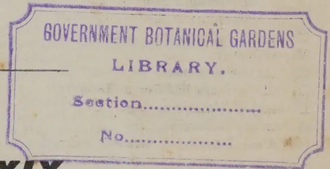

GOVERNMENT BOTANICAL GARDENS  
LIBRARY.  
Section.....  
No.....

**Vol. XXXIX.**

Containing Numbers I to VI: July to December, 1912.

---

A. M. & J. FERGUSON,

COLOMBO, CEYLON.

---

1913.

5------------------------------------------------

<!-- stage4: FAINT old-images-only -->

[Faint page: no legible print of its own could be verified; text withheld (stage 4 review list)]

6------------------------------------------------

# INDEX.

<table border="0" style="width: 100%; border-collapse: collapse;">
<thead>
<tr>
<th style="width: 50%;"></th>
<th style="width: 25%; text-align: right;">PAGE.</th>
<th style="width: 25%;"></th>
<th style="width: 25%; text-align: right;">PAGE.</th>
</tr>
</thead>
<tbody>
<tr>
<td colspan="4" style="text-align: center;"><b>A.</b></td>
</tr>
<tr>
<td>Aeration of Soil and Plant Growth ...</td>
<td style="text-align: right;">447</td>
<td>Borneo Rubber ...</td>
<td style="text-align: right;">176</td>
</tr>
<tr>
<td>Agents in Agricultural Improvements, Local Bodies as ...</td>
<td style="text-align: right;">279</td>
<td>Braid Manufacturer's Profits ...</td>
<td style="text-align: right;">188</td>
</tr>
<tr>
<td>Agricultural and Industrial Show at Ellore ...</td>
<td style="text-align: right;">472</td>
<td>Branching of Rice ...</td>
<td style="text-align: right;">370</td>
</tr>
<tr>
<td>do College for the Tropics ...</td>
<td style="text-align: right;">277</td>
<td>Brazil, Planting in ...</td>
<td style="text-align: right;">171</td>
</tr>
<tr>
<td>do Colleges, Courses in ...</td>
<td style="text-align: right;">56</td>
<td>Breeding, Scientific ...</td>
<td style="text-align: right;">350</td>
</tr>
<tr>
<td>do Co-operation in England ...</td>
<td style="text-align: right;">436</td>
<td>British Association and Agriculture ...</td>
<td style="text-align: right;">357</td>
</tr>
<tr>
<td>do do in Great Britain, The Development of ...</td>
<td style="text-align: right;">386</td>
<td>do West Africa, Land Question in...</td>
<td style="text-align: right;">204</td>
</tr>
<tr>
<td>do Development in Kamerun ...</td>
<td style="text-align: right;">67</td>
<td>Broom Corn Fibre Industry ...</td>
<td style="text-align: right;">474</td>
</tr>
<tr>
<td>do Education in Madras ...</td>
<td style="text-align: right;">368</td>
<td>Buffalo Milk, Indian ...</td>
<td style="text-align: right;">353</td>
</tr>
<tr>
<td>do Exports from Zanzibar in 1910 ...</td>
<td style="text-align: right;">67</td>
<td>Bulletin of the Imperial Institute ...</td>
<td style="text-align: right;">203, 420</td>
</tr>
<tr>
<td>do Improvements, Local Bodies as Agents in ...</td>
<td style="text-align: right;">279</td>
<td>Burma Agricultural Department Report ...</td>
<td style="text-align: right;">437</td>
</tr>
<tr>
<td>do Improvements in Egypt, Cost of ...</td>
<td style="text-align: right;">377</td>
<td>do , Rubber in ...</td>
<td style="text-align: right;">340</td>
</tr>
<tr>
<td>do Instruction and Demon- strations ...</td>
<td style="text-align: right;">315</td>
<td>Burning Qualities of Maha-illuppalama Tobacco ...</td>
<td style="text-align: right;">288</td>
</tr>
<tr>
<td>do Progress in Uganda ...</td>
<td style="text-align: right;">300</td>
<td colspan="2" style="text-align: center;"><b>C.</b></td>
</tr>
<tr>
<td>do Reform, True Problem of Co-operation in ...</td>
<td style="text-align: right;">244</td>
<td>Cacao and New Methods of Curing, West African ...</td>
<td style="text-align: right;">276</td>
</tr>
<tr>
<td>Agriculture, Co-operation in ...</td>
<td style="text-align: right;">273</td>
<td>do , Nicaraguan, at Experiment Sta- tion, Peradeniya ...</td>
<td style="text-align: right;">193</td>
</tr>
<tr>
<td>do , Explosives in ...</td>
<td style="text-align: right;">169</td>
<td>Calf-Rearing Methods ...</td>
<td style="text-align: right;">287</td>
</tr>
<tr>
<td>do in China ...</td>
<td style="text-align: right;">180</td>
<td>Cambodia Cotton Experiments in Bombay Presidency ...</td>
<td style="text-align: right;">448</td>
</tr>
<tr>
<td>do in Dundee ...</td>
<td style="text-align: right;">394</td>
<td>Camphor from Dried Camphor Leaves...</td>
<td style="text-align: right;">302</td>
</tr>
<tr>
<td>do in Nyasaland ...</td>
<td style="text-align: right;">389</td>
<td>do Production, Growth of ...</td>
<td style="text-align: right;">79</td>
</tr>
<tr>
<td>do in Perak ...</td>
<td style="text-align: right;">256</td>
<td>Cape Gooseberry ...</td>
<td style="text-align: right;">208</td>
</tr>
<tr>
<td>do in Seychelles ...</td>
<td style="text-align: right;">397</td>
<td>Carbon, is Humus a Direct Source of, for the Higher Green Plants ...</td>
<td style="text-align: right;">56</td>
</tr>
<tr>
<td>do , Mechanical Traction in ...</td>
<td style="text-align: right;">416</td>
<td>Carting Manure, Cost of ...</td>
<td style="text-align: right;">371</td>
</tr>
<tr>
<td>do , Native ...</td>
<td style="text-align: right;">170</td>
<td>Catechism, A Rubber ...</td>
<td style="text-align: right;">1</td>
</tr>
<tr>
<td>do , Our New Director of ...</td>
<td style="text-align: right;">170</td>
<td>Ceara Rubber ...</td>
<td style="text-align: right;">198, 216, 442</td>
</tr>
<tr>
<td>do , Tropical College of ...</td>
<td style="text-align: right;">255</td>
<td>do do in South India ...</td>
<td style="text-align: right;">424</td>
</tr>
<tr>
<td>Algerian Vegetable Fibre ...</td>
<td style="text-align: right;">422</td>
<td>do do , New Disease of the, Tree ...</td>
<td style="text-align: right;">218</td>
</tr>
<tr>
<td>All-Ceylon Exhibition ...</td>
<td style="text-align: right;">89, 309, 381</td>
<td>do do Notes from South Coorg ...</td>
<td style="text-align: right;">92</td>
</tr>
<tr>
<td>America, Ceylon Products in ...</td>
<td style="text-align: right;">426</td>
<td>Ceylon Agricultural Society Meetings ...</td>
<td style="text-align: right;">289, 303</td>
</tr>
<tr>
<td>American Agronomist, Status and Future of ...</td>
<td style="text-align: right;">61</td>
<td>do do do Progress Report No. 60. ...</td>
<td style="text-align: right;">224</td>
</tr>
<tr>
<td>do Upland Cotton in Ceylon ...</td>
<td style="text-align: right;">466</td>
<td>do and Malaya, Coconut Planting in ...</td>
<td style="text-align: right;">75</td>
</tr>
<tr>
<td>Analysis, Practical Value of Soil ...</td>
<td style="text-align: right;">349</td>
<td>do , Electric Power in ...</td>
<td style="text-align: right;">252</td>
</tr>
<tr>
<td>Application of Manures in South India ...</td>
<td style="text-align: right;">438</td>
<td>do , First Indigo Factory in ...</td>
<td style="text-align: right;">18</td>
</tr>
<tr>
<td>Artificial Manure, A New ...</td>
<td style="text-align: right;">442</td>
<td>do Gooseberry (Illustrated) ...</td>
<td style="text-align: right;">430</td>
</tr>
<tr>
<td>do Rubbers ...</td>
<td style="text-align: right;">96, 189</td>
<td>do , Indigo from ...</td>
<td style="text-align: right;">177</td>
</tr>
<tr>
<td>Assam, Eri Silk in ...</td>
<td style="text-align: right;">183</td>
<td>do Mangoes ...</td>
<td style="text-align: right;">431</td>
</tr>
<tr>
<td>Avocado Pear, The ...</td>
<td style="text-align: right;">81</td>
<td>Ceylon's only Indigo Estate ...</td>
<td style="text-align: right;">73</td>
</tr>
<tr>
<td colspan="4" style="text-align: center;"><b>B.</b></td>
</tr>
<tr>
<td>Banana Failure, Colossal ...</td>
<td style="text-align: right;">339</td>
<td>do Palm Products ...</td>
<td style="text-align: right;">172</td>
</tr>
<tr>
<td>do Food Products Manufacture in Jamaica ...</td>
<td style="text-align: right;">423</td>
<td>Ceylon Products in America ...</td>
<td style="text-align: right;">426</td>
</tr>
<tr>
<td>Bananas as Food ...</td>
<td style="text-align: right;">206</td>
<td>do , Rubber News from ...</td>
<td style="text-align: right;">251</td>
</tr>
<tr>
<td>Bandaragama Garden, The ...</td>
<td style="text-align: right;">296</td>
<td>do , Tea Planting in ...</td>
<td style="text-align: right;">335</td>
</tr>
<tr>
<td>Bark Renewal Periods ...</td>
<td style="text-align: right;">191</td>
<td>Cherimoyer, The ...</td>
<td style="text-align: right;">175</td>
</tr>
<tr>
<td>Bee-keeping, Use of Queen Excluders in ...</td>
<td style="text-align: right;">360</td>
<td>China, Agriculture in ...</td>
<td style="text-align: right;">180</td>
</tr>
<tr>
<td>Bengal Rice ...</td>
<td style="text-align: right;">451</td>
<td>Chinese Cabbage ...</td>
<td style="text-align: right;">358</td>
</tr>
<tr>
<td>Beeswax from Esparto Grass ...</td>
<td style="text-align: right;">184</td>
<td>Cinchona ...</td>
<td style="text-align: right;">338</td>
</tr>
<tr>
<td>Beetles on Coconut Palms, Protection from ...</td>
<td style="text-align: right;">78</td>
<td>do and Quinine, Java ...</td>
<td style="text-align: right;">84</td>
</tr>
<tr>
<td>do in Tea Chest Wood ...</td>
<td style="text-align: right;">184</td>
<td>Cinnamon ...</td>
<td style="text-align: right;">338</td>
</tr>
<tr>
<td>Bignonia Magnifica (Illustrated) ...</td>
<td style="text-align: right;">449</td>
<td>Classification of Rice ...</td>
<td style="text-align: right;">361</td>
</tr>
<tr>
<td>Bombay Crop Areas ...</td>
<td style="text-align: right;">363, 378</td>
<td>Coagulation of Funtumia ...</td>
<td style="text-align: right;">469</td>
</tr>
<tr>
<td></td>
<td></td>
<td>Cocoa Valorization, Failure of ...</td>
<td style="text-align: right;">188</td>
</tr>
<tr>
<td></td>
<td></td>
<td>do Work in the West Indies ...</td>
<td style="text-align: right;">238</td>
</tr>
<tr>
<td></td>
<td></td>
<td>do World's Production of ...</td>
<td style="text-align: right;">415</td>
</tr>
<tr>
<td></td>
<td></td>
<td>Coconut Butter, Oleoline ...</td>
<td style="text-align: right;">76</td>
</tr>
<tr>
<td></td>
<td></td>
<td>do Cake, Feeding Milch Cows with ...</td>
<td style="text-align: right;">380</td>
</tr>
</tbody>
</table>

7------------------------------------------------

iiINDEX.

<table border="0">
<thead>
<tr>
<th></th>
<th style="text-align: right;">PAGE.</th>
<th></th>
<th style="text-align: right;">PAGE.</th>
</tr>
</thead>
<tbody>
<tr>
<td>Coconut Manuring</td>
<td style="text-align: right;">444</td>
<td>Destroying Flies</td>
<td style="text-align: right;">476</td>
</tr>
<tr>
<td>do Palm, The</td>
<td style="text-align: right;">209</td>
<td>Destruction of Lantana</td>
<td style="text-align: right;">451</td>
</tr>
<tr>
<td>do do Insects in Trinidad</td>
<td style="text-align: right;">446</td>
<td>Development of Agriculture in Kamerum</td>
<td style="text-align: right;">67</td>
</tr>
<tr>
<td>do Palms, Protection of, from Beetles</td>
<td style="text-align: right;">78</td>
<td>Dietic Value of Sugar</td>
<td style="text-align: right;">317</td>
</tr>
<tr>
<td>do Pavilion, The</td>
<td style="text-align: right;">353</td>
<td>Disease of Tea, a New</td>
<td style="text-align: right;">306</td>
</tr>
<tr>
<td>do Plantation, Laying out a</td>
<td style="text-align: right;">199</td>
<td>Diseases in F.M.S.</td>
<td style="text-align: right;">258</td>
</tr>
<tr>
<td>do Planting, Explosives in</td>
<td style="text-align: right;">169</td>
<td>do New, of the Ceara Rubber Tree</td>
<td style="text-align: right;">218</td>
</tr>
<tr>
<td>do do in Ceylon and Malaya</td>
<td style="text-align: right;">75</td>
<td>do of Paddy Plants at Agalawatte, Report on</td>
<td style="text-align: right;">195</td>
</tr>
<tr>
<td>do do in the West Indies</td>
<td style="text-align: right;">439</td>
<td>do of the Rubber Tree</td>
<td style="text-align: right;">321</td>
</tr>
<tr>
<td>do do , Irrigation in</td>
<td style="text-align: right;">174</td>
<td>Dressing of Pruning Cuts</td>
<td style="text-align: right;">433</td>
</tr>
<tr>
<td>do The, and its Commercial Uses</td>
<td style="text-align: right;">8</td>
<td>Dried Mango</td>
<td style="text-align: right;">304</td>
</tr>
<tr>
<td>do Warning, The</td>
<td style="text-align: right;">338</td>
<td>Drought, Rubber Trees in Times of</td>
<td style="text-align: right;">4</td>
</tr>
<tr>
<td>Coconuts, Cultivation of</td>
<td style="text-align: right;">412</td>
<td>Dry Farming, Origin of</td>
<td style="text-align: right;">474</td>
</tr>
<tr>
<td>do , Desiccated</td>
<td style="text-align: right;">172</td>
<td>Drying Houses for Copra</td>
<td style="text-align: right;">401</td>
</tr>
<tr>
<td>do in F. M. S.</td>
<td style="text-align: right;">263</td>
<td>Dumbara Agricultural Society</td>
<td style="text-align: right;">283</td>
</tr>
<tr>
<td>do , Inland Planting of</td>
<td style="text-align: right;">173, 241</td>
<td>do Tobacco</td>
<td style="text-align: right;">357</td>
</tr>
<tr>
<td>do Malaya</td>
<td style="text-align: right;">469</td>
<td>Durian, The</td>
<td style="text-align: right;">266</td>
</tr>
<tr>
<td>do Soya Beans as a Rival to</td>
<td style="text-align: right;">417</td>
<td>Dynamiting Trees and Stumps</td>
<td style="text-align: right;">37</td>
</tr>
<tr>
<td>do , The Consols of the East</td>
<td style="text-align: right;">245</td>
<td></td>
<td></td>
</tr>
<tr>
<td>Coffea Robusta</td>
<td style="text-align: right;">380</td>
<td></td>
<td></td>
</tr>
<tr>
<td>Coffee Cultivation, Abolition of Java Government</td>
<td style="text-align: right;">416</td>
<td style="text-align: center;"><b>E.</b></td>
<td></td>
</tr>
<tr>
<td>College of Agriculture, Tropical</td>
<td style="text-align: right;">255</td>
<td>Earth Shrinking, Is the</td>
<td style="text-align: right;">471</td>
</tr>
<tr>
<td>do of Tropical Agriculture</td>
<td style="text-align: right;">391</td>
<td>Earth's Surface, Land and Water on</td>
<td style="text-align: right;">451</td>
</tr>
<tr>
<td>Colossal Banana Failure</td>
<td style="text-align: right;">339</td>
<td>Eastern Rubber in U.S.A.</td>
<td style="text-align: right;">420</td>
</tr>
<tr>
<td>Commercial Synthetic Rubber</td>
<td style="text-align: right;">92</td>
<td>do do Plantations, Appointments to</td>
<td style="text-align: right;">264</td>
</tr>
<tr>
<td>do Uses of the Coconut</td>
<td style="text-align: right;">8</td>
<td>do Tapping Experiments</td>
<td style="text-align: right;">190</td>
</tr>
<tr>
<td>Committee of Agricultural Experiments, Peradeniya</td>
<td style="text-align: right;">453</td>
<td>Eden, the Garden of</td>
<td style="text-align: right;">434</td>
</tr>
<tr>
<td>Competitions in Essays on "Vegetarian Diet" and "Evils of Animal Diet"</td>
<td style="text-align: right;">285</td>
<td>Egg-Laying Competition</td>
<td style="text-align: right;">311</td>
</tr>
<tr>
<td>Conferences at New York</td>
<td style="text-align: right;">179</td>
<td>Egyptian Agricultural Improvement</td>
<td style="text-align: right;">377</td>
</tr>
<tr>
<td>Consular Reports on Rubber</td>
<td style="text-align: right;">344</td>
<td>do Date Palm Plantation, An</td>
<td style="text-align: right;">366</td>
</tr>
<tr>
<td>Coolies and their Diet</td>
<td style="text-align: right;">418</td>
<td>Electric Power in Ceylon</td>
<td style="text-align: right;">252</td>
</tr>
<tr>
<td>Co-operation in Agriculture</td>
<td style="text-align: right;">273</td>
<td>Eri Silk</td>
<td style="text-align: right;">376</td>
</tr>
<tr>
<td>do do in Great Britain</td>
<td style="text-align: right;">387</td>
<td>do in Assam</td>
<td style="text-align: right;">183</td>
</tr>
<tr>
<td>do in England, Agricultural</td>
<td style="text-align: right;">436</td>
<td>Ergite, the New Explosive</td>
<td style="text-align: right;">243</td>
</tr>
<tr>
<td>Coorg, Planting in</td>
<td style="text-align: right;">424</td>
<td>Essays, Two Important Competitive</td>
<td style="text-align: right;">285</td>
</tr>
<tr>
<td>Copra Drier, A Steam</td>
<td style="text-align: right;">77</td>
<td>Esparto Grass, Beeswax from</td>
<td style="text-align: right;">184</td>
</tr>
<tr>
<td>do , Manufacture of</td>
<td style="text-align: right;">401</td>
<td>Estates and Soil Exhaustion</td>
<td style="text-align: right;">178</td>
</tr>
<tr>
<td>Corn Growing, Fifty Years of</td>
<td style="text-align: right;">253</td>
<td>Estimates for Opening Coconut Estates</td>
<td style="text-align: right;">412</td>
</tr>
<tr>
<td>Cost of Rubber Production in Malaya</td>
<td style="text-align: right;">222</td>
<td>do , "Truth" on Rubber</td>
<td style="text-align: right;">414</td>
</tr>
<tr>
<td>Cotton</td>
<td style="text-align: right;">358</td>
<td>Eucalyptus Growing in Simla</td>
<td style="text-align: right;">418</td>
</tr>
<tr>
<td>do Congress in Egypt</td>
<td style="text-align: right;">464</td>
<td>Exhibiting, Hints on</td>
<td style="text-align: right;">39</td>
</tr>
<tr>
<td>do Cultivation in Morocco</td>
<td style="text-align: right;">263</td>
<td>Exhibition, All-Ceylon</td>
<td style="text-align: right;">89, 309, 381</td>
</tr>
<tr>
<td>do Experiments in Bombay Presidency, Cambodia</td>
<td style="text-align: right;">448</td>
<td>Experiment Station at Peradeniya</td>
<td style="text-align: right;">294</td>
</tr>
<tr>
<td>do Forecast, Bombay Presidency...</td>
<td style="text-align: right;">286</td>
<td>Explosive, A New</td>
<td style="text-align: right;">170</td>
</tr>
<tr>
<td>do do for 1912</td>
<td style="text-align: right;">302</td>
<td>Explosives in Agriculture</td>
<td style="text-align: right;">169</td>
</tr>
<tr>
<td>do for Dry Areas, Long Staple</td>
<td style="text-align: right;">282</td>
<td>do in Rubber Planting</td>
<td style="text-align: right;">169</td>
</tr>
<tr>
<td>do in Egypt</td>
<td style="text-align: right;">379</td>
<td>do in Tea Planting</td>
<td style="text-align: right;">169</td>
</tr>
<tr>
<td>do in India</td>
<td style="text-align: right;">239, 458</td>
<td>Exports of Brazil in 1911</td>
<td style="text-align: right;">365</td>
</tr>
<tr>
<td>do in Jamaica</td>
<td style="text-align: right;">217</td>
<td>do of Plants to South Africa</td>
<td style="text-align: right;">396</td>
</tr>
<tr>
<td>do in the Philippines</td>
<td style="text-align: right;">470</td>
<td></td>
<td></td>
</tr>
<tr>
<td>do Reports</td>
<td style="text-align: right;">440</td>
<td style="text-align: center;"><b>F.</b></td>
<td></td>
</tr>
<tr>
<td>Crop Areas in Bombay</td>
<td style="text-align: right;">363</td>
<td>Felling Trees with Dynamite</td>
<td style="text-align: right;">37</td>
</tr>
<tr>
<td>do do in Nyasaland Protectorate</td>
<td style="text-align: right;">378, 389</td>
<td>Fermentation of Cigar Tobacco</td>
<td style="text-align: right;">452</td>
</tr>
<tr>
<td>Cows and Kind Treatment</td>
<td style="text-align: right;">430</td>
<td>Fertilising of Rubber</td>
<td style="text-align: right;">341</td>
</tr>
<tr>
<td>Cuban Tobacco</td>
<td style="text-align: right;">215</td>
<td>Fertility of the Soil, The</td>
<td style="text-align: right;">318, 413</td>
</tr>
<tr>
<td>Cultivation of Bananas</td>
<td style="text-align: right;">369</td>
<td>Fibre, Algerian Vegetable</td>
<td style="text-align: right;">422</td>
</tr>
<tr>
<td>do of Lac in India</td>
<td style="text-align: right;">477</td>
<td>Fibres, Tropical Plant</td>
<td style="text-align: right;">219</td>
</tr>
<tr>
<td>Curing Cacao, New Methods of</td>
<td style="text-align: right;">276</td>
<td>Fifty Years of Corn-Growing</td>
<td style="text-align: right;">253</td>
</tr>
<tr>
<td>do Process, Wickham's</td>
<td style="text-align: right;">244</td>
<td>Flies, Poison for</td>
<td style="text-align: right;">336</td>
</tr>
<tr>
<td style="text-align: center;"><b>D.</b></td>
<td></td>
<td>Flue Curing Tobacco</td>
<td style="text-align: right;">295</td>
</tr>
<tr>
<td>Date Palm, Introduction into Ceylon of</td>
<td style="text-align: right;">387</td>
<td>F.M.S., Coconuts in</td>
<td style="text-align: right;">263</td>
</tr>
<tr>
<td>do Plantation, an Egyptian</td>
<td style="text-align: right;">366</td>
<td>do Pests and Diseases in</td>
<td style="text-align: right;">258</td>
</tr>
<tr>
<td>Desiccated Coconut</td>
<td style="text-align: right;">172</td>
<td>do Rubber in</td>
<td style="text-align: right;">181, 257</td>
</tr>
<tr>
<td></td>
<td></td>
<td>Fomes Semitos, Eradication of</td>
<td style="text-align: right;">344</td>
</tr>
<tr>
<td></td>
<td></td>
<td>Forest Trees, on the Production of Seed for</td>
<td style="text-align: right;">38</td>
</tr>
<tr>
<td></td>
<td></td>
<td>Forests and Rainfall</td>
<td style="text-align: right;">362</td>
</tr>
</tbody>
</table>

8------------------------------------------------

INDEX.iii

<table border="0">
<thead>
<tr>
<th></th>
<th style="text-align: right;">PAGE.</th>
<th></th>
<th style="text-align: right;">PAGE.</th>
</tr>
</thead>
<tbody>
<tr>
<td>Formalin as a Poison for Flies</td>
<td style="text-align: right;">336</td>
<td>Introduction of Date Palm into Ceylon</td>
<td style="text-align: right;">387</td>
</tr>
<tr>
<td>French Industry, Production of</td>
<td style="text-align: right;">416</td>
<td>do of Hevea <i>Braziliensis</i> into the East</td>
<td style="text-align: right;">267</td>
</tr>
<tr>
<td>Fruit Growing Industry</td>
<td style="text-align: right;">336</td>
<td>Irrigation in Coconut Planting</td>
<td style="text-align: right;">172</td>
</tr>
<tr>
<td>Funtumia, Coagulation of</td>
<td style="text-align: right;">469</td>
<td>Is the Earth Shrinking?</td>
<td style="text-align: right;">471</td>
</tr>
<tr>
<td>do, Rubber in Southern Nigeria</td>
<td style="text-align: right;">271</td>
<td></td>
<td></td>
</tr>
<tr>
<td>Future of Rubber</td>
<td style="text-align: right;">255</td>
<td></td>
<td></td>
</tr>
<tr>
<td>do of Rubber Prices</td>
<td style="text-align: right;">3</td>
<td></td>
<td></td>
</tr>
<tr>
<td>do of the American Agronomist</td>
<td style="text-align: right;">61</td>
<td></td>
<td></td>
</tr>
<tr>
<td></td>
<td></td>
<td></td>
<td></td>
</tr>
<tr>
<td style="text-align: center;"><b>G.</b></td>
<td></td>
<td style="text-align: center;"><b>J.</b></td>
<td></td>
</tr>
<tr>
<td>Garden of Eden, The</td>
<td style="text-align: right;">434</td>
<td>Japanese Tea Trade</td>
<td style="text-align: right;">87</td>
</tr>
<tr>
<td>Ginger, Cultivation and Preparation of</td>
<td style="text-align: right;">26</td>
<td>Java, Hevea in</td>
<td style="text-align: right;">5</td>
</tr>
<tr>
<td>Girth Measurements of Hevea</td>
<td style="text-align: right;">355</td>
<td>do, Pink Disease in</td>
<td style="text-align: right;">44</td>
</tr>
<tr>
<td>Gold Medal Cinnamon</td>
<td style="text-align: right;">283</td>
<td>Jute Crop of Assam, 1912</td>
<td style="text-align: right;">202</td>
</tr>
<tr>
<td>Gooseberry, Ceylon</td>
<td style="text-align: right;">430</td>
<td>do do of Bengal for 1912</td>
<td style="text-align: right;">383</td>
</tr>
<tr>
<td>Graphite Applied to Rubber</td>
<td style="text-align: right;">184</td>
<td></td>
<td></td>
</tr>
<tr>
<td>do in Germany and Spain</td>
<td style="text-align: right;">185</td>
<td></td>
<td></td>
</tr>
<tr>
<td>Green Tea</td>
<td style="text-align: right;">421</td>
<td></td>
<td></td>
</tr>
<tr>
<td>do do in Russia</td>
<td style="text-align: right;">192</td>
<td></td>
<td></td>
</tr>
<tr>
<td>Groundnut Crop in the Bombay Presidency</td>
<td style="text-align: right;">301</td>
<td></td>
<td></td>
</tr>
<tr>
<td>Ground-nuts Yields</td>
<td style="text-align: right;">459</td>
<td></td>
<td></td>
</tr>
<tr>
<td>Guano in Seychelles</td>
<td style="text-align: right;">344</td>
<td></td>
<td></td>
</tr>
<tr>
<td>Guinea Grass</td>
<td style="text-align: right;">208</td>
<td></td>
<td></td>
</tr>
<tr>
<td></td>
<td></td>
<td></td>
<td></td>
</tr>
<tr>
<td style="text-align: center;"><b>H.</b></td>
<td></td>
<td style="text-align: center;"><b>K.</b></td>
<td></td>
</tr>
<tr>
<td>Handling Tea in London</td>
<td style="text-align: right;">343</td>
<td>Kamerun, Development of Agriculture in</td>
<td style="text-align: right;">67</td>
</tr>
<tr>
<td>Hard Cured Para</td>
<td style="text-align: right;">345</td>
<td>Kapok Cotton</td>
<td style="text-align: right;">303</td>
</tr>
<tr>
<td>Henaratgoda, Rubber Tapping Experi- ments at</td>
<td style="text-align: right;">333</td>
<td>Kerosene and Mosquitoes</td>
<td style="text-align: right;">85</td>
</tr>
<tr>
<td><i>Hevea Brasiliensis</i> into the East, Introduc- tion of</td>
<td style="text-align: right;">267</td>
<td>Kind Treatment of Cows</td>
<td style="text-align: right;">430</td>
</tr>
<tr>
<td>Hevea Estates, Thinning out</td>
<td style="text-align: right;">226, 428</td>
<td></td>
<td></td>
</tr>
<tr>
<td>do Experiments at Henaratgoda</td>
<td style="text-align: right;">333</td>
<td></td>
<td></td>
</tr>
<tr>
<td>do, Girth Measurements of</td>
<td style="text-align: right;">355</td>
<td></td>
<td></td>
</tr>
<tr>
<td>do, Hard Cured Para</td>
<td style="text-align: right;">345</td>
<td></td>
<td></td>
</tr>
<tr>
<td>do in Java</td>
<td style="text-align: right;">5</td>
<td></td>
<td></td>
</tr>
<tr>
<td>do Problems</td>
<td style="text-align: right;">432</td>
<td></td>
<td></td>
</tr>
<tr>
<td>do, Rubber Growing as a Village Industry</td>
<td style="text-align: right;">356</td>
<td></td>
<td></td>
</tr>
<tr>
<td>do Seed</td>
<td style="text-align: right;">373</td>
<td></td>
<td></td>
</tr>
<tr>
<td>Hints on Exhibiting</td>
<td style="text-align: right;">39</td>
<td></td>
<td></td>
</tr>
<tr>
<td>Holland, Peasant Proprietorship in</td>
<td style="text-align: right;">459</td>
<td></td>
<td></td>
</tr>
<tr>
<td>Hollow Trees</td>
<td style="text-align: right;">351</td>
<td></td>
<td></td>
</tr>
<tr>
<td>Home Remedies for Live Stock</td>
<td style="text-align: right;">48</td>
<td></td>
<td></td>
</tr>
<tr>
<td>Hurricanes</td>
<td style="text-align: right;">314</td>
<td></td>
<td></td>
</tr>
<tr>
<td></td>
<td></td>
<td></td>
<td></td>
</tr>
<tr>
<td style="text-align: center;"><b>I.</b></td>
<td></td>
<td style="text-align: center;"><b>L.</b></td>
<td></td>
</tr>
<tr>
<td>Imperial Biological Agricultural Insti- tute at Amani, German East Africa</td>
<td style="text-align: right;">68</td>
<td>Lac Cultivation in Ceylon</td>
<td style="text-align: right;">379</td>
</tr>
<tr>
<td>do Institute Bulletin</td>
<td style="text-align: right;">203, 420</td>
<td>Lagos Estate, Indigo Manufacture</td>
<td style="text-align: right;">20</td>
</tr>
<tr>
<td>do do, Work for 1911</td>
<td style="text-align: right;">462</td>
<td>Lalang, Eradication of</td>
<td style="text-align: right;">243</td>
</tr>
<tr>
<td>Indigo and Rubber</td>
<td style="text-align: right;">177</td>
<td>Land and Water on the Earth's Surface</td>
<td style="text-align: right;">451</td>
</tr>
<tr>
<td>do Estate, Ceylon's only</td>
<td style="text-align: right;">73</td>
<td>do Question in British West Africa</td>
<td style="text-align: right;">204</td>
</tr>
<tr>
<td>do do, Visit to Ceylon's only</td>
<td style="text-align: right;">73</td>
<td>Language of the Air</td>
<td style="text-align: right;">187</td>
</tr>
<tr>
<td>do Factory in Ceylon, First</td>
<td style="text-align: right;">18</td>
<td>Lantana, Destruction of</td>
<td style="text-align: right;">451</td>
</tr>
<tr>
<td>do do, First in Ceylon, A Visit to</td>
<td style="text-align: right;">18</td>
<td>Latex in Plants</td>
<td style="text-align: right;">440</td>
</tr>
<tr>
<td>do from Ceylon</td>
<td style="text-align: right;">177</td>
<td>Leaf Manure</td>
<td style="text-align: right;">79</td>
</tr>
<tr>
<td>do Manufacture at Lagos Estate, Kalutara, Actual Results</td>
<td style="text-align: right;">20</td>
<td>Lime for Tobacco Land</td>
<td style="text-align: right;">441</td>
</tr>
<tr>
<td>do Production in Ceylon</td>
<td style="text-align: right;">86</td>
<td>do Juice Industry of Montserrat</td>
<td style="text-align: right;">415</td>
</tr>
<tr>
<td>Influence of Geographical Conditions upon Japanese Agriculture</td>
<td style="text-align: right;">479</td>
<td>do, The</td>
<td style="text-align: right;">443</td>
</tr>
<tr>
<td>Inland Planting of Coconuts</td>
<td style="text-align: right;">174, 241</td>
<td>Live Stock, Treatment of Common Wounds of</td>
<td style="text-align: right;">398</td>
</tr>
<tr>
<td>Insect Pests in Zanzibar</td>
<td style="text-align: right;">197</td>
<td>Local Bodies as Agents in Agricultural Improvements</td>
<td style="text-align: right;">279</td>
</tr>
<tr>
<td>Intensive Poultry Farming</td>
<td style="text-align: right;">464</td>
<td>Lyne, R. N.</td>
<td style="text-align: right;">170</td>
</tr>
<tr>
<td>International Association of Tropical Agriculture and Colonial Development</td>
<td style="text-align: right;">316</td>
<td></td>
<td></td>
</tr>
<tr>
<td></td>
<td></td>
<td></td>
<td></td>
</tr>
<tr>
<td></td>
<td></td>
<td style="text-align: center;"><b>M.</b></td>
<td></td>
</tr>
<tr>
<td></td>
<td></td>
<td>Macassar Oil</td>
<td style="text-align: right;">194</td>
</tr>
<tr>
<td></td>
<td></td>
<td>Machine, A New Rice Reaping</td>
<td style="text-align: right;">180</td>
</tr>
<tr>
<td></td>
<td></td>
<td>Maize</td>
<td style="text-align: right;">305</td>
</tr>
<tr>
<td></td>
<td></td>
<td>do in Australia</td>
<td style="text-align: right;">462</td>
</tr>
<tr>
<td></td>
<td></td>
<td>do, The Culture of</td>
<td style="text-align: right;">25</td>
</tr>
<tr>
<td></td>
<td></td>
<td>Malaya, Coconut Planting in Ceylon and Management of Uganda Plantations</td>
<td style="text-align: right;">75 408</td>
</tr>
<tr>
<td></td>
<td></td>
<td>Mangifera <i>Verticillata</i></td>
<td style="text-align: right;">372</td>
</tr>
<tr>
<td></td>
<td></td>
<td>Mango, A Nearly Seedless</td>
<td style="text-align: right;">407</td>
</tr>
<tr>
<td></td>
<td></td>
<td>do, Canning</td>
<td style="text-align: right;">80</td>
</tr>
<tr>
<td></td>
<td></td>
<td>do, Ceylon</td>
<td style="text-align: right;">431</td>
</tr>
<tr>
<td></td>
<td></td>
<td>do, Dried</td>
<td style="text-align: right;">304</td>
</tr>
<tr>
<td></td>
<td></td>
<td>Mangrove Tannin</td>
<td style="text-align: right;">427</td>
</tr>
<tr>
<td></td>
<td></td>
<td>Manure, Cost of Carting</td>
<td style="text-align: right;">371</td>
</tr>
<tr>
<td></td>
<td></td>
<td>Manures, Sterilization of</td>
<td style="text-align: right;">419</td>
</tr>
<tr>
<td></td>
<td></td>
<td>Manuring, and New Artificial</td>
<td style="text-align: right;">442</td>
</tr>
<tr>
<td></td>
<td></td>
<td>do Coconuts</td>
<td style="text-align: right;">444</td>
</tr>
<tr>
<td></td>
<td></td>
<td>Measurement of Hevea, Girth</td>
<td style="text-align: right;">355</td>
</tr>
<tr>
<td></td>
<td></td>
<td>Mechanical Traction in Agriculture</td>
<td style="text-align: right;">416</td>
</tr>
<tr>
<td></td>
<td></td>
<td>Mesopotamia Irrigation Works</td>
<td style="text-align: right;">445</td>
</tr>
<tr>
<td></td>
<td></td>
<td>Mexican Cotton Boll-Weevil</td>
<td style="text-align: right;">470</td>
</tr>
<tr>
<td></td>
<td></td>
<td>Milch Cows, Feeding of Coconut Cakes to</td>
<td style="text-align: right;">380</td>
</tr>
<tr>
<td></td>
<td></td>
<td>Milk of Indian Buffaloes</td>
<td style="text-align: right;">353</td>
</tr>
<tr>
<td></td>
<td></td>
<td>do Yields</td>
<td style="text-align: right;">384</td>
</tr>
<tr>
<td></td>
<td></td>
<td>Million Acres of Plantation Rubber</td>
<td style="text-align: right;">7</td>
</tr>
<tr>
<td></td>
<td></td>
<td>Mind, The Prepared</td>
<td style="text-align: right;">270</td>
</tr>
<tr>
<td></td>
<td></td>
<td>Mindanao, Growing Rubber in</td>
<td style="text-align: right;">414</td>
</tr>
<tr>
<td></td>
<td></td>
<td>do Tapping in</td>
<td style="text-align: right;">187</td>
</tr>
<tr>
<td></td>
<td></td>
<td>Mocha Rubber Smoking Apparatus</td>
<td style="text-align: right;">177</td>
</tr>
<tr>
<td></td>
<td></td>
<td>Monazite in Travancore</td>
<td style="text-align: right;">418</td>
</tr>
</tbody>
</table>

9------------------------------------------------

ivINDEX.

<table border="0">
<thead>
<tr>
<th></th>
<th style="text-align: right;">PAGE.</th>
<th></th>
<th style="text-align: right;">PAGE.</th>
</tr>
</thead>
<tbody>
<tr>
<td>Moon and the Weather</td>
<td style="text-align: right;">... 475</td>
<td>Presentations to Peradeniya</td>
<td style="text-align: right;">... 360</td>
</tr>
<tr>
<td>Morocco, Cotton Cultivation in</td>
<td style="text-align: right;">... 263</td>
<td>Prices, Rubber, the Future of</td>
<td style="text-align: right;">... 3</td>
</tr>
<tr>
<td>Mosquitoes and Kerosene</td>
<td style="text-align: right;">... 85</td>
<td>Problems of Hevea</td>
<td style="text-align: right;">... 432</td>
</tr>
<tr>
<td colspan="4" style="text-align: center;">
</td>
</tr>
<tr>
<td colspan="4" style="text-align: center;"><b>N.</b></td>
</tr>
<tr>
<td>Native Agriculture</td>
<td style="text-align: right;">... 170</td>
<td>Production of Seed for Forest Trees</td>
<td style="text-align: right;">... 38</td>
</tr>
<tr>
<td>New Tapping Knife, Mr. Wickham's</td>
<td style="text-align: right;">... 83</td>
<td>do of Sulphate of Ammonia</td>
<td style="text-align: right;">... 385</td>
</tr>
<tr>
<td>do York Rubber Exhibition</td>
<td style="text-align: right;">... 388</td>
<td>do of French Industry</td>
<td style="text-align: right;">... 416</td>
</tr>
<tr>
<td>Nicaraguan or Panama Cacao at Peradeniya Experiment Station</td>
<td style="text-align: right;">... 193</td>
<td>Pruning Cuts, Dressing of</td>
<td style="text-align: right;">... 433</td>
</tr>
<tr>
<td>Nitrate of Soda for Rubber</td>
<td style="text-align: right;">... 341</td>
<td colspan="2" style="text-align: center;">
</td>
</tr>
<tr>
<td>Nitrogen Fertiliser, A</td>
<td style="text-align: right;">86, 336</td>
<td colspan="2" style="text-align: center;"><b>Q.</b></td>
</tr>
<tr>
<td>do, The Direct Assimilation of Inorganic and Forms of. by Higher Plants</td>
<td style="text-align: right;">... 55</td>
<td>Queen Excluders in Bee-Keeping, Use of</td>
<td style="text-align: right;">360</td>
</tr>
<tr>
<td>Nyasaland, Agriculture in</td>
<td style="text-align: right;">... 389</td>
<td>Quinine and Cinchona, Java</td>
<td style="text-align: right;">... 84</td>
</tr>
<tr>
<td colspan="4" style="text-align: center;">
</td>
</tr>
<tr>
<td colspan="4" style="text-align: center;"><b>O.</b></td>
</tr>
<tr>
<td>Oleoline</td>
<td style="text-align: right;">... 76</td>
<td colspan="2" style="text-align: center;">
</td>
</tr>
<tr>
<td>Opening Rubber Estates</td>
<td style="text-align: right;">... 342</td>
<td colspan="2" style="text-align: center;"><b>R.</b></td>
</tr>
<tr>
<td>Ostrich Farming</td>
<td style="text-align: right;">... 359</td>
<td>Rabies Virus</td>
<td style="text-align: right;">... 315</td>
</tr>
<tr>
<td>do do at Coonamble</td>
<td style="text-align: right;">... 348</td>
<td>Rainfall and Forests</td>
<td style="text-align: right;">... 362</td>
</tr>
<tr>
<td>do do in Australia</td>
<td style="text-align: right;">... 304</td>
<td>do in Central Provinces, India</td>
<td style="text-align: right;">... 306</td>
</tr>
<tr>
<td>Oxalis Violacea, Report on</td>
<td style="text-align: right;">... 243</td>
<td>Rat Poisons</td>
<td style="text-align: right;">... 399</td>
</tr>
<tr>
<td colspan="4" style="text-align: center;">
</td>
</tr>
<tr>
<td colspan="4" style="text-align: center;"><b>P.</b></td>
</tr>
<tr>
<td>Paddy as a Village Industry</td>
<td style="text-align: right;">... 475</td>
<td>Remedies, Home, for Live Stock</td>
<td style="text-align: right;">... 48</td>
</tr>
<tr>
<td>do Cultivation in Ceylon during the 19th Century</td>
<td style="text-align: right;">21, 235</td>
<td>Rhodesia, Tobacco Industry in</td>
<td style="text-align: right;">... 264</td>
</tr>
<tr>
<td>do do Seed in</td>
<td style="text-align: right;">... 347</td>
<td>Rice, Classification of</td>
<td style="text-align: right;">... 361</td>
</tr>
<tr>
<td>do do Use of a Light Iron Plough in</td>
<td style="text-align: right;">... 393</td>
<td>do Crop Prospects, 1912-13</td>
<td style="text-align: right;">... 445</td>
</tr>
<tr>
<td>do Plant Disease at Agalawatte</td>
<td style="text-align: right;">... 195</td>
<td>do in the Philippines</td>
<td style="text-align: right;">... 470</td>
</tr>
<tr>
<td>do Transplanting</td>
<td style="text-align: right;">... 352</td>
<td>do (Paddy) Cultivation and Seed Selection</td>
<td style="text-align: right;">... 290</td>
</tr>
<tr>
<td>Palm Products, Ceylon's</td>
<td style="text-align: right;">... 172</td>
<td>do Reaping Machine, A New</td>
<td style="text-align: right;">... 180</td>
</tr>
<tr>
<td>do Sap Industry of the Philippines</td>
<td style="text-align: right;">... 88</td>
<td>do, Transplanting</td>
<td style="text-align: right;">... 352</td>
</tr>
<tr>
<td>Palmyra Palm and the Value of its Nuts</td>
<td style="text-align: right;">25</td>
<td>Root Disease in Hevea</td>
<td style="text-align: right;">... 399</td>
</tr>
<tr>
<td>Panama, Rubber Cultivation in</td>
<td style="text-align: right;">... 421</td>
<td>Rotation of Crops in Jaffna</td>
<td style="text-align: right;">... 463</td>
</tr>
<tr>
<td>Papaya or Papaw</td>
<td style="text-align: right;">... 264</td>
<td>Rothamsted, The Director of</td>
<td style="text-align: right;">... 221</td>
</tr>
<tr>
<td>do as a Digestive</td>
<td style="text-align: right;">... 83</td>
<td>Rubber and Indigo</td>
<td style="text-align: right;">... 177</td>
</tr>
<tr>
<td>do, Cultivation of the</td>
<td style="text-align: right;">... 174</td>
<td>do Catechism, A</td>
<td style="text-align: right;">... 1</td>
</tr>
<tr>
<td>Paper-Making in Burma</td>
<td style="text-align: right;">... 478</td>
<td>do Ceara</td>
<td style="text-align: right;">198, 216</td>
</tr>
<tr>
<td>Para as a Village Industry</td>
<td style="text-align: right;">... 475</td>
<td>do do Tree, New Diseases of the</td>
<td style="text-align: right;">218</td>
</tr>
<tr>
<td>do, Hard Cured</td>
<td style="text-align: right;">... 345</td>
<td>do Curing Process, Wickham's</td>
<td style="text-align: right;">... 244</td>
</tr>
<tr>
<td>do Seed Supply</td>
<td style="text-align: right;">... 471</td>
<td>do Estates, Opening</td>
<td style="text-align: right;">... 342</td>
</tr>
<tr>
<td>Peasant Proprietorship in Holland</td>
<td style="text-align: right;">... 459</td>
<td>do Exhibition, New York</td>
<td style="text-align: right;">... 420</td>
</tr>
<tr>
<td>Peradeniya Experiment Station</td>
<td style="text-align: right;">... 298</td>
<td>do Growing as a Village Industry</td>
<td style="text-align: right;">... 356</td>
</tr>
<tr>
<td>do, Presentations to</td>
<td style="text-align: right;">... 360</td>
<td>do in Burma</td>
<td style="text-align: right;">... 340</td>
</tr>
<tr>
<td>Perak, Agriculture in</td>
<td style="text-align: right;">... 256</td>
<td>do in F. M. S.</td>
<td style="text-align: right;">257, 467</td>
</tr>
<tr>
<td>Peru, Rubber in</td>
<td style="text-align: right;">... 418</td>
<td>do in Java</td>
<td style="text-align: right;">... 344</td>
</tr>
<tr>
<td>Pests and Diseases in F. M. S.</td>
<td style="text-align: right;">... 258</td>
<td>do in Mindanao</td>
<td style="text-align: right;">... 414</td>
</tr>
<tr>
<td>Philippine Expositions</td>
<td style="text-align: right;">... 69</td>
<td>do in Panama</td>
<td style="text-align: right;">... 421</td>
</tr>
<tr>
<td>do, Notes from the</td>
<td style="text-align: right;">... 189</td>
<td>do in Peru</td>
<td style="text-align: right;">... 418</td>
</tr>
<tr>
<td>Phosphate Nutrition of Plants</td>
<td style="text-align: right;">... 54</td>
<td>do in Seychelles</td>
<td style="text-align: right;">... 342</td>
</tr>
<tr>
<td>Pink Disease in Java</td>
<td style="text-align: right;">... 44</td>
<td>do in Sumatra</td>
<td style="text-align: right;">... 344</td>
</tr>
<tr>
<td>Plantation Rubber, a Million Acres of</td>
<td style="text-align: right;">... 7</td>
<td>do in Trinidad</td>
<td style="text-align: right;">... 307</td>
</tr>
<tr>
<td>do do Estimates</td>
<td style="text-align: right;">... 71</td>
<td>do Latices, Dr. Schidrowitz</td>
<td style="text-align: right;">... 299</td>
</tr>
<tr>
<td>do do Smoke Curing for</td>
<td style="text-align: right;">... 177</td>
<td>do Plantation, Million Acres of</td>
<td style="text-align: right;">... 7</td>
</tr>
<tr>
<td>Plantations, Appointments to Eastern</td>
<td style="text-align: right;">... 264</td>
<td>do Plantations, Appointment to Eastern</td>
<td style="text-align: right;">... 264</td>
</tr>
<tr>
<td>Planting in Coorg</td>
<td style="text-align: right;">... 424</td>
<td>do Prices, Future of</td>
<td style="text-align: right;">... 3</td>
</tr>
<tr>
<td>Plough in Paddy Cultivation, Use of a Light Iron</td>
<td style="text-align: right;">... 393</td>
<td>do Producing Plant, a New</td>
<td style="text-align: right;">... 383</td>
</tr>
<tr>
<td>Portuguese East Africa, Rubber in</td>
<td style="text-align: right;">... 86</td>
<td>do, Production in Malaya, Cost of</td>
<td style="text-align: right;">... 222</td>
</tr>
<tr>
<td>Potato-Drying in Germany</td>
<td style="text-align: right;">... 460</td>
<td>do, do and Consumption of</td>
<td style="text-align: right;">... 382</td>
</tr>
<tr>
<td>Poultry Farming, Intensive</td>
<td style="text-align: right;">... 464</td>
<td>do Root Disease in Hevea</td>
<td style="text-align: right;">... 399</td>
</tr>
<tr>
<td>do Notes</td>
<td style="text-align: right;">... 46, 201</td>
<td>do, Smoke Curing for Plantation</td>
<td style="text-align: right;">... 177</td>
</tr>
<tr>
<td>Practical Value of Soil Analysis</td>
<td style="text-align: right;">... 349</td>
<td>do Tapping Experiments, Henarategoda</td>
<td style="text-align: right;">... 333</td>
</tr>
<tr>
<td>Presentation of Exhibits at A.C.E. to Royal Botanic Gardens Museum</td>
<td style="text-align: right;">... 284</td>
<td>do Tree Diseases</td>
<td style="text-align: right;">... 321</td>
</tr>
<tr>
<td></td>
<td></td>
<td>do Trees in Time of Drought</td>
<td style="text-align: right;">... 4</td>
</tr>
<tr>
<td></td>
<td></td>
<td>Russia, Green Tea in</td>
<td style="text-align: right;">... 192</td>
</tr>
<tr>
<td></td>
<td></td>
<td>do, Tea Growing in</td>
<td style="text-align: right;">... 87</td>
</tr>
<tr>
<td colspan="4" style="text-align: center;">
</td>
</tr>
<tr>
<td colspan="4" style="text-align: center;"><b>S.</b></td>
</tr>
<tr>
<td>Sago Palm, The</td>
<td style="text-align: right;">221, 417</td>
<td></td>
<td></td>
</tr>
<tr>
<td>St. Vincent Botanic Station Report for 1910-1911</td>
<td style="text-align: right;">... 223</td>
<td></td>
<td></td>
</tr>
<tr>
<td>Sanguinary Insects of Zanzibar</td>
<td style="text-align: right;">... 198</td>
<td></td>
<td></td>
</tr>
<tr>
<td>Sapucaia Nut, The</td>
<td style="text-align: right;">... 343</td>
<td></td>
<td></td>
</tr>
</tbody>
</table>

10------------------------------------------------

INDEX.v.

<table border="0">
<thead>
<tr>
<th></th>
<th style="text-align: right;">PAGE.</th>
<th></th>
<th style="text-align: right;">PAGE.</th>
</tr>
</thead>
<tbody>
<tr>
<td>School Garden, The</td>
<td style="text-align: right;">... 197</td>
<td>The All-Ceylon Exhibition</td>
<td style="text-align: right;">... 309</td>
</tr>
<tr>
<td>Scientific Breeding</td>
<td style="text-align: right;">... 350</td>
<td>The Prepared Mind</td>
<td style="text-align: right;">... 270</td>
</tr>
<tr>
<td>Sea-fish, Rubber from</td>
<td style="text-align: right;">... 96</td>
<td>Thinning out Hevea Estates</td>
<td style="text-align: right;">326, 363, 428</td>
</tr>
<tr>
<td>Seagumite—Rubber Substitute</td>
<td style="text-align: right;">... 96</td>
<td>Tobacco</td>
<td style="text-align: right;">... 474</td>
</tr>
<tr>
<td>Seed, Cheap</td>
<td style="text-align: right;">... 375</td>
<td>do , Burning Qualities of Maha-</td>
<td></td>
</tr>
<tr>
<td>do , Hevea</td>
<td style="text-align: right;">... 373</td>
<td>Illuppalama</td>
<td style="text-align: right;">... 288</td>
</tr>
<tr>
<td>do in Paddy Cultivation</td>
<td style="text-align: right;">... 347</td>
<td>do , Cuban</td>
<td style="text-align: right;">... 215</td>
</tr>
<tr>
<td>do Selection in Paddy Cultivation</td>
<td style="text-align: right;">... 290</td>
<td>do , Fermentation of Ceylon</td>
<td style="text-align: right;">... 452</td>
</tr>
<tr>
<td>Seeds for Forest Trees, Production of</td>
<td style="text-align: right;">... 38</td>
<td>do , Flue Curing</td>
<td style="text-align: right;">... 295</td>
</tr>
<tr>
<td>Sesamum</td>
<td style="text-align: right;">... 447</td>
<td>do Industry in Rhodesia</td>
<td style="text-align: right;">... 264</td>
</tr>
<tr>
<td>do Crop in Bombay Presidency</td>
<td style="text-align: right;">... 312</td>
<td>do Land, Lime, for</td>
<td style="text-align: right;">... 441</td>
</tr>
<tr>
<td>Sewage—Sick Soils</td>
<td style="text-align: right;">... 460</td>
<td>do Planting in Ceylon</td>
<td style="text-align: right;">... 266</td>
</tr>
<tr>
<td>Seychelles, Guano in</td>
<td style="text-align: right;">... 344</td>
<td>do do in Dumbara</td>
<td style="text-align: right;">... 283</td>
</tr>
<tr>
<td>do , Vanilla Industry of</td>
<td style="text-align: right;">... 337</td>
<td>do do in Java</td>
<td style="text-align: right;">... 278</td>
</tr>
<tr>
<td>Shea Butter</td>
<td style="text-align: right;">... 352</td>
<td>do Reports</td>
<td style="text-align: right;">... 440</td>
</tr>
<tr>
<td>Silk Culture</td>
<td style="text-align: right;">... 465</td>
<td>Toddy Palm Tapping</td>
<td style="text-align: right;">... 392</td>
</tr>
<tr>
<td>do , World's Production in 1911 of</td>
<td style="text-align: right;">... 196</td>
<td>Transplanting Early Rice</td>
<td style="text-align: right;">... 352</td>
</tr>
<tr>
<td>Sisal Hemp</td>
<td style="text-align: right;">... 354</td>
<td>Treatment of Common Wounds in Live</td>
<td></td>
</tr>
<tr>
<td>Small Farming a Science</td>
<td style="text-align: right;">... 186</td>
<td>Stock</td>
<td style="text-align: right;">... 398</td>
</tr>
<tr>
<td>Smoke-Curing for Plantation Rubber</td>
<td style="text-align: right;">... 177</td>
<td>Trees, Useful</td>
<td style="text-align: right;">... 332</td>
</tr>
<tr>
<td>Soil Aeration on Plant Growth, Effect of</td>
<td style="text-align: right;">... 447</td>
<td>Trinidad, Coconut Palm Insects in</td>
<td style="text-align: right;">... 446</td>
</tr>
<tr>
<td>do Analysis, Practical Value of</td>
<td style="text-align: right;">... 349</td>
<td>Tropical Agriculture, A College of</td>
<td style="text-align: right;">... 391</td>
</tr>
<tr>
<td>do Exhaustion and Tea Estates</td>
<td style="text-align: right;">... 178</td>
<td>do College of Agriculture</td>
<td style="text-align: right;">... 255</td>
</tr>
<tr>
<td>do Fertility, Question of</td>
<td style="text-align: right;">... 413</td>
<td>do Plant Fibres</td>
<td style="text-align: right;">... 219</td>
</tr>
<tr>
<td>Soils in Relation to Geology and Climate</td>
<td style="text-align: right;">... 364</td>
<td>"Truth" on Rubber Estimates</td>
<td style="text-align: right;">... 414</td>
</tr>
<tr>
<td>Solomon's Judgment, A</td>
<td style="text-align: right;">... 313</td>
<td>Two Important Competitive Essays</td>
<td style="text-align: right;">... 285</td>
</tr>
<tr>
<td>Some Uses for Sugar</td>
<td style="text-align: right;">... 472</td>
<td>Typhoons</td>
<td style="text-align: right;">... 446</td>
</tr>
<tr>
<td>South Coorg, Ceara Rubber Notes from</td>
<td style="text-align: right;">... 92</td>
<td></td>
<td></td>
</tr>
<tr>
<td>do , Rubber in</td>
<td style="text-align: right;">... 188</td>
<td></td>
<td></td>
</tr>
<tr>
<td>Soy Beans</td>
<td style="text-align: right;">... 461</td>
<td></td>
<td></td>
</tr>
<tr>
<td>Soya Beans as a Possible Rival to Coconuts</td>
<td style="text-align: right;">... 417</td>
<td></td>
<td></td>
</tr>
<tr>
<td>Spanish Customs Duties</td>
<td style="text-align: right;">... 256</td>
<td></td>
<td></td>
</tr>
<tr>
<td>Status of the American Agronomist</td>
<td style="text-align: right;">... 61</td>
<td></td>
<td></td>
</tr>
<tr>
<td>Steam Copra Drier</td>
<td style="text-align: right;">... 77</td>
<td></td>
<td></td>
</tr>
<tr>
<td>Sterilization of Manures</td>
<td style="text-align: right;">... 419</td>
<td></td>
<td></td>
</tr>
<tr>
<td>Stump Blowing with Dynamite</td>
<td style="text-align: right;">... 37</td>
<td></td>
<td></td>
</tr>
<tr>
<td>Sugar Convention</td>
<td style="text-align: right;">... 308</td>
<td></td>
<td></td>
</tr>
<tr>
<td>do , Dietic Value of</td>
<td style="text-align: right;">... 317</td>
<td></td>
<td></td>
</tr>
<tr>
<td>Sugarcane Crop Forest, Bombay Presidency</td>
<td style="text-align: right;">... 287</td>
<td></td>
<td></td>
</tr>
<tr>
<td>do Crop of the Punjab</td>
<td style="text-align: right;">... 308</td>
<td></td>
<td></td>
</tr>
<tr>
<td>do in Assam, 1912-13</td>
<td style="text-align: right;">... 207</td>
<td></td>
<td></td>
</tr>
<tr>
<td>Sugar Statistics</td>
<td style="text-align: right;">... 461</td>
<td></td>
<td></td>
</tr>
<tr>
<td>Sulphate of Ammonia, Production of</td>
<td style="text-align: right;">... 385</td>
<td></td>
<td></td>
</tr>
<tr>
<td>Sumatra, Tea Growing in</td>
<td style="text-align: right;">... 96</td>
<td></td>
<td></td>
</tr>
<tr>
<td>Sweet Potatoes</td>
<td style="text-align: right;">... 450</td>
<td></td>
<td></td>
</tr>
<tr>
<td>Synthetic Rubber</td>
<td style="text-align: right;">... 92, 189</td>
<td></td>
<td></td>
</tr>
<tr>
<td>Synthetic Rubber, Dr. Strange's</td>
<td style="text-align: right;">... 217</td>
<td></td>
<td></td>
</tr>
<tr>
<td>do , Professor Perkin's</td>
<td></td>
<td></td>
<td></td>
</tr>
<tr>
<td>Discovery</td>
<td style="text-align: right;">... 92</td>
<td></td>
<td></td>
</tr>
<tr>
<td colspan="4" style="text-align: center;"><b>T.</b></td>
</tr>
<tr>
<td>Tannin from Mangrove, Manufacture of</td>
<td style="text-align: right;">... 427</td>
<td></td>
<td></td>
</tr>
<tr>
<td>Tapping and Bark Renewal Periods</td>
<td style="text-align: right;">... 191</td>
<td></td>
<td></td>
</tr>
<tr>
<td>do Experiments</td>
<td style="text-align: right;">... 190</td>
<td></td>
<td></td>
</tr>
<tr>
<td>do do at Henaratgoda</td>
<td style="text-align: right;">... 333</td>
<td></td>
<td></td>
</tr>
<tr>
<td>do in Mindanao</td>
<td style="text-align: right;">... 187</td>
<td></td>
<td></td>
</tr>
<tr>
<td>do Knife, Mr. Wickham's New</td>
<td style="text-align: right;">... 83</td>
<td></td>
<td></td>
</tr>
<tr>
<td>do , Wickham's Knife</td>
<td style="text-align: right;">... 252</td>
<td></td>
<td></td>
</tr>
<tr>
<td>do Toddy Palms</td>
<td style="text-align: right;">... 392</td>
<td></td>
<td></td>
</tr>
<tr>
<td>Tea—A Poison</td>
<td style="text-align: right;">... 244</td>
<td></td>
<td></td>
</tr>
<tr>
<td>do Chest—Wood Beetles</td>
<td style="text-align: right;">... 184</td>
<td></td>
<td></td>
</tr>
<tr>
<td>do Disease, A New</td>
<td style="text-align: right;">... 396</td>
<td></td>
<td></td>
</tr>
<tr>
<td>do Experiments in South India</td>
<td style="text-align: right;">... 424</td>
<td></td>
<td></td>
</tr>
<tr>
<td>do , Green</td>
<td style="text-align: right;">... 421</td>
<td></td>
<td></td>
</tr>
<tr>
<td>do in London, Handling</td>
<td style="text-align: right;">... 343</td>
<td></td>
<td></td>
</tr>
<tr>
<td>do Planter and Secrets yet to Learn...</td>
<td style="text-align: right;">... 184</td>
<td></td>
<td></td>
</tr>
<tr>
<td>do Planting in Ceylon</td>
<td style="text-align: right;">... 335</td>
<td></td>
<td></td>
</tr>
<tr>
<td>Telfairia Seed</td>
<td style="text-align: right;">... 278</td>
<td></td>
<td></td>
</tr>
<tr>
<td>Termites or White Ants</td>
<td style="text-align: right;">... 296</td>
<td></td>
<td></td>
</tr>
<tr>
<td colspan="4" style="text-align: center;"><b>U.</b></td>
</tr>
<tr>
<td></td>
<td></td>
<td>Uganda Plantations, Management of</td>
<td style="text-align: right;">... 408</td>
</tr>
<tr>
<td></td>
<td></td>
<td>do , Rubber in</td>
<td style="text-align: right;">... 188</td>
</tr>
<tr>
<td></td>
<td></td>
<td>University of Bristol and Agriculture</td>
<td style="text-align: right;">... 473</td>
</tr>
<tr>
<td></td>
<td></td>
<td>Useful Trees</td>
<td style="text-align: right;">... 332</td>
</tr>
<tr>
<td colspan="4" style="text-align: center;"><b>V.</b></td>
</tr>
<tr>
<td></td>
<td></td>
<td>Vanilla Crops, World's</td>
<td style="text-align: right;">... 184</td>
</tr>
<tr>
<td></td>
<td></td>
<td>do Industry of the Seychelles</td>
<td style="text-align: right;">... 337</td>
</tr>
<tr>
<td></td>
<td></td>
<td>do News</td>
<td style="text-align: right;">... 312</td>
</tr>
<tr>
<td></td>
<td></td>
<td>Vegetable Butter</td>
<td style="text-align: right;">... 343</td>
</tr>
<tr>
<td></td>
<td></td>
<td>do Fibre, Algerian</td>
<td style="text-align: right;">... 422</td>
</tr>
<tr>
<td></td>
<td></td>
<td>Veterinary Toxicology</td>
<td style="text-align: right;">... 463</td>
</tr>
<tr>
<td></td>
<td></td>
<td><i>Victoria Regia</i> on the Amazon</td>
<td style="text-align: right;">... 409</td>
</tr>
<tr>
<td></td>
<td></td>
<td>Village Industries, Paddy and Para</td>
<td style="text-align: right;">... 425</td>
</tr>
<tr>
<td></td>
<td></td>
<td>Visit to First Indigo Factory in Ceylon</td>
<td style="text-align: right;">... 18</td>
</tr>
<tr>
<td colspan="4" style="text-align: center;"><b>W.</b></td>
</tr>
<tr>
<td></td>
<td></td>
<td>Water and Land on the Earth's Surface</td>
<td style="text-align: right;">... 451</td>
</tr>
<tr>
<td></td>
<td></td>
<td>do Lily of Brazil</td>
<td style="text-align: right;">... 409</td>
</tr>
<tr>
<td></td>
<td></td>
<td>Well Irrigation</td>
<td style="text-align: right;">... 297</td>
</tr>
<tr>
<td></td>
<td></td>
<td>White Ants or Termites</td>
<td style="text-align: right;">... 296</td>
</tr>
<tr>
<td></td>
<td></td>
<td>Wickham's New Tapping Knife</td>
<td style="text-align: right;">... 83</td>
</tr>
<tr>
<td></td>
<td></td>
<td>do Rubber Curing Process</td>
<td style="text-align: right;">... 244</td>
</tr>
<tr>
<td></td>
<td></td>
<td>do do Smoking Apparatus</td>
<td style="text-align: right;">... 177</td>
</tr>
<tr>
<td></td>
<td></td>
<td>do Smoker, The (Illustrated)</td>
<td style="text-align: right;">... 464</td>
</tr>
<tr>
<td></td>
<td></td>
<td>do Tapping Knife</td>
<td style="text-align: right;">... 252</td>
</tr>
<tr>
<td></td>
<td></td>
<td>World's Production of Cocoa</td>
<td style="text-align: right;">... 415</td>
</tr>
<tr>
<td></td>
<td></td>
<td>Wounds of Live Stock, Treatment of</td>
<td style="text-align: right;">... 398</td>
</tr>
<tr>
<td colspan="4" style="text-align: center;"><b>Y.</b></td>
</tr>
<tr>
<td></td>
<td></td>
<td>Yams</td>
<td style="text-align: right;">... 32</td>
</tr>
<tr>
<td></td>
<td></td>
<td>Yield of Groundnuts</td>
<td style="text-align: right;">... 459</td>
</tr>
<tr>
<td colspan="4" style="text-align: center;"><b>Z.</b></td>
</tr>
<tr>
<td></td>
<td></td>
<td>Zanzibar, Agriculture Exports in 1910</td>
<td style="text-align: right;">... 67</td>
</tr>
<tr>
<td></td>
<td></td>
<td>do Insect Pests of</td>
<td style="text-align: right;">... 197</td>
</tr>
</tbody>
</table>

11------------------------------------------------

<!-- stage4: FAINT old-images-only -->

[Faint page: no legible print of its own could be verified; text withheld (stage 4 review list)]

This image is a scan of a blank page. The background is a uniform light beige or off-white color. There are several small, dark specks scattered across the surface, which appear to be dust or scanning artifacts. No text, lines, or other graphical elements are present.

12------------------------------------------------

## INDEX FOR JANUARY NUMBER.

<table style="width: 100%; border-collapse: collapse;">
<thead>
<tr>
<th style="text-align: left;"></th>
<th style="text-align: right;">PAGE.</th>
<th style="text-align: left;"></th>
<th style="text-align: right;">PAGE.</th>
</tr>
</thead>
<tbody>
<tr>
<td>Address to the Governor by the Board of Agriculture ... ..</td>
<td style="text-align: right;">42</td>
<td>Forests and Gardens in Mauritius ...</td>
<td style="text-align: right;">5</td>
</tr>
<tr>
<td>Agricultural Board's Address to the Governor ... ..</td>
<td style="text-align: right;">42</td>
<td>  Garden Path, The ... ..</td>
<td style="text-align: right;">23</td>
</tr>
<tr>
<td>Agricultural Colleges in Australia ...</td>
<td style="text-align: right;">31</td>
<td>Gardens and Forests in Mauritius ...</td>
<td style="text-align: right;">5</td>
</tr>
<tr>
<td>  " Department of Assam ...</td>
<td style="text-align: right;">37</td>
<td>Green Manuring in South India ...</td>
<td style="text-align: right;">8</td>
</tr>
<tr>
<td>  " Progress in Madras ...</td>
<td style="text-align: right;">29</td>
<td>Hevea Rubber in British Guiana ...</td>
<td style="text-align: right;">9</td>
</tr>
<tr>
<td>  " Work in Jamaica ...</td>
<td style="text-align: right;">7</td>
<td>History of Rubber ... ..</td>
<td style="text-align: right;">44</td>
</tr>
<tr>
<td>Agriculture ... ..</td>
<td style="text-align: right;">17</td>
<td>How to Grow Cucumbers ... ..</td>
<td style="text-align: right;">27</td>
</tr>
<tr>
<td>  " and Explosives ... ..</td>
<td style="text-align: right;">13</td>
<td>International Rubber Exposition, Third ...</td>
<td style="text-align: right;">10</td>
</tr>
<tr>
<td>  " at the British Association ...</td>
<td style="text-align: right;">26</td>
<td>  " Congress of Entomologists ...</td>
<td style="text-align: right;">28</td>
</tr>
<tr>
<td>  " in South Nigeria ... ..</td>
<td style="text-align: right;">6</td>
<td>Japanese Rubber Trade ... ..</td>
<td style="text-align: right;">48</td>
</tr>
<tr>
<td>Ants, How to Get Rid of ... ..</td>
<td style="text-align: right;">30</td>
<td>Jersey Cow, Remarkable Record of a ...</td>
<td style="text-align: right;">18</td>
</tr>
<tr>
<td>  " in an Apiary... ..</td>
<td style="text-align: right;">12</td>
<td>Lime in the Soil, Functions of ...</td>
<td style="text-align: right;">33</td>
</tr>
<tr>
<td>A New Fodder ... ..</td>
<td style="text-align: right;">48</td>
<td>Machinery Hand Labour, Rural ...</td>
<td style="text-align: right;">28</td>
</tr>
<tr>
<td>Assam Agricultural Department ...</td>
<td style="text-align: right;">37</td>
<td>Microbiology in New South Wales ...</td>
<td style="text-align: right;">37</td>
</tr>
<tr>
<td>Australian Agricultural Colleges ...</td>
<td style="text-align: right;">31</td>
<td>Motor Ploughs on Paddy Pa'ms ...</td>
<td style="text-align: right;">47</td>
</tr>
<tr>
<td>Banana Diseases in the West Indies ...</td>
<td style="text-align: right;">21</td>
<td>Mr. Francis Crosbie Roles, F.J.I., F.R.C.I. ...</td>
<td style="text-align: right;">55</td>
</tr>
<tr>
<td>Bananas, A Disease of ... ..</td>
<td style="text-align: right;">24</td>
<td>Mr. John Ferguson, C.M.G., F.R.C.I., Etc. ...</td>
<td style="text-align: right;">54</td>
</tr>
<tr>
<td>Bees, Peculiar Behaviour of a Swarm of ...</td>
<td style="text-align: right;">20</td>
<td>New South Wales Gardens ... ..</td>
<td style="text-align: right;">41</td>
</tr>
<tr>
<td>Berseem, or Egyptian Clover ... ..</td>
<td style="text-align: right;">36</td>
<td>Outturn of Raw Cotton in the Punjab ...</td>
<td style="text-align: right;">55</td>
</tr>
<tr>
<td>Board of Agriculture Address to the Governor ... ..</td>
<td style="text-align: right;">42</td>
<td>Peculiar Behaviour of a Swarm of Bees ...</td>
<td style="text-align: right;">20</td>
</tr>
<tr>
<td>Branching Habits of Egyptian Cotton ...</td>
<td style="text-align: right;">26</td>
<td>Pineapple Cultivation in Ceylon ...</td>
<td style="text-align: right;">35</td>
</tr>
<tr>
<td>Calabash Nutmeg ... ..</td>
<td style="text-align: right;">32</td>
<td>Plantation Rubber Cultivation Principles ...</td>
<td style="text-align: right;">25</td>
</tr>
<tr>
<td>Cause of Warts in Cattle ... ..</td>
<td style="text-align: right;">29</td>
<td>  " " Industry ... ..</td>
<td style="text-align: right;">39</td>
</tr>
<tr>
<td>Chilaw-Puttalam Agricultural Show ...</td>
<td style="text-align: right;">38</td>
<td>Poultry Farming in the Philippines ..</td>
<td style="text-align: right;">41</td>
</tr>
<tr>
<td>Coagulation of Ficus Elastica Latex ...</td>
<td style="text-align: right;">17</td>
<td>Pumpkin Beetle ... ..</td>
<td style="text-align: right;">25</td>
</tr>
<tr>
<td>Coconut Planters' Conference ...</td>
<td style="text-align: right;">1</td>
<td>Remarkable Record of a Jersey Cow ...</td>
<td style="text-align: right;">18</td>
</tr>
<tr>
<td>Committee on Rubber Nomenclature ...</td>
<td style="text-align: right;">21</td>
<td>Results of 7 Years' Cotton Experiments at Maha Illupalama ... ..</td>
<td style="text-align: right;">11</td>
</tr>
<tr>
<td>Conference of Coconut Planters ...</td>
<td style="text-align: right;">1</td>
<td>Roles, Mr. F. Crosbie ... ..</td>
<td style="text-align: right;">55</td>
</tr>
<tr>
<td>Congea Tomentosa... ..</td>
<td style="text-align: right;">20</td>
<td>Royal Botanic Gardens ... ..</td>
<td style="text-align: right;">18</td>
</tr>
<tr>
<td>Co-operation in Assam ... ..</td>
<td style="text-align: right;">30</td>
<td>Rubber Cultivation, Principles of Plantation ... ..</td>
<td style="text-align: right;">25</td>
</tr>
<tr>
<td>Co-operative Credit Societies in India ...</td>
<td style="text-align: right;">15</td>
<td>  " Exposition, 3rd International ...</td>
<td style="text-align: right;">10</td>
</tr>
<tr>
<td>Cotton at Maha-Illupalama, Results of 7 Years' Experiments ... ..</td>
<td style="text-align: right;">11</td>
<td>  " Hevea in British Guiana ...</td>
<td style="text-align: right;">9</td>
</tr>
<tr>
<td>Crop Prospects in Burma ... ..</td>
<td style="text-align: right;">27</td>
<td>  " History ... ..</td>
<td style="text-align: right;">44</td>
</tr>
<tr>
<td>Dry Farming Congress at Canada ...</td>
<td style="text-align: right;">24</td>
<td>  " Introduction of Hevea Braziliensis into Perak ... ..</td>
<td style="text-align: right;">22</td>
</tr>
<tr>
<td>Entomologists' International Congress ...</td>
<td style="text-align: right;">28</td>
<td>  " Trade in Japan ... ..</td>
<td style="text-align: right;">48</td>
</tr>
<tr>
<td>Eratum... ..</td>
<td style="text-align: right;">55</td>
<td>Rural Hand Labour and Machinery ...</td>
<td style="text-align: right;">28</td>
</tr>
<tr>
<td>Experiments with Mr. Beddewela's Termite Mixture ... ..</td>
<td style="text-align: right;">5</td>
<td>School Gardening ... ..</td>
<td style="text-align: right;">14</td>
</tr>
<tr>
<td>Explosives in Agriculture ... ..</td>
<td style="text-align: right;">13</td>
<td>Soil, Functions of Lime in the ...</td>
<td style="text-align: right;">33</td>
</tr>
<tr>
<td>Ferguson, C.M.G., Mr. John ... ..</td>
<td style="text-align: right;">54</td>
<td>Tannin ... ..</td>
<td style="text-align: right;">32</td>
</tr>
<tr>
<td>Fodder, A New ... ..</td>
<td style="text-align: right;">48</td>
<td>Vanilla Production and Consumption ...</td>
<td style="text-align: right;">19</td>
</tr>
<tr>
<td></td>
<td></td>
<td>Vegetable Oils ... ..</td>
<td style="text-align: right;">53</td>
</tr>
</tbody>
</table>

13------------------------------------------------

## SUPPLEMENT.

<table style="width: 100%; border-collapse: collapse;">
<thead>
<tr>
<th style="text-align: left;"></th>
<th style="text-align: right;">PAGE.</th>
<th style="text-align: left;"></th>
<th style="text-align: right;">PAGE.</th>
</tr>
</thead>
<tbody>
<tr>
<td>Africa, German East, Sisal Hemp in, ...</td>
<td style="text-align: right;">71</td>
<td>Natural and Synthetic Rubber ...</td>
<td style="text-align: right;">78</td>
</tr>
<tr>
<td>Agriculture, Tropical College of ...</td>
<td style="text-align: right;">75</td>
<td>New Rubber Producing Plant ...</td>
<td style="text-align: right;">79</td>
</tr>
<tr>
<td>Algeria, Soapnut Tree in ...</td>
<td style="text-align: right;">72</td>
<td>Nyasaland, Notes from ...</td>
<td style="text-align: right;">76</td>
</tr>
<tr>
<td>Amazon Trade, Future of ...</td>
<td style="text-align: right;">74</td>
<td>Paper from Bamboo ...</td>
<td style="text-align: right;">72</td>
</tr>
<tr>
<td>Bamboo, Paper from ...</td>
<td style="text-align: right;">72</td>
<td>„ New Sources of ...</td>
<td style="text-align: right;">78</td>
</tr>
<tr>
<td>Brazil, Ceara Rubber Disease in ...</td>
<td style="text-align: right;">60</td>
<td>Paper Umbrellas, Rubber Seed Oil for ...</td>
<td style="text-align: right;">80</td>
</tr>
<tr>
<td>Cattle, Feeding on Prickly Pear ...</td>
<td style="text-align: right;">71</td>
<td>Pests, Tea and Rubber, in Ceylon ...</td>
<td style="text-align: right;">61</td>
</tr>
<tr>
<td>„ Food, Rubber Seeds for ...</td>
<td style="text-align: right;">59</td>
<td>Prickly Pear, Feeding Cattle on ...</td>
<td style="text-align: right;">71</td>
</tr>
<tr>
<td>Ceara, New Disease Attacking ...</td>
<td style="text-align: right;">60</td>
<td>Rain Gauge, Measurements for a ...</td>
<td style="text-align: right;">80</td>
</tr>
<tr>
<td>Ceylon, Indigofera Arrecta in...</td>
<td style="text-align: right;">71</td>
<td>Rubber, Ceara, New Disease of, in Brazil ...</td>
<td style="text-align: right;">60</td>
</tr>
<tr>
<td>„ Rubber Disease in ...</td>
<td style="text-align: right;">61</td>
<td>„ Disease in Ceylon ...</td>
<td style="text-align: right;">61</td>
</tr>
<tr>
<td>„ „ Pests in ...</td>
<td style="text-align: right;">61</td>
<td>„ in the Amazon ...</td>
<td style="text-align: right;">74</td>
</tr>
<tr>
<td>„ Silk Industry ...</td>
<td style="text-align: right;">73</td>
<td>„ Market Report, 1912 ...</td>
<td style="text-align: right;">65</td>
</tr>
<tr>
<td>„ Tea Pests in ...</td>
<td style="text-align: right;">61</td>
<td>„ Natural and Synthetic ...</td>
<td style="text-align: right;">78</td>
</tr>
<tr>
<td>Chilaw, Tobacco Culture in ...</td>
<td style="text-align: right;">77</td>
<td>„ Packing ...</td>
<td style="text-align: right;">66</td>
</tr>
<tr>
<td>China Tea in Tibet... ..</td>
<td style="text-align: right;">77</td>
<td>„ Pests in Ceylon ...</td>
<td style="text-align: right;">61</td>
</tr>
<tr>
<td>Citronella Oil ... ..</td>
<td style="text-align: right;">78</td>
<td>„ Producing Plant, New ...</td>
<td style="text-align: right;">79</td>
</tr>
<tr>
<td>Coconut, Cult of the ...</td>
<td style="text-align: right;">77</td>
<td>„ Preparation of Plantation ...</td>
<td style="text-align: right;">80</td>
</tr>
<tr>
<td>„ Planting Notes ...</td>
<td style="text-align: right;">60</td>
<td>„ Sales in 1912 ...</td>
<td style="text-align: right;">59</td>
</tr>
<tr>
<td>„ Produce in 1912 ...</td>
<td style="text-align: right;">57</td>
<td>„ Seed Oil for Paper Umbrellas ...</td>
<td style="text-align: right;">80</td>
</tr>
<tr>
<td>College of Agriculture, Tropical ...</td>
<td style="text-align: right;">75</td>
<td>„ Seeds for Cattle Food ...</td>
<td style="text-align: right;">59</td>
</tr>
<tr>
<td>Copra Drying ... ..</td>
<td style="text-align: right;">60</td>
<td>„ Synthetic and Natural ...</td>
<td style="text-align: right;">78</td>
</tr>
<tr>
<td>Cult of the Coconut ...</td>
<td style="text-align: right;">77</td>
<td>„ Standardisation ...</td>
<td style="text-align: right;">65</td>
</tr>
<tr>
<td>Disease of Ceara Rubber in Brazil ...</td>
<td style="text-align: right;">60</td>
<td>„ Tapping, Vertical System of ...</td>
<td style="text-align: right;">76</td>
</tr>
<tr>
<td>Diseases of Rubber in Ceylon...</td>
<td style="text-align: right;">61</td>
<td>„ Trees, Electrical Tapping of ...</td>
<td style="text-align: right;">63</td>
</tr>
<tr>
<td>Dynamite, Holing by ...</td>
<td style="text-align: right;">79</td>
<td>Sisal Hemp in German East Africa ...</td>
<td style="text-align: right;">71</td>
</tr>
<tr>
<td>Electrical Tapping of Rubber Trees ...</td>
<td style="text-align: right;">63</td>
<td>Soap Nut Tree in Algeria ...</td>
<td style="text-align: right;">72</td>
</tr>
<tr>
<td>Food for Horses in Malaya and Ceylon ...</td>
<td style="text-align: right;">79</td>
<td>Synthetic and Natural Rubber ...</td>
<td style="text-align: right;">78</td>
</tr>
<tr>
<td>„ , Cattle, Prickly Pear as...</td>
<td style="text-align: right;">71</td>
<td>Tapping, Electrical, of Rubber ...</td>
<td style="text-align: right;">63</td>
</tr>
<tr>
<td>„ „ Rubber Seeds for ..</td>
<td style="text-align: right;">59</td>
<td>„ Vertical system of ...</td>
<td style="text-align: right;">76</td>
</tr>
<tr>
<td>Future of the Amazon Trade ...</td>
<td style="text-align: right;">73</td>
<td>Tea, China, in Tibet ...</td>
<td style="text-align: right;">77</td>
</tr>
<tr>
<td>German East Africa, Sisal Hemp in ...</td>
<td style="text-align: right;">71</td>
<td>„ Pests in Ceylon ..</td>
<td style="text-align: right;">61</td>
</tr>
<tr>
<td>Hemp, Sisal, in German East Africa ...</td>
<td style="text-align: right;">71</td>
<td>„ Sales in 1912 ...</td>
<td style="text-align: right;">58</td>
</tr>
<tr>
<td>Holing by Dynamite ...</td>
<td style="text-align: right;">79</td>
<td>Tibet, China Tea in ...</td>
<td style="text-align: right;">77</td>
</tr>
<tr>
<td>Horses, Food for, in Malaya and Ceylon ...</td>
<td style="text-align: right;">79</td>
<td>Tobacco Culture in Chilaw ...</td>
<td style="text-align: right;">77</td>
</tr>
<tr>
<td>India Rubber Market Reports, 1912 ...</td>
<td style="text-align: right;">65</td>
<td>Tropical College of Agriculture ...</td>
<td style="text-align: right;">75</td>
</tr>
<tr>
<td>„ „ Producing Plant, New ...</td>
<td style="text-align: right;">79</td>
<td>Vertical System of Tapping ...</td>
<td style="text-align: right;">76</td>
</tr>
<tr>
<td>Indigofera Arrecta in Ceylon...</td>
<td style="text-align: right;">71</td>
<td></td>
<td></td>
</tr>
</tbody>
</table>

14------------------------------------------------

GOVERNMENT BOTANICAL GARDENS  
LIBRARY.  
Section.....  
No.....

THE  
**TROPICAL AGRICULTURIST**  
AND  
MAGAZINE OF THE  
**CEYLON AGRICULTURAL SOCIETY.**

VOL. XL,

COLOMBO, JANUARY 15TH, 1913,

No. 1.

**CONFERENCE OF COCONUT PLANTERS.**

**ADDRESS BY THE DIRECTOR OF AGRICULTURE.**

At the invitation of the Director of Agriculture a number of gentlemen representative of the Coconut planting industry met at the Council Chamber at noon on December 16th to consider whether there are any questions connected with the Coconut planting industry that required investigation and if so the steps that should be taken to investigate them. The following were present:— Mr. R. N. Lyne, Director of Agriculture, in the chair; Mr. T. Petch (Government Mycologist), Sir Solomon Dias Bandranayaka, Mr. A. S. Long Price (Chairman of the Kurunegala Planters' Association), Mr. N. J. Martin (Chairman of the Chilaw District Planters' Association) Mr. Solomon Seneviratne, Mr. J. D. Vanderstraaten, (Negombo), Mr. V. H. Cooke (Chilaw), Mr. John H. Perera (Negombo), Mr. D. J. Subasinha (Galle), Mr. A. W. Beven (Marawila), Dr. H. M. Fernando, Mr. H. L. De Mel, (Secretary of the Low Country Products Association) Mr. W. E. Gratiaen, Mr. P. Daly, (Visitor from South India), and Mr. C. Direberg, (Secretary of the Ceylon Agricultural Society.)

In opening the proceedings MR. LYNE said:—I wish to thank those present for responding to my invitation to meet me here that day. I invited twenty-one representatives of the coconut planting industry and I am sorry to hear from a number of them that they are prevented from attending owing to indisposition and other causes. The first idea of calling the meeting arose from a conversation I had with a gentleman, a representative of the coconut planting industry, who pointed out to me that the Committee of Agricultural Experiments was chiefly concerned with the cultivation of Rubber; and that it devoted very little interest to coconut planting in the Lowcountry. Before proceeding any further I wish to say that the decision you arrive at today it will be my duty to communicate to the Committee of Agricultural Experiments appointed by His Excellency the Governor to discuss with the Department of Agriculture matters connected with agricultural experiments. I wish to explain why the Committee of Agricultural Experiments must, of necessity, concern itself very largely with the cultivation of Rubber.

15------------------------------------------------

2[JANUARY, 1913.

In the case of rubber we are at war with nature; and the whole rubber planting industry is nothing more or less than a huge experiment; and every single rubber plantation in Ceylon is an experiment, not only in the general sense that the whole industry is an experiment, but in a special sense that nearly every plantation is following its own methods of cultivation, tapping, coagulation and preparation. And we do not know where we were going to end up with this rubber yet; hence it is very necessary that we should proceed with great caution, so that if we found any sudden and unexpected catastrophe overtaking the industry we can by keeping our communications open beat retreat. We are now about to enter upon a special scheme of Rubber research.

I refer to this matter to explain why it is inevitable that the Committee of Agricultural Experiments which meets at Peradeniya should be very largely taken up with rubber investigation, but that we are not entirely absorbed with rubber this little bulletin No. 2 of Peradeniya, copies of which are laid on the table, will show you. We carry on coconut experiments at Peradeniya but I feel—and I think all the Committee and, no doubt, those present feel—that the coconut planting industry is not sufficiently identified with them, that we have only got a few trees; that they are old trees; that they are not in the coconut belt and that coconut planters do not know anything about them. Still if you look through that bulletin you will see that the Department is not entirely neglecting Low-country products.

With regard to coconuts we have not the same danger as in the case of rubber; but that we have a danger there is no doubt, and that danger is stagnation. The danger is that coconut planters have such good times with their trees that they will sit down and say: "my plantation is nice and clean; my trees are bearing well, yielding 60 nuts per tree per annum; prices are alright; I am making money; what is the use of bothering?" If we take that view then, of course, there is nothing more to say; but it is the duty of the Department of Agriculture to concern itself with all the planting industries of Ceylon, especially the great planting industries, and more especially with coconuts as I suppose, when all is said and done, the coconut industry is the greatest planting industry in Ceylon, and the greatest coconut planting industry in the world. So the danger, as I say, is in stagnation. But I do not want to do anything in the way of trials or investigations which has not the support of the coconut planters in which I include Landowners, Visiting Agents and Superintendents, a combination, of course, no part of which can be left out. We want the whole experience of the coconut planting industry to come up to our aid. I do not want to do anything about which I feel I have not the support of the coconut planters, because my idea is if we come to decide upon certain questions which require investigations and as to how they may best be carried out, to let the coconut planters feel that is their experiments we are carrying out, not ours. Perhaps the Department of Agriculture is better equipped for conducting experiments than private owners or companies because it is a part of the training of members of the staff to conduct experiments; to be very careful that everything is accurate and properly recorded, and our whole equipment enables us to conduct experiments better than a private institution can. But although we shall probably conduct the experiments, it will be the coconut planters' experiments that we carry out. We do not want to launch out into trials only to find out that the

16------------------------------------------------

JANUARY, 1913.]3

planters take no interest in them. This would be of no use to us. This is the point of view I take, and I hope you will all agree with me. The Department of Agriculture—this is the view I take—in connection with the various industries under investigation is doing the same at Peradeniya and carrying out experiments representative planters want us to carry out; and so I want your opinion and advice first of all as to the objects of these coconuts trials, the method to be adopted and the locality of the trial ground. In order to give you something to talk about I have put down on paper a few questions which, I think, may very likely be considered worthy of investigation. The first is, to begin at the beginning—the use of dynamite in planting up estates. This is quite a new plan of planting. I have no doubt all of you have read as to how it is being taken up in all parts of the world, in England and the Colonies. There are three ways in which dynamite is being used now. The first is in clearing land; the second in holing, and the third in cultivating. If we open a trial ground I think it will be useful if we cleared a portion by means of dynamite—cleared the stumps—and also did the holing by dynamite. In Peradeniya in planting up a small area with Para Rubber we holed with dynamite, and this will furnish us with some useful data by and by with regard to the use of dynamite in holing. We have returns as to the cost and it works out rather against dynamite; but an experiment on such a small scale cannot be accepted as final. This is one question which I think requires investigation; as to whether dynamite could be used in coconut planting. Another question is that of spacing. I have no doubt many of you present at this meeting, and many who are not here have very conclusive views on the distance coconut trees should be planted; but I think it is also very likely you do not all agree and, therefore, I think this would be a point at any rate, that we should investigate if we decide upon any trials at all. If I may be permitted to express my private opinion it is that I think coconuts—and not only coconuts but Rubber, and other products—are planted too closely in Ceylon. This is the impression I gained on my first visit to Ceylon. I went down the southern part of the Island, through Kalutara and was astonished to see the closeness in planting. This may be suited to Ceylon; but it is a question we may investigate. Then again, we should consider the methods of cultivation. At Chilaw the other day I had the opportunity of meeting some of the leading men there and discussing with them the question of cultivating coconuts and I explained the principles of dry-farming. And it seems to me that the principles of dry-farming are capable of being applied to coconut cultivation, especially in the dry parts of Ceylon; and, of course, the questions also have to be discussed of mulching, green manuring, clean weeding, grazing, catch crops, and all sorts of questions connected with cultivation upon which I do not suppose the coconut planting community in the Island are all agreed. If we have a proper trial ground where we know that records are accurately kept, I am quite certain the experiments would bring to light many points which, perhaps, are obscure now. There are questions connected with drying of coconuts to investigate whether or not it would be profitable to treat our copra as is done in Cochin. Some of you present at the meeting might remember that when we were talking about this matter in Chilaw the other day, the question was raised as to why Cochin copra fetched more than Ceylon copra, and I read an extract from a recent Report of the Curator, Seychelles, in which it was said that they only marketed finest grade copra, while the second grade was turned into

17------------------------------------------------

4[JANUARY, 1913.

oil. Well these are questions which may be well worth investigating. I think I have said enough to open this discussion. There are two distinctive questions which I want to put before you. The first is—and I will be very glad if when you begin to discuss the matter you will kindly keep them quite distinct—to consider whether there are any particularly important questions affecting coconut planting in Ceylon that require investigation? This is the first question; and when you have decided upon that we will go on to discuss the second question:—what steps should be taken to investigate them?

Dr. H. M. FERNANDO opened the discussion on welcoming the proposed action with a view to developing the coconut industry of the Island on scientific lines. He did not think the question of spacing required any investigation and said that 27 feet may be considered the happy medium for coconuts grown in the Negombo-Chilaw district. Green manuring was in his opinion a matter which called for further experiment since the results of the trials made at Peradeniya, which was not a typical coconut district, hardly applied to the low country. One of the most important points which needed study was how to combat droughts and whether the principles of dry farming could be successfully practised in coconut cultivation.

Mr. A. W. BEVEN gave his experience of the value of thorough cultivation in minimising the effect of drought.

Mr. H. L. DE MEL emphasised the importance of bringing coconut beetle pests and noxious weeds such as "illuk" grass under the control of plant pests Boards. Referring to yield he found 70 nuts per tree per annum a good average. He thought the direction in which they should work was to try and increase the thickness of the kernel or meat in the nut.

Mr. N. J. MARTIN who also pressed for enquiry into the question of how to mitigate the damage done by drought thought it necessary to experiment in copra-making with a view to turn out the best copra in the shortest time. From enquiries made while in London he was inclined to the belief that the term "Cochin Copra" was only a trade name and referred to a brand or quality of superior manufacture which probably included the best copra from Ceylon and that "Ceylon Copra" similarly referred to inferior stuff of which he was shown samples that were a disgrace to the Island and he believed never came from here. He thought that some action should be taken to clear up the misapprehension that existed.

Mr. J. D. VANDERSTRAATEN said that coconuts suffered also from an excess of rain and considered it advisable to enquire how the effect of too much moisture, such as existed in the Southern Province, could be counteracted. He inclined to the belief that rapid drying in copra-making results in loss of oil. He would wish to see statistics collected with reference to the effect of different manures, dry and wet seasons, &c, as these figures would be of immense value to the planter.

The CHAIRMAN summarised the discussion and drew up a list of subjects that should form the basis of future enquiry, and it was decided to approach Government with a proposal to establish an experiment station to serve as a trial ground for the solution of various coconut problems. It was further resolved to add the names of a number of representatives from the chief coconut districts to the Committee of Agricultural Experiments and to ask these gentlemen to serve as an advisory sub-Committee in connection with the proposed programme of work.

18------------------------------------------------

JANUARY, 1913.]5.

## NOTE ON EXPERIMENTS WITH MR. BEDDEWELA'S TERMITE MIXTURE.

Mr. Beddewela having invited a test of his Termite mixture, an appointment was made with him for the 11th October. On that date several termite nests (inhabited by *Termes redemanni* and *T. obscuriceps*) were opened under Mr. Beddewela's supervision, and treated with his mixture. This preparation is in the form of sawdust impregnated (according to the inventor) with certain medicinal oils. After the nests had been opened to a depth of a foot or eighteen inches, the mixture was sprinkled freely over the exposed surface. Some of the nests were immediately filled in with loose earth, others were left open. Mr. Beddewela's instructions were that the treated nests should be left open for several days (up to a week) before being filled in. Unfortunately, through some misunderstanding, the nests, which should have remained open were filled in and turfed over during the following two days. The inventor claims that the treatment will result in the death of the insects or—if not—in the discontinuance of their work at that spot. Most of the nests that were subjected to the experiment showed signs of renewed activity within a week of the date of treatment, and fresh earth-work is still noticeable after an interval of three months. But the colonies appear to be greatly weakened and the work is much less than might have been expected under normal conditions. If exposure for the specified time is an essential part of the treatment, there is a possibility that the practical recrudescence may be due to the too early closing of the treated nests. It will be necessary to repeat the experiment under more exact conditions and with proper controls.

ERNEST GREEN.

Govt. Entomologist,  
R. B. G.; Peradeniya, 28 Dec. 1912.

## FORESTS AND GARDENS, MAURITIUS.

The report on the Forests and Gardens Department of this Colony (P. Keenig, Director) is chiefly taken up with Forests, to which 10 out of 14 sections are devoted. Under the head of Revenue and Expenditure there is shown a deficit of something under Rs. 80,000. The revenue is made up of nearly Rs. 40,000 on account of major forest produce, and about Rs. 65,000 for minor produce.

The gardens referred to are the Royal Botanic Gardens, Pamplemousses, the Nursery Gardens, Curepipe, and the Réduit Grounds.

Nothing special is reported under Agriculture. Cotton, cocoa, nutmeg, coffee, arecanuts and Para rubber are referred to under Economics but not as commercial products.

Under Entomology *Phylalus Smithi*, a new beetle pest on sugar cane is reported on at length. In August 1911 an ordinance was passed to prevent the distribution of plant diseases, but the erection of a fumagatorium still awaits the creation of a Department of Agriculture.

19------------------------------------------------

6[JANUARY, 1913.

## AGRICULTURE IN SOUTH NIGERIA.

The report of the Director of Agriculture for 1911 has come to hand, and refers to many topics of interest.

The cotton growing experiments in the Eastern Province during 1910-11 gave unsatisfactory results owing to late sowing and bad season. The average yield of seed-cotton per acre was 326.2 lb., and the average yield of lint 102.3 lb. showing a percentage of 31.35 lint. Eight varieties were grown including two indigenous. The 1911-12 season gave better results the total yield of lint from 96 acres being 11,979 lb. an average of 123.7 lb. per acre. No less than 11 varieties (including Allen's long staple) were represented, but unfortunately figures are not given for each variety to enable a comparison of results to be made.

A ten-acre plot of American white maize planted in April and harvested in August gave about 900 lbs. seed per acre, while maize (Lagos white) planted for fodder in April and cut from May to July gave nearly 18½ tons of green fodder.

Two acres planted with Cassava yielded 13,680 lb. fresh roots which gave 4,594 lb. of peeled and dried roots per acre.

We read that at the Calabar Economic Gardens a new plot of cocoa was planted 15' x 15' with rain-trees (*Pithecolobium Saman*) and bananas as permanent and temporary shades respectively, an arrangement which hardly conforms to the ideas of local planters as to the requirements of the cocoa tree. Para rubber has also been employed as shade for cocoa.

The series of interesting experiments carried on at Onitsha Economic Garden proved that yams, sweet potatoes and cassava could be profitably grown. The return from an acre of West Indian yams (variety not named) was 3 tons 1 cwt., the cost of production £6. 9. 10, the value at local rates £11. 3. 9, and the profit £4. 13. 11. Sweet potatoes gave a yield per acre of about 7 tons 8 cwt. and showed a profit of about £2. Cassava yielded nearly 3 tons per acre and returned a profit of £5. 7. 11.

At Ebute Metta the tapping of 18-year-old Hevea on alternate dates on 62 occasions between April and November gave an average yield of over 1½ lb. dry rubber per tree. Twenty tapings resulted in the excision of only an inch of bark. Further tapping experiments of an interesting nature are reported on. A hundred five-year-old trees with an average girth of 22.82" at 3 ft. from the ground tapped 63 times between May and December (tapping being done every third day) gave a total yield in dry rubber of 141 lbs. or an average of 1 lb. 6 oz., which, considering the age of the trees, is considered most satisfactory.

We read that excluding the African oil palm, cocoa was the most important agricultural product exported during the year. The quantity exported was 50 % more than that of the previous year, and 168 % in excess of the average of the preceding five years. And yet it is stated that the industry is far from being in a satisfactory condition, while the produce is referred to as inferior owing to bad cultivation and faulty curing.

We do not find any reference to the coconut palm, though under thatching palms mention is made of the Nipa and Sago.

20------------------------------------------------

JANUARY, 1913.]7

## AGRIGULTURAL WORK IN JAMAICA.

---

### THE BANANA INDUSTRY.

The report of the Director for the year ended March 1912, deals with Public Gardens, Agricultural Experiments, Agricultural Education, Laboratory work, etc.

There is a more hopeful spirit among the sugar planters owing to higher prices being obtainable for sugar. The export during the year was 20,000 tons. Estates are introducing better machinery and a marked improvement is taking place in this direction in all sugar districts.

In spite of damage by drought, the increased price of coffee has resulted in a return of over £150,000—the bulk of this coming in from coffee grown by the peasantry.

Regarding Cocoa it would appear that the world's production is beginning to overtake the demand with the natural results of sluggish markets. The large increase in West African cocoa is the chief factor of this enhanced output, while in Jamaica itself the production has trebled during the past 10 years.

From Bananas there was a revenue of no less than one and a half million pounds sterling during 1911, the bulk of the produce going to the United States after the cessation of the Direct Line to England. The industry is growing steadily and it is expected that the revenue therefrom will soon reach two hundred thousand pounds. The Director credits its Banana industry with a civilising effect upon the people, and traces the progress in roads, bridges &c., to the prosperity of the trade in this product. "Nothing else," he says "can do what the banana industry has done and is doing for the country." The extreme watchfulness of the Government and the effective measures it has provided for the preservation of the crop from the ravages of diseases (referred to elsewhere) are therefore not surprising. Great importance is placed on the work of travelling inspectors in this connection.

Under coconuts reference is made to Budrot (which has been proclaimed under the Plant Disease law) and leaf disease (Pestalozzia) the prevalence of which is considered to be favoured by drought. The export of coconuts, which was reduced by the hurricane of 1902 from 25 to 4 millions per annum, is again recovering itself and has reached an output of over 20 millions. In this connection the Director says: "The future prospects for coconut products are excellent, and although this crop can hardly be regarded as the Consols of Jamaica (as in the East) owing to the occurrence of hurricanes, it is still one of our safest and most satisfactory staples, and should be extended everywhere," Banana Cultivation has enabled many coconut groves to be resuscitated and new ones planted under favourable conditions of cost.

It would appear that Castilloa rubber is better suited than any other species to the conditions prevailing in Jamaica.

21------------------------------------------------

8[JANUARY, 1913.

## GREEN MANURING IN SOUTH INDIA.

MR. W. H. HARRISON, Agricultural Chemist, has prepared a useful note on the Indigenous Manures of South India and their Application, from which we take over the following reference to Green Manures which should prove of local interest.

GREEN MANURES.—For purposes of Green manuring, cultivators use either the leaves and twigs of trees and shrubs found growing in waste places or in the forests, or special crops such as kolinji (*Tephrosia purpurea*), sunn hemp (*Crotalaria juncea*) or Daincha (*Sesbania aculeata*.) Of these the former naturally vary largely in composition according to their source and the kind of tree from which they are collected, and as many analyses have been made of them in various parts of India, it is unnecessary here to refer to them in detail. With regard to crops grown specially for green manures the following analyses showing the distribution of the nitrogen in the plant may be found interesting :—

<table border="0">
<thead>
<tr>
<th></th>
<th colspan="4">Sunn-hemp.</th>
<th colspan="4">Daincha.</th>
<th colspan="5">Indigo.</th>
</tr>
<tr>
<th></th>
<th>Leaves etc.</th>
<th>Stems.</th>
<th>Roots.</th>
<th>Whole Plant.</th>
<th>Leaves.</th>
<th>Stems.</th>
<th>Roots.</th>
<th>Whole Plant.</th>
<th>Leaves and Flowers.</th>
<th>Stems.</th>
<th>Roots.</th>
<th>Pods.</th>
<th>Whole Plant.</th>
</tr>
</thead>
<tbody>
<tr>
<td>Per cent of nitrogen.</td>
<td>1.34</td>
<td>.480</td>
<td>.315</td>
<td>.708</td>
<td>1.236</td>
<td>.444</td>
<td>.224</td>
<td>.619</td>
<td>.60</td>
<td>1.18</td>
<td>1.22</td>
<td>3.07</td>
<td>2.18</td>
</tr>
<tr>
<td>Distribution of nitrogen in plant in per cent.</td>
<td>54.7</td>
<td>41.8</td>
<td>3.5</td>
<td>100.0</td>
<td>52.7</td>
<td>41.7</td>
<td>5.6</td>
<td>100.0</td>
<td>35.2</td>
<td>29.1</td>
<td>3.7</td>
<td>32.0</td>
<td>100.0</td>
</tr>
</tbody>
</table>

The amount of nitrogen which can be introduced into a soil by means of green manuring is very large. For instance at the Central Farm Coimbatore, a crop of Daincha was obtained weighing 20,000 lbs. per acre and this quantity was found to contain approximately 125 lbs. of nitrogen.

The distribution of nitrogen in the plant is an important point to bear in mind. In certain parts of the Madras Presidency, as in the Kistna delta, it is the custom to raise a crop of sunn-hemp for fodder purposes immediately the paddy crop is taken off the ground, the sunn-hemp being cut off fairly short and the stubble ploughed in. Such a method of cultivation can hardly be said to amount to green-manuring for the greater part of the nitrogen in the crop is removed with the leaves and stems and only the small portion remaining in the roots and stubble is utilized. Where circumstances, however, are favourable, it is possible to cut the crop for fodder purposes and also to obtain sufficient secondary growth to give a heavy green-manuring. The latter method has been followed with success at Coimbatore.

22------------------------------------------------

JANUARY, 1913.]9

## HEVEA RUBBER IN BRITISH GUIANA.

### DETERIMENTAL EFFECT OF SHADE.

Those who plant wind-belts to protect their rubber, whether they be coconuts or other plants of economic value as a subsidiary industry, must see that there is sufficient space between the rubber and the other trees to avoid any chance of the latter over-shading the former. Experiments were recently carried out by the Botanical Department in British Guiana in order to prove how shade affected hevea and sapium trees (*S. Jenmani*), and the trials showed that both these rubbers require exposure to the sun and satisfactory drainage to enable them to flourish. Again, it has been found that where the rubber has been planted in belts three rods wide, cleared through the forest, only the trees in the middle of the belts have grown at all satisfactorily; wherever the trees have been at all shaded they have made very irregular and slow growth.

These experiments were carried out at the Issorora Station, in the North-West District. Here, as in former years, only Hevea and *S. Jenmani* have done well, the Castilloa and Funtumia trees are for all intents and purposes more or less failures, the Para especially comparing favourably with that reported from elsewhere. Again at Pln Christianburg on the Demerara River, out of twenty-six acres planted the Para trees alone showed promise of any future value, and it was noted that on the lighter soils where the imported Para is making good growth, the indigenous sapium is very unsatisfactory. This is similar to what we hear of the West Coast of Africa. There the Hevea is doing well, when properly looked after, and will soon replace the indigenous Funtumia, whose yield is so poor, or the vines, which are rapidly being exterminated by the natives.

At the Bonasika Sapium Reserve a very unfavourable feature gradually became noticeable during the repeated tapping periods. The rubber (sapium) yielded at the first tapping-period was of excellent quality and kept well; that yielded during the second and third tapping periods also at first appeared to be of satisfactory quality but in the course of a few weeks many of the biscuits developed a marked tendency to tackiness. This defect becomes more and more serious in the successive tapping-periods until in the cases of certain trees it became impossible to get the latex to coagulate as rubber, and it dried up to a viscous, sticky and apparently resinous mass, and the caoutchouc content decreased from 94.5 per cent. in the first and best sample to 81.3 per cent. in the resinous coagulated mass. This tendency to tackiness is far more marked in biscuits prepared from the latex than it is in carefully prepared self-coagulated "scrap." A few Para trees have been planted at Bonasika, and the desirability of clearing more of the land there and planting it with this variety is under consideration. At the Onderneeming School Farm, the total number of Hevea trees under cultivation on March 31st, 1911, was 525, the age of the oldest being 10 years; all the trees are making satisfactory growth.—*Tropical Life*, November 1912.

2

23------------------------------------------------

10[JANUARY, 1913.

## THE THIRD INTERNATIONAL RUBBER EXPOSITION.

### CEYLON'S EXHIBIT.

*The India Rubber World* which has an interesting account on the exhibit sent from Ceylon, says:—The Ceylon exhibit, which was replete with interest, was in charge of Mr. F. Crosbie Roles, whose previous experience at Chicago and St. Louis rendered him specially qualified for the office of Commissioner for Ceylon. He was assisted by Mr. E. B. Nathanielsz, a Sinhalese, who had come over with the exhibit. Rubber samples to the number of 64 were contributed by 32 estates, through 15 managing agents, distributed among the following classes: crepe, 2,192 pounds; scrap 800 pounds; sheet 150 pounds; smoked sheet 104½ pounds; worm etc. 129 pounds; total weight 3,375½ pounds. The samples showed a judicious selection of the qualities in which Ceylon is at its best. They included one sample of block worm rubber from the Gikiyanakande estate of G. H. Golledge, Neboda, which had been shown at the 1906 Ceylon Exhibition and which was still in unimpaired condition.

Another sample exhibited was one of 30 pounds from L. Bellerio specially prepared without acid by his new process. This sample was to be tried by a prominent American rubber company, after the close of the exposition.

In connection with the Ceylon exhibit there was distributed a "Ceylon Handbook," by R. H. Lock, M.A., SC.D., Acting Director of the Botanic Gardens, and C. O. Macadam. An interesting series of tables shows the growth of rubber cultivation in Ceylon from 1,750 acres in 1900 to 230,000 in 1912.

The plantings show since 1909, a yearly increase of about 7 to 10 per cent. In Mr. Crosbie Roles' opinion it would be safe to reckon on an augmentation of 10 per cent. a year in plantings. The percentage of increase in yield depends, he added, not upon the recent plantings, but on those of five years before. Hence the increase in planting from 40,000 acres in 1905 to 200,000 in 1906 finds an echo in the advance of yield from 3,194 tons in 1911 to the estimate of 6,000 tons for 1912.

Exports increased from 19 tons in 1903 to 3,194 tons in 1911; having been for the last three years: 1910, 1,600 tons; 1911, 3,194 tons and 1912 (estimated 6,000 tons).

Among the exhibits were 12 bottles of rubber latex from the Director of Agriculture, Peradeniya, as well as five trunks of rubber trees from the same source. Desiccated coconuts, plumbago, coconut oil, cardamoms and other Ceylon products were likewise shown. Though not directly connected with rubber, they represent the produce of the island, on which was built up the present development of the rubber trade. Ceylon kept well in line at the exposition, which marks another step in its commercial progress.

Mr. Crosbie Roles in conversation alluded to the advantage which American manufacturers had derived from being thus brought into touch with plantations, through the various Colombo managing agents, whose names appeared in conjunction with the plantation exhibits. The object of the exposition, in the dissemination of information about Ceylon, had been fully attained.

One of the Ceylon samples (of the Rosehaugh Estate) has been awarded the Silver Medal in the competition of the Rubber Growers' Association.

24------------------------------------------------

JANUARY, 1913.]11

## RESULTS OF 7 YEARS' COTTON EXPERIMENTS AT MAHA-ILUPPALAMA.

First sowing took place at the end of September or early in October 1904 on a block of 35 acres with Upland seed and sowings have been continued every year, that is to say for 7 years; the first sowing failed to germinate.

On November 11th this block was replanted with Egyptian cotton. It is stated that the crop bore well but there are no records of the yield.

On October 13th, eight acres and on November 1st, twelve acres making 20 acres in all were opened with Sea Island. This produced 6,788 lbs. of seed cotton, yielding 1,766 of lint, an average of 339 lbs. seed cotton per acre.

The total area shown in 1904 (rainy season October—January 1904-05) was 60 acres as follows:—

<table style="width: 100%; border-collapse: collapse;">
<tr>
<td style="width: 30%;">Sea Island</td>
<td style="width: 10%;">...</td>
<td style="width: 10%;">...</td>
<td style="width: 10%;">...</td>
<td style="width: 30%;">20 acres</td>
</tr>
<tr>
<td>Upland ...</td>
<td>...</td>
<td>...</td>
<td>...</td>
<td>3½ ,,</td>
</tr>
<tr>
<td>Egyptian</td>
<td>...</td>
<td>...</td>
<td>...</td>
<td>36½ ,,</td>
</tr>
<tr>
<td colspan="4" style="text-align: right;">Total</td>
<td style="border-top: 1px solid black;">60</td>
</tr>
</table>

This yielded 22,576 lbs. seed cotton which is at the rate of 376 lbs. per acre; the Egyptian, the only variety kept separate, yielding at the rate of 339 lbs. per acre.

It is rather difficult to follow the 1905-06 sowing. Some of the plots of the previous year were ratooned, portions of these again being abandoned. But it is not clear how much new sowing was done and what it produced. The report however states that "the cotton did very badly and was practically a failure."

The 1906-07 sowings were:—

<table style="width: 100%; border-collapse: collapse;">
<tr>
<td style="width: 30%;">Sea Island</td>
<td style="width: 10%;">...</td>
<td style="width: 10%;">...</td>
<td style="width: 10%;">...</td>
<td style="width: 30%;">23 acres</td>
</tr>
<tr>
<td>Egyptian</td>
<td>...</td>
<td>...</td>
<td>...</td>
<td>37 ,,</td>
</tr>
<tr>
<td colspan="4" style="text-align: right;">Total</td>
<td style="border-top: 1px solid black;">50 ,,</td>
</tr>
<tr>
<td colspan="5">This yielded:—</td>
</tr>
<tr>
<td>Egyptian</td>
<td>...</td>
<td>...</td>
<td>...</td>
<td>1,709 lbs.</td>
</tr>
<tr>
<td>Sea Island</td>
<td>...</td>
<td>...</td>
<td>...</td>
<td>504 ,,</td>
</tr>
<tr>
<td colspan="4" style="text-align: right;">Total</td>
<td style="border-top: 1px solid black;">2,213 ,,</td>
</tr>
</table>

Average yield per acre 44 lbs.

In the rainy season of 1907, 17 acres were planted, from which 700 lbs. seed cotton were obtained in 1908, an average of 41 lbs. per acre. The variety is not stated.

An account of the cotton trials at Maha-illuppalama was given by Mr. M. J. S. J. McCall, Director of Agriculture, Nyassaland, who advised among other things that trials should be made with irrigation, planting to take place in February or end of January to enable the cotton by flowering later to escape rains in April,

25------------------------------------------------

12[JANUARY, 1913.

20 acres were planted accordingly with Egyptian in February 1909. A return of 124 lbs. of seed cotton per acre was obtained. The experiment of sowing in February was repeated in 1910 with :—

<table>
<tbody>
<tr>
<td>Sea Island</td>
<td>...</td>
<td>...</td>
<td>...</td>
<td>3 acres</td>
</tr>
<tr>
<td>Egyptian</td>
<td>...</td>
<td>...</td>
<td>...</td>
<td>3 ,,</td>
</tr>
<tr>
<td>American Upland...</td>
<td>...</td>
<td>...</td>
<td>...</td>
<td>3 ,,</td>
</tr>
<tr>
<td colspan="4" style="text-align: right;">Total</td>
<td style="border-top: 1px solid black;">9 ,,</td>
</tr>
<tr>
<td colspan="5">The crop was</td>
</tr>
<tr>
<td>Sea Island</td>
<td>...</td>
<td>...</td>
<td>...</td>
<td>nil</td>
</tr>
<tr>
<td>Egyptian</td>
<td>...</td>
<td>...</td>
<td>...</td>
<td>599 lbs.</td>
</tr>
<tr>
<td>American Upland</td>
<td>...</td>
<td>...</td>
<td>...</td>
<td>1,123 ,,</td>
</tr>
</tbody>
</table>

An average of 200 lbs. of seed cotton per acre of Egyptian and 374 of Upland. In the following season—1910-11, 3 acres were sown during the North-East rainy season, with upland (Allen's long stapled) which yielded at the rate of 366 lbs. per acre seed cotton.

The foregoing is a summary of the results of the cotton growing experiments at Maha-illuppalama extending over 7 years or seasons. In four of those the crops were partial or total failures; in the remaining three less than half crops were obtained. A good crop is about 1,000 lbs. of seed cotton per acre.

The trials have clearly demonstrated the unsuitability of Maha-illuppalama for Sea Island and Egyptian cotton with or without irrigation. American proved the best of the three but yet not satisfactory. No trials seem to have been made with Indian cotton.

Caravonica and Peruvian and Bahama, three cottons were tried in 1904 with no success.

The causes of failure are stated to have been :

1. 1. Shortage of rain in the planting and growing season.
2. 2. Continuance of rain during anticipated dry period,
3. 3. Unsatisfactory growth and uneven flowering produced by irrigation,
4. 4. Bad seed.
5. 5. Ravages of insects.
6. 6. Strong winds.

To which may be added insufficient separation of the land probably in some cases.

---

### ANTS IN AN APIARY.

---

A good plan is to trace the ants from the apiary to their nest by the tracks they make. At night, stop up with clay every entrance to the nest but one. Through the open entrance, dose the ants' nest with about 2 table-spoonfuls of carbon bisulphide and close it with clay. After a few doses, always given at night, the nest will die out.

If the legs of the stands on which the hives are stood in tins of water no ants should reach the bees; but long grass must be kept clear of the tins, or in windy weather it is apt to blow across them and form a bridge for the ants.

Moth balls rubbed on the woodwork of hives have been found to keep away the small ants. *Agricultural Gazette of N. S. W.*

26------------------------------------------------

JANUARY, 1913.]13

## EXPLOSIVES IN AGRICULTURE.

---

The use of dynamite and other explosives for agricultural purposes is now widespread in American and Australian centres and elsewhere. The idea is by no means new, for we hear that farmers in the Western States of America have used dynamite with marked success for the last twenty or thirty years; and now that their example is being followed by planters in the more tropical zones, one can truly describe the use of explosives in agriculture as being world-wide, with every tendency of its becoming as common as the use of steam ploughs or mechanical tractors for cultivation and drainage work, on account of its efficiency and low cost.

Briefly put, farming dynamite or explosive can be used with advantage for the following reasons:—

(1) To break up hard or virgin soil to facilitate and thereby reduce the cost of ploughing.

(2) To blast out, for removal, boulders, rocks and especially tree-stumps and entire trees,

(3) To aerate subsoils and counteract any tendency of the ground to become infested with pests.

(4) To break up lands, hard or soft, so as to equalize the water-supply, to encourage drainage, or to facilitate the digging out of the deep gullies, drains etc.

(5) To make holes for planting trees (at the same time rendering the surrounding soil free of insects), and for putting in fence posts, uprights for buildings etc.

(6) To destroy locust swarms, tsetse flies, and other pests, especially where they can be attracted to a given centre by bait; or to kill their grubs etc. in the soil where known to abound.

At the same time, it must not be thought that the use of explosives does away with the necessity of ploughing, for it is quite otherwise. Their use only expedites and facilitates, thereby cheapening the cost of ploughing and general cultivation, especially deep ploughing or gully-cutting. Explosives bring up plant foods to the surface that would otherwise not be available, or else they liberate such food by opening up the soil, at the same time enabling the water and roots of the trees to go down to and come into contact with the plant food and withdraw them for transport up the trunks to the crowns of the plants. This is especially the case with subsoils in coconut lands, as quoted in *Tropical Life* for September, p. 169, where we report that a coral subsoil, 2 to 9 ft. below the surface was broken through in places allowing the water to drain away, instead of water-logging the roots of the palms and doing them perhaps serious harm.

The chief raw materials in use are glycerine, cotton waste, kiesel-guhr or absorbent earth, and nitre, all of which are, of course, non-explosive.

27------------------------------------------------

14[JANUARY, 1913.

These raw materials are subjected to many and varied processes in order to bring them into a satisfactory condition for the final mixing which is to produce the explosive as issued from the factory.

The differences between the various explosives are brought about by their being modified or altered to suit the uses to which they are to be put in the various markets.

(1) The cost of tree-stumping depends altogether on the nature and size of the stump and also on the ground in which it is growing but the average cost of removing stumps by means of explosives is from 3s. to 6s. each.

(2) The amount of land which can be cleared within a specified time depends altogether on how thickly it is planted with trees and upon the size of tree and nature of the soil, but the average time necessary to blast a stump is from fifteen to thirty minutes.

(3) Explosives have been used in vineyards in South Australia for the purpose of loosening the subsoil so as to enable it to absorb a considerably larger proportion of moisture during the wet season. This enables the vines to bring forth better crops than they would otherwise do. The estate manager simply requires to regulate the size of the charge of explosives in accordance with the distance of one tree from another.

---

## SCHOOL GARDENING.

---

"Hints on School Gardens" is the title of a pamphlet issued by the Imperial Department of Agriculture and written by Mr. A. H. Kirby, Scientific Assistant on the staff. It is a revised edition of a publication originally issued in 1910 to serve as a handbook for use in Elementary Schools, and assist especially in box and pot cultivation where it is found impossible to have a regular school garden.

The little work provides a course of instructions planned for the purpose of affording opportunities to the pupils for gaining a knowledge of the different kinds of cultivation and care of garden plants to be followed by the specialised work to be performed in a systematic manner by the pupils in the plots allotted to them.

As an instruction manual the pamphlet should prove of great utility, in view of the fact that though a great many teachers are full of energy and enthusiasm they lack initiative and for want of a special training, are unable to grasp the principles which under-lie the practice of school-gardening. The why and the wherefore of the details involved in the various operations of gardening are made clear and should be understood by any one with ordinary intelligence.

In addition to the lessons proper, the author provides a series of special instructions for raising common garden-crops, and devotes a chapter with explicit directions, to grafting, budding and pruning.

28------------------------------------------------

JANUARY, 1918.]15

## CO-OPERATIVE CREDIT SOCIETIES IN INDIA.

---

The *Indian Agriculturist* for November 1912 has a lengthy article on The Conference of Registrars of the Co-operative Credit Societies which began on October 28th. Mr. Maclagan, President, in opening the proceedings remarked that the number of societies has gradually, since 1906, risen from 843 to 8,177 and the number of members from 19,000 to 403,000. There are similar increases in the amount of capital available and in the corresponding disbursements of the various societies, the whole indicating a gradual and healthy development. Registrars indeed now recognise the absolute necessity for proceeding gradually, but the pressure is all in the direction of undue expansion, and it is well perhaps to draw attention once again to the dangers of developments which are either so rapid or so dispersed as to outstrip the means available for supervision. Generally speaking, however, the progress made has been of a healthy and definite character, indicating that the co-operative movement has come to stay. The preliminary stage of co-operations has been passed in that country and people no longer shake their heads about the suitability of the co-operative idea of the Indian population.

### The Effect of Co-operation.

There are instances of the effect of co-operation, said Mr. Maclagan, including the education and morality of the communities which have adopted it, in reducing unnecessary expense, in supplying medical relief and in many other ways, and all this is valuable. Quite apart from the direct economic benefits conferred by the societies, the effect of co-operation on litigation is in some places very marked, and in one district there was a decrease during the year of 1,100 civil cases which the judicial authorities ascribed in the main to the institution of Co-operative Credit Societies. The question of saving the interest alone, has been very great and is increasing. It may fairly be assumed that the saving on each loan given out by the Societies during the year to agriculturists has amounted to at least 10% and the result is that at a low computation the agriculturists of India are saved from an absolutely unnecessary burden of at least ten lakhs of rupees for every crore of rupees lent out by Co-operative Societies, and the sums so lent out have already begun to be counted in crores. A glance at the agenda will show that there is much in the working of the societies, which is still a subject of discussion. They had on some points settled down. They had, for instance, decided with some approximation to finality on the system of society suitable to various portions of India, and though changes may gradually come about hereafter the system of each province would appear to be now more or less definitely settled. But many details still remain for discussion and decision and it will as experience in Europe shows, be a long time before there is any degree of finality in most of the details of co-operative management. These details are by degrees being taken up and discussed, and decided partly by the Registrars and the Local Government themselves, partly the help of Provincial and Local Conferences, and partly by discussion in general Conferences such as this. Many of these points, as will be seen from the agenda, are points of very considerable importance. Mr. Maclagan said he might be pardoned if he ventured to dwell

29------------------------------------------------

16[JANUARY, 1913.

on one or two of these, as representing what seemed to him to be the two chief matters outstanding for discussion at the present time.

### Two Chief Points.

The first of these is the question of audit and control—a subject which has been discussed very often before both by ourselves and by provincial Conferences. At the first meeting they obtained, through the labours of a strong sub-committee, a clear idea of the method adopted for audit and control in each province and they proposed on this occasion to take up the subject in further detail. The Government of India have several times expressed their opinion that the needs of audit and control should not be allowed to occasion the development of anything in the shape of a large new department of Government, and they have frequently advised that the audit and control of Rural and Urban Societies should, as far as possible, be handed over, as time goes on, to the union of Societies themselves. To this opinion the Government of India still adhere. It is an opinion based on the best experience in Europe and it has been accepted as correct by the Provincial Governments. At the same time with the increase in the number of societies the necessity for expansion in audit and control has correspondingly increased and Registrars in more than one province are becoming anxious as regards efficiency of the control for which they are responsible. They had to consider whether they could not secure what is wanted in this direction without departing in any way from the general principles already accepted as correct. The audit must be such as to secure two things, namely—that all transactions of societies are duly accounted for and that the public retain confidence in the control. Some of the reports received show that there are very real dangers to be guarded against in connection with the accounts of the societies and it will be for them to consider what line should be taken to provide the necessary supervision and audit without doing anything which may lead to the creation of a Government department.

The other points of special importance to which he drew attention was the need for strengthening the connection between the co-operative movement and the development of agriculture in that country. The Government has done a great deal in recent years to encourage progress in both of these departments, with no small degree of success. Continuing further Mr. MacLagan said that Sir George Clarke has quoted Canon Ribington, whose knowledge of conditions in the mo-fossil is profound, as having told not long ago that he believed that the agricultural and co-operative departments were making a deeper impression on the life of the people than any of the other measures which Government are engaged in promoting. What they desired to see, and what to some extent has already commenced, is the combination of the efforts of the few departments. The point has been brought to especial notice in a resolution of the Board of Agriculture in November of the last year and in an article by Mr. Dushan in the July number of the *Agricultural Journal of India*, and it is generally acknowledged that though there are many other subsidiary means for improving the economic position of agriculturists in that country, the main hope of putting the agriculturists on a right footing rests in the adoption of co-operation to the needs of agriculture. A reference to the useful bulletins of social and economic intelligence issued by the Agricultural Institute at Rome shows the important part which co-operation plays in the economic development of agriculture in Europe.

30------------------------------------------------

JANUARY, 1913,]17

A great deal can be and has been done in India by co-operative credit alone, but the new Act has now widened opportunities for combination by opening out the spheres of co-operative production, co-operative distribution and co-operative insurance. Special steps have been taken to finance agriculturists on the introduction of the new irrigation by the increase of Co-operative Credit Societies in Bombay, in Burma and in the Central Provinces. The co-operative work has in many places been brought into contact with that of agricultural associations, and societies of a co-operative character have been started, and in many other ways the combination desired has been already commenced in many provinces. Great help has been given to co-operative movements by the Deputy Directors of Agriculture and there would be, he hoped, an opportunity at the present Conference of discussing the manner in which and the extent to which help of this kind may be further developed.

---

### COAGULATION OF *FICUS ELASTICA* LATEX.

---

For the information of a correspondent and others who may be interested, we give below an account of tapping and coagulating by E. S. Carr (Conservator of Forests, Assam) which appeared in the *Agricultural Bulletin of the Straits* some time ago.

Cuts should be made by a V-shaped chisel or gouge, at right angles more or less to the line of growth, 18 inches apart half round the stems.

The latex which falls is caught on bamboo-mats which are shifted about by boys, and is stripped off when coagulated. The latex coagulated in the cuts, which turns reddish brown owing to the stain from the bark is also stripped off within 48 to 56 hours.

The stripped rubber is laid on shelves to be air-dried and may afterwards be pressed together by means of a screw-press.

By soaking the mats in a solution of the bark the mat-rubber can also be got of a red colour. The red rubber is most appreciated in the London market.

P. J. Burgess writing in the same Journal, suggests warming the latex to 40°C and treating it with a solution of 2 % tannic acid till there is 1 % present. i.e. adding the solution in the proportion of 1 to 19. The mixture is then well agitated but not sufficiently to raise a froth. This raises a cream which can eventually be lifted out and then washed or rolled.

---

### AGRICULTURE.

---

#### THE NURSING MOTHER OF THE STATE.

The principle article in the December number of the *Review of Reviews* is called "The Ten Commandments of Empire" and in it is set out a national non-party programme in the compass of Ten Commandments:—1. National Defence. 2. Education. 3. Agriculture. 4. Welfare of the Worker. 5. The Life Blood of the Empire. 6. National Administration. 7. National Health. 8. International Relations. 9. Religion. 10. Business. It is explained under No. 3 that "Agriculture is the nursing mother of the State."

3

31------------------------------------------------

18[JANUARY, 1913.

## REMARKABLE RECORD OF A JERSY COW.

The *London Times* of December 9th has the following from a correspondent:—

Red Deer is only a town of 2,500 inhabitants, but it has achieved fame through the remarkable performance of a Jersey cow, Rosalind of Old Basing. This animal, bred and owned here by Mr. C. A. Julian Sharman, has won distinction by producing in three years 37,847.25lb. of milk—2,504.39lb. of butter. It is not often, I imagine, that a cow has a banquet given in her honour; but the significance of Rosalind's victory was felt to be so great that nothing short of a public festivity could be adequate to the occasion. The Provincial Minister of Agriculture, Mr. Marshall, and the head of the Canadian Pacific Railways Department of Natural Resources, Mr. J. S. Dennis, united with the Mayor and other local dignitaries in celebrating the event. As an opportunity for advertising the stock-raising qualities of this district—qualities shared by practically the whole central part of the province—the victory is peculiarly gratifying to the inhabitants. But it is an event of real public interest and value also; for it will help to make the "grain-miners" think, and the more they study the question the more clearly they will see that the constant cropping of grain is not only wasteful of the soil's fertility but actually less profitable than raising fodder crops and selling them "on the hoof."

Mr. Dennis, who has been tireless in his advocacy of science and progress in agriculture, was particularly outspoken. The grain-mining, he said, would reduce the fertile prairie provinces of Canada to the level of certain States of the neighbouring Republic where the same policy had been followed. On the other hand, if farming here were developed along right lines, Western Canada should become one of the most intensely cultivated and densely peopled part of the British Empire. The men brought into Canada should be such as would not waste and exhaust her natural resources but develop them properly.

The effect of the cow's success has already been felt by her owner. While I was in his presence a letter was handed to him. It was from a total stranger, at a distance, and it enclosed a cheque for \$250 (£50) for "the best bull calf you can give for the money." Rosalind alone, I may say, has returned her owner £200 in three years, by cream and skim milk, besides giving three heifer calves for which he has refused £400. One of his neighbours, Mr. Michener, member for Red Deer in the Provincial Parliament, has a fine Holstein herd; and two other farmers, Mr. Trimble and Mr. Richards, have come to the front as Ayrshire breeders. There is a very strong inducement to go in for dairy cattle, the supply of cream and milk throughout the west being much below the demand; but hired help also is scarce, and many farmers shrink from the exacting and constant labour required to bring in the high profits which dairying yields.

---

## ROYAL BOTANIC GARDENS.

---

Visitors to the Royal Botanic Gardens, Peradeniya, for the month of November and December 1912 numbered 3,851 and 2,873 respectively.

32------------------------------------------------

JANUARY, 1913.]19

## VANILLA PRODUCTION AND CONSUMPTION.

The following statistics have been taken from an article in *L'Agriculture Pratique des Pays Chauds* for April 1912.

From the figures given it is calculated that the exports of vanilla from the French colonies during 1910 were as follows :—

<table>
<thead>
<tr>
<th colspan="4">1910.</th>
<th>Pounds.</th>
</tr>
</thead>
<tbody>
<tr>
<td>Tahiti</td>
<td>...</td>
<td>...</td>
<td>...</td>
<td>564,782</td>
</tr>
<tr>
<td>Réunion</td>
<td>...</td>
<td>...</td>
<td>...</td>
<td>142,868</td>
</tr>
<tr>
<td>Madagascar</td>
<td>...</td>
<td>...</td>
<td>...</td>
<td>94,169</td>
</tr>
<tr>
<td>Mayotte and dependencies</td>
<td>...</td>
<td>...</td>
<td>...</td>
<td>106,095</td>
</tr>
<tr>
<td>Guadeloupe</td>
<td>...</td>
<td>...</td>
<td>...</td>
<td>19,996</td>
</tr>
<tr>
<td>Martinique</td>
<td>...</td>
<td>...</td>
<td>...</td>
<td>2,554</td>
</tr>
<tr>
<td>The Gaboon</td>
<td>..</td>
<td>...</td>
<td>...</td>
<td>693</td>
</tr>
</tbody>
</table>

It should be added that figures are available which show that the exports from Guadeloupe in 1911 were 39,178 lb.; and from the Gaboon; 1,111 lb. The latest figure given for French Guiana is that of 18 lb. for 1909. As is pointed out in the article, the matter should be completed by the inclusion of New Caledonia which produces annually a fair amount of the spice, of which statistics hardly make mention.

The exports for 1910 from places other than the French colonies were :—

<table>
<thead>
<tr>
<th colspan="4">1910.</th>
<th>Pounds.</th>
</tr>
</thead>
<tbody>
<tr>
<td>Seychelles</td>
<td>...</td>
<td>...</td>
<td>...</td>
<td>51,377</td>
</tr>
<tr>
<td>Mauritius</td>
<td>...</td>
<td>...</td>
<td>...</td>
<td>1,874</td>
</tr>
<tr>
<td>Ceylon</td>
<td>...</td>
<td>...</td>
<td>...</td>
<td>660</td>
</tr>
</tbody>
</table>

The production of Mexico is given as an amount corresponding to 333,043 lb. for 1909-10. The latest figure given for Java is that of 1909—7,700 lb. It may be mentioned that the exports from Ceylon in 1909 were comparatively high, being 3,562 lb.

The world's production is placed at an equivalent of 1,320,000 lb. of which about 880,000 lb. is stated to be grown in the French colonies.

### Consumption.

The consumption year by year in the different countries is much more regular than is shown by the statistics. In order to give exactly the quantities of vanilla consumed annually at the different centres, it would be necessary (and this is not possible) to know the amount of the local stocks at the end of the year. The following figures are equivalent to those given for the different countries, for 1909 :—

<table>
<thead>
<tr>
<th colspan="4">1909.</th>
<th>Pounds.</th>
</tr>
</thead>
<tbody>
<tr>
<td>Germany</td>
<td>...</td>
<td>...</td>
<td>...</td>
<td>234,080</td>
</tr>
<tr>
<td>France</td>
<td>...</td>
<td>...</td>
<td>...</td>
<td>125,239</td>
</tr>
<tr>
<td>Austria-Hungary</td>
<td>...</td>
<td>...</td>
<td>...</td>
<td>62,040</td>
</tr>
<tr>
<td>Italy</td>
<td>..</td>
<td>...</td>
<td>...</td>
<td>24,833</td>
</tr>
<tr>
<td>Belgium</td>
<td>...</td>
<td>...</td>
<td>...</td>
<td>23,166</td>
</tr>
<tr>
<td>Sweden</td>
<td>...</td>
<td>...</td>
<td>...</td>
<td>2,158</td>
</tr>
<tr>
<td>Norway</td>
<td>...</td>
<td>...</td>
<td>...</td>
<td>1,984</td>
</tr>
<tr>
<td>United States</td>
<td>...</td>
<td>...</td>
<td>...</td>
<td>1,118,106</td>
</tr>
</tbody>
</table>

33------------------------------------------------

20[JANUARY, 1913.

Statistics do not give information as to the consumption of vanilla in the United Kingdom; it is considered to be about 100,000 lb. yearly. Further, the estimate is made that the amount of vanilla consumed by Russia is 33,000 to 44,000 lb. The value of the vanilla used in Holland in 1909 corresponds to about 12,000 lb. The best sources of information permit it to be stated that the Swiss consumption of vanilla is about 13,000 lb. In 1916, France exported 5,588 lb. of vanilla to Denmark, and this figure represents approximately the consumption by that country.—*The Agricultural News*, November 9, 1912.

### PECULIAR BEHAVIOUR OF A SWARM OF BEES.

The following letter by N. S. Mayo of Blackstone, U.S.A. appears in *Gleanings in Bee Culture*, of November 15, 1912:—On September 11, six weeks ago to-day, some boys called my attention to a swarm of bees clustered on the limb of a large white oak tree, about fifty feet from the ground. As the tree stands in front of my house it has been easy to watch them. The swarm was a large one. No one is positive when the bees settled there, although the workmen in the fields near my house say that they saw a swarm pass and go into the grove the last of July, and they tried to find them but failed. To my knowledge this swarm has been there six weeks, and for the past four weeks it has been gradually growing smaller due to clumps of bees dropping off to the ground from weakness, particularly on cool mornings; until this morning the cluster was not larger than a man's fist. Since I first noticed the cluster it has moved gradually about six feet further out of the limb. Is it not very unusual for a swarm to hang like this until the bees starve?

*Later.*—The last of the swarm dropped from the limb on the 20th or 21st of this month and all died on the ground beneath the limb. There was no comb built anywhere on the limb.

### CONGEA TOMENTOSA.

(*Illustrated.*)

The Natural Order *Verbenaceae* affords us some of the most showy of flowering plants, notably *Petroea volubilis*, with its beautiful blue and violet flowers, and *Congea tomentosa*, the subject of this note. The latter is a comparatively recent introduction from Burma, its native home, and in beauty and charm of blossom rivals the most beautiful of flowering climbers. It bears large loose sprays of inflorescence which remain bright and unfaded for several weeks. Like some other well-known favourites, the showy part consists, not of the actual flower but of the bright coloured persistent bracts subtending the flower. At first of a delicate pink shade, these gradually merge into lighter tints of pleasing contrast. The plant obviously deserves a place in every garden, and will thrive from sea-level to about 3,000 feet elevation. It has not as yet produced seed at Peradeniya, but may be propagated with comparative ease if cuttings of the mature wood are inserted in a bed of light sandy soil, during the wet season, and kept shaded and moderately moist.

H. F. MACMILLAN.  
18-12-12.

34------------------------------------------------

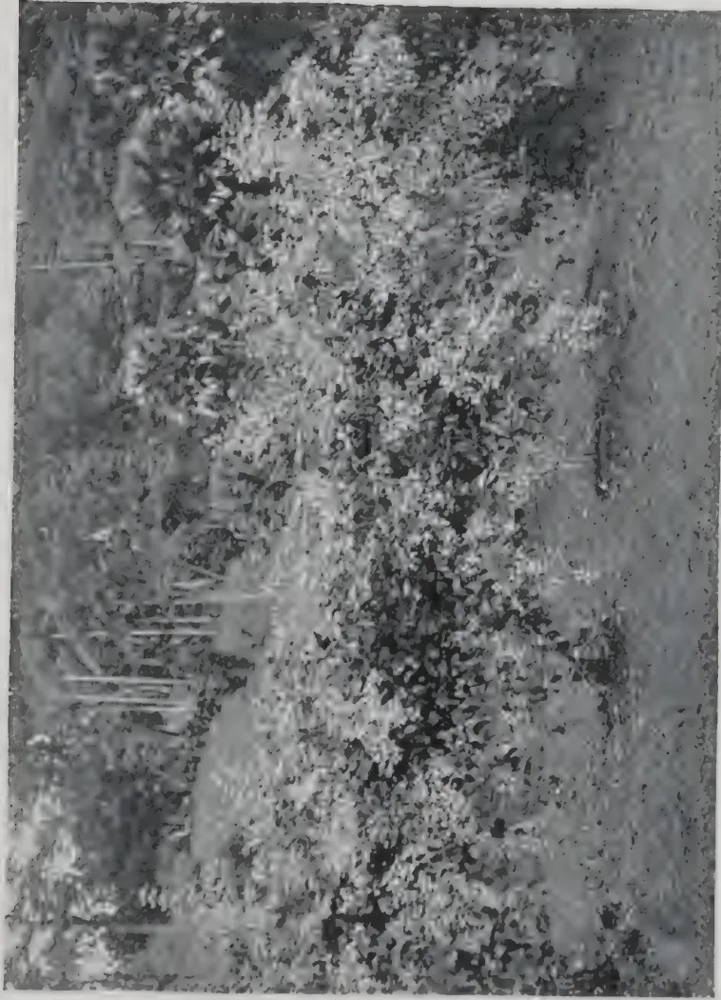A black and white photograph of a dense, bushy plant, identified as Congea tomentosa. The plant is covered in numerous small, light-colored flowers or buds, creating a textured, speckled appearance. The foliage is thick and appears to be climbing or trailing over a surface. The background is dark and indistinct, making the light-colored flowers stand out.

*Photo by H. F. Macmillan.*

CONGEA TOMENTOSA.  
A BEAUTIFUL CLIMBER, WITH LARGE SPRAYS OF DELICATE PINK BLOSSOM.

35------------------------------------------------

This image is a scan of a blank page. The background is a uniform light gray. There are several small, dark specks scattered across the surface, which appear to be scanning artifacts or dust particles. No text, lines, or other graphical elements are present.

36------------------------------------------------

, JANUARY, 1913.]21

## BANANA DISEASES IN THE WEST INDIES.

The Report of the Director of Agriculture of Jamaica for the year ended March 1912 contains a lengthy reference to the diseases of the Banana, a matter which has caused considerable anxiety both to the Government and the planters during the year.

Ceylon bananas are practically free from disease, but the occurrence of five distinct forms in Jamaica suggests the possibility of one or more of these being introduced into the Island and of disaster befalling the local industry: for which reason it is as well that we should have some idea of the diseases themselves.

The *Panama disease* caused by a *Fusarium* fungus was discovered in a plantation 26 years old, and thereupon the Governor and the Privy Council took action and issued rules for treatment. As a result the whole area was cut down and the plants chopped up and treated with heavy dressings of lime: a strict quarantine by means of protective fencing was at the same time maintained over the infested area. Small contiguous holdings showing traces of the disease were similarly dealt with, compensation being allowed at the rate of 6d. per root: the question of compensating large owners is under consideration. In the outbreak of disease at Hope Gardens  $\frac{3}{4}$  acre was destroyed by fire.

Four other diseases have been considered serious enough to be scheduled under the Diseases of Plants law for compulsory treatment: viz: (1) *Banana Rot* or *Heartleaf disease*, found to occur under conditions of extreme moisture and possessing an alarming capacity for spreading. An outbreak of this disease was entirely checked by prompt measures in cutting away infested parts and spraying with Bordeaux mixture. (2) *Bonny Gate disease* caused by a fungus attacking the roots and lower portion of the rhizome and apparently communicated from plant to plant by cutlass infection. Daily inspection of plantations was made for two months with the result that no fresh cases have been since discovered. (3) *Banana spot disease*. The effect of this disease was so disastrous and its spread so rapid that prompt steps were deemed necessary and fire was employed as the destructive agent. (4) "*Blackhead*" or "*Saltpetre*," is fairly widespread in neglected plantations and found to be caused by the well-known pineapple fungus of the sugar cane (*Thielaviopsis ethaceticus*. Went) which, as causing the coconut stem-bleeding disease in Ceylon, is specially to be feared. The occurrence of the fungus in the banana has not hitherto been recorded. It is thought that if properly treated there is no reason for apprehension from this disease.

## A COMMITTEE ON RUBBER NOMENCLATURE.

Early in the sessions of the Rubber Conference a committee was appointed from the members of the Conference to act in conjunction with the committee appointed by the Rubber Club of America to bring about the standardization of the nomenclature of crude rubber. The chairman of the committee was Henry C. Pearson and the three members from the rubber club were A. Zeiss, A. W. Stedman and W. F. Bass. The members appointed from the conference were, in addition to the chairman, C. E. S. Baxendale, from Federated Malay States; Leonard Wray, from British Malaya and Straits Settlements; F. Crosbie Roles, from Ceylon; Noel Trotter, from London; Dr. Jacques Huber, from Para; Dr. J. de Argollo, from Bahia; and W. A. Anderson, from the Hawaiian Islands. *The India Rubber World*, November 1, 1912.

37------------------------------------------------

22[JANUARY, 1913,

## INTRODUCTION OF HEVEA BRASILIENSIS INTO PERAK.

---

*Hevea brasiliensis* was introduced into Perak from Singapore by Murton in October 1877. Murton mentions his visit to Perak in his Report for 1877 and states that "Liberian Coffee, Para Rubber, Brazil Rubber, and the Ceara Scrap rubber have been planted at Durian Sabatang and Kuala Kangsa." In the following year, Mr. (afterwards Sir) Hugh Low, then Resident of Perak, referred to these plants as follows, in a letter to the Colonial Secretary, Singapore, under date July 26th, 1878.

"The only plants of this description within my knowledge are one plant of what I suppose to be the *Hevea* and nine of the *Manihots*. These were brought here by Mr. Murton in October last and planted at the back of the Residency and are growing very well. They were quite small when they arrived here, but the first is about five feet high with branches of equal length, and the *Manihots* vary from four to eight feet and are growing vigorously. I believe Mr. Murton left plants of some kind at Durian Sabatang and at Thaiping or Matang," etc.

The original letter is quoted by Ridley (Bulletin F.M.S., IX, p. 212) who also states (Bulletin F.M.S., II, p. 3) that it appears that the *Hevea* at Durian Sabatang (Teluk Anson) were washed away by a flood shortly after they were planted. But what purports to be the same letter was quoted by Murton in his Report for 1878, and on comparing the two it is seen that Murton took advantage of that opportunity to correct several of Low's statements. He writes, "They (9 *Heveas* and 1 *Castilloa*) were brought here in October last by Mr. Murton," etc. He omits all reference to rubber plants at Durian Sabatang, and hence it would appear that none were planted there. He records that the coffee planted there was washed away by a flood.

It has been stated on several occasions that Low's plants were obtained from Ceylon. C. Baxendale (*India Rubber Journal*, October 12, 1912) writes, "Two cases were sent from Ceylon to the late Sir Hugh Low who planted them at Kuala Kangsar." But there is no record of any such consignment in the Peradeniya archives. Two cases of rubber plants were sent to Singapore in 1876, and a further consignment in 1877, both from Kew. Low, writing in 1896, referred to "the *Hevea* I received from Kew through Singapore," a statement which appears decisive on the point.

It would seem probable that the plants which Murton took to Kuala Kangsar were part of the consignment forwarded by Kew on June 11th, 1877. In that case they would be some of those collected by Cross. The 1877 consignment included 4 Ceara, 22 *Hevea*, and a few *Castilloa*. One *Castilloa* was retained at Singapore and another planted at Kuala Kangsar. One Ceara was also taken to Perak. What was done with the remaining *Hevea*, or how many survived the journey from England, was not recorded, but it would seem probable that at least one half of the consignment was taken to Kuala Kangsar.

There is of course a possibility that Low's plants had been raised from cuttings from the trees sent to Singapore in 1876, though Low's statement would appear to negative that,

38------------------------------------------------

JANUARY, 1913.23

It may be noted that there is nothing in the records to show that more than nine Hevea survived the journey from England, or that Singapore retained any of the 1877 consignment, though it is probable that the Heveas were shared in the same way as the Cearas and Castilloas.

T. P.

## THE GARDEN PATH.

### ITS UTILITY AND ITS TOO FREQUENT NEGLECT.

In every well-ordered garden, no matter what its size or attractions, if the path or paths are neglected, much of the pleasure will be lost. The path is apt to be neglected; and yet there is no more important section of the whole garden than this.

We should find it hard to estimate its worth. When the turf is too much sodden with rain to walk on or wet with a heavy dew, it is to the dry path that we turn our steps. From it we view in comfort at all seasons and in all weathers the beauties of our garden.

Of course in constructing it the question of cost has to be considered. But there are well established golden rules; and good drainage is everything to a well-made path.

Having decided where your paths shall be, or having determined to reconstruct a badly made one, start at once to get out all soil, I would advise that you go a little deeper, and insert at intervals small agricultural drain pipes to carry off any accumulation of water.

### Choice of Materials.

Having got out your trench of a section of it, proceed to fill up to nine inches with large stones, brick, clinkers and the like; but avoid the addition of any soil. This will leave you with three inches before the ground level is reached,

The next step is to fix all edging or border stone; unless of course you should be using teak edging, which will be more easily fixed before the rough stone is thrown in. After having placed your edging—if you are using it—the next step depends entirely upon what you are going to use for the surface of your path—broken pavement, stone, brick (set edgeways in), asphalte, gravel or cinder.

Whichever you choose, you will require over the surface of the large stones already in the trench a layer of small stone; and the quantity will depend, in the case of a flat path, upon the thickness of the pavement or the depth of the stone or brick.

But if it is decided to use asphalte, gravel or cinder then fill up the remainder of your trench within two inches of the ground level at the sides of your path, and in the centre about one inch above the said level. Ram and roll well the surface and then apply your gravel or cinder, giving a coating of about two inches when well rolled down; you will thus have a path that will always shoot the wet and always be well drained.

It may be that your path will be less than four feet wide. If this should be you will not want it so high in the centre. Again, should you decide not to have border stone or edging of any kind, then you will

39------------------------------------------------

24[JANUARY, 1912]

construct your path so as to bring it one inch to one inch and a half below the level of the turf. If, on the other hand, you are using border stones, this will in all cases be two and a half to three inches above the side level of the path. The laying of the paving stone will necessitate the use of a small quantity of soil.

You want a well-drained path. You want a path in keeping with its surroundings. And you must never forget that above all you want your path to last for years and to stand the constant wear and tear of roller, wheelbarrow and walking.

T. G. W. H.

—*The Daily Graphic*.

### A DISEASE OF BANANAS.

Some bananas were recently submitted to the Bureau of Microbiology affected by a fungus known as *Gleosporium*. The following report was supplied to the growers:—

The fruit is often attacked in a very young stage and the disease may extend through the whole bunch, causing the young bananas to shrivel, blacken and become worthless. The fungus is able to completely prevent the fructification of the banana.

As the fungus attacks the fruit, some remedy is necessary that will not injure the young flowers and fruit as they are exposed. When the "hands" of the full bunch are exposed, they may be sprayed with an ammoniacal solution of copper carbonate. Mix 6 oz of copper carbonate in a wooden pail with sufficient water to make a thick paste. Next add sufficient ammonia (about 3 pints) to dissolve the paste and then add water to make up to 50 gallons. Follow the spraying with a second in about a week or ten days. *Agricultural Gazette of N.S.W.*

### DRY FARMING CONGRESS AT CANADA.

At the recent congress the Province of Alberta secured the world's prizes for the best wheat, barley, oats and linseed grown under dry farming conditions. The wheat was of the "Marquis" variety which has been evolved after careful experiment by the Government experimental farms, and was taken from a field giving a yield of 81 bushels to the acre. It is interesting to note also that this wheat was grown from seed raised in Saskatchewan which won the world's prize at New York in the autumn of last year. Dry farming is a theory and practice of cultivation specially adapted to countries and areas with a deficient rainfall that does not suffice for raising crops on the same land in each successive year. The importance of this congress may be gathered from the fact that 2,500 delegates were present, representing national, provincial, city or district agricultural bodies from every part of the world, and included a large number of leading scientific and agricultural experts of the day. The proceedings of the congress are said to have been of the greatest, and the interchange of ideas should have most valuable results. *United Empire, December 1912*.

40------------------------------------------------

JANUARY, 1913.]25

## PRINCIPLES OF PLANTATION RUBBER CULTIVATION.

The following is from a paper by Dr. E. Marckwald in *The India Rubber World* of December 1, 1912:—

### Seeds.

The selection of seeds is a point which in his opinion does not receive sufficient attention in any country. Sowing takes place without any discrimination, and to the planter's astonishment, trees planted on the same soil, with the same girth and tapped at the same time, give yields differing as much as tenfold. This fact indicated the mixed planting of high and inferior grades of seed.

### Planting.

After dealing with the question of the best time for planting, Dr. Marckwald controverts the assumption that trees with a large number of branches give more profitable yields. On the contrary, the cost of tapping in such cases is 30 per cent, more than the normal rate, which reduces the profit.

### Distance.

Plantations being usually valued in accordance to the number of trees, efforts are made to plant as closely as possible. The Malay plantations were some years ago planted on the scale of 12 × 12 feet, but the average scale is now 17 × 17 feet. Doubts were expressed whether the latter distance ensures the best results, while narrow intervals hinder the tree from developing its fullest dimensions. The yield of *Castilloa* per tree in German New Guinea was increased by widening the distance for planting, from 1 ounce to 9 ounces per tree within a few years. *Manihot* plantations in German East Africa, Dr. Marckwald found, planted 7 × 10 feet, 10 × 10 feet, or 10 × 17 feet, while he considered 17 × 17 would have been right.

In conclusion Dr. Marckwald remarked:—

“The future belongs to plantation rubber, but only to the rubber of those plantations which are rationally planned and conducted; on which favourable labour conditions prevail; which have sufficient capital at their disposal, and which send into the world's markets first-class standard qualities, as part of the production of their respective countries.

### PUMPKIN BEETLE.

The most effective means of controlling this pest is to dust the plants early in the morning, whilst the dew is on the foliage, with a mixture of 1 lb. of tobacco dust to 4 lbs. of fine lime. Some growers claim that spraying with arsenate of lead is very effective, but the Department's experience has been that caterpillars are much more easily killed by stomach poisons than beetles of all kinds. In cases where the beetles are very numerous, it frequently happens that they eat up all the foliage before the poison takes effect.—W. W. FROGGAT in *Agricultural Gazette of N.S.W.*, December 2, 1912.

4

41------------------------------------------------

26[JANUARY, 1913.

## THE BRANCHING HABITS OF EGYPTIAN COTTON.

Mr. Argyle McLachlan who has contributed an article on "The Branching Habits of Egyptian Cotton" (*U. S. Department of Agriculture. Bureau of Plant Industry—Bulletin No. 249*), in concluding his paper observes that the Egyptian cotton plant bears two kinds of branches, long vegetative branches on the lower part of the stem, which bear no flower buds directly, and above these, to the top of the plant, shorter fruiting branches which bear flower buds.

The differences between vegetative branches and fruiting branches are very sharp: (1) Vegetative branches usually approximate the length of the main stem while fruiting branches are about one-third as long. (2) bear no flower buds except as they produce secondary fruiting branches. Fruiting branches bear a flower bud at each node opposite the leaf. (3) The vegetative branches, like the axis, bear fruiting branches and may bear vegetative branches. The fruiting branches rarely bear fruiting branches or vegetative branches.

Under conditions of great luxuriance extra-axillary limbs occur at some of the lower nodes which would bear fruiting branches if the development of limbs was restricted.

Egyptian cotton when planted late apparently develops more numerous vegetative branches than when planted early. Early planting is therefore advisable as a means of restricting the development of vegetative branches:

Some of the selected acclimatized types of Egyptian cotton originated in the United States bear fruiting branches at lower nodes on the stem than the stocks of imported Egyptian cotton. Selection for low fruiting gives promise of being a practical means of increasing earliness and yield.

Of the six Egyptian varieties grown in Arizona in 1909 from imported seed, Nubari most nearly resembled the acclimatized stocks in putting out fruiting branches at comparatively low nodes of the stem.

Preliminary experiments in "topping" young plants have resulted in stimulating the growth of buds in the axis of cotyledons. Branches just below the point where the plant is topped make an excessive vegetative growth and tend to assume an upright position in place of the severed axis. The topping of nearly mature plants to hasten the ripening of fruit has not yet been adequately tested.

Egyptian cotton plants grown on soil containing considerable alkali restrict the development of limbs and reject their early fruiting branches.

## AGRICULTURE AT THE BRITISH ASSOCIATION.

Of the general papers, two by Dr. Hutchinson attracted considerable interest. He described how Lime is found to act as an antiseptic in the soil and to exert the same partial sterilisation effects as are produced by volatile antiseptics or by heat. Thus it initially kills many of the bacteria and protozoa; later on there follows a very marked development of bacteria and consequent production of plant food. In the second paper experiments on nitrogen assimilation were described. It was shown that practically any plant residues added to the soil caused bacterial assimilation of nitrogen to set up, whilst sugar caused marked assimilation, particularly if the temperature was sufficiently high.—*Nature*, December 5, 1912.

42------------------------------------------------

JANUARY, 1913.]27

## HOW TO GROW CUCUMBERS.

The *Queensland Agricultural Journal* of December, 1912, contains the following:—The cucumber is not very particular as to soil, so that it be light, rich and loamy; it may be nearly all sand, provided that good rich manure be added, and that it be deeply dug. The cucumber bed should be sheltered from the westerly winds. The pits, or as some call them, hills, should be made ready in August in the following manner:—

Mark off the land in 6 ft. squares and at each intersection make a hole 2 ft. in diameter. If the soil be not naturally rich, mix with it a compost made up of well-rotted stable manure, sheep or poultry dung, wood ashes, bonedust (if procurable) and a little salt. Fill up the hole with this prepared soil and sow five or six seeds in it in a ring. Half an inch is deep enough for the seeds. When they are up take out all but two plants in each hill. Stop all lateral runners as soon as they show fruit, and the secondary runners must be pinched back to the fruit in the same manner. If the weather is dry give the beds a good soaking with diluted liquid manure about once a week. Water every evening sufficiently to damp the soil right down to the roots.

Make successive sowing during September, October and November. To produce straight cucumbers place under them three-sided boxes 3 in. wide with the open side uppermost.

A very good way of watering cucumbers to ensure the water reaching the roots is, as soon as they show signs of running, to dig a hole large enough to hold a quart can as near the roots as possible. Make holes in the bottom of the can and place it in the hole near the roots of the plant. Put the cans in the ground about 2 in. deep and fill them with water every other day.

The choicest cucumber in cultivation is Lockie's Perfection. Early White Spine, Early Ridge Gladiator and Long Prickly are also good marketing and table varieties.

Cucumbers are ready for market in from 75 to 105 days.

## CROP PROSPECTS IN BURMA, 1912-13.

### GROUNDNUTS.

The Commissioners of Settlements and Land Records, Burma under date of 4th November report that the area under Groundnut in the 6 principal Groundnut producing districts is estimated at 158,673 acres. Large extensions of cultivation have taken place in Pakókku, Magwe and Myingyan. The rains throughout the year have been favourable. Harvesting became general towards the end of October and is proceeding under normal conditions. The gross outturn of the Province is estimated to be approximately 66,500 tons.

### COTTON.

Reporting under date of 3rd December 1912, the Commissioner says the area under Cotton, in the districts where the cultivation exceeds 1,000 acres, is now reported to be 219,998 acres. It is 35,085 acres more than the area actually cultivated last year. The rains have been favourable and crop prospects are very good. The provincial outturn of clean Cotton is estimated to be approximately 43,500 bales of 400 lbs,

43------------------------------------------------

28[JANUARY, 1913.

## RURAL HAND LABOUR AND MACHINERY.

---

The following extracts are from a communication by Mr. M. W. Guisset to the Association of Agricultural Engineers of Louvain which is reproduced from the "Revue Generale Agronomique" in the *Queensland Agricultural Journal of December, 1912*:—It is contestable that manual labour in agriculture is without question of better quality than work done mechanically, were it only because in manual work the intelligence of the worker always directs the energy he develops, and husbands the strength according to the necessity of the work.

It is also certain that manual work results by forming a uniform soil surface in an increased production; a gardener by the careful working of his bed gets results which if he reckoned by acres would represent enormous figures. But the actual cost of hand labour, considered in the light of acres, would not be recouped by the sale of the produce at ordinary market prices.

Consequently, the development of our primary industries compels us to perfect and carry out unceasingly the mechanical working of the land. Thus the present day farmer is obliged to sacrifice the quality of the work in order to realise the great quantity demanded by the improvement of his farm.

He has partially replaced human energy by the cheaper energy of horse-power motors; then by force of circumstances he has had to substitute inanimate machines from which he demands a thousand times more energy at a still cheaper rate.

---

## INTERNATIONAL CONGRESS OF ENTOMOLOGISTS.

---

The *United Empire* of December, 1912, has the following in connection with the late International Congress held at Oxford:—There is abundant evidence that entomologists have carried their zeal and their methods to a point at which they may fairly claim international recognition in the form of international action. The two fundamental points on which knowledge is essential are (1) the condition under which any special pest multiplies fast enough to become a serious danger; and (2) the natural enemies of such pests, and the conditions favourable to them. These natural parasites are the best and cheapest means of checking any pest; and for that reason, if for no other, we may regret that the British field naturalist societies did not show more interest in the Congress. Professor Theobald declares that he has failed to find in England a single instance of any pest being controlled by its natural enemies; and considering that the particular science offers so many opportunities for joint action between amateurs and professionals, we think that enthusiastic amateurs attending the Congress might have been spurred to undertake some special investigation on these lines. Proper investigation of this question can only come from international action, directed not to the hampering of trade movements but to the study of pathological phenomena in important economic staples.

44------------------------------------------------

JANUARY, 1913.]29

## AGRICULTURAL PROGRESS IN MADRAS.

There appears to be at least one part of India in which the Department of Agriculture is exercising a marked influence upon the immemorial methods of the cultivator, says the *Indian Agriculturist*. In the concluding passage of his last Annual Report, Mr. G. A. D. Stuart, I.C.S., the Acting Director of Agriculture in Madras, states that the department is in his opinion "well on the road to realise the immense possibilities that lie before it." In explanation of this sanguine pronouncement he writes:—"Nothing more nor less than a revolution in the methods of local agriculture is to be expected. This revolution has already begun. The practices of buying fresh improved seed, of economising in seed rate, of growing green manure crops and of adopting suitable rotations are now firmly established in various tracts where they were unknown hitherto. There is nothing to prevent these and other improved methods becoming universal in course of time." Mr. Stuart makes special reference to the economy effected by a reduction in the seed rate. It has been conclusively proved, he says, in the Agricultural Station that 20 lbs. of paddy sown thinly in a seed bed is sufficient to provide seedlings for planting out an acre, and that an acre so planted will yield more than if planted in the wasteful indigenous way by which anything up to 150 lbs. of seed are used. Unfortunately Mr. Stuart does not state to what extent the economical rate of sowing has been actually adopted, and this is the crux of the matter. While the doctrine of the single seedling seems to be making headway in the Presidency, the reputation of the Department of Agriculture chiefly rests, we imagine, on the astonishing success of Cambodia cotton. This species would seem to have thoroughly established itself in the favour alike of the ryot and of the cotton buyers. Its cultivation is still spreading. The estimated crop this year in Southern Madras is computed at 80,000 bales as against 33,000 bales last year. But although Cambodia has also proved satisfactory in the northern districts in which it has been tried, it has nevertheless met with adverse influences.

A perusal of the correspondence between the department and literate ryots shows that the educated cultivating classes are coming to appreciate fully the advantages which they can obtain in the way of advice and assistance from the department. It must be added that these friendly relations are not due to the Agricultural Associations which might have been expected to act as intermediaries between the department and the ryot. Mr. Stuart hopes to form associations of real ryots, and he thinks, probably rightly, that the rural co-operative credit societies will supply the organization that is required.

## THE CAUSE OF WARTS IN CATTLE.

The causes of warts are various but they are hypertrophied papillæ of the skin. Ointments and lotion are of little service for removing them. It is always best to remove them with a pair of pincers or a hot iron. In many cases, the figures are sufficient. After removal dress the wounds once or twice daily with corrosive sublimate solution—1 part to 1,000 part of water.—*Queensland Agricultural Journal*.

45------------------------------------------------

30[JANUARY, 1913.

## CO-OPERATION IN ASSAM.

### THE NEW GOVERNMENT ACT.

*The Indian Agriculturist* of December 2, 1912, contains the following account of the Resolution of the Chief Commissioner of Assam on the Annual Report on the working of Co-operative Societies in Assam for the year ending June 30th, 1912:—

The present report is the first to deal with the Co-operative Societies of Assam alone. It contains no features of special interest, but indicates that the steady progress which has characterised the co-operative movements in this province from the beginning has continued without interruption.

The most important event of the year was the passing into law by the Imperial Legislative Council of the new Co-operative Societies' Act (II of 1912), which contains several new provisions, of which the following are the most important:—

(a) The registration of societies other than Credit Societies is now permissible, and the way is thus opened for the introduction of various other forms of co-operation. It appears doubtful whether any form of Co-operative Stores for urban areas is necessary or likely to prove successful in Assam; but societies for co-operative cattle insurance and for co-operative production and sale of agricultural necessities, such as manure, would appear to have a great field of usefulness if they could be introduced in a form attractive to the cultivator.

(b) The new Act provides for the registration of Unions, that is, of societies, the constituent members of which are other registered societies. Mr. Botham has mentioned the impossibility, under present conditions, of exercising sufficient supervision over rural societies, and the Chief Commissioner agrees with him that the solution of the difficulty lies in the development of Unions.

The Chief Commissioner agrees that in order to build up a good Reserve Fund in the early years of a Society's existence, it is advisable to charge at the outset as high a rate of interest as can be realised having regard to the rate of interest current in the locality. He is not, however, without further information prepared to concur with the Registrar in the opinion that in all cases initial deposits should not be insisted upon; he considers that every effort should be made at the formation of a society to obtain deposits from the members, and that a careful scrutiny of members circumstances might be made in order to ensure that the money deposited has not been borrowed for the purpose; where, however, such a scrutiny proves that deposits cannot be obtained without borrowing, they might be dispensed with.

### TO GET RID OF ANTS.

Red ants may be driven from a house by using one-half tablespoonful of tartar emetic and the same amount of sugar dampened with a small amount of water and placed wherever this pest is troublesome.—*Queensland Agricultural Journal*.

46------------------------------------------------

JANUARY, 1913.]31

## AUSTRALIAN AGRICULTURAL COLLEGES.

Mr. B. Seth-Smith writing to the *Canterbury (New Zealand) Agricultural College Magazine* on the subject of Australian Agricultural Colleges, says that of the four colleges visited, viz., Hawkesbury (N.S.W.), Wagga Wagga (N.S.W.), Roseworthy (S.A.) and Hurlston Agricultural High School (N.S.W.), certainly Hawkesbury is the show place, and the following remarks may give some idea of what system is in vogue there. Any observant visitor must be struck at once with the extraordinary results obtained by skilful management on the very poor sandy soils on which the College is situated. Of the 3,440 acres only 150 acres, situated three miles away on the river (and recently purchased), are really good land, and this is now all under three irrigation schemes worked by electric power from the College. Perhaps no better site could have been selected for cereal experiments, as very little success could be hoped for without the most scientific methods of cultivation, and the application of artificials. One hundred acres are given up to testing from 300 to 500 varieties of cereals and fodder plants annually, 42 acres are in mixed orchard and vineyard, and 1,400 acres are usually under cultivation. Last year the vineyard (on almost pure sand) yielded dessert grapes to the value of £100 per acre. Eleven and a half tons of jam are made annually and consumed by the students and staff (300 in all).

### The Dairy Department.

Some excellent lessons can be learnt here. Owing to the very light nature of the country, Mr. Potts, the Director, has found that the Kerry-Jersey cross combines the hardiness of the former with the butter-fat producing characteristics of the latter; and certainly they are very profitable looking cows, though small. A few Red Polls are used with good results and they deserve a more extensive trial.

For the first time we saw the new "Echelon" milking shed in operation. The total cost for twelve cows was £120. The chief advantages seem to be time saved in bailing cows, no leg-ropes or bails, and the ease with which new heifers are broken in. As the cows all stand on the angle, no man goes inside the stalls from the centre aisle in which the machines stand.

### System of Management.

To go into detail of the system of management would take up too much space. Each student, however, unless he has obtained a certificate at Hurlston Agricultural High School, must pass an Entrance Examination for Hawkesbury, which is practically the University Entrance Examination, less languages. The very best instructors are kept, regardless of cost, which naturally makes the management very expensive. £22,000 a year seems a huge annual outlay, but when it is remembered that Hawkesbury is a show and experimental farm for the State, which is visited by many hundreds of farmers and teachers every year for instruction, and that no student is kept unless he means to work and learn, certainly the end more than justifies the means.

Regardless of expense many of the latest and most scientific agricultural implements are experimented with, and we were able to inspect the new "Mammoth" motor plough which has done excellent work on the College sandy soils. Its construction is simplicity itself, but it is very doubtful whether it will become as popular as the Petrol Tractor, which has the advantage of being less than half the price, and which adds to its work in the field its road haulage energies.

47------------------------------------------------

32[JANUARY, 1913.

## TANNIN.

### POSSIBLE SHORTAGE OF RAW MATERIAL.

The investigation recently made by Mr. Puran Singh, F.C.S., into the manufacture of tannin extracts has resulted in the opinion that in tropical countries at least where forests abound in tanning materials of all kinds, the manufacture of mixed extracts is preferable to that of decolourised extracts. In the tannery, the expert tanner does not work with any one single tannin material but makes a judicious mixture of tanning materials of different colours, dark and light, in order to get his leather the right colour. The future of the tannin extract industry would appear to lie in the manufacture of mixed extracts, reduced to a standard colour sufficiently light for the purposes for which tannin is used. This procedure it is claimed would have certain advantages, for all sorts of tannin materials of different colours could be utilised for the manufacture of extracts of standard colour and strength, and the percentage of tannin in mixed extracts is higher than in similar extracts treated chemically. The objectionable colour of the mangrove bark extract, as prepared at the Government Tannin Factory in Rangoon, led to an investigation being made into the preparation of tannin extracts; and Mr. Puran Singh has embodied in his report a brief *resumé* of the general processes of tannin extract manufacture and of the factors that influence the manufacture of good extracts, together with a valuation of the mangrove barks as raw materials for tannin extracts. He doubts whether the chemistry of tannin has yet been properly investigated or understood; and he points out that while fears are entertained in Europe and America of a shortage of the raw material, the supply in the forests of the East is practically inexhaustible, and that with the increased knowledge resulting from experimental work, for which there is much scope at present, India and Burma may be regarded as the land of promise for the manufacture of tannin extracts.—*The Indian Agriculturist*.

### CALABASH NUTMEG.

(Illustrated.)

The tree called "Calabash Nutmeg," and sometimes "Jamaica Nutmeg"—has no relation to the true nutmeg *Myristica fragrans*. Botanically it is known as *Monodora Myristica*, belonging to the Natural Order *Anonaceæ*, to which also belong the Custard Apple, Soursop, and "Wana-sapu" or Cananga. It is native of Western Tropical Africa, and has been introduced in 1897 to Peradeniya, where it is well established, but has not yet fruited. It is a slow-growing small conical tree, with large, leathery, oval glossy leaves, and bearing sweet-scented flowers. The large globular fruits contain a number of aromatic seeds, whose odour and flavour, being considered to resemble those of the nutmeg proper, are used as a substitute for the latter in the native home of the tree. Though of no economic value at present, this interesting species is worth cultivating as a useful and ornamental shade tree. It may be propagated by cuttings, and thrives best in well-drained loamy soil.

H. F. MACMILLAN.

18-12-12.

48------------------------------------------------

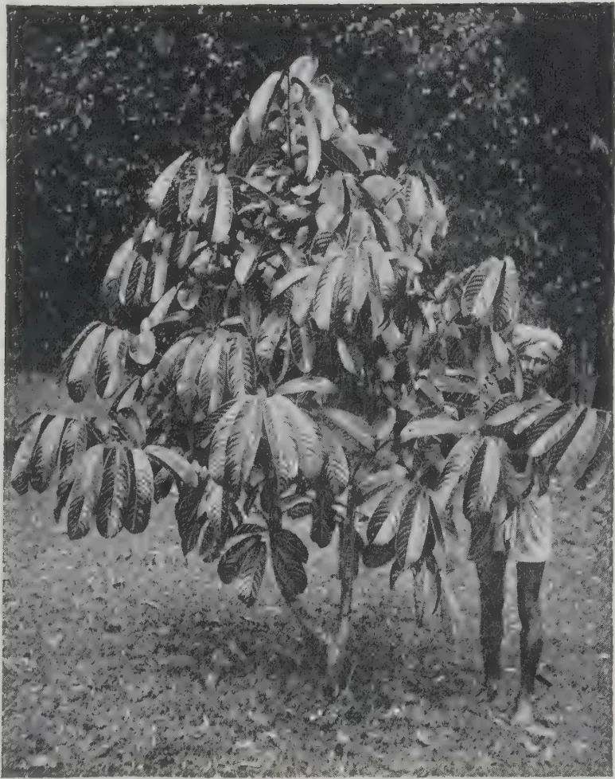A black and white photograph of a Calabash Nutmeg tree (Vitex negundo). The tree is characterized by its large, deeply lobed leaves. A person is standing to the right of the tree, providing a sense of scale. The background is dark and out of focus, suggesting a wooded area.

*Photo by H. F. Macmillan.*

CALABASH NUTMEG.

49------------------------------------------------

This image is a scan of a blank page. The background is a uniform light beige or off-white color. There are a few very small, faint dark specks scattered across the surface, which appear to be scanning artifacts or dust particles. No text, lines, or other graphical elements are present.

50------------------------------------------------

JANUARY, 1913.]33

## ON THE FUNCTIONS OF LIME IN THE SOIL.

Professor George Gray has contributed the following interesting article to the *Canterbury Agricultural College Magazine* of November, 1912:—

Evidence is frequently brought forward as to the beneficial effect of lime on some of our New Zealand soils, especially in the south, and it is rather astonishing considering the traditional use of lime in the Old Country, that its use is not more general here, especially when the extent of the supply and the cost of transit are considered.

### Lime as a Plant Food.

Lime is one of the essential elements of plant food since it enters into the composition of the ash of all, or nearly all, our cultivated plants. Leguminous plants especially contain a high proportion in their ash, and have consequently for a long period been termed "lime plants." The amount found in New Zealand soils is rather low, varying in soils that have come under our notice from '12 to '97 per cent. of calcic oxide with an average of '47 per cent. Although the amount present is small, it is doubtful if the good effects noticed on applying lime to the soil are due in most cases to its action as a direct plant food, but to its influence in other directions.

### Forms of Lime.

Since the term "lime" is applied to several different substances, it is advisable to indicate briefly the nature of these. Carbonate of lime occurs in a variety of forms, limestone, chalk, shells, coral, etc.; it is insoluble in pure water, but if the water be charged with carbonic acid gas then the carbonate is rendered soluble, the bicarbonate of lime being formed. It is this substance which renders water "hard," and there is a considerable loss of lime from the soil by such being carried below the reach of plant roots and passing away in drainage water. The old saying that "lime sinks in the soil" is, therefore, true. When the carbonate is heated the carbonic acid gas is expelled, and there remains behind calcic oxide, or quicklime, which possesses strong alkaline properties not present in the carbonate. When water is added to quicklime the chemical action evolves a considerable amount of heat, and the mass swells up and finally breaks down to a fine powder. This is calcic hydrate or slaked lime, possessing the alkaline properties of quicklime, but with the advantage of being in a more finely divided condition, thus allowing of a more equal distribution through the soil. Both quicklime and slaked lime on exposure to the air absorb carbonic acid gas from it and return to the original form of carbonate.

### Function of Carbonate of Lime.

It is not the amount of lime in a soil but the form in which it exists that determines its effectiveness. In addition to being present as a carbonate it may also exist as a silicate, sulphate, phosphate or nitrate; each useful in its own way of supplying food. The carbonate, however, has further functions than this. In the natural decay of the vegetable matter present in soils, the resulting humus contains certain organic acids which give to the soil an acid reaction. This is prejudicial to the existence of the natural micro-organisms concerned in the formation of plant

5

51------------------------------------------------

34[JANUARY, 1913.

food in the soil. On the soils which have come under our notice many have an acid reaction, consequently they are in an unhealthy condition as regards the existence of these essential organisms. When carbonate of lime is present these organisms do their work effectively in securing and rendering available the necessary nitrogenous plant food. This has been shown to be especially the case with *Azotobacter*, which is concerned in the fixation of free nitrogen from the air by leguminous plants and also with the organisms concerned in the process of nitrification; in this case it is necessary at two stages of the process, first for the formation of ammonium carbonate and afterwards for the union with the nitrous and nitric acids formed to produce ultimately nitrates.

In the absorptive and retentive properties of soils carbonate of lime plays an important part. It has been found that the salts of ammonium and potash either as sulphates, chlorides, or nitrates, when added to the soil, are not retained, but in the presence of carbonate of lime there is an interchange of acids, the stronger acids combining with the lime and the carbonic acid with the other bases, in which condition they are retained ready for the requirements of plants. On light soils carbonate of lime has the effect of compacting the soil and increasing its water-retaining capacity.

#### **Calcic Oxide or Quicklime.**

In addition to the effects produced by calcic carbonate, to which form calcic oxide always returns sooner or later, in the soil, quicklime has further functions in the soils. It assists in the breaking up of the organic matter, and liberates the plant food in a condition available for plants; on clay and heavy soils it acts on the silicates or zeolites and liberates the potash present; the influence of which is seen in the improved growth of clovers and other leguminous plants. Lime has an important influence on the mechanical texture of clay soils from the property it possesses of flocculating or aggregating together the fine clay particles, causing better drainage, less tendency to shrink and crack on drying, and at the same time rendering the soil warmer.

On insoluble phosphates such as those of iron and alumina it has been shown that lime acts by displacing these metals and forming phosphates of lime, which more readily becomes available to plants.

#### **Calcic Hydrate or Slaked Lime.**

When quicklime is placed in the soil it readily absorbs moisture and develops heat, as before mentioned, at the same time there is an increase of bulk, which tends to force asunder the soil particles and so improve the texture of the soil. The heat generated in the process also has the effect of raising the temperature of the soil and producing earlier growth.

#### **Application of Lime.**

Soils that contain less than 1 per cent. of carbonate of lime are generally improved by the application of lime. Evidence is generally given as to the necessity for lime by the presence of such weeds as rushes, docks, etc., which have a preference for soils of an acid character, and also by the prevalence of such diseases as finger and toe, etc., in turnips, cabbages, etc. For light soils poor in organic matter carbonate of lime in the form of chalk, ground limestone, or shell sand is preferable, since such soils cannot afford to have the amount of organic matter present decreased which would be the case were quicklime applied.

52------------------------------------------------

JANUARY, 1913.]35

An important point to be considered in the application of all forms of lime is the mechanical condition. Fineness of subdivision not only allows of better distribution through the soil, but it exposes a much greater surface for action, and consequently acts more quickly, hence the advantage of slaking quicklime before application, or having the quicklime or ground limestone as the case may be, finely ground.

It is often supposed that because manures such as superphosphate of lime contain lime, that the necessity for liming does not exist, but the action of the forms of lime mentioned is quite distinct from that of lime in superphosphate. When lime is necessary it is an advantage, other things being equal, to give preference to manures containing free lime, such as basic slag or the basic superphosphate now on the market. The old saying that:—

“Lime and lime without manure  
Make both farm and farmer poor,”

is a very true one, since in order to secure the best effects from lime it is necessary to ensure a plentiful supply of plant food to meet the demand brought about by the improved condition of the soil. Where this is not done there may be truth in the saying,

“Lime enriches the father but impoverishes the son.”

It was formerly the practice to apply lime at the rate of two to four tons per acre every eight or ten years, but much better results are obtained from the practice now in vogue of applying it in smaller quantities, five to ten cwt., at more frequent intervals. The effect of lime is not evident for one or two years after application since it acts but slowly in the soil.

There is considerable variation in the quality of lime dependent on the original limestone from which it is prepared, the best being obtained from limestone containing above eighty per cent. of carbonate of lime. A good criterion of the quality of lime is the time required for slaking, the more quickly it swells up and break down the better the lime. Some limestones, such as dolomite, contain considerable quantities of carbonate of magnesia, often to the extent of forty per cent. of their weight; this on burning forms magnesia oxide. Cases are on record showing the injury done to crops by the use of such lime, due to the fact that magnesia oxide retains its caustic properties much longer than calcia oxide, to the injury of plant growth.

## PINEAPPLE CULTIVATION IN CEYLON.

This is the title of a booklet issued by Messrs. Freudenberg & Co., being one of a series published with a view to developing local industries, the previous publications dealing with Coconuts, Paddy, Tobacco and Cotton. The work treats of the Botany and Chemistry of the plant, varieties, climate and soil, planting, fertilising, yield and profit, packing, canning and fibre; so that the subject is exhaustively dealt with. The text which is illustrated by a number of photographic reproductions furnishes all the information that the intending planter is likely to need,

53------------------------------------------------

36[JANUARY, 1913.

## BERSEEM, OR EGYPTIAN CLOVER.

The following notes on Egyptian clover are reproduced from Bulletin 62 of the Department of Agriculture, Washington, in *The Western Mail* of December 27, 1912:—

“Berseem is the great leguminous forage crop of Egypt, and for luxuriance and rapidity of growth is probably unequalled, and certainly not surpassed, by any crop in the world. What Egypt would have been, or would be, without this crop is difficult to conjecture. It is certainly impossible to over-estimate its importance. The growth of such heavy crops of cotton, for example, with comparatively speaking (and specially so until recently), small quantities of manure has only been possible through the renovating influences of berseem. It has, in fact, only been by the extensive growth of this crop that the maintenance of the fertility of the Egyptian soils has been possible. To state the area of the land under berseem is extremely difficult, as it not only takes its place in the ordinary rotation, but it is also used as a catch crop, one cutting, or it may be two, being taken before the sowing of cotton in the spring.

“Berseem constitutes the sole food of working animals, cows, and buffaloes, in fact all farm animals, during the months of its growth, that is to say, from a period extending from December to early in June. During the rest of the year, as already mentioned, there is almost a complete absence of green fodder, and a dry ration, composed of chopped straw, beans, barley, etc., has to be resorted to. The want of a summer forage crop which will grow without repeated applications of water is very much felt in the country. During the winter months no other forage crop is grown; indeed, it is difficult to see how any crop could compete with it in universal uses in the country.

“There are three recognised varieties grown in the country, viz., the Muscowi, Fachl and Saidi. The former is that grown on the perennially irrigated lands of lower Egypt, and the following remarks apply to this variety.

### As a Nitrogen Gatherer.

“The root system of berseem is not an extensive one, but it is most abundantly supplied with nodules. In the latter connection and as exemplifying its renovating effect on the soil it may be interesting to quote the results of analyses made last year by Doctor Mackenzie, Director of the School of Agriculture. Berseem was sold in October in two adjacent areas, A and B. On B the crop was allowed to remain for two grazings and then ploughed up in March in preparation for a cotton crop, while on area A the crop was allowed to remain for its full period of growth until June, and four crops were taken. Previous to the experiment the nitrogen content of each area was determined and also after each crop was grazed. On area B, after removing two crops, each containing 100 pounds of nitrogen the soil was enriched to the extent of practically 300 pounds of nitrogen, or, in other words, the percentage of nitrogen was increased from 0·101 to 0·110 per cent.

“When, however, as on area A the crop is allowed to run the whole course of its existence, there is no increase in the total soil nitrogen, or it is so minute as to show no difference in the percentage of soil nitrogen

54------------------------------------------------

JANUARY, 1913.]37

present. During the latter stages of growth, therefore, it is clear that the nitrogen contained in the nodules must be drawn upon by the plant for its growth. By comparing the amount of nitrogen added to the soil by the growing of two cuttings of berseem, viz., 300 pounds, with that accepted as the increase in Europe by the growth of an ordinary clover crop, viz., 60 or 70 pounds, it is seen how valuable this forage crop is in this respect.

#### Other Varieties.

"In addition to the variety of berseem known as 'Muscowi,' grown in lower Egypt, a kind known as 'Fachl' is largely grown on basin lands. The seed is broadcasted on the mud as the water recedes, and as this variety is grown without irrigation one main crop only is obtained, which is usually a heavy one. It is less watery than the ordinary 'Muscowi' sort, and is generally used in making hay.

"The variety known as 'Saidi' is less luxuriant than 'Fachl.' It is somewhat of a trailing nature, and is sometimes mixed with the latter sort. It requires but little water, and is generally cut twice, though sometimes a third time. It is grown chiefly on basin lands, and is smaller in growth and less succulent than the 'Muscowi' variety.

### MICROBIOLOGY IN NEW SOUTH WALES.

The second Report of the Director of the New South Wales' Government Bureau of Microbiology (for 1910-1911) is to hand. The Staff of this Department consists, besides the Director, of a Principal and three other assistants, seven Laboratory hands, three Laboratory attendants, five clerical hands and four temporary officers.

The subjects of the investigations carried on included (1) Infectious diseases of animals and man such as Typhoid Fever, Plague, Contagious Abortion in cows, Diphtheria, Surra, &c. (2) Pathological conditions of animal and man. (3) Parasites of animals. (4) Hygienic Examinations. (5) Diseases of plants, and (6) Economic examinations.

Under the last heading we find the results of Mr. Darnell-Smith's researches on soils, dealing with such interesting subjects as the structure of root-hairs, their relations to Osmotic pressure and the occurrence of root-nodules on leguminosæ.

Altogether this report of 244 pages (foolscap) is a useful contribution to our knowledge of the various subjects treated.

### THE AGRICULTURAL DEPARTMENT OF ASSAM.

The Report of the Director for 1912 has been issued. Cotton prospects are reported to be promising, and the crop so far free from pests of any kind.

Sugar cane experiments with three Barbadoes varieties (B 376, B 147, B 208) yielded excellent results, particularly on limed lands; the first mentioned variety returning over  $3\frac{1}{2}$  tons of sugar per acre.

Similar success attended the potato experiments, the best results being secured from Magnum Bonum and King of Potatoes.

It is interesting to note under Fodder crops that the following are proving the best for Upper Shillong: Maize, Khasi, Soybean, Job's tears, Langtylli grass and Sweet potatoes.

55------------------------------------------------

38[JANUARY, 1913.

## CHILAW-PUTTALAM AGRI-HORTICULTURAL SHOW.

This Show was held on the 13th and 14th December last, and was the first display of agricultural produce held in the Chilaw district.

The main pavilion was designed after that of the recent All-Ceylon Exhibition, and though, by comparison, a miniature, provided space for all the agricultural exhibits.

Separate sheds were devoted to the Fishing Industry, Agricultural Implements, Poultry and Cattle. The Ceylon Agricultural Society and Messrs. A. Baur (who represented the manure trade) occupied special kiosks, in addition to which there was a Chiefs' pavilion and a band-stand.

All these buildings were prettily set in a spacious esplanade lying between the sea and the lagoon.

The arrangements were under the direct supervision of the Assistant Government Agent (Mr. Conroy), whose efforts were ably seconded by Mr. Corea, Mndaliyar of the Pitigal Korale North, and Mr. Charles P. de Silva, Superintendent of Dankanawa Estate.

The Ceylon Agricultural Society lent the services of three Agricultural Instructors (Messrs. N. Wickremaratne, M. J. A. Karunanayake and A. Madanayka) who rendered valuable assistance.

The Director of Agriculture, the Secretary of the Ceylon Agricultural Society, and the Superintendent of the Government Experiment Stations were also present and served as judges.

For the first time the system of using serial numbers (suggested by the Director of Agriculture) was adopted, and found to facilitate the receiving and arranging of exhibits. Another innovation (also proposed by the Director) was the charging of a small entry fee for exhibits. This did not act as a deterrent; but the admission fee on the first day (Re. 1) was probably too high for a Show of this nature.

Advantage was taken of by the large number of planters and others interested in Agriculture to convene a meeting for the discussion of various Agricultural topics. This was held in the Chiefs' Pavilion and was well attended. The principal subjects on the agenda were coconuts, cotton, tobacco, dry farming and the use of Explosives in Agriculture, on all of which the Director of Agriculture spoke. At the termination of the meeting a demonstration was given in holing with dynamite.

The season was unfavourable to a good display of fruits and vegetables, and considering this fact there was no cause for complaint whether in regard to the number or quality of the exhibits. The display of coconuts was worthy of the premier coconut district of the Island.

The manufacture of cigars on the European model by Mr. Valabane of Teldeniya, and the demonstration in Sericulture by the Silk Farm at Peradeniya proved very instructive sideshows.

Native games and dances, and the presence of a band gave the necessary touch of gaiety for putting the crowd into a good humour.

It is gratifying to learn that financially also the Show was a success.

56------------------------------------------------

JANUARY, 1913.39

## THE PLANTATION RUBBER INDUSTRY.

### CLOSE VS. WIDE PLANTING.

*The Agricultural Bulletin of the Federated Malay States* contains a very interesting paper on the subject of "The Plantation Rubber Industry" read by Mr. Cyrial Baxendale at the International Rubber Conference in New York. Mr. Baxendale in dealing with the question of "Close vs. Wide Planting" said that he does not desire to encourage the expectation that the yields from closely planted trees will approach that obtained from those first planted. The latter were usually planted at wide distances and enjoy as much light and air as the heart of the tree can desire. Ten years ago he collected 18 lbs. of rubber in thirty-five days from one of the trees planted by Sir Hugh Low; while from Avenue trees of his own planting, 14 years old and 7 feet in girth, results have been obtained far in excess of those planted in the fields. It is for this reason that he is inclined to deplore references in published reports to yield per tree. All calculations should be based upon the yield per acre. Probably the average number of trees planted to the acre in Malaya is nearer 200 than 100, and thinning out is inevitable as the trees expand. Thus, their trees are an uncertain quantity, whereas the acre is always the same.

A well-known botanist who studied the *Hevea* in its native land used to urge us strongly to plant at  $40 \times 40$ , i.e., 27 trees to the acre. The *Hevea*, like most quick growing trees, is extremely brittle; and at this distance would suffer severely from the wind, but if he allowed, for the sake of argument, that every tree reached maturity, he found by comparing the results from Avenue trees against the results from closely planted fields that up to 8 years old he should have harvested less than half the quantity of rubber from the same area had he adopted their botanical friend's advice.

It is true that he should have economised to a certain extent on the actual cost of collection but not sufficiently to compensate for the loss of rubber.

Thinning out as the trees get older and require more space, has been opposed on the ground that the dead roots encourage the spread of disease. He has pursued this policy for several years past and cannot find that the fear is justified. Indeed as the years roll on he becomes less anxious about plant diseases and pests of all kind. *Fomes semitostus* (our worst fungus disease) and white ants (the most destructive of our insect pests) have lost their terror for him now that he knows how to keep them in check, and as the loss from all causes on the plantations he is connected with does not average two per cent. after attaining maturity, he cannot justly be charged with "turning the blind eye" in that direction.

### Labour Prospects.

The most plausible argument against the future output of plantations is that of shortage of labour. It is true that most plantations are at times short of labour, but he thinks this must generally be attributed to the manager's desire to keep down expenses. Out of a total of 227,985 coolies employed on Malayan plantations, 126,665, or rather more than half, were imported from India. The average period of service on the plantation does not exceed two years—although many of these return

57------------------------------------------------

40[JANUARY, 1913.

after a holiday in their native land, and the difficulty is to engage during the recruiting season the exact number that are required to make good the probable departures during the rest of the year, without becoming burdened at the beginning with labour for which there is no profitable employment.

Within two years the plantation labour force has more than doubled. He does not believe that by increasing the rate of wages any great stimulus would be given to Indian emigration. Tamil coolies are more easily recruited for some plantations at half the wages paid on others which are unpopular, owing to unhealthiness or to some other cause, and this fact is becoming more clearly marked, since those employed at the lowest rates have found themselves able to remit more than half their earnings to India, and that their savings in three or four years are sufficient to establish them as capitalists when they return to their native villages.

The future success of estates which are unpopular with Indians will depend on the attractions they can offer to Chinese or Javanese. To these, the rate of wages is of more importance than any other consideration, and there is practically no limit to the number that can be recruited at a price.

It must be remembered that by doubling the cost of labour we do not double the cost of production. Generally speaking the average cost of tapping is less than one-half the total cost of production, if we include home charges; and as the majority of the trees now being tapped have barely reached half their full yielding capacity, labour rates can, if necessary, be materially increased without raising the cost of production when the trees attain maturity.

### **Manuring.**

Recently, some consideration has been given to the question of manures. From Ceylon some interesting results have been reported, but in Malaya little has been done in this direction except on some estates where the soil is excessively rich in humus, and lime has been applied to correct the acidity, with good results.

Mr. Baxendale says that his own opinion for some years to come, at any rate, systematic cultivation of the soil will be of more value than any manure, but the experiments in Ceylon are deserving of attention, and the Agricultural Department of Malaya, if it has not already done so, might study the question with advantage.

### **Future Supplies.**

Regarding future supplies, Mr. Baxendale said that it has been suggested to him that they will be interested in an estimate of the supplies that are to be obtained from plantation sources, and it is obvious that a paper of this kind would be incomplete without it. It is not easy to obtain reliable statistics of the cultivation in all the tropical countries in which rubber is grown. Naturally, the yields vary considerably and the high price has undoubtedly encouraged more vigorous tapping on many plantations than would have been considered advisable if the price had been less tempting. He knows fields where from 800 to 900 lbs. an acre have been collected for two or three successive years, but he questions if such high yields can be maintained. A first-class, well-managed plantation may be expected to yield an average of 500 to 600 lbs. an acre for as

58------------------------------------------------

JANUARY, 1913.]41

many years as our experience guides us, but we must assume a considerably lower average from all plantations. The area under rubber in the Malay Peninsula at the end of 1911 amounted to 542,877 acres, and as far as I can ascertain the total area under this cultivation in the world amounts to about 1,000,000 acres. We know that during the half-year ending June 30th the exports from Malaya amounted to 9,038 tons and from Ceylon 2,252 tons. Allowing for the output from India, Sumatra, Java, etc., he estimates the total output of plantation rubber will be from 25,000—30,000 tons for the whole year. The annual increase will be fairly steady, and at about six years from date the production is likely to amount to 100,000 tons per annum, or, in other words equal the total consumption of rubber during the year ending June 30th last.

During the year ending June 30th, 1912, with rubber averaging 5s. 2d. (say  $1\frac{1}{2}$  dollars) a pound, consumption—according to the figures recently published by Messrs. Hecht—increased by 25,482 tons—Mr. Baxendale is aware that this statement has been challenged by other authorities. We are told, says Mr. Baxendale, that they are eminent authorities, but as they unfortunately published their views anonymously, we are obliged to take their word for it.

#### POULTRY FARMING IN THE PHILIPPINES.

A resolution endorsing the plans of the Director of Agriculture to establish Poultry Farming at Alabang was passed at the meeting of the Philippine Poultry Association on Saturday evening. Dr. C. W. Edwards, Chief of the Animal Industry Division of the Bureau of Agriculture, was appointed Chairman to select five other members to serve on the Carnival Committee and twenty applications for membership in the new organization were taken under consideration. The meeting was well attended, the major portion of those present being Filipinos, and the discussions were both in English and Spanish for the benefit of all present.

A Committee on Constitution and Bylaws has already been appointed, and Captain George Seaver, the President of the Organization, will appoint a Committee to incorporate at an early date. The Bylaws and Constitution are to be printed both in English and Spanish and distributed among the members. The Association plans to elect Vice-Presidents, one for each province, who will organize branches to encourage and aid in the development of the poultry industry throughout the Islands, and the organization here will be made a branch of the Association in the States.

The Association is based on philanthropic principles, each member donating as much of his time and energy as he can afford to the interests of poultry raising in the Islands. All the information regarding the best methods of carrying on the business will be gathered and disseminated among the farmers, and efforts will be made to introduce high-class fowls for the improvement of local breeds.

#### NEW SOUTH WALES GARDENS.

The report of Mr. J. H. Maiden, Director of Botanic Gardens of Government Domains for the year 1911, is an interesting record of work containing a number of photographic illustrations, one of which shows an imposing avenue of Moreton Bay figs (*Ficus macrophylla*) planted in 1847.

In addition to the record of horticultural work, the report contains an interesting chapter on the national Herbarium and Botanic Museum, largely devoted to Fungi.

6

59------------------------------------------------

44[JANUARY, 1913.

## THE HISTORY OF RUBBER.

---

### HOW IT FIRST CAME TO EUROPE.

---

The following extract is from a lecture delivered before the Society of Arts in December of last year by Prof. F. Mollow Perkin, Ph.D., F.I.C., which appears in *The India Rubber Journal* of December 21, 1912. Of late years the importance of rubber or caoutchouc, has increased by leaps and bounds, partly owing to the enormous quantities which are employed in the manufacture of motor tyres and to the various other purposes to which rubber is now a necessary adjunct:—

#### Date of Discovery.

The actual date of the discovery is not exactly known, but it appears to have been employed by the Indians, probably for centuries before it was even heard of by the civilised world. The Spaniard, Gonzalo Fernandes d'Oviedo y Valdas, appears to have been the first to mention rubber in his "General History of the Indies," published in Madrid in 1536. He refers to "the Indians' game of batey, which is the same as the game of ball, although played in a different manner, and the ball is made of a different substance to that used by Christians." This substance was rubber. Again, Father Xavier de Charlevoix, who lived from 1682-1761, describes the *batos*, a kind of solid ball, but extremely light and porous. "It soars higher than our balls, falls to the ground, and rebounds much higher than the level or the hand which it quitted; it falls back again and rebounds once more, although not to such a height this time, the height of the bounces gradually diminishes." During the second voyage of Columbus it was also noticed that the natives of Hayti played with balls made of the gum of a tree.

#### Introduction into Europe.

It appears to have been first brought to Europe by La Condamine in 1736, who went to Peru and Brazil with an expedition organised by the Paris Academy of Science to solve the question of the shape of the earth. La Condamine sent some resinous balls to Paris with the following note:— "There grows in the forests of the Province of Esmeradas, a tree called by the natives of the country *hivé*, from which there flows, by simple incision, a liquor white as milk, which gradually blackens and hardens in the air. The natives made flambeaux of it, which burn very well indeed without wicks and give a rather fine light..... In the Province of Quito, sheets of linen are coated with it, and are used for the same purpose as we use waxcloth..... The same trees grow along the banks of the Amazon, and the Indians call the resin which they extract *cahuchu* (caoutchouc). They made boots of it which do not absorb water, and which, after being blackened by holding them in the smoke, have all the appearance of real leather." He goes on to explain how the Indians coated bottle-shaped earthen moulds with this resin, and after it had hardened broke the moulds and forced the broken portions out of the mouth, thus making non-fragile bottles.

60------------------------------------------------

JANUARY, 1913.]45

A little later a French engineer, named Fresneau, who was stationed at French Guiana, described this characteristic gum and the manner in which the natives collect it, and his description is so interesting that I give it here. "They commence," he says, "by washing the foot of the tree; then they make, with a bill-hook, longitudinal but rather oblique incisions, which should penetrate the whole thickness of the bark, taking care to make them one above another, so that the flow from the top incision falls into the incision underneath, and so on, until the last one, at the bottom of which a leaf of the *balisier*, an American reed, is placed which is fixed against the tree by means of potters' earth, so as to lead the liquid into a vessel placed at the foot of the tree. To utilise the milky juice of the different trees which I have mentioned, all of which are resinous, a mould is made of potters' earth according to the shape of the vessel which it is intended to make, and, to hold it more conveniently, a piece of stick is sunk in the place which is not to be coated with milky juice. An aperture is then secured, through which the potters' earth may be afterwards expelled by introducing the water to soften it. Any one mould being shaped, polished and softened with water, it is covered all over with milky juice by means of the fingers, after which this coating is exposed to a denser smoke, where the heat of the fire hardly makes itself felt, keeping it constantly turned, so that the juice may be spread equally over the mould, and taking good care that the flame does not reach it, which would cause the milky juice to boil, and thus to form small holes. As soon as a yellow colour is seen, and this first coating is no longer tacky to the fingers, a second layer is applied which is treated in the same way, and so on with the other coats until it is judged to be sufficiently thick, and then it is kept longer over the fire so as to evaporate the whole of the moisture, until nothing but elastic resin remains . . . . . finally, the objects will be the more substantial the greater the number of coats which have been applied. With this juice and linen sheeting, tarpaulins, pump hose, divers' clothing, bottles, sacks for containing campaigning biscuits, etc., may be made, without fear of this material imparting any bad smell; but all these things can only be executed on the spots where the trees grow, as these juices soon lose their fluidity."

Other tribes beside those in Central and South America also knew of rubber, and manufactured articles from it long before it was known to European nations. Thus the natives of Assam and some tribes on the Upper Amazon used rubber juice before the days of Columbus, to make waterproof vessels for carrying food and liquids, and gave it the name of *caucho*, which is probably the origin of the word *caoutchouc*. It is mentioned that Don José, King of Portugal, having heard of the wonderful water-proofing material used by the Indians, sent several pairs of his royal boots to Para in 1755 in order that they might be waterproofed by a covering of rubber.

Apparently rubber was not imported into Great Britain until the latter half of the eighteenth century. About 1770 Priestley recommended its use for effacing pencil marks. Hence the name of *india-rubber* (an Indian product used for rubbing), and this name has held to the present day.

In this year a book was published on perspective, in which the following passage is found:—"Since this was printed off, I have seen a substance

61------------------------------------------------

46[JANUARY, 1913.

(no name is given to it) excellently adapted to the purpose of wiping from paper the marks of a black-lead pencil. It must, therefore, be of singular use to those who practise drawing. It is sold by Mr. Nairne, mathematical instrument maker, opposite the Royal Exchange. He sells a cubical piece of about half an inch for three shillings, and says it will last for several years."

In France small cubes of indiarubber were sold at the stationers' shops in 1775, but under the name of *peaux de negres* (niggers' skin).

The india-rubber bottles were imported to Europe, and in France Grossart devised a method of cutting up the bottles and making tubes and other articles useful for physical and surgical purposes.

Somewhere about the same time it was shown by Hérissant and Macquer, in a monograph addressed to the Paris Academy, that the rubber could be softened or dissolved by Dipples oil, turpentine and ether.

In 1820 an English mechanic showed how it could be cut into threads and used to replace brass wire rolled into spirals. In the same year James Hancock established the first rubber manufactory in England.

In 1823 Macintosh showed that when rubber was dissolved in coal tar naphtha it could be used for making waterproof garments, and this particular form of garment took the name of the inventor, and to this day we talk of macintoshes. Shortly afterwards James Hancock, who has just been mentioned, found that by warming rubber which had previously been shredded, it could be made into thick masses and pressed into any desired form. The great difficulty which had been met with was the tackiness of rubber at elevated temperatures, and its brittleness and consequent unworkableness at low temperatures.

In order to prevent rubber goods sticking together, Hayward, an American, sprinkled it with flowers of sulphur, but although to a certain extent this was useful, it did little to alter the characteristics of the rubber. In 1839, however, a certain patent of great importance was taken out by Nelson Goodyear, claiming improvements produced in rubber by the action of sulphur. The patent, however, was not very clear, as it gave no indication regarding the proportions to be taken, or the temperatures necessary to bring about the change. About five years later, however, Goodyear gave further details, and showed that by submitting rubber first to the action of sulphur, and then raising the temperature, the rubber was neither tacky at high temperatures nor brittle at low temperatures. This process was called *vulcanization*, and the treated product *vulcanized india-rubber*. Goodyear was also the discoverer of ebonite, which is the final product of the action of melted sulphur on rubber; Hancock, in England, appears to have discovered the process of vulcanization independently, although a year or two later than Goodyear. Parkes about the same time introduced the immersion method, in which the rubber was dissolved in carbon-disulphide, treated with sulphur chloride. Other patents followed, and since then the history of the rubber industry has been one of continual progress.

62------------------------------------------------

JANUARY, 1913.]47

## MOTOR PLOUGHS ON PADDY FARMS.

---

One of the few lines on which progress has been made in paddy cultivation in Siam is the introduction of motor ploughs, though at present their employment has hardly passed the experimental stage, says *the Agricultural Bulletin of the F. M. S.* The motors which are being used are oil-driven traction engines of a somewhat antiquated type, which have been adapted to their purpose by a number of ingenious, but none the less amateur, devices. Nevertheless they work well and give very little trouble. The best motors seen were of fifteen horse-power, and were used to pull heavy disc harrows, which ploughed hard clay to a depth of four inches or a little more. With these it was possible to plough two and a half acres a day. Another was a five horse-power motor which pulled a two-furrow share plough.

The cost of ploughing small fields by motor was estimated at \$2 an acre, including interest on capital expenditure but not attendant's wages. Large fields, where not much time is lost in turning, can be ploughed for a little less. This is, of course, much cheaper than ploughing in the old-fashioned way with buffaloes or bullocks, and the cost could probably be reduced by using the motors which are specially made for ploughing purposes by firms in England and elsewhere.

It was hoped that after seeing the methods of motor ploughing in Siam, suggestions might be made which would lead to the employment of similar methods in Krian. When the irrigation of this district was commenced a few years ago, the Malays seem to have got the impression that a constant supply of water during the paddy season relieved them of the necessity of doing anything to the land beyond clearing it of weeds. In most places the soil is a rich clay, and it happens that much of it is so soft in nature that excellent crops can be obtained from it without ploughing. This lent support to their ideas, ploughing was never started, and now the Malays in Krian are strangers to the practice.

Not all the soil in the district, however, is of the kind mentioned. In some parts the clay, though probably rich in plant food, is too hard to enable the paddy to tiller; and in other places there is a superficial layer of peaty substance, below which the roots of the paddy cannot penetrate, and which will yield scarcely any crop at all unless it is mixed with the underlying clay. There are some thousands of acres of land of these two descriptions, and if they are to be of any use for paddy growing they must be ploughed. The owners of the land are, it is believed, gradually coming to realise this as a result of the experiments being carried on in the district, but unfortunately they are the least able of all the cultivators in Krian to bear the expense of buying buffaloes or bullocks and ploughs. If motor ploughs could be introduced into the district their use would afford a ready solution of these difficulties.

It may be urged that it would be unwise to encourage the natural indolence of the Malay by putting machines of this description at his disposal, especially as the great majority of the native holdings in Krian are small enough to be dealt with easily by a plough of the ordinary type.

63------------------------------------------------

48[JANUARY, 1913.

The ideal system in an agricultural district divided into small holdings is for each man to do all the work that is necessary on his own plot of land. By so doing he not only reaps all the profits himself, but also acquires independence of character and habits of industry.

Government has helped to make possible the realisation of this ideal by the establishment of a system of agricultural loans, to be granted to the natives at a low rate of interest and on easy terms of repayment. These loans remove the difficulty of providing capital for the purchase of animals and implements, but the Malay is slow to take advantage of them on his own initiative, and it will probably be many years before the possession of ploughs by the paddy planters becomes general.

## RUBBER TRADE IN JAPAN.

### JAPANESE RUBBER PLANTING IN MALAY PENINSULA.

According to the details which appeared in the April (1912) issue, Japanese investors to the number of 77 had, up to the previous August, acquired in Malaya about 83,750 acres of which the area of 15,800 acres had been planted. More detailed particulars, since available, show the distribution to be as follows :—

<table>
<thead>
<tr>
<th>States.</th>
<th>Number of plantations.</th>
<th>Acreage rented.</th>
<th>Acreage cultivated.</th>
</tr>
</thead>
<tbody>
<tr>
<td>Johore ... ..</td>
<td>44</td>
<td>77,730</td>
<td>12,785</td>
</tr>
<tr>
<td>Negri Sembilan ... ..</td>
<td>15</td>
<td>2,845</td>
<td>1,768</td>
</tr>
<tr>
<td>Selangor ... ..</td>
<td>21</td>
<td>1,420</td>
<td>880</td>
</tr>
<tr>
<td>Perak ... ..</td>
<td>6</td>
<td>1,055</td>
<td>480</td>
</tr>
<tr>
<td>Kedah ... ..</td>
<td>1</td>
<td>450</td>
<td>220</td>
</tr>
<tr>
<td>(Singapore) ... ..</td>
<td>2</td>
<td>250</td>
<td>120</td>
</tr>
<tr>
<td>Revised particulars to end of 1911</td>
<td>89</td>
<td>83,750</td>
<td>16,453</td>
</tr>
</tbody>
</table>

The State of Johore thus contains 50 per cent. of the number of Japanese plantations in the Malay Peninsula, as well as 93 per cent. of their total acreage and 75 per cent. of the cultivated area of its plantations. Eighty per cent. of the whole Johore acreage and 60 per cent. of the cultivated portion belongs to eight plantations. Johore is consequently the most important Malay State for Japanese rubber cultivation.—*The India Rubber World*.

## A NEW FODDER.

The Kew Bulletin draws attention to *Pennisetum purpureum* or elephant grass as a fodder. It is said to be widely distributed in Tropical Africa, and to be distributed between 10° N. Lat. and 20° S. Lat. The grass is described as a tall perennial with creeping rhizomes, thriving in wet places but also growing in drier soils. The stems (culms) are generally 6 to 10 feet high, but occasionally go up to 23 feet. The leaves are 1 to 2 feet long. An analysis of the fodder shows water 61.81 % protein 2.91, and carbohydrates 17.29.

64------------------------------------------------

JANUARY, 1913.]49

## VEGETABLE OILS.

The following interesting descriptions of some Vegetable Oils is taken from the *Agricultural Ledger*, No. 5, 1911-12:—

### Cotton Seed Oil.

One of the features of the Indian oil seed trade has been the rapid increase during the last few years in the exports of cotton seed. In 1898-99 the exports were 1,850 tons, in 1901-02 they rose to 11,250 tons, in 1906-07 to 219,379 tons and in 1910-11 to 299,011 tons, valued at Rs. 22,952,592 (£1,530,172 16s.). These large exports represent a small proportion of the amount of seed available, and illustrate the demand there is in Europe for cheap oil-yielding materials. In 1903 cotton seed at Bombay was rated at Rs. 2 4 as. (3s. 0d.) per cwt., while the wholesale prices of other oil seeds were: linseed Rs. 8 7 as. (11s. 3d.), ground-nut Rs. 7 2 as. (9s. 6d.), sesame Rs. 7 (9s. 4d.), rape seed Rs. 5 6 as. (7s. 2d.).

The oil has been estimated in several samples of Indian seeds with the following results: The average of those from the Madras Presidency gave 17.41 per cent., Bombay Presidency 17.66 per cent., Central Provinces 19.65 per cent., and United Provinces 19.89 per cent. The variation in individual samples was small, being from 15 to 21 in extreme cases. The amount of oil contained in Indian seed is much less than in American, which contains upwards of 30 per cent. The Indian seed is also smaller. Specimens of American weighed 12 to 18 grams per 100 seeds, and Egyptian 10 to 11 grams, whilst Indian seed weighed only 5 to 7 grams.

Cotton seed is naturally covered with woolly hairs, and this renders it necessary to remove the husk before the oil is expressed. Such seeds are decorticated in decorticating machines or "hullers" before crushing, and the kernels or "meats" are separated from the husks by means of another set of machines called "meats and hull separators." Since the husks form 49 per cent. of the seeds and contain only a trace of oil, they leave the kernels with about 39 per cent. of oil which can be expressed with less loss than the undecorticated seeds.

Crude cotton seed oil possesses a ruby-red to almost black colour, due to the seed containing dark brown colouring matter. In order to obtain the yellow refined oil, the acid value is taken, and an amount of caustic soda corresponding to the acid is diluted with water and intimately mixed with the oil while heated to 50°. If a suitable amount of soda has been added the mixture will separate into two layers, the upper layer consisting of decolourised oil, and the lower one forming a dark-brown soap solution or "mucilage." The supernatant oil is drawn off and washed with warm water when it is ready for use.

In temperate climates cotton seed oil deposits a yellowish-white fat or "stearin" which is separated and the oil is called "demargarinated." "Cotton seed stearin" forms an article of commerce and is largely used in the manufacture of lard and butter substitutes. At the winter temperature of Calcutta (22°—24° C) very little solid fat is deposited, but by chemical means 29.5 and 32.4 per cent. of stearin were separated from oil obtained from American seed grown at Dharwar. The solid fatty acids consist of palmitic acid and probably small quantities of arachidic acid. The liquid fatty acids seem to consist of oleic and linolic acids only.

7

65------------------------------------------------

50[JANUARY, 1913.

Cotton seed oil is typical of a semi-drying oil. Specific gravity at 15°, 0.922 to 0.930 ; solidifying point, 3°—4° ; saponification value, 191—196 ; iodine value 106—120 ; Maumené test, 68 to 78 ; insoluble fatty acids and unsaponifiable, 95.8 to 96.1 ; melting point 35° to 40° ; neutralisation value, 201—208 ; iodine value, 110—115 , of liquid fatty acids, 146—149.

Cotton seed oil is readily recognised by the high melting and solidifying points of its fatty acids. There are also certain colour reactions which are employed in analysis. The Halpen colour reaction is one of the best, and is applied as follows : 1 to 3 c.c. of the oil is dissolved in an equal volume of amyl alcohol ; to this is added 1 to 3 c.c. of carbon bisulphide holding in solution 1 per cent. of sulphur flowers. The test tube containing the mixture is then immersed in boiling water, and kept therein for some time. The carbon bisulphide evaporates off, and cotton seed oil gives in the course of five to fifteen minutes a deep red colouration. This reaction is very characteristic, and it is possible to detect thereby 5 per cent. or even less of cotton seed oil in admixture with other oils and fats.

Confirmation of the presence of this oil may also be obtained by the nitric acid test. This test is best carried out with nitric acid of 1.375 specific gravity. A few c.c. of the sample are shaken energetically with an equal measure of nitric acid, and the sample allowed to stand for some time up to twenty-four hours. Cotton seed oil gives a coffee-brown clouration which is characteristic of this oil to such an extent that admixtures of 10 to 20 per cent. of cotton seed oil to olive oil can be detected in certain cases.

The finer grades of cotton seed oil are used for edible purposes and in the manufacture of margarine. The lower grades are employed in enormous quantities in soap-making. On account of its drying and gumming properties the oil cannot be recommended for lubricating purposes unless it is blown. Smaller quantities of the oil are used in the adulteration of paint oils. The price of refined cotton seed oil was quoted in London (December, 1910,) at £29 to £32 per ton.

### **Silk Cotton Seed Oil.**

(*Eriodendron Anfractuosum.*)

Under the name of Kapok oil the expressed oil from the seeds of the above silk cotton trees is used. The seeds are about the size of peas and are enclosed in a hard black shell. The oil is expressed on a commercial scale in Holland from material imported from Java ; the yield of the oil from the whole seed is 17.8 per cent. on a manufacturing scale, whilst by extraction with ether 24.8 per cent. of oil is obtained. The oil is greenish-yellow or reddish coloured and has a great resemblance to cotton seed oil in its properties. Meggitt found 30.77 per cent. of oil in Bombax seeds and 4.52 per cent. of nitrogen. A sample of Semul oil from Bombay had a specific gravity of 0.9173 at 20°, and yielded crystalline fatty acids melting at 41°.

### **Oil of the Cashew Nut.**

(*Anacardium Occidentale.*)

The kernels yield a light, yellow, bland oil. Niederstadt (1902) found the saponification value to be 179.84, and the iodine value, 60.6.

The pericarp or shell yields a black, acrid and powerfully vesicating oil. Crossley and Le Sueur determined the following constants : Specific gravity, 0.9594 ; saponification value, 45.1 ; iodine value, 294.2 ; Reichert-Meissl value, 1.26. Though it possessed an abnormally high iodine value, practical experiments showed it to be a non-drying oil. This particular sample had evidently suffered decomposition,

66------------------------------------------------

JANUARY, 1913.]51

### Ground-Nut Oil.

(*Arachis Hypogaea*.)

The seeds of this plant are called ground-nut, pea-nut, earth-nut, monkey-nut and Chinese-nut. Although grown here and there all over India as a garden or field crop, it is only in Madras and Bombay that the ground-nut is produced on a commercial scale. The Madras area is over 500,000 acres, and that of Bombay about 94,000 acres. On well-managed land a crop of 3,200 to 3,500 lbs. of unhusked nuts per acre may be raised. The seeds are largely used for edible purposes, while large quantities of the seeds and oil are exported from Bombay and Madras. Leather has shown that the Mauritius variety of ground-nut contains 44 to 49 per cent. of oil, while the indigenous varieties contain only 40 to 44 per cent. Newer samples have more recently been imported, and it has been noticed that they are uniformly rich in oil than the local kinds. These figures refer to the proportion of oil in the kernels. The proportion by weight of unhusked nuts to kernels is as 4 to 3. The bulk of the Indian manufacture of the oil is in the hands of owners of native rotary mills. Mills of the European pattern have been tried in South India, but they could not compete with the crude native mills as the cake from the former was too dry and powdery. Recently mills have been opened in Calcutta and elsewhere in Bengal for the manufacture of the oil and have created a large import traffic in the nuts. The nuts having been shelled the expression is carried out in two stages. The first expression is carried out at the ordinary temperature, and the cold drawn oil is nearly colourless, has a pleasant taste and is used as a salad oil. The second expression is made at a temperature of 30° to 32° and yields an oil suitable for edible purposes and for burning. Sometimes a third expression is made at a higher temperature and gives a turbid oil suitable for soap making. Arachis cake contains the highest amount of proteins of all known oil-cakes. That from non-decorticated nuts contains 5.35 per cent. of nitrogen and 0.9 per cent. of phosphoric acid, and that from the kernels contains 7.9 per cent. of nitrogen and 1.35 per cent. of phosphoric acid.

Arachis oil has the following constants: Specific gravity at 15°, 0.917 to 0.920; solidifying point; about zero; saponification value, 185.6 to 194.8; iodine value 83.3 to 100; Reichert-Meissi value, 0.0; Mauméné test 49°. Insoluble fatty acids and unsaponifiable, 94.87 to 95.86; melting point 22° to 29°; iodine value 95.5 to 103.42; mean molecular weight, 281.8.

Arachis oil can be identified and detected by the isolation of arachidic acid, a constituent melting at 74.5°. About 10 grms. of the oil is saponified, neutralised and treated with lead acetate. The lead salt is extracted with ether and the insoluble portion is decomposed and the fatty acids dissolved in 50 c.c. of 90 per cent. hot alcohol. On cooling the alcoholic solution a crop of crystals will be obtained which should amount to 5 per cent. of the oil and melting between 74° and 75.5°.

### Gingelly Oil.

(*Sesamum Indicum*.)

Til, sesame or gingelly oil is one of the most valuable Indian vegetable oils; it keeps for a long time without becoming rancid and is produced in large quantities in almost every part of the Peninsula. The area under which it is cultivated is about 4,000,000 acres, in addition to over 500,000 acres where it is grown as a mixed crop; the yield in tons is about 300,000. Bombay exports almost the entire quantity produced in the various provinces, Marseilles taking the largest consignment. The seed is somewhat

67------------------------------------------------

52[JANUARY, 1913.

smaller than linseed, and is white, black, red or brown in colour. Regarding the amount of oil in the seed, Leather found that the variation is from 48 to 52 per cent. though some specimens contained as much as 56 per cent. and some as little as 45 per cent. These differences appear to be independent of variety, province or climate. From 42 to 48 per cent. of oil may be obtained by expression. The seeds also contain about 3 per cent. of nitrogen and the cake is an excellent cattle-food. If made from unsound seed the cake may be used as a manure.

Sesame oil has been frequently examined by chemists, and the following average constants are quoted: specific gravity at 15°, 0.923 to 0.926; solidifying point.—5°; saponification value, 187.6; iodine value, 103 to 115; Reichert-Meissl value, 1.2; Maumené test, 63° to 65°; butyro-refractometer at 25°, 68.0; insoluble fatty acids and unsaponifiable, 95.7; melting point, 25° to 30°; neutralisation value, 196 to 201; mean molecular weight, 286.

Sesame oil contains, according to Farnsteiner, 12.1 to 14.1 per cent. of solid acids, and according to Lane 78.1 per cent. of liquid fatty acids. These consist of oleic and linolic acids. Sesame oil is dextro-rotatory, a property which may be used as an additional means of identifying the oil. The Indian oil has a lower rotation than African. The amount of unsaponifiable matter in sesame oil varies from 0.95 to 1.32 per cent. and contains. phytosterol, sesamin and a so-called red oil. The phytosterol recrystallised from alcohol melts at 139°-139.2°. In 1891 Tocher extracted from the oil, by means of glacial acetic acid, a crystalline substance named sesamin. This melts at 118° and assumes a green and then bright red colour with nitro-sulphuric acid. An extremely characteristic colour reaction, called Baudouin's test, is now used to detect the presence of sesame oil in mixtures with other oils. The test is applied as follows: Dissolve 0.1 grm. of sugar in 10 c.c. of hydrochloric acid of specific gravity 1.19 in a test tube, add 20 c.c. of the oil to be tested, shake thoroughly for one minute and allow to stand. The aqueous solution separates readily, and in the presence of even the smallest quantity of seasame oil it will be found coloured crimson.

### Coconut Oil.

(*Cocos Nucifera.*)

Coconut oil constitutes the most important in quantity and value of all the oils exported from India. During the past three years the amount has been on the average 2,500,000 gallons and the value Rs. 3,750,000 (£250,000), this represents one-half of all the vegetable oils sent out of the country. The coconut palm grows most abundantly along the Malabar Coast, and the oil produced in Cochin has maintained a very high reputation in the market for many years. The oil was originally prepared by boiling the kernels with water and skimming off the oil, a considerable quantity was also made in crude native mills by expression, but during latter years modern machinery has been introduced such as is used in Europe. The use of freshly dried kernels ensures the production of an oil containing little acidity.

Coconut oil is light coloured with a bland taste and a peculiar but not unpleasant odour. In the winter months when the temperature falls to 22° to 24° it solidifies to a white fat. The oil may be easily purified, and in this state it forms a favourite edible oil. Coconut oil is used in enormous quantities in the manufacture of soaps, made by the boiling process,

68------------------------------------------------

JANUARY, 1913.]53

as also by the cold process; the crystalline character of the fat renders it suitable for toilet preparations. The oil is employed extensively as a vegetable butter and as a chocolate fat. Coconut oil resembles palm oil in its chemical composition; like the latter it contains large proportions of trimyristin and trilaurin, smaller quantities of the palmitin, tristearin, and triolein, as also the glycerides of the volatile acids caproic, caprylic and capric. It is practically free from hydroxy acids (Lewkowitsch), and free from butyric acid.

Crossley and Le Sueur (1889) obtained the following constants in oils received from Malabar, Bengal and Bombay; Specific gravity at 100°, 0.903 to 0.904; acid value, 9.9 to 35.2; saponification value, 255.5 to 258.2; iodine value, 8.25 to 8.54; Reichert-Meissl value, 6.65 to 6.79; melting point, 23.5 to 25.0 insoluble fatty acids, 82.35 per cent.

Coconut oil is rarely adulterated with other fats, and the above tests are usually sufficient for its recognition. It may be remarked that this oil has a great resemblance to the oil obtained from the kernels of the palm tree (*Elæis guineensis*) of the West Coast of Africa.

### Candle-Nut Oil.

(*Aleurites Moluccana.*)

The candle-nut tree is distributed over the tropics of the Eastern hemisphere, and is found naturalised in many parts of India. Throughout the Malayan Archipelago the nuts are an article of export. The fruits resemble ordinary walnuts in appearance, and are called *jangli akrot* or wild walnuts. They consist of two-thirds of shell and one-third of kernel; the kernels contain 60 or more per cent. of oil. The cold-drawn oil is limpid, colourless or yellowish, has a pleasant odour and bland taste, but cannot be used for edible purposes on account of its purging properties. It is a good but rather slow-drying oil, and is prized for burning, lubricating and soap-making. Its constants, according to Dunstan and Lewkowitsch, are: Specific gravity, .9274, .9256; saponification value, 204.2, 192.6; iodine value, 139.7, 163.7; titer test of fatty acids, 17.8°, 21°.

The tree has been recommended for planting in avenues and the seed as a source of drying oil.

### Physic Nut Oil.

(*Jatropha Curcas.*)

An evergreen shrub, indigenous to America, but cultivated in most parts of India. The Physic nut, Vern.—*Bag-berenda, safed arand, rattan-jot*. The seeds yield about 34 per cent. of oil and the kernels about 52 per cent. The oil is yellow when fresh, becoming reddish on exposure to the air; it has an unpleasant odour, and strong purgative properties, more pronounced than those of castor oil. Curcas oil yields about 10 per cent. of solid fatty acids melting at 57.5°; the liquid fatty acids consist of about equal proportions of oleic and linolic acids. The specific gravity is 0.919 to 0.921; saponification value, 193.2; iodine value, 98.3 to 104.9; Reichert-Meissl value, 0.55; Mauméné test, 65 to 68°. The fatty acids (95.5 per cent.) melt at 24—26°; iodine value, 105.

The oil is used in medicine, for soap-making and as illuminant; it has considerable drying properties, though not so good as those of cotton seed oil.

69------------------------------------------------

54[JANUARY, 1913.

## JOHN FERGUSON, C.M.G., F.R.C.I., Etc.

---

The subject of the following notice will be known to many readers of this Journal, of which he was the founder, and the editor for many years. Born in 1842 in Tain, Scotland, Mr. Ferguson's early training was for a journalistic career. He arrived in Ceylon in 1861 to join the *Colombo* (now the *Ceylon*) *Observer*. For years he continued as Editor of that paper which he enlarged and developed from a bi-weekly into a daily. When he gave up active work, he was the doyen among newspaper editors in Asia, and though now absent from Ceylon his connection with the Island's press is not yet severed. In June, 1881, he founded the *Tropical Agriculturist*, which he edited for twenty-five years, and since 1863 till a year or two ago was responsible for the Annual "Ceylon Handbook and Directory" which, *inter alia*, contains the fullest Statistics in reference to the planting enterprise of the tropical world. Mr. Ferguson's interest has always been evinced in anything calculated to advance the Island's prosperity. No one took a more active part in agitating for Railway and Road extensions, both by writing in his own newspaper as well as in preparing Memorials to the various Secretaries of State, and while on leave by personal interviews at the Colonial Office. His offices in this direction have frequently been publicly acknowledged by the Planting Community. For instance, at a meeting of the Kelani Valley Planters' Association in 1907 the following Resolution was passed:—"That this Association supports the Hon. Mr. John Ferguson in his outspoken and able speech in the Legislative Council as regards the policy of the Ceylon Government with reference to the Extension of the Railway to Ratnapura."

Always fond of travel, Mr. Ferguson has made several trips round the world, in the course of which he has lectured on Ceylon, on its Tea Industry and its attractions to visitors, especially in London and through the Southern States of America. In respect of Rubber Cultivation, Mr. Ferguson has been connected with its development from the beginning, for, while the first Para rubber plants were brought from Kew to Huntingdon Gardens in 1876, so early as 1883 Mr. Ferguson compiled and published from the *Observer* Press a Planter's Manual entitled "All about India Rubber and Gutta-percha," preparing and issuing a second edition in 1887 and a third in 1899. He has also written Manuals on Tea, Coffee, Coconuts, Cocoa, Spices, Fibres, Palms, while his Illustrated Handbook on Ceylon has run into several editions. In 1903 Mr. Ferguson's services to the Island were recognised, when on the recommendation of His Excellency Sir West Ridgeway he was made a Commander of the Distinguished Order of St. Michael and St. George. For five years he represented the General European Community in the Legislative Council of Ceylon, and in 1904 attended the St. Louis Exhibition as an Official Visitor from the Ceylon Government. He has been President of the Ceylon Branch of the Royal Asiatic Society, Vice-President of the Ceylon Agricultural Society, and in various ways has played a conspicuous part in the Island's history during the past fifty years.

70------------------------------------------------

This image is a scan of a blank page. The background is a uniform light beige or off-white color. There are several small, dark specks scattered across the surface, which appear to be dust or scanning artifacts. No text, lines, or other graphical elements are present.

71------------------------------------------------

A black and white portrait photograph of a man with a prominent, thick mustache and a high forehead. He is wearing a dark suit jacket over a light-colored shirt and a dark vest. The photograph is framed by a thin black border.

F. CROSBIE ROLES, F.J.L., F.R.C.I.

72------------------------------------------------

JANUARY, 1913.]55

## MR. FRANCIS CROSBIE ROLES, F.J.I., F.R.C.I.

---

Francis Crosbie Roles, F.J.I., F.R.C.I., born 1867, was articled to Journalism in England, and came out to Ceylon when twenty-one years of age as chief reporter to the *Ceylon Independent*, then edited by the late Mr. George Wall. Mr. Roles visited England in 1893, returned to the Island in 1895, as sub-editor of the *Times of Ceylon*. He was appointed leader-writer in 1897 and became partner in 1900. Mr. Roles has had joint charge of the *Times of Ceylon* Establishment ever since. He was treasurer of the Ceylon Branch of the Royal Asiatic Society for eleven years, and is a life member of that body. A member of the old National Association of Journalists of Great Britain and Ireland, Mr. Roles became an original member of the Institute of Journalists on its formation in 1889, and was elected a fellow in 1901. He is also a life fellow of the Royal Colonial Institute. He represents the *Central News* (London). In 1896 he married, in New York, the only daughter of the late Mr. John R. Nichols, a lawyer of that city, and has twice since visited America. On one of these occasions, in 1904, he was an official visitor for Ceylon at the St. Louis World Fair. Mr. Roles drafted the original of the Foreign Press-Messages Copyright Ordinance of 1898, which affords forty eight hours' protection. He contributed to the second edition of "The Law and the Press." He has given much study to the subject of Rubber cultivation, has published a brochure on this industry, and is a director of more than one Company. In 1908 Mr. Roles was deputed to visit Burmah with a view to arranging for an improved rice supply to Ceylon Estates and was delegate to the 1st Imperial Press Conference in 1909. In 1912 he was appointed Ceylon Commissioner to the New York Rubber and Allied Trades Exhibition.

---

## OUTTURN OF RAW COTTON IN THE PUNJAB.

---

It is satisfactory to learn that the outturn of raw cotton in the Punjab this year is likely to exceed considerably that of 1911. The area under crop is 1,362,200 acres—an increase of nearly 40,000 acres; and only in the unirrigated lands in the three northern divisions is the prospect poor. As, however, these represent only one-tenth of the area cultivated the matter is not serious. The main increase is in the Delhi, Jullunder and Lahore Divisions where good rain fell at sowing time. The damage from boll-worm is said to be negligible—an important consideration for the cultivator.

---

## ERRATUM.

---

On page 38 under head "Chilaw-Puttalam Agri-Horticultural Show," para 5, last line, instead of Chas. P. de Silva read Chas. A. Peiris, J.P., U.P.M., etc., etc.

73------------------------------------------------

56

**MARKET RATES FOR TROPICAL PRODUCTS.**

(From Lewis & Peat's Monthly Prices Current, London, 4th December, 1912.)

<table border="1">
<thead>
<tr>
<th colspan="2"></th>
<th>QUALITY.</th>
<th>QUOTATIONS.</th>
<th colspan="2"></th>
<th>QUALITY.</th>
<th>QUOTATIONS</th>
</tr>
</thead>
<tbody>
<tr>
<td colspan="2"><b>ALCOES, Socotrine cwt.</b></td>
<td>Fair to fine</td>
<td>62s 6d a 67s 6d</td>
<td colspan="2"><b>INDIARUBBER. (Contd.)</b></td>
<td>Common to good</td>
<td>1s 9d a 2s 8d</td>
</tr>
<tr>
<td colspan="2">Zanzibar &amp; Hepatic "</td>
<td>Common to good</td>
<td>40s a 75s</td>
<td colspan="2">Borneo</td>
<td>Good to fine red</td>
<td>2s 9d a 3s 3d</td>
</tr>
<tr>
<td colspan="2"><b>ARROWROOT (Natal) lb.</b></td>
<td>Fair to fine</td>
<td>8d a 9d</td>
<td colspan="2">Java</td>
<td>Fair to fine red ball</td>
<td>1s 1d a 2s</td>
</tr>
<tr>
<td colspan="2"><b>BEES' WAX, cwt.</b></td>
<td></td>
<td></td>
<td colspan="2">Penang</td>
<td>Sausage, fair to good</td>
<td>3s 6d a 4s</td>
</tr>
<tr>
<td colspan="2">Zanzibar Yellow "</td>
<td>Slightly drossy to fair</td>
<td>£6 17s 6d a £7</td>
<td colspan="2">Mozambique</td>
<td>Fair to fine ball</td>
<td>3s a 3s 6d</td>
</tr>
<tr>
<td colspan="2">East Indian, bleached "</td>
<td>Fair to good</td>
<td>£8 a £8 5s</td>
<td colspan="2">Nyassaland</td>
<td>Fr to fine pinky &amp; white</td>
<td>2s 6d a 2s 9d</td>
</tr>
<tr>
<td colspan="2">" unbleached "</td>
<td>Dark to good genuine</td>
<td>£5 17/6 a £6 10s</td>
<td colspan="2">Madagascar</td>
<td>Majunga &amp; blk coated</td>
<td>1s 10d a 2s 4d</td>
</tr>
<tr>
<td colspan="2">Madagascar "</td>
<td>Dark to good palish</td>
<td>£6 15s a £7 2s 6d</td>
<td colspan="2">New Guinea</td>
<td>Niggers, low to good</td>
<td>6d a 2s 9d</td>
</tr>
<tr>
<td colspan="2"><b>CAMPHOR, Japan "</b></td>
<td>Refined</td>
<td>1s 5½d a 1s 8d</td>
<td colspan="2"><b>INDIGO, E.I. Bengal</b></td>
<td>Ordinary to fine ball</td>
<td>2s 3d a 2s 6d</td>
</tr>
<tr>
<td colspan="2">China "</td>
<td>Fair average quality</td>
<td>16½s 6d</td>
<td colspan="2">Shipping mid to gd violet</td>
<td>Consuming mid. to gd.</td>
<td>8s a 9s 6d</td>
</tr>
<tr>
<td colspan="2"><b>CARDAMOMS, Tuticorin</b></td>
<td>Good to fine bold</td>
<td>5s 2d a 5s 8d</td>
<td colspan="2">Mid. to good Kurpah</td>
<td>Ordinary to middling</td>
<td>2s 3d a 2s 10d</td>
</tr>
<tr>
<td colspan="2">Malabar, Tellicherry</td>
<td>Middling lean</td>
<td>4s 6d a 4s 11d</td>
<td colspan="2">Low to ordinary</td>
<td>Mid. to fine Madras</td>
<td>1s 10d a 2s 5d</td>
</tr>
<tr>
<td colspan="2">Calicut</td>
<td>Good to fine bold</td>
<td>4s 6d a 4s 11d</td>
<td colspan="2">Ordinary to fair</td>
<td>Pale reddish to fine</td>
<td>1s 6d a 1s 9d</td>
</tr>
<tr>
<td colspan="2">Mangalore "</td>
<td>Brownish</td>
<td>4s 6d a 4s 11d</td>
<td colspan="2">Wild</td>
<td>Ordinary to fair</td>
<td>None here</td>
</tr>
<tr>
<td colspan="2">Ceylon, Mysore "</td>
<td>Med brown to fair bold</td>
<td>4s 9d a 6s</td>
<td colspan="2">MACE, Bombay &amp; Penang</td>
<td>per lb.</td>
<td>2s 6d a 2s 8d</td>
</tr>
<tr>
<td colspan="2">Malabar "</td>
<td>Small fair to fine plump</td>
<td>4s 3d a 6s</td>
<td colspan="2">Java</td>
<td></td>
<td>2s 2d a 2s 4d</td>
</tr>
<tr>
<td colspan="2">Ceylon, &amp; Ceylon "</td>
<td>Fair to good</td>
<td>3s 7d a 3s 10d</td>
<td colspan="2">Bombay</td>
<td></td>
<td>2s 4d a 2s 8d</td>
</tr>
<tr>
<td colspan="2">Ceylon Long Wild "</td>
<td>Fair to good</td>
<td>4s 6d a 4s 9d</td>
<td colspan="2">NUTMEGS— lb.</td>
<td>64's to 57's</td>
<td>7d a 8d</td>
</tr>
<tr>
<td colspan="2">CASTOR OIL, Calcutta, "</td>
<td>Shelly to good</td>
<td>1s 2d a 3s 2d</td>
<td colspan="2">Singapore &amp; Penang "</td>
<td>80's</td>
<td>10d a 1s</td>
</tr>
<tr>
<td colspan="2">CHILLIES, Zanzibar cwt.</td>
<td>Good 2nds</td>
<td>3½d</td>
<td colspan="2">NUTS, ARECA cwt.</td>
<td>110's</td>
<td>7½d</td>
</tr>
<tr>
<td colspan="2">Japan "</td>
<td>Dull to fine bright</td>
<td>40s a 45s</td>
<td colspan="2">NUX VOMICA, Cochin</td>
<td>160's to 115's</td>
<td>5½d</td>
</tr>
<tr>
<td colspan="2">CINCHONA BARK.— lb.</td>
<td>Fair bright small</td>
<td>30s a 32s 6d</td>
<td colspan="2">per cwt. Bengal</td>
<td>Ordinary to fair fresh</td>
<td>5d</td>
</tr>
<tr>
<td colspan="2">Ceylon</td>
<td>Crown, Renewed</td>
<td>3½d a 7d</td>
<td colspan="2">Madras</td>
<td>Ordinary to good</td>
<td>14s a 15s</td>
</tr>
<tr>
<td colspan="2">Red</td>
<td>Org. Stem</td>
<td>2d a 6d</td>
<td colspan="2">OIL OF ANISEED "</td>
<td>"</td>
<td>9s</td>
</tr>
<tr>
<td colspan="2">Good to fine quill</td>
<td>Org. Stem</td>
<td>1½d a 4½d</td>
<td colspan="2">CASSIA "</td>
<td>Fair merchantable</td>
<td>9s a 9s 6d</td>
</tr>
<tr>
<td colspan="2">CINNAMON, Ceylon 1sts</td>
<td>Red</td>
<td>3d a 5½d</td>
<td colspan="2">LEMONGRASS "</td>
<td>According to analysis</td>
<td>6s 11d</td>
</tr>
<tr>
<td colspan="2">per lb. 2nds</td>
<td>Root</td>
<td>1½d a 4d</td>
<td colspan="2">NUTMEG "</td>
<td>Good flavour &amp; colour</td>
<td>3s 7d a 3s 9d</td>
</tr>
<tr>
<td colspan="2">" 3rds</td>
<td>Good to fine bold</td>
<td>1s 3d a 1s 7d</td>
<td colspan="2">CINNAMON "</td>
<td>Dingy to white</td>
<td>4d</td>
</tr>
<tr>
<td colspan="2">" 4ths</td>
<td>"</td>
<td>1s 4d a 1s 6d</td>
<td colspan="2">CITRONELLE "</td>
<td>Ordinary to fair sweet</td>
<td>1½d a 1½d</td>
</tr>
<tr>
<td colspan="2">Chips, &amp;c..</td>
<td>Fair to fine bold</td>
<td>1s a 1s 5d</td>
<td colspan="2">ORCHELLA WEED—cwt</td>
<td>Bright &amp; good flavour</td>
<td>2½d a 1s 5d</td>
</tr>
<tr>
<td colspan="2">CLOVES, Penang lb.</td>
<td>Dull to fine bright pkd.</td>
<td>1s a 1s 4d</td>
<td colspan="2">Ceylon</td>
<td></td>
<td>1s 6d</td>
</tr>
<tr>
<td colspan="2">Amboyna "</td>
<td>Dull to fine</td>
<td>2d a 4d</td>
<td colspan="2">Madagascar "</td>
<td>Fair</td>
<td>10s Nom.</td>
</tr>
<tr>
<td colspan="2">Ceylon "</td>
<td>Fair and fine bright</td>
<td>9s a 1s 2d</td>
<td colspan="2">Zanzibar "</td>
<td>Fair</td>
<td>10s "</td>
</tr>
<tr>
<td colspan="2">Stems "</td>
<td>Fair</td>
<td>9d a 10d</td>
<td colspan="2">PEPPER—(Black) lb.</td>
<td>Fair</td>
<td>10s "</td>
</tr>
<tr>
<td colspan="2"><b>COFFEE</b></td>
<td>Medium to bold</td>
<td>3½d</td>
<td colspan="2">Alleppy &amp; Tellicherry</td>
<td>Fair</td>
<td>5½d</td>
</tr>
<tr>
<td colspan="2">Ceylon Plantation cwt.</td>
<td>Good ordinary</td>
<td>Nominal</td>
<td colspan="2">Ceylon "</td>
<td>" to fine bold heavy</td>
<td>5½d a 5½d</td>
</tr>
<tr>
<td colspan="2">Native</td>
<td>Fair to bold</td>
<td>Nominal</td>
<td colspan="2">Singapore "</td>
<td>Fair</td>
<td>5½d</td>
</tr>
<tr>
<td colspan="2">Liberian "</td>
<td>Special Marks</td>
<td>85s a 90s</td>
<td colspan="2">Acheen &amp; W. C. Penang</td>
<td>Dull to fine</td>
<td>5½d</td>
</tr>
<tr>
<td colspan="2">COCO, Ceylon Plant. "</td>
<td>Red to good</td>
<td>77s a 90s</td>
<td colspan="2">(White) Singapore "</td>
<td>Fair to fine</td>
<td>5½d a 5½d</td>
</tr>
<tr>
<td colspan="2">Native Estate "</td>
<td>Ordinary to red</td>
<td>72s a 76s 6d</td>
<td colspan="2">Siam "</td>
<td>Fair</td>
<td>8½d a 9d</td>
</tr>
<tr>
<td colspan="2">Java and Celebes "</td>
<td>Small to good red</td>
<td>42s a 70s</td>
<td colspan="2">Penang "</td>
<td>Fair</td>
<td>8d</td>
</tr>
<tr>
<td colspan="2">COLOMBO ROOT "</td>
<td>Middling to good</td>
<td>25s a 32s 6d</td>
<td colspan="2">Muntok "</td>
<td>Fair</td>
<td>9½d</td>
</tr>
<tr>
<td colspan="2">CROTON SEEDS, sift. cwt.</td>
<td>Dull to fair</td>
<td>12s a 19s</td>
<td colspan="2">RHUBARB, Shensi</td>
<td>Ordinary to good</td>
<td>1s 11d a 3s 3d</td>
</tr>
<tr>
<td colspan="2">CUBES "</td>
<td>Ord. stalky to good</td>
<td>70s a 80s</td>
<td colspan="2">Canton "</td>
<td>Ordinary to good</td>
<td>1s 8d a 2s 2d</td>
</tr>
<tr>
<td colspan="2">GINGER, Bengal, rough, "</td>
<td>Fair</td>
<td>150s a 170s</td>
<td colspan="2">High Dried..</td>
<td>Fair to fine flat</td>
<td>1s a 1s 3d</td>
</tr>
<tr>
<td colspan="2">Calicut, Cut A "</td>
<td>Small to fine bold</td>
<td>36s nom.</td>
<td colspan="2">SAGO, Pearl, large</td>
<td>Dark to fair round</td>
<td>10d a 1s</td>
</tr>
<tr>
<td colspan="2">B &amp; C "</td>
<td>Small and medium</td>
<td>78s a 85s</td>
<td colspan="2">medium</td>
<td>Fair to fine</td>
<td>18s a 19s</td>
</tr>
<tr>
<td colspan="2">Cochin Rough "</td>
<td>Common to fine bold</td>
<td>55s a 73s</td>
<td colspan="2">small</td>
<td>"</td>
<td>17s a 18s 6d</td>
</tr>
<tr>
<td colspan="2">Japan "</td>
<td>Small and D's</td>
<td>34s a 40s</td>
<td colspan="2">Flour</td>
<td>Good pinky to white</td>
<td>15s a 16s</td>
</tr>
<tr>
<td colspan="2">GUM AMMONIACUM "</td>
<td>Unsplit</td>
<td>33s</td>
<td colspan="2">SEEDLAC cwt.</td>
<td>Ordinary to gd. soluble</td>
<td>12s a 14s.</td>
</tr>
<tr>
<td colspan="2">ANIMI, Zanzibar</td>
<td>Ord. blocky to fair clean</td>
<td>25s</td>
<td colspan="2">SENNA, Tinnevelly lb.</td>
<td>Good to fine bold green</td>
<td>55s a 65s</td>
</tr>
<tr>
<td colspan="2">" "</td>
<td>Pale and amber, str. srts</td>
<td>40s a 72s 6d</td>
<td colspan="2">SHELLS, M. o'PEARL—</td>
<td>Fair greenish</td>
<td>5d a 8½d</td>
</tr>
<tr>
<td colspan="2">" "</td>
<td>little red</td>
<td>£12 10s a £14 5s</td>
<td colspan="2">Egyptian cwt.</td>
<td>Common specky and small</td>
<td>3d a 4½d</td>
</tr>
<tr>
<td colspan="2">" "</td>
<td>Bean and Pea size ditto</td>
<td>£11 a £12</td>
<td colspan="2">Bombay "</td>
<td>Small to bold</td>
<td>1½d a 2½d</td>
</tr>
<tr>
<td colspan="2">Madagascar "</td>
<td>Fair to good red sorts</td>
<td>75s a £9 12s 6d</td>
<td colspan="2">Mergui "</td>
<td>"</td>
<td>90s a £10 15s</td>
</tr>
<tr>
<td colspan="2">" "</td>
<td>Med. &amp; bold glassy sorts</td>
<td>£7 a £10</td>
<td colspan="2">Manilla "</td>
<td>Unsorted</td>
<td>90s a £10 7s 6d</td>
</tr>
<tr>
<td colspan="2">" "</td>
<td>Fair to good palish</td>
<td>£5 a £8</td>
<td colspan="2">Banda "</td>
<td>Fair to good</td>
<td>£9</td>
</tr>
<tr>
<td colspan="2">" "</td>
<td>red</td>
<td>£4 a £8 15s</td>
<td colspan="2">Green Snail "</td>
<td>Sorts</td>
<td>11 10s a £14 17/6</td>
</tr>
<tr>
<td colspan="2">ARABIC E.I. &amp; Aden "</td>
<td>Ordinary to good pale</td>
<td>£2 a £7 10s</td>
<td colspan="2">Japan Ear "</td>
<td>Small to large</td>
<td>80s a 85s</td>
</tr>
<tr>
<td colspan="2">Turkey sorts "</td>
<td>Sorts to fine pale</td>
<td>38s a 37s</td>
<td colspan="2">FAMARINDS, Calcutta...</td>
<td>Trimmed selected small</td>
<td>60s a 82s 6d</td>
</tr>
<tr>
<td colspan="2">Ghatti "</td>
<td>Reddish to good pale</td>
<td>33s a 65s 6d</td>
<td colspan="2">per cwt. Madras</td>
<td>to bold</td>
<td>65s a £11</td>
</tr>
<tr>
<td colspan="2">Kurrachee "</td>
<td>Dark to fine pale</td>
<td>25s a 35s nom.</td>
<td colspan="2">TORTOISE SHELL—</td>
<td>Mid. to fine blk not stony</td>
<td>9s a 12s</td>
</tr>
<tr>
<td colspan="2">Madras "</td>
<td>Clean fr. to gd. almonds</td>
<td>25s a 30s "</td>
<td colspan="2">Zanzibar, &amp; Bombay lb.</td>
<td>Stony and inferior</td>
<td>4s a 5s</td>
</tr>
<tr>
<td colspan="2">ASSAFETIDA "</td>
<td>com. stony to good block</td>
<td>25s a 30s "</td>
<td colspan="2">TURMERIC, Bengal cwt.</td>
<td>Small to bold</td>
<td>11s 6d a 25s</td>
</tr>
<tr>
<td colspan="2">KINO</td>
<td>Fair to fine bright</td>
<td>£10 a £12</td>
<td colspan="2">Madras "</td>
<td>Pickings</td>
<td>14s a 19s</td>
</tr>
<tr>
<td colspan="2">MYRRH, Aden sorts cwt</td>
<td>Middling to good</td>
<td>50s a £9</td>
<td colspan="2">Do. "</td>
<td>Fair</td>
<td>22s nom</td>
</tr>
<tr>
<td colspan="2">Somali "</td>
<td>Good to fine white</td>
<td>6d a 1s 5d</td>
<td colspan="2">Cochin "</td>
<td>Finger fair to fine bold</td>
<td>22s a 24s</td>
</tr>
<tr>
<td colspan="2">OLIBANUM, drop "</td>
<td>Middling to fair</td>
<td>50s a 60s</td>
<td colspan="2">VANILLOES— lb.</td>
<td>Bulbs [bright]</td>
<td>18s a 20s</td>
</tr>
<tr>
<td colspan="2">pickings "</td>
<td>Low to good pale</td>
<td>45s a 47s 6d</td>
<td colspan="2">Mauritius ... } 1sts</td>
<td>Finger fair</td>
<td>21s</td>
</tr>
<tr>
<td colspan="2">siftings "</td>
<td>Slightly foul to fine</td>
<td>45s a 50s</td>
<td colspan="2">Madagascar ... } 2nds</td>
<td>Bulbs</td>
<td>18s</td>
</tr>
<tr>
<td colspan="2">INDIA RUBBER lb.</td>
<td>Fine Para bis. &amp; sheets</td>
<td>35s a 40s</td>
<td colspan="2">Seychelles ... } 3rds</td>
<td>Gd crystallized ¾ a 8½in</td>
<td>11s 6d a 18s</td>
</tr>
<tr>
<td colspan="2">Ceylon, Straits, {</td>
<td>Ceara</td>
<td>12s 6d a 27s 6d</td>
<td colspan="2">VERMILLION ..</td>
<td>Foxy &amp; reddish ¾ a ..</td>
<td>11s a 14s 6d</td>
</tr>
<tr>
<td colspan="2">Malay Straits, etc. {</td>
<td>Crepe ordinary to fine</td>
<td>20s a 22s 6d</td>
<td colspan="2">" "</td>
<td>Lean and inferior</td>
<td>10s a 11s</td>
</tr>
<tr>
<td colspan="2">Assam {</td>
<td>Fine Block</td>
<td>4s 3½d</td>
<td colspan="2">" "</td>
<td>Fine, pure, bright</td>
<td>2s 11d</td>
</tr>
<tr>
<td colspan="2">Rangoon {</td>
<td>Scrap fair to fine</td>
<td>4s 4d a 4s 5d</td>
<td colspan="2">" "</td>
<td>Good white hard</td>
<td>47s</td>
</tr>
<tr>
<td colspan="2"></td>
<td>Plantation</td>
<td>4s 5½d</td>
<td colspan="2"></td>
<td></td>
<td></td>
</tr>
<tr>
<td colspan="2"></td>
<td>Fair II to ord. red No. 1</td>
<td>3s 6d a 3s 9d</td>
<td colspan="2"></td>
<td></td>
<td></td>
</tr>
<tr>
<td colspan="2"></td>
<td>" " "</td>
<td>3s 9d</td>
<td colspan="2"></td>
<td></td>
<td></td>
</tr>
<tr>
<td colspan="2"></td>
<td>" " "</td>
<td>3s 2d a 3s 6d</td>
<td colspan="2"></td>
<td></td>
<td></td>
</tr>
<tr>
<td colspan="2"></td>
<td>" " "</td>
<td>2s a 2s 11d</td>
<td colspan="2"></td>
<td></td>
<td></td>
</tr>
</tbody>
</table>

74------------------------------------------------

# THE SUPPLEMENT TO THE Tropical Agriculturist and Magazine of the C. A. S.

No. 1.]

JANUARY, 1913.

[Vol. XII.

## COCONUTS AND COCONUT PRODUCTS AND CULTIVATION IN 1912.

### AND CURRENT PROGRESS.

Taking into consideration the several years of short rainfall which preceded 1912, those interested in coconuts had not much to complain about the returns they received from the "greatest industry" in Ceylon.

Coconut crops were fairly good and the prices obtained for copra were better than in 1911. The prices for copra ranged between R82 per candy in January and R88 for a day or two in December. The average price for copra during the year was about R85.50 per candy.

The prices of desiccated nut during the year fluctuated between 24 cents per lb. at the commencement of the year to 20 cents when the year closed. The price of this product seemed to fall during the latter half of the year, while the price of copra was rising. The price of the former product bore no proportion to that of the latter. In consequence, nuts did not come to the mills as freely as they should have come. That they did come at all—when the difference between 1,000 nuts and a candy of copra ranged in price between R20 and R30, according to where the desiccating mills were situated—is due to the fact that the outturn of nuts was poor, and copra dealers were rather shy in consequence about purchasing nuts. A second reason is that owners preferred to sell to the mills as they realise at once, while if nuts are converted into copra there is a long wait; the same if sold to copra dealers. In the favourite coconut districts of the North-Western Province, where the quality of the nuts is always good, the average difference in price between the price of nuts and of copra was about R15—R20, while inland, in the Western Province, the average difference in price was between R20—R30.

The outturn of Copra and Desiccated Nut from coconuts was very poor for the first half of 1912. Thence it began to improve in consequence of the rains that had fallen during the second quarter of the year and improved still more during the season of small crops.

Only those who are not experienced coconut planters will permit themselves to state that the rains of the past two months will benefit the crops of the current year. The very favourable rains during 1912 will improve the outturns during 1913 and the crops of 1914.

Cultivation of coconut properties, even those in the hands of small peasant proprietors, is becoming general north of Colombo in the Western and North-Western Provinces. It is not general in other parts of the Western Province and in the sea-borde of the Southern Province. Where there has been cultivation, increase of crops will result this year.

The question of spacing was one subject discussed at the Conference of those interested in coconuts called together by Mr. Lyne. He remarked that coconut trees were planted very close in the Southern Province. This is noticeable also at the southern end of the Western Province. Most of these trees are used for toddy. The yield of this product cannot be large from individual trees, as the flower-spathes thrown out by these closely-planted trees are few and attenuated.

In calculating the annual yield of coconuts during any one year for the Island, has any estimate been made of the number of nuts which toddy represents?

Till the Railway can make satisfactory arrangements to deal with the copra that now goes by Boat from North of Colombo, the Railway will lose this important source of income. The convenience of transport by boat is, that copra is sent loose. To "bag" it requires the purchase of bags and the cost of bagging. A

8

75------------------------------------------------

58

The Supplement to the Tropical Agriculturist

free current of air passes through copra in boats and very little is lost in driage. Most important of all, boats take copra direct to the mart where it is sold. If the Government be alive to its interests, they will construct specially ventilated trucks for copra with loose planks to be slid into position horizontally in place of hinged doors. This will permit of those paying for a full truck being allowed the concession of sending their copra loose. The Railway must also have a special store for copra somewhere near Urugodawatte crossing, where a mart will be established, and from where purchasers can remove copra to their stores either by boat or cart, as is most convenient. If the preceding suggestions are carried out, the Railway will be able to attract the copra traffic of at least the estates.

We have received information that several complaints had been made to the Traffic Superintendent of the Railway that the staff of coolies attached to the goods-shed at Negombo are boys who cannot deal with heavy packages, not even with cases of Desiccated Coconut, and that in consequence consigners had to engage coolies to do this work and are now avoiding the Railway. We bring this prominently to the notice of His Excellency the Governor.

The exports last year were 589,900 cwt. of copra representing 153,397,400 nuts at 1,300 nuts to the cardy, 30,613,411 lb. desiccated nuts representing 107,146,938 nuts at 3½ nuts to the pound, as the nuts were inferior during the better part of last year, and 15,619,811 nuts representing a grand total of 276,164,149 nuts. To this must be added the number of nuts consumed locally and what toddy represents, to find out the total coconut crop of the Island for 1912.—We quote the following table from our contemporary though it differs from Chamber of Commerce returns :—

EXPORTS FROM COLOMBO AND GALLE 1901-1911.

<table border="1">
<thead>
<tr>
<th></th>
<th>Coconut oil.</th>
<th>Copra,</th>
<th>Desiccated coconut.</th>
<th>Coconut poonac.</th>
<th>Coconuts.</th>
</tr>
<tr>
<th></th>
<th>Cwts.</th>
<th>Cwts.</th>
<th>Lbs.</th>
<th>Cwts.</th>
<th>No.</th>
</tr>
</thead>
<tbody>
<tr>
<td>1901</td>
<td>453531</td>
<td>439865</td>
<td>14055493</td>
<td>204356</td>
<td>14850781</td>
</tr>
<tr>
<td>1902</td>
<td>512498</td>
<td>374796</td>
<td>16227565</td>
<td>247697</td>
<td>12588212</td>
</tr>
<tr>
<td>1903</td>
<td>665357</td>
<td>721575</td>
<td>17485869</td>
<td>299972</td>
<td>13129349</td>
</tr>
<tr>
<td>1904</td>
<td>499632</td>
<td>714295</td>
<td>18725915</td>
<td>245759</td>
<td>1697621</td>
</tr>
<tr>
<td>1905</td>
<td>594841</td>
<td>393309</td>
<td>20779236</td>
<td>270703</td>
<td>18047718</td>
</tr>
<tr>
<td>1906</td>
<td>539070</td>
<td>451134</td>
<td>20213570</td>
<td>259125</td>
<td>16013510</td>
</tr>
<tr>
<td>1907</td>
<td>477996</td>
<td>385156</td>
<td>2330497</td>
<td>228199</td>
<td>13813147</td>
</tr>
<tr>
<td>1908</td>
<td>670121</td>
<td>768795</td>
<td>27410230</td>
<td>304642</td>
<td>21188692</td>
</tr>
<tr>
<td>1909</td>
<td>581478</td>
<td>772032</td>
<td>25978844</td>
<td>253709</td>
<td>18135658</td>
</tr>
<tr>
<td>1910</td>
<td>616377</td>
<td>766908</td>
<td>27201074</td>
<td>309589</td>
<td>16114088</td>
</tr>
<tr>
<td>1911</td>
<td>495466</td>
<td>782034</td>
<td>31885260</td>
<td>207527</td>
<td>1526723</td>
</tr>
<tr>
<td>1912</td>
<td>371676</td>
<td>589990</td>
<td>30613411</td>
<td>162616</td>
<td>15619811</td>
</tr>
</tbody>
</table>

PUBLIC SALES OF TEA, 1912.

IN COLOMBO.

<table border="1">
<thead>
<tr>
<th></th>
<th></th>
<th>Offered.</th>
<th>Sold.</th>
<th>Average Price, 1912.</th>
<th>Average Price, 1911.</th>
</tr>
<tr>
<th></th>
<th></th>
<th>lbs.</th>
<th>lbs.</th>
<th>cts.</th>
<th>cts.</th>
</tr>
</thead>
<tbody>
<tr>
<td>Jan.</td>
<td>4</td>
<td>2829622</td>
<td>2516615</td>
<td>46</td>
<td>46½</td>
</tr>
<tr>
<td>"</td>
<td>9</td>
<td>1046211</td>
<td>959720</td>
<td>46</td>
<td>45½</td>
</tr>
<tr>
<td>"</td>
<td>10</td>
<td>1896482</td>
<td>1706604</td>
<td>46</td>
<td>46</td>
</tr>
<tr>
<td>"</td>
<td>23</td>
<td>1767911</td>
<td>1515043</td>
<td>46</td>
<td>45</td>
</tr>
<tr>
<td>"</td>
<td>30</td>
<td>1343864</td>
<td>1181224</td>
<td>46</td>
<td>46</td>
</tr>
<tr>
<td>Feb.</td>
<td>6</td>
<td>1150916</td>
<td>889900</td>
<td>47</td>
<td>47</td>
</tr>
<tr>
<td>"</td>
<td>13</td>
<td>1287446</td>
<td>1045441</td>
<td>49</td>
<td>48</td>
</tr>
<tr>
<td>"</td>
<td>20</td>
<td>1455276</td>
<td>1186465</td>
<td>47</td>
<td>49½</td>
</tr>
<tr>
<td>"</td>
<td>27</td>
<td>1481595</td>
<td>1238086</td>
<td>48</td>
<td>48½</td>
</tr>
<tr>
<td>March</td>
<td>5</td>
<td>1442705</td>
<td>1204615</td>
<td>48½</td>
<td>48</td>
</tr>
<tr>
<td>"</td>
<td>12</td>
<td>1403449</td>
<td>1034174</td>
<td>48</td>
<td>47</td>
</tr>
<tr>
<td>"</td>
<td>19</td>
<td>1641879</td>
<td>1271650</td>
<td>47</td>
<td>48</td>
</tr>
<tr>
<td>"</td>
<td>26</td>
<td>1700907</td>
<td>1289897</td>
<td>46½</td>
<td>47</td>
</tr>
<tr>
<td>April</td>
<td>2</td>
<td>1733966</td>
<td>1296586</td>
<td>46</td>
<td>48</td>
</tr>
<tr>
<td>"</td>
<td>16</td>
<td>2854710</td>
<td>2182079</td>
<td>45</td>
<td>46¾</td>
</tr>
<tr>
<td>"</td>
<td>23</td>
<td>1745375</td>
<td>1412154</td>
<td>44¾</td>
<td>48¾</td>
</tr>
<tr>
<td>"</td>
<td>30</td>
<td>1453702</td>
<td>1257951</td>
<td>45</td>
<td>46</td>
</tr>
<tr>
<td>May</td>
<td>7</td>
<td>1785075</td>
<td>1447254</td>
<td>44½</td>
<td>44</td>
</tr>
<tr>
<td>"</td>
<td>14</td>
<td>1968784</td>
<td>1581580</td>
<td>44</td>
<td>43</td>
</tr>
<tr>
<td>"</td>
<td>21</td>
<td>1750540</td>
<td>1331507</td>
<td>43½</td>
<td>43½</td>
</tr>
<tr>
<td>"</td>
<td>29</td>
<td>2373015</td>
<td>1869887</td>
<td>42</td>
<td>43</td>
</tr>
<tr>
<td>June</td>
<td>4</td>
<td>2376587</td>
<td>1725715</td>
<td>41</td>
<td>44</td>
</tr>
<tr>
<td>"</td>
<td>11</td>
<td>1910397</td>
<td>1500751</td>
<td>43½</td>
<td>43</td>
</tr>
<tr>
<td>"</td>
<td>18</td>
<td>1880174</td>
<td>1346169</td>
<td>41</td>
<td>44</td>
</tr>
<tr>
<td>"</td>
<td>25</td>
<td>2082577</td>
<td>1447709</td>
<td>41½</td>
<td>42</td>
</tr>
<tr>
<td>July</td>
<td>2</td>
<td>2086454</td>
<td>1619522</td>
<td>40½</td>
<td>42½</td>
</tr>
<tr>
<td>"</td>
<td>9</td>
<td>1970068</td>
<td>1443488</td>
<td>42</td>
<td>44</td>
</tr>
<tr>
<td>"</td>
<td>16</td>
<td>2057300</td>
<td>1528123</td>
<td>41</td>
<td>43½</td>
</tr>
<tr>
<td>"</td>
<td>23</td>
<td>1980145</td>
<td>1498098</td>
<td>41</td>
<td>43½</td>
</tr>
<tr>
<td>"</td>
<td>30</td>
<td>1717806</td>
<td>1357923</td>
<td>42</td>
<td>43</td>
</tr>
<tr>
<td>August</td>
<td>6</td>
<td>1338057</td>
<td>1104756</td>
<td>43½</td>
<td>44½</td>
</tr>
<tr>
<td>"</td>
<td>13</td>
<td>1354892</td>
<td>1169014</td>
<td>45½</td>
<td>44½</td>
</tr>
<tr>
<td>"</td>
<td>20</td>
<td>1452261</td>
<td>1197986</td>
<td>46</td>
<td>45</td>
</tr>
<tr>
<td>"</td>
<td>27</td>
<td>1413477</td>
<td>1154156</td>
<td>47</td>
<td>46</td>
</tr>
<tr>
<td>Sept.</td>
<td>3</td>
<td>1399822</td>
<td>1107676</td>
<td>50</td>
<td>46</td>
</tr>
<tr>
<td>"</td>
<td>17</td>
<td>2262653</td>
<td>1835723</td>
<td>46¾</td>
<td>45½</td>
</tr>
<tr>
<td>"</td>
<td>24</td>
<td>1318788</td>
<td>960589</td>
<td>45½</td>
<td>44½</td>
</tr>
<tr>
<td>Oct.</td>
<td>1</td>
<td>1351311</td>
<td>984529</td>
<td>46</td>
<td>46</td>
</tr>
<tr>
<td>"</td>
<td>8</td>
<td>1417900</td>
<td>1167843</td>
<td>46</td>
<td>45</td>
</tr>
<tr>
<td>"</td>
<td>15</td>
<td>1287976</td>
<td>1004612</td>
<td>46</td>
<td>45</td>
</tr>
<tr>
<td>"</td>
<td>22</td>
<td>1475533</td>
<td>1306239</td>
<td>46</td>
<td>45</td>
</tr>
<tr>
<td>"</td>
<td>29</td>
<td>1443433</td>
<td>1319069</td>
<td>46</td>
<td>47</td>
</tr>
<tr>
<td>Nov.</td>
<td>5</td>
<td>1461566</td>
<td>1265298</td>
<td>49</td>
<td>46½</td>
</tr>
<tr>
<td>"</td>
<td>2</td>
<td>1250034</td>
<td>931294</td>
<td>47½</td>
<td>47½</td>
</tr>
<tr>
<td>"</td>
<td>19</td>
<td>1503037</td>
<td>1241721</td>
<td>46</td>
<td>45</td>
</tr>
<tr>
<td>"</td>
<td>26</td>
<td>1559344</td>
<td>1108812</td>
<td>45</td>
<td>46½</td>
</tr>
<tr>
<td>Dec.</td>
<td>3</td>
<td>1360355</td>
<td>966331</td>
<td>46½</td>
<td>46</td>
</tr>
<tr>
<td>"</td>
<td>10</td>
<td>1494494</td>
<td>1071721</td>
<td>45</td>
<td>46</td>
</tr>
<tr>
<td>"</td>
<td>17</td>
<td>1588972</td>
<td>1182363</td>
<td>45*</td>
<td>46</td>
</tr>
<tr>
<td>Total 1912</td>
<td>...</td>
<td>82008113</td>
<td>64965862</td>
<td>45</td>
<td>45</td>
</tr>
<tr>
<td>1911</td>
<td>...</td>
<td>82568198</td>
<td>69180352</td>
<td>45</td>
<td>—</td>
</tr>
</tbody>
</table>

\* Approximately.

IN LONDON.

<table border="1">
<thead>
<tr>
<th></th>
<th></th>
<th>Packages Offered.</th>
<th>Packages Sold.</th>
<th>Average Price, 1912.</th>
<th>Average Price, 1911.</th>
</tr>
<tr>
<th></th>
<th></th>
<th></th>
<th></th>
<th>d.</th>
<th>d.</th>
</tr>
</thead>
<tbody>
<tr>
<td>Jan.</td>
<td>12</td>
<td>42000</td>
<td>40000</td>
<td>8.81</td>
<td>9.07</td>
</tr>
<tr>
<td>"</td>
<td>19</td>
<td>31000</td>
<td>29000</td>
<td>8.75</td>
<td>8.88</td>
</tr>
<tr>
<td>"</td>
<td>26</td>
<td>30000</td>
<td>29000</td>
<td>8.63</td>
<td>8.75</td>
</tr>
<tr>
<td>Feb.</td>
<td>2</td>
<td>22000</td>
<td>20000</td>
<td>8.57</td>
<td>8.75</td>
</tr>
<tr>
<td>"</td>
<td>9</td>
<td>20000</td>
<td>19000</td>
<td>8.75</td>
<td>8.75</td>
</tr>
<tr>
<td>"</td>
<td>16</td>
<td>21000</td>
<td>20000</td>
<td>8.78</td>
<td>8.88</td>
</tr>
<tr>
<td>"</td>
<td>23</td>
<td>24000</td>
<td>21000</td>
<td>8.68</td>
<td>8.75</td>
</tr>
<tr>
<td>March</td>
<td>1</td>
<td>25000</td>
<td>24000</td>
<td>8.70</td>
<td>8.87</td>
</tr>
<tr>
<td>"</td>
<td>8</td>
<td>21000</td>
<td>19000</td>
<td>8.67</td>
<td>8.87</td>
</tr>
<tr>
<td>"</td>
<td>15</td>
<td>15000</td>
<td>14000</td>
<td>8.96</td>
<td>9.13</td>
</tr>
<tr>
<td>"</td>
<td>22</td>
<td>22000</td>
<td>21000</td>
<td>9.14</td>
<td>9.07</td>
</tr>
<tr>
<td>"</td>
<td>29</td>
<td>13000</td>
<td>12000</td>
<td>9.15</td>
<td>9.00</td>
</tr>
</tbody>
</table>

76------------------------------------------------

and Magazine of the Ceylon Agricultural Society.—January, 1913.

59

<table border="1">
<tbody>
<tr><td>April</td><td>5</td><td>...</td><td>27000</td><td>26000</td><td>9.20</td><td>8.87</td></tr>
<tr><td>"</td><td>19</td><td>...</td><td>30000</td><td>29000</td><td>9.09</td><td>8.87</td></tr>
<tr><td>"</td><td>26</td><td>...</td><td>25000</td><td>23000</td><td>9.08</td><td>8.75</td></tr>
<tr><td>May</td><td>3</td><td>...</td><td>32000</td><td>31000</td><td>9.03</td><td>8.75</td></tr>
<tr><td>"</td><td>10</td><td>...</td><td>26000</td><td>25000</td><td>9.12</td><td>8.75</td></tr>
<tr><td>"</td><td>17</td><td>...</td><td>25000</td><td>25000</td><td>9.08</td><td>8.87</td></tr>
<tr><td>"</td><td>24</td><td>...</td><td>31000</td><td>30000</td><td>9.06</td><td>8.75</td></tr>
<tr><td>June</td><td>7</td><td>..</td><td>13000</td><td>13000</td><td>9.05</td><td>8.75</td></tr>
<tr><td>"</td><td>14</td><td>...</td><td>10000</td><td>19000</td><td>9.22</td><td>8.62</td></tr>
<tr><td>"</td><td>21</td><td>...</td><td>16000</td><td>14000</td><td>9.08</td><td>8.55</td></tr>
<tr><td>"</td><td>28</td><td>...</td><td>19000</td><td>19000</td><td>8.93</td><td>8.37</td></tr>
<tr><td>July</td><td>4</td><td>...</td><td>33000</td><td>32000</td><td>8.77</td><td>8.37</td></tr>
<tr><td>"</td><td>11</td><td>...</td><td>38000</td><td>37000</td><td>8.61</td><td>8.25</td></tr>
<tr><td>"</td><td>18</td><td>...</td><td>37000</td><td>35000</td><td>8.54</td><td>8.50</td></tr>
<tr><td>"</td><td>25</td><td>...</td><td>36000</td><td>34000</td><td>8.40</td><td>8.62</td></tr>
<tr><td>August</td><td>1</td><td>..</td><td>47000</td><td>44000</td><td>8.25</td><td>8.87</td></tr>
<tr><td>"</td><td>15</td><td>...</td><td>50000</td><td>44000</td><td>8.02</td><td>9.13</td></tr>
<tr><td>"</td><td>22</td><td>...</td><td>51000</td><td>49000</td><td>8.10</td><td>9.13</td></tr>
<tr><td>"</td><td>29</td><td>...</td><td>41000</td><td>39000</td><td>8.20</td><td>9.00</td></tr>
<tr><td>Sept.</td><td>5</td><td>...</td><td>37000</td><td>35000</td><td>8.23</td><td>8.75</td></tr>
<tr><td>"</td><td>12</td><td>...</td><td>27000</td><td>26000</td><td>8.40</td><td>8.75</td></tr>
<tr><td>"</td><td>19</td><td>...</td><td>30000</td><td>27000</td><td>8.32</td><td>8.75</td></tr>
<tr><td>"</td><td>26</td><td>...</td><td>31000</td><td>28000</td><td>8.31</td><td>9.00</td></tr>
<tr><td>October</td><td>3</td><td>...</td><td>27000</td><td>26000</td><td>8.75</td><td>9.00</td></tr>
<tr><td>"</td><td>10</td><td>...</td><td>22000</td><td>21000</td><td>8.98</td><td>9.25</td></tr>
<tr><td>"</td><td>17</td><td>..</td><td>18000</td><td>17000</td><td>9.18</td><td>9.38</td></tr>
<tr><td>"</td><td>24</td><td>...</td><td>21000</td><td>20000</td><td>9.27</td><td>9.38</td></tr>
<tr><td>"</td><td>31</td><td>...</td><td>26000</td><td>22000</td><td>9.02</td><td>9.63</td></tr>
<tr><td>Nov.</td><td>7</td><td>..</td><td>16000</td><td>15000</td><td>9.28</td><td>9.63</td></tr>
<tr><td>"</td><td>14</td><td>...</td><td>25000</td><td>23000</td><td>8.97</td><td>9.50</td></tr>
<tr><td>"</td><td>21</td><td>..</td><td>17000</td><td>16000</td><td>9.00</td><td>9.50</td></tr>
<tr><td>"</td><td>28</td><td>...</td><td>27000</td><td>25000</td><td>9.07</td><td>9.25</td></tr>
<tr><td>Dec.</td><td>5</td><td>...</td><td>25000</td><td>24000</td><td>9.17</td><td>9.25</td></tr>
<tr><td>"</td><td>12</td><td>...</td><td>29000</td><td>28000</td><td>9.13</td><td>9.00</td></tr>
<tr><td>"</td><td>19</td><td>...</td><td>29000</td><td>28000</td><td>9.06</td><td>9.00</td></tr>
<tr><td colspan="2">Total 1912..</td><td>1280000</td><td>1207000</td><td>8.82</td><td>8.88</td><td>—</td></tr>
<tr><td colspan="2">,, 1911..</td><td>1188000</td><td>1129000</td><td>8.88</td><td>—</td><td>—</td></tr>
</tbody>
</table>

**RUBBER SALES, 1912.**

**IN LONDON.**

<table border="1">
<thead>
<tr>
<th rowspan="2"></th>
<th rowspan="2"></th>
<th colspan="2">Quantities Offered.</th>
<th rowspan="2">Ave- rage Price. s. d.</th>
<th rowspan="2">Ceylon Top Price. s. d.</th>
<th rowspan="2">Average Price 1911. s. d.</th>
</tr>
<tr>
<th>Cey- lon. Tons.</th>
<th>Ma- laya. Tons.</th>
</tr>
</thead>
<tbody>
<tr><td>Jan.</td><td>3</td><td>84</td><td>422</td><td>4 10½</td><td>5 1</td><td>5 2½</td></tr>
<tr><td>"</td><td>16</td><td>157</td><td>197</td><td>5 2½</td><td>5 5¼</td><td>4 9</td></tr>
<tr><td>"</td><td>30</td><td>142</td><td>485</td><td>5 1½</td><td>5 3½</td><td>5 0¾</td></tr>
<tr><td>Feb.</td><td>13</td><td>98</td><td>411</td><td>5 1½</td><td>5 4</td><td>6 1¾</td></tr>
<tr><td>"</td><td>27</td><td>125</td><td>725</td><td>5 1½</td><td>5 3¾</td><td>7 2</td></tr>
<tr><td>March</td><td>12</td><td>184</td><td>298</td><td>5 6½</td><td>5 8½</td><td>6 1½</td></tr>
<tr><td>"</td><td>26</td><td>120</td><td>592</td><td>5 4½</td><td>5 7¾</td><td>5 10½</td></tr>
<tr><td>April</td><td>2</td><td>114</td><td>408</td><td>5 1</td><td>5 3¼</td><td>5 10½</td></tr>
<tr><td>"</td><td>16</td><td>106</td><td>647</td><td>4 11½</td><td>5 2¼</td><td>5 6½</td></tr>
<tr><td>"</td><td>30</td><td>84</td><td>605</td><td>4 8¾</td><td>5 0</td><td>4 9½</td></tr>
<tr><td>May</td><td>14</td><td>77</td><td>555</td><td>4 7½</td><td>4 11¼</td><td>4 9</td></tr>
<tr><td>"</td><td>21</td><td>80</td><td>360</td><td>4 7½</td><td>4 11½</td><td>4 6½</td></tr>
<tr><td>June</td><td>4</td><td>20</td><td>150</td><td>4 6½</td><td>4 10½</td><td>4 3½</td></tr>
<tr><td>"</td><td>19</td><td>26</td><td>234</td><td>4 6½</td><td>5 0¾</td><td>4 5½</td></tr>
<tr><td>July</td><td>2</td><td>75</td><td>495</td><td>4 6½</td><td>4 11¼</td><td>4 2¾</td></tr>
<tr><td>"</td><td>16</td><td>85</td><td>479</td><td>4 7½</td><td>5 1¾</td><td>5 0</td></tr>
<tr><td>"</td><td>30</td><td>102</td><td>520</td><td>4 6½</td><td>4 10½</td><td>5 2¼</td></tr>
<tr><td>Aug.</td><td>18</td><td>83</td><td>696</td><td>4 6½</td><td>4 10</td><td>5 2½</td></tr>
<tr><td>"</td><td>28</td><td>150</td><td>722</td><td>4 7½</td><td>4 10</td><td>5 3</td></tr>
<tr><td>Sept.</td><td>10</td><td>139</td><td>816</td><td>4 5½</td><td>4 8</td><td>5 1½</td></tr>
<tr><td>"</td><td>24</td><td>183</td><td>737</td><td>4 3¾</td><td>4 6½</td><td>5 2¾</td></tr>
<tr><td>Oct.</td><td>8</td><td>135</td><td>685</td><td>4 2½</td><td>4 4</td><td>4 8½</td></tr>
<tr><td>"</td><td>22</td><td>184</td><td>736</td><td>4 0¾</td><td>4 2½</td><td>4 6½</td></tr>
<tr><td>Nov.</td><td>5</td><td>129</td><td>577</td><td>4 0</td><td>4 1¼</td><td>4 4¼</td></tr>
<tr><td>"</td><td>19</td><td>170</td><td>570</td><td>4 3</td><td>4 5</td><td>4 7½</td></tr>
<tr><td>Dec.</td><td>3</td><td>170</td><td>640</td><td>4 3½</td><td>4 5</td><td>4 7</td></tr>
<tr><td>"</td><td>17</td><td>184</td><td>744</td><td>4 3½</td><td>4 4½</td><td>4 11¼</td></tr>
<tr><td colspan="2">Total 1912..</td><td>3150</td><td>14507</td><td>4 8</td><td>4 10½</td><td>5 0½</td></tr>
<tr><td colspan="2">1911..</td><td>1625</td><td>8317</td><td>5 0½</td><td>5 7</td><td>—</td></tr>
</tbody>
</table>

**IN COLOMBO.**

**Price of Standard Grades.**

<table border="1">
<thead>
<tr>
<th rowspan="2"></th>
<th rowspan="2"></th>
<th rowspan="2">Quantities Offered.</th>
<th colspan="4">Price of Standard Grades.</th>
</tr>
<tr>
<th>lb.</th>
<th colspan="2">1912.</th>
<th colspan="2">1911.</th>
</tr>
<tr>
<th></th>
<th></th>
<th></th>
<th></th>
<th>R. c.</th>
<th>R. c.</th>
<th>R. c.</th>
<th>R. c.</th>
</tr>
</thead>
<tbody>
<tr><td>Jan.</td><td>5</td><td>...</td><td>178929</td><td>2.60</td><td>to 3.47½</td><td>1.50</td><td>to 3.90½</td></tr>
<tr><td>"</td><td>12</td><td>...</td><td>176561</td><td>2.60</td><td>to 3.55</td><td>1.25</td><td>to 3.87</td></tr>
<tr><td>"</td><td>19</td><td>...</td><td>140299</td><td>2.70</td><td>to 3.60</td><td>1.35</td><td>to 3.25</td></tr>
<tr><td>"</td><td>26</td><td>...</td><td>100218</td><td>2.65</td><td>to 3.72½</td><td>1.50</td><td>to 4.00</td></tr>
<tr><td>Feb.</td><td>2</td><td>...</td><td>109656</td><td>2.70</td><td>to 3.67½</td><td>2.20</td><td>to 3.97½</td></tr>
<tr><td>"</td><td>9</td><td>..</td><td>92883</td><td>2.80</td><td>to 3.67½</td><td>1.50</td><td>to 4.05</td></tr>
<tr><td>"</td><td>16</td><td>..</td><td>138824</td><td>2.72½</td><td>to 3.65</td><td>2.35</td><td>to 4.60</td></tr>
<tr><td>"</td><td>23</td><td>...</td><td>104302</td><td>2.70</td><td>to 3.67½</td><td>2.50</td><td>to 4.92½</td></tr>
<tr><td>March</td><td>1</td><td>...</td><td>135939</td><td>2.60</td><td>to 3.67½</td><td>2.75</td><td>to 5.30</td></tr>
<tr><td>"</td><td>8</td><td>...</td><td>99103</td><td>2.80</td><td>to 3.77½</td><td>3.25</td><td>to 4.85</td></tr>
<tr><td>"</td><td>15</td><td>...</td><td>87140</td><td>2.85</td><td>to 3.95</td><td>2.75</td><td>to 5.00</td></tr>
<tr><td>"</td><td>22</td><td>...</td><td>58613</td><td>2.90</td><td>to 3.95</td><td>2.25</td><td>to 4.80</td></tr>
<tr><td>"</td><td>29</td><td>..</td><td>77555</td><td>2.90</td><td>to 3.75</td><td>2.75</td><td>to 4.45</td></tr>
<tr><td>April</td><td>19</td><td>...</td><td>119157</td><td>2.45</td><td>to 3.65</td><td>3.00</td><td>to 4.25</td></tr>
<tr><td>"</td><td>26</td><td>...</td><td>57281</td><td>2.40</td><td>to 3.47½</td><td>0.60</td><td>to 3.98</td></tr>
<tr><td>May</td><td>3</td><td>...</td><td>67171</td><td>2.00</td><td>to 3.45</td><td>2.00</td><td>to 4.20</td></tr>
<tr><td>"</td><td>10</td><td>...</td><td>89455</td><td>1.80</td><td>to 3.40</td><td>1.50</td><td>to 4.07½</td></tr>
<tr><td>"</td><td>17</td><td>..</td><td>59324</td><td>1.90</td><td>to 3.40</td><td>1.50</td><td>to 3.55</td></tr>
<tr><td>"</td><td>24</td><td>...</td><td>76687</td><td>2.00</td><td>to 3.37½</td><td>0.50</td><td>to 3.32½</td></tr>
<tr><td>"</td><td>31</td><td>...</td><td>120503</td><td>1.70</td><td>to 3.35</td><td>0.75</td><td>to 3.20</td></tr>
<tr><td>June</td><td>7</td><td>...</td><td>75785</td><td>1.80</td><td>to 3.35</td><td>1.00</td><td>to 3.42½</td></tr>
<tr><td>"</td><td>14</td><td>...</td><td>108274</td><td>1.75</td><td>to 3.37½</td><td>1.50</td><td>to 3.25</td></tr>
<tr><td>"</td><td>21</td><td>...</td><td>73433</td><td>1.75</td><td>to 3.25</td><td>1.50</td><td>to 3.25</td></tr>
<tr><td>"</td><td>28</td><td>...</td><td>104915</td><td>1.50</td><td>to 3.32½</td><td>1.15</td><td>to 3.25</td></tr>
<tr><td>July</td><td>5</td><td>..</td><td>119703</td><td>1.50</td><td>to 3.30</td><td>1.50</td><td>to 3.05</td></tr>
<tr><td>"</td><td>12</td><td>...</td><td>94278</td><td>1.75</td><td>to 3.35</td><td>1.50</td><td>to 3.27½</td></tr>
<tr><td>"</td><td>19</td><td>...</td><td>125895</td><td>1.80</td><td>to 3.45</td><td>2.07½</td><td>to 3.47½</td></tr>
<tr><td>"</td><td>26</td><td>...</td><td>135566</td><td>1.80</td><td>to 3.35</td><td>2.00</td><td>to 3.57½</td></tr>
<tr><td>August</td><td>2</td><td>...</td><td>112537</td><td>1.75</td><td>to 3.25</td><td>2.30</td><td>to 3.67½</td></tr>
<tr><td>"</td><td>9</td><td>...</td><td>103480</td><td>1.75</td><td>to 3.30</td><td>2.00</td><td>to 3.75</td></tr>
<tr><td>"</td><td>16</td><td>...</td><td>169264</td><td>1.40</td><td>to 3.30</td><td>2.15</td><td>to 3.62½</td></tr>
<tr><td>"</td><td>23</td><td>...</td><td>136333</td><td>1.65</td><td>to 3.45</td><td>2.50</td><td>to 3.85</td></tr>
<tr><td>"</td><td>30</td><td>...</td><td>171867</td><td>1.65</td><td>to 3.40</td><td>1.80</td><td>to 3.72½</td></tr>
<tr><td>Sept.</td><td>6</td><td>...</td><td>125847</td><td>1.50</td><td>to 3.35</td><td>2.55</td><td>to 3.75</td></tr>
<tr><td>"</td><td>13</td><td>...</td><td>147864</td><td>1.50</td><td>to 3.37½</td><td>2.55</td><td>to 3.77½</td></tr>
<tr><td>"</td><td>20</td><td>...</td><td>145231</td><td>1.50</td><td>to 3.25</td><td>2.70</td><td>to 3.67½</td></tr>
<tr><td>"</td><td>27</td><td>...</td><td>177027</td><td>1.50</td><td>to 3.17½</td><td>2.50</td><td>to 3.60</td></tr>
<tr><td>Oct.</td><td>4</td><td>..</td><td>192771</td><td>1.30</td><td>to 3.12½</td><td>1.95</td><td>to 3.52½</td></tr>
<tr><td>"</td><td>11</td><td>...</td><td>136409</td><td>1.50</td><td>to 3.20</td><td>2.30</td><td>to 3.45</td></tr>
<tr><td>"</td><td>18</td><td>...</td><td>145960</td><td>1.50</td><td>to 2.95</td><td>2.52½</td><td>to 3.40</td></tr>
<tr><td>"</td><td>25</td><td>...</td><td>204620</td><td>1.30</td><td>to 2.85</td><td>2.17½</td><td>to 3.30</td></tr>
<tr><td>Nov.</td><td>1</td><td>..</td><td>162252</td><td>1.25</td><td>to 2.97½</td><td>1.50</td><td>to 3.20</td></tr>
<tr><td>"</td><td>8</td><td>...</td><td>200207</td><td>1.50</td><td>to 3.05</td><td>2.50</td><td>to 3.20</td></tr>
<tr><td>"</td><td>15</td><td>...</td><td>154471</td><td>1.50</td><td>to 3.07½</td><td>2.25</td><td>to 3.22½</td></tr>
<tr><td>"</td><td>22</td><td>...</td><td>171340</td><td>1.50</td><td>to 3.10</td><td>2.20</td><td>to 3.25</td></tr>
<tr><td>"</td><td>29</td><td>...</td><td>196769</td><td>1.80</td><td>to 3.15</td><td>2.40</td><td>to 3.22½</td></tr>
<tr><td>Dec.</td><td>6</td><td>...</td><td>221883</td><td>1.80</td><td>to 3.20</td><td>2.50</td><td>to 3.30</td></tr>
<tr><td>"</td><td>13</td><td>...</td><td>190714</td><td>1.80</td><td>to 3.25</td><td>2.40</td><td>to 3.32½</td></tr>
<tr><td>"</td><td>20</td><td>...</td><td>213098</td><td>2.00</td><td>to 3.20</td><td>2.50</td><td>to 3.32½</td></tr>
<tr><td colspan="2">Total 1912 ..</td><td>6407383</td><td>1.97</td><td>to 3.40</td><td>1.60</td><td>to 3.75</td></tr>
</tbody>
</table>

[Total quantity offered in 1911—2,514,192 lb.]

**RUBBER SEEDS FOR CATTLE FOOD.**

According to *Grenier's Rubber News*, a good deal of interest has lately been evinced in regard to *Hevea* seeds for milling purposes, and there has been some enquiry going on regarding the cost of collection. "For making cattle food, and for other purposes the seeds, which now carpet the ground beneath the trees and are trodden on and otherwise destroyed, ought to bring in some revenue, however small. If some reliable data can be framed as to the quantity obtainable and cost of collection, we feel sure that a new industry, either in the oil extracted, or cake made from it, will spring up, and may be of some benefit to the rubber industry when prices drop."

77------------------------------------------------

60The Supplement to the Tropical Agriculturist

## COCONUT PLANTING NOTES.

### COPRA DRYING

is an operation that does not receive the attention it deserves from coconut planters of intelligence and position. To be a coconut planter is to be conservative. This is the case with even Europeans, who are always supposed to be progressive. When I was in charge of a very large coconut estate, I brought to the notice of my employers an artificial copra dryer for manufacturing white copra quickly. The reply I got was, that they were quite satisfied with the prices they obtained for the article as prepared over grills!

The gentleman who recently sent the translation of the description of a copra-dryer for publication in the last issue of the *Tropical Agriculturist*, paid me the compliment of sending it to me for my opinion before it was published. He wrote to me that a large firm of local copra buyers had told him that they were prepared to pay Rs more than the market prices, for white, artificially-dried copra. Is that not a sufficient inducement to dry copra in Artificial Dryers?

In the Tunnel Dryer, as described in Mr. Hamel Smith's Book, it is said that copra can be dried in 3 to 4 hours. I am inclined to think that the excessive heat required to dry copra in so short a while, will bake the outside of it and will leave the inside half-cured. I mentioned this to Dr. H. M. Fernando, at the Conference. He said that with a fan to draw away the moisture, the copra will be dried uniformly both outside and inside. I consulted a very experienced "Desiccator," who occupies the position of an expert. He told me that his experience with drying chunks of coconut in a Desiccator which always has a fan is, that the inside is half-cured. My opinion has thus been confirmed authoritatively.

A fear has been expressed that rapid drying with excessive heat, will deprive copra of some constituent which will make the oil less valuable than if the copra was dried slowly. This fear was expressed at the conference. Perhaps it was an echo of a fear that had been expressed outside of the island. In the *Tropical Life* for November, edited by Mr. Hamel Smith, is an extract from the *Philippine Agricultural Review*. It says: "Ceylon producers are afraid of high temperatures in drying copra; they profess to believe that any temperature high enough to dry the raw product in a few hours, will 'volatilise the oil-content' of the raw material. There is, of course, a grain of sense in this fear; certain oils

could be very quickly volatilised even without heat, but coconut oil does not belong to that class'

Everyone interested in the coconut industry knows that in the Philippines, everything connected with it is investigated scientifically. If in the Philippines it is thought that copra suffers no deterioration from rapid drying, that opinion should be accepted as final. This is what the *Philippine Review* says:—"From the number of enquiries concerning copra dryers which have come to the notice of this Bureau recently, it is believed that the day when the middleman will be forced to recognise monetarily the difference between aromatically fragrant, perfectly dried clean copra, and the stinking half-rotten material (in which all sorts of fungi and bacteria are consuming the oil substance and thus greatly reducing the real value of the product) will come soon."

One reads very often of *tapioca*, the manufactured product, being used instead of *cassava*, the raw product. For the first time I read of *copra* being used instead of *coconut*. A circular concerning the "Mayfarth" copra dryer was very considerably sent to me by the Editor of the *Observer*. It is addressed to "Copra Planters." The dryer, as illustrated, was before the public in the 'eighties when the flourishing firm of Messrs. W H Davies & Co. issued a monthly Price List. It was recommended for cocoa drying. Whether it "caught on," this deponent knoweth not.

This dryer is recommended by the *Philippine Agricultural Review* and must, therefore, be good. It will be of use in moderate-sized estates. "Mayfarth Dryer, made in Germany, is the most popular machine there, the larger types handling about 5,000 nuts in 20 hours." "The copra dried in this apparatus fetches a higher price in the market, than the best sun-dried copra." I have given this dryer a free advertisement. Let the manufacturers, or their Agents in Ceylon follow this up with an illustrated advertisement giving prices, &c.

B.

## THE NEW DISEASE ATTACKING THE CEARA RUBBER TREES IN BRAZIL

Is characterised by the production of large swellings on the twigs and branches, often four times the diameter of the branch attacked, and most of the swellings give rise to a number of young shoots, which, in some cases, form "witches' brooms." The cause of the trouble is a rust fungus originally discovered on wild manihot trees in Brazil in 1892.

78------------------------------------------------

and Magazine of the Ceylon Agricultural Society.—January, 1913.61

## RUBBER IN CEYLON, AND DISEASE.

[FROM THE REPORT OF THE MYCOLOGIST.]

In *Hevea* it is now generally recognised that twelve feet by twelve feet is too close for six or seven-year old trees, and fifteen by fifteen for nine-year old, and thinning is being extensively carried out. Pollarding alternate rows of trees appears to be the course most frequently adopted, but in that case steps should be taken to remove the pollarded trees as soon as they "shut up." It is satisfactory to note that the view for which the mycologist had to contend in 1905-06 is now generally accepted, so much so that the maximum distance which it was then possible to suggest without being regarded as a fanatic is now considered close planting. The chief difficulty in thinning out is the disposal of the timber. It would be an advantage if the trees could be selected for thinning instead of removing alternate rows regardless of the character of the trees, but there are of course obvious difficulties in such a procedure.

Diseases of *Hevea* have not been serious. The majority of the consignments submitted for examination have been cases of knots or nodules which are not caused by fungi. Another case of *Ustilina* on *Hevea* was recorded, and there can now be no doubt that this tea root disease can attack *Hevea*; the advice that abandoned tea under *Hevea* should be uprooted and not left to die out has thus been proved correct. The prevention of Pink Disease by spraying with Bordeaux mixture prior to the south-west monsoon, which was repeatedly recommended to South Indian planters and visiting agents from 1906 onwards, has been adopted in that country and has proved successful. This disease has not been found to cause any extensive damage in Ceylon.

Discolorations in rubber biscuits and crepe have been investigated, and though the chief causes have not been definitely determined it is possible to lay down general rules by which they may be avoided. Both bacteria, and fungi are able to produce these effects, the colour varying according to the organism concerned, but it is difficult to obtain pure cultures of any of them. Red and orange spots are apparently caused by bacteria, and black spots by either bacteria or fungi. The purple, violet, or purple black discoloration which is often seen in crepe is caused by a fungus. One bacterium which secretes a red colouring matter (probably *Micrococcus prodigiosus*) has been isolated, but it is clear that this is not the only agent in producing red spots, since its colouring matter can

be extracted completely from rubber by alcohol, whereas many red or orange spots are not altered by that reagent. Rapid drying avoids discoloration. In one experiment thin crepe dried naturally was not discoloured while thick crepe made from the same sample showed the common purple or violet-black stains. The usual report from Ceylon estates is that since artificial drying has been adopted these discolorations do not occur. Where dryers have not been installed extreme cleanliness must be insisted upon. All utensils should be scalded periodically, and the floors sprinkled with Cyllin or some similar disinfectant. Potassium permanganate should not be used; when used in any strength in which it is a disinfectant it turns rubber tacky by oxidation, and in the strength usually recommended it is of no value whatever. A circular on this subject is in preparation.—T. PETCH, Government Mycologist.

## TEA AND RUBBER PESTS IN CEYLON.

[FROM THE REPORT OF THE GOVERNMENT ENTOMOLOGIST.]

### TEA PEST.

"Shot-hole Borer" (*Xyleborus fornicatus*) is still the principal subject of inquiry. There has been no marked increase in its range. I have occasional reports of its appearance on estates upon which it had not been observed before; but these have usually been situated in previously infected districts. The Dikoya and Maskeliya districts and the greater part of Dimbula still remain free, and may continue to escape infection if care is taken to avoid the introduction of tea plants grown in infected localities. There is no doubt that the pest would never have established itself so widely had it not been for the constant employment of outside nursery plants instead of seed. If all plants for new clearings were grown on the place where they were required, there would be little or no danger of the introduction of the borer, for seed is never infested.

At the instance of certain districts, "Shot-hole Borer" has been proclaimed as a pest under the Plants Pests Ordinance of 1907. This Proclamation appeared in the *Government Gazette* No. 6,498 of April 12, 1912, p. 387. The schedule recommends the "prohibition of the removal of tea plants or parts of tea plants (other than leaf for manufacture and tea seed) from estates infested by the borer, or the reception of such plants or parts of plants by any estate within the prescribed area." No action can be taken until a local board has been

79------------------------------------------------

62The Supplement to the Tropical Agriculturist

appointed and, when that has been effected, action is restricted to the "revenue district" governed by that Board. The appointment of a Board is dependent upon the wishes of the planting community in any particular district, expressed through their local Association. It is clearly not in the interests of any badly infected district to be placed under the Ordinance. Being already infected, they have little to gain and something to lose, as they would then be prohibited from disposing of their surplus tea plants. If, on the other hand, a district that is at present free from the pest is provided with a Board under the Ordinance, it has everything to gain but nothing to lose, for it could insist upon the prohibition given in the schedule, namely, against the reception (by any estates within their area) of plants from an infected district, while, being themselves uninfected, there is no bar to the sale of their own plants. At present they are at the mercy of any careless or thoughtless person who may be prepared to run the risk himself, regardless of the danger to his neighbours.

The question of the utility of the predaceous beetle (*Clerus formicarius*) as a possible enemy of "Shot-hole Borer," has been finally set at rest by the receipt of a few living larvæ of that insect. It was at once apparent that these larvæ were several sizes too large to be of any use to us. When quite young, they might be able to traverse the minute galleries of the borer but they would soon outgrow this possibility. They would be unable to complete their transformations and, consequently, could never establish themselves permanently in the tea bushes.

#### TEA TORTRIX, HELOPELTIS AND OTHERS.

"Tea Tortrix" (*Capua coffearia*) has been reported from several districts, but trouble from this pest has been much less general than in previous years. This may be due, partly to a greater amount of rain during the early months of the year, which favours disease amongst the caterpillars, and partly to better cultivation.

There has been a marked scarcity of complaints of other caterpillar pests. I have received no notice of "Nettle Grub" (*Limacodidæ*). Isolated outbreaks of "Red Slug" (*Heterusia cingala*) and *Caradrina reclusa* have been reported from the Kalutara and Deniyaya districts respectively. Two instances of minor attacks of the "Small Tussock" caterpillar (*Orgyia postica*) have occurred in the Deniyaya and Balangoda districts.

Helopeltis, also, has attracted very little attention, a single complaint from the Galle District

and another from Kadugannawa being the only instances that have been brought to my notice.

"Yellow Tea Mite" (*Tarsonymus translucens*) has been reported from the Galle District.

*Calotermes militaris*, a "white ant" that hollows out the stems of living tea bushes, still occurs sporadically on some of the Lindula estates. Apparently the only cure for this pest, which breeds inside the stems, is to dig out and burn the affected trees.

Some seedling plants from the Ambawella district were found to be badly infested by a large "eel-worm," distinct from the common *Heterodera radicola*.

A VERY REMARKABLE CASE OF INFESTATION OF MANUFACTURED TEA BY A DERMESTES BEETLE has been investigated. The tea was packed in the usual way and samples were retained in the Colombo Agent's office. These samples show no trace of infection. But when the chests were opened in Europe, the tea was found to be alive with beetles and fouled by the dead bodies of their larvæ and pupæ. The lead lining of the chests was said to be imperforate. No explanation of the presence of the insects is, at present, forthcoming. The tea was otherwise in good condition, being dry and without any signs of decay. There was nothing that would appear to be attractive to an insect of this genus. Indeed, in the sample that was submitted to me, there was no evidence that the beetles had been feeding upon the tea at all. Closely allied species of *Dermestes* are known to attack and breed in hides, bacon, dried fish, &c. If only a single chest had been affected, we might suppose that some foreign matter had been accidentally included in the tea. But chest after chest was opened and found to be similarly infested. The whole affair is a mystery.

#### Rubber Pests.

The large root-borer of Hevea, described and figured in the *Tropical Agriculturist* of September, 1910, p. 221, appears to be growing more common in the Kelani Valley districts. Complaints of damage by this borer have come in from Avissawella, Padukka, Waga and Undugoda. One correspondent reports that a group of half-a-dozen old trees has been killed by this pest. Six or seven of the grubs have been found in a single tree. The borer is a large whitish, fleshy, grub, more or less cylindrical in form, but, with the segments immediately behind the head, much broader than the others. It is the larva of a Longicorn beetle, but of which particular species it is

80------------------------------------------------

and Magazine of the Ceylon Agricultural Society.—January, 1913.63

impossible to say at present. Apart from the fact that most of the specimens that have reached me have been damaged in the process of extraction, it is always difficult to rear up boring larvæ when removed from their natural conditions. I have, however, planted one or two Hevea stumps (believed to contain borers) in a cage, and hope that the adult beetle may eventually appear. From the size of the grub the beetle is probably a large one, and should be a conspicuous object when resting on the stem of the tree. Meanwhile it will be advisable for rubber planters to regard all larger Longicorn beetles with suspicion, and destroy them when found "loitering" in their rubber clearings.

The "Rubber Slug" (*Mariaella dussumieri*), which was the subject of one of the R.B.G. Circulars last year, has again been reported this time from the Udagama district, where it is said to frequent the tapping wounds and to attack the shoots of young plants. The habit of imbibing latex does not appear to be confined to this single species, as I have received specimens of a small black slug of a distinct (but undetermined) species that was "found drinking the latex on freshly-tapped rubber trees" on an estate near Talawakele.

I continue to receive specimens of Scolytid beetles (allied to the "shot-hole borer" of tea) extracted from the stems of Hevea trees, and believed (by the senders) to be responsible for injury to the trees. I still believe this to be a misconception of the conditions. In every case that I have examined there have been unmistakable indications of earlier fungal disease. When the bark has been attacked by canker or any other fungus that kills the tissues, it becomes attractive to these small boring beetles which are unable to penetrate healthy laticiferous bark. What lends colour to the idea that the borers can make their way into healthy rubber bark is the fact that latex is sometimes found to be exuding from the perforation. This may be explained in several ways. Sometimes the outer layers only of the bark have been killed by the fungus. Borers will attack these spots and will attempt to drive their galleries into the deeper and as yet unaffected tissues, when they are repelled by the flow of latex. Or they may drive their tunnels too near the periphery of the diseased area and strike latex there. Another cause of bleeding may result from the separation of dead bark from the wood, leaving a cavity which often becomes filled with latex from surrounding healthy tissues. If this blister is pierced by the borers, the latex finds its way to the surface. The beetles may also penetrate bark that is tem-

porarily devoid of latex, after which renewed activity may occur, accompanied by an exudation through the perforations. The principal species of "Shot-hole borers" that have been found in Hevea trees are *Xyleborus semiopacus*, *X. discolor*, *X. interjectus*, *X. perforans*, *Platypus solidus*, *Eccoptoperus sexspinosis*, and *Cryphalus plumieræ*.

A small species of millipede (*Prionopeltis greeni*) was reported to be infesting nurseries of Hevea rubber. It is extremely doubtful if these creatures were really responsible for any damage to the plants. They were more probably feeding upon decayed leaves and humus in the nursery beds.—E. ERNEST GREEN, Aug. 2nd, 1912.

## ELECTRICAL TAPPING OF RUBBER TREES.

### LABOUR SAVING INVENTION.

#### TO REVOLUTIONISE THE INDUSTRY?

According to "The India Rubber World" of New York, there appears a possibility of the old system of rubber tapping, which has existed for nobody knows how many centuries, being superseded by a new invention of a German scientist, Mr. George M. von Hassel, who has been employed for many years by the Peruvian Government to explore the resources of its rubber territory. This gentleman, says our contemporary, who is a civil engineer by profession, has devised a method of extracting rubber from the tree, which if not instantaneous, is at least rapid and efficacious in its operation, and if it works out in practice as it has given promise of doing in the various tests to which the process has been subjected, it may probably be adopted. Here, briefly, is the apparatus that he has devised. "He places upon the trunk of the rubber-tree a piece of sheet-iron about five feet long, five inches wide, with the two sides folded back against the tree to a thickness of about two inches, constituting a hollow channel of sheet-iron. This hollow channel is divided into a series of fifteen to thirty sections; the number of sections depends upon the number of days the apparatus shall be worked. Each section has a mechanism for the extraction of the latex from the rubber-tree and a receptacle for receiving the flour, which also contains a preparation for the coagulation of the latex. When working *Hancornia* and *Castilloa* trees, plates provided with longitudinal canals are used instead of the receptacles for gathering the latex, and the product thus obtained is known as "Sernamby." This product is gained in the form of threads without

81------------------------------------------------

64The Supplement to the Tropical Agriculturist

## MANIHOT DICHOTOMA PLANTATION.

### RUBBER VALUED AT 4s. WITH FINE HARD PARA AT 4s. 3d.

Very interesting reports were published lately showing that *Dichotoma* attracts the attention it deserves, especially for land too dry for other rubber producing trees.—We quote from the

#### BULLETIN OF THE IMPERIAL INSTITUTE:

“Manihot *Dichotoma* has given very encouraging results in Antiqua.”—

“In Ceylon Manihot *Dichotoma* is stated to thrive better than the Ceara tree (*Glaziovii*) and recently a number of the *Dichotoma* trees were tapped for the first time.—The rubber obtained was forwarded to the Imperial Institute and the results of its examination will be of general interest.

“The sample consisted of four pieces of dark brown thick crepe rubber:—

“Rubber represented by the two best pieces of this sample would probably realise about 4s. per lb. in London with fine hard Para at 4s. 3d. per lb.

#### INDIA RUBBER JOURNAL.

“The more or less successful results with Manihot *Glaziovii* have led others to hope for equally good or better results from other species of Manihot.”—

“One of the most attractive of these is Manihot *Dichotoma*, a tree which grows somewhat rapidly in districts far too dry for other rubber yielding plants, having a climate more in accordance with the requirements of cotton, than any other tropical product.”—

**Seed of Manihot *Dichotoma*** we supply as follows:—10 lbs. net by parcel post, postage paid, on receipt of £3. Bags of 135 lbs. net at 3s. 6d. per lb. net cash, maritime packing included f.o.b. Hamburg.—

**Seed of Manihot *Glaziovii* and Manihot *Piauiensis* at the same rates.—**

## Gevekoht & Wedekind Hamburg 1.

**Telegraphic-Address: “Gevekind Hamburg.”**

:: A. B. C. Code 5th Edition. ::

the aid of acids or other chemical substances. The method of operating is as follows: This channel of sheet-iron, with the above-described mechanism and receptacles, is fastened against the rubber-trees. If it is a small tree there will be two of these devices; if it is a large tree, there may be as many as nine circling the tree and about a hand-span apart. This apparatus is connected by an insulated wire with a central station which is equipped with electric power. A machine devised by the inventor makes it possible to send the electric current so that it will set the first section in motion. The latex then oozes out and flows into the receptacle immediately beneath. In the receptacle there is an acid preparation that coagulates the latex, converting it into rubber. The next day—or preferably forty-eight hours later—the current is turned on again affecting the second section, which in turn pricks the tree, bringing for the latex which drips into the second cup and is there similarly coagulated. After another interval of two days, the third section is set in motion, and so on for the fifteen to thirty sections, which are operated from the central station, tapping the tree and filling the receptacles

with rubber.” It is not necessary to examine the tree until the expiration of sixty days, when a handful of rubber will be found in each of the receptacles, and on a large tree when there are none of these devices—each with thirty cups—there will be 270 lumps of coagulated rubber waiting for the gatherer. It is stated that the same current that does the work on one tree can do the work on 5,000 trees by simply equipping that number of trees and connecting by the insulated wire, so that the electrical current can be communicated. In an actual test already made, between fifty and sixty trees have been tapped at one time from the central station. According to Mr von Hassel the advantages are as follows: First, the enormous saving of labour, one man being able to do the work of forty under the old system; secondly the power to tap trees in the swamps which cannot often be approached by the tapper; third, the fact that the trees can by this process be tapped very early in the morning before the sun is up, when the latex flows more freely; and fourth, the fact that the trees cannot be injured by this process, as the punctures are very small and heal rapidly.—*H. & C. Mail*, Dec. 27.

82------------------------------------------------

and Magazine of the Ceylon Agricultural Society.—January, 1913.

65

## INDIA RUBBER MARKET REPORT FOR 1912.

By MESSRS. GOW WILSON & STANTON LTD.

### PLANTATION RUBBER.

#### INCREASE IN PRODUCTION.

13 & 23, Rood Lane, London, E. C.—During the past year remarkable progress in every direction has characterised the Plantation Rubber Industry and few parallels could be found to the rapidity with which it has come to be the dominant factor in the market for the commodity.

Six years ago the production of rubber from the whole of the East was about one thousand tons, whilst this year's crop should amount to about 28,500 tons. During the former period the average Public Sale price for the proportion of that crop which was sold in London was 4/9½, and something like 44 times that quantity has this year realised an average of 4/7½.

#### EXPORTS OF PLANTATION RUBBER FROM MALAYA AND CEYLON SINCE 1905.

<table border="1">
<thead>
<tr>
<th></th>
<th>Port Swettenham. Tons.</th>
<th>Singapore and Penang. Tons.</th>
<th>Ceylon. Tons.</th>
<th>Total. Tons.</th>
</tr>
</thead>
<tbody>
<tr>
<td>1905</td>
<td>—</td>
<td>130</td>
<td>75</td>
<td>205</td>
</tr>
<tr>
<td>1906</td>
<td>327</td>
<td>385</td>
<td>146</td>
<td>531</td>
</tr>
<tr>
<td>1907</td>
<td>649</td>
<td>885</td>
<td>248</td>
<td>1133</td>
</tr>
<tr>
<td>1908</td>
<td>919½</td>
<td>1639</td>
<td>371½</td>
<td>2010½</td>
</tr>
<tr>
<td>1909</td>
<td>1321½</td>
<td>2010</td>
<td>666½</td>
<td>3997</td>
</tr>
<tr>
<td>1910</td>
<td>3482</td>
<td>2574</td>
<td>1465</td>
<td>7521</td>
</tr>
<tr>
<td>1911</td>
<td>5406</td>
<td>5373</td>
<td>3194</td>
<td>13973</td>
</tr>
<tr>
<td>1912</td>
<td>113850</td>
<td>15243</td>
<td>5395</td>
<td>24488</td>
</tr>
</tbody>
</table>

† Exports up to Dec. 1st.      \* Exports up to Nov. 25th.  
§ To end November.

The reputation which the Plantation grades have now established, though perhaps still leaving something to be desired, has continued steadily to improve, and the way in which the whole of the supplies are absorbed almost as soon as landed shows that with increased experience manufacturers are finding how to treat them to the best advantage.

#### COURSE OF PRICES.

The course of the market has shown some uncertainty, but fluctuations during the year have been within narrower limits than in any year since 1906, as is shown by the following table:—

#### HIGHEST AND LOWEST PUBLIC SALE AVERAGES, 1906 TO 1912.

<table border="1">
<thead>
<tr>
<th></th>
<th>1906</th>
<th>1907</th>
<th>1908</th>
<th>1909</th>
</tr>
</thead>
<tbody>
<tr>
<td>Quantity Sold (in Tons)</td>
<td>348</td>
<td>814</td>
<td>1,925</td>
<td>2,684</td>
</tr>
<tr>
<td>Lowest and Highest Average during each year</td>
<td>4s 9d to 6s 0½d</td>
<td>3s 1½d to 5s 6 7-8d</td>
<td>2s 10½d to 5s 6d</td>
<td>4s 11½d to 8s 5d</td>
</tr>
<tr>
<td>Range of Fluctuation</td>
<td>1s 3½d</td>
<td>2s 5 1-8d</td>
<td>2s 7½d</td>
<td>8s 5½d</td>
</tr>
<tr>
<td></td>
<td>1910</td>
<td>1911</td>
<td>1912</td>
<td></td>
</tr>
<tr>
<td>Quantity sold (in Tons)</td>
<td>5,193</td>
<td>9,699</td>
<td>17,657</td>
<td></td>
</tr>
<tr>
<td>Lowest and Highest Average during each year</td>
<td>5s to 11s 11½d</td>
<td>4s 2½d to 7s 2d</td>
<td>4s to 5s 6½d</td>
<td></td>
</tr>
<tr>
<td>Range of Fluctuation</td>
<td>6s 11½d</td>
<td>2s 11½d</td>
<td>1s 6d</td>
<td></td>
</tr>
</tbody>
</table>

#### LONDON AUCTIONS.

There has recently been considerable discussion concerning the method of dealing with the larger supplies in London, and the advisability or otherwise of Auctions.

In our last year's Report we stated that "The larger Auctions were without doubt greatly assisting the Importer and Manufacturer by reducing the chances of wild and unwarrantable fluctuations in prices, which had in the past been so detrimental to the best interests of the Industry and robbed the market of the stability so essential for its normal development."

In glancing at the course of prices which have ruled during the whole of the present year, one cannot fail to be struck by the comparatively narrow fluctuations which have taken place in face of the extraordinary increase in the World's supplies, and no better argument can be found to refute the suggestion that the Auctions have been detrimental to the interests of rubber producers.

The following table gives particulars of the London auctions during the past seven years. The proportion of this year's crop so dealt with amounts to about two-thirds of the total production. There has been more disposition on the part of many of the producing Companies to sell a portion of their crops for forward delivery, and, provided this continues, there should be little danger of the auctions becoming so unwieldy as to have any adverse effect on markets.

#### QUANTITY AND AVERAGE PRICE OF PLANTATION RUBBER OFFERED AT AUCTION IN LONDON DURING THE LAST SEVEN YEARS.

<table border="1">
<thead>
<tr>
<th rowspan="2">1st Jan. to 31st Dec.</th>
<th rowspan="2">No. of Pkgs. Offered.</th>
<th colspan="3">Quantity in Tons.</th>
</tr>
<tr>
<th>Ceylon.</th>
<th>Malaya.</th>
<th>Total.</th>
</tr>
</thead>
<tbody>
<tr>
<td>1906</td>
<td>.. 6462</td>
<td>98½</td>
<td>250½</td>
<td>348½</td>
</tr>
<tr>
<td>1907</td>
<td>.. 15380</td>
<td>192½</td>
<td>621½</td>
<td>814</td>
</tr>
<tr>
<td>1908</td>
<td>.. 24647</td>
<td>299</td>
<td>1005½</td>
<td>1925½</td>
</tr>
<tr>
<td>1909</td>
<td>.. 50602</td>
<td>432</td>
<td>2252</td>
<td>2684</td>
</tr>
<tr>
<td>1910</td>
<td>.. 95394</td>
<td>761½</td>
<td>4432½</td>
<td>5193½</td>
</tr>
<tr>
<td>1911</td>
<td>.. 177195</td>
<td>1622</td>
<td>8077</td>
<td>9699</td>
</tr>
<tr>
<td>1912</td>
<td>.. 316431</td>
<td>3150</td>
<td>14507</td>
<td>17657</td>
</tr>
</tbody>
</table>

  

<table border="1">
<thead>
<tr>
<th>1st Jan. to 31st Dec.</th>
<th>No. of Pkgs. Sold.</th>
<th>Average Price Paid.</th>
</tr>
</thead>
<tbody>
<tr>
<td>1906</td>
<td>.. 4130</td>
<td>5/6½</td>
</tr>
<tr>
<td>1907</td>
<td>.. 7888</td>
<td>4/9½</td>
</tr>
<tr>
<td>1908</td>
<td>.. 16018</td>
<td>4/1½</td>
</tr>
<tr>
<td>1909</td>
<td>.. 40877</td>
<td>6/7½</td>
</tr>
<tr>
<td>1910</td>
<td>.. 85438</td>
<td>7/7½</td>
</tr>
<tr>
<td>1911</td>
<td>.. 168403</td>
<td>5/0½</td>
</tr>
<tr>
<td>1912</td>
<td>.. 297897</td>
<td>4/7½</td>
</tr>
</tbody>
</table>

#### STANDARDISATION OF QUALITY AND GRADING.

Every effort must be made by Planters to ship their rubber as uniform as possible in quality, and to maintain an even grading. In this way it will be possible to deal with a much larger proportion of the crops by private treaty for near and future delivery, thus keeping the Auctions within reasonable bounds. Visiting Agents

83------------------------------------------------

66The Supplement to the Tropical Agriculturist

and Managers generally would be well advised to bear in mind the great importance of this standardising and grading on all estates.

The large amount of supervision (preferably European) required in the factory to maintain efficiency does not appear to have been sufficiently appreciated in the past, and many estates have been rather too much inclined to await the development of some possible new process before installing adequate machinery, which would most probably be required in the future whatever new methods might come into use.

The preparation of rubber generally has continued to make satisfactory progress, and it has been proved that the physical properties of the best prepared samples are fully equal to any other kind of rubber.

Crepe and smoked sheet still form the two principal and best descriptions manufactured. In the earlier part of the year the former was in most request and on the average realised the best prices; but, partly owing to the comparative shortage of first quality smoked sheet, this kind has since come into very strong demand, realising a premium over all other sorts.

A very large proportion of the whole crop is shipped in the form of crepe, but as the premium lately ruling on smoked sheet will inevitably cause a large increase in its production, it seems unlikely that that premium will be maintained.

The smoking process has many points to recommend it, especially as regards the strength and durability of rubber so treated. Up to the present this particular preparation has been a more cumbersome one and has taken a considerably longer time than that of crepe. Also, unless the smoking and drying have been very carefully and thoroughly carried out the rubber is sometimes liable to arrive in a moist and mouldy condition.

A process has recently been put on the market by which the essential ingredients in the fuel are utilised in a liquid form and converted into fumes. It is claimed that by this means a large crop can be very rapidly, thoroughly, and evenly cured, with the minimum of accommodation. A system of this kind should go far to solve many of the difficulties which have been associated with the smoking process in the past.

The quality of the lower descriptions has shared in the general improvement, but considerable irregularity is still found, and it is very important that they also should be standardised to a greater extent and as much of the impurities as possible eliminated before shipment.

#### SORTING AND PACKING.

Another point which might well receive more attention in the Factory is the sorting and packing of the rubber. In view of the considerable part of the crop which is now delivered on forward contracts, the rubber must be even and the better qualities free from all traces of heat and oil damage, "and on no account should stained or streaky rubber be packed in the same cases as the best." A large amount of time and expense are involved if rubber has to be re-sorted in the London warehouses, owing to the presence of these defects.

Small lots of odd qualities should be retained as far as possible in the factory until merchantable breaks of say three or four packages can be sent forward.

We still hear complaints of rough cases being used. The insides of the packages must be well planed and smooth, so that the rubber shall arrive free from saw-dust, chips of wood, etc. Care must be taken to see that both cases and rubber are thoroughly dry before packing.

We are pleased to note the question of drying, on which we laid stress last year, has received much more attention and excellent results have been obtained with most of the processes in use for quickly extracting the moisture from the freshly coagulated rubber. In view of the accommodation necessary to handle a large crop if naturally dried, this is a very important matter.

Owing to the increase in the volume of business it has been found that many of the details in the Rules require some amendment, and the formation of a Rubber Association to deal with such matters is under consideration.

#### PARA AND OTHER DESCRIPTIONS.

The Para crop for the last complete season shows an increase as will be seen from the table giving the receipts at Para for the last twelve years, but from other places the quantities have not shown any material change, and it is evident that the great bulk of the world's increased requirements can, therefore, only be supplied by plantation rubber from the East.

#### RECEIPTS AT PARA DURING THE LAST TWELVE SEASONS.

<table>
<thead>
<tr>
<th></th>
<th>Tons.</th>
<th></th>
<th>Tons.</th>
</tr>
</thead>
<tbody>
<tr>
<td>1900-01</td>
<td>.. 27,640</td>
<td>1906-07</td>
<td>.. 37,810</td>
</tr>
<tr>
<td>1901-02</td>
<td>.. 29,997</td>
<td>1907-08</td>
<td>.. 36,680</td>
</tr>
<tr>
<td>1902-03</td>
<td>.. 28,190</td>
<td>1908-09</td>
<td>.. 38,150</td>
</tr>
<tr>
<td>1903-04</td>
<td>.. 30,580</td>
<td>1909-10</td>
<td>.. 39,130</td>
</tr>
<tr>
<td>1904-05</td>
<td>.. 33,100</td>
<td>1910-11</td>
<td>.. 37,500</td>
</tr>
<tr>
<td>1905-06</td>
<td>.. 34,710</td>
<td>1911-12</td>
<td>.. 39,360</td>
</tr>
</tbody>
</table>

Dec. 31st, 1912.

GOW WILSON AND STANTON.

84------------------------------------------------

and Magazine of the Ceylon Agricultural Society.—January, 1913. 67

## SALES OF PRODUCE IN BRITISH AND CONTINENTAL MARKETS.

Fibres, Cotton, Grain, Oil Seeds, Hides and Skins, Timber, Rubber, Drugs, Wool, Ores, Mica, Gums, Tea, Cocoa, Coffee, Copra, Sugar, etc., are being regularly dealt in; Keymer, Son & Co., being selling Agents for Estates, Mills and Exporters.

Samples valued. Best ports for Shipments indicated.

The management of Estates undertaken. Capital found for the development or purchase of valuable properties.

KEYMER, SON & CO.,

Cables:

KEYMER, LONDON.

Whitefriars,

LONDON, E.C.

(Same address since 1844).

### S. FIGGIS & CO.'S ANNUAL REVIEW.

45, Fenchurch St., London, Jan. 2nd, 1913.

Plantation Rubber grown in Ceylon, British Malaya (Federated States, Perak, Malacca, Johore, Straits), Sumatra, Java, India, Borneo, &c.

<table border="1">
<thead>
<tr>
<th></th>
<th></th>
<th>1912</th>
<th>1911</th>
<th>1910</th>
<th>1909</th>
</tr>
</thead>
<tbody>
<tr>
<td>Exported from Ceylon</td>
<td></td>
<td></td>
<td></td>
<td></td>
<td></td>
</tr>
<tr>
<td>(&amp; India)</td>
<td>tons</td>
<td>6300</td>
<td>2750</td>
<td>1430</td>
<td>600</td>
</tr>
<tr>
<td>do Malaya, &amp;c.</td>
<td>do</td>
<td>22200</td>
<td>11400</td>
<td>6800</td>
<td>3250</td>
</tr>
<tr>
<td>Total</td>
<td></td>
<td>28500</td>
<td>14150</td>
<td>8230</td>
<td>3850</td>
</tr>
<tr>
<td></td>
<td></td>
<td></td>
<td>1908</td>
<td>1907</td>
<td>1906</td>
</tr>
<tr>
<td>Exported from Ceylon</td>
<td></td>
<td></td>
<td></td>
<td></td>
<td></td>
</tr>
<tr>
<td>(&amp; India)</td>
<td>tons</td>
<td>350</td>
<td>230</td>
<td>160</td>
<td></td>
</tr>
<tr>
<td>do Malaya, &amp;c.</td>
<td>do</td>
<td>1450</td>
<td>780</td>
<td>350</td>
<td></td>
</tr>
<tr>
<td>Total</td>
<td></td>
<td>1800</td>
<td>1010</td>
<td>510</td>
<td></td>
</tr>
</tbody>
</table>

Brazil continues to supply us freely, and some districts of the "Amazons" show a good increase, the total shipments from Brazil, including Bolivia, Peru, Mollendo, Manicoba, &c., we estimate.

<table border="1">
<thead>
<tr>
<th>1912</th>
<th>1911</th>
<th>1910</th>
<th>1909</th>
</tr>
</thead>
<tbody>
<tr>
<td>40,500</td>
<td>39,500</td>
<td>40,500</td>
<td>42,000 tons</td>
</tr>
</tbody>
</table>

The demand for Plantation Rubber (as we remarked in our last annual review) has been excellent throughout 1912, and practically the whole of the largely increased supply has gone to consumers.

The more frequent and larger selling "forward" has been a considerable factor in manufacturers' buying so largely and readily for their wants as they come under contract.

But also the great care and improvement in preparation by most planters has been a strong inducement to consumers of Plantation. The demand for Tires for Motors and Cycles has increased enormously.

We congratulate the managers on the general splendid output and quality. Ceylon at last shows a very marked increase. South India and Mergui also, of very nice quality.

We estimate 950,000 acres under Rubber cultivation in the East—part will, no doubt, revert to Jungle—but of the probable 110 million trees, only a moderate proportion have been tapped.

Many Estates wisely continue to employ Mycologists to study diseases and watch remedial measures—we hear of fewer complaints of "Fomes."

We urge that all Rubber be packed loose and dry: flat in lengths of the cases, and not doubled over or twisted. 17,600 tons have been sold in the auctions held here every fortnight.

Rubber should not arrive mouldy and damp, as such will not pass as "fair average" quality.

The proportion of "Smoked" Rubber has greatly increased and it is liked, if well done, of uniform colour and not oversmoked and sooty. Fine smoked sheet should be ribbed and even, like "Highlands" which has realised high prices.

Rubber should be washed as clean as possible, and very small lots of different descriptions are not liked. Lots of under 4 cwt. are sold as "star lots" at the end of the auctions.

The cases should be strong, 1 to 2 cwts seem regular sizes, but perhaps double that size may be found suitable as quantities increase.

No paper or fullers earth should be used. Cotton adhering to rubber from the presses, is very much objected to and depreciates value.

85------------------------------------------------

68The Supplement to the Tropical Agriculturist

The cases should be planed smooth inside, to avoid small pieces of wood adhering to the rubber.

We understand some new process will be tried to produce Rubber in the form of Fine that comes from Brazil—the samples we have seen appear good, and we hear the process of preparation is very rapid, but only results of imports can establish the suitability of new descriptions.

We are inclined to repeat our suggestions to "Standardise" qualities into No. 1 Latex pale, No. 2 clean light brown and grey, No. 3 (from bark) dark and brown,

There has been a continued and universal extension of motor vehicles and the world's increased supply of Rubber has been absorbed. Probably 99,000 tons, as detailed on the last page—stocks now are small,

Imports of Extracted Rubber from Jelutong have declined—shipments of Raw Jelutong were about 25,000 tons. Rambong has been in small supply and sold well—Castilloa also, but was mostly too soft, Guayule, partly owing to the revolution in Mexico, has fallen to 7,000 tons. The manufacture of "reclaimed" rubber has been very great, and as "reclaiming" is now so general, this must be considered a serious factor.

Last January good sheet sold at 4s 11d, to-day's price 4s 6d, smoked 4s 11½d, today's value 4s 8½d; pale crepe at 4s 11½d, today's value 4s 7½d; the frequent fluctuations are detailed monthly below.

#### RUBBER PLANTATIONS.

<table border="1">
<thead>
<tr>
<th></th>
<th>1912.</th>
<th>1911.</th>
<th>1910.</th>
<th>1909.</th>
<th>1908.</th>
</tr>
<tr>
<th></th>
<th>acres.</th>
<th>acres.</th>
<th>acres.</th>
<th>a res.</th>
<th>acres.</th>
</tr>
</thead>
<tbody>
<tr>
<td>Ceylon</td>
<td>220,000</td>
<td>210,000</td>
<td>200,000</td>
<td>187,000</td>
<td>180,000</td>
</tr>
<tr>
<td>Malaya, Malacca</td>
<td>430,000</td>
<td>350,000</td>
<td>290,000</td>
<td>240,000</td>
<td>150,000</td>
</tr>
<tr>
<td>Borneo</td>
<td>20,000</td>
<td>20,000</td>
<td>12,000</td>
<td>10,000</td>
<td>10,000</td>
</tr>
<tr>
<td>Dutch E.I., 80,000</td>
<td></td>
<td></td>
<td></td>
<td></td>
<td></td>
</tr>
<tr>
<td>Java 150,000 Sumatra, &amp;c.</td>
<td>230,000</td>
<td>200,000</td>
<td>185,000</td>
<td>120,000</td>
<td>80,000</td>
</tr>
<tr>
<td>India and Burmah</td>
<td>40,000</td>
<td>40,000</td>
<td>30,000</td>
<td>31,000</td>
<td>30,000</td>
</tr>
<tr>
<td>German Colonies, Samoa (2,000) E. &amp; W. Africa</td>
<td>42,000</td>
<td>45,000</td>
<td>45,000</td>
<td>38,000</td>
<td>—</td>
</tr>
</tbody>
</table>

Mexico, Nicaragua and Honduras have probably planted 80,000 acres, mostly Castilloa; also Colombia, Ecuador, Bolivia and Peru.

India is extending. More in Burmah and Merugui; the Philippines (small as yet), Samoa, Hawaii, other Islands and New Guinea, Queensland small, and Seychelles little. The East and West Coast of Africa have plantations; some also in Congo region and German West Africa, also in British East Africa, Uganda, and the West Indies (probably 5,000 acres.)

#### FROM BRAZIL, AMAZONAS, BOLIVIAN, PERUVIAN AND (WILD) MEDIUM RUBBER.

The consumption of rubber continues to increase with the supplies, and 1912 has been an

active year for manufacturers—the tire trade is especially much bigger, as the demand for Motor Vehicles and Cycles develops so greatly. Probably of Raw Rubbers 99,000 tons were used, besides great quantities of reclaimed, but less of mediums, which have not been so abundant.

Europe has had a good and increasing trade, and America has very largely increased.

The Brazil Syndicate have disposed of two-thirds of their holding of old Para at a heavy loss.

The supply of Eastern Plantation increases very rapidly and is sold at once in our fortnightly auctions, which Brazil must take account of.

#### Monthly fluctuations of Para, 1912.

##### HARD FINE.

<table border="1">
<tbody>
<tr>
<td>January</td>
<td>... opened</td>
<td>4s 3d</td>
<td>highest</td>
<td>4s 8d</td>
</tr>
<tr>
<td>February</td>
<td>... lowest</td>
<td>4s 6d</td>
<td>do</td>
<td>4s 7½d</td>
</tr>
<tr>
<td>March</td>
<td>... do</td>
<td>4s 7½d</td>
<td>do</td>
<td>5s 2d</td>
</tr>
<tr>
<td>April</td>
<td>... highest</td>
<td>4s 11½d</td>
<td>lowest</td>
<td>4s 7½d</td>
</tr>
<tr>
<td>May</td>
<td>... do</td>
<td>4s 8½d</td>
<td>do</td>
<td>4s 7d</td>
</tr>
<tr>
<td>June</td>
<td>... lowest</td>
<td>4s 7d</td>
<td>highest</td>
<td>4s 10½d</td>
</tr>
<tr>
<td>July</td>
<td>... do</td>
<td>4s 8½d</td>
<td>do</td>
<td>5s</td>
</tr>
<tr>
<td>August</td>
<td>... do</td>
<td>4s 10½d</td>
<td>do</td>
<td>5s 2d</td>
</tr>
<tr>
<td>September</td>
<td>... highest</td>
<td>5s 1½d</td>
<td>lowest</td>
<td>4s 6½d</td>
</tr>
<tr>
<td>October</td>
<td>... do</td>
<td>4s 7½d</td>
<td>do</td>
<td>4s 4d</td>
</tr>
<tr>
<td>November</td>
<td>... lowest</td>
<td>4s 2½d</td>
<td>highest</td>
<td>4s 6d</td>
</tr>
<tr>
<td>December</td>
<td>... do</td>
<td>4s 5d</td>
<td>closing</td>
<td>4s 6½d</td>
</tr>
</tbody>
</table>

##### SOFT FINE.

<table border="1">
<tbody>
<tr>
<td>January</td>
<td>... opened</td>
<td>4s 1½d</td>
<td>highest</td>
<td>4s 7½d</td>
</tr>
<tr>
<td>February</td>
<td>... lowest</td>
<td>4s 6½d</td>
<td>do</td>
<td>4s 7½d</td>
</tr>
<tr>
<td>March</td>
<td>... do</td>
<td>4s 7d</td>
<td>do</td>
<td>5s</td>
</tr>
<tr>
<td>April</td>
<td>... highest</td>
<td>4s 11d</td>
<td>lowest</td>
<td>4s 7½d</td>
</tr>
<tr>
<td>May</td>
<td>... do</td>
<td>4s 8d</td>
<td>do</td>
<td>4s 5d</td>
</tr>
<tr>
<td>June</td>
<td>... do</td>
<td>4s 6½d</td>
<td>do</td>
<td>4s 2d</td>
</tr>
<tr>
<td>July</td>
<td>... lowest</td>
<td>4s 2½d</td>
<td>highest</td>
<td>4s 6½d</td>
</tr>
<tr>
<td>August</td>
<td>... do</td>
<td>4s 5d</td>
<td>do</td>
<td>4s 10½d</td>
</tr>
<tr>
<td>September</td>
<td>... highest</td>
<td>4s 11d</td>
<td>lowest</td>
<td>4s 6d</td>
</tr>
<tr>
<td>October</td>
<td>... do</td>
<td>4s 6d</td>
<td>do</td>
<td>4s 1½d</td>
</tr>
<tr>
<td>November</td>
<td>... lowest</td>
<td>3s 11d</td>
<td>highest</td>
<td>4s 1½d</td>
</tr>
<tr>
<td>December</td>
<td>... do</td>
<td>4s 2½d</td>
<td>closing</td>
<td>4s 3½d</td>
</tr>
</tbody>
</table>

##### CAUCHO BALL.

<table border="1">
<tbody>
<tr>
<td>January</td>
<td>... opened</td>
<td>3s 9½d</td>
<td>highest</td>
<td>4s</td>
</tr>
<tr>
<td>February</td>
<td>... highest</td>
<td>3s 11½d</td>
<td>lowest</td>
<td>3s 10½d</td>
</tr>
<tr>
<td>March</td>
<td>... lowest</td>
<td>3s 11d</td>
<td>highest</td>
<td>4s 3d</td>
</tr>
<tr>
<td>April</td>
<td>... highest</td>
<td>4s 2½d</td>
<td>lowest</td>
<td>3s 10½d</td>
</tr>
<tr>
<td>May</td>
<td>... do</td>
<td>3s 11d</td>
<td>do</td>
<td>3s 6½d</td>
</tr>
<tr>
<td>June</td>
<td>... lowest</td>
<td>3s 6d</td>
<td>highest</td>
<td>3s 7½d</td>
</tr>
<tr>
<td>July</td>
<td>... do</td>
<td>3s 6½d</td>
<td>do</td>
<td>3s 9½d</td>
</tr>
<tr>
<td>August</td>
<td>... do</td>
<td>3s 8d</td>
<td>do</td>
<td>3s 10d</td>
</tr>
<tr>
<td>September</td>
<td>... highest</td>
<td>3s 10d</td>
<td>lowest</td>
<td>3s 6d</td>
</tr>
<tr>
<td>October</td>
<td>... do</td>
<td>3s 6½d</td>
<td>do</td>
<td>3s 4d</td>
</tr>
<tr>
<td>November</td>
<td>... lowest</td>
<td>3s 3d</td>
<td>highest</td>
<td>3s 6½d</td>
</tr>
<tr>
<td>December</td>
<td>... do</td>
<td>3s 5½d</td>
<td>closing</td>
<td>3s 6½d</td>
</tr>
</tbody>
</table>

86------------------------------------------------

and Magazine of the Ceylon Agricultural Society.—January, 1913.

69

VISIBLE SUPPLY 1st JANUARY, 1913.

<table border="1">
<thead>
<tr>
<th></th>
<th>1913.</th>
<th>1912.</th>
<th>1911.</th>
</tr>
</thead>
<tbody>
<tr>
<td>Of Para and Peruvian tons</td>
<td>5,576</td>
<td>6,762</td>
<td>5,875</td>
</tr>
<tr>
<td>Including afloat to America and New York Stock do</td>
<td>1,800</td>
<td>1,740</td>
<td>700</td>
</tr>
<tr>
<td></td>
<td>1910.</td>
<td>1909.</td>
<td>1908.</td>
</tr>
<tr>
<td>Of Para and Peruvian tons</td>
<td>3,278</td>
<td>3,188</td>
<td>3,722</td>
</tr>
<tr>
<td>Including afloat to America and New York Stock do</td>
<td>1,150</td>
<td>1,305</td>
<td>510</td>
</tr>
<tr>
<td>Shipments 1912, from Brazil, Bolivia, and Peru (the Amazonas) tons</td>
<td></td>
<td>42,410</td>
<td>37,730</td>
</tr>
<tr>
<td>Including Peruvian and Caucho do</td>
<td></td>
<td>8,310</td>
<td>6,440</td>
</tr>
<tr>
<td>Shipments 1912, from Brazil, Bolivia, and Peru (the Amazonas) tons</td>
<td>38,200</td>
<td>39,050</td>
<td>38,160</td>
</tr>
<tr>
<td>Including Peruvian and Caucho do</td>
<td>8,160</td>
<td>8,250</td>
<td>7,460</td>
</tr>
</tbody>
</table>

Medium rubber has been in small supply and good qualities sold fairly well.

We had scarcely any Slab, and supplies of Ball increased; this rubber has been greatly in favour.

This year's crop was good quality. All fine should be cut and carefully selected before shipment. Caucho Ball increased and relatively very high. Bolivia increased. Mollendo small. Venezuela via Orinoco small. Ceara and Manicoba good. Pernambuco and Assare small supply Mattogrosso crop increased, but some lots not very desirable quality. Mangabeira, from Mattogrosso, Santos, etc., fair supply, and good sold well.

Central America—Supply moderate. Mexico decreased supply. Guayule owing to revolutions and disturbance of labour decreased to 7,000 tons (nearly one-half of two years since). Colombia small. Ecuador was fair quality, also Nicaragua. Scarcely any plantation from these countries, we estimate 60,000 acres planted there, mostly Castilloa.

<table border="1">
<thead>
<tr>
<th></th>
<th>1912</th>
<th>1911</th>
<th>1910</th>
<th>1909</th>
<th>1908</th>
</tr>
</thead>
<tbody>
<tr>
<td>West Coast African (total about) tons.....</td>
<td>13800</td>
<td>15000</td>
<td>14800</td>
<td>15500</td>
<td>14000</td>
</tr>
<tr>
<td>Including Benguela and Mosamedes</td>
<td>1800</td>
<td>1900</td>
<td>1600</td>
<td>1920</td>
<td>1690</td>
</tr>
<tr>
<td>Loanda</td>
<td>420</td>
<td>430</td>
<td>800</td>
<td>950</td>
<td>700</td>
</tr>
<tr>
<td>Congo, French Congo and Soudan</td>
<td>6000</td>
<td>6200</td>
<td>6000</td>
<td>6300</td>
<td>5900</td>
</tr>
</tbody>
</table>

Good qualities have sold well from the Niger, Gold Coast, Accra and Lagos.

Good Qualities from the Cameroons, Sierra Leone, Gaboon and Conakry sold at high prices.

The French Congo and Soudan mostly from Senegal via Bordeaux and Havre, sold well.

<table border="1">
<thead>
<tr>
<th></th>
<th>1912.</th>
<th>1911.</th>
<th>1910.</th>
<th>1909.</th>
<th>1908.</th>
</tr>
<tr>
<th></th>
<th>Tons.</th>
<th>Tons.</th>
<th>Tons.</th>
<th>Tons.</th>
<th>Tons.</th>
</tr>
</thead>
<tbody>
<tr>
<td>France</td>
<td>2,700</td>
<td>2,600</td>
<td>2,400</td>
<td>1,850</td>
<td>1,050</td>
</tr>
<tr>
<td>Liverpool imports W C African</td>
<td>3,400</td>
<td>4,200</td>
<td>4,600</td>
<td>2,900</td>
<td>2,580</td>
</tr>
<tr>
<td>Antwerp Congo, &amp;c.</td>
<td>3,600</td>
<td>4,300</td>
<td>4,200</td>
<td>5,300</td>
<td>4,900</td>
</tr>
</tbody>
</table>

East Coast African.—Zanzibar, &c. small; good quality sold well. Nyassaland very little. Liberian more. Mombassa and Lamu: good parcels of Manihot and pressed strips met a good demand at full prices. Uganda small. Abyssinian less supply.

Madagascar—Decreased (probably 300 tons), odd small lots were difficult to sell at full value. Rangoon small. Assam but little, good sold well. Penang in good supply and sold readily at fair prices. Java and Borneo small, but we may expect increased supplies of Plantation from there. Tonkin and French Cochin China small supply sold at good prices. New Guinea sent us none. Jelutong has been high. Malaysian, extracted from Jelutong, good crepe, fairly clean, sold well.

Balata in fair supply, and closing lower: Sheet 3s 7d and Block 2s 5d. Gutta Percha higher for good qualities.

INDIA RUBBER STATISTICS FOR 1912.

Total Imports, &c., of all sorts were:—

ENGLAND.

<table border="1">
<thead>
<tr>
<th></th>
<th>Imports.</th>
<th>Deliveries.</th>
<th>Stock, 31 Dec.</th>
</tr>
</thead>
<tbody>
<tr>
<td>1912</td>
<td>43853</td>
<td>44238</td>
<td>3569 tons</td>
</tr>
<tr>
<td>1911</td>
<td>33964</td>
<td>34054</td>
<td>a3954 "</td>
</tr>
<tr>
<td>1910</td>
<td>32659</td>
<td>29980</td>
<td>a5231 "</td>
</tr>
<tr>
<td>1909</td>
<td>24563</td>
<td>24225</td>
<td>1848 "</td>
</tr>
<tr>
<td>1908</td>
<td>21611</td>
<td>23369</td>
<td>1510 "</td>
</tr>
</tbody>
</table>

a Estimated.

LONDON.

<table border="1">
<thead>
<tr>
<th></th>
<th>Imports.</th>
<th>Deliveries.</th>
<th>Stock, 31 Dec.</th>
</tr>
</thead>
<tbody>
<tr>
<td>1912</td>
<td>24014</td>
<td>23064</td>
<td>2764 tons</td>
</tr>
<tr>
<td>1911</td>
<td>13368</td>
<td>13001</td>
<td>1814 "</td>
</tr>
<tr>
<td>1910</td>
<td>9235</td>
<td>8392</td>
<td>1447 "</td>
</tr>
<tr>
<td>1909</td>
<td>5433</td>
<td>5207</td>
<td>604 "</td>
</tr>
<tr>
<td>1908</td>
<td>2983</td>
<td>3608</td>
<td>378 "</td>
</tr>
</tbody>
</table>

<table border="1">
<thead>
<tr>
<th colspan="2">IMPORTS.</th>
<th colspan="2">DELIVERIES.</th>
<th colspan="2">STOCKS, 31st Dec.</th>
</tr>
<tr>
<th>Para Manaos.</th>
<th>Peru Caucho.</th>
<th>Para Manaos.</th>
<th>Peru Caucho.</th>
<th>Para Manaos.</th>
<th>Peru, Caucho &amp; Tails</th>
</tr>
</thead>
<tbody>
<tr>
<td>11377</td>
<td>3792</td>
<td>12522</td>
<td>3843</td>
<td>252</td>
<td>49</td>
</tr>
<tr>
<td>11726</td>
<td>3753</td>
<td>11863</td>
<td>3952</td>
<td>a1397</td>
<td>145</td>
</tr>
<tr>
<td>12433</td>
<td>5577</td>
<td>11077</td>
<td>5350</td>
<td>a2448</td>
<td>617</td>
</tr>
<tr>
<td>10179</td>
<td>4630</td>
<td>10066</td>
<td>4588</td>
<td>388</td>
<td>390</td>
</tr>
<tr>
<td>11006</td>
<td>4310</td>
<td>11654</td>
<td>4461</td>
<td>275</td>
<td>348</td>
</tr>
</tbody>
</table>

a Estimated.

87------------------------------------------------

70

The Supplement to the Tropical Agriculturist

PRICES, 31st DECEMBER.

<table border="1">
<thead>
<tr>
<th></th>
<th>Hard Fine Para,</th>
<th>Negrohead Scrappy.</th>
<th>Negrohead Island.</th>
<th>Caucho Ball.</th>
</tr>
</thead>
<tbody>
<tr>
<td>1912</td>
<td>4/6½</td>
<td>3/5½</td>
<td>2/3</td>
<td>3/6½</td>
</tr>
<tr>
<td>1911</td>
<td>4/3½</td>
<td>3/9</td>
<td>2/7</td>
<td>3/9½</td>
</tr>
<tr>
<td>1910</td>
<td>5/7</td>
<td>4/2</td>
<td>2/10</td>
<td>4/2½</td>
</tr>
<tr>
<td>1909</td>
<td>7/7</td>
<td>4/7</td>
<td>3/1</td>
<td>4/1½</td>
</tr>
<tr>
<td>1908</td>
<td>5/1½</td>
<td>3/9½</td>
<td>2/6</td>
<td>3/7</td>
</tr>
</tbody>
</table>

<table border="1">
<thead>
<tr>
<th></th>
<th>1912.</th>
<th>1911.</th>
<th>1910.</th>
<th>1909.</th>
<th>908</th>
</tr>
</thead>
<tbody>
<tr>
<td>Imports of Rubber <math>\alpha</math></td>
<td>28684</td>
<td>18485</td>
<td>14649</td>
<td>9754</td>
<td>6295</td>
</tr>
<tr>
<td>Deliveries <math>\alpha</math></td>
<td>27873</td>
<td>18239</td>
<td>13553</td>
<td>9571</td>
<td>7254</td>
</tr>
<tr>
<td>Stock 31st December <math>\alpha</math></td>
<td>3223</td>
<td>2412</td>
<td>2166</td>
<td>1070</td>
<td>887</td>
</tr>
</tbody>
</table>

$\alpha$  besides (Brazil) Para and Peruvian to England

<table border="1">
<thead>
<tr>
<th></th>
<th>E. I. Plantation Ceylon, Malay, &amp;c.</th>
<th>Rangoon, Assam, &amp;c</th>
<th>Penang.</th>
<th>Borneo.</th>
<th>Zanzibar &amp; Mozambique</th>
<th>Madagascar.</th>
</tr>
</thead>
<tbody>
<tr>
<td>1912.</td>
<td></td>
<td></td>
<td></td>
<td></td>
<td></td>
<td></td>
</tr>
<tr>
<td>Imports</td>
<td>21211</td>
<td>60</td>
<td>438</td>
<td>298</td>
<td>388</td>
<td>68</td>
</tr>
<tr>
<td>Deliveries</td>
<td>20301</td>
<td>64</td>
<td>430</td>
<td>236</td>
<td>329</td>
<td>84</td>
</tr>
<tr>
<td>Stock 31st Dec.</td>
<td>2030</td>
<td>11</td>
<td>74</td>
<td>139</td>
<td>169</td>
<td>9</td>
</tr>
</tbody>
</table>

<table border="1">
<thead>
<tr>
<th></th>
<th>W. Indian &amp; S. American.</th>
<th>Mattogrosso</th>
<th>Malaysian</th>
<th>Manicoba Assare, &amp;c.</th>
<th>W.C. African.</th>
<th>Mollendo.</th>
</tr>
</thead>
<tbody>
<tr>
<td>1912.</td>
<td></td>
<td></td>
<td></td>
<td></td>
<td></td>
<td></td>
</tr>
<tr>
<td>Imports</td>
<td>234</td>
<td>506</td>
<td>232</td>
<td>1191</td>
<td>3813</td>
<td>154</td>
</tr>
<tr>
<td>Deliveries</td>
<td>247</td>
<td>507</td>
<td>230</td>
<td>125</td>
<td>3957</td>
<td>157</td>
</tr>
<tr>
<td>Stock 31st Dec.</td>
<td>113</td>
<td>91</td>
<td>19</td>
<td>265</td>
<td>274</td>
<td>1</td>
</tr>
</tbody>
</table>

<table border="1">
<thead>
<tr>
<th></th>
<th>E. I. Plantation Ceylon, Malay, &amp;c.</th>
<th>Rangoon, Assam, &amp;c.</th>
<th>Penang.</th>
<th>Borneo.</th>
<th>Zanzibar &amp; Mozambique</th>
<th>Madagascar.</th>
</tr>
</thead>
<tbody>
<tr>
<td>Imports 1911</td>
<td>10656</td>
<td>146</td>
<td>256</td>
<td>190</td>
<td>384</td>
<td>92</td>
</tr>
<tr>
<td>do 1910</td>
<td>6598</td>
<td>96</td>
<td>378</td>
<td>222</td>
<td>528</td>
<td>132</td>
</tr>
<tr>
<td>Imports 1911</td>
<td>431</td>
<td>311</td>
<td>363</td>
<td>1236</td>
<td>4183</td>
<td>196</td>
</tr>
<tr>
<td>do 1910</td>
<td>426</td>
<td>155</td>
<td>223</td>
<td>1083</td>
<td>4585</td>
<td>173</td>
</tr>
</tbody>
</table>

PARA MONTHLY STATISTICS, 1912. (Including Peruvian and Bolivian.)

SHIPMENTS (January to December) Shipping Weights

<table border="1">
<thead>
<tr>
<th></th>
<th>Receipts at Para.</th>
<th>Shipments to Europe.</th>
<th>Shipments to America.</th>
</tr>
<tr>
<th>1912.</th>
<th>Para. tons.</th>
<th>Peruvian. tons.</th>
<th>tons.</th>
</tr>
</thead>
<tbody>
<tr>
<td>January</td>
<td>4150</td>
<td>710</td>
<td>2340</td>
</tr>
<tr>
<td>February</td>
<td>3920</td>
<td>920</td>
<td>2490</td>
</tr>
<tr>
<td>March</td>
<td>3080</td>
<td>1320</td>
<td>2210</td>
</tr>
<tr>
<td>April</td>
<td>2350</td>
<td>920</td>
<td>1730</td>
</tr>
<tr>
<td>May</td>
<td>2440</td>
<td>970</td>
<td>1130</td>
</tr>
<tr>
<td>June</td>
<td>1770</td>
<td>800</td>
<td>1870</td>
</tr>
<tr>
<td>July</td>
<td>1470</td>
<td>470</td>
<td>1320</td>
</tr>
<tr>
<td>August</td>
<td>1640</td>
<td>260</td>
<td>1210</td>
</tr>
<tr>
<td>September</td>
<td>2330</td>
<td>290</td>
<td>1260</td>
</tr>
<tr>
<td>October</td>
<td>3520</td>
<td>400</td>
<td>1680</td>
</tr>
<tr>
<td>November</td>
<td>3260</td>
<td>500</td>
<td>2510</td>
</tr>
<tr>
<td>December</td>
<td>4170</td>
<td>750</td>
<td>2210</td>
</tr>
<tr>
<td>(Shipping Weight)</td>
<td>34100</td>
<td>8310</td>
<td>21960</td>
</tr>
<tr>
<td>against in 1911</td>
<td>31290</td>
<td>6440</td>
<td>16180</td>
</tr>
<tr>
<td>1910</td>
<td>30040</td>
<td>8160</td>
<td>22930</td>
</tr>
<tr>
<td>1909</td>
<td>30800</td>
<td>8250</td>
<td>19810</td>
</tr>
<tr>
<td>1908</td>
<td>30700</td>
<td>7460</td>
<td>20630</td>
</tr>
</tbody>
</table>

ENGLAND (Landing Weights).

<table border="1">
<thead>
<tr>
<th>1912.</th>
<th>Imports,</th>
<th>Deliveries.</th>
<th>Stock end of month.</th>
</tr>
</thead>
<tbody>
<tr>
<td>January</td>
<td>1121</td>
<td>1213</td>
<td>1450</td>
</tr>
<tr>
<td>February</td>
<td>1745</td>
<td>1635</td>
<td>1560</td>
</tr>
<tr>
<td>March</td>
<td>1940</td>
<td>2140</td>
<td>1360</td>
</tr>
<tr>
<td>April</td>
<td>1466</td>
<td>1429</td>
<td>1397</td>
</tr>
<tr>
<td>May</td>
<td>1257</td>
<td>1378</td>
<td>1276</td>
</tr>
<tr>
<td>June</td>
<td>737</td>
<td>955</td>
<td>1058</td>
</tr>
<tr>
<td>July</td>
<td>1261</td>
<td>1144</td>
<td>1175</td>
</tr>
<tr>
<td>August</td>
<td>915</td>
<td>1155</td>
<td>935</td>
</tr>
<tr>
<td>September</td>
<td>1043</td>
<td>1279</td>
<td>699</td>
</tr>
<tr>
<td>October</td>
<td>928</td>
<td>1196</td>
<td>431</td>
</tr>
<tr>
<td>November</td>
<td>1285</td>
<td>1308</td>
<td>408</td>
</tr>
<tr>
<td>December</td>
<td>1471</td>
<td>1533</td>
<td>346</td>
</tr>
<tr>
<td>(Shipping weight) against in 1911</td>
<td>15169 tons</td>
<td>16365 tons</td>
<td>net</td>
</tr>
<tr>
<td></td>
<td>15479 tons</td>
<td>15715 tons</td>
<td></td>
</tr>
<tr>
<td></td>
<td>1910 18010</td>
<td>16427</td>
<td></td>
</tr>
<tr>
<td></td>
<td>1909 14809</td>
<td>14654</td>
<td></td>
</tr>
<tr>
<td></td>
<td>1908 15316</td>
<td>16115</td>
<td></td>
</tr>
</tbody>
</table>

<table border="1">
<thead>
<tr>
<th></th>
<th>Imports.</th>
<th>Deliveries.</th>
<th>Stock 31, Dec.</th>
</tr>
</thead>
<tbody>
<tr>
<td>American 1912...</td>
<td>122,030</td>
<td>21,990</td>
<td>350</td>
</tr>
<tr>
<td>(Para and Peruvian 1911...</td>
<td>17,685</td>
<td>17,645</td>
<td>310</td>
</tr>
<tr>
<td colspan="4"><math>\alpha</math> Estimated.</td>
</tr>
</tbody>
</table>

CROP STATISTICS from 1st July to 30th June each year. (12 months).

<table border="1">
<thead>
<tr>
<th></th>
<th>1911-1912.</th>
<th>1910-1911.</th>
</tr>
</thead>
<tbody>
<tr>
<td>Para Receipts</td>
<td></td>
<td></td>
</tr>
<tr>
<td>Para, &amp; Manaos</td>
<td>32,230</td>
<td>30,270</td>
</tr>
<tr>
<td>Peruvian &amp; Caucho</td>
<td>7,130</td>
<td>7,230</td>
</tr>
</tbody>
</table>

<table border="1">
<thead>
<tr>
<th>Para Shipments to</th>
<th>1911-1912.</th>
<th>1910-1911.</th>
</tr>
</thead>
<tbody>
<tr>
<td>Europe (Para &amp; Manaos)</td>
<td>15,600</td>
<td>14,870</td>
</tr>
<tr>
<td>" (Peruvian)</td>
<td>4,660</td>
<td>5,040</td>
</tr>
<tr>
<td>America, (Para &amp; Manaos)</td>
<td>17,920</td>
<td>11,970</td>
</tr>
<tr>
<td>" (Peruvian)</td>
<td>2,650</td>
<td>1,600</td>
</tr>
</tbody>
</table>

<table border="1">
<thead>
<tr>
<th></th>
<th>1909-10.</th>
<th>1908-9.</th>
<th>1907-8.</th>
</tr>
</thead>
<tbody>
<tr>
<td>Para Receipts</td>
<td></td>
<td></td>
<td></td>
</tr>
<tr>
<td>Para, &amp; Manaos</td>
<td>31390</td>
<td>13010</td>
<td>29,180</td>
</tr>
<tr>
<td>Peruvian &amp; Caucho</td>
<td>7,740</td>
<td>8,080</td>
<td>7,470</td>
</tr>
<tr>
<td>Para Shipments to</td>
<td></td>
<td></td>
<td></td>
</tr>
<tr>
<td>Europe (Para &amp; Manaos)</td>
<td>15,970</td>
<td>13,570</td>
<td>16,010</td>
</tr>
<tr>
<td>" Peruvian</td>
<td>5,890</td>
<td>5,630</td>
<td>5,730</td>
</tr>
<tr>
<td>America (Para &amp; Manaos)</td>
<td>15,400</td>
<td>16,560</td>
<td>12,990</td>
</tr>
<tr>
<td>" (Peruvian)</td>
<td>1,640</td>
<td>2,490</td>
<td>1,680</td>
</tr>
</tbody>
</table>

PARA CROP STATISTICS.—30th June, 31st December (6 months).

<table border="1">
<thead>
<tr>
<th>PARA Receipts:</th>
<th>Para.</th>
<th>Caucho.</th>
<th>1912.</th>
<th>1911.</th>
<th>910.</th>
<th>1909.</th>
<th>1908.</th>
</tr>
</thead>
<tbody>
<tr>
<td>1912</td>
<td>16390</td>
<td>2670</td>
<td rowspan="2">19060</td>
<td rowspan="2">16010</td>
<td rowspan="2">15780</td>
<td rowspan="2">16710</td>
<td rowspan="2">15750</td>
</tr>
<tr>
<td>1911</td>
<td>14520</td>
<td>1490</td>
</tr>
</tbody>
</table>

PARA Shipments:

<table border="1">
<thead>
<tr>
<th></th>
<th>Para.</th>
<th>Caucho.</th>
<th></th>
<th></th>
<th></th>
<th></th>
<th></th>
</tr>
</thead>
<tbody>
<tr>
<td>Europe</td>
<td>8330</td>
<td>1860</td>
<td>10190</td>
<td>8490</td>
<td>8660</td>
<td>7590</td>
<td>6980</td>
</tr>
<tr>
<td>America</td>
<td>9020</td>
<td>1290</td>
<td>10310</td>
<td>9460</td>
<td>6850</td>
<td>8840</td>
<td>8410</td>
</tr>
<tr>
<td>ENGLAND Landings net</td>
<td></td>
<td></td>
<td>6903</td>
<td>6165</td>
<td>6344</td>
<td>6205</td>
<td>5328</td>
</tr>
<tr>
<td>" Deliveries "</td>
<td></td>
<td></td>
<td>7615</td>
<td>8643</td>
<td>6069</td>
<td>6539</td>
<td>7160</td>
</tr>
<tr>
<td>AMERICA Landings "</td>
<td></td>
<td></td>
<td>9330</td>
<td>9695</td>
<td>6780</td>
<td>8240</td>
<td>9220</td>
</tr>
<tr>
<td>" Deliveries "</td>
<td></td>
<td></td>
<td>9150</td>
<td>9685</td>
<td>6650</td>
<td>8880</td>
<td>9345</td>
</tr>
<tr>
<td>CONTINENTAL Imports "</td>
<td></td>
<td></td>
<td>2155</td>
<td>1430</td>
<td>1380</td>
<td>1030</td>
<td>1210</td>
</tr>
<tr>
<td>" Deliveries "</td>
<td></td>
<td></td>
<td>2240</td>
<td>1470</td>
<td>1370</td>
<td>1020</td>
<td>1440</td>
</tr>
</tbody>
</table>

EAST INDIA PLANTATION.—Monthly Statistics 1912.

<table border="1">
<thead>
<tr>
<th></th>
<th>Shipments (Jan. to Dec.)</th>
<th>Ceylon.</th>
<th>Malaya.</th>
<th>Imports.</th>
<th>Deliveries.</th>
<th>Stock.</th>
</tr>
</thead>
<tbody>
<tr>
<td>1912.</td>
<td></td>
<td></td>
<td></td>
<td></td>
<td></td>
<td></td>
</tr>
<tr>
<td>January</td>
<td>1719</td>
<td>196</td>
<td>1337</td>
<td>1280</td>
<td>1177</td>
<td></td>
</tr>
<tr>
<td>February</td>
<td>1919</td>
<td>808</td>
<td>1690</td>
<td>1339</td>
<td>1528</td>
<td></td>
</tr>
<tr>
<td>March</td>
<td>1650</td>
<td>384</td>
<td>1980</td>
<td>1583</td>
<td>1925</td>
<td></td>
</tr>
<tr>
<td>April</td>
<td>1416</td>
<td>322</td>
<td>1784</td>
<td>1689</td>
<td>2020</td>
<td></td>
</tr>
</tbody>
</table>

88------------------------------------------------

and Magazine of the Ceylon Agricultural Society.—January, 1913.

71

<table border="1">
<tr>
<td>May</td>
<td>...</td>
<td>1391</td>
<td>156</td>
<td>1265</td>
<td>1816</td>
<td>1469</td>
</tr>
<tr>
<td>June</td>
<td>...</td>
<td>1483</td>
<td>450</td>
<td>891</td>
<td>1108</td>
<td>1252</td>
</tr>
<tr>
<td>July</td>
<td>...</td>
<td>1550</td>
<td>465</td>
<td>1769</td>
<td>1314</td>
<td>1707</td>
</tr>
<tr>
<td>August</td>
<td>...</td>
<td>2370</td>
<td>648</td>
<td>2138</td>
<td>1752</td>
<td>2093</td>
</tr>
<tr>
<td>September</td>
<td>...</td>
<td>2230</td>
<td>606</td>
<td>2166</td>
<td>1793</td>
<td>2466</td>
</tr>
<tr>
<td>October</td>
<td>...</td>
<td>1895</td>
<td>521</td>
<td>2008</td>
<td>2130</td>
<td>2344</td>
</tr>
<tr>
<td>November</td>
<td>...</td>
<td>2260</td>
<td>964</td>
<td>2526</td>
<td>2340</td>
<td>2530</td>
</tr>
<tr>
<td>December (estd.)</td>
<td>...</td>
<td>2300</td>
<td>780</td>
<td>1657</td>
<td>2157</td>
<td>2030</td>
</tr>
<tr>
<td>Totals</td>
<td>...</td>
<td>22183</td>
<td>6300</td>
<td>21211</td>
<td>20301</td>
<td>tons nett.</td>
</tr>
</table>

<table border="1">
<thead>
<tr>
<th colspan="2">1912.</th>
<th colspan="4">Value of First Latex Crepe.</th>
</tr>
</thead>
<tbody>
<tr>
<td>January</td>
<td>...</td>
<td>Opening</td>
<td>4-11</td>
<td>Highest</td>
<td>5-5</td>
</tr>
<tr>
<td>February</td>
<td>...</td>
<td>Lowest</td>
<td>5-3</td>
<td>"</td>
<td>5-3½</td>
</tr>
<tr>
<td>March</td>
<td>..</td>
<td>"</td>
<td>5-3</td>
<td>"</td>
<td>5-9</td>
</tr>
<tr>
<td>April</td>
<td>...</td>
<td>Highest</td>
<td>5-5</td>
<td>Lowest</td>
<td>4-11½</td>
</tr>
<tr>
<td>May</td>
<td>...</td>
<td>"</td>
<td>5-0½</td>
<td>"</td>
<td>4-10½</td>
</tr>
<tr>
<td>June</td>
<td>...</td>
<td>Lowest</td>
<td>4-10</td>
<td>Highest</td>
<td>5-2</td>
</tr>
<tr>
<td>July</td>
<td>...</td>
<td>"</td>
<td>4-9½</td>
<td>"</td>
<td>5-1</td>
</tr>
<tr>
<td>August</td>
<td>..</td>
<td>Highest</td>
<td>4-11</td>
<td>Lowest</td>
<td>4-9½</td>
</tr>
<tr>
<td>September</td>
<td>..</td>
<td>"</td>
<td>4-10½</td>
<td>"</td>
<td>4-6</td>
</tr>
<tr>
<td>October</td>
<td>...</td>
<td>"</td>
<td>4-5½</td>
<td>"</td>
<td>4-1½</td>
</tr>
<tr>
<td>November</td>
<td>..</td>
<td>Lowest</td>
<td>4-1½</td>
<td>Highest</td>
<td>4-5</td>
</tr>
<tr>
<td>December (estd.)</td>
<td>...</td>
<td>"</td>
<td>4-4½</td>
<td>"</td>
<td>4-7½</td>
</tr>
</tbody>
</table>

WORLD'S SUPPLY AND CONSUMPTION (Estimated).

<table border="1">
<tr>
<td>Amazonas and Brazil</td>
<td>..</td>
<td>tons</td>
<td>40,500</td>
</tr>
<tr>
<td>West African</td>
<td>..</td>
<td>"</td>
<td>13,800</td>
</tr>
<tr>
<td>East African (Wild), Penang, Berne, Rangoon, Assam, Madagascar, &amp;c.</td>
<td>...</td>
<td>"</td>
<td>4,000</td>
</tr>
<tr>
<td>Central American, Mexican, &amp;c.</td>
<td>..</td>
<td>"</td>
<td>2,500</td>
</tr>
<tr>
<td>Plantation</td>
<td>..</td>
<td>"</td>
<td>28,500</td>
</tr>
<tr>
<td></td>
<td></td>
<td></td>
<td>89,300</td>
</tr>
<tr>
<td>Guayule</td>
<td>...</td>
<td>"</td>
<td>7,000</td>
</tr>
<tr>
<td>Malaysian, and Extracted from Jelutong</td>
<td>..</td>
<td>"</td>
<td>2,700</td>
</tr>
<tr>
<td></td>
<td></td>
<td></td>
<td>99,000</td>
</tr>
</table>

and enormous quantities of "Reclaimed" rubbers.

<table border="1">
<tr>
<td>Europe</td>
<td></td>
<td></td>
<td></td>
</tr>
<tr>
<td>England</td>
<td>...</td>
<td>tons</td>
<td>14,500</td>
</tr>
<tr>
<td>Germany, Austria, &amp;c.</td>
<td>...</td>
<td>"</td>
<td>16,000</td>
</tr>
<tr>
<td>France</td>
<td>...</td>
<td>"</td>
<td>9,500</td>
</tr>
<tr>
<td>Russia</td>
<td>...</td>
<td>"</td>
<td>9,000</td>
</tr>
<tr>
<td>Italy, &amp;c.</td>
<td>...</td>
<td>"</td>
<td>1,500</td>
</tr>
<tr>
<td>Japan and Australia</td>
<td>...</td>
<td>"</td>
<td>1,000</td>
</tr>
<tr>
<td>America and Canada</td>
<td>...</td>
<td>"</td>
<td>47,500</td>
</tr>
<tr>
<td></td>
<td></td>
<td></td>
<td>99,000</td>
</tr>
</table>

S. FIGGIS & Co., Rubber Brokers,

2nd January, 1913.

LONDON.

FEEDING CATTLE ON PRICKLY PEAR.

A Novel Experiment.

Bombay, Jan. 4.—The Bombay Agricultural Department have investigated the experiments made last spring by an Englishman at Dhond, named Norton, in feeding cattle on prickly pear. Professor Knight of the Department reports on its working and says that milch cattle were kept for a long period in a condition of more than average excellence on fodder consisting entirely of prickly pear with thorns singed off, with 60 pounds of cotton seed to 1,000 pounds of pear. The pear is put through the chaff cutter and cotton seed oil is added to counteract any irritative effect caused by it.—*Madras Times*.

INDIGOFERA ARRECTA IN CEYLON.

EXPERIMENTS AT GANGAROOWA, PERADENIYA.

Two small plots, of about half an acre each, had been sown at Gangarooowa Experimental Station, Peradeniya, end of August last, from seed supplied by Baron Schrottky. One plot was sown broadcast, the other plot was sown drilled 18 inches apart. The plots are part of the old Gangarooowa estate, which has been about 56 years in Coffee and about 25 years in Cocoa, loamy red Kandyan soil of a practically abandoned estate.

The Indigo has

GROWN WELL,

a full crop having been obtained in both plots. The plants are, according to the difference in the soil, from six feet high down to one foot in height.—A growth of six feet in four months is phenomenal for Indigo.

Planters interested should now go and see these plots, which prove that *Indigofera arrecta* will grow well in the island and yield full crops under certain given conditions.

As regards

THE YIELD OF DYE

in Ceylon, the manufacturing results at Lagos estate have shown that the yield of dye has fully come up to the estimate Baron Shrottky published in his recent paper on Indigo in Ceylon

SISAL HEMP IN GERMAN EAST AFRICA

H. M. Vice-Consul at Dar-es-Salaam (Mr. N. King) reports that, according to the local press, the cultivation of sisal hemp in German East Africa yields a crop second only to rubber in importance to the Protectorate. The plant was introduced into the country from Central America some 15 years ago, and the exports of fibre have increased from 204 metric tons in 1901 to 7,228 metric tons, valued at £150,569 in 1910. The plants attain full growth in East Africa in about seven years, but the first leaves can be cut after three years' growth. In 1911 there were 19,050 hectares (about 47,039 acres) planted with sisal in German East Africa, of which 7,655 hectares (about 18,901 acres) were productive. The majority of the sisal plantations are in the northern districts in the Tanga hinterland, where about 16,000 hectares (about 39,506 acres) are planted. There are about 2,000 hectares (about 4,938 acres) in the district of Lindi, to the south and plantations have recently been formed near the railway running from Dar-es-Salaam to Tabarah. [Metric ton = 2,204.6 lb.]—*Board of Trade Journal*, Dec. 5.

89------------------------------------------------

72The Supplement to the Tropical Agriculturist

## THE CULTIVATION OF THE SOAP-NUT TREE IN ALGERIA.

The tree designated by Dr. L Trabut, director of the Algerian Government Botanical Bureau, as the *Sapindus utilis* (soap-nut tree) was first planted in Algeria at the Government nursery at Algiers in 1845. In 1859 cuttings were offered for sale under the name of *Sapindus indicus*, and all the soap-nut trees grown in Algeria have been derived directly or indirectly from the sapindus tree planted in 1845, which was probably of Asiatic origin, as the sapindus grows wild in different parts of Asia, and its nuts have been used instead of soap in China and Japan for centuries. The *Sapindus utilis* of Algeria resembles more closely the *Sapindus mukorossi* grown in China and Japan than any other variety of sapindus. The Government of Algeria encouraged the cultivation of the sapindus for a number of years. In a pamphlet published in 1895 and republished in 1898, Dr Trabut states that the cultivation of no other tree is more worthy of consideration by Algerian colonists who possess good land and are willing to wait some years for a remunerative crop. Monsieur M J Bertrand, President of the Société des Agriculteurs d'Algérie, the only Algerian who has grown the sapindus on a large scale, in a pamphlet published in 1907, strongly recommended its cultivation. He stated that the nuts of the sapindus contain more than twice as much saponin as Panama wood, and should find a remunerative and well-assured market. It was stated in the pamphlet that three particularly fine trees planted eight years previously which were carefully watered, produced six hundred pounds of dried nuts. The American Consul in Algiers says that the nuts of the sapindus have been used for many years in Algeria for washing purposes. The saponin extracted by boiling the nuts removes fat and grease very effectively, and leaves the textiles washed very soft and pliant, but the resin contained in the nut gives a yellowish tinge to linen. The sapindus nuts are principally used in Algeria for washing wool, woollen goods and coloured goods. Experiments have been made to find further uses for saponin, and a French chemist reported recently that he had obtained excellent results by using saponin in a mixture containing sulphate of copper for spraying vines. It is claimed that, if no soapy substance is added when the plants are sprayed, the liquid adheres to the plant in small drops, and the greater part of its surface is not covered. When

soap or saponin is added to the liquid, it spreads in a thick film over the entire surface. If, as is claimed, it is more economical to use saponin than soap for spraying with germicides, it is possible that sapindus nuts might be used for this purpose. Sapindus nuts can be purchased in Algeria at prices that leave only a small profit to the grower.—*Journal of the Royal Society of Arts*, for Dec. 20.

## PAPER FROM BAMBOO.

Paper from the bamboo cane will soon be of the usual order of things. Scottish engineers are mainly responsible for bringing about this new departure. Not long ago an Edinburgh firm, who specialise in the making of plant for producing paper from bamboo, sent out two complete factory equipments to the Far East—one to convert cane into pulp, and the other to transform that pulp into the white paper.

On a site near Kagi (Japan) a factory is being installed with every requisite to deal in the first place with only 300 tons of pulp per month, but with room for any development. In this case, however, the pulp will be treated in Formosa, and shipped in rolls or sheets to the paper mills at Kobe; just in the same way as the wood pulp of Norway, Sweden, Russia and Finland is shipped to the United Kingdom to feed the British paper mills. Esparto grass gives way to wood pulp in this country for papermaking purposes, and it is hoped that in the Far East, bamboo pulp will enable Eastern mills to compete with the British and American imported paper of the finer qualities. One thing has to be borne in mind—that the process of manufacture from bamboo is a more expensive one than that from wood. Meantime, at any rate, experiments may cheapen the process, and the supply of the cane is practicably inexhaustable.

Furthermore, the bamboo is a plant that can readily be cultivated. If any particular species of bamboo is considered the best for paper-making purposes it can easily be grown in any quantity. Asia, Africa, America and Oceania all have forests of that plant. And a very interesting process is the manufacture of the cane into paper. It is cut up into small pieces, of one or two inches, then boiled with sulphate of lime, leached by electricity, washed, machine rolled, and pressed into tissue form, and dried by steam. Then wound into rolls or sheets it has a pleasing appearance, and makes an excellent quality of paper.—*Statesman*.

90------------------------------------------------

and Magazine of the Ceylon Agricultural Society.—January, 1913.73

TRADE MARK 'TABLOID' BRAND

## MEDICAL OUTFITS

In his book, *Scouting for Stanley in East Africa*, Thomas Stevens wrote:  
 "Stanley, in recommending these ('TABLOID') medicines, has earned the gratitude of every man who goes to a tropical country."

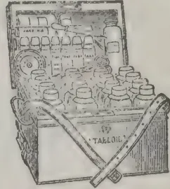

No. 254. Size:  
 9½ × 7 × 6½ in. The  
 ideal Estate Chest.  
 Approx. price in  
 London, 75/0

Particulars, outfits and refillings  
 supplied by all Chemists

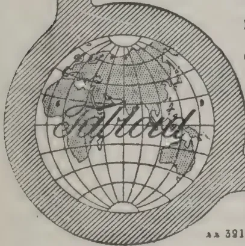

391

BURROUGHS WELLCOME & CO., LONDON

NEW YORK

MONTREAL

SYDNEY

CAPE TOWN

MILAN

SHANGHAI

BUENOS AIRES

All Rights Reserved

### THE SILK INDUSTRY OF CEYLON. AND THE PERADENIYA FARM.

It has come to our notice on more than one occasion that the greatest known hindrance to the spread of sericulture in Ceylon is that the vast majority of the population, who might devote their time to the industry, happen to be Buddhists; and killing of any kind is strictly prohibited by their doctrine. But we are pleased to learn that the Salvation Army are doing all they can to interest the people in sericulture. There are some villagers in Rambukkana, Dumbara and Talanpitiya who are already rearing silkworms and a small supply of cocoons have been sent to the silk farm at Peradeniya for sale. The enthusiastic officer in charge of the Farm, Capt. Jergensen, keeps a supply of eggs to meet any application that may reach him. Eri silk seems to be the only variety that can with any success be introduced into the villages.

A visit to the Farm is always interesting. In 1910 the Ceylon Agricultural Society took back the Silk Farm from Mr. Braine, after everything was in a dormant condition for a long period and placed in charge of the establishment

one of the Agricultural Instructors, Mr. W. Molegoda. He within a short period had brought the Farm into perfect condition; and since giving over to the Salvation Army in 1911 the condition of the Farm has been maintained. At present everything from seed to reeling can be seen at any time. Recently a very interesting set of pictures, illustrating the diseases and different stages of silkworm, has been hung up in the rearing shed. A new variety of worms—the French *Univoltive* has been introduced for the first time. The eggs have come from France direct. It is not proposed to carry on the breeding of this variety here, but to import eggs every year—a wise decision if the vigour of the stock is to be maintained. The silk produced from this variety is said to be very good. It is intended shortly to introduce the *Muga worm* that feeds on cinnamon leaves. A visit to the Farm is well worth paying; and the courteous officer in charge will explain everything and make the visit interesting.

In this connection it is worth noting from the 1911-12 Administration Report for Mysore that at the Tata Silk Farm at Bangalore, managed by the Salvation Army towards which an annual grant of Rs. 3,000 has been

10

91------------------------------------------------

74The Supplement to the Tropical Agriculturist

sanctioned by Government, the subjects of sericultural study and instruction have been grouped as follows :—(a) *Mulberry department*, dealing with the details of the planting and cultivation of mulberry; (b) *Worm-rearing department*, beginning with the carding of eggs and ending with the packing of cocoons; (c) *Reeling department*, dealing with steaming and drying cocoons up to packing silk by means of the press; and (d) *Weaving department*, beginning with bleaching raw silk and ending with the dressing of the finished silks after weaving. Of the number of persons who received instructions on the Farm during the year, 26 consisting of teachers, students, and raiyats belonged to the State, 21 were boarding students from Travancore, two from Madras and the Telugu country, and two were English Officers who have gone to open a silk farm in the Punjab. About 2,000 persons visited the Farm during the year, and 20,000 mulberry cuttings as well as 979,750 eri and mulberry eggs, selected and examined by the microscope, were sent out.

## THE FUTURE OF THE AMAZON TRADE.

### PRESENT DEPENDENCE ON RUBBER.

A very large amount of British capital is invested in the Amazon Valley. An important steamship line running from Liverpool is dependent on the Amazon trade, and the harbours both of Para and Manaus are in the hands of British concessionaires, and have their head offices in London. Besides these vast concerns there are numberless other British interests, such as waterworks and tramways, and the number of British shareholders in commercial enterprises in the Amazon Valley is very great. This trade, the harbour receipts, the freights, in a word, the whole of this business rests mainly on a single article—rubber.

### COMPETITION OF PLANTATION RUBBER.

Only a short time ago Brazil supplied 90 per cent. of the world's rubber, but plantation rubber has quite changed this proportion today. Even before plantation rubber from the East became a very serious factor, crisis after crisis occurred both at Para and at Manaus, and today when the increasing competition from the East, with its rapidly augmenting output and its pure rubber at low cost, is making itself very materially felt, the position is one which, to say the least of it, has very disquieting possibilities.

Many important firms trading in these regions do not seem as yet to have reduced their liabilities at all; the capital of many has been increased, debentures issued, companies reconstructed, and new companies formed, all within the last two years.

Para, the port at the mouth of the Amazon, is not so absolutely dependent on rubber as is Manaus, a thousand miles higher up the river. Distilleries, saw mills and some cattle rearing are other industries, and Para is also a port of transhipment; but here, again, most of this transhipped cargo is to supply the needs of rubber workers and is paid for with money earned from rubber.

Thirty years ago Manaus was still very backward, a comparatively insignificant capital of a poor, little-known province. Thirty years ago rubber was in little demand and sold at a low price. Today all this is changed, with the demand for rubber increasing and the price rising, Manaus (and the conditions at Manaus are typical of those prevailing more or less throughout the Amazon Valley) has made enormous strides, and has become the fine city she is. But when the source of her wealth is looked into, it is found to rest entirely on rubber. Agriculture is neglected; what little there once was of cotton and maize growing has been abandoned; the forest has encroached on the clearings, and, most important of all, the labour has been diverted to rubber collecting.

### RAILWAY CONSTRUCTION AND LABOUR.

A concession has been given to construct a railway along the Rio Branco, thus joining British Guiana and the Amazon Valley, and providing a means of ingress to the great supply of cheap and good labour from the West Indian islands, as well as opening up lands suitable for pasturing. Nothing, however, seems to have been done with this concession, and negroes from British possessions are not looked on with any too favourable eyes by Brazilians. It does seem, however, to be the one way in which the trade of the Amazon can be resuscitated when the rubber difficulty becomes acute. The increase in labour would be gradual and natural, and the food supply would keep pace with the increase of population, thus being far preferable to any importation of labour in the usual way by emigrant ships. The price of Amazon rubber cannot be reduced below a certain point, and the export duty, of at present 18 per cent, if taken off, while enabling the rubber to meet Eastern competition in the world's markets for a longer period, would eventually impoverish the State,

92------------------------------------------------

and Magazine of the Ceylon Agricultural Society.—January, 1913.75

of which it is the chief source of revenue. In several places in the Amazon Valley beginnings have been made with rubber plantations. At one time it was thought that the rubber tree, *Hevea Braziliensis*, would be more likely to flourish in its native forests and soil than when transplanted to another continent. It is found that Liberian coffee grows extremely well at Santos, and now experiments show that the *Hevea* plant grows quite as well in suitable districts of the Old World.

#### FREIGHT: GOVERNMENT ATTITUDE.

The excessive cost of freight on all supplies which would have to be used on the Amazon estates, as well as the dearness and scarcity of labour, would militate very seriously against Amazonian rubber estates as compared with 'Para' rubber grown in the East. The Amazon Steam Navigation Company has been reorganised and, it is said, will make the distribution of goods and the freight of rubber on the Amazon and its tributaries cheaper.

Foreigners, and especially Englishmen, do not seem to realise the position which has arisen and which must become more and more strained, unless some disease were to attack the Eastern rubber plantations, such as practically exterminated coffee in Ceylon twenty years ago, and also did so much harm to Mysore planters. Rubber trees grown in unbroken masses are, of course, much more liable to disease, and to the spread of disease, than when growing at haphazard in the forest (it is a peculiarity of the Amazon forests that the same species of tree rarely is met with once in a hundred yards); but up to the present the Eastern plantations have not suffered.

The Brazilian Government has for some time been aware of the difficulties arising on the Amazon, and in the report to Congress made by the Minister of Finance early last month he insists on the necessity of encouraging other agricultural products besides rubber; admits the serious effect of Eastern competition, and, what is more important than all, actually anticipates a rubber crisis between 1915 and 1917. Palliatives may be found, but the sovereign remedy is the introduction of labour, and, unless some strenuous policy is adopted, it looks as if the Amazon trade would dwindle and shrink until it is enabled to re-establish itself on a sound agricultural basis and so be not entirely dependent, as at present, on the exploitation of one article of forest produce.—*London Times*, Dec. 31.

## A TROPICAL COLLEGE OF AGRICULTURE.

Jan. 20th.

DEAR SIR,—In one of your recent editorials I noticed a reference to a Tropical College of Agriculture for Ceylon, and I have been waiting to see if the matter would be taken up by the Planters. I find, however, that this has not been done, and have wondered why.

The necessity for a training in agriculture as in every other profession, cannot be denied. The planter is every day realising how much he is indebted to the scientist for help and guidance. Why then does he not promote a scheme which would allow of young men taking up the profession of agriculture, receiving a proper grounding before entering upon the practical duties of that profession? It is about time the "creeper" system gave way to a more rational and up-to-date scheme of Agricultural Education. I do not condemn apprenticeship, which is all very well in its proper place, but we do not merely make apprentices of men destined for the Law and Medicine without also giving them the necessary grounding in principles which underlie practice. What a pity it is that H.E. the Governor could not have taken up this idea and carried it out with his wonted vigour. It is a big scheme and needs a strong man.

Tropical Agriculture, like Tropical Medicine, wants specialisation. This is being provided in the case of the latter; why not in the case of the former also? There is no institution in England that can adequately train a man for an agricultural life in the tropics; and that has been the reason, no doubt, why those who have finished their course at an English College have come out to Ceylon as cadets before proceeding to the African Colonies as officials.

"Tropical Life," in writing about this subject, refers to the West Indies as a likely place for such an institution; but Ceylon must surely be given precedence when the comparative merits of the two colonies are considered in this connection. It is unnecessary to go into further details on this point, but whether the Western Tropics are to have a college or not, the advantages of a similar institution for Ceylon cannot be gainsaid. The Philippines have already started one, and we should surely not be behind them.

No one should imagine for a moment that the idea of a college is to provide a training for European planters only. It must serve

93------------------------------------------------

76The Supplement to the Tropical Agriculturist

the interests of all, whether European or Ceylonese, who desire to qualify as cultivators of the products which go to constitute the great agricultural industry of the tropics.

Apart from this there will, of course, be a course for those who wish to study what may be conveniently called pastoral agriculture, but up to a certain point both will travel along the same lines.

The point I wish to bring out is that all interested in the agricultural prosperity of the island whether European or Ceylonese, should look upon the college as a national necessity and should approach Government with a wish that such an institution should be started without undue delay—so that tropical agriculture may receive the same fostering care as is being bestowed on tropical medicine and thereby develop *pari passu*. But (and now I come to the pith of it) they should guarantee to raise a fund to meet the cost provided that Government undertakes to contribute an equal sum.

The new Director of Agriculture, I feel sure, will be a most sympathetically in this cause, and I would be inclined to suggest a public meeting of upcountry and lowcountry planters (and, in fact, of all who are interested in the matter) should be convened at an early date and that the Director be invited to take the chair. Who will take the lead?—Yours truly,

PROGRESS.

### NOTES FROM NYASALAND, (B.C.A.)

B.C.A., Dec. 2nd, 1912.—Nyasaland has made great progress during the past few years, in all the old coffee districts. Now estates have been opened up. Many of the old abandoned places have changed hands at good prices from £1 to £1 10s per acre and are also being re-opened for

#### COTTON, TOBACCO, AND OTHER PRODUCTS.

Sir William Manning, our Governor, is certainly doing his utmost to further the interests of the Protectorate by the construction of macadamised roads as feeders to the railway, and by every other possible means in his power.

Stopping the labour emigration into the Transvaal and Rhodesian mines, too, has done good as our

LABOUR SUPPLY IS NOW ALMOST SUFFICIENT (notwithstanding the increased acreage under cultivation) for the requirements of all, and, of course, will increase as the men return

from S. Africa and find they have to, and can get work at home.

#### RAILWAY CONSTRUCTION.

The contract for a railway from our S. Highland line terminus to the coast at Beira has been signed, and is to be opened within three years; when this line is opened it will give a great filip to the country, as the great drawback to Nyasaland's progress has been in the past want of access to the coast owing to our river not being navigable for one half of the year.

Negotiations are pending for the extension of Shire Highlands railway from Blantyre to Lake Nyasa which would be of great service to the lake districts that are so inaccessible for want of roads and railway.

Nyasaland is no longer depending on the one product coffee, that proved so disastrous to planters some ten to twelve years ago. We have rubber, tobacco, chillies, cotton and tea all growing on the same estates yielding profitable returns to the owners.

We want here good botanical gardens like your Peradeniya, Henaratgoda, Hakgala and others. Our Agricultural Department consists of a good many men, including the head, who know little or nothing of tropical agriculture. Of course, they will learn in time at the country's expense and then go elsewhere.—H. B.

### A VERTICAL SYSTEM OF TAPPING.

Some time ago we announced (July 1st, 1911) that a vertical system of tapping young Hevea trees had been tried experimentally in Ceylon. A tree has been tapped on this system, at the Experiment Station, Peradeniya, with a special knife devised to effect vertical incisions in the manner indicated. The great claim made for this system was that the minimum amount of cortex was removed; incidentally it was pointed out that 4½-year-old trees in Ceylon could be tapped, some yielding, in 70 days' tapping, an average of 1 lb. 3 oz. of rubber. In this system of tapping, two channels are cut from the base to a height of 6 feet, the latex flowing down the channels, and is collected at the base. The following day other channels are made an inch to the right on both sides, and so on until the tree has been tapped on all surfaces. So far we have not heard of any planters taking up this system, but in view of the saving in bark said to be achieved it is a system which is worth ventilating in these columns.—*India Rubber Journal*, Dec. 21.

94------------------------------------------------

and Magazine of the Ceylon Agricultural Society.—January, 1913. 77

## CHINA TEA IN TIBET.

AN EIGHTEEN YEARS' SECRET REVEALED.

(To THE EDITOR, *The Pioneer*.)

Sir,—In your issue of the 22nd Dec. you have a leading article on Tibet and Indian trade in which you say that the China compressed tea brick has an admixture which not only imparts to the beverage a rich red colour, etc., etc., and then further on you say Mr Sherring says the admixture is obtained from a plant growing wild, etc., etc. About 1895 I discovered the plant used by the Chinese. For very many years I had been puzzling myself to find out how the China brick composed of inferior *green* leaves gave such a rich red liquor. One day an assistant of mine found in a China brick very nearly the whole of a large leaf which certainly was not tea and I hunted through my forest (6,500 elevation) and at last found a similar leaf which was promptly treated as I would treat the tea shrub leaf with the result that I got an article very, very similar to dry tea which gave on infusion a rich red liquor and which gave warmth to the stomach and was sustaining. I sent down to Dr. Watt, at the Museum, Calcutta, all particulars of the tree, some of its leaves and a sample of the tea made from it and was told that the tree was *Ehretta Serrata* (Pun-ya of Kumaon) and that it had the properties required by the Tibetans and I was asked to send down some bricks of the pure *Ehretta Serrata* tea and of tea and *Ehretta serrata* mixed. This I did and in 1899 I saw the bricks I had sent in the Museum; whether they are still there I cannot say. *Ehretta Serrata* added to Hyson Skin, the most inferior of green tea, will give what the Tibetans want and look for in brick tea. viz, a green leaf, red liquor which is warming and comforting.

Mr Sherring was Deputy Commissioner of Almora when he went into Tibet and I may have mentioned to him that I knew what the admixture was and that I was putting it in my bricks and was having a good sale in consequence. I know he asked that some chests of bricks should be sent across into Tibet which was done.

*Ehretta Serrata* leaf requires to be picked in the spring just when the young leaves are appearing: then if treated exactly as one would treat the leaf of the tea shrub for *black* tea it will give an article undistinguishable from real tea in its dry state and the infused leaf will give a rich red liquor, but hardly fit for anyone to

drink pure, indeed, I do not think a mixture of pure tea and *Ehretta Serrata* would give a liquor to suit the taste of anyone except a Tibetan.

Having kept the secret for over 18 years Darjeeling and Assam are welcome to it; but whether *Ehretta Serrata* grows in those districts I do not know; if not, I could supply a few chests for mixing purposes and a little goes a long way.

PLANTER.

—*Pioneer*, Jan. 5,

## TOBACCO CULTURE AT CHILAW.

Tobacco cultivation, in the town, has commenced briskly. The continuous slow rains throughout the past month, during which Chilaw has been enjoying quite upcountry weather, have rendered the soil most favourable for the planting of seedlings, and every available inch of ground has been planted up. The dearth of cattle has compelled the use, this season, of artificial manure. It is to be hoped the experiment will prove a success.  
—*Chilaw Cor.*

## THE CULT OF THE COCONUT.

This is a book which presents difficulties to the reviewer. What is the real object with which it has been written? Who is the author or authors of the work? These are the first questions that present themselves. If it is intended as an authoritative pronouncement on coconut cultivation and the coconut industry in general, it is a pity that the name of the author is kept back. Though purporting to deal with the coconut, there is also a good deal said about the African oil palm and other tropical products, such as the kola-nut. The arrangement adopted in the book—if there is any arrangement whatever—is very crude. Why was not a definite method of treatment adopted and information given under specific chapters? As it is, the reader finds himself in a maze of facts and figures and does not know where to find the information he is in search of. The publishers are Messrs. Curtis, Gardner & Co., Ltd., whose Intelligence Department claims to be an “Enquire Within upon Everything” to the investor. The book, which is attractively though cheaply got up, charges Great Britain with neglecting to foster her Agricultural and Commercial enterprises and develop the resources of the tropics as the Germans are doing. There is good deal in the book that is evidently not the outcome of actual experience,

95------------------------------------------------

78The Supplement to the Tropical Agriculturist

Referring to species of the coconut we are told that there is another species, *Cocos butyracea*; also a specially large species bearing two nuts within one husk, *Lodiocea Seychillarum* (*sic*); but no information is given as to the commercial possibilities of either! Why is Copra always referred to as consisting of "dried strips of kernel?" The following is a description of how toddy is extracted:—

"The natives sometimes divert the coconut tree from bearing fruit by cutting off the flower stalks. By making an incision in the stump of the tree so checked from bearing fruit, and beating it, they obtain the flow of a juice called toddy."

This might be a passage from Knox, or a literal translation from the French. To find the age of a coconut palm we are told to divide the number of rings (scars) on the stem by two: since two such rings are created annually. To pick nuts "The natives climb the trees by means of the transverse rings or scars previously described and descend with the fruit!" As a popular book "The Cultivation of the Coconut" should interest a good many, though the title is hardly likely to prove as attractive as that of the French Edition "Richesses des Tropiques"; but it can hardly rank as a work of reference for the tropical planter.

## NATURAL AND SYNTHETIC RUBBER.

I was extremely interested in Dr Perkin's paper on "Natural and Synthetic Rubber," but, apart from appreciation, I wish to say that two or three years ago I was travelling in the French Congo, and there saw an experiment in coagulation not mentioned in the paper. In my wanderings through the forest, I often saw creeping vines lying on the ground and twining round great trees in their endeavour to get out of the cathedral-like gloom below to the sunshine above. Owing to some difference with the authorities, the natives were not then exploiting this source of wealth, but as a mark of respect to me a man went out into the forest, and in a short time returned with a cup-like receptacle full of latex. This he put in a pot over the camp fire and added a little common salt. The result was astonishing in the suddenness of the transformation into a solid mass. Taking it out, he worked it for a few minutes and produced a white highly elastic ball, weighing rather less than half a pound. I came across this sample the other day and was surprised to

find it a black, sticky mass that was unpleasant to touch.

The natives in the part of the French Congo referred to are primitive in the extreme and not troubled with much clothing, but from the example given they have learned a more comfortable method of coagulating rubber than by smearing it over their bodies. I never heard of this queer practice before, and I agree with Dr Perkin that it must be "an unpleasant sensation."

HUGH PEARSON.

*Royal Society of Arts Journal*, Dec. 20.

## CITRONELLA OIL.

### A New Method of Assay.

Boulez ("Bull. Soc. Chim., Paris" (4), 11, 915) describes a new method for the assay of citronella oil. He uses 25 to 50 grams of the oil, which if shaken up in an Erlenmeyer flask with 100 to 200 c. c. of concentrated solution of acid sulphite of potassium, which is saturated with neutral sulphite and then left standing until all the aldehyde is combined. An equal volume of water is then added, and the mixture is heated under a condenser, with frequent shaking, until the aldehyde is all dissolved as a sulphonic compound. The oil which remains unabsorbed is separated and weighed, and the geraniol is determined by acetylating the separated oil in the usual manner.—*Chemist and Druggist*, Dec. 21.

## NEW SOURCES OF PAPER.

Under this heading the *Kew Bulletin* [No. 9, 1912] gives an illustrated account of *Hedychium coronarium*, Koen., and allies, as a source of material for paper-making. The plant, a member of the natural order *Zingiberaceae*, is a native of India, being distributed from the Himalayas to Ceylon and Malacca. It is also found in the West Indies, New Zealand, and elsewhere, and it covers large tracts of swamps in Brazil. Experiments have been made with specimens sent from San Paulo, and papers of exceptional tensile strength, exceeding that of Manila paper, have been produced from the fibre. Owing to a semi-gelatinous constituent the new paper is said to be practically "natural parchment." Samples of the paper and fibre have been placed in the Museum of the Royal Botanic Gardens, Kew. Besides possessing self-sizing qualities, the fibre is capable of being worked very quickly on the paper-making machine. Another plant, *Amomum hemisphericum*, for brown paper-making, is also described in the *Bulletin*.—*London Times*, Dec. 14.

96------------------------------------------------

and Magazine of the Ceylon Agricultural Society.—January, 1913. 79

## HOLING BY DYNAMITE.

### Sir S. D. Bandaranayake's Experiments.

Among the pioneers with this new system of cultivation is Sir Solomon Dias Bandaranayaka who, writing from his estate at Horagolla, states that in a block of 70 odd acres of land which he has just opened for coconuts about 2 acres were holed with dynamite. He promises to communicate to us the results of the experiment when they become manifest.

## FOOD FOR HORSES IN MALAYA AND CEYLON.

Sir,—In your issue of Sept. 21 "A. N. P.," writing from Ceylon, suggests in reply to a correspondent that Guinea grass might serve as food for horses in Malaya, but adds that he does not actually know whether it thrives there. It does grow well here, but must be kept weeded, and, if manured, a patch of about 30ft. by 15ft. is sufficient for one polo pony. It grows in tufts, and should from time to time be separated. I start cutting at one end, and cut two rows a day. By the time the end is reached the first two rows have grown sufficiently to start cutting again. My experience is that Guinea grass should not be given to ponies when it is wet.

FRANK MILLS.

Kuala Lumpur, Federated Malay States,  
Nov. 3.—*The Field*, Dec. 7.

## A NEW INDIA-RUBBER PRODUCING PLANT.

A recent report of the Mexican Minister of Agriculture gives some interesting particulars of a tree, indigenous to that country, from which india rubber of a superior quality can be obtained. It is known to the natives by the name of "Cacaloschili." It is one of the many species of the "Plumeria," a genus common to Mexico and Central America. All the known varieties of this genus in Mexico yield a milky sap from which caoutchouc can be obtained. The "Plumeria rubra," the botanical name of this new plant, is found growing wild in the dry mountainous regions of Mexico at an altitude of 1,000 to 5,000 feet, where the annual rainfall is between 24 inches and 44 inches. Unlike the majority of rubber-producing plants, the "Plumeria rubra" thrives best in sandy or stony soil, amongst rocks, where it attains a height of stem of 6 to

15 feet, and a girth of 8 to 24 inches. The bark, which is light grey, is rough, and the flowers large and white. It is found chiefly in the territories of Moreco, Michoacan, Oajaka, Vera Cruz, Manzanillo, Guerrero, and in certain parts of Puebla. The tree is of quick growth, and is easily propagated by cuttings placed in the ground, where they take root in about four weeks. This mode of propagation is preferable to that by seed as the plants obtained by the former method begin to yield after the third year. The experiments which have been made with these plants at the botanical station of Tezenapa show that the rubber obtained from the young branches is superior in quality to that produced from the older portion of the tree. For this reason "tapping" is not resorted to, as is the case with the "Hevea Brasiliensis" and other rubber-yielding plants. The sap from the "Plumeria rubra" is extracted from the branches and young shoots which are cut off. This annual pruning appears to improve rather than injure the tree. The coagulated sap of this plant, according to analysis made by the chemist at the botanical station, contained 21.9 per cent resinous matter, 15.7 per cent water, and 25.5 per cent caoutchouc of excellent quality.—Royal Society of Arts Journal, Dec. 27.

Kandy, Jan. 14th.

DEAR SIR,—Reference is made in the Supplement to your issue of the 11th instant to a new Rubber known by the native name of "Cocalos chili" found in Mexico and Central America. The Botanical name of this plant, *Plumeria rubra*, proves it to be none other than the red flowered temple tree (Sin. Araliya), so common in gardens about Colombo: but people are led into making enquiries about it, imagining that it was something quite new. Not long ago, there was a description going the round of the press of a gigantic form of bean, but the interest in this new wonder subsided as soon as it was discovered through its Scientific name that it was the Snake Gourd! There is, therefore, some value in the employment of botanical nomenclature which is often put down as an exhibition of pedantry.

Seeing the way in which agricultural information of this nature is given currency to, we may before long expect to read of a vegetable monotrosity borne by a tree called *Artocarpus Integrifolia*, or a valuable oil nut, the product of *Cocos nucifera*.—Yours truly,

D.

97------------------------------------------------

80The Supplement to the Tropical Agriculturist

## PREPARATION OF PLANTATION RUBBER.

### A VALUABLE TEXT BOOK.

Received from the F. M. S.

"The Preparation of Plantation Rubber" an official bulletin prepared by Mr BJ Eaton, F.I.C., F.C.S., Agricultural Chemist to the Federated Malay States department of Agriculture, and which is on sale at this office, proves itself to be one of the most useful pamphlets on this subject that has been issued for some time. Exhaustive details of a series of experiments are described of the preparation of rubber from twelve-year-old trees, never tapped previously, and the result is to give accurate information which will dispose of a good deal of what has hitherto been accepted unreservedly. The experiments were of a comprehensive character and comprise the effects of different coagulants; the effects of iron salts on raw rubber, which go to prove the need for scrupulous cleanliness; the effect of common salt, peaty water, and sunlight on rubber, etc. There is an able chapter on the oxidation of raw rubber samples and how to prevent it; while the growth of moulds and bacteria on rubber, and the effect of carbon dioxide are described. Defects in rubber; special coagulants, and special processes of coagulation are dealt with in some detail, while smoked rubber and smoking houses, machinery, drying sheds; density of rubber; the testing of rubber samples, and viscosities of rubber solutions are other invaluable chapters. The bulletin should be in the hands of all connected with the rubber industry.

### MEASUREMENTS FOR A RAIN-GAUGE.

Aliakolla, Madulkelle, Jan. 25th.

DEAR SIR,—Could you oblige me by telling me if the following measurements are correct for a rain gauge :—

Funnel ... 4 9-16th in. diameter.

Glass ... 1 9-16th ,, ,,

My rain gauge is on the top of my factory, in the centre of the roof, on a stand 2 feet high and about 60 feet off the ground, and I have measured the following rain this month. I have not sent in the account before as it seems utterly impossible, and I have been trying to find out where the mistake could have occurred, but cannot unless it is in the size of rain-gauge. I had the funnel through a half-inch plank and thence into a hole in a four-gallon kerosine oil tin. The funnel fitted tightly into the plank

and no water could have got in, in any other way, except by going through the half-inch plank, which was certainly saturated. After the 11th I took this plank off and soldered a piece of tin round the hole in the tin, so that the funnel now fits closely over this, but even now the rainfall seems rather too much to be correct. So, I think, the measuring-glass must be in the wrong ratio to the funnel, and shall be much obliged if you can enlighten me.—Yours truly,

JOHN HEMSTED.

### JANUARY RAINFALL.

<table>
<tbody>
<tr>
<td>1</td>
<td>...</td>
<td>3.05</td>
<td>13</td>
<td>...</td>
<td>—</td>
</tr>
<tr>
<td>2</td>
<td>...</td>
<td>24.70</td>
<td>14</td>
<td>...</td>
<td>...</td>
</tr>
<tr>
<td>3</td>
<td>...</td>
<td>8.95</td>
<td>15</td>
<td>...</td>
<td>1.12</td>
</tr>
<tr>
<td>4</td>
<td>...</td>
<td>1.56</td>
<td>16</td>
<td>...</td>
<td>5.90</td>
</tr>
<tr>
<td>5</td>
<td>...</td>
<td>18.12</td>
<td>17</td>
<td>...</td>
<td>22.71</td>
</tr>
<tr>
<td>6</td>
<td>...</td>
<td>16.21</td>
<td>18</td>
<td>...</td>
<td>.10</td>
</tr>
<tr>
<td>7</td>
<td>...</td>
<td>4.00</td>
<td>19</td>
<td>...</td>
<td>.27</td>
</tr>
<tr>
<td>8</td>
<td>...</td>
<td>18.85</td>
<td>20</td>
<td>...</td>
<td>.75</td>
</tr>
<tr>
<td>9</td>
<td>...</td>
<td>10.50</td>
<td>21</td>
<td>...</td>
<td>.30</td>
</tr>
<tr>
<td>10</td>
<td>...</td>
<td>5.75</td>
<td>22</td>
<td>...</td>
<td>.20</td>
</tr>
<tr>
<td>11</td>
<td>...</td>
<td>1.37</td>
<td>23</td>
<td>...</td>
<td>.02</td>
</tr>
<tr>
<td>12</td>
<td>...</td>
<td>—</td>
<td>24</td>
<td>...</td>
<td>1.67</td>
</tr>
<tr>
<td colspan="3"></td>
<td>Total</td>
<td>...</td>
<td>146.10</td>
</tr>
</tbody>
</table>

N.B.—Rainfall for each day is measured at 6 a. m. on the following morning.

[Mr. Bamford, of the Colombo Observatory, informs us that a typical gauge is a five-inch gauge, and a glass with an internal diameter of 1.7 inches. Half-an-inch of rain then fills 4½ inches of the glass, measured roughly. Ed.,—A. M. & J. F.]

### RUBBER SEED OIL FOR PAPER UMBRELLAS.

The vegetable oil used in making paper umbrellas in Japan is pressed out of the seeds of the rubber plant. This oil is made in the various islands famous for oil and seeds from these plants. Sandy ground is favoured for the cultivation of the plant and the oil is extracted from the seeds by presses. The yield of seeds is estimated at 20 bushels per acre. The annual production throughout Japan amounts to 350,000 bushels, from which over a gallon of oil per bushel is extracted. The oil before it is used is boiled and then cooled until it can be applied by hand to umbrellas with a piece of cloth or waste. No machinery or tools are used in applying the oil. When the oiling is completed the umbrellas are exposed in the sun for about five hours. This oil is also used in making the Japanese lanterns, artificial leather, printing ink, lacquer, varnishes, oilpaper, and paints.—Madra Jan. 14.

98------------------------------------------------

This image is a scan of a blank page. The background is a uniform light beige or off-white color. There are several small, dark specks scattered across the page, which appear to be scanning artifacts or dust. A vertical line of small, dark dots runs along the right edge of the page, likely from the scanning process. No text, lines, or other graphical elements are present.

99------------------------------------------------

A black and white photograph of Mr. E. E. Green, a Government Entomologist from Ceylon, working in a laboratory. He is looking up at a microscope. In the foreground, there are several racks of small containers, likely for insect specimens. The background shows a window with a view of a landscape.

MR. E. E. GREEN,  
*Government Entomologist, Ceylon.*

100------------------------------------------------

THE  
TROPICAL AGRICULTURIST  
AND  
MAGAZINE OF THE  
CEYLON AGRICULTURAL SOCIETY.

---

VOL. XL,

COLOMBO, FEBRUARY 15TH, 1913,

No. 2.

---

**RETIREMENT OF MR. GREEN,  
CEYLON GOVERNMENT ENTOMOLOGIST.**

After a period of 14 years' service Mr. E. E. Green has for purely family reasons resigned his appointment as Government Entomologist. His loss will be severely felt by the Department of Agriculture to whose councils he brought ripe experience in all matters connected with Ceylon planting besides that of his own special subject, by the Society and by the Island generally.

Mr. Green came to Ceylon in 1881 and began as a planting student in the Dickoya district.

From his earliest boyhood he had always been interested in natural history and had made systematic collections of Lepidoptera in England. His interest in Entomology continued in Ceylon. As a planter, first of coffee and cinchona and later of tea, his attention was early attracted to the study of the insect pests of these plants. In 1883 he took up the management of an estate in Pundaluoya and remained on the same estate for sixteen years.

About the year 1885, coffee, already weakened by leaf-disease, fell a prey to a serious insect pest that had not previously been observed. It proved to be a new species of "scale-bug" which was subsequently described by Mr. Green under the name of *Lecanium viride*. So serious were the ravages of this insect that he was asked by the Ceylon Government to investigate and report. His report, with a coloured plate, was published as a Government Blue Book. Unfortunately the pest had then established itself too firmly and widely to be controlled and coffee was finally doomed, to give place to tea. Evidence goes to show that this pest was almost certainly introduced from Africa with liberian coffee plants and this occurrence turned his attention to the importance of establishing quarantine for all imported plants.

In 1888 he published a series of articles on Insect Pests of the Tea plant in *The Independent*, then edited by Geo. Wall.

Proofs of the first edition of Dr. (now Sir George) Watt's "Pests and Blights of the Tea Plant" were submitted to him for observations and corrections.

101------------------------------------------------

82[FEBRUARY, 1913.

In 1893 Mr. Green began the special study of the Coccidæ and determined to monograph the Coccidæ of Ceylon. This work, of which 4 volumes have already been issued, has grown to unexpected dimensions. It is published at his private expense and has proved a costly hobby. The several volumes have been published during his periods of leave in England and has led to a large increase of outside work. There are few specialists in this group; consequently Mr. Green was soon recognised as an authority and inundated with material from many parts of the world.

He was appointed honorary Government Entomologist in 1897 and undertook several investigations of important diseases. In the early days of Cacao canker, the planters believed the disease to be due to an insect. Mr. Green refuted this idea giving it as his opinion (in conjunction with Dr. J. C. Willis) that the disease was of fungal origin. He also investigated and reported upon insects destructive to stored paddy, and upon an outbreak of locusts. In 1899 he was appointed official Government Entomologist with residence at Peradeniya.

In 1901 he was awarded the recently established Barclay medal by the Royal Asiatic Society of Bengal for biological work connected with India during the previous ten years. This was the first award.

Mr. Green's experience as a practical planter gave him a useful insight into what methods of treatment were or were not practicable. He has always endeavoured to allay scares; to avoid the recommendation of impracticable and expensive treatments.

Early in his official career he insisted upon the importance of a Quarantine station in Colombo, was responsible for the establishment of such a station and for the compulsory treatment of all imported plants.

Beside the larger work on Coccidæ he has published over 200 papers and articles on economic and general entomology, in various Journals and Transactions. Mr. Green was the first holder of the post of Government Entomologist in Ceylon; if not the first official Economic Entomologist in the tropics.

We give a portrait of Mr. Green working in his laboratory at Peradeniya.

---

102------------------------------------------------

FEBRUARY, 1913.]83

## COTTON EXPERIMENTS IN THE CAPE PROVINCE.

The following extracts are on the above subject from a paper contributed by A. van Ryneveld, Research Branch, Grootfontein School of Agriculture, to the *Agricultural Journal of the Union of South Africa*.

### Site.

The site chosen for the experiment was at the Big Umgazi, in the District of Port St. Johns, Pondoland, on ground belonging to Messrs. Wardlaw and Kirsten. The soil consists of a rich, dark, heavy, sandy loam—in fact might be termed a chocolate loam—and was moderately moist at planting time.

### Planting.

Ten pounds weight of seed was used per acre and planted with a single "Cole Cotton Planter." Owing to a protracted period of drought and the consequent hardness of the ground, and above all a virulent outbreak of East Coast fever in the district, resulting in scarcity of oxen for ploughing, the land was only ploughed up once, namely, just before planting. The soil, however, was well turned over and harrowed until the big clods were broken up and fairly fine tilth obtained. Weather conditions were favourable during planting time, a shower of rain (about '35) having fallen the evening after planting was completed, most of the seed germinating in five to six days, resulting in a good, healthy and full stand for all the varieties with the exception of the Nyasaland Upland which, as will be seen from the table, only realized a 52 per cent. stand. Plants were thinned out to requisite distance when fourteen days old and again at one month. The perennial varieties—that is the Sea Island and Egyptian—were planted from 5 feet to 6 feet apart in the rows, a few rows being 7 feet for experimental purposes. The rows of the rest were 4 feet apart,

The following table shows the results obtained:—

TABLE OF RESULTS.

<table border="1">
<thead>
<tr>
<th rowspan="2">Date of Planting.</th>
<th rowspan="2">Locality.</th>
<th rowspan="2">Variety Planted.</th>
<th colspan="2">Weight of plant in inches.</th>
<th colspan="2">No. of Bolls to plant.</th>
<th colspan="2">No. of Bolls to 1 lb. of Seed Cotton.</th>
<th rowspan="2">Percentage of Sand.</th>
<th rowspan="2">Size of Plot in Acres.</th>
<th rowspan="2">Yield per Plot, lb.</th>
<th rowspan="2">Yield per Acre, lb.</th>
</tr>
<tr>
<th>Selected</th>
<th>Average</th>
<th>Selected</th>
<th>As found</th>
<th>Selected</th>
<th>As found</th>
</tr>
</thead>
<tbody>
<tr>
<td>1911. Oct. 28</td>
<td>Big Umgazi.</td>
<td>Sea Island.</td>
<td>102</td>
<td>78</td>
<td>188</td>
<td>150</td>
<td>89</td>
<td>112</td>
<td>% 99</td>
<td>5</td>
<td>6,849</td>
<td>1,369.8</td>
</tr>
<tr>
<td>" 29</td>
<td>Port St. John, Pondoland.</td>
<td>Egyptian Mitafifi.</td>
<td>102</td>
<td>78</td>
<td>222</td>
<td>99</td>
<td>98</td>
<td>119</td>
<td>94</td>
<td>3</td>
<td>3,857</td>
<td>1,285.6</td>
</tr>
<tr>
<td>" "</td>
<td>"</td>
<td>American Toole.</td>
<td>60</td>
<td>51</td>
<td>130</td>
<td>71</td>
<td>66</td>
<td>75</td>
<td>80</td>
<td>2</td>
<td>4,135</td>
<td>2,067.5</td>
</tr>
<tr>
<td>" 30</td>
<td>"</td>
<td>Nyasaland Upland.</td>
<td>72</td>
<td>60</td>
<td>168</td>
<td>97</td>
<td>68</td>
<td>73</td>
<td>52</td>
<td>3½</td>
<td>5,419</td>
<td>1,548.2</td>
</tr>
<tr>
<td>" "</td>
<td>"</td>
<td>Cleveland.</td>
<td>54</td>
<td>48</td>
<td>59</td>
<td>39</td>
<td>43</td>
<td>52</td>
<td>100</td>
<td>1</td>
<td>505</td>
<td>1,010.0</td>
</tr>
<tr>
<td>" "</td>
<td>"</td>
<td>Big Boll. Herlong</td>
<td>48</td>
<td>45</td>
<td>57</td>
<td>34</td>
<td>—</td>
<td>—</td>
<td>100</td>
<td>1</td>
<td>90</td>
<td>810.0</td>
</tr>
</tbody>
</table>

103------------------------------------------------

84FEBRUARY, 1913.

### COST OF PRODUCTION AND ESTIMATED PROFIT PER ACRE.

The following is the cost of production and estimated profit per acre of the different varieties planted :—

#### *Sea Island.*

<table>
<tr>
<td>Preparing and ploughing</td>
<td>...</td>
<td>...</td>
<td>£ 0 10 0</td>
</tr>
<tr>
<td>Harrowing</td>
<td>...</td>
<td>...</td>
<td>0 1 0</td>
</tr>
<tr>
<td>Planting</td>
<td>...</td>
<td>...</td>
<td>0 1 0</td>
</tr>
<tr>
<td>Seed</td>
<td>...</td>
<td>...</td>
<td>0 1 0</td>
</tr>
<tr>
<td>Chopping (thinning out)</td>
<td>...</td>
<td>...</td>
<td>0 2 0</td>
</tr>
<tr>
<td>Cultivating and hand-hoeing</td>
<td>...</td>
<td>...</td>
<td>0 12 0</td>
</tr>
<tr>
<td>Picking</td>
<td>...</td>
<td>...</td>
<td>1 16 0</td>
</tr>
<tr>
<td>Transport</td>
<td>...</td>
<td>...</td>
<td>0 4 0</td>
</tr>
<tr>
<td>Wear and tear of implements</td>
<td>...</td>
<td>...</td>
<td>0 1 0</td>
</tr>
<tr>
<td>Sundries</td>
<td>...</td>
<td>...</td>
<td>0 2 0</td>
</tr>
</table>

---

£ 3 10 0

<table>
<tr>
<td>1,369 lb. seed cotton at 3d. per lb.</td>
<td>...</td>
<td>...</td>
<td>£ 17 2 3</td>
</tr>
<tr>
<td>Less cost of production</td>
<td>...</td>
<td>...</td>
<td>3 10 0</td>
</tr>
</table>

---

Estimated profit per acre ... £ 13 12 3

#### *Mitafifi.*

£. s. d.

<table>
<tr>
<td>1,285 lb. seed cotton at 3d. per lb.</td>
<td>...</td>
<td>...</td>
<td>16 1 3</td>
</tr>
<tr>
<td>Less cost of production</td>
<td>...</td>
<td>...</td>
<td>3 0 0</td>
</tr>
</table>

---

Estimated profit per acre ... 13 1 3

#### *American Toole.*

<table>
<tr>
<td>2,067 lb. seed cotton at 3d. per lb.</td>
<td>...</td>
<td>...</td>
<td>25 16 9</td>
</tr>
<tr>
<td>Less cost of production</td>
<td>...</td>
<td>...</td>
<td>3 10 0</td>
</tr>
</table>

---

Estimated profit per acre ... 22 6 9

#### *Nayasaland Upland.*

<table>
<tr>
<td>1,548 lb. seek cotton at 3d. per lb.</td>
<td>...</td>
<td>...</td>
<td>19 12 0</td>
</tr>
<tr>
<td>Less cost of production</td>
<td>...</td>
<td>...</td>
<td>3 0 0</td>
</tr>
</table>

---

Estimated profit per acre ... 16 12 0

#### *Cleveland Big Bell.*

<table>
<tr>
<td>1,010 lb. seed cotton at 3d. per lb.</td>
<td>...</td>
<td>...</td>
<td>12 12 6</td>
</tr>
<tr>
<td>Less cost of production</td>
<td>...</td>
<td>...</td>
<td>2 15 0</td>
</tr>
</table>

---

Estimated profit per acre ... 9 17 6

#### *Herlong.*

<table>
<tr>
<td>810 lb. seed cotton at 3d. per lb.</td>
<td>...</td>
<td>...</td>
<td>10 2 6</td>
</tr>
<tr>
<td>Less cost of production</td>
<td>...</td>
<td>...</td>
<td>2 15 0</td>
</tr>
</table>

---

Estimated profit per acre ... 7 7 6

### IRRIGATION OF CEARA RUBBER.

About a year ago we called attention to the advantages that the Kibwezi rubber estate derived from irrigating the trees (Ceara). Today out of the 562 acres planted, some 345 acres have been so treated, and advices go to show that the trees have much improved where irrigated.

— *Tropical Life.*

104------------------------------------------------

FEBRUARY, 1913.]85

## A GREEN MANURE FOR TOBACCO.

*Thespesia Populnea*, Tulip tree.

*Suriya*, Sinhalese; *Puvarasu*, Tamil.

The tulip grows freely near the sea and in the dry zone including Trincomalee, Batticaloa, Kalpitiya, Jaffna and Mannar, and was planted by the Dutch as a roadside tree. It produces yellow tulip-like flowers more or less throughout the year.

It is now largely used as a green manure for tobacco by the Jaffna cultivators, and in December cartloads of the leaves and branches were being cut and carried to the tobacco fields, where the material was dug or ploughed in fresh.

An average sample of the leaves and branches was taken for analysis and showed a ratio of two to three leaves and buds to one of wood.

On sun drying the leaves lost 66.3 % of moisture and the wood 71.4 %, but the leaves had partly withered on reaching the laboratory.

The composition of the sun-dried samples was

<table>
<tr>
<td>Moisture</td>
<td>...</td>
<td>...</td>
<td>18.5 %</td>
</tr>
<tr>
<td>Organic matter</td>
<td>...</td>
<td>...</td>
<td>71.2,,</td>
</tr>
<tr>
<td>Ash</td>
<td>...</td>
<td>...</td>
<td>10.3,,</td>
</tr>
<tr>
<td colspan="3"></td>
<td style="border-top: 1px solid black;">100.0</td>
</tr>
</table>

The organic matter contained 2.2 % of Nitrogen calculated on the sun-dried sample or approximately 0.64 % on the fresh twigs, equivalent to 14½ lbs. per ton.

The composition of the Ash shows that it is rich in lime and potash, the latter constituent being largely required for successful tobacco growing.

For comparison the amount of Nitrogen and the Ash analysis is compared with other plants, which might be usefully employed for the same purpose:—

<table>
<thead>
<tr>
<th></th>
<th>Percentage of Ash in Sun-dried Plants.</th>
<th>Lime.</th>
<th>Potash.</th>
<th>Phosphoric Acid.</th>
<th>Nitro- gen.</th>
</tr>
</thead>
<tbody>
<tr>
<td><i>Thespesia populnea</i> ...</td>
<td>10.30 %</td>
<td>26.00 %</td>
<td>26.8 %</td>
<td>5.40 %</td>
<td>2.20 %</td>
</tr>
<tr>
<td><i>Vigna Catiang</i> ...</td>
<td>14.16 ,,</td>
<td>24.00 ,,</td>
<td>24.5 ,,</td>
<td>5.86 ,,</td>
<td>3.88 ,,</td>
</tr>
<tr>
<td><i>Crotalaria striata</i> ...</td>
<td>6.62 ,,</td>
<td>15.85 ,,</td>
<td>35.5 ,,</td>
<td>11.82 ,,</td>
<td>3.80 ,,</td>
</tr>
<tr>
<td><i>Phaseolus lunatus</i> ...</td>
<td>7.70 ,,</td>
<td>22.30 ,,</td>
<td>35.1 ,,</td>
<td>9.35 ,,</td>
<td>2.98 ,,</td>
</tr>
<tr>
<td><i>Leucaena glauca</i> ...</td>
<td>5.52 ,,</td>
<td>32.90 ,,</td>
<td>24.9 ,,</td>
<td>5.60 ,,</td>
<td>2.57 ,,</td>
</tr>
<tr>
<td><i>Tephrosia Purpurea</i>...</td>
<td>4.89 ,,</td>
<td>30.00 ,,</td>
<td>24.1 ,,</td>
<td>11.42 ,,</td>
<td>2.39 ,,</td>
</tr>
<tr>
<td><i>Tephrosia candida</i> ...</td>
<td>5.16 ,,</td>
<td>20.00 ,,</td>
<td>31.5 ,,</td>
<td>7.19 ,,</td>
<td>2.80 ,,</td>
</tr>
</tbody>
</table>

While *Crotalaria striata*, *Phaseolus lunatus*, and *Tephrosia candida* have a larger percentage of potash in the Ash, the percentage of ash is lower, so that a ton of these plants would have approximately the same value as regards potash. As regards Nitrogen, *Vigna Catiang*, *Crotalaria striata* and *Phaseolus lunatus* are more valuable than any of the others, and their growth in waste lands is to be recommended.

M. KELWAY BAMBER,  
Government Chemist.

105------------------------------------------------

86[FEBRUARY, 1913.

## A LAND BANK FOR SOUTH AFRICA.

---

The following article is extracted from *The Agricultural Journal of the Union of South Africa* for the month of December 1912:—

Another landmark in the agricultural progress of South Africa is the establishment of the Land Bank. This bank has been provided for the purpose of aiding deserving agriculturists in the development of their farms. With the advent of Union the Provincial Agricultural Banks were amalgamated into one union Bank with head-quarters in Pretoria. As this combined bank has been modelled on the lines of the Transvaal Land Bank it may be of interest to recall the nature and scope of the operations of the latter. The Transvaal Land Bank was started in 1907, and carried on business for four and a half years. During this period, moneys were advanced to the amount of £2,105,000 the security being farm property worth nearly £7,000,000. The average loan was £357, a figure which clearly shows that the directors kept in view the main object for which the bank was established, namely, to help the small farmer. No loan exceeded £2,500. The total number of loans issued was 5,661, which is approximately one-quarter of the rural population of the Transvaal, and indicates how widely the bank was appreciated. The Transvaal Land Bank not only enabled farmers to pay off mortgages by advancing money at reasonable rates, but it also brought down the general rate of interest on farm property. The bank proved that, in the past, many agriculturists had been paying too much for advances. The bank relieved them, and at the same time, set free a large sum for beneficial development of the land instead of permitting it to swell the profits of Shylockian money lenders.

### The Capital.

The capital of the New Union Bank is fixed at £6,000,000 and consists of the capital of the old Provincial Banks, together with such further moneys as Parliament may authorize. Its operations are controlled by a Central Board in Pretoria, assisted by four local Advisory Boards in other parts of the Union. Under the Union Land Bank the loans will vary from £50 to £2,000. The method of procedure is as follows: Any farmer who desires a loan goes to the nearest magistrate and fills in a form of application. He pays two fees; one on the amount of the loan, varying from £1 to £1 10s., and the other a valuator's fee of £1. The valuator then submits his valuation to the magistrate who forwards the application with his recommendation to the Local Board, who in turn, forward it to the Central Board. The Local Board is purely advisory. The Central Board finally determines whether the application shall be approved. The interest for the first five years is at 5 per cent.; thereafter capital and interest for twenty-five years at 7 per cent. These loans are for a period of thirty years. There is another form of loan called the cash credit loan limited to £1,000 at 6 per cent. This loan is granted on a reasonable security, and is intended specially to encourage the purchase of live stock and any necessaries connected with farming operations.

106------------------------------------------------

This image is a scan of a blank page. The background is a uniform light beige or off-white color. There are a few very small, dark specks scattered across the surface, which appear to be scanning artifacts or dust particles. No text, lines, or other graphical elements are present.

107------------------------------------------------

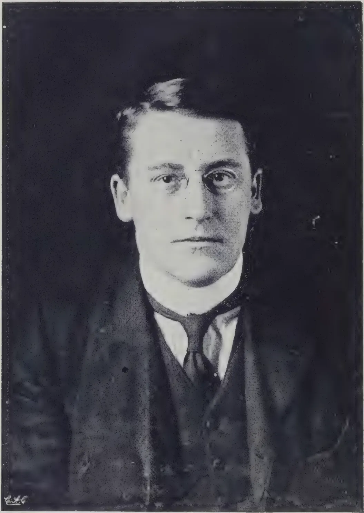A black and white portrait photograph of a man, identified as His Excellency the Hon'ble Mr. R. E. Stubbs. He is wearing a dark suit, a white shirt, and a dark tie. The photograph is framed by a dark border.

HIS EXCELLENCY THE HON'BLE MR. R. E. STUBBS,  
*Officer Administering the Government, Ceylon.*

108------------------------------------------------

FEBRUARY, 1913.]87

## THE BOARD OF AGRICULTURE.

### QUARTERLY MEETING.

The Quarterly Meeting of the Ceylon Board of Agriculture was held in the Council Chamber at noon on February 3rd, 1913.

The HON'BLE MR. REGINALD STUBBS.

The Board had the privilege of meeting for the first time His Excellency the Officer Administering the Government, the Hon'ble Mr. Reginald Stubbs, newly appointed Colonial Secretary of Ceylon, who presided at the meeting.

There were also present:—The Hon'ble the Colonial Secretary, the Hon'ble the Colonial Treasurer, the Hon. Mr. P. Arunachalam, the Hon. Mr. A. S. Pagden, the Hon. Mr. A. J. R. de Soysa, the Hon. Mr. Hector VanCuylenburg, the Hon. Mr. Alexander Fairlie, the Director of Agriculture, Dunuwile Dissawa, Dr. H. M. Fernando, Dr. J. Pearson, Mudaliyar Tudor Rajapakse, Mudaliyar A. E. Rajapakse, R. E. Paranagama, R. M., Messrs. M. Kelway Bamber, D. S. Corlett, Francis Beven, A. W. Beven, Francis Daniel, J. Harbord, J. D. Vander Straaten, James Peiris, A. N. Galbraith, Rev. Fr. Paul Cocreman and the Secretary (Mr. C. Drieberg). The following members of the Society were also present:—Messrs. C. B. Brodie, John H. Pereira, Montague E. Cooke and some visitors.

The Minutes of the last meeting held on September 10th, 1912, were duly read and confirmed.

Progress Report No. 61 was adopted, on the motion of Mr. A. W. Beven and seconded by Mr. A. E. Rajapakse.

Statements of expenditure for September, October, November and December, 1912, were tabled, and adopted.

The Director of Agriculture said that in view of the formation of the new Department of Agriculture members may have exercised their minds speculating as to what the future work would be. At the last meeting of the Agricultural Experiments Committee held early in January at Peradeniya the future of that Committee was discussed and it was thought likely that it would resolve itself eventually into several sub-Committees managing the various experiment stations. On these sub-Committees several members of the Board would be asked to serve. The Board of Agriculture is scarcely representative of the whole Agriculture of the Island nor is the Experiments Committee. And it seemed to him a uniting of these two bodies was not unlikely to come about forming one comprehensive Board of Agriculture representative of all interests, with working Sub-Committees. Among these Sub-Committees would be one responsible for the management of the Society. The suggestion would involve a reduction in the number of members of the Board.

Mr. Lyne went on to touch on the establishment of a College of Tropical Agriculture, a question that has been before the tropical world for the past two years. Though Ceylon was mentioned as the best site, no response has gone from Ceylon. He advised that the voice of Ceylon

109------------------------------------------------

88[FEBRUARY, 1913.

should be heard, and it is for the Board to take up the matter. The subject was ripe for discussion.

The Hon. Mr. Arunachalam enquired whether there was a motion before the meeting, and was informed from the chair that there was not.

Mr. James Peiris who was heartily in support of the opinion expressed by Mr. Lyne, enquired what steps he proposed to take to further the object in view.

The Director advised the formation of a Committee as first step, with a view to approach the Planters' Association, Lowcountry Products Association and arouse public opinion.

Mr. Peiris proposed the following Committee:—

The Hon. Mr. P. Arunachalam, Dr. H. M. Fernando, the Director of Public Instruction, the Director of Agriculture, Messrs. Francis Beven, M. Kelway Bamber, James Peiris, and C. Drieberg (Secretary) with power to add to their number.

Dr. Fernando seconded the motion, which was unanimously carried after a few remarks by Dr. Pearson, the Director, H.E. the President and Mr. Peiris.

The question of holding Society meetings on the same day as the Board meetings but at a later hour (6-30 p. m.) was brought up as a motion by the Director. Dr. Pearson seconded the motion; but after some remarks offered by Messrs. Booth, Beven and Dunuwile, the motion was lost as also an amendment by Mr. Van Cuylenburg that the hour might be 3 p.m. instead of 6-30.

The Director mentioned the subject of the proposed acquisition of the "Tropical Agriculturist" by the Society. The Hon. Mr. Arunachalam proposed a Vote of Thanks to Sir Henry McCallum for the services he has rendered to the Agriculture of the Colony in general and the Ceylon Agricultural Society in particular. This was seconded by Dunuwile Dissawa and supported by Mr. Francis Beven and the resolution was unanimously adopted.

### **Society's Meeting.**

At the Society's meeting which followed at 1 p.m., the Director of Agriculture presiding, the subjects that came up for discussion were:—

"The Possibilities of Cultivation in the Dry Zone" by Dr. H. M. Fernando. Mr. A. W. Beven, Rev. Father Cooreman, Mr. Bamber, the Director and Mudaliyar A. E. Rajapakse joined in the discussion that followed.

The Director outlined the scope of the proposed Coconut Trial Grounds, indicating where it was thought desirable to establish experimental stations, which must in every case be near a railway station.

A paper entitled "Working of a Co-operative Credit Society" by Mr. C. Rasanayagam, previously circulated, was taken as read. The Director commented on the paper and dwelt on Co-operative work pursued in other parts of the world, giving details of successful work done in India and referring to the late visit of Sir Rider Haggard, an eminent authority on Agricultural co-operation,

110------------------------------------------------

FEBRUARY, 1913.]89

## CEYLON AGRICULTURAL SOCIETY

### PROGRESS REPORT LXI.

#### MEMBERSHIP.

Since the meeting held on September 10 last the following members have joined the Society:—Paul E. Pieris; the Superintendents of Vogan Estate, Stamford Hill, Penrhos Estate, Kanapedewattie, Honiton Estate, Rilhena Estate; Advocete C. A. LaBrooy, Edith C. Sortain, D. Speldewinde, A. P. Fernando, Dr. J. H. P. Wijesinha, Otley B. Crozier, Frank Modder, A. W. Prautch, Bertram Hill, John H. Pereira.

#### STAFF, INSPECTION WORKS, &c.

The Director of Agriculture and the Secretary made an extended tour during the second halt of September, visiting Tissamaharama, Hambantota, Ambalantota, Tangalla, Deniyaya, Matara, Galle, Nagoda, Baddegama, Ambalangoda, Elpitiya, Bentota, Kalutara, attending meetings at different centres, where they were met by representatives of the Branch Agricultural Societies, conferring with the Revenue Officers, and inspecting school gardens and plantations *en route*. They subsequently visited Hettipola and Chilaw.

The Secretary, whose office was transferred to Peradeniya on October 1, also visited Vavuniya, Talatu-oya, Murutalawa, Kobbekaduwa, Nugawela, Teldeniya, Urugala, Madugoda, Bilihuloya, Haldummulla, Palugama, Welimada, Dikwella, Badulla and Passara.

Mr. S. Chelliah, Agricultural Instructor of the Northern Province, was engaged in planting cotton at Puneryn, Nallur, &c., as well as in directing the planting of Ceara rubber under the Vavuniya tank.

Mr. N. Wickremaratne who was stationed at Galle was transferred to Peradeniya (with supervision of the Kegalla division) in October, Mr. Jayasuriva from Kegalla succeeding him at Galle. Mr. Wickremaratne was on two occasions sent to Vavuniya to assist Mr. Chelliah, and was otherwise occupied in the Peradeniya office.

Mr. L. A. D. Silva has been working in the Ratnapura District, and gave special attention to the Balangoda experimental garden.

Mr. W. Molegode, Agricultural Instructor, Central Province, was engaged in supervising the cultivation of a paddy field in Matale, the planting of cotton in Tumpane and Dunuwila, and the laying out of a school garden at Nugawela on new lines.

Mr. N. M. Jayasuriya rendered assistance in organizing a Co-operative Credit Society for the Galboda and Kinigoda korales. Since his transfer to Galle he has been kept very busy in connection with cotton planting, chiefly at Ambalantota.

Mr. A. Madanayake, Agricultural Instructor, North-Western Province, was engaged in supervising the gardens at Balalla and Hettipola, besides touring in his district.

Mr. C. K. Sathasivam, Agricultural Instructor, Eastern Province, was chiefly occupied with the experimental garden at Tampiluvil, travelling at intervals. He was on sick leave from August 20 till September 7.

Mr. P. B. M. Bandaranayake, Agricultural Instructor, Province of Uva, helped to plant cotton at various centres, besides supervising experimental plots of paddy planted with a view to settle certain questions in connection with transplanting and manuring.

Mr. M. J. A. Karunanayake, Agricultural Instructor, Western Province, who was attached to the seed store, was deputed to co-operate with the Chilaw-Puttalam Show Committee. He was occupied on this duty for nearly three months, and helped to make the show the success it was.

#### SHOWS.

The Chilaw-Puttalam Show was held on December 12 and 13 last. It was well planned by the Assistant Government Agent (Mr. Conroy), who was ably assisted by Mr. Corea, Mudaliyar of Pitigal Korale North, and Mr. C. A. Pieris, Superintendent of Dukkannawa. The Society lent the services of Messrs. Wickremaratne, Madanayake, and Karunanayake (Agricultural Instructors), who rendered material services. The Director of Agriculture, the Secretary of the Ceylon Agricultural Society, and Mr. G. Harbord, Superintendent of the Experiment Station, Peradeniya, were present on both days and helped in the judging. A conference for the benefit of local residents interested in agriculture was arranged on the second day, and was well attended. The Director of Agriculture, by request, spoke on tobacco, coconuts, and cotton, and various questions affecting the agriculture of the district were discussed.

The show, which exceeded all expectations, was prettily set, excellently managed, and fulfilled its object in serving the interest both of the planting and native agricultural communities.

12

111------------------------------------------------

90[FEBRUARY, 1913.

The Wellaboda Pattu (Galle) Show, fixed for December 20 at Ratgama near Dodanduwa, has been postponed till February.

The final settlement of the accounts of the All-Ceylon Exhibition held last July has shown a substantial credit balance as was anticipated. No arrangements have been made for holding a Show at Nuwara Eliya this year.

#### PADDY (RICE).

Mr. J. A. Wirasinghe, Mudaliyar of Rayigam korale, has furnished a report on the cultivation of paddy (a) after ploughing with a light iron plough (Meston) and (b) according to native methods. Five centres were selected and ploughing was done by Agricultural Instructor L. A. D. Silva, equal extents of land being cultivated under each system. In every instance but one (in which the yield was the same) the ploughed land gave an increased yield which varied from 4 to 15 bushels per acre. A detailed table of results was published in the November "Tropical Agriculturist." These results are interesting and go to corroborate the experience in Bengal, which is contrary to that in Mysore.

It may be here recorded that so far back as 1887 a series of experiments was instituted with the Howard "Cingalese" plough (weight about 32 lb.) when the following results, verified by Government officials, were obtained:—At Toppur (Eastern Province), while native hoe-cultivation gave 20 bushels, the use of the iron plough raised the yield to 39 bushels, and both ploughing and transplanting gave 54 bushels; at Mul aittivu (Northern Province) the results were 14, 28, and 54 bushels respectively; at Minuwangoda (Western Province) they were 17½, 32½, 40; at Pannipitiya (Western Province) native hoe-cultivation gave 25 bushels, while with the iron plough 41½ bushels were secured.

Mr. Molegode, Agricultural Instructor (Central Province), reports:—"In the greater part of Harispattu it has become the rule rather than the exception to transplant from beds. I have verified over 200 acres of paddy transplanted this maha season, and in several places I had plots transplanted under my supervision. In this connection it may be mentioned that the old practice of putting several plants in each hole at close distances is being gradually given up for planting at a greater distance with single or two seedlings." In a later report Mr. Molegode reports that 400 acres were planted with seedlings in Udagampaha and Pallegampaha korales, in Lower Dumbara.

A series of experiments in the manuring of paddy with artificials is being conducted under the supervision of the Mudaliyars of the Kandaboda pattu and Gangaboda pattu (Matara) at the instance of Agricultural Instructor N. Wickremaratne.

A sample of dry mountain rice, known as Tsimakata, was received from Mr. Stuart R. Cope, and is coming up nicely at the Government Stock Garden, where also a crop of Molagu-samba paddy, sown in drills, is now in ear.

The Director of Irrigation has collected some useful statistics in connection with the ravages of the paddy fly (*Leptocoris acuta*), and the means of minimizing the damage done is engaging the attention of the Director of Agriculture and his staff. The fly season extends from February to May, and it is thought likely that, with the co-operation of paddy cultivators and the irrigation authorities and the assistance of the Agricultural Department, it might be possible to avoid the critical period.

The following return has been kindly furnished by the Superintendent of Census:—

<table border="1">
<thead>
<tr>
<th rowspan="2">Occupation.</th>
<th colspan="2">Total</th>
<th colspan="2">Earners.</th>
<th colspan="2">Dependents.</th>
</tr>
<tr>
<th>Males.</th>
<th>Females.</th>
<th>Males.</th>
<th>Females.</th>
<th>Males.</th>
<th>Females.</th>
</tr>
</thead>
<tbody>
<tr>
<td>Paddy land owners</td>
<td>327,154</td>
<td>288,873</td>
<td>161,246</td>
<td>39,106</td>
<td>165,908</td>
<td>249,767</td>
</tr>
<tr>
<td>Land owners (otherwise unspecified) ...</td>
<td>12,820</td>
<td>11,831</td>
<td>5,675</td>
<td>2,665</td>
<td>7,145</td>
<td>9,166</td>
</tr>
<tr>
<td>Total ...</td>
<td>339,974</td>
<td>300,704</td>
<td>166,921</td>
<td>41,771</td>
<td>173,053</td>
<td>258,933</td>
</tr>
</tbody>
</table>

Mr. Molegode furnishes the following statement of expenditure and income from an acre of paddy (two pelas sowing in extent) cultivated by him in Harispattu:—

<table border="1">
<thead>
<tr>
<th>Expenditure.</th>
<th>Rs.</th>
<th>Income.</th>
<th>Rs.</th>
</tr>
</thead>
<tbody>
<tr>
<td>Preparation of land ...</td>
<td>14</td>
<td>Yield for maha season, 40 bushels</td>
<td></td>
</tr>
<tr>
<td>Sowing in nursery and transplanting</td>
<td>5</td>
<td>at Rs. 2 ...</td>
<td>80</td>
</tr>
<tr>
<td>Reaping</td>
<td>4</td>
<td>300 bundles straw ...</td>
<td>12</td>
</tr>
<tr>
<td>Thrashing and winnowing</td>
<td>7</td>
<td>Yield for yala season, 30 bushels at</td>
<td></td>
</tr>
<tr>
<td>Handling straw</td>
<td>2</td>
<td>Rs. 2 ...</td>
<td>60</td>
</tr>
<tr>
<td>Seed paddy</td>
<td>5</td>
<td>600 bundles straw ...</td>
<td>9</td>
</tr>
<tr>
<td>Expenditure on each cultivation</td>
<td>37</td>
<td>Income for both cultivations ...</td>
<td>161</td>
</tr>
</tbody>
</table>

Allowing Rs. 74 for the two cultivations, there was a credit balance of Rs. 87 for the year.

112------------------------------------------------

FEBRUARY, 1913.]91COCONUT CULTIVATION.

Professor Dunstan, Director, Imperial Institute, has transmitted some useful information with reference to the latest developments in machinery for treating coconuts, especially with regard to the separation of the husk, which at present is wrenched out by hand with the aid of a spike struck in the ground.

Fr. Haake of Berlin quotes 260 marks for a machine, which is thus described:—It consists of two sets of cone anvil cutters, arranged one above the other, each consisting of three radially-placed blades, of which the lower cutter may be adjusted vertically by means of a lever and can be fixed in such a manner, as to prevent it from turning, whereas the upper one is worked by means of a hand-wheel. The coconut is placed, point uppermost between the blades, and then the lower cutter is pressed upwards by setting the foot on the counter weights. This causes the blades, which are exactly opposite to one another, to cut into the layer of fibre as far as the hard shell. By causing the upper cutter to revolve by means of the hand-wheel, the entire layer of fibre is divided into three long longitudinal segments which can then be easily removed by hand. This process does not present the slightest difficulty with fresh coconuts, so that a skilled workman can remove the fibre from as many as 100 nuts in an hour.

The illustration below will better explain the structure of the machine:—

![A detailed black and white illustration of a mechanical device for processing coconuts. The machine features a large, flat, circular hand-wheel at the top, which is connected to a vertical shaft. Below the wheel, there are two sets of three conical blades arranged in a V-shape, designed to cut the coconut husk. The entire mechanism is mounted on a sturdy, four-legged metal frame. A lever and counterweight system is visible on the left side, used to apply downward pressure to the blades. The machine is shown on a flat surface, possibly a floor or ground.](ad9e691e53e843abe7dce18f95989ac6_7_img.webp)

A meeting of coconut planters summoned by the Director of Agriculture was held at the Council Chamber on December 16, 1912, when a resolution was passed that it was desirable to establish a coconut trial ground with a view to solving various practical problems connected with the cultivation of the coconut palm. The matter is engaging the attention of the Director, and important results affecting our most staple industry are likely to follow.

COTTON.

Allen's long staple cotton has been selected as the variety to be cultivated this season.

The Agricultural Instructor at Batticaloa reports:—"Cotton cultivation in Samanturai division is promising, and as many private cultivators were willing to grow it on their chenas, I procured 50 lb. of seed for their use."

113------------------------------------------------

92[FEBRUARY, 1913.

Messrs. Freudenberg & Co., Agents for the British Cotton Growing Association, report that during last season they received consignments from Matale, Tangalla, Chilaw, Puttalam, Nalanda, Katugastota, Kalkudah, Kadugannawa, Kegalla, Trincomalee, Hambantota, and Wattegama. This list indicates the wide range over which cotton will grow in the Island given a favourable season. The total of these consignments was about 45 bales of 150 lb. nett each.

Mr. B. H. Doole, Mudaliyar of Ambalantota (Hambantota District), writes that he has furnished full details of his cotton experiment to the Agricultural Instructor of the Province to enable him to make a report. He adds: "The growth of Allen's long staple has impressed me greatly, and I consider it to be one of the best varieties I have so far seen."

During the present season a large number of plots have been planted with Allen's. Of these, the following are supervised by the Society's Instructors (the figures indicate the area per acre):—(a) North-Western Province: Balalla 1, Hettipola 1; (b) Southern Province: Ambalantota 2, Kahawatta 1, Tangalla 2, East Giruwa Pattu 5; (c) Central Province: Kalalgama 7, Madugoda 2, Tumpane 5, Dunuwila 7, Udispattu 1; (d) Province of Sabaragamuwa: Weligepola 2; (e) Province of Uva: Ekiriya 2, Bogoda 2, Talawatta 2, Soranatota  $\frac{3}{4}$ , Kandegedara  $\frac{1}{2}$ , Ettampitiya  $\frac{1}{2}$ , Rambukpota  $\frac{1}{4}$ ; (f) Northern Province: Jaffna 2; (g) Eastern Province: Samanturai 2. Under the Superintendent of School Gardens, small plots ranging from one-sixth to one acre have been planted at Government school gardens in the Southern Province, 1 in the Central Province, 15 in the North-Western Province, 11 in the North-Central Province, and 1 in the Northern Province. The total area under these trial plots is just over 52 acres.

The Maldivian Government Representative reports that Upland cotton sown on one of the atolls has come up very well.

#### SOY BEAN.

Writing from London in September last a correspondent, who is recognized as a Soy Bean expert, furnishes the following information:—"The present price of soy beans from Vladivostock to England is £9 per ton (2,240 lb.) *c.i.f.* The demand is overtaking the supply, and Germany is England's most serious competitor in the North-Manchurian trade. I understand that they are able to utilize nearly all the beans produced in Southern Manchuria for food, crushing purposes, and shipment to China and Japan."

Another London correspondent, writing in October last on the same subject, says: "There is huge demand for soy beans in the United Kingdom and the Continent, owing to the fact that the supply is nothing like equal to the demand. Four years ago these beans were sold in the London market at a spot price of £4 per ton, and to-day their spot price is £9 2s. 6d. per ton, the price having more than doubled itself."

The following summary of the uses of the soy bean and its products is interesting:—For dynamite and high explosives, soap, linoleum, India-rubber substitute, margarine, paints and varnishes in place of linseed oil, various edible foods, toilet powder, salad oil, vegetable cooking oil in place of lard, oil, &c., preserving sardines, lamp oil, lubricating, as food in place of peas, flour for soups, biscuits, brown bread, artificial milk and cheese, substitute for coffee, for sauces; the cake for feeding cattle, and for manure.

Inquiries have been received from a local firm dealing in cattle food with a view to employing soy beans in connection with their local business which is considerable.

#### FRUIT CULTURE.

During the last planting season over 300 grafted plants, including varieties of orange, mango, grape, sapodilla, &c., were obtained from Bangalore and distributed among members.

Specimens of fruits of a species of *Phoenix* at Okandapola vihara in the Polgahawela district were despatched to India with a view to ascertaining whether they were *P. dactylifera*. The Economic Botanist to the Botanic Survey of India reported as follows:—"I have the honour to acknowledge the receipt of your memo. dated October 8, 1912, and of the Phoenix fruits referred to therein. These, on examination, appear to agree with *P. sylvestris* except in one character, viz., the absence in the drupes of any seed. But in the differentiation between *P. sylvestris* and *P. dactylifera* these seeds play a rather important part. An undeveloped seed found in one of the fruits shows both its ends as acute—a condition which would be impossible for typical *P. sylvestris*, which has the seeds with both ends rounded, obtuse, and thick. Very possibly, therefore, your sample represents a form intermediate between *P. sylvestris* and *P. dactylifera* or a mere hybrid. Several authors have, however, advanced the theory that *P. sylvestris* is not specifically distinct from *P. dactylifera*, but is the mere wild parent stock of the cultivated Arabian date palm. But this question is so complex and difficult that it is impossible to give any opinion without a careful study of the whole subject with fuller material. I regret I can here offer you only a tentative determination."

Dr. Barber of the Agricultural College, Coimbatore, to whom specimens were also sent, had little doubt that they belong to *P. dactylifera*.

114------------------------------------------------

FEBRUARY, 1913.]93

Mr. P. J. Wester, Horticulturist, Bureau of Agriculture, Manila, kindly sent the Secretary a few seeds of the following fruit trees:— “Mayono,” *Mangifera verticillata*. This is the fruit which has just come to the notice of the Bureau and is indigenous to Mindanao. It is considerably larger than the mango, pyriform, yellowish-green, smooth; the flesh is white and partakes of the flavour of the peach, apricot, and soursop, and promises to become a valuable addition to our tropical fruits. The tree seems to prefer a low situation and seems to succeed well even in regions subjected to annual floods.

A species of *Uvaria*, an oblong, semi-areniform fruit, that grows in bunches of 30 to 50. The fruit is orange yellow in colour; the flesh is yellowish and sweetish; gelatinous and inclined to be acrid near the seed. The fruit grows on a scandent shrub which should be considered an ornamental rather than an economic.

Calamondin, *Citrus mitis*, a small citrus tree, rarely exceeding 18 feet in height. The fruits are about the size of a lime, roundish to oblate, orange yellow tinged with green when ripe, thin skinned, smooth. The flesh is orange coloured, very juicy, and acid; the fruit is good for making “ades,” and makes excellent marmalade. The tree is exceedingly prolific and almost everbearing; it is indigenous to the Philippines and has but rarely been introduced outside of its native habitat.

Pili nut, *Canarium sp.*, a large tree indigenous to the Philippines that produces an edible nut of excellent quality. There are two species, *C. ovatum* and *C. pachyphyllum*. Pili nuts are to some extent cultivated in south-eastern Luzon, interplanted with coconuts.

Two plants of Bayono (*Mangifera verticillata*) have been established and sent to be planted in the Henaratgoda Gardens; seedlings of Calamondin (*Citrus mitis*) have also been raised.

Mr. D. S. Blazé of Ipoh kindly furnishes the following particulars of the Pullasan (*Nephelium mutabile*), of which a nursery has been established at the Government Stock Garden. It is a sweet fruit similar in appearance to the rambutan, but somewhat larger in size and with thick, rugged skin. Planted from seed it takes about three years or more (according to the soil) to bear fruit. The trees should be planted at a distance of about 15 feet, but they bear fruit better when planted further apart. The fruit is first green and then attains a dark red colour when ripe. The plant does not thrive under big trees or with too much shade. The fruiting season is about January or February.

The Mangosteen has been grafted on the Cochin Goraka (*Garcinia Xanthochymus*) at the Government Stock Garden.

#### CO-OPERATIVE CREDIT SOCIETIES.

The question of providing the necessary organization for the practical working of the Co-operative Credit Societies Ordinance is engaging the attention of the Director of Agriculture. The appointment of the necessary staff should greatly accelerate the progress of the movement.

The Secretary of the Ceylon Agricultural Society has issued a pamphlet entitled “Hints on Co-operative Credit Societies,” which is available in the vernaculars, and with the active co-operation of Agricultural Instructors Wickremaratne and Jayasuriya has succeeded in arousing considerable interest in various quarters, notably Wellaboda pattu (Galle), Galboda and Kinigoda korales, Hinidum pattu, and Weligam korales. The Society formed at the first-mentioned division has already been registered, and other registrations will follow in due time.

The Secretary of the Dumbara Branch (Mr. Rasanayagam) has submitted, for the information of the Board, a full account of the work of the Co-operative Society, which has been in working for some years prior to the passing of the Ordinance. The record which should prove useful to Secretaries of other Societies for reference will be duly published both in English and the vernaculars.

#### APICULTURE.

The working of the machine for making comb-foundation for *Apis indica* was attended with some disappointment owing to the Australian wax employed proving unacceptable to the bees. A sample of wax submitted to the Government Agricultural Chemist was reported to be not pure beeswax, but containing an admixture of fatty acids. It is difficult to get large supplies of wax locally, but sufficient has been procured to make a fresh start in foundation making. The wax obtainable in villages is extremely dirty, and it is hard to get the colour to anything approaching whiteness, but the foundation that has been turned out is in other respects good, and is at present being tried at the Stock Garden before deciding to make it in quantity for local and Indian applicants. The Government Entomologist reporting on a sample submitted to him says:— “A very nice sample of foundation. The colour is immaterial so long as the wax is pure. This wax, being obtained from local bees, should meet the requirements perfectly.”

The Officiating Imperial Entomologist, Pusa, writing on January 14, reports that *Apis indica* bees have been successfully kept in bar-frame hives, and inquiries about the

115------------------------------------------------

94[FEBRUARY, 1913.

Society's foundation mill with a view to securing a similar machine if results have proved satisfactory. He expresses a desire to standardize the size of the hive, frame, &c., so as to facilitate the manufacture and sale of bee-appliances if the local bee industry becomes popular. A meeting of the local Bee Committee has been summoned to consider this question.

#### SERICULTURE.

The following report on samples of Bengal Nistari silk and Eri silk produced at the Peradeniya Silk farm has been received from the Salvation Army Silk Expert at Bengal:—"I have examined the silk and find them to be as good as any that is produced in the Bengal steam filatures. I do not think I have any suggestions for improvement. The spun eri silk is of good quality and ought to fetch a good price. I think Brigadier Jivanandham might buy the yarn as he utilizes it for weaving. As I wrote to you once before, the cloth that is turned out from this yarn is of a dull lustre, good for suiting, and fetches a good price. Its durability, as you know, is proverbial.

The management of the farm arranged an attractive display and gave an excellent demonstration of the process of silkworm rearing and silk spinning at the Chilaw-Puttalam Show held on December 13 and 14 last.

Commissioner Booth-Tucker of the Salvation Army visited the silk farm on January 8, and also had an interview with the Director of Agriculture and the Secretary of the Society on the same day.

Mr. Booth-Tucker has gone fully into the details of the silk industry, and with his Indian experience is hopeful of establishing sericulture as a home industry in the Island. He showed excellent samples of mulberry, eri, and muga silk from the Salvation Army farms in India. If the Commissioner's scheme for the housing of Colombo beggars and vagrants fructifies, it is intended to make sericulture one of the chief means of employment.

One of the difficulties experienced with mulberry silk culture in Ceylon is that Buddhists object to destroying the grubs, but those who have these scruples can allow the moth to escape and sell perforated mulberry cocoons which fetch a better value than eri-cocoons and also breed for seed (eggs).

It is a common belief that mulberry trees must be of same size and age before they can be held as a source of food. This is not the case: mulberry cuttings can be grown like tea bushes, and will be available for plucking in a few months.

#### INVESTIGATIONS.

The Director of the Imperial Institute has furnished the following report on a sample of soy beans grown at Jaffna from seed imported from Java:—"The sample consisted of small black seeds mixed with some brown immature seeds and some impurities. Yield of oil 14.5 per cent. Yields of from 13.3 to about 22 per cent. have been recorded for soy beans, the usual amount being about 17 per cent. The oil possessed the characteristics of soy bean oil. The oil was not submitted to chemical examination. The current price of soy beans at Hull is £8 13s. 9d. per ton (August, 1912). The present sample would not realize such a high price, owing to the dark colour of the seeds and their small size, the low yield of oil and the presence of foreign material. It would be advisable to cultivate in Ceylon the more valuable ordinary yellow commercial variety of soy bean in preference to this small-seeded kind. A sample of the yellow variety is forwarded with this report." Unfortunately, the light coloured variety does not thrive at lower elevations, where the black seeded variety does so well. Arrangements are being made to try it at higher elevations.

The following is a report from the Director, Imperial Institute, on specimens of roots of the Kirilla mangrove forwarded by the Secretary:—"With reference to your letter No. 2,137 dated August 21 last, forwarding specimens of the 'root-branches' *Sonneratia acida*, I have to state that, as you suppose, these roots serve to supply the submerged parts of the tree with oxygen. They are consequently provided with special breathing pores and possess a well-developed system of intercellular spaces, to which their lightness is due. Such roots or pneumatophores are very common on trees of the mangrove swamps. An illustrated account of them will be found in 'Plant Geography' by A. F. W. Schimper, English edition, pages 73, 401, in which further references to literature on the subject are given.

A description of certain light woods of this kind is contained in the article on "The Utilization of Light Woods as Cork Substitutes," which was published in the "Bulletin of the Imperial Institute," Vol. II. (1904), pages 225-229.

On January 18 a sample of 6 lb. of *Sterculia fatida* (telambu) nuts were sent to the Imperial Institute in order to ascertain whether there is any likelihood of finding a market for edible nuts or for their oil extraction. Professor Dunstan's report dated October 10 is as follows:—"Fruit measuring about 1 inch in length and  $\frac{1}{2}$  inch in diameter, consisting of (1) a dark gray, thin papery outer skin (epicarp), enclosing (2) a thin layer of pale brown pulp (mesocarp), surrounding, (3) a seed with a very tough, shiny, dark shell, and a soft,

116------------------------------------------------

FEBRUARY, 1913.]95

creamy white kernel. The fruits consisted of epicarp 2·5 per cent., mesocarp 16 per cent., shell 33 per cent., and kernel 48·5 per cent. The kernels yielded 52·1 per cent. of oil: equivalent to 30·8 per cent. expressed on the seeds, or 25·3 per cent. expressed on the whole fruits. Pale brownish, liquid oil, with a faint, not unpleasant smell, and no distinctive taste.

<table>
<thead>
<tr>
<th></th>
<th>Present Sample.</th>
<th>Figures recorded by Bontoux.</th>
</tr>
</thead>
<tbody>
<tr>
<td>Specific gravity at 15·5° C...</td>
<td>0929</td>
<td>—</td>
</tr>
<tr>
<td>Saponification value ...</td>
<td>192·5</td>
<td>173·4 to 174·3</td>
</tr>
<tr>
<td>Iodine value per cent. ...</td>
<td>87·0</td>
<td>81·4 to 83·1</td>
</tr>
</tbody>
</table>

“It is impossible that these *Sterculia fatida* fruits would find a market in Europe as an edible product. From the present sample they would not appear to be very inviting either in odour or in appearance, whilst the kernels, which cannot be removed from the shells without considerable difficulty, do not show any superiority over those of numerous other edible nuts which are already imported into Europe in large quantities.

“The oil yielded by the kernels is a light-coloured, non-drying oil, which might find a market for soap-making or, possibly, even as an edible oil. It possesses the somewhat unusual property of being suddenly converted into a gelatinous solid when heated to a high temperature, and for this reason is of considerable scientific interest. It would be worth while to make a detailed examination of the oil with a view to determining the nature of the fatty acids it contains, and for this purpose a further sample of about 28 lb. of the fruits should be forwarded to the Imperial Institute. From the commercial point of view it is very doubtful whether these fruits would be worth exporting from Ceylon. There is no machine available for shelling them, and if the unshelled fruits were crushed the yield of oil would be small, and the residual cake would contain so much indigestible fibre as to be useless as a feeding material. The difficulties in the way of using the fruits as a source of oil are so great that it would be useless to attempt to interest oil-seed crushers in them unless they are obtainable in very large quantities at a low price.”

The Government Agricultural Chemist furnishes the following analysis of Palmyra Fruit Paste (*Pina/du*):—

<table>
<thead>
<tr>
<th></th>
<th>Per Cent.</th>
<th></th>
<th>Per Cent.</th>
</tr>
</thead>
<tbody>
<tr>
<td>Moisture at 100 C.</td>
<td>27·7</td>
<td>Fruit sugar</td>
<td>39·2</td>
</tr>
<tr>
<td>Ash</td>
<td>3·5</td>
<td>Cane sugar</td>
<td>4·1</td>
</tr>
<tr>
<td>Solubility in water</td>
<td>65·7</td>
<td>Proteids</td>
<td>1·9</td>
</tr>
<tr>
<td>Containing ash</td>
<td>2·8</td>
<td>Nitrogen</td>
<td>0·3</td>
</tr>
<tr>
<td>Solubility in alcohol</td>
<td>59·3</td>
<td>Acidity as sulphuric acid</td>
<td>2·3</td>
</tr>
<tr>
<td>Containing ash</td>
<td>0·5</td>
<td></td>
<td></td>
</tr>
</tbody>
</table>

He adds:—“It will be seen from the figures that a large proportion of fruit sugar is present, which is easy of digestion, and thus makes the paste a valuable food product. The low proportion of proteids present suggest the use of the paste along with a nitrogenous food, such as a farinaceous food, so as to obtain a narrower nutritive ratio. If mixed with groundnuts, caju nuts, desiccated coconuts, a palatable confectionery might be produced. The bitter taste is due to resin, probably derived from the woody portion of the husk, but if an improved method of preparation were carried out this would disappear, and the paste no doubt regain its former popularity amongst the Jaffna population.”

#### MISCELLANEOUS.

Acting upon a suggestion made by His Excellency the Governor in a speech delivered at Jaffna, the Director of Agriculture, in co-operation with the Government Agent of the Northern Province, has begun an experiment with Manikot rubbers at Vavuniya. A stretch of land below the bund of the tank has been utilised for the purpose, and 1,000 holes were prepared and planted at stake with the seeds of *M. Glaziovii* and *M. Dichotoma* under the supervision of the Secretary, Ceylon Agricultural Society, assisted by Agricultural Instructors Chelliah and Wickremaratne. No irrigation water is to be employed, the seepage being relied upon to supply the necessary moisture.

A fresh attempt to establish the Indian lac insect was made at the end of September when a consignment of brood lac was received from Pusa through the courtesy of the Imperial Entomologist. This was intended for the Ber or Masan tree (*Zizyphus jujuba*), and was given in charge of Mr. N. Wickremaratne, Agricultural Instructor, who utilized the material for inoculating in the Kandy and Hambantota Districts, with what result remains to be seen. The next consignment expected is intended for Kusum or Kon (*Schleichera trijuja*).

The Chinese cabbage has been well established in some of the school gardens in the Kandy and Badulla schools, notably at Gunnepana in the Dumbara district, where it has produced an abundant crop of seed. The plant is one that commends itself to the native dietary, and is likely to become popular. It was introduced early last year.

Mr. N. M. Jayasuriya, Agricultural Instructor, made the following report after visiting a garden where vegetables were said to be damaged by black ants:—“The ants are those

117------------------------------------------------

96[FEBRUARY, 1913.

commonly found in compounds and grassy plots. I found their nest at the roots of the plants where they disturb the soil and expose the roots. After disturbing the nests I applied a solution (1 oz. to 2 gallons water) of Vermisapon with a watering can, and found this treatment answered well, as it resulted in the death of the ants."

The Government Entomologist identified the ants as *Solenopsis geminata*, and suggests pouring a little bisulphide of carbon into the nest, if necessary after making an opening with a pointed stick, and then covering over with a board or a piece of wet sacking.

A report was received that at Ambalantota cotton seeds planted were being eaten up by rats. On referring the matter to the Government Entomologist, that officer wrote:—"It would be highly dangerous to sow rat poison about in the cotton fields. If rats are nesting in the neighbourhood, the carbon bisulphate treatment might be tried, as employed in the paddy fields. Otherwise native traps should be used. Possibly Vermisapon dribbled into the ground round the seed might act as a deterrent."

An inquiry from the Maldivian Government Representative as to the feasibility of growing Para rubber in the Islands was referred to the Government Agricultural Chemist, who reported:—"I believe the soil on the atolls is mainly carbonate of lime mixed with sand, and it is doubtful how far Para rubber could be successfully grown under the soil and weather conditions prevailing."

Messrs. Lee, Hedges & Co., Baillie street, Colombo, are prepared to supply explosives for use in agriculture, and furnish information about "Ergite," "Gelignite," and "Cheddite."

The Government Entomologist reports as follows on a specimen of locusts said to be destroying the leaves of young coconut plants in Kurunegala District:—

"The insects are examples of the spotted locust (*Aularchus militaris*). For description and an account of this pest, with suggestion and for remedial measures, I would refer your correspondent to our Royal Botanic Gardens Circular, Vol. III., No. 16 (July, 1906)."

The Government Entomologist also reports on scale insect found upon orange and coffee plants in the Bandarawela district:—"The insect is *Lecanium viride*, which is always accompanied by the "sooty fungus" that vegetates upon the saccharine excreta of the coreid. Dry lime, ashes, or sulphur are useless against coreidæ, but lime water acts as a contact poison and will kill the insect. Soapy insecticides, such as "Kerosene emulsion," "Vermisapon," or MacDougall's Insecticide are the most convenient insecticides. "Vermisapon," manufactured in India and stocked by Messrs. E. B. Creasy & Co., can be recommended both on account of economy and effectiveness."

The Government Entomologist makes the following report on white ants attacking orange trees on Batticaloa estate, where the trees are said to be dying out:—"White ants will never attack a healthy orange tree. In the case in question the tree must have been suffering from a fungal root disease. As soon as the roots are dead or badly diseased, they will be attacked by white ants. Orange trees, in this country, appear to have a limited life. After they have come to maturity and borne good crops for some years, they usually succumb to 'Die back' and root disease, which are very difficult to prevent or cure."

The Director of the Science and Agricultural Department, British Guiana, advises the despatch of cuttings of the following varieties of sugarcane: -Nos. 118, 419, 721, and 167. It may be mentioned that the variety known as B.208 is making good growth at the Government Stock Garden, and that cuttings will be shortly available for distribution.

C. DRIEBERG,

Secretary, Ceylon Agricultural Society.

February 3, 1913.

## SESAMUM CROP OF THE PUNJAB.

### FINAL FORECAST OF 1912.

The Director of Land Records, Punjab, under date 30th December, 1912, reports that the total area under sesamum in 1912 amounts to 150,000 as compared with 92,100 acres in 1911. The estimated areas in the first and second sesamum forecasts of 1912 were 91,500 and 82,700 acres respectively, a sufficient allowance was not made in the district estimates for the much more favourable conditions at sowing time this year than last.

### YIELD.

Owing to the early withdrawal of the monsoon most districts report a yield more or less below the normal, but in spite of this the gross outturn is estimated at 300,066 cwts.

### PRODUCTION AND CONSUMPTION IN 1911.

The production of sesamum, as estimated in the final forecast of 1911, amounted to 288,656 maunds, while the trade returns for the year ending September 30th, 1912, shew a net import of sesamum of 33,112 maunds.

118------------------------------------------------

FEBRUARY, 1913.]97

## VOTE OF THANKS TO SIR HENRY McCALLUM.

### AT THE AGRICULTURAL BOARD MEETING.

The Hon. Mr. P. ARUNACHALAM in proposing the vote of thanks to H. E. SIR HENRY McCALLUM at the meeting of the Board of Agriculture on 3rd February, said:—

Your Excellency.—Since the last meeting of the Society we have suffered a very great loss by the departure from the Island of its President, His Excellency Sir Henry McCallum, preparatory to his retirement which will take effect before we next meet again. It is, therefore, right on this occasion to place on record our thanks to His Excellency for the great and valuable services which he has rendered to the Agricultural interests of this Island and to this Society. I have very great pleasure in proposing this vote of thanks which I am sure you will all accept unanimously and with acclamation. It is not merely a formal vote to a retiring president, but is intended to be a warm and grateful acknowledgment of the obligations under which His Excellency has placed us. During his eventful administration, there was no sphere of the public service on which has been left a more enduring mark than on agriculture by his ability, insight, devotion and zeal. What he has done for us is so well known and appreciated that it is not necessary for me to refer to it except briefly. When His Excellency the Governor arrived in the Island, in the latter part of 1907, this Society was in its infancy, and there were not a few who doubted whether it had sufficient stamina to survive the departure of its parent and founder, Sir Henry Blake. Sir Henry McCallum made a careful survey of the circumstances, and satisfied himself that it was fulfilling a useful purpose and deserved encouragement. Having arrived at this decision, with characteristic energy he set himself to take steps which have given this Society a new lease of life and placed it in its present vigorous position. He realized very early that a very important part of the work of this Society in familiarising peasantry with improved methods of agriculture was hampered by lack of sufficient machinery. He provided more agricultural instructors and supervisors—six for the Sinhalese and three for the Tamils,—made them itinerate throughout the villages disseminating the latest information as to soil, manures, new products, live stock, &c. He gave an impetus to school gardens familiarising the rising generation with agricultural work and ideals and to some extent checking the growing disinclination among them for manual labour. He made legal provision for the establishment of co-operative societies—a scheme which promises to be of the greatest usefulness to our agricultural population. He encouraged shows beginning with that at Mirigama and culminating in the striking success of the All-Ceylon Exhibition held in July last. I think the people of the Northern Province can never forget what he did for them when the tobacco industry of Jaffna was threatened with extinction, and ruin stared thousands in the face, owing to the heavy duties which were imposed on Ceylon Tobacco by the Government of Travancore. His energetic interference resulted in the reduction of those rates. During an early stage of his *régime*, the coconut industry was seriously threatened by the bleeding disease. Sir Henry McCallum, who was much concerned, ordered a very careful investigation and precautionary measures by the Government

13

119------------------------------------------------

98[FEBRUARY, 1918.

Mycologist, which resulted in the disease being stamped out. He devoted a great deal of attention and time to schemes for the cultivation of cotton and tobacco in the Anuradhapura District, and it was a disappointment to him that in spite of the time, labour and money devoted the schemes did not meet with the success they deserved, owing I believe to climatic and other reasons. But it is by experiments, even by failures, that progress is achieved. It must have been great satisfaction to Sir Henry McCallum that he was able, before he left the Island, to make permanent provision for the future of Ceylon agriculture, by the creation of the Agricultural Department, and by organising a scheme for agricultural education. The department is under the competent direction of Mr. Lyne, and promises to be a great success. The Governor took great pains in selecting students to be sent at Government expense for agricultural study to Poona. They will on their return form the nucleus of the teaching staff in the agricultural schools, which Dr. H. M. Fernando just referred to and which Sir Henry McCallum proposed to establish in the various provinces and hoped to see crowned by a great College of Tropical Agriculture to form part of the new University of Ceylon. I will not touch on what Sir Henry McCallum did for the development of roads and railways, which are so indispensable to agriculture. I will only say that if Sir Henry McCallum had done nothing else, he will, by what he has done for agriculture, live in the grateful recollection of the people of Ceylon among whom agriculture is the oldest and most honoured of professions. (Applause.) Our gratitude to him is tinged with sorrow when we remember that in working so devotedly for Ceylon he has sacrificed his health, and we can only offer our earnest prayer that, with the rest and quiet he now enjoys, he may soon be restored to health and to the service of the Crown in a higher sphere. (Applause.)

**Mr. Dunuwile Seconds the Vote.**

In the absence of Sir SOLOMON DIAS BANDARANAIKE, who was to have seconded the vote of thanks, Mr. WM. DUNUWILE, Dissawa did so, and in seconding the vote of thanks he said :—Your Excellency, I have great pleasure in seconding the vote of thanks, proposed by Mr. Arunachalam and to endorse every word of what he has stated. Who is there that does not know the warm interest that Sir Henry McCallum has taken in agriculture and in point of fact in all matters that affect the advance of our material interests: he took great delight in studying the history and tradition of the various peoples of this country. What is more, Sir, with the true instinct of the born ruler of men, he even acquainted himself with our manners, customs, and national feelings and susceptibilities which he always took care never to hurt. The community to which I belong, I need not say, will always remember Sir Henry McCallum with gratitude.

**Mr. Beven Supports.**

MR. FRANCIS BEVEN who supported the motion said that it did not often happen that any proposition moved by his hon'ble friend on the right left anything that could be usefully said in its support, and his friend the Dissawa had acknowledged it by the brevity of his remarks as seconder. His sole object in supporting the motion was to dispel the official flavour which may otherwise attach to a resolution moved by a member of the Executive Council of Sir Henry McCallum and seconded by a gentleman who was till recently connected with the service of Government. There were people who might say that that was an entirely official programme, that the silence of the unofficals on the vote did

120------------------------------------------------

FEBRUARY, 1913.]99

not mean consent, or at any rate that their assent was lukewarm. It was necessary to anticipate such objections. The unofficial members of the Board, he felt sure, were quite at one with the proposer and the seconder in what they had said; but there was one point which he wished to emphasize in connection with that motion. Sir Henry had not come to them with any predisposition in favour of the Agricultural Society. He did not know whether the members of the Board were aware that at one time it was thought that Sir Henry McCallum was rather hostile to the pet scheme of his distinguished predecessor, Sir Henry Blake. He came here imbued with large schemes for the welfare of the country. He had set to work on his arrival to collect materials for a five years' programme of great works, and for that several millions were necessary; and he tried to find out whether there were any leakages. Either he was advised by somebody that the money spent by Government on the Association was money wasted, or his eagle eye detected a large unusual vote in connection with the Society; and a memorandum was submitted by him, in which it was suggested that Government aid should not be necessary, or certainly that it should gradually cease, and that there was no reason why the Society should not be self-supporting. It had fallen to him as one of the members of the Financial Committee, to point out in reply to the memorandum that we had here no moneyed and leisured class; that our so called millionaires could be counted on the fingers of one hand; that most of the members earned a moderate income; many of them had uncertain incomes; that we were not a philanthropic institution but that we had accepted Governor Blake's invitation to join the Society, as we thought we would be benefited by the interchange of views at its meetings, and by studying the Society's Magazine, and that while benefiting ourselves, we would be able to benefit our less instructed neighbours by setting them an example in improved cultivation, by taking an interest in their work, and by encouraging village agricultural shows. If Government support was to be withdrawn they might at once shut up shop. Sir Henry McCallum was often very tenacious in some of his views, but in the matter of the Society he had subordinated his original bias and given the Association every possible support with that vigour and earnestness which always characterised him. The evidence of his interest in our work was found in the high terms of commendation in which he always referred to the work of the Secretary on behalf of the peasant classes, in his own active and practical interest in the All-Ceylon Exhibition, which was such a splendid success, and finally in his establishment of the Department of Agriculture which would benefit the masses. His services were certainly deserving of the fullest approval of the Society. His last words to the Kandyans in reply to their farewell address were an exhortation to them to do their best to discourage intemperance among the peasantry by giving their support to the Excise Scheme. There were many who did not approve his designed methods towards encouraging temperance, but his interest in the village population, as expressed in those last words, remained to the last and it gave the speaker particular pleasure, as one who had not been able to see eye to eye with Governor McCallum on Excise Reform, to associate himself with a vote which recognised his great services to the cause of agriculture. It was with the idea of removing or anticipating any false impression that the resolution was a formal one that he supported it, although there had already been a presentation by the Board to Sir Henry McCallum before his departure. (Applause.)

121------------------------------------------------

100[FEBRUARY, 1913.]

## THE POSSIBILITIES OF PROFITABLE CULTIVATION.

### IN THE DRY DISTRICTS OF CEYLON.

Following the meeting of the Board of Agriculture at the Council Chamber on 3rd February, the Agricultural Society held its meeting, at which papers were read and discussed by the members. Dr. H. M. Fernando read the following paper on the possibilities of profitable cultivation in the dry districts of Ceylon :—

Even a casual survey of the climatic conditions which prevail in this Island reveals three distinct zones differing materially from one another in climate, in rainfall, and in vegetation. These three zones are the moist and dry low-country areas and the area of the hill country. Leaving the hill country out of consideration, the moist low-country is situated in the south-west of the Island. It is in this belt that cultivation has been practised without the help of irrigation, and where perennial products, like the coconut palm, tea, rubber, &c., have been successfully cultivated. In contrast to this region the dry zone covers an immense acreage. It occupies perhaps more than half the extent of the Island, and remains to this day either as densely wooded jungle or barren waste, except where irrigation water exists, or where, as in the peninsula of Jaffna and in a narrow strip of the eastern seaboard, a water-bearing subsoil is found within a few feet of the surface.

It must be borne in mind, however, that these dry districts maintained a teeming population during the period that Anuradhapura and Polonnaruwa prospered as the capial cities of the Sinhalese kingdom. It is here that we meet with these stupendous irrigation works, which still command the astonishment and admiration of modern engineers. But the cultivation at the remote period referred to was almost entirely restricted to rice and dependent on artificial irrigation. My purpose to-day is not to deal with this form of cultivation, but to confine my remarks entirely to the possibilities which exist for dry cultivation throughout the extensive area where irrigable water is not available. The meteorological returns indicate that over the dry zone the annual rainfall is seldom less than 40 inches, and in some parts may reach the respectable amount of 50 inches or more. When contrasted with many parts of India, such a rainfall would be considered excellent, and quite capable of yielding crops of grain and other products without irrigation water. Even in Ceylon chena cultivation is quite common in this region, and is often a source of some profit to the villagers where facilities for the sale of produce exist. In the Sinhalese districts continued cultivation year after year of the same land is almost unknown. The spasmodic efforts characteristic of chena cultivation are wasteful, uncertain and inefficient. Before discussing the nature of the agricultural products which may be grown, the distribution of the rainfall requires further comment.

#### Distribution of Rainfall.

Whilst the annual rainfall is as much as 40 or 50 inches, the bulk of this falls within the months of October-January. This period is followed by a short drought to be succeeded by a period of gentle rains in April-June, and then follows the longest drought of the year. It is evident, therefore, that the chief difference between the dry and moist low-country zones is the failure of the south-west monsoon. The north-east monsoon is quite as fruitful in these parts as over the rest of the low-country. It is quite possible then to obtain at least one crop without difficulty. The April-June rains are fitful and uncertain, but even these, despite the crude methods of the chena cultivator, render a quickly growing crop of legumes or seasame possible. Of grain crops, kurakkan and other small millets as well as maize are commonly grown. In the Batticaloa District, along the road from Bibile to Eraur, numbers of chenas of maize can be seen during the north-east monsoon planted on the areas where young teak plantations have been started by the Forest Department. Such lands, I understand, are cropped for three years in succession with maize or similar crops between the teak saplings, and yet prove remunerative. I venture to suggest that there are great possibilities in these districts for the practice of farming on a carefully devised system of crop rotation. At present the villager in carrying on chena cultivation practises no tillage of the soil. He takes no care whatever for the conservation of soil moisture nor of its fertility. After burning the forest or scrub the seed is sown broadcast and left to sprout and grow with the monsoon rains. A little hand-weeding is practised, and the crop is gathered in due season. The rainfall, which is found sufficient under these primitive conditions, I contend, will more than suffice when the methods of modern dry cultivation, which have been elaborated in countries like Australia and the western portion of the United States, are applied.

#### Crops Suitable for Cultivation.

In addition to the crops now grown by the villagers, many other products may be mentioned as suitable for these districts. For my purpose, however, I will only refer to two important items, fodder crops and cotton cultivation. Forage is a severely felt want in Ceylon. No attempt has yet been made to raise fodder crops, although hay is a regular

122------------------------------------------------

FEBRUARY, 1918.]101

article of commerce in India, and suitable fodder crops are extensively cultivated throughout that country from the north to the south. The most important hay crop of the neighbouring continent is the Great Millet or Juar. It grows well in Ceylon, and I understand that it is a regular chena crop in a few isolated districts in the Province of Sabaragamuwa. In strange contrast to India, we have to import hay from Australia at considerable cost for our horses. Our cattle are fed on imported oil-cake chiefly and on locally-grown paddy straw, which from a point of feeding value is almost worthless. Apart from this consideration that a forage crop will supply a keenly felt want in the agricultural economy of Ceylon, the fact that such a crop requires less moisture for its harvesting than a crop for grain is an additional attraction when dealing with a country of exiguous rainfall. The other item I wish to refer to is "cotton." I need not remind this Society that under the auspices of the British Cotton Growing Association considerable interest was manifested in this product about eight or nine years ago. Several private individuals experimented with this crop in the west and in the east of the Island. Moreover, with the establishment of the Maha-iluppalama Experiment Station cotton was tried for several years by Mr. C. J. C. Mee. The Maha-iluppalama experiments were confined to the growth of cotton under irrigation according to the Egyptian system. They were on the whole a failure. This was due partly to want of labour but chiefly to the fact that the rainfall on the experimental station was unfavourable for growing cotton under irrigation. On paddy fields irrigated by tank water cotton cannot thrive during the monsoon rain as the land is water-logged. When, however, the growth is started with the drought in January or February with irrigation water, showers are encountered in April and May, which damage the harvesting. On the other hand, on high ground with a natural drainage the north-east monsoon rains are admirably suited for the growth of cotton. If planted in October, the crop can grow with rain, and the drought which can always be counted upon in February and March will enable the crop to be gathered without damage. It is a pity that side by side with the attempt to grow cotton under irrigation another experiment to grow it in high land with the natural rainfall was not undertaken at Maha-iluppalama.

### Kurunegala Experiments in Cotton.

I may mention that my experiments in the Kurunegala District for over five consecutive years were successful as far as they went. The rainfall did not interfere with the growth or the picking of the crop. The only reason for discontinuing this cultivation was due to the fact that the land being hilly and steep was unsuited for cotton, which is an arable crop, and requires careful tillage of the soil to produce the best results. This brings me to another point which I wish to specially emphasize—a fact which most of us did not appreciate in starting cotton cultivation in Ceylon. Unlike perennial crops like tea or cacao, cotton is an annual crop. It cannot be cropped year after year on the same land without considerable deterioration. In Egypt, where the rich alluvial farm land yields two or three crops a year, cotton is grown only once in two or three years. In America it is grown in rotation with Indian corn and other crops. If, therefore, cotton cultivation is to be established successfully in Ceylon, it is essential to adopt a system of farming in the dry zone wherein cotton is one of the items of the farm rotation. The breeding of cattle and other live stock is another item, for which possibilities exist only in the dry zone. In the moister districts the land is under permanent crops, which offer no opportunity for the maintenance of ordinary farm stock. The want of such opportunity at present is a serious drawback to the complete development of our agriculture. This, then, is an additional reason for the necessity of the exploitation of the drier districts. Recently the Director of Agriculture in one of his admirable addresses to platters discussed the question of opening an experimental station near Anuradhapura. I would suggest that in the experiments carried out there a scheme of farming as adumbrated in this paper be undertaken. The problem is a novel one for Ceylon. Capital and enterprise are seeking "fresh fields and pastures new." But unless definite data are available from reliable experiments conducted under scientific guidance, they will not be attracted to these arid and isolated wastes.

H. M. FERNANDO.

### The Discussion.

Mr. LYNE, Director of Agriculture, who presided, invited discussion.

Mr. A. W. BEVEN, who said he took great interest in all forms of cultivation, was of opinion that nothing had been done for dry cultivation by the Society since its inauguration. His lot was cast for the past sixteen years in the dry zones of Ceylon, where long droughts were experienced. He had suggested the establishment of garden plots for the purpose of giving object lessons in dry cultivation, but the suggestion fell on deaf ears. He considered that it was necessary to give those lessons and teach the people, if possible, to overcome the difficulties experienced in dry zones on estates. He regularly got the land ploughed, and thus was able to preserve his land from the serious effect of the drought they all experienced in the district. The soil was kept in proper and loose tillage. In a place called Magal Eliya, about 13 miles from Puttalam, a field covered with *iluk* was converted into good arable land by the removal of the *iluk* and loosening of the soil. They had an experimental station in Maha-iluppalama. They should have one in the North-Western Province as well, which would be very useful. He noticed an omission in Dr. Fernando's paper—tobacco was not mentioned, Tobacco was

123------------------------------------------------

102[FEBRUARY, 1913.

in the Northern, Eastern and North-Western littoral, but the fields were flooded with water, both morning and evening, while cattle manure was also used. It was a sort of forced grown tobacco which resulted and which was fit only for chewing purposes. He supported the idea of establishing experimental stations in dry zones of the Island.

#### THE QUESTION OF FODDER.

Rev. Father COOREMAN, who came from Hambantota, suggested that some provision be made for the establishment of an experimental station for the benefit of the landowners and peasants of Hambantota and Tissamaharama Districts. There, he said, the question of fodder was a very important one. During drought, cattle had practically nothing to eat, and especially draft cattle had to be fed well. He hoped that the question of fodder would be taken up by the Society, and that the Hambantota and Tissamaharama Districts would not be forgotten.

#### POPULAR VILLAGE INDUSTRIES.

Mr. KELWAY BAMBER was of opinion that it would be some time before the villagers inhabiting dry zones would be able to do anything on a big scale to improve existing conditions. They should be able to cultivate some product which would enable them to produce something in order to obtain better food. He would suggest the cultivation of the castor oil plant. Over 13,000 tons of castor cake was imported annually, and if the castor oil plant was cultivated in the dry zones, where it grows wild as a weed, a good income could be secured. The villagers would do well to cultivate it, and would be able to offer the seeds for sale. Central stations could be established, by preference, railway stations, or sometimes dispensaries and factories, where the villagers might bring in their produce and obtain money. There was quite a large demand and good price—say ten to twelve cents per measure—might be earned. Then he suggested charcoal burning. In the vast forests in the dry zone there was a special kind of timber which was used for no other purpose, and which was specially adapted for charcoal burning. That would be another profitable industry. The charcoal was worth Rs. 30 a ton and could be produced at a cost of about Rs. 10 or Rs. 12 a ton. The Forest Department should make experiments. The demand for charcoal was great at present than it was hitherto, as in recent years suction gas engines were being used. Besides being a profitable industry, it should bring in an additional revenue to Government by imposing a light tax on the timber, and also by transport charges on the railway.

Mr. LYNE in winding up the discussion pointed out that Cotton was grown under irrigation only once at Maha-iluppalama, namely in 1909, and that the causes of failure of cotton at that station as recorded in the Administration Reports were shortness of rain in the planting and growing season, continuance of rain during anticipated dry period, unsatisfactory growth and uneven flowering produced by irrigation, bad seed, ravages of insects, and strong winds.

Mudaliyar A. E. RAJAPAKSE added that when the experimental stations were opened, they would be useful as training grounds for estate employers, such as managers, conductors, kanganies, etc.

### AGRICULTURAL STATISTICS FOR BRITISH INDIA.

A summary of the agricultural statistics for British India for the quinquennium ending with the season 1910-11 has just been issued by the Indian Government. The percentages of the area of British India for this and the preceding quinquennium show an approximately constant subdivision as follows:—Forest, 13 per cent.; not available for cultivation, 25 per cent.; culturable waste, 19 per cent.; current fallow, 7 per cent.; net area cropped, 36 per cent. Roughly 17 per cent. of the cropped area, which is sometimes cropped twice, is irrigated. About 90 per cent. of the cropped area is constantly devoted to food grains, and includes 35 per cent. to rice, 10 per cent. to wheat. The acreage devoted to cane-sugar has remained steady at 1 per cent.; but that devoted to cotton, which is about one-twentieth of the cropped area, shows an increase for the last quinquennium as compared with that which preceded it. Indigo culture has steadily declined during the ten years, until the acreage in the last season was but one-third of the acreage ten years previously; this decline has been most marked during last five years in Madras, and least marked in Bengal. The acreage given up to opium has declined also within the five years to about two-thirds of that of the earlier period. The acreage devoted to coffee is also smaller, and those given up to tea and tobacco have been increased. Tables are given regarding the average yield per acre of certain crops in certain districts; these show that irrigated land gives an increased yield over unirrigated land for rice in Madras (20 per cent.), Punjab (40 per cent.), and for wheat in the United Provinces (45 per cent.), and in Bombay (100 per cent.).—*Nature*, December 19, 1912.

124------------------------------------------------

FEBRUARY, 1913.]103

## WORKING OF A CO-OPERATIVE CREDIT SOCIETY.

[Paper by C. RASANAYAGAM MUDALIYAR, read before the Ceylon Agricultural Society at its Quarterly Meeting on February 3rd, 1913.]

When the Dumbara Agricultural Society was formed in the early part of the year 1906 with the purpose of improving the condition of the village cultivator, representations were made to the Society that their efforts should be directed to extricate him from the clutches of the usurer if any attempt was to be made to improve his condition. The village money-lender was a long-established institution in the district, and his policy was to ingratiate himself into the confidence of the *goiya* by making him loans and ultimately become the owner of the *goiya's* lands. The rates of interest charged by the money lender on loans of seed paddy ranged from 30 to 100 per cent. for a period of six months. The remoter the village and poorer the villager the higher was the rate of interest recovered. Instances were brought to light that in certain villages the person who borrowed a bushel of paddy had to return two bushels at the end of six months, and if he failed to do so he had to supply four bushels at the end of the year, interest and compound interest working at the rate of 300 per cent. per annum. Cultivators of tobacco, too, had often to seek the aid of the money lender, who was generally the supplier of provisions. The rates of interest in such cases ranged from 24 to 45 per cent. on mortgages, and 30 to 60 per cent. on promissory notes. When the cultivator submitted the necessary document, he seldom received the whole amount at once. The amount agreed to be lent was paid weekly in provisions, and the money lender not only recovered the stipulated interest on the whole amount, but also made a profit on the provisions supplied.

Such being the state of affairs, the Society at once set about to discover a means of relieving the helpless cultivator. The matter was discussed at more than one meeting of the Society, and it was decided to establish a Co-operative Credit Society in connection with the Agricultural Society for the purpose of lending seed paddy and money at low rates of interest. It was at first intended to start small Credit Societies in several villages, and make the villagers themselves responsible for the recovery of loans, while the Dumbara Agricultural Society acted as an Agricultural Bank. But this was found unworkable owing to the ignorance of the villagers and their inability to conduct business by themselves.

The ways and means to raise the necessary capital were next discussed: whether funds should be got by issuing shares, receiving deposits, or by borrowing the required amount on the collective credit of the members. The first suggestion was given up as it appeared to partake of the nature of a Joint Stock Company, and the last one was discarded as no one could be found who was willing to lend on sufficiently accommodating terms. It was therefore decided to raise the necessary capital by receiving deposits at 4 per cent. interest from the members of the Local Agricultural Society.

Rules were framed to suit the decision arrived at, and on August 30, 1906, a sum of Rs. 420 was received from 22 members as their first deposits. Only a few intelligent members and some headmen joined the Society then and deposited money solely for the benefit of the cultivators, while the villagers who joined did so with a view to raising loans. The difficulties in the formation of such village banks through a combination of the cultivators themselves are three:—(1) They are lacking in confidence, and are unwilling to entrust their money to anybody, particularly in promoting what they look upon as a venture; (2) if they have any money to lend, they would rather give it to their friends or dependents over whom they possess influence, with the prospect of getting better interest than the bank could give; (3) the really needy man who would benefit most by such a society has no money to deposit.

With the first deposit in hand the urgent relief of lending seed paddy was started in Uda Dumbara, where the lowest rate of interest usually charged was 50 per cent. for six months. The Society entrusted 50 bushels of seed paddy to a sub-committee, with instructions to lend out small quantities to the most needy villagers, and all the 50 bushels were disbursed for the maha season of 1906 among 42 persons, all of whom returned the paddy borrowed at the next crop with 24 per cent. interest. The interest charged though high was the rate fixed by the villagers themselves and was readily paid. Very little paddy was borrowed during the yala harvest. In 1908 another paddy store was opened at Mediwaka with 30 bushels of paddy.

<table>
<tbody>
<tr>
<td colspan="4">In 1906 loans were made to 42 persons amounting to 50 bushels</td>
</tr>
<tr>
<td>In 1907</td>
<td>do</td>
<td>53</td>
<td>do 76½</td>
</tr>
<tr>
<td>In 1908</td>
<td>do</td>
<td>50</td>
<td>do 95½</td>
</tr>
<tr>
<td>In 1909</td>
<td>do</td>
<td>87</td>
<td>do 131½</td>
</tr>
<tr>
<td>In 1910</td>
<td>do</td>
<td>101</td>
<td>do 141</td>
</tr>
<tr>
<td>In 1911</td>
<td>do</td>
<td>111</td>
<td>do 167½</td>
</tr>
</tbody>
</table>

During the six years the Society has been at work in Uda Dumbara 852 bushels of paddy were lent to 444 persons, and out of this number 16 (3.6 per cent.) persons (repre-

125------------------------------------------------

104[FEBRUARY, 1913.

sending 28 bushels) were defaulters last year. It is alleged that the borrowers had made other use of the paddy than for the purpose to which it was lent, and hence their inability to pay, but there are no grounds for this suspicion, and it is hoped that, with the help of the Ratamahatmaya, this paddy, too, will be recovered at the next crop. Paddy should be lent only to persons who are well known to the sub-committees, and the borrowers made to understand that it is to their advantage to be honest. The members of the sub-committee have up-to-date given their services free to the Society. The successful working of this branch of the Society is due to the active interest taken by Appuhamy, Registrar of Talaguna, and Pihillegedera Tikiri Banda, Vel-muladeniya of Mediwaka, who are in charge of the stores, and have done the work without any remuneration. As a result of the Society's operation through these paddy stores, the professional lenders of seed paddy have reduced their rate of interest from 5 to 3 lahas per bushel (*i.e.*, by 40 per cent.).

In August, 1906, there were 22 depositors with a deposit of Rs. 420 ; since then the increase has been as follows :—

On December 31, 1906, there were 37 members with Rs. 670 deposit.

<table>
<tbody>
<tr>
<td>Do</td>
<td>1907,</td>
<td>do</td>
<td>42</td>
<td>do</td>
<td>740</td>
<td>do</td>
</tr>
<tr>
<td>Do</td>
<td>1908,</td>
<td>do</td>
<td>49</td>
<td>do</td>
<td>790</td>
<td>do</td>
</tr>
<tr>
<td>Do</td>
<td>1909,</td>
<td>do</td>
<td>64</td>
<td>do</td>
<td>1,000</td>
<td>do</td>
</tr>
<tr>
<td>Do</td>
<td>1910,</td>
<td>do</td>
<td>65</td>
<td>do</td>
<td>1,010</td>
<td>do</td>
</tr>
<tr>
<td>Do</td>
<td>1911,</td>
<td>do</td>
<td>71</td>
<td>do</td>
<td>1,070</td>
<td>do</td>
</tr>
<tr>
<td>On October 31,</td>
<td>1912,</td>
<td>do</td>
<td>76</td>
<td>do</td>
<td>1,130</td>
<td>do</td>
</tr>
</tbody>
</table>

From the above statement it will be seen that the membership and the amount of deposits have been steadily increasing. Most of the new depositors have been villagers, who are only now beginning to realize the benefits they can derive from the Society, and now know that their fears as to its being an instrument of taxation is an illusion. The Society's chief aim being to teach the villager the benefits of co-operation, it has always endeavoured to encourage village depositors, so that loans made may be covered by their security. Money being lent on purely personal security, the knowledge that every member has of his neighbour, coupled with the social influence he can wield over him, is the greatest security. It is, therefore, necessary that the Society should have on its register as many members as possible within the area in which it operates ; but as soon as there is a number belonging to a particular locality who are willing to accept joint responsibility, it is deemed advisable to separate them, and form them into a branch society, with power to borrow, and lend to their neighbours. Now that the village population have become acquainted with the benefits of a Co-operative Credit Society and learnt the value of mutual responsibility, it is almost time that the Dumbara organization began to throw out branches in the villages, so as to encourage the people themselves to manage their own affairs.

Cash loans made during the last six years have been as follows :—

<table>
<tbody>
<tr>
<td colspan="6">In 1907 loans were made to 11 persons amounting to Rs. 550</td>
</tr>
<tr>
<td>In 1908</td>
<td>do</td>
<td>15</td>
<td>do</td>
<td></td>
<td>725</td>
</tr>
<tr>
<td>In 1909</td>
<td>do</td>
<td>19</td>
<td>do</td>
<td></td>
<td>950</td>
</tr>
<tr>
<td>In 1910</td>
<td>do</td>
<td>20</td>
<td>do</td>
<td></td>
<td>910</td>
</tr>
<tr>
<td>In 1911</td>
<td>do</td>
<td>20</td>
<td>do</td>
<td></td>
<td>950</td>
</tr>
<tr>
<td>In 1912</td>
<td>do</td>
<td>20</td>
<td>do</td>
<td></td>
<td>980</td>
</tr>
</tbody>
</table>

During these six years loans to the aggregate extent of Rs. 5,085 were made to 105 persons and most of them have been recovered. One loan made to a headman in 1908 and two loans in 1909 and one in 1910 on the security of a headman have not yet been recovered. Of the loans made before the present year, four persons were given time to pay after the next harvest. The Society has found that the system of making loans on the security of a headman has not been satisfactory. The unsophisticated villager is, as a rule, a very honest individual.

Encouraged by these results, and fired by zeal and enthusiasm, the Society in 1911 undertook the stupendous task of improving the cultivation and curing of tobacco. It engaged the services of a tobacco expert, and secured the necessary capital by raising a loan, and launched on an enterprise the magnitude of which only became apparent to them by degrees. The expert who had been for twenty years a tobacco planter in Java unfortunately set about his work without due consideration of local conditions. On this account, and also owing to the want of proper seed, expert labour, and favourable weather conditions, the first crop was a failure. The expert then turned his attention in another direction, and has since succeeded in curing the locally-grown tobacco so as to make it suitable for the manufacture of an improved type of cigar and also of a quality of leaf which is likely to find favour in Europe. Although the Society through its enterprise has been the means of discovering a better system of cultivation, drying, fermentation, and curing, all of which hold out better prospects, it has also discovered that the experiments will have to be carried on for several years, and at considerable cost, before an improved trade in tobacco is established, and that this is quite beyond the Society. In fact, at the present moment it finds itself in a position which neither allows of its carrying on the tobacco work to a successful termination without financial assistance from

126------------------------------------------------

FEBRUARY, 1913.]105

outside, nor of its paying back the loan it raised and of abandoning the project. It is evident now that the Society has been too ambitious in venturing upon an enterprise which is entirely beyond its resources.

The successful working of this Society has mainly depended on three causes:—(1) The interest taken by the several Government Agents of the Central Province in the operation of the Society; (2) the influence exerted by Dunuwila Disava and Paranagama Ratamahatmaya, the two most influential chiefs of the district, and the three Ratamahatmayas who successively presided over Uda Dumbara; (3) the enthusiasm displayed by some of the individual members, who all along believed in the benefits of Co-operative Credit to the *goiya*.

I have in this short sketch endeavoured to trace the progress of the Co-operative Credit Society of Dumbara during the last ten years; how by patience and perseverance it overcame the conservatism of the village cultivator, and without any extraneous aid surmounted the difficulties it had to encounter. I trust that the new societies which are being formed in different parts of the Island will, benefiting by our experience, have a large measure of success. A society encouraged by the Government Agent or the Assistant Government Agent, supported in every way by the chief of the district and worked by a few enthusiastic workers, is bound to succeed. On the other hand, if any of the three above-mentioned conditions is wanting, the society will have but a precarious existence.

C. RASANAYAGAM.

#### THE DISCUSSION.

Dr. FERNANDO drew the attention of the danger of Co-operative Credit Societies undertaking work for which they were not intended as illustrated by the disaster which followed upon the tobacco experiments of the Dumbara Society.

Mr. LYNE concluded the debate by referring to the visit of Sir Rider Haggard who had made a special study of the Co-operative System in Denmark, and described his impressions in his book "Rural Denmark and its Lessons."

Sir Rider's views might be summed up in his dedication: "This book is dedicated to the farmers of Denmark in token of the admiration of a foreign agriculturist for the wisdom and brotherly understanding that have enabled them to triumph over the difficulties of soil, climate, and low prices, and, by the practice of general co-operation, to achieve individual and national success"; and his motto:—

"Get wisdom, get understanding;  
Yea, with all thou hast gotten understanding."

In Ceylon, the difficulty really was that the people did not as yet understand the principle of Co-operative Credit Societies.

### AGRICULTURAL CO-OPERATION.

#### MODEL RULES FOR NEW SOCIETIES.

The following extract is from the *Journal of the Board of Agriculture*, December 1912:—From the experience of these societies it appears that a community of small-holders and cottagers in any part of the country, which is not exceptionally unhealthy for cattle, might safely form a co-operative insurance society and arrange to pay any member who might lose his cow or heifer-calf from disease or accident four-fifths of its value up to a limit of £12 per animal, on payment of an insurance contribution of 1s. 3d. per quarter (that is, at the rate of 5s. per annum) and a management contribution of 3d. per quarter on each animal insured, making a total payment of 6s. per cow or heifer-calf per annum, with the expectation that after a few years a sufficient reserve fund would be accumulated to justify the society in reducing the rate of insurance contribution, say, by 1s. per annum to 4s., which is the rate now charged by the prosperous Whixall, Hanmer and Press Cow Clubs. This rate compares very favourably with that charged by the larger live-stock insurance companies, which generally require on dairy cows a premium of 7½ per cent. on the maximum value insured which would come to 18s. per annum for a maximum payment of £12 per animal.

14

127------------------------------------------------

106[FEBRUARY, 1913.

## DANGERS OF OVER-IRRIGATING.

*Extract from an Article on the National Irrigation Congress in the  
"Engineering Record" of New York, for the week  
ended October 19, 1912.*

"From the engineering view point the most interesting papers were those which dealt with the problems of protecting the lands from excessive use of water and from destruction by alkali or swamping. It was shown that the future extension of irrigation is limited not by the gravity supply, but by the relation between the cost and value of pumped water. Especial emphasis was placed on the development of hydro-electric power, and the use of this in pumping water for irrigation and for drainage, and it was shown that the man who is paying for pumped water for irrigation is utilizing it to the best advantage and is producing the largest and most valuable crops.

"On the other hand, the large projects provided with an ample supply of water by storage are being ruined in part by excessive application of water. It is almost impossible to convince the ordinary farmer that he needs to employ more brains and less water to get the largest yield. Already a considerable part of the irrigated area has been swamped. In the San Luis Valley in Colorado, for example, it is asserted that 500,000 acres, including some of what were formerly the best farms in Colorado, have been ruined. In Utah 20 per cent. or more of the lands have been destroyed, and so on in the various irrigated states. All of this comes from careless use of an ample water supply. Drainage is essential, and a drainage system must be provided on all large irrigated tracts unless there are some unusual conditions present."

Experience in Ceylon and elsewhere is similar to that referred to in this extract. An instance of this is close at hand referred to in the following quotations from my Administration Report for 1911-12:—

"The tanks are still nearly full so that there is no chance of any shortage of water this year."

Under Walawe Scheme the same officer (Divisional Irrigation Engineer, Southern Division) reports:—

"94. Last year, possibly the driest on record, proved a very bad year for many cultivators in the Southern Province, but the paddy cultivators at Walawe had no cause for complaint, reaping as they did a Yala crop of no less than 3,368 acres and obtaining an average return of seventeen-fold, which is a record for the scheme.

"95. There was just sufficient water for the proper irrigation of the fields, and in spite of many complaints from various owners that their crops were drying up, the various tracts of paddy thrived as never before. Water was scarce, and different tracts had to be watered in turn at longer intervals than usual. The consequence was that the fields did dry up somewhat and proper aeration of the soil became possible on account of the absence of the usual water seal."

R. W. SMITH,  
Director of Irrigation.

Trincomalee, November 28, 1912.

128------------------------------------------------

FEBRUARY, 1913.]107

## THE PRESERVATION OF WOODEN POLES.

The following are some of the results of various methods of treatment for preserving wooden poles presented in Circular No. 198 of the Forest Service, United States Department of Agriculture. Although the results were not obtained under tropical conditions, they are of interest in the West Indies, where more attention might profitably be given to the subject of timber preservation.

Both the green and seasoned poles butt-treated with coal tar creosote by the open tank process showed practically no decay at or near the ground line.

The poles brush-treated with two coats of coal tar creosote and preservatives sold as Avenarius carbolineum, S.P.F. carbolineum, and wood creosote, showed but little difference in the extent of decay. Their average loss of circumference was 0.02, 0.04, 0.04 and 0.06 inch, and the per cent. affected with decay 14.5, 13.6, 13.4 and 24.0, respectively. The condition of these poles was next best to that of those treated with coal tar creosote in the open tank.

The poles brush-treated, respectively, with one coat of preservatives sold as S.P.F., carbolineum and Avenarius carbolineum showed a much greater loss of circumference at the ground line than those treated with two coats of these preservatives. The average losses of circumference were 0.10 inch and 0.27 inch, and the per cent. affected with decay 30 and 25, respectively.

The poles brush-treated with two coats of preservative sold as creolin and those similarly treated with one coat of preservative sold as wood creosote showed but slight difference in loss of circumference at the ground line, the average loss being 0.42 and 0.43 inch, and the per cent. affected with decay 69.8 and 95.2, respectively.

The poles brush-treated, respectively, with one coat of preservative sold as creolin and coal tar, showed a loss of circumference at the ground line of 0.89 and 0.95 inch, and the per cent. affected with decay of 100 and 98, respectively. The loss with these poles was nearly as great as with the untreated.

The untreated poles were practically all more or less affected with decay at the ground line, the average loss of circumference for those seasoned prior to placement being 1.01 inches, and for those placed green 1.16 inches. That two of those seasoned prior to placement showed no decay at or near the ground line is possibly due to the fact that they were not set on a hillside or slope where the drainage was excellent. One of them was set in broken stone or rock.

A second independent set of experiments gave the following additional results:—

The untreated poles set in crushed stone showed less decay at the ground line than similar poles set in sand, the average loss of circumference at that point being 1.77 inches and 2.27 inches, respectively.

The poles with charred butts showed less decay at the ground line than similar uncharred and untreated poles set in either crushed stone or sand, their average loss in circumference at the ground being only 0.71 inch.—*Agricultural News.*

129------------------------------------------------

108[FEBRUARY, 1913.

## VEGETABLE OILS.

(Continued from January Issue.)

### Castor Oil.

(*Ricinus Communis.*)

The castor oil plant is cultivated throughout India and naturalised near villages; it is probably indigenous to Africa. There are numerous agricultural forms of the plant or races which may be grouped under two types: (a) A tall bush or small tree of perennial growth, usually planted as a hedge or in lines through fields where it affords shade to other crops. This gives a large seed. (b) The other is an annual plant sometimes grown as a pure crop, though more frequently in mixed cultivation. When grown with other crops the yield of cleaned seed per acre is about 250 lbs., and when grown by itself 500 to 900 lbs. It is generally held that the large seeded varieties yield the best ordinary lubricating and lighting oils, and that the small seeded afford the finer grades, especially those used for medicinal purposes.

Leather has examined a large number of seeds from Madras, Bombay, United Provinces and Central Provinces, and shows that they contain from 25 to 35 per cent. of shells; and the kernels, with few exceptions, afford from 60 to 70 per cent. of oil, or 35 to 50 per cent. on the entire seed. Larger seeds as a rule contain more oil than smaller seeds. Two samples from Nairobi (British East Africa) were examined, and the larger form yielded 47.35 and the smaller 43.35 per cent. of oil by extraction. Dubard and Eberhardt obtained average of 46.19 per cent. with East Indian castor seeds and by the ordinary crushing and heating with water about 37.4 per cent. of oil. Modern European machinery, especially in the jails and on the railways, is now largely used for crushing the seeds. The castor oil mills of Calcutta use up to an average of 700,000 cwts. of seed, drawn mainly by the railways from Bengal and from the United Provinces.

Castor oil is a colourless or pale greenish oil having a taste at first mild, then harsh. The oil is very viscous, but does not dry even when exposed in their layers. Most commercial samples contain only very small proportions of free fatty acids; this is due to the refining process which consists in the coagulation of albuminous matters by steaming and then removing them by filtration. Castor oil is strongly dextro-rotatory. Deering and Redwood examined twenty-three samples of Indian oil and observed that in a 200 mm. tube in a Hoffmann-Laurent polarimeter the variation was from + 7.6° to + 9.7°. Castor oil may be said to consist of a small quantity of tristearin, of the glyceride of dihydroxytetearic acid, and to a large extent of the glyceride of ricinoleic acid.

The physical and chemical constants of the oil have been found as follows: Specific gravity at 15.5°, 0.963 to 0.964; saponification value, 177 to 184; iodine value, 81.4 to 85.3; Reichert-Meissl value, 1.1; Mauméné test, 46.47; oleo-refractometer degrees at 22°, 41 to 42.5. Insoluble fatty acids: Melting point, 13°; iodine value, 86 to 88.

The high specific gravity and acetyl value and its very high viscosity afford ready means of identification. It is also miscible in all proportions with glacial acetic acid and absolute alcohol, but is nearly insoluble in large quantities of petroleum ether, kerosene and higher boiling paraffin

130------------------------------------------------

FEBRUARY, 1913.]109

oils. The price of castor oil is at present so low that adulteration with fatty oils is seldom practised. The price is Rs. 10 to Rs. 16 (13s. 4d.—21s. 4d. per maund (82 2/7 lbs.) for lubricating oil, and Rs. 24 to Rs. 27 (32s. 0d.—36s. 0d.) per maund for medicinal oil.

Castor oil is valuable as a preservative and is used for leather goods of all kinds and as a lubricant for machinery. It is frequently employed by Indian dyers as an auxiliary in certain tinctorial operations and by calico printers. Turkey red oil is manufactured from it, and is used in mordanting alizarin dyed fabrics and for dressing tanned leather. Medicinally the oil holds an important position as a purgative. Lastly, castor oil is rich in nitrogen and phosphoric acid and is in much demand as a manure for potato and sugar-cane.

### Croton Oil

(*Croton Tiglium.*)

This tree is indigenous in Southern India and is cultivated in Southern Asia and China. The seeds contain 53—56 per cent. of oil, known in commerce and medicine as croton oil.

The oil has an amber-yellow, orange or brown colour, according to its age, a nauseous odour, a burning taste, and is a very powerful purgative. It is partly soluble in absolute alcohol and entirely so in petroleum ether. It has weak drying powers and thickens somewhat on exposure to air, and is strongly dextro-rotatory. Croton oil is stated to contain the following fatty acids: Stearic, palmitic, myristic, lauric, valeric, butyric, acetic, formic, oleic, linolic and tiglic. Its purgative principle, according to Dunstan and Boole (1895), is a neutral resinous substance possessing a strong vesicating action.

The constants of the oil are: Specific gravity at 15°, .937 to .943; solidifying point—7°; acid value, 7.9 to 30.9; saponification value, 192 to 215; iodine value, 101.7 to 109.1; Reichert-Meissl value, 12.1 to 14.4; oleo-refractometer degrees at 22° + 35°; insoluble acids and unsaponifiable, 88.9 to 89.1; solidifying point, 18° to 19°; unsaponifiable, .55 per cent.; neutralisation value 201.

Croton oil if adulterated with castor oil can be recognised by its higher specific gravity and lower iodine value. It should yield no solid product with the elaidin test.

### REPORT ON INSECT PEST OF ADIANTUM FERNS.

The insect is a "Scale-Bug"—*Lecanium Hemisphaericum*, Sign.—a very common pest of ferns and pot plants, all over the world.

Treatment.—Spray (or syringe) with "Vermisapon" 1 lb. to 40 gallons water,

Note.—The application to be made in the evening: to be followed next morning, by syringing with clean water.

This will kill the young active insects. The old brown scales are already dead, but shelter numerous eggs which will hatch out later. These old scales will remain attached to the plant for some time, so that the benefit of the treatment will not be immediately apparent.

It is advisable to repeat the treatment after an interval of 10 days and—possibly—for a third time, to kill the fresh broods that will be hatching out. So long as the eggs remain beneath the sheltering scale, it is impossible to reach them with the insecticide.

E. ERNEST GREEN,  
Government Entomologist,  
R. B. G. Peradeniya, 18th January, 1913.

131------------------------------------------------

110[FEBRUARY, 1913.

## MEDICINAL AND OTHER PROPERTIES OF THE PAPAW.

---

The milky juice of the unripe fruit of the Papaw Tree is admitted by high medical authorities to be an efficient vermifuge, and a similar property is possessed by the seeds, which have a pleasant flavour resembling that of cress. The juice is also a good cosmetic, which is used for the removal of freckles. But the most remarkable thing connected with the Papaw Tree is property possessed by the milky juice of the unripe fruit of separating the fibres of flesh and making it tender. The late L. A. Bernays, who was undoubtedly a reliable authority on the properties of plants and fruits, says, in his valuable work on "The Cultural Industries of Queensland," that this property is not confined to the juice of the fruit, but the very exhalations of the tree are said to possess it; and of this fact the Brazilian butchers take advantage to make their toughest meat saleable. This is accomplished by suspending the newly-killed meat in the tree, or by wrapping it in the leaves. So powerful is this softening action of the juice that it must be used with caution, the meat will drop to pieces, which makes it more unpalatable than if left in its original condition of toughness.

Some interesting experiments were made some years ago upon this subject at the Royal Agricultural Museum, Berlin. A portion of the juice was dissolved in three times its weight of water, and this was placed with 15 lb. of quite fresh, lean beef in one piece in distilled water, and boiled for 5 minutes. Below the boiling point, the meat fell into several pieces, and at the close of the experiment it had separated into coarse shreds. The juice can be dried without losing its effect, but its efficiency in this respect does not appear to have been tested over a longer period than six months. For roasting or baking, the best method is to wrap the meat in some of the leaves; and for boiling, to add to the water some of the expressed juice or a piece of unripe fruit. The exact proportion to be used, and the time to be employed to render meat tender without softening it too much, can only be learned by experience; but in a hot country, where meat is necessarily cooked so soon after killing, a method by which it may with certainty be served tender, without detriment to its flavour or wholesomeness, is worth taking some trouble to determine. There can be no doubt concerning this property of the papaw juice and leaves, for we have frequently rubbed tough beefsteak with the milk of the unripe fruit with the result that the meat could be pulled to pieces with a fork on the following morning. The milk has a remarkable effect in eradicating corns and warts. A decoction of the leaves is a wholesome medicine in internal fevers. The dried leaves mixed and smoked with tobacco, or alone afford great relief in cases of asthma. For dysentery the ripe fruit is a sovereign remedy.

132------------------------------------------------

FEBRUARY, 1913.]111

## RUBBER STATISTICS.

The India Rubber Market Report for the year 1912 of Gow, Wilson & Stanton, Ltd., has just been issued. It will be seen from the following tables that the Plantation Rubber Industry has made remarkable progress during the past year.

*Table I.*

### EXPORTS OF PLANTATION RUBBER FROM MALAYA AND CEYLON SINCE 1905.

<table border="1">
<thead>
<tr>
<th>Year.</th>
<th>Port Swettenham Tons.</th>
<th>Singapore and Penang Tons.</th>
<th>Ceylon Tons.</th>
<th>Total Tons.</th>
</tr>
</thead>
<tbody>
<tr>
<td>1905 ...</td>
<td>—</td>
<td>130</td>
<td>75</td>
<td>205</td>
</tr>
<tr>
<td>1906 ...</td>
<td>327</td>
<td>385</td>
<td>146</td>
<td>531</td>
</tr>
<tr>
<td>1907 ...</td>
<td>649</td>
<td>885</td>
<td>248</td>
<td>1,133</td>
</tr>
<tr>
<td>1908 ...</td>
<td>919<math>\frac{1}{2}</math></td>
<td>1,639</td>
<td>371<math>\frac{1}{4}</math></td>
<td>2,010<math>\frac{1}{4}</math></td>
</tr>
<tr>
<td>1909 ...</td>
<td>1,321<math>\frac{1}{2}</math></td>
<td>2,010</td>
<td>666<math>\frac{1}{4}</math></td>
<td>3,997</td>
</tr>
<tr>
<td>1910 ...</td>
<td>3,482</td>
<td>2,574</td>
<td>1,465</td>
<td>7,521</td>
</tr>
<tr>
<td>1911 ...</td>
<td>5,406</td>
<td>5,373</td>
<td>3,194</td>
<td>13,973</td>
</tr>
<tr>
<td>1912 ...</td>
<td>*13,850</td>
<td>*5,243</td>
<td>†5,395</td>
<td>†24,488</td>
</tr>
</tbody>
</table>

\* Exports up to 1st December. † Exports up to 25th November. ‡ To end November.

*Table II.*

### HIGHEST AND LOWEST PUBLIC SALE AVERAGES, 1906 TO 1912.

<table border="1">
<thead>
<tr>
<th></th>
<th>1906</th>
<th>1907</th>
<th>1908</th>
<th>1909</th>
<th>1910</th>
<th>1911</th>
<th>1912</th>
</tr>
</thead>
<tbody>
<tr>
<td>Quantity sold (in Tons) ...</td>
<td>348</td>
<td>814</td>
<td>1,925</td>
<td>2,684</td>
<td>5,193</td>
<td>9,699</td>
<td>17,657</td>
</tr>
<tr>
<td>Lowest and Highest Avera- ge during each year ...</td>
<td>4/9 to 6/0<math>\frac{1}{2}</math></td>
<td>3/1<math>\frac{1}{4}</math> to 5/6<math>\frac{1}{2}</math></td>
<td>2/10<math>\frac{1}{2}</math> to 8/5</td>
<td>4/11<math>\frac{1}{2}</math> to 8/5</td>
<td>5/ to 11/11<math>\frac{1}{2}</math></td>
<td>4/2<math>\frac{1}{4}</math> to 7/2</td>
<td>4/- to 5/6<math>\frac{1}{2}</math></td>
</tr>
<tr>
<td>Range of Fluctuation...</td>
<td>1/3<math>\frac{1}{2}</math></td>
<td>2/5<math>\frac{1}{2}</math></td>
<td>2/7<math>\frac{1}{2}</math></td>
<td>3/5<math>\frac{1}{2}</math></td>
<td>6/11<math>\frac{1}{2}</math></td>
<td>2/11<math>\frac{1}{2}</math></td>
<td>1/6</td>
</tr>
</tbody>
</table>

*Table III.*

### QUANTITY AND AVERAGE PRICE OF PLANTATION RUBBER OFFERED AT AUCTION IN LONDON DURING THE LAST SEVEN YEARS.

<table border="1">
<thead>
<tr>
<th rowspan="2">1st Jan. to 31st Dec.</th>
<th rowspan="2">No. of Pkgs. offered.</th>
<th colspan="3">Quantity in Tons.</th>
<th rowspan="2">No. of Pkgs. sold.</th>
<th rowspan="2">Aver- age price paid.</th>
</tr>
<tr>
<th>Ceylon.</th>
<th>Malaya.</th>
<th>Total.</th>
</tr>
</thead>
<tbody>
<tr>
<td>1906 ...</td>
<td>6,462</td>
<td>98<math>\frac{1}{4}</math></td>
<td>250<math>\frac{1}{4}</math></td>
<td>348<math>\frac{1}{2}</math></td>
<td>4,130</td>
<td>5/6<math>\frac{1}{4}</math></td>
</tr>
<tr>
<td>1907 ...</td>
<td>15,380</td>
<td>192<math>\frac{1}{2}</math></td>
<td>621<math>\frac{1}{2}</math></td>
<td>814</td>
<td>7,388</td>
<td>4/9<math>\frac{1}{2}</math></td>
</tr>
<tr>
<td>1908 ...</td>
<td>24,647</td>
<td>290</td>
<td>1,005<math>\frac{1}{2}</math></td>
<td>1,925<math>\frac{1}{2}</math></td>
<td>16,018</td>
<td>4/1<math>\frac{1}{4}</math></td>
</tr>
<tr>
<td>1909 ...</td>
<td>50,602</td>
<td>432</td>
<td>2,252</td>
<td>2,684</td>
<td>40,877</td>
<td>6/7<math>\frac{1}{2}</math></td>
</tr>
<tr>
<td>1910 ...</td>
<td>95,394</td>
<td>761<math>\frac{1}{4}</math></td>
<td>4,432<math>\frac{1}{4}</math></td>
<td>5,193<math>\frac{1}{2}</math></td>
<td>85,438</td>
<td>7/7<math>\frac{1}{4}</math></td>
</tr>
<tr>
<td>1911 ...</td>
<td>177,195</td>
<td>1,622</td>
<td>8,077</td>
<td>9,699</td>
<td>163,403</td>
<td>5/0<math>\frac{1}{2}</math></td>
</tr>
<tr>
<td>1912 ...</td>
<td>316,431</td>
<td>3,150</td>
<td>14,507</td>
<td>17,657</td>
<td>297,897</td>
<td>4/7<math>\frac{1}{2}</math></td>
</tr>
</tbody>
</table>

Crepe and smoked sheet still form the two principal descriptions manufactured. In the earlier part of the year the former was in most request and on the average realised the best prices; but, partly owing to the comparative shortage of first quality smoked sheet, this kind has since come into very strong demand, realising a premium over all other sorts.

A very large proportion of the whole crop is shipped in the form of crepe, but as the premium lately ruling on smoked sheet will inevitably

133------------------------------------------------

112[FEBRUARY, 1913.

cause a large increase in its production, it seems unlikely that that premium will be maintained.

The smoking process has many points to recommend it, especially as regards the strength and durability of rubber so treated. Up to the present this particular preparation has been a more cumbersome one and has taken a considerably longer time than that of crepe. Also, unless the smoking and drying have been very carefully and thoroughly carried out the rubber is sometimes liable to arrive in a moist and mouldy condition.

A process has recently been put on the market by which the essential ingredients in the fuel are utilised in a liquid form and converted into fumes. It is claimed that by this means a large crop can be very rapidly, thoroughly and evenly cured, with the minimum of accommodation. A system of this kind should go far to solve many of the difficulties which have been associated with the smoking process in the past.

### Para and other descriptions

The Para crop for the last complete season shows an increase as will be seen from the table giving the receipts at Para for the last twelve years, but from other places the quantities have not shown any material change, and it is evident that the great bulk of the world's increased requirements can, therefore, only be supplied by plantation rubber from the East.

#### RECEIPTS AT PARA DURING THE LAST TWELVE SEASONS.

<table>
<tbody>
<tr>
<td>1900-01</td>
<td>27,640</td>
<td>...</td>
<td>1904-05</td>
<td>33,100</td>
<td>...</td>
<td>1908-09</td>
<td>38,150</td>
</tr>
<tr>
<td>1901-02</td>
<td>29,997</td>
<td>...</td>
<td>1905-06</td>
<td>34,710</td>
<td>...</td>
<td>1909-10</td>
<td>39,130</td>
</tr>
<tr>
<td>1902-03</td>
<td>28,190</td>
<td>...</td>
<td>1906-07</td>
<td>37,810</td>
<td>...</td>
<td>1910-11</td>
<td>37,500</td>
</tr>
<tr>
<td>1903-04</td>
<td>30,580</td>
<td>..</td>
<td>1907-08</td>
<td>36,680</td>
<td>...</td>
<td>1911-12</td>
<td>39,360</td>
</tr>
</tbody>
</table>

### RUBBER PLANTING IN UGANDA.

We are glad to see by the report just issued by the Department of Agriculture, Entebbe, Uganda, to March 31st last, that though the number of planters in the Protectorate is at present small, it is rapidly increasing, and many Europeans employed in business in the country are taking up land. There can be no doubt that, provided the great problem of labour supply can be satisfactorily solved, Uganda is destined to become a planters' country of some importance.

The area planted with rubber is extending rapidly, Hevea leading in importance. If the labour supply is adequate, the success of the industry, seems assured. The vexed question of whether *M. Glaziovii* will, or will not, pay to plant has still to be solved; should it prove, however, advisable or profitable to plant this variety, the industry might become as important as it is in German East Africa, where the Mkumbi Estate alone has 156,000 trees, which should give at least 90,000 lbs. of rubber after 1914 or 1915. We say this because the area throughout Uganda, where the Ceara tree grows freely, is so much more extensive than that suited to other kinds of rubber. On twenty estates alone, all owned we believe, by Europeans, it is estimated that nearly 4,000 acres are under rubber, say, Hevea 3,000 acres; Ceara 750 acres; Castilloa 85 acres; Funtumia 24 acres.

Although, as shown above, over 100 acres are planted with Castilloa and Funtumia, no great importance seems to be attached to these kinds as rubber producers in Uganda.—*Tropical Life, December, 1912.*

134------------------------------------------------

FEBRUARY, 1913.]113

## THE ADVANTAGES OF DRAINAGE.

We draw the attention of our readers to the following article by G. R. Hilson, Deputy Director of Agriculture, Northern Division, Madras, which is reproduced from the "Madras Agricultural Calendar" in the *Journal of the Board of Agriculture of British Guiana*, Vol. VI. No. 2. Every cultivator knows that if crops are to be grown successfully, one of the most important points to be considered is the question of water supply. The question of drainage is equally important.

Any one who has observed crops will have noticed that if during the earlier stages of growth, water is allowed to collect and stand in the low-lying portions of the fields, the plants in these places are always pale, stunted and unhealthy looking, and that at the time of harvest if that yield any grain at all it is only a very small quantity. A similar appearance is noted in the case of irrigated crops such as sugar-cane or turmeric, and even paddy will present an unhealthy appearance if the fields are submerged to too great a depth or if water is allowed to stand for too long an interval at a time.

In all these cases the cause of this appearance is excessive moisture. It is, however, sometimes stated that it is due to lack of sun, but that this is not the real reason is shown by other plants in the same field being green and vigorous although they do not receive any more sun than the unhealthy plants. Besides requiring moisture, plants must have air. When flooding occurs the air is driven out of the soil, water takes its place and the land is then said to be water-logged. Under such conditions the roots cannot get air and they are unable to grow and spread in the soil as they ought to do, hence the plants present the appearance described above.

Again it is observed, more particularly in the case of the irrigated crops already mentioned, that besides giving a poorer yield than those grown under more arid conditions, crops that have been subjected to this treatment seem to exhaust the soil more and in time of drought are the first to show signs of suffering from lack of moisture. The reason for this is obvious.

Since the channels are kept flooded, the roots of the plants are unable to penetrate deeply into the soil but are restricted to the upper layer for their supply of food. As a result they remove much more plant food from this layer than a deeper rooted crop, which is not confined to such a limited area for its supply and, therefore, the crop appears to be an exhausting one. As an instance of this the case of paddy after sugar-cane may be mentioned. It is never expected that a good yield will be obtained from the first crop of paddy taken after a crop of sugar-cane. That the yield is poor is simply because for the reasons given above—the sugar-crop has been compelled to become a surface feeder to the detriment of the succeeding crop. What has been said with regard to food supply applies to moisture. In time of drought the surface layer is the first to dry up and with it (unless irrigation can be done) the roots of these plants which have been prevented from striking deeper. Thus while a deep-rooted plant, drawing upon the supply of moisture stored up in the lower depths of the soil presents a fresh and vigorous appearance, the shallow-rooted plant is withering and dying.

15

135------------------------------------------------

114[FEBRUARY, 1913.

Further, it is well-known that when land is newly brought under wet cultivation, it very often yields well. After a time, however, it begins to appear alkaline and the yield falls. This goes on until the land becomes so alkaline that the crops fail altogether and cultivation has to be abandoned. In such cases it is usually noticed that while care has been taken to arrange proper means of irrigation very little or no attention has been paid to the facilities for drainage and in consequence this unfertile condition has resulted. These are a few of the disadvantages of defective drainage; it will be noted that they tend to diminution of yield, even to total loss of the crop and to waste of water.

Where irrigation is done by means of furrows, these should be straight, of uniform slope and should lead into a drain of slightly greater depth, and care should be taken that this drain is kept free, otherwise water will stagnate in the furrows.

---

### ROYAL BOTANIC GARDENS.

---

Visitors to the Royal Botanic Gardens at Peradeniya for the month of January 1913 numbered 2,425.

---

### OUTPUT OF PLANTATION RUBBER.

---

#### Ceylon Acreage and Yield.

The figures of Ceylon acreage and yield are as follows:—

<table>
<thead>
<tr>
<th>Year.</th>
<th>Acres.</th>
<th>Tons.</th>
</tr>
</thead>
<tbody>
<tr>
<td>1902</td>
<td>4,500</td>
<td>—</td>
</tr>
<tr>
<td>1903</td>
<td>7,500</td>
<td>19</td>
</tr>
<tr>
<td>1904</td>
<td>25,000</td>
<td>34</td>
</tr>
<tr>
<td>1905</td>
<td>40,000</td>
<td>75</td>
</tr>
<tr>
<td>1906</td>
<td>100,000</td>
<td>147</td>
</tr>
<tr>
<td>1907</td>
<td>150,000</td>
<td>248</td>
</tr>
<tr>
<td>1908</td>
<td>170,000</td>
<td>407</td>
</tr>
<tr>
<td>1909</td>
<td>174,000</td>
<td>666</td>
</tr>
<tr>
<td>1910</td>
<td>188,000</td>
<td>1,472</td>
</tr>
<tr>
<td>1911</td>
<td>220,000</td>
<td>2,800</td>
</tr>
<tr>
<td>1912</td>
<td>230,000</td>
<td>5,000</td>
</tr>
</tbody>
</table>

#### Acreage and Yield in Malaya.

The figures are mainly taken from Wright's *Para Rubber*, 4th edition, with the exception of those for 1911 and 1912 which have been estimated:—

<table>
<thead>
<tr>
<th>Year.</th>
<th>Acres.</th>
<th>Tons.</th>
</tr>
</thead>
<tbody>
<tr>
<td>1902</td>
<td>7,500</td>
<td>—</td>
</tr>
<tr>
<td>1906</td>
<td>99,230</td>
<td>425</td>
</tr>
<tr>
<td>1907</td>
<td>179,227</td>
<td>1,036</td>
</tr>
<tr>
<td>1908</td>
<td>241,138</td>
<td>1,655</td>
</tr>
<tr>
<td>1909</td>
<td>292,035</td>
<td>3,064</td>
</tr>
<tr>
<td>1910</td>
<td>362,853</td>
<td>6,531</td>
</tr>
<tr>
<td>1911</td>
<td>420,000</td>
<td>12,000</td>
</tr>
<tr>
<td>1912</td>
<td>450,000</td>
<td>20,000</td>
</tr>
</tbody>
</table>

—*The India-Rubber Journal of January 4, 1913.*

136------------------------------------------------

FEBRUARY, 1913.]115

## PADDY CULTIVATION IN CEYLON DURING THE SIXTH CENTURY.

BY E. ELLIOTT.

(Continued from page 238, Vol. XXXIX, No. 3.)

### Quanta Costa.

As already stated, out of the addition of  $6\frac{1}{2}$  millions of bushels in the Island's production of paddy,  $3\frac{1}{2}$  (or over half) is directly due to irrigation. In treating of the cost of this favourable result, it is necessary to discriminate between the outlay on the works which have been instrumental in securing it and the expenditure on the Giants' Tank and on the large schemes undertaken as part of the programme evolved by Sir West Ridgeway, which led to the "development of an efficient establishment" and culminated in the creation of a distinct Irrigation Department in 1900.

With this object I have, from the very full details given in the report of the first Director (Mr. H. T. S. Ward), been able to prepare a statement showing separately :—

- (a) The outlay on construction and maintenance of works undertaken prior to 1898.
- (b) Further outlay in additions and improvements (under both heads) to the same works between 1899 and 1906.
- (c) The expenditure since 1898 on the large works (including the Giants'\* Tank) which had not affected cultivation up to 1907.

The exact figures are as follows :—

<table border="1">
<thead>
<tr>
<th></th>
<th>On the older works. Prior to 1898.</th>
<th>Between 1899-06.</th>
<th>On the newer works.</th>
<th>Total.</th>
</tr>
<tr>
<th></th>
<th>Rs.</th>
<th>Rs.</th>
<th>Rs.</th>
<th>Rs.</th>
</tr>
</thead>
<tbody>
<tr>
<td>On construction ...</td>
<td>6,139,326</td>
<td>298,758</td>
<td>3,156,823</td>
<td>9,594,907</td>
</tr>
<tr>
<td>„ Maintenance, Repairs and Village Works ...</td>
<td>1,014,063</td>
<td>633,361</td>
<td>55,488</td>
<td>1,702,912</td>
</tr>
<tr>
<td></td>
<td>7,153,389</td>
<td>932,119</td>
<td>3,212,311</td>
<td>11,297,819</td>
</tr>
<tr>
<td>Establishment ...</td>
<td>709,756</td>
<td>93,211</td>
<td>1,512,899</td>
<td>2,315,866</td>
</tr>
<tr>
<td>Surveys ...</td>
<td>...</td>
<td>...</td>
<td>156,868</td>
<td>156,868</td>
</tr>
<tr>
<td>Miscellaneous, Tools, etc.</td>
<td>...</td>
<td>...</td>
<td>179,239</td>
<td>179,239</td>
</tr>
<tr>
<td>Interest on loan† , ...</td>
<td>...</td>
<td>...</td>
<td>195,811</td>
<td>195,811</td>
</tr>
<tr>
<td>Total ...</td>
<td>7,863,145</td>
<td>1,025,330</td>
<td>5,257,128</td>
<td>14,145,603</td>
</tr>
</tbody>
</table>

According to Keane's figures in Sessional Paper XLV of 1905 the expenditure from 1870 to 1904 was Rs. 12,555,804; while in Ferguson's Directory (1906-07 edition) it is stated to have been Rs. 12,450,196 between 1867 and 1905.

Adding to these figures the outlay in Sir H. Ward's time (Rs. 445,344) and the subsequent disbursements (as given by the Director) till end of

\* Though the water was sent down the supply channel as early as 1902, apparently for want of facilities for distribution the addition to the crops in the Mannar district up to 1906 did not exceed Rs. 20,000 above what it was in 1888-92.

† The expenditure charged to the loan was Rs. 1,700,000; the rest being met from the apportionment from General Revenue.

137------------------------------------------------

116[ FEBRUARY, 1913.

1906, the totals come respectively to Rs. 13,806,631 (Ferguson) and Rs. 14,845,431 (Keane) but the latter's compilation is probably based on the apportionments made by the Central Irrigation Board and consequently inclusive of a saving of Rs. 445,000 at the close of Sir A. Havelock's administration which reduces the amount to Rs. 14,400,431. It will be observed that the total I have arrived at is about a mean between these two sets of figures, and consequently probably nearer the truth than either.

Out of the total expenditure of 14 millions of Rupees, about  $5\frac{1}{4}$  have been spent on new schemes, and the actual outlay on what may be termed the productive works which have had time to influence the cultivation of paddy up to 1906 has been as follows :—

<table>
<tr>
<td>On construction</td>
<td>...</td>
<td>...</td>
<td>Rs.</td>
<td>6,438,084</td>
</tr>
<tr>
<td>„ village tanks and maintenance of larger tanks</td>
<td>„</td>
<td>„</td>
<td>„</td>
<td>1,647,423</td>
</tr>
<tr>
<td>„ supervision</td>
<td>...</td>
<td>...</td>
<td>„</td>
<td>802,938</td>
</tr>
<tr>
<td colspan="3"></td>
<td>Total Rs.</td>
<td>8,888,445</td>
</tr>
</table>

For supervision, the figures up to 1898 have been taken from Keane's compilation in the absence of any more reliable source and amount to only about ten per cent. of the total expenditure as the works were mainly carried out under the oversight of the ordinary district officers of the Public Works Department as originally contemplated by Sir Hercules Robinson. The same proportion only has been charged against the subsequent further expenditure on the same works, as the very largest increase under this head after 1898 was really required to carry out the Ridgeway programme.

The works on which the 8 millions of rupees has been expended are classified as follows :—

- (a) Major Works, repaying original cost.
- (b) Major Works, paying a water rate of Re 1 per acre, in perpetuity.
- (c) Minor Works.
- (d) Village Works.

(To be continued).

### THE CHERIMOYER.

The Pomona College *Journal of Economic Botany* has an interesting note on *Anona cherimolia* which, though it grows in Ceylon, is little known.

Macmillan in his "Hand-book of Tropical Gardening" says it is best suited to the dry hill country.

It thrives specially well in Madeira, the Canaries and Peru, but it is found in perfection in the Central plateau of Mexico.

Though raised from seed it is best propagated by budding, preferably by shield budding.

In California the tree has proved as hardy as the orange, and comes into fruit in the 4th year.

Mr. Wester of the U.S.A. Department of Agriculture, who has investigated the unproductivity which characterises some trees, attributes this to the fact that the flowers are unable to fertilise themselves, owing to the anthers and pistil maturing at different times, while the extraordinary productivity of others suggests synacy, that is the simultaneous maturing of both organs. Normally fertilisation appears to be effected by insects.

138------------------------------------------------

FEBRUARY, 1913.]117

## CO-OPERATIVE CREDIT SOCIETIES.

### AN EXPLANATION OF THE PRINCIPLES INVOLVED.

Mr. Charles Roden Buxton has written the following article under the head of "Credit Banks" to the January number of *Bedrock*, a quarterly review of scientific thought.

The increase of small holdings and the promotion of their prosperity are now recognised by all parties as a proper object of State action. The small holder has many difficulties to contend with. I wish to concentrate attention here on one of them : the difficulty of obtaining credit on cheap and reasonable terms. It is obvious that such credit is one of the essentials of success. Yet at present he either goes without it, or else borrows from the pawnbroker or the credit-giving shopkeeper under ruinous conditions. The problem, however, is not insoluble. It has been to some extent solved in other countries by the creation of Credit Banks, Credit Societies, People's Banks, or Agricultural Banks, as they are variously called—a German invention, dating from the middle of the nineteenth century. Government can do much to help these institutions, and there is hardly any sphere in which so light an amount of public money or credit will produce so beneficial a result. The Board of Agriculture have already applied to the Development Commissioners for £20,000 a year for the encouragement of co-operation and some of this money will be devoted, no doubt, to the organisation of Credit Banks.

Why, it may be asked, do not the great joint-stock banks, with their elaborate and ubiquitous machinery, solve the problem? The answer is simple. These banks provide in the main for men of substance. The very idea of entering one of their palatial buildings would terrify the ordinary small holder. Formerly, when the bank was a genuinely local institution, and all those concerned in its management were intimately acquainted with the conditions and personalities of a particular place, it may have been more possible to provide for the small man. But now that the local banks have been swallowed up in vast amalgamations, the whole business is on a larger scale. It is of course the duty of the manager to know the people of his locality, but he is not one of their own flesh and blood. Trifling and infrequent loans to men of small means, possessing little or no visible security, do not constitute a particularly profitable business for an ordinary bank, which finds that it pays better to deal with "bigger men."

#### Definition of a Credit Bank.

It is now time to describe more definitely what a credit bank is. It is an association, registered under the Friendly Societies Act, 1896, for the purpose of receiving deposits and lending money to its own members. These are men in humble circumstances, living within reach of each other and personally known to each other. The area should be a parish or a small group of parishes. It is important that the members should be of something like the same social standing and financial position; if two or three stand out as wealthier than the rest, they will be looked to for payment, and the responsibility will not be felt to lie equally on the shoulders of all. The most essential feature of a credit bank is the nature of the loans which it makes. They are invariably small, ranging perhaps from £1 or even less, to £40 or so. Next, each loan is for a specific purpose, which

139------------------------------------------------

118[FEBRUARY, 1913.

must be clearly stated and definitely understood. It may be for the purchase of a plough or other implement, the purchase of a horse, cow, pig, or what not, or the erection of shed or cow-house. The purpose must be reproductive. No loan is granted unless there is a reasonable assurance that the money will produce profit and make repayment easy. These things are distinctly laid down in the rules. The loans are always for a fixed time, though its length may vary to any extent according to the needs of the applicant, and the time of the year. The business is managed by a Committee, elected by the members, which gives its services free, but receives out-of-pocket expenses. In the form of bank which is usually adopted in rural districts, there are no shares, and therefore no dividends. A credit bank is not a profit-making institution, but a co-operative scheme for providing certain benefits for its own members. Its object is to enable them to make a profit on their individual transactions.

The security for the loans is ample. It consists, first of all, in the personal knowledge of the applicant, possessed by the Committee; secondly, in the requirement of two sureties, themselves also personally known to the Committee; and thirdly, in the unlimited liability of every member. This is the corner stone of the system. Each member is individually liable for the repayment of the debts of the bank. It may easily be imagined what powerful pressure is brought to bear on any member who fails to repay his loan. In fact, he is ashamed even to appear in the village street! Every day he is in arrear means some degree of injury to, perhaps, a score of his neighbours. Special pressure, so often used for unworthy purposes, operates here most usefully. It is reinforced by the fact that the members are all equal, and that any defaulter is recognised as playing false to his mates. The results are marvellous. The Agricultural Banks Association of Germany, embracing more than 3,000 societies, reports that neither member nor creditor has lost a farthing by them since the establishment of the movement in 1849.

I have left till the last the question of the deposits, says Mr. Buxton. The very smallest sums are welcomed. The true idea of a credit bank is that the people of a locality, instead of putting their savings into savings banks or other institutions which will send the money away to the great centres, invest it locally. There is, indeed, a strong inducement to them to do so, in the fact that the bank is administered by local people whom they know; in addition to which, they have the satisfaction of knowing that the money is being used to help and fructify their own district. This side of the business needs very careful consideration. It is clear that the local use of the money is a very considerable inducement to many small investors. On the other hand, if the investment is to be on really good security, it ought to be guaranteed by a strong central institution with the credit of the State behind it. There is much to be said for the view that deposits should be received through the post offices and paid into a Central Agricultural Bank, while being at the same time earmarked for the particular localities from which they come. Such a Central Bank has the further advantage that it can establish a balance between one local bank which has a superfluity of deposits, and another which has not enough.

In practice a Credit Bank is often put on its legs at the outset by one or two loans from wealthy people in the district. Three, four or five per cent. is paid on loans, and the money is lent to members at 5 or 6 per cent. In Ireland, where the Credit Banks number between 200 and 300, the Department of Agriculture has lent to them some £17,000 at 3 or 4 per cent.;

140------------------------------------------------

FEBRUARY, 1913.]119

they have thus been enabled to lend to their members at the popular rate of 1*d.* per pound per month.

The kernel of the Credit Bank question is that personal character constitutes a security at least as valuable as property, but that without some kind of organisation this security cannot be made effective for borrowing money. It is the function of the Credit Banks to provide this organisation. The ingenious notion of a few German reformers has brought a new social force into beneficent play. The Credit Bank is the "capitalisation of honesty." It has a marked educational effect, encouraging the sense of responsibility in the members, teaching them the value of thrift and the spirit of combination.

The system has attained wide dimensions in Germany, Belgium, Austria, France and Italy. It is beginning to flourish in India. It has been introduced, as I have shown, into Ireland. In England its growth has been extremely slow, but it has been steady. In 1908 there were 20 Credit Banks affiliated to the Agricultural Organisation Society, in 1909, 29; in 1910, 35; and at the present time there are 42. Several of these were formed at the same time as, and side by side with, small holdings or allotments societies.

As in all new movements, there are dangers and difficulties to be faced. One of the dangers to be guarded against is that the proposed new Credit Banks may be perverted to other uses than those for which they were intended. There is now a considerable demand on the part of large farmers for State aid in purchasing their holdings. I am not arguing against such assistance, but care should be taken that the Credit Banks are not employed for this purpose, to the detriment of the small man whom they are intended to help.

Among the difficulties must be counted the probable opposition of the joint-stock banks. If the Government can find some way of working through them and enlisting their co-operation, so much the better; but we must beware that they do not, while undertaking to nurse the infant, quietly starve it. The great banks have really little to fear. The effect of the Credit Bank System is to create new business among people who have hitherto made no use of banking facilities at all. This new business will act as a feeder to the larger business of the established institutions. Bankers in Ireland at first doubted this, but are now beginning to admit it freely. Still it cannot be expected that English bankers will take this view at once. They have heard little of Credit Banks before, and these appear to them in the matter of receiving deposits, at any rate, as possible competitors.

And lastly we have the difficulties which arise among the very people whom we want to assist. New ideas take root slowly. Country people find it hard to combine—much harder than do the townsmen. Some active spirit is needed to start the bank and keep it going; and too often he is not to be found. In many places, owing to the mixture of large and small holdings in England, there are not enough small men living close together to create the conditions under which alone, as I have described above, a Credit Bank can flourish. Some are frightened by the liabilities they must incur—though in practice these are but nominal. Others are alarmed at the idea of revealing their exact financial position to a committee of their neighbours. But difficulties such as these are not insuperable. They are made to be overcome and they can be overcome. The system is growing from year to year, and only needs a little judicious encouragement from above to make a vast difference to the prosperity of our English small holders.

141------------------------------------------------

120[FEBRUARY, 1913.

## HOW TO MAKE A SCHOOL GARDEN.

---

The following interesting article contributed by Mr. C. A. Barber to the "Madras Agricultural Calendar," is reproduced in *The Journal of the Board of Agriculture of British Guiana*. Every elementary school should have its garden. It is of course important for children to learn to read and write and to do simple sums, but other things are necessary to equip them for life, especially in those cases where the mass of the population is devoted to agriculture. They must be taught to observe; not only to see things but to understand what they see. The school garden, if properly managed, is one of the best means of training children in this way. There is yet another way in which the school garden may be useful. If the children are taught to do work themselves, they will be taught to do things, not merely to know how to do them. The school garden, then, may be used to train children in observing, in reasoning, and in the capacity for doing things for themselves, all very important matters in after life. They can also be taught to be neat and methodical by making them keep the place neat and tidy.

The main line of work should be to learn all about the way plants grow. Plants should be reared and examined at all stages from the bursting seed to the flowering and fruiting stages. The sowing of seeds in pans should be taught, with the necessary protection against the sun, wind and rain. The seedlings when very tiny should be pricked out into smooth beds so as to leave just room for them to expand and make a few leaves. Then they should be lifted, each with a ball of earth around its roots, and put into the place for which they are intended. Beds should be formed with good gravelled paths between. The beds should not be too wide; every plant should be easily reached from a path, because all treading on the beds should be carefully avoided. Flowers want a good deal of sun, but foliage plants will require some sort of shade. Shrubs should be planted round the outer part of the garden or here and there in the middle if there is plenty of room. Trees should be kept outside as much as possible, for their roots interfere with the beds. By this means you will have the brightly coloured flowers in the middle open space, foliage plants nearer the edges, and shrubs and trees forming the back ground. If possible a small patch of grass lawn should be added to set off the flowers, but it must be kept free from all weeds.

A careful plan of the garden must be made showing all its paths and beds, and this should be filled up with the plants growing in it every season. The children should be made to take part in every kind of planting. They should be taught to weed the beds and keep the paths clean. All weeds and leaves, loppings from the trees and garden rubbish should be put into a pit in a hidden corner with a layer of earth spread over every now and then. This weed pit is a most useful adjunct to a garden and when the weeds are well rotted and their seeds destroyed, the leaf-mould obtained from it may be useful for potting plants or in improving the soil.

142------------------------------------------------

*Photo by H. F. Macmillan.*

IPOMÆA LEARI.  
A BEAUTIFUL MOONFLOWER CLIMBER, WITH LARGE DEEP  
BLUE FLOWERS.

143------------------------------------------------

This image is a scan of a blank page. The background is a uniform light beige or off-white color. There are a few very small, faint dark specks scattered across the surface, which appear to be scanning artifacts or dust particles. No text, lines, or other graphical elements are present.

144------------------------------------------------

FEBRUARY, 1913.]121

As great a variety of plants as possible should be aimed at; for each will show something of interest and the children will learn something of the infinite variety in Nature. The teacher will find it much easier, where there are many kinds of plants growing to select just those for class work which are suited to the lesson of the day. By a well arranged school garden every part of a plant's life may be illustrated, the use of each organ, the causes of health and disease, animal and vegetable pests (which will always be present), the effect of the sun and light, wind and shade, watering and drought.

---

## DATE PALM SUCKERS.

---

### A Consignment from Egypt.

On November 31st last an application was made to the Principal, School of Agriculture, Ghizeh, for 10 suckers each of the following varieties of the Date-palm:—Siwi, Birkawi or Hayani, Amhat, and Sultani, the same as were imported in 1906, and to which reference has been made in the issue of the *Tropical Agriculturist* for November last.

The Director-General of the Department of Agriculture, writing on the 31st December, advised the despatch of the suckers, and stated that he had sent moderately large plants as small ones did not support a long voyage.

The plants duly arrived by the "Scharnhorst" on January 23rd, carefully packed in 7 cases, were received in excellent condition and sent immediately to Peradeniya. They have been planted in likely places, *e.g.*, Jaffna, Batticaloa, Hambantota, Puttalam, Mannar, Anuradhapura and Kurunegala Districts.

---

## LARGEST MAIZE FARM IN THE WORLD.

---

An interesting description of the largest maize farm in the world, owned by the Rankin family, is given by the American "Country Gentleman." The late Mr. David Rankin paid the last one pound note he possessed to the minister who married him in 1850, and 50 years later his income ran into millions, all earned by farming, while 59,900 acres of land in Missouri, gradually accumulated by him, are now owned by his family. At the time when the system of steadily exhausting virgin soils was all but universal, Mr. Rankin kept up the fertility of his land by selling all his maize "on the hoof," although towards the end of his life he was growing 14,000 to 20,000 acres of that grain. After raising four or five maize crops the fields were sown with timothy and clover, to be grazed by cattle and pigs. About 1,000 working horses and mules, 10,000 steers and 25,000 pigs are kept on the set of farms, and an illustration is given of forty-two-row cultivators at work in a maize field of 6,000 acres. During the summer and autumn the cattle graze on the blue grass, timothy, and clover, while they are wintered on ensilage, maize fodder, and maize in the ear or shelled. The pigs follow the cattle, but are fed on maize in the ear at night, at least in cold weather.—*The Producers' Review*.

16

145------------------------------------------------

122[FEBRUARY, 1913.

## THE DANGER OF INFECTION FROM TUBERCULOUS MILK.

---

Medical men and veterinarians have for many years been in accord in urging the necessity for the adoption of strong measures to keep in check, and eventually get rid of, the plague of tuberculosis; and a paper read by Dr. Sheridan Delépine a short time ago, at the conference of the National Association for the prevention of Consumption can well be brought to the notice of our readers in the same column as the recently issued report (for 1911) of the veterinary surgeon to the Corporation of Glasgow. Dr. Delépine took as the title of his paper "The Share taken by Human and Bovine Tuberculous Products in the infection of Young Children," and his final statement demonstrates very emphatically the necessity for the systematic and proper inspection of dairy cattle, for he states at the conclusion of his paper, "Taking all these things into consideration, I think it is possible to say, without fear of exaggeration, that not less than 25 per cent. of the tuberculous children under 5 years of age suffer from infection of bovine origin, and that this estimate is much lower than one based on probabilities would be." Earlier in his paper we read the gratifying statement that "as a result of the work done in Manchester during the last fourteen years the amount of tuberculous milk supplied to the town has been reduced to about one-third of what it was originally, and its infectivity has also been reduced to a very considerable degree." This statement is a great tribute to the work done by Dr. J. Niven and his veterinary officials, and the example of the Manchester Corporation in this direction might with advantage be followed by other cities, if parliament is still going to delay some form of general legislation on milk questions, and leave municipalities to use what local powers they can obtain in various manners. The extensive prevalence of tuberculosis in cattle and in that other animal, the pig, which feeds so largely during a certain portion of its life upon milk, is constantly brought into prominence by abattoir statistics, and those of Glasgow carefully compiled in the veterinary report of Mr. Trotter, shows no exception to the rule. Mr. Trotter commences his report by the statement that "The most frequent disease affecting home animals is tuberculosis," and states that out of 71,745 British cattle slaughtered no less than 8,932, or 12.44 per cent., proved to be tuberculous. Of these, 1,398, or 15.65 per cent. of the carcasses were so badly affected that they had to be destroyed. Of the pigs, out of 44,643 animals slaughtered 3,740, or 8.37 per cent. were tuberculous, 91 or 2.43 per cent. of the carcasses having to be totally destroyed. He calls attention to the crying necessity for enforced legislation in connection with the inspection of dairy cows and the sale of milk, and states that a comparison of the number of cows in Scotland with the number of cows removed under the Order shows that, whilst a few authorities are doing their utmost to prevent the sale of milk drawn from animals affected with tuberculosis of the udder, there are a great many other authorities who are doing absolutely nothing. He points out how defective the "milk" clauses of the Burgh Police Act are in that they "do not compel the dairyman to notify all cases of udder disease, do not insist upon the examination of all cows being carried out by veterinary surgeons, and do not empower the local authority to slaughter useless animals." Of the prevalence of

146------------------------------------------------

FEBRUARY, 1913.]123

tuberculosis amongst milch cattle, further evidence was shown by the fact that of ninety-eight cows tested with tuberculin before being admitted to the herds from which milk is supplied to the fever hospitals no less than forty were rejected, thirty of them being positive and the other ten doubtful reactions—truly an alarming proportion when we consider that these would all be good-looking beasts which had received the critical attention of the dairy owner beforehand in the full knowledge that they were to be tested. The danger is not, of course, that all the reacting animals give infective milk, but that such a degree of prevalence of tuberculosis must mean the presence of a high proportion of dangerously infected animals in our herds. It is now five years since the Commission on Tuberculosis reported that "cows milk containing bovine tubercle bacilli is clearly a cause of tuberculosis, and of fatal tuberculosis, in man." Neither the Board of Agriculture nor the Local Government Board have been sufficiently active in the matter, but we note with pleasure that Mr. John Burns has given notice of the introduction of a new Milk Bill into the House of Commons.—*The Lancet*.

---

## THE DISTRIBUTION AND ACTIVITIES OF BACTERIA IN SOILS OF DRY REGIONS.

---

The *University of California Publications in Agricultural Sciences* contains an interesting paper read by Mr. Charles B. Lipman before the Society of American Bacteriologists, Washington, on December 27, 1911. Mr. Lipman in concluding his paper observes that investigations of the distribution and activities of bacteria in soils of the arid region show:—

1. That samples of soil for studying the flora of each layer of soil can best be obtained from a hole twelve feet in depth with at least one vertical wall, the latter when sterilized being sampled.

2. That tin tubes ten inches long and about one inch in diameter closed at one end and cotton-stoppered are best for collecting the samples.

3. That the solution method for studying the soils, despite its many drawbacks, is the most feasible one to employ.

4. That soils of the arid region at all depths studied show ammonifying powers which, however, are generally most vigorous in the first six or eight feet. In one case ammonification was noted in soil from a depth of fifteen feet, or adjoining the water-table.

5. That nitrification is found commonly down to a depth of five to six feet in soils of the arid region. In one case soil from the eight-foot depth showed a vigorous nitrifying power.

6. That nitrogen fixation through *Azotobacter* does not go on below two feet in the soil usually, but has been found in some soils at three feet and in one soil down to four feet. Many soils in the arid region, otherwise favourably constituted, do not contain *Azotobacter* organisms.

7. That from the point of view of ammonification and nitrification soils in the arid region differ markedly from those in the humid region when the lower layers of soil are considered. The difference is not marked as regards nitrogen fixation.

8. The results above recorded help to explain the favourable physical and chemical constitution of our soil and also the deep rooting of plants so characteristic of the arid regions.

147------------------------------------------------

124[FEBRUARY, 1913.

## SOME RESULTS IN FALLOWING LAND.

*The Producers' Review* of November 20, 1912, publishes the following interesting article by John W. Paterson, B. Sc., Ph. D., Experimentalist, and P. R. Scott, Chemist for Agriculture, Victoria. The most pressing demands of an ordinary crop are for water, phosphates and nitrates. The importance of these arises from their comparative scarcity in the soil. The deficiency of phosphates is most easily made good by applying some phosphate manure along with the seed. The deficiency of water and nitrates can usually best be remedied by some system of fallowing the land.

### Fallowing and Soil Moisture.

Table I. gives the percentage of water in the top 18 inches of soil at each date of sampling. The results are calculated on the dry soil.

*Table I.*

<table style="width: 100%; border-collapse: collapse;">
<thead>
<tr>
<th></th>
<th style="text-align: center;">Worked Fallow. Per cent.</th>
<th style="text-align: center;">Neglected Fallow. Per cent.</th>
<th style="text-align: center;">Oat Crop Per cent.</th>
</tr>
</thead>
<tbody>
<tr>
<td>October 16 ...</td>
<td style="text-align: center;">27.22</td>
<td style="text-align: center;">24.27</td>
<td style="text-align: center;">24.95</td>
</tr>
<tr>
<td>November 28 ...</td>
<td style="text-align: center;">19.62</td>
<td style="text-align: center;">15.95</td>
<td style="text-align: center;">16.25</td>
</tr>
<tr>
<td>January 17 ...</td>
<td style="text-align: center;">0.66</td>
<td style="text-align: center;">11.61</td>
<td style="text-align: center;">10.01</td>
</tr>
<tr>
<td>February ...</td>
<td style="text-align: center;">21.67</td>
<td style="text-align: center;">12.38</td>
<td style="text-align: center;">10.06</td>
</tr>
</tbody>
</table>

In viewing the results the conditions regulating the loss of water on good fallow, bad fallow and on crop may be briefly recapitulated. Water rises in a moist soil somewhat rapidly by capillarity. In a good fallow, the upper layer of soil is kept loose and dry by cultivation, so that its capillary power is lost. This loose, dry layer protects the water within the capillary zone underneath from sun and wind. In a bad fallow, the surface is compact, and also damper, so that capillary action is continued right through to the top, which is unprotected from drying influences. A crop requires much water for its growth, which must come from the soil. Experiments bearing upon the water losses through plants were previously reported.

### The Results by Weight.

By weighing the earth from a measured hole, it was estimated that 1 acre of the soil to a depth of 18 inches equalled 2,270 tons in the dry condition. Employing this figure, the water percentages at the different dates may be converted into tons.

*Table II.*

<table style="width: 100%; border-collapse: collapse;">
<thead>
<tr>
<th></th>
<th style="text-align: center;">Worked Fallow Tons</th>
<th style="text-align: center;">Neglected Fallow Tons</th>
<th style="text-align: center;">Oat Crop Tons</th>
</tr>
</thead>
<tbody>
<tr>
<td>October 16 ...</td>
<td style="text-align: center;">572</td>
<td style="text-align: center;">551</td>
<td style="text-align: center;">566</td>
</tr>
<tr>
<td>November 28 ...</td>
<td style="text-align: center;">445</td>
<td style="text-align: center;">362</td>
<td style="text-align: center;">345</td>
</tr>
<tr>
<td>January 17 ...</td>
<td style="text-align: center;">469</td>
<td style="text-align: center;">203</td>
<td style="text-align: center;">227</td>
</tr>
<tr>
<td>February 28 ...</td>
<td style="text-align: center;">492</td>
<td style="text-align: center;">281</td>
<td style="text-align: center;">228</td>
</tr>
</tbody>
</table>

At the close of the experiments, the cropped soil contained 264 tons, and the neglected fallow 211 tons less of water per acre in the first 18 inches than the corresponding worked fallow. One ton of water to the acre equals almost exactly one pint of rain.

### Relation of Fallowing to Nitrates.

Leaving the effect of fallowing upon moisters, the nitrate contents of the plots next call for notice. Table III states the results obtained in

148------------------------------------------------

FEBRUARY, 1913.]125

lbs. per acre of nitrate nitrogen for each plot at the different dates of sampling. Depth, 18 inches.

Table III.

<table border="1">
<thead>
<tr>
<th></th>
<th></th>
<th></th>
<th>Worked Fallow lbs.</th>
<th>Neglected Fallow lbs.</th>
<th>Oat Crop lbs.</th>
</tr>
</thead>
<tbody>
<tr>
<td>October</td>
<td>16</td>
<td>...</td>
<td>14.04</td>
<td>17.58</td>
<td>trace</td>
</tr>
<tr>
<td>November</td>
<td>28</td>
<td>...</td>
<td>43.20</td>
<td>44.36</td>
<td>3.31</td>
</tr>
<tr>
<td>January</td>
<td>17</td>
<td>...</td>
<td>113.09</td>
<td>60.29</td>
<td>28.06</td>
</tr>
<tr>
<td>February</td>
<td>28</td>
<td>...</td>
<td>148.91</td>
<td>58.63</td>
<td>32.49</td>
</tr>
</tbody>
</table>

Up to 16th October, the worked and the neglected fallow had received the same treatment, and the results show that the worked fallow had no original advantage. Nevertheless, at the end of February, the neglected fallow contained just 39 per cent. of the nitrate present in the worked plot. The latter was seen to be much moister during the latter half of the experiments, and the extra nitrates are probably due in large measure to this extra moisture encouraging nitrification. This is in accord with the results of experiments recently reported in this journal. Sufficient moisture will be of greatest benefit in aiding nitrification during the hot months of the year. In addition to the extra water present, the better aeration of the worked fallow would also encourage the production of nitrates.

### Nitrate Used by Crop.

On the cropped plot the nitrate content was only a trace at the date of the first sampling. Comparing it with the fallow plots, this could not be due to lack of moisture, as at that date the moisture content of each plot was approximately identical. It appears that the nitrates of this plot had been absorbed to supply the wants of the growing crop. Apparently the crop in the early part of its growth was taking all the nitrates it could find. This fact indicates the importance of nitrates in the soil, and the probability that the supply often fails to meet the demand.

### Summary.

1. 1. A well-worked fallow prevents much loss of soil-moisture during dry weather.
2. 2. A fallow may do little good if neglected.
3. 3. A crop leaves the soil extremely dry in the autumn.
4. 4. This lack of moisture must affect the succeeding crop unless the winter be exceptionally wet.
5. 5. The Australian climate indicates in a special degree the need for fallowing.
6. 6. Land growing a crop may contain only a trace of nitrates.
7. 7. This deficiency may starve a crop.
8. 8. Nitrate formation stops when the surface soil becomes too dry.
9. 9. A growing crop dries up the surface soil.
10. 10. It is desirable, therefore, that a crop should start with a ready formed nitrate supply in the soil and subsoil.
11. 11. Such a nitrate supply will also favour a downward development of the roots.
12. 12. A well-worked fallow meets the nitrate requirement of the succeeding crop.
13. 13. Fallowing serves the double purpose of storing soil-moisture and supplying nitrates.

149------------------------------------------------

126[FEBRUARY, 1913.

## TACKINESS IN FUNTUMIA.

---

Still utilizing the report on the rubber tapping in Benin City Communal Plantations in 1910—issued by the Southern Nigerian Government as Paper No. 5 of 1912—we will now discuss the question of coagulating Funtumia, says *Tropical Life*.

In the case of the communal rubber tapped and prepared by the natives under the immediate supervision of the English officials, the coagulation was done by boiling, as it was thought unwise to introduce acids or chemicals of any description for the purpose, and also because in boiling, they had a method that could easily be imitated and carried out by the natives. Without care or knowledge, however, boiling incurs a considerable loss by burning, as much as 50 per cent. being spoiled. About  $1\frac{1}{2}$  pints of water to  $\frac{1}{4}$  pint of latex was used, the water being brought to boiling point before the latex was put in. If too little was used the rubber ran the risk of getting burnt, if too much and it overflowed, then the rubber was wasted. It was found that latex just taken from the trees could not be cooked, or, let us say, coagulated satisfactorily. If the latex is allowed to stand for twelve hours, the water is cleared without excessive cooking, the rubber is in a pliant state capable of easy rolling, and there is no waste. The rubber having been coagulated is then placed on a table and rolled out. After coagulation by boiling and being rolled out, the rubber was washed, and then placed in the specially-built shed to dry. This was a building 54 feet long by 20 feet wide, constructed of squared timber and corrugated iron, the sides being open for ventilation. Inside were a series of wire netting shelves, on which to lay the rubber. But the rubber took from four to six months to dry, although small fires were kept going in the shed most of the time as the wet season was on, and yet, in spite of all this, another 2·5 per cent. was lost in weight between the time the rubber was shipped and it sold in London. Mr. Foster then adds an interesting paragraph, reporting the results of his investigations as to the cause of tackiness. "I suspected that light or heat was the disturbing factor. I then made various experiments with biscuits, subjecting some of them to excessive heat and some to strong light, and found that whilst heat alone had no effect, strong light and heat combined produced tackiness at once. As I was unable to separate light from heat I am unable to say whether light alone would do it, but I, at any rate, established two facts: (1) That heat alone would not make rubber tacky, whilst a combination of heat and light would; (2) That it was only on the outside of the shed where rubber was exposed to the morning or afternoon sun that tackiness occurred. This, of course, would have been noticed before had it not been for the fact that the biscuits were constantly turned to accelerate drying, and in doing so, their position was altered. After this I erected palm-leaf shades on either side of the shed, and since then there has been no tacky rubber."

Samples of the rubber were submitted to Mr. W. Ralston, B. Sc. Lond. F.I.C., the Government Analyst and Chemist, whose report dated Lagos, August 31st, 1911, ran as follows;—

150------------------------------------------------

FEBRUARY, 1913.]127

"Six samples of rubber showed the undermentioned percentages:—

<table>
<thead>
<tr>
<th></th>
<th>Sample No.</th>
<th>232</th>
<th>233</th>
<th>234</th>
<th>235</th>
<th>236</th>
<th>237</th>
</tr>
</thead>
<tbody>
<tr>
<td>Moisture</td>
<td>...</td>
<td>.65</td>
<td>.93</td>
<td>.73</td>
<td>.91</td>
<td>.79</td>
<td>.77</td>
</tr>
<tr>
<td>Ash</td>
<td>...</td>
<td>.81</td>
<td>.54</td>
<td>.49</td>
<td>.55</td>
<td>.5</td>
<td>.47</td>
</tr>
<tr>
<td>Resinous matter...</td>
<td></td>
<td>8.62</td>
<td>9.87</td>
<td>8.0</td>
<td>8.17</td>
<td>8.85</td>
<td>8.45</td>
</tr>
<tr>
<td>Caoutchouc</td>
<td>...</td>
<td>89.92</td>
<td>88.66</td>
<td>90.78</td>
<td>90.36</td>
<td>89.86</td>
<td>90.31</td>
</tr>
</tbody>
</table>

"The rubber seems to be of good quality."

## AGRICULTURE IN PORTO RICO.

The annual report of the Agricultural Experiment Station of Porto Rico has just been issued and contains many items of interest to the residents in the Philippines considering the situation of both these countries.

The trade of Porto Rico has increased from P33,200,000 in 1900 to P157,400,000 in 1911, of which P80,000,000 are exports, all agricultural materials, raw or manufactured. Sugar is the leading export now. Tobacco and cigars to the value of P14,000,000 were exported—other manufactured products were preserved fruits, straw hats and distilled spirits. The advance of Agri-Horticultural Science is shown by the importation of artificial fertilizers to the value of P2,000,000. Steam ploughs are largely utilized on the large sugar estates, and the cable plough is there favoured in preference to the motor truck. Coffee in Porto Rico is a crop of considerable importance but pineapples and citrus fruits are now encroaching upon the coffee.

The growth of the fruit industry in Porto Rico during the last decade is remarkable. From nothing, the fruit export has during this time grown to P3,600,000 during the past fiscal year, yet the fruit orchards are just coming into bearing. Very superior pomelos and oranges are produced and aside from the fresh fruit shipped to the United States several pineapple canneries are in operation there.—*The Philippine Agricultural Review*, December 1912.

## GROWING YAMS.

Mr. C. E. Wood, Manager of the Kamerunga State Nursery, Cairns, in one of his last articles published in the journal, introduced the matter of yam-growing, says the *Queensland Agricultural Journal* of January 1913. Yams are an excellent vegetable and will thrive under conditions where the more favoured sweet potato would not do so. Yams require a warm, damp climate to be produced to perfection. They are propagated by sets from the roots, or by small bulbs which are planted in the same manner as seed potatoes. The land is usually lined out in rows 3 feet apart, the sets being planted 3 feet apart in the rows. The best planting season is September and the crop will be ready to take up in from five to eight months, according to the variety planted. They are the better for being moulded up two or three times during growth. In order to induce a proper growth, they are usually planted in comparatively shallow soil, or if such is not procurable then a flat stone or board is laid at some depth below the set. After planting a stout stake is placed near the hole. When the shoots appear they run very rapidly and climb up the pole. The after cultivation is trifling and consists in weeding and loosening the soil; and where poles are used, the cultivator can be run between the rows, and with a Dutch hoe the weeds can be destroyed close up to the plant.

151------------------------------------------------

128[FEBRUARY, 1913.

## DIGESTION EXPERIMENTS WITH POULTRY.

---

*The Journal of the Board of Agriculture* contains the following article which is extracted from the Maine Agricultural Experiment Station Bulletin No. 184. The fact that the digestibility of feeding stuffs in the case of ruminants, horses and pigs had received considerable attention but that few experiments had been made with poultry suggested the investigations described in this bulletin.

The difficulty of carrying out experiments of this nature was considerable owing to the fact that the urine and the solid dung of fowls are excreted together.

Experiments were first undertaken with year-old hens, chiefly with a view to gaining experience as to the best methods to be adopted, and the result of the work done with these birds was not very satisfactory, as they were nervous and lost condition; cockerels proved the most satisfactory subjects for experiment.

Two rooms were set apart for the birds; in one they were kept during the resting period; in the other, cages were provided for their reception. Precautions were taken to arrange for the provision of feeding and drinking dishes which would prevent the food being spilled. The duration of the experiments was 12-14 days, divided into two periods, a preliminary period of 5 to 7 days, when the amount the bird would eat was determined and the alimentary canal freed from other food, and a collection period when the fæces were collected. As it was impossible to tell how much water the birds actually swallowed, no record was kept of the weight of water consumed.

The birds were fed at regular hours and the fæces collected at the same time; at the end of the collection period the fæces were taken to the laboratory, air-dried and submitted to analysis.

The results obtained from these experiments indicated that the digestion co-efficients of most foods for poultry are not materially different from those which obtain in the case of other farm animals, save that, unlike ruminants, poultry digest very little crude fibre.

Maize gave a higher digestibility than any other grain tested. Wheat-bran gave a low digestibility. A mixture of equal parts of maize meal and finely cut early clover was sufficiently bulky to feed with concentrated food, and was more digestible than bran. The results confirm those of other investigators in showing that maize is a most valuable grain for poultry. It cannot be given alone, as it is too concentrated a food, and is deficient in protein, but in combination with foods rich in protein and some bulky material such as cut clover it makes a most desirable ration.

### **Leghorns in South Australia.**

The same Journal has culled the following remarks from the Report of the Poultry Expert, South Australia, for the year 1910-11. The report deals with the general progress of the poultry industry in South Australia during the year ended June 30th, 1911.

152------------------------------------------------

FEBRUARY, 1913.]129

Attention is drawn to the increasing tendency of White Leghorns to become broody. Of 61 pens of Leghorns and Minorcas entered in a laying competition only nine pens finished the year without any cases of broodiness.

The result of experiments dealing with the weight of eggs produced by three White Leghorns and three Black Orpingtons during a year is recorded, and the results tend to show that the limits of variation in the weight of different eggs laid by the same hen are considerable; in nearly every instance, after a rest of a day or two, the succeeding egg showed an increase of weight.

## FORESTRY.

### FORTY YEARS' MANAGEMENT OF WOOD.

The following article from the *Quarterly Journal of Forestry*, October, 1912, is reproduced in the *Journal of the Board of Agriculture*, January, 1913:—

Reliable data as to the pecuniary returns from woods over a period of forty years are supplied in this publication by Mr. D. Tait. The woods in question are on the Owston Park Estate, near Doncaster, and the management has been carried on by Mr. Tait since 1869. At that date there were 350 acres of enclosed plantations, four-fifths of the woods being at an elevation of 19 to 35 feet above sea-level, on a clay soil, or in some cases on a peaty soil resting on clay. The woods above 35 feet are on the Magnesian Limestone formation on a good free soil. Since 1869 12 acres have been grubbed out and converted into arable land, and 57 acres have been planted. In 1912 there were 380 acres of enclosed woods.

In 1869 the ages of the woods were from thirty to ninety years. In 60 acres of the younger woods there was a fair sprinkling of the larch, the principal crop being oak, with a small proportion of ash. In the remaining portion there was a fair sprinkling of spruce throughout, but the main crop was oak. On the peaty soil ash was the main crop, but there was also some Scotch fir. In the higher woods there was more of a mixture of hard wood trees, comprising beech, elm, sycamore, oak, ash and various other kinds. On the low land there was also a proportion of alder, birch, poplar, willow, etc.

The gross quantity of timber felled for sale during forty consecutive annual thinnings was 328,743 feet, the average per year being just over 8,200 feet, the average sum received per year being £370. The whole of the woods at the present time are well stocked with trees of various sizes, and taken as a whole, they contain as large a quantity of saleable timber as they did forty years ago.

The average annual cost of labour for keeping up the plantations was £145 or 8s. per acre. This includes the cost of felling timber, and all manual labour such as fencing, ditching, etc., as well as labour in replanting, but does not include the making of plantations on land not formerly planted. The day wages for the men were 3s. 4d. The price for felling plantation grown timber was 2s. 3d. per ton of 40 feet. Horse labour was a considerable item, and averaged £19. 5s. per year, being £17. 5s. for dragging timber to the margin of the woods for sale and £2 for carting, fencing, etc.

17

153------------------------------------------------

130[FEBRUARY, 1913.

## PALM OIL AND NATIVE RIGHTS IN WEST AFRICA.

### THE LEVER CONCESSION.

The following extract is from a letter by "Africanus" to the *London Times* of January 8, 1913:—

The exploitation of the fruit of the oil palm has been the staple industry of the coastwise region of West Africa from Sierra Leone to the Cameroons for about half a century. It is purely a native industry, and has been built up entirely by native energy and the enterprise of European (mainly British) merchants. The oil (both classes, but especially that extracted from the kernels) is with copra oil, the principal constituent in the manufacture of soap, in which industry Britain holds the world's field. Of recent years chemical processes have succeeded in making palm kernel oil edible, and it now enters into the composition of margarine, nut butters, and other fatty substances. Thus a double home market has been created for the product of the oil palm, the price of the raw material has gone up, and the great soap manufacturers of this country have thought it necessary in the interests of their business to tap the source of production direct for their supplies, and to devise ways and means under which the cost of manufacture can be lowered, by lessening the initial cost of the raw-material and by other methods into which it would be beyond the province of this letter to enter. This means or will mean, the advent of entirely new influences into West Africa, the home of the oil palm, and the concern of every civilised Administration in West Africa must be to so regulate matters that, while mechanical enterprise and invention shall not be discouraged from entering the country, the interests of the native population, wherever trade in these products has been established, shall not suffer thereby.

Lever Brothers took the first step on the new road. They invented machinery for the treatment of the whole fruit (*i.e.* the outer fleshy substance—known as palm oil—in which the nuts are buried, the cracking of the nut and the crushing of the kernel). They applied for and obtained from the Belgian Government an enormous territorial concession in the Upper Congo, where the oil palm abounds, but where no export trade in its produce has been brought into being. A Belgian company was created for the purpose: The terms of the concession confer upon the Company proprietary rights over the palm trees and impose various obligations in return. After a certain lapse of time the company becomes the actual owners of the land itself and sets up a virtual *imperium in imperio*. The natives have the right to collect rubber and copal in the concession for trade purposes, but not the produce of the palm. The company has no rights of coercion over the native population, upon whom it must rely to gather the fruit. The Company erects mills upon the spot to treat the fruit scientifically and ships home the finished product to Europe. It is a great economic experiment, which may or may not succeed. Much can be said for and against this arrangement from the standpoint of native rights and interests. Probably the view which commends itself to the bulk of those who have interested themselves in the fate of the Congo was expressed by M. Emile Vandervelde, the leader of the Belgian Reform Party, in the course of a debate in the Belgian Chamber. Strongly criticizing the basis of principle upon which the concession had been granted, M. Vandervelde went on to give reasons why he could not see his way to oppose an arrangement which would create employment, or to vote against an enterprise established by a captain of industry whose just

154------------------------------------------------

FEBRUARY, 1913.]131

treatment of labour in England was universally admitted. But he made it clear that the Belgian Reform Party would narrowly watch the working of the experiment.

Lever Brothers then turned their attention to the British Dependencies. The grant of a similar concession in British West Africa was clearly out of the question, for it would have run counter to all principles of British statecraft in that part of the world. On the other hand, were the Congo experiment successful, it was obvious that a serious competitor to the palm oil and kernel trade of British West Africa would have arisen.

Lever Brothers then applied to the Colonial Office for certain privileges of a minor character. They represented the hardship of putting up expensive experimental machinery in British West Africa without advantages of some kind. They asked that if they erected a mill in a given locality no rival mill-owner should erect another within a distance of ten miles in any direction, and they asked for the exclusive right of laying down traction within the perimeter affected. The demand seemed reasonable. It involved the conferring of no territorial rights, nor proprietary rights over natural products, nor monopoly in the purchase of those products. The natives were free to bring the whole fruit to the mill, or, if it paid them better to do so, to go on preparing the oil and crack the nuts and sell them to the merchants, who on their part were free to buy and sell, within, as without, the perimeter. The privilege asked for, was therefore, in no sense a "concession" as the word has come to be understood. The chief argument in favour of acceding to it was the economic one that if the British West African Dependencies were closed to the advent of this new industry—*i.e.*, the treatment of the fruit of the oil palm on the spot—palm oil and kernels collected and prepared in the old way would be unable to hold their own against the scientifically prepared product which would be competing in the home market from other parts of West Africa. It should be explained that palm oil treated fresh is a much more valuable product than palm oil treated several weeks or months after collection. On the other side the only really valid argument was directed, not indeed against the privilege involving the non-erection of competing mills within a certain area, but against the additional privilege conveying the exclusive right of laying rails inside the perimeter. This, it was feared, would in the long run crush out competition from merchants, thus restricting the area of legitimate trade. The up-shot was that Lever Brothers were granted what they asked in a given spot in the Sierra Leone Protectorate, and legislation was introduced into the Gold Coast Legislature empowering the Governor to grant similar privileges to applicants in that Colony.

#### THE AGRICULTURAL DEPARTMENT OF MYSORE.

The annual report of this Department (1911-1912) deals with a variety of subjects of local interest. Among these is the green manuring of Ragi (*Eleusine Corocana*) the Kurakkan of the Sinhalese, which is such an important "chena" crop. While green manuring is so commonly practised in the North it is unknown in the adjoining North-Central Province where kurakkan is the main food crop of the people, who if they realised the value of this method of fertilisation would at least have utilised the material so easily obtainable from the surrounding forests. In Mysore it was found that leguminous green manuring raised the yield by as much as 41%, and gave a return of 1845 lbs. or 800 seers of grain per acre. The best of the unmanured plots gave about half this yield.

155------------------------------------------------

132[FEBRUARY, 1913.

## BACTERIA OF NITRIFICATION AND LUCERNE.

Crops all require nitrogen for their growth. An advantage possessed by lucerne and other leguminous crops is that they are not dependent on the soil for their nitrogen supply, but are able to utilize the free nitrogen of the atmosphere. It is a bacterium present in the soil which enables them to use the atmospheric nitrogen, and in doing this the bacterium forms little wart-like nodules on the roots. These nodules may be seen after digging a plant up. It sometimes happens, however, on land new to lucerne that the necessary bacterium is not present, and then no nodules are formed, and the lucerne becomes dependent on soil nitrogen like any ordinary farm crop. As lucerne requires an excessive amount of nitrogen (probably acquired character), the absence of nodule formation is peculiarly disastrous. In such cases inoculation is necessary to supply the needed bacterium. In the *Horticultural Gazette* of New South Wales, experiments are quoted from Hawkesbury showing the effect of different methods of inoculation. Tests were made supplying pure diluted cultures of the germ to the seed and soil, and also of sprinkling some soil from an old lucerne paddock on land laid down to lucerne. The results were ascertained by counting the root nodules when the plants were about three months old. Where no inoculation was practised there were no nodules. The best results were obtained by sprinkling soil from an old paddock, 62 per cent. of the plants then showing nodules with a complete manure, and 96 per cent. where 1 ton of lime had been applied. The value of lime to lucerne can be insisted on. American experience also (*Abs. in Science*, 35, (1912) No. 893) gives the preference to soil from old well-inoculated fields rather than to the use of pure cultures which are more uncertain, presumably owing to deterioration in keeping. At Hawkesbury the soil was applied at the rate of 7 tons per acre but although the large application may act more quickly, small dressings of 1 or 2 cwt. will more generally be applied. Such applications cost little, and are very desirable where lucerne is languishing and shows no nodules. The inoculating soil except in dull showery weather, should be harrowed in immediately after application, as strong light will destroy the bacterium,—*The Journal of the Department of Agriculture, Victoria*.

## THE GOLD COAST.

An agricultural report from the Gold Coast is of more than ordinary interest to us from the fact that it is now the home of our late Colonial Secretary (now Governor of that Colony) as well as owing to its present Director (Mr. W. S. D. Tudhope) having spent a good while in the Island studying its agriculture before taking up his appointment.

The report discloses a great deal of valuable work, and the results are well classified and arranged.

Under "General Agriculture" we read that a special feature of the year has been the enormous advance in the Cocoa trade. The exports, which in 1911 increased to nearly 90 million lbs. have made the Colony the largest Cocoa-producing country in the world, a fact of no small significance, considering that the industry is entirely a native one, and that the export in 1891 was only 80 lbs.

The other crops which show an increased export are Cola nuts and Guinea grains, while Coconuts bid fair to become an important product.

The planting of rubber is also being undertaken.

156------------------------------------------------

FEBRUARY, 1913.]133

## WATTLES AND WATTLE BARK.

The following extracts are from an article contributed by Alfred J. Ewart, D.Sc., Ph.D., Professor of Botany and Plant Physiology in the Melbourne University to the *Journal of Agriculture, Victoria*, for January 1913:—

The Forests Department has about 20,000 acres of natural wattle plantations, consisting chiefly of *Acacia mollissima*, "Late Black Wattle." These are mainly in the Victoria Valley, in the Grampians, also on the north side of Victoria Range, the same wattle covers areas of 4,000 acres or more.

The plantations made by the Department include in recent years about 5,000 acres, of which 2,500 are in the Kentbruck district, between Portland and Nelson, on the South Coast. These plantations consist almost wholly of *Acacia pycnantha*, which grows well, but suffers from cold in dry winters wherever the limestone is near to the surface. It has, however, the advantage of not being prone to the attacks of "Fire Blight." These plants are from five to six years old, and the first stripping will take place next year.

At the You Yangs, 14 miles from Geelong, is an old plantation established first in 1887 by the late Mr. Fergusson, officer in charge of the State Nursery at Macedon. Bluegum and wattle seeds were mixed and sown broadcast. This is a good method of providing a shelter belt, but if the other trees such as gums or pines are too close together, the wattles suffer. On the other hand, since the wattles are sensitive to the winds and frosts, some protection is beneficial to them. In close, warm gullies, however, they are especially apt to suffer from "Fire Blight," the beetles which cause the mischief, breeding especially well under moist warm conditions. For districts within 50 miles of the coast, the best wattle to plant is *A. pycnantha*, with broad, flat leaves or phyllodes, instead of the delicate foliage of the Black and Green wattles. The Golden Wattle will also grow further inland, but becomes too small in size.

The question of costs and profits depends to some extent upon freedom from disease and pests from the ravages of fires, and upon the vicinity to markets such as Melbourne and Geelong, where large tanneries are established. In addition, the cost of hand stripping, which was formerly 30s. per ton, has now risen to £2 or £2 5s. per ton. The price of wattle bark, which twenty-seven or thirty years ago varied from £9 to £11 per ton, now varies according to quality from £6 5s. to £7 10s. per ton. Exaggerated ideas are prevalent as to the profits to be derived from wattle plantations, and statements have been published that £10 per acre would be an average profit. Taking an average quality of poorer soils, such as granite slopes, limestone pebbles, uplands, or sandy loam, and allowing for the cost of fencing and netting to exclude sheep and rabbits for at least the first four years, the profit per acre where a plantation has been maintained successfully would be nearer £5 or £6 per acre as the results of strippings extending from the sixth to the tenth year. Assuming a profit per sheep of 4s. to 6s. per annum by their natural increase and wool, and bearing in mind the fact that the return is quicker and the profits are obtained with less risk and greater certainty, grazing is a more profitable

157------------------------------------------------

134[FEBRUARY 1913.

way of utilizing the land than wattle planting, and it will certainly not pay to convert good grazing land into wattle plantations.

In the case of the plantation at the You Yangs, fair profits are made each year; but a private owner would need to add to his profit and loss account the interest on the capital represented by the land, and on the original cost of the plantation.

In comparing the cultivation of wattles in South Africa and in Australia, it would be remembered that the former has certain advantages. Firstly, the freight to Hamburg or London is less than from Australia. Secondly, a supply of cheap black labour is available. Thirdly, in some parts of South Africa, at least, the wattles appear to be ready for stripping a year sooner than in Victoria. There is no doubt, however, that there is a considerable amount of poor class land at present being put to no use, which might well be devoted to the cultivation of wattles. It is not likely that any one would attempt to grow wattles for profit on the carbonaceous sandstone of Gippsland, which afford rich pastures for dairying, or on fertile volcanic soils suitable for cultivation; but it may be as well to mention that wattles grown on such soils tend to be of a spindly nature, with a thin bark inferior for tanning purposes. As a rule, the best bark is obtained from granitic formations, while that from ironstone pebbles with a clay subsoil approaches and sometimes equals it. The bark from trees grown in sandy loam usually contains a little less tannic acid, but affords a good quality bark; and, in fact, yields the greater proportion of the supplies grown in Victoria.

The general trend of the facts mentioned above is to show that there is an opening for an increased growth of wattles for tanning bark in Victoria, but that there are certain risks attached to its profitable cultivation on a large scale, and that success is rewarded by reasonable but not extravagant profits. Apparently, the proper position is that it should enable land-owners to extract a profit from poor land they could not otherwise profitably utilize, and be more as a side line than as a mainstay of support. The cultivation of wattles does not appear to offer any openings to the man of small capital, to whom quick returns are essential.

#### UGANDA PROTECTORATE.

The Annual Report of the Botanical, Forestry and Scientific Department of Uganda for the year ended 31st March, 1912, is a clearly printed and profusely illustrated publication. It is issued by the Chief Forestry Officer, Mr. W. R. Rutter, who was an enforced visitor to the Island at the latter part of 1911 as the result of a serious illness in Colombo.

We are told that the Botanical Department has largely been responsible for the prosperity of the Protectorate by introducing and disseminating valuable seeds and plants suitable for cultivation. Among these introductions is cotton which has proved "a blessing to the natives and a boon to the mercantile community."

Of economic plants which are receiving special attention and yielding promising results are Rubber and Cocoa.

Lemon grass is being extensively cultivated as a preventative of sleeping sickness, as it very materially assists in keeping noxious vegetation in check.

*Mucuna gigantea* is considered the most suitable ground shade and green manure for rubber and the plantations.

158------------------------------------------------

FEBRUARY, 1913.]135

## THE FARMER IN HOLLAND.

An interesting book has just appeared under the title of "A Free Farmer in a Free State," by a well-known English agricultural writer, Mr. J. W. Robertson-Scott. It cannot be doubted that the Dutch farmer in South Africa will be proud of this marvellous record of rural progress amongst his countrymen in Holland, whilst his English confrère will not fail to express unstinted admiration for the genius of a people who in the face of a merciless competition have attained an agricultural prosperity unparalleled on the Continent of Europe. The Dutchmen of Holland have no soil. They manufacture it on the spot, rush a town-ship on it, and open a bank account on a quaking bog.

Holland is a very small country. It has a much smaller population (6,000,000) than Greater London. "God made the sea," says the Hollander; "we made the land." The truth of this epigram is seen in these prosperous homesteads which now dot the Haarlemmer Meer, and those half-million houses of Amsterdam which stand steadfastly on sea-driven piles. The best agricultural land in the Netherlands has been won back from the ocean. In spite of the opening of the world's vast wheat-fields, and the consequent dumping of corn on the continent, the Dutch, like the English people, have remained a nation of free traders. And the author puts this interesting problem to his readers. Suppose Great Britain adopts protection, can Holland hold out successfully as the last fortress of free trade in Europe?

The farmer in Holland has prospered because he has adopted modern methods. He was forced to do so under the pressure of foreign competition.—*The Agricultural Journal of the Union of South Africa*.

---

## INDIGO AND CASTOR IN THE MADRAS PRESIDENCY DURING 1912-1913.

---

### INDIGO.

Mr. D. T. Chadwick, Director of Agriculture, Madras, reports on the 14th December last that the total area under indigo in the Madras Presidency at the end of November is estimated at 60,100 acres or 33 per cent. less than the area sown in the corresponding period of 1911. The decrease is mainly attributed to the continued fall in demand and in the commercial value of natural indigo. A slight increase in area is reported from South Arcot and other districts where it is grown for manurial purposes. The condition of the crop is very fair and it is expected to yield 71 per cent. of the normal crop.

### CASTOR.

The total area sown with castors in ryotwari villages up to the end of November 1912 is 339,200 acres or 46 per cent. less than the area sown in the corresponding period of 1911-1912. The decrease reported from the Decan is chiefly caused by a fall in Kurnool of 30,000 acres which is attributed partly to lack of timely rains and partly to the spread of groundnut cultivation. Sowings took place largely in July and August. The estimated outturn of the crop is 75 per cent. of the normal.

Villages other than ryotwari report a total area of 14,700 acres estimated to yield 78 per cent. of the normal.

159------------------------------------------------

<!-- stage4: ACCEPT_TABLE vsplitV/V_005:129+130+131+132+133 -->

136

**MARKET RATES FOR TROPICAL PRODUCTS.**

*(From Lewis & Peat's Monthly Prices Current, London, 1st January, 1913.)*

---

<table border="1">
<thead>
<tr>
<th data-bbox="285 530 365 575">QUALITY.</th>
<th data-bbox="410 530 525 575">QUOTATIONS.</th>
<th data-bbox="740 530 825 575">QUALITY.</th>
<th data-bbox="855 530 965 575">QUOTATIONS</th>
</tr>
</thead>
<tbody>
<tr>
<td data-bbox="0 580 235 980"></td>
<td data-bbox="235 580 400 980"></td>
<td data-bbox="695 580 850 980"></td>
<td data-bbox="850 580 1000 980"></td>
</tr>
</tbody>
</table>

<table border="1">
<tbody>
<tr>
<td>ALOES, Socotrine cwt.</td>
<td>Fair to fine</td>
<td>...</td>
<td>62s 6d a 67s 6d</td>
</tr>
<tr>
<td>Zanzibar &amp; Hepatic "</td>
<td>Common to good</td>
<td>..</td>
<td>40s a 75s</td>
</tr>
<tr>
<td>ARROWROOT (Natal) lb.</td>
<td>Fair to fine</td>
<td>..</td>
<td>8d a 9d</td>
</tr>
<tr>
<td>BEES' WAX, cwt.</td>
<td></td>
<td></td>
<td></td>
</tr>
<tr>
<td>Zanzibar Yellow "</td>
<td>Slightly drossy to fair</td>
<td>..</td>
<td>£6 17s 6d a £7</td>
</tr>
<tr>
<td>East Indian, bleached "</td>
<td>Fair to good</td>
<td></td>
<td>£8 a £8 5s</td>
</tr>
<tr>
<td>" unbleached "</td>
<td>Dark to good genuine</td>
<td>..</td>
<td>£6 a £8 15s</td>
</tr>
<tr>
<td>Madagascar "</td>
<td>Dark to good palish</td>
<td></td>
<td>£6 15s a £7 2s</td>
</tr>
<tr>
<td>CAMPHOR, Japan "</td>
<td>Refined</td>
<td></td>
<td>1s 5<math>\frac{3}{4}</math>d a 1s 8d</td>
</tr>
<tr>
<td>China "</td>
<td>Fair average quality</td>
<td>...</td>
<td>167s 6d</td>
</tr>
<tr>
<td>CARDAMOMS, Tumericin</td>
<td>Good to fine bold</td>
<td></td>
<td>5s 2d a 5s 8d</td>
</tr>
<tr>
<td>Malabar, Tellicherry</td>
<td>Middling lean</td>
<td></td>
<td>4s 6d a 4s 11d</td>
</tr>
<tr>
<td>Calicut</td>
<td>Good to fine bold</td>
<td>..</td>
<td>5s 1d a 5s 7d</td>
</tr>
<tr>
<td>Mangalore "</td>
<td>Brownish</td>
<td>..</td>
<td>4s 6d a 4s 11d</td>
</tr>
<tr>
<td>Ceylon, Mysore ,</td>
<td>Med brown to fair bold</td>
<td></td>
<td>4s 9d a 6s</td>
</tr>
<tr>
<td>Malabar ..</td>
<td>Small fair to fine plump</td>
<td></td>
<td>4s 3d a 6s</td>
</tr>
<tr>
<td>Seeds, E. I. &amp; Ceylon "</td>
<td>Fair to good</td>
<td>...</td>
<td>3s 7d a 3s 10d</td>
</tr>
<tr>
<td>Ceylon Long Wild "</td>
<td>Fair to good</td>
<td>..</td>
<td>4s 6d a 4s 9d</td>
</tr>
<tr>
<td>CASTOR OIL, Calcutta,,</td>
<td>Shelly to good</td>
<td>..</td>
<td>1s 2d a 3s 2d</td>
</tr>
<tr>
<td>CHILLIES, Zanzibar cwt.</td>
<td>Good 2nds</td>
<td>.</td>
<td>3<math>\frac{5}{8}</math>d</td>
</tr>
<tr>
<td>Japan "</td>
<td>Dull to fine bright</td>
<td>...</td>
<td>40s a 45s</td>
</tr>
<tr>
<td>CINCHONA BARK.—lb.</td>
<td>Fair bright small</td>
<td>..</td>
<td>30s a 32s 6d</td>
</tr>
<tr>
<td>Ceylon</td>
<td>Crown, Renewed</td>
<td></td>
<td>3<math>\frac{5}{8}</math>d a 7d</td>
</tr>
<tr>
<td></td>
<td>Org. Stem</td>
<td></td>
<td>2d a 6d</td>
</tr>
<tr>
<td></td>
<td>Red Org. Stem</td>
<td></td>
<td>1<math>\frac{3}{4}</math>d a 4<math>\frac{1}{4}</math>d</td>
</tr>
<tr>
<td></td>
<td>Renewed</td>
<td></td>
<td>3d a 5<math>\frac{1}{4}</math>d</td>
</tr>
<tr>
<td></td>
<td>Root</td>
<td></td>
<td>1<math>\frac{7}{8}</math>d a 4d</td>
</tr>
<tr>
<td>CINNAMON, Ceylon 1sts</td>
<td>Good to fine quill</td>
<td></td>
<td>1s 3d a 1s 7d</td>
</tr>
<tr>
<td>per lb, 2nds</td>
<td>" "</td>
<td></td>
<td>1s 4d a 1s 6d</td>
</tr>
<tr>
<td>3rds</td>
<td>" "</td>
<td></td>
<td>1s a 1s 5d</td>
</tr>
<tr>
<td>4ths</td>
<td>" "</td>
<td></td>
<td>1s a 1s 4d</td>
</tr>
<tr>
<td>Chips, &amp;c..</td>
<td>Fair to fine bold</td>
<td></td>
<td>1d a 4d</td>
</tr>
<tr>
<td>CLOVES, Penang lb.</td>
<td>Dull to fine bright pkd.</td>
<td></td>
<td>1s a 1s 2d</td>
</tr>
<tr>
<td>Amboyna ..</td>
<td>Dull to fine</td>
<td></td>
<td>9d a 10d</td>
</tr>
<tr>
<td>Ceylon ..</td>
<td>" "</td>
<td></td>
<td>8<math>\frac{1}{2}</math>d a 9d</td>
</tr>
<tr>
<td>Zanzibar</td>
<td>Fair and fine bright</td>
<td></td>
<td>9<math>\frac{3}{4}</math>d a 10d</td>
</tr>
<tr>
<td>Stems ..</td>
<td>Fair</td>
<td></td>
<td>3<math>\frac{1}{4}</math>d</td>
</tr>
</tbody>
</table>

**COFFEE**

Ceylon Plantation cwt.

Native

Liberian

COCO, Ceylon Plant. ,,

Native Estate ,,

Java and Celebes ,,

COLOMBO ROOT ,,

CROTON SEEDS, sift. cwt.

CUBEBS ,,

GINGER, Bengal, rough ,,

Calicut, Cut A ,,

B & C ,,

Cochin Rough ,,

Japan ,,

GUM AMMONIACUM ,,

ANIMI, Zanzibar

Madagascar ,,

ARABIC E. I. & Aden ,,

Turkey sorts ,,

Ghatti ,,

Kurrachee ,,

Madras ,,

ASSAF OETIDA ,,

KINO

MYRRH, Aden sorts cwt

Somali ,,

OLIBANUM, drop ,,

pickings ,,

siftings ,,

INDIA RUBBER lb.

Ceylon, Straits,

Malay Straits, etc.

Assam

Rangoon

Medium to bold

Good ordinary

Fair to bold

Special Marks

Red to good

Ordinary to red

Small to good red

Middling to good

Dull to fair

Ord. stalky to good

Fair

Small to fine bold

Small and medium

Common to fine bold

Small and D's

Unsplit

Ord. blocky to fair clean

Pale and amber, str. srts

'' '' little red

Bean and Pea size ditto

Fair to good red sorts

Med. & bold glassy sorts

Fair to good palish ...

'' '' red ...

Ordinary to good pale

Sorts to fine pale ...

Reddish to good pale ...

Dark to fine pale ...

Clean fr. to gd. almonds

com. stony to good block

Fair to fine bright

Middling to good

'' '' white

Middling to fair

Low to good pale

Slightly foul to fine

Fine Para bis. & sheets

'' Ceara

Crepe ordinary to fine..

Fine Block ..

Scrap fair to fine ..

Plantation ..

Fair II to ord. red No. 1

'' '' ''

Nominal

Nominal

82s 6d a 90s

77s a 90s

72s a 76s 6d

42s a 70s

25s a 82s 6d

12s a 19s

65s a 70s

150s a 170s

30s nom.

75s a 80s

52s a 70s

31s a 36s

30s

25s

40s a 72s 6d

£12 10s a £14

£11 a £12

75s a £9 12s 6d

£7 a £10

£5 a £8

£4 a £8 15s

£4 a £7 10s

33s a 37s

32s a 65s 6d

25s a 35s n

25s a 30s

25s a 30s

£10 a £12

50s a £9

6d a 1s 5d

50s a 60s

45s a 47s 6d

45s a 50s

35s a 40s

12s 6d a 27s 6d

20s a 22s 6d

4s 6d

4s 4d

4s 6d a 4 7½d

4s 7½d

3s 6d a 3s 10d

3s 10d

3s 2d a 3s 6d

2s a 2s 11d

**INDIARUBBER.(Contd.)**

Borneo  
Java  
Penang  
Mozambique

Nyassaland  
Madagascar

New Guinea

**INDIGO, E.I. Bengal**

**MACE, Bombay & Penang**  
per lb.

Java  
Bombay

**NUTMEGS—** ib.  
Singapore & Penang ,,

**NUTS, ARECA** cwt.  
**NUX VOMICA, Cochin**  
per cwt. Bengal  
Madras

**OIL OF ANISEED** ,,  
**CASSIA** ,,  
**LEMONGRASS** ,,  
**NUTMEG** ,,  
**CINNAMON** ,,  
**CITRONELLE** ,,

**ORCHELLA WEED—cwt**  
Ceylon ,,  
Madagascar ,,  
Zanzibar ,,

**PEPPER—(Black)** lb.  
Alleppy & Tellicherry Fair  
Ceylon ,, ,, to fine bold heavy ..  
Singapore ,, Fair ..  
Acheen & W. C. Penang Dull to fine ..  
(White) Singapore Fair to fine ..  
Siam Fair ..  
Penang Fair ..  
Muntok Fair ..

**RHUBARB, Shenzi** ..  
Canton ..  
High Dried..

**SAGO, Pearl, large** ..  
medium ..

<table border="0">
<tr>
<td>Common to good</td>
<td>1s 9d a 2s 8d</td>
</tr>
<tr>
<td>Good to fine red ..</td>
<td>2s 9d a 3s 3d</td>
</tr>
<tr>
<td>Low white to prime red</td>
<td>1s 1d a 2s</td>
</tr>
<tr>
<td>Fair to fine red ball ...</td>
<td>3s 6d a 4s</td>
</tr>
<tr>
<td>Sausage, fair to good ..</td>
<td>3s 5d a 3s 11d</td>
</tr>
<tr>
<td>Fair to fine ball ...</td>
<td>3s a 3s 6d</td>
</tr>
<tr>
<td>Fr to fine pinky &amp; white</td>
<td>2s 6d a 2s 9d</td>
</tr>
<tr>
<td>Majunga &amp; blk coated ..</td>
<td>1s 10d a 2s 4d</td>
</tr>
<tr>
<td>Niggers, low to good ..</td>
<td>6d a 2s 9d</td>
</tr>
<tr>
<td>Ordinary to fine ball ..</td>
<td>2s 3d a 2s 9d</td>
</tr>
<tr>
<td>Shipping mid to gd violet</td>
<td>3s a 3s 6d</td>
</tr>
<tr>
<td>Consuming mid. to gd.</td>
<td>2s 3d a 2s 10d</td>
</tr>
<tr>
<td>Ordinary to middling</td>
<td>2s a 2s 2d</td>
</tr>
<tr>
<td>Mid. to good Kurpah</td>
<td>1s 10d a 2s 5d</td>
</tr>
<tr>
<td>Low to ordinary</td>
<td>1s 6d a 1s 9d</td>
</tr>
<tr>
<td>Mid. to fine Madras</td>
<td>None here</td>
</tr>
<tr>
<td>Pale reddish to fine</td>
<td>2s 6d a 2s 8d</td>
</tr>
<tr>
<td>Ordinary to fair</td>
<td>2s 2d a 2s 4d</td>
</tr>
<tr>
<td>,, ,, good pale</td>
<td>2s 4d a 2s 8d</td>
</tr>
<tr>
<td>Wild</td>
<td>7d a 8d</td>
</tr>
<tr>
<td>64's to 57's</td>
<td>10d a 1s</td>
</tr>
<tr>
<td>80's</td>
<td>7½d</td>
</tr>
<tr>
<td>110's</td>
<td>6½d</td>
</tr>
<tr>
<td>160's to 115's</td>
<td>5½d</td>
</tr>
<tr>
<td>Ordinary to fair fresh</td>
<td>14s a 15s</td>
</tr>
<tr>
<td>Ordinary to good</td>
<td>9s 6d a 12s 6d</td>
</tr>
<tr>
<td>,, ,,</td>
<td>9s</td>
</tr>
<tr>
<td>,, ,,</td>
<td>9s a 10s</td>
</tr>
<tr>
<td>Fair merchantable</td>
<td>6s 11d</td>
</tr>
<tr>
<td>According to analysis</td>
<td>3s 7d a 3s 9d</td>
</tr>
<tr>
<td>Good flavour &amp; colour</td>
<td>4d</td>
</tr>
<tr>
<td>Dingy to white</td>
<td>1½d a 1¾d</td>
</tr>
<tr>
<td>Ordinary to fair sweet</td>
<td>2½d a 1s 5d</td>
</tr>
<tr>
<td>Bright &amp; good flavour</td>
<td>1s 6d</td>
</tr>
<tr>
<td>Fair</td>
<td>10s Nom.</td>
</tr>
<tr>
<td>Fair</td>
<td>10s ,,</td>
</tr>
<tr>
<td>Fair</td>
<td>10s ,,</td>
</tr>
<tr>
<td>Fair</td>
<td>5½d</td>
</tr>
<tr>
<td>to fine bold heavy ..</td>
<td>5½d a 5½d</td>
</tr>
<tr>
<td>Fair .. ..</td>
<td>5½d</td>
</tr>
<tr>
<td>Dull to fine ..</td>
<td>5½d a 5½d</td>
</tr>
<tr>
<td>Fair to fine ..</td>
<td>8¼d a 9d</td>
</tr>
<tr>
<td>Fair .. ..</td>
<td>8½d</td>
</tr>
<tr>
<td>Fair .. ..</td>
<td>8d</td>
</tr>
<tr>
<td>Fair .. ..</td>
<td>9½d</td>
</tr>
<tr>
<td>Ordinary to good ..</td>
<td>1s 11d a 3s 3d</td>
</tr>
<tr>
<td>Ordinary to good ..</td>
<td>1s 8d a 2s 2d</td>
</tr>
<tr>
<td>Fair to fine flat ..</td>
<td>1s a 1s 3d</td>
</tr>
<tr>
<td>Dark to fair round ..</td>
<td>10d a 1s</td>
</tr>
<tr>
<td>Fair to fine ..</td>
<td>18s a 19s</td>
</tr>
<tr>
<td>,, ,,</td>
<td>17s a 18s 6d</td>
</tr>
</table>

<table border="1">
<tbody>
<tr>
<td>5s</td>
<td>Flour</td>
<td>small</td>
<td>...</td>
<td>"</td>
<td>Good pinky to white</td>
<td>...</td>
<td>15s a 16s</td>
</tr>
<tr>
<td></td>
<td>SEEDLAC</td>
<td>cwt.</td>
<td>..</td>
<td>"</td>
<td>Ordinary to gd. soluble</td>
<td>...</td>
<td>12s a 14s.</td>
</tr>
<tr>
<td></td>
<td>SENNA, Tinnevelly</td>
<td>lb.</td>
<td></td>
<td>"</td>
<td>Good to fine bold green</td>
<td>...</td>
<td>55s a 65s</td>
</tr>
<tr>
<td></td>
<td></td>
<td></td>
<td></td>
<td>"</td>
<td>Fair greenish</td>
<td>...</td>
<td>5d a 8½d</td>
</tr>
<tr>
<td></td>
<td></td>
<td></td>
<td></td>
<td>"</td>
<td>Commonspecky and small</td>
<td>...</td>
<td>3d a 4½d</td>
</tr>
<tr>
<td></td>
<td></td>
<td></td>
<td></td>
<td>"</td>
<td></td>
<td>...</td>
<td>1¼d a 2¾d</td>
</tr>
<tr>
<td></td>
<td>SHELLS, M. o'PEARL—</td>
<td></td>
<td></td>
<td></td>
<td></td>
<td></td>
<td></td>
</tr>
<tr>
<td></td>
<td>Egyptian</td>
<td>cwt.</td>
<td></td>
<td></td>
<td>Small to bold</td>
<td>...</td>
<td>90s a £10 15s</td>
</tr>
<tr>
<td></td>
<td>Bombay</td>
<td>"</td>
<td></td>
<td></td>
<td>" "</td>
<td>...</td>
<td>90s a £10 7s 6d</td>
</tr>
<tr>
<td></td>
<td>Mergui</td>
<td>"</td>
<td></td>
<td></td>
<td>Unsorted</td>
<td>...</td>
<td>£9</td>
</tr>
<tr>
<td>om.</td>
<td>Manilla</td>
<td>"</td>
<td></td>
<td></td>
<td>Fair to good</td>
<td>...</td>
<td>£11 10s a £14 17/6</td>
</tr>
<tr>
<td>"</td>
<td>Banda</td>
<td>"</td>
<td></td>
<td></td>
<td>Sorts</td>
<td>...</td>
<td>80s a 85s</td>
</tr>
<tr>
<td>"</td>
<td>Green Snail,</td>
<td>"</td>
<td></td>
<td></td>
<td>Small to large</td>
<td>...</td>
<td>60s a 82s 6d</td>
</tr>
<tr>
<td></td>
<td>Japan Ear</td>
<td>"</td>
<td></td>
<td></td>
<td>Trimmed selected small</td>
<td>...</td>
<td></td>
</tr>
<tr>
<td></td>
<td></td>
<td></td>
<td></td>
<td></td>
<td>to bold</td>
<td>...</td>
<td>65s a £11</td>
</tr>
<tr>
<td></td>
<td>TAMARINDS, Calcutta...</td>
<td></td>
<td></td>
<td></td>
<td>Mid. to fine bl'k not stony</td>
<td>...</td>
<td>9s a 12s</td>
</tr>
<tr>
<td></td>
<td>per cwt. Madras</td>
<td></td>
<td></td>
<td></td>
<td>Stony and inferior</td>
<td>..</td>
<td>4s a 5s</td>
</tr>
<tr>
<td></td>
<td>TORTOISE SHELL—</td>
<td></td>
<td></td>
<td></td>
<td></td>
<td></td>
<td></td>
</tr>
<tr>
<td></td>
<td>Zanzibar, &amp; Bombay</td>
<td>lb.</td>
<td></td>
<td></td>
<td>Small to bold</td>
<td>..</td>
<td>11s 6d a 25s</td>
</tr>
<tr>
<td></td>
<td></td>
<td></td>
<td></td>
<td></td>
<td>Pickings</td>
<td>..</td>
<td>14s a 19s</td>
</tr>
<tr>
<td></td>
<td>TURMERIC, Bengal</td>
<td>cwt.</td>
<td></td>
<td></td>
<td>Fair</td>
<td>..</td>
<td>22s nom</td>
</tr>
<tr>
<td></td>
<td>Madras</td>
<td>"</td>
<td></td>
<td></td>
<td>Finger fair to fine bold</td>
<td>..</td>
<td>22s a 24s</td>
</tr>
<tr>
<td></td>
<td>Do.</td>
<td>"</td>
<td></td>
<td></td>
<td>Bulbs [bright]</td>
<td>..</td>
<td>18s a 20s</td>
</tr>
<tr>
<td></td>
<td>Cochin</td>
<td>"</td>
<td></td>
<td></td>
<td>Finger fair</td>
<td>..</td>
<td>21s</td>
</tr>
<tr>
<td></td>
<td></td>
<td></td>
<td></td>
<td></td>
<td>Bulbs</td>
<td>..</td>
<td>13s</td>
</tr>
<tr>
<td></td>
<td>VANILLOES—</td>
<td></td>
<td>lb.</td>
<td></td>
<td></td>
<td></td>
<td></td>
</tr>
<tr>
<td></td>
<td>Mauritius</td>
<td>...</td>
<td></td>
<td>1sts</td>
<td>Gd crystallized 3½ a 8½in</td>
<td>..</td>
<td>11s 6d a 18s</td>
</tr>
<tr>
<td></td>
<td>Madagascar</td>
<td>...</td>
<td></td>
<td>2nds</td>
<td>Foxy &amp; reddish 3½ a</td>
<td>..</td>
<td>11s a 14s 6d</td>
</tr>
<tr>
<td></td>
<td>Seychelles</td>
<td>...</td>
<td></td>
<td>3rds</td>
<td>Lean and inferior</td>
<td>..</td>
<td>10s a 11s</td>
</tr>
<tr>
<td></td>
<td>VERMILLION</td>
<td>..</td>
<td></td>
<td></td>
<td>Fine, pure, bright</td>
<td>..</td>
<td>2s 11d</td>
</tr>
<tr>
<td></td>
<td>WAX, Japan, squares</td>
<td></td>
<td></td>
<td></td>
<td>Good white hard</td>
<td>..</td>
<td>46s</td>
</tr>
</tbody>
</table>

160------------------------------------------------

# THE SUPPLEMENT TO THE Tropical Agriculturist and Magazine of the C. A. S.

No. 2.]

FEBRUARY, 1913.

[Vol. XII.

## SIR RIDER HAGGARD AND CEYLON AGRICULTURE.

### FAVOURS LAND BANKS FOR THE SMALL HOLDER.

Sir Rider Haggard, the famous Novelist, who was spending a few days in Ceylon while awaiting the other members of the Empire Trade Commission, was good enough to grant our representative a brief interview recently when he discussed the agriculture of the island, briefly but cogently. Sir Rider Haggard had returned from Kandy, having spent a short time at Peradeniya with the Director of Agriculture, Mr Lyne, and he is impressed with the agricultural possibilities of the island. The famous novelist has an appearance that belies his reputation as a creator of wonderful romance, and is

### MORE LIKE A BLUFF FARMER

than the writer—and if truth were known, we believe that he would far rather gain fame from this branch of his studies than any other. He is tall with a spare frame; deep-set eyes, a slight stoop such as is the hall-mark of the writer and student, and has a short beard, almost straggling in style, a typical scientific farmer.

"Yours is an agricultural paper is it not," he asked. Our representative admitted the fact, but innate modesty forbade him pointing out that the paper had some real claim to this title.

### IMPRESSIONED WITH ISLAND'S WEALTH.

Sir Rider Haggard then stated that he had been staying with Mr Lyne, the Director of Agriculture at Peradeniya, and had seen all the staple products of the island, rubber, tea, cocoa, and so forth. "I am enormously interested and impressed" he said, "with the wealth of this country in the way of its agricultural resources. But it also seems to me that it might still more be largely developed. There is still a great

deal more land that might be brought into cultivation."

The pressman pointed out that it was so, and also that efforts were being made month by month to bring further land into cultivation.

### LAND BANKS.

"Why don't you start here land banks, and co-operative credit which will bring this land under cultivation?" asked Sir Rider Haggard. "Land banks such as are now in existence in Denmark. I am told there is a good deal of usury here; as a means of counteracting that I would suggest land banks for the small holder, that is where the circumstances of the case are suitable."

It was pointed out that the small cultivator in Ceylon appeared to look upon debt with a more favourable eye than was done in the West, to which the novelist retorted that it would be far better to owe the money to the land bank than the usurer. "It seems to me," he said, "that these people could do a great deal by such means and mutual credit societies."

Sir Rider Haggard admitted that he had not studied tropical agriculture, and the ways of the Asiatic small holder, but this was the only way he averred to deal with small holdings where ever there were small holdings, and the system seemed to prevail to a very large extent in Ceylon. "The general principles of agriculture," he remarked, "are the same all over, whether in Ceylon, or England. Certain circumstances and conditions may alter, but the general principles remain, and the only way to make small holdings successful is by way of co-operative credit. Asked briefly for the methods adopted Sir Rider referred the interviewer to his book on Denmark which gives full details of the system as it appertains there. Not, he said, until he had been to Denmark did he understand the possibilities

18

161------------------------------------------------

138*The Supplement to the Tropical Agriculturist*

of small holdings, and the method by which small holdings could be successfully worked, and he had been interested in agriculture all his life and was a keen agriculturist.

#### BLESS RUBBER.

Ceylon, he thinks is, a most lovely place and its agricultural possibilities appealed to him immensely, and it was intensely interesting to see so much wealth coming from the land. "You ought to bless the very name of rubber plant," he added, "and also the tea bush."

#### EMPIRE TRADE COMMISSION.

Turning to the question of the Trade Commission on which he is engaged our representative asked why Ceylon had been left out. Sir Rider Haggard's was, of course, the obvious answer that the Commission only applied to the self-governing dominions—Australia, New Zealand, Canada, South Africa and Newfoundland. Pressed as to whether he did not think that Crown colonies such as Ceylon with its vast trade with the home country should also not be favoured with an enquiry, he shrugged his shoulders and said that was a matter for Government, and one on which he would not commit himself. The aims of the Commission are to enquire into the commerce of the Empire, the financial resources of the self-governing dominions, communications, immigration, etc., etc. Had their labours extended to the other colonies, he remarked, that they would never have ended.

#### "A WHITE AUSTRALIA."

Our representative also tried to persuade Sir Rider Haggard to express an opinion on Australia's endeavour to build up a "White Australia" in view of the tropical conditions which prevail to such a large extent there, but he declined to give any definite views, excusing himself on the ground that he had never been to Australia. It was pointed out that if the Commission was to visit Australia and discuss emigration, the matter in relation to the southern continent would eventually have to be considered, but the famous novelist again excused himself.

In bidding farewell Sir Rider again impressed the importance of co-operation and credit banks, and said the enormous prosperity of the island would be still more enormously increased if the population so affected could be persuaded to have such a system.

## DYNAMITING TEA SUBSOIL IN SOUTH SYLHET.

### A NOVEL DEMONSTRATION.

South Sylhet, Feb. 1.—"Deep Cultivation made Easy." So the dynamite demonstration was described by some of the planters present at Sathgao Tea Estate on Jan. 27th to see Messrs Nobel's representative—Mr G Macqueen—perform the wonderful method of soil cultivation by dynamite. A large and representative number of the tea planting community from the surrounding districts responded in person to the kind invitation of Mr and Mrs Robert Fraser, whose genial hospitality has become a matter of course in the western half of the South Sylhet district. The demonstration was held about two miles to the north of Sathgao factory and was carried out on both cultivated and uncultivated fallow land.

#### LAYING THE CHARGES.

In the cultivation, which was growing two year old tea, the shots were inserted at a depth of from two to two-and-a-half feet. The auger used for drilling the holes in the soil was of a special construction and it was remarkable how quickly and easily a coolie could send it into the soil. Dynamite cartridges of 2 ounces were in the majority of cases used, but half cartridges, and as much as four ounces in some cases, were also experimented with. The distance between the holes was 12 feet, so that one cartridge was used for a square mill of 144sq. feet or, say, 302 to the acre. Twenty-five charges were inserted, and as the fuse was timed to two minutes it allowed of plenty of time for the firer to touch his appointed number with his cigarette and clear out of the danger zone. As a matter of fact, with ordinary care, there appeared to be little danger attached to any part of the performance. The onlookers standing at a distance of forty feet were quite safe, as all the force of the explosion appeared to be exerted in the sub-soil.

#### THE EXPLOSION.

When the charge exploded there was a thud, as if a tremendous blow had been delivered underground; at the same instant the soil in the vicinity of the shot heaved upwards. The bushes were not in the slightest way disturbed, but upon the ground being dug up a different state of things was revealed in regard to the hard sub-soil. It was very noticeable that the force of the explosion had ejected the shattered hard sub-soil right up through the surface soil, so that the effect of the shot had been the means of partly

162------------------------------------------------

and Magazine of the Ceylon Agricultural Society.—February, 1913. 139

mixing the surface and sub-soils. When the seat of the explosion was dug down to it was found that a round hole had been made, about a foot in diameter, which was full of smoke. The sub-soil was considerably cracked, and no doubt as much larger number of smaller fissures had been made, radiating from the centre of disturbance. These would all be immediately filled with air, and, by and bye, with rain water containing carbonic acid, so that even one course of dynamite would hasten the process of bringing the sub-soil into the state in which its dormant constituents can be successfully attacked by the roots of the tea plant.

#### EFFECTS OF THE EXPLOSION.

The proceedings were rendered all the more interesting by the lucid manner in which everything in connection with the dynamite charges, was explained by Mr Macqueen. The expert appeared to handle everything with a confidence which could not do otherwise than engender a similar feeling in the lookers on. The opinion of the planters was a very decided one that, as far as tea cultivated was concerned, dynamite could not compete with the cooly and his kodaly. As each dynamite charge, with fuse and detonating cap, costs 4 annas, it would require an expenditure of R75-8-0 for this material an acre. The labour would still have to be added to this figure. By using one charge for an area of 18 feet square, allowing 9 feet to be acted upon on every side of the charge, the cost would be brought down to R35 an acre, approximately. It was a very general opinion that the cost, however much it could be reduced, would be prohibitive. The conditions would most likely be very much altered, if not entirely reversed, in a new country where subsoil cultivation was required and where labour was scarce and expensive. Even under certain circumstances in some of the operations in tea cultivation, dynamite might have its chance, but that would be for the planter to find out for himself.

#### SOME "DON'T'S" FOR DYNAMITERS.

Mr Macqueen, in his lectures, stated that the dynamite he was using had a certain amount of potassium nitrate, as well as a certain kind of 'wood meal' entering into its composition which it was considered rendered it more adaptable for the purpose of sub-soil cultivation. It had a slower heaving power than the ordinary dynamite, which simply meant that its expanding gases after combustion did not require a large scope so suddenly as the dynamite used in blasting rock. He hoped it would not be inferred from what he had just said that dynamite in any form did not require always, under all

circumstances, to be treated with every respect. No liberties must be taken with it. He would say, 'Don't have the cartridges in a damp place and don't leave them lying about where children can get at them. Always keep them under lock and key. Don't smoke while handling them or leave them near a naked light. Don't, when loading a hole, allow a crowd of people to stand close by watching. Don't forget that you are handling explosives, and don't forget to treat them as such. Don't use anything but a wooden rod for tamping. Don't pound or strike either the charge or the tamping when loading. Don't carry cartridges in your pockets while working. Don't clamp a detonator on to the fuse with your teeth. Don't try to get the composition out of a detonator, or it will certainly explode. Don't carry detonators loose in your pockets. Don't use too short a fuse; give yourself plenty of time to get away. Don't untamp a shot; bore another hole a distance of not less than 12 inches away. Don't neglect to make the detonator water tight when firing in wet holes.' There were some more 'Don'ts' mentioned, but as they applied only to frozen dynamite they are not of much concern to tea planters.—*Statesman*.

### INDIGO IN MADRAS.

#### BARON SCHROTTKY'S SUGGESTION.

Baron Schrottky de Schrottzynski, in the course of a letter to the Hon. Secretaries, Central Agricultural Committee, Madras, writes:—

I know of no reason why the cultivation of *Indigofera arrecta* should not be successful in Madras, if the experience acquired elsewhere is fully taken advantage of. It took fully four years before planters in Behar learnt how best to grow this indigo, but the experience gained there has enabled its successful introduction into the dry Districts of Gorakhpur,

#### INTO CEYLON

and Singapore. It is a hardier plant than either *Indigofera tinctoria* or *Sumatrana*, excepting in the very earliest stages of its growth, and it withstands long periods of drought better than either of these latter. Your District Associations should take the matter in hand and grow an acre or so in every one of the Madras indigo districts. It must be a surface sowing, and December-January would be a good time for sowing.

I am, however, of opinion that, even with the cultivation of the ordinary varieties of indigo, especially of the Nandyal plant, there is every prospect of indigo manufacture in Madras becoming once more a profitable undertaking, if better methods of manufacture are adopted and the dye marketed in the form of a paste. Fact-

163------------------------------------------------

140The Supplement to the Tropical Agriculturist

ories are still in existence, and the labour and supervising native staff have not yet forgotten what they learnt from their fathers. The ryots would gladly resume indigo cultivation, if they could get for their crop again what was paid in 1894, for they have learnt to appreciate the great manurial value of the *seet*, or indigo refuse. Your Committee doubtless appreciates the great benefit which would result from a successful revival of the indigo industry in Madras, and from raising indigo cultivation from 60,000 acres, at which it is now, again to over 500,000 acres, which it was 18 years ago. With the new methods of manufacture a return of dye, of the gross value of R120 per acre, can be obtained, while the manurial value of the residue, the *seet*, obtained from an acre under indigo, cannot be put down at less than R90. Indigo can therefore become once more a valuable crop; it is a plant which does not exhaust the soil, for it draws its nourishment from strata not reached by ordinary crops, it requires no manure and is one of the plants that enrich the soil, a fact that is well known.

Indigo harvest and manufacture give employment to agricultural labour at a time when there is little demand for it for other crops, and for all these reasons there is no other staple product that has as much to recommend it.

I need not refer at any length to the causes which have reduced the cultivation of the indigo plant in Madras from 500,000 to 60,000 acres. They are well-known. The competition of a synthetic dye has reduced prices to a level at which it does not pay to produce natural indigo on the old basis. One hundred and twenty bundles of green plant (each bundle weighing 100-120 lb.), or say 12,000 lb. can be produced in two cuttings from an acre of land in Madras. This fills a steeping vat of 1,000 cubic feet content, and the outturn therefrom is, on an average, 25 lb. of indigo costing R25 to manufacture, and selling at about R25 to R32, according to quality. The margin of profit to the manufacturer is therefore very small under the best circumstances, and but for the great value of the *seet* no indigo at all would be grown in Madras. With new methods of manufacture and marketing the dye as a paste, very different results can be obtained. The outturn in Ceylon from 100 lb. green plant has been 3 lb. of a 20 per cent. standard indigo paste, the value of the paste being As. 8 per lb. Estimating the outturn in Madras at only 2 lb. of standard paste per 100 lb. green plant, the outturn from 12,000 lb. plant can safely be taken at not less than 240 lb of standard paste, value R120, *M. M.*—Jan. 16.

## DUTCH RUBBER CO. DIRECTOR IN COLOMBO.

### RUBBER TAPPING AT FOUR YEARS IN SUMATRA.

#### LABOUR CONDITIONS: AND GOVERNMENT REGULATIONS.

We had a recently call from M. Emile Lejeune Vincent, Director of Java and Sumatra Rubber Companies with the following titles:—Sumatra Caoutchouc Maatschappy, and Ned. Ind. Rubber en Koffie Cultuur Maatschappy enz—beside a Trust Company which finances others, who arrived with his nephew on a fortnight's visit to Ceylon on his way to Sumatra and Java. While here he hopes to make himself as much as possible acquainted with rubber and coconut estates, and will visit Kalutara and the Kelani Valley more particularly, as well as Heneratgoda gardens, and a coconut estate at Veyangoda.

M. Vincent tells us that they have now 2,500 acres under rubber in Sumatra and his Company hope to increase it to 3,500, they have been able to tap quite comfortably at four years, the rubber from the young trees tapped being valued on the continental market at only two pence to three pence per lb below the best crepe from the Middle East. It was in December 1911 that the first tappings were made from rubber planted at the end of 1907. The tapping had then to be stopped owing to the unprecedented drought in Sumatra for three months from the beginning of last year. Since then, tapping from trees in bearing amounted to about five thousand lbs per month on an average, December being the best month of 1912.

#### JAVANESE CONTRACT LABOUR.

The labour used is nearly all Javanese, the women especially becoming adepts at tapping after very little training, and able to cover 225 trees per day, whereas in Java the best expert tappers have reached as many as 325. The wages amount to 35 gulden cents, 70 centimes or 42 Ceylon ceats per day. The local Sumatran labour is almost entirely used for the heavy work, felling, clearing, roading, draining; and is not so well adapted to and scarcely ever used for the more delicate operations of tapping, carefully and to a fraction of an inch. All the Java labour comes under contract to Sumatra and the rate is fixed for the whole period. No planter can take over another man's labour without referring to him on the subject, though there is a certain amount of local free labour, which can go and come as it pleases. The trouble

164------------------------------------------------

and Magazine of the Ceylon Agricultural Society.—February, 1913.141

experienced in Ceylon with regard to local recruiting, M. Vincent said, occurred in a very small degree in Java—owing to the prevalence of the contract system and its full recognition by planters. Government's supervision of the estates is also exacting, the managers having to send in regular returns, not only of the labour employed, but of those who are sick, as well as having to report instantly any cases of death, etc. Government sanitary inspectors are sent round four times a year to inspect the whole labour force; the hospital, which each property is bound to erect and maintain for itself; and the sanitary conditions generally. In the case of bolters, the Sumatra planter has an advantage over his Ceylon *confrère* in that Police are supplied by Government; they reside on each estate, especially for the purpose of dealing with offenders in the labour force. A man is arrested if he only comes to an estate with no credentials from elsewhere, and if he is not able to explain his arrival in search of work, satisfactorily.

M. Vincent is also closely interested in Tea culture, and was anxious to obtain up to date practical publications from this office on the subject. He and his nephew resumed their voyage by German steamer for Singapore on Feb. 9th on their way to Sumatra and Java.

## THE NIPA PALM INDUSTRY IN THE PHILIPPINES.

### WHY NOT IN CEYLON AS WELL?

Mr. H. D. Gibbs of the Bureau of Science, Manila, has contributed an interesting paper (first read before the International Congress of Applied Chemistry, and afterwards published in the *Louisiana Planter* of November 30th last) on the products of the Nipa palm (*Nipa fruticans*). This palm, which generally occurs near estuaries of rivers, is found along the South-west coast of the Island, and is common about Bentota and Gintota, the name of the last place being derived from the native name of the palm (Gin-pol). The composition of the sap of the nipa is remarkably similar to that of coconut and other palms tapped for toddy or, as it is called in the Philippines, "tuba." As the sap flows, it is practically neutral and contains no sugar but sucrose; but the inversion of sucrose and the resulting process of fermentation commence almost immediately after extraction. So far as the Philippines are concerned, the nipa is the most important source of alcohol.

The palm is specially suited to swampy lands subject to daily overflow by tides, so that such areas, which are fairly extensive and fit for nothing else, might well be devoted to it. The tree fruits four years after planting, and tapping can begin in the fifth year. After the formation of fruit the stalk is cut across near its top, usually just below the fruit, and each day a thin slice is removed, and a clean sweet sap exudes from the wound. This is daily collected and carried to distilleries with the aid of boats. Good specimens of the palm have been known to yield sap on a commercial basis for as long as 50 years.

It has been computed that no less than 90 million litres of the sap are produced annually in the Philippines. Pot stills, which are unreliable, give a liquor containing from 20 to as much as 55 per cent alcohol; with continuous process stills, results are more constant (about 50 per cent), while into the use of modern rectifiers alcohol with 93 to 96 per cent spirits is got. A distillery now working produces 93 per cent alcohol at a cost of less than '04 dollar (American) per litre, or say 12 cts. per quart. Approximately 10 million proof litres are produced annually by about 30 distillers. Among the beverages prepared is one which, after aging in wood, is said to possess all the characters of the best brandy.

Sugar is not produced in commercial quantities, though it is considered that a thriving industry is possible. A conservative estimate of production is as follows:—2,000 palms per hectare yield 86,000 litres sap containing 12 per cent recoverable sugar equivalent to 10.75 kilograms of 96 per cent centrifugal sugar. An equipment corresponding to a 500 ton sugar mill can be kept running for 180 days a year on the sap of 750 to 1,000 hectare of Nipa, and should produce annually about 9,000 tons of 96 per cent sugar.

Mr. Gibbs goes fully into the details of manufacture, and declares his strong conviction that more profit is to be made from Nipa by sugar refining than by distillation. In this connection he mentions that he is fully aware of similar claims for the kitul (*Caryota urens*) and sugar palm (*Arenga saccharifera*) having never been realised, but is of opinion that the difficulties encountered with these palms do not exist in the case of Nipa.

Under the circumstances it would be worth while exploiting the palm that occurs locally, with a view to ascertaining whether the same favourable conditions exist here as in the Philippines for establishing a profitable industry whether in the production of spirit or sugar,

165------------------------------------------------

142The Supplement to the Tropical Agriculturist

## THE SOLUBILITY OF BASIC SLAG: IMPORTANT TO PLANTERS.

79, Mark Lane, London, E.C., Jan. 24th.

DEAR SIR,—The enclosed article may be of sufficient interest to re-publish in the *Tropical Agriculturist* as many planters and agents are purchasers of Basic Slag, the solubility of which, I believe, from my researches, is largely due to the proposition of caustic lime which, on coming in contact with moisture, becomes broken up in consequence of the expansion due to the absorption of water.—Yours faithfully,

JOHN HUGHES.

### THE SOLUBILITY OF BASIC SLAG.

[By John Hughes, F.I.C.]

In a paper on "Basic Superphosphate," read by the writer in April, 1901, before the London Section of the Society of Chemical Industry, it was pointed out that the statement that ordinary basic slag contained 20 per cent of free caustic lime was obviously incorrect, because such an excess of lime would indicate a wasteful method of manufacture, for lime was only added in sufficient quantity to remove the phosphorus and silica existing in the original iron ore.

It was further mentioned that probably 2 or 3 per cent was the utmost caustic lime usually present in commercial basic slag. Recent investigation by the writer tends to indicate that the existence of caustic lime, even in small proportion, exerts a most important influence in rendering the slag soluble in the 2 per cent solution of citric acid, which, under the provisions of the Fertilisers and Feeding Stuffs Act, 1906, has been prescribed as the standard solvent for this material.

In the following analyses the figures represent the general composition, also the relative solubility in the above solvent:—

#### GENERAL COMPOSITION,

<table border="1">
<thead>
<tr>
<th></th>
<th>No. 1.</th>
<th>No. 2.</th>
<th>No. 3.</th>
<th>No. 4.</th>
</tr>
</thead>
<tbody>
<tr>
<td>Fine powder passed through standard sieve, 10,000 holes to square inch ..</td>
<td>90.89</td>
<td>75.74</td>
<td>70.92</td>
<td>96.15</td>
</tr>
<tr>
<td>Total lime ..</td>
<td>51.85</td>
<td>48.10</td>
<td>46.45</td>
<td>41.97</td>
</tr>
<tr>
<td>Phosphoric acid ..</td>
<td>19.45</td>
<td>17.90</td>
<td>18.80</td>
<td>10.95</td>
</tr>
<tr>
<td>Oxides of iron, manganese, magnesia, &amp;c. ..</td>
<td>23.75</td>
<td>27.20</td>
<td>27.45</td>
<td>30.07</td>
</tr>
<tr>
<td>Insoluble silicious matters ..</td>
<td>4.95</td>
<td>7.80</td>
<td>7.30</td>
<td>17.01</td>
</tr>
<tr>
<td></td>
<td>100.00</td>
<td>100.00</td>
<td>100.00</td>
<td>100.00</td>
</tr>
<tr>
<td>Equal to phosphate of lime ..</td>
<td>42.46</td>
<td>39.08</td>
<td>41.04</td>
<td>23.91</td>
</tr>
<tr>
<td>Containing caustic lime ..</td>
<td>3.66</td>
<td>2.50</td>
<td>1.43</td>
<td>0.22</td>
</tr>
</tbody>
</table>

#### SOLUBILITY IN 2 PER CENT CITRIC ACID

#### SOLUTION AFTER AGITATION IN BOTTLE

#### FOR HALF-AN-HOUR.

<table border="1">
<tbody>
<tr>
<td>Soluble lime ..</td>
<td>42.77</td>
<td>40.76</td>
<td>37.52</td>
<td>26.12</td>
</tr>
<tr>
<td>Soluble phosphoric acid ..</td>
<td>15.60</td>
<td>16.55</td>
<td>16.30</td>
<td>1.80</td>
</tr>
<tr>
<td>Equal to phosphate of lime...</td>
<td>34.05</td>
<td>36.13</td>
<td>35.58</td>
<td>3.3</td>
</tr>
</tbody>
</table>

It will be noticed that fine grinding *alone* does not ensure future solubility, for Sample 4, which is the finest ground, shows the *lowest* solubility; while Sample 3, which is the coarsest powder, shows a very high solubility.

It is interesting to notice that the citric solution, though it fails to dissolve much of the phosphoric acid in No. 4, dissolves a very considerable proportion of lime, namely, 26.12 per cent, which probably explains why basic slag, which yield a low solubility of phosphoric acid, nevertheless, supply a relatively large quantity of lime in a very finely divided state, and consequently if applied to soils deficient in lime and decidedly damp and sour, may produce a very satisfactory improvement in the pasture at a relatively *small cost*.

It might be contended that the solubility might be due to the relatively high proportion of lime associated with a low proportion of silica; but such is not the case, for a sample containing 18.20 per cent of silica and only 39.99 per cent of lime showed a solubility of 35.36 phosphate of lime, though the grading was only 77.12.

It seems, indeed, quite natural that the presence of caustic lime causes the minute fragments of the slag to burst on the absorption of moisture, and thus mechanically materially promotes the subsequent solvent action of the citric solution, and that when caustic lime is not present the solvent action is very much less effective.—79, Mark Lane, London, E.C.—*Chemical News*, Jan. 24.

## TEA IN FORMOSA.

Consul Samuel C Reat, Tamsui, writing on the future of Formosa Oolong tea says:—"No industry of Formosa has continued with so little change and innovation as has tea culture. For the last 15 years the total production has varied little, and the aggregate area has remained virtually the same. The opening up of new plantations has indicated the abandonment of old plantations of practically the same acreage.

"The conservatism of the native Chinese, it is averred, prohibits the production beyond the usual yield of 20,000,000 lb., lest the value be thereby decreased. When any year's crop exceeded a previous record, the cause was favourable weather conditions, and not due to any extension of the cultivation.

"The total area of tea plantations in Formosa at the end of 1911 was 83,452 acres, a decrease of 502 acres compared with the preceding year."

166------------------------------------------------

and Magazine of the Ceylon Agricultural Society.—February, 1913. 143

**ANNUAL OUTPUT OF OOLONG.**—The figures below, stated in half chests of approximately 40 pounds weight, represent the total output of Formosa Oolong (exclusive of Powchong) from the opening of the market in 1867 to the present time. The first shipment to America was made by John Dod in 1869.

<table border="1">
<thead>
<tr>
<th>Season.</th>
<th>Half chests.</th>
<th>Season.</th>
<th>Half chests.</th>
</tr>
</thead>
<tbody>
<tr><td>1867</td><td>7000</td><td>1890</td><td>372000</td></tr>
<tr><td>1868</td><td>12000</td><td>1891</td><td>381000</td></tr>
<tr><td>1869</td><td>15000</td><td>1892</td><td>385000</td></tr>
<tr><td>1870</td><td>25000</td><td>1893</td><td>466000</td></tr>
<tr><td>1871</td><td>32000</td><td>1894</td><td>426000</td></tr>
<tr><td>1872</td><td>50000</td><td>1895</td><td>424000</td></tr>
<tr><td>1873</td><td>60000</td><td>1896</td><td>457000</td></tr>
<tr><td>1874</td><td>75000</td><td>1897</td><td>500000</td></tr>
<tr><td>1875</td><td>125000</td><td>1898</td><td>400000</td></tr>
<tr><td>1876</td><td>150000</td><td>1899</td><td>400000</td></tr>
<tr><td>1877</td><td>200000</td><td>1900</td><td>400000</td></tr>
<tr><td>1878</td><td>200000</td><td>1901</td><td>380000</td></tr>
<tr><td>1879</td><td>250000</td><td>1902</td><td>460000</td></tr>
<tr><td>1880</td><td>282000</td><td>1903</td><td>515000</td></tr>
<tr><td>1881</td><td>301000</td><td>1904</td><td>450000</td></tr>
<tr><td>1882</td><td>281000</td><td>1905</td><td>467000</td></tr>
<tr><td>1883</td><td>307000</td><td>1906</td><td>468000</td></tr>
<tr><td>1884</td><td>306000</td><td>1907</td><td>450000</td></tr>
<tr><td>1885</td><td>373000</td><td></td><td></td></tr>
<tr><td>1886</td><td>362000</td><td>1908</td><td>450000</td></tr>
<tr><td>1887</td><td>385000</td><td>1909</td><td>470000</td></tr>
<tr><td>1888</td><td>393000</td><td>1910</td><td>475000</td></tr>
<tr><td>1889</td><td>381000</td><td>1911</td><td>532000</td></tr>
</tbody>
</table>

**TEA CENTRES—TENANTRY SYSTEM—OUTLOOK.**—The largest plantations are in the Prefecture of Toyen, the largest two comprising 25 acres each. Taken as a whole, Doraken, of the Toyen Prefecture, is the centre of the tea country, having plantations embracing 10,000 acres. The next in importance are Sansaho and Shinchiku Prefectures, having groups of plantations covering some 1,250 acres. The very select teas come from Chop Goa Hune, Pai Chee, and Suey Tun Kan districts grown mostly on western slopes. There are four crops of tea, the spring and summer pickings being the most desirable.

While the Formosan Government is not fostering any plan for the extension of this industry some landowners have adopted a tenantry system, with the following provisions: A term of 20 years is fixed between the landlord and tenant. The first year the landowner pays dol. 35 per ko (2.44 acres) as aid to the tenant. This payment continues for three years; from the fourth year the tenant pays dol. 9 per ko annually. The first crop of tea is expected three years after planting. Within the past two years there have been over 750 acres of tea plantations thus opened up in the territory of the aborigines in the districts of Taihoku and Toyen.—*I. P. Gazette*, Jan. 11.

## CEYLON PLANTER ON MANURING RUBBER TREES.

(To the Editor, "Straits Times.")

Sir,—A copy of Vol. 1, No. 6 of the 'Agricultural Bulletin of the F.M.S. has come into my hands which I have read with great interest. The article on "Soil Analysis" by Mr. Barrowcliff and that on "Manuring" by Mr. R. W. Munro show that these questions are still more or less in the stage of discussion in the F.M.S. as compared with Ceylon, where manuring is almost universally recognised as a *sine qua non* to the best results of cultivation and there is scarcely an estate which does not include manuring in its annual estimate of the C.O.P. As a practical planter, I am tempted to offer the following remarks á propos of the two articles above mentioned, which I trust will not be taken amiss.

In the first place Mr. Barrowcliff states that in producing 400 lb. of dry rubber per acre

3½ lb. Nitrogen

3 ,, Potash

1¼ ,, Phosphoric acid

are removed, while an average crop of wheat takes

41.7 lb. Nitrogen

36.5 ,, Potash

20.5 ,, Phosphoric acid

out of the soil.

Now while these figures are correct he overlooks the all important fact that wheat is a field crop, and the wheat a direct product, whereas latex is only an indirect product which we obtain by the unnatural method of removing bark. The largest and healthiest trees produce naturally the most latex. When we apply manures, therefore, we aim at the indirect increase of latex by the direct nourishment of the trees, by adjusting and rendering available the necessary plantfood ingredients, the balance of which is naturally upset by the continuous drain on the soil by a perennial such as rubber. A system of tilling and mulching as upheld by Mr R W Munro is greatly beneficial wherever and whenever practicable, but for trees in tapping, is of itself insufficient. The tree may produce satisfactorily for a considerable time without artificial fertilizers, but the tree is none the less being slowly starved and rendered more liable to disease.—Yours, etc..

H. F. NAUGHTON.

Colombo, February 1, 1913.  
—*Straits Times*, Feb. 11.

167------------------------------------------------

144The Supplement to the Tropical Agriculturist

# Dry Regions or Bush Land are turned into well Paying Estates.

by planting the new rubber varieties :

*Manihot Dichotoma* for a firm, clayey soil.

*Manihot Piauiensis* for a light, sandy soil.

Both kinds grow in their native country in a hot and dry climate and produce a good yield even after severe droughts. All over the tropics where these conditions exist extensive trials should immediately be undertaken, also on ground where no encouraging results may be expected, and which will not bear any other culture, for theory and practice are not always in harmony—practical experience is the fundamental base of success.

Seeds we supply as follows :—10 lbs. net (about 3,600 grains of *Dichotoma* or of *Piauiensis*; at request assorted in both varieties) by parcel post, postage paid to all countries on receipt of £3; 70 lbs. net at the rate of 4s. per lb.; 135 lbs. net at 3s. 6d. per lb. free on board Hamburg, careful packing included.

## Gevekoht & Wedekind

Hamburg 1.

Telegrams : "Gevekind Hamburg."

:: A. B. C. Code 5th Edition. ::

### THE PLANTER OF THE FUTURE.

#### AN INDIAN VIEW.

"The Planter" of the future, according to our ideal, will be the man who will think for himself, and observe and investigate for himself, instead of relying on his Scientific Officers to do what as a matter of fact he should do himself. He will be a man with ideas, and will not rest content until he has made them fructify. Further, he will be a man of great mental calibre, his intellectual qualities well disciplined and trained to take a wide outlook. He will be essentially self-reliant, and instead of leaning on extraneous aid, will he rather assist his Scientific Officers in their investigations. He will not need to be a man of great learning nor a scientist. Nature will be his sole laboratory. He will keep his ears and eyes open and in his own way, by quiet and unostentatious, yet withal, keen observation and scrutiny gradually wrest the secrets of Nature from her. The more he learns the more humble he will be, for he will only then recognise his utter ignorance compared with the great ocean of knowledge remaining to be navigated. Such a man will be the "power" who will "take and keep." This is the stamp of man the great Indian Tea Industry will need in future years, if it is not to be swamped and ousted by foreign competitors. We have in our midst at the present time highly educated men, University and Public school men, able to hold their own in the best of society, of

fine physique and prowess in all the various fields of sport. This is right and proper, and it is good that it is so. In this country it is essential that planters should make a brave show and so far as volunteering goes, the planters are undoubtedly an asset the Empire has reason to be proud of for its defence, for they would prove a veritable help in time of trouble, as has already been proved. This, however, is only an adjunct to "the Planter's" life. His serious business—and business it is—is to make his garden pay. Tea planting is not a philanthropic or altruistic business—at any rate the Board of Directors and shareholders do not look upon it as such. They want dividends, and good ones at that. Woe betide the men who cannot give them, provided he is supplied with the "tale of bricks." Apart from this digression, to return "to our muttons," whilst acknowledging that "all work and no play" is bad for the constitution, the question arises whether there is not too much of the latter. There are some planters who take study of questions seriously as is evinced by their writing to our contemporaries. To them we owe all due meed of praise. They are "the salt of the earth," and they are men who deserve encouragement, for they strive their best to disseminate knowledge, and their contributions are read with interest, although it may be that all parties do not agree with their opinions.—*Indian Planters' Gazette*, Feb. 15.

168------------------------------------------------

and Magazine of the Ceylon Agricultural Society.—February, 1912. 145

## THE BALATA (RUBBER) INDUSTRY OF BRITISH GUIANA.

The latex of the bullet or balata trees, when dried furnishes the substance commercially known as balata. The collecting of balata has, within the last four years, been most extensively carried on in British Guiana, so much so as to have now become not only the foremost forest industry, but, judged by the value of the exports, the

### THIRD MOST IMPORTANT ONE OF THE COLONY.

The yields per tree vary considerably, the flow being best in the rainy season. In very dry seasons many of the trees do not flow at all. The yield of a tree depends on several circumstances, the size, individual character, etc. Under favourable circumstances a tree fifteen to twenty inches in diameter, bled eight feet high, will yield three pints of milk. The average yield works out at about four pounds of balata per tree on the first occasion of tapping. On subsequent tappings the yields are said to be less. The bullet tree is considered to be of very slow growth, but so far little is known with regard to the time it takes for a tree to grow sufficiently large to be fit for tapping, much less how long it takes to reach maturity. A balata tree planted in the Botanical Gardens in Georgetown in 1880, according to a report by the Department of Lands and Mines in Demerara, has a trunk forty-eight inches in girth and branching eight feet from the ground, being over all about fifty feet in height. The tapping of the trees under the existing regulations is now restricted to one-half of their girths, and the incisions in the bark must be so made that they do not cross each other, but run one into the other, conveying the latex towards the base of the tree.

### STRICT TAPPING REGULATIONS.

The incisions formed in the bark must not be more than an inch and a half wide on the outside, should not be closer than ten inches, and must not penetrate the full depth of the bark. No balata tree is allowed to be bled that measures less than thirty-six inches in girth at four feet from the ground, and no tree may be re-tapped until the wounds in the bark caused by previous incisions have completely healed, which usually takes from four to five years. Any person who fells, destroys, or bleeds any balata tree in contravention of the regulations is liable to heavy penalties. The cuts are usually made to a height of from twelve to fifteen feet only, on the first occasion of tapping, but on the next occasion they are frequently extended right up

the trunk to the juncture of the first branches and sometimes higher. Tapping operations are as follows. The bleeder starts by cutting two oblique channels, extending half-way round on the trunk near the base of the tree, below which a niche is cut in the bark in which a calabash is inserted by the brim, so as

### TO CATCH THE LATEX.

A series of similar oblique channels are then cut at about ten inches apart in criss-cross or feather-stitch pattern, each upper channel entering the lower one in alternate succession so as to continue one above the other in two vertical parallel alignments, a short distance apart up the trunk of the tree. The milk so collected is then poured into gourds or kerosine tins, and transported in these to the main camp, where it is placed in specially prepared shallow trays called "dabrees," in which it is exposed to the sun and air to dry. Each dabree is provided with an adjustable weather-screen constructed of palm leaves, by which the tray can be protected in case of rain. As soon as the upper layer has become sufficiently thick and firm to allow of removal, it is taken off, hung up first, inside out, to drip, and the sheet so obtained is then removed to a shelter to complete the drying. This process is continued until the tray is empty, but fresh supplies of milk are often added to the dabree tray after the removal of the dried layers. When dried in the dark balata is of a pure white colour, but on exposure to light it turns a pinkish colour, and eventually becomes a deep, dull-red colour. Block balata is prepared by the more rapid process of boiling the latex and then running it into moulds to dry, and when treated in this way it assumes a dark or blackish colour, but in this form it is in disrepute, as many odds and ends have been found embedded in the thick blocks, purposely added to increase weight, and so defraud the purchaser. In Venezuela

THE FELLING METHOD OF COLLECTING THE MILK is invariably practised. This method, though at first used in British Guiana, is now against the law there, as it also is in Dutch Guiana, and the standing method is now adopted in both these colonies with such restrictions as to safeguard the life of the tree. By the felling method, which involves a comparatively small extra amount of labour, the returns immediately obtained are far and away in excess of those obtained by the method of tapping the trees while standing. The felling method is undoubtedly a most wasteful one, as the forests are denuded of valuable trees. There are no reliable data available as to the yields obtained on the successive tapp-

19

169------------------------------------------------

146The Supplement to the Tropical Agriculturist

ings made after the tree has first been bled, the class of men employed as bleeders and the condition under which the work is carried on being such as to render it difficult, if not impossible, to obtain such data. Yet the indisputable fact remains that tracts of Crown lands, on which the balata trees were first tapped a quarter of a century ago, are still being worked, and continue to yield supplies of balata. Beside the balata trees, there are other trees in the forests of British Guiana which produce latex in appreciable quantities. The most important of these is the "Swamp Mabua," or "abwa" of the Arawaks, also known to the Carib Indians as "Touchpong," to the Akawois as "Kuina-ek," and to the Arecuna Indians as "Ky-cher." This species yields a rubber of good quality which has been exported for many years. It is usually classed on the market as "Orinoco Scrap," and frequently fetches good prices. Specimen biscuits of it prepared for the Rubber Exhibition, 1909, were exhibited there.—*Journal Royal Society of Arts*, Feb. 7.

### INTERESTING 1913 RUBBER FORECAST.

Messrs J A Henderson and Co., Limited, in a circular state that they are fully well aware that it is unsafe to prophesy unless one knows, and in putting forward the following figures they do so more with the object of placing the apparent facts before their friends rather than forecasting the market. Assuming that consumption increases in the same ratio as it did in 1912, the following, they consider, would be the approximate position for 1913 :—

<table border="1">
<thead>
<tr>
<th rowspan="2"></th>
<th colspan="3">ESTIMATED WORLD'S SUPPLY (TONS).</th>
</tr>
<tr>
<th>1911.</th>
<th>1912.</th>
<th>1913.</th>
</tr>
</thead>
<tbody>
<tr>
<td>Amazonas and Brazil</td>
<td>39,000</td>
<td>40,500</td>
<td>40,000</td>
</tr>
<tr>
<td>West African</td>
<td>15,000</td>
<td>13,800</td>
<td>13,800</td>
</tr>
<tr>
<td>East African, &amp;c.</td>
<td>5,300</td>
<td>4,000</td>
<td>4,000</td>
</tr>
<tr>
<td>Central American, &amp;c.</td>
<td>2,500</td>
<td>2,500</td>
<td>2,500</td>
</tr>
<tr>
<td>Plantation</td>
<td>14,200</td>
<td>28,500</td>
<td>38,000</td>
</tr>
<tr>
<td></td>
<td>76,000</td>
<td>89,300</td>
<td>98,300</td>
</tr>
<tr>
<td>Guayule</td>
<td>9,200</td>
<td>7,000</td>
<td>7,000</td>
</tr>
<tr>
<td>Malaysian, &amp;c.</td>
<td>2,800</td>
<td>2,700</td>
<td>2,700</td>
</tr>
<tr>
<td>Totals</td>
<td>88,000</td>
<td>99,000</td>
<td>108,000</td>
</tr>
<tr>
<th rowspan="2"></th>
<th colspan="3">ESTIMATED CONSUMPTION (TONS).</th>
</tr>
<tr>
<th>1911.</th>
<th>1912.</th>
<th>1913.</th>
</tr>
<tr>
<td>England</td>
<td>12,000</td>
<td>14,500</td>
<td>17,520</td>
</tr>
<tr>
<td>Germany, Austria, &amp;c.</td>
<td>14,000</td>
<td>16,000</td>
<td>18,286</td>
</tr>
<tr>
<td>France</td>
<td>8,000</td>
<td>9,500</td>
<td>11,281</td>
</tr>
<tr>
<td>Russia</td>
<td>8,500</td>
<td>9,000</td>
<td>9,529</td>
</tr>
<tr>
<td>Italy, &amp;c.</td>
<td>2,000</td>
<td>1,500</td>
<td>1,125</td>
</tr>
<tr>
<td>Japan and Australia</td>
<td>1,500</td>
<td>1,000</td>
<td>667</td>
</tr>
<tr>
<td>America and Canada</td>
<td>42,000</td>
<td>47,000</td>
<td>63,720</td>
</tr>
<tr>
<td>Total</td>
<td>88,000</td>
<td>99,000</td>
<td>112,128</td>
</tr>
</tbody>
</table>

—*L. & C. Express*, Jan. 24.

### RUBBER PLANTATIONS: COST OF DEVELOPING.

Sir,—Will you, or any of your readers kindly inform me as to what may be considered the general cost of developing a rubber estate (Para rubber)? How do the undermentioned rates, for instance, compare with those in other Rubber Companies in the East? On an area of 1,500 acres, in two years, the cost has been say

<table border="1">
<thead>
<tr>
<th></th>
<th>R</th>
<th>A</th>
<th>P</th>
</tr>
</thead>
<tbody>
<tr>
<td>(1) Management [including office expenses, establishment, travelling expenses, Directors' fees, salaries, medical fees, and sundry expenses]</td>
<td>64,500</td>
<td>0</td>
<td>0</td>
</tr>
<tr>
<td>(2) Buildings (bungalows and coolie lines)</td>
<td>19,000</td>
<td>0</td>
<td>0</td>
</tr>
<tr>
<td>(3) Furniture and motor car</td>
<td>8,500</td>
<td>0</td>
<td>0</td>
</tr>
<tr>
<td></td>
<td>2,000</td>
<td>0</td>
<td>0</td>
</tr>
<tr>
<td>(4) Demarcation of land and survey fees</td>
<td>1</td>
<td>8</td>
<td>0</td>
</tr>
<tr>
<td>(5) Nursery, seeds, and plants</td>
<td>5</td>
<td>8</td>
<td>0</td>
</tr>
<tr>
<td>(6) Felling, clearing and burning</td>
<td>27</td>
<td>4</td>
<td>0</td>
</tr>
<tr>
<td>(7) Fencing</td>
<td>1</td>
<td>0</td>
<td>0</td>
</tr>
<tr>
<td>(8) Weeding and supplying</td>
<td>28</td>
<td>0</td>
<td>0</td>
</tr>
<tr>
<td>(9) Lining, holing and planting</td>
<td>25</td>
<td>0</td>
<td>0</td>
</tr>
<tr>
<td>(10) Fertilising</td>
<td>0</td>
<td>1</td>
<td>6</td>
</tr>
<tr>
<td>(11) Pruning and supplying</td>
<td>1</td>
<td>4</td>
<td>0</td>
</tr>
<tr>
<td>(12) Tools and stores</td>
<td>2</td>
<td>4</td>
<td>0</td>
</tr>
<tr>
<td>(13) Roads and drains</td>
<td>1</td>
<td>12</td>
<td>0</td>
</tr>
<tr>
<td>(14) Miscellaneous</td>
<td>0</td>
<td>3</td>
<td>0</td>
</tr>
<tr>
<td>Total</td>
<td>93</td>
<td>12</td>
<td>6</td>
</tr>
</tbody>
</table>

Items 4 to 14 (on 1,515 acres) represent about R142,000 against (items 1 to 3) R92,000. Is this a fair proportion? If the approximate cost of items 1 to 14 could be given, on, say, 1,500 acres, it would be of great interest to others, besides myself.

Soulanga, 25th Jan.

S. G.

—*M. Mail*, Jan. 29.

### "CULT OF THE COCONUT."

#### Interesting Exhibition in Regent Street.

In few British possessions has progress been more rapid in recent years than in the West Indies. In ten years their total volume of trade has risen from £16,000,000 to £21,000,000. The prosperity is due in no small measure to the assiduous attention which has been devoted in modern times to the cultivation of coconut plantations. The great advantage of the coconut tree which produces according to size 50 to 400 (*sic.*) nuts per annum (new flowers, young nuts, and ripe nuts all growing simultaneously), lies in the number of uses to which its products can be put... In connexion with the industry an interesting and instructive exhibit is now to be seen in the windows of 3, Regent-street, Pall-mall, S W, which shows the coconut in its natural state as well as in its various processes of manufacture into articles of such daily use as ropes, door-mats, brooms, mattresses, soaps, margarine,

170------------------------------------------------

and Magazine of the Ceylon Agricultural Society.—February, 1913.147

## SALES OF PRODUCE IN BRITISH AND CONTINENTAL MARKETS.

Fibres, Cotton, Grain, Oil Seeds, Hides and Skins, Timber, Rubber, Drugs, Wool, Ores, Mica, Gums, Tea, Cocoa, Coffee, Copra, Sugar, etc., are being regularly dealt in; Keymer, Son & Co., being selling Agents for Estates, Mills and Exporters.

**Samples valued. Best ports for Shipments indicated.**

The management of Estates undertaken. Capital found for the development or purchase of valuable properties.

**KEYMER, SON & CO.,**

Cables:  
**KEYMER, LONDON.**

Whitefriars,  
**LONDON, E.C.**  
(Same address since 1844).

lard, fibre used in the cultivation of bulbs, electric-lamp carbon, and linoleum made from the shell, and, lastly, cattle-food cake, which is manufactured from the pure residue of copra, the name by which the dried white coconut is technically known. In order that the slightest misapprehension may be removed from the minds of the unsophisticated there has been placed side by side with the other exhibits a specimen of the cocoa bean (*theobroma cacao*), which is, of course, quite a different product to the coconut (*cocos nucifera*).

The display is attracting considerable attention, and is certainly worth inspection.—“Westminster Gazette,” Feb. 1.

### SISAL HEMP CULTIVATION.

The following is a summary of an article published in the “Verhandlungen des Kolonial-Wirtschaftlichen Komitees” (Berlin):—The cultivation of the sisal plant in German East Africa has been carried on for some twenty years, and it may be asserted with confidence that excellent results have been achieved and that there is a promising future before the sisal industry in that Colony. No less than 11,212 metric tons of sisal hemp, valued at 4,530,000 marks (about £222,700) were exported from German East Africa in 1911, and it is authoritatively stated that the figure will reach 16,500 metric tons in 1912, and probably 20,000 metric tons in 1913. The advantages of growing the agave (sisal) plant are that it will thrive in different soils and under varied conditions. It is a good policy for the planter in

growing sisal hemp to extend the area of cultivation as much as possible, for it should be recognised that a profitable use of the fibre separating machine can only be made by treating 100,000 to 120,000 leaves per working day. There is undoubtedly a shortage of native labour, and until that is solved it is premature to discuss the question of cultivation on a very extensive scale. According to expert opinion the prospect of over-production is somewhat remote, as the world’s demand for fibre is constantly on the increase. As regards prices, even if they fell considerably below their present level, the cost of growing would still leave a fair margin of profit. [Metric ton=2204 6 lb.]—*Board of Trade Journal*, Jan. 30.

### RUBBER IN BOLIVIA.

An Argentine official’s report appearing in the *Board of Trade Journal* on Rubber in Bolivia gives interesting information, especially as to the handicap that lack of labour affords. But the figures offered were inconsistent. We were told of 65 acres in the Colonial Territory on both sides the Lower Beni with annual production of 557,920 lb—giving the unheard of average of 8,583 lb. per acre! In the Santa Cruz department, however, 87,000 acres produced 264,500 lb. annually or an average of 30 lb. per acre per annum. Figures do not appear to be the strong point of the Argentine *Chargé d’Affaires*, whose report (containing the above) was forwarded to the British Foreign Office by its representative at La Paz.

171------------------------------------------------

148The Supplement to the Tropical Agriculturist

## THE CURRENT QUARTERLY ISSUE OF THE BULLETIN OF THE IMPERIAL INSTITUTE.

Contains reports of recent investigations by the Scientific and Technical Department of the Institute of which two are of special interest to the general reader: (1) an article on the cotton industry of Nyasaland, showing its great extension in the Protectorate and describing the evolution of a type of cotton which has now been acclimatized and is recognised as a distinct commercial variety under the name of Nyasaland Upland; and (2) an article on Bermuda arrowroot, which, in the laboratory tests at the Imperial Institute, has been shown to evince distinctive properties from some "Bermuda" arrowroots on the London market that are reputed to come from Bermuda. A special article illustrated by a coloured plate, is contributed by Mr Gerald C Dudgeon, Director-General of the Department of Agriculture in Egypt, on the Cotton-worm in Egypt, in which the correlation of the yield in cotton with the degree of severity of cotton-worm attacks is examined in detail. The second part of an article on the Coal Resources of the British Crown Colonies and Protectorates is published; and there are other general notices respecting economic products and their development, among which is a comprehensive survey of the occurrence of bismuth ores—their distribution and utilisation throughout the world. The *Bulletin* concludes with some general notes, and with a summary of the contents of the more important papers and reports published during the preceding Quarter, on subjects within its purview, and notices of recent literature.

## BRAZILIAN RUBBER.

### AMOUNT OF GOVERNMENT GRANTS.

Rio De Janeiro, Jan. 12.—The special grants to be included in the estimates for the Ministry of Agriculture have now been fixed at 1,300 contos gold and 34,378 contos paper. They include provision for considerable improvements in a number of public services and for the promotion of settlement of sparsely-populated districts both by immigration and by local colonization, the promotion of agriculture, the establishment of agricultural training colleges, and the advancement of the rubber industry not only in the Amazon regions, but in all the States in which rubber-producing trees abound.

In accordance with a scheme elaborated by Dr. Pedro de Toledo, Minister of Agriculture, a great extension will be given to the latter industry by the perfecting of the methods of production and extraction as the result of which the exports of rubber, which already holds the second place in Brazil's list of exports, will be increased, while the price on foreign markets will be reduced by reductions in the cost of labour and the facilities provided in connection with the process of extraction.

At first the Senate proposed to cut out several of the items included in the estimates, but in the end gave way after hearing an eloquent explanation of the proposed measures given by Dr. de Toledo, who, moreover, had the support of an imposing majority in the Chamber—*Reuter*.

## F.M.S. RUBBER EXPERIMENTS.

### A LARGE FIELD.

The F.M.S. Department of Agriculture now controls a considerable area of land suitable for experiments in the culture of rubber. In addition to the experimental gardens in Kuala Lumpur, it has Castleton Estate, near Teluk Anson, with an area of rubber in bearing, planted, moreover, on flat land suitable for experiments. Also since January 1st, the Department has taken over, from the Forestry Department, Tanjong Pondok Estate in northern Perak, near Bagan Serai. On this estate there are over two hundred acres of para, twelve years old, so it should afford good opportunities for the investigation of all matters affecting rubber in bearing. Besides the plantations already mentioned there is, of course, the estate at Kuala Tembeling in Pahang, besides the experimental gardens at Batu Tiga and Gunonga Angsi. It is unfortunate that the experimental gardens at Kuala Lumpur, adjoining the head offices of the department, should be less suited than some of the more distant estates for experimental purposes, owing to the hilly nature of the ground on which they are situated.—*Malay Mail*, Feb. 12.

## RUBBER IN BRITISH GUIANA.

Planting of para rubber is steadily going on in British Guiana, according to a Colonial Office report just published, and over 1,800 acres are now under cultivation in the colony. Trees planted as recently as 1907-8 and 1908-9 are now being tapped, and the results are said to be satisfactory as regards yield and quality. It yet remains to be seen, however, whether cultivation on a commercial scale is practicable, as the outcome so far has not indicated any great measure of success.—*L. & C. Express*, Jan. 24.

172------------------------------------------------

and Magazine of the Ceylon Agricultural Society.—February, 1913.149

## A NEW RUBBER TREE: FROM MEXICO

A new rubber tree has been identified in Mexico from which a high-class rubber can be obtained. It is known by the natives under the name of *Cacaloschili*, says the "West Indian Committee Circular," which makes the announcement, and is one of the many species of the *Plumeria*. The particular variety of *Plumeria rubia* is found growing wild in the dry hill regions at a height of 1,000 to 5,000 ft. It thrives best in sandy or stony soils, among rocks, attains a height of 6 to 12 ft. and a girth of 8 to 24 ins. The tree grows quickly, and can be propagated by cuttings. The rubber obtained from the young branches is superior in quality to that from the stem of the tree, and for that reason tapping is not practised. The coagulated sap of the plant is stated to contain 21.9 per cent resinous matter, 15 per cent water, and 25.5 per cent caoutchouc.—*L. & C. Express*, Jan. 31.

(To the Editor, *Financial Times*.)

Sir,—I note a paragraph in your issue to-day referring to a "New Rubber Tree" which has been identified in Mexico.

I should like to put on record that a few years ago the late Dr. Olsson Seffer placed in my hands a memorandum on the same subject, and I extract from it the following information:—

Some four years ago I collected specimens of a plant called by the Indians *Cacaloxuchitl*, and examination disclosed the fact that the latex of the plant contained a considerable percentage of rubber.

After a discussion on the rubber and resinous contents of the latex, Dr. Seffer went on to say that the botanical species was "principally *Plumeria rubra*, but probably also *P. acutifolia* and *P. mexicana*, which produce this rubber," and a further portion of the paper is devoted to the districts in which these trees are found and the nature of the soil, cultivation, etc. I think Dr. Seffer intended me to communicate the paper to a scientific journal, but apparently this was never done, and shortly afterwards he left for Mexico, where he met his death at the hands of the revolutionists. It is fair, however, to his memory that it should be placed on record that he was the first to study the *Plumerias* and *Jatrophas* of Mexico from a scientific point of view.—I am, &c.,

STUART R. COPE.

33, Great Tower-street, E.C., 29th Jan.

## RUBBER-AND SANDLEWOOD AND LANTANA IN COORG.

The British Resident in Mysore is also Chief Commissioner of Coorg and visits that Province periodically. He is assisted by a Secretariat establishment, located in Bangalore, under the control of the first Assistant Resident, who is styled Secretary to the Chief Commissioner of Coorg. In Coorg itself, the Commissioner—in the year under review, Mr L T Harris, I.C.S.—with headquarters at Mercara is directly responsible with his assistants for the administration. His report of the administration for the year 1911-12 discloses, that coffee is looking up again and there is a probability of the worn-out plantations being replaced by a new growth. Rubber is being experimented with, both Ceara and Para, and there is said to be plenty of land available for plantations. The production of sandalwood is steadily decreasing, consequent on spike disease, and the invasion of that pestilent plant, the *lantana*, and Mr Tirement (Forests) thinks there is an intimate relationship between the spike ailment and *lantana* fires. On account of the *lantana*, lakhs of prospective revenue are being lost. Introduced into the province 46 years ago, it has become such a menace to the Eastern forests in Coorg that either the former must be allowed to kill out the latter or be itself rooted out and exterminated. The Inspector-General of Forests paid a special visit during the year and said the *lantana* must be got rid of. The Chief Commission thinks that a "few lakhs of rupees" spent in eradicating the pest "would prove a remunerative investment." If, instead of the *lantana*, those species of plants so necessary to the growth of the root parasite sandal were planted at the same time, the safety of this valuable tree would be assured.

## GOLD COST COCOA CROP IN 1912.

Drop of 3½ Million lb.

Information has been received from the Governor of the Gold Coast to the effect that the cocoa crop of the Colony for 1912 amounted to 86,197,151 lb, valued at £1,642,736, as compared with 89,482,226 lb in 1911, 50,609,950 lb. in 1910, and 45,277,606 lb. in 1909.—*Board of Trade Journal*, Jan. 30.

## TEA FLUFF OR TEA REFUSE.

is now declared to be an excellent manure for roses. It is a fertiliser which results in immense blooms and which deepens the colour.—*Madras Times*, Feb. 4.

173------------------------------------------------

150*The Supplement to the Tropical Agriculturist*

### COCONUT DISEASES IN TOBAGO.

An interesting preliminary report on coconut cultivation in Tobago, by Mr. W G Freeman, Assistant Director of the Agriculture, Trinidad, has recently been published in the minutes of the meeting of the Board of Agriculture, Trinidad, for September 20th, 1912. This deals principally with the unhealthy condition of coconut palms known as root diseases and calls attention to an important point of some interest that had been overlooked previously, viz., that the diseased condition of the roots themselves is confined to the horizontally spreading roots in the top 12 or 15 inches of the soil, and does not extend to the deeper roots. Another point to which attention is called is the existence of a possibly independent disease of which the symptoms are a rotting at the junctions of the leaf stalks with the stem and at the base of the very young fruits. The symptoms described by Mr Freeman are not confined to Trinidad and Tobago. Diseased trees whose appearance corresponds in every way with the account given by him have recently been examined in St. Vincent and possibly might be found in certain other of the smaller islands. Part of Mr. Freeman's account is as follows:—

‘ I am not at present in a position to draw any definite conclusions as to the cause of the trouble [i. e. root disease]. It is probable I think, that under varying conditions, various causes result in the symptoms which are characteristic of the disease. It can, however, be said that the trouble is not confined to areas of any particular soil. Coconut palms are affected on “rotten rock” both on hill sides and on the flat, on sands, coral deposits (coral sand), loams and heavy clays; on virgin forest land, and abandoned cane lands; on places at sea-level and at elevations up to 800 or 900 ft., on places which have been kept clean as well as on neglected areas.

‘ On most of the areas examined borings were made to a depth of 3 to 4 feet and much useful information obtained regarding the depth and character of the soil and subsoil, and of the level of the water-table. A collection of these soils and subsoils has been made. These will be retained as a reference collection and should be of value to intending planters in the future.

‘ In certain localities unfavourable conditions of soil and of water-supply are probably connected with the trouble, i.e., they either cause it directly or predispose the plant to attack.

‘ In other localities no such explanation appears to suit the facts yet the disease occurs.

‘ One estate (not in Tobago) offers an excellent instance of the trouble, fortunately slight in amount, occurring under apparently ideal conditions for coconuts. The soil is sand to the depth, to which dug down about 4 to 5 feet when water was reached. The area is drained and kept in good cultivation. Trees were dying with all the usual symptoms—premature dropping of leaves, falling of the immature nuts, formation of the red ring in the stem, and reddish brown discoloration and drying up of the upper horizontal layer of roots. Before digging it was thought possible that stagnation of water or other unfavourable soil condition might be a cause of trouble. It was ascertained, however, that the discoloration and decay of roots were confined to those running horizontally in the upper 12 to 15 inches of the soil. Those below, which run vertically down to and below the water-level, were perfectly sound. A similar state of affairs has since been seen elsewhere. If stagnation of water, or lack of aeration of the soil, had been the cause the lower roots would scarcely be healthy when the upper ones were unhealthy.

‘ Further work is necessary as to the cause of this root trouble, correlated as it is with the red ring in the stem, which red ring gradually progresses apparently from the base of the stem upwards.

‘ Then quite independent apparently of the root trouble and the red ring of the stem there is the fairly constant and characteristic decay at the base of the leaf where it joins the stem, and at the bases of the very young fruits.

‘ This trouble has previously been investigated by the Mycologist and others, but further work appears necessary to determine whether its occurrence in trees suffering from “root disease” is merely a coincidence or not.

‘ It is important to emphasize the fact that on several estates there is but little trouble at all. Others have affected trees over definite, often small areas. In other cases relatively large areas are affected. Unfavourable conditions are responsible, directly or indirectly, probably in some cases, but there are others, as already indicated, in which this explanation is not sufficient; at any rate, it is impossible at present to point to any condition and say that it is unfavourable. Investigation in areas apparently well suited to the palm should yield useful results. These I propose to continue. The

174------------------------------------------------

and Magazine of the Ceylon Agricultural Society.—February, 1913.151

restriction in some instances of the disease to the portion of the root system in the upper layer of soil of practically similar character throughout appears a point of some importance to which attention has not hitherto been directed.'

In concluding, Mr. Freeman says that this report is only of a preliminary nature and that the work will be continued with a view to ascertaining causes of diseases and to find a practicable and profitable remedy. This work should be of great value not only to Trinidad and Tobago but to the West Indian islands in general, and the results obtained will be awaited with interest.—Agricultural News.

### ROBUSTA COFFEE.

CHARACTERS OF THE PLANT.—In certain vegetative characters, *C. robusta* would seem to occupy the same relative position with regard to *C. liberica*, as does that species to *C. arabica*. Robusta coffee grows more rapidly than Liberian, a plant eight months old being much taller and possessing more branches and leaves than Liberian coffee twelve months old. The plant is of a more robust habit, and the leaves though variable in size, are larger than those of *C. liberica*, but thinner and of a lighter green colour. The branches, however, have a tendency to bend downwards, so that the bush becomes somewhat umbrella shaped. Like *C. liberica* the plant flowers throughout the year, the flowers being intermediate in size between those of the species named and of *C. arabica*. Perhaps the most striking feature of Robusta coffee is the large number of berries borne in the numerous thick clusters, each of which contains on an average forty to sixty berries, though larger numbers are frequently met with. The berries are much smaller than in Liberian coffee, but, since the pulp is thinner, the beans are not markedly different in point of size from those of *C. arabica*. Gallagher states that on an average 10 cwt. of Liberian berries give 1 cwt. of marketable coffee, while only 4 cwt. of Robusta berries are required to yield the same amount. In the case of the latter coffee, many more berries go to the hundred weight than is the case with Liberian coffee, but the greater number on the branches renders the picking 'if anything cheaper.' The red pulp is easily removed, as is also the thin parchment.

QUALITY OF THE COFFEE.—Considerable variation is to be found in the opinions expressed as to the quality of Robusta coffee, but it is

not improbable that such differences are in some measures to be explained as a result of different methods of preparation, not all of equal excellence. It is stated that the beans do not possess a first-class colour, and that for the first two crops a good aroma is lacking. Dr. Wildeman affirms that the flavour recalls that of Liberian coffee, but with less aroma. Hart compared Robusta coffee with the coffee of Costa Rica and the East Indies; while, according to Cramer, the quality of well-prepared Robusta coffee is approximately that of middling Arabian coffee. The beans possess a bluish green colour, similar to that of the Arabian product, but they are of a somewhat different shape, being larger and more convex on the curved side.

In preparing Robusta coffee for consumption it is necessary that the beans should be well roasted and it is stated that the coffee loses less weight during this process than is the case with other kinds.—*Bulletin of the Imperial Institute*.

### ANTISEPTICISING RAW RUBBER.

#### THE BYRNE PROCESS.

On Thursday, 30th ult., a representative of *The India Rubber Journal* attended at a demonstration of the Byrne Process of antisepticising raw rubber. The process consists of volatilising two fluids of which the composition is not stated, in a specially designed stove. The dense smoke thus produced is led in a chamber containing freshly creped rubber. The rubber is left about three hours in this smoke, by which time the treatment is complete. We understand that the directors propose to issue licenses to work the process on a royalty basis. We shall probably have something further to say later on this subject, when we have fully investigated the new process and its product. Meanwhile it may be noted that the first consignment of rubber prepared on the Byrne method is on its way to London from the Straits.

#### THE WICKHAM PROCESS.

Colombo, Jan. 7.—The Wickham process of smoking and curing rubber is still on trial at the Botanic Gardens, and is proving very satisfactory. Recently his process was tried for curing the rubber from *Funtumia elastica*—the African rubber tree of Uganda fame. The latex of this tree is difficult to coagulate, but treatment in the Wickham B model smoking machine "did the trick," and coagulation took place in one hour-and-a-half, 3 lb. latex extracted from trees in the Peradeniya Botanic Gardens yielding 5½ oz. of cured rubber.—THE TAPPER.

175------------------------------------------------

152The Supplement to the Tropical Agriculturist

## SUMATRA RUBBER AT BATAVIA EXHIBITION.

### EXCURSION TO SINGAPORE SUGGESTED.

A Deli planter, not in the rubber business, notes that the rubber association of the east coast of Sumatra have set aside f. 15,000 for participation in the rubber congress and exhibition to be held at Batavia in 1914. He writes to the "Deli Courant" of Jan. 29, suggesting that it might perhaps be a good thing to make use of the opportunity to advertise the rubber industry of the east coast in its own land. He thinks that as Singapore will be the point from which most of the international visitors of that congress will make the home journey, it might be possible for the said rubber association to organise an excursion to the east coast from Singapore, after the congress. He thinks it unnecessary to explain the usefulness of such an excursion at a time when countries and Governments are sufficiently convinced of it and reserve considerable sums for the purpose. The objection that this breaking of the home journey from Singapore might take up too much time, he meets with the argument that nearly all the visitors to the congress will have a journey of a couple of months at their disposal.—Straits Times, Feb. 17.

## CULTIVATION OF YERBA MATE IN PARAGUAY.

H.M. Consul at Asuncion (Mr. F. A. Oliver) reports that though the cultivation of the Paraguayan tea plant, Yerba Maté, is a comparatively new industry, yet it seems to be one of considerable promise.

The Yerba maté (*ilex paraguensis*) grows profusely in the forests of sub-tropical South America, but its cultivation was considered impossible until a few years ago. The chief difficulty was in the germination of the seeds, but the founder of a German settlement in Paraguay claims to have solved the difficulty by removing the hard external tegument from the seed before planting. It is probable that much of the failure to germinate is due to the fact that the plant is bi-sexual, and that unless the female tree, which alone produces seed, is properly fertilised by a male tree in the vicinity, the seed is sterile. The proper method of rearing the seedlings was learnt by experience, and now the plant can be cultivated with success. The cultivation has, moreover, proved amply remunerative.

For the first four or five years there is little or no yield, but trees six or seven years old yield from four to seven pounds of yerba, while 12 or

13 years old trees yield about 16 lb. each. As the plant has until now only been cultivated to a limited extent, accurate data as to the average yield of the trees in the several stages of their development are not available. The principal plantation in Paraguay consists of only 300,000 trees, the oldest of which were only planted 12 or 15 years ago. In 1910 there were only 150,000 trees ready for picking, but the yield amounted to 572,000 lb. which proved the cultivation to be profitable. The yerba is gathered from each tree only once in two or three years. The young shoots are quite useless for making the "tea." At each harvest the trees are cut back as far as possible so that they may not grow too high.

H.M. Consul suggests that the cultivation of this plant might prove a useful and profitable industry in some of the sub-tropical British Possessions.—*Board of Trade Journal*, Dec. 26.

## SYNTHETIC RUBBER.

Sir,—In your issue of the 25th there is a letter signed 'Rubber Shareholder,' in which it is remarked that 'Dr. Perkin's address does not, therefore, seem to have much value, except from the scientific chemical point of view, and may alarm your readers who hold rubber.' A careful perusal of my paper will show that the rubber shareholder need have no fear as to the value of his shares, provided the company in which he is a holder is *bona fide* and well managed; if not, he had better clear out—synthetic rubber or not. Even if synthetic rubber were on the market there would be no need to sell shares, because as I explicitly stated in my paper there is room for both. I am afraid 'Rubber Shareholder' is very insular. Is it of no value from time to time to draw attention to the present state of the coal supply, the cotton production, and the production of rubber, synthetic and otherwise? In all industries it is of importance to 'take stock' every few years to ascertain whether progression or retrogression has taken place.

Another point in the letter: 'The scientific persons who write on this subject do not seem to grasp the fact that rubber is valuable not on account of its chemical formula, but for its physical qualities. When a person talks like this, reply is almost impossible. The chemist must first find the formula of a substance, and having found that try to build it up synthetically and then endeavour to produce in it all the qualities which made the natural product so valuable. It is simply because he does grasp this fact that he starts at the foundation.'

F. M. PERKIN.

—*The Field*, Feb. 1.

176------------------------------------------------

and Magazine of the Ceylon Agricultural Society.—February, 1913.153

# Gratis and Post Free

Planters, Estate Managers, Traders,  
Travellers, etc., in the Tropics  
should read

IMPORTANT BOOKLET

*entitled*

## “MODERN MEDICAL EQUIPMENTS”

A history of the evolution of the portable Medical Outfit. A handy guide to the most reliable and convenient outfits for use in tropical countries. List of the most suitable medicines, surgical dressings, etc. Valuable and interesting information for residents in the Tropics.

Send a post-card to-day to—

xx 550

BURROUGHS WELLCOME & Co., Snow Hill Buildings, LONDON (ENG.)

All Rights Reserved

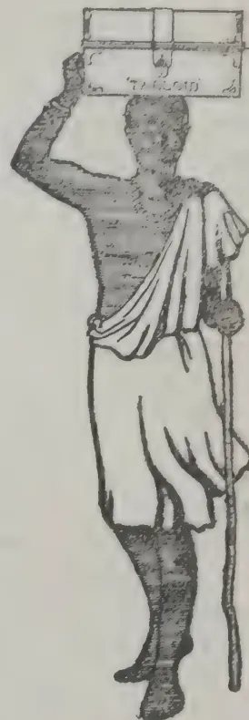

### THE PROGRESS OF CO-OPERATIVE CREDIT.

We recently directed attention to the inestimable benefits conferred upon the agriculturists of the Punjab by the extension of the co-operative credit system in that Province. There has just been issued from the Government Press a statement which shows how rapid has been the growth of this beneficent movement throughout India. In the five years from 1906-07 to 1911-12 the number of societies, central, urban, and rural, rose from 843 to 8,177, and the total membership from 90,844 to 403,318. The increase in the financial resources of the societies was even more marked. In the first of the years named the capital available, including loans from private persons and from other societies, share capital deposits by members, and State aid, aggregated Rs. 23½ lakhs. By 1910-11 the total had gone up to Rs. 203½ lakhs, while at the end of the past financial year it had still further increased to Rs. 337½ lakhs. The amounts named are, of course, small in comparison with the needs of India, but the progress achieved in so brief a period is very remarkable, and it indicates plainly the enormous potentialities of the future.

A most gratifying feature of the position disclosed is the insignificance of the financial support which the societies derive from Government. It would be easy enough to lend funds to the cultivator on a wholesale scale, but the inevitable result would be to render the last state of the ryot worse than the first. The people must be taught at the outset the value of self-reliance and thrift, and to accept direct responsibility for the conduct of their village societies and for the repayment of the loans they make to each other. It was thought by many that the lessons of co-operation would be difficult to impart to the masses in India. But the experience of the past few years has shown this view to be wholly unfounded. The difficulty of the moment, indeed, is to secure that the system shall not be extended with a rapidity that is inconsistent with safety. “There is a distinct danger,” said Sir Robert Carlyle at the recent Conference of Registrars at Simla, “now that the great benefits of co-operation are conspicuous, that we will be pressed to move too fast. I would not have ventured to say this four years ago, when the movement was in its infancy, and I trust you will not misunderstand me and think I want to throw cold water on the rapid exten-

20

177------------------------------------------------

154*The Supplement to the Tropical Agriculturist*

sion of the co-operative movement. But I do wish to emphasise the fact that there is a danger in too rapid extension which may endanger the movement itself. Pressure is in many cases being brought to bear on you to register more and more societies whether the people are ripe for them or not, and weak societies will in the long run prevent the movement developing as it otherwise would do." So far, the progress has been made on sound lines, and that confidence is felt in the societies by the outside public is shown by the fact that the loans from private persons now amount to upwards of 88 lakhs of rupees. Meanwhile the deposits of members have reached a total of Rs. 65 lakhs, and the share capital is over Rs. 52 lakhs, while the funds advanced by the Government amount to but little more than Rs. 9 lakhs. The direct economic effect of the operations of the societies has been substantial. Mr MacLagan, who presided at the Simla Conference, pointed out that it was a fair assumption that the saving to the agricultural classes on the loans made was at least 10 per cent; so that, at a low computation, the cultivators are relieved of an unnecessary burden of Rs. 10 lakhs for every crore of rupees advanced. But the benefit does not stop there. It has been repeatedly shown by the Government officials entrusted with the supervision of the movement that the spread of co-operative credit has reduced litigation, stimulated the progress of sanitation, and created a desire among the people to be delivered from the incubus of illiteracy. These considerations make it all the more regrettable that Bengal is not keeping pace with other Provinces in the membership of its societies and the magnitude of their operations. The returns now issued show that at the end of 1911-12 the membership of the Madras societies was 66,156, and that their resources aggregated Rs. 75 lakhs. In the United Provinces there were 99,767 members, with Rs. 68 lakhs and in the Punjab 93,169 members with Rs. 70 lakhs. Bengal's figures were 38,569 members and Rs. 26 lakhs. It has been a constant complaint on the part of the Registrars that the progress of the movement in Bengal is retarded by the tacit refusal of the educated classes to assist the people in organizing societies, although in no part of India are professions of sympathy with the masses more frequent or more profuse. In the Punjab, on the other hand, as we pointed out the other day, adequate help is forthcoming from influential agriculturists, yet members of the societies are subjected, it seems, to an infamous system of persecution from countrymen of their own, occupying subordinate judicial posi-

tions. This occurs chiefly in the Munsiff's Courts. "The Munsiffs as a body," writes the Registrar, "are recruited largely from the money-lending or small shop-owner classes, so that many of them have a class prejudice against the Village Ranks. This is shown in the way of vexatious and even illegal action towards parties who happen to be members of co-operative credit societies, and by insulting treatment of them in court. It is a not uncommon practice for a money-lender to put some member of a newly started bank into court with the object of frightening the other members, who are also on his books, from joining the society. Once the client is in court, many and various are the ways in which a hostile Munsiff can persecute him. There are very general complaints in some parts, and I propose to bring such cases to the notice of the Chief Court." It is to be hoped that the Registrar will take the matter up vigorously, and that any Munsiff proved to be guilty of the conduct described will be dismissed with ignominy from the position he has disgraced. The Government of India also will be well advised to keep a watchful eye on these proceedings.—"Indian Agriculturist," Jan. 1.

#### **AGRICULTURAL EDUCATION IN ENGLAND THROUGH AUSTRALIAN EYES.**

The following references are taken from a report by the Principal of Roseworthy Agricultural College, South Australia.

I paid a visit to the Cirencester Royal Agricultural College in June, 1910. At this institution I was received very kindly by the principal and staff and shown over all there was to see. I suppose on such an occasion it is only natural that a comparison with the institution with which I have been connected for close on 20 years should arise in my mind. I feel, however, that criticism on my part would not be justified. The conditions which Cirencester and Roseworthy are respectively meant to meet are so intrinsically different that any comparison between the two would, to my mind, be exceedingly unfair. I shall, therefore, content myself with stating that an institution conducted on the Cirencester lines could not possibly thrive in Australia. The Principal pointed out to me that the students were drawn exclusively from those ranks of society who do not need to do manual labor of any kind, and who, in the majority of cases, do not wish to take part in manual labour. It is evident in such circumstances that the training imparted must differ radically from the training imparted at Roseworthy; and the fact

178------------------------------------------------

and Magazine of the Ceylon Agricultural Society.—February, 1913. 155

that the institution is, as I was informed, very well patronised would appear to suggest that it meets the requirements for which it was brought into existence. Students' fees vary from £130 to £170 per annum, according to the style of residence allotted. These fees, according to the principal, were moderate when compared with average public school fees. One-half of the students, however, are non-resident.

Instruction imparted at Cirencester is almost entirely theoretical. There are only a few acres of land attached to the college, and the bulk of it is taken up with very nicely laid out grounds. Naturally there is but little room on this diminutive area for college-owned live stock. I counted, I believe, 12 head of cattle, 20 to 30 sheep, two or three horses, and a dozen pigs recently purchased in the market for fattening purposes. Farm buildings and workshops are of the most meagre description, although no doubt amply adequate to the calls that may be made upon them.

On the other hand, the college has a right of entry into a neighbouring farm for purposes of instruction; for this privilege they pay what may be termed a capitation grant regulated by the number of students in residence. Thus students do not take part in farm work, nor have the college authorities the advantage of working a farm on the lines that they might recommend to students. The practical training of students, therefore, is restricted to the observation of the success or failure that follows the efforts of a neighbouring farmer.

It should be noted that the institution labors under difficulties that are not of its making. It receives no grant-in-aid, and is burdened by a heavy ground rent; hence, any reduction in fees, even if it were desired, would spell ruin, and attempts at improvements involving the outlay of capital must prove exceedingly difficult.

On July 6th I transferred my headquarters to Cambridge, and I may say that I soon found myself in a most congenial atmosphere, an atmosphere that has, I believe, been created within recent years by a handful of enthusiastic workers. The Cambridge University has recently taken over a farm to be worked in connection with its agricultural courses, which I think must do much towards heightening their efficacy. The farm is as yet quite new and in the make, and there is little, therefore, that can be said on the subject in the way of criticism. I had occasion here to visit the plots of crossbred wheats that are being raised by Professor Biffen. He is laboring hard after a rust-resistant, strong flour wheat suited to British conditions.

From a perusal of recent Cambridge literature I had come to the conclusion that at Cambridge what is known as the Mendelian theory had become something like an obsession. When in the midst of the keen Cambridge scientific agriculturists I realised that I had not been mistaken. One is apt to find every natural phenomenon explained on the lines of this theory until we may look to it for a solution of the riddle of the universe. Far be it from me to deny to this theory all value; nevertheless, I think that it is being very much ridden to death.

On the Cambridge farm I made the acquaintance of two Merino rams that had come all the way from Australia, and very much fish out of water did they appear. They are being used for certain experiments in crossing on Mendelian lines; indeed, I had a look over some of the first crosses out of Shropshire ewes. They were not unlike, on the whole, some of our crossbred lambs out of Merino ewes by Shropshire rams. Results of scientific interest may perhaps arise out of these experiments; I doubt, however, their value in actual practice.—Agriculture in other lands for Feb.

## RECENT PUBLICATIONS ON CACAO.

Two books on cacao have recently been reviewed in *Nature*; the first is entitled *Cocoa and Chocolate: Their Chemistry and Manufacture*; the second is entitled *Cocoa: Its Cultivation and preparation*. The former volume, by R. Whymp, appears to deal mainly with the technique of manufacture, though a section is devoted to the botany and cultivation of the plant. In contradistinction to the comprehensive critical survey of the chemistry of cacao is the brevity of the section dealing with its cultivation. *Nature* points out the omission of certain important facts which may not be commonly known, even in the West Indies. For instance, much of the Gold Coast cacao is marketed in an unfermented condition; and the fact that some manufacturers in the United Kingdom prefer unwashed cacao, alleging that it is of better flavour than the washed article seems particularly noteworthy, as also does the suggestion that the practice of 'claying' easily degenerates into more 'weighting.'

The above volume is, of course, designed for the use of manufacturers and chemists; the second book, by Mr. W. H. Johnson, meets the requirements of the planter, rather than those of the manufacturer. Owing to Mr. Johnson's having acquired experience in the West Indies, the Gold Coast and Ceylon, his in-

179------------------------------------------------

156The Supplement to the Tropical Agriculturist

formation is devoid of bias in favour of the practice of some particular area—a statement which cannot be said to apply to most text-books on cacao. Such matters as the selection of a site and the formation of a plantation are dealt with in such a way as to afford a useful guide in future planting. The preparation of cacao for the market, and especially such fundamental matters as fermentation, washing and ‘claying’ are very well discussed, and the work as a whole should prove particularly useful in places where cacao is the chief article of export.

This volume is the second in the series of Imperial Institute Handbooks, prepared with special reference to the requirements of British West Africa.

The first of these books is published at 15s net, by J. and A. Churchill, the price of the second is 5s net.—*Agricultural News*, June 4.

### RICE IN INDIA.

Rice is the staple food of most of India, and about 35 per cent of the cultivated acreage in British India is under this product. Burma furnishes about three-fourths of the Indian shipments. The rice is principally exported from January until April. This product arrives on the western markets simultaneously with supplies from Saigon, Siam and other principal sources, and the market is therefore glutted and prices depressed. Java, being south of the Equator, harvests its rice about six months later than India, and the crop, being sold on bare markets, brings a much larger price. The question has been raised whether it might not be possible to adopt modern silos with a view to storing the Indian rice and marketing it at a later date.

The rice crops of 1910-11 and 1911-12 is the area that furnished forecasts were estimated at 27,896,900 and 26,099,600 tons for the two years, respectively, as compared with an average of 23,167,300 tons for the previous five years.

Ceylon is the largest purchaser of Indian rice, the shipments to that Colony for the year 1911-12 amounted to 380,978 tons. Other markets were: Japan, 140,922; China, 38,214 tons (not including large shipments by way of Straits Settlements); Java, 277,869 tons; Germany, 262,113 tons; United Kingdom, 136,778 tons; Netherlands, 151,372 tons; Austria-Hungary, 134,301 tons. Included in the above figures rice in the husk was exported to the amount of 55,263 tons, valued at \$1,180,000, of which Ceylon took 33,901 tons and Straits Settlements 20,844 tons.—*Modern Sugar Planter*.

### MANAGEMENT OF PLANTATIONS IN UGANDA.

UGANDA CHAMBER OF COMMERCE,  
Kampala, 12th Feb. 1913.

SIR,

A letter under the above heading in a recent issue of your paper has been brought to the notice of this Chamber. The members consider that several of the statements made in it are, to some extent, a misrepresentation of the true state of affairs that exist here and are in consequence apt to be misleading.

With a view to warn young men, who, on the strength of the glowing prospects held out to them in the letter referred to, may be tempted to come out here on their own responsibility, I shall be glad if you will kindly insert this letter in your paper.

The future prospects of Uganda as a planting country are undoubtedly bright, but the industry is still in its infancy and several years must elapse before its success can be assured.

In any case, I would strongly recommend all young men, who may contemplate taking up planting in this country as a profession, to first secure an appointment with a proper agreement before coming out here; otherwise they may find themselves stranded—the passage out here involving a considerable outlay, and the cost of living is by no means cheap.—I am, Sir, Your Obedient Servant,

J. A. GRIGOR,  
Secretary, Uganda Chamber of Commerce.

### A NEW ALBIZZIA.

#### THE 95TH SPECIES.

Mr H H Latham, Deputy Conservator of Forests, sent specimens of an albizzia for identification to Dehra Dun from the Tinnevelly District. As the specimens did not agree with any recorded species in Dehra, they were sent on to Kew with no better result. No less than 94 species of the genus albizzia have been described, but with not one of them did Mr Latham's specimens agree. The plant is a new one and is called “*Albizzia Lathamii*.”—*M. Times*, Feb. 25.

### DYNAMITE EXPERIMENTS IN INDIA.

Experiments will shortly be made at Aligarh to test the value of dynamite in the reclamation of *usar* land. There is a large area of this kind of land in the Western Districts which is useless for cultivation owing to the excess of sodium carbonate it contains.—*M. Mail*, Feb. 17.

180------------------------------------------------

This image is a scan of a blank page. The background is a uniform light beige or off-white color. There are several small, dark specks scattered across the surface, which appear to be dust or scanning artifacts. No text, lines, or other graphical elements are present.

181------------------------------------------------

JOHN FERGUSON, C.M.G., F.R.A.S., F.R.C.L.

*See page 54.*

182------------------------------------------------

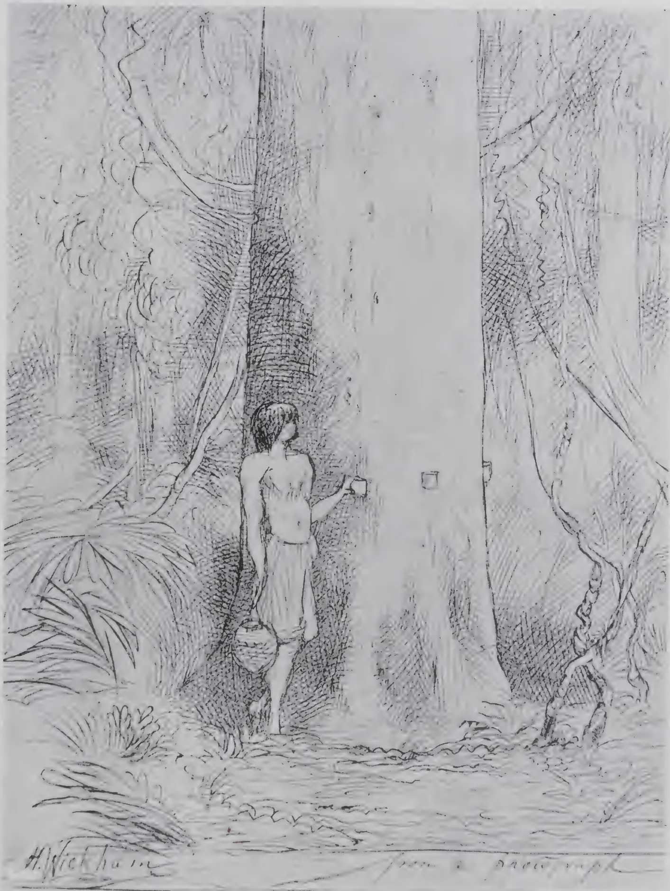A detailed black and white line drawing of a person standing in a dense forest. The person, who appears to be a man, is shirtless and wears a simple loincloth. He is positioned in front of a large, thick tree trunk, holding a small, shallow cup or container against the bark of the tree, as if demonstrating the process of tapping for rubber. The forest is filled with various types of trees, including one with a very thick, textured trunk and another with a more slender trunk. The ground is covered with low-lying plants and foliage. In the bottom left corner, the artist's signature 'H. Wickham' is visible. The overall style is that of a scientific or historical illustration.

**HEVEA (PARA) INDIAN RUBBER.**

A type of the trees, from which the original stock was obtained from the Tapajos-Madeira plateaux in 1875-6.

183------------------------------------------------

This image is a scan of a blank page. The background is a uniform light beige or off-white color. There are several small, dark specks scattered across the surface, which appear to be dust or scanning artifacts. No text, lines, or other graphical elements are present.

184------------------------------------------------

THE  
**TROPICAL AGRICULTURIST**  
JOURNAL OF THE  
**CEYLON AGRICULTURAL SOCIETY.**

---

VOL. XL.

COLOMBO, MARCH 1913.

**No. 3.**

---

## **The “Tropical Agriculturist.”**

---

The *Tropical Agriculturist*, hitherto the property of Messrs. A. M. & J. Ferguson, has been acquired by the Ceylon Agricultural Society who are now the sole owners of the Journal. This is an event on which we think we may congratulate both the Society and Messrs. Ferguson; the former on having become the owner of the foremost unofficial journal of Tropical Agriculture in the world, the latter on having successfully relaunched a great journal upon a career which we hope will be a fitting sequel to its past by achieving yet greater popularity.

We bring out this issue under the new arrangement and we wish to begin by saying that it will be our aim, above all things, to keep up the popularity of the journal by maintaining its characteristic features. The *Tropical Agriculturist* is not a journal that can confine itself to chronicling the doings of the Ceylon Agricultural Society and though the interests of the members of the Society and of Ceylon generally must come first, yet its responsibilities extend far beyond the limits of this Island; embracing indeed the whole tropic world and much of the sub-tropic.

The *Tropical Agriculturist*, was founded in 1881 by Mr. John Ferguson, C.M.G. In 1905 it became “The Magazine of the Ceylon Agricultural Society,” the Director of the Royal Botanic Gardens being appointed Editor, but the Society has never owned the Journal. It has acquired it by gradual steps; a circumstance that enables us to look forward to the future with a confidence born of experience,

185------------------------------------------------

82[MARCH, 1913.

## COMMITTEE OF AGRICULTURAL EXPERIMENTS, PERADENIYA.

Minutes of a meeting of the Committee of Agricultural Experiments held at the Experiment Station, Peradeniya, at 3 p.m. on January 9th, 1913.

Present:—The Director of Agriculture (in the Chair), The Government Entomologist, The Government Mycologist, The Government Agricultural Chemist, The Hon'ble Mr. E. Rosling, Messrs. G. C. Bliss, R. G. Coombe, G. H. Golledge, H. Inglis, N. W. Davies, F. H. Layard, J. D. Vanderstraaten and Mr. M. L. Wilkins; the Superintendent, Maha-Iluppalama Experiment Station, acting as Secretary and Mr. D. J. Blyth and Mons. Schæffer (Paris) as visitors.

The Administration Report of the Department of Agriculture and the monthly statements of accounts were laid on the table.

1. Minutes of the previous meeting of 13th November last were read and confirmed.

2. Read letter from Mr. Joseph Fraser intimating his inability to attend this meeting and at the suggestion of Mr. Golledge it was resolved that Mr. Fraser be invited to attend the next meeting.

3. Read progress report of the Experiment Station, Peradeniya. Resolved to pick the cankered pods of cacao weekly.

4. Read progress report of the Experiment station, Maha-iluppalama.

5. The Director made reference to the conference with the representatives of the Coconut Planting Industry held in Colombo on the 16th December last, and stated that the general opinion at that meeting was that a trial ground of 100 acres should be established at Chilaw.

He invited the remarks of the members present.

6. The Hon'ble Mr. Rosling and Messrs. Bliss and Vanderstraaten offered remarks, and the Committee agreed that more than one trial ground should be established. It considered that it was desirable to have two Experiment Stations of 50 acres each, one at Chilaw and the other at Galle.

7. The question of the appointment of a Sub-Committee to deal with the Coconut Experiments was discussed.

At the suggestion of the Hon'ble Mr. Rosling, it was resolved that Government be asked to appoint a number of coconut planters to the Experiment Station Committee for the purpose of forming a Coconut Sub-Committee.

8. This gave rise to the question of appointing a similar Sub-Committee on Rubber, and the Hon'ble Mr. Rosling referred to the proposal now before Professor Dunstan with reference to the appointment of a Rubber Research Committee with a Chemist who has specialized in rubber to advise them, the expenses to be shared by the planters and the Government.

It was ultimately resolved that the appointment of a Rubber Committee be deferred until Professor Dunstan could be personally consulted on the subject.

9. Mr. Bliss proposed and the Hon'ble Mr. Rosling seconded that Mr. G. H. Masefield be appointed a member of the Committee, the Director undertaking to write to Government recommending his appointment.

10. The Director read a letter from Mr. P. A. Keiller, Chemist of the Colombo Commercial Company, expressing a desire to be appointed a member of the Committee.

A lengthy discussion followed in which the Hon'ble Mr. Rosling, Messrs. Bamber, Bliss, Golledge, Inglis and the Director took part.

It was finally resolved that Messrs. Freudenberg & Co., and Mr. A. Baur should be asked whether they would like representatives of their firms to attend the meetings also.

11. The Director outlined his proposals for carrying on the experimental work of the Department of Agriculture.

186------------------------------------------------

[MARCH, 1913.83

He also referred to the results of Cotton trials at Maha-iluppalama Experiment Station, and to his recommendation that Maha-iluppalama be closed.

He proposed to have a Dry Zone Experiment Station and said he was in favour of its being established at Anuradhapura close to the Railway.

12. With reference to the manurial experiments on tea estates, and the question of their continuation, it was decided that they should be discontinued.

13. Mr. Bliss asked whether the Director had received any communication from the Ceylon Planters' Association regarding the sterilization of manures.

The Director replied in the affirmative, and also stated that experiments were now being carried out.

14. Mr. Petch exhibited specimens of *Oxalis* (Manickwatte weed), showing the small bulbs (bulbils) formed at the base of the plant. These, which are about the size of grains of paddy, were produced as buds from the old root stock. They became detached from the parent plant and lay in a cluster round it. Under natural conditions they give rise to young plants close to the old one, but when formed near the surface they may be washed away by the rain or distributed by scraping. (The plant exhibited was *Oxalis latifolia*? : *Oxalis violacea* forms the same bulbils and, in addition others at the end of short runners about an inch or two from the parent plant. Both species are included in the current references to *Oxalis* as a weed, though "Manickwatte weed" is the former. Mr. Petch said he would be glad to receive seeds of either species, grown in Ceylon, for further investigation).

15. A discussion was made on bad jat tea, and Mr. Wilkins was asked to furnish particulars regarding pruning, manuring, yield, etc., for further consideration of the subject.

16. The Director announced the impending retirement of Mr. Green as Government Entomologist. The Hon'ble Mr. Rosling proposed and Mr. Golledge seconded a hearty vote of thanks to the retiring officer.

## PROMOTING GERMINATION OF SEED.

The New York Cornell Station Bulletin 312 calls attention to the fact that a certain percentage of seeds, though possessing vitality, delay or fail to germinate owing to "hardness," but that early germination could be effected by the aid of sulphuric acid. It is advisable, first to make a germination test to ascertain whether the percentage of germination of seeds, apparently alive, is low.

In the case of a small quantity of seed, it could be placed in a tube or other small glass vessel and a quantity of concentrated sulphuric acid, equal to about 5 or 6 times the quantity of seed, is poured over the seed. Stir the mixture thoroughly with a rod until all are completely coated with the acid. After standing for 15 to 45 minutes (according to percentage of hard seed) wash with water until the seed is entirely free of acid.

For large quantities a stone jar of 2 or 3 gallons capacity may be employed, and a wooden stick used for stirring.

## RICE CROP PROSPECTS, 1912-13.

### Final Forecast of the Rice crop in Burma for the year 1912-13.

The Commissioner of Settlements and Land Records, Burma, reports under date 6th February 1913 that the area under Rice in the sixteen Lower Burma districts is now estimated to be 7,834,803 acres, an increase of 461,704 acres over last year's actuals and an increase of 9,085 acres over the figures of this year's Fourth Forecast.

187------------------------------------------------

84[MARCH, 1913.

Harvesting operations are progressing normally and it is believed that in most districts the grain is threshing out well. The exportable surplus from these sixteen districts is now estimated at 2,530,000 tons of cargo rice against 2,520,000 tons in the Fourth Forecast. As in previous Forecasts it is assumed that the remaining six districts of Lower Burma will absorb 80,000 tons, while additional information obtained from Upper Burma districts confirms the estimate of 170,000 tons from that part of the Province. The total estimated surplus of the Province thus becomes 2,620,000 tons of cargo rice equivalent to about 44.4 million cwts of cleaned rice.

## THE SUGAR AND RICE TRADE IN THE PHILIPPINES.

The great drought of 1912 that so shortened the rice crop of the Far East as to produce an actual famine in many districts, left its impression upon the Philippine Islands, as recorded in a recent report of the Bureau of Insular Affairs.

Under the free importation of Philippine sugars into the United States the quantity sent to this country from the Philippines is sure to increase rapidly, but the report now is that for the ten months ending October 31, 1912, only 184,000 tons of sugar were exported as compared with 194,000 tons the previous year. Under equally favourable conditions in 1912 as compared with 1911 the exports of sugar would surely have exceeded 200,000 tons.

In regard to the rice business, while the Philippines produced considerable rice, still the quantity imported is quite insufficient for their own use and during the ten months under consideration over 12 million dollars' worth were imported, all of Asiatic rice and about twice the value of the rice imported during the same time the previous year.—*The Louisiana Planter and Sugar Manufacturer*, January 1913.

## INCREASING THE DURABILITY OF FENCE POSTS.

*The Journal of the Board of Agriculture* for January 1913 contains the following from Bulletin No. 163 of the Maryland Agricultural Experiment Station: Fence posts were treated with preservatives in various ways in 1888 and examined after twenty years. It is concluded from experiments with posts of cedar and chestnut wood that applying a preservative with a brush is not very effective; that creosote is more efficient than either coal-tar or crude petroleum; that filling in stones round the post does not increase its durability. Charring the part of the post to be placed underground was found beneficial only in the case of green posts—charring, it is stated, acting by hastening seasoning and possibly sterilizing the wood.

Experiments were commenced at the station in 1909 in co-operation with the United States Forest Service. Details of the various methods of treatment were given in this *Journal* for January, 1912, p. 850. None of the posts treated with creosote, tar, or crude petroleum show any perceptible decay after two years' use; while a large number of the untreated posts of the same kind of wood, and of the same size and shape as those that were treated, have decayed to such an extent as to make them unserviceable after two years' use. The relative durability of the untreated woods so far is as follows (the most durable are placed first): locust, chestnut, spruce, beech, maple, pine, oak, birch, sweet gum, white poplar, willow, yellow poplar, black gum, and sycamore.

188------------------------------------------------

[MARCH, 1913.85

## MANURING TREES.

It may seem a simple thing to manure a tree, yet the great majority of people who take to the idea of helping their trees with some manure, dump a heap against the trees. The majority, of course, do not manure their trees except by accident, expecting the soil to give crops out of good nature without assistance. Bananas are commonly treated thus but the effect on such, being herbaceous plants, is to bring out roots high up, which when the heap of manure decays down are left dry and so are wasted. But on many trees, like orange and cocoa, the effect of a heap of manure placed against them is injurious. The most vital parts of such trees is the neck, that part where the roots start from the stem. The manure softens and tends to rot the bark there, encourage insects and grubs to attack the bark, while manure there can do no possible good. Trees take up their food material from all those little fine roots that start off from the large roots, and which are especially plentiful at the very end of the roots. And it is where these fine roots are that the manure should be placed, preferably in light open soils by spreading it as a mulch, and in heavy clay soils by digging the manure in and mixing it with the soil.

In mulching also, which is only a form of manuring, the mulch should not be put close to the banana, cocoa, coffee or coconut, tree root, a clear circle should be left close to the stem.

---

## CULTIVATION OF THE LAND IN NYASALAND.

---

The following extract is from an article compiled by Mr. J. Stewart J. McCall, Director of Agriculture, Nyasaland Protectorate, and issued as a supplement to the *Nyasaland Government Gazette* of 31st December, 1912.

No factor has contributed more to the advancement and progress of agriculture throughout the world than improvement and multiplication of farm implements and machinery.

In practically every part of the world civilised cultivation without machinery and implements is a thing of the past and success in agriculture is largely dependent on the practical and economical use of many kinds of labour-saving machinery. It has been frequently stated that the use of inefficient tools is an economic policy at variance with the advancement of civilisation as it restricts the possibilities of land and labour and decreases their potential contribution to the human race.

The shortage of labour is the most discussed question in Africa to-day, and throughout the whole of South and Central Africa there is the keenest competition between the agricultural and mining industries, with the result that wages are being forced to such a height that agricultural operations will require to cease unless European Planters in Africa bestir themselves and economise in their labour by using more machinery.

Nyasaland is better placed than most places with regard to labour, but if our acreages under cotton and tobacco are going to extend in the future, as they have done during the last few years, those extensions, of necessity, will require to be worked by cattle, steam or motors.

If the actual cultivation and transport is carried out by machinery there should be still sufficient local labour to harvest larger crops during the dry season and add considerably to the prosperity of the Protectorate.

The writer is frequently told that implements cannot be used profitably, especially in the Uplands; with this view he entirely disagrees, and in this pamphlet will place before the planting community figures relating to the cost of actual cultivation by cattle.

189------------------------------------------------

86[MARCH, 1913.

In certain parts of the Protectorate the presence of tsetse fly makes the use of cattle impossible, and it may be found necessary in the first instance to open up those areas with the native "hoe" steam or motors. If South African experience may be taken as a criterion it will be found that as the country is opened up by adequate cultivation on scientific lines the fly disappears.

### Preparation of the Soil for Planting.

The ideal seed-bed is deep, clean of weeds, and in a fine state of sub-division. To obtain all those conditions, the native of Nyasaland is presented with a hoe (not infrequently a worn one with a small blade) and the result is that the soil is only stirred to a depth of 2 to 3 inches; and, in the case of cotton, the surface soil drawn up into fairly large ridges, the soil between the ridges being about as hard as the soil under them, the exception being that, provided labour is plentiful, this hard pan is chopped one or two inches deep before the loose surface soil is pulled on top to form the ridge.

On most estates the soil is exposed for some weeks after ridging and before planting the atmosphere bringing about a fair state of sub-division or texture.

The principal defect in this cultivation is lack of depth, the crops being always grown on the same surface soil, either on the flat or gathered into ridges.

With a long tap-rooted crop like cotton, depth is specially important and even with the shallower rooted but more exhaustive tobacco plant, depth is advantageous, as deeply prepared fields are less liable to drought and more plant food is brought to the roots from the sub-soil.

A great deal of the surface washing, so common during heavy rain, is due to the shallowness of the soil, and the impervious nature of the sub-soil, especially in red clay land.

In Nyasaland where no artificial manures can be used, on account of prohibitive transport charges, the life of our estates for the profitable production of any crop will largely increase when a system of rotation and deeper cultivation by implements is practised.

The policy of continuous tobacco or cotton cultivation on the same land is exceedingly bad practice and even already tobacco lands are giving out and in time cotton plantations will do the same.

The writer realises the difficulty of getting a sufficient number of different crops to form a profitable rotation in every year of its course, but with cotton, tobacco and velvet beans (the last grown as a green manure crop) the life of our soils can be much lengthened, and the output per acre so considerably increased as to make up for no actual money return from the velvet beans.

Most of our estates are too large for the available labour supply and capital to run them, and when implements are more generally used, estates will become smaller but returns per acre will be greater, the cultivation being more thorough.

There is no question but cultivation with implements requires a considerable initial outlay of capital and for this reason a settler cannot expect to open up or maintain an agricultural estate in Nyasaland on a few hundred pounds as was possible ten or even five years ago. In those days labour was more plentiful, wages lower and no outlay on implements required, the only expense being an outlay of some £20—£30 on axes and hoes.

190------------------------------------------------

[MARCH, 1913.87

## INSECTS INJURIOUS TO SUGARCANE.

The Curator of the Museum, Port Louis, has made a valuable contribution on this subject in a report dealing chiefly with *Phytalus Smithi* (Arrow), a comparatively recent introduction.

The pest is one of the Lamellicornia beetles and emerges after dark from its underground retreat, with the object of finding food.

The life history of the insect is fully worked out and various means of mitigating its depredations discussed. To give an idea of the extent of the damage and the expenditure on the work of destruction (chiefly in the way of premiums paid for the capture of the beetles), it may be mentioned that a 3 months' campaign over 285 acres cost Rs. 43,642, and resulted in the destruction of 1,203,518 insects.

The researches of Mr. Gilbert Arrow of the Natural History Museum have resulted in the discovery on larvæ received from Barbadoes of a parasite which is thought likely to prove useful in getting entirely rid of, or at least controlling, the pest.

The insect is of a uniform reddish colour like mahogany but the thorax is more red and the head darker.

## CLOVES FROM ZANZIBAR & THE STRAITS SETTLEMENTS.

Cloves consist of the unopened flower-buds of the clove tree, *Eugenia caryophyllata*, Thumb., belonging to the natural order Myrtaceæ. The tree is believed to be indigenous to the Molucca islands, but is now commonly cultivated in many parts of the tropics, though only on a large scale in Zanzibar, Amboyna in the Dutch East Indies, Penang in the Straits Settlements, Madagascar, and to a small extent in Seychelles, Runion, Mauritius and Ceylon. Accounts of the results of examination at the Imperial Institute of a sample of clove-leaf oil from Seychelles and of a sample of cloves from Mauritius, have been published in this Bulletin (1908, 6, 111, and 1910, 8, 3). The quantities and values of the clove exports from some of the above localities in recent years have been as follows:—

<table border="1">
<thead>
<tr>
<th rowspan="2"></th>
<th colspan="2">1908</th>
<th colspan="2">1909</th>
<th colspan="2">1910</th>
<th colspan="2">1911</th>
</tr>
<tr>
<th>Cwt</th>
<th>£</th>
<th>Cwt</th>
<th>£</th>
<th>Cwt</th>
<th>£</th>
<th>Cwt</th>
<th>£</th>
</tr>
</thead>
<tbody>
<tr>
<td>Zanzibar</td>
<td>133,704</td>
<td>264,960</td>
<td>181,116</td>
<td>330,410</td>
<td>114,135</td>
<td>253,470</td>
<td colspan="2" rowspan="2">} Figures not available.</td>
</tr>
<tr>
<td>Penang</td>
<td>4,294</td>
<td>11,147</td>
<td>1,980</td>
<td>5,978</td>
<td>1,665</td>
<td>7,199</td>
</tr>
<tr>
<td>Madagascar</td>
<td>3,124</td>
<td>8,071</td>
<td>1,933</td>
<td>4,366</td>
<td>942</td>
<td>3,753</td>
<td>2,574</td>
<td>10,251</td>
</tr>
<tr>
<td>Seychelles</td>
<td>5½</td>
<td>9</td>
<td>¾</td>
<td>1,1</td>
<td>90</td>
<td>137</td>
<td>29</td>
<td>58</td>
</tr>
<tr>
<td>Runion</td>
<td>41</td>
<td>74</td>
<td>17</td>
<td>30</td>
<td>13</td>
<td>22</td>
<td colspan="2">} Figures not available.</td>
</tr>
</tbody>
</table>

191------------------------------------------------

88[MARCH, 1913.

The value of cloves depends partly on the amount and quality of the essential oil (oil of cloves) they yield, and partly on their size and condition. Amboyna and Penang cloves are rich in oil and of good appearance, and for these reasons fetch the highest prices in European markets. Zanzibar cloves are nearly as rich in oil, but are usually smaller and of less satisfactory appearance and aroma, and consequently fetch lower prices. The Amboyna and Penang cloves are largely used directly as spice whilst Zanzibar cloves are utilised mostly for the distillation of oil of cloves, from which the chief constituent, eugenol—the substance to which the aroma and flavour typical of cloves are due—is then extracted, to be used as a raw material for the preparation of artificial vanillin. Zanzibar cloves are, however, largely exported to India and China for use directly as a spice.

### Zanzibar.

Four samples of cloves from Zanzibar were received in October 1911. It was stated in the letter accompanying the samples that three of them had been dried by treatment in a drying machine for three or four hours at temperatures up to 80° and 100° C., and it was desired to ascertain their value in comparison with sun-dried cloves

(1) "Cloves from the Government Plantation; sun-dried on a cement drying floor." This sample consisted of very dark brown cloves.

(2) "Artificially dried at a temperature up to 80° C." Pale reddish-brown cloves with yellowish heads.

(3) "Artificially dried at a temperature up to 100° C." Cloves similar to sample No 1, but a little lighter in colour.

(4) "Artificially dried at the same temperature as No 3." This sample was similar to sample No. 2 but a little darker in colour.

### Results of Examination.

The cloves were submitted to steam distillation without being crushed or ground. The yields of oil obtained, and the specific gravity of the oil in each case, were as follows:—

<table border="1">
<thead>
<tr>
<th>Sample</th>
<th>Yield of oil Per cent.</th>
<th>Specific gravity of Oil at <math>\frac{15^{\circ}\text{ C.}}{15^{\circ}\text{ C.}}</math></th>
</tr>
</thead>
<tbody>
<tr>
<td>1</td>
<td>16.5</td>
<td>1.071</td>
</tr>
<tr>
<td>2</td>
<td>13.7</td>
<td>1.071</td>
</tr>
<tr>
<td>3</td>
<td>14.8</td>
<td>1.069</td>
</tr>
<tr>
<td>4</td>
<td>13.3</td>
<td>1.066</td>
</tr>
</tbody>
</table>

### Commercial Valuation.

The samples were submitted to brokers, who described and valued them as follows (January 1912):—

No. 1. "Good. About 5 $\frac{1}{4}$ d per lb."

Nos. 2 and 4. "Fine, bright. About 6 $\frac{1}{2}$ d per lb."

No. 3. "Good, bright. About 5 $\frac{1}{2}$ d to 5 $\frac{3}{4}$ d per lb."

At the same date "fair and fine bright" Zanzibar cloves were quoted in London at 5d. to 5 $\frac{1}{4}$ d. per lb,

192------------------------------------------------

MARCH, 1913.]89

The brokers stated that although they had valued the artificially dried cloves at higher prices than the sun-dried sample No 1, there is not a very great demand for such cloves, and if they were marketed in large quantities the price would be lowered very nearly to that of sun-dried cloves.

It is clear from the foregoing results that some oil was lost in the artificial drying of these cloves, as all the samples dried in the machine gave a smaller yield of oil than the sun-dried sample. In view of this fact, and the brokers' remarks quoted above, it seems likely that artificially dried cloves would eventually realise no more than sun-dried cloves, and might even realise a little less, if consignments prepared in bulk were regularly found to contain less oil than sun-dried cloves, as in the case of the present samples. It is generally stated that the yield of oil from Zanzibar cloves varies from 15 to 18 per cent., but it will be seen that the artificially dried samples under report yielded less than 15 per cent. of oil. It therefore seems desirable that before artificial drying is adopted on a large scale further experiments should be made with a view to avoiding loss of oil during the process. Experiments should be made to determine whether the drying can be carried out at a lower maximum temperature than 80° C., and if not, whether the time occupied can be reduced.

There seems to be no reason why the artificial drying of cloves should not be accomplished without loss of oil. In Amboyna it appears to be customary to dry cloves at first on a framework over a slow wood fire, and finally in the sun. In spite of this rather crude method of drying, the Amboyna cloves are of fine quality, and yield up to 19 per cent. of oil.—*Imp. Inst. Bulletin*.

---

## BULLETIN OF THE IMPERIAL INSTITUTE.

---

The fourth quarterly issue of the Bulletin of the Imperial Institute, Vol. X., No. 4, has just been issued and contains many articles of interest: the first is on "The Cotton Industry of Nyasaland." From a table showing the quantities and values of the cotton exports there has been an increase of 1,736,307 lbs. since 1902-3 when statistics were first available. A report on "Silk from Ceylon" will be found on another page of the current issue of this Journal.

Mr. Gerald C. Dudgeon, F.E.S., Director-General of the Department of Agriculture in Egypt, has contributed a lengthy article with illustrations, on the Cotton Worm in Egypt, the conclusions of which we publish in a subsequent page of this magazine.

The Bulletin contains a short review on the work of the Ceylon Agricultural Society. Reporting on a sample of seed-cotton of the "Black Rattler" variety grown in Tumpane, Central Province, Ceylon, sent for examination to the Imperial Institute in March of last year, the Bulletin says that the cotton ginned was of good, useful character and was valued at 8½d per lb. There is no regular market in the United Kingdom for seed cotton, but ginned cotton of the quality of that yielded by the present sample would be saleable in this country.

193------------------------------------------------

90[MARCH, 1913.

## THE COTTON WORM IN EGYPT.

The following concluding remarks are from an article by Gerald C. Dudgeon, F.E.S., to the *Imperial Institute Bulletin* of December 1912 :—

In spite of the very large amount of attention which *Prodenia litura* has attracted in Egypt, the extent of the damage to the cotton crop due to its ravages is, more frequently than not, greatly over-estimated. It is quite certain that there is no year in which the whole damage can be attributed justly to the cotton worm. Many years previous to the record of the first attack of cotton worm, the boll-worm was prevalent, and the destruction of cotton by this pest has been more constant and often more severe than by the cotton worm. The cotton worm, however, is more likely to impress the casual observer, by reason of its visible multitudes, than the boll-worm by its hidden ones. It must be remembered always that, whereas the cotton worm feeds mainly on the leaves, comparatively seldom destroying buds, the boll-worm destroys buds and bolls as its chief food and is therefore generally far more injurious to the cotton crop.

---

## CARDAMOMS.

---

After some years of depression, it is satisfactory to learn that the price of cardamoms this year has gone up. We take from Messrs. Schimmel and Co.'s semi-annual Report the following :—

The Cardamoms of British Commerce are all derived from *Elettaria Cardamomum*, Maton, N. O. Zingiberaceæ which grows wild and is cultivated on the Malabar Coast and Ceylon. There is a large market for the spice in Calcutta; the annual consumption in India and Burma is computed to be nearly 1,000,000 lbs. Formerly scarcely any other than Malabar Cardamoms were imported into Britain but the Mysore variety now affords most of the fine quality. The latter plant possesses a more robust habit and bears exposure better than the Malabar type. It is not known how the district name "Mysore" came to designate the variety of a cardamom plant. There appears to be two varieties of Malabar plants, var. *minus* being confined to Southern India and var. *majus* growing in Ceylon. The latter is distinguished by its shorter stems, broader leaves and more globose fruit. In the shady mountain forests of Canara, Cochin and Travancore the cardamom plant grows between the altitudes of 2,500 and 5,000 feet. The plant is best suited to a rich, moist, loamy soil protected from strong winds. These conditions are met with in the betel-nut and pepper gardens of Mysore and Canara and also in the cultivated cardamom valleys of Ceylon.

In the forest district of Coorg (Mysore) the cardamom gardens are laid out in February or March, simply by making clearings in the forest, a space of some 20 to 30 yards of jungle being left between the gardens. Superstition plays an important part, felling of the trees being only permissible on certain days of the week and before noon. The natives also believe that the presence of such plants as ebony, nutmeg and pepper favourably affect the development of the cardamom plants. In the fifth year a full crop is produced. After seven years more, the plant becomes sickly. Some of the large trees in the jungle screen surrounding the fields are felled; the falling trunks kill many of the cardamom stems, thus stimulating the rhizomes to produce new shoots, thereby renewing the producing capacity of the plot another eight years, when the process of renovation is repeated.

### Methods of Cultivation in Ceylon.

In Ceylon the cultivation is carried out much more systematically. The favourite cardamom districts are Matale, Medamahanuwara and Hewaheta. The undergrowth of the land intended for a cardamom plantation is cleared, holes are dug  $1\frac{1}{2}$  to 2 feet wide, 12 inches to 15 inches deep and 7 feet apart in rows at a similar distance. The bulbs must not be planted too deep or

194------------------------------------------------

MARCH, 1913.]91

they will rot. The use of seedlings instead of bulbs is increasing, however, the Mysore variety being most frequently grown from seed. Curiously enough only a small proportion of the seed germinates.

In Ceylon the plants flower almost all the year round; picking begins at the end of August and continues until April. The fruit is carefully dried by exposure to the sun or in wet weather by artificial heat. Machines for removing the calyx tube and the stalk have been introduced, and after passing through these the capsules are graded and treated with sulphur vapour.

A table given at the end of the article shows that the cultivation of cardamoms in Ceylon has been steadily increasing. In 1911 the area and export were 7,300 acres and 564,819 lbs. In 1910 they were 7,426 acres and 639,007 lbs.—*The Planters' Chronicle*.

## LAND SETTLEMENT IN SOUTH AFRICA.

During the last session of Parliament a Land Settlement Act was passed which is destined to have a profound influence on the future welfare of our country. This epoch-making law has passed into the Statute Book as Act No. 12 of 1912. By this Act the Minister of Lands is given power over any moneys voted by Parliament for closer settlement. He may purchase by auction or by private treaty, or he may exchange existing Crown land for private land.

Let us now look at the qualifications required by the applicant for a Government holding. He must be at least eighteen years of age; be qualified to utilize the land; intend in good faith to occupy it personally and work it beneficially; be of good character, possess capital sufficient to develop the holding or in any special cases possess such amount of capital as the Minister of Lands may deem fair and reasonable; and, finally, that he will develop and work the holding exclusively for the benefit of himself and the members of his family, if any. It will be noted that these conditions are not onerous. They assume a man of good character with a certain amount of money. Each holding is allotted on lease for a period of five years. During the first year no rent is required; for the second and third years, 2 per cent.; and for the fourth and fifth years,  $3\frac{1}{2}$  per cent. calculated on the purchase price. Every settler is required to take possession of his holding and to make it his usual abode for not less than eight months in every year. But under special circumstances, such as illness or some other good reason, the Minister can waive this clause for such period as he may see fit. Each settler has the right of purchase during or at the expiration of the five years. If not less than ten years have expired from the date of the commencement of the lease, and all instalments and other moneys due to the Government have been paid, the colonist is entitled to obtain a Crown grant. A Crown grant is the same as freehold, with the exception the Government reserves the mineral rights and certain minor matters relative to servitudes, roads, outspans and the payment of taxes. A settler may at any time pay in sums of over £ 100 to the credit account of the purchase price of his holding. But if, on the other hand, he does not wish to secure a Crown grant on the completion of his ten years, he can continue half-yearly payments at 4 per cent. for twenty years, which added to his first five years' lease, will enable him to obtain full title to his farm after a period of twenty-five years. If there are no improvements on his holding at the date of allotment, the settler must make improvements to the value of 10 per cent. of the purchase price of the farm during his five years' lease. That is to say, in the case of a farm worth £ 1,500, he must carry out improvements to the value of £ 150.—*The Agricultural Journal of the Union of South Africa*.

195------------------------------------------------

92[MARCH, 1913.]

## PROGRESS OF CANE CULTURE IN THE PHILIPPINES.

---

The Bureau of Agriculture, organized by the Insular government of the Philippines, has recently made its annual report on the development of agriculture along modern lines in the Philippine Islands. Special attention has been given to the sugar industry and modern methods have been followed with a view of changing over the manufacture from the antique methods shown in the Philippine Exhibit at the St. Louis-Louisiana Purchase Exposition in 1904, to the modern methods with first class central factories and carefully selected sugar canes cultivated after our modern American methods.

It was reported that six Hawaiian varieties of sugar cane are now being tested as well as various local canes and there is every reason to believe that with ordinary effort the old sugar culture of the Philippines, which once reached nearly 250, 000 long tons, will quickly surpass that and go on to an indefinitely large production, so long as the industry pays, and the labour supply does not give out.

At La Carlota experiment station about 100 acres of sugar cane were grown, which produced about 150 long tons of sugar. This acreage comprised some  $12\frac{1}{2}$  acres of second stubble, 17 acres of first stubble cane and about 70 acres of plant cane.

The yield of cane seems to have been about 10 short tons per acre, this making rather a poor showing for a tropical country, but we have no doubt that some adverse influences were prevailing.—*The Louisiana Planter and Sugar Manufacturer*.

## DEPARTMENT OF AGRICULTURE, MADRAS PRESIDENCY.

---

The report of this department for 1911-12 is issued by the Acting Director, Mr. G.A.D. Stuart, and to it are annexed those of the Deputy Directors, the Principal of the Coimbatore College of Agriculture, the Chemist, Botanist, Mycologist, and the Honorary Director of Fisheries.

There is a good deal of information about paddy which should prove of local interest. At all the farms the great value of green manuring was demonstrated. The leguminous crops grown were *Sesbania aculeata*, *Crotalaria juncea*, *Phaseolus mungo*, and *Phaseolus aconitifolius*. The yield of paddy at Pallur Farm was practically doubled as the result of green manuring. *Sesbania* yielded as much as 14.7 tons of green matter per acre at Samalkota.

As regards seed rate it was conclusively proved that 20 lbs. of grain sown thinly in a seed bed was sufficient to provide seedlings for planting out an acre, and that an acre so planted will yield more than if 120 lbs., of seed is used.

The practice of single seedling planting is spreading rapidly, and it is expected that in a few years more it will become practically universal, so that the saving in seed paddy alone will be represented by 300 million lbs., worth say a hundred lacs of rupees per annum.

196------------------------------------------------

TYPES OF VELLAREEN OUTSIDE THE AGRICULTURAL BANK

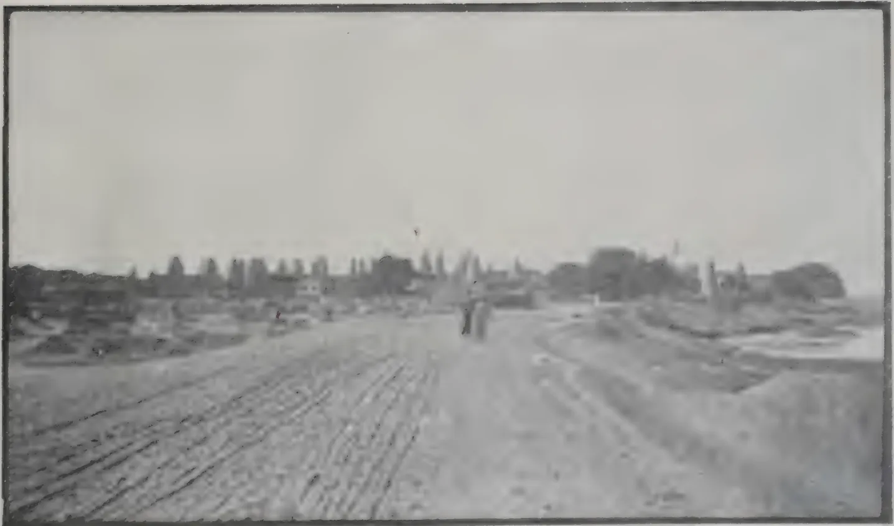

AN EGYPTIAN VILLAGE

197------------------------------------------------

This image is a scan of a blank page. The background is a light beige or off-white color. There are several small, dark specks scattered across the page, which appear to be scanning artifacts or dust. In the upper center, there are some very faint, illegible marks that could be remnants of text or a logo, but they are too blurry to identify. The overall texture is slightly grainy, typical of a scanned document.

198------------------------------------------------

MARCH, 1913.]93

## YAM GROWING IN JAMAICA.

Mr. R. C. Somerville, Agricultural Instructor of the Jamaica Agricultural Society, has written the following article to the *Journal* of that Society for December 1912:—The yam tuber takes the foremost place of all the vegetable foods grown in Jamaica in the diet of the labouring classes. In spite of all that may be said to the contrary, the fact remains that our most robust and hard working labourers in the country parts are those whose fare consists, has always consisted in its greater bulk, of yams.

In every parish the article is grown to a greater or less degree; but the methods of planting and cultivation differ considerably in different parishes and districts. I have grown yams in five parishes and in all of these the methods of cultivation was different, this being due to variations of climate, rainfall, altitude, soil and the breeds of yams to be planted.

It ought then to be interesting to the yam grower of South Manchester, who has to flypen his plot, dig large and deep hills, and mulch heavily after planting, and to the Upper Clarendon yam grower who cuts down woodland for his new ground to know something of the methods obtaining in Hanover, the premier yam growing parish of the Island.

All over Jamaica the name of Hanover is associated with the yams shipped from Lucea. The Lucea yam, or as it is called in Hanover, "Doctor Dick," (probably because it is so wholesome) is a variety of the negro yam. Like the famous Hanover Criollo cocoa, it thrives best in Hanover although giving satisfactory results in Upper St. James and Westmoreland and some parts of Portland.

Its leaves are like the ordinary negro yam only of a deeper and richer green and the vines are spiny and have to be carefully handled.

The tubers are long and smooth and rarely bear "toes" except they meet on stones or very hard earth; this quality makes packing easy and renders to a minimum the risk of breaking during transport of this brittle article. They are white when cooked, are mealy and so are easily mashed for table use. They keep without wilting or decaying for a considerable time after they are taken up and this is the quality that makes them so valuable for shipment to Central America and other near by places. Upper Hanover consists of steep mountain ranges and deep glades with here and there a comparatively level tableland. These mountains are, for the most part, large mounds of alluvial soil and it is along the sides of these steep slopes that the great yam fields are to be found.

One can hardly imagine a more beautiful sight than these extensive yam fields along the mountain slopes. I remember the Travelling Supervisor of Instructors growing delighted over some of these while climbing the hills to Cascade.

The thick ruinate is cleared away and burnt in heaps. Then where the land is very steep, zig-zag ridges or paths are cut so as to give the workers a foothold, then the digging of the hills is started at the bottom, each row of hills forming a sort of catchment for the loose soil of the upper row. A good worker can dig upwards of 150 hills per day, his pick-axe sinking at each stroke into the soft soil. The hills are dug very close together, an acre holding 2,000 hills. Two "bits" each with an eye are planted in each hill.

The "Doctor Dick" requires tall sticks, one being put to two hills. The fields are weeded twice before harvesting. The average yield per acre is about 4 tons, but with very favourable conditions of soil and season as much as 6 tons can be reaped.

199------------------------------------------------

94[MARCH, 1913.

This at £8 per ton is a good reason why the Hanover yam planter will always stick to his business. I shall go into the cost of planting and reaping one acre of yams in Hanover.

<table>
<thead>
<tr>
<th></th>
<th>£.</th>
<th>s.</th>
<th>d.</th>
</tr>
</thead>
<tbody>
<tr>
<td>Rent for one acre ... ..</td>
<td>1</td>
<td>0</td>
<td>0</td>
</tr>
<tr>
<td>Cutting, and cleaning at 4s. per chain ... ..</td>
<td>2</td>
<td>0</td>
<td>0</td>
</tr>
<tr>
<td>Digging yam 2,000 hills at 2/6 per 100 including planting</td>
<td>2</td>
<td>10</td>
<td>0</td>
</tr>
<tr>
<td>2,000 sticks at 1s. per 100 ... ..</td>
<td>1</td>
<td>0</td>
<td>0</td>
</tr>
<tr>
<td>Sticking out yams at 6d. per 100 ... ..</td>
<td>0</td>
<td>10</td>
<td>0</td>
</tr>
<tr>
<td>Two weedings at 10s. per acre ... ..</td>
<td>1</td>
<td>0</td>
<td>0</td>
</tr>
<tr>
<td>Total cost ... ..</td>
<td>£. 8</td>
<td>0</td>
<td>0</td>
</tr>
</tbody>
</table>

I have left out the cost of buying plants as that once done, the grower will always have enough to plant and sell and thus make up his outlay.

The yams are sold in Lucea at £8 per ton, bringing a gross increase of £32.

If an additional £4 be put to the expense for carting, it will still leave a profit of £20 per acre.

Many planters have fields up to 25,000 hills. The reader will have an idea of the volume of the yam trade when it is known that during the two weeks previous to the Lucea show in August over £1,000 worth of yams were shipped to Kingston and foreign ports from that place, and this does not include the 35 to 40 cart loads sent weekly to Montego Bay, Savanana la-Mar and Black River, and the large quantity sent from Green Island in boats to the neighbouring parishes.

The Hon. G. L. Santleben, Custos of the parish, himself the largest yam merchant in the west, said in his opening speech at Lucea that the yam industry meant an income of £40,000 annually to Hanover and he ought to know.

It must not, however, be imagined that the "Dr. Dick" is the only yam planted in Hanover. The "Afou" or yellow yam is largely grown. This is planted even closer than the "Doctor Dick" an acre being made to hold 2,300 or more hills.

This yam requires short sticks so as to keep the soil cool. It is a great favourite in the local markets although it will not keep long and is therefore useless for foreign trade.

This yam comes in during the fall and meets a good market ranging from 8s. to 12s. per cwt. The itinerant yam buyers purchase "Afou" yams in the field at £2 to £2 10s. per 100 hills, head and all, and trust to luck for their profit which is sometimes considerable, while at other times they find that the hills have not borne and they lose. The yam lands are in most cases too steep for bananas although having beautiful soil, but so long as yams will sell, and there is no reason why they should not, the industrious planters of Hanover will never cease to turn to good account the inexhaustible resources of the hill lands of this fertile little parish.

200------------------------------------------------

MARCH, 1913.]95

## AGRICULTURAL PROGRESS OF ARGENTINA.

### RECORD MAIZE CROP.

Aided by the plentiful rains and immunity from locusts, the maize crop has been the finest ever seen in this country. This year's bounteous yield is estimated at 7,515,000 tons, of which some 5,000,000 tons should be available for export. The grain is a good quality and with the present brisk demand in Europe, a good business should result. The shipments of cereals during the first half of 1912 have reached 3,000,000 tons as against 2,570,000 tons during the same period of the preceding year. Some 2,000,000 tons are still left for export.

The estimated export surplus for 1912 is as follows:—

<table>
<tr>
<td>Wheat and flour</td>
<td>...</td>
<td>...</td>
<td>3,000,000</td>
<td>tons</td>
</tr>
<tr>
<td>Linseed</td>
<td>...</td>
<td>...</td>
<td>500,000</td>
<td>„</td>
</tr>
<tr>
<td>Maize</td>
<td>...</td>
<td>...</td>
<td>5,000,000</td>
<td>„</td>
</tr>
<tr>
<td>Oats</td>
<td>...</td>
<td>...</td>
<td>850,000</td>
<td>„</td>
</tr>
</table>

The acreage sown was as follows:—

<table>
<thead>
<tr>
<th></th>
<th></th>
<th>1910-11</th>
<th>1911-12</th>
</tr>
<tr>
<th></th>
<th></th>
<th>Acres</th>
<th>Acres</th>
</tr>
</thead>
<tbody>
<tr>
<td>Wheat</td>
<td>...</td>
<td>15,633,000</td>
<td>17,242,000</td>
</tr>
<tr>
<td>Linseed</td>
<td>...</td>
<td>3,759,000</td>
<td>4,075,000</td>
</tr>
<tr>
<td>Maize</td>
<td>...</td>
<td>8,038,000</td>
<td>8,555,000</td>
</tr>
<tr>
<td>Oats</td>
<td>...</td>
<td>2,003,000</td>
<td>2,577,000</td>
</tr>
</tbody>
</table>

The increase in the area under maize is somewhat unexpected in view of the scarcity of seed; due to the complete failure of the 1911 crops of that cereal.

When the statistics for 1912 of the world's exports of maize come to be published, Argentina will probably be found at the top of the list of exporters of that cereal for the second time. The Republic attained that position in 1909, when with a production of only 4,500,000 tons, the exports reached 2,273,400 tons as against this year's production of over 7,000,000 tons, of which no less than 5,000,000 tons are available for export during the current year. In 1909 the United States, Argentina's most formidable competitor, were only able to export 1 per cent. of their huge maize harvest of 75,000,000 tons.—*The Indian Trade Journal*.

## THE BRITISH COTTON GROWING ASSOCIATION.

Mr. Asquith, in replying to the deputation sent by the British Cotton Growing Association, said he and his colleagues were very glad to have had the opportunity of meeting so very representative a deputation, and of listening to the case which had been so clearly and forcibly laid before them by the speakers. His Majesty's Government had long had under consideration the very important questions upon which the deputation had spoken with such special opportunity of knowledge. When he was at Malta sometime ago for another purpose he had the opportunity of several conversations with Lord Kitchiner, who laid before him certain facts which the deputation had represented. As they were aware, Lord Kitchiner was an ardent supporter and advocate of their views, and all the facts which had been laid before them had been considered by the Government, and they had certainly come to the conclusion, particularly as regarded the Gezira Plain, that the prospect of its utilisation—what he might call its economic utilisation—as a

201------------------------------------------------

96[MARCH, 1913.

place for cotton growing, were as great as any other unexploited part of similar size or situation. It was a matter of interest to the whole of Great Britain, and, indeed, to the Empire, that we should both multiply our possible sources of supply of raw cotton and enlarge the area upon which it was grown; and being, as we were, so largely interested not only in the cotton industry at home, but in the development of the Soudan itself, of which we had now acted as trustees for a considerable number of years with very striking results in the economic progress of the country, the Government approached the consideration of such plans as the deputation had placed before them with sympathy and the utmost possible prepossession in their favour. "We have given," said Mr. Asquith, "careful consideration to the matter, and I am glad to be able to inform you that it is the intention of the Government at the earliest possible opportunity next Session to introduce a Bill, the draft of which is here, which will authorise the Treasury to guarantee the payment of interest on a loan to be raised by the Government of the Soudan to the extent of three millions—(cheers)—for a number of purposes which are enumerated in the schedule, and which without committing myself at this moment to precise details, will carry out generally the suggestion you have made today. We are satisfied that the Government, in giving that guarantee, will not be imposing on the British taxpayer what is likely to be a serious or even appreciable burden. We are, at any rate, prepared to run that risk and trust that all parties will join us in giving a rapid passage to a measure of such importance."—*The Financial Times*.

## PLANTING COCOA.

The following notes have been contributed by Mr. A. H. Hoare to the *Journal of the Jamaica Agricultural Society* of December 1912:—

The young cocoa plants will succeed best if planted out through bananas, as they must have a certain amount of shade from the hot sun when young and the banana will answer satisfactorily for that purpose and enable the cocoa to be grown economically. Moreover, if the bananas have been properly cultivated the land will be already in good condition and will need no further preparation before planting. See that the land is properly drained, especially if it is inclined to be wet or if it is of a stiff clayey texture, otherwise the soil becomes in wet weather sodden and sour, and cocoa trees will not thrive when the soil is water-logged and sour. Choose land that has a good soil, deep because the trees send down a tap-root which although not assisting to feed the tree to any great extent, will greatly affect its health if it comes into contact with an impenetrable bed or marl or rock.

Avoid bleak, windy situations, for cocoa trees love shelter and suffer greatly from the effects of strong winds which cause defoliation and also injury to the tender young shoots. Valleys sheltered by hills and rocks, and stretches of land protected by good belts of timber are ideal situations if in a good rainfall.

Do not follow the examples of others and plant too close, for cocoa trees need light and air in abundance, and will never pay for over-crowding. On good rich land I would advise planting 12 to 14 feet apart in the rows and on poorer soils or on hillsides where the trees will not grow so big 11 or 12 feet apart will not be too close. At these distances the trees should almost touch when fully grown and there will be ample space for the free circulation of light and air so needful for healthy growth of the trees and full crops of pods. In addition, the trees will shade the ground nicely, keeping it cool and moist and also preventing an excessive growth of weeds. Of course the distance between the rows will depend on what distance the bananas are planted, as the row of cocoa trees will run between each row of bananas.

202------------------------------------------------

MARCH, 1913.]97

First, line out the rows methodically, and place a peg where each hole is to be dug. Large holes should always be dug to receive the plants and I strongly urge the digging of them about not less than a fortnight to three weeks before planting. Good holes are important. They should be made at least two feet square and eighteen inches deep and the soil must be well turned out so as to expose both soil and hole to the beneficial action of sun and air. Then, just a few days before planting fill in the hole with good surface soil, making its surface a little higher than the surrounding land to allow for sinkage. Unless this precaution is taken when the ground sinks there will be a depression round the plant in which water will settle and cause the stem to rot away.

### Transplanting.

When putting out plants grown in bamboo pots, great care must be used so that the plant shall receive as slight a check as possible in transplanting. Take care to see that the soil in the pot is well soaked before removing the plants. I advise placing them for a few minutes in a pail of water to soak and standing them aside to drain. When actually planting, the pot should be taken into the hand and carefully split open by making a cut at each side with a cutlass. Next, neatly reverse the two halves of the pot, make a good hole in the loosened soil with the hand and insert both pot and plant carefully. Do not plant too deep or too shallow, but sink the pot until its top is level with the surface, pressing in the soil round it. Then gently withdraw the two reversed halves of the pot making everything quite firm and tidy afterwards.

The great advantage of preparing a good deep hole and careful planting is very soon apparent, for the plant makes a good start in the sweet loosened soil and grows away at a vigorous rate. One cannot too heartily condemn the slip-shod method often adopted of simply chopping a hole with the hoe, pushing in the plant with perhaps all the soil shaken off its roots, and then leaving it to take its chance. It is hardly to be wondered at that most of the plants, instead of progressing, gradually die out until the cultivator who put out a hundred plants eventually finds that he has only a dozen or so growing plants left. By following this simple but very safe method, every plant should grow and in a few years form a uniform and profitable plantation.

In conclusion, I might mention the time-saving plan of always keeping back a few plants in pots so that in the event of any dying out, they can be renewed at once.

## THE COTTON INDUSTRY OF NYASALAND.

The introduction of cotton-growing into Nyasaland is of comparatively recent occurrence, a few consignments being exported for the first time in 1902; but already a large industry has been worked up, the rapid growth of which may be judged from the following table showing the quantities and values of the cotton exports since 1902-1903 when statistics were first available:—

<table>
<thead>
<tr>
<th></th>
<th></th>
<th>Quantity</th>
<th></th>
<th>Value</th>
</tr>
<tr>
<th></th>
<th></th>
<th>lb.</th>
<th></th>
<th>£.</th>
</tr>
</thead>
<tbody>
<tr>
<td>1902-3</td>
<td>...</td>
<td>692</td>
<td>...</td>
<td>No complete returns.</td>
</tr>
<tr>
<td>1903-4</td>
<td>...</td>
<td>56,897</td>
<td>...</td>
<td>1,778</td>
</tr>
<tr>
<td>1904-5</td>
<td>...</td>
<td>285,185</td>
<td>...</td>
<td>5,941</td>
</tr>
<tr>
<td>1905-6</td>
<td>...</td>
<td>776,640</td>
<td>...</td>
<td>16,180</td>
</tr>
<tr>
<td>1906-7</td>
<td>...</td>
<td>526,119</td>
<td>...</td>
<td>15,345</td>
</tr>
<tr>
<td>1907-8</td>
<td>...</td>
<td>403,486</td>
<td>...</td>
<td>13,998</td>
</tr>
<tr>
<td>1908-9</td>
<td>...</td>
<td>756,120</td>
<td>...</td>
<td>28,355</td>
</tr>
<tr>
<td>1909-10</td>
<td>...</td>
<td>858,926</td>
<td>...</td>
<td>26,209</td>
</tr>
<tr>
<td>1910-11</td>
<td>...</td>
<td>1,736,999</td>
<td>...</td>
<td>58,687</td>
</tr>
</tbody>
</table>

203------------------------------------------------

98[MARCH, 1913.

In the early days of the industry all kinds of cotton were grown, but many of these were unsuited to the climatic conditions of the Protectorate; and owing to the different varieties being grown in proximity hybridisation was common, resulting in the deterioration of those types which, under proper conditions, would have given good results. The only types now grown on a commercial scale are Egyptian varieties, which are confined to the warmer districts of the Lower river, and long-stapled American Upland forms, which are cultivated only on the higher lands. As a general rule Egyptian cottons are grown in Nyasaland at elevations below 2,000 feet and the American kinds from 2,000 to 4,000 feet.

By careful selection of "improved" American Upland varieties, a type of cotton has been evolved which has now become acclimatised and is recognised as a distinct commercial variety under the name of "Nyasaland Upland." At the present time this cotton is regarded as the best grown in Nyasaland from Upland seed, and is valued at 2d. or more above that of "middling" American of the total area under European cultivation in the Protectorate in 1912, 23,300 acres were devoted to Nyasaland Upland and 755 acres to Egyptian cotton.—*Imp. Inst. Bulletin*.

## SILK FROM CEYLON.

The following report is from the *Imperial Institute Bulletin* on two samples of silk, produced and reeled at the Peradeniya Silk Farm, and which were sent for examination at the Imperial Institute in January 1912:—

No. 1.—"Product of the Mysore silk-worm." This consisted of a skein of silk of pale fawn colour with a greyish tinge. The silk was clean, but of unsatisfactory colour.

No. 2.—"Product of a hybrid between Mysore and Bengal silkworm." This sample consisted of a skein of golden-yellow silk, with a high lustre resembling that of Italian silk, but was rather dirty and specky.

The silks were examined with the following results:

<table>
<thead>
<tr>
<th></th>
<th>No. 1.</th>
<th>No. 2.</th>
</tr>
</thead>
<tbody>
<tr>
<td>Moisture, <i>Per cent</i> ...</td>
<td>9.3</td>
<td>9.9</td>
</tr>
<tr>
<td>Loss in weight on degumming with a 1 per cent soap solution, <i>Per cent</i> ...</td>
<td>26.1</td>
<td>21.9</td>
</tr>
<tr>
<td>Colour and lustre after degumming.</td>
<td>Pure white &amp; highly lustrous.</td>
<td>Cream coloured &amp; highly lustrous.</td>
</tr>
<tr>
<td>Titre (size of fineness)</td>
<td>17 to 19 deniers. ... Average : 18 deniers (international)</td>
<td>Irregular : 15 to 20 deniers. Average : 17.5 deniers (international)</td>
</tr>
</tbody>
</table>

The samples were submitted to a firm of spinners, who described them as marketable silks, and valued No. 1 at about 12s. per lb. and No. 2 at probably 12s. to 13s. per lb., with East Indian Surdah silk at 11s. 3d to 11s. 9d per lb. The spinners expressed their willingness to carry out practical trials with large samples of these silks, in order that their value might be accurately ascertained.

204------------------------------------------------

MARCH, 1913.]99

## THE MOSQUITO PLAGUE OF THE CONNECTICUT COAST REGION AND HOW TO CONTROL IT.

---

The mosquito plague of Southern Connecticut is composed chiefly of two species of salt marsh mosquitoes—the brown salt marsh mosquito, *Culex cantator* Coq., and the banded salt marsh mosquito, *Culex sollicitans* Walk., which breed in the brackish stagnant pools of the salt marshes and fly inland several miles in search of their food, viz., the blood of the higher animals.

The rain barrel mosquito *Culex pipiens* Linn. breeds in rain water barrels, tins, cans and other receptacles along the shore, and certain other species of *Culex*, as well as the malarial mosquito, *Anopheles*, may breed in the fresh water pools next to the highland, yet these are all local, fly only short distances and form only a small part of the mosquito plague of the coast region.

The salt marsh region of Connecticut contains 34.79 square miles, or 22,264 acres, more than half of which has in past years been drained for salt hay farming. During recent years the marshes have received little attention, the ditches have become filled and probably breed more mosquitoes than they did thirty or forty years ago.

The conditions are such as to check the proper and natural development of the Connecticut coast region as a site for summer homes; the land produces little, and is unprofitable, yet taxes are collected upon it.

Tide gates in proper working condition will keep tide water from flowing over the marsh but do not prevent the fresh water entering the marsh from the highland. This must escape to the ocean and draining is the only treatment to be advised. Narrow deep ditches are much more permanent than broad shallow ones. The lateral ditches should be not more than ten inches wide and from 24 to 30 inches deep, and placed from 100 to 150 feet apart, running parallel with each other, and nearly at right angles to the main stream or the broad central ditch.

The cost of draining the Connecticut marshes will vary, but may be done by contract at from \$5.000 to \$10.00 per acre, and should not average more than \$8.00. The entire salt marsh area of Connecticut can be drained for less than \$200,000.00.

The increase in yield of salt marsh hay will soon pay the cost of draining and may do so in a single season.

Mosquito wrigglers may be killed by oiling the breeding pools, but this should be considered as only a temporary measure and should not be advocated in place of draining.

Co-operation of individuals and communities are necessary for successful results in this work, and many towns and communities have taken it up. Legislation, however, is needed, and a State-wide movement with some State supervision would seem to be the best solution of the problem.—*Report of the Connecticut Agri. Exp. Station.*

205------------------------------------------------

100[MARCH, 1913.

## PADDY CULTIVATION IN CEYLON DURING THE XIX CENTURY.

BY E. ELLIOTT.

(Continued)

The outlay on each class and acreage served are as follows:—

<table style="width: 100%; border-collapse: collapse;">
<thead>
<tr>
<th style="text-align: left;"></th>
<th style="text-align: center;">Construction Rs.</th>
<th style="text-align: center;">Maintenance Rs.</th>
<th style="text-align: center;">Acres served.</th>
</tr>
</thead>
<tbody>
<tr>
<td>1. Major Works</td>
<td style="text-align: right;">1,290,986</td>
<td style="text-align: right;">595,961</td>
<td style="text-align: right;">61,607</td>
</tr>
<tr>
<td>2. do do</td>
<td style="text-align: right;">4,311,260</td>
<td style="text-align: right;">952,666</td>
<td style="text-align: right;">59,296</td>
</tr>
<tr>
<td>3. Minor Works</td>
<td style="text-align: right;">455,150</td>
<td style="text-align: right;">61,771</td>
<td style="text-align: right;">9,187</td>
</tr>
<tr>
<td>4. Village Tanks</td>
<td style="text-align: right;">380,688</td>
<td style="text-align: right;">37,026</td>
<td style="text-align: right;">165,372*</td>
</tr>
<tr>
<td></td>
<td style="text-align: right; border-top: 1px solid black;">
</td>
<td style="text-align: right; border-top: 1px solid black;">
</td>
<td style="text-align: right; border-top: 1px solid black;">
</td>
</tr>
<tr>
<td style="text-align: right;">Total...</td>
<td style="text-align: right;">6,438,084</td>
<td style="text-align: right;">1,647,424</td>
<td style="text-align: right;">295,462</td>
</tr>
<tr>
<td></td>
<td style="text-align: right; border-top: 1px solid black;">
</td>
<td style="text-align: right; border-top: 1px solid black;">
</td>
<td style="text-align: right; border-top: 1px solid black;">
</td>
</tr>
</tbody>
</table>

The 1st class works repaying entire cost of construction are almost entirely in the Eastern Province, where 5/6ths of the area benefited is situated. The average cost per acre served under Rs. 21/- was low, as the extent under many of the works were large, old works were to some extent utilised and very limited provision for distribution made. Notwithstanding these drawbacks they have proved a great success and while profitable to the cultivators, have likewise paid Government handsomely to an extent not generally known or realised. Out of the entire cost of construction and maintenance Rs. 1,886,945 (to end of 1906) there has been recouped to the Treasury by repayments Rs. 383,766, by rates for maintenance Rs. 62,808 and by sales of waste land (otherwise practically of no value), Rs. 695,536, making a total of Rs. 1,142,109. But to these has to be added the revenue from the increased tythe received prior to abolition and which amounts, as already stated, in the Eastern Province alone to Rs. 895,000. Consequently the total direct return in money to Government has been over 2 millions of rupees or an excess of over Rs. 150,000 to the end of 1906. As since that steps have been taken to recover the current cost of up-keep from the lands served, this credit balance remains unreduced.

In Kalutara also the outlay has been even more remunerative to Government, viz., Rs. 18,771 for construction and maintenance as against a return of Rs. 31,185, over half contributed by the sale of the waste land benefited.

The 2nd class works, benefiting lands liable to repay a rate of Re. 1/- per acre in perpetuity, are chiefly in the Southern (where half the whole extent is situated), the North-Central (where 1/5th lies) and the North-Western (about  $\frac{1}{8}$ ) Provinces.

The lands served in these localities are much more broken and the surface more irregular than the Eastern Province plains, and the tracts smaller and more scattered. Consequently long channels of distribution were required and largely provided (which they were not in Batticaloa) and this increased the cost to an average of Rs. 75/- per acre, and the upkeep is correspondingly high.

---

\* This includes 96,915 in the North-Western Province and 46,363 in the North-Central Provinces mentioned in the Director's report but omitted from the "general Irrigation Return."

206------------------------------------------------

MARCH, 1913.]101

On the other hand the easier alternative terms were originally granted by Sir W. Gregory in the belief that, supplemented by the additional value of the Government share of the increased crops, a satisfactory return on the outlay would be forthcoming *in perpetuity*. This it did undoubtedly in the Matara district as already explained, and there was a promising return growing up in the North-Central and North-Western Provinces and elsewhere, but expectations of this nature were destroyed by the abolition of the so-called grain tax in 1892. However, before this was accomplished there undoubtedly had been a considerable return from this source, which in the two districts specified alone amounted to about Rs. 730,000.

Other recoupments on account of this class to the end of 1906 were: Rates Rs. 602,557 and Land Sales Rs. 371,041, making a total of Rs. 1,703,590, while the total expenditure for construction and upkeep has been Rs. 5,263,926, inclusive of a sum of Rs. 185,462 expended on the Kirema and Urubokka Dams constructed in Sir Henry Ward's regime, which however may be taken as entirely repaid by the sale of the Government lands, which fetched very high prices in the sixties and aggregated a considerable sum, supplemented by the increase in the Government tythe exact figures of which are not available, and have never been included in the General Irrigation returns.

*On Minor Works* the outlay has been Rs. 455,150 on construction and Rs. 61,769 on maintenance, making a total of Rs. 516,919 benefiting 9,187 acres, an average of Rs. 56/- per acre. Under this head are classed several schemes which have not fulfilled the expectations hoped for, such as the Devitura dam (S.P.) costing Rs. 74,862, and executed in Sir H. Ward's time. Other disappointments were Munèsweram Channel (Chilaw) costing Rs. 27,456, and Elahera (Matale) Rs. 55,382.

It is also inclusive of Rs. 95,661 expended with Sir A. Gordon's approval, on the Bodiela and other works in Walapane (Nuwara Eliya district) with the intention of affording relief to a poverty-stricken district. A further expenditure of Rs. 32,000 in the lower parts of Uva was due to similar considerations. In fact nearly the whole of the expenditure was what in India would be classed as "famine relief" for which no return was ever expected, and after all it only amounts to under 8 per cent. of the total outlay on irrigation during the 50 years under notice.

*On Village Works* the expenditure has been exceedingly moderate, viz., Rs. 380,688 on construction and Rs. 37,026 on maintenance (to end of 1906), the acres benefited being 165,372 acres, of which 96,615 lie in the North-Western Province, 46,883, in Nuwerakalawiya and 12,443 in the Wanni of the Northern Province.

Rs. 2.71 per acre is consequently the outlay by Government on the necessary masonry, appurtenances and supervision, the required earth works having been executed by the land owners. Of the aggregate value of these contributions no figures are available, but Sir West Ridgeway mentioned in his farewell address to Council that during the four years (1908-12) the earth-work done in the North-Western, North-Central and Northern Provinces alone amounted to over 1,364,000 cubes, and that the annual value was about Rs. 225,000 and the cost of supervision Rs. 52,000.

Since the organization of a subordinate staff to attend to this branch under the supervision of the Government Agents, the villagers' contribution has been materially increased, and amounted in the three years (1905-07) to 1.45 million days labour, which the Director values at Rs. 725,000, in addition to an expenditure of Rs. 73,288 from the accumulation of fines imposed under the Irrigation Ordinance. The number of village tanks worked on is 3,683, the great majority of which had been completely restored, of which 1,116 are in Kurunegala district, and 1,559 in the North-Central Province.

207------------------------------------------------

102[MARCH, 1913.]

In regard to these tanks the present Director of Irrigation has recently recorded:—"Some have quite large storages and are a record of many ages of heavy labour on quasi-public works. The amount spent by the (present) general tax-payer has been very small in proportion except in the matter of supervision. Mr. Strange (the Indian expert who recently reported on Irrigation in Ceylon) specially remarked the excellent order in which village tanks were kept as a rule. The open vote for the whole island is only Rs. 9,000."

(To be continued.)

## FRESH FACTORS IN WATTLE GROWING.

The following article is from the *Agricultural Journal of the Union of South Africa* for January 1913:—In a recent number of the *Journal* we discussed the early history of wattle growing, and during our recent visit to Natal we took the opportunity of visiting the famous centre of the industry, namely, Harden Heights an account of which we shall reserve for a subsequent issue. Meanwhile, we propose to speak briefly of those factors which progressive growers deem essential to the future success of the industry. For this information we are indebted to Mr. Duncan M. Eadie, the courteous and energetic secretary to the Natal Agricultural Union. During the past few years handsome profits have been made out of wattles, and as a result much more land has been placed under cultivation. Thus there has been a large increase in the output, but at the same time a fall in the price. It is stated, however, that the fall in the price of wattle bark is out of all proportion to the fall in the price of other tannin materials, probably caused by a change in the practice of tanning. Up till a few years ago raw bark was used in the tan pits. Nowadays, the tanner employs tannic acid in the form of a liquid extract from the raw material. Again, it is well known that wattle bark is sent chiefly to Germany and there turned into extract. This is a profitable enterprise for the German manufacturers owing to the fact that a heavy import duty is imposed on foreign extracts, whereas raw bark is admitted free of duty. But it does not seem feasible that wattle bark can be imported into countries except Germany and turned into extract at a price that will compete with other imported extracts unless there is a still further reduction in price in the country of origin, namely, Natal. To bear this reduction, and at the same time to ensure a market for this South African product, some radical changes in industrial practice must be made. These are the fresh factors of which we shall speak.

In the first place, there must be some improvement in the packing of wattle bark. In the past, wattle growers have been fortunate in having a freight rate of 25s. per ton of 2240 lb. between Durban and the chief European ports, that is to say, 27s. 3d per long ton when port charges are added. With the completion of the last mail contract it was proposed to charge bark by cubic measurement. Under these new conditions a long ton of bark would cost 32s. as against 27s. 3d. as at present. This led to a protest on the part of the growers, but better still to a systematic inquiry as to whether wattle bark might not be pressed into rectangular packages instead of filling sacks as is done at present. This proved successful, and there is but little doubt that within a short time bark will be shipped at a rate equal to 15s per long ton, or a saving of 12s. 3d per ton.

The second factor to be considered in the new wattle industry is the manufacture in Maritzburg or Durban of wattle extract. Should the average price of bark fall below £5 per ton on the plantation, and this depression is maintained, a state of affairs may well arise which will render the manufacture of wattle extract more profitable than the export of raw bark.

208------------------------------------------------

MARCH, 1913.]103

There seems no good reason why a wattle extract factory should not be erected in Natal which would prove as successful as the sugar factories now in operation. A third feature of the wattle industry is the disposal of the wood. A conservative estimate places the quantity of wattle timber annually available at a million tons. Owing to the hardness of the timber it is unsuitable for ordinary industrial purposes, and its small diameter debars it from being widely used as mine timber. A device for binding together the small trunks into a good sized pillar has recently been invented, and the resulting poles, after practical experiment in a Johannesburg gold mine are said to be quite efficient. But when all is said and done the present methods are wasteful to a shameful degree. It is to be hoped that wood distillation may be commenced in the near future with the object of producing acetate of lime as a main product and charcoal and tar as by-products. Summing up, we may say that the wattle industry has a great future. New conditions must be made by new methods. The wattle farmer of the future must be a world farmer.

## INDIA RUBBER.

### THE WATERING OF TAPPING CUTS.

The following notes on the watering of cuts have been written by a planter who prefers to remain anonymous and is published in the *Agricultural Bulletin of the Federated Malay States*.

In some systems of tapping Para rubber trees, the latex often has to travel a distance of many feet from the point at which it exudes from the bark until it reaches the spout from which it drops into the collecting cup. It would apparently be advisable to pour a little water at the top of each cut to help the latex on its journey.

A large number of estates however have now adopted the "single V" system of tapping. Using this system it is practicable to affix the spout in the tree within a few inches from the bottom of the excision, and the latex has not to flow a long distance before it drops into the cup. It is still however a common practice to pour water on the cuts.

One argument in favour of this practice is that in the case of some trees and at some seasons of the year the latex coagulates on the cut without running, and if water is poured on the cut, a certain quantity of latex, at all events, is carried into the cup. It is true that a quantity of latex will be carried into the cup sufficient to make the water opaque, but if such water or latex (whichever one chooses to call it) be examined, the amount of rubber contained in it will be found to be small: a rubber estate that relies for its output on the quantity of latex washed down into the cups in this way will scarcely create fresh records of production: the big outputs are obtained from fields where a fair proportion of the trees go on dripping for an hour or more after they have been tapped.

Again it is argued that pouring water on the freshly excised cut tends to retard the coagulation of the exuding latex. The bark excision may be likened to a surface cut in human flesh: in the latter case the blood flows out until it coagulates and thus forms a scab which heals up the wound: so in the case of a rubber tree the latex appears to exude until, solidifying, it chokes up the lactiferous tubes and forms scrap. A small quantity of water is often poured into the cups in order to prevent the latex coagulating before it is lifted to be taken to the factory: and it is true that, when latex drips into a

209------------------------------------------------

104[MARCH, 1913.

dry warm cup, it does tend to coagulate when it comes in contact with the surface of the cup. So, if one puts water into the cups to retard coagulation, it seems fair reasoning to assume that water poured on the cuts will also retard coagulation.

Observation appears to show that on rainy mornings, when the bark is wet, the latex tends to clot more quickly, even though the spouts go on dripping for quite as long if not longer than usual. If however the milky fluid that is dripping down be examined sometimes after the tree has been tapped, it will be found to contain very little latex: on a dry morning on the other hand the last slow drops that fall with perhaps an interval of several minutes between each will be found to be particularly rich in rubber, just as the strippings of a milch cow are rich in butter fat.

Some planters are beginning to question the advisability of watering the cuts, and carry out experiments on the subject. I now record the results of a couple of experiments initiated by me. It is not for one moment claimed that these conclusively settle the question, but they are put forward in the hope that other planters may thereby be induced to record similar experiments for comparison.

In the first experiment two adjacent trees were selected, both the same size, the same age, and in no way abnormal. They were both twenty-five inches in circumference at three feet from the ground, had been tapped for about twelve months on a single V, and the tapping was as nearly perfect as it is possible to get tapping. One had been tapped to within six inches from ground level and the other an inch or so less. Every day for a month the time was noted when each tree was tapped and when it ceased to drip. For half the month the drops of latex from one tree were dotted down and counted, and for the other half of the month the drops from the other tree were similarly counted. The cuts on these trees were watered on alternate days, so that each day one tree was watered and the other left to run without assistance. At the end of the month the results were averaged out, omitting days that were in any way abnormal. Dealing in round numbers it was found that, when the cut was watered, the tree continued to drip for eighty-one minutes, when the cut was not watered, for one hundred and two minutes: that when the tree was watered it yielded 250 drops, when not watered 510 drops.

In considering these results it must be remembered that, when water was poured on the cut, the latex then on the cut was all carried down into the cup, and for a short period latex would discontinue to drop. The latex flowing down with the water would not be counted in, so that the difference would really be less than is shown by the figures obtained by counting the drops. On the other hand the careless application of water in practice often causes a certain amount of rubber to be lost owing to the latex spilling from the cut and trickling down the bark of the tree.

The second experiment was carried out on two lots each comprising nine hundred trees. These trees are young, only recently opened for tapping, and the field does not ordinarily give a big yield. Only No. 1 latex was included: scrap and cup washings were disregarded as being constant factors. The first lot of nine hundred trees, tapped for a period of five days with water poured on the cuts, gave a total output of sixteen pounds: tapped for a further period of five days without water being poured on the cuts, it gave an output of eighteen and a half pounds. The second lot of nine hundred trees tapped for the first period without water gave an output of twenty-four and a half pounds: tapped for the second period with water it gave an output of twenty and a half pounds.

This would appear to show that one thousand trees would give about three-quarters of a pound less rubber a day if water were poured on the cuts than they would give if the cuts were not watered.

210------------------------------------------------

A VIEW OF KANDY.  
Headquarters of the Ceylon Planters' Association.

A VIEW FROM THE ROYAL  
BOTANIC GARDENS, PERADENIYA.

THE RESIDENCY,  
(Old Palace), Kandy, Ceylon

211------------------------------------------------

This image is a scan of a blank page. The background is a uniform light beige or off-white color. There are several small, dark specks scattered across the surface, which appear to be scanning artifacts or dust particles. In the upper left quadrant, there is a faint, irregular brownish-orange smudge or stain. The overall texture is slightly grainy, typical of a scanned document.

212------------------------------------------------

MARCH, 1913.]105

## POSSIBLE RUBBER PRODUCERS IN THE TEMPERATE ZONE.

By CHARLES P. FOX.

---

While the production of rubber in the temperate zone has been regarded as possible its probabilities are remote and dependent on many conditions. Some of these are: demand; cost of production; grade of product; influence of supplies of natural and plantation rubber; and the ever recurring spectre of synthetic rubber.

From his investigations extending over fifteen years, the author has found several rubber producing plants suitable for the various sections of the temperate zone. Among foreign plants were *Atracylis* and *Eucommia*; the most interesting specimen being *Eucommia ulmoides*, or "Chinese Rubber Tree" said to be hardy in New England. This source of rubber was found only suitable for ornamental forestry. Of native plants, those of possible value as rubber producers are members of the *Asclepiadaceæ*, *Apocynaceæ* and *Compositæ* families.

Of the true milkweeds, only one is of any importance, *Asclepias Cornuti*, which is very abundant and contains a quantity of milky juice producing 3 per cent. of fair grade rubber. The cost of collecting the latex is, however, prohibitory. The common India hemp, *Apocynum Cannabium* is less abundant than milkweed and produces less latex, but the quality of the rubber is better. The third native group named, that of the *Compositæ*, include *Souchus* or Sow-thistle, producing an excellent grade of rubber, which is the subject of a German patent of 1885. It grows on a dry barren soil.

Two species of wild lettuce, *Lactuca Canadensis* and *Lactuca Virosa*, both produce a thick latex containing rubber. Another promising plant of the arid region is "Strockle's Rubber Bush," a robust member of the *Compositæ* family.

As to the arid section of the Temperate Zone, it is amply provided with guayule (*Parthenium Argentatum*) pingue, grease-wood and *Candelillia*. It is stated that since the first of these can be successfully grown in Mexico, it should thrive equally well in the southwest of the United States. Pingue (*Actinella Richardsonii*), with less rubber than guayule, has superior advantages in other respects.

Nevada greasewood contains rubber, as shown by Ellis and Warner's patent of 1902. A large amount of this plant is reported to be available.

In North Mexico and the Big Bend country of Texas there is an immense growth of *Candelillia*, producing rubber and wax, the latter being used in making hard rubber.

Some 15 years ago rubber growing was attempted with *Ficus elastica* in Key West, Florida, but proved a failure, the conditions being too dry and the soil shallow.

The same tree has grown to a large size in the deep, fertile and moist soil near Miami. Rubber as good as the Mexican "Amate" rubber has been grown on a small scale at Palm Beach. Florida, with its large available area of soil suitable in character, seems to offer specially good prospects for rubber cultivation.

While the other plants named are of interest from a botanical point of view, the author considers that only two, guayule and pingue, contain enough rubber to insure profitable working. It is for experimental stations to continue the work of developing the others.—*The India Rubber World*.

213------------------------------------------------

106[MARCH, 1913.

## THE PRESENT & FUTURE OF THE NATIVE HEVEA RUBBER INDUSTRY.

BY JACQUES HUBER, MUSEU GOELDI, PARA.

---

The following extract is culled from the *India Rubber World* of January 1913:—There is an opinion common among people interested in plantation companies that Brazilian rubber will be entirely supplanted by the product of the Eastern plantations within the next ten years. But it is a case where the wish is father to the thought. There seems to be no necessity for the disappearance or the reduction of the Brazilian crop. On the contrary, there will be increased need for the Amazon crop of rubber—and especially for the hard cure Para. The advent of plantation rubber has helped the industry as a whole, assuring the manufacturer that there will be no shortage in the supply, and tending to the general lowering of prices.

Brazilian producing centres appreciate the competition of the plantation and are preparing themselves to improve their position by lowering the cost of production. On the other hand, the plantations doubtless appreciate that Brazilian rubber will be able to hold its position because of its superior qualities, particularly the superior qualities of the hard cure smoked Para, whose resistance to exterior influence—light and temperature—is so much greater than that of plantation rubber. As an illustration, the stock held by the Para Syndicate, after being kept two years in more or less overheated stores has improved in quality, and it is probably true that where crude rubber has these resisting qualities the vulcanized product will also have them.

One argument often adduced in the attempt to prove that the native Hevea rubber will disappear is the difficulty of gathering rubber from the scattered forest trees; but this condition has its advantages also. These forest trees, though scattered, are much older and larger than the plantation trees, so that the worker can collect and coagulate as much as 10 kilograms (22 pounds) of rubber in a day, where the plantation tapper gets only 2 kilograms. Moreover, the fact that the native trees are widely scattered protects them from the spread of fungus and other diseases. Another reason cited to prove the disappearance of *Hevea* rubber is the exhaustion of native rubber districts. This is true in some districts in reference to *Castilloa* but not true of *Hevea*. The shortage of labour has not made it possible to exhaust the *Hevea* trees.

A third proof cited that *Hevea* will disappear is the scarcity of labour. It is true that labour in Brazilian forests is six times as expensive as coolie labour on the Eastern plantations, and that is the principal problem that South Americans have to solve. It is cited as a proof of the impending ruin of the Amazon rubber industry that the output has been practically stationary for

214------------------------------------------------

MARCH, 1913.]107

the last few years. This is owing chiefly to the deficient organization of the entire industry and a lack of the proper amount of capital for its development. Unfortunately, the profits of the industry have not in sufficient measure gone back into the improvement of the general conditions, but during the last few years the Government and leading citizens have awakened to the necessity of instituting reforms and introducing improvements on a very large scale. Some of these reforms briefly are as follows: First, an improvement in the means of communication, making the rivers more navigable and building rail roads on the banks of rivers made unnavigable by rapids; second, better food supply—cheaper in price and more accessible. With this in view the Federal Government has planned cattle breeding on an extensive plan in the upper *Rio Branco* region. And third, sanitation and other measures protective of the labourers' health.

In addition there must be special protection for young *Hevea* trees and interplanting among the old trees of the forest. There are seldom more than 10 trees per hectare (about  $2\frac{1}{2}$  acres). This number could very easily be doubled. Tapping methods may also be improved, although it may not be possible to adopt those of the Eastern plantation. First, because the trees are already defaced by the native methods, and second, because it would be difficult to train the natives to adopt a new system. The method of preparing the rubber may likewise also be improved, although no change should be made until its superiority over the present effective smoking process should be fully proved.

Is it possible to operate a plantation successfully on the Amazon? is a question constantly asked. There are a few old plantations in the State of Para, but these as a rule have not been very successful. There are some private plantations but their records are not accessible. The new plantations started under the State protective laws are still too young to serve as a criterion. After the enactment of State laws offering many advantages and encouragements to rubber growers there was a rush to obtain these subsidies, and the registration in the Agricultural Department in two years' time has reached the number of 8,000,000 *Hevea* trees to be planted within the next four years. Of these, about 350,000 had been planted at the end of 1911. Rubber plantations planned and operated on a large scale, by companies with sufficient capital, hold out considerable promise in the Amazon region, though plantations here cannot be operated exactly as in the Middle East, because the conditions—and particularly labour conditions are so different. In a general way, rubber planting on the Amazon must either be carried on by the actual occupants of the lands or by companies abundantly financed, which can operate an efficient scheme of colonization together with the planting; and what is most needed to insure success is efficient management. This has been lacking to a considerable extent in earlier plantation experiments as it has been difficult to secure men who have had just the right experience. The evolution of the plantation on the Amazon will doubtless differ from the plantation development in the Middle East. It will probably be of slower growth, but the plantation on the Amazon will undoubtedly come as a necessary complement of the forest rubber extraction, and the whole industry will be placed on a more scientific, more economical and more stable foundation.

215------------------------------------------------

108[MARCH, 1913.

## CEARA RUBBER.

The following report on several specimens of Ceara rubber (*Manihot Glaziovii*) from the Sudan, Northern Rhodesia and Portuguese East Africa, will be found in the *Imperial Institute Bulletin*, Vol X., No. 4:—

### SUDAN.

A small consignment of Ceara rubber from the Government Farm at Kugulu in the Lado District was forwarded for examination and subsequent sale. It consisted of light brown sheet rubber, which was clean and well prepared. The rubber exhibited good elasticity and tenacity.

The results of the chemical examination are given in the following table:—

<table style="width: 100%; border-collapse: collapse;">
<thead>
<tr>
<th style="text-align: left;"></th>
<th style="text-align: center;">Rubber as received. Per cent.</th>
<th style="text-align: center;">Composition of dry rubber. Per cent.</th>
</tr>
</thead>
<tbody>
<tr>
<td>Moisture ...</td>
<td style="text-align: center;">1.7</td>
<td style="text-align: center;">—</td>
</tr>
<tr>
<td>Caoutchouc ...</td>
<td style="text-align: center;">82.7</td>
<td style="text-align: center;">84.2</td>
</tr>
<tr>
<td>Resin ...</td>
<td style="text-align: center;">6.4</td>
<td style="text-align: center;">6.5</td>
</tr>
<tr>
<td>Protein ...</td>
<td style="text-align: center;">7.8</td>
<td style="text-align: center;">7.9</td>
</tr>
<tr>
<td>Ash ...</td>
<td style="text-align: center;">1.4</td>
<td style="text-align: center;">1.4</td>
</tr>
</tbody>
</table>

The rubber was sold in London at 4s. 9d. per lb., with fine hard Para at 4s. 8d. per lb., and plantation Para biscuits and sheet at 5s. 3d. to 5s. 6d. per lb.

This Ceara rubber was excellently prepared and arrived in England in very good condition. The price obtained for the consignment must be considered very satisfactory, as small lots never realise the full value of the rubber. There is no doubt that rubber of similar character, if offered in commercial quantities, would sell readily at prices approximating to those of fine plantation Para sheet.

### NORTHERN RHODESIA.

A small specimen of Ceara rubber obtained from 3½-year-old trees at Freehills, Fort Jameson, was submitted for examination. It consisted of a single biscuit of light brown rubber, clean and well prepared, but presenting a pitted appearance on one surface. The rubber exhibited good physical properties.

The chemical examination gave the following results :

<table style="width: 100%; border-collapse: collapse;">
<thead>
<tr>
<th style="text-align: left;"></th>
<th style="text-align: center;">Rubber as received. Per cent.</th>
<th style="text-align: center;">Composition of dry rubber. Per cent.</th>
</tr>
</thead>
<tbody>
<tr>
<td>Moisture ...</td>
<td style="text-align: center;">4.3</td>
<td style="text-align: center;">—</td>
</tr>
<tr>
<td>Caoutchouc ...</td>
<td style="text-align: center;">71.7</td>
<td style="text-align: center;">75.0</td>
</tr>
<tr>
<td>Resin ...</td>
<td style="text-align: center;">6.7</td>
<td style="text-align: center;">7.0</td>
</tr>
<tr>
<td>Protein ...</td>
<td style="text-align: center;">14.6</td>
<td style="text-align: center;">15.2</td>
</tr>
<tr>
<td>Ash ...</td>
<td style="text-align: center;">2.7</td>
<td style="text-align: center;">2.8</td>
</tr>
</tbody>
</table>

The sample was rather small for trustworthy valuation, but consignments of similar character would probably realise from 4s. to 4s. 3d. per lb. in London, with fine hard Para at 5s. 3d. per lb.

The results of the analysis show that this Ceara rubber contained high percentages of protein and ash, and that the amount of resin was also higher than is desirable. The rubber was, however, of promising quality.

216------------------------------------------------

MARCH, 1913.]109

### PORTUGUESE EAST AFRICA.

Two specimens of Ceara rubber prepared (1) in biscuits and (2) in scrap sheet by the Lewa method were received for examination.

(1) Ceara biscuit rubber.—Small biscuits of pale brown rubber, clean and well prepared, but slightly mouldy on the surface. The rubber exhibited good elasticity and tenacity.

The analysis gave the following results:—

<table>
<thead>
<tr>
<th></th>
<th>Per cent.</th>
</tr>
</thead>
<tbody>
<tr>
<td>Loss on washing</td>
<td>2.4</td>
</tr>
<tr>
<td>Composition of washed dry rubber : ...</td>
<td></td>
</tr>
<tr>
<td>Caoutchouc</td>
<td>85.1</td>
</tr>
<tr>
<td>Resin</td>
<td>6.4</td>
</tr>
<tr>
<td>Protein</td>
<td>7.4</td>
</tr>
<tr>
<td>Ash</td>
<td>1.1</td>
</tr>
</tbody>
</table>

The rubber was valued at about 4s. 6d. per lb. in London with fine hard Para at 4s. 4½d. per lb. and fair average quality plantation Para biscuits at 4s. 10¾d. per lb. to 4s. 11½d. per lb.

The rubber contained rather large amounts of protein and ash, and the percentage of caoutchouc was correspondingly reduced. It was, however, of good quality, and consignments of similar character would be readily saleable.

(2) Cear rubber made by Lewa method and then passed between rollers.—Sheets of pressed scrap rubber, dark brown, mouldy on the surface and containing a little impurity in the form of fragments of bark. The strength of the rubber was satisfactory.

The results of the chemical examination were as follows:—

<table>
<thead>
<tr>
<th></th>
<th>Per cent.</th>
</tr>
</thead>
<tbody>
<tr>
<td>Loss on washing</td>
<td>7.0</td>
</tr>
<tr>
<td>Composition of washed dry rubber : ...</td>
<td></td>
</tr>
<tr>
<td>Caoutchouc</td>
<td>85.2</td>
</tr>
<tr>
<td>Resin</td>
<td>4.6</td>
</tr>
<tr>
<td>Protein</td>
<td>6.6</td>
</tr>
<tr>
<td>Ash</td>
<td>3.6</td>
</tr>
</tbody>
</table>

The rubber was valued at about 3s. 6d. per lb. in London, with fine hard Para at 4s. 4½d. per lb.

This specimen contained less resin and protein than the biscuits, but more ash, with the result that the percentage of caoutchouc was practically the same in each case. The amount of ash furnished by this specimen was excessive.

## THE TAPPING OF RUBBER TREES.

By R. FYFFE.

Excision alone he (the author) believes detrimental to the tree, as the coolies in their endeavour to get the maximum latex almost inevitably cut too deep, thus injuring the lactiferous tubes close to the cambium. These deep wounds heal slowly, retard the growth of the tree and give access to fungus. He does not consider incision alone practical, but advocates a shallow excision combined with incision made by a fine push pricker. Where the points of the pricker are fine they may penetrate the cambium without injury. He does not advocate broad blunt teeth. He got satisfactory results from a push pricker with gramophone needles filed flat on two sides and fitted 1/5 inch apart into a small block of wood. He followed the half herring-bone system on about one-third of the tree's circumference.—*The India Rubber World*.

217------------------------------------------------

110[MARCH, 1913.

## COAGULATION WITH AND WITHOUT ACIDS.

The Official Handbook and Catalogue of The Third International Rubber and Allied Trades Exhibition, compiled and edited by Mr. A. Staines Manders has just been issued and we take the following article from it contributed by Mr. L. Bellerio :—

It is well known that Kautchuk occurs in the latices of rubber yielding trees in the form of microscopical, oily globules surrounded by a film. Separation of these globules from the serum is necessary in order to obtain the Kautchuk. This separation is generally called coagulation, although a more correct technical term would be coalescence or aglutination. Coagulation really means the curdling in a flocculent state, of particles held in suspension in a liquid medium, but in the method generally adopted in the preparation of plantation Hevea, the single particles unite into a compact and consolidated clot. The separation of the rubber is initiated by the coagulation of the albuminoid substances which are present in the latex. In the nature of these substances depends the method of preparation to be adopted, but it may be taken for granted that all the albumin-precipitating agents produce at the same time the separation of rubber.

In the manufacture of Plantation Hevea, which is at present of the greatest interest, the separation is performed by means of acids, mineral or organic, the one generally adopted (in about ninety-five per cent. of the cases), being acetic acid. It was introduced and recommended in 1908 by Parkin, for the preparation of Hevea rubber in Ceylon. The original reason for its adoption must have been the erroneous deduction that acetic acid was the essential product and main coagulating agent in the Amazon curing process. This process is too well known to need further description, it cannot, however, be termed a true process of coagulation, as all the components of the latex remain in the finished product. The dry distillation of the Uruthuri nuts, not only produces acetic acid, but vapours of various acids, empyreumatic products, and the preserving and disinfecting phenol derivatives; all these, together with the drying heat of the smoke and the resulting contraction in the rubber ball, yield the product of standard type and of practically constant composition which make it so esteemed by manufacturers of rubber goods. Apart from its technical imperfections, the rubber-smoking process as carried out in Brazil, still remains the ideal system of preparation. But acetic acid probably only takes a subordinate action in this curing process, as neither free acid nor acetates, have with any certainty yet been traced in Hard Para. Acid reaction and distinct traces of acetic acid have, however, been detected in Plantation Hevea, whenever this agent has been used for its preparation, and this in spite of careful working and thorough washing. And this advantage has been in many cases detrimental to the general use of Plantation Hevea. Some chemists even went so far as to condemn and some manufacturers to reject its use for the manufacture of cables and insulated wires. (That acid is still present in plantation rubber can often easily be detected where the method is adopted of drying freshly prepared rubber on brass, copper or iron gauze or wires).

In the course of investigations I have now found a new way of preparing rubber. It is a process of proper coagulation without acids at all, the reaction taking place in an alvaline medium throughout. The resulting rubber is of great strength and elasticity and of uniform colour. As it can be worked into any commercial form with the machines already in use, and as in preparation on a large scale the difference in cost of chemicals would probably be in favour of this alvaline process, there appears to be no objection to the general adoption of this method. Rubber so prepared is now undergoing vulcanizing tests in different factories in Europe and America, results of which will later be made public.

218------------------------------------------------

MARCH, 1913.]111

## THE WORLD'S RUBBER MARKETS.

New York, Liverpool, London, Hamburg, Antwerp, and Havre are at the present time, by their order of importance, the principal world's markets for rubber.

New York, by virtue of the extraordinary development of North American industries, which in a steadily increasing scale, are consuming constantly greater quantities of raw material, receives almost half of the rubber produced in all the world. Nearly 60 per cent. of the rubber negotiated in New York is Brazilian. After this follow Central America and Mexico; but as rubber proceeding from all parts appears in the New York market it is evident that there is no specialty in this business.

Liverpool, perhaps due to the fact of its being the port to which the lines of navigation that run to and from the Amazon are directed, has become the European emporium for Brazilian rubber. In fact, 40 per cent. of the Brazilian production is directed towards that city. Liverpool also receives rubber of various qualities proceeding from the English and other European possessions in equatorial Africa.

The increasing production of the Oriental plantations finds in London one of its principal markets for the precious gum. Although rubber proceeding from different parts appears in the market, it may be affirmed without hesitation, that London is the special centre for cultivated refined rubber (plantation) which is easily explained by the fact that the owners of the extensive plantations in the Malay States are nearly all of them London Companies.

Occidental and Oriental Africa, principally German Colonies send to Hamburg the greater part of the rubber which is negotiated on that market. Brazil enters with about 20 per cent. of the total amount of the business.

Antwerp owes its rubber trade to the creation of the Congo Free State, whose production, now in decline, is practically all directed to this city. It also receives rubber from Brazil, and seeing that Belgian capital is employed in the Oriental plantations its future is promising.

Havre, on the other hand, is of greater importance to Brazil; where 75 per cent. of the transactions are in Brazilian rubber. It also imports the Congo species, as also those of some of the French Colonies in Africa. However, the great bulk of the production of these colonies is directed to Bordeaux.

The methods of sale adopted in these markets, vary very much. From the slow old-fashioned process of sale by private treaty, to sales on time terms, passing through auctions and underwritings, in short all the commonly known modes of negotiating are in use.

The most important market, that of New York, adheres to the old-fashioned method of personal contracts for immediate delivery, which certainly serves better the interests of buyers, than those of sellers; the agitation that was created round this question with a view to reform the market, gave no result whatsoever.

Liverpool presents us the polymorphic type. Private sales, and sales on a fixed day for delivery, or sales by auctions, all take place, consulting thereby the preferences of both sellers and buyers, and establishing the free course of the values. The same happens in London, where, however, the Plantation companies have initiated more advanced transactions, such as sales of crops in anticipation.

219------------------------------------------------

112[MARCH, 1913.

Hamburg and Antwerp also practise sales by auction and on delivery. However, in this latter the method of underwriting is that most in vogue and which among all the processes is the one that consults most the interest of the seller. This is carried out in the following manner : A broker advertises a certain quantity of rubber for sale, the particulars of which he supplies (name of seller, weight, quality, estimated price, etc.), about twenty days beforehand. On the day appointed, he receives the offers of purchase closed and sealed ; these are then opened in a public place and the prices are inscribed on a schedule divided into columns, each one headed with the name of the house offering. Once this operation has finished, the rubber falls to the highest bidder. The seller has, however, the right to withdraw the goods in case the price that results does not satisfy him.

The Antwerp market adopted this system with the view to competing against cognate markets. As the reducing of the expenses on the product, which corresponded to frs. 2'60 per 100 Kilos, the same being frs. 4'93 and frs. 7'30 in Hamburg and Liverpool respectively, did not suffice, it endeavoured to attract the seller by offering the most advantageous prices, and it seems that it has succeeded in its desideratum.

Havre followed its example and it is greatly to be desired that all the rubber markets adopt the same system, not only for the reasons set forth, but also because it is a safe precaution against the manipulations of speculators.

Brazil has always maintained its predominating position in the world's market for rubber, not only as the greatest producer, but also as the producer of the best quality.

### PRODUCTION.

In 1827, the first year about which statistical data exist, Brazil exported 31 tons of rubber ; in 1837, 289 tons or say an increase of 932 per cent. ; in 1847, 624 tons, or 216 per cent. more ; in 1857, 1,800 tons, which corresponds to an increase of 290 per cent. ; in 1867, 5,826 tons, or 322 per cent. more ; 1877, 9,215 tons, thus augmenting by 158 per cent. ; in 1887 13,290 tons, or 144 per cent. increase ; in 1897, 21,256 tons, representing about 160 per cent. more, and finally in 1907, 36,490 tons, or approximately an increase of 172 per cent.

Within the last decade, that is to say, from 1902 to 1911 (vide statistical statements *in fine*), the exportation rose gradually to 28,631 tons, in 1902, and to 39,026 tons in 1909, the maximum ever reached so far, to descend immediately to 38,546 tons in 1910 and 36,546 tons in 1910 and 36,547 tons in 1911.

Brazil has so far not had any serious competition to fear. It is true that the other producing countries in Central America, South Africa and Asia, send a considerable quantity of rubber on to the market, but this does not affect the Brazilian trade, because, besides being practically all of it of an inferior quality, such extra supply is not sufficient to occasion the harmful effects of an overproduction. It is curious to observe that even within the last decade, the production of those regions which in 1901 was 21,547 tons increased even so far as to surpass the production of Brazil in the year of 1905, reaching then 35,428 tons ; but it diminished as rapidly as it had increased and in 1911 we see it reduced to 23,747 tons. This decrease cannot be attributed to the effects of competition, for instance to the plantations of the Orient, whose production commenced to accentuate itself exactly in the year of 1905 and henceforward. As a matter of fact, competition should bring forth a fall in prices, but however, on the contrary, such did not happen, the quotations reaching in the years of 1909 and 1910 such extremes as had never been seen in the rubber market. It will be sufficient to point out that the refined rubber of Para, which is the Standard regulating type of the market and whose average annual price has been 3, 4 and even 5 shillings, went up in those years to 12s. 6d. per pound.

220------------------------------------------------

MARCH, 1913.]113

However, a new competitor did appear, which had to be taken into consideration, and which induced the Government of Brazil to adopt some tending to protect its great article of export. The considerable and methodical plantations of the *Hevea brasiliensis* made in the peninsula of Malacca in Malasia and on the Island of Ceylon, commenced to produce rubber, which it was predicted would within a few years, due to the enormous quantity produced at a low figure, get the mastery of the market.

These plantations, the initial experiments of which date from the year of 1876, with 70,000 seeds sent from the Tapajoz river, an affluent of the Amazon, by Wickham to the Royal Botanical Garden of Kew, have undergone an enormous increment since the year 1896 till to-day; due to the results obtained which indicated beyond possible doubt the advantages of the cultivation of *Hevea* in view of the constantly increasing price of the product and the new applications which day after day the rubber industry has opened up.

The cultivated-plantation rubber, which appeared on the market with 5 tons in 1901, was represented by 646 tons five years later and at the end of another equal period, by 12,000 tons. It is estimated that if nothing unforeseen happens to the contrary, its production in 1916 will be 70,000 tons; thus reaching the quantity which is at the present consumed each year by the necessities of the industry.

It is believed that by that time the inferior qualities furnished by Africa, Central America and even by Brazil will gradually have disappeared from the market. In order to meet the consumption which, if progression that hitherto has taken place, continues, will then be of 98,603 tons, the production of Brazil and of the Orient together will surely render a quantity much superior to that demand.

The average cost per Kilo of fine Para rubber in the valley of the Amazon is from 3,000 to 3,500; in India of 2,650; however, this difference should disappear under the operation of the Rubber Defence Act, which is inserted further on, and the possible augmentation of the price in the Orient, where manual labour will become dearer later on when all its plantations are in full exploitation, and by the consequent scarcity of labour, against which agriculturists are already commencing to struggle.

The industrial element still continues to give preference to the Brazilian rubber, this being better in quality, nerve and in elasticity—properties which may probably be attributed to the process of curing, which is not employed in the Orient, or possibly to the meteorologic and climate conditions, the geological composition of the soil, etc. It is true that the quotation for planted rubber has been superior to that of wild rubber, but it is advisable not to forget that while the former shrinks only 3 per cent., and has a much better appearance, the latter loses 18 per cent. of its weight. The price difference is thus amply explained and when accounts are made up it is still the fine quality from Para that is the better quoted.—*Official Handbook and Catalogue of the Third International Rubber and Allied Trades Exhibition*.

221------------------------------------------------

114[MARCH, 1913.

# TOBACCO.

## THE SUMATRA SYSTEM.

The following article has been contributed by Amrhyn to the Bulletin Agricole du Congo Belge which is reprinted in the *Bulletin of the Bureau of Agricultural Intelligence and of Plant Diseases*, December, 1912:—

The writer on his return from an expedition for studying agriculture in the Dutch East Indies, gives the following information respecting the cultivation of tobacco at Deli.

### Organization of the Plantation.

The large tobacco plantations in Sumatra are usually divided and managed by different sub-directors controlled by one director. A division consists of 3 or 4 sub-divisions, each containing 90 fields. A tobacco field generally covers an area of 1.85 acre, that is to say a "bouw" and a sub-division, including buildings and roads, represents about 173 acres of tobacco. As the rotation is usually an eight year one, the area of a sub-division should be 1,380 acres; a division covers an area of 4,150 to 5,535 acres. This also includes some acres of forest and pasture land.

### Climate.

The average temperature at Deli is 28° C., and during the time chosen for the cultivation of tobacco, the thermometer does not fall at night below 22° C. The average annual rainfall is from 100 to 120 inches.

### Soil.

The soil of the district of Deli is a marly clay or silt; the marl is rich in humus and the depth of the arable stratum is very variable. A loam soil rich in humus is the best for tobacco growing.

### Labour.

It is calculated that 2 or 3 labourers are required per "bouw" (1.85 acre). As a rule, Chinese are employed; these do the work of the nurseries, planting out, interculture, hoeing and gathering the crop. The clearing, first breaking up of the land, building, drainage, etc., is the work of Javans, for the Malays (natives of Sumatra) are unsuitable for skilled work.

In order to promote the immigration of coolies, the planters have established a special bureau, and the Government has appointed a Service for the purpose of enforcing the rules regarding the rights of immigrants. Each coolie is entrusted with the care of a field containing 16,000 tobacco plants, which he plants out, tends and harvests. He receives from 8½ to 11½ florins (14s. to 19s.) for every thousand plants. The work of drying and sorting the tobacco, etc., is paid separately, and by piece. An account is opened in his name, in which he is debited with the amount advanced for his journey, tools, the wages he pays himself to other labourers for work done on the fields of the division entrusted to him, and finally, for an advance 1½ to 3 florins (2s. 6d. to 5s.) and for rice, which he receives every fortnight.

The medical service, which is often at the expense of the estate, is regulated according to the measures prescribed by the Government.

### Preparation of the Soil.

About 6 months before the making of the nurseries, the soil of the future plantation has to be prepared. After marking out the roads and the position of the drainage pipes, the forest is cleared and hoed to a depth of 10 or 12 inches. At Deli, the plantations are made on savannahs, which have been broken up by the hoe almost exclusively and ploughed to a depth of 14 or 18 inches. The first ploughing is done 6 or 8 months before planting; three ploughings are made, the last shortly before the seedlings are planted out. These ploughings must never bring up the subsoil.

222------------------------------------------------

MARCH, 1913.]115

### Nurseries.

Usually the nurseries are prepared during the driest months, *i.e.*, from the middle of January to the middle of March. The seedlings remain 40 to 50 days in the nursery. From the middle of March to the middle of May the rainfall increases in frequency and intensity, and this is the time chosen for planting out. The months of June and July, being drier than the preceding ones, are favourable to growth, ripening and harvest. The vegetative periods last from 60 to 90 days.

The nurseries are placed in the middle of the sub-division, in order to facilitate their superintendence. They are made by preference on a recently cleared portion of virgin forest. The soil is broken up with the hoe to a depth of 16 to 20 inches and the surface is divided into strips of 20 feet by 3 feet., divided by paths, 5 feet., 6 in. broad furnished with a small central drainage ditch. The nurseries run north and south, and artificial shelters are made of rice straw inclined in a west-east direction, which protect the young plants from heavy rain, while at the same time they offer no obstacle to the rays of the morning and evening sun. The nursery should be prepared shortly before sowing, in order that the soil shall be sufficiently friable to ensure the seedlings taking root. Before sowing, the nursery is watered and manured; the different beds are sown in succession, so as to allow for the time taken in planting out later on. The labourer when sowing mixes tobacco ash with the seed, in order to keep off insects, or else he puts the tobacco seeds in a watering can full of water and thus sows and waters the nursery at the same time. The best time for sowing is the evening, and the weather should be dry; 1 to 1.5 gr. of seed is used for each bed; too close sowing is avoided. When the seeds have germinated, the seedlings are thinned out so as to leave from 800 to 1,000 plants in each bed. Every evening and morning, the shelters are removed for some hours, so that the young plants may be quickly accustomed to the direct action of the sun's rays. As a rule, they are sprayed on the 15th day with Bordeaux mixture, and from the 20th to the 25th day the shelters are removed for good. Afterwards in order to protect the seedlings from insects on the removal of the shelters, a very transparent white cloth, supported by a frame, is put over the beds; the cloth is removed for some hours after rain and during watering.

### Planting out.

The seedlings are planted out after the first rains in the fields of about 20 yards by 275 yards and preferably run north and south. The operation is carried out very rapidly, to ensure the tobacco developing under similar conditions and being homogeneous; as a rule, planting out takes a month and a half, but sometimes it lasts three months. The plants are set 18 inches apart and 3 feet between the rows.

### Manures.

These are applied on the day of planting; the chemical fertilizers are mixed previously in different proportions, of which there are the following:—

<table>
<thead>
<tr>
<th></th>
<th>I</th>
<th>II</th>
<th>III</th>
</tr>
</thead>
<tbody>
<tr>
<td>Ammoniacal nitrogen</td>
<td>...</td>
<td>3</td>
<td>0</td>
<td>5</td>
</tr>
<tr>
<td>Phosphoric acid</td>
<td>...</td>
<td>10</td>
<td>10</td>
<td>10</td>
</tr>
<tr>
<td>Potash</td>
<td>...</td>
<td>5</td>
<td>10</td>
<td>5</td>
</tr>
</tbody>
</table>

This mixture is given at the rate of 21 oz. per 100 plants and is either applied dry, some being placed in each hole and mixed with the watered earth which is to fill it in, or else it is dissolved in water, 1 ounce of fertilizer being used to the gallon of water; each hole is then given  $1\frac{3}{4}$  pints before the plants are put in. The latter method gives the better results.

223------------------------------------------------

116[MARCH, 1913.

### Care of the Growing Crop.

When all the seedlings are planted out, they are watered every day except in the case of a heavy rainfall; after a week, if they have taken root well, they are earthed up; this process is repeated on the plants reaching a height of 20 inches, and the buds which have formed in the axils of the leaves, together with the broken leaves, or those covered with earth, growing at the base of the plants are removed, and the weeds and vegetable parasites are destroyed; sometimes the plants are earthed up a third time. When the inflorescences form the tops are removed, but the axillary buds which grow after this operation are, as a rule, left.

### Seed Plants.

In each sub-division 60 or 80 of the most vigorous and best developed plants are selected; the tops of these are not removed and they furnish the seed for the next year.

### Preparation of the Leaves.

The plants reach maturity 60 to 80 days after being planted out and the crop should be gathered at once, when the plants are ripe. In order that no immature leaves may be gathered, the leaves are removed at Deli one by one; four different kinds of leaves are distinguished on tobacco plants:—

<table style="margin-left: auto; margin-right: auto;">
<tbody>
<tr>
<td>4 to 6</td>
<td>sandy</td>
<td>leaves</td>
<td>(savonnettes)</td>
</tr>
<tr>
<td>6</td>
<td>from</td>
<td>bottom</td>
<td>of stem</td>
</tr>
<tr>
<td>6</td>
<td>„</td>
<td>centre</td>
<td>„ „</td>
</tr>
<tr>
<td>4 to 6</td>
<td>„</td>
<td>top</td>
<td>„ „</td>
</tr>
</tbody>
</table>

The labourer begins by removing all the leaves of the first category and then proceeds to cut off the others in succession. The leaves are gathered very early in the morning and are removed from the field to the shed on a hand-barrow, or in special baskets; they are then placed on mats, where they become soft and pliable. The leaves are made up into wreaths and suspended in the barn; they are then dried and tied into small bundles and subsequently are despatched to a fermentation shed and are afterwards sorted, made up into small bundles and packed. Between the crops, when the harvest is over, the stems are rooted up and the fields made over to the natives for growing rice or planting with teak or *Crotolaria*, or else brushwood is allowed to invade the ground. In Sumatra the cost price of a pound of tobacco sent to the European markets is estimated at from 0.80 to 1 florin (1s. 4d. to 1s. 8d.). A cooly can clear from 30 to 36 rods of savannah a day, and can dig from 24 to 30 rods to a depth of 18 inches. He can gather and hang up from 32,000 to 40,000 leaves a day.

### Pests.

Worms, insects, fungi and bacterial diseases all attack the tobacco plant and have to be kept in check by means of petroleum emulsions, Schweinfurth green, Bordeaux mixture and chloride of lime. There is, however, no remedy for *Phytophthora Nicotianæ*. This fungus causes a rot like the potato disease (*Phytophthora infestans*). Damp is favourable to its development, and on its first appearance all the infected plants must be uprooted and burnt, the whole bed must be destroyed, and the soil disinfected and worked with implements sterilized by fire.

224------------------------------------------------

MARCH, 1913.]117

## FLUE CURED TOBACCO.

*Bulletin No. 244 of the Bureau of Plant Industry* deals with the "Export and Manufacturing of tobaccos by the United States":—

In view of the proposal to give a trial to flue-curing in Ceylon the reference to this method of preparation for the market is of local interest.

Under the flue-curing system it is possible with tobacco produced on certain soil types, to make beautiful and uniform curings of very bright, clear, straw or lemon yellow colour, combined with good life and body and fineness of fibre.

These light coloured tobacco soils are, as a class, naturally infertile, but the judicious use of artificial fertilisers has resulted in increasing the yield as well as improving the quality.

Though the bulk of flue-cured tobacco of bright colour is used for cigarette manufacture, a certain proportion (of darker colour) is used as chewing leaf, plug and twist tobacco and as an ingredient of smoking mixtures.

The trade reports of the principal markets of Great Britain indicate that that country alone annually takes in from 45 to 50 million pounds of American flue-cured tobacco.

The account of this particular kind of tobacco concludes with the following paragraph :—“All things considered, this flue-cured type of tobacco is unsurpassed in universal popularity and general adaptability to a variety of uses, including granulated and cut smoking tobacco, both paper and all-tobacco cigarettes, and plug filler and wrapper; in fact it is adapted to practically all the regular forms in which tobacco is used except standard cigars and snuff. In color and general appearance it is very attractive, while its low nicotine content, mildness, aromatic sweetness, fragrance, and good keeping qualities render it very satisfying to the user.”

## THE TOBACCO INDUSTRY IN RHODESIA.

PROGRESS OF THE TOBACCO COMPANY OF  
RHODESIA AND SOUTH AFRICA, LIMITED.

The enormous strides that have been made by those responsible for the tobacco industry in Rhodesia can be best realised by a comparison of the figures at the last annual sale in Salisbury with those of three years ago when the first sale took place. The 1909-10 season's crop offered for sale was 100,000 lbs, and the highest price obtained was 2s. 4½d. per lb. The following season, 1910-11 crop, aggregated nearly 500,000 lbs., while the prices reached 4s. 6d. per lb., the average prices realised being 1s. 2¾d. for Virginian and 2s. 1½d. for Turkish.

This success is largely due to the energy and enterprise of the Tobacco Company of Rhodesia and South Africa, Ltd., an institution which has made it possible for the man with a moderate capital to turn his attention to planting and with the aid of initiative and hard work, to go ahead in the certain hope of prospering. Under agreement with the British South Africa Company, the Tobacco Company took over the control of the warehouses established at Salisbury and Bulawayo. The planters deposit their leaf at the warehouses,

225------------------------------------------------

118[MARCH, 1913.

where the Company undertakes to grade and put it into condition for marketing, and sell it by public auction, a very small charge being made to cover the cost of handling. Owing to the large increase in the crops of Virginian leaf grown in Rhodesia, the Tobacco Company found it necessary to build a new warehouse at Salisbury, which was completed last year.

The new warehouse at Salisbury is under the able control of Mr. Rice, who is assisted by a trained staff. The warehouse at Bulawayo, devoted to the exclusive handling of Turkish leaf, is under the supervision of a man experienced in the manipulation of this class of Tobacco.

This year a factory has been erected at Bulawayo, containing the best and most up-to-date machinery for the manufacture of high-grade cigarettes, pipe tobacco and snuff. The factory is worked by a fully experienced staff under the superintendence of a manufacturer who has had a long experience. Our advertising columns announce some of the excellent brands of cigarettes and smoking mixtures which have already been placed upon the market. The Company is also selling Rhodesian cigarettes and pipe tobacco in the United Kingdom, and the sales there are steadily increasing, their good qualities being much appreciated by those who have tried them and like a cool, fragrant and pure smoke.

During the current year the spacious warehouse at Salisbury has been taxed to its utmost capacity in handling the large crop of the 1911-12 season, which, it is estimated, will amount to about a million and a quarter pounds.

The Company has increased the acreage on its established plantations, and is opening up new ones during the coming season for the cultivation of both Turkish and Virginian leaf. The majority of the growers who have already sent their leaf to the warehouse for manipulation and sale have secured substantial advances on their leaf, and some have received from the Company financial assistance towards the opening up and equipping of their plantations.

The policy of the Company is to turn out a high-grade leaf of uniform quality which can successfully compete with the products of countries which have hitherto enjoyed a practical monopoly in supplying the world's markets with leaf for the manufacture of cigarettes and pipe tobaccos. Steps have been taken to bring Rhodesian grown leaf, of both the Turkish and Virginian varieties, to the notice of manufacturers in some of the Overseas Dominions, where it is confidently expected that the high quality of the leaf will enable it to supplant the foreign grown article.

Though the development of the tobacco industry has made such gratifying progress, it must be remembered that it is still only in its infancy, and that greater development both as regards quantity and quality of leaf produced may be looked for. There are considerable areas of land in the extensive sandstone belts of the low veld still practically untouched, but which will be opened up as railways are extended and transport facilities are provided, as the conditions of soil and climate are ideal for the production of a very high-class tobacco, and it is estimated that yields ranging from 900 to 1,500 lbs. of leaf per acre can be secured without the use of fertilisers.

The railways necessary for the development of these areas will doubtless be provided in the near future, and there is every prospect that Rhodesian tobacco culture will rapidly grow into one of the most flourishing and valuable assets to the country, and compare favourably with similar industries in other parts of the world.—*Rhodesia Annual*.

226------------------------------------------------

MARCH, 1913.]119

## THE CO-OPERATIVE CREDIT MOVEMENT.

### PROGRESS IN NATAL.

---

The more we come to study the rural conditions of Natal the more we are struck with the enterprise, the energy and the intelligence of the farmers of this Province. Take, for instance, the extraordinary progress of the Agricultural Co-operative Union. It stands a splendid example of self-help and sturdy self-reliance of a society which scorns State aid. The name of the secretary, James Erskine Duff, seems to remind us of a Scottish Covenanter resurrected in the twentieth century to stir the dry bones of those colonists who live in this dream-like, lotus land. The Co-operative Union was started three years ago. It was formed by the amalgamation of the Wattle Bark Union and the Mealie Union. The membership is now over 900, and the annual turnover a quarter of a million sterling. To become a member the farmer must take up £5 shares either in one amount or at the rate of 10s. per annum spread over ten years. The idea is a limited liability company. The President of the Union is Sir Thomas Hyslop, and there are three Committees—for Wattles, for Mealies, for Live Stock. Take the matter of commercial manures, such as superphosphate, bonedust, basic slag and mealie fertilizer, all of which are largely used in Natal. The secretary calls for tenders, say, 4,000 tons per annum. Naturally, such a quantity can be bought at a much cheaper rate than a small amount by a single individual. At the commencement of the season superphosphate was sold at £4 per ton to the ordinary farmer, whereas the Union member only paid £3. 7s. 6d per ton. The ordinary man pays 13s. to 14s. per bag of seed oats ( 150 lb. ) ; the Union member can get it for 12s. Formerly the cost of arsenite of soda used for dipping was £3. 5s. per cwt. Through the efforts of this society it can now be purchased from the merchant at £1. 5s. per cwt. The terms of the Union are cash on delivery, but there is also a system called the credit association. This means that three or four members can club together and guarantee their own accounts if approved by the committee, up to twelve months' credit at 8 per cent. interest. This is the buying side of the business. Now as to the selling. The Union has sold this year 60,000 bags of mealies for members at prices ranging from 10s. to 20s. per bag. The members are under no compulsion to buy or sell with the Union. But they realize that the Union saves them much time and trouble and obtains the highest prices. To the up-country farmer the Union is of special value. Take the case of wattle bark. The Union has agents in London and Hamburg, makes contracts and ships direct. The other day a member received £1 per ton above the local market price in Durban. A form is sent out to all the members. They guarantee to supply a stated quantity of bark per month. With this knowledge the Union committee can watch the market and so secure the best price. The individual dealer in Durban does not know what quantity of bark he may have on hand month by month, and, consequently, he cannot offer as favourable terms. The Union also imports pedigree stock, purchases fencing material, publishes a weekly agricultural gazette which is issued free of charge to every member, and now proposes to insure live stock of every description. It is another illustration of the advantage of friendly co-operation in modern farming. The day of isolation, suspicion and farm secrets is dead. The success of a nation is not measured by the fortunes of the few but by the prosperity of every citizen.—*The Agricultural Journal of the Union of South Africa.*

227------------------------------------------------

120[MARCH, 1913.

## IN THE PUNJAB.

We recently directed attention to the inestimable benefits conferred upon the agriculturists of the Punjab by the extension of the co-operative credit system in that Province. There has just been issued from the Government Press a statement which shows how rapid has been the growth of this beneficent movement throughout India. In the five years from 1906-07 to 1911-12 the number of societies, central, urban and rural, rose from 843 to 8,177 and the total membership from 90,844 to 403,318. The increase in the financial resources of the societies was even more marked. In the first of the years named the capital available, including loans from private persons and from other societies, share capital deposits by members, and State aid aggregated Rs.  $23\frac{3}{4}$  lakhs. By 1910-11 the total had gone up to Rs.  $230\frac{1}{2}$  lakhs, while at the end of the past financial year it had still further increased to Rs.  $337\frac{3}{4}$  lakhs.—*Indian Agriculturist*.

## CO-OPERATION IN DENMARK.

The November issue of "Denmark Abroad," a monthly review, contains a lengthy article on the Danish Credit Societies by M. P. Blem, President of the Credit Society of Estate Owners in the Danish Island Diocese-Districts. The principle works, as will be known, on the co-operative system.

A Society of land-owners formed by debtors with the object of borrowing money jointly.—It mints its own money according to the daily requirements, in the shape of treasury bonds, on which interest and instalments are to be paid with mortgage security in fixed property—under unlimited responsibility and with a reserve fund as an auxiliary support.

Sixty to seventy years ago there was an upward tendency in the financial condition, but money was scarce. It was almost impossible to procure mortgages, especially on farming properties, and many private persons possessing money dared not lend it out, even against the finest mortgage security. It is gratifying to know that Credit Societies, which as a link between borrower and lender remedied this disagreement. Their treasury bonds became the means of transaction, the means of credit and the substitute for missing money.

## CREDIT ASSOCIATION FOR SMALL HOLDERS.

The only credit associations which are supported by the Government are two so called "Small Holder's Credit Associations" founded according to the Bill of May 28th, 1880, the one for Jutland and the other for the Islands. The lowest loan given by The Credit Society of Jutland Country Real Estate Owners being 1200 Kroner, and the one given by the Islands Association 600 Kroner, the small holders were unable to procure smaller loans and much dissatisfaction prevailed. As a result of this dissatisfaction the Bill passed 5 regulations, one of which was that loans can be issued from 100 Kroner to 3,600, Kroner subject to the usual rate of interest and payment.

The credit Societies for Municipalities which was established by Bill passed in 1900 has also its peculiar characteristics. Before this association was founded, small municipalities had great difficulties in obtaining loans on reasonable conditions in spite of safe security.

Lastly, the Industrial Credit Society was founded in 1898 as a union with the object to render loans all over the country to owners of industrial estates and also to estates of similar classification, within a limit of one-half of the appraised value.

228------------------------------------------------

MARCH, 1913.]121

Besides the above mentioned societies there is still *Kxeditkassen for Husefere i Kobenhavn* (The Credit Institution for House Owners in Copenhagen), which—as distinct from above-mentioned societies, which are unions of borrowers—is a union of lenders, but which has working principles in the main as all the other societies. This institution which reckons its coming into existence from a foundation charter as far back as the year 1797, and on March 10th, 1912, rest-liabilities to the amount of 97,340,436 Kroner and 29 Ore against treasury bonds amounting to 91,621,750 Kroner and reserve funds to the amount of 5,830,115 Kroner and 29 Ore.

## SMALL HOLDINGS AND RENT LANDS.

Many, we may say most, small land-holders, of say 10 acres and under also rent land. It is usually to condemn this practice because these rented lands are so often far away, often in a different parish, that in working them the men folk and often most of the women folk of whole families are away from Monday till Friday, so that the homestead is neglected, and if there are crops on the coffee, cocoa, or fruit trees, these are often made a present to the prædial thief. Then in going to and from these far-off grounds much time, and strength are wasted, and time is capital and strength is capital, and capital is what most people want and which should not be wasted.

The explanation or excuse given for renting such lands is that the soil on the homestead is worn out and they must have fresh land to cultivate provisions. This is not a good argument for men with 5 acres or more of land as we will show. Sometimes, however, the holding is too small to support the family and keep them working. In such cases we consider there is good reason for renting land where it can be got. Again, on a five acre holding we have known every bit of it (but also! this does not often occur) to be under staple crops, and to raise provisions, land had to be rented until more could be got. We have usually found that in such cases the money was not long in being got together and more land got. To be sure the land could not always be got close by or even in the same locality.

There have been interesting debates held by members of branch societies—"Can a five-acre holding support a wife and five of a family" and in every case the result of the debate was that it could.

### Intensive Cultivation and Better Yields.

A man with a small acreage especially if worked by his own family, can give more intensive cultivation than can be done on a large holding; more manure is available if there was only an appreciation of the necessity of securing and preserving all waste stuff carefully and using it on the land; each tree or plant can come under the personal observation and attention of the owner. Thus, far better results per acre should be got than are got from large estates, but the reverse is usually the case. Now it is one of the chief aims of the Agricultural Society, through its Journal and the Agricultural Instructors, to explain this to small settlers, and rouse an ambition in them to get better results from their land. There is really no scarcity of land, and will not be until every acre that a man has is productive to its full extent.

Manuring, as is done in most European countries, and certainly to a remarkable extent in China, Japan and to a less degree India, is still hardly practised by the great majority of cultivators here.

The yield from coffee and cocoa trees around the homestead is, on the average, about one-fourth of what the average should be. Forking, drainage,

229------------------------------------------------

122[MARCH, 1913.

manuring, pruning, thinning, are all operations that are necessary to be studied and practised. No one should cry out that his trees do not bear, that land is worn out, that he must have land to rent, or buy, until he has first practised the art of the cultivator to the full, on the land that he has. When he has done that, he will be able to buy more land if he wants to. In most cases he will find he has all he can do to keep up the work on his own holding, and that the productions from it are keeping him in comfort and with a surplus to lay by in reserve.

### How to Manure Cheaply.

Take a good five-acre holding. There would be one or two acres under coffee or cocoa with breadfruit or orange trees, or both, shading these; close around the house, but not too close that if struck by lightning or by hurricane the trees may fall on the buildings, there would be all kinds of useful fruit trees—pears, ackees, oranges and coconuts, &c., and a paddock for beasts taking up half an acre; an acre in yams, cocoa, sweet potatoes and cassava, a piece in corn and peas; an acre or two acres in bananas. All the beasts would be kept in paddocks and pens, quarter of an acre at a time, so as to manure the land occupied in ground crops the surplus manure being scraped and carried to the staple crops: the coffee, cocoa and bananas. In sugar growing districts, cane would take its part, and always there should be at least a patch of it. Movable pig pens shifted between the rows of these crops and especially placed on all the particularly poor spots or "galls" will soon make all the land rich.

Some places do not allow of being laid off like this, as the land on the holding consists of ridge and valley. Then the best lands are used for bananas, coffee, cocoa, etc., and the ridges for provisions, the beasts being penned on these ridges part at a time to improve the soil. There would at least be a donkey kept, probably also one mule or pony; possibly a cart and two or three mules; in some districts there would always be a cow; in other parts cows are a rarity. There would certainly be a pig or two and a goat or two. If these animals are all brought in and penned at night a great deal of manure can be saved and much land gradually enriched. The fowl manure is, in 99 cases out of 100, wasted. Yet a quart of it mixed with earth, is worth a bushel of cow manure.

It is really more economical for the man with 5 acres and upwards to cultivate by intensive methods the land around his homestead than for him to neglect it and grow crops on lands rented far away from his holding.—*The Journal of the Jamaica Agricultural Society*.

---

### SMOKED RUBBER.

---

The Wickham process of smoking and curing rubber is still on trial at the Botanic Gardens, Peradeniya, and is proving very satisfactory. Recently his process was tried for curing the rubber from *Funtumia elastica*—the African rubber tree of Uganda fame. The latex of this tree is difficult to coagulate, but treatment in the Wickham B model smoking machine "did the trick," and coagulation took place in one hour and a half: 3lb latex extracted from trees in the Peradeniya Botanic Gardens yielding 5½ oz. of cured rubber.—*The India-Rubber Journal*.

230------------------------------------------------

MARCH, 1913.]123

## FUNTUMIA RUBBER IN UGANDA.

The following article has been specially contributed by W. M. S. Selwyn to the *India Rubber Journal* of February, 1913:—

The Rubber tree of Uganda, *Funtumia elastica*, is principally found in the two large forests called Mabira and Budongo respectively, and in the aggregation of smaller ones known under the collective name of Bugoma Forest. On the N. W. shore of the lake Victoria, near the German Colonial frontier, there is another wooded area containing *Funtumia*; being, however, in the sleeping sickness district, it was closed at the time of the writer's visit to Uganda. *Funtumia* is also said to occur in some of the small woods distributed over the country between the two big lakes, Victoria and Albert. These were also not visited on account of the time required to do so being quite out of proportion to their importance. Then again, judging by the general character of the localities in which these small woods occur, it is more than likely that the bulk of the *Funtumia* they contain is of the *Latifolia* variety.

It is generally assumed that the *Funtumia* has gradually spread from the West Coast of Africa eastward to Uganda, and it is therefore of interest to note that the Mabira Forest is most likely the most eastern part of Africa in which this rubber tree is found, at any rate, in anything approaching appreciable quantities. Furthermore, there is not the slightest doubt that the tree in this forest is much older than in any of the others in Uganda further west. A number of trees having girths of from 60 to 72 inches (measured 3 feet above the ground) were seen there, whereas nothing like such dimensions exist either in the Budongo or the Bugoma Forests.

The Mabira Forest is also much more permeated with *Funtumia elastica* than is the case in any of the other ones. For the same reason it was difficult to determine the lines on which the propagation of the tree had taken place through this forest. Nevertheless, there were sufficient indications to lead to the belief that the tree had first originated in the eastern part, and from there had gradually spread westward.

*Funtumia elastica* is essentially a forest tree, and there does not seem to be a single instance, in Uganda at least, of its growing naturally in the open. This is not even the case at Bugoma, in those intervals between the forest which are in the direct line of the rubber belt. The tree is generally found on level land or on the slopes of hills; it is hardly ever seen on the top of the hills, and never occurs on low lying ground if the latter is at all inclined to be swampy or very damp. In this respect it differs greatly from *Latifolia*, which is often found in abundance in just such places. In nearly every instance in the Budongo Forest in which there is a deviation from the straight line or any other irregularity in the rubber belt, this is directly traceable to the influence of such conditions.

*Funtumia elastica* is a straight growing tree, capable of attaining a considerable weight. In the Mabira Forest trees 80 feet high are not uncommon, the average height, when full grown, being however, between 50 and 60 feet. At Budongo trees of the same girth as those at Mabira are uniformly much shorter than the latter, and appear to have but from two-thirds to three-quarters of their height. Similar conditions, but not to the same extent, were noticed at Bugoma.

### DISPROPORTIONATE CROWN.

When the tree is young it has a fairly well developed crown. It is, however, characteristic that, after it has reached a certain age, the crown does not at all increase at the same rate as the tree grows, so that it is soon quite out of proportion, even for a forest tree, to the height of the latter.

231------------------------------------------------

124[MARCH, 1913.

If for any reason the upper part of the tree is broken off, as a rule a new crown forms on the top of the remaining stump. Then, again at times, for no apparent reason, about one-third or half way down the trunk of a seemingly healthy tree a second crown appears, and as soon as this has reached a certain stage of development, the part of the tree above it, together with the original crown, gradually die down, and finally fall off altogether.

### General Habits of the Tree.

Just as the top of the trunk of the tree mostly comes to a sudden stop, and sends out a limited number of comparatively small branches, so also the lower end of the tree often ends suddenly, from 6 to 18 inches below the ground, and sends out short roots only slightly inclined from the horizontal. At times this takes place practically at the surface, and then it is possible to remove the earth from underneath the central part of the tree so that the latter stands literally on the slightly inclined roots. When the trunk of the tree extends a short distance downwards into the ground, as stated above, its end presents the appearance of that of the stake or pole put into a hole in the ground, and which has again taken root. From a number of trees which had been uprooted for the purpose, and from others which had been thrown down by the wind, it is evident that the root system is the exact counterpart of the crown, or, in other words, unproportionately small, and not penetrating deep into the ground. The tree therefore depends entirely on the moisture at or near the surface of the ground, and as its own small crown can neither shade its roots nor afford the necessary protection to the surrounding soil, it requires the shade and general protection of other trees. For the same reasons it responds also very quickly to any changes in the weather.

Under favourable conditions, such as, for example, are given by a very dense forest which affords the much needed protection against strong winds, the *funtumia elastica* is capable of attaining a very old age. As a rule, however, the life of the tree is much shortened, as under ordinary conditions its small root system is far too weak to withstand the strain put on it by a severe storm. The white ant also seems to be a very great enemy of the tree, and attacks it through any opening in the bark whenever for some reason or other the flow of latex is too small to afford the necessary protection. Photo No. 2 shows how in this way frequently trees come to an untimely end. (*Photos not reproduced.*)

Whether both trees as well as crown would have a different development if planted out in the open seems to be as yet an undecided question. Experiments in this direction on a large scale and for practical purposes have so far failed. But, on the other hand, there are about half a dozen trees in the Botanical Garden at Entebbe which, when the writer saw them three and a half years ago, were from five to six years old and showed an entirely different development from those seen in the forests and plantations. It will be of considerable interest to follow the future development of the trees at Entebbe, and to see whether they will finally regain the general characteristics of those in the forest, or whether it is possible by special cultivation to obtain a tree with more favourable conditions.

### Not a desirable Plantation Species.

*Funtumia elastica* has one serious defect which should prevent its use for plantation purposes, and that is its extremely slow growth and the length of time it requires before being capable of giving commercial results. From a number of observations made in the forest it appears that under ordinary conditions the tree is about 20 years old before it attains a girth of from 18 to 20 inches, measured 3 feet from the ground, and another 5 to 10 years are required before this girth is increased to about 25 inches. After its 20th year the annual increase in girth seems to be from  $\frac{1}{2}$  to 1 inch, nearer, however, to the former figure than the latter.

232------------------------------------------------

MARCH, 1913.]125

According to the natives in the Budongo Forest, the tree, when left undisturbed, loses its leaves annually at a stated time. Tapping operations evidently introduce considerable irregularities, so that in those parts of the forests which are being exploited, trees without leaves will be found at all times of the year side by side with others which show no tendency of leaf-fall.

The bark of the tree is generally quite smooth, and always without any scales. Sometimes it is slightly lumpy, and this is supposed by the natives to be a sign of good latex-yielding qualities. It is very thin, rarely exceeding  $\frac{3}{4}$  of an inch in thickness at the base of even very large trees, more generally it is only  $\frac{1}{8}$ - $\frac{1}{4}$  of an inch thick. Wounds heal up fairly rapidly unless cambium and wood have been too much damaged. In a young tree an ordinary cut in the bark such as produced by moderately fair tapping will be healed in about a year's time, whereas with older trees it would take from two to two and a-half years.

The Funtumia is a slow and poor latex producer, but that which is contained in the bark is yielded up freely, so that any cut made in the latter will drain comparatively large areas. The tree shows no wound response, and can only be tapped at long intervals. In practice it has been found that it needs a rest of at least three months between tapping operations, and frequently even this is not sufficient, especially if the tapping is being carried on to a great height. Even under the best conditions three months seem to be a minimum, so that it is quite possible that better average results would be obtained by giving the tree a longer rest. At Budongo, for example, it had been found that on tapping the trees systematically three times a year, that is at intervals of three months, making the necessary allowance for the dry season, they required a long period of rest every two to three years. (Budongo was not being exploited at the time it was visited by the writer).

### Susceptible to Weather Conditions.

In view of the poorly developed root-system the consistency of the latex in the bark is very susceptible to the weather. In the dry season it practically contains no latex at all, and even the short dry spell which sometimes occur during the wet season, at once affect both the quality as well as the quantity of latex. Very wet weather is also unfavourable to tapping operations as on account of the shallowness of the grooves in the thin bark, the latex is inclined to overflow and spread over the wet surface of the tree, instead of running down the channels into the cup.

The amount of latex produced is very small until the tree has attained quite a respectable girth and corresponding age. As a matter of fact, it does not pay to touch trees under 20 years of age, and even those between 20 and 25 years, as a rule, can only be tapped to advantage once a year. It is really only after the tree has reached the age of 25 years that it begins to have a commercial value, but even then it will be some time before an experienced tapper will take the trouble to tap it, as it practically takes the same amount of time as would be required for tapping much larger trees yielding considerably more latex. Even older trees do not yield very large quantities unless tapping is carried on to quite a considerable height. The result of this has been that one time there was a tendency to go to extremes, and in one place visited the tapping lines were even carried up to the very crown and a short distance along the main branches. Under these conditions the average result obtained from a tree was about one-third of pint per tapping, or one pint per tree per year. (Of course some trees gave considerably larger quantities, and an instance of a yield of five pints for one tree and for one tapping was noticed). It is of course quite natural that when tapping is carried on to such extremes the trees will soon require a long period of rest so that it would be more advantageous not to go beyond about half the height of the tree. There is quite a difference in the consistency of the latex from

233------------------------------------------------

126[MARCH, 1913.]

the upper part of the tree and that lower down, but this difference is very much smaller than is the case with latex of hevea. With proper care it is quite possible that a full grown tree can be relied upon to give an average of from  $\frac{1}{2}$  to  $\frac{2}{3}$  of a pint of latex per year, without requiring any lengthy periods of rest every few years. This corresponds to about half pound of rubber.

### **Resumé and Recommendations.**

*Funtumia elastica* is essentially a forest tree, requiring the protection given by the shade of other trees when it is young, and their general support when grown up. It is not suitable for plantation purposes, nor does it warrant any great capital outlay for the object of making the trees in the forest more accessible to the "white man." At the utmost, the forest might be divided into sections on a large scale, so as to systematise its exploitation to some extent. White supervision in the forests is quite out of the question, as; unless a native is willing to be seen, no "White man" will find him. The best method for exploiting the forests is by natives who are paid by the results brought in. If the latter consists in the latex for treatment in a factory, great care should be exercised before jumping at the conclusion that it has been watered by the tapper. Of two samples of equal consistency, but coming from different parts of the forest, one may have been badly watered, whereas the other is quite unadulterated but comes from a place where heavy rains had fallen recently. A mistake would cause injustice, and the repetition of this might seriously affect the necessary labour supply in a country where no natural but only artificially created inducements for working exist.

### **THE BYRNE PROCESS.**

On Thursday 30th ultimo, a representative of the *India Rubber Journal* attended at a demonstration of the Byrne Process of antisepticising raw rubber. The process consists of volatilising two fluids; of which the composition is not stated, in a specially designed stove. The dense smoke thus produced is led into a chamber containing freshly creped rubber. The rubber is left about three hours in this smoke, by which time the treatment is complete. We understand that the directors propose to issue licenses to work the process on a royalty basis. We shall probably have something further to say later on this subject, when we have fully investigated the new process and its product. Meanwhile it may be noted that the first consignment of rubber prepared on the Byrne method is on its way to London from the Straits.—*The India-Rubber Journal*, February 1st, 1913.

### **Interesting Facts Concerning the Pine-apple.**

The Hawaiian Agricultural Experiment Station has issued recently Bulletin No. 28, dealing with the effect of manganese in the soil on pine-apple plants, and the ripening of the pine-apple fruit. A summary at the end of the publication is reproduced here:—

The root system of pine-apples is very variable and particularly sensitive to adverse soil conditions. When grown in manganiferous soil the roots are less extensive and the ends of the roots are characterized by the development of swollen tips, the appearance of which seems to mark the cessation of the lateral growth of the roots, death and decay immediately following their development. The cells immediately beneath the epidermis of the roots are also somewhat more brown than are normal roots.

The stem of pine-apples serves as a repository for starch and contains large amounts of this substance.

234------------------------------------------------

MARCH, 1913.]127

The leaves of pine-apples in common with other members of the Bromeliaceæ contain several rows of palisade cells which contain nothing but cell sap, and the chlorophyll is confined to the spongy parenchyma in the lower three-fifths of the leaf. The fruit contains only faint traces of starch during early growth, and when it reaches maturity starch is absent from it.

The most conspicuous effect of manganese on this plant is seen in the bleaching of the chlorophyll which first begins to fade, the chloroplasts lose their organized structure, and later the colour disappears altogether. Oxalate of calcium is much more abundant in pine-apple plants growing on manganiferous soils. The ash of such plants also contains considerably more lime and less phosphorus pentoxide and magnesia than when grown on normal soils.

During the growth of the fruit relatively small amounts of sugars are stored in it, but within the short period of normal ripening there is a rapid accumulation of sugars in the fruit. Pineapples gathered green do not develop a normal sugar content in subsequent ripening. The sugars of the fruit are derived from the starch previously stored in the stalk.

The study of the pine-apple shows that it is exceedingly sensitive to adverse physical and chemical conditions in the soil. So far as is known at present, there is no really satisfactory programme by which pine-apple can be grown on highly manganiferous soils. It seems best to use such areas for other crops less sensitive to manganese. The best method of handling pine-apples on manganiferous soils consists in applying soluble phosphates and planting old stumps instead of suckers.—*The Agricultural News*.

---

## TEFF.

(*FRAGROSTIS ABYSSINICA*)

By **Joseph Burtt-Davy, F.L.S., F.R.G.S.,**

Government Astetrostologist and Botanist

---

Owing to the wonderful success which has attended the introduction of teff into Transvaal, and its value as winter feed for stock, it is desirable that the attention of farmers in the other South African Provinces should be drawn to it.

The chief value of teff as a hay crop lies in its palatability, high nutritive value, narrow albuminoid ratio (for a grass-hay), heavy yield, rapid growth, drought resistance, and ability to smother weeds. Our experience with teff in the Transvaal is that if sown in October, provided we have fairly good rains to establish the braid, we can obtain a cutting of about a ton of hay per acre by the first week of the New Year: at this time we often have ten days to two weeks free from rain, which allows farmers to harvest the crop nicely. Our steady rains usually begin about the middle of January; these induce the teff to start fresh growth which continues till the dry weather begins in March; by this time another hay crop of 1. to  $1\frac{1}{2}$  tons per acre can be cut and cured. Light showers usually occur in March, enabling the teff crop to make an aftermath which furnishes good pasturage until it is killed by frost. If weather, etc., do not permit us to sow in October we can sow through January and still secure a good crop.

### Historical.

Teff was first introduced into the civilized world as an agricultural crop by the Royal Botanic Gardens, Kew, which imported the seed from Abyssinia in 1886 and distributed it to various botanic gardens and other institutions in

235------------------------------------------------

128[MARCH, 1913.]

India and the Colonies, including Natal. The primary object of the introduction of this grass was to relieve a famine in India, it being a very quick growing, drought-resistant crop, the seed of which is ground into flour and made into bread by the natives of Abyssinia.

As a result of this distribution the following reports were received:—  
 British Guiana.—It was reported to make “an excellent fine hay” and to mature in six or eight weeks from the time of sowing. “For this purpose teff is well worth cultivating. It is cleaner and brighter looking than any other grass, and is readily eaten by cattle and horses.”

India.—In 1887 seed was given to the Rajah of Jashpore, and was reported upon favourably: “The straw or grass is 4 or  $4\frac{1}{2}$  feet in length and smells sweet. The hill people have taken a fancy to the crop.” Mr. J. F. Duthie, F. L. S., wrote:—“I have a bad opinion of it as a food-grain, but think better of it as a fodder.” Sown in March, the crop was cut in the beginning of May, but sprang up again into a second growth and yielded a cutting of green fodder early in the rains. Sown in July (the rainy season) and cut in the middle of August, the green crop weighed 16,000 lb., or from 2,000 to 3,000 lb., of dried hay per acre. At a hill station (Arnigadh) “the hay made from the teff was of exceptionally good quality and was greedily eaten by the garden bullocks. When it was offered to them they were being fed upon jowar (i.e. kaffircorn) or sorghum stalks, and as is well known, these are remarkably sweet; and cattle, when fed upon them, generally refuse other kinds of dry food until they find that the sorghum is not forthcoming. Our garden cattle, however, seemed to prefer the teff-hay to sorghum, as they would not touch the latter until they had devoured the whole of the teff placed before them! The experience gained here during the last year in the cultivation of teff may therefore be summed up as follows:—When sown in the dry season it will yield a light crop of grain, and when sown in the rains it yields little or no grain, but produces abundance of green fodder, which may be cured into very palatable hay where the latter is preferred. In my opinion teff is destined to become the ryegrass of India, and is well worthy of more extended trial on some of the Government fodder reserves.”

Australia.—The reports were equally favourable, the value of this plant for fodder purposes being considered exceptionally high. Its chief merits in this respect are the short time it takes to mature and its suitability to thrive in dry, sandy regions where few other grasses would flourish equally well.

Natal.—Mr. J. Medley Wood, A. L. S., Director of the Natal Botanic Garden, Durban, reported in 1887 as follows: “I received from the Director of the Kew Gardens a small bag of seeds of this plant, which is used in Abyssinia for making bread. The seed is very small, and it appeared to me that it would scarcely find favour in Natal as a cereal, though possibly in some parts of the Colony it might be found useful as a fodder plant. Therefore, after having the seed tested, and finding it quite good, I distributed it in small packets to persons willing to give it a trial, and hope in a future report to be able to record the results.” In 1888 he wrote: “This will, as I suspected, have no value as a cereal in Natal, but very favourable reports have been received of it as a quick-growing fodder-grass.” Again, in 1889: “It was highly thought of as a quickly growing grass, though as a cereal it proves, as I had suspected, no value in Natal. Whether or no the recipients of the seed have thought it of sufficient value to continue its cultivation, I have no information. De Schonburgk says that it stands drought well, and is a good grazing grass.”

236------------------------------------------------

MARCH, 1913.]129

### Success as a Hay Crop.

In an article on tropical fodder grasses it is stated that "in dry regions suitable for permanent pastures, the Abyssinian teff (*Fragrostis abyssinica*) might be grown during the occasional rains and made into hay. This grass will produce a heavy crop of hay in six weeks from the time of sowing. It is very nourishing, and cattle are very fond of it."

About this time Kew very kindly sent me a little seed to California, where I grew it at the experiment station of the College of Agriculture. I was at once impressed with the wealth of hay produced.

But California is a region of winter rains where lucerne thrives to perfection, and where lucerne is, therefore, the staple forage crop. No one who could grow lucerne cared anything about putting in an annual hay crop like teff, and lucerne being in the ascendant, no farmer had room or time for teff.

### Preparation of the Ground.

Teff requires a very fine seed-bed, fully as fine as the best prepared lucerne land, for the seed is extremely small and, if buried beneath large lumps of soil, it cannot germinate. Although teff makes an admirable smother-crop for weeds, if it can get the start of them, it is not successful in this direction if the weeds are allowed to come up first.

### Sowing.

The seed being very fine, it is customary to mix it with twenty times its bulk of sand or sandy loam; it may then be sown with a "fiddle" or other broadcasting implement, or drilled in with a grass drill. The seed should be sown practically on the surface; in fact, it is often harrowed in or it may be sown broadcast behind the harrow. It is important that a thorough harrowing should be given at the time of sowing to kill any weed seeds that may be germinated then; if seeds of such weeds as mestbredie (*Amarantus paniculatus* and *A. Thunbergii*) and stinkblad (*Datura*) get a start of the teff seedling they will keep ahead of it, but if the teff gets the start of the weeds it will smother them, giving them no chance to get light and air; a week, or even four and five days, between harrowing and sowing the teff may be enough to give the weeds the start.

A crop can be grown by sowing 2 lb. of seed per acre; some sow 4 lb., but the usual sowing is about 7 lb., and 10 lb. is better if the lands are weedy and it is desired to produce a thick smother-crop.

### Time of Sowing.

The teff seedlings being delicate may be burned off in a ten-day drought if they have not become well established. In choosing the time for sowing, therefore, it is well to avoid those months when a drought is almost sure to occur. In Pretoria we prefer the middle to end of October for the first sowing and the early part of January for the second. It is also desirable to arrange the sowing so that the crop will not be ready for cutting during the normal period of heaviest rains; in Pretoria this is from the middle of January till the end of February; as the summer growth takes about two months, it is usually undesirable (with us) to sow between the middle of November and the end of December. In seasons like the present, when the rains are erratic, one sows teff when there is sufficient moisture to bring it up, taking chances on a dry spell, for, after all, the seed is cheap and quickly sown.

### Preparation of the Crop.

Teff is primarily a hay-crop. Being fine in stem and leaf it dries quickly, and must not be left long exposed to the sun. It is too fine to make good silage, and as it is so easily turned into hay it would be a waste to ensile it (unless the weather remained too continuously wet to make hay), for good hay is always considered better than good silage. Teff being fine, it bales well into compact heavy bales.

237------------------------------------------------

130[MARCH, 1913.

It may be ploughed under as a green manure crop to advantage, for though it is not a leguminous nitrogen gatherer, it will add a lot of humus to a "burned out" soil if ploughed in while green.

All stock like it and do well on it. We have tried it for ostriches with success.

Teff has raised scores of small Transvaal farmers from poverty to comparative comfort, and has been largely instrumental in putting the dairy industry of the Witwatersrand on its feet. The opinion has been expressed by our farmers that "if the Division of Botany of the Department of Agriculture had done nothing else, the introduction and establishment of teff as a farm crop would have more than paid South Africa the whole cost of the Division for the ten years of its existence."—*The Agricultural Journal of the Union of South Africa.*

## THE PRESERVATION AND USE OF MAIZE FOR STOCK FEED.

The following notes have been contributed by Mr. Joseph Burtt Davy, F.L.S., Government Agrostologist and Botanist, to the *South African Agricultural Journal* of January, 1913.

Much waste of good silage often takes place through ignorance of the fact that it spoils quickly if left exposed to the air; the advent of fresh oxygen facilitates decomposition. To prevent this waste a certain amount of the exposed surface must be removed regularly each day after the pit has once been opened. With a rectangular pit a better check can be kept on the amount of surface exposed than with a circular pit. In opening the pit it is customary to begin to remove the soil for a width of about 6 feet at one end, and to feed the material from this space until the bottom is reached; this leaves room to work. After this a portion of not less than 2 in. thick is removed from the exposed surface every day, and no more is uncovered than can be treated in this way. Chopped silage is usually filled into bags, and is then easily carted to the place where it is required.

Care should be taken when the feeding with silage is commenced; if fed indiscriminately it may cause scour. The quantity should be small for a few days, and increased gradually. Chopped silage can be conveniently mixed with mealies and bran when the latter are also used. If silage is fed in the open, only put out as much as will be consumed daily, as it is likely to deteriorate if exposed to the atmosphere for a lengthened period.

The character of silage is such that, even though cows seemingly thrive on it even when fed alone, some dry roughage should be supplied with it. As maize silage is rich in carbohydrates and low in protein, the complementary roughage should preferably be a nitrogenous food, such as lucerne hay, cowpea hay, velvet bean hay, or peanut hay; even teff hay, though not as rich in protein as these, may be used with advantage.

Good maize silage always contains a liberal supply of ears, and the amount to be fed depends directly upon the proportion of ears to forage. From 30 to 50 lbs. is the usual daily allowance for a cow.

### Kinds of Silage.

Silage may be either "sour" (green) or "sweet" (brown). The difference depends on the degree and kind of fermentation, and this again is regulated by the temperature. If the temperature is allowed to rise above 130° F. sweet silage results; if it reaches 150° F. it becomes "brown;" and if it gets to 160° F. and over it become what is known as "burnt" silage.

238------------------------------------------------

MARCH, 1913.]131

which is undesirable. If the temperature does not exceed 120° F. the silage will be green or sour. Sour silage is found to keep better than sweet after the silo or stack is once opened for use. When the stock have been fed on sour silage for a few days and become accustomed to it, they are said to prefer it to "sweet." But "sour" silage is apt to leave an unpleasant odour about the premises. The best silage is probably that which is intermediate between the sour and sweet stages.

### Composition of Maize Silage.

Russel has studied the chemical changes taking place during the ensiling of maize, and finds that the main groups of compounds found in maize silage are fatty acids, hydroxy-acids, amino acids, basic diamino acids, purin bases, and other bases, besides the ordinary constituents of the plant cell, the celluloses, protein, &c. The non-nitrogenous acids are not found in maize at the time of cutting, and the nitrogenous acids, though they are found, occur to a smaller extent than in silage.

The characteristic silage changes are the disappearance of sugar, of some less resistant cellulose and of part of the protein, and the formation of the bodies enumerated above.

Three agents appear to be involved in making silage—the living maize cell, the enzymes, and micro-organisms. It is considered that the two former bring about the primary and essential changes, the latter only secondary and non-essential changes.

The formation of acetic and butyric acids appears to be a respiration effect, and comes about when the living cell is deprived of oxygen. Sugar disappears during the process.

The decomposition of the protein and nucleo-protein is effected by enzymes present at the time of cutting the maize, which can go on acting in the silo even after the cell is dead. Characteristic products of protein-hydrolysis were identified in the silage.

These are regarded as the primary and essential changes.

Bacteria are, however, always present, and attack the less resistant celluloses, the products of protein-hydrolysis, and no doubt other substances as well, but not the resistant fibre. Typical products of bacterial activity were found—formic acid, higher fatty acids, humus and amines.

The growth of mould is inhibited except all the surface layer where air gets in. Here the changes are fundamentally different—there is no development of acetic or butyric acid, the mass is alkaline, non-protein material already existing in the maize is converted into protein, and there is also a loss of nitrogen.

### Popular Objections to Silage.

One sometimes hears objection raised to the use of silage, on the ground that it makes the milk taste. When such is the case it is because sufficient and suitable care has not been taken with the feeding. Neither the flavour nor the odour of the silage pass through the body of the cow to the milk, but are acquired from bits of silage scattered about during the feeding. On this account the silage should be fed immediately after milking, so that any odour which may have been disseminated through the cowshed may have disappeared before the next milking time, thus preventing the absorption by the milk of any undesirable flavour.

239------------------------------------------------

132[MARCH, 1913.

### Planting Distance for Silage or Fodder Maize.

The object being to get as heavy a yield as possible from each acre of ground, and as it is not intended to allow the grain to ripen, the plants may stand much closer than is the case where grain is to be harvested. At the Botanical Experiment Station, Groenkloof, we keep the rows the same distance apart as when we plant for grain (*i.e.*, 3 feet 6 inches), but drop the seed every 5 or 6 inches instead of 18 inches. But no definite rule can be laid down, because so much depends on the local conditions of soil and climate and the particular breed grown. The Pennsylvania Michigan Stations find the most satisfactory distance to be rows 40 inches apart and single stalks 3 to 9 inches apart in the row.

In the Standerton District (Transvaal) Messrs Hutchinson & Shaw (Val Station) leave 3 feet between the rows and plant 10 inches apart in the row, and cultivate just as they would for grain, but they are not sure that 2 feet 6 inches by 10 inches would not give a better yield, though "if planted too thick the bottom leaves die," and the leaf is the most valuable part of the fodder. They use Natal yellow horsetooth, a vigorous grower, which could not be grown as thickly as some other sorts; they plant 14 to 15 lb. of seed per acre.

### Best stage of Growth for Ensiling.

The degree of maturity and the condition of succulence are the important factors in deciding when the crop is ready for ensiling. It is impossible to provide a hard and fast rule on these points, as so much depends on local and seasonal conditions. Local experience based on careful observation is therefore the best guide.

Generally speaking, maize for silage should be cut rather greener than for fodder, otherwise it does not pack so well in the silo, too much air is left in the mass, and it is apt to mould. Hunt describes the best condition as being reached when many, but not all, the ears have become dented in the grain, a portion of the husks dry and the bottom three or four leaves dry, with the rest still green. Until this stage has been reached it may be considered that the greener the maize the greater the loss in the silo. He summarises as follows the advantages of allowing the crop intended for silage to arrive at the stage of maturity indicated above:—

1. (1) Greater yield of water-free substance.
2. (2) Less total weight to handle.
3. (3) Less loss in silo.
4. (4) Superior composition.
5. (5) Greater digestibility.
6. (6) Greater palatability, resulting in a greater feeding value per acre at less cost.

240------------------------------------------------

MARCH, 1913.]133

The following table prepared by Hunt at the Cornell Station shows the influence of maturity upon weight of fresh and dry substance and loss in the silo :—

<table border="1">
<thead>
<tr>
<th rowspan="2">Date of Cutting.</th>
<th rowspan="2">Green matter per acre.</th>
<th colspan="2">Dry Matter</th>
<th rowspan="2">Dry Matter in silage; loss per acre.</th>
<th rowspan="2">Condition of Maize.</th>
</tr>
<tr>
<th>Per acre</th>
<th>Per cent.</th>
</tr>
<tr>
<th></th>
<th>lb.</th>
<th>lb.</th>
<th></th>
<th>lb.</th>
<th></th>
</tr>
</thead>
<tbody>
<tr>
<td>Aug. 10</td>
<td>19,200</td>
<td>2,672</td>
<td>13.1</td>
<td>752</td>
<td>In full tassel.</td>
</tr>
<tr>
<td>.. 16</td>
<td>20,800</td>
<td>3,144</td>
<td>15.1</td>
<td>502</td>
<td>Maize in silk.</td>
</tr>
<tr>
<td>„ 22</td>
<td>21,840</td>
<td>3,712</td>
<td>17.4</td>
<td>305</td>
<td>Grains fully formed.</td>
</tr>
<tr>
<td>28</td>
<td>19,200</td>
<td>3,744</td>
<td>19.5</td>
<td>288</td>
<td>Grains in milk</td>
</tr>
<tr>
<td>Sep. 3</td>
<td>16,960</td>
<td>3,824</td>
<td>22.5</td>
<td>195</td>
<td>Grains still in milk.</td>
</tr>
<tr>
<td>„ 9</td>
<td>16,300</td>
<td>4,168</td>
<td>25.3</td>
<td>188</td>
<td>Grains past milk.</td>
</tr>
<tr>
<td>„ 14</td>
<td>14,720</td>
<td>4,536</td>
<td>30.8</td>
<td>125</td>
<td>Maize glazed.</td>
</tr>
</tbody>
</table>

If put into the silo before the grain has reached the “glazed” or “roasting” stage the silage is less nutritious than it would otherwise be and is apt to be unduly acid. If, on the other hand, it is allowed to get riper than the “glazed” stage it is less likely to pack well, and mouldy spots or masses will be found among the silage. The over-acid condition is due to excessive succulence and the mouldy condition to lack of succulence. A partial remedy for the first trouble is to wilt the maize more or less before putting it into the silo. For the mouldy condition, prevention is the best remedy—the maize should be cut rather younger. If, however, it has already become a little too old before it has been practicable to cut it, the condition may be improved by pouring a little water over the mass while the silo is being filled, or by adding a little succulent material such as green lucerne, velvet beans, cowpeas, or soybeans. The amount of wilting required for immature maize depends on the degree of succulence, and must be learned by experience—the younger the plants the more they must be wilted.

### Methods of Ensiling.

The modern silo is sometimes an elaborate and expensive structure which may cost hundreds of pounds, but good silos can be made in a very simple manner and at small cost. Three methods of preparation are in vogue—stacking, burying in a pit, and preserving in an air-tight chamber. The principle is the same in all cases, *i.e.*, development of a limited degree of fermentation, followed by the exclusion of air to prevent desiccation and to arrest decomposition. The means of attaining these ends is to build up a mass of moist vegetation, which then begins to sweat. If this sweating were allowed to continue indefinitely “spontaneous combustion” would ensue and the mass would be spoiled. The most suitable temperature is from 130° F to 140° F. To allow the whole mass to reach this temperature it must not be too deep at any one time; to prevent increase of temperature above this point fresh material is added, the added weight tending to compress the lower mass, force out the air, exclude a fresh supply of oxygen, and thus checking fermentation. In practice it is not necessary to use a thermometer

241------------------------------------------------

134[MARCH, 1913.

to determine the actual temperature. If the surface heat becomes so great that one can only with difficulty bear to keep the hand on it, more fodder should be added, or the pit (if filled) should be sealed up; but if it does not get warm it should be kept open a few days, and a little water may be poured on to it.

### Addition of Salt.

Silage is greatly improved by the addition of salt. Professor Wrightson recommends the use of  $1\frac{1}{2}$  lb. to every ton of the green material. A moderate addition of salt to the fodder increases the activity of the secretion of the animal body juices and their circulation, and consequently increases the consumption of protein in the body. Salt has a stimulating influence on the appetite of the animal, facilitates the passage of the albuminoids from the digestive canal into the blood, and in general increases the energy of the vital processes. The feeding of salt is therefore especially useful with horses, young animals, and milk cows when fed to their full capacity. Another effect of salt is to increase the excretion of urine.

### The Modern Silo.

The modern silo is usually built of stone, brick, re-enforced concrete, corrugated iron, wood, or whatever material is both efficient and least expensive. It should be air-tight at the bottom and sides, durable and of such a size that it will hold sufficient material for the needs of the stock. The shape should combine the necessary strength with ease and facility for filling and emptying economically and rapidly. "The more compact the silage the better it keeps. The greater its diameter and the more nearly circular the silo the less the resistance of the sides to packing. The deeper the silo the more compact the silage and the less the surface exposure in proportion to the whole mass. A silo should never be less than 24 feet deep; 30 feet is very much better, and 40 feet is desirable where practicable and the capacity desired warrants it." A circular silo is usually about 30 feet high and 15 or 16 feet diameter, with a stone or concrete foundation. Doors for the removal of the silage are placed in a row up the sides at 6 or 8 feet apart. Some silos in South Africa have been constructed of double walls of corrugated iron, well braced and hooped together, and are reported as having been quite successful.

"The surface area of the silo should be such that the silage will be fed rapidly enough to prevent decay. It should never be more than ten square feet per cow; five is better, while seven and a half gives good results. The riper the silage the less weight the silo will hold. The higher the silo and the greater the diameter the more weight the silo will hold. The weight and keeping quality will depend also upon the manner of filling.....The more slowly the silo is filled the more it will hold. A silo of 16 feet in diameter and 30 feet high will hold—when continuously filled with suitably ripened maize—about  $33\frac{1}{2}$  lb. of silage per cubic foot, or about 100 tons of silage. A cubic foot of such silage is a standard daily ration for a cow in milk. The capacity of the silo required may be calculated in cubic feet by multiplying the number of animals to be fed by the days of feeding desired." The construction of modern silos was described and illustrated by Mr. A. Morrison Hay in Farmer's Bulletin No. 59 of the Transvaal Department of Agriculture.

But at best the silo is an expensive item, and where other and more imperative outlay is required on the farm its construction may well be left till later. In the climate of South Africa, at least the greater part of which enjoys a dry winter, excellent silage can be made either in a pit or in stack.

242------------------------------------------------

MARCH, 1913.]135

## Agricultural Education in the United States of America.

We extract the following from an article written by G. J. Bosman, B.S.A., to the *South African Agricultural Journal* of January, 1913:—

Perhaps no other country in the world is doing more for agricultural education to-day than the United States of America. In each of the forty-eight States and Territories constituting the Union is an agricultural college with an average attendance of about 400 students. In connection with each of these State colleges is established at least one experimental station equipped with an efficient staff of agricultural experts. Furthermore, in a great many States they have gone so far as to have a special agricultural teacher in each high school and normal college. Teachers in the rural public schools are required to have a knowledge of the elements of agriculture so that they can devote a few hours each week to the teaching of that. The American people realize the necessity of teaching the farmer his profession. Through the colleges, high schools, and experiment stations only a small percentage of the people is reached, so another institution or force was created with special purpose of taking scientific knowledge of agriculture to the homes of the farmers. This force was called the Extension Department. The Extension Department teaches the farmer agriculture; his wife, household science; and the boys and girls are being interested in the junior work of these two branches.

The following are a few methods used in imparting this knowledge to the people:—

(a) Short winter courses held in local communities lasting from one to two weeks, and covering the studies of field crops, soils, live stock, and home economics.

(b) Special educational trains traversing the State, on which are discussed such subjects as mealie culture, hog raising, dairying, and domestic science.

(c) Farmers' institutes, boys' judging contests, boys' camps, farmers' picnics, &c., are supervised by the Extension Department.

(d) Experimental and demonstration work on county farms is conducted by the department.

(e) Dairy test associations are formed by the department.

(f) Organizations, such as agricultural clubs, farmers' co-operative organizations, &c., are established.

(g) Schools, both secondary and common, county superintendents and teachers' institutes are held.

(h) Junior work with boys and girls is carried on.

(i) Publications, such as bulletins, circulars, leaflets, and score cards, are issued and distributed by the department.

(j) Correspondence covering all sorts of questions pertaining to the farm and home is answered.

### SCHOOLS.

The best way of reaching the largest percentage of boys and girls upon farms with information on agriculture and domestic science is through the medium of the country school. The Extension Department is doing a great deal in promoting the idea of having agriculture taught in the country school. The need of teaching agriculture and domestic science in public schools is obvious if we take into consideration that only a fraction of one per cent. of the pupils of schools ever attend college. Already much is done in the United States of America to get agriculture taught in the public rural schools. The development of this line of work is of the greatest importance as it affects the rising generations of the nation.

243------------------------------------------------

136[MARCH, 1913.

### Junior Work.

In the State of Iowa, United States of America, seven thousand boys and girls are taking special work in mealie-growing, gardening and domestic science. This work is done according to directions sent out by the Extension Department. The competition among these youngsters is strong in the annual contest and exhibits held at short courses. A couple of years ago the highest yield of mealies produced per acre by one of these boys engaged in this kind of work was 118 bushels, or in South African measure 38 bags. This boy has consequently done a noble work by getting four times as much as the average yield of the mealie belt of the States. He has demonstrated to the farmers the possibilities of mealie culture in the States. The boys in the different countries carrying on this work, obtaining the highest yield, were given a free trip to Washington, and had the honour of being the guests of the President for a few days. The girls who had won in the cooking and sewing contests were given the same privileges. In America the question is not how to arouse interest for this work among the youth, but to get help enough to keep up with the demands for this kind of work among the people.

---

### Organization and Co-operation

Probably the greatest need among our farmers to-day is organization. The rural people need debating societies, clubs of various kinds, and organizations that will "boost" for better agriculture and the welfare of the farmer.

Hand in hand with organization goes co-operation, without which not much can be done to promote agricultural interests. The "working together" of the farmer and the business men in towns in the States is noteworthy. The business men are ever ready to assist financially and personally in all kinds of work like the organizing of a short course, giving premiums for contests and exhibits, &c.

The press also lends valuable assistance by using their papers to advertise and consequently make more successful short courses, institute work, and special agricultural trains. They also open their columns generously for disseminating information that help towards the upbuilding and bettering of agriculture throughout the country.

The above brief sketch of the different branches of work carried on by the department gives a general idea of the scope of the work. The prejudice some of the farmers had at first against agricultural experts has died away long ago. The American people have wakened up and are demanding agricultural education. The Extension Department with its staff of energetic bright men is the powerful machine that is revolutionizing the agriculture of to-day. Through the efforts of this organization more agricultural products are produced, better men and women are made, and happier homes are being established.

May the day soon dawn when in the Union of South Africa we will have such a powerful force at work which will revolutionize agriculture in our country, the same as was done in the United States of America !

244------------------------------------------------

This image is a scan of a blank page. The background is a uniform light beige or off-white color. There are several small, dark specks scattered across the surface, which appear to be dust or scanning artifacts. No text, lines, or other graphical elements are present.

245------------------------------------------------

# GINGER.

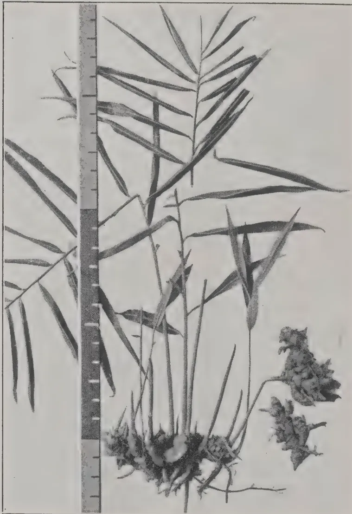A black and white botanical illustration of a ginger plant. The plant features a cluster of long, narrow, lanceolate leaves with serrated margins, emerging from a central rhizome. The rhizome is shown with several thick, knobby, and irregularly shaped rhizomes. To the right of the main plant, there are two separate, dense, rounded clusters of small flowers or seed pods. A vertical ruler is positioned to the left of the plant, providing a scale for the illustration. The ruler has markings for inches and centimeters.

*Photo, by H. F. Macmillan.*

GINGER. (*Zinziber Officinale*).

(*See Page 207.*)

246------------------------------------------------

THE  
**TROPICAL AGRICULTURIST:**  
JOURNAL OF THE  
**CEYLON AGRICULTURAL SOCIETY.**

---

---

VOL. XL.

COLOMBO, APRIL, 1913.

**No. 4.**

---

---

**COLLEGE OF  
TROPICAL AGRICULTURE.**

*Peradeniya, April 15, 1913.*

We publish to-day as a supplement the Report issued by the Committee appointed by the Board of Agriculture to bring before the public the claims of Ceylon as the site of the Imperial College of Tropical Agriculture. The Report has been sent to the Press of Ceylon, the members of the Ceylon Planters' Association, of the Low Country Products Association, of the Ceylon Agricultural Society (with this number); to certain London journals, the Universities and Learned Societies, the High Commissioners, India, the Dominions, the Crown Colonies and the United States of America; altogether some 6,000 copies. The whole Empire and the United States have thus been put in possession of the circumstances upon which the case of Ceylon has been based and we have received from several influential quarters gratifying assurances of support. We feel confident now that the facts have been set out that if there is to be an Imperial College it will be established in Ceylon.

247------------------------------------------------

138[APRIL, 1913.

This raises the point : is there to be an Imperial College—one great Imperial College of Tropical Agriculture to serve the whole Empire and indeed other countries too? The alternative is for each of the principal tropical countries to set up its own College ; a poor alternative we think. But if there is to be an Imperial College supported by an Imperial grant the project should be laid before the British public and the scheme definitely outlined. This is a task the London Committee will no doubt take up. An Imperial College of Agriculture would be supported, we imagine, by an Imperial grant, subscribed to by the Dominions and the Colonies. This would take the form of an annual subsidy or of a foundation grant. In addition to the Imperial grant there should be a Ceylon Foundation Fund subscribed to by the people of Ceylon and also perhaps by the great Commercial Houses of London and the Steamship Companies interested in Ceylon welfare. Perhaps India would also join in subscribing to this fund as the Institution would certainly be of great benefit to her. Lastly, the College would no doubt also be provided for by a Government Vote.

It is time, we think, that subscription lists for the Ceylon Foundation Fund were opened and we suggest to the Press of Ceylon to consider whether this is not a task for them following the example of the great London Journals which never fail to open their columns for subscription lists when any great national project is forward. As pointed out in the last paragraph of the Report the starting of a fund would convey the impression that Ceylon was in earnest. People are generally more willing to believe in those who believe in themselves and have the courage of their opinions. There is no organization so well equipped as the Ceylon Press for reaching all classes.

248------------------------------------------------

APRIL, 1913.]139

# THE REPORT OF THE COMMITTEE.

---

## THE CASE FOR A COLLEGE.

In order that there may be no confusion it is necessary to state clearly that the question involved is not whether a College of Tropical Agriculture is needed for Ceylon. On this question opinion may be divided, some contending that the young men of Ceylon would not take advantage of a College of Agriculture; others, that Planters would still prefer to train superintendents under the "creeper" system. While we hold that neither of these contentions carry serious weight, and that Ceylon, like the Dominions of the Empire, who take the greatest pride in their splendid Colleges, would quickly come to realize the advantages—the necessity—of sound and scientific training in Agriculture as in other professions, we do not intend here to take up this side of the argument, though we may quote the late Dr. Treub of Buitenzorg, Java, who said that "the formation of an Agricultural Department to include a College of Agriculture would create a roll of great importance at Peradeniya of much use to agriculture in a Colony where agriculture is the chief source of Revenue. The necessity of establishing a University or College of Tropical Agriculture has practically been accepted in England, but the site of such an Imperial College being, we believe, still undetermined, it is our endeavour to set forth in this memorandum the claims of Ceylon as being the most suitable place for the College. In this connection it may be stated, however, that a member of this Committee recently received a letter from an influential quarter at home, asking for information as to what decision the people of Ceylon had come to about a College of Agriculture. It is time, then, for the voice of Ceylon to be heard on this matter.

## THE PROPOSED UNIVERSITY.

The London *Times* in its issue of January 24th last pleads for a University of Tropical Agriculture being established in the West Indies. In our view, comprehensive as the teaching should be, the subject does not specially demand an University. An University is generally understood to be an institution comprising many faculties, such as Arts, Law, Commerce, Medicine, Engineering; the needs of Tropical Agriculture could be met by a faculty of Tropical Agriculture in a University or by a College.

*Nature* follows the *Times* in favouring the West Indies as the place for a University or Imperial College, chiefly on the grounds of their being of easy access to the British Isles, affording professors and lecturers the opportunity of frequent personal intercourse with fellow-workers at home. In our judgment this is to misapprehend the character of tropical work. Tropical Agriculture can only be studied in the tropics, and those who come out and join its ranks are compelled to leave behind very much of what they have learnt at home.

In this respect tropical agriculture is on a somewhat different footing from medicine, engineering, law, commerce,

249------------------------------------------------

140[APRIL, 1913.

If, to quote *Nature*, the College should in the first place "be situated in a Colony offering the greatest possible scope for diverse agricultural pursuits," and, secondly, "the healthiness of the Colony should, as far as possible, be beyond reproach," then we contend there is no Colony in the Empire that can challenge the claims of Ceylon.

## CEYLON ON THE OCEAN HIGHWAY.

Ceylon, situated in the very heart of our Tropical Empire, is on the Ocean Highway to the East Indies and to Australia, in close proximity to India, Assam and Burma, in touch with Mauritius and the Seychelles as well as with East Africa where great tropical planting industries, growing in dimensions yearly, are arising. Both British East Africa and Portuguese East Africa look to Ceylon, and have done for many years, for advice and assistance in matters concerning tropical agriculture; and this to a considerable extent is also the case with Australia. Ceylon trained planters are to be found in large numbers in Malaya, the Straits Settlements, Assam, Southern India, and many of the Islands of Oceania, thus linking the Island with the tropical and sub-tropical world. It is manifest, assuming that an Imperial College of Agriculture is to be established, that the most convenient centre in the East is this Island.

## THE TROPICAL PLANTING INDUSTRIES OF CEYLON.

In an issue such as that under consideration, the interests of the student should govern the choice. We should not press the claims of Ceylon did we not feel that the interest of students could nowhere else be served as they would be here, because there is no other country in the world, as far as we are aware, wherein so many planting industries can be seen thriving under prosperous commercial conditions and within so small an area. Within a radius of 75 miles of Peradeniya and at elevations ranging from sea-level to 6,800 feet there exist plantations of coconuts, tea, rubber, cocoa, cinnamon, citronella, tobacco, tropical fruits, spices and vegetable products, thriving, industries of desiccated coconuts, and coconut fibre and the manufacture of coconut oil. Sisal hemp and cotton are being taken up by the Department of Agriculture. Ours is essentially an Agricultural Colony having under cultivation nearly a million acres of coconuts, over half a million acres of tea, 186,000 acres of rubber, 47,000 acres of cinnamon, 43,000 acres of cocoa and 800,000 acres of other tropical products, such as rice, citronella, tobacco, camphor, cardamoms, arecanuts, bananas, pineapples, sugarcane, cassava and fibres, etc. It has a large dry zone where tropical agriculture under irrigation is carried on.

In the high elevations sub-tropical products such as maize, wattle lucerne will thrive, while the climate in certain localities is not unlikely to prove suitable for ostrich farming, the Angora goat, sheep and cattle breedings.

The resources of Ceylon, from an educational point of view, are we believe, unrivalled; so much so that the obligation does not so much lie with us to proclaim them as with other countries to show they have better.

250------------------------------------------------

APRIL, 1913.]141

## PERADENIYA.

A recent writer, fully qualified to express an opinion, stated that he thought it paid a botanist or an agriculturist better to spend a month, or even two, at Peradeniya and collect information and plants than to go round the whole tropical world for the same purpose. Professor Francis Ramaly wrote "as a *Show place* these gardens are not equalled anywhere in the world, and as a place of scientific interest to botanists there are few rivals."

Hæckel, the German zoologist and philosopher, said of his visit to Peradeniya that in the four days which he spent there he learned more botany than he could have learned at home in as many months of hard study.

Sir W.T. Thiselton Dyer called Peradeniya the "Kew of the East."

The Peradeniya Gardens are nearly one hundred years old and cover an area of 150 acres. They contain almost every economic product of importance known to the tropical world. The gardens with their trained staff of Gardeners would provide for the Horticultural side of the College course. The Library contains some 6,000 volumes, and exchanges with or purchases all the important current agricultural and botanical publications. The Herbarium has 22,000 floral specimens; the Museum 350 specimens of timber and 2,400 of economic products; the entomological laboratory some 3,000 specimens; the mycological laboratory 4,000 specimens. Across the river a site of 40 acres has been reserved on the Experiment Station for College Buildings. On this station, which covers 500 acres,—cocoa, tea, rubber and coconuts are grown on plantation scale, while experiments are conducted on a smaller scale with a variety of other products.

Peradeniya is the headquarters of the Department of Agriculture with its staff of specialists. When in full working order the Department will have eleven or twelve Experiment Stations and Botanic Gardens distributed over the Island; besides over 250 school gardens under its control, available in some cases as trial grounds.

These Experiment Stations are, or will be conveniently situated near the railway, and will be accessible from Peradeniya by road or rail in one day.

To these attractions must be added that of climate. Peradeniya is at an elevation of between 1,600 and 1,700 feet with a mean temperature of 75°F. The nights are always cool, and even in the hottest months the days are not too oppressive for study.

One of the stations, (\*Hakgala,) to become a centre of sub-tropical development is at an elevation of 5,000 ft.

From the foregoing it will be obvious that the College would necessarily be situated at Peradeniya, already a centre of study, research and instruction. When the University of Ceylon comes to be established, as presumably it will in the course of time, the Peradeniya College would become one of the Colleges of the University, which would then grant degrees in Agriculture. There would perhaps be three classes of students: those who had already gone through a scientific course of training in agriculture and wished to specialise in Tropical Agriculture; for this class a year at Peradeniya would be sufficient. A second class would comprise those who had taken a science course at school, and for these two years would be required. For those who had received no scientific training, three years would be necessary.

251------------------------------------------------

142[APRIL, 1913.

This Scheme of a College of Tropical Agriculture is quite independent of the teaching of agriculture in village schools, preparation for which is already being made. School instruction of the goiya will go forward whatever happens to the College, but no doubt the two would come under one control, as there would be a certain amount of overlapping.

### CONCLUSION.

The case for Ceylon as the site for an Imperial College of Agriculture is seen to be a strong one, but it would be greatly strengthened if the people of Ceylon showed their imperial spirit by raising a fund to go towards its endowment, and we urge this aspect of the question upon the public. The raising of a fund would be an earnest that the people of Ceylon believed in the splendid opportunities for agricultural education possessed by their island. With these possibilities it would indeed be disappointing if the College were to go to some other country less favoured, yet there might be a possibility of this if the case of Ceylon were not sufficiently backed. We are but at the beginning of Tropical Agricultural development in the East; with the enormous labour resources of India and China to draw upon, no limit can be set to its expansion. The young men of Ceylon will take part in this expansion not only in their own country but, equipped as they would be at a College, in other eastern countries also, for nothing would be so likely to overcome the prejudice against agriculture now felt among Ceylonese as a College that would elevate it into a profession. We therefore recommend that subscription lists should be opened for the raising of a fund to go towards the endowment of the College.

Leading men in Ceylon could found chairs or appoint that their donations be devoted to some specific purpose, in order that their names should become associated with the foundation.

*Signed on behalf of the Committee,*

C. DRIEBERG,

*Hon. Secretary.*

### THE COMMITTEE.

The Hon'ble Mr. P. ARUNACHALAM, M.A., C.C.S., Member of the Executive Council.

The Hon'ble Sir S. C. OBEYESEKERE, Member of the Legislative Council for the Low-country Sinhalese.

The Hon'ble Mr. EDWARD ROSLING, Rural European Member of the Legislative Council.

The Hon'ble Mr. A. KANAGASABAI, Tamil Member of the Legislative Council.

The Hon'ble Mr. T. B. L. MOONEMALLE, Kandyan Member of the Legislative Council.

The Hon'ble Mr. HECTOR VAN CUYLENBURG, Burgher Member of the Legislative Council.

The Hon'ble Mr. A. J. R. DE SOYSA, Additional Low-country Member of the Legislative Council.

252------------------------------------------------

[APRIL, 1913.143

The Hon'ble Mr. J. N. TISSEVERASINGHE, Additional Tamil Member of the Legislative Council.

SIR SOLOMON DIAS BANDARANAIKE, Kt., C.M.G., Maha Mudaliyar and Native A.D.C. to H. E. the Governor.

Mr. J. HARWARD, M.A., Director of Public Instruction.

Mr. R. N. LYNE, F.L.S., F.R.G.S., Director of Agriculture.

Dr. JOSEPH PEARSON, M.A., D.SC. F.L.S., Director, Colombo Museum.

Mr. F. H. LAYARD, Chairman, Planters' Association of Ceylon.

Mr. W. MOIR, Chairman, Chamber of Commerce.

Mr. M. KELWAY BAMBER, F.I.C., M.R.A.C., M.R.A.S., F.C.S., F.R.C.I., Government Agricultural Chemist.

Mr FRANCIS BEVEN, Proprietary Planter.

Dr. H. M. FERNANDO, M.D., D.SC. London.

Rev. A. G. FRASER, M.A., Principal, Trinity College, Kandy.

Mr. E. R. GOONERATNE, Gate Mudaliyar.

Mr. F. M. MACKWOOD, *ex* European Member of the Legislative Council.

Mr. JAMES PIERIS, M.A., LL.D., Barrister-at-Law.

Mr. C. DRIEBERG, B.A., F.H.A.S., Secretary, Ceylon Board of Agriculture.

W. A. DE SILVA, J.P., F.R.C.I.

## LONDON COMMITTEE.

The following gentlemen have been invited to serve on the London Committee :—

Col. SIR HENRY A. McCALLUM, A.D.C., G.C.M.G., F.R.C.I., Governor of Ceylon.

Sir HENRY A. BLAKE, G.C.M.G., F.R.G.S., late Governor of Ceylon; Deputy-Lieutenant of Ireland.

Rt. Hon. Sir J. WEST RIDGEWAY, P.C., G.C.M.G., G.C.B.; K.C.S.I., D.C.L., LL.D., Retired Governor of Ceylon and Acting Governor, British North Borneo Protectorate.

The CHAIRMAN, Ceylon Association in London, 62, Gracechurch Street, London, E.C.

The SECRETARY, Ceylon Association in London, 62, Gracechurch Street, London, E.C.

Sir STANLEY BOIS, Kt., *Ex* Mercantile Member of the Ceylon Legislative Council and *ex* Chairman, Chamber of Commerce.

F. DORNHORST, Barrister at-Law, c/o RICHARDSON & Co., Suffolk Street, London, E.C.

JOHN FERGUSON, ESQ., C.M.G., F.R.C.I., *ex* General European Member of the Ceylon Legislative Council and Senior Editor of the *Ceylon Observer*.

G. S. SCHNEIDER, ESQ., Advocate, late Chairman, L.C.P.A. c/o RICHARDSON & Co., Suffolk Street, London, E.C.

Sir DANIEL HAMILTON, The Warren Hill, Loughton, Essex.

Sir ANDREW FRASER, LL.D., late Lieut.-Governor of Bengal.

The Hon. Mr. ALEX. FAIRLIE, Urban European Member of the Legislative Council of Ceylon.

Sir W. W. MITCHELL, *ex* European Member of the Legislative Council of Ceylon.

253------------------------------------------------

144[APRIL, 1913.

# RUBBER.

---

## COMMERCIAL POSSIBILITIES OF SYNTHETIC RUBBER.

By LOTHAIR E. WEBER, Ph.D.

It is rather peculiar that although the conversion of isoprene into a rubber-like substance has been known for upwards of twenty years, further progress in this direction has been practically stagnant until recent date. This is not altogether due to lack of effort, but rather to the enormity of the problem. The synthesis of rubber, however, received a new impetus about three years ago when two German chemists, Hofmann and Harries, working independently, succeeded in obtaining almost simultaneously products which gave the chemical reactions of rubber and had certain physical resemblances to the natural product. Since then, considerable progress has been made in this direction and, more recently, stock companies have been formed and capital subscribed with a view to actually placing synthetic rubber on the market. The daily press, both in this country and especially in Europe, gave this latest development of synthetic rubber wide publicity, sharing the optimism of the promoters and inventors of the new process, and as a result, the general public and, to a very large extent, rubber manufacturers themselves, have been led to believe that synthetic rubber can in the near future be manufactured in competition with the natural product.

I do not want to give the impression of holding in light regard the magnificent work which has been accomplished by European chemists in their efforts to synthesize rubber. I almost think that a certain amount of chemical training is necessary to appreciate the innumerable difficulties and pitfalls which face the investigator in these fields. These men deserve the profoundest admiration for their painstaking and laborious efforts, but it is greatly to be deplored that the public was given to understand that synthetic rubber is to-day a commercial possibility, since, if the promise is not fulfilled, the attitude of the public will scarcely be one of admiration.

Synthetic rubber enthusiasts have been very fond of comparing the synthesis of rubber with the synthesis of indigo, asserting that the same fate awaits natural rubber that befell natural indigo. These two problems, however, have very little in common and differ from each other in such striking respects that the two syntheses are not capable of comparison. I should like to take up this comparison in more detail because I think in this way the difficulties which will prevent commercial synthetic rubber becoming a realization during the next few decades can be more clearly shown. Before doing so, however, I would ask your indulgence in attempting to make clear to those of you who are not chemists, the meaning of a rather formidable looking word which is always in evidence whenever there is any mention of synthetic rubber. I refer to the word "polymerization."

254------------------------------------------------

APRIL, 1913.]145

We are being continually informed that isoprene polymerizes to rubber and that the process of converting isoprene into rubber is one of polymerization. The process of polymerization, briefly stated, is one whereby a large number of small units combine to make a single large unit. It is essentially a process of agglomeration. This process of agglomeration takes place between the molecules, the latter, as you know, being regarded as the smallest amount of substance that is capable of existence. The molecules of isoprene, at least 100 of them, unite and polymerize into one single molecule of rubber. Unfortunately, we have not the least idea exactly how many isoprene molecules go to make one molecule of rubber, and it is probably certain that the natural rubbers themselves vary very widely in respect of their degree of polymerization. It does, however, seem probable that the higher the degree of polymerization; that is to say, the more the number of isoprene molecules that unite to form one rubber molecule, the better are the physical properties of the rubber. In other words, two rubbers of exactly the same chemical composition, with different physical properties, owe this latter difference to their different degrees of polymerization. It follows then, that a uniform degree of polymerization would be the first requirement for a synthetic rubber.

Unfortunately, the chemist of to-day is absolutely powerless in determining this degree of polymerization experimentally and, to a certain extent, of controlling it. For instance, it is not possible to go into a laboratory with a quantity of isoprene and polymerize the latter to any desired extent. In fact, we have no means of feeling sure that we can on two different occasions bring about the same degree of polymerization. With the chemical methods available to-day it would be absolutely impossible to make a product with an assured uniform degree of polymerization, and until this is possible, I fail to see how there can be any possibility of commercial synthetic rubber. The first requirement of such a product is uniformity of polymerization, but as we have no means of determining this uniformity, or lack of it, variations would be bound to occur which would make the employment of such synthetic rubber by the manufacturer altogether too precarious. We all know to what disagreeable results variations in the uniformity of the natural product lead and in the latter case the possibilities for uniformity are infinitely more favourable than in the case of the synthetic product.

Now let us briefly consider the case of indigo. Here the problem was to manufacture an article of absolutely definite characteristics and properties. It undoubtedly required a vast amount of chemical skill before the composition of indigo was determined, but once this important feat having been accomplished, the chemist had a definite conception of the substance to be synthesized. Furthermore, there could never be the least doubt as to whether the investigator had actually succeeded or not in obtaining indigo. It is the work of only a few moments to be able to definitely decide whether a product is indigo or not.

In the case of rubber, the state of affairs, as we have seen it, is totally different. In the first place, the methods of polymerization are still in their infancy; we have no means of controlling its magnitude, or of assuring its uniformity. The chemical methods of to-day are wholly insufficient for the solving of this problem.

255------------------------------------------------

146[APRIL, 1913.

Synthetic rubber enthusiasts have either overlooked or ignored with supreme indifference the very important fact that in the year 1916 the price of raw rubber must of necessity drop very considerably. It is estimated (and from all accounts the estimate is a conservative one) that by the year 1916 the Eastern plantations alone will be able to produce 100,000 tons per year, although there are two factors which have not been taken into account in making the estimate, which might have a very serious effect on the future of the plantations. These two factors are: first, diseases of the trees, and secondly, the labour problem.

The chance of the trees becoming infected either with a disease or insect pest is probably very small, as the bulk of the plantations are under very careful supervision, and special precautions are being taken to prevent such an occurrence. The labour question seems to be of more serious consequence, as the Malay coolie is of a rather independent nature. Nevertheless, it is highly probable that the estimate is not exaggerated. Even to-day one repeatedly hears statements being made that the plantations that are producing rubber could, if necessary, put their product on the London market at 25 cents per pound. This is possibly slightly exaggerated, but not very much so. One has only to look at the dividends now being paid by some of the Eastern plantations to realize that there is a certain amount of truth in this statement. As things stand to-day, supposing it were possible to market synthetic rubber at 50 cents a pound in great quantities, the competition with plantation rubbers would not be very noticeable, as their output is relatively small; but in 1916 the case will be quite different. Even supposing that the demand for rubber keeps on increasing, the plantations will still be in a position to supply at least half of the demand. There are, furthermore, enormous opportunities for the plant physiologist in the cultivation and production of rubber. So far very little has been done in this direction, as the plantation industry is still in its infancy; but it seems more than probable that careful experimentation will enable means to be devised whereby the yield of rubber per tree can be materially increased.

In the case of the sugar beet this increase in the yield has been accomplished with surprising success. It has been possible by careful methods of cultivation and selection of the most advantageous\*conditions of soil, to raise the yield of sugar in the beet from 3 to 18 per cent. Undoubtedly, in the case of rubber, the problem is more complex than in the case of the sugar beet, but this field of investigation is still waiting for the pioneer, and I cannot help feeling that the possibilities are indeed large.

It must be seen, even on the supposition that synthetic rubber were to-day a commercial possibility, and that an article could be produced equal to the plantation product, that the struggle for commercial supremacy would necessarily be a fierce one, with the advantage very much in favour of the plantation product.

256------------------------------------------------

APRIL, 1913.]147

In the case of indigo, the synthetic product had practically no competition to meet whatsoever. The production of natural indigo had been carried out under the crudest possible fashion, and the methods of obtaining the dye from the plant were even more crude. For some extraordinary reason, although the production of this dye stuff was of such extreme value to the textile industry, it always remained in the hands of the ignorant natives. Had the same amount of energy and skill been applied to the indigo plant that is now being applied to plantation rubber, the victory of synthetic indigo would probably still be in doubt. It must be granted that the commercial synthesis of indigo was the crowning technical achievement of the nineteenth century, but it must also be acknowledged that its fight for supremacy over the natural product was materially aided by the shortsightedness of indigo planters. Rubber planters, on the other hand, have been keenly alive to the large possibilities which are to be derived from scientific methods of cultivation and production, and they have got such an infinite lead over the efforts of the synthetic chemist, as to be in little danger of being vanquished for many decades to come.

I hope I have not been altogether unsuccessful in making plain some of the difficulties that confront commercial synthetic rubber. With our present day chemical methods it would be well nigh impossible to assure a uniform synthetic product. Within the next few years the Eastern plantations will be in a position to supply half the demand for rubber, and accordingly would be in a position to wage a very stubborn fight against any synthetic product. Finally, it seems more than probable that scientific investigations will enable the planter to increase the yield of rubber per tree, and thus put him in a still better position to combat the synthetic article.

I do not want to make such a rash statement as to assert that synthetic rubber will never be a commercial possibility, but I should be greatly surprised if there is anybody engaged in the rubber industry to-day who will have the opportunity of seeing synthetic rubber in open competition with the natural product.—*The India Rubber World*.

## FINE HARD CURE RUBBER.

### SAMPLES OF RUBBER CURED BY THE WICKHAM AUTOMATIC APPARATUS. (B. Model.)

THE EDITOR OF THE "TROPICAL AGRICULTURIST."  
DEAR SIR,

The samples of rubber prepared in this process are offered for inspection as equivalent to "fine hard" Brazilian Para Rubber.

The rubber is prepared from pure whole latex without the use of a coagulant, other than the application of smoke and heat.

The principle of curing is the same as in the case of the Amazon product, but the Wickham apparatus offers a more efficient means than the primitive utensils of the Amazon for the preparation of "fine hard cured" rubber.

257------------------------------------------------

148[APRIL, 1913.

All the latex as obtained from the tree enters into the rubber without residual excepting a small quantity of moisture.

The percentage of moisture contained in the sample is in the neighbourhood of 10, probably less than more.

It will be seen that the rubber consists in a series of superimposed laminæ or films, each of which is superimposed upon its neighbour during the process, and each film or lamination is individually treated and cured by the smoke impingement, 200 degrees.

The latex on an organized estate can be made quite easily into large consistent quantities—thus securing uniformity—similar to sample, at a considerably reduced cost of production.

It will be observed that in making this rubber—as in the case of “Hard cure Para”—the latex is not coagulated, but is set in superimposed films or laminæ, the latex forming an amalgam with the essential oils obtained of a certain class of smoke, thereby constituting the antiseptic cure. Hard cure Para is never dried.

The present samples have been rather roughly blocked, but may be set much closer by a correctly arranged press and so a better appearance imparted to the rubber.

The Makers in Ceylon are :

COLOMBO COMMERCIAL Co., LTD.,

Colombo.

For

DAVID BRIDGE & Co., LTD., Castleton Iron Works, Manchester, England.

Yours faithfully,

H. A. WICKHAM.

## COAGULATION OF FUNTUMIA LATEX AT PERADENIYA.

---

The latex was gathered by means of vertical cuts, 2 inches apart and 6 feet in length all round the tree. The latex was collected by means of a clay collar at the foot of the tree leading into a cup.

Water was boiled and acetic acid added in the proportion of 100 c.c. of acid to 6,000 c.c. water. Into this the latex was gradually poured and kept stirred. Two pounds of latex took one hour and twenty minutes to coagulate.

D.S.C.

258------------------------------------------------

APRIL, 1913.]149

# TOBACCO.

## THE WORLD'S CROP.

We take the following table from the Editorial of the *Indian Trade Journal* of February 20, 1913, which shows the leading producing countries and the quantities produced in each during 1910:—

<table>
<thead>
<tr>
<th></th>
<th></th>
<th>Lbs.</th>
<th></th>
<th></th>
<th>Lbs.</th>
</tr>
</thead>
<tbody>
<tr>
<td>United States</td>
<td>...</td>
<td>1,103,415,000</td>
<td>Argentina</td>
<td>...</td>
<td>31,000,000</td>
</tr>
<tr>
<td>India</td>
<td>...</td>
<td>450,000,000</td>
<td>Algeria</td>
<td>...</td>
<td>20,723,000</td>
</tr>
<tr>
<td>Russia</td>
<td>...</td>
<td>200,773,000</td>
<td>Belgium</td>
<td>...</td>
<td>19,474,000</td>
</tr>
<tr>
<td>Austria-Hungary</td>
<td>...</td>
<td>184,817,000</td>
<td>Canada</td>
<td>...</td>
<td>16,513,000</td>
</tr>
<tr>
<td>Dutch East Indies</td>
<td>...</td>
<td>128,660,000</td>
<td>Greece</td>
<td>...</td>
<td>15,840,000</td>
</tr>
<tr>
<td>Japan</td>
<td>...</td>
<td>91,850,000</td>
<td>Italy</td>
<td>...</td>
<td>15,552,000</td>
</tr>
<tr>
<td>Brazil</td>
<td>...</td>
<td>75,285,000</td>
<td>Roumania</td>
<td>...</td>
<td>15,434,000</td>
</tr>
<tr>
<td>Germany</td>
<td>...</td>
<td>63,611,000</td>
<td>Bulgaria</td>
<td>...</td>
<td>13,944,000</td>
</tr>
<tr>
<td>Turkey-in-Europe</td>
<td>...</td>
<td>49,177,000</td>
<td>South Africa</td>
<td>..</td>
<td>13,519,000</td>
</tr>
<tr>
<td>Cuba</td>
<td>...</td>
<td>46,081,000</td>
<td>Paraguay</td>
<td>...</td>
<td>13,000,000</td>
</tr>
<tr>
<td>Santo Domingo</td>
<td>...</td>
<td>42,000,000</td>
<td>Porto Rico</td>
<td>...</td>
<td>10,000,000</td>
</tr>
<tr>
<td>Philippines</td>
<td>...</td>
<td>40,258,000</td>
<td>All others</td>
<td>...</td>
<td>23,913,000</td>
</tr>
<tr>
<td>France</td>
<td>...</td>
<td>36,446,000</td>
<td></td>
<td>...</td>
<td></td>
</tr>
<tr>
<td>Mexico</td>
<td>...</td>
<td>34,711,000</td>
<td></td>
<td></td>
<td></td>
</tr>
<tr>
<td colspan="3"></td>
<td>TOTAL.</td>
<td></td>
<td>2,756,000,000</td>
</tr>
</tbody>
</table>

259------------------------------------------------

150[APRIL, 1913.]

# POULTRY.

## EXPERIMENTAL WORK IN ARTIFICIAL INCUBATION.

By W. BROWN,

WEST OF SCOTLAND AGRICULTURAL COLLEGE.

All practical poultry-keepers will probably agree that the results obtained by artificial incubation are not equal to those obtained by natural means. This fact is demonstrated in two ways, namely, by the lower hatching percentage with incubators, and the higher vitality of the chickens hatched under a hen. Very little is known at the present time about the subject of artificial incubation, and it is strange, in view of the importance of the question, that so little work is being done to solve the many and complex problems that are encountered when operating incubators. For industrial poultry-keeping the whole question is of paramount importance. Once determine the conditions that are essential to the successful hatching of a large percentage of strong chickens and the whole industry will be benefited to a degree which it is difficult to over-estimate.

During the past twenty years valuable discoveries have been made in other branches of the industry, but few important improvements have been introduced in relation to incubators.

So far as is known at present there are three factors essential to success in artificial hatching, namely, temperature, ventilation and the humidity of the atmosphere surrounding the eggs. The maintenance of an even temperature presents the least difficulty for the majority of machines can be worked for weeks with only a very slight variation. It is, therefore more important to consider the problems connected with ventilation and the humidity of the air in the egg chamber.

It has always been contended that pure air is necessary to the growing embryo within the shell.

During the past ten years Mr. R. J. Terry, poultry expert to the Tasmanian Government, has been carrying out experiments to test the truth of this assumption, and recently he has published the results of his work. His investigations are not by any means conclusive, but they serve to indicate the line of thought he is following. Professor W. R. Graham, of the Ontario Agricultural College, Guelph, has also been conducting similar experiments; they are not as yet sufficiently advanced to render publication advisable.

The contention of Mr. Terry is that both manufacturers and operators of incubators "have the mistaken idea that they are developing something which, in the embryonic state, breathes by means of lungs. If that were the case they would be quite right in their oft-repeated statement that, like a man, a chick cannot breathe too much pure air." But anyone who has given thought to the subject understands that the blood of the embryo is purified not in the

260------------------------------------------------

APRIL, 1913.]151

lungs, but in the allantois, the respiratory sac, a membranous sheet of blood-vessels spread out beneath the shell, while the lungs are only brought into use just before the bird is hatched.

Mr Terry was first led to investigate along his present lines after noticing the effect of free air on the blood-vessels of the embryo. He was studying the embryo with a part of the shell removed, the greater part of the egg being submerged in warm water. The removal of part of the shell had no injurious effect, but after a short exposure to the air the blood-vessels were ruptured. It was this observation that first of all suggested that eggs receive too much air in modern incubators. All operators know that in testing eggs there are a number showing an irregular broken ring of blood, instead of the "spider" seen with a living embryo. To throw further light on the subject a number of eggs were placed in different incubators of the same make which were worked under similar conditions except as regards ventilation. More ventilation was allowed to some of the machines than to others. The result was, in Mr. Terry's own words, that "those incubators which had an excess of ventilation gave the poorest results, both as regards the ruptured system occurring some time before the sixth day, as also to a large number of dead in the shell."

We have frequently noticed this blood ring on testing for fertility on the sixth day, but whether it is formed after the death of the embryo, or is the cause of death, is a question for the embryologist to answer.

In support of his theory Mr. Terry advances one important argument which is supported by other investigators, namely, that in natural hatching there is a large amount of carbon dioxide in the air surrounding the eggs. This has been shown not only by Mr. Terry, but earlier by Professor W. H. Day, of Guelph, Professor J. Dryden of the Utah Station, and Mr. J. L. Nix, Homer City, Pa. The quantity is frequently known to be three times greater than that in incubators. Even when hens have been tested when sitting on dummy eggs in an India-rubber nest, the amount of carbon dioxide in the air has been found to be considerably greater than in a well-ventilated machine. This appears to indicate that the carbon dioxide is given off by the hen's body, and is not the accumulation of gas given off by the eggs. This is the most important fact that has been brought forward in favour of the theory that carbon dioxide is beneficial to the developing embryo.

The *Sydney Daily Telegraph* gave prominence to the theory advanced of Mr. Terry, and to assist in the investigation they instructed Mr. S. Ellis, of Botany, New South Wales, to conduct a series of experiments, which would, to some extent, check the conclusions. Mr. Ellis was somewhat opposed to the idea, but carried out two experiments. The two tests were so closely alike that it will be sufficient to quote the last one as extracted from the journal named:—

"The second incubation test conducted by Mr. S. Ellis, of Botany, New South Wales, confirms the results of the first experiment. His eight Zenith machines were run on exactly the same lines as in the first test as regards ventilation and moisture, and the eggs were from the same pen of White Leghorns. In this instance a variation was made in regard to the system of

261------------------------------------------------

152[APRIL, 1913.

turning the eggs in the incubators. There was a striking similarity between the results of the respective machines in the two hatches, and again the highest percentage and the best chickens were produced with no ventilation for the first fourteen days. The general average of living chickens from the eight hatches was 68.4 per cent., as compared with 71.4 per cent. in the first test. Of course, in considering these averages, it has to be borne in mind that some of the incubators were run for experimental purposes under conditions that were not expected to give first-class results.—*The Journal of the Board of Agriculture.*

## CHICKEN REARING ON AN INTENSIVE SYSTEM.

In connection with the system of intensive chicken rearing adopted by Mr. F. G. Paynter, and described in this Journal for December, 1912, page 721, it may be pointed out that the system described must still be regarded as in the experimental stage. It is most undesirable that those who have not already a thorough practical acquaintance with the management of poultry should attempt to adopt such a system, as it demands much more knowledge, skill, industry, and care than are necessary where poultry-keeping is conducted under ordinary conditions.

A general description of the equipment used in Mr. Paynter's experiment, and of the methods adopted by him, will be found in the article referred to above; but attention may be drawn to the fact that, in addition to the possession of adequate capital, and a suitable area of land in proximity to a market, a thorough practical knowledge of the best methods of artificial incubation and rearing is indispensable for anyone who proposes to attempt to carry out the system on the scale described in the article.

Those who have not the necessary knowledge are recommended either not to attempt such an experiment or to begin operations in a purely tentative way, with a view of gaining practical experience of the proper methods, and of testing their own qualifications for such an enterprise.

Success in dealing with all classes of livestock depends on certain aptitudes in the individual which are not possessed by all, and also a practical experience which can only be gained in the course of time. In addition, it must be remembered that, in all such undertakings, business capacity and the faculty for giving attention to detail are determining factors. The beginner

262------------------------------------------------

APRIL, 1913.]153

is advised to regard intensive chicken-rearing as an occupation requiring skill and experience, without which success is unlikely to follow the adoption of any particular method, however admirable.

It would be undesirable, therefore, for the inexperienced to invest in a plant capable of raising 3,000 chickens in the season, though useful experience may be gained by attempting to raise, say, one-twentieth of that number. In purchasing appliances for artificial incubation and rearing, those of the size recommended by Mr. Paynter might be used with a view to future development, but there would be no necessity to work the appliances up to their full capacity. Thus a beginner might test the suitability of the system to his individual circumstances and ability by the purchase of an incubator and one rearer, and provide, in addition, the plant necessary for 100 to 150 chickens. He must not expect the financial results of this tentative effort to produce a return proportional to that indicated as attainable under the complete system, but should regard the outlay as a necessary expenditure in training.

Such a method, if carried out systematically, would not only be the means of securing some practical experience of production, but would also give the beginner some knowledge as to local demand and prices, and methods of marketing.

As is indicated in the previous article in the Journal, Mr. Paynter is now conducting, under the auspices of the Board, a demonstration of his system at Haslington Hall, Crewe. For the novice who seriously contemplates devoting attention to intensive chicken rearing, probably the most satisfactory course to pursue would be to visit, during the spring or early summer of the present year, the demonstration which is in progress. Those who wish to pay such a visit should write to inquire when arrangements can be made to receive them. Mr. Paynter's time is fully occupied, and an appointment will be necessary.—*The Journal of the Board of Agriculture.*

263------------------------------------------------

154[APRIL, 1913.

# AGRICULTURAL BANKS.

---

## THE OBJECT AND THE WORK OF THE AGRICULTURAL BANK OF EGYPT.\*

---

The Agricultural Bank of Egypt was established by Lord Cromer some fifteen years ago in order to free the improvident fellah from the clutches of the Greek and Syrian money-lender who, taking the fellah's land as security, advances him money at the rate of anything between 30 to 50 per cent. or more. The fellah has an inborn craving to acquire land and any neighbouring land is a Naboth's vineyard to him, to be acquired by any sacrifice and this forms one of his chief reasons for borrowing money. Other reasons are marriage and other festivals, on which he will squander large sums, more legitimate reasons being the purchase of cattle or the erection of the all-necessary water-wheel. The Bank was given the support of the Government inasmuch as that it allowed the instalments, when due, to be collected by the Government tax-collectors at the same time as the taxes were collected in the villages after the cotton harvest in October and November. The provincial governors and sub-governors also gave the Bank every support in ordering village headmen to assist the Bank's collectors in collecting arrears, and in seeing the clients in their villages, always a difficult matter when they may be scattered over their fields and are naturally unwilling to come and be worried to pay their debts, and in settling affairs generally. The Bank has a Board of Directors in London and Egypt and a General Manager and head office in Cairo. Then each Province has a branch agency in the principal towns, managed by an Englishman and native staff, and these again have sub-agencies in the smaller towns.

According to the statutes of the Bank, no client may borrow more than £E500 on the mortgage of his land and repayable at the fixed rate of interest of 8% in ten yearly instalments. This was afterwards altered to twenty years and a rate of 9% for those in arrears of payment.

### FORM OF SECURITY.

As only about 75 per cent. of the fellahs own more than five acres, nearly all the Bank's work is done with the small land-owner, even so small a portion as a  $\frac{1}{4}$  of an acre being accepted as security. But land is of very high value in Egypt—no land that will bear even a poor crop of cotton can be purchased for less than £E 40 and in the older Provinces where the soil is

---

\* The illustrations which should have accompanied this article will be found in the March number, facing page 92.

264------------------------------------------------

APRIL, 1913.]155

very rich, nothing can be bought under £E 120, and anywhere near towns £E 200 per acre will be paid. Rents in these Provinces will be from £E 12—17 per year. The Bank only advances half the value of the land, which is generally assessed according to the Government Tax.

#### THE ACT OF MORTGAGE.

The mode of procedure for mortgaging land is as follows:—The fellah obtains a Bank form stating the amount of land he owns; how obtained, whether by purchase or inheritance; how much of that land is previously mortgaged; whether he himself worked the land or is it rented out; value of the land; boundaries; reasons for loan; names of heirs; and various other legal details. This form being filled out in the village, it is then signed by the headman and the clerk of the village, who also vouches for the good character of the client. The form is then sent to the bank, where it is checked according to the Government Land Registers. If it is found to be correct, an act of mortgage is then made out and an audience fixed for a certain date. All the clients of that district would then assemble on the date fixed and before the Government Grèffier sign their acts, after which they received their amounts, less cost of registration. Great care has to be exercised during the signing of the acts because the fellah is up to all sorts of trickery. The fellah, as a rule, cannot sign his name, so Egypt possesses a system of seals on which is engraved the owner's full name. These seals are all registered and if lost must be officially replaced. Great care must be taken to see that the seal is the same used as that on the preliminary form and that it really belongs to the owner and secondly that it is the mortgagee himself who presents the seal and not some one else. The moment the audience is finished the names are telegraphed to the Head Office and at once registered in the Government Land books, or the mortgagee might get in a second mortgage on his land or even sell it to some unsuspecting person. In the case where a client already has a mortgage or debt on his land, with the full consent of the creditor, this sum is deducted from his new loan and paid over to the debtor. The first instalment would be due the following autumn, when the taxes are collected, but if the mortgage is only registered three months previous to the tax collecting, it would be deferred till the following year.

#### ARRANGING THE FELLAH'S PAYMENTS.

The Government tax collectors are given a small percentage on what they collect during two months, after which a list of all defaulters is sent into the Bank, through the Government. The Bank then sends out its own collectors to endeavour to induce the defaulters to pay and the English Inspectors are constantly visiting the villages to use their influence and to point out to the fellah the best way to arrange his payments. And it is this point which makes an undertaking of this sort, so sound—the English Inspectors make a point of seeing the clients individually and seeing that

265------------------------------------------------

156[APRIL, 1913.

justice and fair-play is dealt out to the fellah. And considering the ignorance of the fellah it is most important that these matters should be in the hands of men of position and high-standing, for the fellah has to trust blindly to the proper keeping of his account, the complications of which—especially when he falls into arrears or can only pay parts of back instalments—with its compound interest are far beyond his simple methods of calculation. And such is the high standing of the Bank, they *do* render implicit trust. As long as everything is straightforward the fellah keeps up his yearly payments well on the whole, but the two chief factors for his getting into arrears seem to be either the death of the original owner and consequent division of the land amongst innumerable heirs who cannot agree amongst themselves as to their share of payment, or the mortgagee selling his land to third parties who cannot agree as to payment.

If a man gets into arrears, he may re-mortgage his land for a further period of 20 years, the remaining amount of his original loan, plus the interest on his arrears being deducted from his new loan.

Otherwise if he gets into arrears for 2 or 3 years and it is thought not desirable to accept a re-mortgage, legal proceedings are then instituted for the expropriation of the land.

And it is here that the chief weakness of the Bank's smooth working occurs. For the Bank, being a European Company, all its legal work must be done through the Mixed Tribunals which causes endless delay. It will take as long as three years to expropriate a man of half an acre of land. One of the chief reasons of this delay is supposed to be to give the debtor time to pay off his debt, but in reality it often means that the procrastinating fellah will put off the payment as long as possible, thereby incurring very heavy legal expenses, the payment of which in the end severely cripples him. If expropriation were swifter the fellah would not be so inclined to put off the evil hour of payment.

#### BLACK-LISTING A VILLAGE.

In certain cases the Bank also lends small loans on note of hand only payable in one year, these loans being chiefly for manure or seed and which are nearly always paid up. It is curious that in the same district and where land is of the same value, of two villages within a mile of one another, the one will have no clients in arrears whilst another will have more than half. In the latter case the village is black-listed and no further loans advanced in that village. The fellah often possesses the money to pay off his debt, simply delaying, doing so because for him to part with his money is more than drawing his blood and it is in these cases where the English Inspector can often persuade him to pay by reasoning with him or by threats of expropriation.

266------------------------------------------------

APRIL, 1913.]157

Thus it will be seen that the Agricultural Bank of Egypt is a thoroughly sound concern that has done and is doing a great work for the benefit of the fellah. But it is also a sound financial business, for though Lord Cromer looked upon it as a more or less philanthropic concern, it pays a regular 7 per cent. to its shareholders.

#### THE NEW LAW.

Now let us see what effect the new Law, passed at the beginning of this year, will have on the Bank. The Law ordains that it is not legal for owners of less than five acres to mortgage their lands, the idea being to force provident measures on the fellah by stopping his only source of security thus rendering it practically impossible for him to borrow. For it must be remembered that only 25 per cent. or thereabouts own more than 5 acres. It was also maintained that the profit gained from less than 5 acres was insufficient to support the mortgagee in the common necessities of life, as well as to allow him to pay off his debt, thus getting him further into debt and into the power of the money-lender.

But the relatively small number of clients and arrears to the Bank show this is not really the case.

But the fellah must be financed somehow; money must be advanced to him for seed and to cultivate and move his crop. It has been his custom for countless generations to borrow for these purposes and suddenly to put a stop to this and to cut off all his resources of financial help does not seem a very wise step.

During the months preceding the passing of the Law, there was a tremendous rush on the Bank to borrow money and the output amounted to a very large sum. But it was impossible to cope with all the work before the date fixed and many thousands of fellahs could not get their small holdings mortgaged in time. In consequence of this the money-lenders to whom they were indebted, were simply forced to seize their crops, having no security for repayment of their debts.

A commission has been instituted by the Government to obtain, in detail, the indebtedness of the fellah. This in itself is a stupendous undertaking, for if there is one thing the fellah hates it is exposure of his private debts. *Secondly* very few of them have the remotest idea what their various debts amount to, nor even how much of their land they have mortgaged to various money-lenders. *Thirdly*, as they neither give nor receive receipts for ordinary debts, there will be nothing to show the commission the truthfulness of the amount of the debt. In order to meet this, a most arbitrary act was passed whereby the unfortunate fellah should be fined and imprisoned if he should be convicted of lying or falsifying the statement of his *private* debts. It is presumed that when this commission has computed the fellah's indebtedness, that the Government proposes in some way to recognise his debts. But what the Government does not seem to realise is that the debt is computed at at least 60 million pounds and this from such a small country as Egypt and with 12,000,000 inhabitants. The Government certainly does not possess

267------------------------------------------------

158[APRIL, 1911]

this sum itself to settle the debt, nor can it expect to borrow it from London or Europe when it has itself just deliberately put a stop to the work of so excellent an institution as the Agricultural Bank, which itself was instituted and supported by Government and backed by high financiers.

D. S. C.

## AGRICULTURAL CO-OPERATIVE CREDIT SOCIETIES AND JOINT STOCK BANKS.

The following extracts are from the *Journal of the Board of Agriculture*, February, 1913 :—There is a general concensus of opinion that the Co-operative Credit Society is the most satisfactory means by which capital, from whatever source received, can be passed on to the small holder, who stands most in need of assistance in the matter.

As regards the extent to which the banks will be prepared to provide a Society with capital, each bank naturally reserves to itself the right of requiring in each case satisfactory evidence as to the security for the loan; and, indeed, no sound banking institution, whether State-aided or not, could be expected to make an advance of money to a Society without making sure that there was a practical certainty that the advance would be paid.

As regards the form of security to be required, the banks have agreed that the joint liability of the members of the Society may be accepted as an adequate security for a proposed loan, without any further guarantee for its repayment; subject, however, to the general condition already mentioned, that the bank is satisfied that the joint liability is in the particular case a sufficient security. It is to be expected that when a Society wishes to take advantage of this arrangement and obtain a loan from a bank without any special guarantee, the local bank Manager and the Directors will require to be satisfied that the Society consists mainly of thrifty, industrious men, that the Committee is composed of trustworthy members of good character and credit, that the affairs of the Society are conducted in a business-like manner, that the loans to members are really expended on profitable agricultural purposes, and that these loans are punctually repaid on the due dates. Indeed, in the interests of the co-operative credit movement, and of the individual members of the Societies, it is not desirable that any institution should make advances to a Society which cannot fulfil such conditions.

As already said, the arrangement made with the Banks relates only to Co-operative Credit Societies, so that if the members of any other form of Agricultural Co-operative Society wish to take advantage of it, it will be necessary for them to combine their credit by forming an entirely separate Credit Society, confining itself solely to the business of making loans to its members for profitable agricultural purposes. It does not reduce their existing facilities for borrowing money, whether from joint Stock Banks or from other sources. All that it means is that these banks have now expressed their willingness to give valuable assistance to Agricultural Co-operative Credit Societies on favourable terms in cases where approved Security can be given.

268------------------------------------------------

APRIL, 1913.]159

## CO-OPERATIVE CREDIT IN INDIA.

---

In India, with its immense area and its population of 315 millions, the cultivation of the land is almost entirely in the hands of small holders, farming from 1 to 50 acres each. Many of them own the land they cultivate; but even where this is the case, they find great difficulty in obtaining at a reasonable rate of interest the capital they require to borrow in order to carry on their agricultural operations. In many parts of the country the ordinary rate of interest charged to the peasant by the village money-lender, who is the main source of supply of credit, is from 30 to 40 or 50 per cent. per annum, and for the whole of India the average rate is somewhere in the neighbourhood of 20 per cent. These high rates are due to the precariousness of the harvests, to the scarcity of capital available for loans as compared with the demand, and to the unsatisfactory relations between the money-lenders, who often take advantage of the ignorance and illiteracy of their debtors, and the peasants, who struggle to avoid the exorbitant claims of their creditors and are often unpunctual in the repayment of their debts.

With a view to improving the security of lenders and reducing the rate of interest payable by borrowers, the Government of India in 1904, after a careful study of the experience gained in various European countries, resolved to introduce the system of co-operative credit, which had been so successful elsewhere, and passed a Co-operative Credit Societies Act, based upon that experience and upon the Friendly Societies and Industrial and Provident Societies Act of the United Kingdom, with such changes as were necessary to adapt them to Indian conditions. That this measure has proved a success beyond the dreams of its most enthusiastic advocates, will be seen from the following statistics for the year 1911-12.

In that year the total number of co-operative societies in India increased, from 5,432 to 8,177, the number of members rose from 314,000 to 403,000, and the total working capital from £1,358,000 to £2,238,000. The amount sued in loans to members during the year was £1,191,000. It must be remembered that a pound in India means much more than it does in England as may be realised when it is considered that the average daily wage of an unskilled agricultural labourer is about 3d. in India, while in this country it is about 2s. 6d., or ten times as much. The amount lent by societies to their members last year would, if spent entirely in wages, have enabled them to employ 95 million days' labour, and if spread over the total number of members, would have provided each of them with enough to pay the wages of a labourer for two-thirds of the year.

The societies are divided into three classes—central, urban and rural—and the following figures relate to rural societies, which are almost entirely composed of small cultivators living in villages. The number of these rural societies increased during the year from 4,957 to 7,562, the number of members from 236,000 to 325,000, and the working capital from £727,000 to £1,215,000. During the year members deposited with the Societies £85,000 and repaid loans to the amount of £503,000. Deposits were withdrawn to

269------------------------------------------------

160[APRIL, 1913.]

the amount of £52,000, and the new loans made to members amounted to £935,000. The earnings of the year, which consisted almost entirely of interest on loans to members, were £115,000, and the charges of the year were £73,000, so that the societies during the year made a net profit of £42,000. At the end of the year the total assets of these rural societies amounted to £1,295,000, of which £1,112,000 were out on loans to members. Their liabilities to persons and bodies outside the societies amounted to £853,000, including £658,000 due to central banks and other societies, £126,000 borrowed from non-members, and £51,000 lent by the Government in certain parts of the country, so that, after deducting these liabilities to outsiders, the societies and their members between them ended the year with net assets of the value of £442,000, which represents the sum which the establishment of these credit societies has enabled their members to lay by in the course of the last eight years. Of this amount £300,000 were due to individual members in the form of share capital, deposits and interest, and after allowing for this amount and some other small items, the societies, as such, possessed £140,000, which represents their profits to date from the commencement of the different societies.

This satisfactory result is due mainly to the success of the societies in obtaining advances and deposits, either from members or non-members, at a considerably lower rate of interest than they charge on loans to their members. The rates which the Societies find it necessary to pay in order to secure the capital required for their working vary from about 6 to 10 per cent., and average something like 7 per cent. for the whole of India; and the rates charged by the Societies on loans made to their members vary from about 10 to 15 per cent., and average for the whole of India approximately 12 per cent. The amount of interest earned by societies during the year exceeded the amount of interest paid by them by £45,000, which left them a margin of profit of nearly 5 per cent. on the amount borrowed by them from all sources; and as the committees which manage these societies perform their work without payment, the total cost of administration for the whole of India came only to £8,000, or a little more than £1 per society for the year. Thus the members of these societies have not only found them a safe place of deposit for their savings, but have been able to borrow the small loans they require at a rate of interest which, though it seems high in comparison with the rates current in Western countries, is only about half the rate they used to pay to the village money-lender. The more successful societies, which have built up a large reserve fund, are now beginning to reduce the rate of interest they charge on loans to their members.

The indirect advantages of the movement are also very marked. The establishment in a village of a successful credit society among the peasants themselves has greatly reduced the demand for loans from the village

270------------------------------------------------

APRIL, 1913.]161

money-lender and compelled him to lower the interest he charges to other persons who still resort to him for loans. The manifest benefits gained from co-operation in the matter of credit are encouraging the villagers to combine for other purposes, and one hears of co-operative societies formed for the provision of good seed or improved implements, for the purchase of members' requirements, and for the sale of their produce. Some societies have even begun to take up land for demonstration farms, to build village halls, and to start village schools for the benefit of their children. It is also noted that these societies play an important part in the prevention of disputes and litigation, and bring the people together in friendly fashion, so that the practice of co-operation is having a marked influence on the effacement of old enmities and the development of social intercourse among the villagers. The movement is rapidly spreading, and promises to revolutionise village economy throughout the country, by increasing the welfare and raising the intellectual and moral standard of the masses of the people.—*The Journal of the Board of Agriculture.*

## CO-OPERATIVE CREDIT.

A community maintains its stability by the energy it displays in *productiveness*. Unless the standard of productiveness is fairly high, and the capacity for producing is well-sustained, it does not require a prophet to say that, given the necessary allowance of time, the community will gradually tend towards decay and eventually retire into the backwaters of annihilation.

The reflective mind will at once grasp the situation as the result of a law which is relentless in operation, and permeates all life in the world. Exercise a function and it lives; neglect it and it dies. This is the inevitable law of the universe.

If we take a survey of life as it exists in Ceylon at the present day, we find that the staple of the country is supplied by India and Burma. The indigenous production of rice has hardly been sufficient to supply a hundredth part of the local demand.

The immigrant labourers and the men who live in cities and townships are entirely dependent on the supply from the neighbouring continent. Imagine for a moment a season of drought and famine in India, and a consequent stoppage of the imports of rice into Ceylon, and you will realise what a disaster will befall the country.

How can the Ceylon agriculturist be induced to produce sufficient rice at least for home consumption? There are two fundamental problems to be solved before that question is answered.

271------------------------------------------------

162[APRIL, 1913.

It is well-known that the Ceylon cultivator, especially in the interior, is a *conservative* worker. Methods of agriculture which prevailed in the early dawn of civilisation are still followed. It is, of course, to be admitted that in following these conservative methods, the *goiya* is unconsciously putting into practice the concentrated or accumulated wisdom of centuries.

But, does the man receive at the same time that intelligence which is necessary to enable him to tap the sources of wealth, which nature has lavishly stored up for him?

The reply to this question has to be given in the distinct negative.

What we, of the present day, do not realise is that the kings of the old time were patrons of all the arts and sciences, and even of religion.

The kings, therefore, initiated with the help of their advisers and ministers all changes rendered necessary by the ever-altering conditions of life.

The age in which we live rather demands efficiency in the individual.

Hence the need for education. No reform can ever be effected in the production of rice, unless and until the youths of the agricultural classes are taught to exercise their intelligence, and the faculty of initiative, in the village school.

It is a hopeful sign of the times that this is being done by the British Government. It is the rule rather than the exception to see attached to every village school an experimental garden.

Much more can, however, be done; and the people must, like Oliver Twist, ask for more before they can have it. Healthy, legitimate and constitutional agitation will ever find a response, if maintained unabated up to the psychological moment.

The next is the question of capital and that brings me to the subject of this article—"Co-operative Credit."

History has repeatedly shown us that when an ancient community comes in contact with the civilization of a more progressive one, the members of the former community almost immediately assume an individualistic tendency, and abandon the earlier communistic ideal.

This is just what has happened in Ceylon since it came in contact with the West, and the result is that a new hatred which never existed before, for a time, set class against class.

The time of redemption is, however, drawing nigh. The people of the country have at last evolved a *national consciousness*, and each day sees a greater change overtaking the outlook on life.

272------------------------------------------------

APRIL, 1913.]163

In 1910 was enacted an Ordinance to promote the inauguration of Co-operative Credit Societies. The latest newspapers record the fact that Mr. R. N. Lyne, Director of Agriculture, has been appointed the Registrar of the Societies.

It will, no doubt, interest my readers to know whence the thought of Co-operative Credit originated. It is recorded that when His Holiness the present Pope was the Vicar of a parish in Venice, he was for a long time disturbed in mind over the great poverty of his flock, and the sordidness of their surroundings. The staple industry of the parish was viticulture, or the culture of the grape. Vines, several hundred years old, existed in the plantations, but at this particular period (the early "eighties"), these vines, from lack of manure, gave but an ever-decreasing yield. The depressed cultivators could hardly keep themselves and their families in comfort, much less afford to the vines the manure that was needed.

The saintly Priest Sarto began discussing the problem with his friends, and at last determined to start an agricultural bank, which would provide his people with the necessary funds to purchase their manure.

Steadily the depressed community began to rise, and it is said that when the Priest left Venice his parishioners had emerged from entire destitution into a fair command of wealth.

As these agricultural banks continued their work, it was found that the community served by them responded with greater enterprise if it provided some part of the capital, that is to say, co-operation by the community set before it such an ideal of self-help, that the capital lent to the individual was used to greater advantage, and expended with greater care. The Agricultural Bank was soon superseded by the Co-operative Credit Society which is working wonders all over Europe.

A depressed community need never despair. Co-operation has moved mountains in the past, so can it move them in the future.

The idea of co-operation has caught on in India, and it is now an ordinary sight to watch cultured and patriotic Indian youths pleading with their countrymen, and pressing upon them the claims of these societies.

The merit of the local Ordinance is that it can be applied to any trade or industry. The only moving force required is the banding together of ten men who agree to contribute the amount of capital necessary to carry on with greater efficiency the particular trade in which they are interested.

The prospect of Ceylon taking its place in the front rank of production is very bright, if only co-operation, as an energising principle, is generally adopted.—*The Rivikirana*.

273------------------------------------------------

164[APRIL, 1913.

# MILK.

---

## THE PRODUCTION OF CLEAN MILK ON TWO LARGE DAIRY FARMS.

---

The following extracts are culled from the *Journal of the Board of Agriculture* for February, 1913:—

The Kelmscott herd of pure-bred dairy Shorthorns is said to be the largest in the country, and the system on which it is kept is an example of the steps taken on good dairy farms to ensure the healthiness of the stock and the purity of the milk. The owners, Messrs. R. W. Hobbs and Son, sent milk to London daily from more than 200 cows, and farm an area of 2,144 acres in contiguous holdings in Oxfordshire, Gloucestershire and Wiltshire, on a considerable variety of soil.

### MEASURES TAKEN TO ENSURE THE CLEANLINESS OF THE MILK.

In 1909 all cows and heifers in milk were tested for tuberculosis, and since that year the stock has been tested annually. So far, only eight animals have reacted, and six of these were stock not bred at Kelmscott. No cow that reacts is allowed to contribute to the milk supply. In 1911 a valuable cow that had reacted was sent to the knacker, and a post-mortem examination fully justified the destruction of this animal.

Careful milk records have been kept for many years, and every cow's milk is weighed daily. The milkers have clean smocks twice a week, the smocks being provided and the washing done by the firm. The men are required to wash their hands before and after each milking, and it is proposed to provide them with paper or washable caps. During most of the year the cows are groomed before milking, and the udders are washed. The tails, udders and hindquarters are kept clipped. The Dutch system of tying up the cows' tails has been considered, but as the gutters behind the animals are cleaned twice a day, it has not been thought necessary to introduce it. The buildings to which the milk is taken are cut off from the cow-houses, so that cattle do not pass them, and there is very little other traffic. The milk is not pasteurised, but is simply cooled. On the day I visited the cooling house the milk was 92° F. on entering the cooling apparatus, and 58° F. on coming out into the railway churns. Between the cow and the churn the milk is filtered four times.

Although there are a dozen milking machines in use within a radius of ten miles of Kelmscott, they have not yet been adopted here, as it is felt that the trouble of keeping milking machines clean, the risk of cups falling from teats, and the danger of blood passing with the milk owing to a temporary ailment of a cow, are arguments of some weight against machines, especially when no great difficulty has been experienced in obtaining a sufficient supply of men to milk.

274------------------------------------------------

APRIL, 1913.]165

The cow-houses are all particularly airy, and some of the old houses are open in front.

Last year a good deal of peat moss litter was used. The peat litter has cost 33s. 1d. per ton delivered. A ton goes as far as 3 tons of straw. Wheat straw has cost about 50s., while sawdust, the supply of which is insufficient, has cost 15s. per ton. As far as possible, straw is fed to stock instead of being used as litter. The straw is chaffed by the motive power used for the threshing, and is carried away in specially boxed carts. As much manure as practicable is made under cover, and when possible above a good depth of road dirt. Liquid manure is saved whenever possible.

#### STAFF.

The staff consists of a foreman at one of the farms, studsman, herdsman, blacksmith, 3 carpenters, 7 shepherds, 24 milkers and cattlemen, 5 lads to clean cows and cool and weigh milk, 12 carters and under carters, 15 lads and boys with the horses, 6 day-labourers who work with the threshing machine or clover huller through the winter, about 22 day-labourers, and 4 grooms and gardeners who help in hay-making and harvest. Total 102.

#### FEEDING.

The rations fed to the cows vary greatly according to the value of the different feeding stuffs, but the following tables indicate average feed :—

<table>
<thead>
<tr>
<th>Winter.</th>
<th>Summer.</th>
</tr>
</thead>
<tbody>
<tr>
<td>3 lb. dried grains</td>
<td>2 lb. cotton cake</td>
</tr>
<tr>
<td>3 lb. mixed beanmeal and oatmeal.</td>
<td>1 lb. soya bean cake</td>
</tr>
<tr>
<td>3 lb. cotton, soya bean, and dairy cake, mixed.</td>
<td>1 lb. dairy cake.</td>
</tr>
<tr>
<td>9 lb. per day for thirty weeks.</td>
<td>4 lb. per day so long as the animal gives 2 gals. daily.</td>
</tr>
</tbody>
</table>

#### AVERAGE MILK YIELD.

The average milk yield per cow per year for the three years ending September 30th, 1911, was for 134 cows, 6,015 lb., this being the lowest average for many years owing to the summer drought. The average yield per cow for 1910 was 6,330 lb. ( $10\frac{1}{4}$  lb. to the gallon), and for 1909 6,500 lb. The average yield of an average farm cow in Great Britain is, perhaps, 4,500 lb. During the past three years there have been on an average fifteen cows milking at Kelmscott yielding about 1,000 gallons or over. Rose 26th yielded 13,903 lb. from June 10th, 1904, to June 10th, 1905. At Tring Show she gave  $72\frac{1}{2}$  lb. 6 oz. in 24 hours. Blossom 5th, between December 28th, 1898, and September 2nd, 1908, produced 10 calves. Her average annual yield for ten years was 8,049 lb., and her total yield 86,523 lb. The herd has been bred for milk since 1878, and cows and heifer calves are rarely purchased.

The yield of 600 gallons is regarded as much above the average yield of the average cow throughout the country. On the other hand, the cost of feeding and attendance at Kelmscott is perhaps somewhat higher than in the case of most farmers. The figures show clearly the advantage of keeping a 700 gallons instead of a 500 gallons cow. The former would give a net profit of £3 14s.6d., while the latter would give a loss of £2 2s.2d. Nothing is charged in the balance sheet for chopped straw and litter, as the manure obtained is believed to be of equal value.

275------------------------------------------------

166[APRIL, 1913.

## A NEW MILKING MACHINE. A QUEENSLAND INVENTION.

---

In the advertising columns of the *Queensland Agricultural Journal* of February, 1913, will be found particulars of the first Queensland invented and patented milking machine. The invention is by Mr. R. E. Shepperson, an up-to-date young dairy farmer, who, first of all, installed an imported milking machine, and, while overcoming certain difficulties with it, gradually improved and built up a simple and entirely new type of milker. In this he has had the assistance of Messrs W. A. Preston & Co., well-known throughout the State as providers of first-class dairy machinery. The "Shepperson" milking plant consists of a vacuum pump, vacuum tank, line of piping over the bails with vacuum gauge, safety valve, and gun-metal pulsation, and vacuum taps of simple and effective design, nickel-plated to ensure cleanliness. The claw is also of gun-metal and plated; and this, with the special teat-cup inflation, may be said to be the live part of the "Shepperson" invention. Each teat-cup is supplied with a tap, and when the cup hangs down the tap is shut, and the vacuum "off." As each cup is raised to attach to the teat, the tap opens, and the vacuum is "on." Thus, one teat or more may be milked at a time; in fact, in one herd milked by the "Shepperson" patent is a cow with only two teats. She is milked with the ordinary claw, with two cups hanging down and thus automatically shut off. The rubber inflation is perhaps the most important part of the plant. It is unique in design, being oblong in section constructed with longitudinal threads to prevent elongating, and with steel spring insertions embedded in the rubber to control the action on the cow's teat and imitate the action of the hand in milking. Shepperson milking plants are being installed on the Northern Rivers of New South Wales and in different dairying centres in Queensland. Orders are now coming in faster than the machines can be made, and special machinery is being put down in Brisbane to cope with the work. The inventor and manufacturers are to be congratulated on their enterprise, especially as the Shepperson machine has already proved capable of making so effectively as to be used with equal satisfaction during the slack months of winter and in the full supply of summer.

276------------------------------------------------

APRIL, 1913.]167

## SOME FACTORS AFFECTING THE BACTERIOLOGICAL CONTENT OF MILK.

---

The objects of these experiments were to obtain additional information on the various factors which influence the bacterial content of milk, with a view to the fixing of a bacterial standard for clean milk, and to demonstrate the more important sources of bacterial contamination together with the methods of avoiding them. Contamination in the byre has already been shown to be the most important, and the inquiry was limited to this, contamination during transit not being dealt with. The work was carried out with the herd of the Edinburgh District Lunacy Board at Bangour Village Farm.

### EFFECT OF GROOMING COWS.

The cows were groomed an hour before the evening milking, and the number of bacteria in the milk was found to average 2,464 per c. c., compared with 9,827 per c. c. at the morning milking, which was fourteen hours after the grooming. With cows that were never groomed, however, the number of bacteria was over 125,000 per c. c. There was therefore a reduction of 98 per cent. in the total contamination as the result of grooming.

### EFFECT OF BRUSHING THE UDDERS.

Brushing the udders of the cows immediately before milking, in addition to the ordinary grooming, was found to increase the bacterial content of the milk greatly. When the brushing was done three-quarters of an hour before milking there was still no advantage from the brushing. This method of treating the udder is therefore unsatisfactory, owing, no doubt, to the dirt particles on the udder being loosened so that when milking begins they fall into the milk-pail.

### EFFECT OF WASHING THE UDDERS.

When the udders were washed with soap and water and left moist, a large reduction was effected in the number of bacteria. The average number in samples of the milk of four cows treated in this way was only 1,125 per c. c.

### BACTERIA IN THE AIR.

Foddering and grooming the cows, and the removal of manure from the byre during milking increased the number of bacteria in the air considerably.

### THE KEEPING OF MILK.

Cooling the milk immediately after milking resulted, as was to be expected, in a smaller number of bacteria than when it was allowed to cool naturally. For example, two samples of milk, one of which was cooled immediately after milking to 50° F., and the other allowed to cool in the air to 64° F., showed a vast difference in the bacterial content. The samples

277------------------------------------------------

168[APRIL, 1913.

were kept approximately at the above temperatures for twenty-four hours, and at the end of that time they contained respectively 128,000 and 874,000 bacteria per c. c.

A large number of samples of the mixed milk of the herd at Bangour were taken as the milk left the byre, and the average number of bacteria found in them was about 47,900 per c. c. In a number of milks from town dairies which were also examined the average was about twice as high. The following recommendations for clean milk, based on the experiments, are given:-

1. 1. The fore milk should be rejected.
2. 2. The cows should be groomed daily, and their udders should be washed before milking.
3. 3. Foddering with dusty fodder, removal of manure, and all operations which raise dust and so increase the bacterial content of the air of the byre, should be done after milking, or several hours before.
4. 4. The byre should be cleaned twice daily, and the floor flushed with water before milking.
5. 5. The ventilation and the lighting of the byre should be efficient.
6. 6. The milkers should wear clean overalls during milking, and should wash their hands at the commencement of milking, and also after the milking of each cow.
7. 7. The milk should not be allowed to stand exposed to the air of the byre after milking. It should be removed to a cool, clean dairy, where it should be immediately cooled to 10° C. (50° F.), and kept cool.
8. 8. All milk vessels, &c., should be thoroughly sterilised with live steam, and should not be allowed to stand in the byre before milking begins. They should not be rinsed with cold water or wiped with a cloth after steaming, but simply set up to drain.
9. 9. The use of unclean cloths is a frequent source of bacterial contamination, and should be carefully avoided. *Alexander Lauder and Andrew Cunningham, in the Edin. and E. of Scotland Coll. of Agric. Report 28,*

278------------------------------------------------

APRIL, 1913.]169

## THE PLANTING GAZETTE.

The PLANTING GAZETTE is the outcome of a resolution passed at a General Meeting of the Planters' Association of Ceylon that a periodical be founded to serve as the official organ of the Association, with the Secretary as Editor and the Chairman and two members as a controlling committee.

The first issue (March) is a creditable production and, departing from usual custom, does not open with an apology; no apology indeed is needed as not only is the publication in experienced hands but it fulfils a distinct want.

The *Foreword* explains the need for such an official organ, and the lines upon which it is to be run. One thing appears to be clear and that is that the PLANTING GAZETTE is going to attend to planters' business and not matters which do not concern the Association it represents. As a medium for the interchange of ideas on technical planting questions the magazine is bound to serve a very useful purpose.

There is naturally a good deal of space devoted to the Coast Agency, this being at the present time a subject of prime importance in view of labour troubles on our plantations. Mr. SHERIDAN PATERSON'S scheme for dealing with cooly advances is thus referred to: "Not that it is perfect; if it were perfect it would in all probability have been adopted long ago; but because it is a genuine thoughtful attempt to get to the bottom of one of our most pressing problems."

To the lighter side of the Magazine Lieut-Col. GORDON REEVES contributes an entertaining account of the C.M.R., and his appeal for National Service deserves notice. "Are British born men in this Colony going to recognise their duty and prove themselves worthy of their name?" he asks, and declares "if not, the sooner they expatriate themselves the better for honest citizens."

To Mr. G. C. BLISS belongs the credit of obtaining the formal decision of the Association to found the *Gazette*.

---

## VEGETABLE OILS.

---

Essential oils used in perfumery have advanced considerably in value, and especially Athar of Roses, says the *Gardners' Chronicle*. The following list of oils and their sources appeared in a recent issue of *Knowledge*:—Turpentine, *Pinus Australis* and *Pinus taeda*; juniper, *Juniperus communis*; *Myristica fragrans*; cassia, *Cinnamomum cassia*; cinnamon, *Cinnamomum xylanicum*; camphor; *Cinnamomum caphora*; mustard, *Brassica nigra*; rose, *Rosa damascena*; bitter almond, *Prunus amygdalus* var. *Amara*; lemon, *Citrus medica*; orange, *Citrus aurantium*; bergamot, *Citrus bergamia*; rosemary, *Rosmarinus officinalis*; lavender, *Lavandula vera*; peppermint, *Mentha piperita*; eucalyptus; *Eucalyptus globulus*; bay, *Pimenta acris*; and cloves, *Eugenia caryophyllata*.

279------------------------------------------------

170[APRIL, 1913.

# COTTON.

## THE WORLD'S SUPPLY.

It is very natural with a staple like cotton, which is so necessary to the welfare of mankind, that every considerable Government should seek, if possible, to raise its own supply. The various European Governments have long tried to devise methods of being independent—to some extent at least—of the American product. One-third of the world's supply of cotton comes from Egypt and India; but notwithstanding this fact, England has made constant efforts to develop a profitable production of cotton in various other territories under English control, and Russia has expended a great deal of effort in the attempt to produce cotton profitably in Central Asia. These various attempts have been successful as far as producing cotton is concerned, but they have not been altogether successful in producing it at a figure that can compete with the cost of its production in the United States; and when the price of cotton in our Southern States has been low these rival efforts in other countries have been attended with much discouragement.

In the last 25 years the average export price of cotton from the Southern States has been 9·3 cents—the lowest price was 5·5c. in 1899, and the highest price during the last 25 years was in 1910, when the export price rose to 19·7 cents.—*The India Rubber World*.

## THE FUTURE OF AMERICAN COTTON.

Cotton spinners of all countries have for so long been dependent upon the United States for their supplies of raw cotton that American cotton growers, merchants and exporters have been led to believe that this state of affairs would continue indefinitely, and that the United States would fix the cotton prices of the world. Of the world's total consumption of raw cotton in 1911, which amounted to 19,013,000 bales, the United States supplied 11,408,000 bales, or almost 60 per cent., and all other countries only 7,600,000 bales. Such conditions, as is well known, have led to excessive gambling by speculators, which has so inflated prices as to be a serious menace to spinners, whose only hope is to be found in a free market, uncontrolled by speculative competition, with a supply furnished by many producers. Whether that hope is likely to be realized is considered in an interesting article by Mr. John V. Hogan in the *Journal of Political Economy*, of Chicago. He discusses the success that has so far been obtained in the various countries where cotton is produced and shows that, besides the great producers fifty years ago, seventy-two other countries are producing and exporting cotton on a rapidly increasing scale. Apart from India, Egypt, China, and Brazil, the remaining countries, where the industry is largely of recent development, have increased their production and exports from 797,550 bales in 1900 to 2,886,177 in 1910, an increase of over 260 per cent., and they are developing now at an even more

280------------------------------------------------

APRIL, 1913.]171

rapid rate. In the same period the increase in the United States crop was only 17 per cent. There are probably no less than 1,800,000 square miles of good lands into which cotton culture is being profitably introduced in Russian and Chinese Turkestan and Mongolia, Mesopotamia, Uganda, and British East Africa, Rhodesia and Nyasaland, the Anglo-Egyptian Sudan, Abyssinia, the Congo, Nigeria and Madagascar. This means an area over thirty times as large as the entire cotton acreage of the United States in 1911, and yet it does not include sixty other cotton-producing lands which may be able to supply an equally large cultivable area. In the near future, therefore, it is probable that cotton will be growing in a great number of countries in sufficient quantities to meet the world's requirements, when the price will no longer be controlled by speculative interests. Mr. Hogan thinks that, under these circumstances, the future of the American cotton trade is now in the balance. The world's spinning industries, which have suffered so severely from the manipulation of the American cotton exchanges, have determined to obtain relief at any cost from further American control of the fibre. Much has already been done in that direction, and what the future will bring may be plainly foreseen. In 1889 the United States produced  $63\frac{1}{2}$  per cent. of the world's output of cotton, in 1909 it was  $59\frac{1}{2}$  per cent., and in 1912 it will probably be about  $58\frac{1}{2}$  per cent. Apparently it will not be many years before the American crop will be less than one-half of the world's production, and unless the United States can greatly increase its crops by improved methods of cultivation and will sell the output at reasonable competitive prices in the open markets of the world, it will have to take a lower position in the list of the world's suppliers of cotton.—*The Chamber of Commerce Journal*.

---

## THE COTTON TRADE IN 1912.

---

The annual meeting of the Manchester Chamber of Commerce was held on February 3rd, Mr. W. T. Stubbs presiding. In the course of his observations the Chairman remarked:—I have again to congratulate the members on the further progress and prosperity of our great cotton industry, an industry affecting directly or indirectly some ten million of the people of this country. This year 1912 will probably rank in the history of the trade as a phenomenal year. A record crop of 16,000,000 bales of American cotton assured an abundant supply of raw material. The exports of cotton piece-goods in 1911 had exceeded those of 1910 by fully 10 per cent, which presumably had brought the markets of the world near a state of repletion. These prime factors, by ordinary precedents, pointed towards a year of low prices, but the actual experience has been very much to the contrary. The price of American cotton, opening, at 5.10*d.* for middling on January 2nd last year, had risen to  $7\frac{1}{2}$ *d.* by July, and remained in the region of 7*d.* for months afterwards. The exports of cotton piece-goods again rose from 6,654 million yards in 1911 to 6,913 million yards in 1912, an increase of about 4 per cent. Exports of yarn increased from 224 million pounds to 244 million pounds, an increase of rather more than 9 per cent. The total value of exports of

281------------------------------------------------

172[APRIL, 1913.

cotton manufactures advanced from £120,063,000 in 1911 to £122,228,000 in 1912. Analysing the distribution of cotton piece-goods exports in 1912, it is at once evident that we are indebted to India for the continued expansion and the maintenance of a high level of prices. India has been blessed with four years of agricultural prosperity. Abundant crops have made food plentiful and comparatively cheap. Her exports by sea of home-grown produce have risen from an average annual value of £110,000,000 in 1906-09 to £136,000,000 in 1909-12 (years ending March 31st). To this increase in national wealth, and in some measure to the enterprise of the native merchants, many of whom are now direct importers, and partly to the reaction from the Swadeshi movement, leading to an increased use of imported clothing, the extraordinary and apparently insatiable demand for Lancashire cottons must be attributed. Our exports to India in 1912 were 2,795 million yards (40 per cent of the gross exports), being 374 millions, or  $15\frac{1}{2}$  per cent increase on 1911. For the rest of the world there was a net falling off in 1912 of 116 millions, the principal shortcomings being to China and Turkey. Most spinners, manufacturers, and merchants can look back upon an unusually profitable year. The coal strike in the spring caused serious inconvenience, and retarded production to an extent that affected time contracts for months afterwards. Other labour troubles have had to be faced, but, happily, they have not been prolonged or widespread. The present position of producers is on the whole strong and healthy, barring fresh labour troubles. Current contracts secure full employment for the bulk of the machinery for at least the first half of the year, and, although we cannot hope for such a superabundance of raw material as was experienced last year, there seems to be no fear of scarcity, any anxiety centring more upon the question of quality rather than quantity.—*The Indian Trade Journal*.

---

## COTTON AND SUBSOIL WATER.

---

Writing in the *Manchester Guardian*, "J. A. T." says:—

It is satisfactory that the state of affairs with regard to the Egyptian cotton crop should now have passed from the stage of controversy as to the causes of the 1909 crop disaster to that of general agreement and the adoption of actual remedies. The publication of the results of these experiments carried out by officials of the Egyptian Survey Department in 1911—"The Effect of Water on the Cultivation of Cotton," by H. T. Ferrar and H. E. Hurst, fully confirms the importance of subsoil water as one of the main factors in the yield of cotton, and should finally dispose of the question, at least as one of principle.

282------------------------------------------------

APRIL, 1913.]173

The experiments consisted of (1) observations of strips of cotton grown on land under which there was known to be a sloping water table, so that the effect of different depths of subsoil water on the yield could be ascertained ; (2) similar observations and comparisons of the depth of the water table and the yield of cotton at a number of places throughout the Delta during 1910 and 1911 ; and (3) a weir discharge experiment to determine the quantity of water actually led on to a cotton field.

The strip experiment showed conclusively that there is a steady increase in the yield of cotton as the thickness of the layer of soil above the water table increases. Down to about two metres depth an increase of one metre in the depth of the water table produced an increase of about 1.9 kantars of seed cotton (equivalent to about 0.6 kantars of lint) per feddan, and the yield obtained from plots with more than two metres clear soil was nearly double that of plots with a water table of less than one metre. As the thickness of the layer of soil clear of water increases all the factors which determine the magnitude of the crop improve—*e. g.*, number of flowers produced, percentage of flowers which become ripe bolls, lint weight per boll, height of plants, weight of a single seed and number of seeds per boll. The experiments further confirm the fact that damage was caused by the rise of the water table at the end of the summer—*i.e.* on the arrival of the flood. In this case, contrary to opinions previously held, the loss is said to be less than that due to a general high level of the water table, but the effect of the rise depends upon the time at which it occurs—the earlier the rise the greater the damage.

The result of the second series of experiments throughout a wider area is strikingly similar. At first the yield of cotton increases as the depth of the water table increases but after certain depth is reached the yield tends to become constant. The position of the *optimum* depth apparently varies greatly with the locality. In three out of five cases the evidence seemed to point to the advantage of two metres depth, but in one case one metre seemed sufficient. There is no reference made to the effect of climate on this point. In view of the facts recently published by Mr. W. Lawrence Balls as to the effect of temperature in acceleration of root growth, it may well be that the shallower water table would be found sufficient in the north. It will be fortunate if this is so, for it is just in the low-lying lands to the North that it is most difficult to obtain a deep water table even by the most efficient drainage possible, and the Government drainage schemes for these districts at present under way are based on a minimum of one metre.

The chief interest of the third experiment is that the amount of water found to have been put on the land was rather less than the amount used in agricultural practice, and the result was a better yield. It is to be hoped that during the past season these experiments have been continued at the other end to show how far the reduction of supply can be carried without diminishing the crop. There is a considerable body of opinion evident this year that the water famine of the early summer (for it really amounted to that in certain districts) did harm by forcing the plant. The exact balance between supply and over-supply has still to be struck.

283------------------------------------------------

174[APRIL, 1913]

It is unfortunate that so far sufficient data do not seem to be available to justify any opinions as to the effect of water conditions on quality. The Government's inquiries upon this point ought to be pressed on with all possible despatch. After all, it is what interests the consumer most and there does not seem to be much use in producing new and good varieties until we understand the conditions which have produced the serious deterioration of existing varieties, once so satisfactory.

## EXTRACTING SISAL FIBRE.

### A NEW IDEA.

Owing to the great cost of sisal scutching machines, various devices have been tried to attain the desired end of extracting the fibre in marketable conditions from the leaves at a minimum of expenditure. One method was to ret the leaves in fresh or salt water, but this entailed long immersion, and proved most unsatisfactory for several reasons, one being the enormous number of leaves required to produce a ton of fibre the yield being only about 4 per cent. of fibre of the weight of leaves treated. Another objection was that the fibre extracted in salt water became harsh, dull in colour, and non-elastic, whilst that treated in fresh water while retaining its firmness and elasticity, always turned out a dirty brown colour. A third and very serious objection to fresh water retting was the pollution of rivers or lagoons by the evil-smelling refuse from the leaves.

Mr. W. H. Davidson, of Tambourine Mountain, was led to study this question of water-retting by observing, on the seaside, a complete hand of fibre which he concluded was the fibre from a sisal leaf. The action of small sand-laden waves on the beach, washing the hand to and fro, had completely removed the clinging cellular matter, leaving the fibres absolutely clean and bright, whilst Nature had fined, hardened and combined the fibres into the thorny terminal spike which is such a permanent feature of the leaves of the sisal plant. On this he remarks:—

"I fancy that the leaves, if first passed between rollers to break up the outer coating, and then subjected while fresh and soft, to the scouring action of mixed sand and water in a race with sufficient fall, or in troughs set in a series of steps, would yield a very fine quality of fibre. The leaves would need to be tethered in some manner so that the scouring action of the sand and water would give maximum results. Of course, the whole question is one of cost, but I make the suggestion for what it is worth."

(The idea is certainly novel, and possibly might be effective, but there would still be the objection of the great tonnage of leaves to be dealt with; and, in addition, it would be necessary to construct enormous races, supply many hundreds of tons of sand, and then would arise the imperative necessity for a vast permanent supply of water at the race head. This certainly might be supplied from a good waterfall, many of which exist in parts of coastal Queensland, but a fatal objection would render such a scheme impossible, owing to the pollution of the stream below the falls.—Ed. "Q.A.J.")—*The Queensland Agricultural Journal*.

284------------------------------------------------

April, 1913.]175MAURITIUS HEMP. (*Furcraea Gigantea*).

Photo. by H. F. Macmillan.

## MAURITIUS HEMP.

The plant known as Mauritius hemp is a large succulent, stemless perennial, bearing long fleshy leaves which radiate from the base. It is known botanically as *Furcraea gigantea*, belonging to the Natural Order *Amaryllideæ*, and is a native of Tropical South America. It has been introduced into Ceylon early in the nineteenth century, and has become naturalised along the railway line up-country, where it was first planted to form a protective boundary for the railway. It was thought that it would also serve as a source of commercial fibre, but these expectations have not been realised. Experiments have shown that the leaves yield only about  $1\frac{1}{2}$  to 2 per cent. of fibre, as against an average of about 3 per cent. for Sisal Hemp.

The plant is sometimes confused with the latter, which belongs to the same family, but is distinguished from it by its dark green colour and by the leaves being generally spiny along the margins at the base, whereas the leaves of the Sisal Hemp are smooth-edged, comparatively rigid, and terminate in a spine. The Mauritius Hemp is readily propagated by the bulbils produced on a central "pole," as in the case of Sisal Hemp, but it does not ratoon like Sisal. The plant thrives under similar conditions as the latter, though adapted to higher elevations. The illustration shows a plot in Peradeniya Gardens, where, as will be seen, it thrives with remarkable vigour. The plant has become common in parts of India and elsewhere in the Tropics, but it has not proved a very profitable plant to cultivate. H.F.M.

285------------------------------------------------

176[APRIL, 1913.

# COCOA.

## FERMENTATION OF COCOA.

Referring to the paragraph included in our January issue regarding the publication of the above, we have now to report that the book will include the following:—

(1) Dr. Axel Preyer's Essay on the Fermentation of Cacao, which appeared in *Der Tropenpflanzer* (Berlin) in 1901.

(2) Dr. Oscar Loew's Essay (published in 1907 in the Annual Report of the Porto Rico Experimental Station) on the Fermentation of Cacao and of Coffee.

(3) Dr. Fickendey's Essay on Fermentation, from *Der Tropenpflanzer* of February, 1909.

(4) Mr. Geo. S. Hudson's and Dr. Lucius Nicholls' Joint Essay published in 1911 which won the £50 prize subscribed by the readers and friends of *Tropical Life*.

Die Kakao Fermentation by Dr Scholte (1908).

(5) Proofs of the above have been sent to four of those named above (Dr. Axel Preyer, Dr. Loew, Dr. Nicholls and Dr. Fickendey), as well as to other authorities on the subject, each of whom has kindly promised to write a short review or series of notes on all the essays, and bring them, so far as is possible, up to date. If this can be done, as we feel it will be; then we shall have a most valuable and unique work on the subject, one which we hope will encourage others to follow up this important matter, and carry out the experiments on a commercial scale to more final stages. Simultaneously with the English edition, we believe Messrs. J. H. de Bussy will publish one in Dutch, and the Redaction of the *Tropenpflanzer* a third edition in German, so as to enable the readers of all these languages to have the book in their own tongues, and so be enabled to study the matter first hand. Whilst the publication will be pushed forward as speedily as possible, some little delay will be unavoidable, for the various authorities have, as stated, to bring the matter up to date, and then the necessary translations have to be made and checked and the manuscript put into type and printed off. --*Tropical Life*.

## SPRAYING COCOA.

BY JAMES BIRCH RORER, A.B., M.A.,

MYCOLOGIST, BOARD OF AGRICULTURE, TRINIDAD.

Although in temperate climates spraying has long since become a part of the routine work on almost every farm, orchard, and vineyard, in tropical countries fungicides and insecticides are used scarcely at all; in fact the majority of planters have but little faith in such things, and even the mycologists and entomologists connected with the agricultural stations have made but few experiments to determine the real value of spraying in combating fungus and insect pests under tropical conditions.

286------------------------------------------------

APRIL, 1913.]177

From the close relationship of many of our parasitic fungi with those causing diseases of apples, grapes, potatoes and other northern crops, and the similar habits of many of our insect pests, it would seem very probable that the same means of control as are used in the North could be applied here. In order to ascertain whether or not this is true, especially with reference to the diseases and pests of cacao, a series of spraying experiments was started on several estates in Trinidad two years ago, and some of them at least have been carried through to the present.

At the same time, a scientific study of the parasitic fungi and insects of the cacao tree was undertaken. I will merely mention in passing that, of the insects, the cacao beetle and thrips were found to be the cause of the most damage ( Mr. Guppy will speak of these pests in detail later on ), while of the fungus troubles, the canker and black pod-rot were by all odds the most serious.

For many years much confusion and doubt existed as to the cause of these diseases and each in turn has been attributed to a number of different fungi, but it is now well proved that both are caused by the same fungus, *Phytophthora Faberi*, Maubl. Both forms of the disease are so well known to those familiar with cacao cultivation that I will not take up your time in giving detailed descriptions, but these enlarged photographs (shown) will serve to recall to your minds the exact appearance of the diseases on pods and limbs. The first picture shows the course of the rot on the larger pods. The infection takes place generally either at the tip or stem end of the pod, and the fungus spreads very rapidly until the whole fruit is involved, and in the majority of cases it runs back through the stem into the tree and there produces the characteristic canker. The rot is at first brown and later becomes black. The fruiting threads of the fungus push their way out to the surface of the pods and produce spores in enormous quantities, especially if the weather is damp.

In the stem, the fungus is almost wholly confined to the bark tissues. The disease spreads in all directions from the point of first infection, but as a rule more rapidly in a longitudinal direction. The diseased tissue at first assumes what has been called a neutral tint, but later becomes claret-coloured and often exudes a blood-red, gummy liquid, especially in the rainy season.

That both of these diseases are caused by the same fungus, *Phytophthora Faberi*, has been amply proved by inoculation experiments with pure cultures. The following series of photographs (exhibited) shows the results of some of the inoculation work, while those specimens (exhibited) which were inoculated a few days ago show that the disease has already started.

In making the experiments in the control of these diseases the following plan was followed. A block of 1,000 trees was selected and divided into two equal parts, one of which was sprayed while the other was left unsprayed as a control. The two plots were as nearly alike as possible in all respects. The trees were of the same age, and the drainage, soil and shade conditions of each were identical. Before any spraying was undertaken, a record of pods yielded by each plot was kept. Each gave practically the same number. Some preliminary work which had been done on a smaller scale showed that it was perhaps best to spray the trees when they were well covered with

287------------------------------------------------

178[APRIL, 1913.

young fruits. This was then done on the large plots and a second application was made from four to seven weeks after the first. Bordeaux mixture, made on the 4-4-50 and 5-5-50 formulæ, was used. At the estate pickings the pods from each plot were collected, separated, counted and sorted into sound and black cocoa. I will not trouble you with all the details of each picking on the different estates, but will merely say that the results were much the same in all.\* Not only was the amount of black cacao at pricking time reduced, in some cases from 40 per cent. to 10 per cent., but a fact still more noticeable—the yield in total number of pods was greatly increased by the spraying. In the two large pickings which were generally made from four to six months after the spraying was done the yield was fully one-third more from the sprayed trees. For example, in the Sangre Grande experiment 7,010 pods were gathered from the 500 sprayed trees, while from the adjacent 500 unsprayed trees 4,805 pods were gathered. During the whole year 3,390 more pods were picked from the 500 sprayed trees.

These figures show conclusively that spraying cacao does pay. Allowing the maximum cost for labour, materials, etc., to be one cent. per tree per application, there was a net gain of over \$20 from the 500 sprayed trees. Moreover, the whole benefit of the spraying cannot be readily reckoned in dollars and cents. It makes mossing unnecessary, and above all it prevents canker infection by protecting the pods; and there is no doubt that the diseased pods are the chief source of the disease in the tree.

In taking up spraying work it must not be forgotten that it is a preventive means of control, and to be effective must be done thoroughly and in good season, before the fungus has gained entrance to the pods. Moreover, adequate machines and properly prepared mixtures must be used. In recent years many substitutes for Bordeaux mixture have been advocated and we may try a number of them here; still, the copper mixture must be regarded as the leading fungicide, and it must be properly made from dilute solutions of good bluestone and fresh temper lime to give the best results.

In conclusion, you must remember that spraying does not put the fruit on the tree, and so to be of the greatest value it must go hand in hand with good cultivation.—*West Indian Bull.*

## COCOA CANKERS.

By E. ESSED, B.Sc.

I spent six months on a cacao estate in Surinam in order to study thoroughly, canker, and I wish to put the results before the members of this Conference, so that they may be able to judge of them for themselves.

A fuller description of these pegmatia than that which I gave in my paper on the Panama disease, minute details of their formation, development, germination, microchemical tests to detect their fungus origin, etc., will be given in a book that I hope to be able to publish, treating of the different diseases of cacao and sugar-cane in Surinam.

\* The detailed pickings as well as methods of spraying are given in Circular No. 4, Board of Agriculture, Trinidad 1911.

† See *Annals of Botany*, Vol. XXV, 1911.

288------------------------------------------------

APRIL, 1913.]179

In Surinam, I never met with a tropical case of canker. I only found red streaks in wood and bark, sometimes aggregated in such a way as to become more conspicuous, and the cambial region on one side of the branch often intensely discoloured. As I was always able to grow *Spicaria* from, and could find pegmatia in, the affected parts, I looked upon them as incipient or abortive cases of canker. These same cases are found here in Trinidad, as I was able to ascertain. Here also I saw for the first time a typical canker, the deep claret coloured bark with the dark line of demarcation from the healthy looking surrounding tissues and the viscous, reddish exudation on the bark.

Having got the opportunity to proceed with my investigation I wish here to tender my most cordial thanks to Mr. W. G. Freeman, Assistant Director of Agriculture, Trinidad, for all the kindness extended to me. I tried first of all to find out where this viscous matter came from and what relation it bore to the disease. To be brief, I shall give an explanation, which is the result of most careful scrutiny of a large number of pathological preparations.

The cankered area arises from pegmatia formed in the intercellular spaces and cells of the bark, and imparting to it the distinctive colour. In nearly all cases the cambium underlying the cankered area is destroyed, so giving rise to a space between wood and extra-cambial tissues, partly filled with pegmation. The water brought from the vessels through the medullary rays is simply poured into the cavity, softening the pegmatium into a reddish, gelatinous mass. The softening goes on through the intercellular spaces, setting up a tension in the tissues, which results in cracking of the bark; through these or pre-existing cracks the transfusion of the reddish viscous matter takes place. If this be so, then the red efflux on the bark is pegmatium. One might compare it with the mycococcidia-like effluxes of pegmatium on the leaves of the banana, mentioned in the paper on Panama disease. And this again being so, we ought to be able to obtain a mycelium from it; this can actually be done. When a small fragment of dry substance is scratched off, a drop of 25 per cent. glycerine in water poured on to it, a cover-glass turned on it and pressed so as to produce a coarse powder (the substance is brittle) it will be seen after a fortnight or more that the pegmatium turns into a slimy mass with chlamydospores imbedded in it, or germinates at once, producing gemmæ in profusion. The newly-formed chlamydospores may be seen to germinate shortly after they are formed, producing short tubes on which numerous buds are developed in yeast-like fashion. (See the paper on Panama disease.) Everyone will be able to convince himself of the truth of these statements so that I may refrain from further dilating on them. But what I wish to point out and lay stress upon is that, when the discoloration of the cankered area is caused by the resting condition of a fungus formed in the cells and intercellular spaces absorbing the protoplasm, destroying the cambium and giving rise, when softened by the water pouring in through the medullary rays, to the exudation of the reddish, viscous matter on the bark, there can no room be left for the belief, that canker is caused by anything else but by the fungus to which this substance belongs, *i.e.*, a *Nectria* or its imperfect form *Spicaria colorans*.

289------------------------------------------------

180[APRIL, 1913.

However, the inoculation experiments of Mr. Rorer, or rather the interpretation of his results, led him to the conclusion that canker was caused by *Phytophthora*. But in carefully reading his report, I find doubt prevailing as to whether *Phytophthora* is the real cause of canker. In the first place, serious objections could be raised against the mode of proceeding : inoculation experiments in the field, however isolated, cannot be considered to afford from a purely scientific point of view, reliable and convincing data. For, where is the criterion for the absolute health of the tree in the field ? Has Mr. Rorer tried to convince himself of the absence of any other germ in the bark, awaiting the predisposing moment *Phytophthora*, which will enable it to develop the symptom, which we call canker ? If he had done so, he would have explained the presence of *Spicaria colorans* in 'cracks of bark about point of inoculation' in a way quite different from that contained in the report in which he says : 'this shows how quickly the saprophytes follow.' This interpretation of the facts was wrong. It did not follow ; it was in the bark before the introduction of the *Phytophthora*, which was the predisposing moment for the development of a fungus, exhibiting a remarkable kind of parasitism. More of this later. I shall now give an account of my inoculation experiments, which were only carried out, so to speak, 'pour acquit de conscience.'

Seedlings were raised from selected seeds taken from pods which were thoroughly examined under the microscope ; sections were made of the peduncle, the husk and the placental stalk : only those pods were made use of, in the peduncle, husk and placental stalk of which no mycelium and pegmatium were found. I may here say, that out of seventeen ripe, apparently healthy pods only two could be found to satisfy the conditions. Twelve small clay pots were filled with sterilized soil and the seeds laid out, two in each pot. The pots were kept in a case, the under-part of which consisted of a concrete trough, 6 inches deep, the upper part of a wooden frame with glass panels, or sliding door giving access to the interior—a contrivance such as is used for mosquito-breeding. The trough was filled with water so as just to touch the laths which were laid across to support the pots, and with the aim of keeping the air comparatively moist, so that too frequent watering could be avoided. The water used was taken from a masonwork rain water reservoir and was always heated to boiling point and cooled down again before use. When the seedlings were fifteen weeks old and of a height of one foot and more, one in each plot, where both seeds germinated, one was cut off and sections were made and examined under the microscope. All were found to be sound. This was only a means of arriving at the greatest possible certainty as regards the perfect condition of the material.

Four seedlings were inoculated with pure cultures of *Phytophthora*, four with *Spicaria colorans* and four were left to serve as controls. Scratches were made so as to expose the whitish tissue of the bark ; bits of the pure cultures were lifted with a spatulate platinum wire, brought on to a moist bit

290------------------------------------------------

APRIL, 1913.]181

of sterilized cotton wool, which was then placed on the wound, carefully wrapped around the stem and kept in its place with the aid of sewing yarn, tied around the upper and lower margins. Finally bits of tin foil were wrapped around the wool, with the edges closely pressed against the stem to prevent the wool from drying too quickly.

A week after the inoculation, one of the plants inoculated with *Phytophthora* showed signs of disease : the younger leaves at the top were wilting and on one of these blotches appeared on the lower part. I removed the cotton wool and found the bark darkened around the inoculated spot. Two days after it was evident that the plant was dying : it had the aspect of chupon wilt as I later on saw it here in Trinidad. It was then cut off and examined. The bark was discoloured from about 2 cm. below the inoculation spot to the top of the little plant. The discoloured part had a very irregular, fringed outline ; the colour in the middle was brownish and along the margins like the skin of a cooked potato, a shade between grey and yellow. No trace of a cork cambium could be detected, and although in sections the hyphæ could be seen to run between the cells, the walls of the younger cells here and there collapsed, the protoplasm more or less contracted and became discoloured ; no trace of the gummy substance and reddish discoloration, so typical of canker, could be discovered. The remainder, after having been brushed and rinsed under the tap, then in distilled water and subsequently brought in a sterilized Petri dish, developed within two days the peculiar downy mycelium and long, tender conidiophores of *Phytophthora*, raised  $\frac{1}{2}$ -inch above the medium, which was turning darker. A few days after, the conidia were shed and the material was perfectly black and rotten. The bandages of the other seedlings, inoculated with *Phytophthora*, were removed on the tenth day ; they did not show any other external sign of disease but the darkening of the bark around the inoculation spot. In examining them more closely they were found to exhibit the same changes as were cited for the first, but the area affected was considerably smaller, and there was no reason to think that they would die. The bandages of the seedlings, inoculated with *Spicaria*, were taken off on the fourteenth day ; there was no sign of disease, no change of the bark visible on the surface, and matters remained so until the end of a month, when one was cut off, of which sections were made. Then, it was found that the inoculation had taken effect ; the hyphæ were preparing themselves a way through the inter-cellular spaces, and a single pegmatium had formed here and there. From the remaining portion pure cultures of *Spicaria* could again be raised. The controls were all perfectly healthy.

Canker is caused by *Spicaria colorans*, or rather the *Nectria* to which *Spicaria* belongs, but only when its development is facilitated by a predisposing moment, which may be : (1) excessive moisture as Mr. van Hall

291------------------------------------------------

182[APRIL, 1913.

assumed—and this appears to have been the predisposing moment, in Surinam ; (2) *Phytophthora*, as was shown by Mr. Rorer's experiments ; (3) any other factor, which is the cause of a reduction of the vitality of the plant.

The parasitism of the *Nectrias* has now to be considered. The *Nectrias*—perhaps I ought to say the pegmatium-producing *Nectrias*—display all gradations between extreme saprophytism and extreme parasitism. We all know how well they thrive on dead matter, demonstrating their extreme saprophytic character ; but it is less known that they may grow in living tissue without doing any harm at first : a kind of symbiosis, which is the transition of saprophytism to parasitism. But gradually the greedy messmate may adopt rapacious habits, so slightly interfering with the nutrition of its fellow symbiont ; it becomes an isotrophyte. It may go on little further, more and more encroaching upon its friend, which is made a victim, and here the increased influence on the assimilation of the host may lead either to the suppression of growth or to the stimulation of abnormal growth : it turns into an atrophyte or a hypertrophyte. In the end it may exhibit kteinophytic habits, killing the entire host-plant.

The results of my inoculation experiments go far to show that *Spicaria colorans*, which is simply a conidium stage of a *Nectria*, could grow in the tissues, without causing any real damage : that is, it could be a symbiont. The cases of incipient or abortive canker, mentioned before, demonstrate the stage in which it slightly interferes with the assimilation of the cacao tree ; being then an isotrophyte, the canker stage shows that it could be an atrophyte and hypertrophyte at the same time, the cankered area being the atrophied part and the wound cork, surrounding the cankered area, being due to hypertrophy. Finally, the tree dying after being ringed by canker, presents us with the picture of the kteinophytic habit of the *Nectria*. More instances of this pleomorphic parasitism may be cited, such as the 'little leaf disease' of the coconut tree, which is simply the atrophic condition of the disease of which the root rot of the same plant is the kteinophytic condition. It is to be concluded that the coconut diseases in this island are caused by a *Nectria* ; the discoloration of the tissues is due to the formation of pegmatia in them, and the death of the tree to these pegmatia seriously interfering with the assimilation and water transport in the plant ; the latter condition causes the withering of the leaves from the tips downwards and their falling back against the stem. Indeed, it is the very image of the Panama disease, and it is not unlikely that the disease is caused by the same *Nectria*. Mr. Stockdale found a *Fusarium* in his cultures, and this was to be expected ; the *Fusarium* belongs to the *Nectria*, it certainly arose from the pegmatia, probably preceded by *Cephalosporium*. Mr. Rorer thinks the disease may be due to bad soil conditions ; this also may be right, because the *Nectria* would not attack the coconut tree, if its vitality was unimpaired. So beware of the *Nectrias*.—*West India Bull*.

292------------------------------------------------

APRIL, 1913.]183

# GENERAL.

---

## A NEW TIMBER PLANTATION AND MINING ENTERPRISE IN INDIA.

---

It has long been evident that there are in India vast commercial possibilities as yet undeveloped, and with the present activity of trade in this country it is natural that attention should be turned to new fields for wealth awaiting investment. For a considerable time the political agitation in India has obscured to a large extent her industrial potentialities, but the Imperial Government as well as the ruling Princes are awaking to the advantages of the commercial developments of the country along reasonable and properly established lines. The official world of India has very properly given no encouragement to schemes unless they have been calculated to promote confidence in the commercial future of the country.

Under the title of the Eastern Development Corporation, a new company formed for the purpose of developing a number of the industrial possibilities of India, will shortly issue its prospectus. The undertaking will have an authorised capital of £250,000, and will acquire and work certain concessions, in addition to promoting separate companies to work several of the projects. The Board comprises some well-known names, including Sir Richard Carnac Temple (Chairman), Sir George Doughty, M.P., Sir Henry C. King and Messrs. Kenneth R. Balfour, J. S. Browne, Horace Drummond Deane-Drummond, J. W. Hornsby, J. E. Needham, and F. E. Rosher (Managing Director.)

The corporation acquires its several properties, concessions and prospecting rights from the Eastern Syndicate, which was formed for the investigation of various enterprises in India. With the co-operation and assistance of a number of well-known residents in India, the syndicate, it is claimed, has built up a valuable and extensive connection, and has secured properties and concessions which justify the formation of a powerful corporation for their development. These include timber rights, the collection of vegetable tallow, coconut plantations, rubber and tea plantations and the working of gold-bearing areas and diamond concessions. The various branches have been respectively reported on by Mr. P. Bosworth Smith, the well-known geologist and mining engineer; Mr. Henry Pilkington, late inspector of coffee estates to the Government of Mysore; Mr. L. H. Neave, mining engineer; and Mr. J. Vincent Taaffe, hardwood expert; each in his own department. It is proposed to proceed at once with the formation of separate companies to work a number of the projects. Three flotations have been arranged, from which a profit approaching £100,000 is expected. In addition, a regular and substantial revenue is anticipated from the working of the timber and vegetable tallow concessions.

293------------------------------------------------

184[APRIL, 1913.VARIED ACTIVITIES.

The timber rights referred to give the company the monopoly to fell and remove the walnut and other broad-leaf trees in the Government reserved areas of the Hazara Forests. As regards vegetable tallow, the company has leases from the Government of Madras and the District Board of South Canara giving the exclusive right to collect fruit from the Dhupa trees in these districts. A vegetable tallow is extracted from this fruit, and samples have been submitted to certain large soap manufacturers in England, who have expressed their willingness to take the whole out-put at a satisfactory price. The net revenue from this source is estimated at £24,000 per annum and from the timber concessions £14,000 in the first year, if only 500 trees are handled. Contracts have been made to purchase two coconut estates in Ceylon, comprising 1,166 acres, and an option to purchase a further estate of 1,250 acres in Kelantan, Malay Peninsula. There are also options to purchase 242 square miles of land in Madura district, South India, containing timber, forests and land for plantations, rubber and tea estates of 823 acres in Mysore, mining leases and prospecting licenses over eight square miles in Mysore, and diamond concessions over 1,400 acres in the Kurnool and Anantapur districts.

As the corporation points out, there are many Indian industries undeveloped or neglected which are capable of great commercial results. To take the goldmining industry, long before the era of commercial records, gold was mined in Mysore, and then the mines were shut down and even the whereabouts of most of them forgotten. The well-known Kolar goldfields in thirty years have raised gold to the value of 35 millions sterling, but they have been the chief source of supply in India within the memory of the present generation. It has now been found by investigations, however, that other parts of Mysore offer great possibilities. For many centuries India supplied the world with diamonds, yet it would seem that half the deposits notably in Madras, remain untouched. In the Madras Presidency, of course, are the old Golconda mines, which have produced the Koh-i-noor and so many other famous gems. In its less romantic and more peculiarly mercantile resources India offers a series of almost untouched fields. The timber capacities of the North-West Frontier impress even those who are familiar with the virgin forests of the newer world. In the Government reserved areas of the Hazara forests alone official statistics show that there are 16,000 walnut trees. The burrs of these yield a highly valuable veneer, which brings a high price in the European market. The main sources are at present in Persia and Asia Minor, and these are becoming exhausted. The possibilities of the supply from the North-West Frontier are, therefore, all the greater commercially. Among the other points to which recent investigation has drawn attention is the use of the Dhupa tree in the commercial development of India. The vegetable tallow, which the tree produces, is held to be indispensable to the manufacture of soap and candles, and just as it is asserted that the walnut tree of the Hazara forests of the North-West can be disposed of at a profit of £28 per tree, so it is asserted that the use of the Dhupa can be made to yield a profit almost equally satisfactory in relation to the expenditure involved.—*The Indian Agriculturist*.

294------------------------------------------------

APRIL, 1913.]185

## INDIGO IN MADRAS.

### BARON SCHROTTKY'S SUGGESTION.

Baron Schrottky de Schrottzynski, in the course of a letter to the Honorary Secretaries, Central Agricultural Committee, Madras, writes:—

I know of no reason why the cultivation of *Indigofera arrecta* should not be successful in Madras, if the experience acquired elsewhere is fully taken advantage of. It took fully four years before planters in Behar learnt how best to grow this indigo, but the experience gained there has enabled its successful introduction into the dry Districts of Gorakhpur, into Ceylon and Singapore. It is a hardier plant than either *Indigofera tinctoria* or *Sumatrana*, excepting in the very earliest stages of its growth, and it withstands long periods of drought better than either of these latter. Your District Associations should take the matter in hand and grow an acre or so in every one of the Madras indigo districts. It must be a surface sowing, and December-January would be a good time for sowing.

I am, however, of opinion that, even with the cultivation of the ordinary varieties of indigo, especially of the Nandyal plant, there is every prospect of indigo manufacture in Madras becoming once more a profitable undertaking, if better methods of manufacture are adopted and the dye marketed in the form of a paste. Factories are still in existence, and the labour and supervising native staff have not yet forgotten what they learnt from their fathers. The ryots would gladly resume indigo cultivation, if they could get for their crop again what was paid in 1894, for they have learnt to appreciate the great manurial value of the *seet*, or indigo refuse. Your Committee, doubtless, appreciates the great benefit which would result from a successful revival of the indigo industry in Madras, and from raising indigo cultivation from 60,000 acres, at which it is now, again to over 500,000 acres, which it was 18 years ago. With the new methods of manufacture a return of dye, of the gross value of Rs. 120 per acre, can be obtained, while the manurial value of the residue, the *seet*, obtained from an acre under indigo, cannot be put down at less than Rs. 90. Indigo can therefore become once more a valuable crop; it is a plant which does not exhaust the soil, for it draws its nourishment from strata not reached by ordinary crops, it requires no manure and is one of the plants which enrich the soil, a fact that is well-known.

Indigo harvest and manufacture give employment to agricultural labour at a time when there is little demand for it for other crops, and for all these reasons there is no other staple product that has as much to recommend it.

I need not refer at any length to the causes which have reduced the cultivation of the indigo plant in Madras from 500,000 to 60,000 acres. They are well-known. The competition of a synthetic dye has reduced prices to a level at which it does not pay to produce natural indigo on the old basis. One hundred and twenty bundles of green plant (each bundle weighing 100-120 lbs.), or say 12,000 lbs. can be produced in two cuttings from an acre of land in Madras. This fills a steeping vat of 1,000 cubic feet content, and the outturn therefrom is, on an average, 25 lbs. of indigo costing Rs. 25 to manufacture, and selling at about Rs. 25 to Rs. 32, according to quality. The margin of profit to the manufacturer is therefore very small under the best circumstances, and but for the great value of the *seet*, no indigo at all would be grown in Madras. With new methods of manufacture and marketing the dye as a paste, very different results can be obtained. The outturn in Ceylon from 100 lbs. green plant has been 3 lbs. of a 20 per cent. standard indigo paste, the value of the paste being As. 8 per lb. Estimating the outturn in Madras at only 2 lbs. of standard paste per 100 lbs. green plant, the outturn from 12,000 lbs. plant can safely be taken at not less than 240 lbs. of standard paste, value Rs. 120.—*The Indian Agriculturist*.

295------------------------------------------------

186[APRIL, 1913.

## CEYLON PLANTING INDUSTRIES.

### EXPORTS IN 1912.

<table style="width: 100%; border-collapse: collapse;">
<thead>
<tr>
<th colspan="4"></th>
<th style="text-align: right;">Rs.</th>
</tr>
</thead>
<tbody>
<tr>
<td>Coconut Oil</td>
<td>...</td>
<td>Cwts.</td>
<td style="text-align: right;">527,504</td>
<td style="text-align: right;">Value 3,741,479</td>
</tr>
<tr>
<td>Copra</td>
<td>...</td>
<td>..</td>
<td style="text-align: right;">623,934</td>
<td style="text-align: right;">.. 10,479,288</td>
</tr>
<tr>
<td>D. C. Nuts</td>
<td>...</td>
<td>..</td>
<td style="text-align: right;">264,198</td>
<td style="text-align: right;">.. 6,276,464</td>
</tr>
<tr>
<td>Coir Fibre</td>
<td>...</td>
<td>..</td>
<td style="text-align: right;">188,500</td>
<td style="text-align: right;">.. 1,786,980</td>
</tr>
<tr>
<td>Fresh Nuts</td>
<td>...</td>
<td>..</td>
<td style="text-align: right;">18,829,366</td>
<td style="text-align: right;">.. 1,431,140</td>
</tr>
<tr>
<td>Coir Yarn</td>
<td>...</td>
<td>..</td>
<td style="text-align: right;">116,411</td>
<td style="text-align: right;">.. 1,173,423</td>
</tr>
<tr>
<td>Poonac</td>
<td>...</td>
<td>..</td>
<td style="text-align: right;">249,262</td>
<td style="text-align: right;">.. 1,024,638</td>
</tr>
<tr>
<td>Coir Rope</td>
<td>...</td>
<td>..</td>
<td style="text-align: right;">19,327</td>
<td style="text-align: right;">.. 193,270</td>
</tr>
<tr>
<td>Coconut Shells</td>
<td>...</td>
<td>..</td>
<td style="text-align: right;">900</td>
<td style="text-align: right;">.. 28,278</td>
</tr>
<tr>
<td>Coir Matting</td>
<td>...</td>
<td>pkgs.</td>
<td style="text-align: right;">280</td>
<td style="text-align: right;">.. 5,110</td>
</tr>
<tr>
<td colspan="4" style="text-align: right;">Total</td>
<td style="text-align: right; border-top: 1px solid black; border-bottom: 3px double black;">Rs. 36,040,070</td>
</tr>
</tbody>
</table>

<table style="width: 100%; border-collapse: collapse;">
<tbody>
<tr>
<td>Plumbago</td>
<td>...</td>
<td>Cwts.</td>
<td style="text-align: right;">577,270</td>
<td style="text-align: right;">Value 7,446,783</td>
</tr>
<tr>
<td>Arecanuts</td>
<td>...</td>
<td>..</td>
<td style="text-align: right;">135,729</td>
<td style="text-align: right;">.. 2,765,551</td>
</tr>
<tr>
<td>Citronella Oil</td>
<td>...</td>
<td>lbs.</td>
<td style="text-align: right;">1,545,097</td>
<td style="text-align: right;">.. 1,070,048</td>
</tr>
<tr>
<td colspan="4" style="text-align: right;">Total</td>
<td style="text-align: right; border-top: 1px solid black; border-bottom: 3px double black;">Rs. 11,282,382</td>
</tr>
</tbody>
</table>

<table style="width: 100%; border-collapse: collapse;">
<tbody>
<tr>
<td>Cinnamon Spices Plants</td>
<td></td>
<td>Cwts.</td>
<td style="text-align: right;">54,826</td>
<td style="text-align: right;">Value 3,070,256</td>
</tr>
<tr>
<td>Cinnamon Oil</td>
<td>...</td>
<td>ozs.</td>
<td style="text-align: right;">90,710</td>
<td style="text-align: right;">.. 24,273</td>
</tr>
<tr>
<td>do leaf Oil</td>
<td>...</td>
<td>..</td>
<td style="text-align: right;">76,008</td>
<td style="text-align: right;">.. 7,798</td>
</tr>
<tr>
<td>Tobacco (unmanufactured)</td>
<td></td>
<td>lbs.</td>
<td style="text-align: right;">3,703,568</td>
<td style="text-align: right;">.. 820,122</td>
</tr>
<tr>
<td>do (manufactured)</td>
<td></td>
<td>..</td>
<td style="text-align: right;">2,112</td>
<td style="text-align: right;">.. 2,347</td>
</tr>
<tr>
<td>Cotton (Kapok and Spinning)</td>
<td></td>
<td>..</td>
<td style="text-align: right;">270,318</td>
<td style="text-align: right;">.. 67,136</td>
</tr>
<tr>
<td>Pepper, Spices etc.</td>
<td>...</td>
<td>..</td>
<td style="text-align: right;">2,424</td>
<td style="text-align: right;">.. 73,625</td>
</tr>
<tr>
<td colspan="4" style="text-align: right;">Total</td>
<td style="text-align: right; border-top: 1px solid black; border-bottom: 3px double black;">Rs. 4,065,557</td>
</tr>
</tbody>
</table>

Grand Total Rs. 51,388,009.

*Compiled by the Hon. Secy., L.C.P.A.*

296------------------------------------------------

APRIL, 1913.]187

## AREAS UNDER CULTIVATION 1912.

<table border="1">
<thead>
<tr>
<th colspan="3">Low-country Products.</th>
<th colspan="3">Up-country Products.</th>
</tr>
<tr>
<th></th>
<th></th>
<th>Acres.</th>
<th></th>
<th></th>
<th>Acres.</th>
</tr>
</thead>
<tbody>
<tr>
<td>Coconuts</td>
<td>...</td>
<td>942,621</td>
<td>Tea</td>
<td>...</td>
<td>580,841</td>
</tr>
<tr>
<td>Paddy</td>
<td>...</td>
<td>680,574</td>
<td>Cocoa</td>
<td>...</td>
<td>43,358</td>
</tr>
<tr>
<td>Cinnamon</td>
<td>...</td>
<td>47,292</td>
<td>Coffee</td>
<td>...</td>
<td>1,512</td>
</tr>
<tr>
<td>Other Grain</td>
<td>...</td>
<td>101,708</td>
<td>Cinchona</td>
<td>...</td>
<td>263</td>
</tr>
<tr>
<td>Citronella</td>
<td>...</td>
<td>40,000</td>
<td>Cardamoms</td>
<td>...</td>
<td>3,112</td>
</tr>
<tr>
<td>Arecanuts</td>
<td>...</td>
<td>52,000</td>
<td>Rubber</td>
<td>186,634 Acres</td>
<td></td>
</tr>
<tr>
<td>Tobacco ( Jaffna )</td>
<td>...</td>
<td>16,241</td>
<td></td>
<td></td>
<td></td>
</tr>
<tr>
<td>Cotton</td>
<td>...</td>
<td>767</td>
<td></td>
<td></td>
<td></td>
</tr>
<tr>
<td>Pepper, Spices</td>
<td>...</td>
<td>3,647</td>
<td></td>
<td></td>
<td></td>
</tr>
</tbody>
</table>

*Compiled by the Hon. Secy., L.C.P.A*

## CEYLON COCONUT INDUSTRY.

*Extracts taken from the Report of the Low-country Products Association for 1912:—*

### TRADE PRODUCTS OF THE COCONUT PALM.

<table border="1">
<thead>
<tr>
<th></th>
<th>Copra. Cwts.</th>
<th>Coconut oil. Cwts.</th>
<th>Desiccated Nut. lbs.</th>
<th>Poonac. Cwts.</th>
<th>Coconut. Np.</th>
</tr>
</thead>
<tbody>
<tr>
<td>1912</td>
<td>628,529</td>
<td>395,740</td>
<td>31,295,813</td>
<td>169,019</td>
<td>15,983,749</td>
</tr>
<tr>
<td>1911</td>
<td>782,034</td>
<td>495,466</td>
<td>32,604,546</td>
<td>207,527</td>
<td>15,269,723</td>
</tr>
<tr>
<td>1910</td>
<td>766,906</td>
<td>616,377</td>
<td>27,201,074</td>
<td>309,589</td>
<td>16,114,088</td>
</tr>
<tr>
<td>1902</td>
<td>512,498</td>
<td>374,996</td>
<td>16,227,565</td>
<td>247,697</td>
<td>12,588,212</td>
</tr>
<tr>
<td>1901</td>
<td>439,865</td>
<td>453,531</td>
<td>14,055,493</td>
<td>204,356</td>
<td>14,850,781</td>
</tr>
</tbody>
</table>

The above table will enable members to compare the advance of the trade with the two previous years and with the figures of a decade previous. Assuming for argument that the local consumption in nuts was very much more for edible and other purposes in 1912 than in 1902, the advance in quantity of the principal exports is not sufficiently encouraging. The crops of 1912 were nearly 33% shorter owing to the drought of the two previous years,

297------------------------------------------------

188[APRIL, 1913.

But per contra the large acreage of young plantations yearly coming into bearing will have to be taken into account. How comes it then that with all the progress in coconut planting which has gone on during the last decade, stimulated as it has been by higher price, the exports are not advancing? The only explanation that can be offered is that old plantations are yielding poor returns and therefore the increased yield from young plantations is only able to maintain the balance. It must be acknowledged with satisfaction that in several estates improved methods of cultivation have recently been adopted, but this holds good only in one or two districts. Your Committee would therefore urge all interested in the cultivation of the palm that a more general adoption of intensive cultivation would be necessary of all the estates that have reached the bearing stage if the present position which Ceylon has hitherto enjoyed as the leading coconut exporting country in the world is to be maintained. Scientific manuring and intensive cultivation demand, however, intelligent supervision in the management of the plantations. The growing demand for such managers lends an additional reason for the early equipment of a College of Tropical Agriculture in the Colony.

The loss in crops has been compensated by the steady prices maintained for all the produce of the Coconut palm in 1912 as compared with 1909—The average price for Copra in 1909 was 66.40 while in 1912 it reached 88.50.

#### COPRA.

In January the price of Copra opened out with Rs. 80 and when the year closed the price was Rs. 88/- The table below will show how the prices varied:—

<table border="1">
<thead>
<tr>
<th>Month</th>
<th>Price (Rs.)</th>
</tr>
</thead>
<tbody>
<tr>
<td>Jan.</td>
<td>80</td>
</tr>
<tr>
<td>Feb.</td>
<td>81.25</td>
</tr>
<tr>
<td>March</td>
<td>83.25</td>
</tr>
<tr>
<td>April</td>
<td>87.75</td>
</tr>
<tr>
<td>May</td>
<td>86.75</td>
</tr>
<tr>
<td>June</td>
<td>84.25</td>
</tr>
<tr>
<td>July</td>
<td>82.25</td>
</tr>
<tr>
<td>Aug.</td>
<td>82.50</td>
</tr>
<tr>
<td>Sept.</td>
<td>85.25</td>
</tr>
<tr>
<td>Oct.</td>
<td>87.25</td>
</tr>
<tr>
<td>Nov.</td>
<td>84.25</td>
</tr>
<tr>
<td>Dec.</td>
<td>88.50</td>
</tr>
</tbody>
</table>

The quantity exported during the period under review fell short of that in 1911, which held the record by 53503 cwts. or 10,700 candies.

298------------------------------------------------

APRIL, 1913.]189

Much has been written and said on the question of copra drying in Ceylon and the market reputation of Ceylon copra being inferior to that of Cochin, the latter obtaining £2 per ton more than the former. The local method of copra drying now in vogue produces a large proportion of poor quality copra, but what becomes of white copra that comes from Kalpentyn, Batticaloa, Jaffna and some of the well known estates in Puttalam and Chilaw? What of the white Oil from Ceylon? Are all these sold as Ceylon or Cochin in foreign markets? Your Committee feel that the Association should endeavour during the current year by co-operation with estate proprietors and exporters of Copra and Oil to create a standard for Ceylon White Copra and Ceylon White Oil. The two or three rupees over the market price of ordinary quality per candy will be sufficient encouragement for producing better quality and also establishing for Ceylon a reputation that Copra and Oil as good as Cochin can be produced and supplied in Ceylon. Estate owners will then feel the necessity to introduce more efficient methods of drying and preparation of Copra.

#### COCONUT OIL.

The export in this article was nearly 100,000 cwts. shorter than in the previous year and 220,637 cwts. below the export in the record year 1910. The value for 1912 is given as Rs. 10,586,876.

In India the average annual export for three years has been 200,000 cwts or 2,500,000 gallons of the value of Rs. 3,750,000 according to the Agricultural Ledger for 1911/12 and represent the output of the Malabar Coast and Cochin. It will thus be noted that the Ceylon export is three times as great, and your Committee feels that the remarks above relating to preparation of white Copra and Oil have greater significance and deserve early attention.

#### DESICCATED COCONUT.

The price of the above article at the beginning of 1912 was 22c per lb, but towards the middle of January it rose to 23c. and this price remained for goods to be delivered up to end of March. From that time onwards, Desiccated Coconut for April-May delivery was sold at lower rates, and the price was about 22½c. For May-June delivery the price was again higher, and transactions were put through between 22½c. and 23¾c. In June the price was slightly lower and transactions took place for delivery in June, July-August at the prices of 22c. and 22¼c. At the beginning of July 22¾c. was paid and at the end of July the price was only 21c. and in August only 20¾c. was obtainable, whereas towards the middle of August the price was as low as 19¾. On the 20th August again the price went up to 22c and in September fell to 20¾c. to 21c. a lb. During the previous years in September-October it was usual for prices to rise and the millers also seemed to have expected a rise in value in October 1912 and were therefore manufacturing more stuff than they usually did. However, owing to the war in the Balkans and the general restrictions to the trade that took place at that time of the year the expected did not happen. Large stocks only realised lower rates, and prices went down to 20½c. about the middle of November and at the beginning of December several thousand cases were sold at prices from 19½c. to 19¾c. For some lots even 19c. was paid per lb. After that

299------------------------------------------------

190[APRIL, 1913.

and till the end of the year prices were between 19 $\frac{3}{4}$ c. and 20 $\frac{1}{2}$ c. per lb. The shipments from Ceylon during 1912 have been short by nearly 1 $\frac{1}{2}$  million lbs. as compared with 1911.

So far Ceylon has been the only coconut producing country in the East where Desiccated Coconut was manufactured. It is however stated that in Java, Sumatra and other Islands in the East Indies, Desiccating Manufactories are being erected. It remains to be seen whether they will be able successfully to compete with Ceylon.

Desiccated Coconut has also been manufactured for a few years in the United States of America, but, so far, their manufacture has not influenced our market, as the Ceylon quality maintains a high reputation and is easily sold. The Nuts of Ceylon seem to be more suitable for desiccating than the Coconuts grown elsewhere.

#### POONAC.

This bye-product of Oil-crushing usually keeps pace with the oil exports and during the year under review the export fell short by nearly 40,000 cwts which is quite proportionate with the fall in oil. Chekku poonac is largely utilised locally for feeding draught cattle, milch cows and pigs. The continued high price in the commodity has made the food impractical with owners of cattle.

The *Journal of the Board of Agriculture* in England for October 1912 gives a short account of the investigation to determine the suitability of coconut cake or poonac as a food for the production of milk and butter. Although the poonac produced little effect on the yield and quality of the milk, it was clear that this food made the butter much firmer and it is suggested that on this account it should prove useful as a food in warm weather when difficulty is experienced in making firm butter. All dairy enthusiasts in Ceylon will do well to take advantage of this information.

Nuts in shells, besides fibre, was the only product that exceeded the previous year's export. Below are comparative tables of yarn and fibre comparing the last three years with that of 1902—a decade previous. The trade in fibre was excellent throughout the year.

Fibre Mills and Desiccated Coconut Mills have been established locally with marvellous rapidity during the last two years, the Desiccating Mills in the Western Province being about 22 while Fibre Mills in North Western Province and Western Province total about 50.

<table>
<thead>
<tr>
<th></th>
<th>Coir Fibre</th>
<th>Coir Yarn</th>
</tr>
</thead>
<tbody>
<tr>
<td>1912</td>
<td>234,565</td>
<td>103,862</td>
</tr>
<tr>
<td>1911</td>
<td>195,777</td>
<td>115,528</td>
</tr>
<tr>
<td>1910</td>
<td>176,410</td>
<td>108,775</td>
</tr>
<tr>
<td>1902</td>
<td>116,000</td>
<td>77,157</td>
</tr>
</tbody>
</table>

The great demand for husks to keep mills employed resulted in a greater scarcity of yarn and the local prices for yarn went up 20% during the year. Even the export has fallen off by 8,000 cwts. or 8% of last year's total export. The export of Fibre has more than doubled itself in 10 years and reach the record of over 11,700 tons.

The other articles manufactured from the Coconut Palm do not claim any special attention.

300------------------------------------------------

APRIL, 1913.]191

## FARM COMPETITIONS IN AUSTRALIA.

---

Mr. Temple A. J. Smith in concluding his article on the Nhill Farm Competitions states:—I should like to say that the opportunity given me of such a comprehensive run round the district has been very highly appreciated and the quality of the land seen and general resources have left a deep impression of its value, both present and prospective. At the same time I should like to suggest that more attention towards the maintenance of the soils' productiveness should be taken than is apparently the case. The constant cropping with one or two kinds of crop only must tend to use up the available plant roots in undue proportion, and a system of rotation such as that spoken of would do much towards this end. This has been the experience in all the older countries of the world, and must follow here in due course. Prevention is better than cure in this respect and the sooner steps are taken to bring about better systems, the less danger there will be of trouble. A striking example of the effect of farmyard manure, in which the humus supplied is probably of the greatest value, was seen at Mr. G. Crouch's, where a patch of wheat stood out above all his other crops where the land had been treated to a top dressing of this class of manure. That there are old-established farmers in the district who are fully alive to these matters is beyond doubt, and it is very satisfactory to find that there are young men equally keen, with plenty of grit, coming on.

On the border of the great desert one case was met where a boy of fifteen had put in and grown a very nice crop of wheat, and showed the greatest interest in his work, and a desire for information that would lead to better prospects.

Another case of a young man who had come away from home and tackled the land, rather against his family's wish, and was making a success of farming, while, in yet another case, a man who was working for wages twenty years ago now had some 2,500 acres of land, worth £5 per acre, 600 acres of which were under wheat and oats, 500 sheep and all the necessary appliances for conducting his farm operations.

These were cases that came under notice, and there are probably many others. All this goes to prove that not only is the land good, but there are some of the right men on it. The freedom with which all topics were discussed in connection with farming pursuits was particularly pleasing, and the genuine hospitality shown greatly appreciated.

I should also like to take this opportunity of thanking those gentlemen who so kindly and generously lent their cars to expedite the work of judging, without which the time occupied would have been much greater and the work more arduous.

Mr. Towns, the Secretary, accompanied the judge on all occasions, and the Society is to be congratulated upon having the services of a man so thoroughly interested in its welfare and success of these competitions, which are evidently having beneficial effects on the farms and farmers of Nhill —*Journal of Agriculture, Victoria.*

301------------------------------------------------

192[APRIL, 1913.

## PROGRESS IN AGRICULTURAL EDUCATION.

The Board of Agriculture and Fisheries has issued its annual report on the distribution of grants for agricultural education and research in the year 1911-12 (Cd. 6601). Bound up with the report are statements respecting the several colleges aided, and a summary of the agricultural instruction provided by county councils in 1910-11. It may be convenient to give a list of the groups of workers who will in future be provided for the purpose of aiding the farmer to increase the productiveness of land.

Group I. Scientific workers engaged in research and the extension of knowledge in national research institutes devoted to the study of different sections of agricultural science without reference to the needs of particular localities.

Group II. Scientific workers engaged in consultative work with a view to the application of the results of research to practice. These workers will be stationed at collegiate centres serving groups of counties; as distinguished from workers in Group I., they will make a special study of the needs of particular localities.

Group III. Teachers engaged in the diffusion of knowledge; of these the following sub-groups may be distinguished:—

(a) Lecturers in universities and colleges instructing pupils whose age, previous education, and circumstances enable them to attend college courses.

(b) Teachers employed at farm schools in instructing pupils who for various reasons would not benefit from, or could not attend college courses.

(c) Instructors employed in peripatetic work teaching those who, because of their age and circumstances, cannot study in schools or colleges.

The work of persons employed in the different groups may overlap the worker in a research institute may often be asked for advice, a college teacher may frequently be called upon to give extension lectures, and at certain seasons of the year the peripatetic instructor may be required to teach in a farm school; but in the main the work of the different groups is distinct, and now that increased funds are available it is to be hoped that the authorities responsible for selecting those employed under agricultural education schemes will recognise more fully than heretofore the need for a division of labour. The "all-round" agricultural expert is no longer much required, except for the general supervision of local work; to be really useful either to the large farmer or the small-holder the teacher must be a specialist; if he is a scientific man his attainments in some branch should be high; if a practical man he must be a more skilful practitioner than the majority of those whom he instructs.—*Nature*.

302------------------------------------------------

APRIL, 1913.]193

## THE NEW ORDER OF THE BRITISH BOARD OF AGRICULTURE.

The new Order issued by the Board of Agriculture and Fisheries regarding the slaughter of tuberculous animals is of the first importance as affecting the public health. The Order will come into operation in May. In an explanatory circular the Board announces that they had obtained from the Treasury authority to refund the local authorities half the net amount payable by way of compensation for animals slaughtered during a period of five years from the coming into operation of the Order. It is gratifying to be able to record that in this matter the State is at last recognizing its responsibility to agriculturists for payment of a reasonable compensation for animals slaughtered in the public interest. It is not surprising, nevertheless, that the Departmental authorities go on to state that the liability of the Government and of local administrative authorities to provide compensation from public funds is a serious one, and cannot be continued unless experience shows that a return commensurate with the burden imposed is being obtained.—*The Veterinary News*.

---

## Manihot Plantation Rubber.

---

We take the following from the yearly report of a leading London Broker firm:

Manihot Crêpe is now a most important grade and the outputs of the various estates are rapidly increasing.—The quality too, shows great improvement and consequently the prices paid throughout the year are, we consider, most satisfactory.—This rubber has proved very useful for a great many purposes, being extremely tough."

This report is very encouraging and we beg to add to it, that Manihot Plantations can be arranged from normal tropical conditions to excessive dry climates in elevations ranging up to 6000 feet. Manihot Glaziovii does well in regions with more or less normal rainfall; whereas Manihot Dichotoma and Manihot Pianiensis prefer heat and drought and will grow under conditions unfit to bear any other, being, about five times as many trees to the acre, than Hevea, thereby reducing the cost of investment and of labour (planting, weeding, tapping etc. considerably:—

Yours Truly,

**GEVEKOHT & WEDEKIND.**

303------------------------------------------------

194[APRIL, 1913.

## PHASEOLUS LUNATUS BEANS.

TANGAKELLIE, LINDULA. 24th February.

TO THE EDITOR OF THE "TROPICAL AGRICULTURIST."

Dear Sir,

I should like to attract your attention to the article on "Beans" in the *Imperial Institute Bulletin* of December last suggesting that, if you know the dangerous variety does exist or thrive with us, you might perhaps think it worth while warning us generally of the appearance of the variety to be avoided.

Yours faithfully,

H. E. WALKER.

[Steps are being taken to obtain samples of the different varieties of the *Phaseolus Lunatus* beans grown in the Island with a view to their identification and examination to ascertain their suitability or otherwise as human food.—Ed. T. A.]

## DR. WILLIS ON THE RIO CLIMATE.

TO THE EDITOR OF THE "TROPICAL AGRICULTURIST."

Dear Sir,

Many letters come to me from Ceylon, asking for seeds of this or that cultivation pursued near Rio. People do not realise the great difference that exists between the climates, and a few words about that of southern tropical Brazil may be useful.

The mean temperatures of the different months in Rio and rainfall are:-

<table>
<thead>
<tr>
<th></th>
<th>Temp :</th>
<th>Rainfall</th>
<th></th>
<th>Temp :</th>
<th>Rainfall,</th>
</tr>
<tr>
<th>Summer</th>
<th>o</th>
<th>in.</th>
<th>Winter</th>
<th>o</th>
<th>in</th>
</tr>
</thead>
<tbody>
<tr>
<td>Jan.</td>
<td>77</td>
<td>6</td>
<td>July</td>
<td>65</td>
<td>1½</td>
</tr>
<tr>
<td>Feb.</td>
<td>78</td>
<td>4</td>
<td>Aug.</td>
<td>69</td>
<td>2</td>
</tr>
<tr>
<td>Mar.</td>
<td>77</td>
<td>5</td>
<td>Sep.</td>
<td>69</td>
<td>3</td>
</tr>
<tr>
<th>Autumn</th>
<td></td>
<td></td>
<th>Spring</th>
<td></td>
<td></td>
</tr>
<tr>
<td>Apr.</td>
<td>74</td>
<td>4</td>
<td>Oct.</td>
<td>71</td>
<td>3½</td>
</tr>
<tr>
<td>May.</td>
<td>71</td>
<td>3</td>
<td>Nov.</td>
<td>73</td>
<td>4</td>
</tr>
<tr>
<td>June</td>
<td>68</td>
<td>2½</td>
<td>Dec.</td>
<td>76</td>
<td>6</td>
</tr>
<tr>
<td colspan="4"></td>
<td>Total rainfall</td>
<td>... 45</td>
</tr>
</tbody>
</table>

Mean temp: of the year 73° (=Badulla). Rain 45 in. (=Jaffna).

With so small a rainfall, Ceylon experience, especially as the soil here is identically the same, would lead one to expect a dry country like the North-Central Province. But, in fact, Rio looks *more* green and "tropical" than any place in Ceylon except one or two spots in the South-west. The rain is equally

304------------------------------------------------

APRIL, 1913.]195

distributed and is generally gentle rain, as in England, not furious rain, as in Ceylon (*perhaps* due to the fact that large areas are preserved in forests near Rio). Though the fall is small in winter, the sun is correspondingly weak, feeling like an English April or May sun, and the evaporation therefore is small. I have never seen any tint of brown on the grass here, like one sees it in Ceylon in February or March. Even in the hottest weather, as at present, the temperature shown by the black-bulb thermometer in vacuo is rarely over 50° C (122° F.) against much higher temperatures in Ceylon. The topee is never seen here except on English passengers, and is known in consequence as *chapéu inglez*, being supposed to be a local hat in use in England among the lower classes. During the cold weather, though it is not absolutely so cold, by thermometer readings, as Nuwara Eliya, it feels much colder, owing to the absence of a fiery sun, and one sees lots of ladies (including English) going about in fur stoles and wrappers, the cars and taxis being all open. An average cold weather day has a maximum of about 65—70°; a minimum of 60—63°.

Inland from Rio the whole of southern Brazil is a plateau with an average elevation of 2,000—3,000 feet, looking not unlike the Uva country from Welimada to Wilson's Bungalow and with ranges of mountains through, it, the highest summit reaching 9,470 feet. Until the second range of hills is passed this country has rain all the year round. Beyond is the "Campos" with rainy summer and dry winter. Most cultivation is in the wetter parts, *e. g.* coffee about S. Paulo and North of it. But the climate is much more like that of Southern Europe than like Ceylon: in Sao Paulo the trees used for shade in the streets are *planes*; and apples, strawberries, pears, etc., are commercial crops Up-country. Even in Rio, while we can grow Hevea rubber and any other tropical things, we grow great shows of European flowers and even a few fruits. In my private garden I have had for the last six months a lovely show of snapdragons, pansies, carnations, pinks, roses, azaleas, cockscombs, gladiolus, and many other things besides shoeflower, gardenia, canna, mango, jak, and other tropical things. Up-country, where it is 10° colder, the gardens look like those of southern Italy, or California.

Though we are in the latitude (S) of Calcutta (N) of Hongkong, the climate here is totally different, being much cooler and damper. White children (of European parentage) are not supposed to stay in Calcutta beyond three years old; here they often stay to 15. Rio has many thousands of English and American residents, and it is almost as common as not to find among the older of these one who has not left the place for 20, 30, or even more years. During the last 15 years it has been thoroughly sanitized, so that yellow fever is unknown, malaria almost banished and the death rate reduced to 19. Mosquitoes are kept down by a (paid) mosquito brigade that perpetually overhauls houses and compounds, destroying breeding places. No pond is allowed without fish in it.

Yours faithfully

JOHN C. WILLIS,

Director of the Botanic Gardens.

RO DE JANEIRO, 14th January, 1913.

305------------------------------------------------

196[APRIL, 1913.

## VISITORS TO KEW.

3,815,427 persons visited Kew during 1912, probably a record attendance for any garden. In April 670,081 visitors passed through the gates.

## INTENSIVE FARMING IN THE COTTON BELT OF AMERICA.

Farmers generally recognize the value of organic matter in the soil. It is rare, though, to find a man who utilizes this means of increasing crop yields to as great an extent as he profitably might. Most run-down farms of the country, particularly in the South, are in far greater need of organic matter to make them productive than they are of commercial fertilizers. In the South many means of adding organic matter to the soil are neglected. Weeds, cornstalks, cotton stalks, straw, stubble, and other trash are generally burned before the land is ploughed. This is a fundamental error. They should be ploughed under or worked into the soil, and in addition to this certain crops should be planted for the express purpose of green manuring. By this means alone, yields on poor land may frequently be trebled or quadrupled.

Several bulletins have already been issued by the Department of Agriculture showing the different methods of maintaining crop yields. The present bulletin gives the results of a study of the system followed on a one-horse farm by an Alabama farmer who practised intensive farming with field crops and increased the producing capacity of his soil more than tenfold, principally by making it rich in organic matter, without the extensive use of either manure or commercial fertilizer. The results obtained would not be so surprising had they been secured in trucking or some other highly specialized kind of farming.

When a man who is located in a section where much of the land has been abandoned by the so-called better class of farmers is able to make a comfortable living from only 2 acres of the ordinary field crops of the South and a small garden with the use of but little manure and practically no commercial fertilizer, the methods by which this is done ought to be of value to every farmer interested in increasing the crop-producing capacity of his land.

### CONCLUSION.

The noteworthy fact in this account is that productiveness as measured by cotton was increased from one-third of a bale to 3 bales or more to the acre by the simple processes of seed selection and the addition of organic matter to the soil.

While some of the methods employed on this small farm would not be practicable on farms of a greater area, the principle involved is applicable in a general way to practically every farm in the Southern States and is fundamental to permanent agriculture everywhere. The greatest need of nearly all southern soil is more organic matter, and this fact was recognised by McCall when he began work on his 2 acres. On farms of more extensive

306------------------------------------------------

APRIL, 1913.]197

area it would not be possible, even were it practicable, to secure decayed leaves and other vegetable matter in large quantities for ploughing under, as was done in the earlier part of the development of this farm, but the same results can be attained by other means. In the Southern States this can be accomplished by growing winter cover crops, such as crimson clover, but clover and hairy vetch either alone or with winter cereals. Many of the other features, however, such as saving and utilizing all the animal manure produced on the farm, ploughing under rather than burning all the corn and cotton stalks, weeds, and other vegetable matter, and increasing the depth of soil, can be put in practice on any farm.

The introduction of some such winter legume as hairy vetch, bur clover, or crimson clover with the oats would no doubt have helped to increase the organic content of the soil and to hasten the building-up process, but even without these, results have been secured which may be ranked as exceptionally good on even our best farms, where fertilizers, manures, and legumes are all used.—*Farmers' Bulletin*.

## RECORD TEMPERATURE AT PERADENIYA.

A temperature of 91.5° F. in the shade was registered at Peradeniya on March 12th, and on March 13th a minimum of 51.5° F., a range of 40 degrees. This is the lowest temperature and greatest range recorded for many years.

## COMMITTEE OF AGRICULTURAL EXPERIMENTS.

Minutes of a meeting of the Committee of Agricultural Experiments held at the Experiment Station, Peradeniya, at 3 p. m. on March 13, 1913.

Present:—The Director of Agriculture (in the chair), the Government Mycologist, Messrs. A. Bruce, F. H. Layard, N. W. Davies, G. H. Golledge, W. Coombe, H. D. Garrick, R. G. Coombe, M. L. Wilkins, J. D. Vanderstraaten, the Superintendent, Experiment Station, Peradeniya, Secretary; and Messrs. J. Fraser, H. A. Beachcroft, John Still and J. A. Campbell as Visitors.

Papers Tabled:—The Progress Report of the Peradeniya Experiment Station, and the monthly statement of Accounts.

Minutes of the previous meeting of the 9th January last were read and confirmed.

The Chairman made reference to the proposed trial grounds and said that it was proposed to have 3 trial grounds instead of two. The trials would be at first confined to growing trees and the planting of coconuts will be undertaken later on. A plot of 24 acres of bearing coconuts had been offered by Mr. N. J. Martin of Chilaw and application would be made to reserve a piece of Crown forest land near Chilaw for planting experiments.

307------------------------------------------------

198[APRIL, 1913.

Mr. F. Beven had offered 25 acres of young coconuts at Veyangoda. At a conference held at the Galle Kachcheri on the 7th, a number of land-owners offered coconut plantations for a trial ground. Mr. Harbord will proceed there to select 2 or 3 of the most suitable and a final section of them will then be made by the Director.

The Chairman read the correspondence between himself, the Chamber of Commerce, the Hon'ble Mr. Rosling and the Director of the Imperial Institute with regard to Professor Dunstan's visit to Ceylon in connection with the Rubber Research Scheme. As Professor Dunstan is not coming to Ceylon at present as was expected, representations had been made that a specialist should be sent out at once and a beginning made.

A long discussion followed in which the Chairman, Messrs. W. Coombe, R. G. Coombe, Golledge, Layard, Davies, Fraser and Campbell took part.

It was decided that a meeting of the Rubber Research Committee should be called to arrange the plan of work in Ceylon; that the research work should, if possible, include the investigation of Hevea cortex to determine the effects of tapping on the translocation of food materials; that the Rubber Growers' Association be approached with a view to amalgamation.

3. Mr. Petch stated the facts as at present known that tend to negative the idea that Hevea burrs are caused by any insect or fungus.

4. The Chairman referred to correspondence between the Director of Agriculture, the Colonial Secretary, the Government Mycologist and the Secretary of the Planters' Association as regards proclaiming Hevea Canker under the Plant Pests Ordinance. Mr. Petch described how the spread of canker is prevented.

The terms of the proposed proclamation were agreed upon.

5. The Chairman explained the correspondence that had been referred to him on the question of Shot-hole Borer in tea. Several members stated Shot Hole Borer was much more prevalent than was supposed and expressed the opinion that under the terms of the ordinance its spread could not be effectively controlled.

It was resolved that the question of amending the ordinance be discussed at the next meeting.

6. Bad Jat Tea:—Mr. Wilkins said that he is carrying out experiments and would submit results at a later meeting.

7. The Chairman said that he had invited the Manure Firms of Colombo to send representatives to the meetings if they wished and they had expressed themselves as desirous of doing so.

8. Report on Tea Experiments:—Mr. Davies said that Mr. Bamber had his records of Manurial Experiments. As the report had not been received from Mr. Bamber it was resolved to write to him to send it.

9. A discussion took place as to the beneficial results of manuring rubber, and Mr. Fraser expressed his opinion that the dominant ingredient for Hevea was nitrogen. On being asked whether nitrogen did not induce leaf growth at expense of latex he said this was not his experience.

308------------------------------------------------

APRIL, 1913.]199

10. Mr. Petch informed the Committee that the experiments with sterilized manures were proceeding.

11. The Chairman said that Mr. Rutherford, the new Government Entomologist to succeed Mr. Green, left England on the 8th instant and should be here at the beginning of next month.

12. The Chairman said that Messrs. Whittall & Co., on behalf of Messrs. Dunlop, had applied for some Wickham hard cure, and he had replied that he would let them have some provided Messrs. Dunlop took corresponding quantity of crepe from Peradeniya for parallel trials and send him a report for publication. He was awaiting reply. Mr. Fraser enquired whether the Wickham Machine could be used on a large scale and received a reply from the Chairman in the affirmative.

13. The Chairman referred to an enquiry made by a pressman and asked the opinion of the Committee as to advisability of admitting reporters at meetings. Messrs. Golledge, Davies, Still, Layard, Beachcroft and Coombe offered remarks.

On the suggestion of Mr. R. G. Coombe it was resolved that the Superintendent of the Experiment Station be asked to record full minutes of the meetings to be sent to the press as preferable to admitting reporters. These could be published in the *Tropical Agriculturist* and the *Planters' Gazette*.

14. Programme for planting up 20 acres newly opened land was discussed next and it was decided that half should be planted with selected trees  $20 \times 20$  and a half  $20 \times 10$ , the holing to be done by dynamiting leaving a control plot of one acre between every 4 acres wherein holes were prepared in the ordinary way.

15. The Chairman invited proposals as to the planting-up of a 3-acre plot cleared of old cacao: several crops such as Indigo, Cacao and Coconuts were suggested, but not approved. It was resolved to conduct rubber spacing experiments planting trees in pairs 4 feet apart, 30 feet dividing the pairs.

16. Mr. Golledge asked whether a new labour saving holing tool, a boring screw, could be experimented with at Peradeniya and it was resolved to procure one.

17. As regards erecting tea machinery at the Experiment Station the Committee thought that it was an unnecessary expenditure, and the price obtained for leaves was considered satisfactory.

18. The Chairman announced that Messrs. Freudenberg & Co have offered manures free of cost for the proposed coconut trials. It was resolved to accept the offer with thanks.

19. The Chairman read a letter received from Mr. Edmund Grigson of Kudaganga re Acme rubber cup supports. The Committee thought that the price of Rs 30, per 1,000 was prohibitive. Trials will be made with these cup-supports at the Experiment Station.

D. S. CORLETT,

Secretary, Committee of Agricultural Experiments.

PERADENIYA, 17th March, 1913.

309------------------------------------------------

200[APRIL, 1913.

# Sales of Produce in British and Continental Markets.

---

Fibres, Cotton, Grain, Oil Seeds, Hides and Skins, Timber, Rubber, Drugs, Wool, Ores, Mica, Gums, Tea, Cocoa, Coffee, Copra, Sugar, etc., are being regularly dealt in ; Keymer, Son & Co., being selling Agents for Estates, Mills and Exporters.

**Samples Valued.**

**Best Ports for Shipments Indicated.**

THE MANAGEMENT OF

**ESTATES UNDERTAKEN.**

Capital found for the development or purchase of valuable properties.

**KEYMER, SON & Co.,**

Whitefriars.

LONDON, E. C.

(Same address since 1844).

Cables :

KEYMER, LONDON.

310------------------------------------------------

APRIL, 1913.]201

## PROGRESS REPORT OF THE EXPERIMENT STATION, PERADENIYA,

FROM 8th JANUARY, to 13th MARCH, 1913.

**Management.** Mr. D. S. Corlett took over the management of the Experiment Station on the 4th February.

**Tea.** The Dadaps on plot 144 were pruned and mulched for the first time on January 13th, yielding 688 lbs. of mulch.

Plot 145 was manured with the following mixture in alternate rows on 22nd February:—

<table style="margin-left: auto; margin-right: auto;">
<tr>
<td>300 lbs.</td>
<td>Nitrolim</td>
</tr>
<tr>
<td>100 ,,</td>
<td>Basic Slag</td>
</tr>
<tr>
<td>100 ,,</td>
<td>Sulphate of Potash</td>
</tr>
</table>

The general yield continues satisfactory more especially in the dark-leaf Manipuri.

**Cacao.** One round of canker has been accomplished. Canker has been unusually bad owing to the wet weather in January. Cost has thus increased to Rs. 3'95 per acre. The number of trees cut out and the number of trees treated for canker, and the number of cankered pods in each plot is attached in a separate form. The crop for the year 1912 shows an increase of 189,989 good pods over last year, notwithstanding the cutting down of several acres. The grade of cured cacao was excellent, prices realized in Colombo being as follows:—

<table style="margin-left: auto; margin-right: auto;">
<tr>
<td>10 cwt of Extra good</td>
<td>@ Rs. 52'50.</td>
</tr>
<tr>
<td>108 ,, ,, Good</td>
<td>@ ,, 51'75.</td>
</tr>
</table>

Better prices could have been obtained on the spot if sold by auction. In the young cacao plots 63—67, the young pods and shoots have been removed. These plots will require supplying in June, for which seed has been sown in supply baskets.

**Coconuts.** Plot No.  $1\frac{1}{2}$  acre, was manured with 250 lbs of salt at a radius of 10 feet wide costing Rs. 3'15 $\frac{3}{4}$

Plot No. 8 ploughed on February 19th, costing Rs. 4'20.

Plot No. 52 of young coconuts is being ploughed.

Plot 53, the *Tephrosia Candida* has been cut down but was allowed to grow too old to mulch in. Supplies have been ordered from Mr. G. T. Nicholas of Goluwapokuna Estate.

From February 10th till March 10th 40 beetles have been destroyed.

Drains are being cleaned in these plots.

**Hevea Rubber.** All Hevea trees are wintering and are being rested from 16th February till end of March.

Plots 83—86 have been manured with the list of mixtures given last meeting. The manure was applied between every two rows in trenches 3 feet by 6 in. and forked in with leaves and buried. Cost of applying Rs. 19'60.

The biscuits are being converted into crepe and will then be ready for sale.

311------------------------------------------------

202[APRIL, 1913.

The nurseries have been manured with 120 lbs. basic slag and Kainit, and are looking well.

Manihot Dichotoma plots 25, 11 and 12 have been manured with 100 lbs. Nitrolim, 200 lbs. Fish, 150 lbs. Bone Dust, and 100 lbs. Sulphate of Potash. They have been generally tidied up and will be tapped later on.

The Funtumia trees were tapped in February. Six trees tapped last December only yielded an average of  $13\frac{1}{2}$  cc. of latex each whilst 6 trees which have never been tapped yielded an average of 37 cc. 34 trees in all were tapped yielding 878 cc. of latex,  $1\frac{3}{4}$  lbs. of wet rubber and 15oz. of dry. The latex was coagulated in an hour by boiling with a small amount of acetic acid.

Seeds are being collected.

**Paddy.** This will be harvested next week.

**Camphor.** Plot 24 has been manured. 100 lbs. Nitrolim, 200 lbs. Fish, 150 lbs. Bone Dust and 100 Sulphate of Potash applied in rings 3 feet from the trees. We hope soon to have a still for this.

**Fruit Plots,** have been ploughed and forked and supplies will be got ready.

**Coffee.** The Coffee cannehora has flowered and looks well.

**Sisal.** As this was poling it has been cut down and fibre extracted from the leaves. The land is available for replanting.

**Clearing.** A start has been made on contract for the clearing of 20 acres of new land. Ten acres will be on the plateau of the Gangarooa hill below the rock temple. The other ten will run above the cacao plots 111, 112, and 113. Three acres of old cacao plots 73—76 are also being cleared by contract.

**Auction.** The prices realised at the auction held on the 5th instant were very good. Coconuts realised Rs. 64.50 for good nuts as compared with Rs. 49 at the last sale.

**Cattle.** The herd of native cattle will be disposed of as soon as possible and new working cattle purchased, as there is much work that can be done with plough, harrow and cultivator.

**Labour** is not very satisfactory owing partly to small wages and partly to lack of accommodation. The wages of good coolies will be raised with circumspection and the ruined lines of 12 big rooms existing in the new clearing will be repaired, and in this way we hope to secure good labour which is so necessary, to obtain the best results of experiments.

**General.** 134 visitors have been conducted round since last meeting.

D. S. CORLETT,

Superintendent of Peradeniya Experiment Station.

312------------------------------------------------

APRIL, 1913.]203CACAO.

<table border="1">
<thead>
<tr>
<th rowspan="2">Plot.</th>
<th rowspan="2">January.</th>
<th colspan="2">February.</th>
<th rowspan="2">January. No. of cankered pods.</th>
<th rowspan="2">February. No. of cankered pods.</th>
<th rowspan="2">Total number of cankered pods in January &amp; February.</th>
</tr>
<tr>
<th>No. of trees treated.</th>
<th>No. of trees cut out.</th>
</tr>
</thead>
<tbody>
<tr><td>1</td><td></td><td>24</td><td>—</td><td>432</td><td>10</td><td>442</td></tr>
<tr><td>2</td><td></td><td>22</td><td>2</td><td>286</td><td>44</td><td>330</td></tr>
<tr><td>3</td><td></td><td>37</td><td>—</td><td>402</td><td>26</td><td>428</td></tr>
<tr><td>4</td><td></td><td>69</td><td>8</td><td>64</td><td>8</td><td>72</td></tr>
<tr><td>5</td><td></td><td>74</td><td>6</td><td>124</td><td>10</td><td>134</td></tr>
<tr><td>6</td><td></td><td>60</td><td>5</td><td>400</td><td>12</td><td>412</td></tr>
<tr><td>7</td><td></td><td>94</td><td>11</td><td>66</td><td>8</td><td>74</td></tr>
<tr><td>8</td><td></td><td>61</td><td>13</td><td>240</td><td>24</td><td>264</td></tr>
<tr><td>9</td><td></td><td>72</td><td>12</td><td>320</td><td>18</td><td>338</td></tr>
<tr><td>10</td><td></td><td>69</td><td>11</td><td>146</td><td>26</td><td>172</td></tr>
<tr><td>7A</td><td></td><td>32</td><td>2</td><td>66</td><td>40</td><td>106</td></tr>
<tr><td>94A</td><td></td><td>29</td><td>4</td><td>96</td><td>20</td><td>116</td></tr>
<tr><td>94B</td><td></td><td>28</td><td>5</td><td>50</td><td>28</td><td>78</td></tr>
<tr><td>95A</td><td></td><td>39</td><td>2</td><td>92</td><td>54</td><td>146</td></tr>
<tr><td>95B</td><td></td><td>48</td><td>4</td><td>40</td><td>6</td><td>46</td></tr>
<tr><td>96A</td><td></td><td>44</td><td>1</td><td>72</td><td>34</td><td>106</td></tr>
<tr><td>96B</td><td></td><td>21</td><td>3</td><td>58</td><td>6</td><td>64</td></tr>
<tr><td>98</td><td></td><td>66</td><td>5</td><td>80</td><td>16</td><td>96</td></tr>
<tr><td>99</td><td></td><td>—</td><td>—</td><td>40</td><td>5</td><td>45</td></tr>
<tr><td>100</td><td></td><td>—</td><td>—</td><td>48</td><td>4</td><td>52</td></tr>
<tr><td>101</td><td></td><td>—</td><td>—</td><td>28</td><td>3</td><td>31</td></tr>
<tr><td>107</td><td></td><td>77</td><td>9</td><td>160</td><td>80</td><td>240</td></tr>
<tr><td>108</td><td></td><td>92</td><td>16</td><td>210</td><td>80</td><td>290</td></tr>
<tr><td>109</td><td></td><td>102</td><td>17</td><td>140</td><td>14</td><td>154</td></tr>
<tr><td>110</td><td></td><td>67</td><td>14</td><td>110</td><td>6</td><td>116</td></tr>
<tr><td>111</td><td></td><td>76</td><td>18</td><td>192</td><td>16</td><td>208</td></tr>
</tbody>
</table>

313------------------------------------------------

204[APRIL, 1913.

## PROGRESS REPORT OF EXPERIMENT STATION, MAHA-ILUPPALAMA:

FROM JANUARY 12th TO MARCH 12th 1913.

**Coco uts.** A number of vacancies have been supplied.

Weeding and loosening the soil in 6 foot rings round the trees has been begun on the unirrigable plots. This work is being pushed on as fast as possible.

As regards cultivation, ploughing which was seriously delayed owing to the late continuation of the monsoon rains, began on the 1st of February and is being continued daily. Up to the present some 25 acres of coconut land has been ploughed, and a few acres have been dis-harrowed.

Attack of red beetle appears to have been successfully checked ; only two trees being under treatment during this period.

**Paddy.** On each of the nine one-acre plots the crop is making satisfactory growth. All the plots are in ear and some of them will be ready to harvest in 10 days' time.

**Cotton.** The lower half of the 9-acre plot of American cotton behind the Superintendent's Bungalow was clean-weeded in January.

The 2-acre plot of Egyptian cotton was clean-weeded in February, and is again being weeded.

The cotton crops have not made satisfactory growth, plants being spindly or stunted in growth. This may certainly be put down to the excessive and prolonged rains in January, 12.40 inches falling whereas the average for this month is 2.33 inches.

**Soya Bean.** The plot sown in December is now ready for harvesting, and a very fair crop is expected.

**Dichotoma Rubber.** Half of the plot was clean weeded in February ; the trees are making very fair growth.

**Tea and Coffee.** The plots of tea and coffee have been receiving special attention ; most of the plants are alive.

**Indigofera Arrecta.** The drilled plot has made much better growth than the plot sown broadcast. The crops are now seeding freely and the seed is being collected.

**Pine Apples.** There is a good show of young fruit on each of the plots of Kew and Mauritius pines.

**Plantains.** Of the four varieties growing, Anamalu and Kolikutu appear to be thriving the best. A few bunches of fruit have already appeared.

<table style="width: 100%; border-collapse: collapse;">
<tr>
<td style="width: 15%;"><b>Rainfall.</b></td>
<td style="width: 25%;">January</td>
<td style="width: 10%;">...</td>
<td style="width: 10%;">...</td>
<td style="width: 40%;">12.40 inches</td>
</tr>
<tr>
<td></td>
<td>February</td>
<td>...</td>
<td>...</td>
<td>2.97 inches</td>
</tr>
</table>

G. HARBORD,  
Superintendent, Experiment Station,  
Maha-iluppalama.

314------------------------------------------------

APRIL, 1913.]205

## STATE AID TO AGRICULTURE IN AUSTRIA.

---

The following notes are from the *Journal of the Board of Agriculture* for February 1913:—A fund which provides a sum of £250,000 yearly for the development of the animal breeding industry in Austria in the years 1910—18 was established by a law of December 30th, 1910. According to the report of the Austrian Ministry of Agriculture on the administration of the fund in 1911, £42,000 was allocated to the sale of live stock, while £208,000 was granted in aid of the promotion of animal breeding and to the improvement of live stock. This latter sum was distributed among the various provinces of the empire in proportion to the number of cattle in each as determined by a census taken on December 31st, 1900. The whole of the £250,000 was not spent in either 1910 or 1911. The total amount unspent, including interest, reached the sum of £170,000 at the end of 1911.

### IMPROVEMENT OF LIVE STOCK.

Of the total sum provided annually for the animal breeding industry, £83,000 was allocated in 1911 to animal breeding proper, of which, however, only about £57,000 was actually spent. First class bulls and good cows were purchased, subventions were granted to cattle breeding centres, efforts were made to establish herd books, and premiums were granted to stockmen whose animals were well fed and cared for. With a view to saving calves from the butcher, provision was made from the fund in respect of premiums for calves and the formation of breeding centres for calves in those districts of the empire, where such a course was considered necessary. Included in this part of the scheme is the encouragement of the growth of fodder crops.

### IMPROVEMENT OF PASTURE.

An important part of the scheme is the improvement of poor pasture. The sum of approximately £46,000 was allocated to this purpose in 1911 (£23,000 being the amount actually spent), principally in the Alpine and Carpathian districts. In the three provinces of Upper Austria Salzburg and Karnten, provision was made for the improvement of moor and heath land, a further sum of £1,300 being granted for this purpose (£400 being actually spent).

### DAIRYING.

The sum of £15,000 granted to the dairy industry in 1911 (the amount actually spent was £9,000) was devoted to the provision of dairy experts to advise as to the maintenance of dairy herds, the production and handling of milk, and the manufacture of dairy produce; the holding of dairying courses; arrangements for the visits of agriculturists to dairy schools and model dairies; and the publication of dairying journals. In some cases also assistance was given to co-operative associations of dairy farmers.

### PURCHASE OF FERTILISERS AND FEEDING STUFFS.

Co-operative associations having as their object the purchase of fertilisers and feeding stuffs were subsidised to the extent of £5,300 in 1911.

315------------------------------------------------

206[APRIL, 1913.]

### LIVE STOCK INSURANCE.

The sum of £25,000 was spent in 1911 in the promotion of animal insurance among agriculturists. The procedure has been to subsidise agricultural insurance institutions formed by the diets of several of the Austrian provinces, which have as their object the division of the country into insurance districts, and which aim at making each of the local societies self-dependent. The problem of the organisation of live stock insurance appears to have been most happily solved in the Tyrol, where the independent local societies are themselves insured with an agricultural reinsuring institution. As a result of poor harvests of fodder crops, the prevalence of animal disease, and the lack of any substantial reserve funds, the institutions have had great difficulty in carrying on their work. The Ministry of Agriculture have, therefore, granted £4,000 a year for five years to the institutions in Lower Austria, and have so far given £1,300 a year to the institutions in Upper Austria, £2,000 to those in Mahren, £2,000 to the institution in Tyrol, £600 to that in Karnten, and £130 to that in Istria. These sums have been granted, however, only on the understanding that they are to be applied to the insurance of cattle. In those provinces in which the organisation of the arrangements for insurance have not been completed various sums are laid by yearly from which the institutions will be aided when they are in working order; as much as £6,000 a year is being laid by for this purpose for the province of Galicia. Two provinces have resolved not to found these central institutions, and the Ministry of Agriculture have therefore been compelled to aid the local societies directly.

### SALE OF LIVE STOCK.

An account of the organisation of the sale of live stock in Austria was given in this Journal for November, 1912, p. 691.

## Until the Doctor Comes.

Be prepared for accidents.

Avoid the serious consequences which often follow neglect of wounds, etc.

### TRADE MARK 'TABLOID' BRAND FIRST-AID

Contains Bandages, Dressings, Antiseptics, Plasters, Emollients, Styptic, Emergency Medicines, and other first-aid requisites. Indispensable to all who travel or reside in out-of-the-way places.

No. 715. 'TABLOID' FIRST-AID. Size:  $7\frac{1}{2} \times 4\frac{1}{2} \times 2$  in.

A very complete outfit. In enameled metal.

Of all the principal Chemists and Stores.

Price in London, 10/6

BURROUGHS WELLCOME & CO., LONDON

NEW YORK

MONTREAL

SYDNEY

CAPE TOWN

MILAN

SHANGHAI

BUENOS AIRES

BOMBAY

xx 533

All Rights Reserved

316------------------------------------------------

APRIL, 1913.]207

## GINGER.

(Illustrated. See frontispiece.)

Ginger is one of the most important of the spice plants, and appears to be among the earliest tropical spices known to Europeans. It was familiar to the Greeks and Romans, and is recorded to have been known in England before the Norman conquest. It is said to be the first Oriental spice introduced into the New World, the Spanish having brought it to Mexico shortly after the discovery of America. The fleshy rhizomes being of long vitality, the transport of the plant over long distances presented no difficulty, so that it has long been established in all warm countries. The plant is considered to be a native of parts of tropical Asia, but being nowhere found in a wild state, its original home is not definitely known. It is not apparently indigenous to Ceylon, though it is shown to have been grown here before the Dutch conquest.

The plant is a herbaceous perennial, with leafy shoots which grow to a height of about 18 or more inches. It belongs to the Natural Order *Scitamineæ* and is known botanically as *Zingiber officinale*. The Sinhalese name is "Inguru," the Tamil "Inji," the Hindu "Sonth" and the Malay "Haliya." The tuberous underground stems (rhizomes) resembling thickened roots, are the ginger of commerce. These are called "hands" or "races," from their palmate shape, and are exported in two forms, *peeled* and *unpeeled* (or uncoated and coated) ginger. The former is prepared by scalding the tubers in boiling water, the epidermis being then removed scraping with a narrow-bladed knife. Unpeeled or coated ginger, *i.e.* not deprived of the epidermis, is merely washed and afterwards dried in the sun. The rhizomes are exported in bags or barrels, and sold in London at prices varying from 40 to 70 shillings per cwt. according to quality. About the year 1840 ginger fetched, it is recorded, as much as 180 shillings per cwt. in London. Jamaica ginger invariably commands the highest price, Calicut or Cochin ginger usually coming second. Chinese ginger fetches a lower price than these, and is mostly used in preserves.

The ginger plant is adapted to a comparatively wide range of climate but thrives best in a moist and hot district with rich loamy, well-tilled soil. In Ceylon it thrives up to about 3,500 feet elevation, but is seldom cultivated, except in coolies' gardens. The plant requires light shade, and is benefited by frequent stirring of the soil between the rows; in dry weather the ground should be covered with a mulch of leaves or leaf-mould. Manuring is essential, especially in poor soil or where the plant is cultivated for more than one season in the same ground, and farm-yard or natural manure is usually preferred.

The plant does not produce seed, but is readily propagated by division of the tubers or rhizomes. "Sets" or pieces of these should be planted in rows two feet apart, with about fifteen inches between the plants in the rows. A crop is yielded in about ten months from the time of planting, the proper time of harvesting being indicated by the leaves turning yellow and then withering. The yield varies to some extent with the nature of the soil, as well as with the amount of care taken in the cultivation of the crop. Under very favourable circumstances a return of 2,000 or even 2,500 lbs. per acre may be obtained, but 1,250 lbs. per acre is a good average yield.

317------------------------------------------------

208APRIL, 1913.]

Besides its use as a flavouring ingredient, ginger is highly valued in medicine, more especially in England. It is esteemed in Ceylon and the Eastern tropics generally as a stomachic and internal stimulant, particularly in flatulency and colic. Fresh rhizomes pounded and the juice drunk is a common native remedy for colic and dyspepsia. It is also used to relieve toothache by chewing it, and sometimes used externally in the form of ginger-plaster as a rubefacient for headache. An oil is extracted from the rhizome, from which tinctures and essences of ginger are prepared. It is to this oil that the characteristic odour of ginger is due, the pungent taste being due to the resin present. The active principle of ginger (*gingerole*) is described as a viscid fluid of the consistency of treacle, of a cream colour, devoid of odour and with an extremely pungent taste.

H. F. MACMILLAN.

## A NEW VARIETY OF MAIZE.

By C. M. CONNER,

CHIEF OF DIVISION OF AGRONOMY.

A new variety of maize which is a cross between Mexican June and a native white maize was exhibited at the last Carnival by the Moro Province. For want of a better name it is called "Moro." The ears average about 19 centimeters long and 5 centimeters thick at the centre and have sixteen rows of grains. Two hundred and thirty ears fill a cavan \* measure while it requires about four hundred and eighty ears of the average Laguna maize to shell one cavan. The majority of the ears are inclined to be cone-shaped but this can be corrected by selection. The buts and tips are well filled out. The grains are white, hard and flinty except for the tips, which have some soft starch. They average 8 millimeters wide by 9 millimeters long. The germ is quite large as compared with the size of the grain.

This variety of maize makes good meal and hominy and should prove quite popular in the demonstration work.

Some preliminary tests have been made and the average yield is found to be much better than the small native varieties.

A large quantity of this maize has been purchased by the Bureau and will be distributed free throughout the Islands.—*Philippine Agricultural Review*.

## A NEW VARIETY OF CUCUMBER.

A few years ago there was introduced into Queensland a variety of cucumber, which had more the appearance of a small round rock melon than of the usual long type of cucumber. For some reason or other, it went out of the market, and only lately has been revived by Mr. E. C. Holland, of Redbank Plains, who obtained the seed from Messrs. Chas. Taylor and Co., Brisbane, under the name of "German Apple Cluster" Cucumber. Mr Holland has been very successful in the cultivation of this variety, and has also induced many to try it, with the result that it has become a general favourite in the Goodna and Ipswich district, where the fruit sells readily at 6d. per dozen retail. It is a most prolific bearer, every joint of the vine producing from 3 to 5 fruits, in many cases double fruits, as may be often seen in the case of bananas. It was known in times past as the "Chinese Apple" Cucumber, which bore no affinity to the corrugated, hard Japanese variety. It may easily be mistaken for a small smooth rock melon. One great point in its favour is, that the pumpkin beetle will scarcely trouble the vines. Mr Holland has destroyed hundreds of beetles on other varieties of cucumbers, melons, etc., but scarcely any have attacked the apple cucumbers.—*The Queensland Agricultural Journal*.

\* One cavan equals 75 iters.

318------------------------------------------------

This image is a scan of a blank page. The background is a uniform light beige or off-white color. There are a few very small, dark specks scattered across the surface, which appear to be scanning artifacts or dust particles. No text, lines, or other graphical elements are present.

319------------------------------------------------

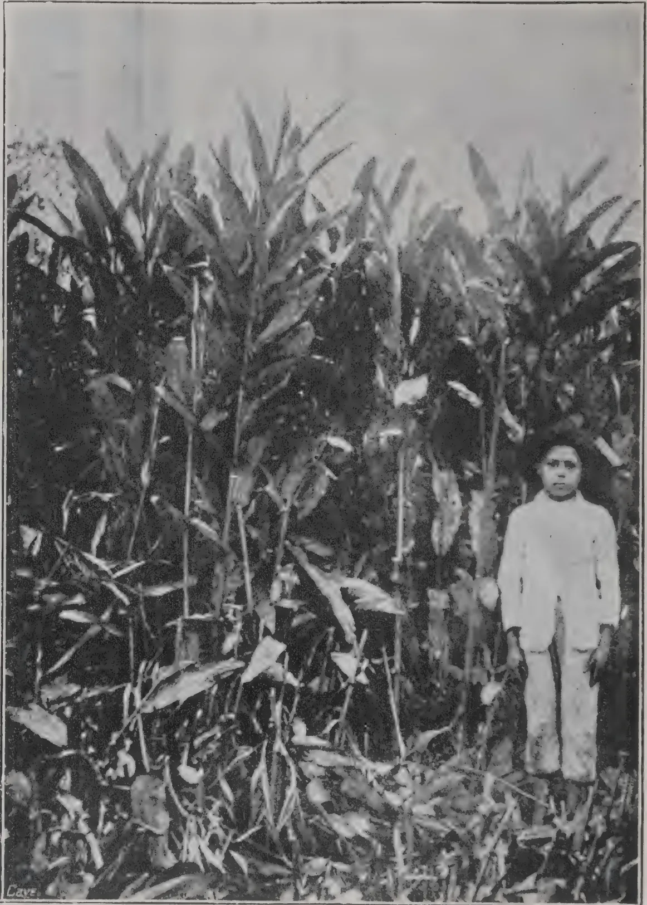A black and white photograph showing a person standing in a field of tall, dense Hedychium coronarium plants. The person is positioned on the right side of the frame, wearing a light-colored, long-sleeved jacket and trousers. The plants are tall with large, lanceolate leaves and are densely packed, filling most of the frame. The background is a plain, light-colored sky. In the bottom left corner of the photograph, there is a small, faint signature that appears to read "Davy".

HEDYCHIUM CORONARIUM IN BRAZIL

320------------------------------------------------

THE  
**TROPICAL AGRICULTURIST:**  
JOURNAL OF THE  
**CEYLON AGRICULTURAL SOCIETY.**

---

VOL. XL.

COLOMBO, MAY, 1913.

**No. 5.**

---

**HEDYCHIUM.**

---

**A POSSIBLE NEW PRODUCT FOR CEYLON.**

*Peradeniya, May 15, 1913.*

At the tenth ordinary meeting of the Royal Society of Arts held in London on February 12th last a paper on "New Sources of Supply for the Manufacture of Paper" by Messrs. Clayton Beadle and Henry P. Stevens was read. Wood pulp is the raw material from which paper is chiefly made but it is now being realized that the world's supply of wood pulp is showing signs of exhaustion and that prices are rising. It is stated that the cost of production of ground wood pulp has advanced 50 per cent. in the United States during the last 10 years.

The paper trade has been turning its attention to other sources of supply of raw material and one of the plants to which attention is drawn is *Hedychium coronarium*.

This plant is of the same natural order as Ginger and Cardamom and grows profusely in Brazil as shown in the frontispiece taken from the Kew Bulletin.

321------------------------------------------------

210[MAY, 1913.

It is propagated by root-stocks from which a crop in one year might be expected; from seed, two years would probably be required. It grows in damp localities near water courses at elevations ranging, in Ceylon, from sea level to 4,500 feet. In Brazil it has taken possession of land cleared for sugar which

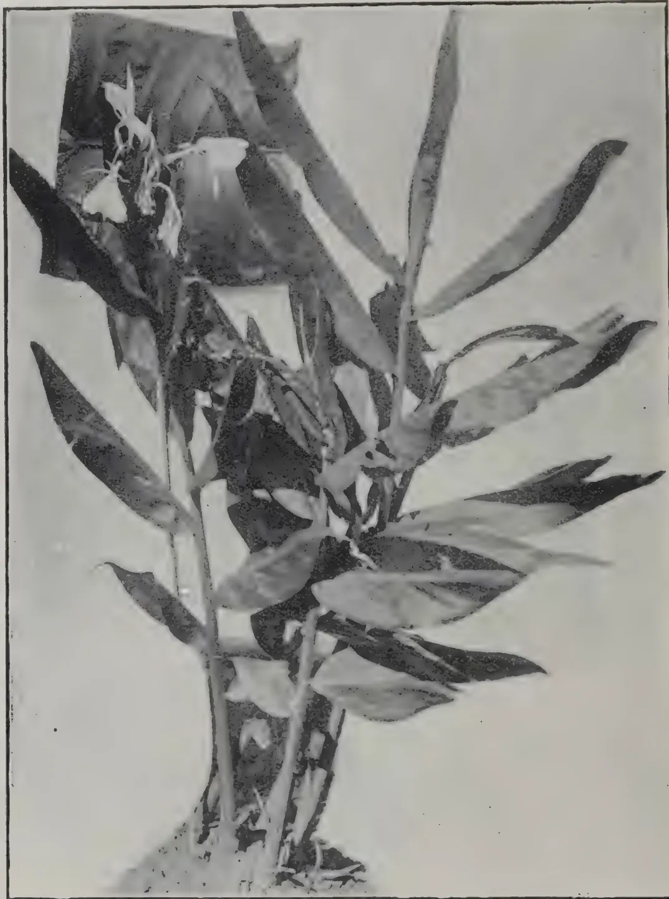A black and white photograph of a Hedychium coronarium plant. The plant has several long, lanceolate leaves with pointed tips, arranged alternately along the stems. At the top of the stems, there are clusters of flowers, some of which are open and show their petals and stamens. The plant is shown growing in a small patch of soil, with its roots visible at the base.

HEDYCHIUM CORONARIUM AT PERADENIYA.

suggests that land suitable for the growth of sugar-cane would be suitable also for *Hedychium*. In that country it grows in a thick jungle to a height of from 3 to 6 feet; as many as 100 to 150 stems being counted in a square yard. After cutting down, a period of from 4 to 5 months elapses before a second crop is ready, the rainfall being about 60 inches per annum.

322------------------------------------------------

MAY, 1913.]211

Root-stocks are continually being reproduced so that continual cropping year by year would seem to be ensured.

### YIELDS.

It is estimated that well-covered land with stems say 4 inches apart would yield 7 tons of raw dried fibre equal to 4 tons of paper per acre per annum.

In the neighbourhood of Morretes in Brazil tracts of land of from 7,000 to 8,000 acres are covered with *Hedychium* capable, it is believed, of yielding at least 50,000 tons of dry fibre sufficient for the production of 30,000 tons of paper per annum. Another estimate gives 6-10 tons of dry raw material per acre per annum equal to 4 tons of pulp compared with 2 tons and 0.70 tons respectively of rice straw, 0.20 tons of pulp wood once in 40 years, and 1.35 to 1.57 tons of pulp from bamboo once in 5 years. *Hedychium coronarium* gives a greater weight of raw material per acre than any other product listed.

### DISPOSAL OF RAW MATERIAL.

There are three methods of dealing with the raw material, the simplest being the drying and crushing between rollers of the stems after which they may be sent to Europe. This entails the payment of freight on a large proportion of unserviceable material.

Another method is to pulp the stems as is done with wood; a third method is to manufacture paper from the green stems on the spot. It is stated that the whole treatment from harvesting to the manufacture of paper need not occupy more than twenty-four hours.

No figures are available to show the cost of production of a ton of pulp or of the returns. Messrs. Clayton Beadle and Stevens obtained 4 per cent. and over of dressed fibre from *Hedychium* compared with  $1\frac{1}{2}$  per cent. from Manila hemp, the papers produced possessing a greater tensil strength than those of the strongest Manila papers. Owing to the semi-gelatinous nature of the cells a natural parchment can be made.

323------------------------------------------------

212[MAY, 1913.]

### ITS VALUE FOR CEYLON.

As has been stated *Hedychium coronarium* occurs in Ceylon over a considerable range of elevation. In Brazil it takes possession of the land to the exclusion of all other vegetation, but whether it would behave like that in Ceylon has not been ascertained. Its value will depend upon its power of spreading and reproducing stems. If it is found to flourish under irrigation it may prove a valuable product for our Dry Zone. There would appear to be ground for thinking that it may prove suitable for cultivation under the tanks.

A closely allied species, *H. flavescens*, is more widely distributed in Ceylon than *H. coronarium*, but its value as a source of paper has not yet been ascertained. Some dried stems are to be sent home for trial and also root-stocks from which green stems may be obtained on the spot for manufacture.

R.N.L.

324------------------------------------------------

MAY, 1913.]213

# TOBACCO.

---

## FLUE CURING OF TOBACCO.

---

There is a large and ever-growing demand for a bright yellow, mild and sweet-flavoured tobacco both for the manufacture of cigarettes and for blending with the heavier grades of pipe leaf. For many years the Virginian and Maryland types were almost exclusively cultivated for this trade, but of late the White Burley with its heavier yield, mild flavour and bright colour has come into great favour. A distinct system of curing is adopted for this yellow tobacco, which includes the employment of artificial heat. A special barn, smaller in size than that employed for air-curing, and provided with a relatively large flue surface and furnace, is necessary to the work. The prime object in view is the bright yellow colour demanded by the market, and aroma is of less importance. In this case, therefore, the destruction of the enzymes by intense heat and rapid curing is permissible, and such destruction is proved by the fact that flue-cured leaf, if placed in a moist condition and bulked, as are cigar and pipe tobaccos, will not ferment, but decay. No other type of tobacco or system of curing requires as much skill and experience before successful results can be regularly obtained. The least misjudgment in the temperature applied will reduce a barnful of the finest leaf to a very inferior grade. The prices offered for the different classes of Bright tobacco are, however, sufficient to compensate for the slight risk attendant on this method when the necessary skill has been once acquired. No definite rules can be offered, for experience of individual barns and types of leaf is a factor of importance.

When the barn is full, and either primed leaf or the entire plants may be thus cured, the upper ventilators are closely shut and the fires started. A temperature of 85 degrees F. should be secured and maintained for eighteen hours or until the leaf commences to yellow. If this process be unusually protracted water should be sprinkled on the floor, or steam introduced from a boiler to hasten colouration. During this time the temperature must on no account be allowed to fall below 80 degrees, or rise above 90 degrees. When the leaves show a bright lemon colour, it may sometimes be well to open ventilators for an hour or two. This should be done at all times if moisture collects in beads on the leaf. After this airing, the barn is again closed and the temperature gradually raised to 100 degrees, and held at that point for six hours. Additional heat is then gradually applied at the rate of 2 degrees an hour until 110 degrees is reached, at which point it is held for three hours and then again increased by 5 degrees an hour to 125 degrees, and held thus until blade of leaf is dry, but stem still supple and moist. The doors and ventilators should then be thrown open to allow all free moisture to pass off. As soon as this is accomplished the barn is once more tightly closed and the heat raised by 5 degrees an hour until 140 degrees is registered. Where priming has not been practised and the entire plant has been hung, it now

325------------------------------------------------

214[MAY, 1913.]

becomes necessary to cure the stalk by raising the temperature to 175 degrees, at the rate of 5 degrees an hour. On no account must the heat ever exceed 180 degrees or the dry leaf may catch fire. The maximum should be maintained until the stalk is thoroughly dry, which will take about six hours. The doors and ventilators may then be opened, the fires drawn and the barn allowed to cool off.

The construction of the flue-curing barn is very simple, the building being erected with brick or stone to inside dimensions of 16 feet  $\times$  16 feet  $\times$  17 feet. A cupola ventilator at the ridge and four rabbit hutch ventilators on the sills should be provided. The roof should make an air-tight joint with the plant, and be lined with felt to prevent any possible draught. Care must be taken that no apertures exist at any point through which heat or moisture can escape. The arrangement of tiers and poles is the same as that adopted for air-curing barns, except where primed Turkish leaf is to be handled. In this case a vertical spacing of twelve inches between tiers will suffice. Up to this point the building is practically a small air-curing barn and may be used as such. The addition of the flues changes the character of the building. These are constructed of heavy black Russian iron piping, the length nearest the furnace being heavier than the remaining sections. The furnace is simply a large brick arch built outside to the right of the door, and the flue leads from this practically at floor level, runs round the building at a distance of four feet from the wall, and comes out through the same wall and on the other side of the door. A length of flue half the height of the building is sufficient to carry the smoke away. Such a building which has been constructed at Weenen at an outside cost of £100, will cure an acre of tobacco each week during the season.—(CEDARA MEMOIRS—SAWER.)

## CURING CIGAR LEAF.

**TEMPLE A. J. SMITH (Chief Field Officer.)**

In order to make the tobacco leaf grown in Victoria more attractive and saleable, greater attention is required during the curing process; this takes place from the time the tobacco is harvested until the final fermentation has been completed, just before the leaf is packed for market. Simply drying tobacco leaf is not curing it, and colour, flavour, and general quality are all affected and greatly improved under a proper system of curing. Different kinds of tobacco require different systems to develop certain qualities for various purposes, and even variation in seasons will influence more or less the methods adopted. Tobacco harvested in cold wet weather will neither cure nor ferment as well as if cut after a few genial warm days, when there is not an excess of moisture in the soil. The proper curing of tobacco is partly chemical, partly a life process, and is not simply due to the drying out of surplus moisture. Tobacco, when just harvested, contains from 70 to 80 per cent. of moisture, and if this were simply dried out by heat, the leaf would remain more or less green, and be quite unsmokable, with bad burning qualities and no flavour, the starches and other constituents in the leaf

326------------------------------------------------

MAY, 1913.]215

remaining unchanged, and the tobacco would have no value. During a proper system of curing, which is partly chemical and largely due to micro-organisms in the leaf cells, the outer skins of the leaves are broken and oxidation takes place, the colour of the leaf changes from green to brown, red or yellow, according to the class of tobacco treated. These changes are caused by enzymes or ferments in the leaf cells, which during the process split up existing chemical forms through their power of taking oxygen from the air and supplying it to the contents of the plant cells, and forming new products. These enzymes are easily destroyed by too much heat or too great cold. Temperatures of over 130 degrees Fahrenheit kill them, and at less than 60 degrees Fahrenheit their operations are stopped, while at freezing point they are destroyed. The most beneficial temperature is from 80 to 100 degrees, under which they do a maximum amount of work; also a certain degree of moisture is necessary for their proper working. It is, therefore, of great importance that the conditions suitable to them should be studied closely to insure success. If the cure be too fast the work is not properly done, and if too slow the process may go too far. Quick curing is, however, more dangerous than slow curing, and unless the matter is thoroughly understood by the operator it is wiser to cure somewhat slowly, especially in the early stages of the treatment. Enzymes are easily destroyed by too much heat and too rapid loss of moisture, but if the tobacco is made to dry slowly they multiply quickly and force their way through the outer skin of the leaves thus encouraging oxidation at a greater rate. Should they, however, be killed through scarcity of moisture, or by too much heat, they become enveloped in the insoluble protein in the leaf, and will not then be of use during the fermentation process which takes place later on, and the result will be a poor fermentation and consequent poor quality tobacco. Leaf of fine growth and appearance, if badly cured, may be utterly useless for manufacture, while the same tobacco, given a proper cure and fermentation, can be made a fine manufacturing commodity with all the desired qualities for a good smoke.

#### WRAPPER LEAF.

The various tobaccos used in factories require different treatments according to the purpose for which they are intended, as, for instance, cigar wrapper leaf for outside covers must necessarily be thin and silky, with good colour, fine veins, and a further virtue known to the trade as strength and stretch. Such leaf needs very careful treatment in both the cure and fermentation, as it will be too dry and brittle if cured fast, while if over-cured or fermented is liable to suffer in colour and elasticity. Only experience, combined with a knowledge of what the buyer requires, can determine exactly how far the treatment should go. Cover wrapper leaf is not sought after so much for its smoking qualities as for its appearance; it constitutes only a very small proportion of the cigar—about 5 per cent. of the whole—but it must have the characteristics mentioned, otherwise it will not sell well. The bunch wrapper, which is the portion of the cigar immediately under the cover of outside wrapper leaf, comprising 20 per cent. of a cigar, need not be as good in appearance and so fine in texture, but should have good flavour, and burn or combustion with a nice grey ash, its mechanical purpose being to

327------------------------------------------------

216[MAY, 1913.]

hold the filler leaf in shape before the cover wrapper is put on; such leaf must be sound and also be strong enough in texture to stand a fair amount of pressure without breaking? It must be free, as far as possible, from organic matter in the shape of starch and sugar, otherwise it will be liable when made into cigars to absorb moisture whenever the atmosphere is damp, and become soft, a bad sign in a cigar.

#### FILLER LEAF.

The filler leaf which comprises the greater bulk of the cigar (75 per cent.) must have good flavour and burn, be free from organic matter, and of fine texture, but colour is not of such great importance, though to insure high prices a dark-brown or lighter shade, which should be uniform, is desirable. Soundness, so far as holes or broken leaf is concerned, is not of great importance unless very pronounced, as the leaf is broken up by the manufacturer before being made into cigars. Flavour and freedom from organic matter, together with good combustion, are the chief points in cigar tobacco. A good aroma in all kinds of leaf is desirable, and this quality is largely developed in the cure and subsequent fermentation. Colours may vary considerably, and yet be good; a very light-coloured cigar wrapper is unusual, though the present taste leans towards the lighter shades, smokers being under the impression that a light coloured cigar is a light smoke; this does not follow, as the filler may be any colour from light to very dark, and as 75 per cent. is filler, that portion has the greatest influence. When we take into consideration the fact that the soils the tobacco is grown in produce leaf of varying descriptions, requiring a more or less fast or slow cure, also that seasons affect the condition of the tobacco, and that the various tobaccos are needed for different purposes, it will be realized that a thorough study is necessary by the individual grower as to the special treatment required to develop to the highest possible effect the different qualities of leaf with regard to the tobacco he is producing, especially in a new country where fresh districts are being exploited. A good crop of tobacco can be absolutely ruined by bad treatment in the curing and fermentation, or by good treatment made a valuable and highly profitable crop. The foregoing remarks apply equally to pipe tobacco in main, except that cigar leaf requires more careful handling, especially in fermentation, than pipe leaf. The proportionate amounts of wrapper, bunch wrapper, and filler leaf in each are approximately the same, and exercise the same influences in their way.

#### AMERICAN SYSTEM.

In curing cigar leaf, the changes which the leaf must undergo are controlled by the regulation of heat and moisture in the shed, and until very recently fire or flue curing has not been followed, excepting in cases where continual fogs or heavy moist atmospheric conditions have existed. Curing proceeds slowly in cold dry weather, but drying takes place; while in warm moist weather the changes in the leaf constituents that are necessary take place, and tobacco cures fast. Thermometers should be kept both with wet and dry bulbs to ascertain the temperature and relative moisture in the air, both inside and outside the building. It has been found that the best temperatures at which the leaf cures in dry weather are when the inside temperature is over 70 degrees Fahrenheit, and the outside temperature is 10

328------------------------------------------------

May, 1913.]217

or 12 degrees less; while a difference of 15 degrees Fahrenheit in wet weather is best. Tobacco will cure well at any temperature between 70 and 100 degrees Fahrenheit, but, as previously stated, it is safer to cure slightly on the slow side. While the leaf is curing fairly fast ventilation must be provided to carry off surplus moisture, especially in wet weather, or when the outside air is surcharged with moisture. The relative percentage of moisture should be between 50 and 60 degrees. In Victoria the climatic conditions are not as cold as in many tobacco countries, but the air is in some districts drier, consequently artificial methods of supplying moisture may be found advisable, such as watering an earthen floor, or covering with a few inches of straw and applying water, which, as it evaporates, increases the atmospheric contents. In dry cold weather the shed should be kept closed, with no current of air, or a very slight one, but the top ventilators should be sufficiently open to take off the moisture evaporating so that it will not settle from the top on the tobacco, the idea being to keep the tobacco during a cold spell from drying out, while not curing. The leaf will remain at such a time dormant, and directly the right degree of temperature—65 to 70 degrees Fahrenheit—obtains again curing will be recommenced. Cigar leaf during the process should not be allowed to get so dry that the leaf will break upon being handled, and should be so managed that at least once in every 24 hours it becomes soft until finished, this can be regulated by the currents of air admitted through the ventilators. It will be realized that no hard-and-fast rules can be laid down in this respect, as the treatment will vary according, to weather conditions and the stage reached by the tobacco. In the early part of the cure the moisture is driven off fast if weather conditions are suitable, but if cold and dry the shed should be kept closed to prevent its loss at too fast a rate. It may take four weeks only to cure a shed, and in some seasons twelve weeks, the latter period being more usually required unless artificial heat is applied. Only experience will tell the operator in charge when the leaf is ready for its special purpose before bulking down for fermentation. The colours should be fairly even throughout, the texture of the leaf thin, pliable, and devoid of vegetable matter, with not more than a 10 to 20 per cent. moisture content. Leaf for filler purposes and for bunch wrapper will generally require a longer and more thorough cure than cover wrapper leaf, the natural tendency to thinness and lighter body in the latter having less organic matter to be disposed of. Here, again, the operator is the sole judge as to when the cure has gone far enough for his purpose; the tendency amongst Victorian growers is, however, to cure too fast and not quite enough.

As soon as the leaf is cured the shed should be kept close and dark; if light is freely admitted the colours are liable to suffer. Some growers favour putting the leaf down in bulk at once after curing, re-hanging later on, while many prefer leaving the tobacco hanging in the shed until ready for fermentation. Tobacco leaf can be put down in bulk in cold weather with 20 per cent. of moisture, but is liable to ferment when warm weather ensues, and should consequently be watched, and if heating it should be turned, otherwise it might go so far as to rot, and the season's labour be lost. The main matters to be carefully watched are:—

329------------------------------------------------

218[MAY, 1913.

1st. To so control the air currents so as not to dry, or cure, too fast in the initial stages of treatment.

2nd. To keep, whenever possible, the inside temperature 10 to 12 degrees Fahrenheit above that of the outside shade temperature.

3rd. To close the shed when curing is finished, and, if much damp weather follows and the leaf is inclined to become mildewed, open the ventilators on a dry day, or put slow fires underneath sufficient to drive off superfluous moisture.

#### ARTIFICIAL HEAT.

The curing by the aid of stoves have been recently adopted in the Connecticut Valley and Florida, in America, in regard to cigar leaf, and a useful pamphlet written by W. W. Garner, of the United States Department of Agriculture, in which the following directions for curing cigar leaf by artificial heat are given:—

“No heating system will give satisfactory results in a barn or shed which is not reasonably tight, because the temperature cannot be raised sufficiently, without drying the tobacco too fast. On the other hand, a system of ventilators which can be opened or closed at will is necessary for the removal of excessive moisture in the shed in wet weather. If there is no ventilation the air soon becomes saturated, and heat alone will not drive it off. When artificial heat is used it is not desirable in filling the shed with tobacco to leave open spaces from top to bottom, as these will only act as channels for the escape of heat to the top, while to be effective it must be forced to pass through the tobacco.

The heating system must have sufficient capacity; a little heat is frequently worse than none, particularly in the control of pole sweat. Experience has shown that a satisfactory system must be capable of maintaining a temperature in the shed of from 15 to 20 degrees higher than that of the outside air when moderate ventilation is used. It is only necessary to maintain this temperature when there is danger of pole sweat; under ordinary conditions a difference of 10 to 12 degrees between inside and outside air is sufficient. The heat must be supplied from the bottom of the shed and be evenly distributed in order that, so far as possible, all the tobacco may receive the same treatment.

Open fires of clean burning wood and charcoal can be used, but it is necessary that special precautions are taken in case of fire, and only clean burning wood is used, as very heavy smoke from fires is apt to injure the tobacco. Charcoal is expensive, and there can be no doubt that the stove and flue curing system is best, as temperatures can be better controlled, and there is less danger of injury from excessive smoke and fire.

Coke and coal are not suitable fuels, as they generate injurious fumes, chiefly sulphur dioxide, which will damage the tobacco.

Should open fires be used, it will be found necessary to have many small fires in preference to a few larger ones, in order to distribute the heat more evenly, and appliances in the shape of deflectors in the shape of sheets of iron over the fires have good effect.

Practically all the cigar types are air cured, but judicious management of artificial heat will result in a more perfect product.—JOURNAL OF AGRICULTURE, VICTORIA.

330------------------------------------------------

MAY, 1913.]219

# COCOA.

---

## ITS CULTIVATION AND PREPARATION.

By W. H. JOHNSON, F. L. S.

---

In this book on cocoa the author seems to have had the advantage of studying his subject under various conditions and in a variety of countries.

Cocoa is indigenous to South America and was first brought over to Europe by Cortes. Brazil is the largest producer, Ceylon coming ninth in order; the United States is the biggest consumer.

Cocoa flowers are so constructed that outside aid appears to be essential for pollination. Uzel, who investigated this in Ceylon, came to the conclusion they were pollinated mostly by thrips and that these insects occurred more abundantly in sunlight than in shade, a fact that should be seriously considered in the vexed question of shading.

As regards the best soils for cocoa, well-drained soils rich in lime and potash seem the most suitable. Owing to the long taproot of the cocoa tree stony or water-logged soils are most undesirable.

The young and delicate foliage is particularly susceptible to strong winds, therefore sheltered positions should be chosen or good wind-belts planted. The author advocates planting Forastero 15 feet apart; other varieties closer, holes 3 feet by 2 should be dug two months before planting and then be filled with any good soil near at hand or with surface soil.

Planting out in baskets is advocated as the best method of transplanting! even then 30 per cent. must be expected to fail.

The author discusses the question of shade which seems a conflicting one. Grenada, for instance, grows her cocoa without shade affirming it to be injurious; in other places it is the reverse. Even in one island, such as Ceylon, planters are found growing it with and without shade. But the majority certainly advocate shade. No doubt it is largely a matter of what the cocoa has been brought up to—to suddenly remove all shade when the trees have become used to it, is certainly injurious. Perhaps the best method is the happy medium—start the cocoa well shaded when young and gradually removing the shade till it remains very light or even leaves the cocoa unshaded at its prime—say ten years old. If catchcrops, such as cassava, are used as shade for young cocoa the land should be well manured afterwards or the soil will become rapidly exhausted.

In selecting beans for planting in the nursery, only those of mature fruits from trees which are quite healthy and heavy croppers should be selected and then only the beans in the middle of the pod used. The author describes the best methods of budding and grafting, but these methods are not very satisfactory and not much in vogue amongst planters.

In some countries, Jamaica for instance, the cutting down of weeds and not hoeing them up is practised. This is particularly beneficial on hillsides as it prevents surface-soil wash and at the same time forms a good mulch.

331------------------------------------------------

220[MAY, 1913.]

The chief disadvantage of cutting down the weeds lies in the fact that noxious perennial weeds may become established. As regards pruning the author advocates no particular method but advises light pruning at frequent intervals in order to keep the tree well open for the admission of the all-important light and air; removing the gormandising suckers and thus obviating the removal later on of big branches as happens in pruning at longer intervals.

If cattle manure is available in sufficient quantity and is applied by lightly forking in the author is inclined to think it superior to any artificial manure as it has so beneficial an effect upon the texture of the soil so necessary to cocoa.

Of chemical manures, basic slag and sulphate of ammonia seem to suit cocoa the best and one planter in Grenada during three years increased his yield by over 100 per cent. through applying a mixture of 8 cwt. of basic slag and 1 cwt. sulphate of ammonia.

Green manures are excellent whilst the cocoa is young as they keep the surface cool and moist for the surface-feeding roots of the cocoa and give a good percentage of nitrogen; *crotolaria striata* being one of the heaviest yielders.

There are some excellent chapters on the various pests of cocoa animal, insectiferous, fungoids. Rats appear to do enormous damage in some countries and their natural enemies should be carefully preserved. In Ceylon there is the large brown rat-snake which is quite harmless and watchers are very apt to shoot these when they should be rigorously preserved.

Too much shade or moisture are conducive to fungoid attacks and canker is always more prevalent after heavy rains. Canker must be constantly cut out but antisepticising the wounds, not usually practised in Ceylon is advocated by the author.

The question of fermenting and washing the beans is one on which the author has much to say and many various experiments from which to draw his deductions.

It seems that 140° F. is about the most perfect temperature, anything above that being apt to discolour the beans. In many countries the cocoa suffers in quality from being insufficiently and not uniformly fermented, the latter fault being due to inadequate aeration. The beans in the centre of the mass do not ferment as readily as those on the outside in contact with the atmosphere.

As to washing the beans or not after fermentation the pros and cons seem equally divided and of cocoa buying firms some seem to prefer the washed whilst others uphold the unwashed. The enhanced price of Ceylon cocoa is sometimes quoted in favour of washing, but the author thinks this to be due more to the percentage of cinnamon-coloured kernels and general good quality than to the washing, and if this is the case it seems a waste of labour.

Wooden fermenting vats are preferable to cement owing to the acid liquid acting on the cement and causing it to crack.

The author has some useful hints on the best methods of drying and ends his book with a chapter on the cost of producing cocoa in various countries and its manufacture into chocolate.

D. S. C.

332------------------------------------------------

MAY, 1913.]221

## CULTIVATION OF CACAO IN TOBAGO AND TRINIDAD.

---

Mr. A. V. Stollmeyer who delivered an address before the Arima District Society on the 13th January last in dealing with the question of shade for the cultivation of cacao is reported in the proceedings of the Agricultural Society of Trinidad and Tobago to have said:—It has been clearly proved, I think, that the conservation of moisture in the soil is one of the essential features for the successful growth of the tree, and also for the production of fruit ; this is quite true, but sunlight is also a very necessary factor. Then why do we have shade over the cacao trees? The obvious argument in favour of shade must be for protection from the wind. By establishing shade we contribute to the maintenance of moisture. In the hills, therefore, where nature offers its own shelter from the baneful influences of the wind, an advantage would be gained by lessening to a great degree the present existing amount of the shade in those localities. The degree of reduction must, of course, be in keeping with the individual situation of each field ; the results, I am sure, would add to the healthiness of the trees and tend to increase your crop. Regarding the vegas where the trees are open to all weathers great care should be exercised. The reduction of shade there, seems in my opinion very necessary, yet precautionary measures must be taken to make provision for the exclusion of the wind. The only means to accomplish this is the establishing of wind belts. A very gradual reduction can be commenced while the wind belts are growing, then, when thoroughly established, reduce further shade with the object of admitting the certain amount of sunlight that seems necessary, without unduly exposing the soil to the continuous rays of the sun. The past abnormally dry season has been quite a useful object lesson in many ways, and especially bears on this question. I have come to the conclusion that a reduction of shade together with established wind belts, as against the total abolition of shade, is the desirable condition for the welfare of an established estate. I have dilated somewhat lengthily on this question, but it is one which has been occupying the minds of most thinking planters for a considerable time, and one of more than passing importance.

### SEED SELECTION.

Perhaps I have put the cart before the horse and should have commenced at the nursery—where everything and everybody does. So I will now say a few words with regard to the importance of planting the best quality seeds. I can do no better than refer you to the many occasions on which addresses, dealing with the importance of selection, have been delivered by Mr. Freeman of the Department of Agriculture and by Dr. Fredholm, a worthy and learned member of the Agricultural Society. To select the best developed seed in size and quality from the best strains of cacao and from the most healthy trees should be your first step ; plant no other and see that your contractors do the same ; the extra trouble and patience that you exercise in this direction will repay you. Do not plant any and every kind, it will be love's labour lost and prove a disappointment to you. To those of us who

333------------------------------------------------

222[MAY, 1913.

are more progressively inclined, and indeed we all ought to be, I would advocate strongly to become acquainted with the art of grafting. It is to be regretted that our education as planters on this subject and others has been so sadly neglected. This manner of propagation is the one adopted in most progressive countries; it is the one admitted to give the surest and quickest results.

We in Trinidad, I regret to say gentlemen, are behind the times. It is however not entirely our own fault; we are willing to learn, but apparently the machinery to impart that and other progressive knowledge is lacking. We want knowledge of this kind brought more within our practical reach; we will then find no excuse for not applying it; and for not boasting an equality with other Agricultural countries. But I am digressing. To return to the subject of seedlings, I would say the best mode of raising your nurseries and supplies is in bamboo pots; by so doing you are less likely to cause damage to the roots in transplanting, and you will be sure that the plant you are setting out is or should be a healthy one. Once planted out do not neglect it; give it perhaps more care than you do now—especially in the dry season; at that time of the year, however much shade you might have over the young plant, you must devise means of retaining sufficient moisture in the soil, if only in that portion of the earth immediately around which its young roots lie. Till the soil around and mulch it. If you cannot do both, do the one or the other, but mulch in preference. The young leaves and stem of the tree do not require as much attention as the roots, therefore do what little you can to help it, wet or drought. You cannot say whether or not we are to have as lengthy a dry season as we did last year, therefore take warning and profit by experience.

#### METHODS FOR IMPROVEMENT.

And now, gentlemen, let us assume that a period of some years has lapsed and our trees are no more young, but have reached the bearing stage and worthy of the name of an "estate." Are you still content to follow the old style of pick and brush? Times are hard, I know, gentlemen, and our bank balances are small, but if you do my friends it will mean the same old story of retrogression. There are few estates to-day, if any, on which this mode is followed, and which can boast of the return of the good old days. All manner of excuses are brought forward; not infrequently the vagaries of the weather are raised; but never do you blame yourselves! And now this brings me to the soil. In our endeavour to help our trees to bear, we prune, we take off suckers, some of our more ambitious, but not many take off the pines and moss, and very few think of tilling the soil. I have heard it said: "Oh, but my soil is too good, it doesn't require tilling." No soil is so good that it does not improve by tilling. Apart from the physical gain to the soil, tilling will invigorate the root system. Root pruning judiciously done is nothing new for cacao; in Grenada it is a common practice and I am led to believe has produced excellent returns. The necessity for careful work is another point of equal importance. In clearing the field of grasses and other weeds, whether done by the hoe or the cutlass, very great care should be taken not to cut the trees. It is a fault too often committed. This could easily be checked if every proprietor would refuse to overlook it. There is an

334------------------------------------------------

MAY, 1913.]223

ordinance under which labourers can be prosecuted for damage of this kind and as an extreme measure it should be taken advantage of. The same care and attention should be given to clean and close cutting of all branches in pruning all which, if practised, would tend towards better results.

Draining is another important feature and besides serving the purpose of getting rid of the surplus water, tends to aerate the soil and add to its physical welfare.

## CACAO HUSK AS FOOD FOR MILCH COWS.

The following article by J. E. Lucas has been reproduced from the *Annales de la Science Agronomique* in the *Bulletin of Agricultural Intelligence*. The writer gives an account of some feeding experiments which he made with cacao husk for the purpose of ascertaining its effect upon the milk yield of cows. There were four experiments in all; in the first were two lots, in the second three lots and in the third two lots: each lot consisted of four cows. In the fourth experiment two lots, each of three cows, were used. All the lots were as similar as possible.

Each experiment consisted of a preliminary, a principal and a concluding period. Experiments I. and II. each lasted a month; the two other experiments occupied a somewhat shorter time.

In every case a control lot was fed on rations of bulky food, maize-gluten and bran, while in experiments I. and II. the bran which the other lots received was gradually replaced by cacao husk; the latter was entirely substituted for the bran in the principal period:  $4\frac{2}{3}$  lbs. of cacao husk per cow per day in the place of  $3\frac{1}{3}$  lbs. of bran; for a short time  $6\frac{3}{5}$  lbs. of cacao husk was fed. In experiment III. only part of the bran in the rations was replaced by cacao husk, and at the conclusion of experiment IV. an addition of 750 gr. ( $1\frac{3}{5}$  lb.) of cacao husk was made to the full rations containing the usual amount of bran.

During the time of the experiments, every milking was weighed and the fat content of the milk determined by Gerber's test.

The summary of the results of the experiments is as follows:—

(1) The cacao husk used noticeably diminished the milk yield, the decrease being as much as 20 per cent.

(2) At the same time, it increased the fat content of the milk per volume as much as 20 per cent.

(3) The cacao husk had little effect on the fat content taken as a whole, although this varied slightly, being sometimes greater and at others less.

The writer states that Faelli (*Moderno Zootro* 1898) obtained increased milk yield and fat content by feeding cacao husk; he considers that husks of much fermented cacao decrease the milk yield less than those of little fermented cacao such as he used in his own experiments.

335------------------------------------------------

224[MAY, 1913.]

# RUBBER.

## PREPARATION OF HARD CURE PARA.

By HAND MOULDING.

On the 20th March last Mr. H. A. Wickham, the father of plantation rubber in the East, demonstrated at the Government Experiment Station, Peradeniya, how hard cure Para by hand moulding was made, the first time this has been done in the East.

Mr. Wickham has made rubber himself by this method on the Amazon, working with the natives there. Compared with the smoke curing apparatus the method is wasteful, slow and laborious; but on the other hand no expensive apparatus is necessary; all that is required being a native-made clay oven and a hoe handle.

The process consists of pouring the latex over a round piece of wood like a hoe handle; then holding it for a minute or two over the orifice of the oven from which hot smoke issues, the piece of wood being slowly revolved in order that all parts of the latex may come in contact with the smoke. Within a minute or two when curing has been effected another film of latex is poured over the thin jacket of rubber and the process repeated.

## CEYLON EXHIBITS AT THE INTERNATIONAL RUBBER EXPOSITION OF 1912.

### EXTRACTS FROM THE REPORT OF THE CEYLON COMMISSIONER.

Mr. F. Crosbie Roles, Ceylon Commissioner, reporting on the exhibits sent from Ceylon says that the 96 cases of exhibits from Ceylon and 24 cases of competition rubber forwarded on separate manifests were ready in Colombo in good time:—It had been arranged to ship by the American-Indian line, and Messrs. Bucknall Bros. had been good enough to undertake to transport the 96 cases freight free. Unfortunately a vessel expected about July 20 did not arrive, and when it was arranged to ship by the ss. "Koranna" at the end of that month, we were not advised that she was one of the slowest vessels of the fleet. The result was that leaving on July 30 she did not reach New York until September 23—the official opening day of the Exposition. An additional day had been lost at Philadelphia owing to the breaking of a winch. The "Koranna" thus made a record slow voyage for the year of 54 days between Colombo and New York, and had the consignment been forwarded six days later by the Company's next steamer, it would have reached New York four days earlier, namely, on September 19. There

336------------------------------------------------

MAY, 1913.]225

being no news of the "Koranna" up to so late as September 16, it was suggested that I should arrange to have the cases taken out of the ship on her arrival at Philadelphia and brought by train to New York. Nobody, however, could tell what the cost of this would be and whether there would be delay on the railway, and the New York Customs authorities also informed me that nothing but an order from the Secretary of State at Washington would admit of bonded goods being landed at a port other than the port of consignment. The New York Customs Commissioner showed me every consideration, especially when I produced my official letter of introduction to the British Ambassador, and on its being announced that the "Koranna" would arrive at New York on Sunday morning, September 22, all port rules against Sunday working were waived. Police permission for the passage of loaded vans through the city was also obtained. Then the accident to the ship's machinery occurred, with a fog down the river on the Monday morning, so that the vessel was not made fast until 10 a.m. on the 23rd. There was no urgency for the competition rubber, but it was found that the 120 cases could be handled quickly, and they all reached the third floor of the Exposition building—the crude rubber section—at 6.30 p.m. Special assistance was in waiting, and by midnight we had everything in position, except the Peradeniya botanical charts which had to be mounted. The rubber exhibits opened out well. Some cases were unnecessarily thick and heavy; but as regards packing, in no case had paper been used, and where chetty cloth had been employed care had been taken so that rough edges should not be touching the rubber. In several instances nails had been driven into the rubber as the result of additional bands being used to strengthen the chests. All the sheet rubber shown on the Ceylon stand was smooth, and the sheets lying close to each other prevented the circulation of air. This leads to fungus growths and to the sheets adhering. Corrugated sheet is preferable. The glass of some of the other exhibits had suffered in transit.

#### DISPERSAL OF THE CEYLON EXHIBITS.

Many applications were received from public institutions in New York and elsewhere for gifts of exhibits; and I distributed the rubber tree trunks, bottles of latex and other available things amongst the leading institutions that applied. In some cases their presidents and directors made application in person. The Government had sent forward 180 copies of that well-illustrated and attractively compiled publication, the Ceylon Government Railway Guide, and in sending these to selected libraries and schools and other institutions, and in presenting copies to representatives of distant countries and to other travellers, I felt that something was being done to disseminate general information about the Island and to attract additional visitors to it. There was a considerable demand for copies of the photographs exhibited for illustration purposes, and the picture that attracted most attention was the one in which Mr. H. A. WICKHAM stands by the tree of record yield at Henaratgoda. Not only were copies of this made by the Exhibition photographer for press purposes, but the Director of the great Philadelphia Museum also had it specially photographed. For the clearing away of all signs of the Exposition only two days were available, as the

337------------------------------------------------

226[MAY, 1913]

building was required for an electrical show; and the work was carried on under great pressure, but with little confusion owing to good organization. Foreign exhibitors, however, had the tiresome task of packing things for reshipment in the same cases in which they had arrived. This was a condition insisted upon by the Customs officials in return for the privileges of admitting the exhibits in bond.

#### EXPENDITURE.

The total expenditure in New York on Government account—in addition to the £723.12s. paid for the floor space taken at the Exposition—was \$3,913.15, and to this falls to be added the expenditure in Ceylon of the Exposition Joint Committee. There will be a small balance in hand out of the public money vote of Rs. 30,000. The preliminary estimate of expenditure earmarked the whole of this sum, leaving no margin on which the Commissioner could draw if he found that special expenditure, on publicity or any other form of exploitation, was required. Representations were consequently made to the Rubber Estate Companies registered in Ceylon and also in London, with the result that Ceylon Companies subscribed the equivalent of £225, and the London Companies £95.5s.4d., besides £40 which arrived too late. I was glad to be placed in funds for any emergency but finding that Ceylon was the trade name for plantation rubber, and that no other Eastern country proposed to enter the advertising field, no special expenditure was called for, and I felt it my duty to return the amounts subscribed. The money has been redistributed by Mr. W. MARTIN LEAKE in London and by Mr. F. M. SIMPSON in Ceylon with an expression of thanks to each contributor.

#### TEA.

The name of Ceylon is so well-known in North America, partly because of the expenditure of one million dollars during the past twenty years in the exploitation in the United States and in Canada of Ceylon Tea. Although the Thirty Committee has had to close its propaganda programme, it did not wish the opportunity of Ceylon's participation in a New York Exposition to take place without Ceylon's staple export being displayed, consequently the Committee voted a sum of Rs. 1,000, and arranged for the production of an illustrated pamphlet on tea for free distribution, and for 10-lb. samples of the various grades of high-grown, medium and low-country black teas put up in special boxes for exhibition at the Ceylon stand, to which were added, through the instrumentality of the Hon. Mr. E. ROSLING, an exhibit of green teas. I was also to make use of any balance. I am reporting separately on this subject to the Thirty Committee, and need only mention here that Ceylon tea was used at the special "At Home" Day on September 27, and that 480  $2\frac{1}{2}$ -oz. packages, specially printed "With the Compliments of the Tea Planters of Ceylon," were distributed towards the close of the Exposition as a set off to the free distribution of coffee samples by the Brazilian Commission. It will also be seen from the accounts that a proportion of the cost of the central structure in the middle of the Ceylon Court, and of the newspaper advertising appear amongst the items charged against the Thirty Committee's vote,

338------------------------------------------------

MAY, 1913.]227

### A VISIT TO WASHINGTON.

On leaving Ceylon I had been given an official letter of introduction to the British Ambassador at Washington. Mr. Bryce was away on a visit to Australasia when I arrived in America; but I waited upon him at the end of October and was well received. The Right Hon. gentleman made a number of inquiries about planting industries, and gave me cards of introduction to the heads of several departments, including that of Insular Affairs, where I was supplied with volumes of reports and other information respecting rubber cultivation in the Philippines which, I may remark, like other Eastern countries, obtained its first supplies of *Hevea brasiliensis* from Ceylon.

One very interesting visit paid was to the Treasury Department, where I was allowed to see at close quarters a machine for laundrying soiled currency notes. It had recently been decided that the new departure was a complete success, and the principal sub-treasuries in the country are also to be supplied with washing machines. The process is of the simplest and is inexpensive. The notes are rapidly passed through a solution of soap and chemicals and over-heated rollers, and a small machine can deal with 3,000 an hour. All notes that are soiled, but not torn, will be thus cleansed and re-issued. The advantages in favour of cleanliness and the public health are as enormous as the amount that will be annually saved to the public exchequer. In Ceylon (and in India) the economy to be effected would be less, partly because the note unit is higher than one dollar, but the sanitary argument would be all-powerful. The ultimate adoption of a similar process in Colombo would be well worth while. Even if it were discovered on test that our currency notes would have to be made of tougher material, this additional initial cost and the cost of one machine which is all that would be required, would be covered many times over. My visit to Washington will prove of benefit to the Colony if the Government will follow up this recommendation.

### INQUIRIES AND CONCLUSIONS.

In the many discussions with American and Canadian manufacturers, the one subject never omitted was the lack of uniformity in plantation rubber, and consequent restriction in its use. Trade experts used various illustrations, the more to impress me with the great importance of this fact. One stated that the use of Mexican Guayule rubber by the group of factories in which he was interested rose from 100,000 lbs. to 750,000 lbs. per annum, solely because those engaged in supplying it succeeded in their attempts to secure uniformity. The increased consumption, I was assured, had nothing to do either with price or improved quality *per se*, but was due entirely to the users knowing what they were buying, and that their factory results would be uniform. It may be remarked here that it is the opinion that in two years the Guayule supply will be practically worked out; it is already much less than two years ago. Another gentleman stated that if our plantation output was 10 per cent. or 15 per cent. lower than our present best grades, and was uniform at that lower quality, the United States would at once want all we could supply. The United States has been taking about 45,000 tons of rubber in a year, of which in 1911, 6,590 tons were plantation. This quantity will be nearly doubled for 1912 and the annual figures should rapidly advance

339------------------------------------------------

228[MAY, 1913.

until America takes say 35 to 40 per cent. of the annual output of the Middle East. It was considered that there would be a great improvement in evenness of quality as the trees matured, and as the outputs of the individual plantations became larger ; while manufacturers would also better understand plantation rubber. It was also complained that London dealers put together rubber from different estates and ship these collections in large packages that in a good many instances contained splinters of wood. Mr. Cyril Baxendale, as a practical planter, was convinced by instances brought to our notice that the interests of the producer were being distinctly damaged by some of the methods of the trade. He urged in Committee that the rubber should be sent forward in original cases, and also that all estates having a considerable output should brand their rubber. This subject has been frequently considered before, but its importance has never been thoroughly realized. Sheet rubber can be marked all over with the estate name while passing through the rollers in the estate factory ; but for crêpe a separate stamping machine is now being produced by a Manchester firm to a design by Mr. Baxendale who hopes to be able to induce Federated Malay States producers to stamp all their output without regard to any increased difficulties which dealers may at first have in filling large orders. The rubber boot and shoe industry—enormous in a country that is still in the making, and where most of the roads are deep in mud in bad weather—accounted for most of the rubber used in America until recently, when the demand for tyres took the lead, never to be overtaken by the humbler form of progression ! Most of the rubber used for footwear is reclaimed, and this is an enormous business, and probably far larger than manufacturers care to admit ; but those engaged in good class businesses all declare that when rubber falls 25 per cent. in price, more will be used to make a more durable article, whether it be a shoe, a mackintosh, or a hot water bottle. The trade term for reclaimed rubber is “shoddy,” and experts cannot confound reclaimed rubber and unused rubber. It is tyre manufacture, where only a small percentage of reclaimed rubber can be used, that has maintained the crude rubber market in the strong position it is to-day ; and even in America the use of rubber tyres on commercial vehicles has been no more than touched hitherto. I wish to place on record two views which were expressed to me in detail. The first is by Mr. A. D. THORNTON, Managing Director of the Canadian Consolidated Rubber Company, Ltd., with its headquarters at Montreal, and possessing the biggest factory in the British Empire. I met him several times in the early days of the Exposition, and when he returned to Canada he sent me the following communication :—

#### Mr. A. D. THORNTON'S VIEWS.

My views regarding plantation rubbers are governed by my experience, so that anything I may write—for or against these rubbers—is absolutely without prejudice to the said rubbers or any one connected with the same.

Looking back at my records I find that in 1905 I began to use plantation rubber : it came in small quantities, but so handsome was it in appearance when compared with other kinds that we were delighted with it, and immediately began to use it. We were quite disappointed with the results, *it was not as good as it looked*, and up to that time rubber was bought on appearance only. With the aid of the laboratory, however, we found that there were ways of using it to advantage, which we did and have been doing

340------------------------------------------------

MAY, 1913.]229

up to the present time. I am a great believer in plantation rubber, because I am forced to be. I am convinced that in a few years wild rubber will prove to be a very poor second. In the meantime, however, we have much to learn, both at the producing end and that of the consumer at the factory.

And so I must tell you what I want. This morning a broker offered me a parcel for first latex crêpe ; frankly, I did not know just what he was offering ; of course, I know the name, but I am not able up to the present time to commit to my *mind and memory* any particular grade or style of plantation rubber, which I would feel sure of getting if I buy first latex crêpe by name only, and fail to obtain a sample of each particular lot offered for sale, and so I want to *know* just what I am buying.

A great objection to this rubber is the way London importers, &c., handle it. During the year I received a 5-ton lot of biscuit and sheet from London. There were eight very distinct grades in the parcel—some smoked, some not, some crêpe, some sheet, some fairly strong, some very weak, some pale, and some dark—and the variation in vulcanization was simply astonishing. Of course, we refused the parcel ; it was quite out of the question. This kind of thing leaves a nasty taste, and one is liable to swear he would not use any more of it. Of several lots I have bought direct from Colombo I have never once had any trouble, and at this moment I feel it much to our advantage to buy that way. For that reason I am aiming to obtain some means of being able to know just what I am buying when I am offered a parcel by means of the cable.

As regards reclaimed rubber, I am not inclined to think that it can ever replace crude rubber. If we could return old rubber into its crude state the matter would be different, but it is as impossible as it is to turn bread into flour again. True it is used in vast quantities, but this is only an aid to crude rubber ; it does not *replace* crude rubber but it does replace chemical compounds, and it does thus enable us to make rubber goods at a price which is within the reach of all.

I do not think for a moment that crude rubber, even at an extremely low price will do away with reclaimed rubber, for we must bear in mind that scrap rubber has no value ; it is not produced, it is really rubbish. Its first value is fixed by the demand, so that old auto tyres if they were one cent per lb. instead of nine as at present would still be gathered by the scrap dealers, and should the time ever come that such prices prevail, the consumption of rubber goods would be enormously increased from what it is now.

As to the quantities of reclaimed rubber used, it would appear to me, after much consideration, that where 1 lb. of crude rubber is used that  $1\frac{1}{2}$  lb. of reclaimed rubber is also used, for while little or no reclaimed rubber is used in the highest grades, most of the low grades are loaded to the limit.

#### ANOTHER AMERICAN VIEW.

A New York gentleman, who wished to go unnamed, but whose position as arbiter as to what rubber is to be used in the largest rubber manufactures' combine in the United States would not be disputed, put the matter thus :—

The American manufacturers in handling plantation grades have found that the greatest difficulty in their use is the lack of uniformity of quality; the rubber coming as it does from a number of plantations and delivered through London in the auctions is repacked, and though they attempt to keep colours uniform, the quality is not such. The lack of uniformity was discovered by various manufacturers making complaint in the past that one lot would work better than another, and upon examination it was found in tracing the shipments, that the poor lots, or those that did not work well, came from new estates, and that the rubber was weak. This in a way has been obviated by the trees becoming older and the latex better, also by the care which is taken in coagulating. The use of plantation grades was forced upon the manufacturers all of a sudden. Previous to 1909-10 they were experimenting in a small way with these grades, but the high values that were experienced in 1909-10 obliged all manufacturers to set their chemists to work to find a substitute for the then high prices of Para grades. These chemists have done more to promote the future of plantation grades than any one else and all manufacturers now have adopted the use of plantation grades to a greater extent to replace the Para and African grades or the wild rubber. The very fancy light coloured

341------------------------------------------------

230[MAY, 1913.

crêpes are only used for special purposes. The manufacturers making a general line of goods give the preference, when price is in proportion to the medium, brown, or darker colours. To-day it is estimated that in the working of plantation grades they are worth to a manufacturer about 5 per cent. below the value of fine Para, but if this value could be at a uniform difference of, say 15 per cent., a greater amount of plantation grades would be used. To-day the preference is given to plantation grades; and wild rubber, including fine Para, but more especially the African grades are being eliminated, and these eliminations will continue as long as the relative price between the plantation and African grades remains at present levels. The experience of the manufacturers with plantation grades is similar to that which was experienced with Guayule when it first made its appearance in this market. No manufacturer would use it in an experimental way on account of the condition in which it was arriving in the market. The quality then was very poor, but since then experiments have been made and the quality been brought to a higher standard, and all manufacturers readily take it and use it in their compounds to the extent that, say, in 1910 America alone was using some 13,000 tons. There is no doubt but what with the prominence that plantation grades are receiving and the great attention that is being paid to their betterment by the planters that they will experience the same betterment that was experienced by Guayule, and that when the production increases, as it is estimated it will increase, the future will see much more uniformity of quality and larger percentages used.

The American market can see at present why there is not a larger business done in these grades direct, not causing them to purchase through London. They understand that a great many of the companies have their home offices in London, and are required to ship their product through that market. A much larger business could be done if done direct; the cost of shipping to New York is estimated at 5 per cent. cheaper than shipping through London. In London heavy commissions are paid, rubber is required to be warehoused, sampled, and numerous other charges attached, which do not occur in this market. The only charges there would be on direct shipments to America would be freight, insurance, 1 per cent. commission for selling, and a small charge for weighing and custom-house entry, and the rubber upon arriving would be delivered *ex* dock with no store charges attached. If business could be done by purchasing at Colombo, Singapore or other Middle East markets at a f. o. b. price, the seller allowing the purchaser in this calculation a part of the saving over shipment through London, we have no doubt but that a greater and more profitable business could be done. America to-day uses the largest percentage of the output of the Middle East, and it is equitable that they should not be required to make their purchases through London, and it would be more to the advantage of the plantation to sell them direct. You are aware that in this market there have been dealers who have misrepresented these grades. For instance, the output of the highland smoked sheets is only a small amount, while hundreds of tons of this grade is sold each year. It would be to the advantage of the plantations to brand their rubber in such a way as to prevent imitations being sold as the original article. It has been said by shipping in the original packages that this could be overcome and each estate's rubber being distinguished by the mark on the package. This would be in order if on direct shipment, but when shipment comes through London the various estates are mixed. We look upon it to be caused first by the small amounts that are being offered from each estate at the auctions, these lots are bought and packed, attention being paid only to quality and colour. The original packages from the Far East are too frail to allow the opening for tarring and recoopering for reshipment to America, and would not stand the voyage; for this reason the original packages are discarded and new packages much stronger and larger are made, so that it is very seldom that on shipments coming from London, the dealers receive the original packages as shipped from the Middle East.

342------------------------------------------------

MAY, 1913.]231

## THE RUBBER DISTRICT OF THE AMAZON.

### IQUITOS RUBBER AND THE TRIBUTARY REGION.

The attention attracted to Iquitos and the Peruvian Amazon basin by the world-wide discussion of the methods of the Putumayo rubber gatherers adds interest, says *Peru To-day*, to a report of the American Consul at the important port, Mr. Stuart J. Euller, who returned to the United States last month after having completed a joint investigation of the Putumayo region with Mr. G. B. Mitchell, the British Consul, and Mr. Carlos Rey de Castro, the Peruvian Consul at Manaus, Brazil.

#### IQUITOS, THE CITY AND PORT.

Iquitos, the capital and principal town of the Department of Loreto, although it is 2,500 miles up the Amazon River from the sea, is only 348 feet above sea level. There is a difference in the level of the river here between high and low water of 30 to 40 feet. The climate is warm and moist, the average temperature being from 80° to 88° F., frequently running as high as 95° to 97° F, in the shade from July to December. The nights, however, are generally fairly cool. Rains are frequent and abundant, aggregating 60 to 75 inches in a year.

The population of Iquitos is variously estimated at 12,000 to 15,000. In March, April and May, when the rubber gatherers are not at work in the forests, it will run up to 20,000. This is double the population of ten years ago. The Department of Loreto, which includes most of trans-Andean Peru, has an estimated total area of 288,500 square miles. The population of this district has been estimated at 100,000 to 200,000.

#### LABOUR SCARCE: COST OF LIVING.

Labour in general is scarce and costly. The labour on the mole is imported from Portugal under contract, and there are a good many Barbadian labourers in and around Iquitos. Native labour runs more to the quicker and larger returns of rubber gathering, despite the danger and hardships of the life. It is estimated that there were more labourers at work collecting rubber in 1911 than in any previous year. The labour situation in the different river systems varies greatly, but in general it may be said that there are two methods of working large rubber properties.

The proprietor may let out sections of his land, called *estradas*, for a fixed rent or a share of the product. This will run to about £43 per *estrada* per annum. Supplies are advanced to the labourer and charged against his account, to be paid for when the rubber is brought in.

On account of the likelihood of the yearly tenant overtapping the trees, a more general rule is that of buying the rubber from the collector to whom the *estrada* has been assigned at a margin for profit instead of a rent or a share. Under this plan advances are also made, and the worker binds himself to get his supplies from the store of the employer. Under either plan the labourer starts the season in debt to his employer.

343------------------------------------------------

232[MAY, 1913.

The food of the district is almost entirely supplied by imports of canned goods, flour, potatoes, onions, butter, oils, beans, rice, etc., from Europe and the United States, and import duties on the foodstuffs are high. The retail provision trade is largely in the hands of Chinese.

There is more high ground in the district tributary to Iquitos than farther down the river in Brazil, but local food production is confined to coarse plantains, cassava root, and a smoked river fish (*paiche*) consumed by the labouring classes. From 100 to 160 head of cattle are brought down each month from Yurimaguas, on the Huallaga, and small amounts of fresh beef can be obtained at about 35 cents a pound. Chickens, ducks, turkeys, and eggs are scarce and expensive. Limited quantities of fresh milk can be obtained in Iquitos itself.

Weekly expenses for a family of four, including groceries and washing, but exclusive of rent, clothes, servants, etc., will come to about £12. Servants cost about the same as in cities of the United States.

Local prices depend very little on cost and mostly on the available supply. Steamers arrive one in a month or six weeks; and if they are delayed or stranded on their 2,500-mile trip up the Amazon, an occurrence by no means unusual, prices soar. Flour, for example, sometimes sells below cost, and at other times has gone as high as £5 and £6 per barrel.

#### METHODS OF GATHERING RUBBER.

The rubber produced in this district is classified as *Jebe* and *caucho*. *Jebe* is divided into lowland—fine (smoked), entre fine (smoked), and scrappy (not smoked), and highland weak fine (smoked) and weak scrappy (not smoked.) *Caucho* is divided into ball and slab. *Jebe* is obtained from the *Hevea brasiliensis*, trees which grow close enough together to enable the worker to handle a group of 100 trees, called an *estrada*, or walk, a day visiting and tapping them. One man can manage two *estradas* on alternate days.

The rubber worker builds his hut within easy reach of the river and visits the trees in the early morning, returning about 2 o'clock in the afternoon with a pail full of milk (latex) to smoke and work into balls. The quality of the *Jebe* varies according to soil and method of preparation. If grown on land high enough not to be flooded, it is weak, though it may be fine; i. e., it has a fine texture but breaks at a lower strain than that grown on periodically submerged land, which is known as fine, without the qualification weak. Entre fine is lowland rubber, but not so well prepared as the fine. *Sernambee*, or scrappy, is from milk which has coagulated without being smoked, and is more brittle.

*Caucho* comes from the *Ficus elastica*, which grows scattered and solitary in the forest, usually on the higher land and at some distance from the rivers. The tree is not tapped, but is cut down, and the sap runs out to form a pool in a hollow in the ground or in a bowl or basin. It coagulates without smoking, and the working up is thus easier. The *Cauchero's* camp is therefore movable, and he is always on the look out for trees.

The *caucho* in the rivers to the northward of Iquitos has come to be pretty well worked out, and many of the caucheros who previously worked there have gone to the Madre de Dios and other southern regions. Ball

344------------------------------------------------

MAY, 1913.]

or "*Sernambee de caucho*," is *caucho* that has been coagulated without any treatment and then cut into strips and the strips wound into balls. Slab is *caucho* coagulated without smoking by a special process which involves mixing it with a kind of green liana, soap, or other diluents. Very little slab is now worked, owing to its heavy shrinkage, and it constituted only 1.9 per cent. of the total rubber export from Iquitos in 1911.

#### PRODUCTION OF THE VARIOUS SECTIONS.

From the Javary River district comes fine, weak fine, weak scrappy, and ball rubber. The product is mostly fine. The *caucho* is fairly well worked out there. From the Ucayali the rubber is almost entirely fine or scrappy, practically no weak coming down. The *caucho* is pretty well worked out in this river valley, too, but some comes down from the upper reaches of the Madre de Dios via the Sepahua, a tributary of the Ucayali, and some also from the Jurura. From the Tapiche come small quantities of ball but mostly fine and scrappy. The rubber from the Huallaga is almost all weak, both weak fine and weak scrappy, and almost no ball comes down this river.

Turning to the north, the *caucho* in the Napo and Tigre, which were once great sources for ball, is pretty well worked out, though considerable *caucho* is still available in the Ecuadorian reaches of the Napo. The rubber from the Putumayo district is called Putumayo "tails." It is prepared in a different way from that in other rivers and has a different appearance. This rubber is classed by the shippers as weak fine, and declared at the customs as such, but it greatly resembles ball, and is at best generally regarded as inferior weak fine.

Not much rubber comes in directly from the Marañón, but what is found there includes all the grades of *caucho* and the weak varieties of *jebe*.

The rubber season of 1911 was far from being good. Production was decidedly insufficient, owing to the heavy rains which prevented collection. The usual collecting season lasts from July until February, but in 1911 the flooding of the low-lying land where the trees are found largely put a stop to work in November. There was also a scarcity of labour. Prices were low and with the heavy taxation, trade in Iquitos was a serious problem.

#### RUBBER TAXATION AND PRICES.

The question of the taxation of rubber is a vital one in the district. The export duty is fixed at 8 *per cent ad valorem*, calculated on the selling price at Liverpool, which is telegraphed to Lima and from Lima to Iquitos. It is levied in gold in advance. As a shipment is four to six weeks reaching the market, the shipper has to sell at a price that may be totally different from the one on the basis of which duty was paid. The price on which the export duty is based also includes packing, insurance, etc. There is a strong local demand for a lowering of this tax.

#### PRESENT CONDITION AND PROSPECTS.

Though local views of the future of Peruvian rubber are somewhat conflicting, it is generally felt that the quality is so good that it can hold its own against the production of other regions, particularly in cultivated rubber. As to quantity, the available supply is locally regarded as practically

345------------------------------------------------

234[MAY, 1913.

inexhaustible. The business system pursued makes it difficult to estimate the minimum cost of delivering raw rubber at Iquitos. So long as the price in the world market is 4 shillings per pound, however, it is figured that the Peruvian article can compete successfully.

The methods used in the extraction and working up of the latex are regarded as fairly good. There is, however, room for improvement in the elimination of impurities. All the Amazon rubber must be washed before it is used in the processes of manufacture, Peruvian fine losing 12 to 20 per cent. and scrappy 25 to 50 per cent. on account of their moisture content. Straining the latex and more thoroughly washing and drying the product before exportation would lessen freights and duties, both of which are heavy.

It is locally figured that the world's production of rubber will not begin to overtake the demand until 1916, despite the rapid increase in plantation production, and so it is calculated that the price will continue for at least four years more at a level that will admit the Amazon rubber to competition, despite the increasing cost of collection here, due to high labour and high cost of living.

Advances to collectors for the 1912 season were based on an anticipated fall in price. The water in the rivers was falling rapidly in June, and in some districts collectors had already started work by June to which is considered early.

The export of rubber for the first six months of 1912 reached a total of 2,975,355 pounds, a larger amount than was exported in the corresponding period in any year since 1907 and nearly as much as in that year. It is 45 per cent. more than the export for the first six months of 1911, which was the worst year since 1904.

Not a great deal has been done towards encouraging and developing the cultivation of rubber. A few private experiments are being made and the Government pays a premium of 50 centavos (1s.) per tree. The high cost of labour and slow returns have combined so far to prevent much being done in this line.

---

## RUBBER IN THE ORIENT AND ON THE AMAZON.

---

### THE AKERS COMMISSION.

*The India Rubber Journal* contains a lengthy account on the Akers Commission from which we take the following:—

A considerable amount of interest has been evoked in trade circles by the appearance of the two reports of the Akers Commission, one dealing with the rubber industry in the Orient and the other with the rubber resources of the Amazon Valley.

The Commission was appointed by the important financial group identified with the Port of Para, the Booth Steamship Company, and other enterprises closely associated with the trade of the Amazon Valley, and pursued its investigations first in the East and then on the Amazon.

346------------------------------------------------

May, 1913.]235

The Commission commenced its work on the Lower Amazon, and proceeded up river. An account is given of the position and prospects of the industry in each section of the country.

#### **GIRTH AND HEIGHT OF RUBBER TREES ON THE AMAZON.**

On the Lower Amazon the girth of trees of over thirty years of age varies from 40 to 150 inches at three feet from the ground; but, with the exception of those on the river Xingu, where one specimen was found measuring 207 inches, few exceeded the latter size. These trees varied from 50 to 80 feet in height approximately, but there were no means of taking accurate measurements. In the upper section of the Amazon Valley on the banks of the Madeira 150 inches in circumference at three feet from the ground was of common occurrence, and one giant measured 199 inches. The height of the trees was frequently 120 feet as far as could be gauged. On the Purus river also many big specimens are found of from 130 inches to 170 inches in girth.

#### **AGE OF TREES.**

It is not possible to obtain accurate data as to the age of the bigger trees. Many of these rubber properties have been worked for the past fifty years, and a large number of trees have been tapped for that length of time, and as a forest grown rubber tree takes quite twenty years to mature, it is reasonable to suppose that a fair proportion of these older properties are over seventy years old. In many cases they must exceed this age, and may easily be 100 years and upwards.

#### **FAVOURITE LOCALITIES FOR WILD RUBBER.**

While the different varieties of Hevea are found scattered through wild areas adjoining the Amazon and the tributary rivers, its favourite localities are near the banks of rivers and streams. The trees are no better grown near the waterways than on higher land, but without question they are more abundant. This may be accounted for to some extent by the seed being carried along the banks in flood time, and germinated in the alluvial deposit remaining after subsidence of the waters, and also by the greater moisture in such places to assist the young seedling in its first struggle for life. Castilloya is found only on high dry lands away from the rivers.

#### **GENERAL CONDITION OF THE TREES.**

With the system of tapping in vogue in Brazil one does not expect to find the trees in good condition. It is astonishing, however, to see how well they have resisted the ravages of the collectors who are merciless in the use of the axe throughout the greater part of the rubber bearing districts of the Amazon Valley. The older trees are hacked about in most disastrous fashion from the base to a height of six to ten feet from the ground. In many instances the hacking process has been continued for some fifteen feet up into the tree. Naturally the trunks have become a mass of wooden warts with only a thin covering of bark. No time has been allowed for the healing of the wounds so ruthlessly inflicted, and the only remedy now is the careful handling of such trees as can be tapped systematically, and the partial resting of others for several years. Scientific overhead tapping is still possible in many districts, and this and the opening up of next trees must be the source of the bulk of the latex for the next few years. In the districts

347------------------------------------------------

236[MAY, 1913.

of the Madeira the trees are in far better condition than elsewhere, and here with judicious treatment a very great improvement can be effected in a comparatively short period. With this overhead working should be combined small V-shaped tapping on the lower part of the trunk wherever opportunity offers, and with due regard to a distribution of the surface for the next two or three years.

#### **DISEASES COMMON IN THE AMAZON VALLEY.**

In all districts evidences of white ants (*termes*) were plentiful, and many cases of borer were seen on trees where the cambium had been hacked through by the use of the machadinho. There is also a red ant (*Aecodoma cephaltoes*) which does considerable damage, especially to young plants. Another common disease is a lack of strength in the latex cells to hold the milk and a constant exudation to the surface, where it rots on the outside bark. This infirmity is explained as being due to the rough treatment the cells have received in former years, and the fact that they have only partially recovered from the wounds inflicted by the collectors' axe, probably this trouble would be reduced to a very great extent if the trees were given more air and light.

In many districts a parasitical growth, not unlike mistletoe, was found on the trees, and this is difficult to eradicate owing to its growth on the upper branches where it cannot be reached with ordinary appliances.

On the whole the health of the trees is remarkably good, especially when the treatment they have received in the past is considered.

#### **HOW THE RUBBER PROPERTIES ARE WORKED.**

The lands containing the wild rubber trees are divided into sections known as *estradas*, each containing as a rule from 120 to 150 trees, the number depending upon the proximity of the trees to one another. These trees are connected by paths cut through the jungle—hence the name of *estrada*, the Portuguese for a road. A collector is allotted one or more *estradas*, and becomes a partner with the proprietor, receiving a varying share of the value of the rubber he delivers in accordance with the established custom of the district where he works.

His obligation is to tap and collect the latex, coagulate it by smoking, and deliver it to the owner at the homestead. He is obliged to purchase his supplies from the proprietor's store. The cleaning of the paths from tree to tree is done at the expense of the owner of the property.

#### **ADMINISTRATION.**

The administration is in the hands of the owner or a manager appointed to safeguard his interests. The duties consist of keeping the books of the store, recording the amount of rubber received from the collectors, and rendering an account to them from time to time. The administrator is supposed to inspect the *estradas* and endeavour to prevent the collectors inflicting unnecessary injury to the trees, and in this work he has the assistance of one or more headmen. In a very large proportion of the properties this duty is neglected, and care only taken to prevent rubber being stolen for sale elsewhere.

348------------------------------------------------

MAY, 1913.]237

### BRAZILIAN METHOD OF TAPPING.

The universal system in use for tapping rubber trees in the Amazon Valley is with the small axe, the *machadinho*, as it is called in Portuguese. In the most skilful hands it is at best a crude and unprofitable method of opening the latex cells, and when employed by the average Brazilian rubber collector the most serious damage to the trees in the present, and the total extinction of the industry in the future, is inevitable. The procedure is as follows :—The collector sets out with his axe shortly before daylight and makes the round of the *estradas* allotted to him. From each tree he gathers the scrap (*sernamby*) and inflicts a series of gashes on the trunk, affixing a tin cup under the wound to receive the latex. On large girthed trees as many as four or five cups are so inserted into the bark. After completing the round of his trees the collector returns for a second visit about 9 a.m. to empty the latex caught in the cups into a tin of about one gallon capacity, and this he carries to his hut where he sets about the work of coagulation by the smoking process hereafter described. The operation would appear at first sight to be innocuous and simple, but the result is disastrous.

At every stroke of the axe the cambium is penetrated, leaving the tree a prey to the deadly borer and the destructive white ant. Moreover, these gashes in a very short time transform the trunk into a mass of knots and warts half the size of a man's fist, and over these only a thin covering of renewed bark is formed in the course of the next year or two. This fresh bark is hacked away again as soon as it is capable of yielding latex, and long before the cells have had time to regain their proper strength,. Naturally the trees suffer from the practice of such crude and ruthless methods, and the yield of latex diminishes until they are abandoned for a series of years as barren, and then those that recover are subjected once more to similar treatment. Practically the only method Mr. Akers can suggest to meet this condition of affairs is to prohibit by law the use of the *machadinho* on the rubber properties, and to make each offence punishable by fine or other means of correction. Nothing short of some such drastic measure will serve to meet the case for the owners are too supine by nature to make a strong stand against the existing destructive method. With a farrier's knife or a gouge the collector could not do one-tenth of the damage now inflicted unless he wilfully set out to do so, and in that case it would be easy to deal with him.

Any labourer of ordinary intelligence, and these collectors are by no means lacking in intelligence, can learn the use of farrier's knife and gouge in a few days, and once it was seen that the new method gave better results and enabled work to be continued year in and year out upon the same trees the use of the *machadinho* would be relegated to the category of out-of-date usage and soon regarded as a relic of antiquity.

The collectors provide their own huts to live in, and also the nuts required as fuel for smoking the latex. The tapping season begins in June, and lasts until January or February, when heavy rains and annual floods stop all work in most districts.

349------------------------------------------------

238[MAY, 1913.

### YIELD OF TREES.

To state with accuracy the average yield at any given age of the *Hevea braziliensis* in the Amazon Valley is impossible owing to the fact that no records have been kept in the past. Mr. Akers has, however, worked out very carefully the total outputs compared to the total number of trees on various properties on the river Madeira, and the result obtained is approximately an average yield of 7 lb. per tree. On the Purus River the average works out at a much lower figure, and is 4 lb. approximately; this figure was also obtained in connection with the Lower Amazon districts. It must be borne in mind, however, the number of trees included all growing on the properties, no deduction being made for those not being tapped or abandoned, and probably these would represent 35 per cent. on account of bad usage or other causes. It is considered, therefore, that the average yield per tree under tapping in the Amazon Valley is not less than 7 lbs. with the application of the existing crude methods, and Mr. Akers is confident that within three years this yield can be doubled if the machadinho is abolished and substituted by the farrier's knife or gouge under proper instruction in the system employed in the Orient. The superiority of the returns from the River Madeira districts are due to the better condition of the trees, a slightly richer quality on soil, and a closer supervision over the collectors during their work. It must be remembered that the tapping season extends over some six or seven months only, beginning in January or February.

### PREPARATION OF THE LATEX AFTER COLLECTION.

After the collection of the latex in the early morning it is brought to the smoking hut, a small temporary shack of palm leaves built by the collector. In the centre is a hole of 18 inches cubic measurement, with a small open cut at the side acting as an air flue. Over this hole is placed an open hollow bell-shaped funnel of earthenware or tin, the small open end being uppermost, and through this orifice the smoke percolates in a thick volume. The fuel used is the nut of the Urucury palm, found in the surrounding forests, although occasionally wood is used when these nuts are not available. The collector sits on a stool with a basin of latex at his side, and with the half shell of a gourd pours a little of the milk on to the end of a round stick, or the broad end of a paddle when the latter is used. The stick is then revolved by hand slowly in the smoke, and the milk is coagulated by the action of the carbonic acid contained in the fumes. When large balls of rubber are made the stick or paddle is suspended in a loop from the rafters of the hut or turned on parallel bars so placed as to allow the action of rolling backwards and forwards in the smoke. As each sprinkling of latex is set, a little more is poured upon the stick, and so the process continues until the day's harvest is finished. The balls made in this manner are generally of the required size in one or two weeks, dependent on whether they are to be of large or medium dimensions, and they vary in weight from 10 to 100 pounds or more. When completed they are detached from the stick by simply pulling away the rubber, but in the case of a paddle a cut is made across the bottom and through this the broad end and handle is abstracted. The rubber is delivered weekly or fortnightly to the proprietor, and generally retained by him for nearly a month before weighing to allow some of the moisture to dry

350------------------------------------------------

MAY, 1913.]239

out. From time to time the rubber is shipped, without boxing, to Manaus or Para for sale. At the end of the season accounts are settled with the collectors, who meanwhile are allowed what credit they require at the store.

This crude process of preparation occupies the collector from two to three hours daily, and, in addition, he has to spend considerable time in securing the necessary fuel. In a country where manual labour is so costly as is the case in Brazil, it is clear that reform is necessary in the coagulation of the latex.

Little attention is paid to the scrap (*sernamby*) by the collectors. It is brought in and thrown into a heap on the mud floor, and soon passes into semi-putrid condition. Eventually it is rolled up into bundles without any effort to clean it and so delivered to the owner and shipped to market. The loss of scrap is heavy, for a large proportion is left on the trees, as Mr. Akers vouches for by personal observation. Proper supervision only is required to remedy this very wasteful procedure.

#### CLIMATIC CONDITIONS.

The Amazon Valley year is divided into the dry and wet seasons. The former commences in May and ends in the middle of November, the latter beginning in November and lasting until the end of April or the early days of May. In the so-called dry season heavy showers are experienced in September and October, this rainfall occurring, as a rule, in the afternoons or evenings. Accurate statistics of weather conditions over this vast area of territory are not available, but the average may be taken at approximately 100 inches per annum.

The temperature shows considerable variation between day and night, the period of greatest heat being from noon to 5 p.m. The nights, mornings and evenings are cool and pleasant, the thermometer frequently falling to 70° F. The average temperature in the State of Para is stated to be maximum 89° and minimum 7° F. In the upper rivers the maximum and minimum are given respectively as 85.7° and 67.5° F, but these figures are not vouched for.

351------------------------------------------------

240[MAY, 1913.

# POULTRY

---

## POULTRY LAYING COMPETITION.

---

During the fourth period of four weeks the 600 pullets entered in the above competition have laid 6,760 eggs. The results, as compared with last month's figures, show very little change in the position of the six leading pens. Pen No. 86 (Buff Rocks) still retains the lead with a total of 362 eggs, amounting in value to £2 5s. 8½d.; and is closely followed by Pen No. 60 (White Wyandottes), of which the total amounts to 350 eggs, of the value of £2. 7s. 4d.

The highest score for the month stands to the credit of Pen 29 (White Wyandottes), which produced 121 eggs, valued at 12s. 3½d. The birds in this pen have laid well throughout the month but have lost points through the inferior size of the eggs.

The White Wyandottes in Pens No. 32 and 45 retain the same positions as they held last month, viz., third and fourth respectively, but Pen 24 (Black Leghorns) has changed places with Pen 80 (Buff Orpingtons).

The best individual record has been made by Buff Orpington No. 452, with a total of 25 eggs in 28 days; of these eighteen ranked as first grade and seven as second grade. Good records have also been made by Buff Orpington No. 451 in the same pen as No. 452, by the White Wyandotte No. 276 and the Buff Rock No. 537, which have each laid 24 eggs during the four weeks.

During the period under review the weather has been the wettest experienced since the commencement of the competition, the temperature has been low and there has been a certain amount of fog. These conditions have proved unfavourable and have made it difficult to keep the birds dry.

The light breeds have been affected by the weather to a far greater extent than the heavy breeds and have taken a much longer time to resume laying.

The health of the competing pens throughout the period has been good, and no deaths have occurred.—JOURNAL OF THE BOARD OF AGRICULTURE.

---

## POULTRY EXPERIMENTS IN AMERICA.

---

The following extract is from *Circular No 118* of the Ohio Agricultural Experiment Station, which relates to a co-operative investigation on the profitableness of poultry when kept under farm conditions.

The investigations concerned flocks kept in the city and penned throughout the year, flocks located in suburbs with limited range, and flocks on the farm with unlimited range. The co-operators were located in thirty-six counties of the State, and represented widely varying phases of the poultry industry.

352------------------------------------------------

MAY, 1913.]241

In conducting the experiment, each flock was inventoried at the beginning and again at the end of the year, and each co-operator was furnished with a pad of twenty-four blank forms so that a duplicate record for each month might be kept; one of these records was sent to the station and one was retained by the owner of the flock. The forms provided for a statement of summaries, so that the totals from the monthly records might be carried forward, and one copy of the summary was sent to the station at the end of the year in order to check the monthly return sheets of the flock. Average results per annum were as follows:—

*Average Results per annum from 18 Flocks Kept on Farms:—*

<table border="1">
<thead>
<tr>
<th></th>
<th>No. of fowls.</th>
<th>Eggs per Hen.</th>
<th>Value of Equipment.</th>
<th>Labour Cost per Fowl.</th>
<th>Feed Cost per Fowl.</th>
<th>Value Eggs Sold.</th>
<th>Value Poultry Sold.</th>
<th>Total Cash Recpts.</th>
</tr>
</thead>
<tbody>
<tr>
<td>Average.</td>
<td>121</td>
<td>71</td>
<td>£. s. d. 13. 13 4.</td>
<td>s. d. 1. 2.</td>
<td>s. d. 2. 6.</td>
<td>£. s. 25 4.</td>
<td>£. s. d. 9. 10 3.</td>
<td>£. s. 34. 15.</td>
</tr>
</tbody>
</table>

<table border="1">
<thead>
<tr>
<th rowspan="2"></th>
<th colspan="2">Eggs Used.</th>
<th colspan="2">Poultry Used.</th>
<th rowspan="2">Profit per Fowl.</th>
</tr>
<tr>
<th>No.</th>
<th>Value.</th>
<th>No.</th>
<th>Value.</th>
</tr>
</thead>
<tbody>
<tr>
<td>Average.</td>
<td>1,056</td>
<td>£. s. d. 3 16. 8.</td>
<td>28</td>
<td>£. s. d. 2. 17. 4.</td>
<td>s. d. 3. 7.</td>
</tr>
</tbody>
</table>

*Average Results p.a. from 12 Town Flocks kept wholly or partially confined:—*

<table border="1">
<thead>
<tr>
<th></th>
<th>No. of Fowls.</th>
<th>Eggs per Hen.</th>
<th>Value of Equipment.</th>
<th>Labour Cost per Fowl.</th>
<th>Feed Cost per Fowl.</th>
<th>Value Eggs Sold.</th>
<th>Value Poultry Sold.</th>
<th>Total Cash Recpts.</th>
</tr>
</thead>
<tbody>
<tr>
<td>Average.</td>
<td>46</td>
<td>70</td>
<td>£. s. d. 18. 8. 10.</td>
<td>s. d. 2. 6.</td>
<td>4s.</td>
<td>£. s. d. 5. 12. 4.</td>
<td>£. s. 6. 2.</td>
<td>£. s. d. 14. 14. 3.</td>
</tr>
</tbody>
</table>

<table border="1">
<thead>
<tr>
<th rowspan="2"></th>
<th colspan="2">Eggs Used.</th>
<th colspan="2">Poultry Used.</th>
<th rowspan="2">Profit per Fowl.</th>
</tr>
<tr>
<th>No.</th>
<th>Value.</th>
<th>No.</th>
<th>Value.</th>
</tr>
</thead>
<tbody>
<tr>
<td>Average.</td>
<td>916.</td>
<td>£. s. d. 3. 9. 10.</td>
<td>21</td>
<td>£. s. d. 2. 1. 5.</td>
<td>s. d. 1. 6.</td>
</tr>
</tbody>
</table>

The result of the investigation showed that :

1. 1. Both in town and country small flocks have greater profits than large flocks.
2. 2. Flocks with unlimited range produced better profits than flocks partly or wholly confined.
3. 3. Farm flocks were more profitable than village or city flocks.

353------------------------------------------------

242[MAY, 1913.

# COLLEGE OF TROPICAL AGRICULTURE FOR CEYLON.

---

## SUPPORT BY "TROPICAL LIFE."

---

AWAY back in 1909, when, as now, we were urging the claims of the London school of Tropical Medicine by publishing a series of articles on the benefits they were conferring on the Tropics, we wrote as follows in the direct appeal for subscriptions which we published, at the head of each article:—"The trade of this country needs extending; we are told that we are already the heaviest taxed nation on earth, whilst it seems doubtful if we are the wealthiest. We hear a good deal about the necessity of 'broadening the basis of taxation,' but far too little about broadening the basis of earning the money out of which the increased taxation is to be paid." If these remarks were true four years ago they are doubly true to-day when, as we stated last month, the ratio of taxation and the cost of living generally is increasing more rapidly than the income of wage-earners and many others. The middle and upper-middle classes must be especially hard hit just now but, fortunately for them, they have the Tropics to turn to, and the brains energy and enterprise to develop the resources of these wonderful centres containing incalculable riches, which in the aggregate would cause the contents of Aladdin's cave to take quite a back seat, or, if such a phrase savours too much of "slang," to occupy quite a minor position in comparison.

Like Aladdin's cave, however, these riches are inaccessible to all but those who have the password, which in the modern tale becomes "experience." To obtain this magic word has, like the fairy-tale, caused the death of some and brought serious loss and grievous disappointment to others. Hitherto we have been content to leave it too much to chance or luck (coupled always with great enterprise and perseverance), but of late years those setting out to find these riches have realized that they run far more chance of securing them if they go equipped for the task, that is, in plain English, if they first educate themselves to become tropical experts.

Knowing this from our own experience, and realizing where we fell short when we made the quest, we have always been keen advocates for training young men in the Tropics, as well as on this side, to enable them to obtain that experience without which they can never, taken as a whole (for the exceptions who do so only go to prove the rule), expect the Tropics to "open sesame" and allow them to secure the riches stowed away inside.

354------------------------------------------------

THE NEED OF AGRICULTURAL COLLEGES IN THE TROPICS.

![A political cartoon by John Bull and his Nuts. It depicts a table laden with tropical produce and agricultural tools, with two men seated at it. The man on the left, representing the 'Forefathers', is a stout, bearded figure. The man on the right, representing 'John Bull', is a thinner, more modern-looking man. The table is covered with various items: a pineapple labeled 'BOMBAY MANGOES, WEST INDIAN PINE, JAMAICA BANANAS, AUSTRALIAN APPLES, CAPE GRAPES'; a plate of grapes labeled 'CEYLON AGRIC. COLLEGE'; a plate of nuts labeled 'MIXED NUTS RUBBER SUGAR COTTON COCONUTS CACAO'; a plate of bread labeled 'CANADIAN WHEAT BREAD'; a cup of coffee labeled 'BLUE MOUNTAIN COFFEE'; a plate of sugar labeled 'SUGAR CACAO RUBBER'; and a bottle of wine labeled 'AUSTRALIAN WINE'. Several agricultural tools, including plows and hoes, are also on the table, with labels: 'W. INDIES AGRIC. COLLEGE', 'F.M.S. AGRIC. COLLEGE', and 'QUEENSLAND AGRIC. COLLEGE'. The cartoon is signed 'John Bull and his Nuts' in the bottom right corner.](f3d155909ed67c94347d3433c5d98de0_2_img.webp)

JOHN BULL AND HIS NUTS.

Fingers 'tis truly said, were made before forks, and teeth before nut-crackers, so likewise did our forefathers plough with a bent stick; but he who uses such things to-day will make but slow progress compared with his neighbours, for teeth break, and a bent stick is but a sorry implement with which to cultivate.—*Anon.*  
 THE EDITOR OF "TROPICAL LIFE" to John Bull.—"Come I say John, are not such ways rather primitive? Try one of these; they will give you what you want much more quickly and easily, and save you money in the end."

355------------------------------------------------

243[MAY, 1913.

For a time we cried alone in the wilderness. Then Professor Dunstan gave us a lead by contributing his now well-known introduction to our book on "Soil and Plant Sanitation," in which he referred to our articles and suggestions on the matter. Now we have many friends; and this year, although not two months old at the time of writing (February 26th), has caused that good friend of the Tropics, the London *Times*, to publish a leading article (on January 23rd) and two important letters: (1) by Colonel Arnold, on February 3rd; (2) by Mr. John McConnell,\* on February 14th, urging the establishment of such colleges.

Those, therefore, who remember what we have said, or who will take the trouble to refer back to these contributions on the subject, will be glad to know that the article and letters in *The Times* confirm and support all we have urged on behalf of establishing one or more Agricultural Colleges in the Tropics.† At the risk of greatly exceeding the space we usually allocate to our leading article, we would draw our readers' attention to the following, so that the many friends abroad who are fighting with us to get agricultural colleges established in Ceylon, West Indies, Malaya, and Australasia, will see how far we have got in the matter. "We are glad to learn," says *The Times*, "that the matter has, we believe, attained the qualified success of receiving official consideration;" we can confirm this statement as regards the Colonial Office, and also because, on sending a copy of TROPICAL LIFE for January, 1911, to our present King, we received an acknowledgment, as stated in the February issue of that year, p. 22, as follows: "The paper has been laid before the King, and I am commanded to thank you for same." In their leader of January 23rd, which discusses Mr. Norman Lamont's‡ book, "Problems of the Antilles," we were told: "By failing to establish such a system (*i.e.*, a rational system of tropical agriculture) we are on the one hand wasting an enormously valuable asset, and on the other hand, stunting the expansion of industrial and social activity at home. Now, the greatest obstacle in the way of those who try to develop a tropical country is the want of men trained to deal with agricultural conditions at home. . . . The most accomplished agriculturist in this country, if called upon to deal with

---

\* Who represented the British Cotton Growing Association at the West Indian Agricultural Congress last year; see TROPICAL LIFE for March, 1912, with portrait group of the delegates, in which Mr. McConnell is seen on the extreme right of the front row who are sitting.

† As, for instance, "An Imperial Department and Bureau of Agriculture," March, 1909; "The Question of Agricultural Education," October, 1909; "The Need of a Bureau for the Distribution of Agricultural Literature" (September, 1910), and also a paper read before the London (1911) Rubber Congress; our own remarks on the need of more assured means of securing a tropical agricultural training in our book on "Soil and Plant Sanitation"; "A Tropical Memorial to King Edward VII, *i.e.*, a Tropical Agricultural College," January, 1911; "A Lectureship in Tropical Agriculture," January, 1912; "The Need of Organization in Tropical Agricultural Education," March, 1912; "The Trinidad (B.W.I.) Press on the Need of a Tropical Agricultural College," also March, 1912; "Agricultural Education," April 1912; "A University Education for the Tropics and Colonies," May, 1912; "The Establishment of Tropical Agricultural Colleges in the Tropics," July 1912. These articles have been reproduced, favourably criticized, or recommended as deserving attention by the financial papers on this side and the press abroad.

‡ Mr. Lamont was "Our Friend" in April, 1906, whilst M.P. for Bute and Private Secretary to the then Prime Minister (Sir H. Campbell-Bannerman). According to the *West India Committee Circular*, Mr. Lamont first advocated a Tropical Agricultural College for the West Indies in 1902.

356------------------------------------------------

MAY, 1913.]244

tropical crops, would find himself obliged to start again at the beginning. . . . A University of Tropical Agriculture ought obviously to be situated where the students will live and work in tropical conditions.” Colonel Arnold wrote a letter, published on February 3rd, congratulating *The Times*, as we do, on this article, and confirming what we claimed, for agriculture, as compared with mineral seeking, in our letter to the *Westminster Gazette*. “The prosperity springing from such (mineral) wealth,” Colonel Arnold continues, “eventually becomes more or less dependent upon a simultaneous development of the agricultural resources of the country.”\* This applies even more to tropical territories than to more temperate ones. . . . A standard is required . . . (otherwise) the farmer in the Tropics . . . must spend many weary years in experimental work. A university appears to be indicated as the only remedy. A university duly organized would not only train men, but would collect and collate the scientific results of its own and other experiments.” Finally, Mr. McConnell says, in his letter published February 14th: “If it can be shown that the production of cotton in the Empire would be helped by a tropical university, the need for such a institution is confirmed,” . . . and he confirms it by stating: “The cause of failure (to increase the output of British-grown cotton) both in India and elsewhere, lies in the want of opportunity for scientific study. The place where the British Cotton Growing Association has achieved its chief success is the West Indies, and there the success is largely due to the scientific work of the Agricultural Department of those islands. In face of this, surely, concludes the writer, “it is the duty of Great Britain, which controls so large a portion of the Tropics, to study the laws by which the untold wealth of tropical agriculture may be made available.”

“In face of the way in which these letters and the *Times* leader are supporting what the *Times of Ceylon*, *The Ceylon Observer*,† the West Indian Press and individuals in all parts of the Empire are urging, we feel one university at least should shortly be decided on for the Tropics. In conclusion, therefore, we would say that now a start has been made there must be no turning back,‡ but all, working to bring this about, must continue to press forward until the foundation-stone of one, at least, of these four “Dreadnoughts” of tropical agriculture have been well and truly laid, and the income assured. This done, the benefits that will accrue from it will, we feel sure, soon lead to the establishment of the others.

---

\* As the Amazona Valley is, to its loss, as regards the mining of Black Gold, *i.e.*, in securing the rubber there.

† Tropical agriculture, like Tropical medicine, wants specialization, said a writer in his paper.

‡ In answer to a remark in the *Ceylon Observer*, we agree with that paper and Professor Dunstan that, if there is to be only one university to start with, Ceylon certainly ought to be chosen. We are equally certain that the second institution should be in the West Indies, preferably Trinidad, as the soil and climatic conditions generally of that island would, we believe, be found preferable to Barbados, which should otherwise be chosen, if only as the older colony.

357------------------------------------------------

245[MAY, 1913.

Both those in favour of establishing agricultural colleges in the Tropics, as well as others who, up to now, have not given the matter their consideration, should note that during the month of January we had six inquiries for the name and address of a college or institution at which tropical agriculture could be studied wholly or partially. To our regret we could not answer these inquiries as decisively and satisfactorily as we would have wished. The following is a copy of the last inquiry to hand and our answer to same:—

“ London, January 27, 1913.

“ Sir,—We have an inquiry from one of our friends to know where he could find a college at which to study tropical agriculture, so that he might attend same, and receive a certain amount of instruction.”

To this we replied: “ The best thing one can do at present is to get into contact with those who lay themselves out to give boys a special training for a Colonial and tropical life. We hope one day to see agricultural colleges established in Ceylon, the West Indies, Federated Malay States, and Australasia ; until we get such colleges we suggest that you communicate with ——— “TROPICAL LIFE.”

---

## AGRICULTURAL EDUCATION IN JAVA.

By M. BARROWCLIFF.

---

A few words only suffice to indicate the importance to Java of her agricultural industries. Having an area, partly mountainous, of roughly 50,000 square miles, this suffices to support a population of over 30,000 ; 600 to the square mile.

In addition to the enormous quantity of rice required by the population, of which all but a small proportion is home grown, there are produced annually 1,400,000 tons of sugar, 41,000 tons of tobacco, coffee 16,000 tons, tea 12,500 tons, cinchona bark 10,000 tons, besides rubber, copra, cocoa, pepper, &c., in the exploitation of which are invested large amounts of European capital.

It is not surprising therefore that the Dutch authorities have considered it essential to establish in Java a large and well organized Agricultural Department, or, in view of the fact that the scientific work required for the great export industries under European control is mainly carried out in experiment stations financed by the planters themselves, that the work of a large proportion of the staff of the Department is directed towards the improvement of the agriculture of the natives, to enable the land to meet better the needs of the large and growing population on whose numbers and well being the prosperity of the country so largely depends.

The earliest educational institution established was the “ Agricultural School,” in which the instruction given is mainly theoretical, and unaccompanied by practical field works. This however was found unsatisfactory, the youths turned out evincing little desire to return to the sawahs and usually taking up less strenuous careers.

358------------------------------------------------

MAY, 1913.]246

### CULTURE SCHOOL METHODS.

On the other hand the "Culture School" at Buitenzorg, in which are some fifty students mostly supported by Government, and mainly sons of well-to-do native cultivators and Eurasians wishing to qualify for posts of some responsibility on the plantations, met with unqualified success. The course is one of 3 years and the curriculum essentially practical in its character. Attached to the school are some 12 acres of land on which the students themselves work daily from 6 to 9 a.m.

Here may be seen in progress experiments on the effects of cultivation, rotation of crops, green manuring, fertilisers, the respective merits of planting padi broadcast and from dry and wet nurseries, the cultivation of "second crops" such as sugar, tapioca, maize, the earth-nut, fodder grasses, soy beans and other legumes, etc.: whilst close at hand is the experimental station for seed distribution, the work of which—to be presently indicated—comes within the purview of the students also.

After the morning's work in the fields is finished classes in arithmetic elementary science, geography and simple book-keeping are attended.

As goes almost without saying the field work is carried out on a commercial basis and strict account kept of the factors entering into cost of production, so that the merits of different crops and different modes of procedure may be subsequently reducible to terms of cash.

The success met with by this system justified it being made the basis of future development. The influence of a single institution such as this must, amongst a native population, necessarily radiate extremely slowly, and for many years to come be appreciable only in the neighbourhood.

It was therefore decided to establish similar experiment stations in every part of the country, at which should be carried out practical demonstrations of the nature outlined above. To carry this out there were appointed for Java alone 12 agricultural instructors, men trained in the Agricultural Colleges of Holland.

Each of these instructors has a district of an average area of 4,000 square miles, in different portions of which experiment plots are being established.

The main lines on which the work is being carried out are:—

1. (1). The improvement by selection of the native varieties of padi and the introduction of new varieties obtained from the seed distribution station.
2. (2). The growing of "second crops."
3. (3). The use of fertilizers

with similar demonstrations to those recounted in connection with the Culture-School of the values of various methods of cultivation.

Most of the land required is obtained from the natives on terms by which they carry out the work and receive the produce, being paid however when necessary for additional work not coming within the routine of the usual agricultural operations. In some instances the land is presented by the neighbouring planters.

The actual experimental plots for the padi cultivation are usually quite small, 25-30 feet square, but the possibility of misleading results being obtained due to localised differences in the soil are reduced by the repetition of each experiment in several parts of the field. By this means the usual size of the "farm," from 10-15 acres is sufficient for a large number of trials to be carried out.

359------------------------------------------------

247[MAY, 1913.

### EXPERIMENTAL WORK.

A native house is acquired close at hand which serves as a laboratory for carrying out germination tests, weighings, etc., as an office for keeping the records required in the work of seed selection, and as a store house for the samples. The routine duties here are carried out by selected native youths paid at the current labour wage, 10 gulden per mensem, the more capable of whom are destined to become teachers when the contemplated extension of the system to the elementary schools is effected.

The instructor is responsible to the Director of Agriculture alone and is given a free hand in the choice of his methods and arrangement of his experiments. In addition to the actual field work he visits other parts of the district and arranges discussion with the local cultivators, telling them of his experiments and endeavouring to induce them to make trials also.

This is the keynote of the system,—to awaken an interest in experimentation and to indicate on what lines it is most likely to be productive. The adoption of an omniscient attitude on the part of the instructor would be highly detrimental to his chances of success, as he starts with nothing more than a sound knowledge of fundamental agricultural principles and has to acquire for himself the requisite local knowledge of the peculiarities of the crops, the water and the soils.

Personality therefore enters the scheme to a large degree, but there can be little doubt that a man possessing the power of obtaining the respect of the peasants and of inspiring their confidence can succeed in overcoming the inertia and conservatism inherent in them and acquire an ever widening influence for progress.

[At the experiment station for seed distribution mentioned above, the work of breeding out the best strains from the numerous native varieties of rice, also experiments on the cultivation of *padis* acquired from other countries are carried out on a considerable scale. In this way are obtained by selection varieties having different characteristics and suitable to different localities.

One for instance notable for its good milling qualities would be for a district where rice is grown for export. Another, resistant towards drought, would be suitable for land on which the continuance of an adequate water supply is uncertain, whilst others are characterised by their high yields, flavour, etc.

These, after having been bred out at the seed station are distributed to the various experiment stations, where their suitability to the local soil is tested and from which they are introduced into the district.]

### IMPORTANCE OF EARLY TRAINING.

However it must always be from the training of the child that the main hopes of changing the customs of a people can be based, and it is intended, as previously indicated, to extend the scheme of agricultural education to the elementary schools also. Native teachers are being trained for the purpose by the instructors, and at an institution near Bandoeng, which unfortunately I had not time to visit.

At Tjinjiroean, in the school on the Government cinchona estate, this intention has, I was informed, already been carried into effect, and the children there learn as part of the curriculum to carry out the somewhat complex operations connected with cinchona and tea culture.

360------------------------------------------------

MAY, 1913.]248

Those of us who, walking through a Malay kampong, have enquired the meaning of the tiny padi plots seen here and there and learnt that they were only *orang budak punya main main* can hardly doubt that similar lessons would not be distasteful to the young hopefuls of our own country.

Whether or not the principles embodied in this system may not eventually have to be adopted in European countries also may be a subject for debate, but for their tropical possessions, whose progress rests on the possession of a large and prosperous agricultural population, it seems difficult to conceive of an educational policy more likely to achieve the object of best fitting the child for the career which it is desirable—in the case of the vast majority—he should eventually follow.

Habits of industry would be inculcated, the inborn preference of the native for an out-door life fostered, and the sharpness of the transition from the school to the sawah softened almost to imperceptibility.

A boy thus trained should be less likely than he is at present to be influenced by the drowsy atmosphere of the school-house into choosing for his career the by no means strenuous one of the krani.

Finally, of not less importance would be the improvement in methods—and profits—that could not fail to result, and the lessening of the economic pressure tending to drive the present day cultivator to employment less fruitful though may be more remunerative.—AGRIC. BULLETIN OF THE F.M.S.

---

## FARM SCHOOLS IN FRANCE, GERMANY AND BELGIUM.

---

In view of the attention which is now being given to the subject of Farm Schools and Institutes, an educational pamphlet recently issued by the Board of Education is of interest, says the *Journal of the Board of Agriculture*. The author, Mr. R. B. Greig, has had exceptional opportunities of becoming acquainted with the systems of agricultural education adopted on the Continent and in the Colonies; his observations and conclusions are, consequently, entitled to careful consideration.

A large number of schools and colleges were visited by Mr. Greig; they can be classified as follows:—

- (a) Farm schools situated on farms.
- (b) Winter and short course schools with no farm.
- (c) Long course schools with no farm.
- (d) Secondary schools with an agricultural side and a farm.
- (e) Schools of practical agriculture with farms.
- (f) Agricultural colleges.
- (g) Itinerant instruction and women's institutes.

The first class—farm schools situated on farms—are found in France, Germany and Belgium.

361------------------------------------------------

249MAY, 1913.]

The author is of opinion that institutions of the type of the French *Fermes-Ecoles* have no conceivable place in English education, in view of the fact that elementary practical instruction is readily obtained on an ordinary farm; in some parts of Ireland, he thinks, schools of this type might be successful.

The German type of farm school suffers from the grave defect that, in practice, it has not succeeded in attracting the peasant farmer class; it is resorted to by youths who wish to qualify as managers or officials.

In Belgium, however, Mr. Greig found a school of the first type (*Ecole Ménagrée*) for girls doing useful work. It was one of a number organised for the purpose of instructing women in household management and domestic economy, which have been in successful operation for twenty years. The specific subjects taught are laundry work, dairying and poultry keeping, and almost every duty which falls to the lot of a farmer's wife is the subject of instruction and explanation, from the point of view of interest as well as economy.

(b) Short course schools with no farm.

An admirable type of this class of school was found in Sweden, near Svalöf. The programme of this school includes a winter session for men and a summer session for women. The school adjoins the well-known Swedish Seed Station, and is in the midst of a district where farming is of a very high class.

(c) Long course schools with no farm.

As a type of this class of school, the author describes a visit to a German *Landwirtschaftsschule* at Hildesheim. From this school over 90 per cent of the students return to practical farming. The technicalities of farming are not taught, only underlying scientific principles are dealt with, and about one half of the time is given to ordinary school subjects.

(d) Secondary school with an agricultural side and a farm.

Under this head Mr. Greig describes the Agricultural High School at Ballarat, Australia. The syllabus here also includes ordinary school subjects and only one-third of the pupils' time is given to agriculture. Manual instruction on the farm and in the workshops is a prominent feature. The opinion in Australia appears to be that a strictly "vocational" curriculum is a mistake.

(e) Schools of practical agriculture with farms.

This class includes the French *Ecoles Partiques d'Agriculture*, and they do not seem to have been successful in attracting the farming class of student.

The general conclusions of the author may be summarised as follows:—

1. 1. No foreign or Colonial system is suitable for adoption *en bloc* in this country.

362------------------------------------------------

May, 1913.]250

Mr. Greig points out that, since the general farm practice so far as manual processes are concerned in England and Scotland is superior to that of any country, education here should be directed to instruction in the methods and systems of farming, and to such subjects as improvement of land, crops and stock. A school in which a large portion of the time is devoted to instruction in such matters as ploughing, stacking or hedging, is not needed here.

2. Secondary and other schools with an agricultural bias will succeed best where the larger proportion of the pupils intend to follow agriculture: provided that masters with proper qualifications can be obtained, and that no attempt is made to teach the *art* of agriculture.

3. As an ideal organisation Mr. Greig suggests that the best results would be obtained from an institution which combined the following features: (1) A winter school for men; (2) a summer school for women; 3 headquarters of an itinerant staff of instructors; (4) a demonstration centre; and linked thereto (5) a secondary school with an agricultural side.

The author advocates the inclusion—on the French model—of moral and civic teaching in the curriculum of agricultural education, and lays great stress on the need for teaching business methods through instruction in book-keeping.

4. Finally, attention is invited to the advantages of itinerant work, when put into the hands of a really capable instructor.

## A BRITISH UNIVERSITY OF TROPICAL AGRICULTURE.

Agricultural education has progressed recently by leaps and bounds, its larger growth beginning with JAMES WILSON, United States Secretary of Agriculture for now some sixteen years. We must give due credit to the Germans for their scientific study of agriculture in the 18th century and give special credit to Messrs. Laws and Gilbert, who for more than fifty years at their own private Rothamsted Experiment Station in England, carried on a series of experiments and of scientific agricultural research work that was with any parallel in those days, and which became the inspiration of further research work on this side of the Atlantic, until to-day scientific agriculture has become the rule rather than the exception. All of this tremendous agricultural progress has occurred within the limits of the life of the writer. Sixty-five years ago he was the possessor of a book called "The Farm Book" and his farmer friends in those boyhood days used to laugh at the idea of looking into the lids of a book for items concerning farming when the art of farming could only be learned by actual practice in the field, by following the oxen or the horses in the field, and there, in personal intercourse with Nature as it is or as it was, to learn all of its mysteries.

In the United States the granting of certain lands to agricultural colleges became the start of many so-called colleges. These colleges, however, had to employ teachers and these teachers, as a rule, knew nothing of agriculture. They did however, know the ordinary school studies and more or less of

363------------------------------------------------

251[ MAY, 1913

Latin and generally something of Greek, as the teachers of these little collegiate schools were men of comparatively good education. It was a hard struggle with these little colleges to get them to adopt any agricultural curriculum and it is only within the last thirty years that agriculture has finally come into its own, the success of the various experiment stations founded by that apostle of agriculture W. S. Hatch of Missouri having given agriculture an impetus that has lasted until these days and is increasing in its momentum.

We are led to these reflections by the fact that Great Britain, with its immense area of tropical lands, including the British East Indies and the British West Indies, its African and Indian Ocean and Straits Settlement lands, the islands of Ceylon and its control in various other tropical lands, all of a sudden, is now arousing itself to an appreciation of the fact that tropical agriculture stands in about the same relation to the tillers of the soil in these lands that it did three or four thousand years ago. The wonderful success of the British West Indies during recent years and especially in banana culture by American interests and the distribution of these bananas in the United States way up into central Canada has taught the British at home the value of at least one new branch of agriculture and of commercial distribution. It has awakened them to the possibilities of the increasing magnitude in that industry many times and by a parity of reasoning is leading them to reflect on the possibilities of their East Indian possession along some similar lines.

We might state here how easy it would be to improve the agriculture in the East Indies when we say that about 35 years ago Ceylon produced over a million bags of coffee. The coffee trees were attacked by some insect and the coffee industry in a few years was practically destroyed. This led to the development of the tea industry in Ceylon and now Ceylon teas are actually driving China teas out of England, The United States being the chief consumer of China teas. The quick rally of Ceylon from one great industry to another shows the wisdom of these ancient peoples, but they seem to have lacked initiative, or to have been content to carry on their work in the old ways for scores of centuries, apparently without hope of any material improvement.

---

## Manihot Plantation Rubber.

---

We take the following from the yearly report of a leading London Broker firm:

Manihot Crêpe is now a most important grade and the outputs of the various estates are rapidly increasing.—The quality too, shows great improvement and consequently the prices paid throughout the year are, we consider, most satisfactory.—This rubber has proved very useful for a great many purposes, being extremely tough.

This report is very encouraging and we beg to add to it, that Manihot Plantations can be arranged from normal tropical conditions to excessive dry climates in elevations ranging up to 6000 feet. Manihot Glaziovii does well in regions with more or less normal rainfall; whereas Manihot Dichotoma and Manihot Pianiensis prefer heat and drought and will grow under conditions unfit to bear any other, being, about five times as many trees to the acre, than Hevea thereby reducing the cost of investment and of labour ( planting, weeding, tapping etc. considerably:—

Yours Truly,

**GEVEKOHT & WEDEKIND.**

364------------------------------------------------

MAY, 1913.]252

# TIMBER.

## THE RELATIVE STRENGTH OF NATURAL AND PLANTATION-GROWN TEAK.

The object with which these experiments were carried out was to ascertain whether the *plantation-grown* teak was as strong as that from *natural forests*. The answer is without doubt in the affirmative.

Another point of interest is that from the figures for Compression and Shearing tests it appears that the percentage of moisture in the timber has no marked effect on the strength of teak, whereas it appears to have a considerable effect when Transverse strain is applied to the timber, across the fibre.

It was thought that possibly the strength of girdled teak might differ from that of teak felled green and afterward seasoned in the log. In the tests carried out by the writer in 1910 the *plantation-grown* teak was felled green while the *natural-grown* teak was felled after having been girdled for three years. Again of the ten plantation logs cut in compartment 4 of the Kadin Bilin Reserve, in the Tharrawaddy Division, five were girdled and felled three years later, while five girdled trees were cut by mistake in the following year. It is of interest to compare the results obtained by testing these two varieties of timber for Transverse strength.

<table border="1">
<thead>
<tr>
<th></th>
<th>Variety of, and locality from which the timber was obtained.</th>
<th>Average Transverse strain across the fibre, in tons per sq. inch.</th>
</tr>
</thead>
<tbody>
<tr>
<td rowspan="2">Felled in adjoining forests.</td>
<td>Plantation-grown teak felled green and afterwards seasoned, from the Zigon Division. ... ..</td>
<td>7.32</td>
</tr>
<tr>
<td>Natural-grown teak girdled and felled three years later, from the Zigon Division. ... ..</td>
<td>7.77</td>
</tr>
<tr>
<td rowspan="2">Felled in the same forest.</td>
<td>Plantation grown teak felled green and afterwards seasoned, from the Tharrawaddy Division. ... ..</td>
<td>5.17</td>
</tr>
<tr>
<td>Plantation-grown teak girdled and felled three years afterwards, from the Tharrawaddy Division. ... ..</td>
<td>5.21</td>
</tr>
</tbody>
</table>

365------------------------------------------------

253[MAY, 1913.

From the above two sets of figures it is perfectly clear that there is practically no difference in the strength of timber seasoned standing and when felled and seasoned in the log.

It is necessary to make one further point clear with regard to the tests, the results of which are recorded above, and that is that the greatest care was taken by the forest officers who supplied the timber to do so from the trees of equal age. An objection was made to the former set of experiments published in *Forest Bulletin* No. 3 of 1911 in this respect; however, by comparisons of the past and present results it will be seen that the criticism was premature, as the results are practically identical in every case, the variations in strength being negligible.—R. S. PEARSON in the *Forest Bulletin*.

## PREVENTING TIMBER FROM SPLITTING WHILE SEASONING.

Mr. R. S. Pearson, F. L. S., in concluding his note on *Ligno Protector* as a possible means of preventing timber from splitting while seasoning observes that the conclusions arrived at from experiments are that (i) the seasoning process is without doubt very considerably retarded, a most desirable circumstance, (ii) the *Ligno Protector*—by no means absolutely prevents timber from splitting, and though effective in some cases, it is absolutely incapable of protecting such species as *Quercus incana* from doing so, (iii) that before any definite opinion can be formed as to its commercial value it will be necessary to give it a trial on a large scale and under natural conditions.

It is hoped that some Forest Officer in charge of a timber depot will undertake such an experiment, especially with some of the more important species which are liable to split such as *Pinus longifolia*, or *Pinus excelsa*, *Xylia dolabriformis*, *Lagerstræmia microcarpa*, *Dalbergia latifolia* and *Terminalia tomentosa*.

## SHRINKAGE OF TIMBER.

(*Cedrela Toona*)

It may be taken as an established fact that Toon timber while seasoning contracts very considerably and that when seasoned it is very liable to absorb moisture and again expand. How long this process of expansion and contraction continues is not known. From general observations it is thought to continue for several years though probably in each succeeding year the variations are less marked. A specimen plank decreased nearly  $\frac{3}{4}$  of an inch per foot in breadth from November 1910 to January 1912, in other words in little over a year and further contraction of about  $\frac{1}{4}$  of an inch took place in the hot weather. At that period it was probably somewhere near the limit of its contraction for the moisture in the timber was then only 7.59 per cent. in other words it was completely seasoned. The very fact that only 7.59 per cent. of moisture was found in the timber shows the facility with which Toon wood loses moisture and it also probably indicates the facility with which it is again absorbed.

366------------------------------------------------

MAY, 1913.]254

It is thought that the above test clearly shows the great necessity of seasoning *Cedrela Toona* as much as it is possible to do so and the danger of this excellent furniture timber falling into disrepute simply for want of a little care in seasoning it before conversion. If converted when in a green state the plank should be allowed to season for at least one year and if seasoned in the log for 18 months to two years.—R. S. PEARSON in *Forest Bulletin No.15*.

## THE PRACTICAL USE OF TIMBERS.

By CHAS. J. WOOLLETT,

STOCK INSPECTOR, COBAR.

Although the following notes refer more particularly to western timbers, the principles enunciated apply nevertheless equally to the use of timbers from other districts. Before entering upon the subject proper we will give an elementary description of the structure of timber.

All trees that provide us with timber are outward growing trees—that is to say, they increase in girth by developing successive layers round the trunk next to the bark. Each year generally adds one of the layers or rings, and consequently they are called “annual rings.” In addition to the annual rings, trees have medullary rays, which are thin and generally broken lines, radiating from the centre, or pith, to the bark, and *vice versa*. These rays are not very apparent in some trees, but in dry cypress pine they are easily seen. Cabinet makers call these rays the “silver grain.”

The trunks and branches of trees consist of two kinds of wood—the hard, dead heartwood, or duramen, and the soft sapwood, or alburnum. The latter is much lighter in colour than the former.

The bark consists of an outer and inner layer.

It is through the sapwood that the root-sap is carried up to the leaves. Here chemical changes take place with the carbon that has been abstracted from the carbon dioxide of the air, which has found its way into the leaves by means of the breathing pores or stomata. After the various changes have taken place the “food sap” returns by means of the inner bark and passes through the medullary rays to nourish the tree.

Heartwood is much stronger and more durable than sapwood, and the outer portion of the heartwood is stronger than that near the centre, or pith, more particularly if the wood is “pipey,” because then it has been subjected to decay and is very brittle.

Old wood is stronger, though lighter, than young wood. The strength of timber is influenced by the quality of soil on which it grows. Evenness of grain in the annual rings denotes strong wood. Localities subject to droughts produce faulty timber.

By strength of wood we mean the resistance it offers to force acting at right angles to its grain. This is called “transverse strength.”

It must be patent to all that where the strongest parts of timber are preserved the structure built would have a much longer life than where the weaker tissues are made to stand the strain.

367------------------------------------------------

255[MAY, 1913.]

For stockyards, stables, huts, and the like, cypress pine (*Callitris* sp.) timber is generally used in this district, because it is practically the only timber of any size, and is much easier split and worked than the eucalypts and acacia.

Cypress pine is very fissile, but will stand very little transverse strain ; and therefore, when using it, knowing of its weakness, workers should aim at conserving the strength in every possible way. Anyone familiar with pine used in stockyards knows that the rails most frequently break at or near the middle and at the tenon, which fits the mortise of the post. When pine saplings are used as rails the posts should be close together to lessen the strain when stock bump against the rails. Little or nothing but the bark should be removed from young pine in making a tenon, because the young wood is much weaker than that from mature trees, and by removing the harder heartwood of an already weak timber the strength and durability is very materially lessened.—*Agricultural Gazette of N. S. W.*

368------------------------------------------------

MAY, 1913.]256

# COTTON.

## COTTON GROWING IN THE ANGLO-EGYPTIAN SUDAN.

The British Cotton Growing Association have issued an interesting report on the possibilities of the Sudan as a cotton producing country. The object of the association, as is well known, is to encourage and assist cotton growing in British territory for British looms. The association have selected a very fine tract of land 5,000,000 acres in extent, in the Gezira stretching between the Blue and White Niles, south of Khartoum. Here is land already levelled by nature and of the rich alluvial soil so suitable for cotton. It is absolutely virgin, never having, through lack of water, borne herbage, rain rarely falling in that district.

A small experiment station was started with irrigation pumps and the cotton produced amply fulfilled the hopes of the association.

Transport facilities are good, by river and by rail to Port Sudan. Labour is cheap, though not too plentiful, but the new generation, children of the Government as they are called, born since peace was established, will soon fill the ranks of men depleted by the Dervish wars. Here then is everything that is desired save water to turn valueless, sterile land into one of the richest crop-bearing lands in the world, bringing prosperity to a country which by no means abounds in natural resources of wealth.

The whole question only remains to be settled by the facts and figures of the Irrigation Department. The association does not seem to lay sufficient stress on in their otherwise glowing accounts upon the following questions. Egypt is more or less an international country and for any other country, although nominally the Sudan also belongs to Egypt, to build barrages above her on the Nile would be a constant menace to her, for that country could at any moment practically cut off her water supply, thereby benefitting itself.

Secondly there are years when the flood is so scanty that Egypt requires every gallon of water the Nile can yield.

Then will arise the difficulty as to which country is to suffer, though possession is always nine points of the law.

Thirdly, if under any circumstances Egypt can only spare the water during flood time on the Blue Nile, which the report states to be between July 15th-March 1st, but which we understand is a very much shorter period in reality, will this period be long enough to ensure the ripening of the cotton, especially in years when the flood begins late or stops short at the end?

Fourthly, Egypt herself has much land still capable of bringing under cultivation and for which, until the recent raising of the Assouam dam, she had not sufficient water, and for this her demand will be still greater in times of low flood.

369------------------------------------------------

257[MAY, 1913.

It looks then as if great care will have to be exercised by the Department of Irrigation (if this otherwise excellent scheme of the Association is put through), that the interests of Egypt are strictly protected.

The report goes on to point out that some sort of Land Bank under Government supervision would have to be inaugurated to finance the cultivators and to save them from the clutches of the foreign money-lenders.

It also remarks on the difficulties in the way of administering this new land, which is mostly owned by natives, and which from being only worth 2/- per acre now would, with irrigation, quickly become worth £20 per acre.

So that some system of rearranging the land must be thought out whereby the increase of land value would pay for the cost of the irrigation works.

But there are other districts in the Sudan, notably Tokar, Cassala and on the higher reaches of the Blue Nile where cotton growing on the flood waters of rivers other than the Nile and supplemented by rain, can be developed most advantageously, thus avoiding tapping the Nile or interfering with Egypt in any way.

If these foregoing objections to the Gezira portion can be arranged satisfactorily the Association will certainly have done a great work in bringing to the notice of the British Government so excellent a scheme for adding vitality to the Sudan and for benefitting the large native population of that country.

D. S. C.

## COTTON GROWING IN LOUISIANA.

Cotton growing began in Louisiana, states the *Bulletin of Agricultural Intelligence*, towards the end of the seventeenth century; Siamese white lint cotton was introduced in 1758.

### CLIMATIC CONDITIONS.

Louisiana is now one of the principal cotton growing countries of the world, and this chiefly owing to its climate: relatively high temperature (from April to November: the lowest mean monthly temperature in from April to November; the lowest mean monthly temperature in November in Northern Louisiana being 77° C., the highest also in Northern Louisiana, in July 34.3° C.); long period of vegetation; a good deal of sunlight (from June to September: completely cloudy days 19.4 in North Louisiana and 21 in S. Louisiana); regular and well distributed rains during the growing period (on the average 4 $\frac{3}{4}$  inches per month from June to September) and dry weather during the ripening period.

### SOIL.

Cotton can be raised on all kinds of soils, though with varying success. On sandy soils the plants develop less; on heavy soils they attain, especially in wet years, considerable height, but in proportion to their size do not yield much lint. The same in low lying lands: in favourable years the crops are good but in others they are much damaged by animal and vegetable pests. The most favourable of all are medium loams. However, with the aid of manuring and suitable tillage even the less favourable soils can be made to yield satisfactory crops.

370------------------------------------------------

MAY, 1913.]258

### CULTIVATION.

As there is still a good deal of uncultivated land, cotton growing might have considerably extended if it had not been checked by the appearance of the boll weevil (*Anthonomus grandis* Boh.), which has not only set a limit to further extension but has obliged many planters to give up cotton altogether.

### ROTATIONS.

Those most commonly adopted are the following:—

- (a) 1st year cotton, 2nd year maize, then cow peas.
- (b) 1st and 2nd years cotton, 3rd year maize and 4th year cow peas.
- (c) 1st year cotton, 2nd maize and cowpeas, 3rd winter oats (sown at the end of October or beginning of November) then cowpeas (sown on the stubble in May).
- (d) As the preceding, but with cotton for two years or in the 3rd year sowing in the oats Japanese clover (*Lespedeza striata*) which occupies the 4th year also. On loams sometimes *Vicia villosa* or clover is sown in the oats; on sandy soils crimson clover is sown in the oats and Velvet beans in the maize or, these by themselves, or peanuts, especially the Spanish variety.

### PREPARATION OF THE SOIL.

This is not always carried out with due care. Sometimes it consists in merely ploughing up the ridges of the previous year before sowing. The best results are obtained by those farmers who begin their ploughing towards the end of autumn or beginning of winter. Among other advantages there is that of destroying many pupæ or boll worms (*Heliothis armiger*). In the large estates the subsoil plough is also used; by this means alone the crop of seed cotton increases by about 150 lb. per acre. After ploughing, which is done crosswise to the direction in which the cotton will be planted, the ground is repeatedly harrowed, and rolled until a garden-like tilth is attained. In low lying ground the rows are ploughed, so that the soil may dry better if the weather is unfavourable. On high land this is done only just before sowing or is omitted altogether.

### MANURING.

It is often defective. Experiments carried out for many years in succession at the Baton Rouge and Calhoun Experiment Stations have proved the necessity of completing organic manures by chemicals. The best results were obtained with 30 bushels per acre of a compost consisting of 100 bushels of cotton seed, 100 bushels of farmyard manure, and 2,000 lbs. of phosphate. At Calhoun, land manured with this compost yielded an average of 1,513 lbs. of seed cotton per acre, and at Baton Rouge 1,246.6 lbs., whilst the un-manured plots yielded only 466 lbs. and 1,034.3 lbs. respectively. The quantity of artificials given to cotton in Louisiana is trifling.

### VARIETIES.

Early varieties are grown, especially short stapled, small boll, Upland varieties. Long stapled early varieties (Sea Island) have been bred and the United States Department of Agriculture is endeavouring to introduce them, but their cultivation and harvesting are more difficult, and for ginning

371------------------------------------------------

259[MAY, 1913.

them special gins are required ; further they do not sell well on the local markets and they require continuous selection ; for these reasons few planters care to grow them. The most widely spread varieties are the following :—

(1) Toolles Early Prolific. Short staple and small bolls. About 87 bolls give 1 lb. of seed cotton. It is a low early bush, and it produces much seed cotton and lint.

(2) Kings Early Improved. Short stapled, abundant, seeds small, long branches.

(3) Simpkin's Early Prolific. Short stapled, somewhat earlier and more productive than the preceding long branches, short internodes, seeds small.

(4) Mebane's Early Triumph. Short stapled, large bolls. Seeds medium sized. 46 bolls yield 1 lb. of seed cotton.

Many farmers in the north of the cotton belt use imported seed. This ripens earlier than the native seed but every two years new seed has to be imported.

In most cases the seed is taken from the ginning works. Many farmers get their seed from merchants or direct from the growers, especially in Georgia, Carolina and Alabama. Only a few of the largest farmers produce their own good seed by means of selection,

#### INTERCULTURE.

The seeds are sown in rows as early as possible when no more frosts are to be expected ( March-April ). The quantity of seed is 1 bushel ( 30 lbs. ) per acre, though as experiments conducted in Texas by the Bureau of Plant Industry have shown, 4 to  $7\frac{1}{2}$  lbs. of seed per acre are sufficient under favourable conditions to give a good stand.

The distance between the rows ranges from 3 to 5 feet and between the plants from 10 to 30 inches according to the soil and the variety of cotton grown. According to the writer the advice to plant at a great distance apart is not sound beyond a certain limit, because formerly the cotton plants continued producing buds till September and even October, whilst now the plants produce only up to the middle of August, because after this date the boll weevil prevents any further bud formation. Experiments carried out by the State Crop Pest Commission in the years 1907 and 1908 showed that close planting gave the best results, increasing the crop by 30 to 60 per cent. The most favourable distances were found to be:—

<table>
<thead>
<tr>
<th></th>
<th></th>
<th></th>
<th>Between the rows.</th>
<th></th>
<th>Between the plants.</th>
</tr>
</thead>
<tbody>
<tr>
<td>1.</td>
<td>On poor high land</td>
<td>... ..</td>
<td>3 feet</td>
<td>... ..</td>
<td>10 inches</td>
</tr>
<tr>
<td>2.</td>
<td>On rich high land and good prairie soil</td>
<td>... ..</td>
<td>3 "</td>
<td>... ..</td>
<td>12 "</td>
</tr>
<tr>
<td>3.</td>
<td>On poor or very sandy plain land</td>
<td>... ..</td>
<td><math>3\frac{1}{2}</math> "</td>
<td>... ..</td>
<td>12 "</td>
</tr>
<tr>
<td>4.</td>
<td>On well drained plains of medium fertility</td>
<td>... ..</td>
<td>4 "</td>
<td>... ..</td>
<td>15 "</td>
</tr>
</tbody>
</table>

372------------------------------------------------

MAY, 1913.]260

These experiments showed also that in close planting the ants (*Solenopsis geminata*) played more havoc among the boll-weevil brood than heat or parasites.

A few days after sowing, the tilling of the soil begins again in order to keep the surface loosened. At first the harrow is used and then the cultivator. Singling is performed twice, once when the plants are about one inch high and the second time when they are 12 inches high; after this they are slightly earthed up and, weather permitting, the ground is worked once a week with the cultivator. At the end of July or beginning of August the soil is smoothed and thoroughly harrowed.

Topping has been given up.

### HARVEST.

The harvest begins usually at the end of August and lasts to the middle of December. The quantity picked by one labourer in a day varies considerably. Some barely reach 100 lbs., others pick 300 to 350 lbs., first class pickers attaining 500 and 600 lbs. The cost of picking is about 75 cents (3s. 1d.) per 100 lbs.

The cotton is not dried before being ginned. Ginning is done in special mills which deal with at least 50 to 75 bales a day and in some instances as many as 250 per day. The cost of ginning a bale is \$250 (10s. 3d.). As payment seeds are accepted. In 1906 there were upwards of 1,500 ginning mills against 1,200 in 1911. The seeds that are not used for sowing are sent to the oil mills, of which there are about 50 in the State.

### YIELD.

The average yield has increased somewhat of late years, but it is only about 170 lbs. of lint per acre (in 1911 it reached only 143 lbs. per acre). With intensive farming and energetic control of the boll weevil it is possible to attain much higher yields, as is proved by statistics which show that as much as 356 lbs. per acre have been obtained.

### CONTROL OF PARASITES.

The boll weevil appeared for the first time in 1830 at Monclova in Mexico, where in 5 years it played such havoc that cotton growing had to be given up; in 1850 it reached Matamoras and 10 years later the Rio Grande. In 1862 it appeared at Brownsville, Texas, and in 1903 in Louisiana. By the end of 1908 it infested the whole cotton territory of the State. The harm it has done may be seen from the following figures:—

<table border="1">
<thead>
<tr>
<th>Year</th>
<th>Under Cotton acres.</th>
<th>Lint 500 lbs.bales.</th>
</tr>
</thead>
<tbody>
<tr>
<td>1902</td>
<td>... 1,617,586</td>
<td>882,073</td>
</tr>
<tr>
<td>1909</td>
<td>... 930,000</td>
<td>253,412</td>
</tr>
<tr>
<td>1911</td>
<td>... 1,075,000</td>
<td>365,500</td>
</tr>
</tbody>
</table>

For the direct control of the boll weevil, arsenate of lead sprays have been suggested, but owing to the difficulties attendant upon its use this remedy has not become popular. On the other hand the practice of collecting the

373------------------------------------------------

261[MAY, 1913.

infected bolls from the beginning of May to the end of July has become general. The bolls are placed in boxes covered with wire netting, the meshes of which are wide enough to allow the parasites of the weevils to escape but not the weevils. It would be of very great advantage to destroy the cotton plants early in autumn, but few growers make up their minds to do so. The utility of this measure, besides being proved by the experiments of the State Crop Pest Commission, has been shown by the immunity from the pest enjoyed by the plantations grown in localities in which the cotton plants had been destroyed by frosts in the preceding year, as was the case in the northern parishes of Louisiana after the frost of 1907.

For destroying the plants at the end of the season some machines have been invented, one of the simplest of which consists of a cylinder of 18 inches diameter and 6 feet in length bearing sharp iron bars 3 inches broad and  $1\frac{1}{2}$  inch thick. With this machine 10 to 12 acres a day can be cut.

Before the appearance of the boll weevil those varieties the bolls of which ripened before the danger of frost was to be apprehended were considered early. Now early varieties are those that show first the setting of fruit buds. The signs of precocity are: low branches (the main branches that do not bear fruit must not be more than four); short internodes; fruit branches at every internode of the main stem or of the main branches; continuous growth of the fruit branches, as the boll weevil attacks first the upper twigs and does not damage the bolls so long as there are available buds; the average breadth of the leaves for the plants of the high lying lands must not be more than 6 inches and for the plains not more than 4 or 5 inches.

In selecting, the following points are also to be observed:

- (1) Size of the bolls (the larger bolls being easier to pick and offering greater resistance to bad weather)
- (2) High percentage of lint (38 to 40 per cent.)
- (3) Length of staple not under one inch.

Resistance to bad weather.

---

## BLACK COTTON SOILS.

---

Mr. W. H. Harrison, Government Agriculturist, Madras, and Mr. R. Ramaswami Sivan his assistant have published a paper in the memoirs of the Department of Agriculture in India, Chemical series, on "A contribution to the knowledge of black cotton soils in Southern India." Based on a study of these soils *in situ* with reference to the underlying geological formations and on experiments conducted with these soils in the laboratory, they arrive at the following conclusions in regard to their *origin and nature*:—

I. The black cotton soils of India are not derived from any specific geological formation, such as trap, but are formed from many diverse formations and, generally—when not alluvial—bear a close relationship to the underlying rocks.

374------------------------------------------------

MAY, 1913.]262

2. Titaniferous magnetite is not a constant factor in the regur soils of the Madras Presidency, and even when found, the amount is small, but its presence in quantity is characteristic of the soils of the trap area. It cannot, therefore, be looked upon as the cause of either the colour or the physical properties of these soils, but only as a modifying agent.

3. The colour and peculiar physical properties of black cotton soils are associated with the compound particles of low specific gravity, which are found in all these soils.

4. Two classes of substances have been recognised as conferring the colour and physical properties. One is probably a colloidal hydrated double iron and aluminium silicate, which is mainly concerned with the formation of compound particles and which possesses, in a modified form, the properties of ordinary clay. The other is organic in character and may probably be an organic compound of iron and aluminium.

---

## COTTON APHIS.

---

The cotton *Aphis* is a small dark green insect about one twentieth of an inch long with two small tubes or siphons protruding from the posterior end and is to be found in clusters or colonies under the leaves and on the stem of the cotton plant.

The colony is started by a winged female who produces living young parthenogenetically, that is without previously being fertilised by a male. At the beginning of the season the young are all females and wingless, and may be seen together with the larger forms clustering under a leaf. They are of a pale yellow colour. These after a few moults, attain their adult form and start producing living, wingless young parthenogenetically. Later on in the season, winged forms appear which fly off starting fresh colonies elsewhere.

Aphids secrete a sticky substance which is much appreciated by black-ants which will always be seen running over the leaves inhabited by *Aphis* colonies.

### NATURAL CONTROL.

Aphids are to a certain extent kept in check by lady-bird beetles (*Coccinellidæ*) which feed on them in both the larval and adult stages.

These are small beetles about the size and shape of half a pea; and coloured in red, yellow or black markings and spots. The larva is a small black grub with six legs which runs about the leaves feeding on the Aphids.

### ARTIFICIAL CONTROL.

The only way to stop an attack of *Aphis* is by spraying with a contact poison. This must be done as soon as the first colonies appear. A constant watch should be kept on the cotton for the first sign of Aphid attack when measures to check it should be promptly taken. Should the spraying be delayed until later in the season when the winged forms are produced, it will be impossible to do anything except at enormous cost.

375------------------------------------------------

263[MAY, 1913.

There are two sprays which are the best for this country, viz., Kerosene emulsion and Tobacco infusion. The former has the draw-back of expense, but the latter, although cheap, is not nearly so strong an insecticide as Kerosene emulsion. It has however been tried with success at the Bwaila Experimental Gardens. Kerosene emulsion is made in the following manner:—

Boil half a pound of sliced bar soap in 1 gallon of water until dissolved. Take off the fire and add two gallons of kerosene stirring and beating the mixture until the kerosene is emulsified. This is the stock solution and should be diluted with six to ten parts of water before being used.

Tobacco infusion, which perhaps is the hardest for this country, is prepared by soaking two pounds of tobacco refuse (stalks and leaves) in 2 gallons of water for 24 hours, or boiling for half an hour. Then dissolve  $\frac{1}{2}$  lb of bar soap or 1 lb of soft soap in the mixture. This is the stock solution and should be applied diluted with seven parts of cold water.

Both the above poisons are contact poisons and must actually hit the insect before it can be destroyed. Merely spraying a leaf with either of them will not kill any Aphids which may come along afterwards. Aphids are sucking insects, and stomach poisons such as Paris Green will have no effect on them.

The best apparatus for spraying is the "Four Oaks" Knapsac spraying machine. This has all the working parts outside and is made of copper so that it is not damaged by insecticides. It holds about  $3\frac{1}{2}$  gallons of liquid and two men with one machine should be able to spray four acres a day where only plants here and there have to be sprayed as in an attack of Aphis. When spraying for Aphis it should always be borne in mind that the colonies are on the *under* side of the leaves and stalks, not on the upper side.—*Supplement to the Nyasaland Government Gazette of 31st January, 1913.*

---

## COTTON IN EGYPT.

---

By D. S. CORLETT.

SUPERINTENDENT OF PERADENIYA EXPERIMENT STATION.

Egypt has always been a wealthy country; in the old Roman days wheat and barley were the source of its great wealth and it became the granary of the world. But now-a-days cotton is its chief staple. Cotton planters in countries other than Egypt, seeing the large yields and the high price obtained for Egyptian cotton, not unnaturally think that this is the cotton they should try to grow.

But there are several factors that are not generally considered.

The first is, that Egyptian cotton may almost be considered an exotic, seeing that Egypt is quite an exceptional country for growing it to perfection, for it is a land where neither drought nor flood nor frost occurs. Secondly, the soil is one of the richest alluvial deposits in the world, rich brown mud brought down from the Abyssinian mountains by the Nile and with which the land is replenished every year. Thirdly, by the wonderful scheme of irrigation the amount of water required by the cotton plants can be gauged to a nicety and it is of primary importance that the young plants

376------------------------------------------------

MAY, 1913.]264

should not have too much at first, and that there should be plenty during the bolling season, though even then it must be carefully regulated or over-watering will lead to shedding of the bolls. Fourthly, Egypt has practically no rainfall in the cotton-growing regions and rain, falling when the cotton is ready to pluck, is very detrimental, dashing it to the ground and rotting it. And lastly, the demand for Egyptian cotton is a limited one, as it is too fine for some commercial purposes. Whenever it is used alone it is in the manufacture of the very finest cotton articles, but it is generally used mixed with American. The limited demand is especially noticeable in the new kinds such as Sekellaridis or Nubari. For instance two years ago the former, a beautiful, white, silky cotton with a very long staple, was largely in demand and obtained a very high price and in consequence last year it was largely planted, with the result that the supply exceeded the demand and the price went down, whereas the price of Nubari rose, owing to the fact that there was a sudden demand, owing to one firm's enormous order for the canvas lining or motor tyres and for which this cotton is of particular value. Therefore it can be seen that Egypt herself can over-supply the demand in these special varieties and any planter wishing to grow Egyptian cotton should avoid these and keep to the original and good-all-round Mit Afifi.

But although the price obtained for Egyptian cotton is so high, Re. 1 (1s. 4d.) per lb. being paid for first class Mit Afifi on the spot and for the other varieties 1s/5 and 1s/6 per lb. as against 6d.-7d. for American, it is not the fellah or cultivator who profits, for the purchase price and rentals of land is very high. For first class land 2,000 rupees per acre is a moderate price and as much as 225 rupees the rental for one year. The fellah who rents the land generally calculates to pay his rent and labour out of his cotton or his maize crop, for he should obtain an average of four kantars of cotton, worth 240 rupees. After the cotton he will either sow a crop of clover, barley or wheat, and this will represent his net profit, which will not be a very great one.

The land is nearly all owned by small native land-owners, about seventy-five per cent. owning less than five acres. Of the remaining proprietors some own many thousands of acres and these are naturally very wealthy. Practically there are no private European planters, but there are a few big European land-companies engaged for the most part in reclaiming either the salt, waste-land along the sea coast of the delta or where the sands of the desert have encroached on the good soil. Land reclaimed in this way takes from five to ten years before it becomes sufficiently good to bear a crop of cotton, which can then only be planted once in three years. On good lands cotton is generally alternated with either maize, wheat, barley or beans. The fellah does not generally manure his cotton save with a little manurial refuse from his village and cattle sheds, with the mud thrown up in cleaning the canals or by ploughing in his clover after the first or second cut.

But with careful cultivation, and provided his crop has been free of insect pests, he can count on obtaining 1,260 lbs. of seed-cotton per acre. But where artificial manures have been applied, as much as nearly double that has been obtained.

Selected seed of the various varieties is supplied by the Government to land owners, the price of which is recovered with the land-tax in the autumn after the crop. After the land has been thoroughly ploughed and ridged, the seed is planted in May by hand two-thirds up the ridge, 8 or 10 seeds to a hole, and the distance apart according to the soil, the average being  $2\frac{1}{2}$  by  $1\frac{1}{2}$  feet. About a month after sowing the young plants should be thinned out, eliminating all small and sickly ones and a species of poor cotton called "Hindi" or Indian cotton, which is invariably mixed in with the good, leaving only two strong plants in each hole.

377------------------------------------------------

265[MAY, 1913.]

The plants then receive their second watering, the first having taken place directly after sowing—thus a month elapses between the primary waterings. Thereafter the periods decrease in time, 25, 20, 18 and 12 days.

Great care should be exercised that no water be allowed to stagnate on the land, for this is fatal to cotton, good drainage being as essential as regular water, and this is one thing Egypt has to watch carefully—lest her soil becomes over-irrigated and the sub-soil water-logged. Big drainage pumps are now being erected, by which the surplus water is pumped into the sea, as Egypt is so little above sea-level that natural drainage often stagnates.

We now come to the great danger to Egypt's cotton. Firstly, there is the cotton-worm which makes its appearance in the early stages and devours all the young leaves. This caterpillar lives also on the clover during the winter and it is one of Egypt's problems to cut off this supply. But as the clover is absolutely essential to the fellah for feeding his cattle during the winter months, when no other green fodder is available, the problem is a difficult one. The Government takes the most energetic measures to cope with the pest and the moment it makes its appearance in any alarming quantities, police are drafted into the district and all headmen of villages are compelled to do their utmost in supplying labour to pick off and burn the insects or the eggs deposited on the leaves. Where the local labour is insufficient, gangs of labourers from Upper Egypt are brought down under Government supervision to add to the organised attack on the pest.

The next most serious pest is the boll-worm and this is more difficult to deal with, inasmuch as it is not so conspicuous an insect, burrowing into the newly formed boll and ruining one or two, if not the whole, of the 4 or 5 sections.

There are several minor pests such as aphids and cut-worm, but against all these pests the Government are taking the most energetic preventative measures for the fellah, if left to himself, will take no initiative steps to protect himself and, incidentally, the welfare of the whole country.

Egypt has lately awakened, though somewhat late in the day, to that most important factor provided by nature for reducing insect pests, namely insectivorous birds, the protection of which is a thing all tropical countries should look to before it is too late. It was an old saying amongst the fellahs that whenever a flock of white egrets, or cranes as they are called in Ceylon, made their appearance following the plough, a good crop of cotton was assured, the reason being, as lately discovered, that these birds are particularly partial to the chrysalis of the cotton-worm, turned up out of the soil by the plough. It was then discovered that whereas a few years ago these birds abounded in thousands, they were now almost extinct, having been shot out. For, with the increased cheapness of guns and ammunition, these tame birds became the prey of every native, both for its flesh and its plumes, *which form an inferior egret*. And it is remarkable that it is only within the last few years that the cotton-worm has obtained its present dangerous magnitude. So the Egyptian Government at once issued stringent laws, published and placarded in every public place, protecting not only egrets, but every insectivorous bird such as larks, plover bee-eaters, wood-peckers etc., and established breeding depots for the egrets.

Having successfully weathered the attacks of pests, the flowers should be in full show in July and the first picking begins in September. The picking is done mostly by women and children who stuff the cotton into their shirts which are tied round the waist, till, becoming distended, they disgorg the cotton on the collecting ground. The great points to be observed in picking are as follows:—

To pick the lint clean and free from leaves, twigs and diseased, discoloured cotton.

378------------------------------------------------

MAY, 1913.]266

To only pick cotton which is properly ripe and open.

To avoid picking the cotton in the early morning when it is damp with the dew, for damp cotton closely packed in sacks induces heat and mould, spoiling both the cotton and the seed.

And lastly to keep the three or four pickings separate, as the first picking is always the best cotton and commands a higher price.

Most of the cotton crop belonging to the big proprietors is bought as it stands by the big cotton firms, English, Grecian and German. But the small land-owners sell their cotton in the villages to native or Greek merchants, who in their turn transport it in big sacks containing 300 lbs. by camel, cart and canal-boat to the various ginneries owned by Greeks and natives which are scattered all about the country. But naturally the ignorant fellah is being cheated by the merchants both as regards weight and price, so the Government has lately instituted weighing depots in cotton-centres, where the fellah can have his cotton weighed by Government scales and where the price of cotton is daily written up. But like many new institutions, this has not been a great success for various reasons, but no doubt after the scheme has been amended, the fellah will recognise its undoubted benefits.

The ginning factories are generally worked day and night, women and children feeding the machines which comb out the seed and diseased cotton from the good lint. This is collected by a truck which passes down between the double row of ginners and empties the lint into a big room where it is tossed about by boys to cool, and is lightly sprayed with water. Then it is immediately carried to the hydraulic presses, pressed and banded into bales ready for the final shipment.

The diseased and bad cotton go through a special gin and is made into cotton-waste, whilst the seeds are collected either for seed-purposes or for extracting oil and making cake.

The Deputation of the World's Cotton Spinners, which lately visited Egypt were very impressed by the advanced methods of cultivation in vogue but pointed out that Egyptian cotton was undoubtedly deteriorating owing partly to soil exhaustion, for cotton is a very exhausting crop, and partly to the fact that not enough attention is paid to keeping up the standard of seed. To this the cultivators replied that if the buyers would pay a higher price, they, the cultivators, would expend more time and money in correcting these faults.

Thus it will be seen that Egypt's wonderful cotton is not without its dangers and its faults and that it is not a cotton that can be successfully cultivated in any country.

#### CONCLUSION.

In the foregoing it will be observed that the Egyptian Government has fully recognised the importance of helping the native cultivator for the general welfare of the country and in framing laws not only to protect him from the disastrous results of his own indolence and his fixed idea that what was good enough for his fore-father Adam is good enough for him, but in seeing that those laws are carried out to the letter, with the result that to-day the fellah has advanced with marvellous rapidity in rational cultivation of the land; he is happy, free and contented; and the wealth of the country has increased enormously.

D. S. CORLETT.

Peradeniya,  
May, 9th, 1913.

379------------------------------------------------

267[MAY, 1913.

# GENERAL.

---

## PROGRESS REPORT, LXII.

### MEMBERSHIP.

The following have joined the Society since the last meeting of the Society on February 3rd, 1913 :—

Vicompte de Luppé, Norman F. Palmer, D. I. Mackenzie, P. M. Elias, M. L. Wilkins, E. J. Starey, A. Anderson, Superintendent of Telbedde Estate, Montague E. Cooke, P. Gunawardhana, C. C. Barry, E. R. F. Batty, Count de Manny-Talvande, Ralph Nicolle-Searancke, V. R. Stirling, M. J. C. Fernando, F. R. Francillon, Danton P. Ratnayake, H. A. Burton, Ouvah Ceylon Estates Ltd., Talpitigala Estate, Rockhill Estate, J. S. Wilkie, Colombo Apothecaries Co., Ltd., A. Alger, M. A. Corera, Don Simon Meegama, James E. Atapattu, J. Shaw Hellier, Robert Wilcox, S. Kanapathipillai, Superintendent of Clunes Estate, Manager, Molesworth Rubber Estates, C. C. Wilson, S. L. Naina Marikar, The Bombay Java Trading Co., Ltd., A. D. E. Elmer, C. J. Phillips, Secretary, Powysland B. E. A. Ltd., Superintendent, Viceregal Estates, Lie Tek Gwan, G. N. C. Ponnampalam, Dangan Plantations Co., Ltd., Casseemjee Adamjee, Harold North.

The total number of subscribers now amounts to 1540 consisting of 878 local and 662 foreign subscribers. A complete list of members, with their addresses, will be found in the Society's Year Book just issued.

### CHANGES IN STAFF.

With the transfer of Mr. N. Wickremaratne as Secretary to the Board of Control for Co-operative Credit Societies, Mr. W. Molegode takes up the duties hitherto performed by him, and will be more in touch with the Secretary's office.

Mr. Molegode's place has been filled by the appointment of Mr. Jas. R. Nugawela who has been serving as an apprentice under training and acted also as Instructor. Mr. Nugawela's work will be in the Kandyan Provinces with which he is familiar, and his social status should greatly facilitate his work.

Mr. M. J. A. Karunanayake's services have been placed at the disposal of the Assistant Government Agent, Puttalam, who has submitted a special programme of work for that district, where village cultivation needs all the assistance it can get.

### MOVEMENTS OF STAFF.

The Director of Agriculture attended conferences at Ratnapura and Galle, and inspected the Experimental Gardens at Balangoda and Bandaragama, and the School Gardens at Kalupahana and Dippittigala. He also visited Chilaw in connection with the opening of coconut trial grounds and presided at a prize-giving for school-garden work at Nugawela school.

380------------------------------------------------

MAY, 1913.]268

In February the Secretary proceeded to Jaffna and also visited Kangasanturai, Vavuniya, Madakanda and Iratperiyakulam. Later in the same month he was at Nugawela, Matale and Colombo. In March he accompanied the Director of Agriculture on a tour begun at Haputale and extended to Haldummulla, Balangoda, Ratnapura, Bandaragama, Galle, Matara, Tangalle, Ambalantota and Colombo. In April he undertook a tour through Matale North, Dambulla and Tamankaduwa districts.

Mr. N. Wickremaratne, Agricultural Instructor at headquarters, visited Kegalle in connection with the supervision of the Gardens of that district, Galle, in connection with Coconut Trial Grounds and Sugar Cane Experiments; Kurunegala, in connection with the introduction of Indian lac on Kon (*Schleichera trijuga*); and Hikkaduwa, in connection with Co-operative Credit work.

Mr. W. Molegode, Agricultural Instructor, Central Province, made a tour of inspection in Uva visiting Palugama, Bandarawela, Welimada, Haputale, Naula, Bogoda, Badulla, Passara, Soranatota, Palawatte; travelled in Harispattu and Yatinuwara; carried out inspections in Tumpane, Dunuwile, Madipola and Kalalgamuwa, in connection with paddy operations, and Matale and Naula in connection with cotton cultivation; he also paid special visits to Udispattu, Harasbedde, Manikdiwala, Nawalapitiya and Pundaloya. He was occupied for some time at Nugawela School Garden organising a new scheme of work initiated by the Director of Agriculture.

Mr. N. M Jayasuriya, Agricultural Instructor, Southern Province, was chiefly engaged in the cotton gardens at Ambalantota and Kahawatte; visited East Giriwa and Magam Pattus and assisted the cultivators and attended meetings held at Tissa, Baddegama and Hikkaduwa for the formation of Credit Banks.

Mr. S. Chelliah, Agricultural Instructor, Northern Province, attended to the planting of Ceara rubber under Vavuniya tank, and of date palm suckers in Jaffna, Pt. Pedro and Mannar; supervised the work of the Jaffna Experimental Garden; treated coconut trees suffering from bleeding disease in Veddakadu, Velani, and Punkudutivu; conferred with the Maniagar of Puneryn, the Ratemahatmaya of Vavuniya, and Kachcheri Mudaliyar of Mullaitivu, about the formation of Agricultural banks; and inspected the School Gardens of the Province.

Mr. P. B. M. Bandaranayake, Agricultural Instructor, Uva Province, paid visits to Passara, Kumbalwela, Naula, Ella, Kahagolla, Mirahawatte, Dandagamuwa, Devitotawela, Deyakela and Ettipattiya assisting the paddy cultivators. He also visited Palawalla, Ekiriya and Mahakumbara in connection with the improvement of Chena Cultivation methods.

Mr. L. A. D. Silva, Agricultural Instructor, Sabaragamuwa Province, was mostly occupied in the Experimental Garden at Balangoda where he has done good work, principally in the introduction of exotic vegetables. He is pushing onion cultivation in the district and endeavouring to popularise South Indian seed in place of bulbs for propagation purposes.

Mr. A. Madanayake, Agricultural Instructor, North-Western Province, was occupied in supervising the rotation gardens at Hettipola and Balalla and the cotton plot at Diulagoda. He also visited the new School Gardens at Gokarella, Boyagama, Bogollagama. In connection with a special report on areas under cotton in the dry districts he was engaged in measuring plots at Pannala, Makandura, Wekada, Etiyawela, Kankaniyamulla, Kuliyapitiya, Dahanekgedara, Hettipola, Balalla, Polpitigama, Nikawewa, Konwewa, Diullewa, Wariyapola, Itanawatta, Awalegama, Wenda, Pilessa, Ibbagamuwa and Ehetuwewa.

381------------------------------------------------

269[MAY, 1913]

Mr. M. J. A. Karunanayake, Agricultural Instructor, Chilaw-Puttalam, visited Pallam Pattu of Demalahat Pattu; Kumbukkadawara, Madurankuli, Kattakadu, and Karadipuval in Puttalam Pattu; Battuluoya, Karukkupone, Chilaw and Tambagalla in Pitigal Korale North; Medgama, Galmuruwa, Madampe, and Marawila in Pitigal Korale Central; Dummaladeniya and Haldanduwana in Pitigal Korale South. The object of these visits was (1) to encourage cultivation of vegetables and fruits and (2) to improve methods of paddy cultivation. He also visited Anamaduwa where it has been decided to start an experimental garden and visited Kalpitiya to inspect the date palm suckers planted last February, which are reported to be doing well.

Mr. C. K. Sathasivam, Agricultural Instructor, Eastern Province, has been working in the garden at Tampiluvil and pushing cotton cultivation in the Province.

#### CONFERENCES.

A conference was held at Ratnapura Kachcheri on the 4th February at which the Government Agent presided. The Director of Agriculture and the Secretary of the Society and a number of local residents were present. The principal subject discussed was co-operative credit.

A similar conference was held at Galle Kachcheri on the 7th March when the chief topic was the opening of a coconut trial ground for the Galle district. Most of the large proprietors of coconut estates were present and their offers to place land at the disposal of the Agricultural Department is under consideration.

It is proposed to arrange for a conference of Agricultural Instructors about the middle of the year. The meeting will be held at Peradeniya and allow of the discussion of various practical measures.

#### "THE TROPICAL AGRICULTURIST."

This Magazine, which has been described as "the foremost unofficial Journal of Agriculture in the world," has been acquired by the Society who thus become its sole proprietors.

Founded in 1881 by Mr. John Ferguson, C. M. G., its interests have extended far beyond the limits of the Island and embrace the whole of the tropical world. To Mr. Ferguson will always redound the credit of having launched the magazine, and maintained its popularity for a quarter of a century; and it remains for the Society to preserve its best traditions while endeavouring, if possible, to improve upon its character and extend its popularity as the leading authority on all questions relating to cultivated products.

The printing and publishing have been entrusted to Messrs. H. W. CAVE & Co.

#### THE "GOVIKAM SANGARAWA."

At the end of last year the subscription of this monthly magazine—the only Sinhalese agricultural publication—was reduced to 50 cts. per annum. This fact was duly advertised and special copies were issued as a supplement to the native press. The result has been a large accession of subscribers. The Magazine has now a circulation of 3,250 and there is promise of a further increase.

The support given by all classes of Sinhalese has been very encouraging, subscriptions coming in from residents in the Straits and even Australia.

The educational influence of this publication, which is one of the most important factors in the Society's programme for reaching the cultivating classes, is incalculable.

382------------------------------------------------

MAY, 1913.]270

Next year it is intended to enlarge and generally improve it.

I am greatly indebted to Mr. N. Wickramaratne for assistance rendered in the editing of this Journal.

#### THE SOCIETY'S YEAR BOOK.

Hitherto it has been customary for the Society to issue Calendars in the form of wall sheets embodying in a limited space information relating to the Society and also of a general agricultural character.

It was felt, however, that such calendars were inconvenient for reference. With a view, therefore, to supply a portable handbook, which would at the same time furnish a larger stock of useful information, the issue of a Year Book, albeit of modest design, was conceived.

The present publication, which has been somewhat hurriedly compiled, is put forward with all diffidence, and the compiler bespeaks the indulgence of the reader. With more time available in the future, it is hoped to bestow greater care on later editions, make good any omissions that are now found to occur, and add to the stock of information already provided.

The Year Book is priced at 50 cts., and can be had on application to the Secretary, or at Messrs. H. W. Cave & Co., the *Ceylon Observer* office, Messrs Plate & Co's. book-stalls, the Colombo Apothecaries Co's., and Messrs Whiteaway Laidlaw's. As only a limited number of copies have been printed early application should be made.

#### AN IMPERIAL COLLEGE OF TROPICAL AGRICULTURE.

For some years past this subject has been on the tapis, but while the claims of other Colonies to own such an institution were advocated in certain quarters, the voice of Ceylon was silent on the point till the beginning of this year.

The matter was first mooted in the *Ceylon Observer* and subsequently came up for discussion before the Board of Agriculture on February 3rd. The Committee there appointed met at the Council Chamber on the 11th February, and again at the Chamber of Commerce on February 28th. The ultimate outcome of these meetings was a Memorandum in which a strong plea was made for Ceylon as the site for the proposed College. This memorandum has been published and widely circulated, and there are already indications that the claims of this Colony are coming to be recognised as pre-eminent.

The advantages of such an institution to the Colonist as well as the indigene will be considerable, while from an imperial point of view, Ceylon from its central position and with its great variety of tropical products, should serve the interests of students from all parts of the Empire in a way that no other country could.

Dr. Harold Mann, Principal of the Poona Agricultural College, admits that the existing agricultural institutions in India do not offer facilities for a training in tropical agriculture, and thus furnishes a strong argument from the Indian stand-point in favour of Peradeniya as the site for the proposed College.

#### CO-OPERATIVE CREDIT SOCIETIES.

His Excellency the Governor has been pleased to appoint the Director of Agriculture to be Registrar under the Co-operative Credit Ordinance, and Mr. N. Wickremaratne (one of the Society's Instructors) as Secretary to the Board of Control. These appointments are most opportune and appropriate and calculated to advance the cause of co-operation in agriculture which the Ordinance aims at fostering.

383------------------------------------------------

171MAY, 1913.]

The Dumbara Society which did pioneer work in this connection has already been registered. Societies have also been registered for the Galle, Wellaboda and Hinidum Pattus, and Weligam and Galboda and Kinigoda Korales, while others are in the way of being established in the Gangaboda Pattu (Galle), Badulla, Hambantota and Puttalam districts.

At Puttalam a meeting presided over by the Assistant Government Agent was held on the 18th April, when Messrs. Wickremaratne and Karunanayake were present, and it was decided to forward an application for registration of a Society for Puttalam and Demalahat Pattus.

The Director has taken advantage of conferences held at Ratnapura, Galle and Kegalle to explain the principles of co-operative credit and point out the success which has attended the movement on the neighbouring continent.

The office of the Registrar and Secretary is at Peradeniya from where copies of the Ordinance, a leaflet on the subject by the Secretary of the Ceylon Agricultural Society, forms of application, and all information relating to the formation and conduct of Co-operative Credit Societies could be obtained.

#### EXPERIMENTAL GARDENS.

The Gardens inspected during the period under review are those established at Bandaragama (Panadura Dist.), Balangoda, and Jaffna.

The Bandaragama Garden is almost entirely an orchard, and chiefly devoted to the cultivation of citrus fruits. Its situation is excellent, and though the soil is not of the best, the conditions are generally good. The young plants are making fair progress and it has been decided to further extend the plantation during the approaching wet weather, and for this purpose a special consignment of grafted plants has been ordered.

The Balangoda Garden has been a year in working and has so far been specially devoted to the cultivation of vegetables. A large variety, including most exotic kinds, have been grown with considerable success, and seeds distributed in the neighbourhood. A part of the land is being planted with fruit plants and fodder grasses.

The Jaffna Garden which was started late last year has made a very good start. The principal crops cultivated are cotton, maize, cassava, manihot rubber, sugar-cane and fodder.

Mr. Madanayake reporting on the Hettipola rotation garden says that the plot of Hickory King maize gave a yield of 1,100 cobs.

A proposal to establish an experimental garden for Uva is under consideration.

The Assistant Government Agent, Puttalam, has arranged to start a garden at Anamaduwa, where cultivation is in a very backward state. This garden will be under the care of Mr. Karunanayake, Agricultural Instructor.

Preparations are being made for laying down experimental plots at Tissa under grass (Guinea grass, Mauritius grass and Kangayam grass) and other fodder crops, seeds of which have been recently introduced. These plots will be under the care of Mr. Jayasuriya, Agricultural Instructor, Southern Province, who expects to plant them up in the course of this month. The question of pasture is an important one in the Hambantota district, and steps are likely to be taken to meet the difficulty which periodically occurs of finding food for cattle.

#### SHOWS.

As a result of last year's big exhibition there is no likelihood of any Show on a pretentious scale being held this year, but smaller village Shows have not been affected thereby. The only Show held in the 1st quarter of the year was the one at Chilaw referred to in the previous Progress Report.

384------------------------------------------------

MAY, 1913.]272

For April-May a quartette of four Shows, which are annual fixtures in the Kalutara District, was arranged in the following order :—

<table>
<tr>
<td>26th</td>
<td>April</td>
<td>at</td>
<td>Bandaragama</td>
</tr>
<tr>
<td>3rd</td>
<td>May</td>
<td>„</td>
<td>Kelawellawa</td>
</tr>
<tr>
<td>10th</td>
<td>„</td>
<td>„</td>
<td>Kalutara</td>
</tr>
<tr>
<td>17th</td>
<td>„</td>
<td>„</td>
<td>Bandaragama.</td>
</tr>
</table>

Another likely fixture for a later date is a village Show in Udukinda division, Uva Province.

A statement of the accounts of the All-Ceylon Exhibition Committee shows a balance of some Rs. 21,500 to credit. At a meeting held at the Council Chamber on Monday the 21st April, the Committee considered how the balance in hand should be disposed of and when the next Exhibition should be held. The recommendations on these points will be submitted to-day by Mr. A. N. GALBRAITH, Officiating Secretary to the Exhibition Committee.

#### PADDY (RICE) CULTIVATION.

The Society has from time to time introduced new varieties of paddy likely to suit local conditions, and possessing qualities that commended them to the cultivators. The most recent of these introductions is *Molagu Samba*, which produces a fine table rice, procured through the Madras Department of Agriculture. The difficulty in introducing such new varieties is to find people willing to take the risks of cultivating them on a fairly large scale and (what is of greater importance) in carrying out experiments in a systematic manner and keeping careful records. In the present instance the Society has been fortunate in finding an enterprising field-owner in Mr. R. Chilvadurai Proctor, to whom the Agricultural Society is indebted for the following details:—“ 2 $\frac{1}{4}$  bushels of seed were supplied to me by the Secretary of the Ceylon Agricultural Society. This was sown in an area of 8 paras sowing extent (usually receiving 6 bushels local seed).

“ The field is situated at Kottege in Rajakadaluwa (Chilaw district). Sowing began on September 11th last and was completed in 4 days. The field, which was one of the poorest of the tract, returning, under fairly good conditions, an average yield of 9-fold was selected owing to its proximity to a tank for facility of irrigation. The land was first ploughed in village fashion and then worked over with the mamoty to turn down the grass. The manure applied consisted of a cart-load of green stuff, 6 bags old lime, and a cartload of sheep droppings.

“ When two months of age the seedlings were found to be close set and of uniform growth, as the result of successful germination and tillering. This tillering habit was a striking feature. The crop was harvested on February 11th and the thrashing finished on the 14th idem. It would thus be seen that the age of *Molagu Samba* is just 5 months. The total yield of grain was 112 paras or 84 bushels, which represents rather over 37-fold. In December there was a high flood in the district as the result of excessive rain, and while the local (Elankalie) paddy crops in the adjoining fields were damaged by submersion or swept down by the rush of water, the *Molagu Samba* crop stood its ground well.

“ The following are the financial details:—

<table>
<tr>
<td>Cost of 2<math>\frac{1}{4}</math> bushels <i>Molagu Samba</i> (seed)</td>
<td>...</td>
<td>10'50</td>
</tr>
<tr>
<td>Cost of ploughing 8 paras extent</td>
<td>... ..</td>
<td>9'00</td>
</tr>
<tr>
<td>Cost of cutting green manure</td>
<td>... ..</td>
<td>2'00</td>
</tr>
<tr>
<td>Cost of a Cart-load sheep manure</td>
<td>... ..</td>
<td>2'00</td>
</tr>
<tr>
<td>5 bags of lime (say)</td>
<td>... ..</td>
<td>4'00</td>
</tr>
<tr>
<td>Hire of buffaloes for ploughing (the animals were mine, but I charged the local rate)</td>
<td>.. ..</td>
<td>8'00</td>
</tr>
</table>

385------------------------------------------------

273[MAY, 1913.]

<table>
<tr>
<td>Cost of turning over the sods, repairing ridges and sowing</td>
<td>10'00</td>
</tr>
<tr>
<td>Cost of transport of manure ... ..</td>
<td>2'50</td>
</tr>
<tr>
<td>Wage for watching the crop against cattle and wild animals paid in <math>2\frac{1}{4}</math> parrahs 'Elankalie' paddy (@1'25 per parrah)</td>
<td>3'12</td>
</tr>
<tr>
<td>Reaping &amp; thrashing—8 men worked 3 days at 50 cts. per diem</td>
<td>12'00</td>
</tr>
<tr>
<td>Food and drink to above ... ..</td>
<td>10'00</td>
</tr>
<tr>
<td>Food and wages to 1 woman who cooked and assisted in winnowing paddy ... ..</td>
<td>3'00</td>
</tr>
<tr>
<td>Hire of buffaloes treading the corn... ..</td>
<td>1'50</td>
</tr>
<tr>
<td>Cooly hire for conveying stacks of straw to the thrashing floor</td>
<td>3'00</td>
</tr>
<tr>
<td>Cooly hire for driving the buffaloes and winnowing paddy</td>
<td>2'00</td>
</tr>
<tr>
<td style="text-align: right;">Total</td>
<td><u>82'62</u></td>
</tr>
</table>

"As against this Rs. 82'62 the return was 84 bushels of paddy of the finest quality, say at Rs. 2/- per bushel, though I consider it worth more, as the rice is a fine table variety

Rs. 168'00

<table>
<tr>
<td>250 bundles straw @ Rs. 8/- per 100 bundles, local rate at the thrashing floor ... ..</td>
<td>20'00</td>
</tr>
</table>

188'00

<table>
<tr>
<td style="text-align: right;">Deducting expenses</td>
<td>82'62</td>
</tr>
</table>

<table>
<tr>
<td style="text-align: right;">Balance Rs.</td>
<td><u>105'38</u></td>
</tr>
</table>

"The net profit thus represents a return of 128 % on the capital outlay in  $5\frac{1}{2}$  months. Assuming the field to be cultivated (as is usual in the locality) twice in the year, the net annual profit, even after deducting a reasonable sum for rent, management (the Vel-vidana generally gets 2 % of the produce), the interest on capital would be considerable." (Samples of rice and of paddy are submitted for inspection.)

The cultivation of the *Matale field* (referred to in last Progress Report) under the supervision of Mr. Molegode has been completed. The arrangements for taking it over were made late and the field had therefore to be prepared in the usual way. The yield was 86 bushels grain and 1,534 bundles straw. With the early S. W. Monsoon rains the field will be got ready for a leguminous crop, part to be sowed with cowpea (*Vigna catiang*), and part with green gram (*Phaseolus max*) and the Maha crop will be of the same variety of paddy as previously cultivated. This should indicate the value of rotating paddy with a leguminous crop where possible.

A small plot of *Molagu Samba* cultivated by Mr. Madanayake, Agricultural Instructor, at Wariyapola, gave a return of 44 fold, while Mr. Beddewela of Maligatenne, Kandy, reports that heavy rains at the blossoming period spoilt his crop which only yielded 16 fold.

Mr. Bandaranayake, the Agricultural Instructor in Badulla, has completed a series of experiments with a view to determine the value of green manuring and transplanting. These were carried out last Maha season in a field in Udukinda with 5 months paddy. Green manures in the form of Dadap (*Erythrina lithosperma*) leaves and twigs were applied with the first ploughing. At the time of the second ploughing (i.e., within 6 days) these were found to be completely decomposed.  $5\frac{1}{2}$  weeks old seedlings were transplanted, an average of 3 plants being placed in each hole at an average distance of 7 inches apart. An acre of paddy has given a yield of nearly 48 bushels which is considered very satisfactory in a place like Udukinda especially during the last season which was not a good one. The output of straw was extraordinarily large and is attributable chiefly to the leguminous green manure.

386------------------------------------------------

MAY, 1913.]274COTTON.

Samples of Allen's long staple cotton grown in different parts of the Island are on view to-day, so that members will have an opportunity of judging of the produce of different districts. Details of the trials are also furnished. It will be seen that the prospects in the Hambantota district are decidedly promising. The plantation at Ambalantota, which was inspected by the Director of Agriculture and the Secretary of the Ceylon Agricultural Society on 6th March, was carefully supervised by Mr. Jayasuriya, Agricultural Instructor, S. P. Up to time of writing 1,558 lbs. of first grade seed cotton have been gathered off a plot of  $1\frac{1}{3}$  acres. Messrs. Freudenberg & Co., Agents for the British Cotton Growing Association, say of the lint: "Very clean, silky appearance, fine long staple ( $1\frac{1}{4}$  to  $1\frac{1}{2}$  in.)". Mr. Jayasuriya expects that not less than 200 acres will be laid under cotton in the Hambantota district next season.

Mr. Doole Mudaliyar's trial at Ambalantota has also done well.

Mr. Madanayake, Agricultural Instructor, N. W. P., reports that the cotton at Hettipola suffered much as the result of unseasonable rains during the time of blossoming; that the yield at Balalla was far from satisfactory, but much better at Diulegoda (near Nickaweratiya) where the plots attracted the attention of villagers who are applying for seed.

COCONUT CULTIVATION.

A correspondent wrote enquiring whether there was any reliable means of telling the age of a coconut palm from its external appearance, and the question was referred to experienced planters for their opinion. In his letter, the correspondent stated that he was successful on various occasions in guessing at the ages of young trees, but not so in the case of old trees.

Mr. A. W. Beven writes: "If your correspondent states what is in accordance with fact, he answers the question raised by himself. For my part I will not undertake to definitely state the age of palms, the previous history of which I was ignorant of. I know of trees over 30 years old with stems 12 feet high, and others 13 years old with stems 15 feet high. I am aware that those who profess to guess the age of the coconut-palm are not guided by the height of the stem but by the scars left by the fronds. These scars may be set much closer in the case of the older and shorter palms than in the others. While not asserting that it is impossible to guess the age of a palm, I do not think it is possible."

Mr. A. E. Rajapakse states that it is quite impossible to tell the age of a coconut palm by looking at it, *i. e.*, from its outward appearance, as growth varies so much according to soil and other conditions, as well as the care bestowed upon it. He knows of palms planted among cinnamon about 10 years ago that do not look more than a year old. He also knows of plants put down on bare land and liberally manured, which flowered in 3 years and 8 months.

Mr. J. D. Vanderstraaten writes: "I do not know of any method of telling the age of a coconut palm by looking at it. The frond scars are not sufficient guide since the number of fronds put out by a palm depends entirely on the amount of care or neglect to which it is subjected, as well as the conditions under which it is found growing. The number of fronds borne by a palm may be as low as one and as high as twenty (I have known it to be twenty-four) in a year. I have seen young plants lying dormant for years and making no growth whatever—owing either to deep planting, hard soil, or other causes."

In this connection it may be mentioned that in "*The Cult of the Coconut*" the author claims to be able to determine the age of palms by dividing the number of rings or scars left by fronds by two, since according to him two such rings are created annually.

387------------------------------------------------

275[MAY, 1913.]

The question of establishing coconut trial grounds in the Chilaw, Veyangoda and Galle districts is being followed up. Several owners have come forward with offers of land, and the final selection of areas will be made shortly.

#### SUGAR-CANE.

Efforts have been made to improve the yield of sugar in canes by means of manure and the introduction of better strains from abroad.

The Government Agricultural Chemist who was consulted about Mr. M. A. Jayasingha's sugar plantation in Nagoda made analyses both of the soil and the cane juice and recommended the following treatment for increasing the sugar content: "Keep the soil in as fine a tilth and mulch with as much organic matter as possible. Clean-weed the land till the shade from the cane kills the weeds. Apply burnt lime at the rate of 3 cwt. per acre. A suitable manure would be 500 lbs. groundnut cake, 100 lbs. each of ordinary superphosphate, Kainit and sulphate of potash." (Four hundred pounds of this manure were kindly supplied free of charge by Messrs. Freudenberg & Co., for a comparative trial.)

The result of the manuring, so far as can be judged by the growth, is most satisfactory, but an examination of the figures showing yield of cane and the sugar content of the juice will be necessary for a correct determination.

Arrangements are being made for the cultivation of the new varieties of cane (known as B 208) introduced by the Society.

Under *Introductions* reference is made to four new canes from Demerara. These cuttings are from the best seedling canes.

#### FRUIT CULTURE.

A consignment of date palm suckers was received from Egypt through the courtesy of the Director-General of Agriculture for a further trial, as the last lot imported in 1906 did not get a fair chance. Ten suckers of each of the following varieties arrived in good condition: Siwi, Birkawa or Hayani, Amhat and Sultani. These have been planted at Jaffna, Point Pedro, Mannar, Puttalam, Calpentyn, Kurunegala, Batticaloa, Hambantota and Tissa.

Of the two Bayano plants (*Mangifera verticillata*), referred to in the last Progress Report, one has been planted in the Government Stock Garden. A further lot of seeds of this new fruit is shortly expected from the Philippines.

A large order for fruit plants (chiefly grafted) has gone out to Bangalore, and will arrive before the end of May. They were expected about the first week but the drought in India upset the calculations of the nursery-man. In any case the plants which are all booked to order will be in good time for putting out during the June rains.

Referring to grafted grape plants supplied by the Society, the Assistant Government Agent, Puttalam, reports that a plant grown under the supervision of Mr. Rosairo, Registrar of Calpentyn, bore fruits of a light purple colour, much superior in flavour to the grapes commonly cultivated. The variety sent was the Black Hambro'. A further lot of grafted plants of the best varieties will be sent to Jaffna and Calpentyn in May.

The Asst. Govt. Agent, Puttalam, has had a sum of Rs. 300 placed at his disposal by the Committee who were responsible for the successful show lately held in Chilaw, and has decided to devote this sum to purchasing suitable plants and seeds for distribution among villagers.

A number of grafts from the excellent collection of mangoes on the late Dr. William Dias' Yakella estate near Heneratgoda will be shortly ready for removal to the Stock Garden.

388------------------------------------------------

MAY, 1913.]276

Through Mr. D. S. Blazè of Ipoh, F. M. S., the Secretary obtained a few plants of the seedless pumelo, also some fruits of the same which were sweet and of good flavour.

Pullesang (*Nephelium mutabile*) and Indian Bhere (*Zizyphus jujuba*) seedlings are available to members at 50 cts. per plant obtainable from the Seedsman, C. A. S., Govt. Stock Garden, Colombo, also layered plants (of which there are only four) of the seedless pumelo at Rs. 5 each.

#### INTRODUCTIONS.

A small lot of cuttings of the best varieties of sugar-cane was received from the Director of Agriculture, Demarara. They consisted of D.118, 419, 721, and 167. The cuttings came packed in charcoal dust, and though somewhat dry had not quite lost their vitality. They have been set down in the Government Stock Garden. The first crop of B 208 cane raised at the Stock Garden was taken in last month, and the bulk of the cuttings were sent to Mr. M. A. Jayasinghe, the Nagoda sugar planter.

The first crop of yam sets received from the Director of the Gold Coast was taken up in April. The varieties received were:—1. Osuba (white), 2 Mayaku (white), 3 Kani (yellow) and Kani-ukuka (yellow). Eight sets of No. 1 returned 35 lbs.; six of No. 2, 9 lb.; five of No. 3, 24 lbs.; 2 of No. 4, 9 lb. The varieties, which are new to the Island, are a welcome addition to our local *dioscoreas*. Sets have been distributed to School and Experimental Gardens.

In response to a request from certain members for seeds of fodder plants for trial, a small supply of the following varieties was imported: Peruvian Lucerne, Turkestan Lucerne, Tree Lucerne (*Medicago arborea*), Teosinte or Reana grass, different kinds of sorghum (Jerusalem corn, Dhoura or Egyptian corn, Kaffir branching corn, Undendibule sugar cane, Millo maize, Amber sugar cane, Johnson grass or Evergreen millet, and Seradella (*Ornithopus sativus*). These are also being tried in the Society's gardens in different parts of the Island.

A crop of over 1,000 cobs of Hickory King Maize was got from the plot in the Hettipola Garden. Mr. Madanayake, Agricultural Instructor, N.W.P. has distributed the bulk of the seed to villagers for planting during the S. W. Monsoon rains. A quantity has also been sent for storage at the Government Stock Garden and is available to members.

Mr. Jayasuriya, Agricultural Instructor, S.P., has arranged to plant up a maize field in May, and 10 lbs. seed obtained from the Experiment Station, Peradeniya, has been sent to him.

A small parcel of *Acacia dabshiaca* seed has been received from Egypt, and is being given a trial. It is recommended as a wind-break for hot countries provided irrigation is provided, and under favourable conditions is said to make a thick-set hedge in six months. It lives for at least six years. It can be pruned to any height. The seedlings have come up well.

About 50 lbs. of black Java Soy-bean seed are available to members at 50 cts. per lb obtainable at the Government Stock Garden, Colombo.

The chief of the Division of Horticulture, Manila, has sent a parcel of *Zizyphus trinervis* which he describes as a tall shrub or thorny tree. It ought to prove useful as a fence plant.

The cultivation of Broom Corn on a large scale is likely to be undertaken by a landowner in the Southern Province with the assistance of an expert. The commercial utility of this crop is referred to on page 475 of the *Tropical Agriculturist* for December last.

389------------------------------------------------

277[MAY, 1913.

### SERICULTURE.

The *Imperial Institute Gazette* for the last quarter of 1912, refers to two samples of silk produced at the Society's Silk Farm at Peradeniya, under the management of the Salvation Army, and sent by the Secretary, to the Director of the Imperial Institute for report :—

No. 1. "Product of the Mysore silkworm." This consisted of a skein of silk of pale fawn colour with a greyish tinge. The silk was clean, but of unsatisfactory colour.

No. 2.—"Product of a hybrid between Mysore and Bengal silk-worm." This sample consisted of a skein of golden-yellow silk, with a high lustre resembling that of Italian silk, but was rather dirty and specky.

The silks were examined with the following results:

<table>
<thead>
<tr>
<th></th>
<th>No. 1.</th>
<th>No. 2.</th>
</tr>
</thead>
<tbody>
<tr>
<td>Moisture, <u>per cent.</u></td>
<td>9.3</td>
<td>9.9</td>
</tr>
<tr>
<td>Loss in weight on degumming with a 1 per cent. soap solution, <u>per cent.</u></td>
<td>26.1</td>
<td>21.9</td>
</tr>
<tr>
<td>Colour and lustre after degumming</td>
<td>Pure white and highly lustrous</td>
<td>Cream-coloured and highly lustrous</td>
</tr>
<tr>
<td>Titre (size or fineness)</td>
<td>17 to 19 deniers. Average: 18 deniers (international).</td>
<td>Irregular; 15 to 20 deniers. Average: 17.5 deniers (international).</td>
</tr>
</tbody>
</table>

The samples were submitted to a firm of spinners, who described them as marketable silks, and valued No. 1 at about 12s. per lb. and No. 2 at probably 12s. to 13s. per lb., with East Indian Surdah silk at 11s. 3d. to 11s. 9d. per lb. The spinners expressed their willingness to carry out practical trials with large samples of these silks, in order that their value might be accurately ascertained.

A very instructive wall card, suitable for use in schools, is obtainable at 50 cts. each from the Manager of the Silk Farm. Besides descriptive notes and illustrations of the chief silk worms (the mulberry, eri, and muga), samples of cocoons and silk are shown on each card.

### APICULTURE.

Continued efforts in the working of the mill for making comb-foundation for the local honey bee (*Apis indica*) have been rewarded with a fair degree of success. The wax used was obtained from Kurunegala and Ratnapura districts at something under Re. 1/- per lb. The bees at the Stock Garden are working well on the foundation, some of which has gone out to India. The price at present charged is Rs. 2.00 per lb. The working of the mill is rather a complicated matter requiring careful regulation of temperature and other conditions. Local wax is dirty and troublesome to purify.

The question of standardising the hive for *Apis indica* bees has been discussed in all its bearings by members of the Bee Committee, and the matter is now being submitted for final consideration with a view to a coincidence of views, which have so far been somewhat divergent. If the same standard could be adopted for India and Ceylon, a great point will have been gained.

### LAC CULTURE.

The brood lac for Kon (*Schlichera trijuga*) has not turned out much of a success owing (1) to the insects having emerged *en route* and (2) to the damage done by pests. A sample of the resulting stick lac was submitted to the Imperial Entomologist of India who reports that he found it to be

390------------------------------------------------

MAY, 1913.]278

mainly damaged by predaceous caterpillars, and discovered a living larva of *Enblemma coccidifraga* in the tunnels formed among the lac. Only a few cells were unaffected and filaments found on them. A further cause of damage is said to be a minute *Hymenopterous* parasite (*Chalcidæ*). The same insects are known to cause damage at Pusa, especially to the June-October crop, the October-June crop being comparatively immune. It is thought that the same conditions will be found to prevail in Ceylon. As the cultivation of lac spreads, however, it is expected that the damage by these enemies will grow less. The Imperial Entomologist suggests that the inoculated trees be occasionally examined and the caterpillars destroyed in their tunnels and in the pustule-like cocoons found among the lac.

Writing on the 5th April, the Imperial Entomologist says :—“As soon as I am able to arrange for *Pilhêcolobium dulcis* or *P. saman* brood lac, I shall let you know beforehand to enable you to make suitable arrangements for receiving the parcel.” The two trees mentioned are respectively the Madras thorn and the Rain tree, both common enough in the Island, and used as hedge and shade plants.

The first inoculation of Bhere (*Zizyphus jujuba*) lac is expected to yield a small crop in May-June.

#### ENSILAGE.

The Director of Agriculture, Jamaica, made the following reference to Ensilage in his annual report for 1912 :—

“Forty tons of silage was prepared from guinea corn (cut in the ear) and guinea grass by the use of a Massey-Harris ‘Blizzard’ ensilage cutter worked by a 20 h. p. gasoline engine.

The product was excellent and it was fed to the cows for three months to great advantage during a period of very dry weather. The cutter requires some alteration to suit it for guinea grass fodder but we hope to get this effected through the kind interest of the experimental department of the Massey-Harris Co. in Canada.

Our results indicate that the silo should enable large stores of excellent fodder to be stored during our periods of uncontrolled abundance for the dry months when green fodder is scarce and poor. All the imported and native milch cows have taken readily both to silage and chopped sugar-cane and these two materials should enable us to maintain at least twice as many head of stock on a given acreage as could be supported by ordinary grazing alone.”

On application being made for further details, the Director replied that these will be embodied in his next annual report which will be forwarded in due course.

He adds :—“We made 60 tons each of Guinea grass and Guinea corn silage last December. The product is excellent and our cattle eat it with great relish. I can confidently recommend silage for the feeding of cattle where dry periods have to be faced. Our plant cuts 5 tons per hour and has been found easy to operate with ordinary supervision. We have a 20 H.P. Gasoline Engine and a Massey-Harris (Canada) ‘Blizzard’ cutter and blower. Our two silos are made of American white cedar and the materials were imported ready for erection. Next year I hope to erect a reinforced concrete silo to extend our storage capacity.”

These details are particularly interesting and suggest the possible solution of the difficulty regarding stock feed during seasons when fodder is scarce, particularly in the dry zone,

391------------------------------------------------

279[MAY, 1913.INVESTIGATIONS.

The following further report dated 4th February, 1913, on Margosa seed (*Azadiachta indica*) was received from the Director of the Imperial Institute :—“ I have to inform you that the fat yielded by the seed has now been further examined, in order to ascertain whether its unpleasant odour can be easily removed. It has been found that the odour is due to the presence of a compound of sulphur, which apparently cannot be removed by means of solvents or by any simple and inexpensive process. The odour disappears on distilling the fat with steam, but subsequently develops again, possibly owing to the formation of a further quantity of the sulphur compound by the hydrolysis of a glucoside. The nature of this compound is a matter of some scientific interest, and it is proposed to examine it further at the Imperial Institute as opportunity offers. In view of the above results, and the small quantity of Margosa seed apparently available for export from Ceylon, there does not seem to be any prospect of creating a trade in the product at the present time.

With a view to investigating the properties of *Gloriosa superba* (Sin. Niyagala) a firm of English Chemists indented for a quantity of the tuberous roots, in the collection of which the officers of the Society rendered assistance.

Similar assistance was rendered in ascertaining the area under *Hedychium coronarium*, the new source of raw material for paper making.

Reporting on a sample of *coca leaves* from Ceylon an American authority states that they yield .572 to .600 per cent. alkaloid which is only about a third of what is found in Java leaves.

MISCELLANEOUS.

Reports have been received regarding the depredations of the Kalutara snails (*Achaticia fulica*) in the Yatagala school garden near Kosgoda.

A correspondent writing from Kosgoda states that they are multiplying fast in that locality. He says:—“ I got 3 boys to collect 15 basketfuls in about 3 hours from a 7 acre garden in which the snails are daily hunted down. In one evening 3 boys collected 3 basketfuls in 20 minutes.” The same correspondent reports that the snails do damage to radish, bandakka and cucumber, and that he had to give up vegetable gardening owing to the trouble they caused. Specimens of the snails and the vegetables attacked by them have been called for and will be submitted to the Government Entomologist.

A small breeding farm at Tissa is on the cards. The cost of upkeep is to be met by local effort, and the young Kongayam bull imported last year from Coimbatore (at present in Jaffna) will be transferred to Tissa when the necessary arrangements have been completed.

Preparations have also been made for carrying out a series of trials with fodder crops at Tissa under the supervision of Mr. Jayasuriya, Agricultural Instructor.

An application was received from Burma for the services of an officer with experience of coconut cultivation, and Mr. Percy Herft, late of the Peradeniya Experiment Station, accepted the appointment and left for Akyab early in April.

In reply to an enquiry from a correspondent as to whether barbed wire fixed spirally round the stem of coconut palms at intervals of 6 feet would damage the tree, the Government Mycologist states that he does not think it likely to do harm provided the staples used for fastening the wire are not over  $\frac{3}{8}$  inch long. This device is claimed by the correspondent referred to as an effectual preventive against theft of nuts off standing trees.

392------------------------------------------------

MAY, 1913.]280

A question having been raised as to whether *white ants* are found in soils containing a fair proportion of lime, enquiry was made to ascertain if white ants do much damage in the Jaffna peninsula. Mr. V. M. Muttukumaru reports that in the Puneryn, Karachi, and the Island divisions they are known to attack paddy plants, while in other divisions they attack the roots of cassava, tobacco, &c.

A new scheme of work was organised in connection with the *School Garden at Nugawela* on lines laid down by the Director of Agriculture, with a view to allowing the school boys to compete for awards. The practical working out of the scheme was entrusted to Mr. Molegode, Agricultural Instructor and before the school broke up for the Easter holidays the prizes were distributed by Dunuwile Dissava at the request of the Director who was also present.

A *Junior Agricultural Book* for use in Ceylon schools has been prepared by the Secretary at the request of Government and forwarded to the Director of Public Instruction together with the necessary blocks for a coloured frontispiece and 45 text illustrations.

A correspondent from Galle district reported that in a *plantation of coconuts* put five years previously, into a hard gravelly soil, only some half a dozen formed trunks, and that though manured they were not making headway. The Government Agricultural Chemist advised broadcasting 2 cwt. of burnt lime per acre in 12-15 feet circles from base; forking, mulching, and draining, and manuring with a prescribed mixture of fish, bone and kainit. If it was found on making a cutting that there was a hard pan below, dynamiting was suggested.

#### PERSONAL.

The Society takes this opportunity of welcoming to the Island His Excellency The Hon'ble Mr. Reginald Stubbs whose high office will present him with many opportunities for furthering the objects of this Society and the cause of agriculture in the Colony. While congratulating itself on what it has been able to achieve during the past two administrations, the Society looks forward with renewed hope to greater achievements under a new Governor and a new Colonial Secretary.

Sir Rider Haggard, the celebrated novelist, a keen student of agricultural questions and an ardent advocate of co-operation in agriculture, was a visitor to the Island at the end of February, and the staff of the Agricultural Department had the privilege of meeting him through the courtesy of the Director.

The Society extends a welcome to Mr. Dudley S. Corlett who joined the Agricultural Department in February as Superintendent of the Peradeniya Experiment Station and to Mr. A. Rutherford who assumed duties as Government Entomologist in April. The Society shares in the general regret at the retirement of Mr. E. E. Green. Mr. Green held the office of Government Entomologist for 14 years and his profound knowledge of his subject secured for him a reputation far beyond the confines of this Island. Mr. Green will best be remembered in connection with his study of the *Coccidae* of Ceylon and the scale-bug *Lecanium viride*, and as the founder of the quarantine station in Colombo for the treatment of all imported plants. For the willing services he rendered as adviser on matters relating to agricultural pests the Society is under deep obligations to him.

With the departure on leave of the Hon. Mr. Bernard Senior the Society temporarily loses a Vice-President, whose advice on financial questions is greatly valued.

The Society welcomes the good news regarding the improved health of its president, Sir Henry McCallum.

C. DRIEBERG,

Secretary, Ceylon Agricultural Society.

Peradeniya, 9th May, 1913.

393------------------------------------------------

281[MAY, 1913]

## SOME PROBLEMS CONNECTED WITH VILLAGE CULTIVATION IN CEYLON.

By W. A. de SILVA.

Much has been said and written about the improvement of village agriculture in Ceylon. There are still some problems that call for careful investigation before any permanent improvement in the condition of the village cultivator can be effected.

In the more popular districts of the Island two things are noticeable—one the insufficiency of land for the maintenance of all those who are engaged in cultivation, and the other the gradual depreciation in the productive capacity of the land which is under cultivation.

There is again the vast extent of untilled land in the South-Eastern and North-Central districts of the Island, where the population is very scanty and where, with the abundance of land, the people are hardly able to eke out an existence.

The above state of things is due to a series of causes which are fairly complex, but it may be interesting to make an attempt to find out some of the main factors that underlie these causes. They can be summarised as follows :-

1. 1. The absence of inducement for people in populous districts to emigrate into the unoccupied areas.
2. 2. The enervated condition of the sparse population inhabiting these large areas.
3. 3. The absence of means of obtaining ready and cheap supplies of fertilizers for use in village cultivation.

In spite of the fact that nearly ten millions of rupees have been expended in the attempt at providing facilities for irrigation purposes in the unoccupied areas of the Island, no large area of hitherto unoccupied country can be profitably opened up until capital and enterprise are attracted to them. But capital will not be attracted where labour is scarce. No immigration of labour is possible till the condition of the people already living in these areas is considerably improved. Much has been done towards improving the health of the villagers living in these wild tracts.

Irrigation rules, Forest regulations and Land Settlement are all good in their own way; but when they are applied in their strict sense among an ill-fed and enervated people, who work without any capital and whose earning capacity is as limited as their means of existence, no rapid improvement in their condition can be expected. For instance, a fine of one hundred rupees imposed on a villager whose earning capacity is perhaps less than 10 cts. a day is sufficient to cripple a whole village for several generations. If a person earning a salary of Rs. 300/- a month is to be fined according to the above scale, it will mean a fine of Rs. 10,000/-. But where during a year the aggregate fines for breaches of regulations in a given area amounts to several thousands of rupees, it is hopeless to effect any advancement in the condition of the people unless some means can be found for increasing their earning capacity to meet these extraordinary demands.

The above illustration clearly points out the impossibility of improving the condition of the villagers or of encouraging the development of these large uncultivated tracts by the enforcement of rules and regulations which may be suitable under other circumstances.

394------------------------------------------------

MAY, 1913.]282

Much has been said against what is known as *Chena* cultivation. There is a tendency to discourage it by all possible means. It is, however, often forgotten that the system of *Chena* cultivation is the only one suited to the climate and condition of the soil in the areas where it is practised as well as to the means of the people inhabiting these areas. *Chena* cultivation, when carefully studied, does not appear to be so unscientific or so destructive, as it is usually supposed to be. This method of cultivation is one eminently adapted to areas, where the rainfall is small, where cattle are scarce, where fertilizers are not procurable, where the population is scanty, and where the climatic conditions of health do not permit of large supplies of labour. The best of systems can be abused; and so perhaps *chena* cultivation has been.

Methods similar to *chena* cultivation are to-day practised under conditions of advanced agriculture by capitalists in the growth of very profitable crops under most expert scientific management. The sugar fields of Java and the Tobacco fields of Sumatra are cultivated more or less mainly on the same lines as *chena* cultivation among the Sinhalese villagers. Land on which the best sugar-cane and tobacco are grown is cultivated about once in ten years, and except on these conditions it has been found that their cultivation is not profitable. The Companies engaged in the cultivation of sugar-cane and tobacco in these countries employ expert managers and a large staff of well-trained agricultural chemists. They divide their plantations into ten or more divisions and each year cultivate one division. Under this system it has been found that instead of an apparent waste consequent on 9/10 of the land being left fallow, there is an actual considerable gain. The villagers no doubt are unaware of the scientific problems connected with their time-honoured method of cultivation; but they are the descendants of a once highly trained and prosperous people, and these methods have come to them from their ancestors. What is urgently required is not the discouragement of *chena* cultivation but its encouragement and its improvement. There are many ways in which the system can be improved and these, it is trusted, will secure the attention of the new Department of Agriculture. In the meantime *chena* cultivation should receive every encouragement, both as a means of improving the condition of the resident population and as a means of attracting new comers to these unoccupied districts. Where land is abundant, and where it has lain for centuries without contributing anything towards the sustenance of man, it is imperative that it should be made to do so by whatever means possible.

Tracts of land with valuable timber can be preserved and the rest leased out on very easy terms to those who agree to settle in the new country. They can be given ten times the land each family can cultivate within a year, and there is no reason why they should not *chena* 9/10 of the holdings each year as is done at the present day by the scientific experts conducting the cultivation of tobacco and sugar-cane. The first requisite of a cultivator without capital is the production of such food crops as are required for his immediate wants, and there is no reason why the villager should be discouraged from producing his first requisites. There is also under this system the possibility of organising an industry in cotton as well as oil seeds. There will be sufficient capital forthcoming to encourage these industries. The necessity for encouraging the production of oil seeds in Ceylon is felt every day and the large planting industries—Tea, rubber and coconuts—will be greatly handicapped, unless within a reasonable period Ceylon is able to produce large quantities of oil seeds such as castor, sesamum, groundnuts. Oil cake is a very important factor in the manuring of plantations, and the quantities of these now imported amount to nearly 350,000 cwts. per year. With a ready supply plantations in Ceylon can profitably use ten times this quantity. The cost of oil seed cake has increased within the last ten years by about 100% in value. There is also the question of supply of feeding cake for cattle. Ceylon has, roughly speaking,  $1\frac{1}{2}$  million head of cattle. This number is

395------------------------------------------------

283[MAY, 1913.

very much below what it should be for the maintenance of cultivation and transport work. Even three or four times this number will hardly suffice for efficiency. The scarcity of fodder and cattle food is greatly felt even for maintaining the present very limited and inadequate number of cattle.

The question of an efficient supply of fertilizers is of great importance not only in connection with the large planting industries but also in connection with the village cultivator. The encouragement of the cultivation of oil seed is one of the means of supplying this want.

The production of fodder crops and the increase in the number of cattle kept for agricultural purposes is another means towards this end and the success of both these depends on the opening of the large tracts of uncultivated land in the Island by encouraging and directing the only efficient method of putting these lands into use, viz: *Chena* Cultivation.

In this connection I might refer to the possibility of using refuse salt for manurial purposes. Common salt is highly valued by many cultivators as a manurial ingredient, but owing to the tax on salt it is not available to them though it can be produced for about 45 cts. a cwt. The selling price is fixed at Rs. 3/- per cwt.

I have to thank the Hon'ble the Controller of Revenue for kindly supplying me with the following information in regard to the salt supply of Ceylon :-- "The quantity of salt collected is more or less sufficient for the consumption which at present amounts to about 530,000 cwt. per annum. At the end of the past year Government had in hand 1,066,089 cwts. of salt, somewhat less than  $2\frac{1}{2}$  years' demand, which is held on reserve against barren years. It may be possible to increase the manufacturing area at Puttalam, Trincomalee and at Jaffna; but I have no definite information on the point. More salt might be collected from the Hambantota Lewayas, where it forms naturally if a large labour force can be got together there. The formation at Bunda is seldom or never collected in full before rain dissolves it."

At Rs. 3/- per cwt. salt cannot be used profitably in agriculture, but at Re. 1/- per cwt. there should be a steady demand for it. Therefore the question of cheap salt for agricultural purposes is worth consideration. It is not generally known that a large quantity of common salt mixed with Potash salts is now imported to Ceylon and used as a manure under the name Kainit.

It should be possible to issue Ceylon salt for purpose of manure mixed with about 10% of Chloride of Potash so as to render it unfit for culinary use. This mixture can be sold at Re. 1/- at a profit of about 25 cts. per cwt.

W. A. de SILVA.

Colombo, 1st May, 1913.

396------------------------------------------------

MAY 1913.]284

# Sales of Produce in British and Continental Markets.

---

Fibres, Cotton, Grain, Oil Seeds, Hydes and Skins, Timber, Rubber, Drugs, Wool, Ores, Mica, Gums, Tea, Cocoa, Coffee, Copra, Sugar, etc., are being regularly dealt in ; Keymer, Son & Co., being selling Agents for Estates, Mills and Exporters.

Samples Valued.

**Best Ports for Shipments Indicated.**

THE MANAGEMENT OF

**ESTATES UNDERTAKEN.**

Capital found for the development or purchase of valuable properties.

**KEYMER, SON & Co.,**

Whitefriars.

LONDÓN, E. C.

(Same address since 1844).

Cables :

KEYMER, LONDON.

397------------------------------------------------

258[MAY, 1915]

## A FEW ROUGH NOTES AT PERADENIYA.

Thanks to the kindly hospitality of Mr. Lyne (first Director of Agriculture to Ceylon) I have been enabled to take leisurely strolls in classic Peradeniya. In these latter times what a centre for distribution into, and for, British Equatorial territories might not be made to become, situated as it is right on the ocean-fairway of communication.

Up to the present its accumulated data of the past century, and its acclimatization already of many individual specimens of trees and staples, appear to be scarcely known to the public in general. No doubt these might be greatly extended, especially as regards better varieties.

It would seem to be that, as an establishment centre for distribution, Peradeniya stands unrivalled with its situation and climatic range. In the matter of spacing for the full development of the larger forest timber trees and the like, that can hardly obtain in *any* area of limited extent. Much, however, could be done to relieve congestion in the case of Peradeniya with its branch or affiliated gardens; those in the lowlands especially being better adapted climatically for the more essentially equatorial things.

I may, by way of illustration, instance a few of the specimens noticed therein as already established.

Among timber trees: a well grown Honduras Mahogany may be seen outside the main gates.

The Kauri pine (the Tropical Australian species).

The Bunya-Bunya pines, also of Eastern Australia. The former attains to great height and timber yielding capacity; its timber being of close grain is good for flooring and planking. The latter rather more valuable as a handsome cabinet-wood; its cones are remarkable, among pines, as containing nutritious nuts, which are much sought after by the natives. Both these trees are very local in distribution, in their own country—especially the Bunya—it being restricted formerly to one district only in Queensland.

I notice here another North Australian *Arancasia*—The "Moreton Bay pine."

Another Australian (*Castanospermum Australe*) is not only a large growing and very handsome tree in itself, but is productive of a valuable cabinet-wood. It is known as "Moreton Bay Chestnut." The timber, which is very durable, is easily worked with tools and takes a high polish, somewhat resembles dark walnut wood.

The reason for so many of the North-Eastern Australian trees having been called "Moreton Bay" (Fig, Ash, Chestnut, &c.) is that, although growing better further North, it was the first port opened up for settlement for the Northward.

398------------------------------------------------

MAY, 1913]286

The Brazil-nut tree (*Bertholetia excelsa*) is one of the largest timber trees of the tropics. In the highlands, on the right bank of the Amazon-Topajos Rivers, I have seen it growing to enormous columns with most magnificent dome-like canopies; it is then the feeding ground for the rare and beautiful Hyacinth Macaw. The leaves, shaped like a larger Spanish chestnut, are very handsome. In its own land the forest Indians used to beat their blankets and sheathing out of the inner bark with hard wood mallets. Even if it became extensively planted out in Eastern areas, I suppose it would hardly be used for timber since the "Brazil-nuts" and the bland oil therefrom are too valuable.

There is another Brazil-nut tree at Heneratgoda, but the only other specimen tree I know of in the East is that at Singapore.

Near the Director's bungalow may be seen a fine specimen of the Tropical American tree *Entrolobium* which furnishes a class of timber known by the trade-name of "rosewood" and growing up and over its bark, using the great tree as a "host," may be noted a particularly fine aroid (*philodendron*). Attention may also be called to another aroid in the Gardens (*Monstera deliciosa*), from Southern Mexico. This aroid is notable since it yields a luscious fruit, not unlike a fine grape in flavour and appearance. It may be distinguished in that its large leaves are deeply serrated and indented.

Of course for me personally Peradeniya is specially interesting as containing a goodly number of the original stock trees from the valley of the Amazon—of 1875-6 *Hevea* Para Rubber.

H. A. WICKHAM.

PERADENIYA, March 1913.

TRADE MARK 'TABLOID' BRAND

## MEDICINE CASE

(No. 258 *The Settler's*)

Containing pure and reliable medicaments in compact doses, ready and easy to take. No weighing; no waste. Climate-proof.

*An ideal outfit for Planters*

In Black Japanned Metal. size: 8½ x 4½ x 5½ in.  
Of all the principal Chemists and Stores

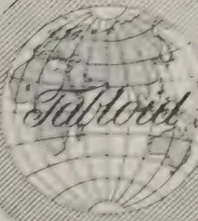

22 532

BURROUGHS WELLCOME & CO., LONDON  
NEW YORK MONTREAL SYDNEY CAPE TOWN  
MILAN SHANGHAI BUENOS AIRES BOMBAY  
ALL RIGHTS RESERVED

399------------------------------------------------

287[MAY 1913]

## THE GERMAN EMPEROR AS AN AGRICULTURIST.

At the annual meeting of the German Agricultural Council the Emperor William delivered an address on the results of land reclamation experiments carried out on his estate at Cadinea. His Majesty gave statistics which showed that reclamation of the marshland on the estate had proved a financial success. He claimed, moreover, to have proved that agricultural production in Germany could be so increased as to satisfy the home demand not only for meat but also for bread.—*The Gardeners' Chronicle*.

### ✓ VEGETABLE IVORY.

The trade in vegetable ivory, locally known as *tagua* (the nut of the *Phytelephas macrocarpa*, also known in commerce as *marfil vegetal* and *corozo nut*) is developing. There are large numbers of the palms from which this nut comes in the territory tributary to Iquitos. They are not cultivated, but grow wild in the forest. The nuts grow in clusters of rounded pods with spike-like projections, each pod containing 4 to 6 nuts, with 12 to 20 pods in a cluster. When ripe the pods open and the nuts drop. The ripe kernels are very hard and white. The trees are found in groves with a comparatively small amount of underbrush, simplifying the gathering. There is no particular season. It takes about two years for the nuts to ripen.

Vegetable ivory is used in the manufacture of buttons, umbrella handles, door knobs, toys and inlay work. The buttons made from tagua take a good lustre and are very durable. In the process of manufacture the nuts are cut in two on the long axis and squared by cutting off the ends. The principal markets are London, Havre, Hamburg, and New York. These points, however, are all distributing centres in the trade, the factories using the nuts being located in south Germany, Italy, London, and Birmingham.

Of the vegetable ivory exported in 1911, totalling 991,000 pounds, 45 per cent. went to Havre, 30 per cent. to Liverpool, 22 per cent. to Hamburg and 3 per cent. to New York.—*Peru To-day*.

### THE COLOMBO FUMIGATORIUM.

The following table shows the number of Seeds and Plants passed through the Fumigatorium, January-March 1913:-

<table>
<thead>
<tr>
<th></th>
<th>Tea seed, cases.</th>
<th>Oranges &amp; lemons, cases.</th>
<th>Bulbs &amp; plants, packages.</th>
</tr>
</thead>
<tbody>
<tr>
<td>January ...</td>
<td>330</td>
<td>236</td>
<td>38</td>
</tr>
<tr>
<td>February ...</td>
<td>205</td>
<td>221</td>
<td>13</td>
</tr>
<tr>
<td>March ...</td>
<td>152</td>
<td>160</td>
<td>36</td>
</tr>
<tr>
<td>Total ...</td>
<td>687</td>
<td>617</td>
<td>87</td>
</tr>
</tbody>
</table>

400------------------------------------------------

This image is a scan of a blank page. The background is a uniform light beige or off-white color. There are a few very small, dark specks scattered across the page, which appear to be scanning artifacts or dust particles. No text, lines, or other graphical elements are present.

401------------------------------------------------

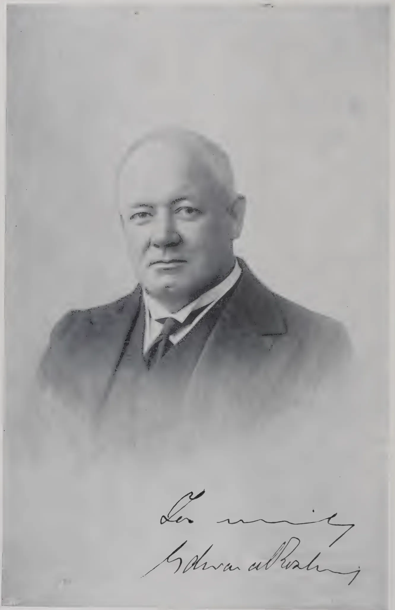A black and white portrait of a middle-aged man with a receding hairline, wearing a dark suit, white shirt, and dark tie. He has a serious expression and is looking directly at the camera. Below the portrait is a handwritten signature in cursive script that reads "Edw. Rosling".

THE HON'BLE SIR EDWARD ROSLING.

402------------------------------------------------

THE  
**TROPICAL AGRICULTURIST:**  
JOURNAL OF THE  
**CEYLON AGRICULTURAL SOCIETY.**

---

VOL. XL.

COLOMBO, JUNE, 1913.

**No. 6.**

---

**THE ALL-CEYLON EXHIBITION.**

---

**REPORT OF THE EXECUTIVE COMMITTEE.**

*Peradeniya, June 15, 1913.*

In the May number we published the Report of the Executive Committee of the All-Ceylon Exhibition presented at the meeting of the Board of Agriculture, May 9th, 1913. As Mr. Harward, the Director of Public Instruction, remarked when moving the adoption of the Report, it reflects very great credit on the patient industry of Mr. A. N. Galbraith who came to the rescue of the Committee at a most critical time when the Exhibition was in full swing and Mr. Denham, the Secretary and Organiser, was taken ill and compelled to relinquish charge. It was a desperate example of changing horses in mid-stream, and that the business of the Exhibition has been wound up in such a satisfactory manner is due solely to Mr. Galbraith.

Writing of the Exhibition in our issue of October last we mentioned sound finance as one condition upon which success is to be measured. The Committee did not call upon the Society for their guarantee of Rs. 15,000 and now they are offering to return to the Government their grant of Rs. 15,000, effecting in these two cases an economy of £2,000. It is to be hoped that if occasion should arise for another appeal the public spirit shown by the Committee in these sacrifices will not be forgotten.

403------------------------------------------------

289[JUNE, 1913.]

A sum of Rs. 7,438.48 is to be placed on fixed deposit for an exhibition to be held, it is proposed, in January or February 1917. We hope neighbouring countries will note the fact that 1917 is booked for an All-Ceylon Exhibition and arrange their programmes so as not to clash with that prospective event.

The Board of Agriculture, the executive of the Ceylon Agricultural Society, originated the idea of this exhibition and, what is more, made itself responsible for a very substantial sum of money in connection with it, yet it was not strictly speaking the Society's show, though how the eclipse of the Society came to pass is not easy to explain. Certain it is that it suffered eclipse and that its members enjoyed no privileges whatever save for the occupation of a small pavilion taken up by exhibits. Members were not even given free passes, an omission that the responsible officers of the Board will no doubt see rectified on the next occasion. The right of free entry to their shows is a privilege enjoyed by members of Agricultural Societies all the world over; is indeed one of the principal attractions Societies can offer; as what they lose in gate money they make up many times in subscriptions. The Board of Agriculture may be relied upon, we feel sure, for insisting that in 1917 members shall not be deprived of this cherished privilege of free entry.

R. N. L.

---

**THE HON'BLE MR. EDWARD ROSLING.**  
**APPOINTED DEPUTY OF THE BOARD OF AGRICULTURE.**

---

The Hon'ble Mr. Edward Rosling, Rural Member of the Legislative Council and a member of the Board of Agriculture, Ceylon, of the Committee of Agricultural Experiments and past Chairman of the Planters' Association, has been appointed Deputy of the Board to the London Committee to arrange a Deputation to the Secretary of State to urge the claims of Ceylon as a suitable site for an Imperial College of Tropical Agriculture.

Mr. Rosling sailed by the O. L. "Orontes" on May 15th.

404------------------------------------------------

JUNE, 1913.]290

## MOZAMBIQUE: ITS AGRICULTURAL DEVELOPMENT.

In the ever increasing outturn of books dealing with tropical agriculture, either general or special, it is indeed refreshing to meet with one which clearly demonstrates a firsthand knowledge of the subject with which it deals. "Mozambique : its Agricultural Developments" by Mr. R. N. Lyne, F. L. S., F. R. G. S., formerly Director of Agriculture of Mozambique, and of Zanzibar, and now Director of Agriculture, Ceylon, is the result of eighteen months' exploration of the Province with the express purpose of ascertaining its agricultural possibilities, and it reveals in every chapter the author's fitness for the task and the thoroughness with which his investigation was carried out. Representing the observations and deductions of a skilled agriculturist, the book is replete with just that information which the intending settler or investor requires.

The author has taken no narrow view of his subject. The first six chapters contain a complete account of the geographical features of the various districts, with details of the characters of their soils and suggestions as to the products best suited to each. As the country extends through some sixteen degrees of latitude, its districts necessarily vary considerably in climatic conditions and consequently in their possibilities from the planter's point of view ; and a study of these chapters, compiled chiefly from personal observations, will prevent the new settler from embarking upon enterprises which have slight chances of success. Rainfall, water supply, irrigation, and transport are all considered, while the strictly agricultural point of view is varied by explanations of the origin of the physical features peculiar to the country. In addition to its agricultural value, this section is of special interest to geographers.

Sugar appears to be the most promising crop and the most valuable at the present time, the output for 1911 being about 27,600 tons, though it is pointed out that more might be made of the area already under this product by the adoption of improved methods of cultivation. Coconuts have been planted fairly extensively, the total number of trees (excluding those on the two Companies' territories) being estimated at about three millions ; but though some trees are said to have yielded 150 nuts each at one picking (quarterly pickings) the general average is low, and it is concluded that the Province (within the limits stated) is not a first class coconut country.

In Mozambique, as in other parts of East Africa, Ceara rubber has been planted, though only on a small scale, and as a rule the plantations are not being successfully worked. There is, however, one plantation which promises to be a success, and of this the author gives particulars which should prove useful to those who are endeavouring to realise the hopes once based on Ceara. Yields of ten ounces have been obtained from six-year-old trees, tapped experimentally for 92 days.

"The principle of stabbing or pricking is now generally accepted as the most successful system for the East Coast of Africa, but it is important that this system should be applied in the right manner. The stabs should be made with the flat of the knife held horizontally, not vertically, as was being done in this case, and they should be made close together. The trunk of the tree may be divided for the purposes of tapping into two or three parts,

405------------------------------------------------

291[JUNE, 1913.

vertically, each part being subdivided laterally into three or four sections according to the girth of the tree. This will provide for from six to twelve tappings, one section being taken at a time. Tappings may follow one another for three or four days, and then an interval of a fortnight or twenty days allowed to intervene. This may continue for as long as the tree is in leaf, which may be, perhaps, nine months out of twelve. A 3-per-cent. solution of acetic acid brushed on the trunk of the tree before tapping may be used as a coagulating mixture, but carbolic acid, which makes the rubber harder, is now being used in German East Africa, either by itself or mixed with acetic acid. As is well known, the juice of citrus fruit and a solution produced by boiling the pulp surrounding the seeds of the baobab tree are also efficacious as a coagulant, especially if carbolic acid be added. The strength of the mixture must be regulated according to the weather; a more concentrated solution being required when the weather is wet and the latex watery; and the manner of applying it to the tree must be carefully observed; the surface below the section to be operated on being well dressed to prevent the latex running through to the ground and getting mixed with sand. Coagulation may take place almost at once, or after some hours. Calcium Chloride is now coming into use as a coagulant, mixed in the proportion of 100 grammes to 1 litre of water, each man being given 8 litres of the mixture daily. The best method of collecting the rubber is by rolling it on a stick or small roller. In this way both hands can be used and the rubber pulled away from the trunk to avoid any bark getting in. The method of treatment afterwards varies. In some cases the rubber is sliced and soaked in water for a few hours to get the smell of the acid out, and then laid out on tressellated shelves in the shade to harden. In others it is put through a washing-machine and rolled into sheets."

Ceara rubber planters in other countries should find the information on this product of great value.

Other products described include Sisal Hemp (already successfully grown in certain districts), Mauritius Hemp, Tobacco, Cotton, Maize, Ground Nuts, Wattle, Lucerne, Fruits, Vanilla, on all of which valuable hints are given as to methods of cultivation and the best varieties for commercial exploitation. The natural resources of the country also receive attention, and the chapter on the *Landolphia* forests, the chief source of Mozambique rubber, gives what is probably the first detailed account of the working of the Mozambique rubber industry.

The author points out that one of the limiting factors to the development of Agriculture in East Africa is the difficulty of procuring labour, and this side of the agricultural question is fully discussed. The system of land tenure, too, is clearly explained and its advantages and disadvantages indicated without fear or favour. Though the land laws appear to be somewhat complicated, this exposition will serve to make the position clear to intending planters, and do much to remove the idea of insecurity which has hitherto restrained the investment of foreign capital in the Province.

The book should prove of the highest value to all, whether officials or planters, connected with agriculture in Mozambique, and will also afford an example of the kind of work required of those whose business it is to direct the course of agriculture in unexploited countries.

T. P.

406------------------------------------------------

JUNE, 1913.]292

# TOBACCO.

---

## TOBACCO CULTIVATION IN THE NORTHERN PROVINCE.

---

By **S. CHELLIAH,**

AGRICULTURAL INSTRUCTOR, N.P.

---

Tobacco is extensively cultivated in almost all parts of the Northern Province in high lands; and in paddy fields immediately after the paddy harvest. The total area of land under tobacco in 1912 was 6,743 acres. A map of the Northern Province showing the villages where tobacco is grown is annexed. Tobacco leaves, when cured are used both for smoking and for chewing. The extent of land under the cultivation of smoking tobacco in 1912 was  $1,339\frac{1}{2}$  acres and that under the cultivation of chewing tobacco, in the same year, 5,404 acres.

Next to paddy, tobacco cultivation is the chief industry of the people of the Northern Province.

### SOIL.

The smoking variety of tobacco is cultivated in light loamy soil, and the chewing variety in heavy loam.

The cultivation of tobacco begins about the end of October and continues till the end of May. The plants are first raised in nurseries and then transplanted in the field.

### NURSERIES.

A small plot of ground is selected for the purpose slightly raised above adjoining ground. Decayed leaves and rotten cattle manure are applied in abundance, and the soil turned over and over until it is reduced to a fine tilth. The ground is then levelled and the seeds, to secure equal distribution over the ground, are usually mixed with fine sand and then sown. After the soil has been slightly stirred by the finger so as to bury the seeds to a proper depth it is pressed down firmly and water is then gently sprinkled over it. The beds are then covered with coconut or other leaves to protect them from the hot sun. They are carefully watered twice a day until the seedlings are transplanted. Care is taken that the seedlings receive sufficient light and air for their healthy growth. They remove therefore the leaves spread over the beds and erect a canopy called a "pandal." This consists of small sticks, two or three feet high, planted four feet apart all round the edges of the beds and having light sticks fastened along and across. Over this framework olas and cadjans are spread in order to protect the seedlings from the hot sun and the heavy rain, and when the seedlings show signs of vigorous growth the "pandal" is removed. The seedlings are fit for transplanting in about two months.

407------------------------------------------------

293[JUNE, 1913.

The present method of watering the beds causes the hardening of the top soil and thereby prevents the free circulation of air in the soil preventing the healthy growth of plants. A better method would be to dig small trenches skirting the beds to lead water to the roots of the plants through percolation, preventing the caking of the top soil.

#### PREPARATION OF THE LAND.

The soil is turned over and over one foot deep with hoes and then manured by penning stock—mostly sheep and black cattle. Green leaves, mostly collected in distant places, are then brought in cartloads and buried into the soil. After cattle manure is again applied, the soil is turned over and levelled and sites for seedlings are marked on it at distances of three feet apart.

The system now in vogue of applying green leaf manure is very expensive, as the leaves are usually collected from live fences and jungle at considerable distance and taken to the fields by cartloads instead of growing the necessary green leaves on the ground as is done in other parts of the world. Years back, a cartload of green leaves was sold at rates varying from Rs. 2-50 to Rs. 5, but now it has gone to Rs. 10 and upwards. A cartload of *Tephrosia purpurea* which is considered the best manure for smoking tobacco is sold at Rs. 20 to Rs. 30. Cultivation in Jaffna is not said to be a paying concern, and it is mostly due to the cost of manures becoming very prohibitive. The growers could save a great deal of money if they adopted the system of growing green crops on the tobacco land and then burying the leaves so grown into the soil intended for cultivation effecting a saving both in labour and expenditure.

#### TRANSPLANTING.

When the land is thus made ready for the plants, the seedlings are removed carefully from the nursery in an evening and planted in the holes previously marked and watered for this purpose. The same day or next morning, the plants are shaded with green leaves. The plants are watered regularly twice a day until they recover from the shock of transplanting and then twice a day till they show signs of vigorous growth. When the plants are about six inches high, the shades are removed and the soil around seedlings stirred with a small wooden spade to secure free circulation of air. The water channels are then made at convenient distances between the plants with smaller channels leading to the plants, by means of which water is led to the plants without wetting the intervening spaces between them.

#### AFTER-CULTIVATION.

Cattle manure is again spread over the ground or sheep are penned among the plants, precaution being taken by enclosing each plant with young palmyrah olas to prevent them from being injured by sheep. The whole ground, after being manured, is watered and thoroughly tilled and weeded, and then beds are so formed that all plants stand on small ridges with necessary water channels for watering them. The ridges made for the plants being too small both in breadth and height the tobacco is stunted in growth and becomes the prey of disease.

408------------------------------------------------

JUNE, 1913.]294

### TOPPING AND SUCKERING.

When the plants are about to blossom, the flower stems are cut off with a view to diverting all the available plant food into the leaves. From eight to ten leaves are left to mature according to the character of the plant and the quality of tobacco aimed at. The topping of plants produces several suckers at every axle of the leaves and these have to be carefully removed.

### HARVESTING.

The time for harvesting is a matter for judgment and experience. The man who knows his business will, by looking at the field, be able to note a change in the colour of the leaves which tells him that they are ready to be picked. A common test is to fold a leaf between the fingers; if it breaks across or retains a crease it is considered ripe. It is important that the leaves should not be harvested prematurely or allowed to remain till over-ripe. When the plants are ripe, they are cut and allowed to wilt in the sun.

### CURING.

Smoking tobacco is cured in the following manner:—The wilted plants are removed to a shed and hung there for about 24 hours. Then the leaves are separated from the stems and buried in a heap in pits dug in the ground for this purpose and carefully covered with earth and allowed to remain so for three days. On the fourth day they are taken out and after being exposed to the air for some time they are again put into the pits, the position of the leaves being changed. On the first occasion the top leaves are kept converging towards the centre, and on the next occasion the bottom leaves are kept in that position. This precaution becomes necessary so as to procure a uniform fermentation in all parts of the leaves. On the third day the leaves are taken out of the pit, sorted according to quality and size and then tied up in hands:—tufts of five leaves. These hands are hung up in curing sheds. In some places this tobacco is artificially dried by fire and in other places it is allowed to dry in the natural way.

After the leaves are well dried up they are taken out of the curing sheds and tied into bundles of fifty leaves. They are then stacked in heaps and well covered with mats. Once a week they are again taken out and after being left to air for some time re-stacked until the leaves are well cured and become fit for market.

The chewing tobacco is cured in the following manner:—The leaves of wilted plants are cut separately and stacked in heaps with weights on to accelerate fermentation. On the fourth day the leaves are sorted according to size and quality and then made into hands of five leaves, hung up in airtight curing sheds and dried there by fire. On the following morning the leaves are taken out and stacked into a heap. On the third day the leaves are again hung up in the curing shed and dried again by fire. When the leaves become quite dry they are taken out, heaped up and well covered with mats. The leaves in the heap are from time to time taken out and after being aired are repacked in a heap to increase the flavour of the tobacco.

### SORTING AND GRADING.

This work is considered as important as any other work connected with the cultivation of tobacco. The whole of the crop is examined leaf by leaf and sorted separately as regards size, colour and quality. Usually the leaves

409------------------------------------------------

295[JUNE, 1913.

are arranged in three different grades, viz., "adichchalli," "idaitaram," and "therivu." The bottom leaves are called "Adichchalli" in the intermediate Tamil "idaitaram" and the top and the largest leaves "therivu."

#### MANUFACTURE OF CIGARS.

The only important manufacture from tobacco is cigars. The cigars are made in the following manner :—The best kinds of leaves are softened with water and used for wrappers and the inferior kinds of leaves for fillers. The fillers are covered over with a wrapper and the end of the cigar is tied up with thread. The cigars made in this way are tied together in small bundles of ten each, and a decoction known as "koda" prepared by boiling tobacco mid ribs and side ribs in arrack, toddy and young coconut water is sprinkled over them and they are then packed in air tight boxes. In place of fresh water for softening the leaf a light decoction of "koda" is also used. The strong decoction is sprinkled over the cigars so that it may impart flavour to them or increase the aroma which is peculiar to the Jaffna cigar. The decoction serves the additional purpose of preserving the cigars from decay and damage by insects.

#### SNUFF.

A kind of snuff is also prepared by roasting tobacco of the smoking variety and pulverising it into a fine powder, to which a small quantity of lime is added to increase its strength. Other aromatic substances are also added in small quantities to improve the quality and flavour of the snuff. This is made for local consumption only.

#### TRADE IN CIGARS.

The manufactured cigars are sent to Colombo, Kandy and Galle and to other parts of the Island for sale. They are sold according to the quality of the cigars at Rs. 2.50, Rs. 5, and Rs. 7.50 per 1,000 cigars.

#### TRADE IN TOBACCO.

Large quantities of chewing tobacco are exported1 to Travancore and Cochin in South India. The price of the superior kind per candy weighing 600 lbs. is from Rs. 200 to Rs. 300 and of the inferior kind from Rs. 120 to Rs. 200.

410------------------------------------------------

JUNE, 1913.]296REFERENCE TABLES.CHEWING TOBACCO.

N.B.—Under reference numbers C=Chewing; S=Smoking, &c.

<table border="1">
<thead>
<tr>
<th>Reference No.</th>
<th>NAME OF VILLAGE.</th>
<th>Acreage Under Tobacco.</th>
</tr>
</thead>
<tbody>
<tr><td>C.1</td><td>Nayinativu</td><td>35</td></tr>
<tr><td>C.2</td><td>Punkudutivu West</td><td>43</td></tr>
<tr><td>C.3</td><td>Punkudutivu East</td><td>55</td></tr>
<tr><td>C.4</td><td>Analativu</td><td>213</td></tr>
<tr><td>C.5</td><td>Eluvaitivu</td><td>2</td></tr>
<tr><td>C.6</td><td>Karampan</td><td>132</td></tr>
<tr><td>C.7</td><td>Narantanai</td><td>80</td></tr>
<tr><td>C.8</td><td>Saravanai</td><td>66</td></tr>
<tr><td>C.9</td><td>Velanai West</td><td>25</td></tr>
<tr><td>C.10</td><td>Velanai East</td><td>34</td></tr>
<tr><td>C.11</td><td>Mankumpan</td><td>30</td></tr>
<tr><td>C.12</td><td>Allaippiddi</td><td>65</td></tr>
<tr><td>C.13</td><td>Mandaitivu</td><td>96</td></tr>
<tr><td>C.14</td><td>Chiviyateru</td><td>38</td></tr>
<tr><td>C.15</td><td>Chundikuli</td><td>12</td></tr>
<tr><td>C.16</td><td>Tirunelveli</td><td>84</td></tr>
<tr><td>C.17</td><td>Nallur</td><td>22</td></tr>
<tr><td>C.18</td><td>Kokkuvil</td><td>66</td></tr>
<tr><td>C.19</td><td>Vannarponnai</td><td>54</td></tr>
<tr><td>C.20</td><td>Kondavil</td><td>112</td></tr>
<tr><td>C.21</td><td>Manipai</td><td>15</td></tr>
<tr><td>C.22</td><td>Vaddukkoddai East</td><td>2</td></tr>
<tr><td>C.23</td><td>Vaddukkoddai West</td><td>2</td></tr>
<tr><td>C.24</td><td>Sandiruppay</td><td>18</td></tr>
<tr><td>C.25</td><td>Kantarodai</td><td>18</td></tr>
<tr><td>C.26</td><td>Chankanai</td><td>30</td></tr>
<tr><td>C.27</td><td>Tholpuram</td><td>12</td></tr>
<tr><td>C.28</td><td>Chulipuram</td><td>8</td></tr>
<tr><td>C.29</td><td>Chillalai</td><td>20</td></tr>
<tr><td>C.30</td><td>Mathakal</td><td>20</td></tr>
<tr><td>C.31</td><td>Chiruvilan</td><td>82</td></tr>
<tr><td>C.32</td><td>Pandatterippu</td><td>30</td></tr>
<tr><td>C.33</td><td>Periyavillan</td><td>80</td></tr>
<tr><td>C.34</td><td>Mahiyappiddi</td><td>5</td></tr>
<tr><td>C.35</td><td>Alaveddi</td><td>110</td></tr>
<tr><td>C.36</td><td>Sankuveli</td><td>15</td></tr>
<tr><td>C.37</td><td>Uduvil</td><td>85</td></tr>
<tr><td>C.38</td><td>Chunnakam</td><td>125</td></tr>
<tr><td>C.39</td><td>Inuvil</td><td>170</td></tr>
<tr><td>C.40</td><td>Maviddapurum</td><td>40</td></tr>
<tr><td>C.41</td><td>Varuttalaivilan</td><td>135</td></tr>
<tr><td>C.42</td><td>Tellippalai</td><td>100</td></tr>
<tr><td>C.43</td><td>Mallakam</td><td>85</td></tr>
<tr><td>C.44</td><td>Elalai</td><td>305</td></tr>
<tr><td>C.45</td><td>Punnalaikkadduvan</td><td>285</td></tr>
<tr><td>C.46</td><td>Urelu</td><td>9</td></tr>
<tr><td>C.47</td><td>Urumpiray</td><td>50</td></tr>
<tr><td>C.48</td><td>Koppay North</td><td>35</td></tr>
<tr><td>C.49</td><td>Irupalai</td><td>9</td></tr>
<tr><td>C.50</td><td>Koppay South</td><td>84</td></tr>
<tr><td>C.51</td><td>Palai</td><td>72</td></tr>
<tr><td colspan="2"></td><td>3320</td></tr>
</tbody>
</table>

411------------------------------------------------

297[JUNE, 1913.CHEWING TOBACCO.—(Continued.)

<table border="1">
<thead>
<tr>
<th>Reference No.</th>
<th>NAME OF VILLAGE.</th>
<th>Acreage under Tobacco.</th>
</tr>
</thead>
<tbody>
<tr>
<td></td>
<td style="text-align: center;"><i>Brought forward</i></td>
<td style="text-align: right;">3,320</td>
</tr>
<tr>
<td>C.52</td>
<td>Vimankamam</td>
<td style="text-align: right;">78</td>
</tr>
<tr>
<td>C.53</td>
<td>Kadduvan</td>
<td style="text-align: right;">94</td>
</tr>
<tr>
<td>C.54</td>
<td>Mulavai</td>
<td style="text-align: right;">60</td>
</tr>
<tr>
<td>C.55</td>
<td>Thaiyiddi</td>
<td style="text-align: right;">75</td>
</tr>
<tr>
<td>C.56</td>
<td>Mayiliddi</td>
<td style="text-align: right;">145</td>
</tr>
<tr>
<td>C.57</td>
<td>Palali</td>
<td style="text-align: right;">150</td>
</tr>
<tr>
<td>C.58</td>
<td>Vasavilan</td>
<td style="text-align: right;">130</td>
</tr>
<tr>
<td>C.59</td>
<td>Valalai</td>
<td style="text-align: right;">81</td>
</tr>
<tr>
<td>C.60</td>
<td>Pattaimeni</td>
<td style="text-align: right;">55</td>
</tr>
<tr>
<td>C.61</td>
<td>Kathripay</td>
<td style="text-align: right;">30</td>
</tr>
<tr>
<td>C.62</td>
<td>Navakkiri</td>
<td style="text-align: right;">29</td>
</tr>
<tr>
<td>C.63</td>
<td>Achchuveli</td>
<td style="text-align: right;">100</td>
</tr>
<tr>
<td>C.64</td>
<td>Puttur South</td>
<td style="text-align: right;">30</td>
</tr>
<tr>
<td>C.65</td>
<td>Avarankal</td>
<td style="text-align: right;">20</td>
</tr>
<tr>
<td>C.66</td>
<td>Puttur North</td>
<td style="text-align: right;">15</td>
</tr>
<tr>
<td>C.67</td>
<td>Nirveli</td>
<td style="text-align: right;">75</td>
</tr>
<tr>
<td>C.68</td>
<td>Siruppiddi</td>
<td style="text-align: right;">102</td>
</tr>
<tr>
<td>C.69</td>
<td>Tondamanar</td>
<td style="text-align: right;">2</td>
</tr>
<tr>
<td>C.70</td>
<td>Kerudavil</td>
<td style="text-align: right;">10</td>
</tr>
<tr>
<td>C.71</td>
<td>Polikandy</td>
<td style="text-align: right;">5</td>
</tr>
<tr>
<td>C.72</td>
<td>Valluveddi</td>
<td style="text-align: right;">8</td>
</tr>
<tr>
<td>C.73</td>
<td>Tanakkarakkurichchi</td>
<td style="text-align: right;">25</td>
</tr>
<tr>
<td>C.74</td>
<td>Imaiyanan</td>
<td style="text-align: right;">14</td>
</tr>
<tr>
<td>C.75</td>
<td>Karanavay North</td>
<td style="text-align: right;">25</td>
</tr>
<tr>
<td>C.76</td>
<td>Alvay North</td>
<td style="text-align: right;">4</td>
</tr>
<tr>
<td>C.77</td>
<td>Point Pedro</td>
<td style="text-align: right;">2</td>
</tr>
<tr>
<td>C.78</td>
<td>Alvay West</td>
<td style="text-align: right;">7</td>
</tr>
<tr>
<td>C.79</td>
<td>Puloly West</td>
<td style="text-align: right;">5</td>
</tr>
<tr>
<td>C.80</td>
<td>Puloly South</td>
<td style="text-align: right;">9</td>
</tr>
<tr>
<td>C.81</td>
<td>Alvay South</td>
<td style="text-align: right;">15</td>
</tr>
<tr>
<td>C.82</td>
<td>Tumpalai</td>
<td style="text-align: right;">4</td>
</tr>
<tr>
<td>C.83</td>
<td>Karavetti North</td>
<td style="text-align: right;">11</td>
</tr>
<tr>
<td>C.84</td>
<td>Karavetti East</td>
<td style="text-align: right;">3</td>
</tr>
<tr>
<td>C.85</td>
<td>Karavetti West</td>
<td style="text-align: right;">11</td>
</tr>
<tr>
<td>C.86</td>
<td>Tunnalai South</td>
<td style="text-align: right;">5</td>
</tr>
<tr>
<td>C.87</td>
<td>Tunnalai North</td>
<td style="text-align: right;">10</td>
</tr>
<tr>
<td>C.88</td>
<td>Karanavay South</td>
<td style="text-align: right;">15</td>
</tr>
<tr>
<td>C.89</td>
<td>Kaitadi</td>
<td style="text-align: right;">20</td>
</tr>
<tr>
<td>C.90</td>
<td>Madduvil South</td>
<td style="text-align: right;">18</td>
</tr>
<tr>
<td>C.91</td>
<td>Madduvil North</td>
<td style="text-align: right;">5</td>
</tr>
<tr>
<td>C.92</td>
<td>Navatkuli</td>
<td style="text-align: right;">20</td>
</tr>
<tr>
<td>C.93</td>
<td>Chavakachcheri South</td>
<td style="text-align: right;">4</td>
</tr>
<tr>
<td>C.94</td>
<td>Sarasalai</td>
<td style="text-align: right;">4</td>
</tr>
<tr>
<td>C.95</td>
<td>Kudattanai</td>
<td style="text-align: right;">8</td>
</tr>
<tr>
<td>C.96</td>
<td>Ampan</td>
<td style="text-align: right;">9</td>
</tr>
<tr>
<td>C.97</td>
<td>Nakarkovil</td>
<td style="text-align: right;">7</td>
</tr>
<tr>
<td>C.98</td>
<td>Chempiyanpattu</td>
<td style="text-align: right;">15</td>
</tr>
<tr>
<td>C.99</td>
<td>Maruthankerny</td>
<td style="text-align: right;">44</td>
</tr>
<tr>
<td>C.100</td>
<td>Puloli East</td>
<td style="text-align: right;">1</td>
</tr>
<tr>
<td>C.101</td>
<td>Suravattai</td>
<td style="text-align: right;">40</td>
</tr>
<tr>
<td>C.102</td>
<td>Ivinai</td>
<td style="text-align: right;">250</td>
</tr>
<tr>
<td></td>
<td></td>
<td style="text-align: right; border-top: 1px solid black;">5,404</td>
</tr>
</tbody>
</table>

412------------------------------------------------

JUNE, 1913.]298SMOKING TOBACCO.

<table border="1">
<thead>
<tr>
<th>Reference No.</th>
<th>NAME OF VILLAGE.</th>
<th>Acreage under Tobacco.</th>
</tr>
</thead>
<tbody>
<tr><td>S. 100</td><td>Varani Iyattalai</td><td>5</td></tr>
<tr><td>S. 101</td><td>Mantuvil</td><td>40</td></tr>
<tr><td>S. 102</td><td>Karampaikkurichchi</td><td>2</td></tr>
<tr><td>S. 103</td><td>Tavalai Iyattalai</td><td>25</td></tr>
<tr><td>S. 104</td><td>Kudamian</td><td>20</td></tr>
<tr><td>S. 105</td><td>Navatkadu</td><td>30</td></tr>
<tr><td>S. 106</td><td>Misalai North</td><td>65</td></tr>
<tr><td>S. 107</td><td>Misalai South</td><td>2</td></tr>
<tr><td>S. 108</td><td>Kodikamam</td><td>20</td></tr>
<tr><td>S. 109</td><td>Sandanpokkaddi</td><td>3</td></tr>
<tr><td>S. 110</td><td>Allarai</td><td>25</td></tr>
<tr><td>S. 111</td><td>Ussen</td><td>18</td></tr>
<tr><td>S. 112</td><td>Kachchai</td><td>30</td></tr>
<tr><td>S. 113</td><td>Vellampokkaddi</td><td>2</td></tr>
<tr><td>S. 114</td><td>Ketpeli</td><td>15</td></tr>
<tr><td>S. 115</td><td>Palavi</td><td>15</td></tr>
<tr><td>S. 116</td><td>Mirusuvil</td><td>3</td></tr>
<tr><td>S. 117</td><td>Elutumadduval North</td><td>12</td></tr>
<tr><td>S. 118</td><td>Karampakam</td><td>22</td></tr>
<tr><td>S. 119</td><td>Vidattalpalai</td><td>20</td></tr>
<tr><td>S. 120</td><td>Elutumadduval South</td><td>5</td></tr>
<tr><td>S. 121</td><td>Mukamalai</td><td>4</td></tr>
<tr><td>S. 122</td><td>Vempodukerney</td><td>10</td></tr>
<tr><td>S. 123</td><td>Kilali</td><td>6</td></tr>
<tr><td>S. 124</td><td>Ittavil</td><td>1</td></tr>
<tr><td>S. 125</td><td>Thampakamam</td><td>21</td></tr>
<tr><td>S. 126</td><td>Sorampattu</td><td>12</td></tr>
<tr><td>S. 127</td><td>Periyapalai</td><td>8</td></tr>
<tr><td>S. 128</td><td>Puloppalai</td><td>28</td></tr>
<tr><td>S. 129</td><td>Tanmakkerney</td><td>7</td></tr>
<tr><td>S. 130</td><td>Urvanikanpattu</td><td>2</td></tr>
<tr><td>S. 131</td><td>Iyakkachchi</td><td>1</td></tr>
<tr><td>S. 132</td><td>Sankathavayal</td><td>4</td></tr>
<tr><td>S. 133</td><td>Kottandarkulam</td><td>3</td></tr>
<tr><td>S. 134</td><td>Mukavil</td><td>11</td></tr>
<tr><td>S. 135</td><td>Mullian</td><td>18</td></tr>
<tr><td>S. 136</td><td>Periyapachchilappali</td><td>3</td></tr>
<tr><td>S. 137</td><td>Pockaruppu</td><td>28</td></tr>
<tr><td>S. 138</td><td>Veddukkadu</td><td>20</td></tr>
<tr><td>S. 139</td><td>Madduvilnadu</td><td>30</td></tr>
<tr><td>S. 140</td><td>Kollakurichchi</td><td>24</td></tr>
<tr><td>S. 141</td><td>Nallur, Punakary Division-</td><td>10</td></tr>
<tr><td>S. 142</td><td>Alankery</td><td>8</td></tr>
<tr><td>S. 143</td><td>Kunchuparantan</td><td>1</td></tr>
<tr><td>S. 144</td><td>Nivil</td><td>3</td></tr>
<tr><td>S. 145</td><td>Murasumoddai</td><td>8</td></tr>
<tr><td>S. 146</td><td>Kandavalai</td><td>25</td></tr>
<tr><td>S. 147</td><td>Teniankulam</td><td>2</td></tr>
<tr><td>S. 148</td><td>Alankulam</td><td>2</td></tr>
<tr><td>S. 149</td><td>Vaddaiadaippu</td><td>2</td></tr>
<tr><td>S. 150</td><td>Tunukkai</td><td>5</td></tr>
<tr><td>S. 151</td><td>Kalvilan</td><td>10</td></tr>
<tr><td>S. 152</td><td>Pallavarayakaddu</td><td>54</td></tr>
<tr><td>S. 153</td><td>Ampakamam</td><td>8</td></tr>
<tr><td>S. 154</td><td>Karuppaddaimurippu</td><td>17</td></tr>
<tr><td>S. 155</td><td>Kachchilamadu</td><td>10</td></tr>
<tr><td>S. 156</td><td>Putukkudiyiruppu</td><td>5</td></tr>
<tr><td>S. 157</td><td>Valayanmadam</td><td>2</td></tr>
<tr><td>S. 158</td><td>Karayamullivaikkal</td><td>5</td></tr>
<tr><td>S. 159</td><td>Vellamullivaikkal</td><td>4</td></tr>
<tr><td>S. 160</td><td>Mullaitivu</td><td>30</td></tr>
<tr><td>S. 161</td><td>Chilavattai</td><td>12</td></tr>
</tbody>
</table>

843

413------------------------------------------------

299[JUNE, 1913.SMOKING TOBACCO. (Continued.)

<table border="1">
<thead>
<tr>
<th>Reference No.</th>
<th>NAME OF VILLAGE.</th>
<th>Acreage under Tobacco.</th>
</tr>
</thead>
<tbody>
<tr>
<td></td>
<td style="text-align: center;"><i>Brought forward</i></td>
<td style="text-align: right;">843</td>
</tr>
<tr>
<td>S. 162</td>
<td>Tanniuttu</td>
<td style="text-align: right;">10</td>
</tr>
<tr>
<td>S. 163</td>
<td>Vattapalai</td>
<td style="text-align: right;">5</td>
</tr>
<tr>
<td>S. 164</td>
<td>Kanukkeni</td>
<td style="text-align: right;">5</td>
</tr>
<tr>
<td>S. 165</td>
<td>Mulliyavalai</td>
<td style="text-align: right;">10</td>
</tr>
<tr>
<td>S. 166</td>
<td>Alampil</td>
<td style="text-align: right;">3</td>
</tr>
<tr>
<td>S. 167</td>
<td>Chemmalai</td>
<td style="text-align: right;">2</td>
</tr>
<tr>
<td>S. 168</td>
<td>Kumulamunai</td>
<td style="text-align: right;">12</td>
</tr>
<tr>
<td>S. 169</td>
<td>Andankulam</td>
<td style="text-align: right;">1</td>
</tr>
<tr>
<td>S. 170</td>
<td>Kokkilai</td>
<td style="text-align: right;">6</td>
</tr>
<tr>
<td>S. 171</td>
<td>Karunaddukkeni</td>
<td style="text-align: right;">6</td>
</tr>
<tr>
<td>S. 172</td>
<td>Kokkuttoduvay</td>
<td style="text-align: right;">3</td>
</tr>
<tr>
<td>S. 173</td>
<td>Periyakulam</td>
<td style="text-align: right;">20</td>
</tr>
<tr>
<td>S. 174</td>
<td>Mamadu</td>
<td style="text-align: right;">35</td>
</tr>
<tr>
<td>S. 175</td>
<td>Unchalkaddi</td>
<td style="text-align: right;">8</td>
</tr>
<tr>
<td>S. 176</td>
<td>Paranthan</td>
<td style="text-align: right;">27</td>
</tr>
<tr>
<td>S. 177</td>
<td>Kamakarayankulam</td>
<td style="text-align: right;">10</td>
</tr>
<tr>
<td>S. 178</td>
<td>Palaiyavadi</td>
<td style="text-align: right;">15</td>
</tr>
<tr>
<td>S. 179</td>
<td>Kuttimulai</td>
<td style="text-align: right;">5</td>
</tr>
<tr>
<td>S. 180</td>
<td>Iluppaikkadavai</td>
<td style="text-align: right;">59</td>
</tr>
<tr>
<td>S. 181</td>
<td>Vidattaltivu</td>
<td style="text-align: right;">20</td>
</tr>
<tr>
<td>S. 182</td>
<td>Attimoddai</td>
<td style="text-align: right;">7</td>
</tr>
<tr>
<td>S. 183</td>
<td>Alkaddivel</td>
<td style="text-align: right;">35</td>
</tr>
<tr>
<td>S. 184</td>
<td>Karunkandal</td>
<td style="text-align: right;">5</td>
</tr>
<tr>
<td>S. 185</td>
<td>Nedunkandal</td>
<td style="text-align: right;">67</td>
</tr>
<tr>
<td>S. 186</td>
<td>Sirutoppu</td>
<td style="text-align: right;"><math>\frac{1}{2}</math></td>
</tr>
<tr>
<td>S. 187</td>
<td>Kidaveddittoppu</td>
<td style="text-align: right;">5</td>
</tr>
<tr>
<td>S. 188</td>
<td>Periyanavatkulam</td>
<td style="text-align: right;">13</td>
</tr>
<tr>
<td>S. 189</td>
<td>Kalmoddai</td>
<td style="text-align: right;">1</td>
</tr>
<tr>
<td>S. 190</td>
<td>Tampanaikkulam</td>
<td style="text-align: right;"><math>\frac{1}{4}</math></td>
</tr>
<tr>
<td>S. 191</td>
<td>Chekkadippulavu</td>
<td style="text-align: right;"><math>\frac{1}{4}</math></td>
</tr>
<tr>
<td>S. 192</td>
<td>Panikkaniravi</td>
<td style="text-align: right;"><math>\frac{1}{2}</math></td>
</tr>
<tr>
<td>S. 193</td>
<td>Kottandarnochchikkulam</td>
<td style="text-align: right;"><math>\frac{1}{4}</math></td>
</tr>
<tr>
<td>S. 194</td>
<td>Palaimoddai</td>
<td style="text-align: right;"><math>\frac{1}{4}</math></td>
</tr>
<tr>
<td>S. 195</td>
<td>Panrikkeitakulam</td>
<td style="text-align: right;"><math>\frac{1}{2}</math></td>
</tr>
<tr>
<td>S. 196</td>
<td>Vedamakilankulam</td>
<td style="text-align: right;"><math>\frac{1}{2}</math></td>
</tr>
<tr>
<td>S. 197</td>
<td>Pakkuchorinchan</td>
<td style="text-align: right;"><math>\frac{1}{4}</math></td>
</tr>
<tr>
<td>S. 198</td>
<td>Malikai</td>
<td style="text-align: right;"><math>\frac{1}{2}</math></td>
</tr>
<tr>
<td>S. 199</td>
<td>Navatkulam</td>
<td style="text-align: right;"><math>\frac{1}{2}</math></td>
</tr>
<tr>
<td>S. 200</td>
<td>Omantai</td>
<td style="text-align: right;"><math>\frac{1}{4}</math></td>
</tr>
<tr>
<td>S. 201</td>
<td>Ammivaitan</td>
<td style="text-align: right;"><math>\frac{1}{8}</math></td>
</tr>
<tr>
<td>S. 202</td>
<td>Periyapuliyanakulam</td>
<td style="text-align: right;"><math>\frac{1}{4}</math></td>
</tr>
<tr>
<td>S. 203</td>
<td>Nochchimoddai</td>
<td style="text-align: right;"><math>\frac{1}{4}</math></td>
</tr>
<tr>
<td>S. 204</td>
<td>Irampaikkulam</td>
<td style="text-align: right;">5</td>
</tr>
<tr>
<td>S. 205</td>
<td>Vavuniya</td>
<td style="text-align: right;">10</td>
</tr>
<tr>
<td>S. 206</td>
<td>Marutankulam</td>
<td style="text-align: right;"><math>\frac{1}{8}</math></td>
</tr>
<tr>
<td>S. 207</td>
<td>Kalnaddinakulam</td>
<td style="text-align: right;"><math>\frac{1}{8}</math></td>
</tr>
<tr>
<td>S. 208</td>
<td>Panrisurichchan</td>
<td style="text-align: right;"><math>\frac{1}{4}</math></td>
</tr>
<tr>
<td>S. 209</td>
<td>Rasentirankulam</td>
<td style="text-align: right;"><math>\frac{1}{4}</math></td>
</tr>
<tr>
<td>S. 210</td>
<td>Puvarasankulam</td>
<td style="text-align: right;"><math>\frac{1}{4}</math></td>
</tr>
<tr>
<td>S. 211</td>
<td>Tavasiyakulam</td>
<td style="text-align: right;"><math>\frac{1}{4}</math></td>
</tr>
<tr>
<td>S. 212</td>
<td>Nelukkulam</td>
<td style="text-align: right;">1</td>
</tr>
<tr>
<td>S. 213</td>
<td>Kidachchuri</td>
<td style="text-align: right;"><math>\frac{1}{4}</math></td>
</tr>
<tr>
<td>S. 214</td>
<td>Karuveppankulam</td>
<td style="text-align: right;"><math>\frac{1}{4}</math></td>
</tr>
<tr>
<td>S. 215</td>
<td>Nedunkaraichchenai</td>
<td style="text-align: right;"><math>\frac{1}{8}</math></td>
</tr>
<tr>
<td>S. 216</td>
<td>Periyapuliyanakulam</td>
<td style="text-align: right;"><math>\frac{1}{8}</math></td>
</tr>
<tr>
<td>S. 217</td>
<td>Musalkutti</td>
<td style="text-align: right;"><math>\frac{1}{4}</math></td>
</tr>
<tr>
<td>S. 218</td>
<td>Chutumalai</td>
<td style="text-align: right;">6</td>
</tr>
<tr>
<td>S. 219</td>
<td>Nochchikkulam</td>
<td style="text-align: right;"><math>\frac{1}{4}</math></td>
</tr>
<tr>
<td>S. 220</td>
<td>Achcholu</td>
<td style="text-align: right;">54</td>
</tr>
<tr>
<td>S. 221</td>
<td>Paraiyankandal</td>
<td style="text-align: right;">2</td>
</tr>
<tr>
<td>S. 222</td>
<td>Delft West</td>
<td style="text-align: right;">15</td>
</tr>
<tr>
<td>S. 223</td>
<td>Delft East</td>
<td style="text-align: right;">1</td>
</tr>
<tr>
<td></td>
<td></td>
<td style="text-align: right; border-top: 1px solid black;">1,339<math>\frac{1}{2}</math></td>
</tr>
</tbody>
</table>

414------------------------------------------------

JUNE, 1913.]

300

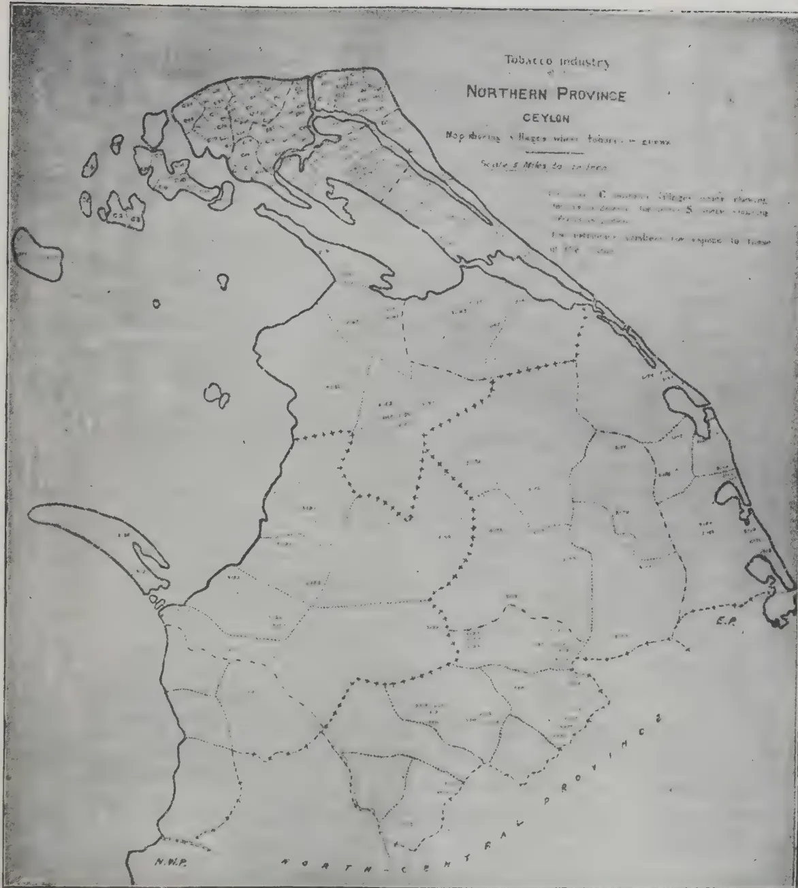

The figure is a map of the Northern Province of Ceylon, titled "Tobacco Industry of the NORTHERN PROVINCE CEYLON". The map shows the geographical distribution of tobacco cultivation, with villages where tobacco is grown marked with green dots. The map includes a scale of 5 miles to an inch. A legend in the upper right corner explains the symbols: a green dot for villages where tobacco is grown, a green line for roads, and a green star for villages where tobacco is grown. The map also shows the boundaries of the Northern Province, the Central Province, and the Northern West Province. The map is framed by a thick black border.

## Tobacco Industry

of the

# NORTHERN PROVINCE

## CEYLON

Map showing villages where tobacco is grown

415------------------------------------------------

301[JUNE, 1913.

# RUBBER.

## THE RUBBER INDUSTRY IN THE ISLAND OF JAVA.

By Mr. C. E. AKERS.

The rubber estates of Java are scattered over the Island from East to West, but much more numerous on the Southern Coast than on the North, due to the fact that the rainfall is greater and more regular in the South. The principal districts where plantations have been opened are near Buitenzorg and Krawang in the Province of Batavia ; Rangkasbidoeng and Menes in Bantam ; Tjandjoer to Bandoeng and Banjar in Preanger ; Langen, Tjipari and Kiliminger in Banjoemas ; Malang and Limburg in Pasoeran ; Djember, Kalisat and Banjoewani in Besoeki ; and at various points in the provinces of Kediri and Soerabaja. In nearly all districts where coffee plantations formerly existed rubber has been planted whenever conditions of climate and soil permitted. Experiments tried with Para rubber in the northern sections of the island between Batavia and Soerabaja have not proved successful owing to climatic reasons, and no plantations of importance are found in those districts.

### AREA.

Official returns made in 1910 gave the area planted with Para rubber as 158,000 acres on 215 estates ; in addition there were under cultivation 1,086,126 *Ficus* trees, 687,748 *Castilloa* trees, and 356,253 *Ceara* trees. In 1911 some 50,000 acres were planted with Para rubber, and in 1912 the additional area planted or ready for planting is not less than from 22,000 to 25,000 acres. This estimated area for 1911 and 1912 is compiled from information supplied by estate agents and planters ; it is probably less than the actual amount and must be considered a very conservative figure. Summed up, the approximate area is :—

<table>
<thead>
<tr>
<th></th>
<th></th>
<th>Aggregate acres.</th>
<th></th>
<th>Increase acres.</th>
</tr>
</thead>
<tbody>
<tr>
<td>1910</td>
<td>...</td>
<td>158,000</td>
<td>...</td>
<td>—</td>
</tr>
<tr>
<td>1911</td>
<td>...</td>
<td>208,000</td>
<td>...</td>
<td>50,000</td>
</tr>
<tr>
<td>1912</td>
<td>...</td>
<td>230,000</td>
<td>...</td>
<td>22,000</td>
</tr>
</tbody>
</table>

The extensions in 1911 and 1912 are directly due to the rubber boom of 1909-10, and took place principally in the eastern districts in the provinces of Besoeki, Pasoerean and Kediri.

### TENURE OF LAND.

Land is held under long leases, seldom less than 75 years, issued by the Dutch Colonial authorities ; in the case of semi-independent Sultanates the grant is made by the Sultan and approved by the Resident Commissioner. The annual rental varies from 1s. 8d. to 5s. 10d. per annum per bouw of  $1\frac{3}{4}$  acres. A large proportion of the public waste lands is now reserved for the purpose of native plantations of rice and other food-stuffs, and grants for

416------------------------------------------------

JUNE, 1913.]302

establishing rubber estates or other cultivations are difficult to obtain. It is, however, easy to buy from the owners of existing leases, the price varying from a few shillings to several pounds sterling per acre according to the conditions and situation of the property.

#### TAXATION.

In addition to the annual rental paid for leasehold land a tax of  $\frac{3}{4}$  or 1 per cent. is levied on a valuation made once in every five years. While this cannot be considered a very heavy contribution it must be taken into account in all propositions for opening up rubber estates. No export duty is exacted on rubber shipments. The general revenue of the Colony is derived from 12 per cent. duties levied on all imported merchandise, a personal income tax of 6 per cent. and various municipal rates levied on house property and other real estate in the cities and towns.

#### WORKING EXPENSES OF A RUBBER ESTATE.

As is the case in all rubber growing countries, the larger proportion of the expenditure is for the payment of labour and the cost of management. The rate of wages varies so greatly in different districts, and even on different estates in the same district, that no hard and fast rule can be laid down for estate expenditure, but I have taken the average of a number of plantations in various localities and so obtained an approximate estimate of the necessary expenses. Another factor to be taken into account is that managers and assistants are paid small salaries with a bonus on profits. The custom in Java is to allow the manager 10 per cent. and the assistants  $2\frac{1}{2}$  per cent. on the net profits, while the salary of the former seldom exceeds £500 and the latter £250 per annum on important properties with very extensive interests at stake. When an estate has reached the producing stage this bonus system appeals strongly to the individual manager, but a good many complaints are heard in connection with newly opened rubber plantations where four or five years must elapse before the concern becomes dividend paying. I think that much of the enthusiasm in Java for interplanting rubber with coffee and other products arises from the desire to earn profits at an early date.

The cost of tapping and collecting is very much higher in Java than elsewhere in the Orient for reasons explained later in this report.

#### MANAGEMENT OF RUBBER ESTATES IN JAVA.

The planting industry of Java has been established for so many years that experienced estate managers for tea, coffee, tobacco, sugar, cacao, coconuts, coca, and almost all branches of tropical agriculture are found in large numbers in the island. For rubber plantations, however, there is a great scarcity of experienced managers. In knowledge of tapping and general conditions in connection with Para rubber there is a marked lack of competent men. Of course this is only a passing phase, for with the expansion of the rubber area and the beginning of the production stage serious attention is being given to the matter, and both managers and assistants are being sent to the Malay Peninsula in considerable numbers to learn the methods employed and the general conduct of the business. In Java a fair number of Englishmen and some Frenchmen and Belgians are employed, but the great majority of managers and assistants are Dutchmen. The question of language is not an easy one for the newcomer, for to be thoroughly efficient he should

417------------------------------------------------

303[JUNE, 1913.

understand and talk fluently Dutch, Malay, Sudanese, Javanese, and in some districts Madoerese. In several districts I have visited Sudanese and Javanese only were spoken by the labouring classes, and Malay was practically unknown. In the planting districts of the extreme East such as Bangoewani and other parts of Besoeki the majority of the plantation hands are recruited from the island of Modoera and only understand their own dialect.

#### SUPPLY OF LABOURERS FOR THE RUBBER ESTATES.

With a population of some 35,000,000 natives it would seem that no difficulty should be experienced in Java with regard to the requirements of the sugar, tea, tobacco, coffee, rubber and cocoa plantations. Such however, is not the case, and with rubber estates particularly the number of coolies available is most inadequate in many districts. There is no doubt that the scarcity in the supply of labour for plantation purposes is due in great part to the large area under cultivation. The rice fields extend to over 3,000,000 acres, sugar some 600,000 acres, tobacco 200,000 acres, tea 250,000 acres, and a similar area under coffee and rubber combined; native foodstuffs and fruits to not less than 1,000,000 acres. Coconuts, 200,000 acres, and probably not less than 500,000 acres altogether in other cultivations. This means that a combined demand exists for coolies to cultivate 6,000,000 acres, and in addition, there is an annual drain to Sumatra of some 50,000 labourers and to Malay of 10,000 for work on the rubber estates in those countries. It must also be remembered that the native methods of cultivating rice fields and gardens for fruit and foodstuffs is antiquated and extravagant, and labour saving machinery and modern implements practically unknown.

In the eastern districts a large proportion of the coolies employed are recruited from the island of Madoera close to the province of Soerabaja. This island is poor in agricultural resources, but has a large population of poverty-stricken inhabitants of whom a considerable proportion are willing to work on the estates, but make useful labourers after a period of a few months of regular rations has improved their physique.

There is no system of contract labour in Java. The coolies are free to work for any rate of wage they can obtain, and they take full advantage of this condition, leaving an estate whenever they feel inclined to do so without the smallest consideration for the inconvenience occasioned by such action. In order to check this inclination estate managers endeavour to form resident colonies of plantation coolies, and to those who remain permanently a higher wage is granted and many privileges allowed. On old established estates this resident labour force is a prominent feature, but on rubber plantations it is only a limited factor owing to the comparatively recent development of the industry, and its unpopularity compared to other cultivations. Another reason is that the climate and land best suited for growing Para rubber is situated generally in unhealthy districts and in somewhat inaccessible localities, where food supplies and other necessaries are expensive and not always easy to obtain.

418------------------------------------------------

JUNE, 1913.]304

## RUBBER IN THE ORIENT AND ON THE AMAZON.

The Labour question is one of the most difficult problems confronting the rubber producers to-day in the Amazon Valley. At the present time the rubber industry gives employment to 100,000 men approximately as collectors, and, in addition, to another 10,000 or 15,000 working for a daily wage.

These men are natives of Amazonas or Para, or come from the more Southern States of Ceara, Rio Grande do Norte, Parahyba, or Maranhao. Every year a large number are recruited by agents in the above-named states for the Upper and Lower Amazonas. The expense of passage and maintenance from the date of leaving his home to his arrival at his destination is not far short of 300\$000 for each individual, and fully that amount, if any advance of money is made, as indeed is the case generally. This sum of 300\$000 is recoverable against the man's earnings, and he starts work with an indebtedness of that amount. It is seldom that he obtains a sufficient return from rubber collecting in his first year to discharge this initial indebtedness as well as the further amount incurred by his purchases from the store for his maintenance. In his second year he manages to pay off what he owes, but his account will show very little to his credit, although his share of the rubber collected may be not far short of 2,400\$000 (say £130). As a matter of fact his living expenses should not exceed 1,000\$000 if the goods supplied to him were valued at reasonable prices by the owner of the rubber property. It is this unsatisfactory condition of the labourers that makes the recruiting of fresh hands no easy matter, but the difficulty would disappear to a very great extent if the men were accorded fair treatment in regard to the prices charged for provisions and clothing.

### THE DAILY WAGE RATE.

Where men are employed for other purposes than rubber collecting they are paid a daily wage varying from 3\$000 (say 4s.) in the district of the lower Amazon, to as much as 6\$000 and 7\$000 in many districts of the Upper Amazon. Sometimes rations are given in addition to the wage paid, at others none are issued. Taken as a general rule it is safe to say that the average rate on the Upper Amazon is not less than 5\$000 per day, with rations. On the Madeira-Mamore Railway the rate is 8\$000 without rations.

### THE TRUCK SYSTEM AND THE COST OF LIVING.

It matters not at all whether the labourer is working on shares with the proprietor, as in the case of rubber collecting, or is earning a daily wage, all are the victims of the truck system in vogue on the rubber properties. The men are compelled to supply their needs from the store, and exorbitant profits are charged on every article sold to them. Everything is purchased on credit, and the rubber collector or day-labourer, no matter what payments are made to him nominally, finds himself mulcted to such an extent that very little cash comes into his hands. In part the fault lies with the labourer, for he has taken from the stores many articles for which he had no real need, encouraged thereto by the fact that the way was made easy to him by the credit system.

419------------------------------------------------

305[JUNE, 1913.

The trend of the Brazilian character is towards extravagance rather than thrift, and full advantage is taken of this national trait. The excuse invariably put forward to me when discussing this subject with owners or administrators is that they in turn are overcharged for all supplies by their agents (aviadores) in Manaus and Para, and that the freight and other costs up the river make high prices necessary.

The first parts of this assertion is true, for these aviadores open large credits without security of any kind, and often demand 12 per cent. and even 20 per cent. interest on the amount agreed upon.

To cover bad debts they must make large profits on the merchandise supplied by them. The Brazilian property owner has the same weakness for extravagance as the labourer, and cares little what his indebtedness may be as long as the needs of the moment are met. Hence, he is unable to discharge his obligations and becomes a mere puppet in the hands of the aviadores. The business principles involved are unsound in every way, as is shown by the fact that the majority of both aviadores and proprietors are burthened with debt at the present time. There are signs that the existing system is nearing its end, and if lower prices for rubber bring about a crisis sufficiently acute to sweep away present methods and bring matters down to a cash basis the general condition of the country will be benefited most distinctly so far as the development of industrial enterprise is concerned. Smaller profits will be made and the wage rate will be reduced, but the profits will be real, no paper, and the wages will represent actual cash payments. In regard to the plea of high freights as an excuse for the excessive prices charged at the stores, there is little real foundation in fact. Recently all freight rates on the first necessities of life have been reduced by 40 per cent. and on other merchandise 15 per cent.

Moreover, the owners of properties can produce at their own doors nearly all foodstuffs required for the maintenance of the rubber collectors and labourers. With very little energy prolific crops of rice, manioc, maize, sweet potatoes, beans, tobacco and fruit can be obtained at costs far below those now paid for the imported article.

#### TRANSPORT.

The carriage of the rubber to the markets of Para or Manaus for sale and shipment to Europe and the United States is effected by the steamers of the Amazon River Steamship Company or those belonging to private individuals, in the latter case these often being the proprietors of rubber estates. For such a valuable cargo as rubber the charges are not excessive. The rate varies according to distance, and so far as it is possible to strike an average over the Lower and Upper Amazon the cost distributed over the annual production does not exceed one half-penny per pound. This sum might be reduced considerably if more care was taken in the preparation of the rubber and if it was dried out to a greater extent before despatch for sale. At present the *pelles* or balls of rubber contain on an average 20 per cent. of moisture when sent away from the estates.

420------------------------------------------------

JUNE, 1913.]306

### CLASSIFICATION OF RUBBER AT MANAOS AND PARA.

On arrival at the port of shipment the rubber is classified by the brokers previous to sale. This process consists of cutting open all balls, no matter whether they weigh 10 lbs. or 100 lbs. The inside contents are then classified as "extra fine" (*sertao*), "fine" (*fina*), "medium fine" (*entre fina*), "medium" (*fraca*), and coarse, according as the quality varies in the opinion of the expert superintending the operation. The scrap (*sernamby*) which arrives in a wet and half rotten condition is classified as coarse. This classification is necessary not only for selling purposes, but also for assessment of the duties to be paid to the State before the shipment is permitted.

### METHOD OF SHIPMENT.

After classification and valuation for the payment of duties the rubber is boxed in cases averaging approximately either 400 lbs. weight in the smaller boxes or 800 lbs. in the larger cases.

Freight to Europe or the United States is by measurement at the rate of 65s. and 60s. per 40 cubic feet from Manaos and Para respectively, and this works out at about double that charge per ton weight.

Owing to the shape of the rubber balls a great deal of space is lost in packing. A certain amount of rubber from Bolivia passes through Para in transit and is shipped in bulk without cases.

## SOUTH INDIAN RUBBER PLANTING.

The growing importance of the rubber industry in South India can well be understood from the fact that to-day there are no less than 35,000 acres of land under rubber in the Malabar district alone. It is said that an enterprising gentleman, who is already in the field, is arranging with a native landowner for the purchase of a whole hill in south Malabar, measuring several thousands of acres, to be mainly devoted to rubber. It is also reported that a company is being formed to take over and work a property, growing tea, rubber, coffee, and cardamoms.

A correspondent of "Capital" writing from Southern India says:—

"It gives me great pleasure to tell you that the rubber we grow over here is as good and is as much per acre, age for age, as say in the neighbouring island of Ceylon, while the prices we have realised compare very favourably with those fetched by any other rubber in the market. All this is very gratifying no doubt. But if we are to do better, and if the rubber industry is to grow in our part of India, the iniquitously high rate of freight on rubber to England must be reduced. As it is, it weighs down as a great handicap upon our young prodigal, and feeling among planters runs very high on the subject. I am told that the West Coast firms concerned have made the necessary representations, and I fully expect that some substantial reduction will be made, and an encouraging fillip given us shortly."—THE FINANCIAL NEWS.

421------------------------------------------------

307[JUNE, 1913.

## SOILS SUITABLE FOR RUBBER CULTIVATION.

The following article is reproduced from *Der Tropenpflanzer* :—

The writer, Director of the Agricultural Institute of the University of Halle, has analysed samples of the soils which were most suitable for growing rubber and which had been sent from Brazil ("Seringal," Sao Francisco near Mt. Alegre), from Bolivia ("Seringal," Philadelphia, near Cobijia) from the higher basin of the Amazon and from German East Africa.

The following table gives some of the detailed results obtained:—

<table border="1">
<thead>
<tr>
<th>Type of soil.</th>
<th>Source.</th>
<th>Nitrogen.</th>
<th>Lime.</th>
<th>Phos : Acid.</th>
<th>Total potash.</th>
</tr>
<tr>
<td></td>
<td></td>
<td>per cent.</td>
<td>per cent</td>
<td>per cent.</td>
<td>per cent.</td>
</tr>
</thead>
<tbody>
<tr>
<td>Fine loam - -</td>
<td>Seringal, Sao Francisco, Brazil</td>
<td>0.085</td>
<td>0.050</td>
<td>0.076</td>
<td>0.233</td>
</tr>
<tr>
<td>do - -</td>
<td>Seringal Philadelphia, Bolivia.</td>
<td>0.124-0.147</td>
<td>traces</td>
<td>0.026-0.038</td>
<td>0.272-0.442</td>
</tr>
<tr>
<td>Sandy clay - -</td>
<td>Tanga</td>
<td>0.077-0.225</td>
<td>0.180-0.360</td>
<td>0.039-0.062</td>
<td>0.027-0.033</td>
</tr>
<tr>
<td>do - -</td>
<td>East Usambara { Longusa</td>
<td>0. -0.058</td>
<td>traces 0.026</td>
<td>0.012-0.055</td>
<td>0.134-0.325</td>
</tr>
<tr>
<td>Typical red soil - -</td>
<td>Usambara { Ngambo 11</td>
<td>0.11 -0.39</td>
<td>0.013-0.080</td>
<td>0.127-0.229</td>
<td>0.399-0.471</td>
</tr>
<tr>
<td>Red humic soil - -</td>
<td>Magunga</td>
<td>0.11 -0.26</td>
<td>0.09 -0.37</td>
<td>0.28 -0.35</td>
<td>0.32 -0.46</td>
</tr>
<tr>
<td>Brown loam - -</td>
<td>Morogoro II.</td>
<td>0.09 -0.16</td>
<td>0.18 -0.253</td>
<td>0.111-0.174</td>
<td>0.616-0.871</td>
</tr>
<tr>
<td>Dark red soil - -</td>
<td>do IV.</td>
<td>0.12 -0.15</td>
<td>0.073-0.127</td>
<td>0.055-0.149</td>
<td>0.34 -0.48</td>
</tr>
<tr>
<td>Laterite - -</td>
<td>do V.</td>
<td>0.038-0.135</td>
<td>0.005-0.080</td>
<td>0.03 -0.068</td>
<td>0.112-0.505</td>
</tr>
<tr>
<td>Medium red soil - -</td>
<td>do VI.</td>
<td>0.105-0.165</td>
<td>0.033-0.09</td>
<td>0.08 -0.12</td>
<td>0.341-0.533</td>
</tr>
</tbody>
</table>

In comparing the fertility of the soils of South America with those of German East Africa, it is necessary not to lose sight of the fact that in the former country the annual rainfall is 120 inches while in the latter it only amounts to 80 in. near Tanga and in East Usambara and 48 in. in Morogoro. Thus, in the soils of South America the nutritive substances are more transportable and more easily assimilated than in the soils of German East Africa, which would only be as fertile as the former if they contained about 33 per cent. more of nutritive substances. The species of rubber trees cultivated are different in the two cases: *Hevea brasiliensis*, which requires an abundant rainfall, is cultivated in South America, and *Manihot glaziovii*, which fares best in a dry climate, is grown in German East Africa. But the products obtained are chemically the same, whence it is believed that both species require the same, or nearly the same soil. This idea seems to be confirmed by the analytic results of the writer. He considers himself justified in deducting the following conclusions regarding the selection of a good soil for rubber trees:

1. 1. Such a soil should be fine, of medium coherence, rather loose than heavy, and deep. The combined fineness and depth of the soil bring about a dampness which appears to be indispensable to the formation of latex. Loams or clay loams with from 95 to 100 per cent. of fine particles are the soils to be preferred, those rich in laterite, or iron compounds, are apt to be deceptive, while compact clays, and especially soils with extreme characters should be rejected.

422------------------------------------------------

JUNE, 1913.]308

2. With regard to the nutritive substances:

(a) It is not necessary that the nitrogen content should be high; a large percentage of humus is perhaps downright injurious; 0. 1 per cent. nitrogen is sufficient, especially in districts with a large rainfall.

(b) As for lime and magnesia, rubber trees only need very limited amounts of these substances. It is not yet known whether a high percentage of lime and magnesia hinders latex formation, or if the trees suffer in calcareous soils.

(c) The rubber tree appears to have no special requirements as regards content in phosphoric acid.

(c) It seems, on the other hand, that a large amount of potash in the soil promotes growth and the formation of latex; it is therefore advisable to use fertilizers containing potassic salts.

## RUBBER IN THE CONGO.

By MR. CONSUL LAMONT.

(EXTRACTED FROM CONSULAR REPORT.)

The exports of Rubber showed a heavy decrease in value in 1911 compared with the preceding year, the figures being £1,376,108 in 1911 and £2,040,624 in 1910. The amount of rubber exported in 1911 was only 17 tons short of that exported in 1910. Rubber is purchased at prices ranging from 1fr to 4fr per Kilo, and in the Stanleyville district at 1fr 50c to 2fr Congo forest rubber secures in European markets prices at present averaging 3s. 8d. per lb., plantation rubber (Crepe I) 4s. 2d. per lb.

The experimental work carried out in the direction of the plantation and maintenance of rubber vines has not met with much success from a practical point of view. The plantation of rubber vines has been in progress since 1900, the State having at the present moment probably over 12,000,000 growing in the various plantations, but no pecuniary benefit therefrom has been secured. The cost of planting and maintenance has not been met by the produce got, so that in the Congo as well as in the other equatorial colonies rubber vine culture may be considered as outside the sphere of economic development. The growth of vines is always very slow, and not in less than 10 years after planting can results be looked for. Experiment has shown that 64 lbs. of rubber to an acre growing 800 trees may be expected after 10 years' growth.

The *Ireh* or *Funtumia* was the first species tried, and great hopes were entertained as to its ultimate success; many plantations of it were established in the Congo by the State, until there are now over 3,500,000 trees. At that time the *Hevea brasiliensis* had not received that attention which it does to-day. Experiments were made with it but failed to give encouraging results, owing to incorrect methods of tapping. The plantations of *Hevea* were therefore abandoned, and only the remarkable results given by the Malay States plantations of this rubber plant have re-awakened the interest of Congo planters to its cultivation. The State-cultivated area has been increased from 2,920 acres in 1910 to 4,110 acres in 1911, and 780 acres of this were planted with *Hevea brasiliensis*, the rest with *Funtumia* and *Manihot*.

423------------------------------------------------

309[JUNE, 1913.

### FUNTUMIA,

It is estimated that 3,500,000 trees are now growing, but many plantations have been overwhelmed by weeds, notably the *Imperata cylindrica* or the *Alang-Alang* of the Congo, a fatal growth as well to rubber in the Malay States. Of 220 plantations made by the State only 50 are now really supervised. The results produced have been extremely variable, and in certain regions, such as the Mayumbe, the tree does not seem to flourish well, some trees of seven years' growth there not even yet being fit for tapping. At Lukolela, Moyen Congo, as also in the Equateur district, better results have been obtained from the *Funtumia*. All the experiments with it throughout show that the *Funtumia* cannot be profitably tapped under the best conditions of cultivation before eight to ten years' growth. It grows best in regions where the rainfall does not exceed 45 to 55 inches, and on soil of a mixture of sand and clay. Certain insects, such as the *Glyphodes ocellata* and *Glyphodes sericia*, damage the *Funtumia* in the Congo to some extent. The coagulation of *Funtumia* latex appears to be more difficult than that of *Hevea*, and the use of acids does not give as a rule satisfactory results. In the Congo coagulation by precipitation in boiling water is the system which has given the best results. No doubt is now, however, entertained that the *Funtumia*, although indigenous to the Congo, ranks far behind its foreign prototypes—the *Hevea brasiliensis* and *Manihot glaziovii*—as a producer. The method of cultivation of *Funtumia* now receiving powerful advocacy is to plant the trees at first very close—say 8,000 to the acre—and eliminate the weaker ones gradually until at the end of 40 years only 400 or 500 of the best rubber trees are left growing and yielding.

### COST OF CULTIVATION.

It costs the State £8 to £9 per acre to clear and plant with rubber, but private individuals will pay considerably more. A new system of tapping by means of a series of small borers set in a circle has been devised by a British expert now in the Congo, Dr. Christy, and is expected to yield results in tapping about double those secured by the vertical incision system. The average results obtained by the latter on the State plantations of *Funtumia* shows 31 lbs. of rubber to the acre at one tapping of seven-year trees, while the Christy system can give as much as 97 lbs. to the acre.

### MANIHOT GLAZIOVII.

The regions most suited to the *Manihot* appear to be the Bas Congo and Uele. It has almost disappeared in the too humid regions of the Equateur, Aruwimi, Bangala, Lac Leopold II and from the centre of the Stanleyville district, all of which lie in the great equatorial forest and are subject to heavy rainfall. This hastens growth during the first three or four years, after which the trees usually fall victims to cryptogamic disease. The number of *Manihot* trees on the State plantations in 1908 was 205,081; in 1910 it had fallen to 125,032. The production varies very much in different districts. Although the *Manihot* cannot be compared with the *Hevea* as a rubber producer it may be found more suitable than either the latter or *Funtumia* in certain districts.

424------------------------------------------------

JUNE, 1913.]310

### HEVEA BRASILIENSIS.

The culture of this South American rubber plant has entered on a new phase in the Congo. Experimental plantations of it since 1904 have shown the unsuitability of certain regions owing to lack of sufficient and regular rainfall. In the Equateur, Bangala and north-west part of Stanleyville district the conditions seem more favourable in respect of rainfall, and several large plantations are in process of being laid out. Large quantities of *Hevea* seed have been imported, and during 1911 over 350,000 seeds have been harvested in the Congo. Experimental tapping on 10 years old *Heveas* in the Mayumbe has given  $\frac{2}{3}$  lb. per tree in 30 collections; at Coquilhatville some 10 years old *Heveas* have yielded in 40 tappings 3.3 lbs. The quality of the *Hevea* rubber is very good and fetches a high price in the market.

The *Ficus elastica* grows throughout the colony, as well as the *Ficus vogelii*, but neither is regarded as of much economic importance.—LONDON COMMERCIAL RECORD.

### HARD CURE PROCESS.

To the Editor of the "TROPICAL AGRICULTURIST."

DEAR SIR,

In answer to various enquiries that have reached me will you kindly permit me to say that there is (and can be) no general rule as to proportion of Rubber in *latex*, in that it is dependent on its density: i.e., owing to conditional state of weather—wet or dry—the age, condition of the trees, etc.

With "hard-cure" the whole of the constituents of the *latex* are taken up by the success film-formation, except only such water as it may contain—much during heavy rains—little during dry weather.

It should be remembered that the essential oils conveyed in and by the impingement of the hot smoke-jet renders the forming films incompatible with retention of water.

Yours etc.,

H. A. WICKHAM

30th March, 1913.

### RUBBER IN HAWAII.

#### STEADILY BECOMING A MORE IMPORTANT ITEM OF PRODUCTION.

In a report by the Acting British Consul at Honolulu on the trade of Hawaii in the year ended June 30th, 1912, which will shortly be issued, it is stated that rubber is steadily becoming a more important item of Hawaii's products. On the Island of Maui many trees have been planted, and these are now being tapped in large numbers. Steady efforts are being made to improve the methods of preparation in order to increase the marketable value.

425------------------------------------------------

311[JUNE, 1913.

During 1912, 35,000 were tapped, and altogether some 8,000 lb. of rubber were expected to be produced, most of which will be exported. For 1913 an output of 20,000 lb. is anticipated. Attention has been directed to an indigenous rubber tree (*Euphorbia lorifolia*), which grows in several localities, one place in particular on island of Hawaii having 6,000 acres, averaging 75 trees to the acre, whose product is 14 to 17 per cent. of rubber and 60 per cent. of resin (chicle). It is reported that the latex contains 42 per cent. of solid material, and that one man can collect 16 to 30 lb. of crude product per day.—FINANCIER, April 1st.

## SIR HENRY BLAKE ON PLANTATION STANDARD RUBBER.

### A SUGGESTION TO THE C.P.A.

Sir Henry Blake, writing from Youghal, Co., Cork, to Mr. F. Crosbie Roles says:—"I have read your report on the Ceylon participation in the International Exposition with great interest. It is clear that the Ceylon planters must aim at uniformity, and, of course, the first step must be taken by a careful examination by chemists of the latex taken from trees of various ages, and of the same age, but grown under different conditions. If all latex is equal, then it is simply a matter of securing uniformity of manipulation. If they vary, it is for the chemist to tell us how the variation is to be brought into line for purposes of the market. Until this result is arrived at, 'Hard Para,' grown under identical conditions and produced from old trees, will hold the first place as far as it goes. So with 'Guayule.' Manufactures have no differences to contend with as the shrub grows on dry sandy soil. The importance of this question entirely overshadows the disadvantages found in the New York market from the re-packing in London. And I hope that the matter will be taken up by the Planters' Association in Ceylon. Your observation on the benefit of sending corrugated instead of plain sheets is also valuable. I congratulate you on the report, which tells us what we want to know. I hope that we may have a solution of the uniformity problem before the Rubber Exhibition to be held in London next year.—CEYLON OBSERVER.

## RUBBER SEED AS A BYE-PRODUCT.

Mr. WILLIAM WICHERLEY sends us the following notes on Para Rubber Seed and its utilization:—

It is over two years since I began seriously to consider the possibilities of utilizing Para Rubber seed both for its oil and its residue kernel as cattle food. After many tentative experiments which all proved the highly valuable qualities of the seed under analysis I put down a plant at Grand Pass, Colombo, with a view to treating this bye-product on a commercial basis.

426------------------------------------------------

JUNE, 1913.]312

Planters were at first rather shy of our proposals but eventually we were able to obtain all the seed our stores would hold at a price which left the planter a net profit of about £1 per ton which was evidently highly satisfactory since we never received a single complaint from any of our customers on this account. The initial work of organizing supplies was both tedious and costly, and it was not until the end of October, 1912 that I was able to congratulate myself on the fact that the seed in stock was more than sufficient for my work. I had the previous year and early in 1912 personally canvassed the Hull Oil trade, submitting samples of Ceylon seed only. I also obtained seed from Malaya but for some reason or other they deteriorated in an alarming manner, so I gave them up as experimental samples. The seed was submitted in both the undecorticated and the decorticated state, being crushed separately and carefully analysed to determine the respective value of its constituent parts.

Among other firms to whom samples were submitted were the well-known British Oil & Cake Mills of Hull and Great St Helens.

I received their report, signed by the General Manager on 1st. January this year and the following are among many of the interesting conclusions arrived at by them respecting my consignments.

"I have much pleasure to report to you that we have made a very careful examination of the samples of rubber seed which you sent us. The seed that came over in the shell would not be serviceable for cattle food as the shell is dangerous to animals. The seed should therefore be decorticated. I have pleasure to attach herewith three analysis. You will note our chemist reports that he finds your seed contains approximately 4 kernel and 53 shell. I can now further advise you of our general experience in this connection. The cake is rich in feeding value. With regard to the oil, we think the place this can take amongst other oils has now been fairly well established. It comes under the Drying Oil class and appears to be one of the best natural substitutes for Linseed Oil that has yet been found. It seems equally serviceable for the soap maker. We do not suppose there can be any difficulty whatever in finding a ready market for the Oil in considerable quantity.

According to our crushing experience the Decorticated Kernels on the basis of to-day, market value would be worth to us about £9. 10. 0. per ton delivered to any U. K. Port. On this calculation the seed in the shell would be worth £3. 15. 0 per ton. As to quantity a considerable business could be dealt with at once, and there would be no difficulty in disposing fairly rapidly of 1,000 tons.—J. W. PEARSON, Managing Director."

I enclose the general analysis referred to in the report and these are all borne out by analysis taken locally in Colombo quite recently.

The question of decortication bothered me considerably. I obtained three of the best decorticating machines on the market, but the almost equal preparations of shell and kernel presents at present an insurmountable obstacle to a rapid and effective separation of the two parts. The kernels must be immediately dried after decortication otherwise they deteriorate rapidly and every insect known and unknown seems to lay claim to it as a

427------------------------------------------------

313[JUNE, 1913.

rare delicacy. They will not, however, attack the seed when dried. The only enemies at this stage are the rats and squirrels who are inordinately fond of them.

Hereunder are the analysis above referred to :

Copy of analysis of Decorticated ( sundried )  
Rubber Seeds.

<table>
<tbody>
<tr>
<td>Oil</td>
<td>...</td>
<td>...</td>
<td>...</td>
<td>50.36</td>
<td>per cent.</td>
</tr>
<tr>
<td>Moisture</td>
<td>...</td>
<td>...</td>
<td>...</td>
<td>7.20</td>
<td>"</td>
</tr>
<tr>
<td>Albuminoids</td>
<td>...</td>
<td>...</td>
<td>...</td>
<td>17.06</td>
<td>"</td>
</tr>
<tr>
<td>Carbohydrates</td>
<td>...</td>
<td>...</td>
<td>...</td>
<td>18.72</td>
<td>"</td>
</tr>
<tr>
<td>Ash</td>
<td>...</td>
<td>...</td>
<td>...</td>
<td>2.65</td>
<td>"</td>
</tr>
<tr>
<td colspan="4"></td>
<td>100.00</td>
<td></td>
</tr>
<tr>
<td>Sands</td>
<td>...</td>
<td>...</td>
<td>...</td>
<td>0.18</td>
<td></td>
</tr>
</tbody>
</table>

Copy of analysis of Undecorticated Rubber  
Seed Husk ( or shell )

<table>
<tbody>
<tr>
<td>Oil</td>
<td>...</td>
<td>...</td>
<td>...</td>
<td>0.96</td>
<td>per cent.</td>
</tr>
<tr>
<td>Moisture</td>
<td>...</td>
<td>...</td>
<td>...</td>
<td>12.14</td>
<td>"</td>
</tr>
<tr>
<td>Albuminoids</td>
<td>...</td>
<td>...</td>
<td>...</td>
<td>1.75</td>
<td>"</td>
</tr>
<tr>
<td>Carbohydrates</td>
<td>...</td>
<td>...</td>
<td>...</td>
<td>11.15</td>
<td>"</td>
</tr>
<tr>
<td>Wood Fibre</td>
<td>...</td>
<td>...</td>
<td>...</td>
<td>73.60</td>
<td>"</td>
</tr>
<tr>
<td>Ash</td>
<td>...</td>
<td>...</td>
<td>...</td>
<td>0.40</td>
<td>"</td>
</tr>
<tr>
<td colspan="4"></td>
<td>100.00</td>
<td></td>
</tr>
<tr>
<td>Sands</td>
<td>...</td>
<td>...</td>
<td>...</td>
<td>0.18</td>
<td></td>
</tr>
</tbody>
</table>

I think the foregoing proves conclusively that planters possess a valuable bye-product in the waste rubber seed that is annually allowed to rot on the ground. Most of the seed we purchased was collected by boys. I understand that a fair profit was obtainable by the whole of the planters who supplied us with seed. At any rate we had no complaints on that score. Several thousands of tons were offered in from Malay States, but the price was prohibitive, and I am afraid that just at present there is not much chance of securing supplies outside the F. M. S. and Ceylon although the question is undoubtedly worth the serious attention of Para Rubber Planters wherever the *Hevea brasiliensis* may be found.

428------------------------------------------------

JUNE, 1913.]314

# POULTRY.

---

## EGG-LAYING COMPETITIONS AT THE HAWKESBURY AGRICULTURAL COLLEGE.

These competitions took place for ten years and have brought to light many interesting facts. In the tenth series, the laying hens were supplied with animal food in conjunction with their ordinary rations; this diet was of some advantage in inducing egg-laying, but it is a question whether the increase in the number of eggs obtained covered the extra expenses involved.

In the autumn, the pullets which received no meat laid as well as those which were given this addition to their rations; but in the spring and summer the meat-fed fowls proved the best layers. In appearance and bodily condition there was no appreciable difference between the two lots of pullets; but it is noteworthy, however, that while there were no broodies among the White Leghorns, which received no meat, there were five out of thirty in the corresponding meat-fed pens. Broodies were less prevalent than in previous competitions, showing that greater egg-producing development lessens the tendency to broodiness.

The whole series has been carried out on essentially practical lines. The morning meal consisted of bran and pollard mash; twice a week the mash was scalded with liver soup and the minced liver and soup mixed with the bran and pollard. This is not only valuable for its protein content but is a tonic and appetiser. In the afternoon, grain was fed; wheat predominating, but maize was fed more frequently in cold weather; it was also given once a week as a change. Green food was fed in the shape of rape and lucerne.

In the case of good layers of Leghorn breed it may be advantageous to keep them into the third year but any way they should be sold on the eve of moulting in their third season. The third year Leghorn hens showed a wonderful record namely a total of 1,016 eggs and this breed proved itself to be the best for egg production. The average number of eggs laid annually by one hen rose from 130 at the commencement of the experiments to 184 at the close of the ten years. During the three laying periods of a three-year-old fowl, the number of eggs produced gradually decreases.

Meat feeding was tried in the case of the ducks and with good results.

The health of the birds was extremely good, showing a lower mortality than the average of the ten tests; the general average being 6 per cent. No case of infectious or contagious disease occurred.—FARMERS' BULLETIN No. 57

429------------------------------------------------

315[JUNE, 1913.

# COTTON.

## AMERICAN UPLAND AT HAMBANTOTA.

### ENCOURAGING RESULTS.

Below we print in full the report of the cultivation of a small trial plot of Allen's long staple cotton at Ambalantota. The yield works out at 1,043 lbs. first and second grade per acre, the largest yield yet obtained in Ceylon, as far as we are aware. We understand that as a result of this trial some 200 acres of land are likely to be planted in Cotton next season by people in the Hambantota District.

The following correspondence will prove of interest :

No. 1903.

Date : 7th May, 1913.

From the ASSISTANT GOVERNMENT AGENT, Hambantota,  
To the SECRETARY, Ceylon Agricultural Society, Colombo.

Subject :—**AMBALANTOTA COTTON EXPERIMENT.**

Sir,

I have the honour to annex copies of reports by the Mudaliyar, Magam Pattu and the Agricultural Instructor, Mr. Jayasuriya, on the recent cotton experiment at Hambantota.

2. The result has been most successful and reflects great credit on all concerned. The Mudaliyar is keenly interested in promoting cotton cultivation in his Pattu and I shall do my best to encourage this form of agriculture in the district.

I am, Sir,

Your obedient Servant,

E. T. MILLINGTON,

Assistant Government Agent.

### AMBALANTOTA COTTON EXPERIMENT.

Sir,

I have the honour to report that I have now completed the first picking of cotton of the above garden which is in extent 1 acre, 2 roods and 34 perches, and that I have gathered up to date 1,558 lbs. first grade, 220 lbs. second grade and 48 lbs. third grade cotton.

2. Messrs. Freudenberg & Co., Colombo, Agents for the British Cotton Growing Association, to whom I forwarded a sample of first grade seed cotton for valuation, reported as follows :—"Very clean, silky appearance, fine, long and strong staple ( $1\frac{1}{4}$  to  $1\frac{1}{2}$  in). We can pay for the cotton Rs. 14/- per cwt., delivered at our mills and shall be glad to receive the consignment."

430------------------------------------------------

JUNE, 1913.]316

3. As the preliminary work had to be started rather late in the season, and owing to the heavy rain prevailing at the time, and to the scarcity of coolies, an unusual amount had to be spent getting the land prepared in time for the season, but the ordinary cost of working an acre should not exceed the following items :—

<table>
<tr>
<td>Clearing an acre</td>
<td>...</td>
<td>Rs. 15.00</td>
</tr>
<tr>
<td>Cost of seed</td>
<td>...</td>
<td>„ 50</td>
</tr>
<tr>
<td>Planting</td>
<td>...</td>
<td>„ 5.00</td>
</tr>
<tr>
<td>Weeding</td>
<td>...</td>
<td>„ 10.00</td>
</tr>
<tr>
<td>Picking and grading</td>
<td>...</td>
<td>„ 10.00</td>
</tr>
<tr>
<td>Freight to Colombo and other charges</td>
<td></td>
<td>„ 5.50</td>
</tr>
<tr>
<td colspan="2"></td>
<td>
Rs. 48.00</td>
</tr>
</table>

4. Calculating on those items it shows a nett profit of about Rs. 70/- from an acre within eight months, which I consider is a very good return when compared to the chena cultivation carried on in the district.

Submitted,

N. M. JAYASURIYA,

Agricultural Instructor, S. P.

From the MUDALIYAR, Magam Pattu,

To the ASSISTANT GOVERNMENT AGENT, Hambantota.

Sir,

Under the auspices of the Ceylon Agricultural Society a plot of land, about  $1\frac{3}{4}$  acres in extent, was cultivated about  $\frac{1}{8}$  of a mile from the Gansabhawa and the market place at Ambalantota.

The land was grown with Allen's Long Staple cotton under the supervision of Mr. N. M. Jayasuriya, Agricultural Instructor, who deserves all the credit for the excellent results. The headmen assisted him in securing labour which at the start was rather difficult to procure.

The seeds were planted 20 inches apart in rows of 3 feet apart. The planting was completed by the end of October; the bolls burst early in March, when picking commenced.

The average number of bolls was 42. The yield amounted to 1,826 lbs., of which 1,588 lbs. were of the 1st grade.

The experiment was a thorough success, and has attracted the attention of the villagers who have already applied for Crown land for cotton cultivation during the ensuing *Maha*.

Some difficulty was experienced at the outset owing to the unusual rains that prevailed when the clearing of land was made, resulting in an

431------------------------------------------------

<!-- stage4: ACCEPT r2J/J_006:111 -->

317[JUNE, 1913.

enhanced expenditure for removing the scrub jungle instead of burning it.

The average cost and profit per acre is as follows :—

<table>
<thead>
<tr>
<th colspan="4" style="text-align: center;"><i>INCOME.</i></th>
</tr>
<tr>
<th></th>
<th></th>
<th style="text-align: right;">Rs. Cts.</th>
<th style="text-align: right;">Rs. Cts.</th>
</tr>
</thead>
<tbody>
<tr>
<td>907 lbs. @ 12 cents</td>
<td>...</td>
<td style="text-align: right;">Rs. 108 84</td>
<td></td>
</tr>
<tr>
<td>136 lbs. @ 10 cents</td>
<td>...</td>
<td style="text-align: right;">13 60</td>
<td style="text-align: right;">122 44</td>
</tr>
<tr>
<th colspan="4" style="text-align: center;"><i>COST.</i></th>
</tr>
<tr>
<td>Cost of seed</td>
<td>...</td>
<td style="text-align: right;">50</td>
<td></td>
</tr>
<tr>
<td>Clearing per acre</td>
<td>...</td>
<td style="text-align: right;">15 00</td>
<td></td>
</tr>
<tr>
<td>Planting</td>
<td>...</td>
<td style="text-align: right;">5 00</td>
<td></td>
</tr>
<tr>
<td>Weeding</td>
<td>...</td>
<td style="text-align: right;">10 00</td>
<td></td>
</tr>
<tr>
<td>Picking</td>
<td>...</td>
<td style="text-align: right;">8 00</td>
<td></td>
</tr>
<tr>
<td>Grading</td>
<td>...</td>
<td style="text-align: right;">2 00</td>
<td></td>
</tr>
<tr>
<td>Freight &amp; other charges</td>
<td>...</td>
<td style="text-align: right;">7 50</td>
<td style="text-align: right;">48 00</td>
</tr>
<tr>
<td></td>
<td></td>
<td style="text-align: right;"><u>Net profit</u></td>
<td style="text-align: right;"><u>74 44</u></td>
</tr>
</tbody>
</table>

Hambantota, 28th April, 1913,

H. F. AMARASEKARA  
Mudaliyar, Magam Pattu.

432------------------------------------------------

JUNE, 1913.]318

# TEA.

---

## STORY OF THE CEYLON TEA INDUSTRY.

Dr. Chandler in concluding his series of four lectures delivered at the London School of Economics and Political Science, Clare Market, Kingsway, W.C., on "The Economics of the Tea Trade," remarked that it was almost true to say that the Ceylon industry was but an offshoot of the Indian; but, as was often the case, the offshoot had become a serious competitor with the parent stock, and, in fact, Ceylon was the only important rival of India, though an eye must always be kept on the Dutch East Indies. The Ceylon industry went through a long apprenticeship of experiment, failures, and ultimate success; but, profiting by the lessons learnt by India, "went in for tea" and established what was at that time a record in planting enterprise. The story of the Ceylon tea industry presented both its pathetic and heroic side. Tea arose on the ruins of coffee, a collapse brought about by a dreaded coffee leaf disease, which in a comparatively short period practically extinguished a flourishing industry worth at the best of its development and that within a few years of its extinction, something like £3,000,000 per annum. Many planters were ruined, others tried to retrieve their fortunes by planting up cocoa, etc., while others, with newcomers, remembering the success of India, planted tea and with remarkable results. The climate of Ceylon proved to be pre-eminently suited to the plant, and in time a satisfactory labour supply was obtained from Southern India. The result was that the exports of tea had grown from 2,000 lbs. in 1877 to 192,000,000 lbs. in 1912. The markets of course, were Russia and America chiefly, and although Ceylon did not make so much green tea in 1912 as in 1911, the general state of affairs was very satisfactory since, and the exports for 1911 were double those of 1910, and nearly twenty times those of 1904.:—THE GROCERS' JOURNAL.

---

## TEA: AN ABYSSINIAN SUBSTITUTE.

---

At the opening meeting of the session in Edinburgh of the Pharmaceutical Society of Great Britain the inaugural address was given by Professor Ralph Stockman, who took as his subject "Stimulant Narcotics," with an account of *Catha edulis*. The Swedish botanist, Forskal, who died in Arabia in 1768, was the first to draw the attention of Europeans to the leaves of *Catha edulis* as a stimulant. The plant grows wild in Abyssinia and the neighbouring mountainous districts along the coast of East Africa. Its use is said to be older than that of coffee. The leaves have a pleasant aromatic odour, and an infusion made from them has a markedly sweet and astringent taste, somewhat resembling liquorice. In the social life of the Arabians and Abyssinians the leaves play much the same part as tea, coffee, cocoa, and other well-known

433------------------------------------------------

319[JUNE, 1913.

stimulant narcotics do among other peoples. Professor Stockman had obtained three alkaloids in a state of purity, to which he gave the names of catchine, cathidine and cathinine. The first had an action something like a combination of morphine and caffeine. Cathinine had not the same drowsy or depressing effect on the brain, but acted more as a stimulant to the spinal cord. Cathidine acted as a muscle poison and a slight stimulant to the nervous system. Broadly speaking, the action of the leaves was essentially comparable to that of other vegetable products which are used by mankind as stimulant narcotics.—GROCERS' REVIEW.

---

## PARAGUAYAN TEA.

---

On the subject of Brazilian or Paraguayan tea, about which there has been much written of late, Sir W. Haggard, His Majesty's Minister in Brazil, in his report on his visit, in October, 1912, to the southern part of Brazil, refers to a probable revival of the cultivation of this product. He says : " In former days every family in the State grew its own tea (*herba matte*), and it was also exported in large quantities to Sao Paulo. Now its cultivation is restricted to the neighbourhood of Curityba, Ponta Grossa, and Castro, and yet local experts all agree that there could be no produce more easily cultivated and more suitable to the soil of Parana. The bushes on which grow the shiny, deep green leaves with which, when dried to powder, an infusion like tea is made, look like large box trees, growing wild with great regularity under the forest trees. When cleared of undergrowth it looks like a plantation. Generally they are very handsome, varying in size from six feet to the height of timber trees. The infusion takes the place of tea and coffee amongst millions of people in Argentine and South Brazil, and I have heard, continues the Minister, to a great extent in the west of South America. Its taste is not pleasant to a beginner, beyond which stage I have never gone, but people accustomed to it will drink no other infusion, and it is said to have a very tonic effect on the nerves. The Argentine *guacho* drinks enormous quantities of it out of a bowl through a metal pipe, and declares that it is meat and drink to him, on a journey, which does not prevent his devouring quantities of tough, half-cooked beef. I hear that there is a propaganda for advertising it being made in the United States and in Europe, and, as far as we could judge, there would seem enough of it to supply the whole world. Roughly, about £2,000,000 worth is exported yearly from the port of Paranagua."—H. & C. MAIL, April 11.

---

434------------------------------------------------

JUNE, 1913.]320

# CO-OPERATIVE CREDIT MOVEMENT.

---

## CO-OPERATIVE CONFERENCE OF THE UNITED PROVINCES.

---

The following is an extract from the speech of Sir James Meston published in the *Indian Agriculturist* which was delivered before the fifth Co-operative Conference of United Provinces:—

Co-operative credit is, in my view, not only a great financial and economic, but also a great social force. We hear often complaints of the decay of the old village community in Northern India, one of the most ancient and durable sociological phenomena in the world. Modern influences have at last begun to sap it, and many efforts have been suggested for restoring it—the revival of the village panchayat, the bolstering up of the lumberdar, the encouragement of the mukhya, and so on. We have seen disappointing results from most of these attempts, but in the co-operative movement we have a new cementing power. It unites the village community or at least all the best elements in it upon the old and only permanent basis of common interest and mutual aid. But your operations are not confined to the village communities. Your Urban Societies far exceed in number those of any other province in India, and you are thus bringing into our towns the same powerful agency for soothing dissension and for turning men's minds to material progress which is the great solvent of all less important rivalries.

Continuing further, His Honour said:— The mainspring of your movement, Gentlemen, is the prevention of waste in India, unfortunately you find waste everywhere. Mental energy is wasted on useless squabbles when it is needed for patriotic advancement; capital is wasted in hoards or in unproductive uses when it is urgently wanted for arousing the slumbering industrial power of India; agricultural wealth is wasted, because the savings of the people do not go back into the land; the natural frugality of the rural population is wasted because there is no means of storing its results, and thrift is thus discouraged. The whole social system contains among much that is noble and praiseworthy that vicious circle of waste which handicaps progress and leads to much needless poverty. It is to eradicate this canker from the body politic that is your hope, and I have every confidence that the co-operative movement will be in time one of our most effective remedies. You look forward to the time when the cultivator, freed from crushing debt, will be able to conserve the fruits of his labour and thus to be prepared against the vicissitudes of the seasons. The mass of agricultural wealth will simultaneously be strengthened, as the rural population will be able to put more money into the land in the shape of good seed and better fertilizers. It follows that

435------------------------------------------------

321[JUNE, 1913.]

the professional money lender instead of being, as I am afraid he sometimes is, your enemy, will in time become your friend ; for he will get good security and a rapid turn-over at moderate interest of the risk he now runs and the extortionate terms which he often imposes. His capital, in place of being sunk in poverty which he is frequently unwilling to acquire and unable to manage, will be set free for investment in industrial enterprise, or in your central banks. The hoards of the richer landholders, instead of lying infructuous, similarly be brought into action and thus the surplus resource of the land, and of your indigenous trades and crafts will, in time, be available to meet the crying financial needs of India. From national industries, for more railway and canals, more looms and greater comfort, healthier homes. All this may be an ideal of the distant future, but your labours are bringing it near every step. That you take care and judgment in fostering the genuine co-operative spirit is a step towards bringing India into line with the great producing countries of the world, and as labour is sweetened by the hope of reward, I wish to assure you that the work of those who genuinely throw themselves into this movement will not be overlooked or forgotten. It will have its ultimate reward, I hope, in the grateful memory of a prosperous people, but in the meantime the Government of this province, so long as I am associated with it, will watch the disinterested toilers in this field and will regard their services with the same favour as it regards the work of all good citizens in the tasks of Municipal or District Board activity, of education or sanitation, of charity or loyalty.

---

436------------------------------------------------

JUNE, 1913.]322

# GENERAL.

---

## PADDY CULTIVATION IN CEYLON DURING THE XIX CENTURY.

By E. ELLIOTT.

( Continued )

As is well known, the village tanks in the North-Western, North-Central and the mainland of the Northern Province, have alone been the means of preserving these districts from depopulation, being the only source of water supply; and when their upkeep was neglected, after the abolition of Rajakaria, the consequences were most disastrous. Thus in the Wanni of the Northern Province, Mr. Dyke records the male adult population decreased one-seventh between 1839 and 1862, while between 1871 and 1891 there was a decrease of over 5% in the Mullaitivu district, and the total increase in the 20 years in the whole Wanni, was only 1% which was chiefly due to an increment in the southern parts of Vavuniya, consequent on the restoration of several tanks in that part of the district.

I am indebted for these figures to Mr. Lewis' "Wanni Manuals" and they are reliable. Those given in Appendix E of Keane's report on irrigation are misleading as they ignore changes in the divisional rearrangements. Thus his figures for 1891, for Mullaitivu include those of Vavuniya, while those for former years were exclusive. His statement in the body of the report (p. 19) based on these returns, that "the population decreased by rates varying from 5.3 to 25.6 in the districts where irrigation works are situated," is entirely erroneous. As a matter of fact it is quite the contrary and the early results following on the improvement of the water supply have been remarkable and gratifying, as I will now proceed to prove.

But first it is necessary to ascertain as far as possible what was the rate of increase in the population in the dry zone of the Island in what may be termed ante-irrigation times, as a basis of comparison by which to judge the subsequent advance. The figures of the Wanni already quoted are perhaps too extreme to be taken for this purpose, but the returns for the Kurunegala district may be accepted as fairly typical. Here the earliest reliable information is for the period between the first two censuses, (1871 & 81) which discloses that the increase in the population in this interval was only 3.7 per cent., doubtless owing to the very limited cultivation of paddy, and the consequent short food supply, which the returns show existed from 1862 to 1877.

Between 1881 and 1891, the rate rose to 7.3 per cent. or nearly double, owing undoubtedly to the larger crops secured between 1878 and 1889, during which there was a liberal rainfall on the Western side of the Island.

437------------------------------------------------

323[JUNE, 1913.

As what was done in irrigation in Kurunegala prior to 1890 was very limited, the average of these two decades (5·4 per cent.) may be taken as the normal rate of increase in the population in the dry zone of the Island, before the restoration of the old irrigation works.

Between 1888 and 1897 climatic influences were less favourable and the crops in the district fell off 30 per cent., while the deaths registered exceeded the births by 3,000 between 1891 and 1901. Under these adverse circumstances the increase in this decade was only 6·8 per cent. though it was 10 per cent. in the villages served by the Deduru Oya scheme, which is equivalent to an abnormal addition of about 500 persons to the tax-paying community.

A forward policy which this state of affairs urgently called for, in regard to irrigation, only began in the closing years of the last century on the succession of the energetic Frank Fisher to the charge of the Province. As a result of the action taken the average crops between 1903-7 far exceeded any ever previously known and during the subsequent dry years they have equalled those of the most favourable years of the wet cycle.

Under these propitious conditions it is not surprising that the registered births (1901-11) exceeded the deaths by 23,000, and that the last census discloses an increase in the population during the ten years of over 63,000, equivalent to 26 per cent. or over 20 per cent. above the previous normal rate. I have not access to the details of the last enumeration, and cannot investigate if any other influences may have contributed to this happy result, but I think I am understating the case in claiming half of the abnormal increase, as owing to the improved food supply due to irrigation, realising an addition of over 24,000 to the tax payers of the district.

In the adjacent district of Nuwerakalawiya conditions were very similar prior to its conversion into a separate Province in 1871 when active measures were taken to ameliorate the state of the people, the chief of which was the repair of the village tanks.

In consequence of this, by 1875 the paddy crops had risen by 50 per cent. and continued to increase until the average production in 1888-92 was four times what it was in 1862-71. But for this fortunate addition to the food supply there is every reason for assuming the increase in population would have remained at the Kurunegala rate of 5·4 per cent. in each decade, and only reached about 68,000 by 1901, whereas the census taken in that year showed it had risen to over 79,000. To irrigation may, therefore, be credited the difference, 11,000, as superadded to the tax payers of the Province by 1901, while by 1911 the number had further increased to 14,500.

438------------------------------------------------

JUNE, 1913.]324RECOUPMENTS.

The details given in the last chapter of the direct returns to be credited against the outlay on irrigation may be summarised as follows:—

<table>
<tbody>
<tr>
<td>Repayment of original cost</td>
<td>...</td>
<td>Rs.</td>
<td>328,967</td>
<td></td>
</tr>
<tr>
<td>Repayments of maintenance</td>
<td>...</td>
<td>„</td>
<td>62,808</td>
<td></td>
</tr>
<tr>
<td></td>
<td></td>
<td></td>
<td>
</td>
<td></td>
</tr>
<tr>
<td></td>
<td></td>
<td></td>
<td>391,775</td>
<td></td>
</tr>
<tr>
<td>Rates in perpetuity</td>
<td>...</td>
<td>„</td>
<td>665,413</td>
<td></td>
</tr>
<tr>
<td>Land Sales</td>
<td>...</td>
<td>„</td>
<td>1,067,892</td>
<td>2,125,008</td>
</tr>
<tr>
<td></td>
<td></td>
<td></td>
<td>
</td>
<td></td>
</tr>
<tr>
<td>Increased value of tythe</td>
<td></td>
<td></td>
<td></td>
<td></td>
</tr>
<tr>
<td>    In Batticaloa</td>
<td>..</td>
<td>„</td>
<td>895,000</td>
<td></td>
</tr>
<tr>
<td>    In Matara</td>
<td>...</td>
<td>„</td>
<td>560,000</td>
<td></td>
</tr>
<tr>
<td>    In the North-Central     Province</td>
<td>...</td>
<td>„</td>
<td>175,000</td>
<td>1,630,000</td>
</tr>
<tr>
<td></td>
<td></td>
<td></td>
<td>
</td>
<td></td>
</tr>
<tr>
<td>Probable returns from Kirema and Urubokka</td>
<td>...</td>
<td>...</td>
<td></td>
<td>230,000</td>
</tr>
<tr>
<td></td>
<td></td>
<td></td>
<td>
</td>
<td></td>
</tr>
<tr>
<td>Total</td>
<td>...</td>
<td>Rs.</td>
<td>3,985,080</td>
<td></td>
</tr>
</tbody>
</table>

Taking the total expenditure in round numbers as 9 millions of rupees and the recoupment at say 4 millions, the difference, 5 millions rupees, represents the net cost of the irrigation works completed and in working order at end of 1906, inclusive of maintenance.

In this connection it may be noted that if the grain tax had not been abolished, the increased tythe would have been now equivalent to about 5 per cent. per annum on the net outlay made up approximately as follows:—

<table>
<tbody>
<tr>
<td>Class I.</td>
<td>60,000 acres</td>
<td>@ Rs. 2 per annum</td>
<td>...</td>
<td>Rs. 120,000</td>
</tr>
<tr>
<td>Class II.</td>
<td>60,000 „</td>
<td>@ Rs. 1 „</td>
<td>...</td>
<td>„ 60,000</td>
</tr>
<tr>
<td>Class III.</td>
<td>160,000 „</td>
<td>@ 75 cts. „</td>
<td>...</td>
<td>„ 120,000</td>
</tr>
<tr>
<td></td>
<td></td>
<td></td>
<td>
</td>
<td></td>
</tr>
<tr>
<td></td>
<td></td>
<td></td>
<td></td>
<td>Rs. 300,000</td>
</tr>
</tbody>
</table>

In making this estimate I have not overlooked the anticipation of the Committee of 1888 of a decrease in the revenue under this head, owing to the extension of the compulsory commutation system and the proposals for relief in certain cases, but holding this view overlooked the fact that an extension of cultivation was in progress which would have made up for any such reduction.

But though this asset has disappeared, there still remains a very substantial credit balance in favour of the paddy growers of the Island, in the large aggregate contribution made by them to the revenue during the 90 years prior to the abolition of the "grain tax" for which the industry received no return prior to 1856, and which has been practically ignored by those who have in recent years criticised the irrigation policy of the Government during the last quarter of the eighteenth century.

439------------------------------------------------

325[JUNE, 1913.

To ascertain the amount of this "nest egg," I have carefully examined the Blue Books of the Island, now stored in the Old Records Office in London, going back to the year 1820 and found the figures add to Rs. 45,487,000. Complete figures for the earlier 20 years of the Century are not available, but from the data available I estimate for that period another  $4\frac{1}{2}$  millions rupees should be included, making a total of say 50 million of rupees.

[This estimate is probably under the mark, as I have taken the value of the Rix dollar, in which currency the accounts were kept until 1832, at three-fourths of a rupee as the equivalent of 1/6; but as recorded in the minute of 1812 "it appears to have been originally valued at considerably higher than its intrinsic value with reference to the Star Pagoda" (a gold coin worth 7 shillings and 5 pence), viz., at  $1/10\frac{1}{4}$ d. It was then reduced to 1/9d. and in 1827 still further to 1/6d. It was at these rates the Rix dollars were converted into £.s.d. for the Blue Book returns transmitted to England.]

Besides the foregoing direct assets there are other indirect recoupments which have, in the past, been overlooked and never estimated. The chief of these is the additional contribution to the revenue by the increase in the number of tax payers, due to the remarkable advance over and above the usual rate, in the population of the districts where irrigation works have been constructed; thus providing a more ample food supply, a condition which, as is well established, increases the fecundity of both man and beast.

In Batticaloa the ordinary climatic conditions are less favourable than in Kurunegala inasmuch as the latter receives a share of the South-west monsoon rains, which the former never does, as shown by the figures for the annual fall being 59 "and 82" respectively. The rate of increase in population which prevailed in Kurunegala between 1871 and 1891 may consequently be taken as applicable, perhaps somewhat too favourably, to Batticaloa, prior to the restoration of the irrigation works, in the absence of any reliable figures of its own.

As already stated, the first irrigation works in this district were executed in Sir H. Ward's regime, and added largely to the local food supply during the ten years 1867 to 77. Since 1871 very considerable sums have been expended in adding to the works in the district and the production of paddy has increased enormously, so that the average area cultivated in the period (1893-7) was *treble* and the crops six times what they were in 1851-6.

There are no reliable statistics as to the population of the district previous to the census of 1871, when it was found to be a little over 93,000, and if there had been no irrigation undertaken, the increase would doubtless have been at the normal rate as in Kurunegala, viz., 5·4 per cent. in each decade. At this rate the population would have risen to about 109,400 by 1901, but it was actually 144,600, a superaddition of 35,200 to the tax-paying community of the district.

This very satisfactory rate of development has been somewhat checked in the last decade, owing to the adverse effect of the dry cycle, and the destruction of a very large and promising crop as well as much other damage, by the cyclone in 1907. Consequently the rate of increase in the population fell somewhat and the abnormal addition in the ten years was only 3,400, making a total of 38,600 extra tax-payers due to irrigation by 1911.

440------------------------------------------------

UNE, 1913.]326

In Trincomalee there is every reason for believing the population had been dwindling prior to 1871, and in the subsequent ten years there was a reduction of 8 per cent. notwithstanding an increase of 1760 in the divisions served by the Kauthalie and Allai tanks restored in the seventies. By 1901 the population in these localities was 6,400 higher, or nearly 90 per cent. on the returns of 1871, but in the rest of the district there had been a loss of 2,000.

In view of this, the net increase of 4,400 in the whole district at least may be taken as the superaddition to the local taxpayers, due to irrigation. The subsequent net increase in the whole district up to 1901 of 1,300 may also be ascribed to the same cause, thanks to the abundant storage in the Kanthalai and Allai tanks, the latter being filled by floods in the Mahaveli Ganga.

In the Hambantota district, the early works in Sir H. Ward's time exercised a moderate effect on the food supply and the growth of the population, though a failure of the crops during the drought, which culminated in 1867, caused a very heavy mortality, but there are no reliable figures available until the census in 1871, when the number enumerated was 60,960.

Since that a considerable sum has been spent in improving the irrigation of the district and has been accompanied by increased production of the staple food supply. But for these remedial measures the rate of increase in population would undoubtedly have been the same as in Kurunegala, viz., 5·4 per cent. and the result would have been about 71,100 by 1901, whereas the census of that year found the number to be 104,800.

The difference between these figures 33,700 may therefore be accepted as the superaddition to the tax-payers of the district due to irrigation.

Here too the recent dry cycle has been unfavourable to the production of paddy in Giruwa Pattu West where four-fifths of the population ordinarily reside, and where according to the Pattu Mudaliyar's report (quoted in A. A.'s report of March 1908, Sessional Paper VI of 1908) since 1905, only one-fourth of the usual extent had been tilled and there was an insufficient supply for the Urubokka-Kirema streams. But a large number of the inhabitants of this subdivision have taken up the cultivation of land in the Eastern Pattus (under the Walawe scheme) and at Tihawe, where the soil is extremely fertile and the crops very large. Under these circumstances there has been a moderate increase in the population of the whole district, and a superaddition of 35,500 in the number of tax-payers due to irrigation by 1911.

(To be continued.)

## RICE CULTURE IN THE PHILIPPINES.

The cultivation of rice has occupied the attention of the inhabitants of the Philippines for a longer time than any other one crop, and is to-day one of the most important crops because it furnishes nourishment to practically all the people, and is cultivated almost universally. The area under cultivation during 1911 was 1,043,757 hectares, which was nearly equal to the total combined area in abaca (Manilla hemp), corn, coconuts, sugar and tobacco.

441------------------------------------------------

327[JUNE, 1913.

The hectare decreased slightly during 1911 but the average production per hectare was slightly increased, being 19.76 cavans\* per hectare, as compared with 15.05 cavans for 1909.

The soils of the Philippines seem to be well suited to the growing of rice. Practically any soil in the Islands will grow rice if the necessary water is supplied and held on the plants. Since the retention of water seems to be one of the most essential characteristics, the mechanical nature of the soil should be taken into consideration in selecting a rice field. A fairly fertile soil containing about 50 per cent. of clay is best.

The rice plant is aquatic and requires more or less water about its roots at all times for its best development. The rainfall is depended upon to supply most of this water; only about 50,587 hectares are reported as under irrigation. As a rule the rice-growing provinces may be divided into two groups, those that have pronounced wet and dry seasons and those having the rainfall distributed through the year. In the first group may be placed the provinces of Bataan, Bulacan, Cavite, Iloilo, Laguna, Nueva Ecija, Pampanga, Pangasinan, Rizal, Tarlac and La Union. Practically all the other rice-producing provinces fall in the second group.

The average variety of rice requires from one hundred and forty to one hundred and fifty days to mature.

The uncertainty of the time of beginning of the rainy season and the great quantity of water which may fall during a short period of time constitute practically the only drawbacks to the introduction of rice culture by machinery as followed in the United States.

It has been demonstrated that rice reaches its most perfect development, if grown during the rainy season, when the atmosphere is nearly saturated and the temperature is low. The crop grown during the hot dry weather does not yield as much as the former by 25 to 50 per cent.

Whatever method of planting and harvesting is followed, irrigation is almost essential to the best development of the crop. Irrigation water is necessary if two crops are to be grown and will be found valuable if only one crop is produced, as it frequently happens that the rains do not come in time to start the crop off properly and also there are dry periods in the so-called rainy season when a small amount of irrigation water would mean a 50 per cent. increase in yield.

It is estimated that it takes 100 to 116 hectare-centimeters of water, well distributed throughout the growing season (say eighty days), to produce a crop of rice. On an average there are about 155 centimeters of rainfall between June 1 and October 30. If it is well distributed this is abundant, but if not, irrigation water must be used to supplement the rainfall.

In case irrigation water taken from streams by gravity is not available it may be supplied from shallow wells or rivers at a cost not to exceed 22 per hectare by using a direct-connected centrifugal pump and kerosene engine.

\* One cavan equals 75 litres.

442------------------------------------------------

JUNE, 1913.]328

An area of at least 50 hectares should be covered to bring the cost down to normal.

### TRANSPLANTING.

When transplanted, the distance between the plants should be governed more or less by the variety. Those that have a tendency to throw out many shoots may be given more space; medium early varieties should be given from 15 to 20 centimeters each way, with three and four plants in a hill. If the young plants are 20 or 30 centimeters high at transplanting time, about one-third of the top should be cut off as there will be less danger of their being blown over by high winds and they will take root sooner. After the young plants have established themselves the water should be turned on and kept moving, as stagnant water is harmful to the plants.

Frequently the second crop, i.e., the crop grown during the dry season, is sown broadcast. If there is sufficient labour to transplant, it is not advisable to follow this system, except in rare cases, as much better yields may be expected from transplanting. It is estimated that only about one-half the yield may be expected from broadcasting as compared with transplanting.

The following lowland, white nonbearded, nonglutinous varieties gave a yield of more than 2,000 kilos, or 46.5 cavans per hectare as an average of three or more tests and may be recommended for general planting:—

<table border="1">
<thead>
<tr>
<th>No.</th>
<th>Name.</th>
<th>Yield of rough rice palay per hectare.</th>
<th>Province where obtained.</th>
<th>Days to mature.</th>
<th>Average number of grains per head.</th>
<th>Size of grain millimeters.</th>
</tr>
</thead>
<tbody>
<tr>
<td>246</td>
<td>Caongedy</td>
<td>2652</td>
<td></td>
<td>137</td>
<td>212</td>
<td>5.5 x 3.0</td>
</tr>
<tr>
<td>827</td>
<td>Sipot</td>
<td>2412</td>
<td>Cebu</td>
<td>138</td>
<td>155</td>
<td>6.7 x 2.5</td>
</tr>
<tr>
<td>187</td>
<td>Cainti II</td>
<td>2402</td>
<td>Laguna</td>
<td>138</td>
<td>187</td>
<td>6.5 x 2.6</td>
</tr>
<tr>
<td>635</td>
<td>Mulan-ay</td>
<td>2551</td>
<td>Bohol</td>
<td>141</td>
<td>212</td>
<td>6.0 x 3.0</td>
</tr>
<tr>
<td>530</td>
<td>Macan Pina</td>
<td>2659</td>
<td>Antique</td>
<td>143</td>
<td>243</td>
<td>6.5 x 2.6</td>
</tr>
<tr>
<td>61</td>
<td>Bengala</td>
<td>2440</td>
<td>Tarlac</td>
<td>143</td>
<td>213</td>
<td>6.1 x 2.6</td>
</tr>
<tr>
<td>813</td>
<td>Senora</td>
<td>2571</td>
<td>Capig</td>
<td>145</td>
<td>191</td>
<td>6.7 x 2.6</td>
</tr>
<tr>
<td>663</td>
<td>Pauni</td>
<td>2310</td>
<td>Laguna</td>
<td>145</td>
<td>145</td>
<td>5.8 x 2.3</td>
</tr>
<tr>
<td>117</td>
<td>Bugaten</td>
<td>2875</td>
<td>Tarlac</td>
<td>149</td>
<td>256</td>
<td>5.5 x 2.7</td>
</tr>
<tr>
<td>868</td>
<td>Tinabas</td>
<td>2373</td>
<td>Cebu</td>
<td>149</td>
<td>187</td>
<td>7.0 x 2.5</td>
</tr>
<tr>
<td>710</td>
<td>Postoguer</td>
<td>2640</td>
<td>.....</td>
<td>153</td>
<td>181</td>
<td>8.7 x 3.5</td>
</tr>
<tr>
<td>781</td>
<td>Saigon IV</td>
<td>2511</td>
<td>.....</td>
<td>156</td>
<td>182</td>
<td>7.0 x 2.1</td>
</tr>
<tr>
<td>692</td>
<td>Piniling Daniel</td>
<td>2448</td>
<td>Antique</td>
<td>167</td>
<td>221</td>
<td>6.2 x 2.2</td>
</tr>
<tr>
<td>429</td>
<td>Inachupal</td>
<td>2408</td>
<td>Tarlac</td>
<td>168</td>
<td>241</td>
<td>5.9 x 2.4</td>
</tr>
<tr>
<td>447</td>
<td>Inasimang</td>
<td>2515</td>
<td>Tarlac</td>
<td>170</td>
<td>281</td>
<td>6.9 x 2.7</td>
</tr>
<tr>
<td>583</td>
<td>Mancasar</td>
<td>2378</td>
<td>Tarlac</td>
<td>174</td>
<td>227</td>
<td>6.3 x 2.5</td>
</tr>
<tr>
<td>88</td>
<td>Binatad</td>
<td>2407</td>
<td>Moro</td>
<td>175</td>
<td>184</td>
<td>6.1 x 2.6</td>
</tr>
<tr>
<td>527</td>
<td>Macan</td>
<td>2288</td>
<td>Nueva Ecija</td>
<td>178</td>
<td>200</td>
<td>6. x 2.5</td>
</tr>
<tr>
<td>27</td>
<td>Bad-as</td>
<td>2371</td>
<td>Tarlac</td>
<td>180</td>
<td>152</td>
<td>5.0 x 2.6</td>
</tr>
<tr>
<td>579</td>
<td>Manabun-ac</td>
<td>2831</td>
<td>Occidental Negros</td>
<td>183</td>
<td>163</td>
<td>5.6 x 2.7</td>
</tr>
<tr>
<td>598</td>
<td>Manticanon</td>
<td>2561</td>
<td>Antique</td>
<td>185</td>
<td>233</td>
<td>6.2 x 2.7</td>
</tr>
<tr>
<td>739</td>
<td>Quinanay</td>
<td>2435</td>
<td>Tarlac</td>
<td>185</td>
<td>187</td>
<td>7.0 x 2.4</td>
</tr>
<tr>
<td>225</td>
<td>Calobang</td>
<td>2623</td>
<td>.....</td>
<td>186</td>
<td>323</td>
<td>6.2 x 2.4</td>
</tr>
<tr>
<td>473</td>
<td>Joquianan</td>
<td>2369</td>
<td>.....</td>
<td>189</td>
<td>273</td>
<td>5.6 x 2.8</td>
</tr>
<tr>
<td>756</td>
<td>Quinatia-</td>
<td>2338</td>
<td>Iloilo</td>
<td>189</td>
<td>205</td>
<td>5.2 x 2.8</td>
</tr>
</tbody>
</table>

If any of the above-mentioned varieties are to be found in the reader's district, it would be well for him to secure a small quantity of seed of each

443------------------------------------------------

329[JUNE, 1913.

and make a comparative test. At harvest time select by examining each individual head to make sure of colour and conformity of type. Carefully preserve these heads until planting time. If irrigation water is available they may be planted as the second crop and the quantity of seed largely increased by the time the next wet season comes around. If the selected seed is kept pure there should be enough seed available to plant the entire crop at the beginning of the next wet season. Selection should be continued in this way each season for three or four seasons, choosing each time the best heads and from plants that are prolific. Even if only ordinary care is exercised in making selections, it should result in a variety that would give a larger yield and a palay of uniform size and quality.—THE PHILIPPINE AGRICULTURAL REVIEW.

## MATERIAL FOR MAKING PAPER.

### NEW INDUSTRY FOR UGANDA.

Wood-pulp is by far the most important material for making paper at the present day, and, owing to the wide distribution of the sources of supply—coniferous trees being the most suitable—it is the cheapest. Large quantities of straw-pulp also are imported into this country for the manufacture of brown papers and straw boards; and bamboo is coming into prominence as a source of paper-pulp. A new material for making paper, "elephant-grass," from Uganda, is now suggested in an interesting article published in the current quarterly issue of the *Bulletin* of the Imperial Institute. This is a perennial grass, growing usually to a height of 6 ft. to 10 ft., and much higher on rich marshland. Occurring in a deep zone across tropical Africa, it is found chiefly along watercourses and in marshy depressions; but it grows also in the more open parts of bush and forest lands. Both cattle and horses eat it readily. A sample of the dried mature grass was sent recently from Uganda to the Imperial Institute, with the object of ascertaining its suitability for the manufacture of paper. The Chief Forestry Office of the Protectorate stated that the grass was a source of annoyance and expense to agriculturists, as it grew rapidly after the aerial shoots had been burnt or cut down; but that, if it could be used profitably for the manufacture of paper, a new and large industry could be built up. Since this grass is available in immense quantities, and at present has to be burnt each season in order to keep it down, it is important to find a commercial use for it.

The consignment, which weighed 177 lbs. when received at the Imperial Institute, and 145 lbs. on being air-dried, yielded, after treatment in the laboratories, a pulp of good colour, composed of ultimate fibres rather longer than those of esparto grass and about the same length as those of bamboo pulp. It furnished a fairly good paper. Owing to the light and bulky nature of "elephant grass," however, it is unlikely that the stems could be shipped profitably to Europe for paper-making; but if the stems were converted into pulp at or near the sources of supply, by treatment with caustic soda, it is

444------------------------------------------------

JUNE, 1913.]330

possible (in the opinion of the experts) that a remunerative industry could be opened up, since the pulp probably would be approximately the same value for paper-making as wood-pulp prepared by the soda process—namely, £7 10s. to £8 12s. 6d. per ton in London (February, 1913.) Since there are immense deposits of soda in East Africa which could be utilized for the manufacture of pulp, there would appear to be some prospect of a new industry's growing up in this Protectorate.—THE MAIL.

## PADDY EXPERIMENT AT KATUGASTOTA.

The accompanying photograph indicates the results of planting paddy in two different ways.

Seedling plants (three together) were put out on two plots of equal size. In the one case (A) seedlings were planted at an average distance of 7 inches apart, while in the other the distance was  $3\frac{1}{2}$  inches. Otherwise the conditions were the same in both cases.

The A plot gave signs of better growth from the first and in the end bushed out in the manner shown in the illustration.

WALTER MOLEGODE  
Agricultural Instructor.

Illustrating the effect of transplanting Paddy at different spacings.  
A=7 inches. B= $3\frac{1}{2}$  inches.

445------------------------------------------------

331[JUNE, 1913.

## RAINFALL FOR APRIL.

<table border="1">
<thead>
<tr>
<th>Place.</th>
<th>1913 in.</th>
<th>1912 in.</th>
<th>Place.</th>
<th>1913 in.</th>
<th>1912 in.</th>
</tr>
</thead>
<tbody>
<tr>
<td>Colombo ...</td>
<td>11.64</td>
<td>10.45</td>
<td>Kurunegala ...</td>
<td>8.78</td>
<td>5.83</td>
</tr>
<tr>
<td>Kandy ...</td>
<td>9.13</td>
<td>5.96</td>
<td>Batticaloa ...</td>
<td>.75</td>
<td>2.55</td>
</tr>
<tr>
<td>Galle ...</td>
<td>9.98</td>
<td>9.07</td>
<td>Badulla ...</td>
<td>5.50</td>
<td>6.16</td>
</tr>
<tr>
<td>Jaffna ...</td>
<td>1.15</td>
<td>1.02</td>
<td>Ratnapura ...</td>
<td>15.22</td>
<td>12.86</td>
</tr>
<tr>
<td>Anuradhapura ...</td>
<td>3.50</td>
<td>4.94</td>
<td>Nuwara Eliya ...</td>
<td>5.50</td>
<td>2.74</td>
</tr>
</tbody>
</table>

## ROPY MILK.

The following extracts are from *Leaflet No. 266* issued by the Board of Agriculture and Fisheries :—Ropiness, however, is sometimes observed in milk from individual cows, notably in cases of inflammation of the udder. In such cases the cause may be either bacterial or non-bacterial. If the ropiness does not increase when the milk is kept and cannot be propagated by transference into another sample of fresh milk, it is probably due to the presence of fibrin and white corpuscles from the blood, which form masses of slimy material in the milk. Such milk ("garget" milk) may not cause other milk to become rosy, but organisms are present in the milk which may lead to infection being spread from one cow to another by the hands of the milker. For this reason prompt attention should be given to all cows suffering from this disease, and all sources of infection avoided. Milk of this nature should not be used for food.

In this leaflet the description "ropy milk" is confined to the first type of milk referred to; the leaflet does not deal with "garget" milk.

### ROPY MILK ORGANISMS.

The organisms causing ropiness are very numerous and may be divided into two broad classes :—(1) Those which, in sterilised milk, possess the property of dissolving the casein, making a thick, honey-like solution when grown for some time. These organisms tend to produce an alkaline reaction in the milk, though some produce a little acid. In general they require a large amount of oxygen. (2) Those which do not dissolve the casein, but which, by means of the acid they produce, precipitate it (these include certain ordinary lactic bacteria). The quantity of acid produced in milk by these organisms is in some cases very large. These organisms are able to grow much better without air than the other type.

### PREVENTIVE AND REMEDIAL MEASURES.

The bacilli causing ropiness are frequently found in water. Special care should, therefore, be taken in washing the milking pails, strainer cloth, &c., after each milking. When thoroughly clean these should be well scalded and

446------------------------------------------------

JUNE, 1913.]332

should not again be rinsed with cold water. It is well to scald the pails, &c., shortly before milking. Great care should be taken that no water is splashed into the milk in the process of cooling, &c.

Dust is also sometimes a carrier of the bacilli. The pails, &c., after washing should, therefore, be kept upside down, and the milk when it is in the pails should be kept covered as much as possible.

The rooms where the milk is kept should be well cleaned. Wooden, cement, or stone floors may be cleaned with a mixture of five parts of commercial sulphuric acid to ninety-five parts of water, but care should be taken that this does not get on the clothes of the person using it.

Wooden vessels should not be used for milk, as they may persistently retain the ropy milk organisms. It is inadvisable to use wooden troughs even for washing milking vessels, but when they are used special care should be taken to clean them each time after use.

Dilute solutions of washing soda favour the growth of the organisms, and it would be better to use sodium hypochlorite or some other cleanser and disinfectant in cases of an outbreak of ropy milk.

Straw, mouldy hay, and also Butterwort, have been shown to hold ropy milk organisms, and the custom of wiping the udders of the cows with a wisp of straw before milking is a bad one. After washing their hands for milking, milkers should not handle straw or fodder, nor should any such material be brought into the cow byre just before or during milking.

The organisms may be transferred to cows from water in which they have been standing, or which has otherwise been splashed on their flanks or udders. The cows should, therefore, be kept clean; and ponds should be fenced off so that the cows cannot wade in them.

On the first indication of an outbreak of ropy milk the cows should, if possible, at once be turned into another pasture.

NOTE.—A fuller account of Ropy Milk was given in the *Journal of the Board of Agriculture* for March, 1912, p. 991.

## FLAX AND HEMP IN JAPAN.

The hemp industry in Japan was important even in the days when mechanical appliances were unknown, states *The Indian Market and Ceylon*. In the early part of the new *regime*, however, the necessity of employing modern methods in the production of hemp was realised by the Department of Agriculture and Commerce, which sent commissioners to France to study the flax industry there. Upon their recommendation the Government opened a factory at Otsu, in the Prefecture of Shiga, funds being contributed by the business men of that city, and operations were begun in 1885. This was the first flax spinning mill in Japan. Plantations were also started in Hokkaido for the cultivation of flax. The progress of the industry was rapid, and many new enterprises were undertaken, while the factory at Otsu passed to a private company, who are now the Imperial Hemp Manufacturing Company, Limited, of Tokyo, which has factories at Osaka, Otsu, Nikko-machi and Sapporo.

447------------------------------------------------

333[JUNE, 1913.

Its yearly output is about 3,500,000 yards of woven hemp stuff and 6,500 lbs. of hemp yarn. Besides this the company manufactures fishing nets, and even engages in the cultivation of hemp. The principal varieties of hemp and linen cloth manufactured are duck canvas, drill linen, and hose. Besides the plants of the Imperial Hemp Manufacturing Company there are some small factories in Yokohama and near Kobe. At present the exports of hemp are very small, but the demand for fish nets in America is increasing, and great hopes are entertained of the Chinese market in future.

## SCIENCE TO THE AID OF AGRICULTURE.

Nature is wonderfully lavish in her gifts to man, but man has usually been slow to take advantage of his opportunities. For many thousands of years the waters of the Great Lakes have been thundering over Niagara Falls yet, until recently, no effort was ever made by anyone to utilize any of this immense power that was going to waste. Over every acre of land there stands about 35,000 tons of nitrogen, yet everywhere crops can be seen starving for want of nitrogen in the soil. Until a few years ago, the only way that nitrogen could be taken from the atmosphere and be converted into forms that plants could utilize, was by the action of bacteria, but this process is too slow for the up-to-date intensive farmer.

Science has come to the rescue of the farmer. The waters of Niagara Falls have been harnessed, to only a slight extent, it is true, but sufficient for the needs of many great industries. The trick of fixing atmospheric nitrogen into chemical forms that the farmer can use for plant food, is the work of two German scientists, Drs. Frank and Caro. The greatest heat and the greatest cold that they could produce are their agents, and lime, coke and air are their raw materials.

The lime and coke are fused together in an electric furnace. This furnace is so hot that lime, which cannot be fused in the hottest gas flame known, melts and runs like water in the electric furnace. As the lime melt it combines with the coke and forms carbide. This can be used for making acetylene gas if desired. When carbide is white-hot, however, it has the remarkable property of absorbing and fixing atmospheric nitrogen. But the nitrogen must be pure. To separate it from the oxygen with which it is mixed in the air, the air is subjected to an intense cold produced by a mechanical process of compression, cooling and expansion, until the air is liquified. The liquid air then being allowed to absorb heat, the nitrogen comes off as a pure gas, while the oxygen remains in the liquid. The carbide, finely powdered, is placed in electrically-heated cans, the pure nitrogen is admitted, and chemical fixation takes place, forming the new compound Cyanamid. A few simple mechanical operations put it into the form of a dark, granular material, that is packed in bags and sold to fertilizer manufacturers for the making of mixed fertilizers.

448------------------------------------------------

JUNE, 1913.]334

Cyanamid is now made in fourteen factories, located in all parts of the world—America, Germany, France, Italy, Switzerland, Austria, Norway, Japan, and India. So excellent have been the agricultural results following its use that the present factories cannot supply the demand, and new plants are now in process of construction, and enlargements are being made continually. The American Cyanamid Company at Niagara Falls, Canada, started three years ago with a capacity of 12,000 tons per annum. This is now increased to 25,000 tons, and in another year 50,000 tons will be produced annually. When it is considered that this quantity of Cyanamid, analyzing 18 to 20 per cent. ammonia, will furnish 160,000,000 pounds of nitrogen, and that this will fertilize more than ten million acres of land, some idea can be had of the tremendous effect that the Cyanamid industry will have on the future of agriculture. The lime that goes along with the nitrogen will also help to keep the soil sweet, and free from injurious acids.

Cyanamid can be stored indefinitely, retaining its good chemical condition, mixes well with other fertilizer materials, and sells at a moderate price. Its crop-producing power has been tested out all over the world, and has been found to be equal and often superior to that of the older nitrogenous fertilizers. At present, Cyanamid is being used by over three hundred fertilizer manufacturers, in different parts of the United States, and the number is steadily increasing.—THE LOUISIANA PLANTER.

## THE CAUSES OF INFERTILITY.

The following extract is from the Presidential Address delivered by F. B. GUTHRIE before the Agricultural Section of the Australasian Association for the Advancement of Science, Melbourne, 1913:—

In all these cases we have toxic conditions which are quite distinct from the infertile condition brought about by soil-exhaustion, conditions which are not dependent upon the richness or poverty of the soil, and which no amount of manuring in the ordinary sense will remedy. Indeed, when we consider the large stores of plant-food in average and even in poor soils, the comparatively small proportion removed by even the most exhausting crop, and the fact that this store of plant food is being constantly rendered available, it becomes difficult to realise that a few years' cropping can effect such a complete removal of plant-food as we must assume to take place if the soil is exhausted in the manner usually recognised.

As a matter of fact analyses of European soils go to show that under continuous cultivation there is little or no difference in the mineral content of the soil. In short, the inferior crop-producing power of a soil after repeated cropping is due to other and more obscure causes than the simple depletion of the soil in plant food.

It is open to doubt whether such a thing exists as an infertile soil, that is one which will not give satisfactory results under proper treatment. Plants, we know, can be grown in ignited sand or distilled water if the proper nourishment is supplied. The barren regions of the earth are all capable of being made reproductive under proper treatment, witness the alkali-lands of

449------------------------------------------------

335[JUNE, 1913.

Texas, and the salt-lands of Utah. Even the desert yields abundantly in the fortunate places where springs occur or where the land can be inundated by rivers. On the other hand misapplied energy may convert a fruitful country into an unproductive one ; and much of the desert and sterile land has once been fertile and has been brought to its present condition by unthrifty husbandry.

Travellers in Palestine tell us that its numberless hills are covered with the ruins of what have once been populous cities, a certain sign that the surrounding country has once been not only fertile but extensively cultivated to provide food for the town populations.

Sir Frederick Treves, the most recent visitor, records his impressions of this country in his work "The Land which is Desolate," contrasts the promised land "that floweth with milk and honey" with the "poverty stricken, miserly, thread-bare country" of to-day.

The plain on which the ruins of Babylon now stand is still covered with a network of old canals which served both to irrigate and to drain what was in ancient days extremely fertile country but which is now divided between desert and marshes. Herodotus testifies to the remarkable fertility of Babylon in his time when it was a great commercial centre.

Professor Heeren in his work on the "Commerce, etc., of the Principal Nations of Antiquity," tells us how the discovery of a new path to India across the ocean converted the great commerce of the world from a land-trade to a sea-trade and thus Nineveh "sunk to its original state of a stinking morass and barren steppe."

This is that same Nineveh, the capital of a country which its king described as "a land of corn and wine ; a land of bread and vineyards ; a land of oil-olive, and of honey."

There are many other instances where great and populous centres have flourished at the expense of the surrounding country which they have finally impoverished and involved in their own ruin ; and this is a danger, probably the greatest danger, with which rural Australia is faced to-day.

---

## SAW DUST FOR STOCK.

---

F. HONCAMP, reporting on the results of experiments carried out by him on the feeding and fattening of live stock at the Rostock Experiment Stations with the object of determining the value of foods recently put upon the market, says that the so-called molasses feeds in general consist of substances possessing very little or no nutritive value, mixed with molasses. In order to prevent the trade in these feeds, the special legal tariff No. 3 allows only those molasses feeds in which molasses is mixed with only one explicitly declared substance. Among the absorbents recently used there is solubilized sawdust, that is sawdust treated with sulphuric acid under pressure in order to transform the lignin and cutin into dextrose (20 to 25 per cent.) with the object of rendering it more palatable ; it is fed warm and mixed with a certain quantity of warm molasses. It was stated to have a high nutritive value but

450------------------------------------------------

JUNE, 1913.]336

the analysis made by the writer on the dry matter yielded the following results :—

<table>
<thead>
<tr>
<th></th>
<th>Crude Protein.</th>
<th>Nitrogen- free Extract.</th>
<th>Crude fat.</th>
<th>Crude Fibre.</th>
<th>Ash.</th>
</tr>
<tr>
<th></th>
<th>per cent.</th>
<th>per cent.</th>
<th>per cent.</th>
<th>per cent.</th>
<th>per cent.</th>
</tr>
</thead>
<tbody>
<tr>
<td>Crude sawdust ...</td>
<td>0.88</td>
<td>28.63</td>
<td>1.25</td>
<td>68.64</td>
<td>0.60</td>
</tr>
<tr>
<td>Solubilized sawdust</td>
<td>0.77</td>
<td>40.30</td>
<td>1.00</td>
<td>57.33</td>
<td>0.70</td>
</tr>
</tbody>
</table>

thus showing that the treatment does not modify the composition of the sawdust to any great extent. Nevertheless a portion of the cellulose is transformed into sugars (diminution of crude fibre and increase of nitrogen-free extract). The writer therefore conducted some experiments with the view of ascertaining how these sugars were utilized by animals.

The results of his experiments tallied with those of other previous investigators and showed that crude sawdust besides not being utilized actually diminishes the digestibility of other feeds mixed with it. Solubilized sawdust does not come up to the level of the straw of winter cereals, and when mixed with molasses ("bastol") its digestibility is practically nil. The price demanded for solubilized sawdust is 8 shillings per cwt.—a grossly exaggerated price.

It has been also suggested to mix sawdust with warm distillery by-products, but even this method does not yield utilizable feeds. Some years ago pine needles from which the resinous and tannic substances had been extracted were suggested as an absorbent for molasses. But experiments carried out then by the writer with maintenance rations showed that between the degree of digestibility of natural and exhausted needles there was no sensible difference. Recent experiments conducted by W. Schneidewind on sheep with fattening rations fully confirm the above results.—BULLETIN OF AGRICULTURAL INTELLIGENCE.

## THE WORLD'S PRODUCTION AND CONSUMPTION OF BANANAS.

A Report on the world's production and consumption of bananas has been issued by the United States Consul at Port Antonio, Jamaica. According to this report Jamaica was far ahead of all other countries in the exportation of bananas during the calendar year 1911, having shipped a total of 16,497,385 bunches or stems, valued at £1,456,581, or more than one-half of the total value of all exports from the island in that year. Of the total number of bunches shipped, 15,944,188 were consigned to the United States, 522,000 bunches to the United Kingdom, and the remainder to Canada, Bermuda, and the British West Indies. Costa Rica ranked second after Jamaica as a producer of bananas, with exports of 9,310,000 bunches, and then came Honduras with 6,500,000 bunches, Colombia 4,202,000, Panama 4,261,000, Canary Islands 2,648,000, Cuba 2,500,000, Nicaragua 2,250,000, Guatemala 1,756,000, Mexico 750,000, British Honduras 525,000, Santo Domingo 400,000, Dutch Guiana 388,000, and other countries 250,000. It should be

451------------------------------------------------

337[JUNE, 1913.

borne in mind that the world's actual production of bananas is far greater than the amount exported, since there are many isolated regions, like the numerous island groups of the Pacific Ocean that have no foreign market for their abundant crops of this fruit, and in the countries which export bananas the home consumption is enormous. In Jamaica, as in other countries, the natives not only eat ripe bananas as a fruit but they boil the green fruit and eat it as a vegetable, and also use it in this form to fatten pigs.

As Jamaica is officially reported as having had 82,436 acres in bananas in 1911 when the exports amounted to over 16 million bunches, it appears that the average number of exportable bunches produced per acre was 200, and, as the average market price was a fraction over 1s. 1d. per bunch, the average gross yield for the island was £11 9s. per acre. In Panama and Costa Rica, where the land is very fertile and the plants are set farther apart, the average exportable crop is from 140 to 150 bunches an acre ; in Colombia it is nearly 200. The standard market bunch of bananas is one with nine hands (each group of bananas on the stem of the bunch is called a hand). The price, which varies with the season of the year, is quoted at so much a hundred bunches or counts. A bunch of nine hands or more is called a "count," one of eight hands is three-fourths, one of seven hands one-half, and a bunch of six hands one-fourth of a "count," so that four bunches of six hands each bring only as much as one of nine hands. Bunches with fewer than six hands are seldom exported. In order to avoid any ambiguity in the use of terms, the word "stems" is employed instead of "bunches" in the Jamaica Government statistics. The largest bunches are produced in the Bocas del Toro district in Panama, Costa Rica and Colombia ranking second and third respectively in this respect. Bunches of twelve to fifteen hands are not uncommon in Panama and Costa Rica, and a bunch of twenty-two hands was once grown in Panamá. Notwithstanding the increased acreage in bananas, the Jamaica crop for 1912 shows a considerable decrease in consequence of an unusually protracted drought, and the crop was further damaged by hurricanes which swept the island on November 17th and 18th. As the loss in Jamaica will probably be more than offset by gains in Colombia, Panama, Guatemala, and other countries which have been steadily increasing the acreage under this crop, a small advance in the world's production may still be expected. The consumption of bananas in manufacturing food products, an industry which has assumed considerable importance in Jamaica, will be checked for some time owing to the destruction of fruit by storms and hurricanes.

While Jamaica exported nearly twice as many bananas last year as any other country, the United States imported more than five times as many as any other country. For the fiscal year ended June 30th, 1912, the bananas imported into the United States reached the enormous total of 44,520,000 bunches, valued at £2,993,000. Great Britain imported during the calendar year 1911 a total of 6,714,000 bunches, valued at £1,863,000. During the same year the value of balance (including banana food products) imported into Germany amounted to £411,000. Estimating the average number of bananas at 140 to the bunch, it appears that the people of the United States consume over 6,000,000,000 bananas a year or more than sixty for every man,

452------------------------------------------------

JUNE, 1913]338

woman, and child in the United States, including Alaska and Hawaii. The increasing consumption of bananas in a number of countries naturally raises the question of an adequate supply to meet the coming demand. In Jamaica, where the immense banana crop is produced on about 3 per cent. of the total acreage of the island, there is yet plenty of suitable land available. In Mexico, Central America, Panama, and Colombia, not to mention the large possibilities of Haiti and the Dominican Republic, there are vast tracts of land where a fertile soil, a warm climate, and abundant rainfall favour the production of bananas on a large scale.—THE INDIAN TRADE JOURNAL.

## AGRICULTURE IN INDIA.

### INTERESTING ACHIEVEMENTS.

In the Government of India Report on the progress of Agriculture in India, many interesting achievements in the work of the Department are discussed. It is stated that in Bombay about 20,000 acres have been sown with improved cottons, with the seed of which it is expected ultimately to influence some 2,000,000 acres. In the Madras Presidency the increase in the area devoted to cotton during the past two years amounted to 600,000 acres and the present area exceeds that of any previous year by nearly 300,000. In Punjab preparations are being made for the spread of improved varieties, and the new Canal Colonies about to be opened offer facilities for the production of high grade cotton on a large scale. The improvement of the wheat crop both in respect of quality and yielding power continues to engage the attention of the Government. Dr. Barber has made a collection of the important sugar-canes of India and raised a large number of new seedlings, which will be soon experimented of the sugar-cane industry.

Consequent on the abolition of the post of Inspector-General of the Civil Veterinary Department, the Muktesar Research Laboratories and the publication of veterinary scientific works have been placed under the control of the Agricultural Adviser to the Government of India.

The Report dwells on the scourge of cattle disease in India, which is a direct obstacle to the amelioration of the condition of the cultivator. There are tracts in India which are entirely depopulated of their cattle by disease. With a view to combating disease, the Government have put up at Muktesar Laboratories for veterinary research and the manufacture of serum at an expense of over R40 lakhs. During the year 1911-12 no less than 583,256 cases of cattle disease were treated in the whole of India, and out of 285,299 cases of inoculations there were 1,782 deaths after inoculation; and there were 27,363 uninoculated deaths. The Report also deals with agricultural progress in the different Provinces and various other technical details.—M. MAIL.

453------------------------------------------------

339[JUNE, 1913.

## CASTOR OIL PLANT IN CEYLON.

---

From reports received from the various Instructors of the Society it will be seen that there are generally to be found growing wild in patnas, chenas and gardens two varieties of castor oil plants (green stalked and red stalked). In the Eastern Province there are three varieties known as Mutu, Malay and Kattu Amanacu (castor); while in the Uva Province three varieties are reported—Mavata, Rataenduru and another (which evidently has no special designation). The trees attain a height of from 6 or 7 to 20 and even 30 feet and bear in heavy clusters. Though not cultivated as a rule in any particular locality in the Island, the bushes are to be found of one variety or another almost in any place and in any soil. The seed is not collected as a practice but occasionally people collect it and prepare oil which is used medicinally and for lighting.

In the native (Ayurvedic) medical treatment the plant takes an important place—the green variety being preferred: the roots are used in decoctions, and compounds for dislocations; leaves are boiled and used in fomentations, the water being used for bathing; seeds are used in compounds for abscesses and swellings.

The oil is not extracted as an industry in any locality as the imported and superior article is available cheap. But oil can be prepared just as from the coconut—that is in chekkus and by boiling. The process generally in practice is the latter. The seed is dried in the sun and when dried, shelled pounded and boiled in a quantity of water over which the oil floats and is removed by a spoon.

---

## SCHOOL GARDENS IN CALIFORNIA.

---

The following results of school gardens in Memphis have been secured, says *The World's Chronicle*. Children have become interested in plant life; waste places have been made useful and beautiful; children have earned some spending money by wholesome and instructive outdoor work; fresh vegetables have been furnished for the home; homes have been made more beautiful and attractive. It is planned by the school board to procure twenty or more acres near a car line where the larger boys who are not employed during the summer may make truck gardening profitable and educative.

### LOS ANGELES.

Over sixty school gardens are in operation in Los Angeles, Cal. The largest ones are at Gardena Agricultural high school, where nearly ten acres are under cultivation, in grain, vegetables, flowers and fruits. The gardens of other schools range in size from a small bed or two to lots 50 x 200 feet. The latter have usually been loaned by citizens, who are glad to have children clear them and improve them by slightly flowers and vegetable plots. There is a supervisor of gardening with five assistants.

454------------------------------------------------

JUNE, 1913.]340

## APICULTURE AS AN OCCUPATION FOR WOMEN.

By Mrs. E. L. SWOPE.

The reasons for keeping bees are many and various, and the business appeals to man, woman, youth and child. Bees have been a part of the conscious life of man from the beginning. Not only have they sweetened his daily bread with beneficent honey, but they have also set him an example far more uplifting than any other insect or animal creation.

Beekeeping is the one line of work that the busy woman or the woman of leisure can take up as a remunerative occupation. All beginners should be provided with a silk bee-veil and rubber gloves, because bees do not often attack rubber. They should also visit the bees often and keep up the acquaintance, but should not approach the front of the hive. Always approach a hive from the side or back. When thus protected by veil and gloves any one can handle bees without being stung. However, most people become immune to the poison after being stung a few times. When bee management has been properly learned bees are as easily handled as birds. Women can care for bees because there is little attention necessary unless one wishes to feed for early brood-rearing, or there is foul brood in the vicinity.

When the swarming season is at hand, and one is provided with a new sectional hive with frames properly fitted with brood-foundation starters, and an Alley queen and drone trap, the bees may be allowed to cluster in the trap or they may be left free to cluster elsewhere. If they cluster on a bush, cut the branch and lay it before the hive, preferably on a large sheet of cheap muslin. Then tap lightly with a stick, and you will soon experience a thrill of enthusiasm. The bees will march into the hive in regular order.

Women who keep bees are of great benefit to their homes and communities. The honey supplied is the most healthful, purest, and sweet the world knows, and is useful in a variety of ways. It may be used in its natural state on the table, in fruit canning, cooking, baking and candy-making—in fact, in anything that sugar and water are used in. It has greater sweetening power than most of the manufactured syrups, and, besides, possesses great medicinal value.

As a remunerative occupation for women it has been my experience that it is extremely profitable, clean, and healthful. When bees have been properly cared for during the winter and spring, and a proper method employed during the summer, a single swarm can produce from 50 to 200 one-pound sections of surplus honey which can always be sold at good prices. It is a business that can be carried on with one or two hives or one or two hundred. It can be carried on at home, thus affording a great opportunity for self-improvement. There should be at least one or two hives of bees in every garden, especially in the rural sections of our country, as the bee is the best pollinizer, and perfect pollinization means perfect fruit and grain.

—GLEANINGS IN BEE CULTURE.

455------------------------------------------------

341[JUNE, 1913.

## VILLAGE SHOW AT KALAWELLAWA.

The fourth Village Show in the Pasdum Korale East and the second of the series arranged for the year 1913 in the Kalutara district was held at the Government circuit bungalow at Kalawellawa in Pasdum Korale East on May 3, 1913, and was opened by Mr. G. F. Plant, the Assistant Government Agent of the district, in the presence of a large number of villagers, headmen and other visitors of whom there were several ladies and gentlemen of the planting community in the district.

The popularity of these shows is becoming more and more marked. This is evident from the extensive display of exhibits, and the big gathering of people present. Another popular feature of these shows is the notable increase in the number of prize donors year by year.

Almost all the classes were well represented. In the fruit class there was a satisfactory display of Kew and Mauritius pines, plantains, melons, limes and kamarangas. Among vegetables, chillies, capsicums, brinjals, bandakkas, pumpkins, snakegourds and bittergourds were good as regards both quantity and quality. Onions, ginger, turmeric, sugarcane, coconut and kapok were represented by creditable specimens. The exhibits of paddy, rice and dry grains though few were satisfactory. The industrial class included fine specimens of carved ornamental work, implements and mats. Needlework made rather a poor display but the poultry and eggs were quite creditable. Prizes were also awarded for the best bull and the best hackery turnout. The following School Gardens were awarded prizes:—

Bellana—all round best garden.—Silver Shield.

Warakagoda—for the best flower garden.—Silver Medal.

Bulatsinhala—for the best vegetable garden.—Silver Medal.

Mr. Plant gave away the prizes which consisted of Silver Medals and money, while certificates of honorary mention were also awarded. There were in addition a number of special money prizes offered by visitors.

For an exhibit of Upland cotton grown in the district and exhibited by Mr. Weerakkody, the exhibitor was given a special prize of Rs. 10/-.

N. WICKREMARATNE.

## THE ABSORPTION OF PLANT FOOD.

The following is a summary of the results of investigations made by Pouget and Schuschak of the University of Algiers, as to the effect of the concentration of Nutritive Solutions upon the absorption of plants:—

Where the concentration of the solution was very low (under 0.1 mg. per litre for phosphoric acid) no absorption was observed; on the contrary, the plants excreted from their roots the nutritive matter which they had before absorbed in the organic and inorganic form. With the rise in concentration, the absorption is at first more rapid than the increase in concentration, till it reaches a certain point; beyond this point the absorption is strictly in proportion to the concentration of the solution; subsequently a point is reached when this ratio is disturbed, and the absorption increases more

456------------------------------------------------

JUNE, 1913.]342

slowly than the concentration rises ; eventually, the absorption ceases to depend upon the concentration (the absorption of the nutritive substance from the solution is then regulated by its assimilation by the plant). It is clear that absorption depends upon the condition of the plants, their stage of growth, and upon external conditions (light, warmth, etc). It should also be noted that with solutions of very low concentration, the nutritive substance is absorbed much more rapidly than water.

These results show that soil solutions, in spite of their great want of concentration, play a very important part in crop development, as has been shown by Schlosing (the younger) and the writers in the case of the assimilation of phosphoric acid.

If the concentration of the soil solution is higher, as regards elements necessary for the nutrition of the plant, than the limit of concentration, the yield of the crop will depend upon other factors (climatic, biological, etc.).

If on the other hand a minimum quantity of one, or all, the nutritive substances is present and the concentration falls below the limit, the absorption of the substance in question and therefore the yield of the crop will be strictly dependent upon this concentration.

---

## THE PHILIPPINE COCONUT INDUSTRY.

---

This is the title of a Bulletin issued by the Philippine Bureau of Agriculture and written by Mr. O. W. Barrett, chief of the Division of Horticulture, who places the coconut on the highest plane when he states that it is "the world's most important food fruit."

The suitability of this product to the conditions obtaining in the Philippines is unquestionable, and under the circumstances one is not surprised to find the author saying that there are numerous instances of palms fruiting in four years ; but that with ordinary attention fruiting should begin 7 years after they are set out, while if there is no crop by the 8th year there must be something radically wrong with the site or the management.

The present output of the Philippines is set down at 175,000 tons copra or about a quarter of world's total output, and it is expected that the shipments will continue to increase at the rate of 15 to 20 per cent. per annum for a goodly number of years.

The number of bearing trees is reckoned at 30 millions, of non-bearing 20 millions : these occupying about 500,000 acres.

Mr. Barrett touches on the subject of the value of salt in coconut cultivation, which he does not believe in. Some of the best plantations in the world, he says, are located far from the Coast. The light nature of the soil and the proximity to moving water are probably the chief congenial conditions on the seaboard in our opinion.

Our author is not in favour of ploughing for aeration and advocates the use of a strong-tinned fork which should be thrust into the ground to a depth of 4 to 8 inches loosening it by moving the handle backwards and forwards and then withdrawing it without any prizing action. From 4 to 8 such

457------------------------------------------------

343[JUNE, 1913.

cavities are to be made in a space of 9 to 10 sq. feet. This operation, he contends, allows air and surface soil to enter, catches water, without damage to roots or retarding the action of soil bacteria.

He thinks 26 feet the smallest distance that should be allowed between trees and recommends 30 on deep alluvial soils, giving the preference to the quincunx system of planting.

Mr. Barrett discusses cover crops pretty fully and speaks highly of "Madre-de-Cacao" (*Gliricidia maculata*) grown as a shrub (particularly for exposed situations) in young plantations. He also strongly recommends "Dhall" (*Cajanus indicus*) with its dense head of foliage which is suitable for cattle fodder and its edible seeds, and claims for it all the benefits which any legume can be expected to confer.

He is strong in the conviction that grass exerts an injurious effect upon the coconut palm.

An interesting chapter is that on "Drying Copra" (1) in the ordinary kiln, (2) by sun and (3) in improved driers. The first takes from one to three days, the second from two to four of good sun, and the third from 8 to 20 hours depending on the temperature and type of drier—the rotary type turning out copra in about 5 hours.

The oil from kiln-made copra, which is only suitable for soap making and similar purposes tends to become rancid in the presence of moisture, and the manufacturer has yet to fully realise that rancidity means a loss of oil-content by the reduction of oil due to fungus growth. Europe alone is said to consume about 1,000 tons of copra per day in the manufacture of food products, and the production of a high class article will ere long become a necessity.

The author predicts that the time will come when planters will find it best to make their own oil and keep the refuse cake for cattle food or manure, and so give back to the land practically all that is taken from the soil, for the oil robs it of nothing.

Of the many smokeless driers in the market Mr. Barrett favours the steam-pipe-hot-oven and forced-draft-hot-air types. A description of the former and the advantages of using up-to-date methods in drying Copra will be referred to in the next issue.

C. D.

## ARTIFICIAL RIPENING OF DATES.

In connection with the fruiting of the date palm at the Royal Botanic Gardens, Peradeniya, the following from the *Agricultural Gazette of New South Wales* is of interest :—

The Algerian date was introduced into the United States (Arizona and California) in 1900, but the fruit did not ripen properly on the tree. It has been proved that the dates may be ripened in twenty-four hours by incubation at a temperature of 43 to 49 degrees Centigrade. It has now been found that in presence of moisture the fruit can be slowly ripened at the ordinary temperature.

A temperature of 43 to 49 degrees Centigrade is equivalent to 109.4 to 120.2 degrees Fahrenheit.

458------------------------------------------------

JUNE, 1913.]344

# Sales of Produce in British and Continental Markets.

Fibres, Cotton, Grain, Oil Seeds, Hydes and Skins, Timber, Rubber, Drugs, Wool, Ores, Mica, Gums, Tea, Cocoa, Coffee, Copra, Sugar, etc., are being regularly dealt in ; Keymer, Son & Co., being selling Agents for Estates, Mills and Exporters.

Samples Valued.

**Best Ports for Shipments Indicated.**

THE MANAGEMENT OF

**ESTATES UNDERTAKEN.**

Capital found for the development or purchase of valuable properties.

**KEYMER, SON & Co.,**

Whitefriars.

LONDON, E. C.

(Same address since 1844.)

Cables :

KEYMER, LONDON.

459------------------------------------------------

345[JUNE, 1913.

## OUTLOOK FOR BRITISH FIJI.

### RICH SOIL AND GOOD CLIMATE FAVOUR MANY TROPICAL CROPS.

The British Crown Colony of Fiji comprises many islands, reefs, and rocks, which lie between latitude  $15^{\circ}$  and  $22^{\circ}$  S. and between longitude  $177^{\circ}$  W. and  $175^{\circ}$  E. Altogether these islands and islets number from 200 to 250, about one-third being inhabited. The total area of this colony is 7,435 square miles, which is greater than the whole of the British West Indies. The town of Suva, the capital of the colony, is situated at the south-east end of the island known as Greater Fiji, in the province of Rewa. The European population was, at the latest return, 1,376, while native Fijians, with settlers from British India and other non European folk, make up a settled population of 5,000. Suva harbour is land-locked on three sides and has sufficient depth to afford anchorage to the largest vessels afloat. While inshore there is shallow water, there is sufficient wharfage accommodation for loading and discharging cargo. The Island of Vanua Levu, known to Europeans as Great Land, is, after Great Fiji, the most important island of this group, containing an area of about 2,432 square miles. It rejoices in the possession, on the south side, of the harbour of Savusavu, one of the finest in the Pacific Ocean. In the immediate vicinity of this port there are many Europeans, who are chiefly engaged in coconut and banana plantation, while some grow tea and other tropical crops. A notable enterprise in this island is the sawmill of the Pacific Lumber Company of Canada, which is engaged in cutting, dressing and exporting the timbers of the island, which are of excellent quality.

Another island of some importance is Taviuni, with an area of 217 square miles. European settlement is here relatively dense, the fertile soil especially favouring coconut planters. On the south side of this island a large tract of land, some 8,000 acres in extent, was acquired by the Government for the purpose of leasing to settlers. Among other islands in British Fiji, of more or less importance, are Kadavu, Ovalau, and Yasawa. Coconut plantations worked by Europeans as well as natives, are much in evidence and give more or less good results. Speaking generally, the more important islands of Fiji are mountainous and volcanic, rising sharply from the shore to a height of 4,000 or 4,500 ft. On the south-eastern or windward side the islands are often covered with dense forests of tropical vegetation. As a rule, the soil is deep and rich, while the land is well watered by abundant streams. In the main, this group is well provided with harbours and roadsteads. Considering the proximity of these islands to the Equator, they enjoy a remarkably healthy climate. This may be attributed to the sun's rays being greatly tempered by the cool trade winds that blow from the south-east.

The highest temperatures are experienced between the months of December and March, the lowest between July and September. The hot months are usually the wettest, though rainfall in many districts is very equably distributed. A good feature in the climate of these islands of the Pacific is their freedom from the worst forms of tropical disease. Malarial

460------------------------------------------------

JUNE, 1913.]346

fevers are said to be unknown, though dengue fever in a mild form is liable to attack Europeans who do not adopt certain precautions. On the whole, this part of the world is well adapted for British capitalists of moderate means who have any practical knowledge of coconut planting, sugar-cane raising and sugar production, and banana growing. The chief drawback is to be found in the hurricanes which from time to time sweep across this part of the Southern Pacific, leaving devastation in their track. Among the chief sufferers from these storms have been banana planters, who have on a few occasions suffered great loss.

## FIJI'S CHIEF CROPS.

The chief crops of Fiji—that is, those which are spread over the largest area and are normally the most remunerative—are sugar-cane, coconuts, and bananas. The best sugar lands are found on the alluvial flats by the banks of the larger rivers. The earliest record of the production of granulated sugar in Fiji dates back to 1872, when Mr. Lester Smith, formerly a West Indian planter, initiated this industry, for which he was subsequently awarded a bonus by the Legislative Council. Since then sugar production has increased, and now holds the first place in the colony's exports.

Coconuts are chiefly raised in the islands of Taviuni and Rotumah and in the small islands of the Lau. Many of the European plantations have been established over a quarter of a century. This is undoubtedly a paying industry but is subject to the risk of hurricanes, as already noted. The banana thrives in many parts of Fiji, and is an important item among the exports. The average monthly export of bananas for the three years 1909 to 1911 to Australia alone was 509,501 bunches and 41,172 cases. Among minor, but still important, products of British Fiji is cotton, which was long the leading agricultural industry, until the fall in the price which took place after the American Civil War led to its culture being replaced by coconuts and sugar-cane. Limes, coffee, maize, rice, tobacco, oil seeds (such as peanuts and castor oil), spices of many kinds, with such starches as cassava and arrowroot, and last, but not least, sisal hemp, can all be grown with success in various parts of these favoured islands.—THE FINANCIAL NEWS.

## AN APPEAL TO INDIA.

TO THE EDITOR OF THE TROPICAL AGRICULTURIST.

DEAR SIR,

I appeal to my countrymen and compatriots to come forward and do their utmost in a cause which affects human life and peace, prosperity and welfare of our motherland. I have succeeded in pointing out to the Indian Government and the Secretary of State for India through the medium of the official figures that millions of our infants are perishing every year from want of milk due to the shortness of cattle, of which also I have given convincing

461------------------------------------------------

347[JUNE 1913.

evidence. From the figures quoted below it will be seen that the mortality amongst children of from 2 to 5 years of age is almost equally balanced in England and Wales, Australia and India whereas the mortality amongst infants of from 1 to 2 years of age is about 8 % in England and Wales, about 7 % in Australia and about 46 % in Bombay Presidency alone, the Census of all India being not available yet:—

<table border="1">
<thead>
<tr>
<th colspan="2">England &amp; Wales.</th>
<th colspan="2">Australia.</th>
<th colspan="2">Bombay Presidency including Native States Agencies &amp; Aden's</th>
</tr>
<tr>
<th><u>Ages.</u></th>
<th><u>Population.</u></th>
<th><u>Ages.</u></th>
<th><u>Population.</u></th>
<th><u>Ages.</u></th>
<th><u>Population.</u></th>
</tr>
</thead>
<tbody>
<tr>
<td>0-1</td>
<td>796,807</td>
<td>0-1</td>
<td>115,686</td>
<td>0-1</td>
<td>928,466</td>
</tr>
<tr>
<td>1-2</td>
<td>727,795</td>
<td>1-2</td>
<td>107,221</td>
<td>1-2</td>
<td>501,884</td>
</tr>
<tr>
<td>2-3</td>
<td>735,410</td>
<td>2-3</td>
<td>101,446</td>
<td>2-3</td>
<td>844,650</td>
</tr>
<tr>
<td>3-4</td>
<td>730,127</td>
<td>3-4</td>
<td>102,091</td>
<td>3-4</td>
<td>840,805</td>
</tr>
<tr>
<td>4-5</td>
<td>726,569</td>
<td>4-5</td>
<td>99,189</td>
<td>4-5</td>
<td>803,895</td>
</tr>
</tbody>
</table>

We must take every practical measure to minimise the indiscriminate slaughter of breeding animals, prevention being better than cure. I have also petitioned the Secretary of State for India, urging that the Indian Government should be asked to enact a law to protect and preserve prime cows under 7 years of age, and now I appeal to my countrymen, Hindus and Mohamedans, to join hands together in this common cause, if for no other reason at least for the sake of our poor infants whose lives it is our duty to save. I particularly appeal to the enlightened leaders of the Moslem Community to impress upon their co-religionists that the slaughter of our cattle and especially the prime cows means general disaster to the country and self-ruin, pointing out to them that the wise prophet Mahomet does not anywhere in the Koran enforce the sacrifice of cows for religious purposes.

All sections of Indian communities can co-operate in this great cause and Mohamedans can form Associations for the protection of our cattle, just as I have formed in England a similar British Association which many prominent Englishmen, including some members of Parliament, seeing the desirability of such a measure, have joined. If our countrymen, irrespective of caste or creed, adopt similar measures, they will be protecting infant life and their own material interests and contributing to the peace, prosperity and welfare of our motherland. Furthermore, it will be the means of strengthening our bond of loyalty to our Government. Many influential people in this country are in sympathy with us and are willing to render us whatever assistance they can, and now it remains for us to do what we can in the matter in perfect loyalty to our Government. I sincerely trust that my appeal will be heard in earnest and evoke ready response from my countrymen.

Any inquiries addressed to me to the care of Messrs. Thomas Cook & Sons, Ludgate Circus, London. E. C., I shall always be happy to answer.

London, 28th March, 1913.

K. S. JASSAWALLA.

462------------------------------------------------

JUNE, 1913.]348

## WOOD SEASONING BY ELECTRICITY.

The latest use for electricity is—wood seasoning! The process, which is said to have given very striking results in France, remarks the advocate of India, is a very simple one and it should have very satisfactory results in increasing the supply of marketable timber and thus in postponing the much discussed “famine” in that commodity—a famine which has induced such high prices as to seriously affect home building trade. Certainly the new method of seasoning is a great economiser of time. A water-tight tank of suitable size is the most expensive article. The timber is piled on a large lead plate at the bottom, until the tank is full, when a second lead plate is placed on top of the pile and connected to the negative pole of a dynamo, the bottom plate being connected to the positive pole. The space around the timber is then filled with a solution containing 5 per cent. of resin, 10 per cent. of borax, and a trace of carbonate of soda. On turning on the current it passes from plate to plate through the wood, driving out the sap, and the resin and borax takes its place in the cells and interstices. This process being completed, the timber is taken out and dried, when it is ready for use.—  
THE INDIAN AGRICULTURIST.

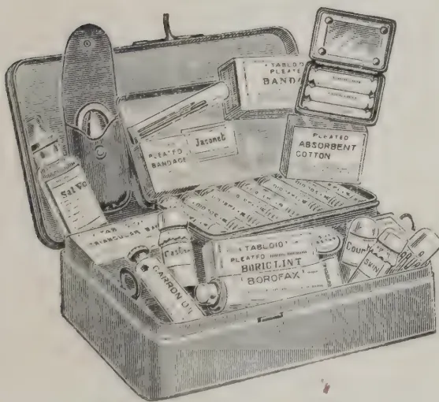

## Until the Doctor Comes.

Be prepared for accidents. Avoid the serious consequences which often follow neglect of wounds, etc.

### TRADE MARK 'TABLOID' BRAND FIRST-AID

Contains Bandages, Dressings, Antiseptics, Plasters, Emollients, Styptic, Emergency Medicines, and other first-aid requisites. Indispensable to all who travel or reside in out-of-the-way places.

No. 715. 'TABLOID' FIRST-AID. Size:  $7\frac{1}{2} \times 4\frac{1}{2} \times 2$  in.  
A very complete outfit. In enamelled metal.  
Of all the principal Chemists and Stores.  
Price in London, 10/6

BURROUGHS WELLCOME & CO., LONDON  
NEW YORK MONTREAL SYDNEY CAPE TOWN MILAN SHANGHAI  
BUENOS AIRES BOMBAY

xx 533All Rights Reserved

463------------------------------------------------

349[JUNE, 1913.

## HELPS AND HINDRANCES IN PHOTOGRAPHY.

A new photographic booklet bearing the above title has just been issued by Messrs. Burroughs, Welcome & Co. It contains a very succinct and at the same time interesting description of modern methods.

A picture of an African cocoa plantation serves to indicate the attractive brown tone which can be obtained by the use of 'Tabloid' Sèpia Toner. The print reproduced is from a negative developed with 'Tabloid' 'Rytol' by a lady Missionary when *en route* through the heart of Africa.

Working details of various toners are given including the 'Tabloid' Blue and Green Toners recently introduced. These are illustrated in colours, a particularly pleasing effect being reproduced from a print of a China jar toned with 'Tabloid' Blue Toner.

---

## BAMBOO FOR PAPER-MAKING.

The following account on the use of the bamboo for paper-making is taken from the *Indian Agriculturist*:—

The question of the feasibility of utilising bamboos for paper-making continues to be investigated with great energy and with all the expert skill which the Government of India have at their disposal. The latest contribution to the inquiry comes from Mr. R. S. Pearson, Economist at the Forest Research Institute, Dehra Dun. It is interesting to note, in passing, that one of the earliest publications on the subject of paper materials in India was that of an Indian, Mr. Hem Chunder Kerr, who wrote on "The Cultivation of Jute in Bengal, and Indian Fibres available for the manufacture of Paper." The expert examination of the possibilities of bamboo began, however, in 1906, when Mr. Sindall, a well-known authority on paper-making, made laboratory experiments in the production of pulp from bamboos and carried out valuable preliminary inquiries into the probable yield of various species of bamboo and also into the cost of manufacture. Bamboo, considered as a paper-making material, presented not a few difficulties. The nodes were at first found so intractable that it was thought that the only method of dealing with them was to cut them out. This process besides being difficult and costly, would have seriously reduced the manufacturing value of the bamboo. Another problem was that of discovering a cheap and efficient means of bleaching the pulp. These obstacles have been overcome, largely through the patient experiments of Mr. W. Raitt, who demonstrated that, if the bamboo is crushed, the nodes can be used as easily as the internodes. He also showed that, so far as laboratory work is concerned, the bleaching of bamboo pulp can be more satisfactorily effected with sulphate than with caustic soda.

Mr. Pearson's special duty has been to discover suitable areas for the establishment of factories, to ascertain the cost of obtaining bamboos in various localities, and to examine generally the commercial aspects of a

464------------------------------------------------

JUNE, 1913.]350

bamboo paper industry. In Mr. Pearson's note some sixty pages are occupied with the information which he has collected regarding the extent to which places in these areas meet the requirements of paper-making. It is not enough, however, to obtain areas which are now well supplied with bamboos. An equally important necessity is that the supply should be capable of being renewed with sufficient rapidity to keep a mill working to its full capacity. The disadvantage of wood and esparto grass as materials has been that their natural increase does not keep pace with the demand, and the source of the raw material thus becomes further and further removed from the factory. An extremely interesting section of Mr. Pearson's Report deals with the effect of cutting on the productivity of the bamboo. His conclusion, after inspecting many areas in which the felling of bamboos has been carried on for many years, is that in "cases where a clump has been heavily cut over, the number of new stems put out is reduced according to the intensity of cutting, but that ultimately the clump recovers, if given even a short period of rest." This impression is confirmed by the statements of two Conservators of Forests. In the Tharrawaddy division of Burma two areas were operated upon, the annual shoots being cut; but in both cases "the experiment failed to have any appreciable effect on the vitality of the clumps." In another experiment a plot was "practically cleared of bamboos and undergrowth" for two years in succession. Yet in the fourth year fresh clumps had risen, and bore four or five stems on each clump. It would be difficult to imagine a more conclusive proof of the stubborn vitality of the bamboo. Given, therefore, reasonable treatment, the supply may be considered to be inexhaustible, except for the effects of the periodical flowering, which is still a somewhat obscure function of the bamboo. The process appears to be erratic, but this fact affords some guarantee that all the species are not likely to flower at the same time, so that, even if the local supply should be temporarily cut off the raw material can be obtained elsewhere, though at an increased cost. As for the results of manufacturing on a commercial scale the experiments made by Messrs. Heilgers & Co., who are supplied with 80 tons of bamboos for the purpose, enable Mr. Pearson to affirm that, with liberal estimates for all kinds of outlay, the total cost of producing unbleached bamboo pulp works out at "Rs.32 per ton lower than that for imported unbleached spruce-sulphite, and Rs.24 per ton lower than the cost of producing unbleached Sabai grass pulp." These are figures which can hardly fail to attract the attention of capitalists.

## COMMISSIONER BOOTH-TUCKER ON SILK CULTURE IN CEYLON.

The Director of Agriculture has received a report on the Peradeniya Silk Farm which is under the management of the Salvation Army. The report is by Commissioner Booth Tucker from notes supplied by the Manager of the farm, Captain Jorgensen. We take the following from it:—

The Silk Farm at Peradeniya has been under the management of the Salvation Army for a period of about  $2\frac{1}{2}$  years.

465------------------------------------------------

351[JUNE, 1913.

The Farm consists of about 7 acres and the whole of this tract has been planted with Mulberry, demonstrating that it can easily be cultivated by any villager. There is no doubt that the mulberry will grow in either bush or tree form in any part of Ceylon. This has also been found to be the case all over India.

The two kinds of mulberry which have been found the most useful for silkworm cultivation are the *Morus alba* and the *Morus Indica*, but there are again many varieties of both.

Four varieties of mulberry trees are growing on the Farm, of which the Italian are the best as they give much larger leaves than the Indian; the bushes are more tender, and do not stand so much pruning as the Indian variety. The latter can be grown like tea bushes and pruned down four times a year; but bush mulberry requires better soil and more labour expended on them than the trees.

The situation of the Silk Farm is not very good for the purpose in view, as it is surrounded with tea gardens and work is plentiful and highly paid. On the other hand, as a training ground for Silk Students the situation is excellent.

I would also call attention to the fact that the Hungarian Government has made a specialty of utilising schools for the popularising of sericulture in Hungary with great success. Teachers in sericultural districts have to go through a short course of sericulture in order to enable them to teach the children. As a result of this policy, many tons of cocoons are now produced in agricultural districts where, a few years ago, the industry was absolutely unknown.

#### SPECIES OF SILKWORM CULTIVATED AT PERADENIYA.

The following species of silkworms have been cultivated at the Farm:—

i.—*French Silkworms Univoltine*.—The seed was obtained from a leading firm in France, was kept in cold storage at Simla and despatched to Peradeniya towards the end of December. (Some specimens of the cocoons are forwarded herewith.)

The following Indian varieties were also grown:—

ii.—*Barapalu*, Bengal Univoltine;

iii.—*Nistara*, Bengal Multivoltine, and

iv.—*Mysore*, Multivoltine.

The above varieties all feed on the Mulberry.

v.—*Eri Silkworms* were also cultivated, and were fed on Castor leaves.

(Specimens of the cocoons produced are forwarded herewith.)

It is worthy of note that the worms cultivated at the Farm matured in shorter periods than is usual in most places: the *Eri* in 18 days; the *Nistari* in 21 days; the *Barapalu* in 26 days; the *Mysore* in 30-32 days; the *French* in 30 days.

466------------------------------------------------

JUNE, 1913.]352

Experiments are also about to be made with the Muga silkworm. This is a native of Assam and feeds on various kinds of Laurel, Cinnamon, Banyan Peepul, etc.

The disadvantage at present of the Muga is that the silk is unknown to the European markets, but there appears no difficulty in disposing of it in India. The silk is brilliant and easily reeled and makes excellent cloth, which commands a ready sale in the Indian market.

The fact that the worm feeds on different varieties of leaves, and in particular that it appears to thrive on the cinnamon leaf, makes it probable that it would do well in Ceylon; and the brilliance of the silk and the fact that it is easily reeled, makes it probable that it will ultimately be more popular than the Eri and even more easy for cultivation.

While the Eri silk lacks lustre, it is very strong and is readily sold at a fair price. The worm itself is healthy, but the thread cannot be reeled. It is thought that this fact may make it more popular in the Buddhist portions of Ceylon, as the moths are allowed to escape and the thread is spun instead of being reeled. It should be remembered, however, that the same thing can be done with any kinds of cocoon. The pierced Mulberry cocoons command a better price than the pierced Eri cocoons, and there is no reason whatever why persons who object to the taking of life should not allow the moths to escape, as they would still be able to sell the pierced cocoons at a profit.

There is another point to remember in this connection and that is that persons who object to the taking of life can engage in the *Grainage* business and produce disease-free eggs for the market, instead of producing cocoons for reeling. In this case, again, the moths would be allowed to escape and the cocoons could still be sold as pierced cocoons. This is what is commonly known as the Grainage business and there seems every reason to believe that Ceylon would prove an excellent country for the production of disease free seed for the whole of the Orient.

#### MARKET FOR COCOONS.

Arrangements are now being made for starting a filature in Colombo in 'The Salvation Army Home for Vagrants.' There will probably also be a branch of this institution in Kandy and possibly elsewhere. Thus there will be a home market for all the cocoons that can be produced in the Island and it is probable that this will give an impetus to the industry.

The silk will not only be reeled but twisted and woven and, in the course of time, also dyed. Thus the different processes can be taught to students without any necessity for their leaving the Island.

At the same time it must be remembered that owing to the increased demand for labour and the high wages paid, the silk Industry has many difficulties to contend with in Ceylon which it does not possess in less favoured localities, and time and patience will be requisite for the introduction of the industry throughout the country.

467------------------------------------------------

353[JUNE 1913.

## ADVANTAGES OF GOOD CULTIVATION.

MR. B. G. BROOKS, Instructor in Agriculture, has contributed the following article to the *Queensland Agricultural Journal* of February, 1913:—In the successful raising of farm crops the management of the soil is of the greatest importance. It is only necessary to observe the variations in the yield of similar crops on adjoining fields to find that, were up-to-date methods more generally practised in the preparation of the soil, the returns per acre would be materially increased.

When a crop fails the cause is, unfortunately, too often set down to adverse climate conditions. Although the weather has undoubtedly a very important bearing upon crop production, yet it is not always responsible for the poor returns.

In my travels throughout the various districts of the State, I have ample opportunity of studying the respective methods practised in the raising of crops and the results obtained thereby.

It is not an infrequent occurrence to come across a farmer harvesting a very heavy crop on one side of the fence, while his neighbour on the other, on similar soil, is reaping practically a failure. It is, therefore, necessary to look to some cause other than the weather for this disparity. Perhaps there is some truth in the remark made by the farmer who was harvesting a fine crop while his neighbour was reaping a poor one. When asked the reason for the difference, his reply was, "I cultivated my soil—my neighbour irritates his."

The problem relating to soil fertility and crop production has received much attention from agricultural scientists during recent years, and although much has been achieved, there still remains a very large field for investigation. Much prominence has been given, both in Australia and America, to the raising of crops with a minimum amount of rainfall, and it must be admitted that marvellous results have already been secured by the adoption of the methods advocated.

The foundation stone upon which the success of the dry-farming system rests is fallowing—that is, keeping the soil cultivated and only taking a crop every alternate year.

So far, fallowing has received little or no attention in our State. On the other hand, the practice of securing two crops during the year is quite a general one, and this is undoubtedly, to a large extent, responsible for the low average yield obtained from some of our staple crops. I find that one of the most important factors in successful crop production is the early preparation of the land, but, with the system of double cropping just mentioned, this cannot be given effect to. I am not inferring that cultivation is carried out in a slipshod manner, for it may be that every care has been taken in ploughing and pulverising the soil to form the necessary seed bed, but, unless a certain period is allowed for the soil to "mature," or, in other words, to permit of the necessary plant food becoming available for the needs of the crop, it is impossible to secure a full return.

468------------------------------------------------

JUNE, 1913.]354

This point is not at all difficult to demonstrate. It is only necessary to take a quickly maturing crop, such as *Panicum*, and watch results. As an example, I will relate one experience of many I had, showing the effect of early and late preparation. In a field of 30 acres, 10 were ploughed four months; 10, two months; and 10, just previous to planting. The whole area was planted with *Panicum* at the same time. The result in green material cut for silage was:—for the four months, 12 tons per acre; for the two months, 6 tons per acre; and for the portion ploughed previous to planting, nil.

Although the weather was very favourable during the growing period, the seed on the freshly ploughed area practically refused to germinate—only a few small patches appearing where timber had been burned off. This failure of seed to germinate when sown in newly-ploughed land, more especially where the soil is of a stiff character, has often been observed. Germination will eventually take place, but it may be weeks or months later. Numerous examples of a similar nature were to be met with in the 1911 wheat crop, and to a lesser extent during the past season. In every district individual fields were to be met with giving a good yield, while adjoining areas were practically a failure. On investigation it was discovered that, in almost every instance, early preparation of the land was responsible for the successful returns.

---

## BRONCHO GRASS IN SOUTH AFRICA.

---

Amongst interesting notes by Mr. Joseph Burtt-Davy, F. L. S., in the December number of the Agricultural Journal of the Union of South Africa is one on the Broncho Grass (*Broncus maximus* Defs.), which it is said is killing the Lucerne in Oudtshoorn; and is otherwise a troublesome weed especially in regions of winter rainfall. In California it has monopolised thousands of acres of veldt, to the exclusion of other grasses and herbage, and although a good winter grower, furnishing a quantity of winter green stuff, this grass is not eaten by stock. As it becomes old, the long-barbed crowns get into the nostrils, mouths and eyes of the animals, often causing much damage, in addition to this it is injurious to the wool. From its hardy nature and drought-resisting qualities, it overtops and chokes out such of the finer and better grasses, as make less rapid growth. Mr. Burtt-Davy says:—"It is the growth of grasses of this character which has induced me to recommend drilling the Lucerne in rows about 9 inches apart, which allows a cultivator to clear out the grass to better advantage."—THE GARDENER'S CHRONICLE.

---

## ARTIFICIAL VANILLIN.

---

Vanillin, as its name implies, is the crystalline substance deposited on the outside of the pods or fruits of *Vanilla planifolia* in the course of preparation

469------------------------------------------------

355[JUNE, 1913.

for commerce. It is also found in other vegetable products, besides being produced artificially, chiefly from eugenol, which is the most important constituent of oil of Cloves. So that anything affecting the supply of Clove oil would naturally diminish the supply of vanillin; but, when phenol or carbolic acid is suggested as the substance to take its place, notwithstanding all the marvels of chemistry at the present day, it seems necessary that precaution should be taken, especially as the vanilla flavour for sweet-meats and confectionery is so popular at the present time.—THE GARDENER'S CHRONICLE.

## THE INHERITANCE OF FECUNDITY.

The following account is from the *Gardeners' Chronicle* of February 1913:— Few problems are of more practical importance to the plant-breeder and stock raiser than those which concern the inheritance of the capacity for producing large numbers of offspring. Yet, notwithstanding the great commercial value that a knowledge of the mode of inheritance of fecundity might have, there is a remarkable lack of experimental data on which to found a serviceable working hypothesis.

We know, it is true, not a little with respect to the effect of cross-breeding in increasing the yield of certain plants, and we know also from Darwin's experiments that continued self-fertilisation results, in certain cases, in a striking reduction in the number of seeds. Even these well known facts still await a scientific explanation, and beyond them our knowledge does not at present extend. Of a row of Peas, for example, we have no published information of the relative contributions made by the individual plants to the harvest. Nor may we say at present—even though it were shown that certain plants contribute more than their due share—that the degree of fecundity exhibited by individual plants is an hereditament. We are apt to assume the fact of a plant yielding more than the normal quota of seed is to be attributed to specially favourable conditions, and to regard such disparities of yield as we may observe among a group of pure-bred plants as the consequence of lack of uniformity in the conditions of soil and of air to which the plants have been exposed. In the absence of exact knowledge derived from definite experiment, such opinions are beyond the pale of criticism. To discuss them in the light of general knowledge is but to waste time and intelligence.

What is required is a careful statistical inquiry into the facts. Such an inquiry is bound to be tedious, but it is bound also to lead to interesting results, and it might give us conclusions of the highest practical importance to horticulture and agriculture. Recent experiments on the fecundity of fowls appear to show that this character is now less heritable than are those less elusive properties of the organism which are used generally by students of genetics as subjects for their inquiries. Mr. Daymond Pearl, to whom these experiments are due, has arrived at the following interesting conclusions with respect to the mode of inheritance of fecundity. A certain low average power of egg production depends on the presence in the hen of a single Mendelian factor, which he denotes by the letter *L1*. Given the power of producing eggs, that is, given a normal female, the number of eggs produced in a year will depend on the presence or absence of this factor.

470------------------------------------------------

JUNE, 1913.]356

If it be present the number will reach a certain maximum, e.g., a winter record of under 30 eggs. But for a bird to be a copious layer a second Mendelian factor must also be present. In other words, and denoting this latter factor by  $L_2$ , only birds of the constitution  $L_1 L_2$  possess a high degree of fecundity. Such  $L_1 L_2$  birds alone among the denizens of the fowl-run are capable of producing a winter record of more than 30 eggs.

Further, the mode of inheritance of these factors  $L_1 L_2$  is not identical and therein lies the fact that the fancier has not succeeded hitherto in raising races of hens guaranteed to be prolific. As he has discovered, good layers may beget indifferent layers, and from indifferent layers may proceed good layers. This arbitrary and disobliging behaviour is to be attributed to the curious mode of inheritance of the factor for high fecundity. According to Mr Pearl's observations the factor for femaleness ( $F$ ) and that for high fecundity ( $L_2$ ) cannot occur together in a sexual cell. The latter factor must therefore be supplied always by the male bird. Hence the task of the poultry raiser must be first to obtain males and females pure for  $L_1$ , for that is the factor which lays, as it were, the foundations of fecundity, and, second, to see that the male birds are pure for  $L_2$ , the factor which builds high fertility on the basis of  $L_1$ .

---

## SOME OF THE NEXT STEPS IN BOTANICAL SCIENCE.

*Nature* of January 30th reports in full the Address delivered by Professor C. E. Bessey before the American Association for the Advancement of Science at Cleveland, Ohio. The lecturer in dealing with the question of the future of botanical science said, "Let us turn now to the future of botanical science, and endeavour to trace its more profitable course of development during the next one or two decades. What are seemingly to be the demands of modern society upon this science? What are to be some of the next steps in its evolution? For whatever we may say in regard to the independence of science we cannot escape the fact that it must serve its 'day and generation.' No science can hope for support or recognition that does not respond to the demands of its age."

"My first inquiry may well concern itself with the content of botanical science in the immediate future. As we become better acquainted with it and recognise more clearly its relations to the activities of the community we shall be able to define its proper content with more accuracy. And let no man attempt to belittle the importance of such an undertaking. I am well aware of the impossibility of absolutely delimiting botany from every other science, and especially of doing so with reference to many of its applications, and I am fully aware of the fact that the limits of any science are subject to change with the progress of human knowledge. Now and then there must be a "rectification of the frontier" in respect to the boundaries of science. So without doubt we shall have to add to or subtract from the area now allotted to botany.

471------------------------------------------------

357[JUNE, 1913.

It still is true that the field of botany may be considered in three parts—structure, physiology and taxonomy. Beginning with such structures as are obvious to our unaided eyes, we have carried out studies to the minute structure of the tissues, and the cells which compose them. We are able now to peer into the protoplasmic recesses of the living cell, and while we cannot say that we have seen life, we have seen where life is, and what it does. Cytology, histology and morphology in our modern laboratories have greatly changed our conception of the structure of the plant. It is no longer made up of forms to be compared because of their general similarity of outline, or of position in the plant body. The plant as a whole is a community of variously differentiated living units, just as is each of its organs. It is a complex community in which there is a measure of individual independence of the units, along with much of mutual dependence.

"This leads me easily to that portion of the field of botany that has to do with the activities of plants and their organs, physiology—the scope of which has been so greatly extended in these later years. Here such inquiries as those pertaining to nutrition, growth, sensibility, reproduction, are of primary importance. The introduction of the experimental method of inquiry has made this a favourite department of the science. Who does not enjoy catching a plant, tying it up in a corner, and compelling it to do something, while we watch for the result? This kind of study appeals especially to those who are looking for demonstrations, and for this reason plant physiology has been increasingly popular. Some botanists, indeed, have gone so far as to insist upon giving first place to physiology. Yet it is well for us to remember that the plant is first of all a structure, the complexity of which may well challenge the most acute minds. We find it far easier to record the responses of plants to our planned stimuli than to unravel a structural complex, and so no doubt we shall continue to entertain ourselves and our students with what are too often futile experiments.

"In this part of the botanical field are pathology, which grew up from our observation that organs may not respond normally; ecology, which developed from the observation that plants tend to live in communities; and phytogeography, having to do with the means for, and the results of, distribution.

"Taxonomy, or as we used to call it, classification, occupying the third division of the field of botany, long received the almost exclusive attention of botanists. And even to-day it is the pretty general opinion of our non-botanical friends that we are constantly employed in collecting specimens, and in some intricate and mysterious way determining their classification and affixing to them their proper Latin names. And it must be admitted that every botanist does a good deal of just such work.

"When the doctrine of evolution came into botany it brought with it the idea of descent, and thereafter taxonomy included phylogeny. Today the taxonomist is no longer content to stop with a knowledge of the structural differences between plants; he must know how this structure arose from that; he must know which is the primitive structure and which the derived. Phylogeny has so far entered into taxonomy that it has given new meaning to

472------------------------------------------------

JUNE, 1913.]358

the work of the systematic botanist, and it is bringing into this department of the science something of the philosophical aspect which was nearly wanting heretofore. That this must be the direction of the development of the taxonomy of the future is without question, and we may look confidently for a marked expansion and enlargement of the phyletic idea in botanical taxonomy.

"Already we have stations for the study of plants under particular environments, as our seaside stations, our mountain stations, and a single desert station. I take it that these are suggestive of what are to come in the future. Instead of trying to make seaside conditions away from the sea, we go to the sea and there set up our laboratories. So when we want to know how plants behave in the desert we go to the desert. And this is no doubt to be the direction of botanical investigation. We are going to study plants under their natural environment, and to the seaside laboratories we shall add (as indeed we have already to a limited extent) lakeside laboratories, riverside laboratories, swamp laboratories, forest laboratories, field laboratories. Already the tropical laboratories in Java, Ceylon and Jamaica, have justified themselves, and no doubt to these we shall soon add Arctic and Tundra laboratories. All this signifies that more and more we are going to see what the plant is doing in its natural environment, and when we can undertake intelligently to watch it under a changed environment. So the future is to witness a great increase in the number of these laboratories, and how far it will go can only be conjectured."

## THE HUMANE SLAUGHTERING OF ANIMALS.

3, Lauder Road,

EDINBURGH, 15th February, 1913.

TO THE EDITOR OF THE "TROPICAL AGRICULTURIST."

DEAR SIR,

As Chairman of the Committee on Humane Slaughtering which has been holding its deliberations at 105 Jermyn Street, London, under the auspices of the R. S. P. C. A., and in view of the great demonstration of Humane Slaughtering to be given at Edinburgh Abattoir on 20th February, I have been asked to summarise and issue for general information, a short account of what has been done so far in this matter. I have therefore the pleasure to enclose you a brochure which gives the facts, and I sincerely hope that you will see your way to use this in your columns.

Yours faithfully,

LOUDON M. DOUGLAS.

473------------------------------------------------

359[JUNE, 1913.

## REPORT OF THE COMMITTEE.

Much attention has recently been directed to the methods adopted for the slaughtering of animals for food, and a strong case has been made out for reform in the methods at present in use. Hitherto the treatment of animals in public or private slaughter-houses has not attracted much attention, as it is a subject which has not appealed to the average refined taste. That, however, is an attitude which is regrettable, as the magnitude of the meat industry is such as to warrant very special control and regulation.

It will astonish a good many people to know that last year we consumed more than 1,000,000 tons of home-grown beef and mutton, a quantity running into many millions of cattle and sheep. In addition, it has been computed that we consumed well over three million home-grown pigs.

### ABATTOIRS.

Many of the animals referred to and indeed the large majority of them were handled in public abattoirs, but the percentage so dealt with was much greater in Scotland than in any other part of the United Kingdom, owing to the fact that the private abattoir has been almost entirely abolished throughout the country. Nearly all the Scottish Burghs in particular possess public abattoirs and, as a consequence, fully 90 per cent. of the meat supplied in these Burghs has passed through abattoirs which are thoroughly under control. It seems a very curious thing that there should be so much opposition in England and Wales to the establishment of the public abattoir system, considering that it has been so highly successful in Scotland.

### METHODS OF CONTROL.

It will be obvious that any general regulations which may come into force in connection with humane slaughtering will be more easily applied in the case of public abattoirs than in private establishments, as the control over the latter is much less effective than in the larger institutions. It is quite possible, for example, that local authorities in the Burghs may be authorised to impose regulations with regard to slaughtering, which would not apply to private slaughter houses outside these areas; this would therefore point to legislation being passed which would regulate slaughtering in every establishment where it is carried on.

### HISTORY OF THE SUBJECT.

The agitation in connection with humane slaughtering began about ten years ago, and it first of all resulted in the appointment of a Committee by the Admiralty to enquire into the whole subject. This Committee reported in 1904, and the following is a summary of the recommendations which they made:—

- (a) All animals, without exception, must be stunned, or otherwise rendered unconscious, before blood is drawn;

474------------------------------------------------

JUNE, 1913.]360

- (b) Animals awaiting slaughter must be so placed that they cannot see into the slaughter-house, and the doors of the latter must be kept closed whilst slaughtering is going on ;
- (c) The drainage of the slaughter-house must be so arranged that no blood or other refuse can flow out within sight or smell of animals awaiting slaughter, and no such refuse shall be deposited in proximity to the waiting-pens ;
- (d) If more animals than one are being slaughtered in one slaughter-house at the same time, they must not be within view of each other ;
- (e) None but licensed men shall be employed in or about slaughter-houses.

Since then the agitation has been continued, but there has been no attempt made to enforce any of these recommendations. A great advance, however, has been made through the action of the Royal Society for the Prevention of Cruelty to Animals in perfecting humane slaughtering instruments and in giving public demonstrations so as to convince all those interested that these instruments are preferable to the traditional weapons generally in use.

In 1911 a Bill was introduced into the House of Commons, having for its object the regulation of slaughter-houses throughout the United Kingdom, but it was not proceeded with and since then the Royal Society for the Prevention of Cruelty to Animals has carried on the work of education of the Meat Industry in this matter.

At the beginning of 1912 a Committee was formed, and met at the rooms of the Society at 105, Jermyn Street, London. The members of the Committee were as follows:—

Messrs. Christopher Cash, B.A., author of many works on humane slaughtering ; Wyndham Cottell, M. A., M. D. ; W. Gordon Barnes, M. R. C. V. S. Veterinary Inspector at Islington Abattoirs, London ; George Greenwood, M. P. ; Major W. Melville Lee ; Alderman John Lindsay, ex-President of the National Federation of Meat Traders ; R. D. Paddison ; Henry Toomer, President of the Southampton Meat Traders' Association ; and Loudon M. Douglas, F. R. S. E., of Edinburgh, Technical Adviser on Animal Industries, who was appointed Chairman. Mr. L. Y. Squire, of the R. S. P. C. A. acted as Honorary Secretary.

The various methods of slaughter by the modern humane instruments were fully investigated, and two demonstrations were arranged at Islington Abattoir, when the various weapons were used on cattle, sheep, and pigs. The general principle of all of these weapons is that a captive bolt is discharged with great force, either by means of a cartridge or a spring. The

475------------------------------------------------

361[JUNE, 1913.]

bolt penetrates the skull of the animal and instantly lacerates the brain thus producing unconsciousness. Another form of weapon, however, is the Ransom Killer, which uses compressed air as the propelling force, and the development of this appliance is due to the enterprise of the Council of Justice to Animals, a Society whose objects are somewhat similar to those of the R. S. P. C. A.

#### DEMONSTRATION IN EDINBURGH.

Following upon the demonstrations which have been given at Islington, it was recently decided by the R. S. P. C. A. that they would give a similar demonstration in Edinburgh at the Public Abattoir there. In this project they have met with the hearty co-operation of the Lord Provost and Magistrates, and the Town Council and Markets Committee have given every possible assistance in the organising of the Demonstration, which will take place at the Public Abattoir at Gorgie on the 20th inst. The principal organiser of the Demonstration is Mr. Councillor T. G. Fisher, and he has been ably assisted by Mr. James Cochrane, Superintendent of Markets. Representatives from the various Meat Trade Associations will be present, and already a large number of public men have intimated their intention of seeing the Demonstration for themselves. Humane slaughtering instruments of the different types will be used on cattle, sheep and pigs, and in order to demonstrate that there is no special skill required in using these instruments, they will be used by the slaughter-men attached to the Abattoir. It is hoped in this way to direct attention to the matter throughout Scotland and give a great impetus to what the promoters believe to be the cause of humanity.

---

## THE WAX PALM

### A New and Promising Cultivation of great importance to all Tropical Planters.

The Wax Palm (*Copernicia cerifera*) produces the valuable Carnauba Wax; this tree accommodates itself easily to climate and soil and can be interplanted with cotton, food or fodder plants, green manure, etc. To Coffee, Cocoa, Rubber, etc., it offers shade, but at the same time it allows sufficient light and air to pass to the trees below. Therefore the Wax Palm is not only a very useful but also a profitable acquisition.

For trials we supply on receipt of 7 shillings and 6 d., 75 seeds as sample of no value under registration, postage paid; on receipt of £1, we forward 10 lbs. seeds by parcel post, postage paid to all countries.

Detailed instructions for cultivation with every order.—

**GEVEKOHT & WEDEKIND, Hamburg 1.**

476------------------------------------------------

JUNE, 1913.]362

## THE LOW-COUNTRY PRODUCT ASSOCIATION OF CEYLON.

The annual report of this progressive body for 1912 is to hand, and contains a very full review of the past year's agricultural history of the Island.

The total membership of the Association now stands at 156, and will no doubt increase steadily.

The crops *par excellence* generally associated with the low country and which is the special care of the Association is the coconut, and the greater part of the report is naturally devoted to it. Other subjects dealt with are rubber, plumbago, cinnamon, and excise reforms, &c.

Visitors to the All-Ceylon Exhibition held in Colombo last year will recall the excellent display made by the Association. A resumé of the work done in this connection shows how well it played its part at this—the greatest show in the history of the Island.

We take the liberty of taking a number of extracts from this useful report, and take this opportunity of congratulating the Association on the valuable work it has done. [This had been unavoidably held over from an earlier issue.]

## FARMERS OF FORTY CENTURIES.

By Mr. H. F. KING.

The chief object in this book by F. H. KING on agriculture in China, Korea and Japan is to show what soil is really capable of producing provided unremitting care and plant-food is lavished upon it. And the results are certainly astonishing as are the wonderful ways and means by which every scrap of waste, either animal or vegetable, is collected and stored up to be returned to the soil. In China with its swarming millions of population, where families are large and holding small, the strictest economy in all the branches of life have to be rigidly practised or famine stares them in the face. Roads are made the least possible width; banks between rice fields are made to bear crops of beans or peas; ridges are so arranged that they can be planted on both sides as well as in between; fruit trees are trained so as to take up the least possible room and at the same time producing the greatest possible number of fruit-bearing branches; whenever possible a second crop is sown in the first in order to save time such as cotton planted in the wheat, or clover in the rice or barley.

Sometimes there will be even triple crops growing at once such as wheat ready to harvest, beans two-thirds grown and cotton just planted. Even ponds are made to take their part, being either used to breed and fatten fish in or periodically drained and the rich vegetable deposit at the bottom used for compost.

These composts form a very important part of Chinese plant-food economy and are either formed by making pits in any waste corner of a field—preferably beside a canal or pond—and into it are thrown any coarse manure, ashes, roughage in the form of stubble, leaves, weeds, or other refuse on which is poured the liquid mud or ooze from canal or pond. When full

477------------------------------------------------

363[JUNE, 1913.

and well rotted it is transported to the fields. Another very useful purpose these pits serve is that by reason of the field draining into it they catch all the surface washing preserving them to be returned to the soil, instead of being washed out to sea and lost.

Another form of compost is obtained by making a stack of alternate layers of fresh clover or any other leguminous crop and liquid mud and plastering the whole carefully over with mud and leaving it to rot.

In Japan a somewhat more complicated form of compost is made by erecting a small building with a water-tight floor. In one half of the building the stack of greenstuff, straw or leaves and liquid mud is built up and kept moist to maintain a temperature below that of the body. Left to stand six weeks, it is then forked over to the other side and left for another period before it is ready for the fields.

Green manure is applied in the form of clover generally sown in rice or barley and after one or two cuts ploughed in. For vegetable gardens liquid manure is greatly used, receptacles are constructed for the reception of annual excrement which is soaked and then fed to the plants in a diluted form. Some of the photographs with which the book is profusely illustrated, show the wonderful size and great variety of the vegetables that answer to this careful treatment. The author gives a list of nearly seventy varieties of vegetables he saw exposed for sale in one market alone—a collection which would surely put Covent Garden to shame.

Naturally with all this great expenditure of labour and plant-food large returns are expected and besides the two crops of rice grown each year another crop or even two, of cabbage, rape, peas or beans, are obtained from the land making 3 or 4 crops a year from the same field.

One thing the author particularly notices and that is the scarcity of flies which he attributes to this constant clearing up and usage of all waste and garbage the breeding place of these plague-carrying pests. Therefore the general health of the people should benefit greatly.

In some countries, as for example Egypt, where flies swarm and in consequence ophthalmia is paramount, the filth lying around and in the villages is indescribable. The fellah makes no attempt at the systematic collection of human or cattle waste such as the Chinese practise, but wherever the filth of generations happens to collect, it is removed and spread on the fields. But in Egypt they have great villages consisting mainly of pigeon-cots for the collection of the valuable guano and of this practice existing in China the author makes no mention.

As regards rice cultivation, transplanting seems to be the method chiefly in vogue although according to the author's statistics the yield seems to be no greater than that obtained in Egypt where the rice is sown broadcast. In Egypt Japanese rice will yield 80 bushels to the acre which is apparently only the best it can do in Japan and China when highly fertilized together with the added cost of labour for transplanting.

Straw and roots are greatly used as a fertilizer by laying it between the rows of rice and trampling it with the feet into the soft mud to rot.

478------------------------------------------------

JUNE, 1913.]364

There is a chapter with useful hints on silk culture and another on tea. Straw, leaves and weeds are used in Japan as a heavy mulch all over hill-side tea, to prevent soil wash, conserve moisture, to help the rain to enter the soil uniformly, and to act as a fertilizer when rotted.

The author thinks tea has an assured future, what with the increasing population of the West and of Colonies such as Australia and New Zealand where tea cannot be grown and where poor or foreign immigrants who could not afford and were not used to tea, are becoming rich enough to afford it and by contact with tea-drinkers acquiring the taste for it. Especially is this the case in cold countries such as America and Canada, where hot drink is such a compost and necessity. The origin of tea-making the author traces as far back as 2,000 B.C. and to the hygenic need of rendering boiled water palatable for drinking purposes.

One of the chief objects of the book seems to be to warn big and growing countries such as the United States, which may in the future have a great population to support, to endeavour in some way to save the enormous waste of soil-wash carried away to the sea by such great rivers as the Mississippi, whence neither money nor prayer can recall it.

The book contains many most useful hints to the small farmer, the vegetable grower and gardener, in making little yield much and in the economy of all waste; the moral of the book, learnt from the East, undoubtedly being "Waste not, want not!"

D. S. C.

## AMBERGRIS FINDS.

CHRISTCHURCH (New Zealand), Jan. 1913.

What is described as a record lump of ambergris (a secretion in the bodies of whales resulting from disease) has been discovered by Captain Larsen of the steam whaler "NORVEGIA." Ambergris, which is sometimes found floating in the sea, is highly valued as a basis in perfumery. An enormous whale was harpooned by a boat's crew, and nearly half a ton of the precious substance was taken from its body. An expert chemist has pronounced it to be real ambergris and worth about 60,000*l.*—*DAILY MAIL*, February 19.

Christchurch, N. Z., February 18,—The whaler "NORVEGIA," which arrived here to-day made a great strike. From the whales which she captured the crew obtained nearly half a ton of ambergris, which is believed to break all records. It is stated that the ambergris is worth \$300,000.—*N. Y. COMMERCIAL*.

These paragraphs are interesting; first, as showing how some American newspapers get their cabled news, and second, to the perfumery and drug markets. If the find of ambergris weighs half a ton, it is the biggest thing of the kind that has ever been known; but we do not believe it is so heavy as 17,920 oz.; the alleged price, 60,000*l.* indicates about half that weight, and a liberal discount would need to be allowed off that. One thing is certain: that the authentic history of any big find of ambergris is not learnt

479------------------------------------------------

365[JUNE, 1913.

until it has all been disposed of in such a way as not to disturb the market. We have from time to time reported on these finds—*e.g.*, in the *C. & D.*, 1891, II., 587, and in the following issue the story was told by a broker how he received and sold a barrel of ambergis weighing 3 cwt. (5,376 oz.). The last big find was on March 5, 1911, when 160 lb. was collected, but not in one piece.

Ambergis is a subject of perennial interest, but as regards its origin little more is known to-day than was known in the eighteenth century, as the following reprint of an official document of that period shows:—

#### ON THE PRODUCTION OF AMBERGRIS.

A communication from the Committee of Council appointed for the consideration of all matters relating to Trade and Foreign Plantations; with a prefatory letter from William Fawkener, Esq., to Sir Joseph Banks, Bart., P.R.S.

Read January 20, 1791.

To SIR JOSEPH BANKS, Bart,

Office of Committee of Privy Council for Trade,

Whitehall, 15th January, 1791.

SIR,—Lord Hawkesbury, President of the Committee of Privy Council appointed for the consideration of all matters relating to Trade and Foreign Plantations, having received a letter from Mr. Champion, a Principal Merchant concerned in the Southern Whale Fishery, informing him that a ship belonging to him had lately arrived from the said fishery which had brought him home 362 ounces of ambergis, found by Mr. Coffin, captain of the said ship, in the body of a female spermaceti whale, taken on the coast of Guinea, his Lordship thought fit to desire Captain Coffin, as well as Mr. Champion, to attend the Lords of the Committee, that they might be examined concerning all the circumstances of the fact before mentioned; and I am directed by their Lordships to transmit to you a copy of the examination of these two gentlemen that you may communicate the same to the Royal Society, if you should think that any of the circumstances stated in this examination will contribute to remove the doubts hitherto entertained concerning the natural history and production of this valuable drug. I send you also a piece of the ambergis so taken out of the whale, and some of the bills of the fish, called squids (which are supposed to be the food of spermaceti whales), and which were found partly in the ambergis taken from this female whale and partly on the outside of it and adhering to it.

I have the honour to be, etc.,

W. FAWKENER.

At the Council Chamber, Whitehall, the 12th January, 1791.

By the Lords of the Committee of Council appointed for the consideration of all matters relating to Trade and Foreign Plantations.

Read—Letter from Mr. Alexander Champion, a principal merchant concerned in the Southern Whale Fishery, to Lord Hawkesbury, dated the 2nd instant, acquainting his Lordship that Captain Joshua Coffin, of the ship The Lord Hawkesbury, lately arrived from the Southern Whale fishery;

480------------------------------------------------

JUNE, 1913.]366

and that the said ship, besides a cargo of 76 tons of spermaceti oil and head-matter, has brought home about 360 ounces of ambergis, which the said captain took out of the body of a female spermaceti whale on the Coast of Guinea.

Messrs. Champion and Coffin attending, were then called in, and the following questions were put to Mr. Coffin, viz :

*Q.* Have any of the whales, taken before by ships sailing from Great Britain, to your knowledge, contained any ambergis?—*A.* None that I ever heard of. The American ships have, at times, found some.

*Q.* Was the ambergis found by you found in a bull or cow fish?—*A.* It was found in a cow fish.

*Q.* Is it usual to look for ambergis in whales that are killed?—*A.* It has not hitherto been much the practice to do so.

*Q.* How happened it that you discovered this?—*A.* We saw it come out of the fundament of the whale; as we were cutting the blubber a piece of it swam upon the surface of the sea.

*Q.* In what part of the whale did you find the remainder?—*A.* Some more was in the same passage, and the rest was contained in a bag a little below the passage and communicating with it.

*Q.* Did the whale appear to be in health?—*A.* No, she did not. She seemed sickly, had no flesh on her bones, and was very old, as appears by the teeth, two of which I have. Though she was about thirty-five feet long, she did not produce above one ton and a half of oil. A fish of the same size, in good health, would have produced two tons and a half.

*Q.* Have you observed the food that whales generally feed on?—*A.* The spermaceti whale feeds, as I believe, almost wholly upon a fish called squid. I have often seen a whale, when dying, bring up a quantity of squid, sometimes whole, and sometimes pieces of it. The bills of the squid (some of which Mr. Coffin produced) were found, some in the inside, and some on the outside of the ambergis, sticking to it.

*Q.* Did you ever find any ambergis floating on the sea?—*A.* I never did, but others frequently have.

*Q.* How long have you been engaged in the whale fishery?—*A.* It is about sixteen years since I first entered into it.

*Q.* What is the general proportion of cow and bull whales you have met with?—*A.* I believe the proportion to be nearly equal. In my last voyage, however, I found only four bulls out of thirty-five whales. I fished upon the coast of Africa between five North and seven South degrees of Latitude. I am inclined to think that the cow whale goes to calve in the low latitudes, which accounts for more cows being found in those latitudes.

*Q.* Is there any particular season when the cow whales calve?—*A.* I do not know that there is.

*Q.* Does the bull or cow whale, in proportion to their size, produce the most oil?—*A.* The cow whale, when big with calf, produces more oil than a bull of the same size; when sucking she produces less.

481------------------------------------------------

367[JUNE, 1913.

Q. Are the whales usually found singly, or in pairs, or in large numbers?—A. Usually in large numbers, which we call schools (*sic*), and particularly in the low latitudes. I have seen from fifteen to perhaps a thousand together.

Q. Have you any further information on this subject to give to the Committee?—A. We have generally observed that the spermaceti whale, when struck, voids her excrement; if she does not, we conclude that she has ambergris in her. I think ambergris most likely to be found in a sickly fish; for I consider it to be the effect or cause of some disorder.

*Questions put to Mr. Champion.*

Q. At what price does ambergris usually sell; and at what price did that taken by your ship sell?—A. A small quantity had lately sold at 25s. per ounce; but it was then very scarce. Mine sold for 19s. 9d. per ounce. The whole quantity found in this whale was 362 ounces Troy. The people who bought it told me this was a larger quantity than was ever before brought at once to market. It has generally been sold at about 4 or 5 pounds at a time.

Q. For the use of what country was this ambergris bought?—A. I do not exactly know. It was bought by a broker, who told me that his principal, who purchased about one-half, bought it for exportation to Turkey, Germany, and France. The other half was purchased by the druggists in town.

---

## INDIAN ITEMS.

The Journal of the Madras Agricultural Students' Union (a new quarterly) published in connection with the Coimbatore College should prove a useful medium for transmitting agricultural information, and for discussing local agricultural topics.

From it we cull the following news items:—

The first provincial Co-operative Conference was opened by the Governor of Madras on the 21st December last.

Mr. D. T. Chadwick, I.C.S., has assumed charge of the Office of Director of Agriculture.

Mr. T. B. Fletcher, F. Z. S., F. E. S. has succeeded Mr. Lefroy (now Professor of Entomology, South Kensington College of Science) as Imperial Entomologist.

In accordance with a resolution by the Board of Agriculture, a Sugarcane breeding station for all India has been established at Chettipalayam, about a mile away from the Coimbatore Farm. Dr. Barber, Government Botanist, has been appointed as the expert in charge on a salary of Rs.1,500/- per mensem for a period of 5 years, and has been given the following staff—an assistant Chemist, assistant Botanist, Farm Manager, Asst. Manager, and two fieldmen. A sum of Rs.65,000 has been voted for the work which has already begun.

482------------------------------------------------

JUNE, 1913.]368

## DEPARTMENT OF AGRICULTURE, BARBADOES.

The report of the Superintendent of this department (Mr. Bovell) for 1911-12 is largely taken up with a review of the work done in connection with sugar-cane and cotton improvement.

The method of packing cane cuttings in damp charcoal has proved very successful, as proved by a shipment which took 136 days to reach its destination.

Cotton experiments for improving quality of staple and quantity of produce have been continued. This work is chiefly done by selection of the best plants for seed, viz., those which are healthy, vigorous and cone-shaped, from four to six feet high, compact in habit with the central stalk having numerous lateral branches, short internodes and bolls at almost every internode. These are marked, and when the flowers are sufficiently matured, a number of bolls are bagged to prevent cross-fertilization. Later on, the bolls are examined to see which produce lint of the best length of staple.

The export of fruit to the United Kingdom is considerable. We read that 102 crates of mangoes containing 10,786 fruit, were sent out, and that these gave a nett profit to the shippers, after paying all expenses of  $2\frac{1}{2}$  cts. each.

The staff has been strengthened by the appointment of Mr. W. Nowel who has specialised in Entomology and Mycology at the Royal College of Science, London, as assistant Superintendent of Agriculture.

## NYASALAND PLANT PROTECTION REGULATIONS.

Under the "Plants Protection Ordinance, 1912," the Nyasaland Government has recently published import regulations to prevent the introduction of insect pests and fungus diseases.

The importation of cotton plants is prohibited, with the exception of cotton plants grown in Egypt, and cotton plants imported for experimental purposes by the Director of Agriculture, and packed in double bags or tins.

The importation of plants in general is subject to the following regulations:—

1. 1. Every package containing plants imported into the Protectorate through the medium of the Post shall contain a statement containing the full names of the kind and variety, the country of origin, and the name and address of the

483------------------------------------------------

369[JUNE, 1913.]

person or firm supplying such plants together with any certificate which may be prescribed by Schedules A or B. Such package shall be delivered by the Postal Department to the Agricultural Department, Zomba, for inspection and disinfection, if necessary. Such package shall, if in order, be delivered to the Post Office to be forwarded to the addressee without further postal charge. Any package of plants which does not contain the requisite statement and certificate, shall be liable to be confiscated or otherwise dealt with, as the Agricultural authority may determine.

2. When plants are intended to be imported, otherwise than through the medium of the Post, a statement containing the full names and the kind and variety, the country of origin and the name and address of the person or firm, supplying such plants together with any certificate which may be prescribed by Schedules A or B, shall be posted to the Controller of Customs. Such statement and certificate shall be despatched by the consignor in sufficient time to enable it to reach the Controller of Customs one month in advance of the consignment. Plants which reach the Port of Entry, for which the necessary statement and certificate have not been received shall be detained, pending the receipt of the statement and certificate as aforesaid, and if such are not received within one month subsequent to the arrival of the plants, the whole consignment shall be liable to be confiscated or otherwise dealt with, as the Agricultural authority may determine. When plants are imported by persons entering the Protectorate, the importer shall declare the same to the Customs Officer, giving the information required above, and producing the certificate which may be prescribed by Schedules A or B. In the event of the statement and certificate being in order, all plants shall be disinfected, if considered necessary by the Agricultural authority at the Port of Entry, and allowed to proceed. Should any statement or certificate prove to be incorrect, the whole consignment shall be liable to be confiscated.

3. All plants shall be securely packed, and should any package become so damaged in the course of transit as to render it possible that any plant may escape therefrom, such package and any plant therein or therefrom, may at the discretion of the Agricultural authority be confiscated.

Schedule A, referred to above, enumerates those plants which may be imported only on production of a certificate from the Official Agricultural authority of the country from which the plants originated to the effect that they have been grown in areas known to be "free from diseases or pest, which characteristically attack such plants." At present it includes "Rubber of all varieties, Cacao, Coconuts, Rice, Tobacco, Potatoes, from all countries."

Schedule B enumerates plants which may be imported only if the permission of the Nyasaland Agricultural authority is first obtained. These at present are Coffee and Tea.

484------------------------------------------------

JUNE, 1913.]370

## AGRICULTURE IN THE UNITED STATES.

### A COMMISSION TO VISIT EUROPE.

Great interest is felt in the announcement reported in a recent telegram, that a large American country life Commission will, next summer, visit Europe and Ireland. The terms of reference under which the Commission will work are as follows :—

To inquire into the business organizations of agriculture in Europe. To examine the methods employed by progressive agricultural communities in production and marketing, and in the financing of both operations, noting—(a) the parts played respectively in the promotion of agriculture by Governments and by voluntary organizations of the agricultural classes; (b) the application of the co-operative system to agricultural production, distribution, and finance; (c) the effect of co-operative action upon social conditions in rural communities; (d) the relation of the cost of living to the organization of the food-producing classes.

The programme is supported by all who have given American agricultural conditions serious and unbiased thought. It has been blessed by politicians of such different colours as the President, the ex-President, and Mr. Roosevelt. The movement of which it is the outcome, is indeed, of vast importance. It signifies a great change in national feeling. Even to admit the possibilities of rural co-operation is to confess readiness to jettison those principles of individualism and *laissez faire*, which have been a dominant factor in Anglo-Saxon agriculture in general and in Transatlantic agriculture in particular. Until lately the resources of the soil were deemed to be inexhaustible. If the farmer got tired of his farm he could try his hand at another trade; if he had worked it out, he could take up some other land. It was the same with agriculture as with other national activities. Politics and legislation, the factory and the forest, the mine and the farm were all exploited without thought for the future. It was a state of affairs that could not last, and a marked feature of America's political and economic history during the last decade has been the efforts of the people to end it.

### RURAL REFORMS REQUIRED.

From the broad national point of view the need for rural reform is perhaps even more urgent than the need for all that commonly goes by the name of social and industrial reform. It is, at any rate, the reform in which for obvious reasons, the outside world, and especially the English-speaking races, are most closely interested. The total increase in population was during the last decade 21 per cent., but while the urban population grew by 34·8 per cent., the rural community grew by only 11·2 per cent. The showing of the country side would be even worse were it not for the Far West, where the

485------------------------------------------------

371[JUNE, 1913.

era of colonization has not yet closed. In Gowa, Missouri, and some of the States of the Middle West, the agricultural stronghold of the country, the rural population has actually dwindled. In New England and the middle Atlantic States, there has been practically no growth of rural communities to compensate for an urban industrial growth that has been mainly due to an influx of socially undesirable aliens. Had the average of agricultural productivity increased, these statistics would lose some of their point ; but it has not increased. In 1899, 1900, and 1901 the average yield of an acre of corn was 25.3, 28.1, and 25.3 bushels ; in 1909, 1910, and 1911 the figures were 25.9, 27.7, and 23.9, in spite of exceptionally good seasons. That the production of corn has not fallen is due to the fact, that there has been a 20 per cent. increase in the acreage devoted to it. In regard to the more important wheat crop, the stagnation has been absolute. Productivity has not increased, averaging for the decade 14 bushels per acre, as compared with 29 bushels for Germany, 20.3 for France, and 33.0 for England. The area of cultivation remains stable, varying from year to year between 45 and 49 million acres.

#### DIMINISHED SUPPLIES AND EXPORTS.

Much the same story is told by the live stock returns. In 1910 there were roughly 62,000,000 cattle, 58,000,000 swine, and 52,000,000 sheep on the farms, whereas ten years earlier there had been 68,000,000 cattle, 62,500,000 swine, and 61,500,000 sheep. The direct result of all this is that the United States, while still but half inhabited according to old world standards, are in danger of having to go abroad for their food. They have as the following official report shows, already forfeited their claim to be one of the great granaries and food stores of the world.

The rapid disappearance of meats and breadstuffs from exports of the United States is sharply illustrated by the figures of the calendar of 1912. They show, for example, an exportation of but 33,000 cattle in the calendar year 1912, against 164,000 in 1911, 277,000 in 1908, 494,000 in 1906 and 599,000 in 1904.

The value of the cattle exports of 1912 was but \$3,000,000 (£600,000), speaking in round terms, against \$14,000,000 (£2,800,000) in 1911, and \$24,000,000 in 1908, \$38,000,000 in 1906, and \$41,000,000 in 1904, the 1912 exports being thus about 8 per cent. of the value of those exported in 1904, eight years earlier. The diminution in the cattle supply of the United States is also apparent in the fact that the importations of cattle in the year just ended amounted to over 3,000,000 in number, and their value to over \$5,000,000, against but 16,000 in 1904, valued at \$310,000. The figures of the Department of Agriculture showing the number of cattle on farms on January 1st, of each year place the number on January 1, 1912, at 58,000,000, against 72,500,000, in 1907.

486------------------------------------------------

JUNE, 1913.]372

The exports of meat show a marked falling off, especially those of fresh beef, of which the exports of the year were but 9,000,000 lb., against 29,000,000 in 1906, and 354,000,000 in 1901, the fresh beef exports of 1912 being less than 3 per cent. of those of 1901. In other meats there is a marked decline, though less proportionately than that in fresh beef. The total value of meat and dairy products exported in the year, approximated \$145,000,000 (£29,000,000) against \$181,000,000 (£36,200,000) in 1908 and \$209,000,000 (£41,800,000) in 1906.

Breadstuffs exported in 1912, while showing a larger total than in 1911, are far below those of earlier years, the total for the calendar year 1912 approximating \$165,000,000 (£33,000,000), against \$215,000,000 (£43,000,000) in 1907 and \$277,000,000 (£55,400,000) in 1901.

In 1900, to put the comparison on the basis of the Census figures, breadstuffs and foodstuffs constituted 40 per cent., and 10.8 per cent. of total exports, and in 1910, 21.5 per cent. and 7.6 per cent.

But enough has been said to establish the importance of the rural reform movement. If American civilization is not to become one-sided, if commercial and social development is to be orderly, the tendency towards excessive urbanism must be checked, and the productivity of the soil must be enhanced. It is illogical that the United States should already be confronted with the problems of an overcrowded industrial State; that their towns should be filled with an undigested, underpaid, and restless proletariat, while their farms are short of labour, and the acreage of unimproved land runs into hundreds of thousands. Nor is the public any longer unaware of the dangers and inconveniences of the situation. There has been a widespread tendency, during the past year to shift the blame for high prices, from the tariff to the farm, and contemporary industrial unrest has made of "excessive urbanism" a national bogey. Unfortunately, as will be shown in another article, the movement has yet to crystallize into a definite and accepted plan.—THE MAIL,

## LOAN BANKS IN JAMAICA.

At the time of publishing the December Journal, the matter of the Government furnishing loans to planters who have suffered much loss by the storm, some indeed in the west end, their all except their land, was under consideration. It has since been decided on, that this will be done to small settlers who are free-holders, through local Loan Banks. Large planters will be able to borrow direct from the Government. As it obviously requires some kind of organization to deal with loans, on a wide scale to small settlers, and plainly, organizations whose managers will be closely in touch

487------------------------------------------------

373[JUNE, 1913]

with those borrowing, intimately acquainted with them and their circumstances, will be most useful. It has been decided to use the existing organizations of local Loan Banks established mostly by the members of our local Branch Societies, yet distinct from these, and where these do not at present exist, to establish them and get them organized with the greatest possible expedition. To do this, the Government in a comprehensive and practical way, a way well calculated to meet an emergency like the present circumstances of planters, (and be ready to meet any future emergency of a similar nature), a simple yet most efficient way it seems to us if properly worked, proposed to amend the recently passed Agricultural Loan Societies Law (published in the Journal for August page 435) so that capital furnished by members of the Bank may be dispensed with at first. At a special meeting of the Legislative Council held in the middle of December, a fresh Law entitled "The Agricultural Societies (Special Loans) Law," was passed.

Loan Banks, without Government aid, require the members to take shares, say of £5 each, and if there are 50 members that is a capital of £250. All the members would not require loans at one time of course, or if they all did want them, the loans are granted in priority of time of lodging of application, and if funds are insufficient for all, small loans have priority over large loans.

So from the £250 loans, to help members in need, may be given out. One man may require £5 to buy a heifer, another £20 to buy a shaft mule, another £8 to plant an acre of bananas, another £20 to help build a house. This system, entirely one of local co-operation, the best system in theory and the most independent and admirable, is a very slow one where small land owners are mostly poor and conservative, slow to understand and adopt ideas and projects new to them. The Loan Banks Law passed last May was an endeavour to get such banks in general operation sooner than if districts were left to themselves.

Under the Agricultural Loan Societies Law referred to, (the Law passed an May last) the Government could advance a local Loan Bank, duly organized, up to two-thirds of its share capital without the shares being actually paid up in cash by members. In this way, banks could have been easily and quickly established.

The Government and Legislative Council, amended that Law. The amended Law is, shortly :—

1. 1. That Loans will only be given through an Agricultural Bank which must be organized, and only members can borrow from it.
2. 2. That the local Loan Bank can borrow from the Government up to twenty times its share capital, i. e., if members take shares up to £100, the bank could borrow if need be £2,000 on that capital.

488------------------------------------------------

JUNE, 1913.]374

1. 3. That each borrower must take shares equal to one twentieth of his proposed loan i.e., a man wanting a loan, of £100 would require to take shares to the value of £5. A man borrowing £20 would require to hold at least one share. Banks may make their shares £5, but not less than £1.
2. 4. That these shares do not require to be paid cash down, but can be paid at the rate of 2 per cent. per share per month. A man with a £5 share would thus be called upon to pay 2s. per month until his £5 was paid up. Of course those who can pay up at once can do so.
3. 5. Security in value must be given for the loan borrowed. A man borrowing £20 would give his land crops in security up to that value.
4. 6. No man can borrow more than he has value in security for. The total amount that may be borrowed by one person is £200.
5. 7. Interest at the rate of 6 per cent. per annum, must be paid on the amount borrowed.
6. 8. That two years is given for repayment of the loan.

The whole organization of the Loan Banks is separate and distinct from the Jamaica Agricultural Society, and is placed under a new Board called the Agricultural Loan Societies Board.

## WASTE ON THE PLANTATION.

Waste on the farms totals a sum almost unthinkable in its magnitude. It is true that under present conditions, much of the waste cannot be helped. But a good eagle lost through a hole in the pocket is as much a loss as one deliberately tossed into the sea. The remedy would be to locate the hole and sew it up. Not long ago the Agricultural Commissioner of the Rock Island system, published the statement that cornstalks made into ensilage were worth 60 per cent. of the value of the grain, and that by wasting their stalks the farmers were losing \$1,000,000,000 a year. It would not be necessary to look further, if one were after an illustration of agricultural suicide. But another instance can be seen in the present wasteful system of ginning and baling cotton, together costing the planters an unnecessary \$10 a bale, which on the crop of 1912 would aggregate at least \$135,000,000. Many good farmers have their seed plots and cross fertilize their seed plants with the care shown by a breeder of race horses. But the majority shovel their seed from the bin at planting time, sell the large potatoes and plant the little culls. Applying to the crops of 1912, merely the difference in yield estimated by the Department of Agriculture [U. S. A.] between the use of heavy-weight and light weight seed, this would make a difference of \$750,000,000. The Department of Agriculture is sponsor for the statement that 1,000,000 tons of tow could be saved from the flax straw that is now burned. In the grain States after threshing, the straw is burned to get rid of it; \$70,000,000 gone up in smoke!—BRADSTREET'S.

489------------------------------------------------

375[JUNE, 1913.

## ANGORA GOATS IN THE UNITED STATES.

There are a million Angora goats in America, and yet we import annually over 30 per cent. of the mohair used in our domestic manufactories. The banner goat farm of America is located in Texas and numbers 10,000 head of grade and pure bred Angoras. Last year the owner of this ranch realised a nett profit of \$1 per animal from his flock. There are several other pretentious goat farms throughout New Mexico, California and Oregon. The largest goat ranch in the Mississippi valley has 2,000 head, but the average flock in this country, is from 100 to 500 animals. The custom is to shear the goats early in April. Ordinary hair sells from 35 to 55 cents a pound. This common grade of mohair, which commands no especially high price, is that whose length is less than twelve inches; the ordinary fleece of one year's growth measures about ten inches in length. The average mature doe will shear from six to nine pounds of mohair each year, while the full-grown buck will yield from ten to fifteen pounds. Previous to shearing, the flock is graded into classes of does, bucks, kids and wethers. The fleeces are marketed according to their classification. The American Angora Goat Association, maintains a special mohair warehouse in Boston where the fleeces of practically all the Angoras in this country are marketed. At this depôt the fleeces are carefully cleaned, regraded if necessary, and baled ready for consignment to the manufacturing plants, where the raw mohair is converted into clothing, rugs, book bindings, shoes and gloves. One very beautiful fleece which was twenty-two inches in length sold for \$6.50 a pound, the record price for raw mohair in this country. Four dollars a pound is about the ordinary top figure.—FARM AND FIRESIDE.

## FOOT-AND-MOUTH DISEASE.

### DANGER OF HAY AND STRAW PACKING.

The Board of Agriculture and Fisheries desire to call attention to the possible risk of Foot-and-Mouth Disease being introduced into Great Britain by means of hay and straw used for the packing of foreign imported goods, states the *Journal of the Board of Agriculture*.

This question was considered by the Departmental Committee appointed by the President of the Board to inquire into Foot-and-Mouth Disease in Great Britain. In their Report the Committee pointed out that numerous imported articles are packed in hay or straw, and that a large proportion of this packing ultimately reaches the farm as manure. The Committee considered that this packing constitutes a source of danger, but in view of the serious dislocation of general trade which the prohibition of its use would entail, they were not prepared, unless there is further evidence, to advise such a course. The Committee, however, recommended that persons using such hay and straw should be warned of the element of danger which it contains, and of the risk of allowing it to come in contact with any animals; they also advised that where possible it should be burned.

The Board hope that, with a view to minimising the risk referred to, manufacturers and traders, and all who receive hay and straw used for the packing of foreign imported goods, will take the necessary steps to prevent this packing material being sent to farms or other places where it can come into contact with live stock, and will make arrangements for the burning of such material.

490------------------------------------------------

491------------------------------------------------

492------------------------------------------------

493------------------------------------------------

