1------------------------------------------------

2------------------------------------------------

This image shows a blank, aged, cream-colored page, likely an endpaper or flyleaf from an old book. The paper has a slightly textured appearance with some minor discoloration and a small dark spot near the top center. The right edge of the page is bordered by a thin strip of light green or yellowish material, possibly the book's binding or a protective cover.

3------------------------------------------------

This image shows a blank, aged, light brown page, likely an endpaper or flyleaf from an old book. The paper has a slightly textured appearance with subtle variations in color, ranging from a light tan to a slightly darker brown in some areas. There are a few small, faint smudges or spots scattered across the surface, particularly towards the bottom left. The overall appearance is that of a well-preserved but old piece of paper.

4------------------------------------------------

GOVERNMENT BOTANICAL GARDENS  
LIBRARY.

Section.....

No.....

5------------------------------------------------

6------------------------------------------------

GOVERNMENT BOTANICAL GARDENS  
LIBRARY.

Section.....

No.....

7------------------------------------------------

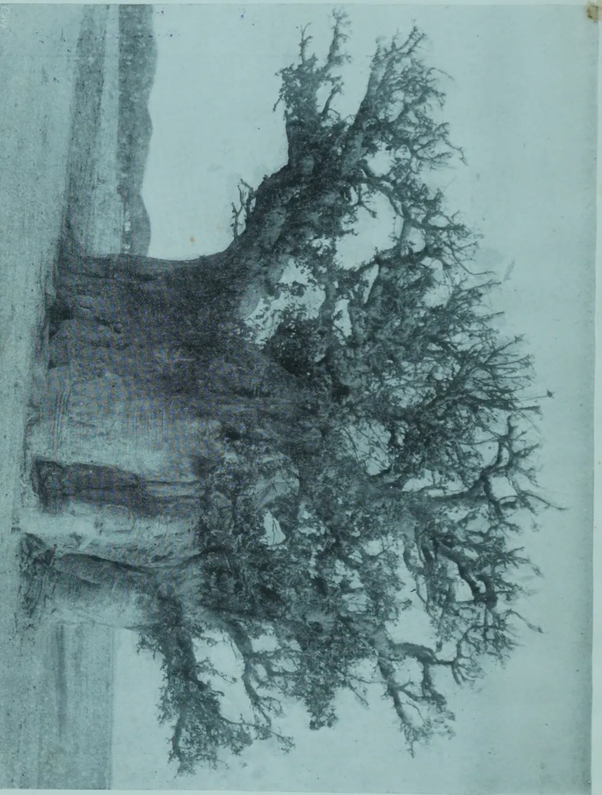This is a traditional Chinese ink wash painting (shuansu) of a gnarled, leafless tree. The tree's trunk is thick and dark, with a rough, textured surface. Its branches are intricate and delicate, spreading out in various directions. The background is a light, misty wash of ink, creating a sense of depth and atmosphere. The overall style is minimalist and expressive, characteristic of traditional Chinese landscape painting.

8------------------------------------------------

GOVERNMENT BOTANICAL GARDENS  
LIBRARY.

Section.....

THE  
**TROPICAL AGRICULTURIST:**  
JOURNAL OF THE  
**CEYLON AGRICULTURAL SOCIETY.**

VOL. XLI.

COLOMBO, JULY, 1913.

No. 1

---

**THE POWER OF COMBINATION.**

*Peradeniya, July 15, 1913.*

The inarticulate peasantry in all countries are conservative folk; "slow to believe in novelties; patient of much error in actualities; deeply and for ever certain of the greatness that is in Law, in Custom once solemnly established." Time is therefore required before customs can be altered and a new movement like that of co-operation can fructify. The mind being a very much more complex medium of fertility than the soil, sowing the seed of co-operation is not like sowing a crop of beans. We cannot forecast the time of harvest though the human mind being practical and therefore a fertile medium we are assured that the seed being good, harvest will eventually come. But like the goiya himself we must be patient. We cannot expect him to throw over customs followed for centuries, may be for thousands of years, for one he only heard of a few weeks ago.

Thus equipped we can look hopefully for the successful application of co-operative principles to the agricultural industries of Ceylon. We are sometimes asked why is it necessary to co-operate; cannot the Government come to the rescue of the goiya by direct methods? The answer to this is in the negative for reasons which are admirably explained in an article from the *Ceylon Poultry Magazine* we reproduce elsewhere. The goiya carries on business by a system of credit, paying interest at a rate which we may take to be in the main 100 per cent. per

9------------------------------------------------

2[JULY, 1913]

annum. This is a crushing burden; and before we can ever hope to raise the status of the native cultivator and enable him to take advantage of improved methods of agriculture this burden must be removed. This can only be done by giving him access to the open money market, but Governments and banks are not in a position to ascertain the circumstances of every villager to make sure that his security is good. It is here where the system of co-operation steps in. The Government—or bank—can deal with a village but not with every villager. A village will not default though an occasional villager might. In order that they may become a responsible medium unit it is necessary of course for the members of a village or group of villages to combine and form themselves into a Society for registration.

Every villager can claim the right to become a member of the local society but yet for its own protection the society must possess the right of refusing membership to anyone likely to injure its cause and thereby that of the community as a whole. A small subscription is demanded of each member. This gives him the right of participation in privileges and advantages the society may possess. Without some payment, no matter how small, he could demand nothing. Hence we see the importance of each member being required to subscribe to the share capital.

Beyond this token of material substance it is not necessary that the candidate should possess any worldly goods whatever; not even so much as a hoe handle, though a thrifty subject will generally have accumulated around him some possessions. The only qualification is character. Villagers know the characters of their fellow villagers and a black sheep, one likely to let them down, they will exclude seeing that they are responsible for him. This is why it is necessary to provide that Societies shall only make advances to members.

It is obvious from the foregoing that Co-operative Societies will have in them great possibilities for influencing for good the character of the people. Membership of the local society will become the hall mark of respectability and each man will strive not only to qualify himself for membership but to commit no act that might lead to his expulsion. Societies will become the referees of disputes and thus influenced, authority and responsibility will gradually pass to the elected representatives of the villagers themselves.

R. N. L.

10------------------------------------------------

JULY, 1913.]3

## IMPERIAL INSTITUTE BULLETIN.

---

The first quarterly issue of the Imperial Institute Bulletin for the present year has reached us. Every issue of this Bulletin which is edited by the Director and prepared by the scientific and technical staff of the Imperial Institute and by other contributors contains interesting reading and useful information. The present number has, among others, an account of the Imperial Institute which was erected at South Kensington as the National Memorial of the Jubilee of the late Queen Victoria by whom it was opened in May 1893. The other articles are Tobacco from Portuguese East Africa; Tobacco from Papua; The Utilisation of Sudan Dura; Camphor oil and crude camphor from the Federated Malay States, etc. The following are the special articles: The Progress of Egyptian Agriculture, with special reference to Cotton by Mr. Gerald C. Dudgeon, F.E.S.; The Agriculture of Mozambique Province, Portuguese East Africa, by Mr. R. N. Lyne, F.L.S., lately Director of Agriculture in the province of Mozambique; and The Pottery Industry of Ilorin, Northern Nigeria, by Dr. J. W. Scott Macfie. The Bulletin contains notes on some common spices while an account on the Manufacture of Paper Pulp for Export will also be found.

In other pages of this magazine will be found extracts from this issue of the Imperial Institute Bulletin dealing on certain products.

---

## THE PLANTERS' ASSOCIATION OF MALAYA.

We are in receipt of the Chairman's Report to the Sixth Annual Meeting of the Planters' Association of Malaya which is interesting reading, rubber claiming of course first place. At the end of 1912 Malaya had 452,000 acres planted up with rubber. The output for the year 1912 amounted to 20,327 tons—an increase of 19,897 tons compared with that of six years ago; while the estimated production of the Peninsula for 1913 is given at 29,900 tons. It has not been possible to publish an accurate record of the area under coconuts the greater part being under native cultivation but the estimated approximate acreage is 156,000 acres. The market price of the coconut in towns is often as high as 9 cents. In the three years 1910-12, the export of tapioca from Malacca declined from 133,467 to 61,720 piculs the decline being due to the replacement of tapioca by rubber. Coffee, hitherto the chief European cultivation, is now only taken up by small Chinese planters or by Europeans as catch-crops. The F.M.S. exports of coffee for the three years 1910, 1911 and 1912 amounted to 32,688 piculs. Sugar is another product which has been replaced by rubber and the F.M.S. exports for the years 1910-12 reached 252,924 piculs while the figures for the Straits Settlements show a total of 2,429,936 for the same period.

11------------------------------------------------

4[JULY 1913

# POULTRY.

## POULTRY COMPETITION IN NORFOLK.

Only three flocks of the 22 were mongrels and the breeds were of many kinds, including Plymouth Rocks, Wyandottes, Rhode Island Reds, Orpingtons, Leghorns and Minorcas.

At the conclusion of the contest, the competitors sent up their information to headquarters and a meeting for the purpose of encouraging improved measures of poultry keeping was held at the county town.

Table 1 gives a summary of the costs and profits of the individual flocks :—

TABLE I.

<table border="1">
<thead>
<tr>
<th rowspan="2">Number.</th>
<th rowspan="2">Breed.</th>
<th rowspan="2">Number of hens.</th>
<th>Grain per hen per month.</th>
<th>Cost per hen per month.</th>
<th>Eggs per hen per month.</th>
<th>Profit per hen per six months.</th>
</tr>
<tr>
<th>lbs.</th>
<th>cents.</th>
<th></th>
<th>cents.</th>
</tr>
</thead>
<tbody>
<tr>
<td>1</td>
<td>Plymouth Rock</td>
<td>50</td>
<td>7.5</td>
<td>9.0</td>
<td>11.7</td>
<td>67.74</td>
</tr>
<tr>
<td>2</td>
<td>do</td>
<td>39</td>
<td>6.3</td>
<td>7.5</td>
<td>13.2</td>
<td>93.3</td>
</tr>
<tr>
<td>3</td>
<td>do</td>
<td>52</td>
<td>6.3</td>
<td>7.7</td>
<td>8.0</td>
<td>32.6</td>
</tr>
<tr>
<td>4</td>
<td>do</td>
<td>49</td>
<td>5.4</td>
<td>8.0</td>
<td>10.5</td>
<td>59.0</td>
</tr>
<tr>
<td>5</td>
<td>do</td>
<td>70</td>
<td>5.9</td>
<td>5.4</td>
<td>4.1</td>
<td>4.54</td>
</tr>
<tr>
<td>6</td>
<td>Leghorn</td>
<td>95</td>
<td>4.9</td>
<td>8.2</td>
<td>16.6</td>
<td>135.1</td>
</tr>
<tr>
<td>7</td>
<td>do</td>
<td>85</td>
<td>5.3</td>
<td>7.1</td>
<td>12.9</td>
<td>87.9</td>
</tr>
<tr>
<td>8</td>
<td>do</td>
<td>58</td>
<td>5.1</td>
<td>6.0</td>
<td>10.0</td>
<td>57.8</td>
</tr>
<tr>
<td>9</td>
<td>do</td>
<td>126</td>
<td>4.2</td>
<td>7.5</td>
<td>10.9</td>
<td>66.0</td>
</tr>
<tr>
<td>10</td>
<td>do</td>
<td>90</td>
<td>5.7</td>
<td>5.5</td>
<td>7.2</td>
<td>33.1</td>
</tr>
<tr>
<td>11</td>
<td>do</td>
<td>87</td>
<td>5.0</td>
<td>5.1</td>
<td>8.3</td>
<td>46.6</td>
</tr>
<tr>
<td>12</td>
<td>do</td>
<td>85</td>
<td>5.6</td>
<td>5.7</td>
<td>10.1</td>
<td>64.1</td>
</tr>
<tr>
<td>13</td>
<td>Wyandotte</td>
<td>35</td>
<td>8</td>
<td>10.7</td>
<td>16.05</td>
<td>73.9</td>
</tr>
<tr>
<td>14</td>
<td>do</td>
<td>140</td>
<td>7.6</td>
<td>8.4</td>
<td>7.4</td>
<td>20.5</td>
</tr>
<tr>
<td>15</td>
<td>do</td>
<td>69</td>
<td>7.2</td>
<td>9.8</td>
<td>8.4</td>
<td>24.4</td>
</tr>
<tr>
<td>16</td>
<td>Cross bred</td>
<td>70</td>
<td>5.6</td>
<td>6.06</td>
<td>8.9</td>
<td>48.4</td>
</tr>
<tr>
<td>17</td>
<td>do</td>
<td>51</td>
<td>9</td>
<td>9.3</td>
<td>11.3</td>
<td>53.7</td>
</tr>
<tr>
<td>18</td>
<td>do</td>
<td>48</td>
<td>5.4</td>
<td>6.6</td>
<td>10.7</td>
<td>63.9</td>
</tr>
<tr>
<td>19</td>
<td>Orpington</td>
<td>114</td>
<td>5</td>
<td>7.4</td>
<td>8.3</td>
<td>47.5</td>
</tr>
<tr>
<td>20</td>
<td>Rhode Island Red</td>
<td>45</td>
<td>5.2</td>
<td>5.5</td>
<td>11.9</td>
<td>89.6</td>
</tr>
<tr>
<td>21</td>
<td>Minorca</td>
<td>70</td>
<td>7.8</td>
<td>9.0</td>
<td>10.0</td>
<td>41.4</td>
</tr>
</tbody>
</table>

The profit, i.e., the amount received for eggs above the cost of feed, for the six months from December, 1910 to May 31, 1911, averaged for all the 21 flocks 57.67 cents per hen, or 57.67 dollars per 100 hens. The best results (\$1.97) were obtained by No. 6, the flock which won the competition.

12------------------------------------------------

JULY, 1913.]5

Five of the competitors continued their records till December 1, 1911; the results are given in Table II.

TABLE II.

<table border="1">
<thead>
<tr>
<th>Number.</th>
<th>Breed.</th>
<th>Number of hens.</th>
<th>Grain per hen per year.</th>
<th>Cost per hen per year.</th>
<th>Eggs per hen per year.</th>
<th>Profit per hen per year.</th>
</tr>
<tr>
<td></td>
<td></td>
<td></td>
<td>lbs.</td>
<td>cents.</td>
<td></td>
<td>cents.</td>
</tr>
</thead>
<tbody>
<tr>
<td>1</td>
<td>Plymouth Rock</td>
<td>50</td>
<td>63.4</td>
<td>78.0</td>
<td>128.2</td>
<td>104</td>
</tr>
<tr>
<td>6</td>
<td>Leghorn</td>
<td>95</td>
<td>50.4</td>
<td>77.5</td>
<td>157.4</td>
<td>197</td>
</tr>
<tr>
<td>8</td>
<td>do</td>
<td>58</td>
<td>50.4</td>
<td>60.0</td>
<td>123.2</td>
<td>119</td>
</tr>
<tr>
<td>19</td>
<td>Orpington</td>
<td>114</td>
<td>49.5</td>
<td>70.0</td>
<td>85.5</td>
<td>85</td>
</tr>
<tr>
<td>20</td>
<td>Rhode Island</td>
<td></td>
<td></td>
<td></td>
<td></td>
<td></td>
</tr>
<tr>
<td></td>
<td>Red</td>
<td>45</td>
<td>53.0</td>
<td>58.8</td>
<td>124.8</td>
<td>115</td>
</tr>
</tbody>
</table>

The writer further sought to discover the cause which determined the profitableness of the different flocks, and came to the conclusion that this is not to be found so much in the breed, as in the feeding and management of the fowls. The best results were obtained where the flocks were given buttermilk and green food, and where the fowl-house was well ventilated. Further figures are given in support of this view.—MONTHLY BULLETIN.

## A FUNGUS DISEASE OF POULTRY.

According to an article which appears in the *Bulletin Agricole du Congo Belge*, for December 1912, a contagious disease known as thrush ('la teigne') causes very considerable loss among poultry in the Belgian Congo. The disease is due to a fungus parasite of the same family as *Trichophyton tonsurans*, which is the cause of a similar complaint in man and mammals.

The first symptoms appear on the comb and ears where white spots are produced marking the centres of mycelial development. These rapidly extend and finally unite to form large patches of yellowish-white scurf over the entire head. As the regions of the eyes and ears are attacked, the bird loses its sense of sight and hearing, and then quickly succumbs.

The disease is very contagious. It is therefore necessary to isolate affected subjects immediately. The diseased parts should be treated with a solution of perchloride of iron mixed with two to three times its weight of glycerine. According to another authority, a good remedy is to rub the affected parts with citric ointment or with mercuric ointment to which has been added a fifth part by weight of mercuric iodide.

The heads of birds that have died from the disease should be buried in lime or burnt.—AGRICULTURAL NEWS.

13------------------------------------------------

6[JULY, 1913.

## SOME POULTRY NOTES.

### SELECTING A BREED.

Be sure that the male at the head of the flock is purebred.

The Mediterranean or egg breeds are: Leghorns, Minorcas, Spanish, Blue Andalusians and Anconas.

The American or general-purpose breeds are: Plymouth Rocks, Wyandottes, Javas, Dominiques, Rhode Island Reds and Buckeyes.

The Asiatic or meat breeds are: Brahmas, Cochins and Langshans.

The English breeds are: Dorkings, Orpingtons and Redcaps.

For farm use the American breeds are probably the best.

Purebred poultry means uniformity of products.

Uniformity of products means increased profits, if products are properly marketed.

Given the same care and feed, purebred fowls will make a greater profit than mongrels.

Subscribe for a good poultry paper.

Every poultry keeper should have a copy of the "American Standard of Perfection."

### FEEDING.

In order to obtain eggs it is necessary to have healthy, vigorous stock properly fed.

<table border="1">
<thead>
<tr>
<th>Nature provides.</th>
<th>Scientific classification.</th>
<th>Poultrymen feed.</th>
</tr>
</thead>
<tbody>
<tr>
<td>Worms and bugs</td>
<td>Nitrogenous material or ... protein.</td>
<td>Eggs, meat (green cut bone or beef scrap), milk, or cottage cheese.</td>
</tr>
<tr>
<td>Seeds ...</td>
<td>Non-nitrogenous ...</td>
<td>Wheat, oats, corn, bar- ley, etc.,</td>
</tr>
<tr>
<td>Greens ...</td>
<td>Succulents ...</td>
<td>Lettuce, cabbage, kale, mangels, alfalfa, clover, sprouted oats, etc.</td>
</tr>
<tr>
<td>Grit ...</td>
<td>Mineral matter ...</td>
<td>Grit &amp; oyster shell.</td>
</tr>
<tr>
<td>Water ...</td>
<td>Water ...</td>
<td>Water.</td>
</tr>
</tbody>
</table>

A splendid mixture for laying hens is equal parts of cracked corn, wheat, and oats, which should be scattered in the litter.

Bran or middlings and beef scraps should be kept in receptacles to which the fowls have access at all times.

Plenty of exercise increases the egg yield.

Provide 4 or 5 inches of good, clean litter in which to scatter the grain.

Cabbages, mangels, potatoes, sprouted oats, etc., make excellent green feed.

When wet mashes are fed, be sure they are crumbly and not sticky.

For the first three days chicks may be fed with a mixture of equal parts of hard boiled eggs and stale bread, or stale bread soaked in milk. When bread and milk are used, care should be exercised to squeeze all milk out of the bread.

14------------------------------------------------

JULY, 1913.]7

From the third or fourth day until the chicks can eat wheat or cracked corn, commercial chick feed is a good ration.

Plenty of pure, fresh water, grit, shell, and green feed should be available from the first day.

There is very little danger of overfeeding young stock.

Feed the chickens about five times daily and only what they will eat up clean in a few minutes, except at night, when they should receive all they want.

#### **LICE AND MITES.**

The free use of an effective lice powder is always in order.

A dust bath is very essential in ridding the fowls of lice.

In applying powder hold the fowl by the feet, head down, and work the powder well down into the feathers.

The free use of kerosene on the roosts and in the cracks will exterminate mites.

Whitewash is very effective against vermin.

#### **COMMON DISEASES AND TREATMENT.**

All diseased birds should be isolated.

**Colds and roup.**—Disinfect the drinking water as follows: To each gallon of water add the amount of potassium permanganate that will remain on the surface of a dime.

**Canker.**—Sprinkle a little flowers of sulphur in the mouth and throat of the bird, and put some chlorate of potash in the water. Also carefully remove the exudate with the aid of warm water and apply a 2 per cent. solution of creolin to the diseased tissue.

**Chicken pox.**—Apply a touch of iodin and carbolated vaseline to each sore.

**Gapes.**—New ground and vigorous cultivation will often remedy this trouble.

**Scaly legs.**—Apply vaseline containing 2 per cent. of creolin to the affected parts, and after 24 hours soak in warm soapy water. Repeat treatment until cured.

**Diarrhoea in hens.**—Low-grade wheat flour or middlings is good for this trouble. Also give teaspoonful of castor oil containing five drops of oil of turpentine to each fowl.

**Bowel trouble in chicks.**—Well-boiled rice mixed with a little charcoal will often check this complaint. Dissolve 15 grains of crude catechu in each gallon of drinking water.

#### **RULES.**

It is urged that all farmers and poultrymen adhere strictly to the following rules in handling their poultry and eggs:

1. 1. Keep the nests clean; provide one nest for every four hens.
2. 2. Gather the eggs twice daily.
3. 3. Keep the eggs in a cool, dry room or cellar.
4. 4. Market the eggs at least twice a week.
5. 5. Sell, kill or confine all male birds as soon as the hatching season is over.—FARMERS' BULLETIN.

15------------------------------------------------

8[JULY, 1913.]

## DEMAND FOR ENGLISH POULTRY IN SWITZERLAND.

The Commercial Intelligence Branch of the Board of Trade is informed that there is a demand in Switzerland for high-class English poultry. It appears that very few poultry are kept in that country, although the consumption of eggs and poultry is very great owing to the large number of visitors. As a consequence, great quantities of these commodities have to be imported, the better qualities mostly arriving from France and the inferior qualities from Italy. So far as the former are concerned, an increased demand has not been met by larger supplies. The season of greatest demand extends from July to October, the time when the birds are plentiful and prices are falling in the English market. Some trial shipments of Sussex chickens were sent to Switzerland last summer, and when the consignments arrived in good condition, the purchasers found they were superior to all others, and expressed a desire that more should be available. It was found however, that the method of killing adopted led to rapid deterioration in hot weather, and that, therefore, the exporters ran great risk of loss. It is advised that the fowls should be killed by "paletting," then finger drawn, and finally thoroughly cooked, as they would be from two to four days in transit; further, that the birds be graded, wrapped in parchment paper, and delivered to the shippers in London in cases each holding two or three dozen.—BOARD OF TRADE JOURNAL.

## THE POULTRY TICK.

By D. F. LAURIE.

The poultry tick (*Argas persicus*, super family *Ixodoidea*, family *Argasida*) was, according to the writer, D. F. LAURIE, introduced into South Australia from India and does much harm in the former country, being the means of transmitting *Spirochaeta marchouxi* (the causative agent of tick fever). Good results against tick fever have been obtained with salvarsan, but the only radical cure, in the opinion of the writer, is the eradication of the tick. To this end Mr. Laurie has tried various measures and he finds that a 5 or 10 per cent. kerosene emulsion is the best remedy. The ticks are destroyed by one minute's immersion in this liquid; for practical purposes the spraying, and even soaking, of poultry houses with this emulsion has proved efficacious. Old timber containing many cracks, which serve as shelters to the ticks, should not be used for poultry houses.—MONTHLY BULLETIN

16------------------------------------------------

JULY, 1913.]9

## EGG-LAYING AT THE HAWKESBURY AGRICULTURAL COLLEGE.

The conspicuous feature is the establishment of a new world's record for first-year laying, states the *Agricultural Gazette* of N. S. W. The previous record for six birds was 1,589 eggs by a pen of White Leghorns at the Roseworthy Agricultural College (South Australia) competition in 1911-2. This has been eclipsed by Mr. F. Morison's pen of Indian Runner ducks, which put out 1,601 eggs, notwithstanding that the first egg was not laid until April 12. As the eggs averaged 31 oz. per dozen, the six ducks laid no less than 258 lb. weight of eggs. The net market value of the eggs was £8 11s. 2d. The following is the daily record of the laying of this pen :—

<table border="0">
<tbody>
<tr>
<td>April :</td>
<td>0 0 0 0 0 0 0 0 0 0 0 1 1 1 1 1 1 1 1 1 4 1 2 3 4 6 6 6 6 6</td>
<td>...</td>
<td>53</td>
</tr>
<tr>
<td>May :</td>
<td>6 4 5 3 5 4 5 4 3 6 6 6 5 6 6 6 4 3 4 4 3 4 4 6 5 6 4 6 4 6 6</td>
<td>...</td>
<td>149</td>
</tr>
<tr>
<td>June :</td>
<td>6 6 6 6 6 6 5 5 6 6 5 5 6 6 5 5 5 5 5 6 6 5 5 6 6 6 6 6 4</td>
<td>...</td>
<td>167</td>
</tr>
<tr>
<td>July :</td>
<td>4 2 4 3 2 3 5 4 4 3 3 6 6 6 6 6 6 5 4 6 6 5 6 4 6 6 6 4 6 6</td>
<td>...</td>
<td>149</td>
</tr>
<tr>
<td>August :</td>
<td>3 4 4 3 5 4 6 5 4 4 5 6 5 6 4 6 6 6 5 6 5 6 5 4 4 4 5 5 5 5 5</td>
<td></td>
<td>150</td>
</tr>
<tr>
<td>September :</td>
<td>5 4 3 5 5 4 5 5 6 4 4 5 5 5 6 5 6 6 4 6 5 6 6 6 6 6 6 6 5</td>
<td></td>
<td>156</td>
</tr>
<tr>
<td>October :</td>
<td>3 5 6 3 6 6 5 6 5 5 5 5 4 5 4 4 5 6 4 5 3 6 6 4 5 5 5 4 3 4 6</td>
<td></td>
<td>148</td>
</tr>
<tr>
<td>November :</td>
<td>4 5 6 5 4 5 6 5 4 5 2 6 5 5 5 5 6 5 4 5 4 4 3 6 4 5 5 6 5 6</td>
<td></td>
<td>145</td>
</tr>
<tr>
<td>December :</td>
<td>6 6 6 6 6 5 5 6 6 5 5 6 6 6 5 5 5 4 3 2 4 5 4 6 4 5 5 5 4 4 6</td>
<td></td>
<td>156</td>
</tr>
<tr>
<td>January :</td>
<td>4 4 6 6 6 5 4 5 5 4 4 5 4 4 4 4 6 4 4 6 4 4 2 3 4 3 3 4 5 5</td>
<td></td>
<td>135</td>
</tr>
<tr>
<td>February :</td>
<td>5 5 5 4 3 4 4 3 2 4 4 4 4 6 4 3 5 3 4 2 3 3 2 5 2 3 2 2</td>
<td>...</td>
<td>100</td>
</tr>
<tr>
<td>March :</td>
<td>2 2 2 3 1 4 3 4 3 3 3 3 5 3 3 3 3 3 2 4 3 5 2 3 3 2 4 2 4 3 3</td>
<td></td>
<td>93</td>
</tr>
</tbody>
</table>

As these birds did not commence to lay till 12th April, 1912, they were kept at the College till 11th April, 1913, to complete the full twelve months. The laying for this period was as follows :

2 2 4 2 3 3 2 3 3 3 3

making a grand total of 1,631 eggs.

## FEEDING CHICKS.

Three hens set at the same time on eggs taken at random and all set near each other so that they all had the same conditions and with all the hens behaving well on the nest, not sticking too closely, not staying off too long, still gave variable results. One hatched 11 out of 13, one 4 out of 11, and another 4 out of 9. One Turkey hen hatched 16 out of 17 another set beside it, and 9 out of 16 but she behaved badly, leaving her nest at times and crowding in beside the other one.

To secure fertility of eggs the cocks have to be healthy and active and

17------------------------------------------------

10[JULY, 1913.

When the chickens hatch, if the hen is quiet and does not want to leave her nest because two or three chickens are half a day to a day before the others, let her alone. If she makes to step off with one or two chicks as sometimes happen, take the little ones away and put them in a box of cotton wool in a warm place; but do not attempt to feed them. As soon as all the chickens are hatched put the others back. It is exceptional however for this to be necessary. When eggs are fresh they all hatch out within twelve hours and an ordinary hen will not leave the nest until she sees some of the chickens moving about, making to pick up.

Of all the feeds available here for starting off young chickens well, we have found none so useful as coarse Scotch oatmeal. Chickens do not require to begin feeding until they are at least twenty-four hours hatched and then only if they are particularly strong and lively; it is better they should not be fed until they are thirty-six hours hatched and forty-eight hours will not be too long. To attempt to get them to feed under twenty-four hours old, means, if they pick up food, indigestion for them to start off with. If any eggs remain unhatched, and in testing them are found clear and good, these can be boiled and crumbled very fine through the coarse oatmeal. Let the chickens have water as they please. Brown rice boiled so that every grain is clean not made sticky, can be alternated with the oatmeal. After a week if chickens are considered valuable and worth pushing on, small scraps of meat, fat and even gristle with the meat, can be cut very fine and given them. And ticks from the cows are valuable food as they of course contain blood. If labourers are forking or hoeing land give one of them an empty salmon tin and ask him to pick up any worms he comes across and drop them in the tin. No food pushes on chickens like worms. Then after a fortnight the nest of duck ants may be sought for and a piece taken off for the chickens every day. Guinea corn if it would only be extensively grown, would be one of the very best foods for fowls and chickens, as the grains are small enough to be fed to the latter. One of the difficulties in poultry rearing is to be able to feed a large number of chickens separately from the fowls; because the chickens want to be fed oftener than hens and their food is finer and more expensive, while it does them harm to pick up whole corn meant for hens. And it does not pay for the hens to be crowding in and taking the food meant for chickens while the latter go without, it always pays to have one or two fenced runs, where chickens can be kept and fed separately if necessary. Also this enables some of the best hens with a good cock to be kept apart to supply eggs for setting instead of taking these at random from a crowd of hens, sometimes from the poorest layers.

The coarse oatmeal can be dropped after a month as it is more costly than crushed corn which can be safely fed after that but should be alternated with a little brown rice (not white rice). The rice is better soaked first in water as it swells so much. Chickens should be fed four times a day, a little at a

18------------------------------------------------

JULY, 1913.]11

time for the first month, then three times a day until they are grown. Plenty of clean water should always be provided.

### LICE AND TICKS.

A useful ointment for all kinds of Parasites on Poultry.

<table>
<tr>
<td>Lard</td>
<td>...</td>
<td>4</td>
<td>tablespoonfuls.</td>
</tr>
<tr>
<td>Sulphur</td>
<td>...</td>
<td>1</td>
<td>"</td>
</tr>
<tr>
<td>Kerosene</td>
<td>...</td>
<td>1</td>
<td>"</td>
</tr>
</table>

If a little of this is rubbed on the back of the head, the rump, and beneath the wings it will destroy all kinds of lice and ticks on fowls. Rubbed on the legs of fowls suffering from scaly legs it will cure this unsightly trouble.

### FOWL TICKS.

Fowl ticks are an increasing pest, and when fowls are attacked by them for the first time, they are thrown into a high fever, in the same way as imported cows are, when tick bitten for the first time. But not only that, the fowl loses the power of its legs, as in cramp, and in bad cases also loses the power of its neck; in fact the birds seem nearly paralyzed.

We sent specimens of the fowl ticks to Professor Nuttall, of Cambridge, England, some time ago, who reported that the ticks are *Argas persicus* the same as occur elsewhere and that he was not able to produce on fowls there the conditions described by us. It may be, however, that the fowls he used had already been infected mildly.

To cure an attack, as described, first kill the ticks on the fowl with the sulphur and lard paste; give twice a day one-twentieth of the ordinary dose of quinine, sold everywhere now for one farthing. Feed on bread soaked in milk. Rub the joints and the back at the junction of the neck, with a good embrocation.—JOURNAL OF THE BOARD OF AGRICULTURE.

19------------------------------------------------

12July 1913

# TOBACCO.

## GROWTH OF TOBACCO IN IRELAND.

In 1911 twenty growers planted the crop, the amount produced being 134,486 lb. on 119½ acres. The average yield was 1,125 lb. per acre, the highest yet obtained except that for 1908, which was 1,200 lb. per acre. The following table shows the cost of production and the returns for each class of tobacco grown:—

<table border="1">
<thead>
<tr>
<th>Kind of Tobacco.</th>
<th>Pipe (average of 6 centres).</th>
<th>Cigarette (one centre).</th>
<th>Cigar (one centre).</th>
<th>Pipe and cigarette (one centre).</th>
</tr>
</thead>
<tbody>
<tr>
<td>Average yield per acre in lb.</td>
<td>1,074</td>
<td>1,543</td>
<td>520</td>
<td>1,496</td>
</tr>
<tr>
<td>Cost of production per lb.</td>
<td>6. 9d.</td>
<td>11. 3d.</td>
<td>22. 4d.</td>
<td>4. 8d.</td>
</tr>
<tr>
<td>Amount received per lb.</td>
<td>5. 2d.</td>
<td>6. 0d.</td>
<td>7. 1d.</td>
<td>5. 5d.</td>
</tr>
<tr>
<td></td>
<td>£. s. d.</td>
<td>£. s. d.</td>
<td>£. s. d.</td>
<td>£. s. d.</td>
</tr>
<tr>
<td>Cost of production, per acre.</td>
<td>31 1 4</td>
<td>72 11 6</td>
<td>48 18 8</td>
<td>30 3 6</td>
</tr>
<tr>
<td>Amount received, per acre.</td>
<td>23 1 10</td>
<td>38 11 5</td>
<td>15 7 9</td>
<td>33 12 3</td>
</tr>
</tbody>
</table>

The quantity of tobacco produced and the gross return per acre in 1911 showed a marked increase at all centres over the results of the previous two years. This improvement was due to the very favourable season and, in some cases, also to the more extensive use of home-saved seed. The cost of production must vary somewhat with the weight of the crop, and should also be affected by the weather, which in 1911 rather facilitated most operations. Taking these facts into consideration, the results do not indicate any marked economies in the cost of production in 1911.—JOUR. OF THE BOARD OF AGRIC.

## TOBACCO IN HUNGARY.

Experiments begun in 1897 by the writer, Director of the Royal Hungarian Experiment Station for Tobacco Cultivation at Debreczen, in 8 plots of sandy soil to which from this date no manure was applied for 13 successive years, in order that the effect of the manures subsequently spread on the exhausted soil might be studied.

20------------------------------------------------

JULY, 1913.]13

The yield of the tobacco grown during this time diminished in quantity and deteriorated more and more every year. While during the first few years the crop of "Szeged" varied from 1850 lb. to 2,000 lb. per acre, in 1909 it was only 960 lb. The analysis of the soil showed that, during these 13 years, the loss of nitrogen and lime had been greater than that of potash or phosphates.

Finally in 1910, the application of chemical manures began. Owing to the special nature of the experiments, a larger quantity of manure than usual was used per acre, viz. 390 lb. of 18 per cent. superphosphate, the same amount of 40 per cent. potash and 530 lb. of nitrate of soda; the two first were applied at the beginning of February and the last in two parts after the first and the second hoeing. When, as in 1910, the rainfall is abundant, a satisfactory result can be confidently expected.

The following table gives the distribution of the various manures, the yields, and the combustibility of the tobacco before and after fermentation :—

<table border="1">
<thead>
<tr>
<th rowspan="2">Plots.</th>
<th rowspan="2">Manures.</th>
<th rowspan="2">Amount of manure per acre.</th>
<th rowspan="2">Yield per acre.</th>
<th rowspan="2">Excess over control.</th>
<th colspan="2">Combustibility of leaves per second.</th>
</tr>
<tr>
<th>Before fermentation.</th>
<th>After fermentation.</th>
</tr>
<tr>
<th></th>
<th></th>
<th>lbs.</th>
<th>lbs.</th>
<th>lbs.</th>
<th>seconds</th>
<th>second</th>
</tr>
</thead>
<tbody>
<tr>
<td>1</td>
<td>Control (no manure for the 13 preceding years)</td>
<td>—</td>
<td>998</td>
<td>—</td>
<td>23</td>
<td>31</td>
</tr>
<tr>
<td>2</td>
<td>Farmyard manure</td>
<td>46,350</td>
<td>1,485</td>
<td>487</td>
<td>18</td>
<td>23</td>
</tr>
<tr>
<td>3</td>
<td>18 % superphosphate</td>
<td>390</td>
<td>1,044</td>
<td>46</td>
<td>21</td>
<td>36</td>
</tr>
<tr>
<td>4</td>
<td>40 % potash salts</td>
<td>390</td>
<td>1,176</td>
<td>178</td>
<td>29</td>
<td>42</td>
</tr>
<tr>
<td>5</td>
<td>Nitrate of soda</td>
<td>530</td>
<td>1,632</td>
<td>634</td>
<td>16</td>
<td>27</td>
</tr>
<tr>
<td rowspan="2">6</td>
<td>(18 % superphosphate-</td>
<td>390</td>
<td rowspan="2">1,300</td>
<td rowspan="2">302</td>
<td rowspan="2">32</td>
<td rowspan="2">48</td>
</tr>
<tr>
<td>(40 % potash salts -</td>
<td>390</td>
</tr>
<tr>
<td rowspan="3">7</td>
<td>(18 % superphosphate-</td>
<td>390</td>
<td rowspan="3">1,795</td>
<td rowspan="3">797</td>
<td rowspan="3">22</td>
<td rowspan="3">34</td>
</tr>
<tr>
<td>(40 % potash salts -</td>
<td>390</td>
</tr>
<tr>
<td>Nitrate of soda -</td>
<td>530</td>
</tr>
<tr>
<td rowspan="4">8</td>
<td>(18 % superphosphate-</td>
<td>390</td>
<td rowspan="4">2,110</td>
<td rowspan="4">1,112</td>
<td rowspan="4">21</td>
<td rowspan="4">29</td>
</tr>
<tr>
<td>(40 % potash salts -</td>
<td>390</td>
</tr>
<tr>
<td>Nitrate of soda -</td>
<td>530</td>
</tr>
<tr>
<td>Lime from sugar factories</td>
<td>15,400</td>
</tr>
</tbody>
</table>

21------------------------------------------------

14[JULY, 1913.

The conclusions reached are:

The tobacco grown on the control plot showed a very feeble condition of development; its thin light-green leaves, 8 on a stem, manifested the characteristic signs of want of nitrogen. It was deficiency in nitrogen that had reduced the yield; this was clearly seen from the plants which had been given nitrate of soda, whose much larger, thick dark green leaves, 12 on the stem, developed normally, while superphosphate and potash, whether used together or separately, had only a secondary effect on increasing the crop. In fact, the excess of plot 6 over the control was 302 lb. while that of plot 7 was 797 lb. The fertilizing effect of the lime used with the superphosphate, potash and nitrate (plot 8) should also be noticed; this was shown by a yield superior to that obtained from any other plot. This effect is explained by the impoverishment of the experiment soil during the period of 13 years, when the lime content decreased from 0.207 per cent. to 0.112 per cent.

It was further shown that, thanks to the application of nitrate, a more valuable and resistant substance was obtained, and though the combustibility of the leaves was less than when other manures were employed, yet a fine ash was obtained.

The Experiment Station will continue its experiments; every three years a mixture of farmyard manure and lime will be applied, other manures being added every year, with the view of observing the effects due to the application of an excessive amount of manures during a prolonged period of time.—  
MONTHLY BULLETIN.

## TOBACCO CULTURE IN BRITISH EAST AFRICA.

By C. J. MONSON.

The past season has been somewhat disappointing. The large rains followed by months of dull weather, caused the leaf to remain much greener than would have been the case had it ripened and mellowed in the sun's rays in the field. Heavy storms also did considerable damage, and in the Njoro and Lower Molo districts hail storms to a great extent spoilt the crops. The cold wet weather in the former of these districts stopped plant growth and caused the yield of leaf to be small in size and poor in quality.

The experiments, carried out by the Department on the Government Farm at Kabete, shew that the red Kikuyu soil is more suitable for the dark varieties of tobacco than the yellow. The results of these experiments, of course, only apply to the culture of tobacco on this class of soil. In other districts such as Kibwezi, Mua the Lower Molo and parts of the Uasin Gishu Plateau, where sandy loams are to be found, it is confidently expected that a good type of yellow leaf will be produced. Samples of the tobacco cured at Kabete will be sent to the Imperial Institute for report on burning qualities, flavour, and suitability of the leaf for the Home market, and further experiments will be continued at Kabete with those varieties of tobacco which

22------------------------------------------------

JULY, 1913.]15

the experience of the past season would tend to point out as suitable for culture in the district. It is proposed to erect an air-curing barn of simple and inexpensive construction for the curing of those tobaccos.

In this connection, the results of experiments at Potchefstroom, as reported in the Agricultural Journal of the Union of South Africa, are of great interest. The soil on which this crop was grown is a brown loam, about twelve inches deep, with a sub-soil of ironstone, gravel and shale. It was originally poor in plant food, but has been brought to a good state of fertility by applications of farm-yard and phosphatic manures. The plots were about  $\frac{1}{4}$  acre in size. The varieties of tobacco grown were: Sterling and Clarksville. The plants were set out in a field, four feet between the rows and three feet in the rows, on November 21st, and were harvested in April. The leaf was air cured. The following figures represent the prices actually realized for the crop grown, and the yield per acre is calculated from the whole crop grown.

<table>
<thead>
<tr>
<th></th>
<th></th>
<th>Sterling.</th>
<th>Clarksville.</th>
</tr>
</thead>
<tbody>
<tr>
<td>Actual yield of '27 acre</td>
<td>...</td>
<td>503 lbs.</td>
<td>407 lbs.</td>
</tr>
<tr>
<td>Yield per acre</td>
<td>...</td>
<td>1,864 ,,</td>
<td>1,508 ,,</td>
</tr>
<tr>
<td colspan="4">Prices realized :—</td>
</tr>
<tr>
<td>(a) First quality</td>
<td>...</td>
<td>202 lbs. @ 1/-</td>
<td>200 lb. @ 8d.</td>
</tr>
<tr>
<td>(b) Second quality</td>
<td></td>
<td>202 ,, ,, 9d.</td>
<td>193 ,, ,, 3d.</td>
</tr>
<tr>
<td>Total value of crop per acre</td>
<td></td>
<td>£65-9-0</td>
<td>£33-14-0.</td>
</tr>
</tbody>
</table>

AGRICULTURAL JOURNAL OF BR. EAST AFRICA.

---

23------------------------------------------------

16[JULY, 1913.]

# RUBBER.

## RUBBER EXHIBITION OF JUNE 1914.

The Committee of the Rubber Growers' Association have decided to offer the following trophies for the Rubber Exhibition, to be held in London, June 1914:—

1. 1. That the Rubber Growers' Association Medals be offered for the best commercial samples of Plantation Rubber exhibited in the following classes:—

<table>
<tr>
<td><u>Class 1.</u></td>
<td>Crepe</td>
</tr>
<tr>
<td><u>Class 2.</u></td>
<td>Smoked Sheet</td>
</tr>
<tr>
<td><u>Class 3.</u></td>
<td>Assorted invoice, embracing No. 1 Rubber and Scrap Grades.</td>
</tr>
</table>

NOTE. Samples entered for competition to be wharf-drawn samples, in each case representative of a break or invoice of not less than 50 cases of Rubber, and such samples must be certified by the Wharfingers as having been drawn within three months of the opening of the Exhibition. The awards to be given on the judgment of the Standard Qualities Committee of the Rubber Trade Association of London.

1. 2. That a Gold Medal be given by the R.G.A. for the best exhibit connected with Plantation Rubber grown in the Middle East, to be awarded by Judges to be appointed by the R.G.A.
2. 3. A prize of £ 50 and a Gold Medal to be given by the R.G.A. for what is adjudged to be the most valuable improvement connected with the Collection or Preparation of Plantation Rubber (open only to Managers or Assistants on Estates), such improvement to have been introduced between the 1st July, 1913, and the 31st March, 1914, at which latter date all claims must have been lodged with the R.G.A. in London.

These awards to be given by Judges to be appointed by the R.G.A.

1. 4. That the R.G.A. Gold, Silver and Bronze Medals be given for the three best exhibits of Rubber-flooring in Tile or Sheet form—open to manufacturers of any country.
2. 5. That the R.G.A. Gold Medal be given for the exhibit composed of the greatest variety of articles made from Rubber for commercial and domestic purposes.—Open to manufacturers of any country.
3. 6. That a prize of £ 50 and a Gold Medal be given for the discovery and application of such new use for Plantation Rubber as may be adjudged the most valuable; special consideration being given to the weight of the rubber which such application is likely to consume.

24------------------------------------------------

JULY, 1913.]17

Mr. Henry C. Pearson of America is offering a Thousand Dollar Silver Cup for the best means of extracting the latex from the wild trees of the Hevea, Manihot and Castilloa species; by the best means he implies one that is relatively of the greatest value. This is important to Brazil, Mexico and Plantations of the East, and other rubber countries of the world. In all, trophies to the value of £1,500 are being presented for competition for the better production of the crude rubber, and also several trophies for the manufacturing section.

---

## FOURTH INTERNATIONAL RUBBER EXHIBITION.

---

The authorities have issued a first edition of the prospectus of this great Exhibition which is fixed for June, 1914 in London. With the rubber display will be associated cotton, fibres and other tropical products, so that the result should be a more or less complete tropical planting exposition.

The exhibition will remain open from the 24th June, to the 9th July, during which time the International Congress of Tropical Agriculture will also be sitting.

A section is to be devoted to Palms and Palm Products and this should prove one of the most interesting displays.

The available space for the exhibition covers an area of over 200,000 square feet.

---

## THE VITALITY OF HEVEA SEEDS.

---

By E. DE WILDEMAN.

---

After having given a summary of the experiments of Mr. F. G. Spring, Superintendent of the plantations of the Federated Malay States on the vitality and germinating property of Hevea seeds the writer makes the following observations, says the *Monthly Bulletin*.

According to Mr. Spring's experiments, of which the results are reproduced in the tables given later, it appears that 50 per cent. more of the seeds of untapped than of tapped Hevea trees germinate. It is an interesting fact that these experiments, while reversing the conclusions reached in 1908 in the *Circulars and Agricultural Journal of the Royal Botanic Gardens, Ceylon*, confirm the statement that the seeds of untapped trees are, on an average, 10.7 per cent. heavier than those of tapped trees of the same age.

To preserve the germinating property of Hevea seeds various methods of covering them have been used; Mr. Spring has made experiments as to their relative efficiency. The results show that the highest germination percentage is obtained by using either seeds from untapped Para Rubber trees, or seeds from tapped trees, which have been enveloped in wax.

25------------------------------------------------

18[JULY, 1913.

The writer of this article states that the necessity of knowing beforehand the value of the plants to be raised, and the need for regulating selection, are reasons for preferring the seed of tapped trees, while Mr. Spring's experiments show the value of covering the seeds with wax. This is, however, costly ; but if the seeds have to be subjected to a journey, of over 45 days, the number of plants obtained from seeds thus treated will repay the expense incurred.

On the other hand, the experiments on the germinating property of seeds of tapped Hevea should be continued, to determine whether the germination percentage diminishes with the number of years tapping has been continued. Should this prove to be the case, which is probable, seed for sowing purposes should be selected from trees which have been seldom tapped, but yet often enough to afford some criterion of their economic value. Thus there remain to be made a number of experiments, whose results will be of great importance to the future of the plantations.

The following tables give the results of Mr. Spring's experiments :

**I. Germination percentage of seeds from tapped and untapped trees.**

<table border="1">
<thead>
<tr>
<th rowspan="2"></th>
<th rowspan="2">Number of seeds per box.</th>
<th rowspan="2">Duration of experiment.</th>
<th colspan="2">Number of plants from seed from trees.</th>
<th colspan="2">Percentage of germinated seeds of trees.</th>
</tr>
<tr>
<th>tapped.</th>
<th>untapped.</th>
<th>tapped.</th>
<th>untapped.</th>
</tr>
</thead>
<tbody>
<tr>
<td>1</td>
<td>200</td>
<td>3 weeks.</td>
<td>67</td>
<td>156</td>
<td>33</td>
<td>78</td>
</tr>
<tr>
<td>2</td>
<td>200</td>
<td>5 "</td>
<td>46</td>
<td>133</td>
<td>23</td>
<td>66</td>
</tr>
<tr>
<td>3</td>
<td>200</td>
<td>7 "</td>
<td>48</td>
<td>100</td>
<td>24</td>
<td>50</td>
</tr>
<tr>
<td>4</td>
<td>200</td>
<td>8 "</td>
<td>40</td>
<td>167</td>
<td>20</td>
<td>83</td>
</tr>
<tr>
<td>5</td>
<td>200</td>
<td>9 "</td>
<td>40</td>
<td>164</td>
<td>20</td>
<td>82</td>
</tr>
<tr>
<td>6</td>
<td>200</td>
<td>10 "</td>
<td>40</td>
<td>165</td>
<td>20</td>
<td>82</td>
</tr>
</tbody>
</table>

**II. Germination percentage of seeds of tapped "Hevea" trees untreated and enveloped in wax and in paraffin.**

<table border="1">
<thead>
<tr>
<th rowspan="2"></th>
<th rowspan="2">Number of seeds per box.</th>
<th rowspan="2">Duration of experiment.</th>
<th colspan="2">Number of plants obtained.</th>
<th colspan="3">Germination percentage.</th>
</tr>
<tr>
<th>wax.</th>
<th>paraffin.</th>
<th>wax.</th>
<th>paraffin.</th>
<th>untreated.</th>
</tr>
</thead>
<tbody>
<tr>
<td>1</td>
<td>180</td>
<td>3 weeks.</td>
<td>107</td>
<td>62</td>
<td>59</td>
<td>34</td>
<td>33</td>
</tr>
<tr>
<td>2</td>
<td>180</td>
<td>5 "</td>
<td>108</td>
<td>71</td>
<td>60</td>
<td>40</td>
<td>23</td>
</tr>
<tr>
<td>3</td>
<td>180</td>
<td>7 "</td>
<td>94</td>
<td>74</td>
<td>52</td>
<td>41</td>
<td>24</td>
</tr>
<tr>
<td>4</td>
<td>180</td>
<td>8 "</td>
<td>82</td>
<td>66</td>
<td>45</td>
<td>37</td>
<td>20</td>
</tr>
<tr>
<td>5</td>
<td>180</td>
<td>9 "</td>
<td>100</td>
<td>61</td>
<td>55</td>
<td>34</td>
<td>20</td>
</tr>
<tr>
<td>6</td>
<td>180</td>
<td>10 "</td>
<td>86</td>
<td>58</td>
<td>47</td>
<td>32</td>
<td>20</td>
</tr>
</tbody>
</table>

26------------------------------------------------

JULY, 1913.]19

## TAPPING A FIRST RUBBER TREE.

Mr. R. K. Hardwick the Manager of Membakut Estate deserves all the praise he has undoubtedly received for the manner in which he has conducted the Estate since he went there. Planting began in November, 1909, and on 6th April, 1913, little more than three years later, a tree  $26\frac{3}{4}$  inches in girth 3 feet from the ground, and that not the the largest tree on the estate, was tapped with due ceremony and celebration by the Hon'ble Mr. E. H. Barraut, Resident of the West Coast. There are at present 10,000 trees with a girth of 16 inches and more ready for the knife and in 6 months' time a further 10,000 trees will be ready for tapping. Can any estate in Ceylon or the Malay States claim a finer record of growth than that?

A temporary factory and smoke house have been built sufficient to deal with the present output. A permanent factory is in course of construction and will be ready next year.—THE BR. NORTH BORNEO HERALD.

## PLANTING PARA RUBBER ON HILL SIDES.

By L. C. BROWN.

In planting Para Rubber on the side of hills where the gradients are severe, I believe it would prove of great advantage to adopt the same method as that practised in Penang with Nutmegs and Cloves on similar situations.

The system is simple enough. As soon as the young plants or stumps have been put out, a circle of about 3 feet in diameter is made round them and the earth taken from the upper half of this to the lower so as to form the circle into a terrace. At each weeding after this, more earth should be taken from above the plant and the circle enlarged and weeded. If this be done constantly as the coolies come round at the regular weeding periods it will be found that by the time the trees have reached maturity these circles practically form a series of terraces on the sides of the hills, according to the distances the trees are apart.

It will be noticed that the plants are all along being fed with the rich surface soil which alone should assist their growth and for the same reason the circles or terraces round the trees are easily weeded and kept clean as the top surface soil remains loose and friable for a considerable time. Apart from the entire eradication of lalang, no other weeding on the clearing is required and the timber and grass will prevent heavy wash and quite do away with the necessity of drainage, of course the timber and stumps should ultimately all be removed and destroyed. The next benefit derived is when the tapping stage commences; for instead of the tappers having the difficulty of climbing slopes in an irregular way, they each take a circle or circles as the case may be, the walking being practically all on the level, and under these conditions the coolies should be able to tap the same, or if not very nearly the same number of trees as on the flat.

27------------------------------------------------

20[JULY, 1913.

Considering the saving of expense that can be effected in the directions I have mentioned, the system should not be unduly costly, and I think on the other hand it must be admitted it has many advantages over the method now usually adopted. I may in conclusion mention that this method of cultivation must be commenced while the plants are quite young, otherwise taking the earth from above the trees when once thoroughly established would mean the lateral roots being interfered with and exposed.—AGRIC: BULLETIN OF THE F. M. S.

## THE DIAGNOSIS OF TRUE HEVEA BRASILIENSIS.

By F. A. STOCKDALE, M.A., F.L.S.

MR. F. A. STOCKDALE, till lately Assistant Director of Science and Agriculture, made a careful investigation of the varieties of rubber trees cultivated on certain estates in British Guiana; and the following notes on the varieties of *Hevea brasiliensis* and of *H. confusa* have considerable interest in view of the doubts that have hitherto surrounded the subject.

"The leaves of *H. brasiliensis* vary considerably in shape. Some trees possess leaves that are typically lanceolate whilst others are much broader. Often trees in favoured situations making very vigorous growth produce very large leaves which are broader in comparison with their length than are the typical leaves. Not infrequently two or more types of leaves are to be found on the same trees. The under-surface of *H. brasiliensis* leaves in the young stage are either slightly purplish or greyish-purple in colour, but this colour disappears as the leaves become older. The petiolar apical glands of *H. brasiliensis* are either three or four in number but sometimes two are to be found. When two only are present, they are generally close together and not widely separated as in *H. confusa* and other indigenous species. The very young leaves of *H. brasiliensis* hang vertically downwards, unless distorted by wind.

### BARK VARIATIONS IN *H. BRASILIENSIS*.

"The bark of *H. brasiliensis* varies. As recorded in 1910, at least two (distinguished by external appearances) types of barks exist in 12 year old trees of *H. brasiliensis* growing in the colony—the one a corky bark showing longitudinal markings and the other a perfectly smooth greyish-white bark showing no warts or markings. These barks on being tapped show marked differences—the former being thick and of a reddish-brown colour when freshly cut and yielding a good return of latex, while the latter is thin, of a greenish-white colour when cut, and yields little or no latex. It was then also observed that the trees showing these differences in barks also exhibited differences in habit of growth, and it was recommended to cut out the smooth-barked kind as it was a very poor latex yielder and might produce seeds or

28------------------------------------------------

JULY, 1913.]21

cross-fertilize with the better, rougher, longitudinally-marked kind. Subsequent examination of younger plants growing under varying conditions of soil and climate revealed that there was another type of *Hevea brasiliensis* that differed in the external appearance of the bark. This kind showed a sparsely warted or prickly appearance. These small "warts" or "prickles" were near the ground-level of the stem, often arranged more or less longitudinally, and existed on the stems to a height of about three feet above the level of the ground. Above this the stems were smooth. The yield of the latex from such a kind of *H. brasiliensis* could not be ascertained as the trees had not reached tappable size, but it was noticed that generally this type was not quite as vigorous in its growth as was the rough longitudinally-marked type.

#### CEYLON TYPES.

" Mr. Kelway Bamber, of Ceylon, in a paper read at the Rubber Exhibition, London, 1911, recorded that in Ceylon there were at least three types of *H. brasiliensis* trees differing in their barks. Two of these, he stated, yielded latex satisfactorily, while the third—which had a thin, smooth, greyish-coloured bark—gave practically no latex. When tapping experiments were commenced in June last, at the Issorora Experiment Station, North Western District, (B.G.) careful notes were made of the different kinds of barks found. At least three could be distinguished by external appearances, but it is possible that these may again be subdivided into other groups on account of internal differences. It was noticed that the croky, longitudinally-marked variety always possessed a thicker bark than the other sorts, was more easy to tap and seemed to yield relatively the largest returns of latex. This is the kind that would, from our present knowledge, be recommended for planting purposes if seed selection were possible.

#### CONFUSA HYBRIDS.

With regard to certain plants raised from seeds obtained from Trinidad, Mr. Stockdale reports :

" There is no doubt that these plants have been raised from seeds obtained from hybrid *brasiliensis* and *confusa* plants. There were quite a number of different forms of leaves and barks, but I was able to pick out, even in my hurried inspection, several plants that were typically *confusa*. The barks of such plants are darker in colour and are covered with warts placed very close together. The leaflets are of a lighter green in colour than *brasiliensis*, glossy, very coriaceous in texture, broader nearer the shoulder than across the middle of the blade, venation closer than in *brasiliensis*. The petiolar glands are generally two in number set far apart and are of a different shape than are the glands of *brasiliensis*. The petioles are generally purple or greenish purple in colour. The latex of *confusa* is always yellow.

Specimens from a large number of seedling plants in the Nursery of a plantation in the colony, which judged by the above-mentioned characteristics, were considered by the technical officers of the Department not to be typical *Hevea brasiliensis* but probably hybrids of *H. confusa* and *H. brasiliensis* were recently forwarded to the authorities of the Royal Botanic Gardens, Kew, for critical and authoritative examination. The following are extracts from the report of the Assistant Director of Kew ( Mr. A. W. Hill, M.A., F.L.S.):—

" We find ourselves in complete agreement with Mr. Stockdale's conclusions . . . , those grown in the nursery at Pln . . . . (Specimen No. 8,886) are either from examples of *H. confusa* or hybrids between *H. confusa* and *H. brasiliensis*,"—JOUR. OF THE BOARD OF AGRIC., BRITISH GUIANA.

29------------------------------------------------

22[JULY, 1913.]

## A GIANT HEVEA.

In the Acre territory, it is said, there is a specimen of the *Hevea Brasiliensis* which measures 25 ft. in circumference. This tree holds the record in the Amazon Valley, both for size and yield. It is reported to give a revenue of about £432 a year, and is the sole support of a family of seven but this is probably an exaggeration, as with rubber at 3s. a lb. £432 a year represents an output of nearly 3,000 lb.—a tall order! The Rubber Defence superintendent has ordered it to be photographed with the family assembled beneath it.—THE RUBBER WORLD.

## WILD AND CEARA RUBBER IN EAST AFRICA.

A colonial report on the East Africa Protectorate for 1911-12 states that the exports of rubber amounted in value to about £16,500. The progressive expansion in the exports of rubber which was reported in previous years has received a temporary check, for whereas in 1910-11 the value exported reached the unprecedented total of £31,963, in 1911-12 this figure decreased by 48 per cent. to £16,498, inclusive of £2,686 for plantation rubber. The diminution in quantity is from 1,726 cwt. to 1,207 cwt., or 30 per cent., inclusive of 193 cwt. for plantation rubber. The export of wild rubber is declining, while many of the plantation trees have not yet come into bearing. The decrease is stated to be principally due to the temporary prohibition of cutting the wild vine. Tapping of Ceara trees has, however, been carried out on several properties, and the yield of latex obtained was good, the prepared rubber being sold at good prices. New Ceara plantations are said to be coming into yielding yearly, while a further large area has been put under Manihot and Glaziovii at the coast and Kibwezi.—THE RUBBER WORLD.

30------------------------------------------------

JULY, 1913.]23

# CO-OPERATIVE CREDIT.

---

## CO-OPERATIVE CREDIT ASSOCIATIONS IN THE UNITED KINGDOM.

At the end of 1911 there were at work 223 co-operative credit associations, with an aggregate membership of 22,054 as compared with 81 associations and 6,014 members in 1901. In 1911, 45 of these associations with 4,088 members were in England (of which 18 with 3,364 members were urban); one (urban) association with 354 members was in Scotland; and 177 associations (all rural) with 17,612 members were in Ireland.

The amount of loans advanced to members in 1911 was £79,808, and the amount repaid, including interest, £77,623, and each of these figures is about four times as large as the corresponding figure for 1901. The total capital of the associations was £168,274, and the amount owing by borrowers £117,439.

The associations are usually managed by unpaid officials, and the expenses are therefore kept small. Thus the total working expenses, including interest on capital, of the whole of the 223 associations was only £7,919 in 1911. The aggregate net profit made by all the associations was £302.—BOARD OF TRADE LABOUR GAZETTE.

---

## LOCAL CREDIT SOCIETIES.

---

The importance to which agricultural co-operative credit has attained in Germany is shown by the record of the work of the local credit societies in 1910. The total number of such societies in existence in that year was 16,735; they had a working capital of £135,000,000, of which £120,000,000, were members' deposits; at the end of the year the loans on current account were £23,000,000, and for fixed periods £60,000,000; the total amount of the loans granted in 1910 were £34,000,000 on current account, and £15,000,000 for fixed periods. Many of these local credit societies undertake the purchase of farm requisites for their members, the purchases in 1910 amounting to £4,300,000.—JOURNAL OF THE BOARD OF AGRICULTURE.

---

## AGRICULTURAL CREDIT BANKS.

### THEIR POSSIBILITIES AND THEIR USES.

One of the chief questions connected with Ceylon Agriculture at present being that of Co-operative Credit, the account reproduced below from the Ceylon Poultry Club Magazine on the possibilities and uses of Agricultural Credit Banks by Mr. R. T. Lang, J. P. will be read with interest.

When Mr. Walter Runciman was appointed to the Presidency of the Board of Agriculture there were scoffers galore. "What can he know of

31------------------------------------------------

24[JULY, 1913.

agriculture?" said the pundits. How could he follow such an expert as Lord Carrington? Having had unique opportunities of observing Mr. Runciman's work I have no hesitation in declaring him the best President of the Board of Agriculture we have ever had. I say this with no detriment to Lord Carrington, whose splendid work for agriculture men of all political thought recognise. Lord Carrington laid the foundation. Mr. Runciman is building the structure.

The most epoch-making step in the agricultural career of the President was that declared on the afternoon of Tuesday, January 14th. It was in reply to an apparently simple question by Mr. Hamersley that Mr. Runciman unfolded a scheme which means salvation to thousands of our small farmers and particularly of that class amongst whom it is most desirable to develop the poultry industry. The details have been already spread broadcast. I need not repeat them in full. I propose instead to deal with some of the more salient points.

Before dealing with Mr. Runciman's plans I would like to say a word on the need which has risen for credit banks. My experience of rural life has shown me that there has come a great change over rural finance in recent years. The development of the joint stock bank has been the cause. Thirty or forty years ago private banks were supreme. They were managed locally. The head of the bank knew all his customers personally. A customer who wanted an advance could approach the head direct. If the agriculturist were a man of good repute he had little difficulty in obtaining an advance on what would be considered to-day intangible security. I know of one instance of an agriculturist who, at one time, was indebted to his bankers to the tune of £12,000 without a penny of security. The banker knew his man and his business. To-day that man's cheque for £50,000 would be honoured in a moment. He built his fortune on the combination of his own credit and the bank's cash. The private banker would advance on growing crops.

The advent of Joint-stock banks has put an end to all this. Requests for advances have to be forwarded to headquarters. The Board (usually in London) knowing nothing of the private status of the proposed borrower demands collateral security. That is a difficulty to the working farmer. If he cannot provide it, one of two things happens. Either he goes to a money-lender or an auctioneer. I don't know which is the worse of the two. The money-lender will bleed every penny out of him eventually. The auctioneer may or may not. I know some auctioneers who act splendidly by their men. I know instances where they serve as the private bankers. But there are others. Let me give one instance which came directly under my own eye.

A poultry-keeper in a large way found himself running short of cash. He was financially sound, but his money was locked up in stock. So he went to an auctioneer for an advance and got it readily; but the time came for repayment. The farmer could not repay without heavy sacrifices. His stock wasn't ready, so the auctioneer agreed to an extension of time provided the farmer would agree to a quantity of stock being put on his farm and fed free. It was a rate of interest far beyond the sixty-per-cent. of the money lender. This is not an isolated instance. I can give others following similar lines. While many auctioneers act nobly by their people—there are

32------------------------------------------------

JULY, 1913.]25

others. And the law, as it has stood, has been on the side of the others. Mr Runciman has followed the right lines in calling in the co-operation of the joint-stock banks. He proposes that we should have agricultural credit societies on the lines of those which have proved so successful in Normandy, Denmark and Russia. The fundamental feature of these credit societies is mutual credit. Every member is personally responsible for the debts of the whole society. I can hear it argued at once: why should I be responsible for my neighbour's debts? My friend, you need not be. You are not compelled to join one of these societies. But unless you are endowed with superabundant wealth you will find that it is to your advantage to enrol yourself.

The basic principle of such societies is that no man is admitted to membership unless he is known to be of good repute. Let us take any village community as an example. In that community are a number of farmers, stock breeders, poultry-keepers and agriculturists in general who are all known to one another. Probably amongst them are one or two black sheep. It is decided to form a credit society. The black sheep will be promptly excluded. Other men will not accept responsibility for them. But the men who have attained a decent reputation for paying their debts will band themselves together for mutual assistance and support. A small, confidential committee will be appointed. It must be a confidential committee. The man who desires to borrow money doesn't want everyone to know about it. The committee will consider the security offered; if it be on stock, say poultry, the committee as practical men will decide whether it offers a reasonable margin of security. Moreover, they will consider the reputation of the proposed borrower. Is he an honourable man? If he is, and the security is sound, then the society will jointly guarantee to the bank the advance which the bank is to make. When the stock is sold, the committee, with its local knowledge, will see that the advance is repaid. Local knowledge is the keystone of it all.

The principle of joint liability is that which has worked so well in the friendly societies. In these, every member is personally liable for the whole debts of the society. But by means of careful management the personal liability is reduced to a minimum. Practically it is non-existent. So will it be in the agricultural credit societies.

The rate of interest must be low. With such a guarantee the banks can afford to advance at slightly over what we know as "bank rates." Think what it means to be able to borrow money for stock purposes at five per cent. per annum, instead of the money-lender's five per cent. per month. All advances must be sternly restricted to requirements in stock, cultivation or buildings.

Non-members should be allowed to subscribe to the funds. There are many people in the country who would be willing to help by subscriptions of £100 and upwards. They could join us as non-members, receiving a small interest on the money they invest. But only full members should be eligible for loans.

One suggestion only have I to make. It is that the Government should assist in the formation of these societies (at any rate, in their early stages) by advances commensurate with the amount of members' subscriptions. The money of the Development Commissioners would be much better laid out in this direction than in building new roads for motorists. For all such money laid out is productive to the country. It encourages enterprise. It builds up the land industry.

33------------------------------------------------

26[JULY, 1913.

# COTTON AND HEMP.

## NEW ZEALAND FLAX.

The New Zealand Hemp, or Flax Lily, as it is sometimes called, is known botanically as *Phormium tenax* and belongs to the natural order *Liliaceæ*. It is a native of New Zealand, occurring also in Norfolk Island and Lord Howe's Island, and has been introduced into most temperate and sub-tropical countries. In the tropics, however, it is not so well-known as it deserves to be, for it is a useful as well as an ornamental plant, and is worth growing in gardens or odd corners on up-country estates in the tropics, being suited to elevations of 5,000 to 6,000 feet. The plant has long been established in Hakgala Gardens, Ceylon, where the photograph for the accompanying block was taken. Here the plant has become quite acclimatized, flowering and fruiting freely and forming a conspicuous object in the ornamental borders and shrubberies. A bushy perennial with a fibrous root-stock, it usually attains a height of about seven to eight feet, though as much as fifteen feet in height has been recorded for the plant in its native home. The long rigid sword-shaped leaves are either green throughout or streaked and margined with white, giving the plant a decorative effect; consequently it is often grown in Europe and other cool countries as an ornamental greenhouse plant, and may at present be seen retailed in some London nurseries at 3s. to 5s. per plant.

From an utilitarian point of view, as has already been mentioned, the plant is not to be despised, for it yields from the leaves a valuable commercial fibre which, "carefully prepared can be spun into durable textile fabrics, either by itself or mixed with cotton, wool or flax." From the finer qualities of the fibre the Maories weave elegant articles of wearing apparel, and the coarser kinds can be made into ropes, cordage and paper. According to Baron von Müller the fibre is free from gum resin, and when properly dressed withstands moisture as well as the best Manila rope. Its present price (May 1913) is £30 to £33 per ton in London. The New Zealand Government have offered £12,000 in prizes for the discovery of improvements in connection with (1) the extraction and dressing of the fibre or (2) the utilisation of the by-products obtained during the process of extracting the fibre. The competition is open till the end of this year.

Properly prepared the fibre is of a silky lustre and nearly white in colour; the yield is estimated at the rate of about 2 to  $2\frac{1}{4}$  tons of clean fibre per acre, and in the proportion of over 5 per cent. of the green leaves. Torn into strips longitudinally the leaves afford a useful tying material, especially convenient for such purposes as tying up plants to supports, or packages of plants, vegetables, etc., for transport.

The plant is readily propagated by division of the root-stock or by sowing the seed: it thrives in any ordinarily good soil, and prefers a moist situation, as on the banks of a pond or river. The richer the soil the more vigorous the growth of the plant and as a rule the better the fibre. Several

34------------------------------------------------

JULY, 1913]27

varieties occur of both the green and variegated forms. Baron von Mueller refers to the three most distinct varieties in New Zealand as the Tehore, Swamp and the Hill variety. The first and last mentioned produce a fine, soft, but strong fibre, while the Swamp variety yields a coarser fibre.

H. F. MACMILLAN.

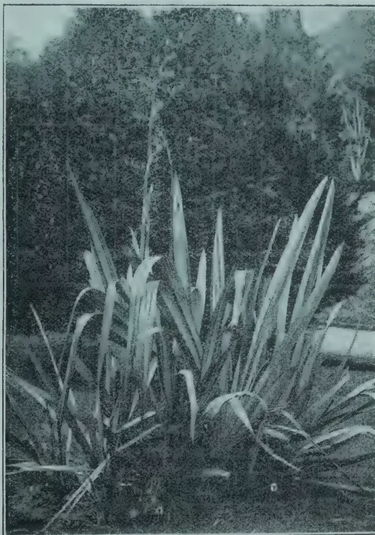

*Photo. by H. Macmillan.*

NEW ZEALAND FLAX. (*Phormium tenax*.)

## COTTON EXPERIMENTS IN THE CAPE PROVINCE.

Attempts at growing cotton have been made in various parts of the Cape Province, but the absence of any system of experiment and the want of the necessary supervision have made the results practically useless. A large portion of the Cape Province is not suited to the growing of this crop, and it was resolved to test the suitability of a certain area where the conditions of labour, soil, climate and rainfall seemed to indicate the best chances of success. The site chosen was at the Big Umgazi, in the District of Port St. John's, Pondoland. The soil consists of a rich, dark, heavy sandy loam, and was moderately moist at planting time.

Ten pounds of seed was used per acre. The land was only ploughed up once, namely just before planting, and harrowed. A shower of rain (about 0.35 in.) fell the evening after planting. Plants were thinned out

35------------------------------------------------

28JULY, 1913.

when 14 days old and again at one month. The perennial varieties—that is the Sea Island and Egyptian—were planted from 5 ft. to 7 ft. apart in the rows. The rows of the rest were 4 ft. apart. The annexed table shows the results obtained:—

<table border="1">
<thead>
<tr>
<th rowspan="2">Date of Planting.</th>
<th rowspan="2">Variety planted.</th>
<th colspan="2">Height of Plant.</th>
<th colspan="2">No. of Bolls to plant.</th>
<th colspan="2">No. of Bolls to lb. of Seed Cotton.</th>
<th rowspan="2">Percentage of Stand.</th>
<th rowspan="2">Size of Plot.</th>
<th rowspan="2">Yield per acre.</th>
</tr>
<tr>
<th>Selected.</th>
<th>Average.</th>
<th>Selected.</th>
<th>As found.</th>
<th>Selected.</th>
<th>As found.</th>
</tr>
</thead>
<tbody>
<tr>
<td>1911.</td>
<td></td>
<td>in.</td>
<td>in.</td>
<td></td>
<td></td>
<td></td>
<td></td>
<td></td>
<td>acres.</td>
<td></td>
</tr>
<tr>
<td>October 28</td>
<td>Sea Island</td>
<td>102</td>
<td>78</td>
<td>188</td>
<td>150</td>
<td>89</td>
<td>112</td>
<td>99</td>
<td>5</td>
<td>1 369.8</td>
</tr>
<tr>
<td>" 29</td>
<td>Egyptian Mitafih</td>
<td>102</td>
<td>78</td>
<td>222</td>
<td>99</td>
<td>98</td>
<td>119</td>
<td>94</td>
<td>3</td>
<td>1 285.6</td>
</tr>
<tr>
<td>" 29</td>
<td>American Toole</td>
<td>60</td>
<td>51</td>
<td>130</td>
<td>71</td>
<td>66</td>
<td>75</td>
<td>80</td>
<td>2</td>
<td>2 067.5</td>
</tr>
<tr>
<td>" 30</td>
<td>Nyasaland Upland</td>
<td>72</td>
<td>60</td>
<td>168</td>
<td>97</td>
<td>68</td>
<td>73</td>
<td>52</td>
<td>3½</td>
<td>1 548.2</td>
</tr>
<tr>
<td>" 30</td>
<td>Cleveland Big Boll</td>
<td>54</td>
<td>48</td>
<td>59</td>
<td>39</td>
<td>43</td>
<td>52</td>
<td>100</td>
<td>½</td>
<td>1 010.0</td>
</tr>
<tr>
<td>" 30</td>
<td>Herlong</td>
<td>48</td>
<td>45</td>
<td>57</td>
<td>34</td>
<td>—</td>
<td>—</td>
<td>100</td>
<td>½</td>
<td>810.0</td>
</tr>
</tbody>
</table>

The Sea Island and Egyptian varieties grew out almost too luxuriantly, so that the sun was excluded to a great extent and only about half of the bolls ripened. The annuals also grew out well and gave very satisfactory yields.

Weather conditions were favourable during planting time, but a protracted period of drought set in when plants were about six weeks old. The crop was freely cultivated and a certain amount of hand-hoeing was also done to keep the field clear of weeds.—MONTHLY BULLETIN.

## COTTON CULTIVATION IN TRANS-CAUCASUS.

Cotton has been cultivated in Trans-Caucasus for a long time. Under Persian rule the country produced a coarse native variety for which there was no market abroad, but which was largely used locally. A change took place soon after Trans-Caucasus was incorporated in the Russian Empire. Until then the obstacle to cotton cultivation by the peasants was that selling prices of the product were too low. Cereals, on the other hand, which yielded excellent crops, were grown to such an extent that eventually producers found difficulty in disposing of their grain even at low prices. Attention was thus again turned to cotton cultivation and numerous attempts were made to improve the quality of the fibre. The introduction of American seed and American methods gave such satisfactory results that in 1894 the limitation of cotton cultivation was prescribed, owing to cereals being neglected and the price of wheat becoming very high. In 1911 the cultivation of cotton in Trans-Caucasus occupied an area of 100,000 deiatines (109,200 hectares) and the crop was estimated at 5 million pounds (about 81,900,000 kilos). —CHAMBER OF COMMERCE JOURNAL.

36------------------------------------------------

JULY, 1913.]29

## THE LANCASHIRE COTTON INDUSTRY.

It may be said that during the past ten years the cotton industry has advanced at a greater rate than at any period of its history. The cause of this progress is due to many circumstances, all of which have been associated with the trade, more or less, since the beginning of the industrial revolution, hastened by mechanical inventions, in the latter half of the eighteenth century. The humidity of the Lancashire atmosphere is particularly well suited to cotton spinning and weaving. Lancashire still maintains the lead in the construction of machinery for the cotton industry. The trade is highly specialised in all its branches. The controllers and workers have proceeded from parents to children through each generation of its history, the strength of the former having been kept up by the increasing directive ability of the operative classes. By birth and training, by regularity of labour and trade union organisation, the workers are the best spinners and weavers in the world. Generally, whole families are engaged in the industry, either in preparatory processes or in spinning and weaving, or in the making of textile machinery. Their whole time is devoted to textile work, and that condition has prevailed in Lancashire now for over one hundred years. All this, of course, has given to Great Britain her chief cause in the continual advance of the trade—that is, the production of superior yarns and cloth. No country can yet approach Great Britain in her command of the world's markets for cotton manufacturers. As already stated about 82 per cent. of the output of her 850,000 looms goes abroad. As compared with other countries she depends chiefly on the production of mule yarn, mules being more adapted for the spinning of fine yarns. Of the 55,164,794 spinning spindles, only about 10,000,000 of them are ring spindles, and the majority of these have been erected since 1904. Germany, for instance, is about equally divided in the possession of mule and ring spindles, there being 5,193,212 of the one and 5,142,062 of the other. Most other manufacturing countries are in a similar position as regards the division of spindles. In the United States of America the cotton-spinning industry is chiefly of ring frames: her spindles are approximately 25,000,000 ring and 5,000,000 mule. Of the 20,000,000 spindles throughout the world engaged in the consumption of the finest grades of cotton, viz., Egyptian and Sea Island, 15,000,000 are in Great Britain. Likewise, British spindles are more employed in spinning the finer grades of American cotton than other countries are.

Among other advantages which Great Britain possesses is that of the cheaper cost of mill building. The cost of erection of spinning mills is estimated at 25s. per spindle; in Germany it is 37s., in America 50s., in France 35s. Also owing to the superiority of workers and organisation in English mills a less number of hands are required per spindle. Dr. Schulze-Gaevernitz, a German investigator, produces several examples of this. In one instance he takes a typical mill in Oldham (England) and one in Mulhouse (Germany). The complete figures of each mill show that the percentage of operatives per 1,000 spindles in Oldham was 2·4 and 5·8 in Mulhouse. In Switzerland the percentage on 40's twist was 6·2, whilst in Oldham it was only 2·3.—INDIAN TRADE JOURNAL.

37------------------------------------------------

30[JULY, 1913.

## LONG STAPLE UPLAND COTTON FOR THE TROPICS.

The following extracts are from an article written by Howard Newport, Instructor in Tropical Agriculture, to the *Queensland Agricultural Journal*:—

The question as to whether Sea Island or Upland types of cotton are best suited to Queensland has been much debated by those interested and, so far as cotton culture has found favour at all in this State, it would seem that Sea Island varieties have, on the whole, been found the best in the coastal agricultural belts of the North, while the Uplands are the principal varieties considered in the more Southern parts.

The case for the two types may roughly be stated as follows:—The Sea Island is usually a perennial, bearing better crops in its second and third seasons than in its first, and is a long staple obtaining 25 per cent. to 50 per cent. better prices than normal Upland cotton. Varieties of this type are sometimes called Tree cottons, and, as a rule, the bushes are larger and taller than the Upland, and will stand a heavier rainfall. This type may be recognised by the dash of magenta or light red colouring in the petals of the flower, by a more deeply indented or incised leaf, and the clean skin or absence of "fuzz" on the seed.

The Upland types are usually annual, though sometimes showing perennial tendencies in the tropics, and have generally a short staple and a correspondingly lower value. The bush is smaller as a rule, and more can be grown to the acre. It is supposed to be better suited to drier situations and poorer soils. The type may be recognised by the wooliness of fuzz on the seed, by a less incised leaf, and the absence of any colouring at the base of the petal.

Between these types there are, of course, many variations and hybrids, for the cottons, like the hibiscus, to which they are nearly allied, naturally hybridise very readily.

In cultivation, also roughly, the Sea Island, while it will grow and thrive in wetter localities than Upland, must have a well-defined dry season for ripening its crop and for harvesting. The higher value obtained by its longer staple and its perennial habit does not necessarily constitute such an overwhelming advantage, however. While in North Queensland also it does best nearer the coast, in the richer soils, and where the rainfall is more continuous and heavy, the so-called advantage of its not requiring annual replanting or resowing is, to a large extent, set off by its tendency, under these conditions, to run to wood and leaf at times when the dry season happens to be shorter or not so clearly defined as usual; by a considerable risk of damage by storms, especially wind; by a protracted harvesting season; by the inevitable growth of weeds engendered by its permanent occupancy of the field rendering its cleaning difficult at all times and the cost heavy in view of the high price of labour in these parts; and last, but not least, a grave possibility of the perpetuation of pests and diseases for the same reason.

38------------------------------------------------

JULY, 1913.]31

The Upland, on the other hand, in cultivation, needs a drier locality and poorer soil, and, though a smaller bush, is found to be quicker maturing, ripening its bolls more uniformly, and to be therefore more easily and cheaply picked. In favourable localities for growing Upland cotton there is less risk of loss by storms or wet weather during harvest. The returns per acre very nearly, if not quite, equal the longer-stapled Sea Island cottons in quantity, though not in quality or price. As a field crop it admits of a cleaning up annually, and may be ploughed out immediately after the crop is off, and the field fallowed for a few months before the resowing for the next season's crop. This involves the destruction of the old bushes and, with them, any pests that may have made their appearance during the season; it allows for better and more thorough tilth, and at the same time is easier, more satisfactorily and cheaply kept clean than the periodic weeding and hoeing necessary for the permanent or perennial Sea Island types can do.

Given suitable climate conditions, therefore, while the Upland cotton crop may be of less intrinsic value, its cost of production is often less, and the production of profit quite as great as that of a field of Sea Island cotton.

The obtaining of the climatic conditions, or, inversely, the selection of the type of cotton suited to given climatic conditions, is a factor of far greater importance in the successful cultivation of this staple than would appear to have been recognised here as yet. These two types are by no means interchangeable at pleasure on most selections or farms; though the selection of the wrong type has in some instances, without doubt, been one at least of the principal causes of want of success, and in which cases success would be induced by such a change.

In this vast country there are hundreds of acres of land of all kinds and classes with equally divergent climatic conditions, and greater attention to the adaptation of suitable types to the climatic and soil conditions found to exist on a given selection, or where the staple is already determined upon, the more careful selection of suitable sites for plantations, would go far towards producing those individual successes so necessary here for the establishment of any new staple industry. It cannot be taken for granted that because maize can be grown, any species of cotton crop must, therefore, necessarily be a success.

### COTTON IN NORTH QUEENSLAND.

In Northern Queensland it would seem more likely that cotton culture might be established as an industry in the drier portions of the plateau, and that probably with the shorter-lived but more easily and cheaply cultivated and produced Upland types.

Wherever cotton culture is established as a staple industry, scientific investigation has not been idle both in the improvement of methods of culture, in harvesting, and in the improvement of varieties. Among the Sea Island types the search for more reliable cropping varieties has, however, not met with as great success perhaps as the search for, or efforts to evolve by hybridization, a long-stapled species among the Upland types. Numerous trials have been carried out in the United States which have shown that new varieties of Upland cottons are to be found that are adapted to the tropics.

39------------------------------------------------

32[JULY, 1913.

These varieties, so far, would seem to retain the characteristic preferences of the Upland types for dry conditions, though irrigation has been found feasible and beneficial in increasing the length and quality of the staple. This may be taken to imply that, possibly, these varieties will thrive somewhat nearer the coast, or at least under a rainfall heavier than that essential for the normal Uplands, though probably still necessitating a very clearly defined dry period.

Allen's Improved Long-staple Upland Cotton and a variety named the Sunflower are mentioned as some of the most satisfactory results of such trials; and now another variety, called the "Durango," is spoken of by Mr. O. F. Cook. Of this it is said in the "Tropical Agriculturist" for October, 1912:—"The variety called Durango is said to be superior to the old long staples. It is described as early and prolific, and producing larger bolls than Allen and Sunflower. The lint, if not as long, is more abundant and uniform in length—about  $1\frac{1}{4}$  in. under favourable conditions. Other advantages stated are that the bulk of the crop could be gathered at one picking, and that the plant is decidedly drought-resisting. With the soil of the right texture and a supply of moisture through irrigation, it has been found possible to grow long-staple cottons such as this variety in a dry atmosphere. Too free irrigation is to be deprecated, and, given good tilth and a wet season for the germinating of the seed, it is found better to resort to irrigation only to protect the maturing crop against injury by too severe drought."

In Uganda the following results are available of trials with the two former cottons:—Allen's Improved Long-staple Upland Cotton there yielded over 1,000 lb. of seed cotton to the acre with an out-turn of 30.6 per cent. lint, which was reported on as being clean, lustrous, soft, cream-coloured, and free from stains, of excellent quality and good lustre, a fine, long, silky staple of fair strength that varied in length from 1.1 to 1.8 in., averaging between 1.4 and 1.6 in. It was valued at 9 $\frac{1}{4}$ d. to 9 $\frac{1}{2}$ d. ginned, when middling American was 5.93d. Taking the lower figure, this gives us a return of about £12 worth of lint per acre.

Figures for the Sunflower variety are not given, this being dismissed with the short statement that it was also tried, but found not so good.

Neither the Sunflower nor Durango, so far as I am aware, have yet come to North Queensland; but Allen's Improved has, and some very interesting experiments have been carried out at the Gossypium Park Estate by its director, Mr. Joseph Campbell, M.A.

Seed was received by Mr. Campbell from the British Cotton Growers' Association through Mr. H. Crankshaw, of Letchworth, Herts, England, and was sown at Gossypium Park, Kamma, near Cairns, in August, 1911. Unfortunately, 1911 was a very dry season (the latter part of it), and anything but a favourable one for cotton; also, the planting on this occasion (owing to the late arrival of the seed) was rather out of season. The new variety was not found to be drought-resisting under these conditions, though it might prove more so if sown earlier in the year. Possibly for the same reason, it proved a shy bearer in this experiment, producing only at the

40------------------------------------------------

JULY, 1913.]33

rate of some 200 lb. per acre. The out-turn, however, was most promising and indeed higher than has been as yet recorded, I believe—viz., 35 per cent. of clean lint of excellent quality. This is very considerably above the average for Upland cottons here.

As already stated this experiment was an out-of-season one, it being necessary to germinate the seed when received for fear of its losing its vitality if kept till the next year. Better results are anticipated in the matter of growth and returns with the acclimatised seed now obtained, and by more seasonable sowings, which the good out-turn obtained more than warrants. Mr. Campbell, therefore, is following up the experiment with his own new seed by sowing another plot this month (February) for a harvesting in September next, the results of which will be awaited with interest.

## THE CULTIVATION OF CAMBODIA COTTON IN MADRAS.

By H. C. SAMPSON.

Cambodia cotton was first grown in the extreme south of the Presidency, i.e., in the Tinnevelly and Ramnad districts. On its first introduction, it was tried on black cotton soil as a dry crop in the same way that country cotton is grown. It was soon found that this was not nearly such a certain crop as the ordinary country cotton. Though in very favourable seasons i.e., in seasons with a well distributed rainfall with rain at regular intervals—it gave a heavier crop than the indigenous cotton, it was found that such seasons were few and far between and that in the long run the country cotton paid better. Then it was that it was tried with the aid of irrigation. Some farmers near Virudupatti who were growing it on shallow black soil (Veppal) which could be commanded by a well, gave the crop an irrigation with a view to save the total failure of the crop. The cotton improved so much under this treatment that a further irrigation was given with the result that the crop gave a very heavy yield. The next year every one who could obtain seed was growing Cambodia cotton on land commanded by irrigation. Other people who had no wells tried it on dry rainfed land, but quickly gave it up again. Thus within a very short time, Cambodia cotton became an established crop to be grown with the aid of irrigation. Since then, the fame of this cotton has gradually spread northwards through Madura, Ramnad, Trichinopoly and Coimbatore, and as it spreads one sees people learning the same lesson by experience, viz., that Cambodia, if it is to pay well, must be grown on land which can be irrigated. One always sees farmers, where this is a new crop, trying their luck with this as a rainfed crop, but one always sees that they do not try it again unless in the first year they had by chance an exceptionally good season.

The three lessons which farmers in some places have already learnt and which others can learn now without having to learn by experience are:—

1. (1) Do not grow Cambodia cotton on land which you cannot irrigate.
2. (2) Do not keep the crop in the land after the ordinary picking season is over. It does not pay and it harbours insect pests which spoil your cotton crops the next year.

41------------------------------------------------

34[JULY, 1913.

(3) It pays to grow Cambodia cotton as an absolutely pure crop, even though the dealers may themselves mix it after they have ginned it.

Attention to the advice given above will be of great value not only to the individual farmer, but to the cotton grower in general. Dirty, immature and mixed cotton, which is the result of not paying attention to the lessons mentioned above, has the effect of generally lowering the market price. Spinning mills speak very highly of pure Cambodia when obtained from a well-grown crop. They object strongly however to the stained lint which is so commonly seen in the late pickings or in any unhealthy crop. They object also strongly to the weak fibre which adheres to immature seeds. Here again this is largely due to the unhealthy condition of the crop attracting those insects which suck out the juice from the young seed and prevent it from maturing. Finally they object strongly to a mixture of Cambodia and country cotton, specially when making yarn for dyeing since these two varieties of cotton do not take up the dye evenly.—THE MADRAS AGRIC: CALENDAR.

42------------------------------------------------

JULY, 1913.]35

# OSTRICH FARMING.

---

## THE INDUSTRY IN AMERICA.

---

All the large ranches are irrigated from a main ditch running through the property, so that provision may be made for supplying water to the feeding paddocks which are alongside, and also in order that ample water may be provided in the run and feeding paddocks for the birds' drinking purposes, and to allow of their bathing when they so desire.

The feeding paddocks, or "corrals" as they are invariably called in America, are arranged side by side along the main ditch, and each run paddock has five or six feeding paddocks attached to it.

These feeding paddocks are from 6 to 10 acres in extent, according to the area of the run paddock to which they are attached, the idea being to have the total area of the feeding paddocks for each run paddock about one-third of the size of the run paddock; thus if there are six 10-acre feeding paddocks attached to one run paddock, or a total area in feeding paddocks of 60 acres, the run paddock will be about 180 acres. On some of the ranches the whole of the run paddocks are used as combined run and feeding paddocks, but the best results are secured from having separate run and feeding paddocks, although there should be some kind of strong-growing perennial grass planted in all the run paddocks.

The feeding paddocks are only made available one or two at a time. They are planted with various leguminous plants, such as alfala (*lucerne*), clovers, field-peas, or cowpeas; while some are kept for cereals, such as barley, oats, wheat, and millets of various kinds; the idea being to have some kind of green feed all the year round.

*Lucerne* is the main stand-by among the legumes, and barley and the millets among the cereals for winter and summer feed respectively. The run paddocks are sown with some kind of hardy perennial grass that will grow without much irrigation. If irrigated, this portion of the land is only as a rule subjected to what is called "wild flooding."

All the paddocks that are irrigated are allowed to dry well before the birds are allowed in, as the ostrich does not thrive with wet feet.

The men looking after the birds see that their water supply is kept up, collect the eggs and any loose feathers lying around daily, look after and at once isolate any birds showing signs of sickness, and so on.

When any of the birds are fit to be plucked the mob containing them is driven to the plucking crushes. As each bird is to be dealt with, a bag, in the form of a large stocking, is put over its head, when it at once submits to any operation that is necessary to denude it of its valuable feathers, which are invariably clipped, although the operation is called "plucking."

43------------------------------------------------

36[JULY, 1913.]

The idea in the minds of many people that ostriches "mute" for life has been quite exploded on these large ranches. If two birds of opposite sexes are kept together for any length of time they will form a sort of attachment, but let either one out among the flock on the ranch and they at once take a freer view of their duties in this respect.

The greater number of birds in the Arizona ostrich farms are of South African stock and type, but it has been recently demonstrated that an infusion of Nubian or Red-necked blood has increased, not only the physical stamina of the birds, but also their capacity for producing valuable feathers.

The ostrich breeder has always to contend against the possibility of a proportion of his young birds reverting to the wild type, and thus, while, perhaps, producing an equal weight of feathers per year, producing them of an inferior quality as far as the greater proportion is concerned.

Although the birds having the most valuable feathers are the ones utilised for breeding, still there seems a tendency in the progeny to get back to a more mediocre type.

Experts say that this is largely because the breeding of ostriches in captivity on scientific principles has not yet extended over a sufficient number of generations to fix the improvements that have undoubtedly been made in their feather-producing capacity by careful selection. In this regard there is yet great work to be done by those who thoroughly understand the art of type-fixing in animals.

In selecting breeding birds, too often are the males only carefully selected, while the inferior females are less carefully culled out. In this way, too, much reliance is placed upon the power of the male animal to reproduce his kind from inferior females, and while the resulting birds are usually better than their inferior maternal parent, it takes many generations to get the inferior points of the progeny brought up to even a fair standard.

To breed first-class ostriches a good type of female bird is more important than a good male type, and this is especially so at present owing to the types, even in the best males, not having yet become permanently fixed.

All the eggs proposed to be used for hatching are first carefully selected and numbered or marked according to parentage, and after this is completed their numbers are again reduced by excluding all but the largest and most correctly formed; the rejected eggs are sold to those who work them up into ornamental or useful articles.

The ostriches are all kept in mobs or flocks, according to age and ability to agree. Those of similar age have often to be divided into several small flocks because of their fighting propensities, and their general practice of worrying the weaker members. It often happens that birds of a previous season, or of the earlier breeds of the same season, have to be put back, according to their size and general physical condition, among younger companions; while particularly aggressive, specially developed, or quarrelsome young birds have often to be paddocked with their seniors to reduce them to a reasonable state of conduct.

44------------------------------------------------

JULY, 1913.]37

The feathers, when taken from the birds, are roughly classed by girls, and are tied in bundles weighing from about  $\frac{1}{2}$  lb. to 1 lb., and are sent direct to New York, to be made into the feathers of commerce.

The eggs are hatched in incubators, and the young are thus never in the care of their parents. They are kept in what is called the "chicken-run," and are specially cared for until old enough to be put out to "shift" for themselves in the large ranch paddocks.

The ostriches are valued, not from the point of view of general appearance, or from their productivity in feathers, but from their producing power of the higher grades of feathers, the inefficient in this regard being constantly weeded out, and too often sold to the inexperienced inaugurators of new ostrich farms.

Good birds require no more food or attention than mediocre or inferior ones, and as there is a tremendous difference between the annual returns from the best birds and even the second grades, it is more important to keep only the best in this class of farm stock than it is in any other. The ostrich has only one use—feather production—while any other class of farmbred stock has alternative uses to which it may be put; and this makes it all important from the point of view of those entering the industry that they should rigidly exclude from their early purchases all but the very best birds obtainable.

The ostrich lives to a great age—for longer than any other class of farmbred stock—so, if a good start is made, and the farm managed with reasonable intelligence, the flocks are a practically permanent source of income, and the yearly increase when the farm is fully stocked may all be sold.—AGRICULTURAL GAZETTE OF N. S. W.

---

45------------------------------------------------

38[JULY, 1913.

## EXPLOSIVES IN AGRICULTURE.

---

Dynamite or other explosives—and for the sake of brevity let me say “right here,” that every time I use the word dynamite, I mean to infer “or other explosive if more suitable”—can be used with advantage in agricultural industries for the following reasons:-

1. To break up hard or virgin soil to facilitate ploughing; and especially to break up the under-crust, when present, which no plough could penetrate, at any rate no plough used by the average farmer or planter.

2. To blast out for removal, boulders, or rocks, and especially tree stumps, whereby not only is the risk of root disease removed, but what is of great importance, the ground is left in a state to be easily and properly ploughed; which otherwise would be impossible in a satisfactory manner, if the stumps or rocks are left *in situ*.

3. For clearing the soil of pests, destroying ants' nests, or rabbit warrens, etc. etc., as well as for regenerating and aerating hard or worn-out soils generally—as the sugar-lands on some of the West Indian estates which are not ploughed, but only hoed; i.e., the surface only scratched over, but the hard pan sub-soil is left year after year, and so becomes water-logged and airless; hence dangerous.

4. For throwing up the soil for drains, especially deep gullies, and facilitating its removal by ploughs or hand.

5. For making holes for tree-planting, and at the same time loosening the soil, which is a great advantage; also for fence-post holes, or for setting uprights for buildings, etc., in position.

6. For well-boring, or well-torpedoing—i.e., for increasing the flow from an artesian well by exploding a charge at the bottom of a well, to widen the aperture, and break up the ground, to let further supplies of water (or oil, if an oil-well) come through.

As time goes on, many other uses on the estates will no doubt be found, but as I do not pretend to have an exhaustive knowledge on the subject, I think I have said enough. Of course, I do not pretend to touch on the use of explosives for mining, since I speak only from the agriculturist's point of view; nor even of their utility for removing large masses of rock or soil for making estate roads, as the latter, although not uncommon, is too big and dangerous a task for the average planter, and should not be carried out without consulting an expert, one of whom now-a-days is to be found at all large centres, especially in the neighbourhood of mines.

“It must not be thought that dynamite obviates the necessity of top ploughing,” very truly points out the *Queensland Agricultural Journal*. “Far from it. The plough must be used just as much as ever. The only difference is that the dynamite expends its disintegrating force in the sub-soil, which is never touched by the plough, so that one is not merely

46------------------------------------------------

JULY, 1913.]39

planting the crops in the same soil year after year," but can, by its use enable the crops to draw up their nutriment from below. Where clay sub-soils form a water seal, the use of explosives, if correctly applied, breaks up the clay strata and so allows the accumulated and stagnant water to pass through (at the same time the explosion kills myriads of harmful lives), and dissolving the plant foods in the lower, and hitherto inaccessible strata, liberates it in such form that it can be drawn up by capillary attraction, and pass through with the now non-stagnant water to be assimilated by the crops. May I remind you here—as I reminded the readers of my book on "Coco-nuts"—of the need of regular, adequate supplies of water at all times, if you want good crops. Water is necessary, and therefore should constantly be at the disposal of the crops (provided, of course, if not in over supply), to convey the plant's food in soluble form up to the crown. The quantity of such food assimilated or digested by the plant is roughly proportional to the amount of water which it absorbs—provided, of course, that the food is there to be absorbed; but the food alone is no use; without the water it cannot pass up the trees or plants and nourish them.—Mr. HAMEL SMITH IN THE INDIA RUBBER JOURNAL.

## COST OF SUBSOILING WITH EXPLOSIVES.

The extract given below is from an article contributed by H. C. Coggins to the *Agricultural Gazette of N.S.W.* :—

The following table will give some idea of the cost of subsoiling with explosives. I do not include labour, as this will depend on the rate paid and also on the strength of the ground. Where conditions are easy, a hole a minute should be done; but where the hard pan is tough and the subsoil very compact, it may take five minutes. Preparing the charges and tamping the holes will take nearly 4 minutes per hole.

Table showing Cost of Subsoiling with Explosives.

<table border="1">
<thead>
<tr>
<th>Distance of holes apart.</th>
<th>Charge.</th>
<th>Number of holes per acre.</th>
<th>Number of lb. per acre.</th>
<th>Number of feet of fuse per acre in 3 ft. holes.</th>
<th>Number of detonators per acre.</th>
<th>Total cost per acre.</th>
</tr>
<tr>
<th>Feet</th>
<th>Plug.</th>
<th></th>
<th></th>
<th></th>
<th></th>
<th>£. s. d.</th>
</tr>
</thead>
<tbody>
<tr>
<td>10</td>
<td><math>\frac{1}{2}</math></td>
<td>435</td>
<td><math>21\frac{3}{4}</math></td>
<td>1,305</td>
<td>435</td>
<td>2 12 9</td>
</tr>
<tr>
<td>10</td>
<td>1</td>
<td>435</td>
<td><math>43\frac{1}{2}</math></td>
<td>1,305</td>
<td>435</td>
<td>3 14 6</td>
</tr>
<tr>
<td>12</td>
<td><math>\frac{1}{2}</math></td>
<td>302</td>
<td>15</td>
<td>906</td>
<td>302</td>
<td>1 16 6</td>
</tr>
<tr>
<td>12</td>
<td>1</td>
<td>302</td>
<td>30</td>
<td>906</td>
<td>302</td>
<td>2 11 6</td>
</tr>
<tr>
<td>15</td>
<td><math>\frac{1}{2}</math></td>
<td>194</td>
<td>10</td>
<td>582</td>
<td>194</td>
<td>1 3 10</td>
</tr>
<tr>
<td>15</td>
<td>1</td>
<td>194</td>
<td>20</td>
<td>582</td>
<td>194</td>
<td>1 13 11</td>
</tr>
<tr>
<td>18</td>
<td><math>\frac{1}{2}</math></td>
<td>128</td>
<td><math>6\frac{1}{4}</math></td>
<td>384</td>
<td>128</td>
<td>0 15 4</td>
</tr>
<tr>
<td>18</td>
<td>1</td>
<td>128</td>
<td><math>12\frac{1}{2}</math></td>
<td>384</td>
<td>128</td>
<td>1 0 7</td>
</tr>
<tr>
<td>20</td>
<td><math>\frac{1}{2}</math></td>
<td>109</td>
<td>5</td>
<td>327</td>
<td>109</td>
<td>0 12 9</td>
</tr>
<tr>
<td>20</td>
<td>1</td>
<td>109</td>
<td><math>10\frac{1}{4}</math></td>
<td>327</td>
<td>109</td>
<td>0 18 0</td>
</tr>
</tbody>
</table>

47------------------------------------------------

40[July, 1913.

# SOILS AND MANURES.

---

The following conclusions as to the changes in soils due to manuring are taken from the *Monthly Bulletin*:—

I. The injurious action of alkaline manuring upon sandy-humous soils, to which is attributed the oat disease, is due to the formation of certain unknown humic bodies, which are chiefly found in those portions of the organic matter which are insoluble in alkalis.

II. Owing to the use of chemical manures, the study of humic substances is especially important. It is therefore much to be wished that abnormal occurrences in the cultivation of humiferous soils should be studied from the chemical point of view. The study of the effects of chemical manures upon humic substances is also of great importance for agricultural bacteriology.

Dealing with the efficiency of soluble manures in dry years, the same journal states:—

I. Mineral manures are more efficient than organic manures. Among the nitrogenous manures used (organic manures, oil-cakes, cyanamide, nitrate of soda) nitrate of soda yielded the best results. In most cases the other nitrogenous manures did not give any excess over the control plot.

II. The manures must be ploughed in early, excepting the nitrate of soda which should be given as a top-dressing: in February in the vineyards, in December one-third and in February or March two-thirds on cereals. For other crops the nitrate of soda is to be ploughed in with the phosphatic and potash manures.

III. There is a minimum of moisture below which manures act but little, and give no profits. According to M. Chouchak, in Crimea if the rainfall is less than 200 mm. (8 inches) from November to the end of June and on soils containing less than 15 per cent. of moisture, increase the yield by very little or nothing.

IV. Phosphatic manures are insufficient in poor soils or in those only moderately rich in nitrogen. They must be completed by nitrate of soda or by sulphate of potash.

---

## EXPERIMENTS IN MANURING TEA IN DARJEELING.

Mr. Claud Bald, Manager, Tukvar Co., Ltd., Darjeeling, has contributed the following to the *Agricultural Journal of India*:—

It is impossible on a hill garden to find a continuous block of land where the quality of the soil is exactly equal over any considerable area, as the undulations of the land of necessity divert some of the best constituents of the soil into the hollows from the ridges, more or less, during heavy rain.

48------------------------------------------------

JULY, 1913.]41

The block which was selected for these experiments seemed to all appearance as nearly equal in quality throughout as it was possible to obtain; and yet the event proved that there was some difference in favour of one side. The land was carefully measured, and the straight lines of tea bushes made it easy to plot off accurately four plots, each measuring half an acre. They were numbered from one to four. The land is slightly better in the direction, of No. 4, which has been kept as the check plot. In regard to cultivation, pruning and plucking, all the plots have been treated exactly alike; so that the experiments might determine the results of the manuring only. The experiments were continued for three years. It will be noted that no farm-yard manure has been experimented with; the reason being that on the estate no grazing is permitted, and there are very few animals kept, hence natural manure is not available in any considerable quantity, and it has become necessary to consider whether chemical or artificial manures can be applied in such a way as to prove remunerative.

In the first year the object was to find out whether the application of *castor meal* would give any encouraging result. An exceptionally heavy dressing was given to plot No. 1, while half the quantity was given to No. 3, and No. 2 was treated with *green manure* only. The green manure was a crop of *dal* similar to what is known as "*Mali Kalai*." The crop for the year was largest from No. 4, the untreated plot, indicating that the castor meal had practically no effect upon the outturn, while the better soil in the direction of No. 1. asserted itself.

In the second year Nos. 1 and 3 were treated with *chemical* manure but, *without nitrogen*, except the small quantity contained in the castor meal on No. 1. The nitrogen was purposely omitted, as it was feared that this manure would tend to the production of rank leaf, making coarse tea. No. 4 was again almost the highest in quantity of produce; but it was beaten by No. 2, which had been treated for two years in succession with green manure only.

In the third year No. 1 was treated with a *complete chemical* manure with the addition of a small dressing of castor meal. No. 2 again had green manure only; while No. 3 had an application of *animal meal*. The nitrogen applied to No. 1 (in the form of ammonia), sent up the crop from that plot to the highest point; but it was closely followed by No. 2, which made an increase on its previous record. The check plot made rather less tea than in the previous year.

Some of the outstanding facts in connection with these experiments are the high cost of chemical and artificial manures in a remote district like Darjeeling, and the extreme doubtfulness of their economic utility; also the possibility of using expensive manures while accomplishing practically no result, in consequence of the manure used not being of a suitable composition, then there is the special outstanding fact that while green manuring is the cheapest method, it produces remarkably satisfactory results. It may be noted that the manures were used in one application only, as the nature of the ground was such that it was not advisable to dig at all during the rainy season, for fear of losing soil by wash.

49------------------------------------------------

42[JULY, 1913.

An important fact in connection with the green manuring is that the crop was not dug into the land in the green state. It was only sickled when it came to maturity, and left as a mulch upon the ground until the rains were over, when the rotting stuff was dug in. At the same time a similar quantity of ordinary jungle growth was dug into each of the other plots. It is probable that the rotting leguminous crop contained a larger proportion of nitrogen than the rotting jungle; but in any case it seems that the special benefit which accrued to plot No. 2 may be chiefly attributed to bacterial action on the roots of the leguminous crop.

The relative amount of crop having been determined as a result of the manuring, it remained to be seen whether there was any difference in the quality of the teas produced under the different circumstances. This is indeed the most important consideration of all on a hill garden, where the quality of the teas must of necessity be the first consideration. With a view to determining this a set of samples was carefully prepared from each plot, and reported upon by an expert. The valuations were  $10\frac{1}{2}d.$ ,  $11d.$ ,  $9d.$ , and  $1s.$  per lb. of samples made from plots 1-4 respectively on 18th September 1911. It has been felt, however, that in order to determine the real relative value it is necessary to have a series of samples drawn from the plots at stated intervals throughout the manufacturing season, as it is well-known that some of the chemicals are so evanescent that their effects upon the teas may be very great in the earlier part of the season, while other ingredients which only become absorbed by the plant after some months may have a very different effect upon quality towards the end of the season.

A digest of the results for the three years in crop and cost is as follows:—

<table border="1">
<thead>
<tr>
<th></th>
<th>1909.</th>
<th>1910.</th>
<th>1911.</th>
<th>Total.</th>
</tr>
<tr>
<th>Tea per acre in Plot No. 1</th>
<th>lbs.</th>
<th>lbs.</th>
<th>lbs.</th>
<th>lbs.</th>
</tr>
</thead>
<tbody>
<tr>
<td>Plot No. 1 -</td>
<td>247</td>
<td>265</td>
<td>345</td>
<td>857</td>
</tr>
<tr>
<td>" 2 -</td>
<td>239</td>
<td>313</td>
<td>324</td>
<td>876</td>
</tr>
<tr>
<td>" 3 -</td>
<td>258</td>
<td>270</td>
<td>312</td>
<td>840</td>
</tr>
<tr>
<td>" 4 -</td>
<td>275</td>
<td>305</td>
<td>286</td>
<td>867</td>
</tr>
</tbody>
</table>

The cost of treatment works out as follows:—

<table border="1">
<thead>
<tr>
<th></th>
<th>1909.</th>
<th>1910.</th>
<th>1911.</th>
<th>Total.</th>
</tr>
</thead>
<tbody>
<tr>
<td>Plot No. 1</td>
<td>Rs. 64'0'0</td>
<td>Rs. 33'0'0</td>
<td>Rs. 44' 9'6</td>
<td>Rs. 141'15'6</td>
</tr>
<tr>
<td>" 2</td>
<td>" 4'9'0</td>
<td>" 4'9'0</td>
<td>" 4' 9'0</td>
<td>" 13'11'0</td>
</tr>
<tr>
<td>" 3</td>
<td>" 32'0'0</td>
<td>" 16'6'0</td>
<td>" 15'14'0</td>
<td>" 64' 4'0</td>
</tr>
<tr>
<td>" 4</td>
<td></td>
<td></td>
<td></td>
<td></td>
</tr>
<tr>
<td>Check Plot; no expenditure.</td>
<td></td>
<td></td>
<td></td>
<td></td>
</tr>
</tbody>
</table>

50------------------------------------------------

JULY, 1913.]43

The total crop from No. 4 is comparatively high, because it stood relatively so high in the first year. Apart from the question of the relative quality of the tea produced, it will be seen that the extra crop from No. 3 is not sufficient to pay for the treatment which was given to it, while the cost of the treatment to No. 1 is altogether prohibitive. The valuation of the samples places No. 4 the untreated plot, much higher than any of the others while the green manured plot comes second, and the plot treated with animal manure is given a very low place. It may be remarked again, however, that the valuation for the reason above mentioned cannot be regarded as final.

## EFFECT OF PARTIAL STERILISATION OF SOIL ON PRODUCTION OF PLANT FOOD.

This communication forms the second part of the report on an investigation of the zoological inhabitants of the soil, which was suggested by the increase in bacterial activity and consequently in the production of plant food in the soil subsequent to the partial sterilisation of the soil by heating or by the use of certain drugs. The authors consider that the conclusions reached previously have been confirmed and extended by the continuation of the work. Fresh evidence is adduced that bacteria are not the only inhabitants of the soil, but that another group of organisms occurs, detrimental to bacteria, multiplying more slowly under soil conditions, and possessing lower power of resistance to heat and antiseptics. In consequence of the presence of these detrimental organisms the number of bacteria present in the soil is not dependent merely on the temperature, moisture content, and other conditions of the soil. It may indeed show no connection with them; thus rise of temperature may be accompanied by a rise in the number of bacteria, or a fall, or the number may be unaffected; increase in moisture content has also proved without action. The number of bacteria depends on the difference in activity of the bacteria and the detrimental organisms.

When soil has been partially sterilised, however, the detrimental organisms are killed, and the bacteria alone are left. It is found that increase in temperature up to a certain point, favours bacterial multiplication.

The detrimental organisms are killed by any antiseptic vapour, such as that of toluene, or by heating the soil to 55°-60° C.; they suffer considerably when soil is maintained at even lower, but still higher than the normal, temperatures (e.g., 40° C. for a sufficient length of time). Cooling to low temperatures also depresses them, although it fails to kill them.

Once the detrimental organisms are killed the only way of introducing them again is to add some of the untreated soil. But the extent of the transmission is apt to be erratic, being sometimes more and sometimes less nearly complete than at others. The precise conditions governing the reintroduction have not yet been learned.

The authors provisionally identify the detrimental organisms with the active protozoa, but as the zoological survey of the soil is yet incomplete, they do not commit themselves to any particular organism or set of organisms, or to any rigid and exclusive definition of the term protozoa.

51------------------------------------------------

44[JULY, 1913.]

The increase in the number of bacteria following partial sterilisation by volatile antiseptics is accompanied by an increase in the rate of ammonia production until a certain amount of ammonia or of ammonia and nitrate has accumulated, when the rate falls. Thus two cases arise: (1) when only small amounts of ammonia and nitrate are present; here the increase in the number of bacteria following on partial sterilisation causes a corresponding increase in the amount of ammonia and nitrate; (2) when large amounts of ammonia or of ammonia and nitrate are present, the increased numbers of bacteria then causing no corresponding increase in the amounts of ammonia and nitrate. There is a fairly well-marked limit beyond which the accumulation of ammonia and nitrate will not go, although bacterial multiplication may still continue. The limit varies with the composition and condition of the soil.

Complications are introduced when the soil has been partially sterilised by heat, because heat effects an obvious decomposition of the organic matter, thus changing the soil as a medium for the growth of micro-organisms. The bacterial flora is also very considerably simplified through the extermination of some of the species. These effects become more pronounced as the temperature used is higher and the tendency is to reduce the numbers of bacteria. Maximum numbers of bacteria are found in soils that have been heated to the lowest temperature necessary to kill the detrimental organisms (about 60° C.). In this case the bacterial numbers and the rate of decomposition are similar to those in soils that have been treated with volatile antiseptics, and the relations between the numbers of bacteria and the decomposition noted under (1) and (2) above also hold. No relation was found, however, between the numbers of bacteria and the decomposition in soils that had been heated to 100° C. In this case, although the number of bacteria was at a minimum, the decomposition effected was at a maximum. When the bacteria are reintroduced into the partially sterilised soil by the addition of untreated soil, a still further production of ammonia and nitrate is brought about, unless too large a quantity of those substances is already present, but the depression in bacterial numbers that follows, owing to the detrimental organisms being reintroduced at the same time, generally does not check the decomposition owing to its having already gone near to the limit before the check could take effect.—E. J. RUSSELL & H. B. HUTCHINSON IN THE JOUR. OF THE AGRICULTURAL SCIENCE.

---

52------------------------------------------------

JULY 1913.]45

## RUTHERFORD'S PLANTERS' NOTE BOOK.

---

The 5th edition of this useful book, the first of which appeared in 1887, has just been issued, and this fact alone goes a great way to prove the appreciation of its value. As a planter's *vade mæcum*, revised and brought up to date, it is we believe without a rival and should find a place in every estate bungalow.

The original scope of the "Note-book" was limited to the requirements of the tea-planter, but the development of the planting industry on new lines has necessitated considerable expansion and the result is a mass of "memoranda for all connected with the planting industries of the middle East" and we may add the whole tropic world.

The name of the present editor is not disclosed, but the authorities consulted are referred to in the preface.

The general information section is as varied as could be wished for, and apparently nothing connected with the life of the planter has been lost sight of. The details of cost under every conceivable head is another valuable contribution. Then follow the notes on tea, rubber, coconut and coco with very full particulars of cultivation, and a special chapter on the important subject of manuring. The rest of the work is devoted to medical and legal information and a practical lesson on book-keeping.

It will thus be seen that Rutherford's Note book is an "Enquirer within upon Everything," a veritable planting encyclopædia carefully compiled to meet the requirements of the Tropical Agriculturist and invaluable to the planting recruit.

The system of indexing is a special feature and makes reference quite easy. We can thoroughly recommend this book to every planter, whether in the East, in Africa or on the West Indies.

\* Rutherford's Planter's Note Book; Times of Ceylon, Colombo. Rs. 15.

53------------------------------------------------

46[JULY, 1913.

# AGRICULTURE ABROAD.

## PLANTING IN UGANDA.

KAMPALA, UGANDA 7th March, 1913.

THE EDITOR, OF THE "TROPICAL AGRICULTURIST."

DEAR SIR,

I am desired by the Uganda Planters' Association to write to you upon the subject of a letter about Plantation Managers in Uganda, which appeared in *The Field* on October 19th, 1912.

The letter leaves the impression upon many minds that a young man has only to come out to Uganda and apply for a position as Plantation Manager, when he will almost at once find highly paid employment.

My Association desires me to state that whilst it is true that a small number of positions as Plantation Managers are from time to time open, it would be very inadvised on the part of anybody to come to Uganda without first having secured employment.

The expenses connected with coming to Uganda are great, the cost of living here is fairly high and the opportunities of finding highly remunerative employment are, as yet, not many.

My Association desires me further to ask if you can find space in your valuable paper for publishing this letter; and in anticipation I am requested to thank you for your courtesy.

I am, Dear Sir,

Yours faithfully,

K. BORUP, Hony. Secretary.

## THE MADRAS AGRICULTURAL DEPARTMENT STATIONS.

These farms, or Agricultural Stations as they are called, are under the immediate control of two Deputy Directors, one for the Northern Division, chiefly comprising the Telugu Districts and another for the Southern Division, comprising the Tamil and West Coast Districts. Only the Central Farm at Coimbatore is under the control of the Principal of the Agricultural College. Working under these three officers, there are a number of Farm Managers and Assistant Farm Managers, either in immediate charge of farms or doing special duty in district work, popularising, amongst cultivators, such methods as have been proved suitable by experiment.

Under the Dy. Director of Agriculture, Northern Division, there are now three farms stationed at Samalkota, Nandyal and Hagari, three farms originally started at Bellary. Hindupur and Bezwada have been given up for various reasons. A new farm is proposed to be opened at Anakapalle in the Vizagapatam District.

54------------------------------------------------

JULY, 1913.]47*The Samalkota Agricultural Station ( Godaveri District ) :—*

The history of this farm may be briefly stated as follows :—

A disastrous disease appeared among the sugar-canes in the Godaveri delta, which was caused by a fungus, *Colletotrichum falcatum*. Healthy canes were imported from Hospet and distributed to the ryots in 1901 with very little success. The Government Botanist, to whom the matter was referred at the time, proposed that a small area should be rented and all the available varieties should be collected and grown for comparison and study with a series of experiments in manuring and cultivation. The origin of the station, therefore, was to discover the causes underlying the severe attack of the fungus above referred to, popularly known as the *red rot* fungus. The work was extended in later years to the cultivation and manuring of paddy and of fibres, chiefly jute.

*The Nandyal Agricultural Station ( Kurnool District ) :—*

This station was opened in April 1906 and is situated on a well defined flat basin called the Nandyal valley between two ranges of hills, the Erramalais and the Nallamalais. The soil consists chiefly of regur and, except a small portion irrigated by the Kurnool-Cuddapah Canal, the area is under dry crops, cotton and cholan ( Sorghum ) being the most predominant. The object of this station was the improvement of the local cottons known as the ' Northerns ' and the investigation of the cholan crop, with the possibility of a wider introduction of a leguminous crop into the rotation. The farm consisted of 40 acres but an addition has been made this year.

*The Hagari Agricultural Station ( Bellary District ) :—*

The circumstances which brought into existence this farm and the problems which were sought to be solved by it are the following :—

When the erection of a number of pumping stations was sanctioned by Government in 1905, the officer in charge of the pumping stations was asked by Government to erect one on the banks of the Hagari River with a view to the water so raised being used to irrigate black cotton soil, a large area—nearly 4 million acres—of which was to be commanded by the proposed Tungabhadra Reservoir. Questions relating to cropping and yield were to be studied and assessment and the duty of water were sought to be fixed by such study. The main object of this station was, therefore, to discover the most profitable method of applying water to black cotton soil and the two crops taken for study were paddy grown as a wet crop and cotton as an irrigated dry crop. The soil consists of 225 acres, made up of 100 acres of regada, 80 acres of mixed soil and 45 acres of sand dunes. The mixed soils were chiefly used for growing fodder crops for the stock and it was chiefly in the black soils that the experiments were conducted. A few experiments on warping or basin irrigation were also started. The Tungabhadra Reservoir Project has been abandoned, and the irrigation experiments have now been given up and experiments on dry crops on lines similar to those at Nandyal are now chiefly carried on, along with some garden cultivation.

Under the Deputy Director, Southern Division, there are now 4 agricultural stations, located at Palur ( South Arcot District ), Koilpatti ( Tinnevelly District ), Taliparamba ( N. Malabar District ) and Manganallur ( Tanjore District ) and one farm started at Attur ( Chingleput District ) on the Palar river has been abandoned.

55------------------------------------------------

48[JULY, 1913.

*The Palur Agricultural Station (South Arcot district):—*

The Palur Farm, as its original name, the South Arcot Groundnut and Sugarcane Farm, indicates, was started with two well-defined objects. The one was to make a general study of the groundnut industry including the collection of new varieties and to examine the local methods of cultivation and the diseases affecting the crop. The other was that the farm was intended to be a nursery from which the improved varieties of sugarcane raised at the Samalkota Farm might be distributed to the southern districts. The local cane industry was to be studied and inferior varieties were to be replaced by superior ones. The area consists of 25 acres of wet land and 32 acres of dry land, a portion of the latter being irrigable from wells, so that the cropping can be considered under three main headings, viz:—Wet crops, dry crops under well irrigation, and dry crops under dry cultivation. Experiments on paddy have since been added and useful results have been obtained on single seedling transplantation, green manuring and application of mineral manures.

*The Koilpatti Agricultural Station (Tinnevelly District):—*

The Koilpatti Farm was acquired as early as 1901 and consists of two blocks, a red soil area of 25 acres and a black soil tract of 115 acres, the two blocks being more than a mile from each other. Each block represents a typical agricultural tract of the Tinnevelly District, known locally as seval and karisal. The red soil contains a number of wells in which the water supply, however, is scanty and is cultivated usually with the hardy cereal and pulse crops. Cotton is the principal crop on the black soil area. The most important work achieved here is the obtaining of good strains of *karunganni* cotton by careful seed selection and the introduction of Ceded Districts implements like the gorru and the dantulu. A number of cotton seed farms have been established in the villages in co-operation with the ryots and pure seeds are collected from these seed farms and sold to ryots, along with Cambodia cotton seed for which there is now a great demand.

*The Taliparamba Agricultural Station (North Malabar District):—*

The Taliparamba Farm was opened in 1905 for a study of all aspects of pepper cultivation. The lines on which the pepper crop was proposed to be investigated were (1) the seasons and how they effect the setting of the pepper, (2) the varieties and strains of pepper, (3) standards and shade, (4) cultivation and method of propagation and (5) manuring. In addition to pepper, a study of the conditions affecting local agriculture in general was added on from time to time and experiments on the cultivation of paddy, sugarcane, groundnuts and other crops have been taken up. The land consists of a picturesque hilly tract which contained, at the time of purchase, some areas under pepper in various stages of growth and bearing.

*The Manganallur Agricultural Station (Tanjore District):—*

This Farm was started just a year ago for an experimental study of the cultivation of the paddy crop in the deltaic portions of the Tanjore district and consists of about 87 acres of alluvial land leased for a period of 7 years from a Mirasdar.

*The Central Agricultural Station, Coimbatore.*

This Farm, as already stated, is under the direct control of the Principal of the College who is also Superintendent of the Farm, *ex-officio*. The objects of this Farm are manifold:—

56------------------------------------------------

JULY, 1913.]49

*First:*—it serves the purpose of affording facilities for students of the College for performing different field operations and making observations of crops ;

*Second:*—it contains a large area of black cotton soil on which dry crops of cotton, cholam or Bengal gram are grown ;

*Third:*—there is an area of red soil, part of which is irrigable from wells ;

*Fourth:*—there is a portion of black soil, typical of the Coimbatore garden soil, commanded by well irrigation ;

*Fifth:*—there is a large area of wet land under tank irrigation, growing paddy and sugarcane, in addition to green manure crops ;

*Sixth:*—the farm herd consists largely of Kangayam cattle and there is a well-equipped Dairy attached to the Farm.

The work on the Central Farm is, therefore, partly educative and partly experimental. Most of the crops of the Presidency can be grown here and that is its chief advantage over the old Saidapet Farm.—JOURNAL OF THE MADRAS AGRICULTURAL STUDENTS' UNION.

---

## SOUTH AFRICAN GOVERNMENT AGRICULTURAL SCHOLARSHIPS.

---

The South African Union has awarded five Government scholarships in agriculture, for the purpose of enabling the holders to study abroad. Only the sons of parents permanently settled in South Africa were eligible. The value of the scholarships is £150 per annum for a period of three or four years, at the end of which time the holders are pledged to enter the service of the South African Union for at least three years, at a salary of not less than £300 a year.—UNITED EMPIRE.

---

## CACAO IN THE FRENCH COLONIES.

---

The amount of cacao imported into France has progressed regularly from 2000 tons in 1850 to 27,000 tons, representing a sum of £1,850,000 in 1911.

Of this, the amount of re-exported cacao was double that consumed. The cacao imported into France during the last few years comes principally from Venezuela, Brazil, Ecuador, St. Domingo, the Gold Coast, Colombia, San Thomé, Trinidad and Haiti. The re-exported cacao was sent chiefly to Germany, Switzerland, England and Belgium. In 1911 4,149,952 lbs. of cacao was imported into France from the French colonies (50 per cent. of duty remitted); this was divided as follows:—

<table style="width: 100%; border-collapse: collapse;">
<tbody>
<tr>
<td>Guadeloupe</td>
<td>...</td>
<td>2,332,733 lbs.</td>
<td>Madagascar</td>
<td>...</td>
<td>45,797 lbs.</td>
</tr>
<tr>
<td>Martinique</td>
<td>...</td>
<td>1,336,237 ,,</td>
<td>Ivory Coast</td>
<td>...</td>
<td>33,174 ,,</td>
</tr>
<tr>
<td>Congo</td>
<td>...</td>
<td>237,833 ,,</td>
<td>Guiana</td>
<td>...</td>
<td>27,652 ,,</td>
</tr>
<tr>
<td>New Hebrides</td>
<td>...</td>
<td>88,000 ,,</td>
<td>Reunion</td>
<td>...</td>
<td>2,471 ,,</td>
</tr>
<tr>
<td>Mavotte and the Comoro Islands</td>
<td>...</td>
<td>56,056 ,,</td>
<td></td>
<td></td>
<td></td>
</tr>
</tbody>
</table>

57------------------------------------------------

50[JULY, 1913.

At Guadeloupe all the cacao plantations are to be found at "Basse Terre," where the area which can be used for this purpose is not estimated at more than 6,000 or 7,500 acres.

At Martinique the cacao was introduced in 1661 by means of seeds from Venezuela. The area suitable for cacao cultivation is estimated here at above 7,400 acres.

The first serious attempts at growing cacao in the French Congo date from 1887 (the creation of the Libreville Experimental Garden); the first plantations were made in 1889. The latter have developed particularly on the coast zone and especially at Gabon in the district of Libreville.

At Mayotte and its dependencies this cultivation is of recent origin.

The only part of Madagascar where cacao trees have any chance of development is the coast district, approximately from Vohemar in the north and Mahanoro or Mananjary in the south. At the present time, the Madagascar cacao comes in the first place from the Tamatave district and secondly from the districts of Andevoranto, Vatmandry and Mahamoro. The first exportations were in 1896.

On the Ivory Coast, attention is beginning to be paid to the cultivation of the cacao tree. The first export of the products took place in 1900; and the excellent quality of this cacao was proved by industrial tests made in 1912 under the supervision of the Colonial Garden.—BULL. DU JARDIN COLONIAL, No. 108 March, 1912.

Although the cacao tree has been found growing wild in certain parts of Guiana, where the climate as well as the soil are very suitable to its requirements, this tree has never been grown in the colony to any extent. It appears that this is due for the most part to the scarcity and cost of labour.

Cacao production might be a source of revenue to Cochin-China, Cambodia and South Annam, but so far the tree has only been grown experimentally in these countries.—EM. PRUDHOMME IN ANNALES DE LA SCI. Agronomique.

## SUGAR AND COCONUTS IN BRITISH GUIANA.

The following extracts are from the Report on the Department of Science and Agriculture of British Guiana for the year 1911—1912 :—

### SUGAR.

The sugar-cane experiments were carried on at the Experimental Fields under the supervision of the Agricultural Superintendent. The crops were not reaped until December 1911 owing to the dryness of the weather. The crop was a short one; the rainfall was 20.38 inches less than the average rainfall from August to the end of December 1911. The average yields and characteristics of the expressed juices of the varieties under the various conditions of manuring in the large plot-series of trials showed that 25 varieties gave yields higher than Bourbon and that 29 varieties under the normal manuring—300 lb. of sulphate of ammonia per acre did similarly. The best results were obtained from varieties D 118, 216, 145, 419, 625, 294, 721 651, 642, 4395, 317, 504 and 420.

58------------------------------------------------

JULY, 1913.]51

The experiments with nitrogenous manures again confirmed previous experience. Beneficial effects were clearly demonstrated with all varieties under trial. The heavy rainfall during the first four months of the year, and the sudden cessation of the rains early in August were disastrous to a vigorous growth of canes. The period of active growth was short and many varieties were not able to make full use of manurings equivalent to 300 lb. of sulphate of ammonia per acre and were unable to make use of heavier dressings. As in 1910 and in several other years the manurial value of nitrate of soda proved to be much lower than that of sulphate of ammonia. This Department is now in possession of numerous proofs that the sugar-cane shows a distinctive preference for ammonia over nitrates as its source of nitrogen.

Comparisons were continued of sulphate of ammonia, nitrate of lime, nitrate of soda, nitrolim (Calcium cyanamide) and dried blood as sources of nitrogen when applied in proportions equivalent to 60 lb. of nitrogen to the acre. These trials have only been made during two years—the meteorological conditions of both of which were unfavourable for the action of nitrates. It is not desirable therefore to draw deductions from them yet as to the effects of nitrate of lime as compared with those of sulphate of ammonia.

Trials were also made with potash and phosphates. The addition of sulphate of potash and superphosphate of lime to the manurings of sulphate of ammonia has not been pecuniarily advantageous. Slight increases were obtained from manurings with superphosphate and slag phosphates but were not remunerative.

---

## COCONUTS.

---

A marked increase in the area under coconuts is recorded by the acreage returns. It is reported that at the end of 1911, 12,236 acres were under coconuts. Increased interest is being taken in this industry, and a further and very considerable increase in the area planted can be looked for. It is to be regretted that little attention is paid to the proper drainage and cultivation on the majority of the coconut properties in the colony. The proportion of “select” coconuts in those raised in the colony is low, and consequently the export of coconuts is small, and the greater proportion of those grown has to be manufactured into copra or oil. On the neglected cultivations diseases are prevalent in some districts. A large number of trees die in the colony each year from the want of adequate drainage; bud-rot is common in some parts; whilst a fungoid disease of the nuts occurs in some localities on the East Coast. Beetles are found in some plantations and caterpillars of *Brassolis sophoræ* still occasion considerable damage to the palms. Efforts have been made by the Department generally, and by the Local Government Board in the village to arouse interest in thorough cultivation of the plants and in the control of their pests and diseases, but if increased interest is not taken by the bulk of the coconut growers it may soon be necessary, for the safety of the coconut industry, to have recourse to legislation to affect the control of both insect and fungoid pests.

59------------------------------------------------

52[JULY, 1913.

# SPICES.

---

## CLOVES IN THE SPICE COLLECTION, PERADENIYA GARDENS.

To the average visitor to the Royal Botanic Gardens, Peradeniya, the spice collection offers one of the greatest attractions and is always sought after by persons who wish to acquaint themselves in the shortest time possible with the actual trees, shrubs or climbers which produce the spices of commerce. Apart from their intrinsic value spices have always had a peculiar fascination for many people, and passengers or tourists who believe too implicitly in the oft-quoted spicy breezes of Ceylon eagerly look forward to realising their conjured visions of the land where every prospect is supposed to be so alluring and redolent of pleasant aromas. Collected and grown together here are specimens of all principal spice-yielding plants of the tropics—Nutmegs (with which is also closely associated Mace), Cloves, Cinnamon, Allspice, Vanilla, Pepper, Cardamoms and others—all conveniently situated near the main entrance to the Gardens. At all periods of the year some of these spices may be seen in season, some in flower while others are in fruit. Here are some of the finest nutmeg trees in the East, being upwards of 80 years old and some eighty feet in height, and bearing two crops a year.

The season for cloves is invariably in January or February, though in some years the trees fail to produce any crop. It is common knowledge that cloves are the dried flower buds, produced by a small or moderate-sized, conical fragrant tree; this is known botanically as *Eugenia caryophyllata* and belongs to the natural order *Myrtaceæ*, a family of plants noted for their fragrance. The tree is a native of the Moluccas, to which the supply of the spice was at one time rigorously confined being a monopoly of the Dutch Government. Now, however, the chief source of supply is Zanzibar, next to this in importance being Penang, Amboyna and Madagascar. Ceylon Customs give the export of cloves (with which for some obscure reason is included mace) from the island for 1911 as 145 cwt. valued at Rs. 7,891. The quantity of cloves exported from Zanzibar in 1911 is given as 9,055 tons valued at £330,410. The tree is propagated from seed, which in the fruit is known as Mother-of-Cloves. The young plants are of slow growth, and seven or eight years must elapse before a maiden crop can be expected. The tree requires a hot and moderately moist climate, and thrives in Ceylon from sea-level to about 1,600 feet elevation.

H. F. MACMILLAN.

60------------------------------------------------

JULY, 1913.]53

## CUMIN.

Cumin, or cummin, is the dried fruit of *Cuminum Gyminum*, Linn, an annual plant native to Egypt and the Mediterranean region, and found in cultivation in Arabia, India and China. The plant is said to ripen its seeds as far north as Norway, but Morocco, Malta and Sicily furnish the chief supplies.

The cumin plant is a slender annual, 1 to 2 feet high, with twice or thrice tri-partite leaves deeply cut into filiform segments; the fruits resemble those of the caraway plant, but are larger and lighter in colour and have nine ridges on each half (mericarp).

"Black cumin," which is extensively cultivated in India, is the seed of *Nigella sativa*, a ranunculaceous plant native to Southern Europe, and quite distinct from true cumin.

### USES.

Cumin seed was formerly used as a common flavouring spice in England, and is so employed in Germany at the present time, but elsewhere in Europe it has been largely replaced by caraway. In Holland it is said to be used for flavouring cheese. It is largely used as a spice and curry ingredient in India, where considerable importance is also attached by natives to its medicinal properties. In Europe the medicinal use of cumin is confined to veterinary practice. The seeds are powerfully aromatic, but are hotter and far less agreeable to the taste than caraway. They yield a volatile oil, known as "oil of cumin," which is employed in European countries in the manufacture of liqueurs. The following table, quoted from Gildemeister and Hoffmann's *Volatile Oils*, gives the percentage of oil obtained from the principal commercial kinds of cumin seed used for distilling:

<table style="width: 100%; border-collapse: collapse;">
<tbody>
<tr>
<td style="width: 25%;">East Indian</td>
<td style="width: 10%;">...</td>
<td style="width: 15%;">3.0-3.5</td>
<td style="width: 25%;">Morocco</td>
<td style="width: 10%;">...</td>
<td style="width: 15%;">3.0</td>
</tr>
<tr>
<td>Maltese</td>
<td>...</td>
<td>3.5</td>
<td>Syrian</td>
<td>...</td>
<td>2.5-4.0</td>
</tr>
</tbody>
</table>

Germany is by far the largest consumer of cumin; France and Spain rank next, in the order named. A considerable quantity of cumin seed is exported from India, the United Provinces and the Punjab being the chief producing provinces. The modern traffic is almost exclusively from Bombay and Bengal, the exports being consigned for the most part to Ceylon, the Straits Settlements and British East Africa. India also imports considerable quantities of cumin seed across the North-Western land frontier and from the Red Sea and Persian Gulf ports. The chief trade centres are Jubbalpur, Gujarat, Rutlam and Muscat.

The Indian exports for the past three years are as follows:—

<table style="width: 100%; border-collapse: collapse;">
<thead>
<tr>
<th colspan="2" style="text-align: center;">1909-10</th>
<th colspan="2" style="text-align: center;">1910-11</th>
<th colspan="2" style="text-align: center;">1911-12</th>
</tr>
<tr>
<th style="text-align: left;">Quantity</th>
<th style="text-align: left;">Value</th>
<th style="text-align: left;">Quantity</th>
<th style="text-align: left;">Value</th>
<th style="text-align: left;">Quantity</th>
<th style="text-align: left;">Value</th>
</tr>
<tr>
<th style="text-align: left;">cwt.</th>
<th style="text-align: left;">£</th>
<th style="text-align: left;">cwt.</th>
<th style="text-align: left;">£</th>
<th style="text-align: left;">cwt.</th>
<th style="text-align: left;">£</th>
</tr>
</thead>
<tbody>
<tr>
<td style="text-align: left;">23,936</td>
<td style="text-align: left;">38,450</td>
<td style="text-align: left;">28,090</td>
<td style="text-align: left;">45,045</td>
<td style="text-align: left;">25,330</td>
<td style="text-align: left;">39,983</td>
</tr>
</tbody>
</table>

In Malta the area under cumin in 1911-12 was returned at 1,594 acres, and the produce (13,256 cwt) was exported chiefly to France (5,075 cwt.), Italy (4,100 cwt.), Germany (1,512 cwt.) Holland (668 cwt.), and the United Kingdom (645 cwt.). The value of the total export was £14,374.

61------------------------------------------------

54[JULY, 1913.

The exports of cumin seed from Morocco for the year 1909 were valued at 295,897 francs (£12,329).

The current price of cumin in London is as follows: Good Morocco, 25s.; Fair Malta, 22s. per cwt.—IMPERIAL INSTITUTE BULLETIN.

## CINNAMON CULTIVATION IN INDIA.

Cinnamon being one of the chief products of this Island during the Dutch *regime*, the following extracts culled from *The Indian Agriculturist* will, we believe, be of some interest to our readers:—

The cinnamon plant will grow in any ordinarily good soil where the rainfall (85 to 100 in.) and temperature (averaging 85°) are adequate, so long as it is not rocky or dry. The best flavoured bark is produced on poor white sandy soil where there is an average temperature of about 83° and an average rainfall of about one inch for every degree. There is, however, a deep stratum of rich mould below the sand, and where this is lacking the trees are not worth cutting. These prime conditions are met with on the slightly elevated lands of about fifty miles of the coast of the western province. Further south the sandy lands are lacking, while further north the climate is too dry. On marshy land the plant tends to give a bitter bark. The tree may be grown from seed or propagated by root stumps, layers or cuttings. The first method is that usually adopted, from half-a-dozen to a small handful of seeds (washed free from pulp) being sown in prepared holes on the plantation, or singly (9 to 12 inches apart) in nursery beds. The nursery seedlings are ready for transplanting in three or four months. Excessive dryness leads to non-germination or drying off. Many planters prefer to transplant the seedlings in clumps of about half-a-dozen. Plants are usually arranged about ten feet apart, or approximately 450 to the acre. Seedlings yield a crop in the second or third year, when the solitary stem is cut down to within four or six inches of the ground. The second crop is three or four times as large. In the seventh or eighth year the bushes have grown so big that the peelers can hardly get between them, the yield of bark continuing to increase until the tenth year. The average crop of cinnamon bark per acre is 100 lb. Stools in some of the cinnamon gardens are very large and evidently of great age. Weeding is done regularly, the weed refuse being used as manure. In cultivation the continual low coppicing induces the production of long, straight clean shoots, as from these the best quilled bark is obtained. ✕

Cutting begins during the heavy rains in May and June, and again in November and December. At this period the sap is in active circulation and the sticks peel freely. The crop may be got out at one cutting, but if the season is a good one the bushes may have to be cut over two or three times.

62------------------------------------------------

JULY, 1913]55

The bulk of the crop is obtained from shoots of two years' growth. The tops and branches are lopped off by means of a long sickle-shaped hook called a "catty." The sticks are collected, dressed, tied in bundles, and carried to the "wadi," or peeling shed.

### PEELING.

Peeling is performed with a small sharp-pointed knife with a projection at one side for ripping. The operator takes the stick in his left hand and rings it at distances of about a foot-and-a-half. He then slits it longitudinally from end to end, working the knife between the bark and the wood until it is raised about half-an-inch wide. Turning the stick he draws another slit parallel to the former, working the knife on that side until the bark is detached. Sticks that do not peel freely are rubbed with a piece of hard wood, facilitating the removal of the bark. The slips of bark are packed together and these packs piled into a small enclosure of sticks, are covered with scrapings and bound with a mat. This serves to keep in the moisture and soften the cuticle for next operation. Piping is carried out on the following morning by an operator who has in front of him a small tripod of three sticks tied at the point of crossing. This serves as a support for a fourth stick, the end of which rests on the ground. Taking a slip of bark the operator places it on the stick, and holding the upper end with his foot, he scrapes off the cuticle with a small curved knife having a slightly serrated edge.

The middle section yields bark of the best quality, that from the base being thicker and inferior.

The pipe-maker proper is furnished with a board about  $3\frac{1}{2}$  feet long, a measuring stick, and a pair of scissors. He sorts the prepared slips into various qualities, and, selecting one suitable for the outer cover of the pipe, trims it and cuts the ends square with the scissors. Then placing it on the board he proceeds to pack within it as many of the smaller pieces as will close over it when dry. Then he pushes it along the board, adds and fills another slip until it attains the proper length. At the close of the day the pipes are in parallel lines stretched across the shed, where they are left until firm enough for handling. This operation puts the final touches to the quills, the edges of the outer pieces being pressed in and the ends dressed where necessary. On the second day the pipes are placed on wicker work frames in the open air. Direct exposure to the sun is apt to produce warping and mat coverings are used to prevent this. When sufficiently dry, the quills are sorted and made up into bundles of about 60 lb. to 65 lb. A well-formed pipe of cinnamon is of uniform thickness and colour, the edges neatly joined in a straight line from end to end, the joints of the cover being neat and close. The finer sorts have some fifteen to twenty pipes to the pound, and the inferior grades range from ten to fifteen. Coarse bark is generally

63------------------------------------------------

56[JULY, 1913.

baled without regard to appearance. Formerly planters took great pride in their marks, paying special rates to the best peelers. In consequence the finest quills were composed of excessively thin aromatic bark of very fine appearance. These qualities really cost more to produce than they are sold for, and are now rarely met with. The bark exported from Ceylon of late years has been gradually getting poorer in appearance. The parings from "unpeelable" branches, broken chips, and trimmings constitute the "cinnamon chips" of commerce.

## CORIANDER.

The plant which yields the coriander seed of commerce is *Coriandrum sativum*, Linn. It is native to Central Europe and the Levant and is now cultivated in many countries, especially in Moravia, Thuringia and Russia, whence comes the bulk of the European supply. As a cultivated plant coriander is found all over India, and the spice is exported in considerable quantities, the trade showing an increase during recent years. It is grown in the south of England to a small extent, being sometimes mixed with caraway, the coriander yielding a crop the first year and the caraway during the years following. The coriander plant is an annual herb 1 to 2 feet high, with a much-branched stem furnished with finely divided leaves. The small flowers, borne in terminal umbels, are of a rose-white colour; the fruit is globular in shape, with the remains of two stigmas projecting from the top; it easily splits into two halves, the inner sides of which are concave. Before it is ripe the fruit has an unpleasant odour. When ripe and dry it is pleasant to the taste and aromatic.

### SOIL AND CULTIVATION.

In warm countries the sowing takes place during the cold or rainy season; the seed is sown broadcast in sandy loam or black soil. It takes from three to four months to ripen, and the crop requires to be weeded once or twice during that period. In India the seed is sown broadcast after being first rubbed between the hands to separate the halves (mericarps) of the fruits. The sowing takes place at various seasons in the different provinces: in Bengal and the United Provinces the seed is sown during the cold season, in Bombay during the rainy season, and in Madras during the autumn. The seed germinates in about three days, and requires only two weedings. In about a month from sowing the seed has formed, and after it has ripened the plants are pulled and the crop obtained by threshing with a flail, or it is trodden out by bullocks. After being dried in the sun the seeds are stored in bags.

64------------------------------------------------

JULY, 1913.]57

In European countries the seed is sown in September in drills a foot apart, preferably in light, rich soil ; about 15 to 20 lb. of seed is required to sow an acre. The young plants are thinned to about 6 or 8 in. apart in the rows. In spring the soil is hoed to keep down weeds. The flowers appear in June and the seed ripens during August. On account of the disagreeable odour of the unripe seed, it must be allowed to remain on the plants until thoroughly ripe. To avoid loss by handling it is advisable to harvest the crop by cutting off the seed-bearing umbels and placing them in bags, rather than to cut down the whole plant. The seed is easily obtained by lightly flailing the plants or umbels in the field—a cloth being spread to receive it.

The average yield from good soil is about 15 cwt. per acre.

### USES.

In Eastern countries coriander enters largely into the composition of curries, it is also valued in medicine, and is used for flavouring spirits. The chief value of the coriander in Europe is as a source of an essential oil, which is obtained by steam distillation, and coriander from Moravia, Thuringia and Russia is chiefly used for distilling. The following figures quoted from Sawyer's *Odorographia* give the percentages of oil yielded by various kinds of coriander seeds :

<table>
<tbody>
<tr>
<td>Moravian</td>
<td>...</td>
<td>0·8</td>
<td>German (Thuringian)</td>
<td>0·6 to 0·8</td>
</tr>
<tr>
<td>Dutch</td>
<td>...</td>
<td>0·6</td>
<td>Italian</td>
<td>...</td>
<td>0·5</td>
</tr>
<tr>
<td>East Indian</td>
<td>...</td>
<td>0·2</td>
<td>Morocco</td>
<td>...</td>
<td>0·2 to 0·6</td>
</tr>
<tr>
<td>French</td>
<td>...</td>
<td>0·4</td>
<td>Russian</td>
<td>...</td>
<td>0·8 to 1</td>
</tr>
</tbody>
</table>

The residue after distillation is used as a cattle food. It contains 11 to 17 per cent. of proteins and 11 to 20 per cent. of fat.—IMPERIAL INSTITUTE BULLETIN.

65------------------------------------------------

58[JULY, 1913.

# SERICULTURE.

## THE SILK INDUSTRY AND TRINIDAD.

This seemingly insignificant insect has now become one of the most important to man of all domestic animals. It was originally a native of China from *Serica* or *Serinda* and the neighbouring parts of Asia, and was there bred and domesticated for a long time before it was known to Europe.

Now the manufacture of silk is one of the most important sources of wealth to many parts of that Continent. At first silk stuffs were sold for their weight in gold; but they are now comparatively cheap.

### THE SILK WORM.

The silk worm is a caterpillar, which in due time undergoes its metamorphoses, and becomes a moth, like others of the genus. At birth, and for the first ten days, the colour of the worm is blackish or obscure. As it grows it casts its skin at stated periods and turns whitish or bluish and, when ready to spin, becomes yellow.

It feeds on the mulberry which grows very well in Trinidad. Before spinning it fasts for thirty-six hours, voids all its excrements, becomes soft and flaccid and seeks a suitable place for the construction of its cocoon. Two or three days are occupied in this work and the thread is stated to be sometimes 900 yards in length. The worm then changes to a crasis and after remaining 15 days in our Trinidad climate the moth comes out forcing its way through the cocoon. The males first appear and are very brisk in their motions but do not fly. They live but a few days and the female perish also as soon as they have deposited their eggs. The eggs are attached, often to the number of 500 or more by means of a gummy substance, and hatch in Trinidad by artificial incubation.

### THE REARING.

The successful rearing of silk-worms is a distinct art and requires peculiar attention. The "Silk" which is the produce of the silk worm is passed through two small holes in its head; the two filaments thus passed out by a combined movement of the mouth and front legs of the animal are combined into one, being bound closely together by a gummy liquid. This long filament, extending sometimes to a mile, is spun into the shape of an egg-shaped ball, in the interior of which the worm is enclosed. When its labour ceases, we have what is called a silk cocoon an inch and a half in length, of a pale yellow or orange colour. The cocoons are next subjected to heat which kills the moths imprisoned within.

The exterior of the cocoon being the first part spun by the animal, is of poor quality and is termed floss silk. This floss silk covering is taken off and exposes the hard Cocoon or one continuous thread of fine silk below. The method by which this thread is taken off is known as reeling.

66------------------------------------------------

JULY, 1913.]59

In Britain, the annual value of the silk manufacture is estimated by millions sterling, more than nine-tenths of which are for home consumption. The chief supplies of raw material are drawn from Bengal; from Italy, which produces also millions of pounds annually; from China where next to tea it is the staple article of export; from Turkey; and in smaller quantities from Holland, the United States and other countries. The foreign states from which the manufacture chiefly exists are China, India, Italy, Switzerland and France.

It has been estimated that millions of human beings derive their sole support from the culture and manufacture of silk.

In conclusion I may quote the words of the great Sericulturist, J. de Loverdo, who said: "That no material work offers to the same extent as the rearing of silk-worms such a remarkable example of the power of industry as creative of wealth."

A few weeks' experience suffice to direct and follow the development of the innumerable seeds in their diverse and marvellous transformations, which are so attractive and captivating.

May that example arouse some spirit of emulation and bring to the knowledge of the Trinidad public the importance of the silk industry and possibility as another source of industry, which would add to the prosperity of our beautiful island.—C. GLANDON in the TRINIDAD AGRICULTURAL SOCIETY PROCEEDINGS.

---

## THE ARTIFICIAL SILK INDUSTRY.

### RECENT PROGRESS.

---

The following observations on recent developments and the present position of artificial silk production in France have been forwarded by Mr. Frank H. Mason, the United States Consul-General in Paris, to the Department of Commerce and Labour at Washington:—

Considerable progress was made in the manufacture of artificial silk in France during 1912, and on account of the increased prices prevailing for true silk, largely augmented profits were realised. The French company exploiting the viscose patents in France had a profit for the year of about £66,000, an increase of £16,000 over 1911. This profit was in no way due to an increased production: the daily output of the company in both years amounted to 1,763 lb., or about 530,000 lb. per annum. The net profit per lb. was thus about 2s. 7d. The increased profits were due to higher sale prices and a decrease in the cost of manufacturing.

The factory, situated near Dieppe, is taxed to its utmost capacity, and the demand is such that a larger output is of the most urgent necessity. The double looms at present at work consist of 40 lines each of 50 shuttles or 2,000 shuttles in all; these looms can be lengthened by 5 shuttles. In addition, trials of electric power on the looms have given most satisfactory results; 100 shuttles are now electrically driven, and 250 additional shuttles

67------------------------------------------------

60[JULY, 1913.

of the same design are on order. The production of the electrically driven looms is four times that of those now in use, and in this way the company hopes to be able to produce over 2,204,600 lb. yearly, the consumption of which is already assured on account of new uses found for viscose silk for millinery, curtains, furniture covers, etc. The company states that, provided it can effect a still further slight reduction in cost, artificial silk can be sold cheaper than cotton goods.

#### COST OF PRODUCTION.

Information which the Consulate has in hand would indicate that viscose silks cost under 5s. 11½d. per kilo. (2s. 9½d. per lb.) to produce, whereas the cupro ammonium silks cost 9s 6d. per kilo (4s. 6d. per lb.) and those made by the Chardonnet process (from nitrocellulose) 12s. (5s 5½d. per lb.). None of these silks, however, can be used alone, but must be mixed with wool, cotton, or real silk. In addition, they will not wash. There are now 33 plants manufacturing under the viscose patents, distributed all over the world, the royalty payable to the inventors being stated at 2s 6d. per lb.

#### NEW PROCESSES.

Within the last year and a half, two new inventions have been brought out in France for the manufacture of artificial silk—one at Rouen and the other at Harfleur, a suburb of Havre. The latter, however, which is being exploited by a prominent French cotton firm, is in the experimental stage. Both of these inventions are based on the use of raw cotton instead of wood pulp, and both claim to have overcome the difficulty found with the viscose patent, that of non-washing. The company having its works near Rouen is at present turning out daily about 580 lb. of artificial silk, some of which is entrusted to a Lyons silk manufacturer, who is assisting the firm in its enterprise, the balance being sent to a well-known firm of American silk manufacturers, who are said to be most enthusiastic about it.

It is said that skeins of silk produced by this firm have been submitted to an independent London expert, by whom they were soaked in water for some time, wrung out, and then rough-dried in an ordinary oven at a high temperature. On comparison with unwashed samples the expert declared that he could not find any difference as to either brilliance of colour or tensile strength. The inventors claim that a test dress made wholly from this silk, without any admixture of cotton, wool, or real silk (such as is necessary with wood-pulp silk), was worn during the summer of 1911, and that on examination after the test experts declared that it had worn quite as well as if not better than, true silk.—INDIAN TRADE JOURNAL.

---

68------------------------------------------------

JULY, 1913.]61

# GENERAL.

---

## SORGHUM AS A FODDER CROP.

---

The question of growing some crop or crops suitable for feeding cattle—particularly in those parts of the Island subject to periodic droughts when the natural herbage is killed out—is one that is growing in importance every day.

The difficulties in the way are to get land-owners to realize the necessity of cultivating fodder crops suitable to local conditions.

In the neighbourhood of large towns the two cultivated fodders are Guinea grass (*Panicum maximum*) and Mauritius or water grass (*Panicum maticum*), but both these require good cultivation for successful growth and it pays the cultivator to weed, manure and irrigate where he is likely to sell the produce at a good price. Under the conditions usually found in the Island what is wanted is some hardy plant that stands drought fairly well. All things considered, the most likely to suit is one or other of the various species of Sorghum, and of these perhaps the giant millet (*Sorghum vulgare*) is probably the most suitable.

In India the area under this crop runs to millions of acres. There it is grown both as a cereal and a fodder crop—in the latter case taking the place of rice in parts where the rainfall is scanty. It may be grown as a pure crop or a mixed crop, in which case it could be sown along with a legume.

The land should be ready for sowing with the rains. For fodder purposes the seed is sown thick to produce a heavy crop of fine thin stalks. For grain about 8 lb. of seed per acre should suffice and a distance of 12 in. to 18 in. observed; but for fodder 50 to 60 lb. should be sown broadcast. The variety known as "Sundia Jowari" is considered one of the best for fodder purposes. The stalks should be cut when in full flower, and a good crop will stand 8 or 10 ft. high.

The out-turn of green fodder per acre should under favourable conditions be 20,000 to 30,000 lb. If continuous cultivation is to be kept up, sorghum should rotate or be grown together with a leguminous crop.

Cultivation can be carried on upon high lands or in suitable fields in place of the short paddy crop, and the fodder could be dried off and stored away for use when pasture is scarce. "Sundia Jowari" is in full flower and ready for cutting as fodder within 10 weeks after sowing.

The Secretary, Ceylon Agricultural Society, Peradeniya, will be glad to procure seed for intending growers.

C. D.

69------------------------------------------------

62[JULY, 1913.

## CEYLON BOARD OF AGRICULTURE.

### MEETING OF MAY 9th, 1913.

Minutes of a meeting of the Board of Agriculture held at the Council Chamber at 12 noon on Friday, May 9th, 1913.

His Excellency the Officer Administering the Government presided.

Others present included:—The Hon'ble the Acting Colonial Secretary, the Hon. Mr. A. S. Pagden, Sir Solomon Dias Bandaranaike, the Director of Agriculture, the Director of Public Instruction, Dr. H. M. Fernando, Dunuwile Dissava, Mudaliyars Tudor Rajapakse, A. E. Rajapakse, W. Dias Bandaranayake, A. V. Atapattu and S. Weerackkody; the Government Entomologist, the Acting Agricultural Chemist, Messrs. D. S. Corlett, G. Harbord, James Peiris, W. A. de Silva, Gerard A. Joseph, A. N. Galbraith, and as visitors (representing the Ceylon Poultry Club):—Messrs. Alfred Lewis, H. L. De Mel, W. P. D. Vanderstraaten, M. J. Cary, and the Secretary (Mr. C. Drieberg).

The minutes of the previous meeting held on 3rd February, 1913, were read and confirmed.

Dunuwile Dissava moved and Sir Solomon Dias Bandaranaike seconded the adoption of Progress Report No. 62, which was approved.

Statements of Expenditure for January, February and March, 1913, were tabled.

Mr. Galbraith read the report of the All-Ceylon Exhibition Committee. Mr. Harward, in proposing the adoption of the Report, highly commended the work of the Committee and particularly mentioned Mr. Galbraith who had come forward at a critical time to assist them. Mr. Tudor Rajapakse seconded. Mr. Booth wished to acknowledge the services rendered by Mr. Denham. The report and vote of thanks were adopted.

Mr. Alfred Lewis submitted certain proposals for the amalgamation of the Poultry Club with the Agricultural Society. Mr. Henry De Mel moved that the following Committee be appointed to go into the question and make a report before next meeting:—F. J. Reiss, H. L. De Mel, M. J. Cary, Alfred Lewis, the Director of Agriculture and Mr. Drieberg, with power to add to their number. This was approved.

The Director of Agriculture reported progress made with regard to the question of a College of Tropical Agriculture for Ceylon. Dr. Fernando proposed the following motion which was seconded by Mr. James Peiris, and unanimously adopted:—"That the Hon'ble Mr. Edward Rosling be appointed Deputy of the Board of Agriculture, Ceylon, to the London Committee to arrange a deputation to the Secretary of State to urge the claims of Ceylon as a site for an Imperial College of Agriculture."

The Director of Agriculture referred to the proposed Coconut Trial grounds and the negotiations so far made for acquiring land in the Chilaw district.

A meeting of the Society followed, with the Director of Agriculture in the Chair.

70------------------------------------------------

JULY, 1913.]63

Mr. Corlett read his paper on "Cotton in Egypt" for which he was thanked by the Chairman. Dr. Fernando and Mudaliyar Weerackkody offered remarks.

Mr. W. A. de Silva read a paper on "Problems connected with village Cultivation." After some remarks by Mr. Weerackkody, the Director thanked Mr. de Silva for bringing up the question of chena cultivation, which was being so much discussed of late. He expected shortly to go into the matter.

## DATES.

### *PHOENIX DACTYLIFERA*

The Ceylon Agricultural Society having imported from Cairo in January last 40 date palm suckers, the following article on dates from the *Pomona College Journal of Economic Botany* will be of some interest:—About 7,000 date off-shoots have been imported into the United States since the beginning of the date industry. Dr. Coit says that all of the requisite conditions for the successful growing of dates may be found in many places throughout the Imperial, Coachella, and Colorado Valleys, and the country around Palo Verde and Blythe, Riverside County. The Imperial, Coachella, and Colorado Valleys are the regions in which date culture has proved its worth, and where are now to be found bearing orchards and thousands of newly-planted off-shoots. Dates are so far subject to pests only as imported on the young plants and subsequently scattered. This infestation is in the form of scale of two distinct varieties—the Marlatt and Parlatoria. A spray has been found that will kill these scales, thus eliminating all future danger from outside infection and making possible its eradication. Spraying and burning with a gasoline torch have proved to be an effective means of destroying scale on old and established palms.

### THE SOIL IN WHICH IT GROWS.

The date is not particular as to the soil in which it grows, and will thrive in considerable alkali. Light and heavy soil alike seem to produce dates. While the date is a desert palm and requires a long period of intense heat for proper development and ripening, the roots require an abundance of water. Dr. Coit says that one miner's inch of continual flow is sufficient to maintain a five-acre orchard of bearing dates.

### PLANTING DISTANCE.

The off-shoots are set 25 feet by 30 feet apart, or about 60 trees to the acre, and begin to bear at the ages of from three to five years. Seedlings are somewhat uncertain, but off-shoots always come true to the parent. A conservative estimate of the bearing capacity of a ten-year-old tree would be 100 pounds. Some will bear as high as 400 pounds to the tree. A leading Los Angeles grocer has placed the retail price for fresh California dates at from 50c to 75c a pound. They bring from 15c to as much as \$1 a pound to the grower. Fruit matures here from September through December, some varieties ripening on the trees, others requiring artificial heat. The Degle Noor is very popular among growers at present, as it will ripen on the tree before the cold weather comes, and is of unusul delicacy of flavour.

71------------------------------------------------

64[JULY, 1913.

### BEARING CAPACITIES.

A palm reaches its maximum bearing capacity at ten years and will continue to produce for one hundred. One palm sometimes bears as high as twenty bunches in a season. Off-shoots are produced between the ages of three and fifteen years, after which no more appear. During this period, one palm will produce ten or twelve off-shoots, sometimes more. The importer's price for off-shoots is \$8 apiece; those grown locally cannot be had for that.

Palm Springs can boast of a few young date palms that have come into bearing, but has nothing on a commercial scale, nor any palms of great age.

At India is located one of the government experimental stations where date culture is being forwarded. On an adjacent ranch are four Deglet Noor trees that produced 300 pounds last year that sold for \$1 per pound on the average. Twelve imported trees on the same ranch will produce this season, at the age of seven years, about 750 pounds of fruit, as they are now laden with 75 bunches of dates. An offer of \$25 apiece for off-shoots from these Deglet Noor trees was refused, as the owner wished to set more plants, and considered them worth that much to himself.

### DATE GARDENS.

At Mecca is the largest experimental date garden in the valley. These trees are growing on soil containing three-tenths of one per cent. alkali and have been fertilized regularly each year, with one yard of manure to a tree; and have received frequent and abundant irrigation, with prompt cultivation after each watering. The trees have been sprayed for scale. All of the old palms are heavily laden with fruit and are in splendid condition.

Situated a few miles southwest of Mecca is an orchard containing 5,000 date palms. Of these between 300 and 400 are of bearing age, running from three to five years. The crop on them is estimated at 2,000 pounds and should average 75c a pound. From one three-year-old Deglet Noor tree the owner took 90 pounds of fruit. When four years old, this tree produced no fruit. This season, at the age of five, the crop is estimated at 250 pounds, of which 150 pounds are engaged at \$1.50 a pound. In addition, the palm has already produced three off-shoots. This grower expects to net from \$300 to \$600 an acre from his dates when they have become ten years of age. These trees are growing in soil that contains from one to six-tenths per cent. of alkali, and some salt. They are fertilized with manure once a year, and trees producing fruit are fertilized with potash, phosphates, and cotton seed. Several other ranches in this vicinity have trees producing excellent fruit.

The Imperial Valley is sprinkled with date plantings and has several experimental farms where dates are grown. The trees thrive and fruit here very readily, as the date is well adapted to such climatic conditions as exist here.

One of the Arizona experimental farms is situated at Yuma, where seven-year-old dates may be seen in full bearing. These trees have never been fertilized. Cultivated crops have been grown between the rows, through which the dates have received their onlyillage. In the spring of 1912, the

72------------------------------------------------

JULY, 1913.]65

palms were pruned severely and burned with a gasoline torch, to kill the scale. After this harsh treatment, one seven-year old palm, that already had eight off-shoots, produced ten bunches of fruit. Some palms did not bear at all.

Thrifty fruiting palms are also to be found on the mesa near Yuma. These have had little care but the water necessary to keep them growing. One nine year palm produced, in 1911, 210 pounds of fruit that sold for 10c per pound, f. o. b. Yuma.

### THE DATE INDUSTRY.

The date industry seems to be a coming thing for these valleys, and while the results so far obtained are largely problematic, there seems to be no reason why the future shall not witness great commercial success of date culture. The seedlings are uncertain as to sex, quality of fruit and age of bearing, but by proper selection and propagation from off-shoots, standard varieties can soon be produced in abundance. Scale is under control, and the climatic conditions are proved. Time will do the rest.

---

## SOUTH INDIAN CATTLE.

---

Mr. Sampson, Deputy Director of Agriculture, Madras, lecturing recently on this subject, referred to the various breeds existing in the South.

*The Ongole type* is met with in the N. Circars and deteriorates from Ongole towards the north and towards the south. An important subtype known as the *Dupad cattle* which was nearly extinguished in the famine of 1868 is met with east of Kurnool and is apparently a cross between the Lambadis and Ongoles. The second type consists of the *Hill or Plateau cattle* met with in the Mysore plateau and in its slopes all round, e.g., in Kollegal, North Salem, North Arcot and the Ceded Districts. The third type is made up of the *improved country cattle*, apparently a cross between the Kangayams and the country animals, met with in S. Chingleput, S. Arcot, Trichinopoly, Salem, Tanjore and N. Madura, these being hardy animals thriving on minimum feeding. In addition to these types, there are several other types met with in various parts of the Presidency, for instance, the Mysore Cattle, the cattle found in the Yerramalais, those found in the forests of Cuddappah and those met with in the Cumbum valley below the Palni hills.

Mr. Sampson, in detailing the experiences of his tour on the cattle survey of Southern India, on which special duty he was engaged in 1911—12, expressed his opinion that there was now a general tendency amongst cultivators to keep better cattle and adduced 2 chief reasons for this. The first one was the increase in the price of cattle which had doubled itself within the last 5 years, better cattle fetching even higher prices and mhoté cattle now costing nearly thrice as much as formerly. The second reason given was the curtailment of grazing due to the increase in the area of

73------------------------------------------------

66[JULY, 1913.

cultivation necessitating a better feeding which was more costly with the increased price of cattle food. He also noticed, he said, almost in every district, even in Tanjore, cases of individual ryots attending to better cattle-rearing which was usually done by purchasing young calves and feeding them well.

Mr. Sampson next pointed out the reasons for better types of animals being met with in Ongole, Mysore and Kangayam, and these were the *attention to grazing* and the *maintenance of good breeding bulls*. In Ongole grazing is to be had in temporary pastures and the animals have more of handfeeding and do not generally possess the same stamina as the Kangayams. Good breeding bulls are kept, but these are not available for sale, being Brahmani bulls. In the Mysore plateau, bulls are purchased at 2 years for breeding purposes, saleable at 7 years. Although there is not much grass during the hot weather, there is very good pasture in the monsoon in the forests which are not, after all, very thick, the main variety of grass growing being what is commonly called spear grass, which, in a young stage, forms probably the best pasture. In Kangayam, breeding bulls are not Brahmani bulls, but are the private property of the Pattagar. Grazing land is best in Kangayam, patta land being fenced, sown with grass and kept for 7 to 10 years and sometimes 20 years under pasture.

For the improvement of live stock, Mr. Sampson said that it was absolutely necessary to have good breeding bulls and animals should be gradually *graded up*. He instanced the case of a short horn breeding bull which fetched a price of £1,000. He also cited examples of grading followed in some tracts of the Presidency. For instance, the Dupad Lambadi cattle have been graded up by the Ongoles, the Vizagapatam cattle by Ongole bulls maintained in the proprietary estates and the Kangayam animals by the Baragurs from Kollegal in former times and by the Ongoles in recent times. A general improvement was noticeable in the size of the Kangayams as a result of the grading. He recommended that country cattle should be graded up by bulls of suitable size and that poor putta lands might be put down by owners to temporary pasture.

With regard to the cows, Mr. Sampson was of opinion that there were no milch cows proper in Southern India, beyond the Nellores.

In the discussion which ensued, Mr. J. Chelvaranga Raju (Assistant to the Principal) said that the Pattagar graded up his breed with the Alambadis or Baragurs with the double object of infusing spirit into the animal and of increasing the milking capacity, but that the smaller ryots around Kangayam did not care to use the Pattagar's bulls for service. He also thought that, with the increasing mania for industrial crops like groundnut and Cambodia cotton, it would be difficult to induce cultivators to put down lands, however poor, to pasture, temporary or permanent.

Mr. S. L. D. Silva (Veterinary Assistant) mentioned that the local cattle around Kangayam were not much changed and were smaller animals with a fairly good milking capacity but that the Pattagar's animals were bigger and constantly changing.

74------------------------------------------------

JULY, 1913.]67

The President (Principal, Coimbatore College) corroborated the statement of Mr. Sampson with regard to the absence of milking capacity proper in South Indian cows. He gave his experiences on the Central Farm on the subject of grading up and said that, although country cows of all sizes were kept on the Farm, their progeny, born to the breeding bull, Mappillai, which has, what may be called prepotency characteristics, were remarkably similar to the sire. With reference to grazing, he considered that the fencing of pastures was necessary and suggested that different pastures might be maintained by different ryots under hedges and the joint cattle driven, say, first week into one tract, second week into another and so on, allowing time and facilities for the grass to grow. The area of grazing need not be large. More than 130 animals were maintained on the Farm on a pasture area of less than 50 acres. The chief point was to give the animals some exercise and a bite of fresh grass. He closed the proceedings with a hearty vote of thanks to Mr. Sampson for his interesting lecture.

---

## A NEW WEED EXTERMINATOR.

---

Wild garlic (*Allium vinale*) has for many years been a serious pest in that belt of territory which extends from Maryland to Missouri. Besides having the usual competitive action of a perennating weed, the plant is harmful in that the bulbils on the stem frequently get intermixed with wheat grain and create an objectionable flavour in the flour. As a weed with fodder crops, this plant may have an effect in causing the tainting of milk.

Considerable attention, therefore, has been directed by the Botanical Department of the Indian Experiment Station, towards methods for eradicating this noxious weed. A letter in *Science*, for January 3, 1913, states that remarkable results have been obtained by the use of orchard-heating oil as supplied by the Standard Oil Company. It was found that when the oil was distributed over the field in a fine spray by a sufficiently powerful spraying machine, practically all vegetation was killed, not only above ground but below ground as well. It destroyed the bulbs of the wild garlic below ground and the bulbils at the top of the stalks. One or two plants with very large horizontal rootstocks survived, since these required a rather large dose of oil than was generally applied.

The application of the oil appeared to have no lasting effects on the soil; the new growth from seeds already present in the soil and from subsequently sown cereals possessed the usual vigour.

In considering the trial of this method in the West Indies for exterminating perennial weeds like Devil's grass (*Cynodon dactylon*) and Nut grass (*Cyperus* sp.) the following questions arise: (1) Will the oil actually kill the hardy rhizomes and tubers of these weeds? (2) Does the oil possess any injurious effect regarding the physical and biological characters of the soil? and (3) What would be the cost per acre?—THE AGRICULTURAL NEWS.

75------------------------------------------------

68[JULY, 1913.

## SOYA BEANS.

Messrs. E. J. Woodhouse and C. Somers Taylor, Economic Botanist and Agricultural Chemist respectively to the Government of Bihar and Orissa have written an interesting paper to the *Memoirs of the Department of Agriculture in India* on the varieties of soya beans found in Bengal, Bihar and Orissa and their commercial possibilities. Some trials of the value of soya beans as a green vegetable carried out by Mr. Sil at Sabour showed that the pods were unpleasantly fibrous.

*Oil*:—The chief use of the oil is for soap-making, and it is for the extraction of the oil for this purpose that the seeds are being imported into England on a large scale. In China the oil is used as an illuminant, as a substitute for lard in cooking, though it is inferior to rapeseed and sesamum oil for this purpose, as a lubricant for greasing cart axles, and for water-proofing cloth.

*Cake and Flour*:—The flour is already utilized for the manufacture of biscuits and should prove a valuable food-stuff as it contains a high percentage of nitrogen. The bean cake has given results equal to decorticated cotton cake in a number of feeding trials with milch cows.

### GENERAL CONCLUSIONS.

At the present time soya beans are grown to a slight extent only in the Darjeeling hills and to no appreciable extent elsewhere although satisfactory yields have been obtained in the experiments conducted by the Agricultural Department in both these areas. We may ascribe the present unpopularity of the crop to the following reasons. For export the price offered in Calcutta is not yet sufficiently attractive; as a food-stuff it is more potent than the ordinary pulses to which the people are accustomed; as a crop for growth in the plains it has the disadvantage of occupying the land during two seasons, it may suffer from water-logging during the rains and requires plenty of moisture in October, and it harbours rats during the last two months of its growth. These objections do not appear to us by any means unsurmountable. We have already shown that there are good prospects of an increase of price of soya bean meal, which should enable manufacturers to pay more for their raw material. The use of soya beans for food could be extended if the educated classes once appreciate its value as an addition to a rice diet, and experiment with its preparation for food on the lines suggested. As a field crop in the plains it can suitably replace *Urd* or *Kalai* (*Phaseolus Mungo*, Linn) as a mixed crop with Maize, in which case the maize would be harvested in September and the soya beans in December. It could also take the place of the *Kulthi* (*Dolichos biflorus*) and sometimes *Kalai*, which are sown on large areas of high lands in September and which do not give very heavy or profitable crops. Its cultivation in the hills would probably be largely extended on the present lines as soon as the price reached a satisfactory figure. It only remains to say that our work is being continued on the lines indicated in this paper with a view to isolating early maturing types possessing a high yield of oil.

76------------------------------------------------

JULY, 1913.]69

## CROPS AND MANURES.

The dry weather which prevailed so long, even in some districts having usually plenty of rain, has made many of such planters now turn their ear to the idea of mulching. These tussles with Nature such as we are having,—too much rain, too much dry, soils not yielding so well, are doing good work. Things are not being left to chance so much. There is more attention paid to the kind of seed or plants to be planted, to the preparation of the soil, to its cultivation, and to the handling of the produce. But as far as appreciation of the need of the soil to be manured to make up for the tremendous amount of products we export annually, there is little comprehension of this. But we wish readers to reflect for a little on the following. Take an acre of any crop, say an acre of bananas, about 300 bunches averaging about 50 lb. weight will be taken during every 15 months and shipped away, i. e. 15,000 lb. Where has this weight come from, A large part of it is water, as bananas contain about 75 per cent. of water, but the rest has come from the soil. And that has been going on for 20 years. But bananas are not deep feeders, and so take what they need from the topmost foot or so. While deep cultivation may keep them going for a few years as good as ever, manure is soon necessary. Deep rooted trees like Mangoes can get their wants supplied all the way down to 20 feet. Over 14 millions of bunches of bananas have been shipped from Jamaica each year lately, so we can see the amount of fertility that is taken away. And 15 millions of coconuts, 75 thousand hundredweight of coffee, 50 thousand hundredweight of cocoa. Sugar does not take away much from the soil, and sugar planters have mostly been wise “from time,” saved their trash, penned their cattle, and some of them have grown Cowpeas; but at any rate they were always adding the trash and dung from the cattle to their fields. How many banana planters have been in the habit of penning their mules and cattle to add manure to their fields? But they will do it yet, just as they have started growing Cowpeas, overlook Beans, Jerusalem Peas, etc. And they will also use fertilisers on these to give them a greater and deep growth.

Our local crops are sore on the soil, sweet potatoes especially, as all their feeding is done in the surface soil. But local crops are consumed here, and if only all the waste, the excreta, human as well as animal, were carefully saved and used as manure, there would not be the tremendous loss of fertility that has been taking place. But in spite of the great amount of stuff we have exported, there is still in some soils a great amount of fertility, especially the stiff soils, hard to work. This fertility is, as it were, locked up, and while manure would be of advantage, it would only be so if the soil was broken up fine; it would be of no use putting a load of manure on the top of hard soil, stiff below. The virtue of it would mostly be washed out by the rain instead of being mixed with the soil. So hand in hand with manuring, there must be the breaking up of the soil, in order that the plant roots may be able to get the manure and use it.—THE JAMAICA AGRICULTURAL SOCIETY JOURNAL.

77------------------------------------------------

70[JULY, 1913.

## FRUIT GROWING IN AUSTRALIA.

Mr. S. A. Cock, Orchard Supervisor, Bendigo, contributes an article to the *Journal of Agriculture*, Victoria, on the subject of Citrus Culture in Victoria.

Fruit-growing in Victoria, he states, is rapidly becoming one of the most important industries in the State. The area under cultivation is extending every year with fruits suitable to their geographical situation, and in the northern areas, under irrigated closer settlement, Citrus culture is making such progress that it bids fair ultimately to outstrip all other classes of fruit in area and production. For the benefit of those who are embarking on the production of oranges and lemons this article will deal with Citrus culture in all its aspects. According to soils, situations, stock, varieties, planting and pruning, irrigation, cultivation, drainage, manuring, picking, packing, marketing and diseases.

### SOILS.

The suitability of the soil is a most important feature in connection with the successful cultivation of the Citrus family. Perfect drainage is an absolute

---

---

## Sales of Produce in British and Continental Markets.

---

---

Fibres, Cotton, Grain, Oil Seeds, Hydes and Skins, Timber, Rubber, Drugs, Wool, Ores, Mica, Gums, Tea, Cocoa, Coffee, Copra, Sugar, etc., are being regularly dealt in; Keymer, Son & Co., being selling Agents for Estates, Mills and Exporters.

Samples Valued.

**Best Ports for Shipments Indicated.**

THE MANAGEMENT OF  
ESTATES UNDERTAKEN.

Capital found for the development or purchase of valuable properties.

**KEYMER, SON & Co.,**

Whitefriars.  
LONDON, E.C.

(Same address since 1844.)

Cables :  
KEYMEY, LONDON

78------------------------------------------------

JULY, 1913.]71

essential. Careful consideration is, therefore, necessary in the selection of a soil for the successful growth of Citrus trees. Generally speaking, a suitable soil for Citrus culture should be a deep loamy soil, overlying a porous subsoil, which in turn overlies a gravelly wash. Red soils, as far as my experience goes, do not make any difference in the deeper red colour of the rind.

Tests of the subsoil of any area to be planted should always be made before planting, so as thoroughly to understand its character, quality, regularity, and freedom from any hardpan or impervious layers of cement. Its porosity can be determined by digging a hole 4 feet square and 2 feet deep, under absolutely dry conditions in the summer months, January or February. The hole should then be filled to the surface level with water, and in two days this water should have thoroughly drained away naturally, if it does not do this, the soil requires under-drainage.

### SITUATION.

The aspect of the orchard should be well considered. Citrus trees like a well sheltered and warm situation. The generally flat surfaces of the suitable areas do not lend themselves to much choice, but advantage should always be taken of any eminence. The orchard should be given, as near as possible, a northerly and an easterly aspect, and should be protected from the south and west. The climatic conditions of the north and east are congenial. The cold winds of the south and the west are very severe on young trees, as well as on the young growths of old trees. On the plains of the north frosts are rarely severe enough to do any serious damage. Any fall of temperature below 29 degrees Fah. may injure the lemon, but the orange will stand more severe conditions of frost. Only on rare occasions have very low temperatures occurred, as can be shown by the following table Taking the three places named as typical of the climate of the Citrus areas:—

<table border="1">
<thead>
<tr>
<th rowspan="2">Place.</th>
<th colspan="2">Temperatures for 1910.</th>
<th colspan="2">Greatest High &amp; Low known.</th>
</tr>
<tr>
<th>Highest Maximum.</th>
<th>Lowest Minimum.</th>
<th>Highest Maximum.</th>
<th>Lowest Minimum.</th>
</tr>
</thead>
<tbody>
<tr>
<td>Mildura ...</td>
<td>108° Dec 29</td>
<td>30° July 21</td>
<td>123°</td>
<td>23°</td>
</tr>
<tr>
<td>Bendigo ...</td>
<td>105° Jan 26</td>
<td>32.8° June 4</td>
<td>117°</td>
<td>21°</td>
</tr>
<tr>
<td>Echuca ...</td>
<td>109° Jan 26</td>
<td>32.6° July 21</td>
<td>115°</td>
<td>23°</td>
</tr>
</tbody>
</table>

In the midlands and the south, although every advantage is taken of soil and situation, the orange produces a fruit of thick rough rind, with much

79------------------------------------------------

72[JULY, 1913.

rag, and of poor quality. The lemon does much better, and can be grown, practically, all over the State under congenial soil conditions—Doncaster and some parts of Gippsland being especially favourable. The suitable irrigable areas of the north successfully produce all classes of Citrus fruits.

Under irrigation, and on Closer Settlement blocks, mixed culture is the general practice. Blocks are as a rule small, and the holder has to produce many varieties of produce-lucerne, fodder crops, vegetables and fruit. Wherever practicable, suitable areas should be given over wholly to the production of special crops. There should be Citrus areas, deciduous fruit areas, and vine areas, distinct from lucerne areas, and mixed fodder crops. This would modify, to a large extent, the danger of over-irrigation, and under seepage, so injurious to Citrus trees, caused by the laying out of closer settlement blocks on wrong lines. Under intense culture, Citrus trees should be planted on the highest portion of the land. The highest portion is usually the sandiest and best drained, and along the highest points the irrigation channels are brought to command the block.

Citrus trees require more frequent irrigation than deciduous fruit trees or vines and, economically, the planting of the highest land with Citrus follows as a natural deduction. Lucerne requires more water than fruit trees and if planted on the high ground, and the fruit trees planted adjacent to and below the lucerne, under-seepage is likely to occur with great damage to the orchard block. The older irrigators of this State will have recognised these conditions long ago.

To shelter the orchard from the south and west it is advisable to aid the situation by suitable wind breaks. Sugar Gums and Pepper trees planted, alternately, at a distance of 20 feet apart will make a suitable breakwind as far as shelter is concerned. The Sugar Gum grows high, and the Pepper tree has foliage right to the ground. These trees should never be planted nearer the orchard than 50 feet. Tagasaste (Tree Lucerne) is most suitable, and can be planted half a chain away from the orchard. It is a quick grower, long lived, makes a dense hedge, and can be trimmed, nor is it a robber of the soil. These trees should be planted in the early spring (August), at a distance of 8 feet apart. Olives can also be used as a breakwind. They do not grow rapidly, but form a valuable adjunct to the orchard, and should be planted 30 feet apart, half a chain away from the orchard. Varieties suitable—Black Italian, Blanquet, Bouquettier, Verdale, Lucca, Manzanillo, Hardy's Seedling No. 1. Cork Oaks (*Quercus Suber*) could also be used, planted 30 feet apart, and half a chain away from the orchard. They are evergreen, and should eventually be of commercial value for the cork they produce.

80------------------------------------------------

JULY, 1913.]73

## LUCERNE HAY.

When lucerne is carelessly handled in hay-making there may be considerable loss in weight, and still more in actual feeding value. In *Bulletin 35*, Colorado Experiment Station it is stated that in average lucerne from 40 to 60 per cent. of the crop consists of stems, the balance being leaves. As the hay dries the leaves become brittle, and, together with the finer stems, are easily broken off in the process of hay-making. It is calculated that in Colorado the loss from this cause ranges from 15 to 66 per cent. of the total crop by weight. These leaves are the most nutritive part of the crop. In his standard work on "Farm Foods," Wolf states that in clover the leaves contain more than half the flesh-formers of the whole crop. A similar estimate may safely be assumed for lucerne, and the importance of saving the leaves during haying is thereby emphasized. In making lucerne hay, the crop as left by the mower should be drawn into wind-rows before it reaches the brittle stage, and allowed to dry still more in that position until it is ready for carting. In rows the material will be sufficiently compact to hold most of the leaves when ready to lift, and, moreover, this kind of drying will preserve the colour better. Where a crop has been left too long in the swathe of an afternoon a dewy morning next day will often allow it to be raked together with little loss. On dry bristling lucerne the horse-rake is a bad implement,—and it is worst naturally when the crop is light.—JOURNAL OF AGRICULTURE, VICTORIA.

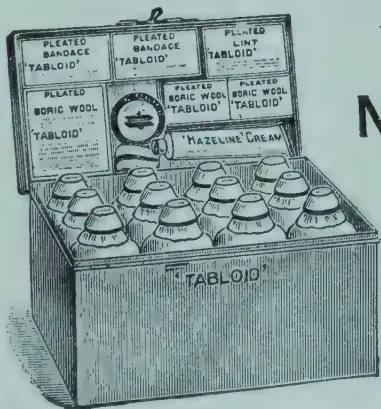

TRADE  
MARK

## 'TABLOID' BRAND MEDICINE CASE

(No. 258 *The Settler's*)

Containing pure and reliable medicaments in compact doses, ready and easy to take. No weighing; no waste. Climate-proof.

*An ideal outfit for Planters*

In Black Japanned Metal, size:  $8\frac{1}{4} \times 4\frac{3}{8} \times 5\frac{3}{4}$  in.  
Of all the principal Chemists and Stores

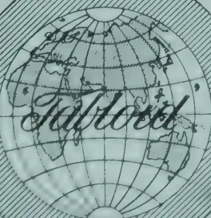
xx 532

BURROUGHS WELLCOME & CO., LONDON  
NEW YORK MONTREAL SYDNEY CAPE TOWN  
MILAN SHANGHAI BUENOS AIRES BOMBAY  
ALL RIGHTS RESERVED

81------------------------------------------------

74[JULY, 1913.

## TAPIOCA FLOUR AND STARCH.

We have published articles from time to time about certain commercial aspects of cassava; and it is known that in parts of India recent years have witnessed a systematic attempt to popularise it as a food. The roots of the cassava plant are the source of the various kinds of tapioca which come into commerce, chiefly from Malaysia. These roots form a popular native foodstuff in many parts of the tropics, and are consequently grown on a large scale. They contain a large quantity of starch, and apart from their use on a very extensive scale for the preparation of the starchy foodstuff tapioca, they have been used in the United States and elsewhere as a source of starch for manufacturing purposes. The Report published in the current issue of the *Bulletin of the Imperial Institute* on certain samples of "cassava starch" received from Sierra Leone, the Gold Coast, and Natal, in addition to a product known as "garri" from Southern Nigeria (which consists of dry, grated, peeled cassava roots), will be read with interest in that connection.

The sample of native-prepared starch from Sierra Leone was found to be white, free from dirt and foreign matter, possessing a faint, pleasant aroma, and devoid of any definite taste. It was submitted to a firm of brokers in London, who stated that it represented a medium quality of starch of the nominal value of £12 per ton, *ex* warehouse, the prices of cassava starch ranging from £9 to £14 per ton according to quality.

The sample from the Gold Coast was of good, white colour and entirely free from dirt and other extraneous matter. The material was rather damp when received. It was analysed with the following results:—

<table>
<thead>
<tr>
<th></th>
<th></th>
<th></th>
<th></th>
<th style="text-align: right;"><i>Per cent.</i></th>
</tr>
</thead>
<tbody>
<tr>
<td>Moisture</td>
<td>...</td>
<td>...</td>
<td>...</td>
<td style="text-align: right;">21.68</td>
</tr>
<tr>
<td>Ash</td>
<td>...</td>
<td>...</td>
<td>...</td>
<td style="text-align: right;">0.06</td>
</tr>
<tr>
<td>Starch</td>
<td>...</td>
<td>...</td>
<td>...</td>
<td style="text-align: right;">77.68</td>
</tr>
</tbody>
</table>

The cassava starch was submitted to commercial experts, who reported on it as follows:—

One firm stated that as regards appearance and purity this sample was one of the best they had seen, and they valued it at about £14 to £15 per ton, *ex* wharf, Liverpool. They added, however, that the demand for the product is not large, and that although it is suitable for use in certain textile industries, textile manufacturers will not readily change from the use of maize and rice starches.

Another firm considered that it should be possible to sell a large quantity of the product in the United Kingdom if it could compete with tapioca flour selling at £12 to £15 per ton.

The sample of cassava starch from Natal consisted of small granular pieces, with some powder. The starch was white, free from visible impurity, and apparently well prepared. It had, however, a slightly sour odour and

82------------------------------------------------

JULY 1913.]75

taste, due possibly to fermentation during drying, which would lower its commercial value. The starch was analysed with the following results :—

<table>
<thead>
<tr>
<th></th>
<th></th>
<th></th>
<th></th>
<th><i>Per cent.</i></th>
</tr>
</thead>
<tbody>
<tr>
<td>Ash</td>
<td>...</td>
<td>...</td>
<td>...</td>
<td>0.09</td>
</tr>
<tr>
<td>Moisture</td>
<td>...</td>
<td>...</td>
<td>...</td>
<td>13.84</td>
</tr>
<tr>
<td>Starch</td>
<td>...</td>
<td>...</td>
<td>...</td>
<td>86.07</td>
</tr>
</tbody>
</table>

These figures show that the sample was of satisfactory composition.

In connection with an enquiry carried out in 1909 at the Imperial Institute regarding cassava starch from Fiji, specimens were submitted to experts in various branches of the industry, to determine its value as a substitute for the better-known starches in common use. It was found to be unsuitable for laundry purposes, but quite suitable for glucose manufacture. For the latter purpose it would have to compete with low-grade sago and tapioca flours, and with maize, and would be worth not more than £8 per ton in England. Experts stated that cassava starch would not be a good substitute for potato starch as a size for cotton yarn, but that it could probably be used in place of sago. A firm of brokers stated that there was at one time a good demand for cassava starch in Manchester and Liverpool at £14 to £15 per ton for general manufacturing purposes, and they were of opinion that well-prepared cassava starch would fetch about that price if placed on the market. This Natal product, if dried rapidly to avoid the slight sourness which characterised this sample, would fetch the best prices obtainable for cassava starch.

The sample of "garri" (Dried and Grated Cassava) from Southern Nigeria, consisted of small irregular granules of hard, yellowish, starchy material, showing a semi-translucent fracture. The product was free from any characteristic odour, but possessed a slightly sour taste.

It was analysed with the following results :—

<table>
<thead>
<tr>
<th></th>
<th></th>
<th></th>
<th></th>
<th><i>Per cent.</i></th>
</tr>
</thead>
<tbody>
<tr>
<td>Moisture</td>
<td>...</td>
<td>...</td>
<td>...</td>
<td>11.4</td>
</tr>
<tr>
<td>Crude proteins</td>
<td>...</td>
<td>...</td>
<td>...</td>
<td>2.1</td>
</tr>
<tr>
<td>Fat</td>
<td>...</td>
<td>...</td>
<td>...</td>
<td>1.1</td>
</tr>
<tr>
<td>Starch, &amp;c.</td>
<td>...</td>
<td>...</td>
<td>...</td>
<td>82.1</td>
</tr>
<tr>
<td>Fibre</td>
<td>...</td>
<td>...</td>
<td>...</td>
<td>1.8</td>
</tr>
<tr>
<td>Ash</td>
<td>...</td>
<td>...</td>
<td>...</td>
<td>1.6</td>
</tr>
</tbody>
</table>

Commercial experts stated that for food purposes the material would be difficult to sell in the United Kingdom in its present form, and they suggested that it would be preferable to prepare cassava flour or tapioca from the roots, as is done in this country. They valued the dried and grated cassava at 6s. to 6s. 6d. per cwt. for manufacturing purposes.

Manufacturers using starch for the preparation of glucose to be used in brewing stated that this granulated cassava might be worth £7 7s. 6d. per ton for their purpose, but that it will be difficult to sell at that price in competition with Indian sago flour. The latter is obtainable at £7 7s. 6d. to £7 10s. per ton, and, though slightly poorer in starch than this cassava product, it presents several advantages from the glucose manufacturer's point of view.—THE INDIAN TRADE JOURNAL.

83------------------------------------------------

76[JULY, 1913.

## BAOBAB OIL.

The Baobab Tree (*Adamsonia digitata*)—one of the Malvaceæ—is notable for the gigantic proportions to which it attains. In Madagascar it ordinarily reaches a height of 40 or 50 ft. with an average girth of 20 to 23 ft., but these dimensions are frequently surpassed.

In the Island of Mannar where the Baobab is found there are some huge specimens, one of which, according to Trimen, has a girth of 61 ft. 9 in. The fruit, which is edible, is sometimes called "Judas' Bag" on the supposition that it contains 30 seeds.

There are three known varieties of the tree, one of which ("rainiala") bears oblong fruit which when ripe are covered with fine yellowish brown down. This is the variety found in Ceylon, supposed to have been introduced by the Arabs.

To obtain the oil the nuts or seeds are crushed and then boiled in water.

The following averages have been worked out regarding the rainiala variety—number of fruits per tree, 80; weight per fruit, 10 oz.; number of seeds per fruit, 95; weight of seeds in 100 fruits, 22 lbs.; quantity of oil per 100 lbs. of seeds 1 gallon.

The seed is non-poisonous so that the cake may be used as cattle food. The oil is yellow in colour, with a pleasant odour. It solidifies at 13°C and is rich in fatty acids, remaining firm at normal temperatures. It is considered suitable for the making of artificial butters, pharmaceutical preparations, soaps, &c. (*See frontispiece.*)

---

## THE ENTOMOLOGICAL RESEARCH COMMITTEE.

---

The work of this Committee deserves close attention and warm support from everyone who believes in a united Empire. Nominally, the Committee aims only at stimulating interest in the study of insects, especially noxious insects and at organizing collectors and observers to accumulate information. Actually, it is giving an admirable illustration both of Imperial co-operation and of scientific organisation; and the possibilities of development are immense, if only its precise work is understood and appreciated. Of course, in an old-settled land with a temperate climate economic entomology is relatively, though only relatively, unimportant; but it is a vital concern in tropical areas of virgin soil. It has been given us to govern large areas of this kind; and the extraordinary development of preventive medicine, as illustrated, e.g., by the reduction of the death-rate amongst European officials in British West Africa during the last fifteen years from 90 per 1,000 to only 14, practically guarantees that we can govern them without undue waste of human life. UNITED EMPIRE.

84------------------------------------------------

JULY, 1913.]77

## A VILLAGE FAIR.

Village fairs are valuable agencies in providing facilities for the sale of Agricultural and Industrial products, the disposal of which would otherwise be a matter of difficulty. In populous centres such as Piliyandere in the Western, Beliatta in the Southern and Chunakam in the Northern Province, markets are held daily, but in outlying districts the fair is a weekly one and generally takes place on a Sunday, probably to meet the convenience of buyers. Such are the fairs held at Kirriwattuduwa in the Western, Udispattuwa and Harasbedda in the Central, and Bandarawela in Uva Province.

The fair held at Harasbedda is of the greatest importance to the people of Walapane where agriculture is still in a very backward state. The inhabitants are poor and the district unhealthy, so that the facilities offered for disposing of such produce as there is to sell is a great concern to them.

The produce consists of vegetables (of which the quantity and quality are capable of considerable improvement), poultry, eggs, Indian corn (which is grown on a comparatively large scale), beans and millets, and some fruit of an inferior description.

The opportunity for selling is, however, taken advantage of by peripatetic vendors to expose their wares (consisting of cheap cutlery, trinkets, &c.) at the same time and place, so that the result is a fairly large display of miscellaneous articles both useful and ornamental which draw together an immense concourse of people.

Harasbedda, situated about half-way between Ragala and Nildandahena, consists of a small clump of houses on a track across rolling downs flanked by high hills. The country is well-watered and suited for the rearing of cattle, sheep and goats.

Purchasers come from long distances for the Sunday fair, some all the way from Nuwara Eliya : but the large proportion of buyers are from the planting district of Uda Pussellawa.

The price of produce varies greatly according to season and also fluctuates with the in-rush or exodus of visitors who come upcountry during the hot weather in the plains.

The pity is that better arrangements are not made for the fair. There is a large permanent shed provided, but it is apparently not utilised except in wet weather. The usual practice is for the sales-people to deposit their wares in a jumble in the open, without any attempt at order or arrangement, which makes it not only difficult for purchasers to inspect the goods and make a proper selection but impedes their progress through the throng. The confusion is characteristic of the eastern market-place and though the result is very inconvenient to the visitor the general effect is most picturesque.

C. D.

85------------------------------------------------

[JULY, 1913.

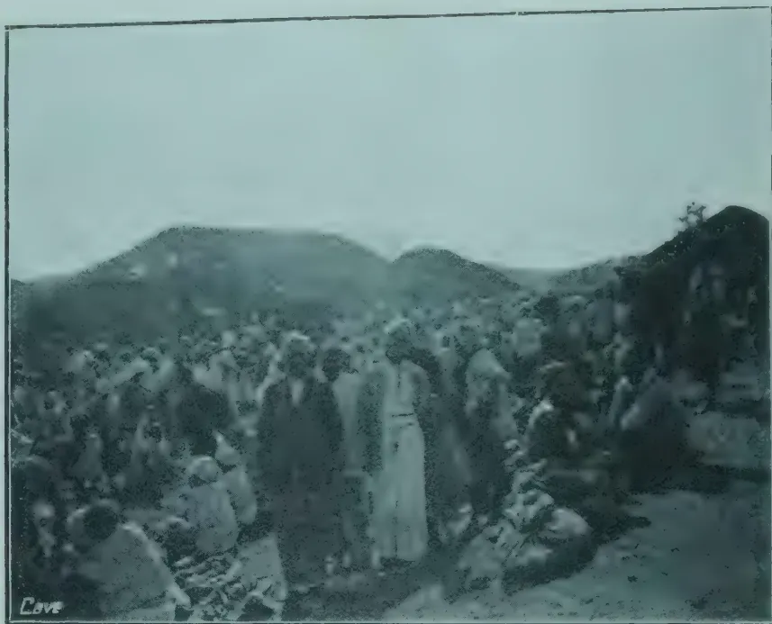A black and white photograph showing a large crowd of people gathered in an open field. In the background, there are rolling hills or mountains. The word 'Cave' is printed in the bottom left corner of the image.A black and white photograph showing a dirt road or path. On the left side, there is a small, simple building with a gabled roof. A crowd of people is gathered along the road, some sitting and some standing. The scene appears to be outdoors in a rural or semi-rural setting.

THE BARNUM FAIR

86------------------------------------------------

JULY, 1913.]79

## CASSAVA.

There are very large imports of dried cassava into the United Kingdom, large quantities coming from Singapore; but Malaya can grow cassava, apparently cheaper than we can, perhaps because it has largely been grown as a catch crop through rubber trees in large plantations.

Here are fresh quotations from England which will be of interest :—

<table>
<tbody>
<tr>
<td>No.</td>
<td>1</td>
<td>Grated Skin &amp; all</td>
<td>4/6</td>
<td>to</td>
<td>4/9</td>
<td>per Cwt.</td>
</tr>
<tr>
<td>..</td>
<td>2</td>
<td>.. without Skin</td>
<td>4/9</td>
<td>..</td>
<td>5/</td>
<td>..</td>
</tr>
<tr>
<td>..</td>
<td>3</td>
<td>.. pure Starch</td>
<td>11/</td>
<td>..</td>
<td>11/6</td>
<td>..</td>
</tr>
<tr>
<td>..</td>
<td>4</td>
<td>.. Refuse after removal of starch</td>
<td>5/</td>
<td>..</td>
<td>5/3</td>
<td>..</td>
</tr>
<tr>
<td>A.</td>
<td>Chipped &amp; Sun dried skin &amp; all</td>
<td rowspan="2">} 4/6</td>
<td></td>
<td></td>
<td></td>
<td></td>
</tr>
<tr>
<td>B.</td>
<td>.. .. peeled</td>
<td></td>
<td></td>
<td></td>
<td></td>
</tr>
</tbody>
</table>

—JOURNAL OF THE JAMAICA AGRICULTURAL SOCIETY.

---

## THE WAX PALM

---

### A New and Promising Cultivation of great importance to all Tropical Planters.

The Wax Palm (*Copernicia cerifera*) produces the valuable Carnauba Wax; this tree accommodates itself easily to climate and soil and can be interplanted with cotton, food or fodder plants, green manure, etc. To Coffee, Cocoa, Rubber, etc., it offers shade, but at the same time it allows sufficient light and air to pass to the trees below. Therefore the Wax Palm is not only a very useful but also a profitable acquisition.

For trials we supply on receipt of 7 shillings and 6 d., 75 seeds as sample of no value under registration, postage paid; on receipt of £4, we forward 10 lbs. seeds by parcel post, postage paid to all countries.

Detailed instructions for cultivation with every order. —

**GEVEKOHT & WEDEKIND, Hamburg 1.**

87------------------------------------------------

80[JULY, 1913.

## ARROWROOT.

(*MARANTA ARUNDINACEA.*)

Mr. H. Powell has contributed the following interesting account on the cultivation and manufacture of Arrowroot to the *Agricultural Journal of British East Africa* :—

The world's supply of arrowroot is largely produced in the Island of St. Vincent, of the Windward Group, West Indies, where the writer of this article resided for a number of years and had special opportunities of becoming thoroughly acquainted with the various phases of the subject under review.

### USES OF THE ARROWROOT PLANT.

St. Vincent arrowroot is derived from *Maranta arundinacea*, a plant with white flowers and broad green leaves, growing to a height of from two to three feet. It belongs to the natural order Marantacea.

The name "arrowroot" is said to have been derived from the fact that the native Indians used the roots as an application to wounds inflicted by poisoned arrows.

Arrowroot may be described as a pure kind of starch and is used for making puddings, gruel, biscuits, and for mixing with the cheaper brands of cocoa. It also forms a food for infants and invalids on account of the ease with which it is digested, and is favoured by the medical profession as an easy means of conveying nourishment of a stimulative nature.

### CULTIVATION.

The land should be thoroughly ploughed or hoed, freed from roots, grass, etc., and the surface made fairly fine. Small holes or "chops," two or three inches deep and about eighteen inches apart, are then made with a hoe, and a piece of rhizome from the leaf-end is placed in each hole and covered lightly with soil. It is important to keep the land clean until the plants have grown to such a size as to be able to protect themselves.

### DIGGING THE ROOTS.

When the leaves and stems have assumed a brown colour and a more or less prostrate condition, which occurs in about a year to fourteen months from the time of first planting, the "tubers," as they are termed, are dug with hoes. For this work a task of so many baskets is usually allotted to each labourer, the number of baskets varying with the weight of the crop and the tenacity of the soil.

### RE-PLANTING.

When digging, the labourers throw the tubers into rows behind them and in the process of handling a piece of tuber is usually broken off and placed in the trench. Many of the smaller tubers are also left behind and thus no further planting is needed for the next crop which is ready for digging a year afterwards. Provided the soil is rich enough, the same land will produce a crop of good tubers several years in succession. As a rule, however, manure of some sort is applied after the second or third year, and the land allowed to lie fallow after the fifth or sixth year or earlier, as circumstances may determine.

88------------------------------------------------

JULY, 1913.]81

### WASHING THE TUBERS.

On removal from the field to the factory the tubers are thoroughly washed either by hand or in "washers" especially made for the purpose. This removes all soil, bits of sheath and rind which may adhere to the tuber.

### FACTORY.

In the West Indies the factory is nearly always situated by the side of a river or mountain stream in order to ensure an abundant supply of water as the grinding mills are in nearly every case worked by water power. The mill, or grater, consists of a round block of hard wood, a foot or so in diameter, and perhaps eighteen inches wide, into the surface of which are firmly placed a number of thin steel plates with saw-like edges. This drum is made to revolve at a rapid rate, and the tubers are fed by a labourer who uses a piece of soft wood a foot or two in length and about three inches in diameter for pressing the tubers against the graters whilst all the time a copious jet of water is made to play on the roots. The pulpy mass is pressed through sieves of varying size, on to which a jet of clean water is constantly playing, and thus the fibrous material is separated from the starch.

### SETTLING TABLE.

The starch laden water is conveyed by means of small wooden troughs on to the settling table which is made either of wood or concrete, about three feet high, and is from three to four feet wide, side strips from four to six inches high. The length is from 120 to 150 feet but is so constructed as to run in two or three parallel lengths with easy curves so as not to restrict the flow. This flow is so regulated that by the time the starch-water has reached the furthest end all the starch has settled on the table.

### WASHING THE STARCH.

At the close of each day, when grinding operations have ceased the starch settled on the table is removed and placed in large, shallow tubs or vats to which pure filtered water is added and the whole stirred or churned up. This process is repeated two or three times. Afterwards the starch is left to settle into a dough-like mass before being transferred to the drying house.

### DRYING HOUSE.

An open, airy situation is selected for this and as near to the factory as is found convenient. The size of the structure depends upon the amount of starch to be dealt with. It is usually made of lumber with a closely boarded and shingled or galvanised iron roof. The sides are made of lumber and wire netting with shutters opening outwards and canvas blinds for protecting the starch from too much sun or inclement weather. The drying trays are made of a rather close meshed wire netting. These are placed, half a dozen or more, one above the other in the centre and on the sides of the interior of the house. The bottom tray is made of wood, is of a large size and is deeper than the upper ones. As soon as the blocks or lumps of starch on the wire netting trays are sufficiently dry they are beaten or shaken, which causes the material to fall into the wooden trough at the bottom. In fine weather complete drying of the starch may take place in from three to six days.

89------------------------------------------------

82[JULY, 1913]

### PACKING OR BARRELLING.

For this purpose an ordinary sound and clean flour barrel is used, the inside being lined with blue paper which adds to the attractiveness of the pure white fine starch. The latter is beaten down so that a barrel holds upwards of 200 lbs. Finally, the top of the barrel is securely fixed, the Estate's mark and brand stencilled on, and the package is ready for export.

Arrowroot is also packed in tins of various sizes, canvas bags, paper packets, etc., to suit the requirements of local and foreign buyers.

### YIELD.

Much depends on the nature and quality of the soil, rainfall etc., but usually the yield may be said to vary from 1,000 to 3,000 lbs. or more of dry starch per acre. The whole-sale price according to quality ranges at the present time from 2*d.* to 4*d.* per pound.

---

## WHAT IS AN EXPERIMENT STATION.

---

There seems still to be some confusion in the minds of many as to the real functions of an experiment station. It is not uncommon to hear some of our friends criticizing the poorness of the crops which are to be seen growing on the Government Experiment Stations. Criticism is indeed essential to the well-being of a live Department of Agriculture. But it should always be constructive and based on a correct understanding of the purpose in view. Take, for example the humble mealie. It is easy enough for the manager of any experiment station to grow a good crop of Hickory King; but if he carries out experiments with a new breed of maize from Mexico or Peru he may well expect the first year a feeble growth and a poor stand because the new variety has not yet become acclimatized. And the thoughtful ruralist who sees a puny plant will not jump to the conclusion that his own splendid ten-foot crop is necessarily the result of his superior skill in cultivation. The farmer has neither the time nor the money to conduct the elaborate experiments. That is a matter for the Government; and if one crop is hastened by a liberal dose of fertilizers while another, close by, is eking out a miserable existence in a new and uncongenial climate, the intelligent farmer will neither over-estimate the merits of the one nor under-estimate the possibilities of the other. We well remember listening to an illuminating lecture on plant selection by Professor A. L. Woods, who is now Director of the College of Agriculture of the University of Minnesota. He had just returned from an agricultural tour in Russia; and what surprised him most of all was to see here and there little patches of wheat which had been left to ripen in many of the fields. He inquired the reason and was told that these tiny patches of corn was all that had survived from the last season's drought.

An American farmer, Doctor Woods remarked, would in despair have ploughed under those few isolated patches; but the patient Russian peasant carefully reaped the last ears of his damaged crop and it was this simple process of selection, unconsciously pursued over many years, that at length produced the wonderful drought-resistant durum wheat of Russia. In this

90------------------------------------------------

JULY, 1913.]83

connection we may remark that Mr. Burtt-Davy, the Government Botanist, is making rapid progress with his maize breeding experiments at Groenkloof, Pretoria. He finds the situation there more convenient, and the soil much better for experimental work than the previous station at Skinners Court. It will interest our readers that he recently reaped ears of dead ripe maize in eighty-two days. This constitutes a record. A short time ago the thermometer fell to 37° F. at the Standerton Stud Farm. The value of a quick ripening mealie for late planting is a matter of great importance to our farmers on the high veld.—*AGRIC. JOUR. OF THE UNION OF SOUTH AFRICA.*

## THE CASTOR OIL PLANT.

It is likely that this plant which is at present a weed may come to be worth cultivating in the Island both for the oil produced by the seed as well as the poonac or cake which is so largely used as manure chiefly in coconut cultivation.

The castor plant is a native of Africa, and is cultivated in India, Persia, Arabia, China and Japan; as well as in West Indies, Tropical Africa and America, and also in Italy.

The plant likes a peat soil and thrives best in alluvial areas.

There are annual and perennial varieties of the castor plant, the annual being much smaller. The perennial grows very fast and may reach 15 or 30 feet in a year. The colour of the foliage varies from pale green to red and purple. The stem is hollow the leaves large and lobed. Male and female flowers are born on the same tree, and the fruit is three-celled and contains three seeds. The seeds vary much in size and colour. They are oval and flat on one side, smooth and shiny and generally prettily marked, the colour varying from grey to yellow and brown.

Perennial varieties are suitable for growing along boundaries and once established last a considerable time.

In India area cultivated may be said to vary from 100,000 to 200,000 acres.

In the Bombay Presidency castor is grown with sorghum, groundnuts and other crops, and invariably found in vegetable gardens where it afford grateful shade besides being directly remunerative. The annual variety is frequently sown in rice fields together with a leguminous crop as soon as possible after the rice is removed. In this case the seeds are put a foot apart and about 10 lbs. are required per acre. Later on the seedlings may be thinned out to 2 or 3 feet apart. If there is a good supply of moisture the plants will be 4 to 5; if deficient 18" to 2'. A crop sown in October-November will ripe in February-March. The crop is harvested by cutting the bunches of fruit which are spread out to dry. The seed is separated by beating with a stick. The stems are used as fuel and cattle will eat the leaves.

The following may be taken as the average produce of an acre of castor grown after rice on fairly good soil in a favourable season: Seed 525 lbs., purified oil 20 lbs., oil-cake 286 lbs., waste 38 lbs.

Where castor is grown alone and receives special cultivation the yield of seed should not be less than 1000 lbs.

91------------------------------------------------

84[JULY, 1913.

## HEALTH IN THE TROPICS.

*United Empire* has a lengthy article on "Medical Science and the Tropics," being a paper read by Sir Ronald Ross, K. C. B., M. D., etc., before a meeting of the Royal Colonial Institute from which we take the following:—

One of the most interesting questions of history is, Why has not tropical Africa become civilised long ago? After all, Africa is near to Europe. Even in the times of the ancients there was a high civilisation in Egypt which, one would have thought, could easily have spread into Central Africa. There have been plenty of routes of communication, both across the desert and by sea down the west and east sides of the continent; and yet civilisation never took a hold, but was repulsed at every step. I cannot but feel, on comparing all the arguments, that this phenomenon was principally due to the great tropical diseases of Africa.

### MALARIA.

But these diseases do not affect only immigrant Europeans, they are almost equally disastrous to the natives, and tend to keep down their numbers to such a low figure that the survivors can subsist only in a barbaric state. To believe this one has to see a village in Africa or India full of malaria, kala-azar, or sleeping sickness, or a town under the pestilence of cholera or plague. Nothing has been more carefully studied of recent years than the existence of malaria amongst indigenous populations. It often affects every one of the children, probably kills a large proportion of the new-born infants, and renders the survivors ill for years; only a partial immunity in adult life relieves them of the incessant sickness. Here in Europe nearly all our children suffer from certain diseases—measles, scarlatina, and so on. But these maladies are short and slight compared with the enduring infection of malaria. When I was studying malaria in Greece in 1906 I was struck with the impossibility of conceiving that the people who are now intensely afflicted with malaria could be like the ancient Greeks who did so much for the world; and I therefore suggested the hypothesis that malaria could only have entered Greece at about the time of the great Persian wars—a hypothesis which has been very carefully studied by Mr. W. H. S. Jones. One can scarcely imagine that the physically fine race and the magnificent athletes figured in Greek sculpture could ever have spent a malarious and spleno-megalous childhood. And conversely, it is difficult to imagine that many of the malarious natives in the tropics will ever rise to any great height of civilisation while that disease endures amongst them. I am aware that Africa has produced some magnificent races, such as those of the Zulus and the Masai, but I have heard that the countries inhabited by them are not nearly so disease-ridden as many of the larger tracts. At all events whatever may be the effect of a malarious childhood upon the physique of adult life, its effects on the mental development must certainly be very bad, while the disease always paralyses the material prosperity of the country where it exists in an intense form.

92------------------------------------------------

JULY, 1913.]85

### YELLOW FEVER, DYSENTERY, &c.

Consider now the effects of yellow fever, that great disease of tropical America. The Liverpool School sent four investigators to study it, and all these four were attacked within a short time. One died, one was extremely ill, and two suffered severely. The same thing tended to happen to all visitors in those countries. They were almost certain of being attacked by yellow fever, and the chances of death were one to four. Tropical America was therefore scarcely a suitable place for a picnic party! But malaria and yellow fever are only some of the more important tropical diseases. Perhaps the greatest enemy of all is dysentery, which in the old days massacred thousands of white men and millions of natives in India, America, and all hot countries, and rendered survivors ill for years. Malaria has always been the bane of Africa and India; the *Bilharzia* parasite, of Egypt; and we are acquainted with the ravages of kala-azar and sleeping sickness. Apart from these more general or fatal maladies, life tends to be rendered unhealthy by other parasites and by innumerable small maladies, such as dengue and sand-fly fever, filariasis, tropical skin diseases and other maladies, which, as I am not writing a treatise on tropical medicine, I will not discuss at the moment. True, we have many maladies in Europe, but in order to compare the two sets of diseases we should compare the death-rates. Whereas in England it is a long way below 20 per thousand per annum, throughout the tropics it is nearer 40 per thousand. In India alone malaria kills over a million persons a year, and dysentery and malaria kills many hundreds of thousands. I have seen places in which the ordinary death-rate remains at between 50 and 60 per thousand; others which were so unhealthy that they were being deserted by their inhabitants; and others, lastly, which were simply uninhabitable. What would people say if such a state of things were to exist in most villages in England, Scotland and Ireland. Yet I would emphasise the following point—that this death-rate does certainly not depend entirely upon the climatic factor. There is another factor besides the mere heat; and the proof of this is that there are many islands and areas in the tropics which, in spite of the heat, have as low a mortality as holds in Europe. I need mention only the Seychelles in the Indian Ocean, with a mortality which has been down to 14 per thousand, and some of the healthy West Indies. If some places in the tropics can be so healthy why should not many others be rendered equally so? There is another factor besides the climate, and it is the great merit of tropical medical science that it has now discovered that factor, and has shown the way to remove it.

### THE PARASITOLOGISTS AND THEIR RESEARCHES.

Tropical medicine and bacteriology started from different origins. The seeds of tropical medicine were really contained in the works of parasitologists labouring in Italy and Germany during the last three centuries—often labouring entirely unknown to the public. Studying the larger parasites of man and animals they were gradually led to that remarkable law of Metaxeny, according to which many parasites are transferred from one individual to another by the agency of intermediary hosts. Our recent advance regarding the route of infection in the great tropical diseases has largely been merely an extension of this law. The whole history of the subject is a fascinating one to the man of science, though it has never yet been written. We see on the one hand the pioneer of these European workers, and on the other

93------------------------------------------------

86[JULY, 1913.

hand the pioneer labours of hundreds of medical men serving in the tropics, who for some centuries described and differentiated the diseases which they were called upon to treat. Gradually the two streams of investigation coalesced, with the result that the diseases differentiated by the doctors were explained by the researches of the parasitologists. The culminating period of advance has lain within the last thirty years. Malaria has been shown to be due to a minute animal parasite which is conveyed from man to man by *Anopheline* mosquitos. Filariasis has been shown to be carried by another group of mosquitos; while yellow fever and dengue, though their actual cause has not yet been certainly ascertained, have been proved to be communicable by a third group of these insects. Sleeping sickness is caused by other species of parasites, and is carried by a species of tsetse-flies. Dysentery has been shown to be of two kinds—a bacillary and an amoebic dysentery. The group of relapsing fevers have been shown to be caused by a third group of parasites, and often to be carried by ticks. Bacillary causes of cholera, Mediterranean fever, and plague have been definitely ascertained, and the great discoveries have been made that the last is communicated by the rat flea, and that Mediterranean fever is communicated by goat's milk. Yet another group of parasites cause the deadly kala-azar of India, and the famous Aleppo boil of Persia. Every year sees fresh advances; but, still more, our methods of diagnosis have now been rendered so precise that many of these diseases are being found where previously they were not known to exist—for instance, kala-azar in Algeria and Italy, and Mediterranean fever in many parts of the world. At the same time invaluable discoveries have been made regarding non-parasitic diseases, such as beri-beri, which has been shown to be due to the absence of some chemical element which exists in the food, and which is essential to the nervous system; which lastly, numerous and patient researches are now being made as to the whole theory of immunity in these diseases and the best method of cure. Is not all this knowledge a great gift to the human race? Think for a moment of the value of the gift. It concerns the happiness, the prosperity, and the very life of every one living in the tropics—natives and strangers. It enables the medical man to be more exact and successful in his treatment, and, above all, it enables the sanitarian to be more exact and successful in the prevention of these terrible and widespread maladies. And this benefit is not bestowed merely for a day, but for as long as civilisation lasts.

Quite recently, the Liverpool School of Tropical Medicine sent a worker there, Dr. David Thomson, who writes to me from Ancon Hospital as follows :—

With regard to the sanitary work here, it simply consists in the straightforward carrying out of the principles which you have laid down—screening of houses, draining of ditches and streams, and dealing with large patches of water with larvicide and petroleum.....The work is carried on constantly and conscientiously all along the line of the Canal. The effect must have been marvellous, for mosquitos are exceptionally scarce. In Ancon here they are practically non-existent. I have not had a single mosquito bite since my arrival. Malaria in the American seems to be nearly a thing of the past, and according to the cases coming into hospital here, they must be scarce.

94------------------------------------------------

JULY, 1913.]87

Mild cases only occur and they are nearly all cases of relapse due to insufficient quinine treatment.....With regard to the climate here it is in my opinion much less dangerous than the English winter, in that yellow fever and malaria are practically eradicated.

Another remarkable case is one in Mauritius. When I was there in 1908 there was terrible malaria in a large village and amongst the British troops living in barracks close at hand. The marsh that caused it was completely drained for about £2,000, and the result has been the complete extermination of the disease. Of this there is the clearest possible evidence because Major Fowler and I computed by direct methods the amount of malaria amongst the native children, and the repetition of this investigation last year has demonstrated the truth of what I have just stated. Lest it may be thought that the price of £2,000 was too great to pay for saving the lives of hundreds and the health of thousands of human beings, I may add that the invalidings amongst the British troops cost more than that sum during the few months that I was in the colony. Leaving malaria, I have to record the brilliant extermination of Mediterranean fever amongst the troops and sailors in Malta, and, I believe amongst peasantry in places in the South of France; and the reduction of sleeping sickness in Uganda. I could multiply instances of small campaigns by the score; but probably the most admirable result is that which has been obtained by the Colonial Office and the officials of West Africa in that country. I commend to the attention of those who are interested in the subject the White Paper Cd 6089 entitled "Vital Statistics of Non-native Officials: Returns for 1911." The total death-rate has fallen wonderfully from 1903 to 1911, while the invaliding rate may literally be said to have tumbled from the top of the page down to the bottom.

---

## Seed and Plant Supplies.

The attention of members is invited to the circular-order for Seeds and Plants—for the next Planting Season:—Vide Advt. Page 2.

95------------------------------------------------

88

[JULY, 1913.]

**MARKET RATES FOR TROPICAL PRODUCTS.**

(From Lewis & Peal's Latest Monthly Prices Current.)

<table border="1">
<thead>
<tr>
<th colspan="2">QUALITY.</th>
<th>Quotations.</th>
<th colspan="2">QUALITY.</th>
<th>QUOTATIONS.</th>
</tr>
</thead>
<tbody>
<tr>
<td>ALCOES, Socotrine</td>
<td>cwt. Fair to fine</td>
<td>45/6 a 55/</td>
<td>INDIARUBBER</td>
<td>Common to good</td>
<td>1/6 a 2</td>
</tr>
<tr>
<td>Zanzibar &amp; Hepatic</td>
<td>.. Common to good</td>
<td>40/ a 65/</td>
<td>Borneo</td>
<td>Good to fine red</td>
<td>1/11 a 23</td>
</tr>
<tr>
<td>ARROWROOT (Natal)</td>
<td>lb. Fair to fine</td>
<td>8d a 9d</td>
<td>Java</td>
<td>Low white to prime red</td>
<td>1 a 2</td>
</tr>
<tr>
<td>BEE'S WAX</td>
<td>cwt.</td>
<td></td>
<td>Penang</td>
<td>Fair to fine red ball</td>
<td>2/6 a 2/10</td>
</tr>
<tr>
<td>Zanzibar Yellow</td>
<td>.. Slightly drossy to fair</td>
<td>£7 12/6 a £7 15/</td>
<td>Mozambique</td>
<td>Sausage, fair to good</td>
<td>2/6 a 2/9</td>
</tr>
<tr>
<td>East Indian, bleached</td>
<td>.. Fair to good</td>
<td>£8 7/6 a £8 12/6</td>
<td></td>
<td>Fair to fine ball</td>
<td>2/1 a 2/6</td>
</tr>
<tr>
<td>unbleached</td>
<td>.. Dark to good genuine</td>
<td>£6 5/ a £6 15/</td>
<td>Nyassaland</td>
<td>Fr to fine pinky &amp; white</td>
<td>1/10 a 2/3</td>
</tr>
<tr>
<td>Madagascar</td>
<td>.. Dark to good palish</td>
<td>£7 10/ a £8</td>
<td>Madagascar</td>
<td>Majunga &amp; blk coated</td>
<td>1/4 a 1/7</td>
</tr>
<tr>
<td>CAMPHOR, Japan</td>
<td>.. Refined</td>
<td>1, 4½ a 1/6</td>
<td></td>
<td>Niggers, low to good</td>
<td>6d a 1/6</td>
</tr>
<tr>
<td>China</td>
<td>.. Fair average quality</td>
<td>155</td>
<td></td>
<td>Ordinary to fine ball</td>
<td>1/6 a 2</td>
</tr>
<tr>
<td>CARDAMOMS, Tuticorin</td>
<td>.. Good to fine bold</td>
<td>5/2 a 5/8</td>
<td>New Guinea</td>
<td>Shipping mid to gd violet</td>
<td>3s a 3s 6d</td>
</tr>
<tr>
<td>Malabar, Tellicherry</td>
<td>.. Middling lean</td>
<td>4/6 a 4/11</td>
<td>INDIGO, E.I., Bengal</td>
<td>Consuming mid to gd.</td>
<td>2s 3d a 2s 10d</td>
</tr>
<tr>
<td>Calicut</td>
<td>.. Good to fine bold</td>
<td>5/1 a 5/7</td>
<td></td>
<td>Ordinary to middling</td>
<td>2s a 2s 2d</td>
</tr>
<tr>
<td>Mangalore</td>
<td>.. Brownish</td>
<td>4/6 a 4/11</td>
<td></td>
<td>Mid. to good Kurpah</td>
<td>1s 10d a 2s 5d</td>
</tr>
<tr>
<td>Ceylon Mysore</td>
<td>.. Med Brown to good bold</td>
<td>4/9 a 6/3</td>
<td></td>
<td>Low to ordinary</td>
<td>1s 6d a 1s 9d</td>
</tr>
<tr>
<td>Malabar</td>
<td>.. Small fair to fine plump</td>
<td>3/8 a 5/8</td>
<td>MACE, Bombay &amp; Penang</td>
<td>Mid. to fine Madras</td>
<td>Non here</td>
</tr>
<tr>
<td>Seeds, E. I. &amp; Ceylon</td>
<td>.. Fair to good</td>
<td>3/5 a 3/6</td>
<td>per lb</td>
<td>Pale reddish to fine</td>
<td>2/6 a 2/8</td>
</tr>
<tr>
<td>Ceylon Long Wild</td>
<td>.. Fair to good</td>
<td>4/2 a 4/4</td>
<td></td>
<td>Ordinary to fair</td>
<td>2/2 a 2/4</td>
</tr>
<tr>
<td>CASTOR OIL, Calcutta</td>
<td>.. Shelly to good</td>
<td>1/2 a 3/2</td>
<td></td>
<td>.. good pale</td>
<td>2/4 a 2/8</td>
</tr>
<tr>
<td>CHILLIES, Zanzibar</td>
<td>cwt. Good 2nds</td>
<td>3½ d</td>
<td></td>
<td>Wild</td>
<td>10d a 1</td>
</tr>
<tr>
<td>Japan</td>
<td>Dull to fine bright</td>
<td>37/6 a 45/</td>
<td></td>
<td></td>
<td></td>
</tr>
<tr>
<td>CINCHONA BARK, lb.</td>
<td>Fair bright small</td>
<td>28/ a 32/6</td>
<td></td>
<td></td>
<td></td>
</tr>
<tr>
<td>Ceylon</td>
<td>Crown, Renewed</td>
<td>3¾ d a 7 d</td>
<td></td>
<td></td>
<td></td>
</tr>
<tr>
<td></td>
<td>Red, Org. Stem</td>
<td>2d a 6d</td>
<td></td>
<td></td>
<td></td>
</tr>
<tr>
<td></td>
<td>Red, Org. Stem</td>
<td>1½ d a 4½ d</td>
<td></td>
<td></td>
<td></td>
</tr>
<tr>
<td></td>
<td>Renewed</td>
<td>3d a 5½ d</td>
<td></td>
<td></td>
<td></td>
</tr>
<tr>
<td></td>
<td>Root</td>
<td>1½ d a 4d</td>
<td></td>
<td></td>
<td></td>
</tr>
<tr>
<td>CINNAMON, Ceylon</td>
<td>1sts. Good to fine quill</td>
<td>1/3 a 1/7</td>
<td>NUTS, ARECA</td>
<td>cwt. Ordinary to fair fresh</td>
<td>17/6 a 20</td>
</tr>
<tr>
<td>per lb.</td>
<td>2nds. ..</td>
<td>1/3 a 1/6</td>
<td>NUX VOMICA, Cochin</td>
<td>Ordinary to good</td>
<td>9/6 a 12</td>
</tr>
<tr>
<td></td>
<td>3rds. ..</td>
<td>1/1 a 1/5</td>
<td>per cwt. Bengal</td>
<td>..</td>
<td>8/9</td>
</tr>
<tr>
<td></td>
<td>4ths. ..</td>
<td>1/ a 1/3</td>
<td>Madras</td>
<td>..</td>
<td>8/6 a 9/6</td>
</tr>
<tr>
<td>Chips, &amp;c.</td>
<td>Fair to fine bold</td>
<td>2d a 4d</td>
<td></td>
<td>Fair merchantable</td>
<td>6/10</td>
</tr>
<tr>
<td>CLOVES, Penang</td>
<td>lb. Dull to fine bright pkd.</td>
<td>11d a 1/1</td>
<td>OIL OF ANISEED</td>
<td>.. According to analysis</td>
<td>3/2 a 3/7</td>
</tr>
<tr>
<td>Amboyna</td>
<td>.. Dull to fine</td>
<td>10d a 10½d</td>
<td>CASSIA</td>
<td>.. Good flavour &amp; colour</td>
<td>3½d</td>
</tr>
<tr>
<td>Zanzibar</td>
<td>.. Fair and fine bright</td>
<td>8½d a 10d</td>
<td>LEMONGRASS</td>
<td>.. Dingy to white</td>
<td>1½d a 1¾d</td>
</tr>
<tr>
<td>Madagascar</td>
<td>.. Fair</td>
<td>8½d</td>
<td>NUTMEG</td>
<td>.. Ordinary to fair sweet</td>
<td>2½d a 1s 5d</td>
</tr>
<tr>
<td>Stems</td>
<td>.. Fair</td>
<td>2½d</td>
<td>CINNAMON</td>
<td>.. Bright &amp; good flavour</td>
<td>1/9½</td>
</tr>
<tr>
<td>COFFEE</td>
<td></td>
<td></td>
<td>CITRONELLA</td>
<td></td>
<td></td>
</tr>
<tr>
<td>Ceylon Plantation</td>
<td>cwt. Medium to bold</td>
<td>Nominal</td>
<td>ORCHELLA WEED—cwt</td>
<td></td>
<td>10/ Nom.</td>
</tr>
<tr>
<td>Native</td>
<td>.. Good ordinary</td>
<td>Nominal</td>
<td>Ceylon</td>
<td>.. Fair</td>
<td>10/</td>
</tr>
<tr>
<td>Liberian</td>
<td>.. Fair to bold</td>
<td>77/ a 84/</td>
<td>Madagascar</td>
<td>.. Fair</td>
<td>10/</td>
</tr>
<tr>
<td>COCOA, Ceylon Plant.</td>
<td>.. Special Marks</td>
<td>64/ a 90/6</td>
<td>Zanzibar</td>
<td>.. Fair</td>
<td>10/</td>
</tr>
<tr>
<td>Native Estate</td>
<td>.. Ordinary to red</td>
<td>81/ a 85/</td>
<td>PEPPER (Black)</td>
<td>lb.</td>
<td></td>
</tr>
<tr>
<td>Java and Celebes</td>
<td>.. Small to good red</td>
<td>42/ a 73/6</td>
<td>Alleppy &amp; Tellicherry</td>
<td>.. Fair</td>
<td>5½d a 5½d</td>
</tr>
<tr>
<td>COLOMBO ROOT</td>
<td>.. Middling to good</td>
<td>25s a 84s</td>
<td>Ceylon</td>
<td>.. Fair to fine bold heavy</td>
<td>5½d a 5½d</td>
</tr>
<tr>
<td>CROTON SEEDS, sift.</td>
<td>cwt. Dull to fair</td>
<td>12/ a 19/6</td>
<td>Singapore</td>
<td>.. Fair</td>
<td>5½d</td>
</tr>
<tr>
<td>CUBEBS</td>
<td>.. Ord. stalky to good</td>
<td>45/ a 50/</td>
<td>Acheen &amp; W. C. Penang</td>
<td>.. Dull to fine</td>
<td>5d a 5½d</td>
</tr>
<tr>
<td>GINGER, Bengal, rough</td>
<td>.. Fair</td>
<td>140/ a 170</td>
<td>(White) Singapore</td>
<td>.. Fair to fine</td>
<td>8½d a 9d</td>
</tr>
<tr>
<td>Calicut, Cut A</td>
<td>.. Medium to fine bold</td>
<td>30/ nom.</td>
<td>Siam</td>
<td>.. Fair</td>
<td>8½d</td>
</tr>
<tr>
<td>B &amp; C</td>
<td>.. Small and medium</td>
<td>60/ a 75</td>
<td>Penang</td>
<td>.. Fair</td>
<td>8½d</td>
</tr>
<tr>
<td>Cochin Rough</td>
<td>.. Common to fine bold</td>
<td>36/ a 60</td>
<td>Muntok</td>
<td>.. Fair</td>
<td>9½d</td>
</tr>
<tr>
<td>Japan</td>
<td>.. Small and D's</td>
<td>28/ a 32</td>
<td>RHUBARB, Shenzi</td>
<td>.. Ordinary to good</td>
<td>3/6 a 4/6</td>
</tr>
<tr>
<td>GUM AMMONIACUM</td>
<td>.. Ord. Blocky to fair clean</td>
<td>27/6</td>
<td>Canton</td>
<td>.. Ordinary to good</td>
<td>3/ a 4</td>
</tr>
<tr>
<td>ANIMI, Zanzibar</td>
<td>.. Pale and amber, ster. srts</td>
<td>23/</td>
<td>High Dried</td>
<td>.. Fair to fine flat</td>
<td>1/ a 1/2</td>
</tr>
<tr>
<td></td>
<td>.. little red</td>
<td>40s a 72s 6d</td>
<td></td>
<td>.. Dark to fair round</td>
<td>10d a 1/</td>
</tr>
<tr>
<td></td>
<td>.. Bean and Pea size ditto</td>
<td>£12 10/ a £14 5/</td>
<td>SAGO, PEARL, large</td>
<td>.. Fair to fine</td>
<td>18/</td>
</tr>
<tr>
<td></td>
<td>.. Fair to good red sorts</td>
<td>£11 a £12</td>
<td>medium</td>
<td>..</td>
<td>17</td>
</tr>
<tr>
<td></td>
<td>.. Med and bold glassy sorts</td>
<td>70 a £9</td>
<td>small</td>
<td>..</td>
<td>13/6 a 15/6</td>
</tr>
<tr>
<td></td>
<td>.. Fair to good palish</td>
<td>£7 a £10</td>
<td>Flour</td>
<td>.. Good pinky to white</td>
<td>11/ a 12/</td>
</tr>
<tr>
<td></td>
<td>.. Fair to good red</td>
<td>£5 a £7 10/</td>
<td>SEEDLAC</td>
<td>cwt. Ordinary to gd. soluble</td>
<td>60 a 70</td>
</tr>
<tr>
<td></td>
<td>.. Ordinary to good pale</td>
<td>£4 a £8</td>
<td>SENNA, Tinnevelly</td>
<td>lb. Good to fine bold green</td>
<td>4½d a 8½d</td>
</tr>
<tr>
<td>ARABIC E. I. &amp; Aden</td>
<td>.. red</td>
<td>£4 a £7</td>
<td></td>
<td>.. Fair greenish</td>
<td>2½ a 4d</td>
</tr>
<tr>
<td>Turkey sorts</td>
<td>.. Ordinary to good pale</td>
<td>28/ a 32/ nom</td>
<td>SHELLS, M. o' PEARL</td>
<td>.. Common specky &amp; small</td>
<td>1d a 2½d</td>
</tr>
<tr>
<td>Ghatti</td>
<td>.. Sorts to fine pale</td>
<td>30/ a 55/</td>
<td>Egyptian</td>
<td>cwt. Small to bold</td>
<td>97/6 a £10 10</td>
</tr>
<tr>
<td>Kurrachee</td>
<td>.. Reddish to good pale</td>
<td>18/6 a 32/6 nom</td>
<td>Bombay</td>
<td>..</td>
<td>70 a £9 17/6</td>
</tr>
<tr>
<td>Madras</td>
<td>.. Dark to fine pale</td>
<td>25 a 30s nom</td>
<td>Mergui</td>
<td>.. Chicken to bold</td>
<td>11 12/6 a 14 12/6</td>
</tr>
<tr>
<td>ASSAFETIDA</td>
<td>.. Clean fr to gd almonds</td>
<td>22/6 a 29/6 nom</td>
<td>Manilla</td>
<td>.. Fair to good</td>
<td>£8 12/6 a 14 12/6</td>
</tr>
<tr>
<td></td>
<td>.. com. stony to good block</td>
<td>£7 a £8</td>
<td>Banda</td>
<td>.. Sorts</td>
<td>50 a 92/6</td>
</tr>
<tr>
<td>KINO</td>
<td>.. Fair to fine bright</td>
<td>40s a £5 12/6</td>
<td>Green Snail</td>
<td>.. Small to large</td>
<td>65 a 95</td>
</tr>
<tr>
<td>MYRRH, Aden</td>
<td>cwt. Middling to good</td>
<td>6d a 1/5</td>
<td>Japan Ear</td>
<td>.. Trimmed selected small</td>
<td></td>
</tr>
<tr>
<td>Somali</td>
<td>..</td>
<td>50 a 62/6</td>
<td></td>
<td></td>
<td></td>
</tr>
<tr>
<td>OLIBANUM, drop</td>
<td>.. Good to fine white</td>
<td>42s 6d a 45s</td>
<td>TAMARINDS, Calcutta...</td>
<td>Mid to fine bl'k not stony</td>
<td>57/6 a £9</td>
</tr>
<tr>
<td>pickings</td>
<td>.. Middling to fair</td>
<td>45s a 50s</td>
<td>per cwt. Madras</td>
<td>.. Inferior to good</td>
<td>9s a 11s</td>
</tr>
<tr>
<td>siftings</td>
<td>.. Low to good pale</td>
<td>35s a 40s</td>
<td>TORTOISESHELL</td>
<td></td>
<td>5 a 9</td>
</tr>
<tr>
<td>INDIA RUBBER</td>
<td>lb. Slightly foul to fine</td>
<td>15/ a 27/6</td>
<td>Zanzibar, &amp; Bombay lb.</td>
<td>.. Small to bold</td>
<td>22 a 36</td>
</tr>
<tr>
<td>Ceylon, Straits,</td>
<td>.. Fine Para bis. &amp; sheets</td>
<td>20s a 22s 6d</td>
<td></td>
<td>.. Pickings</td>
<td>11/6 a 24</td>
</tr>
<tr>
<td>Malay St</td>
<td>.. Ceara</td>
<td>2/11½</td>
<td>TURMERIC, Bengal cwt.</td>
<td>.. Fair</td>
<td>17</td>
</tr>
<tr>
<td>Assam</td>
<td>.. Crepe ordinary to fine</td>
<td>2/9</td>
<td>Madras</td>
<td>.. Finger fair to fine bold</td>
<td>16/6 a 18</td>
</tr>
<tr>
<td>angoon</td>
<td>.. Fine Block</td>
<td>2/11 a 3/0½</td>
<td>Do.</td>
<td>.. Bulbs .. bright</td>
<td>14 a 15</td>
</tr>
<tr>
<td></td>
<td>.. Scrap fair to fine</td>
<td>3</td>
<td>Cochin</td>
<td>.. Finger fair</td>
<td>16</td>
</tr>
<tr>
<td></td>
<td>.. Plantation</td>
<td>2/3 a 2/4</td>
<td></td>
<td>.. Bulbs ..</td>
<td>14</td>
</tr>
<tr>
<td></td>
<td>.. Fair 11 to ord. red No. 1</td>
<td>2/6</td>
<td>VANILLOES</td>
<td>lb.</td>
<td></td>
</tr>
<tr>
<td></td>
<td>..</td>
<td>1/10 a 2/3</td>
<td>Mauritius</td>
<td>1sts. Gd. crystallized 3½ a 8½ in.</td>
<td>11/6 a 16</td>
</tr>
<tr>
<td></td>
<td>..</td>
<td>1/10 a 2/1</td>
<td>Madagascar</td>
<td>2nds. Foxy &amp; reddish 3½ a ..</td>
<td>11 a 12/6</td>
</tr>
<tr>
<td></td>
<td></td>
<td></td>
<td>Seychelles</td>
<td>3rds. Lean and inferior ..</td>
<td>11 a 11/6</td>
</tr>
<tr>
<td></td>
<td></td>
<td></td>
<td>VERMILLION</td>
<td>.. Fine, pure bright</td>
<td>2/10</td>
</tr>
<tr>
<td></td>
<td></td>
<td></td>
<td>WAX, Japan, squares</td>
<td>.. Good white hard</td>
<td>44</td>
</tr>
</tbody>
</table>

96------------------------------------------------

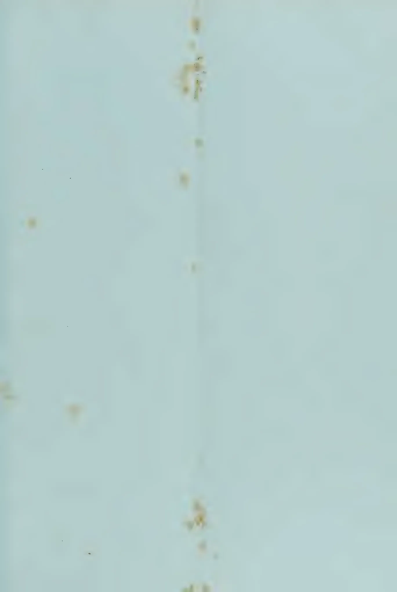This image is a scan of a blank page. The background is a uniform light blue color. There are several small, dark, irregular specks scattered across the surface, which appear to be dust or scanning artifacts. No text, lines, or other graphical elements are present.

97------------------------------------------------

*Engineers, H. W. Carr & Co.*

*The left bank of the Mahaweliganga opposite the Royal Botanic Gardens, Peradeniya.*

*Elevation 1,600 ft. above Sea level.*

*Photo by C. Driberg.*

98------------------------------------------------

THE  
**TROPICAL AGRICULTURIST:**  
JOURNAL OF THE  
**CEYLON AGRICULTURAL SOCIETY.**

---

VOL. XLI.

COLOMBO, AUGUST, 1913.

No. 2.

---

**PROPOSED SCHEME FOR A COLLEGE OF  
TROPICAL AGRICULTURE IN CEYLON.**

---

*Peradeniya, August 15, 1913.*

The movement in favour of a College of Tropical Agriculture in Ceylon has made considerable progress since the report of the Committee was issued in March last. The Committee were instructed to take steps to arouse public interest and it will be admitted, I think, that they have successfully given effect to the idea which led to their appointment. Perhaps the most gratifying feature of the movement is the response of those in England whom the Committee invited to join the London Committee and the success they are achieving in enlisting the support of other distinguished men.

The time would seem to have come for some expression of opinion as to what is actually contemplated by a College of Tropical Agriculture. The public who will be invited to subscribe to the foundation fund will certainly desire to know at least in general terms what it is they are being asked to promote. The hands of the London Committee would probably be strengthened if we acquainted them with the tentative plans we may have formed.

The following is put forward as purely a tentative scheme not intended to commit the Board or anyone else, but merely as an outline for future discussion. In drawing up this scheme I have had the benefit of the advice of members of the staff of the Department of Agriculture as well as that of other gentlemen in Ceylon.

**SITE.**

By the foresight of Dr. Willis, late Director of the Royal Botanic Gardens, Peradeniya, some 40 acres of old cocoa were reserved as a possible site for a College. This block of land is situated on the left bank of the Mahaweli Ganga (river) on the Experiment Station. The actual spot selected for the buildings is opposite the Palmyra Avenue of the Royal Botanic Gardens at a point where the left bank is high. The pile of buildings will form a picturesque and imposing addition to the attractions of the Gardens.

99------------------------------------------------

90[August, 1913]

A view of this proposed site is given showing the Mahaweli Ganga, the largest river in Ceylon. It is taken from the Royal Botanic Gardens and shows on the opposite bank a part of the Peradeniya Experiment Station. The elevation is 1,600 feet above sea level ; and the climate is therefore not of that hot steamy character one generally associates with tropical rivers ; but on the contrary is pleasant and healthy.

### CHARACTER OF BUILDINGS.

Two suggestive designs are attached ; one prepared by Mr. Hubert Walker, A. R. I. B. A. of Messrs. Walker and Adams, Architects, Colombo, the other by Mr. William Claessen, M. S. A. of Messrs. Walker, Sons & Co., Ltd., Colombo. The general arrangement as to the three main buildings is after that of the Cornell College of Agriculture in the United States : three detached buildings permitting of a good circulation of air round each one ; a very essential point in this country.

Mr. Walker estimates the cost of buildings as designed by him at Rs. 562,000 (£ 37,466) ; Mr. Claessen that of his buildings at Rs. 594,566 (£ 39,637).

It has been necessary to protect them by verandahs, a feature also imposed by our tropic climate but which the buildings of Cornell do not possess. Some of the laboratories are in low detached buildings behind, forming a quadrangle and constructed to allow of a maximum amount of light. It has been considered better to have these laboratories in separate buildings for the sake of cleanliness, convenience and light.

The central building will have a large auditorium to accommodate about 200 people.

The physics laboratory will be on the ground floor of this building, lecture theatres, library, reading room, museum being also provided for.

One of the wings will be for the accommodation of dormitory students, the other for those with private rooms and for some of the staff.

Opinions will differ as to the number of students to arrange for. Young Englishmen, not fortunate in having planting connections in the East, would no doubt come to use the College as a "jumping off place." The College will provide a base from which to study the outlook and make friends while all the time they would be undergoing the best possible training for their future planting careers. I regard this rôle which the College is likely to play as a very important one. If it were found that the accommodation was not sufficient it would be easy to extend, but I think on the whole it is better at first to underestimate than to risk buildings standing half empty.

An engine house, laundry, store houses and garage will complete the group.

Behind the group will stretch the recreation grounds and on the hillside beyond sites could be found for the bungalows of the Principal and some members of the staff.

100------------------------------------------------

AUGUST, 1913.]91

### SUBJECTS TAUGHT.

The principal subjects taught will be :—

- Agriculture
- Chemistry, Soil Bacteriology
- Botany, Mycology
- Zoology, Entomology
- Horticulture
- Irrigation
- Veterinary Science
- Physics, Land Surveying, Mechanics
- Meteorology
- Book-keeping

The subject of Agriculture will be complicated though presenting no practical difficulties. With temperate agriculture one man can master the whole subject but I doubt whether this would be possible with tropical agriculture as many of the subjects are of a highly specialised nature. Certainly it would be impossible in practice. One man may be an experienced rubber, tea and cocoa planter but it is hardly likely that he would in addition be an experienced coconut planter. With a highly specialised subject like sugar it is rare to find one man who is good in the field and at the same time good in the factory. Again many tropical products such as tea, rubber, cocoa, fibre, sugar, have not only to be grown but manufactured also; a dual task the temperate farmer is generally spared.

It is not proposed of course to staff the college with a specialist for each principal product nor to try and turn out students capable of taking charge of every kind of plantation ; but each lecturer on agriculture should as far as possible have had practical experience in growing the products he is to lecture upon and each student should be given instruction in the general principles governing the cultivation and, where this is also done by the planter, manufacture of every tropical product ; so that no matter what product he may meet with in the course of his career he will understand at least the general principles of its cultivation.

The Principal would be responsible for the lectures on Agriculture and would require one assistant lecturer. Some of the subjects, as for example those in which they were especially experienced, could be taken by members of the technical and administrative staff of the Department.

It will be possible to deal with the other subjects on comparatively simple lines. The principles of Agricultural Chemistry, for example, are the same for Ceylon as for Europe. Botany, Entomology and most of the other subjects can be taught as to their fundamentals in any country though it would be necessary for students to specialise in them in Ceylon. But this would not be the same thing as taking up a completely new subject like the cultivation of rubber or coconuts which cannot be learnt anywhere except in the tropics.

Under Book-keeping, systems of Plantation account books would be taken but I don't think we should profess to teach estate management in so far as it is concerned with the management of labour. The management of labour is a matter of language, of experience and of temperament. Facilities

101------------------------------------------------

92[AUGUST, 1913.

would be provided for learning Tamil but we could not offer students at the College practical experience of any real value in the handling of labour while of course the necessary temperament for the successful management of natives—a sympathetic frame of mind combined with decision and firmness—cannot be taught in any lecture hall or laboratory. Physics would include agricultural engineering and the application of explosives and electricity to agriculture.

### THE STAFF.

It is essential that the Principal should be an organiser, an educationalist and a specialist in tropical agriculture; not only a trained scientific agriculturist, but a thoroughly practical and experienced man. Much will depend upon getting the right man for the Head of the College and generous provision should be made to attract the best man available.

The staff would be something as follows:—

The Principal

*Tropical Agriculture.*

Lecturer

Plantation Instructor

(Assisted by staff of Department)

*Chemistry and Soil Bacteriology.*

Lecturer

Demonstrator

(Assisted by staff of Department)

*Botany and Mycology.*

Lecturer

Asst. do

(Assisted by staff of Department)

*Zoology and Entomology.*

Lecturer

(Assisted by staff of Department)

*Horticulture.*

Lecturer

(Assisted by staff of Department)

*Irrigation.*

(Visiting Lecturer)

*Veterinary Science.*

(Visiting Lecturer)

*Physics, Land Surveying, Mechanics, Meteorology.*

Lecturer.

There would still remain Geology, Poultry Farming, Apiculture, Book-keeping to fit in as we found it convenient. A Secretary, Bursar and clerical staff would also be required.

### THE COURSE.

The lectures should be so arranged as to provide for two groups of students. Men with degrees or diplomas in agriculture requiring to specialise in tropical agriculture would confine themselves to the study of the cultivation of tropical agricultural products in the lecture halls and plantations. All

102------------------------------------------------

AUGUST, 1913.]93

other subjects they could neglect except a little specialising in Botany, Mycology and Entomology. These students could go through perhaps in a year. Students who had taken a scientific course in a college or had passed the London Matriculation, for example, but with no training at all in agriculture, would be required to take the full Agricultural and Horticultural course inside and outside. This would occupy two years at least.

Work outside in the plantations will constitute an important and essential feature of the course but whether it will be found better to have the students out for whole days or parts of days: in the mornings or afternoons: altogether or by alternate years; must be left for future decision and experience. We must bear in mind we are in a tropical country and that we must be careful about exposing young men to the sun. There would probably be five full working days in the week, Saturdays being kept free and available for expeditions.

If we found the college filled up with these two classes of students others would of necessity be shut out, but I think it would be a pity to begin by drawing too hard and fast a line. Though at one end we wish to turn out well equipped men for careers in Tropical Agriculture, at the other it will be very desirable to fill the college. I think therefore that at first we should not be too particular in insisting that all students should have had a scientific training before being admitted. If room were available students with no scientific training might be received provided they immediately began a preliminary scientific course at some institution where elementary science courses are given. A syllabus of lectures could be drawn up but I don't think it is desirable to do so at this stage because in establishing a College of Tropical Agriculture we should be breaking new ground and the whole question of the prospectus will have to be most carefully gone into before anything authoritative is published. This can only properly be done by some competent person devoting the whole of his time to the subject. Educational and technical authorities will have to be consulted. No one could be better qualified to undertake this work than the prospective Principal and as soon as the establishment of a college is decided upon the first step should be the seeking out and selecting of a Principal, before even a stone is laid, to come out and grow up as it were with the institution. He would devote himself to studying the planting industries of Ceylon, to the preparation of a prospectus and of plans for the organisation of the staff and work.

#### RESIDENT STUDENTS.

The College though primarily for the British Empire should be open to students of all nationalities if room permitted. In order that the education it provides might be available to the sons of those whose means are moderate the fees should be kept as low as possible and to permit of this one house should be arranged to accommodate students in dormitories. A second house would be necessary for those who preferred private rooms. If the fees of students in No.1 or the dormitory house were fixed at Rs.75/- per mensem those of No.2 house would be say Rs.150/- per mensem. It is suggested that to begin with accommodation might be provided for 50 students in No.1 house and 20 in No.2.

103------------------------------------------------

94[AUGUST, 1913.]

The income from fees on this scale would be Rs.80,000 per annum when the college was full.

#### **NON-RESIDENT STUDENTS.**

There are probably many people past the age (which might be put at say 23) at which they could be received as resident students but who might nevertheless like to attend some of the lectures; either a course occupying 6 months, or extension lectures in the evening. These could be arranged for at reduced fees; perhaps from Rs.30 to Rs.45 per mensem. The accommodation of non-resident students would no doubt be catered for by private enterprise.

Such in brief and general terms is the proposal. But it is necessary to repeat that the scheme is put forward merely as a basis for deliberation and discussion.

There are many points about it upon which we should keep an open mind; such for example as the number of students to be provided for, the length of the course, the fees to be charged, the staff required; while, as I have already indicated, before the scheme could be ready for final adoption there is much ground to cover that has not even been touched upon here.

R. N. LYNE.

August 12, 1913.

---

104------------------------------------------------

105------------------------------------------------

# Rural College at Peradeniya.

An architectural elevation drawing of a large, multi-winged building. The structure features a series of arched windows on the ground floor and a row of smaller, rectangular windows above. The roof is flat with a central gabled section. The drawing is detailed, showing the texture of the masonry and the arrangement of the windows and doors.

Design.

An architectural elevation drawing of a building, likely a different view or a different part of the same complex. It features a prominent central entrance with a pediment supported by columns. To the left of the entrance is a section with arched windows, and to the right is a section with a series of arches. The drawing is detailed, showing the texture of the masonry and the arrangement of the windows and doors.

ign.

106------------------------------------------------

# Suggested Designs for Agric

A detailed architectural line drawing of a grand building. The central section features a prominent triangular pediment supported by columns, with arched windows below. The building has multiple levels with intricate detailing, including a balcony and a central tower-like structure on the right side.

Mr. Clae

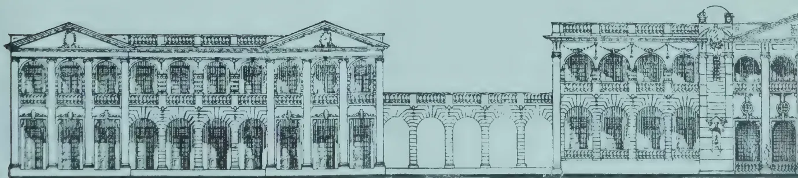A detailed architectural line drawing of a building. The left side features a classical portico with a triangular pediment supported by columns. The building has multiple levels with arched windows and a central tower-like structure on the right side. The drawing is highly detailed, showing the intricate masonry and architectural elements.

Mr. Walk

107------------------------------------------------

This image is a scan of a blank page. The paper has a light beige or cream-colored tint. There are a few small, dark specks scattered across the surface, which appear to be scanning artifacts or dust particles. No text, lines, or other markings are present on the page.

108------------------------------------------------

AUGUST, 1913.]95

# COCONUTS.

---

## THE STEAM-PIPE HOT-OVEN COPRA DRIER.

The underlying principle in this apparatus is a simple steam boiler having a large fire box (to accommodate husks, shells, or other kind of bulky fuel) connected with an oven filled with sliding trays and one or several tiers of steam pipes; this drier costs very little for operation, the husks and the shells furnishing a super-abundance of fuel, the steam pressure being low, and there are no bearings to wear out. The bottoms of the trays, which may be made of any convenient size, should be of bamboo latticework or of galvanized-wire screen; no iron should be used on account of its blackening effect on the "meat" coming in contact with it. The oven itself may be made of any light wood and no special care is needed in its construction. The cool air enters around and beneath the trays in the lower portion of the oven, while the hot moist air from the copra rushes out at the top. (See illustration.)

A temperature of 50° to 70° C. (say, 120° to 160° F.) is sufficient thoroughly to dry copra in this oven in fourteen to eighteen hours; above 75° C. (170° F.), there is some danger of scorching or rather browning the material in the trays, even if they are made (as they should be) of split bamboo or light wood. This machine, however, may be and is misused. The copra can be removed *in eight hours* and sold on a par with the tapahan article, which it excels only in point of being unsmoked and evenly dried.

In passing it may be mentioned that there seems to exist a belief among the planters and copra dealers in Ceylon to the effect that any high temperature is liable to volatilize a portion of the oil in the "meat." While it is true that many oils are in a measure volatile at ordinary and oxidizable at high temperatures, those of the coconut type are practically stable. The real trouble behind a copra dealer's being afraid of "machine-made" copra is based upon the fact that, bulk for bulk, such copra is, of course, considerably lighter than that made by either the sun-drying or kiln process; being accustomed to a heavy article the dealer naturally jumps to the conclusion that if it requires more nuts to fill a full weight picul sack with "machine-made" copra, there has been a loss of oil and not merely one of water. Until the dealers, then, can prove that bulk for bulk the artificially dried copra contains less oil than the ordinary article, the copra maker should put down all adverse criticisms, which occur in practically every new feature of any industry, as being due to an instinctive prejudice against anything which upsets the old and familiar scheme of things.

109------------------------------------------------

96[AUGUST, 1913.]

[COCONUT INDUSTRY—BULLETIN No. 25, BUREAU OF AGRICULTURE.]

PLATE XIII.

MODERN COPRA DRIER, THE BONITO STEAM-PIPE-OVEN TYPE.  
Oven contains 117 trays, capacity 50 piculs per day. Magdalena, Laguna.

110------------------------------------------------

AUGUST, 1913.]97

On large estates, the construction of a spacious drying house is recommended ; this may contain three to six floors which should be constructed of bamboo or palm latticework. From one or more large furnaces just outside this building hot dry air is drawn into the interior and forced up through the several layers of copra, a tall chimney giving a strong draft to accelerate the evaporation. If carefully managed, there should be no danger of scorching any of the material, even on the lower floors, since only a comparatively low temperature is required, provided the current of air is strong. Such a system naturally requires considerably more time than the steam-pipe-hot-oven apparatus, but this is a secondary consideration where very large quantities of the raw product are to be handled ; from one to two full days ( night shifts required ) should suffice to thoroughly dry the copra. The disadvantages of this system are : The ventilating fans require considerable power which could not very conveniently be obtained direct from the furnaces ; the bringing in of the raw "meat" and the taking out of the cured product require mechanical conveyors of some sort ; the removal of the copra on any given floor which may become dry before that on a higher or lower floor would be difficult since it would not be very pleasant for labourers to work inside the building while the hot air was turned on—yet even this could not be much worse than the smoke of the tapahan drying-house.

The public and the trade, then, must know that the clean, un-smoked copra is not only worth more *per se* than either the sand-covered, sun-dried or the rotting kiln-dried stuff, but the artificially dried product can be kept in the bodega for several months if the producer desires to hold it on any question of price or weather.

The world's markets are hungry for good copra : the demand for A. I dry unsmoked non-mouldy copra will increase, and while the supply is increasing rather rapidly, it is believed that the price has not yet reached the high water mark. As soon as the first class grades are obtainable in fair quantities, however, the price of the low grades will have to drop considerably. It therefore behoves the planter to lose no time in improving his methods of drying so that in the near future the dealer can list him and favour him as a clean copra producer.—*The Philippine Coconut Industry*, by O. W. BARRETT.

## THE SPELLING OF "COCONUT."

THE EDITOR OF THE TROPICAL AGRICULTURIST.

DEAR SIR,

The following from the CEYLON MORNING LEADER will prove of interest to your readers :— "The Spelling of 'Coconut.'— Sir Everard im Thurn, speaking at the Royal Horticultural Society, said the nut now known as 'coconut' was similar to the face of a monkey, and so the Spanish word 'coco,' meaning a grin or grimace, was attached to it. When Dr. Johnson was writing his famous dictionary he had an article on the 'Coconut,' but a careless proof reader passed a mistake in the spelling of the word, the compositor having inserted an 'a' and the word appeared as 'cocoanut.' This spelling became general, but the nuts are now known as 'coconuts,' 'kokernuts,' and 'kokers.'"

111------------------------------------------------

98[AUGUST, 1913]

The present universal spelling "coconut" is rightly claimed to have originated with the *Tropical Agriculturist* and the general adoption of the spelling, dropping the extra "a," has materially assisted in establishing the spelling in newspapers and magazines all the world over—the more recent but illogical American "kokers" and "kokernuts" notwithstanding; as this form not only gives a longer sound to the word than is otherwise given it but would appear to the average reader an entirely new product.

But there are other relative forms of spellings which are often confusing and misleading—not variations regarding one article but various articles being known by similar names. This fact deserves the serious attention of experts who should agree to adopt names that would avert confusion.

I refer to the "Cocoa" as still to be seen in the writings of an older generation before *nut* in referring to the Coconut (*Cocos nucifera*); "Cocoa" and "Cacao" meaning the "Chocolate fruit"—as is often heard in the streets of Colombo and occasionally even at Peradeniya on passenger days—(*Thebroma*, *Cacao*); and "Coca" (*Erythroxylon coca*).

Mr. O. W. Barrett I think it was who in the course of a treatise on the subject stated that in dealing with *Cacao* from an agricultural and botanical point of view he would leave the manufacturer to deal with "Cocoa"—indicating the origin of the irregular form.

Now that we have "Coconut" fixed and in universal use, and "Coca" not being likely to change, will it not be more in keeping with science to do away with "Cocoa" altogether and substitute the more correct form "Cacao" which will leave 3 articles that are at present often confused with one another, on separate forms of spelling and pronunciation, with the least possibility of confusion?

I suggest the *Tropical Agriculturist* give the lead in adopting *Cacao* as the proper spelling, so that we may have :—

Cacao (*Theobroma, cacao*)

Coca (*Erythroxylon coca*)

Coconut (*Cocos nucifera*)

YOURS FAITHFULLY,

J. S. DE SILVA.

[Our correspondent is not quite correct in stating that *Coconut* is the universal spelling. Probably the vast majority of people spell the word with an *a*. Turning up the Stores List we find "Cocoanut biscuits;" "Cocoanut oil;" and confectioners and traders throughout the United Kingdom would spell the word in the same way. Again, while *Coconut* is probably more correct, *Cocoanut* is certainly not incorrect. Thus the Century Dictionary after an exhaustive explanation of the origin of the two forms of spelling adopts *Cocoanut* in the text. Nor are we prepared to scrape the word *Cocoa* especially as *Cacao* is generally mispronounced. Indeed if we are to come to origins, the ultimate criterion after all of what is correct, *coconut*, *cocoanut*, *cocoa*, *cacao* would all go overboard as designations of trees. The coconut palm was at one time called the *cocoa-tree*; cocoa or cacao, whichever is preferred, the *chocolate-tree*, and is so called now in some countries.—Ed. T.A.]

112------------------------------------------------

AUGUST, 1913.]99

## COCONUTS AND THEIR YIELD.

### THE ADVANTAGES OF MANURE.

Regarding actual yields of coconut palms, we see that the Kirivaula Coconut Plantation obtained 241,206 nuts from 7,591 trees, or an average of 32 nuts per tree, as compared with 44 nuts in 1911. This falling off, instead of an increase, was entirely due to the extreme drought that had been experienced, and had it not been for the manuring operations of the two previous years, Kirivaula would have done even worse. It is interesting further to note that out of the 241,206 nuts obtained, 31,666 made 22 candies (candy==560 lb., or 5 cwt.) and 150 lbs. copra, which realized an average nett price of Rs. 85'14 per candy; 107,870 nuts were sold at a nett average price of Rs. 55'14 cents (Rs. 1s. 4d., 100 cents to the rupee); 5,000 nuts were planted; 6,670 were rejections (about 2½ per cent).

This accounts for only 161,206 nuts, so possibly some of the figures are incorrect; for instance, if 197,870 nuts had been sold, and not 107,870 as stated, that would make up the 241,206 nuts plucked. The details given show, however, how a crop is divided up. The management of this company further report that during 1912 the bearing and blossoming palms on the portion of the estate south of the Deduru Oya (river) were manured and good results are expected. It is proposed to deal with the trees on the north of the river in the current year. Buffaloes have also been used for manuring purposes by tying them to trees at night. Regarding the portion of the estate manured in 1912, the Visiting Agent, in his December Report, writes: "The older palms are much finer now than they were a year ago, and their crowns have developed very much. There is no sign of any yellow about them and given an adherence to the present programme of manure I am sure these trees will yield heavy crops in the future. Supplying has again been rather disappointing, and white ants have done damage to the young plants put out, but by putting in older plants, and with the use of 'kainit' with supplies, it is hoped to get over this difficulty during the current year. Digging round palms continues to be done, and in general the condition of the estate is satisfactory."

The coconut crop of the Jambulande Tea and Rubber Company (Ceylon) was also below the estimate on account of the unfavourable weather.

The Hon. Mr. W. H. Figg, speaking as Chairman of the Coconut Estates of Perak, of which company Mr. Kelway Bamber is also a Director, said those present "would understand that to give details of the working of a place at such a distance and practically in a new district, was somewhat difficult. Means of communication were not easy and the management of coolies in a new district was a matter of trouble. The opening up of the Bagan-Datoh district was a pioneering enterprise and, taking all the facts into consideration he thought the shareholders might be satisfied with what had been done. Personally he believed that having accomplished the draining and the satisfactory planting of the 4,500 acres they had a very sound investment at quite a reasonable cost. Some shareholders had asked what would be the ultimate cost per acre. In the prospectus they anticipated that it would be possible to bring it to the producing stage for £20 an acre. In consequence,

113------------------------------------------------

100[AUGUST, 1913.]

however, of the competition for labour, &c., it might come to one or two pounds more. In any case it seemed to him that it would be possible for a matter of £25 per acre inclusive of the purchase of the land to complete the work they had in hand. To have successful clearings at £25 per acre in a good situation, and with such a soil as they had in the Bagan-Datoh district was, it seemed to him, as good an investment as anyone could wish to have."

—TROPICAL LIFE.

## COCONUTS IN MALAYA.

### PRACTICAL REVIEW OF THE CONDITIONS AND PROSPECTS.

BY H. LAKE COGHLAN.

Remarkable attention is being directed towards the coconut industry, and on all sides one hears of the boom that is at hand. The company promoter is busy preparing his nets for the promised good time, and the ex-tropical man will, as usual, have an option ready, or know of a friend who has one. It may not be out of place therefore to put on record a few remarks of a precautionary nature.

Malaya—the successful rubber and tin country—is also an ideal land for the cultivation of the coconut, its equable tropical climate, its rich alluvial soil, its plentiful and evenly-distributed rainfall, and its ozone-laden breezes all making for rapid and prolific growth. It must be remembered, though, that in the past Europeans have not given this particular cultivation the same attention that has been devoted to rubber and coffee, and consequently the industry has been confined almost entirely to the efforts of the natives. This will account for most of the coconut estates in Malaya being in the hands of Malays or Chinese. The plantings are more or less limited to the Kampongs, or villages in regions near the sea or on neighbouring islands. The titles usually take the form of mukim permits, or short agricultural leases, for blocks often as small as five acres, and, in order to obtain an estate of any magnitude, it may be necessary to embrace 200 or 300 holdings. This is mentioned to show that at the present time, in Malaya, even though in the whole territory it is estimated there are about 150,000 acres under coconuts, it is difficult to find a plantation in bearing of 500 acres and upwards, held under single ownership or under a modern title readily negotiable. The Government does not look with favour upon natives parting with their holdings, and even when one has overcome the difficulty of getting actual owners' (not squatters') signatures to a sale agreement, official transfer may be delayed, or even refused, on the ground of non-compliance in the past with cultivation covenants, or more likely quit rents in arrear. Therefore it behoves one to move cautiously when dealing with schemes sent here for flotation.

Before parting with any cash, a few pertinent questions to ask are:—

(1) Is the estate in one block? if not, in how many blocks, and are they contiguous?

114------------------------------------------------

AUGUST, 1913.]101

- (2) How many owners are there ?
- (3) If native-owned, have signatures been attested by the Penghulu, or native headman, of the district ?
- (4) Was each owner given a consideration ?
- (5) Has the proposed sale the approval of the British Resident of the State ?

The questions satisfactorily answered, one might proceed to obtain the expert report ; but before this cost is incurred vendors should be in a position to state, on independent evidence, the following:—

- (1) Age of trees ; number per acre.
- (2) Nature of soil ; if peaty, whether it has been limed.
- (3) When and how manured.
- (4) What precautions have been taken against red beetles.
- (5) If there are catch crops, particulars of them and revenue.
- (6) If there are squatters, what rights or sub-leases they have.
- (7) The average nuts per tree per picking, number of pickings per annum, evidenced by sales of nuts or copra.

#### **THE EXPERT.**

In choosing an expert to make a report, a London buyer would do well to bear in mind that in Malaya there are few planters intimately acquainted with the coconut industry, and fewer still who can speak from personal experience in the actual planting of the nut, from seed to copra. As planters, however, they have had the experience of local conditions; of soils and manures; of the comparisons of one estate with another, and they should be judges of areas. For the remaining details which usually go to make up a report they turn, as every one does, to Chamber of Commerce statistics and published handbooks. Regarding the latter, too, a word is necessary. Recently there was published in London a remarkably well-compiled book on the coconut industry. It contains a wonderful collection of useful information, but does not embrace Malaya, where the best nuts are grown. It is compiled generally from Government statistics, and seems to leave little untold. In it an estimate is given, as an extract "from a Government report," on the cost of planting and bringing into bearing an area of 500 acres; and the cost per acre at the end of the sixth year is put at £13. Now, this cannot be done in Malaya; for official figures there put the cost at about £25 per acre. This figure is certainly on the high side; as, in the opinion of experienced planters, who in coconuts dispense with fancy work, £20 per acre should not be exceeded.

#### **STOCKS OF COPRA.**

Another point to be remembered in connection with this industry is the fact that unlimited supplies of copra are not waiting in Malaya to be bought cheaply from inexperienced natives. Copra sales are largely in the hands of Chinese produce dealers, who are astute men of business. They have English-speaking clerks, who are familiar with market prices, and are accustomed to receive daily bids for their produce from European firms representing big British and continental trading companies. People on this side, therefore, should not be misled by haphazard statements regarding untold quantities of

115------------------------------------------------

102[AUGUST, 1913.]

copra only awaiting capital to purchase it. Malaya came through the rubber boom without a blemish. Speculators may have lost money in shares and crazy finance, or through irresponsible valuations and reports; but one cannot recall a case of deliberate misrepresentation. The country may rightly be termed the Land of Promise, and now that a few words of warning have been put on record we may turn to the attractive side of the subject.

### COCONUTS AS AN ATTRACTIVE INVESTMENT.

There are large tracts of land, rich in alluvial soil, in Malaya, well suited for coconuts, and these await the advent of enterprising capitalists. The industry in itself is but in its infancy, and, is bound to expand on the introduction of more enlightened methods for the preparation of copra, the extraction of oil, the ever-increasing demand for fats for human consumption (such as margarine or nut-butter), and the enormous requirements of the soap trade, to say nothing of the products used in the manufacture of biscuits, confectionery, cattle food-cake, coir fibre, and yarns.

A foreword written recently by SIR WILLIAM LEVER, one of the greatest soap manufacturers, says: "I know of no field of tropical agriculture that is so promising at the present moment as coconut planting, and I do not think that in the whole world there is a promise of so lucrative an investment of time and money as in this industry."

At present the exports from Malaya are:—

<table>
<tbody>
<tr>
<td>Coconuts, value .....</td>
<td>$305,452</td>
</tr>
<tr>
<td>Coconut oil .....</td>
<td>$2,218,436</td>
</tr>
<tr>
<td>Copra .....</td>
<td>$18,429,954</td>
</tr>
<tr>
<td>Total .....</td>
<td>$20,953,842</td>
</tr>
</tbody>
</table>

or about £2,500,000 sterling. This is bound to increase enormously in the near future, and in British Malaya—"the Golden Chersonese," as it is called—is held out the promise of fortune beyond ordinary conception; but one can only go there on somewhat prepared lines, and with capital, not necessarily large, but sufficient to deal with at least 500 acres of land. Some London rubber agencies have as many as a hundred applicants, mostly public-school boys, waiting for a vacancy to occur out East: men who recognise that the old professions in England are played out; that for young fellows of stability and ambition new fields must be found. Planting attracts them because of its open-air life, its constant and varied occupation and, in leisure moments, excellent shooting, and in due course splendid returns on their outlay:—THE FINANCIAL NEWS.

---

## THE PREPARATION OF COPRA.

In their issue for June the *Agricultural Journal of the Companhia de Mocambique* has the following in an article on Copra: In order to dry his copra Mr. Wright, a planter near Mirigama, employs a sort of oven, in which the nuts are placed in layers about 20 centimetres deep, after they have been cut in two and the fibre removed. They are then laid on metal bars placed at short intervals from each other, the inside of the kernels downwards. The

116------------------------------------------------

AUGUST, 1913.]103

oven is heated with the shells which make excellent fuel, as they burn steadily. The shrinkage caused by the evaporation of the moisture held in the kernel enables the pieces of copra to be easily removed.

Hot air driers for copra are not yet commonly used, but it is probable that their use will become general on estates managed by Europeans, as they enable one to produce a uniform article and one which is thoroughly dry. Some plantations in Trinidad, West Indies, are now beginning to make use of this improved method, as is also the German Trading and Planting Company of the South Seas, which has planted the enormous coconut groves in Samoa. In cases where it is acknowledged to be advantageous to prepare copra by exposing it for a time to the sun, it is advisable to adopt the type of free air drier used in Java for the purpose of drying cinchona bark. This system has the advantage of being economical.

In the case of very extensive plantations one can use free air driers as described by Mr. Elot in his pamphlet on cacao and other important crops of Trinidad. These driers are made of large metal roofs which can be moved on rails. This enables one to expose the copra while the sun shines and to put it under shelter at the least sign of rain. According to Dr. Davillé the method of working in Tahiti and the neighbouring islands is somewhat different. The natives split the whole fruit into two pieces by striking them lengthwise with a hatchet. By means of a knife or pointed bone they then lift a piece of fibre one centimetre broad from the outer surface of each half nut, to enable them to re-unite the halves, tie them together in pairs, and suspend them on cords, wires or creepers stretched horizontally, taking care to fasten so that the inside of the nuts is turned towards the sun and to put them as far as possible in places sheltered from rain. At the end of 2, 3 or 4 days, depending on the weather, the copra falls to the ground of its own accord. The natives then gather up all the pieces and make holes in them, stringing them on small cords, so as to make a kind of large necklace consisting of spherical caps fitting into each other. The copra from these places is generally sent to San Francisco in this form, i. e. without any further breaking.

#### SMOKE DESICCATION.

The method of preparation called by Dr. Davillé "Smoke Desiccation" may also be used. It is described in his work on the cultivation of the coconut, which was written in 1899. This method consists of drying the kernels, after they have been broken in two, in a kind of hut, which is generally termed a "Smoke house." These huts are about 10 metres long by 5 metres broad, and are made of solid wooden posts sunk a metre deep in the earth, bound by cross pieces and supporting a light roof, the lower edge of which is  $2\frac{1}{2}$  metres above the ground. The walls are made of corrugated iron sheets, nailed to the posts which support the roof; the ceiling is made of sticks of preferably of metal rods one centimetre in diameter, placed 3 or 4 centimetres apart and supported here and there by uprights. Then shallow holes, in which the shells or wood used as fuel are placed, are dug out in the floor at a distance of one metre from each other. After removing the fibre the coconuts are broken and then laid out in regular layers 20-25 centimetres deep, upon the lathes or bars forming the ceiling. The fire is then lighted,

117------------------------------------------------

104[AUGUST, 1913.

and the "Smoke house" carefully closed. At the end of two or three days, drying is generally well advanced. The copra is then withdrawn and removed from the shells, using a knife or piece of pointed wood if the kernels still adhere to them. It is also possible, as Dr. Davillé remarks, to replace the smoke-house by similar but less expensive buildings, by digging a big ditch two metres deep over which is laid, resting on the ground, a floor with openings similar to those which have just been described. The whole is then surmounted by a small roof approximately two metres high. The bottom of the ditch serves as the hearth. Desiccation under these conditions takes a longer time than in a smoke house of corrugated iron.

Whatever precautions are taken in preparing copra by drying it with smoke, it is almost impossible to obtain a product of really good quality. It is, therefore, advisable only to employ this method when it is impossible to do otherwise, and to give preference to drying in the sun, ovens or stoves, which tend to prepare a product of a very pale colour, for which there is always a sale at very remunerative prices.

The care bestowed on the preparation of copra always has considerable influence on the value and quality of the products—oil and cake—derived from it. The extra price value may reach and even exceed £2 per ton, and it will doubtless continue increasing more and more, for the manufacture of very white and pure oils, of soap of superior quality, and above all of coconut butter (vegetaline, palmerine, etc.,), tends to expand every day. It is therefore essential that planters should aim at producing only thoroughly dry copra of good quality and as little discoloured as possible.

The planters in the English Colonies in the Far East have long recognised the care which they must bestow upon the manufacture of copra. Their attention was drawn to this point by the superiority of the oil and dried kernels coming from Cochin (which is situated on the West Coast of British India and a little to the North of Cape Comorin), which to-day have a great reputation, and which always reach, both on the Marseilles and London markets, a much higher figure than the same products of any other country. This difference sometimes reaches nearly £4 a ton. For instance, in November, 1910, Cochin oil was quoted at Marseilles at £26. 5s per ton, although the market price of ordinary coconut oil did not exceed £22.12s.6d per ton. The planters of Ceylon, which is situated only a short distance from Cochin, were the first to be roused to this state of affairs, and they endeavoured to find out to what this superiority was due. At first it was attributed to climate and soil, but the investigations carried out by the efforts of the *Tropical Agriculturist* seem to prove that the value of Cochin copra and oil is due to the care with which the nuts are harvested and dried. The following conclusions may be drawn from the investigations :—

1. 1. The purest oils and those of the best quality are extracted from the least discoloured copra, which is only obtainable from nuts harvested when thoroughly ripe.
2. 2. Drying by smoke and in ovens when badly carried out is objectionable, as it gives rise to more or less darkly-coloured copra, which emits a decided smell of smoke, leaving a residual cake of inferior feeding quality.

118------------------------------------------------

AUGUST, 1913.]105

1. 3. Sun-drying gives excellent results when properly carried out.
2. 4. Copra of excellent quality can only be prepared from thoroughly ripe nuts.

5. Preparation by exposure to the sun is carried out with the greatest care by the natives of Cochin, who are more energetic and perhaps also better agriculturists than the Singhalese. They, too, take care to prepare their copra and oil from only those nuts which are thoroughly ripe.

The drier the country in which the estate is situated, the easier the preparation of sun-dried copra, so that this method will not have any serious difficulty to contend with on the western slopes of Madagascar. It will, perhaps, require, as in some districts of Ceylon, special arrangements on the East Coast, where the rains are so frequent. In this locality the Cinchona driers of Java, to which we have already referred, might be advantageously used, or preferably, when the importance of the industry warrants it, suitable hot air stoves, which have the great advantage of allowing rapid desiccation at all times, might be started. In very wet countries and when it is impossible to go to the expense of stoves, it is advisable to make copra in ovens, provided that fuel giving off the minimum amount of smoke be used.

These various points make us attach great importance to the lesser details of sun-drying, which, according to the care taken, will produce either the best or very inferior copra. According to an experienced Ceylon planter the following procedure is recommended. Thoroughly ripe nuts are first selected and gathered only when of a dark brown colour. They are then placed in heaps until it is time to start the drying, which must be begun within three or four weeks of picking. At this time the kernels may be easily removed from the shell after short exposure to the sun, and often when the nut is first opened. The nuts must then be broken and spread out side by side right in the sun on a day as dry and hot as possible, taking care to prevent any particle of dirt or sand coming in contact with the inside of the kernel. It is, therefore, a good plan to spread out the copra on mats until a dry film, to which foreign matter cannot adhere, is formed by evaporation on the inside of the kernel. By rubbing the copra gently with the fingers sand is easily removed. At the end of a few hours this operation is usually complete. Then the pieces of hard shell are removed and the drying finished by spreading the copra out in a suitable place either on mats or on the ground. The nuts must only be opened during the morning to allow the surface crust to form before night. A little before sunset the kernels are placed in long heaps thirty to forty centimetres high. On the next and following days they are again spread out until drying is complete. Rain even of soft duration will do much damage to the colour of copra. Shelters into which the nuts can be quickly removed when the weather is threatening, seem to be indispensable on the entire east coast of Madagascar.

#### CONCLUSION.

At the present time sun-drying is certainly the best method for use on the western slope of Madagascar. It must, however, be carefully carried out. This method will give equally good results at certain places on the east coast the island, provided that drying rooms with shelters are erected; but in

119------------------------------------------------

106[AUGUST, 1913.

many places, and especially during the rainy season, the preparation of copra by means of ovens and the use of hot air stoves is preferable.

It is needless to add that the returns are very variable. In Ceylon it is estimated that 4,800 to 5,500 nuts are required to produce one ton of copra. In Trinidad 6,000 are taken as the average. In this connection it is interesting to note the experiments carried out by M. Rideau, a planter in Annam, which was published in 1901 in the "Revue des Cultures Coloniales." These experiments were carried out on 1,000 coconuts, and were repeated each month for a whole year.

The quantity of copra produced by 1,000 nuts and the number of nuts required to yield one ton of copra were as follows:—

<table border="1">
<thead>
<tr>
<th></th>
<th>Month.</th>
<th>Kilos of fresh kernels from 1,000 nuts.</th>
<th>Kilos of copra from 1,000 nuts.</th>
<th>Number of nuts required to make one ton of copra.</th>
</tr>
</thead>
<tbody>
<tr>
<td rowspan="6">Winter Season</td>
<td>November</td>
<td>316.0</td>
<td>175.3</td>
<td>5,704</td>
</tr>
<tr>
<td>December</td>
<td>315.8</td>
<td>179.2</td>
<td>5,580</td>
</tr>
<tr>
<td>January</td>
<td>321.5</td>
<td>160.4</td>
<td>6,234</td>
</tr>
<tr>
<td>February</td>
<td>330.5</td>
<td>173.5</td>
<td>5,763</td>
</tr>
<tr>
<td>March</td>
<td>338.0</td>
<td>173.5</td>
<td>5,763</td>
</tr>
<tr>
<td>April</td>
<td>345.0</td>
<td>167.3</td>
<td>5,977</td>
</tr>
<tr>
<td rowspan="6">Summer Season.</td>
<td>May</td>
<td>425.0</td>
<td>196.5</td>
<td>5,089</td>
</tr>
<tr>
<td>June</td>
<td>340.0</td>
<td>168.0</td>
<td>5,780</td>
</tr>
<tr>
<td>July</td>
<td>328.0</td>
<td>176.0</td>
<td>5,680</td>
</tr>
<tr>
<td>August</td>
<td>312.0</td>
<td>181.0</td>
<td>5,524</td>
</tr>
<tr>
<td>September</td>
<td>325.0</td>
<td>182.0</td>
<td>5,494</td>
</tr>
<tr>
<td>October</td>
<td>396.0</td>
<td>173.0</td>
<td>5,780</td>
</tr>
</tbody>
</table>

Taking to the average for the 12 months, 1,000 nuts yielded 332 kilos (730 lb.) of fresh kernels, and 175 kilos (385 lb.) of copra. To produce one ton of copra an average of 5,677 nuts were required, that is 2.53 nuts produced 1 lb., or 5.57 nuts one kilo of copra.

The above notes on the manufacture of copra have been taken and translated from "Le Cocotier," a standard work on coconuts by M. Prudhomme, Director of Agriculture for Madagascar, to whom our grateful acknowledgments are due.

120------------------------------------------------

AUGUST, 1913.]107

# RUBBER.

## CEYLON YIELDS AND TAPPING METHODS.

### A NEW TAPPING SYSTEM.

Mr. JOSEPH FRASER, at the London Meeting of the Neboda Company, gave some interesting information with regard to the Northupana Estate belonging to the Company. The following shows the magnificent yields being obtained from this plantation which is situated in the Kalutara District, one of the best rubber growing districts in Ceylon.

#### AVERAGE YIELDS.

<table>
<thead>
<tr>
<th>Acres.</th>
<th>Per acre.</th>
<th></th>
</tr>
</thead>
<tbody>
<tr>
<td>73</td>
<td>612 lbs.</td>
<td>1904 planting</td>
</tr>
<tr>
<td>52</td>
<td>570 ,,</td>
<td>1902 to 1905</td>
</tr>
<tr>
<td>44</td>
<td>339 ,,</td>
<td>late 1905 planting</td>
</tr>
<tr>
<td colspan="3">
</td>
</tr>
<tr>
<td>169 Average</td>
<td>528 ,,</td>
<td></td>
</tr>
<tr>
<td>30 ,,</td>
<td>31 ,,</td>
<td>( 30% of trees tapped for six months )</td>
</tr>
<tr>
<td colspan="3">
</td>
</tr>
<tr>
<td>199</td>
<td></td>
<td></td>
</tr>
<tr>
<td colspan="3">
</td>
</tr>
</tbody>
</table>

On Northupana these 169 acres have been manured yearly, and in 1912 the whole area was

#### TAPPED ON THE ONE CUT SYSTEM

half spiral left of the channel, with hangers suspended under the spout, costing 56 cents to 60 cents per acre. Mr. Fraser claims that this system possesses the manifest advantages of high yields, small consumption of bark, low cost of tapping while the risk of possible damage to the cambium is reduced to the minimum and the amount of scrap reduced to the lowest possible point. The area excised in tapping is only three inches per annum, when the coolies are properly trained. Fewer coolies are required, one tapping cooly for every three acres being sufficient, which means better pay can be given to the coolies. Under this system well grown rubber, giving high yields, can be tapped and scrapped at a cost of 8 cents to 10 cents per lb. With coolies earning on an average 50 cents to 60 cents per day, labour difficulties should gradually disappear together with the highly objectionable system of high advances. The total cost of tapping and scrapping, including the areas in partial bearing in 1912, amounted to 19.4 cents per lb.

For 1912 Neboda harvested 168,833 lbs. of rubber. This realised 4s.5.4d. per lb. in London. The F.O.B. Colombo cost was 9.7d per lb. The all in charges, including freight and brokerage, amounted to 1s.1.38d. per lb., leaving a gross profit of 3s.3.95d., the highest rate yet earned by any Company for 1912:—GRENIER'S RUBBER NEWS.

121------------------------------------------------

108[AUGUST, 1913.]

## RUBBER VINE CULTIVATION IN THE BAHAMAS.

MR. HENRY D. BAKER, American Consul on Special Service in India, has furnished us with a copy of the Daily Consular and Trade Reports issued by the Bureau of Foreign and Domestic Commerce Department of Commerce and Labour, Washington. Among the several articles there is an account on "Rubber Vine Cultivation in the Bahamas" by Mr. Baker. He says that plans are pending for an extensive cultivation in the Bahama Islands of the rubber vine known as *Cryptostegia grandiflora*. A \$500,000 syndicate having this object in view was organized several months ago in Boston, and about 1,100 acres of land have been purchased near the city of Nassau in the Island of New Providence. A large number of shoots to be planted over this land will shortly arrive from Mexico, and special machinery for extracting the rubber and fibrous by-products by a secret process has been ordered from the United States.

It is understood that approximately 5,000 rubber vines will be planted to the acre. After six months' growth the rubber vine is said to be 12 to 30 feet long. The vines will be cut in about 12 months, when there will be presumably 2 pounds of shrub to the plant as a minimum, yielding about 2 per cent. of rubber, or 200 pounds of rubber to an acre.

### EXTRACTION METHODS AND VALUABLE BY-PRODUCTS.

The rubber juice is contained chiefly in the lactiferous ducts of the bark, but to some extent also in the wood of the stem; in fact, the entire plant contains a certain amount of rubber. While the process of extraction is secret, yet in the main it appears that it is analogous to the production of sugar from sugar cane, the rubber vine being ground up and the juice extracted as from sugar cane. Samples of rubber thus obtained from the rubber vine are estimated as worth in the London market within 8 cents per pound of the price of the best Para Rubber.

The fibrous by-products of the rubber vine are considered as possessing an importance possibly greater even than that of the rubber itself. The bark of the vine yields 6 per cent. of the weight of the whole stem in a pure cellulose fibre, undignified and having silky lustre comparable to Japanese ramie fibre and almost equal to cotton. It is thought that it can be used as a substitute for Egyptian cotton, especially in the manufacture of fine underwear and other textile goods. The pods of the rubber vine, besides containing a fair percentage of juice, have large quantities of a silky cotton, such as would be suitable for stuffing pillows; when refined and specially treated it can be successfully spun with ordinary cotton. There are 5 to 10 pods to each shrub. The woody substance of the rubber vine when bleached and worked out yields a fibre suitable for paper pulp. The vine can be best harvested after the fruiting period.

122------------------------------------------------

AUGUST, 1913.]109

## PONGOLO RUBBER ESTATES.

### ARRIVAL OF MACHINERY.

Amongst the new plant is a wonderful invention known as the "creeping grip." This machine is used for ploughing, haulage, and all kinds of estate work. It lays its own track over sand and through all sorts of rough country. It weighs only  $7\frac{1}{2}$  tons, and not only does it do its work over soft sand but is capable of hauling 15 tons weight under such adverse conditions, the cargo being carried by means of broad 14-inch tyred wheels. The invention, which is an American one, has been operated successfully under the same conditions as obtain at the Pongolo Rubber Estates.—LOURENCO MARQUEES GUARDIAN.

---

## THE DIGESTIVE JUICES OF PLANTS.

It has long been known that both plants and animals carry on their various chemical operations by means of specific agents known as enzymes. Thus, when a plant requires the starch which is stored in its leaf, tuber or elsewhere, a special enzyme, diastase, is put in contact with the starch grains, corrodes them, and converts the starch into sugar. The mode whereby the animal makes use of the starch which occurs in its food is precisely similar to that employed by the plant. Both saliva and pancreatic juice contain diastase, and hence such starch as escapes the action of saliva—and in these days of quick lunches much escapes—is acted on by the diastase of pancreatic juice and is hydrolysed to sugar. Each of the many chemical actions which go on in the body is presided over by a specific enzyme, of which the starch-converting diastase may serve as an example. The digestion of proteins—the complex nitrogen-containing substances which are of special nutritive value is effected by stages, and for each stage there is a special enzyme. In the animal these proteolytic enzymes are contained in the gastric and pancreatic juices. Since the processes of digestion are similar in plants and animals, we shall expect to find that proteolytic enzymes occur in plants as well as in animals. This expectation was realised long ago by the classical investigations on the substances excreted by insectivorous plants, such as *Drosera* and the Pitcher plant (*Nepenthes*). These substances bring about the solution of proteins in a way similar in all essentials to that whereby the proteolytic enzymes of animals act.

The fact that the protein-digesting enzymes of plants are readily demonstrable in the case of insectivorous plants is apt to give rise to the idea that their occurrence is exceptional and bound up in some special way with the curious and uncanny habit of *Nepenthes* and *Drosera*. This, however, is not the case. What happens in these happens in all plants, and the only peculiarity of the insectivorous plant is that it produces—in accordance with its special habit—a relatively large and house readily recognisable amount of proteolytic enzyme—GARDENERS' CHRONICLE.

123------------------------------------------------

110[AUGUST, 1913.

# CACAO.

## CACAO MANURING EXPERIMENTS IN DOMINICA

BY H. A. TEMPANY.

In 1900 an acre and a half of a 10-year old cacao plantation was laid out at the Botanic Station and divided into five plots, each of which has received a different manurial treatment applied annually from 1902 to 1912. The following are the average returns for the period :—

<table border="1">
<thead>
<tr>
<th rowspan="2">No. of Plot.</th>
<th rowspan="2">Manurial Treatment : cwt. per acre.</th>
<th rowspan="2">Wet cacao lb. per acre.</th>
<th rowspan="2">Dry cacao lb. per acre.*</th>
<th>Cost of</th>
<th>Net gain†</th>
</tr>
<tr>
<th>manuring per acre.</th>
<th>by manur- ing per acre.</th>
</tr>
<tr>
<th></th>
<th></th>
<th></th>
<th></th>
<th>£. s. d.</th>
<th>£. s. d.</th>
</tr>
</thead>
<tbody>
<tr>
<td>1</td>
<td>No manure ...</td>
<td>2,800</td>
<td>1 176</td>
<td>—</td>
<td>—</td>
</tr>
<tr>
<td>2</td>
<td>Basic phosphate 4 } Sulphate of Potash 1½ }</td>
<td>3,369</td>
<td>1,415</td>
<td>2 5 3</td>
<td>3 14 3</td>
</tr>
<tr>
<td>3</td>
<td>Dried blood .. 4</td>
<td>3,261</td>
<td>1,370</td>
<td>1 16 0</td>
<td>3 1 0</td>
</tr>
<tr>
<td>4</td>
<td>Basic phosphate 4 } Sulphate of Potash 1½ } Dried Blood 4 }</td>
<td>3,876</td>
<td>1,628</td>
<td>4 1 3</td>
<td>7 4 9</td>
</tr>
<tr>
<td>5</td>
<td>Mulched with grass and leaves.</td>
<td>4,233</td>
<td>1,778</td>
<td>3 0 3</td>
<td>12 1 0</td>
</tr>
</tbody>
</table>

\* Calculated from the wet yield assuming 42 lb. of cured cacao = 100 lb. wet cacao.

† Taking the value of cured cacao at 6d. per lb.

The artificial manures are distributed over the surface of the ground and lightly raked in. The mulch consists chiefly of grass from lawns, and leaves and pods of the saman tree (*Pithecolobium saman*), and is applied at the rate of 4 baskets of 20 lb. each to every tree. No forking has been performed since the beginning of the experiments.

The returns of the mulched plot have been uniformly highest, Plot 4 coming next in order, and in both these cases, the level of the yields was gradually increased during the first 5 or 6 years and then remained more or less stationary, fluctuating with the seasons. In the case of Plots 2 and 3, which receive incomplete dressings, and of Plot with no manure, there has been no accumulation of fertility; but neither have the yields declined, though they may be expected to occur in future. The superiority of the treatment on Plot 5 is substantiated by the excellent appearance of the trees.

Two other experiments carried on at the Botanic Station during the years 1907-12 indicate (1) that mulching is equally efficacious on a steeply sloping hillside and on the flat, and (2) that a mulch of grass and leaves is superior to an application of 600 lb. per acre of cottonseed meal.—MONTHLY BULLETIN.

124------------------------------------------------

AUGUST, 1913.]111

## THE NATURE OF CACAO FERMENTATION.

Recently communicated to the Chemical Society and published in their Journal for November 1912, is an important paper by Bainbridge and Davies (of Messrs. Rowntree & Co, Ltd.) entitled "The Essential Oil of Cocoa."

Much of the information it contains is purely of scientific interest, but those matters dealt with, which are likely to prove useful and interesting to the cacao grower have been abstracted as follows:—

The essential oil was obtained in the investigation by the distillation of cacao nibs. It possesses an intense odour of cacao, and the flavour was clearly perceptible in a dilution of 1 in 50 million parts of dilute syrup. The flavour is most nearly akin to that of coriander oil. It is pointed out that in the method of preparing cacao beans in the Tropics by fermentation and slow drying, a number of possible ethereal substances are added naturally to the crude oil. To explain this, a description is given of the different fermentation changes, as investigated by one of the authors in the West Indies.

The first runnings from the fermenting box contain alcohol, invert sugar and tartaric acid. Part of this liquor penetrates into the beans, but the shell membrane is fine enough to prevent the micro-organisms, which lead to the production of these substances, from percolating to the kernels.

During the first twenty-four hours of fermentation the temperature rises to 35°C. or 40°C., varying with the exact position of the box. Within forty-eight hours it rises to 40°C., to 45°C., and if the fermentation is continued for five or six days, the temperature will be found to rise to a maximum of 45°C., to 50°C. Higher temperatures are occasionally noted when the fermentation is continued for an exceptionally long period, for instance, ten to eleven days as in Trinidad. In this case, however, the temperature will fall towards the close. The bio-chemical nature of the different changes is explained as follows:—

(1) A large growth of *Saccharomyces apiculatus* ('yeasts') together with small quantities of *S. anomalus*, doubtless derived from the surface of the pod husks. This stage lasts about twelve hours.

(2) As in spontaneous wine fermentation, an enormous development of true *Saccharomyces* occurs. If the temperature rises there will be no formation of new cells after the first forty-eight hours. The alcohol produced soon arrests the growth of *S. apiculatus* and the 'wild' yeasts. A quantity of alcoholic liquor drains away.

(3) Acetic acid fermentation occurs. This is caused by *Bacillus aceti* brought in great numbers by swarms of the 'vinegar fly' (*Drosophila*). If the temperature does not rise above 50° C., the acetic bacteria continue to grow during the remainder of the fermentation.

(4) Finally, if the fermentation is prolonged beyond eight days a growth of spore-bearing bacilli of the *Bacillus subtilis* type will take place.

125------------------------------------------------

112[AUGUST, 1913.

In continuation the authors state: 'It is obvious that a number of the products resulting from these complex fermentations will percolate into the bean, and of these the less volatile constituents will remain on the dry kernel. Consequently we shall expect to find that the true essential oil of cocoa is accompanied by a certain number of esters and higher alcohols, analogous to those produced in other spontaneous fruit fermentations taking place at comparatively high temperatures in presence of a free supply of air.'

After describing the chemical and physical properties of the essential oil and other volatile products of cacao, the paper concludes with a summary, part of which is reproduced as follows:—

"(1) The aromatic principle of the cocoa bean is an essential oil. (2) Two thousand kilos of cocoa nibs (deprived of some cocoa butter) gave a yield of 24cc : of purified oil with a very powerful aroma and flavour of cocoa. (3) The oil was fractionally distilled three times and the third distillation yielded seven fractions. (4) The early fractions were rich in esters, derived in all probability from the fermentation of the cocoa bean. (5) The middle fractions were rich in *d*-linalool, corresponding closely with coriandrol. The total linalool represents more than 50 per cent. of the cocoa oil."—  
 AGRICULTURAL NEWS.

---

## SHEEP RAISING THROUGHOUT THE WORLD.

---

The following extract and figures dealing with sheep farming are reproduced from the Berlin Journal *Die Ernæhrung der Pflanze*.

Unfortunately with the progress of intensive agriculture in almost all countries the sheep breeding industry is retrograding, although there are a few exceptions, as, for instance, in England, where it is convincingly shown that such a state of affairs should not exist; on the contrary, that given the introduction of pure breeds, sheep-raising can be profitably carried on without too much outlay on management. Sheep breeding in Germany has to-day fallen to a point which thirty years ago would have appeared incredible; and if (excepting Russia), England, France, and the States of Southern Europe, now considerably surpass us, still, with them also the sheep industry is gradually drifting towards comparative insignificance. In reality, it is only in Australasia that sheep-breeding is still in full progress, for even Argentina and the United States have considerably reduced the numbers of this class of stock.

### SHEEP OF THE WORLD.

<table style="width: 100%; border-collapse: collapse;">
<tbody>
<tr>
<td>1. Argentine ...</td>
<td>67,211,754.</td>
<td>11. Victoria ...</td>
<td>12,882,663.</td>
</tr>
<tr>
<td>2. United States ...</td>
<td>52,262,000.</td>
<td>12. Cape of Good Hope</td>
<td>11,796,790.</td>
</tr>
<tr>
<td>3. New South Wales</td>
<td>45,560,969.</td>
<td>13. Italy ...</td>
<td>11,162,926.</td>
</tr>
<tr>
<td>4. Great Britain ...</td>
<td>26,494,992.</td>
<td>14. Algeria ...</td>
<td>9,042,302.</td>
</tr>
<tr>
<td>5. Uruguay ...</td>
<td>26,286,296.</td>
<td>15. Hungary ...</td>
<td>8,547,366.</td>
</tr>
<tr>
<td>6. New Zealand ...</td>
<td>23,996,126.</td>
<td>16. Bulgaria ...</td>
<td>8,130,997.</td>
</tr>
<tr>
<td>7. British India ...</td>
<td>23,246,636.</td>
<td>17. Germany ...</td>
<td>7,703,710.</td>
</tr>
<tr>
<td>8. Queensland ...</td>
<td>20,740,981.</td>
<td>18. Turkey in Europe</td>
<td>6,912,568.</td>
</tr>
<tr>
<td>9. France ...</td>
<td>17,110,760.</td>
<td>19. Roumania ...</td>
<td>5,655,444.</td>
</tr>
<tr>
<td>10. Spain ...</td>
<td>15,725,882.</td>
<td>20. Austria ...</td>
<td>4,928,016.</td>
</tr>
</tbody>
</table>

126------------------------------------------------

AUGUST, 1913.]113

# COTTON.

---

## THE BRITISH COTTON GROWING ASSOCIATION.

### REPORT OF WORK IN INDIA AND CEYLON.

The following extracts are from the Eighth Annual Report for the twelve months ending December 31st, 1912, of the British Cotton Growing Association:—

As was stated in the last annual report, the offer made by the Association to commence direct operations in Sind with a view to ensuring that the native cultivators should be paid a suitable price for better qualities of cotton was not accepted by the Government of India, mainly in consequence of opposition from the Bombay spinners. It is understood that certain arrangements have been entered into by the Government with the Bombay spinners, and it is hoped that the producers will receive a fair price to compensate them for the extra labour and cost of growing improved varieties. The Council do not propose to take any further action in the matter.

The results in Ceylon have not been satisfactory, and the Council have decided to spend no more money in this Colony. They will, of course, be willing at all times to help in marketing cotton or in other ways, and to give such advice as may be needed on any samples of cotton.

---

## DURANGO COTTON IN CALIFORNIA.

In the regions infested by the cotton boll weevil (*Anthonomous grandis*), the cultivation of the long-stapled cotton is seriously hindered by the fact that this cotton is mostly of late-maturing types, and consequently more severely injured by the parasite. The United States Department of Agriculture has therefore for several years past endeavoured to produce an early long-staple cotton. Among others thus produced the three following may be mentioned: Columbia, which was obtained by straight selection from a short-staple variety; Foster, obtained by crossing long and short staple varieties; and Durango by acclimatization and selection of an imported stock from the State of Durango, Mexico, and which belongs to the Upland type. Some long-stapled early cottons had been obtained and gave good results when the weather was favourable to them, but Durango showed greater power of adaptation and gave good yields where other varieties had failed. The Durango plant had an erect bearing; it is early and bears heavily; its bolls are large and they open well; its foliage is light and open. In the Imperial Valley in California, Durango was tested in experimental plantings in comparison with Columbia, Foster, Allen and Egyptian, and proved so much superior to all its competitors that the local cotton-growing community is making an organized effort to place the valley exclusively on a Durango basis.—MONTHLY BULLETIN.

127------------------------------------------------

114[AUGUST, 1913.

## RAW COTTON CONSIGNED TO THE UNITED KINGDOM.

The following statement of Raw Cotton consigned to the United Kingdom from each British Possession (except India) and from Portuguese East Africa during the years ending December 31st, 1909 to 1912, is compiled from figures supplied by the Statistical Office of the Custom House, London (in bales of 400 lbs):—

<table style="width: 100%; border-collapse: collapse;">
<thead>
<tr>
<th></th>
<th style="text-align: center;">1909</th>
<th style="text-align: center;">1910</th>
<th style="text-align: center;">1911</th>
<th style="text-align: center;">1912</th>
</tr>
<tr>
<th></th>
<th style="text-align: center;">———</th>
<th style="text-align: center;">———</th>
<th style="text-align: center;">———</th>
<th style="text-align: center;">———</th>
</tr>
</thead>
<tbody>
<tr>
<td>Gold Coast</td>
<td style="text-align: right;">98</td>
<td style="text-align: right;">30</td>
<td style="text-align: right;">24</td>
<td style="text-align: right;">14</td>
</tr>
<tr>
<td>Southern Nigeria</td>
<td style="text-align: right;">12,179</td>
<td style="text-align: right;">6,336</td>
<td style="text-align: right;">5,085</td>
<td style="text-align: right;">9,721</td>
</tr>
<tr>
<td>Northern Nigeria</td>
<td style="text-align: right;">186</td>
<td style="text-align: right;">74</td>
<td style="text-align: right;">168</td>
<td style="text-align: right;">1,061</td>
</tr>
<tr>
<td style="padding-left: 20px;">Total West Africa</td>
<td style="text-align: right; border-top: 1px solid black;">12,463</td>
<td style="text-align: right; border-top: 1px solid black;">6,440</td>
<td style="text-align: right; border-top: 1px solid black;">5,277</td>
<td style="text-align: right; border-top: 1px solid black;">10,796</td>
</tr>
<tr>
<td>British East Africa and Uganda</td>
<td style="text-align: right;">4,255</td>
<td style="text-align: right;">7,811</td>
<td style="text-align: right;">16,866</td>
<td style="text-align: right;">26,831</td>
</tr>
<tr>
<td>Nyasaland</td>
<td style="text-align: right;">2,069</td>
<td style="text-align: right;">2,832</td>
<td style="text-align: right;">5,020</td>
<td style="text-align: right;">6,800</td>
</tr>
<tr>
<td>Portuguese East Africa</td>
<td style="text-align: right;">185</td>
<td style="text-align: right;">23</td>
<td style="text-align: right;">153</td>
<td style="text-align: right;">3,036</td>
</tr>
<tr>
<td style="padding-left: 20px;">Total East Africa</td>
<td style="text-align: right; border-top: 1px solid black;">6,509</td>
<td style="text-align: right; border-top: 1px solid black;">10,666</td>
<td style="text-align: right; border-top: 1px solid black;">22,029</td>
<td style="text-align: right; border-top: 1px solid black;">36,667</td>
</tr>
<tr>
<td>British West Indies</td>
<td style="text-align: right;">5,479</td>
<td style="text-align: right;">5,385</td>
<td style="text-align: right;">8,407</td>
<td style="text-align: right;">7,337</td>
</tr>
<tr>
<td>British Guiana</td>
<td style="text-align: right;">-</td>
<td style="text-align: right;">-</td>
<td style="text-align: right;">1</td>
<td style="text-align: right;">-</td>
</tr>
<tr>
<td>South Africa</td>
<td style="text-align: right;">17</td>
<td style="text-align: right;">5</td>
<td style="text-align: right;">67</td>
<td style="text-align: right;">342</td>
</tr>
<tr>
<td>Australia</td>
<td style="text-align: right;">-</td>
<td style="text-align: right;">28</td>
<td style="text-align: right;">17</td>
<td style="text-align: right;">13</td>
</tr>
<tr>
<td>New Zealand</td>
<td style="text-align: right;">34</td>
<td style="text-align: right;">360</td>
<td style="text-align: right;">52</td>
<td style="text-align: right;">34</td>
</tr>
<tr>
<td>Sundries</td>
<td style="text-align: right;">93</td>
<td style="text-align: right;">3</td>
<td style="text-align: right;">687</td>
<td style="text-align: right;">474</td>
</tr>
<tr>
<td style="padding-left: 20px;">Total Sundries</td>
<td style="text-align: right; border-top: 1px solid black;">144</td>
<td style="text-align: right; border-top: 1px solid black;">396</td>
<td style="text-align: right; border-top: 1px solid black;">831</td>
<td style="text-align: right; border-top: 1px solid black;">863</td>
</tr>
<tr>
<td style="padding-left: 20px;">Total Bales</td>
<td style="text-align: right; border-top: 1px solid black; border-bottom: 1px solid black;">24,595</td>
<td style="text-align: right; border-top: 1px solid black; border-bottom: 1px solid black;">22,887</td>
<td style="text-align: right; border-top: 1px solid black; border-bottom: 1px solid black;">36,544</td>
<td style="text-align: right; border-top: 1px solid black; border-bottom: 1px solid black;">55,663</td>
</tr>
</tbody>
</table>

## THE WORLD'S COTTON CROP RETURNS.

(in thousands of bales).

<table style="width: 100%; border-collapse: collapse;">
<thead>
<tr>
<th style="text-align: left;">Season</th>
<th style="text-align: right;">America</th>
<th style="text-align: right;">India</th>
<th style="text-align: right;">Egypt</th>
<th style="text-align: right;">Brazil, etc*</th>
<th style="text-align: right;">Total</th>
</tr>
</thead>
<tbody>
<tr>
<td>1903-4</td>
<td style="text-align: right;">10,124</td>
<td style="text-align: right;">4,471</td>
<td style="text-align: right;">797</td>
<td style="text-align: right;">2,760</td>
<td style="text-align: right;">18,152</td>
</tr>
<tr>
<td>1904-5</td>
<td style="text-align: right;">13,555</td>
<td style="text-align: right;">4,061</td>
<td style="text-align: right;">843</td>
<td style="text-align: right;">2,172</td>
<td style="text-align: right;">20,633</td>
</tr>
<tr>
<td>1905-6</td>
<td style="text-align: right;">11,320</td>
<td style="text-align: right;">4,797</td>
<td style="text-align: right;">798</td>
<td style="text-align: right;">2,542</td>
<td style="text-align: right;">19,457</td>
</tr>
<tr>
<td>1906-7</td>
<td style="text-align: right;">13,550</td>
<td style="text-align: right;">5,197</td>
<td style="text-align: right;">926</td>
<td style="text-align: right;">2,803</td>
<td style="text-align: right;">22,476</td>
</tr>
<tr>
<td>1907-8</td>
<td style="text-align: right;">11,582</td>
<td style="text-align: right;">4,445</td>
<td style="text-align: right;">965</td>
<td style="text-align: right;">2,916</td>
<td style="text-align: right;">19,908</td>
</tr>
<tr>
<td>1908-9</td>
<td style="text-align: right;">13,829</td>
<td style="text-align: right;">4,779</td>
<td style="text-align: right;">910</td>
<td style="text-align: right;">2,885</td>
<td style="text-align: right;">22,403</td>
</tr>
<tr>
<td>1909-10</td>
<td style="text-align: right;">10,651</td>
<td style="text-align: right;">5,317</td>
<td style="text-align: right;">678</td>
<td style="text-align: right;">2,768</td>
<td style="text-align: right;">19,414</td>
</tr>
<tr>
<td>1910-11</td>
<td style="text-align: right;">12,132</td>
<td style="text-align: right;">4,587</td>
<td style="text-align: right;">984</td>
<td style="text-align: right;">3,036</td>
<td style="text-align: right;">20,739</td>
</tr>
<tr>
<td>1911-12</td>
<td style="text-align: right;">16,043</td>
<td style="text-align: right;">4,078</td>
<td style="text-align: right;">965</td>
<td style="text-align: right;">3,882</td>
<td style="text-align: right;">24,968</td>
</tr>
</tbody>
</table>

\* Including all other countries.

128------------------------------------------------

AUGUST, 1913.]115

## COTTON AT ROMA.

Judging from a sample of Uplands cotton grown during the past season at Roma, which has been brought to this office, there can be no question but that the district is eminently suited for this valuable crop. We have certainly seldom seen so fine a sample for length of staple, fineness of quality and abundant lint. The seed was planted in the middle of October last, and the crop was gathered about the end of April, and during these six and a-half months the plants received no attention whatever. The weeds were higher than the cotton bushes, and the latter were only from 2 ft. to 3 ft. high, and loaded with pods. This was an experiment made by two young farmers in this district.—QUEENSLAND AGRIC. JOURNAL.

---

## A PROFITABLE FARM.

By R. R. KERR, DAIRY SUPERVISOR.

During a recent trip to Darnum, the farm of Mr. J. Gaul was visited. The farm contains 140 acres, together with about 100 acres rented, and consists of hilly ground and rich flats along the Moe River, and is well adapted for successful dairy farming.

The casual observer is at once struck with the signs of enthusiasm and prosperity that mark the farm of the successful dairyman, and his great faith in the industry. Much of the success on this farm is due to the hearty co-operation of Mr. Gaul's family, the work being proportioned amongst them. All the milk is converted into cheese for sale in the neighbouring towns and Melbourne. At present 72 cows are being milked, and yield 176 gallons a day, or an average of  $2\frac{1}{2}$  gallons per cow, which means, with cheese at 8d. a lb., a return of £2 10s. a month per cow. Last year 65 cows and heifers were milked, and made on an average 671 lb. of cheese, at 6d. a lb., and, after deducting expenses in cheese-making, left a return of £16 1s. 3d. per cow. £100 was made out of pig-raising, and 20 calves from the best cows were reared, the owner refusing £2 10s. a head for them.

Mr. Gaul is a firm believer in the necessity of having one of the true dairying breeds, and not the so-called dual purpose cow, thus preventing the elements of the beef-producing interest from creeping into his dairy herd. He is of opinion that one can well afford to give the good cow away when her milking days are over; the two or three pounds extra one receives for the beefy animal, when dry, in no way compensates for the increased production during lactation from the true dairy cow. The Ayrshire type predominates in the herd, pure Ayrshire bulls being used. Culling is systematically carried out.

Twenty-five acres of oats were grown for hay, and 25 acres of millet for summer feeding, this latter being mainly grazed by the cows, though portion was cut for hay. This was chaffed with oaten hay, and, a little bran being added, steamed and fed to the cows during the winter months,—Mr. Gaul saying, "Feed is half the breed." The above results go to prove what can be accomplished by a little intelligent effort on the part of an energetic man, and serve as an example to the dairy farmers in general.—JOURNAL OF AGRICULTURE, VICTORIA.

129------------------------------------------------

116[AUGUST, 1913.

# PADDY.

## CULTIVATION IN CEYLON DURING THE SIXTH CENTURY.

By E. ELLIOTT.

(Continued from p. 326.)

In Matara, in the Eastern Pattus (Wellaboda and Kandeboda) there was a very large mortality in the 'sixties, due to the long continued drought and the consequent short supply of food. This naturally led to their being given an early preference for irrigation works. The effect on the population has been most satisfactory, the increase in the 30 years (1871-1901) being 50 per cent. as against 36 per cent. in the rest of the district where the climatic conditions are more favourable. This abnormal advance is equivalent to the super-addition of 6,300 individuals to the tax-paying community to be credited to irrigation. Not having the details by Pattus of the recent Census, I cannot continue the comparison up to date.

The super-addition in each district due to irrigation, over and above the normal rate which would have prevailed in its absence, as worked out in the foregoing paragraphs, is as follows :

<table>
<thead>
<tr>
<th>District</th>
<th>...</th>
<th>in 1901</th>
<th>...</th>
<th>in 1911</th>
</tr>
</thead>
<tbody>
<tr>
<td>Kurunegala</td>
<td>...</td>
<td>500</td>
<td>...</td>
<td>24,000</td>
</tr>
<tr>
<td>North-Central Province</td>
<td></td>
<td>11,000</td>
<td>...</td>
<td>14,500</td>
</tr>
<tr>
<td>Batticaloa</td>
<td>...</td>
<td>35,600</td>
<td>...</td>
<td>39,000</td>
</tr>
<tr>
<td>Trincomalee</td>
<td>...</td>
<td>4,400</td>
<td>...</td>
<td>5,700</td>
</tr>
<tr>
<td>Hambantota</td>
<td>...</td>
<td>33,700</td>
<td>...</td>
<td>35,500</td>
</tr>
<tr>
<td>Matara</td>
<td>...</td>
<td>6,300</td>
<td>...</td>
<td>6,300</td>
</tr>
<tr>
<td>Total</td>
<td>...</td>
<td>91,500</td>
<td>...</td>
<td>125,000</td>
</tr>
</tbody>
</table>

To ascertain the money value of the contributions of this abnormal addition to the tax-paying community, I have compiled from the annual reports the amounts collected as revenue in the three districts, Batticaloa, Nuwerakalawiya and Hambantota and find the average is just over Rs. 2 per head, made up as follows : Under Road Ordinance 30 cents ; Excise (Arrack) 60 cents ; Stamps, fines and forfeitures, 45 cents ; Salt 27 cents ; to which must be added 40 cents collected through the Customs.\*

The above figure (Rs. 2) is slightly under what Sir West Ridgeway estimated to be the contribution of the urban and rural inhabitant, viz : Rs. 2.42. Though he omitted the amounts yielded by the sale of stamps of all

\* Note—In 1904 the Custom duties on Cotton Goods, Kerosine and other goods, *exclusive of rice*, was Rs. 5,805,616 or an average of Re. 1.60 per head of the entire population of the Island. I have taken the contributions under this head in the out-lying districts specified, at one-fourth of the island rates to be on the safe side, but it is probably too low.

130------------------------------------------------

AUGUST, 1913.]117

descriptions and judicial fines and forfeitures, some of his items are too high for the three backward districts, and so I am content to rest my deductions on the lower rate I have worked out independently.

At the above rate of Rs. 2 per head the contribution to the general revenue of these 91,500 super-additional tax-payers, who would not have been in existence but for irrigation, amounted in 1901 to Rs. 183,000 per annum—a sum which is 3 per cent. on a capital outlay of 6 million rupees, as against, as already shown, an outstanding balance of about 5 million rupees—on the works in operation in 1906, including maintenance and upkeep.

Independent of further additions due to the Giant's Tank and other recent works, the above amount had by 1911 increased to Rs. 250,000, a 3 per cent. return on an expenditure of 8 million rupees.

With such assets as I have specified, I think it may be claimed that the irrigation policy in Ceylon to the end of the nineteenth century, judged on business principles, would have satisfied the requirements of a company working for a dividend which would have been a handsome one but for the abolition of a large source of return.

It must be remembered further that in these calculations I have included the whole sum spent, nearly 9 million rupees, inclusive of construction, maintenance and supervision, on the irrigation works in practical operation in 1906. But only under one-third of this amount has been expended on what would be classed in India as "reproductive work" and nearly all of this in Batticaloa and Matara, which have as I have already stated, repaid *directly* the entire outlay.

The balance has been spent practically on what would be considered in India "famine-relief" works, "as a struggle against nature and which seek to fortify the people against drought." It is further stated in the Indian Official List for the current year that "for the purpose of famine relief and insurance a million sterling is annually appropriated and when the direct famine relief is less the balance is used for protection works which are undertaken whether commercially profitable or not to protect areas that are liable to drought. "Further, the cost of minor works as well as the sum required for their maintenance and upkeep is met from the ordinary revenue."

### THE NEW DEPARTURE

My object in treating of the outlay on Irrigation has been to ascertain the cost to the State of the additional production due to its co-operation; and accordingly, I have hitherto restricted my enquiries to the expenditure on the older works, on what may be termed the *festina lente* principle which governed the policy of Government, until the beginning of the present century.

A fresh departure, prompted by a "period of financial prosperity unparalleled in the history of the Colony," was then inaugurated by Sir West Ridgeway, under which, in lieu of the moderate annual grant of Rs. 200,000, hitherto set apart for irrigation, a large lump sum was provided for concentrated action, to hasten the completion of the most important works, and which of course entailed a large addition to the staff of the newly-created Department.

131------------------------------------------------

118[AUGUST, 1913.

In view of the slow rate at which irrigable land has been heretofore taken up in Ceylon and developed, it would in my opinion have been wiser to have made the increase more gradual; but the course adopted was certainly a high statesmanlike policy and similar to that followed in other countries such as Egypt, India, etc.

The inevitable delay in providing a return in the large expenditure has led to adverse criticisms, but as already recorded the very same objections were taken years ago to the Batticaloa works, which are now admittedly such a success, and the financial results, which I have already specified, show that notwithstanding the abolition of a large source of return in 1891, Government has been a considerable gainer on the whole.

A similar satisfactory end is, I feel assured, in store for the large outlay of the new century, and I would therefore deprecate adverse criticism at present, the more especially as the Colony can very well afford to be out of its money, and wait patiently for the success and return which past experiences have shown as bound to come in the long run.

It must be remembered further that most of these modern big works are in the North-Central and Northern Provinces; and are really "famine-relief measures" undertaken with a view of saving the remnant of population left in these once prosperous districts, and re-populating the Vanni. To secure this laudable object, it will be necessary to grant most liberal terms to settlers to take up the land, and I would specially deprecate the raising of the water rate beyond Rs. 2 per acre, on holdings purchased from Government on the usual terms.

The expenditure to the end of 1906, which may be considered as in suspense was Rs. 5,257,053, of which Rs. 1,300,000 was drawn from the loan raised for the purpose and the balance contributed from the general revenue.

On the 30th June, 1911, it had risen to Rs. 8,946,654.

The details are as follows:—

<table>
<thead>
<tr>
<th></th>
<th></th>
<th style="text-align: right;"><u>To 1906</u></th>
<th style="text-align: right;"><u>To 30.6.11.</u></th>
</tr>
</thead>
<tbody>
<tr>
<td>On Construction of new works</td>
<td>...</td>
<td style="text-align: right;">Rs. 3,156,823</td>
<td style="text-align: right;">4,647,428</td>
</tr>
<tr>
<td>On Maintenance-therefor*</td>
<td>...</td>
<td style="text-align: right;">55,488</td>
<td style="text-align: right;">154,422</td>
</tr>
<tr>
<td>On Establishment</td>
<td>...</td>
<td style="text-align: right;">1,512,828</td>
<td style="text-align: right;">2,741,789</td>
</tr>
<tr>
<td>On Surveys, etc.</td>
<td>...</td>
<td style="text-align: right;">156,868</td>
<td style="text-align: right;">246,720</td>
</tr>
<tr>
<td>On Miscellaneous services</td>
<td>...</td>
<td style="text-align: right;">179,235</td>
<td style="text-align: right;">560,484</td>
</tr>
<tr>
<td>On Interest on loan</td>
<td>...</td>
<td style="text-align: right;">195,811</td>
<td style="text-align: right;">195,811</td>
</tr>
<tr>
<td colspan="2"></td>
<td style="text-align: right;">Rs. 8, 546,654</td>
<td></td>
</tr>
</tbody>
</table>

In view of the large addition to the engineering staff which the above figures disclose, it is not surprising that numerous big works were speedily undertaken and "restorations of a monumental character" proposed. It was consequently a wise step on Sir Henry Blake's part, to direct that before any new works were begun, those already in hand should be completed, especially in regard to channels of distribution. Nor in view of the flourishing condition of the Island's finances was the decision to dispense with loan money to be deprecated, especially as it was expected the large works in hand would be completed by 1911.

But in making further provision, it must be borne in mind that the new system of administering "irrigation" renders inevitable a large outlay on establishment.

\* Exclusive of upkeep of the old works say, Rs. 400,000.

132------------------------------------------------

AUGUST, 1913]119

As the above figures disclose it has risen to 30 % on the gross expenditure and to 61 % on the average outlay on construction and maintenance (Rs. 441,000) during 1907-10, as against  $4\frac{1}{2}$  % in 1889-92 on similar expenditure, amounting to Rs. 390,000. It remains to be seen if the "game is worth the candle," but the great addition to the works prevents reversion to the old economical system, though some reduction may be found possible on the completion of the very large works under construction during recent years. But it will still be necessary to provide a considerable staff under the new system of supervision which now prevails, I believe, and provides for the presence of a responsible officer in each district, competent to attend to the upkeep of the works, but who is also available on the spot to regulate the wise and impartial distribution of the water. This duty has for many years been necessarily left to the local headmen, over whose action the Government Agents could do no more than exercise a general supervision.

---

## MILK RECORDS.

---

We take the following table from the *Queensland Agricultural Journal* showing the milking records of cows for the month of March, 1913:—

<table border="1">
<thead>
<tr>
<th rowspan="2">Breed.</th>
<th rowspan="2">Date of Calving.</th>
<th>Total</th>
<th>Test.</th>
<th>Commercial</th>
</tr>
<tr>
<th>Milk.</th>
<th></th>
<th>Butter..</th>
</tr>
<tr>
<th></th>
<th></th>
<th>Lb.</th>
<th>%</th>
<th>Lb.</th>
</tr>
</thead>
<tbody>
<tr>
<td>Ayrshire</td>
<td>22 Jan. 1913</td>
<td>999</td>
<td>4.2</td>
<td>47.0</td>
</tr>
<tr>
<td>Holstein</td>
<td>2 Jan. "</td>
<td>1,080</td>
<td>4.8</td>
<td>45.73</td>
</tr>
<tr>
<td>"</td>
<td>14 Feb. 1913</td>
<td>1,215</td>
<td>3.4</td>
<td>45.71</td>
</tr>
<tr>
<td>Shorthorn</td>
<td>5 Sep. 1912</td>
<td>634</td>
<td>3.8</td>
<td>43.40</td>
</tr>
<tr>
<td>Jersey</td>
<td>2 Aug. "</td>
<td>533</td>
<td>5.2</td>
<td>32.55</td>
</tr>
<tr>
<td>Ayrshire</td>
<td>17 Feb. 1913</td>
<td>855</td>
<td>3.4</td>
<td>32.17</td>
</tr>
<tr>
<td>"</td>
<td>2 Feb. "</td>
<td>905</td>
<td>3.2</td>
<td>31.93</td>
</tr>
<tr>
<td>"</td>
<td>12 Dec. 1912</td>
<td>659</td>
<td>4.3</td>
<td>31.78</td>
</tr>
<tr>
<td>"</td>
<td>16 Feb. 1913</td>
<td>664</td>
<td>4.1</td>
<td>30.45</td>
</tr>
<tr>
<td>Holstein</td>
<td>22 Jan. "</td>
<td>926</td>
<td>2.8</td>
<td>30.43</td>
</tr>
<tr>
<td>Ayrshire</td>
<td>10 Jan. "</td>
<td>635</td>
<td>4.2</td>
<td>29.87</td>
</tr>
<tr>
<td>"</td>
<td>5 Mar. "</td>
<td>718</td>
<td>3.7</td>
<td>29.55</td>
</tr>
<tr>
<td>"</td>
<td>4 Dec. 1912</td>
<td>600</td>
<td>4.1</td>
<td>27.52</td>
</tr>
<tr>
<td>"</td>
<td>15 Aug. "</td>
<td>484</td>
<td>4.8</td>
<td>26.17</td>
</tr>
<tr>
<td>Shorthorn</td>
<td>29 Oct. "</td>
<td>506</td>
<td>4.2</td>
<td>23.80</td>
</tr>
<tr>
<td>"</td>
<td>5 Oct. "</td>
<td>418</td>
<td>5.0</td>
<td>23.59</td>
</tr>
<tr>
<td>"</td>
<td>7 Dec. "</td>
<td>586</td>
<td>3.6</td>
<td>23.44</td>
</tr>
<tr>
<td>Jersey</td>
<td>3 Sept. "</td>
<td>369</td>
<td>5.4</td>
<td>23.43</td>
</tr>
<tr>
<td>Ayrshire</td>
<td>13 Dec. "</td>
<td>603</td>
<td>3.5</td>
<td>23.40</td>
</tr>
<tr>
<td>Jersey</td>
<td>13 Aug. "</td>
<td>401</td>
<td>5.1</td>
<td>23.10</td>
</tr>
<tr>
<td>Ayrshire</td>
<td>30 Nov. "</td>
<td>523</td>
<td>3.7</td>
<td>21.52</td>
</tr>
</tbody>
</table>

133------------------------------------------------

120[August, 1913.

# FRUIT.

---

## APPLE GROWING IN TASMANIA.

### A CEYLON PLANTER'S SUCCESS.

Mr. J. H. Barber, the head of the firm of Messrs. C. C. Barber & Co., Cocoa Planters and Manufacturers, Ukuwela, Ceylon, has started apple growing at St. Helen's, Tasmania, where he has purchased a large block of land and established an orchard, which, as the following report from Mr. L. A. Evans, Secretary of the Agricultural and Stock Department, goes to show, has proved a conspicuous success.

Mr. Barber was among the foremost of tea planters in the 'eighties when his Blackstone tea fetched record prices, and after establishing a sound business in Cocoa he settled down in the genial climate of Tasmania which would appear to be the very place for the retiring Ceylon Planter who has still some energy and enterprise left in him to supplement his income and at the same time indulge in a hobby such as apple growing:—  
 "The Cleopatra you forwarded have been exhibited for the last few days in Messrs. Taylor and Sharp's window.

"The Director of Agriculture, Mr. Benson, says they are the best of the kind he has ever seen.

"Mr. Ashbolt of Messrs. H. Jones & Co., thinks their colour is due to their being grown in a warmer climate than down south: he is of opinion that the colour would help their sale considerably. To my mind it is a striking example of the superior climatic conditions you enjoy and no doubt some day St. Helen's fruit will set the market value of Tasmania apples when produced up to your sample.

"The verdict of Mr. Osborne the Government fruit expert was that the fruit is as near perfection in colour as can be. This he considers to be due to the tree being grown on granitic soil and the apples maturing on the trees in full sunlight. The firm texture of the flesh would make the keeping qualities much superior to apples grown on any other class of soil. They could be shipped up to the end of April and should reach London in perfect condition, bringing any price you like.

"Mr. Osborne is naturally very gratified and sends you hearty greetings."

We would like to add our congratulations to Mr. Barber on the success he has been able to achieve.

---

## WORLD'S PRODUCTION OF ORANGES AND LEMONS.

---

According to briefs and testimony presented before the Ways and Means Committee of the United States House of Representatives in its hearings on the revision of the tariff schedules, the principal orange-producing countries of the world are the United States, Spain, Italy, Palestine, Japan, Porto Rico,

134------------------------------------------------

AUGUST, 1913.]121

and Cuba. The American orange industry is located in California, Florida, Louisiana, Texas, and Arizona and the total annual production is estimated at 2,000,000 boxes. About three-fourths of the American production comes from California, the number of boxes shipped in the 1911-12 season being 13,745,952 and in 1910-11, 15,695,450. The heavy freeze some months ago will reduce the 1912-13 yield much more than 50 per cent.; it is not yet possible to estimate the full damage to the crop. The total acreage runs about 110,000. The Florida production has previously run from 3,500,000 to 4,000,000 boxes annually, produced on an estimated acreage of 59,000, but the crop of the present season is expected to amount to 6,000,000 boxes or more, and the output of future years will doubtless average that much or more. The number of pounds of oranges shipped in 1911 from the principal foreign producing sections is given as follows: Spain, 869,725,553; Italy, 282,945,860; Jaffa (Palestine), 68,890,130; Japan, 14,158,559; Porto Rico, 25,076,880; Cuba, 3,609,817. California has furnished about 40 per cent. of the total orange supply of the world. The only sections of the world producing lemons in commercial quantities are southern California and southern Italy, especially Sicily. The acreage in lemon trees in California in 1912 was 31,478, and the production is given as about 2,000,000 boxes as compared with American importations of 1,812,000 boxes. In Italy about 350,000,000 lb. of lemons are produced annually. Boxes of lemons as received in New York from Italy run from 68 lb. to 78 lb. per box.—GROCERS' JOURNAL.

## ✓ THE OBJECTS OF PRUNING.

One of the first things for the beginner to undertake as he approaches the practice for pruning trees and vines is to form some conception of the purposes to be served. Imitation is not foundation of intelligent pruning, though it yields many valuable suggestions. Satisfactory work rests upon a correct understanding of the reasons for each act, and to the attainment of this all study, observation, and experience should tend. Possessing this, one can proceed capably, modifying method to meet condition, and producing desirable results. Receive all suggestions, and then go quietly to the tree, and study your problem in its shade. The tree is the best revealer of its needs. Some of our best pruners are men who were untrained to horticulture before they entered upon their orchard work. Reading, discussion, and systematic instruction, are all valuable. They save much time and many errors; but recourse to the tree affords the sovereign test of attainment. These may be counted among the practical purposes to be attained by pruning: (a) convenience of the grower; (b) health and strength of the tree; (c) regulation of heat and light; (d) attainment of strong bearing wood; (e) attainment of size in fruit; and (f) promotion of regular bearing.

On examining the tree, it will be found to be composed above ground of a trunk from which the main branches spring, which, in their turn, produce the laterals, on which the shoots and spurs which bear the fruit are to be found. Taking these points into consideration, one can hardly fail to secure rays of light upon the subject of pruning which seems dark to so many.

135------------------------------------------------

122[AUGUST, 1913.

### CONVENIENCE.

Trees which branch near the ground are most quickly and cheaply handled in all the operations of pruning, spraying, fruit thinning, and picking. Low trees, with obliquely rising branches, are more easily cultivated than any form with horizontal branches unless the head is carried so high that the teams pass easily under the tree. To do this, sacrifice all the other conveniences and economies which actually determine profit, and is really out of the question from a commercial point of view.

### HEALTH AND STRENGTH.

It is imperative in most parts of this State that the sunshine be not allowed to touch the bark during the heat of the day. This protection is secured even for young trees by low branching. The low tree, with properly spaced branches, attains superior strength by virtue of thick, strongly-knit short growth between branches, and by its strong, stiff, obliquely-rising, growth, sustains weight which brings horizontal branches to the ground, and thus even high-headed trees are liable to continually increasing interference with cultivation, and the desperate grower has to raise the head of his tree higher in the air, and further above the profit line, while at the same time he renders it more liable to sunburn, to bark-binding, and to unthrift, by forcing the sap to flow an unnecessary distance, and through wood and bark which impede its movement. Besides, a low tree escapes stress by strong winds which a high tree invites, and at the same time is less able to withstand. Pruning for health and strength of the tree also includes the removal of unthrifty or diseased parts, which are not only an encumbrance to the tree, but may communicate to the other parts the causes of their ill-condition.

### HEAT AND LIGHT

The maintenance of strong-bearing wood in the lower part of the tree is conditioned upon the proper pruning of the top of the tree. How far the upper levels or the shade layer of the tree can be safely opened depends upon the local climate in each fruit region. The rule must be : the higher the summer heat, the denser the tree ; the lower the heat, the thinner the tree ; but everywhere the proper condition of openness must be constantly in view in pruning. Not alone must this be done to maintain thrifty growth below, but it is also essential to the best growth and ripening of the fruit in the lower and interior parts of the tree. Fruit inferior in size, colour and quality results in part from lack of pruning to regulate the admission of light and heat—sometimes one, sometimes both—to the shaded portion of the tree.

### BEARING WOOD

Good fruit develops on good bearing wood, and good bearing wood is the product of proper degrees of light and heat, as has just been urged ; but bearing wood in the case of some fruits is new wood, and the reduction of old wood for the purpose of forcing the growth of new wood must be constantly in mind. Renewal is more or less a consideration with all trees, and especially the securing of strong new wood. This is a point upon which close study of the bearing tree will yield most satisfactory suggestions.

### SIZE OF FRUIT

The size of fruit, providing the tree is healthy and vigorous, depends upon the character and amount of bearing wood which the tree is allowed to carry. Removal of part of the fruit burden is done by thinning after it is

136------------------------------------------------

AUGUST, 1913.]123

well set ; but this labour should always be minimised by antecedent pruning, which adjusts the retention of bearing wood, according to the vigour, size, and bearing habit of the tree. Thinning out of bearing shoots and spurs, when either are clearly seen to be in excess, should be the constant study of the pruner.

### REGULAR BEARING

This point is largely involved in the preceding, and affords an additional incentive. Regulating the amount of fruit borne in one year involves the profit of two years, because a tree cannot produce an excessive amount of good fruit and perfect fruit buds for the following year. It may generally make buds which will bloom, but not always that. If it does make the bloom, it is no guarantee that the bloom will be strong and effective for bearing. Consequently, pruning for reasonable amount of bearing should always be borne in view, and should be practised at the close of the year of non-bearing with particular diligence, if the alternate year bearing habit is to be broken up.

While there are many who neglect to follow any system of pruning there are others, again, who, with the very best intentions, carry this important operation to excess by continuing to prune too heavily for, at any rate, a few years, certain kinds of trees after they have reached the age when they should begin to carry fruit. In making up our minds to follow any system, we should never lose sight of the commercial side of the business ; and any system which encourages excessive growth rather than fruit-buds and spurs, and prevents the tree from fruiting, should be avoided. The system to follow is that which will aid the tree in producing annually the greatest quantity of highly-coloured marketable fruit, and which, at the same time, involves the least training and pruning during either summer or winter, rather than one which entails much labour after once the tree has attained the bearing age.

The growing and pruning of trees is no longer a hobby with most of our fruit growers, but a commercial undertaking, and the grower should not go to the expense of doing more pruning during summer or winter than is absolutely essential for the purpose of properly spacing the limbs, and preserving a reasonable amount of bearing wood.—QUEENSLAND AGRIC. JOUR.

## BANANA MANURING EXPERIMENTS.

By J. C. BRUNNIH.

The quantities of artificial fertilisers, applied on some of our experimental plots, can be well considered as a world's record, as in some instances nearly 2 tons of artificial fertilisers are applied yearly, and the cost of the manure, 2( KPN ), applied twice a year, amounts to about £25 per acre, and in the cases where lime was applied in addition to £29 per acre.

Our standard manure for bananas, KPN, is made up approximately from

- 3 cwt. of potassium sulphate,
- $2\frac{1}{2}$  cwt. of dried blood, or nitrate of lime, and
- 4 cwt. of superphosphate, per acre.

137------------------------------------------------

124[AUGUST, 1913.

This dressing is applied twice a year, and costs, including carriage to the mountain, about 10*d.* per stool.

The average yield of the experimental plots with the application (KPN), taking the average for three years from eight experimental plots, was 345 bunches, with 3,035 dozen of bananas per acre per annum, at a value of, say, £38 per acre (at 3*d.* per dozen), the artificial fertiliser costing about £12 10*s.* annually.

In the experiments 2 (KPN), in which the double amount of the standard was used, we obtained an average yield of 457 bunches, with 4,330 dozen, of a value of £54 per acre. This yield gives a slightly increased net profit over the yield from the plots manured with the standard amount only, but the promise for the future yields, as based on the results of the second series already obtained, should indicate the justification for using the double amounts of fertiliser on soils similar to the soil of the experimental plots.

In looking over the table of results, we find that the yield for 1912 (to December only) in Mr. Guy's experiment No. 9 (2 KPNA) was the highest of the series, with 21 dozen bananas per stool, at a cost of 1*s.* 8*d.* for manures, whereas the unmanured plot (No. 4) yielded practically nothing.

In the second series we find experiment No. 12, 2 (KPNX), giving the record yield of 30 dozen per stool, against the yield of the unmanured plot (No. 15) with only 11 dozen (this plot, however, was not entirely unmanured, as it was manured at the time of sowing the green manure crop, which then was ploughed under), and yielding in two seasons since planting actually 42 dozen per stool.

When taking the yield for three years we find experiments 6 and 9 leading with a yield of 45 and 46½ dozen, against the total yield of only 1½ dozen from the unmanured plot (No. 4).

The increases of yields of Mr. Foot's plots, and more particularly in those of the second series, are not quite so high, and we find that the unmanured plot D gave a total yield of 15 dozen per stool in three years, and experiments B and F2 (KPN), gave yields of 46½ and 40½ dozen per stool.

In the second series we find experiment U yielding 26 dozen in the two seasons per stool, the same experiment on Mr. Guy's plot, No. 13, giving 34½ dozen. In this instance the plot, without salt, No. 12, yielded 42 dozen on Mr. Guy's plot, and only 23½ dozen on Mr. Foot's plot. The difference is hard to account for, but it is quite possible that the yield on Mr. Foot's second series plots will be much increased the coming season.

The addition of lime gave a slight increase only in the unmanured plots and in experiment 18, showing that the lime already supplied with the artificial fertilisers is sufficient for the plants. The results about the addition of salt are again not conclusive, as in some cases a slight increase is shown, in others again a decrease, in the yield. The variation in the yields with regard to the form of nitrogen applied as fertiliser is very slight, and not conclusive, but I have very little doubt that the best results would be obtained when the quick-acting nitrate of lime and the slow-acting organic dried blood are used alternately in the fertiliser mixtures. An occasional change in the artificial fertilisers is always beneficial to the crops.

138------------------------------------------------

AUGUST, 1913.]125

When using such large amounts of artificial fertilisers, a waste of the humus in the soil must be particularly guarded against; every scrap of organic matter should be saved and returned to the soil, and, if necessary, green crops grown and applied as mulch.

I take here the opportunity to draw attention to an interesting series of experiments carried out by Mr. Reg. G. Bartlett, the head teacher of the State School on Buderim Mountain, in his school experimental plots, by giving an extract of his report to the Department of Public Instruction:—

“Result of Banana Manuring Experiments from 1st March, 1912, to 31st March, 1913:—

(Bananas planted in September, 1911.)

<table>
<thead>
<tr>
<th></th>
<th>No Manure.</th>
<th>Manure without Potash.</th>
<th colspan="2">Complete Fertiliser</th>
</tr>
<tr>
<th></th>
<th></th>
<th></th>
<th>(1)</th>
<th>(2)</th>
</tr>
</thead>
<tbody>
<tr>
<td>No. of stool</td>
<td>7</td>
<td>7</td>
<td>7</td>
<td>22</td>
</tr>
<tr>
<td>No. of bunches</td>
<td>7</td>
<td>8</td>
<td>11</td>
<td>29</td>
</tr>
<tr>
<td>No. of dozen</td>
<td>46</td>
<td>63</td>
<td>108</td>
<td>282</td>
</tr>
<tr>
<td>Dozen per bunch</td>
<td>6.4</td>
<td>7.8</td>
<td>9.8</td>
<td>9.8</td>
</tr>
<tr>
<td>Cost of manure per stool</td>
<td><i>nil</i></td>
<td>6½<i>d.</i></td>
<td>8½<i>d.</i></td>
<td>1<i>s.</i> 4<i>d.</i></td>
</tr>
<tr>
<td>Cost of manure per acre</td>
<td><i>nil</i></td>
<td>£9/8/6/</td>
<td>£12/6/6</td>
<td>£23/4/0</td>
</tr>
<tr>
<td>Value of crop per acre, at 3<i>d.</i></td>
<td></td>
<td></td>
<td></td>
<td></td>
</tr>
<tr>
<td>per dozen</td>
<td>£28/11/9</td>
<td>£39/3/0</td>
<td>£67/2/3</td>
<td>£55/15/2</td>
</tr>
</tbody>
</table>

Complete fertiliser No. 1 consisted of—

- 4 lb. dried blood.
- 2 lb. sulphate of potash.
- 2½ lb. superphosphate.

Complete fertiliser No. 2 consisted of—

- 4 lb. nitrate of lime.
- 4 lb. sulphate of potash.
- 8 lb. superphosphate.

“As will be seen by the return, complete manure No. 1 has so far given the best result. The crop at present indicates that in the coming year No. 2 manure may show up more favourably.”

The experiments of Mr. Bartlett clearly demonstrate that potash is the dominant manure to bananas, and that many banana growers who were in the habit of manuring their land with bonemeal or other incomplete manures only, must have largely wasted the money spent on these manures. They further show that even virgin land can be profitably manured, and there can be no doubt that land so treated could be kept under bananas very much longer, and, in fact, would never become so exhausted to be unsuitable for banana culture. Of course, it may be necessary to give a spell between replanting.—QUEENSLAND AGRIC. JOURNAL.

139------------------------------------------------

126[AUGUST, 1913.

## POPULARITY OF BANANA FOOD PRODUCTS.

By O. W. BARRETT.

CHIEF, DIVISION OF HORTICULTURE.

After a decade or more of partially successful experiments in the manufacture and popularization of banana products, a definite market is now assured, at least in Europe, and we may expect to hear of numerous factories being established throughout tropical America and, let us hope, even in the Philippines, within the next few years.

Jamaica in the West Indies has been the mother, so to speak, of this industry and it is in that island where nearly all of the really important factories for handling bananas are now to be found. In the March, 1912 number of THE PHILIPPINE AGRICULTURAL REVIEW attention was called to the appearance on the market of several varieties of banana products; it seems, however, that recently several additional companies have entered into the business in Jamaica. From the Daily Consular and Trade Reports we learn that at least six factories are now in operation and two other companies are contemplating the erection of large plants.

The following quotation taken from the above-mentioned publication indicates clearly the present status of the business; the processes in use in the various concerns are, of course, more or less private, though for that matter Philippine conditions would necessitate the working out of special methods for handling the material here:

The original factory, which has been operating about six years at Gayle, claims to have a secret process for making banana figs. A large factory at Montego Bay had its machinery made after its own designs in New York. Two other companies expect to patent their machines, which have been locally designed and manufactured. It is understood that the drying is done by hot air and that it takes 400 to 500 pounds of fruit to make 100 pounds of the figs. For a good many years experiments have been made in drying bananas, but it has been difficult to find a process for making a product that would keep well. Now that manufacturers are using a variety of machines and apparatus it is to be expected that the best process will soon be known. Although worms are never found in ripe bananas, the preserved fruit, if left exposed, attracts insects and soon becomes infested with small worms, as is the case also with other dried fruits.

The food products manufactured are fig bananas or banana figs, cooking bananas, banana chips, flour, and meal. All the factories dry or evaporate the bananas whole without the addition of sugar, and yet they are sweet and palatable, like pressed figs, which they also resemble in colour. At least one factory cuts the bananas into short pieces before drying or evaporating them, thus making a product that looks much like the dried figs of commerce. It seems that it would be well in order to make a distinction to call the bananas cut into pieces "banana figs" and those treated whole "fig bananas." What are known as "cooking bananas" are so thoroughly dried as to be hard, the

140------------------------------------------------

AUGUST, 1913.]127

colour of these being almost white. Broken into pieces they form "banana chips," which not meeting with duties are imported to be ground into meal or flour in the country of consumption. In spite of the fact that the meal is said not to keep well, one Jamaica factory uses an American gristmill for grinding the chips. Another company has its own factory in London, to which it exports the chips, to be ground into flour and meal and made into other preparations for market. A small booklet is issued there to set forth the dietetic value of banana foods as attested by British and German food experts and others; and there is added a list of products on sale, with recipes for their use, etc. These banana food products have been awarded many prizes, diplomas, and certificates of merit.

It seems that all banana food products are wholesome and nutritious. The figs are delicious and are likely to be preferred to real figs by many persons. The fig bananas cut into small pieces may be used like raisins to impart an additional flavour to cakes and puddings. The chips, after being well pounded or ground in a coffee or other hand-mill, may be boiled and then used as an excellent breakfast food or for making delicious puddings. Gruel, porridge, and other preparations made from banana flour and meal, which are rich in easily soluble carbohydrates, are recommended for infants, invalids, and dyspeptics. The negro women of Jamaica use banana meal gruel as a substitute for milk for their infant children. The banana itself is one of the most wholesome and nutritious of fruits if eaten slowly when it is perfectly ripe (that is, just before it decays), but not when devoured only half ripe, as is often the case in the United States, which causes many persons to regard bananas as being difficult to digest.

It seems only necessary to take the value of banana food products known in order to create a large market for them. Already they are to a considerable extent popular in Germany and Great Britain, which have been taking the bulk of the exports of such products from Jamaica..... The Hawaiian islands and the Philippines also seem to offer inviting fields for the profitable manufacture and exportation of banana food products.

An interesting feature in the comparative progressiveness of Europe and America in the line of adopting new foods, etc., is brought out in the statement that a large United States order was recently refused by one of the Jamaica companies by reason that it was under contract for shipment to Europe of practically its entire output. It seems that the combined capacity of the Jamaica factories is only some three tons per day, but this will probably be considerably increased in the near future.

The writer remembers with pleasure testing both at Key West, Florida, and Washington, D. C., a series of samples of banana products made by a Central American firm; moreover, he made numerous experiments (extending even to table tests) at the Porto Rico Experiment Station in the line of flours, meals and coffees, from numerous varieties of bananas and plantains grown in that island; in Porto Rico, however, the only form of banana food in general use aside from the fresh fruits is a plantain flour from which a most wholesome gruel for invalids is prepared.

141------------------------------------------------

128[AUGUST, 1913.

In short, then, we should remember that banana products can be very cheaply grown in the Philippines; that these foods may be very conveniently and safely stored, transported, and exported; that they are of very high nutritive value; and therefore that they cannot be overlooked in any study of the social economics of these Islands. In short, the banana as a crop not only helps out very materially the precarious old one-crop system but also provides a very interesting subject for study by the future manufacturers and merchants in the Orient. PHIL: AGRIC: REVIEW.

---

## TORTURE OF ANIMALS.

### Flaying Live Goats: Religious Brutalities.

We have received the following from the ANIMALS' FRIEND SOCIETY.—

In a new illustrated pamphlet published by the *Animals' Friend Society*, York House, Portugal Street, London, attention is drawn to the Indian practice of flaying live goats. This barbarity is prevalent throughout Bengal and is done in order to obtain longer measurements for the market, so-called long necks commanding a higher price on account of the extra length. The dreadful process is carried out by beginning the flaying of the eyes and mouth of the living goat, and working down the neck, after which the throat is cut. In one of these cases, which came under the notice of the Hon'ble Mrs. Charlton, the flaying had been partially carried out, and the animal, though rescued from his tormentors, finally succumbed in misery to the agony it had endured.

### BRANDING WITH RED HOT IRONS.

The practice of branding domestic animals for ornamental purposes and slitting the ears and nostrils of donkeys is prevalent in many parts of India. These cruel operations entail great pain and suffering, though they are erroneously supposed by the poorer classes of the population to convey some benefit to the animal. Bullocks with one side of the face almost burnt away are to be seen everywhere throughout the East and but little comment is aroused by the plight of these unfortunate creatures who toil yoked to a heavy ill-balanced cart.

### MANUFACTURED MONSTERS.

In Delhi and elsewhere secret places exist where bullocks are turned into monsters for exhibition in religious processions. "I myself," says Mrs Charlton, "saw one of these poor man-made monsters at Hardwar, a sacred place in the Dun (United Provinces) and secured a photograph. It was being led about in charge of a fakir, who showed me with pride several legs which had been engrafted on its back; and the process must have been most painful." In performing this cruel operation more than one animal is killed in the greatest agony. Though it would be impossible to discover the various cellars and caves where these abominable cruelties take place, it is maintained that a single enactment rendering the exploitation of such animals illegal would cause the supply to cease automatically.

142------------------------------------------------

AUGUST, 1913.]129

# TOBACCO.

---

## TOBACCO STEM BORER.

The Tobacco Stem Borer causes a great deal of loss every year in the tobacco nurseries, as every plant attacked is thereby rendered useless for planting out.

The stem borer is the larva of a small moth of the family *Tineidæ*.

### LIFE HISTORY.

The present writer has not found the eggs of this pest, but apparently they are laid either at the apex of the stem or on the mid-ribs of leaves. When the caterpillar hatches out it eats its way down into the stem which swells as the result of this irritation. This swollen condition of the stem enables one to detect the presence of the pest. Very frequently the plant no longer stands upright but bends over. When the caterpillar is fully fed it cuts a hole to the outside, leaving it covered by a sort of parchment. It then turns to a pupa. After about ten days a small grey brown moth, rather like the clothes moth, emerges, leaving the plant by the hole previously cut by the larva.

These pests make their appearance towards the end of December. As soon as any infected plants are found they should be pulled up and either buried or burnt. If they are simply pulled up and left lying about the moths may be able to escape and are thus free to do more damage. In this Protectorate and in India the natives slit the side of the infected stem and remove the caterpillar. This is supposed to make the plant capable of further growth, but any plant which has first of all been attacked by the stem borer and then prodded with a knife is not likely to produce good leaves, and it is better to pull it up at once and burn it.—NYASALAND GOVT. GAZETTE SUPPLEMENT.

---

## SIZE OF KEW PINEAPPLE.

---

A Kew pine weighing 16 lb. was received from Mr. D. H. Munasinghe Inquirer into Crimes, Matugama, who was awarded a prize for his fruits at the All-Ceylon Exhibition, 1912. It was a well ripened fruit. Mr. Macmillan mentions 20 lb. as the record for Henaratgoda. Mr. W. A. de Silva grew pines weighing 21 lb. on his Sirinewesa Estate, Waga, while a fruit from the late Mr. Supparamaniam's property at Pannipitiya turned the scale just under  $24\frac{1}{2}$  lb.

143------------------------------------------------

130[AUGUST, 1913.

# POULTRY.

## THE UTILITY POULTRY CLUB'S TWELVE MONTHS' LAYING COMPETITION.

The competition has now been running for seven months, and the figures for the seventh period, which ended on April 29th, are available.

The position of the leading pens is as follows:—

<table border="1">
<thead>
<tr>
<th>Order.</th>
<th>Pen No.</th>
<th>Breed.</th>
<th>Total Eggs for seven months.</th>
<th>Total Money Value.</th>
</tr>
<tr>
<th colspan="4"></th>
<th>£. s. d.</th>
</tr>
</thead>
<tbody>
<tr>
<td>1</td>
<td>86</td>
<td>Buff Rock</td>
<td>676</td>
<td>3 17 2<math>\frac{3}{4}</math></td>
</tr>
<tr>
<td>2</td>
<td>60</td>
<td>White Wyandotte</td>
<td>711</td>
<td>3 15 11<math>\frac{1}{4}</math></td>
</tr>
<tr>
<td>3</td>
<td>32</td>
<td>" "</td>
<td>666</td>
<td>3 8 7<math>\frac{1}{4}</math></td>
</tr>
<tr>
<td>4</td>
<td>45</td>
<td>" "</td>
<td>638</td>
<td>3 5 9<math>\frac{1}{4}</math></td>
</tr>
<tr>
<td>5</td>
<td>24</td>
<td>Black Leghorn</td>
<td>608</td>
<td>3 3 11<math>\frac{6}{11}</math></td>
</tr>
<tr>
<td>6</td>
<td>40</td>
<td>White Wyandotte</td>
<td>604</td>
<td>3 3 0<math>\frac{1}{4}</math></td>
</tr>
<tr>
<td>7</td>
<td>35</td>
<td>" "</td>
<td>623</td>
<td>3 2 8<math>\frac{3}{4}</math></td>
</tr>
<tr>
<td>8</td>
<td>80</td>
<td>Buff Orpington</td>
<td>602</td>
<td>3 2 7<math>\frac{1}{4}</math></td>
</tr>
</tbody>
</table>

The highest score of the month was secured by the Silver-laced Wyandottes in Pen 62, which produced 163 eggs. A slight decrease in the total number of eggs laid during the month—10,684 as against 11,292 laid the previous month—is attributed to broodiness.—BOARD OF AGRIC. JOUR.

## FECUNDITY IN FOWLS.

A remarkable paper, dealing with the inheritance of fecundity (laying capacity) in the domestic fowl, has recently been published by Dr. Raymond Pearl, of the Maine Experiment Station, states the *Board of Agric. Journal*.

The contribution in question has been briefly noticed in scientific and practical journals, but since the conclusions reached by Mr. Pearl have an important economic bearing, they merit a fuller exposition than has hitherto been accorded to them.

In the following pages an attempt will be made to divest the subject of the technicalities that its connection with Mendelian theory inevitably entails, and to present the results in a form more applicable to practical conditions. At the same time, it should be stated that the investigation is of supreme scientific interest, inasmuch as it is one of the few instances in which (if Mr. Pearl's results are confirmed for all breeds of fowls) the inheritance of animal characters of direct economic value has been proved to be governed by Mendelian laws.

144------------------------------------------------

AUGUST, 1913.]131

The work under notice is the outcome of a series of investigations into the inheritance of fecundity which have occupied five years, and have been concerned with the egg-laying records of several thousands of individuals.

The work began on the lines familiar to all practical breeders of animals. It was assumed that by progressive selection of the best laying hens of one breed (in this case Barred Plymouth Rocks) and their progeny, a gradual improvement in fecundity would take place, and that, eventually, a strain would be established which would breed true to high egg production.

In a previous paper Mr. Pearl has shown that this method was entirely barren of result, and that progressive selection in the mass, based solely on the laying record of the hens employed, was unable *by itself* \* to secure the desired object—that is to say, the establishment of a new strain with a high average egg production. Mr. Pearl's discovery, stated as briefly as possible, is that the *male* is the principal agent in transmitting fecundity, *and that selection of cocks must be practised, as well as selection of hens*, in building up the desired strain of high fecundity fowls.

It is necessary, at the outset, to have a clear idea as to what is meant by fecundity, and how it shall be measured. Mr. Pearl's conclusion is that the distinguishing differences in egg-production between good and bad laying hens occur in the winter period, October 1st to March 1st. In other words, he found (for the breeds with which he worked) that, on the average, there is little difference between one fowl and another in the number of eggs laid in the spring and summer, whereas the differences between strains (and individuals) in the number of eggs laid during the winter are very marked. Thus, the strain of Indian game with which he worked gave an average winter egg production of less than one-third of that given by a strain of Plymouth Rocks. For the purposes of his investigations, therefore, Mr. Pearl adopted the winter egg-production as the measure of fecundity, and it should be understood that in all subsequent references to fecundity the production for the winter period only is meant.

It was found that hens can be placed in three distinct classes: (a) those laying no eggs whatever during the winter period; (b) those laying under 30 eggs; and (c) those laying over 30 eggs. Avoiding all Mendelian phraseology, certain results obtained by Mr. Pearl may now be stated as facts, entirely independent of any theory which may be framed to account for them.

He found, then, that if he took hens of his third class (those laying 30 eggs and upwards during the winter period) and bred them to certain cocks, none of the daughters showed a laying capacity of over 30 eggs. In other words, hens of high productiveness were unable (when mated with certain cocks) to transmit their qualities to their daughters. On the other hand, he found that hens of the 30 and over class, if mated with certain other cocks, gave sometimes *all* highly productive daughters, and, sometimes, partly high producers and partly low producers. Again, he found that if he mated certain cocks with hens of zero, or low producing capacity, he got *all* the daughters

---

\* This is to say, without selection of the cocks—such as *might* result from using the male offspring of the selected hens.

145------------------------------------------------

132[AUGUST, 1913.

producing 30 eggs and over. As concrete illustrations of these statements the following figures may be given :—

(A) To show that a highly productive hen does not transmit her fecundity to her daughters :

One Indian Game Cock. × Six Plymouth Rock Hens, all laying thirty eggs and over.

Seventeen hens averaging fourteen eggs. Three hens laying no eggs.

(B) To show that a hen of low fecundity may produce daughters of high fecundity :—

Three Plymouth Rock Cocks. \* × Six Plymouth Rock Hens laying under thirty eggs.

Nine hens averaging fifty-five eggs. Seven hens averaging nineteen eggs.

(C) To show that hens of high fecundity produce nearly all fecund daughters when properly mated :—

Nine Plymouth Rock Cocks. × Thirty-eight Plymouth Rock Hens laying thirty eggs and over.

111 hens averaging 56 eggs. Six hens averaging 20 eggs.

(D) To show that certain selected cocks will produce practically all fecund daughters, *however mated* :—

One Plymouth Rock Cock. × Ten Plymouth Rock Hens of all classes from zero upwards.

Sixteen hens averaging fifty-one eggs. One hen averaging thirty eggs.

It should be noted that the same facts were observed when either Plymouth Rocks or Indian Game were mated *inter se*, and also in the first crosses of the two breeds, as well as in the descendants of the hybrids.

The Mendelian theory alluded to, if established, makes it possible to predict the number of birds which should fall into the various categories. The following figures show how close the fit is between theory and observation :—

From other tests it was known that these cocks were getting high-laying hens.

146------------------------------------------------

AUGUST, 1913.]133

Table showing the observed and expected distributions of winter egg production of *all* progeny of *all* matings.

<table border="1">
<thead>
<tr>
<th>Classes.</th>
<th>Birds laying over thirty eggs.</th>
<th>Birds laying under thirty eggs.</th>
<th>Zero.</th>
</tr>
</thead>
<tbody>
<tr>
<td>Observed ...</td>
<td>460</td>
<td>459</td>
<td>77</td>
</tr>
<tr>
<td>Expected ...</td>
<td>476</td>
<td>464</td>
<td>56</td>
</tr>
</tbody>
</table>

The only significant discrepancy is in the case of the zero birds. In regard to them it is explained that many of the birds that did not lay suffered from some physiological or mechanical defect, which was probably individual and not inherited.

It is due to Mr. Pearl to add that he does not claim that his results are necessarily true for all breeds or strains of poultry, and that he recognises the possibility that different schemes of inheritance may apply to other breeds with which he experimented—the Plymouth Rocks and the Indian Game—may differ in regard to the working of one of the “unit characters” which he has postulated.

The question that naturally suggests itself is: If the facts and theory outlined above are correct, will they assist the practical man in an endeavour to improve the fecundity of his stock? This question Mr. Pearl promises to answer in a future paper, but without undue intrusion into the domain of another, it is possible to indicate, briefly, how one would proceed under the guidance of the theory.

Clearly, the main desideratum is to produce the cock which invariably gets daughters of high fecundity; to do so, the high fecundity hen must be found by selection; she will transmit her desirable character through her sons, but only in certain cases will all these sons be of the highest quality. If all are of the highest quality (that is, invariably getting high fecundity daughters, however mated) then their father is the male wanted. But if, as is more likely, the sons differ, each must be tested by mating, with a view to ascertaining what his quality is. This testing should be done, preferably, *with zero hens*, for if the male is not of the highest class he will, when mated with such hens, get daughters of low fecundity. Such an outline would be the method of procedure: it would be necessary to push in-breeding as far as practicable, and in this respect to follow the procedure of the founders of the great cattle breeds. The system, too, would necessitate the trap-nesting of the hens and the keeping of careful records of all matings.

## THE CLUCKING HEN.

The clucking hen is always fat—in fact, that she weighs a pound more than at other time, because she puts on flesh to prepare for the long siege of sitting. It has also been suggested that she will not lay any more eggs for perhaps two or three weeks. Now, I somewhat question whether the above

147------------------------------------------------

134[AUGUST, 1913.

is true; and I wish our poultry friends would give their opinion in regard to the matter. My experience seems to have been that a clucking hen is generally a pretty good layer. If she is broken up promptly she will soon be laying again, and so on. I have two Rhode Island Reds in my Florida home that commenced to lay when the chicks were about three weeks old. One of them never sat at all. I gave her a lot of chicks from the incubator the very morning she began to cluck. She took excellent care of her chicks, and before they were quite three weeks old she would excuse (?) herself and go off and lay in a stolen nest. She did this for quite a spell, still taking excellent care of the chicks. This article I have mentioned says, "There is really no secret why a clucking hen is better food than any other sort;" but I must confess that I do not like the idea of killing a laying hen unless you have proved by trap nest or in some other way that she is a poor layer. If she wants to sit after she has laid, say, fifteen or twenty eggs, we consider it is nothing particularly against her.—SAN FRANCISCO EXAMINER.

## RAINFALL FOR MAY, JUNE AND JULY.

<table border="1">
<thead>
<tr>
<th rowspan="2">Place.</th>
<th colspan="2">May.</th>
<th colspan="2">June.</th>
<th colspan="2">July.</th>
</tr>
<tr>
<th>1913 in.</th>
<th>1912 in.</th>
<th>1913 in.</th>
<th>1912 in.</th>
<th>1913 in.</th>
<th>1912 in.</th>
</tr>
</thead>
<tbody>
<tr>
<td>Colombo ...</td>
<td>7.12</td>
<td>12.30</td>
<td>5.27</td>
<td>12.70</td>
<td>6.64</td>
<td>2.50</td>
</tr>
<tr>
<td>Kandy ...</td>
<td>4.04</td>
<td>2.91</td>
<td>6.26</td>
<td>9.60</td>
<td>5.76</td>
<td>10.75</td>
</tr>
<tr>
<td>Galle ...</td>
<td>10.74</td>
<td>16.26</td>
<td>4.22</td>
<td>16.51</td>
<td>7.64</td>
<td>4.75</td>
</tr>
<tr>
<td>Jaffna ...</td>
<td>.30</td>
<td>1.74</td>
<td>.06</td>
<td>1.26</td>
<td>2.08</td>
<td>.35</td>
</tr>
<tr>
<td>Anuradhapura ...</td>
<td>1.31</td>
<td>1.60</td>
<td>.45</td>
<td>3.56</td>
<td>2.34</td>
<td>.17</td>
</tr>
<tr>
<td>Kurunegala ...</td>
<td>8.46</td>
<td>9.48</td>
<td>4.82</td>
<td>14.18</td>
<td>2.63</td>
<td>5.50</td>
</tr>
<tr>
<td>Batticaloa ...</td>
<td>.92</td>
<td>1.67</td>
<td>.08</td>
<td>1.60</td>
<td>.65</td>
<td>.34</td>
</tr>
<tr>
<td>Badulla ...</td>
<td>2.50</td>
<td>9.10</td>
<td>.49</td>
<td>.20</td>
<td>.82</td>
<td>1.97</td>
</tr>
<tr>
<td>Ratnapura ...</td>
<td>20.48</td>
<td>21.09</td>
<td>6.05</td>
<td>22.82</td>
<td>7.70</td>
<td>15.79</td>
</tr>
<tr>
<td>Nuwara Eliya ...</td>
<td>5.39</td>
<td>5.21</td>
<td>7.07</td>
<td>10.52</td>
<td>9.34</td>
<td>7.96</td>
</tr>
</tbody>
</table>

148------------------------------------------------

AUGUST, 1913.]135

# DRY-FARMING.

---

DR. WILLIAM MACDONALD, of the Union Department of Agriculture, one of the first authorities on Dry Farming contributes an article on the subject in the June issue of THE NINETEENTH CENTURY under the heading "Rainless Wheat" from which we extract the following:—

The last romance of agriculture, the most daring of its many triumphs, is the Conquest of the Desert. Pictured in the winsome song of the Psalmist, the sonorous prose of the Hebrew prophet, and visioned in the pages of a modern seer, it has remained for the latest science, the deep-set shore, and the diligent harrow to complete the ancient prophecy and to produce a harvest of corn from a rainless land.

To understand what has been accomplished, it will be necessary to sketch the rise and progress of this new branch of agricultural science known as dry-farming. In the study of dry-farming we are led at the outset to ask what is the real meaning of the term "Desert." The dictionary defines it as a "barren tract incapable of supporting population, as the vast sand plains of Asia and Africa which are destitute of moisture and vegetation." Such a definition is apt to mislead us, for what is now a desert region may be transformed in a few years into a country of fertile fields capable of sustaining a large population. The most striking illustration of this fact is to be found in America. Spread out an old map of the United States of less than fifty years ago, and you will see that vast region marked "The great American Desert" stretching from the Missouri to the Rockies. What has happened? In the space of a single generation, an army of settlers has invaded this country, and six trans-continental railroads bring the comforts of civilisation to the farmer's door. Next, turning to the British Empire, we note that desert region of Australia so quaintly called the "Never-Never-Country," on the fringe of which farmers even now are settling. And, coming to South Africa, we mark out the Kalahari Desert, or, as it is termed in the native tongue, the "Great Thirst Land." Even there the white flag of the surveyor can be seen staking out a fifty-thousand-acre farm from the silt-laden waters of the Orange River to the restless crest of a barren, blood-red sand dune. The lesson of all this is plain. In our dry and desert lands we possess a priceless heritage; and if there are any who still think that there are no more good farms to be had in our overseas Dominions you may remind them of that saying of Emerson: "The last lands are the best lands. It needs science and great numbers to cultivate the best lands and in the best manner."

## WHAT IS DRY-FARMING?

At a recent lecture on "South Africa," delivered by the writer before the Royal Colonial Institute, the question was asked: "What is dry-farming?" Dry farming may be defined as the conservation of soil-moisture during long periods of dry weather by means of tillage, together with the growth of drought-resistant plants. Dry-farming differs from ordinary farming in that the chief object of the dry-farmer is to prepare his lands to receive and retain as much rain as possible. This is accomplished by the use of moisture-saving fallows.

149------------------------------------------------

136[AUGUST, 1913.

"Dry-farming" is a new term which was first used a few years ago in Western America. In Utah and some other parts of the United States it is called "arid-farming." Still another term is "scientific soil culture." For the sake of uniformity, all experiment stations, agricultural societies and the rural Press would do well to speak of dry-farming and dry-land agriculture.

It is sometimes said that dry-farming is a new agricultural practice. But it is not so. Even in America the farmers of Utah have been raising crops on their dry lands with a rainfall of less than fifteen inches for over half a century. More than that, dry-farming has been practised since the dawn of civilisation in Mesopotamia, in Egypt, and in North-western India. And, as Professor Hilgard, of California, remarked to the writer,\* "the great depth of soil in arid regions as compared with that of humid climates undoubtedly explains how the ancient agriculturists could remain in the same country for thousands of years without having any knowledge of scientific agriculture." Most farmers are aware of the fact that the roots of plants go far deeper in dry regions than in damp climates. Now, if the roots of plants can penetrate to great depths, so surely must both moisture and air. It would thus seem as if an All-wise Providence had amply compensated the agriculturist of the arid regions by giving him in many parts of the globe great depth of soil combined with an almost inexhaustible fertility. Such, at least, is the lesson of history.

Summing up, we may say that desert regions are specially adapted to dry-farming, because as a general rule desert lands are deep lands, in which the scanty rainfall can be stored for a long period; and though arid soils are usually poor in humus, they are much richer in nitrogen than the soils of humid regions. It has been shown that the nitrogen-fixing germs are actively present in large numbers in dry soils. Finally, desert lands are usually free from malaria, and are thus well suited to colonisation.

### THE PRINCIPLES OF DRY-FARMING.

As the writer has elsewhere pointed out† the English agriculturist Jethro Tull is entitled to be called the "Founder of the Principles of Dry-farming." It is true that Tull saw as through "a glass darkly." To-day we see more clearly. But the principles which we have adopted are merely the amplification, nothing more, of those fundamental methods of tillage so plainly set forth, one-hundred and eighty-two years ago, by the genius of Jethro Tull.

In his agricultural classic (1731) entitled *The New Horse-Hoeing Husbandry, or An Essay on the Principles of Tillage and Vegetation*, the inventor of the corn drill wrote: "For the finer land is made by tillage the richer will it become and the more plants will it maintain." This axiom has received ample confirmation on the arid lands of the United States and the British Empire, where the deep ploughing of the virgin prairie and the thorough pulverisation of the stubborn veldt sets free æons of fertility.

\*See *Dry Farming: Its Principles and Practice*, by William Macdonald p. 10. London: T. Werner Laurie.

†*Bulletin No. 103, Union of Agriculture.*

150------------------------------------------------

AUGUST, 1913.]137

It was Tull who first enunciated the three great principles of the new farming : (1) Drilling ; (2) reduction of seed ; (3) absence of weed. And he left a happy epigram which at least is true for the sunlit lands oversea : " Tillage is manure."

The principles which we have adopted in our experiments on the Government Dry-Land Station at Lichtenburg, in the Transvaal, and which are now being extended to the other dry land stations throughout the Union of South Africa, are eight in number, namely : (1) Deep ploughing ; (2) pure seed ; (3) thin seeding ; (4) drilling ; (4) frequent harrowing ; (6) weedless lands ; (7) few varieties ; (8) moisture-saving fallows.

#### MOISTURE-FALLOWS AND THE SOIL-MULCH.

We believe that our success has been due mainly to the use of moisture-saving fallows, in which the rain is stored up in the soil for the use of subsequent crops. The supreme need of South African agriculture is not fertility but moisture. Consequently, all our cultivation is directed to establishing a moisture-saving fallow which may be maintained for periods of three months, six months, or one year. Such a fallow is deeply ploughed in the first place, and then kept constantly tilled to prevent the formation of a soil-crust which would permit the moisture to evaporate. This treatment results in four things : (a) Storage of rainfall ; (b) destruction of weeds which are moisture-robbers ; (c) admission of sunshine and air ; (d) encouragement of beneficial soil-germs.

Messrs. Russell and Hutchinson, of Rothamsted, recently demonstrated that intense sunlight destroys those harmful soil organisms which prey on the plant-food making bacteria. The illuminating researches of these scientists enable us more readily to understand the spontaneous and marvellous fertility of the lands of South Africa which are bathed in sunshine.

The germ life of arid lands is a subject worthy of the attention of the Universities of the Empire.

The well-known term soil-mulch is deserving of a brief notice. It may be defined as "any material which is spread upon the soil to shade the surface from the sun and to break the connexion between the water-bearing sub-soil and the exposed surface." Examples of mulching are familiar to everyone. Turn over a board or stone lying on the ground, and you will find that the soil beneath is moister than the ground around it, since the pores of the earth, or capillary channels, have been closed, and the current of moisture passing upward to the surface has been stopped. In the garden, leaves, straw, and manure are commonly used. But the most practical mulch is made of loose, dry soil. This is done by frequently stirring the surface of the ploughed lands with a harrow or cultivator. The soil-mulch is also termed the soil-blanket.

Now the question arises : " How deep should the soil-blanket be ?" The reply is : From two to six inches, depending on the state of the weather, the soil, and the crop. In orchard cultivation, during a severe drought, the soil-blanket is often made six inches deep, or even more. But for cereals the soil-blanket should seldom be thicker than two to three inches, as they are surface feeders. When sowing, the seed must be drilled into the moist seed-bed below the dry blanket otherwise it may fail to germinate.

151------------------------------------------------

138[AUGUST, 1913.

### SUMMARY OF RESULTS.

It is doubtful if, since the time of Tull, any soil has had a severer test of his profound but forgotten principles than the dry lands of Lichtenburg in the Western Transvaal. Let us summarise what has been accomplished there.

We have shown :

(1) That by our system of tillage we are able to keep the soil seed-bed moist for a whole year. This means that, so far as moisture is concerned, we can plant a crop at any season—a most important matter in South Africa. This result has been attained by the use of moisture-saving fallows, deeply ploughed, constantly harrowed, and kept covered with a dry-soil blanket which checks evaporation.

(2) That it is possible to grow dry land winter wheat and to harvest it before the season of rust.

(3) That drilling, as might be expected, is far better than broad-casting, saves see', places the grain in the moist seed-bed, and gives a more even growth.

(4) That thin seeding, for wheat 30 to 40 pounds per acre, gives larger returns than more lavish sowing. This is due to the fact that each individual plant has more moisture sunlight, and food if given ample space.

(5) That the durum wheats have given the best results. They are the wheats which have extended the wheat-belt into the most arid regions of Western America.

(6) That the durum wheat—*Apulia*—has been grown under our dry-farming system without a drop of rain falling upon it from seed-time until harvest, which proves the efficacy of the moisture-saving fallow, and is a record in modern agriculture.

### A GERMAN TESTIMONY.

A short time ago a fair-headed, blue-eyed Viking was sent from Berlin to Windhuk to grow two blades of grass where but one grew before, in the person of Mr. Walter Richter, the Agricultural Adviser to German South-west Africa. He spent several months in British South Africa investigating our soils and crops with the skill, the patience, and the industry for which his race is so justly renowned. To our question : "What do you consider the most instructive part of your tour ?" Mr. Richter replied without hesitation : "The Dryland Experiment Station at Lichtenburg. There I saw durum wheat being harvested which not only had been grown on a poor shallow soil, but actually never had a drop of rain upon it from seed-time until harvest. There, also, I saw *dry land* which is never dry the whole year round. I go back to German South-west Africa filled with a new hope, for now I am convinced that dry-farming is destined to revolutionise our agricultural industry. Truly, as the motto of your Congress puts it : "The destiny of South Africa is on the dry lands."

Every great movement is indissolubly linked up with the personality of a few earnest workers. So it is with dry-farming in South Africa. The signal success which we have achieved is due in large measure to Captain Heinrich du Toit, a brave Boer officer of the former Staats Artillerie who bore a charmed life, as shown by marks of twenty-two bullets. Captain du Toit returned to the peaceful life of a Cape Farmer. When the Government dry-land station was established he was appointed manager—a post which he still holds. He has since become the tireless missionary of the new agriculture amongst the Dutch and the English settlers on the dry lands of the Union.

152------------------------------------------------

AUGUST, 1913.]139

### MOISTURE BANK AND HUMUS BANK.

Hardly a season passes but we hear of crops that have failed because of lack of rain, and this complaint is not confined to any particular dominion, but is more or less common to all parts of the Empire. Search the pages of the rural magazines, consult the columns of the daily Press, and, sooner or later, your eye will light on that sombre line : "The crop has failed this year owing to drought." And the amazing thing is that no remedy is ever suggested, no preventive is ever proposed. Decade after decade, year in and year out, drought finds the farmer unprepared, watching sadly his withering crop in sun-scorched waterless soil.

The Alpha and Omega in the fight against drought is the moisture-saving fallow. Without it all effort is useless. With it all soil-drought disappears. Suppose we start with the bare moisture-saving fallow and we conserve six inches of rain out of a 12-inch annual rainfall. We hold the fallow for a year and then sow our wheat in a moist seed-bed. The second season another twelve inches may fall in the field, of which, say, six inches are utilised by the plants, and so, at the end of the second year, instead of one or two possible failures, we reap a 30-bushel\* (12-inch rainfall) crop of wheat. The establishment of a moisture savings bank to pay cash on demand is the fundamental principle in dealing successfully with recurrent seasonal droughts. This practice is strongly advocated by the foremost Australian authority on dry-farming, Sutton of New South Wales, who writes :—

In dry districts a proper system of fallowing is therefore an essential of success, and the general adoption of a proper system in our wheat districts is a factor which will do more than any other to remove wheat-growing from the area of speculation and place it on a sound and solid basis. With a proper system in practice, the rainfall of the previous, or a portion of the previous year, can be stored, conserved, and utilised for a subsequent crop.

And he closed an instructive address to an assemblage of farmers with these words : "Go back home and fallow till harvest time, and when the harvest is over, start to work the fallow and keep at it until seed-time."

It may be said that the practice of growing crops on only half of the arable land and maintaining the other half in clean fallows means a good deal of extra labour. That is so, but it also means a certain crop in seasons of drought. It may be said that the continuous cultivation of the moisture-saving fallows will eventually burn out the vegetable matter in the soil. It may be so; but the remedy is at hand. On worn-out fallows you can always grow green legumes, fill the soil with nitrogen, and so gradually establish a humus bank. These two saving banks—the Moisture Bank and the Humus Bank—will secure the farmer against the severest drought and make possible a permanent fertility on the dry-lands of South Africa.

\* Widtsoe calculates the crop-producing power of rainfall as follows :

One acre inch of water will produce  $2\frac{1}{2}$  bushels of wheat.

Ten acres inches of water will produce 25 bushels of wheat.

Twenty acres inches of water will produce 50 bushels of wheat.

153------------------------------------------------

140[AUGUST, 1913.

### THE YEAR OF DROUGHT.

The prospect of a year of drought is the favourite topic of conversation for those lukewarm Laodiceans who, by idle criticism, vainly try to check the progress of dry-farming. Drought to the intelligent dry-farmer is no more than a passing storm to the skilful mariner at sea. Before us lie two authentic records of farms where the year of drought brings no dismay. These records are taken from the admirable work on dry-farming of the most eminent American authority, Dr John H. Widtsoe of Utah. The first farm belongs to Senator Barnes of Utah, and is situated in the Salt Lake Valley. The climate is semi-arid, the summers are dry and the evaporation large. Over a period of nineteen years crop and rainfall records have been most carefully kept. There has been only one crop failure, and that was the first, when the land was not yet properly tilled. The heaviest crop of wheat, 29'8 bushels, was harvested in the year 1902, when next to the lowest rainfall occurred, which varied from 10'33 inches to 18'36 inches. Moisture-saving fallows followed every crop.

A second and equally instructive record is furnished by the Government Experimental Farm at Indian Head in Saskatchewan, Canada. Here also reliable records have been kept for the same period—viz., nineteen years. Not a single crop failure is recorded. The highest yield was forty-nine bushels to the acre, the lowest seventeen. During this period the rainfall varied from 3'9 to 20'22 inches (snowfall not included—varying from 1'3 inches to 2'3 inches of water). Here also moisture-saving fallows followed every crop.

These experiments clearly show that the year of drought need not be feared when the principles of dry-farming are properly carried out. In the conservation of soil moisture lies the ultimate conquest of drought. And in place of the barren desert, abandoned homes, and dying cattle, we can now paint a new and glowing picture. There, under a serene and cloudless sky, lies a panorama of green and chocolate-brown—mile after mile the growing wheat and the deep-stirred, water-holding fallow. No rain may fall for many a day, but the husbandman is untroubled. For he knows that his seed has fallen upon good ground, and that, from far below, those life-streams are flowing ever upward which will carry his hundredfold corn white unto the harvest.

---

### CASTOR PLANT IN MANNAR.

THE EDITOR OF THE TROPICAL AGRICULTURIST

DEAR SIR,

I beg to forward this day under separate cover sample seeds of the above plant which is grown to some extent as a "Chenai" crop in Mannar District. The method of taking oil out of the seeds in Mannar District is as follows :

The seeds as picked from the plant are dried in the sun. Then they are boiled in water and afterwards well pounded in a mortar. Again they are dissolved in water in a pot and boiled. As it is boiled the liquid matter floating on the top is collected into a pot and heated again till the water evaporates. That which remains is oil which is used in Mannar for lighting.

-S. CHELLIAH, A. I.

154------------------------------------------------

AUGUST, 1913.]141

# SOILS AND MANURES.

---

## RECENT INVESTIGATIONS AT ROTHAMSTED.

---

[BY Dr. E. J. RUSSELL.]

---

### DETAILS OF INVESTIGATIONS.

Considerable attention has been paid to the conditions under which the production of plant food, and especially of ammonia and nitrates, goes on. It has been shown that the process is mainly the work of bacteria, but that in normal soils the bacteria are not working at their maximum efficiency. A factor has been discovered limiting the numbers of bacteria and therefore the amount of decomposition they effect.

All the available evidence goes to show that this factor is biological. It is capable of growth, is put out of action by heat or antiseptics and can only be set up again by infection from outside: it does not, however, appear to consist of bacteria, and is provisionally identified with the protozoa, of which numbers have been found in all the soils examined. Partially sterilised soils from which the factor has been extinguished are found to contain large numbers of bacteria than untreated soils and to accumulate ammonia and nitrates at a greater rate: they are, as might be expected, more productive. Methods are being worked out for applying this kind of soil treatment on the large scale, but instead of setting up a large number of field plots to discover some cheap and convenient process, the simpler alternative is adopted of inducing horticulturists who go in for intensive culture to adopt some of the methods known to work. This has proved very satisfactory and has led to a considerable cheapening of the method, besides revealing some of the difficulties attendant on its application on the large scale.

### PLANT WORK.

We now pass on to the plant work. The amount of growth a plant makes in a given soil is known to depend on the amount of food supplied and this relationship forms the basis of the connection between the plant nutrition work and the soil work. But a hypothesis is current, and is backed by sufficient circumstantial evidence to make it worthy of consideration, that inorganic plant poisons act as stimulants to growth if supplied in sufficiently small quantities. If this hypothesis were well founded it would introduce a wholly new set of factors into plant nutrition relationships, and would, in addition, form a basis for important practical developments. Very careful water cultures have therefore been made by Dr. Winifred E. Brenchley to test this hypothesis as completely as possible. The compounds tested have been copper sulphate, manganese sulphate, zinc sulphate, sodium arsenite

155------------------------------------------------

142[AUGUST, 1913.]

arsenious acid and boric acid, and a wide range of concentrations has been adopted. Numerous plants have been tried, but on the whole barley and peas have proved most satisfactory. Copper sulphate was invariably toxic even in such high dilutions as 1 part of salt to ten million of water. The effect varied, however, with the plant and was somewhat masked in presence of nutrient salts. It is not entirely simple. The fact that boric acid decidedly increased the growth of peas, but never that of barley, raises the interesting question whether boron is in some way advantageous to the pea and therefore to be regarded as a nutrient. Some specific effect is clearly indicated and the hypothesis is shown not to hold in its general form.

Starting from the other end, i. e. from the soil, an attempt has been made to ascertain whether any toxins are thrown off from the roots of plants that will adversely affect succeeding crops. A hypothesis to this effect has long been current, and has been defended by the United States Bureau of Soils. Plants have therefore been grown in succession in the same pots of soil, year after year, and their yields have been compared with those obtained when a rotation was adopted. The results were entirely negative and no systematic difference could be observed: we are forced to conclude that if any toxic property is developed in soil by the growth of a crop its effect is transient and does not persist long enough to affect a subsequent crop.—MONTHLY BULLETIN.

---

## NITROGEN ENRICHMENT OF SOILS.

---

In this paper the authors summarise their observations and the results of their work in the field and laboratory in Canada since 1905, on the nitrogen enrichment of soils, as follows:—

(1) That, as regards the cultures of nitrogen-fixing bacteria experimented with, while there were many instances in which they distinctly favoured the growth of the legume, their action on the whole was more or less uncertain. The profitable employment of these preparations seems, therefore, problematical. Their vitality is very quickly impaired by light and heat and unless made by a reputable firm or institution, and still fresh, satisfactory results can scarcely be looked for.

(2) The employment, as an inoculating material, of the soil from the surface of a field bearing a luxurious crop of the specific legume has given better results than the use of cultures. Where cost of transportation is not prohibitive, inoculation with soil will be found the most reliable for the general farmer. Provided the proper precautions were observed, the authors have never found it to fail on any soil which merely lacked the specific nitrogen-fixing bacteria. Notable instances of successful inoculation by this method have been recorded for Alfalfa in the North-Western Provinces of Canada.

(3) Failure in many cases has been caused by one or more of the following: deficiency of moisture, unsuitable mechanical condition of the soil due to lack of humus; inadequate drainage, or improper working of the soil, acidity of soil denoting deficiency of lime.

156------------------------------------------------

AUGUST, 1913.]143

(4) The systematic analysis of a soil continuously in clover shows a constant increase in its nitrogen content. The work reported was continued for nine years, and at every examination the soil was found to be richer in nitrogen. In spite of losses which must have ensued from bacterial activity and other causes, there had been a constant, though not regular, accumulation of this valuable element. The work points to the high manurial value of the residues from a leguminous crop, and emphasises the importance of a rotation which includes a legume, if soil fertility is to be economically maintained.—  
JOUR. OF THE BOARD OF AGRICULTURE.

---

## LIME FOR THE SOIL.

---

Lime for agricultural purposes may be air-slaked before use, but another method is to take freshly-burnt stone lime, empty it out of the bags in a suitable place in a heap, and use a watering can to slake it immediately before use. About 1 ton to the acre is used. Quicklime is only used when the soil is strongly acid, or is rendered so by the turning under of heavy green crops for green manure or prickly pear. It can be used also for lightening heavy clay soils, at the rate of from 10 to 15 cwt. per acre.—  
QUEENSLAND AGRIC. JOURNAL.

---

## SALE OF LOW-QUALITY MANURES AT EXCESSIVE PRICES.

---

We extract the following from Leaflet No. 270 issued by the Board of Agriculture and Fisheries.—

The attention of the Board of Agriculture and Fisheries has been drawn to the sale as manures in different parts of the country of substances which are practically worthless as fertilisers, and to the sale of manures of low quality, which are offered at prices far above their real value.

The vendors of these substances generally give in their advertisements and invoices a correct analysis of the constituents, and appear to expect that lack of knowledge on the part of the purchasers will prevent them from appreciating the true value of the substance as indicated by the analysis.

For instance, a manure (1) offered at £3.10s. per ton, and described as "a complete fertiliser in the cheapest form," is stated to contain the following constituents:—Nitrogen, 1.23 per cent.; soluble phosphates 5.0 per cent.; insoluble phosphates 1.50 per cent. Three other manures offered at the same price contained respectively, according to the invoices, the following constituents:— (2) Nitrogen 1.15 (equal to ammonia 1.40), and phosphates 7.0; (3) nitrogen equal to ammonia 1.40, and phosphates 8.0; (4) nitrogen 1.0 to 1.25 and phosphates 6.0 to 7.0.

157------------------------------------------------

144[AUGUST, 1913]

It may be pointed out that on the basis of the unit values current at about the time the manures referred to were brought to the notice of the Board, the quantities of nitrogen and phosphates contained in them could have been purchased in nitrate of soda, superphosphate of lime, and basic slag at the following cost respectively :—

<table border="0">
<thead>
<tr>
<th></th>
<th></th>
<th></th>
<th>s.</th>
<th>d.</th>
<th>s.</th>
<th>d.</th>
</tr>
</thead>
<tbody>
<tr>
<td>(1)</td>
<td>Nitrogen 1.23 ...</td>
<td>...</td>
<td>=</td>
<td>14 3</td>
<td rowspan="3">}</td>
<td rowspan="3">= 26 0</td>
</tr>
<tr>
<td></td>
<td>Sol. phosphates 5.0</td>
<td>...</td>
<td>=</td>
<td>10 0</td>
</tr>
<tr>
<td></td>
<td>Insol. phosphates 1.5</td>
<td>...</td>
<td>=</td>
<td>1 9</td>
</tr>
<tr>
<td>(2)</td>
<td>Nitrogen 1.15 ...</td>
<td>...</td>
<td>=</td>
<td>13 4</td>
<td rowspan="2">}</td>
<td rowspan="2">= 21 6</td>
</tr>
<tr>
<td></td>
<td>Phosphates 7.0 ...</td>
<td>...</td>
<td>=</td>
<td>8 2</td>
</tr>
<tr>
<td>(3)</td>
<td>Nitrogen=Ammonia 1.4</td>
<td>...</td>
<td>=</td>
<td>13 4</td>
<td rowspan="2">}</td>
<td rowspan="2">= 22 8</td>
</tr>
<tr>
<td></td>
<td>Phosphates 8.0 ...</td>
<td>...</td>
<td>=</td>
<td>9 4</td>
</tr>
<tr>
<td>(4)</td>
<td>Nitrogen 1 to 1.25=11s. 7d. to</td>
<td></td>
<td></td>
<td>14 6</td>
<td rowspan="2">}</td>
<td rowspan="2">= 18 7 to</td>
</tr>
<tr>
<td></td>
<td>Phosphates 6 to 7=7s. to</td>
<td></td>
<td></td>
<td>8 2</td>
<td>22 8</td>
</tr>
</tbody>
</table>

The manures would only be worth these prices if manufactured of first-rate materials like nitrate of soda, super-phosphate and basic slag. Nitrogen may, however, be purchased in cheap forms in organic substances (see Leaflet No. 175, *Waste Organic Substances as Manures*), while insoluble phosphates can be purchased in the form of ground rock phosphates at little more than half the sum they cost in basic slag. Assuming the nitrogen to have been derived from a low-grade shoddy and the phosphates from rock phosphates, the manures could have been compounded at the following cost :—

<table border="0">
<thead>
<tr>
<th></th>
<th></th>
<th></th>
<th>s.</th>
<th>d.</th>
<th>s.</th>
<th>d.</th>
</tr>
</thead>
<tbody>
<tr>
<td>(1)</td>
<td>Nitrogen 1.23 ...</td>
<td>...</td>
<td>=</td>
<td>7 4</td>
<td rowspan="3">}</td>
<td rowspan="3">= 18 5</td>
</tr>
<tr>
<td></td>
<td>Sol. phosphates 5.0</td>
<td>...</td>
<td>=</td>
<td>10 0</td>
</tr>
<tr>
<td></td>
<td>Insol. phosphates 1.5</td>
<td>...</td>
<td>=</td>
<td>1 1</td>
</tr>
<tr>
<td>(2)</td>
<td>Nitrogen 1.15 ...</td>
<td>...</td>
<td>=</td>
<td>6 11</td>
<td rowspan="2">}</td>
<td rowspan="2">= 12 2</td>
</tr>
<tr>
<td></td>
<td>Phosphates 7.0 ...</td>
<td>...</td>
<td>=</td>
<td>5 3</td>
</tr>
<tr>
<td>(3)</td>
<td>Nitrogen=Ammonia 1.4</td>
<td>...</td>
<td>=</td>
<td>6 11</td>
<td rowspan="2">}</td>
<td rowspan="2">= 12 11</td>
</tr>
<tr>
<td></td>
<td>Phosphates 8.0 ...</td>
<td>...</td>
<td>=</td>
<td>6 0</td>
</tr>
<tr>
<td>(4)</td>
<td>Nitrogen 1 to 1.25=</td>
<td>6s. to</td>
<td></td>
<td>7 6</td>
<td rowspan="2">}</td>
<td rowspan="2">= 10 6 to</td>
</tr>
<tr>
<td></td>
<td>Phosphates 6 to 7=</td>
<td>4s. 6d. to</td>
<td></td>
<td>5 3</td>
<td>12 9</td>
</tr>
</tbody>
</table>

These figures, it will be seen, vary from 10s.6d to 18s.6d. It would indeed be possible to indicate even cheaper materials than those mentioned above, from which "manures" having the composition of (2), (3), and (4) might be prepared, materials which it would not pay the farmer to apply if he got them for nothing !

The loss to the farmer, however, does not lie merely in the fact that he pays £3 10s. for something which at most is only worth 19s. to 26s., and may be worth no more than 10s.6d to 18s.5d. A much more serious loss arises from the fact that the fertilising value of the manure is so low that it may be quite ineffective for the purpose in view.

158------------------------------------------------

AUGUST, 1913.]145

## MANURING EXPERIMENTS IN GERMAN EAST AFRICA.

The question of the use of manures in German East Africa is new, owing to the supposed abundance of nutritive substances in the soil and to the continuous character of the principal cultivated plants (rubber, palms, coffee, sisal, etc.), considered analogous to that of European forest trees.

It is as erroneous to consider the soils of German East Africa very rich as it is to consider them the reverse. In reality there are both kinds, with a prevalence of medium soils, on which it is not possible to continue for a length of time growing impoverishing crops. Consequently the problem of returning plant food to the soil must be faced.

It is also to be remembered that the heat and moisture of the tropics favour an active decomposition of the nutritive substances, and that, especially in light soils, these get washed out by the violent tropical rains. Besides, growing annual and perennial plants together leads to an intense impoverishment of the whole soil. Thus, farming based on manuring becomes a necessity, save for the most favoured localities, and as the general use of farmyard manure is impossible, artificials must be resorted to, with the exception of cases in which green manures are used. As for the plan to be followed, an analysis of the soil is no sufficient guide, but experiments in the various estates must be made, considering also the greater cost of manuring under the proposed conditions. It is considered that in order to secure fairly reliable data the experiments must be repeated for five years in an absolutely uniform manner.

Lastly the following quantities are recommended:—

<table border="1">
<thead>
<tr>
<th>Crop.</th>
<th>Area of plot.</th>
<th>Chloride of potash.</th>
<th>Double superphosphate.</th>
<th>Sulphate of ammonia.</th>
</tr>
</thead>
<tbody>
<tr>
<td></td>
<td>acre</td>
<td>lb.</td>
<td>lb.</td>
<td>lb.</td>
</tr>
<tr>
<td>Cotton ...</td>
<td><math>\frac{1}{4}</math></td>
<td>33</td>
<td>66</td>
<td>88</td>
</tr>
<tr>
<td>Maize &amp; Tobacco</td>
<td><math>\frac{1}{8}</math></td>
<td>22</td>
<td>22</td>
<td>44</td>
</tr>
<tr>
<td>Cereals and rice</td>
<td><math>\frac{1}{8}</math></td>
<td>16<math>\frac{1}{2}</math></td>
<td>33</td>
<td>33</td>
</tr>
<tr>
<td>Potatoes and beets</td>
<td><math>\frac{1}{8}</math></td>
<td>16<math>\frac{1}{2}</math></td>
<td>22</td>
<td>44</td>
</tr>
<tr>
<td>Beans ...</td>
<td><math>\frac{1}{8}</math></td>
<td>16<math>\frac{1}{2}</math></td>
<td>28<math>\frac{1}{2}</math></td>
<td>23</td>
</tr>
<tr>
<td>Vegetables ...</td>
<td>1/40</td>
<td>3<math>\frac{1}{4}</math></td>
<td>4<math>\frac{1}{2}</math></td>
<td>8<math>\frac{3}{4}</math></td>
</tr>
<tr>
<td>Coffee (1 to 3 years)</td>
<td><math>\frac{1}{8}</math></td>
<td>11</td>
<td>22</td>
<td>22</td>
</tr>
<tr>
<td>" (3 years)</td>
<td><math>\frac{1}{8}</math></td>
<td>17<math>\frac{1}{2}</math></td>
<td>33</td>
<td>33</td>
</tr>
<tr>
<td>Manihot glaziovii (under 2 years)</td>
<td><math>\frac{1}{8}</math></td>
<td>11</td>
<td>22</td>
<td>22</td>
</tr>
<tr>
<td>" (2 years old)</td>
<td><math>\frac{1}{8}</math></td>
<td>16<math>\frac{1}{2}</math></td>
<td>33</td>
<td>33</td>
</tr>
<tr>
<td>Kapok (under 3 years)</td>
<td><math>\frac{3}{8}</math></td>
<td>22</td>
<td>44</td>
<td>44</td>
</tr>
<tr>
<td>" (3 years old)</td>
<td><math>\frac{3}{8}</math></td>
<td>33</td>
<td>66</td>
<td>66</td>
</tr>
<tr>
<td>Coconut and oil palm (under 5 years)</td>
<td><math>\frac{1}{4}</math></td>
<td>15<math>\frac{1}{2}</math></td>
<td>31</td>
<td>31</td>
</tr>
<tr>
<td>Coconut (5 years old)</td>
<td><math>\frac{1}{4}</math></td>
<td>12</td>
<td>44</td>
<td>44</td>
</tr>
<tr>
<td>Cacao ...</td>
<td>30 plants</td>
<td>3<math>\frac{1}{2}</math> oz</td>
<td>5<math>\frac{1}{2}</math> oz</td>
<td>11 oz</td>
</tr>
<tr>
<td>Sisal ...</td>
<td><math>\frac{1}{4}</math> acre</td>
<td>33 lb</td>
<td>44 lb</td>
<td>44 lb</td>
</tr>
<tr>
<td>Fruit trees and vines</td>
<td>5 plants</td>
<td>3<math>\frac{1}{2}</math> oz</td>
<td>3<math>\frac{1}{2}</math> oz</td>
<td>6<math>\frac{1}{2}</math> oz</td>
</tr>
<tr>
<td>Pasture ...</td>
<td><math>\frac{1}{4}</math> acre</td>
<td>22 lb</td>
<td>22 lb</td>
<td>66 lb</td>
</tr>
<tr>
<td>Clover, lucerne</td>
<td><math>\frac{1}{8}</math> ,,</td>
<td>15<math>\frac{1}{2}</math> ,,</td>
<td>31 ,,</td>
<td>55 ,,</td>
</tr>
</tbody>
</table>

159------------------------------------------------

146[AUGUST, 1913.

## UNIT PRICES OF

The following statement of cost to the purchaser of 1 per cent. per various sources, at certain Ports and Manufacturing Centres, for June, 1913,

<table border="1">
<thead>
<tr>
<th rowspan="2"></th>
<th colspan="2">Bristol</th>
<th colspan="2">Hull</th>
<th colspan="2">King's Lynn</th>
<th colspan="2">Liverpool</th>
</tr>
<tr>
<th>s.</th>
<th>d.</th>
<th>s.</th>
<th>d.</th>
<th>s.</th>
<th>d.</th>
<th>s.</th>
<th>d.</th>
</tr>
</thead>
<tbody>
<tr>
<td colspan="9"><b>NITROGEN</b></td>
</tr>
<tr>
<td>From</td>
<td></td>
<td></td>
<td></td>
<td></td>
<td></td>
<td></td>
<td></td>
<td></td>
</tr>
<tr>
<td>Sulphate of ammonia } 95 % pure ... }</td>
<td>13</td>
<td>9</td>
<td>15</td>
<td>8</td>
<td>13</td>
<td>4</td>
<td>13</td>
<td>9</td>
</tr>
<tr>
<td>Calcium Cyanamide</td>
<td>11</td>
<td>9½</td>
<td>—</td>
<td></td>
<td>12</td>
<td>3</td>
<td>11</td>
<td>9½</td>
</tr>
<tr>
<td>Nitrate of Soda } 95 % pure ... } 90 %</td>
<td>16</td>
<td>1½</td>
<td>—</td>
<td></td>
<td>14</td>
<td>7</td>
<td>14</td>
<td>3</td>
</tr>
<tr>
<td>Nitrate of Lime ...</td>
<td>—</td>
<td></td>
<td>16</td>
<td>5½</td>
<td>—</td>
<td></td>
<td>15</td>
<td>0</td>
</tr>
<tr>
<td></td>
<td>15</td>
<td>6</td>
<td>—</td>
<td></td>
<td>16</td>
<td>0</td>
<td>14</td>
<td>6</td>
</tr>
<tr>
<td colspan="9"><b>SOLUBLE PHOSPHATES</b></td>
</tr>
<tr>
<td>From</td>
<td></td>
<td></td>
<td></td>
<td></td>
<td></td>
<td></td>
<td></td>
<td></td>
</tr>
<tr>
<td>Superphosphate 35 %</td>
<td>1</td>
<td>9½</td>
<td>1</td>
<td>8½</td>
<td>1</td>
<td>7½</td>
<td>1</td>
<td>9</td>
</tr>
<tr>
<td>do 33 %</td>
<td>—</td>
<td></td>
<td>—</td>
<td></td>
<td>—</td>
<td></td>
<td>—</td>
<td></td>
</tr>
<tr>
<td>do 30 %</td>
<td>—</td>
<td></td>
<td>—</td>
<td></td>
<td>—</td>
<td></td>
<td>—</td>
<td></td>
</tr>
<tr>
<td>do 26 %</td>
<td>1</td>
<td>11½</td>
<td>1</td>
<td>10</td>
<td>1</td>
<td>9</td>
<td>1</td>
<td>10</td>
</tr>
<tr>
<td>Dissolved Bones ...</td>
<td>2</td>
<td>6</td>
<td>—</td>
<td></td>
<td>—</td>
<td></td>
<td>3</td>
<td>1</td>
</tr>
<tr>
<td>Allowed for Insol Phos: ...</td>
<td>1</td>
<td>9</td>
<td>—</td>
<td></td>
<td>—</td>
<td></td>
<td>1</td>
<td>4</td>
</tr>
<tr>
<td>Allowed for Nitrogen ...</td>
<td>20</td>
<td>0</td>
<td>—</td>
<td></td>
<td>—</td>
<td></td>
<td>20</td>
<td>0</td>
</tr>
<tr>
<td colspan="9"><b>INSOLUBLE PHOSPHATES</b></td>
</tr>
<tr>
<td>From</td>
<td></td>
<td></td>
<td></td>
<td></td>
<td></td>
<td></td>
<td></td>
<td></td>
</tr>
<tr>
<td>Basic Slag ...</td>
<td>—</td>
<td></td>
<td>—</td>
<td></td>
<td>—</td>
<td></td>
<td>1</td>
<td>4</td>
</tr>
<tr>
<td>Bone Meal ...</td>
<td>1</td>
<td>4½</td>
<td>1</td>
<td>6</td>
<td>1</td>
<td>16</td>
<td>1</td>
<td>3</td>
</tr>
<tr>
<td>Allowed for Nitrogen</td>
<td>15</td>
<td>2</td>
<td>15</td>
<td>8</td>
<td>15</td>
<td>9</td>
<td>16</td>
<td>3</td>
</tr>
<tr>
<td>Steamed Bone Flour</td>
<td>1</td>
<td>4½</td>
<td>1</td>
<td>6½</td>
<td>1</td>
<td>6</td>
<td>1</td>
<td>3</td>
</tr>
<tr>
<td>Allowed for Nitrogen</td>
<td>15</td>
<td>2</td>
<td>15</td>
<td>8</td>
<td>15</td>
<td>9</td>
<td>16</td>
<td>3</td>
</tr>
<tr>
<td colspan="9"><b>POTASH</b></td>
</tr>
<tr>
<td>From</td>
<td></td>
<td></td>
<td></td>
<td></td>
<td></td>
<td></td>
<td></td>
<td></td>
</tr>
<tr>
<td>Kainit ...</td>
<td>4</td>
<td>4½</td>
<td>—</td>
<td></td>
<td>3</td>
<td>10</td>
<td>4</td>
<td>2</td>
</tr>
<tr>
<td>Sulphate of Potash ...</td>
<td>4</td>
<td>10½</td>
<td>—</td>
<td></td>
<td>4</td>
<td>4</td>
<td>4</td>
<td>6</td>
</tr>
<tr>
<td>Muriate of Potash ...</td>
<td>4</td>
<td>2</td>
<td>—</td>
<td></td>
<td>3</td>
<td>7</td>
<td>4</td>
<td>0</td>
</tr>
<tr>
<td>Potash Salts: ...</td>
<td>—</td>
<td></td>
<td>—</td>
<td></td>
<td>—</td>
<td></td>
<td>3</td>
<td>9</td>
</tr>
</tbody>
</table>

Note.—These unit prices are based on the probable retail cash prices in bags f. o. r. for quantities of not less than 2 tons of the manures mentioned at the ports and places specified. They are published by the Board of Agriculture and Fisheries for use in comparing the commercial values of artificial manures. They may also be used as a guide to the probable price per ton of any of the manures mentioned if the unit prices of the constituents of the

160------------------------------------------------

AUGUST, 1913.]147

## ARTIFICIAL MANURES.

ton of Nitrogen, Soluble and Insoluble Phosphates and Potash derived from is taken from the JOURNAL OF THE BOARD OF AGRICULTURE.—

<table border="1">
<thead>
<tr>
<th colspan="2">London</th>
<th colspan="2">Newcastle</th>
<th colspan="2">Newport</th>
<th colspan="2">Plymouth</th>
<th colspan="2">Silloth</th>
<th colspan="2">Widnes</th>
</tr>
<tr>
<th>s.</th>
<th>d.</th>
<th>s.</th>
<th>d.</th>
<th>s.</th>
<th>d.</th>
<th>s.</th>
<th>d.</th>
<th>s.</th>
<th>d.</th>
<th>s.</th>
<th>d.</th>
</tr>
</thead>
<tbody>
<tr>
<td>14</td>
<td>6</td>
<td>14</td>
<td>7<math>\frac{1}{2}</math></td>
<td>13</td>
<td>9</td>
<td>14</td>
<td>11<math>\frac{1}{2}</math></td>
<td>13</td>
<td>9</td>
<td>13</td>
<td>9</td>
</tr>
<tr>
<td>12</td>
<td>6</td>
<td>—</td>
<td></td>
<td>11</td>
<td>11<math>\frac{3}{4}</math></td>
<td>11</td>
<td>9<math>\frac{1}{2}</math></td>
<td>—</td>
<td></td>
<td>—</td>
<td></td>
</tr>
<tr>
<td>15</td>
<td>6</td>
<td>15</td>
<td>6<math>\frac{1}{2}</math></td>
<td>16</td>
<td>1<math>\frac{1}{2}</math></td>
<td>15</td>
<td>6<math>\frac{1}{2}</math></td>
<td>14</td>
<td>9</td>
<td>14</td>
<td>3</td>
</tr>
<tr>
<td>—</td>
<td></td>
<td>—</td>
<td></td>
<td>—</td>
<td></td>
<td>—</td>
<td></td>
<td>—</td>
<td></td>
<td>15</td>
<td>0</td>
</tr>
<tr>
<td>15</td>
<td>9</td>
<td>—</td>
<td></td>
<td>15</td>
<td>6</td>
<td>15</td>
<td>6</td>
<td>—</td>
<td></td>
<td>—</td>
<td></td>
</tr>
<tr>
<td>1</td>
<td>9</td>
<td>1</td>
<td>10<math>\frac{1}{2}</math></td>
<td>1</td>
<td>10</td>
<td>1</td>
<td>10</td>
<td>1</td>
<td>10<math>\frac{1}{2}</math></td>
<td>1</td>
<td>9</td>
</tr>
<tr>
<td>—</td>
<td></td>
<td>—</td>
<td></td>
<td>—</td>
<td></td>
<td>1</td>
<td>10</td>
<td>—</td>
<td></td>
<td>—</td>
<td></td>
</tr>
<tr>
<td>—</td>
<td></td>
<td>—</td>
<td></td>
<td>—</td>
<td></td>
<td>1</td>
<td>10<math>\frac{1}{2}</math></td>
<td>—</td>
<td></td>
<td>—</td>
<td></td>
</tr>
<tr>
<td>1</td>
<td>10</td>
<td>2</td>
<td>0<math>\frac{1}{2}</math></td>
<td>2</td>
<td>0</td>
<td>2</td>
<td>0</td>
<td>2</td>
<td>2</td>
<td>1</td>
<td>10</td>
</tr>
<tr>
<td>2</td>
<td>6</td>
<td>3</td>
<td>4<math>\frac{1}{2}</math></td>
<td>4</td>
<td>0</td>
<td>5</td>
<td>2</td>
<td>3</td>
<td>2</td>
<td>3</td>
<td>0</td>
</tr>
<tr>
<td>1</td>
<td>9</td>
<td>1</td>
<td>3<math>\frac{1}{2}</math></td>
<td>1</td>
<td>4</td>
<td>1</td>
<td>3<math>\frac{1}{2}</math></td>
<td>1</td>
<td>7<math>\frac{1}{2}</math></td>
<td>1</td>
<td>3</td>
</tr>
<tr>
<td>20</td>
<td>0</td>
<td>15</td>
<td>6<math>\frac{1}{2}</math></td>
<td>16</td>
<td>0</td>
<td>15</td>
<td>10<math>\frac{1}{2}</math></td>
<td>15</td>
<td>10<math>\frac{1}{2}</math></td>
<td>20</td>
<td>0</td>
</tr>
<tr>
<td>1</td>
<td>3</td>
<td>—</td>
<td></td>
<td>1</td>
<td>4</td>
<td>1</td>
<td>3<math>\frac{1}{2}</math></td>
<td>—</td>
<td></td>
<td>1</td>
<td>1</td>
</tr>
<tr>
<td>1</td>
<td>7</td>
<td>1</td>
<td>3<math>\frac{1}{2}</math></td>
<td>1</td>
<td>5</td>
<td>1</td>
<td>7<math>\frac{1}{2}</math></td>
<td>1</td>
<td>7<math>\frac{1}{2}</math></td>
<td>1</td>
<td>3</td>
</tr>
<tr>
<td>16</td>
<td>0</td>
<td>14</td>
<td>7<math>\frac{1}{2}</math></td>
<td>15</td>
<td>2</td>
<td>15</td>
<td>2<math>\frac{1}{2}</math></td>
<td>14</td>
<td>7</td>
<td>16</td>
<td>3</td>
</tr>
<tr>
<td>1</td>
<td>7</td>
<td>—</td>
<td></td>
<td>1</td>
<td>2<math>\frac{1}{2}</math></td>
<td>1</td>
<td>7</td>
<td>1</td>
<td>5</td>
<td>1</td>
<td>3</td>
</tr>
<tr>
<td>19</td>
<td>0</td>
<td>—</td>
<td></td>
<td>15</td>
<td>2</td>
<td>15</td>
<td>2<math>\frac{1}{2}</math></td>
<td>14</td>
<td>7</td>
<td>16</td>
<td>3</td>
</tr>
<tr>
<td>4</td>
<td>3</td>
<td>4</td>
<td>0</td>
<td>4</td>
<td>4<math>\frac{1}{2}</math></td>
<td>4</td>
<td>4<math>\frac{1}{2}</math></td>
<td>4</td>
<td>4<math>\frac{1}{2}</math></td>
<td>4</td>
<td>5<math>\frac{1}{2}</math></td>
</tr>
<tr>
<td>4</td>
<td>9</td>
<td>4</td>
<td>4<math>\frac{1}{2}</math></td>
<td>4</td>
<td>9</td>
<td>4</td>
<td>10</td>
<td>4</td>
<td>10</td>
<td>4</td>
<td>6<math>\frac{1}{2}</math></td>
</tr>
<tr>
<td>4</td>
<td>0</td>
<td>3</td>
<td>6</td>
<td>—</td>
<td></td>
<td>4</td>
<td>2</td>
<td>4</td>
<td>4<math>\frac{1}{2}</math></td>
<td>4</td>
<td>0<math>\frac{1}{2}</math></td>
</tr>
<tr>
<td>—</td>
<td></td>
<td>—</td>
<td></td>
<td>—</td>
<td></td>
<td>—</td>
<td></td>
<td>—</td>
<td></td>
<td>—</td>
<td></td>
</tr>
</tbody>
</table>

manure are multiplied by the percentages of the constituents found in it, and due allowance is made for the difference between cash prices and credit prices, and for cost of carriage from the nearest centre to the place where it is delivered to the purchaser. If used in connection with the valuation of a compound manure regard must be had to the sources of the constituents, and a reasonable sum must be added for mixing, bags, and loss of weight.

161------------------------------------------------

148[AUGUST, 1913.]

## INFLUENCE OF GREEN MANURING UPON GERMINATION OF SEED.

The following is abstracted from the Report of the Director, University of Wisconsin Agricultural Experiment Station for 1911-12.—

In 1911 a southern student at the Wisconsin Agricultural College reported the failure of some ten acres of cotton to germinate, where it had been sown immediately after ploughing under green clover. On the other hand, on a similar field planted with the same seed, but which had not been green manured, normal germination occurred. Professor Hoffmann has accordingly begun a study of the effect of green manuring upon the germination of seeds subsequently sown. In pot tests in the green house he has incorporated with the soil an amount of green clover corresponding to that applied under field conditions, and has then sown various seeds, in all cases sterilizing one series of pots, while another was allowed to remain in a normal condition.

It has been found that the decomposition of the clover somehow affects cotton seed, but does not have any material effect on the germination of corn, (maize), wheat and clover. Two experiments conducted with flax have, however, shown a similar detrimental effect to that produced on cotton. The results so far secured indicate that the decomposition of green manures results in the reduction of the oxygen supply and an increase in the carbon dioxide present in the soil atmosphere. It is thought that this change in gaseous content of the soil prevents the germination of the cotton and flax seed, which contain a high percentage of oil, and so require more oxygen for germination than such seeds as corn, clover and wheat.

---

## THE UNITED KINGDOM— THE WORLD'S MARKET.

---

“There are now,” says the *Live Stock Journal* (January, 1913), about 46,000,000 men, women, and children in the United Kingdom. In the last five years of the nineteenth century, the average annual outlay on food was £365,000,000, or 6d. per head per day—£9 2s. 6d. annually per head of the population. The market value of all the food consumed was almost £300,500,000, or about £7 10s. per head of the population. The outlay on food in the present year is likely to exceed £500,000,000, provided peace prevails; and it may reach £552,000,000, or £12 per head of the population. This outlay is exclusive of ale, porter, wine, spirits, cider, and other beverages; but it includes milk, which is a true food. The outlay on meat, poultry, eggs, milk, butter, and cheese is likely to be over £287,000,000 and may reach £300,000,000. Owing to the greatly increased cost of shipbuilding and the upward tendency of all expenses in connection with the importation of produce, and, further, owing to a marked reduction in the quantity of fat stock that can be spared for exportation from North America, it is certain that our home production will command remunerative prices for some years to come.

162------------------------------------------------

AUGUST, 1913.]149

# APICULTURE.

---

## MANAGEMENT OF SWARMS.

If a bee-keeper desires moderate increase and a crop of honey he should first let his bees swarm, and then set the new colony on the old stand with the old colony by the side of it. In four days he should remove the old colony to a new location, put on a queen-trap, and wait for the second swarm which will issue in from nine to fourteen days from the time the first swarm came out. He should then catch the virgin in the trap, which will prevent the swarm from leaving, for a young queen is very gay. The trap should not be removed until the bees begin to return. Then the old hive should be removed, and another one put in its place. Put the trap on this hive and let the queen loose through the hole in the trap for that purpose. Provide for the bees a frame of eggs and larvæ.

Take the old colony to a new location, and the next day divide it into as many colonies as can be supplied with queen or good cells. Give them a frame of eggs and larvæ. It makes them feel more at home. One should remove all supers from the first colony at the time it is hived. This is the best plan for the novice, and I think for older bee-keepers as well, for there are very few queens that will beat swarming queens.

### THE SHAKEN-SWARM PLAN.

Now for swarm control. I use the shaken-swarm plan given in the A B C and X Y Z of Bee Culture when I do not allow natural swarming; only I go a few steps further. I set the old hive by the side of the new colony, and in six days I put on an entrance guard and shake the bees into the new colony again, leaving only enough to take care of the brood and queen. One must be careful if it is a natural swarm or he will find one or more queens on the guards. Now save the best cell or queen, and destroy all the rest if they are not needed elsewhere. Set the old hive on the other side of the new one, leaving an entrance at the further corner. In four days more move it to the other side, leaving the entrance at the further corner again. If it is a shaken swarm, one must raise queens for the hives, for a queen made by a shaken swarm is of no use. Now, if one does not want any increase, leave this old hive by the new one; and, after the flow is over, work the old queen-hive into the new queen-hive.

If I wait a little too late I use the paper plan of uniting, killing the old queen first. The best plan is to remove all the brood from the old queen to the new one every fifteen days as long as there is brood to move, for the old queen and bees are worthless, as they are old, and the hive with the young queen is sure to winter for the bees are all young and there are plenty of them. The old hive and combs may be used the next year. These plans are applicable to a home yard rather than to an outyard, unless the out-apiary happens to be within a few miles of home.

163------------------------------------------------

150[AUGUST, 1913.]

If one has more bees than he wants to winter, he should double up, following the paper plan. If he has a choice of queens he should kill the undesirable one. If he has no choice, he should pay no attention to the queens. The bees will take care of that part of it. In southern Indiana I winter them in two ten-frame stories, and they are boiling over with bees when the flow comes—about May 20.

Put all of the brood and bees into one hive, and put on one super of sections with full sheets of foundation, and another on top of this with drawn combs or one super. Just as soon as the bees begin to draw out the foundation, raise it up and put another under it. If the brood-chamber is not full of brood, use only one super; but in order to secure the best results it should be full. Put an excluder on some of the weak colonies, and stack the empty combs on them about three to the hive, for use later on, for part of these colonies will swarm within ten or twelve days.

One should put the sealed brood in the centre of the hive—that is, if he has a hive full. If not, he should put empty combs in the centre. If sealed brood is placed in the centre, as soon as the brood hatches the queen will fill the cells with eggs and put more honey in the super. If one does not put eggs and unsealed brood on the outside, when the sealed brood hatches they will fill the combs with honey and there will be less honey in the supers, and more swarming, for the bees will always fill the outside combs with honey if they get a chance; and the longer there is brood in them the better.—R. THOMPSON IN GLEANINGS IN BEE CULTURE.

## IS NATURAL SWARMING PROFITABLE OR NOT?

There is not a shadow of doubt in the mind of the apiarist who makes a specialty of bee-keeping but that he would be much better off if bees never desired to swarm; but with the beginner or the farmer bee-keeper there is an element in natural swarming that appeals to him, and to all there is a certain awe fascination on seeing a natural swarm of bees on the wing. I have heard expressions of wonder and admiration come from the lips of all sorts of men and women when seeing a swarm of bees in the air. One of the great things about a natural swarm of bees, and one which can hardly yet be denied, is this: The bees of a natural swarm receive an impetus to work by finding themselves in their newly-pitched tent destitute of brood and provisions, not brought about in any other way. Then if the sections are put over such a swarm as soon as the bees are nicely established in the hive (to an extent where the queen has begun to deposit eggs in the newly-built comb or drawn foundation), section honey can be obtained which is rarely, if ever, equalled by any of the processes of artificial increase yet invented by any apiarist or by any plan of non-swarming.

That there are some weighty objections to natural swarming it could be successfully repressed is not to be denied; but these may be spoken of under two heads—namely, the time and labour required for watching and hiving swarms, and the danger of loss from swarms absconding. It may be held

164------------------------------------------------

AUGUST, 1913.]151

by some that an undesirable increase would be the greater objection; but with the practical man this should be easily obviated, even to a point of value. If all swarms are to be hived in empty hives, as was the case with those keeping bees fifty or one hundred years ago, then I will concede the point; but with the one who has twentieth-century light it is only a question of the disposal of the brood in the hive from which the swarms issue, and that is generally very valuable, especially in early swarming. Some seem to think that this brood, when emerged into perfected bees or before, should be returned to the identical colony that produced it; but with the practical apiarist it may usually be used with decidedly greater advantage in other ways.

The objection made against swarming on account of the time required for attending to it is not great where the apiary can be located within easy vision of that part of the house where the kitchen work is done, as most prime swarms issue between the hours of nine o'clock and one, when the house-keeper can notify the apiarist if he himself is not at work in the apiary. For the highest success in the production of section honey, strong swarms are desirable; and hiving swarms on the old stand and giving them all the bees which the parent colony contained not only conduces to their strength, but prevents that greatest nuisance, the call of "bees swarming."—GLEANINGS IN BEE CULTURE.

## BEES AND THEIR STINGS.

By WILLIAM BARNES.

In December 1st issue, page 778, I noticed observations in regard to bees stinging each other. My own experience has been somewhat different, for I have noticed on two different occasions stings left in workers after being stung. One was during a case of robbing, and the other where a small swarm had entered another hive of bees. There were dozens of bees with the stings left in their thorax and sides. I saw one bee with as many as three stings lodged in it. Time after time have I watched the effects of a fight since, but have failed to find stings left in the dead bees.

The other day (after reading the articles) a very small queenless swarm came and settled on a hive-cover; and, as I had a very weak queenless colony, I thought I would run the swarm into that hive so as to make them strong enough to be worth a queen if they would unite; but, they didn't. They declared war, and fought it out to the bitter end. I watched the results, and examined the dead bees afterwards, but failed to find even one bee with a sting sticking to it. I myself have never seen either a queen or drone with a sting lodged in it, but have often seen bees bluffing at stinging drones, but never really saw them do it.

I agree with the editor that it is not necessary for bees to lose their stings when using them against each other. I would also go further and say that I don't think it is in accordance with nature for bees to lose their stings, when stinging anything as the loss of the sting is more often brought about by some disturbing agency other than the natural instincts of the bees.

165------------------------------------------------

152[AUGUST, 1913.

If you see a bee (or feel it) alight on you and sting, don't move, but just grip what you have hold of and watch, wait and suffer. You will see some funny antics (on the part of the bee) in her desire to free herself, which she will accomplish about eight times out of ten if you don't molest it in any way, something after the way in which they free themselves after stinging each other, only it will take much longer on account of having much tougher material to work on. Of course, I am speaking of bees in their normal state, not those that have been stirred up to the pitch when they are just longing to throw away their lives on account of an unnatural state of things being brought about, such as dropping a frame of bees, overturning their homes, or stirring them up with your foot, etc.

In regard to bees stinging animals, the latter, on being stung, will invariably start to play up, thereby angering the bees into doing their best (or worst) by leaving their stings behind, and then trying to do the trick over again.

One remarkable thing in letting a bee extricate itself from your arm or whatever part it has got hold of, is that the pain is most severe at first, and keeps on diminishing until it has freed itself, when a slight rub will let you breathe normal again, and you will hardly know that you have been stung.

—GLEANINGS IN BEE CULTURE.

---

## ROYAL BOTANIC GARDENS.

---

Visitors to the Royal Botanic Gardens, Peradeniya, for the months of May and June numbered 5,460 and 3,828 respectively.

---

## REMEDY FOR WHITE ANTS.

---

We publish the following information in reply to a correspondent who has written to us as to the best method of getting rid of white ants.—

The nests should be located and carbon bisulphide pumped into several of the main tunnels all exit holes being plugged up with clay. Care must be taken not to breathe the gas given off or to bring any lighted substance near it.

The "Universal" Ant Exterminator is a piece of apparatus that has given good results in Africa and Ceylon.

The Agents are Messrs. P. Henwood, Son, Souther & Co., Durban, Natal.

166------------------------------------------------

AUGUST, 1913.]153

# EXPLOSIVES IN AGRICULTURE.

## THE USE OF HIGH EXPLOSIVES IN TILLAGE

It is stated in the *Gardeners' Chronicle* for June that a party of agriculturists, horticulturists and foresters visited the nurseries of Messrs. Dicksons & Co., Craigmillar, Edinburgh, in order to witness some experiments with high explosives in breaking up impervious sub-soils. The substances used were gelignite and polarite. In the first experiment, polarite cartridges were inserted at a depth of  $2\frac{1}{2}$  feet and 5 feet apart; and, in the second, ordinary gelignite charges were inserted at a depth of  $3\frac{1}{4}$  feet and 6 feet apart, and all were fired by means of a safety fuse. So far as the operation of blasting went, everything passed off successfully, but it was soon apparent that the tough clay, of which the subsoil in this case consists, was not easily shattered by this means, and that to do it effectively the charges would require to be placed much more closely than at 5 feet intervals, which, however, would make the cost prohibitive. The operations were carried out by Messrs. Nobel.

## DYNAMITE IN THE ORCHARD.

Some of the Beaconsfield land owners have found the use of explosives a cheap and effective method of clearing the land in preparation for planting. At a demonstration given for the information of the writer, Mr Geo. Knox exploded four plugs of dynamite underneath a 12-in. dry stump, with the result that the latter was blown clean out of the ground and thrown a distance of about 15 yards. Six plugs were placed under a much larger stump and although the explosion was not sufficient to remove it bodily, it was completely loosened, and might easily have been pushed over with a jack. Eight plugs, costing with cap and fuse, about 9d., would have lifted it right out. Such a stump could not be hand grubbed for less than 2s. The process is a very simple one; a 2-in auger with a long shank is used for making the hole, which is driven as far underneath the tree as possible; all the sticks of dynamite or gelignite save one are broken into pieces and pressed into the hole by means of a wooden rod; the last stick, fitted with cap and fuse, is then inserted and tamped in with a few inches of soil on the top. The fuse is timed to burn at the rate of 2 feet per minute, so that a 3 ft.-hole gives the operator one minute and a half to get away. Very little soil is blown out of the hole, but the ground is left so completely pulverised that the wooden rod can be thrust into a depth of 3 or 4 ft. below the bottom of the excavation, and for a considerable distance all around. There is no bank of earth to throw back, as there is after hand grubbing, and the hole is easily and quickly filled in. The saving in time is considerable, as a big stump can be blown

167------------------------------------------------

154[AUGUST, 1913.

out "while you wait," with very little more labour than a small one. To show the value of dynamite for subsoiling, Mr. Knox exploded a single plug in a 3 ft. auger hole, with the result that the soil was loosened up within a radius of 5 or 6 feet, and the rod was easily thrust in to a depth of 3 or 4 ft. This by no means indicated the limits of the effect of the explosion, the ground being doubtless shattered much further than could be probed with a blunt stick. It appeared as though a cartridge at every 10 or 12 ft. would break up the whole of the subsoil more effectively than any other method, and leave the ground in excellent trim for planting. Where subsoiling was not necessary a couple of cartridges exploded at every spot where a tree was to be planted would be a splendid preparation. In removing stumps judgment is required to put sufficient explosive into the hole without using enough to produce an unnecessary disturbance. It is not the sort of work to give a stupid person to do, but with due care there need be no accident. One of the settlers has an excellent electrical apparatus for exploding a number of charges at one time without the use of fuse. This outfit cost £15, but where a lot of work is to be done it saves time, besides reducing the risks.—MELBOURNE LEADER.

---

## DESTRUCTION OF LANTANA.

---

This plant is apt to become a great nuisance in tropical countries on cultivated and pasture land, owing to its dense growth and extraordinary vitality. It appears from the *Journal d' Agriculture Tropicale* (1912, 12, 154) that an attempt is now being made in New Caledonia to combat the pest by introducing a species of fly of the *Agromyzidæ* family from Hawaii. The insects have been distributed in the environs of Noumea on land infested with *lantana*. As a result, the larvæ of the fly have been found in many of the seeds, and it is intended to extend its distribution in the colony. The result of the experiment will be watched with interest; it must be borne in mind, however, that where a new animal species has been introduced to destroy some pest it has itself sometimes proved to be injurious in other directions.—IMP. INST. BULLETIN.

---

## BIRDLIME.

---

Birdlime is made by boiling down linseed oil. If boiled oil is used, the concentration takes less time than with unboiled. Treat the oil as you would glue. Put it into a tin. Place the tin in a saucepan of boiling water over the fire, and let it boil slowly till thickened.—QUEENSLAND AGRIC. JOURNAL.

168------------------------------------------------

AUGUST, 1913.]155

# AGRICULTURAL EDUCATION.

---

By C. F. BAKER

PROFESSOR OF AGRONOMY IN THE UNIVERSITY OF THE PHILIPPINES.

The scientific development of Tropical Agriculture has been brought about not so much by the slow evolution of a native peasantry, as by direct Government influence and assistance, encouraging the investment of large foreign capital in extensive estates and assisting the development of these by colonial departments of agriculture, botanic gardens, and experiment stations. This is in sharp distinction to the course of events in the most advanced of temperate regions where the inspiration and energy for advancement have come out of the native peoples themselves. Much of recent rapid estate development in the tropics has occurred in countries already more or less thickly inhabited by essentially agricultural peoples, and this movement has been of infinite service in the opening up of these countries, and in building foundations for the civilizations possible therein. Government attention has been largely centred in the interests of this estate development; but even in some countries where it has been most rapid, the amelioration of conditions surrounding the native peoples has proceeded but slowly. It is true that law and order have come with the foreign occupation, that larger possibilities have been opened up, and that the sanitation of these countries has proceeded apace, though it must also be said that many evils have followed close upon the advent of the "higher" civilization. Educational development has been slow. The improvement of native methods in agriculture has proven a difficult undertaking. The increase of estates in some regions has rather tended to decrease even temporary land tenure among the natives, and to reduce large bodies of such natives to the comparatively hopeless condition of day labourers, or worse. That the virility and manhood of a people, and the possibilities of the development of a strong native civilization, would be increased by the estate development alone, might be fairly questioned. So that the matter of the education of the native peoples of tropical lands, the settling of their families on permanent farms of their own, and the improvement of their agricultural methods—so essential everywhere to their personal welfare and their civic growth has become one of the foremost problems, as also one of the greatest moral responsibilities facing colonial as well as independent governments.

These problems are new problems, in natural settings, with surrounding conditions, and with human material in the making, far different than are to be found in any temperate region. To attempt to apply the methods, and to immediately ingraft the ideals, of other lands and climes, results in difficulties which can only be appreciated by those who have tried to accomplish this, as

169------------------------------------------------

156[AUGUST, 1913]

it were, "by proclamation." Methods will evolve but slowly and must be built upon the safe foundation of long and varied experience. That the general intellectual status of the masses must be raised, is granted. That it is often readily capable of being raised, is also generally granted. That it must be raised in constant and specific relation to the greatest life interests of these peoples, with the concomitant development of those interests and the closer binding of the whole people to them, is patent on the face of it. And that brings Agriculture into the very foreground of the whole problem.

Efforts in these directions, of many sorts, are being made under many governments. The great centres for technical work and investigation that have been established in many tropical countries, primarily in many cases for the service of the estate development, have, in later times, been attempting to serve the interests of the whole people. Branch experimental stations and demonstration farms have been established at great expense, but the work of these institutions has often proven quite ineffective and indefinite, as regards the general good. The country must be filled with native elementary schools to begin with, to be manned by trained native teachers. School gardens that are neither demonstration farms nor experimental stations should exist in every school, and made living wells of attractiveness and interest, aiming to inculcate from the beginning, familiarity with plants and the growing of them, deep interest in them and abiding love for them. From these schools the brightest children should be carried on to the High School, and here should be laid the broad foundations in Mathematics, Physics, Chemistry, Botany, and language, that shall make a modern technical agricultural training possible. The practical means for drawing the brightest students to the High Schools has been solved in various ways, one of which is the appointment of "pensionados" by the various municipalities, up to the limit of their means, these students pledging themselves to a certain term of teaching service later on, in the same locality.

The centre and soul of this whole system, so far as agriculture is concerned, must be the agricultural college, a technical school of college grade, where students may receive all the necessary advanced training to make them really scientifically expert practical agriculturists. This college should carry not less than a four years course, and be manned only by the best trained men of any nationality, from the foremost agricultural colleges and university laboratories of the world. The existence of a single man in any chair in an agricultural college who is not a thorough master of his subject, and not willing to live up to the highest ideals and purposes of such a college, may seriously vitiate and cripple the work of the whole institution. In new countries where a sufficient number of High Schools have not yet been organized, a preparatory school, carrying a two years' course, and equivalent to a first class High School, should be incorporated in the Agricultural College, so that students may be received directly from the common schools. There are many distinct advantages in this. The preparation of students received from scattered High Schools is usually uneven in character, and commonly the curricula of such schools articulate very poorly with that of the agricultural college, compelling the conditioning of many students from such sources before they can enter the regular work in the agricultural college. On the

170------------------------------------------------

AUGUST, 1913.]157

other hand, the preparatory school within the college is calculated to fit students for just this college, and the work being done on the same ground, with constant reference to agricultural crops, methods, and conditions, in the elementary botany and other subjects and the use of material drawn from these sources in the laboratories, *is an immense advantage*. Indeed it might not be going too far to say, judging from experience, that with this preparatory school under the same general direction as the agricultural college, better results are obtainable than by any other system.

(To be Continued)

---

## THE COLONIAL AGRICULTURAL COLLEGE AT TUNIS.

The Colonial Agricultural College at Tunis was founded in 1898. Since then it has been attended by upwards of 300 students; of these 97 are engaged in farming in Tunis and 32 in Algeria; 20 who have remained in the colony have taken up professions which are only indirectly connected with agriculture; 103 have returned to France and are occupied in farming; the others are in Morocco (7), in Indo-China and Madagascar (17), in America, Egypt and Tripoli (8); lastly there are 16 in the military service and 9 have died.

### THE COLLEGE FARM.

The college farm disposes, since last year, of a cultivable area of about 400 acres, of which 54 acres are under vines and 22 under olives. The property is provided by means of underground wires with electric power for the agricultural machines.

### COLLEGE EXPERIMENT STATIONS.

At present three experiment stations are connected with the college: for agriculture and agricultural botany, for the technique of farming and irrigation, and for agricultural parasitology. In order to keep the college in touch with the Central Station on the one hand and with the branch Stations and the farmers on the other, the Director of the Central Station was appointed inspector of agriculture for the whole colony. In the year 1910-11, 688 cwt. of improved seed wheat which had proved the best for the region were distributed among 60 colonists and as many native farmers. Last year one half of the available area of the college farm was devoted to the production of the best seeds.

Numerous experiments have been conducted on various systems of farming, on the use of new implements for dry-farming, on methods of sowing, on application of manures, on the growing of several varieties of

171------------------------------------------------

158[AUGUST, 1913]

cotton, forage plants and vines, on the work of draught animals, on the use of windmills, on evaporation from the soil, irrigation, control of plant diseases and parasites, etc.

### THE CURRICULUM.

The curriculum is that of a college of agriculture. In the near future the successful passing of examinations at the end of a two-years course of instruction will confer the title of colonial agricultural engineer.

The object of the foundation of this Institute was to give the future colonists of North Africa an opportunity of obtaining a thoroughly good agricultural education, both theoretical and practical, in the country itself in which they intended practising. For this reason the school receives, besides regular students, other pupils, the so-called "stagiaires agricoles." These are either intending colonists who have already gone through an agricultural college in France or who have already been engaged in practical farming in Europe and who wish to become acquainted in the shortest time possible, with the special conditions of farming in a dry climate, before undertaking operations on their own account. The occasion to learn practically as volunteers on private estates but rarely occurs, as colonists accept only those young men whom they have previously known. On the property and experiment fields of the Institute the students can follow all the various operations and attend the lectures and practical exercises which interest them as well as the courses of Arabic.

By their intercourse with their fellow students, professors and colonists, they learn the habits and customs of the country; they can afterwards extend and complete their practical knowledge in any private farm and finally utilize it to advantage in their own farms.—MONTHLY BULLETIN.

---

## AGRICULTURE IN SOUTHERN NIGERIA.

The Report of the Director of Agriculture of Southern Nigeria for 1912 contains accounts on Cacao, Rubber, Cotton etc. The cacao industry has received considerable attention and nearly 40,000 plants and over 12,000 seeds were distributed by the Department during the year. With a view to improving the quality of the exported article, drying houses and fermenting boxes have been established and very satisfactory results have been achieved. The rubbers under cultivation in Southern Nigeria are the *Hevea brasiliensis* and *Manihot glaziovii* while *Funtumia elastica* and species of *Landolphia* and *Ficus* are indigenous and occur in fairly large quantities.

172------------------------------------------------

AUGUST, 1913.]159

# AGRICULTURE ABROAD.

## THE CULTIVATION OF WITLOOF CHICORY IN BELGIUM.

By **HENRY CHEAVALIER**,  
PROFESSOR OF HORTICULTURE.

During recent years the cultivation of Chicory has become a very important industry in Belgium, says the *Gardeners' Chronicle*, and the market growers of that country export large quantities of the vegetable to Great Britain, France, Germany, Holland and even America. On the Continent, especially, the "chicons"—as the blanched heads are known—are largely used as salading, and sometimes they are eaten as a cooked vegetable. It is just 67 years ago since the first "chicons" or blanched leaves were grown in the town of Schaerbeek and carried on the heads of the growers to the Brussels market. As showing how the industry has grown, it may be stated that in the Brussels district alone some 7,136 acres are devoted to the growing of Chicory. The principal market gardens are found at Evere, Haeren, Nederover-Heembeek, Dieghem, Saventhem, Woluwe-Saint-Etienne, Machlen, Melsbroeck and Vilvorde. In addition, Chicory is grown near most of the large towns in Belgium, including the neighbourhood of Louvain, Malines, Ghent, Antwerp, Mons, Tournai, Namur and Huy. Between October and April Witloof Chicory is despatched to all parts, and from the Railway Station at Schaerbeek alone is sent every year more than 7,717,751 lb. weight of the vegetable, the greater part to Paris. The exportation of the vegetable to New York has increased very much during the last few years. On December 28th, 1912, there were despatched from Antwerp for New York 1,633 baskets, each basket containing 22 lb. of Chicory. In January, 1913, more than 6,000 baskets were despatched to America. The following figures illustrate the growth of the trade with the United States :—

<table border="1">
<thead>
<tr>
<th>Months.</th>
<th>1909.</th>
<th>1910.</th>
<th>1911.</th>
<th>1912.</th>
</tr>
</thead>
<tbody>
<tr>
<td>January</td>
<td>1,869</td>
<td>3,676</td>
<td>3,200</td>
<td>3,064</td>
</tr>
<tr>
<td>February</td>
<td>2,408</td>
<td>3,367</td>
<td>3,654</td>
<td>2,877</td>
</tr>
<tr>
<td>March</td>
<td>1,822</td>
<td>3,408</td>
<td>4,039</td>
<td>3,774</td>
</tr>
<tr>
<td>April</td>
<td>2,755</td>
<td>3,448</td>
<td>3,735</td>
<td>2,243</td>
</tr>
<tr>
<td>May</td>
<td>1,722</td>
<td>35</td>
<td>1,379</td>
<td>—</td>
</tr>
<tr>
<td>September</td>
<td>865</td>
<td>681</td>
<td>1,739</td>
<td>1,865</td>
</tr>
<tr>
<td>October</td>
<td>2,334</td>
<td>3,104</td>
<td>2,325</td>
<td>3,180</td>
</tr>
<tr>
<td>November</td>
<td>1,809</td>
<td>2,477</td>
<td>2,947</td>
<td>3,572</td>
</tr>
<tr>
<td>December</td>
<td>1,715</td>
<td>3,826</td>
<td>3,467</td>
<td>3,874</td>
</tr>
<tr>
<td>Totals (lbs.)</td>
<td>17,299</td>
<td>24,022</td>
<td>26,527</td>
<td>24,449</td>
</tr>
</tbody>
</table>

173------------------------------------------------

160[AUGUST, 1913.

But these figures do not represent the total quantity, for from London the Atlantic Transport Company tranships from 22,000 lb. to 26,000 lb. per week. Every week in the season Brussels sends to London by way of Antwerp and Harwich, or Ostend and Tilbury, an average of 32,878 lb. In addition to all this, buyers in Holland take 220,000 to 264,000 lb. per month. Trade with Germany accounts for 1,765 lb. per month, whilst Switzerland receives 80,871 lb. per month, and the trade with that country is increasing every year. The principal varieties of Chicory cultivated are :—(1) The wild or coffee Chicory, which has been cultivated for numbers of years as a salad vegetable ; (2) Witloof, or Improved Wild Chicory, which originated in the neighbourhood of Brussels. The leaves of this variety are very large and make good heads. (5) The large root Chicory, or Brunswick variety. This sort has shorter roots than the Witloof, and is suitable for growing in a shallow soil that would not be deep enough for the Witloof.

#### METHODS OF CULTURE.

Ground for Chicory needs to be fairly rich in manure, deeply cultivated, and not too heavy in texture. The Belgium growers trench the ground a year before planting, incorporating with it a heavy dressing of farm-yard manure. The manure is well decayed when the time for planting arrives, and this is important, for fresh dung would cause the roots to become coarse, forked, and altogether unsuitable for forcing. The best time to sow the seed is the middle of May ; if sown earlier the plants may flower prematurely, and as a consequence the roots are weakened and rendered useless. The seeds are set very thinly in drills made an inch deep and drawn at 10 ins. apart. They are covered with fine soil and made firm by rolling. During warm weather the seeds soon germinate in most soils. When the seedlings are a few inches high they are thinned to 10 in. apart in the row. The soil is hoed frequently to destroy weeds and loosen the surface. It is necessary to allow all the leaves to develop, for if any are removed the roots suffer. Plants that show signs of flowering are removed at once and discarded. By the end of October, the roots are lifted for blanching. If more are lifted than are required, the surplus ones are placed in a trench and covered with dead leaves to protect them from frost. When the Chicory is lifted the head is cut off with about an inch of the crown of the root. Blanching is commenced in October, when the demand for forced vegetables begins. There are several methods of blanching :—(a) The roots may be forced in a dry, dark cellar, on a mild hot-bed made with fresh horse manure. The bed is made 2 feet thick and 6 feet wide, the length varying according to the width of the cellar. When fermentation causes the dung to become hot the bed is covered with a layer of rich, light soil to a depth of one foot. As soon as the soil becomes warm the roots are planted close together in rows each row being 6 ins. apart. It is important to arrange the crowns all at the same level, and they are then covered with 8 ins. of very light soil. To furnish a succession of "chicons" all through the season it is necessary to make a fresh bed every month. (b) The forcing may also be done in a warm green house, when the arrangement of the roots is the same as in the beds in cellars. In all cases the forcing must be done in complete darkness.

174------------------------------------------------

AUGUST, 1913.]161

### FORCING IN THE OPEN.

Chicory may be forced in trenches made out-of-doors. The trenches are 16 ins. deep and  $1\frac{1}{2}$  yards wide, and the roots are planted closely together in rows, always at the same level. They are first covered with a 12 in. layer of light soil, and afterwards with a bed of fresh stable manure. The manure must be well trodden and 20 to 24 ins. in depth. By this method the heads may be gathered in three weeks from the time of planting.

### FORCING IN FRAMES.

The market growers use portable heated frames known as thermosiphons. This is the best method of all, and produce grown in this way is always of the finest quality. The hot water pipes are set either above or under the soil. The temperature is maintained at  $60^{\circ}$  to  $70^{\circ}$  Fahr., and it must never be allowed to rise higher than  $77^{\circ}$ . The trenches are made as described before, the roots being covered with soil. If any of the roots are too long they may be shortened a little. The crowns are covered with good soil to a depth of 12 ins., and the lights are then placed in position. The temperature may easily be regulated. By this system the crowns may be gathered after the second or third week of forcing, and a succession may be obtained from November to April.

---

## AGRICULTURAL DEPARTMENT OF INDIA.

---

A Report on the Progress of Agriculture in India in 1911-12 has been issued by Mr. Coventry, Agricultural Adviser to the Government of India. From the general introductory sketch it is apparent that considerable work of a practical nature has been carried on in connection with cotton. The area under this crop has increased enormously, and an improvement of the quality of lint by means of seed selection and distribution has also been effected. But the author of the report is of opinion that the problem of cotton improvement in India is not so much concerned with quality or the increase in the length of the staple, since it has been found that a larger yield and a greater ginning percentage combined with hardness of habit in the plant means more money to the cultivator than length of staple.

Special mention is made of Dr. Coleman's work in Mysore particularly in the demonstration of improved practices and organised campaigns against plant diseases and pests. A map is attached which indicates the activity of Dr. Coleman's department.

Mention is also made of Major Holme's veterinary work in connection with rinderpest and its suppression by means of an antiserum.

Mr. Coventry referring to Agricultural Education, recognises two aspects of the question (1) improved practices in agriculture which constitutes the foundations of agricultural education for the cultivator and (2) Agricultural Teaching in Colleges for the more highly educated and well-to-do classes. As regards the former he says that there is a growing recognition of the value of the Co-operative movement and the Agricultural Department is beginning to get more and more into touch with Co-operative Societies. Efforts are

175------------------------------------------------

162[AUGUST, 1913.

being made to bring these Societies and Agricultural Associations into analogous relations with the Agricultural Department.

As regards Agricultural Education in Colleges the most promising line of development he says is to be found in the extension of practical instruction by providing a regular course of work on the land for the student.

C. D.

## KALALGAMUWA EXPERIMENT GARDEN.

### CULTIVATION OF CHENA.

The 3rd year's experiment in continuous cultivation of chena lands at Kalalgamuwa has just been completed.

A four-course rotation has been adopted from 1910, viz:—Cotton, Root-crop, Legume and Grain.

The rains at the commencement of the planting season (viz., November) lasted an unusually long period and caused much damage both to the ground and the crops.

In plot No. (1  $\frac{3}{4}$  acres in extent) under a grain crop, Hickory King maize was planted in mid-November in rows 3-ft apart. Originally 3 seeds were put in each hole, but only the best plant was allowed to grow. A crop of 3000 cobs was obtained and realised Rs 35/- selling at 1 and  $1\frac{1}{2}$  cents per cob. The plants produced 1 cob each: last year some plants produced 2 and occasionally 3 cobs.

In plot No. 2 (under a root-crop)  $1\frac{1}{2}$  acre were planted with cluster sweet potatoes and  $\frac{1}{4}$  acre with potatoes. The sweet potatoes gave a crop of 7500 lb. tubers in 4 months and realised Rs. 120/-; 220 lb. of potatoes were planted 2 ft. apart in beds 4 ft. wide and yielded 900 lb. in 4 months valued Rs. 67/-.

In plot No. 3, under cotton, Allen's Long staple was planted but owing to damage done by the rains vacancies had to be supplied more than once and in the end the crop was entirely spoilt by the rain. The  $\frac{3}{4}$  acre only gave 153 lb. of seed cotton.

In plot No. 4, under legume, two crops were sown, viz, *Vigria sinensis* and kollu (*Deliobes biflorus*) in drills  $1\frac{1}{2}$  ft. apart. The amount of seed utilised was 2 measures of each. The former gave 36 measures or 18 fold and the kollu 40 measures or 20 fold—a comparatively poor yield.

Considering that Dumbara is a great "chena" district, the experiment is an important one for the locality and is being carefully watched.

Already the benefits of a rotation of crops are beginning to be appreciated

W. MOLEGODE,  
Agricultural Instructor.

176------------------------------------------------

AUGUST, 1913.]163

# OSTRICH FARMING

---

## ORIGIN OF OSTRICH FARMING.

---

Ostrich farming was begun by the catching of wild birds some time between the years 1857-60. As far as I can gather the two men who are entitled to be called the fathers of the ostrich industry are Messrs. Van der Westhuyzen and Gert Olivier. They caught many wild birds which were then running on the flats, domesticated them, and bred from them. The feathers of these wild birds and their progeny were in great demand, and from £20 to £30 was paid for the full plumage of a single bird. I well remember on the market here an uncle of mine getting £20 apiece for the plumes of twenty-two birds. Nowadays, for far finer feathers, £6 is a fair average price. Some twenty-five years ago (1886-88) there was a bad slump in the price of feathers, which then realized only from £2. 10s. to £3 per plucking. At that time there seemed to be no demand for feathers.

The credit of first introducing lucerne to Oudtshoorn is due to a former magistrate, Mr. Scholtz. He sowed a small patch in drills in his garden. A little later my uncle, Richard Gavin, arrived from Ireland. He noticed this leguminous plant and thought it very like the clover of his old home. Accordingly he sat down and wrote to Phillip Bros., seed merchants, at Capetown, and asked them to procure some seed for him. This he sowed broadcast on a piece of land which is now a part of High Street and there it grew luxuriantly. Then another of my uncles, James Gavin, bought a similar bit of ground which is now a portion of Queen Street. Here he likewise planted lucerne.

One of the first farms on which lucerne was planted on a large scale was Welbedacht ("well thought of"), which was owned by the Gavin Bros. I believe I am correct in saying that they were the first farmers in South Africa to realize that lucerne fodder could be used not only to feed ostriches, but also for all kinds of live stock as well. Before their experiments it was practically unknown in this country. Since then every year more and more land has been laid down to lucerne, until you now see the large area under this crop in this district alone. You will not be surprised to learn that we consider it a truly wonderful plant. We can keep six birds to the morgen on irrigated lucerne land, and we can safely reckon on an average price of £8 to £9 for the plumage of good birds. The annual value of the output of feathers from Oudtshoorn is now close on a million sterling.

177------------------------------------------------

164[AUGUST, 1913.]

### WHAT CAPITAL IS REQUIRED FOR OSTRICH FARMING?

Around Oudtshoorn a great deal is required when compared to other branches of farming in other parts of South Africa. This is mainly due to the very high price which must now be paid for land under water and lucerne in this district. Some of my neighbours are now buying more land for their ostriches at £300 per morgen. You may be interested to know that the whole of the arable land of the Oudtshoorn District, i.e., land under the plough and the furrow, is rated by our Divisional Council at an average price of £150 per morgen. In the face of these facts I would say that the prospective ostrich farmer should have £5,000 to start with in this district. Nevertheless, the majority of our well-to-do farmers began their careers with little or no capital.

Let us suppose that a thrifty colonist buys ten morgen of lucerne land under water with certain grazing rights, and pays at the rate of £200 per morgen £2,000. He must then buy three pairs of birds at, say, £150 per pair, or £450. Next, he proceeds to erect outhouses, incubating rooms, and rough sheds for the chicks—the cheaper the better, because ostriches should not be pampered. Then he must purchase a wagon and mules, a span of oxen, ploughs, cultivators, and other farm implements. The cost of all this equipment may be placed at £1,000. Wages and the cost of fencing must also be taken into account. A simple homestead may have to be erected; so that by the end of the first year he will have expended a fairly large sum of money.

With us the birds are mated in March and April. We allow the chicks to run with their parents until they are from two to three weeks old. Then we wean them and let them run on lucerne, giving them in addition crushed barley, bone meal, and limestone to aid their digestion. Many farmers run their birds on growing lucerne, but the best and most economical plan is to cut it and feed it in separate paddocks. There is less waste by this method and the plants are not injured by too close cropping. Young birds running on tender lucerne are liable to suffer from liver troubles. Old birds are seldom so affected.

The first feathers are pulled when the birds are from eight to nine months old. Some farmers clip their chicks when they are four months in order to form an even crop of feathers later on. The weight of a chick's feathers is usually from five to six ounces, and is valued at 45s. per lb. After six months we clip the wing feathers and the largest blacks, and pull the others. The first crop after the chick stage is worth from £6 to £10. Next, in from two to three months we pull the quills of these same birds, and six months later we have another plucking, and so on. That is to say, we have on an average three plumages in two years and two months. Ostriches often live twenty years and more. But after their fifth plumage they seem to deteriorate and the feathers become narrower, shorter, and lighter. A mature bird gives eight ounces of wings and about sixteen ounces of tails and

178------------------------------------------------

AUGUST, 1913.]165

blacks or drabs. I have known some birds to give twelve ounces of wing feathers. The record price for a pair of ostriches in this country is £1,000. The largest ostrich farmers in South Africa are the Potgieter Bros. They own over 5,000 birds. Most of our feathers are sold locally, as we find that we get higher prices from the Oudtshoorn buyers than anywhere else in South Africa. These buyers ship direct to London, Paris, and New York.

#### **WHY IS OUDTSHOORN SPECIALLY ADAPTED TO OSTRICH FARMING ?**

There are three main reasons. Firstly, the climate. The ostrich thrive best in a dry climate. Aridity is essential to the production of the finest feathers. The ostrich can stand a great deal of heat, but he does not like dampness nor extremes of heat and cold. Secondly, the Karoo soil of the Oudtshoorn valley is specially suited to the bird, probably due to the fact that it contains a good deal of salt and lime. Lastly, Oudtshoorn is well watered by two perennial rivers which make possible the growth of lucerne, or, in other words, a rich and abundant food supply. The pedigree ostrich, like the thoroughbred horse, needs to be well fed and well cared for if he is to give the best results. Neither ostriches nor horses can be expected to thrive if they are left to starve on poor veld grass.

The Oudtshoorn valley is roughly 70 miles long by 35 miles broad. We utilize the waters of the Grobbelaars and Oliphants Rivers for irrigating our lucerne lands. A large portion of our valley is composed of rich loamy soil. We find that lucerne does best in a sandy loam which has a substratum of lime. Our average annual rainfall is 10 inches. This is a very important point. Take, for example, the ostrich country around Grahamstown, where the rainfall is 30 inches per annum. There the farmers cannot produce three crops of feathers in two years—as we can—because there is too much moisture. Suppose rain falls when your feathers are ripe to clip it discolours them and spoils their lustre. Coming nearer home, the same thing is true of the ostriches in the Districts of Mossel Bay and George, where the precipitation is so much heavier than with us. Birds removed from the sea-coast to the Oudtshoorn valley pick up at once, and their feathers begin to show that extraordinary lustre for which our district is so justly renowned.—  
N. H. O. GAVIN IN THE AGRICULTURAL JOURNAL OF U. S. AFRICA.

---

179------------------------------------------------

166[AUGUST. 1913.

# GENERAL.

---

## THE CEYLON AGRICULTURAL SOCIETY.

### REPORT FOR 1912-13.

#### PRESENT POSITION OF THE SOCIETY,

---

The last Annual General Meeting of the Society was held on July 3rd, 1912, at the All-Ceylon Exhibition grounds in Victoria Park, His Excellency Sir Henry McCallum presiding.

During the year under review 93 new local members joined the Society.

In addition (and as the result of the purchase of the *Tropical Agriculturist* from Messrs. A. M. & J. Ferguson) 677 foreign subscribers were taken on the Society's list, and 62 joined subsequently.

The total number to-day is as follows:—local members 828, foreign members 876 or a grand total of 1704 members.

A directory of Subscribers will be found embodied in the Society's Year-Book.

#### STAFF.

The new official financial year sees provision made for agricultural administration through a Department. The Society's staff of officers (itinerary and clerical) have not yet been absorbed into the Department: so that the Society will during the coming year fill the *rôle* of handmaid to the official organisation. In this capacity it has great opportunities for proving its usefulness in bringing the Department into close touch with the cultivator.

The official status of the Department enables it to lay down a definite policy and also clothes it with the necessary authority for enforcing its measures; while on the other hand the unofficial character of the Society gives it opportunities for studying first hand what may be called the internal conditions of agriculture. The co-operation between the two is, therefore, a happy one and should result in practical and effective measures.

Under the departmental classification, the Secretary's official designation is Superintendent of the Division of Low-Country Products and School Gardens.

Three additional agricultural instructors have been appointed to make up the full complement of 12. This addition will allow of more time being given to special areas and better attention to outlying districts. The following is the complete list of Instructors:—L. A. D. Silva, S. Chelliah, W. Molegode, C. K. Sathasivam, N. M. Jayasuriya, P. B. M. Bandaranayake, M. J. A. Karunanayake, A. Madanayake, J. R. Nugawela, D. V. S. Goonewardene, C. H. de Saram and L. de Z. Jayatilleka.

It is gratifying to find that most of these instructors thoroughly understand their duties and their relation to the cultivator on the one hand and the Government Official on the other. They have thereby won the confidence of the former and the good opinion of the latter.

180------------------------------------------------

AUGUST, 1913.]167

I should wish to place on record the loyal services rendered by my Chief Clerk (Mr. J. S. de Silva) who has been connected with the Society from its inception. Capable and experienced, Mr. de Silva has performed the arduous duties of his office with conspicuous ability.

### PUBLICATIONS.

As the result of the purchase of the *Tropical Agriculturist* it has been possible to effect alterations in the Magazine, as regards arrangement of matter, printing, &c., with a view to making it more attractive. Started in 1881 by Mr. John Ferguson who ably edited it for 23 years, the publication has steadily grown in importance till it has come to be recognised as the foremost unofficial organ of Tropical Agriculture, with a circulation that carries it to all the ends of the earth.

*The Govikam Sangarawa* or Sinhalese Agricultural Magazine is proving very popular among the agricultural classes in the Sinhalese districts, and is, moreover, read by every Government village teacher. The circulation has increased from 1500 to 3250 within the year. It is without doubt a most valuable medium for the dissemination of agricultural information.

I regret to say that the Tamil Agricultural Magazine (*the Kamat Tholil Velakkam*) has not appealed to the Tamil cultivator to the same extent. The reason for this is not quite apparent, but arrangements have been made to edit the magazine on more popular lines.

The Society has this year issued a small Year-Book in place of the usual sheet calendar. By this means it has been found possible to compile a good deal of useful information and place it in the hands of members at the modest price of 50 cts. per copy.

A list of occasional publications in the form of leaflets, available to members free of cost, will be found in the Year-Book.

### A GENERAL SURVEY.

While the Rubber market is adjusting itself after a manner that is somewhat disconcerting to the producer, tea preserves a steady course, and coconuts may be said to have reached their zenith. The interests of these planting products are receiving the best attention both from a scientific and practical point of view, and special provision has been made for research and experimental work. The opening of a coconut trial ground has been welcomed by Low-country planters and should materially assist in the further development of the industry by increasing the yield of nuts. The question of turning out a superior quality of copra is also being seriously considered: but the adoption of improved methods will greatly depend upon the attitude of local buyers who at present cannot be said to be offering any definite encouragement in this direction, depending as they do upon empirical tests which are scarcely a true basis of valuation.

The Agents of the British Cotton Growing Association (Messrs. Freudenberg & Co.) are trying hard to develop a local cotton industry, but the present period of agricultural prosperity is hardly opportune for pushing a comparatively new product, though the Society's cotton trial at Ambalantota in the Hambantota district last season gave most encouraging results. Cotton must be looked upon as a cash crop for the small cultivator, and the most

181------------------------------------------------

171[AUGUST, 1913.

## THE CEYLON

### STATEMENT OF RECEIPTS AND PAYMENTS FOR

<table border="1">
<thead>
<tr>
<th style="text-align: center;">RECEIPTS.</th>
<th style="text-align: center;">Rs.</th>
<th style="text-align: center;">Cts.</th>
<th style="text-align: center;">Rs.</th>
<th style="text-align: center;">Cts.</th>
</tr>
</thead>
<tbody>
<tr>
<td>To BALANCES AT BANK OF MADRAS &amp;c. 31 DEC. 1911.</td>
<td></td>
<td></td>
<td style="text-align: right;">37930</td>
<td style="text-align: right;">28</td>
</tr>
<tr>
<td>.. MEMBERS SUBSCRIPTIONS.</td>
<td></td>
<td></td>
<td></td>
<td></td>
</tr>
<tr>
<td>    Local Subscriptions for 1908</td>
<td style="text-align: right;">16</td>
<td></td>
<td></td>
<td></td>
</tr>
<tr>
<td>        do 1909</td>
<td style="text-align: right;">8</td>
<td></td>
<td></td>
<td></td>
</tr>
<tr>
<td>        do 1910</td>
<td style="text-align: right;">168</td>
<td></td>
<td></td>
<td></td>
</tr>
<tr>
<td>        do 1911</td>
<td style="text-align: right;">588</td>
<td></td>
<td></td>
<td></td>
</tr>
<tr>
<td>        do 1912</td>
<td style="text-align: right;">4032</td>
<td></td>
<td></td>
<td></td>
</tr>
<tr>
<td>        do 1913</td>
<td style="text-align: right;">504</td>
<td></td>
<td></td>
<td></td>
</tr>
<tr>
<td>        do 1914</td>
<td style="text-align: right;">8</td>
<td></td>
<td></td>
<td></td>
</tr>
<tr>
<td>    Foreign Subscriptions</td>
<td style="text-align: right;">492.00</td>
<td></td>
<td></td>
<td></td>
</tr>
<tr>
<td>        <i>less paid to "Ceylon Observer"</i></td>
<td style="text-align: right;">9.00</td>
<td></td>
<td></td>
<td></td>
</tr>
<tr>
<td>    Life Members' Subscription</td>
<td style="text-align: right;">483</td>
<td></td>
<td style="text-align: right;">5857</td>
<td style="text-align: right;">00</td>
</tr>
<tr>
<td></td>
<td style="text-align: right;">50</td>
<td></td>
<td></td>
<td></td>
</tr>
<tr>
<td>.. GOVERNMENT GRANT FOR 1912.</td>
<td></td>
<td></td>
<td style="text-align: right;">30000</td>
<td style="text-align: right;">00</td>
</tr>
<tr>
<td>.. AGRICULTURE</td>
<td></td>
<td></td>
<td></td>
<td></td>
</tr>
<tr>
<td>    Refund of amount overcharged</td>
<td style="text-align: right;">90.90</td>
<td></td>
<td></td>
<td></td>
</tr>
<tr>
<td>    Sundry Recoveries</td>
<td style="text-align: right;">14.65</td>
<td style="text-align: right;">105</td>
<td style="text-align: right;">55</td>
<td></td>
</tr>
<tr>
<td>    <i>Less Sundry Expenses.</i></td>
<td></td>
<td style="text-align: right;">70</td>
<td style="text-align: right;">10</td>
<td style="text-align: right;">35</td>
</tr>
<tr>
<td></td>
<td></td>
<td></td>
<td></td>
<td style="text-align: right;">45</td>
</tr>
<tr>
<td>.. INTEREST</td>
<td></td>
<td></td>
<td></td>
<td></td>
</tr>
<tr>
<td>    On Bank of Madras a/c</td>
<td></td>
<td></td>
<td style="text-align: right;">712</td>
<td style="text-align: right;">15</td>
</tr>
<tr>
<td>.. SEED SUPPLIES.</td>
<td></td>
<td></td>
<td></td>
<td></td>
</tr>
<tr>
<td>    Excess Sales over Purchases.</td>
<td></td>
<td></td>
<td style="text-align: right;">486</td>
<td style="text-align: right;">10</td>
</tr>
<tr>
<td></td>
<td style="text-align: center;">Purchases.</td>
<td style="text-align: center;">Sales.</td>
<td></td>
<td></td>
</tr>
<tr>
<td>        Vegetable Seeds</td>
<td style="text-align: right;">176.77</td>
<td style="text-align: right;">243.00</td>
<td></td>
<td></td>
</tr>
<tr>
<td>        Paddy</td>
<td style="text-align: right;">46.16</td>
<td style="text-align: right;">101.25</td>
<td></td>
<td></td>
</tr>
<tr>
<td>        Cotton</td>
<td style="text-align: right;">50.17</td>
<td></td>
<td></td>
<td></td>
</tr>
<tr>
<td>        Grafted Plants</td>
<td style="text-align: right;">1494.42</td>
<td style="text-align: right;">1745.75</td>
<td></td>
<td></td>
</tr>
<tr>
<td>        Cangayam Grass</td>
<td style="text-align: right;">8.63</td>
<td></td>
<td></td>
<td></td>
</tr>
<tr>
<td>        Soya Beans</td>
<td style="text-align: right;">10.00</td>
<td style="text-align: right;">45.25</td>
<td></td>
<td></td>
</tr>
<tr>
<td>        T Purpurea</td>
<td style="text-align: right;">13.00</td>
<td style="text-align: right;">133.40</td>
<td></td>
<td></td>
</tr>
<tr>
<td>        Coconut</td>
<td></td>
<td style="text-align: right;">40.62</td>
<td></td>
<td></td>
</tr>
<tr>
<td>        Chilly</td>
<td></td>
<td style="text-align: right;">7.40</td>
<td></td>
<td></td>
</tr>
<tr>
<td>        Grass</td>
<td></td>
<td style="text-align: right;">6.25</td>
<td></td>
<td></td>
</tr>
<tr>
<td>        P. Lunatus</td>
<td style="text-align: right;">5.00</td>
<td style="text-align: right;">6.94</td>
<td></td>
<td></td>
</tr>
<tr>
<td>        Coffee</td>
<td style="text-align: right;">12.00</td>
<td></td>
<td></td>
<td></td>
</tr>
<tr>
<td>        Cane</td>
<td style="text-align: right;">9.97</td>
<td></td>
<td></td>
<td></td>
</tr>
<tr>
<td>        Sundries</td>
<td style="text-align: right;">30.14</td>
<td style="text-align: right;">12.50</td>
<td></td>
<td></td>
</tr>
<tr>
<td></td>
<td style="text-align: right;">1856.26</td>
<td style="text-align: right;">2342.36</td>
<td></td>
<td></td>
</tr>
<tr>
<td>    Excess Sales</td>
<td></td>
<td style="text-align: right;">486.10</td>
<td></td>
<td></td>
</tr>
<tr>
<td></td>
<td></td>
<td></td>
<td style="text-align: right;">75020</td>
<td style="text-align: right;">98</td>
</tr>
<tr>
<td></td>
<td style="text-align: right;">Rs....</td>
<td></td>
<td></td>
<td></td>
</tr>
</tbody>
</table>

We certify that we have prepared this account of Receipts & Payments from the books

Colombo 23rd April, 1913.

182------------------------------------------------

AUGUST, 1913.]169

# AGRICULTURAL SOCIETY

## THE TWELVE MONTHS ENDED 31st DECEMBER, 1912

<table border="1">
<thead>
<tr>
<th colspan="3">PAYMENTS.</th>
<th>Rs.</th>
<th>Cts.</th>
<th>Rs.</th>
<th>Cts.</th>
</tr>
</thead>
<tbody>
<tr>
<td colspan="7"><b>BY GENERAL EXPENDITURE.</b></td>
</tr>
<tr>
<td>Organising Vice-President</td>
<td>2500 00</td>
<td></td>
<td></td>
<td></td>
<td></td>
<td></td>
</tr>
<tr>
<td>Secretary</td>
<td>3000 00</td>
<td></td>
<td></td>
<td></td>
<td></td>
<td></td>
</tr>
<tr>
<td>Clerks &amp; Peons</td>
<td>3807 56</td>
<td></td>
<td></td>
<td></td>
<td></td>
<td></td>
</tr>
<tr>
<td>Agricultural Instructors</td>
<td>4629 48</td>
<td>13937</td>
<td>04</td>
<td></td>
<td></td>
<td></td>
</tr>
<tr>
<td>Stationery ...</td>
<td>...</td>
<td>209</td>
<td>70</td>
<td></td>
<td></td>
<td></td>
</tr>
<tr>
<td>Postage &amp; Telegrams</td>
<td>...</td>
<td>853</td>
<td>79</td>
<td></td>
<td></td>
<td></td>
</tr>
<tr>
<td>Office Furniture ...</td>
<td>...</td>
<td>24</td>
<td>71</td>
<td></td>
<td></td>
<td></td>
</tr>
<tr>
<td>Bank Charges &amp; Commission ...</td>
<td>...</td>
<td>18</td>
<td>70</td>
<td></td>
<td></td>
<td></td>
</tr>
<tr>
<td>Miscellaneous Petty Expenses ...</td>
<td>...</td>
<td>584</td>
<td>54</td>
<td></td>
<td></td>
<td></td>
</tr>
<tr>
<td>Auditors' fee for 1911</td>
<td>...</td>
<td>150</td>
<td></td>
<td></td>
<td></td>
<td></td>
</tr>
<tr>
<td>Advertising ...</td>
<td>...</td>
<td>12</td>
<td></td>
<td></td>
<td></td>
<td></td>
</tr>
<tr>
<td>Upkeep of Bull ...</td>
<td>...</td>
<td>80</td>
<td></td>
<td>15870</td>
<td>48</td>
<td></td>
</tr>
<tr>
<td colspan="7">.. <b>TRAVELLING EXPENSES.</b></td>
</tr>
<tr>
<td>Secretary ...</td>
<td>...</td>
<td>2034</td>
<td>08</td>
<td></td>
<td></td>
<td></td>
</tr>
<tr>
<td>Agricultural Instructors</td>
<td>...</td>
<td>8256</td>
<td>45</td>
<td></td>
<td></td>
<td></td>
</tr>
<tr>
<td>Show Judges, &amp;c. ...</td>
<td>...</td>
<td>169</td>
<td>90</td>
<td></td>
<td></td>
<td></td>
</tr>
<tr>
<td>Organising Vice-President &amp; Staff</td>
<td>...</td>
<td>75</td>
<td>25</td>
<td>10535</td>
<td>68</td>
<td></td>
</tr>
<tr>
<td colspan="7">.. <b>ALL-CEYLON EXHIBITION,</b></td>
</tr>
<tr>
<td>Expenses in connection with the above ...</td>
<td>...</td>
<td></td>
<td></td>
<td>1625</td>
<td>53</td>
<td></td>
</tr>
<tr>
<td colspan="7">.. <b>TROPICAL AGRICULTURIST &amp; MAGAZINE OF C. A. S.</b></td>
</tr>
<tr>
<td>Printing English Magazine</td>
<td>4578 75</td>
<td></td>
<td></td>
<td></td>
<td></td>
<td></td>
</tr>
<tr>
<td>do Tamil Edition</td>
<td>200 00</td>
<td>4778</td>
<td>75</td>
<td></td>
<td></td>
<td></td>
</tr>
<tr>
<td>Less Singhalese Magazine ...</td>
<td></td>
<td></td>
<td></td>
<td></td>
<td></td>
<td></td>
</tr>
<tr>
<td>Subscriptions received</td>
<td>1140 89</td>
<td></td>
<td></td>
<td></td>
<td></td>
<td></td>
</tr>
<tr>
<td>Deduct Editor's Fee</td>
<td>450 00</td>
<td></td>
<td></td>
<td></td>
<td></td>
<td></td>
</tr>
<tr>
<td>do Printg, Postg, &amp;c.</td>
<td>662 80</td>
<td>1112 80</td>
<td>28</td>
<td>09</td>
<td>4750</td>
<td>66</td>
</tr>
<tr>
<td colspan="7">.. <b>AGRICULTURAL SHOW EXPENSES.</b></td>
</tr>
<tr>
<td>Market Shows ...</td>
<td>...</td>
<td>150</td>
<td></td>
<td></td>
<td></td>
<td></td>
</tr>
<tr>
<td>Cost of Medals ...</td>
<td>...</td>
<td>280</td>
<td></td>
<td></td>
<td></td>
<td></td>
</tr>
<tr>
<td>Grant to Akminana ...</td>
<td>...</td>
<td>50</td>
<td></td>
<td></td>
<td>480</td>
<td>00</td>
</tr>
<tr>
<td colspan="7">.. <b>SERICULTURE EXPERIMENTAL FARM.</b></td>
</tr>
<tr>
<td>Grant to the Salvation Army ...</td>
<td>...</td>
<td></td>
<td></td>
<td></td>
<td>1000</td>
<td>00</td>
</tr>
<tr>
<td colspan="7">.. <b>EXPERIMENTAL GARDENS.</b></td>
</tr>
<tr>
<td>Kulalgamuwa. ...</td>
<td>...</td>
<td>250</td>
<td></td>
<td></td>
<td></td>
<td></td>
</tr>
<tr>
<td>Bandaragama, Kegalle &amp; Madipolla</td>
<td>...</td>
<td>450</td>
<td></td>
<td></td>
<td></td>
<td></td>
</tr>
<tr>
<td>Balangoda ...</td>
<td>...</td>
<td>129</td>
<td>10</td>
<td></td>
<td></td>
<td></td>
</tr>
<tr>
<td>Balalla ...</td>
<td>...</td>
<td>160</td>
<td>65</td>
<td></td>
<td></td>
<td></td>
</tr>
<tr>
<td>Hettipola, Nikeweratiya &amp; Ambalantota</td>
<td>...</td>
<td>424</td>
<td></td>
<td></td>
<td></td>
<td></td>
</tr>
<tr>
<td>Kahawatte ...</td>
<td>...</td>
<td>90</td>
<td></td>
<td></td>
<td>1503</td>
<td>75</td>
</tr>
<tr>
<td colspan="7">.. <b>SEED STORE AT GOVERNMENT STOCK GARDEN.</b></td>
</tr>
<tr>
<td>Coolies' Wages ...</td>
<td>...</td>
<td>180</td>
<td></td>
<td></td>
<td></td>
<td></td>
</tr>
<tr>
<td>Seed Bags ...</td>
<td>...</td>
<td>17</td>
<td>25</td>
<td></td>
<td></td>
<td></td>
</tr>
<tr>
<td>Miscellaneous Expenses ...</td>
<td>...</td>
<td>215</td>
<td>45</td>
<td></td>
<td>412</td>
<td>70</td>
</tr>
<tr>
<td colspan="7">.. <b>AGRICULTURAL IMPLEMENTS.</b></td>
</tr>
<tr>
<td colspan="7">.. <b>TOBACCO EXPERIMENT.</b></td>
</tr>
<tr>
<td>Superintendent's Salary October &amp; November, 1911</td>
<td>625 00</td>
<td></td>
<td></td>
<td></td>
<td></td>
<td></td>
</tr>
<tr>
<td>Less Previously, advanced</td>
<td>32 70</td>
<td></td>
<td></td>
<td></td>
<td></td>
<td></td>
</tr>
<tr>
<td></td>
<td>592 30</td>
<td></td>
<td></td>
<td></td>
<td></td>
<td></td>
</tr>
<tr>
<td>Superintendent's Travelling Expenses</td>
<td>56 11</td>
<td>648</td>
<td>41</td>
<td></td>
<td></td>
<td></td>
</tr>
<tr>
<td>Less Sundry Recoveries</td>
<td>134 25</td>
<td></td>
<td></td>
<td></td>
<td></td>
<td></td>
</tr>
<tr>
<td>Proceeds of sale of Tobacco</td>
<td>465 69</td>
<td>599</td>
<td>94</td>
<td></td>
<td>48</td>
<td>47</td>
</tr>
<tr>
<td colspan="7">.. <b>CASH IN HAND.</b></td>
</tr>
<tr>
<td>At the Bank of Madras ...</td>
<td>...</td>
<td>38517</td>
<td>04</td>
<td></td>
<td></td>
<td></td>
</tr>
<tr>
<td>Stock of Stamps ...</td>
<td>...</td>
<td>58</td>
<td>50</td>
<td>38575</td>
<td>54</td>
<td></td>
</tr>
<tr>
<td colspan="3">Rs....</td>
<td></td>
<td></td>
<td>75020</td>
<td>98</td>
</tr>
</tbody>
</table>

of the Society, and that to the best of our belief it is Correct.

FORD, RHODES, CHURCH & Co.  
Chartered Accountants.

183------------------------------------------------

170[AUGUST, 1913.

hopeful means of getting it taken up would appear to be by introducing it into a rotation in suitable areas in connection with the movement for the improvement of chena cultivation. In any case it would be necessary to provide buying agencies at various centres in order to be able to pay cash on delivery of produce.

There are signs in many places that the persistent efforts of the Agricultural Instructors have made an impression on the paddy cultivator, and that he is recognising the advantages of better tillage, the use of green manures, and the transplanting system. The extension of the industry must be looked for in the direction of the tank country where large areas are awaiting settlers.

Tobacco cultivation is making decided strides in Dumbara where a local firm is in a fair way towards establishing a trade with Europe. In this district, thanks to the efforts of planting pioneers of the 'eighties, a suitable type of introduced (probably Cuban) leaf has been fixed and the difficulties attending the necessary preliminary trials for deciding upon a suitable leaf for the European market has in a great measure been overcome. At any rate a tolerably good leaf of fine texture is what is commonly grown by the people, and this after properly handling and curing has proved to be of a quality that is likely to be found useful in European factories.

In Jaffna, on the other hand, the problem of finding a better type of leaf for cultivation in the north has yet to be solved. The Jaffna cultivator may, however, rest assured that the necessity for organising the Tobacco industry and placing it on a surer basis, has not been lost sight of. The question is too important a one for the Northern farmer to be passed over, and a scheme for relieving the present tension in the tobacco trade is likely to be put forward in the near future.

#### EXPERIMENTAL AND DEMONSTRATION GARDENS AND PLOTS.

During the year under review an EXPERIMENTAL GARDEN was started in Jaffna under the supervision of the Agricultural Instructor, Mr. Chelliah. The trial of fodder grasses is receiving special attention here.

The Experimental garden which has been in existence for many years at *Vavuniya* has also been placed under his care. Up to date this garden has been the means of introducing a good type of orange which does particularly well in the district.

Another newly-started garden is that at *Anamadurwa* in the Puttalam District, where very dry conditions obtain.

The *Bandaragama* and *Balangoda* Gardens continue to do good work.

With a view to improving the methods of the CHENA CULTIVATOR, what are known as rotation gardens were established some years ago at *Balalla* and *Mediwaka*; last year one was started at *Hellipola*. In order to provide for a grain crop every year the area available for cultivation was divided into four sections, each of which was laid under a different crop after the following manner:

- 1st year cotton, legume, grain, rootcrop.
- 2nd ,, legume, grain, rootcrop, cotton.
- 3rd ,, grain, rootcrop, cotton, legume.
- 4th ,, rootcrop, cotton, legume, grain.

184------------------------------------------------

AUGUST, 1913.]171

The legume may be green-gram, black-gram, horse-gram or any variety of beans : the grain kurakkan or other kind of millet : and the rootcrop manioc, sweet-potatoes, &c. Cotton was brought in as an experimental-crop, but might give place to another, or be left out, and the rotation curtailed.

The Instructors have also been supervising DEMONSTRATION PLOTS which have proved so effective in the U. S. A. Here the cultivators are the demonstrators and work under the guidance of the Instructors on a part of their own fields or gardens. In this way the benefits of new methods (e.g., transplanting in paddy cultivation, alternating a cereal with a leguminous crop) are shown in juxta-position with existing methods but without any special machinery, the introduction of which would tend to depreciate the value of the demonstrations.

### CHENA CULTIVATION

The discouragement of this method of cultivation, which is generally regarded as wasteful, has evoked a great deal of discussion, and the ventilation of the subject is opportune at the present time when the Agricultural Department is considering the *pros* and *cons* of the case.

While the wholesale suppression of Chena cultivation would mean a serious calamity to the cultivators in the dry zone, its encouragement on existing lines would be tantamount to approving of an archaic system of cultivation instead of seeking to direct it along rational lines of development.

The chief objection to chena ing is its fugitive character, which places it outside the pale of economic agriculture. To begin with we must give the cultivator a continued and more or less permanent interest (at present entirely wanting) in the land, so as to encourage him to care for it better. He must recognise that the fertility of his soil is his chief asset, and that it would be fatal to his interests to allow it to become exhausted. To maintain fertility he must draw upon the undeveloped resources of the soil by tillage, rotation, and other means, and add to it by manuring.

It is only by limiting his operations within reasonable bounds that the cultivator can be brought to a sense of his responsibility to himself as well as to his fellow-men and to the state, and be given an opportunity of changing his character from that of an improvident squatter to a true agriculturist.

If it were found practicable to settle a suitable area of land on each family according to its deserts, then the cornerstone in the reconstruction of a prosperous peasantry will have been laid, and by imposing certain reasonable conditions regarding cultivation, and assisting the cultivator with advice and instruction on the spot, the work of reform should make good progress.

In this connection the value of rotation gardens and demonstration plots should be recognised and their number increased so as to make the Chena cultivator see the wisdom of improving his methods instead of blindly following an effete system.

### CO-OPERATIVE CREDIT SOCIETIES.

A fresh impetus was given to this movement by the appointment last March of the Director of Agriculture as Registrar under the Ordinance. Mr. N. Wickremaratne, one of the Senior Agricultural Instructors, has been appointed Secretary and has settled down to his new duties with his wonted

185------------------------------------------------

172[AUGUST, 1913.]

enthusiasm. On May 30th, a meeting of Agricultural Instructors was held at Peradeniya when the Director of Agriculture addressed the officers with a view to enlisting their services in popularising a measure which is destined to be one of the main props in lifting the cultivator from the depression into which he has sunk. Since then considerable progress has been made and many meetings have been held in connection with the movement. Up to date the following societies have been registered :—The *Dumbara Society*, The *Wellaboda Pattu Society* with a share capital of Rs. 4,000/—, the *Weligam Korale Society* with Rs. 2,000/—, The *Hinidum Pattu Society* with Rs. 1,000/—, the *Galboda and Kinigoda Korales Society* with Rs. 10,000/—, the *Akmimana and Galle Four Gravels Society* with Rs. 1,000/—, the *Gangaboda Pattu Society* with Rs. 1,000/—, the *Puttalam Society* with Rs. 1,000/—, and the *Harispattu Society* with Rs 1,000/—.

An invitation to the Registrar to preside at a conference proposed to be held in the Eastern Province, is likely to lead to practical results. The conditions are all the more favourable from the fact that the present Government Agent of the Province was among the first to draft a scheme in connection with the Co-operative Credit movement when he was in charge of the Uva Province. In this connection it should be mentioned that Dr. Willis, while officiating as Organising Vice-President, never missed an opportunity of preaching Co-operative Credit.

In addition to the Secretary's pamphlet entitled "A Word about Co-operative Credit Societies" some interesting contributions to the literature on the subject have been made from other sources, notably by Messrs. E. R. Tambimuttu and T. P. Massillamany.

#### THE TROPICAL COLLEGE OF AGRICULTURE.

The idea of a Tropical College of Agriculture has been generally approved of, while the proposal that Ceylon should be the *venue* of this great training institution for the tropical world (or at least the tropical East), has found favour in high quarters. The support of past Governors and of friends of the Colony resident in England has helped to push home the claims of Ceylon, while at to-day's meeting the Director of Agriculture will submit his suggestions for the organising of the College.

The appointment by the Society of a powerful London Committee and of so able a deputy as Sir Edward Rosling, has brought about important developments in the Mother Country where the matter has been taken up with an enthusiasm that is full of promise.

#### CONCLUSION.

The publication of quarterly progress reports embodying full details of the different phases of practical work carried on by the Society makes it unnecessary to recapitulate the facts therein recorded.

With the Director of Agriculture as Organising Vice-President, the Society enters upon a new and, it may be expected, more useful stage of its existence. Indeed the advent of the Director has been the means of arresting general attention to the importance of the work with which his Department is concerned, and of elucidating the fact that Agriculture is the nursing mother of the State.

C. DRIEBERG.

Secretary.

Peradeniya,

12th August, 1913.

186------------------------------------------------

AUGUST, 1913].173

## SOME SOUTH AFRICAN FIGURES.

The following extracts dealing with the Exports and Imports, etc., of South Africa are culled from the Report of the proceedings at the Ninety-ninth Meeting of the Shareholders of the Standard Bank of South Africa:—

### EXPORTS AND IMPORTS.

The Union Government revenue has materially exceeded the estimates, and the trade returns show increases in exports and imports which aggregate well over £106,000,000 for 1912, as against £98,000,000 in 1911. Of the expansion in the exports of over £6,000,000 during the twelve months, gold and diamonds are responsible for over £4,000,000.

### SOUTH AFRICAN PRODUCE.

Exports of other South African produce have improved some £2,000,000 of which £900,000 is due to wool, £480,000 to hides and skins, and £350,000 to ostrich feathers. Still, we have to face the fact that, of the total exports of £65,000,000, gold and diamonds account for £50,000,000.

### EXPORTS IN 1908 AND 1912.

We must all look forward to the day when the value of produce other than minerals shall represent a large proportion of the total exports. In the meantime some encouragement may be derived from the following comparison of the values of exports in 1908 and 1912 respectively:—

<table style="width: 100%; border-collapse: collapse;">
<thead>
<tr>
<th></th>
<th style="text-align: center;">1908.</th>
<th></th>
<th style="text-align: center;">1912.</th>
</tr>
</thead>
<tbody>
<tr>
<td>Wool ...</td>
<td style="text-align: right;">£2,768,000</td>
<td>...</td>
<td style="text-align: right;">£4,781,000</td>
</tr>
<tr>
<td>Feathers ...</td>
<td style="text-align: right;">1,738,000</td>
<td>...</td>
<td style="text-align: right;">2,610,000</td>
</tr>
<tr>
<td>Mohair ...</td>
<td style="text-align: right;">710,000</td>
<td>...</td>
<td style="text-align: right;">967,000</td>
</tr>
<tr>
<td>Hides and Skins...</td>
<td style="text-align: right;">771,000</td>
<td>...</td>
<td style="text-align: right;">1,685,000</td>
</tr>
<tr>
<td>Coal ...</td>
<td style="text-align: right;">766,000</td>
<td>...</td>
<td style="text-align: right;">1,173,000</td>
</tr>
<tr>
<td>Tin ...</td>
<td style="text-align: right;">114,000</td>
<td>...</td>
<td style="text-align: right;">246,000</td>
</tr>
<tr>
<td>Maize ...</td>
<td style="text-align: right;">207,000</td>
<td>...</td>
<td style="text-align: right;">443,000</td>
</tr>
<tr>
<td>Bark ...</td>
<td style="text-align: right;">135,000</td>
<td>...</td>
<td style="text-align: right;">283,000</td>
</tr>
<tr>
<td>Whale oil ...</td>
<td style="text-align: right;">9,000</td>
<td>...</td>
<td style="text-align: right;">151,000</td>
</tr>
<tr>
<td style="text-align: right;">Total</td>
<td style="text-align: right; border-top: 1px solid black;">£7,218,000</td>
<td style="text-align: right; border-top: 1px solid black;">...</td>
<td style="text-align: right; border-top: 1px solid black;">£12,339,000</td>
</tr>
<tr>
<td></td>
<td style="text-align: right; border-top: 1px solid black;">...</td>
<td style="text-align: right; border-top: 1px solid black;">...</td>
<td style="text-align: right; border-top: 1px solid black;">...</td>
</tr>
</tbody>
</table>

That is an increase of 71 per cent.

### HIGHER VALUES.

As regards some of these articles, a part at least of the expansion is, no doubt, due to higher values, but a greater proportion of the increases shown represents larger shipments—i.e. wool, feathers, mohair, hides and skins, maize, bark and whale oil. In this connection it may be interesting to mention that the figures dealing with live stock and agriculture within the Union of South Africa (apart from Rhodesia) at the date of the last Census, May 7, 1911, have just been published, and show that since 1904, the date of

187------------------------------------------------

174[AUGUST, 1913.

the previous Census.—

Cattle have increased in number by 65 per cent.

<table>
<tr>
<td>Horses</td>
<td>do</td>
<td>do</td>
<td>60</td>
<td>do</td>
</tr>
<tr>
<td>Donkeys</td>
<td>do</td>
<td>do</td>
<td>137</td>
<td>do</td>
</tr>
<tr>
<td>Ostriches</td>
<td>do</td>
<td>do</td>
<td>106</td>
<td>do</td>
</tr>
<tr>
<td>Sheep</td>
<td>do</td>
<td>do</td>
<td>87</td>
<td>do</td>
</tr>
<tr>
<td>Goats</td>
<td>do</td>
<td>do</td>
<td>20</td>
<td>do</td>
</tr>
<tr>
<td>Pigs</td>
<td>do</td>
<td>do</td>
<td>59</td>
<td>do</td>
</tr>
<tr>
<td>Poultry</td>
<td>do</td>
<td>do</td>
<td>66</td>
<td>do</td>
</tr>
</table>

That is an average of 75 per cent. all through.

#### AREA UNDER CULTIVATION.

I resist the temptation to lead you into a wilderness of figures, but I feel obliged to inform you that the total area under cultivation in the Union is now more than three million morgen or, say, six million acres; that there are :—

<table>
<tr>
<td>17,000 morgen</td>
<td>or, say,</td>
<td>36,000 acres</td>
<td>under vines.</td>
</tr>
<tr>
<td>37,000</td>
<td>do</td>
<td>77,000</td>
<td>do orchards</td>
</tr>
<tr>
<td>and 10,000</td>
<td>do</td>
<td>22,000</td>
<td>do vegetables;</td>
</tr>
</table>

that there are :—

464,000 morgen or, say, 975,000 acres under irrigation, and that 34,000,000 morgen or, say, 72,000,000 acres have been fenced in.

These figures afford encouragement to those who believe in the future adequate development of the pastoral and agricultural resources of South Africa.

## Until the Doctor Comes.

Be prepared for accidents.

Avoid the serious consequences which often follow neglect of wounds, etc.

TRADE MARK

# 'TABLOID' BRAND FIRST-AID

Contains Bandages, Dressings, Antiseptics, Plasters, Emollients, Styptic, Emergency Medicines, and other first-aid requisites. Indispensable to all who travel or reside in out-of-the-way places.

No. 715. 'TABLOID' FIRST-AID. Size: 7½ × 4½ × 2 in.

A very complete outfit. In enamelled metal.

Of all the principal Chemists and Stores.

Price in London, 10/6

BURROUGHS WELLCOME & CO., LONDON

NEW YORK

MONTREAL

SYDNEY

CALCUTTA

MILAN

SHANGHAI

BUENOS AIRES

BOMBAY

see 533

All Rights Reserved

188------------------------------------------------

AUGUST, 1913.]175

## AUSTRALIAN MANGROVE BARK.

The writers, F. A. Coombs and F. Alcock discuss the probabilities of a successful starting of a mangrove extract industry in Australia. They mention the difficulties in finding the most suitable places for a centre of such industry, being themselves in favour of Cairn and Cooktown on the Queensland coast. Three different kinds of mangrove bark are distinguished, viz: *Rhizophora mucronata* Lam., *Bruguiera gymnorrhiza* Lam., and *Ceriops candolleana* Arn. *Rhizophora* is the most important of them representing fully 75 per cent. of the trees which it would pay to strip; it is characterized by its arched roots above the water growing on the water side of the mud and sand banks, while *Bruguiera* appears to grow best where the banks begin to shelve off to higher and firmer ground. The two are usually known under the name of black mangrove. *Ceriops* is the least common of the three and does not yield anything like the same amount of bark as *Rhizophora* or *Bruguiera*.

The amount of ross influences considerably the analytical figures obtained, as ross only shows 6 per cent. tannin (average) while the bark contains about 30 per cent. The various mangrove barks have different thicknesses of ross and *Rhizophora* shews an average percentage of ross of 22.6, *Bruguiera* 37.5 and *Ceriops* 28.8. The analyses of mangrove bark given later are carried out on the bark with the ross on. Barks freed from ross would of course shew distinctly higher figures.

As regards drying of mangrove bark, the writers recommend to collect green bark from the strippers at regular intervals and carry it by boat to a convenient drying centre. 100 lb. green wet bark yield 66 lb. (average) of air dry bark of 10.3 per cent. moisture.

It was found that the largest (and oldest) trees carry the stoutest bark with the highest tannin value (see table).

<table border="1">
<thead>
<tr>
<th rowspan="2"></th>
<th rowspan="2"></th>
<th colspan="5">Rhizophora.</th>
<th colspan="3">Bruguiera.</th>
<th colspan="2">Ceriops.</th>
</tr>
<tr>
<th>4</th>
<th>8</th>
<th>10</th>
<th>12</th>
<th>16</th>
<th>5</th>
<th>9</th>
<th>15</th>
<th>4</th>
<th>10</th>
</tr>
</thead>
<tbody>
<tr>
<td>Diameter</td>
<td>... ins.</td>
<td>4</td>
<td>8</td>
<td>10</td>
<td>12</td>
<td>16</td>
<td>5</td>
<td>9</td>
<td>15</td>
<td>4</td>
<td>10</td>
</tr>
<tr>
<td>Tannin</td>
<td>... %</td>
<td>28.2</td>
<td>30.3</td>
<td>34.0</td>
<td>38.6</td>
<td>40.4</td>
<td>25.8</td>
<td>29.8</td>
<td>36.4</td>
<td>25.8</td>
<td>32.4</td>
</tr>
</tbody>
</table>

The tannin figures (official method) of different barks, calculated on 12.5 per cent. moisture, are given in the next table, where a few figures of

189------------------------------------------------

176[AUGUST, 1913.]

Paessler on East African mangrove barks are added for comparison.

<table border="1">
<thead>
<tr>
<th rowspan="2"></th>
<th colspan="2"><i>Rhizophora.</i> (21 samples)</th>
<th colspan="2"><i>Bruguiera</i> (8 samples)</th>
<th colspan="2"><i>Ceriops</i> (6 samples)</th>
<th rowspan="2">Paessler's tannin fig.</th>
</tr>
<tr>
<th>% tan</th>
<th>% non- tans.</th>
<th>% tan</th>
<th>% non- tans.</th>
<th>% tan</th>
<th>% non- tans.</th>
</tr>
</thead>
<tbody>
<tr>
<td>Average</td>
<td>23.1</td>
<td>10.6</td>
<td>29.1</td>
<td>9.0</td>
<td>30.5</td>
<td>11.4</td>
<td>36.5</td>
</tr>
<tr>
<td>Maximum</td>
<td>40.4</td>
<td>12.7</td>
<td>36.4</td>
<td>11.8</td>
<td>32.4</td>
<td>15.0</td>
<td>35.8</td>
</tr>
<tr>
<td>Minimum</td>
<td>28.2</td>
<td>7.7</td>
<td>23.6</td>
<td>7.0</td>
<td>28.5</td>
<td>7.9</td>
<td>25.8</td>
</tr>
</tbody>
</table>

MONTHLY BULLETIN.

## THE WAX PALM

### A New and Promising Cultivation of great importance to all Tropical Planters.

The Wax Palm (*Copernicia cerifera*) produces the valuable Carnauba Wax; this tree accommodates itself easily to climate and soil and can be interplanted with cotton, food or fodder plants, green manure, etc. To Coffee, Cocoa, Rubber, etc., it offers shade, but at the same time it allows sufficient light and air to pass to the trees below. Therefore the Wax Palm is not only a very useful but also a profitable acquisition.

For trials we supply on receipt of 7 shillings and 6d., 75 seeds as sample of no value under registration, postage paid; on receipt of £4, we forward 10 lb. seeds by parcel post, postage paid to all countries.

Detailed instructions for cultivation with every order.—

**GEVEKOHT & WEDEKIND, Hamburg 1.**

190------------------------------------------------

AUGUST, 1913.]177

## THE WORLD'S CATTLE.

The following table showing the cattle of the World is reproduced from "Die Ernährung der Pflanze" in the *Queensland Agricultural Journal*:—

<table border="1">
<tbody>
<tr>
<td>1.</td>
<td>British India</td>
<td>...</td>
<td>121,611,599</td>
<td>17.</td>
<td>Sweden</td>
<td>...</td>
<td>2,747,526</td>
</tr>
<tr>
<td>2.</td>
<td>United States</td>
<td>...</td>
<td>57,959,000</td>
<td>18.</td>
<td>Roumania</td>
<td>...</td>
<td>2,588,526</td>
</tr>
<tr>
<td>3.</td>
<td>Russia</td>
<td>...</td>
<td>37,343,075</td>
<td>19.</td>
<td>Denmark</td>
<td>...</td>
<td>2,253,982</td>
</tr>
<tr>
<td>4.</td>
<td>Argentine</td>
<td>...</td>
<td>29,116,625</td>
<td>20.</td>
<td>Bulgaria</td>
<td>...</td>
<td>2,172,405</td>
</tr>
<tr>
<td>5.</td>
<td>Germany</td>
<td>...</td>
<td>20,630,544</td>
<td>21.</td>
<td>Holland</td>
<td>...</td>
<td>2,026,943</td>
</tr>
<tr>
<td>6.</td>
<td>France</td>
<td>...</td>
<td>14,532,030</td>
<td>22.</td>
<td>New Zealand</td>
<td>...</td>
<td>2,020,171</td>
</tr>
<tr>
<td>7.</td>
<td>Austria</td>
<td>...</td>
<td>9,159,901</td>
<td>23.</td>
<td>Cape of Good Hope</td>
<td></td>
<td>1,953,126</td>
</tr>
<tr>
<td>8.</td>
<td>Uruguay</td>
<td>...</td>
<td>8,192,602</td>
<td>24.</td>
<td>Belgium</td>
<td>...</td>
<td>1,856,833</td>
</tr>
<tr>
<td>9.</td>
<td>Hungary</td>
<td>...</td>
<td>7,318,281</td>
<td>25.</td>
<td>Victoria</td>
<td>...</td>
<td>1,547,569</td>
</tr>
<tr>
<td>10.</td>
<td>Great Britain</td>
<td>...</td>
<td>7,114,264</td>
<td>26.</td>
<td>Finland</td>
<td>...</td>
<td>1,522,028</td>
</tr>
<tr>
<td>11.</td>
<td>Canada</td>
<td>...</td>
<td>7,086,600</td>
<td>27.</td>
<td>Turkey in Europe</td>
<td></td>
<td>1,471,801</td>
</tr>
<tr>
<td>12.</td>
<td>Italy</td>
<td>...</td>
<td>6,198,861</td>
<td>28.</td>
<td>Switzerland</td>
<td>...</td>
<td>1,443,371</td>
</tr>
<tr>
<td>13.</td>
<td>Mexico</td>
<td>...</td>
<td>5,142,457</td>
<td>29.</td>
<td>Japan</td>
<td>...</td>
<td>1,384,183</td>
</tr>
<tr>
<td>14.</td>
<td>Queensland</td>
<td>...</td>
<td>5,073,201</td>
<td>30.</td>
<td>Bosnia and Hertzegovina</td>
<td></td>
<td>1,309,922</td>
</tr>
<tr>
<td>15.</td>
<td>Ireland</td>
<td>...</td>
<td>4,711,720</td>
<td>31.</td>
<td>Chili</td>
<td>...</td>
<td>1,220,203</td>
</tr>
<tr>
<td>16.</td>
<td>New South Wales</td>
<td></td>
<td>3,140,307</td>
<td>32.</td>
<td>Algeria</td>
<td>...</td>
<td>1,127,577</td>
</tr>
</tbody>
</table>

## Sales of Produce in British and Continental Markets.

Fibres, Cotton, Grain, Oil Seeds, Hydes and Skins, Timber, Rubber, Drugs, Wool, Ores, Mica, Gums, Tea, Cocoa, Coffee, Copra, Sugar, etc., are being regularly dealt in; Keymer, Son & Co., being selling Agents for Estates, Mills and Exporters.

Samples Valued.

**Best Ports for Shipments Indicated.**

THE MANAGEMENT OF  
ESTATES UNDERTAKEN.

Capital found for the development or purchase of valuable properties.

**KEYMER, SON & Co.,**

Whitefriars.  
LONDON, E.C.

(Same address since 1844.)

Cables:  
KEYMEY. LONDON.

191------------------------------------------------

178

[AUGUST, 1913.

**MARKET RATES FOR TROPICAL PRODUCTS.**

(From Lewis & Peat's Latest Monthly Prices Current.)

<table border="1">
<thead>
<tr>
<th colspan="2">QUALITY.</th>
<th>QUOTATIONS.</th>
<th colspan="2">QUALITY.</th>
<th>QUOTATIONS.</th>
</tr>
</thead>
<tbody>
<tr>
<td colspan="3">ALCOES, Socotrine cwt.</td>
<td colspan="3">INDIARUBBER</td>
</tr>
<tr>
<td>Zanzibar &amp; Hepatic</td>
<td>Fair to fine</td>
<td>45.6 a 55/-</td>
<td>Borneo</td>
<td>Common to good</td>
<td>14 a 17</td>
</tr>
<tr>
<td>ARROWROOT (Natal) lb.</td>
<td>Common to good</td>
<td>40 a 65</td>
<td>Java</td>
<td>Good to fine red</td>
<td>6 a 18</td>
</tr>
<tr>
<td></td>
<td>Fair to fine</td>
<td>8d a 9d</td>
<td>Penang</td>
<td>Low white to prime red</td>
<td>0 d a 18</td>
</tr>
<tr>
<td colspan="3">BEES' WAX cwt.</td>
<td>Mozambique</td>
<td>Fair to fine red ball</td>
<td>22 a 27</td>
</tr>
<tr>
<td>Zanzibar Yellow</td>
<td>Slightly drossy to fair</td>
<td>£7 7 6 a £7 10</td>
<td>Nyassaland</td>
<td>Sausage, fair to good</td>
<td>22 a 26</td>
</tr>
<tr>
<td>East Indian, bleached</td>
<td>Fair to good</td>
<td>£8 10 a £8 12 6</td>
<td>Madagascar</td>
<td>Fair to fine ball</td>
<td>2 a 2 4</td>
</tr>
<tr>
<td>unbleached</td>
<td>Dark to good genuine</td>
<td>£6 5 a £6 15/-</td>
<td></td>
<td>Fr to fine pinky &amp; white</td>
<td>17 a 110</td>
</tr>
<tr>
<td>Madagascar</td>
<td>Dark to good palish</td>
<td>£7 10 a £7 15/-</td>
<td></td>
<td>Majunga &amp; blk coated</td>
<td>12 a 11</td>
</tr>
<tr>
<td>CAMPHOR, Japan</td>
<td>Refined</td>
<td>1 4½ a 1 6</td>
<td></td>
<td>Niggers, low to good</td>
<td>6d a 1 6</td>
</tr>
<tr>
<td>China</td>
<td>Fair average quality</td>
<td>155/-</td>
<td></td>
<td>Ordinary to fine ball</td>
<td>14 a 1 6</td>
</tr>
<tr>
<td colspan="3">CARDAMOMS, Tuti-corin</td>
<td>New Guinea</td>
<td>Shipping mid to gd violet</td>
<td>3s a 3s 6d</td>
</tr>
<tr>
<td>per lb.</td>
<td>Good to fine bold</td>
<td>49 a 53</td>
<td>INDIGO, E.I, Bengal</td>
<td>Consuming mid. to gd.</td>
<td>2s 3d a 2s 10d</td>
</tr>
<tr>
<td>Malabar, Tellicherry</td>
<td>Middling lean</td>
<td>41 a 46</td>
<td></td>
<td>Ordinary to middling</td>
<td>2s a 2s 2d</td>
</tr>
<tr>
<td>Calicut</td>
<td>Good to fine bold</td>
<td>48 a 52</td>
<td></td>
<td>Mid. to good Kurpah</td>
<td>1s 10d a 1s 5d</td>
</tr>
<tr>
<td>Mangalore</td>
<td>Brownish</td>
<td>41 a 46</td>
<td></td>
<td>Low to ordinary</td>
<td>1s 6d a 1s 9d</td>
</tr>
<tr>
<td>Ceylon Mysore</td>
<td>Med Brown to good bold</td>
<td>44 a 5 10</td>
<td></td>
<td>Mid. to fine Madras</td>
<td>None here</td>
</tr>
<tr>
<td>Malabar</td>
<td>Small fair to fine plump</td>
<td>3 3 a 5/3</td>
<td>MACE, Bombay &amp; Penang</td>
<td>Pale reddish to fine</td>
<td>2 6 a 2/8</td>
</tr>
<tr>
<td>Seeds, E. I &amp; Ceylon</td>
<td>Fair to good</td>
<td>3 3 a 3/4</td>
<td>per lb</td>
<td>Ordinary to fair</td>
<td>2 2 a 2 4</td>
</tr>
<tr>
<td>Ceylon "Long Wild"</td>
<td>Fair to good</td>
<td>3 10 a 4/-</td>
<td>Java</td>
<td>Wild</td>
<td>2 4 a 2 8</td>
</tr>
<tr>
<td>CALOR OIL, Calcutta</td>
<td>Shelly to good</td>
<td>1 2 a 3/2</td>
<td>Bombay</td>
<td>" good pale</td>
<td>10d a 1</td>
</tr>
<tr>
<td>CHILLIES, Zanzibar cwt.</td>
<td>Good 2nds</td>
<td>3½ d</td>
<td>NUTMEGS, lb.</td>
<td></td>
<td></td>
</tr>
<tr>
<td>Japan</td>
<td>Dull to fine bright</td>
<td>37/6 a 45/-</td>
<td>Singapore &amp; Penang</td>
<td>64's 57 s</td>
<td>9½d a 10½d</td>
</tr>
<tr>
<td>CINCHONA BARK, lb.</td>
<td>Fair bright small</td>
<td>28 a 32/6</td>
<td></td>
<td>80's</td>
<td>7d</td>
</tr>
<tr>
<td>Ceylon</td>
<td>Crown, Renewed</td>
<td>3½ d a 7 d</td>
<td></td>
<td>110's</td>
<td>6½d</td>
</tr>
<tr>
<td></td>
<td>Org. Stem</td>
<td>2d a 6d</td>
<td></td>
<td>160's to 115's</td>
<td>6d</td>
</tr>
<tr>
<td></td>
<td>Red</td>
<td>1½ d a 4½d</td>
<td>NUTS, ARECA cwt.</td>
<td>Ordinary to fair fresh</td>
<td>17 6 a 20</td>
</tr>
<tr>
<td></td>
<td>Org. Stem</td>
<td>3d a 5½d</td>
<td>NUX VOMICA, Cochín</td>
<td>Ordinary to good</td>
<td>9 6 a 12</td>
</tr>
<tr>
<td></td>
<td>Renewed</td>
<td>1½ d a 4d</td>
<td>per cwt.</td>
<td>Bengal</td>
<td>89</td>
</tr>
<tr>
<td>CINNAMON, Ceylon 1sts.</td>
<td>Good to fine quill</td>
<td>1 3 a 1 7</td>
<td></td>
<td>Madras</td>
<td>86 a 96</td>
</tr>
<tr>
<td>per lb.</td>
<td>2nds. "</td>
<td>1 3 a 1 6</td>
<td></td>
<td></td>
<td></td>
</tr>
<tr>
<td></td>
<td>3rds. "</td>
<td>1/1 a 1/5</td>
<td>OIL OF ANISEED</td>
<td>Fair merchantable</td>
<td>7</td>
</tr>
<tr>
<td></td>
<td>4ths. "</td>
<td>1/1 a 1/3</td>
<td>CASSIA</td>
<td>According to analysis</td>
<td>3 2 a 3 7</td>
</tr>
<tr>
<td>Chips, &amp;c.</td>
<td>Fair to fine bold</td>
<td>2d a 4d</td>
<td>LEMONGRASS</td>
<td>Good flavour &amp; colour</td>
<td>3d</td>
</tr>
<tr>
<td>CLOVES, Penang lb.</td>
<td>Dull to fine bright pkd.</td>
<td>11d a 1/-</td>
<td>NUTMEG</td>
<td>Dingy to white</td>
<td>1½d a 1½d</td>
</tr>
<tr>
<td>Amboyna</td>
<td>Dull to fine</td>
<td>10d a 10½d</td>
<td>CINNAMON</td>
<td>Ordinary to fair sweet</td>
<td>2½d a 1s 5d</td>
</tr>
<tr>
<td>Zanzibar</td>
<td>Fair and fine bright</td>
<td>7½d a 8½d</td>
<td>CITRONELLA</td>
<td>Bright &amp; good flavour</td>
<td>1 8½</td>
</tr>
<tr>
<td>Madagascar</td>
<td>Fair</td>
<td>7½d</td>
<td></td>
<td></td>
<td></td>
</tr>
<tr>
<td>Stems</td>
<td>Fair</td>
<td>2½d</td>
<td>ORCHELLA WEED-cwt.</td>
<td></td>
<td></td>
</tr>
<tr>
<td colspan="3">COFFEE</td>
<td>Ceylon</td>
<td>Fair</td>
<td>10 Nom.</td>
</tr>
<tr>
<td>Ceylon Plantation cwt.</td>
<td>Medium to bold</td>
<td>Nominal</td>
<td>Madagascar</td>
<td>Fair</td>
<td>10</td>
</tr>
<tr>
<td>Native</td>
<td>Good ordinary</td>
<td>Nominal</td>
<td>Zanzibar</td>
<td>Fair</td>
<td>10</td>
</tr>
<tr>
<td>Liberian</td>
<td>Fair to bo'd</td>
<td>77 a 84</td>
<td></td>
<td></td>
<td></td>
</tr>
<tr>
<td colspan="3">COCOA, Ceylon Plant.</td>
<td>PEPPER-(Black) lb.</td>
<td></td>
<td></td>
</tr>
<tr>
<td></td>
<td>Special Marks</td>
<td>86/- a 95</td>
<td>Alleppy &amp; Tellicherry</td>
<td>Fair</td>
<td>5½d a 5½d</td>
</tr>
<tr>
<td></td>
<td>Red to good</td>
<td>81/- a 85</td>
<td>Ceylon</td>
<td>Fair to fine bold heavy</td>
<td>5½d a 5½d</td>
</tr>
<tr>
<td>Native Estate</td>
<td>Ordinary to red</td>
<td>42/- a 78 6</td>
<td>Singapore</td>
<td>Fair</td>
<td>5½d</td>
</tr>
<tr>
<td>Java and Celebes</td>
<td>Small to good red</td>
<td>30s a 90s</td>
<td>Acheen &amp; W. C. Penang</td>
<td>Dull to fine</td>
<td>5d a 5½d</td>
</tr>
<tr>
<td>COLOMBO ROOT</td>
<td>Middling to good</td>
<td>12/- a 19 6</td>
<td>(White) Singapore</td>
<td>Fair to fine</td>
<td>8½d a 9d</td>
</tr>
<tr>
<td>CROTON SEEDS, sift. cwt.</td>
<td>Dull to fair</td>
<td>45 a 50</td>
<td>Siam</td>
<td>Fair</td>
<td>8½d</td>
</tr>
<tr>
<td>CUBES</td>
<td>Ord. stalky to good</td>
<td>140 a 170</td>
<td>Penang</td>
<td>Fair</td>
<td>8d</td>
</tr>
<tr>
<td>GINGER, Bengal, rough</td>
<td>Fair</td>
<td>30 nom.</td>
<td>Muntok</td>
<td>Fair</td>
<td>9½d</td>
</tr>
<tr>
<td>Calicut, Cut A</td>
<td>Medium to fine bold</td>
<td>60 a 75</td>
<td>RHUBARB, Shenzi</td>
<td>Ordinary to good</td>
<td>3/6 a 4/6</td>
</tr>
<tr>
<td>B &amp; C</td>
<td>Small and medium</td>
<td>36 a 60</td>
<td>Canton</td>
<td>Ordinary to good</td>
<td>3/- a 4/-</td>
</tr>
<tr>
<td>Cochin Rough</td>
<td>Common to fine bold</td>
<td>28 a 32</td>
<td>High Dried</td>
<td>Fair to fine flat</td>
<td>1/- a 1 2</td>
</tr>
<tr>
<td></td>
<td>Small and D's</td>
<td>27 6</td>
<td></td>
<td>Dark to fair round</td>
<td>10d a 1</td>
</tr>
<tr>
<td>Japan</td>
<td>Unsplit</td>
<td>23</td>
<td>SAGO, PEARL, large</td>
<td>Fair to fine</td>
<td>18</td>
</tr>
<tr>
<td>GUM AMMONIACUM</td>
<td>Ord. Blocky to fair clean</td>
<td>40s a 72s 6d</td>
<td>medium</td>
<td>"</td>
<td>17</td>
</tr>
<tr>
<td>ANIMI, Zanzibar</td>
<td>Pale and amber, ster. srts</td>
<td>£12 10/- a £14 5/-</td>
<td>small</td>
<td>"</td>
<td>13 6 a 15 6</td>
</tr>
<tr>
<td></td>
<td>" little red</td>
<td>£11 a £12</td>
<td></td>
<td></td>
<td></td>
</tr>
<tr>
<td></td>
<td>Bean and Pea size ditto</td>
<td>70/- a £9</td>
<td>Flour</td>
<td>" good pinky to white</td>
<td>11 a 12</td>
</tr>
<tr>
<td></td>
<td>Fair to good red sorts</td>
<td>£7 a £10</td>
<td>SEEDLAC cwt.</td>
<td>Ordinary to gd. soluble</td>
<td>60 a 70</td>
</tr>
<tr>
<td></td>
<td>Med and bold glassy sorts</td>
<td>£5 a £7 10/-</td>
<td>SENNA, Tinnevelly lb.</td>
<td>Good to fine bold green</td>
<td>4½d a 8½d</td>
</tr>
<tr>
<td></td>
<td>Fair to good palish</td>
<td>£4 a £8</td>
<td></td>
<td>Fair greenish</td>
<td>2½d a 4d</td>
</tr>
<tr>
<td>Madagascar</td>
<td>Fair to good palish</td>
<td>£4 a £7</td>
<td></td>
<td>Common specky &amp; small</td>
<td>1d a 2½d</td>
</tr>
<tr>
<td>ARABIC E. I. &amp; Aden</td>
<td>Ordinary to good pale</td>
<td>28/- a 32/- nom</td>
<td>SHELLS, M. o' PEARL</td>
<td></td>
<td></td>
</tr>
<tr>
<td>Turkey sorts</td>
<td>" red</td>
<td>32/6 a 55/-</td>
<td>Egyptian cwt.</td>
<td>Small to bold</td>
<td>82 6 a £9 10</td>
</tr>
<tr>
<td>Ghatti</td>
<td>Sorts to fine pale</td>
<td>18 6 a 32 6 nom</td>
<td>Bombay</td>
<td>"</td>
<td>70 a £9 2 6</td>
</tr>
<tr>
<td>Kurrachee</td>
<td>Reddish to good pale</td>
<td>25 a 30s nom</td>
<td>Mergui</td>
<td>Chicken to bold</td>
<td>10 17 6 a 14 2 6</td>
</tr>
<tr>
<td>Madras</td>
<td>Dark to fine pale</td>
<td>22/6 a 29 6 nom</td>
<td>Manilla</td>
<td>Fair to good</td>
<td>£95 a £14 10</td>
</tr>
<tr>
<td>ASSAFETIDA</td>
<td>Clean fr. to gd. almonds</td>
<td>£7 a £8</td>
<td>Banda</td>
<td>Sorts</td>
<td>70 a 90</td>
</tr>
<tr>
<td></td>
<td>com. stony to good block</td>
<td>40s a £5 12/6</td>
<td>Green Snail</td>
<td>Small to large</td>
<td>55 a 92 6</td>
</tr>
<tr>
<td>KINO</td>
<td>Fair to fine bright</td>
<td>6d a 1/5</td>
<td>Japan Ear</td>
<td>Trimmed selected small</td>
<td></td>
</tr>
<tr>
<td>MYRRH, Aden sorts cwt.</td>
<td>Middling to good</td>
<td>50 a 62 6</td>
<td></td>
<td></td>
<td></td>
</tr>
<tr>
<td>Somali</td>
<td>"</td>
<td>42s 6d a 45s</td>
<td>TAMARINDS, Calcutta...</td>
<td>Mid to fine bl'k not stony</td>
<td>to bold 72 6 a £9</td>
</tr>
<tr>
<td>OLIBANUM, drop</td>
<td>Good to fine white</td>
<td>45s a 50s</td>
<td>per cwt.</td>
<td>Inferior to good</td>
<td>10s a 12s</td>
</tr>
<tr>
<td></td>
<td>Middling to fair</td>
<td>35s a 40s</td>
<td>Madras</td>
<td></td>
<td>6 a 10</td>
</tr>
<tr>
<td>pickings</td>
<td>Low to good pale</td>
<td>15 a 27 6</td>
<td>TORTOISE SHELL-</td>
<td></td>
<td></td>
</tr>
<tr>
<td>sifttings</td>
<td>Slightly foul to fine</td>
<td>20s a 22s 6d</td>
<td>Zanzibar, &amp; Bombay lb. all</td>
<td>Small to bold</td>
<td>15 a 34</td>
</tr>
<tr>
<td>INDIA RUBBER lb.</td>
<td>Fine Para bis. &amp; sheets</td>
<td>2/9½</td>
<td></td>
<td>Pickings</td>
<td>15 a 21</td>
</tr>
<tr>
<td></td>
<td>" Ceara "</td>
<td>2/7½</td>
<td>TURMERIC, Bengal cwt.</td>
<td>Fair</td>
<td>16 Nom</td>
</tr>
<tr>
<td>Ceylon, Straits,</td>
<td>Crepe ordinary to fine</td>
<td>2 9½ a 2 9½</td>
<td>Madras</td>
<td>Finger fair to fine bold</td>
<td>16 6 a 18</td>
</tr>
<tr>
<td>Malay St etc.</td>
<td>Fine Block</td>
<td>2 9</td>
<td>Do.</td>
<td>Bulbs " bright</td>
<td>14 a 15</td>
</tr>
<tr>
<td>Assam</td>
<td>Scrap fair to fine</td>
<td>2/1</td>
<td>Cochin</td>
<td>Finger fair</td>
<td>16</td>
</tr>
<tr>
<td></td>
<td>Plantation</td>
<td>2/3</td>
<td></td>
<td>Bulbs</td>
<td>14</td>
</tr>
<tr>
<td>Rangoon</td>
<td>Fair 11 to ord. red No. 1</td>
<td>1/8 a 1 9</td>
<td>VANILLOES lb.</td>
<td></td>
<td></td>
</tr>
<tr>
<td></td>
<td>"</td>
<td>1/7 a 1 9</td>
<td>Mauritius ... 1sts.</td>
<td>Gd. crystallized 3½ a 8½ in.</td>
<td>11 6 a 16</td>
</tr>
<tr>
<td></td>
<td></td>
<td></td>
<td>Madagascar ... 2nds.</td>
<td>Foxy &amp; reddish 3½ a</td>
<td>11 a 12 6</td>
</tr>
<tr>
<td></td>
<td></td>
<td></td>
<td>Seychelles ... 3rds.</td>
<td>Lean and inferior</td>
<td>11 a 11 6</td>
</tr>
<tr>
<td></td>
<td></td>
<td></td>
<td>VERMILLION ...</td>
<td>Fine, pure bright</td>
<td>2 9</td>
</tr>
<tr>
<td></td>
<td></td>
<td></td>
<td>WAX, Japan, squares</td>
<td>Good white hard</td>
<td>44</td>
</tr>
</tbody>
</table>

192------------------------------------------------

This image is a scan of a blank page. The background is a uniform light blue color. There are several small, dark specks scattered across the surface, which appear to be scanning artifacts or dust. A small, horizontal yellowish-brown smudge is visible near the top left corner. The overall texture is slightly grainy, typical of a scanned document.

193------------------------------------------------

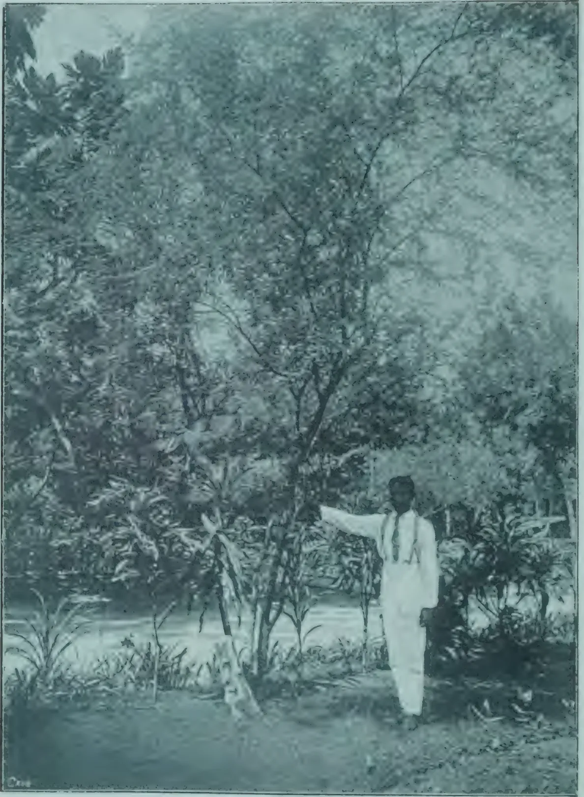A vintage photograph with a blueish-green tint showing a man in a white suit and tie standing in a tropical or subtropical environment. He is pointing his right arm towards a large, leafy tree, identified as an Algaroba tree. The background is filled with dense foliage and other trees. The ground appears to be covered in grass or low-lying plants. The overall tone of the photograph is monochromatic, with a distinct blue-green cast.

ALGAROBA TREE  
(See page 243.)

Photo. by C. Driberg.

194------------------------------------------------

THE  
**TROPICAL AGRICULTURIST:**  
JOURNAL OF THE  
**CEYLON AGRICULTURAL SOCIETY.**

---

---

VOL. XLI.

COLOMBO, SEPTEMBER, 1913.

No. 3.

---

---

**BACK TO TULL.**

*Peradeniya, September 15, 1913.*

In the August issue of the *Tropical Agriculturist* we reproduced part of a paper on the subject of a rainless wheat contributed to the *Nineteenth Century and After* by Dr. MacDonald of the Union Department of Agriculture, one of the foremost exponents of the principles of Dry Farming. In it he referred to Jethro Tull the father of modern farming. Like the navigator of a ship who finds it necessary to fix his position from day to day by direct observations for latitude and longitude, knowing that, however accurately his course may have been steered, he is certain to have deviated from the true direction through the influence of wind and current, so we as planters would do well if from time to time we took stock of our position and endeavoured to ascertain whether we are keeping to established highways or are likely to lose ourselves in some bye-way. Tull said: "Tillage is manure." Tillage we suppose comprehends all operations connected with improving the condition of the soil including manuring, yet so much is often made of manuring trees that there would seem to be a danger of Tull's dictum being rendered as "Manure is Tillage."

195------------------------------------------------

180[SEPTEMBER, 1913.]

One of the most significant discoveries Tull made was that of the advantage of giving plants room. He sowed in drills or rows instead of broadcast. Modern farming has developed this system till at the present day turnips for example are not only sown in drills 2 feet apart but afterwards cross-hoed to leave the plants in the drills a foot apart; each plant being thus given ample room to develop its powers of absorbing food.

It is this important matter of developing the plant's powers that we appear to be in danger of overlooking. A man in the enjoyment of plenty of fresh air, of exercise and healthy surroundings but living on plain wholesome food will grow stronger than another who is confined in a dark ill-ventilated room and fed with the richest food we can give him; a good digestion being of more importance than quality of food. It is well known that in the case of crops that are not thinned out, like wheat for example, you will but reduce your yield by too thick sowing.

A belief prevails that the science of manuring consists of returning to the soil the ingredients removed by the products of the tree; a plausible belief though we are not aware upon what grounds it rests. It would indeed be a satisfaction if the science could be expressed by this simple formula. It is asserted again that the soil should first be analysed to find out in what manurial ingredients it is deficient. But whatever importance may attach to soil analysis in the tropics as a guide as to what plant food to apply, we believe it to be small compared to that of having robust and well developed trees. In the application of manures as in all other branches of estate management our aim should be to get the best return for money expended. We may be sure that the principles of spacing so nicely worked out in the case of the annual crops of the temperate farmer are of paramount importance to us also. A given quantity of manure applied to a vigorous tree would, we may believe, give us a better return than the same quantity applied to a tree stunted in growth through want of room to develop. Our first duty should be to the tree—to ensure that every opportunity is given it of developing to the full its powers of collecting and assimilating food.

R. N. L.

196------------------------------------------------

SEPTEMBER, 1913.]181

# RUBBER.

---

## TAPPING EXPERIMENTS ON HEVEA.

---

FITTING's paper on the physiological effects of Hevea tapping methods, which was published in 1909, is well known to the majority of rubber planters, through the translation issued by the *Times of Ceylon*. His work has been followed up by Dr. S. V. Simon who has recently been engaged for nine months in Java on the study of rubber tapping, and other subjects, and has published his results in a series of papers in *Der Tropenpflanzener*. Dr. Simon's paper on rubber tapping, entitled "Tapping Experiments on *Hevea brasiliensis*, with special reference to latex production, bark renewal and the distribution of reserve food," deals chiefly with the much-debated question of the knife *vs.* the pricker. To a great extent, the points elaborated by the author have previously been enunciated by other writers, though his contribution is valuable in that it affords confirmation of their contentions. In the following abstract the notes enclosed in brackets have been added by the translator :—

### KNIFE *vs.* THE PRICKER.

Dr. Simon experimented on twelve trees,  $5\frac{1}{2}$  years old. Each tree was tapped on both sides—on the one side with the Bowman knife, and on the other with the knife and pricker. Four trees were so tapped, full-herring bone, two vertical strips of cortex from 1 to 2 inches wide being left untapped between the tapping surfaces on the opposite sides of the tree. Four others were similarly tapped, as far as extent of tapping surface was concerned, but with the half-herring bone. The remaining four were tapped on opposite quarters, on one quarter with the knife and on the opposite quarter with the knife and pricker. The average circumference of the trees at three feet was 20 inches, and each tapping surface bore four cuts at a foot apart. The trees were tapped every other day for six or, in some cases, seven months.

At the beginning of the experiment, the pricked side yielded more rubber than the other. The former gave a full yield immediately, while in the latter from four to six days elapsed before the yield rose to the maximum. At the end of the first month the advantage lay with the pricked side, but during the second or, in some cases, the third month, this advantage disappeared and the yields of the two sides became practically identical. The total yield for the twelve trees for eight months was 1,979 grams from the sides pricked, and 2,009 grams from the sides not pricked. Taking the individual trees, six yielded more rubber from the pricked side, while in the remaining six the result was the reverse. If the yields of the first eight tapings were omitted, then in no case did the pricked side give the greater yield. Dr. Simon considers that his results demonstrate that pricking does not give a higher yield than paring, and he suggests that opinions to the contrary have been based on the results of too few tapings.

197------------------------------------------------

182[SEPTEMBER, 1913.

### STRUCTURE OF THE CORTEX.

DR. SIMON'S account of the structure of Hevea cortex agrees with that given by Arens, Lock, and others. The latex tubes occur in layers in the cortex, each layer being continuous round the tree, so that if a layer of latex tubes could be dissected away from the cortex, it would form a hollow cylinder, perforated with vertical, oval openings. [A cylinder of wire netting of very small mesh gives some representation of a single layer of latex tubes; and a correct idea of the whole latex system of the stem may best be formed by imagining a number of such cylinders standing one inside the other, the wood of the stem occupying the centre.]

The latex tubes of a single cylinder communicate in the freest possible manner with one another, but there is no communication between the latex tubes of one cylinder and those of the next. Hence it follows that the deeper the cut the more latex: it is impossible to extract latex from any layer of latex tubes unless that layer is reached by the tapping cut. The trees tapped by Dr. Simon contained six layers, or cylinders, of latex tubes, five of which were cut when using the knife, the innermost cylinder being left intact. Therefore the yield obtained by using the knife only was five-sixths of the total possible, and by using the pricker to reach the innermost layer the maximum increase obtainable would be one-fifth of the previous yield. Dr. Simon concludes that his failure to obtain that increase is due to the fact that the penetration of the teeth of the pricker soon produces an injurious effect on the innermost latex cylinder, as is shown by the death of the tissues round the pricker cuts. [It is doubtful whether the explanation is so simple as this. The expected increase is more than one-fifth, because the inner layer of tubes is intact under both tapping surfaces. Each tapping surface, when tapped with the knife, draws on five-sixths of the latex tubes over half the tree, i. e., five-twelfths of the total latex tubes, while the pricker taps the remaining sixth and should draw latex from more than half the circumference. And if the lack of this increase is to be attributed to the effect of the pricker, that effect must be produced on the cortex which has not yet been tapped.]

The trees tapped by the full-herring bone and the half-herring bone were tapped over almost the whole of the circumference at the same time, only two narrow strips of cortex being left untouched between the opposed tapping surfaces. On the other hand, the trees tapped on opposite quarters were tapped over only one half the circumference. Yet the average daily yields of each group of trees were almost the same, although the cuts in the first two cases were nearly twice as long as those in the third. In the full-herring bone, the average daily yield was 3.35 grams per tree; in the half-herring bone, 3.57 grams, and in the opposite quarters, 3.6 grams. Thus the trees with the shortest cuts gave the highest average yield. Dr. Simon considers that this result affords a proof of the fact deduced from microscopic examination, that the latex tubes of each cylinder are in complete communication with one another, and he remarks on the importance of determining the shortest length of cut, relatively to the whole circumference, which will effect as complete an extraction as possible of the latex. [This result is apparently always obtained in tappings of twelve months' duration, or less; but experiments both at Peradeniya and Kuala Lumpur have shown that it does not hold good over longer periods.] He recommends tapping on

198------------------------------------------------

SEPTEMBER, 1913.]183

opposite quarters; but his experiment was too brief to admit of definite conclusions, and his other two methods were too drastic to afford any rational basis for comparison. Curiously enough, considering the title of his paper, he discusses this question purely from the standpoint of yield.

#### BARK RENEWAL.

Two of the trees which had been tapped on both sides by a full-herring bone extending over nearly half the circumference were felled, and their renewed bark examined microscopically. One of these had been tapped up to the day before felling, while on the other tapping had been stopped a month previously. The thin layer of cortex left after tapping contained one layer of latex tubes. The outer cells of this cortex layer dry up and form a protective covering, while the cambium continues its normal functions and builds up, on the inner side, new latex tubes, sieve tubes, etc. Seven or eight months after tapping was begun, the renewed cortex at the upper edge of the tapping surface possessed an almost normal latex zone, i.e., the number of layers of latex tubes it contained was nearly equal to that of the untapped cortex.

In addition to the production of new latex tubes by the cambium, growth takes place also on the outer side of the renewing bark, beneath the protecting layer of dead cells. There a cork cambium (*Phellogen*) arises, which cuts off a cork layer externally and a parenchymatous layer internally. This inner layer ultimately develops a large number of stone cells, and so forms (at least, in part) the outer friable layer of the cortex. Stone cells are also produced by differentiation of the bast cells which arise from the inner cambium.

DR. SIMON states that the latex tubes which are severed at the first cut, the ends of which open originally on the upper edge of the tapping cut, remain recognisable for a long time, then gradually lose their contents and become disorganised. But whether that takes place more rapidly than in normal growth is difficult to decide. They do not develop junctions with the inner untapped latex cylinder, such as occur in other latex-bearing plants after wounding. The new layers of latex tubes in the renewed bark are continuous with those formed at the same time in the untapped bark. For example, in a cortex which originally contained six layers of latex tubes five of these (say) would be severed in tapping and removed completely over the tapped area, and the layer remaining would be continuous under both the tapped and the untapped bark. All new layers of latex tubes are formed at the cambium behind this survivor of the original layers, and hence are continuous. [It scarcely seems possible that this explanation is correct, for it would appear to involve the conclusion that the untapped cortex increases in thickness at the same rate as the renewed cortex.]

Renewal after pricking differs in several important details. In the first place, as was pointed out by Fitting, the cambium beneath each pricker-cut does not behave normally, but for some time afterwards produces groups of stone cells instead of latex tubes and sieve tubes. As the parts of the cambium between the pricker-cuts exhibit their normal functions, the new layers of latex tubes and sieve tubes are interrupted, and consist of short fragments instead of continuous tubes. This effect of the pricker

199------------------------------------------------

184[SEPTEMBER, 1913.]

passes off in about seven months, as has been previously found in Ceylon. Hence pricked bark should take at least six months longer than pared bark before it is re-tappable. A second disadvantage lies in the production of thorns on the wood. Where the pricker teeth penetrate to the cambium, wound wood is formed, and as this is produced in greater quantity than the normal wood, an elevation appears on the wood beneath each pricker-cut. Consequently the renewed cortex, though externally smooth, varies in thickness, being thicker between the elevations than it is over them, and if it is tapped with the knife, either the tapper cuts too deep and makes a wound over each elevation, or he does not cut deep enough to tap the latex tubes which lie between them.

### THE DISTRIBUTION OF RESERVE FOOD IN THE TAPPED STEM.

The distribution of reserve food was determined in the two trees already referred to. Each had been tapped on two tapping surfaces on opposite sides of the tree which together occupied five-sixths of the total circumference, up to a height of four feet. On the tree which had been tapped for six months and then rested for one month, the distribution was as follows: In the untapped parts between the tapping cuts, the parts immediately above and below the tapping surfaces, and in the vertical strips between the tapping surfaces, starch was completely absent from an outer zone of the wood to a depth of two to three millimetres; that was succeeded by a zone one millimetre deep which was poorly filled with starch; while the remainder of the wood was rich in starch. The cortex over these regions contained only small quantities of starch in the outer stone-cell layer. On the other hand, sugar was abundant throughout the cortex and in the starch-free zone of the wood.

The surface tapped with the knife showed a similar condition. The new wood which had been formed since tapping began was from five to seven millimetres thick in the upper part of the tapping surface. Of that, the outer four or five millimetres were constantly free from starch; a layer bordering on that, one to two millimetres thick was half filled; while the whole of the rest of the wood was completely filled. The renewed cortex contained no starch, but sugar was present in large quantities, even in the thin layer over the most recently tapped part. Small quantities of sugar were also present in the starch-free wood.

The pricked side showed a somewhat different starch distribution. The new wood consisted of typical wound wood and was totally destitute of starch, and the old wood bordering on that was empty for a depth of two millimetres. The remainder of the old wood was normally filled. In this case the starch had been exhausted to a greater depth, owing to the greater growth of wood. The renewed cortex contained large quantities of sugar.

This result shows that the new growth of wood on the surface tapped with the knife is, wholly or in part, destitute of starch, while in the rest of the wood, except for at most a small zone (one to two millimetres deep) no diminution of the starch reserve can be detected. On the other hand, a greater demand has been made on the starch in the untapped cortex than on

200------------------------------------------------

SEPTEMBER, 1913.]185

that in the wood beneath the tapping cut. The conditions in the pricked part of the stem are somewhat more unfavourable, since, owing to the greater growth of wood (wound wood), not only is the new wood zone free from starch, but the reserve in the neighbouring layers of the wood has been affected.

The investigation of the tree which was tapped for a month longer revealed a more favourable condition of affairs. The tapping surfaces extended over four-fifths of the circumference, the vertical strips of untapped cortex being 5 cms. broad. Under the untapped parts, as well as under the surfaces tapped with the knife only, a zone of wood barely one half to one and a half millimetres deep was free from starch, the succeeding half to one millimetre was poorly filled, while the remainder was completely filled. In addition, the original cortex in the neighbourhood of the tapped surface contained large quantities of starch in the outer, stone-cell zone, while the inner cortex was starch free. The whole of the cortex contained large quantities of sugar.

In the wood under the pricked surface the distribution was as follows: An outer zone, one millimetre deep, contained no starch; that was succeeded by a zone, three and a half millimetres deep, filled with starch; while the following zone, one to two millimetres deep, was again free from starch. This last zone had evidently been laid down shortly before and shortly after pricking, since it exhibited the internal black marks due to the teeth of the pricker. Following that zone, the next layer, two to three millimetres deep, was half filled with starch, while the remainder of the wood was normally filled.

The distribution of starch described in the preceding paragraph is abnormal, since it does not exhibit the usual regular transition from a region destitute of starch to one densely filled with it. That is due to the fact that the black patches caused by the pricker, which represent areas where the wood cells are killed, hinder or prevent the movement of carbohydrates from the cambium into the wood. Consequently the wood which has been emptied of its reserve during tapping cannot be re-filled; and conversely, any reserve food which is left in the deeper parts of the wood behind the black patches cannot be transferred outwards and made use of.

These investigations afford a more favourable view of the condition of the reserve food in tapped stems than Fitting's researches would lead one to suppose. Though Fitting's trees were tapped only on one quarter of the circumference, he found much greater exhaustion of the reserve food. Dr. Simon suggests that Fitting's trees may have been closely planted, while his were practically isolated trees. His results show that starch begins to be stored in the new wood on the tapped surface soon after tapping, in spite of the large consumption of carbohydrates in that region. Microscopic examination shows that a layer of sieve tubes is left intact with the inner latex layer, and consequently the transference of food is not entirely stopped by the tapping cut. [It should be noted that these results refer only to a short tapping period on trees grown under the most favourable conditions. Further investigation is required, to determine how far they are applicable to plantation trees regularly tapped. That the results show a more satisfactory state

201------------------------------------------------

186[SEPTEMBER, 1913.

of affairs than those of Fitting's experiments is perhaps not surprising. Fitting's full spiral experiment was carried out from November 8th to February 10th, the trees being tapped daily. His half-herring bone experiment on one-quarter of the circumference occupied from November 8th to April 11th, daily tapping. On the other hand, Dr. Simon's first tree was tapped, on alternate days, from November 11th to May 16th, and then rested for a month, while his second tree was tapped, also on alternate days, from November 11th to June 23rd, and then felled immediately. Though the extent of the tapping surface was much greater in Dr. Simon's experiment, the alternate-day tapping is probably largely responsible for the presence of the greater amount of reserve food. The month's rest allowed to the first tree puts that out of comparison with Fitting's experiment.

[ One important point, really the fundamental question for all researches on this subject, appears to have been overlooked by both Fitting and Simon. Is there an annual variation in the amount of reserve food in the stem, quite independent of any effect due to tapping? For example, the new leaves are constructed at the expense of the reserve food, which presumably is thereby depleted until some time after the new leaves have acquired their full capacity for manufacturing food. Neither Fitting nor Simon record the time of leaf-fall of their trees, but had the experiment been carried out in Ceylon, it would have been expected that, owing to the production of new leaves, a minimum of reserve food would be found in February-March, and that the amount would subsequently increase until near the end of the year. In that case, one would naturally expect to find a larger store of reserve food in a tree felled in June than in one felled in April. This question of a possible periodic change in the amount of reserve food in the stem, whether tapped or not, must be decided before any definite conclusions concerning the effects of tapping can be arrived at.]

T. PETCH.

## TALL-GROWING TREES OF MANIHOT GLAZIOVII.

The writer has made a number of experiments, both at Amani and in other plantations in German East Africa for the purpose of ascertaining the best methods of inducing height in such plants of *Manihot Glaziovii*, as, by reason of unfavourable climatic conditions or other undetermined causes, flower too early and thus ramify at an insufficient distance from the ground.

The following are the results of one of the experiments made at Amani :

The trees used had been planted in April 1911 and had mostly branched very low down. In September 1911, they were pruned in three different ways : (1) topped at 12 to 16 in. from the ground ; (2) topped immediately below the lowest bifurcation ; (3) at each point of ramification all the branches were removed except the one nearest the stem ; a month later the fresh shoots were removed except the one nearest the stem, a month later the fresh roots were treated in the same way. A fourth lot consisted of plants raised in the nursery and planted out in September 1911 in the place of dead trees, or such as were not growing well.

202------------------------------------------------

SEPTEMBER, 1913.]187

It was found that the trees of the third group, which had grown zigzag as a result of the pruning, never became straight although they were young and the side shoots were constantly cut off. Further, the terminal shoots at once flowered again and gave rise to new ramifications. Thus, by this means no perceptible increase in the length of the stem is obtained. In the case of the trees of the second lot, new shoots at once made their appearance: these were all removed except the most vigorous, which grew in perfect line with the stem, in such a manner that the point of junction became less and less perceptible. These trees began to branch again much more rapidly than those of the first lot, of which the stems were the highest of these three groups (averaging respectively 5 ft. 6 in., 3 ft. and 4 ft.).

The results obtained with the fourth lot were slightly more satisfactory; under the influence of favourable climatic conditions, these produced very tall stems (5 ft. 8 in.). The average circumference at 3 ft. in the four lots was  $8\frac{1}{4}$ , 10, 10 and  $7\frac{1}{2}$  in. respectively.

In conclusion the method most to be recommended is the topping of the stem at 12 or 16 inches from the ground, which should be done as soon as the first branching begins.—A. ZIMMERMANN IN "DER PFLANZER."

---

## SOY BEANS IN INDIA.

---

At the present time soy beans are cultivated to a small extent in the Durjeeling Hills, and to no appreciable extent elsewhere in India, but during the years 1909-11 experiments were carried out in Bengal, Bihar and Orissa to ascertain the commercial possibilities of the crop in the plains.

Three definite types of beans have been isolated from native seed and studied. In two cases the oil content was found to be relatively high and the nitrogen content low, while in the other case the reverse occurred; these characteristics were inherited.

The yields obtained usually varied from 650 lb. to 1,000 lb. per acre, though under favourable circumstances they rose to 2,200 lb. per acre; these yields compare favourably with those obtained in Manchuria. The cost of cultivation was estimated at 13s to 20s per acre, though it might rise to 27s per acre. Under these conditions, prices of £5 8s to £5 17s per ton are required to make the crop remunerative; for the present such prices are not to be obtained, £4 10s being offered by merchants in Calcutta. But there can be no doubt that the crop is intrinsically worth more than this, and signs are not wanting that its value as a food stuff is being appreciated, so that a considerable rise in prices is not unlikely.

The varieties used in the experiments occupied the land for two seasons in the plains and the crop had therefore to pay double rent. Efforts will now be concentrated on the production of new varieties combining the qualities of early maturity, productiveness, and high oil content, and if these attempts are successful, the projects of making the crop a remunerative one in India will be far more hopeful.—MONTHLY BULLETIN.

203------------------------------------------------

188[SEPTEMBER, 1913.

# COCONUTS.

## COCONUT PLANTATIONS.

MR. C. T. ELMSLIE, who has contributed a brief article on Coconut Plantations to the *Financial News*, takes an optimistic view regarding the industry in the Pacific, as will be seen from the following account we reproduce below. Mr. Elmslie says:—"The profitable nature of coconut planting is very evident to one in close touch with it in the Pacific. Copra has risen in a comparatively short time from £9 to £29 a ton at the present moment, and men well versed in the industry say that it will go to £35 and over. The cost of making up on the plantation is about £4; so the margin for profit is considerable.

The cause of the continuous rise is not far to seek. Copra has always been wanted for soap-making and the refuse for cattle food. The oil, however, is now made up into several edible articles, of which palmine butter is the principal. These products are in growing favour in Europe, but in the United States the demand is so strong that the supply is always insufficient. The changes that this state of things is bringing about in the Pacific are astonishing, and as the demand for copra products is widely expanding there is no prospect of the price declining to any extent.

It is seldom that bearing plantations are offered for sale, and quotations as to prices are not reliable; for buyers might not be able to find properties at any figures at all. Roughly, however, coconut properties are quoted at from £60 to £100 an acre. Land suitable for planting can be got quite reasonably, and the nuts need much less attention than rubber. No fertilising is required, but weeds must be kept down. The first crop comes in the fifth or sixth year, after which a constant good revenue is assured from what has then become a very valuable estate.

Good money is also to be made in acquiring virgin lands, planting and selling; for even at six months old a plantation has considerable value. An area of great prosperity is certainly opening throughout the Pacific, mainly due to the great advance in value of its chief product.

## COCONUT PESTS IN SAMOA.

Writing to the *Samoanische Zeitung* on "Battling with Beetles on Coconut Trees in Samoa," MR. H. J. MOORS SAYS:—

Concerning the mixture of tar and kerosene used by me on coconut trees to protect them from beetles, I believe tar alone would answer very well—quite as well, perhaps, as the mixture; but as tar is thick and stiff to apply, the labour bill would be very considerable indeed, and it was chiefly to reduce this item that we mixed kerosene with our tar to thin it down, so that it could flow easily and quickly. Up to date we have not lost a tree that we have treated in the manner I have described.

204------------------------------------------------

SEPTEMBER, 1913.]189

Many of the trees we have handled had already been seriously bored before we took them in hand. At this wet season it is hard to get natives to climb well-grown trees, and we are just now at a standstill, but as soon as we can do so we will recommence using our mixture. Since the wet weather has been so continually with us an attack of canker has broken out in Ululoloa, and we are fighting it. Unfortunately we did not carbide our trees before the wet weather began, and some of them were in a rather bare state. Amongst these, canker was discovered and, up till now, about sixteen trees have been cut down, and some others are under treatment. Some of them we hope to save.

The loss of trees on this property during the past four years from canker has now reached about 1 per cent. It is noticeable that this canker attack occurred right along the road to the cooly quarters, and it possibly might have been introduced by visiting coolies coming from an infected property and carrying with them, in their clothes, the very light spores of the canker fungus. We have now almost succeeded in repainting all of our trees notwithstanding the wet weather we have had. If any of them were infected by canker germs, before the wash was applied, the canker will quickly develop and show red spots against the white background of the wash. This is an advantage.

In dealing with a cankered tree it is best to spray it or paint all of its affected parts with kerosene or something else before disturbing it if it has to be destroyed; this to kill loose germs. Likewise, all of the affected bark should be sterilized before the knife is used if there is to be an attempt to save the tree. No one knows for certain the best method of handling canker. We are very sure we do not, and we would be very glad indeed to learn from more experienced people.

We would like to know how to clear out the fruit-fly from oranges. Wind belts are of very doubtful use so far as our experience goes.

---

## THE COST OF MAKING COPRA.

---

The paragraph on p. 89 in our May issue, quoting the cost of making copra in Queensland as being £18 a ton, caused us to receive several calls, as well as a good many letters, from those either good enough to fall in with our suggestion and give us their estimates for making copra, or from others who wished for further particulars for their own guidance, says *Tropical Life*. As a result of the information received and discussions to date, we have been able to confirm our own opinion that if copra costs £15, £18 or any other sum c. and f., this amount can roughly be divided into three equal parts. One-third would be taken up in the cost of upkeep of large estates, for such areas as are in bearing, provided they were in good order to start with, and needed no exceptional expenditure, as heavy weeding or drainage during the year. One-third for picking the nuts, and transporting them to the factory, for husking, splitting, removing the meat, drying the copra, and bags and bagging for shipment; whilst the last third goes for transport to the export ship and

205------------------------------------------------

190[SEPTEMBER, 1913.

freight across. For copra to cost £18 ton, the labour, as in Queensland, must be excessive, or else the cost would come in the transport to the coast owing to the estate being in a district situated a long way from the sea board. To our mind, for estates of 3,000 to 5,000 acres, or at least 2,000 and the entire area bearing, £15 per ton c. and f. should be, as a rule, a fair average cost for copra, for whether you pay a shilling a day for labour when making the copra, as to some Malays, or about fourpence a day, as with Kaffir or other cheap labour, as in Africa, the cost per ton works out much about the same, a good Malay being equal to three indifferent Africans.

If this is correct, and allowing 2,000 nuts per acre (trees 30 ft. apart), and 6,000 nuts per ton of copra, an estate would cost one-third of £5, or £1 13s. 4d an acre for general upkeep. If the nuts were so large as to need only 4,000 to make a ton of copra (an estimate that we find too low especially for large estates of 3,000 acres), then it would be extremely doubtful whether the crops would cost less to produce, as the nuts would only maintain their size owing to better cultivation and liberal manuring, which would run the cost up to 50s. an acre, and hence the same 100s. for the two acres necessary to produce 4,000 nuts.

When scientific cultivation by means of power tractors, ploughs, and cultivators and manure spreaders supersedes the present lowclass labour engaged in "chipping" or hoeing the land, it will be interesting to see how the cost per 100 or 1,000 acres compares with present rates. In Portuguese East Africa "chipping," we are told, costs 5d. per day's task (half an acre), or 10d. per acre. This is done three times a year, so costs 2s. 6d. an acre, plus the same amount for other expenditure, making 5s. an acre per year for work other than exceptional expenditure. Let us, therefore, work out the cost of a coconut estate of 3,000 acres based on the Portuguese Africa basis; and having done this, we hope others still on the spot, and especially those in Malaya, Mexico, Malabar, Ceylon, etc., will criticize our figures and compare them with their own. A coconut estate, all bearing, of 3,000 acres would need the following labour and expenditure in Portuguese Africa:—

<table>
<thead>
<tr>
<th colspan="5"></th>
<th style="text-align: right;">Per annum.</th>
</tr>
</thead>
<tbody>
<tr>
<td>1</td>
<td>White manager's (or owner's) time</td>
<td>...</td>
<td>...</td>
<td>...</td>
<td style="text-align: right;">£ 800</td>
</tr>
<tr>
<td>2</td>
<td>Under-managers at £250 and £200</td>
<td>...</td>
<td>...</td>
<td>...</td>
<td style="text-align: right;">450</td>
</tr>
<tr>
<td>20</td>
<td>Drivers or overseers (equals one to 150 acres) at £5 a month or £60 a year</td>
<td>...</td>
<td>...</td>
<td>...</td>
<td style="text-align: right;">1,200</td>
</tr>
<tr>
<td>200</td>
<td>Labourers (1 to 15 acres) with women and children. If there is not one woman and two or three children to each man then 250 labourers (or 1 to 12 acres) at 5s. an acre</td>
<td>...</td>
<td>...</td>
<td>...</td>
<td style="text-align: right;">750</td>
</tr>
<tr>
<td>1</td>
<td>White bookkeeper</td>
<td>...</td>
<td>...</td>
<td>...</td>
<td style="text-align: right;">250</td>
</tr>
<tr>
<td>2</td>
<td>Clerks (native) at £100 year</td>
<td>...</td>
<td>...</td>
<td>...</td>
<td style="text-align: right;">200</td>
</tr>
<tr>
<td colspan="5">Total for upkeep, for labour only, exclusive of manure, machinery, implements, etc., equal to about £1. 4s. 4d an acre</td>
<td style="text-align: right; border-top: 1px solid black; border-bottom: 1px solid black;">£3,650</td>
</tr>
</tbody>
</table>

This area (3,000 acres) in bearing should give (at 2,000 nuts to the acre, and 6,000 nuts to the ton of copra) 1,000 tons of copra costing £3. 13s. 4d ton, as above for upkeep; add another £1 5s. 8d. a ton, or £1. 350 a year for renewals of supplies, etc., wear and tear, and sinking fund for labourers

206------------------------------------------------

SEPTEMBER, 1913.]191

buildings (if any), cultivating implements, and estates supplies, etc., and contingencies, makes the cost of producing 6,000 nuts=1 ton copra, exactly £5. In the estimate for making the copra must be included depreciation or sinking fund on buildings, machinery (if any), labour, say 65s. ton, bags and baggings, 10s. ton, plus at least £3,250 interest on capital value of the estate (3,000 acres at £25=£75,000)=£15s. a ton, whilst £4 out of the third £5 would go for transport, freight, etc, and £1 contingencies=£15 ton in all c. and f. Suppose the copra costs £12 only, or £18, then we still suggest that these same three-thirds for estate work, copra-making and interest, transport and contingencies would remain pro rata. In the above we have not calculated anything for coir fibre or other by-products, nor for catch crops, either their upkeep or profit, but for cost of producing the coconuts and making and transporting copra only, and that from trees that are practically in full bearing. Now we have made the start and shown our hand, it is up to others to explain where we are wrong, or confirm our statement where we are right. We ask one and all to do so.

The director of the largest plantation coconut concern in Portuguese Africa, if not in the world, maintains, however, that the above figures are much too low, and such an authority as an owner of estates and a large employer of labour is bound to take first rank for consideration. On June 14th last this authority wrote us from Marseilles: "Your figures are too low; according to our experience, you must reckon for 3,000 acres, 300 men during six months for picking and transporting the nuts, 200 men for the same time for opening and drying, 200 men for the other work, as bagging etc. In all, therefore, you need at least 700 men for six months. Besides this, you must further reckon 300 men for the general upkeep of the estate, tending the land, cattle, etc., draining, removing dead leaves, repairs to bridges, *extermination of pests*" (our friend heavily underlines these three words) "and the other work, as on a farm, and this labour force is required for the whole year." By this one must take it that at least 1,000 men are needed, or one man to three acres planted and bearing. The friend who gave us the first set of figures is now in Africa. As soon as he returns we will hear what he has to say and revert to the matter again.

---

## COVER AND SECONDARY CROPS FOR COCONUT PLANTATIONS.

---

MESSRS. O. W. BARETT, chief of Experiment Stations, Philippine Island and P. J. WESTER, Horticulturist, have contributed the following suggestions on cover crops for coconut plantations in the *Philippine Review*:—

Depending upon the soil, climatic conditions, the variety planted and the care of the trees, coconuts do not begin to bear until in their fourth or seventh year from planting, and a full crop may not be expected until the trees are eight to ten years old. During this period the exchequer of the owner is subjected to a continual drain of "upkeep" money if the land is devoted to coconuts alone. To decrease this expense and obtain some revenue from the land during the "adolescence" of the plantation should therefore be the aim of every grower of coconuts. Secondary or "catch" crops offer a solution

207------------------------------------------------

192[SEPTEMBER, 1913.

of the difficulty ; but even the handling of these calls for experience and careful attention and, unfortunately, no fixed rules can be laid down to fit all plantations. Cover crops are very good indeed for the health and rapid development of the coconut grove, but they cannot be expected to give a quick return *in cash* to the owner.

For instance, from the ordinary legume cover crops, such as Lyon bean, velvet bean, mani-maniham, cowpea ('sitao'), jackbean, guar, pigeon pea ('cadyos'), ipil (*Lucana glauca*), and madre cacao, &c., but little actual revenue can be obtained, the benefit from planting these crops consisting in the shading and enrichment of the land and the conservation of moisture, thus hastening the development of the trees. Planters who are just beginning to use cover crops should remember that the advantages derived from them are : First, they keep the surface of the soil cool and moist through the hot dry season—a matter of very great importance to young coconuts ; second, they store up nitrogen (condensed plant food) in their roots ; third, their roots improve the soil physically ; and fourth, they form a natural blanket on the soil surface, which prevents the rains washing away the highly valuable dead vegetable matter accumulated there : all these points are really of much greater import than the average planter appreciates. Almost anyone can make a profit growing coconuts, but, other things being equal, the planter who employs cover crops is practically sure to win out away ahead of his neighbour who either follows the reprehensible *laisser faire* plan of letting the weeds and grass grow as they will or who tries at unnecessary expense to keep the interspaces clean.

The proper management of cover crops is an art in itself. Briefly, the running of trailing sorts may be broadcasted in the rainy season ; but the drill system is usually the most economical as to seed and care of the plants until they get well started. The shrubby species, like the pigeon pea, ipil, madre de cacao, and even the semi-shrubby ones, like the guars, the crotalarias and cassias—all these should be planted closely in hills in rows between the coconuts. The various vines may be rolled or cut with a disc harrow if they should get too luxuriant during the rainy season ; if they climb upon the young palms too rampantly (a good fault, indeed) a boy with a stick may be sent along the rows once or twice a week, to poke them away. The shrubby and semi-shrubby kinds may be cut back occasionally in order to make them spread out at the bottom and shade the entire surface ; a good sharp bolo in the hands of an ordinary labourer is all that is necessary for this beheading operation. The lopped-off material quickly turns into humus on the soil surface. If carefully managed there need be but very little danger from fire ; some of the shallow-rooting species may die during prolonged drought and so become a menace, but the possibility of such an occurrence need never worry the planter in ordinary coconut regions. Most of the legume covers can be used either as hay or as green forage or browse for goats, pigs and even cattle. Some kinds are also important as human foods.

That the thrifty planter will need at least a few secondary crops goes without saying. Space forbids a full discussion of this interesting subject ; but we beg to remind every coconut grower that it is his duty to raise a great part of the labourers' food as well as the animals' feed *on the plantation itself*. If due attention is paid to the ordinary principles of crop rotation and management, all or most of the following catch crops, grouped according to their uses, can and should be raised on every coconut hacienda:—First-class foods: Maize (in variety), sweet potatoes, beans (of many sorts), peanuts, pineapples, upland rice. Second class foods: Cassava, bananas (of many

208------------------------------------------------

SEPTEMBER, 1913.]193

kinds), papaya, roselle. Third-class foods: Millets, grain sorghums, dasheens, and yautias, (aristocratic relatives of the old ("gabe"), sincamas (yambeans)). Forage plants: Sorghums, maize, millets, and in the rainy season and in moist soils, Guinea grass, Rhodes grass, and possibly Natal and molasses grasses. Generally speaking, none of these catch crops should be planted within 15 metres of the young coconuts; legumes, however, may be planted close up to the base of the stem.

Another matter which affects the status of the coconut estate is the raising of a good supply of vegetables and fruits in good variety; a home garden and home fruit orchard not only make life pleasanter and dietetically safer for the families of the superintendents of all grades, but the surplus can always be readily disposed of either in the local markets or, in case of some sorts, among the labourers.

The following vegetables and fruits are recommended for general culture on all coconut lands:—First-class vegetables: Tomatoes, egg-plant, lettuce, beans, pechay (Chinese cabbage), radish. Second-class vegetables: Beets, carrots, okra, peppers, turnips. First-class fruits: Mangoes, avocados, citrus fruits (orange, mandarin, lime, calamondin, lemon, pomelo), the anonas (custard-apple, sugar-apple, soursop, cherimoya, and the new hybrids), carissa, carambola, and balimbing. Besides the general-purpose collection of fruits and vegetables, every well-managed estate will have an experimental or trying-out collection; this not only breaks the hum-drum routine of estate work and adds a zest to life, but experiments (even negative ones) almost always *pay* in the long run—to say nothing of the fun.

## MANURING OF COCONUTS

TO THE EDITOR OF THE "TROPICAL AGRICULTURIST."

SIR,

Will you or any of our experienced coconut planters give the following information through the medium of this magazine and oblige.

1. To obtain the best results is it imperative to have the soil turned up at each application of the artificial manure? If so, in cases where manure is applied once in every two years will not the second soil-turning damage those roots which came out as a result of first manuring and thereby put a stop to that vigorous nourishment resulting from manuring? At the end of two years are not these roots in the prime of their life and are better able to nourish the tree for at least another two years if left uninjured? Which roots, whether surface soil or subsoil roots, do more work as food carriers to the tree?

2. Which way of manuring is better, whether in full circles or half circles? Whether the trenches should be broad or narrow? Whether they should be close to the tree or at some distance from it?

3. On high lands in a dry district is it injurious or useful to have trenches opened up? These to be filled up by degrees with cadjans or other refuse?

4. Which is better, whether *burying* of cadjans or other refuse by covering the above-said trenches when they are full in about one or two years or burning the refuse and applying the ash to trees?

H. P. W.

Marawila, 18th August, 1913.

209------------------------------------------------

194[SEPTEMBER, 1913.

# CACAO.

---

## THE PREPARATION OF CACAO.

By E. PERROLI.

---

The cacao which finds its way to the European markets from the countries where it is produced undergoes fermentation after being gathered. The conditions of this process are as yet undetermined, with the result that the cacao-making industry has to deal with an extremely variable product. The operation has the double aim of destroying the sweet mucilaginous pulp which adheres closely to the seeds of the fruit, and to produce useful chemical changes in the kernel.

In a first series of studies, undertaken with the object of making the preparation of cacao more systematic and less difficult, the writer found that the method at present in use could be modified with advantage by using a mechanical process for removing the pulp after a preliminary treatment of the fruit with a weak alkaline solution : The fresh seeds are macerated for some hours at a temperature of 45° to 50° C. in a 1 per cent. sodium carbonate solution and are then left in a warm, damp spot until the pulp has undergone sufficient transformation. Unfortunately, this process gives every opportunity for the growth of moulds, and for this reason the writer has undertaken new investigations with a view to sterilizing the fresh seeds.

By the simple action of steam under slight pressure in an autoclave, seeds were obtained which after the pulp had been removed mechanically presented an excellent appearance. The flesh of the kernel retains its beautiful violet colour after desiccation, showing that the tannic compounds had undergone no chemical change. The sterilized seeds were reduced to powder and then subjected to two kinds of tests, the one of a chemical, the other of a biological nature. From these it was concluded that it is possible to obtain changes in this sterilized powder in the laboratory which are comparable to those in the course of the present method of preparation as practised in the countries where the cacao is grown and that the latter would derive considerable benefit from the adoption of the new process.

—MONTHLY BULLETIN.

210------------------------------------------------

SEPTEMBER, 1913.]195

# COTTON.

---

## COTTON IN THE MONTSERRAT BOTANIC STATION.

---

The following extract is from the Annual Report of the Montserrat Botanic Station of the Imperial Department of Agriculture for the West Indies :—

The area planted in cotton in the season 1911-12 was estimated to be 2,700 acres, and the amount of cotton lint shipped was 346,568 lb., value £25,210 ; thus the average return per acre was 128 lb. of lint. This is the largest area in cotton since its introduction ten years ago. At present the only means of arriving at the acreage is to get the figures from the proprietors themselves, and in the case of small growers the figures are obtained from the Treasury records, a licence being necessary before a grower can sell his cotton locally ; so that the acreage is as nearly accurate as it is at present possible to make it.

The tendency to plant the crop early is giving useful results and in future the bulk of the planting will be done in April and May. The season 1911-12 was not favourable throughout, dry weather prevailing in the months of August and September, just at the time that the bolls of the cotton plant were swelling. With regard to pests, the cotton worm and leaf-blister mite were present as usual, many of the small growers in the Little Bay and Rendezvous districts having their cotton seriously damaged by the former, the pest appearing here in numbers for the first time. The cotton stainer is increasing in importance as a cotton pest, and many planters are finding it necessary to adopt means of control. There seems to be a diseased condition of the boll present in the cotton fields, not hitherto taken into account. In this, the bolls are apparently quite healthy until they open; it is then seen that the lint is discoloured and matted. The point is that the diseased condition cannot be seen until the boll opens.

One cannot avoid coming to the conclusion that much of the cotton land, both on the windward and leeward side of the island, would be benefited by additional shelter belts. These need not necessarily be permanent, but it should be mentioned that none of the plants at present used as temporary shelter-belts are very satisfactory. Guinea corn, which has been used, is too liable to be blown down, and the pigeon pea, which is chiefly used at present, does not grow tall enough. Moreover, the pigeon pea as a rule is planted with the cotton, and consequently does not benefit the cotton in the young stages; and this is the time when shelter is most needed. There would seem to be no reason why the bay tree should not be planted experimentally as a wind-break.

On the other hand, it seems possible to make the conditions too favourable, as it is often noticed that in very fertile and sheltered places the cotton planted at the usual distances grows so thickly that much of the cotton is lost owing to the breaking of the branches during picking and, to some extent, on account of the dampness. These places are, however, not common.

211------------------------------------------------

196[SEPTEMBER, 1913.

## THE KAPOK INDUSTRY.\*

The principal object of this bulletin on the subject of kapok floss is to introduce this little-known product more widely, now that, by improved methods of cultivation, cleaning of the floss and a new method of rendering the floss possible for spinning purposes, the product has become of some commercial value.

The tree itself, *Eriodendron anfractuosum* is widely distributed in the tropics. It has many near relations including *Bombax*, but all yield an inferior floss to that of the kapok.

Java was one of the first countries to take up the cultivation and export seriously, but the Philippines have now followed suit. The main use of the floss, which is very elastic, is for stuffing cushions and upholstery.

The author states that the trees should be propagated from cuttings from trees yielding the largest quantity of big pods containing floss of the best quality and colour. Trees grown from cuttings yield a crop 6-12 months earlier than those raised from seed. The first crop may be expected in the third year from planting.

If raised from seed only selected seed from good big pods with a thin husk should be used, and planted in a nursery 15 centimetres apart. The seedlings should be ready for planting out in 12 months' time.

The climate best suited to the kapok tree is a warm one and a mean elevation of 500-1,000 metres. Nor does it require a large amount or even distribution of rainfall and it can withstand a drought. It is most essential that there should be little or no rain from the time of flowering until after the pods are harvested or the quality of the floss will be inferior. This period takes about five months.

The tree being very brittle does not like strong winds, and cyclones are fatal to it.

The soil it prefers is of a volcanic substance, but it does well also in alluvial and sandy soils.

The trees should be planted 6 x 6½ metres and require very little cultivation.

The pods should be harvested directly they show signs of ripening by turning brown, or they will open and much floss be lost. The trees being too brittle to climb, long cocoa-pickers must be used. The pods should be graded and then opened as soon as possible after picking.

The author describes several methods of hand-cleaning for the benefit of the small cultivator, but there are three kinds of machines now invented for cleaning the floss expeditiously and well. The floss is then ready for baling in much the same way as cotton is baled and shipped. Holland is the largest consumer at present as all the best kapok comes from Java. Silk cotton has been exported from India and Ceylon but being the produce of *Bombax* the floss is of poor quality.

\* Bulletin No. 26, Bureau of Agriculture, Philippine Islands.

212------------------------------------------------

SEPTEMBER, 1913.]197

A hectare planted in kapok containing 280 trees should yield about 450 kilos in the fifth year and 650 in the ninth.

In 1912 the price was 90 centavos per kilo and the price tends to advance owing to increased demand as further uses are found for it.

One of its chief uses is for filling life-saving appliances, but this of course has only a very limited market; a wider market is that for the stuffing for upholstery for which it is particularly adaptable.

But the real commercial value of the floss will be recognised when the spinning of it becomes perfected and both new machinery and new processes of treating the raw material are being exploited. It is said a yarn of very fine, soft, silky quality can be obtained from it when treated by a process still kept a secret.

From the seeds oil of a fairly good quality is obtainable and the residue can be used as a cattle-cake.

The tree seems to suffer from very few known diseases—a cotton stainer in the pods and *Helopeltis* being the most serious.

Finally the author declares that the Bureau of Agriculture is so satisfied with the outlook of this industry that they contemplate seriously attempting to establish the industry in the Philippines and in advertising its excellent qualities to the commercial world.

D. S. C.

---

## COTTON IN EGYPT.

---

MR. W. H. CADMAN, B.Sc., F.C.S., has written a note on Agricultural Progress in Egypt to the Consular Report on the Trade of Alexandria for the year 1912 from which it appears that forty-four cotton demonstration farms were formed to serve as models to cultivators. The Department distributed seed and issued instructions as to sowing, irrigation and cultivation. The crops were much larger than those in neighbouring fields, and one district yielded  $10\frac{1}{2}$  cantars (cantar=99.05 lb.) which had never previously produced more than 5 cantars. The Department undertakes the entire distribution of cotton seed. Cotton breeding experiments are being carried on at the Mendelian Experimental Station.

The Government now supervises the compulsory picking of affected leaves by hand and arrange for lectures on the subject in the mosques. Their efforts have been most successful and exercised a marked effect on the crop in 1912.

Experiments are being carried on by the Government entomologist for the further introduction of parasites which prey on the Pink Boll Worm.

To prevent the introduction of disease from imported plants, seeds, etc., all arrivals will now be thoroughly fumigated before delivery.

Ninety-three cotton markets have been established in the provinces to protect the fellah. Latest market prices are publicly posted and an official weighing machine erected. The latter is very necessary in a country where the trade of weighing is carried on by public weighers whose machines can easily be manipulated.

213------------------------------------------------

198[SEPTEMBER, 1913.

## HOW TO GROW SEA ISLAND COTTON.

While cotton will grow everywhere in Jamaica, from the seaside to over 3,000 feet in the hills, and wild cotton is common, the particular variety of cotton which has been grown since 1904 when cotton growing was taken up here—again because it is a native of the West Indies, produces the best quality when grown near the sea, and cannot be grown where the cheaper qualities of cotton can be grown, while it fetches the highest price in the market—is Sea Island Cotton. The common cotton growing wild here is either Kidney Cotton or Upland Cotton, and neither are of any use for our purpose, and any plants of these kinds growing near where we are going to cultivate Sea Island Cotton should be cut down in case they cross and spoil our seed for planting. There are other varieties of cotton grown commonly for the manufacture of cotton goods and for which there is a much larger demand than for Sea Island Cotton which goes to make only the finest qualities of goods. The most commonly grown is Upland Cotton, called a short staple cotton. Sea Island Cotton is a long staple cotton; its fibre is long, and fine and silky. There is another variety of cotton also long staple but coarser than Sea Island which grows more vigorously, and gives a larger yield, and that is Egyptian Cotton. It may be that this variety may yet be grown here instead of Sea Island Cotton because of its stronger growth and large yield although it fetches a less price. However, meantime we are growing the Sea Island variety fairly successfully and it is this variety we shall deal with here.

The Sea Island Cotton is best grown in the lowlands, for although it will grow well in the hills, and inland, there is more expense to get it marketed from there, while other things will grow in the hills better. And it usually gives better quality when grown near the sea. The idea is to grow cotton where the people cannot grow bananas, coffee, and cocoa, and have little choice through deficient rainfall what they can grow to ship abroad and bring money into the Island, and it is just in such places that Sea Island Cotton grows well. Guinea grass, cassava and sweet potatoes, &c., we only sell to each other, but we want something extra to sell abroad in such districts. Light soil and a dry climate suit Sea Island Cotton best, and so we have plenty of districts to plant in.

The prices for the cotton grown here since the year 1907 have been very satisfactory.

The land should be forked, or ploughed roughly, not later than the beginning of July, for planting in August, and left to weather for a time. Then it should be gone over again and made as fine as possible before planting. If a plough is used, shallow drills should then be made, four feet apart, and three to four seeds planted together, every two to three feet. If the hoe is used, holes should be made in the forked land exactly as in planting corn two to three feet apart, three and a half to four feet between rows, and three or

214------------------------------------------------

SEPTEMBER, 1913.]199

four seeds dropped in, covered not deeper than an inch, and the soil pressed down with the blade of the hoe. The lines should be kept as straight as possible each way like so :

2 to 3 feet between plants.

3½ to 4 feet between rows.

3½ to 4 feet between rows.

The seeds can be roughly tested before planting by flinging them in a pan of water, letting them stand an hour, and taking out all those that float, as bad.

In ordinary seasons rain falls in the lowlands about the 12th of August, and showers usually continue through August. The land should be all ready by the end of the first week of August, and when rain falls after the 15th, planting should begin and may continue up to the 15th of September. But if rain falls, the nearer the 15th of August planting is done the better. If no rain falls until October, which would be exceptional, of course planting would require to wait until then.

The young plants will appear—just like young peas—in three or four days, if the soil is moist, or rain falls, and if all of them grow, all but one, the strongest should be cut off close to the earth with scissors. But if any plants fail or grow weak elsewhere, two may be taken out gently, not by pulling but by raising up the earth, preferably with a trowel until they come out easily. Then the earth should be pressed down firmly around the plant left. Those taken out should immediately have their roots dipped in a mixture of earth and water, like mud, to preserve the roots from drying, and be planted where needed at once. They should not be exposed to the sun, and after planting, a leaf or branch with leaves should be stuck in, leaning over them to shade them. Unless this care is exercised it is better to plant fresh seeds where supplies have to be made.

Where planted so wide as four feet between the rows, and all the land having been forked or ploughed as is recommended, and if rain falls well, a crop of Cowpeas or Kidney beans or Black Eye peas can be taken off between the rows, but the land must be kept clean weeded round the cotton plants.

We insist that it is best to fork or plough the land through to aerate it, and make it easy for the young roots to spread. The more the roots are able to spread through the soil, the more food-stuff they will be able to absorb, the quicker they will grow and the better they will bear.

But when men are late in making up their minds to start, and have to get ready in a hurry, the wire grass or other grass can be hoed off and, when dried, drawn into rows, leaving a two feet space between rows. These rows can be forked right through or if the man is in a big hurry (which, of course, he should not be) holes may be forked two feet apart, and planted three seeds to a hole. These will grow well, and the rest of the soil can be broken up between the plants at leisure. If dry weather comes along, the dried grass between the rows can be drawn close to the plants as a mulch and for manure. Two weedings are generally enough.

215------------------------------------------------

200[SEPTEMBER, 1913.

In November and December the plants will flower, and in January picking will begin. When the bolls open and the cotton looks fluffy and loose, it is ready for picking. Women and girls do the picking of cotton best as their fingers are more supple and slender than men's. One practical lesson is better than a written description of picking. The cotton must be taken out with the first three fingers, clean and in one bit, and not torn out in several attempts. The pickers wear aprons to drop the cotton in, and when the aprons are full, they empty the cotton in large baskets placed in the row, which again, when full, are taken to store and the contents weighed. The pickers are paid by the weight picked.

Cotton should only be picked when dried, and so picking does not begin until the dew is off. If it happens to get wet, after picking, it is spread out to dry in the sun for a couple of hours and is all right again. It is taken by carts to the ginnery for the cotton to be separated from the seed. The seed here generally weighs from 70 to 75 per cent. of the total weight, leaving a little over a quarter of the weight of cotton generally, 28 per cent. Egyptian Cotton gives a larger percentage of lint to seed, than Sea Island Cotton and this ought to be taken into account. It requires machinery for the oil to be taken from the seed, and as we have none here—more is the pity—it requires to be exported. The oil is used for cooking as “sweet oil” and for making soap. The meal after the oil is taken away is used for feeding cows, and for manure. If we had paper machinery here—and there might be if there was plenty of cotton seed to keep mills going—we could supply our own sweet oil, make our own soap, feed our dairy cows, and find cheap manure for the land.

So that a cotton industry would mean much more to Jamaica than only exporting cotton :—

1. 1. It would utilize very dry lands where other crops fail at present, producing almost nothing, so that they could give a gross return of from £8 to £10 an acre, and a net profit of £5 to £7 per acre.

1. 2. It would employ women and girls in the light work of picking; just the class who find it hard to get work suitable for them.

1. 3. It would enable us to own oil mills and soap works here, and so employ more labour; would save us importing oil and soap, cotton seed meal for cattle feed, and fertilizer for enriching our fields.—JAMAICA AGRICULTURAL SOCIETY'S JOURNAL.

---

## ERRATUM.

---

In page 152 of Vol. XLI., No. 2., line 7, from bottom, for “pumped” read “poured.”

216------------------------------------------------

SEPTEMBER, 1913.]201

# PADDY.

## THE MANURING OF PADDY.

The AGRICULTURAL BULLETIN OF THE FEDERATED MALAY STATES for July contains a thoughtful article on Malayan paddy soils by Mr. M. Barrow Cliff, from which the information given below is abstracted:—

Before discussing the question of the manuring of paddy the results of some analyses made for the purpose of estimating the quantities of the various plant foods removed by the crop may be given.

They represent the average composition of several rice plants received from the Economic Botanist, and the results are calculated on the assumption of a yield of 400 gantang of paddy per acre.

The dried plants were composed of straw 55.0 %, husk 12.5 %, and grain 32.5 %, containing.—

<table border="1">
<thead>
<tr>
<th></th>
<th>Nitrogen</th>
<th>Potash</th>
<th>Phosphate</th>
</tr>
</thead>
<tbody>
<tr>
<td>Straw</td>
<td>0.70 %</td>
<td>1.92 %</td>
<td>0.078 %</td>
</tr>
<tr>
<td>Husk</td>
<td>0.79</td>
<td>0.594</td>
<td>20.68</td>
</tr>
<tr>
<td>Grain</td>
<td>1.70</td>
<td>0.298</td>
<td>0.414</td>
</tr>
</tbody>
</table>

400 gantang of paddy represent:—

1,450 lb. husked rice containing 24.65 lb. N, 4.32 lb. K2O, 6.00 lb. P2O5  
 593 ,, husk ,, 4.68 ,, ,, 3.52 ,, ,, 1.59 lb. P2O5  
 2,497 ,, straw ,, 17.48 ,, ,, 47.94 ,, ,, 1.94 lb. P2O5

so that the total plant food removed per acre is 46.81 lb. nitrogen, 55.78 lb. potash, and 9.53 lb. phosphate.

In Java the practice exists amongst the native cultivators of burning the straw and husks and returning ashes to the sawahs. By doing so no less than 51.46 lb. of potash (90 %) and 3.53 lb. of phosphate (37 % of the total removed) are put back.

This practice therefore is a sound one, it involves little trouble, and its employment should be encouraged.

When this is done there is still an unavoidable loss of 46.81 lb. nitrogen, 4.32 lb. potash, and 6.00 lb. phosphate per acre per 400 gantang of paddy removed.

Malayan soils seem to be well supplied with nitrogen, seeing that each 0.1 % in the surface 6 inches represents over 2,000 pounds per acre, sufficient for 40 crops. Moreover considerable quantities of this element, in the form of nitrate and ammonia, are brought on to the field by the irrigation water

217------------------------------------------------

202[SEPTEMBER, 1913.]

as has been demonstrated by der Berger in Java. Further quantities are accumulated between the paddy seasons by the weeds which spring up and which are subsequently ploughed or changkolled under. There seems therefore to be little need to apprehend deterioration of these lands through lack of this important element. At the same time large though the amount of nitrogen present may be it needs to be made available for the use of the plant, which it can only be if the soil by cultivation and drainage is adequately aerated. The growing of a leguminous second crop, a practice not as yet employed in this country, must also be of value in improving the soil. On the other hand, as pointed out by Dr. Simon, when the paddy field remains under stagnant water for any length of time, deterioration sets in.

When considering the manurial requirements of a soil what is known as the Law of Minimum should be well borne in mind. This states that the yield of any crop depends upon the available supply of that essential element of plant food that is present in least amount, or, in other words, that no super-abundance of plant food generally can compensate for a deficiency in any one essential element. We have seen that in all probability under normal conditions there should be no deficiency in nitrogen; the elements potash and phosphate remain to be considered.

Paddy soils invariably contain a considerable proportion of clay, and all clays are rich in potash. Just as in the case of nitrogen the potash too needs to be made "available" to the plant, a change also assisted by the weathering which takes place when air has free access to the soil.

Generally, although the total reserve of potash present is much greater than that of phosphate yet the "available" quantity is little more. This is due to the well-known fact that whereas soluble potash salts are easily leached out of the soil, phosphates are retained much more tenaciously. (For this reason much more potash than phosphate is brought on to the land by the irrigation water.) Not the least of the advantages of growing a second or cover crop on the land is that it assimilates the potash as it becomes available and prevents it being leached out subsequently, after being ploughed under, yielding it up again for absorption by the roots of the rice plant.

Of the three essential elements, phosphoric acid has the greatest tendency to deficiency and, what is more, phosphatic compounds are as a rule less decomposed by weathering, &c., than potash compounds, i.e., phosphate becomes available to the plant at a slower rate although it is more permanent and less easily leached out. This is illustrated by the established fact that the maximum effect of basic slag and other of the insoluble phosphate fertilisers is often only attained in the second and even the third season after application.

The conclusion arrived at, therefore, is that it is in phosphoric acid that the soil of only average fertility is most likely to be deficient, and that if it is possible to find a fertiliser sufficiently cheap and beneficial to be commercially applicable to paddy lands it will prove to be one that has phosphate as its dominant if not its only constituent.

An instance is given of land which by the liberal application of manures containing phosphoric acid as the chief ingredient yields 1,100 gantangs per acre, while the adjacent land gives but a poor return. The suitability of bone manures for paddy has been proved in Java.

218------------------------------------------------

SEPTEMBER, 1913.]203

Poor yielding soils have been found to contain little phosphate, while among the more fertile types a fairly close relationship exists between the yield and the "available" phosphate.

The relative value of different phosphatic manures on paddy is about to be tested by the F. M. S. Department of Agriculture.

C. D.

## PADDY CULTIVATION IN CEYLON DURING THE NINETEENTH CENTURY.

By E. ELLIOTT.

(Continued from p. 119)

Having completed the review of the past, I will now proceed to discuss the measures in my opinion likely to foster the further development of the industry.

In the various steps taken or advocated with this view in recent years, both officially and unofficially, it has been overlooked that there has been a very satisfactory advance in the production of paddy during the past 30 years, not only in the irrigated districts but also in other parts of the island exclusive of Jaffna.\* As a consequence, the success of the policy of the past has not been sufficiently admitted nor the propriety of adhering thereto fully recognised.

As I have already shown the cardinal points in this have been

### CHEAP WATER AND CHEAP LAND.

This was specially the case in Batticaloa, when under the energetic action of Woodford Birch, and the free hand in those days accorded to Government Agents, a very large extent of land was, *previous to survey*, given out on license for cultivation on very easy terms, *payable in kind*. Under this system cultivators with very limited means were enabled to undertake the *aswedomization* of moderate extents during the first two years, when profits are as a rule small and eventually to arrange for the necessary one-fourth of the purchase money (under Sir H. Ward's minute) when the land was put up for formal sale after survey.

It must be further remembered that no water rate or other additional impost on land was levied in Batticaloa on account of the works executed prior to 1872; while of the large sums expended subsequently under Sir H. Robinson's scheme, the cultivators were held liable for about 25 per cent. of the total cost; and that consequently the repayment was at rates varying from 22 to 37 cents per acre per annum for ten years. Nor was there any recovery of the maintenance rate prior to 1894 (see Sessional Paper XIV. of 1903 Table V).

To these favourable initial conditions may be ascribed the great success which has attended irrigation in Batticaloa where the cultivated area has increased from about 20,000 acres in the fifties to 91,000, the area cultivated in 1900.

\*Of the total increase of 116 per cent., irrigated districts contributed 66 per cent. and others 50 per cent.

219------------------------------------------------

204[SEPTEMBER, 1913.

Again, the great development at Tissamaharama (Hambantota district) from a few acres in 1871 to 6,000 (the area cultivated in 1907) is due to similar encouraging and considerate treatment. Here the land was sold in the earlier years at the upset price, payable in four annual instalments, and there was no charge for the water, prior to 1895, when a small maintenance rate of 10 cents was imposed and a water rate of Re 1/- in perpetuity in all subsequently sold. There was practically no resident population in the locality but these terms attracted settlers from a distance of over 40 miles and over, who have developed the land without any further aid from Government.

In Kurunegala and Nuwerakalawiya there has been a considerable expenditure on major works, but the rates have been in no case higher than Re. 1/- per acre and the land benefited was already almost entirely private property. But the great increase in production in both these districts is due to the restoration of the village tanks, to which the villagers contributed in labour and Government contributed the necessary money and supervision free. So here too the conditions of cheap land and water were fulfilled.

In 1901 came the first advance in the Government terms, by the recovery of the maximum rate in perpetuity from Re. 1/- to Rs. 2/-. The maintenance charge for works, the first cost of which had been repaid, was also increased from 10 to 50 cents per acre. This moderate advance, in view of the abolition of the grain tax, was justifiable.

But in 1906 the limit to the charge in perpetuity was abolished and a maintenance rate based on the actual cost for a previous term of years substituted for the fixed maximum rate formerly leviable.

In the report of the Director of Irrigation for 1907, it is sought to justify these increases on the ground that when Government took a tenth of the crop, this amounted roughly between Rs. 3/- to Rs. 6/- per acre. This may have been true in exceptional cases, but the figures show that the average rate for the whole island was only Re.  $1\frac{1}{2}$  and in Batticaloa only Re. 1/-\* per acre per annum.

As other grounds in support of this advance it is alleged that much higher rates are imposed in India and consequently there is a substantial return on the outlay on Irrigation. But it has been ignored that a large proportion of these results are obtained by crediting to the works a very considerable proportion of the land assessment (or rent) amounting (as stated in Mr. Strange's recent report) to nine-tenths in Scinde and four-fifths in Darwar. But even then according to Sir Charles Elliott's recent article in the *Empire Review* on Irrigation in India, it is not paying its way, as shewn by the figures he gives—viz:

The total expenditure was Rs. 440 millions on  $6\frac{1}{2}$  millions of acres or Rs.  $67\frac{3}{4}$  per acre.

---

\*The highest average commutation rate in districts where irrigation works were executed were as follows: Gangaboda Pattu (Matara) Rs. 1.85. Kandebeda Pattu (Matara) Rs. 1.17, Giruwa Pattu West Rs. 1.97. It was only over Rs. 2 in parts of the Central Province and Kegalle, where climatic conditions are more favourable and the price of paddy higher than in the low country districts.

220------------------------------------------------

SEPTEMBER, 1913.]205

*One-third* of this expenditure in the Punjab returned  $6\frac{1}{4}$  per cent; one-fifth 3 per cent. and the balance 1 per cent.

The *actual loss* was Rs. 73 lakhs per annum reduced by expenditure on *famine relief works* to Rs. 42 lakhs, *which is the permanent charge to the State*.

In Ceylon as has been already shewn the net expenditure to the end of 1906 on works then in operation was say 5 million rupees. In view of the rate at which Government can raise money, 4 per cent. on this sum or say 2 lakhs of rupees may be taken as the outside "permanent charge to the State" in this island, inclusive of the outlay on what in India would be classed as "famine relief works."

As I trust an indication that there will be no further hardening of irrigation conditions, I have received with much pleasure a recent authoritative assurance that it is not intended to adopt the proposed mode by Mr. Strange in his recent report to declare all public water to be the property of the Crown or to vest all irrigation works (including the village tanks largely restored by the land owners' labour) in the Government. But I trust that there will in future be a fuller recognition of the principle he has stated in the following terms :—

"A capitalist is essential for large irrigation operations—Government is the largest capitalist in a country and is in the most favoured position to undertake such developments for it can reap both *direct* and *indirect* profits from such an enterprise. Moreover it has a duty to perform to the agricultural inhabitants who form so large a proportion of the subjects. The policy it should prefer is to furnish all the capital required and to give all the assistance it can afford. *The capital will consist of the irrigation works themselves.*"

In laying down this conclusion the writer was probably not aware he was repeating the view of an ancient Sinhalese King Dhatu Sena (A.D. 459) who when pressed by his rebellious son to disclose where his riches were concealed, according to the Mahawanso, pointing to Kalawewa, replied, "There are the treasures I possess."

(*To be continued*).

221------------------------------------------------

206[SEPTEMBER, 1913.]

# FRUIT.

## ANONA CHERIMOLIA AND A. PALUSTRIS.

TO THE EDITOR OF THE "TROPICAL AGRICULTURIST."

DEAR SIR,

People who do not know the cherimoyer are apt to confuse it with what may for want of a better name be called the "Monkey-apple" (*A. palustris*). The latter, which monkeys are said to be partial to, cannot be classed among first or second class fruits. Some people would give the Avocado pear a high place though it has none of the qualities which go to make up "fruitiness." The monkey-apple is of the same character, and can only be made palatable by means of extraneous aids which good fruits have no need of.

There is one characteristic about the monkey-apple and that is that, unlike the durian, its smell is its only recommendation: but there is little flavour about it, though with the aid of sugar the fruit is just edible. I found *A. palustris* offered for sale with other nursery plants in Bangalore: so that there must be a demand for it. The tree is rather handsome, particularly when it bears a large number of seemingly luscious fruit. Owing, however, to the fact that neither the cherimoyer nor the monkey-apple is very familiar the latter is apt to be confused with the former. I recently cleared up two doubtful cases in which the monkey-apple was taken to be cherimoyer.

The cherimoyer, which has been classed with the mangosteen, would seem to be particular about the conditions for its growth, as its distribution is very restricted. Macmillan in his *Handbook of Tropical Gardening* says: "The tree is best suited to the Hill Districts with a rather dry climate and is considered to thrive best on a hard stiff soil in which lime is present." On a recent visit to Ragala I found it growing there at its best.

People living in the low country frequently apply for plants of the cherimoyer but there is little use in trying to grow the tree at low elevations.

It would be interesting if those of your correspondents who have succeeded in growing the fruit will give their experience.

Yours truly,

C. D.

## PINE-APPLES.

In the Report on the Botanic Station, St. Kitts-Nevis for 1911-12, issued by the Imperial Commissioner of Agriculture for the West Indies will be found an account of the experiment with pine apples which is a continuation of that reported on in the Annual Report for 1910-11. The experiment was laid out with a view to ascertaining if the disease known as black heart could be controlled by good cultural methods. At the same time manurial experiments, and planting in beds and rows at different distances apart, were included. One half of the plot was planted on banks 3 feet wide, suckers 15 inches apart, and the other half flat in beds, suckers 15 inches square.

222------------------------------------------------

SEPTEMBER, 1913.]207

The manurial experiments were conducted separately in each half of the plot, and are as follows :—

- No. 1. No manure.
- No. 2. Pen manure.
- No. 3. 10 lb. nitrogen as tankage per 1,000 plants in four doses.
- No. 4. 20 lb. potash as sulphate per 1,000 plants in four doses.
- No. 5. 8 lb. phosphoric acid in four doses.
- No. 6. 10 lb. nitrogen as tankage, 20 lb. potash, 8 lb. phosphoric acid in four doses per 1,000 plants.

These manures were applied by sprinkling over the crown of the plant

The suckers planted in the rows, which were larger than those planted in the beds, began to bear in May 1911, the first ripe fruit being picked in July 1911.

To ascertain if the black heart disease was present, some of these pine-apples when ripe were distributed to persons in the island with a request that a report should be given as to freedom from disease and general condition. In almost every instance it was found that the black heart disease was present if only in a slight degree.

A sample pine from each plot was sent to the Commissioner for the report of the Mycologist and six were sent to Antigua to the Superintendent of Agriculture, and in each case signs of the disease were present.

The following conclusions were arrived at from this examination :—

(1) That planting suckers obtained in St. Kitts in a district where pine-apples are cultivated practically not at all does not result in immunity from the black heart disease.

(2) That the occurrence of this disease is not affected by the manurial treatment which the plants have received, and that fruits produced by plants grown under the most favourable conditions and carefully manured are liable to be infected.

As the suckers established in the beds did not come into bearing during the period under review, no account can be taken of them or any results as to planting at different distances. With reference to those set in rows and manured, as stated above, the following table will give the number and weight of fruit picked from each row up to the end of the season :—

<table border="1">
<thead>
<tr>
<th>Plot No.</th>
<th>Number of fruit.</th>
<th>Weight, lb.</th>
<th>Average weight of fruit, lb.</th>
</tr>
</thead>
<tbody>
<tr>
<td>1</td>
<td>26</td>
<td>73</td>
<td>2.13</td>
</tr>
<tr>
<td>2</td>
<td>37</td>
<td>107</td>
<td>2.14</td>
</tr>
<tr>
<td>3</td>
<td>27</td>
<td>83</td>
<td>3.0</td>
</tr>
<tr>
<td>4</td>
<td>43</td>
<td>118</td>
<td>2.12</td>
</tr>
<tr>
<td>5</td>
<td>35</td>
<td>99</td>
<td>2.13</td>
</tr>
<tr>
<td>6</td>
<td>35</td>
<td>102</td>
<td>2.14</td>
</tr>
</tbody>
</table>

223------------------------------------------------

208[SEPTEMBER, 1913.

These pine-apples are continuing to bear and, at the time of writing this report, those in the beds have also come into bearing. As far as can be seen, the signs of disease have practically disappeared, but a careful inspection is being made of the fruit so as to note any return of it.

From experience gained by this experiment it would appear that planting flat in beds in three rows, 18 inches square, would be the most suitable distance. Planting on the banks has this drawback: that the plants are apt to give way with the weight of the fruit, having nothing near them for support. A sufficiently wide space should be left between the beds to allow for weeding and the picking of the fruit.

## THE LIME INDUSTRY IN MONTSERRAT.

The Report on the Botanic Station, Montserrat, of the Imperial Department of Agriculture for the West Indies, contains the following account on the Lime Industry:—

The exports of lime products for the calendar year, 1911, are as follows:—

<table>
<tr>
<td>Fresh limes</td>
<td>...</td>
<td>...</td>
<td>5,183</td>
<td>crates</td>
<td>value</td>
<td>£ 363</td>
</tr>
<tr>
<td>Raw lime juice</td>
<td>...</td>
<td>...</td>
<td>102,597</td>
<td>gall.</td>
<td>„</td>
<td>3,692</td>
</tr>
<tr>
<td>Concentrated lime juice</td>
<td>...</td>
<td>...</td>
<td>8,227</td>
<td>„</td>
<td>„</td>
<td>1,887</td>
</tr>
<tr>
<td>Citrate of lime</td>
<td>...</td>
<td>...</td>
<td>.33</td>
<td>tons</td>
<td>„</td>
<td>1,001</td>
</tr>
</table>

There are also 142 gallons of essential oil but as bay and lime oil are at present included together under the official returns, the quantities of each are difficult to obtain.

Some difficulty has been experienced in the lime industry through the presence of a disease which is associated with attacks of scale insects accompanied by black blight on the leaves and twigs, and with root symptoms suggesting the presence there of a fungus parasite. The matter is at present under investigation by the officers of the Imperial Department of Agriculture.

Below are given figures showing the extent of the lime industry over the last seven years, as indicated by the number of gallons of raw juice produced. Concentrated juice is reckoned at 9 to 1 and citrate of lime at 900 gallons of raw juice to  $\frac{1}{2}$  ton of citrate. These figures do not show that the returns are as yet affected by the conditions mentioned, as the number of gallons produced in 1911 is higher than in the two previous years, and at least represents an average crop.

The crop returns for the years 1905-11 are as follows:—

<table>
<tr>
<td>1905</td>
<td>...</td>
<td>245,112</td>
<td>gall.</td>
<td>1908</td>
<td>...</td>
<td>307,237</td>
<td>gall</td>
</tr>
<tr>
<td>1906</td>
<td>...</td>
<td>200,363</td>
<td>„</td>
<td>1909</td>
<td>...</td>
<td>220,122</td>
<td>..</td>
</tr>
<tr>
<td>1907</td>
<td>...</td>
<td>250,084</td>
<td>„</td>
<td>1910</td>
<td>...</td>
<td>200,241</td>
<td>..</td>
</tr>
<tr>
<td>1911</td>
<td>...</td>
<td></td>
<td></td>
<td>236,040</td>
<td>gall.</td>
<td></td>
<td></td>
</tr>
</table>

224------------------------------------------------

SEPTEMBER, 1913.]209

## PACKING FRUIT.

MR. ALBERT HOWARD, Imperial Economic Botanist, Pusa, and MRS. GABRIELLE L. C. HOWARD, his personal assistant, have contributed an interesting paper on "Some Improvements in the Packing and Transport of Fruit in India" to the *Agricultural Journal of India*, from which the following conclusions are taken:—

1. Experience at Pusa and Quetta has shown that the present methods of growing and transporting fruits in India are exceedingly primitive, and that far better results in both these directions are easily possible.

2. In the plains, delicate fruit like peaches can be transported without damage, when practically ripe, by means of bamboo baskets containing small cells for each peach.

3. Non-returnable packages, made of wood and chip imported from Glasgow have been put on the market, at Quetta at prices within the means of Indian fruit dealers. By means of these packages delicate fruit like peaches, grapes and tomatoes can be sent to Calcutta, a distance of 1,750 miles, without loss or damage.

4. At present the ideal system of sending fruit on a large scale to distant markets is to adopt a suitable unit gift package, such as punnet, and to pack these in non-returnable crates. These units should be sold as such, direct to the customer.

5. All delicate fruit should be wrapped in paper. The most suitable packing material so far found is *san* fibre, obtained in pressed bales from Oudh.

## BANANA JUICE AS A CURE FOR SNAKE-BITE.

A correspondent has forwarded us the accompanying extract from "The Over-Seas Daily Mail," indicating a remedy for snake-bite which is simplicity itself, and one within the reach of all living and working on our coast lands. Whatever may be the properties of the juice of the stem of the banana plant, it would seem from the newspaper extract that it has something in its composition which destroys the snake-poison. The alleged cures are certified by Mr. W. N. Weston, a resident of Matto Grosso, Brazil, as follows:—

I have witnessed some remarkable cures of bites from poisonous snakes while on a trip in the district of the Rio Taquary. One of these was an Indian peon, who was bitten in the foot by a "Yaraoca" snake. He arrived at the Estancia, apparently in the final stages, bleeding from the gums and all swollen up. A drink of banana juice taken from the *tree trunk* was given him, and in three days he was quite sound.

Another case was that of a child who was treated in the same way and recovered. I also saw the case of a bullock which was snake-bitten and seemed to be dying, unable to get up. We made an experiment by forcing it to swallow the juice. The swelling subsided, and next day the bullock was almost sound and able to graze.

There is no doubt it is a wonderful remedy, and I would be interested to know if any of your readers have heard of it and could tell me what properties the juice contains. —QUEENSLAND AGRICULTURAL JOURNAL.

225------------------------------------------------

210[SEPTEMBER, 1913.

## ANONAS.

MR. P. J. WESTER has written an interesting article on Anonaceous Possibilities for the Plant Breeder to the *Philippine Agricultural Review* from which we take the following:—

One of the most interesting groups of plants to which the plant breeder in the Tropics may devote his attention is the genus *Anona*, including some 60 or more species, and the closely related *Rollinia*, with over 20 species, belonging to the family Anonaceæ, of which an unusually large number of species bear edible fruits. There is also one species of *Duguetia* and some belonging to the genus *Uvaria* whose fruits are known to be edible. The papaw, *Asimina triloba*, is the only plant of this family in the Temperate Zone that may be considered as having possibilities for the plant breeder. Altogether, it is doubtful whether there is any other genus which contains so many species having edible fruits as the genus *Anona*. Already LINNE seems to have anticipated this when he created the genus, for the name *Anona* signifies "provisions;" it is not, as generally believed, derived from the pre-Linnean name "Anona," which, after LINNE, superseded *Anona*, in our days again being set aside for its older rival. Rumphius believed that "Anona" was a derivation of the Malay word *Manoa* or *Menona*, but NIEREMBERG, an older author states that the name *Anona* was applied to all Anonaceous fruits in Santo Domingo by the inhabitants. Considering that Oviedo already some two hundred years before Rumphius also referred to the sugarapple under the name "Hanon," sometimes spelled "Anon," there is but little doubt the name *Anona* is of American origin.

In connection with the fact that 9 fossil species of *Anona* have been discovered in Tertiary deposits in Europe, it is interesting to note that nearly all the Anonas and all the Rollinias so far described are indigenous to the New World.

*A. cherimolia* Miller (*A. tripetala* Ait.).—Cherimoya. A tall shrub or small tree, 4.5 to 10 meters high, with ovate-oblong, velvety leaves. The fruit is variable in size and appearance from that of a large apple to 5,000 grams in weight, irregularly heart-shaped, greenish or yellowish, ferruginous tomentose, areoles more or less distinct, carpids depressed, equal or raised; the flesh is whitish, sweet, subacid, rich, melting, and aromatic. The cherimoya succeeds best on well-drained land and is a native of Ecuador, Colombia, Central America, and perhaps Mexico, but is now widely distributed throughout the Tropics and subtropics. The cherimoya is famed as one of the three most delicious fruits in the world. The extreme variability of this species is well illustrated in Plates II and III.\*

*A. crassiflora* Mart. (*A. macrocarpa* Barb. Rodr.), (*A. rodrigucii*) Barb. Rodr.).—Marolo. A shrub or tree, with tortuous branches, 3 to 6 meters tall, indigenous to Brazil, where it grows from sea level to an altitude of 800 meters. The fruit is globose, conical, 13 to 14 centimeters in diameter longitudinally, yellowish green, ferruginous tomentose, areolate, with prominent carpels; the flesh is white, sweet, of agreeable flavour, and aromatic. The fruit is eaten raw and also used in making a drink. There is a variety of this species the pulp of which is yellow instead of white.

\* Not reproduced.

226------------------------------------------------

SEPTEMBER, 1913.]211

*A. glabra* L. (*A. palustris* L.) (*A. laurifolia* Dunal).—Mamon. A tall shrub or a small tree of vigorous growth, sometimes exceeding a height of 7.5 meters, with oblong-oval or obovate, glabrous, leathery leaves. The fruit is cordiform, 6 to 12 centimeters long, moderately smooth, undulate, yellowish or brownish; the flesh is an attractive rich, creamy yellow, and barely edible. The mamon, indigenous to tropical America and Africa, is, together with the sugar-apple, custard-apple, and the sour-sop, one of the oldest known species in the genus. The mamon has been found to be a satisfactory stock for the cherimoya, the custard-apple, and the sour-sop, and appears promising for the biriba also.

*A. muricata* L.—Sour-sop. A small handsome tree, 4 to 6 meters in height, with oblong-ovate or obovate leaves, dark green and shining; fruit irregularly ovate-oblong or conical, attaining a weight of 450 to sometimes exceeding 5,000 grams, greenish, with short, soft spines; flesh white, rather fibrous, subacid, juicy, and well-flavoured. The sour-sop is a very refreshing fruit eaten raw, and it makes excellent sherbet and a grateful cooling drink. The species is indigenous to the West Indies from whence it has that of *A. punctata*, which will be presently considered.

*A. reticulata* L.—Custard-apple. A small, rather attractive tree, 4.5 to 7.5 meters in height, with lanceolate, papery leaves. The fruit is 7.5 to 15 centimeters in diameter, cordiform, surface fairly smooth, greenish or yellowish with reddish reticulations. The flesh is a creamy yellow, rich, sweet, and melting, with a slight trace of acidity. The custard-apple is indigenous to the American Tropics, but the species has long been well introduced throughout the entire equatorial belt.

*A. senegalensis* Pers. (*A. arenaria* Schum. & Thonn.), (*A. chrysophylla* Bojer.)—Anigli. A small shrub or tree, sometimes attaining a height of 8 meters, indigenous to a large part of tropical Africa from the coast and ascending the Ruwenzori to an altitude of 2,600 meters. The fruit of the better kinds is 4.5 centimeters in diameter, subglobose, surface yellowish to orange; the flesh is scant, but sweet and aromatic, and the fruit has by some travellers been very much lauded, while others have pronounced it valueless. The anigli is exceedingly variable and the following distinct subspecies have been described: *A. s. latifolia* Oliv., *glabrescens* Oliv., *cuneata* Oliv., and *subsessiliflora* Eng.

*A. squamosa* L.—Sugar-apple. A tall shrub, 3 or more meters high, with oblong-ovate leaves, thin, and sparsely hairy; the fruit is irregularly heart shaped, 7.5 to 10 centimeters in diameter, tuberculate, greenish; the flesh is white, sweet, and delicately flavoured, and the fruit is by some preferred to the cherimoya. The sugar-apple is indigenous to tropical America, and has become more widely dispersed throughout the Tropics than any other species in the genus. Ever since the discovery of these five species, the cherimoya, the sugar-apple, custard-apple, sour-sop, and mamon, they have been subject to an ever-increasing nomenclatorial confusion, the same popular name having been applied to two or more species with the inevitable result that even at this late day what is by one fruit grower considered to be a cherimoya is by another thought a custard-apple and by a third a sugar-apple, etc.

227------------------------------------------------

212[SEPTEMBER, 1913.

# TOBACCO.

K

## FLUE AND AIR-CURING PROCESSES OF TOBACCO.

MR. H. W. TAYLOR, officer in charge, Rustenburg Experiment Station, of the Tobacco and Cotton Division, Pretoria, has contributed an interesting article on The Production of Bright Tobacco by the Flue and Air-Curing Process to the *Agricultural Journal of the Union of South Africa*, from which the following are excerpts:—

### ADVANTAGES OF THE AIR-CURING PROCESS.

Writing on the advantages of the Air-curing Process, MR. TAYLOR says the principal advantages of this process are that it requires less care and a smaller amount of labour than the flue-curing process. Where firewood is scarce the cost of air-curing is also considerably less. However the air-curing process has several disadvantages. With this method of curing the grower is more or less at the mercy of the elements. When climatic conditions are favourable some excellent "light coloured leaf" is produced, but when the weather is unfavourable the growers often sustain heavy losses. We have seen barns of air-cured tobacco in the Transvaal in which fully 80 per cent. of the leaf was either "yellow" or "light red," and we have also seen in the same season adjoining barns of tobacco, which had been grown on the same soil and treated in the same way, in which there was practically no yellow leaf, due to unfavourable weather conditions during the curing period. When cool, wet weather prevails for a week or ten days after the tobacco has been harvested, and more especially after the tobaccos have "yellowed," although the tobacco be grown on the most suitable soil it will cure a dark colour more often than "yellow" or "light red." On the other hand, if severely dry and windy weather is experienced immediately after the tobacco is harvested it will dry out too rapidly, and much of the green colour will remain in the leaf, thereby decreasing its value. Of course when closed barns are used much can be done to alleviate these unfavourable conditions. When the weather is too cool and wet for curing to properly proceed, charcoal fires will materially assist the process; and when the weather is very dry the tobacco can be prevented from drying too rapidly by keeping the ground beneath the tobacco thoroughly soaked with water.

### ADVANTAGES OF THE FLUE-CURING PROCESS.

Dealing with the flue-curing process, MR. TAYLOR remarks that the advantages this process has over air-curing are numerous. In the first place, a higher percentage of "yellow" leaf can be obtained—the grade which commands the highest price on the market. Then, flue-cured tobacco has a more pleasing odour and flavour than air-cured tobacco, hence leaf of the same colour will command a higher price when flue-cured. By using artificial heat in a tight shed the tobacco is not subject so much to climatic changes during and after curing; then in a dry climate, such as we have in South Africa, the tobacco

228------------------------------------------------

SEPTEMBER, 1913.]213

which is harvested late in the season and placed in the ordinary air-curing barn must hang until the rains of the following season before it can be prepared for market, unless special provisions are made for moistening it. Being thus exposed to the severe winds considerable loss occurs, and the farmer must wait several months for the money from that portion of his crop. When tobacco is cured in a flue-barn it can be moistened and immediately taken down. This process will be explained later. More tobacco can be cured in a flue-barn than in a barn of any other type which costs the same amount of money.

#### FLUE-CURING BARNs.

Flue curing barns are built small. The size is 16 feet square (inside measurements) by 20 feet high. We are often asked why the barns are built larger. The reason is that the shed must be filled in one day, and a barn of the above dimensions can be readily filled in one day by the labour found on the average farm. Again, tobacco cures a more uniform colour in a small barn than in a large one, as it is much easier to maintain a uniform heat.

The width of a curing barn should always be some number of feet which is divisible by four, allowing space for the tier poles, since the tier poles—upon which are placed the laths carrying the tobacco leaves—are placed 4 feet apart. A barn of the above dimensions would be divided into four rooms, each of which should contain six tiers, thus making twenty-four tiers in the barn each 16 feet long. A “tier” is the horizontal space between two tier poles or deals and a “room” is the vertical space included between two sets of tier poles extending from the bottom to the top of the barn. A barn 16 feet square inside and 20 feet high may be described as a four-room or twenty-four tier barn. When filled, a barn of the above size will hold about as much tobacco as can be grown on one-half of an acre. The barn can be filled three times each month, so that about one and one-half acres of tobacco can be cured in each barn per month.

---

## TURKISH TOBACCO IN THE CAPE PROVINCE.

By L. M. STELIA.

OFFICER IN CHARGE, TURKISH TOBACCO EXPERIMENTS, STELLENBOSCH.

#### HISTORY.

In 1903 the writer purchased a small farm in the French Hoek Valley. The farm was all in bush in the beginning, but when a small area had been cleared during the second year and put under cultivation we decided to give Turkish tobacco a trial. Being unacquainted with the climatic conditions we followed minutely the Turkish methods so far as the curing was concerned, but the first crop, though very small, was a complete failure. Nevertheless, this did not discourage us, and we pursued our experiments more vigorously. In 1905 we began studying the climatic conditions, and after that our experiments were a complete success.

229------------------------------------------------

214[SEPTEMBER, 1913.

The area under cultivation was  $1\frac{1}{2}$  acres, and the yield was 1000 lb. We were unacquainted with the South African market, so when we were offered 1s. per lb. for the crop we accepted it. The price seemed ridiculously low, for the actual cost of producing the crop was 11d. per lb., as we had to deal with raw and inexperienced labour and had many other drawbacks. We were told that the highest price ever paid for the best South African tobacco was 10d. per lb., and that we should be highly satisfied with the offer. After closing the transaction on inquiring elsewhere we were offered 2s. 6d. per lb. for the crop. This manufacturer was in earnest, for he wanted to enter into a contract with us to deliver to him 60,000 lb. of a similar article the next season at 2s. 6d. per lb. This encouraged us to undertake Turkish tobacco growing again. The manufacturer in question was MR. HERMANN of the firm of HERMANN & CANARD, Capetown. Great credit is due to him for the prompt action he took in helping to make the industry an accomplished fact.

After seeing samples of this tobacco he introduced me to the officials in the Agricultural Department, and explained that he foresaw a great industry ahead of us. He insisted that the Government should lose no time to foster same. The result of the interview was that the Government secured the writer's services, and since then Turkish tobacco has become the staple crop on more than eighty farms, all of which have been successful in the production of this type of tobacco.

#### **COST OF PRODUCTION AND YIELD PER ACRE.**

The approximate cost of production per acre is £15.

An acre of land will yield about 600 lb. of tobacco when the season is good, and valuing this at 1s. 6d. per lb. the total profit would be £45, thus the net profit per acre would be £30. A few exceptionally good crops have almost doubled this figure.

The maximum yield per acre of Turkish tobacco has been about 1000 lb. and the minimum yield 300 lb.

#### **SEED.**

Owing to the want of a Turkish tobacco experiment station in the Cape Province no steps so far have been taken to breed and select our own tobacco seed, consequently we have been compelled to import fresh seed from Turkey each year.

#### **PREPARATION AND TREATMENT OF SEED BEDS.**

The preparation and treatment of the Turkish tobacco seed beds are more or less similar to that applied to the American types. The seed is sown at the rate of 1 ounce per 100 square yards.

#### **SOILS.**

The best soils suitable for Turkish tobacco are those of a reddish friable nature, with about 30 per cent. of clay. Gray and yellow sandy loams give good results. Decomposed granite formations also give excellent results, particularly so far as the combustibility of the leaf is concerned.

#### **MANURING AND TREATMENT OF SOIL.**

New lands are preferable, especially when ploughed one year ahead and allowed to remain fallow. Pests cause very little trouble to the crop on such lands. Sheep manure, in our opinion, for Turkish tobacco is the best.

230------------------------------------------------

SEPTEMBER, 1913.]215

provided it is given sufficient time to allow the subsequent rains to dissolve the plant food which it contains. The manure is pulverized and scattered broadcast at the rate of 6 tons per acre and immediately ploughed under. During the interval between the first, second, and third ploughings the land should be harrowed and kept free from weeds. Shortly before setting out the plants the land is reploughed and harrowed. Fertilizers have also given good results, especially where lands had been manured with sheep manure the previous year. When fertilizers are applied in drills it is usually at the rate of 300 lb. superphosphate, 160 lb. sulphate of potash, and 130 lb. nitrate of soda per acre.

Experiments have also been conducted with Karroo ash and Government guano. The usual dressing broadcast per acre is as follows:  $1\frac{1}{2}$  tons Karroo ash and 800 lb. Government guano. A lighter application of Karroo ash and Government guano has been tried. It was applied in the drills at the rate of 800 lb. ash and 200 lb. guano. This also gave good results, and the actual cost was 18s. per acre. Such cheap dressings as the last mentioned are not recommended, for the reason that it impoverishes the soil—unless it has been manured the previous year. Karroo ash and guano are applied separately.

No experiments with rotation of crops have been tried in connection with Turkish tobacco, but the farmers have been strongly advised to adopt a rotation system.

#### TRANSPLANTING.

The method of transplanting Turkish tobacco plants is similar to that of the American types, the only difference being that the plants are set much closer together in the rows—8 inches to 9 inches apart, and the distance between the rows is 2 feet 6 inches to 3 feet. Instead of making ridges a shallow drill 2 inches deep is cut. This drill serves as an indicator and also retains the water, which is important, as most of our tobacco fields are situated on the slopes of the mountains.

#### TREATMENT DURING GROWTH.

When the plants have been established the soil round them is loosened by means of forks, or, where the soil is of a sandy nature, by means of a Planet Junior hand-machine. The horse-hoe is used when the plants attain a height of about 1 foot, and this operation is repeated after each rain until time for priming.

#### TOPPING AND SUCKERING.

With Turkish tobacco no topping is necessary. If the flower head is not disturbed very little trouble is caused by suckers, unless heavy rains are experienced; then, in that event, they are removed, as they have a tendency to cause deterioration in the quality of the tobacco.

#### PRIMING.

When the flower head is formed the extreme lower leaves show signs of ripeness. Four or five of these leaves are picked, removed from the field, and destroyed, as they are as a rule affected with *Lila solanella*, commonly called "potato tuber moth."

231------------------------------------------------

216[SEPTEMBER, 1913.

### PICKING THE LEAF.

The leaves are picked early in the morning. The reason for picking at this time is that they are brittle, and therefore it damages the stalk less, and the fine dew on them helps to keep them cool, consequently they wilt and turn yellow better in the wilting-room. The leaves are placed in baskets or boxes and conveyed to the threading-room, where they are graded according to size and threaded on strings fastened to rods, which are usually 7 feet long.

### WILTING.

After the tobacco is threaded it is transmitted to the wilting-room, where it remains about four days so as to change its colour. The room is kept closed during the day and opened during the night. The temperature is kept to about 70° F.

### DRYING.

The tobacco, after it has passed its wilting stage, is transferred during the morning of the fifth day to the curing camp, where the rods are suspended about 2 inches apart on trellises. The first day they are covered with sheets of canvas so that they do not scorch. The covering is repeated the second day should the weather be extremely hot. The third day the rods are shifted from their position to about 4 inches apart, the fifth day 5 inches apart, and the sixth day 6 inches apart. The idea of shifting the rods daily is to prevent the tobacco from drying too rapidly. The tobacco is covered every night to protect it from dew, and is opened in the morning about an hour after sunrise. It remains on the trellises about ten days, and it is then transferred to the ground on clean sheets of canvas, each rod singly, and allowed to remain thus during the day, but it is covered at night. The next morning the rods are turned, exposing the other surface of the leaves to the sun. This is repeated daily until the midribs of the leaves are perfectly dry. In the morning the tobacco is then removed to the shed and stacked on a platform which has been built about 1 foot from the ground. If the atmosphere is very dry the canvas is removed early in the morning to allow the tobacco to become pliable. The stacks are covered so that the tobacco can retain its moisture and improve in condition. The stacks are carefully watched lest the tobacco may damage with an excess of moisture. If the tobacco is stacked with very little moisture the stacks are broken down once a fortnight and restacked again, but if it is stacked with more moisture than it should possess it should be taken out and dried a bit to reduce the moisture, else it will become mouldy.

The restacking of the tobacco once a fortnight not only improves the colour, but distributes the moisture evenly.

### PREPARATION FOR BALING.

Before baling, in case the tobacco is very dry, the rods are laid down flat and the tobacco sprayed gently on one side with water. A knapsack spray pump, having a Vermorel nozzle, is the most convenient appliance for spraying. The tobacco is then stacked, keeping always the damp part upwards so as to divide the moistured with the unsprayed part. By this means the whole mass becomes soft and elastic. Two days after the tobacco has been sprayed it is restacked. While the tobacco is being restacked if any parcel contains too much moisture it is hung in the sun and partially

232------------------------------------------------

SEPTEMBER, 1913.]217

dried to reduce the moisture. It is advisable to allow the stacked tobacco to remain at least one week before it is baled in order that the moisture may be evenly distributed. It is then graded into three grades, viz., bottoms, middles, and tops.

### BALING.

Baling is undertaken at any convenient time after the conclusion of the drying process. The strings are cut from the supporting rods at each end and folded in such a way as to correspond to the size of the box. The butts are turned outwards and the tips towards the centre. If too much pressure is applied the leaves stick together and cause great inconvenience to the operators at the warehouse. The usual weight of a bale of Turkish tobacco is about 80 lb. The bale is sewn up in canvas with the ends showing the butts of the leaves exposed. At the ends the canvas is laced together criss-cross like a widely laced boot. The bales are then marked and sent to the warehouse where they receive further treatment.—AGRICULTURAL JOURNAL OF THE UNION OF SOUTH AFRICA.

---

## DHALL FROM CEYLON.

---

A sample of dhall (*Cajanus* sp.) was received from Ceylon in May, 1911. It consisted of small, rounded, rather flattened seeds, light yellowish-brown to purplish-brown in colour, dry and fairly sound; 5 per cent. of those examined were damaged by weevils.

The sample was fairly free from dirt, only a small amount of husks and other debris being present.

The seeds were submitted to chemical analysis with the following results:

<table>
<thead>
<tr>
<th></th>
<th></th>
<th>Per cent</th>
</tr>
</thead>
<tbody>
<tr>
<td>Moisture</td>
<td>... ..</td>
<td>10.64</td>
</tr>
<tr>
<td>Crude proteins</td>
<td>... ..</td>
<td>20.11</td>
</tr>
<tr>
<td>    Consisting of :</td>
<td>... ..</td>
<td></td>
</tr>
<tr>
<td>        True proteins</td>
<td>... ..</td>
<td>19.87</td>
</tr>
<tr>
<td>        Other nitrogenous substances</td>
<td></td>
<td>0.24</td>
</tr>
<tr>
<td>Fat</td>
<td>... ..</td>
<td>1.10</td>
</tr>
<tr>
<td>Starch, etc.</td>
<td>... ..</td>
<td>57.88</td>
</tr>
<tr>
<td>Fibre</td>
<td>... ..</td>
<td>6.9</td>
</tr>
<tr>
<td>Ash</td>
<td>... ..</td>
<td>3.37</td>
</tr>
<tr>
<td colspan="3">
</td>
</tr>
<tr>
<td>Nutrient ratio</td>
<td>... ..</td>
<td>1 : 3.0</td>
</tr>
<tr>
<td>Food units</td>
<td>... ..</td>
<td>110.9</td>
</tr>
</tbody>
</table>

The seeds contained no alkaloid, saponin, or cyanogenetic glucoside.

The dhall was submitted to brokers, who considered that it would be worth about £6 10s. per ton in London (October 1911).

The results of the analysis of this sample agree fairly well with the figures previously recorded for dhall.—IMP. INST. BULLETIN.

233------------------------------------------------

218[SEPTEMBER. 1913.

# SPICES.

## ALLSPICE OR PIMENTO.

The spice known as Allspice or "Whole-spice," Pimento, or "Jamaica Pepper" is the product of a small tree known botanically as *Pimento officinalis*, belonging to the natural order Myrtaceæ. It is a small tree with smooth greyish bark, 25 to 30 feet high, native of the West Indies and Central America. The dried unripe berries, which are of the size of small peas and of a glossy black colour when ripe, are the allspice or pimento of commerce. The name "allspice" is due to a supposed resemblance of the spice to a combination of the odour and flavour of cinnamon, nutmegs and cloves. The tree was introduced into Ceylon early in the last century, and has become established at Peradeniya, where it flowers in the dry weather and usually produces a small crop of fruit; but outside the Botanic Gardens it is rarely met with in this country. Unlike its native habitat, here the tree shows no tendency to become self-planted by the dispersal of the seeds by birds. Possibly Ceylon birds have not yet developed a taste for them. The tree is considered to yield best in a hot and rather dry climate, preferring a loose, loamy or alluvial, well-drained soil. The berries are picked while green, but just ripe, and are then dried in the sun, the latter process taking six to ten days. The fruits are known to be sufficiently dry when they become black in colour and when, on shaking, the seed rattles inside. The process of gathering is effected by a long stick with a crook at the end, the fruit-bearing clusters being broken off and thrown down, and the berries then picked off the stalks by women and children. An allspice tree under favourable circumstances begins to bear when 7 or 8 years old, but it is not usually in full bearing until it reaches the age of about 18 or 20 years, when a single tree may yield as much as 1 cwt. of the dried spice. Jamaica is the only country at present that exports this spice, and its annual export varies from 9 to 12 million pounds or more; the average price realised in the Island is about 15/- per 100 lb., though sometimes it is as much as 30 shillings for the same quantity. The market price in England is about 2½d. to 3d. per lb. Pimento oil, which is obtained by distillation from allspice leaves, is imported into London and sold for about 2s. 9d. to 3s. 6d. per lb. Added to rum, this makes the beverage known as bay rum.

H. F. M.

234------------------------------------------------

A black and white photograph of a large, dense Allspice Tree (Pimenta officinalis) in a tropical garden. The tree is the central focus, with its thick, gnarled trunk and a dense canopy of leaves. To the right of the tree, a person is standing, wearing a light-colored cloth around their waist. In the background, there is a thatched-roof structure, possibly a hut or a small building, and other tropical plants. The overall scene is a lush, tropical landscape.

*Photo. by H. F. Macmillan*

ALLSPICE TREE. *Pimento officinalis*.

235------------------------------------------------

This image is a scan of a blank page. The paper has a light beige or cream-colored tint. There are a few very small, faint dark spots scattered across the surface, which appear to be scanning artifacts or minor imperfections in the paper. No text, lines, or other markings are present.

236------------------------------------------------

SEPTEMBER, 1913.]219

## PEPPER IN SIAM.

Only two kinds of commercial pepper are recognised in Siam—white and black. Nevertheless, of late years it has become the habit in some provinces to distinguish four qualities of black pepper; the first consists of only perfect seeds, round and full, and the fourth of small or broken seeds and fragments, the second and third being intermediate. The following tables give the average price of pepper at the place of production for the year 1911-1912.

<table>
<thead>
<tr>
<th></th>
<th>ticals per picul</th>
<th>pence per lb.</th>
</tr>
</thead>
<tbody>
<tr>
<td>White pepper ...</td>
<td>56</td>
<td><math>7\frac{3}{4}</math></td>
</tr>
<tr>
<td>Black pepper : 1st quality</td>
<td>36</td>
<td>5</td>
</tr>
<tr>
<td>.. .. 2nd ..</td>
<td>32</td>
<td><math>4\frac{1}{2}</math></td>
</tr>
<tr>
<td>.. .. 3rd ..</td>
<td>23</td>
<td><math>3\frac{1}{4}</math></td>
</tr>
<tr>
<td>.. .. 4th ..</td>
<td>13</td>
<td><math>1\frac{3}{4}</math></td>
</tr>
</tbody>
</table>

The tax on transit in the interior is 1.25 tical per picul (about  $1\frac{3}{4}d.$  per 10 lb.) in the case of white pepper, and 1 tical per picul ( $1\frac{1}{2}$  per 10 lb.) for black. In 1911-1912 (the Siamese year begins on the 1st of April) the total export of pepper from Siam was 34,270 piculs (4,569,300 lb.), worth 1,193,297 ticals (£919,933). The port of Bangkok exported 24,200 piculs worth 921,174 ticals (£710,072), while Phuket exported 10,033 piculs (133,700 lb.), worth 271,827 ticals (£209,544). The chief buyers of Siamese pepper are England (13,093 piculs=1,754,700 lb. in 1911-1912) and the United States (2,291 piculs=305,460 lb. in 1911-1912). During the same year, 4,677 piculs (623,500 lb.) were sent to Singapore and 2,367 piculs (315,600 lb.) to Hong Kong.—MONTHLY BULLETIN.

---

## FIBRE AND OIL IN HAWAII.

DR. E. V. WILCOX, Director of the Hawaii Experiment Station, has recently sent to a firm of paper manufacturers in the United States a supply of pine-apple leaves, and this firm has made a favourable report on the fibre produced from them. It is found suitable for a kind of tough paper used for insulating purposes. It has been proved that the fibre can be produced with the machinery for making sisal fibre. Seventy pounds of fibre to the ton of pine-apple leaves can be produced, which at 14 tons of leaves would be 1,000 lb. of fibre to the acre. At a profit of only one halfpenny a pound this means £2 an acre for what is now waste. DR. WILCOX is stated also to have received reports from manufacturers of varnish in various cities, upon sales of kukui-nut oil sent from the Hawaii Experiment Station. They are to the effect that it is far better than linseed oil for making varnish. Honolulu at present imports 50,000 gallons of linseed oil each year. Experiments are being made to produce a press to extract the oil.—JOUR. OF THE ROYAL SOC. OF ARTS.

237------------------------------------------------

220[SEPTEMBER, 1913.]

# POULTRY.

---

## EYE WORM OF CHICKENS.

MESSRS. E. V. WILCOX and C. K. McCLELLAND have jointly written an article on the Eye Worm of Chickens in Press Bulletin No. 43, issued by the Hawaii Agricultural Experiment Station, Honolulu, from which it appears that the investigations reported in the bulletin that the eggs of the eye worm of chickens are either laid in the eye, from which they are immediately washed into the throat by the flow of tears down the tear duct, or are set free in the intestines by the disintegration of mature female worms which had passed down the tear duct, through the throat, into the intestines. The eggs hatch for the most part or altogether in damp soil, where they live until they attain at least one-third of their mature size, and then again entrance to the eyes of chickens directly from the soil. The best treatment for the destruction of the eye worms in the eyes of fowls consists in anaesthetizing the eye with a 5 per cent. solution of cocaine and then lifting the nictitating membrane and dropping a 5 per cent. solution of creolin directly into the inner corner of the eye, under the nictitating membrane. The fact that soil contaminated with the feces of infested fowls contains thousands of the larvæ of the eye worm makes it obvious that means should be taken to destroy the young worms in such situations. This may be accomplished by applying quick lime and keeping the soil as dry as possible, and also by the frequent cleaning and removal of all feces from infested yards, or in the case of bad infestations, by keeping the birds on dry floors which can be frequently cleaned until the infestation has disappeared.

---

## THE UTILITY POULTRY CLUB'S TWELVE MONTHS' LAYING COMPETITION.

The eighth period of four weeks of the competition ended on May 27th. During May there was again a decrease in the number of eggs laid, the total being 9,520 as compared with 10,684 in the preceding month. Broodiness was still very prevalent, and was no doubt responsible for this falling off.

The premier position in May was taken by Pen 60, White Wyandottes, which at last gained the lead in spite of one bird being broody. Its record up to May 27th was 840 eggs (value £4 5s. 9½d.). Pen 86, Buff Rocks, which dropped to second position, did not by any means maintain its standard of laying. Broodiness did not claim any of the birds, so that its loss of position was due to a general failing off. Its record was 785 eggs (value £4 5s. 7d.). Pen 32, White Wyandottes, retained third position, with a total score of 791 eggs (value £3 18s. 2d.). The fourth position was held by Pen 45, White Wyandottes, which laid a total of 729 eggs (value £3 12s. 9d.).

238------------------------------------------------

SEPTEMBER, 1913.]221

This pen will have to make considerable headway before it is able to gain an improved position. Fifth place, which in April was held by Pen 24, Black Leghorns, was in May, taken by Pen 35, White Wyandottes, with a total of 738 eggs (value £3 11s. 6½*d.*). This pen rose from seventh place to fifth. Pen 24, Black Leghorns, followed with a total score of 706 eggs (value £3 11s. 5¾*d.*).

The only pen of Red Sussex held a creditable position, viz., sixteenth. This is probably the first occasion in a competition where this breed has done so well. The highest pen record for the month was again made by Pen 62, Silver Laced Wyandottes, which laid 131 eggs (value 10s. 0½*d.*).

Health continued good, and the general appearance of the birds was satisfactory.—BOARD OF AGRIC. JOURNAL.

## EGG-LAYING COMPETITIONS IN THE RHINELAND.

The Chamber of Agriculture for the Rhineland has during the last three years conducted egg-laying competitions for poultry lasting ten months in each year, from November to August, at its special grounds. The results of the first two years work are given in the present report. The first year 210 one-year-old hens were tested and in the second year 210 two-year-old hens with few exceptions in both competitions the same birds were used. Each of the six breeds examined were represented by seven families, each consisting of five members.

The comparison between the total yield of the one-year-old birds and that of the two-year-olds is considerably in favour of the former. During the ten months that the competition lasted the one-year-old hens laid 125 eggs (worth 11s 3¼*d.*), the two-year-olds 102·4 eggs (worth 8s 7¼*d.*). The eggs laid in winter by the latter were only 34·71 per cent. of those laid by the former.

The following are the scores of the various breeds :

<table border="1">
<thead>
<tr>
<th rowspan="2">Breed</th>
<th colspan="2">Average number of eggs laid</th>
</tr>
<tr>
<th>One-year-old hens</th>
<th>Two-year-old hens</th>
</tr>
</thead>
<tbody>
<tr>
<td>Black Rhenish - -</td>
<td>104·7</td>
<td>124·1</td>
</tr>
<tr>
<td>White Wyandotte - -</td>
<td>130·7</td>
<td>99·3</td>
</tr>
<tr>
<td>Black Minorca - -</td>
<td>126·5</td>
<td>99·6</td>
</tr>
<tr>
<td>Partridge Italian - -</td>
<td>121·0</td>
<td>103·7</td>
</tr>
<tr>
<td>Buff Orpington - -</td>
<td>119·8</td>
<td>92·1</td>
</tr>
<tr>
<td>White Orpington - -</td>
<td>111·3</td>
<td>95·5</td>
</tr>
</tbody>
</table>

The small breeds have thus proved more productive than the medium-sized; nevertheless the difference was not so marked among the one-year-olds as among the others. As for their behaviour during the various periods of the competitions the small and medium breeds gave one-third of the total yield during the first five months. The maximum number of eggs

239------------------------------------------------

222[SEPTEMBER, 1913.

laid by the small breeds was in May for the one-year-olds and in April for the two year-olds, while that of the medium-sized breeds was in both cases one month earlier.

The writer then compares the yields of the best and the worst families and finds that in both competitions the Rhenish and the Italian breeds show the most uniform results. The Minorca families showed also in the first competition considerable uniformity, but less in the second. Among the medium-sized breeds the yields of the various families were very different and this the writer attributes to the still incomplete improvement of the breeds.

Lastly, concerning the weight of the eggs, the heaviest were those of the Minorcas (2.20 oz.) and of the White Orpingtons (2.11 oz.); the lightest were the Italians (2.03 oz.) and the Rhenish (1.98 oz). The best layers accordingly produce the lightest eggs. The eggs laid by the one-year-olds were on the average 0.08 oz. lighter than those of the two-year-olds.

The writer reports upon the money value of the eggs and gives some advice on the keeping of egg-laying poultry.

## IRISH EGG-LAYING COMPETITION.

The pullets arrived at the place of competition on September 13, 1912, and the contest began on October 1.

Taking into account that this was the first competition held in Ireland, and that most of the competitors were novices at selecting birds for such a contest, the quality was very fair, and though too early hatching, immaturity and bad condition were apparent in some of the exhibits, only two birds died, and the health of the birds remained good in spite of the bad weather in December. The leading pens were all in splendid condition on arrival.

The foods used were oats, maize, wheat, pollards, thirds, bran, linseed meal, meat meal, cut clover, hay, cabbage and milk. A supply of grit and shell is always available and the birds have water both inside and outside the house.

The writer gives a table showing the position of the different breeds, as regards the number of eggs laid, as well as the price obtained for the latter.

The number of eggs laid by the 10 best pens was as follows:—

<table>
<tbody>
<tr>
<td>1. Red Sussex</td>
<td>...</td>
<td>...</td>
<td>...</td>
<td>296</td>
</tr>
<tr>
<td>2. White Wyandotte</td>
<td>...</td>
<td>...</td>
<td>...</td>
<td>293</td>
</tr>
<tr>
<td>3. Buff Orpington</td>
<td>...</td>
<td>...</td>
<td>...</td>
<td>244</td>
</tr>
<tr>
<td>4. Rhode Island Red</td>
<td>...</td>
<td>...</td>
<td>...</td>
<td>231</td>
</tr>
<tr>
<td>5. White Wyandotte</td>
<td>...</td>
<td>...</td>
<td>...</td>
<td>203</td>
</tr>
<tr>
<td>6. Buff Orpington</td>
<td>...</td>
<td>...</td>
<td>...</td>
<td>199</td>
</tr>
<tr>
<td>7. Rhode Island Red</td>
<td>...</td>
<td>...</td>
<td>...</td>
<td>195</td>
</tr>
<tr>
<td>8. Brown Leghorn</td>
<td>...</td>
<td>...</td>
<td>...</td>
<td>191</td>
</tr>
<tr>
<td>9. Rhode Island Red</td>
<td>...</td>
<td>...</td>
<td>...</td>
<td>189</td>
</tr>
<tr>
<td>10. Rhode Island Red</td>
<td>...</td>
<td>...</td>
<td>...</td>
<td>188</td>
</tr>
</tbody>
</table>

—MONTHLY BULLETIN.

240------------------------------------------------

SEPTEMBER, 1913.]223

# APICULTURE.

---

## HINTS ON BEE-KEEPING.

---

The bees commonly kept for honey are the different strains of the Western bee (*Apis mellifica*) and the Eastern bee (*Apis indica*).

For many reasons it is better to start bee-keeping with indigenous bees.

If you want a well made good box-hive you could get one for Rs. 9/- from the Secretary, Ceylon Agricultural Society, Peradeniya.

If you prefer to get one made for yourself the Secretary will be glad to send you specifications. Having secured a box look out for a swarm which is usually found clustering on the branch of a tree. Place a box underneath the swarm and jerk the bees into it. Then turn the box upside down and raise one edge so that the bees could go in and out. The box may now be taken to the hive prepared for them, and the bees jerked on to the alighting board, from where they will enter the hive, which should be kept slightly raised off the board to allow of free entrance.

Bees are not inclined to be vicious when swarming. To induce the bee to remain, the queen should be captured and her wings clipped, but this is not generally necessary. It is best for a beginner to start by getting a hive colonised for him.

Care should be taken to place the hive perfectly level on a stand about 2 feet from the ground and make it face the east.

Beginners may wear a veil and gloves to save them from stings, but with coolness and care these precautions could be dispensed with and manipulation is all the easier. The great thing to remember is not to jar or jerk the hive or frames in handling and not to hurry. It is frequently necessary to prize off the top lid and for this a screw driver is useful. Always approach the hive from behind. After lifting the cover lay it in front of the hive so that any bees may run inside. If the frames are sealed by wax use the screw driver to move them before lifting. This should be done carefully. If the bees are much disturbed it is best to leave them alone for a while.

Watch for signs of swarming which is the means by which bees increase and spread. When the hive is too full the bees become restless and decide to divide. For this purpose they raise one or more queens and when they are about half grown the old queen leaves the hive with about half the colony, leaving the rest to take care of the young queens. Keep one or two empty hives ready to receive new swarms.

This induces the bees to store honey in a "super" that is a second hive placed on the original one.

C. D.

241------------------------------------------------

A black and white photograph showing a person standing in the center of a small, thatched-roof structure, which is identified as a bee house. The person is wearing light-colored clothing and is holding a small object, possibly a bee, in their hands. The structure is surrounded by dense foliage and trees, creating a natural, outdoor setting. The photo is signed 'Lowe' in the bottom left corner.

*Photo. by C. D. Harris.*

BEE HOUSE AT THE GOVERNMENT STOCK GARDEN.

242------------------------------------------------

SEPTEMBER, 1913.]224

## LITSEA CHINENSIS AND BITTER HONEY.

At the Government Stock Garden Bee house some excellent comb honey was got in July, but the honey was of a bitter flavour which was traced by the Foreman of the Stock Garden to the flowers of *Litsea Chinensis*, two specimens of which were found growing on the premises.

*Litsea* is a genus belonging to the order Lauraceæ, and the wood of the species *Sinensis* is used for building. The most interesting point however about the tree is the medicinal properties possessed by the bark, which is used externally in the treatment of fractures, bruises, &c. In this connection the following extract from A. M. & J. Ferguson's "All About Fibres, Drugs &c" is much to the point:—

"There is a tree growing in the Patchelapalla district, in the Northern Province, the Tamil name of which is Elamboreka, literally translated "bone-setter." The medicinal properties reside in the bark, and the native doctors are accustomed to apply the pounded drug in the shape of poultice to a broken limb, for the space of about twenty minutes, or as they calculate for the time a pot of rice takes to boil, when it is removed and the limb bound up in the confident expectation that the several parts will unite without further trouble. Fabulous stories are told, as a matter of course, of the virtues of this remedy, but a case came under my own observation which may as well be stated. A Sinhalese, aged about fifty, was brought to Mr. Simon Casie Chitty, late Judge of Chilaw, having been picked up on the road side where he was left by robbers. They had beaten him with sticks until his arm was smashed from shoulder to wrist, and the Judge was for calling in at once the Sub-Assistant Surgeon, but the man declined the offer with somewhat of scorn. He was, he said, a Vederala (doctor) himself and could set his arm to right. Fortunately for him there happened to be a solitary Elamboreka tree in the jail compound, and he had the bark of it applied in the manner above detailed. It seemed impossible that he could escape amputation, but two months afterwards he was in the field, superintending his labourers, with a sound and apparently strong limb. For the truth of this statement I can vouch, having seen the battered arm, and also seen the man after recovery."

The Sinhalese name of *L. Sinensis* is Bomi and the Tamil name, Elumpurukki.

C. D.

---

## SUDD FOR PAPER PULP.

Economists have for some years been busy with the sudd problem of Upper Egypt. The vast papyrus-covered areas of the swampy region of the Nile contain billions of tons of vegetable fibre which, when properly handled, can be utilized for either fuel or paper pulp. This sudd is a sort of spongy peat and, when properly bleached, ground and pressed, can very probably be turned to good account in helping to relieve the excessive demand on the timber forests. Recent experiments in England have gone so far as to leave only a little doubt as to the commercial success of this venture.—PHILIPPINE AGRICULTURAL REVIEW.

243------------------------------------------------

225[SEPTEMBER, 1913.]

## AGRICULTURAL COLLEGES ABROAD.

---

The following accounts on the Agricultural Colleges of Cirencester and Wye are taken from Leaflet No. 197 issued by the BOARD OF AGRICULTURE AND FISHERIES:—

### ROYAL AGRICULTURAL COLLEGE, CIRENCESTER.

This institution is intended to provide a course of instruction, both scientific and practical, suitable for land-owners, land agents, agriculturists, intending colonists, etc. The College is associated with the University of Bristol.

The course for the College diploma extends over three years. In addition there are a one-year course for older men, a Colonial course of one year, a Winter School of eight weeks, and courses for the B.Sc. (agriculture and forestry) degrees of the University of Bristol. The fees for in-students are £45 to £55 10s. per term, and for out-students £25 per term, with an entrance fee of £5. Several scholarships are awarded at the College.

The College holdings cover 50 acres and the neighbouring farm which is available for practical instruction extends over 500 acres, of which about 300 are arable and the remainder pasture. An area of 3,000 acres of woods, the property of LORD BATHURST, a forest garden of 10½ acres, an experimental area at Colesbourne, and two forest nurseries are available for instruction in forestry.

### SOUTH-EASTERN AGRICULTURAL COLLEGE, WYE.

The agricultural instruction at this College is arranged in three courses:— (1) The London University B.Sc. course, extending over four years after matriculation; (2) the diploma course, extending over three years; and (3) the certificate course (agriculture and commercial fruit-growing) of two years. The mornings are allotted to lectures and laboratory work, and the afternoons are occupied by various practical classes on the farm, the fruit and hop plantations, the dairy, poultry-yard, etc. Lectures are given in the evening.

The inclusive fee for board and tuition is £120 a year; for tuition only £70 a year; and for a limited number of students resident in Kent and Surrey £60 a year, including board and lodging, or for tuition only, £15 per annum.

The College farms consist of about 460 acres, of which 176 are arable and the remainder pasture, gardens, buildings, etc. The sheep kept are chiefly pure-bred Romney Marsh and Southdowns; there is a herd of Shorthorns, as well as Aberdeen-Angus, Galloways, Red-Polls, Herefords, Sussex, and other breeds. Four breeds of pigs are also kept, and representatives of the three principal breeds of farm-horses are used on the farms.

244------------------------------------------------

SEPTEMBER, 1913.]226

A hop garden of 7 acres has been laid out, showing different systems of training hops. Commercial fruit-growing receives special attention, and instruction is also given in market-gardening and flower-growing,  $16\frac{1}{2}$  acres being devoted to horticulture. A small area is devoted to the French system of raising vegetables. A series of demonstration plantations and a nursery for forest trees are being established to enable practical instruction in forestry to be given.

## AGRICULTURAL EDUCATION IN THE TROPICS.

By C. F. BAKER.

(Continued from p. 157).

Finally, from among the graduates of the agricultural college are chosen those few of especial fitness and capacity to be sent abroad by the general government for still more advanced training in the best foreign schools. Such men, on their return, can then be used in government bureaus, experimental stations, and in the constantly-growing agricultural college itself, as well as among the normal and high schools. The greater number of the graduates will return to their home districts trained agriculturists, to teach in the schools and to manage plantations and farms. In either case they will form an active and widely-distributed leaven, since every one going into active agriculture will be operating what is, to all intents and purposes, a demonstration farm. Within a few years of active operation of the agricultural college, hundreds of its graduates become distributed throughout the country, and the chances for the rapid introduction of new methods, new crops, new machinery, and new hopes become greater than would be possible by any other means. It is really a revelation for one who has not been here before, to see the work being accomplished in the College of Agriculture of the Philippines—to step into a first-class modern chemical laboratory and find there a large number of keen well-trained students representing all the principal tribes of the Philippines analyzing soils, plant products, and fertilizers, to see them working with microscopes and physiological apparatus in the botanical laboratory, to see them surveying and levelling in the fields, taking charge of field cultures and experiments, and in all directions working out results that would be a credit to agricultural college students anywhere. It all gives strong assurance of the practical possibilities in development along these lines in the tropics. Even here in the Philippines, the work is yet very young, and is being rapidly strengthened and perfected in innumerable ways. The day must come, and that soon, when the majority of tropical countries have such institutions well organized, fully equipped, and in active operation.

The site of an agricultural college in the tropics is a matter of primary importance. The great tropical crops like rubber, cane, corn, cacao, tobacco, coffee, coconuts, rice, spices, fibres, and so on, are very varied in their requirements, so that varied conditions and topography in the college farm are a prime essential. Where this is not possible within the limits of a single farm even though it be sufficiently large, the conditions may often be obtained in

245------------------------------------------------

227[SEPTEMBER, 1913.]

several closely-connected stations. A location at the foot or on the slopes of a mountain, with irrigable lowlands near at hand, and higher and varied country just above, with abundant water supply, make ideal surroundings for the college plant. No greater mistake can be made than to locate it within city limits, both for the sake of the students and of the work, or to place it in any locality suitable to only a limited class of cultures. Nor should the size of the farm be too limited. There should be ample space for the Animal Industry work, in pastures, pens, and feeding lots. Permanent tree plantings of great variety must be made, for instance in coffee, cacao, coconuts, citrus, and other fruits, arranged both as to variety and in contemplation of extensive comparative fertilizer and other tests; and all these require space. There is a large class of semi-permanent cultures including certain fibres, cane, and various tropical root crops, and these also require ample space under varied conditions. Finally there are the many annual cultures of every description which must find accommodation. The farm is pre-eminently the most important laboratory in the college. Without it the college would be like a medical school without hospital or clinic, or a law school without the courts. Students *must have* practical work and opportunities for technical investigations in all the standard tropical crops, and *with all phases of their handling*, else the very purpose for which the college was founded becomes unattainable, and its results impractical and ineffective.

The animal industry department should possess small herds of all the domestic animals deemed possibly adaptable to the climate and conditions involved, with sufficient numbers for breeding, dairy work, feeding experiments, and for carrying on the current work of the farm. A course in the simpler phases of veterinary science and farm sanitation is one of the essentials in agricultural training, and this is particularly and especially true in the tropics where animals can be kept in health and vigour only by adequate knowledge and eternal vigilance.

The machinery used in tropical agriculture in connection with the handling of coffee, cacao, fibres, rubber, cane, rice, corn, and other crops, is mostly the development of very recent years. Small, or unit, forms of these should be installed on the farm and kept in working order. It is immaterial whether crops be at hand at the time for their employment or not. Every student should be familiar with every working part of them, and should himself operate them, oil them, dismount and remount them, and know thoroughly the principles on which they work. The work with machinery requires a trained instructor who is a practical machinist and who can also have charge of elementary instruction in the use of modern farm tools, as well as have charge of the upkeep of the entire equipment in this direction. A small blacksmith and repair shop will be a necessary item in this department.

The work with fertilizers should be especially complete and comprehensive, and to this end abundant stores of all available manures should be constantly on hand, and in constant use by the students.

The work in rural engineering, covering, surveying, levelling, farm constructions, sanitation, irrigation and drainage should be thorough and very practical, and this requires a trained engineer, who should also be instructor in physics and necessitates likewise ample equipment.

246------------------------------------------------

SEPTEMBER, 1913.]228

# SOILS AND MANURES.

## STERILIZATION OF SOIL.

The writers have by these further experiments confirmed and extended the results reached in their previous paper. Fresh evidence is adduced that bacteria are not the only inhabitants of the soil, but that another group of organisms occurs, detrimental to bacteria, multiplying more slowly under soil conditions and possessing lower power of resistance to heat and to antiseptics.

In consequence of the presence of these detrimental organisms, the number of bacteria present in the soil at any time is not a simple function of the temperature, moisture content and other conditions of the soil. It may indeed show no sort of connection with them, thus rise of temperature and increase of moisture content are found to be ineffective in increasing the bacteria in the soil. The number of the latter depends on the difference of activity of the bacteria and the detrimental organism.

Partial sterilization leaves the former unharmed, but kills the latter, as do antiseptic vapours or the heating the soil to 55 or 60° C. Whenever the treatment is sufficiently energetic to kill the bacteria, these micro-organisms rapidly increase as soon as the soil conditions are made normal. Once the detrimental organisms are killed, however, the only way of introducing them again is to add some of the untreated soil, but the precise conditions governing the transmission are unknown.

The writers provisionally identify the detrimental organisms of the soil with the active protozoa of the latter, but as the zoological survey is yet incomplete, they do not commit themselves to any definition of the term protozoa, nor to any particular organism, or set of organisms.

As there is a great diversity of opinion on this point it may be well to mention some of the experiments made by the writers, who in all their sterilization operations, always sought for and obtained protozoa. The soil is inoculated into a one per cent. hay infusion and left in an incubator at 25°C for 4-5 days, examination being made periodically for protozoa; these are roughly grouped as ciliates, amœbæ, and monads. Partial sterilization simplifies the fauna considerably, killing the ciliates and amœbæ but often leaving certain monads. Whenever the ciliates and amœbæ were killed, the investigators invariably found that the detrimental factor was extinguished; whenever the detrimental factor was not extinguished, the protozoa also were not killed.

247------------------------------------------------

229[SEPTEMBER, 1913.

The following are typical results for heated soils :

<table border="1">
<thead>
<tr>
<th></th>
<th>Bacteria after 68 days. Millions per gram of dry soil</th>
<th>Ammonia and nitrate formed after 68 days. Parts per million of soil</th>
<th>Detrimental factor</th>
<th>Protozoa found</th>
</tr>
</thead>
<tbody>
<tr>
<td>Untreated soil</td>
<td>11.1</td>
<td>13</td>
<td>present - -</td>
<td>ciliates amœbæ monads</td>
</tr>
<tr>
<td>Heated to 40° for 3 hours</td>
<td>7.5</td>
<td>14.4</td>
<td>present - -</td>
<td>ciliates amœbæ monads</td>
</tr>
<tr>
<td>Heated to 56° for 3 hours</td>
<td>37.5</td>
<td>36.7</td>
<td>killed - -</td>
<td>all killed</td>
</tr>
</tbody>
</table>

Treatment with toluene leads to similar results :

<table border="1">
<thead>
<tr>
<th></th>
<th>Bacteria after 30 days. Millions per gram</th>
<th>Ammonia and nitrate formed after 30 days</th>
<th>Detrimental factor</th>
<th>Protozoa found</th>
</tr>
</thead>
<tbody>
<tr>
<td>Untreated Soil</td>
<td>8</td>
<td>24.5</td>
<td>present - -</td>
<td>ciliates amœbæ monads</td>
</tr>
<tr>
<td>Toluened soil</td>
<td>47.4</td>
<td>41.6</td>
<td>killed - -</td>
<td>all killed but certain mo- nads</td>
</tr>
</tbody>
</table>

Quicklime also produces the same effect.

As the writers' methods of dealing with soil protozoa do not reproduce conditions in the soil, they abstain at this stage from laying too much stress on any relationship that comes out, but which may only be accidental, between their detrimental organisms and any of the ciliates, amœbæ and monads that their methods reveal. But it seems safe to draw two conclusions : (1) the detrimental organisms possess the properties of protozoa and not of bacteria ; (2) the presence or absence of the detrimental organisms is intimately associated with the presence or absence of a complex protozoan fauna.

The increase in bacterial numbers following after partial sterilization by volatile antiseptics is accompanied by an increase in the rate of ammonia production until a certain amount of ammonia and nitrate has accumulated.

248------------------------------------------------

SEPTEMBER, 1913.]230

when the rate falls. Thus two cases arise : (1) when only small amounts of ammonia and nitrate are present, there is a relationship between bacterial numbers and the rate of ammonia production ; (2) when large amounts of ammonia, or of ammonia and nitrate are present, there is no such relationship. The limit varies with the composition and condition of the soil.

Complications are introduced when the soil has been partially sterilized by heat, as the organic matter is decomposed and some of the bacterial varieties are exterminated. These effects become more and more pronounced as the temperature increases ; the maximum number of bacteria are found in soils which have been heated to 60° C, while this is the minimum temperature necessary to kill the detrimental organisms.

At this temperature, we have the same relation between the two sets of organisms as obtains when the soil is treated with volatile antiseptics. Although bacterial numbers are at a minimum in soils heated to 100° C, the decomposition effected is at a maximum. With this exception, it is generally true that bacterial multiplication may go on without increasing the production of ammonia, but an increase in the rate of production of ammonia does not take place without bacterial multiplication.

The increase in bacterial numbers brought about by addition of bacterial from the untreated soil into partially sterilized soil leads to still further production of ammonia and nitrate, unless too large a quantity of these substances is already present. But the subsequent depression in bacterial numbers consequent on the development of the detrimental organisms is generally (though not always) without effect on the rate of decomposition, apparently because it does not set in until too late.—RUSSELL AND HUTCHINSON in the JOURNAL OF AGRICULTURAL SCIENCE.

---

## THE EFFECT OF MANURING UPON MAIZE.

---

The results of some experiments carried out by MR. W. A. ZUILL, of Lower Southgate, in order to test the effect of manuring, especially potash manuring, upon the nature of the maize produced, are of sufficient interest to be recorded. One portion of the crop was left unmanured, a second treated with superphosphate at the rate of 4 cwt. per acre, and a third with 4 cwt. superphosphate and 1 cwt. sulphate of potash per acre.

Twelve stalks were taken from each plot as representing the average of the plot, and forwarded for examination. The weight of the whole plants

249------------------------------------------------

231[SEPTEMBER, 1913]

and of the cobs from each lot of twelve stalks was as follows:—

*Table I. Showing Weights.*

<table border="1">
<thead>
<tr>
<th rowspan="2"></th>
<th rowspan="2">Weight of Twelve stalks (with Cobs and leaves.)</th>
<th rowspan="2">Number of Cobs in Twelve Stalks.</th>
<th colspan="2">Total Weight of Cobs in Twelve Stalks.</th>
<th rowspan="2">Average Weight of Cobs.</th>
</tr>
<tr>
<th>lb.</th>
<th>oz.</th>
</tr>
</thead>
<tbody>
<tr>
<td>No. 1—Unmanured ...</td>
<td>26</td>
<td>8</td>
<td>4</td>
<td>8<math>\frac{3}{4}</math></td>
<td>9.1</td>
</tr>
<tr>
<td>No. 2—Superphosphate only. ...</td>
<td>32</td>
<td>10</td>
<td>6</td>
<td>2</td>
<td>9.8</td>
</tr>
<tr>
<td>No. 3—Superphosphate and sulphate of potash. ...</td>
<td>34</td>
<td>14</td>
<td>9</td>
<td>4</td>
<td>10.5</td>
</tr>
</tbody>
</table>

Assuming that the twelve stalks selected fairly represent the average of the plots, the results are fairly regular and striking. Manuring appears to have increased the weight of the individual plant (stalk, leaves, and cob), the number of cobs to the stalk, and the weight of the individual cobs. This increase is greatest in the sample manured with both superphosphate and potash.

The cobs from each sample of twelve stalks were then taken, and an average sample of the grain taken for analysis, with the result set out in the attached table. From this it will be seen that the grain from the manured plots is higher in albuminoids and carbohydrates than the other, and that the albuminoid ratio is narrower, providing a food of higher nutritive value.

*Table II. Showing Analysis of Maize Kernels.*

<table border="1">
<thead>
<tr>
<th rowspan="2"></th>
<th>1.</th>
<th>2.</th>
<th>3.</th>
</tr>
<tr>
<th>Per cent.</th>
<th>Per cent.</th>
<th>Per cent.</th>
</tr>
</thead>
<tbody>
<tr>
<td>Moisture ...</td>
<td>68.40</td>
<td>62.14</td>
<td>60.31</td>
</tr>
<tr>
<td>Albuminoids ...</td>
<td>3.77</td>
<td>4.66</td>
<td>5.01</td>
</tr>
<tr>
<td>Ether Extract ...</td>
<td>1.40</td>
<td>1.94</td>
<td>1.57</td>
</tr>
<tr>
<td>Fibre ...</td>
<td>1.13</td>
<td>0.88</td>
<td>0.86</td>
</tr>
<tr>
<td>Ash ...</td>
<td>0.72</td>
<td>0.78</td>
<td>0.85</td>
</tr>
<tr>
<td>Nitrogen free extract ...</td>
<td>24.58</td>
<td>29.60</td>
<td>31.40</td>
</tr>
<tr>
<td></td>
<td>100.00</td>
<td>100.00</td>
<td>100.00</td>
</tr>
<tr>
<td>Nutritive value ...</td>
<td>31.5</td>
<td>38.6</td>
<td>39.9</td>
</tr>
<tr>
<td>Albuminoid ratio ...</td>
<td>1 to 7.4</td>
<td>1 to 7.3</td>
<td>1 to 7.0</td>
</tr>
</tbody>
</table>

250------------------------------------------------

SEPTEMBER, 1913.]232*Calculated to Dry Substance.*

<table border="1">
<thead>
<tr>
<th></th>
<th>1.</th>
<th>2.</th>
<th>3.</th>
</tr>
<tr>
<th></th>
<th>Per cent.</th>
<th>Per cent.</th>
<th>Per cent.</th>
</tr>
</thead>
<tbody>
<tr>
<td>Albuminoids ... ..</td>
<td>11.93</td>
<td>12.30</td>
<td>12.61</td>
</tr>
<tr>
<td>Ether Extract ... ..</td>
<td>4.44</td>
<td>5.13</td>
<td>3.96</td>
</tr>
<tr>
<td>Fibre ... ..</td>
<td>3.57</td>
<td>2.32</td>
<td>2.17</td>
</tr>
<tr>
<td>Ash ... ..</td>
<td>2.28</td>
<td>2.06</td>
<td>2.15</td>
</tr>
<tr>
<td>Nitrogen free extract ...</td>
<td>77.78</td>
<td>78.19</td>
<td>79.11</td>
</tr>
<tr>
<td></td>
<td>100.00</td>
<td>100.00</td>
<td>100.00</td>
</tr>
<tr>
<td>Nutritive value ... ..</td>
<td>99.7</td>
<td>102.0</td>
<td>100.6</td>
</tr>
<tr>
<td>Albuminoid ratio ...</td>
<td>1 to 7.4</td>
<td>1 to 7.3</td>
<td>1 to 7.0</td>
</tr>
</tbody>
</table>

It would appear from the above figures that manuring, especially when carried out with a mixture of superphosphate and potash, increases the yield of maize, the number and weight of the individual cobs, and also the nutritive value of the grain.

It must, however, be said in warning that the above conclusions are only justified on the assumption that the samples taken truly represent the crop in each instance, and that it is an exceedingly difficult matter to take an average sample in the case of a crop like maize.

It must further be noted that the cobs were immature (the amount of water in mature grain being only about  $12\frac{1}{2}$  per cent.), consequently the figures only refer to the grain in this condition.—*AGRIC. GAZETTE OF N.S.W.*

## SOME BACTERIOLOGICAL STUDIES OF OLD SOILS.

The writer had the opportunity of studying soil samples from the collection of DR. E. W. HILGARD which had been tightly stoppered for from 25 to 33 years; he was thus enabled to investigate the bacterial flora still present in them and the resistance of organisms to drying of the soil, which is a problem of much practical and scientific interest. Of the 9 samples examined, two were taken from alkali soil, two from adobe ridge (surface soil and subsoil respectively), one from adobe 10 or 20 inches in depth, one from black adobe 6 to 12 inches in depth, one from loam, one from foothill sandy soil 1 to 12 inches in depth, and one from rich loam.

The summary of the investigations was as follows:

1. Soils free from excessive alkali salts retained from 75,000 to 570,000 organisms per gram after thirty years drying under room conditions. Alkali soils contained under similar conditions 5,000 to 60,000 organisms per gram.

2. The ammonification flora is most resistant, being especially strong in the alkali soils.

251------------------------------------------------

233[SEPTEMBER, 1913.

3. Nitrification occurs feebly in two soils and is permanently destroyed in the other seven soils.

4. Though *Azotobacter* forms are entirely absent in all but the foothill sandy soil, the nitrogen fixation power of the soils is well maintained by other organisms.

5. There is no relation between numbers and physiological efficiency.

6. The persistency of these organisms under dry conditions and their renewed activity in the presence of sufficient moisture is agriculturally important.

7. The soil exhibits a protective function towards lower forms under adverse conditions.—THE PLANT WORLD.

---

## THE VALUE OF SOIL ANALYSES TO THE FARMER.

By A. D. HALL.

After having dealt with the subject at length, the writer thus summarises the present position of soil analysis:—

1. Mechanical analysis enables us to classify soils and assign an unknown example to its type.

2. From the type, combined with knowledge of the situation and climate, we may predict its suitability or otherwise for particular crops.

3. Chemical analysis will tell us whether a soil is getting acid or needs liming to make it work properly and utilize the manure supplied to it.

4. From chemical analysis we can settle what class of manures ought to be used—whether sulphate of ammonia or nitrate of soda, superphosphate or basic slag.

5. Chemical analysis will often reveal particular deficiencies and the specific need for phosphates or potash, but to do this with any certainty, the composition and behaviour of soils of that type should be known from a previous soil survey.

The writer draws attention to the fact that abnormal soils have frequently to be dealt with, and in order to attack the problems presented by such soils it is necessary in the first place to accumulate information and data as to the nature and composition of known soils, and in the second place to increase our knowledge and perfect our methods of analysis.—MONTHLY BULLETIN.

252------------------------------------------------

SEPTEMBER, 1913.]234

# AGRICULTURE ABROAD.

## AGRICULTURE IN ANTIGUA.

The Report for 1911-12 on the Botanic Station and Experimental Plots in this Colony is to hand.

Cotton is one of the chief industries and is said to be regaining its former importance. The average return is given as between 140 and 150 lb. of lint per acre. Dr. Watt, the Commissioner of Agriculture, refers to the successful hybridization of different types along Mendelian lines, and of the great promise shown in the cross between Sea-Island cotton and the native variety (St. Eustafius.)

Sugar-cane is another important crop, the output for the year 1911 amounting to 11,078 tons sugar.

Among minor industries are mentioned lime, coconut and onion. At present there are between 500 and 600 acres under lime cultivation, showing that the industry is a fairly big one. On the other hand coconut cultivation is in its infancy, the area under the crop being between 175 and 225 acres nearly all situated in the south of the Island.

Onions occupied about 55 acres, and it is reported that there is room for expansion as most of the land is suitable for this crop. The export of onions represented by no less than £1,151.

Among possible new minor industries are mentioned Manicoba rubber, cacao, broom-corn and coffee; but so far little progress appears to have been made with these.

C. D.

## PLANTATIONS IN GERMAN TROPICAL COLONIES.

The writer estimates the capital at present invested in plantations in the German Colonies at about £5,000,000. The areas brought under cultivation in the years 1907, 1908 and 1911 were, for the various crops, as follows:

<table>
<thead>
<tr>
<th colspan="3"><i>Rubber Plants.</i></th>
</tr>
<tr>
<th></th>
<th>1907</th>
<th>1911</th>
</tr>
<tr>
<th></th>
<th>—</th>
<th>—</th>
</tr>
<tr>
<th></th>
<th>acres</th>
<th>acres</th>
</tr>
</thead>
<tbody>
<tr>
<td>East Africa ...</td>
<td>12,479</td>
<td>81,450</td>
</tr>
<tr>
<td>Kamerun ...</td>
<td>5,142</td>
<td>17,745</td>
</tr>
<tr>
<td>New Guinea ...</td>
<td>4,376</td>
<td>5,812</td>
</tr>
<tr>
<td>Samoa ...</td>
<td>1,510</td>
<td>2,130</td>
</tr>
<tr>
<td>Togo ...</td>
<td>237</td>
<td>405</td>
</tr>
<tr>
<td></td>
<td>
</td>
<td>
</td>
</tr>
<tr>
<td></td>
<td>23,744</td>
<td>107,542</td>
</tr>
</tbody>
</table>

253------------------------------------------------

235[SEPTEMBER, 1913.]

<table>
<thead>
<tr>
<th colspan="2"></th>
<th colspan="2"><i>Coconuts.</i></th>
</tr>
<tr>
<th colspan="2"></th>
<th>1908</th>
<th>1911</th>
</tr>
</thead>
<tbody>
<tr>
<td>New Guinea</td>
<td>...</td>
<td>45,367</td>
<td>62,430</td>
</tr>
<tr>
<td>East Africa</td>
<td>...</td>
<td>15,538</td>
<td>16,818</td>
</tr>
<tr>
<td>Samoa</td>
<td>...</td>
<td>9,425</td>
<td>11,587</td>
</tr>
<tr>
<td>Togo</td>
<td>...</td>
<td>1,433</td>
<td>1,433</td>
</tr>
<tr>
<td colspan="2"></td>
<td>74,763</td>
<td>92,268</td>
</tr>
<tr>
<th colspan="2"></th>
<th colspan="2"><i>Sisal Hemp.</i></th>
</tr>
<tr>
<th colspan="2"></th>
<th>1907</th>
<th>1911</th>
</tr>
<tr>
<td>East Africa</td>
<td>...</td>
<td>25,588</td>
<td>52,721</td>
</tr>
<tr>
<td>Togo</td>
<td>...</td>
<td>74</td>
<td>324</td>
</tr>
<tr>
<td>New Guinea</td>
<td>...</td>
<td>86</td>
<td>220</td>
</tr>
<tr>
<td colspan="2"></td>
<td>25,748</td>
<td>53,265</td>
</tr>
<tr>
<th colspan="2"></th>
<th colspan="2"><i>Cotton.</i></th>
</tr>
<tr>
<th colspan="2"></th>
<th>1908</th>
<th>1911</th>
</tr>
<tr>
<td>East Africa</td>
<td>...</td>
<td>15,182</td>
<td>35,356</td>
</tr>
<tr>
<th colspan="2"></th>
<th colspan="2"><i>Cacao.</i></th>
</tr>
<tr>
<th colspan="2"></th>
<th>1907</th>
<th>1911</th>
</tr>
<tr>
<td>Kamerun</td>
<td>...</td>
<td>18,961</td>
<td>26,327</td>
</tr>
<tr>
<td>Samoa</td>
<td>...</td>
<td>3,754</td>
<td>5,392</td>
</tr>
<tr>
<td>New Guinea</td>
<td>...</td>
<td>555</td>
<td>1,021</td>
</tr>
<tr>
<td>Togo</td>
<td>...</td>
<td>230</td>
<td>371</td>
</tr>
<tr>
<td>East Africa</td>
<td>...</td>
<td>247</td>
<td>247</td>
</tr>
<tr>
<td colspan="2"></td>
<td>23,747</td>
<td>33,358</td>
</tr>
</tbody>
</table>

SCHULTE IM HOPE, A. in DEUTSCHE KOLONIAL

## SUDAN GRASS: A NEW DROUGHT-RESISTANT FODDER PLANT.

Seed of the grass *Adropogon halepensis* was imported into the United States from the Sudan in 1909, and has been tried in Texas and other parts of the semi-arid zone. The grass yields well in specially dry seasons and the fodder is much appreciated by stock. Large quantities of seed are now being grown and the crop promises to be a valuable acquisition to dry land farmers:—C. V. PIPER in CIR: No 125 OF THE U. S. DEPT. OF AGRIC.

254------------------------------------------------

SEPTEMBER, 1913.]236

# GENERAL.

## THE ACTION OF GRASS ON TREES.

The harmful influence of grass on fruit trees varies considerably with the nature of the soil and the method of treatment. Young trees planted in land already grassed or put down to grass immediately after planting suffer most, while if grass is merely allowed to establish itself slowly in an older plantation the effect seems to be reduced to a minimum. But the action is a perfectly general one, and with one single exception has been observed in all parts of England and in all classes of soil. The visible effect is not confined to stunted development, but is manifest too in the altered colour of bark, leaves and fruit.

Numerous possible causes of these changes have been investigated, foremost among which are lack of water and plant food owing to the competition of the grass. Trees under grass were watered by means of tubes so the soil in contact with their roots was moister than the adjacent tilled soil, observations taken one season showed that the moisture content in soil under grass was never reduced below the optimum point, yet in both cases the trees were obviously less healthy than similar trees in tilled soil. In other experiments carried out in pots the grass roots were prevented from coming in contact with the tree roots by a sheet of fine gauze placed about 4 inches below the surface, and plant food was supplied from below, yet even under these conditions the trees suffered from the grassing. Added to this, the general conclusions that trees in tilled soil do better in dry years than trees in grassed soil, in wet ones, also that soil under grass is usually richer than tilled soil, dispose of the water and food supply as possible causes. Feeding the sheep with green does not improve flatters, and the effect of keeping poultry in grass orchards is now being investigated. Mechanical analyses of the soils failed to reveal any contributing cause, nor was the effect simulated when the soil was made alkaline. Lack of aeration would not appear to be of importance from a consideration of the iron drum experiments described in a previous article and of the fact that trees were grown in a soil artificially enriched with carbon dioxide without disturbance, and it is equally impossible to make differences in temperature between grassed and tilled soils account for the phenomenon. Finally, bearing in mind all the available evidence, the writer was led to the conclusion that the action must be due to some *toxic effect*, using the term in its wider sense to mean the presence of some poisonous substance in the soil, without defining its direct source; this hypothesis is certainly confirmed by the following experiment: trees were planted in pots the surface of which was covered by movable perforated trays on which the grass was grown. In spite of the complete separation of the grass from the tree roots, the growth was reduced by 25 per cent; when, however, the drainage from the grass was collected and left exposed to the air some time previously to being used on the tree, the effect was beneficial. These results indicate that the trees suffer by reason of something added to rather than removed from the soil, also that by oxidation the toxin is converted into plant food.

255------------------------------------------------

237[SEPTEMBER, 1913.

Now when a soil is heated, the amount of soluble organic matter it contains is increased, and at the same time the soil becomes toxic to germinating seed. Both these effects are considerable at 150° C., but diminish with the temperature; they are still recognisable at 60°C. and probably begin to operate at 30°C. A similar effect is obtained when a soil is treated with antiseptics, and the toxic substance decomposes gradually if the soil is aerated and moistened, but remains unaltered for several months if air is excluded from the soil; the rapidity with which the toxin is formed indicates that it is a direct and unstable product of chemical reaction. The soluble organic matter also decreases with time, but not as rapidly as the toxin, so that when the latter has completely disappeared some excess of the soluble organic matter is left over and accounts for the increased fertility of the treated soils. Tomato and tobacco plants grown in soil heated to 30°, 60°, 80°, 100°, 125°, and 150°C. respectively clearly showed the effect of these two opposing factors; after a preliminary check the plants grown in the soils heated to the lower temperatures recovered and were able to profit by the increased nitrogen supply, but when the soil had been heated beyond a certain point, the check was too prolonged and the plants never caught up lost time, so that it required a second crop to show the effect of the increased nitrogen supply. The results varied a little according to the sensitiveness of the plants, but on the whole the results justify the conclusion that the oxidisable substance which is toxic seeds is also taxic to plant growth. In order to extend the experiments to trees, the aeration of the soils was restricted by enclosing them in bottles, and under these conditions the toxic effect of those heated to 125° and 150°C became noticeable.

Coming back to the question of grassing, a somewhat analogous case is presented when soil is first uncovered by the removal of grass; it does not behave normally at once, but after exposure to the air becomes more favourable to plant growth than ungrassed soil, owing to the presence of a larger amount of nitrogenous and organic matter. The resemblance between the behaviour of grassed and heated soils is shown in yet another manner: owing to the presence of some oily or waxy substance heated soils are more difficult to wet than unheated soils, and this peculiarity is reproduced to a lesser degree in grassed soils. On the other hand grassed soils have never proved toxic to germinating seeds, so that the connection between the two cases is not established, though they undoubtedly have some points in common.

The writer is unable to accept Russell and Hutchinson's hypothesis of protozoa as the limiting factor in soil fertility, for on this hypothesis a maximum fertility should be obtained by heating soils to 50°C., at which temperature protozoa are killed with least injury to bacteria. He points out that his experiments do not confirm this view; but, he adds, on the other hand if the process is a purely chemical one resulting in the formation of a toxin it seems difficult to believe that the plant food liberated by heating a soil to 100°C. would be sufficient to account for the extra vigour of plants. He concludes by saying that "both explanations are probably correct but neither alone affords a full explanation of the facts."—S. PICKERING in SCIENCE PROGRESS.

256------------------------------------------------

SEPTEMBER, 1913.]238

## THE SWEET POTATO.

After giving some information respecting the origin and history of the sweet potato and a description of its biological characters, the writer (MR. G. E. MATTEI) deals with: the cultivation and utilization of this tuber. He calls to mind the uncertainty which still exists as to the origin of this species, which has so far never been found wild in any part of the globe and has therefore been attributed by several botanists to different genera.

Choisy called it *Batatas edulis*, thus changing the name of *Convolvulus Batatas* given to the plant by Linnæus and creating a new genus; now, the sweet potato is identified under the name of *Ipomæa Batatas* Poiret; it was considered by Asa Gray to be the cultivated form of *I. fastigata*.

It has a number of popular names in America: "Ajes" in the West Indies, "Camotes" in Mexico, "Jatica" in Brazil, "Apichu" and "Skinet" in Peru. In Asia and Africa, the natives use names which cannot always be attributed with certainty to this plant alone; the most certain are "Dankali," "Kitaiti" and "Veezee," which are current in Central Africa.

The sweet potato requires an equable, sub-tropical climate; nevertheless it grows at high altitudes in temperate and nearly cold regions, such as Venetia in Italy, where it is extensively cultivated. The soil must be very thoroughly worked, but not too deep; it requires liberal supplies of potash and green manures, farmyard manure, cotton cake etc., should be given. It is multiplied by slips or "draws," the latter being the safer method. In both cases, the soil should be made into ridges 2 feet apart; on these the plants are placed in one line, at intervals of 1 foot.

In hot climates, the tubers attain their complete development three months after planting, while in Italy, even if they are placed in the ground at the most favourable date, the beginning of April, the crop cannot be dug until October. Under ordinary conditions and in temperate countries, the average yield is about 1 lb. per plant and 7 or 8 tons per acre.

The sweet potato is especially grown as an article of food and is much appreciated in hot countries; in Brazil, it is used for the preparation of an alcoholic beverage. The tubers contain from 15 to 30 per cent. of starch, which is easily extracted; this has lately been put on the market under the name of "Brazil Arrowroot." They also have 12 per cent. of sugar, but the latter is difficult to isolate owing to the presence of glucose. The very young stalks are eaten as a vegetable, the harder, stringy ones making good forage. The sweet potato is employed in the preparation of syrups, and its content of sugar only extracted with difficulty, together with its richness in starch, make it an excellent raw material for the alcohol industry.—MONTHLY BULLETIN.

---

## AN ANT REPELLENT.

Every resident in the Tropics is compelled to be interested in Ants. They are always a discomfort, often an intolerable nuisance, but it is only when they begin to swarm over our food that we cast about for some method of waging war on them. If the nest be known it can be destroyed by

257------------------------------------------------

239[SEPTEMBER, 1913.]

pouring carbon bisulphide into it and immediately thereafter closing the openings with clay or covering them with a wet cloth.

It is of little use to kill the workers when they are out foraging, for only a very small percentage is abroad at any given time, and it requires a very small proportion of the available workers to provide the colony with food.

Some very interesting facts have been elicited by the Experts of the American Bureau of Entomology in the course of several years' investigations into the life-history and habits of the Argentine Ant (*Iridomyrmex humilis* Mayr). This ant, which was first noticed in New Orleans, Louisiana, some twenty years ago, has become a household pest of the first rank in large areas in Southern Louisiana and Mississippi, as well as in isolated areas in Alabama and California.

As the name implies it is a native of Argentina, and has been introduced into the States in the course of commerce. Not only is it a serious pest of the household, but, through its fondness for the excreta of scale insects, it has protected these insects against their natural enemies, with the result that they have multiplied to such an extent as to make orange-growing in infested parts of the Delta of the Mississippi unprofitable. Splendid orchards have been ruined in the course of a few years.

In addition to North and South America, this ant is known to occur in Madeira, Portugal and South Africa. In the last-mentioned place it is already a household pest and attends and protects scale insects just as in America.

In the course of their prolonged investigations the experts of the American Bureau found that the only repellent that would remain efficient for any length of time was dry corrosive sublimate. Ordinary cotton tape was soaked in corrosive sublimate solution, wrung out, and allowed to dry. This "ant tape" was then fastened round the legs of tables, along edges of shelves, etc., and it was found that it remained efficient for as many as eleven months, provided it was not allowed to get wet.

The corrosive sublimate tape is extremely poisonous and the same precautions must be taken in regard to its use as with any other poison. † the same time, the experimenters state that they have never known of a case of poisoning resulting from its use.

Their method of preparing the tape is as follows:— The corrosive sublimate is heated in a *porcelain* vessel until the maximum amount is dissolved. This solution is allowed to cool, is then filtered, and ordinary cotton tape is soaked in it for several hours. The tape is then removed, pinned upon a wall to dry, when it is ready for use. It is very important, they state, that no iron, tin or steel come in contact with the solution or with the tape itself after being prepared.

It is hoped that the above method which has made life tolerable in the houses in the ant-infested districts of the Southern States, will prove equally effective against the ants of Ceylon, which, although not "Argentine Ants," have not a few of the characteristics of their Western relations.

A. R.

258------------------------------------------------

SEPTEMBER, 1913.240

## REASONS FOR DRAINING.

The chief object in draining wet land is not to remove the extra water. A wet soil is, of course, a colder soil, but in Victoria this would seldom be a sufficient reason for draining. The main object in draining land is to admit fresh air, and this can only be accomplished by getting the water out. Plant roots must breathe, and nitrification in soils needs fresh air, and in water-logged soils these results can only be attained by first removing the water. In an article contributed to the DEUT. LANDW PRESSE 39 (1912), the results of several years' observations on the effect of drainage are recorded. It is concluded that the most important factor concerned in the increased productivity of a soil from tile draining is the improvement in aeration. In order to increase the aerating effect, the tiles were sometimes connected with the upper air by placing vertical flues, but the results of this departure from ordinary practice are as yet inconclusive. The experiments are being continued. Probably the air drawn into the soil as the water soaks into drains in the usual way gives sufficient aeration in ordinary cases, and circumstances are conceivable which would even render the upright flues an impediment to aeration. The foul air or carbonic acid gas, produced in soils is itself heavier than air and subject to diffusion, will slowly find its way down the drains when these are not carrying water. This flow of gases will be faster the greater the fall in the pipes, and particularly when the subsoil is much colder than the upper air. But the most important action of drains is to promote aeration by first taking the water out.—JOUR. OF AGRIC., VICTORIA.

---

## RAMIE.

---

Experiments in the cultivation of ramie have been carried on in the United States since 1860. Although none of them so far have led to a commercial industry, several kinds of ramie goods are appearing in increasing quantities in the American markets. Some mills are now engaged in the manufacture of these goods and others are being equipped for the work.

Ramie is cultivated commercially in China, in Japan, including Taiwan (Formosa), in Chosen (Korea), and, to a limited extent, in India and Africa.

Numerous experiments have demonstrated that it can be grown on suitable soils from Maryland to Texas; also in California and Porto Rico.

A warm, moist climate is essential for the successful cultivation of ramie; warm temperate climates rather than the tropics. Unless grown under irrigation or on moist bottom lands it requires at least 40 inches of well-distributed rainfall. It requires a rich, deep, moist soil, well drained yet not subject to drought. The following data were obtained by Prof. E. W. Hilgard at the California Agricultural Experiment Station.

Ramie is propagated by root cuttings or by seeds; in the former case they grow more quickly and with more certainty. The seed beds must be covered with a cloth to keep the atmosphere warm and saturated with moisture. When 6 to 10 weeks old the seedlings may be transplanted to a

259------------------------------------------------

241[SEPTEMBER, 1913.

nursery, and two months later they may be set out in the open field at 20 to 30 inches apart in rows 3 to 4 feet apart. The land between the rows must be cultivated. If irrigated, the furrow system must be used to avoid covering the young plants with water.

*Soil ingredients (in pounds) withdrawn from 1 acre by a crop of ramie.*

<table border="1">
<thead>
<tr>
<th>Soil ingredients.</th>
<th>Leaves 8,500 lb.</th>
<th>Stalks 14,500 lb.</th>
<th>Bark 5,500 lb.</th>
<th>Whole plant 28,500 lb.</th>
</tr>
</thead>
<tbody>
<tr>
<td>Potash ... ..</td>
<td>68.13</td>
<td>155.99</td>
<td>27.86</td>
<td>251.98</td>
</tr>
<tr>
<td>Soda ... ..</td>
<td>8.90</td>
<td>33.63</td>
<td>7.52</td>
<td>50.14</td>
</tr>
<tr>
<td>Lime ... ..</td>
<td>566.91</td>
<td>71.77</td>
<td>19.14</td>
<td>657.82</td>
</tr>
<tr>
<td>Magnesia ... ..</td>
<td>114.58</td>
<td>43.68</td>
<td>10.01</td>
<td>168.27</td>
</tr>
<tr>
<td>Manganese oxide ... ..</td>
<td>1.92</td>
<td>1.45</td>
<td>0.20</td>
<td>3.57</td>
</tr>
<tr>
<td>Ferric oxide and alumina ... ..</td>
<td>38.56</td>
<td>12.16</td>
<td>0.71</td>
<td>51.43</td>
</tr>
<tr>
<td>Phosphoric acid ... ..</td>
<td>77.13</td>
<td>67.71</td>
<td>10.86</td>
<td>155.70</td>
</tr>
<tr>
<td>Sulphuric acid ... ..</td>
<td>30.86</td>
<td>14.53</td>
<td>3.17</td>
<td>48.56</td>
</tr>
<tr>
<td>Silica ... ..</td>
<td>692.71</td>
<td>7.06</td>
<td>4.48</td>
<td>704.25</td>
</tr>
<tr>
<td>Chlorine ... ..</td>
<td>41.56</td>
<td>2.50</td>
<td>7.79</td>
<td>51.85</td>
</tr>
<tr>
<td>Total ash constituents ... ..</td>
<td>1641.35</td>
<td>410.85</td>
<td>91.74</td>
<td>2133.57</td>
</tr>
<tr>
<td>Nitrogen ... ..</td>
<td>206.10</td>
<td>105.85</td>
<td>57.75</td>
<td>369.70</td>
</tr>
</tbody>
</table>

*Yield of ramie stalks and fibre in pounds per acre.*

<table border="1">
<thead>
<tr>
<th>Year.</th>
<th>Green Stalks.</th>
<th>Air-dry Stalks</th>
<th>Dry Fibre.</th>
</tr>
</thead>
<tbody>
<tr>
<td>First ... ..</td>
<td>6,000</td>
<td>1,500</td>
<td>300</td>
</tr>
<tr>
<td>Second ... ..</td>
<td>12,000</td>
<td>3,000</td>
<td>600</td>
</tr>
<tr>
<td>Third ... ..</td>
<td>18,400</td>
<td>4,600</td>
<td>900</td>
</tr>
<tr>
<td>Fourth ... ..</td>
<td>26,400</td>
<td>6,600</td>
<td>1,300</td>
</tr>
</tbody>
</table>

The first stalks of ramie are usually much branched and of no value. It is best to cut off the first shoots when they are 10 to 30 inches high to induce a thicker and more uniform growth of shoots. Afterwards one to four, usually two, crops are cut each year. In Asia each stalk is cut as it matures, leaving the younger stalks to grow. If the ramie is to be

260------------------------------------------------

SEPTEMBER, 1913.]242

decorticated green it must be stripped immediately after being cut; if the operation is to be carried out when dry the ramie should be cured in the swath or gavel and care must be exercised to avoid heating or moulding. The strips of bark with the fibre are called "ramie ribbons." The hand-cleaned fibre free from the bark and pulp is called "China grass." The fibre in order to be spun is degummed by chemical processes and then combed to remove the short fibres or "noils" from the long ones or "tops." Both tops and noils are spun.

The yield of stalks usually increases up to the fourth year. The following data are based on numerous experiments made in France:—

The production of raw fibre from two annual cuttings in experimental plantings ranges from 500 to 2,800 lb. with an average (eight different authorities) of 1,293 lb. The yield of dry fibre is 3 to 5 per cent. of the weight of the green stalks, or 15 to 20 per cent. of the air-dry stalks. In Formosa, where three or four crops are harvested each year over about 5,000 acres, the average annual yield is about 700 lb. per acre. In Hunan, and Hupeh, China, the annual yield is 400 to 600 lb. of China grass per acre from three crops.

The ramie fibre, cleaned by hand in China, can be delivered in San Francisco or New York at 6 to 10 cents (about 3*d.* to 5*d.*) per pound. It is roughly estimated that the importations of China grass into the United States now amount to nearly 1,000,000 lb. annually, besides considerable quantities of yarns and some degummed filasse from Europe. Hongkong is the principal shipping port for the fibre.

The cultivation of ramie is limited to the countries having cheap, skilled hand labour; this is chiefly due to the lack of satisfactory mechanical methods for separating the fibre. Recently some European firms have put on the market some machines for this purpose, and some very promising work was done in trials with a machine built in the States to decorticate ramie fibre from the dry stalks. Fibre decorticated from green stalks is desired for most degumming processes, and machines are now being perfected for this work.

The outlook for the ramie industry in the United States appears promising. The question, however, remains whether this fibre can be produced at a cost permitting it to compete with the Chinese fibre.—MONTHLY BULLETIN.

## WATTLE BARK.

According to the Report of the Trades Commissioner for South Africa (1911, p. 32), the continued increase in the output of wattle bark must lead to a fall in price. Attention has already been called to this subject in the Imperial Institute Bulletin (1911, p. 116). The export statistics for 1911 show that out of the 50,000 tons of bark exported, Germany took about 30,000 tons, and although a large quantity was shipped to the United Kingdom, only a small percentage was consumed in this country. It is suggested that a larger market could be found in the United Kingdom for this material in the form of extract. Further enquiries showed that wattle extract could be profitably manufactured in South Africa, and it is advised that the extract take the form of "crystals" containing not less than 60 per cent. of tannin. The estimated cost of a complete plant to treat 75 tons of bark per week is given as £10,000 i.a.s. Glasgow, or to treat double the quantity as £15,000.—IMP. INST. BULLETIN.

261------------------------------------------------

243[SEPTEMBER, 1913.

## THE ALGAROBA BEAN.

(See Frontispiece)

According to a Bulletin by MR. WILCOX of the Hawaii Agricultural Experiment Station this is the most valuable tree so far introduced into that territory. It is supposed to have been first planted about 1828 by the Catholic Missionaries at Honolulu.

The genus *Prosopis*, of which there are 18 or more species, is native to tropical and semi-tropical America, occurring from Texas to Chili and in the West Indies.

The Algaroba bean thrives in dry localities at low altitudes up to 2,000 feet.

The flower is an important source of honey, but its chief value is as a forage crop, the pods being of high feeding value for all live stock including chickens. In its native habitat, where extensive forests of the tree occur, the wood is used as fuel and for making charcoal, while the bark yields tannin and gum. As a shade and ornamental tree it is much appreciated, as the foliage is delicate and graceful. Piles of Algaroba wood are said to withstand the attack of Toredo and the pods are considered a likely source of alcohol and vinegar, owing to the large percentage of sugar they contain. The whole pod has the following composition :—water 15.26, protein 8.89, fat 58, nitrogen free extract 47.27 and crude fibre 24.75, ash 3.25.

The Agricultural Society has from time to time imported seeds of the tree for distribution among its members, and a stock of nursery plants is kept at the Government Stock Garden, Colombo, where there is a tree over 5 years old which has not yet borne fruit, the climate probably being too damp for it.

C. D.

## TEFF (ERAGROSTIS ABYSSINICA).

MR. BURTH DAVY, who introduced the cultivation of teff as a forage grass into the Transvaal in 1903, says the *Monthly Bulletin*, gives an account of its history in that country, and shows how slowly the crop came into favour in spite of favourable reports on trials made in Natal as far back as 1887. It has now proved itself a complete success and is fast becoming a staple hay crop throughout civilized Africa, its qualities being : palatability, high nutritive value, heavy yield, rapid growth, drought resistance, and ability to smother weeds. The experience of the Transvaal might well be repeated in India and Australia where preliminary trials proved satisfactory, but where the subsequent popularization has not yet occurred,

262------------------------------------------------

SEPTEMBER, 1913.]244

## HOW TO FIGHT DROUGHT.

---

During a hot, dry period when the sun is at its highest altitude and drying winds are prevalent there are many plants which suffer from the consequent drought, and any means by which this risk of damage may be reduced, especially at a time when labour is in the greatest demand, are welcome, says *The Gardeners' Chronicle*. Naturally, the first impulse of the conscientious gardener is to supply the water which is lacking, but in many cases it would be better to take other means. When water is given to the ground great care should always be used to supply it in a form as nearly resembling the falling of rain as possible; by this means it is broken up into numerous small particles which have sufficient time to become warmed before reaching the roots. Moreover, when water is given in this way it has time to percolate gradually into the soil without causing a hard crust to form on the surface, and even when the greatest care is exercised it is advisable to move the surface soil as soon as it is sufficiently dry, so that the percolation tubes caused by the water passing into the ground are broken at the surface. This effectually stops evaporation, and consequently less water is needed to keep the soil in a moist condition.

On heavy soils it is seldom necessary to give any water to growing plants for the simple reason that the subsoil contains enough surplus water to carry them over any period of drought such as we experience in the United Kingdom: that is, providing the proper measures are taken to conserve the water in the sub-soil. In many hot, dry countries this conservation of water is carried on under the name of "dry farming" to an extent which is astonishing, and gives better results than irrigation, and this with the use of much less labour. The invention of many new tools for carrying out this form of culture has no doubt helped to spread this practice, but it might be adopted to a far greater extent than it is at present.

The first movement of the soil should be made with a toothed "cultivator," which makes the work far easier and more speedy of accomplishment than with a "Dutch" hoe. Care should be given, not so much to the cutting of weeds, as to the thorough breaking up of the surface; then a hoe over, and the ground will continue in a soft, friable state, easily and speedily worked, and it will act as a blanket, conserving the moisture in the soil and yet allow the air to penetrate with beneficial results.

If soil is treated in the way outlined above, the root action will be perfect if everything else is right, and all the water that will be required is a light spraying after the sun is off the plants.

As much, or even more, benefit can be derived from the considered use of a spraying machine than from root watering; there never was a time in

263------------------------------------------------

245[SEPTEMBER, 1913.

the history of horticulture when the engineering part of spraying was so perfect, and so easily manipulated, and yet in many of our large establishments a spraying machine is seldom used for the simple spraying of water on outside subjects. We go on spraying plants which are in greenhouses, never realising the great benefit which would follow from the same operation outside, added to which is the economy both in water—which is a great consideration when it has to be carried a distance—and labour. The time when plants make the most growth is “after the turn of the day.” At this time the nights become longer, and plants are subject to heavy dews, and hence are able to obtain all the water they require. Now if this happy state can be realised earlier in the year by artificial spraying, the crop will give in many cases a double yield, and fully repay the little extra work. It is wonderful to watch how quickly a plant recovers from the utter exhaustion of a sunny day, when it receives a gentle fine spray under the foliage. It has the same effect that a bath has on a tired man, and it should be practised, especially on heavy land, to the exclusion, or nearly so, of root watering.

Mulching of garden crops with short manure is another means by which water can be conserved in the soil, but possibly there are more reasons against this practice than appear on the surface, especially for plants growing in the open ground. It is often assumed that plants gain a considerable amount of nourishment from the manure used, but this can only be true where there is plenty of time for the plant food to become available, and even then rain or artificial watering is needed to bring the food in contact with the roots. The filthy practice of using manure for the bedding of strawberries requires no comment.

### SHADING.

Shading is a means of helping plants to give the best results, which deserves more attention in these days of cheap material suitable for the purpose.

The writer had the pleasure a short time ago of perusing a pamphlet containing a description of an invention by one of his predecessors. This invention, for which a gold medal was awarded by the Caledonian (or Scottish) Horticultural Society, some eighty years ago, was roughly a shallow box fastened round trees on walls, which had an arrangement of tiffany curtains which could be drawn in front of the trees at will, for several purposes, among which was the retarding of the ripening process of Peaches. The price of tiffany was given as 5*d.* per yard. It can be purchased now for less than half that price, and when it is fastened to roughly-made frames there are a variety of uses to which it can be put: shading is one of these. There are many tender subjects which will benefit by their use, and for Sweet Peas, which burn with the sun, they are indispensable.

264------------------------------------------------

SEPTEMBER, 1913.]246

## SMALL HOLDINGS.

The July issue of the JOURNAL OF THE BOARD OF AGRICULTURE contains an account on Small Holdings in Sweden from the Report of the Departmental Committee on Buildings for Small Holdings of which the following is an extract :—

### INSTRUCTION AND ASSISTANCE FOR SMALL-HOLDERS.

It is usually recognised in Sweden that the placing of men on the land is but the first step, and that it is of great importance that they should receive instruction and guidance in the subsequent management of their holdings. The measures taken by the State to supply this need, of course, are not limited to those occupiers who are assisted to obtain land by means of State funds, but are part of a scheme for encouraging improved methods in the cultivation of small holdings generally. A very important part in the administration of the laws affecting agriculture is played by the agricultural societies; most of these have been in existence for about a century, and one is generally to be found in each county. Since 1902 a number of laws have been enacted with the view of improving the cultivation of small holdings; some of the more important of the measures adopted are as follows :—

### AWARD OF PRIZES TO SMALL-HOLDERS.

Each agricultural society divides its district into two or three "Rewards" districts, and awards prizes every few years for the best kept and most productive small holding. Tenants of holdings not exceeding 30 acres are eligible for these prizes.

### TOURS OF INSTRUCTION FOR SMALL-HOLDERS.

Men and women occupying holdings not exceeding 100 acres can take part in these tours, which are found to be conducive to improvement in the cultivation of small farms. Travelling expenses are paid by the State, and other expenses by the agricultural societies, the itinerants sometimes contributing a small sum themselves.

### INSTRUCTION AND PRACTICAL TUITION.

The people's high schools,\* which have been in existence for nearly fifty years, provide educational facilities for farmers' children giving agricultural instruction of a general character; and closely connected with them are the agricultural schools proper. Purely agricultural tuition for small farmers is provided by means of local courses lasting six or fourteen days. A new and similar type of agricultural school is now being established, which is intended primarily for the sons of small farmers, those who have only passed through the elementary schools being eligible as pupils.

There are five State consulting advisers and inspectors in agriculture, one of whom devotes his whole time to small holdings. Their duty is to supervise and instruct the numerous provincial agricultural experts (agronomes), who advise small holders throughout the country; to advise generally as to any measures that will improve and develop agriculture, and to promote the creation of associations of all kinds.

\* "Folkshogskola"—a special type of school characteristic of Sweden, Norway and Denmark.

265------------------------------------------------

247[SEPTEMBER, 1913.

In some districts trial has been made of a system of itinerant foremen, who are given much smaller districts (comprising only one or two parishes) than those assigned to the local agricultural advisers. These foremen advise the small farmers in regard to the practical working of their farms; they are the servants of the provincial agricultural societies, but the State gives a grant in aid, and provides courses of instruction for their training.

#### THE IMPROVEMENT OF FARMERS' HOMES.

Courses of lessons in cookery and domestic economy are provided, and tours of instruction for women also constitute a feature of this work. Advisers in household management have been appointed in some districts, and it seems probable that this movement will be considerably developed. Two country homesteads have been fitted up to serve as demonstration centres for the whole range of domestic work.

#### ENCOURAGEMENT OF ASSOCIATIONS.

Much importance is attached to the organisation of agricultural associations of all types, and especially to those intended for the benefit of small farmers, such as milk-control, bull, book-keeping societies, etc. The State aids in this work by providing instruction as well as by giving considerable financial assistance.

---

---

## Sales of Produce in British and Continental Markets.

---

---

Fibres, Cotton, Grain, Oil Seeds, Hydes and Skins, Timber, Rubber, Drugs, Wool, Ores, Mica, Gums, Tea, Cocoa, Coffee, Copra, Sugar, etc., are being regularly dealt in; Keymer, Son & Co., being selling Agents for Estates, Mills and Exporters.

Samples Valued.

**Best Ports for Shipments Indicated.**

THE MANAGEMENT OF  
ESTATES UNDERTAKEN.

Capital found for the development or purchase of valuable properties.

**KEYMER, SON & Co.,**

Whitefriars.  
LONDON, E.C.

(Same address since 1844.)

Cables :  
KEYMEY, LONDON.

266------------------------------------------------

SEPTEMBER, 1913.]248

## PRICKLY PEAR.

Mr. J. RASMUSSEN, who recently arrived in Australia from America, apparently sees no difficulty in the way of getting rid of the prickly pear pest. He proposes to cut it by machinery, and utilise it for various purposes. He stated that in Honolulu, Arizona and Mexico the prickly pear is abundant and is used after treatment for the nourishment of man and beast, and also in the manufacture of liqueurs. He saw enough to convince him that it was an easy matter to clear it off the land. The cactus itself could be used in the manufacture of pulp for paper, leather boards and other purposes. He had visited the Burbank experimental farms, and had seen the spineless cactus, and advocated its introduction into the dry regions of Australia. From root to tip the cactus was practically all food and drink, and was greatly relished by all herbivorous animals, as well as poultry. In some parts the cattle and horses never drank water at all, getting all they needed from the cactus, which contained about 80 per cent. of fluid. Animals fed entirely on it improved in condition in quite a wonderful manner. There were vast possibilities for the unused lands in the interior, where there was not sufficient grass or water to maintain stock. The cactus would supply both needs. The ordinary prickly pear was not to be despised as a tasty preserve, and he claimed that more sugar could be extracted from it than from sugarcane, and that the product was of equally good quality.

### AS A STOCK FOOD.

MR. E. A. SMITH, Inspector of Stock at Mungindi, writes:—In the article "Vegetable Pathology," by Messrs. Brunnich and Smith, I notice that it is said that prickly-pear leaves could be utilised as a stock food. I may tell you that when I was Crown Lands Ranger at Taroom, I was inspecting a selection, where I saw a number of pigs running loose. On reaching the selector's (a German) house, I saw in the yard a large boiler, and inquired what was in it. The selector informed me that he boiled the pear for the pigs, and they did well on it. I found out that he fattened by this means a large number, and then drove them down to Miles Railway Station. I think pigs would take to this diet better than cows, though it is well known that cattle are very fond of the green shoots and devour them greedily. I noticed, in a fat-bullock paddock on a station near Taroom, that the leaves of the scattered pear were all bitten half off. There is no doubt that in time of drought cattle will live and fatten on the pear—that is, not on the long spiked variety, but the other. If you want any further information on the subject, I should be glad to give it to you, as I was nearly two years among the pear districts, inspecting selections and so on.—QUEENSLAND AGRICULTURAL JOURNAL

267------------------------------------------------

249[SEPTEMBER, 1913.

## DESTROYING STUMPS WITH CHEMICALS.

Persons unaccustomed to handling certain chemicals are warned not to follow the directions given in this journal for destroying stumps by the use of a mixture of nitric and sulphuric acid. One of these requires to be added very slowly to the other. If they are rapidly mixed there is danger of injury to the operator. In the same way, when one acid is poured into the hole made in a stump, and the other is added quickly and the hole at once plugged the violent reaction of the acids may blow out the plug, part of the acid may follow, and there is danger that the operator's hands may be severely burnt, or even that he may be struck in the face by the plug, or have his eyesight injured by the acid.—QUEENSLAND AGRICULTURAL JOURNAL.

## THE WAX PALM

### A New and Promising Cultivation of great importance to all Tropical Planters.

The Wax Palm (*Copernicia cerifera*) produces the valuable Carnauba Wax; this tree accommodates itself easily to climate and soil and can be interplanted with cotton, food or fodder plants, green manure, etc. To Coffee, Cocoa, Rubber, etc., it offers shade, but at the same time it allows sufficient light and air to pass to the trees below. Therefore the Wax Palm is not only a very useful but also a profitable acquisition.

For trials we supply on receipt of 7 shillings and 6d., 75 seeds as sample of no value under registration, postage paid; on receipt of £4, we forward 10 lb. seeds by parcel post, postage paid to all countries.

Detailed instructions for cultivation with every order.—

**GEVEKOHT & WEDEKIND, Hamburg 1.**

### Proposed College of Tropical Agriculture.

Copies of the Detailed Plans of the proposed College of Tropical Agriculture at Peradeniya can be had on application at the Government Stock Garden, Thurstan Road, Colombo.

268------------------------------------------------

SEPTEMBER, 1913.]250

## PALMYRAH LEAVES.

In the North of Ceylon the leaves of the palmyrah palm (*Borassus flabellifer*) are used for a variety of purposes, for mat and basket making, thatching roofs of houses, constructing fences which are durable as well as ornamental, feeding cattle and goats, and, after some preparation as a substitute for paper and for making very handsome fans. This paper material is known as ola, and is also prepared from the leaves of the Talipot palm (*Corypha umbraculifera*). They are found bound up in the form of books of great age, containing historical records inscribed by means of a stylus.

Leaves for olas and fans are cut from young trees of 4 or 5 years old. These are spread flat on the ground, covered with sand with weights placed over them and left for 4 or 5 days so that they may dry without shrinkage. After this the lower portion of the leaves, that is the petiole end, is cut away and the upper part taken for use.

Recently the Secretary of the Ceylon Agricultural Society conceived the idea of getting cards cut from palmyrah leaves, with the object of using them as visiting cards. These were found to take printing well, and are of the colour and appearance of ivory. For this purpose the tender leaves were taken, that is the unexpanded leaves which are almost white in colour, and spread out to dry for a couple of days in the way already described. Afterwards they are split up into the naturally divided sections by the removal of the veins and then cut to the required size of the cards. On samples being sent to the Imperial Institute, the Director reported as follows:—

“The specimens are interesting and if the material does not become discoloured on continual exposure to light it could doubtless be used locally for museum labels, etc. Attempts were made some years ago to find a market for palmyrah leaves in the United Kingdom, but without success. The leaves might be used for paper-making, but their bulky nature and the consequent high cost of transport would render their importation unremunerative. It is however possible that they could be used for paper-making in Ceylon, or be converted into “halfstuff” and exported in the latter form. In this connection reference should be made to the articles on papermaking materials in the *Bulletin of the Imperial Institute*, Vol X (1912), p. 372, and Vol. XI (1913), p. 136.

---

## COMMITTEE OF AGRICULTURAL EXPERIMENTS.

The following is an abstract of the Minutes of a meeting of the Committee of Agricultural Experiments held in the library of the Royal Botanic Gardens on Thursday the 10th July, at 4 p.m., the Director of Agriculture in the chair.

There were 37 members and visitors present including the Hon'ble the Acting Colonial Secretary.

269------------------------------------------------

251[SEPTEMBER, 1913.

MR. DODLAN, Representative of Nobel's Explosive Company, Hamburg, was present and answered many questions put to him by the Committee regarding the various uses of dynamite. He estimated the cost of blasting with Nobel's Hamburg Dynamite No. 1 as follows:—one case containing 200 cartridges  $\frac{1}{8}$  of an inch in diameter cost Rs. 24.00 or cents 12 per cartridge; detonators Rs. 19.50 per thousand or two cents each; fuze about 1 cent per foot; there being 24 feet to a coil.

Using at the most for a two-feet hole:—

<table>
<tr>
<td>Half a cartridge</td>
<td>...</td>
<td>...</td>
<td>6 cents.</td>
</tr>
<tr>
<td>One detonator</td>
<td>...</td>
<td>...</td>
<td>2 ,,</td>
</tr>
<tr>
<td>2 feet of fuze at 1 cent per foot</td>
<td>...</td>
<td>...</td>
<td>2 ,,</td>
</tr>
<tr>
<td colspan="3"></td>
<td>10 cents per hole.</td>
</tr>
</table>

Two coolies can put down 25 holes per hour or 175 holes in a day of 7 hours. Labour cost for each cooly 35 cents—70 cents for two coolies; add two other coolies, experts in making primers, charging holes and firing same at 50 cents each per day, Re. 1.00 bringing the total cost of labour to Rs. 1.70 per day, equal to 1 cent per hole (175 holes) making the total cost of labour 1 cent per hole. The total cost of dynamite, detonators and fuze and labour is thus 11 cents per hole.

#### COCONUT TRIAL GROUND, CHILAW.

The Chairman informed the meeting that a Coconut Trial Ground was opened at Chilaw on July 1st and that experiments were to begin on the 1st October. The next meeting will be held on September, the 30th, the day preceding the experiments at 10.45 a.m. at Mr. N. J. Martin's residence.

#### RIO RUBBER EXHIBITION.

The Chairman read a letter which the Planters' Association received from Dr. Willis regarding the Rubber Exhibition to be held at Rio de Janeiro.

Mr. Layard undertook to reply that it was too late now for Ceylon to participate in the Exhibition.

#### LONDON AND JAVA EXHIBITIONS.

The Chairman said that Mr. van Laer who was on a visit was requested to inform Ceylon that Java was having a Rubber Exhibition in September, 1914.

The following resolution was drawn up and it was decided to await the decision of the Planters' Association before forwarding the same to Government:—

"The Chairman be requested to represent to the Government the unanimous feeling of the Committee that Ceylon should exhibit at the London Exhibition in 1914 on the same lines as those of 1911."

#### LADDER TAPPING.

MR. WILKINS inquired the effect of ladder tapping, the bark below being finished and not sufficiently renewed.

MR. PETCH replied that, in his opinion if the lower part of the stem had been allowed four years for renewal, and ladder tapping was practised merely because the lower part was untappable owing to nodules, there was no *physiological* objection to it; but if the tree was tapped above six feet before renewal was complete below that, the practice was to be deprecated, because the diminished amount of food which could pass the tapping cuts would be insufficient to provide for adequate renewal over so large an area.

270------------------------------------------------

SEPTEMBER, 1913.]252

### STERILISING OF MANURES.

MR. PETCH stated that 12 samples of manures received from Manure Merchants had been tested for weeds with negative results. Basic Slag and Sulphate of Potash had also been added to these, but no weeds had appeared. Five samples from estates had undergone a preliminary test, and were now being tested more fully : up to the present no weed had appeared.

Samples of weeds had been received from three estates, and others were expected.

It was pointed out that these negative results did not correspond with the experience of estates. The Chairman replied that the trials had been carefully conducted in the only way to test the question whether the samples of manures contained weed seeds and that there was no escaping from the results.

---

## PROGRESS REPORT: EXPERIMENT STATION, PERADENIYA.

---

FROM 8TH MAY TO 10TH JULY, 1913.

TEA. 1. The yield for the last two months of May and June has been 12,316 lb. picking to fish leaf for three rounds. The price obtained has only been 6 cents per lb. Plots 141, 142, 143, 144, 145, 151 and 152 have all been pruned, from middle of May. All have been manured up alternate lines starting from the second row of each plot, with 200 lb. Basic slag and 60 lb. of Sulphate of Potash per acre and mulched with prunings, except plot 143 in which the prunings were buried in holes between each 4 bushes.

Dadaps have all been pruned, total weight of green material 1,794 lb. from one acre.

Albizzias have been supplied.

The remaining portion of tea will be pruned in July.

2. The young plants imported from India, in the nursery, that have suffered so from grey blight, have been transplanted into fresh beds, carefully prepared and well manured. All the drains through the tea have been thoroughly cleaned out.

CACAO. 3. A small round of pickings has been done, yielding 127 lb. of wet cacao,

All the plots have had the excessive shade removed by lopping off the dadap branches, but these, not having been pruned for three years, the branches had become very big and heavy, doing considerable damage to the cacao trees underneath.

4. A round of canker and sucker removing has been begun and the canker does not seem so bad as last time. Many useless trees, shrunken and shrivelled by much bark-removal, have been cut down, as they were merely usurping plant-food and air from neighbouring strong plants.

271------------------------------------------------

253[SEPTEMBER, 1913.

5. Young plants of Forestero cacao were planted out as supplies, in plots 63—67 at the beginning of June and, by well mulching and shading, they have survived the ensuing 3 weeks' drought very well. Not having enough plants the rest of the plots was sown with seed at stake. These plots have been carefully pruned to get the trees into good bearing and shape, and pests of cacao borer and scale have been got rid of by spraying with a mixture of kerosine oil and soft-soap, and by a sharp wire inserted in the borer's hole.

6. Not having enough Nicaraguan cacao plants to plant up the new two-acre plot which has been cleared, this will be planted with young dadaps, so as shade will be provided for next year's planting; meanwhile a crop of green grams will be sown to enrich the soil.

CASTOR OIL. 7. A plot of castor oil seeds of various varieties and from various provinces has been sown and has germinated fairly well.

MAIZE. 8. A plot of Hickory King maize has been sown and has germinated very well, in spite of the fact that many of the seeds were attacked by weevil; also a plot of native maize.

COFFEE. 9. The Hybrid (*Coffea cannephora*) coffee shows signs of scale or green bug (*Coccus viridis*) showing this variety is by no means immune, but it is noticeable that much of it has been attacked and killed by the fungus, *Cephalosporium lecanii*. The robusta coffee also shows the scale and fungus.

COCONUTS. 10. The ten-acre plot of young coconuts has been thoroughly ploughed and disc-harrowed and got into good, clean order, and has been sown by natives in various catch-crops, on the understanding that the land is kept perfectly clean and round the trees kept clear for a distance of six feet. Half the crop will be ours and half the natives'.

All the manured plots have been cleared and re-manured.

HEDYCHIUM. 11. Six bundles of *Hedychium coronarium* were received from Hakgala Gardens and these having been deleafed were lightly passed through the rubber creping rollers, which split the stalks without injuring the fibre. The stalks were then thoroughly sun-dried and despatched to Kew for report as to its paper-making value.

Roots of *H. coronarium* and *H. flavescens* were planted, half in a not-too-wet paddy field, and half in ordinary soil. That in the latter soil seems to be doing the best up to the present.

LUCERNE. 12. Some seed of acclimatised Indian lucerne has been sown and has come up well in spite of a dry spell occurring soon after it germinated.

GREEN AND BLACK GRAMS. 13. These have been sown in two plots to mark their enriching effect on the soil.

FRUIT PLOTS. 14. These have been interplanted with various European and native vegetables to act as a catch-crop to pay for the fruit-tree cultivation, and as an example of how vegetable and fruit farmings should be properly and profitably carried on.

272------------------------------------------------

SEPTEMBER, 1913.]254

RUBBER. 15. 50 lb. of fine crepe and 50 lb. of Wickham's smoked blocks, both from the same trees, have been despatched to the Imperial Institute for analysis and report. The Smoker has not been working for the last month as there was so very little available latex and the Smoker to be erected at Heneratgoda should turn out all that will be required for experimental work.

The two new clearings, the Top and Hill-side, of about 9 and 8 acres each, have been felled and cleared and the drains and roads nearly completed. Work was much delayed owing to lack of labour. The top clearing was planted on July 1st, at which date the delayed rains really set in, in holes blasted by dynamite, costing including cost of cartridges, charging, boring holes, firing, opening and filling up holes with surface soil, 25 cents per hole. Only half cartridges could be used on the rocky hill-side as the rock resistance caused dangerous, upward explosions.

Two plots on the level were planted according to the Director's new plans 40 ft.  $\times$  10 ft.  $\times$  12 ft. in clumps of four and 40 ft.  $\times$  15 ft.  $\times$  15 ft. avenues. The rest was planted 20 in.  $\times$  20 in. The whole of the "Hill-side" plot was planted also on July 1st 20 ft.  $\times$  20 ft. in blasted holes. *Cephrusia candida* has been interplanted 3 feet apart, to act as a green manure, to stop surface wash, and to keep down the weeds.

The plots 14 and 15 have been supplied with young plants from No. 2 tree, Heneratgoda, making these plots of one strain, but they suffered from the ensuing drought in spite of being mulched with indigo and being watered. The plots were well disc-harrowed and sown with indigo seed as a green manure and this is germinating slowly, as is its habit. A two-acre plot next the old rubber, has been cleared of old cacao, ploughed and planted in blasted holes with rubber in avenues 40 ft.  $\times$  15 ft.  $\times$  15 ft. and interplanted with green grams sown as green manure.

Two isolated plots of an acre each, one where the old sisal plants have been cleared away, and one at the top end of the young cacao plots (Nos. 63—67) have been planted 33 ft.  $\times$  33 ft. with plants of the black-seeded, good-latex yielder Hevea tree at Heneratgoda and interplanted with *Tephrosia candida*.

The old banana plot has been planted with plants from a large-seeded tree at Heneratgoda 33 ft.  $\times$  33 ft. and all the banana trash buried in trenches dug round the trees.

16. The *Manihot dichotoma* has been tapped since June 1st, both by the stabbing and herring-bone system, the latter giving a much higher yield. Many of the trees planted 6 ft.  $\times$  6 ft. have been blown down and show root-disease.

17. The Ceara rubber, now being in leaf, tapping by stabbing and herring-bone has been started early in July.

18. With regard to the rubber tapping experiments, these are going on satisfactorily. It is noticed that in row 86 A and C, of the 48 trees—which are being tapped with the Northway serrated knife, cuts  $\frac{3}{4}$  inch apart and full herring bone, from August 1912, and which were not previously tapped and 87 were quite free of nodules, are now badly affected with 19 nodules. But row A, 24 trees, tapped in the same way, only cuts  $\frac{1}{2}$  inch apart, half herring bone, from January 1912, shows no nodules.

273------------------------------------------------

255[SEPTEMBER, 1913.

The rubber trees interplanted in 1908 through the tea plots 151—2, planted 24 ft. × 12 ft. beginning to over-crowd each other, have been considerably thinned out and will require still further thinning as those most crowded begin to show it. Plot 153 and 154 planted 20 ft. × 20 ft. show no signs of over-crowding.

**BANANAS.** 19. Two plots of an acre each have been prepared of these and planted in blasted holes. The "River-bottom" plot in Koli-kuttu, Suwandel, and Hondarawalu manured with Castor Cake 140 lb., fish 167, Precipitated Phosphate 112, Sulphate of Ammonia 150, Muriate of Potash 100. The suckers were cut off short and planted on their side with an "eye" uppermost, in the proper West Indian manner of planting. The second plot near the Camphor has been planted with Hondarawalu, Alu-kehel, Red Plantain (Rathambala), Table-plantain (Puwalu), Anawalu and manured with Basic slag 300 lb. Nitrolim 200, Muriate of Potash 100, Lime 100.

Part of these have been planted according to the Sinhalese manner, i.e., standing up, so as the difference in growth, size, quality, and flavour of the fruit may be gauged. One row was planted in ordinary hand-dug holes.

**OIL GRASS.** 20. The plots of various oil grasses have been supplied up and are responding very well to mulching with their own refuse after distilling. But as the price of Citronella oil is only Rs. 1'25 per bottle, it does not pay for the cost of cutting and distilling on such a small scale. Distilling will in consequence be discontinued, but a record will be kept of the number and weight of cuts.

**SHOW PLOTS.** 21. These have all been filled up with various green manures and other crops.

**LABOUR.** 22. New cooly lines have been finished, but owing to the impossibility of obtaining new advances from the Government till the end of the financial year, no new Tamil coolies could be got till the end of July. This shortage of labour was partly met with by Sinhalese labour at 45 to 50 cents per day, and even then very scarce.

**VISITORS.** 23. 57 visitors have been shown round the Station during May and June.

---

## INCREASING THE DURABILITY OF TIMBER.\*

---

The growing scarcity of many kinds of timber and the increased cost of timber generally have necessitated the use of some preservative to protect it from decay, especially in view of the fact that something like 80 to 85 per cent. of the timber used is lost by decay, the remainder being sacrificed to fire, insects and mechanical destruction. Creosote oil has been found to be

---

\* This memorandum was drawn up by the Departmental Committee of the Board on Duration of Buildings and published in the Report of the Departmental Committee of the Board on Buildings for Small Holdings.

274------------------------------------------------

SEPTEMBER, 1913.]256

a most useful preservative of timber, and even when the process of creosoting was effected by simple absorption, its advantages were clearly apparent; but since the introduction of the method of creosoting timber under pressure more than 60 years ago, the durability of wood, when properly treated with creosote, has been more conclusively demonstrated. The employment of creosoted timber, moreover, by increasing the durability of wooden structures, has tended to diminish the cost of repairs. In connection with the use of creosoted timber for buildings and fencing for small holdings, the question of the cost of creosoted, as compared with that of untreated timber, as well as the relative value of the process in its application to timber of various kinds, is very important.

### COST OF CREOSOTING UNDER PRESSURE.

Dealing first with the question of cost: MESSRS ENGLITH BROS., of Wisbech, state that the process of creosoting adds from 15 per cent. to 25 per cent. to the cost of the timber, but as it more than trebles the durability of exposed woodwork, the economy of its use is evident. Upon inquiry, they supplemented this statement with the information that the cost of properly creosoting under pressure by Bethell's process adds from 4*d.* to 6*d.* per cubic foot to the cost of wood, according to the quantity of oil stipulated. In this connection, they recommend from 8 to 10 lb. of oil per cubic foot of wood, the cost of the treated timber at present prices ranging from 2*s.* to 2*s.* 5*d.* per cubic foot according to locality. Different kinds of timber absorb varying amounts of creosote.

MESSRS. ARMSTRONG ADDISON AND Co., of Sunderland, state that the cost of creosoting depends on the quantity of oil injected, but may be put at from 4½*d.* to 5*d.* per cubic foot; and that "kyanising," which is usually employed when wood has to be painted, or where there is special danger of fire, costs from 9*d.* to 10*d.* per cubic foot; they add that the cost of the process which they employ (an alternative process to either creosoting or kyanising, in which metallic salts in solution are used instead of creosote, and the liquid is forced into the timber under pressure) is only slightly more than that of creosoting, and as the salts are fire-resisting the process is very usefully employed for estate or farm purposes.

Mr. W. B. HAVELOCK, a great authority on the subject of creosoting home-grown timber, whose experience in this connection has extended over a period of eighteen years, stated that the present price of creosote such as he uses delivered to his station was 4¼*d.* per gallon,\* plus the carriage of the empty casks, which practically added another farthing to the cost. As the prices of creosote had risen recently, the estimate that creosoting under pressure now costs from 4*d.* to 6*d.* per cubic foot was not an unreasonable one.—JOURNAL OF THE BOARD OF AGRICULTURE.

\* A gallon of creosote oil weighs about 10½ lb.

275------------------------------------------------

257[SEPTEMBER, 1913.

## THE WORLD'S CANE-SUGAR INDUSTRY.

In the course of his review of "The World's Cane-Sugar Industry Past and Present" by H. C. Prinsen Geerligs, Mr. G. Clarke, F.I.C., Agricultural Chemist to the Government of the United Provinces, says that the production was distributed amongst the more important cane-producing countries in 1910 as follows:—

<table>
<tbody>
<tr>
<td>India</td>
<td>...</td>
<td>2,125,000</td>
<td>Mauritius</td>
<td>...</td>
<td>252,000</td>
</tr>
<tr>
<td>Cuba</td>
<td>...</td>
<td>1,804,000</td>
<td>Formosa and Japan</td>
<td>...</td>
<td>270,000</td>
</tr>
<tr>
<td>Java</td>
<td>...</td>
<td>1,278,000</td>
<td>West Indies</td>
<td>...</td>
<td>282,000</td>
</tr>
<tr>
<td>South America and</td>
<td></td>
<td></td>
<td></td>
<td></td>
<td></td>
</tr>
<tr>
<td>    Mexico</td>
<td>...</td>
<td>708,000</td>
<td>Australia</td>
<td>...</td>
<td>148,000</td>
</tr>
<tr>
<td>Hawaii</td>
<td>...</td>
<td>463,000</td>
<td>Demerara</td>
<td>...</td>
<td>115,000</td>
</tr>
<tr>
<td>United States</td>
<td>...</td>
<td>335,000</td>
<td>Philippines</td>
<td>...</td>
<td>112,000</td>
</tr>
<tr>
<td>Porto Rico</td>
<td>...</td>
<td>305,000</td>
<td>Egypt</td>
<td>...</td>
<td>59,000</td>
</tr>
</tbody>
</table>

and yet further in his review Mr. Clarke observes that the most valuable and interesting information from different countries is given on the following points:—

1. (i) The price of cane.
2. (ii) The outturn of sugar per 100 cane.
3. (iii) The yield of sugar per acre.

Some of these results have been selected, and summarised in the following table:—

<table>
<thead>
<tr>
<th>Country.</th>
<th>Price of cane delivered at factory, annas per maund.</th>
<th>Yield of sugar per 100 cane (Basis 96 Polar).</th>
<th>Sucrose per 100 cane.</th>
<th>Yield of raw sugar per acre in maunds</th>
</tr>
</thead>
<tbody>
<tr>
<td>Cuba</td>
<td>4'4</td>
<td>11'62</td>
<td>12'13</td>
<td>53'5</td>
</tr>
<tr>
<td>Hawaii</td>
<td>5'8</td>
<td>12'50</td>
<td>15'8—17'8</td>
<td>127'5</td>
</tr>
<tr>
<td>Australia</td>
<td>6'0</td>
<td>10'95</td>
<td>12'13</td>
<td>51'6</td>
</tr>
<tr>
<td>Brazil</td>
<td>4—6'5</td>
<td>9'0</td>
<td>15'0</td>
<td>54'4</td>
</tr>
<tr>
<td></td>
<td></td>
<td>(5—6 open pan)</td>
<td></td>
<td></td>
</tr>
<tr>
<td>Egypt</td>
<td>5'5</td>
<td>10'71</td>
<td>12'73</td>
<td>58'0</td>
</tr>
<tr>
<td>Barbados</td>
<td>...</td>
<td>7'5 (Muscovado)</td>
<td>13'5</td>
<td>...</td>
</tr>
<tr>
<td>Trinidad</td>
<td>...</td>
<td>8'94</td>
<td>12'5</td>
<td>...</td>
</tr>
<tr>
<td>British Guiana</td>
<td>3'0</td>
<td>8'4</td>
<td>11'5</td>
<td>...</td>
</tr>
</tbody>
</table>

It will be noticed that the price of cane in Cuba is not high in spite of the scarcity of labour. This is accounted for by the fact that cane, when once planted, yields a large number of ratoon crops (five or even more)

276------------------------------------------------

SEPTEMBER, 1913.]

258

The price in Hawaii is high due to labour difficulties, which seem to be more prominent here than in most countries. Indentured labour is of course forbidden by the United States, and white labour finds it hard to stand the strain of field work under tropical conditions. Everything has been tried ; Portuguese, Japanese, Russians from Vladivostock—but the labour question is still the limiting factor in Hawaiian production.

The scarcity and high price of labour is compensated, to some extent, by the high outturn of sugar per acre, and the efficiency with which the factories are worked. The sugar content of the bagasse is reduced to 3 per cent., and the extraction of sugar reaches 95 per cent. This result is produced by maceration to an extent which would not be profitable in a country like India, where labour is plentiful and fuel scarce. The yield of raw sugar per acre in Hawaii also exceeds that of any other country. The average for 1910 over the whole island was over  $4\frac{1}{2}$  tons ; while on selected estates it was as high as 8.8 tons. Careful attention is given to cultivation and the selection of suitable varieties, and the cane fields are intensely manured. The amount spent on artificial manures (Sulphate of Ammonia, Saltpetre, Potash and Superphosphate) is given as Rs. 60 per acre.—AGRICULTURAL JOURNAL OF INDIA.

TRADE  
MARK

‘TABLOID’  
FIRST-AID

BRAND

NO.  
715

Invaluable to all residing or travelling beyond the reach of medical aid. Considering its completeness it is aptly termed “Featherweight.”

Contains Bandages, Dressings, Antiseptics, Plasters, Emollients, Styptic, Emergency Medicines and other first-aid requisites.

Measurements :  $7\frac{3}{8} \times 4\frac{1}{4} \times 2$  in.  
in Enamelled Metal

Of all the Principal Chemists and Stores  
Price in London, 10/6

BURROUGHS WELLCOME & CO.  
LONDON

NEW YORK MONTREAL SYDNEY CAPE TOWN  
MILAN SHANGHAI BUENOS AIRES BOMBAY

All Rights Reserved

So  
Light

xx 824

277------------------------------------------------

250[SEPTEMBER, 1913.]

## ON WATERING.

The experienced gardener knows as it were by instinct when to give and when to withhold water; but to the intelligent beginner watering presents many puzzling problems. Some of these problems may be solved by common sense aided by a knowledge of plants and their habits; others are more intricate, and may be resolved only by long and close study of the peculiarities of plants.

Apart, however, from special cases, it is possible to lay down certain general rules for the guidance of beginners, and although a knowledge of these rules will by no means prevent the amateur from making mistakes, it may help him to discover his mistakes, and thus to avoid repeating them.

In order to be in a position to lay down rules—to sketch in outline a philosophy of watering—we must know something about the water requirements of the plant, and we must have a clear idea as to the nature of the reservoir—the soil—in which is stored the water absorbed by plants. For the sake of conciseness we will state the main facts with respect to the water requirements of plants in categorical fashion:—

First, it is to be observed that plants consist mainly of water. In a dry seed such as a pea there is about 10 per cent., and in a lettuce leaf something like 85-90 per cent. of water. There are other yet more watery vegetables—certain gelatinous algæ, for example, consist of no less than 99 per cent. of water.

Second, a plant utilises for one purpose or another and during its growing period an amount of water many times greater than its own bulk. How great is this amount may be gauged by the fact that mangels, which are thirsty plants, give off from their leaves a quantity of water equal to about half the amount of rain which falls during a year on the field on which they are growing. This stream of water, which passes through the plant, comes from the soil and escapes as vapour from the leaves. In that stream the mineral substances—essential to the building up of the living material—are carried to the leaves, and by the evaporation of the water from the leaf and other surfaces the temperature of the plant is regulated.

Third, the roots of a plant require not only water, but air, and therefore a constantly saturated soil is fatal to the health of nearly all plants. Wherefore it follows that if water fills completely the interstices of the soil the plant cannot flourish. From this we may infer that the plant growing in properly cultivated soil obtains its water not from minute liquid masses lying in the spaces between the soil-particles, but from the water-films which surround and adhere to those particles. These films are attached or stuck to the particles by surface tension, and the thinner the water film the tighter it sticks to the grain of soil. Hence before a soil is itself dry there comes a time when it refuses to yield up any more water to the plant, and the latter may begin to wilt whilst there is yet a considerable amount of water in the soil. The power of holding water by surface tension varies according to the nature of the soil: sands with their big particles have the power less than clays with their excessively minute soil particles.

278------------------------------------------------

SEPTEMBER, 1913.]260

Fourth, and speaking generally, there is a relation between amount of water and state of the plant. The nature of this relation may be judged from the fact that it is possible to prevent plants from flowering, whilst maintaining them in healthy vegetative growth by supplying them continuously with plenty of water. Indeed, it might be said that every plant requires a longer or shorter period of rest between its growing vegetative period and its flowering period, and that during this rest period it requires to be kept drier than at other times. Sometimes, as in epiphytic and certain other orchids, the resting period is well marked, and during that period, as is well known, water must be given sparingly, if at all. Sometimes the transition between vegetative and flowering stage is so slight as to be unnoticed or even unnoticeable. It follows therefore that when water is given to ordinary actively growing garden subjects plenty must be given, for in the first place the plant requires much water, and in the second place much that is given is bound to drain away : yet after the watering each of the countless soil particles which make up the soil should be surrounded by as thick a water film as it can hold. An actual example will serve to illustrate not only the slight effect of light watering and the big effect of thorough watering, but also the fact that a too copious and frequent watering is useless, and indeed often harmful. The example consists of an experiment carried out by M. A. Petit, Professor of the French National School of Horticulture. A crop of lettuces was divided into plots of 1-40th acre each, which were watered at intervals 13 times, and each time with a known amount of water. The results were as follows :—

<table>
<thead>
<tr>
<th rowspan="2">Plot.</th>
<th colspan="4">Amount of water ( galls. )</th>
<th rowspan="2">Yield in lb.</th>
</tr>
<tr>
<th colspan="2">Per watering.</th>
<th colspan="2">Total.</th>
</tr>
</thead>
<tbody>
<tr>
<td>1</td>
<td>...</td>
<td>0</td>
<td>...</td>
<td>0</td>
<td>316</td>
</tr>
<tr>
<td>2</td>
<td>...</td>
<td>51</td>
<td>...</td>
<td>663</td>
<td>326</td>
</tr>
<tr>
<td>3</td>
<td>...</td>
<td>102</td>
<td>...</td>
<td>1,326</td>
<td>369</td>
</tr>
<tr>
<td>4</td>
<td>...</td>
<td>153</td>
<td>...</td>
<td>1,989</td>
<td>390</td>
</tr>
<tr>
<td>5</td>
<td>...</td>
<td>204</td>
<td>...</td>
<td>2,552</td>
<td>360</td>
</tr>
</tbody>
</table>

As the numbers show, the light watering received by Plot 2 made practically no difference to the yield, double the quantity (Plot 3) increased the crop by about 15 per cent. three times the amount of water (Plot 4) caused a yet greater yield, whereas further increase actually reduced the size of the crop. This general rule admits of exceptions, of course, but it is not our present task to deal with the difficult plants ; but rather with the common sense of watering.

It might at first sight seem a matter of indifference at what time of the day watering is done, and yet there is a well established prejudice against watering in the middle of a bright sunny day. As so often happens, science, at first nonplussed by and sceptical of practical experience, contrives subsequently to discover the reason for the practice. In the present instance the explanation is extremely curious, and shows incidentally what a remarkably complicated thing is the soil. From the investigations of German men of science it appears that when water is added to dry earth a considerable quantity of heat is disengaged. This is specially marked in the case of soils

279------------------------------------------------

261[SEPTEMBER, 1913.

rich in clay, and particularly in clays containing a large proportion of organic matter; in short, the heat produced by the addition of water to soil will be greatest in the best garden soils. If therefore water be added to a soil dried and baked by the sun, the temperature of the soil, already high, is raised yet more, and may well bring about serious damage to the roots. M. Petit finds that the rise of temperature brought about by watering a dry rich garden soil may amount to so much as 20° F. With plants under glass the gardener has, of course, another way of controlling the water content of the plant, and that is by regulating the amount of water in the atmosphere and by syringing the foliage. The effect of increasing the humidity of the air is, of course, to reduce the amount of water given off by the leaves; the physiological effect of syringing is more complicated, and must be considered on another occasion.

## TAPPING EXPERIMENTS ON CEARA.

(*Manihot Glaziovii*).

The following notes on Ceara tapping are taken from a recent pamphlet by Dr. P. Arens, of the Experiment Station, Malang, Java.

### TAPPING SYSTEMS.

The "Lewa" system is generally employed in German East Africa. After wetting a part of the stem with the coagulant (dilute acetic acid or a solution of Calcium Chloride), a number of incisions about 1 cm. in length are made with the end of a knife. The exuding latex coagulates on the stem, and is collected as scrap. The incisions are made along a vertical strip, or on rectangular areas distributed over the stem and the larger branches. The trees are tapped twice a month, a fresh area of the stem being treated each time. The yield per tree per tapping is from three to four grams, or about 80 to 100 grams per year from four year old trees. On the other hand, the cost of the coagulaut works out at 16 to 40 cents per kilogram of rubber, according to Sandemann, or 6 to 18 cents, according to Zimmerman. The total cost of a kilogramme of dry rubber is f 3.60 landed at Hamburg (*fide* Warnholz) or f 2.40 on the estate (Sandemann). The great disadvantage of this method is that the product is scrap rubber only.

Sandemann has introduced into Africa the Bamber system. A shallow vertical groove is made in the cortex, and short horizontal incisions are made along the groove by means of a four-bladed "pricker" and a mallet. At the next tapping another vertical groove is made at a distance of one centimetre from the first, and this process is continued until the tree has been tapped all round. New grooves are then made between the old ones. The latex is collected in a cup at the base of the vertical groove.

A third method, known as the Zuidergebergte method, has been employed at Malang. A vertical incision is made, extending right through the cortex to the cambium along the whole length of the stem, and the latex is collected in a cup at the base. At the next tapping, a similar vertical incision is made, one inch from the first, and so on round the tree. (This system was employed in Ceylon in 1883. T.P.).

280------------------------------------------------

SEPTEMBER, 1913.]262

Experiments have also been carried out at Malang with the systems employed on Hevea, a modified Burgess knife being used.

#### AT WHAT AGE MAY CEARA BE TAPPED.

In the case of closely planted trees which are to be thinned out, some may be tapped at the age of two years. Permanent trees should not be tapped until four years old. Before that age, the cortex is generally so thin that injury cannot be avoided. Trees which measure 40 to 50 centimetres in circumference at a height of one metre may be regarded as tappable, provided that the latex is sufficiently concentrated.

#### STRIPPING THE STEM.

It is customary, in the case of Ceara, to remove the outer bark before tapping. That practice involves some risk. Since the outer bark protects the soft laticiferous cortex from injury and from drying up, there is the danger, in an open plantation where the sun strikes the stems, that the cortex will dry up in large patches, especially if the outer bark is removed in the dry season. On the other hand, in the wet season, the outer bark appears to be more firmly attached to the inner cortex, and if it is stripped off, then the inner cortex may be torn away from the wood, with the result that rubber pads are formed between the wood and the cortex, and the cortex overlying them subsequently decays. Stripping is best done at the beginning of the dry season provided that the trees are then in full leaf. The whole of the stem should not be stripped, but only so much as is required for the next one or two month's tapping. In consequence of this removal of the outer bark, the outer layers of the inner cortex dry up, and the yield of latex is thereby diminished for the next few days : it is better, therefore, to take off the outer bark about two weeks before tapping is begun.

#### PRELIMINARY EXPERIMENTS WITH THE BAMBER-SANDEMANN SYSTEM.

Four groups of three-and-a-half-year old trees, each containing ten trees, were tapped on this system, the average circumference of the trees being 48 centimetres. Group A was tapped every day, Group B every other day, Group C every third day, and Group D once a week. The outer bark was removed in all cases. The trees were tapped from November 2nd to January 12th. The results show no advantage in the longer interval, the average yield per tree per tapping being about 2 grammes in each case. In Group A, the second round of the trees, i. e., the cuts between the previous vertical ones, was begun on December 8th, and the yield from these intermediate cuts was so small that it was thought advisable to rest the trees until January 2nd ; that however did not improve the subsequent daily yields.

#### COMPARATIVE EXPERIMENTS WITH DIFFERENT SYSTEMS.

Eight groups of trees were selected, each containing ten trees of an average circumference of 66 centimetres. Group 1 was tapped with the Bamber pricker ; Group 2 by the Zuidergebergte system, the vertical incisions being one inch apart ; Group 3 by the same system but with a rotating pricker instead of a knife ; Group 4 by a half herring bone with three cuts, 18 inches apart, on one third of the circumference, the cuts being renewed daily ; Group 5 by the same system, but leaving narrow strips of cortex intact between the daily cuts ; and Group 6 by the herring bone, but with knife and pricker. All the trees were tapped daily.

281------------------------------------------------

263[SEPTEMBER, 1913.

**ZUIDERGEBERGTE SYSTEM, GROUPS 2 AND 3.** The pricker was tried because the incisions made with the knife opened widely and produced broad wounds, but it was found that the pieces of cortex between the pricker cuts ultimately split, and consequently the final effect was the same. The yield per tree per tapping in each of these groups was small, about 1.2 grams per tapping (25 tappings), and it fell off considerably as soon as the new cuts were made between the old ones.

**BAMBER-SANDEMANN SYSTEM, GROUP 1.** This group was tapped for three months. The average yield per tree per tapping for the first ten tappings was 3.06 grams, in the middle of the tapping period 2.12 grams, and for the last ten tappings, 1.6 grams. The yield was high at the beginning, so that fewer tappings would be required than in other systems, to produce a given quantity of rubber. But owing to great number of incisions, the trees could not be tapped by this method for more than four months and they require nine months' rest before they are fit for tapping again. Consequently the number of tappings possible in the course of a year is not great. Further disadvantages are that a cooly can tap only twenty trees in an hour, and that the system involves great damage to the roots by the interruption of their food supply.

**HALF HERRING BONE, GROUPS 4-6.** In Group 4, the average yields per tree per tapping, over the same periods as those quoted for group 3, were 1.68 grams, 1.46 grams and 1.93 grams. These are less than those obtained by the Bamber-Sandemann system, but on the other hand a cooly can tap 200 trees a day, the yield does not fall off so rapidly, and the interference with the functions of the tree is less. The yield in group 5 was very small and the consumption of bark four or five times as great as in group 4; that part of the experiment was therefore soon abandoned. Similarly, the use of the pricker in group 6 did not increase the yield.

Dr. Arens concludes that, of the systems under experiment, the ordinary method employed in Hevea is the best for Ceara, but the vertical channel is unnecessary. He supports his conclusion by the results of three months tapping on 1,000 three to five year old trees on Rini Estate. These trees were tapped daily by three cuts, eighteen inches apart, on the half herring bone plan but without a vertical channel, on one third of the circumference. Before tapping, strips of outer bark about ten centimetres wide were removed along the line of each tapping cut. From December 27th to February 25th, the average yield of dry rubber per tree per tapping was 1.68 grams. On February 25th, the system of payment was changed, and the yield from February 26th to March 30th fell in consequence to 1.31 grams. For the whole tapping period the average yield per tree per tapping was 1.54 grams. ( $= 4\frac{1}{2}$  ounces per tree in 3 months).

#### TAPPING KNIVES.

The knife used in these experiments was a modification of the Burgess knife, the angle between the cutting edges being made smaller. The results on Rini Estate were obtained with a knife invented by Herr Krijthe and Dr. Vriens. In the Zuidergebergte, good tapping has been done with a small Jebong knife.

282------------------------------------------------

SEPTEMBER, 1913.]264

### INFLUENCE OF THE NUMBER OF TAPPING CUTS ON THE YIELD.

Ten trees were tapped on the half herring bone system with four cuts, 30 centimetres apart, the lowest cut being 40 centimetres from the ground. The trees were first tapped on all four cuts for a week. In the second week, two cuts only, Nos. 2 and 4, counting from the top, were tapped; in the third week, all four cuts; in the fourth week, Nos. 1 and 3 only. Four more cuts were then put on each tree between the former, so that they now stood at 15 centimetres apart, and the trees were tapped on all the eight cuts for another week. The results of these tappings were—2 cuts (Nos. 2 and 4) yielded 28.29 grams; 4 cuts yielded 52.41 grams; 2 cuts (Nos. 1 and 3) yielded 23.57 grams; and 8 cuts yielded 74.83 grams. Thus, during the short period of the experiment, four cuts at 30 centimetres gave practically twice as much as two cuts at 30 centimetres apart; but eight cuts at 15 centimetres apart did not give double the yield of four cuts at 30 centimetres.

### YIELD AT DIFFERENT HEIGHTS.

Ten trees were tapped daily, each by three cuts, one at 40 centimetres, another at 120 centimetres and the third at 2 metres from the ground. All the cuts were fifteen centimetres long. The yield, in about six weeks tapping was 143.73 grams from the lowest cuts, 106.42 from the intermediate, and 103.67 from the highest.

### INFLUENCE OF LENGTH OF THE CUT ON THE YIELD.

Ten trees were tapped with two cuts, each 15 centimetres long, at heights of 50 centimetres and 1 metre respectively from the ground. In three weeks (daily tapping) the yield was 83.46 grams. The cuts were then lengthened to 30 centimetres, and tapping was continued for another three weeks, the yield being 141.32 grams. Thus the long cuts did not yield twice as much as the short. (The influence of the previous tapping and possibly variation in climatic conditions has to be considered).

On another group of ten trees, long cuts (30 cm.) and short cuts (15 cm.) were made on the same trees. On five trees, the long cuts were made below a height of 50 centimetres, and the short cuts above 1 metre; while on the other five the positions were reversed. In six weeks' daily tapping, the long cuts yielded 174.23 grams, and the short cuts, 111.44 grams. This confirms the previous result.

### BARK RENEWAL.

With good tapping, bark renewal on Ceara takes place much more rapidly than on Hevea. In the case of trees tapped by the herring bone system, the renewed cortex one year after tapping is as thick as the original cortex and yields latex abundantly. Three years is sufficient to allow for bark renewal.

(It may be pointed out that there is no evidence in the pamphlet that any trees have been subjected to *continuous* tapping for more than three months).

T. PETCH.

283------------------------------------------------

265

[SEPTEMBER, 1913.

**MARKET RATES FOR TROPICAL PRODUCTS.**

(From Lewis & Peat's Latest Monthly Prices Current.)

<table border="1">
<thead>
<tr>
<th colspan="2">QUALITY.</th>
<th>Quotations.</th>
<th colspan="2">QUALITY.</th>
<th>QUOTATIONS.</th>
</tr>
</thead>
<tbody>
<tr>
<td>ALOES, Socotrine</td>
<td>cwt. Fair to fine</td>
<td>45/6 a 55/</td>
<td>INDIARUBBER</td>
<td>lb.</td>
<td></td>
</tr>
<tr>
<td>Zanzibar &amp; Hepatic</td>
<td>" Common to good</td>
<td>40/ a 65/</td>
<td>Borneo</td>
<td>" Common to good</td>
<td>1/ a 16</td>
</tr>
<tr>
<td>ARROWROOT (Natal) lb.</td>
<td>Fair to fine</td>
<td>8d a 9d</td>
<td>Java</td>
<td>" Good to fine red</td>
<td>1/6 a 17</td>
</tr>
<tr>
<td>BEES' WAX</td>
<td>cwt.</td>
<td></td>
<td>Penang</td>
<td>" Low white to prime red</td>
<td>9 d a 17</td>
</tr>
<tr>
<td>Zanzibar Yellow</td>
<td>" Slightly drossy to fair</td>
<td>£7 7/6 a £7 10/</td>
<td>Mozambique</td>
<td>" Fair to fine red ball</td>
<td>2/2 a 2/6</td>
</tr>
<tr>
<td>East Indian, bleached</td>
<td>" Fair to good</td>
<td>£8 10 a £8 12/6</td>
<td></td>
<td>" Sausage, fair to good</td>
<td>2/ a 2/4</td>
</tr>
<tr>
<td>unbleached</td>
<td>" Dark to good genuine</td>
<td>£6 5/ a £6 15/</td>
<td>Nyassaland</td>
<td>" Fair to fine ball</td>
<td>2/ a 23</td>
</tr>
<tr>
<td>Madagascar</td>
<td>" Dark to good palish</td>
<td>£7 10 a £7 15</td>
<td>Madagascar</td>
<td>" Fr. to fine pinky &amp; white</td>
<td>1/8 a 110</td>
</tr>
<tr>
<td>CAMPHOR, Japan</td>
<td>lb. Refined</td>
<td>1 4/5 a 1 6</td>
<td></td>
<td>" Majunga &amp; blk coated</td>
<td>1/ a 14</td>
</tr>
<tr>
<td>China</td>
<td>cwt. Fair average quality</td>
<td>155/</td>
<td>New Guinea</td>
<td>" Niggers, low to good</td>
<td>6d a 16</td>
</tr>
<tr>
<td>CARDAMOMS, Tumeric</td>
<td>Good to fine bold</td>
<td>49 a 53</td>
<td></td>
<td>" Ordinary to fine ball</td>
<td>1/6 a 18</td>
</tr>
<tr>
<td>Malabar, Tellicherry</td>
<td>" Middling lean</td>
<td>41 a 46</td>
<td>INDIGO, E. I. Bengal</td>
<td>" Shipping mid to gd. violet</td>
<td>3s a 3s 6d</td>
</tr>
<tr>
<td>Calicut</td>
<td>" Good to fine bold</td>
<td>48 a 52</td>
<td></td>
<td>" Consuming mid. to gd.</td>
<td>2s 3d a 2s 10d</td>
</tr>
<tr>
<td>Mangalore</td>
<td>" Brownish</td>
<td>41 a 46</td>
<td></td>
<td>" Ordinary to middling</td>
<td>2s a 2s 2d</td>
</tr>
<tr>
<td>Ceylon, Mysore</td>
<td>" Med Brown to good bold</td>
<td>44 a 510</td>
<td></td>
<td>" Mid. to good Kurpah</td>
<td>1s 10d a 2s 5d</td>
</tr>
<tr>
<td>Malabar</td>
<td>" Small fair to fine plump</td>
<td>33 a 53</td>
<td></td>
<td>" Low to ordinary</td>
<td>1s 6d a 1s 9d</td>
</tr>
<tr>
<td>Seeds, E. I. &amp; Ceylon</td>
<td>" Fair to good</td>
<td>310 a 4</td>
<td></td>
<td>" Mid. to fine Madras</td>
<td>None here</td>
</tr>
<tr>
<td>Ceylon "Long Wild"</td>
<td>" Shelly to good</td>
<td>1/2 a 3/2</td>
<td>MACE, Bombay &amp; Penang</td>
<td>" Pale reddish to fine</td>
<td>2/6 a 2/8</td>
</tr>
<tr>
<td>CASTOR OIL, Calcutta</td>
<td>" Good 2nds</td>
<td>3/5 d</td>
<td>Java</td>
<td>" Ordinary to fair</td>
<td>2/2 a 2/4</td>
</tr>
<tr>
<td>CHILLIES, Zanzibar</td>
<td>cwt. Dull to fine bright</td>
<td>37/6 a 45</td>
<td>Bombay</td>
<td>" Wild " good pale</td>
<td>2/4 a 2/8</td>
</tr>
<tr>
<td>CINCHONA BARK, Japan</td>
<td>lb. Crown, Renewed</td>
<td>28/ a 32/6</td>
<td>NUTMEGS,--</td>
<td>lb.</td>
<td></td>
</tr>
<tr>
<td>Ceylon</td>
<td>Red, Org. Stem</td>
<td>3/5 d a 7 d</td>
<td>Singapore &amp; Penang</td>
<td>" 64's 57 s</td>
<td>9/5d a 10/5d</td>
</tr>
<tr>
<td></td>
<td>Red, Org. Stem</td>
<td>2d a 6d</td>
<td></td>
<td>" 80's</td>
<td>7d</td>
</tr>
<tr>
<td></td>
<td>Red, Renewed</td>
<td>1/5 d a 4/5d</td>
<td></td>
<td>" 110's</td>
<td>6/5d</td>
</tr>
<tr>
<td></td>
<td>Root</td>
<td>3d a 5/5d</td>
<td></td>
<td>" 160's to 115's</td>
<td>6d</td>
</tr>
<tr>
<td>CINNAMON, Ceylon</td>
<td>1sts. Good to fine quill</td>
<td>1/3 a 1/7</td>
<td>NUTS, ARECA</td>
<td>cwt. Ordinary to fair fresh</td>
<td>17/6 a 20</td>
</tr>
<tr>
<td>per lb.</td>
<td>2nds. "</td>
<td>1/3 a 1/6</td>
<td>NUX VOMICA, Cochin</td>
<td>Ordinary to good</td>
<td>9/6 a 12/</td>
</tr>
<tr>
<td></td>
<td>3rds. "</td>
<td>1/1 a 1/5</td>
<td>per cwt. Bengal</td>
<td>" "</td>
<td>8/9</td>
</tr>
<tr>
<td></td>
<td>4ths. "</td>
<td>1/1 a 1/3</td>
<td>Madras</td>
<td>" "</td>
<td>8/6 a 9/6</td>
</tr>
<tr>
<td>Chips, &amp;c.</td>
<td>Fair to fine bold</td>
<td>2d a 4d</td>
<td>OIL OF ANISEED</td>
<td>lb. Fair merchantable</td>
<td>7/</td>
</tr>
<tr>
<td>CLOVES, Penang</td>
<td>lb. Dull to fine bright pkd.</td>
<td>11d a 1/1</td>
<td>CASSIA</td>
<td>" According to analysis</td>
<td>3/2 a 3/7</td>
</tr>
<tr>
<td>Amboyna</td>
<td>" Dull to fine</td>
<td>10d a 10/5d</td>
<td>LEMONGRASS</td>
<td>oz. Good flavour &amp; colour</td>
<td>3d</td>
</tr>
<tr>
<td>Zanzibar</td>
<td>" Fair and fine bright</td>
<td>7/5d a 8/5d</td>
<td>NUTMEG</td>
<td>" Dingy to white</td>
<td>1/5d a 1/5d</td>
</tr>
<tr>
<td>Madagascar</td>
<td>" Fair</td>
<td>7/5d</td>
<td>CINNAMON</td>
<td>" Ordinary to fair sweet</td>
<td>2/5d a 1s 5d</td>
</tr>
<tr>
<td>Stems</td>
<td>" Fair</td>
<td>2/5d</td>
<td>CITRONELLA</td>
<td>lb. Bright &amp; good flavour</td>
<td>1/8/5</td>
</tr>
<tr>
<td>COFFEE</td>
<td></td>
<td></td>
<td>ORCHELLA WEED</td>
<td>cwt.</td>
<td></td>
</tr>
<tr>
<td>Ceylon Plantation</td>
<td>cwt. Medium to bold</td>
<td>Nominal</td>
<td>Ceylon</td>
<td>" Fair</td>
<td>10/ Nom.</td>
</tr>
<tr>
<td>Native</td>
<td>" Good ordinary</td>
<td>Nominal</td>
<td>Madagascar</td>
<td>" Fair</td>
<td>10/ "</td>
</tr>
<tr>
<td>Liberian</td>
<td>" Fair to bold</td>
<td>74/5 a 82/</td>
<td>Zanzibar</td>
<td>" Fair</td>
<td>10/ "</td>
</tr>
<tr>
<td>COCO, Ceylon Plant.</td>
<td>" Special Marks</td>
<td>86/ a 95/</td>
<td>PEPPER—(Black)</td>
<td>lb.</td>
<td></td>
</tr>
<tr>
<td>Native Estate</td>
<td>" Red to good</td>
<td>81/ a 85/</td>
<td>Alleppy &amp; Tellicherry</td>
<td>Fair</td>
<td>5/5d a 5/5d</td>
</tr>
<tr>
<td>Java and Celebes</td>
<td>" Ordinary to red</td>
<td>42/ a 78/6</td>
<td>Ceylon</td>
<td>" Fair to fine bold heavy</td>
<td>5/5d a 5/5d</td>
</tr>
<tr>
<td>COLOMBO ROOT</td>
<td>" Small to good red</td>
<td>30s a 96s</td>
<td>Singapore</td>
<td>" Fair</td>
<td>5/5d</td>
</tr>
<tr>
<td>CROTON SEEDS, sift.</td>
<td>" Middling to good</td>
<td>12/ a 19/6</td>
<td>Acheen &amp; W. C. Penang</td>
<td>" Dull to fine</td>
<td>5d a 5/5d</td>
</tr>
<tr>
<td>CUBES</td>
<td>" Dull to fair</td>
<td>45/ a 50/</td>
<td>(White) Singapore</td>
<td>" Fair to fine</td>
<td>8/5d a 9d</td>
</tr>
<tr>
<td>GINGER, Bengal, rough</td>
<td>" Ord. stalky to good</td>
<td>140/ a 170</td>
<td>Siam</td>
<td>" Fair</td>
<td>8/5d</td>
</tr>
<tr>
<td>Calicut, Cut A</td>
<td>" Fair</td>
<td>30/ nom.</td>
<td>Penang</td>
<td>" Fair</td>
<td>8d</td>
</tr>
<tr>
<td>B &amp; C</td>
<td>" Medium to fine bold</td>
<td>60/ a 75</td>
<td>Muntok</td>
<td>" Fair</td>
<td>9/5d</td>
</tr>
<tr>
<td>Cochin, Rough</td>
<td>" Small and medium</td>
<td>36/ a 60</td>
<td>RHUBARB, Shenzi</td>
<td>lb. Ordinary to good</td>
<td>3/6 a 4/6</td>
</tr>
<tr>
<td>Japan</td>
<td>" Common to fine bold</td>
<td>27/ a 30</td>
<td>Canton</td>
<td>" Ordinary to good</td>
<td>3/ a 4/</td>
</tr>
<tr>
<td>GUM AMMONIACUM</td>
<td>" Small and D's</td>
<td>27/6</td>
<td>High Dried</td>
<td>" Fair to fine flat</td>
<td>1/ a 1/2</td>
</tr>
<tr>
<td>ANIMI, Zanzibar</td>
<td>" Unsplit</td>
<td>21/</td>
<td>SAGO, PEARL, large--cwt.</td>
<td>Fair to fine</td>
<td>18d</td>
</tr>
<tr>
<td></td>
<td>" Ord. Blocky to fair clean</td>
<td>40s a 72s 6d</td>
<td>medium ...</td>
<td>" "</td>
<td>17/</td>
</tr>
<tr>
<td></td>
<td>" Pale and amber, ster. srts</td>
<td>£12 10 a £14 5</td>
<td>small ...</td>
<td>" "</td>
<td>13/ a 15/</td>
</tr>
<tr>
<td></td>
<td>" little red</td>
<td>£11 a £12</td>
<td>Flour</td>
<td>" Good pinky to white</td>
<td>11/ a 12/</td>
</tr>
<tr>
<td></td>
<td>" Bean and Pea size ditto</td>
<td>70 a £9</td>
<td>SEEDLAC</td>
<td>cwt. Ordinary to gd. soluble</td>
<td>65/ a 85/</td>
</tr>
<tr>
<td></td>
<td>" Fair to good red sorts</td>
<td>£7 a £10</td>
<td>SENNA, Tinnevelly</td>
<td>lb. Good to fine bold green</td>
<td>4/5d a 8/5d</td>
</tr>
<tr>
<td></td>
<td>" Med. and bold glassy sorts</td>
<td>£5 a £7 10</td>
<td></td>
<td>" Fair greenish</td>
<td>2/5 d a 4d</td>
</tr>
<tr>
<td>Madagascar</td>
<td>" Fair to good palish</td>
<td>£4 a £8</td>
<td>SHELLS, M. o' PEARL</td>
<td>Common specky &amp; small</td>
<td>1d a 2/5d</td>
</tr>
<tr>
<td>ARABIC E. I. &amp; Aden</td>
<td>" red</td>
<td>£4 a £7</td>
<td>Egyptian</td>
<td>cwt. Small to bold</td>
<td>82/6 a £9 10</td>
</tr>
<tr>
<td>Turkey sorts</td>
<td>" Ordinary to good pale</td>
<td>28/ a 32/ nom</td>
<td>Bombay</td>
<td>" Chicken " bold</td>
<td>70/ a £9 2/6</td>
</tr>
<tr>
<td>Ghatti</td>
<td>" Sorts to fine pale</td>
<td>32/6 a 55/</td>
<td>Mergui</td>
<td>" Fair to good</td>
<td>10 17/6 a 14 2/6</td>
</tr>
<tr>
<td>Kurrachee</td>
<td>" Reddish to good pale</td>
<td>18/6 a 32/6 nom</td>
<td>Manilla</td>
<td>" Sorts</td>
<td>£9 5/ a £14 10</td>
</tr>
<tr>
<td>Madras</td>
<td>" Dark to fine pale</td>
<td>25/ a 30s nom</td>
<td>Banda</td>
<td>" Small to large</td>
<td>70/ a 90/</td>
</tr>
<tr>
<td>ASSAFETIDA</td>
<td>" Clean fr. to gd. almonds</td>
<td>22/6 a 29/6 nom</td>
<td>Green Snail</td>
<td>" Trimmed selected small</td>
<td>55/ a 92/6</td>
</tr>
<tr>
<td>KINO</td>
<td>lb. com. stony to good block</td>
<td>£7 a £8</td>
<td>Japan Ear</td>
<td>" to bold</td>
<td>72/6 a £9</td>
</tr>
<tr>
<td>MYRRH, Aden sorts</td>
<td>cwt. Fair to fine bright</td>
<td>40s a £5 12/6</td>
<td>TAMARINDS, Calcutta...</td>
<td>Mid to fine bl'k not stony</td>
<td>12/ a 13</td>
</tr>
<tr>
<td>Somali</td>
<td>" Middling to good</td>
<td>6d a 1/5</td>
<td>per cwt. Madras</td>
<td>Inferior to good</td>
<td>6/ a 10</td>
</tr>
<tr>
<td>OLIBANUM, drop</td>
<td>" Good to fine white</td>
<td>50 a 62/6</td>
<td>TORTOISESHELL</td>
<td>lb. Small to bold</td>
<td>13/ a 34</td>
</tr>
<tr>
<td>pickings</td>
<td>" Middling to fair</td>
<td>42s 6d a 45s</td>
<td>Zanzibar, &amp; Bombay</td>
<td>" Pickings</td>
<td>13/ a 21</td>
</tr>
<tr>
<td>sifttings</td>
<td>" Low to good pale</td>
<td>45s a 50s</td>
<td>TURMERIC, Bengal cwt.</td>
<td>Fair</td>
<td>16/</td>
</tr>
<tr>
<td>INDIA RUBBER</td>
<td>lb. Slightly foul to fine</td>
<td>35s a 40s</td>
<td>Madras</td>
<td>" Finger fair to fine bold</td>
<td>16/</td>
</tr>
<tr>
<td>Ceylon, Straits,</td>
<td>" Fine Para bis. &amp; sheets</td>
<td>15 a 27/6</td>
<td>Do.</td>
<td>" Bulbs " [bright</td>
<td>13/ a 14/6</td>
</tr>
<tr>
<td>Malay Straits, etc.</td>
<td>" Crepe ordinary to fine</td>
<td>20s a 22s 6d</td>
<td>Cochin</td>
<td>" Finger fair</td>
<td>16/</td>
</tr>
<tr>
<td>Assam</td>
<td>" Fine Block</td>
<td>29</td>
<td></td>
<td>" Bulbs "</td>
<td>14/</td>
</tr>
<tr>
<td>Rangoon</td>
<td>" Scrap fair to fine</td>
<td>2</td>
<td>VANILLOES</td>
<td>lb.</td>
<td></td>
</tr>
<tr>
<td></td>
<td>" Plantation</td>
<td>22</td>
<td>Mauritius</td>
<td>1sts. Gd. crystallized 3/5 a 8/5 in.</td>
<td>11/6 a 16</td>
</tr>
<tr>
<td></td>
<td>" Fair 11 to ord. red No. 1.</td>
<td>16 a 19</td>
<td>Madagascar</td>
<td>2nds. Foxy &amp; reddish 3/5 a</td>
<td>11 a 12/6</td>
</tr>
<tr>
<td></td>
<td>" "</td>
<td>15 a 18</td>
<td>Seychelles</td>
<td>3rds. Lean and inferior</td>
<td>11 a 11/6</td>
</tr>
<tr>
<td></td>
<td></td>
<td></td>
<td>VERMILLION</td>
<td>" Fine, pure bright</td>
<td>29</td>
</tr>
<tr>
<td></td>
<td></td>
<td></td>
<td>WAX, Japan, squares</td>
<td>" Good white hard</td>
<td>44</td>
</tr>
</tbody>
</table>

284------------------------------------------------

This image is a scan of a blank page. The background is a uniform light blue color. There are several small, dark specks scattered across the surface, which appear to be dust or scanning artifacts. No text, lines, or other graphical elements are present.

285------------------------------------------------

[Vide Page 273.]

[Reproduced]

JETHRO TULL.

B. 1674, d. 1731. His notions of soil tillage lie at the foundation of the modern system of dry farming.

286------------------------------------------------

THE  
**TROPICAL AGRICULTURIST:**  
JOURNAL OF THE  
**CEYLON AGRICULTURAL SOCIETY.**

---

VOL. XLI.

COLOMBO, OCTOBER, 1913.

No. 4.

---

**DEPARTMENT OF AGRICULTURE, CEYLON.**

---

*Peradeniya, October 15, 1913.*

The proposals for the organization of the Department of Agriculture, Ceylon, were published as Sessional Papers No. XIII and No. XXXI of 1913 with copy of a despatch from the Secretary of State approving them. We reproduce in this issue the scheme of organization in tabular form from which it will be seen that the technical and administrative branch of the Department has been organized under seven Divisions. Four of these are under Divisional Heads; two (Experiments, and Chemistry and Rubber Research) are for the present being administered by the Director; and one, Agricultural Education, has as yet received no establishment.

From a perusal of the column under "Sections" it will appear that the range of Agriculture is comprehensive though certain activities of the Department are not therein covered, one being the promotion of the Co-operative Credit Movement taken over by the Department in March last and now forming an important branch of its work.

No reference is made in the table to the Committee of Agricultural Experiments or Committee of Agriculture as it might perhaps be more appropriately styled as it deals with many agricultural topics besides those relating specially to

287------------------------------------------------

267[OCTOBER, 1913.]

experimental work. It consists at the present time of 30 members representative of the Department, of the Provincial Administration and of the Planting industries of the Island. It is the most representative agricultural body in the Island, it being the only one at whose meetings officials and non-officials, and those interested in plantation and low-country products collect for discussion.

It may be pointed out also that under "Magazines" the editing and managing of this JOURNAL is included, both the Editor and the Assistant Editor being officers of the Department. Though our readers may not realize the labour involved in producing a journal of this size monthly with no special staff set apart for it they appreciate, we may believe, this detail of the Department's work.

R. N. L.

---

## THE "BURMA ECONOMIST."

---

This is the title of a monthly magazine devoted to Agriculture, Industries, Commerce and kindred subjects. The first issue of the publication (July 1913) contains, amongst the interesting articles, letters of welcome from several persons.

An article entitled "About Ourselves" explains the need for such a publication and the lines upon which it is to be run. It is the intention of those responsible for the *Burmā Economist* to do their utmost to educate and inform their readers with Love and Charity as their motives, Truth and Justice as their guides and the Well-being of all as their end.

The special articles in this number include:— Advance India, by the HON. MR. M. DE P. WEBB; Looking Forward; Wake Up! Young Burma! and The Planting Industries of Ceylon by MR. C. DRIEBERG. In the section devoted to machinery will be found accounts (1) of an invention by a Ceylon Student and (2) Some New Patents by Ceylon Planters, MESSRS. JOHN GLEN WARDROP and CHARLES COWIE STEPHEN who have had their specifications accepted for "Improvements in and relating to machines for clearing scrap rubber and other substances."

The other articles are on:— Seed Stores; Paddy and Green Manure; Dry-farming; Fibre Plants; Produce, etc.

288------------------------------------------------

## CLERICAL (Head Office).

s.

of plant diseases; advising on importation, it diseases; advice to the public; visits to g of regulations; preparation of reports and formation and upkeep of mycological herba- dence and exchange; lectures; investiga- flora; identification of plants; upkeep of catalogues; Peradeniya Annals; attending g meetings of the Committee of Agricul-

the initiating and conducting experiments; nittee of Agricultural Experiments; assisting ings and attending the meetings; advice to and bulletins; keeping of records of all Department and the tabulating of results; the annual reports or otherwise; lectures; f the Royal Botanic Gardens.

charge of the Hevea trees at Henaratgoda; nts; preparation of reports and bulletins; with the work of the Department in other

of Coconut Trial Grounds: preparation of duties in connection with the work of the may require.

new types of tobacco; establishing nurseries; ty of localities and soils for tobacco; super- g of tobacco; curing of tobacco by other e European market; endeavouring to establish e to the public; lectures and demonstrations;

et pests; advising on importation, prohibition, ts; researches on beneficial insects; collec- advice to the public; visits to estates; field ports and bulletins; lectures; shows, corres- drafting of regulations; quarantine; super- nspections of the Royal Botanic Gardens; experiments.

al chemistry that come before the Depart- r economic products; advice to the public; d keeping of rubber; preparation of reports out experiments determined upon by the g the committee meetings; attending staff

### Staff.

OFFICE ASSISTANT\*

CHIEF CLERK

CLERICAL STAFF

289------------------------------------------------

290------------------------------------------------

OCTOBER, 1913.]268

## THE STANDARDIZATION OF PLANTATION RUBBER.

The depression in the plantation rubber market has given rise to a serious situation notwithstanding the fact that there would seem to be grounds for believing that the great disparity between plantation and Para is to some extent at least artificial.

The wild *Landolphia* rubber of East Africa is collected as scrap by natives who work in the forests without any supervision. It is rolled into balls or 'sausage' and in the process of rolling collects bark, sand and other impurities which, however, are not washed out. The writer on one occasion picked at random out of a merchant's go-down a sample of sausage such as is now being quoted at a premium of a penny or twopence over best plantation sheet and by merely soaking it in a tub reduced its weight by 14 per cent. through loss of sand and bark. It is impossible to believe that our clean biscuit and sheet can for long occupy a place of inferiority to this impure forest product.

This *Landolphia* rubber industry of the East coast is in the hands of Indian traders who purchase the rubber from native collectors whom they have previously financed. Some of their profit is derived from goods provided to the collector who does not take out all his emoluments in cash but keeps up a running account.

The price at which traders purchase varies according to the wages prevailing in the particular locality. It may be a rupee a pound, or one rupee and a quarter or a half. The practice in one place which the writer can recall was to place copper coin in the scale against rubber; a rupee's worth of copper coin weighing a pound. The rubber is seldom or, one may say never, dry, when brought in so that the trader must always allow for loss; sometimes indeed it is soaking wet. It is safe to assert that the best grades of East African *Landolphia*—Mozambique sausage and Lamu ball—cannot be placed f. o. b. under 2/- a lb. Ceara scrap, the produce of the German East African plantation, costs about the same amount.

This class of rubber has suffered a decline of only 6*d.* from the corresponding period of last year and *Landolphia* a decline of a little over 1/-; plantation sheet having in the same period dropped about 2/-. Neither *Landolphia*,

291------------------------------------------------

269[OCTOBER, 1913.

as we have indicated, nor yet Ceara can compare in cleanliness with plantation but they are both now priced higher. In one respect they surpass plantation—the quality does not vary. Mozambique sausage, whether from Inhambane or Beira, is always constant in quality and the same may be said of Lamu ball whether from British or German East Africa.

Rubber can be produced in Ceylon cheaper than in any other country in the world so that we may take it that unpleasant as the present condition of things is, the industry in this country is not at the present moment threatened with disaster. But at the same time the situation is one that demands serious thought and if it leads on to improved methods it will not have come in vain. One thing seems necessary and that is to give plantation that one quality which it now, alone of all rubbers in the world, lacks, namely uniformity. The precise steps required to accomplish are now being studied by the Department of Agriculture, but the scheme of research will need to be well supported if it is to bear fruit, and this brings us to the consideration of a second step that would seem no less called for, that is to say co-operation. At the Ninth Congress of the International Co-operative Alliance held in Glasgow on August 25th there were 600 delegates representing over 20,000,000 members of 130,000 societies. Lord Grey delivered the Presidential Address and in the course of it said:—

“What is the nature of the benefit which the application of the Co-operative principle to our industrial system claims to offer to the people? The application of the co-operative principle to our industrial life has proved in England, the United States, France, Germany, Denmark, and Ireland, that, by the substitution of organized distribution for unorganized distribution, by the substitution of co-operative buying for individual buying, of co-operative transportation and marketing for individual selling, and of co-operative use of power for the individual use of expensive machinery, the wants of both producer and consumer can be met more effectively, and at less cost. In this way it secures to the consumer a reduction in the cost of living and a greater command of, not only the necessaries, but the comforts and conveniences of life—a most material consideration in this age of rising prices. And to the producer it secures a substantial increase in the amount of net profits available for distribution, or, in other words, an increase of

292------------------------------------------------

OCTOBER, 1913.]270

that fund from which alone can be drawn those higher wages which we all desire to secure for the underpaid workers of the civilized world.

Co-operation means the elimination of every unnecessary middleman. The principle of co-operation requires that the services of every necessary middleman shall be adequately and honourably remunerated, but it also requires that every unnecessary toll taken from an article on its way from the producer to the consumer shall be removed."

These words are worth pondering over. We may take it that all agree that plantation rubber would obtain better consideration if it were standardized, that is, if it were of even grade like Danish butter. Standardization can be effected in two ways. One by all plantations adopting a set system of preparation proved to give the best results after vulcanization; the other by planters ceasing to manufacture rubber and confining their operations solely to the coagulation of latex; the subsequent preparation to be carried out in a few large central factories.

It is by the central factory system that the dairy industries of the Dominions have been built up and that Australia and New Zealand can now place butter and cheese of uniform quality on the London market. It could never have done this if each dairy farmer had insisted upon manufacturing his own produce. The frozen mutton industries of New Zealand and the Argentine have been developed on similar principles.

We don't suggest that co-operation need stop at preparation but we certainly believe the industry would be lifted to an altogether different plane if co-operation were adopted even to this extent.

We hope to return to this subject and to indicate some general lines upon which the central factory system might be worked.

R. N. L.

293------------------------------------------------

271[OCTOBER, 1913.

## JETHRO TULL.

JETHRO TULL, the subject of our frontispiece, was born at Basildon Berkshire, in 1674. He entered St. John's College, Oxford, in 1691, and was called to the Bar at Gray's Inn in 1699 but never practised. In that year he married and began farming on his father's land at Howberry, near Wallingford, and here about 1701 he invented and perfected his machine drill and began experiments in his new system of sowing in drills or rows sufficiently wide apart to allow for tillage by plough and hoe during almost the whole period of growth. In 1709 he moved to a farm near Hungerford and from 1711 to 1714 travelled in France and Italy, making careful observations of the methods of agriculture in those countries which aided and confirmed his theories as to the true use of manure and the importance of "pulverizing" the soil. He published an account of his agricultural experiments or theories in 1731, when his *Horse-hoeing Husbandry* appeared. This was followed in 1733 by *The Horse-hoeing Husbandry, or an Essay on the Principles of Tillage and Vegetation*. He was attacked in the agricultural periodical *The Practical Husbandman and Farmer*, and accused of plagiarizing from such earlier writers as SIR A. FITZHERBERT, SIR HUGH PLAT (1552-1611?), GABRIEL PLATTES (fl. 1638) and JOHN WORLIDGE (fl. 1669-1698). TULL answered in various smaller works forming additions to his main work. He died on the 21st of February 1741. Many editions of his *Horse-hoeing Husbandry* were published subsequently, and in 1822 WILLIAM CORBETT edited it. It was translated into French.

---

## THE FIJI PLANTERS' JOURNAL.

The Planters' Association of Fiji published the first number of its new Journal in July 1913. The Journal is being edited by H. H. THIELE who is also the Secretary of the Association. The Association is of opinion that as a profitable financial proposition they can say nothing in favour of this adventure, their chief aim being to carry on the task satisfactorily in every way but without a loss; and it is their intention to make the Journal as up-to-date and of as high a standard as possible. The present number deals with the cultivation of Coconuts, Bananas; Coconut Pests and other agricultural subjects, statistics, and a note on cattle breeding.

In the introduction it states:—"It is our intention to advocate co-operation and a feeling of self-reliance amongst the planters. They must themselves work up, propose, and do their best to carry through measures to their own advantage and, it follows, to the advantage of the whole community. In doing this we may safely rely on the approval of H. M. Government."

We welcome this newest addition to the ranks of Tropical Agricultural literature and wish it every success.

294------------------------------------------------

OCTOBER, 1913.]272

## FERMENTATION OF CACAO\*

### AND OTHER CROPS.

This book has been published for several reasons, all culminating in the one, viz., to encourage and facilitate the crops produced by even the smaller and smallest owners being carefully and scientifically prepared "to type," so as to cause the largest buyers to take an interest in them, and be able to buy them "forward," through the shipping and exporting firms, brokers, &c., in full confidence that the produce when delivered at their factories will be up to the required standard, and free from mould, worminess, insufficient curing and other blemishes. At present the large numbers of small parcels of produce that come forward, varying in colour and quality, cause the planters to lose money, and the manufacturers to expend both time and money in trying to remedy defects that could be prevented at the outset.

Every endeavour has been made to bring together the most reliable information so far published on the intricate methods by which the above object can be achieved, and the encouraging remarks of SIR GEORGE WATT have caused the Publishers to believe that the efforts of the Editor and themselves to make the work as complete as possible, have not altogether been without success. "I have read every word of your book on 'THE FERMENTATION OF CACAO,' " writes SIR GEORGE WATT in the foreword, "with absorbing interest, and must congratulate you on being able to bring out a book that will become a classic on the subject it deals with so ably. You have brought together the opinions of several experts of scientific eminence and practical experience, and these must be drawn upon by all subsequent investigators."

The possibility of making alcohol or vinegar from the refuse liquor is also discussed, whilst the Editor, in the Preface, quotes leading press reports showing the demand on all sides for alcohol as a liquid fuel, a fact which, as he points out on the footnote on p. xxvii., coconut, sisal and manila hemp planters should also carefully note.

Again, those who, whilst earning their living as planters, estate managers government experts, &c., have worked, and are working, so strenuously in the Tropics to keep the Mother Country supplied with foodstuffs and raw material at a low price to suit the pockets of the million, will, it is believed, appreciate the way in which the Editor, on pp. xliii. and xliv. of the Preface, calls for more recognition on the part both of the authorities and the general public on this side to the importance of the tropical planter to their factories and homes, and will be glad to see his suggestion that these men of peace should be trained at Agricultural Colleges in the Tropics, *founded with public money*, to understand the handling and use of the machines and munitions of the art of peace as we have for years been teaching others at the expense of the public to understand and to handle the machines and munitions of the art of war. Without the man of peace, the man of war would die of starvation; surely therefore it will be wise of the Public and our Government to pay more attention to the training of these men of peace, in order that the prosperity and prestige of the Empire may be maintained.

\* Edited by Harold Hamel Smith (Editor *Tropical Life*.)

295------------------------------------------------

273[OCTOBER, 1913.

## INTERNATIONAL INSTITUTE OF AGRICULTURE

The August number of the "BULLETIN OF AGRICULTURAL STATISTICS" edited under the direction of PROF. UMBERTO RICCI has just been published by the International Institute of Agriculture.

This number contains tables showing the area cultivated, the condition of the crops and the production of cereals.

For *wheat*, the production in Russia in Europe (63 Governments) is estimated at 183,624,957 quintals, or 108.2 % of last year's production, and in Russia in Asia (10 Governments) it is estimated at 37,511,253 quintals, or 133.5 % of the 1912 production. In the United States the production, estimated last month at 190,784,160 quintals, is now raised to 202,356,131 quintals, or 101.8 % of last year's.

In the following countries the total of the production is forecasted as likely to reach 730,557,563 quintals, or 103.9 % of last year's production (793,118,379 quintals): Prussia, Belgium, Bulgaria, Denmark, Spain, England, Hungary, Italy, Luxemburg, Russia in Europe and in Asia, Switzerland, Canada (winter wheat only), United-States, India, Japan, Algeria (excluding the department of Algiers), and Tunis.

Taking the totals of all countries from which reports have come, for *rye* (Prussia, Belgium, Bulgaria, Denmark, Spain, Hungary, Italy, Luxemburg, Russia in Europe and in Asia, Switzerland and United States), for *barley* same countries, plus England, Japan, Algeria and Tunis), and for *oats* (same countries, as for barley), the total production is estimated respectively at 357,857,938 quintals, 249,078,475 quintals and 420,756,614 quintals, or 91.2 ; 100.1 ; and 89.7 % of the corresponding productions in 1912.

The yield of *maize* is forecasted as follows : 6,300,000 quintals, against 6,368,002 in 1912, in Spain ; 14,906,219 against 20,221,186 in Russia in Europe ; and 678,714,720 against 793,716,731 in the United States.

For *rice* the following forecasts are given ; Spain 2,500,000 quintals, against 2,442,260 in 1912 ; and United States 5,511,240 quintals against 5,114,022.

Important information is also given in the current number of the Bulletin about the flax, sugar-beet, vine, tobacco and cotton crops.

The production of *linseed* in Belgium, Spain, United States, India and Japan is estimated at 10,675,172 quintals, or scarcely 77.2 % of last year's production (13,819,517 quintals).

The sugar-beet and tobacco crops are in good condition generally.

For these products the forecasts are known only for Spain (10,800,000 quintals, or 100 % of the production in 1912) of sugar-beet, for the United States (4,064,166 quintals, against 4,367,414 in 1912) of tobacco, and for Japan (450,000 quintals, against 425,000 in 1912) of tobacco.

296------------------------------------------------

[OCTOBER, 1913.274

The production of *wine* is forecasted as likely to reach 16,465,000 hectolitres or 100 % of the 1912, production, in Spain ; 462,000 hectolitres, against 903,000 in 1912, in Switzerland ; 3,600,000 hectolitres against 2,493,681 last year in Algeria (excluding the department of Algiers).

The weather has been as a rule unfavourable to the vines, but in Italy an abundant vintage is expected.

As regards *silk production*, the data of the preceding bulletin are reproduced, with the addition of the production of summer cocoons in Japan (19,634,000 kilogrammes against 20,013,971 in 1912), and of the quantity of eggs set for incubation for autumn rearing in the same country (333,000 hectogrammes, against, 341,994 in 1912).

The Bulletin ends with the usual tables containing the data of the imports and exports of the chief cereals and of cotton, visible stocks of cereals, and finally the prices quoted for these products on the principal markets.

---

## CASTOR OIL.

Samples of 5 different varieties of African castor seed forwarded to the Imperial Institute varied in oil content from 41.9 % to 49.5 %.

The price of Standard Bombay castor seed is about £12 per ton.

In selecting a variety for cultivation choose one which yields a high percentage of oil, returns a good yield of seed per acre, and ripens the bulk of its crop at one time.

---

## FIBRE OF VIGNA SINENSIS.

The Imperial Institute Journal Vol. X, No. 3, mentions a fact which, we believe, is not locally known, namely, that the fibre of this plant which produces the "long-bean" (*Sinh. Me-karal*) is used in Northern Nigeria for making fishing nets, owing to its being little affected by water.

The examination of the fibre at the Imperial Institute showed that it was strong enough to serve as a substitute for hemp and should be saleable in Europe if grown in quantity and properly prepared. The drawback is the shortness of the fibre which is got from the stalks which bear the flowers and fruit.

It is hardly likely, however, that anything like the quantity of the fibre required for a European trade will ever be forthcoming, as the plant is not cultivated on an extensive scale though the fruit is a favourite curry-bean.

C. D.

297------------------------------------------------

275[OCTOBER, 1913.

# RUBBER.

---

## CEARA RUBBER.

---

At the Fourth Day of the Annual Meeting of the United Planters' Association of South India, MR. MAHON gave the following useful and valuable information in the course of an interesting discussion:—

I have several times been asked the question of "How is Ceara likely to pay in Coorg?" so without making any lengthy speech on the matter, I should just like to say a few words with a view of getting more thoroughly into touch with those, who like myself, take an interest in this species of the Rubber Industry, and thus endeavour to encourage a higher standard of working for our mutual benefit.

Many of you will have read MR. ANSTEAD'S letter on this product in the *Chronicle*, written after a visit he paid to the estates in Coorg that I have to do with. Here this gentleman ably describes our different methods of cultivation and tapping, together with his criticisms thereon, which hardly leave me room for further comment. I should however endorse his remarks as to the importance of giving the trees a thorough cultivation from the start. Many men have been content to plant large fields of Ceara, and then leave them more or less to struggle on, as best they can, amidst a jungle of grass and weed. I should say at once cultivate it properly or leave it alone. Much valuable land, money, and time have been wasted in the past in this respect. That Ceara will pay and pay well, if these conditions are carefully carried out, I am convinced of. We in Coorg have been treading our way up to date, carefully and cautiously, more towards finding out the best systems of tapping and curing than of gaining any large result; also our endeavours have been directed towards discovering, on moderate lines, the best tappers, so that we can propagate from these trees for our benefit in the future and thus materially improve our selection.

Taking one of our estates as an example of what we did this past season, we tapped approximately 19,260 trees, an average of 40 times, which gave us 7,486½ lb. of dry rubber or a little over  $\frac{3}{8}$  of a pound per tree, which we placed on the Market at a profit of 10½d. per pound, after covering every expense connected, from the season's cultivation down to the freight to London.

These 19,260 trees would be represented in about 170 acres, composed of approximately 115 tappable trees to the acre, six years old each. Of this I should compute quite another 40 per cent. per acre have yet to arrive at the tapping stage. The average yield per tree will go on steadily increasing and also the cost of manufacture will be considerably lessened now, by reason of our having established up-to-date machinery.

298------------------------------------------------

OCTOBER, 1913.]276

## CASTILLOA RUBBER TREES.

The following extract dealing with the tapping test of Castilloya rubber trees carried out by MR. WATES, Agricultural Instructor for Eastern Portland and Eastern St. Thomas, are taken from the *Jamaica Agricultural Society Journal*.

170 trees were tapped which gave an average of  $5\frac{7}{10}$  oz. of latex, at a cost for collection of slightly under 5*d.* per lb. It is also to be taken into account that these trees were not tapped in the early morning when the latex flows most freely, when probably much better results could be obtained.

MR. WATES also made a tapping test on 160 trees in Portland last October, mostly growing under adverse conditions. The yield there averaged  $4\frac{5}{2}$  oz. of rubber and the cost of collection was much the same. All these trees in these two tests were of different ages, from 7 to 12 years.

The tests of these trees were also carried out at the poorest time of the year for good yields; that is, when the trees were in blossom or beginning to seed.

These results are therefore very good, and if trees yield the same on three tappings per annum, the likelihood being that they will do better in September to October and January to February, and if the bark heals quickly, so that tapping can be made on the same place in two years, the growing of Castilloya Rubber even at  $2\frac{1}{6}$  per lb. would be very profitable, when it can be grown where neither coconuts nor bananas will grow well, on poor clay soils. There need never be a coconut nor cocoa tree less; Castilloya Rubber would be an additional crop. And we do want to be as independent of bananas as possible.

---

## RUBBER PRICES.

Rubber shares have shown weakness on some "bear" sales and under the influence of the further fall in the price of the raw material. It would seem that the recent failure of a firm of rubber dealers in the United States has turned out to be of more importance than was originally supposed. No doubt the pronounced weakness of the commodity market here is not unconnected with this trouble, which, as it happens follows upon the heels of the forced liquidation of an extensive account which had been opened for a London operator. Under these circumstances the depression in Rubber shares is hardly to be wondered at.—LONDON COMMERCIAL RECORD.

---

## RUBBER IN THE F.M.S. AND CEYLON. COSTS COMPARED.

Speaking at the annual meeting of the Vallambrosa Rubber Company, Ltd., the Managing Director, MR. WILSON WOOD, whose long experience and detailed knowledge of planting matters entitles him to a respectful hearing, went into the relative costs of rubber production in the F. M. S. and Ceylon. The general methods of working in the district must, he said, rule the cost of production.

299------------------------------------------------

277[OCTOBER, 1913.]

Unfortunately, in the F. M. S. there were adverse conditions which would always make costs heavier than in Ceylon or Sumatra. There was in the first place the  $2\frac{1}{2}$  per cent. export duty levied by Government. On the value of last year's crop on Vallambrosa this came to no less than £1'15s. per acre. In addition to this, there was a quit rent on Vallambrosa of 50 cents per acre and on Bukit Kraiong and Athlone of 4\$ per acre. Then there was the drainage assessment of 50 cents.

When land like Vallambrosa was taken up it was a swamp. No one would have looked at it unless Government had undertaken, which they did, to cut outlet drains, but as soon as the rubber industry began to pay big profits the Government introduced drainage assessment. If this had been contemplated by the Government in the first instance it was their duty to have intimated the fact when the land was purchased. There were also hospital and medical assessments and immigration tax. The latter was an exceedingly heavy burden. Not only had one to pay 4\$ for each cooly imported, but for every cooly whose name appeared on the check-roll an annual tax of \$8 per head was levied. In recruiting Tamil labour, whole families had to be engaged. The result was that in every gang there was a considerable proportion of old, decrepit coolies and young children who were practically worthless, but for whom work had to be found. A certain number deserted, and there was a percentage of lazy coolies who would not turn out. Altogether the tax mounted up to 2s. per working cooly per month, or, say, 1d. per day. When one considered that in Ceylon the wage paid was about 6d. per day, it would be seen that this was a serious handicap. The total amount paid to Government on Vallambrosa last year in the form of duty and assessment came to £3'10s per acre.

It was, continued MR. WILSON WOOD, essential that coolies should be looked after and attended to when sick, but taking the hospital and immigration assessments together, the total collected came to an enormous sum, and one did not require to go to the F. M. S. to know that Government departments were seldom run on business lines. Then there was the fact that though the Tamil coolies employed in the F. M. S. and Ceylon were recruited from the same villages, the former drew from 20 per cent. to 30 per cent. higher wages than the latter.

In MR. WILSON WOOD's opinion, estates in the F. M. S. can never be worked as economically as in Ceylon. Nevertheless, now that it has become a matter of imperative importance to cut down expenses, he feels sure they can be considerably reduced.—INDIA RUBBER JOURNAL.

300------------------------------------------------

OCTOBER, 1913.]278

## RUBBER CULTIVATION IN SAIGON AND MEXICO.

### SAIGON.

Rubber appears in the customs returns of exports to the amount of 96 tons, valued at £17,211. There are now about 170,000 acres of rubber estates in Cochin-China, of which some 32,000 acres are planted with about 4,000,000 trees. The exceptionally long dry season of 1911-12 was rather a severe trial to the young trees, but the damage reported is on the whole less than might have been expected. In a few years' time the export of rubber ought to show a very considerable increase.

### MEXICO.

The discovery a few years ago that rubber existed in the bark of the guayule shrub resulted in the founding of a large and important industry. Seven extracting factories are established in this district. Large quantities of rubber are shipped from here annually. However, it seems that the exhaustion of the wild source is inevitable. The plant grows very slowly, and attempts to cultivate it have not met with encouraging results.—CONSULAR REPORTS.

## RUBBER AT PERADENIYA.

The one-year-old stumps planted in July suffered severely from the following drought, in spite of having been mulched and the surrounding soil broken up. It is noticeable on the hill top clearing, that on the level part of it a much greater percentage of both rubber plants and *Tephrosia candida*, with which it is interplanted, have survived the drought. All these plots have been supplied with 2½ year-old stumps from Heneratgoda on August 23rd after good rains and have been well mulched. Of these same stumps planted at Heneratgoda on the 14th of June, only a few have died—of 132, 91 have shoots averaging two feet in height and the rest are mostly alive, but not yet sprouted. The rainfall for June and July was nearly 13 inches.

Of our stumps, one year old, 75 % have died, those surviving only having shoots averaging 6 inches high. The rainfall for July and half of August, since planting, was only 6½ inches.

Plots sown with *Crotalaria juncea*, green-gram and ground-nuts are all doing well.

Canker has been noticed on one of the 8-year-old trees under tapping experiment and the diseased part has been cut out.

In the Ceara plot it is noticed that several trees that had their bark skinned during wet weather in preparation for tapping, have been subject to large areas of bark-rot, followed by small scolytid borers.

*Manihot dichotoma*. Stabbing 354 trees, 4 days running every fortnight in June and July, only yielded 3 and 2 lb. for each month and as the coolies who tapped them cost Rs. 24 for the two months and the value of the rubber is Rs. 6 these experiments will cease.

D. S. CORLETT.

301------------------------------------------------

279[OCTOBER, 1913.

## WICKHAM HARD CURE.

We publish an illustration of a consignment of rubber prepared by the Wickham smoke cure apparatus which has been sent to London by the Department of Agriculture in response to a request received from a firm in Mincing Lane which required some for the purpose of investigation and offered four pence a pound premium over plantation. The consignment which weighed 5 cwt. consisted of roll and block from the Experiment Station, Peradeniya, and the old trees at Henaratgoda.

## THE OLD HEVEA TREES AT HENARATGODA.

We desire to correct a report that has gained currency that the old Hevea trees at Henaratgoda were blown down by the gale of June 3rd. The trees blown down belonged to the Second Plantation consisting of trees of the second generation and happily none of the original trees were either blown down or injured.

## SUGAR AS A SURGICAL ANTISEPTIC.

It has long been known that sugar was a disinfecting and preservative agent. The fact is even said to have been mentioned by GALEN. But it is rather novel to learn from *La Revue* that an eminent German surgeon, DR. GEORGE MAGNUS of Munich, who is famous as a traumatologist, recommends it strongly as a dressing for wounds. All saccharine substances are good, but pure cane sugar or beet sugar is best. Its disinfecting and sterilizing qualities are excellent. It is not injurious to the blood, as has been wrongly believed, and is a better preventive of putrefaction and contamination by microbes than ordinary medical antiseptics.—SCIENTIFIC AMERICAN.

## AGRICULTURAL EXPERIMENT STATION BULLETINS.

A novelty among Agricultural Experiment Station Bulletins has just been issued by the station of the University of Wyoming at Laramie, entitled "The Identification of the Woody Aster" (Bulletin No. 97, April 1913). The bulletin is printed on a sheet of cardboard, folded once to make four pages. The first (cover) page and the last page contain photographs of the plant in question, which is poisonous and has caused the deaths of thousands of sheep in Wyoming; the second page contains a non-technical description; while on the third page is mounted, in herbarium style, an actual specimen of the aster, in blossom.—SCIENTIFIC AMERICAN.

302------------------------------------------------

*Photo. by H. F. Macmillan.*

RUBBER PREPARED BY THE WICKHAM SMOKE CURE,  
APPARATUS BY THE DEPARTMENT OF AGRICULTURE

303------------------------------------------------

This image is a scan of a blank page. The paper has a light beige or cream-colored tint. There are a few very small, faint dark spots scattered across the surface, which appear to be scanning artifacts or minor imperfections in the paper. No text, lines, or other markings are present.

304------------------------------------------------

OCTOBER, 1913.]280

# COCONUTS.

## PERADENIYA EXPERIMENT STATION COCONUT CULTIVATION.

In the plots 53-63 of young seven-year-old plants, 26 are in flower and 26 bearing young nuts. A great improvement is noticeable after being got under cultivation.

Several trees have been attacked by red-beetle (*Rhynchophorus signaticollis*). Three holes were cleared out by cutting open the tree, and after thoroughly scorching the hole, hot tar was applied.

In another case carbon bisulphide was introduced, and on the hole being cut open next day, all the beetles and grubs were found to be dead.

Traps made of the residue after boiling crushed castor oil and removing the oil and water, have been set in the plantation, but so far without result.

D. S. CORLETT.

## COCONUTS AT MAHA-ILUPPALAMA.

A fifth round of picking was completed on July 31st. The number of nuts collected was 474 from 93 trees, which gives an average of 5 nuts per tree (or 4 nuts per bunch picked).

Of this quantity

*In the cultivated area*

86 trees gave 451 nuts, an average of 5 nuts per tree (or 4 nuts per bunch picked).

*In the uncultivated area*

7 trees gave 23 nuts, an average of 3 nuts per tree (or 3 nuts per bunch picked).

A sixth round of picking was completed on August 31st. The number of nuts collected was 242 from 63 trees which gives an average of 4 nuts per tree (or 4 nuts per bunch picked).

Of this quantity

*In the cultivated area, trees  $5\frac{1}{2}$  to 6 years old.*

56 trees gave 224 nuts, an average of 4 nuts per tree (or 4 nuts per bunch picked).

*In the uncultivated area, trees  $6\frac{1}{2}$  to 7 years old.*

7 trees gave 18 nuts, an average of 2.5 nuts per tree (or 3 nuts per bunch picked).

There has been a steady falling off in the yield for the last three pickings, i.e., June, July and August, as a result of last year's dry season.

305------------------------------------------------

281OCTOBER, 1913.]

This is especially marked in the case of the uncultivated plot. There will now be a marked increase for some months to come. The following figures have been obtained with regard to the copra produced :—

<table>
<thead>
<tr>
<th>Picking.</th>
<th>Break.</th>
<th>Copra produced.</th>
<th>No. of nuts required per candy (560 lb.)</th>
</tr>
</thead>
<tbody>
<tr>
<td>March and April</td>
<td>413 nuts.</td>
<td>158 lb.</td>
<td>1,463 nuts.</td>
</tr>
<tr>
<td>May</td>
<td>488 ,,</td>
<td>200 ,,</td>
<td>1,366 ,,</td>
</tr>
<tr>
<td>June</td>
<td>598 ,,</td>
<td>234 ,,</td>
<td>1,431 ,,</td>
</tr>
</tbody>
</table>

25 acres of land are being cleared and prepared for planting in the North-east Monsoon.

G. HARBORD, Manager.

## COCONUTS IN GERMAN EAST AFRICA.

It is worthy of notice that in those districts where trade in such products as rubber, ivory, wax, etc., has decreased owing to the centralising influence of the railway, the planting of coconut palms has been undertaken to counteract the loss caused thereby. Thus the value of the copra exports from Bagamoyo increased by 165 per cent., from Pangani by 171 per cent., from Kilwa by 123 per cent. and Mikindani by 119 per cent. Lindi, which formerly imported coconuts from Mafia, now supplies its own wants and has begun to export copra. The exports to Germany increased in 1910 by 343 tons, while the exports to Marseilles decreased relatively to the increased production. The prospects for this crop are good. The soil and climate are admirably suitable, and the palm is said to flourish not only on the coast but even as far inland as Morogoro and Kilossa, 130 and 181 miles distant from the coast respectively. There is an Arab plantation in Tabora, 527 miles from the coast, though probably not of any economic importance. The number of palms owned by Europeans in 1910 was 607,000.—REPORT OF THE VICE-CONSUL OF GERMAN EAST AFRICA.

## COCONUT GROWING IN FIJI.

BY H. H. THIELE.

There is a good deal of literature in circulation dealing with coconut cultivation in general, and such places as Ceylon, India, and the West Indies in particular. But, as far as my knowledge goes, very little has been published as regards the same industry in Fiji. It may be stated that there appears to be a considerable difference in the cultivation of the coconut palm in the different countries. This may be due—to some extent at any rate—to different varieties being cultivated; but at present we are without any proper description or scientific classification of the many species of coconut palms which undoubtedly exist.

1. In establishing a plantation it should be borne in mind that the most suitable soil for coconuts is no doubt found on the alluvial flats or undulating land near the coast or on the banks of rivers near their lower course, where the effects of the tides are felt. As with all plants good soil is preferable, but there is a great deal of contradiction and differences of opinion as to what constitutes good soil for coconuts. In the Madras district, the planters prefer red clay mixed with sand—free from lime and saline substances. At Gopnath (Bombay district) the palm grows freely in solid limestone.

306------------------------------------------------

OCTOBER, 1913.]282

provided a hole about  $3\frac{1}{2}$  feet deep by 3 feet diameter is cut in the rock and filled with mould. In most places clayey ground is considered the least suitable. On the island of Taviuni the finest palms are nearly all grown on the slopes along the coast. The soil, which in many places has the appearance of being covered with stones, is of volcanic origin and very fertile—what looks like stone are just disintegrated pieces of lava or scoria, and much lighter than ordinary rock. They have fertilizing qualities, and I have seen in several instances many sickly looking trees recover in a short time by piling these rocks round the foot of their stem—say 4 feet all round it and a couple of feet high.

#### SEED NUTS.

Selection of seed nuts is an important matter. These should be cut from healthy, heavily bearing trees (not under twenty years old) and not picked up from those fallen to the ground, which may have been cracked by striking some hard substance in their fall. Preference should be given to nearly round, medium-sized nuts with a thick husk. They should be dry and brown—not green—in fact, such as would most likely have fallen to the ground if they had been left on the tree a few days longer. In some places it is advocated—by the sound of the water when shaking the nut—to sort out those which have too little or too much water in them, and reject them. This is hardly necessary or reliable as defects of this description will most likely show themselves when the nut sprouts.

Beds are made in the fairly well shaded nursery by stirring up the soil to the depth of a foot or so, and in these the nuts are placed but not covered up. Two men brought in 200 nuts and placed them in position in the nursery as a day's task. Gathering the nuts one of them would climb the tree with a long rope, pass this over a couple of leaves, fasten it to the stalk of a bunch of nuts, cut the stalk close to the tree, and lower the bunch to the ground. The trees from which they were allowed to gather the nuts I had previously marked with a ring of black paint round the stem. In the nursery I placed the nuts in small squares 10 by 10, in which position they were easily attended to, and watered them in their early stage every few days if no rain had fallen for some time. There was a constant stream of water running through the nursery.

Though it is sometimes difficult to see them, all nuts have three ridges on their outside skin, and some planters in Ceylon advise placing the seed-nuts with the top ridge in the ground for the first four weeks and then turn them over on their opposite large flat side. I did this with some nuts but could see no difference whatever in the development of those and the others, which had rested on their flat side all the time. It seems only reasonable to conclude that nature in this respect is our best guide. When a nut falls from a tree it finally comes to rest on the ground on its flat side and from that position goes on developing.

When the seed-nuts germinated and the young shoots were about 18 inches long, I transplanted them to their final position in the field. According to a writer in "The Cult of the Coconut" it takes 12 months for a growing nut to reach that size. In Taviuni it does not take so long, and nuts gathered in April and May were ready to be planted out in November just before the rainy season.

307------------------------------------------------

283[OCTOBER, 1913.

On the subject of coconut planting, the HON. STANIFORTH SMITH writes as follows in the "HANDBOOK OF PAPUA" (1909):—

#### THE NURSERY.

"The nursery is very easily and expeditiously prepared. Select good, loamy, friable soil, and trench it to a depth of 18 inches, divide by paths 6 feet apart, dig cross-trenches 6 inches deep and 1 foot apart, park the nuts, unhusked, in these 2 or 3 inches apart, with the base or stalk end uppermost, which enables the shoot to come up vertically from one of the three eyes of the shell; return as much of the soil as will leave only 2 or 3 inches of the nut above the surface. Water well and cover the beds with 3 or 4 inches of long cut grass. This can be found in abundance in the vicinity. The nuts should be watered from time to time in the absence of rain for a longer period than 4 or 5 days. They should be ready for removal to the plantation in 5 or 6 months. The seed-nuts should be the product of healthy, heavily-bearing trees. They should be ripe but not dry, heavy, and of an oval shape, with thin husks, the three longitudinal ridges of which should not be too prominent."

Before planting out, every vara (as sprouting coconuts are called in Fiji) was carefully examined. Those, which had come on much quicker than the others, and those which were much slower than the rest, were all rejected. By this proceeding I lost perhaps 5 per cent. of the varas, but never as much as 10 per cent. It is not unlikely that excess or want of water in the nut may have been the cause of the too forward or too slow growth of the vara. At any rate, the condition of those 5 per cent. of varas was not normal, and for this reason they were condemned. The rest of the varas were a perfectly even-sized lot.

#### HOLING AND PLANTING OUT.

Many different opinions have been given on the subject of the size of the hole, in which the varas are finally to be planted, and the distance between them. I used to dig them 2 feet square and 2 feet deep with a distance of 28 feet between them, and this seemed to answer very well. Under certain special conditions, such as an abnormal condition of the soil or irregularity of its surface, other measures may be better. I have seen instances of several rows of trees having been planted much closer on one side of a coconut patch so as to act as a break-wind for the rest, and I have heard of greater distance being allowed between the trees so as to make space for some other plants being cultivated between them. Deeper holes than those I have made are often recommended, but I do not think they are necessary in Fiji.

#### TRANSPLANTING.

For transporting the varas to their ultimate place in the field, I used rather large shallow boxes with a handle at each end; these would hold about 60 varas as a load. In handling the plants the labourer was warned not to lay hold of the young leaves, which may thus be damaged and the growth of the vara checked. Unless the roots developed in the nursery are very long, there is no necessity for cutting them back. In placing the vara in its hole care should be taken that the roots are not bent or doubled up and should take the same position as when growing in the nursery. The seed-nut itself should be placed so that the top of it is about 6 inches below the surface of

308------------------------------------------------

OCTOBER, 1913.]284

the surrounding soil; this will in time, by rain and cultivation work, be washed in or pushed in, and thus fill the hole entirely. The reason for planting the varas a certain depth below the surface varies according to different writers. One gives it as being done to protect the young plant against strong winds, but it is difficult to see the point in this—the lower part of the stem may benefit a little, the rest of the plant with its large, broad leaves remaining unprotected. Another writer advocates filling up the holes flush with the surface at time of planting. A Ceylon planter was persuaded to do this. He lost 90 per cent. of his young nuts, and reckoned he had made a fool of himself. It is not unlikely that it is beneficial to the vara that the sun and rain gets at the crown of the root at the start. By and by this becomes unnecessary, and by that time the hole has been more or less filled up, and the seed nut covered by the effects of natural processes, as described above.

It is generally recommended to place some kind of manure in the holes in order to give the vara a good start, and thus make up for the check it received when being transplanted from the nursery. All I did some days before planting was to cut, dry and burn some of the grass growing near, and mix the ashes with the soil which was afterwards used in planting.

#### CARE OF THE YOUNG TREES.

When once the varas have got a good start, there is not much done to them here in Fiji. In other places they are watered for a considerable period, but this—as far as I know—has not been, and is not done here. During more than half the year at any rate it is certainly unnecessary; but we do now and again experience spells of dry weather—you can hardly call them “droughts”—which keep back the growth of every thing. Watering on such occasions would no doubt be of great benefit, and probably bring the trees to bearing nuts much earlier. I would recommend that wherever possible salt (or sea) water should be used in preference to fresh water. The former is generally considered better for the trees and will help to keep down some of the weeds growing round the foot of the stem. In the West Indies the general opinion is that salt does not act as a manure but, when absorbed, it makes the stem of the palm stronger and more supple, so that it will withstand the force of the strong hurricane experienced in that part of the world. If such is really the case, it would be of advantage to planters in Fiji to make experiments with salt or salt water—it would not cost much.

In former years, when the price of copra was only some £ 6 or £ 8 per ton, the expense of watering or manuring (even to a limited extent) was probably prohibitive; but, at present, with the price well over £ 20 per ton, considerably more money might well be spent in getting the trees into earlier bearing and make them produce more and better nuts, than was the case some years ago. It would pay well in the end to do so.

#### FERTILISERS.

The question of manuring is a very important one and the experience so far recorded seems to vary considerably. In my opinion there are two points which should not be lost sight of. The first is, that chemical manures should not be applied wholesale over an entire plantation, but only to those trees which do not bear a satisfactory number of nuts without it. The second point is, that only sufficient manure be applied to such trees to make

309------------------------------------------------

285[OCTOBER, 1913.

them produce a satisfactory number of nuts without any unnatural exertion. There is a very great difference between manuring cereals and manuring trees. In the former case you manure the soil to obtain certain desired results within a comparatively short time, after which the plant dies. In the latter case you apply the manure to plants which should go on bearing for upwards of a hundred years. There is no doubt about it that you can increase the productive powers of the tree very considerably, but it is at the cost of curtailing the period during which they, under natural conditions, would continue to bear nuts. My opinion is that, when trees look healthy and bear satisfactorily in a natural way, they should be left alone and not encouraged to unnatural large productiveness by artificial means. These latter may be applied to trees which actually require them in order to become productive at all.

I once experimented with a couple of young fruit trees on these lines. They were quite healthy. I manured them heavily and thereby increased their yield to more than double the natural quantity. They went on for two seasons like this, and then died suddenly. I tried my best to save them as soon as I saw their condition, but did not succeed. There was no outward sign of any special disease on roots, stem or leaves; they simply lost all vitality, withered and died in a very short time. The same thing has happened to men when causing flowering plants by artificial means to an unnatural excessive production of flowers. They soon died.—Fiji Planters' Journal.

## COCONUTS IN ZANZIBAR.

The palms ordinarily reach the production stage at eight years old, and continue to grow and bear for sixty or seventy years. In spite of the fact that there is at present no copra-drying machinery in either island, all the copra being sun-dried or smoke-cured, the copra produced is superior to and richer than that grown in many other parts of the world. An ordinary consignment, shipped in 1911, was reported on as follows by the London brokers: "The quality is extraordinarily good. It really compares with a copra shipped from the Malabar coast, and would command a ready sale." There is every reason, it is added, why the cultivation of copra should increase in these islands, for it requires less labour and attention than cloves, and is not liable to duty.—FINANCIAL NEWS.

### Proposed College of Tropical Agriculture.

Copies of the Detailed Plans of the proposed College of Tropical Agriculture at Peradeniya can be had on application at the Government Stock Garden, Thurstan Road, Colombo.

310------------------------------------------------

OCTOBER, 1913.286

# PADDY.

## CULTIVATION IN CEYLON DURING THE SIXTH CENTURY.

By E. ELLIOTT.

(Continued from p. 205)

I trust that a consideration of these facts leading to the desire to secure a direct and early return on irrigation expenditure which has been the tendency of recent years may give place to a policy of *festina lente* and contentment to more patiently await development.

I gather from MR. STRANGE'S report that Government has taken a small step in this direction by authorising special terms for the Vanni district of the Northern Province which permit of the "Sale of the land at Rs. 15/- per acre and that where the value of the share of the crops paid to Government is equal to the price bid a grant is made." He makes no reference to what water rate is to be charged, but I presume it will be an additional payment; however, even these terms it has been decided, I understand, not to extend to the Karachi scheme.

Where capitalists of moderate means are prepared to invest their money in opening land, the practice in other colonies, as MR. STRANGE emphasizes, is (by grant on very easy terms) "to help the settlers in the first instance and to wait for results." \* Such a policy is doubly necessary in regard to paddy cultivation in the dry zone in Ceylon, where the only eligible settlers to be attracted to the irrigated localities have very limited means, pecuniary or otherwise, beyond the personal labour of themselves and their families.

As fulfilling this *sine qua non* and at the same time meeting the desire prevalent in the Colony to show a direct pecuniary return on the outlay for irrigation, I submit, I trust for favourable consideration, the following scheme which I may add is based on my practical experience in securing the opening of a considerable extent on the Walawe estate.

(a) Recognition of the fact that as rule all pecuniary returns arising or due to the construction of such works for this purpose should be entirely credited to the irrigation account.

(b) That suitable settlers be granted permits to make † arable (asweddumize) and cultivate moderate extents of irrigable Crown land, *free of charge for the first year.*

\* Thus, in British East Africa, there is no preliminary sale but licence to occupy on annual rental of 10 cents of a rupee per acre under certain conditions as to development and residence within three years where a mortgageable title is granted in the shape of a lease for 99 years at the same rental, subject to increase to 5 per cent. of the unimproved value of the land at end of 35 and 67 years respectively and redeemable at any time in perpetuity, by payment of 20 times the rent.

† As already noted, this view has been acted on in the Punjaub where *nine-tenths* of the rents of irrigated land is credited to irrigation.

311------------------------------------------------

287[OCTOBER, 1913.

(c) That the areas in these permits be expressed in sowing extents and that the survey be postponed till the settlers have opened the land, and defined their own boundaries \* within certain limits.

That *at the end* of the second year the payment of a water rate of Re. 1/- per acre be required, to be increased to Rs. 2/- and Rs. 3/- at *end* of third and fourth years respectively.

(d) That during these years the tenancy should not be determined unless default be made in payment of the water rate or wilful neglect to cultivate.

(e) That thereafter the water rate be Rs. 3/- per acre in perpetuity.

(f) That at the end of six years, by which time the total receipts will have amounted to Rs. 12/- per acre, a certificate of quiet possession be issued in favour of the holder, on payment of usual survey fees. Until this is done any transfer of the permit to cultivate should be prohibited without the permission of Government Agent.

(g) That when required a suitable extent of high land (not suitable for paddy cultivation) be allowed to each settler on which to construct a dwelling and a small garden on similar easy terms, say 25 cents per acre.

(h) Where any part of the irrigable area is already private property but not asweddumized (viz : made arable for rice) no water rate should be exacted the first year, but at the end of the second year it should be liable to Re. 1/- per acre and to Rs. 2/- thereafter in perpetuity which should also be the rate from the first on "old land" (viz., already made arable).

#### OTHER MEANS OF RELIEF TO CULTIVATORS.

Under this scheme there would be an average return of Rs. 2/- per acre for the first six years or allowing 50 cents for maintenance, a net return of 3 per cent. on an expenditure of Rs. 50 † per acre and 5 per cent. thereafter in perpetuity. I believe too that such terms would very materially hasten the taking up of the land and thus secure an earlier return on the outlay, especially in the case of the Karachi scheme.

Other means of fostering this special branch of agriculture, besides those already treated of, exist and call for some notice in this connection.

But first it is a matter of congratulation that the new Director of Agriculture is reported to recognise that "according to his lights the native cultivator knows his business and it is our duty to try and understand his motives."

---

\* My practical experience in opening 700 acres of paddy land showed me that the formal rectangular blocking usually done in large surveys of jungle covered land necessarily ignores the contours. Whereas if the cultivators are allowed to clear and open the land, they adapt their ridges and boundaries to the minor undulations. After this, survey can follow as was done at Batticaloa in early days.

† This is I think an outside figure. The Batticaloa works up to 1907 and later the Giant's Tank only cost Rs. 27/- per acre on the land benefited.

312------------------------------------------------

OCTOBER, 1913.]288

In the hope it may further this laudable desire, I will now supply some results of my practical experience, especially acquired during my last six years in Ceylon, when actually and immediately engaged in paddy cultivation and which led me to modify many of my previous views.

Firstly, I think the Director will find that if in any locality the procedure is not in his opinion the best method, he will be given a good reason for the existing practice, and also that the native goiya is perfectly aware of the various ways of working in other districts, but follows the course which *pays him best*.

For instance, it is a favourite reproach by theoretical critics that "transplanting" is not more generally practised. Now the Batticaloa and Hambantota cultivators are quite aware of this mode of sowing, but do not adopt it, simply because there is not a sufficiency of labour procurable to carry it out in the large area each tills in these districts. On the other hand where it is usual, as in Kandy, the proportion of population to the area cultivated is much larger, and as climatic conditions are favourable to the same land being sown twice a year, the saving of time is necessary.

As showing the result of different methods of cultivation, I invite attention to the following table :—

<table>
<thead>
<tr>
<th></th>
<th>Kandy.</th>
<th>Matara.</th>
<th>Batticaloa.</th>
<th>Hambantota</th>
</tr>
</thead>
<tbody>
<tr>
<td>(a) Area cultivated</td>
<td>36</td>
<td>46</td>
<td>90</td>
<td>25 000, acres.</td>
</tr>
<tr>
<td>(b) Total Population</td>
<td>224*</td>
<td>201</td>
<td>145</td>
<td>105 000 persons.</td>
</tr>
<tr>
<td>(c) Crop in favourable year.</td>
<td>800</td>
<td>750</td>
<td>1,000</td>
<td>650 000 bushels.</td>
</tr>
<tr>
<td>Proportion b to a</td>
<td>6·2</td>
<td>4·4</td>
<td>1·6</td>
<td>4·2 persons per acre.</td>
</tr>
<tr>
<td>" a to b</td>
<td>15</td>
<td>23</td>
<td>62</td>
<td>24 acre per person.</td>
</tr>
<tr>
<td>" c to a</td>
<td>22</td>
<td>16</td>
<td>11</td>
<td>26 bushels per acre.</td>
</tr>
<tr>
<td>" c to b</td>
<td>3·5</td>
<td>3·75</td>
<td>7</td>
<td>6 bushels per person.</td>
</tr>
</tbody>
</table>

From this comparison we gather that the Batticaloa cultivator, whose ways are notoriously rough and ready, cultivates four times the extent, and produces twice as much paddy as the Kandyan goiya with his more careful methods and the much vaunted transplanting. Again, as the former only cultivates the same land once as against twice in Kandy the production per acre is much about the same, viz., 11 bushels in each case, the advantage of irrigation in the one case making up for the superior climatic conditions of the other.

In Matara, since the introduction of irrigation, a large extent is cultivated with the mamoty† and there is only limited ploughing, with no transplanting; but the production is 3·75 bushels per head of the population about equal to that in Kandy, but half the Batticaloa figure, and as a good deal of land is cultivated a second time the production per acre cultivated is about the same.

\* Exclusive of coast tenants on estates. I have been obliged to follow the figures of the 1901 Census, not having the later ones, but they are sufficiently accurate for the purpose in view.

† Formerly half the lower parts of the district were cultivated for Maha and the other half for Yala, and the uncultivated portion served as pasturage for the cattle; but with irrigation this custom has been abandoned and consequently there is very little pasturage and the number of cattle have been greatly reduced and cultivation with the mamoty was thus forced on the people.

313------------------------------------------------

289[OCTOBER, 1913.]

In Hambantota the production per head is nearly equal to Batticaloa, the high return per acre is due to cultivation a second time of the same land under the irrigation works.

So it will be gathered that in these four typical districts where there are considerable differences in details of cultivation, the results are very much the same, and prove that the native cultivators have each been working on lines best suited to varied conditions and with satisfactory results.

#### PLOUGHING.

Ploughing is another panacea, the general practice of which is indiscriminately prescribed even by such a competent observer as MR. FRANCIS BEVEN, who would "make dry ploughing invariable." He is probably not aware that this is to a considerable extent done for the earlier Munnari cultivation in Batticaloa during October, this is practicable owing to a little N. E. Monsoon, peculiar to the Eastern Province, locally called "the ploughing rains." The seed is then sown broadcast and ungerminated and left to take its chance, as such land are not irrigable. But when the North-east Monsoon begins this is no longer practicable and "mudding" is resorted to.

Where these ploughing rains are absent, as in the Hambantota district, the ground is so hardened by the three previous months' drought\* and hot weather that I found dry ploughing was practically impossible, and there was no course open but to mud with buffaloes.

Another difficulty about ploughing is the want of draught cattle capable of dragging any of the improved ploughs which have been tried. MR. BEVEN, in a letter to the press, states that "MR. DRIEBERG introduced a light iron plough, which was largely used in the Hambantota district, thanks to MR. WOLFF." But the results must have been disappointing as I have seen it stated the cultivators refused to follow up the practice in the following year.

I would further join issue with those who deny the efficacy of *mudding* or trampling process when properly carried out. The practice in the Hambantota district is first to flood the field for a week or so and then trample in the stubble of the previous harvest and the vegetation which has since sprung up during the three months' fallow. Water is then retained in the field for about 20 days, during which the vegetable matter has been nearly all rotted. It is then drained, again flooded and well trampled with buffaloes a second time, and left for about two weeks, when all traces of the former vegetation have entirely disappeared, and it is impossible to walk across the surface without sinking 15-18 inches in the mud. The water is then run off, and the field gone over with the mamoty, levelled and drainage lines traced and eventually sown with germinated† seed.

It seems to me that this process meets the requirements specified by MR. BEVEN, viz. "turning the surface over completely so that the soil should be thoroughly aerated and the surface vegetation destroyed" and the clods completely broken up.

---

\* The Yala crop is reaped early in August, and the irrigation channels are closed to admit of the annual clearing of silt deposit and repairs till the middle of October.

† The practice of germinating seed under pressure is, I believe, not generally followed in England except on a very small scale to test the quality of small samples.

314------------------------------------------------

OCTOBER, 1913.]290

My matured judgment after many years of study is that in each district the native cultivators of paddy follow methods which are (as MR. BEVEN remarks) "the concentrated experience of ages" best suited to the climatic conditions of his locality and within the means at his disposal and that we cannot suggest any practicable improvement therein.

But it is possible to assist them very materially, not only as already pointed out with cheap land and cheaper water, but in other ways to some of which I will proceed to indicate, on a future occasion.

(*To be continued.*)

## MAHA-ILUPPALAMA EXPERIMENT STATION. PADDY TRIALS JULY-AUGUST.

The complete results of the last trials are given below. The varieties were all 3 months paddy, and the quantity of seed used for sowing in each case was 2 bushels per acre sown broadcast.

<table border="1">
<thead>
<tr>
<th rowspan="2">Name of variety.</th>
<th rowspan="2">District.</th>
<th colspan="2">Yield per acre</th>
<th rowspan="2">Bushel weight of grain.</th>
<th rowspan="2">Age Months.</th>
</tr>
<tr>
<th>Paddy</th>
<th>Straw.</th>
</tr>
</thead>
<tbody>
<tr>
<td>Kantiribalamavi</td>
<td>Galle</td>
<td>48<math>\frac{3}{4}</math> bus.</td>
<td>15<math>\frac{1}{2}</math> cwt.</td>
<td>42<math>\frac{1}{2}</math> lb.</td>
<td>3<math>\frac{1}{2}</math></td>
</tr>
<tr>
<td>Heenativi</td>
<td>Ambalangada</td>
<td>43<math>\frac{1}{2}</math> ,,</td>
<td>16<math>\frac{1}{2}</math> ,,</td>
<td>43<math>\frac{3}{4}</math> ,,</td>
<td>3</td>
</tr>
<tr>
<td>Marandanivi</td>
<td>Kurunegala</td>
<td>42 ,,</td>
<td>18 ,,</td>
<td>47<math>\frac{1}{4}</math> ,,</td>
<td>3</td>
</tr>
<tr>
<td>Heenativi</td>
<td>N. C. P.</td>
<td>41 ,,</td>
<td>22<math>\frac{1}{4}</math> ,,</td>
<td>52 ,,</td>
<td>3</td>
</tr>
<tr>
<td>Suduratavi</td>
<td>Galle</td>
<td>41 ,,</td>
<td>13<math>\frac{1}{2}</math> ,,</td>
<td>45<math>\frac{3}{4}</math> ,,</td>
<td>3</td>
</tr>
<tr>
<td>Balavi</td>
<td>Heneratgoda</td>
<td>38<math>\frac{1}{2}</math> ,,</td>
<td>18<math>\frac{1}{2}</math> ,,</td>
<td>47<math>\frac{1}{2}</math> ,,</td>
<td>2<math>\frac{1}{2}</math></td>
</tr>
<tr>
<td>Kirinaranvi</td>
<td>Matara</td>
<td>38 ,,</td>
<td>20<math>\frac{3}{4}</math> ,,</td>
<td>36<math>\frac{1}{4}</math> ,,</td>
<td>3<math>\frac{1}{2}</math></td>
</tr>
<tr>
<td>Nanduheenativi</td>
<td>Galle</td>
<td>37<math>\frac{1}{2}</math> ,,</td>
<td>17<math>\frac{1}{2}</math> ,,</td>
<td>42<math>\frac{3}{4}</math> ,,</td>
<td>3</td>
</tr>
<tr>
<td>Murungavi</td>
<td>Kurunegala</td>
<td>27<math>\frac{1}{2}</math> ,,</td>
<td>14<math>\frac{3}{4}</math> ,,</td>
<td>45<math>\frac{1}{2}</math> ,,</td>
<td>3</td>
</tr>
</tbody>
</table>

The object was to find out whether paddy, imported from other districts and grown in the N. C. P. would show qualities superior to those of the local variety.

It appears from this experiment that the locally grown Heenativi can hold its own with other 3 months' varieties. I find that the villagers here are taking up the cultivation of Kaivarasamba, a 4 months' variety and one giving a white rice of superior quality.

This paddy has always shown excellent results on the Experiment Station, giving returns of 55 and 60 bushels per acre.

It is always in great demand with my Tamil coolies, who much prefer it to the ordinary cooly rice.

The North-Central Province is, I am sure, capable of producing at a profit really large quantities of rice suited to the requirements of the estate cooly, if only enterprising growers could be found with the necessary capital.

G. HARBORD.

315------------------------------------------------

291[OCTOBER, 1913.

## THE CULTIVATION OF RICE WITH MACHINERY.

Mr. F. MAIN, in the *Journal d'Agriculture Tropicale*, deals with the experiments carried out in 1912-13 and superintended by MR. ALAZARD, Engineer to the Indo-Chinese Rice Growing Association. The results of these trials were as follows:—

The small hand-sower proved satisfactory in spite of the inexperience of the native labourers; 0.6 of an acre can be sown in one day, and the rice is distributed in small holes in rows 12 to 16 in. apart and 14 in. apart in the rows. As soon as the grain was up, a marked difference was noted between the parts of the field where the seed had been sown and those where it had been transplanted in the usual native manner. The necessity for sowing on clean land became evident as hoeing was a difficult process on the submerged soil. But whereas the sown rice did not suffer from a sudden rise of the water the transplanting operations had to be interrupted. The sown crop came into ear earlier and gave every promise of an excellent yield.

The crop was harvested in two different ways in order to compare the results obtained by transplanting and direct sowing.

1. A reaper and binder was used to collect the crop sown or transplanted on to 1 hectare (2.47 acres) of ploughed land.

2. The crop sown or transplanted on to 1 hectare of unploughed land was harvested by hand.

The reaper acted as well as the circumstances permitted and MR. ALAZARD deduced the following conclusions from the experiment: Rice selection should be practised in order to obtain a variety with rigid straw which will not lodge easily, and a grain which will ripen more uniformly.

3. Mechanical harvesting is a very easy operation. A binder works well, provided its pace is sufficiently rapid. In the Thai Lai rice-field, where the experiments were made, the soil was dry enough to allow of the passage of a four-ton tractor. The following are the results of the harvest:—

<table>
<tbody>
<tr>
<td>Rice sown on ploughed land</td>
<td>...</td>
<td>1 ton</td>
<td>16½ cwt</td>
<td>per acre</td>
</tr>
<tr>
<td>Rice transplanted on ploughed land</td>
<td>...</td>
<td>1</td>
<td>..</td>
<td>3½ .. ..</td>
</tr>
<tr>
<td>Rice sown on unploughed land</td>
<td>...</td>
<td>1</td>
<td>..</td>
<td>4½ .. ..</td>
</tr>
<tr>
<td>Rice transplanted on unploughed land</td>
<td>...</td>
<td>0</td>
<td>..</td>
<td>15 .. ..</td>
</tr>
</tbody>
</table>

The above figures show that mechanical cultivation of rice fields already yields positive results, and it will now be necessary to give the soil a better preparation for the crop and to arrange a system of irrigation which will facilitate hoeing operations.

316------------------------------------------------

OCTOBER, 1913.]292

## PADDY HUSK AS FOOD.

MESSRS. V. SUZUKI, T. SHIMANURA and S. ODAKE contribute an article to the *Biochemische Zeitschrift*, in which they give the results of some four years' experiments and investigation in connection with the value of rice-husks as a food. It was noticed by EIJKMANN in 1897 that fowls fed solely on decorticated rice lost their appetite and wasted away and he further found that the condition produced by this diet bore striking resemblance to the human disease known as beri-beri. On the other hand, as soon as they were fed on whole rice they rapidly recovered, and from this the authors drew the conclusion that there is a constituent in the husks which prevents or cures disease. As a result of their investigations, they were able to detect the existence, in the alcoholic extract of the husks which had previously been freed from that, of a nitrogenous and alkaloidal body, to which they have given the name of oryzanin. After a number of feeding experiments with pigeons, fowls, mice and dogs, the authors have come to the conclusion that oryzanin has a very special function in animal nutrition, as important, indeed, as that of the nitrogenous, fats, carbohydrates, and salts. When the animals were fed with artificial foods made up of albuminoids, carbohydrates, fats and salts, but without oryzanin, they could not be kept alive for any length of time : e.g., dogs fed on boiled meat and husked rice had completely wasted away after three or four weeks, while they rapidly recovered when 0.3 gr. of oryzanin was added to their food. It would appear that oryzanin is also found in lesser proportions in many other food substances, such as wheat-bran, bread, barley-bran, oats, cabbages, soy, malt, and horse-radish ; of these barley-bran contains the largest amount, about one-fifth of what occurs in rice husks. From the point of view of the diet and hygiene of people who, like the Japanese, make husked rice the basis of their food, the importance of oryzanin can hardly be overestimated.—INDIAN AGRICULTURIST.

---

## THE CHINESE WOOD-OIL TREE.

This is the subject of a circular by MR. DAVID FAIRCHILD recently published by the U. S. Bureau of Plant Industry, the purpose of the publication being to advocate an extensive cultivation of the tree in this country, where it has been grown in a small way since 1906. The importance of this recommendation is shown by the fact that five million gallons of wood oil (also known as tung oil), made from the seeds of this plant was imported from China last year, and the product is said to have had a revolutionary effect on the varnish industry of the United States. It has, says MR. FAIRCHILD, largely taken the place of kauri gum and has made possible the manufacture of a quicker drying varnish, which is less liable to crack than that made from kauri gum, and has been found of special value in waterproof priming for cement. The tree is climatically adapted for cultivation in the Southern States, and the Department of Agriculture is distributing one year old specimens to *bona fide* experimenters —SCIENTIFIC AMERICAN.

317------------------------------------------------

293[OCTOBER, 1913.

# FIBRES.

## RAMIE.

The Botanist in charge of Fibre Investigations in the U. S. A. Department of Agriculture, writing on July 29, says:—

I regard it as very unlikely that a satisfactory market may be found in this country at the present time for ramie fibre prepared by machinery. Many attempts have been made to cultivate ramie in this country, but none of them have attained success, owing chiefly to the difficulty of decorticating the fibre. Of course, you are well informed regarding the experiments with decorticating machines in India, especially at Pandalur. Trials have also been made with decorticating machines in Taiwan (Formosa), where the best ramie fibre is produced, but the results were so unsatisfactory that the growers returned to the former process of cleaning fibre by hand.

There are three or four mills in this country engaged in the work of degumming, combing, and spinning ramie. These mills use China grass prepared by hand in China and Taiwan. The principal products are twines, shoethread, and yarns for incandescent gas mantles. Some of the cheaper yarns are made up into dress goods.

## COTTON IN INDIA.

The deputation of the International Cotton Federation to the Secretary of State for India at the end of July last brought out some interesting facts about cotton-growing there.

The present year's crop is expected to bring in £50,000,000 which represents three times the value of the crop 40 years ago. This increase in quantity, as well as improvement in quality, is to be largely attributed to educational work and better co-operation between Government and the growers and spinners.

The fact was brought out that Germany consumes 10% of the Indian crop, or 6 times more than England. The comparatively coarse quality of Indian cotton suits the German trade.

It was further pointed out that what Indians should endeavour to do is to increase the output of medium quality and not so much to grow cotton for fine numbers.

One member of the deputation expressed the opinion that the present output of 6,000,000 bales should before very long rise to 10,000,000. This would appear to be an over-sanguine prediction.

318------------------------------------------------

OCTOBER, 1913.]294

We learn from a memorandum by the Director of Agriculture, Madras, of the extraordinary yield of Cambodia Cotton, which, in his opinion is, if grown on suitable land, properly cultivated and honestly sold, the most profitable of all cotton that is of course in India. He instances the case of a plantation on red soil land near Madras which yielded a gross return of Rs. 374/- per acre.

C. D.

---

## FIRST FORECAST OF THE COTTON CROP IN BURMA, 1913-14.

MR. H. M. S. MATHEWS, Commissioner of Settlements and Land Records, Burma, reports that the area under cotton in the eleven chief Cotton producing districts is estimated this year at 232,259 acres. This is 40,677 acres more than the area as estimated in the first forecast of 1912-13. In the districts from which no forecasts are received the area under this crop is approximately 1,750 acres. Sowings were delayed in Thayetmyo and the south of the dry zone by want of rain, but in the north the early rainfall was favourable and the crop was sown at the normal time. The standing plants as a whole are in good condition.

---

## COTTON IN GERMAN EAST AFRICA.

The following extract is from the Report of MR. NORMAN KING, Vice-Consul, on the Trade, Commerce and General Economic Position of German East Africa for the years 1909-12 :—

The cultivation of cotton in German East Africa can hardly be said to have emerged yet from the experimental stage. It only enjoys one advantage over other crops in that the Government have taken the greatest interest in its development and come to the assistance of the planter. Cotton experimental farms have been established at Mpanganya, on the Rufiji River, and at Myombo, near Kilossa. Similar stations are to be opened in the district of Muansa, Tabora and Lindi. The object of these farms is to evolve a variety of the plant best suited to local conditions and to put a period to the dependence of the colony upon other countries for its seed. Several plantations have begun to plant their own seed with fair success. Considerable assistance is also given to planters by the *Kolonial Wirtschaftliches Komitees*, which maintains a depot at Dar-es-Salaam, where agricultural implements may be hired by planters or imported by them at manufacturer's cost. The Committee also make advances to planters on their crops, facilitate the carriage of crops from distant plantations and sell them for planters at the best rate in Germany. Cotton was grown on 165 plantations in 1910. No statistics are available respecting the number of plantations occupied solely in the cultivation of cotton; on many sisal and rubber plantations it is grown as a catch crop during the early stages of growth of the plants and trees.

319------------------------------------------------

295[OCTOBER, 1913.]

On a few plantations steam ploughs have been employed. Most of the planters are compelled to have resort to manual labour as the prevalence of the tsetse fly renders the employment of oxen impossible. This is a serious handicap, as manual labour is not only very expensive but is said to be insufficient for a proper treatment of the soil. There are 13 cotton growing districts, of which the chief are Morogoro, Lindi, Bagamoyo, Moschi and Muanza, though in Moschi a great deal of the cotton has been given up recently in favour of coffee. Exports are made exclusively to Germany. The acreage under European cultivation in 1912 was about 14,500 acres, on 6,000 acres of which cotton was grown as a catch crop. Egyptian varieties are mostly planted. Caravonica has been almost entirely abandoned owing to its liability to be destroyed by parasites. The planting of American Upland has been resumed again recently.

The exports of cotton (including native-grown cotton) were, during the years 1908-10 :—

<table>
<thead>
<tr>
<th></th>
<th></th>
<th></th>
<th>Tons.</th>
<th>£.</th>
</tr>
</thead>
<tbody>
<tr>
<td>1908</td>
<td>...</td>
<td>...</td>
<td>270</td>
<td>12,471</td>
</tr>
<tr>
<td>1909</td>
<td>...</td>
<td>...</td>
<td>519</td>
<td>22,023</td>
</tr>
<tr>
<td>1910</td>
<td>...</td>
<td>...</td>
<td>622</td>
<td>37,564</td>
</tr>
</tbody>
</table>

The 1912-13 crop is estimated at 8,500 bales.

## COTTON PROSPECTS OF THE UGANDA PROTECTORATE IN 1913.

The following extracts are from a leaflet written by S. SIMPSON, Director of Agriculture, Uganda.

Cotton is the most important crop of the Protectorate. Last year the cotton exports, exclusive of cotton seed, were valued at over a quarter of a million sterling, and although it is purely a native industry, the prospects of the crop are of vital importance to every resident European, no matter what his vocation may be.

The cotton seed distributed this year is more than double the quantity given out last year, and the largest increase in distribution has been in the Eastern Province where cotton grows well, and gives a good return. The total number of cotton seed distributed in 1913 amounted to 12,101 bags as compared with 5,863 in the preceding year.

The moving of the next cotton crop will be a serious strain on every organization in the country, and arrangements towards coping with it must be started immediately. In the past the cotton has been disgracefully handled after leaving the hands of the growers owing to the lack of transport facilities, storage accommodation, and the absence of ginneries in the cotton growing districts. Improvements are gradually being made in the right directions, but much yet remains to be done before facilities for dealing with the crop are in any way commensurate with the value and quality of Uganda cotton.

320------------------------------------------------

OCTOBER, 1913.]296

The growers are trained to separate the clean cotton from the stained at the time of picking, and to market the dirty cotton at the end of the season. To encourage this, buyers must discriminate in price at the time of purchase, and gin and bale the different qualities distinct from each other. Unfortunately some of the natives still use fibre for bundling their cotton and tying the mouths of sacks.

This fibre must not be permitted on any account to get into the ginned cotton, as it ruins the carding machinery of the spinner.

The first 176 bales of this season's crop have been sold at 9'25*d.* per lb. or 2'40*d.* above "middling" American. It will thus be seen that Uganda cotton is of good quality, is steadily improving, and therefore well repays for care and attention in handling, ginning and baling. It is my earnest desire to see all the present season's cotton crop cleared out of the country as soon as possible.

In the past, much cotton has been kept over to the next season owing to force of circumstances, but the only way to anticipate the new crop with hopes of success is to export this season's crop with the least possible delay, and the mature plans for coping with the new crop immediately it is ready for handling.

## INDIAN COTTON

The *Indian Industries and Power* for August has an article on the Growing Value of Cotton Production in India from which it appears that Japan is now the chief purchaser of Indian cotton having taken in 1911-12 only a little less than 50 per cent. of all total export of raw cotton. The following table gives the destinations of the cotton exported for the five years 1907-8 to 1911-12, the unit being 1,000 :—

<table border="1">
<thead>
<tr>
<th>Country.</th>
<th>1907-8</th>
<th>1908-9</th>
<th>1909-10</th>
<th>1910-11</th>
<th>1911-12</th>
</tr>
<tr>
<td></td>
<td>Cwt.</td>
<td>Cwt.</td>
<td>Cwt.</td>
<td>Cwt.</td>
<td>Cwt.</td>
</tr>
</thead>
<tbody>
<tr>
<td>Japan ...</td>
<td>2,245</td>
<td>2,226</td>
<td>3,303</td>
<td>2,852</td>
<td>3,496</td>
</tr>
<tr>
<td>Germany ...</td>
<td>1,927</td>
<td>1,179</td>
<td>1,338</td>
<td>1,391</td>
<td>891</td>
</tr>
<tr>
<td>Belgium ...</td>
<td>1,198</td>
<td>910</td>
<td>1,073</td>
<td>1,095</td>
<td>774</td>
</tr>
<tr>
<td>Italy ...</td>
<td>1,065</td>
<td>852</td>
<td>943</td>
<td>1,100</td>
<td>672</td>
</tr>
<tr>
<td>Austria-Hungary ...</td>
<td>626</td>
<td>382</td>
<td>694</td>
<td>682</td>
<td>471</td>
</tr>
<tr>
<td>United Kingdom ...</td>
<td>438</td>
<td>356</td>
<td>518</td>
<td>568</td>
<td>418</td>
</tr>
<tr>
<td>France ...</td>
<td>558</td>
<td>390</td>
<td>410</td>
<td>388</td>
<td>291</td>
</tr>
<tr>
<td>Spain ...</td>
<td>208</td>
<td>168</td>
<td>197</td>
<td>317</td>
<td>128</td>
</tr>
<tr>
<td>China ..</td>
<td>138</td>
<td>220</td>
<td>346</td>
<td>159</td>
<td>88</td>
</tr>
</tbody>
</table>

Roughly speaking of the cotton grown in India one-half is exported raw, a quarter is exported as yarn, and a quarter meets the local demand.

321------------------------------------------------

297[OCTOBER, 1913.

## COTTON-GROWING IN SICILY.

The writer, A. BRAZIL, draws attention to the fact that, owing to the injury caused to the bean crops by *Orobanche speciosa*, it is advisable to grow cotton in the place of these legumes, and he enumerates the advantages to be obtained by re-introducing the crop in Sicily. He points out that cotton, cultivated as a summer crop is of great importance in the rotation, for it does exhaust the land and necessitates repeated hoeings which prepares the soil for wheat. Further, though cotton does not increase the stock of nitrogen in the soil like beans, it scarcely removes any of this compound : moreover it should not be forgotten that cotton cakes form an excellent cattle feed and might be substituted for summer forage which is very scarce in Sicily.

The fertilizing experiments described by the writer were carried out on land belonging to the Colonial Gardens for the purpose of determining the effect of different manures. This land is well adapted to such experiments, as the soil, both in its mechanical and chemical composition, is typical of Sicilian soils suitable for cotton growing.

The conclusions drawn are as follows :—

*Nitrogenous manures* considerably increase vegetative growth but cause the crop to ripen later. They are to be recommended in the case of poor soils, hot climates, and very early varieties of cotton which exhibit more lateral development than growth in height. The soils of Sicily are nowhere poor enough to necessitate the use of nitrogenous manures especially as the latter have a bad effect upon the technical qualities of the lint.

*Phosphatic and potassic fertilizers* cause the crop to ripen earlier and increase the weight of the lint. Their influence on vegetative growth is negligible compared to that of nitrogenous fertilizers. The crop being riper is more easily harvested, and the manures also raise the quality of the lint. Phosphatic compounds are only efficacious if they are applied before the rainy season.—MONTHLY BULLETIN.

## CULTIVATION OF JUTE.

Jute is derived from two species of *Corchorus* indigenous to Northern India, known respectively as *Corchorus capsularis* and *C. olitorius*, Linn., the former being the better variety. For the best results, strong, moist bottom lands, the richer the better, are required. A sandy loam which can be worked into a fine seed-bed is the best, as the jute seed is exceedingly small. Stiff clay soils are not very suitable, as it is impossible to get them into the fine friable condition which the plant requires. In India jute is extensively rotated with rice, as it was long ago ascertained that cropping with jute exterminated those weeds whose burden makes the rice planter's life no sinecure. It is there held that some quality in the jute plant is inimical to weed growth, but the probable cause is the smothering out of weed life owing to the rapid growth and dense shade afforded by the jute. It is also of interest to note that in the Philippines the crop appears immune to the attacks of locusts.

322------------------------------------------------

OCTOBER, 1913.]298

Drought is prejudicial to success and, on the other hand, the young plants are very sensitive to moisture at the root, hence floods at the early stages are detrimental. It is not aquatic in the way that rice is.

The seed is broadcasted at the rate of 10 lb. per acre and lightly covered by means of harrows. When the plants are about a foot high they must be thinned out to distances of 4 inches apart. If allowed to grow closer, the plants get weak and thin.

Flowering occurs about four months after planting, and it is at this stage that the stems furnish fibre of the finest quality. Left until the seed has fully matured, the yield is considerably increased, but at a sacrifice of value. Cutting is done with a sickle; but demonstrations have shown that a vast saving of labour results when the mowing machine is used.

The crop should be cut close to the ground and allowed to lie in small heaps for a couple of days, when the leaves drop freely. They are then carried to the waterside for "retting," which is effected in stagnant or running water by placing the bundles, butts outward, into the water and weighting them down with loaded planks.

A quicker fermentation and speedier completion of the finished product is obtained in stagnant water, but a more brilliant and higher-priced fibre is obtained when "retting" in flowing water.

When the pulp slips freely, the process of fermentation has sufficiently advanced, and the process of decortication is then easily effected by a workman entering the water, gathering a bundle of stems, and beating them upon the surface of the water, when a bundle of pure fibre is left. This is washed in clean water, exposed to the sun to dry, and packed in bales of 3 or 4 cwt. when the article is ready for market. If properly prepared, the fibre should be several feet long, of a bright brown colour, and of a glossy appearance.

Returns are naturally variable according to soil and weather conditions but a fair and conservative average of value for India has been taken as £12 per hectare (approximately  $2\frac{1}{2}$  acres), or about £4.16s. per acre.

#### EXPERIENCE IN NEW SOUTH WALES.

In the early days of the Department's history directions for sowing seeds of jute were issued, and small packets of seed supplied, to various farmers on the North Coast.

The districts in which the crop was most successfully grown were Alstonville, Ballma, Boat Harbour, Byron Bay, Condong, Cooper's Creek, Coraki, Coramba, East Kempsey, Grafton, Marlee, Murwillumbah, Pimlico, Pokolbin, Stuart's Point, and Tintenbar. In places it grew to a height of 10 or 11 feet, and several fine samples of fibre of good quality, both as regards texture and appearance, were prepared.

Fear was expressed at Byron Bay that the plant might become as great a curse to the district as *Sida retusa* (a somewhat similar fibre plant growing all over the Richmond and Tweed districts and classed as a noxious weed), and it was therefore destroyed.

323------------------------------------------------

299[OCTOBER, 1913]

### CONCLUSIONS.

From the facts mentioned it is obvious that while there are good grounds for believing that the crop can be grown in New South Wales, there is little cause for cherishing the ambition of establishing the industry. The fact that so many other countries with the unquestionable advantage of similar climate and cheap coloured labour have failed to assail the apparently impregnable position of India as the chief producer of jute, leaves little ground for anticipating that Australia can ever attempt the possibility of supplying even a tithe of its own needs.

Under any circumstances the labour involved is the heaviest item as much of it cannot possibly be replaced by machinery and the process of "retting," as already outlined, does not appeal to Australians as a suitable outlet for their energies.

For first-class land, on which alone jute will thrive, the prospect of obtaining a gross revenue of £5 per acre is not likely to displace dairying or the growing of maize and lucerne.

Above all, it is obvious that very considerable amounts of capital would be necessary for mills and plant to handle the raw product (as in the manufacture of cane and beet sugar), extensive areas would need to be laid down to the one crop, and a guaranteed output arranged for.

In the end there could not possibly be any reduction in the cost of the bags for the farmer or bales for the wool-grower, which would be the only justification for initiating the industry.—THE AGRICULTURAL GAZETTE OF N.S.W.

---

### COTTON GROWING IN QUEENSLAND.

---

There are large areas of land in Queensland and the Northern Territory where cotton might be grown profitably were it not for the difficulty in obtaining sufficient cheap labour. The high wages paid to labourers relieve their families of any necessity to work, and hence the cotton picking, which ought to be done by the women and children, becomes highly paid labour. Efforts to obtain machinery to do this part of the work have been unsuccessful. Australian cotton is reported to be worth from eight pence to a shilling a pound, while in quality it is as good as Egyptian cotton, or better. But for the labour problem, it might become a very valuable asset to the country.—UNITED EMPIRE.

---

### TEA AT PERADENIYA.

---

The yield for the month of July has been 3,950 lb. at 6½ cents. All the plots have now been pruned except the Manipuri Indigenous plots, which having been pruned last in December, 1911, still continue bearing well.

Plots 141-143 and plots 151 and 152 have been tipped, three months after pruning.

D. S. CORLETT.

324------------------------------------------------

OCTOBER, 1913.]300

# SOILS.

## CROP ROTATION AND SOIL BACTERIA.

That a change of crop, as in a rotation, is of advantage may be regarded as an agricultural truism, and the reason is considered to be that crop requirements for plant food are not the same, so that whereas one crop may make the greatest demand on the nitrogen in the soil, the succeeding crop will require more phosphate and potash. Thus, a cereal crop will take most nitrogen, while the root crop calls for more phosphate, and there is, of course, the further advantage that the cultivation of the land for the root crop helps to clear the land of weeds.

Now, however, it is claimed that the change of crop stimulates bacterial life, and from this point of view the system of different rotations will have to be considered more carefully. A series of experiments have been made, and are being continued in America to throw light on the problem, and, meantime, the following conclusions have been arrived at :—

1. The rotation of crops caused the development of greater numbers of organisms in the soil and of greater ammonifying, nitrifying and nitrogen-fixing power by the soil than continuous cropping either to corn or to clover.

2. Greater numbers of organisms, and greater ammonifying, nitrifying and nitrogen-fixing powers were found in a soil under a three-year rotation of corn, oats, and clover than in a soil under a two-year rotation with clover, cowpeas, or oats turned under as green manure.

3. The use of a green manure in a two-year rotation did not always increase the number of bacteria or the ammonifying, nitrifying and nitrogen-fixing powers of the soil, and it is suggested that the explanation may be sought in the moisture factor or it may be found in the introduction of such large amounts of organic matter.

4. There was an indication that the crop present on the soil was of more importance from the bacterial standpoint than the previous cropping of the soil.

5. The ammonification of dried blood, and of cottonseed meal did not always run parallel.

6. The nitrification of dried blood and of ammonium sulphate proceeded almost parallel.—FIJI PLANTERS' JOURNAL.

## SOIL STERILIZATION AND FERTILITY.

The increased yields both of flowers and fruits which are obtained by the partial sterilization of the soil, at all events in the cases of such plants as Tomatoes, Cucumbers and Chrysanthemums, suggest that this simple expedient will come more and more into general use. In the hope that those who have the facilities will carry out experiments in partial soil sterilization, we give

325------------------------------------------------

301[OCTOBER, 1913.

briefly an account of some of the most recent observations which have been made by MESSRS. RUSSELL AND PETHERBRIDGE at Rothamsted, and we would suggest that among the plants in which similar experiments might be tried with advantage are pot Roses and Carnations. In suggesting cautious experiments with these plants we are influenced by the fact that in the case of Chrysanthemums partial sterilization appears to result undoubtedly in the production of larger and earlier flowers. If similar results are to be obtained with Roses under glass a definite encouragement will be given to the cultivation of these popular flowers. The advisability of attempting the application of the method to the cultivation of Carnations is also evident. In many places these plants suffer very considerably from an obscure leaf disease, apparently due to a bacterium. If the plants respond to partial soil sterilization by a more rapid growth in their earlier stages it may be that, as happens often when they are cultivated under favourable conditions and in the open ground, the Carnations will "grow out" of the disease. The more cautious experimenter may prefer to work with soil which has been only very partially sterilized—for example, by heating to  $55^{\circ}$  C. ( $131^{\circ}$  F.) When plants are grown in soil previously heated to this degree the initial retardation which occurs frequently in the growth of plants in soil heated to boiling point is either nothing at all or only slight. But the final result is less remarkable than that obtained with plants grown in soil heated to  $100^{\circ}$  C. ( $212^{\circ}$  F.). The increase of yield obtained in either case appears to be due to an accumulation of ammonia in the soil. The partial sterilization serves to destroy the nitrifying bacteria, and in the absence of these organisms ammonia is not oxidised to the form of nitrate. This reserve of ammonia may be held to act in two ways, first as a plant food and second as a stimulator of growth.

Since, however, heating to  $55^{\circ}$  C. suffices to destroy the nitrifying bacteria, it is not at present clear why heating the soil to the higher temperature should have such a much more marked effect on plant growth. No doubt the higher temperature causes more drastic changes in the chemical composition of the soil, but the way in which the changed chemical constituents affect growth is at present a subject only of conjecture. The experimenter must be prepared to discover an initial checking of growth in the plants grown in soil sterilized at  $100^{\circ}$  C.; but this check does not endure, and is succeeded by a phase of remarkable activity on the part of the plant. Moreover, instead of this activity leading to "leggy" growth, it results in the case of Tomatoes, Cucumbers and Chrysanthemums in the "stocky" habit which the grower associates always with perfect condition.

So far none of the antiseptic substances, toluene, formaldehyde, etc., have given such striking results as are obtained by sterilization by heat at  $100^{\circ}$  C. Speaking generally, it may be said that the effects of these substances are between those of heat at  $53^{\circ}$  C. and at  $100^{\circ}$  C. Finally, as illustrating the advantages of soil sterilization in the case of the Tomato, we may mention that the authors cited already have demonstrated that these plants flower sooner, continue in flower longer, and bear more, earlier and sweeter fruit than the controls grown in untreated soil. Analyses of the plants show that these differences are not to be attributed solely to differences in the rate of

326------------------------------------------------

OCTOBER, 1913.]302

absorption of nitrogen, for the plants grown in partially sterilized soil are richer not only in this element, but also in phosphoric acid than are those cultivated in the ordinary manner. To what this increase in intake of phosphoric acid is due is not clear, though it is by no means improbable that it is the result of the large production of fibrous feeding roots which occur in sterilized soil. This may in turn be the result of the earlier check in growth, for we remember observing that when leguminous plants are grown in soil containing the nodule organism, their roots, becoming infected, suffer a check which is followed very soon by a very rapid and luxuriant formation of lateral roots. The physiology of partial sterilization is, however, still obscure. What is patent is that those who are concerned with practical horticulture can do a notable service by carrying out and recording experiments on partial sterilization with a large variety of the plants in general cultivation. To make such experiments of general value it is necessary to grow plants in untreated soil side by side with others in soil which has been treated, to compare them with one another, and to put on record any noteworthy differences. Above all, it is necessary in carrying out such experiments for the operator to have no prejudice either for or against the method, for it is a commonplace that nothing is so readily seen as that which the mind wants to see.—GARDENERS' CHRONICLE.

---

## INOCULATION OF SOIL FOR LUCERNE.

---

In November, 1912, lucerne was sown on three plots (a) non-inoculated; (b) inoculated with one-year-old soil; and (c) inoculated with the soil in which lucerne had been growing for three years. For some time all three plots were very similar in appearance, but on April 6th, 1913, while the non-inoculated plot had a decided yellow colour, the other two plots looked exceedingly healthy. The one-year-old soil gave as satisfactory results as the three-year-old soil.—JOURNAL OF THE BOARD OF AGRICULTURE.

---

## WHAT IS SOIL FERTILITY?

---

The fertility of a soil may be defined as its capacity for production. This is a wide definition and needs elucidation. If a soil is to produce it must possess certain mechanical properties, and it must contain the food requirements of plants—of which the three principal are, of course, phosphoric acid, potash, and nitrogen. We are not going to venture upon a comprehensive disquisition on all the qualities that make for fertility in a soil; our object is simply to give readers—and maize growers in particular—an idea of the more important aspects of the subject. The principal mechanical properties, then, to which we have referred are the ability of a soil to hold moisture, its capacity for drainage—i.e., in order that it may not become water-logged—and its texture, which must be such that air can be freely admitted. On the one hand, soil that is of too clayey a nature—which is inimical to drainage and to the admittance of air—must be rendered more friable by

327------------------------------------------------

303[OCTOBER, 1913.

dressings of lime; while on the other hand soil that is too sandy, and thus unable to hold a sufficiency of moisture, may be improved in "body" either by dressings of farmyard manure or by the ploughing under of a green crop. A clay soil, too, is greatly improved in mechanical condition by the addition of farmyard or green manure.

This brings us to the consideration of the soil's content of plant food. For whilst we are improving the mechanical condition of a soil by the addition of an organic manure, we are at the same time more or less enriching it in plant food. This applies more so in the case of farmyard manure, which contains most of the constituents required by plants. Conditions in this country, however, are such that only in a few cases is the application of farmyard manure a feasible proposition. There are, it is true, a few maize growers who are busy thus manuring their lands, treating the fields in succession year after year and beginning again after the circle has been completed. For the majority, however, the practice of green manuring will commend itself as the most practicable. In the case of maize growing, of course, this means that one field each year remains idle, but there are few farms in this country where all the arable land is under crop.—AGRICULTURAL JOURNAL OF THE UNION OF SOUTH AFRICA.

---

## STONE vs. BRICK SILOS.

---

Stone for silo walls requires to be roughly squared, otherwise good bonding cannot be made. The walls would need to be from 14 to 18 inches thick, and it would require not less than 2 cubic feet of mortar for every 25 cubic feet of masonry. The mortar should be made of 3 parts sand to 1 of unslaked lime, and when required for use mix 1 part of dry cement with 10 parts of lime mortar.

A brick silo requires the walls 9 inches thick, set in similar mortar, and plaster on the inside only with a  $\frac{1}{2}$  inch thickness of 3 to 1 sand and cement mortar, similar to an under-ground tank.

The comparative cost would be, with bricks at 30s. per 1,000, in favour of the brick silo, as the labour at current rates for the stone work would amount to more than the cost of labour and material for the brick silo. I should advise that the brick silo be built.—A. BROOKS in the AGRICULTURAL GAZETTE OF N.S.W.

328------------------------------------------------

OCTOBER, 1913.]304

# DAIRYING.

---

## MILK FAT IN MILK OF AYRSHIRE COWS.

---

The following are the conclusions to be drawn from the Supplement published with the August issue of the JOURNAL OF THE BOARD OF AGRICULTURE on the "Correlation between the percentage of Milk Fat and the Quantity of Milk produced by Ayrshire Cows":—

1. That after allowance has been made for the varying age and duration of the lactation period of the Ayrshire cows under examination, the milk of cows which gave the larger average weekly yields of milk shows a definite and appreciable tendency to be poorer in milk fat than the milk of cows which gave lower average weekly yields.

2. The duration of lactation had no significant influence upon the average percentage of milk fat produced.

3. The percentage of milk fat showed a slight, but definite tendency to be lower in the older than in the younger cows, after due allowance has been made for the average weekly yield of milk.

4. Taking the herd as a whole, the duration of the lactation bore no relation to the average weekly yield of milk produced by cows.

There is thus no evidence, in the case of these cows, of a selective action in favour of retaining in milk those cows that gave a better average yield of milk than others.

5. In the herd under examination, the older cows show a definite and appreciable tendency to give larger yields of milk than the younger cows. This may possibly be due partly to a selective action in weeding out cows which proved unpromising as regards their milk yield when young, and partly to a physiological tendency for older cows to give better yields than younger ones.

6. The duration of lactation has possibly tended to be longer in older than in younger cows, although the evidence on this point is not quite definite.

It is supposed that the average age and duration of lactation remain unaltered, it appears possible to select a herd with an average yield of nearly 800 gallons per cow per lactation (as compared with the 1909 average yield of 637 gallons), without reducing the average percentage of milk fat produced in the herd as a whole below 3.58 per cent., as compared with the present average of 3.68 per cent. It must be borne in mind, however, that while this result may be regarded as the most probable, in the long run the certainty of attaining it diminishes when only a small number of cows is being dealt with, and increases proportionately with the number of cows in the herd in which the policy of selecting cows with higher milk yields is pursued.

329------------------------------------------------

305[OCTOBER, 1913.

## MILKING THREE TIMES A DAY.

Experience has shown that cows that give very large quantities of milk will yield more milk if milked three times in the 24 hours instead of twice. If a cow is a large maker of milk, her udder becomes full long before milking time arrives unless she has great capacity in her mammary glands, and hence the animal suffers a certain amount of pain if allowed to go too long without being milked.

Under such circumstances a cow will give larger yields if milked three times a day, and the butter fat test will not suffer. In nearly all the American records the cows that produce such high yields are milked three times a day.—M. A. O'CALLAGHAN in the AGRICULTURAL GAZETTE OF TASMANIA.

---

## CLEARING LAND IN PORTUGUESE EAST AFRICA.

---

The proportion of land which has been properly stumped in this Territory is very small, says the AGRICULTURAL JOURNAL OF THE MOZAMBIQUE COMPANY. Many of the farms seen along the railway have not been sufficiently cleared to admit of ploughing with oxen, and these necessitate the continual employment of hand labour.

With the increasing demand for native labour throughout the whole of South Africa such a condition of things cannot be much longer maintained. The difference in cost of growing a crop of maize by hand and by up-to-date methods and machinery would in a few years pay for the thorough stumping of the land to be planted.

Taking the wages and food of a boy in this Territory at 25/- per month of 25 working days, and allowing that 50 boys will hoe one hectare ( $2\frac{1}{2}$  acres) in one day, the cost of preparing land by this method amounts to £2.10.0 per hectare. The Rhodesian Agricultural Department on the other hand estimates that one ploughing with oxen and gang ploughs costs approximately 7/- per hectare and one harrowing costs an additional 2/-. Therefore the preparation of land which is once ploughed and twice harrowed cost 11/- per hectare, against 50/- for hand labour. It is not intended to imply however that one ploughing and two harrowings are sufficient to bring land into such a state of tilth as is desired by progressive farmers, but such tillage will probably afford better preparation for maize than the hoeing which much of the land in this Territory receives.

The yield of maize from land full of burnt stumps and which cannot be properly cultivated, will also be much less than that from cleared land. If, even though aided by fertile soil and nearness to the coast, our farmers are to compete successfully in the production of maize, the clearing of land so as to permit of the use of oxen and gang ploughs is a most important consideration.

The cost of clearing a certain area in this Territory was found to work out at £5 per acre or £12.10.0 per hectare.

330------------------------------------------------

OCTOBER, 1913.]306

# THE DOMINIONS.

## SUGAR CANE IN BRITISH GUIANA.

An account of sugar cane manuring experiments carried out at the Botanic Gardens in British Guiana during the 21 years 1891-1912.

The experiments were planned to provide information on the following points.

<table>
<thead>
<tr>
<th>Questions.</th>
<th>No. of replies.</th>
</tr>
</thead>
<tbody>
<tr>
<td>A.—Is nitrogen requisite in a sugar-cane manure? ...</td>
<td>48</td>
</tr>
<tr>
<td>B.—Is nitric nitrogen preferable to ammoniacal nitrogen? ...</td>
<td>24</td>
</tr>
<tr>
<td>C.—Is phosphoric acid requisite? ...</td>
<td>30</td>
</tr>
<tr>
<td>D.—Is potash of any use in this soil? ...</td>
<td>24</td>
</tr>
</tbody>
</table>

### NITROGENOUS MANURING.

The first general result is that nitrogen in the form of sulphate of ammonia, nitrate of soda, nitrate of lime, calcium cyanamide, raw and dissolved guano, and dried blood, exerts a favourable action on the yield of the sugar-cane, and is undoubtedly the manurial constituent which mainly governs the yield of that plant, and this applies to every variety of sugar cane which has been under trial. When nitrogen is applied in dressings not exceeding 40 to 50 lb. per acre there is practically no difference between the effects of ammonium sulphate, dissolved guano, and nitrate of soda in normal years; but as a rule the first is considered preferable. Nitrate of lime, cyanamide, dried blood, and raw guano appear to be inferior to these. In the earlier crops of the experiments the best results were obtained by a mixture of one-third nitrate of soda and two-thirds sulphate of ammonia; but during the latter years this mixture did not prove more efficacious than did either sulphate of ammonia or nitrate of soda alone. When applied in quantities supplying more than 40 to 50 lb. per acre, dissolved guano and sulphate of ammonia are the best sources of nitrogen for the sugar cane on the alluvial soils of British Guiana, the latter being the more economical. The sugar cane makes more effectual use of the nitrogen supplied by 250 lb. of sulphate of ammonia and by about 300 lb. of nitrate of soda per acre, than it does of that supplied by heavier dressings. On the whole, dressings of from 2 to 3 cwt. of sulphate of ammonia per acre appear to be the most certainly profitable applications of nitrogen, although in favourable seasons the use of the still higher proportions has proved useful.

### EFFECTS OF PHOSPHATIC AND POTASSIC MANURES.

The application of phosphate of lime to the sugar cane gives somewhat increased yields when used with manurings of nitrogen and potash. The increases are higher when the applications are made to plant canes than when added to ratoons. But the values of the increases in yields, except perhaps during the first two or three crops after the land has been placed

331------------------------------------------------

307[OCTOBER, 1913.

under cultivation, are not remunerative. Superphosphate of lime appears to be the best form of phosphate to apply to long cultivated cane lands which have their subsoil water alkaline. New lands are preferably treated with basic superphosphate, or with basic slag, the former of these in our trials having given somewhat the better results ; but basic slag is lower in price and hence more economical to use. Mineral phosphates to give increased yields must be applied to the soil in such heavy dressings that their use is decidedly unprofitable.

The addition of potash when applied either as sulphate of potash or as nitrate, exerted little, if any, effect, the normal weathering of the constituents of the soil setting free for each crop potash in excess of the quantity necessary for the requirements of the plants. This holds good under ordinary conditions of cultivation, where the greater proportion of potash taken up by plants is directly returned to the soil ; but where the canes and cane tops are removed from the land, as in nurseries, it is probable that partial potash exhaustion will take place in the course of a very few crops.—MONTHLY BULLETIN.

## THE PROGRESS OF QUEENSLAND.

At the official luncheon of the Queensland Annual National Agricultural Show, SIR W. MACGREGOR (the Governor) contrasted the conditions prevailing in Queensland at the present time with those of two generations ago, and said that no country in the world could show such educational and industrial advancement. Science, he remarked, was nowhere more uplifting than in agriculture, and he advocated the establishment of a Chair of Agriculture at Queensland University. For general progress, he concluded, Queensland was unequalled in the civilised world.—FINANCIAL NEWS.

## AUSTRALIA'S GREAT NORTH.

### GOVERNMENT SCHEME FOR SETTLING THE NORTHERN TERRITORY

Carrying on the progressive policy for developing the Northern Territory, the Australian Government has made arrangements for leasing large areas of land there for pastoral purposes. It is announced that 55,000 square miles of Crown lands are available, and may be taken up in the near future under grazing licenses. Three special areas are mentioned in this connection : the first in the vicinity of the Roper River, where 30,000 square miles of territory is open for lease ; the second lies between the overland telegraph line, the Victoria River Downs, and Wave Hill Station, extending over 10,000 square miles ; and the third is situated between the overland telegraph line and the Queensland border, embracing Barkly Tableland, in the aggregate making up 15,000 square miles.

332------------------------------------------------

OCTOBER, 1913.]308

Those who desire to make application for pastoral licenses must forward £1, and additional fees on the basis of 1s. for every head of large cattle and 3d. for every head of small stock it is intended to graze. Licenses will not be granted, however, unless at least one head of large or four of small cattle are to be grazed on every square mile, except in certain instances, when the controlling officers may indicate the carrying capacity of the land. As soon as the land is surveyed the pastoral leases will be made available, and the tenure will cover periods of from twenty-one years to forty-two years. The holder of a grazing license at present will have preference in making application for a pastoral lease.

In the hope that further free farms may be offered on the same alluring conditions, dozens of preliminary applications are being received daily, and some hundreds of names of those anxious to make their homes in the north now appear on the Departmental registers. Constant inquiries are also being made and received as to the locality in which the next batch of free farms may be situated. No information on this point is, however, available at present.

By advancing money to eligible settlers, to enable them to overcome the initial difficulties of land settlement and cultivation in the Northern Territory the Australian Government is doing something substantial to encourage the development of this long-neglected portion of the Commonwealth. The advances, which are not to exceed £800 for any one settler, are to be for land clearing, purchasing implements, and stocking holdings. Fencing or other material may be advanced to a settler as well as implements, and the cost to be a debt added to settler's other obligations. For the first five years the settler is to pay 5 per cent. interest annually. Afterwards the advance is to be repaid by 25 yearly instalments, together with 4 per cent. on the balance, paid within a month after the due date. If any instalment of principal and interest remains unpaid for three months the board may treat the whole advance and interest as being immediately repayable. If a yearly instalment, or any part of it, is unpaid within thirty days after it becomes due, the board may recover the amount by distress and sale of goods and chattels, or by action in any court.—FINANCIAL NEWS.

---

## SOME NYASALAND PRODUCTS.

---

The following extracts dealing with the cultivation of Tobacco, Coffee, Rubber and Fibre in the Nyasaland Protectorate are culled from the Annual Report of the Director of Agriculture for the year ending 31st March, 1913.

### TOBACCO.

The year under review was favourable for early planted tobacco but the later planted crop was more or less a failure through shortage of rain; some of the early tobacco was among the best the Protectorate has yet produced and, as the crop is increasing at a very rapid rate it was probably in the interests of the Protectorate to produce a quality crop rather than a large crop of inferior quality.

333------------------------------------------------

309[OCTOBER, 1913.]

The acreage under tobacco for the year under review was 7,411 as compared with 4,507 in the previous year, and the export of cured tobacco from the area first referred to amounted to 2,262,545 lb., which was valued locally at £56,598. 8s. 6d. showing an increase in the export of this crop to the value of £2,908. 12s. 9d. or 115, 930 lb. in weight, and the tobacco now being harvested covers an area of 10,496 acres.

The crop for the year under review was easily made and no difficulty experienced in obtaining a large percentage of good ripe bright tobacco but from a planter's point of view it was not altogether satisfactory as the poundage per acre was rather deficient, especially with late planted tobacco; on the other hand the crop was more easily sold than that of the previous season when, on account of little sunshine, a large percentage cured green.

In districts where the main crop is produced from late planting and raised in the later rains tobacco was a decided failure, the precipitation being insufficient to establish or maintain the young plants; this was notably so in parts of Mlanje, but no crop was lost in the highlands through secondary growth caused by excessive rain during the ripening period.

The tobacco industry in Nyasaland is making wonderful progress and considering in 1902 the total export only amounted to 60 lb. as compared with 2,262,545 lb. in the year under review—equal to practically 3 per cent. of the total average amount of tobacco consumed in Great Britain; we may consider that in a few years, when more capital is attracted to Nyasaland, our tobacco industry will become a very important factor in the tobacco markets of Great Britain.

Few crops are more difficult than tobacco to gain a footing with the public, and it is satisfactory to note that our local-grown-tobacco so strongly resembles Virginian grown that it is rapidly absorbed by the trader and judging from the gradual improvement in prices it seems to be gaining in favour with manufacturers.

During the first few years of its progress the local crop was practically all sold to the Imperial Tobacco Company, Limited, and packed at their local factory at Limbe, but planters in increasing numbers are now exporting their crops to London for sale in the open market; and, although a certain amount of risk is entailed through the tobacco going wrong in transit on account of defective packing, this movement is gaining ground.

At the same time the Imperial Tobacco Company, Limited, still continue to purchase about half the crop, and their ready-cash system of purchase, coupled with the advice of their experts, is a great boon to planters, and the present position of the industry in no small measure is due to their activities.

Complaints are received from home with regard to packing, size of bales, etc., and I would strongly advocate the standardising of bales to 2 feet 6 inches  $\times$  2 feet 6 inches  $\times$  2 feet or thereby, using double canvas for packing. Large bales loosely packed in a cotton baler are most unsatisfactory, requiring more storing capacity and frequently exceeding the required moisture contents of 12 to 13 per cent. Considerable progress has been made during the last year regarding the baling of cotton, and there is still room for similar improvement in the baling of our tobacco.

334------------------------------------------------

OCTOBER, 1913.]310

The revival of the tobacco growing industry in Ireland is being encouraged by the Imperial Government, and in accordance with official reports of the Department of Agriculture and Technical Instruction for Ireland, the Imperial Treasury made a grant of £6,000 per annum for five years expiring in 1913. The total production of Irish tobacco, of much inferior quality to that of Nyasaland, amounted in 1912 to 61,881 lb. as compared with our crop of over two million pounds. Ireland is receiving a further grant of £35,000 to be spread over a period of ten years to carry on the experiment still further.

The Nyasaland tobacco industry has received less assistance than desirable, not even a tobacco expert being attached to the Department of Agriculture, although the possibilities of the Protectorate for tobacco growing are probably greater than those of any other part of the British Empire.

There are many points regarding the selection of seed, packing, etc., on which planters require technical advice; and the same Imperial arguments might be extended to the tobacco industry of Nyasaland as have already been made by those interested in cotton growing in the Sudan, culminating in substantial financial assistance being granted for that project.

The Nyasaland tobacco crop is the largest growth of Virginian tobacco which has ever been produced outside of America; and, provided this industry is carefully fostered by Government, there is no reason why Great Britain should be wholly dependent on America for this type of tobacco as there are many thousands of acres suitable for tobacco awaiting development on the extension of the railway from Blantyre to Lake Nyasa and the introduction of capital to the country.

#### COFFEE.

The partial failure of the rains again proved coffee to be the most fickle crop of Nyasaland and the marked increase in export reported last year has fallen from 786,304 lb., valued at £16,381, to 194,704 lb. valued at £4,868, and the acreage from 3,735 to 2,600—a reduction of 1,135 acres.

It is most regrettable that coffee is such an unstable crop in Nyasaland as the quality leaves nothing to be desired, some of the finest consignments of the crop having reached the very high figure of 86/6 per cwt.

A few years ago practically nothing but coffee was exported from Nyasaland, and in certain localities in the West Shire and Blantyre Districts it is still a specially profitable crop in a very wet season unsuited for cotton or tobacco, and for this reason alone it is much to be regretted that the planting community of Nyasaland are rapidly abandoning its cultivation, and unless the industry is revived it will sink to oblivion in a few years.

#### RUBBER.

Ceara rubber is gradually emerging from the experimental stage, and with the information collected during the last four years a better knowledge of the districts suitable for its cultivation has been acquired, and although the present acreage under crop is smaller than in the previous year it may be assumed that the rubber trees still remaining are more likely to produce profitable rubber than the larger areas originally planted and partly uprooted because of the unsuitability of the environment for its cultivation.

335------------------------------------------------

311[OCTOBER, 1913]

The most satisfactory feature of the year is the gradual increase in the export of cultivated rubber, and this progress is likely to be maintained for some time. The value of the exported crop amounted to £11,003, of which £3,300 represented the value of the cultivated rubber and £7,703 the value of the uncultivated rubber.

The cultivated rubber exported to date is practically entirely the production of Ceara, the Para rubber on the African Lakes Corporation's estate in West Nyasa not having attained an age for tapping, and the total area under cultivation amounts to 8,896 acres of which 7,659 are under Ceara.

The uncultivated rubber is principally the production of *Landolphia parvifolia* which is being successfully extracted by the African Lakes Corporation from the underground parts of the plant by combined mechanical and chemical processes; this variety grows wild in the West Nyasa, Mombera and North Nyasa Districts, and it is satisfactory to note that the quality of the rubber, after it has undergone the special process already referred to, is much superior to the ordinary wild rubber exported from other parts of Africa.

With regard to the cultivation of rubber in Nyasaland it has been proved that the crop is only suitable for areas with a rainfall of not less than 40 inches, and where the soil is rich in humus and highly retentive of moisture. Endosmotic or root pressure has much to do with the profitable tapping of Ceara, and it is only during the months when the soil is moist that the trees bleed and heal satisfactorily, and for this reason the principles of green manuring can be most advantageously applied in its cultivation.

The tapping systems employed for Ceara in the Protectorate are either pricking, herring bone, or vertical; the former seems most suitable for small trees and the latter for large trees.

On account of the few months during which rubber can be profitably tapped it has been found most profitable to withdraw latex from the same trees six days in the week, rather than on alternate days as is common with Para in other countries, and an experienced native with a small boy for water carrying should tap at least 40 trees per day; the average daily return from this number of trees varying from 3 to 5 years old and with girths of not less than 14 inches at 3 ft. from the ground is from 10 to 15 ounces of wet rubber, which when properly dried yields approximately 50 per cent. of exportable rubber.

The prices realised for Ceara in biscuit or crepe have been highly satisfactory and usually equal to ruling prices for Para at date of sale; the preparation and marketing of this class of rubber is thoroughly understood by most planters.

For some years there has been considerable controversy and difference of opinion with regard to the best spacing for Ceara, and, after a careful examination of most estates in the Protectorate, during the last four years, the writer is strongly in favour of spacing not less than 15 ft.  $\times$  15 ft. On one estate a considerable area was planted 9 ft.  $\times$  9 ft. to prove if the conservation of moisture by over-head shade would compensate for the loss of moisture by wider planting, but it may now be definitely stated that 9 ft.  $\times$  9 ft. is far too close, the growth being tall, thin and unsatisfactory.

336------------------------------------------------

OCTOBER, 1913.]312

The writer still adheres to the opinion expressed in a previous report that Ceara rubber will prove a paying crop when planted in rich soil in the districts, but the crop is not suited for general cultivation throughout the protectorate.

#### FIBRE.

During the last five years fibre has been grown on experimental patches at various elevations of the Protectorate.

Those experimental patches show that Sisal and Mauritius fibre both suffer from cold in the higher elevations, and for most profitable results the crop should be cultivated below 2,500 feet.

During the year under review the British Central Africa Company have been working "Krupp's New Corona" fibre machine at Mandimwe in the Blantyre District. As an extractor of fibre this machine has probably no equal on the market, and during the season some 60 tons of fibre were extracted. The quality of the fibre must be considered most satisfactory as it realised the exceptionally high price of £29 5s 0d per ton on the home market.

The British Central Africa Company have to be congratulated on their enterprise in importing this very expensive machine, and it is trusted that when they re-establish their factory at a lower elevation in the centre of an area of 1,000 to 1,500 acres that a profitable new industry will result.

The Mauritius plants from which the 60 tons of fibre was extracted were very small and the yield of dry fibre  $1\frac{3}{4}$  per cent, approximately, which is extremely low. It has been demonstrated that in order to make fibre cultivation profitable in Nyasaland every modern arrangement must be considered to facilitate the economical transportation of the leaves to the factory.

The company already referred to have for several years been experimenting with small machines of various makes all of which have been unsatisfactory, the best turnout of fibre per day obtained with those inefficient machines was 170 lb; with the "New Corona" 30 cwt. is the average for a ten hours day and if the fibre percentage was higher, 2 tons might reasonably be expected.

The "New Corona" is a very expensive machine to establish but it is undoubtedly efficient, and judging from the past season's work it is not expensive in repairs.

The export of fibre for the year under review amounted to 140,692 lb. valued locally at £1,256, and shows an increase in value of £1,159 over the export of the previous year.

The area under Mauritius hemp amounts to 856 acres and under Sisal hemp 152 acres. There is every probability of an extension in acreage during the coming season.

337------------------------------------------------

313[OCTOBER, 1913.]

# CO-OPERATIVE CREDIT MOVEMENT.

## PROGRESS IN BURMA.

All who realise what great benefits the co-operative credit movement brings in its train will derive satisfaction from an examination of the progress achieved in the formation and working of societies in Burma during the year 1911-12. The report on this subject shows that the number of rural societies has trebled since 1910, the total at the date of the report being 721. Unions of societies increased during the same period from 8 to 43, and there were 37 urban societies as compared with 22. The rural societies had a membership of 16,821, and possessed a working capital of Rs. 18½ lakhs. The Unions comprised about 500 rural societies, and the Upper Burma Central Bank which was formed for the purpose of providing finance, has proved so successful in attracting deposits that it increased its working capital from Rs. 6½ lakhs to Rs. 12¾ lakhs, took over the loan business with societies previously carried on by the Bank of Rangoon, and reduced its minimum rate of interest to 4 per cent. for one year. SIR HARVEY ADAMSON approved of the proposal of the Registrar, MR. A. F. ENGLISH, that the Unions, which are proving of great practical utility, should form the ordinary medium for enquiries respecting their affiliated societies. "The system whereby an efficient Union is allowed a cash credit with the Central Bank, thereby obviating the necessity for the prior sanction of the Registrar to loans within that credit required by its affiliated societies," said SIR HARVEY, "should be a most valuable incentive to its increased efficiency, and enable the Registrar to exercise adequate control over a larger number of individual societies than would otherwise be possible." It is noteworthy that the demand for the formation of new societies is rapidly growing. In the Kyuakse district nearly every village already possesses a society, or has applied for one to be formed. —INDIAN AGRICULTURIST.

## CO-OPERATION IN PRUSSIA.

A very instructive account of the progress of an agricultural co-operative credit society in Prussia is given in the *Deutsche landwirtschaftliche Genossenschaftspresse*, June 15th, 1913. The Society in question was founded in November, 1900, in the two communities of Herrenhofen and Orschkau in Posen, possessing an area of 2,700 acres and a population of about 600 persons. These two communities were established by the Settlement Commission of West Prussia and Posen, and the inhabitants were drawn from all parts of Germany and even Russia and Galicia, so that the success which has attended the working of a society composed of members with different customs and ideas is all the more creditable. The first settlers came to the district in 1900.

338------------------------------------------------

OCTOBER, 1913.]314

whereupon the society was commenced with 19 members. It is recorded that none of the members had previously heard of a co-operative credit society, and were exceedingly mistrustful of each other. The society however, increased until in 1905 there were 64 members, by which year the settlement scheme was completed. At the end of 1911 the society had 72 members, of which 52 were peasants, and the rest artisans, agricultural labourers, teachers, etc. The members' holdings are either small or of a medium size, and no large landowners belong to the Society. Three members have from 74 to 86 acres, and the others have from 25 to 50 acres with the exception of a few who have very small holdings or no land at all.

#### DEPOSITS.

Very little of the savings of the members were at the disposal of the society in the first years of its existence, as the members were engaged in equipping their holdings. Thus in 1901 the society had £150, and in 1906 £875 in deposits, but thereafter greater progress was made, and the amount owing to the members by the society in deposits in 1911 was £3,800. There were 208 deposit accounts in 1911, compared with 6 in 1901. There are thus three times as many accounts as members. Much trouble has been taken to induce servants and children to invest their savings with the society, all amounts, however small, being accepted. Nearly all the members have a deposit account.

#### LOANS.

Most, if not all, of the members, did not have sufficient funds to fully equip their holdings, and in addition the harvests in the first two years were very poor, so that the loans by the society were much valued. In 1901, 8 loans were made of the value of £140; in 1902, 7 of the value of 215; in 1903, 18 of the value of £525; and in 1904, 56 of the value of £1,680. After 1904, the loans decreased both in number and amount, as, by then, most of the holdings were provided with necessary buildings and stock, and further loans were thereafter required by farmers principally for increasing their activities. In the eleven years 1901-11, 214 loans in all were made, of the value of £7,065, of which £4,925 had been paid back by the end of 1911. It is stated that, but for the facility with which these loans could be obtained, many of the farmers would have fallen into the hands of money-lenders.—BOARD OF AGRICULTURE JOURNAL.

### CO-OPERATIVE LITERATURE.

We publish the following list of books dealing with Co-operation in Agriculture and Co-operative Banking as being of interest to our readers at such a time as this when the Co-operative Credit Movement is beginning to establish itself in Ceylon:—

<table>
<thead>
<tr>
<th></th>
<th>s.</th>
<th>d.</th>
</tr>
</thead>
<tbody>
<tr>
<td>Co-operation in Agriculture, by H. W. WOLFF, P. S. KING &amp; SON, Orchard House, Westminster, London. ... ..</td>
<td>6</td>
<td>0.</td>
</tr>
<tr>
<td>Agricultural Co-operation, by G. RADFORD, Orchard House, Westminster, London. ... ..</td>
<td>1</td>
<td>0.</td>
</tr>
</tbody>
</table>

339------------------------------------------------

315

[OCTOBER, 1913

<table border="0">
<thead>
<tr>
<th></th>
<th style="text-align: right;">s.</th>
<th style="text-align: right;">d.</th>
</tr>
</thead>
<tbody>
<tr>
<td>Rural Denmark and its lessons, 2nd Edn. by RIDER HAGGARD. LONGMANS, GREEN &amp; Co., Paternoster Row, London. ...</td>
<td style="text-align: right;">6.</td>
<td style="text-align: right;">6.</td>
</tr>
<tr>
<td>A Free Farmer in a Free State, by J. W. ROBERTSON SCOTT, WILLIAM HEINMAN, London. ...</td>
<td style="text-align: right;">6.</td>
<td style="text-align: right;">0.</td>
</tr>
<tr>
<td>Agricultural Organisation, by E. A. PRATT, P. S. KING &amp; SON, London. ...</td>
<td style="text-align: right;">3.</td>
<td style="text-align: right;">6.</td>
</tr>
<tr>
<td>Organisation in Agriculture, by E. A. PRATT, JOHN MURRAY, London. ...</td>
<td style="text-align: right;">1.</td>
<td style="text-align: right;">0.</td>
</tr>
<tr>
<td>Transition in Agriculture, by E. A. PRATT. ....</td>
<td style="text-align: right;">5.</td>
<td style="text-align: right;">0.</td>
</tr>
<tr>
<td>The best methods of Organisation for Agricultural Co-operation and Credit by SMITH, Department of Agriculture &amp; Technical Instruction for Ireland. Printed by ALEX. THOM &amp; Co., Abbey St., Dublin. ...</td>
<td></td>
<td></td>
</tr>
</tbody>
</table>

**CO-OPERATIVE BANKING.**

<table border="0">
<tbody>
<tr>
<td>Report on Agricultural Banks, 2 vols. by NICHOLSON (SIR FREDERIC), Superintendent, Government Press, Madras, (price Rs. 3'12'0)</td>
<td></td>
<td></td>
</tr>
<tr>
<td>People's Banks by Dupernex, THACKER SPINK &amp; Co., Calcutta (price Rs. 4) ...</td>
<td></td>
<td></td>
</tr>
<tr>
<td>Co-operative Banking by H. W. WOLFF, P. S. KING &amp; SON, London. 7.</td>
<td style="text-align: right;">6.</td>
<td></td>
</tr>
<tr>
<td>People's Banks, by H. W. WOLFF, P. S. KING &amp; SON, London. 6.</td>
<td style="text-align: right;">0.</td>
<td></td>
</tr>
<tr>
<td>Co-operative Credit Banks, by H. W. WOLFF P. S. KING &amp; SON, London. ...</td>
<td style="text-align: right;">1.</td>
<td style="text-align: right;">0.</td>
</tr>
<tr>
<td>Agricultural Banks, by H. W. WOLFF, P. S. KING &amp; SON, London. 1.</td>
<td style="text-align: right;">0.</td>
<td></td>
</tr>
<tr>
<td>Village Banks, by H. W. WOLFF, P. S. KING &amp; SON, London. 0.</td>
<td style="text-align: right;">6.</td>
<td></td>
</tr>
<tr>
<td>People's Co-operative Banks, by H. C. DEVINE, CASSEL &amp; Co., Limited, London. ...</td>
<td style="text-align: right;">1.</td>
<td style="text-align: right;">0.</td>
</tr>
<tr>
<td>Banks &amp; People, by THOMAS FARROW, CHAPMAN &amp; HALL, LTD., London. ...</td>
<td style="text-align: right;">1.</td>
<td style="text-align: right;">0.</td>
</tr>
<tr>
<td>An Enquiry into European Credit Systems, WYMEN &amp; SONS, LTD., Fetter Lane, London E. C. ...</td>
<td></td>
<td></td>
</tr>
<tr>
<td>Select Committee's Report on Thrift and Credit Bank's Bill Thrift, WYMEN &amp; SONS, LTD., Fetter Lane, London. ...</td>
<td style="text-align: right;">0.</td>
<td style="text-align: right;">6.</td>
</tr>
<tr>
<td>Report to the Board of Agriculture and Fisheries of an Enquiry into Agricultural Credit and Agricultural Co-operation in Germany with some notes on German Live Stock Insurance, by J. R. CAHILL, Live Stock. ...</td>
<td style="text-align: right;">5.</td>
<td style="text-align: right;">0.</td>
</tr>
</tbody>
</table>

**A LESSON IN CO-OPERATION.**

A recent issue of the *Round Table* contains a very interesting description of the wonderful progress achieved by "The Grain Growers' Movement in Western Canada," and shows the tremendous power possessed by any body of citizens animated by self interest. Faced by the neglect of politicians and the apparently unassailable position of the monopolists, they have created an

340------------------------------------------------

OCTOBER, 1913.]316

organisation making themselves independent of both :—

It may be assumed, therefore, that a large part of the grain trade in Western Canada will be controlled by a co-operative organisation of the farmers themselves. But the officers of the Grain Growers' Grain Company, finding that success has followed these schemes, decline to confine their attention to the handling of grain. They have bought a large tract of timber in British Columbia, from which they intend to develop a lumber business with a view to defeating the lumber combines, which are admitted to operate in the prairie provinces. In Manitoba, they have established a flour-selling business in connection with their elevators, and have already reduced the price to the consumer. They propose to extend the system gradually to other supplies, and it is by no means improbable that they will enter upon the flour milling business in the near future. They look forward, also, to establishing co-operative manufactories of agricultural machinery, such as the Labour Ministry is preparing to build up in Western Australia, and, if the Government of the prairie provinces do not create a system of State loans, they meditate entering upon the mortgage business. The writer of the article says :—

"There may be many faults to find with the Grain Growers,' but they must be regarded as the main hope of democracy in Canada, and the spear-head of the reforming forces whose aspiration ought to be to save Canada from the harrowing experiences of her southern neighbour at the hands of an organised and selfish capitalism. They have a clear idea of the goal which they seek, a vast co-operative agricultural community freed from the tyranny of corporations, railways, and the manufacturers' associations, enjoying continuous prosperity under the British flag, and evolving a free, contented yeomanry as a backbone for the population of the Dominion and a saving strength for the British Empire. There can be no greater bulwark for the British connection in Western Canada than the establishment of such a co-operative system in pleasing contrast to the individualistic scramble of the United States."

---

## INOCULATION OF LEGUMINOUS CROPS.

---

An experiment was carried out in order to ascertain if a new method which has recently been adopted in the preparation of cultures for inoculation purposes got over difficulties experienced in the past. Cultures from the nodules of leguminous plants were formerly kept in air-tight receptacles or absorbed in cotton-wool, earth, etc., whereas in this new method air is allowed entrance after being filtered through cotton-wool.

Six small plots were set out and, on May 25, two were sown with lucerne, two with red clover, and two with white clover. In one case the seed was sown direct; in the other the seed was first soaked in the culture preparation, and was then air-dried and sown. The crops were cut and weighed on October 4th, and in each case the crop was slightly increased as the result of inoculating the seed before sowing it.—REPT. ON THE WOBURN FIELD EXPTS.

341------------------------------------------------

317[OCTOBER, 1913.]

# POULTRY.

---

## THE SOCIETY AND THE POULTRY CLUB.

---

The following report of the joint Sub-Committee appointed to consider the proposed amalgamation of the Ceylon Poultry Club with the Society was read by MR. C. DRIEBERG at the meeting of the Ceylon Agricultural Society held on 13th August, 1913, and was unanimously adopted on the motion of MR. DE MEL and seconded by MR. STURGESS :—

The Sub-Committee, after due consideration of the various proposals put forward on behalf of the Club and also of the Society, have come to the conclusion that, while co-operation between the Poultry Club and the Agricultural Society should be encouraged, the interest of poultry breeding will for the present be best served by each body maintaining its independence. With a view to closer relations at a future date the Sub-Committee suggest that the Editor of THE TROPICAL AGRICULTURIST be requested to publish in that journal all items of poultry news, not exceeding four pages, supplied by the Honorary Secretary of the Ceylon Poultry Club, such items together with any other poultry news published in the TROPICAL AGRICULTURIST to be reissued subsequently as a supplement to the members of the Poultry Club at a charge of Rs. 200 per annum for 100 copies of the supplement monthly to be delivered free in an unbound condition to the Secretary of the Poultry Club for distribution; extra copies to be supplied pro rata.

---

## THE CARE OF THE FARM EGG.

---

With the view to determining the causes of the enormous loss in eggs, and, if possible, working out methods for its elimination, extensive experiments were carried out in the State of Kansas. The following are the chief conclusions reached. An unheated room in a dwelling house is not conducive to good quality in eggs. The production of spots, blood rings, and rots is favoured by the conditions obtaining during the hot summer months. The greatest deterioration in fertile eggs occurred in the experiments which included a certain amount of natural incubation. Both fertile and infertile eggs taken from straw-stack nests gave the greatest number of spots; this was the only case in which a large number of infertile eggs deteriorated to such an extent as to be unfit for food. Infertile eggs, regardless of where they may be kept, are more resistant of deterioration than fertile ones. The haphazard methods of poultry management on farms are responsible for two-thirds of the total loss in fertile and infertile eggs. The production of the infertile egg seems to be the greatest asset in the attempt to produce high quality market eggs during hot weather. Eggs of high quantity would be

342------------------------------------------------

OCTOBER, 1913.]318

produced and much loss prevented if egg producers would observe the following rules:—

- (a) Give the hens clean nests.
- (b) Gather eggs at least once daily.
- (c) Keep eggs in a cool dry place.
- (d) Market eggs at least twice a week.
- (e) Kill or sell mature male birds as soon as the hatching season closes.

H. M. LAMON AND C. L. OPPERMAN IN BULL. 160; U. S. DEPT. OF AGRICULTURE.

## THE UTILITY POULTRY CLUB'S TWELVE MONTHS LAYING COMPETITION.

The report for the ninth period of four weeks states that the warm, dry weather of June resulted in broodiness claiming a large number of the birds. The results for the nine months show very even laying on the part of the birds; here and there when a pen started late it has risen a great many places but on the whole, particularly among the leading pens, there has been little variation. During the ninth period there was no alteration in the placing of the first five pens, but Pen 60, White Wyandottes, improved the lead which they gained in the preceding period on Pen 86, Buff Rocks. The scores of leading pens to the end of the ninth period were as follows:—

<table border="1">
<thead>
<tr>
<th rowspan="2">Order.</th>
<th rowspan="2">Pen No.</th>
<th rowspan="2">Breed.</th>
<th rowspan="2">Total eggs for Nine Months.</th>
<th colspan="3">Total money Value.</th>
</tr>
<tr>
<th>£.</th>
<th>s.</th>
<th>d.</th>
</tr>
</thead>
<tbody>
<tr>
<td>1</td>
<td>60</td>
<td>White Wyandottes</td>
<td>941</td>
<td>4</td>
<td>13</td>
<td>10</td>
</tr>
<tr>
<td>2</td>
<td>86</td>
<td>Buff Rocks</td>
<td>871</td>
<td>4</td>
<td>12</td>
<td>3½</td>
</tr>
<tr>
<td>3</td>
<td>32</td>
<td>White Wyandottes</td>
<td>860</td>
<td>4</td>
<td>5</td>
<td>11½</td>
</tr>
<tr>
<td>4</td>
<td>45</td>
<td>" "</td>
<td>819</td>
<td>3</td>
<td>19</td>
<td>11½</td>
</tr>
<tr>
<td>5</td>
<td>35</td>
<td>" "</td>
<td>814</td>
<td>3</td>
<td>17</td>
<td>8</td>
</tr>
<tr>
<td>6</td>
<td>80</td>
<td>Buff Orpingtons</td>
<td>787</td>
<td>3</td>
<td>17</td>
<td>0¾</td>
</tr>
<tr>
<td>7</td>
<td>54</td>
<td>White Wyandottes</td>
<td>829</td>
<td>3</td>
<td>16</td>
<td>10</td>
</tr>
<tr>
<td>8</td>
<td>24</td>
<td>Black Leghorns</td>
<td>769</td>
<td>3</td>
<td>19</td>
<td>4</td>
</tr>
</tbody>
</table>

343------------------------------------------------

319[OCTOBER, 1913.

## SOUTH AUSTRALIAN EGG-LAYING COMPETITIONS.

The Report of the Department of Agriculture, South Australia, on the South Australian Egg-laying Competitions, 1912-13, gives a full account of the Laying Competitions at Roseworthy and Kybybolite Poultry Stations, which terminated on March 31st, 1913.

In the *Roseworthy Competition*, which was the ninth test of the kind held in the State, the entries were divided into three sections. The first was confined to birds of the Mediterranean breeds, and contained 83 pens of White Leghorns. Thirty-one pens were entered in Section 2, open to heavy breeds; of these 22 were Black Orpingtons, 6 were Silver Wyandottes, while one pen of Salmon Faverolles, one of Langshans, and one of Plymouth Rocks were included. Section 3, described as the "Scratching Shed" Section, contained 20 pens of White Leghorns, and the birds in this section were kept entirely in the house from April to September. The result of the test as a whole is set out below:—

<table border="0">
<thead>
<tr>
<th style="text-align: left;">No. of Hens.</th>
<th style="text-align: left;">Eggs laid.</th>
<th style="text-align: left;">Average per hen.</th>
<th style="text-align: left;">Eggs laid by Winning pen</th>
<th style="text-align: left;">Market Value of eggs.</th>
</tr>
</thead>
<tbody>
<tr>
<td style="text-align: center;">804</td>
<td style="text-align: center;">146,329</td>
<td style="text-align: center;">182</td>
<td style="text-align: center;">1,413</td>
<td style="text-align: center;">£. s. d. 663.11.2</td>
</tr>
<tr>
<th style="text-align: left;">Cost of Food per hen.</th>
<th style="text-align: left;">Return per hen.</th>
<th style="text-align: left;">Profit per hen</th>
<th style="text-align: left;">Average price of eggs.</th>
<td></td>
</tr>
<tr>
<td style="text-align: center;">s. d.</td>
<td style="text-align: center;">s. d.</td>
<td style="text-align: center;">s. d.</td>
<td style="text-align: center;">s. d.</td>
<td></td>
</tr>
<tr>
<td style="text-align: center;">5.7.8</td>
<td style="text-align: center;">16.6</td>
<td style="text-align: center;">10.10.2</td>
<td style="text-align: center;">1.1.06 per dozen.</td>
<td></td>
</tr>
</tbody>
</table>

In the third section, the twenty pens confined to scratching sheds produced 23,354 eggs, and the twenty "open yard" pens of similar breeding produced 23,723 eggs.

At *Kybybolite*, Section 1 consisted of 16 pens of White Leghorns and one of Minorcas; in Section 2 there were three pens of Black Orpingtons, two pens of Silver Wyandottes, and two pens of Plymouth Rocks.

The summary of results is set out below:—

<table border="0">
<thead>
<tr>
<th style="text-align: left;">No. of Hens.</th>
<th style="text-align: left;">Eggs laid.</th>
<th style="text-align: left;">Average per hen.</th>
<th style="text-align: left;">Eggs laid by winning pen.</th>
<th style="text-align: left;">Market value of eggs.</th>
</tr>
</thead>
<tbody>
<tr>
<td style="text-align: center;">204</td>
<td style="text-align: center;">36,675</td>
<td style="text-align: center;">179.8</td>
<td style="text-align: center;">1,530</td>
<td style="text-align: center;">£. s. d. 166.6.2.57</td>
</tr>
<tr>
<th style="text-align: left;">Cost of Food per hen</th>
<th style="text-align: left;">Return per hen.</th>
<th style="text-align: left;">Profit per hen.</th>
<th style="text-align: left;">Average price of eggs.</th>
<td></td>
</tr>
<tr>
<td style="text-align: center;">s. d.</td>
<td style="text-align: center;">s. d.</td>
<td style="text-align: center;">s. d.</td>
<td style="text-align: center;">s. d.</td>
<td></td>
</tr>
<tr>
<td style="text-align: center;">5.8</td>
<td style="text-align: center;">16.3.5</td>
<td style="text-align: center;">10.7.5</td>
<td style="text-align: center;">1.1.06 per dozen</td>
<td></td>
</tr>
</tbody>
</table>

In both competitions any pens from which the eggs did not attain an average weight of 24 oz. per dozen by July 31st, 1912, were deprived of participation in the prize money.

In future the laying competitions will be held at one centre, viz., at Parafield Poultry Station, where the 1913-14 competition is now in progress, the total number of birds entered being 960.—DEPARTMENT OF AGRICULTURE, SOUTH AUSTRALIA.

344------------------------------------------------

OCTOBER, 1913.]320EGG LAYING.THIRD VICTORIAN COMPETITION, 1913-14.

<table border="1">
<thead>
<tr>
<th data-bbox="148 191 208 221">No. of Pen.</th>
<th data-bbox="334 198 394 213">Breed</th>
<th data-bbox="491 178 651 241">Total number of eggs for the 3 months—15th April to 14 July</th>
<th data-bbox="698 194 821 224">Position in Competition.</th>
</tr>
</thead>
<tbody>
<tr><td>23</td><td>White Leghorns</td><td>381</td><td>1</td></tr>
<tr><td>65</td><td>do</td><td>361</td><td>2</td></tr>
<tr><td>6</td><td>do</td><td>358</td><td>3</td></tr>
<tr><td>61</td><td>do</td><td>350</td><td>4</td></tr>
<tr><td>48</td><td>do</td><td>342</td><td>5</td></tr>
<tr><td>8</td><td>do</td><td>334</td><td>6</td></tr>
<tr><td>11</td><td>do</td><td>333</td><td>7</td></tr>
<tr><td>46</td><td>Black Orpingtons</td><td>325</td><td>8</td></tr>
<tr><td>21</td><td>White Leghorns</td><td>322</td><td>9</td></tr>
<tr><td>68</td><td>do</td><td>313</td><td>10</td></tr>
<tr><td>31</td><td>do</td><td>309</td><td>11</td></tr>
<tr><td>16</td><td>Black Orpingtons</td><td>306</td><td>12</td></tr>
<tr><td>50</td><td>White Leghorns</td><td>303</td><td>13</td></tr>
<tr><td>10</td><td>do</td><td>302</td><td>14</td></tr>
<tr><td>34</td><td>do</td><td>301</td><td>15</td></tr>
<tr><td>35</td><td>do</td><td>290</td><td>16</td></tr>
<tr><td>66</td><td>do</td><td>283</td><td>17</td></tr>
<tr><td>7</td><td>do</td><td>275</td><td>18</td></tr>
<tr><td>37</td><td>do</td><td>274</td><td>19</td></tr>
<tr><td>40</td><td>do</td><td>272</td><td>20</td></tr>
<tr><td>49</td><td>do</td><td>271</td><td>21</td></tr>
<tr><td>47</td><td>do</td><td>269</td><td>22</td></tr>
<tr><td>2</td><td>do</td><td>261</td><td>23</td></tr>
<tr><td>14</td><td>do</td><td>258</td><td>24</td></tr>
<tr><td>43</td><td>do</td><td>254</td><td>25</td></tr>
<tr><td>32</td><td>do</td><td>252</td><td>26</td></tr>
<tr><td>63</td><td>do</td><td>248</td><td rowspan="2">27</td></tr>
<tr><td>39</td><td>do</td><td>248</td></tr>
<tr><td>20</td><td>do</td><td>246</td><td>29</td></tr>
<tr><td>41</td><td>do</td><td>245</td><td>30</td></tr>
<tr><td>26</td><td>do</td><td>244</td><td>31</td></tr>
<tr><td>38</td><td>do</td><td>241</td><td>32</td></tr>
<tr><td>25</td><td>Black Orpingtons</td><td>240</td><td>33</td></tr>
<tr><td>67</td><td>White Leghorns</td><td>237</td><td>34</td></tr>
<tr><td>58</td><td>do</td><td>235</td><td rowspan="2">35</td></tr>
<tr><td>45</td><td>do</td><td>235</td></tr>
<tr><td>13</td><td>Black Orpingtons</td><td>233</td><td>37</td></tr>
<tr><td>24</td><td>White Leghorns</td><td>230</td><td>38</td></tr>
<tr><td>18</td><td>do</td><td>227</td><td>39</td></tr>
<tr><td>27</td><td>do</td><td>225</td><td>40</td></tr>
<tr><td>5</td><td>do</td><td>213</td><td>41</td></tr>
<tr><td>3</td><td>do</td><td>212</td><td>42</td></tr>
<tr><td>59</td><td>S. C. White Leghorns</td><td>204</td><td>43</td></tr>
<tr><td>22</td><td>White Leghorns</td><td>201</td><td>44</td></tr>
<tr><td>55</td><td>do</td><td>191</td><td>45</td></tr>
</tbody>
</table>

345------------------------------------------------

321[OCTOBER, 1913.

<table border="1">
<thead>
<tr>
<th>No. of Pen.</th>
<th>Breed</th>
<th>Total number of eggs for the 3 months—15th April to 14th July</th>
<th>Position in Competition</th>
</tr>
</thead>
<tbody>
<tr>
<td>52</td>
<td>White Leghorns</td>
<td>183</td>
<td>46</td>
</tr>
<tr>
<td>28</td>
<td>do</td>
<td>182</td>
<td rowspan="2">47</td>
</tr>
<tr>
<td>53</td>
<td>Black Orpingtons</td>
<td>182</td>
</tr>
<tr>
<td>62</td>
<td>White Leghorns</td>
<td>177</td>
<td>49</td>
</tr>
<tr>
<td>57</td>
<td>do</td>
<td>165</td>
<td>50</td>
</tr>
<tr>
<td>17</td>
<td>R. C. Brown Leghorns</td>
<td>164</td>
<td>51</td>
</tr>
<tr>
<td>12</td>
<td>White Leghorns</td>
<td>156</td>
<td>52</td>
</tr>
<tr>
<td>19</td>
<td>do</td>
<td>154</td>
<td>53</td>
</tr>
<tr>
<td>44</td>
<td>do</td>
<td>152</td>
<td>54</td>
</tr>
<tr>
<td>33</td>
<td>do</td>
<td>151</td>
<td>55</td>
</tr>
<tr>
<td>42</td>
<td>do</td>
<td>148</td>
<td>56</td>
</tr>
<tr>
<td>56</td>
<td>do</td>
<td>142</td>
<td>57</td>
</tr>
<tr>
<td>51</td>
<td>Black Spanish</td>
<td>121</td>
<td>58</td>
</tr>
<tr>
<td>36</td>
<td>White Leghorns</td>
<td>118</td>
<td>59</td>
</tr>
<tr>
<td>15</td>
<td>do</td>
<td>109</td>
<td>60</td>
</tr>
<tr>
<td>54</td>
<td>do</td>
<td>99</td>
<td>61</td>
</tr>
<tr>
<td>64</td>
<td>Golden Wyandottes</td>
<td>97</td>
<td>62</td>
</tr>
<tr>
<td>30</td>
<td>Black Orpingtons</td>
<td>94</td>
<td>63</td>
</tr>
<tr>
<td>29</td>
<td>White Leghorns</td>
<td>89</td>
<td>64</td>
</tr>
<tr>
<td>9</td>
<td>do</td>
<td>78</td>
<td>65</td>
</tr>
<tr>
<td>60</td>
<td>Black Spanish</td>
<td>59</td>
<td>66</td>
</tr>
<tr>
<td>4</td>
<td>White Leghorns</td>
<td>57</td>
<td>67</td>
</tr>
<tr>
<td colspan="2"></td>
<td>15,131</td>
<td></td>
</tr>
</tbody>
</table>

JOURNAL OF AGRICULTURE, VICTORIA.

## HINTS FOR POULTRY KEEPERS.

### WATER.

Be sure and replenish the water vessels at least twice a day, morning and afternoon; better also to do so at noon. Clear, cool water is essential if you would have healthy chickens. It is useful also at this time to put a tea-spoonful of sulphur in the chickens' food twice a week, that dose for twelve half-grown chickens. It will help them to feather and clear their blood. Put Epsom Salts in the water once a week, a dessert spoonful to a quart of water. The dose is regulated by the drinking capacity of the fowls; chickens drink less than hens.

### FOOD.

A common mistake in feeding is to fling the food down thickly in one place; never do so; scatter it far and wide over grass or trash, so that the birds large or small take time to pick it up, must scrape for it. It is a maxim in poultry rearing to keep the fowls busy.

Another error is not regulating the quantity of food. Fowls are fed at random; they get too much or too little, seldom just sufficient. Yet nothing is easier than to know how much food must be fed. So much per dozen or score of fowls is not very accurate. The nature of the run that fowls have must be

346------------------------------------------------

OCTOBER, 1913.]322

taken into account. Some fowls have a free run, go where they like and may pick up large numbers of insects and grubs. Or there may be a large number of fowls which have only the chance of getting very little to pick up, because they do not take advantage of the room to wander. In a confined space fowls must have scratching stuff—grass or a manure heap to scrape in. A good general rule is to catch up a fowl and chicken every morning after feeding and feel their crops. If they are half full or a little more, that is enough. If they have a large run they need no more until the afternoon, when the grain can be fed at 3.30 to 4 o'clock. Taking one or two birds at random or those which are observed not to be the greediest, and feeling their crops will prove whether they have had enough. After the evening feed the crops should be completely full but not tight as a drum, with food.

#### LICE.

In the hot weather, insect life is most rampant. The pinch of sulphur in the chickens' food helps to keep off insects. The roosts should have their ends touched with the lard, sulphur and kerosene mixture, or with Paranaph. The same mixture (lard, etc.) anointed on the back of the head, underneath the wings and on the rump of the fowls, (where the oil gland is) will keep off lice.

All fowls should be inspected now for lice; there are three varieties common on fowls and all cause trouble if plentiful. When fowls roost on trees it is not easy to get them handled. They should then be caught while feeding in the evening. A dusting with Sulphur or Insect Powder can be done by those who will take the trouble. The powder must be thoroughly dusted into the feathers.

#### INDIGESTION, YAWS AND ROUP.

These are the common troubles in chickens. It is not possible to rear chickens satisfactorily running among old hens. The chickens pick up large grain, and get pecks on the back of the head which, if vicious or repeated often, makes them double up, look sickly and die. Picking up large grains, like corn or oats gives the chickens indigestion. There should be separate coops where the chickens can be fed. These save their costs many times over. When the crop of a chicken is stuffed up and the food won't move try first a half tea-spoonful of water and a small pinch of bi-carbonate of soda; an hour later try a half tea-spoonful of sweet or salad oil, and knead the crop gently after both doses. This generally will move the contents of the crop but if not, after a day or night, repeat another dose of both.

In extreme cases and when one can do simple surgery, and if the chicken is of particular value, take a fine pair of scissors, clip off the feathers or down on the top of the crop, cut open the fine skin underneath, turn the bird over, gently squeeze out the contents of the crop, or take a small spoon and scoop the contents out; put in a little water just coloured pink with Permanganate of Potash, let this run out, and then sew up the outer skin of the crop with fine thread, oil the stitching and put the chicken by itself. Feed only a little soft food for two days and then let the bird run.

A scour of Epsom Salts once a week will ward off indigestion in the stomach and bowels.

Tonic or Condition Powders, the best of which contain charcoal, iron, Epsom Salts, sulphur etc., are sometimes of good use.—JAMAICA AGRIC.

SOCIETY JOURNAL.

347------------------------------------------------

323[OCTOBER, 1913.

## PROFITABLE EGG-PRODUCTION.

The fourth egg-laying competition held at Springvale has recently finished, and it is interesting to note some of the chief features in this connection.

In 1909-10 a pen of White Leghorns scored highest honours, with a total of 1,248 eggs. On 1910-11 Black Orpingtons came to the fore with 1,318 to their credit. In the two last competitions White Leghorns have topped the list with 1,250 eggs in 1911-12, and for the season just finished 1,272 eggs.

As noted at the conclusion of last year's competition the all-round average of the birds competing still improves.

Last year it was pointed out that a perusal of the lists of eggs showed that, as compared with previous competitions, there was no "falling away" in the number of eggs laid in respect to pens at the bottom of the list. In the first competition 28 pens competed, and five of these produced less than 800 eggs each. The second event saw the number of pens increase to 32, and six pens fell below 800 eggs each. Last year the competition had 33 pens, and only two of these fell below 800 eggs. This year the three lowest pens recorded 943, 956, and 983 eggs respectively. This means that the lowest pen in the competition averaged over 157 eggs per bird.

Approaching the results arising from this year's work from another standpoint it will be seen that 19 pens out of the 29, or over 70 per cent. recorded more than 1,200 eggs per pen, which means that each bird in the pens averaged over 200 eggs.\* No meat was employed in the diet of the birds competing, but skim-milk and lucerne were provided to furnish protein, which largely exists in the white of the egg. The following table shows the first three pen yields and the lowest for the four competitions at Springvale:—

### *Highest.*

<table>
<tr>
<td>1st year, 1,248, 1,179, 1,855; total, 3,582.</td>
</tr>
<tr>
<td>2nd year, 1,318, 1,298, 1,215; total, 3,831.</td>
</tr>
<tr>
<td>3rd year, 1,250, 1,201, 1,188; total, 3,639.</td>
</tr>
<tr>
<td>4th year, 1,272, 1,261, 1,261; total, 3,794.</td>
</tr>
</table>

### *Lowest.*

<table>
<tr>
<td>1st year, 670, 654, 410; total, 1,734.</td>
</tr>
<tr>
<td>2nd year, 661, 614, 614; total, 1,889.</td>
</tr>
<tr>
<td>3rd year, 801, 794, 632; total, 2,227.</td>
</tr>
<tr>
<td>4th year, 983, 956, 943; total, 2,882.</td>
</tr>
</table>

It is at the tail end where any improvement will be noticeable, and we find that the lowest pen yield in the 4th year more than doubled the number of eggs laid in the corresponding pen entered the first season.—AGRICULTURAL GAZETTE OF TASMANIA.

\* The grand total of eggs laid by the 29 pens competing was 34,137, or an average of 1,177 eggs per pen, and as there were six birds per pen, the average of each bird stands as high as 196 eggs. No substitution of birds was practised in this competition.

348------------------------------------------------

OCTOBER, 1913.]324

## POULTRY NOTES.

(Contributed)

This is the first number of the CLUB MAGAZINE issued in conjunction with the Poultry Section of the TROPICAL AGRICULTURIST and the Club may congratulate itself on having an excellent practical magazine

The Agricultural Society prints in its Journal four pages of local news supplied by the C. P. C. Editorial Secretary of this Poultry section together with its usual Poultry Notes, the Club paying Rs. 200/- a year for 100 copies a month. The printed matter will be sent to the Secretary who will have it bound up and issued to members.

To Mr. M. J. CARY is due the credit for having formulated this scheme, which was passed through at the last Committee Meeting of the Agricultural Society.

It will be interesting to see what the Agricultural Society intends doing as regards poultry-keeping in Ceylon. Utility poultry farming will undoubtedly be its chief interest. Up to date, Government have not taken up the question of improving the "feathered world" in this country, and any improvement there may be in the village, "kolis" has been brought about by the Ceylon Poultry Club whose members have gone to the trouble and expense of importing pure-bred poultry. In India there are Government Poultry Establishments and it is to be hoped that a "farm" will be started in Ceylon. Why should not such a farm be established in connection with the new Government Dairy?

The Ceylon Poultry Club will help in many ways, as certain breeds do not thrive in this country, and also the feeding of fowls requires close attention if one wants healthy poultry and plenty of eggs.

There are few foods in Ceylon on which fowls can be exclusively fed, and if an establishment were run on purely utility lines, i.e., eggs and eating fowls, the cost of feeding on imported food, such as wheat and oats, would absorb most of the profits. In Australia we read of fowls showing a profit of 9s. a head per annum but there they are fed on food grown in the country, which could not be the case in Ceylon, where the staple food may be said to be paddy. Kurakkan although excellent as a grain food is apparently little used.

If this question of feeding be taken up by the Agricultural Society it would be of very great interest to poultry keepers. There are at present a few poultry establishments in this country that are run for "profit" successfully, and the fowls are fed on imported foods. But the value of live stock, cockerels and pullets, is very much higher than it should be. A pure-bred cockerel can be sold for Rs. 7/50 to Rs. 25/00, whereas their real value in England might be 3s. 6d. to 10s. The majority are really only fit for table purposes, but as there is a demand by the public for these fowls they sell above their value.

There are many more questions to be proved before anyone would care to risk a "utility" farm in Ceylon (unless assisted by Government) such as housing, diseases and their causes, etc.

349------------------------------------------------

325[OCTOBER, 1913.

Fowls are undoubtedly more liable to disease in Ceylon than in England. Chicken pox, for instance, develops for no apparent reason. We read in poultry books that this disease is caused by dirty surroundings, but the writer has known it to decimate a flock of fowls that were kept under ideal conditions. Enteritis too is unknown in England.

Then there is the most important question of rearing and feeding young stock. Can this be done on paddy alone?

By the time this is in members' hands, the Show will have taken place and we hope will have been successful. Owing to the Hatton Show the Club's finances are rather low, and many members have not paid their current year's subscription, but it is hoped they will do so at once.

The specials given at this Show are all for country-bred and there should be something really good penned by one well-known breeder and exhibitor of Black Orpingtons.

September is not a good month for a Show, as most imported fowls are in the moult, but it is hoped that all members will support this Show, and send in entries. Many new names were amongst those who exhibited at Hatton and we expect to see them again in Colombo.

The general meeting takes place on the same date and there are several important matters to be brought up. It is hoped that all those, who possibly can, will attend.

It will interest all to know that MR. DIAS' well-known Game Cock, "Rajah," taken to England by MR. C. W. JONES, travelled very well. He has not been shown yet as the change of climate put him into the moult, but competent judges who have seen him state he is not pure-bred Malay Game but has too much Indian Game in him.

As soon as he was fairly over the moult he was to be shown, and news should come shortly as to whether he has done anything.

It would be of general interest to members if those who breed poultry in Ceylon would write to the Hon. Secretary their views on that common disfigurement "crooked breastbone." The writer has a brood of youngsters, all 7 months old, every one of which has this defect. They were never allowed a perch until 5 months old and have been well fed. Their parents had this defect and is there any case known of this being hereditary? Perhaps Mr. STURGESS could enlighten us.

MR. PRESTON PLUMRIDGE seems to possess the good fortune of not "being done in the eye" by those from whom he imports his Black Orpingtons. The writer went to see his latest importation, a cock and a cockerel, and without hesitation he considers them the best specimens of this breed that have ever come to Ceylon. They are lovely deep, lowset, full-breasted birds and very typical. It will be interesting to see which is picked out by the judges at the forthcoming Show, alongside the cock that won everything at Hatton.

MR. PLUMRIDGE'S country-bred pullets and cockerels bred from his pen, exhibited in February, are a very good even lot; the pullets if anything looking better than the cockerels, as the latter are rather too young to judge. The growth on these birds is nearly as good as in English Orpingtons and it is not often one sees such a splendid lot of country-bred poultry. There is no breed that catches the eye more than the Orpington, especially the Black, and MR. PLUMRIDGE is to be congratulated on his stock.

He should continue to add to his collection of "replicas!"

350------------------------------------------------

OCTOBER, 1913.]326

# AGRICULTURAL EDUCATION

By C. F. BAKER.

(Continued from p. 227)

To underlie all this practical and most essential actual operation and field investigation, and to render it all *even possible*, there must be a preparation so broad and well founded as to insure thorough capacity, clear understanding, and masterly efficiency. The curriculum must, without fail, include work so broad and thorough in botany—the technical study of plants, their growth phenomena, their complex metabolic operations, and their intricate relations to the soil and surrounding conditions—that the student will be able always to work intelligently and think clearly in all matters affecting them. This, with the help of chemistry and physics, forms the scientific basis for modern agriculture. Well equipped and well manned laboratories for these lines of work are among the first things of all to be thought of in the real agricultural college organization.

All the modern methods in agriculture necessary to most economically and efficiently produce the maximum crops, may be unavailing, when injurious insects or parasitic fungous diseases attack the plants. The annual losses from these causes alone throughout the world, run into the hundreds of millions, frequently completely destroying the industries of whole regions.—Practical work along these lines is agricultural insurance of a most effective and necessary order. Students in the agricultural college should be given thorough training in Plant pathology and Economic Entomology, which shall effectively arm them for the work of the future, and these lines require special laboratories and equipment, and specially trained teachers.

Steering between inefficiency on the one hand, and extreme narrowness of intensive training on the other, the agricultural college must make itself also, in so far as it can, a school for citizenship. Its graduates are more than likely to become influential men among the masses, and they must be prepared for their responsibilities. Courses in Agricultural Economics and Finances, as well as general lectures on agricultural policy, agricultural co-operation, international agricultural dependencies, relation of the state and the community to agricultural development and similar broad treatments of agriculture in its various human phases, should certainly be given by the most competent public men, where possible.

The question of ample personnel and labour in the agricultural college, is always an acute concern. The college farm cannot be operated by students alone without seriously interfering with their studies, to say nothing of the many difficulties arising from the inevitable irregularity of their hours. An adequate labour force is a prime necessity. Cultures on the farm intended to do well, *should do better* than those on any surrounding native farm or,

351------------------------------------------------

327[OCTOBER, 1913.]

discredit and distrust will infect both students and community. This will offset the many negative results that are necessary in all experimental work. As a great public institution representing the highest development of agriculture, the general upkeep of the place throughout should be a *model of thrift, care, neatness, and even beauty*. Lack of proper provision for labour is costly economy, and a fatal oversight.

## A COLLEGE OF TROPICAL AGRICULTURE.

It may be taken for granted that everyone is agreed that the time has come when an institution in which instruction in Tropical Agriculture may be obtained must be established. It may also be taken for granted that if it is decided that only one such institution shall be provided, the choice of a locality will lie between Trinidad, British West Indies, and Ceylon. Between the facilities which these two places respectively offer, I shall not attempt to judge—each one having facilities which the other has not—but, as one who has spent some time in both places, I should unhesitatingly give judgment in favour of Peradeniya, as possessing the climate the more conducive to study.

There is still difference of opinion, however, as to the form the institution should take. The London "Times" and "Nature" have spoken of a University. In the view of the present writer a University is at the present time out of the question; as the Committee appointed by the Ceylon Board of Agriculture points out a University invariably comprises several other faculties besides that of Agriculture.

Probably, however, the writers in the "Times" and "Nature" meant to suggest that the institution should be of University rank, meaning thereby that it should not confine its work to the mere retailing of information, but should, through its faculty and students, be a centre of investigation, where essays would be made into the realm of the unknown in Tropical Agriculture.

And it seems to the writer that, unless we are to keep this ideal in front of us, as the goal towards which we are striving, there is little to be gained by establishing an institution at all. The scientific institution that is not permeated by the spirit of investigation has no standing in these days. "When there is no vision the people perish." But it is obvious that such an ideal could not be realised immediately, nor, indeed, for some considerable time. Research can be carried on only when the knowledge of what has been already accomplished has been acquired, and it would be in gaining a knowledge of this and of what still remains to be discovered, that the time of the student would be taken up for several years.

Of course the members of the staff might conduct research, and they ought certainly to be chosen primarily for their power of conducting research, for, if the ideal we have set before ourselves should be realised, the time will come when they will be called on to supervise the work of students engaged in research.

There is a tendency in some quarters at the present time to separate the functions of teaching and conducting research, but I think this is a tendency to be regretted. The only teacher who is a living force is he who is himself exploring the unknown.

352------------------------------------------------

OCTOBER, 1913.]328

The tendency has arisen because research requires concentration, and concentration cannot be obtained if the investigator has to leave his work at frequent intervals to teach. If the two functions are to be combined the teacher must be allowed generous leisure for his investigations.

This necessitates a large staff, but the days are past when the functions of teacher of Botany, of Zoology and of Geology may be combined in the one person.

We need not be afraid of any danger of duplicating research and scientific work for a very long time to come.

Our institution would, then, for the first years of its existence be engaged chiefly in the teaching of the recognised methods of procedure in vogue in Tropical Agriculture.

But there would be no attempt to load the student up with facts, as if the science of Tropical Agriculture were a sealed book, and all one had to do in future years was to turn to page so-and-so of his lecture notebook. The teaching would seek to create a correct attitude of mind, to give power with knowledge, so that, when the student left to take up his life-work, it would be in the spirit of an investigator.

As L. H. BAILEY, Dean of Cornell College of Agriculture and one of the foremost authorities on Agricultural Education in the United States, has said:—"The first responsibility of a College of Agriculture is to give a good educational course; it deals with education rather than with agriculture," referring, as we take it, to the mental discipline we have spoken of above.

The institution must not alienate the student from manual labour, he must have practice in the ordinary mechanical operations of planting, for he only is able to direct others who can take the tool into his own hand and shew how it should be used.

At the end of the course the majority of the students will go forth, some to take up farming or planting on their own account, others, as teachers, to carry the knowledge they have obtained to those not able or qualified to attend college, but all as missionaries of scientific agriculture. Some of the abler students may choose to remain, and should be encouraged to remain, as research students; it seems to the writer that only thus will our institution justify its existence. That there are no problems in Tropical Agriculture awaiting solution no one will seek to maintain, and where better, indeed where else at all, can they be undertaken than in such an institution as ours with its Experiment Station close at hand, and by whom better than our ablest students under the guidance of trained experimenters?

It is this system that has made Agricultural Education in the United States what it is. The students of the American Universities are of two classes, the undergraduates and the graduates. The undergraduates are engaged for four years in the ordinary courses. At the end of a successful completion of their career they are awarded the Bachelor's degree. During that time they have acquired knowledge and power. There is a minimum of lecture work and a maximum of individual practical work in field and laboratory.

353------------------------------------------------

329[OCTOBER, 1913.

I speak of the agricultural student but the same system pervades all the faculties.

Many of them will then go out into the world. As E. DAVENPORT of the Agricultural College of the University of Illinois, recently said:—"In a few days' time this University will graduate nearly a hundred men from a four years' scientific course in agriculture.....By the ratio of the past, 55 per cent. will go at once to their farms." But all will not go. Many will enter the Graduate School. Two higher degrees are open to them, the Master's and the Doctor's. For each of these a thesis embodying the results of a piece of original work is required.

In the Session of 1909-10 out of 968 students in Cornell College of Agriculture, 58 were Graduate Students. These men and women were all investigators.

In 1910 Cornell granted 35 Doctorates, 27 of which were in Science. At "Commencement" this year Cornell granted eight Doctorates in Agriculture. The titles of a few of (the theses) are:—"A Bacterial Disease of the stone fruits due to *Bacterium pruni* E.F.S.;" "The relation of ripe and unripe fruits and seeds to air;" "Fire Blight Disease in Nursery Stock;" all being concerned with problems in which New York State is agriculturally interested. There is a co-operation, too, between business firms and the College. A firm will give a scholarship on condition that the holder undertake research in a subject that they suggest. This work, of course, is accepted towards his degree.

The writer has had experience of Universities and Colleges at home as well as in the United States. To him the difference in the attitudes of the American and British graduates is very striking. The essence of the difference may be expressed by saying that, whereas, as the result of his university career, the American has acquired power "the British" has not.

The former is eager and able to tackle a problem and it is from his ranks that the various American Scientific Bureaus are staffed. The Britisher has a larger store of facts at his command, but the facts have got the better of him. He feels powerless to do anything. He has been too much lectured at and has consequently come to think that all knowledge is a closed book, that "the count of mighty investigators is made up and the bright scroll is in Ceres' hand" to amend Keats to our purpose.

There are faults in American Education, but that it turns out investigators everyone will, I think, admit.

South Africa has found out the superiority of the American system of Agricultural Education, and it was a surprise to the writer to meet young South Africans, holding Government Scholarships in agriculture, pursuing their studies in American Universities.

Who are to be our students?

I should say everyone who is desirous of becoming such, provided he is in earnest and has the necessary educational qualifications.

A high fee is no guarantee that we shall thereby exclude that pest of all colleges, agricultural and otherwise, the man who comes to have 'a good tim

354------------------------------------------------

OCTOBER, 1913.]330

For this reason I consider that it will be absolutely necessary that a reasonably high standard of educational qualifications should be demanded of our prospective students and that their continuance in the college should be dependent on satisfactory progress reports.

At first it may not be desirable to insist on as high a preliminary standard of education having been reached, as we might desire, but it will always be an easy matter to raise the standard, as facilities for education become more general. The point is that the college should not be thrown open to anyone whose parents are prepared to pay the fee.

Insistence on a certain standard of preliminary education has the further advantage that it would secure greater uniformity in the accomplishments of our students—a very important matter from the point of view of the teacher.

To secure this end PROF. BAKER, in a recent number of this Journal, has suggested that a preparatory school should be incorporated with a College of Agriculture in the Tropics, where High Schools are still few and far between.

In the United States it is the general rule that instruction in an Agricultural College is free to those residing within the State in which the college is situated. The prospective student, however, must have reached a certain preliminary standard of education, and this condition is rigorously enforced, so that one does not meet with the same element of slackness that is too frequently met with in similar institutions at home.

There is an air of earnestness pervading the class rooms and halls.

The pressure is kept up all the way through, and if a student shews by his record that he is not able or not willing to profit by the instruction, he is at once "sent down."

They are no nurseries', these American Colleges !

With so much of its wealth and welfare dependent on agricultural pursuits the Ceylon Government might very well make instruction in its Agricultural College free to Ceylonese. Short of this, they ought to provide the necessary scholarships that would enable the gifted boy to get the best instruction in agriculture that could be given him. Their bread, cast upon the waters, would not return unto them void !

With a college founded on wise and liberal lines we might very justly hope to attract men from other parts of the Empire, and even from foreign countries. These men, of course, would be required to pay fees and to satisfy the entrance requirements. Such men are very certain to come from Great Britain. In the general case they will be men who have taken a course of Agriculture in an institution at home, and who desire to specialise in Tropical Agriculture.

And here arises a matter for decision !

It has been suggested that, to give our college a standing, it should become affiliated to one of the home universities—to Cambridge or Oxford, I think it has been suggested.

I do not think that this is desirable.

And for this reason, there are those who will wish to come from other universities than Cambridge or Oxford. They will wish to come from London, Bristol, Manchester, Edinburgh and Aberdeen—to mention but a few—and I think they will come the more readily if here we have an institution that is independent of any particular University at home.

A. RUTHERFORD,

355------------------------------------------------

331[OCTOBER, 1913.]

# APICULTURE.

## BEE KEEPING.

THE EDITOR, "TROPICAL AGRICULTURIST," PERADENIYA.

DEAR SIR,

The article headed "Apiculture as an Occupation for Women" reproduced in your Magazine (*Tropical Agriculturist*) from "The Gleanings in Bee Culture" is most interesting and instructive. It sets forth an easy method of colonising a hive thus:—"If they (bees) cluster on a bush, cut the branch and lay it before the hive, preferably on a large sheet of cheap muslin. Then tap lightly with a stick and you will soon experience a thrill of enthusiasm. The bees will march into the hive in regular order."

I remember to have read something similar to this either in a previous number of the "Gleanings" or the "Australian Bee-keeper" and tried this novel method over a dozen times but without success: but I did not make use of the large sheet of cheap muslin. Can any local bee-keepers explain the cause of my failure? Is it due to the non-use of the muslin sheet or to the fact that our bees are not sufficiently educated?

I have pleasure in informing you that there is now one Sinhalese lady bee-keeper amongst us, who is very enthusiastic and is never tired of studying the various aspects of bee-life, and that in spite of being stung several times at the start. She has now become so expert that she is able to handle a swarm of bees without fear of being stung.

I have taught a few of my neighbours and two of my servants to handle bees according to modern methods, but the absence of any literature on the subject places them at a disadvantage. I am about to help them over this difficulty by publishing a work on bee-keeping in the Sinhalese language. The book is already in the hands of the printers.

Nature is very bountiful in her gifts to man, but man is slow in taking advantage of his opportunities. Though it has been proved that bees can be reared in Ceylon as successfully as poultry or other live stock, apiculture is extraordinarily slow in its progress. This is surprising considering the facilities provided us by the efforts of the energetic Secretary of the Ceylon Agricultural Society in securing a comb-foundation machine and an honey-extracting machine. Our climate is well adapted to bee-keeping and with the vast tracts of natural bee-pasture lying waste in the rural districts, there is good prospect of establishing a home industry which one would have expected to be taken up even for the pleasure of it.

Yours truly,

A. P. GOONETILLEKE.

Fancy Field Veyangoda, 5 October, 1913.

(We hope our correspondent will repeat his experiment in inserting swarm into the hive with the aid of the muslin sheet.

356------------------------------------------------

OCTOBER, 1913.]332

We recently saw some excellent comb honey taken from the hives in the Government Stock Garden where we understand the bees are very tractable and have taken to storing honey in supers. Those who were present at the All-Ceylon Exhibition last year will recall the excellent exhibits of MESSRS. A. P. GOONETILLEKE and J. P. OBEYESEKERE.

The acquisition of a lady bee-keeper to the ranks of local amateurs is a matter for congratulation. The West Indian Bulletin Vol. I, p. 307 refers to a successful lady apiarist in Vere, Claremont, Clarendon Parish, who produced in a season over 10,000 lb. of extracted honey after she had been in the bee business a little over 18 months.

[That the Secretary of the Agricultural Society is, in response to requests, issuing a leaflet on the subject of bee-keeping: but MR. GOONETILLEKE'S book in the Venacular should give a great impetus to the industry in Ceylon.—EDITOR, TROPICAL AGRICULTURIST.

---

## BEES IN BAVARIA

---

The organization of beekeepers of Markt Oberdorf and the surrounding country arranged for a short course of instruction in beekeeping free, not only to the members of the organization, but to outsiders also. MR. C. HOFMANN, Munich, in charge of apiculture in Bavaria, conducted the course. Being so late in the season, practical work in the apiary had to be omitted. First was given a talk on the history of beekeeping in general, and especially in Bavaria.

### IMPORTANCE OF BEEKEEPING.

The value of colonies, wax, and honey, based on the number of colonies in 1907, was estimated at two and a half million of dollars—quite a sum for so small a country. For this reason the government encourages and fosters beekeeping in every way. The service bees render to agriculture by fertilizing the flora is great. Some one has ventured to estimate the value per colony at \$20.00. He thought, probably, he would rather lose the game by playing a card too many, as Sancho Panza said. The flowers secrete nectar so the bees and other insects will visit them and bring and carry away the needed pollen. The nectar is usually within, at the base of the flower; and while the bee or other insect endeavours to get to the sweet, the pollen sticks to the hairy garment of the bee; and when she touches the pistil of the flower a few of the fine grains of pollen do the work. The "Wiesen Salbei," a *salvia*, has a peculiar construction. In order to get to the nectar the bee has to push the short end of a lever. On the long end is the stamen. The bee pushes the button and does the rest. We see how wise it is that the bee, while gathering nectar or pollen, visits but one variety of flower or blossoms; otherwise the probability of bringing the needed pollen to the right place would be greatly lessened.

### ANATOMY.

The *chitin* skelet, as well as the interior organs, were thoroughly discussed. Drawings on the black board, charts and a model, helped to elucidate the subject. The anatomy and physiology of the bee is very interesting and complicated. The antennæ alone have many thousands of organs of sense.

357------------------------------------------------

333[OCTOBER, 1913.]

The tongue is part of a complicated suction apparatus. The legs show a marvellous adaptability for walking on the ceiling or on glass. They can hold a great weight, as is shown when bees collect pollen in the basket to carry it home to the babies. The stinging apparatus is wonderfully made. The novice will readily conceive that it is fearfully made.

#### VARIOUS RACES COMPARED.

Of the many varieties of bees, the Italian, Carniolan and the common black bee were mentioned, and the character of each described. The Italian begins too early to rear brood. We have here much bad weather in spring, even in late spring. The extensive brood-nest entices the bees to untimely errands for water and pollen; and many, owing to inclemency of the weather, will not be able to return; consequently much energy is wasted, and the colonies at the beginning of the honey-flow are not as populous as they ought to be and the result is a deficiency of the surplus. It is also alleged that the Italians do not winter well. I have not been able to test these claims. I have imported several queens at different times from the United States, but the queens seem to have suffered so much by the long confinement and the hardships of the voyage that they were not qualified for any thing. However, I think the descendants might be all right. Only one queen survived the winter. The trial would have to be made by testing from four to six at one time, and early enough in the season to raise some queens to replace those which seem unable to pass the winter.

The Carniolans stand the winter very well; are very gentle and industrious; but owing to their swarming propensity they often fail to give surplus when the common black bees do. This is particularly noticeable in poor seasons. The common black bees seem best adapted to this climate. They moderate or stop brood-rearing very promptly according to weather and season. They make their surplus more by judicious economy than zeal in gathering—at least it seems that the Carniolan is just as industrious. So far as I know, there is not one Italian colony for many miles around here—say not one in ten thousand. In other parts of Bavaria or Germany there are some, but not many. Here we have blacks and Carniolans, mostly mixed breed of the two. The principal disadvantage of the mixed breed, I think, is that they do not transmit their good qualities to their progeny as well as pure-bred varieties. Of course this law of heredity is as true of the higher animals, if not more so.

In this report I have given an outline of the topics that were treated more or less fully by the instructor.

The metamorphosis from the egg to the grown insect was illustrated, and to the practical bearings special attention was called under the head of "How bees should be handled; the stinging of bees, and protection against it; convenient way to feed bees, and when to feed; preparation of hive and comb for moving; the various hives and frames in common use; bee-houses (bees are kept here in bee-houses, just as the reverse is true in the United States); utensils and apparatus were shown and explained; combs and frames (the wiring of frames was shown); how to manage the bees at different seasons in order to obtain the best possible results; the selection of colonies for breeding; queen-rearing; disease of bees, especially of foul brood; and last, the enemies of bees."—J. A. HEBERLE in GLEANINGS IN BEE CULTURE.

358------------------------------------------------

OCTOBER, 1913.]334

# GENERAL.

---

## CEYLON AGRICULTURAL SOCIETY.

---

(Annual meeting held on August 12th, 1913, at Queen's House, Colombo.)

The annual general meeting of the Ceylon Agricultural Society for the year 1912-13 was held at the Council Chamber at the Queen's House, Colombo, on Tuesday the 12th August, 1913, at 12 noon, HIS EXCELLENCY the OFFICER ADMINISTERING THE GOVERNMENT presiding.

There were present:— The Hon'ble SIR S. C. OBEYESKERE, SIR SOLOMON DIAS BANDARANAIKE, the Hon'ble MR. A. S. PAGDEN, the Hon'ble MR. A. J. R. DE SOYSA, the Hon'ble MR. H. VAN CUYLENBURG, DR. H. M. FERNANDO, MESSRS. A. N. GALBRAITH, F. M. MACKWOOD R. N. LYNE, J. HARWARD, A. S. LONG-PRICE, JAMES PEIRIS, A. RUTHEFORD N. J. MARTIN, A. W. BEVEN, C. E. A. COREA, H. L. DE MEL, D. S. CORLETT, A. W. WINTER, F. J. S. TURNER, H. F. MACMILLAN, J. G. TENNEKON, W. A. DE SILVA, G. W. STURGESS, F. L. DANIEL, A. BRUCE, H. AMARASURIYA, A. DOHME, C. V. WICKRAMANAYAKE, L. E. CAMPBELL, L. W. A. DE SOYSA, W. M. RAJAPAKSE, J. V. WEERASINGHE, DAN JOSEPH, JOHN FERNANDO, E. MONTAGUE COOKE, TUDOR RAJAPAKSE MUDALIYAR, MEE-DENIYA DISSAVA, REV. A. G. FRASER, K. B. BEDDEWELA, MUDALIYARS, A. E. RAJAPAKSE, J. V. ATTAPTU and S. WEERACKKODY, and C. DRIEBERG (SECRETARY) and several others.

Minutes of the previous meeting held on July 3rd, 1912, were read and confirmed.

Annual Statement of Accounts for the year 1912 was duly adopted, on the motion of MR. W. A. DE SILVA seconded by MR. TUDOR RAJAPAKSE.

The Secretary's Report for the year was accepted on the motion of SIR SOLOMON DIAS BANDARANAIKE seconded by MR. FRANCIS DANIEL.

A list of members of the Board as reconstituted was read.

MR. LYNE moved:—"That an unofficial member failing to attend three meetings in succession *ipso facto* vacates his seat, unless such failure is due to temporary absence from the Island, or to illness." MR. JAMES PEIRIS seconded and the resolution was carried.

The Report of the sub-Committee on the proposed amalgamation of the Poultry Club with the Agricultural Society was read by the Secretary. On the motion of MR. H. L. DE MEL, seconded by MR. G. W. STURGESS, the Report was adopted.

The Secretary read a brief note on the introduction of the Indian lac insect into Ceylon and exhibited specimens of lac produced locally.

The paper on the proposed College of Tropical Agriculture by the Director of Agriculture, previously circulated, was next discussed.

359------------------------------------------------

335[OCTOBER, 1913.

MR. LYNE then addressed the meeting with reference to his proposals explaining that they were only tentative and mainly intended to elicit the views of members.

HIS EXCELLENCY the PRESIDENT moved and MR. F. M. MACKWOOD seconded (DR. H. M. FERNANDO, the REV. A. G. FRASER, the Hon'ble MR. H. VAN CUYLENBURG, MR. HARWARD, MR. F. J. S. TURNER and MR. DE MEL supporting):—"That the Board approve of the general lines of the Scheme put forward by the Director of Agriculture and that copies of the Scheme be sent to members of the London Committee." The Hon'ble MR. MOONAMALLE, who was prevented from being present, telegraphed his hearty support of the scheme as outlined by the Director.

H. E., THE PRESIDENT announced that the Hon'ble MR. DE SOYSA had given a start to a local fund for the building and endowment of the College by a donation of Rs. 2,500. They all appreciated the practical nature of the support given by MR. DE SOYSA which others in the Island would no doubt emulate.

A vote of thanks (proposed by the Hon'ble MR. PAGDEN and seconded by MR. DANIEL JOSEPH) was accorded to the Director of Agriculture for the interest he had taken in advocating the claims of Ceylon in connection with the proposed College.

C. DRIEBERG, Secretary.

---

## MINNERI TANK.

---

*(Illustrated.)*

This beautiful tank, the subject of our illustration, situated about 15 miles from Habarana on the road to Polonnaruwa, was constructed by KING MAHA SEN, A. D. 275. It has a circumference of over 20 miles and, fully restored, should be capable of irrigating 200,000 acres of land. TENNANT referring to it says:—"The whole scene, the hills, the hanging woods and the glassy waters seem to my mind like visions of Killarney warmed and illuminated by an Eastern Sun."

Such tanks as this and Kalawewe (over 40 miles in circumference) give one an idea of the skill and energy that characterised the engineers of a remote period. The command of labour must have been extraordinary, particularly when it is considered how imperfect must have been the tools and implements of that day: while the population for whose use these gigantic reservoirs were intended must have been enormous. Their construction would have been impossible but for the existence of a system of compulsory labour which the king had a right to employ for public purposes.

The importance of the tank irrigation system in the dry areas in which it exists cannot be overestimated, and the gradual return of population to these depleted areas (which is bound to take place in course of time) should result in the Island once more supporting its inhabitants on home-grown grain with a substantial surplus for export.

At present Agriculture in the Tamankaduwa district, in which Minneri tank is situated, is in a very backward condition. The Sinhalese population enfeebled by a unhealthy climate and a poor diet are capable of little effort and the cultivation of the land is chiefly in the hands of Moors. The district

360------------------------------------------------

A black and white photograph showing a wide, flat landscape, identified as an irrigation tank in Ceylon. In the foreground, a person stands on a dark, textured surface, possibly a path or a field, looking out towards the horizon. The middle ground is a vast, light-colored expanse, likely water or a dry, flat area. The horizon is a straight line, and the sky above is clear and bright. The overall scene conveys a sense of vastness and isolation.

[Photo. by C. Drieberg]

MINNERI TANK.

One of the great irrigation Tanks of Ceylon.

361------------------------------------------------

This image is a scan of a blank page. The paper has a light beige or cream-colored tint. There are a few very small, dark specks scattered across the surface, which appear to be scanning artifacts or dust particles. No text, lines, or other markings are present on the page.

362------------------------------------------------

OCTOBER, 1913.]336

is, however, fortunate in having a sympathetic and progressive chief in the present Revenue Officer, and the recent visit of the Director of Agriculture and the Secretary of the Ceylon Agricultural Society with a view to extending the benefits of the Co-operative Credit Movements will, it is hoped, bear fruit.

C. D.

## ✓ CULTIVATION OF THE GRAPE WINE.

By A. M. SAWYER.

Of all fruit-plants, the Vine alone is the surest to produce a crop each year. It begins to yield in the second or third year from planting and, thereafter and up to the limit of its capacity, bears annually in increasing quantity. With ordinary care it lives for many years,—often, even for more than a life-time,—and it is in the experience of its cultivators that while the vine is one of the most paying of crops it is also among the more easily cultivated.

### CLIMATE.

Although the vine has been grown for centuries in some of the most inclement climates of the world and may be cultivated even with a good deal of profit over a very wide range of temperature, it detests stagnation in the air or soil and shows a great preference for a warm, dry climate. It is a plant with a distinct period of growth and a distinct period of rest and though, throughout the growing period, it demands considerable moisture at the roots and will stand a moderate amount of rain, heavy rainfall is ruinous to its growth and is particularly disastrous to the fruit if it fall when the latter is swelling to ripen.

### SITUATION.

The vine revels in a warm situation and thrives only when it is fully exposed to heat, light and free currents of air. In the low country, dry situations on the banks of rivers and streams and the margins of *In*s or fresh water lakes and, in the hills, high land with a sunny southern exposure or sloping land about rivers and lakes with southern or even northern exposures are likely to suit the requirements of its cultivation.

### SOIL.

It is not fastidious in regard to soil, being easy to grow and doing well on almost any average garden soil which is deep, drained and well cultivated. Open, porous, clayey or gravelly loams or alluvial loams with a good proportion of clay are suited for its cultivation, though the best vine-soils are deep free loams which are well drained and contain an abundance of lime. Lime in the soil is very essential for its best growth and highest production. The worst soils are cold water-logged clays, peat, and sand without consistence.

### CULTIVATION.

*Methods of Propagation.* The vine may be grown from seed, cuttings, layers or grafts. Propagation by seed is seldom practised because, like most fruit-plants, the vine is unknown to "come true to seed," the off-spring, as a rule, revealing features which are distinct from those of the parent-plant and

363------------------------------------------------

337[OCTOBER, 1913.

usually more or less deterioration. Grafting is useful for the perpetuation of new, rare or valuable varieties, for strengthening weak vines, renewing old ones, and rendering delicate varieties immune to disease. The more usual means of propagation are cuttings and layers.

*Cuttings* are sections of the cane (young branch) made during the period of rest—when the leaves have dropped and the buds are dormant (not swelled or growing). Well-matured wood of the present season's growth, which usually furnishes the best cuttings, should be taken from vines in perfect health and in good bearing condition. Good yielders among local varieties, if available, are generally the best to select from; while, the introduction of foreign varieties will usually need much time for acclimatization and be largely experimental. A cutting may consist of a single joint with an inch or two of the cane on each side of it or it may have two or even three joints. A cutting with two joints is generally the best. In such a cutting, the cut at the lower end is made just below the joint and that at the upper an inch or two above the joint. A sharp thin-edged knife should be used and the cuts be made perfectly clean. The cuttings may be set two to four inches apart, each at an angle of about thirty degrees, in loose, rich, well-prepared soil, thrown into beds or shallow trenches. The rows of cuttings may be three to four feet apart. The resultant plants which should be watered by hand or irrigation-channels so as to keep the soil moist but not drenched, will be ready for planting out on the field by the end of the year in which they are sprouted or in the early part of the ensuing year. Propagation by cuttings is the simplest and most common of the methods in vogue with the vine but it is less certain in its results than the somewhat more difficult method of layering; for, even with the greatest of care and attention, some at least of the cuttings are likely to fail. It is therefore not only safe but necessary that at least three times as many cuttings should be set as the number of plants which will be ultimately required for the complete stocking of the area to be planted and for the repairing of blanks caused by failures on the field.

*Planting.*—The young vines may be one or two years old at the time of planting them out. Usually, however, strong one-year-old plants with abundance of roots are preferred for planting. The following points need attention in the actual planting itself:—

(a) The pits should be at least 3 feet by 3 feet by 3 feet and completely filled in with the finest soil free from stones, wood and rubbish. They should be made at distances of 8 to 10 feet apart both in the lines and between them, so that an acre will hold from 680 to 435 plants.

(b) Each plant, whatever its size, should have its canes cut down each to 2 or 3 eyes (buds) from the base and its roots shortened to about a foot in length.

(c) The soil should be carefully worked about the roots, which should be spread out and placed at least 6 inches below the surface, and thoroughly well firmed down with the feet.

(d) In severe locations and gravelly soils, to prevent root-killing, the roots should be set at least 12 inches deeper in the pits than the depth at which they stood in the nursery beds.

364------------------------------------------------

OCTOBER, 1913.]338

(e) The plants should be watered by hand or by irrigation, lightly at first, but more freely on striking root.

#### CARE OF THE FRUIT.

If the fruit sets well, the clusters should be thinned by removing the smaller fruits so as to give more room for the development of the larger ones. This is done by clipping them off carefully with a pair of fine scissors. The fruits, as they approach ripeness, should be protected by soft cloth bags against birds, insects, fungi, frost and dust. They should not be cut before they are fully ripe, for the grape does not ripen after it is picked. In young vines, especially those of weakly growth, the number of bearing canes should be curtailed and the fruits themselves freely thinned.

From 10 to 15 pounds of marketable grapes is a fair average yield for a vine and, though 7,000 pounds per acre is a good yield, heavier crops may be often obtained.—DEPARTMENT OF AGRICULTURE, BURMA. (BULLETIN No. 9.)

### EXPLOSIVES AND TEA CULTIVATION.

The use of explosives in tea cultivation is in the experimental stage, but the experiments have been sufficiently successful to prove that it is well worth while to continue the investigation. The subject is dealt with in a very interesting paper published in the QUARTERLY JOURNAL of the Scientific Department of the Indian Tea Association. Experiments were begun in the early part of 1912 at the Assam Company's Mazengah garden, under the management of Mr. MUCKLOW; and since then trials have been made in other parts of Assam, in Cachar, Sylhet, and the Dooars. The value of explosives in loosening and breaking up hard soils has, in fact, been tried on a fairly large scale in the tea districts of North-East India. From the nature of the experiments it was not considered probable that any very marked result would be noticeable during the first year following the explosions. Some information is given, however, as to the outcome of the pioneer experiment at Mazengah garden in which dynamite was used. The results are said to be favourable. Drainage has been improved owing to the breaking up of the "hard-pan" stratum of the soil. Tea re-planted, in abandoned land, after dynamiting, is stated to be better than on similar land not so treated. A plant close to a shot hole is said to be much better grown than one further away. It might be conjectured that this is due to an actual improvement of the soil, for in the course of the paper a statement is noted that cultivation by explosives promotes the development of suitable bacterial flora in the soil thereby promoting its fertility. In dealing with the use of explosives in tea cultivation, or in other forms of agriculture, there are many points requiring very careful consideration, and one of the first is the right kind of explosive to employ, having regard to climatic conditions and the nature of the work to be done. This matter is discussed in the paper, and a brief outline is given of various types of explosives that may prove useful for agricultural purposes. No single explosive is named, however, as being suitable for all climates and conditions. Incidentally, the writer takes occasion to expose the fallacy of the general belief that dynamite strikes downwards. This idea would seem to have arisen because dynamite,

365------------------------------------------------

339[OCTOBER, 1913.

when exploded unconfined on the surface of the ground, makes a hole or crater, whilst gunpowder makes no such hole. The explanation, however, is not that dynamite strikes downwards rather than upwards, but that there is a difference in the violence of the two explosives. Gunpowder, being comparatively slow in its explosion, expends its energy along the lines of least resistance, in the air, whereas the more violent dynamite exerts its force in all directions at the same time. When exploded below the surface of the ground, both dynamite and gunpowder produce craters. Amongst other points noted by the writer is the well-known fact that nitro-glycerine compounds are more dangerous in storage than is gunpowder, as they are liable to spontaneous combustion from being exposed for a long time to an elevated temperature, which sets up a chemical decomposition. This process further elevates the temperature until sufficient heat is developed to explode the material. An explosion of two magazines, undoubtedly due to spontaneous ignition, occurred at Aden during the hot weather of 1888, and this, it is stated, affords evidence that the atmospheric temperature in the tropics is, in certain conditions, sufficient to bring about decomposition of nitro-glycerine compounds which may result in an explosion. Another danger in the case of a liquid constituent of an explosive is that of leakage, which with nitro-glycerine explosives has been the cause of many accidents. The chief value of explosives in tea culture, according to the writer in the QUARTERLY JOURNAL, will doubtless be found in the possibility of deep cultivation, that is to say, cultivation of the subsoil at a depth of three feet or more, such as could never be obtained by trenching or deep hoeing. The soil, when shaken or split up, can be more readily drained. "Hard-pan" can be effectually destroyed. Explosives can do instantaneously the work of breaking up hard sub-soils for which the slow process of growing deep-rooted trees has been employed. Old tree-stumps, with their risks of root diseases, can be readily extirpated. Drainage and trenching can also be carried out by the use of explosives. There is much yet to be learned in the practical employment of this new agency. The experiments carried out by the Scientific Department of the Indian Tea Association on the Tocklai garden of the Jorhat Company, and other trials made at Sathgao, on the Tilkah Tea Estate, and at the Panitola garden of the Jokai Company, have helped to advance the knowledge of the subject so far acquired, and there seems good reason to hope that the outcome will be of substantial advantage to the tea industry.

---

## TRIALS OF BROOM CORN.

---

In September, 1912, the Department of Agriculture received from the Bureau of Plant Industry, Washington, U. S. A., in response to a previous request, samples of three approved varieties of broom corn for trial, viz., Dwarf Standard, Dwarf, and Standard. It was stated that the Dwarf Standard had been reduced by selection to a dwarf stature, but still produced a standard brush.

Packets of the seed were sent for trial to the Hawkesbury Agricultural College and the Bathurst, Grafton, and Yanco Experiment Farms.

366------------------------------------------------

OCTOBER, 1913.]340

At the Hawkesbury Agricultural College, owing to the dry season, the crop proved an absolute failure. White Italian was grown as a check, and grew to a height of 3 feet, the Standard growing to a similar height, while Dwarf and Dwarf Standard reached  $2\frac{1}{2}$  feet. During growth, and when in head, the White Italian appeared slightly superior to the others.

At the Bathurst Experiment Farm the season was also decidedly unfavourable for this crop, and it was not possible to obtain any figures showing the comparative yields. The Dwarf and the Dwarf Standard were vigorous in growth, reaching a height of  $3\frac{1}{2}$  feet, but were later in ripening than ordinary broom millet, and the brushes were short and of inferior quality. The Standard grew to a height of  $5\frac{1}{2}$  feet, and gave some very fine plants of good quality. The yield was light, on the whole, and the seed of a paler colour than the White Italian. The last-named, which is the usual variety grown at Bathurst, proved the best all-round type. It grew to a height of 6 feet, yielded better than the others, and produced the best and largest brush.

At the Grafton Experiment Farm the Dwarf varieties germinated satisfactorily, but the Standard came up rather thinly. The number of days taken to reach the same stage of maturity was:—Standard, 99 days; Dwarf, 122 days; and Dwarf Standard, 130 days. One hundred feet of a row of each variety was examined at the same stage of ripeness, with the following result:—

<table border="1">
<thead>
<tr>
<th rowspan="2">Variety.</th>
<th rowspan="2">First-class Brushes.</th>
<th rowspan="2">Second- class Brushes.</th>
<th>Length of Brush.</th>
<th>Height of Stalk.</th>
</tr>
<tr>
<th>inches.</th>
<th>ft. in.</th>
</tr>
</thead>
<tbody>
<tr>
<td>Dwarf ... ..</td>
<td>131</td>
<td>131</td>
<td>11-8</td>
<td>3 11</td>
</tr>
<tr>
<td>Dwarf Standard ... ..</td>
<td>117</td>
<td>44</td>
<td>16-5</td>
<td>4 5</td>
</tr>
<tr>
<td>Standard ... ..</td>
<td>73</td>
<td>27</td>
<td>21-4</td>
<td>8 <math>2\frac{1}{2}</math></td>
</tr>
</tbody>
</table>

This classification into firsts and seconds only refers to quality and not to length.

The results seem to be in favour of the Standard, which, besides being earlier than the other varieties, is nearer the trade requirements for the manufacture of brooms. The average length of brush permits of it being included in the "hurl" Class. The Dwarf varieties could only be classed as "insides." The Dwarf, in fact, is rather too short even for this, the lowest grade.

Although not tested side by side, it is very evident that none of these imported varieties are comparable with the best local varieties, although acclimatisation may result in raising the standard considerably.

At the Yanco Experiment Farm the seed was sown on 8th September, 1912, in rows 3 feet apart, with the Planet Junior seed-drill. During growth the crop was irrigated and cultivated whenever necessary until it had made full growth. Before the heads began to spread with the weight of the seed they were turned down in the usual manner. At maturity the Standard was 7 feet high, and the Dwarf and Dwarf Standard  $4\frac{1}{2}$  feet. At the end of March the heads were cut, brought into the shed, and cured.

367------------------------------------------------

341OCTOBER, 1913.

The broom of the Dwarf and Dwarf Standard was much too short to be of any use except as the low-grade "insides" used in broom-making. The Standard produced a good long broom and appeared worthy of further trial. The broom of all three varieties was considerably discoloured by the attacks of aphids.

From the reports above quoted it is apparent that it is only advisable to continue the trial with only one of the varieties—viz., Standard—and arrangements have been made by the Acting Under-Secretary and Director of Agriculture with the Principal of the Hawkesbury Agricultural College and the managers of the Bathurst, Grafton, and Yanco Experiment Farms to plant seed of this side by side with seed of the local variety known as the White Italian, and also a variety recently obtained from Italy. The trial can hardly be taken as a fair test this year, as the Italian seed will not be acclimatised, but it will serve as a basis for further experiments later on.—AGRICULTURAL GAZETTE OF N.S.W.

## MULCHING.

The more we see the effect of heavy mulching on light soils and in dry climates we realize the transformation that this process is effecting and can further effect in our agriculture. It enables good crops to be grown under such conditions of products usually grown only in districts of good rainfall and in strong land, and absolutely ensures crops from the plants accustomed to dry conditions, even in long drought.

But we are finding out something more and that is that those soils in seasonable districts, which would not grow bananas with the best of ordinary cultivation, such as the stiff red clays and "shotty" soils, will produce good bananas and enable cocoa to be established, by mulching in addition to good deep drainage (2 to 3 feet).

Mulching has another great economic advantage. Jamaica is a land of valleys and often of steep and rocky hillsides which, beyond growing wood, are not utilised. And large stretches of these have been made bare of trees and are useless.

Where districts are dry, and where the soils of the cultivable parts are poor, the land has been given over to stock, requiring a good many acres to support one head per annum.

In some localities owners are fortunate in having also Pimento and Logwood growing on such poor lands. Yet there are steep and rocky hillsides that are carrying no stock, but grow grass, weeds and bush. Even where cattle are grazed on steep and rocky hillsides not able to carry more than one cow per two or three acres a much better return, per acre, can be made by utilizing the grass and weeds and bush as mulch, as the good soil of the lower slopes and the valleys can be put under cultivation.

Every stock raiser in the island can thus cultivate some economic crops, even bananas, by mulching his land. So that steep and rocky hillsides, where there is no pimento and no logwood can now add their quota to the Island's wealth. They are available as producers of mulching material. And

368------------------------------------------------

OCTOBER, 1913.]342

it pays to carry this stuff—grass, weeds and bush—long distances, apply it even to the extent of £3 to £4 per acre, because the mulch ensures crops, prevents the growth of weeds and saves further turning over of the soil.

The application of a deep mulch saves at least two weeding at 6/- per acre and two forkings at 30/- per acre, as minimum £3 12s. involved in cultivating the heavy lands in the regular banana districts where there is a more or less heavy rainfall. In addition the mulch adds manure to the land and to some extent prevents wash on hillsides.

The difficulty in some places like St. Elizabeth is for small settlers with limited land to get enough mulch. The provision of material for mulching in such places can be made by not permitting a scrap of household waste, droppings of animals, or roadside weeds, grass and bush, or roadside scrapings to be lost. The grass and bush along our roadsides can provide large quantities of mulch.

A new era in Agriculture is approaching, we hope.—JAMAICA AGRICULTURAL SOCIETY'S JOURNAL.

---

## A DISCUSSION ON GREEN MANURING.

---

Green manuring is of two kinds. A non-leguminous crop may be grown and ploughed under when it has attained its most luxuriant growth, in which case naturally no addition is made to the store of plant food in the soil, the constituents taken out by the crop being returned. This method of green manuring is practised solely for the purpose of improving the "body" of the soil, in other words, of adding to its humus content. A fertile soil requires to be rich in humus, since this enhances its moisture-holding capacity, yet without incurring the risk of water-logging. The other method of green manuring is that of planting a leguminous crop—peas, beans, earthnuts, cowpeas, and so on—and ploughing it under in the same way as under the former system. The advantage of this practice is that, not only is humus added to the soil, but the nitrogen-content of the land is considerably increased.

We return now to our original consideration—the position presented by our correspondent. In this case, of course, there is no question of green manuring, as the earthnuts are required for market, and by the time they mature the plant itself is of little value from a humus point of view. Ploughed in, nevertheless, after the harvesting of the nuts, the dried plants would increase the store of nitrogen in the soil. Our correspondent, however, keeps pigs, but does not go in for dairying, and he is accordingly using the earthnut plants as forage to meet the nitrogenous requirements of pigs during the winter, and he will probably, therefore, find this a more economical method of utilizing the dry plants. Where he scores, however, is in the supply of nitrogen which the plants have left in the soil—nitrogen gathered from the atmosphere during the growth of the earthnuts, and stored up in the roots.

It is because of this addition of nitrogen to the soil that we recommend our correspondent, and other maize growers in suitable districts, to go in for earthnuts. Even a small acreage will be of material assistance, the idea of

369------------------------------------------------

343[OCTOBER, 1913.

course being to grow the crop on a fresh field each year, following it with maize during the seasons required for the covering of the other fields in succession.

This is a modified rotation which would materially help maize growers to secure better crops and stay the wearing out of the land. By ploughing in a green crop now and then the results would be even better; but how frequently this can be done, of course, must depend upon local circumstances.—SOUTH AFRICAN AGRICULTURAL JOURNAL.

## ROYAL BOTANIC GARDENS, PERADENIYA.

Visitors to the Royal Botanic Gardens, Peradeniya, for the months of July and August numbered 2,277 and 2,716 respectively.

### RINFALL FOR AUGUST.

<table border="1">
<thead>
<tr>
<th>Place</th>
<th>1913</th>
<th>1912</th>
<th>Place</th>
<th>1913</th>
<th>1912</th>
</tr>
<tr>
<td></td>
<td>in.</td>
<td>in.</td>
<td></td>
<td>in.</td>
<td>in.</td>
</tr>
</thead>
<tbody>
<tr>
<td>Colombo</td>
<td>1.17</td>
<td>1.40</td>
<td>Kurunegala</td>
<td>1.69</td>
<td>2.61</td>
</tr>
<tr>
<td>Kandy</td>
<td>4.55</td>
<td>4.80</td>
<td>Batticaloa</td>
<td>2.02</td>
<td>0.77</td>
</tr>
<tr>
<td>Galle</td>
<td>4.64</td>
<td>5.06</td>
<td>Ratnapura</td>
<td>8.33</td>
<td>7.15</td>
</tr>
<tr>
<td>Jaffna</td>
<td>0.18</td>
<td>1.20</td>
<td>Badulla</td>
<td>0.10</td>
<td>2.52</td>
</tr>
<tr>
<td>Anuradhapura</td>
<td>0.21</td>
<td>1.32</td>
<td>Nuwara Eliva</td>
<td>8.47</td>
<td>7.67</td>
</tr>
</tbody>
</table>

### DUTCH DAIRY METHODS.

The most minute precautions are used in the model dairy farms near the large centres in Holland in order to produce milk having the greatest degree of purity, it being designed specially for consumption as fresh milk. Even the kind of food given to the cows and its quality are looked after so as to avoid digestive troubles which are known to affect the quality of the milk. Before milking, the hind parts and udder are carefully washed with boiled water and boric acid, and then the animal is taken to the milking room, this space being washed and disinfected once a day. The milk is collected in special sterilized buckets. In these establishments the personnel undergoes a medical examination to insure their being quite healthy, and they are required to put on a special jacket before the milking, also to wash the hands in sterilized water. In this way the milk is assured to be as free from germs as it is possible to have it.—SCIENTIFIC AMERICAN.

370------------------------------------------------

OCTOBER, 1913.]344

## CASTOR-OIL SEEDS IN MOZAMBIQUE.

The Castor-oil plant is found occupying all waste land adjoining native kraals, particularly in lands of low and medium elevation in this Territory where it grows practically in a wild state. The natives use the oil as an unguent and for anointing their hair, for which purpose they first mix it with iron ore finely pulverised; they also use it medicinally. Five distinct varieties were collected last year in the Madanda district of Mossurise, and forwarded to the Imperial Institute, London, for examination and report. These varieties may be described as follows:—

1. 1.—Small beans, brown mottled.
2. 2.—Medium size beans, black mottled.
3. 3.—Medium size beans, brown mottled.
4. 4.—Large beans, light coloured and mottled.
5. 5.—Large beans, long and black in colour.

No. 1 is the variety most commonly found, and No. 5 is comparatively rare.

The following report has been received on these samples from Professor W. R. DUNSTAN:—

“The samples were all in good condition, and found to give the following yields of oil—:

<table>
<tbody>
<tr>
<td>No. 1</td>
<td>...</td>
<td>41.9</td>
<td>per cent.</td>
</tr>
<tr>
<td>No. 2</td>
<td>...</td>
<td>47.0</td>
<td>“ “</td>
</tr>
<tr>
<td>No. 3</td>
<td>...</td>
<td>43.5</td>
<td>“ “</td>
</tr>
<tr>
<td>No. 4</td>
<td>...</td>
<td>49.5</td>
<td>“ “</td>
</tr>
<tr>
<td>No. 5</td>
<td>...</td>
<td>47.1</td>
<td>“ “</td>
</tr>
</tbody>
</table>

“The samples were all of satisfactory quality, and similar seed would be readily saleable in Europe. The prices realised would depend to some extent on the percentage of oil present, but would approximate to that of Bombay castor seed, the current value of which is £12 7s. 6d. per ton (May 1912). It will be seen that sample No. 4 gave the best yield of oil (49.5 per cent.) whilst Nos. 2 and 5 also gave very good yields (47.0 and 47.1 per cent.) The common variety No. 1 contained the lowest percentage of oil in the series.

“In selecting a variety of castor seed for cultivation, attention must of course be given not only to the percentage of oil in the seed, but also to the yield of seed per plant, and the suitability of the variety to the soil and climatic conditions in the area in which cultivation is to be undertaken. It is also advantageous in cultivating castor seed to select a variety which ripens all or nearly all of its fruits at one time, and the fruits of which open easily after collection.”—AGRICULTURAL JOURNAL OF THE MOZAMBIQUE COMPANY.

371------------------------------------------------

345[OCTOBER, 1913.]

## FRUIT AND VEGETABLE CULTURE AT PERADENIYA EXPERIMENT STATION.

### CITRUS.

The citrus trees have been slightly infected with "green bug," probably from the neighbouring coffee trees and also with the fungus (*Erysiphe*) and the common tea aphid (*Ceylonia thewcola*). Constant watching and spraying is required.

### BANANAS.

These have come up very well and undoubtedly the plants look much stronger and healthier than those planted in the Sinhalese manner. But those suckers which were kept for ten days before planting took nearly three weeks to come up. Those planted two days after separating came up in ten days.

The river-bottom plot was completely under water on August 17th, leaving a fine deposit of silt, which should much benefit the plants.

### VEGETABLES.

Of the vegetables all the seven beds of varieties of beans were destroyed by the bean-fly (*Agromyza phaseoli*) in a few days.

Kohl-rabi was attacked by a red ant (*Dorylus orientalis*) eating the roots. An application of "Vaporite" dug in, however, effectually stopped the further attacks of this pest.

The tomatoes are now making a fine show being trained up on bamboo trellis. At first a good many plants were attacked by the stem disease caused by *Bacillus solanacearum* but by promptly pulling up and burning any plants showing signs of drooping leaves and by spraying the rest with Bordeaux mixture, the disease was checked. Once the disease has made its appearance no species of *solanacea* should be replanted in that soil.

Beet-root and carrots are doing very well, as are all the native vegetables. Marrows, cucumbers and gourds, it is advisable to spray with Bordeaux mixture to prevent fungus on the leaves.

D. S. CORLETT.

---

## DRY-FARMING AND TROPICAL AGRICULTURE.

DR. WIDSTOE, President of the Agricultural College of Utah, and well known as an authority on dry-farming, in acknowledging receipt of the April number of TROPICAL LIFE containing an article on his book "Are Dry-Farming Methods an Advantage in the Tropics?" wrote:—

"I believe you are perfectly right in your applications to tropical agriculture. Dry-farming, after all, is little more than good farming in which little things are well looked after. That method should be of value anywhere in the world,"—*Tropical Life*.

372------------------------------------------------

OCTOBER, 1913.]346

## WIND AND PLANT GROWTH.

Few think of wind as a factor of importance in the growth, health, and yield of plants, but extensive experiments recently conducted by DR. OSCAR BERNBECK of the Agricultural Academy of Bonn-Poppelsdorf, Germany, prove that wind pressure exerts a marked effect. Plants exposed to severe gales tend to take abnormal forms. They not only bend away from the wind, because of the pressure exerted on twigs and roots, but the sprouts on the side toward the wind are frequently broken or injured, and wounds cause a knotty growth. Moreover, the drying of the ground may occasion serious injury to the plant and lasting damage to the soil itself in both its physical and its chemical qualities. DR. BERNBECK has published a report of his investigations where we read that "The water-loss of the ground at a wind velocity of 33 feet per second was shown to be three or four times as great as on protected land. Also, the mechanical effect of the wind on the sprouts was to diminish the energy of growth, by reason of the increase of transpiration, injuries, and alteration of the hydrostatic conditions in those tissues wherein there is a circulation of water.

"On some soils, experiments showed that the gain in growth varied in the ratio of three, two, and one, with wind velocities of zero, five, and ten, reckoned in metres per second. The lowering of the temperature of the plant and of the ground also enters into the question, and the degree of dampness of the ground affects the results and must therefore be considered a factor. When the ground was sufficiently damp, and the young sprouts were stiff and firmly bound, the wind was comparatively harmless.

"The figures quoted show clearly what great injury the national agriculture suffers in localities exposed to wind. A moderate wind velocity of 10 to 25 feet per second, such as is usual in Germany, may diminish the yield of exposed land by more than half.

"Remedies may be found in the use of artificial wind-shields, such as walls, hedges etc., and especially in the forestation of outlying heights, by means of which the current of wind is directed into higher strata of the air and broken."—WEALTH OF INDIA.

## QUALITY OF ROBUSTA COFFEE.

Considerable variation is to be found in the opinions expressed as to the quality of Robusta Coffee, but it is not improbable that such differences are in some measure to be explained as a result of different methods of preparation, not all of equal excellence. It is stated that the beans do not possess a first-class colour, and that for the first two crops a good aroma is lacking. DR. WILDEMAN affirms that the flavour recalls that of Liberian coffee, but with less aroma. HART compared Robusta coffee of Costa Rica and the East Indies; while, according to CRAMER, the quality of well-prepared Robusta coffee is approximately that of middling Arabian coffee. The beans possess a bluish green colour, similar to that of the Arabian product, but they are of a somewhat different shape, being larger and more convex on the curved side.—TROPICAL LIFE.

373------------------------------------------------

347[OCTOBER, 1913.]

## NITROLIM IN THE CULTIVATION OF POTATOES.

MR. A. W. FREMANTLE, Principal of the Agricultural College at Cawnpore, U. P., India, has been experimenting to test the advantages of nitrolim in the cultivation of potatoes. As a result of this we are now told that a plot of 1/20th of an acre was planted with potatoes after the application of nitrolim at the rate of 80 lb. per acre; this gave a crop of 576 lb. potatoes, or at the rate of 11,520 lb. per acre, as compared with 413 lb. to the plot or 8,260 lb. to the acre in the unmanured area. The difference therefore in favour of the treated plot was at the rate of 3,260 lb. per acre, which at Rs. 1.6 per 100 lb. gave a profit of Rs. 44, or nearly 59s. This, against the cost of 80 lb. nitrolim, say Rs. 18, shows a net gain of about Rs. 26 per acre by using this fertilizer.—TROPICAL LIFE.

### PLANT AND SEED SUPPLIES.

Members of the C.A.S. are informed that **Grafted Plants and Vegetable Seeds** for North East Monsoon Planting are ready for distribution. Those who have booked orders are requested to communicate with the Foreman, Government Stock Garden, Colombo.

## Sales of Produce in British and Continental Markets.

Fibres, Cotton, Grain, Oil Seeds, Hydes and Skins, Timber, Rubber, Drugs, Wool, Ores, Mica, Gums, Tea, Cocoa, Coffee, Copra, Sugar, etc., are being regularly dealt in; Keymer, Son & Co., being selling Agents for Estates, Mills and Exporters.

Samples Valued.

**Best Ports for Shipments Indicated.**

THE MANAGEMENT OF  
ESTATES UNDERTAKEN.

Capital found for the development or purchase of valuable properties.

**KEYMER, SON & Co.,**

Whitefriars.  
LONDON, E.C.

(Same address since 1844.)

Cables:  
KEYMEY, LONDON.

374------------------------------------------------

OCTOBER, 1913.]348

## VARIETIES OF LUCERNE.

Experiments with lucerne seed from various sources were carried out from 1900-12 at the Danish Experiment Station at Tystofte, Lyngby, and Askov. The origin of the seed and the relative yields in terms of the yield from Hungarian seed were as follows:—

<table border="1">
<thead>
<tr>
<th>Origin</th>
<th>First year crop.</th>
<th>Second year crop.</th>
<th>Third year crop.</th>
</tr>
</thead>
<tbody>
<tr>
<td>Hungarian</td>
<td>... 100</td>
<td>... 100</td>
<td>... 100</td>
</tr>
<tr>
<td>German</td>
<td>... 102</td>
<td>... 92</td>
<td>... 89</td>
</tr>
<tr>
<td>French</td>
<td>... 102</td>
<td>... 96</td>
<td>... 97</td>
</tr>
<tr>
<td>Italian</td>
<td>... 104</td>
<td>... 96</td>
<td>... 90</td>
</tr>
<tr>
<td>Russian</td>
<td>... 94</td>
<td>... 83</td>
<td>... 69</td>
</tr>
<tr>
<td>American</td>
<td>... 45</td>
<td>... 49</td>
<td>... 67</td>
</tr>
</tbody>
</table>

Hungarian seed showed great permanence, and was found to be the best for Danish conditions. The first cutting of every year yielded a good crop, but the aftergrowth was not as good. It will be noticed that the first year's yield from some of the other varieties was greater than from Hungarian seed.

At Lyngby in 1910-11 the effect of cutting the lucerne in the year of seeding was tested. It was found that the first year's crop, together with the yield in the year of seeding, were not equal to the first year's crop where the lucerne had been left untouched in the year of seeding.—BOARD OF AGRICULTURE JOURNAL.

## COFFEE AT PERADENIYA.

All the varieties of coffee have been systematically sprayed with a mixture of fish-oil soap and kerosene oil, under the direction of MR. RUTHERFORD and the green scale (*Coccus viridis*) is gradually being killed out; but owing to the downward hanging and curled habit of the leaf, spraying has to be very carefully done in order that every leaf inside shall get some of the mixture and all young be destroyed. MR. RUTHERFORD tried painting some twigs and leaves with "Vermisapon" of extra strong quality but it had no effect whatever on the scale.

The hybrid coffee trees planted round the show beds form a striking example of the disease-resisting abilities of products if well cultivated and manured. These bushes nearest the bungalow, though attacked by the scale, have been able to resist it and are in heavy bearing, having been well manured with cattle manure last year, whereas several of those on the other side, having had no manure, have quickly died out once the pest obtained a good hold. These are, however, sending up strong suckers from the stool, after having been cut down.

375------------------------------------------------

349[OCTOBER, 1913.

A bush of robusta coffee that was badly affected by scale was selected, and leaves from a neighbouring bush that had had all the scale destroyed by the fungus (*Cephalosporium lecanii*), were taken and fixed on to the back of scale-infected leaves, to see if the fungus would do the work of spraying. This was done four weeks ago and already the fungus has spread so rapidly as to kill out quite half the scale, and it will be interesting to see if the scale will be completely eradicated without further attention in adding fresh fungus leaves. Without a doubt the Robusta resists the effects of the scale very well.

D. S. CORLETT,  
Manager, Experiment Station, Peradeniya.

## LAC CULTURE IN CEYLON.

The following note on "Lac Culture in Ceylon" was read by MR. DRIEBERG at the August Meeting of the Society :—

In 1910 PROF. DUNSTAN suggested to the Secretary the introduction of the Indian lac insect into Ceylon. The matter was referred to MR. E. E. GREEN, the Government Entomologist, who favoured the proposal, as his own efforts in this direction had proved unsuccessful. Accordingly the Secretary placed himself in communication with the Imperial Government Entomologist, and it was ultimately decided to send MR. N. WICKREMARATNE, one of the Society's Instructors, to the Research Institute, Pusa, for a short course of training in lac culture. Since MR. WICKREMARATNE'S return, a series of experiments were conducted under his supervision; the first trials were begun in October, 1912, with imported brood lac on masan ("*Zizyphus jujuba*") The insects made good growth but were attacked by ants and other predaceous insects. The resulting lac was pronounced satisfactory when sent to Pusa but no brood-lac was procurable for further inoculation. The second trials began in February last with imported brood-lac on kon ("*Schlichea tijuga*") as well as masan. The most satisfactory results were those made on Maligattenne Estate, Kandy, with the co-operation of MR. K. BANDARA BEDDEWELA, to whom the thanks of the Society are due for the interest he took in the experiments. A sample of the lac (both stick lac and seed lac) are shown to-day and it will be seen that it is of excellent quality. The next trials will be on the rain-tree ("*Pithecolobium saman*") for which brood lac is expected almost immediately.

## FORESTRY EXPERIMENT IN QUEBEC.

It is reported that work undertaken by the Quebec Government of reclaiming an extensive tract of country in this province, and planting it with timber, is now producing excellent results. The land, once devoted to the growing of barley, had deteriorated into a desert of fine dust, large drifts from which were threatening the surrounding country. Millions of seedlings in the Government Nursery at Berthier are available for planting purposes,

376------------------------------------------------

OCTOBER, 1913.]350

and this year, with twelve students working at the rate of some 8,000 seedlings a day, about thirty acres have been planted. The present arrangement between farmers and the Government is that the latter buys the land at \$1 an acre, plants it with trees, undertakes to return it to the former owner, if he cares to buy, at the end of eight or ten years, for the cost of production. This return purchase price is in no case to exceed \$10 an acre.—UNITED EMPIRE.

## MADAGASCAR CLOVES.

The quantity of Madagascar cloves exported in 1912 was 207 tons, valued at £15,778, as compared with 128 tons, valued at 10,281 in 1911. The clove plantations in Madagascar comprise 400,000 trees, of which 230,000 are on the island of Sainte Marie. The average local price of cloves during 1912 was from 6½d. to 7½d. per lb., of the exports the United Kingdom received 60 tons.—CHEMIST AND DRUGGIST.

## IRRIGATION IN AUSTRIA.

The area to be irrigated was [ at the Royal Imperial College of Agriculture ] a 10 acre field of lucerne, which at the beginning of the operations, was in its fourth year. As levelling was impossible, and the nature of the ground precluded the use of irrigation channels, the field had to be flooded. The experiments were made in 1908, 1909 and 1910. The five years' precipitation observations made at the experimental farm showed a normal deficit in the rainfall accentuated by unfavourable distribution of the rains. Underground water only could be employed for irrigation, as surface-streams were lacking. The water was raised by means of centrifugal pumps driven by benzine-motors. Of the 10 acres, an area of 1 hectare (2.47 acres) was selected for experiment. This was divided into 10 plots of a quarter of an acre each. One plot remained unirrigated and acted as control. The other plots were so irrigated that three received about 148,000 cu. ft. of water during the vegetative period, three received 258,000 cu. ft., while the other three were only irrigated in the autumn. All the lots were manured alike.

The following results were obtained :—

On the unirrigated plot, there was a close relation between the temperature and the time of harvest and also between the rainfall and the amount of the crop. This plot yielded three crops with 28 cwt. of dry substance per acre. Only the first crop was satisfactory, the others being poor and unreliable.

Four crops, however, were obtained from the irrigated plots, average results being as follows :—

1. 1. Plots irrigated during the vegetative period with 148,000 cu. ft. of water produced 4 tons of dry matter per acre.
2. 2. Plots irrigated during the vegetative period with 258,000 cu. ft. of water yielded 3 tons of dry matter per acre.
3. 3. Plots which were only irrigated in the autumn yielded 3½ tons of dry matter per acre.

Thus an excess of moisture caused a decrease in the crop. The technical preliminary investigations were carried out by the Professor of Agriculture at the College, DR. R. FISCHER.—MONTHLY BULLETIN.

377------------------------------------------------

351OCTOBER, 1913.

## A NEW OIL-SEED FROM GERMAN NEW GUINEA.

DR. KRAUSE, of the Hydrotherapeutic Institute of Berlin University describes in the March number of DER TROPENPFLANZER the fat obtained from the fruits of *Canarium polyphyllum*, a tree indigenous to and widely distributed in New Guinea. The fruit is about the size of a *Bassia* fruit, and, like the latter, consists of a fleshy pericarp, a hard brown shell, and a kernel. The nuts—that is, the fruits freed from pericarps—weigh about 9 grams each and the kernels about 2 grams each. The kernels contain 68.23 per cent. of fat having the following constants: solidifying-point 19°-20° C., melting-point 30° C., refractive index 1.4750 at 21° C., saponification-value 226, iodine number 59.74, and Reichert-Meissl value 4.41. The fat is considered suitable for edible purposes and is of yellowish-white colour. It is suggested that the material is promising enough to warrant investigation with a view to ascertaining whether the kernels can be collected at a low enough price to warrant their export to Europe. *C. commune* (*Colophania Mauritiana*) also yields kernels rich in fat, as much as 68.6 per cent. having been recorded from this source. This species is said to be common in Malaysia and in Mauritius, and it also yields a kind of elemi.—THE CHEMIST & DRUGGIST.

---

---

## THE WAX PALM

---

---

### A New and Promising Cultivation of great importance to all Tropical Planters.

The Wax Palm (*Copernicia cerifera*) produces the valuable Carnauba Wax; this tree accommodates itself easily to climate and soil and can be interplanted with cotton, food or fodder plants, green manure, etc. To Coffee, Cocoa, Rubber, etc., it offers shade, but at the same time it allows sufficient light and air to pass to the trees below. Therefore the Wax Palm is not only a very useful but also a profitable acquisition.

For trials we supply on receipt of 7 shillings and 6d., 75 seeds as sample of no value under registration, postage paid; on receipt of £4, we forward 10 lb. seeds by parcel post, postage paid to all countries.

Detailed instructions for cultivation with every order.—

**GEVEKOHT & WEDEKIND, Hamburg 1.**

378------------------------------------------------

OCTOBER, 1913352

## CACAO AT PERADENIYA EXPERIMENT STATION.

*July and August, 1913.*

One round yielding a very small picking has been done. The cacao seems to be setting very well, especially the trees from the G. Badulla Pod 1 (Keenakella tree) some of the trees bearing about 130 pods at ten years old.

Dadap cuttings have been planted in the young 10 acre cacao plot to take the place of those to be cut down next year.

It is very noticeable that a large majority of the young pods in this plot have been attacked by *Helopeltis*, probably owing to the removal of the shade. The diseased pods have been removed.

D. S. CORLETT

---

## Ceylon Agricultural Society

Plants and Seeds Supply to Members

*(See Advertisements on Page vi.)*

---

**So  
Light**

TRADE  
MARK

### 'TABLOID' BRAND FIRST-AID NO. 715

Invaluable to all residing or travelling beyond the reach of medical aid. Considering its completeness it is aptly termed "Featherweight."

Contains Bandages, Dressings, Antiseptics, Plasters, Emollients, Styptic, Emergency Medicines and other first-aid requisites.

Measurements:  $7\frac{5}{8} \times 4\frac{1}{4} \times 2$  in.  
in Enamelled Metal

Of all the Principal Chemists and Stores  
Price in London, 10/6

BURROUGHS WELLCOME & CO.  
LONDON

NEW YORK MONTREAL SYDNEY CAPI TOWN  
MILAN SHANGHAI BUENOS AIRES BOMBAY

xx 824All Rights Reserved

379------------------------------------------------

353

[OCTOBER, 1913]

**MARKET RATES FOR TROPICAL PRODUCTS.**

(From Lewis & Peat's Latest Monthly Prices Current.)

<table border="1">
<thead>
<tr>
<th colspan="2"></th>
<th>QUALITY.</th>
<th>Quotations.</th>
<th colspan="2"></th>
<th>QUALITY.</th>
<th>QUOTATION</th>
</tr>
</thead>
<tbody>
<tr>
<td>ALCOES, Socotrine</td>
<td>cwt.</td>
<td>Fair to fine</td>
<td>45 6 a 55</td>
<td>INDIARUBBER</td>
<td>lb.</td>
<td>Common to good</td>
<td>9d a 1/2</td>
</tr>
<tr>
<td>Zanzibar &amp; Hepatic</td>
<td>"</td>
<td>Common to good</td>
<td>40 a 65</td>
<td>Borneo</td>
<td>"</td>
<td>Good to fine red</td>
<td>1/4 a 1/5</td>
</tr>
<tr>
<td>ARROWROOT (Natal)</td>
<td>lb.</td>
<td>Fair to fine</td>
<td>7d a 7½d</td>
<td>Java</td>
<td>"</td>
<td>Low white to prime red</td>
<td>9d a 1/3</td>
</tr>
<tr>
<td>BEES' WAX</td>
<td>cwt.</td>
<td></td>
<td></td>
<td>Penang</td>
<td>"</td>
<td>Fair to fine red ball</td>
<td>1/10 a 2/2</td>
</tr>
<tr>
<td>Zanzibar Yellow</td>
<td>"</td>
<td>Slightly drossy to fair</td>
<td>£7 7 6 a £7 10</td>
<td>Mozambique</td>
<td>"</td>
<td>Sausage, fair to good</td>
<td>1/9 a 2/1</td>
</tr>
<tr>
<td>East Indian, bleached</td>
<td>"</td>
<td>Fair to good</td>
<td>£8 10 a £8 12 6</td>
<td>Nyassaland</td>
<td>"</td>
<td>Fair to fine ball</td>
<td>1/9 a 2/1</td>
</tr>
<tr>
<td>unbleached</td>
<td>"</td>
<td>Dark to good genuine</td>
<td>£6 5 a £6 15/</td>
<td>Madagascar</td>
<td>"</td>
<td>Fr to fine pinky &amp; white</td>
<td>1/6 a 1/9</td>
</tr>
<tr>
<td>Madagascar</td>
<td>"</td>
<td>Dark to good palish</td>
<td>£7 10 a £7 15/</td>
<td></td>
<td>"</td>
<td>Majunga &amp; blk coated</td>
<td>1/ a 1/3</td>
</tr>
<tr>
<td>CAMPHOR, Japan</td>
<td>lb.</td>
<td>Refined</td>
<td>1 4½ a 1/6</td>
<td></td>
<td>"</td>
<td>Niggers, low to good</td>
<td>6d a 1/6</td>
</tr>
<tr>
<td>China</td>
<td>cwt.</td>
<td>Fair average quality</td>
<td>155/</td>
<td></td>
<td>"</td>
<td>Ordinary to fine ball</td>
<td>1/6 a 1/8</td>
</tr>
<tr>
<td>CARDAMOMS, Tuticorin</td>
<td>per lb</td>
<td>Good to fine bold</td>
<td>5 a 5 6</td>
<td>New Guinea</td>
<td>"</td>
<td>Shipping mid to gd. violet</td>
<td>3s a 3s 6d</td>
</tr>
<tr>
<td>Malabar, Tellicherry</td>
<td>"</td>
<td>Middling lean</td>
<td>4 11 a 4 9</td>
<td>INDIGO, E.I. Bengal</td>
<td>"</td>
<td>Consuming mid. to gd.</td>
<td>2s 3d a 2s 10d</td>
</tr>
<tr>
<td>Calicut</td>
<td>"</td>
<td>Good to fine bold</td>
<td>4 11 a 4 6</td>
<td></td>
<td>"</td>
<td>Ordinary to middling</td>
<td>2s a 2s 2d</td>
</tr>
<tr>
<td>Mangalore</td>
<td>"</td>
<td>Med Brown to good bold</td>
<td>4/10 a 6 4</td>
<td></td>
<td>"</td>
<td>Mid. to good Kurpah</td>
<td>1s 10d a 2s 5d</td>
</tr>
<tr>
<td>Ceylon, Mysore</td>
<td>"</td>
<td>Small fair to fine plump</td>
<td>4 a 5 9</td>
<td></td>
<td>"</td>
<td>Low to ordinary</td>
<td>1s 6d a 1s 9d</td>
</tr>
<tr>
<td>Malabar</td>
<td>"</td>
<td>Fair to good</td>
<td>3/4 a 3 6</td>
<td></td>
<td>"</td>
<td>Mid. to fine Madras</td>
<td>None here</td>
</tr>
<tr>
<td>Seeds, E. I. &amp; Ceylon</td>
<td>"</td>
<td>Fair to good</td>
<td>4/2 a 4 4</td>
<td>MACE, Bombay &amp; Penang</td>
<td>per lb.</td>
<td>Pale reddish to fine</td>
<td>2/6 a 2/8</td>
</tr>
<tr>
<td>Ceylon "Long Wild"</td>
<td>"</td>
<td>Shelly to good</td>
<td>1/2 a 3/2</td>
<td></td>
<td></td>
<td>Ordinary to fair</td>
<td>2/2 a 2/4</td>
</tr>
<tr>
<td>CASTOR OIL, Calcutta</td>
<td>"</td>
<td>Good 2nds</td>
<td>3½d</td>
<td></td>
<td></td>
<td>Wild " good pale</td>
<td>2/4 a 2/8</td>
</tr>
<tr>
<td>CHILLIES, Zanzibar</td>
<td>cwt.</td>
<td>Dull to fine bright</td>
<td>37/6 a 45</td>
<td></td>
<td></td>
<td></td>
<td>10d a 1/1</td>
</tr>
<tr>
<td>Japan</td>
<td>"</td>
<td>Fair bright small</td>
<td>28/ a 32 6</td>
<td></td>
<td></td>
<td></td>
<td></td>
</tr>
<tr>
<td>CINCHONA BARK.—lb.</td>
<td></td>
<td>Crown, Renewed</td>
<td>3½d a 7d</td>
<td></td>
<td></td>
<td></td>
<td></td>
</tr>
<tr>
<td>Ceylon</td>
<td></td>
<td>Red Org. Stem</td>
<td>2d a 6d</td>
<td></td>
<td></td>
<td></td>
<td></td>
</tr>
<tr>
<td></td>
<td></td>
<td>Org. Stem Renewed</td>
<td>1½d a 4½d</td>
<td></td>
<td></td>
<td></td>
<td></td>
</tr>
<tr>
<td></td>
<td></td>
<td>Root</td>
<td>3d a 5½d</td>
<td></td>
<td></td>
<td></td>
<td></td>
</tr>
<tr>
<td>CINNAMON, Ceylon</td>
<td>1sts.</td>
<td>Good to fine quill</td>
<td>1½d a 4d</td>
<td>NUTS, ARECA</td>
<td>cwt.</td>
<td>Ordinary to fair fresh</td>
<td>17/6 a 20</td>
</tr>
<tr>
<td>per lb.</td>
<td>2nds.</td>
<td>" "</td>
<td>1/3 a 1/7</td>
<td>NUX VOMICA, Cochin</td>
<td></td>
<td>Ordinary to good</td>
<td>9/6 a 12/</td>
</tr>
<tr>
<td></td>
<td>3rds.</td>
<td>" "</td>
<td>1/2 a 1/6</td>
<td>per cwt.</td>
<td>Bengal</td>
<td>" "</td>
<td>8/9</td>
</tr>
<tr>
<td></td>
<td>4ths.</td>
<td>" "</td>
<td>1/1 a 1 5</td>
<td></td>
<td>Madras</td>
<td>" "</td>
<td>8/6 a 9/6</td>
</tr>
<tr>
<td></td>
<td></td>
<td></td>
<td>1/ a 1 3</td>
<td>OIL OF ANISEED</td>
<td>lb.</td>
<td>Fair merchantable</td>
<td>6/11</td>
</tr>
<tr>
<td>CLOVES, Penang</td>
<td>lb.</td>
<td>Fair to fine bold</td>
<td>2d a 4d</td>
<td>CASSIA</td>
<td>"</td>
<td>According to analysis</td>
<td>3/ a 3/5</td>
</tr>
<tr>
<td>Amboyna</td>
<td>"</td>
<td>Dull to fine bright pkd.</td>
<td>11d a 1/1</td>
<td>LEMONGRASS</td>
<td>oz.</td>
<td>Good flavour &amp; colour</td>
<td>3d</td>
</tr>
<tr>
<td>Zanzibar</td>
<td>"</td>
<td>Dull to fine</td>
<td>10d a 10½d</td>
<td>NUTMEG</td>
<td>"</td>
<td>Dingy to white</td>
<td>1½d a 1½d</td>
</tr>
<tr>
<td>Madagascar</td>
<td>"</td>
<td>Fair and fine bright</td>
<td>7½d a 8½d</td>
<td>CINNAMON</td>
<td>"</td>
<td>Ordinary to fair sweet</td>
<td>3½d a 1s 5d</td>
</tr>
<tr>
<td>Stems</td>
<td>"</td>
<td>Fair</td>
<td>8½d</td>
<td>CITRONELLA</td>
<td>lb.</td>
<td>Bright &amp; good flavour</td>
<td>1/9½</td>
</tr>
<tr>
<td>COFFEE</td>
<td></td>
<td></td>
<td>3d</td>
<td>ORCHELLA WEED—cwt</td>
<td></td>
<td></td>
<td></td>
</tr>
<tr>
<td>Ceylon Plantation</td>
<td>cwt.</td>
<td>Medium to bold</td>
<td>Nominal</td>
<td>Ceylon</td>
<td>"</td>
<td>Fair</td>
<td>10/ Nom.</td>
</tr>
<tr>
<td>Native</td>
<td>"</td>
<td>Good ordinary</td>
<td>Nominal</td>
<td>Madagascar</td>
<td>"</td>
<td>Fair</td>
<td>10/ "</td>
</tr>
<tr>
<td>Liberian</td>
<td>"</td>
<td>Fair to bold</td>
<td>74/ a 82</td>
<td>Zanzibar</td>
<td>"</td>
<td>Fair</td>
<td>10/ "</td>
</tr>
<tr>
<td>COCOA, Ceylon Plant.</td>
<td>"</td>
<td>Special Marks</td>
<td>86/ a 92 6</td>
<td>PEPPER—(Black)</td>
<td>lb.</td>
<td></td>
<td></td>
</tr>
<tr>
<td>Native Estate</td>
<td>"</td>
<td>Red to good</td>
<td>81/ a 85/</td>
<td>Alleppy &amp; Tellicherry</td>
<td>"</td>
<td>Fair</td>
<td>5½d a 5½d</td>
</tr>
<tr>
<td>Java and Celebes</td>
<td>"</td>
<td>Ordinary to red</td>
<td>42/ a 78 6</td>
<td>Ceylon</td>
<td>"</td>
<td>Fair to fine bold heavy</td>
<td>5½d a 5½d</td>
</tr>
<tr>
<td>COLOMBO ROOT</td>
<td>"</td>
<td>Small to good red</td>
<td>30s a 93s</td>
<td>Singapore</td>
<td>"</td>
<td>Fair</td>
<td>5½d</td>
</tr>
<tr>
<td>CROTON SEEDS, sifted.</td>
<td>"</td>
<td>Middling to good</td>
<td>14/ a 21</td>
<td>Acheen &amp; W. C. Penang</td>
<td></td>
<td>Dull to fine</td>
<td>5d a 5½d</td>
</tr>
<tr>
<td>CUBEBS</td>
<td>"</td>
<td>Dull to fair</td>
<td>45/ a 50</td>
<td>(White) Singapore</td>
<td>"</td>
<td>Fair to fine</td>
<td>8½d a 9d</td>
</tr>
<tr>
<td>GINGER, Bengal, rough</td>
<td>"</td>
<td>Ord. stalky to good</td>
<td>140/ a 170</td>
<td>Siam</td>
<td>"</td>
<td>Fair</td>
<td>8½d</td>
</tr>
<tr>
<td>Calicut, Cut A</td>
<td>"</td>
<td>Fair</td>
<td>30/ nom.</td>
<td>Penang</td>
<td>"</td>
<td>Fair</td>
<td>8d</td>
</tr>
<tr>
<td>B &amp; C</td>
<td>"</td>
<td>Medium to fine bold</td>
<td>60/ a 75/5</td>
<td>Muntok</td>
<td>"</td>
<td>Fair</td>
<td>9d</td>
</tr>
<tr>
<td>Cochin, Rough</td>
<td>"</td>
<td>Small and medium</td>
<td>36/ a 60</td>
<td>RHUBARB, Shenzi</td>
<td>lb.</td>
<td>Ordinary to good</td>
<td>3/6 a 4/6</td>
</tr>
<tr>
<td>Japan</td>
<td>"</td>
<td>Common to fine bold</td>
<td>27/ a 30</td>
<td>Canton</td>
<td>"</td>
<td>Ordinary to good</td>
<td>3/ a 4/</td>
</tr>
<tr>
<td>GUM AMMONIACUM</td>
<td>"</td>
<td>Small and D's</td>
<td>27 6</td>
<td>High Dried.</td>
<td>"</td>
<td>Fair to fine flat</td>
<td>1/ a 1/2</td>
</tr>
<tr>
<td>ANIMI, Zanzibar</td>
<td>"</td>
<td>Unsplit</td>
<td>21/</td>
<td></td>
<td></td>
<td>Dark to fair round</td>
<td>10d a 1</td>
</tr>
<tr>
<td></td>
<td>"</td>
<td>Ord. Blocky to fair clean</td>
<td>40s a 72s 6d</td>
<td>SAGO, PEARL, large—cwt</td>
<td></td>
<td>Fair to fine</td>
<td>18/</td>
</tr>
<tr>
<td></td>
<td>"</td>
<td>Pale and amber, ster. srts</td>
<td>£12 10 a £1 45 1</td>
<td>medium</td>
<td>"</td>
<td>" "</td>
<td>17/</td>
</tr>
<tr>
<td></td>
<td>"</td>
<td>" little red</td>
<td>£11 a £12</td>
<td>small</td>
<td>"</td>
<td>" "</td>
<td>13/ a 15/</td>
</tr>
<tr>
<td></td>
<td>"</td>
<td>Bean and Pea size ditto</td>
<td>70/ a £9</td>
<td>Flour</td>
<td>"</td>
<td>Good pinky to white</td>
<td>11/ a 12</td>
</tr>
<tr>
<td></td>
<td>"</td>
<td>Fair to good red sorts</td>
<td>£7 a £10</td>
<td>SEEDLAC</td>
<td>cwt.</td>
<td>Ordinary to gd. soluble</td>
<td>65/ a 85</td>
</tr>
<tr>
<td></td>
<td>"</td>
<td>Med. and bold glassy sorts</td>
<td>£5 a £7 10</td>
<td>SENNA, Tinnevelly</td>
<td>lb.</td>
<td>Good to fine bold green</td>
<td>4½d a 8½d</td>
</tr>
<tr>
<td></td>
<td>"</td>
<td>Fair to good palish</td>
<td>£4 a £8</td>
<td></td>
<td></td>
<td>Fair greenish</td>
<td>3 d a 4d</td>
</tr>
<tr>
<td></td>
<td>"</td>
<td>" red</td>
<td>£4 a £7</td>
<td></td>
<td></td>
<td>Common specky &amp; small</td>
<td>1½d a 2½d</td>
</tr>
<tr>
<td>ARABIC E. I. &amp; Aden</td>
<td>"</td>
<td>Ordinary to good pale</td>
<td>28/ a 32 nom</td>
<td>SHELLS, M. o' PEARL—</td>
<td></td>
<td></td>
<td></td>
</tr>
<tr>
<td>Turkey sorts</td>
<td>"</td>
<td></td>
<td>32 6 a 55</td>
<td>Egyptian</td>
<td>cwt.</td>
<td>Small to bold</td>
<td>82/6 a £9 10</td>
</tr>
<tr>
<td>Ghatti</td>
<td>"</td>
<td>Sorts to fine pale</td>
<td>18 6 a 32 6 nom</td>
<td>Bombay</td>
<td>"</td>
<td>" "</td>
<td>70/ a £9 2 6</td>
</tr>
<tr>
<td>Kurrachee</td>
<td>"</td>
<td>Reddish to good pale</td>
<td>25/ a 30s nom</td>
<td>Mergui</td>
<td>"</td>
<td>Chicken to bold</td>
<td>10 17/6 a 14 2 6</td>
</tr>
<tr>
<td>Madras</td>
<td>"</td>
<td>Dark to fine pale</td>
<td>22/6 a 29/6 nom</td>
<td>Manilla</td>
<td>"</td>
<td>Fair to good</td>
<td>£9 5/ a £14 10</td>
</tr>
<tr>
<td>ASSAFETIDA</td>
<td>"</td>
<td>Clean fr. to gd. almonds</td>
<td>£7 a £8</td>
<td>Banda</td>
<td>"</td>
<td>Sorts</td>
<td>70/ a 90</td>
</tr>
<tr>
<td></td>
<td>"</td>
<td>com. stony to good block</td>
<td>40s a £5 1 2/6</td>
<td>Green Snail</td>
<td>"</td>
<td>Small to large</td>
<td>55/ a 92 6</td>
</tr>
<tr>
<td>KINO</td>
<td>lb.</td>
<td>Fair to fine bright</td>
<td>6d a 1/5</td>
<td>Japan Ear</td>
<td>"</td>
<td>Trimmed selected small</td>
<td>72 6 a £9</td>
</tr>
<tr>
<td>MYRRH, Aden</td>
<td>sorts</td>
<td>Middling to good</td>
<td>50/ a 62 6</td>
<td></td>
<td></td>
<td>to bold</td>
<td>12/ a 13</td>
</tr>
<tr>
<td>Somali</td>
<td>"</td>
<td>" "</td>
<td>42s 6d a 45s</td>
<td>TAMARINDS, Calcutta...</td>
<td></td>
<td>Mid to fine bl'k not stony</td>
<td>6/ a 10</td>
</tr>
<tr>
<td>OLIBANUM, drop</td>
<td>"</td>
<td>Good to fine white</td>
<td>45s a 50s</td>
<td>per cwt.</td>
<td>Madras</td>
<td>Inferior to good</td>
<td></td>
</tr>
<tr>
<td></td>
<td>"</td>
<td>Middling to fair</td>
<td>35s a 40s</td>
<td>TORTOISESHELL—</td>
<td></td>
<td></td>
<td></td>
</tr>
<tr>
<td></td>
<td>"</td>
<td>Low to good pale</td>
<td>15/ a 27 6</td>
<td>Zanzibar, &amp; Bombay lb.</td>
<td></td>
<td>Small to bold</td>
<td>13/ a 34</td>
</tr>
<tr>
<td></td>
<td>"</td>
<td>Slightly foul to fine</td>
<td>20s a 22s 6d</td>
<td></td>
<td></td>
<td>Pickings</td>
<td>13/ a 21</td>
</tr>
<tr>
<td>INDIA RUBBER</td>
<td>lb.</td>
<td>Fine Para bis. &amp; sheets</td>
<td>2/9</td>
<td>TURMERIC, Bengal cwt.</td>
<td></td>
<td>Fair</td>
<td>15 nom</td>
</tr>
<tr>
<td></td>
<td></td>
<td>" Ceara</td>
<td>2/5½</td>
<td>Madras</td>
<td>"</td>
<td>Finger fair to fine bold</td>
<td>16/ a 17 6</td>
</tr>
<tr>
<td>Ceylon, Straits,</td>
<td></td>
<td>Crepe ordinary to fine</td>
<td>2 6½ a 2/7</td>
<td>Do.</td>
<td>"</td>
<td>Bulbs " [bright</td>
<td>13/ a 14 6</td>
</tr>
<tr>
<td>Malay Straits, etc.</td>
<td></td>
<td>Fine Block</td>
<td>2/6</td>
<td>Cochin</td>
<td>"</td>
<td>Finger fair</td>
<td>14/ a 15</td>
</tr>
<tr>
<td></td>
<td></td>
<td>Scrap fair to fine</td>
<td>1/7 a 1/9</td>
<td></td>
<td></td>
<td>Bulbs</td>
<td>13/ a 14</td>
</tr>
<tr>
<td>Assam</td>
<td></td>
<td>Plantation</td>
<td>2/</td>
<td>VANILLOES—</td>
<td>lb.</td>
<td></td>
<td></td>
</tr>
<tr>
<td>Rangoon</td>
<td></td>
<td>Fair 11 to ord. red No. 1</td>
<td>1/3 a 1/7</td>
<td>Mauritius</td>
<td>1sts.</td>
<td>Gd. crystallized 3½ a 8½ in.</td>
<td>11 6 a 16</td>
</tr>
<tr>
<td></td>
<td></td>
<td>" "</td>
<td>1/3 a 1/6</td>
<td>Madagascar</td>
<td>2nds.</td>
<td>Foxy &amp; reddish 3½</td>
<td>11 a 12 6</td>
</tr>
<tr>
<td></td>
<td></td>
<td></td>
<td></td>
<td>Seychelles</td>
<td>3rds.</td>
<td>Lean and inferior</td>
<td>11 a 11 6</td>
</tr>
<tr>
<td></td>
<td></td>
<td></td>
<td></td>
<td></td>
<td></td>
<td>Fine, pure, bright</td>
<td>2/9</td>
</tr>
<tr>
<td></td>
<td></td>
<td></td>
<td></td>
<td>VERMILLION</td>
<td></td>
<td></td>
<td></td>
</tr>
<tr>
<td></td>
<td></td>
<td></td>
<td></td>
<td>WAX, Japan, squares</td>
<td></td>
<td>Good white hard</td>
<td>44/9</td>
</tr>
</tbody>
</table>

380------------------------------------------------

This image is a scan of a blank page. The background is a uniform light blue color. There are several small, dark specks scattered across the surface, which appear to be dust or scanning artifacts. No text, lines, or other graphical elements are present.

381------------------------------------------------

A black and white photograph showing several banana suckers (plantains) that have been affected by a disease. The suckers are clustered together, and their large, broad leaves are severely distorted, curled, and browned, indicating a fungal or bacterial infection. The suckers are growing from a central point, and the ground is covered with fallen leaves and debris.

DISEASED PLANTAINS. (BANANA) SUCKERS  
(See Page 427)

382------------------------------------------------

THE  
**TROPICAL AGRICULTURIST:**  
JOURNAL OF THE  
**CEYLON AGRICULTURAL SOCIETY.**

---

VOL. XLI.

COLOMBO, NOVEMBER, 1913.

No. 5.

---

**THE SCIENCE OF MANURING.**

*Peradeniya, November 15, 1913.*

In our September issue we stated that a belief prevailed that the science of manuring consisted of returning to the soil the ingredients removed by the products of the tree and that we were not aware upon what grounds this belief rested. The manuring of tropical plantation trees is a fascinating subject, the last upon which we should desire to express conclusions; but it is one which will demand and we hope will receive repeated attention in these columns. Our knowledge of the manorial requirements of plants was originally based upon experiments carried out with annual crops in a temperate climate; the whole of the crops being removed from the land, except in the case of pastures when the sheep or cattle are marketed. But even under these comparatively simple conditions it was discovered that though an examination of the ingredients removed was a guide as to what to return, it was by no means the whole case. This is well explained in an article we reproduce elsewhere from the GARDENERS' CHRONICLE of June 13, 1908. MCCONNELL in his "Agricultural Note Book," a publication that should be in the hands of every planter, after reviewing the ingredients removed per acre by crops and stock, states that "the method of giving the total amount of manorial ingredients removed by crop and stock is

383------------------------------------------------

355[NOVEMBER, 1913.

the best;" and adds "but even the total quantity of each ingredient removed from the soil is not a correct guide to prescribing the proper kinds or quantities of manure for a crop." FLETCHER in his "Soils" states that "the chemical analysis of a crop is of very little practical value to the man who wishes to know what fertilizer to apply to that crop." Research, as far as it has gone, has shown that the "palates" of plants vary in unaccountable ways and that, to quote FREEM, "discoveries cannot be made in a week, or a month, as are made in electricity and chemistry; but, like those at Rothamsted, where the investigations were commenced more than half a century ago,\* they can only be looked for even after the expenditure of much thought and of unflagging industry and perseverance, 'as the long result of Time.'"

If this is the case with annuals how much more must it be so with trees, and in the tropics? We remove the whole of a crop of wheat from the land but in the case of a rubber tree, for instance, we remove but a small fraction of its substance. The tree itself remains and continues to grow, requiring food for building up its tissue. In order that it may perform its functions properly—one function being, in the case of a rubber tree, the production of latex—its tissues and organs must be maintained in robust health. 95 per cent. of the food from which these tissues are built up is derived from the atmosphere. Important as it is to cultivate the soil, it is we believe of equal, even of greater, importance with tree culture in the tropics to exploit the food supply of the atmosphere.

To what extent the one may take the place of the other is a nice question for the investigator. We do not think that analysing the ingredients contained in the latex removed from a rubber tree would take us a great way towards the solution of that question.

R. N. L.

Written in 1888.

384------------------------------------------------

NOVEMBER, 1913.]356

## THE LATE MR. JOHN FERGUSON, C.M.G.

The death of MR. JOHN FERGUSON is a serious loss to Ceylon. He was a living Encyclopædia, on everything pertaining to the Island and a recognised authority on its agricultural history. MR. FERGUSON took the liveliest interest in all agricultural matters, whether they affected the Colonial or indigenous population. He first arrived in the Island in the year 1861 to assist his uncle, the late MR. A. M. FERGUSON, in the conduct of the CEYLON OBSERVER newspaper and ultimately succeeded to the editorial chair. But in addition to his strenuous labours in connection with a daily paper he also found time to edit the well-known Directory that bears his name and the TROPICAL AGRICULTURIST magazine.

We are chiefly concerned with that phase of MR. FERGUSON'S varied life which is connected with the welfare of the agriculture of the Island, and if he did nothing more than found the TROPICAL AGRICULTURIST his name would have gone down to posterity as a benefactor. But in addition to mere editorial enterprise, MR. FERGUSON was an eminently practical worker, and took an active part in promoting the best interests of our great agricultural industries. His sympathetic attitude during the coffee crisis is recalled by Colonists of an older generation, while his advocacy of railway extension to the hills as well as to the north-west of the Island has laid Up-country and Low-country planters under a lasting debt of gratitude to him as the champion of their interests.

As a public lecturer MR. FERGUSON did much in the course of his extensive travels to make Ceylon known to the people of other lands, not merely as a hunting ground for the pleasure seeker, but as a congenial home for the Colonist from the West.

The work which MR. FERGUSON has done for Ceylon will be appreciated more and more as years go by, but in agricultural circles he will always be remembered as the founder of the periodical which has united the whole tropical world.

We offer our respectful sympathy with the widow and sons and daughters in their loss.

## THE PANAMA CANAL.

THE FUTURE OF TROPICAL AMERICA is the title of a book published by the Tropical Exploitation Syndicate dealing with Commerce and Agriculture in South America. Amongst the 42 illustrations in the Book is a chart of the world as a frontispiece which conveys in graphic form some idea of the important changes which will ensue on the opening of the Panama Canal. As a result of the opening of this Canal that portion of the rich tropical zone which is at present far distant will be brought comparatively near to Europe and the commerce of the entire tropical zone will receive an enormous impetus from the concentration of the vast amount of shipping directed through the Canal. Apart from containing useful information, the book deals with the products of the various states in the tropical zone, and we publish extracts dealing with certain products in other pages of this Journal.

385------------------------------------------------

357[NOVEMBER, 1913]

# RUBBER.

## THE FUNDAMENTAL PRINCIPLES OF RUBBER TAPPING.

The earliest attempts to ascertain the fundamental principles which underlie the practice of rubber tapping were made by PARKIN in Ceylon and ARDEN in Malaya, and several of the conclusions which they arrived at have influenced subsequent theories and methods in a notable degree. But the work which these investigators initiated was not immediately followed up, and for some years afterwards experiments in rubber tapping were devoted chiefly to finding out how much rubber could be obtained from a tree per annum, regardless, in many cases, of the welfare of the tree. Indeed there were not wanting those who held that there could not be any definite principles, and that differences in tapping intervals and tapping systems were merely fads. However, it is becoming evident, from the more scientifically planned experiments which are now being carried out in various countries, that such a view is incorrect, and a comparison of the results obtained by different investigators will show that a general agreement on many points is within sight.

It has not however been generally recognised that PARKIN's results were based on "incision" methods, i.e., on the yields obtained from single isolated cuts. The Eastern plantation method of re-opening the cut, which probably more than anything else made plantation rubber a commercial possibility, was apparently introduced by RIDLEY, and it may be reckoned as the most valuable of the many contributions which the rubber industry owes to the late Director of the Singapore Botanic Gardens. But on the general adoption of "excision," the ideas derived from single incision tapping were transferred without question to the new method, and apparently it did not occur to anyone that they might not be strictly applicable. That omission has now been remedied by DR. A. W. K. DE JONG, who has re-investigated the foundations of our belief and furnished proofs of several propositions which have hitherto been taken for granted.

DR. DE JONG's tappings differed from estate practice in one respect only. In ordinary estate tapping, the length of the cut increases as tapping proceeds downwards, because the tapping surface is taken as half or one quarter of the tree and the breadth of that strip increases towards the base. In the experiments quoted below, the breadth of the strip tapped was kept constant throughout by marking two parallel vertical lines as guides at the beginning. That method obviates errors caused by the different increments in the length of the cut on different trees. The vertical strips were each tapped with one cut only.

386------------------------------------------------

NOVEMBER, 1913.]358**PROBLEM 1.**

*Is the same yield obtained from two cuts of the same length and direction five centimetres apart, at the same height on the same side of the same tree? (Fig. 1.)*

For this experiment 48 trees were taken. On six of them, the two cuts were placed on the East side, on the next six on the West, on another six on the North, and on another six on the South, in all cases to the left. The remaining twenty four trees were similarly tapped, but with the cuts to the right. The two strips on each tree were tapped for 9 months. Except in the case of one tree which gave thirty per cent. less from one cut than from the other, the yields of the two strips were practically equal. Omitting the yield from the abnormal tree, the yields of the two cuts were within 3 per cent. of one another, which is within the limits of error of the experiment.

**PROBLEM 2.**

*Is the same yield obtained from two cuts of the same length and direction at the same height on different sides of the same tree? (Fig. 2.)*

Twelve trees were tapped. On six of them, one cut was placed on the West and the other on the East, while in the remaining six, one cut was placed on the North and the other on the South. The East and West tappings were to the left, and the North and South tappings to the right. The trees were tapped on alternate days for three months, and then every day for four and a half months. The total yield from the East sides was 1.4 per cent. greater than from the West, and that from the North 3.9 per cent. greater than that from the South, i.e., the yields from the two cuts on opposite sides of the same tree were identical (within the limits of error).

This experiment was repeated on seventy trees which had been tapped some time previously on opposite quarters, the new cuts being placed on the untapped quarters. The cuts were placed east and west, north and south, southwest and northeast, and southeast and northwest respectively. The yields from the two cuts were again practically identical in five months' tapping.

**PROBLEM 3.**

*Is the total yield from two equal cuts the same as that from a single cut of double the length on the same tree, the direction, and height from the base, of all the cuts being the same? (Fig. 3)*

In the first experiment on this point, eight trees were tapped. The long cut was placed on the West side on all the trees, and the length was such that untapped strips about 5. cm. broad were left between the three tapped strips. Tapping was carried on for nine months, the total yield from the two short cuts being twenty per cent. greater than from the long cut.

The experiment was repeated on seven other trees, the long cut being placed on different sides on the different trees. Tapping was continued for nine months, the total yield from the two short cuts being 24 per cent. greater than from the long cuts.

Thus in both cases the long cut yielded less than two short cuts each half the length of the former.

387------------------------------------------------

This block contains four diagrams labeled Fig. 1 through Fig. 4. Each diagram consists of a parallelogram and a horizontal line. In Fig. 1, the parallelogram is positioned above the line. In Fig. 2, the parallelogram is positioned below the line. In Fig. 3, the parallelogram is positioned above the line. In Fig. 4, the parallelogram is positioned above the line.

Fig. 1

Fig. 2

Fig. 3

Fig. 4

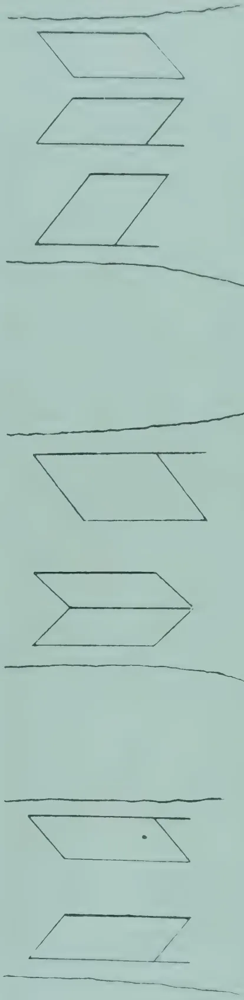This block contains three diagrams labeled Fig. 5 through Fig. 7. Fig. 5 shows a parallelogram with a small dot inside it, positioned above a horizontal line. Fig. 6 shows a combined shape consisting of two parallelograms joined at a central vertex, positioned above a horizontal line. Fig. 7 shows a parallelogram positioned above a horizontal line.

Fig. 5

Fig. 6

Fig. 7

388------------------------------------------------

NOVEMBER, 1913.]359

It would seem to follow from this, that tapping on opposite quarters should yield more than tapping on half the circumference. This at first sight appears at variance with the published results of tapping experiments carried on for a longer period, in which opposite quarters yielded notably less than half circumference. On examining these experiments more carefully, however, it is seen that there is not a clear issue, since the methods of tapping on the different groups of trees have been varied. For example, in one experiment the tapping on opposite quarters is half herring-bone, while that on the half circumference is full herring-bone. It cannot be deduced from such an experiment that half circumference is better than opposite quarters, or that the full herring-bone is better than the half herring-bone. But granting that, it must be admitted that there is a marked discrepancy on this point between the results of "practical" experiments and those conducted under more rigorous conditions, and it would be unsafe to state that tapping on opposite quarters yields more than tapping on half circumference, until further investigation has been made. On theory it should, and in carefully controlled experiments in which the individuality of the tree is excluded, it does; but judged by ordinary tapping experiments where different groups of trees are tapped on the two systems it apparently does not. The explanation of the discrepancy has yet to be found.

#### PROBLEM 4.

*Is the yield the same from two equal cuts 5 cms. apart at the same height on the same tree, but in opposite directions? (Fig. 4.)*

This raises the question of right versus left tapping. 24 trees were tapped, each on two equal strips, 5 cms. apart on the same side of the tree, for nine months, the cut being to the left on one strip and to the right on the other. The yield of the cuts to the left was 14 per cent. greater than that of the cuts to the right.

#### PROBLEM 5.

*Is the yield the same from two equal cuts at the same height on opposite sides of the same tree and in opposite directions? (Fig. 5.)*

24 trees were tapped for 10 months, each on two equal strips on opposite sides of the tree, the cut being to the left on one side and to the right on the other. The yield of the cuts to the left was 11 per cent. greater than that of the cuts to the right.

#### PROBLEM 6.

*Is the yield from a V cut the same as that from a single cut to the right, equal in length to the sum of the two arms of the V, the cuts being at the same height on opposite sides of the same tree? (Fig. 6.)*

12 trees were tapped for 10 months, each on two equal strips on opposite sides, one strip being tapped by a V cut and the other by a single cut to the right. The yield from the V cuts was 16 per cent. greater than that from the single cuts. This is in accordance with theory, since a cut to the left yields more than an equal cut to the right, and therefore the V, being half left and half right should have an advantage over the single cut to the right. The contrary would be expected if the single cuts were to the left.

389------------------------------------------------

360[NOVEMBER, 1913.

### PROBLEM 7.

*Is the yield from two single cuts, 5 cms. apart and in opposite directions, the same as that from a single cut to the left, of double the length, on the other side of the same tree, all the cuts being at the same height? (Fig. 7.)*

Seven trees were tapped, each on three strips, one of which was equal in breadth to the other two together. The two narrow strips were placed on one side of the tree, and the broad strip on the other. One narrow strip was tapped to the left and the other to the right, while the broad strip was tapped to the left. Tapping was continued for ten months. With one exception, the short cut to the left yielded more than the short cut to the right. Taking the yield of the long cuts as 100, the yield of the short cuts to the left was 58.6, and that of the short cuts to the right 49.4. As before, the two short cuts together yielded more than the one long cut, in spite of the fact that one of the short cuts was to the right. It is rather to be regretted that this experiment was not made parallel to experiment 6 by the use of a V instead of two separate short cuts

### RIGHT versus LEFT TAPPING.

That tapping to the left yields more rubber than tapping to the right was first demonstrated by MACADAM in 1906, but it was not until 1910 that an adequate explanation of the difference was suggested. It was then shown that in the majority of the trees examined, the wood vessels, and consequently the latex tubes, sloped up to the right, so that a cut to the left would sever more latex tubes than an equal cut at the same angle to the right. DR. DE JONG has completely investigated this point on ninety-three trees and has not found one in which the latex vessels, as a whole, slope in the opposite direction. Further, he has, on 316 tapping surfaces, determined the angle which the latex vessels make with the vertical, and has shown that the actual differences in yield obtained in his experiments by right and left tapping are accounted for, almost with mathematical exactitude, by the theoretical differences in the number of latex tubes severed by the tapping cuts which cross them at different angles. His results cover twenty pages of his pamphlet and cannot be quoted here at great length, but they afford a complete vindication of the superiority of left-hand tapping.

T. PETCH.

## THE JAT OF PLANTATION HEVEA.

Correspondence has passed between the authorities at Kew, Kuala Lumpur and Buitenzorg ( Java ) in connection with the statements appearing in the report of the Akers Commission to the effect that the rubber planted in the Orient is almost entirely from seed of a "white" variety of *Hevea brasiliensis*, which, like the "red" variety, produces weak rubber, while the best rubber is produced by a so-called "black" variety, this growing on higher and drier land than the others.

Similar statements have appeared before, and they have been met and confuted by MR. WICKHAM's testimony that "the whole of the *Hevea* brought through Kew by me ..... were from the large grown trees in the forest covering the broad plateaux dividing the Tapajos and Madeira Rivers." ( *Para Indian Rubber*, Wickham, p. 61 ).

390------------------------------------------------

NOVEMBER, 1913.]361

This is conclusive as regards the Up-River origin of the seeds, but there exists a desire for information from the botanical side on the subject of the different "varieties" of Hevea, and it was this that led MR. L. LEWTON BRAIN, Director of Agriculture for the F.M.S., to approach the Kew authorities.

LIEUT-COL. D. PRAIN has replied as follows:—

Royal Botanic Gardens, Kew,

April 30th, 1913.

SIR,

I have the honour to acknowledge receipt of your letter No.382/1913, dated 1st April, 1913, on the subject of two statements made by a Brazilian Commission on the Rubber Industry, viz:—

(a) That the rubber planted in the Orient is almost certainly from seed of a "white" variety of Hevea brasiliensis.

(b) That this variety of Hevea brasiliensis produces a weak rubber.

2. It is to be presumed that whether it was or was not the intention of the parties making this statement to cause a certain amount of uneasiness among those interested in Eastern plantation rubber it would not be unpleasing to those interested in Brazilian rubber if the statement were correct.

3. You inquire whether there is any information from the botanical side which would tend either to support or discredit these two statements.

4. In reply, I have to observe that a feature of difficulty is imparted to the question by the use in the report of the Brazilian Commission of the term variety without any opportunity of learning what significance is to be attached to the term. If the Commission has employed this term in a scientific sense we are without any clue as to what characters have been relied upon by the Commission in distinguishing the three varieties they mention from each other. It is further to be noted that the Commission does not discriminate a "typical" variety, nor do they, as an alternative to this omission, state which of the three varieties *white*, *red* or *black* they would treat as typical Hevea brasiliensis. Their treatment of the question, however, is such as to lead to the conjecture that "variety" is employed in their report in a colloquial, as opposed to a scientific, sense and that the *white*, *red* and *black* varieties mentioned by you are in fact the "seringueira branca," "seringueira vermelha" and "seringueira preta" respectively of Brazilian travellers.

5. Assuming this to be the case we are informed (see DR. J. HUBER in Bol. Mus. Goeldi, vol. iv. p. 639), that the *white* and *black* "seringueiras" are botanically scarcely separable from typical Hevea brasiliensis, while the *red* "seringueira" represents the scientific variety of H. brasiliensis distinguished by HUBER as var. *stylosa*. However, according to DR. ULE, there are two red "seringueiras." One of these is Hevea brasiliensis var. *stylosa*, Huber, and the other is Hevea cuneata, Huber; the latter is the Itaube of Brazil. DR. REINTGEN (in Tropenpfl. vol. vi Beih. no. 23 1905, p. 105) has stated that the *red* variety, or Itaube, is the most important and best known economically; DR. HUBER, on the other hand, declares that Itaube yields a product of less value than the *white* or *black* "seringueira." This latter discrepancy may indeed owe its existence to the circumstance that there are, as ULE points out, two quite distinct *red* "seringueiras" and that while HUBER had one, REINTGEN may have had the other in view.

391------------------------------------------------

362[NOVEMBER, 1913.

2. However this may be, it is clear that the scientific botanists who are at work in Brazil have not yet been able to come to a common understanding as to the relative economic value and status of the three sorts of "seringueira" spoken of in your letter as *red*, *black* and *white* varieties. But the evidence, such as it is, points to only the *red* as being distinguishable botanically from typical *H. brasiliensis*. The *black* and *white*, so far as the available evidence goes, are not varieties in a scientific sense; they appear only to be different states of the same type, the particular state which is of most value being that which grows on higher and drier land than the other.

This last statement of the Commission thus qualified is in complete accordance with what has always been understood with regard to *Hevea brasiliensis* and we have no reason to doubt the strict accuracy of the statement (see Wickham, *Para Rubber*, pp. 5 and 61), that the whole of the *Hevea* seed originally introduced to the East came from trees which grew under the conditions thus indicated by the Brazilian Commission.

I am, etc.,

D. PRAIN.

*India Rubber Journal.*

## THE NOMENCLATURE OF RUBBER TAPPING.

In every new pursuit, whether in science, arts, or sport, the need of special terms to connote new ideas soon makes itself felt. It may be met by inventing new names, or by using everyday words in a special sense,—"polarising" them, as a well-known author has it—but whichever method is adopted it is essential for a complete understanding of the subject that the meaning of the terms employed should be accurately defined. The art of rubber tapping has now acquired its special nomenclature, and the majority of the terms in use are understood by rubber planters in all rubber growing countries, but there are still one or two which give rise to some confusion.

The first of these relates to the direction of the tapping cut. This is frequently designated as "tapping from left to right" or vice versa. The phrase is comprehensible if it is understood to indicate the direction in which the act of cutting is performed by the coolie, but it is ambiguous as denoting the direction of the cut, for a line which is "left to right" is at the same time "right to left" according to the way one chooses to traverse it. The ambiguity might be removed by adding the word "upwards" or "downwards," though the resultant phrase would perhaps be too long and clumsy for everyday use. The simplest way of avoiding ambiguity would seem to be to use the vertical channel as a reference line, and to refer to the cuts as "cuts to the right" and "cuts to the left" of the channel, or more simply as right-hand and left-hand tapping. These terms were proposed some years ago, and they have already been adopted in Java.

The use of the term "half spiral" is another feature of rubber tapping nomenclature to which exception may be taken. The original half spiral was quite different from anything in vogue at the present day. It arose out of the full spiral, apparently in the following way. The full spiral began

392------------------------------------------------

NOVEMBER, 1913.]363

at a height of about six feet from the ground and wound round the stem until it reached the base. Now, if the cortex was at all uneven, it was impossible to carry the full spiral down to the base, and in such cases the cut had to be stopped and restarted lower down. Out of that grew the "half spiral" system, in which the spiral cuts were begun at various heights on the stem, and terminated after a length of two or three feet. The first cuts were begun at a height of six feet from the ground, but the lower cuts began and ended anywhere. Obviously such a method did not lend itself to systematic tapping, and it required a cup for every cut. Except in the case of a few specimen trees, it is doubtful whether it was ever attempted, and the system which is now styled "half spiral" bears no relation to the original. The present "half spiral" is really "half herring-bone," and to facilitate the interchange of ideas on rubber tapping it would seem advisable that the former misleading term should be dropped.

T. PETCH.

---

## WHY ENGLISH MANUFACTURERS USE BRAZILIAN RUBBER.

---

The "LONDON AND CHINA EXPRESS" lately stated:—

"At present the manufacturers are content to use the Brazilian article because they have not to alter their mixing formulæ, which they are loth to do until they are certain of the qualities of the rubber used. Formerly they were not certain as to the supply; now they require a recognized standard of quality they can work to.

"The reason plantation rubber is not the equal of the wild rubber from a manufacturer's point of view lies in the different methods of curing these rubbers. It is the fact, too, that nearly every plantation company has its own ideas of preparing its rubber, whereas if all plantation rubber were prepared in a standard manner rubber manufacturers would be able much more readily to adopt their methods to plantation rubber than is at present the case."

It is stated that the Rubber Growers' Association expects, after a series of exhaustive experiments, that it will be possible to convince manufacturers that plantation rubber is equal to fine hard Para.—INDIA RUBBER WORLD.

---

## THE RUBBER TRADE.

---

The Rubber market rules dull and lower, and a very serious contributory cause is the lack of confidence ruling in the American trade, where dealers, owing to the drop in prices, are prepared to do business only on a cash basis, an ominous sign which renders the market chaotic. It has also to be borne in mind that in order to supply the dividends paid by most of the companies, there has been very little, if anything, carried forward to provide for depreciation in value of produce, and in consequence consignments have to be sold on arrival in order to raise the working expenses of

393------------------------------------------------

364[NOVEMBER, 1913.]

the plantations. This may ultimately work out the salvation of a section of the trade from the fact that owing to the lack of necessary skilled attention consequent on attenuated means a large portion of the reclaimed plantations will rapidly go back to mere jungle, and in addition the rubber trees will fall victims to white lice and the other verminous diseases to which they are so subject, and this will mean hardship indeed for the man with a small capital who has invested his little all in concerns which at one time looked so promising. Let us suppose that the production from Malay and Ceylon this year totals 40,000 to 45,000 tons, next year the production from Malay alone will in all probability total at least 60,000 tons. To finance this huge quantity, even at the existing low values, a very large sum of available money is required, and considering that the trade at present is practically in the hands of a very few, surely the best way out would be to broaden the outlook by securing the co-operation of wealthy merchants, dealers and brokers, and thus materially assist in the dispersing of supplies and easing the present financial strain. By this means the present period of depression may be tided over, otherwise the immediate future appears far from promising. We understand that about half a dozen new brokers, most of whom have until recently been attached to Liverpool houses, are opening in Mincing Lane shortly, and this is a pointer to the fact that the trade is leaving Liverpool and centralising in London.—LONDON COMMERCIAL RECORD.

## MANICOBA RUBBER.

In a late number of the Bulletin of the Mexican Director-General of Agriculture, reference is made to a recent study by PROFESSOR ULE of two varieties of rubber :—

1. 1. *Manihot dichotoma*—Manicoba—of the valley of Piauhý.
2. 2. *Manihot piauhýensis*—Piauhý and Pernambuco, Brazil.

Commenting on this study, PROFESSOR DAVID THOMATIS expresses the opinion that these varieties are particularly suited to the tropical districts of Mexico. Their native habitat, in the Piauhý Sierra, is in rocky and stony soil, in argillaceous, sandy and gigantic sections, precisely similar to those of the Isthmus of Tehuantepec. The Piauhý Sierra is exposed to much wind, and the varieties mentioned are stated to be low in height.

### GROWTH.

There is but little difference between the two varieties, the "Dichotoma," however, being the taller, reaching 40 feet, while the "Piauhý" never exceeds half of that height. It is thus better able to stand the wind, preferring sandy soils and resisting extreme dryness.

On the other hand, the "Dichotoma" prefers argillaceous and calcareous soils. With these new varieties, it is remarked, it will be possible to utilize locations with stiff argillaceous earth and with loose, dry and sandy soil. The saying that nature abhors a vacuum may be paraphrased as implying that she likewise abhors useless soil. It is for man to study how to utilize waste tracts, and in PROFESSOR THOMATIS' opinion, the varieties of rubber named, which are new to Mexico, will achieve that object.

394------------------------------------------------

NOVEMBER, 1913.]365

Both of them shed their leaves during the dry season, when there is more wind, which, however, does not affect them much. They grow rapidly, attaining within the first four months about seven feet, with a trunk circumference of 6 inches, commencing to produce good latex in the third year.

#### CULTIVATION.

The simplest and most economical arrangement is to plant the trees about 8 feet apart, there being about 600 to the acre. This figure is about four times that usual for Ceara, Para and Castilloa.

In the first year, the plant assumes the shape of a single trunk, which forms in the second year two branches, each of which develops two secondary branches in the third year.

#### PRUNING.

At this stage, the four branches should be pruned, being left 12 inches in length. Pruning should take place shortly before the rainy season, during which many shoots or buds are put forth. In Brazil, instead of pruning these shoots they are allowed to grow, probably because in the forest conditions they do not grow close together, but at wider intervals.

Upon a systematic plantation, these shoots should be entirely cut every year, thus obliging the secondary branches to give birth to a new array of shoots. Through this annual pruning the ground gets more light and sun.

#### TAPPING.

All other varieties of rubber trees are tapped during the dry season. The latex is being formed all the year but becomes finally concentrated when the leaves are falling.

*Dichotoma* and *Pianhyensis*, on the other hand, require some moisture to develop their latex, and are therefore generally tapped during the rainy season. This fact is attributed to their being cultivated in a dry and well-ventilated soil. In the Upper Congo varieties resembling *Dichotoma* are tapped in both the dry and wet seasons. DR. THOMATIS recommends tapping during the dry season, accustoming the tree to develop and produce its latex at that period, when it would be of better quality and less resinous than at other times. He repeats that with these new varieties tapping can be commenced the third year, while six years is the age to be allowed for *Castilloa* and about ten for other trees. Each tree in these new categories can produce annually more than 2 pounds of latex, which will give 50 per cent. of excellent block rubber.\* This, it is added, is twice the yield of any other rubber tree.

#### ADVANTAGES OF NEW VARIETIES.

To use the author's own words: "All these advantages represent large amounts saved in labour and materials for extensive plantations, and I would venture to say that in this way, if all the above points are taken into consideration, 50 per cent. of the expenses of tapping would be saved. It will easily be seen, that by cultivating these new varieties, the yield per tree only requires three years to be doubled. There are four times more trees to the acre and the expenses of incisions are reduced by one-half.

\*Not according to our experience. Ed. T. A.

395------------------------------------------------

366[NOVEMBER, 1913.]

"In the same way as I recommended Mexican planters to cultivate our own *Castilloa* in preference to Ceara and Para, so do I to-day forcibly recommend the cultivation of these two new varieties. I have shown all the advantages as to soil, cultivation, tapping and yield. With these two new varieties there will be produced high yields of rubber in many large districts of Mexico where it has been impossible to cultivate other varieties to advantage. The subject appeals to the inhabitants and property owners of the districts along the Isthmus of Tehuantepec and the Pacific coast from Salina Cruz to Tonala."—INDIA RUBBER WORLD.

---

## CULTIVATION OF RUBBER AT EXPERIMENT STATIONS.

---

It is recommended to follow in Brazil the policy at first adopted in Ceylon, of being guided by the results shown by the experiment stations before planting on a larger scale, says the INDIA RUBBER WORLD. Trials should be conducted for several years and the results compared with those of the Far East. In the establishment of these experiment stations it is suggested that an examination be made of the chemical composition of the soil as well as of the drainage. The latter point is indispensable for the successful cultivation of Hevea in view of the height attained by the waters of the Amazon during the rainy season. Another subject of investigation should be the supply of water available in the dry season.

## CASTILLOA RUBBER IN DOMINICA.

By JOSEPH JONES AND A. G. JONES,

---

Recently, investigations respecting the genus *Castilloa* have been undertaken by the United States Department of Agriculture and by the United States National Herbarium, with the result that, instead of the three or four species of this genus which were thought to exist, the number has been raised to ten or eleven. Until a short time ago, it was thought that only one species was being grown in the West Indies, namely *Castilloa elastica*; but as a result of the investigations mentioned, it has been ascertained that three, and possibly four, species are at present under experimental cultivation in these islands.

### TAPPING.

The method used in Dominica for tapping the *Castilloa* trees is very similar to that in common use on estates in Trinidad and Tobago. A thin chisel about  $1\frac{1}{2}$  inches wide is used; this is carefully tapped with a

396------------------------------------------------

NOVEMBER, 1913.]367

hammer, care being taken not to strike it too hard. The cuts are made in perpendicular rows about 8 inches apart, each row about 4 inches from the other. The second row is made in the interval between the first and the third. The latex, which comes out in a fairly thick mass, collects around the cut, the accompanying black fluid flowing down the stem. The latex is then taken up with a spatula made of bamboo, put into small cups and transferred to earthenware vessels. In this way the trees are thoroughly tapped all round the stem in three or four operations. The trees may be tapped to any height. It is the custom in Dominica to bleed the older trees to a very considerable height, using a ladder for the purpose. The younger trees are operated on only to a height of about 6 feet from the ground.

By this method of tapping the injury to the tree is not very great, and though far from perfect, it seems the most suitable at present.

#### PREPARATION OF THE RUBBER.

The latex collected in the earthenware vessels is brought in and diluted with clean water. It is then passed through muslin to remove impurities such as bark and dirt. The clean latex is now transferred to wooden buckets fitted with wooden stopcocks at the bottom. Each bucket contains only about one-sixth its volume of latex; they are then filled with water, preferably hot, a few drops of formalin is added and latex is allowed to cream. The creaming takes place quite rapidly if sufficient water has been added. The water is withdrawn from below and a fresh supply added and again mixed with latex. This process may be repeated three or four times until the water withdrawn is quite clean. Sometimes, the latex coagulates of its accord in the bucket. Should coagulation not take place after the final lot of water is withdrawn the thick cream is transferred on to a piece of muslin, and the water allowed to drain. After a few hours, a spoon may be used to bring the latex together, which with very slight working coagulates. The soft coagulated mass is well washed, and then placed between two boards and pressed to the required thickness, about  $\frac{1}{8}$  inch. A very considerable pressure is sometimes required for this; there was only available for the purpose a disused letter press and this accounts for the somewhat unfavourable report of the experts at the recent Rubber Exhibition: some of the samples were reported upon as being uncured. The pressed rubber cakes are again washed and placed in a cool, dark place to dry.

The whole process, from the extraction of the latex to the preparation of the biscuits, need not take more than twenty-four hours, and the sooner it is completed the better. The rubber obtained is at first perfectly white, provided everything is kept scrupulously clean; on drying it changes to a brownish colour.

A sample of rubber prepared as detailed above was forwarded to the Government Laboratory, Antigua, for analysis. It gave the following percentage results calculated on dry rubber: Caoutchouc 85.4, resin 11.9, proteid 2.6, insoluble matter 0.0, ash 0.0.

397------------------------------------------------

368[NOVEMBER, 1913.

The report further stated: 'The colour of the sample was very good as also were its elasticity and tenacity.' As will be seen from the above, the resin content is somewhat high. In this connexion it may be stated that an experiment was conducted with the object of reducing the percentage of resins by washing the latex with a dilute solution of caustic soda. A sample of each was again forwarded to Antigua, but MR. TEMPANY states in his report: 'Treatment with caustic soda appears to have had relatively little effect on the character of the sample.' The one washed with the soda contained 12.1 per cent. of resin and the unwashed 12.65 per cent. Further experiments with varying quantities of soda solution, are needed in this direction.

#### YIELD OF RUBBER PER TREE

Having described the method of tapping and the process of preparing the rubber, there remains now to consider the yield obtained per tree. This is perhaps the most important factor of all.

Prior to April 1911, chiefly owing to the difficulty encountered in coagulating the latex, no records were kept of the yields obtained per tree, or per set of trees, in Dominica. Since then, however, the trees have been tapped regularly every three months, and the rubber weighed. It should be stated that all the trees were thoroughly tapped during February of this year, and the rubber shown at the Rubber Exhibition. They had had, therefore, close on three months' rest before they were tapped the following April.

The Castilloa trees at the Botanic Gardens, for the purposes of tapping experiments, may be conveniently divided into three sets: (1) Four trees, twenty years old, having a girth at 3 feet from the ground of 7 feet 4 inches; (2) nine trees thirteen years old, with an average girth of 37 inches at 3 feet from the ground; (3) thirty-seven trees, twelve years old, with an average girth of 36 inches at 3 feet from the ground.

The first set of trees, four in number, were tapped to a very considerable height with the aid of ladders. In April they together yielded 1 lb. 13 oz. of cured rubber, in July 1 lb. 5 oz., in October 1 lb. 7 oz. and in January 1912, 1 lb. 2 oz. The trees in one year with four tappings have yielded 5 lb. 11 oz. of rubber or a little under  $1\frac{1}{2}$  lb. per tree.

The second set of trees, nine in number, owing to their smaller girth were only tapped to about 6 feet or a little higher. They together yielded in April, 0 lb. 8 oz., in July 0 lb.  $7\frac{1}{2}$  oz., in October, 0 lb.  $3\frac{1}{2}$  oz. and January 1912, 0 lb. 5 oz. The nine trees in one year with four tappings have yielded 1 lb. 8 oz. or 2.7 oz. of rubber per tree.

The third set, thirty-seven trees, were also tapped only to a height of 6 feet. They together yielded in April, 2 lb. 14 oz. in July, 1 lb.  $3\frac{1}{2}$  oz. in October, 2 lb. 1 oz. and in January 1912, 1 lb. 8 oz. In one year with four tappings they have yielded 7 lb. 10 oz., or 3.3 oz. of rubber per tree.

398------------------------------------------------

NOVEMBER, 1913.]369RESULTS FROM EIGHT QUARTERLY TAPPINGS.—

<table border="1">
<thead>
<tr>
<th rowspan="3">No. of trees.</th>
<th rowspan="3">Age. years, 1912.</th>
<th colspan="2">Average girth 3 feet from ground</th>
<th colspan="2">Actual yield in four quarterly tappings.</th>
<th colspan="2">Average yield per tree during</th>
<th rowspan="3">Average annual yield over two years.</th>
</tr>
<tr>
<th>1911.</th>
<th>1912.</th>
<th>1911.</th>
<th>1912.</th>
<th>1911.</th>
<th>1912.</th>
</tr>
<tr>
<th>ft. ins.</th>
<th>ft. ins.</th>
<th>lb. oz.</th>
<th>lb. oz.</th>
<th>lb. oz.</th>
<th>lb. oz.</th>
<th>lb. oz.</th>
</tr>
</thead>
<tbody>
<tr>
<td>4</td>
<td>21</td>
<td>7 4</td>
<td>7 6½</td>
<td>5 11</td>
<td>2 11</td>
<td>1 7</td>
<td>0 10¾</td>
<td>1 1</td>
</tr>
<tr>
<td>9</td>
<td>14</td>
<td>3 1</td>
<td>3 4½</td>
<td>1 8</td>
<td>0 8½</td>
<td>0 2·7</td>
<td>0 1</td>
<td>0 1·8</td>
</tr>
<tr>
<td>37</td>
<td>13</td>
<td>3 0</td>
<td>3 6</td>
<td>7 10½</td>
<td>2 8</td>
<td>0 3·3</td>
<td>0 1·1</td>
<td>0 2·2</td>
</tr>
</tbody>
</table>

THE SPINELESS CACTUS.

TO THE EDITOR OF THE "TROPICAL AGRICULTURIST," PERADENIYA.

SIR,

This really wonderful plant is not yet much known and it would prove invaluable to stock owners and others, more especially in poor or dry districts, where vegetation of any kind is grown with difficulty. It is easily grown from the heavy leaves or slabs in any class of dry soil, and after the first year will yield according to conditions from 100 to 200 tons of succulent and nutritious fodder which can be fed to all kinds of stock and more especially dairy cattle. By analysis one ton thereof is equal in feeding value to three-fourths that of lucerne which is the richest fodder plant grown. During the hot summer months this plant would be luxuriant and being of a rich juicy nature would also greatly allay thirst and would therefore prove the salvation of stock owners. Some of the species yield 8 tons of well flavoured fruit per acre which makes excellent jams and jellies, etc., and growers have made up to £160 per acre. The young fleshy leaves are a good and wholesome vegetable when fried like egg-plant or boiled as greens, etc., and they also make good pickles. This very useful plant should prove a very great boon to residents in the East Indies as not only is it the heaviest yielding fruit and fodder plant yet known, but it will thrive where hardly any vegetation will exist and requires but little attention. Stock owners particularly would find it useful.

Yours very truly,

B. HARRISON, F.L.S.

Burringbar P.O.

N.S.W.

Australia.

14 September, 1913.

399------------------------------------------------

370[NOVEMBER, 1913.

# COCONUTS.

## COCONUTS IN FIJI.

In the last issue of this Journal we published some useful notes on coconut growing from the pen of MR. H. H. THIELE, Secretary and Editor of the FIJI PLANTERS' JOURNAL. The account reproduced below is in continuation of the previous one. MR. THIELE states:—There is an opinion generally held that by analysing a soil intended to produce a certain plant, and knowing what that plant's chemical requirements or constituents are, you can tell exactly what manure should be used. This is, however, only true to a limited extent, and the reason in many cases is simply this, that although a certain necessary ingredient is present in the soil in quite sufficient quantity, as shown by the analysis, it is not in such a condition as admits of its assimilation by the plant. There are remedies for such cases and they are fully described by MR. GUTHRIE in an article which will appear in the PLANTERS' JOURNAL.

My advice is that until you have ascertained for a fact what kind of manure your soil requires, when, and in what quantities it should be applied you had better at present limit yourself to experiments only, and not waste a lot of money on guess work.

What is written above applies to chemical manures. Bonedust and Dried Blood have given very satisfactory results in other places. I would not recommend them here. I tried them in my vegetable garden, with the result that all the crabs and ants from the neighbourhood congregated there for a feast, and I got very few vegetables. The ants walked off with the Bonedust—I do not believe that I benefited by it at all.

### MANURING.

As regards green manuring, I am in favour of it for any kind of crop; but I have not tried it on coconuts. It presupposes to a certain extent the possibility of being ploughed in, or otherwise covered with soil, and this could not be done in the estate I managed. Cowpeas will probably answer best in Fiji; they grow up straight, may—if so wanted—be cut off for cattle food, and the peas are liked by the Indian labourer and fowls. Beans—such as Mauritius, etc.,—are likely to injure the young plants by climbing up their stems and lashing the tender leaves together. There is another leguminous plant growing profusely amongst the coconuts in most parts of Fiji—its local name is ka-moce (*Cassia optusifolia*). It most likely does benefit the trees to some extent, but as a fodder plant it is useless and only takes up the room of much better grasses or plants. I have heard the statement made that if ka-moce is pulled up and allowed to dry on the ground for two or three days the cattle will eat it. It is very difficult and expensive to get rid of. Of late years the sensitive plant (*Mimosa pudica*) has been introduced largely on coconut plantations. It is good for the trees and, if once accustomed to it, the cattle come to like it, and thrive well on it. It stands drought well, and its only drawback is that it is covered with small prickles.

400------------------------------------------------

NOVEMBER, 1913.]371

The grazing of cattle on a coconut plantation is not likely to do much good as far as manuring the trees goes. Only a certain number of cattle can be kept on a certain area of grass, and the quantity of manure produced by that number is quite inadequate to affect the trees to any appreciable extent. Some planters in other parts of the world are much against allowing their cattle amongst the coconut trees at all. An old Ceylon planter says: "It is hardly possible to obtain from any source a sufficient supply of dung to materially increase the general yield of a coconut field." To apply a liberal quantity of cattle manure round young trees has done a lot of good in some places. I would not advocate its being done here in our hot climate; it might increase the temperature of the soil at first and afterwards form a breeding place for beetles and other objectionable insects.

Here in Fiji the planter makes a good profit out of his cattle. He must provide them with food, so he sends them amongst his coconut trees when these are so old (say about 5 years) that the animals cannot injure them by getting at and pulling out their tender centre shoots.

As no coconut cake is produced here or imported, there has been no chance of experimenting with it as a manure, but in other places it is much recommended for the young plants. Here I think the rats would eat it.

The question of letting other useful plants grow between the rows of young coconut plants is one which requires careful consideration and must greatly depend upon the locality and the nature of the soil. To allow the original bush to shoot up again round the young plants is decidedly wrong; this had been done with a block on the place I was managing at Taviuni, and, when the bush was cleared away the second time, some of the young coconut trees tumbled over; they had hardly any hold in the ground, and, with their long fairly healthy looking leaves, could not at first stand up against an ordinary strong wind. I must, however, say the varas had been planted very badly; in some instances it looked as if no holes had been dug at all for them. The sun and wind should not be excluded from the young coconut plants and a continually increasing space round them, according to their age, kept clear of weeds.

Where the nuts are planted about 30 feet apart, I can see no objection to using the space between the rows for some other useful plants, such as bananas, yaqona (Fiji grog, *Piper methysticum*), tobacco, maize, etc., the profits on which will help the planter to meet working expenses; but if cotton, cacao or sisal hemp are to be cultivated for a permanency on the same piece of land as coconuts, these should be planted some 40 feet apart.

When it is intended to use the land for pasture, some kind of good fodder plant or grass should be established towards the time when cattle may be allowed amongst the trees. The sensitive plant (*Mimosa pudica*) is at present in great favour in Taviuni; it has stood a good trial, and given satisfaction everywhere. It should be kept short or the stems become wooden and the prickles on them harder. The drawback to it are its thorns, which make it necessary for labour working in it (collecting nuts) to have their legs in some way protected. There is a thornless variety of the sensitive plant in Queensland, but it is very little known in Fiji. I am told it is more delicate than the common kind, also that it has in some places been known to revert to the thorny condition.

401------------------------------------------------

372[NOVEMBER, 1913.

Guinea grass is much recommended by Ceylon planters. It grows well in Fiji.

*Paspalum* was also introduced to Fiji some years ago; but, in the opinion of planters with the longest experience of it, it is decidedly injurious to the coconut trees and should under no circumstances be planted amongst them. I had it growing in a 6-acre paddock for about four years—after which time I left the plantation—and up to the end of that time I could not detect any bad effect on the coconut trees. What may have happened later I cannot say. The description of the soil must be taken into consideration when choosing what to grow for your cattle.

### GATHERING THE NUTS AND MAKING COPRA.

As far as I can learn from different publications the process in most countries is to let the labourer climb the trees, throw down the ripe or nearly ripe nuts, gather and transport them to a shed near the homestead, unhusk the nuts, split them, cut out the copra and, in most estates of any size, extract the oil from it. I do not think this course of proceedings is pursued in any part of Fiji.

Here we let the nuts fall to the ground, when they are ripe enough, collect them in heaps, split them and cut out the copra, carry it to and spread it on the *vatas* : two well filled bags constitute an ordinary task for a man.

The *vatas* are the platforms on which the copra is spread out for drying. They are usually wooden frames with reed bottoms, and when rain comes on the copra is covered with old galvanised iron, canvas or coconut leaves. On larger and better provided plantations the *vatas* are usually wooden platforms on wheels moving on rails and can be run under a shed when rain comes on and at night time. The object of the planter who sells in the local market appears to me to be to produce an article just good enough to secure the advertised market price. There is really no encouragement here to produce an extra fine article, the merchants will not pay any more for it though they are not adverse to reducing the price for indifferent copra. Whether it would pay the merchant to grade his copra into two or more different lots according to quality, I cannot say ; but I am pretty well sure that if copra of different description is placed in one heap or bulk the bad kind will have a more deteriorating effect on the good copra than the latter will have in improving the former.

Results are better when planters themselves ship through to the Colonies or Europe ; and even then the market price quoted for South Sea Island copra is almost invariably lower than that paid for copra from any other place, and generally some £3 or £4 less than Malabar and Ceylon copra fetches.

What is the reason for this state of affairs ?

Who is to blame, the planter or the merchant ?

The answer to the first question is simply this : that Fiji copra as now put on the European market is the poorest article offered there, and consequently is paid the lowest price. The answer to the second question is not so obvious. The planter, or producer—especially if a native or Indian—has not, as a rule, the proper appliances for making good copra ; weather also may be against the work and the copra may have to remain in the *vatas* for a considerable time before it is dry enough and then it has turned a very dark

402------------------------------------------------

NOVEMBER, 1913.]373

colour. Such copra, when pressed, gives only an oil of bad colour and poor quality. The local merchant takes it, not from choice in many cases, but because he has supplied the owner with goods on credit, and this is the only way in which he can get payment. For the merchant to send such copra to Europe or the Colonies would not come up to expectations, so he mixes it with some of better quality. The planter himself will do this if he is fortunate enough to be able to. The result of this is indifferent copra, and the blame lies with the merchant as well as with the planter, but mostly with the former. All planters cannot always produce good copra, but the merchant can always grade it if he likes—and thereby demonstrate that some really good copra can be obtained from Fiji as well as from other places.

To make the copra in the field, as is done in Fiji, saves transport—there can be no doubt about that point; against it remains the fact that it is not always possible to prevent the copra from getting wet while being made or before it can be brought under shelter, and that means deterioration. When bringing in the nuts and heaping them in a shed near the homestead you can choose a favourable time for extracting the copra, that is to say, within a few weeks, and before the kernel begins to undergo alterations previous to the sprouting. It is also more convenient and less expensive to husk the nuts at, and ship the fibre (coir) from, the homestead, than if the husking is done in the field. As no coir is made in Fiji at present the latter point is not of any importance. When artificial heat is used for drying copra the hard shell of the nut is generally used for fuel. Here in Fiji the shells with the husks are left in heaps in the field where the copra was cut, dried leaves fallen from the trees are piled on top and the whole lot burned, the ashes serving as manure.

With a fresh wind and good sunshine two days' exposure of the green copra is generally reckoned sufficient time to dry it in. It is then put in a heap in the copra house to await shipment. Further loss in weight takes place here, and some 40 per cent. is lost altogether in the drying process. Drying by artificial heat is not done in Fiji, except on the island of Rabi as far as I know. The copra can be dried in that way in much shorter time than by ordinary method. I read in a book ("The Consols of the East") the other day that the highest priced copra was obtained by drying it in the sun for six days.

In cases where the copra and coir is sent away, and the shell used for fuel, and consequently nothing returned to the land, it becomes absolutely necessary to apply some kind of manure in order to maintain the productiveness of the soil.

It appears to me an anomaly that the owner of one of the largest coconut plantations in Fiji, on which is also a dairy of very considerable size, sends all his copra away, when he might extract the oil, export that, and use the poonac (coconut cake) for feeding the dairy cows with. Denmark could not produce butter of such superlative quality without using poonac for the milking cows. An experiment has shown that by adding 21 ozs. of poonac to the ordinary daily food of a cow, which produced  $28\frac{3}{4}$  lb. of milk containing 16 ozs. of fat, the yield was increased to  $35\frac{1}{2}$  lb. of milk (an increase of 23.5 per cent.) containing  $20\frac{1}{4}$  ozs. of fat (an increase of 26.5 per cent.). It has also been ascertained that the better keeping quality of the Danish butter compared with that of other countries is to a great extent due to the poonac given to the dairy cows.

403------------------------------------------------

374[NOVEMBER, 1913.

## ARTIFICIAL DRYING OF COPRA IN THE WEST INDIES.

The coconut is an important product of many tropical countries and is being planted more extensively every year.

It is estimated, according to the Bulletin of the Pan-American Union, that the annual export trade of Central and South America in all products of the palm is valued at \$1,950,000, that of the West Indies at \$1,100,000. In Jamaica, it is said that there are 15,000 acres under cultivation in coconuts, with an annual export of 12,000,000 raw nuts, and that in Trinidad there are cultivated 5,000 acres with an annual export of 9,000,000 nuts.—BULL. No. 71. AGRIC. DEPT. OF TRINIDAD & TOBAGO.

## COCONUT CULTIVATION IN TROPICAL AMERICA.

### PANAMA.

In speaking of the physical features of Panama we quoted the opinion that the land furnished the finest possible ground for coconut plantations.

According to the British Consular reports, "the San Blas" (on the Atlantic) "nuts rank higher in the New York market. The Smithsonian Institute at Washington have pronounced them superior to any on the European or American markets."

Plantations have recently been started, one at Nombre de Dios, on the Atlantic coast, and another near the Pacific entrance to the canal.

"Cacao and coconuts are the most profitable tropical crops. A few thousand dollars spent in a plantation will, ten years later, yield an income largely in excess of the original investment. . . . A man may easily make a living out of sugar or bananas while awaiting the maturity of his more valuable product" (Forbes-Lindsay).

### COSTA RICA.

As is the case with other countries of Tropical America, there is wide scope for the profitable prosecution of the coconut industry, which, so far, has received little attention. There is before the writer a lengthy report upon an uninhabited section of the coast of Costa Rica, where were found 153,000 coconut palms in bearing, and 260,000 trees not yet mature. The report states:—

"There is no indication of habitation. Here and there are some traces, almost obliterated of 'blazing' in the forests near the shore, having been made to cut off the promontories which break the coconut groves, which marks the intrepid steps of someone who has reached the groves and picked a little of the abundant crops that they produce.

"There has been no change in these lands from primeval days to our own times, and, as regards the richness of their fauna and vegetation, anything possible said in their praise is but little, an

404------------------------------------------------

NOVEMBER, 1913.]375

immense region affording every kind of climate, and fitted for every description of agriculture. The quality of the soil could not be better, and a deep vegetable sub-soil on which any description of agriculture can be undertaken without trouble. Water in abundance, immense level grazing lands, covered with natural pastures; solid dry lands without swamps, without mosquitoes. All this guarantees a continued healthiness. I can vouch for all this since I covered it on foot, with nine companions, along the coast, and in these long and trying days, tramping without roads and any comforts to help us, we did not have the slightest indisposition. I am sincerely of opinion that, on the date that this magnificent region has communication with the rest of the country, we shall find therein inexhaustible founts of richness. The coconut groves in places form a regular jungle—one palm close to another—from the seedling to the full-grown palm. However, this, which is a disadvantage for the moment, really constitutes an immense advantage for future exploitation, since the younger trees can be transplanted without any difficulty at a small expense. I estimate that there are a minimum of 150,000 coconut trees in production, at least 250,000 between two and four years old, and a million young plants is a low figure.

“There is an abundance of palms loaded with an enormous amount of fruit (some that I counted had more than 200 nuts).”

Costa Rica, speaking figuratively, is a gold mine, the surface of which has hitherto only been scratched, but to which the coming of the Panama Canal will bring capital and machinery to develop its riches.

#### **NICARAGUA.**

Coconuts which cover the islands and reefs lying off the Atlantic shores, and by their presence are evidence of the suitability of the climate and soil of the Atlantic border for their cultivation. As a systematised industry, coconut cultivation hardly exists, and the exports, which are from the Atlantic ports only, were (1910) insignificant. There seems to be no reason why this tropical culture should not be established upon up-to-date and scientific principles, to the great profit of any Company with sufficient financial strength to do so.

#### **REPUBLIC OF HONDURAS.**

The coconut groves of Puerto Sul extend from the Ulua River to the Cuero River, a distance of about 60 miles, and may be mentioned chiefly as evidence of the possibilities of the soil for growing this important tropical product. The fertility of the soil has already been referred to, and the other conditions of rainfall, temperature, etc., are all entirely suitable for planting. In the last ten years for which statistics are available the value of the export of coconuts practically doubled itself.

#### **BRITISH HONDURAS.**

The conditions of soil, climate, and rainfall, of which particulars have already been given, indicate British Honduras to be a suitable ground for coconut planting. As shown by the exports of over five million coconuts in 1911, it is an improved industry in the Colony, and sufficient has been done to prove that judicious coconut planting may be successfully carried out.

405------------------------------------------------

376[NOVEMBER, 1913.

The export of five million nuts, representing barely 1,000 tons, can hardly be regarded as more than tapping the capacity of the country. Systematic exploitation would certainly make it profitable to spread plantations over a large area.

#### GUATEMALA.

Of all the products for which Guatemala offers entirely suitable conditions, it is probable that in the end the coconut palm will prove the most remunerative to the planter. Large quantities of the palm are found in many parts of the country. It would seem that every condition for the successful cultivation of this valuable palm exists in the fertile plains. Proximity to the sea, which, while not an essential, is so important a condition for producing a full crop, is continuous along the whole coast, east and west. The rainfall is sufficient; there is ample scope for the selection of soil precisely suitable for the best results without the addition of artificial stimulants, and the tropical temperature is what the nut requires to develop its full value.

A qualified expert, writing in the beginning of the present year 1913, makes the following interesting remarks :—

“I have made two journeys to Guatemala, and have ridden the tropical belt on the Pacific coast from San Jose to the Mexican frontier. In every village I found coconut palms growing profusely, and believe that they can be cultivated easily. At different places the rancheros had planted coconut palms, which were growing well, and indicated that the conditions would be suitable for planting coconut palms in large numbers.”

#### VENEZUELA.

The planting of coconuts is being actively pursued along the coast and the production of the valuable fruit is already considerable. One planter alone cropped some 2,000,000 nuts last year, and not only is there ample scope for the considerable extension of this industry, but heavy planting is proceeding by those who appreciate its importance.

#### BRITISH GUIANA.

The wonderful fertility of the soil in conjunction with the ample and regular rainfall and the tropical temperature, should render large areas, particularly those on the coast line, peculiarly suitable for coconut planting. The acreage under the cultivation of coconuts was (in 1910) some 10,000 acres, but there are not wanting signs that in the near future large additional areas will be planted with this remunerative commercial product. The acting Governor in his last report states that there is “a vast area of land suitable for the planting of coconuts, and, given proper cultivation and drainage, could be very largely increased.”

MR. JAMES RODWAY, previously quoted, bears evidence to this : “The coconut grows well on the coast, where it is all the better for a little salt. It seems to revel in the sea-breeze, which braces it in a manner peculiar to itself.”

406------------------------------------------------

NOVEMBER, 1913]377

"Several plantations and one oil and fibre factory already exist in British Guiana.

"There is great room for development, and there are signs of an increase not only in the exportation of nuts, but copra as well.

"The more carefully prepared desiccated coconut, now largely used in confectionery, could also be produced here, as well as mats and other fibre products."

"The area planted in coconuts," says PROFESSOR HARRISON (1907), "has been steadily increasing for some years past, while of late years a marked tendency has arisen for planting them. In fact, since 1902 a very rapid increase in the area planted has taken place. The great majority of those grown are utilised in the Colony for the preparation of oil and cattle food. The oil obtained from them has gradually displaced the imported coconut oil and retarded the importation of other edible oils."

#### **TROPICAL BRAZIL.**

The coconut palm attains a great size on the seashores, and by its presence indicates the suitability of the climate and soil for this culture. Although there are a very large number of trees along the coast, they are as yet little cultivated, and not until the serious attention of organised industry, backed up by adequate capital, is attracted to it, can we look for an output such as might fairly be expected from the wide areas available for the industry.

#### **EUCADOR.**

Coconuts are grown in the lowlands, where the rainfall, climate and soil are all suitable for the culture, which is carried on there, but by no means to an extent commensurate with the area available for the growth and the natural advantages offered. At present, not only in Eucador, but in the tropics generally, the application of modern methods and scientific principles to the cultivation of coconuts is hardly appreciated at its real value and importance. Doubtless, as new companies take up the culture and bring to it improved methods, not only of cultivation, but of preparing the products, they will find in Eucador coconut plantations a source of large and permanent profits.

#### **TRINIDAD.**

The export of coconuts in 1911 exceeded 20,000,000 nuts, and the demand for them continues to increase, as they find a ready market at remunerative prices. The area planted is as yet comparatively small, chiefly in the eastern coast district, in Mayaro Bay; on the south-western coast (Cedros district); and in the district served by the railway extension to Rio Claro. There are very considerable areas suitable for this culture, which the increasing demand must necessarily before long bring in to cultivation.

—FUTURE OF TROPICAL AMERICA.

407------------------------------------------------

378[NOVEMBER, 1913.

## COCONUT PLANTING IN TRINIDAD.

The following is taken from a detailed estimate of the expense of clearing land and developing, at the rate of 100 acres per year, a Coconut estate of 500 acres has been kindly contributed by MR. W. GREIG of St. Marie Estate, Cedros, to *Bulletin No. 71* of the Agricultural Department of Trinidad and Tobago:—

### EXPENDITURE.

#### 1ST YEAR.

<table>
<tbody>
<tr>
<td>Cost of Land. 500 acres @ £2.10 per acre</td>
<td>...</td>
<td>£ 1,375</td>
</tr>
<tr>
<td>Clearing 130 acres @ £1.10 per acre</td>
<td>...</td>
<td>195</td>
</tr>
<tr>
<td>Roads and Traces</td>
<td>...</td>
<td>50</td>
</tr>
<tr>
<td>Lining, holing, planting, and seed nuts (100 acres)</td>
<td>...</td>
<td>165</td>
</tr>
<tr>
<td>Weeding and cutlassing</td>
<td>...</td>
<td>150</td>
</tr>
<tr>
<td>Draining</td>
<td>...</td>
<td>25</td>
</tr>
<tr>
<td>Stock (5 Oxen,, 2 Cows, 2 Horses, 1 Cart, Stable, Pen)</td>
<td>...</td>
<td>300</td>
</tr>
<tr>
<td>Labourers' barrack (12 rooms)</td>
<td>...</td>
<td>300</td>
</tr>
<tr>
<td>Dwelling house</td>
<td>...</td>
<td>400</td>
</tr>
<tr>
<td>Ward rates and taxes</td>
<td>...</td>
<td>32</td>
</tr>
<tr>
<td>Supplies and contingencies</td>
<td>...</td>
<td>100</td>
</tr>
<tr>
<td>Superintendence</td>
<td>...</td>
<td>200</td>
</tr>
<tr>
<td></td>
<td></td>
<td><u>£3,292</u></td>
</tr>
</tbody>
</table>

#### 2ND YEAR.

<table>
<tbody>
<tr>
<td>Cultivating 100 acres planted 1st year</td>
<td>...</td>
<td>£ 175</td>
</tr>
<tr>
<td>Maintenance of roads, traces, etc.</td>
<td>...</td>
<td>25</td>
</tr>
<tr>
<td>Clearing 100 acres new land</td>
<td>...</td>
<td>150</td>
</tr>
<tr>
<td>Roads and traces, new</td>
<td>...</td>
<td>50</td>
</tr>
<tr>
<td>Lining, holing, and planting 100 acres new land</td>
<td>...</td>
<td>165</td>
</tr>
<tr>
<td>Weeding and cutlassing, new land</td>
<td>...</td>
<td>150</td>
</tr>
<tr>
<td>Labourers' barrack for Immigrants (6 rooms)</td>
<td>...</td>
<td>175</td>
</tr>
<tr>
<td>Immigration charges on 12 Immigrants</td>
<td>...</td>
<td>25</td>
</tr>
<tr>
<td>Ward rates and taxes</td>
<td>...</td>
<td>34</td>
</tr>
<tr>
<td>Supplies and contingencies</td>
<td>...</td>
<td>100</td>
</tr>
<tr>
<td>Superintendence</td>
<td>...</td>
<td>200</td>
</tr>
<tr>
<td></td>
<td></td>
<td><u>£1,249</u></td>
</tr>
</tbody>
</table>

### NOTES ON ESTIMATES.

Expenditure is based on average Trinidad conditions as regards (1) labour supply, (2) soil conditions and shipping facilities.

(1) Available land suitable for coconuts can only be had in sparsely populated districts where there would be difficulty in getting sufficient seasoned labour to clear more than 100 acres per year. For ordinary cultivation work, Indentured Immigrants are allowed for the second and subsequent years. At the end of the sixth year there will be 60 immigrants on the estate and the estimates allow for this number being maintained.

Under the most favourable soil conditions the expenditure of one unproductive year (£1,540) could be eliminated and the time of coming into

408------------------------------------------------

NOVEMBER, 1913.]379

bearing reduced by one year. Under favourable conditions it would be necessary to add one or more years of expenditure and increase the time of coming into bearing.

Sufficient stock and carts have been allowed for to work the estate and deterioration of oxen will be made good by keeping the two cows bought in the first year busy.

Crops have been estimated on a conservative basis and the value of nuts is estimated at 10/- per 1,000 below present value which is exceptionally high and not likely to last. Only under the most unfavourable conditions would the crops estimated not be realised.

Copra has been estimated at present prices on estates and no reduction has been made as there is every likelihood of this value being maintained.

#### SUMMARY.

<table border="1">
<thead>
<tr>
<th>Year</th>
<th>Expenditure</th>
<th>Revenue</th>
<th>Expenditure from the 9th to the 12th year, in excess of Revenue.</th>
</tr>
</thead>
<tbody>
<tr>
<td>1st</td>
<td>£ 3,292</td>
<td>Nil</td>
<td>...</td>
</tr>
<tr>
<td>2nd</td>
<td>1,249</td>
<td>"</td>
<td>...</td>
</tr>
<tr>
<td>3rd</td>
<td>1,475</td>
<td>"</td>
<td>...</td>
</tr>
<tr>
<td>4th</td>
<td>2,096</td>
<td>"</td>
<td>...</td>
</tr>
<tr>
<td>5th</td>
<td>2,003</td>
<td>"</td>
<td>...</td>
</tr>
<tr>
<td>6th</td>
<td>1,745</td>
<td>"</td>
<td>...</td>
</tr>
<tr>
<td>7th</td>
<td>1,540</td>
<td>"</td>
<td>...</td>
</tr>
<tr>
<td>8th</td>
<td>1,540</td>
<td>"</td>
<td>...</td>
</tr>
<tr>
<td>9th</td>
<td>1,566</td>
<td>£ 197</td>
<td>£1,369</td>
</tr>
<tr>
<td>10th</td>
<td>1,605</td>
<td>497</td>
<td>1,108</td>
</tr>
<tr>
<td>11th</td>
<td>1,680</td>
<td>1,066</td>
<td>614</td>
</tr>
<tr>
<td>12th</td>
<td>2,160</td>
<td>2,048</td>
<td>112</td>
</tr>
<tr>
<td>13th</td>
<td>2,504</td>
<td>3,523</td>
<td>...</td>
</tr>
<tr>
<td>14th</td>
<td>2,522</td>
<td>4,801</td>
<td>...</td>
</tr>
<tr>
<td>15th</td>
<td>2,528</td>
<td>5,986</td>
<td>...</td>
</tr>
<tr>
<td>16th</td>
<td>2,555</td>
<td>6,948</td>
<td>...</td>
</tr>
<tr>
<td>17th</td>
<td>2,611</td>
<td>7,375</td>
<td>—</td>
</tr>
<tr>
<td></td>
<td><u>£34,671</u></td>
<td><u>£32,441</u></td>
<td><u>£3,203</u></td>
</tr>
</tbody>
</table>

At the end of the eighth year the expenditure amounts to £14,940, from the ninth to the twelfth year there is a further expenditure of capital amounting to £3,203 before the estate becomes self-supporting.

The actual working capital required for an estate of 500 acres is £18,143 or £36 an acre.

## COCONUTS IN TOBAGO.

By THOS. THORNTON, A.R.C.S.

The Coconut Industry of the West India Islands, as a commercial enterprise, is a comparatively new one, and is rapidly assuming very important dimensions. For long years back the coconut palms fringing the coast line have been the first plants which probably conveyed to the minds of travellers

409------------------------------------------------

380[NOVEMBER, 1913.

the idea of tropical vegetation, and most of the illustrations used by old writers to give an impression of the islands met with in these climes show a line of waving coconut palms along the beach, and here and there a small group on the hill sides and even on the hill tops indicating the positions of the native villages.

But a comparatively few years ago the price of sugar was so high in comparison with coconuts, that no one would have dreamt of putting land which would grow the sugarcane into coconuts, so that to-day, in a place like Tobago, we find the oldest palms growing, not on good land suitable for cane, but on the sandy beaches where canes could not flourish. All around the island, on almost every sandy beach these old coconut walks exist, but nowhere inland except where they mark the situations of villages.

Within but a very short period coconuts have grown from being of little commercial value to one of the most valuable crops of the tropics.

In almost all the islands coconuts are being extensively planted, but nowhere in these islands is the cultivation extending more rapidly than in Tobago. At present the crop is about two million nuts, and only a very small fraction of the plants have come to bearing. It has been estimated that there must be close on six thousand acres already planted, and still the cultivation is extending.

In the hilly districts the cultivation lies along the flat land fringing the coast, and ascending for a short distance up the hill slopes which face the sea, as well as in the broad valley bottoms which open to the sea. In the flat leeward district coconuts are planted right across the island, and the whole area of many of the estates is being planted up in this crop.

#### **METHODS OF PLANTING.**

As might be expected, different methods of establishing coconut estates are practised, from the most careless to the most scientific. The method adopted usually being determined by the financial condition of the planters, in some instances by the amount of capital which can be spared from the other cultivations.

#### **FREE GARDENS IN TOBAGO.**

One method which is commonly adopted is to give out land from one to two acres to the peasants free of charge, to be used as provision gardens. The peasant clears the land, plants his provisions, and the planter puts in his coconut plants at distances of about twenty-five feet square. At the end of from three to four years when the coconut roots have practically taken possession of the land, the peasant gives it up and takes over a fresh piece of land. If the gardens are well looked after, the coconuts grow exceedingly well, in spite of the fact that one or two crops of provisions are being annually taken out of the land. The kinds of crops usually taken off by the peasants are Indian corn, pigeon peas, sweet potatoes, cassava, plantains, etc. During the time the pigeon peas occupy the land, a two-year crop, the coconuts do exceedingly well. They offer a certain amount of shade to the young plants which appears to be quite beneficial to them in the earlier stages of growth as well as keeping the ground protected, which is very important.

410------------------------------------------------

NOVEMBER, 1913.]381

### PLANTING IN TRACES.

Another method practised is to cut traces through the bush and plant the coconuts in the traces. For about three years the traces only are brushed, after then all the ground is brushed about twice a year. Here nothing is taken off the land, but growing in a kind of valley with high bush on two sides does not give results so good as the garden system. Instead of the plants growing sturdy as they do in the open, they become tall with too little body.

### PLANTING IN OPEN GROUND.

On some estates all of the ground is kept brushed from the beginning going through it about twice a year. Here the plants attain a more sturdy growth.

Certain estates are producing sugar cane on the share system, and planting coconuts through the canes. This is almost the same as the garden system, taking off catch crops. Coconuts are also being planted through cotton. The shade offered by the cotton is very similar to that offered by pigeon peas, but canes appear to keep them too closed in, resulting in loss of body until they are about four years old. Where coconuts are planted through canes, a good space should be kept clear around each plant.

### INTENSIVE CULTIVATION.

One system practised in Tobago which is certainly the most scientific, is that where the ground is cleared, stumped, ploughed and drained, the plants are put in and seed of some leguminous plant sown so as to get the ground covered. It is much more expensive than any of the other methods practised, but one can reasonably expect, under these conditions, a more rapid growth will take place, and earlier bearing trees will be produced.

### SEED NUTS.

The question as to the best seed nuts has received very important consideration. The planter is anxious to produce crops of nuts which will bring in the biggest return, and the difference in price between selects, nuts which will not pass through a ring with a diameter of  $3\frac{3}{4}$  inches, and culls, those which pass through the ring, is so great that no one thinks of planting culls in the nursery.

On many of the estates nuts for planting are selected from their own trees. Healthy trees bearing large crops of select nuts are marked on the trunk with paint, and the nuts obtained from them are sown in the nursery.

A large number of nuts have been imported from Venezuela. They have been particularly sought after because of their large size and thin husk. Unfortunately the importer knows nothing of the parentage, of the number of nuts the parent trees produce, their age or condition of health, nor of the condition of soil and climate where these nuts have been produced compared with those of Tobago.

Some of the Tobago planters have thought of these things and have stopped importing from Venezuela, preferring to obtain their seed nuts from nearer home where the climate and soil conditions are known factors as well as the parentage.

411------------------------------------------------

382[NOVEMBER, 1913.

### NURSERIES.

Nurseries are usually formed on the sandy beach under the old coconut trees. The sand is very loose, and the old coconuts afford a certain amount of shade. A trench is first dug about one foot deep and the nuts are placed on the bottom, close together, either flat or inclined at an angle of about 45 degrees. Occasionally one will see them placed upright, but the former two methods are more usually adopted. After the nuts have been placed in the first trench a second one is dug behind it, and the material taken out is used to fill up the first one only just burying the nuts. The nuts are placed in the new trench and again another one is dug and the nuts in the second buried just as in the first. The Tobago planter usually transplants the young coconuts by the time they are one foot high, hence they do not require so much space in the nursery. Planting the nursery in this way the nuts grow well, and almost always give satisfaction in Tobago. Usually, about four months are taken before germination commences, and about two months more before the seedlings are ready for transplanting.

### TRANSPLANTING.

Amongst the Tobago planters there is a very strong opinion in favour of transplanting the seedlings when they are no more than one foot high. There is not so much check to their growth as when transplanted at a later stage. At this stage many of the roots have not emerged through the husk and of course these are not interfered with during the transplanting, and when transplanted at this early stage there is less risk of the breezes interfering with them, transport is easier, and the buds are not so apt to get damaged.

Holes are usually dug some time before planting, varying in size up to two feet square and two deep. In some instances a basket of pen manure is put into the hole before planting, but this is not a usual custom. It is, however, a practice which can be well recommended.

The planters try to get their transplanting done as near the beginning of the wet season as possible, in order that the plants may be well established before the dry season sets in.

Forking around the young plants is practised to a very limited extent but it is a practice which might be adopted more generally with advantage.

### TIME TO BRING TREES TO BEARING.

The number of years taken for coconuts to come into bearing varies considerably. I have seen young trees four and a half years old with young nuts on them; I have heard of instances still earlier; but as a general rule the time taken is considerably longer. The character of the soil and the care bestowed upon them makes a very great difference in the development of the young plant. Neglected and on poor soil ten years would not be too long a period to bring them to bearing, but on good soil and given good care six or seven years is quite a reasonable time to expect them to require to produce their first crop of nuts.

### COCONUT SOILS AND SITUATIONS.

Coconuts unfortunately have been planted on every conceivable kind of soil, from the shallow hillside soil to the sandy beach and as might be expected with as varying results. On the sandy beach with a great depth of

412------------------------------------------------

NOVEMBER, 1913.]383

apparently almost pure coral sand the plants grow exceedingly well, in fact, some of the finest coconuts seen in Tobago are growing in such a medium. In alluvial soils, at the opening of the valleys towards the sea excellent results are obtained. They also grow well in what is here commonly called marl, finely decomposed igneous rock. These three mentioned soils are usually very deep, and gives the roots every opportunity of spreading very widely and deeply. Then again over coral in from one foot to eighteen inches of soil they thrive well.

A shallow soil over clay is not good, although the young plants may grow well, the mature plants have a starved appearance, and the crops are not satisfactory. On Hillsides in shallow soil over rotten rock the early growth is very slow and the mature plant has a very starved appearance and produces very few nuts.

Open situations are best, and sheltered valleys, especially where the rainfall is over seventy inches should be avoided.

At the back of lagoons where at high water there is a wash back over the land, usually up old drains, coconuts will thrive well for a few years, and then very often they die, probably owing to the water-logged and sour condition of the soil. On land where water has a tendency to collect and stand, coconuts do not do well, here again probably owing to the water-logged and sour condition of the soil. It is a general opinion amongst planters that fresh moving water is no detriment to the plant whereas stagnant water is fatal.—BULLETIN. NO. 71, AGRICULTURAL DEPT. OF TRINIDAD & TOBAGO.

## MANURIAL EXPERIMENTS ON COCONUTS.

By JOSEPH DE VERTEUIL, F.C.S.

These experiments, under the control of the Board of Agriculture, are being made on the *Morvant* estate, Laventille; *Beaulieu* estate,\* Cedros; and *King's Bay* estate, Tobago.

The manures are supplied free of cost to the proprietors, but the cost of application as well as the cost of cultivation is borne by the estate owners.

The manures are spread broadcast to within three feet of the trunk of each tree, about two feet from the edge of the drains, and the surface soil loosened to a depth of about six inches, with the aid of a fork.

Where pen manure is applied it is forked into the soil and the artificial manures spread over it.

Records of pickings are being kept from July 1, in each year, and the number of "selects" and "culls"† reaped from each plot noted separately.

In calculating the yield and cost of manuring per acre, it has been assumed that there are 75 trees to the acre, as the trees are planted 24 feet apart.

\* Results not published.

† "Selects" or "Standard" nuts are those which when husked do not pass through a ring  $3\frac{1}{2}$  inches in diameter and are otherwise sound. "Culls" are sound nuts measuring between 3 and  $3\frac{1}{2}$  inches in diameter.

413------------------------------------------------

384[NOVEMBER, 1913.

### MORVANT ESTATE, LAVENTILLE.

The plots are situated partly on a slope and partly in a narrow valley between two hills; the soil may be described as an undulating clay loam.

The trees are about 25 years old and planted 24 feet apart. The manures were applied in July, 1911.

#### MANURIAL EXPERIMENT, MORVANT ESTATE.

<table border="1">
<thead>
<tr>
<th rowspan="3">Plot</th>
<th rowspan="3">No. of trees.</th>
<th rowspan="3">Manures applied per tree.</th>
<th rowspan="3">Cost of manuring per acre.</th>
<th colspan="4">Yield—July 1, 1911, to June 30, 1912.</th>
</tr>
<tr>
<th rowspan="2">Average No. of nuts picked per tree.</th>
<th rowspan="2">Per cent. Selects.</th>
<th colspan="2">Per acre.</th>
</tr>
<tr>
<th>Selects.</th>
<th>Culls.</th>
</tr>
</thead>
<tbody>
<tr>
<td>1</td>
<td>70</td>
<td>
<math display="block">\left\{ \begin{array}{l} 4 \text{ lb. Lime} \quad \dots \\ 4 \text{ ,, Kainit} \quad \dots \end{array} \right.</math>
</td>
<td>9.51</td>
<td>20.3</td>
<td>58.9</td>
<td>899</td>
<td>627</td>
</tr>
<tr>
<td>2</td>
<td>70</td>
<td>
<math display="block">\left\{ \begin{array}{l} 6 \text{ lb. Basic slag} \quad \dots \\ 1 \text{ ,, Sulphate of potash} \end{array} \right.</math>
</td>
<td>11.29</td>
<td>38.9</td>
<td>63.7</td>
<td>1,859</td>
<td>1,057</td>
</tr>
<tr>
<td>3</td>
<td>70</td>
<td><b>Control—No manure ...</b></td>
<td>5.44*</td>
<td>40.7</td>
<td>58.5</td>
<td>1,789</td>
<td>1,266</td>
</tr>
<tr>
<td>4</td>
<td>70</td>
<td>
<math display="block">\left\{ \begin{array}{l} 4 \text{ lb. Basic slag} \quad \dots \\ 2 \text{ ,, Nitrate of soda} \end{array} \right.</math>
</td>
<td>11.64</td>
<td>35.1</td>
<td>65.2</td>
<td>1,717</td>
<td>918</td>
</tr>
<tr>
<td>5</td>
<td>70</td>
<td>
<math display="block">\left\{ \begin{array}{l} 2 \text{ lb. Calcium cyanamide} \\ 2 \text{ ,, Sulphate of potash} \end{array} \right.</math>
</td>
<td>13.79</td>
<td>43.1</td>
<td>61.1</td>
<td>2,007</td>
<td>1,277</td>
</tr>
<tr>
<td>6</td>
<td>70</td>
<td><b>Control—No manure ...</b></td>
<td>5.44*</td>
<td>25.9</td>
<td>64.9</td>
<td>1,262</td>
<td>682</td>
</tr>
<tr>
<td>7</td>
<td>70</td>
<td>
<math display="block">\left\{ \begin{array}{l} 2 \text{ lb. Bone meal} \quad \dots \\ 1 \text{ ,, Sulphate of ammonia} \\ 150 \text{ ,, Pen manure} \dots \end{array} \right.</math>
</td>
<td>17.60</td>
<td>41.0</td>
<td>60.8</td>
<td>1,873</td>
<td>1,206</td>
</tr>
<tr>
<td>8</td>
<td>70</td>
<td>
<math display="block">\left\{ \begin{array}{l} 2 \text{ lb. Superphosphate of lime} \\ 1 \text{ ,, Sulphate of potash} \\ 150 \text{ ,, Pen manure} \dots \end{array} \right.</math>
</td>
<td>17.25</td>
<td>31.1</td>
<td>61.9</td>
<td>1,444</td>
<td>888</td>
</tr>
</tbody>
</table>

### KING'S BAY ESTATE, TOBAGO.

The plots are situated about 75 yards from the King's Bay beach, on a flat sandy loam. The trees are planted 24 feet by 24 feet, and they are 20 to 25 years old.

The artificial manures were applied in May, 1911, but no pen manure could be obtained for plots 7 and 8.

\* Cost of forking.

414------------------------------------------------

NOVEMBER, 1913.]385

66.71 inches of rain were registered during the twelve months from July 1, 1911, to June 30, 1912, on this estate.

MANURIAL EXPERIMENTS. KING'S BAY ESTATE, TOBAGO.

<table border="1">
<thead>
<tr>
<th rowspan="3">Plot</th>
<th rowspan="3">No. of trees.</th>
<th rowspan="3">Manures applied per tree.</th>
<th rowspan="3">Cost of manuring per acre.</th>
<th colspan="4">Yield—July 1, 1911, to June 30, 1912.</th>
</tr>
<tr>
<th rowspan="2">Average No. of nuts picked per tree.</th>
<th rowspan="2">Per cent. Selects.</th>
<th colspan="2">Per acre</th>
</tr>
<tr>
<th>Selects.</th>
<th>Culls.</th>
</tr>
</thead>
<tbody>
<tr>
<td>1</td>
<td>46</td>
<td>
<math display="block">\left\{ \begin{array}{l} 4 \text{ lb. Lime} \quad \dots \\ 2 \text{ ,, Kainit} \quad \dots \end{array} \right.</math>
</td>
<td>$ c. 8.51</td>
<td>74.4</td>
<td>70.1</td>
<td>3,911</td>
<td>1,671</td>
</tr>
<tr>
<td>2</td>
<td>68</td>
<td>
<math display="block">\left\{ \begin{array}{l} 6 \text{ lb. Basic slag} \quad \dots \\ 1 \text{ ,, Sulphate of potash} \end{array} \right.</math>
</td>
<td>10.28</td>
<td>56.2</td>
<td>67.2</td>
<td>2,832</td>
<td>1,381</td>
</tr>
<tr>
<td>3</td>
<td>59</td>
<td><b>Control—No manure</b> ...</td>
<td>*4.51</td>
<td>60.3</td>
<td>68.0</td>
<td>3,076</td>
<td>1,444</td>
</tr>
<tr>
<td>4</td>
<td>84</td>
<td>
<math display="block">\left\{ \begin{array}{l} 4 \text{ lb. Basic slag} \quad \dots \\ 2 \text{ ,, Nitrate of soda} \end{array} \right.</math>
</td>
<td>10.64</td>
<td>51.1</td>
<td>69.1</td>
<td>2,650</td>
<td>1,184</td>
</tr>
<tr>
<td>5</td>
<td>71</td>
<td>
<math display="block">\left\{ \begin{array}{l} 2 \text{ lb. Calcium cyanamide} \\ 2 \text{ ,, Sulphate of potash} \end{array} \right.</math>
</td>
<td>12.91</td>
<td>67.6</td>
<td>67.0</td>
<td>3,394</td>
<td>1,674</td>
</tr>
<tr>
<td>6</td>
<td>80</td>
<td><b>Control—No manure</b> ...</td>
<td>*4.56</td>
<td>58.4</td>
<td>68.2</td>
<td>2,989</td>
<td>1,390</td>
</tr>
<tr>
<td>7</td>
<td>65</td>
<td>
<math display="block">\left\{ \begin{array}{l} 2 \text{ lb. Bone meal} \quad \dots \\ 1 \text{ ,, Sulphate of ammonia} \end{array} \right.</math>
</td>
<td>9.66</td>
<td>54.1</td>
<td>68.7</td>
<td>2,791</td>
<td>1,269</td>
</tr>
<tr>
<td>8</td>
<td>78</td>
<td>
<math display="block">\left\{ \begin{array}{l} 2 \text{ lb. Superphosphate of lime} \\ 1 \text{ ,, Sulphate of potash} \end{array} \right.</math>
</td>
<td>9.21</td>
<td>60.4</td>
<td>67.1</td>
<td>3,041</td>
<td>1,492</td>
</tr>
</tbody>
</table>

It will be observed that the yield from each plot has been divided into "Selects" and "Culls." This classification is necessary owing to the large difference in the price paid for these two standard sizes of nuts. It is conceivable that certain manures may not increase the number of nuts to any appreciable extent, yet if it is found that the percentage of "Selects" has been increased, the worth of the manure is established.

\* Cost of forking.

415------------------------------------------------

386[NOVEMBER, 1913.

The value of the nuts reaped has not been calculated and tabulated owing to the fact that records of the yield have only been kept from the date the manures were applied. As nearly a year elapses from the time of flowering to the dropping of the nuts, the manures would have had very little, if any, effect on the number of nuts collected during this period. This year's yield may therefore be considered as a natural yield for each plot.

The number of "Selects" and "Culls" reaped per acre has been calculated for each plot and the figures will be useful for future comparison.

It should be noticed that the yield from the various plots on each estate varies largely; even in the two control, or no manure plots. The difference at Cedros and Laventille is marked. This, in my opinion, is due to the peculiarities of each individual tree, that is, some trees are *naturally* more prolific than others. Unless the *natural* yield of the group of trees comprising each plot is known previous to the application of manures reliable conclusions and comparisons cannot be obtained. Similar remarks have also been made when reporting on the cacao experiments. The Department of Agriculture and Board of Agriculture have accordingly considered it advisable to start a new series of experiments, the former with cacao, and the latter with both cacao and coconuts.—BULLETIN No. 71, DEPARTMENT OF AGRICULTURE, TRINIDAD AND TOBAGO.

---

## A GOOD WHITEWASH.

---

We have many inquiries as to how to make a durable whitewash, and several recipes have been published in this Journal. Yet still the demands for information come in. Here is a recipe given by an expert painter of Ontario (U.S.A.), who says it will not rub off, especially when applied to smooth surfaces:—

Whitewash requires some kind of grease in it to make it durable. Any kind of grease, even though it be old and partly spoiled, will be all right, though tallow is best. The grease imparts to the whitewash an oil property the same as in good paint.

To a 40-gallon barrel, say, of whitewash thinned ready to use, have incorporated in it 10 lb. of tallow or any grease; mix in lime in the slacking stage, also 10 lb. of salt. In order to incorporate the grease properly, it is necessary to put it in a vessel on the stove, and boil it into a part of the whitewash so as to emulsify and get it into such condition that it can be properly incorporated with the whitewash mixture. Use your judgment; on smooth wood or hard stone it needs a stronger binder than it would on cement or rough sawed timber, which would do with less. Experience will lead you up to doing or having a good job done this way.—QUEENSLAND AGRIC. JOURN.

416------------------------------------------------

NOVEMBER, 1913.]387

# CACAO.

---

## THE WORLD'S CACAO PRODUCTION.

Scientific horticulture and careful attention to field methods have seldom shown more striking results than in the case of the Gold Coast cacao industry. In 1910 this country ranked fourth among the world's greatest cacao producers, but it now far excels even Ecuador, which was until 1911 the only rival São Thomè had for first honours. Bad practices and fungus diseases are surely telling on the São Thomè crop; although extension of area has been going on, the crop of 1912 was considerably less than that for 1910 (36,665 tons).

With very little noise or advertisement, the great new cacao country of the Guinea coast has leaped to first rank and will probably hold this place for many years to come. In 1910 only some 23,000 tons were produced; the 1911 crop was nearly double this.

Southern Nigeria, a near neighbour of the Gold Coast, is rapidly developing the cacao industry, the crop for 1911 being an increase of nearly 50 per cent. over 1910. Brazil, as was expected when she began her cacao planting some ten years ago, has forged to the front and now ranks as fourth in the 1912 list.

Trinidad, British West Indies, has been suffering for some ten years with a combination of bad cultural practices, absurd over-shading, and a very severe fungus disease. The production for 1910 was over 26,000 tons, but for 1912 was less than 19,000 tons.

According to the *Gordian* of Hamburg, the total production of the world is at present about 230,000 tons, worth in bulk, about 150 million pesos.—PHILIPPINE AGRICULTURAL REVIEW.

---

## MANURING CACAO IN TRINIDAD.

BY JOSEPH DE VERTEUIL, F.C.S.,

These experiments, under the control of the Board of Agriculture, are being made on nine\* estates situated in different parts of the Island.

The manures are supplied free of cost to the proprietors, but the cost of application as well as that of cultivation is borne by the estate owners. The

---

\* We publish the results of only 3 Estates.

417------------------------------------------------

388[NOVEMBER, 1913.]

manures are spread broadcast to within three feet of the trunk of each tree, about two feet from the edge of the drains and the soil forked to a depth of about six inches. Where pen manure is applied together with artificial manures, the former is first forked into the soil and the artificial manures spread over the surface.

The control plots are also forked but no manures added.

Records of pickings are being kept from September 1, to August 31, in each year.

Tables I to III give the number of trees in each plot, the kind and quantity of manures applied, the actual cost of manuring on each estate and the yield obtained from September 1, 1911, to August 31, 1912.

If the figures given in these tables, under the head "*Average number of pods picked per tree*," are divided by two, the result obtained will be approximately equivalent to number of bags of 165 lb. dry cacao per 1,000 trees.

The cost of manuring includes the value of the manures *landed in Port-of-Spain*, carriage from the estate's buildings to the plots, spreading and *forking* on each estate respectively. The cost of pen manure has been fixed at \$ 1.20 (5/-) a ton and in the case of mulch the cost of cutting and carrying to the plots has been included.

The mulch consists of grass and bush obtained from the nearest uncultivated lands. It is spread evenly over the surface after the soil has been forked. When basic slag, sulphate of potash, and sulphate of ammonia are to be applied to a plot, the sulphates of potash and ammonia are applied two months after the slag. In the case of lime and superphosphate of lime, the latter is applied two months after the lime.

In calculating the yield and cost of manuring per acre, it has been reckoned that there are 300 trees to the acre, where the trees are planted 12 feet apart. At Sta. Isabella and Esperanza Estates the trees are planted 13 feet by 13 feet and 12 feet by 14 feet respectively and it has been assumed that there are 258 trees to the acre.

The price of dry cacao has been fixed at eleven cents per pound and twelve pods have been taken to make a pound of dry cacao.

#### SANTA MARTA ESTATE—TAMANA.

The plots are situated on hilly land and the soil is a heavy clay. The cacao trees are planted at a distance of 12 feet and are irregularly shaded with the Bucare immortal.

The manures were applied in May 1911, and the rainfall from May 1, 1911, to April 30, 1912, was 87.75 inches.

418------------------------------------------------

NOVEMBER, 1913.]

389

**CACAO.—Continued.**

TABLE I—MANURIAL EXPERIMENTS—SANTA MARTA ESTATE.

*Trees 20 to 25 years old.*

<table border="1">
<thead>
<tr>
<th rowspan="3">Plot.</th>
<th rowspan="3">No. of bearing trees.</th>
<th rowspan="3">Manures applied per tree.</th>
<th colspan="6">YIELD—SEPT. 1, 1911 TO AUG. 31, 1912.</th>
</tr>
<tr>
<th rowspan="2">Average No. of pods picked per tree.</th>
<th colspan="5">Per acre of 300 trees.</th>
</tr>
<tr>
<th>No. of pods picked.</th>
<th>Lb. dry cacao.</th>
<th>Value of dry cacao at 11 cts. per lb.</th>
<th>Cost of manuring.</th>
<th>Col. A less Col. B.</th>
</tr>
<tr>
<th></th>
<th></th>
<th></th>
<th></th>
<th></th>
<th></th>
<th>(A)</th>
<th>(B)</th>
<th></th>
</tr>
<tr>
<th></th>
<th></th>
<th></th>
<th></th>
<th></th>
<th></th>
<th>$ c.</th>
<th>$ c.</th>
<th>$ c.</th>
</tr>
</thead>
<tbody>
<tr>
<td>1</td>
<td>115</td>
<td>{ 2 lb. Basic slag ½ ,, Sulphate of potash</td>
<td>11.33</td>
<td>3,399</td>
<td>283</td>
<td>31 13</td>
<td>10 62</td>
<td>20 51</td>
</tr>
<tr>
<td>2</td>
<td>111</td>
<td>{ 2 lb. Basic slag ½ ,, Sulphate of potash ½ ,, Sulphate of ammonia</td>
<td>8.04</td>
<td>2,412</td>
<td>201</td>
<td>22 11</td>
<td>16 22</td>
<td>5 89</td>
</tr>
<tr>
<td>3</td>
<td>103</td>
<td>{ 2 lb. Basic slag 1 ,, Nitrate of Soda</td>
<td>11.52</td>
<td>3,456</td>
<td>288</td>
<td>31 68</td>
<td>13 72</td>
<td>17 96</td>
</tr>
<tr>
<td>4</td>
<td>114</td>
<td><b>Control—No Manure</b></td>
<td>5.59</td>
<td>1,677</td>
<td>140</td>
<td>15 40</td>
<td>*1 49</td>
<td>13 91</td>
</tr>
<tr>
<td>5</td>
<td>112</td>
<td>{ 2 lb. Bone meal ½ ,, Sulphate of potash ¼ ,, Sulphate of ammonia</td>
<td>4.32</td>
<td>1,296</td>
<td>108</td>
<td>11 88</td>
<td>17 76</td>
<td>—5 88</td>
</tr>
<tr>
<td>6</td>
<td>152</td>
<td>{ 1 lb. Bone meal ¼ ,, Sulphate of potash ¼ ,, Sulphate of ammonia 75 ,, Pen manure</td>
<td>10.91</td>
<td>3,273</td>
<td>273</td>
<td>30 03</td>
<td>27 64</td>
<td>2 39</td>
</tr>
<tr>
<td>7</td>
<td>115</td>
<td>{ 1 lb. Superphosphate of lime ½ ,, Sulphate of potash ½ ,, Nitrate of soda</td>
<td>6.31</td>
<td>1,893</td>
<td>158</td>
<td>17 38</td>
<td>13 92</td>
<td>3 46</td>
</tr>
<tr>
<td>8</td>
<td>106</td>
<td><b>Control—No Manure</b></td>
<td>5.94</td>
<td>1,782</td>
<td>148</td>
<td>16 28</td>
<td>*1 49</td>
<td>14 79</td>
</tr>
<tr>
<td>9</td>
<td>104</td>
<td>3 lb. Lime ...</td>
<td>6.25</td>
<td>1,875</td>
<td>156</td>
<td>17 16</td>
<td>4 69</td>
<td>12 47</td>
</tr>
<tr>
<td>10</td>
<td>81</td>
<td>{ 3 lb. Lime ... 1 ,, Superphosphate of lime</td>
<td>5.16</td>
<td>1,548</td>
<td>129</td>
<td>14 19</td>
<td>9 50</td>
<td>4 69</td>
</tr>
<tr>
<td>11</td>
<td>101</td>
<td>{ ½ lb. Sulphate of potash ½ ,, Sulphate of ammonia</td>
<td>8.07</td>
<td>2,421</td>
<td>202</td>
<td>22 22</td>
<td>10 34</td>
<td>11 88</td>
</tr>
<tr>
<td>12</td>
<td>110</td>
<td>{ ¼ lb. Sulphate of potash ¼ ,, Sulphate of ammonia 75 ,, Pen manure</td>
<td>8.16</td>
<td>2,448</td>
<td>204</td>
<td>22 44</td>
<td>24 30</td>
<td>1 86</td>
</tr>
</tbody>
</table>

**ESPERANZA ESTATE—CALIFORNIA.**

The soil is flat and is a heavy clay. The cacao trees are planted 12 feet by 14 feet apart and are regularly shaded with the Bucare immortel.

The manures were applied in June 1911, and 46.41 inches of rain were registered from May 1, 1911, to April 30, 1912.

\* Cost of forking.

† Dividing the figures in this column by 2=approximately number of bags (165 lb.) dry cacao per 1,000 trees.

419------------------------------------------------

390[NOVEMBER, 1913.CACAO.—Continued.TABLE II.—MANURIAL EXPERIMENTS—ESPERANZA ESTATE.

Trees 9 to 10 years old.

<table border="1">
<thead>
<tr>
<th rowspan="3">Plot.</th>
<th rowspan="3">No. of bearing trees.</th>
<th rowspan="3">Manures applied per tree.</th>
<th colspan="6">YIELD—SEPT. 1, 1911 TO AUG. 31, 1912.</th>
</tr>
<tr>
<th rowspan="2">Average No. of pods picked per tree</th>
<th colspan="5">Per acre of 300 trees.</th>
</tr>
<tr>
<th>No. of pods picked.</th>
<th>Lb. dry cacao.</th>
<th>Value of dry cacao at 11 cts. per lb.</th>
<th>Cost of Manuring.</th>
<th>Col. A less Col. B.</th>
</tr>
<tr>
<th></th>
<th></th>
<th></th>
<th></th>
<th></th>
<th></th>
<th>(A) $ c.</th>
<th>(B) $ c.</th>
<th>$ c.</th>
</tr>
</thead>
<tbody>
<tr>
<td>1</td>
<td>136</td>
<td>{ 2 lb. Basic Slag ... ½ ,, Sulphate of potash</td>
<td>† 16.18</td>
<td>4,174</td>
<td>348</td>
<td>38 28</td>
<td>9 66</td>
<td>28 62</td>
</tr>
<tr>
<td>2</td>
<td>136</td>
<td>{ 2 lb. Basic Slag ... ½ ,, Sulphate of potash ½ ,, Sulphate of Ammonia</td>
<td>15.55</td>
<td>4,012</td>
<td>334</td>
<td>36 74</td>
<td>13 78</td>
<td>22 96</td>
</tr>
<tr>
<td>3</td>
<td>137</td>
<td>{ 2 lb. Basic Slag ... 1 ,, Nitrate of Soda</td>
<td>15.49</td>
<td>3,996</td>
<td>333</td>
<td>36 63</td>
<td>12 15</td>
<td>24 48</td>
</tr>
<tr>
<td>4</td>
<td>137</td>
<td>Control—No manure</td>
<td>15.24</td>
<td>3,932</td>
<td>328</td>
<td>36 08</td>
<td>* 1 55</td>
<td>34 53</td>
</tr>
<tr>
<td>5</td>
<td>142</td>
<td>{ 2 lb. Bone meal ... ½ ,, Sulphate of potash ¼ ,, Sulphate of ammonia</td>
<td>14.84</td>
<td>3,829</td>
<td>319</td>
<td>35 09</td>
<td>16 02</td>
<td>19 07</td>
</tr>
<tr>
<td>6</td>
<td>132</td>
<td>{ 1 lb. Bone meal ... ¼ ,, Sulphate of potash ¼ ,, Sulphate of ammonia 75 ,, Pen manure</td>
<td>16.65</td>
<td>4,296</td>
<td>358</td>
<td>39 38</td>
<td>23 25</td>
<td>16 13</td>
</tr>
<tr>
<td>7</td>
<td>124</td>
<td>{ 1 lb. Superphosphate of lime ½ ,, Sulphate of potash ½ ,, Nitrate of soda</td>
<td>14.83</td>
<td>3,826</td>
<td>319</td>
<td>35 09</td>
<td>12 86</td>
<td>22 23</td>
</tr>
<tr>
<td>8</td>
<td>120</td>
<td>Control—No manure</td>
<td>14.22</td>
<td>3,669</td>
<td>306</td>
<td>33 66</td>
<td>* 1 55</td>
<td>32 11</td>
</tr>
<tr>
<td>9</td>
<td>130</td>
<td>3 lb. Lime</td>
<td>12.66</td>
<td>3,266</td>
<td>272</td>
<td>29 92</td>
<td>4 47</td>
<td>25 45</td>
</tr>
<tr>
<td>10</td>
<td>122</td>
<td>{ 3 lb. Lime ... 1 ,, Superphosphate of lime</td>
<td>11.44</td>
<td>2,951</td>
<td>246</td>
<td>27 06</td>
<td>8 67</td>
<td>18 39</td>
</tr>
<tr>
<td>11</td>
<td>132</td>
<td>{ ½ lb. Sulphate of potash ½ ,, Sulphate of ammonia</td>
<td>12.03</td>
<td>3,104</td>
<td>259</td>
<td>28 49</td>
<td>9 69</td>
<td>18 80</td>
</tr>
<tr>
<td>12</td>
<td>119</td>
<td>{ ¼ lb. Sulphate of potash ¼ ,, Sulphate of ammonia 75 ,, Pen manure</td>
<td>9.91</td>
<td>2,557</td>
<td>213</td>
<td>23 43</td>
<td>19 62</td>
<td>3 81</td>
</tr>
<tr>
<td>13</td>
<td>132</td>
<td>Control—No manure</td>
<td>11.23</td>
<td>2,897</td>
<td>241</td>
<td>26 51</td>
<td>* 1 55</td>
<td>24 96</td>
</tr>
</tbody>
</table>

MONTROSE ESTATE—CHAGUANAS.

The plots are situated on a flat, clay loam. The cacao trees are planted at a distance of 12 feet by 12 feet and are irregularly shaded with the Anauca immortel

The manures were applied at the end of April and beginning of May, 1911, and the rainfall in the district for the 12 months ending April 30, 1912, was 50.14 inches.

\* Cost of forking.† Vide note Table I.

420------------------------------------------------

NOVEMBER, 1913.]

391

**CACAO.**—*Continued.*

TABLE—III. MANURIAL EXPERIMENTS—MONTROSE ESTATE.

*Trees 40 to 50 years Old.*

<table border="1">
<thead>
<tr>
<th rowspan="3">Plot.</th>
<th rowspan="3">No. of bearing trees</th>
<th rowspan="3">Manures applied per tree.</th>
<th colspan="6">YIELD—SEPT. 1, 1911 TO AUG. 31, 1912</th>
</tr>
<tr>
<th rowspan="2">Average No. of pods picked per tree.</th>
<th colspan="5">Per acre of 300 trees.</th>
</tr>
<tr>
<th>No. of pods picked.</th>
<th>Lb. dry cacao.</th>
<th>Value of dry cacao at 11 cts. per lb.</th>
<th>Cost of manuring.</th>
<th>Col. A less Col. B.</th>
</tr>
<tr>
<th></th>
<th></th>
<th></th>
<th>†</th>
<th></th>
<th></th>
<th>(A) $ c.</th>
<th>(B) $ c.</th>
<th>$ c.</th>
</tr>
</thead>
<tbody>
<tr>
<td>1</td>
<td>112</td>
<td>{ 2 lb. Basic slag ½ ,, Sulphate of potash</td>
<td>11.36</td>
<td>3,408</td>
<td>284</td>
<td>31 24</td>
<td>12 74</td>
<td>18 50</td>
</tr>
<tr>
<td>2</td>
<td>116</td>
<td>{ 2 lb. Basic slag ½ ,, Sulphate of potash ½ ,, Sulphate of ammonia</td>
<td>11.06</td>
<td>3,318</td>
<td>276</td>
<td>30 36</td>
<td>16 97</td>
<td>13 39</td>
</tr>
<tr>
<td>3</td>
<td>108</td>
<td>{ 2 lb. Basic slag 1 ,, Nitrate of soda</td>
<td>13.99</td>
<td>4,197</td>
<td>350</td>
<td>38 50</td>
<td>15 70</td>
<td>22 80</td>
</tr>
<tr>
<td>4</td>
<td>123</td>
<td>Control—No manure ...</td>
<td>13.18</td>
<td>3,954</td>
<td>329</td>
<td>36 19</td>
<td>* 1 52</td>
<td>34 67</td>
</tr>
<tr>
<td>5</td>
<td>111</td>
<td>{ 2 lb. Bone meal ½ ,, Sulphate of potash ¼ ,, Sulphate of ammonia</td>
<td>12.03</td>
<td>3,609</td>
<td>301</td>
<td>33 11</td>
<td>19 76</td>
<td>13 35</td>
</tr>
<tr>
<td>6</td>
<td>118</td>
<td>{ 1 lb. Bone meal ¼ ,, Sulphate of potash ¼ ,, Sulphate of ammonia 75 ,, Pen manure</td>
<td>15.16</td>
<td>4,648</td>
<td>379</td>
<td>41 69</td>
<td>27 70</td>
<td>13 99</td>
</tr>
<tr>
<td>7</td>
<td>100</td>
<td>{ 1 lb. Superphosphate of lime ½ ,, Sulphate of potash ½ ,, Nitrate of soda</td>
<td>11.87</td>
<td>3,561</td>
<td>297</td>
<td>32 67</td>
<td>15 96</td>
<td>16 71</td>
</tr>
<tr>
<td>8</td>
<td>81</td>
<td>Control—No manure ...</td>
<td>12.12</td>
<td>3,636</td>
<td>303</td>
<td>33 33</td>
<td>* 1 52</td>
<td>3 81</td>
</tr>
<tr>
<td>9</td>
<td>76</td>
<td>3 lb. Lime ...</td>
<td>12.39</td>
<td>3,717</td>
<td>310</td>
<td>34 10</td>
<td>6 70</td>
<td>27 40</td>
</tr>
<tr>
<td>10</td>
<td>93</td>
<td>{ 3 lb. Lime 1 ,, Superphosphate of lime</td>
<td>12.57</td>
<td>3,771</td>
<td>314</td>
<td>34 54</td>
<td>11 28</td>
<td>23 26</td>
</tr>
<tr>
<td>11</td>
<td>95</td>
<td>{ ½ lb. Sulphate of potash ½ ,, Sulphate of ammonia</td>
<td>10.68</td>
<td>3,204</td>
<td>267</td>
<td>29 37</td>
<td>12 19</td>
<td>17 18</td>
</tr>
<tr>
<td>12</td>
<td>82</td>
<td>{ ¼ lb. Sulphate of potash ¼ ,, Sulphate of ammonia 75 ,, Pen manure</td>
<td>12.47</td>
<td>3,741</td>
<td>312</td>
<td>34 32</td>
<td>22 35</td>
<td>11 97</td>
</tr>
</tbody>
</table>

It is not advisable to draw conclusions from one year's experiments, especially when it is known that the *natural yield* of a group of trees forming different plots is susceptible to such great variations, as has lately been ascertained over a series of ten plots on the River Estate. The *natural yield* for these ten plots for the first year has been found to vary from 11.26 pods to 40.23 pods per bearing tree. Extensive experiments have been started for

\* Cost of forking.

† Vide note Table I.

421------------------------------------------------

392[NOVEMBER, 1913.]

ascertaining the *natural yield* of plots on eight cacao estates situated in different parts of the island from which it is expected most useful and instructive information will be obtained. Moreover, the year under review has been so abnormally dry, it is probable, that in several cases the manures have had little or no effect on the crop.

A survey of the figures given in the foregoing tables shows that the yield on some of the estates is very low, this is due partly to unfavourable weather conditions and partly to the fact that, in a few cases, poor yielding fields were selected for the experiments.

Although it is generally admitted that it takes 12 pods to make a pound of dry cacao, it was thought advisable to verify the accuracy of this figure on a large scale. Accordingly the cacao picked from all the plots is sweated and dried separately. The results obtained from each estate is recorded in Table IV.

TABLE IV.

<table border="1">
<thead>
<tr>
<th>Name of Estate.</th>
<th>Total number of Pods picked.</th>
<th>Lb. dry Cacao.</th>
<th>Number of pods per lb. dry Cacao.</th>
</tr>
</thead>
<tbody>
<tr>
<td>Santa Marta ...</td>
<td>10,312</td>
<td>834</td>
<td>12'36</td>
</tr>
<tr>
<td>Esperanza ...</td>
<td>23,668</td>
<td>1,812</td>
<td>13'06</td>
</tr>
<tr>
<td>Montrose ...</td>
<td>16,045</td>
<td>1,174</td>
<td>13'67</td>
</tr>
</tbody>
</table>

It will be noticed that it takes rather more than twelve pods to a pound of dry cacao. This is due principally to the effect of the severe drought, as in no instance did it take more than  $12\frac{1}{4}$  pods to the pound of dry cacao before the dry season set in. The estates which have taken a larger number of pods to produce a pound of dry cacao, were those which gave the largest proportion of their crop towards the end of the drought i.e., in April, May and June. During this period it sometimes required from 15 to 30 pods to give a pound of dry cacao. These records will be kept again during the coming year when it is hoped that more normal conditions will prevail.—BULLETIN No. 71. AGRICULTURAL DEPARTMENT OF TRINIDAD AND TOBAGO.

## EMPLOYER AND LABOURER.

The following dictum of Tolstoy's, quoted by the *Daily Mail*, applies to the industry of agriculture as well as to every other great industry of the world:—

We constantly think that there are circumstances in which a human being can be treated without affection, and *there are no such circumstances*.

422------------------------------------------------

NOVEMBER, 1913.]393

# PADDY.

## CULTIVATION IN CEYLON DURING THE NINTH CENTURY.

By E. ELLIOTT.

(Continued from p. 290).

Much has been said of the terms on which seed paddy is advanced, and as this involves a refund with an addition of one half *in kind*, this has been erroneously interpreted as equivalent to a 50 per cent. exaction in cash, from an impecunious cultivator; whereas in fact from a money point of view the advantage is on the borrower's side. For when the seed is required, paddy is scarce and consequently dear, in most districts selling at Rs. 2 a bushel, which is the rate at which the Dumbara Co-operative Credit Company sold, repayable with interest at 12 per cent. But when the time comes for refunding the advance in kind, *viz.*, harvest, paddy is plentiful and cheap, and the money value of the refunded  $1\frac{1}{2}$  bushel only  $1\frac{1}{2}$  rupees.

The two systems may in ordinary districts be compared, on a pecuniary basis, as follows:—

<table>
<tbody>
<tr>
<td>1 bushel advanced by Co-operative Credit Society</td>
<td>...</td>
<td>Rs.</td>
<td>2'00</td>
</tr>
<tr>
<td>Interest at 12 per cent. for 4 months</td>
<td>...</td>
<td>...</td>
<td>0'08</td>
</tr>
<tr>
<td colspan="3"></td>
<td>—</td>
</tr>
<tr>
<td>Total cost</td>
<td>...</td>
<td>Rs.</td>
<td>2'08</td>
</tr>
<tr>
<td>1 bushel borrowed</td>
<td>...</td>
<td>...</td>
<td></td>
</tr>
<tr>
<td><math>1\frac{1}{2}</math> bushel refunded, worth</td>
<td>...</td>
<td>Rs.</td>
<td>1'50</td>
</tr>
<tr>
<td colspan="3"></td>
<td>—</td>
</tr>
<tr>
<td>Balance in favour of native system</td>
<td>...</td>
<td>...</td>
<td>0'58</td>
</tr>
</tbody>
</table>

Having during my operations on the Walewe Estate had occasionally to procure small supplies of short term seed, I found it more economical to fall in with the native custom than buy outright and so write with personal knowledge on the point.

But not only is seed obtained on this system of refund in kind, but the actual cultivators indent on the same lines for the maintenance of themselves and their families while engaged in the cultivation, repayable at harvest time. The general rate of drawing for this purpose is a bushel per week per cultivator who, on an average, cultivates an ammonam of land (say three acres) and is engaged 4 months (17 weeks). Taking the area cultivated on the island at 600,000 acres, the requirements absorb  $3\frac{1}{2}$  million bushels, worth about Rs. 5 millions.

What is required is the introduction in every locality of superior seed from other districts or foreign countries. MR. DRIEBERG has not

423------------------------------------------------

394[NOVEMBER, 1913.]

neglected this. As I found by experience the importation of foreign seed paddy from Burmah was very expensive, but paid in time, as I was able to secure much of the first crop for re-sowing in the second year, after which the superiority in yield had largely disappeared. Frequent renewals are consequently necessary and in my opinion the proper course is to have in each Province a Government paddy farm, where the imported seed should be tested and re-grown and the quantity increased until sufficiently large to admit of extensive distributions. At such a farm early hybridization could be guarded against and the jat improved by selection, as is now largely done in Europe.

As showing the necessity of such action I may mention that in Batticaloa for instance, when tested at the mill there the locally grown paddy yielded considerably under one half in bulk of rice, whereas a consignment I sent from Walewe yielded slightly over one half. Also in Matara, my paddy realised over 12 cents a bushel over the local grown grain on same account and so does I believe all the Magam Pattu produce.

So there is evidently room for improving the seed in these districts from a source within the island itself, but still better results may be secured by the introduction of a foreign supply in the manner proposed above.

The reduction of railway fare is a small concession I would suggest, especially on the paddy sent by rail on the Jaffna line. At present the charge for paddy and rice is the same, *viz.*,  $12\frac{1}{2}$  cents per ton per mile, though the latter is three times in price, and as it takes two bushels of paddy to make one of rice, the transport charge is  $62\frac{1}{2}$  per cent. higher though the dead weight is about equal. Paddy should therefore at least be carried at sixth class rates (8 cents per ton per mile).

As much of the grain grown about Anuradhapura will be sent to the Jaffna market, a distance of 130 miles, this concession would make an appreciable difference to consignors.

#### ROADS.

Roads to give access to the new lands opened, especially in the irrigated localities, are a pressing want. I note there has been a small outlay to meet this in the Batticaloa district but much more is needed.

I would suggest that in these districts where the population is small, the whole of the funds raised under the Thoroughfares Act should be placed at the disposal of the district Committee for additions to the minor roads so that the upkeep of the principal roads be wholly met from the general revenue.

The roads required are not superior metalled roads, such as those carried out by the Public Works Department but of the cheaper type such as the District Road Committees have developed in the past with the limited money at their disposal.

424------------------------------------------------

NOVEMBER, 1913.]395

## PADDY (RICE) IN INDIA.

---

The following reference to Paddy Cultivation occurs in an address by MR. D. T. CHADWICK, Director of Agriculture, Madras, on October 2nd:—

The other great crop in this State is paddy, and possibly you have heard how in the East coast many ryots have effected great savings by reducing the seed rate. Instead of using 40 to 60 Madras measures of paddy as seed for an acre, they are using 8 to 10 Madras measures and are getting just as big if not larger crops than before. Here is a distinct saving of 30 to 40 Madras measures of paddy in every acre. This at the high prices now prevailing for paddy is a clear gain of over Rs. 3 an acre. The means by which they have done this is by sowing the seed beds much more thinly than that hitherto, thereby getting strong healthy seedlings and transplanting them singly. The reason for this is that a healthy seedling of paddy is able to tiller. By this is meant that it does not put forth only one shoot, but ten twenty, and thirty. Paddy, if it has room and scope and is in good soil will bunch forth similarly. But the seedlings must be strong and healthy and, therefore, the seedbed should be thinly sown. The field when first transplanted may look very thin, but wait and see it when full grown. It is then as good as any other, and at harvest it often threshes out better. The richer the land the more does the paddy bunch out and the better the crop. If 10 to 20 seedlings are planted out in a bunch, there is not room for them to tiller. Some inevitably never mature. I do not suggest to you to try single seedling immediately, if you are afraid of it. But your seed rate here is about 40-50 Madras measures. Try half an acre of your best land at only 20 Madras measures an acre. Halve it. Save thereby Rs. 2 to Rs.  $2\frac{1}{2}$  an acre. But above all sow the seed bed thinly. Then use some of the paddy from that crop for your next seed bed and sow, if you have succeeded, still more thinly.

The other recommendation I would make for paddy is to try fish manure. The fish are in the sea on your coasts. The manure is being made on your shores. Where is it going? Much of it goes to Ceylon, Japan and other Eastern countries. It is used there to improve the fertility of the land. They know its value and are prepared to pay for it. But every one would prefer to see it used to improve our own land here in India. At Coimbatore when it was tried on paddy land it gave better results for paddy than any artificial manure except black castor cake. Black castor cake is not always cheap. Fish manure on this West Coast ought to be readily obtainable. We used about 550 lb. to the acre. At first this may seem to some a costly outlay. But it pays. And I make no apology for recommending this outlay.

425------------------------------------------------

396[NOVEMBER, 1913.]

# SUGAR CANE.

## MANURING CANE IN TRINIDAD.

BY JOSEPH DE VERTEUIL, F.C.S.

These experiments are under the control of the Board of Agriculture and are being made on the Frederick Estate, Caroni; Esperanza Estate, California; Union Hall Estate,\* San Fernando and Malgretoute Estate\* at Princes Town.

The manures are supplied free of cost to the proprietors at their railway station, but the cost of application as well as the cost of general cultivation are borne by the estate owners.

The kind and quantity of manures applied, the cost of manuring and the results obtained from the first year's crop, as plant canes, have been drawn up in tabular form for the different estates.

The artificial manures were applied around each cane stool—and lightly forked or hoed in. The lime was spread partly between the cane rows and partly around the stools.

The cost of manuring includes the value of the manures landed in Port-of-Spain and the actual cost of applying on each estate respectively.

The value of the canes reaped has been calculated on a basis of \$2.40c. (10/-) per ton.

On the Frederick and Esperanza Estates the fields under experiment had received applications of pen manure at the rate of about ten tons and five tons per acre respectively, previous to their selection for these experiments.

The juice from the canes reaped on each plot on the Frederick and Malgretoute Estates, has been analysed by the Chemists on these estates and I am very grateful for the results which will be found at the end of this report. It is hoped that arrangements can be made to have juice analysed on all the estates, on the lines adopted on the Frederick Estate, for subsequent reports.

### FREDERICK ESTATE—CARONI.

The soil is a flat clay loam and was planted with D 109 in October, 1910. The manures and lime were applied on June 3, 1911, and to the estate plot 4 on July 19, 1911.

The estate plot 4 was treated with 3 cwt. of the following mixture :—

<table>
<tr>
<td>1</td>
<td>cwt.</td>
<td>Sulphate of Ammonia.</td>
</tr>
<tr>
<td><math>\frac{1}{2}</math></td>
<td>..</td>
<td>Nitrate of Soda.</td>
</tr>
<tr>
<td>1</td>
<td>..</td>
<td>Superphosphate of Lime.</td>
</tr>
<tr>
<td><math>\frac{1}{2}</math></td>
<td>..</td>
<td>Sulphate of Potash.</td>
</tr>
</table>

\* Results not published.

426------------------------------------------------

NOVEMBER, 1913.]397

### SUGAR.—Continued

No manure was applied to plot 8, which was kept as a control.

All the plots are 46,000 square feet in extent, except plot 9 which occupies an area of 44,500 square feet.

The canes were reaped at the beginning of May, 1912 and were therefore about 18 months old. The rainfall from the date of applying the manures to the date of reaping was 75.21 inches.

#### MANURIAL EXPERIMENTS, FREDERICK ESTATE, CARONI—PLANT CANES D 109.

<table border="1">
<thead>
<tr>
<th rowspan="3">PLOT.</th>
<th rowspan="3">MANURES APPLIED PER PLOT.</th>
<th colspan="5">PER ACRE.</th>
</tr>
<tr>
<th>Cost of Manur-ing.</th>
<th>Yield of Canes.</th>
<th>Increase or De-crease.</th>
<th>Value of Increase or Decrease.</th>
<th>Profit or loss on no manure.</th>
</tr>
<tr>
<th>$ c.</th>
<th>Tons.</th>
<th>Tons.</th>
<th>$ c.</th>
<th>$ c.</th>
</tr>
</thead>
<tbody>
<tr>
<td rowspan="3">1</td>
<td>2 cwt. Sulphate of ammonia</td>
<td rowspan="3">10 49</td>
<td rowspan="3">30.83</td>
<td rowspan="3">+ 15.45</td>
<td rowspan="3">+ 37 08</td>
<td rowspan="3">+ 26 59</td>
</tr>
<tr>
<td>1 " Bone meal</td>
</tr>
<tr>
<td><math>\frac{1}{2}</math> " Sulphate of potash</td>
</tr>
<tr>
<td rowspan="2">2</td>
<td>2 " Sulphate of ammonia</td>
<td rowspan="2">10 23</td>
<td rowspan="2">30.07</td>
<td rowspan="2">+ 14.69</td>
<td rowspan="2">+ 35 26</td>
<td rowspan="2">+ 25 03</td>
</tr>
<tr>
<td>1 " " potash</td>
</tr>
<tr>
<td rowspan="2">3</td>
<td>3 " Calcium cyanamide</td>
<td rowspan="2">10 66</td>
<td rowspan="2">24.33</td>
<td rowspan="2">+ 8.95</td>
<td rowspan="2">+ 21 48</td>
<td rowspan="2">+ 10 82</td>
</tr>
<tr>
<td><math>\frac{1}{2}</math> " Sulphate of potash</td>
</tr>
<tr>
<td>4</td>
<td>Estate plot 3 cwt. "Mixture"</td>
<td>7 58</td>
<td>24.68</td>
<td>+ 9.30</td>
<td>+ 22 32</td>
<td>+ 14 74</td>
</tr>
<tr>
<td rowspan="2">5</td>
<td>4 cwt. Calcium nitrate</td>
<td rowspan="2">11 36</td>
<td rowspan="2">19.32</td>
<td rowspan="2">+ 3.94</td>
<td rowspan="2">+ 9 46</td>
<td rowspan="2">- 1 90</td>
</tr>
<tr>
<td>1 " Superphosphate of lime</td>
</tr>
<tr>
<td rowspan="2">6</td>
<td>2 " Basic slag</td>
<td rowspan="2">7 48</td>
<td rowspan="2">15.28</td>
<td rowspan="2">- 0.10</td>
<td rowspan="2">- 0 24</td>
<td rowspan="2">- 7 72</td>
</tr>
<tr>
<td>2 " Nitrate of soda</td>
</tr>
<tr>
<td>7</td>
<td>10 cwt Temper lime...</td>
<td>4 50</td>
<td>16.58</td>
<td>+ 1.20</td>
<td>+ 2 88</td>
<td>- 1 62</td>
</tr>
<tr>
<td>8</td>
<td>Control plot—no manure</td>
<td>...</td>
<td>15.38</td>
<td>...</td>
<td>...</td>
<td>...</td>
</tr>
<tr>
<td>9</td>
<td>*1 ton Temper lime ...</td>
<td>8 32</td>
<td>15.65</td>
<td>+ 0.27</td>
<td>+ 0 65</td>
<td>- 7 67</td>
</tr>
</tbody>
</table>

The Manager of the Estate writes:—"About one quarter each of plots 5, 6, 7, 8 and 9 is on lower ground and the soil stiffer." Allowing for this, it would still appear from the above results that sulphate of ammonia and sulphate of potash applied together, at the rate of 2 cwt. and  $\frac{1}{2}$  cwt. respectively, per acre, have been beneficial. No direct benefit has been derived from the application of lime.

#### ESPERANZA ESTATE—CALIFORNIA.

The soil is a flat sandy loam and was planted with B 156 in November 1910. The manures and lime were applied on June 7, 1911 and the Estate plots 4 and 8 received a dressing of 2 cwt. sulphate of ammonia each, on July 1, 1911.

\*Applied after it had been air-slaked.

427------------------------------------------------

398[NOVEMBER, 1913.SUGAR.—*Continued.*

Each plot occupies an area of 38,720 square feet.

The canes were reaped between March 26 and April, i.e., they were about 16 months old when cut. The rainfall from June 1, 1911 to March 31, 1912 was only 45.04 inches and the season generally unfavourable. The canes suffered in consequence at, and from, the time they were planted.

MANURIAL EXPERIMENTS—ESPERANZA ESTATE, CALIFORNIA—PLANTS B. 156.

<table border="1">
<thead>
<tr>
<th rowspan="3">PLOT.</th>
<th rowspan="3">MANURES APPLIED PER PLOT.</th>
<th colspan="5">PER ACRE.</th>
</tr>
<tr>
<th>Cost of Manur-ing.</th>
<th>Yield of Canes.</th>
<th>Increase or De-crease.</th>
<th>Value of Increase or Decrease.</th>
<th>Profit or loss on average of Estate Plots.</th>
</tr>
<tr>
<th>$ c.</th>
<th>Tons.</th>
<th>Tons.</th>
<th>$ c.</th>
<th>$ c.</th>
</tr>
</thead>
<tbody>
<tr>
<td>1</td>
<td>{ 2 cwt. Sulphate of ammonia 1 " Bone meal ½ " Sulphate of potash</td>
<td>11 88</td>
<td>20.91</td>
<td>+ 5.98</td>
<td>+ 14 35</td>
<td>+ 10 41</td>
</tr>
<tr>
<td>2</td>
<td>{ 2 " Sulphate of ammonia 1 " Sulphate of potash</td>
<td>11 50</td>
<td>19.57</td>
<td>+ 4.64</td>
<td>+ 11 14</td>
<td>+ 7 58</td>
</tr>
<tr>
<td>3</td>
<td>{ 3 " Calcium cyanamide ½ " Sulphate of potash</td>
<td>12 04</td>
<td>16.64</td>
<td>+ 1.71</td>
<td>+ 4 10</td>
<td>+ 1 00</td>
</tr>
<tr>
<td>4</td>
<td>{ <b>Estate Plot</b> 2 cwt. Sulphate of ammonia</td>
<td>7 94</td>
<td>18.24</td>
<td>...</td>
<td>...</td>
<td>...</td>
</tr>
<tr>
<td>5</td>
<td>{ 4 " Calcium nitrate 1 " Superphosphate of lime</td>
<td>12 91</td>
<td>25.39</td>
<td>+ 10.46</td>
<td>+ 25 10</td>
<td>+ 20 13</td>
</tr>
<tr>
<td>6</td>
<td>{ 2 " Basic slag 2 " Nitrate of soda</td>
<td>8 30</td>
<td>15.77</td>
<td>+ 0.84</td>
<td>+ 2 02</td>
<td>+ 1 66</td>
</tr>
<tr>
<td>7</td>
<td>10 " Temper lime</td>
<td>4 67</td>
<td>9.52</td>
<td>- 5.41</td>
<td>- 12 98</td>
<td>- 9 71</td>
</tr>
<tr>
<td>8</td>
<td>{ <b>Estate Plot</b> 2 cwt. Sulphate of ammonia</td>
<td>7 94</td>
<td>11.63</td>
<td>...</td>
<td>...</td>
<td>...</td>
</tr>
<tr>
<td>9</td>
<td>*1 ton Temper lime</td>
<td>9 28</td>
<td>6.82</td>
<td>- 8.11</td>
<td>- 19 46</td>
<td>- 20 80</td>
</tr>
<tr>
<td></td>
<td><b>Average Estate Plots</b></td>
<td>7 94</td>
<td>14.93</td>
<td>...</td>
<td>...</td>
<td>...</td>
</tr>
</tbody>
</table>

These results obtained at Esperanza show a profit over the Estate plots (2 cwt. sulphate of ammonia) except in the case of the lime plots. Owing to the dryness of the season, the manures have probably not had full effect, and the most soluble manures, viz., those of plot 5 have had an advantage. Sulphate of potash appears to have been beneficial as will be seen by comparing plots 1 and 2 with the Estate plots.

428------------------------------------------------

NOVEMBER, 1913.]399**SUGAR.**—*Continued.***ANALYSIS OF CANE JUICE EXTRACTED BY FIRST MILL.**

MANURIAL EXPERIMENT PLOTS—FREDERICK ESTATE, CARONI.—PLANTS D. 109

<table border="1">
<thead>
<tr>
<th>Date of Grinding.</th>
<th>Plot.</th>
<th>Brix at 63° F.</th>
<th>Sucrose per cent.</th>
<th>Glucose per cent.</th>
<th>Quotient of purity.</th>
<th>lb. Sucrose per gal.</th>
</tr>
</thead>
<tbody>
<tr>
<td>May 3, 1912</td>
<td>1</td>
<td>17.6</td>
<td>14.64</td>
<td>1.90</td>
<td>83.2</td>
<td>1,563</td>
</tr>
<tr>
<td>" 3, "</td>
<td>2</td>
<td>18.57</td>
<td>15.43</td>
<td>1.76</td>
<td>83.1</td>
<td>1,656</td>
</tr>
<tr>
<td>" 4, "</td>
<td>3</td>
<td>18.75</td>
<td>15.82</td>
<td>1.80</td>
<td>84.4</td>
<td>1,698</td>
</tr>
<tr>
<td>" 4, "</td>
<td>4</td>
<td>18.75</td>
<td>15.64</td>
<td>2.00</td>
<td>83.4</td>
<td>1,679</td>
</tr>
<tr>
<td>" 6, "</td>
<td>5</td>
<td>19.12</td>
<td>16.08</td>
<td>1.87</td>
<td>84.1</td>
<td>1,728</td>
</tr>
<tr>
<td>" 6, "</td>
<td>6</td>
<td>19.6</td>
<td>16.71</td>
<td>1.52</td>
<td>85.3</td>
<td>1,803</td>
</tr>
<tr>
<td>" 7, "</td>
<td>7</td>
<td>20.2</td>
<td>17.49</td>
<td>1.67</td>
<td>86.5</td>
<td>1,889</td>
</tr>
<tr>
<td>" 7, "</td>
<td>8</td>
<td>19.8</td>
<td>17.29</td>
<td>1.48</td>
<td>87.3</td>
<td>1,866</td>
</tr>
<tr>
<td>" 7, "</td>
<td>9</td>
<td>20.0</td>
<td>16.98</td>
<td>1.48</td>
<td>84.9</td>
<td>1,831</td>
</tr>
<tr>
<td>" 7, "</td>
<td>*</td>
<td>19.7</td>
<td>16.41</td>
<td>1.85</td>
<td>83.3</td>
<td>1,769</td>
</tr>
</tbody>
</table>

\* Juice from canes in the same field, but not part of any of the plots.

BULL. NO. 71 AGRICULTURAL DEPARTMENT OF TRINIDAD & TOBAGO.

**CO-OPERATIVE CREDIT IN MAURITIUS.**

MR. S. WILBERFORCE who has sent in his report to Government on the prospects of co-operative credit banks among Indian small planters in Mauritius observes that some small planters can also borrow from estates owning factories or from middlemen acting on behalf of estates or independently. Concerning these sources of credit there unfortunately exist no statistics, and I am able to give only the results of my investigations derived from personal inspection of some estates, and from other information. As far however as I could discover the following is roughly the position. Out of the estates owning factories many do not take small planters' canes, or only small quantities, and make no advances. About two thirds of the estates take a considerable quantity of the cane of small Indian holders. Of these estates some make advances to their own métayers and tenants only, some regulate their advances according to the probable prospects of securing sufficient cane for manufacture, and some lend small sums to small planters direct and larger sums to their middlemen. There remain the estates who have a regular clientèle of small planters, and always make advances to them. The estates which only lend directly and regularly to the small planter and make most of their advances direct seem at the most about one-third of the whole, and it must not be supposed that they make advances to any but regular clientèle. Casual suppliers of cane may receive casual advances. The advances made by estates to their regular clientèle are made at rates varying as a rule between 9 and 12 per cent. There are rare cases of lower or higher rates of interest. In all cases the borrower is bound to deliver his cane to the factory which has advanced him money, and receives the rate ruling in the locality for cane, or in some few cases is paid a certain percentage of the sugar.

429------------------------------------------------

400[NOVEMBER, 1913.

# DRY-FARMING.

---

(Paper read before the Ceylon Agricultural Society's Meeting  
on November 3rd. 1913).

By A. W. BEVEN.

I have taken upon myself the task of reading this paper, not because I wish to pose as an authority on the subject, but because I wish the Agricultural Society to take the matter up and demonstrate its utility in the arid districts of the Island, both on high and low lands.

The question will be asked. "What is Dry-Farming?" One of the first authorities on the subject says:—"Dry Farming may be defined as the conservation of soil-moisture during long periods of dry weather by means of tillage. Dry Farming differs from ordinary farming, in that the chief object of the dry-farmer is to prepare his land to receive and retain as much rain as possible."

The modern idea of Dry-Farming originated from methods first practised by JETHRO TULL who is regarded as the Father of Modern Agriculture. The system has long passed the experimental stage and its success has been proved in many parts of the world. I am enthusiast enough to believe that Dry-Farming and explosives in agriculture will revolutionise Agriculture in the Island, and will convert what is now "desert" into cultivated fields and gardens.

By means of Dry-Farming, it has been found possible to raise remunerative crops in regions with a rainfall of only 15 inches. Now, in no part of the Island is the rainfall so low. From a table compiled by the Secretary of our Society and embodied in his very useful Year-Book, I find that the lowest rainfall in the Island is at Hambantota which has 37.28 inches, that is more than double the fall in places where successful crops have been raised by Dry-Farming.

This subject is not new to the Agricultural Society, for during the regime of SIR HENRY BLAKE, the founder of the Society, our Secretary read a paper on Dry-Farming which I regret to say elicited little interest. Our present Director is very much interested in the indigenous population and in Native Agriculture, and I look forward with the utmost confidence to his taking this matter up with his wonted enthusiasm, and changing the "desert" region of this Island, known as the Wanni, into productive farms, vineyards and orchards.

Nothing new will be adopted in the Island at the first suggestion. We must keep pegging away at it till it excites interest and arouses attention. The inhabitants of the Island are apathetic and conservative, even when educated they are lacking in initiative. The important step to be taken in order to arouse interest in anything new is to provide object lessons, and it is for the Society to help the *goiya* to increase his crops and to better his position by improved agricultural methods.

Paddy cultivation is the chief occupation of the *goiya* but except in favoured localities, it is not a paying occupation. He takes to it because he is proud to be able to say that he eats home-grown rice. Another reason is

430------------------------------------------------

NOVEMBER, 1913.]401

that except in the neighbourhood of estates, he has no other source of income and, in many instances, his paddy-fields will not grow other products. At two consecutive meetings of the Experiments sub-Committee at Peradeniya, planters expressed concern at paddy-fields being abandoned in the neighbourhood of their estates. I explained that this was because men, women and children obtained high wages on estates, and villagers come to work only when free from field work. If the Society can, by demonstration, convince villagers that paddy can yield remunerative results, paddy-fields will not be abandoned as now.

Sinhalese villagers, in seasons of deficient rainfall, practise a primitive system of Dry-Farming called "Kekulan." It is very crude and yields poor results. Along the railway line between Polgahawela and Kurunegala, I noticed large tracts of fields cultivated in this way. It consists of dry ploughing in anticipation of the wet weather so as to be able to sow at once with the rains. The defects of the system are that the soil is broken up into clods and is not pulverised as it should be to arrest evaporation of the moisture in the soil. Another defect is that the grass is not killed, and when rain falls, there is a race for occupation of the soil between the grass and the paddy and, as the growth of the former is more rank, the latter is greatly checked in its growth. I saw the fields I mentioned being ploughed and sown at the beginning of September. At the beginning of October cattle were allowed to graze over them as the growth of the paddy plants was unsatisfactory. Towards the end of September, I travelled much in the interior of the extreme southern end of the Chilaw district east of the coach road and, though the fields there had been dry-ploughed, I found the crop doing well, as the soil was more sandy and not so clayey as in the Kurunegala district.

I respectfully suggest that to every Vernacular School in the Island there be attached a paddy field, on which the boys should be taught Dry-Farming. The soil should be stirred over and over again till a soil-mulch of fine tilth be formed and all the weeds be killed out. It occurred to me when penning the notes for this paper that it would not be advisable to broadcast such fields, as the seeds will remain on the surface and not germinate or will be picked up by birds : and so was inclined to recommend a village-made drill to drill-in the seed paddy. Since then, through the courtesy of the Director of Agriculture, I received a copy of WIDSTOE ON DRY-FARMING. In it I find that drilling-in the seed is essential in Dry-Farming. "The broad-casting of seed," says the author, "has no place in any system of scientific Agriculture, least of all in dry-farming. In all good Dry-Farm practice, seed should be placed in rows, preferably by means of one of the drill-seeders found upon the market. The advantages of the drill are self-evident. It permits uniform distribution of the seed, which is indispensable for success on soils that receive a limited rainfall. The deep-seeding often necessary under Dry-Farm conditions makes the drill indispensable." And again : "The drill, the advantages of which were taught two hundred years ago by JETHRO TULL, is one of the most valuable implements of modern agriculture. On Dry-Farms it is indispensable. Drill culture is the only method of sowing that can be permitted if uniform success is desired." I hope some ingenious person with an English model before him will be able to construct a simple and cheap drill which can be made in the village.

431------------------------------------------------

402[NOVEMBER, 1913.

There are vast areas of paddy-fields that are not cultivated owing to want of water. If trained Agricultural Instructors be sent to such places, to demonstrate to the villagers by the use of ordinary agricultural implements, the possibilities of Dry-Farming, our Society will be doing a great service. Who knows but in time irrigation in paddy cultivation will be regarded as obsolete and the Government may curtail its votes for Irrigation. It may also help to solve the chena problem, which is now engaging the attention of the Director of Agriculture. It is well known that chena-permits are most largely applied for in dry years when paddy cultivation cannot be carried on. Instead of droughts being dreaded as calamities, the "goiya" will be able to regard them with equanimity.

I will now turn my attention to coconut cultivation, which from my point is of secondary importance to paddy cultivation as the former is chiefly in the hands of the rich and intelligent members of the community who are well able to look after themselves. As is well-known, there are certain areas within the dry-zone on which coconuts suffer much from deficient rainfall. The Experiment Station at Mahailuppalama has demonstrated that with Dry-Farming, it is possible to make coconuts bear in 5-6 years. Unfortunately, the place is not easy of access and very few people have been able to see the results. What has been done at Mahailuppalama can be done elsewhere on coconut estates situated under similar climatic conditions. The old belief was that for the successful cultivation of coconuts a minimum rainfall of 50 inches per annum was essential. With Dry Farming and the possibility of storing much of the rainfall in the soil, a rainfall of 30-40 inches will possibly suffice.

In arid regions, the soil is light and free. The general belief is that such soils are poorer than soils with more body. Chemical analyses may confirm this belief, but the root-system of trees growing in free soils is more extensive than in the case of stiffer soils. Most, if not all, coconut planters are aware that the roots of coconut trees growing on sandy soils go down to a great depth till they reach the region of permanent moisture. They will also have observed that coconut trees growing on sandy soils stand drought better than those growing on hard soils. This is because their roots reach the water plane. Where moisture penetrates, air follows. The oxygen of air helps to render soluble the vast stores of insoluble plant-food in the soil. Roots that travel deep into the soil find both water and food to nourish them.

I noticed recently that coconut trees growing on the North-Western coast till Chilaw is reached showed no signs of the drought then prevailing. I attribute this to the roots having gone deeper and deeper in search of moisture during the dry years that preceded 1912. They must be now drawing water from greater depth than before.

A word now about the "WANNI," THE "DESERT" OF CEYLON. It has been the aim of several Government Agents of the Northern Province to induce the congested population of Jaffna to settle down in the Wanni, but I do not think the Government offered sufficient inducement. As a matter of fact, in recent years, a Syndicate of Jaffna Tamils resident in the Straits made an application to Government for a large tract of land in the Wanni, but the

432------------------------------------------------

NOVEMBER, 1913.]403

terms offered were such as no pioneers could accept. It was the same with other applications. If wiser counsels prevail the time when the Wanni will be occupied by colonies of settlers will not be far distant.

It may be thought that the soil of the Wanni is not fertile. Those who entertain this belief may take heart of grace by what a leading authority says:—"Desert regions are specially adapted to Dry-Farming, because, as a general rule, "desert" lands are deep lands in which the scanty rainfall can be stored for a long period; and though arid lands are usually poor in humus, they are much richer in nitrogen than the soils of humid regions. It has been shown that the nitrogen-giving germs are actually present in large numbers in dry soils. Finally, "desert" lands are usually free from malaria and therefore well suited to colonisation." If special terms be offered to pioneers, they will be able, under the direction of the staff of the Department of Agriculture, to have vineyards and orchards for raising all sorts of fruit trees, chiefly oranges which are now imported in such large numbers from Australia and elsewhere. The Agricultural Society will be able to assist by supplying plants as it is now doing.

I trust that these remarks will arouse interest in a system of cultivation that is bound to have far-reaching effects.

A. W. BEVEN.

*Negombo, 20th October, 1913.*

## RAINFALL AT PERADENIYA.

The rainfall recorded at Peradeniya on Sunday, 5th October and Monday, 6th idem was 6.40 and 7.34 inches respectively. The total quantity, 15.74 inches, fell in 36 consecutive hours. The Mahaweli Ganga rose 28 feet at the bridge.

## RAINFALL FOR SEPTEMBER.

<table border="1">
<thead>
<tr>
<th>Place</th>
<th>1913</th>
<th>1912</th>
<th>Place</th>
<th>1913</th>
<th>1912</th>
</tr>
<tr>
<td></td>
<td>in.</td>
<td>in.</td>
<td></td>
<td>in.</td>
<td>in.</td>
</tr>
</thead>
<tbody>
<tr>
<td>Colombo</td>
<td>2.63</td>
<td>3.87</td>
<td>Kurunegala</td>
<td>2.35</td>
<td>2.37</td>
</tr>
<tr>
<td>Kandy</td>
<td>2.36</td>
<td>3.00</td>
<td>Batticaloa</td>
<td>0.20</td>
<td>1.22</td>
</tr>
<tr>
<td>Galle</td>
<td>4.82</td>
<td>6.95</td>
<td>Ratnapura</td>
<td>10.35</td>
<td>10.43</td>
</tr>
<tr>
<td>Jaffna</td>
<td>4.82</td>
<td>0.06</td>
<td>Badulla</td>
<td>2.40</td>
<td>6.89</td>
</tr>
<tr>
<td>Anuradhapura</td>
<td>1.50</td>
<td>0.79</td>
<td>Nuwara Eliya</td>
<td>3.60</td>
<td>4.81</td>
</tr>
</tbody>
</table>

433------------------------------------------------

404[NOVEMBER, 1913.]

# SOILS AND MANURES.

---

## THE SCIENCE OF MANURING.

It is a philosophical common-place that we can only apprehend the external world through the medium of thought; indeed, it may be maintained that we know nothing of the external reality, but merely the workings of our own minds. But without pushing our scepticism to such a point, we must recognise in all our science, i.e., our attempts to reconstruct nature in terms of our mind, a tendency to rest content with explanations which fit in with our habits of thought, and to substitute simple, compact theories for the very complex operations of things in themselves. In other words, it is easier to let our minds work on straight-forward "logical" lines than to puzzle out things as they are.

These somewhat trite reflections have been prompted by reading a recently published work on manures by DR. A. B. GRIFFITHS, the author of a long series of communications on questions connected with the nutrition and composition of plants, which have always not received a very cordial recognition. In this book we find developed at considerable length two ideas which we have every reason to consider fallacious, but which for the last half-century have exercised a powerful influence both on agricultural and horticultural practice. These two fallacies are, firstly, that the composition of a particular plant, as ascertained by an analysis of its ash, affords a guide to the manure it should receive; and secondly, that the sulphate or other compound of iron is a desirable ingredient of a fertiliser, because it will give colour to fruit or flowers.

### LIEBIG'S PRINCIPLE.

The first opinion is due to LIEBIG, who, putting aside for a moment the question of the supply of nitrogen, laid down the general principle that, after ascertaining what a given crop is accustomed to take away from the soil, it is only necessary to add the same materials beforehand in order to satisfy all the requirements of the plant. Now, such a point of view is at first sight eminently logical; so conformable, indeed, to our ways of thinking that it has taken 20 or 30 years of experiment and hard controversy to demonstrate its insufficiency; in agriculture the idea has practically disappeared, but in horticultural matters it is constantly recurring, owing to the lack of systematic experiments on the nutrition of garden plants. The cardinal defect of LIEBIG's theory is that it takes no account of the soil; it might be true if one started to grow a plant in a pot of pure sand containing no nutriment but that which one added to it, but since the plant is placed in soil containing enough food for at least a hundred crops, though mostly in a more or less dormant condition, manure is only really wanted to make good certain deficiencies which are special to the soil and the crop, and these can only be

434------------------------------------------------

NOVEMBER, 1913.]405

ascertained by actual experiment. Different plants have very different powers of getting hold of particular elements of nutrition, and experience shows that the analysis of the ash of the plant does not enable one to predict in which direction the difficulty will lie.

### BEHAVIOUR OF FARM CROPS.

We must draw our examples from farm crops, because it is only in regard to them that there is a sufficient weight of experimental evidence, and we will simply instance Wheat and Barley among cereals and Turnips and Mangolds among root crops. In the growth of Wheat it is very rarely that any other manure than a nitrogenous one will be required; nitrogen is what VILLE calls the dominant for Wheat, and all field experiments, confirmed by the working experience of two generations of farmers, have demonstrated that under normal conditions, if Wheat be supplied with from one to two hundred-weight of nitrate of soda or sulphate of ammonia, no profitable increase of crop will be obtained by adding phosphates or potash salts. Yet the analysis of the Wheat plant does not show that it takes much nitrogen from the soil; in fact, it takes more potash; only under the usual condition of Wheat-growing does the plant find a special difficulty in making use of the reserves of nitrogen in the soil. As far as the ash goes, Barley has much the same composition as Wheat, yet Barley requires much less nitrogen than Wheat, and it is very desirable to supply it with some phosphoric acid. The analysis of Swede Turnips would show that the crop takes away from the soil about 100 lb. per acre of nitrogen, 30 lb. of phosphoric acid, and perhaps 120 lb. of potash; yet there cannot be a shadow of doubt but that the proper manuring for a Turnip crop is primarily 60 to 80 lb. of phosphoric acid, then from 10 to 20 lb. but not more, of nitrogen, and only potash in rare cases. Mangolds do not differ greatly in composition from Swedes, yet Mangolds must be manured with nitrogen and potash, phosphoric acid counts for very little, and may often be omitted. Now, these are facts which have been demonstrated to weariness; they may be parallel for Clover, for Potatoes, for Beans, and for all other farm crops; they form the basis of the practice of farmers in every civilised country. And yet LIEBIG's theory—fallacy, we prefer to call it—still is supposed to hold for garden plants, and DR. GRIFFITH's book is made up of a series of analyses of the ash of shrubs—analyses which must have cost him endless labour—and recommendations of manure mixtures based on those analyses. We will not labour the point, we will only repeat that in whatever instance the plant itself has been asked by systematic experiment what kind of food it wants, what elements of nutrition it will be grateful for, the answer has borne no relation to the comparative richness or otherwise of its ash in those elements, hence we conclude that an analysis of the plant can afford no guide to its appropriate manuring, and that GRIFFITH's tools are essentially useless for the purpose to which he devotes them.

The writer proceeds to review the evidence bearing on the belief that an exceptional amount of iron in the soil accounted for the brilliancy of

435------------------------------------------------

406[NOVEMBER. 1913.

colour in its products and concludes as follows :—

We have dwelt at some length on these two matters, namely, the relation supposed to exist between the ash and the manure appropriate to a particular plant, and the supposed connection of iron with the colour of fruit, for we regard the one as a fallacy, and the other as an unproven hypothesis.—GARDENERS' CHRONICLE. JUNE 13, 1908.

---

## LIFE IN SOIL.

---

The soil of a farm is not simply an inert mass of material containing certain mineral substances which plants utilise. It is full of living organisms. Besides the numerous insects, worms, etc., it contains myriads of low organisms, not visible to the naked eye but capable of examination by the aid of the microscope. They are known as bacteria or micro-organisms and are so minute that a grain of soil may contain many thousands, increasing and propagating under favourable conditions with incredible rapidity. They exist in soils chiefly in the upper layer. A pinch of soil may contain from several thousands to several millions; loamy soils and soils containing much organic matter contain most, sandy soils contain least. The number decreases gradually from the surface soil downwards till about 3 feet where few or none are present. Each different kind of bacterium performs its own useful purpose in nature, but in the interest of economical cultivation it would appear that the growth of some of them have to be encouraged and the development of others to be checked: The subject however is not at present clearly understood and has to be further investigated by scientific men; for us the practical knowledge is the organic matter, increasing the supply of humus to the soil, has been proved to favour the rapid growth of the kind of bacteria which convert organic ammonia into nitrates, suitable for assimilation by the crops. We have, therefore, to see that we keep up in the soil by application of farm-yard manure, the ploughing under of green crops, and other suitable means a sufficient supply of humus.—MARK LANE EXPRESS.

---

## THE STUDY OF SOILS.

---

No industry is so vital to the well-being of a nation as agriculture, and nothing is so vital to agriculture as the soil. From its treasury it has been estimated that we drew during the year 1909 more than 8,296,000,000 dollars, and its possibilities are as yet only partially realised. There are still in the country millions of acres which have never felt the plow, while those which are now under cultivation can, by the application of scientific principles, be made to produce many times the present value of their products. How to use and not abuse this great resource is the most important problem which faces the farmer of to-day—one worthy of the best efforts of our most profound and learned scientists; for upon its solution depends the future prosperity of the nation.

436------------------------------------------------

NOVEMBER, 1913.]407

This statement is from Bulletin 85 of the Bureau of Soils relating to the soils of the country. While a comparatively small percentage of the soils of the United States have been surveyed and analysed by the department, more than 800 types of soils have been discovered during the progress of the soil survey. The existence of such a large variety of soil types, each possessed of definite and peculiar characteristics, calls attention to the importance of a careful study of the soils and their relation to agriculture. The Bulletin says:—

“The old idea of soil investigation was to collect samples, examine them in the laboratory, and see what differences could there be determined; the newer idea is to study the characteristics and properties of soils in the field, classify them according to obvious differences, and, with this information in hand, use the laboratory as a means of ascertaining the cause of such variations as cannot be determined in the field. This method of attacking soil problems is the reverse of the usual practice, but because of the great difficulty in duplicating field conditions, it is believed that a field examination should precede laboratory studies. The field observations can thus be used as a check upon laboratory investigation, and as an aid in their interpretation. Field studies furnish a safe and necessary anchor with which to keep the laboratory experiments from being dashed against the rock of pure speculation. The classifying and mapping of the various soil types, together with the study of the conditions and processes under which they have been formed, will furnish essential and invaluable data for the conduct of laboratory investigations. Nature’s great laboratory is in the field, and a study of her methods cannot fail to offer many valuable suggestions, and in some cases, is the only means of solving her problems. It is through a combination of field and laboratory investigations that an understanding of this extremely complex body—the soil—can be reached.”

The Bulletin treats exhaustively of the soils, their origin, formation and best treatment for agricultural purposes, the great difference between the many types, and adds:—

“Since the soil varies so much as regards both its inorganic and organic constituents, marked differences in character must necessarily result from the almost indefinite number of combinations which may be found. All these differences, however, may be traced to two sets of factors: First, the character of the rock or material from which the soil has been derived and, second, the processes of agencies by means of which this material has been changed from mere rock or rock debris into a medium more suitable for the growth of plants. The former has to do with soil-forming material, the latter with soil-forming agencies. To these two groups of factors are to be attributed the numerous variations in soil conditions found over various parts of the earth.

The importance of distinguishing between these two groups of factors cannot be too strongly emphasised. The tendency in the past has been to stress the former to the neglect of the latter, and this has resulted in classifying together soils of very dissimilar character, simply because they were derived from the same rocks or from rocks which have been formed in the same manner.—SCIENTIFIC AMERICAN.

437------------------------------------------------

408[NOVEMBER, 1913.

## STERILIZATION OF THE SOIL BY CAUSTIC LIME.

Caustic lime is generally recognised as a material capable of increasing the crop-producing power of the soil. Its action, however, is very complex and but imperfectly understood. In this communication (R.B. HUTCHINSON in the JOURNAL OF AGRICULTURE AND SCIENCE,) an account is given of experiments designed with a view to supply information calculated to account for such results as are frequently obtained in practice. Equal portions of a poor unmanured soil containing 3 per cent. calcium carbonate were filled into bottles. One portion served as control and the others received O.I, O.5 and 1 per cent. calcium oxide respectively. The water content in each case was brought up to about 18 per cent. and the bottles were kept at room temperature. Quantitative analyses for bacteria, ammonia, and nitrates were made, and small portions of soil were tested for the presence of protozoa. Somewhat similar experiments were carried out with a rich garden soil, an acid soil from the Woburn Experiment Station, and also in pot cultures. The author draws the following conclusions:—

The physical condition of a soil is improved by lime either in the caustic or mild form. By liberating nutrient substances and neutralising acids, lime favours the development of soil organisms. Caustic lime is a valuable antiseptic, and when applied to the soil, even in the presence of large quantities of calcium carbonate, it disturbs, or destroys, the state of equilibrium normally existing between the micro-flora and micro-fauna of the soil.

In addition to killing many bacteria, it destroys the larger protozoa which seem to exert a depressive effect on bacterial growth, and brings about a decomposition of organic nitrogenous constituents of the soil. It is highly probable that these decomposition products serve as nutrients for bacteria and are subsequently resolved into plant food.

The inhibitory action of caustic lime on soil bacteria varies with the soil, is possibly governed by the organic matter present, and seems to persist until all the oxide has been converted into carbonate; this is followed by a period of active bacterial growth and increased production of plant food. In the pot experiments it was found that while the poor arable soil, containing a sufficiency of calcium carbonate, gave increased yields when treated with O.5 per cent. calcium oxide, the rich garden soil gave decreased yields in the first crop, but largely increased yields in the second crop.—JOURNAL OF THE BOARD OF AGRICULTURE.

---

## SUGAR AS A SURGICAL ANTISEPTIC.

A Correspondent from Jaffna writes as follows:—

“While reading in the October number of the TROPICAL AGRICULTURIST the article headed “Sugar as a Surgical Antiseptic,” it occurred to me that you would be interested to know that our people use cane sugar with very good results to dress cut wounds, especially those caused by glass. As soon as a workman gets a cut from his tool he takes some sugar, puts it on the wound in a thick layer and wraps it with clean rag. He takes care that no water comes in contact with the wound. It dries up in a few days.

438------------------------------------------------

NOVEMBER, 1913.]409

# THE DOMINIONS.

## AGRICULTURE IN INDIA.

(*Extract of a Letter from Poona.*)

COLLEGE OF AGRICULTURE,

POONA, 5th OCTOBER, 1913.

Last month we had an Agricultural Conference here and it afforded us an opportunity to study the methods of organising such a Conference and Demonstration. I daresay you must have heard about it. DR. MANN's paper on the Milk Supply to Indian Cities was the best got-up paper and has created quite a stir here. It only confirmed the necessity there exists to advocate the business side of Agriculture on Co-operative principles. It was brought home to me more forcibly than I had ever felt that the economic situation in India does not admit of advocating a policy that laid stress on founding Agriculture on the scientific side, as had been done in England. India needs first to be taught the rudiments of business agriculture before one can do anything on the lines of Scientific Agriculture. I was delighted when DR. MANN said that what I had seen was what many of the Agricultural Administrators here are beginning to see. MR. KEATINGE, the late Director of Agriculture, had ascribed to lack of capital the slow progress of agricultural improvement here, but as DR. MANN also holds, education and caste systems are two factors that need special stress. At present there is an economic transition, of which I know nothing about, but which DR. MANN tells me is due to the introduction of money. At first all exchange amongst the people was by things in kind—bartering—now money has brought in a factor with an economic situation the people can hardly grasp and thrift is a word that needs introduction into their vocabulary. Market gardening and stock farming which are the especial prerogatives of the small holder are at present in the hands of capitalists whilst cereals and fodder-raising are left to the peasants, all because the peasant does not know how to market his goods and thus falling into the hands of the middleman if ever he is to tap the central markets. Thus most of the profits that should fairly come to the agriculturist goes to the middleman. It was thus I was taught to see the problem of agricultural organization as a whole and it certainly did open to me a world of possibilities with a need for men who must be enthusiasts and plodders, or in other words—apostles of the gospel of co-operation—co-operation not merely to supply the lack of capital, but for marketing all produce and getting the best value for any money invested.

HENRY L. VANBUUREN.

439------------------------------------------------

410[NOVEMBER, 1913.

## AGRICULTURE IN MAURITIUS.

We are in receipt of a copy of the Preliminary Report of MR. F. A. STOCKDALE, Director of Agriculture, on the Agricultural Practices and Activities of Mauritius. The following are some of MR. STOCKDALE'S observations:—

### CANE INDUSTRY.

Molasses are generally applied on estates and the results are said to have been very satisfactory. Careful experiments into the manurial value of molasses and into their effects on the soil and its bacterial flora are required, as investigations, under strict scientific control, into the value of molasses as manures in other countries would appear to indicate that their value is relatively low. I have seen indications in this Colony of apparent good effects of molasses-applications in young canes, but figures of actual crops cut should be obtained by means of careful experiments with a view to elucidating, if possible, the causes of the increases in yields after molasses. The practice of applying molasses to the "fumier," and in the fields sometime before planting is, on theoretical grounds, a sound one but experimental data from different methods of application are to be desired.

### FIBRE INDUSTRY.

Some fibre factories have been visited and I have attempted to get into touch with the economics of the industry. This industry I am convinced is worthy of very close attention and it could, without doubt, become a very important industry in the Colony. Fibre grows readily in most parts of the Island and can be raised to advantage on land which cannot be economically cultivated with sugar-cane. The fibre industry can progress side by side with the sugar industry without any interference and for this reason it would appear that it should receive early attention from the Department.

At present fibre is not cultivated although some small areas have been planted during late years. Fibre would pay for cultivation and I suggest that areas be put under fibre at Pamplemousses and at Reduit with a view to obtaining as early as possible data as to methods of cultivation and figures relating to cost of cultivation and of yields obtained.

### OTHER INDUSTRIES.

*Manioc* grows well and, in view of the successful establishment of small starch industries in Dominica and St. Vincent, West Indies, and of the trials in Jamaica, I would propose to investigate at an early date the yields of the varieties under cultivation here and the possibilities of working starch of tapioca. Other varieties could also be introduced from various parts for comparative testing against the local kinds.

*Rubber* has been tried in various parts. The climatic conditions are not favourable to the growth of Para Rubber and the slow rate of growth of the trees confirm this. Nowhere in the Island have I yet seen Para Rubber where its rate of growth indicates that it might be cultivated as a paying crop. Ceara rubber, however, grows readily in most parts of the Island and trials should be made by the Department with different methods of tapping with a view to obtaining figures as to the yields that may be obtainable here.

440------------------------------------------------

NOVEMBER, 1913.]411

*Coffee* grows well in some districts, particularly the Liberian kind. Other varieties ought to be investigated and the introduction of a quantity of seed of *Coffea Robusta*, through the courtesy of SIR WILLIAM TAYLOR, should be of interest. The methods of cultivation, pruning, etc., are in need of improvement. With the local demand for coffee and with the high prices prevailing at the present time in the world's markets it is certain that the cultivation of coffee is well worthy of attention.

*Cacao* does well in one or two localities. It makes rather slow growth but seems to yield well where the soil and climatic conditions are favourable. Improvements in methods of cultivation can be made, and assistance in this direction can be rendered.

*Tobacco* is being tried on a small scale and I would propose that different kinds of seeds be imported and tried experimentally with a view to obtaining the best seed suited to the conditions of the Colony.

*Coconuts* have been planted in some localities on the leeward side of the Island. They appear to be growing satisfactorily and it is possible that good could be done by importing selected varieties of nuts for sale and distribution. Trials with green manures in young plantations might also be undertaken.

#### MANURIAL EXPERIMENTS WITH SUGAR CANE.

Reporting under date of 7th July but in continuation of the Cane Industry of the Colony, MR. STOCKDALE says: "The sugar world is generally satisfied that the crop yield of sugar cane depends upon the available nitrogen. The principal questions that different countries and even different districts in the same country have to solve, are the most economical form of nitrogen, the maximum quantity of nitrogen that can be applied with paying results, alone or with cinereals, and the time that the manurings be applied. Experiments with nitrogenous manures should therefore cover:—

N. 1. Comparisons between different forms of nitrogen, without and with cinereals.

N. 2. Comparisons between increases due to increases in the applications of principal nitrogenous manures, without and with cinereals.

N. 3. Comparisons between applications of nitrogenous manures, without and with cinereals, made at different periods of the plants' growth.

Potash is recognised in many countries as being of minor importance as a manure for sugar cane. On some soils in the West Indies deficient in available potash, considerably increased yields have been obtained from applications of potash. In Hawaii increases are recorded when applied with nitrogen but in British Guiana experiments have shown that in the soils and under the conditions there prevailing good cultivation liberates potash in excess of the requirements of the plant. Experiments with potassic manures should comprise:—

K. 1. Quantities of potassic manures required for plants and ratoons alone, with nitrogen alone, and with nitrogen and phosphates.

K. 2. Comparisons of applications of potassic manures, without and with nitrogen phosphates, at different periods of the plants' growth—especially on repousses.

441------------------------------------------------

412[NOVEMBER, 1913.

Phosphates have generally been found to give increased yields with virgins, but very slight increase with repousses. Manuring with phosphates, even with virgins, have in some countries proved to be unprofitable. The value of phosphatic manurings here requires very careful investigation and I would suggest the following experiments:—

P. 1. Comparison between different forms of phosphoric acid, without and with other manures.

P. 2. Comparison between different quantities of phosphatic manures that can be advantageously applied to virgins and to repousses.

Lime gives increases in yields on some soils and its mechanical action on the soil is of importance. To satisfactorily test the value of lime a considerable number of plots must be laid out and these under differing conditions of manurial-treatment. Suggestions for these are attached.

The value of molasses as a manure, and its action in conjunction with different manures also demands a considerable number of plots.

---

## MEGASS.

### A CELLULOSE EXPERT'S OPINION.

DR. CROSS thought it worth while to quote the opinion of WILLIAM RAITT, Cellulose Expert to the Indian Provinces Exhibition of 1910, on this question. The latter wrote:—"Cane sugar factories are usually situated in localities where all manufactured goods have to be imported at a considerable cost for freight, etc., and probably import duties also. Where such circumstances exist, together with a sufficient local demand for unbleached wrapping and packing papers, or even for the thin unbleached paper so largely used by the natives of India, and elsewhere, for correspondence and accounts, it is quite possible that the paper mill may prove a very profitable auxiliary to the sugar factory, and that the megass may be worth considerably more for this purpose than its present fuel value. A paper mill for this class of paper, to produce 40 or 50 tons per week, would cost roughly £20,000. A conservative estimate of the cost of production under average conditions, exclusive of the fuel value of the megass, but including repairs, depreciation and 5 per cent. interest on cost of plant, amounts to £10 12s a ton. Under the conditions above referred to, the product should be worth £15, leaving £4 8s as the paper making value of the two tons of megass required to produce it, or say £2 per ton. The cost of steam and coal to replace it in the sugar factory furnaces would be at the outside 30s. a ton. In calorific effect a ton of good steam coal is usually assumed to be equal to four tons of megass, so that the value of the latter as fuel cannot exceed 8s per ton. Deducting this, there remains an estimated profit of 32s per ton of megass converted into paper."

DR. CROSS finally hinted that the new system of shredding cane is said to yield a finely divided megass especially suitable for paper making. The process of utilizing it is, however, still in the experimental stage.—BULLETIN No. 71, AGRICULTURAL DEPARTMENT, TRINIDAD & TOBAGO.

442------------------------------------------------

NOVEMBER, 1913.]413

## HORTICULTURE.

### THE PACKING AND PRESERVING OF SOFT CUTTINGS.

Mr. GEORGE W. OLIVER, of the Office of Foreign Seed and Plant Introduction, U.S.A. Department of Agriculture, suggests the following method of packing soft cuttings. He says:—It has often been found desirable to bring soft or herbaceous plant cuttings from long distances, but the difficulty heretofore attending their transportation has been that the cuttings do not remain in good condition longer than a day or two. This difficulty has been removed by an exceedingly simple contrivance. Dormant hard-wooded cuttings and scions can be sent long distances by mail, as was demonstrated a few years ago in a collection of scions and bud sticks forwarded to MR. WILLIAM S. LYON, at that time in the service of the Government of the Philippine Islands. Not only did the material reach its destination in good condition, but some of it was repacked according to instructions and returned to Washington, where it was successfully grafted in the greenhouses of the Department of Agriculture. Soft or herbaceous cuttings, on the other hand, such as those of alfalfa, clover, and many other plants, cannot be sent long distances by mail or express, but they will survive a journey of six weeks in perfect condition if kept where they can be given light occasionally and attention is paid to supplying the water lost through evaporation. This treatment in the case of alfalfa and many other plants induces healthy root action during a journey of several weeks' duration.

The apparatus for successfully bringing cuttings of herbaceous plants from distant places is of the simplest nature. The necessary articles are a small quantity of living sphagnum moss, two sheets of strong glass 5 by 7 in. or larger, and some string. The cuttings should be prepared in much the same way as though intended to be placed in a propagating bed. Arrange the first layer of cuttings without too much crowding and with the upper surfaces of the leaves on the first piece of glass and on top of the cuttings, and place about 2 or 3 in. of living sphagnum evenly distributed over the cuttings. Place another layer of cuttings on top of this moss, with the under surfaces of the leaves next to the moss, so that all the available space will be covered; and on top of this second layer of cuttings place the second piece of glass. Press down firmly, remove the moss which protrudes beyond the edges of the glass, and tie together with stout twine. The package now consists of two pieces of glass, 2 in. of pressed sphagnum moss, and two layers of cuttings, one between each piece of glass and the moss. By keeping the moss moist and giving all the light possible (direct sunlight is best, and it does not raise the temperature of the moss to an appreciable extent beyond that of the surrounding atmosphere), the cuttings are not in the least injured, provided the material is free from fungus troubles. If the journey is long enough, say of four to six weeks' duration, cuttings such as those of clover, alfalfa, doryonium, lotus, and many other plants will have rooted freely while closely pressed against the glass. During the time of rooting no attention is required beyond keeping the moss wet and exposing the cuttings to the light for a few hours each day.

With the moss only slightly dampened, scions and bud sticks of rare plants keep a very long time in good condition under the same treatment.

QUEENSLAND AGRICULTURAL JOURNAL.

443------------------------------------------------

414[NOVEMBER, 1913.]

# AGRICULTURAL EDUCATION

## COLLEGE OF TROPICAL AGRICULTURE.

### LETTER FROM DEAN COPELAND.

DEAN COPELAND, the head of the only College of Tropical Agriculture at present in existence, has addressed the following letter to MR. LYNE. Coming after that of DR. MANN, the Principal of Poona, it must be regarded as an important contribution to the argument in favour of a College of Tropical Agriculture at Peradeniya.

Letter referred to :—

UNIVERSITY OF THE PHILIPPINES, COLLEGE OF AGRICULTURE,

SEPTEMBER 11, 1913.

DEAR SIR,

I have just read with very great interest your proposed scheme for a College of Tropical Agriculture in Ceylon, and have written an editorial on the subject for the PHILIPPINE AGRICULTURIST AND FORESTER. There should certainly be a college of agriculture in the British tropics, and I feel sure that it could not be established anywhere else with initial advantages equal to those it would have at Peradeniya. I have been reading with great interest the publications in various places on this subject, and note that most of its advocates seem not to be aware that there exists any such college in the tropics. Our four years of experience have been sufficient to settle to our own minds a number of points which it would be unfortunate for others to have to learn over again by experience. On the basis of this experience, I take the liberty of offering a few suggestions.

In the first place, the teaching of agriculture itself, construing this as including horticulture, but not animal husbandry, will prove beyond the power of three men after your course has become well established. If your students come to you already prepared in the elements of general agriculture, one man can handle the work during the first year, if you can find a man who has the necessary knowledge of the various lines of tropical agriculture. I do not believe it is practicably possible to teach tropical crops in groups as is usually done with the crops of temperate countries, that is, as cereals, fruits, trees, etc. The staple tropical crops, such as sugar, tobacco, rice, coconut, coffee, cacao, etc., are in every respect so distinct that they can surely best be handled independently of one another. The same is true of the fibre plants. We group these in a course; but such crops as cotton, jute, abaca, and ramie have essentially nothing in common, either in the agricultural or the industrial treatment. They are accordingly taken up and settled each by itself. Now, no man is expert enough along any large number of these lines to handle

444------------------------------------------------

NOVEMBER, 1913.]415

them in the way that students of the class you are looking for will need. It is my own experience that the administration of the college and instruction on coconut and abaca are enough to keep a man very fully occupied. We have in PROFESSOR BAKER a man of very exceptional capacity for work, and likewise of unusually ample experience. He oversees the work of the college farm (in general, not in detail), and gives our courses on coffee, cacao, tobacco, and plant breeding, beside having charge of the research work of a dozen advanced students. A third man, trained at the University of Illinois, and with two years' experience in the Philippines, teaches the general principles of Agriculture, and gives courses on rice and maize. We have also a very competent Filipino instructor, a graduate of the Iowa College, with several years' experience here since graduation, who oversees all of the details of farm work, has charge of the records of crops, and is very helpful in practical instruction in farm operations. MR. CUZNER is absent this year studying sugar machinery in Louisiana, and our work on sugar is practically given up during the year. After this year, we will never be able to get along with less than five men in plant industry. Your resident staff employed otherwise than by the college may do this work, with a smaller number of its own faculty, but in the long run the work of the college will hardly be done satisfactorily by less men than we have to have here.

Your combination of chemistry and soil bacteriology is a good one. In many places, bacteriology is treated as a part of botany. In practice, it will almost always be better done in connection with chemistry, if it has to be combined with any other subject.

Mycology is of course a part of botany. However, it is my opinion that in temperate countries, and my conviction that in the tropics, botany as a basis for agriculture must be plant physiology. I know that our students trained in plant physiology understand the principles underlying the treatment of crops better than do the most of the students in any college of agriculture in the United States, where plant physiology is not required as a part of their scientific preparation. The botanist of your college should by all means be a well trained plant physiologist. The chances are very strong that you will be unable to secure a competent plant physiologist who is at the same time able to do the work you need done with the fungus diseases of plants. The man you want for the position is PROFESSOR EWART, if you can get him. He has the best of training and ability in plant physiology, and no adequate opportunity to use it where he now is in Australia. It ought to be possible to have the mycology done by a member of your garden staff. A very short course of lectures and demonstrations would suffice for the general treatment of the subject, and the pests of single crops will best be attended to in connection with the study of the crops themselves.

In our college, irrigation, land surveying, mechanics and machinery are grouped in one department as agricultural engineering. At present, Physics is also being taught by this department. The phases of irrigation work which are not distinctly engineering rather than agriculture will hardly demand the service of a member of the faculty.

Veterinary science is not a part of our curriculum because this University has a separate college devoted to this science. This arrangement was made

445------------------------------------------------

416[NOVEMBER, 1913.

for purely local reasons, and you will, of course, want veterinary science to be a department of your college of agriculture. I note with some surprise that you make no provision for animal husbandry, although poultry farming is mentioned as still to be considered. In my experience, animal husbandry is the most difficult single department in a college of tropical agriculture. In the Philippine Islands, there is maintained a staff of more than forty doctors of veterinary medicine. These change from time to time. Many of them have come from the best institutions in the United States. I have yet to find one of these veterinarians who seems to me to be competent to handle the subject of animal husbandry. Some of them are trained so that they could handle the work on feeds, but none of them so that they could properly give instruction on breeds; and the subject of the breeds of farm animals in the tropics is so little understood that a man to handle it as it should be done must have the finest kind of training for the purpose.

Your building designs are very interesting, and I hope that you will be able to secure a material establishment such as is contemplated. Our present buildings have cost a total of about £8,000, and we are very badly cramped for room. If you are able to begin with buildings costing about £40,000, it will be a tremendous initial advantage. We have, I believe, less rain than you do, and it is my experience both here and in Manila, that a building with outside corridors has not sufficient light for laboratory work. The College of Medicine in Manila was built with the guidance of the experience of the Bureau of Science, and has proven admirably adapted to its purpose. It is illustrated in the catalogue of the University of the Philippines in the part devoted to the College of Medicine and Surgery. It has all the windows possible, and these windows are practically flush with the outside of the building.

I note that you have so far published no estimate of the cost of maintaining the college, and shall be very interested in your estimates on this point.

Trusting that you will pardon my liberty in volunteering these notes, I am

Very sincerely yours,

EDWIN BINGHAM COPELAND,

Dean, College of Agriculture.

(Through the Registrar, University of the Philippines, Manila, P. I.)

---

## PREVENTION OF THE GROWTH OF SUCKERS FROM STUMPS.

This is another of those questions which have been frequently answered by us, says the QUEENSLAND AGRICULTURAL JOURNAL. The best way to effect the destruction of suckers or to prevent their growing is, if the trees are to be ringbarked, to ringbark in a different fashion to the usual method of cutting out a ring of bark and sapwood. Cut straight in for the upper part of the ring, but cut down slantwise at the bottom part, leaving the bark standing up like a fringe, removing, of course, the detached ring of bark. Then with an oilcan or teapot, pour behind this fringe a small quantity of 'Peardoom.' Or make a mixture of 1 lb. white arsenic, 1½ lb. soda crystals, ½ lb. saltpetre, 1 gallon water, diluted to double the quantity, if necessary. This mixture will destroy not only the trees but the roots, and consequently no suckers will appear.

446------------------------------------------------

NOVEMBER, 1913.]417

# POULTRY.

## SOME INTERESTING QUESTIONS ANSWERED.

To a correspondent who has sent a number of queries to the POULTRY MAGAZINE of South Australia, MR. GRAHAM HOPE replies as follows:—

**Q.:** (1) *How long is it necessary to feed chicks on the dry method system as contained in a former issue?* (2) *At what age are chicks supposed to reach maturity?* (3) *How to feed them when they are matured for (a) egg production, (b) breeding purposes, (c) to bring on an early moult?* (4) *How long is it absolutely necessary to give onions to chicks as a prevention against worms?* (5) *Is it necessary to separate pullets from cockerels if they have free range?* (6) *At what age can chicks do without a foster-mother?*

**A.:** (1) We feed our chicks on the dry feed method until they are matured. After two weeks old the dry meal consists of a very large proportion of bran, the oatmeal being reduced. (2) The age at which chickens mature varies from less than six months to eight or nine. The heavy breeds take longer than the light ones. Pullets nearing maturity should be fed on a very plain diet, no meat or stimulating food being used, so as not to force egg production at too early an age. (3) (a) We never force the pullets for egg production, but feed on the same simple diet as used at the Australian laying competitions. Again ample green food together with milk I find the secret for great egg production without the ill-effects of forcing the birds by use of meat and stimulants. Don't overfeed, as a fat hen means no eggs. (b) Grain at night buried in deep litter to make them work for their food. Every other morning a mash consisting of 2 parts bran, 1 part chaffed lucerne mixed with boiling water, and then left for half-an-hour to swell out, after which period it is dried out with pollard to a crumbly consistency. A small portion of salt is added to the boiling water. Never feed in a warm state or any condiments added, as this would force egg production, and would mean weak germs. On the other mornings grain is fed in litter. Mid-day ample green food is given. In summer each bird gets a half-teaspoonful of Epsom salts in the mash at intervals. Only give as much food as they will eat up greedily, and keep them busy; a fat, lazy hen is a bad breeder. (c) Knock off all soft food and rather underfeed, giving Epsom salts in the drinking water; as soon as the moult has well started give soft food, with a pinch of sulphur added. Both sunflower seed and linseed meal are valuable additions to the bill of fare during this period. Green food is important. By putting the birds in a warm coop the moult will be hastened. It is generally accepted that it takes a fowl from 90 to 100 days to change its coat of feathers. (4) We give our chicks onions up to two months. We find this vegetable one of the most valuable for poultry, and give it freely to the adult stock. (5) I should advise the separation of the sexes, as otherwise

447------------------------------------------------

418[NOVEMBER, 1913.

the pullets are liable to come on to lay at too early an age. (6) It all depends on the style of foster-mother used and weather conditions. During this month our chicks at one month old have had no foster-mother.

Your queries have keenly interested me, and I trust my replies may be of some service.

## UTILITY POULTRY CLUB'S TWELVE MONTHS' LAYING COMPETITION.

The report for the tenth period of four weeks states that, in spite of the prevalence of broodiness, the egg yield increased slightly, viz., to 7,884 eggs, as against 7,831 in the previous period. This amounts to an average of 13 eggs per bird for the 28 days, by no means a poor average for the time of year. The White Leghorns considerably improved their position during the period; the highest score for the month was made by a pen of White Leghorns, with a total of 125 eggs, valued at 11s. 1 $\frac{3}{4}$ d. The scores of the leading pens to the end of the tenth period were as follows:—

<table border="1">
<thead>
<tr>
<th rowspan="2">Order.</th>
<th rowspan="2">No. of Pen.</th>
<th rowspan="2">Breed.</th>
<th rowspan="2">Total eggs for 40 weeks.</th>
<th colspan="3">Total money Value.</th>
</tr>
<tr>
<th>£</th>
<th>s.</th>
<th>d.</th>
</tr>
</thead>
<tbody>
<tr>
<td>1</td>
<td>60</td>
<td>White Wyandottes ...</td>
<td>1,062</td>
<td>5</td>
<td>4</td>
<td>7<math>\frac{1}{2}</math></td>
</tr>
<tr>
<td>2</td>
<td>86</td>
<td>Buff Rocks ...</td>
<td>947</td>
<td>4</td>
<td>19</td>
<td>1</td>
</tr>
<tr>
<td>3</td>
<td>32</td>
<td>White Wyandottes ...</td>
<td>992</td>
<td>4</td>
<td>14</td>
<td>11<math>\frac{3}{4}</math></td>
</tr>
<tr>
<td>4</td>
<td>45</td>
<td>" "</td>
<td>901</td>
<td>4</td>
<td>7</td>
<td>3<math>\frac{1}{4}</math></td>
</tr>
<tr>
<td>5</td>
<td>29</td>
<td>" "</td>
<td>950</td>
<td>4</td>
<td>6</td>
<td>1<math>\frac{1}{2}</math></td>
</tr>
<tr>
<td>6</td>
<td>35</td>
<td>" "</td>
<td>896</td>
<td>4</td>
<td>4</td>
<td>11<math>\frac{1}{2}</math></td>
</tr>
<tr>
<td>7</td>
<td>24</td>
<td>Black Leghorns ...</td>
<td>871</td>
<td>4</td>
<td>4</td>
<td>10<math>\frac{1}{2}</math></td>
</tr>
<tr>
<td>8</td>
<td>54</td>
<td>White Wyandottes ...</td>
<td>910</td>
<td>4</td>
<td>3</td>
<td>11<math>\frac{1}{2}</math></td>
</tr>
</tbody>
</table>

—JOURNAL OF THE BOARD OF AGRICULTURE.

## CHICKEN RAISING EXTRAORDINARY.

Chicken rearing for the moment is the supreme effort of all poultry breeders, and the following brief resumé of what is being accomplished overseas should induce others to endeavour to obtain similar results in South Africa. It refers to the remarkable results obtained on a small holding near Crewe by MR. PAYNTER, THE DAILY MAIL poultry expert, who

448------------------------------------------------

NOVEMBER, 1913]419

is now working under the British Board of Agriculture. He finds that chickens which weigh 2 oz. at one week old weigh 64 oz. at sixteen weeks old, when they are sold.

The increase in weight is reckoned at over 14 per cent. per week, which is more rapid than any domestic bird or animal except the duck, which is the quickest of all. A sort of challenge has been issued to farmers to prove that any other animal, pig or sheep or bullock, grows in weight or value with anything like such rapidity. MR. PAYNTER proves that 100 lb. of chicken flesh should become 224 lb. in sixteen weeks, which would be over 700 per cent. in the year, though, of course, it is only in the first half of the year that they grow at this pace; and *all* late summer and autumn hatching is discouraged as unprofitable.

The profits in his opinion ought to correspond with the weight. MR. PAYNTER believes that in six months, under his system of feeding, a capital of £100 ought to yield £100 profit simply from the sale of poultry for food. Before accepting this opinion *in toto* it would be well to await further details, for which we have written, and which we hope to publish in an early issue.—SOUTH AFRICAN POULTRY MAGAZINE.

## CEYLON POULTRY CLUB SHOW : SATURDAY, 20th SEPTEMBER, 1913.

(Contributed)

COLOMBO, SEPTEMBER 20, 1913.

### NOTES ON CEYLON'S 20TH EXHIBITION OF PURE-BRED POULTRY.

*Plymouth Rocks & Wyandottes: Imported & C. B. Hens or Pullets.*—The winner in this class was a white Wyandotte hen in good feather, of excellent type, with a very graceful carriage. She must have won easily.

The second bird was a fairly good specimen, but compared with the winner was rather wanting in type. Another white Wyandotte, exhibited by the owner of the winner, seemed to be rather young, but was of excellent type, and very graceful carriage.

*Buff Orpingtons: Imported Hens & Pullets.*—The winner, though perhaps rather light in colour, seemed very sound in tail and flights, and showed breeding, being a typical bird with good shape and feather.

*Buff Orpingtons: C. B. Hens or Pullets.*—There could not have been much difficulty in the placing of this class. The winner, though young, was a very pretty specimen.

*Black Orpingtons: Imported Cocks.*—This was a very small class, but contained par excellence the best two birds in the show. The Judges must have had some difficulty in placing these birds. To a spectator, No 19, I believe a cockerel seemed to take the palm for depth, breadth, and sweep. I was informed that he had this year taken premier honors at one of the largest and best known shows in Australia, but the much desired card was awarded to the Cock. No 20. Both these birds were of a grand type, possessing great richness of the much-coveted green sheen, and were shown in almost faultless condition. The cock was eventually awarded the Club Challenge Cup for the best bird in the show.

449------------------------------------------------

420[NOVEMBER, 1913.

*Black Orpingtons: Imported Hens.*—In this small class, undoubtedly the best bird won, though rather wanting in condition, she was massive and of excellent type, and also had the reputation of formerly taking premier honors at the well-known Gloucester Show.

*Black Orpingtons C. B. Cocks and Cockerels.*—The winner in this class was a typical bird of good shape and carriage, with excellent feather. He eventually was awarded the Miller Challenge Cup for the best C. B. cock or cockerel in the show.

*Black Orpingtons C. B. Hens or Pullets.*—This was a good class, the birds being typical and well shown. To an on-looker, No 35, a large bird, in splendid feather, very low set, with good bone, and thoroughly typical, looked a winner all over; but she was only placed second, and the first prize was awarded to No 32. which result, I have no doubt, was decided by correct judgment after handling.

*White Orps: Imported Hens or Pullets.*—This was a poor class, three of the birds being almost wanting in Exhibition merit. The winner, No 44, was typical and fairly large, but evidently did not wash out satisfactorily, and showed light sap.

*White Orpingtons: C. B. Hens.*—By no means a good class. There was no difficulty in placing the winner, but No 47 showed some breeding, and was awarded a V. H. C. card.

*Games: C. B. Cocks.*—The winner was a typical, well-bred bird of grand carriage, and good bone. The second bird was also of considerable merit.

*Games: C. B. Hens.*—This was an excellent class, 1st and 2nd birds being well shown, and possessing considerable merit. The winner, though perhaps rather small, was of good type and excellent feather. She ultimately won the Walker Challenge Cup for best C. B. Hen in the show. The second bird was also quite worthy of a show pen, and showed grand breeding.

*Minorcas: Imported Hens and Pullets.*—The winner in this class was of fairly good type and very correctly placed.

*Leghorns and Minorcas: C. B. Hens and Pullets.*—No 74, a brown Leghorn, showed very careful and good breeding. Her pencilling was very good, and especially so for a "Country-bred." Her hackle was broadly striped with black. Unfortunately want of leg color helped to bar her from winning the coveted Walker Challenge Cup.

*Bantams: Imported and C. B. Cocks.*—This was one of the best classes in the show. The owner of 1st and 2nd birds must be congratulated on their respective merits.

*Bantams: Imported and C. B. Hens.*—This was also a good class, and the owner has again to be congratulated on her 1st and 2nd birds.

*A. O. V: Imported Cocks or Cockerels.*—This class was noticeable for two (2) Old English Game Cocks being exhibited of excellent type. These birds, as a matter of course, were placed first and second completely eclipsing the other competitors. There was but little to choose between them, feather, carriage, and coloring decidedly good. The winner was nominated for the Club Challenge Cup.

450------------------------------------------------

NOVEMBER, 1913.]421

*A. O. V: Imported Hens or Pullets.*—The winner, an imported barred Rock hen, was a very good exhibit of excellent type, and good leg colour. To a mere spectator, however, she seemed rather deficient in flight barring.

*A. O. V: C. B. Cocks or Cockerels.*—This was a very indifferent class. The winner, No 15, was the pick of a scratch lot. His leg color was very good, but he was not of stand-out type, neither did he possess that graceful carriage so essential to a Wyandotte. He also had too much leg, and was not bold enough in front. His owner, however, deserves the sincerest congratulations for having acquired that difficult art of thoroughly washing a white bird. In fact, on looking at the Catalogue, all her birds were noticeable for the skill displayed in their show preparation.

*Ducks: Imported and C. B.*—A very good and interesting class of several varieties. The judges must have been severely taxed to pick out the winning pair—Buff Orpingtons. The Buffs were very typical; the second pair, however, ran them fairly close.

*Country-bred Pairs: Prize Miniature of the Bandaranaike Challenge Cup.*—This class consisted of six entries. Considerable difficulty must have been experienced in judging the two standout pens of Black Orpingtons. Opinions differed considerably as to the merits of these pens. No 139 secured the coveted award; the pullet of this pen also won the Low-country Special. She was a good typical bird, very well shown.

*Breeding Pens: Imported and C. B.*—The C. B. Pen, No 144 in this class, was entered for the President's Cup. Much to my surprise no card of any description was awarded to this pen. On looking closely into the pen slight "scaly leg" seemed to be discernible. Perhaps this was the reason for which they appeared to have been passed over. These birds certainly possessed merit, being of excellent type, shapely and well grown. We next come to the imported Cornish Game Trio: the quality and type of both the hens left but little to be desired. They were shown in grand feather, and their coloring was noticeably excellent. Both these birds were worthy of a better mate, the cock being too small, and decidedly wanting in the hens' good quality.

*Selling Classes.*—The Judge must have experienced no difficulty in placing this award, the winner being a hen of that truly-grand Exhibition breed White Rocks. She was of good feather and type, a large bird with very good leg colour.

*Eggs: White.*—The winning dozen were decidedly good and very artistically exhibited.

*Eggs: Tinted.*—This class must have taken some judging; Geese eggs were awarded the first prize.

#### SPECIALS.

*Ceylon Poultry Club Challenge Cup.*—For best bird in the Show. Awarded to MR. PRESTON PLUMRIDGE for his imported Black Orpington Cock.

*Low Country Prize.*—Awarded to MR. M. J. CARY for his Black Orpington Pullet.

*THE BANDARANAIKE CHALLENGE CUP.*—For the best Country-bred pair. Awarded to MR. M. J. CARY for his Black Orpingtons.

*The Miller Challenge Cup.*—For the best C. B. Cock or Cockerel. Awarded to MR. PRESTON PLUMRIDGE for his Black Orpington Cockerel.

451------------------------------------------------

422[NOVEMBER, 1913.

*The Walker Challenge Cup.*—For the best C. B. hen or pullet in the show. Awarded to MR. W. E. A. JANSZ for his Game hen. Ceylon, and especially so as a tropical climate ought to be proud of her Poultry Exhibits.

The Judges must be congratulated on the placing of their awards. It is impossible to please every one; but, on the whole, the judgment seems to have given general satisfaction. Long may the Ceylon Poultry Club flourish.  
—SAUNTERER.

#### DETAILED LIST OF WINNERS.

*Plymouth Rocks and Wyandottes.*—Classes 37 & 40. Imported and C. B. hens or pullets. Prize : Ceylon Poultry Club Silver Medal; JUDGE : M. J. CARY ESQ., (1.) J. H. JONES, (2.) MISS TILLY.

*Buff Orpingtons.*—Class 44. Imported hens and pullets. Prize : Ceylon Poultry Club Silver Medal; JUDGE : M. J. CARY ESQ., (1.) PRESTON PLUMRIDGE.

*Buff Orpingtons.*—Class 47. C. B. hens or pullets. Prize : Ceylon Poultry Club Silver Medal; JUDGE : M. J. CARY ESQ. (1.) E. DE LIVERA.

*Black Orpingtons.*—Class 50. Imported Cocks. Prize : Rs. 10/- JUDGES : ALFRED LEWIS ESQ., & M. J. CARY ESQ. (1.) PRESTON PLUMRIDGE, V. H. C. PRESTON PLUMRIDGE.

*Black Orpingtons.*—Class 51. Imported Hens. Prize Rs. 10/- JUDGES : M. J. CARY ESQ. & ALFRED LEWIS ESQ., (1.) P. PLUMRIDGE.

*Black Orpingtons.*—Class 53. C. B. Cocks and Cockerels. Prize : Rs. 10/- JUDGES : M. J. CARY ESQ., and ALFRED LEWIS ESQ., (1.) P. PLUMRIDGE.

*Black Orpingtons.*—Class 54. C. B. Hens or Pullets. Prizes : 1st Ceylon Poultry Club Silver Medal, 2nd Rs. 5/- JUDGES : M. J. CARY ESQ, and ALFRED LEWIS ESQ., (1.) P. PLUMRIDGE, (2.) P. PLUMRIDGE.

*White Orpingtons.*—Class 58. Imported Hens or Pullets. Prize : Ceylon Poultry Club Silver Medal; JUDGE : M. J. CARY ESQ., (1.) MRS. ROSS.

*White Orpingtons.*—Class 61. C. B. Hens. Prize : Rs. 10/- JUDGE : M. J. CARY ESQ., (1.) MRS. F. J. REISS.

*Games.*—Class 74. C.B. Cocks. Prizes : Ceylon Poultry Club Silver Medal, 2nd Rs. 5/- JUDGES : G. W. STURGESS ESQ. & F. A. G. RODRIGO ESQ., (1.) G. N. G. WALLES, (2.) E. DE LIVERA.

*Games.*—Class 75. C.B. Hens. Prizes : 1st Silver Cup presented by W. P. D. VANDERSTRAATEN ESQ., 2nd Rs. 5/- JUDGES : G. W. STURGESS ESQ., (1.) W. E. A. JANSZ, (2.) G. N. G. WALLES.

*Minorcas.*—Class 79. Imported Hens or Pullets. Prize : Rs. 10/- JUDGES : P. PLUMRIDGE ESQ., and E. DE LIVERA ESQ., (1.) MRS. JOLIFFE.

*Leghorns & Minorcas.*—Classes 82, 89 and 103. C.B. Hens. Prize : Rs 10/- JUDGES : P. PLUMRIDGE ESQ., & E. DE LIVERA ESQ., (1.) MRS. F. J. REISS (Brown Leghorn).

452------------------------------------------------

NOVEMBER, 1913.]423

*Bantams*.—Classes 113 and 116. Imported and C.B. cocks. Prizes : 1st Silver Cup presented by MESSRS. H. W. CAVE & Co., 2nd. Rs. 5/- (1.) MISS REISS. (2.) MISS REISS.

*Bantams*.—Classes 114 & 119. Imported and C.B. hens. Prizes : 1st-Presented by M. J. CARY ESQ., 2nd Rs. 7/50 ; 3rd Rs. 5. (1.) MISS REISS, (2.) MISS REISS. (3.) E. DE LIVERA.

*A. O. V.*—Class 120. Imported Cocks or Cockerels. Prizes : Rs. 10/- 2nd Rs. 5/- JUDGES : MESSRS K. H. and P. PLUMRIDGE. (1.) MRS. F. J. REISS, 'O. E. G. Cock'. (2.) H. JONES. 'O. E. G. Cock'.

*A. O. V.*—Class 121. Imported Hens or Pullets. Prize : Rs. 10/- JUDGE : ALFRED LEWIS ESQ., (1.) MRS. F. J. REISS (Barred Plymouth Rock.)

*A. O. V. C.B. Cocks or Cockerels*.—Prizes : 1st., Rs. 10/- 2nd., Rs. 5/- JUDGES : MESSRS. P. and K. H. PLUMRIDGE. (1.) MISS TILLY (White Wyandotte), (2.) CICYLY KERSHAW (White Wyandotte).

*Ducks*.—Classes 139 & 140. Imported and C.B. Prizes : 1st., Rs. 10/- 2nd., Rs. 5/- JUDGE : M. J. CARY ESQ., (1.) MISS INGLEBY'S Buff Orpingtons, (2.) E. DE LIVERA'S Blue Orpingtons.

The winners also won the Buff Orpington Duck Club's (of Great Britain) Silver Medal.

*Eggs*—Class 147. White. Prize : Rs. 10/- (1.) MRS. MEADEN.

*Tinted Eggs*.—Class 148. 1st Prize Rs. 10/- 2nd Rs. 5/- (1.) MRS. ROSS.

*C. B. Pairs*.—Prize : Miniature of the Bandaranaike Cup. JUDGES : Show Judges. (1.) M. J. CARY (Black Orpington) (2.) P. PLUMRIDGE.

*Setting Classes*.—(1.) HEW KENNEDY.

*Special Prizes*.—Best Bird in Show : MR. P. PLUMRIDGE (Black Orpington) Cock.

Best Low Country Bird : MR. M. J. CARY (Black Orpington) Pullet.

Bandaranaike Cup : MR. M. J. CARY (Black Orpingtons.)

Miller's Cup : MR. P. PLUMRIDGE (Black Orpington Cockerel)

Walker's Cup : MR. J. JANSZ, Game Hen.

## RUMINATIONS ON THE SHOW BY AN OLD EXHIBITOR.

(Contributed)

Those who remember the occasional exhibition of a pen or two of poultry in coops in Colombo at a Flower or Agricultural Show before the Ceylon Poultry Club came into existence cannot but be struck with the great strides poultry has made and continues to make from the fancier's point of view since annual Shows were first started in Colombo in 1901. Now that the Agricultural Society are going to take up utility poultry we may expect to see this side of the poultry industry make equally great strides during the next few years.

The first pen of fowls I remember seeing exhibited in Ceylon must have been in 1897 when the HON. MR. W. H. JACKSON, who has just retired, won the one and only prize offered for poultry with a pen of golden Wyandottes,

453------------------------------------------------

424[NOVEMBER, 1913]

a very handsome variety of the Wyandotte tribe which was very popular at that time. I bought a setting of White Leghorn eggs about that time from MR. A. A. BOWIE, of Great Western, who was one of the pioneers in poultry, as in other branches of stock rearing, and from the advent of a brood of white chicks began my interest in poultry in Ceylon. In these early days the breeding of exhibition poultry was not thought of and the few birds imported were probably from the yards of personal friends of the importers who bred poultry as a hobby.

The inauguration of the Ceylon Poultry Club in August 1902 soon changed this condition of things and orders for fowls were sent to English Poultry farms and exporters. At first importers were inclined to limit their price to dealers to sufficiently secure average specimens. The first pens of fowls imported by a friend and myself in 1902 cost under Rs. 60/- per pen landed consisting of one cockerel and three pullets. Gradually fanciers realised that it was impossible to procure really good birds except at high prices, and large sums of money have in recent years been paid to dealers to secure typical exhibition specimens and often prize winners. It would be interesting to know the value of the poultry imported into Ceylon by members of the Poultry Club,—it must run into well over a thousand pounds sterling. The writer has himself sent over £100 to England on this account for poultry for himself and friends, not to mention two pens of Leghorns from Australia.

A high tide was probably reached in the general excellence of the birds exhibited at this last Show. Not that it constitutes a record in the number of stand-out birds exhibited, much less in the total number of entries, but the average quality of the birds shown was higher than ever before and on the whole they were more true to type. The exhibits were not of course all in true show form; this is probably impossible to achieve in Ceylon but all showed signs of careful selection and preparation for the show pen. Tail-less and obviously out of condition birds no longer put in an appearance. Even in the selling classes were to be seen none of the nondescript birds which in previous years have defied the experience and powers of the judges to guess some of the breeds which had gone to produce them; fortunately however it has not been the duty of a judge to endorse or traverse the claims of owners to include these birds as specimens of well-known varieties except occasionally in justification of the awarding of prizes.

One of the noticeable features of the Show was the number of pens of Bantams exhibited. The shrill and insistent crow of these miniature cocks was a call to visitors to come and see them and they attracted quite a lot of attention. Ducks too made a good class, Buff Orpingtons being shown I think for the first time. The classes for games and Black and Buff Orpingtons were however the only ones that really filled well. There is something grand in the massive and yet shapely Black Orpington which always elicits admiration, more especially from the non-fancier or layman. The two magnificent imported cocks exhibited by MR. PRESTON PLUMRIDGE were undoubtedly the finest pair that have been penned side by side in Colombo.

454------------------------------------------------

NOVEMBER, 1913.]425

When one remembers the grand birds that, from time to time, have appeared at our local Shows, birds that would win (and in many cases have won) prizes in the best Shows in England and Australia, one is surprised that their progeny are not prominently figuring as prize winners. One of the most disappointing features of the poultry fancy in Ceylon is that the grand stock birds imported at great expense from Europe and Australia seem to make so little permanent effect upon the pure-bred varieties kept in Ceylon. Why is this? Undoubtedly heavy mortality is one of the chief reasons: not only do the imported birds die or become debilitated very much sooner in the tropics than would be the case were they left in their native land, but too, the percentage of chicks from such birds reaching maturity is very much smaller than on poultry farms in England and Australia. Apart however from this there can be little doubt that the ordinary person who buys a setting of eggs from imported birds does not reap the advantage that the addition of such good stock to this yard should bring about. Among the European population, change of house or estate or the holiday trip home upset the poultry yard and the result of some years' breeding is too often lost, the consequence being much the same whether the fowls are sold or left to a friend to look after.

---

The necessity for the introduction of fresh blood into the poultry yard from time to time is even more essential in Ceylon than in non-tropical countries. Even with the most careful breeding there is marked deterioration in the progeny of country-bred birds certainly from a fancier's point of view if not for utility purposes. Birds reared from imported parents form the large majority, if not the sum, of country-bred birds at our Shows, and among these, i.e., the first generation from imported parents, are the prize winners found; I of course except game fowls which are indigenous to the Island.

---

That the Poultry Club has done a great deal to improve the common "koli" and poultry generally in the Island is undoubted, but for the reasons before-mentioned it seems clear that if any permanent work is to be done in the *establishment of pure breeds* it is imperative that Government should establish a Poultry Farm and stock it with imported birds of one or two chosen breeds, introducing the fresh blood necessary to prevent deterioration in the stock by regular importations.

---

The HON. SECY., MR. ALFRED LEWIS, is to be congratulated upon having so successfully managed the recent Show that a small profit is the result.

Although MR. LEWIS did not see his way to allow himself to be nominated as Secretary for the current year, he has kindly consented to run the Annual Show if held in Colombo and the Club is fortunate in being able to count upon his valuable services in this direction.

Now that his spare time will not be so taken up by the affairs of the Club, MR. LEWIS will, I hope, again appear as a successful exhibitor.

455------------------------------------------------

426[NOVEMBER, 1913.]

*Extract from a letter from a well known dealer in England to a local fancier*

We do not ever have any trouble with our birds in connection with bumble foot, but there is unfortunately, in Black Orpingtons, an appearance of diarrhoea, which we attribute largely to the fact that the excreta does not clear the fluff at the Vent as in other birds and in the interests of the fowls—we always clip away all the feathers round the passage and below it in our stock Blacks, as we find this keeps them clean and adds to their fertility to a wonderful degree. Of course, it is not possible to exhibit a bird which has been so clipped until it has moulted, but where the object of the breeder is to secure as large a number of chickens as possible, it is profitable to trim those birds which are reserved for breeding from.

We do not ever put more than four hens with any of our good Black Orpington cocks and in some cases find three sufficient. This secures greater size and stamina in the chickens produced.

The treatment we use for diarrhoea is, for each adult fowl—1 teaspoonful of powdered chalk to half teaspoonful of ground ginger one day—after giving the bird a teaspoonful of Epsom Salts (to remove cause of the looseness) and we believe you will find this answer well.

---

## SUCCESSFUL CITRUS CULTIVATION.

---

An illustrated account of the suitability of the Don Delta Lands in the neighbourhood of Bowen for the successful cultivation of citrus fruits appears in the QUEENSLAND AGRICULTURAL JOURNAL for September last. The plantation consists of 4,000 orange, Emperor mandarin and lemon trees. From this account it will be seen that the reasons for the success which has attended the work on the Don Delta Groves plantation are fourfold. In the first place, the site for it was carefully selected, and the rich river silt land gives the perfect drainage so essential to the cultivation of citrus fruits; secondly, catch crops have not been grown in the rows between the trees, hence the fertility of the soil has been reserved entirely for the latter; thirdly, the trees have not been allowed to bear, all the fruit being removed almost as soon as found; fourthly, an ideal irrigation plant (standpipe and hose) has provided ample water for each of the 4,000 trees during spells of dry weather.

456------------------------------------------------

NOVEMBER, 1913.]427

# GENERAL.

## HIS EXCELLENCY THE GOVERNOR AND CEYLON AGRICULTURE.

### REPLY TO THE PLANTERS' ASSOCIATION ADDRESS.

Mr. Chairman and gentlemen of the Planters' Association. From home I have for many years followed with personal interest the doings of the Planters of Ceylon. I rejoice that their virile efforts have been crowned with a success to which I know of no parallel; and I add the hope that the courage, resolution and judgment which have made the planting industry what it is to-day in Ceylon, may reap even greater triumphs in the years which lie before us. The Planters' Association—whom I desire most heartily to thank for its kindly welcome of my wife and myself—may rest assured that the vast agricultural interests which it represents will not be less dear to me than they have been to my predecessors in office. I shall at all times be ready to confer on important matters affecting agricultural interests; and, conversely, I know that I may count on your assistance and advice in dealing with any allied problems which may present themselves for solution. I take due note of the loyalty and devotion to His Majesty's Throne and Person, to which your closing words testify.

### REPLY TO THE ADDRESS OF THE LOW-COUNTRY PRODUCTS ASSOCIATION.

In thanking the Association for their cordial welcome to us on our arrival in Ceylon, I desire to congratulate myself on finding so firmly established an Association of practical men who, as proprietary planters, focus, for the good alike of themselves and of Island Agriculture in general, most valuable agricultural experience, rich in promise for the further development of the Island's natural resources. Early in my term of office I hope to familiarise myself with the agricultural outlook of the permanent population throughout the Island; and in approaching this task I am grateful to this flourishing Association for their liberal assurance of hearty co-operation in furthering the welfare of the millions whose interests must always remain agricultural.

## A DISEASE OF PLANTAINS.

(See *Frontispiece.*)

Plantains in Ceylon have hitherto been free from any serious disease, or, at least, no serious diseases have ever been brought to notice. It has however been recently discovered that a large number of plantain stools in the Colombo district are attacked by a disease which ultimately kills them. As far as is known at present, this disease is confined to Colombo and its immediate surroundings, extending from Grand Pass on the north to Timbirigasyaya on the south. It has thus obtained an extensive footing, but there is no reason to suppose that this represents an alarmingly rapid spread of a new introduction. Experiments now in progress would appear to indicate that its spread from one plant to another is rather slow, and if that proves correct there should not be much difficulty in getting rid of it. It is however in the highest degree necessary that all plantain growers should be on the alert to discover this disease as soon as it appears among their plants, and should immediately take steps to eradicate it.

457------------------------------------------------

428[NOVEMBER, 1913.

The first sign of the disease is a slight drooping of the leaves. This rather resembles the appearance of a plant suffering from drought, and therefore it is not a decided character by which the disease can be recognised. This drooping is followed by a change in the colour of the leaves. The leaves turn yellowish green and then black, the change beginning at the edge and advancing towards the mid rib. A leaf which is suffering from the effects of the disease shows therefore a zone of blackened tissue round the edge, bordered on the inside by a pale yellow-green band.

Ultimately the leaves die, the centre shoot turns black and rots, and the whole plant becomes more or less rotten down to the base. The "bulb," as a rule, does not show any signs of disease, but the roots are usually found to be damaged and show short lengths of decay a few inches away from the "bulb." So far as investigations have gone, the effects observed on the leaves and stem appear to be due to the injuries on the roots.

The most certain sign of this disease however is to be found in the condition of the suckers which spring from the diseased stool. As a rule these suckers grow to a height of about eighteen inches and then practically stop. Their leaves are small, and instead of being separated from each other by the upward growth of the "stem," they remain crowded together in a rosette. All the leaves, about eight or ten in number, are crowded together in a bunch at the top of a very short stem. These leaves subsequently undergo the same changes of colour as the leaves of the parent plant, and the suckers finally die. If they are removed from the parent plant and replanted elsewhere the result is generally the same; I have been informed that they sometimes recover.

This condition of the suckers is well shown in the accompanying illustration. The main stem of the stool has died and has been cut off, leaving the cluster of suckers. These are short and stumpy, with small leaves clustered together at the top. To the left of the photograph is a fairly well developed plant, which, though not quite healthy, shows almost a normal elongation of the stem and leaves of full size. The contrast between this and the dwarfed suckers gives a good idea of the effect produced by the disease.

If the older plants are bearing fruit when first attacked, the fruits do not ripen but dry up when about half developed.

When a stool is attacked it is useless to think of saving any part of it. The old plant, and *the suckers*, must be destroyed. All the diseased plants must be dug up and treated in some way to prevent the spread of infection, in the case of most plants the simplest way of disposing of diseased material is to burn it. But the plantain "stem" contains so much water that burning seems to be considered impossible. It is however the method advised in the

458------------------------------------------------

NOVEMBER, 1913.]429

West Indies, where an outbreak of the "Panama disease" of plantains has been dealt with. There it is stated, "It is not difficult to scorch stumps either with dried grass or trash, or even with a handful of dry trash and some kerosene oil, or petroleum for cheapness, poured over and into the cut-out stumps." The diseased stumps might be cut into strips, preferably lengthwise, and dried, *under cover*, and then burnt.

If the diseased plants are burnt, the place where they have grown should be liberally treated with lime, and forked over.

If the plants cannot be burnt, they should be cut up into small pieces and buried with lime. They should be buried about two feet deep, and about four gallons of lime, as much as a kerosene tin will hold, used for each plant.

It will be useless to plant plantains on the affected soil for about two years. If the diseased plants have been buried it would not be wise to put plantains over them for about twice as long. Where plantains have died, other crops should be grown.

Suckers must not be taken from gardens which have been attacked by the disease. The best advice one can give plantain growers at the present time is,—do not obtain suckers for planting from the Colombo District.

T. PETCH,

GOVERNMENT BOTANIST AND MYCOLOGIST.

## **Sales of Produce in British and Continental Markets.**

Fibres, Cotton, Grain, Oil Seeds, Hides and Skins, Timber, Rubber, Drugs, Wool, Ores, Mica, Gums, Tea, Cocoa, Coffee, Copra, Sugar, etc., are being regularly dealt in; Keymer, Son & Co., being selling Agents for Estates, Mills and Exporters.

**Samples Valued.**

**Best Ports for Shipments Indicated.**

**THE MANAGEMENT OF  
ESTATES UNDERTAKEN.**

Capital found for the development or purchase of valuable properties.

**KEYMER, SON & Co.,**

Whitefriars.

LONDON, E.C.

(Same address since 1844.)

Cables :  
KEYMER, LONDON.

459------------------------------------------------

430[NOVEMBER, 1913.

## THE YOKING OF CATTLE.

Recently a communication was received by the Secretary of the Agricultural Society from the Superintendent of Statistics and Intelligence Branch of the Department of Agriculture, Ireland, enquiring among other things about the method of yoking of oxen in Ceylon and whether it is injurious to the glands or heart action.

In the case of a pair of bulls the common practice is to place a fairly thick, smooth wooden yoke over the neck and secure the animals thereto by means of ties (generally of ropes) which pass under the neck and come up through perforations in the yoke.

The yoke which is generally made of light wood is about 6 ft. in length and about 6 inches in diameter at the middle and 5 inches at the extremities.

The principle is the same in the case of a single bull placed between shafts, but the yoke is much lighter and slightly curved to fit the neck. Mr. G. W. STURGESS, Government Veterinary Surgeon, is of the opinion that this method of yoking has no ill-effects on the heart or glands, and that the only trouble in connection with the yoke is sore-neck which requires rest and treatment.

It may be added that the animals are driven by means of reins which are attached to a bridle consisting of a rope passing behind the horns and through the nose.

In France the method of attaching oxen to carts by the aid of the horns is a simple enough one, but it would seem to need horns of a particular shape to answer the purpose for which they are employed.

Illustrations of the local and French method of yoking are given for purposes of comparison.

The sore neck referred to by Mr. STURGESS is traceable to other causes than the style of yoke, namely, in the first place to the unwieldy carts that are used and in the second to the heavy loads the animals are expected to draw.

Two things are urgently needed to make the burden of our dumb friends easier, a more modern type of cart and the fixing of a maximum load.

It ought to be possible to provide for both these by means of Municipal by-laws, and it is for the local Society for Prevention of Cruelty to Animals to look into the matter.

C. D.

---

---

## THE WAX PALM

---

---

### A New and Promising Cultivation of great importance to all Tropical Planters.

The Wax Palm (*Copernicia cerifera*) produces the valuable Carnauba Wax; this tree accommodates itself easily to climate and soil and can be interplanted with cotton, food or fodder plants, green manure, etc. To Coffee, Cocoa, Rubber, etc., it offers shade, but at the same time it allows sufficient light and air to pass to the trees below. Therefore the Wax Palm is not only a very useful but also a profitable acquisition.

For trials we supply on receipt of 7 shillings and 6d., 75 seeds as sample of no value under registration, postage paid; on receipt of £1. we forward 10 lb. seeds by parcel post, postage paid to all countries.

Detailed instructions for cultivation with every order.—

**GEVEKOHT & WEDEKIND, Hamburg 1.**

460------------------------------------------------

## YOKING OF CATTLE.

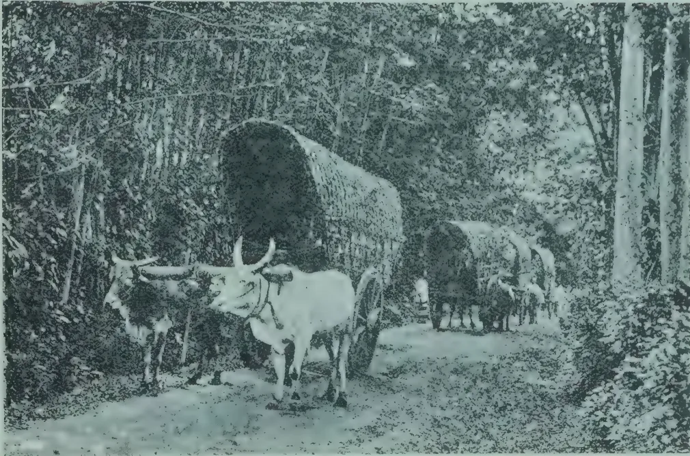A black and white photograph showing a traditional method of yoking cattle. Two oxen are harnessed together and pulling a large, covered cart along a dirt path. The cart is covered with a thick, woven material. In the background, another cart pulled by oxen is visible further down the path. The scene is set in a wooded area with dense foliage on either side of the path.

LOCAL METHOD.

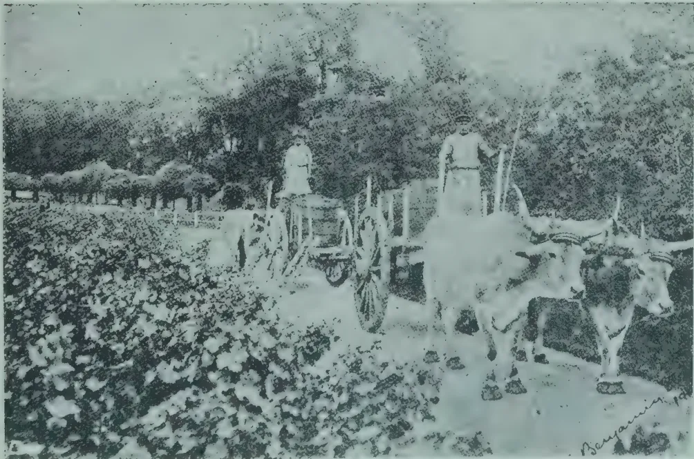A black and white photograph illustrating the French method of yoking cattle. Two oxen are harnessed together and pulling a cart. Two men are standing on the cart, one on each side, guiding the animals. The cart is loaded with a large pile of what appears to be harvested crops or hay. The background shows a field with some trees and a fence. The signature "Benjamin" is visible in the bottom right corner of the image.

FRENCH METHOD.

461------------------------------------------------

431[NOVEMBER, 1913.

## PLANTING INDUSTRIES OF CEYLON.

From the estate returns compiled for our Annual Handbook and Directory to be supplied from next week, we give to-day (October 4,) the main results:—

<table>
<tr>
<td>399,500</td>
<td>acres</td>
<td>under</td>
<td>Tea.</td>
</tr>
<tr>
<td>240,500</td>
<td>"</td>
<td>"</td>
<td>Rubber.</td>
</tr>
<tr>
<td>28,000</td>
<td>"</td>
<td>"</td>
<td>Cacao.</td>
</tr>
<tr>
<td>7,000</td>
<td>"</td>
<td>"</td>
<td>Cardamoms.</td>
</tr>
</table>

*Against.*

IN DECEMBER 1911.

<table>
<tr>
<td>395,000</td>
<td>acres</td>
<td>under</td>
<td>Tea.</td>
</tr>
<tr>
<td>215,000</td>
<td>"</td>
<td>"</td>
<td>Rubber.</td>
</tr>
<tr>
<td>32,000</td>
<td>"</td>
<td>"</td>
<td>Cacao.</td>
</tr>
<tr>
<td>7,300</td>
<td>"</td>
<td>"</td>
<td>Cardamoms.</td>
</tr>
</table>

Before entering on the consideration of the Statistics before us, an explanation is due as to the later date for the publication of our "HANDBOOK AND DIRECTORY." This delay last year was chiefly due to the alteration of the financial year by the Government, which had thrown out of gear several divisions of the volume referring to administrative and revenue departments, and increased the difficulty of compilation very considerably. This has been followed in the present issue by an unlooked-for increase in printing businesses in Colombo, and consequent competition for the services of a limited supply of trained compositors, eased, it is true—but not sufficiently to make the usual staff available—by the introduction of linotype type-setting machines. It is, however, hoped that next year the Directory may be issued at least two months earlier. The present edition is almost booked up before publication, and any fresh orders now received can only be attended to in rotation.

We turn now to the detailed table which embodies the figures representing the present position of CEYLON'S PLANTING ENTERPRISE in the staples given in our heading. The main results are that now, at mid-September of 1913, there are about 392,500 acres of TEA on the plantations entered in the Directory, and, with the allowance always made for small plots and native gardens, there must be a total in Ceylon of 399,500 acres of TEA or an increase of 4,500 acres since December, 1911. For RUBBER we have a total of 240,500 acres, making due allowance for what is intermixed with tea and cacao, and also allowance for small portions planted, but not reported in the plantation returns. The total shows an increase of 25,500 acres in 20 months. The detailed returns from all the districts indicate no less than 83,345 acres of "tea and rubber" and 19,565 acres of "cacao and rubber," intermixed. In both cases, we have divided equally for the two products; but, in 1910, in the case of "tea and rubber," only one-third was (in the Directory review) credited to rubber and two-thirds to tea. This was afterwards corrected; but it may be a question with some authorities, and in certain districts, whether this proportion can be always maintained; for, although the present high prices encourage full attention to every tea bush, it is also true that rubber, at current prices, and with reasonable cost of production, must be still the more valuable product of the two. In any case, the detailed figures compiled for each district will enable those most interested

462------------------------------------------------

NOVEMBER, 1913.]432

to enter into an independent analysis and arrive at their own conclusions, after the volume reaches their hands. Meantime, we consider that 240,500 acres of Rubber may be accepted as a fair approximation for Ceylon at the time. In his Speech to the Legislative Council in 1905, the Governor of the Colony quoted our figures for that year, as showing the wonderful advance of the new industry which had, at that time, expanded to 40,000 acres. But twelve months later, so keen had been the eagerness and activity to plant rubber, that our compilation in 1906, gave no less than 104,000 acres for all the districts; and now, seven years later, more than double this area has to be faced, and it seems as if we must be getting close to the possible maximum of Rubber Cultivation in Ceylon—at any rate with the Para (Hevea) variety. Yet, who can tell, looking at past experience? In 1872, for instance, when “coffee” was the staple (and the planter’s only product) 206,000 acres were supposed to be a full show for Ceylon plantations, and indeed the very maximum of coffee was reached with 275,000 acres in 1878. Who would have dreamed then, 35 years ago, that the new century, and almost its first decade, would show a grand total of 695,000 cultivated acres (in tea, rubber, cacao, cardamoms, &c.), spread over 1,862 plantations aggregating 1,033,854 acres in their full extent, requiring 2,038 Managers or Superintendents and Assistants and giving employment to about 550,000 Tamil coolies beside 150,000 or more Sinhalese, Moormen, Malays, &c., if all domestics, factorymen, watchers and carters resident in the planting districts are counted. An increase in the number of properties and of opened plantations as well as in total extent is a feature of the progress recorded in 1911-13; while there is an increase of 92 in the number of planters, between December, 1911, and September, 1913. This shows how proserperity in tea and rubber—and generally in the island—has led to a large influx of planting assistants and students, during the past twenty months especially.

If we hark back to the comparatively subsidiary products we find that 11,324 acres are planted with Cacao alone; but there are 19,565 acres covered with rubber and cacao, making 22,107 acres altogether for cacao on plantations which, with the usual allowance for native gardens and wayside plantings will raise the aggregate under the “chocolate” plant in the island to 28,000 acres. Then we have Cardamoms, planted to the extent of 7,000 acres (a decrease of 300 acres, and 367 of Camphor or 128 acres less than were returned at the end of 1911, showing that Camphor clearings have been abandoned or replanted with more favoured products, tea probably. Poor old COFFEE was steadily vanishing from our sight, but the 450 acres of the “Arabian” (or more properly speaking the “Abyssinian”) variety in December, 1911, have now become 665 and, curious enough, the “Liberian” has decreased from 179 to 92 acres; and there are 75 acres of new Coffee Robusta on Houpe Estate, Ratnapura. The CINCHONA returns have now dwindled to only 3 acres in Dikoya. No doubt there must be patches elsewhere; but it is regarded by planters as not worth while to record an unproductive product, and two years ago “Cinchona bark” was excluded from the Chamber of Commerce export statement. What a contrast to the two seasons (1885-6 and 1886-7 during which Ceylon shipped very close on 30 million lb. of cinchona bark and helped to bring the price of quinine from 16s. to 1s. 6d. an ounce! [1879-80, Howard’s quinine was quoted wholesale 12s. per oz., and in 1888-9, it was 1s. 6d.—after Ceylon in 6 years

463------------------------------------------------

433[NOVEMBER, 1913.]

had exported no less than 76 million lb. of bark! In 1898 Howard's quinine was priced 1s. 2d. A special boon was this reduction to India, Southern China, Africa and large parts of America where malaria and mosquitoes abound!] But now, to Cinchona in Ceylon, we have bidden farewell, a long farewell, to all *its* greatness.—CEYLON OBSERVER.

## A Well-Equipped Medical Outfit

When closed  
this case  
measures only  
8½ × 4½ × 5½ in.

**" Featherweight "**  
considering  
its  
completeness

TRADE MARK

# 'TABLOID' BRAND

## MEDICINE CASE No. 258

Contains pure and reliable  
medicaments in compact  
doses ready and easy to  
take.

No weighing  
No waste  
Climate-proof

*In Black Japanned Metal of all the principal  
Chemists and Stores*

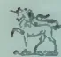

BURROUGHS WELLCOME & CO., LONDON

NEW YORK  
xx 823

MONTREAL  
SHANGHAI

SYDNEY  
BUENOS AIRES

CAPE TOWN  
BOMBAY

MILAN

*All Rights Reserved*

## MOTOR CULTIVATION.

Without any pretence at an exhaustive treatment of the subject, an attempt has been made in this article to review in a general manner the present state of motor cultivation in different parts of the world. One favourable opportunity for doing so is presented through the recent publication of a comprehensive account, by DR. FISCHER,\* of the position of this phase of agricultural engineering in Germany.

*Monthly Bulletin of Agricultural Intelligence and of Plant Diseases (June 1913.)*

464------------------------------------------------

NOVEMBER, 1913.]434

From the account given by this writer it would appear that after many years' laborious and expensive experiments, the difficulties surrounding the employment of oil engines for automatic ploughs\*\* were first satisfactorily overcome in 1910 by ROBERT STOCK.† The motor-plough invented by this engineer has survived the test of time, and there are now several hundred already in use on small German farms. As regards the work done, and the consumption of fuel by this machine, it may prove of interest to record the following results which were obtained during recent trials conducted by the Colonial Committee, Berlin: 'On a mild sandy loam the motor-plough worked nearly 1.73 acres in one hour to a depth of 6½ inches. The field was 700 yards long, and of a convenient shape. Another day, 1.48 acres per hour were ploughed to a depth of 8¾ inches. Lastly, in consequence of several stoppages due to the field not being sufficiently dry, only 0.99 acre was ploughed per hour to a depth of 7¼ inches. The consumption of benzine was, under the favourable conditions of the first day, only 12.3 lb. per acre, but on an average, in practice, it ranges from 14.3 to 19.6 lb. per acre. The Power developed, as registered by a break dynamometer, was 33.9 h.p.

The technical success of the machine just discussed gave stimulus to other inventors to create improvements, particularly as regards change of gear and reversing. The former operation is important in connexion with the cultivation of undulating land; reversing is still more essential, for if an irreversible machine happens to be brought up against a large stone or any other such obstacle, the mortifying and expensive procedure of invoking the aid of horses to shift it becomes absolutely necessary.

Several new machines of the Stock type eventually appeared on the German market, but very few have survived. In a recent publication‡ reference is made to a motor-plough of the Stock type, the wheels of which are equipped with shovel points (to prevent slipping) which can be thrown flat against the rim when travelling over hard road. This would appear to be a feature of some practical importance.

Of late, manufacturers seem to have turned their attention rather to the construction of disc motor-ploughs. Pöhl's patent motor-plough, for instance, carries in front of every ploughshare a revolving coulter for diminishing resistance. This feature makes Pöhl's plough resemble somewhat those machines which till the soil not by means of ploughshares, but by revolving hose. In such machines, the driver sits in front of the three-wheeled vehicle which, in the distance, is said not to be at all unlike an ordinary automobile.

As regards the efficiency of disc motor-ploughs, little data is available for pronouncing a final judgment. Experience shows they require more power to work them than ordinary motor-ploughs. On the other hand, their work is more intense, since the discs produce a fine tilth during a single operation. Another advantage which they offer is the fact that the discs work in the same direction as the driving wheels, and although they may not actually propel, they do not act as brakes, as ploughshares do. One disadvantage of the disc is that it is liable to cut up and distribute couch grass, and other perennial weeds.

\*\* *Agricultural News*, Vol. XI, p. 408

† Stock's plough is described on page 255. of the *Agricultural News*, West Indies

‡ *Experiment Station Record*, Vol. XXVII, No. 7, p. 685.

465------------------------------------------------

435[NOVEMBER, 1913]

In considering motor cultivation, the distinction between the self-contained implements just discussed and the American tractor machine must always be borne in mind. These tractors haul other implements besides ploughs. In the case of the ploughs, an advantage is gained under this system in that the shares are independent and yielding; also disc-ploughs can be substituted—a convenient matter when, for instance, ease of penetration and a sort of cutting effect is desired, as in turning under long pen manure or green dressings.

Tractors, at present, are employed in practice more extensively than the self-contained machine. In the Western United States they are fairly commonly used, and are likely to become still more general. P. S. ROSE\* has lately collected data from thirty-six agricultural colleges in the United States to show that a somewhat deeper ploughing is needed there to obtain the best crop yields. To double a 4 to 8 inch depth of ploughing, at least 50 per cent. more work animals would be required, and it is believed that this shows the economic necessity of mechanical power for deep cultivation.

Quite recently, in Louisiana, the employment of tractors on sugar estates has been advocated.† Figures have been given to show that, with a six-mule team and a four-mule team, ploughing costs \$8 and \$4 per acre, respectively; and since tractor engines will do from 10 to 20 acres a day as against one acre by animal power, it is argued that, provided the land surface is suitable and there is sufficient work to be done, implemental tillage ought to be very much more economical.

It is maintained that in Louisiana more might be obtained from the land if a three years' rotation were instituted, namely, two crops of cane and one of corn and peas. Under such a rotation every acre on the estate would have to be ploughed each year. To do this by mule labour would be prohibitive, but practicable with tractor power. The present position of the Louisiana sugar industry, although not referred to in the article in question, would seem to provide a further argument of an external economic nature in favour of the introduction of another staple crop into the cultivations of that State. It may be pointed out in passing, that the employment of tractor power necessitates the filling up of cross ditches—a matter of some moment in regard to Louisiana.

Not only from North, but also from South America have favourable statements emanated concerning tractor ploughs. A recent publication‡ describes a trial made some few months ago in Peru, with a large 60 h.p. tractor costing with all accessories £2,000. It ploughed, under favourable circumstances, 3.57 acres at a depth of 15 inches in sixty minutes, with a consumption of one tin§ of paraffin. In Hawaii, according to another journal¶ motor traction engines and motor-ploughs have been finding a place on some of the cane plantations. The one which has incurred most favour in Hawaii is the Caterpillar tractor. The opinion of one manager is that a 60 h.p. tractor will plough 8 acres a day to a depth of 6 inches at a cost of \$1.50 per acre. The machine will harrow 30 to 40 acres a day.

\* *Experiment Station Record*, Vol. XXVIII, No. 9, p. 892.

† *Louisiana Planter* (June 21, 1913).

‡ *Peru To-day* (May 1913).

§ Presumably 5 gallons.

¶ *Australian Sugar Journal* (May 8 1913).

466------------------------------------------------

NOVEMBER, 1913.]436

Perhaps the most thorough trials of tractors and motor-ploughs were those conducted under the auspices of the Royal Agricultural Society of England\* in 1910. In these trials, the best all-around efficiency was obtained from a 25 to 30 h.p. compound steam-tractor weighing 5 tons. The oil-engine machines were not so successful. It has to be remembered, however, that considerable improvements have been effected since the time of these experiments.

From the point of view of the investor, the most intimidating feature of motor cultivation is the question of depreciation. For tractors, it is estimated that at least 10 per cent. must be allowed for wear and tear. Motor-ploughs are still too recent to permit of their durability being definitely determined. DR. FISCHER states: "It is usual to calculate for interest, amortizement and repairs, 25 per cent. of the purchase price which amounts for Stock's and similar ploughs to about £830, for the large Ihace ploughs £1,130, and for the smaller ones £735." Such figures have to be reckoned with, even with competent drivers, because the machines have to work under unfavourable conditions, and the quick running engines (720 revolutions per minute, soon wear out. It must be remembered too, that, apart from wear and tear, the constant introduction of new types lowers at least the selling-price of the less up-to-date machines already in use.

As a fitting conclusion to this review, reference may be made briefly to the employment of motor cultivation in the West Indies. For some years, in British Guiana, Trinidad and in Antigua, steam power has been employed for ploughing purposes, but of late, oil locomotives have been introduced into Demerara in connexion with rice cultivation. The possibility of their employment in Antigua has been brought to the notice of planters,† but in that island haulage of implements by stationary engines seems best suited to the soil conditions obtaining in that Presidency.

In any consideration of the employment of motor cultivation, it must always be remembered that although efficient machines exist, both in the form of tractors and self-contained implements, their economic employment depends upon two outstanding factors: labour conditions and soil conditions. That circumstances may actually demand their introduction into some of these islands is made evident by the recent decision of the Government of St. Croix‡ to vote 30,000 francs for the purchase of a motor-plough with accessories, which will be at the service of planters. The Government has furthermore authorized the employment of an engineer, and the expenditure of a sum not exceeding 500 francs monthly, to defray the expenses connected with the working of the machine.

The figures in the following table have been derived from the references quoted. The table is intended to serve purposes of general comparison, and to give an idea as to what the motor-plough and tractor can do; but too much importance must not be attached to the figures individually.

\* *Journal of the Royal Agricultural Society of England*, Vol. 71, p. 179.

† *Agricultural News*, Vol. X, p. 159.

‡ *St. Croix Avis* (June 25, 1913).

467------------------------------------------------

437[NOVEMBER 1913.]

<table border="1">
<thead>
<tr>
<th>Trials</th>
<th>No. of acres Ploughed pr. day of 8 hrs.</th>
<th>Depth of ploughing in inches.</th>
<th>H. P.</th>
<th>Fuel per acre.</th>
</tr>
</thead>
<tbody>
<tr>
<td>Germany* (motor-plough)</td>
<td>14</td>
<td>6.5</td>
<td>33.9</td>
<td>13 lb.</td>
</tr>
<tr>
<td>England** (motor-plough)</td>
<td>1.5</td>
<td>6</td>
<td>4</td>
<td>2 gals.</td>
</tr>
<tr>
<td>Peru† (tractor)</td>
<td>28.5</td>
<td>15</td>
<td>60</td>
<td>1.4 ..</td>
</tr>
<tr>
<td>Hawaii† (tractor)</td>
<td>8</td>
<td>6</td>
<td>60</td>
<td>—</td>
</tr>
<tr>
<td>England* (tractor)</td>
<td>5</td>
<td>5</td>
<td>18</td>
<td>3.7 ..</td>
</tr>
<tr>
<td>Australia‡ (tractor)</td>
<td>23</td>
<td>3.5</td>
<td>30</td>
<td>1.5 ..</td>
</tr>
</tbody>
</table>

Price of machines (approx.): Germany (motor-plough), £850— Peru (tractor), £2,000; England (tractor), £275.—AGRICULTURAL NEWS.

THE EDITOR,

THE "TROPICAL AGRICULTURIST," PERADENIYA, CEYLON.

DEAR SIR.

I hope you will not think me too presumptuous if I call attention to some points in your July Journal that I take exception to. I should be glad of an equal criticism of matter in the Agricultural Journal of Jamaica of which I am the editor, if I err.

I notice in "Some Poultry Notes" on page 6, a list of breeds of fowls, quoted of course from an American source as follows:—

The American or general purpose breeds are, Plymouth Rocks, Wyandottes, Javas, Dominiques, Rhode Island Reds and Buckeyes.

The English breeds are, Dorkings, Orpingtons and Red Caps.

But why not Old English Games and Cornish India Games and Sussex. If you quote such a little-kept breed as Dominiques among the American breeds, why not include Scots Greys among the English breeds? You quote also among the American breeds, one that is almost unknown outside of one State—Buckeyes. Why not also add Hornets, Pheasant Fowls and so on, little known English breeds. But what about Golden and Silver Hamburgs, which in spite of the name is also an English breed?

On page 9 you have an article on "Feeding Chicks" and on page 11 one on "Fowl Ticks" credited to the Journal of the Board of Agriculture, England. Both are my original matter written in the Journal of the Jamaica Agricultural Society.

Yours faithfully,  
J. M. BARCLAY, *Secretary*.

Jamaica Agricultural Society,  
11, North Parade, Kingston, Jamaica,  
September 1st, 1913.

[We regret to have omitted MR. JOHN BARCLAY'S name as the author of the articles we took from the Journal of the Board of Agriculture.—EDITOR TROPICAL AGRICULTURIST.]

468------------------------------------------------

NOVEMBER, 1913.]

438

**MARKET RATES FOR TROPICAL PRODUCTS.**

(From Lewis & Peat's Latest Monthly Prices Current.)

<table border="1">
<thead>
<tr>
<th colspan="2">QUALITY.</th>
<th>Quotations.</th>
<th colspan="2">QUALITY.</th>
<th>QUOTATIONS.</th>
</tr>
</thead>
<tbody>
<tr>
<td colspan="2"><b>ALCOES, Socotrine cwt.</b></td>
<td>Fair to fine 45/6 a 55/</td>
<td colspan="2"><b>INDIARUBBER lb.</b></td>
<td>Common to good 9d a 1/2</td>
</tr>
<tr>
<td colspan="2">Zanzibar &amp; Hepatic "</td>
<td>Common to good 40/ a 65/</td>
<td colspan="2">Borneo "</td>
<td>Good to fine red 1/4 a 1/5</td>
</tr>
<tr>
<td colspan="2"><b>ARROWROOT (Natal) lb.</b></td>
<td>Fair to fine 6 3/4 a 7d</td>
<td colspan="2">Java "</td>
<td>Low white to prime red 9 d a 1/3</td>
</tr>
<tr>
<td colspan="2"><b>BEES' WAX cwt.</b></td>
<td></td>
<td colspan="2">Penang "</td>
<td>Fair to fine red ball 1/10 a 2/2</td>
</tr>
<tr>
<td colspan="2">Zanzibar Yellow "</td>
<td>Slightly drossy to fair £7 10/ a £7 15/</td>
<td colspan="2">Mozambique "</td>
<td>Sausage, fair to good 1/9 a 2/1</td>
</tr>
<tr>
<td colspan="2">East Indian, bleached "</td>
<td>Fair to good £8 10/ a £8 15/</td>
<td colspan="2">Nyassaland "</td>
<td>Fair to fine ball 1/9 a 2/1</td>
</tr>
<tr>
<td colspan="2">" unbleached "</td>
<td>Dark to good genuine £6 5/ a £6 17/6</td>
<td colspan="2">Madagascar "</td>
<td>Fr. to fine pinky &amp; white 1/6 a 1/9</td>
</tr>
<tr>
<td colspan="2">Madagascar "</td>
<td>Dark to good palish £7 10/ a £7 15/</td>
<td colspan="2"></td>
<td>Majunga &amp; blk coated 1/ a 1/3</td>
</tr>
<tr>
<td colspan="2"><b>CAMPHOR, Japan lb.</b></td>
<td>Refined 1/4 1/2 a 1/6</td>
<td colspan="2"><b>New Guinea "</b></td>
<td>Niggers, low to good 6d a 1/6</td>
</tr>
<tr>
<td colspan="2">China cwt.</td>
<td>Fair average quality 155/</td>
<td colspan="2">" "</td>
<td>Ordinary to fine ball 1/6 a 1/8</td>
</tr>
<tr>
<td colspan="2"><b>CARDAMOMS, Tuticorin per lb</b></td>
<td>Good to fine bold 5/8 a 6/</td>
<td colspan="2"><b>INDIGO, E.I. Bengal "</b></td>
<td>Shipping mid to gd. violet 3s a 3s 6d</td>
</tr>
<tr>
<td colspan="2">Malabar, Tellicherry "</td>
<td>Middling lean 4/9 a 5/3</td>
<td colspan="2">" "</td>
<td>Consuming mid. to gd. 2s 3d a 2s 10d</td>
</tr>
<tr>
<td colspan="2">Calicut "</td>
<td>Good to fine bold 5/8 a 6/</td>
<td colspan="2">" "</td>
<td>Ordinary to middling 2s a 2s 2d</td>
</tr>
<tr>
<td colspan="2">Mangalore "</td>
<td>Brownish 4/9 a 5/4</td>
<td colspan="2">" "</td>
<td>Mid. to good Kurpah 1s 10d a 2s 5d</td>
</tr>
<tr>
<td colspan="2">Ceylon, Mysore "</td>
<td>Med Brown to good bold 4/10 a 6/4</td>
<td colspan="2">" "</td>
<td>Low to ordinary 1s 6d a 1s 9d</td>
</tr>
<tr>
<td colspan="2">Malabar "</td>
<td>Small fair to fine plump 4/5 a 5/10</td>
<td colspan="2">" "</td>
<td>Mid. to fine Madras 1/9 a 2/1</td>
</tr>
<tr>
<td colspan="2">Seeds, E. I &amp; Ceylon "</td>
<td>Fair to good 3/4 a 4/6</td>
<td colspan="2"><b>MACE, Bombay &amp; Penang per lb.</b></td>
<td>Pale reddish to fine 2/4 a 2/6</td>
</tr>
<tr>
<td colspan="2">Ceylon "Long Wild" "</td>
<td>Fair to good 3/4 a 4/6</td>
<td colspan="2">Java "</td>
<td>Ordinary to fair 2/ a 2/2</td>
</tr>
<tr>
<td colspan="2"><b>CASTOR OIL, Calcutta "</b></td>
<td>Shelly to good 1/2 a 3/2</td>
<td colspan="2">Bombay "</td>
<td>Wild "good pale 2/1 a 2/4</td>
</tr>
<tr>
<td colspan="2"><b>CHILLIES, Zanzibar cwt.</b></td>
<td>Good 2nds 4 d</td>
<td colspan="2"><b>NUTMEGS,-- lb.</b></td>
<td></td>
</tr>
<tr>
<td colspan="2">Japan "</td>
<td>Dull to fine bright 37/6 a 45/</td>
<td colspan="2">Singapore &amp; Penang "</td>
<td>64's to 57 s 9 1/2 d a 10 1/2 d</td>
</tr>
<tr>
<td colspan="2"><b>CINCHONA BARK.--lb.</b></td>
<td>Fair bright small 28/ a 32/6</td>
<td colspan="2"></td>
<td>80's 7 1/2 d</td>
</tr>
<tr>
<td colspan="2">Ceylon "</td>
<td>Crown, Renewed 3 1/2 d a 7 d</td>
<td colspan="2"></td>
<td>110's 6 1/2 d</td>
</tr>
<tr>
<td colspan="2"></td>
<td>Red Org. Stem 2d a 6d</td>
<td colspan="2"></td>
<td>160's to 115's 6d</td>
</tr>
<tr>
<td colspan="2"></td>
<td>Org Stem 1 1/2 d a 4 1/2 d</td>
<td colspan="2"><b>NUTS, ARECA cwt.</b></td>
<td>Ordinary to fair fresh 17/6 a 20/</td>
</tr>
<tr>
<td colspan="2"></td>
<td>Renewed 3d a 5 1/2 d</td>
<td colspan="2">NUX VOMICA, Cochin "</td>
<td>Ordinary to good 9/6 a 12/</td>
</tr>
<tr>
<td colspan="2"></td>
<td>Root 1 1/2 d a 4 d</td>
<td colspan="2">per cwt. Bengal "</td>
<td>8/9</td>
</tr>
<tr>
<td colspan="2"><b>CINNAMON, Ceylon 1sts.</b></td>
<td>Good to fine quill 1/3 a 1/7</td>
<td colspan="2">Madras "</td>
<td>8/6 a 9/6</td>
</tr>
<tr>
<td colspan="2">per lb. 2nds. "</td>
<td>" " 1/2 a 1/6</td>
<td colspan="2"><b>OIL OF ANISEED lb.</b></td>
<td>Fair merchantable 6/7</td>
</tr>
<tr>
<td colspan="2">3rds. "</td>
<td>" " 1/1 a 1/5</td>
<td colspan="2">CASSIA "</td>
<td>According to analysis 3/ a 3/5</td>
</tr>
<tr>
<td colspan="2">4ths. "</td>
<td>" " 1/ a 1/3</td>
<td colspan="2">LEMONGRASS oz.</td>
<td>Good flavour &amp; colour 2 1/2 d</td>
</tr>
<tr>
<td colspan="2">Chips, &amp;c. "</td>
<td>Fair to fine bold 2d a 4d</td>
<td colspan="2">NUTMEG "</td>
<td>Dingy to white 1 1/2 d a 1 3/4 d</td>
</tr>
<tr>
<td colspan="2"><b>CLOVES, Penang lb.</b></td>
<td>Dull to fine bright pkd. 11d a 1/3</td>
<td colspan="2">CINNAMON "</td>
<td>Ordinary to fair sweet 3 1/2 d a 1s 5d</td>
</tr>
<tr>
<td colspan="2">Amboyna ... "</td>
<td>Dull to fine 10d a 10 1/2 d</td>
<td colspan="2">CITRONELLA lb.</td>
<td>Bright &amp; good flavour 1/9</td>
</tr>
<tr>
<td colspan="2">Zanzibar ... "</td>
<td>Fair and fine bright 7d a 8 1/2 d</td>
<td colspan="2"><b>ORCHELLA WEED--cwt</b></td>
<td></td>
</tr>
<tr>
<td colspan="2">Madagascar ... "</td>
<td>Fair 8d</td>
<td colspan="2">Ceylon "</td>
<td>Fair 10/ Nom.</td>
</tr>
<tr>
<td colspan="2">Stems ... "</td>
<td>Fair 3d</td>
<td colspan="2">Madagascar "</td>
<td>Fair 10/ "</td>
</tr>
<tr>
<td colspan="2"><b>COFFEE</b></td>
<td></td>
<td colspan="2">Zanzibar "</td>
<td>Fair 10/ "</td>
</tr>
<tr>
<td colspan="2">Ceylon Plantation cwt.</td>
<td>Medium to bold Nominal</td>
<td colspan="2"><b>PEPPER--(Black) lb.</b></td>
<td></td>
</tr>
<tr>
<td colspan="2">Native "</td>
<td>Good ordinary Nominal</td>
<td colspan="2">Alleppy &amp; Tellicherry "</td>
<td>Fair 5 1/2 d a 5 1/2 d</td>
</tr>
<tr>
<td colspan="2">Liberian "</td>
<td>Fair to bo'd 63/ a 80/</td>
<td colspan="2">Ceylon "</td>
<td>Fair to fine bold heavy 5 1/2 d a 5 1/2 d</td>
</tr>
<tr>
<td colspan="2"><b>COCOA, Ceylon Plant. "</b></td>
<td>Special Marks 86/ a 92/6</td>
<td colspan="2">Singapore ... "</td>
<td>Fair 5 1/2 d</td>
</tr>
<tr>
<td colspan="2">Native Estate "</td>
<td>Red to good 81/ a 85/</td>
<td colspan="2">Acheen &amp; W. C. Penang (White) Singapore "</td>
<td>Dull to fine 5d a 5 1/2 d</td>
</tr>
<tr>
<td colspan="2">Java and Celebes "</td>
<td>Ordinary to red 42/ a 78/6</td>
<td colspan="2">Stam "</td>
<td>Fair to fine 8 1/2 d a 9d</td>
</tr>
<tr>
<td colspan="2"><b>COLOMBO ROOT "</b></td>
<td>Small to good red 30s a 93s</td>
<td colspan="2">Penang "</td>
<td>Fair 8 1/2 d</td>
</tr>
<tr>
<td colspan="2"><b>CROTON SEEDS, sifted..</b></td>
<td>Middling to good 14/ a 21/</td>
<td colspan="2">Muntok "</td>
<td>Fair 7 1/2 d</td>
</tr>
<tr>
<td colspan="2"><b>CUBEBS "</b></td>
<td>Dull to fair 45/ a 50/</td>
<td colspan="2">Shenzi "</td>
<td>Fair 9 1/2 d</td>
</tr>
<tr>
<td colspan="2"><b>GINGER, Bengal, rough "</b></td>
<td>Ord. stalky to good 137/6 a 170</td>
<td colspan="2">Canton "</td>
<td>Ordinary to good 3/ a 4/</td>
</tr>
<tr>
<td colspan="2">Calicut, Cut A "</td>
<td>Fair 18/</td>
<td colspan="2">High Dried.. "</td>
<td>Ordinary to good 2/6 a 3/6</td>
</tr>
<tr>
<td colspan="2">B &amp; C "</td>
<td>Medium to fine bold 60/ a 75/</td>
<td colspan="2"></td>
<td>Fair to fine flat 1/ a 1/2</td>
</tr>
<tr>
<td colspan="2">Cochin, Rough "</td>
<td>Small and medium 36/ a 60/</td>
<td colspan="2"><b>SAGO, PEARL, large--cwt</b></td>
<td>Dark to fair round 9 d a 11 d</td>
</tr>
<tr>
<td colspan="2">Japan "</td>
<td>Common to fine bold 27/ a 30/</td>
<td colspan="2">medium ... "</td>
<td>Fair to fine 18/</td>
</tr>
<tr>
<td colspan="2"><b>GUM AMMONIACUM..</b></td>
<td>Small and D's 27/6</td>
<td colspan="2">small ... "</td>
<td>17/</td>
</tr>
<tr>
<td colspan="2">ANIMI, Zanzibar "</td>
<td>Unsplit 21/</td>
<td colspan="2">Flour ... "</td>
<td>13/ a 15/</td>
</tr>
<tr>
<td colspan="2">" "</td>
<td>Ord. Blocky to fair clean 40s a 72s 6d</td>
<td colspan="2">SEEDLAC cwt.</td>
<td>11/ a 12/</td>
</tr>
<tr>
<td colspan="2">" "</td>
<td>Pale and amber, ster. srts £12 10/ a £14 5/</td>
<td colspan="2">Ordinary to gd. soluble 65/ a 85/</td>
<td>5d a 8 1/2 d</td>
</tr>
<tr>
<td colspan="2">" "</td>
<td>" " little red £11 a £12</td>
<td colspan="2">Good to fine bold green 3 1/2 d a 4 1/2 d</td>
<td>1 1/2 d a 3d</td>
</tr>
<tr>
<td colspan="2">" "</td>
<td>Bean and Pea size ditto 70/ a £9</td>
<td colspan="2">Common specky &amp; small</td>
<td></td>
</tr>
<tr>
<td colspan="2">" "</td>
<td>Fair to good red sorts £7 a £10</td>
<td colspan="2"><b>SHELLS, M. o' PEARL--</b></td>
<td></td>
</tr>
<tr>
<td colspan="2">" "</td>
<td>Med. and bold glassy sorts £5 a £7 10</td>
<td colspan="2">Egyptian cwt.</td>
<td>Small to bold 90/ a £9 2/6</td>
</tr>
<tr>
<td colspan="2">Madagascar "</td>
<td>Fair to good palish £4 a £8</td>
<td colspan="2">Bombay "</td>
<td>80/ a £9 7/6</td>
</tr>
<tr>
<td colspan="2">" "</td>
<td>" red £4 a £7</td>
<td colspan="2">Mergui "</td>
<td>Chicken to bold 10 17/6 a 14 2/6</td>
</tr>
<tr>
<td colspan="2"><b>ARABIC, E. I. &amp; Aden "</b></td>
<td>Ordinary to good pale 28/ a 32/ nom</td>
<td colspan="2">Manilla "</td>
<td>Fair to good £9 a £14 17/6</td>
</tr>
<tr>
<td colspan="2">Turkey sorts "</td>
<td>32/6 a 55/</td>
<td colspan="2">Banda "</td>
<td>Sorts 75/ a 92/6</td>
</tr>
<tr>
<td colspan="2">Ghatti "</td>
<td>Sorts to fine pale 18/6 a 32/6 nom</td>
<td colspan="2">Green Snail.. "</td>
<td>Small to large 60/ a 100/</td>
</tr>
<tr>
<td colspan="2">Kurrachee "</td>
<td>Reddish to good pale 25 a 30s nom</td>
<td colspan="2">Japan Ear "</td>
<td>Trimmed selected small to bold 72/6 a £9 5/</td>
</tr>
<tr>
<td colspan="2">Madras "</td>
<td>Dark to fine pale 22/6 a 29/6 nom</td>
<td colspan="2"></td>
<td>13/</td>
</tr>
<tr>
<td colspan="2"><b>ASSAFETIDA "</b></td>
<td>Clean fr. to gd. almonds £7 a £8</td>
<td colspan="2"><b>TAMARINDS, Calcutta...</b></td>
<td>6/ a 10/</td>
</tr>
<tr>
<td colspan="2">" "</td>
<td>com. stony to good block 40s a £5 1 2/6</td>
<td colspan="2">per cwt. Madras "</td>
<td></td>
</tr>
<tr>
<td colspan="2">lb. "</td>
<td>Fair to fine bright 6d a 1/5</td>
<td colspan="2"><b>TORTOISESHELL--</b></td>
<td></td>
</tr>
<tr>
<td colspan="2"><b>MYRRH, Aden sorts cwt.</b></td>
<td>Middling to good 55/ a 65/</td>
<td colspan="2">Zanzibar, &amp; Bombay lb.</td>
<td>Small to bold 11/ a 31/</td>
</tr>
<tr>
<td colspan="2">Somali "</td>
<td>" " 45s a 50s</td>
<td colspan="2"></td>
<td>Pickings 12/ a 22/</td>
</tr>
<tr>
<td colspan="2"><b>OLIBANUM, drop "</b></td>
<td>Good to fine white 45s a 50s</td>
<td colspan="2"><b>TURMERIC, Bengal cwt.</b></td>
<td>Fair 15/ nom</td>
</tr>
<tr>
<td colspan="2">" "</td>
<td>Middling to fair 35s a 40s</td>
<td colspan="2">Madras "</td>
<td>Finger fair to fine bold 16/ a 17/6</td>
</tr>
<tr>
<td colspan="2">pickings "</td>
<td>Low to good pale 15/ a 27/6</td>
<td colspan="2">Do. "</td>
<td>Bulbs " [ bright 13/ a 14/</td>
</tr>
<tr>
<td colspan="2">sifttings "</td>
<td>Slightly foul to fine 20s a 22s 6d</td>
<td colspan="2">Cochin "</td>
<td>Finger fair 14/ a 15/ nom.</td>
</tr>
<tr>
<td colspan="2"><b>INDIA RUBBER lb.</b></td>
<td>Fine Para bis. &amp; sheets 2/5 1/2 a 2/2</td>
<td colspan="2"></td>
<td>Bulbs " 12/ a 13/</td>
</tr>
<tr>
<td colspan="2">Ceylon, Straits, "</td>
<td>" Ceara 2/2</td>
<td colspan="2"><b>VANILLOES-- lb.</b></td>
<td></td>
</tr>
<tr>
<td colspan="2">Malay Straits, etc. "</td>
<td>Crepe ordinary to fine 2/2</td>
<td colspan="2">Mauritius ... 1sts.</td>
<td>1d. crystallized 3 1/2 a 8 1/2 a in. 11/6 a 16/</td>
</tr>
<tr>
<td colspan="2">" "</td>
<td>Fine Block 1/5 a 1/7</td>
<td colspan="2">Madagascar ... 2nds.</td>
<td>Foxy &amp; reddish 3 1/2 a " 11/ a 12/6</td>
</tr>
<tr>
<td colspan="2">" "</td>
<td>Scrap fair to fine 1/7 a 1/9</td>
<td colspan="2">Seychelles ... 3rds.</td>
<td>Lean and inferior 11/ a 11/6</td>
</tr>
<tr>
<td colspan="2">Assam "</td>
<td>Plantation 1/10</td>
<td colspan="2"></td>
<td>Fine, pure, bright 2/9</td>
</tr>
<tr>
<td colspan="2">" "</td>
<td>Fair 11 to ord. red No. 1. 1/3 a 1/6</td>
<td colspan="2"><b>VERMILLION ...</b></td>
<td>Good white hard 45/</td>
</tr>
<tr>
<td colspan="2">Rangoon "</td>
<td>" " 1/2 a 1/4</td>
<td colspan="2">WAX, Japan, squares</td>
<td></td>
</tr>
</tbody>
</table>

469------------------------------------------------

THE CHEAPEST AND BEST NITROGENOUS FERTILIZER

# NITROLIM

NITROGEN - 18% guaranteed  
FREE LIME - 25% (about)

A compound fertilizer containing an equal percentage of nitrogen, from **NITROLIM** can be prepared at a lower cost per ton than another where the nitrogen is derived from Nitrate of Soda, Nitrate of Lime or Sulphate of Ammonia.

All Information in regard to manuring and  
Pamphlets from LOCAL AGENTS or from

**NITROGEN FERTILISERS  
- - LIMITED, - -**

Winchester House, Old Broad Street,  
LONDON, E. C.

## Ceylon Agricultural Society.

### Memorandum by the Secretary.

Members are particularly requested to NOTIFY CHANGE OF ADDRESS, and also forward necessary instructions when leaving the Island, temporarily or permanently. Members who fail to NOTIFY THEIR INTENTION TO RESIGN from the Society will be held liable for subscription till such notification is received.

ENROLMENT of new members can take place at any time; but, the subscription being annual, no reduction on the rate can be made. Members joining later than January will be entitled to receive back copies of the "T. A." and other publications.

Full sets of "The Tropical Agriculturist" for 1906, 1907, 1908, 1909, 1910, 1911 & 1912, can be supplied to members on application.

Those wishing to join the Society can do so by filling up and forwarding appended form with a year's subscription—( Rs. 8 local; Rs. 15 foreign to ).

THE SECRETARY, CEYLON AGRICULTURAL SOCIETY.

*Peradeniya.*

CEYLON AGRICULTURAL SOCIETY.

Name.

Address.

Remittance of Sub-  
scription in respect  
of year.

From 1st. Jan. 19

470------------------------------------------------

This image is a scan of a blank page. The background is a uniform light beige or off-white color. There are several small, dark specks scattered across the surface, which appear to be dust or scanning artifacts. No text, lines, or other graphical elements are present.

471------------------------------------------------

*Photo. by H. F. Macmillan.*

Wickham Smoke Cure Apparatus at work at Henaratgoda. The drum is revolved by means of a handle operated by a man standing behind.

472------------------------------------------------

THE  
**TROPICAL AGRICULTURIST:**  
JOURNAL OF THE  
**CEYLON AGRICULTURAL SOCIETY.**

---

VOL. XLI.

COLOMBO, DECEMBER, 1913.

**No. 6.**

**PLANTATION HARD CURE.**

---

*Peradeniya, December 15, 1913.*

Some years ago MR. WICKHAM wrote to Ceylon offering to come out and demonstrate how up-river hard cure rubber was prepared. The authorities in Ceylon replied that they did not think they had anything to learn from the crude methods practised by the natives of the Amazon and further that they had discovered a much better process of coagulation, viz., by acids. It is to be observed that MR. WICKHAM did not propose a new method of his own but to apply that of the Amazon curers. For two decades he continued to urge the advantages of this method and, in July 1912, he had the satisfaction of seeing a piece of rubber prepared at Peradeniya by a machine he had invented for the mechanical application of the Amazon method. This method consists of directing a hot blast of smoke on to the crude latex; the apparatus being constructed and worked in such a way that the latex is introduced in thin layers, each layer being coagulated before the succeeding one is superimposed. Other necessary factors for the success of the method as mechanically applied are that the current of smoke should be constant in volume and that it should be confined and under control so that it may not pervade the building to the injury of the eyes of the operators.

MR. WICKHAM introduced one innovation. After the rubber had been cured in his apparatus he folded it up and put it into a press leaving it under high pressure for 24 hours or so until it was consolidated into a block.

The announcement that the blocks which MR. WICKHAM took home with him in April of this year had attracted the attention of dealers, merchants and manufacturers in London, has stimulated interest in the preparation of rubber and encouraged planters to devise new methods of preparing rubber by smoke. We do not feel sure that this latter result is

473------------------------------------------------

440[DECEMBER, 1913.]

altogether a happy one. Perhaps the last thing the industry requires at the present time is the introduction of a diversity of methods, and the success so far of the Wickham process should we think have had the effect of concentrating on the endeavour to adapt the Amazon method to plantation requirements. The solution of this question is a matter for engineers and it is satisfactory to record that Colombo engineers are applying themselves to it. One condition necessary for success is thoroughly to grasp the essentials of the Amazon method. Unless that is done, we do not see how that method can be successfully imitated. Another point is that the apparatus, whatever it is, must be capable of dealing with large quantities of latex daily and to be easily operated. It may be that the cured rubber may be rolled up under tension, instead of being blocked in a press, and if so this will simplify the process considerably. It is possible too that instead of being either pressed or rolled it will be taken from the curing apparatus and creped into blanket. At the same time it is necessary to point out that the favourable reports received were for blocks.

There is no suggestion that new methods of preparing rubber should not be investigated or that research work should in any way be discouraged or that the preparation of pale crepe for which there will always be a market, should be abandoned. Methods very much better than any now known may come to be discovered. But the prospect of that should not be allowed to obscure the fact that at present the market as reflected by the price of Para seems to favour, not new methods, but an old one.

It should be recorded in connection with this question that experiments were made at the Government Experiment Station in 1906 on the blocking of wet rubber after the addition of creosote dissolved in spirit, the object being more nearly to approach the conditions of manufacture of Hard Para, by preventing the putrefaction of the proteids, and allowing the rubber to be shipped with sufficient moisture to permit of full maturing without decomposition. The experiments were successful and further samples made on similar lines at Culloden and on a larger scale were shown at the London Rubber Exhibitions in 1908 and 1911 receiving the general approval of both British and Continental Manufacturers.

Samples of rubber at Peradeniya cured some months ago by the Wickham machine are difficult to distinguish from a sample of Amazon hard Para lying on the table alongside them. The grading of plantation so far as it depended upon colour would no longer be necessary for hard cure, as it turns brown and eventually black on the outside, remaining white inside. This takes us some way towards standardization.

R. N. L.

474------------------------------------------------

DECEMBER, 1913.]441

## RINDERPEST AND SURRA.

---

A description of the work of the Imperial Bacteriological Laboratory, Muktesar, by MAJOR HOLMES, the Imperial Bacteriologist, has been received from the Superintendent of Government Printing, Calcutta.

The contents of the publication, which is accompanied by a number of illustrations, consist of (1) a history of the laboratory, (2) a description of the site and buildings, (3) research work and publications, (4) the practical application of serums and vaccines, (5) the products of the laboratory.

The research work has so far dealt with Surra, Rinderpest, Epizootica, Lymphangitis and Dourine; while anti-serums were prepared against Rinderpest, Haemorrhagic Septicæmia and Anthrax, and a double vaccine for Black quarter.

The use of serum in rinderpest has proved of great value in protecting cattle and controlling the spread of infection. Immunity lasts for only two or three weeks, but it has been found that animals exposed to infection after injection within the protective period, contract a mild attack which gives immunity of long duration. Immunised animals cannot act as media for the existence and transmission of the disease, and so by increasing the number of immune cattle the use of serum would tend to ultimately eradicate disease.

In Haemorrhagic septicæmia serum is useful in protecting animals exposed to infection while the disease prevails and until definite action could be taken in carrying out disinfection and detecting the source of infection.

As regards Surra it is announced that a successful cure of the disease in horses by means of Arsenic and Atoxyl has been worked out, and full instructions are given for treatment.

It will thus be seen that the laboratory is engaged in a most useful work, the results of which should prove of great value to this colony as well as to India.

C. D.

---

## CABINET TIMBERS OF AUSTRALIA.

---

This is the title of an elaborately illustrated manual issued from the Technological Museum, Sydney, by MR. R. T. BAKER, Curator and Economic Botanist. The work contains an exhaustive description of each timber tree, its botany, geographical range and utility; while the illustrations show sections of the timber in their natural colours and also reproduce photographs to illustrate how it is employed.

Foremost among the cabinet woods is placed the "Red Cedar" (*Cedrela Toona*), which the author refers to thus: "Taken all in all, it is considered the best all round timber in Australia." Our readers will recognise in this the familiar Toon Tree of upcountry estates for which, together with the Grevillea, Eucalyptus and Acacia (wattle) we are indebted to Australia.

475------------------------------------------------

442[DECEMBER, 1913.

The following are given as the finest woods which belong to the first class of cabinet timbers:—Blackwood (*Acacia melanoxylon*), Maple of Queensland (*Flindersia chattaiana*), Maple of New South Wales (*Villaea Moorei*), Silky Oak (*Grevillea robusta*), Walnut (*Cryptocarya Palmerstoni*), Red Bean (*Dysixylon Muelleri*) and Jarrah (*Eucalyptus marginata*); but of course there are many others almost equally as good.

It is somewhat of a surprise to find what is called the White or Golden Cedar (*Melia Azedarach*) referred to as a cabinet timber. This is our Persian Lilac or Indian Bed Tree, common in Colombo gardens and bearing flowers which resemble the Heliotrope both in colours and odour. With us the tree only serves an ornamental purpose and attains to no size.

After looking through this volume of original design, one cannot but wish that a similar work showing colour illustrations of our Tropical Timbers, many of which are very beautifully grained and marked, may be compiled to illustrate the natural resources of the Colony in this respect.

C. D.

## THE CULTIVATION OF VANILLA.

P. ADVISE-DESROISSEAU

In growing vanilla, it is important to gather the fruits in their optimum state of ripeness, as otherwise the prepared product has a lower market value.

The writer sums up the characters of vanilla ready for preparing:

- (1) whole surface dull;
- (2) both lateral lines yellow;
- (3) the lines below the epidermis yellow or yellowish green, giving the whole fruit a slightly yellow tinge of green.

In these conditions: (1) the vanilla is sufficiently ripe; (2) it can hang some time, which allows the pickings to be spaced out, so economizing labour, the "yellow tip" criterion is not a guarantee of ripeness, and entails more frequent pickings.

The planter should attempt to obtain a product as heavy as is compatible with quality; the writer has therefore investigated the influence of cultural methods on the density of the pods. He finds that fruits ripened in the shade are denser than those ripened in the sun; the loss of sun-ripened pods is 4 per cent.

To obtain heavy pods, if the supporting trees will not keep their leaves till after the fruit is picked they should be headed back two or three months after they come into leaf; the physic-nut (*Jatropha curcas*) is useful as a support.

In very moist countries, vanilla ripened in the sun is found to be richer in perfume than that ripened in the shade. In this case the planter must decide what pays him best.—MONTHLY BULLETIN.

476------------------------------------------------

DECEMBER, 1913.]443

# RUBBER.

---

## THE SLOPE OF THE TAPPING CUT.

In a recent bulletin on Hevea tapping, DR. A. W. K. DE JONG has, among other things, dealt with a point which is often overlooked. It is that the amount of bark removed per annum, or the number of cuts to the inch, depends upon the angle which the tapping cut makes with the vertical channel.

Suppose, for example, that the tapper is using a knife which can be adjusted so as to remove a definite breadth of cortex at each cut, and that it is desired to put on twenty cuts to the inch. The first impulse would doubtless be to adjust the knife so that it should cut off a strip one-twentieth of an inch wide. But that would not give twenty cuts to the inch reckoned vertically. The thickness of the strip removed is measured perpendicularly to the tapping cut, and hence twenty cuts to the inch, with the knife adjusted as stated, would remove one inch perpendicular to the cut. What that amounts to, reckoned vertically, depends on the angle of the cut. Only if the cut were horizontal would the removal of strips, each one-twentieth of an inch wide, give twenty cuts to the inch reckoned along the vertical channel.

Now, in marking out the trees, the distances are measured along the vertical channel. Therefore, if any one calculates that by removing a strip one-twentieth of an inch broad per tapping, and placing the cuts 1 foot apart along the channel, he will be able to tap for 240 days, he will find himself sorely disappointed. It is readily seen that the parallel-sided strip removed in tapping is cut obliquely by the vertical channel, and hence the length which is removed vertically is always greater than the thickness of the strip. If the angle of the tapping cut were  $30^\circ$ , then twenty cuts to the inch, removing a strip one-twentieth of an inch thick each time, would remove two inches reckoned vertically.

That this point is frequently overlooked is evident from a recent compilation which includes elaborate tables giving the amount of bark removed per annum in daily or alternate day tapping, for strips of given thickness, regardless of the fact that in actual practice the thickness of the strip is measured perpendicular to the cut, while the amount of cortex removed is measured along the vertical channel.

This fact was recognised in "Bowman and Northway's marker" which consisted of a tin isosceles right-angled triangle, with its hypotenuse 2 feet in length and each of the other sides 17 inches. Distances of 17 inches, measured along the vertical channel, give cuts one foot apart measured perpendicular to the cut, if the angle is  $45^\circ$ .

DR. DE JONG has carried out an experiment which shows completely the relation between the amount of bark removed and the angle of the cut. Three groups, of ten trees each, were tapped by the same tapper for the same

477------------------------------------------------

444[DECEMBER, 1913.

period. In the first group the tapping angle was 36°, in the second, 42°, and in the third, 56°. The vertical strips of cortex removed in the same number of tappings measured 302, 288 and 270 centimetres respectively. These are in the ratios of 1:0.95:0.89, while the ratios which should theoretically have been obtained are 1:0.9:0.7. In general terms, the steeper the cut, the greater the amount of cortex removed, reckoned vertically.

It may be suggested that this fact may account for the differences of opinion regarding the number of cuts it is possible to make to the inch. Some authorities state that twenty-four should be obtained, while others regard eighteen as good. The difference might be accounted for, if it were the practice to reckon the cuts across the tapping surface in the one country, and along the vertical channel in the other. For, with an angle of 45°, twenty-four cuts to the inch reckoned perpendicularly to the cut, is seventeen cuts to the inch reckoned along the vertical channel.

T. PETCH.

## THE RUBBER POSITION.

A well-known firm of rubber share-brokers has compiled the following statistics forecasting the production and consumption of rubber till the year 1921. They seem drawn on reasonable lines. Production is taken at 106 lb. per acre for 4-year trees, rising to 400 lb. for ten years' growth.

### PLANTATION PLANTED ACREAGE.

<table>
<thead>
<tr>
<th></th>
<th>1908.</th>
<th>1909.</th>
<th>1910.</th>
<th>1911.</th>
<th>1912.</th>
<th>1913.</th>
</tr>
</thead>
<tbody>
<tr>
<td>Malaya</td>
<td>241,000</td>
<td>292,000</td>
<td>362,000</td>
<td>542,000</td>
<td>622,000</td>
<td>—</td>
</tr>
<tr>
<td>Ceylon</td>
<td>180,000</td>
<td>187,000</td>
<td>200,000</td>
<td>210, 00</td>
<td>220,000</td>
<td>—</td>
</tr>
<tr>
<td>Netherlands India</td>
<td>90,000</td>
<td>120,000</td>
<td>185,000</td>
<td>200,000</td>
<td>230,000</td>
<td>—</td>
</tr>
<tr>
<td>India and Burmah</td>
<td>30,000</td>
<td>31,000</td>
<td>30,000</td>
<td>40,000</td>
<td>40,000</td>
<td>—</td>
</tr>
<tr>
<td>Borneo</td>
<td>10,000</td>
<td>10,000</td>
<td>12,000</td>
<td>20,000</td>
<td>20,000</td>
<td>—</td>
</tr>
<tr>
<td>Acres</td>
<td>551,000</td>
<td>640,000</td>
<td>789,000</td>
<td>1,012,000</td>
<td>1,132,000</td>
<td>1,245,200 (estimated).</td>
</tr>
</tbody>
</table>

### PRODUCTION AND CONSUMPTION—1. ACTUAL.

#### WORLD'S PRODUCTION IN TONS.

<table>
<thead>
<tr>
<th></th>
<th>Plantation.</th>
<th>Brazil.</th>
<th>Rest.</th>
<th>Total.</th>
<th>Tons.</th>
</tr>
</thead>
<tbody>
<tr>
<td>1905</td>
<td>... 145</td>
<td>34,000</td>
<td>26,800</td>
<td>61,000</td>
<td>61,000</td>
</tr>
<tr>
<td>1906</td>
<td>... 510</td>
<td>36,000</td>
<td>29,500</td>
<td>66,000</td>
<td>66,000</td>
</tr>
<tr>
<td>1907</td>
<td>... 1,000</td>
<td>38,000</td>
<td>30,000</td>
<td>69,000</td>
<td>69,000</td>
</tr>
<tr>
<td>1908</td>
<td>... 1,800</td>
<td>39,000</td>
<td>24,200</td>
<td>65,000</td>
<td>65,000</td>
</tr>
<tr>
<td>1909</td>
<td>... 3,600</td>
<td>42,000</td>
<td>23,400</td>
<td>69,000</td>
<td>68,500</td>
</tr>
<tr>
<td>1910</td>
<td>... 8,200</td>
<td>40,500</td>
<td>21,300</td>
<td>70,000</td>
<td>66,000</td>
</tr>
<tr>
<td>1911</td>
<td>... 14,100</td>
<td>39,500</td>
<td>22,400</td>
<td>76,000</td>
<td>73,000</td>
</tr>
<tr>
<td>1912</td>
<td>... 28,500</td>
<td>40,500</td>
<td>30,000</td>
<td>99,000</td>
<td>98,000</td>
</tr>
</tbody>
</table>

478------------------------------------------------

DECEMBER, 1913.]4452. ESTIMATED.

<table border="1">
<thead>
<tr>
<th></th>
<th>Plantation.</th>
<th>Brazil.</th>
<th>Rest.</th>
<th>Total.</th>
<th>Tons.</th>
</tr>
</thead>
<tbody>
<tr>
<td>1913</td>
<td>42,000</td>
<td>41,000</td>
<td>32,000</td>
<td>115,000</td>
<td>112,000</td>
</tr>
<tr>
<td>1914</td>
<td>64,000</td>
<td>40,000</td>
<td>20,000</td>
<td>124,000</td>
<td>126,000</td>
</tr>
<tr>
<td>1915</td>
<td>94,000</td>
<td>38,000</td>
<td>10,000</td>
<td>142,000</td>
<td>142,000</td>
</tr>
<tr>
<td>1916</td>
<td>121,000</td>
<td>35,000</td>
<td>5,000</td>
<td>161,000</td>
<td>159,000</td>
</tr>
<tr>
<td>1917</td>
<td>147,000</td>
<td>32,000</td>
<td>2,500</td>
<td>181,500</td>
<td>179,000</td>
</tr>
<tr>
<td>1918</td>
<td>166,000</td>
<td>30,000</td>
<td>nil</td>
<td>196,000</td>
<td>197,000</td>
</tr>
<tr>
<td>1919</td>
<td>183,000</td>
<td>30,000</td>
<td>"</td>
<td>213,000</td>
<td>216,700</td>
</tr>
<tr>
<td>1920</td>
<td>198,000</td>
<td>30,000</td>
<td>"</td>
<td>228,000</td>
<td>238,370</td>
</tr>
<tr>
<td>1921</td>
<td>209,000</td>
<td>30,000</td>
<td>"</td>
<td>239,000</td>
<td>262,200</td>
</tr>
</tbody>
</table>

## THE EFFECT OF MANURING ON THE GROWTH OF HEVEA.

The following account of experiments instituted in Java to determine the effect of manuring on the girth increment of Hevea has been published by DR. A. W. DE JONG (Meded. van het Agricultuur-Chemisch Laboratorium, No. 4).

336 untapped trees, five years old, were experimented with. These were divided into groups of four, and adjacent groups were manured in different ways. In that way groups manured in the same way were distributed over the whole plantation, so that differences in the soil were to some extent counterbalanced, though that arrangement was perhaps necessitated by the fact that different parts of the field were planted at different distances.

The field was divided up by trenches, a foot and a half in depth and a foot broad, so that each tree stood in an isolated square. The trees were manured in circles at a distance of one metre from the stem. DR. DE JONG points out that a better arrangement would be to manure rows of trees which are separated from another by unmanured rows.

The following manures were applied per tree in the different experiments:

<table border="0">
<tbody>
<tr>
<td>Experiment 1.</td>
<td>Double superphosphate 30 gr.</td>
</tr>
<tr>
<td>" 2.</td>
<td>Double superphosphate 30 gr. + Potassium Chloride 10 gr.</td>
</tr>
<tr>
<td>" 3.</td>
<td>Double superphosphate 30 gr. + Ammonium Sulphate 10 gr.</td>
</tr>
<tr>
<td>" 4.</td>
<td>Double superphosphate 30 gr. + Potassium Chloride by Ammonium sulphate 10 gr.</td>
</tr>
<tr>
<td>" 5.</td>
<td>Potassium Chloride 10 gr.</td>
</tr>
<tr>
<td>" 6.</td>
<td>Potassium Chloride 10 gr. + Ammonium sulphate 10 gr.</td>
</tr>
<tr>
<td>" 7.</td>
<td>Ammonium sulphate 10 gr.</td>
</tr>
<tr>
<td>Control 8.</td>
<td>Unmanured</td>
</tr>
</tbody>
</table>

Counting the control, the series of experiments required eight plots, and as the total number of trees was 336, each manure was applied to 42 trees which were distributed over the field in  $10\frac{1}{2}$  groups of four.

479------------------------------------------------

446[DECEMBER, 1913.

The manures were applied in April 1911 and again in July 1911, the trees being measured in November. In November 1911, the trees were again manured, the quantities applied being this time doubled, and this application was made again in January 1912. Measurements were taken in April 1912.

In May 1912, the trees were again manured, the quantities being increased to 50 grams double superphosphate, 50 grams Potassium Chloride and 100 grams Sulphate of Ammonia in each case, and this dose was repeated in August. Measurements were taken in November 1912.

The *total* extra increase in girth (in centimetres) as compared with the control plots, *for each 42 trees*, at intervals of 6 months, is given in the following table. The figures are exclusive, and should be added together to obtain the total extra increase for the eighteen months, and it should be remembered (a) that the quantities were altered between the dates of measurement, and (b) that the six month periods are not comparable because one (or two) of them includes the "wintering" period, when the trees are not increasing in girth.

<table>
<thead>
<tr>
<th></th>
<th></th>
<th>Nov. 1911.</th>
<th>April. 1912.</th>
<th>Nov. 1912.</th>
</tr>
</thead>
<tbody>
<tr>
<td>1.</td>
<td>Double Superphosphate</td>
<td>6</td>
<td>15</td>
<td>24</td>
</tr>
<tr>
<td>2.</td>
<td>" "</td>
<td>+ Potassium Chloride</td>
<td>4</td>
<td>7</td>
</tr>
<tr>
<td>3.</td>
<td>" "</td>
<td>+ Ammonium Sulphate</td>
<td>6</td>
<td>11.5</td>
</tr>
<tr>
<td>4.</td>
<td>" "</td>
<td>+ Potass. Chlor. + Amm. Sulph.</td>
<td>17</td>
<td>39</td>
</tr>
<tr>
<td>5.</td>
<td>Potassium Chloride</td>
<td>11.5</td>
<td>13.5</td>
<td>26.5</td>
</tr>
<tr>
<td>6.</td>
<td>" "</td>
<td>+ Ammonium Sulphate</td>
<td>13.5</td>
<td>24.5</td>
</tr>
<tr>
<td>7.</td>
<td>Ammonium Sulphate</td>
<td>12.5</td>
<td>38.5</td>
<td>47</td>
</tr>
</tbody>
</table>

The Complete manure (Expt. 4) gave the best result, while the effect of Ammonium Sulphate is only slightly less. Phosphoric acid with nitrogen (Expt. 3) gave a smaller increase than nitrogen alone (Expt. 6).

T. PETCH.

## HEVEA RUBBER FROM CEYLON.

In previous numbers of the IMPERIAL INSTITUTE BULLETIN (1911, 9, 300, 406; 1912, 10, 496) reference has been made to tapping experiments carried out in Ceylon with the object of ascertaining the most suitable interval between successive tappings. Seven samples of the rubber obtained in the course of these experiments were received at the Imperial Institute for examination. Each sample consisted of a number of biscuits and represented the rubber prepared from a row of trees tapped at intervals of one, two, three, up to seven days respectively.

The samples exhibited good physical properties on the whole, but a few of the biscuits were rather weak. The results of the chemical analyses are shown in the following table:—

480------------------------------------------------

DECEMBER, 1913.]447

**PERCENTAGE COMPOSITION OF DRY WASHED RUBBER.**

<table border="1">
<thead>
<tr>
<th></th>
<th>Caoutchouc.</th>
<th>Resin.</th>
<th>Protein.</th>
<th>Ash.</th>
</tr>
</thead>
<tbody>
<tr>
<td>No. 1</td>
<td>95.7</td>
<td>1.7</td>
<td>2.3</td>
<td>0.3</td>
</tr>
<tr>
<td>No. 2</td>
<td>95.4</td>
<td>2.5</td>
<td>1.9</td>
<td>0.2</td>
</tr>
<tr>
<td>No. 3</td>
<td>96.1</td>
<td>1.7</td>
<td>2.0</td>
<td>0.2</td>
</tr>
<tr>
<td>No. 4</td>
<td>96.3</td>
<td>1.8</td>
<td>1.7</td>
<td>0.2</td>
</tr>
<tr>
<td>No. 5</td>
<td>96.0</td>
<td>2.0</td>
<td>1.8</td>
<td>0.2</td>
</tr>
<tr>
<td>No. 6</td>
<td>96.3</td>
<td>2.0</td>
<td>1.5</td>
<td>0.2</td>
</tr>
<tr>
<td>No. 7</td>
<td>96.3</td>
<td>1.8</td>
<td>1.7</td>
<td>0.2</td>
</tr>
</tbody>
</table>

It will be seen that all the samples were of very good quality, so far as composition is concerned, and it is of interest that the rubber obtained by tapping at intervals of three to seven days contained a little more caoutchouc than the rubber obtained by tapping every day or every other day.—BULLETIN OF THE IMPERIAL INSTITUTE.

**HEVEA AT THE PERADENIYA  
EXPERIMENT STATION.**

Plants in plots 14 and 15 from seed of No. 2 tree Heneratgoda have been well mulched with *Indigofera arrecta*, cut from that sown broadcast amongst them in June, this being the first cutting. The young trees are looking very well responding to cultivation and mulching.

Plots 65-67 sown with green-gram has had this ploughed in after two pickings and gram will be resown. The new "Hill-top" ( $11\frac{1}{2}$  acres) and Hill-side ( $7\frac{1}{2}$  acres) clearings will be supplied this month. The *Tephrosia candida* is ready for cutting and mulching on the Hill-top but that on the Hill-side nearly all died out owing to drought. It will be resown.

The big Wickham Smoke curer at Heneratgoda is in full working order turning out an average of 6 lb. wet rubber in 30 minutes.

The rubber is made into blocks weighing about 6 lb. and experiments are being made as to the best method of pressing so as to get the block in uniform layers.

A consignment of 574 lb. consisting of blocks, roll, ribbon, and crepe, made at Peradeniya from December 1912 to April 1913, has been sent to the Imperial Institute for report.

The smaller model from here has been sent down to MR. CAMPBELL at Gikiyanakanda to experiment with.

D. S. CORLETT,  
Manager.

481------------------------------------------------

448[DECEMBER, 1913.

# CACAO.

---

## THE FOOD VALUE OF CACAO.

The "NEW YORK TEA AND COFFEE TRADE JOURNAL" for October last contains instructive reading with regard to cacao as a valuable food substance which should be more generally known, especially in the Tropics where one is exposed to so many debilitating conditions tending to reduce one's energy and vigour. In the U. S. of America its popularity has so increased that from 18 million lb. in 1890 it has risen to 140 million lb. in 1913, or  $7\frac{1}{2}$  times as much during the period while tea has risen by only 20%. About the middle of the 19th century MITSCHARLICH undertook to examine cacao as to its composition and the chief physiological action of its constituents. He was of opinion that cacao should be given the preference over coffee and tea which in no sense are to be regarded as food substances, as it contains the same nutritive substances as flour, and also a considerable amount of fat of a pleasant flavour: so that it is practically the only substance which approximates dry milk and therefore is, like milk, a perfect food. Like milk also it is capable of serving all the food wants of man, if not continuously at least for periods of considerable lengths. MOLESCHOTT states in one of his works that RICHELIEU in his later years owed his health and activity to the use of chocolate, while STOLLWERCH adds that modern science has completely confirmed all the conclusions of the earliest investigations of cacao and chocolate. Both these substances are to be regarded not only as savory and nerve-stimulating articles of consumption, since their valuable properties as rich food substances and particularly their beneficial action upon the human organism are universally recognised.

HARNACK has scientifically demonstrated the complete harmlessness of cacao to the stomach, heart and nerves, so that it may continually be drunk by children as well as by weak and sick persons without the least damage. The albumen content of ordinary cacao with a medium percentage of cacao butter is about 25% which is equal to that of medium fat beef; while the amount of easily digested cacao fat is 5 times that of beef. Eggs contain about 12% of albumen and fat, about half as much as is contained in cacao which moreover contains a valuable ingredient in calcium phosphates.

According to DR. BIDDIES, PROFESSOR NEWMANN and other investigators, the coefficient of digestibility of cacao in the human organism is very high and it can be regarded as established that cacao in general exercises a favourable influence upon the resorption of other food substances in the human body, particularly the fats.

C. D.

482------------------------------------------------

DECEMBER, 1913.]449

# COCONUTS.

## THE FLOWER OF THE COCONUT.

A perusal of the numerous books on the coconut, which have recently appeared in anticipation of the expected boom, will show that although their authors have gathered together all the available data on the subject, they have not been able to give much information about the flower. The details of its structure are of course well-known to botanists, though even that knowledge does not appear to have become sufficiently widely diffused to influence popular opinion. But with regard to the biology, or life history, of the flower, very little has been recorded.

The "flower" of the coconut, using the term in its popular sense, first appears between a leaf and the stem, as a spear-shaped flat structure. At this time it is completely enclosed in a continuous covering which is known as a spathe. It takes several weeks to attain its full length, and meanwhile it gradually becomes more cylindrical, especially in the upper half. When full grown, the spathe splits longitudinally down the side which faces outwards, and the flower opens out. The splitting usually begins at a point near the apex and takes several hours to complete; it may take more than twenty-four hours.

To avoid confusion we must now alter our terms and use some of the long words which are supposed to be the special failing of the botanist. The "flower" of the coconut is not a simple flower, but a collection of flowers, and the whole collection is an "inflorescence." The inflorescence is branched, and each branch bears numerous flowers. When the inflorescence is enclosed within the spathe, the branches lie close to the main axis, and the whole is so tightly packed that it is quite impossible for any of the individual flowers to open before the spathe splits. Sometimes a few of the flowers expand as soon as the spathe splits: at other times none open until the branches of the inflorescence have spread out.

### THE MALE FLOWER.

A coconut inflorescence bears, as a rule, two kinds of flowers, male and female. The male flowers are crowded together, from the tips of the branches downwards, and these are the first to open. Each male flower has six floral leaves, three small and three large, which spread out in star fashion. Within these are six stamens which provide the pollen necessary for the fertilisation of the female flowers. And in the centre of each male flower is a short column which terminates in three small teeth, at the base of each of which is a nectary. The male flowers are borne in hundreds, or even thousands, on each inflorescence.

### THE FEMALE FLOWER.

The female flowers are situated lower down the branches of the inflorescence than the males, and there are comparatively few of them. On young trees at Peradeniya, while the number of male flowers on an inflorescence runs into thousands, there are not more than about a dozen female flowers and there may be none at all. When the inflorescence opens, the female flowers are seen as more or less spherical bodies, somewhat resembling nuts, and hence the idea has arisen that the flower has been

483------------------------------------------------

450[DECEMBER, 1913.

fertilised and the nut formed, before the inflorescence opens. As, will be evident later, that conception is quite erroneous.

The female flower, like the male, has six floral leaves, but they are much larger and thicker. When the inflorescence opens, these floral leaves are tightly folded over the inner part of the flower and completely hide it. They are so tightly wrapped over that the outside, at first glance, appears to be continuous, and that is the reason why the female flower has been thought to be the fruit. Inside the floral leaves is an oval body composed chiefly of the tissue which will develop into the husk of the fruit, while the embryo coconut is a minute structure at the very base of this. After the inflorescence opens, but before fertilisation has taken place, this mass of tissue continually increases in size and ultimately forces apart the floral leaves, disclosing only its rounded upper surface which is surmounted by a white nipple. This nipple is marked by three equidistant grooves which meet at its apex and thus divide it into three triangular sections. When the female flower is ripe, these three segments separate and stand erect as three teeth, exposing the stigmatic surface on which the pollen must fall in order that the flower may be fertilised. These three teeth constitute the stigma. It is impossible for fertilisation to occur before the stigma is ripe, and that does not happen until long after the opening of the inflorescence. The stigma ultimately turns brown and the tissues round it collapse, forming a small black more or less circular area containing three shrivelled teeth, at the apex of the young fruit. The six floral leaves do not increase much in size, but form the whorl of small "leaves" at the base of the fruit.

Of the accompanying figures, A shows the young unopened female flower, with its floral leaves still folded closely over it; B shows a fully opened female flower, ready for fertilisation.

FIG. A.  
Young unopened female flower.

FIG. B.  
Fully opened female flower.

### THE BIOLOGY OF THE FLOWER.

With regard to the details given in the following paragraphs, one or two points must be borne in mind. They are the results of observations, for more than a year, on a young tree in its third year of bearing, at Peradeniya. Now, Peradeniya is situated near the upper limit for coconuts in Ceylon, and the growth of the trees is slower at that elevation than in the low country. Moreover, the course of events in the case of a young

484------------------------------------------------

DECEMBER, 1913.]451

tree differs to some extent from that on old trees. For these reasons, the data here enumerated will not be immediately applicable to coconuts in the low country. But the differences will lie in the *duration* of the various phases, not in their order. It is not to be expected that the sequence of events will show any variation. One of the chief inducements for recording the present details is the hope that someone more favourably situated will make similar observations in the low country.

#### POLLINATION.

"Pollination" is the application of the pollen to the stigma. As the pollen and the stigma are in separate flowers, male and female respectively, in the case of the coconut palm, there must be a transfer of pollen by some means or other from the male flower to the female. Now, when the coconut inflorescence expands the male flowers open first. (This, by the way, is not peculiar to the coconut, but is quite a common phenomenon in palms.) The inflorescence is then, if we consider the ripe flowers only, entirely male, and it continues entirely male until all the male flowers have opened and fallen off. At Peradeniya, on the tree under observation, this male phase lasted for from three and a half to five weeks.

After all the male flowers have fallen, a period of from two to five days elapses before the female flowers begin to open. These then begin to open at the rate of two or three per day, and during this time the inflorescence is entirely female. The duration of the female phase depends upon the number of female flowers: at Peradeniya, it lasted for from one to seven days. Each female flower is receptive for about twenty-four hours (or less); after twenty-four hours the stigma begins to turn brown.

It will be seen from the above how erroneous was the idea that the female flowers were fertilised before the inflorescence opened. Not only is that impossible, but fertilisation cannot occur until three or four weeks after the opening of the inflorescence. Moreover, it follows from the above data, that a female flower cannot be fertilised with pollen from a male flower of the same inflorescence, for all the male flowers have disappeared before the female flowers open.

Whence then is the pollen which fertilises the female flower derived? Well, the coconut, as is common knowledge, produces inflorescences in continuous succession, and if they appear rapidly enough, or if the flowering period of each is sufficiently prolonged, it may happen that, before one inflorescence has finished flowering, the next may have begun, and in that case it is possible that the female flowers of the first may be pollinated from the male flowers of the second. In other words, the flowering periods of successive inflorescences may overlap, and then the female flowers may be fertilised with pollen from another inflorescence on the same tree. In the tree under observation, overlapping occurred only three times during the year, in October 1912, May 1913, and September 1913. It may be more frequent in the low country, but this is one of the points which demand further observation. Failing this overlapping, pollination can only be effected by pollen from another tree.

This last point suggests interesting possibilities. Suppose, for instance, that in a given plantation, none of the inflorescences "overlapped," and that all the trees produced their inflorescences at the same time. There would then be no pollen available when required! It is evident that one condition for efficient pollination is that the different trees should produce inflorescences at different times, not all at the same time. How far is this fulfilled?

485------------------------------------------------

452[DECEMBER, 1913]

Do trees of the same variety in the same environment tend to flower at the same time? Do trees of different varieties tend to flower at different times? Is a plantation of mixed varieties more prolific than one of one variety only? And so on.

### POLLINATING AGENTS.

How is the pollen conveyed from the male to the female flower? The pollen of the coconut consists of simple spherical grains without any special adaptations, and the structure of the male flower is, on the whole, equally simple. But the male flower possesses three nectaries at the bases of the teeth which crown the central column, and the secretion of these nectaries undoubtedly attracts insects. The stigma of the female flower also furnishes "nectar," so that the visits of the insects to both male and female flowers are assured. Bees and hornets appear to be the most frequent visitors, but further observations are required on this point.

In considering the potential insect visitors to flowers in the Tropics one has always to take into consideration the ubiquitous ant. At Peradeniya, a small black ant is common on coconuts, and at first sight it seems possible that this insect may take part in the conveyance of pollen from the male to the female flower, especially when the periods of the inflorescences overlap. In that case they might convey pollen from one inflorescence to another on the same tree. But it is improbable that they should convey pollen from one tree to another, because the journeys of this species, as a rule, do not extend to two trees.

There is, however, a special provision on the female flower of the coconut which more or less effectually excludes ants from the work of pollination. The region below the stigma, almost the whole of the area which is exposed when the female flower opens, bears a large number of pores. When the flower is ripe these exude a quantity of moisture which, at least in fine weather, forms a ring of liquid round the stigma and prevents the ants reaching the latter. It is not uncommon to see a crowd of black ants congregated round the edge of this ring. It is probable that, as is usual in cases of this kind, the liquid contains some sugar, so that the ants obtain what they want without robbing the stigma. In any case, it keeps the ants away from the stigma. The position of these water pores can be clearly seen on the young fruit, where they are indicated by small whitish spots. These spots owe their colour to masses of minute crystals which are deposited by the liquid.

As far as insect visitors are concerned, therefore, pollination is effected by bees and hornets. But from the structure of the flowers it is most probable that the wind is also responsible for the transference of pollen, to a great extent.

### THE NUMBER OF FEMALE FLOWERS.

As has already been stated the male flowers far outnumber the females. The vast majority of the flowers on the coconut inflorescence are male. The tree under observation was probably below even the Peradeniya average, and bore only from one to thirteen female flowers on each inflorescence, but I have seen inflorescences even on older trees which did not bear any female flowers.

When a tree first begins to flower, the earliest inflorescences frequently bear male flowers only. One such tree at Peradeniya has already produced five inflorescences which were entirely male, and another two now in sight give every promise of being the same. Thus for the greater part of a year this tree, though flowering, cannot produce any nuts. If, as my information

486------------------------------------------------

DECEMBER, 1913.]453

stands, this occurs side by side with trees which bear mixed inflorescences from the first, it would point to a difference in *jat*, rather than a difference in previous treatment. In that case, the early history of the parent plants ought to be known when selecting nuts for seed, for it is obviously an advantage to have trees which bear nuts from their first flowers.

It is probable that the proportion of male to female flowers is higher at Peradeniya than in the low country. There is a theory, which appears to be supported by some evidence, that in cases where a plant bears two kinds of flowers, male and female, on the same or different individuals, those which grow near the upper limit of the species are male. On that supposition, coconuts at Peradeniya would bear fewer female flowers than those in the low country. It may be noted, as an illustration or a coincidence, that the only double coconut in flower at Peradeniya is a male plant, while that in flower at Henaratgoda is a female.

#### THE INTERVAL BETWEEN SUCCESSIVE INFLORESCENCES.

Systematic observations on this Peradeniya tree were begun on October 20th, 1912, when the inflorescence designated A opened. At that date there was a previous inflorescence still in the male stage, and others, still earlier, bearing young nuts. The following table gives the dates on which subsequent inflorescences opened :—

<table border="1">
<thead>
<tr>
<th></th>
<th></th>
<th>Date of opening.</th>
<th>Interval in days.</th>
<th colspan="2">Rainfall.</th>
</tr>
</thead>
<tbody>
<tr>
<td rowspan="3">1912</td>
<td>A</td>
<td>October 20th</td>
<td></td>
<td>October</td>
<td>10.37</td>
</tr>
<tr>
<td></td>
<td></td>
<td>43</td>
<td>November</td>
<td>9.56</td>
</tr>
<tr>
<td>B</td>
<td>December 2nd</td>
<td></td>
<td>December</td>
<td>14.84</td>
</tr>
<tr>
<td rowspan="10">1913</td>
<td></td>
<td></td>
<td>44</td>
<td>January</td>
<td>22.29</td>
</tr>
<tr>
<td>C</td>
<td>January 15th</td>
<td></td>
<td>February</td>
<td>0.91</td>
</tr>
<tr>
<td></td>
<td></td>
<td>58</td>
<td>March</td>
<td>3.99</td>
</tr>
<tr>
<td>D</td>
<td>March 14th</td>
<td></td>
<td>April</td>
<td>9.26</td>
</tr>
<tr>
<td></td>
<td></td>
<td>49</td>
<td>May</td>
<td>4.43</td>
</tr>
<tr>
<td>E</td>
<td>May 2nd</td>
<td></td>
<td>June</td>
<td>7.21</td>
</tr>
<tr>
<td></td>
<td></td>
<td>24</td>
<td>July</td>
<td>5.54</td>
</tr>
<tr>
<td>F</td>
<td>May 26th</td>
<td></td>
<td>August</td>
<td>5.20</td>
</tr>
<tr>
<td></td>
<td></td>
<td>36</td>
<td>September</td>
<td>2.22</td>
</tr>
<tr>
<td>G</td>
<td>July 1st</td>
<td></td>
<td>October</td>
<td>32.03</td>
</tr>
<tr>
<td></td>
<td></td>
<td>45</td>
<td></td>
<td></td>
</tr>
<tr>
<td>H</td>
<td>August 15th</td>
<td></td>
<td></td>
<td></td>
</tr>
<tr>
<td></td>
<td></td>
<td>31</td>
<td></td>
<td></td>
</tr>
<tr>
<td>I</td>
<td>September 15th</td>
<td></td>
<td></td>
<td></td>
</tr>
<tr>
<td></td>
<td></td>
<td>49</td>
<td></td>
<td></td>
</tr>
<tr>
<td>K</td>
<td>November 3rd</td>
<td></td>
<td></td>
<td></td>
</tr>
</tbody>
</table>

As already stated, "overlapping" occurred only in October 1912, May 1913, and September 1913. Evidently an interval between successive inflorescences not exceeding about thirty days is necessary to ensure overlapping. That requires the production of twelve, or more, inflorescences per annum, whereas on the tree under notice there were only nine.

The interval between successive inflorescences varied from 24 to 58 days. On the average, the intervals at the beginning of the year were longer

487------------------------------------------------

454[DECEMBER, 1913.

than those later. From October 1912 to April 1913 four inflorescences were produced, while during May to September 1913, there were five. The longest interval occurred in the driest months, though it is evident that, in general, the intervals are not governed only by the rainfall. May, the month of the shortest interval, is usually hot and moist at Peradeniya.

### THE FALL OF IMMATURE NUTS.

The following table summarises the history of each inflorescence, the numbers representing the duration in days of each stage, except where stated otherwise:—

<table border="1">
<thead>
<tr>
<th></th>
<th>Date of Opening.</th>
<th>Male phase.</th>
<th>Interval.</th>
<th>Female phase.</th>
<th>Number of female flowers.</th>
<th>Nut fall begins.</th>
<th>Nut fall continues.</th>
<th>Nuts remaining.</th>
</tr>
</thead>
<tbody>
<tr>
<td>A</td>
<td>Oct. 20th</td>
<td>28</td>
<td>2</td>
<td>5</td>
<td>10</td>
<td>30</td>
<td>39</td>
<td>1</td>
</tr>
<tr>
<td>B</td>
<td>Dec. 2nd</td>
<td>35</td>
<td>4</td>
<td>1</td>
<td>1</td>
<td>—</td>
<td>—</td>
<td>1</td>
</tr>
<tr>
<td>C</td>
<td>Jan. 15th</td>
<td>29</td>
<td>4</td>
<td>3</td>
<td>4</td>
<td>33</td>
<td>14</td>
<td>1</td>
</tr>
<tr>
<td>D</td>
<td>Mar. 14th</td>
<td>27</td>
<td>4</td>
<td>2</td>
<td>3</td>
<td>50</td>
<td>?</td>
<td>1</td>
</tr>
<tr>
<td>E</td>
<td>May 2nd</td>
<td>24</td>
<td>4</td>
<td>7</td>
<td>10</td>
<td>46+</td>
<td>?</td>
<td>2</td>
</tr>
<tr>
<td>F</td>
<td>May 26th</td>
<td>28</td>
<td>3</td>
<td>5</td>
<td>10</td>
<td>21</td>
<td>26</td>
<td>2</td>
</tr>
<tr>
<td>G</td>
<td>July 1st</td>
<td>26</td>
<td>4</td>
<td>6</td>
<td>11</td>
<td>28</td>
<td>9</td>
<td>2</td>
</tr>
<tr>
<td>H</td>
<td>Aug. 15th</td>
<td>29</td>
<td>5</td>
<td>6</td>
<td>12</td>
<td>37</td>
<td>unfinished</td>
<td></td>
</tr>
<tr>
<td>I</td>
<td>Sept. 15th</td>
<td>30</td>
<td>4</td>
<td>5</td>
<td>13</td>
<td>25</td>
<td>„</td>
<td>„</td>
</tr>
</tbody>
</table>

This table is to be read as follows: Inflorescence A broke out on October 20th, and for 28 days all the flowers which opened were male. After the last male had fallen, two days elapsed before the female flowers opened. The female flowers were ten in number, and these opened in succession over a period of 5 days. The immature nuts began to fall 30 days afterwards and they continued to fall at intervals for 39 days, when only one was left. Thus 104 days elapsed before this inflorescence had “settled down” to its final condition.

The duration of the male phase varied from 24 to 35 days, the interval between the male and female phase, from two to five days, and the female phase from 1 to 7 days. The number of female flowers on an inflorescence varied from 1 to 13. The small number of female flowers in December, January, and March is especially noticeable, but it has of course to be remembered that these numbers were established long before the flowers opened and cannot be accounted for by any data now available. On two other older trees, the inflorescences produced in December did not bear any female flowers.

The figures referring to the fall of immature nuts show one or two interesting points. One is the long period between the end of the female phase and the fall of the first immature nut. In inflorescence F, this was only three weeks, but in the case of D, it was seven weeks. This does not appear

488------------------------------------------------

DECEMBER, 1913.]455

to bear any relation to the number of female flowers. The nuts continue to fall for periods which again show little regularity. In the case of inflorescence A, 9 nuts fell in 39 days, but in G, 9 nuts fell in 9 days. The nuts from A fell chiefly in January, which was an extremely wet month, while those of G fell in September during a dry period.

The facts at present available are insufficient to afford any explanation of this shedding of immature nuts. It is difficult to determine whether they have been fertilised or not, because by the time they fall, the tissues at the base of the nut and along the central canal have undergone considerable decay. Some indirect evidence on this point might be obtained by artificially pollinating all the female flowers of an inflorescence, or by bagging an inflorescence after the fall of the male flowers and determining whether the unfertilised nuts fell sooner than usual. It is probable that in the case of this tree, in which the number of nuts was always reduced to one or two, some of the female flowers were not pollinated, as it stands in a somewhat isolated position. But against that is the fact that "overlapping" of the inflorescences was not followed by an increase in the number of nuts retained.

In the case of inflorescence A, two female flowers fell before they opened. It was found that that was due to the attack of some insect at the base of the flower, the marks of insect injuries being clearly visible between the floral leaves. That however has not been observed again, and it would appear to be a rare occurrence.

T. PETCH.

## COCONUTS IN TOBAGO.

THOS. THORNTON, A.R.C.S.

(Continued from p. 383.)

### CONCLUSIONS.

From the foregoing remarks it will be seen that good coconut soils must be well drained, and the deeper and looser the condition of the soil the better the plants will thrive, although they are excellent fields on but a moderate depth of soil overlying coral.

Shallow soils overlying clay should be avoided as also should shallow soils on hillsides overlying rotten rock.

It is beginning to be realised amongst planters that to obtain the best results nothing should be neglected which tends to influence the health of the plants. The best seed nuts only should be planted, unfavourable situations should be avoided, good soil chosen, water-logged soils kept clear of, and diseased trees destroyed as soon as found, before they have an opportunity of infecting others. It is being realised more and more that it is much easier to keep a plantation in a healthy condition by attending to the laws of plant sanitation than it is to bring a neglected and diseased plantation back into a healthy condition.

489------------------------------------------------

456[DECEMBER, 1913]

### PICKING NUTS.

As the nuts ripen they change first to a yellowish green colour and then to a brown. The brown nut is thoroughly ripe and if not picked will fall to the ground. The nuts on one flowering branch do not all become brown at the same time, but when some of them have changed colour, it is generally considered that all the nuts on that branch can be picked. At one picking single trees will give from twenty to forty nuts.

The nuts are picked by natives who climb the trunk, holding it with both hands and stepping from one leaf scar to another. As they are paid according to the number they pick, they have to be watched, otherwise will pick green nuts. The price paid for picking varies between 80 cents and \$1 per 1,000 nuts. A good picker can gather as many as a thousand a day, but many of them will not pick more than about 400.

The nuts are picked three times a year, that is every four months.

### RETURNS.

The returns vary considerably according to the age of the tree, the character of the soil and the attention given to them. Four thousand nuts per annum per acre are obtained on some places in Tobago, but there are other places where the trees are old producing only about half that amount.

### PREPARING FOR MARKET.

Before the nuts can be shipped the husks have to be separated. In Tobago this is done by means of the hoe. It is laid on the ground with one corner of the blade standing upright; this is forced in the husk at about three places near the end where it was attached to the stalk and the husk is prised off. The price paid for husking is 60 cents per 1,000.

### MATURING PICKED NUTS IN SHEDS.

Some planters are now placing their nuts in large sheds covered with coconut leaves to allow those not thoroughly ripe to mature. The nuts are carted into the shed as they are picked, and allowed to remain there for one or two months in the cool before they are husked. The opinion is that those not thoroughly ripe mature when thus stored. Results have been satisfactory, as fewer have been rejected by the merchant's selector when they have been stored in the cool sheds.

### DISPOSAL OF CROPS.

The Tobago coconut crop is all disposed of to Trinidad merchants, either simply as nuts or manufactured into copra. Contracts are made with the merchants for the year's crop, or the planter sells his nuts taking his chance of the market at the time the nuts are shipped. The nuts are selected on the estate into two classes, "selects" and "culls."

### SELECTS AND CULLS.

The difference between the two classes is a question of size; they are measured by means of a ring with an internal diameter of  $3\frac{3}{4}$  inches. Those too large to pass through the ring are "selects" and the nuts which pass through are "culls."

Occasionally very small nuts are found; these are called "egg nuts," and are classed by the merchants as "rejects."

490------------------------------------------------

DECEMBER, 1913.]457

### COPRA.

Often the nuts are manufactured into copra before being sold. This is merely the dried kernel of the nut. In Tobago it is usually dried in the sun on large trays, but on one or two places it is also dried in chambers with hot air. With good weather sun-dried copra can be made in five or six days, and in hot air chambers in about ten hours.

A ton of copra can be obtained from six to seven thousand nuts according to size. When the nuts are exceptionally small more may be taken.

### SHIPPING.

The copra is mostly shipped to Trinidad by the R. M. Steamer, which is under contract to come to Tobago three times per fortnight. Each week it goes once round the island and takes up cargo at the various depôts. One trip each fortnight it only comes to Scarborough, the chief town. There are also certain sloops which take a part of the cargo.

### DISEASE.

As regards coconut diseases the two principal ones are bud-rot and root disease. It is expected that the island will suffer little from bud-rot now that an ordinance has been passed by the Government that any coconut palm suffering from this disease shall be cut down and destroyed, and inspectors have been appointed to enforce it.

The root disease is not understood but it is being investigated by the officers of the Department of Agriculture and the Board of Agriculture and everything that can will be done to stamp it out.—BULL. No. 71, AGRIC. DEPT. OF TRINIDAD AND TOBAGO.

## WHITE ANTS ON COCONUTS.

TO THE EDITOR OF THE TROPICAL AGRICULTURIST.

SIR,

I have just planted an estate full of coconut plants. I regret to say that I lost a fairly good number on account of the ravages of white ants. Even sea sand and lime do not seem to prevent them from attacking the plants. MESSRS. FREUDENBERG & Co. wrote to me to say that Ceylon planters use one pound of Kainit and one pound of lime when they plant the seedling and they advised me to follow their example. I cannot get Kainit here and the cost of getting the same down prevents me from using the same.

Will you or any other experienced Ceylon coconut planter let me know whether the application of tar diluted with kerosene oil on the husk of the coconut of the seedling will prevent the seedling from the ravages of white ants. Will such an application prove injurious to the seedling?

Will any of the Ceylon planters be good enough as to let me know through your valuable journal as to how they plant the seedlings on the sides and slopes of a hill. It is the custom here to level the sides of the hill to the level of the foot of the hill and plant the coconut seedlings, because it is believed that coconuts do not thrive on the slopes and sides of a hill. Is this belief correct?

When the plants are about to spread out their leaves, a kind of a blue beetle attacks the plants and eat away the fresh shoots. What is the best remedy for this?

Yours faithfully,  
P. KRISHNASWAMI ROW.

Nedungoleru Estate, Quilon, 10th November, 1913.

491------------------------------------------------

458[DECEMBER, 1913.]

## COCONUTS IN FIJI.

By H. H. THIELE.

(*Contd. from p. 373.*)

### INSECTS ATTACKING COCONUTS.

Of these there are several kinds ; but as some of them do comparatively little damage as yet, I shall limit myself to dealing with the most important three. In the July number of this journal (*Fiji Planters' Journal*) appeared a report by the HON. C. H. KNOWLES, describing a leaf disease on Vanua Levu, which is also met with on Taviuni and I believe on others of these islands. It will be unnecessary for me to repeat his report here.

The Viti Levu leaf disease has done damage to such an extent that planting and cultivating the coconut palm was practically given up many years ago on this island. Fortunately it has not as yet spread to any other parts of the group. There are a good many trees scattered about on Viti Levu, but they have hitherto borne a sickly appearance, producing only a few nuts and, in many instances, none at all.

It has been established that the disease is due to a small moth not hitherto found anywhere else, of which MR. KNOWLES (in 1911) sent specimens to MR. BETHUME-BAKER, by whom they were placed in the new genus *Levuana* and named *L. iridescens*, B. B.

MR. F. P. JEPSON (Government Entomologist) in his report on Economic Entomology (1911) writes as follows :—

“ Every effort has been made to trace the early history of this pest in Fiji. Planters of long standing in the Colony have been consulted, but little help has been obtained from them beyond the fact that the trees are now worse than they used to be. As these insects have increased unchecked for years, one can readily accept this statement. It was thought that much help might be obtained from the natives, but, as is well known, the Fijians have little idea of the passage and reckoning of time. The oldest native inhabitants speak of this disease of coconuts as occurring as far back as they can remember, and there are several native superstitions which regard it as a curse for the misdoings of their ancestors in early times.”

As long ago as 1877 MR. J. HORNE, who, at the invitation of SIR ARTHUR GORDON, visited these islands with the object of inquiring into the botanical, agricultural and economical resources of the Colony, makes references to this insect in his useful little book entitled “*A year in Fiji.*” MR. HORNE says : The subject ought to be investigated, in order that a remedy may be found and applied ; and if this is done, the coconut tree could be increased a thousand-fold in the Colony.”

A period of nearly thirty years elapsed before any steps were taken to carry out MR. HORNE's suggestion. As a consequence this moth has continued its ravages, and has multiplied unchecked, and the localities from which it has been reported in Viti Levu show that its distribution is universal throughout the island. In January, 1909, MR. KNOWLES, in his report on coconut pests to the Colonial Secretary referring to this moth stated : In my opinion the effects of this insect are chiefly responsible for the unproductiveness of coconuts on this island.

492------------------------------------------------

DECEMBER, 1913.]459

It is believed that Taviuni is free from this pest at present, and it has not been observed by the writer in any part of Vanua Levu which he has visited.

The distribution of this insect has been by no means an easy matter to ascertain, owing to the fact that following a period of activity of a few months there is a quiescent period of several months when no trace of the moth is to be seen. Their disappearance still remains a complex puzzle, as diligent searches for the eggs at these stages in the life-history of the moth might be spent in the egg state, but careful searches for these among the debris and fibre around the trunks of palms were unsuccessful. It was again thought that possibly the moths of certain generations might at this time of the year migrate to another host plant for a time, and after having there completed a series of generations, return to the coconut. This moth has, however, never been observed on anything but the coconut palm and the Royal palm (*Oreodoya regia*) and of the latter there are a very limited number in Fiji.

New comers to Viti Levu are at once struck by the unhealthy appearance of the coconut palms on this island. The lower leaves lack the rich green colour which one usually associates with coconut palm, and are instead a dirty brown colour, and in many cases resemble dead leaves. Upon closer examination it will be observed that there are numerous transparent lines running parallel to one another in a longitudinal direction from the base to the apex of each leaflet. In many instances the leaflets consist merely of a fine network surrounding the midrib. These transparent lines are caused by the removal of the epidermic cells on the under surface of the leaflets. As has been stated above, the larvæ upon hatching from the eggs, which have been deposited upon the undersurface, commence to feed, and travelling in a straight line parallel to the midrib, remove a layer of epidermal tissue in their progress."

Strange to say from the latter end of last year a change commenced to take place in the appearance of the coconuts in most parts of Viti Levu. Many of the hitherto sickly looking trees began to put out more and quite healthy looking leaves, some palms which formerly bore but few nuts are showing more, and others (some of them more than twenty years old) which never set fruit before are now producing nuts.

The chance of combating the pest successfully seems to me now considerably increased. There has not as yet been sufficient time to investigate the cause of the improved conditions, but it is most likely that some natural enemy which has hitherto escaped notice to such an extent as to become an effectual check to the pest. There may, of course, be other reasons, but whatever these are it must be borne in mind that as the disease has existed and spread during a great number of years without any, or very little, hindrance, the change must be due to something hitherto unknown which has appeared on the scene and made its presence felt. It cannot be the effect of abnormal weather conditions as these have been much as usual during the last twelve months, nor can it be due to any hurricane, as such have occurred before without showing any special beneficial effect on the palms left standing.

493------------------------------------------------

460[DECEMBER, 1913.]

### BUD ROT.

This disease is found nearly everywhere where the coconut palm is growing. It appears to have been noticed in Cuba some forty years ago but it has only lately been described in the WEST INDIAN BULLETIN, Vol. VI., where it is stated that bud-rot had caused heavy losses. It was also found in East Africa, Ceylon and the Federated Malay States, but no particular notice was taken of it as it did not appear to do much damage. In Southern India it has attacked the Palmyra palms in particular, and in 1905 it is supposed to have spread over 900 square miles.

The first sign of the disease—as far as I have observed—is the drooping of the youngest unfolded leaves; these wither and fall off and are in course of time followed by the other leaves. The trees I saw attacked in Taviuni were all young and not bearing any nuts. It is of course difficult on a large plantation to examine every tree often and regularly especially if they have not been planted in rows. The disease develops very rapidly, and I have great doubt as to it being possible to arrest its progress and save the tree after the top leaves have indicated its presence. All the trees I found suffering from the disease were at once felled, the tops lopped off, dry leaves piled on top of them and set fire to.

MR. T. PETCH (Government Mycologist, Ceylon), writes as follows:—  
“A case was brought to the notice of the Department early in 1906. The specimen submitted consisted of the upper part of the stem, capped by a dark brown, soft, foul-smelling mass, which represented the ‘cabbage.’ Its close resemblance to the West Indian ‘bud-rot’ was very evident, and a visit to the affected locality confirmed the supposition that we had to deal with the same disease.

“The affected property is a small isolated patch of ten acres, carrying about 800 palms, of which about fifty are dead or dying. The trees attacked are three to four years old; those in bearing do not show any signs of the disease at present.

“The first indication of the disease (in the case of young plants) is the withering of the youngest unfolded leaf. This turns brown and can be pulled out of its sheath; it is then found to end in a soft brown mass identical with that described above. The decay of this leaf is followed by the death of the other fronds in succession, commencing with the youngest and proceeding outwards and downwards. The fronds decay and fall off until only a conical stump remains. If the dying fronds are removed and the bud exposed there will be found, instead of the white cabbage, a pale, semi-liquid mass, which becomes dark-brown with age and possesses an odour resembling that of a tan yard. In an advanced stage this rot includes the whole of the cabbage, and stops only when the woody portion of the stem is reached. Only the soft parts are affected. The roots and stem are quite healthy, but the destruction of the terminal bud necessarily causes the death of the tree. The time required for the complete destruction of the tree is given as from one to three months.

“The nature of the disease and mode of growth of palms make it impossible to find a remedy for trees already infected, and leaves for

494------------------------------------------------

DECEMBER, 1913.]461

consideration only the methods for preventing its spread. Diseased trees should be felled and the terminal bud burned. It should not be allowed to lie on the ground and become dry."

DR. EDWIN SMITH (United States Department of Agriculture) writes from Cuba as follows :—

"The disease (bud-rot) has made decided advances since it was studied by MR. BUSCK in 1911, especially at Mata, and if it continues to spread as it has done during the first ten years, it will inevitably destroy the coconut industry of the island, and that, too, within the next ten or fifteen years. Already many of the planters are discouraged and not setting any more trees, since it now attacks trees of all ages, including quite young ones, and those on the hills as well as those close to the sea. The disease is frequently known as 'the fever' and often one sees where the bases of the trunks have been scorched with an idea of preventing the development of the disease. The disease is not lodged in the roots, however, nor in the stem. These in all cases appear to be sound. The general symptoms are the yellowing and fall of the outer leaves, the shedding of the nuts, and some months later the death of the whole crown. The cause of this decline is not apparent until the tree is felled and the crown of leaves removed, including the wrapping of the strong terminal bud. The latter is then found to be the seat of the disease. This bud with its wrappings of young and tender leaves is found to be involved in the vilest sort of a bacterial soft rot, not unlike that of a decaying cabbage or potato, but smelling much worse, the stench resembling that of a slaughter house. This rot, invisible until the numerous outer leaf-base wrappings are removed, often involves a diameter of several inches of soft tissues and a length of three or four feet, including flower buds and the whole of some of the soft fleshy white undeveloped leaves covering the bud and forming the so-called 'cabbage' of the palm stem immediately under the bud and does not attack any of the developed leaves. It is a disease of the undeveloped tissues. When the tree is felled and opened up, carrion flies and vultures are promptly attracted by the horrible smell. Fly larvæ and various fungi were found in the parts most exposed to the air and longest diseased, but the advancing margin of the decay was occupied only by bacteria of which there appeared to be several sorts.

"The picture of one diseased tree will answer for many. No fungi or insect injuries were found which could in the least account for the death of the tree. The disease is the result of bacterial rot of the terminal bud and its wrappings, including the flower buds. The bacteria probably find their entrance through wounds of some sort, and their distribution is undoubtedly favoured by carrion creatures. The larva found deepest down in the rotting tissues was that of the common scavenger fly (*Hermetia illucens*).

"Occasionally the crown of the tree was found yellow from other causes but if the youngest visible leaf (projecting five or six feet) was observed to be looped over and wilting or shrivelled, the soft rot was sure to be found on cutting down the tree and removing the close-wrapped leaf bases. Diseased trees should be felled and the terminal bud burned or properly disinfected with sulphate of copper."

495------------------------------------------------

462[DECEMBER, 1913.

MR. F. P. JEPSON in his report on Economic Entomology (Fiji) writes as follows on a "cabbage" eating moth (*Trachycentra* sp.) :

"On two plantations at Taviuni it was noticed that there were small clumps of trees which had lost their heads, and only the bare trunks remained. Some of the planters attribute this to the effects of lightning. Upon examination of the fallen heads, large number of larvæ and pupal cases were found as many as one hundred being taken from a single 'cabbage.' The tracks of these larvæ were discernible down to the hard part of the trunk, where they ceased. The whole cabbage was reduced to a foetid, offensive-smelling mass, and was in a very advanced state of decomposition. Where the eggs of this moth are laid is not known at present, but probably it will be found to be on the leaf bases where small larvæ have been discovered making their way towards the cabbage. The condition to which these palms are reduced appears to very closely resemble the 'bud-rot' disease which occurs in the West Indies, etc."

The inference which appears to me the most natural to draw from the foregoing reports is : that bud-rot is caused by the piercing of the young and tender leaves surrounding the cabbage. Once an opening is made the soft and sweet interior is immediately attacked by bacterii, fungi and sundry insects.

MR. JEPSON is probably right in supposing the *Trachycentra* does the initial damage with us ; but as this moth has not been mentioned (as far as I know) by writers in other coconut growing countries in connection with the disease, it is most likely that there is something else—animal, bird or insect—which is to blame. Whatever causes the wound, the result is bud rot.

Although palms killed by bud-rot if left standing have ultimately very much the same appearance as those struck by lightning there is very considerable difference in the two operations.

Lightning will as a rule shatter one or two trees badly and those standing close by will be damaged by the heat to such an extent that they get diseased, their tops rot and they die, their stem being marked with a number of brown spots.

Now with bud-rot my experience has been to the effect that a healthy tree standing next to a diseased one does not get it. At the plantation I was on at Taviuni the area on which trees became attacked was limited to some six acres. Here a palm showing the disease would be felled ; the next one attacked—probably many months later—would be found at the other end of the block, then perhaps some tree in the middle would suffer, but I never saw two diseased trees standing together, there were always some five or six, and generally more, healthy ones between them. The stems of the trees felled never showed the spots found on those killed by lightning.—Fiji PLANTERS' JOURNAL.

496------------------------------------------------

DECEMBER, 1913.]463

## THE ENEMIES OF THE COCONUT.

In view of the following reference (in the PHILIPPINE AGRICULTURAL REVIEW) to the troubles connected with coconut cultivation, local planters might well congratulate themselves on the comparative immunity they enjoy:—

“Cuba is rapidly losing her coconut industry, some localities having already lost about 75 per cent. of their trees from bud-rot. Nearly all countries are greatly troubled by the rat pest. All the Orient is suffering from the red weevil and the black beetle, although in the Philippines there is comparatively very little damage done by either of these two insects. In Malaya, India, and the East Indies, a fungus disease known as the “stem-bleeding fungus” (*Thielaviopsis ethaceticus*) is causing considerable damage but does not appear to be present, thus far, in the Philippines.

A root disease, supposed to be caused by a *Botryodiplodia*, affects about one-fifth of the North Travancore district in India, where about 100,000 hectares are in coconuts, and in this area the percentage of attacked palms runs from 5 to 75 per cent. A very serious root disease, as well as “bud-rot,” also occurs in Trinidad, British West Indies.”

## MAHA-ILUPPALAMA COCONUTS.

A seventh round of picking was completed on September 30th. The number of nuts collected was 396 from 80 trees which gives an average of 5 nuts per tree (or 3.5 nuts per bunch picked).

Of this quantity

In the cultivated area, trees  $5\frac{1}{2}$  to 6 years old:—76 trees gave 386 nuts, an average of 5 nuts per tree (or 3.5 nuts per bunch picked).

In the uncultivated area, trees  $6\frac{1}{2}$  to 7 years old:—4 trees gave 10 nuts, an average of 2.5 nuts per tree (or 2 nuts per bunch picked).

The following figures have been obtained with regard to copra production:—

<table>
<thead>
<tr>
<th rowspan="2">Picking.</th>
<th rowspan="2">Break.</th>
<th rowspan="2">Rejections.</th>
<th>Copra</th>
<th>No. of nuts</th>
</tr>
<tr>
<th>lb</th>
<th>required per candy.</th>
</tr>
</thead>
<tbody>
<tr>
<td>July</td>
<td>474 nuts</td>
<td>2%</td>
<td>227</td>
<td>1147</td>
</tr>
<tr>
<td>August</td>
<td>242 nuts</td>
<td>2%</td>
<td>112</td>
<td>1185</td>
</tr>
</tbody>
</table>

*General notes:*—The whole of the area under coconuts is in a state of thorough cultivation. With the advent of the N.E. rains, all cultivation will have to be suspended until the cessation of the rains in January.

All drains are in good order.

Work in connection with the preparation of 25 acres of land for coconut planting is still proceeding. Planting will take place in January.

G. HARBORD,  
Manager, Expt: Station.

497------------------------------------------------

464[DECEMBER 1913.

## PERADENIYA EXPERIMENT STATION.

### COCONUTS.

A good sample of copra has been obtained by carefully washing out the nuts after breaking and drying in the sun. It was reported on in Colombo as first grade and would command top-price. Good clear oil was also obtained from this copra.

D. S. CORLETT,  
Manager.

---

## THE DIESEL ENGINE.

### WHAT IT MAY MEAN FOR TROPICAL AGRICULTURE.

The following extract from an article in the SCIENTIFIC AMERICAN on the late MR. RUDOLPH DIESEL gives some idea of the important part vegetable oils are likely to play in marine propulsion in future.

The intimate admixture of the pulverized liquid fuel, into the midst of highly compressed air much above the temperature of ignition, also insures complete combustion, even when heavy and ordinary difficult fuels are used, so that all liquid fuels may be used indifferently, from the light gasoline to the heavy distillate residues. Gas tar is readily and fully consumed, and vegetable oils, such as peanut oil or castor oil, are freely converted into power in the Diesel engine. The revolution which such a machine is creating in the development of power must appear. In nearly all the countries of the civilized world the Diesel Engine is being manufactured, and the leading constructors of Germany, France, Switzerland, Russia and Sweden, as well as England and America, are interested in this modern power machine. It propels practically all the effective submarine vessels in service, it is entering into the merchant marine, and unless the ship on the water is superseded by the ship in the air, it must enter the naval service of all progressive powers.

---

## IRON AS A PLANT FOOD.

Iron though an indispensable element of plant food (and considered necessary for chlorophyll formation) is absorbed in very minute quantities. Some plants, however, appear to be unable to take in iron from the soil and hence suffer from what is known as chlorosis, which is characterised by a yellow colour of the foliage. It has been suggested by VANDBEL that the form in which iron is taken up by the plant is as a compound with ammonium nitrate. In view of the fact that iron has been found efficacious in the treatment of such diseases as silver leaf disease, the possibility of its being supplied in a readily available form is of the utmost practical importance. THE GARDENERS' CHRONICLE of November 1913 (from which this abstract is made) recommends the trial of this compound of iron and ammonium nitrate in maintaining a healthy condition in plants.

498------------------------------------------------

DECEMBER, 1913.]465

# PADDY.

## CULTIVATION IN CEYLON DURING THE XIXTH CENTURY.

BY E. ELLIOTT.

(Continued from p. 394.)

### SUMMARY.

As this compilation has run to such a length and been published in parts it is desirable I think to summarize the facts and figures set out, and the conclusions arrived at which are as follows:

(1) That the returns of paddy cultivation published annually in the Ceylon Government Blue Books, from 1862 onwards are not, as has been alleged, utterly unreliable but when corrected for printers' and other obvious errors, sufficiently accurate for purposes of comparison, though the figures for production are probably 25% too low.

(2) That the adverse criticisms passed on these returns are largely due to disregard of the concurrent climatic conditions by which such variations are really caused—while other unfavourable opinions have been based on comparisons of single years\* and without regard to the rainfall of the Agricultural year. This in Ceylon is practically identical with the Singhalese year which covers the climatic conditions governing the growth of the two crops *Maha* and *Yala*, sown in different but harvested in the same *Calendar* year.

(3) That to avoid these errors, the statistics relied on in this memoir have been compiled from the Blue Book returns since 1862 *duly corrected* and the opinions expressed or arrived at by comparisons of periods of five years and due consideration of the concurrent rainfall and its distribution.

(4) That owing to the extent cultivated with paddy a second time within the year (especially in the Central Province) not being always included in the returns of acreage, the progress made must be preferentially judged by the amount of the crops produced, rather than by the reported area sown.

(5) That the abolition of forced labour (*Rajakariya*) in 1832 (September) led to the general neglect of the irrigation works, great and small, and was accompanied by the desuetude of the old customs of communal co-operation in the cultivation of paddy. Consequently the annual production fell to certainly  $5\frac{1}{2}$  millions, if not less, in the 10 years ending with 1856.

(6) That the passing of the first paddy cultivation ordinance of 1857, which provided for the voluntary restoration of the old system, led to a steady advance in production which amounted to an average of a million bushels, in the period 1866-71.

\* "In England the yearly average of wheat production has varied from 84 to 101, taking 100 as representing perfect healthfulness, but the 10 years' average has only fluctuated between 92 and 93%." (London Times Review of British Crops.)

499------------------------------------------------

466[DECEMBER, 1913.

(7) That during the 15 years between 1878 and 1892, the climatic conditions were very favourable in most parts of the island, the rainfall in the Agricultural year (ending in April) averaging 96 inches. In addition, the irrigation works initiated by SIR HERCULES ROBINSON also had a beneficial influence. Under these favourable circumstances there was a general addition to the area cultivated, and a rise in the annual production of about a million bushels, until ten millions off 613,000 acres was reached in 1892, the year the so-called Grain Tax was abolished. Of this increase of  $3\frac{1}{2}$  millions, the non irrigated districts contributed  $2\frac{1}{4}$  and the irrigated  $1\frac{1}{4}$  M. B. P. (million bushels paddy).

(8) That though the rainfall of the next two periods (1893-1902) averaged somewhat less, viz., 85 inches, the increase of a million bushels per year was maintained, production rising to 10.7 and  $11\frac{3}{4}$  M. B. P. and the area cultivated to 589,000 and 663,000 acres respectively.

(9) That the next period opened with a year of heavy rainfall 114 in. and the biggest crop ever known in Ceylon, over  $13\frac{1}{2}$  M B. P. off 713,000 acres was secured in 1903. Further the average of the years 1903-07 reached the very satisfactory figure of 12.3 M. B. P. notwithstanding two years (1906 and 1907) of short rainfall ( $67\frac{1}{2}$  inches) and the cyclone in the latter year which had such disastrous effects in the Batticaloa district.

(11) That of this further increase of 3 M. B. P. between 1892 and 1907, the irrigated districts\* contributed 2.4 and the other districts only 600,000 bushels of which two-thirds were supplied by the Kegalle district, where climatic conditions are very favourable and an increase of 8,000 acres in the area cultivated is recorded as having occurred in this interval of 15 years.

(12) That of the 700,000 acres of paddy land actually cultivated in the island, about 360,000 lie in what may be termed the irrigated districts; but 60,000 of this area is dependent on the district rainfall, and of the balance half is under village tanks in the North-Western and North-Central Provinces

(13) That the total paddy land in the non-irrigated districts is about 340,000 acres, dependent on the direct rainfall and it is probable all the land suitable for paddy (except in the Northern Province) has been *asweddumized*, especially in the Colombo, Kegalle, Kandy, Kaltura and Galle districts, and no great addition can in these districts be expected. But the returns of the areas sown disclose no reduction showing the fluctuations in production are due to the rainfall.

(14) That in 1906 began the dry cycle of years, which has had an adverse effect on Coconuts as well as paddy, and during the four years (1908-11) the average rainfall (registered at Colombo) was only 64 inches. The average production for the period has been consequently reduced somewhat, having been 10.9 M.B.P. of 660,000 acres or a reduction of 4% in area and 9% in production as against 20% less rainfall as compared with corresponding figures for the previous period (1903-7). The shortage was almost

---

This includes the Eastern and N. C. Provinces, and the districts of Badulla Matara, Hambantota, Sabaragamuwa and Kurunegala, where there has been considerable outlay on irrigation in modern times.

500------------------------------------------------

DECEMBER, 1913.]467

entirely in the Irrigated districts where the cultivation is largely dependent on an ample and well distributed North-East monsoon. But in the non-irrigated districts where the South-East is the more important factor, there was an actual increase of 6,000 acres in the area cultivated and a deficit of only about 130,000 in a crop of over 4 M.B.P. This fact is of importance as negating recent suggestions that the cultivation of paddy is being abandoned in these districts.

(13) That the entire advance during the 50 years ending with 1907 was as follows :

<table>
<thead>
<tr>
<th colspan="2">Average Area Cultivated</th>
<th colspan="2">production.</th>
</tr>
</thead>
<tbody>
<tr>
<td>1903-7</td>
<td>687,000 acres</td>
<td>...</td>
<td>... 12.8 M.B.P.</td>
</tr>
<tr>
<td>1851-6</td>
<td>401,000 "</td>
<td>...</td>
<td>... 5.7 M.B.P.</td>
</tr>
<tr>
<td colspan="4">
</td>
</tr>
<tr>
<td>Actual Increase</td>
<td>286,000 ...</td>
<td>...</td>
<td>... 6.6 M.B.P.</td>
</tr>
<tr>
<td>% of Increase</td>
<td>71 ...</td>
<td>...</td>
<td>... 115</td>
</tr>
<tr>
<td>In The Irrigated districts...</td>
<td>...</td>
<td>...</td>
<td>... 3.7 M.B.P. = 64 p.c.</td>
</tr>
<tr>
<td>„ Non-Irrigated districts...</td>
<td>...</td>
<td>...</td>
<td>... 2.9 „ „ = 51 p.c.</td>
</tr>
</tbody>
</table>

## GASES OF PADDY SOILS.

An interesting number of the MEMOIRS OF THE DEPARTMENT OF AGRICULTURE IN INDIA is that entitled "The Gases of Swamp Rice Soils and their Relation to the Crop" by the Government Agricultural Chemist, Madras, and his assistant. We take the following extracts from it :—

### INTRODUCTORY.

Irrigated paddy or rice in South India is generally grown under swamp conditions throughout the growing season and in a puddled soil, i.e., ploughed or levelled in water, but no general system of cultivation holds good, nor can it be said that what is found to be successful in one place will answer in another. On the South Malabar Coast, it is the general practice to plough the lands in the dry season with excellent results, but this same custom introduced into other districts has led to failure. Paddies which flourish in one delta or district often do not do so well when transferred to another place where the conditions are apparently of a similar character. Green manuring is found to answer perfectly well in one area, but when tried in another area the crop fails. In one district the water may be run on to fields and the latter puddled and manured weeks before the crop is planted, but in other districts the custom is to put in the green manure just before the time of transplanting. These and the many other mutually opposed facts which can be quoted, make it essential that the conditions governing the growth of paddy should be closely studied in order to obtain, if possible, some common basis capable of explaining that material improvement can be made in paddy cultivation.

On considering the problem in all its general aspects, it was felt that a study of the soil gases formed the most promising field of enquiry, and the results obtained, as well as some from closely connected investigations, are detailed in the following pages.

501------------------------------------------------

468[DECEMBER, 1913.]

Before proceeding to a consideration of the investigation, a brief description of the cultural conditions of Swamp Paddy Soils in South India will make clear the peculiar conditions under which the crop is grown and also clearly demark the scope of the enquiry and the application of the results.

In general, these soils are allowed to lie in an uncultivated condition during the hot season, during which period they dry to a considerable extent and, owing to their very heavy character, shrink considerably and wide cracks are formed reaching down to a depth of from two to three feet. This deep cracking of the soil leads to complete aeration, and no doubt nitrification proceeds apace at this time. On the South Malabar Coast, however, the land is systematically worked over during the dry season. As soon as water is available seed-beds are formed where the paddy germinates and grows until the time of transplanting arrives. Some time before transplanting water is admitted to the fields, which are then thoroughly ploughed and puddled, and the heavy crop of weeds formed on the dry soil is worked in. In addition, wherever available, large quantities of green-leaf manure are thoroughly incorporated with the soil by the trampling of cattle or coolies.

The amount of green manure used varies its availability and cost, but often the cultivators will scour the dry land for miles around to obtain it, and the use of as much as 4,000-5,000 lb. per acre is quite common. In the deltas green-leaf manure is very scarce, and its use is not so common, but even there the seed-beds are heavily manured. In the Kistna Delta it is a common practice to sow sunhemp (*Crotolaria juncea*) just before harvesting the paddy and the resultant crop is used as fodder, but the straw and roots are ploughed into the soil.

After puddling and manuring the surplus water is allowed to drain off and the seedlings are transplanted. After transplanting, wherever the conditions permit, water is not allowed to stand in the fields until the seedlings are established, but care is taken to keep the moisture conditions such that no cracking or shrinking of the soil takes place. When the seedlings are established water is admitted in quantity and the whole of the fields are kept under water throughout the rest of the growing season, but, if possible, the land is drained just before harvest to permit of the drying off of the crop.

The main features, then, of paddy cultivation in Southern India are: (1) the maintenance of swamp conditions by the use of large quantities of water and by puddling the soil and so decreasing the natural drainage; (2) the use of large quantities of green-manures. It is obvious that under these circumstances the soil conditions must be quite dissimilar to those obtaining in dry soils and that the course of the decomposition of the manure and the nutrition of the plant must also be very different.

#### THE VARIATION IN THE COMPOSITION OF THE SOIL GASES.

On forcing a stick into the soil of paddy fields or on disturbing it in any other manner, bubbles of gas are given off which are easily collected and which on analyses are invariably found to consist mainly of Methane and

502------------------------------------------------

DECEMBER, 1913.]469

Nitrogen. The proportion these gases bear to one another varies greatly, the Methane from about 15 to 75 per cent. of the total and the Nitrogen from about 10 to 95 per cent. In addition, Carbon-dioxide is generally present together with small amounts of Oxygen and Hydrogen. Other gases were tested for at intervals, but only those mentioned above have been detected. The amount of Carbon-dioxide present is, on the average, about 5 per cent. but this value may fall as low as 1 per cent. and rise as high as 20 per cent. The amount of Oxygen is usually only a trace, but values as high as 5 per cent. have occasionally been met with. Hydrogen is generally absent but as much as 10 per cent. has been recorded.

#### SUMMARY.

The conclusions arrived at may be summarized as follows:—

(1) The normal fermentation of green manure in swamp paddy soils leads to the production of a relatively large proportion of Methane, a smaller amount of Nitrogen, together with some Carbon-dioxide and Hydrogen.

(2) The introduction of a crop so modifies the gas production that the proportion of Methane in the gas is greatly reduced and that of Nitrogen increased. The evolution of Hydrogen is practically inhibited.

(3) The action of the crop is to restrict the formation of Methane and Hydrogen either by retarding the rate of fermentation or by a portion of the intermediate products of decomposition being absorbed by the roots. There is also evidence adduced to show the normal evolution of Nitrogen is retarded in a similar manner.

(4) The soil conditions are shown to be anaerobic in character immediately after water is admitted to the fields, and these conditions persist so long as irrigation proceeds. Under these circumstances nitrification is impossible and the Nitrates produced during the dry season are quickly denitrified so that the Nitrogen required by the crop is obtained from the Ammonia and nitrogenous organic compounds produced by the anaerobic decomposition of the proteids of the green manure.

(5) Certain of the substances produced by this decomposition are toxic to the crop, and must be removed in the drainage water, or destroyed by prolonged decomposition before the seedlings are transplanted, otherwise the crop will suffer. The application of green manure to badly drained areas must, therefore, be undertaken with circumspection and caution.

#### THE GASES EVOLVED FROM THE SURFACE OF PADDY SOILS.

In the foregoing section of this Memoir attention has been called to the fact that the gases present in the soil itself are dissimilar in composition from the gases which are evolved from the surface of swamp paddy soils. The latter consists mainly of Oxygen and Nitrogen, and we have not been able to detect the presence of Methane, Hydrogen and Carbon-dioxide in them. The last mentioned gases are characteristic constituents of the soil gases and as a consequence there did not appear to be any connection between the soil gases and the surface gases. That there was some relationship, however, between the rate of evolution of Oxygen and the presence or absence of a crop was indicated by a number of hap-hazard determinations made during the year 1909 and consequently, at the earliest opportunity, some pot-culture experiments were instituted to test this point.

503------------------------------------------------

470[DECEMBER, 1913.

### SUMMARY. II.

These investigations have led the authors to the conclusion that the surface film of algæ, etc., which covers the surface of swamp paddy soils and which evolves large quantities of Oxygen, is the chief agent in causing the aeration of the roots of the crop.

The Oxygen evolved by this film is dissolved in the irrigation water and thus produces a very highly aerated solution from which the roots derive the Oxygen essential for them. In undrained soils, this solution does not penetrate into the soil, and, consequently, the roots are congested near the surface of the soil and the amount of soil from which they derive their food is therefore limited and the crop suffers. In drained soils this strongly aerated water penetrates the soil and the roots are able to penetrate to a greater depth. The mass of soil from which the food supply is drawn is increased and the crop benefits in proportion.

Too great a rate of drainage decreases the formation of the film and the aeration of the roots is thereby lessened. There is therefore for all swamp paddy soils an optimum rate of drainage which produces the greatest aeration and this rate of drainage is a comparatively slow one.

Aeration of these soils by atmospheric Oxygen is not as effective in promoting root aeration as is aeration by the water draining through them.

The use of green manures in drained paddy soils induces a greater activity on the part of the surface film, thus leading to a better aeration of the roots.

---

## PADDY AT THE GOVERNMENT STATIONS.

### PERADENIYA.

---

The yala or four months paddy has been harvested yielding 72 bushels of paddy and 2,200 bundles of straw or 24 bushels an acre—quite a good crop.

A nursery has been sown with DR. LOCK's improved paddy ready for transplanting in November. The nursery was manured with a mixture of Precipitated Phosphate 38 lb., Fish Guano 38 lb., Sulphate of Ammonia 20 lb. Horn Meal 38 lb. All the plots were flooded leaving a silt.

### MAHA-ILUPPALAMA.

Arrangements are being made with neighbouring villagers to cultivate as desired the 9 acre plots this season on the usual terms. An arrangement of this sort is necessary as part of the labour force will shortly be transferred to Anuradhapura.

504------------------------------------------------

DECEMBER, 1913.]471

# TOBACCO.

## NICOTINE IN TOBACCO.

D. CICERONE & G. MAROCCHI.

The work of D'ERRARA and of DE TONI led to the conclusion that the nicotine in tobacco is located in the epidermal tissue. The writers limited their investigations to the leaves and sought to determine which parts contained the largest quantity of nicotine, using a variety of first-class Kentucky tobacco for the purpose. The leaves were dried by direct heating and analysed after having undergone slight fermentation for 4 months in small heaps.

In the long axis of the leaf, the median zone is always richest and the basal zone poorest, the apical zone being almost equal to the median zone. The marginal zone is always richer than the central zone. In the rib the nicotine content decreases regularly from apex to base and the rib as a whole contains about two-thirds less than the leaf blade.

### NICOTINE PER 100 DRY MATTER IN VARIOUS PARTS OF THE BLADE AND OF THE MIDRIB.

<table border="1">
<thead>
<tr>
<th>Samples from.</th>
<th>Avellino.</th>
<th>Monticchio.</th>
<th>Caserta.</th>
<th>Scafati.</th>
<th>Cava Tirreni.</th>
</tr>
</thead>
<tbody>
<tr>
<td colspan="6" style="text-align: center;">Blade</td>
</tr>
<tr>
<td>Apical zone ...</td>
<td>7.45</td>
<td>5.07</td>
<td>7.46</td>
<td>7.67</td>
<td>7.00</td>
</tr>
<tr>
<td>Median ,, ...</td>
<td>7.71</td>
<td>5.31</td>
<td>7.70</td>
<td>7.94</td>
<td>7.81</td>
</tr>
<tr>
<td>Basal ,, ...</td>
<td>7.00</td>
<td>3.97</td>
<td>5.72</td>
<td>7.34</td>
<td>5.80</td>
</tr>
<tr>
<td>Marginal ,, ...</td>
<td>7.49</td>
<td>5.62</td>
<td>7.75</td>
<td>8.30</td>
<td>7.64</td>
</tr>
<tr>
<td>Central ,, ...</td>
<td>6.52</td>
<td>4.24</td>
<td>6.44</td>
<td>7.00</td>
<td>7.67</td>
</tr>
<tr>
<td colspan="6" style="text-align: center;">Rib</td>
</tr>
<tr>
<td>Apical zone ...</td>
<td>2.85</td>
<td>2.16</td>
<td>2.70</td>
<td>3.16</td>
<td>3.22</td>
</tr>
<tr>
<td>Median ,, ...</td>
<td>2.17</td>
<td>1.17</td>
<td>1.52</td>
<td>2.47</td>
<td>2.65</td>
</tr>
<tr>
<td>Basal ,, ...</td>
<td>1.74</td>
<td>0.66</td>
<td>1.37</td>
<td>1.47</td>
<td>1.52</td>
</tr>
</tbody>
</table>

MONTHLY BULLETIN.

## WHITE ANTS IN ORCHARDS.

White ants are difficult things to deal with in an orchard, as poison that will kill them will also affect living plants. When planting, care should be taken that all damaged roots are cut clean away. As regards deep planting if the scar of the graft is covered with the soil, we often find that white ants attack this spot and gain a foothold on the young tree. Thus deep planting is a mistake if it brings the scar underground.

Care should be taken to remove all stumps and bits of dead wood from ground intended for an orchard, as these tend to harbour the pests. Where the ground is kept well worked round the trees, white ants seldom do any damage. When they are found about the roots of a fruit-tree a few pounds of Kainit dug in will drive them away, and also act as manure.—AGRICULTURAL GAZETTE OF NEW SOUTH WALES.

505------------------------------------------------

472[DECEMBER, 1913.]

# FIBRES

---

## THE WATER HYACINTH AS A FIBRE PLANT.

The water hyacinth (*Eichornia crassipes*) was introduced into Cambodia about the year 1902, probably from the Philippines or Java. Since then it has spread with extraordinary rapidity and now occurs in such masses on the rivers that navigation is impeded. It has become necessary to take steps to clear the waterways by collecting the plants by means of booms placed diagonally across the stream, and to remove and burn the plants as they accumulate above the boom.

A French professor, PROFESSOR PERROT, has recently communicated to the Saigon Chamber of Commerce his opinion that this dreaded water hyacinth is likely to give rise to a new industry. He states that the plant possesses strong fibres which give every promise of being of great value for textile purposes. He has extracted the fibre from the stalk in a Duchemin machine, and finds that after drying it in the shade it is quite fit for use. Rope and twine have been made from it, as well as coarse thread suitable for matting and sail cloth, while a local use is indicated for it in its employment for the manufacture of rice sacks in place of jute. On the native loom it affords a strong flexible cloth of about the same strength as jute.

The fibre takes dyes readily, and its tenacity is highly satisfactory. Its weight is about the same as that of jute, but can be diminished by treatment with chrome alum; this treatment makes the material waterproof. By PERROT'S process, which can be carried out by native workers, 100 kilograms of green stems yield 4.5 kilograms of fibre.

If this information proves correct, it will be good news for countries which are cursed with the water hyacinth. It sounds rather too good to be true, at least with the plant as we know it in Ceylon. In any case, it would hardly be advisable to introduce it into another country as a fibre plant, but its successful use as such might afford some compensation to those countries which have unfortunately acquired it.

T. PETCH.

## AMBALANTOTA COTTON.

---

In the June number of this Journal we published an account of the cultivation of a small trial plot of Allen's Long Staple cotton at Ambalantota. The Secretary of the Ceylon Agricultural Society has now received from MESSRS. FREUDENBERG & Co., who are the agents for The British Cotton Growing Association, the following report which will be read with interest:—

"We have received the following report from the British Cotton

506------------------------------------------------

DECEMBER, 1913.]473

Growing Association on your consignment of Seed Cotton (No. 186.) The Cotton was ginned by us in Colombo and the lint only sent to Liverpool:—

September 10th, 1913.

Ambalantota

Receipt No. 186      1 bale marked                      C                      194 lb.

**AILS.**

“ Fairly clean, bright Sea Island description good staple fairly long.”

“ Value—9d.”

“      “      186      1 bale marked                      —C—                      179 lb.

“ Cleaner and more silky in staple than above lot.”

“ Value—9½d.”

This compares with American middling quoted at 7 35d. for the same date.

The Cotton was sold at 9½d. per lb.

As a result of the foregoing, 31 acres have been planted up with cotton in the Hambantota district by private planters. A larger area would have been opened had there been time before the rains.

## RED STAINS ON SISAL FIBRE.

Growers of Sisal Hemp, both in German East Africa and Java, have found that although their fibre is pure white when baled on the plantation it frequently develops red or rusty stains during its transport to Europe. In many cases whole consignments have been injured in that manner. Investigations in Java have shown that this discolouration is caused by bacteria, so that the case is parallel to the occurrence of similarly-coloured spots on rubber.

As is generally known, the fibre is extracted from the leaves by machinery, is then washed, and afterwards dried in the sun. It is most probable that infection is brought about through the presence of bacteria in the water used for washing. These bacteria are not killed by the subsequent exposure to sunlight and, given favourable conditions, such as sufficient warmth and moisture, they develop later and produce the red stains.

It follows that, after once being dried, sisal fibre should be exposed to moisture as little as possible. It is very absorbent, and soon takes up enough water to permit of the development of these bacteria. If it is allowed to become wet during shipment, the heat of the ship's hold immediately provides a favourable environment for bacterial development; and if any colour-producing bacteria are present, the fibre may be expected to become stained under such conditions.

To prevent the introduction of bacteria, disinfection of the washing water at once suggests itself. This has been adopted on some estates, with the result that no further complaints of red fibre have been received from the buyers. As the question is of interest to rubber planters, particulars of a disinfecting installation which is in use on one estate are quoted below from DER TROPENPFLANZER, Feb. 1913.

507------------------------------------------------

474[DECEMBER, 1913.]

The estate in question uses river water for washing the fibre. The disinfecting plant consists of four tanks in a row. The first of these is filled with gravel, and serves to filter the water, which enters it at the top and percolates down to the bottom. From the bottom of the first tank, a pipe runs through the bottom of the second up to about one-third of its height. This constitutes a settling tank, in which the finer particles of mud, etc. which pass the gravel filter are deposited. From the second tank the water overflows into the third, and from that into the fourth. In these last two, the water is treated with potassium permanganate and lime, and is ready for use in three or four hours, when it is drawn off from the top. These two tanks have a capacity of twelve cubic metres (about 2,600 gallons). 10 grams (one-third of an ounce) of Potassium Permanganate and 10 kilogrammes (22 lb.) of lime are added for every 10 cubic metres (about 2,200 gallons) of water.

T. P.

## “POCHOTE:” A NEW KAPOK PLANT.

In Eastern countries, Kapok is obtained from *Eriodendron anfractuosum* (*Ceiba pentandra*) sometimes called the “white” cotton tree, to distinguish it from *Bombax malabaricum*, which from its red flowers is known as the “red” cotton tree. The cotton from *Bombax* is less valuable than that from *Eriodendron*, and is frequently mixed with the latter as an adulterant. A new Kapok plant is now being spoken of from Mexico, where it is known as “Pochote.” This is *Ceiba occidentalis* or *Ceiba aesculifolia*, according to a recent communication in DER TROPENPFLANZER.

This differs from the common cotton trees in that it is only a shrub, about five or six feet high. It is said to live for five or six years and to be easily propagated by root suckers. It grows well in regions which are suitable for cotton or sugar cane. The seeds produce an oil which is said to resemble cotton-seed oil in its properties, though hitherto it has only been used by the natives medicinally.

It has been planted in Mexico as a source of oil, and has been introduced into German tropical colonies as a Kapok-producing plant. If it proves a success in the latter capacity, one of the chief difficulties of Kapok cultivation, i.e., the collection of the produce, will be removed.

T. PETCH.

508------------------------------------------------

DECEMBER, 1913.]475

## MANURING COTTON IN ITALY.

U. VARVARO.

During the past few years there has become manifest a distinct movement in favour of the cultivation of cotton in Southern Italy with the object of re-awakening the interest of farmers in the crop and allowing it to assume once more the place it once occupied in Sicilian agriculture. In 1864 there were 83,650 acres under cotton in Sicily, producing 23,632 tons of lint, while at present the annual production has dropped to about 3,000 tons.

Manuring is usually neglected, though cotton requires a soil which has been well prepared and well manured, and the success of the whole rotation will be largely dependent on the manner in which these two processes have been carried out. In fact the cotton plant is a voracious feeder : a good crop of 1,340 lb. per acre removes from the soil :—

<table>
<tr>
<td>Nitrogen</td>
<td>...</td>
<td>63 lb.</td>
</tr>
<tr>
<td>Phosphoric acid</td>
<td>...</td>
<td>28 lb.</td>
</tr>
<tr>
<td>Potash</td>
<td>...</td>
<td>59 lb.</td>
</tr>
</table>

Counting the wheat which follows in the rotation at a proportional yield of 45 bushels per acre, the elements to be returned to the soil per acre would be as follows :—

<table>
<tr>
<td>Nitrogen</td>
<td>...</td>
<td>146 lb.</td>
</tr>
<tr>
<td>Phosphoric acid</td>
<td>...</td>
<td>72 lb.</td>
</tr>
<tr>
<td>Potash</td>
<td>...</td>
<td>115 lb.</td>
</tr>
</table>

The writer carried out some manuring experiments during the period 1911-1912, at Menfi (province of Girgenti) with the variety "Biancavilla" on a uniform calcareous loam of medium fertility and situated almost on level ground. The plots measured 100 sq. metres (1/40 acre approx.) each, and received the following treatment :

<table>
<tr>
<td>Plots</td>
<td>1, 7, 13</td>
<td>no manure</td>
</tr>
<tr>
<td>..</td>
<td>2, 8, 14</td>
<td>660 lb. farmyard manure.</td>
</tr>
<tr>
<td>..</td>
<td>3, 9, 15</td>
<td>green manuring with beans.</td>
</tr>
<tr>
<td>..</td>
<td>4, 10, 16</td>
<td><i>id.</i> + 13 lb. of mineral superphosphate</td>
</tr>
<tr>
<td>..</td>
<td>5, 11, 17</td>
<td><i>id.</i> + <i>id.</i> + 4½ lb. sulphate of potash</td>
</tr>
<tr>
<td>..</td>
<td>6, 12, 18</td>
<td><i>id.</i> + <i>id.</i> + <i>id.</i> + 6½ lb. gypsum</td>
</tr>
</table>

The fertilizers were applied in November when also the beans were sown ; the farmyard manure was spread previously.

509------------------------------------------------

476[DECEMBER, 1913.

The green crop was turned in on February 12th and the cotton seed was sown on March 17th.

The returns were as follows:—

<table border="1">
<thead>
<tr>
<th></th>
<th>No. Manure.</th>
<th>Farmyard Manure.</th>
<th>Green Manuring.</th>
<th>Green Manuring. Superphos- phate.</th>
<th>Green Manuring. Superphos- phate. Sul- phate of potash.</th>
<th>Green Manuring. Superphosphate. Sulphate of Po- tash. Gypsum.</th>
</tr>
</thead>
<tbody>
<tr>
<td colspan="7">MEAN PRODUCTION PER ACRE:</td>
</tr>
<tr>
<td>Total ... lbs.</td>
<td>648</td>
<td>784</td>
<td>735</td>
<td>865</td>
<td>999</td>
<td>1003</td>
</tr>
<tr>
<td>Seed ... "</td>
<td>183</td>
<td>240</td>
<td>219</td>
<td>251</td>
<td>330</td>
<td>329</td>
</tr>
<tr>
<td>Lint ... "</td>
<td>465</td>
<td>544</td>
<td>516</td>
<td>614</td>
<td>669</td>
<td>674</td>
</tr>
<tr>
<td>" ... %</td>
<td>28.2</td>
<td>30.6</td>
<td>29.8</td>
<td>28.9</td>
<td>33.0</td>
<td>32.8</td>
</tr>
<tr>
<td>Time of harvest.</td>
<td>Aug. 26 to Oct. 9</td>
<td>Aug. 17 to Oct. 9</td>
<td>Aug. 10 to Oct. 9</td>
<td>Aug. 10 to Oct. 9</td>
<td>Aug. 4 to Oct. 9</td>
<td>Aug. 4 to Oct. 9</td>
</tr>
<tr>
<td colspan="7">RECEIPTS AND EXPENSES PER ACRE.</td>
</tr>
<tr>
<td>Total value of production *</td>
<td>£5. 7s.</td>
<td>£6. 19s.</td>
<td>£6. 8s.</td>
<td>£7. 6s.</td>
<td>£9. 10s.</td>
<td>£9. 10s.</td>
</tr>
<tr>
<td>Total cost of manure.</td>
<td>—</td>
<td>£3. 15s.</td>
<td>£1. 1s.</td>
<td>£2. 0s.</td>
<td>£3. 0s.</td>
<td>£3. 5s.</td>
</tr>
<tr>
<td>Value of un-exhausted residue left in soil</td>
<td>—</td>
<td>£2. 7s.</td>
<td>5s.</td>
<td>18s.</td>
<td>£1. 7s.</td>
<td>£1. 9s.</td>
</tr>
<tr>
<td>Value of manure removed by cotton crop.</td>
<td>—</td>
<td>£1. 7s.</td>
<td>18s.</td>
<td>£1. 2s.</td>
<td>£1. 13s.</td>
<td>£1. 16s.</td>
</tr>
<tr>
<td>Profit due to manuring.</td>
<td>—</td>
<td>5s.</td>
<td>5s.</td>
<td>17s.</td>
<td>£2. 10s.</td>
<td>£2. 6s.</td>
</tr>
</tbody>
</table>

The figures and general conditions of the experiments lead to the following conclusions:—

I. The application of  $12\frac{1}{2}$  tons per acre of farmyard manure raised the yield appreciably and favoured the early ripening of the bolls.

\* The prices obtained were: 150 lire per quintal (2.2d. per lb.) for the lint, and 5 lire per quietal (2.10s. per ton) for the seed.

510------------------------------------------------

DECEMBER, 1913.]477

II. The green manuring with beans gave similar, though less marked, results; the early ripening however was still more marked.

III. The addition of 5 cwt. per acre of superphosphate to the green manuring increased the yield, showing that the soil requires phosphoric acid.

IV. The further addition of  $1\frac{1}{2}$  cwt. per acre of sulphate of potash to the dressing again raised the yield and the power of early maturity of the plant, showing that the soil required a supply of readily assimilable potash.

V. The application of gypsum gave no useful results.

VI. The application of all manures proved remunerative, green manuring together with superphosphate and sulphate of potash heading the list.

Finally, green manuring with beans takes the place of farmyard manure, which is wanting in Sicily, and supplies the soils with the organic matter they lack.—MONTHLY BULLETIN.

## MANILA HEMP IN THE PHILIPPINES.

M. M. SALEEBY.

In value and importance the abaca crop of the Philippine Islands is second only to rice, and the necessity of re-organising the former industry on a sounder basis has recently been emphasised by a series of calamities, in the shape of typhoons and drought, which have struck the islands.

The writer points out some of the contributing causes for the present condition and suggests some practical remedies:

### SELECTION OF SUITABLE SITES.

Plantations should be established on rich soils where they will receive an abundant rainfall uniformly distributed.

### CULTURAL METHODS.

Plants should not be set less than 13 feet apart; deep cultivation, which proved most valuable during recent droughts, should be practised, and the land irrigated wherever possible. The renewal of old plantations should not be carried out by setting new shoots between the old ones, but by establishing an entirely new plantation.

### IMPROVEMENT OF THE QUALITY OF THE FIBRE.

The following table will show that careful extraction yields a higher percentage of the good quality fibre, whereas the higher percentage of the poor grades is actually exported:

<table>
<thead>
<tr>
<th></th>
<th>Yield with careful ex- traction.</th>
<th>Exported in 1912.</th>
</tr>
</thead>
<tbody>
<tr>
<td>Low grades . . . . .</td>
<td>5</td>
<td>32</td>
</tr>
<tr>
<td>Current grades . . . . .</td>
<td>10</td>
<td>40</td>
</tr>
<tr>
<td>Good current grades . . . . .</td>
<td>25</td>
<td>18</td>
</tr>
<tr>
<td>Good grades . . . . .</td>
<td>35</td>
<td>10</td>
</tr>
<tr>
<td>Best . . . . .</td>
<td>25</td>
<td></td>
</tr>
</tbody>
</table>

The better qualities down to "good current" are put to special exclusive uses; the demand for them is considerably above the supply, and prices are

511------------------------------------------------

478[DECEMBER, 1913.

not only very high but very stable, whilst the poorer qualities have to compete with other products, showing conclusively the immense advantage of increasing the output of the higher grades. To attain this end so long as a good defibrator is not available it will be necessary to concentrate efforts towards improvement on

### THE ADJUSTMENT OF RELATIONS BETWEEN BUYERS AND PRODUCERS.

Producers frequently know of means which would enable them to obtain high quality fibre; but, as the local buyers will not pay a sufficiently high price, the planter finds it more profitable to turn out lower grade produce. The buyers or middlemen on the other hand refuse the higher prices partly because, being at the same time merchants, they prefer to keep the poorer class of producers dependent on them and partly because they cannot themselves distinguish between the various grades of fibre and feel safer in buying the lower grades where the differences are more apparent. The writer suggests the following reforms in this connection: (1) the enlightenment of the uneducated class of producers by means of experimental fields, etc.; (2) the formation of planters' co-operative associations; and (3) the creation of uniform standards for each quality.—MONTHLY BULLETIN.

---

## SISAL HEMP IN FIJI.

(BY THE SUPERINTENDENT OF AGRICULTURE).

---

There are several plants, natives of Central America and chiefly Mexico, yielding what is known on the market as sisal hemp, so called from the port of Sisal, from which it was first shipped.

In Yucatan the plant is called "Henequen," and there are two principal varieties: the "white," the botanical name of which is "*Agave rigida* variety *elongata*," and is the plant chiefly cultivated for fibre in Yucatan (Mexico); and the "green," "*Agave rigida* variety *sisalana*," the plant cultivated extensively in Florida and the Bahamas. It is the latter which is recommended for use in Fiji.

The variety "*elongata*" has teeth along the edges of the leaves which possess a whitish bloom, while the variety "*sisalana*" has bright green leaves each provided with a purple terminal spine. The latter variety is said to give the best agave fibre.

The fibre, which is white, strong and flexible, is contained in the leaves, which vary in length up to five feet and in breadth up to about five inches. They are borne on a short thick stem, and a succession of leaves is given off from the heart of the plant. During the growth of the plant suckers spring up around its base, and these may be removed when large enough and used for planting purposes.

On reaching maturity a flower stalk or "pole" grows up from the centre of the plant to a height of about twenty feet. Flowers are borne on branches growing out at right angles to the pole from its upper part. After the flowers

512------------------------------------------------

DECEMBER, 1913.]479

have fallen it is found that numerous bulbils develop at the ends of the branches. These bulbils or "pole plants" may be used for propagation purposes.

The "poling" of a sisal hemp plant marks the last stage of its life history and it then dies.

### PROPAGATION.

It has been mentioned that either "pole-plants" or suckers may be used for propagation purposes.

Pole plants were the only ones used in many instances, and SIR D. MORRIS says : "They were small in size and conveyed in large quantities in the holds of schooners, where they got over-heated and weakened. Such plants were necessarily predisposed to early maturity. I am also of opinion that pole plants, produced as an expiring effort of the parent plant, are not always calculated to produce such robust plants as suckers ; at least they are not likely to be so when derived from plants whose leaves are periodically reduced when cut for fibre purposes."

Suckers therefore seem to be more desirable as young plants and should be taken, when there is any choice, from the most vigorous plants. They will be found to spring up in twelve months or so after planting, and when large enough may be removed.

MR. A. J. BOYD, in "Sisal Fibre Industry in Queensland," 1906, remarks that, "When a mature plant, surrounded by suckers, sends up a pole, the older suckers at once follow suit and send up slender poles, which will produce a small number of flowers and bulbils."

From this it will be seen that suckers should not be taken for planting purposes from a plant that has poled

At the Experiment Station the young plants used were about 12 inches long, having been placed in nursery-beds until they attained this length. It is recommended that this plan be followed, the nursery-beds being filled with suckers removed from the cultivations. A supply of young plants is then ready at any time for filling vacancies, for re-planting, or for extending the cultivation, or for sale.

With the commencement of planting, where the supply of plants is limited, a plentiful supply of suckers springing up around the existing plants may perhaps be looked upon as a desirable condition. It must be remembered, however, that when the sisal-hemp plants are grown for fibre purposes the presence of suckers around the plants, for reasons to be given later, should be discouraged as much as possible. With all precautions that may be taken the plants will give sufficient suckers to allow vacancies to be filled and gradually to allow of the replanting of exhausted areas.

The young plants, when about to be set out in the fields, should have all the lower leaves and the roots trimmed off with a knife. This allows the plant to take root more quickly and is said to lessen the number of suckers produced.

513------------------------------------------------

480[DECEMBER, 1913.]

### LAYING OUT OF PLANTATION AND PLANTING.

One of the most important points in regard to the cultivation of sisal hemp is the arrangement for transport of the leaves to the mill.

For the purpose of arriving at an estimate of the amount of raw material in the shape of leaves to be transported, let us take the moderate yield of half a ton of fibre to the acre with a percentage of two-and-a half of fibre; we have then nearly eighteen tons to carry from each acre.

When a plantation covers hilly land, it is presumed that the factory will be located on the lower level and advantage may then be taken of the natural fall to transport the leaves by means of wire-ropes. Roads will, however, be necessary along which carts may be taken or trucks run upon suitable rails.

These roads must, to a certain extent, follow the contour of the hills, and from them side roads may be necessary to reach all parts of the cultivation.

The plants are set out in rows at a uniform distance apart, and will be too close to allow carts to get into the actual cultivations. Some carrying by hand will therefore be necessary, but it should be made as short as possible. Side roads may either cut across the rows or be made by leaving wider spaces between certain rows at intervals. In the former method, if the side roads are 10 chains apart, it will be seen that the cutters have not more than 5 chains to walk to reach a road. This is practically a system detailed in MR. BOYD'S pamphlet already referred to and suggested by Mr. D. J. STODDART, a Jamaica planter. Crossing the rows of plants to reach a road, as would be necessary in the second system mentioned above, is more convenient than going along a row; and if the roads are placed nearer together more planting space is of course taken up by them.

The distances apart of the rows and of the plants themselves in the rows, will depend entirely upon the soil—the poorer the soil the nearer together the plants may be placed.

Distances recommended by various authorities will be found to vary from 10 feet to 6 feet by 6 feet or even nearer.

At the Experiment Stations the distances used are 8 feet by 8 feet and the plants in one row come opposite to the gaps in the adjacent ones. This gives 681 plants to the acre. There is difficulty in getting into the cultivation only when the time is approaching for the first cutting. Of course care is always necessary in going among sisal hemp plants on account of the strong and sharp terminal spines.

Planting should take place during the wetter months, (November to March), but showery weather at any time of the year may be taken advantage of. The plants are very hardy and are specially adapted by nature to withstand dry weather.

514------------------------------------------------

DECEMBER, 1913.]481

At the places where the young plants are to be placed, the soil should be loosened and the plant planted, taking care that it is upright, that it is not set too deep, and that no soil falls into the crevices between the leaves.

Ploughing the land previous to planting is not necessary, but all weeds should be cut down, as the plants require as much sun and air as possible.

### CULTIVATION.

The sisal hemp plant requires little attention when it has been planted out, and the cultivation is confined to preventing weeds from shading the plants, and removing suckers.

It naturally follows that cultivation will be cheapest where the growth of weeds is least, hence the drier parts of the group will probably give best results.

As the plants will not thrive in areas where the soil remains wet, it may be necessary here and there to make drains to assist the natural drainage. These must be kept in proper working order by clearing out when necessary.

Sisal hemp is usually recommended for places where the soil is too poor to allow other crops to pay, and the use of catch crops between the rows of sisal hemp is therefore out of the question. If the land is good enough, however, there is no objection to the use of one when the sisal hemp plants are young, provided the latter are not liable to be shaded by the catch crop.

With the growth of the industry there will be much demand for suckers for planting purposes, for while they remain attached to it they absorb some of its strength and probably induce early poling. They may be separated from the parent plant with a knife or sharp spade.

Plants growing on rich land seem to produce more suckers, and they must be inspected and suckers removed more frequently than on poor soil. If not required for planting or sale, the suckers must be thrown away.

### HARVESTING THE LEAVES.

The fibre is an essential element in the structure of the leaf, and is of course present in leaves of all ages. There is, however, a definite time when the fibre is at its best and the leaves should then be cut. As the leaves mature and gradually become unable to carry out their proper functions young ones are put out to replace them. It would appear then that we should be able to remove the older ones without any serious injury to the plant, and in practice this is found to be the case.

The fibre, too, is at its best in the mature leaves, when the plant can, as it were, best spare them.

Care must be taken that the immature leaves are not cut, a point that will be referred to again.—*FIJI PLANTERS' JOURNAL*.

515------------------------------------------------

482[DECEMBER, 1913.

# FRUITS.

## THE DATE PALM.

PAUL B. POPENOE.

The requirements of the date palm are—Intense summer heat, long continued; absence of summer rain; and abundance of irrigation. Under these conditions it can endure a fair amount of cold in winter, and alkaline soil or brackish water without discomfort. North African varieties, which are those mainly grown at present, prefer a good sandy loam; but some of the Persian Gulf dates do better in a clay or adobe.

The palm is usually propagated by offshoots which will begin to bear in three or four years, and continue profitably for a century, reaching their greatest vigour at the age of fifteen or twenty years.

The offshoots are taken from the parent tree when they reach 15 or 20 lb. in weight, and are set in nursery rows until rooted, which will require nearly a year. They must be kept in moist ground constantly during that period—one day of drought during the hot summer may destroy the tiny roots in formation, and leave a dead offshoot. When rooted, they are transplanted to the open ground 30 or 40 ft. apart and require little care except frequent irrigation and cultivation.

The only part of the culture which involves much labour is pollination of the female blossoms in the spring. This is done by cutting off a male blossom, shaking it over the female, and tying it in place where the pollen can fall naturally. By this means one male will supply enough pollen for fifty or more palms, while, if the wind and insects were depended on for the fertilisation, the number of each sex would have to be nearly equal. This fertilisation, however, is not a task that requires any great skill.\*

Beginning with the fourth or fifth year, the palm will produce a small amount of fruit. The Deglet Noor—the best of the varieties—is more precocious than others. It will not reach full bearing for some years more and even then a part of the clusters are always cut off each spring to prevent overtaxing the palm. Eight or ten are enough to leave, and the yield should average nearly 100 lb. per tree. Yields of 500 have been reported, but 1 cwt. must be considered satisfactory. This will continue for a century or more.

### ARTIFICIAL RIPENING OF THE FRUIT.

The discovery of the means to ripen the fruit artificially is the greatest boon given to the industry, and this alone perhaps has made possible complete success in California; for, if the berries ripen on the tree, they do so unevenly and the waste from this source and from untimely rains, fermentation, and depredations of insects is enormous, in some cases having reached 90 per cent.

\* See "Queensland Agricultural Journal," March, 1901, for explanation of the method adopted in the Sahara Desert of Africa for irrigating, fecundating, and generally treating the date palm.

516------------------------------------------------

DECEMBER, 1913.]483

With artificial maturation, however, the dates are picked when they have reached full size, but before they have begun to soften, and are placed in an oven or incubator fitted with vapour, for eighteen or twenty hours, when they come out fully ripe and in perfect condition to be packed, shipped, and eaten. This method is the result of long experimentation by agents of the Bureau of Plant Industry and the University of Arizona, and is so inexpensive that it can be applied profitably to even the cheapest varieties. It allows all the dates on a cluster to be harvested at one time, and leaves them intact and not sticky.

#### CHANGING THE SEX OF DATE PALMS.

The inhabitants of the southern oases in Algeria maintain that this can be readily done. Of 100 date palms, 80 are male trees; hence it may readily be conceived that it is greatly to man's interest that the cultivator's intervention should be crowned with success. The method consists of tearing off all the leaves from the footstalks at two or three years of age, so that the medial nerve is split in two from the centre to the leaf sheath. The idea of the Arabs is that this tearing process brings on a concentration of the sap movement in the same way as in the case of an annular incision, and results in an accumulation of sap, which is more necessary for the vital functions of the "female plant than for those of the male. No objection, from a vegetable pathological point of view, can be raised against the above assertion, for the reason that, in young plants, the organs are not yet different from each other.

#### THE PROFITS OF DATE-GROWING.

Finally, a few words on that important subject, the profits that are likely to accrue to growers. The date industry offers large enough returns to suit any reasonable man, particularly as the cost of operations is less than with most fruits.

The lowest estimate of profits ever made is 150 dollars (£30) per acre a year, but with the decrease in waste, consequent upon artificial maturation, this old figure may stand as an irreducible minimum. Under present conditions a plantation of good varieties under careful management should net several times that much per acre. The Deglet Noors, which were put on the Los Angeles market last fall, brought 1 dollar (4s. 2d.) per lb., netting the grower 79 cents per lb., or about 35 dollars (£7) per ton. In Algeria the grower of Deglet Noors thinks he is doing well if he gets 5 dollars (£1) per tree. It seems reasonable to suppose that for some years Deglet Noor and other dessert varieties put up in an attractive way, will bring from 30 cents (1s. 3d.) to 50 cents (2s. 1d.) per lb.; while coarser varieties, or second-grade berries, will perhaps retail at from 15 cents (7½d.) to 30 cents (1s. 3d.) per lb.

With forty or fifty trees to the acre, and an average yield of 100 lb. per tree, I believe the man who grows dates, with proper knowledge and attention to his business, can look for a profit of at least 400 dollars (£80) to 500 dollars (£100) per acre per year for a good many years to come.—QUEENSLAND AGRICULTURAL JOURNAL.

517------------------------------------------------

484[DECEMBER, 1913.]

## PINEAPPLE CULTIVATION.

The pineapple will thrive on comparatively poor soil, but must be well manured every year. Careful preparation of the land and deep stirring prior to planting will be found to pay well. The plants soon take root, and once established are very hardy. When heavy frosts are expected, some hay thrown over the plants is sufficient protection. They are propagated by means of suckers coming from the base of fruitbearing plants, or from smaller suckers called "robbers" or "gill sprouts" that start from the fruiting stem just at the base of the fruit. Crowns of the fruit may be used as plants, but this is not recommended, as the plants are often two or three years before bearing, and then only one fruit for a first crop. Gill sprouts are the best to plant, as they always develop a good root system before fruiting, and the first crop is always better than from root suckers. Once a pineapple plant has borne a fruit, the fruiting stalk dies and its place is taken by one or more suckers which, in their turn fruit and die. To form a plantation, set the suckers out in single or double rows 8 to 9 ft. apart, and the plants from 1 to 2 ft. apart in the row. The rows soon increase in width by the growth of suckers and the throwing up of ratoons (surface roots, which send up plants from below as distinct from suckers. It is not at all uncommon to see the rows grown together, so that the plantation seems to be a solid mass of plants, and pathways have to be kept between the rows to permit of gathering the fruit and manuring. Once the pine is planted, the cultivation is simple. If in single or double rows, all weed growth is kept down between the plants, and the ground between the rows (the 9-ft. spaces) kept in a state of good cultivation, the soil being worked towards the rows to encourage the formation of suckers low down on the fruiting plants. The manure is worked in on either side of the rows. The pineapple plants will give a first crop in from twelve to twenty months, according to the type of suckers planted. Every sucker will produce a fruit. One thousand Queen pines in a plantation in full bearing is by no means an unusual crop in Queensland; and, averaging them at  $2\frac{1}{2}$  lb. each, you get a return of 30,000 lb., or 15 tons per acre. Smooth-leaved pines run to as much as 14 to 16 lb. each, but the average weight is from 6 lb. to 8 lb. each.

The rough-leaved Common Queen and Ripley Queen are very prolific, and generally average 4 lb. per pine, some attaining 6 lb.

Plants cost from £1 10s. to £4 per 1,000, according to variety; 4,500 plants are required per acre; planting after preparing the land costs about 10s per acre.

When planting suckers, remove the dead short leaves at the base so as to give the young roots a chance to start.—QUEENSLAND AGRICULTURAL JOURNAL.

518------------------------------------------------

DECEMBER, 1913.]485

# DRY FARMING.

## TO MEMBERS OF THE SOCIETY.

Dry farming has been defined as the conservation of soil moisture during long periods of dry weather by means of tillage.

2. The object of the system is to bring about a certain mechanical condition in the soil which will favour the growth of crops in dry districts.

3. To begin with the soil should be loosened to a considerable depth in order to catch rain water when it falls; so that instead of running away as it would on a compact surface soil the water may sink in and be carried downwards and there stored for future use.

4. After this the upper 2 to 4 inches of soil should be frequently stirred to preserve it in a state of mulch, that is in a loose condition, so that the moisture below may not rise to the surface and become evaporated, as it would if the soil become compact.

5. Thorough ploughing or forking up followed by the frequent use of the harrows will help to bring about this result.

6. Never allow the soil to become crusted, and the more serious the drought the more frequently should the surface layer of soil be loosened.

7. Do not permit the land to grow weeds since the presence of grass or weeds so far from protecting the soil aids in the dissipation of moisture by transpiration through the leaves.

8. Sandy loams and clayey loams can be dry-farmed but not gravels, pure sand or impervious clays; level or gently sloping land is more suitable than steep hill-sides.

9. In regions where dry farming will be found most serviceable, conditions of soil and climate favourable to the process usually prevail.

10. As a rule the soil is light and there is a good depth of it; there is no impermeable substratum; and such humus as is present is richer in nitrogen than that in wet districts.

11. The bulk of the rainfall is precipitated within a short space of time.

12. It is therefore necessary to prepare the land by ploughing or forking to receive the water and store it, and afterwards, by frequent surface cultivation, prevent its dissipation.

13. To facilitate the use of implements regular planting should be done and in the case of annual crops the seed should be drilled or dibbled in rows as straight as possible to allow of tillage between the growing plants.

14. The Society would be glad if members who own property in the dry zone will undertake to cultivate a small part of their land according to the principles of dry farming with a view to demonstrating its advantages to their neighbours.

C. DRIEBERG,  
Secretary, C. A. S.

Ceylon Agricultural Society, Peradeniya, 22nd November, 1913.

519------------------------------------------------

486[DECEMBER, 1913.]

# ENTOMOLOGY.

---

## ZEUZERA COFFEÆ (RED BORER; COFFEE BORER.)

This insect is widely distributed in Ceylon as a pest of tea, and it is often sent to the Entomologist under the impression that it is the shot-hole borer though the resemblance is slight as well between the insects as between their manner of work. In the respect that its attack results in the death of the branch attacked it is more serious than the shot-hole borer.

Its presence is indicated by the withering of the leaves and by the castings of the caterpillar which lie on the ground. The castings are oval-cylindrical in shape and yellowish or crimson in colour.

If such a branch is cut open, a tunnel, widening out at irregular intervals will be found, running along its centre. These wider portions are of the nature of lateral galleries that may reach almost to the outside. The width of the tunnel depends on the age of the caterpillar. The galleries of the young larvæ are usually straight, and without the wider regions that are characteristic of the galleries of older larvæ. Narrow and wider galleries may be found in the same branch. They may be continuous or they may not. The narrower galleries are obviously the older, and are found in the thinner twigs; their entrances are small, but I have never seen any so small as those of shot-hole borer; they have been found at leaf scars, and in the angle between a twig and the main stem. In certain cases the larvæ seem to work continuously downwards; in other cases they seem to leave a tunnel in the upper part of the branch and come lower to enter at another point from which they burrow upwards as well as downwards.

In several cases where a caterpillar has been present it has been in a tunnel that was being driven upwards. In one case a larva in its upward journey had entered a pruned stem; but, evidently finding the condition of the wood not to its liking, it had stopped short about  $\frac{1}{4}$  in. from the cut surface had returned on its track and gone into a living branch, where it was found feeding.

The galleries may be so extensive as to girdle the stem; they may also go down into the roots.

When full grown the larva cuts a circular trap door for the exit of the moth, and spins a loose silken web on the walls of the burrow and pupates. The pupa lies with its head towards the trap-door, from which it is sometimes separated by a plug of frass.

In the course of the galleries one often finds a tunnel leading to the outside and almost closed at the inner end by a silken membrane with which frass is incorporated.

Are these the holes at which the castings are ejected?

520------------------------------------------------

DECEMBER, 1913.]487

A variety of insects has been found in the tunnels and in some cases these have been mistaken for the real culprit. In one case an old gallery was tenanted by a colony of six or seven slender, blackish brown ants with larvæ and pupæ. A nymphal locustid was using another gallery as a retreat, and in still another a cockroach had deposited its egg-capsule.

Specimens of branches have been sent in that suggest that white ants had made use of the galleries of the caterpillar to commence operations on the branch.

The appearance of the caterpillar varies, but the following description will enable one to recognise it :

It is that of a full-grown or nearly full grown caterpillar, about  $1\frac{7}{8}$  in. in length.

The head, first and second thoracic segments and eighth, ninth and tenth abdominal segments are brownish. The rest of the body is of a glossy pinkish or purplish colour.

On the dorsum of the first thoracic and ninth and tenth abdominal segments are smooth, glossy shields.

The prothorax is somewhat humped and its shield bears dark brown areas on its anterior and posterior edges. The posterior dark brown area is composed of backwardly-directed processes, broad and rounded at the apex. These, no doubt, assist the larva to progress in its burrow. The most anterior row contains the largest spines and they are arranged thus from the middle line—two large, one smaller, two larger, many smaller.

The ventral surface is brownish-yellow.

There are three pairs of true legs, four pairs of abdominal prolegs and a pair of anal prolegs. The hooks on the abdominal prolegs are arranged in a circle, those on the anal prolegs in a transverse, slightly curved band.

The body is sparsely covered with long, white setæ.

The mandibles are stout, black and toothed.

When molested the caterpillar exudes a dark-brown fluid from its mouth.

The caterpillar described above gave rise in confinement to a pupa  $11\frac{1}{12}$  in. long.

The larvæ do not thrive well in confinement, and the smallness of this pupa, as compared with the size of the larva, was probably due to shrinkage in the larva owing to a dearth of suitable food, as it did not pupate till several weeks after it had been obtained.

This pupa is of a chestnut-brown colour and shining.

It is of much the same diameter throughout till near the apex of the abdomen where it narrows rapidly.

The anterior end is of a very dark brown colour, is sculptured and provided with a short snout.

The abdomen is provided with 12 or 13 transverse bands of backwardly-directed spines. These bands stop short a little distance below the level of the spiracles, but on the ventral surface there are on each segment two groups of three spines each besides two isolated spines. Ventrad of the anus there are several distinct spinous tubercles.

521------------------------------------------------

488[DECEMBER, 1913]

These spines provide the mechanism by which the pupa crawls to the exit hole just prior to the issuing of the moth. The abdominal region is very soft and easily injured.

The imago of *Zeuxera coffea* may be recognised from the following description, which is adapted from HAMPSON :—

*Male*.—Expanse 40 mm; each of thoracic segments with a pair of small black spots. Abdomen black, clothed with white hairs. Fore-wing with small black spots. Hind-wing with a few black spots.

*Female*.—Expanse 46 mm. Spots on fore-wing fewer but more prominent and tinged with metallic blue.

The moth flies by night.

HAMPSON gives its distributions as Naga Hills, Rangoon, Nilgiris, Ceylon and Borneo.

He refers, in error, to its larva as the "White Borer." "White Borer" is the larva of a Cerambycid, *Xylotrechus quadripes*, Chevr.

It is difficult to form a reliable estimate of the damage done by "Red Borer" in tea. One correspondent remarks, "It is causing considerable loss in the nurseries." Another is more definite and estimates that 15 per cent. of the trees in one field are attacked.

In the office we have records of its occurrence in the following districts:—Ambalangoda, Avisawella, Bandarawela, Colombo, Demodera, Dikoya, Gonakelle, Gammadua, Haputale, Horana, Haldamulla, Kandy, Kandapola, Matale, Maturata, Madulkele, Neboda, Nawalapitiya, Nugegoda, Peradeniya, Rangala, Rattota, Ruanwella, Ukuwela, Uda Pussellawa, Wattegama, Welimada.

It has been found feeding on the following plants in Ceylon.—Tea, coffee, loquat, cotton, avocado pear, "china apple," orange, grevillea, teak, *Cassia auriculata*, cinnamon, *Erythroxylon*, S. P.

In India it is recorded from tea, coffee, sandal and cotton.

*Control*.—It will be observed that it is a very general feeder and, therefore, difficult to deal with.

It should be destroyed wherever, and in whatever stage, found.

Affected branches should be cut down till untunnelled wood is reached, and the larva or pupa in the tunnel killed.

Sometimes, as when the tunnel goes below the ground or into the body of the bush, this is not possible.

In such cases the pruning should be carried as low down as possible, and the tenant of the gallery killed by prodding with a sharp wire or by putting into the gallery a piece of cotton wool saturated with Carbon bisulphide and closing the hole.

A. RUTHERFORD.

522------------------------------------------------

DECEMBER, 1913.]489

## THE RHINOCEROS BEETLE.

During recent years, coconuts in Samoa have been severely attacked by the rhinoceros beetle which is said to have been introduced from Ceylon with the material used for packing Hevea stumps. Among the many measures which are being tried in the attempt to eradicate it, or at least diminish its numbers, the most promising is that of trapping it by means of specially prepared heaps of decaying vegetable refuse. The beetle lays its eggs in the traps, and the larvae are subsequently collected and destroyed.

DR. K. FRIEDERICHS, who is in charge of the investigations in Samoa, has found that with the aid of these traps he can also determine and collect the natural enemies of the rhinoceros beetle. Among these he finds a fungus which gives promise of being of great service in destroying the larvæ. If this fungus is introduced into the artificial breeding places, it attacks the larvæ and kills them, thus making it unnecessary to dig up the traps to collect them.

DR. FRIEDERICHS is now about to undertake a tour through the coconut growing districts of Asia and East Africa with the object of studying further the rhinoceros beetle, and of collecting, if possible, its natural enemies in other countries, in the hope that something may be discovered which when introduced into Samoa will keep it in check. He expects to arrive in Ceylon in March or April next year, and it would be of great assistance to him if owners of coconut estates could establish one or two traps in localities where the beetle is prevalent so that he might have ample material for examination during his visit. It is unnecessary to point out that the information gained by these extensive investigations will be of the greatest service to coconut planters in general, and may lead to methods of dealing with the beetle which will be immediately advantageous to Ceylon estates.

The traps are easily prepared and do not entail much expense. Each trap should be about four feet square. A square hole about four inches in depth is first dug, so that the lower part of the trap may be below the level of the ground. In this, round the sides, are placed four pieces of coconut stem, and on these other pieces are placed so as to form a wall about fourteen inches high. The interior of this enclosure is then filled with pieces of decaying coconut stems, decaying wood, dung, dead leaves, pieces of plantain stems (if available) and soil. The decaying shells of cacao pods are especially suitable, but they must not be used until at least two months after being gathered, as otherwise they develop too much heat during decay. If the soil is not damp, it should be watered, and the trap covered with palm leaves so that it is kept damp. The soil should form a thin covering over the top.

The traps should be built in situations where it is evident from the condition of the coconut leaves that rhinoceros beetles are present, and they should be in the open so that the beetles can have free access. After about three months, they will be found to contain large numbers of eggs and larvæ. The presence of the traps does not injuriously affect the surrounding palms since the beetle takes more than six months, probably almost a whole year, to complete its development.

523------------------------------------------------

490[DECEMBER, 1913.

A further communication from Samoa states that coconut planters in the country are now building these traps at the rate of one to the acre, and that the Government is also putting them in many places about 120 paces apart. As many as 460 beetles are said to have been taken from one trap in three months.

It is of course necessary, if it is desired to eradicate the beetle from a given area, to clear up all other decaying refuse so that the traps afford the most convenient breeding places. They might conveniently be made the receptacles for all coconut debris.

DR. FRIEDERICHS is anxious to have a large number of larvæ at his disposal when he arrives in Ceylon. For this it would be necessary to establish the traps in December so that they might contain larvæ in March. It is hoped that many coconut planters will see their way to institute one or more on their estates, and the DIRECTOR OF AGRICULTURE would be extremely obliged if they would kindly communicate their intention to him.

T. PETCH

## MITES.

Complaints regarding the injury of tea by mites of various kinds are received from time to time by the Entomologist, and the condition of individual bushes and patches of bushes in the neighbourhood of Peradeniya convince one that a considerable amount of injury is done by mites that never reaches the attention of the Superintendent or of the Entomologist.

Dry, finely-divided sulphur has been regarded as a specific against mites. Recent work in the United States of America, however, has shown that it is not to be relied on in all cases.

While it has been found to be effective against red-spider (*Tetranychus bimaculatus*, Harvey) on prune, pumpkin and sweet peas, it has not given good results against the same mite on cotton and hops.

Observations have led to the conclusion that "sulphur is effective upon the red spider only when the infested surfaces of the plant are exposed to direct sunshine at some time during the day or to intense reflected heat."

One or other of these conditions is usually satisfied in Ceylon and hence it is that the use of sulphur here has been followed by satisfactory results.

Dry sulphur should be applied when the leaves are wet with "dew," or, failing this, they should receive a preliminary spraying with water; preferably too there should be no wind at the time of application.

In Ceylon the cost of an application of sulphur at the rate of 10 lb. per acre, preceded by a spraying with water, has been found to be about Rs. 1.75 per acre.

Sulphur is now applied in California along with hydrated lime, which serves to cement the sulphur to the leaves, and also acts as a carrier. Hydrated lime is formed by the addition of water to quicklime in certain proportions. It may be formed by adding 32 lb. of water to 100 lb. of quicklime.

524------------------------------------------------

DECEMBER, 1913.]491

Against red spider on hops in the United States of America a lime sulphur solution mixed with flour paste has been found to give satisfactory results.

A spray-mixture that killed 98.4 per cent. of the mites had the following composition.—1 gallon of lime-sulphur, testing 36 degrees Baumé to 100 gallons of water, flour paste being added at the rate of 4 gallons to 100 gallons of the spray.

This cost \$0.29 (or Rs. 0.87) per 100 gallons.

Flour paste alone was found to give satisfactory results and at 8 gallons paste to 100 of water the cost was \$0.176 per 100 gallons.

Two applications of sulphur, lime-sulphur or flour paste should be made, the second after an interval of 7 to 10 days, as these substances have little or no effect on the eggs.

The sprays, it is recommended, should be applied at a pressure of not less than 120 lb., and, as the mites must be hit, angle nozzles or bent rods are necessary in the case of mites infesting the under surfaces of the leaves.

The nozzle should throw a washing, rather than a misty spray, if all the mites are to be reached.

The following formula for the manufacture of flour paste is given by the American author :—

“Mix a cheap grade of wheat flour with cold water making a thin batter without lumps; or wash the flour through a wire screen with a stream of cold water. Dilute until there is 1 pound of flour in each gallon of mixture. Cook until a paste is formed stirring constantly to prevent caking or burning.

Add sufficient water to make up for evaporation.”

The Pennsylvania State College Agricultural Experiment Station gives the following directions for making a concentrated lime-sulphur solution :—

Ingredients.—50 lb. best stone-lime (90-95 % calcium oxide) 100 lb. sulphur (powdered commercial 99½ % pure) water to make 50 to 55 gallons total product at finish.

Put 10 gallons water in iron kettle and start fire. Place lime in kettle. After slaking is well started, add the dry sulphur and mix thoroughly, adding water enough to make a thin paste, which requires about 5 gallons.

After slaking and mixing are completed, add water to make about 50 gallons, bring to a boil and stir until the sulphury scum practically disappears.

Then add water to make about 60 gallons and boil down to 50 or 55 gallons. The material should be kept well stirred especially during the early stages of the process.

The time of boiling should be until the sulphur granules are evidently dissolved, generally 40 to 60 minutes.

Pour or strain the clear liquid into a barrel or other storage vessel that can be completely filled or corked and cut off air with a thin layer of paraffin oil, or any other heavy oil.

Before dilution the density should be ascertained by means of a Baumé hydrometer.

525------------------------------------------------

492[DECEMBER, 1913.

*Tarsonymus translucens* Green (Yellow Tea Mite).

This tea mite is widely distributed in Ceylon.

We have records from Bandarawela, Dikova, Bogawantalawa, Kotagala, Pussellawa, Galaha, Nawalapitiya, Ohiya, West Haputale, Kandy, Matale, Maturata, Peradeniya, Gonakele, Passara, Yatiyantota, Ratnapura.

It seems to be active during most of the year, and is probably the most common and most injurious of the mites affecting tea in Ceylon.

This mite occurs on both sides of the leaves of tea but is most abundant on the underside, where the small whitish eggs and the mites can be seen even with the unaided eye.

The mites occur chiefly on the two or three leaves nearest to the unopened bud, but also on the unopened buds on the young stem, and, sparingly, on leaves below the two or three that are most heavily infested.

On one occasion an unopened leaf on an infested twig was observed to be brownish-purple in colour and somewhat cracked along both infolded margins. No mites, however, were to be seen on this injured part. GREEN considers that the brown crease frequently seen on leaves between the margin and the midrib, looking like a supplementary rib on each side of the median one is due to the attack of this mite on the unopened bud.

Leaves on which living mites are still to be found in considerable numbers have a greenish-purple, watery appearance on the underside with areas of a distinct brownish colour here and there. On the upper surface brown is the prevailing colour and is very marked along the margins of the leaves; elsewhere it occurs in spots.

Leaves on which mites are now scarce shew greenish-white spots and grooves on the upper surface, and these areas are sometimes covered with a scurfy, brown cork.

Leaves on which the attack has passed some considerable time previously and on which the eggs are now all shrivelled, shewing that they have hatched, have a more or less well defined, brownish area on the underside along the midrib.

Of a severe attack GREEN remarks:—"After a prolonged attack the flush becomes smaller and smaller with little space between the leaves; and finally the tree refuses to put forth fresh shoots."

When the infested leaves are examined under a good pocket-lens, the mite can be easily seen, and with the aid of a microscope various details can be made out.

The adult female is somewhat oval in shape and of a shining, greenish-yellow colour with a more or less distinct dusky white band, constricted in the middle, along the mid-dorsal region. They are very active. They are provided with four pairs of legs, the fourth pair being slender and terminating in two long bristles, one of which is much the longer and often curves over the apex of its fellow.

Between and dorsad of the first and second pairs of legs is a very slightly-projecting, hyaline, rounded lobe; in mounted specimens two eye-spots are visible one situated near the base of each of these projections

526------------------------------------------------

DECEMBER, 1913.]493

The male is much smaller. Its abdomen narrows abruptly posteriorly so that the mite seems to have a distinct caudal projection. The fourth pair of legs is stout and they are carried held out behind. Each bears on the inner side a short spine or claw and a long bristle situated close together, and on the outer side nearer to the apex is another long bristle.

In addition to the males and females sluggish or even sedentary forms are to be seen. These are nymphs and the sedentary ones are moulting.

Frequently a male may be seen carrying along behind it supported on the apex of the abdomen a six-legged, whitish, smooth, immobile body, whose long axis is placed at right angles to its own.

Occasionally one sees a male pounce on another male that is carrying such a burden, and obviously try to wrest it from it. One such, failing in this, was seen to examine several of the unattached, white, sedentary mites but it rejected them all.

Are these bodies female pupæ about to moult into adults?

The eggs of the mites are comparatively large. They are broadly oval in shape, and have a bluish tinge when magnified. Under the compound microscope they are seen to be beautifully marked with some six rows of round, white, tubercle-like spots.

GREEN records this mite as badly attacking *Cosmos sulphurea*, a composite and I have seen the same or a very closely allied mite in injurious numbers on leaves and young stems of a small solanaceous climber (*Solanum venustum*).

The leaves become bronzed and withered and frequently drop off. This plant was exposed to the full force of the afternoon sun.

Mites of this group are usually vegetable feeders and many are of great economic importance.

(*Tarsonemus oryzæ*) Targ-Toz causes a disease of rice known as 'bleaching' in Italy.

(*T. spirifex*) March. produces distortion in the panicle of oats in France and Germany.

(*T. waitei*) Banks is associated with a peach bud disease in the United States of America.

(*T. bancrofti*) Much injures sugar cane in Barbados and is present on sugar cane in Queensland.

(*T. ananas*) Tryon is the fore-runner of a disease of pine-apples known as 'fruitlet core rot' in Queensland.

(*T. culmicolus*) Reuter causes a disease of grasses in Finland.

(*T. latus*) Banks was found injuring mango plants in Washington.

(*T. approximatus*) Bks Mss and (*T. assimilis*) Bks Mss have been taken on Citrus in California.

(*T. buxi*) GREEN states, is recorded as having destroyed every box tree in the Botanic Gardens at Turin in one season.

#### PHYTOPTUS CARINATUS GREEN (RIBBED TEA MITE).

We have records of this tea-mite from Kegalle, Ukuwela, Nuwara Eliya, Haputale, Peradeniya, Gonakelle and Passara.

A bush badly attacked by this mite has every leaf, except the young flush, of a whitish green or, it may be, a deep bronze colour resembling those of copper beech.

527------------------------------------------------

494[DECEMBER, 1913.

Both surfaces are attacked but the discoloration is more marked on the upper surface.

Both surfaces especially along the veins are covered with a white powdery-looking substance, which by the aid of a pocket lens, is seen to be long and narrow in shape, and to represent cast skins.

The mites are very small.

Even when magnified ten times they are very difficult to see, and the difficulty is increased by the fact that they are very sluggish in their movements.

They may be examined by the aid of a compound microscope.

Then they are seen to be dark purple in colour and somewhat pear-shaped. Five, white, wavy bands run from the anterior end of the abdomen to the posterior end. Three of these and parts of the fourth and fifth can be seen in dorsal view.

On the cephalothorax there are often much finer bands, which form a figure that GREEN has aptly compared to an hour glass.

This mite has but two pairs of legs and these can easily be made out at the anterior end.

The mite is frequently to be observed to support itself on the apex of its abdomen.

In a slide preparation too, somewhat broad, tapering bristles are seen to be situated at the posterior end.

The younger forms are similar in shape but light in colour; even in the lightest traces of the longitudinal wax bands can be seen.

In all the leaves I have examined I could detect nothing resembling eggs. Perhaps the eggs are not laid on the leaves.

I have seen a bush almost every leaf of which was of a whitish-green colour and heavily dusted with cast skins, yet on the leaves there were very few mites, and these few may have been dead.

I have observed a mite closely resembling *P. carinatus* on a small solanaceous climber (*Solanum venustum*), along with numerous individuals of *Tarsonymus translucens*.

WATT and MANN give the distribution of this mite as Assam, Darjeeling, Duars and Ceylon.

A. RUTHERFORD.

528------------------------------------------------

DECEMBER, 1913.]495

# POULTRY.

---

## UNFERTILE EGGS THE BEST FOR THE MARKET.

---

Absolutely thousands of pounds worth of South African market eggs are spoiled every summer because they are fertile, and it is the South African farmers and poultry raisers who are losing this sum each year. Egg buyers have discovered by years of experience that they can be sure that one out of every five eggs coming from our country districts is a bad egg, and they fix the price accordingly. So it is the producer who loses, after all.

After the hatching season is over, there is no longer any reasonable excuse for keeping the males with the laying hens. Some people imagine that the hens lay more eggs if the roosters are allowed to run with them. This is a mistake. On the contrary, careful experiments have shown that a flock of hens will actually lay more eggs if the males are not allowed with them.

Because the deterioration which takes place in an egg is not easily visible to the naked eye, as it is in fruits, vegetables, etc., people do not realise the fact that it is one of the most perishable of all food products. This is especially true of the fertile egg. A fertile egg kept in a warm room will become unfit for eating purposes almost as quickly as milk. It is a mistaken idea that a fertile egg has to be in an incubator, or under a hen, in order for the germ to begin to develop. A very large percentage of eggs rejected every summer by the wholesale egg dealers are fertile eggs in which the germ has started to develop, and then died when subjected to a lower temperature, thus causing decay to set in. A fertile egg kept in a warm room or a hot country store, which usually is built of galvanised iron, for even twenty-four hours, will be unfit for food, on account of the growth of the germ.

Unfertile eggs, laid by hens with which no male is running, will keep in good condition for two weeks, or even longer, when subjected to a temperature, which would spoil a fertile egg in twenty-four hours. To illustrate this fact a cake was recently baked at the Missouri Experimental Station, in the making of which unfertile eggs were used, that had been in an incubator for fourteen days, subjected to a temperature of 103 to 104 degrees. The cake was eaten with a relish by a dozen men, who pronounced it first-class in every respect.

When the farmers of our Provinces get to producing unfertile eggs during the summer months they will, as a result, eventually get a much higher price for their eggs. Until they do this, there is not much hope for an improvement in prices.

In conclusion, it may be said that there are five simple rules, which, if carefully observed by our poultry raisers, will increase the selling price of our market eggs to the extent of several thousands a year, and make them

529------------------------------------------------

496[DECEMBER, 1913.

sought after in the better grade egg markets of our populous centres, instead of being, as they now are, practically shunned by those catering for exclusive markets. These rules are :—

1. 1. Give the hens clean nests and plenty of them.
2. 2. Gather eggs at least once daily (twice daily during hot weather)
3. 3. Keep eggs in a cool place.
4. 4. Market eggs at least twice a week in warm weather.
5. 5. Kill, sell, or confine all mature male birds as soon as the hatching season is over.—SOUTH AFRICAN POULTRY MAGAZINE.

## UTILITY POULTRY CLUB'S TWELVE MONTHS' LAYING COMPETITION.

The report for the eleventh period of four weeks states that the positions of the three leading pens remain the same as last month. The total number of eggs laid by the leading pen of six White Wyandottes is 1,180, valued at £5. 15s. 9d. A pen of Buff Rocks still holds the second position.

The report remarks that although the leading positions are held by White Wyandottes, Buff Rocks, and Leghorns, pens of these breeds are also to be found towards the end of the list which gives the order of merit for the hundred pens competing, thus bearing out the theory that egg-production is more a question of "strain" than of breed. The records of the six leading pens to the end of the eleventh period are as follows—

<table border="1">
<thead>
<tr>
<th>Order.</th>
<th>No. of Pen.</th>
<th>Breed.</th>
<th>Total Eggs for 44 weeks.</th>
<th>Total Money Value.</th>
</tr>
<tr>
<th></th>
<th></th>
<th></th>
<th></th>
<th>£. s. d.</th>
</tr>
</thead>
<tbody>
<tr>
<td>1</td>
<td>60</td>
<td>White Wyandottes</td>
<td>1,180</td>
<td>5 15 9</td>
</tr>
<tr>
<td>2</td>
<td>86</td>
<td>Buff Rocks</td>
<td>1,045</td>
<td>5 8 3½</td>
</tr>
<tr>
<td>3</td>
<td>32</td>
<td>White Wyandottes</td>
<td>1,099</td>
<td>5 5 0¾</td>
</tr>
<tr>
<td>4</td>
<td>29</td>
<td>" "</td>
<td>1,066</td>
<td>4 17 0½</td>
</tr>
<tr>
<td>5</td>
<td>24</td>
<td>Black Leghorns</td>
<td>973</td>
<td>4 14 5½</td>
</tr>
<tr>
<td>6</td>
<td>45</td>
<td>White Wyandottes</td>
<td>973</td>
<td>4 13 11¾</td>
</tr>
</tbody>
</table>

—BOARD OF AGRICULTURE JOURNAL.

## ANIMAL FOODS AS THEY AFFECT EGG-PRODUCTION AND THE HATCHING QUALITIES OF THE EGG.

The JOURNAL OF THE BOARD OF AGRICULTURE contains the following account which has been summarised from the Ontario Agricultural College Report, 1912 :—

With a view of ascertaining what effect various kinds and quantities of animal food might have on the production and hatching power of eggs, an experiment was commenced in 1909; 125 Buff Orpington pullets were experimented with during the first year, 125 Rhode Island Red hens and

530------------------------------------------------

DECEMBER, 1913.]497

pullets in 1910-11, and 100 Leghorn pullets in 1911-12. The animal food used were: buttermilk, 10 per cent. dry mash beef scrap, beef scrap in hopper, and green cut bone. It was found that butter milk produced the most and the cheapest eggs. Where beef scrap was fed in the hopper the Leghorns and Rhode Island Reds did much better than the Orpingtons. In all cases birds which received no animal food produced the smallest number of eggs, but these eggs had the greatest hatching power. The Leghorns supplied with the ration containing no animal food developed the habit of feather-eating to a great extent, and of the three breeds they appeared to be most in need of this class of food.

---

## POULTRY NOTES.

*(Communicated).*

---

More than one member has during the last twelve months imported Orpington Ducks. As the laying and table qualities of this breed are supposed to be excellent, would any one who keeps them write and let other members have the benefit of their experience?

---

This breed was evolved by Messrs. Cook and Sons and was originally a cross between the Indian Runner Duck and the Pekin. This cross gives the excellent laying qualities of the Indian Runner and the table qualities of the Pekin.

---

Those that have electric light in Ceylon should try Messrs. Cook & Sons' latest system. Experimenting with 600 hens they have found that by lighting up the scratching sheds, thereby making the days longer, the egg production has gone up 30 per cent.; and that young stock reared under these conditions show very much finer growth than others that are reared in the usual way.

---

Members must remember there will be a show held in January, and that entries must be a record. Now that the matter of our magazine is finally settled the Club may be said to have taken a new lease of life, and it must be everyone's endeavour to make the shows successful.

---

I regret to report the death of "Rajah." He had no use for the English autumn weather.

---

May we see MR. DIAS penning a worthy successor.

---

Pigeons have not been in our shows for some years and it is to be hoped that some interested members will import and fill these classes. Quite useful exhibition or utility pigeons can be purchased for 7/6 to 15/- a pair in England. There do not seem to be many pure bred specimens in Ceylon.

531------------------------------------------------

498[DECEMBER, 1913.

Why should there not be a class for cats as well?

Any contributions to the Magazine will be thankfully received by the Hon. Editing Secretary. His usual experience is that he gets no help but he hopes keen members will assist him.

The following is written by one of our members who takes a keen interest in poultry generally:—

Do fowls in the majority of bungalows get a fair chance? I say *certainly not*. When I visit any bungalow I generally take the opportunity of having a look at the fowls and in most cases how do I find them? Standing about in a miserable sloppy run alternately drawing up their legs to keep their toes warm! A miserable apology of a house and hopelessly overcrowded.

What is the result? No eggs, sickness and continual outbreaks of chickén pox. Fowls suffer from monotony like "master" and to get the most out of them they require as much attention as other stock. They like their surroundings sanitary with plenty of scratching room, and shade from the sun, and shelter from the rains. Keeping a lot of fowls does not necessarily mean plenty of eggs as if the run is too small the fowls do not get a fair chance. Many people have no room to make proper poultry runs, and herd together in a run, that is only fit to hold a pair of rabbits, twenty or thirty miserable fowls who have forgotten the art of walking or scratching owing to scaly legs.

A scratching shed does not cost much money to put up, and if the floor be covered in litter to the depth of a foot or so and the evening feed always sprinkled in the litter, a great improvement in the health and laying of the fowls will be at once noticed. In a limited run this scratching takes the place of exercise. Any litter such as dadap leaves suits very well. It does not take a cooly very long to put clean sand in the sleeping house, say twice a week, and if this be sprinkled with Jeye's all the better.

To get eggs, my advice is—keep the houses clean and, if no proper run, make the birds scratch for their food and kill off the old hens. Do not over feed—a handful of hard food per bird is sufficient, and plenty of green food must be supplied.

The following notes are taken from the FEATHERED WORLD YEAR BOOK from an article written by MR. TOM BARRON under the heading of "Utility Poultry Farming" :—

We hear a lot nowadays about Utility Poultry Farming; so many people seem to think that this branch of farming cannot be made to pay. Far from it. I am convinced after nineteen years of practical Utility Poultry Farming that it is one of the most interesting and remunerative businesses possible if the man at the head of affairs has any knowledge at all of business.

In the first place you require a good laying strain of birds, a strain that has been tested for several generations by trap nest. I do not mean that like always produces like—no, not by any means, but in a great many cases this rule holds good.

532------------------------------------------------

DECEMBER, 1913.]499

Then as to feeding: I have fed my birds for the last five years on corn in the morning, and soft food at night, which is rather reversing the ordinary run of things. Why? Because if you overfeed a flock of birds with a warm mash in the morning, as we used to do, they will hop out in the morning and stand on one leg under the hedge until noon. But if you reverse the feed and have a good scratching shed, and give in the morning a rather light feed of corn, raking all into the litter you will find a different state of affairs—an active hen all the day. We go again at noon with a little more food, and rake well in again and off they go scratching until night. This working is essential to successful utility farming. Then at night, rather early, we do and give a good mash. If we suspect a slight cold we add about 10 drops of Eucalyptus oil to each gallon of water, which generally clears off the cold in due time.

Someone might like to know what breeds I think are the best. In my opinion the White Leghorn and White Wyandotte are the most profitable utility fowls I know. I do not mean that there are not any other good breeds, far from it; but these two I consider are far the best. If you cross White Leghorn and White Wyandotte, then you will have one of the most perfect crosses for eggs I can tell you of.

---

## COHUNE NUTS FROM BRITISH HONDURAS.

---

The MONTHLY BULLETIN for September contains the following which is a summary of the account appearing in the BULLETIN of the IMPERIAL INSTITUTE, Vol. XI, No. 2:—

These nuts are the product of the cohune palm (*Attalea cohune*) native of British Honduras, where it occurs over two-fifths of the area. The yield per tree is about 2 cwt., corresponding to some 2,000 nuts.

The kernels which are rich in oil, are not used on a large scale because of their very hard shells. But as machines for breaking them are now being tried, it seems advisable to determine the characters of the product.

The fibrous covering of the fruit contains an oily substance which may be of value when the kernels are worked.

The following figures show the characters of the oil from samples of these nuts received by the Imperial Institute:—

<table>
<thead>
<tr>
<th></th>
<th>1</th>
<th>2</th>
<th>3</th>
<th>4</th>
</tr>
</thead>
<tbody>
<tr>
<td>Specific gravity at 15°C</td>
<td>0.870</td>
<td>0.871</td>
<td>0.871</td>
<td>0.868</td>
</tr>
<tr>
<td>Acidity ...</td>
<td>3.5</td>
<td>13.1</td>
<td>1.2</td>
<td>20.4</td>
</tr>
<tr>
<td>Saponification value</td>
<td>255</td>
<td>256.5</td>
<td>256.5</td>
<td>252.4</td>
</tr>
<tr>
<td>Iodine value ...</td>
<td>13.6</td>
<td>13.7</td>
<td>11.4</td>
<td>13.7</td>
</tr>
<tr>
<td>Melting point of the fatty acids ...</td>
<td>19.8°</td>
<td>21.0°</td>
<td>20.2°</td>
<td>19.7°</td>
</tr>
</tbody>
</table>

From these figures it is seen that the oil is a good deal like Coconut Oil. The yield of the kernels in fact is about the same as that of copra. Kernels sent to Europe carefully packed and on a commercial scale should fetch about the same price as copra.

533------------------------------------------------

500[DECEMBER, 1913.

# DAIRYING.

---

## DISEASES OF THE MAMMARY GLANDS IN THE COW.

---

The following is an extract of an interesting paper contributed by MR. S. L. D'SILVA to the Journal of the MADRAS AGRICULTURAL STUDENTS' UNION:—

In animals which are used as milk-producing machines, namely, the cows and milch-goats, the diseases of the mammary glands are, as might be expected, of very frequent occurrence. The chief of these are briefly referred to below:—

*Imperforate teats ; blind teats* :—It sometimes happens that, although the udder is otherwise well formed, one or more teats are found to be imperforate. This condition is discovered only when the animal first calves and begins to be milked. No milk flows from the teat, although the udder is swollen with milk. Examination will show a little membrane closing the extremity of the teat. The membrane should be perforated with the end of a probe or a milk catheter.

*Contraction of the sphincter* :—Sometimes the teat presents a distinct perforation but the milking is extremely difficult and even impossible. This is often due to the construction of the sphincter of the teat. Treatment is rather difficult. An operation may be necessary, which can be performed only by an experienced hand and which is not always attended with permanent good results. Forcible dilatation is far preferable. This may be effected by frequent passage of probes or siphons of gradually increasing size.

*Stricture of the teat* :—Inflammation of the lining membrane of the teat occurring as a complication of mammitis, sometimes results in stricture, that is, narrowing of the canal of the teat. Treat as in "contraction of sphincter."

*Sore teats* :—This occurs chiefly in the newly calved animals specially in those whose skin is very delicate. The cause is often rough manipulation of the organ by the calf. Ulcers form and assume a very sluggish character. In very bad cases the calf should be removed and fed by hand and the milk drawn off after lubricating the teats with oil. After each milking, dress the ulcers with glycerine of carbolic acid (carbolic acid 1 part, glycerine 12 parts.)

*Relaxation of the teat* :—This often results from the practice of allowing over-accumulation of milk whereby the sphincter becomes weakened. It gives rise to spontaneous flow of milk (Lactorrhœa). The sphincter in bad cases requires to be replaced by an elastic band, which compresses the teat enough to close the passage but not to strangulate it.

534------------------------------------------------

DECEMBER, 1913.]501

*Tumours on the teats* :—Little tumours or warty growths are sometimes seen on the teats. They interfere with milking and are liable to injury. They can be easily removed with the knife or by means of ligatures.

*Obstructions in the teat* :—These are not rare. They are felt as nodules along the course of the duct during milking and the flow of milk is more or less interfered with. They are either masses of curdled milk, or small tumours attached by narrow bases to the mucous membrane or lacteal calculi. These not only impede the free flow of milk but may tend to produce inflammation of the udder and must therefore be removed, if possible. When they cannot be removed, an attempt must be made to return them to the lactophorous sinus where they will often remain without causing inconvenience.

*Fistula of the teat; milk fistula* :—Any disease or injury to the udder, specially during the period of lactation, may establish an opening between the milk sinus and the side of the teat. The milk, instead of passing through the teat, escapes in a jet at the side. This is a source of loss and is altogether an unpleasant condition. There is further danger of the udder becoming infected and inflamed. It is difficult to cure the fistula during the lactation period as the milk escapes constantly through the injured spot and prevent cicatrization. A teat syphon may be inserted into the teat and kept for some time and the fistula treated according to surgical principles. If this does not succeed, it is necessary to wait until the cow goes dry when, with little attention, the fistula may be readily cured.

*Mammitis; inflammation of the udder* :—This is due to most diverse causes. Lactation itself is a predisposing cause, as the mammary glands are most active during this period and are therefore most liable to disease, the disease appearing immediately before or soon after calving. Foot-and-mouth disease and cow-pox may cause mammitis. Death of the calf and the difficulty of milking the cow in consequence is also one of the causes. Mechanical injuries may produce inflammation, such as contusions, wounds, injuries in milking and suckling, &c. Among the most frequent causes must be included the imperfect removal of the milk and allowing the animal to remain too long without milking so as to ensure a full and tempting bag at the time of sale. Influence of cold and wet has also been ascribed as a cause of mammitis. There is reason to believe that there is a form of mammitis due to putrid or septic infection.

Mammitis is of the highest importance, not so much as affecting the life of the animal, but as affecting the yield of milk. The disease may be partial or complete. The quarters of the glands are separated from each other by dense fibrous septa so that there are four glands and one or more may be affected without the rest being involved. The affected gland is swollen, red, hot, painful and hard to the touch. There is generally high fever. The yield of milk is markedly decreased and the milk is curdled and often mixed with blood and pus. Sometimes, when efforts are made to milk the animal, a thin serous fluid is removed. The most favourable termination is what is known as resolution, where the acute symptoms gradually subside and the udder is restored to its original condition. Suppuration is of frequent occurrence and is denoted by stiffness of some part of the gland which pits on pressure. Abscesses form which may

535------------------------------------------------

502[DECEMBER, 1913.

involve a very large part of the gland giving rise to sinuses and fistulæ. In severe and acute cases, gangrene sets in and the affected parts of the glands slough away, the constitution being at the same time greatly disturbed. When the inflammation is less acute, what is called induration sets in, that is, the affected gland becomes hard, the milk secreting cells being blocked up with products of inflammation. In either of these cases, suppuration, gangrene or induration, the quarter is lost. Treatment must include both constitutional and local measures. A purgative dose should be administered and nitre given in drinking water. Milk must be removed at regular intervals, either by milking or by use of the teat syphon or by allowing the calf to suck freely and frequently. The udder must be fomented freely and a poultice applied to it containing belladonna or opium. The udder with the poultice must be supported by a wide bandage passed over the loins. If any abscesses form, they must be opened with a lancet immediately otherwise the pus will burrow extensively and cause sinuses and fistulæ. In case of gangrene, the mortified parts should be excised, the strength of the patient being supported by proper food and stimulant tonics. In cases of induration, alkaline injection must be made through the teats and the udder constantly milked. Stimulating applications such as iodine must be resorted to, so as to induce the absorption of the products of inflammation. Iodide of potassium may be administered internally.

*Milk and its disorders* : Agalaxia ; non-production of milk :—The principal causes of these are previous diseases of the glands such as atrophy or induration. It is sometimes due to the injection of certain plants which check the secretion of milk. Temporary suspension in the secretion may also result as a consequence of the removal of the calf from its mother. In cases of accidents and temporary suspension of milk, change of food is the first thing to be done. Carraway, cumin, ani-seed, coriander and sulphur may be mixed in equal parts and an ounce of the mixture given daily.

*Lactorrhæa* :—This means constant flow of milk through the teat. See "relaxation of the teat" above.

*Hypergalaxia* :—By this is meant prolonged lactation. Of course it is by no means a frequent condition but it is sometimes seen in very good milkers. It is hardly a diseased state but it may constitute a great strain on the system. When a cow is within a couple of months of calving and is still in milk, it is advisable to get her to go dry, so that the mammary glands may have rest and the new secretion of milk after calving may not be interfered with.

*Changes in the quality of milk* :—Some of these are due to excess or deficiency of natural components while others are due to admixture of foreign matters such as blood, pus, specific discharges, bacteria, etc. Some milk gives scarcely any cream, while in other cases the secretion of milk is scanty but very rich in butter.

Bluish watery milk is sometimes given by debilitated animals.

Some milk is known to clot immediately after being drawn from the udder. This is probably due to the action of some fermentation organisms.

Putrid milk is characterized by its smell and is probably the work of some other organisms.

Some milk, some time after it is drawn, is known to become thick and viscous, and to give bad cream. This change is attributed to the action of various micro-organisms.

536------------------------------------------------

DECEMBER, 1913.]503

The milk is sometimes tinted red in consequence of hæmorrhage within the udder itself. If such milk is allowed to remain undisturbed, the blood corpuscles sink and deposit themselves at the bottom of the vessel.

Milk sometimes becomes red some hours after withdrawal. This is probably due to the growth of certain organisms.

The ordinary milk and cream is generally of a yellow colour but sometimes an intense yellow colour has been noticed in milk which is attributed to certain organisms.

Milk is known to turn sometimes bitter, some time after it has been drawn. Certain organisms are supposed to produce this change.

The udder acts very much like the kidney as a natural channel for the elimination of certain principles such as the active principles contained in food and fodder, vegetable alkaloids, drugs of various kinds and poisons like nicotine. This peculiarity explains the influence of changes of diet on the composition of the milk, and the effect of the milk on the consumers. Certain diseases of the cattle are transmissible to man through the medium of milk, particularly tuberculosis, and foot-and-mouth disease.

---

## AGRICULTURAL LITERATURE.

We publish the following list of books likely to be of help to Tropical Agriculturists.

<table>
<thead>
<tr>
<th>Title of Book.</th>
<th>Publisher's name</th>
<th>Price.</th>
</tr>
</thead>
<tbody>
<tr>
<td>Principles of Agriculture by L. H. BAILEY.</td>
<td>Macmillan &amp; Co., New York.</td>
<td>5s.</td>
</tr>
<tr>
<td>Dry Farming: Its Principles and Practice, by WILLIAM MACDONALD.</td>
<td>The Century Co., New York.</td>
<td>5s.</td>
</tr>
<tr>
<td>Dry Farming: A System of Agriculture for Countries under a low Rainfall, by JOHN A. WIDTSOE.</td>
<td>Macmillan &amp; Co., New York.</td>
<td>6s. 6d.</td>
</tr>
<tr>
<td>Elements of Agriculture: A Textbook, by W. FREAM : revised by Prof. AINSWORTH- DAVIS.</td>
<td>John Murray, London.</td>
<td>5s.</td>
</tr>
<tr>
<td>The Agricultural Note-book: Note-book of Agricultural Facts and Figures for Farm- ers and Farm Students, by P. MCCONNELL.</td>
<td>Crosby Lockwood &amp; Son, London.</td>
<td>5s.</td>
</tr>
<tr>
<td>The Fertility of the Land, by ISAAC P. ROBERTS.</td>
<td>Macmillan &amp; Co., New York.</td>
<td>5s. 6d.</td>
</tr>
<tr>
<td>Rutherford's Planters' Note Book, by H. K. RUTHER- FORD.</td>
<td>Times of Ceylon, Colombo.</td>
<td>Rs. 15. (1<i>£</i>)</td>
</tr>
<tr>
<td>The Fermentation of Cacao, by H. H. SMITH.</td>
<td>John Bale, Sons &amp; Danielsson, Ltd. 83-91, Great Titchfield Street, Oxford Street, W.</td>
<td>10s.</td>
</tr>
<tr>
<td>Coconuts: Consols of the East, by H. H. SMITH and F. A. G. PAPE.</td>
<td>Tropical Life Publishing Dept. 83-91, Great Titchfield Street, Oxford Street, W.</td>
<td></td>
</tr>
</tbody>
</table>

537------------------------------------------------

504[DECEMBER, 1913.

# GENERAL.

## CEYLON AGRICULTURAL SOCIETY. PROGRESS REPORT, LXIII.

### MEMBERSHIP.

Since the last meeting of the Board of Agriculture held on 9th May, 1913, the following members have joined the Society:—

Lolo Gezelschap, C. W. Smith, J. W. Mackenzie, Nana & Co., Lever Bros., Laboratories de Chimica Agraria, A. F. Soundy, J. M. Kedding, Reading Club, Orde, Java; W. A. Amerasinghe, John A. M. Bond, the Rev. A. G. Fraser, Jules Lionel Marie, Mr. Bullen (London), D. B. Taraporevala, Sons & Co., R. M. John, F. Lindon, T. Johnston, F. Denham Till, A. McG. Forbes, Conservator of Forests, Ashanti, Gold Coast; H. J. Temple, T. Meldon Fitch, W. Wigmore, Bibliotheca Nacional, M. B. Blount, D. L. Pereira de Carmo, Superintendent Choisy Estate, Superintendent Trafalgar, Barber & Pascoe, C. L. Tivy, Reading Club, "S. Bk. M. C." Simbolan Estate, Service de Inspectas Defesa Agrícolas, John Macdonald, Mons. le Chef du Service de l'Agriculture de Porto Novos, Director of Agriculture Kampala, Chief Forestry Officer Uganda, James Thin, C. H. Keasberry, J. A. Campbell, A. E. Gay, Dr. Paulo de Quiroz, Bostan Panama Co., A. R. S. Sinclair, S. Sambanther, H. G. Greig, N. Swami Natha Iyer, Nan Ali Koshi Ltd., Gordon Hundley, Manager, Borneo Co., Ltd., C. B. Grey, Malayta Co., St. Ledger B. Aldworth, Major Cecil F. Harrison, Hoofd Administrateur, Java, W. H. Drury, M. S. H. Hebtuabhoy & Co., James Ratnasara, My Kyaw, Gensanshu-Seizosho, Japan, J. A. Vertennes, F. E. Vince, M. Wilson, L. E. Campbell, Estacion Agricola Experimental de San Juan, M. L. M. Mohamed Mohideen, A. C. G. Wijeyekoon, the Mamara Plantations Ltd., R. Sagarajsingam, F. R. Senanayake, J. E. de Zoysa, J. C. H. Seneviratne, Graham Pandithesekera, C. V. M. Pandithesekera, J. E. Corea, James A. de Silva, E. C. de Fonseca, W. M. Rajapakse, F. J. Reiss, F. W. Andree, Governor of Ogasawara Islands, G. E. de Silva; Library, College of Hawaii, J. T. de Silva, E. Penn, Abel Fontoura da Costa, J. B. M. Pereria, H. H. M. de S. Rátnakirti, Gerald P. Kelly, J. A. Wattie & Co., Martin de Silva, J. W. Mackey, Dr. W. A. Fernando, J. H. Ameresekera, W. D. A. Fernando, C. P. Harding, W. Davies, The Miller Rubber Co., Mudaliyar Richard de Silva, M. S. Smith, L. E. Knollys, V. N. Prabhoo, J. O. Gray, C. Harvey, A. A. M. Saleem, J. A. Corea, J. A. C. Corea, W. P. Fernando, E. Sans, B. A. Thornhill, Fred. Abayasundara, Agricultural Office of the Potash Syndicate, Bangalore; E. G. A. Palmer, B. A. Kirkham, Dr. Pio. Correa, W. B. Lotour, C. F. Tomlinson, D. E. Weerasooriya, Dr. J. S. B. Goonewardene, D. A. P. Ranasinghe, Francis Jayasuriya, Chas. A. M. de Silva.

538------------------------------------------------

DECEMBER, 1913.]505

Gabriel Fernando, D. C. Senanayake, T. K. C. D'Zilva, R. E. S. de Soysa, Nission Rubber Co., Ltd., Boey Yeak Kum, Power & Batty, V. R. Rede, Officiating Conservator of Forests, Rudrappa & Son, F. Crosbie Roles, John Still, H. Amarasuriya, Rev W. T. Garret, A. S. Long-Price, John Tennekoon, P. A. C. Ekneligoda, Godwin de Livera, Dr. G. St. C. VanRooyen, J. D. Walker, J. W. Ekneligoda, and Administrateur Java.

This brings up the total number of subscribers to 1774, consisting of 879 local and 895 foreign subscribers.

The Society is the poorer to-day by the death of one of its Vice-Presidents whose life-long interest in the welfare of this Colony, and particularly in the advancement of its agriculture makes the loss a public calamity. In founding the *Tropical Agriculturist*, Mr. JOHN FERGUSON established a chain that linked up all the agricultural interests of the world, since to-day there is no country which the Journal does not reach. He took a prominent part in the proceedings of the Society from its very inception and it will be remembered that he was mainly responsible for carrying out the idea of the All-Ceylon Exhibition of 1912.

#### STAFF.

The Agricultural Instructors, after being on special duty in connection with the Co-operative Credit Movement for two months, have reverted to their regular duties. During that period they travelled hard and did much to prepare the way for the work of the Secretary of the Board of Control.

MR. M. J. A. KARUNANAYAKE, Agricultural Instructor, till recently at Puttalam, has been sent to assist MR. N. M. JAYASURIYA, the Instructor of the Southern Province, who has his hands full in connection with trial plots of cotton, maize, castor and fodder grasses in the Hambantota District.

MR. K. CHINNASWAMY PILLAI, a diplomat of the Saidipet Agricultural College and later a Fieldman at Coimbatore College, has been appointed Agricultural Instructor of the Eastern Province with headquarters at Batticaloa. His training and experience should enable this officer to utilize to the best advantage the wide field before him, where natural conditions are very similar to those met with in the plains of the Deccan.

#### PADDY (RICE).

The disastrous floods of last month which caused so much damage to newly-sown fields have resulted in appeals for assistance in securing seed paddy; and the Society has been doing its best to meet the want. A large consignment of 4 months paddy was despatched to Ratnapura (at the urgent request of the Government Agent, Sabaragamuwa Province) with the assistance of MR. W. MOLEGODE, Agricultural Instructor.

Demonstration paddy plots are being maintained in Kandy and Badulla districts with a view to proving the advantages of planting out single seedlings at regular distances apart. A class of students from Trinity College, at the instance of MR. N. P. CAMPBELL of the college staff, is carrying on an experiment near Kandy on the same lines with the assistance of MR. MOLEGODE.

As the outcome of the excellent results obtained from Molagu Samba paddy, details of which were given in Progress Report No. LXII., a further consignment of seed had to be indented for from India for the *Maha* season, and this is being cultivated at different centres.

539------------------------------------------------

506[DECEMBER, 1913]

Experiments in the manuring of paddy with artificial fertilisers are in progress at Tissamaharama and Peradeniya. The manure for these has been kindly supplied free by MESSRS. FREUDENBERG & Co.

72 bushels of *Hatiel* paddy raised at the Experiment Station, Peradeniya, (from seed selected by DR. LOCK) is being cultivated during the current season under the supervision of Agricultural Instructors. Anyone wishing to get seed for next Maha sowing should communicate with the Secretary in good time, so that the necessary quantity may be reserved for him. The history of this paddy will be found in the TROPICAL AGRICULTURIST for September, 1911.

The following letter from Mr. V. CASSIPILLAI, Crown Proctor, Jaffna, a large landowner of the North, with reference to the work of the Meston plough introduced by the Society is decidedly encouraging:—"There is no doubt as to the superiority of the Meston ploughs over ordinary native ploughs. Last year I got more than 60 acres of paddy-fields ploughed with Meston ploughs and though there was a general failure of paddy crops in Jaffna owing to the scarcity of rain in the proper time, I found that I realised about 30 bushels of paddy per acre from my lands worked with the Meston against only about 15 bushels per acre from lands ploughed with ordinary native ploughs. I have imported two more Meston ploughs this year and I have got about 80 acres of paddy fields ploughed. I will report the result after February next. I am also using HOWARD'S steel Zig-zag harrow and find that no better implement can be devised for uniformly burying seeds when sown broadcast, especially according to the dry method of sowing.

In the TROPICAL AGRICULTURIST for October will be found the report of the Manager, Experiment Station, Mahailuppalama, on the result of growing paddies from different parts of the Island. These paddies were supplied by the Society, having been collected by MR. N. WICKRAMARATNE, late Agricultural Instructor, who reports that in every case the yields at Mahailuppalama were higher than the average yields in their native habitat. This result is probably attributable as much to careful cultivation as to change of locality.

### COCONUTS.

The adulteration of coconut oil by means of groundnut oil, first brought to the notice of the Secretary by one of its members (MR. A. H. DON BASTIAN DE SILVA of Matale), has led to enquiries the results of which go to show that during the first half of the current year, 56,324 gallons of oil, valued at Rs. 82,699 were imported, all consigned to Pettah traders. The Secretary has been in communication with the Low-Country Products Association with reference to the matter, and it is to be hoped now that attention has been called to the existence of the adulteration, it will be made the subject of special investigation by Mercantile firms dealing in oil, and also that means of detecting the adulteration will be discovered.

Specimens of coconuts showing signs of a kernel disease have been received from Negombo district and submitted to the Government Mycologist for investigation.

According to a computation made by a competent authority there are at present about thirty estates yielding a million nuts each per annum, while several others will reach that output in a short time.

540------------------------------------------------

DECEMBER, 1913.]507

A communication received from New York describes a new method of preserving the fresh kernel of the coconut by means of a harmless and tasteless preparation which is said to counteract the acid responsible for bringing about rancidity. The object of this system of treatment is to put in the market a product which would be an improvement on desiccated nut and more suitable for the purposes for which it is employed, and enable the producer to make larger profits. We shall be glad to give the name of our correspondent to any one interested in the matter.

### TOBACCO.

The cultivation of tobacco of the Cuban type naturalised in Dumbara is spreading rapidly not only in that district but also in Matale North and Uda-Hewaheta. The establishing of a buying agency at Teldeniya by MESSRS. FREUDENBERG & Co. has given encouragement to the cultivators, who, while disposing of the heavy upper leaves to the Jaffna trader, find a ready sale for the light lower leaves at MESSRS. FREUDENBERG & Co.'s Store. This enterprising firm is curing the leaf on scientific lines for the European market, and also manufacturing an improved type of cigar for local sale. The tobacco station at Teldeniya is well worth a visit just now as the curing of the last season's crop is in progress. A good many Dumbara cultivators are growing tabacco on paddy fields, the produce of which is considered to be, if anything, better than highland leaf.

### COTTON AND KAPOK.

The Allen's long staple cotton produced at Ambalantota Experimental Plot was shipped to the British Cotton Growing Association through their local Agents, MESSRS. FREUDENBERG & Co., and a report is expected shortly.

It has been decided to re-sow the plot with cotton this season to ascertain how the land will stand a second crop and to obtain figures as regards cost, yield, &c., for future guidance.

Special facilities for growing cotton have been given to chena cultivators by the Assistant Government Agent, Hambantota, with the approval of Government, and a fairly large extent of land will therefore come under the crop in that district.

At Mediwaka (Upper Dumbara) Cambodia cotton which is doing so well in India has given the best results, and will therefore be grown in the Experiment Garden this season.

A Colombo firm dealing in Silk cotton (Kapok) writes :—“We are prepared to buy kapok seed in any quantity at Rs. 2'50 per cwt. net, delivered free Colombo Railway Station.

“There is practically no difference between kapok and cotton seed and we are paying the same price for both.

“As regards kapok lint, for uncleaned stuff, i.e., the pods with only the outer husk removed, if of good quality and dry, we can give Rs. 9'00 per cwt. net, delivered F. O. R. Colombo.

“We are buying good white well-cleaned (free from seed) kapok lint at Rs. 33'00 per cwt. net delivered free Colombo Railway Station.”

541------------------------------------------------

508[DECEMBER, 1913.

### FRUITS.

A consignment of 350 grafted fruit plants was received from Bangalore about the middle of October and these were distributed among the members for whom they were ordered.

The fruit garden in Bandaragama has been extended by the addition of a number of new plants, both seedlings and grafts. This garden ought in time to prove of immense importance in extending fruit cultivation in the district.

The Secretary has had good reports of the grafted plants sent to Bandarawela, where the natural conditions approximate to those of Bangalore from where the plants come.

The Director of Agriculture, Manila, in sending 5 seeds of the Pahuta Mango writes :—“ This is a very high-flavoured mango with a comparatively large seed; the colour of the skin never assumes the bright yellow tint of the Pico and Carabao varieties.”

The Chief of the Division of the Horticulture, Philippine Islands, has sent a few seeds of (1) *Parkia timoriana*, described as a large ornamental tree, the pods of which are relished by native cattle and the seeds (15 to 20 in each pod) roasted and used like coffee by the Filipinos; (2) a vigorous variety of Rosella (*Hibiscus sabdariffa*.)

MR. P. J. WESTER, Horticulturist, Lamo Experiment Station, has kindly sent out a few seeds of *Artocarpus odoratissima* which he describes as the best-flavoured of all *Artocarpus* fruits. He adds that it is most remarkable how such an excellent fruit has escaped dissemination. It is said to succeed under conditions favourable to the mangosteen, and this perhaps may account for its localisation.

The disease affecting plantain trees is having MR. PETCH's attention. A leaflet on the subject is about to be issued.

### VEGETABLES.

The raising of onions from seed in the Ratnapura district has given very encouraging results. While the yield of crop is not noticeably larger, the improvement in the quality and size of bulbs raised from seed is striking. There is the further advantage that growing from seed is more economical for while seed required for planting an acre costs less than Rs. 15'00 the value of seed bulbs for a similar extent is about Rs. 150'00. The Agricultural Instructor is giving special attention to the extension of onion cultivation in the district, while the trial plots in School Gardens are helping to practically demonstrate the advantages of propagation by seed. The Society has already published a leaflet on onion cultivation, but a second leaflet dealing especially with cultivation by seed and giving comparative yields will be issued at an early date. When a local supply is available the cost of seed will probably be less, but at present the method of inducing seed-production is not known. The information given below should, therefore, prove useful to members:—Select well developed bulbs and before planting cut them in two with a knife, the upper part (about a fourth of the bulb) being removed. Then plant the “butt” ends six inches apart in beds which have been well-tilled and liberally manured. It will be found that several flower heads will spring up from each bulb and ripen seed.

542------------------------------------------------

DECEMBER, 1913.]509

1,470 packets of English vegetable seeds and about two hundred of Indian and local varieties were distributed last month for the season's planting.

#### REPORTS AND INVESTIGATIONS.

Reporting on samples of bleached sections of palmyrah leaves forwarded to the Imperial Institute by the Secretary, the Director says:—"The specimens are interesting, and if the material does not become discoloured on continual exposure to light it could doubtless be used locally for museum labels, etc., as you suggest. Attempts were made some years ago to find a market for palmyrah leaves in the United Kingdom, but without success. The leaves might be used for paper-making, but their bulky nature and the consequent high cost of transport would render their importation unremunerative. It is, however, possible that they could be used for paper-making in Ceylon, or be converted into 'halfstuff' and exported in the latter form."

The Government Agricultural Chemist reports as follows on the feeding value of rubber seed poonac or cake:—"The nutritive ratio of above calculated from the analysis sent is 1: 3.5, and should prove useful as a feeding stuff for horses, cattle and poultry. The quantity given should be in small, but increasing quantities to study the effects on the animals and to see how they take to it.

Apparently the analysis is made on a decorticated sample, and it would be advisable to make it always from decorticated seed, as the seed coat is hard, and the fracture sharp and might prove an irritant if taken internally." The analysis sent was as follows: Moisture 11.52, oil 6.08, albuminoids 13.51, carbohydrates 31.97, indigestible fibre 35.54, mineral matter 2.58.

In September last the Agricultural Instructor in charge reported trouble among the orange trees at Bandaragama garden describing it thus:—"The leaves on the tender shoots turn yellow and fall off, the shoots too subsequently dying back to the joint with the main stem." The leaves were also found to be attacked by a night fly. Reporting on this the Government Entomologist says that he does not attribute the trouble to the fly which he identifies as *Apogonia*—probably of the species *Comosa*. He mentions that the Government Mycologist thinks the trouble may be in the root. Against the fly he suggests a spray made up of  $\frac{1}{4}$  lb. Paris green and 50 gallons water with  $\frac{1}{4}$  lb. freshly slaked lime.

The Government Entomologist reporting on an insect pest on cotton grown at Hettipola identifies it as Black Scale (*Saissetia nigra*) and advises Kerosene emulsion spray made thus: soap 1 lb., soft water 2 gallons, kerosene 4 gallons. Dissolve the soap in boiling water, remove from fire, add the kerosene at once and thoroughly agitate mixture until a creamy solution is obtained. Add 14 gallons water before spraying.

The Government Agricultural Chemist has kindly furnished a report on a sample of vinegar made from Cane juice at Nagoda Estate, the property of MR. M. A. JAYASINGHE, the only local sugar manufacturer. The details of analysis are given below:—Total quantity measured 550 c. c.=0.968 pint., Specific Gravity 1021 @ 84 F. Solids 5.0%, Total Ash 0.25%; Ash soluble in water 0.10%; Ash insoluble in water 0.15 per cent; Dextrose 2.85 per cent; Alkalinity as Sodium Carbonate 0.04 per cent; Acetic acid 2.86 per cent; Total fungi after drying weighed 0.68 gms. 0.12 per cent. It will be seen

543------------------------------------------------

510[DECEMBER, 1913]

from the analysis that fermentation has not gone far enough, and apparently the vinegar has been made by the slow process. It would be better to use the "Generator" process by allowing the fermentable liquid to pass slowly through a barrel provided with a perforated false bottom, and packed with beech-wood shavings which have been previously saturated with old vinegar, and a current of air being passed up through them; this will give a much larger surface and permit the acetic ferment freer action. The process only requires 2 or 3 days for acetification. At present the sugar can be tasted through the acid.

A parcel of *Cordia Myxa* fruit (the Sebestens of old writers) locally known as "Lolu" has been forwarded to the Imperial Institute for examination and report. Apart from their value as a drug the fruits contain a strong adhesive.

The following is a summary of a report (dated 20th March last) made by the Director of the Imperial Institute on a sample of Kumbuk (*Terminalia glabra*) bark forwarded by the Secretary:—"Trials carried out for the Institute by a tanning expert have shown that this bark offers certain drawbacks which would make it hard for it to compete with the rich tanning materials available. An independent trial made by a firm of light leather tanners showed that the leather tanned by it was too dark in colour to be acceptable under present conditions. On the whole it does not seem likely that the bark of *Terminalia glabra* could be profitably exported to the United Kingdom, though it could be employed in Ceylon in preparing leather either for local use or export."

Reporting on a deposit often found in the hollow of the Bamboo culm and locally known as "Una Kapuru" (Bamboo Camphor) the Government Analyst says: "The substance consists mostly of silica with a trace of iron and phosphate."

With a view to eliciting more definite information about the properties of the Alkaloid *Arakene* found in the leaves of the Betel Vine (*Piper Betel*) a supply of leaves was forwarded to the Government Agricultural Chemist who is working on them. So far as known the salts of Arakene possess properties similar to those of Cocaine, and SIR GEORGE WATT has expressed the opinion that valuable results are likely to follow further investigation into therapeutics of betel leaves. The efficacy of the leaves, and of the oil extracted from them, as employed in native medicine, goes to support this view.

#### INTRODUCTIONS.

Sorghum for fodder (which is the subject of the Society's leaflet No. XLVI) is being tried at various centres, the seed being of Indian varieties secured through the Madras Agricultural Department.

At Tissamaharama five plots of new fodder crops have been laid down with a view to deciding which variety would prove the most suitable for the locality.

Seed of *Acacia pycnantha* (Golden wattle) considered to be less susceptible than *A. decurrens* to the "fire blight" disease, have been imported at the request of a correspondent.

*Acacia dabshiaca*, introduced from Egypt, has been established at the Stock Garden and in Peradeniya.

544------------------------------------------------

DECEMBER, 1913.]511

*Carum copticum*, seeds of which were procured from India, is being successfully cultivated at the Balangoda garden.

*Artiplex hortensis* (Mountain spinach) first grown in School Gardens, is coming to be as well established in the Kandy district as Chinese cabbage was last year.

Another lot of *Algaroba* bean seed from Hawaii was received for trial in likely localities. A note on this bean, accompanied by an illustration, will be found in the TROPICAL AGRICULTURIST for September last.

Four new varieties of *Yams* introduced from the Gold Coast are doing well at the Government Stock Garden.

The latest report of the *Date-palm* suckers imported from Egypt and distributed through the dry districts is to the effect that 3 in Batticaloa, 6 in Jaffna, 2 in Puttalam, 4 in Kalpentyn and 5 in Hambantota are doing well.

DR. DAVID FAIRCHILD has kindly forwarded a packet of *Cassia Bearana* obtained from Inhambano, East Africa, through MR. KEYS, Superintendent of the Methodist Mission, Limpopo District. This species of *Cassia* has a high reputation as a cure for malarial fever.

#### MISCELLANEOUS.

Definite arrangements have been made for Shows to be held next year at Nuwara Eliya and Matara. Shows are also likely to be held at Tangalle and Batticaloa.

A large number of enquiries have been received with reference to Kurakkan as a food for estate coolies and the sources of supply. Applications have also been received for seeds for sowing. The demand for this grain for feeding Tamil labourers has raised the price about double the normal rate.

A note on the progress made with lac culture up to the present time will be found in the TROPICAL AGRICULTURIST for October from which it will be seen that the results are, so far, encouraging.

A report on the quality and value of samples submitted to the Imperial Institute is being awaited.

In conclusion I would offer a cordial welcome to HIS EXCELLENCY SIR ROBERT CHALMERS as our new President and express the hope that the work of this Society will flourish under his wise rule.

C. DRIEBERG,  
Secretary, C. A. S.

3rd November, 1913.

545------------------------------------------------

512[DECEMBER, 1913.]

## CEYLON AGRICULTURAL SOCIETY.

### MINUTES OF MEETING OF THE BOARD OF AGRICULTURE:

MONDAY, 3RD NOVEMBER, 1913.

Minutes of a meeting of the Board of Agriculture held at the Council Chamber at 12 noon on Monday the 3rd November, 1913.

HIS EXCELLENCY THE GOVERNOR presided.

There were also present:—The Hon. the Colonial Secretary, the Hon. the Colonial Treasurer, Sir Solomon Dias Bandaranaike, the Hon. Sir S. C. Obeyesekere, Hon. Mr. Van Cuylenburg, Hon. Mr. T. B. L. Moonemalle, Hon. Mr. Abdul Rahiman, Hon. Mr. A. J. R. De Soysa, the Hon. the Government Agent, W. P., Director of Agriculture, Government Agricultural Chemist, Govt. Botanist and Mycologist, Superintendent Botanic Gardens, Managers Experiment Stations, Gannoruwa and Mahailuppalama, Govt. Veterinary Surgeon, Conservator of Forests, Dunuwile Dissawe, Dr. H. M. Fernando, Messrs. Francis Beven, A. W. Beven, J. Tennekon, R. M., A. E. Rajapakse Mudaliyar, Tudor Rajapakse Mudaliyar, F. M. Mackwood, A. N. Galbraith, M. Stevenson, A. Bruce, H. Amarasuriya, L. W. A. de Soysa, W. A. de Silva, K. B. Beddewela, H. L. De Mel, A. V. Atapattu Mudaliyar, S. Weerackkody Mudaliyar, James Peiris, Dr. Joseph Pearson, J. E. R. Pereira, N. J. Martin and C. Drieberg (Sec).

The HON. the COLONIAL SECRETARY read an Address of Welcome to His Excellency, who replied.

The Minutes of the previous meeting held on May 9th, 1913, were read and confirmed.

The Progress Report, previously circulated, was taken as read. The Secretary submitted memorandum by MR. BRUCE in which he stated that it was possible to detect the oil adulteration of coconut oil with groundnut oil.

Statement of Expenditure to end of October was laid on the table.

MR. FRANCIS BEVEN proposed the following resolution:—“That the Ceylon Agricultural Board desires to place on record its appreciation of the valuable services rendered by the late MR. JOHN FERGUSON as a member since the establishment of the Society: its sense of the loss which the cause of Agriculture and every good work in the Island has sustained by his lamented death, and its sympathy with the members of his family in their grievous bereavement.”

The DIRECTOR of AGRICULTURE seconded, and the members signified their approval by standing up.

MR. LYNE announced that he had received a letter from PROF. DUNSTAN enquiring whether the Ceylon Government wished his scheme to be considered by the London Committee and, if so, suggesting that a cable advice be sent. On the motion of MR. MOONAMALLE seconded by MR. JAMES PEIRIS the following resolution was adopted:—“That the Board of Agriculture desires the views of the London Committee on MR. LYNE’s proposals for a College of Tropical Agriculture in Ceylon.”

The meeting of the Society followed immediately after, when MR. A. W. BEVEN read an interesting paper on DRY FARMING. MUDALIYAR WEERACKKODY, the Director of Agriculture, the HONOURABLE MR. FREEMAN and MR. JAMES PEIRIS offered remarks, after which His Excellency summed up the discussion and thanked MR. BEVEN for his interesting paper.

C. DRIEBERG.  
*Secretary, C.A.S.*

546------------------------------------------------

DECEMBER, 1913.]513

### THE ADDRESS OF WELCOME.

The Hon. Mr. R. E. STUBBS, Vice-President of the Board, read the following address of welcome from the Board of Agriculture to H. E. SIR ROBERT CHALMERS, the new Governor of Ceylon :—

To His Excellency SIR ROBERT CHALMERS, K.C.B., Governor and Commander-in-Chief, Ceylon.

Your Excellency,—On behalf of the members of the Ceylon Agricultural Society founded by SIR HENRY BLAKE and fostered by SIR HENRY McCALLUM, two of your distinguished predecessors, we extend to Your Excellency a hearty welcome to Ceylon in the assurance that the great industry which we represent will continue to advance under your rule.

Sgd. R. E. STUBBS, Vice-President; R. N. LYNE, Organising Vice-President; S. C. OBEYESKERE, Low-country Sinhalese Member in Council; A. KANAGASABAI, Tamil Member in Council; Wm. DUNWILLE, Dissawe; C. DRIEBERG, Secretary, C.A.S.

### HIS EXCELLENCY'S REPLY.

MR. STUBBS AND GENTLEMEN,

It is a very great pleasure to me to be present here to-day and to receive the kindly words with which you, MR. STUBBS, have addressed me on behalf of the Society and the Board of Agriculture. It is a great pleasure to me because as I told you in the last words I think I used in this room, I regard agriculture as necessarily, so far as human eye can see, the main industry of the Island. Anything therefore that can conduce to the principles and development of agriculture in this Island must commend itself in an exceptional degree to the one who is the Governor of the Colony (Hear, hear). My interest in agriculture is two-fold. Anything that can extend the principles and science of agriculture must be perhaps the most prominent interest that Ceylon can look forward to, but personally I take an interest in the diffusion of those principles which ought to be formulated by men of science and practical men. I regard everything as depending on the personal interest taken in that diffusion among the cultivators of to-day and among the cultivators of to-morrow of all that can be done by science for the extension of the principles that cultivators of to-day and to-morrow can enjoy in the extension of this great main industry throughout the masses of the permanent population of the island. I think I am rightly informed when I say there are present here to-day some of the Agricultural Instructors who are the medium of diffusion among the cultivators of Ceylon of the knowledge of what may be known or is known to you who are experts, but not to them whose industry depends on the successful application of that knowledge. I am very glad the labours of the Agricultural Instructors—as far as I am in a position to know from information which reaches me—have been attended with marked and increasing success. Let us all hope that these missionaries of agriculture will be increasingly successful as time goes on. There is another branch on which I have to touch to-day and one which is of peculiar interest to me, and that is our future village cultivators. I hope we may be able to reach them throughout the Island in the schools, so that the future generation may start their agricultural life with a fuller knowledge than was given to the generation before them. I thank you.

547------------------------------------------------

514[DECEMBER, 1913]

## PADDY AND CO-OPERATIVE CREDIT SOCIETIES.

DEAR SIR,

I wish to say a word in reply to MR. E. ELLIOTT's contention in the November issue of the TROPICAL AGRICULTURIST (p 394). He states that there is less advantage to the cultivator in borrowing from a Co-operative Credit Society than in the usual way.

In MR. ELLIOTT's comparative statement to show the advantages of the ordinary system of borrowing, he omits to give a value to the 1 bushel borrowed according to the native plan, while he puts down Rs. 2/- as the value of the bushel borrowed from a Co-operative Credit Society. Had he given the same value to the bushel in the former as in the latter case, it would show that the lender was the loser of 50 cents which is hardly likely! The calculation as given by MR. ELLIOTT will have to be revised.

I would now state the case for the Co-operative Credit Society as follows :—Suppose a man borrows, from a Society, a bushel when it is worth Rs. 2/-. If he borrows in the usual way he would have to return  $1\frac{1}{2}$  bushels at harvest time, but under the new condition he could keep his  $1\frac{1}{2}$  bushels of paddy till the price rises to Rs. 2/- per bushel and then sell it for Rs. 3/-. This he cannot do under existing circumstances as the loan has to be settled at harvest time.

Now, the debt of Rs. 2/- to the Co-operative Credit Society could be liquidated after 6 months by a payment of Rs. 2'12, so the borrower would be a gainer by the difference between Rs. 3/- and Rs. 2'12 or 88 cents, i.e., 30 cents more than by MR. ELLIOTT's showing—if his figures can be accepted.

Yours truly,

N. WICKRAMARATNE.

---

## THE LAWES AND GILBERT CENTENARY.

---

The year 1814 saw the birth of the late SIR JOHN LAWES, and 1817 was the year of birth of the late SIR HENRY GILBERT. These two dates are so important in the history of horticulture and agriculture that arrangements are being made to organise a centenary fund by which an appropriate memorial may be set up.

Every cultivator of the soil has heard of Rothamsted, and many hundreds have visited the experimental plots and seen something of the work that has been done there. Very many more, however, are unconsciously utilising the results of the labours of the Rothamsted investigators, and are getting better crops at less expense than could have been obtained had the Rothamsted Experimental Station never existed.

When SIR JOHN LAWES came into the Rothamsted Estate at the age of 19 years agriculture was still rather in the depressed state into which it fell after the Napoleonic wars. Some of the large landowners were taking a serious view of their responsibilities, but many others were careless and

548------------------------------------------------

DECEMBER, 1913.]515

negligent, and there would have been nothing unusual in the circumstance had Sir John taken to the easy-going life of the English country gentleman. But he did not; instead, he began to make experiments, and in doing this he went further than such of his predecessors and contemporaries who were also experimenting, for he realised that two men are better than one at the business. He found as colleague a young chemist, Joseph Henry Gilbert, who after studying under Thomson, Graham and Liebig, had turned to calico printing near Manchester. The two men were particularly well fitted for each other; Lawes had a thorough practical knowledge of farming, while Gilbert had a thorough knowledge of Chemistry; Lawes was a quick thinker given to generalising, and Gilbert was a most careful and painstaking investigator who always insisted on ample proof before he accepted anything, and compiled abundant evidence in proof of the statements he made. Thus right at the outset the work represented that combination which is rightly looked upon as necessary for horticultural and agricultural experiments; a combination of practice with science. Landowners before Lawes had made experiments, and chemists before Gilbert had attacked agricultural problems. But no one before or since has done quite so much as these two investigators, because no man could have the combination of qualities they jointly possessed.

The first big problem they studied was: what are the substances that plants feed upon, and how may the farmer increase the supply of them in the soil? Liebig had done much to clear up the problem from the theoretical side, but the practical problem remained largely unsolved. Lawes and Gilbert therefore set out field experiments to study the requirements of the four members of the old Norfolk rotation: Wheat, Barley, Clover and Swedes, to which they later added Grass, Oats, Potatoes, Sugar Beets and Mangolds. Lawes had already found that bones, so useful on other lands, were ineffective on his own, and he traced this lack of action to the insolubility of the phosphates. When the bone was treated with sulphuric acid it proved very active. Lawes understood chemistry sufficiently to know that calcium phosphate from any other source after treatment with acid would give the same result, and so he was led to the discovery of superphosphate, a valuable manure made out of two substances of less direct value to the farmer, namely, sulphuric acid and insoluble rock phosphate, both of which can be obtained in practically inexhaustible amounts.

They soon found that all crops excepting clover must have a sufficient supply of nitrogenous food or they will not grow.

But nitrogenous manures alone would not give satisfactory results. Complete success was only obtained when phosphates and potash salts were applied in addition. Some crops wanted more of one than of others: Barley and Swedes wanted more phosphate; Mangolds and Clover wanted more potash; but each crop needed all these constituents in some proportion or other. When these are provided the nitrogen supply becomes the determining factor in regulating the size of the crop: as the nitrogen supply is increased so the crop is increased, so that a grower can get any sized crop he wants up to a certain point by increasing the nitrogen supply. The limit is only set when the selling value of the crop is below the cost of manure and cultivation. The best nitrogenous and other fertilisers, and the best ways of using them, were all carefully investigated.

549------------------------------------------------

516[DECEMBER, 1913.

It was also found that the crop did not take up anything like all the nitrogen supplied in the manure; there was considerable loss. In view of the great cost of these manures it became necessary to discover how the losses arose. A very ingenious field experiment showed that a winter's rain would wash out from a piece of fallow land as much nitrogen as would give a four-quarter crop of wheat. The discovery was followed by further investigations which led to much useful work on drainage water. Another source of loss was also discovered which is now being further studied.

The development of these experiments led to a complete study of the effect of manures on crops, and the general relationships existing between the soil and the plant. Many of the results of the labours of Lawes and Gilbert have passed into common horticultural and agricultural practice; they have been summarised in a convenient form in the books on soils and manures that have been published from Rothamsted during the past seven years.

Every horticulturist knows that there is no such thing as finality, either in science or in practice. If any sceptic thought there was he would only have to go for two years in succession to the horticultural exhibitions to see the advances made even in a single season. It is especially true of the science of the soil and of plant nutrition—the subject particularly associated with Rothamsted—that the pioneering work so ably done by Lawes and Gilbert has to be followed up. Fortunately an enthusiastic body of investigators are uniting at Rothamsted to carry on this work, and in order to facilitate their researches it has been decided to build a commemoration laboratory, adequately equipped and affording the necessary accommodation for future developments. For this purpose £12,000 is required, but if half this sum is raised by subscription the other half will, it is anticipated, be provided by a grant. Thus, £6,000 is asked for from the public, and of this it is hoped that £1,500 will be raised in subscriptions from growers. Rothamsted has supplied the model on which agricultural experimental stations all the world over have been formed. No better memorial to the genius of the founders of Rothamsted could be made than the addition of a commemoration laboratory to this historic station.—GARDENERS' CHRONICLE.

## CARBON BISULPHIDE AS AN INSECTICIDE.

Carbon bisulphide is an insecticide which deserves to be better known and more easily obtainable in Ceylon than it is. The writer is informed that it can be imported into Ceylon by anyone without payment of duty. The chief trouble, however, is that shipping Companies object to carrying it owing to its inflammable character, and usually carry it as deck cargo at owners' risk.

It is extensively used in the United States of America and in France; in the latter country against the grape *Phylloxera*, which lives on the roots of the vines.

In the United States of America exhaustive enquiries have been made into its properties, and the writer is indebted to various bulletins of the American Bureau of Entomology for much of the information which follows.

550------------------------------------------------

DECEMBER, 1913.]517

The liquid which, when pure, is of a colourless, watery appearance is one-fourth heavier than water, and evaporates rapidly on exposure to the atmosphere ; the evaporation may be entirely prevented by covering the surface with a layer of water.

If pure the liquid is completely volatile and will not stain even the finest fabrics, nor will it impair the edibility of foodstuffs even if poured upon them.

The ordinary commercial article, however, is more or less impure and has a yellowish tinge as well as an obnoxious odour ; the impurities, however, increase its insecticidal value.

The liquid is not at all explosive, so that there need be no fear of handling it if the can or bottle in which it is contained is perfectly tight.

The vapour is fully two and a half times as heavy as air, and consequently settles downwards ; this property has an important bearing on the method of application of the bisulphide.

The vapour when mixed with three times its volume of oxygen or an amount of air containing this amount of oxygen forms a mixture which is very highly explosive on ignition. The vapour is also strongly suffocating and poisonous, and should not be inhaled.

But these properties need not deter one from its use. It is extensively used in the arts, and this fact shews that it is not an unusually dangerous thing to handle, and only requires knowledge of its properties and care in its use.

In most cases there is no need for the operator to be unduly exposed to the fumes and in cases where he must needs be for a time, as in fumigating warehouses, etc., he will usually be warned it is time to seek the fresh air by a feeling of dizziness.

As an insecticide Carbon bisulphide is of great use against those injurious insects which cannot be killed by poisoning their food, nor by spraying them with a contact insecticide.

It is applicable only where its vapour can be fairly well confined.

Within these limits it has a wide range of usefulness, e.g., against insects in the soil, as cockchafer, wireworm, aphid, eelworm, mole-cricket, root-maggots ; against ants and termites ; against borers, as red-weevil and coffee borer or red borer ; against insects infesting stored products, as rice-weevil, cigarette-beetle, wax-moth, clothes' moth, museum pests ; against insects infesting such nursery stock as can be placed conveniently in a tightly fitting box or infesting such plants as can be covered where they grow by an airtight receptacle, as, for example, low-growing gourd-vines infested with aphid.

Other occasions on which it might be used will occur to everyone.

In tightly enclosed spaces it is usually employed at the rate of 1 lb. of the liquid to 1,000 cubic feet of space to be treated. Where it is impossible to obtain such conditions the dosage requires to be increased say to 2 lb. to 1,000 cubic feet.

Against ants and termites 1 to 2 ounces (4 to 8 teaspoonfuls) should be applied to each of several holes, the number of holes depending on the size of the nest.

551------------------------------------------------

518[DECEMBER, 1913.

Against insects in the soil the amount of carbon bisulphide to be employed and the method of its application will vary with the particular insect and the nature of the soil, whether sandy or clayey, wet or dry.

In general, holes should be made from 12 to 16 inches deep, 1 to  $1\frac{1}{2}$  feet apart, and into each hole from  $\frac{1}{2}$  to 1 ounce of the liquid should be poured.

The liquid must not be allowed to come into contact with the roots of plants.

The vapour must be prevented from escaping into the air by covering the holes with earth or with a wet blanket.

Against insects infesting grain and other stored products 2 lb. to 1 ton or 100 bushels of grain should be allowed, and the bins or barrels should be kept closed for from 24 to 36 hours.

The liquid should be placed in a saucer or other vessel on the top of the grain.

It has been found that the germination capacity of the seeds of the following plants is affected injuriously by exposure to fumes of carbon bisulphide at the above strength—cabbage, barley, rye, wheat, maize, rice, millet, crimson clover.

Carbon bisulphide is put up in cans or iron drums holding from 1 to 50 lb. In the United States of America it costs in 50 pound drums 10c (30c Ceylon) per lb. or even less.

D. WALDIE & Co., Chemical Works. Konnagar, Calcutta, quote Rs. 1-4-0 per lb. f. o. b. Calcutta for minimum quantities of 16 lb.

BAIRD and TATLOCK, London, list it at 8d per lb. or W. Qt. 6d per lb. W. Qt. = 7 lb.

A. R.

TRADE  
MARK

## 'TABLOID' FIRST-AID

BRAND

NO.  
715

Invaluable to all residing or travelling beyond the reach of medical aid. Considering its completeness it is aptly termed "Featherweight."

Contains Bandages, Dressings, Antiseptics, Plasters, Emollients, Syptic, Emergency Medicines and other first-aid requisites.

Measurements:  $7\frac{3}{8} \times 4\frac{1}{4} \times 2$  in.  
in Enamelled Metal

Of all the Principal Chemists and Stores  
Price in London, 10/6

BURROUGHS WELLCOME & CO.  
LONDON

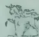

NEW YORK MONTREAL SYDNEY CAPE TOWN  
MILAN SHANGHAI BUENOS AIRES BOMBAY

So  
Light

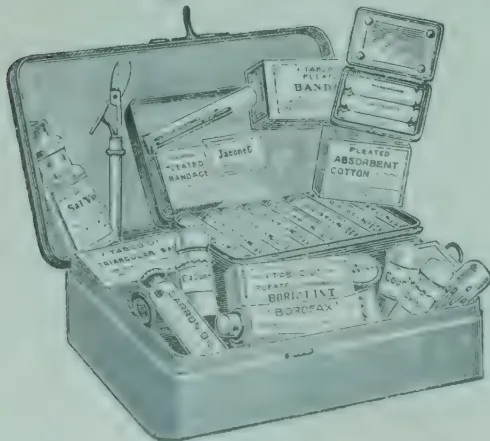

824

All Rights Reserved

552------------------------------------------------

DECEMBER, 1913.]519

## TARRING PRUNING CUTS ON TEA.

That large cuts on tea branches should be tarred appears self evident to a plant pathologist. Decay often sets in from such cuts, especially on the older branches, with the ultimate formation of large open wounds,—“cankers”—down the stem; and there is at least one stem disease in up-country districts which owes its existence to “collar pruning,” or pruning low down on the main stem, and neglecting to tar the exposed wood. But almost every tea estate can furnish examples of extensive “branch cankers,” which are no more to be attributed to the action of a specific disease than is the decay of a fence post. Such cases can be prevented by tarring the cuts.

It has frequently been pointed out in these columns and in circulars dealing with plant diseases that the tar to be used for protecting wounds and pruning cuts is ordinary coal tar. That advice has run counter to general opinion, for in Ceylon there has been an unaccountable preference for Stockholm tar. How this preference originated is not ascertainable; it can only be suggested that it has been thought that as Stockholm tar is a vegetable tar it must be the best to apply to plants. Experiments on this point have recently been carried out by DR. C. BERNARD and DR. J. J. B. DEUSS, of the Experiment Station for Tea, Java, and their results, from Mededeelingen voor het Proefstation voor Thee, No. XXV, are summarised below:

Nine experiments were instituted, the following substances being used in the different experiments.—

1. (1) Coal tar, which was said to “burn” the branches.
2. (2) Stockholm tar.
3. (3) Coal tar, direct from the Buitenzorg gas works.
4. (4) Crude carbolic acid.
5. (5) Schacht's Obstbaum carbolineum, “soluble” (i. e. emulsifiable.)
6. (6) Carbolineum avenarium, emulsifiable.
7. (7) Carbolineum from the Pomologische Vereeniging, emulsifiable.
8. (8) Cheap Carbolineum (Lindeteves), not emulsifiable.
9. (9) Xylam: a Carbolineum preparation from Fleisheim, not emulsifiable.

The substances 5 to 8 were more or less brown in colour, and more liquid than tar. No. 9 resembles ordinary black tar in appearance and consistency.

Old bushes were treated with these nine preservatives immediately after pruning. Some young plants were treated with Nos. 1, 2 and 3 immediately after pruning, others with 3, 2 and 9, twenty-four hours after pruning, and others with No. 3 about twenty days from pruning. All the liquids were used without any addition of water.

Substances 1, 2, 3 and 9 form a permanent layer which closes the wound. Nos. 4, 5, 6, 7 and 8, penetrate immediately into the tissues and dry on the wound without forming a protective layer.

The plants were examined one week, three weeks, and six weeks, after the application of the preservatives.

553------------------------------------------------

520[DECEMBER, 1913.

### COAL TAR.

Leaves which came in contact with the tar were only slightly burnt. The buds developed even when the tar covered the point of origin of the bud. On branches of the current year the tar penetrated to some extent, especially between the wood and the loosened bark, but there was no burning to speak of, not even on the cuts on very young branches.

The wound was well protected by the layer of tar. If the pruning had been badly done, and the surface was irregular or split, the tar penetrated further, as it did also if the cuts were tarred immediately after pruning, before they were dry.

On branches of the previous year, or older, the tar scarcely penetrated at all: even on damp or irregular cuts, the penetration was almost nil. And it is these branches which should be tarred: the younger branches easily form a callus. Tarring is best done twenty-four hours after pruning as the wounds have then dried, and there is then less danger of penetration.

Examination of the cuts six weeks afterwards showed the healing had begun below the part to which the tar had penetrated. There had thus been some burning of the living tissue, but it was of quite minor importance in comparison with the advantages of closing the wound and preventing the attacks of white ants. The tarred cuts developed a slight mouldiness, but much less than the untarred.

The results with this tar, which had been said to be of the worst description, speak most favourably for its use. One cannot say that it causes serious burning of the tissues of the plant. This tar was also said to cause wounds on the hands of the coolies, but that was found not to be the case, and it is pointed out that the coolies at the gas works handle tar without injury. If wounds are produced on the coolies' hands in the fields, that may possibly be due to a concentration of the sun's rays by the patches of tar, and in that case it can be prevented by rubbing the patch with soil.

### STOCKHOLM TAR.

This "burnt" the leaves more than coal tar, but the injury was still only small. If a drop of tar fell on a leaf stalk, it did not cause the leaf to fall. As far as regards the penetration of this tar, all the observations recorded in the case of coal tar are applicable in this case *but always in a greater degree*. On branches of the current year the tar penetrated to a depth of from two to three millimetres into the wood, and further into the pith. On branches of the previous year the penetration was less, especially if the wound was dry, but it was greater than in the case of coal tar. In general, this tar is not so good as coal tar for the present purpose. Instead of forming a shining

554------------------------------------------------

DECEMBER, 1913.]521

black, weather-resisting layer over the wound, it leaves a rough surface incompletely protected, and moulds develop more freely on it. The growth of callus is slower than on untarred cuts.

#### **BUITENZORG COAL TAR.**

This was the ordinary tar of the gas works, not treated in any way. The results were the same as with No. 1. The growth of callus (wound healing tissue) on the tarred cuts was more rapid than on the untarred. Branches not treated were attacked by white ants after six weeks, while the tarred cuts were not touched.

#### **CRUDE CARBOLIC AND VARIOUS CARBOLINEUMS.**

These are not suitable for the present purpose. They penetrate deeply into the tissues and do not form a protective layer. They cause strong burning between the wood and the bark, which is the region whence the callus arises; consequently the growth of the callus is slow and begins so far below the cut that the wound is not healed over. Untreated cuts healed better than those treated with these substances. Leaves which happened to come in contact with these materials were more or less damaged and some of them withered and fell off. These disadvantages do not occur to the same extent with all these materials, but they are all to be avoided if the object is to protect the cut.

#### **XYLAM.**

This resembles a simple black tar, with scarcely any modification of any importance, and the observations already quoted with reference to coal tar apply equally to it.

#### **SUMMARY.**

It is advantageous to tar pruning cuts, but the pruning should be done properly so that no splitting occurs, and saw cuts should be finished off with the knife. It is not necessary to tar cuts on branches of the current year, but on branches a year old or more they ought to be tarred.

Tarring twenty-four hours after pruning appears to be the best, if the wounds are to some extent dry. This is not of great importance in the case of old branches, the flow of sap from which is small.

Ordinary black tar, as it comes from the gas works, should be used, unmixed with any other substance. It should be used as thick as possible. Any water found on the surface of the tar should be removed before using, as any injurious substances in the tar concentrate in it.

It is intended to continue observations on the treated and untreated cuts and to publish further details.

T. PETCH.

555------------------------------------------------

522[DECEMBER, 1913.]

## THE PRESERVATION OF COLOUR IN PLANT PREPARATIONS.

Various methods are in use for the preservation of the natural colours of plants, but so far as our experience goes none of these methods is uniformly successful. In many cases the colour of leaf and flower may be preserved in plants which have been dried carefully and at not too high temperatures. The method which is commonly employed is to cover the specimen with sawdust (of some hard wood) and to put it in a drying oven. A drawback to the process lies in the fact that the dried specimens are extremely brittle. It is possible that if the dried preparations were transferred to formalin or to the mixture to which reference is about to be made this drawback might be overcome. The newest method, which is advocated by MR. H. M. QUANJER (see *Bot. Cent. blatt*, No. 39, 1913) consists in placing the specimen in a mixture of 3 grams copper sulphate, 200 c.c.m. of formalin, and 1½ litres of water. The specimen is left for some time—until it is thoroughly penetrated by the solution—and then is transferred to a solution of formalin, presumably of from 2 to 5 per cent. MR. QUANJER states that this process gives excellent results with pathological specimens. In certain cases the blackening of tissues must be prevented, and this may be effected by a preliminary treatment, for about three minutes, with boiling water.—GARDENERS' CHRONICLE.

## Sales of Produce in British and Continental Markets.

Fibres, Cotton, Grain, Oil Seeds, Hides and Skins, Timber, Rubber, Drugs, Wool, Ores, Mica, Guns, Tea, Coccoa, Coffee, Copra, Sugar, etc., are being regularly dealt in; Keymer, Son & Co., being selling Agents for Estates, Mills and Exporters.

Samples Valued.

**Best Ports for Shipments Indicated.**

THE MANAGEMENT OF  
**ESTATES UNDERTAKEN.**

Capital found for the development or purchase of valuable properties.

**KEYMER, SON & Co.,**

Whitefriars.  
LONDON, E.C.

(Same address since 1844.)

Cables:  
KEYMER, LONDON

556------------------------------------------------

DECEMBER, 1913.]523

## “DRY FARMING”

(In continuation)

THE EDITOR, TROPICAL AGRICULTURIST, PERADENIYA.

I write this memorandum in the hope of correcting some apparent misunderstanding regarding the paper on “dry farming” presented at the last meeting of the Society.

The paper begins with a definition of dry farming taken from an article in the NINETEENTH CENTURY of June 1913 on a “rainless wheat”—wheat being a non-tropical product.

The writer of the paper, MR. A. W. BEVEN, disclaims wishing to be regarded as an authority on the subject, but desires that the Agricultural Society should take the matter up and demonstrate its utility in the arid regions of this Island, both on high and low lands.

A former paper on the same subject, MR. BEVEN says, elicited little interest, but MR. BEVEN looks forward with confidence to the Director of Agriculture changing the “desert” region of Ceylon known as the Wanni into productive farms, vineyards and orchards, or, in more locally appropriate and every day language, into cultivated fields and gardens.

At the start some confusion has been caused by the use of the word “desert.”

The writer in the NINETEENTH CENTURY analyses the expression, and I think that to apply the term “desert” to a region like the Wanni is to convey a wrong impression.

MR. BEVEN further quotes the writer in the NINETEENTH CENTURY as follows :—

“Finally, desert lands are usually free from *malaria*, and are thus well suited to colonization.”

Yet it is common knowledge that *malaria* is one of the features of the Wanni, and that this fact is the main obstacle in the way of its development, “by colonies of settlers on special terms” as MR. BEVEN writes, or in any other way.

So that at the outset it looks as if proposals for “dry farming” the Wanni are scarcely relevant to the circumstances.

A standard work on the Wanni is MR. J. P. LEWIS’S “Manual of the Wanni Districts.”

MR. LEWIS spent a number of years of his service in the Mullaitivu and Vavoniya districts which constitute the greater part of the Wanni, which he describes as follows :—

“Bounded on the north by the Jaffna lake, on the south by the Aruvi Aar and the North Central Province, on the east by the district of Trincomalie, and on the west by the district of Mannar ; extent about 1,864 square miles ; derivations of the name (in a foot note) various, one meaning ‘forest,’ another ‘heat,’ another ‘scarcity,’ another ‘fire,’ another ‘hardness of the soil’ ; the longest distance from the North-east to South-west 71 miles and from East to West 60 miles ; away from the coast the country is everywhere covered with thick forest or jungle ; the rivers are rivers only in the wet season, the flow lasting from about October to January, if there is rain.”

557------------------------------------------------

524[DECEMBER, 1913]

Those not personally acquainted with the Wanni will find from the Agricultural Map of the Northern Province that large areas of the Northern Wanni are unoccupied, in high forest, and pathless; the biggest uninhabited area is about 25 miles long by 20 miles broad, and about 10,000 acres out of this will be watered by the Iranaimadu Tank, also called the Karachi Scheme, in course of construction.

An Indian Official, MR. STRANGE, in a report of 1909 on irrigation in Ceylon, writes as follows as to colonization of the mainland in question:—

“In Jaffna, although the people are crowded, they are not likely to leave the peninsula in large numbers; they do not care to forsake their ancestral land and are afraid of the climate of the Wanni in the Northern Province, the unoccupied area nearest to them; they dread its isolation and are afraid of the wild animals that infest it.”

It is well known that whenever the Jaffna man who goes to the mainland gets fever he returns to the comfortable peninsula as fast as he can travel.

As regards wild beasts of the Wanni; the elephant when a “rogue” is a danger to villagers and the damage done to cultivation by elephants whether herd elephants or rogues, is great; stacks, huts, and garden trees are pulled down and inhabitants are stopped from going to or getting out of their villages; pigs and the lesser vermin of the jungle also make great depredations on cultivation. The leopard is there in numbers, and consumes many cattle; while the bear is a serious menace to man, because along the lonely jungle paths villagers are apt to walk on to these beasts in ant hills or moving about for honey and jungle fruit, and if the bear attacks, the villager has little chance of escape without terrible injuries, not infrequently resulting in death. Naturally these dangers and disadvantages of the jungle, all in the day’s work to the Wanni man, are terrifying to the Jaffna man from the comfortable home in the tame peninsula.

Now the question is how far is it possible to develop this apparently inhospitable region?

In the Jaffna peninsula “farm” and “farming” are common expressions, and the peninsula man is a ready made “dry farmer” who understands and practises “tilth,” the essence of dry farming; so that here you seem to have the ideal farmer or cultivator for the Wanni, if other conditions of life and cultivation were satisfactory. Moreover the peninsula man has already nibbled at the main land, for it is he who has all along cultivated the Poonaryn and Karachi fields bordering the lagoon both sides of Elephant Pass and forming the Northern boundary of the Wanni; and both in the peninsula and in the Poonaryn and Karachi fields, paddy cultivation is carried on by rain water, not irrigation, and there is therefore scope for dry farming.

As to how far either dry farming or paddy cultivation in the ordinary course are possible for new settlers in the Wanni:—No question of dry farming need arise in the area under the Iranaimadu Tank adjoining the existing Karachi fields, because there the cultivation will be by regular irrigation when the tank is completed. Whether the soil is suitable for

558------------------------------------------------

DECEMBER, 1913.]525

coconuts is not decided; I believe it is not suitable and asked MR. LYNE to have it examined but this has not yet been done ; if the soil is found suitable for coconuts, by all means let the principles of dry farming be applied; only a few estate owners plough under coconuts in the Jaffna Peninsula at present.

In addition to wild beasts and malaria, and jungle which is dense and frequently pathless and therefore not immediately attractive to new comers, there is in the Wanni a lack of sub-soil water, which is not found as in the coral formation of the peninsula near the surface ; if it were, the problem of the mainland would be much nearer solution, for the peninsula man with his market garden cultivation raised by irrigation from wells dotted all over the country is a wonderfully successful farmer and would be unlikely to withstand the attraction of the mainland if there were water as in Jaffna. But, whether you dry farm or wet farm in the Wanni you must begin by *chenaing* the forest or jungle, and raising the usual chena crops after the burn ; and it takes a few years to eradicate the roots of trees of high forest land and to prepare level field, and during those years you must have chena produce to eat, to live.

In his Essay on "Plantations" which I have had occasion to quote in the Eastern Province also, BACON advises as follows:—"In a country of plantation first look about what kind of victual the country yields of itself to hand—as pineapples, dates, wild-honey and the like—and make use of them. Then consider what victual or esculent things there are which grow speedily and within the year as maize and the like; which peas and beans you may begin, both because they ask less labour and because they serve for meat as well as for bread." Besides making one's mouth water this advice possibly represents an improved chena system suitable for the Wanni ; fruit trees may be added as they already flourish in some Wanni villages; though, even, then I cannot agree with MR. BEVEN that the time may come when irrigation will be obsolete for paddy cultivation in the Wanni.

But unless you dam the rivers which at present run to waste in the sea, and construct storage tanks on them, to fill—*after restoration*—the hundreds of abandoned tanks dotted about all through the jungles, it is not possible for a new settler, whether capitalist or cultivator, to live at all, much less to make any profit in the Wanni ; small tanks restored by a settler run dry before a crop can be brought to maturity unless they are replenished from a storage tank; and during the years of restoration of the small tanks the settler must have the means of maintaining himself and his family ; thus *free land* is insufficient ; a *subsidy* for some years is also necessary.

Therefore the bottom question for development of the Wanni is not easy terms or free land, but first, storage scheme for water; and any one of these will cost, as the Karachi scheme is doing, a million or two of Rupees of public money. If any capitalist or cultivator desiring to settle in the Wanni is in doubt about this argument, let him go there and see when he will certainly drop his capital or starve, or both.

As to the inhabited areas of the Wanni;—in these only could any attempt at dry farming be started as an experiment ; there is Crown jungle available all round the plots of tobacco land adjoining the residing quarters and gardens. But if this jungle is granted on the easiest terms the Wanni

559------------------------------------------------

526[DECEMBER, 1913.

man must still begin by chenaing it; and, unless watched, he will assuredly extend his chena, instead of starting dry farming properly so called on the cleared area. And, at this point, I should like to know what products, exactly, it is proposed to grow in the Wanni by process of dry farming? Wheat, we know, is out of the question.

As to MR. BEVEN's point of "sufficient inducements":—

(1) A Jaffna, not Straits, Syndicate made an offer for land under the Karachi Scheme in 1902. The terms were to be sale at an upset price of Rs. 10 per acre; annual water rate Rs. 2 per acre; prohibition to alienate the land without sanction of Government.

The Syndicate did not agree to this last condition and negotiations were broken off and when, later, the Syndicate intimated consent to the last condition, Government declined to grant any special terms in view of the opening of the railway in the near future; the negotiations had lasted till 1905. The tank will still take four or five years to complete, so that this would have been rather a long lock-up for capital.

(2) As regards MR. WICHERLEY, since referred to by MR. BEVEN:—Land in the North-Central Province was, I understand, offered to MR. WICHERLEY at Rs. 30 per acre without, and Rs. 15 per acre with, competition, and the offer was not accepted; but as the object was to float a company to plant Ceara rubber, a speculative product under doubtful conditions, it seems probable that neither this Island nor the general public have lost by the failure of negotiations; potential investors have probably saved their money.

(3) In 1909 Government offered certain easy terms for the Wanni to attract settlers; these will be found published in the Gazettes of 5th February and 12th March, 1909. They naturally do not apply to the Karachi Scheme area. The terms were offered with a view (a) to extension of cultivation under existing village tanks and (b) to restoration of breached and abandoned tanks, but as regards the latter the point is, *not easy terms, for land*; the point is, I repeat, *storage of water*. No tanks have therefore been successfully restored under these terms, for these terms, too, were not relevant to the circumstances. The terms for (a) have been availed of to some extent in the Southern Wanni by villagers of the North-Central Province, who already have relatives in the Southern Wanni, where they are not therefore strangers.

(4) In 1912 a notice was put up, at Jaffna, asking capitalists desiring to secure land other than irrigable land under the Iranaimadu tank, to communicate with the Kachcheri, but there was no response. The reason is that without water there is neither a living nor a profit in the Wanni.

(5) In the Mullaitivu Wanni two years ago the authority of Government was obtained to sell certain lands under SIR HENRY WARD's Minute, i.e., by payment in 4 yearly instalments.

So that it is not right to suggest that all the fault is the absence of sufficient inducement by Government to develop the Wanni—though it would be quite good policy to give *free* land for dry or wet farming otherwise than under irrigation works, if that course would keep new settlers alive. Under irrigation works the terms must necessarily have some relation to the expenditure by Government on tank construction.

560------------------------------------------------

DECEMBER, 1913.]527

Finally, MR. BEVEN goes too fast when he says in his speech "there are vast tracts of Ceylon in the arid regions which are uninhabited; with dry farming these places could be inhabited. If there were sufficient inducement offered the people would settle down there, and the desert places of Ceylon would in time become a smiling garden."

You cannot alter the face of nature or the conditions of life merely by the use of picturesque phrases; you cannot populate the Wanni by talking about dry farming, though we may, and I hope we shall, be able to improve—on Baconian and "dry farming" principles—the agricultural conditions round about existing villages or round new tanks; but for the bulk of the Wanni the supply of sufficient water, by the construction of storage tanks, is the only way.

This contribution to the controversy is written from the point of view of a possible settler in the Wanni rather than from that of a Government Official.

H. R. FREEMAN

Colombo, 28th November, 1913.

**Note.**

In a Dutch map I find the name 'Wanni' is applied to only the Mullaitivu and Vavuniya Districts, excluding the Jaffna District mainland; hence my reference at the last meeting to country south of Iranaimadu Tank. But MR. LEWIS'S boundaries are also accepted as the Wanni.

---

---

## THE WAX PALM

---

---

### A New and Promising Cultivation of great importance to all Tropical Planters.

The Wax Palm (*Copernicia cerifera*) produces the valuable Carnauba Wax; this tree accommodates itself easily to climate and soil and can be interplanted with cotton, food or fodder plants, green manure, etc. To Coffee, Cocoa, Rubber, etc., it offers shade, but at the same time it allows sufficient light and air to pass to the trees below. Therefore the Wax Palm is not only a very useful but also a profitable acquisition.

For trials we supply on receipt of 7 shillings and 6d., 75 seeds as sample of no value under registration, postage paid; on receipt of £1, we forward 10 lb. seeds by parcel post, postage paid to all countries.

Detailed instructions for cultivation with every order.—

**GEVEKOHT & WEDEKIND, Hamburg 1.**

561------------------------------------------------

528

[DECEMBER, 1913]

**MARKET RATES FOR TROPICAL PRODUCTS.**

(From Lewis & Peal's Latest Monthly Prices Current.)

<table border="1">
<thead>
<tr>
<th colspan="2">QUALITY.</th>
<th>QUOTATIONS.</th>
<th colspan="2">QUALITY.</th>
<th>QUOTATIONS.</th>
</tr>
</thead>
<tbody>
<tr>
<td><b>ALCOES, Socotrine</b></td>
<td>cwt. Fair to fine</td>
<td>55/ a 6/5</td>
<td><b>INDIARUBBER</b></td>
<td>lb.</td>
<td></td>
</tr>
<tr>
<td>Zanzibar &amp; Hepatic</td>
<td>Common to good</td>
<td>40/ a 6/5</td>
<td>Borneo</td>
<td>Common to good</td>
<td>9d a 12</td>
</tr>
<tr>
<td><b>ARROWROOT</b></td>
<td>Nat'l lb. Fair to fine</td>
<td>6d a 7d</td>
<td>Java</td>
<td>Good to fine red</td>
<td>1/4 a 1/5</td>
</tr>
<tr>
<td><b>BEES' WAX</b></td>
<td>cwt.</td>
<td></td>
<td>Penang</td>
<td>Low white to prime</td>
<td>9d a 13</td>
</tr>
<tr>
<td>Zanzibar Yellow</td>
<td>Slightly drossy to fair</td>
<td>£7 10 a £7 15</td>
<td>Mozambique</td>
<td>Fair to fine red ball</td>
<td>1/10 a 2/2</td>
</tr>
<tr>
<td>East Indian, bleached</td>
<td>Fair to good</td>
<td>3/8 10 a 3/8 15</td>
<td>Nyasaland</td>
<td>Sausage, fair to good</td>
<td>1/9 a 2/1</td>
</tr>
<tr>
<td>unbleached</td>
<td>Dark to good genuine</td>
<td>3/6 10 a 3/6 17/6</td>
<td>Madagascar</td>
<td>Fair to fine ball</td>
<td>1/9 a 2/1</td>
</tr>
<tr>
<td>Malacca</td>
<td>Dark to good polish</td>
<td>3/7 10 a 3/7 15</td>
<td></td>
<td>Fir to fine pinky &amp; white</td>
<td>1/6 a 1/9</td>
</tr>
<tr>
<td><b>CAMPFIRE</b></td>
<td>Japan lb. Retined</td>
<td>1/4 a 1/6</td>
<td></td>
<td>Marunga &amp; blk coated</td>
<td>1 a 1/3</td>
</tr>
<tr>
<td>China</td>
<td>cwt. Fair average quality</td>
<td>55/</td>
<td></td>
<td>Niggers, low to good</td>
<td>6d a 1/6</td>
</tr>
<tr>
<td><b>CARDAMOMS, Tumeric</b></td>
<td>cwt. Good to fine bold</td>
<td>6/ a 6/3</td>
<td></td>
<td>Ordinary to fine ball</td>
<td>1/6 a 1/8</td>
</tr>
<tr>
<td>Malabar, Tellicherry</td>
<td>Good to fine bold</td>
<td>5/2 a 5/4</td>
<td><b>INDIGO, E. I. Bengal</b></td>
<td>Shipping mid to gd. violet</td>
<td>3s a 3s 6d</td>
</tr>
<tr>
<td>Calicut</td>
<td>Good to fine bold</td>
<td>6/ a 6/3</td>
<td></td>
<td>Consuming mid to gd.</td>
<td>2s 6d a 2s 11d</td>
</tr>
<tr>
<td>Mangalore</td>
<td>Brownish</td>
<td>5/2 a 5/8</td>
<td></td>
<td>Ordinary to middling</td>
<td>2s 3d a 2s 5d</td>
</tr>
<tr>
<td>Ceylon, Mysore</td>
<td>Med Brown to good bold</td>
<td>5/3 a 6/6</td>
<td></td>
<td>Mid. to good Kurpah</td>
<td>1s 10d a 2s 5d</td>
</tr>
<tr>
<td>Malabar</td>
<td>Small fair to fine plump</td>
<td>4/7 a 6/5</td>
<td></td>
<td>Low to ordinary</td>
<td>1s 6d a 1s 9d</td>
</tr>
<tr>
<td>Seeds, E. I. &amp; Ceylon</td>
<td>Fair to good</td>
<td>3/8 a 3/10</td>
<td></td>
<td>Mid. to fine Madras</td>
<td>1/9 a 2/3</td>
</tr>
<tr>
<td>Ceylon "Long Wild"</td>
<td>Fair to good</td>
<td>4/9 a 5/2</td>
<td><b>MACE, Bombay &amp; Penang</b></td>
<td>Pale reddish to fine</td>
<td>2/4 a 2/6</td>
</tr>
<tr>
<td><b>CASTOR OIL, Calcutta</b></td>
<td>Good 2nds</td>
<td>1/2 a 3/2 nom</td>
<td>Java</td>
<td>Ordinary to fair</td>
<td>2 a 2/2</td>
</tr>
<tr>
<td><b>CHILLIES, Zanzibar</b></td>
<td>Dull to fine bright</td>
<td>4d nom</td>
<td>Bombay</td>
<td>Wild</td>
<td>2/1 a 2/4</td>
</tr>
<tr>
<td>Japan</td>
<td>Fair bright small</td>
<td>37/6 a 4/5</td>
<td><b>NUTMEGS, Singapore &amp; Penang</b></td>
<td>lb.</td>
<td></td>
</tr>
<tr>
<td><b>CINCHONA BARK, Ceylon</b></td>
<td>Crown, Renewed</td>
<td>28 a 32/6</td>
<td></td>
<td>64's to 57 s</td>
<td>9d a 10 1/2d</td>
</tr>
<tr>
<td></td>
<td>Red, Org. Stem</td>
<td>2d a 6d</td>
<td></td>
<td>80's</td>
<td>7 1/2d</td>
</tr>
<tr>
<td></td>
<td>Red, Org. Stem</td>
<td>1 1/4 d a 4 1/4 d</td>
<td></td>
<td>110's</td>
<td>6d a 1d</td>
</tr>
<tr>
<td></td>
<td>Renewed</td>
<td>3d a 5 1/2 d</td>
<td><b>NUTS, ARECA</b></td>
<td>cwt. Ordinary to fair fresh</td>
<td>17/6 a 20</td>
</tr>
<tr>
<td></td>
<td>Root</td>
<td>1 1/2 d a 4d</td>
<td><b>NUX VOMICA, Cochin</b></td>
<td>Ordinary to good</td>
<td>9/6 a 12</td>
</tr>
<tr>
<td><b>CINNAMON, Ceylon</b></td>
<td>1sts. Good to fine quill</td>
<td>1/3 a 1/7</td>
<td>per cwt. Bengal</td>
<td>"</td>
<td>8/9</td>
</tr>
<tr>
<td>per lb. 2nds.</td>
<td>"</td>
<td>1/2 a 1/6</td>
<td>Madras</td>
<td>"</td>
<td>8/6 a 9/6</td>
</tr>
<tr>
<td>3rds.</td>
<td>"</td>
<td>1/1 a 1/5</td>
<td><b>OIL OF ANISEED</b></td>
<td>lb. Fair merchantable</td>
<td>6/5</td>
</tr>
<tr>
<td>4ths.</td>
<td>"</td>
<td>1/1 a 1/3</td>
<td>CASSIA</td>
<td>According to analysis</td>
<td>3 a 3/4</td>
</tr>
<tr>
<td>Chips, &amp;c.</td>
<td>Fair to fine bold</td>
<td>2d a 4d</td>
<td>LEMONGRASS</td>
<td>Good flavour &amp; colour</td>
<td>2/1d</td>
</tr>
<tr>
<td><b>CLOVES, Penang</b></td>
<td>lb. Dull to fine bright pkd.</td>
<td>1/1 a 1/3</td>
<td>NUTMEG</td>
<td>Dingy to white</td>
<td>1 1/2 d a 1 1/4 d</td>
</tr>
<tr>
<td>Amboyna</td>
<td>Dull to fine</td>
<td>10d a 10 1/2d</td>
<td>CINNAMON</td>
<td>Ordinary to fair sweet</td>
<td>3 1/2 d a 1s 5d</td>
</tr>
<tr>
<td>Zanzibar</td>
<td>Fair and fine bright</td>
<td>5 1/2 d a 6 1/2 d</td>
<td>CITRONELLA</td>
<td>Bright &amp; good flavour</td>
<td>1/9</td>
</tr>
<tr>
<td>Madagascar</td>
<td>Fair</td>
<td>7d</td>
<td><b>ORCHELLA WEED</b></td>
<td>cwt.</td>
<td></td>
</tr>
<tr>
<td>Stems</td>
<td>Fair</td>
<td>3d</td>
<td>Ceylon</td>
<td>Fair</td>
<td>10 Nom.</td>
</tr>
<tr>
<td><b>COFFEE</b></td>
<td></td>
<td></td>
<td>Madagascar</td>
<td>Fair</td>
<td>10 "</td>
</tr>
<tr>
<td>Ceylon Plantation</td>
<td>cwt. Medium to bold</td>
<td>Nominal</td>
<td>Zanzibar</td>
<td>Fair</td>
<td>10 "</td>
</tr>
<tr>
<td>Native</td>
<td>Good ordinary</td>
<td>Nominal</td>
<td><b>PEPPER</b></td>
<td>Black, lb.</td>
<td></td>
</tr>
<tr>
<td>Liberian</td>
<td>Fair to bold</td>
<td>63/ a 80</td>
<td>Alleppy &amp; Tellicherry</td>
<td>Fair</td>
<td>5 1/2 d a 5 1/4 d</td>
</tr>
<tr>
<td><b>COCOA, Ceylon Plant.</b></td>
<td>Special Marks</td>
<td>86/ a 92/6</td>
<td>Ceylon</td>
<td>Fair to fine bold heavy</td>
<td>5 1/2 d a 5 1/4 d</td>
</tr>
<tr>
<td>Native Estate</td>
<td>Red to good</td>
<td>81/ a 85</td>
<td>Singapore</td>
<td>Fair</td>
<td>5d</td>
</tr>
<tr>
<td>Java and Celebes</td>
<td>Ordinary to red</td>
<td>42 a 78/6</td>
<td>Acheen &amp; W. C. Penang</td>
<td>Dull to fine</td>
<td>5d a 5 1/2 d</td>
</tr>
<tr>
<td><b>COLONBO ROOT</b></td>
<td>Small to good red</td>
<td>30s a 93s</td>
<td>(White) Singapore</td>
<td>Fair to fine</td>
<td>8 1/2 d a 9d</td>
</tr>
<tr>
<td><b>CROTON SEEDS, sifted.</b></td>
<td>Middling to good</td>
<td>14/ a 21/</td>
<td>Siam</td>
<td>Fair</td>
<td>8d</td>
</tr>
<tr>
<td><b>CUBEBB</b></td>
<td>Dull to fair</td>
<td>60/ a 62/6</td>
<td>Penang</td>
<td>Fair</td>
<td>7d</td>
</tr>
<tr>
<td>GINGER, Bengal, rough</td>
<td>Ord. stalky to good</td>
<td>13/5 a 16/5</td>
<td>Muntok</td>
<td>Fair</td>
<td>9d</td>
</tr>
<tr>
<td>Calicut, Cut A</td>
<td>Fair</td>
<td>19</td>
<td>Shenzi</td>
<td>Ordinary to good</td>
<td>3 a 4</td>
</tr>
<tr>
<td>B &amp; C</td>
<td>Medium to fine bold</td>
<td>60 a 75</td>
<td>Canton</td>
<td>Ordinary to good</td>
<td>2/6 a 3/6</td>
</tr>
<tr>
<td>Cochin, Rough</td>
<td>Small and medium</td>
<td>36/ a 60/</td>
<td>High Dried</td>
<td>Fair to fine flat</td>
<td>1 a 1/2</td>
</tr>
<tr>
<td>Japan</td>
<td>Common to fine bold</td>
<td>24/ a 30</td>
<td><b>SAGO, PEARL, large-cwt</b></td>
<td>Dark to fair round</td>
<td>9d a 11d</td>
</tr>
<tr>
<td><b>MAMMONIACUM</b></td>
<td>Small and D's</td>
<td>25/</td>
<td>medium</td>
<td>Fair to fine</td>
<td>18</td>
</tr>
<tr>
<td>NIMI, Zanzibar</td>
<td>Unsplit</td>
<td>22/</td>
<td>small</td>
<td>"</td>
<td>17</td>
</tr>
<tr>
<td></td>
<td>Ord. Blocky to fair clean</td>
<td>40s a 72s 6d</td>
<td>Flour</td>
<td>"</td>
<td>13 a 15</td>
</tr>
<tr>
<td></td>
<td>Pale and amber, ster. srts</td>
<td>£14 10 a £16 10</td>
<td><b>SEEDLAC</b></td>
<td>cwt. Good pinky to white</td>
<td>11 a 12</td>
</tr>
<tr>
<td></td>
<td>" little red</td>
<td>£11 a £12</td>
<td><b>SENNA, Tinnevelly</b></td>
<td>lb. Ordinary to gd. soluble</td>
<td>65 a 85</td>
</tr>
<tr>
<td></td>
<td>Bean and Pea size ditto</td>
<td>80/ a £10/5</td>
<td></td>
<td>Good to fine bold green</td>
<td>5 1/2 d a 8 1/2 d</td>
</tr>
<tr>
<td></td>
<td>Fair to good red sorts</td>
<td>£8 10 a £10 10</td>
<td><b>SHELLS, M. o' PEARL</b></td>
<td>Fair greenish</td>
<td>3 1/2 d a 4 1/2 d</td>
</tr>
<tr>
<td></td>
<td>Med. and bold classy sorts</td>
<td>£5 a £7 10</td>
<td>Egyptian</td>
<td>Common specky &amp; small</td>
<td>2d</td>
</tr>
<tr>
<td></td>
<td>Fair to good polish</td>
<td>£4 a £8</td>
<td>Bombay</td>
<td>Small to bold</td>
<td>90 a £9 2/6</td>
</tr>
<tr>
<td></td>
<td>" red</td>
<td>£4 a £7</td>
<td>Mengui</td>
<td>"</td>
<td>80 a £9 7/6</td>
</tr>
<tr>
<td>Aden</td>
<td>Ordinary to good pale</td>
<td>28/ a 32/ nom</td>
<td>Manilla</td>
<td>Chicken to bold</td>
<td>10 17/6 a 14 2/6</td>
</tr>
<tr>
<td>orts</td>
<td>"</td>
<td>31/ a 55/</td>
<td>Banda</td>
<td>Fair to good</td>
<td>£9 a £14 17/6</td>
</tr>
<tr>
<td>Achee</td>
<td>Sorts to fine pale</td>
<td>18/6 a 32/6 nom</td>
<td>Green Snail</td>
<td>Sorts</td>
<td>75 a 92/6</td>
</tr>
<tr>
<td>Madras</td>
<td>Reddish to good pale</td>
<td>25 a 30s nom</td>
<td>Japan Ear</td>
<td>Small to large</td>
<td>60 a 100</td>
</tr>
<tr>
<td>HIDA</td>
<td>Dark to fine pale</td>
<td>22/6 a 29/6 nom</td>
<td></td>
<td>Trimmed selected small</td>
<td>to bold 72/6 a £9 5</td>
</tr>
<tr>
<td></td>
<td>Clean fr to gd almonds</td>
<td>£7 a £8</td>
<td><b>TAMARINDS, Calcutta</b></td>
<td>Mid to fine bl'k not stony</td>
<td>13</td>
</tr>
<tr>
<td></td>
<td>Com stony to good block</td>
<td>40s a £5 1/2 6</td>
<td>per cwt. Madras</td>
<td>Inferior to good</td>
<td>6 a 10</td>
</tr>
<tr>
<td>KRIH, Aden sorts</td>
<td>Fair to fine bright</td>
<td>6d a 1/5</td>
<td><b>TORTOISESHELL</b></td>
<td>lb.</td>
<td></td>
</tr>
<tr>
<td>Somali</td>
<td>Middling to good</td>
<td>5/5 a 6/5</td>
<td>Zanzibar, &amp; Bombay</td>
<td>Small to bold</td>
<td>11 a 31</td>
</tr>
<tr>
<td><b>OLIBANUM, drop</b></td>
<td>Good to fine white</td>
<td>45s a 50s</td>
<td>Pickings</td>
<td>Fair</td>
<td>12 a 22</td>
</tr>
<tr>
<td></td>
<td>Middling to fair</td>
<td>45s a 50s</td>
<td>Madras</td>
<td>Finger fair to fine bold</td>
<td>15 a 17</td>
</tr>
<tr>
<td>pickings</td>
<td>Low to good pale</td>
<td>32s a 40s</td>
<td>Do</td>
<td>Bulbs " bright</td>
<td>12 a 15</td>
</tr>
<tr>
<td>settings</td>
<td>Slightly foul to fine</td>
<td>15/ a 27/6</td>
<td>Cochin</td>
<td>Finger fair</td>
<td>14 a 15 nom</td>
</tr>
<tr>
<td><b>INDIA RUBBER</b></td>
<td>lb. Fair to a smoked &amp; sheets</td>
<td>18 a 21s</td>
<td></td>
<td>Bulbs</td>
<td>12</td>
</tr>
<tr>
<td>Ceylon, Straits</td>
<td>Fair to ordinary to fine</td>
<td>2 5/8 a 3 2/4</td>
<td><b>VANILLOES</b></td>
<td>lb.</td>
<td></td>
</tr>
<tr>
<td>Malay Straits, etc.</td>
<td>Fine bold</td>
<td>2 1/4 a 2 1/2</td>
<td>Mauritius</td>
<td>1sts. Gd. crystallized 3 1/2 a 8 1/2 in.</td>
<td>11/6 a 16</td>
</tr>
<tr>
<td>Assam</td>
<td>Small fair to fine</td>
<td>2 1/4 a 2 1/2</td>
<td>Madagascar</td>
<td>2nds. Foxy &amp; reddish 3 1/2 a</td>
<td>11 a 12/6</td>
</tr>
<tr>
<td></td>
<td>Medium</td>
<td>2 1/2 a 2 1/4</td>
<td>Seychelles</td>
<td>3rds. Lean and inferior</td>
<td>10/6 a 11/6</td>
</tr>
<tr>
<td></td>
<td>Fair to good red N.</td>
<td>3/8 a 1/6</td>
<td><b>VERMILLION</b></td>
<td>Fine, pure, bright</td>
<td>29</td>
</tr>
<tr>
<td>Rangoon</td>
<td>"</td>
<td>3/8 a 1/6</td>
<td><b>WAX, Japan, squares</b></td>
<td>Good white hard</td>
<td>48</td>
</tr>
</tbody>
</table>

562------------------------------------------------

563------------------------------------------------

This image is a scan of a blank page. The paper has a light beige or cream-colored tint. There are several small, dark specks scattered across the surface, which appear to be dust or scanning artifacts. The texture of the paper is slightly visible, giving it a subtle grainy appearance. No text, lines, or other markings are present on the page.

564------------------------------------------------

565------------------------------------------------

