30.5

TAC

~~X~~.42

1------------------------------------------------


<!-- stage4: FAINT old-images-only -->

[Faint page: no legible print of its own could be verified; text withheld (stage 4 review list)]


2------------------------------------------------

GOVERNMENT BOTANICAL GARDENS  
LIBRARY.  
Section.....  
No.....

3------------------------------------------------


4------------------------------------------------

GOVERNMENT BOTANICAL GARDENS  
LIBRARY.

Section.....

No.....

5------------------------------------------------


HIS EXCELLENCY SIR ROBERT CHALMERS, K.C.B.,  
President, Board of Agriculture.

6------------------------------------------------

THE  
**TROPICAL AGRICULTURIST:**

JOURNAL OF THE  
**CEYLON AGRICULTURAL SOCIETY.**

VOL. XLII.

COLOMBO, JANUARY, 1914.

No. 1.

**DISCUSSION.**

*Peradeniya, January 15, 1914.*

There is no subject that invites discussion to the same extent as agriculture. Here in Ceylon various bodies meet frequently to discuss problems connected with our great industry; in London there is to be an International Rubber Conference in connection with the Rubber Exhibition in June and at the Imperial Institute there will take place at the same time an International Congress of Tropical Agriculture. Agriculture deals with life, and living forces will ever remain a well-spring of study.

Meetings and conferences often do not command the attendance that they might because people are afraid of their time being wasted by much talk and too little real discussion.

Men meet together in order that knowledge of the topic or topics to be discussed shall be advanced and unless that object is fulfilled they meet in vain. This knowledge is advanced in three ways. We first invite one of our number who has specialised, it may be in a particular crop, to give us the result of his experience. This sometimes takes the form of a paper. Others present with experience of the product under discussion then proceed to explain wherein theirs corresponds with or differs

7------------------------------------------------

2[JANUARY, 1914.]

from that of the first speaker. Finally those with little or no experience in the matter, but desirous of acquiring such, describe the perplexities that have arisen in their minds.

These last render perhaps the most valuable service of all because if doubts and difficulties exist and are not disclosed they cannot be answered and men may go away from a meeting with nothing but confused ideas. It is by enquiry that we progress.

In order that all who can shed light on the subject before the meeting shall be given an opportunity of doing so, and that all misunderstandings shall as far as possible be cleared up, speeches must be short. Long speeches kill discussion and frighten busy people away. They must also be relevant because irrelevancy consumes valuable time by leading us out into the wilderness, and there leaving us to retrace our steps. This engenders impatience, disturbs the calm and composure of the atmosphere and injures the reputation of the board, committee or whatever it may be.

The conversational spirit is the one to cultivate. Conversation is the interchange of thought by spoken words though at formal meetings it must of course be controlled by formalities necessary for ordered discussion. Interchange of thought on a particular subject is only possible when speeches are brief and to the point, and when those with ideas will come forward and express them. Dr. Johnson was once asked whether the conversation at a dinner he had attended the previous day had been good. "No, sir," he said, "we had *talk* enough, but no *conversation*; there was nothing *discussed*."

R. N. L.

8------------------------------------------------

JANUARY, 1914.]3

## TASMANIA FOR THE SETTLER.

Of late years a great deal has been heard about Tasmania, not merely as a health resort, but also as a place of sojourn for the official retiring from the eastern tropics where one could safely invest his small capital, while at the same time enjoying ease and comfort and good health in a delightful climate.

The success of a Ceylon Planter (MR. J. H. BARBER) in the cultivation of apples was recently referred to in the local and Australian Press, and there is little doubt that others from this colony as well as India will follow the lead that has been given.

Tasmanian authorities have just issued a number of attractive publications, of interest to the tourist and prospective settler, which have been distributed through a local agency. From these it is to be gathered that the Colony produces good crops of wheat, oats, barley and potatoes in addition to its flourishing fruit industry. Tasmanian apples are noted for their aroma and flavour; and, cultivated under suitable conditions, yield excellent returns. In land acquisition the State treats the prospective settler most liberally—the terms of payment being light and spread over a series of years, while assistance is provided under certain conditions in the shape of loans from an agricultural bank. For all details the enquirer must be referred to the handbooks and pamphlets which can be consulted at the Office of the Ceylon Agricultural Society, Peradeniya.

## EXPLOSIVES IN AGRICULTURE.

"Dynamite for Agriculture in Ceylon" is the title of a booklet issued by MESSRS. FREUDENBERG & CO., the sole Agents for NOBEL'S HAMBURG EXPLOSIVES CO., LTD. The book is published in order that those who were unable to attend the demonstrations held from time to time may have the opportunity of reading more concerning this important subject. Dynamite as a means of cultivating the soil dates back many years and the first country to experiment with it methodically was America where it has been in vogue for 30 or 40 years. In Ceylon the use of dynamite has been known for many years in connection with the blasting of rocks and work of that nature, but it was only a year or two ago that its practicability for soil cultivation came into general notice. The booklet deals with the general uses for which dynamite is recommended and the methods of using dynamite and cost. It also contains many illustrations some of which are of the demonstration held at Peradeniya on the 10th July last.

## "WELLCOME" PHOTOGRAPHIC EXPOSURE RECORD AND DIARY FOR 1914.

We have to thank MESSRS. BURROUGHS, WELLCOME & CO. for a copy of their Photographic Record and Diary for 1914. As a pocket Guide to photography, condensing as it does into the minimum of space clear, definite and precise instructions on all details, it should prove invaluable to the amateur as well as to the professional.

9------------------------------------------------

4[JANUARY, 1914]

# COCONUTS.

## MANURING OF COCONUTS IN THE SEYCHELLES.

R. DUPONT.

The quantity of mineral matter removed from the soil by the coconut is considerable when the fibre and leaves are not returned. The copra itself represents a very small proportion, only about one-fifth of this quantity. It is therefore desirable to utilise the leaves and other residues before considering other manures. The writer has studied the coconut fertilisers used on two types of soil in the Seychelles.

### MADREPORITIC SOILS.

They occur in the outlying islands, which are extremely fertile owing to deposits of guano having the following composition:—

<table>
<tbody>
<tr>
<td>Moisture</td>
<td>...</td>
<td>...</td>
<td>7.20</td>
</tr>
<tr>
<td>Organic matter</td>
<td>...</td>
<td>...</td>
<td>12.50</td>
</tr>
<tr>
<td>Lime</td>
<td>...</td>
<td>...</td>
<td>44.30</td>
</tr>
<tr>
<td>Magnesia</td>
<td>...</td>
<td>...</td>
<td>1.70</td>
</tr>
<tr>
<td>Potash</td>
<td>...</td>
<td>...</td>
<td>0.38</td>
</tr>
<tr>
<td>Phosphoric acid</td>
<td>...</td>
<td>...</td>
<td>30.85</td>
</tr>
<tr>
<td>Sulphuric acid</td>
<td>...</td>
<td>...</td>
<td>0.69</td>
</tr>
<tr>
<td>Silica</td>
<td>...</td>
<td>...</td>
<td>2.06</td>
</tr>
<tr>
<td>Iron, alumina, etc...</td>
<td>...</td>
<td>...</td>
<td>0.36</td>
</tr>
<tr>
<td colspan="3"></td>
<td>100.04</td>
</tr>
</tbody>
</table>

There is a deficiency of potash, but according to BONAME the coconut utilises considerable quantities of sodium salts during the growth of the inflorescence, and it appears that less potash is consumed and the two bases are interchangeable in the requirements of this plant.

### GRANITIC SOILS.

These soils require neutralising with lime or guano. Potash is generally deficient in soils that have been cultivated for a long time. Phosphoric acid is supplied economically by the guano, which costs only 16 to 24s per ton at Victoria.

### POTASH MANURES.

Sulphate of Potash should be preferred, as the unit of potash in it (at Bombay or Colombo) costs only 4s. 9d. as compared with 7s in kainit. The writer recommends the application of 45 to 90 lb. per acre buried in trenches round the trees.

### NITROGENOUS MANURES.

The writer recommends green manures (*Tephrosia candida*, etc.), seaweed and farmyard manure where possible. An excellent manure for coconuts could be obtained by the organisation of fisheries.—MONTHLY BULLETIN.

10------------------------------------------------

JANUARY, 1914.]5

## COCONUTS IN FIJI.

H. H. THIELE.

(Continued from page 462, Vol. XII.)

"Extensive damage is frequently done to coconuts in some parts of the group by the so called stick insects," writes MR. F. P. JEPSON in his report on Economic Entomology of Fiji, and continues as follows: "These insects, which belong to the family *Phasmidæ*, are extremely voracious, and will often completely defoliate a tree, leaving only the midribs. DR. SHARP refers to them as follows:—They are all vegetable feeders and are extremely voracious, so that a pair will destroy a great quantity of foliage; they are consequently in some parts of the world classed among injurious insects. In Fiji and the Friendly Islands, *Lopaphus cocophagus* eats the coconut foliage and causes a scarcity of food, so that it becomes a matter of necessity to destroy these insects. *Phasmidæ* have been reported as causing considerable damage to the coconut plantations on the island of Cicia; they are also common at Savisavu Bay, Wainunu, Suva, Levuka, Mango and in the Lau group.

The damage done by *Phasmidæ* is very characteristic. Irregular, clean cut patches are eaten out of the leaflets, by means of the very powerful biting jaws with which the insect is provided. Sometimes only a few leaflets are attacked; at other times the damage may be extensive. The writer has seen a palm completely defoliated, only the midribs of the leaflets remaining.

These insects are entirely nocturnal in habits, and conceal themselves under the folded leaflets of the coconut palms during the daytime. There are several representatives of this family in Fiji, the two most important being *Phibalocera pythonius*, Westw., and *Lopaphus cocophagus*, Newp. The former a large green wingless insect, attains a great size, several specimens having been taken over nine inches in length. The latter is a slender brown insect about four and a half inches long. Concerning these two insects MR. LIRKBY writes:—

"The two latter species are common in the South Sea Islands, where *Lopaphus cocophagus* sometimes commits dreadful ravages in the plantations of coconut trees."

The Fijian natives, to whom these insects are known as "mimimata," regard it with a certain amount of awe, on account of its power of ejecting a stinking fluid, said to be very acid, and supposed, if it strikes the eye, to cause blindness. No authentic instance of blindness caused in this fashion is known in Fiji, but it can be well understood that should this fluid strike the eye it would cause a considerable amount of temporary discomfort. The liquid is secreted in the glands of the thorax. Birds are known to prey on *Phasmidæ* to a very large extent, and there are many instances of parasitism by other insects. Very few eggs are produced considering the large amount of food consumed by these insects. The eggs are deposited by the females at random from the top of the tree on to the ground.

11------------------------------------------------

6[JANUARY, 1914.

The adult of the *Phibalocera pythonius* is a large, green, bulky-bodied insect provided with powerful mandibles. The length is stated by some residents in Fiji to reach 14 inches, but none in this collection exceed  $9\frac{1}{2}$  inches. The breadth is  $\frac{5}{8}$  inch. This insect is entirely apterous, and so in order to gain access to the foliage, has to climb the trunk of the palm. This fact can be taken advantage of by preventing its ascent by means of some contrivance or preparation placed around the trunk. Representatives of this family have the power of reproducing a lost limb.

The *Lopaphus cocophagus* is much smaller than *Phibalocera pythonius*, rarely exceeding  $4\frac{1}{2}$  inches in length, and  $\frac{1}{4}$  inch in breadth. The body is slender and brown in colour. The wings and tegmina are very small, and the former cannot be of much use in flight. The eggs of this insect have not been found here.

Probably the most satisfactory, and at the same time least expensive method of dealing with both these insects, where the damage caused was extensive, would be the following:

As has been stated above, Phasmidæ are nocturnal in habits, and during the daytime find shelter beneath the folded leaflets of the palms. If broken and fallen limbs of coconut trees, as well as all debris, such as husks, loose fibre, and cut weeds, etc., are collected and made into a heap beneath each palm, and when dry set fire to, the smoke will cause the insects to release their hold of the leaflets, and falling to the ground they will either be destroyed by fire or else will form an easy prey for birds.

There are many points of interest yet to be discovered concerning these insects, and also the methods for their control.

With reference to these insects I may say they do not appear to be very numerous on Taviuni, and on the plantations I managed I only found one tree attacked (out of a total of some 8,000), and I was constantly on the look-out for more. It is remarkable that there were other palms at the usual distance round the one attacked, the leaves in some places touching those infected, yet the insects did not injure those other trees—at least not during the five years I observed them. I could see no difference whatever between the height of this infested palm and that of the surrounding ones; the stem was slightly thinner; it appeared to be about thirty years old; its leaves were not of a healthy colour and generally half eaten away by the insects, the midribs always being left. I asked a number of old Fijians if they could tell me the reason why this palm in particular suffered, and they all seemed of the same opinion, namely: that the sap of that particular tree was “sweet.” Whether it was of a different species of coconut from the surrounding ones the natives did not seem to know. This may or may not be the case; I was however not qualified to further investigate the matter and settle this point.

It appears to me very probable that some varieties of coconut palms may be found which these insects will not attack.

Since writing this article, another troublesome insect has developed into a pest on the banana plantations and will most likely spread to the coconut palms. This is the scale insect, known as *Aspidiotus destructor*, Sign.

12------------------------------------------------

JANUARY, 1914.]7

In Bulletin No. 5—"Some preliminary Notes on the Scale Insect infesting the Bananas in Fiji," MR. F. P. JEPSON has gathered and published the following information :—

FROGGATT says, "This scale insect was described by SIGNORET from specimens sent to him from Reunion where he says : this species does great damage to the coconut groves of the island."

BANKS says, "*Aspidiotus destructor*, Sign., is by far the most pernicious of the scales which attack the coconut in the Philippines. It occurs most frequently on the young trees having from one to five years' growth, in many cases completely covering the under surfaces of the leaves, giving them a characteristic yellow tinge."

DOANE, in his notes on the scale in Tahiti, says: "It is one of the greatest pests upon coconut palms in the Society Islands. Here it infests both old and young trees in a similar manner, but on old trees besides the foliage, it spreads over the flower spikes and even the coconuts become coated with the scale. Many trees have been killed, while others, on account of this infestation, bear no nuts, and on some islands, it has become so bad that no nuts are gathered. At one time it appeared as if all the trees would become barren, as all the young palms become smothered with the scale from the older infested trees."

This scale is known as the "Bourbon aspidiotus" in the West Indies, and it is recorded in many West Indian Islands.

URICH, in "Preliminary Notes on some insects affecting the Coconut Palm," Trinidad 1911, says this scale is always associated with ants (*Azteca chartifex*, Forel) which, being exceedingly fond of the honey-dew secreted by the scales, protect and probably propagate them for purposes of obtaining a food supply. He suggests getting rid of the ants by means of kerosene emulsion and thinks that the scale insect may be left to its parasites.

FROGGATT remarks that although the members of the *Aspidiotus* group of scales are usually hard and horny, this particular species is much thinner and lighter in texture than most species, and is therefore much more readily destroyed by unfavourable weather conditions and by the attacks of parasites. It is also much more amenable to treatment with spraying or fumigation.

The Superintendent of Agriculture, on his last visit to Taviuni did not find this scale amongst the bananas there. Once there it will be next to impossible to extirpate it. It is not a difficult matter to deal with on the comparatively short banana plants that can easily be sprayed, a treatment which quickly kills this kind of scale owing to its covering being comparatively thin; but it is a different matter when it has spread to coconut trees, the height of which make spraying impracticable. In fact in such case little or nothing can be done to check or eradicate the pest; the tall trees if once attacked are almost sure to be killed in time.—FIJI PLANTERS' JOURNAL.

13------------------------------------------------

8[JANUARY, 1914.

# CACAO.

## INTRODUCTION INTO CEYLON.

J. H. BARBER.

This being the 400th anniversary of the introduction of cacao into Europe several magazines have thought it fit to deal with its past history, later cultivation, its great value as a nutritious food and its ever increasing popularity. It is estimated that at least 1000 cacao and chocolate factories are employed to-day in working up the raw bean which last year amounted to 440,000,000 lb. for the 12 months. In going into the past history of this product we find that it was brought into Spain in the year 1513 from Mexico where its use was well known, and where the kings were said to have their chocolate served in golden goblets ; so highly prized was the dainty dish that was set before the King. The betrothal of the King of France, LOUIS XIV, to MARIA THERESA, daughter of PHILIP of SPAIN, was the romantic episode which led to its introduction into France. This delicacy, which LINNEUS, the great botanist, in a moment of inspiration named *Theobroma* (the food of the Gods) was forwarded as a gift of great value encased in a costly box to the royal bridegroom.

The cacao industry in Ceylon stands indebted to ROBERT BOYD TYTLER, the then Laird of Pallekelly, foremost in enterprise among the coffee planters of the day. How he harnessed the Mahaveli-ganga to irrigate his coffee fields in times of drought was one of the engineering feats associated with the planting enterprise, and tourists to the mountain capital rarely failed to visit the works.

To the fact that the founder of the industry had gained his planting experiences in Jamaica where he learnt all about cacao in the thirties may be ascribed the idea that suggested itself to his mind to plant cacao in Ceylon ; and so the seed was imported by him somewhere about the early sixties, and two large groups of plants growing luxuriantly at Pallekelly bore testimony to his success, and commanded the admiration of all visitors. But the ubiquitous squirrel, the common enemy of all cacao planters, soon ran riot among the crops and discouraged for a time all further extension. Coffee then was still King and needed no substitute !

In 1873, however, the foresight of the proprietor suggested supplementary products for the estate ; it was in this year too that MR. W. A. TYTLER, who has kindly placed me in possession of some facts and figures not known to me before, arrived in Ceylon ; and to him and his brother ROBERT fell the duties and responsibilities of attending to these other products. After an attempt at cinnamon which was not found quite satisfactory, attention was at last turned seriously to cacao. The destruction of squirrels with fine shot was found effective enough to insure the crops, and a great start was then made in extension, and this takes us just 40 years back and makes this year the 40th anniversary of what may be taken as the beginning of the industry in Ceylon. For we are not interested in the mere existence of trees that may or

14------------------------------------------------

JANUARY, 1914.]9

may not have been introduced by the Dutch or the Portuguese (in truth there was a tree in Colombo, and a very old tree in Kalutara, before the sixties)—any inquiry of an archaeological character—or from a mere botanical point of view being outside the purposes of this paper. I must now let my correspondent relate his own experience in connection with Pallekelly as it fell to his lot to take in

### THE FIRST CEYLON CROP OF CACAO.

“My father and brother were both called away on business and I started to carry out instructions in picking and curing. The curing was to be done by burying the seed in trenches and I had no orders as to when to take the seed out. Consequently when my father returned from Colombo later than he intended he asked me what I had done about the curing. I told him I had never removed the cacao from the trenches, and he said they would be all rotten.”

The seed, however, when taken out, dried and forwarded to experts for their opinion secured their highest approval followed by a glowing report, which led to further consignments, cured no doubt by the same methods and with protracted underground treatment. It was not long before those who handled the new Ceylon product realized that the old Trinidad red that had disappeared from the West Indian plantations and the European markets had been recalled into existence in the first Crown Colony of Great Britain. The price paid for the product was such as to encourage the most sceptical to put their faith in cacao so much so that an immediate rush followed in Matale, Kurunegala and other lowcountry places, while Pallekelly supplied the seed all round. It was about this time too that the Lèvelle garden, which is still continuing to supply The Grove Cacao Factory with the highly prized Caracas bean for manufacturing purposes, was fully planted out. And on this plantation may be seen the true Caracas still flourishing in all its vigour yielding the average crop unmolested by the helopeltis or disappearing before the fungus which did not fail to visit most plantations at unfavourable seasons. In course of time, however, Ceylon planters found it desirable to introduce the hardier, if coarser, Forestero, which it was thought could be made to take the place of the delicate Caracas: the Peradeniya Gardens too showed a group of Foresteros bearing pods of different colours from grey to brown. These importations were found to have been, in most instances, planted not far from the Caracas, and soon helped to produce hybrids which combined the excellent qualities of the Caracas with the robust habit of the Forestero. The bean in fracture showing much lighter shades than the purplish Forestero, in gradations approaching close to the other parent. The discriminating planter had thus an opportunity to select pods for the later plantations from these varieties which were found, from an economic point of view, to answer him best. The curing methods too, with the gain of experience, underwent many changes to save unnecessary expenditure of time and labour.

The new varieties seemed to yield to a quicker mode of treatment. The Grove Estate's produce, it may be mentioned, had the good fortune to secure the approval of competent judges at exhibitions. SIR ARTHUR HAVELOCK, when he was Governor of Ceylon, manifested a special interest in fostering the cacao industry in the Island. He offered a special prize for the best cured cacao at the Colombo Exhibition held during his term of office and this Estate secured it.

15------------------------------------------------

10[JANUARY, 1914.

In 1901 the first equipment of machinery for manufacture was received here and the manufactured article made on the estate was brought to the door of the Ceylon consumer and the grocer at a discount of most costs and charges borne by foreign manufacturers. The appearance of an article of unimpeached purity in the land of its growth and production was welcomed by the medical faculty including the Government Analyst and recommended by them for general use. In certain cases of illness it was prescribed freely. Among later officers administering the affairs of the Colony was SIR HENRY BLAKE, one time Governor of Jamaica, who also manifested great interest in general agriculture. Soon after his arrival he travelled to Matale district and paid a visit to the Factory and plantation. When, however, the rubber boom set in, no product was too good to be spared by some of our planters; and the proverbial elasticity of rubber stretched over every district that could grow the product; some proprietors and their advisers not content, however, with growing cacao and rubber side by side and securing the shade of rubber for the cacao in place of the existing shade of jak and the dadap thought it fit, in some places, to cut out the cacao entirely. They may be doubtless well advised in their action but the cacao grower does not for that reason withhold his sympathy from his crop and would fain maintain it in the favoured districts. With the experience now gained by Ceylon planters, it will hold its own against most products. There is already a shrinkage in stocks in the London markets: MESSRS. HARVEY BROS. & Co., writing from Mincing Lane on the 7th November, report that stocks stand at 78,622 bags against 95,176 bags last year. A consequent rising price is only to be expected."

I am informed by MR. TYTLER that in 1882 his respected father, shortly before his death, made a visit to the West Indies, to Trinidad, and wrote a pamphlet on what he saw. The year after he died Pallekelly alone returned a profit of £17,000. The wealth derived by the Colony through the introduction of this product may be accepted as one that amply repaid the enterprising planter from that time to this, as also our beautiful Island.

J. H. BARBER.

The Grove, Ukuwela. 12 December, 1913.

---

## LUCERNE AT PERADENIYA.

The Lucerne in the show-plots has not done well but the larger plot from Indian acclimatised seed is thriving and has been cut once to strengthen it. A mixture of Ashes, Sulphate of Ammonia, Muriate of Potash and Nitrate of Soda has been applied.

D. S. CORLETT,  
Manager, Expt. Station.

16------------------------------------------------

JANUARY, 1914.]11

# FIBRES.

## SISAL HEMP IN GERMAN EAST AFRICA.

Dr. W. F. BRÜCK.

In the agricultural annals of the German colonies there is perhaps no example of so rapid a development as that of sisal. In 1893 HINDORT, on behalf of the German East Africa Company, bought in Florida 1,000 sisal plants which were sent to the Kikogwe plantation near the mouth of the Pangani; of this number only 62 took root and this is the origin of sisal cultivation in German East Africa which in 1912 occupied 52,750 acres.

### EXTENT.

In this colony sisal is cultivated: (1) In the North along the Tanga-Moschi and Korogwe railways at the mouth of the Pangani, (2) from Dar-es-salam to Kilossa, (3) in the South in the Lindi-Mikindani region near the mouth of the Rovuma.

After ceara, sisal is the most important industrial crop of this region.

<table border="1">
<thead>
<tr>
<th rowspan="3"></th>
<th colspan="2">Area.</th>
<th rowspan="3">Value of Exports.<br/>£</th>
</tr>
<tr>
<th>Planted.</th>
<th>Bearing.</th>
</tr>
<tr>
<th>acres.</th>
<th>acres.</th>
</tr>
</thead>
<tbody>
<tr>
<td>Ceara</td>
<td>80,724</td>
<td>28,469</td>
<td>233,134</td>
</tr>
<tr>
<td>Sisal</td>
<td>52,697</td>
<td>28,067</td>
<td>221,002</td>
</tr>
</tbody>
</table>

### PROGRESSION OF THE EXPORTS OF SISAL.

<table>
<tbody>
<tr>
<td>1901</td>
<td>15<sup>+</sup> tons.</td>
<td>1910</td>
<td>7,000 tons.</td>
</tr>
<tr>
<td>1905</td>
<td>1,400 ..</td>
<td>1911</td>
<td>10,000 ..</td>
</tr>
<tr>
<td></td>
<td>1912</td>
<td>16,000 tons.</td>
<td></td>
</tr>
</tbody>
</table>

### VARIETIES.

An unsuccessful attempt was made to introduce white sisal from Yucatan: *Agave fourcroydes* (Lemaire) or *A. elongata* or *A. rigida* var. *elongata*. At present the only variety grown comes from Florida; it is the same as "Henequen verde" of the Spaniards or "gruner Sisal" of the Germans; its botanical names are *Agave sisalana*, Perrine, or *A. rigida* var. *sisalana*.

### CLIMATE.

In German East Africa, sisal can be cultivated up to 1,480 feet above sea level, but the best results are obtained below 660 feet. The amount of rainfall may vary from 34 to 48 inches, and it may even sink to 31 inches if the moist and dry seasons are sharply separated.

17------------------------------------------------

12[JANUARY, 1914.

### POSITION OF GERMAN EAST AFRICA IN THE WORLD'S MARKET OF AGAVE FIBRE.

<table>
<tr>
<td>Henequen (Yucatan sisal)</td>
<td>...</td>
<td>136,766 tons</td>
<td>Bahamas</td>
<td>...</td>
<td>3,100</td>
</tr>
<tr>
<td>Sisal (Green sisal):</td>
<td></td>
<td></td>
<td>Hawai</td>
<td>...</td>
<td>492</td>
</tr>
<tr>
<td>German East Africa</td>
<td>...</td>
<td>15,700 ..</td>
<td>Papuasia</td>
<td>...</td>
<td>295</td>
</tr>
<tr>
<td>Java</td>
<td>...</td>
<td>3,900 ..</td>
<td></td>
<td></td>
<td></td>
</tr>
</table>

MONTHLY BULLETIN.

### WILL AMERICAN COTTON ALWAYS BE SUPREME?

Americans have felt quite free to criticise Brazil for the comfortable assurance it has complacently entertained all these years that its rubber would always remain supreme, irrespective of the efforts of the rest of the world to push into the rubber market. The Brazilians have at last seen their mistake, but they did not see it until the production of rubber from the East and other parts of the world had equalled that of the Amazon. Now the question is: Are Americans in a somewhat similar position in regard to cotton? We have rested content for many years in an imperturbable confidence that America in the cotton field would never have a rival. But is this confidence warranted? The cotton production for the current year is estimated at 12 billion pounds, 24 million bales. About two-thirds of this production, or approximately 16 million bales, will be produced on American soil. This still shows a good lead, and there is the additional fact that, taking one year with another, the American production is steadily increasing; but over against this reassuring situation is the incontrovertible fact that foreign production of cotton is increasing vastly faster. In India, for instance, the cotton production in 1910 amounted to 1,400,000 bales. The present year it will reach the very sizable figure of 6,000,000 bales, or an increase of over 300 per cent. in three years. The Middle East has one tremendous advantage over both Brazil and the United States—its great supply of extremely cheap labour. This is what is likely to prove the undoing of Brazil in the rubber market. Will it also prove the undoing of America in the cotton market.

To be sure this is not just at this moment a pressing question, but it is certainly an interesting one.—INDIA RUBBER WORLD.

### SISAL HEMP.

D. J. STODDART.

In Yucatan the yield ranges from 50 lb. up to 100 lb. of dry fibre per 1,000 leaves. I made here the following 4 tests from leaves of plants in different lowland localities, grown in Jamaica from the real Yucatan Sisal of commerce, the mother plants of which I brought to this island. 1st test, 5 leaves varying in length from 45 to 59 inches gave a result of 8½ ozs. of dried

18------------------------------------------------

JANUARY, 1914.]13

fibre. This was extracted at Hope Gardens in the presence of MR. W. HARRIS, the Superintendent of Public Gardens and Plantations. The other tests I made afterwards are as follows:—

<table>
<tr>
<td>5</td>
<td>Leaves,</td>
<td>Result</td>
<td>...</td>
<td>...</td>
<td>...</td>
<td><math>7\frac{1}{4}</math></td>
<td>ozs. fibre</td>
</tr>
<tr>
<td>5</td>
<td>"</td>
<td>"</td>
<td>...</td>
<td>...</td>
<td>...</td>
<td><math>6\frac{1}{2}</math></td>
<td>" "</td>
</tr>
<tr>
<td>5</td>
<td>"</td>
<td>"</td>
<td>...</td>
<td>...</td>
<td>...</td>
<td>6</td>
<td>" "</td>
</tr>
</table>

Of these latter three tests, some of the leaves were short and others rather thin, and some at a disadvantage having grown under shade. I purposely took leaves in this manner so as to make thorough tests. Each plant should produce from 30 to 35 ripe leaves per annum or 32 on the average. Making the calculation on the basis of the lowest test of 6 oz. of fibre from 5 leaves, an acre would give not less than 1,440 lb. per annum. Of course there is every likelihood of higher yield being obtained.

Sisal Hemp at 5 to  $5\frac{1}{4}$  cts. per lb. in New York will give when its crop begins, a net profit of about £7 to £8 per acre per annum on its working expense.

The working expense is £5 to £6 per acre per annum at the maximum. I must state that I have also made a test of the leaves of the Sisal plants grown here at an altitude of 1,800 feet, 5 leaves of which yielded 5 ozs. of dried fibre. This I consider very good under the circumstances as the leaves were thin, the plants having shade around them, and not deriving full benefit from the sun which would have thickened them and produced more fibre.

#### REPORTS AND VALUATIONS.

Conditions as regards cost of labour, etc., are very much the same here as in Yucatan. The following are extracts from letters I have received relative to Sisal hemp.

MESSRS. HANSON & ORTH, Hemp Brokers, New York, writing under date 1st April, 1910, in reply to my letter stated:—

"To-day's market price for Progreso Sisal is 5 cents per lb. net cash ex steamer New York. There is no duty on the article. There is a demand for all the Sisal that comes to market."

MESSRS. IDE & CHRISTIE, Fibre Brokers, London, in their letter 1st April, 1910, referring to my inquiries about Sisal, wrote:—

"We can sell promptly all you send. There is no import duty, all comes in free."

In each of the monthly circulars of IDE & CHRISTIE, London, from January to April, 1910, Mexican Sisal is quoted:—

"Spot quotation £29 per ton, arrival quotation £28 per ton."

The London price may with safety be put down at from £25 to £28 per ton.

I forwarded sample of Sisal hemp grown here to MESSRS HANSON & ORTH, New York, and in their letter dated 27th June, 1910, they reported:—

"Very good length; strength good. Colour good. We could readily sell it in this market."

To any bona fide planter or individual or company desiring further information with a view to going in for the Sisal hemp industry here and requiring details of cost of cultivation, machinery; etc., up to the time of harvesting and for reaping crop, etc., I will be prepared to give same. I may mention that the tests made from the Bahama variety of Sisal grown here, yield not more than one half of what the Yucatan Sisal gives, so that it would not be so profitable for us to cultivate the Bahama fibre.—JAMAICA AGRICULTURAL SOCIETY JOURNAL.

19------------------------------------------------

14[JANUARY, 1914.]

# TEA CULTIVATION IN CEYLON

---

[CONSUL HENRY D. BAKER, ON SPECIAL SERVICE.]

Tea cultivation is the greatest source of prosperity to the island of Ceylon, the total value of tea exports approximating over \$25,000,000 per year. There are several hundred companies engaged in tea cultivation in this island, nearly all paying dividends of upwards of 7 per cent. on their capital stock and some up to 40 per cent., and also there are about 1,500 private plantations many of which, however, especially in the lowland districts, grow more rubber than tea.

Good tea land at an elevation of 2,000 to 4,000 feet sells for \$500 an acre or over, and capital invested in land at such prices can be made to yield 7 per cent. with comparatively little risk. Although a few years ago, at the height of the rubber boom, it appeared as if the tea industry of Ceylon might become subordinate to that of rubber, yet there is now a reaction from such tendency, especially during recent months since the price of rubber has shown a declining tendency. Many plantation owners who several years ago, especially in the lowlands, were growing both tea and rubber and were concluding to devote their lands solely to rubber have more lately decided that tea affords more promise of steady and safe profits.

## SEPARATION OF TEA FROM RUBBER.

It is likely, however, that there will in the future be less planting of tea and rubber together, as the two do not seem to grow particularly well, the rubber trees as they develop killing out the tea, and it will probably become more recognized that in all the upland districts tea is the best crop to grow, while in the lowland districts especially suitable for rubber there should be no attempt to cultivate tea. The higher the altitude in Ceylon the better the tea thrives and develops in flavour. Most of the tea is grown at elevations of 1,500 to 5,000, feet. There is considerable Government land in Ceylon at elevations of 5,000 to 7,000 feet now covered with jungle, which might be turned into profitable tea land, except that it is a policy of the Government to conserve such areas to prevent any deforestation such as might unfavourably affect the rainfall of the lower districts.

A visit to the tea districts of Ceylon, such as I have just taken, must forcibly impress one with the magnitude of this industry and the immense financial returns from it. These plantations are not only yielding returns in dividends to outside capitalists, chiefly in England, of highly satisfactory amounts, but more and more they are enriching local people whose investments in Ceylon are considerably increasing and who are now seeking additional fields for investment of capital in tea and rubber plantations in other tropical regions, especially in the Malay Peninsula, Java, and Sumatra.

20------------------------------------------------

JANUARY, 1914.]15

## TEA ON STEEP MOUNTAIN SIDES—COOPERATIVE PLANTERS' ASSOCIATION.

Almost every acre in Ceylon suitable for tea, except on Crown land withheld by the Government, is now closely cultivated with tea or with other suitable crops which can be conveniently raised incidentally with tea, such as cardamoms, cinchona, pepper, etc. As already mentioned, it is now being found that in the best tea districts it is not a wise policy also to raise rubber.

The highland tea growing sections are all very mountainous in character, yet this does not seem to interfere in the least with the tea cultivation, and I was amazed to notice hundreds of coolies weeding, pruning and plucking the tea plant on slopes so precipitous that it seemed almost incredible that they could retain a footing. But the men, women and children engaged in this work, with their feet bare, seemed to find an easy hold on slopes where a white man wearing shoes might easily slip and fall hundreds of feet. Except for a certain amount of land that must necessarily be reserved for roads, pathways and drainage channels, there is none that is not utilized in cultivation.

Most of the tea estates are between the town of Kandy, the ancient capital of Ceylon and famous for its Buddhist temple, about 75 miles from Colombo, 1,700 feet above sea level, and Nuwara Eliya, on a plateau over 6,000 feet above sea level. Kandy is the headquarters of the Ceylon Planters' Association, which is a powerful factor in attending to the needs of planters where cooperative action is desirable, especially in obtaining cooly labourers from southern India. It has a membership of nearly 1,200 estates.

### THE LABOUR SYSTEM.

The great requisite of successful tea cultivation in Ceylon is a plentiful supply of cheap labour. Generally speaking it takes 300 coolies to work 400 acres, or, as expressed to me, "three-quarters of a cooly to an acre." The men, who are employed chiefly at manuring, draining, pruning and weeding, get about 11 cents a day American money, and women and children, who are chiefly engaged in plucking the young tea leaves, get about 8 cents a day American money, this being the average although their earnings depend on quickness in piecework. The recruiting of coolies from southern India requires much attention, over 70,000 being imported each year for the plantations by what is known as the "tin-ticket system," the coolies after being engaged by agents of the Planters' Association being supplied with tin tickets which entitle them to transportation and food on the way direct to the estates, the Ceylon Government arranging for their forwarding and care en route and charging the costs to the planters to whom the coolies are consigned. Should cholera or other disease break out while on the journey, or if they were recruited in infected districts in India, they are kept for a considerable time by the Government in detention camps before being allowed to go to the plantations. The chief food of the coolies on the plantations is rice, which costs them about \$1.50 per month, and coconuts about \$0.45 per month. A long, low building divided into small rooms, known as the "cooly lines," are supplied for the residence of the coolies on each estate.

21------------------------------------------------

16[JANUARY, 1914.

### COST AND SUPPLY OF FERTILIZERS.

Next to the cost of labour, the cost of fertilizers is an element of expense in tea culture. About 1 ton of good fertilizer is required for every 3 acres, or about a quarter of a pound for each plant. The fertilizers are composed chiefly of groundnut cake, castor cake, blood meal, sulphate of ammonia, steamed bones, sulphate of potash, and muriate of potash. The fertilizing materials cost mostly between \$40 and \$50 per ton. They are put up at factories in Colombo. Generally speaking tea can be produced in Ceylon according to favourableness of locality for about 8 to 10 cents per pound, while the average price for which is sold at local auctions during 1912 was about 15 cents per pound American money. The profit is thus considerable. On many estates it is easily 100 per cent.

The Ceylon Chamber of Commerce estimate of the tea crop for 1913 is 189,000,000 pounds, distributed as follows : To United Kingdom, 113,500,000 ; Russia, 18,500,000 ; Continent, 2,500,000 ; America, 19,000,000 ; Australia, 23,000,000 ; China, 6,500,000 ; other countries, 6,000,000 ;

The following table shows the amount of tea purchased by different countries in Ceylon during the year 1912 :

<table border="1">
<thead>
<tr>
<th rowspan="3">Countries.</th>
<th colspan="2">Black.</th>
<th colspan="2">Green.</th>
</tr>
<tr>
<th>1911.</th>
<th>1912.</th>
<th>1911.</th>
<th>1912.</th>
</tr>
<tr>
<th><i>Pounds.</i></th>
<th><i>Pounds.</i></th>
<th><i>Pounds.</i></th>
<th><i>Pounds.</i></th>
</tr>
</thead>
<tbody>
<tr>
<td>United Kingdom.....</td>
<td>111,152,838</td>
<td>113,395,510</td>
<td>1,931,839</td>
<td>1,583,789</td>
</tr>
<tr>
<td>Russia.....</td>
<td>16,360,386</td>
<td>14,495,856</td>
<td>4,123,303</td>
<td>2,854,346</td>
</tr>
<tr>
<td>Other European Countries.....</td>
<td>2,383,567</td>
<td>2,497,131</td>
<td>.....</td>
<td>10,155</td>
</tr>
<tr>
<td>Australia.....</td>
<td>22,215,907</td>
<td>23,949,293</td>
<td>453</td>
<td>675</td>
</tr>
<tr>
<td>America.....</td>
<td>16,128,841</td>
<td>16,225,217</td>
<td>2,881,847</td>
<td>3,459,127</td>
</tr>
<tr>
<td>China.....</td>
<td>5,718,708</td>
<td>6,733,270</td>
<td>1,100</td>
<td>.....</td>
</tr>
<tr>
<td>All other Countries .....</td>
<td>4,769,172</td>
<td>5,795,802</td>
<td>7,029</td>
<td>29,216</td>
</tr>
<tr>
<td>Total.....</td>
<td>178,729,419</td>
<td>183,092,079</td>
<td>8,945,571</td>
<td>7,937,308</td>
</tr>
</tbody>
</table>

It will be noticed from the table that Ceylon is principally a black tea country, with the United Kingdom by far the most important customer for black tea, while Australia, America, and Russia come next in the order named. In the minor specialty of green tea the United States is the best customer. It is explained in the last green tea report of the Ceylon Planters' Association that there was a decrease during 1911 in the quantity of green tea taken by the United States, which was the result chiefly of the new American regulations debarring the entry of artificially coloured or polished teas, but that now since the Ceylon trade has become accustomed to the altered conditions there is evidence of an increased demand for "natural leaf" green tea and prospects are good at present for increased business in this line, as noticed by the much larger exports to the United States during 1912.

### MANUFACTURING PROCESSES.

The method of manufacturing tea in Ceylon from the green leaf includes four distinct processes, known as withering, rolling, fermenting, and firing. In withering the tea, the leaves are placed on shelves, made of wire or jute

22------------------------------------------------

JANUARY, 1914.]17

hessian very loosely woven so that the air can pass freely through it. Sometimes, in wet weather especially, this operation is aided by the use of fans. After withering, the tea is put through rollers to squeeze out any remaining moisture and to give the leaf a good twist. It is next put through roll breakers to break up the ball or lumps into which the leaves have formed, and at the same time to sift out any dirt and also to separate the small fine leaves by means of wire mesh on to a cloth placed below to receive it. The leaves are then spread out on wooden frames and covered with wet cloth to induce fermentation until a bright copper tint is obtained, but when green tea is required the fermentation is checked before any change of colour takes place.

The tea is then transferred to wire trays, which are pushed into desiccators through which a current of hot air passes from  $210^{\circ}$  to  $220^{\circ}$  F. It is then cooled and afterwards sifted out into various grades. The ratio of green leaf to "made tea" works out at about 4,200 pounds of green leaf to 1,000 pounds of manufactured tea. The tea is then packed by machines into cases made of momi wood imported from Japan and lined with lead paper or aluminum imported from England and is then ready to be transported to Colombo for sale at public auction by the brokers of that city to representatives of foreign firms.

#### MACHINERY AND FARMING TOOLS.

All of the appliances and machinery used in manufacturing tea in Ceylon are imported from the United Kingdom and as the planters seem well satisfied with the same and see no opportunity for improvement it is natural to expect that the United Kingdom will continue to supply all the mechanical requisites necessary. The cultivation of the tea is all done by hand, no tools being used by the coolies except forks in fertilizing and knives for pruning, which are imported from England.

#### OPPORTUNITY FOR SUPERINTENDENTS.

I might mention in this connection that there is always a demand for well-qualified persons to act as superintendents on the Ceylon tea plantations at salaries of \$150 to \$300 per month, and it would seem fortunate if young men from the United States with agricultural and mechanical talent and understanding the special advantages of many articles of American manufacture could be induced to become interested in such work. It is usual for new beginners on plantations to serve as assistants at nominal salaries until they become acquainted with the practical details of the work and able to assume responsibility. During this period of apprenticeship they are known as "creepers." Many of the plantation companies employ inspectors to visit the different estates at a fee of \$50 for each estate who give any necessary advice and make confidential reports as to the management. This tends to stimulate attention to scientific and business-like management of the estates.

---

#### ALLIUM TRIQUETRUM.

This is the name of a new vegetable from the sandy coast of Algeria. It is closely allied to the leek and is said to be of considerable value as an esculent. The underground part is white and, according to the GARDENER'S CHRONICLE, it forms a delicate vegetable with no odour of garlic.

23------------------------------------------------

18[JANUARY, 1914.

# PADDY.

---

## POLISHED RICE.

The following extract is from an article written by MESSRS. F. J. WARTH and D. B. DARABSETT on the Chemical Composition of Paddy Mill Products in BULLETIN No. 10 of the Burma Agricultural Department.

### THE MILLING OF PADDY.

The microscopical examination of the cross section of a rice grain shows that it consists essentially of a large inner core of cells filled with starch granules. Surrounding this core is a layer of cells containing much proteid matter and oil. This is the so-called aleurone layer which in its turn is covered by the outer coating or true skin of the seed. The term skin is applied by millers chiefly to the aleurone layer. The embryo forms a small separate part, which in milling is separated from the rice together with the "skin."

It is quite unnecessary to give a detailed description of the methods and machinery employed. However to specify clearly the samples that have been examined an outline of the milling process is necessary. This is made sufficiently clear in the accompanying diagram without further explanation.

```

graph TD
    A[Sifting and Winnowing] --> B[Clean paddy to (Sample No. 7).]
    B --> C[Hullers Flat millstone mill.]
    C --> D[Product from Hullers separated by sifting and winnowing into the following grades.]
    D --> E[Broken Rice. Rough Broken Rice, Sample No. 5.]
    D --> F[Husked Rice with some paddy.]
    D --> G[Husk Sample 14.]
    D --> H[Dust Samples Nos. 11 & 12.]
    F --> I[Goes to]
    I --> J[Cones Conical mill.]
    J --> K[Product from cones is separated by sifting into the following:—]
    K --> L[Broken Rice separated from meal, Sample No. 4.]
    K --> M[Loonzein ( or skinned rice ) With a little paddy.]
    K --> N[Meal, Sample No. 9.]
    M --> O[Separators]
    O --> P[Loonzein (Sample No. 6).]
    O --> Q[Paddy: this is returned to Hullers.]
    P --> R[Polishers]
    R --> S[Product from Polisher separated by sifting into]
    S --> T[Polished rice, Sample No. 1.]
    S --> U[Various grades of broken rice, Samples. No. 2, No. 3.]
    S --> V[Meal Sample No. 8.]
  
```

The diagram illustrates the milling process of paddy. It begins with 'Sifting and Winnowing' to produce 'Clean paddy to (Sample No. 7)'. This is followed by 'Hullers' (Flat millstone mill). The product from the hullers is then separated by sifting and winnowing into four grades: 'Broken Rice. Rough Broken Rice, Sample No. 5.', 'Husked Rice with some paddy.', 'Husk Sample 14.', and 'Dust Samples Nos. 11 & 12.'. The 'Husked Rice with some paddy.' is then processed in 'Cones' (Conical mill). The product from the cones is separated by sifting into three parts: 'Broken Rice separated from meal, Sample No. 4.', 'Loonzein ( or skinned rice ) With a little paddy.', and 'Meal, Sample No. 9.'. The 'Loonzein' is then processed in 'Separators' to yield 'Loonzein (Sample No. 6).' and 'Paddy: this is returned to Hullers.'. The 'Loonzein' is then processed in 'Polishers' to yield 'Polished rice, Sample No. 1.', 'Various grades of broken rice, Samples. No. 2, No. 3.', and 'Meal Sample No. 8.'.

24------------------------------------------------

JANUARY, 1914.]

19

**DESCRIPTION OF PRODUCTS.**

The polished rice and broken-rices of the best grades are very clean and pure white. Rough broken rice retains some skin. Broken rice extracted from meal from cones consists of small fragments and contains much skin.

Loonzein is not pure white owing to the presence of outer non-starch cells.

Of the products weighed or estimated the following is a list with somewhat simplified outturn figures—

<table border="0">
<thead>
<tr>
<th></th>
<th></th>
<th></th>
<th></th>
<th></th>
<th>Weight<br/>Per-cent.</th>
</tr>
</thead>
<tbody>
<tr>
<td>Polished rice, special</td>
<td>...</td>
<td>...</td>
<td>...</td>
<td>...</td>
<td>55</td>
</tr>
<tr>
<td>Broken rice</td>
<td>...</td>
<td>...</td>
<td>...</td>
<td>...</td>
<td>26</td>
</tr>
<tr>
<td>Broken rice</td>
<td>...</td>
<td>...</td>
<td>...</td>
<td>...</td>
<td>4</td>
</tr>
<tr>
<td>Dust</td>
<td>...</td>
<td>...</td>
<td>...</td>
<td>...</td>
<td>4</td>
</tr>
<tr>
<td>Meal</td>
<td>...</td>
<td>...</td>
<td>...</td>
<td>...</td>
<td>11</td>
</tr>
<tr>
<td colspan="5" style="text-align: right;">Total</td>
<td>100</td>
</tr>
</tbody>
</table>

**RICE AND MEAL AS FOOD-STUFFS.**

The accompanying table shows composition of our rice samples compared with some other rices and with wheat and wheat flour.

<table border="1">
<thead>
<tr>
<th>Constituents.</th>
<th>Wheat.</th>
<th>Flour,<br/>No. 1.</th>
<th>Loon-<br/>zein.</th>
<th>Polished<br/>Rice.</th>
</tr>
</thead>
<tbody>
<tr>
<td>Moisture ...</td>
<td>13.40</td>
<td>12.50</td>
<td>13.02</td>
<td>12.90</td>
</tr>
<tr>
<td>Oil, etc. ...</td>
<td>1.71</td>
<td>.81</td>
<td>2.24</td>
<td>.46</td>
</tr>
<tr>
<td>Proteid ...</td>
<td>11.79</td>
<td>9.96</td>
<td>6.91</td>
<td>6.47</td>
</tr>
<tr>
<td>Starch, etc. ...</td>
<td>69.64</td>
<td>76.30</td>
<td>75.71</td>
<td>79.43</td>
</tr>
<tr>
<td>Fibre ...</td>
<td>1.65</td>
<td>—</td>
<td>.68</td>
<td>.25</td>
</tr>
<tr>
<td>Ash ...</td>
<td>1.81</td>
<td>.43</td>
<td>1.44</td>
<td>.49</td>
</tr>
</tbody>
</table>

The two foods polished rice and wheat flour may be considered equally good when they form part of a mixed diet in which the extra proteid required is supplied from some other source.

Where, however, rice forms the complete diet the nutritive ratio (Proteid to Carbo-hydrates) is very low and a small increase in proteids would considerably alter it.

It is just possible therefore that a part of the ill-effects of a diet of polished rice may be due to the very low proteid content.

For the rice miller, however, the Phosphorus content has become a much more urgent problem since it has been shown that an inadequate supply of this element is a predisposing cause of beri-beri.

25------------------------------------------------

20[JANUARY, 1914.]

The Phosphorus content of various food-stuffs consumed by the native population in Calcutta has been determined by HOOPER (1)

This is an important paper which the Rice Millers of Rangoon should refer to. For convenience a summary of MR. HOOPER'S results is here given.

It is important to notice that wheat flour is, if anything, poorer in Phosphoric Acid than our best polished Rangoon rice.

However, wheat flour consumers invariably live on a mixed diet, whilst some rice eaters do not. This explains why no complaint has been raised against the low Phosphoric Acid content of wheat flour.

If unpolished rice be wholesome, while polished rice is not (and we are obliged to believe this), why is it that polished rice is preferred?

That rice eaters prefer polished rice is proved, if proof be required, by HOOPER'S figures where he shows that the price is practically inversely proportional to the Phosphoric Acid content.

The village Burman also is not satisfied with hulled rice. He takes the trouble to pound it again before he considers it fit to eat.

This is a very important point and to obtain some data concerning it I supplied some paddy to villagers to be prepared for their own consumption.

The products from the Burmese hulling and polishing experiments were chemically examined and yielded the following interesting figures:—

<table>
<thead>
<tr>
<th></th>
<th></th>
<th></th>
<th></th>
<th></th>
<th>Nitrogen.</th>
<th>Phosphoric Acid</th>
</tr>
</thead>
<tbody>
<tr>
<td>Paddy</td>
<td>...</td>
<td>...</td>
<td>...</td>
<td>...</td>
<td>1.09</td>
<td>.548</td>
</tr>
<tr>
<td>Loonzein</td>
<td>...</td>
<td>...</td>
<td>...</td>
<td>...</td>
<td>1.28</td>
<td>.697</td>
</tr>
<tr>
<td>Polished rice</td>
<td>...</td>
<td>...</td>
<td>...</td>
<td>...</td>
<td>1.14</td>
<td>.366</td>
</tr>
<tr>
<td>Broken rice</td>
<td>...</td>
<td>...</td>
<td>...</td>
<td>...</td>
<td>1.27</td>
<td>.516</td>
</tr>
</tbody>
</table>

We see results exactly analogous to those obtained by milling—only that in this case the process is not perfectly completed. The polished rice is much poorer than the Loonzein in Phosphoric Acid.

The broken rice has evidently not received much polish and it should and obviously does correspond to broken rice from meal.

If a Burman were asked why he does not eat Loonzein instead of polished rice, he would laugh and tell you that it is impossible to cook Loonzein.

This is an undoubted fact and explains also why the broken rice (which has not received much polish—see analyses above) is never used for cooking.

The more perfect the polish the better does the rice cook, and therefore the preference for highly polished rice is not merely due to its clean white appearance but to the good cooking quality indicated by its appearance.

It is doubtful whether we have as much reason for preferring white bread as the rice eater has for preferring well polished rice.

The question of cooking quality in relation to extent of polishing is one that deserves some study by the millers.

It may just be possible to produce a good cooking rice without polishing quite as much as is the custom.

(1) (Journal Asiatic Society, Volume 7, No. 6, 1911.)

26------------------------------------------------

JANUARY, 1914.]21

I allow of course that the appearance of the product could not be so good. An experiment of this kind would naturally receive the assistance of the Agricultural Department and should go far to meet the objections raised in certain quarters against highly polished rice.

A chemical test bearing on the question of cooking quality may be mentioned here.

By means of dilute alkali rice grains can be disintegrated and eventually gelatinised, but this action does not take place at all until the outer layers of the grain have been removed.

---

## ECONOMIC PRODUCTS AT PERADENIYA.

### TEA.

The yield for the months of August and September has been 3,720 lb. at 6½ cents. Plots 144, 145 and 153 were tipped on 10th October, 3 months after pruning. Plots 145—150, Manipuri Indigenous.

### CACAO.

Picking is in progress, the yield being very good. The cacao is being mostly dried in the drying house owing to heavy rains.

Pod fungus (*Phytophthora faberi*) is very prevalent, but the percentage, as far as can be judged at present, does not seem to be very much higher than last year for the corresponding months, i.e., about 17 %

The previous spraying experiments were carried on for 9 years: 3 years on selected plots and 6 years over the whole.

Squirrels are also making considerable depredations and a special man has been put on to shoot these during the season.

The reserved 40 acre plot has hitherto been a refuge for the squirrels and a breeding place for canker and fungus, not having been cultivated for several years. This is now being cleared with a view to part of it being laid out in economic products.

A round of pruning and removing suckers has been completed. The stools of old trees cut down are sending up strong shoots.

### COFFEE.

Spraying the Coffees for green bug (*Coccus viridis*) still continues, the pest not having yet been got rid of. Three Robusta coffee bushes and one control have been taken to test further whether the fungus (*Cephalosporium lecanii*) could be spread artificially. The results were fairly satisfactory.

The *Leucaena glauca* has been topped and heavily pruned, the leaves being mulched to the bushes, in the Robusta and Liberia coffee plots, as the shade seemed too dense.

D. S. CORLETT.

October, 1913.

27------------------------------------------------

22[JANUARY, 1914.

# DRY FARMING.

## A SUBSIDIARY CONSIDERATION IN DRY FARMING.

W. J. DAWSON.

The subject of dry farming is, perhaps, of no great interest to us at present as our farming districts are generally favoured with a well-distributed ample rainfall. We have usually enough rain to bring through crops on the most carelessly cultivated land, but, at odd intervals, we have seasons of rather scanty rainfall during which the crops of the careless cultivator go under, while those of the scientific, persistent cultivator survive and mature successfully. The careless cultivator may laugh at the trouble his more enlightened neighbour takes; but, nevertheless the extra cultivation be it before or after sowing is justified by results.

The difference in results in ordinary seasons may not be so pronounced as to be discerned by the untrained eye, but there is invariably a difference, and in a dry season the difference is so great sometimes as to mean in the one case failure and in the other success.

Dry farming, as generally understood, consists in artificially increasing the pore space in the soil as much as possible, in order to increase its water-holding capacity and to prevent the escape of the soil moisture by capillary attraction. Deep and thorough cultivation by various means provides for the former condition, and frequent light surface stirring provides for the latter by destroying the capillaries near the surface.

The mere moisture preservation is not the only result of all this repeated cultivation and, in fact, in most parts of the Protectorate this consideration would be considered one of minor importance compared with that of the releasing of plant food. Everyone knows that a stiff virgin soil takes a great amount of what is called "sweetening." This sweetening process can, with or without the aid of other means, such as the application of lime, be brought about by simple cultivation. Now, what exactly takes place during this process? In the virgin state, such a soil, however naturally rich, contains a very small amount of prepared or available plant food. The actual "sweetening" is the process which transform these inert supplies of plant food gradually into supplies immediately available to the plants. These changes are brought about by chemical and biological agencies, particulars of which need not be given here, the point being that cultivation by various means gradually tends to transform the inert plant food of an unworked soil into a form available to plants. For an ocular demonstration of this one has only to look at results of cultivation on the stiff black soils of the plains east of the Kikuyu Escarpment, which continue to improve in yielding capacity up to at least the twelfth crop

28------------------------------------------------

JANUARY, 1914.]23

The growing plant assimilates many substances from the soil, the most important among which are nitrogen, potash and phosphoric acid. These, along with the other minor substances necessary for the building up of the plant, are only assimilable when in a state of solution and, although a soil—such as a stiff virgin one—may contain large stores of these necessary substances, it may fail to produce crops simply because they are not soluble. Air, moisture and warmth are conducive to the working of the chemical and biological processes in the soil which make the dormant plant food available. Every practical farmer is cognisant of the manner in which virgin soils thus improve, although, perhaps, he may be ignorant of the actual agencies at work.

In newly broken soil the results of this improvement in supply of plant food are amply apparent to every one. We must realise, however, that these processes are not confined to virgin soils. They are proceeding to-day in the oldest cultivated soils of the world, and they are going on in every inch of our cultivated soil, be it newly broken up or soil which has been under cultivation for years. The farmer's aim should be to make the mechanical condition of his soil such as to encourage this process, so that when his young plant begins to take its nourishment from the soil there is plenty of food for it in a readily assimilable form. How can he best do this? The answer is simple. By the aeration which results from thorough cultivation. It must not be forgotten, however, that there are certain substances which alter the mechanical conditions of a soil and help chemical and bacterial action. These, of course, are used in conjunction with the stirring of the soil.

We see, therefore, that the processes in what has become known as dry farming are not only beneficial to the farm of scanty rainfall by preserving the necessary moisture in the soil for a crop, the predominant consideration there, but also to the farm having a plentiful supply of rain by making a reserve in the supply of available plant food upon which the growing plants can immediately draw. Now this point is of much interest to some of our farmers. It cannot be denied that it is possible to raise two crops yearly in almost any district of British East Africa; but is it advisable in all cases? On the red, friable, naturally well-aerated soils of the Kikuyu country fallowing is a very expensive process, because of the very persistent weed growth. Moreover, the formation of available plant food apparently proceeds quickly enough to allow of growing successfully two crops yearly. On the other hand, however, on the heavier soils, such as those of some parts of the Athi Plains, conditions are very different. In such soils weed growth is by no means so vigorous, the cost of fallowing being as a consequence comparatively small, and the natural tenacity of the soil leads to anything but a quick forming of supplies of available plant food. It is such soils as these which will best repay the farmer for money and labour expended in the improved cultivation.

It is perhaps expecting too much of such stiff soils to produce two crops a year. When a crop is actually growing, a certain amount of surface cultivation can proceed, but this leads to the aeration of a very thin surface layer only. No sooner is one crop harvested than another is sown and the young plants up and searching for a plentiful supply of easily assimilable

29------------------------------------------------

24[JANUARY, 1914.

food, which in such soils cannot be reasonably expected to be present; and we must remember that quick initial growth gives strength and vigour to the plant which enables it to stand against unfavourable conditions at a later period of growth.

Now, if such a soil were cropped once a year only, lying fallow, say, for seven months, during which scientific cultivation was proceeding, there would be a gradual accretion of available plant food and moisture which at sowing time would be readily assimilated by seedlings.

In proposing such a fallow, we must lay stress on the fact that it must be a well-worked and not a neglected fallow, for it has been demonstrated that the latter tends to give up almost as much moisture as soil on which a crop is growing and that the percentage of nitrates in a worked fallow is, at the end of four months, more than two-and-a-half times as much as that in an unworked one.

It must not be forgotten, however, that the treatment in a well-worked fallow may under certain conditions prove wasteful of the natural resources of the soil. Bare fallowing by continually drawing upon the dormant plant food is gradually lessening the natural resources of the soil and under certain conditions when a crop is not being actually raised quite an appreciable amount of the converted available food may go to waste.

It would seem that fallowing in our more friable soils in the districts having a good rainfall is an unnecessary proceeding, and in fact one which might lead to actual waste of the natural resources of the soil. On the other hand, the fallowing of the stiffer soils, so that one crop only is grown would appear to be beneficial to the farmer and fraught with very little risk of any wasteful actions taking place. Although fallowing may not always be advisable, good and persistent cultivation will certainly always repay the farmer.

Dry farming may become of more interest when closer settlement take place. The dry districts at present are suitable for sheep-farming, and sheep farmers do not want to grow crops. Some day, however, economic considerations may lead to the grazier being replaced by the dairyman and the wheat grower, as has happened elsewhere, and then dry farming will be a question of first importance.

Dry farming in any of our districts will always allow of the raising of at least one crop a year.—AGRICULTURAL JOURNAL OF BRITISH EAST AFRICA.

## DRY FARMING IN AUSTRALIA.

"The practising of dry farming methods in Australia would, in districts of under thirty and over twenty inches of rainfall, increase the yield perhaps 25 per cent. or more, while in areas of under twenty inches, the increase would be in a much greater ratio." The observation is made by MR. N. NIELSEN—who was recently commissioned by the New South Wales Government to visit America—in his report on dry farming. "The Riverina farmers," he goes on, "have demonstrated that good returns can be secured

30------------------------------------------------

JANUARY, 1914.]25

every year, and splendid ones in favourable years, while the years of extreme drought may be made much less baneful than they were under the old conditions. I feel quite sure of my ground in asserting that our wheat production in New South Wales can be increased by at least 50 per cent., and failures reduced to the lowest possible minimum by the general adoption of these methods."—UNITED EMPIRE.

### THE EDITOR OF THE "TROPICAL AGRICULTURIST."

SIR,

I would ask the privilege of replying to the Hon'ble MR. H. R. FREEMAN upon the above subject.

MR. FREEMAN is labouring under many mistakes. The Jaffna tiller of the soil is not a "dry" farmer, but contrarily a "wet" farmer. MR. FREEMAN appears to labour under the impression that farming must employ either the primeval methods of flooding of the Sinhalese paddy grower, or that abundant rain is necessary. He ignores the fact that the Jaffanese employ water artificially. They raise it from wells and run it in channels. The heat occasioned by the sun's rays on the beds draws the water from the channels into the soil and raises it to the beds. It is the physical employment of the sun's rays. The method is common to the Australian Chinese vegetable growers and is termed "wet farming." It is not "dry" farming.

Dealing with his condemnation of the Wanni for the reason that it is malarious I would contend that unless brought under the plough it will remain so, but contrarily I will agree that if this dark jungle—breeding place of wild beasts and pestilence—is laid flat, and air and sunshine let into these dark places, fever and pestilence will be replaced by health and wealth.

MR. FREEMAN pays a poor compliment to the hardihood of British pioneers when he raises the argument of fear. I would further contend that the birth place of sickness and disease that invade our towns is that same jungle, and that once it is rased to the ground all Ceylon must benefit and the standard of health be raised beyond our dreams.

Your correspondent pronounces wheat as a "non-tropical product." I cannot agree. Queensland produces wheat in a zone with an average shade temperature of 122°F. It is the method of cultivation necessary to raise the crop that requires study. The lesser rain areas of Ceylon in my opinion are eminently suited to the cultivation of all cereals.

The hon'ble gentleman also raises an alarm in regard to wild beasts. If the land is opened the wild beasts must go. I fail to see any reason why they should not go. Good crops are of more utility than wild animals. I do not believe the pioneer will be very frightened of rogue elephants or cheetahs if he may carry a good rifle. The argument I would submit is one of moral courage, hardly within the sphere of a discussion on dry cultivation.

Perhaps MR. FREEMAN'S most interesting argument is that newly burnt jungle land is not fit for immediate cultivation. I must contrarily submit that experience has shown (in Australia) that the first crops are the best. That the ashes and fire are the sole requirements to a first crop. The ancient and primitive chenaing of land is the ruin of good land. Immediate high cultivation is the producer of good soils.

MR. FREEMAN then entirely eliminates the whole question of "dry" cultivation by contending that the abandoned tanks must be restored. He returns to "wet" cultivation and ignores "dry" entirely. But the very object of dry cultivation is to dispense with these very tanks which MR. FREEMAN pronounces as indispensable. The argument that the first steps must be "storage of water" is to entirely sweep away the fact that "dry" cultivation without artificial water is in actual practice in common use and a practical fact and no longer an experiment.

31------------------------------------------------

26[JANUARY, 1914.

Another argument pressed by MR. FREEMAN is that roots must be eliminated before implements can be used. Here again he is entirely at fault. The employment of modern "stump jump" implements renders rooting unnecessary, and plow, cultivator, and drills pass over roots without injury to the implements. Lime rots out the roots and the implements turn up this decaying vegetation to the sterilizing affects of sun and heat as it rots.

The main features of MR. FREEMAN'S argument is to ignore "dry" farming altogether and to focus his views upon "wet" farming, to ignore modern implements, to raise alarm of dangerous beasts and health.

My visit to the Wanni startled me. Where such jungle vegetation will grow uncultivated, anything will grow cultivated.

Without dry farming there would be no Australia, for the greatest phenomena of that vast continent is its lengthy droughts and lack of water ways. Yet it flourishes—and without tanks.

All soils are brought into use—yellow sands, clays, chocolate, and rich red loams. From Point Lewin and its seasonable and varying climate, from Tasmania and its seasonable cold, from icy Southern New Zealand to tropical Queensland the same vegetation is produced. Changes in methods of cultivation are alone necessary.

As an example I would call MR. FREEMAN'S attention to Northam in West Australia. An average of 8 inches of rain ( $6\frac{1}{2}$  is enough) in six weeks with a 46 weeks' drought produces as fine a crop of wheat as any part of Victoria or New Zealand or England. It grows during the tropical heat. It is planted in the so-called winter (about  $76^{\circ}\text{F}$ ) and grows in the sun rays at  $140^{\circ}\text{F}$ .

Dry farming means capital outlay and cultivation on a large scale, and I unhesitatingly say that all the flat soils of Ceylon are most fit for the purpose, and that the extreme irrigation schemes now developing are unnecessary. I do not merely speak technically but from practical experience.

But I agree with MR. BEVEN that security of tenure of land and its acquirement on easy terms is essential. I do not agree with MR. FREEMAN that the land need be gifted, but I would venture to suggest that the authorities should fix a fair value payable over a number of years at a fair rate of interest. The land and all its improvements to be their mortgaged security.

Nor do I admit that the villager is the sole person to be considered. The development of Ceylon is the first consideration irrespective of persons and based upon sound development only. The risk of loss is the cultivators' and speculators' that is no concern of the authorities.

If MR. FREEMAN can obtain for me 1000 acres of land at a fair value on easy payment I undertake to find the capital to work it and undertake that the whole shall be cultivated under two years. Unlike MR. WINCHERLEY I ask for no special concession or favour clauses, I would promote no company. I ask for nothing but the land at fair value and on easy terms.

Whilst agreeing with MR. FREEMAN that the industry of the Jaffna tiller is worthy of great praise, yet I considered it was a sad sight to see the primitive methods by which he practised his cultivation. To see men on easily cultivatable lands straining with hoe and fork, wasting days and weeks over a small patch of ground that would take but a few hours under modern conditions, was to invite Biblical pictures to one's eyes, and to send one's mind into dreamland. That men should be wasted, time set at nought, and good labour for other purpose tied to the methods of the earliest of men is in my opinion an eye sore, and one that does not redound to the credit of British rule. It is not cultivation, it is gardening. To see the laborious watering and the energy wasted in well-sinking where neither well nor watering is necessary is but to invite a philosophy on the wrong kind of activity and industry employed.

32------------------------------------------------

JANUARY, 1914.]27

If I may, I would venture to say that the crusade of "dry" cultivation is the greatest step in the right direction Ceylon has ever had and that it will open up the production of more necessary and staple products than those fancy products that Ceylon at present depends upon, and may establish Ceylon as one of those nations upon which the world depends for its necessities of life.

Yours faithfully,  
D. M. WEIGEL.

Jesmond Dene, Colpetty, 24th Dec., 1913.

## BELLADONNA IN INDIA.

The following report has been received from the Economic Botanist to the Botanical Survey of India, to whom sun-dried roots of *Atropa Belladonna*, grown at the Kutchery garden, Naini Tal, were submitted :—

" . . . The roots consisted of two kinds, viz., from one-year-old plants and from two-year-old plants, and were registered respectively No. 34375 and No. 34376. The alkaloid was estimated in each sample of root and it was found to occur to the extent of 0·4 per cent. in that from the one-year-old plants and 0·45 per cent. in that from the two-year-old plants. Belladonna roots obtained from Europe and used in British medicinal preparation contains from 2 to 6 per cent. of total alkaloids. The roots grown in Naini Tal are therefore of good average quality and are suitable for use in the medical store departments of India."

Considering the fact that the soil in which these plants were grown cannot by any means be regarded as good, the report that the roots are of good average quality is most encouraging, and fully justifies the experiments being made on a more extensive scale.

In better soil, which is easily obtainable in the Ramgarh neighbourhood I believe that far heavier yields and a considerably higher percentage of alkaloid will be obtained.

The Naini Tal results worked out as follows :—

<table>
<tbody>
<tr>
<td>Belladonna roots.—1 year old</td>
<td>...</td>
<td>3,570 lb. per acre</td>
<td>(alkaloid<br/>0·4 per cent.)</td>
</tr>
<tr>
<td>do</td>
<td>do</td>
<td>2 year old</td>
<td>...</td>
</tr>
<tr>
<td></td>
<td></td>
<td>3,545 ,,</td>
<td>,, (alkaloid<br/>0·45 per cent.)</td>
</tr>
</tbody>
</table>

From the above it will be noticed that although the percentage of alkaloid was far greater in the two-year-old roots the quantity harvested was actually less. The reason for this I am unable at present to explain beyond the fact that it was probably due to the plants having been grown in poor soil.

A point that should not be lost sight of is the ease with which this drug can be grown and the imperviousness of the crop to insect pests and animal life. A good stock of acclimatized seed has been saved from both Naini Tal and Douglas Dale grown plants. The roots of the Douglas Dale grown plants rot during the rains, but seed, which is of a lighter colour than that produced in Naini Tal, has been saved.

Belladonna root is at present obtained from England by the Medical Stores department at a cost of about four pence per pound, so that there is every prospect of Belladonna being grown profitably in Kumaun.—ANNUAL REPORTS. KUMAUN GOVERNMENT GARDENS.

33------------------------------------------------

28[JANUARY, 1914.

# FRUITS.

---

## HANDLING AND STORING BANANAS.

---

The following report describes the methods adopted for handling and storing shipments of bananas which arrive at Garston, near Liverpool, England:—

The NORTH-WESTERN RAILWAY Co., the owners of the docks at Garston, have every appliance there for dealing with the despatch with the bananas as they arrive. As soon as the ship comes alongside the dock, large canvas elevators, each operated separately by its own electric motor, are wheeled along the quay and one dropped into each hatch. Each elevator is continuous, having two legs and a flat top. These conveyors have large canvas pouches, into each of which a bunch of bananas is put, and carried up to the top of the hatch, across the deck and down the other leg on to the quay wall.

As the bunches arrive just above the level of the wall, they are tipped, one by one, on to a long continuous conveyor band, also worked by its own electric motor, and carried along until they come opposite the door of the particular railway waggon which is being loaded. Here each bunch is taken off separately and carried two or three yards to the closed railway truck, where it is stacked on end surrounded with a very plentiful supply of straw. Those bananas that have become detached from the bunches in the conveyors or elevators are not packed in the railway van or sent to the sheds, but are carried along until they arrive at the end of the long straight conveyor on the dock side where they fall into baskets, and are sold to a contractor who agrees to buy all the loose fruit there may be.

Many thousands of bunches are sent direct to Hull for the Continent; these are packed in trucks with special inner casings, which can be lifted out of the outer trucks by means of a crane, and put on board the continental boat without disturbing the bunches themselves.

At Garston there are facilities for dealing with 55,000 bunches in eight hours, that is to say, this quantity can be unloaded from the ship and sent away by rail or packed in the storing sheds in this time, which includes meal hours.

The storage rooms in the sheds are built on each side of central passages. The rooms have concrete floors, sprinkled with saw-dust, and wooden walls and roofs. The rooms are about 7ft. 6 ins. high and are heated by a large number of Bunseu burners placed round the walls, and about 18 inches from the floor. A room about 14 yards long by 10 yards wide contained ten burners. At each side of the door on the floor level there is a ventilating grid to admit air from the central passage way. These grids are about 18 inches square and are opened and closed on the outside by sliding shutters. At two places in the centre of the roof are ventilating shafts about 5 inches

34------------------------------------------------

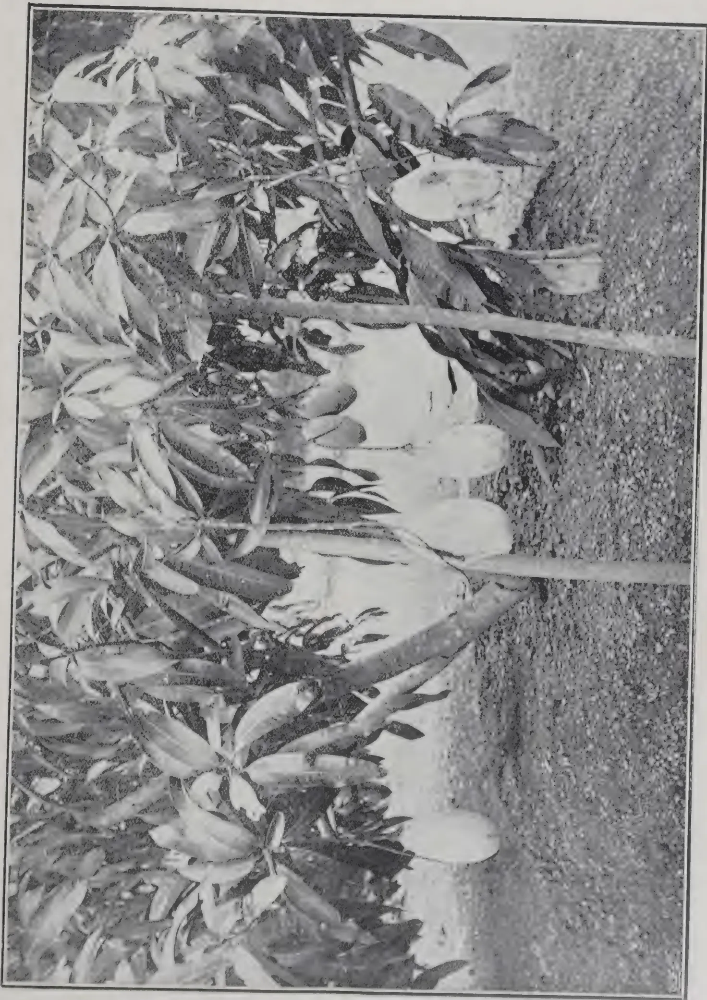A black and white photograph showing a close-up of a tree branch. Several large, oval-shaped fruits, likely mangoes, are hanging from the branch. The leaves are long, narrow, and have a serrated edge. The ground below is covered in grass. The image is framed by a thin black border.

NEW INDIAN MANGO FRUITING

35------------------------------------------------

This image is a scan of a blank page. The background is a uniform light beige or off-white color. There are several small, dark specks scattered across the surface, which appear to be scanning artifacts or dust particles. A very faint, thin vertical line is visible near the left edge of the page, possibly indicating a binding or a scanning artifact. No text, images, or other markings are present.

36------------------------------------------------

JANUARY, 1914.]29

by 9 inches wide which can be opened or closed by means of a flap. These ventilating shafts connect with the main air trunk, which is exhausted if necessary by means of an electric fan.

At distances of 12 inches pieces of rough twine hang from the ceiling and alongside each piece of twine there is a hook which enables each bunch, as it is brought up, to be tied up very expeditiously.

On one wall of each room there is a thermometer marked with the following readings :—

75° too hot

72° quick ripening

66° medium ripening

60° slow ripening

56° to keep

50° too cold.

As a matter of fact I find that there has been so far very little storage indeed done in these sheds, as the consignees have shipped away the bunches immediately they arrived, to different parts of the country and the Continent —BULLETIN No. 74, AGRICULTURAL DEPARTMENT OF TRINIDAD AND TOBAGO.

---

## ROYAL BOTANIC GARDENS, PERADENIYA.

Visitors to the Royal Botanic Gardens for September, October and November numbered 1,566; 2,819 and 2,576 respectively.

### OXALIS WEED.

The experiments made with a view to exterminating the Oxalis pest in the upper portion of the garden have been attended with more or less success. A crop of rice followed by barley and wheat considerably cleared the ground of this baneful weed, and at the time of writing scarcely a single plant can be seen; it may however possibly re-appear with the advent of the rains. Further cropping will not be advisable, as it will interfere with the growth of the young orange trees which have been planted in this spot.—ANNUAL REPORT, KUMARY GOVERNMENT GARDENS.

37------------------------------------------------

30[JANUARY, 1914.

# MANURES.

## THE CHOICE OF MANURES.

The principles which guide the practical man in his choice of manures and fertilizers are simple and well known. In the first place the growing plant requires large quantities of water, if only to repair the inevitable and continuous loss of water vapour from the leaves. The plant itself contains an extraordinarily large percentage of water, and all the chemical operations which take place in it depend for their fulfilment on a larger or smaller quantity of water in the tissues of the plant. Hence if he is to obtain larger crops the gardener must see to it that an adequate supply of water is available to the plant. It is not enough for him—even where it is practicable—to add water: he must build up a soil of such constitution that it will both hold water and part with it readily to the plant. Since decaying organic matter, farmyard manure, for example, imparts this property to the soil, this class of substance is looked upon as an ideal manure.

In the second place, the practice of manuring depends on the well-established fact that certain mineral substances, and particularly nitrogen compounds, potash and phosphoric acid, are essential plant foods. Hence the art of manuring consists in the amelioration of the water conditions of the soil and in supplying deficiencies in what may be called the feeding capacity of the soil. There is, however, a third principle, which is no less important, but which is apt to be overlooked. That principle is an economic one. The gardener must secure the conditions which we have indicated at the minimum of cost.

By the addition of dung in sufficiently large quantities an adequate amount of essential food may be provided; but since dung contains relatively small quantities of such an essential as phosphoric acid it is evident that a more economical method of manuring consists in adding, together with a smaller amount of dung, some phosphatic fertilizer, such, for example, as basic slag.

In recent years these old-established principles have been challenged, and we have been asked to revise the articles which constitute this philosophy of manuring.

The new philosophy, which has been used by MESSRS. WHITNEY and CAMERON, of the Bureau of soils, \* holds that all soils contain large stores of the essential foods, phosphates and potash, that the water in the soil—the soil solution—contains enough of these substances for the purpose of plant growth, and that one soil is not more fertile than another because it is richer in such mineral substances as potash or phosphates, but primarily because it is in better case to supply the crop with all the water which it requires. A

\* U.S. Department of Agriculture.

38------------------------------------------------

[JANUARY, 1914.31

second cause of the inferior fertility of certain soils is found by MESSRS. WHITNEY and CAMERON to lie in the existence therein of toxic substances produced by the roots of previous crops, and left in the soil to the detriment of the growth of the plants which succeed these crops.

In order to meet the objection that artificial potash and phosphatic manures are known to increase soil fertility these investigators urge that the fertilizers act, not by supplying food to the plant, but by putting the toxic soil-substances out of action.

From the point of view of immediate practice the newer hypothesis is not important; but from that of the ultimate practice of manuring no less than from the point of view of scientific horticulture it is of very great importance indeed. Hence the investigations carried out by MR. A. D. HALL and his colleagues at Rothamsted, and published recently by the Royal Society, \* are particularly opportune.

The net result of these investigations is to vindicate the older view, and to show that the revolutionary toxic hypothesis is without foundation. The conclusions reached by MR. HALL, which are of greatest interest, are, first, that the Rothamsted plots, which are to-day producing poor crops owing to the fact that essential foods—now potash, now phosphoric acid—have been withheld during the past 60 years, yield good crops when their particular deficiencies are made good. Thus a phosphorus-starved soil gives a normal good crop when phosphatic manures are added to it and similarly a potash starved soil recovers its fertility when its defect of potash is made good.

Second, although the soil of such plots has carried continuously for the past 60 years crops of one kind only—wheat in some cases, barley in others—water extracts from the soil are found to have no toxic action whatever on the roots of similar or different plants.

Hence the toxic theory of soil-fertility may be dismissed, or at most regarded as of very limited applicability.

Third, the WHITNEY-CAMERON hypothesis that all soils contain enough potash and phosphates for plant-feeding purposes is shown to be improbable. For HALL demonstrates that, as we might expect on the old view, the feeding value of a soil-extract increases within the wide limits with its concentration. That is to say, a solution which contains more potash or phosphates produces bigger crops than one which contains less of the substances. Naturally, there is a limit to this law that concentration increases crop, and, as we all know, an excess of soluble fertilizer may result in no crop at all. The rôle, therefore, of the artificial fertilizer is to bring the "soil solution" up to the maximum beneficent concentration, and we may still hold the common sense view that fertilizers used as supplements to dung exert their beneficial effects by reason of the plentiful supplies of specific foods which they put at the disposal of the plant.—GARDENERS' CHRONICLE.

\* *Phil. Trans. Roy. Soc.*, London, 1913.

39------------------------------------------------

32[JANUARY, 1914.

## A GREEN MANURE AND WEED PREVENTIVE.

A. STOLZ AND H. HARMS.

*Desmodium hirtum* is an addition to the number of nitrogen-bringing green manure plants, which grow rapidly forming a dense cover, capable of preventing the development of weeds and of protecting the soil against leaching out by torrential rains and the heat of the tropical sun.

The habitat of *Desmodium hirtum* (Guill. etc Perr.) is fairly extensive. It is found in Natal, German East Africa, Senegambia, Sierra Leone, Togo and Kamerun. It grows from sea level up to an elevation of about 5,600 feet. It is a herbaceous climbing plant, the branches attaining a length of 3 feet to 6 feet. In German East Africa the plant loses its leaves in July and August and many of the branches die, but in September vegetation starts again, new branches cover those that have died and which go to form an excellent humus.

The production of the seeds is not very easy, consequently the writers recommend the following method. The seeds are sown in a rich loose fresh soil; the seedlings are transplanted when about 4 inches high into loose soil. Thus vigorous plants are obtained which produce numerous cuttings. The writers insist on the necessity of taking only rooted cuttings, and they advise choosing a rainy season for making a plantation and setting the plants 3 feet apart.

The *Desmodium* is very sensible to the physical state of the soil; it has a decided preference for tilled soils and develops much more in plantations than in the wild state.

In a rich soil this leguminous plant forms a cover one foot deep which completely prevents the growth of weeds and thus allows a great economy of hoeing; besides this, *Desmodium* may be utilized as green manure and as food for live stock, sheep and asses being especially fond of it.—MONTHLY BULLETIN.

## DIFFERENT PHOSPHATIC MANURES.

The following account summarised from the Northumberland County Education Committee Guide to Agriculture, Experiment Station, Cockle Park, appears in the JOURNAL OF THE BOARD OF AGRICULTURE FOR NOVEMBER:—

A test of the relative values of phosphatic manures was commenced in November, 1911, when plots 1/20th acre in area were laid down on young

40------------------------------------------------

JANUARY, 1914.]33

three years' "seeds" after barley. The dressings each of which supplied 200 lb. of phosphoric acid per acre, and the yield of hay in 1912 were as follows:—

<table border="0">
<thead>
<tr>
<th></th>
<th style="text-align: right;">Weight of<br/>Hay, 1912.<br/>cwt.</th>
</tr>
</thead>
<tbody>
<tr>
<td>Plot 1.—9½ cwt. basic slag, 41·3 per cent. phosphate of lime, 89 per cent. citric soluble, fineness 90 per cent., supplying 458 lb. lime per acre ... ..</td>
<td style="text-align: right; vertical-align: bottom;">35¼</td>
</tr>
<tr>
<td>Plot 2.—19·7 cwt. basic slag; 19·82 per cent. phosphate of lime, 66 per cent. citric soluble, fineness 95 per cent., supplying 892 lb. lime per acre ... ..</td>
<td style="text-align: right; vertical-align: bottom;">39¼</td>
</tr>
<tr>
<td>Plot 3.—8½ cwt. bone meal, 46·64 per cent., phosphate of lime, mostly citric soluble; 4·78 per cent. nitrogen; supplying 269 lb. lime per acre ... ..</td>
<td style="text-align: right; vertical-align: bottom;">33¾</td>
</tr>
<tr>
<td>Plot 4.—No dressing ... ..</td>
<td style="text-align: right; vertical-align: bottom;">33¾</td>
</tr>
<tr>
<td>Plot 5.—8·6 cwt. Tunisian rock phosphate (ground) 45·3 per cent. phosphate of lime (trace citric soluble), fineness 100 per cent., supplying 426 lb. lime per acre ... ..</td>
<td style="text-align: right; vertical-align: bottom;">35¼</td>
</tr>
<tr>
<td>Plot 6.—8¼ cwt. Belgian rock phosphate (ground) 47·2 per cent. phosphate of lime (trace citric soluble) fineness 98 per cent., supplying 453 lb. lime per acre ... ..</td>
<td style="text-align: right; vertical-align: bottom;">35¼</td>
</tr>
<tr>
<td>Plot 7.—16¼ cwt. Belgian rock phosphate (calcined), 24 per cent. phosphate of lime (trace citric soluble) fineness 100 per cent. supplying 1,114 lb. lime per acre ... ..</td>
<td style="text-align: right; vertical-align: bottom;">38½</td>
</tr>
<tr>
<td>Plot 8.—4½ cwt. Belgian rock phosphate (ground) 47·2 per cent. phosphate of lime and 6½ cwt. superphosphate, 29·9 per cent. soluble phosphate of lime (100 lb. phosphoric acid) ... ..</td>
<td style="text-align: right; vertical-align: bottom;">37¾</td>
</tr>
</tbody>
</table>

It will be seen that the slag applied to Plot 2, which was only of 66 per cent. citric solubility, has so far given a larger return than the 89 per cent. citric soluble slag applied to Plot 1. The results indicate that a high citric soluble slag is not necessarily quicker in its action than one of low citric solubility, and that a high content of lime in slags is advantageous. It is stated that a high-grade slag of normal citric solubility, as a rule, costs less per unit of phosphate of lime, and on the whole has given the best economic returns. Mineral phosphates appear to be deserving of more attention from the experimenter and farmer. Their cost per unit of phosphate of lime is now considerably less than that of basic slag. It is concluded that for three years' seeds there are indications that the same amount of phosphate applied in the form of a mixture of basic slag and superphosphate may give better results than when all the phosphate is applied in the form of slag.

41------------------------------------------------

34[JANUARY, 1914.

# THE DOMINIONS.

## COFFEE IN EAST AFRICA.

The following extract is from a lecture by MR. J. G. HAMILTON published in the Proceedings of the United Planters' Association of Southern India, 1913:—

The climate of Nairobi was like that of Coonoor at its best. There were two rainy seasons there, the long rains and the short rains. The local rainfall averaged from 40 to 50 inches in the year, but the year he was there the rainfall was 60 inches, so everything was very green. What principally interested him in Nairobi was coffee. He saw several estates and he saw coffee which he did not think existed anywhere else in this world. The coffee was planted at various distances till they came down to 8 ft. by 8 ft. They topped the trees at 5 ft. and the coffee bush then assumed a pyramidal form, with the branches almost meeting at the bottom, although there was room to walk between the trees. He saw no trace of disease at all, but every branch from stem to tip was covered with crop. The man who took him round, as a so-called authority, asked him to estimate the crop. At the particular part of the estate he saw he put the crop at 2 tons per acre, and the whole (old and young) at 10 cwt., but the Manager wrote and told him afterwards that he had picked 35 tons from 55 acres. The coffee was all grown in the open and there was not a vacancy. There was no jungle, nothing but grass and undergrowth. Felling consisted in throwing a match down! After that the land was ploughed and a cooly was sent out with a crowbar and told to plant. Lining was done and well done; the easy slopes presented small difficulties regarding this. The plants were put in along with Indian corn or beans, and a cultivator was run up and down to keep the weeds down. The Indian corn, or mealies, and beans got ahead of the coffee. When he saw a planting of this kind, he could not see the coffee; it was smothered in Indian corn and beans. He never saw such magnificent crops of mealies. After they got this crop cleared, the coffee was seen from 18 inches to 2 feet high. He saw a crop of two-year old coffee which was said to be from imported Blue Mountain seed. The ordinary coffee cropped in two years, but the trees were not considered to be in full bearing till they were three years old when they gave a crop up to 8 cwt. per acre. The original seed was said to have been brought from Mocha; but he could not trace it. It was said that one of the priests of the Mission had sent the seed from Aden. The oldest coffee is at the French Mission (Society of the Holy Ghost). He had brought away some seed and had now got plants from it, and the leaves had that curious crinkly look he had seen on coffee which a Mohamedan told him had been brought from Mocha. As regards the vegetation, they had a certain amount of green stuff, but not many leguminous plants, as far as he could see and recognise. It was just ordinary green stuff; but the soil was a rich loam of which he could not find the bottom anywhere.

42------------------------------------------------

JANUARY, 1914.]35

He had a letter from a man in Mysore who went to Nairobi, saying that small silver oaks planted round the house in December were from 6 ft. to 10 ft. high in the following July. He did not think that anywhere in India it was possible to find growth of this kind. The roads were not good : it was a new country, and they could not spend much on the roads, which were more like bridle-paths. There were not many carts, and the people generally went about in mule buggies or rickshaws. Cattle could be kept if one was careful, but horses were difficult to keep. Some men rode mules, but a great many bicycles were also in use. It was very evident from the look of the children that the climate was very fine, and the children went about in the day just as children did at Home. The labour was there in any quantity, but the people did not want to work, as there was no need for them to work. Every man had two or three wives, and they scratched the ground, threw down a handful of Indian corn and their food supply was assured. They were very simple livers, subsisting mainly on mealies and a kind of sweet potato. Some settlers went in for farming and sheep and cattle ; but sheep stealing was very rife, as all knew from one notorious case that they had read of in the papers. Transport was expensive and difficult, and railway freights were high. Carting was decidedly expensive with roads that were as bad as he had described.

## CATTLE BREEDING IN GERMAN EAST AFRICA.

G. LICHTENHELD.

The 2,300,000 head of cattle in German East Africa are very unequally distributed. About one-third of the Protectorate is unsuitable for cattle owing to tsetse, and much of the rest is not utilized.

All the cattle, with the exception of some animals imported from Europe, are zebus. They mostly belong to *Bos zebu africanus*, but some are *B. Z. indicus* (called Sokotra cattle by the writer). Among the African zebus, the writer draws a distinction between those with large horns and small humps (Watussi, numbering 750,000) and those with small horns and large humps (Masia, 1,500,000).

### THE MASAI ZEBUS.

Bred chiefly by the Masai tribe. Colour usually red or yellow and brown but frequently black or white and grey. Pigmentation generally dark, rarely similar to the coat colour. Skin thick and coarse ; hair smooth, short, with a silky lustre. Head small, often hornless, but frequently with short, stout horns bent slightly upwards. Face slightly dished. Ears medium sized, directed sideways and slightly backwards. Neck of medium length, with the dewlap usually more developed. Withers wide, hump 12 inches high, and usually more developed in the male than in the female. Shoulders sloping and muscular. Chest relatively deep, occasionally somewhat flat. Body barrel shaped. Back and loins of medium length and in a straight line. Croup weak and sloping. Haunches very fleshy. Limbs short, but with small, regular bones. The legs are sometimes crooked but to no great

43------------------------------------------------

36[JANUARY, 1914.

extent. Tail set on rather low, long and thin, with a large tuft. Hoofs small, hard and varying in colour from grey to black. Udder small, fleshy, almost hairless, with short, fleshy teats. The size of the animals varies in different localities and attains an average of 4 ft. 3 in. to 4 ft. 7 in., sometimes 5 ft. or 5 ft. 6 in., in height. The best developed animals are usually found in the hot dry district, while the less developed occupy the lower ground.

The Masai zebu matures late; cows do not come into heat until the age of  $2\frac{1}{2}$  years. The bulls and cows are full grown between  $3\frac{1}{2}$  and  $4\frac{1}{2}$  years, but steers may go on developing until they are 6 years old.

The Masai zebu is a thrifty animal, and very resistant to weather and disease. The calves are subject to Texas fever, which is prevalent throughout the Protectorate and causes 1 per cent. loss, if the animals contract it during the first months of their life. If the disease appears later, the losses can amount to 20 per cent. or over. The same occurs in the case of anaplasmosis. Coast fever, in the districts where it is endemic, is responsible on an average for the death of 30 per cent. of the calves; the remainder enjoy life-long immunity; but if this disease is introduced into a hitherto healthy herd, it may carry off 90 per cent. The number of cattle attacked by tuberculosis is estimated by the writer at under 1 per thousand.

The Masai cows calve regularly every year. Calving is usually normal, no assistance being needed, and it is followed by no bad after effects. The milk production is normally below 70 gallons per lactation period, but under favourable conditions may be more.

The beef production of a two-year-old steer is easily over 220 lb.; steers of five years of age give up to 440 lb. of beef, and those of 7 years up to 770 lb. The weight of the hump can attain 24 lb. The meat contains coarse fibres and is less marbled than that of European breeds. The fat accumulates chiefly below the skin and round the viscera. These zebus are satisfactory draught animals.

#### **THE WATUSSI ZEBUS.**

These are only bred by the Watussi tribe, and are a little smaller than the previously mentioned animals. Coat usually red, brown or yellow. Head and horns longer than in the Masai type. Chest deep, but flat. Line of back and croup straight. Legs often crooked. Milk production twice as large as in the case of the Masai type, but meat production poorer. The animals are less resistant to epidemics and other forms of disease than the Masai zebus; they cannot stand short rations or want of water as well as the latter. These faults recur in crosses between the two types. The Watussi are also less fertile and develop later than the Masai zebus.

#### **THE SOKOTRA ZEBUS.**

These were introduced direct from India by merchants and are much appreciated for their good milking qualities. They are especially suited to the coast zone, and will, in the opinion of the writer, be still more popular in the future.

#### **CATTLE KEEPING AND BREEDING BY THE NATIVES.**

Most of the tribes keep their cattle in the open, but some give them shelter at night. The calves are only put with their mothers for suckling.

44------------------------------------------------

JANUARY, 1914.]37

As the natives milk all the cows the calves generally suffer from under-feeding. The large and the small domestic animals do not graze together. During the rainy season, and for a short time after the animals are at grass for some hours; during the dry season, they remain in the field all day. When the natural supplies of water are exhausted, the natives dig wells to obtain drinkable water.

In some districts where water is scarce, the animals are fed during the dry season on succulent banana stems. One stem daily is considered sufficient for an animal in the cow-house. The natives have no idea of making hay, or of storing fodder for times of dearth. When the grass of a pasture becomes scanty, the native sets forth in search of fresh fields, or sends some of his cattle into good grazing districts, paying in return for the pasturage the milk produced by the cows during their stay.

As a rule, the bulls used for breeding purposes are selected. They are generally chosen for shape, colour and maternal descent, the offspring of good milkers being given the preference. Unsuitable animals are castrated. The proportion of bulls ready for service is about 1 to every 20 cows. The cows are chosen for their good milking properties. A well-proportioned milch cow may be worth as much as three bullocks. As the natives use all their cows for breeding the herds become very heterogeneous. According to the writer, there is no selection of cows for breeding, for the idea is to use all the available animals, and thus increase the size of the herds as much as possible. In order to avoid in-breeding, the native exchanges his breeding animals with those of other cattle owners. The Masai zebus are often crossed with the Watussi, but the offspring produced by crossing these two types with the Sokotra zebu enjoy equal favour. Most of the native tribes still refuse to introduce into their herds European cattle or their hybrids.

#### CATTLE KEEPING AND BREEDING BY EUROPEANS.

The methods adopted by the Europeans differ little from those which obtain amongst the natives. The chief aim of the European breeders is to have as large herds as possible. As a rule, their herds are less valuable than those of the natives, which is the more to be regretted as they import many bulls from Europe. The writer thinks that it would be best for the European graziers to begin improving the native breeds before trying to introduce European blood. It has been found that European cattle and their crosses have little power of resisting the climate and the diseases peculiar to the country. It is true that some success has been attained recently in rendering European cattle immune from the most serious diseases, such as anaplasmosis and Texas fever, but for various reasons, immunisation cannot be practised generally. European cattle if introduced should, according to the writer, be kept in the cowshed.

Alongside of ordinary farms, where, as on those belonging to the natives, the chief attention is paid to meat production, there are also some dairy farms in the Protectorate. The milch cows on these farms are Sokotras or of European breeds; they are always kept in the stall, and receive in addition to grass and hay "mogo" \* and oil cakes.

\* This is a tuber of which the feeding value is about equal to that of the potato.

45------------------------------------------------

38[JANUARY, 1914.

### THE VALUE AND IMPORTANCE OF THE CATTLE.

The price of a steer yielding 440 lb. of beef varies from 25s to 90s according to locality. Cows fetch a quarter or half as much again.

At Daressalam a gallon of milk costs 2s; at other places its price is from  $2\frac{1}{2}d$  to 10d. One pound of fresh butter costs about 3s at Daressalam; 1s. 6d at Moschi; 11d at Iringa. One pound of "samli" † costs 3d at the chief places of export.

Until lately, the cattle of German East Africa have been chiefly important as providing food for the native breeder, whose prosperity depends for the most part upon his herds. Recently, however, they have also begun to supply the plantation workers and the town populations. Last year, about 12,000 oxen were sent for slaughter to the districts of Tanga and Wilhelmstal. On the other hand, the writer estimates the number of animals which annually find their way to the market at over 40,000. Considering the small amount of business, and the low price of meat, there is no question of the rational utilization of the cattle. In all breeding districts the over-production of beef producing animals is noticed. The writer considers that the best means of preventing a crisis in this direction would be the establishment of factories for canning meat and preparing meat extract.

The number of cattle exported from the Protectorate was 545 in 1910, 240 in 1911, and 179 during the first half of 1912. As regards "samli," 677,300 lb. were exported in 1910, 659,500 lb. in 1911, and 399,600 lb. during the first half of 1912.

The duty on exported cattle amounted to about £17,000 in 1910 and 1911, and £10,350 during the first half of 1912. The small numbers exported are partly due to the prohibition of the importation of cattle into the neighbouring colonies (except Zanzibar and the Congo) and the law forbidding cows being exported from the Protectorate. As draught animals and producers of manure, the cattle in question are of no interest.

### METHODS OF IMPROVING CATTLE BREEDING.

The writer is of opinion that it would be worth while to improve the breeds of cattle in German East Africa. In order to do this it would be necessary to improve the management of the animals, abandon the practices which lead to the under-feeding of the calves, not allow the heifers to be served by the bull at such an early age, and diminish the size of the herds kept in districts poor in forage. Hay should also be grown on the farms kept by Europeans, and maize, potatoes, lucerne, etc., cultivated on dairy farms. A better selection of stud animals is very desirable; in-breeding should be avoided, and only immune bulls used in districts where coast fever is prevalent.

The writer advises crossing native and European cattle only for the purpose of improving the milk production, and considers that such crossing should be practised by the European farmers exclusively.—MONTHLY BULLETIN.

† Native-made melted butter.

46------------------------------------------------

JANUARY, 1914.]39

## OLIVE GROWING IN ITALY.

PROF. F. BRACCI.

From the most remote antiquity the cultivation of the olive has been very important in Italy.

The special conformation of the country, its position in the basin of the Mediterranean, that is in the centre of the habitat of the olive, the mildness of its climate and the fertility of its soil, render the peninsula very favourable to the growth and productiveness of this oil plant. It is not certain whether Italy or Spain occupies the first place for extent of area under olives and for quantity of oil produced. Whilst the sources of Spanish statistics are liable to discussion, in Italy at present a different system is followed in the valuation of the area under olives, a distinction being made between the area devoted exclusively to olive trees and that which these trees share with other crops. Thus comparison between the two countries, is not possible at least as regards the areas.

The statistics made before the introduction of the new system give the following figures for the acreage under olives :

<table>
<thead>
<tr>
<th></th>
<th style="text-align: right;">Acres.</th>
</tr>
</thead>
<tbody>
<tr>
<td>Average between 1870 and 1874</td>
<td style="text-align: right;">... 2,210,650</td>
</tr>
<tr>
<td>" " 1879 " 1883</td>
<td style="text-align: right;">... 2,294,630</td>
</tr>
<tr>
<td>" " 1890 " 1895</td>
<td style="text-align: right;">... 2,663,538</td>
</tr>
<tr>
<td>" " 1901 " 1908</td>
<td style="text-align: right;">... 2,705,428</td>
</tr>
</tbody>
</table>

With the new system the figures are:

<table>
<thead>
<tr>
<th></th>
<th style="text-align: right;">Acres.</th>
</tr>
</thead>
<tbody>
<tr>
<td>Average between 1909 and 1912</td>
<td></td>
</tr>
<tr>
<td>Olive trees intermingled with other crops</td>
<td style="text-align: right;">... 4,358,562</td>
</tr>
<tr>
<td>Olive trees alone</td>
<td style="text-align: right;">... 2,353,560</td>
</tr>
</tbody>
</table>

Considering the figures according to the new system to be correct, it appears that the area estimated at 2,705,428 acres was in reality 3,423,420 acres.

Though we may not infer that the area occupied by the olive has risen from 2,210,650 acres in 1870 to the present 3,423,420 acres, as the latter figure may be, and probably is, due to greater accuracy or at any rate to a different method of estimating the area, there are in reality grounds for believing that the area under olive trees has sensibly gained in extent, as a fair number of new plantations are to be seen, mostly better set out than the older ones. There was, however, a short period after 1880 during which many olive groves were destroyed to make way for vineyards; this took place especially in Sicily and Calabria.

As for the yield, statistics point to a constant decrease from 1870 to the present time.

Taking into consideration large averages, we get, up to 1908, that is up to the new statistics, the following figures for olive oil :

<table>
<thead>
<tr>
<th></th>
<th style="text-align: right;">Gallons.</th>
</tr>
</thead>
<tbody>
<tr>
<td>Period between 1870 and 1883</td>
<td style="text-align: right;">... 73,843,000</td>
</tr>
<tr>
<td>" " 1885 " 1896</td>
<td style="text-align: right;">... 53,663,500</td>
</tr>
<tr>
<td>" " 1897 " 1908</td>
<td style="text-align: right;">... 45,988,800</td>
</tr>
</tbody>
</table>

47------------------------------------------------

40[JANUARY, 1914]

According to recent statistics the average from 1909 to 1912 was 40,282,000 gallons; but perhaps 50,025,800 gallons would be nearer the mark, as it would include the residual oil (including "olio lavato," extracted from the pomace by washing; "olio d'inferno," collected from the well under the presses; and that obtained by treatment with carbon bisulphide).<sup>\*</sup> For comparison with the returns of the older statistics the figure of 43,956,000 gallons should be taken, as it includes only the "inferno" oil. It confirms the decreased yield of the olive tree.

The causes of the decrease of production and of the critical state of this crop during the last thirty years are many and of various kinds, namely: weather conditions, parasites, and constitutional and cultural conditions.

Reviewing notes on the oil crop since 1889; it appears that during these 25 years drought and sirocco caused more or less injury in 21 cases; winter frosts and cold springs, and mists and rain that injured the flowering, in 7 cases; the olive fly caused serious and general injury in 10 cases; lesser or partial damage, together with *Rhynchites* and *Phlaeothrips* and other insects in 7 cases; *Cycloconium* caused partial injury from the year 1902 onwards and since 1910 with increasing gravity and in almost all the growing districts. From the above it is seen that the most efficient cause of injury is the almost constant drought, which is easy to understand if one remembers that the olive tree grows mostly on hills and mountain slopes and most frequently without the necessary work being done to retain the rainwater, while the olive tree requires a good deal of moisture, which, as Giglioli says, is the manure *par excellence* of the olive tree, especially during the growth of its fruit. Next in order of importance come the serious attacks of the olive fly and other animals or plant parasites, the development and spread of which are to a great extent dependent upon the abnormal physiological and cultural condition of the trees.—MONTHLY BULLETIN.

---

## BANANAS IN JAMAICA.

According to the WEST INDIA COMMITTEE CIRCULAR of October 7th the exports of bananas from Jamaica have now reached the total of 20 million bunches a year, and there are indications that the industry will expand still further in the near future. The railway extension in the Rio Minho valley is expected to open up some 17,000 acres well suited for bananas. In the North the United Fruit Co. are extending their plantations.

<sup>\*</sup> Whilst in the old statistics the quantity of oil was ascertained directly from that obtained during the season in each commune, with the new system the quantity of olives is recorded and the quantity of oil is calculated according to the average yield in the mill in the various districts. This yield does not include the "inferno" oil, nor that obtained by washing or treating with carbon bisulphide, though these oils also are put upon the market; the first of these oils is used to a great extent as food by the poor, who often prefer it to the better oils; it is also used, as well as that obtained by washing and by treatment with bisulphide, in the industries. The "inferno" oil may be calculated at about 1.5 per cent. and the other two oils at 2.5 per cent. of the crushed olives.

48------------------------------------------------

JANUARY, 1914.]41

# ENTOMOLOGY.

## INSECTS ON RUBBER IN 1913.

*Hevea brasiliensis*. Muell. Arg. (Para Rubber).

In August a Cerambycid beetle was sent in from Kandy District. It was reported to be attacking rubber stumps planted the previous month by gnawing the bark. It had chiefly attacked the withered stumps that were not likely to grow, but had also been found on healthy stumps.

As the result of several experiments with the beetles sent I conclude that, while undoubtedly these beetles are able to eat the bark with impunity in spite of the flow of latex, they do not take it by preference e.g., when dry twigs are presented to them at the same time.

The beetle is known as *Machotypa verrucicollis*. Gahan.

It is about 1 inch long, of a reddish-purple colour with a greyish area in the form of an X on the elytra.

The ventral surface is pinkish. The antennæ reach beyond the apex of the abdomen.

We have records of this beetle on Hevea from Matale and Ukuwela.

It was last reported in 1907.

The trees being attacked should be sprayed with lead arsenate.

*Saissetia nigra* Nietner (*Lecanium nigrum*) "Black Scale," which has been sent in several times, occurs widely on Hevea in Ceylon. It feeds on the leaves and twigs and is frequently attended by the large red ant, *Oecophylla smaragdina*, which often draws the leaves together to form a shelter over the scales.

There is a disposition to regard it as negligible as a pest, but this seems to the writer to be a mistaken attitude.

*S. nigra* is a serious pest of cotton in the West Indies, and in Ceylon occurs in injurious numbers on cotton and *Croton Tiglium*.

That scale insects are able to subsist on latex-fortified trees is proved by the fact that *Coccus viridis* Gr. occurs in injurious numbers on the leaves of *Funtumia elastica*, *Plumeria* sp, *Landolphia Kirkii* and *Alstonia scholaris*, as well as by the fact that *S. nigra* itself flourishes on *Hevea brasiliensis* and *Manihot glaziovii*.

*S. nigra* in Ceylon is not so subject to the attacks of hymenopterous parasites as are some allied scale insects, though the writer has reared several specimens of what is very probably *Sutellista cyanella* from the scales on *Croton Tiglium*, and has observed that the eggs are subject to the depredations of a Cecidomyid larva.

All things considered no chances should be taken of *S. nigra* not becoming a serious pest of Hevea, and it should be destroyed whenever an opportunity presents itself.

49------------------------------------------------

42[JANUARY, 1914.

In all likelihood the ant keeps away parasites and war should be waged against it. It is often a perfect nuisance on tea and fruit trees in many parts of Ceylon. The nests should be broken up and sprayed with Kerosene Emulsion.

Phorids were found to have laid their eggs on decomposing, smoke-cured rubber, and the maggots were feeding on the products of decomposition.

The puparia of these flies are brown, oval, slightly convex on the upper and highly convex, almost ridged, on the lower surface. The dorsum is ridged transversely. The posterior end is truncate and bears four, small, pointed tubercles, the outer two of which are the largest. They vary in size from 3 to 4 m.m.

The adults are small, active flies.

They are yellowish-brown in colour, with seven transverse black bands on the abdomen; of those bands the most anterior is very narrow, the next is attenuated in the middle line, the two succeeding have a round, light-brown spot in the middle line, the next is almost obsolete in the middle line.

The legs are whitish-yellow.

The wings have some stout veins near the costal margin and other weaker ones extending across the wing and unconnected by cross veins.

Probably the rubber had been insufficiently dried. It had developed a mould.

Phorids generally lay their eggs in decomposing organic matter.

I have bred them from caterpillars and locusts that had died but a short time previously, and also from the combs of a wasp's nest, in the latter case in such circumstances as to suggest that the eggs had been laid while the combs were still in the soil.

But Phorids have so strong a sense of the proximity of decaying organic matter, and are so insinuating, that it is just possible the combs were infested after they had been gathered.

A large weevil, as yet undetermined, was sent in with the information that it was taken from a rubber tree (Hevea?) infected with canker.

### FUNTUMIA ELASTICA.

Caprinia conchylalis. Guen.

On October 10th the caterpillars of this Pyralid were found feeding on the leaves of *Funtumia elastica* near Peradeniya.

They were living below a folded-over part of the leaf and were eating the epidermis. The shelter was at the tip of the leaf and was formed by a cut having been made from one side to the midrib, and the part thus set free having been folded over on to the corresponding part on the other side of the midrib and held in place by strands of silk.

The tents are not necessarily of the above type.

The two edges may be folded together along the whole length of the leaf, enclosing the upper surface of the leaf.

In October only a few leaves of the trees were attacked.

By November 6th, the trees were heavily infested and had a withered appearance due to the dead leaves.

On December 6th only a few withered leaves remained on the tree, and neighbouring trees of *Funtumia*, that had up till then remained almost free

50------------------------------------------------

JANUARY, 1914.]43

from attack, shewing that the moths do not go far from their place of hatching, were beginning to shew here and there a withered leaf.

It afforded a splendid object lesson of the consequence of neglecting the first stages of an attack.

Had a thorough spraying with Arsenate of Lead at a strength of 5 lb. to 100 gallons of water been undertaken the outbreak would probably have been arrested.

The caterpillar is a beautiful one.

The body has a silky lustre due to a sticky fluid which the caterpillar secretes.

There is a brown, mid-dorsal stripe regularly spotted with white and bordered by a black stripe enclosing within its bounds ten white spots.

Below this the body is yellowish with faint white spots. The head and first thoracic segment are glossy black.

Long, white hairs spring from tubercles.

The head is tubercled and possesses a comparatively deep, median groove.

The hooks of the prolegs, which are of the usual number, are in a ring interrupted on the outer margin.

In older caterpillars ( $1\frac{1}{2}$  inch in length) the black band bordering the brown dorsal stripe may become much fainter, so that the black tubercles in the area between the dorsal stripe and the black band become more obvious.

From larvæ that pupated on the 18th, adults emerged on the 27th.

The pupæ are usually to be found within the folded leaves, but they may occur exposed on the leaves.

The pupa is yellowish-white except the latero-dorsal region of the abdomen which is purplish-brown; this darker coloured region encloses triangular, yellowish-white areas near its lower edge.

There is a short snout.

The cremaster is situated at the end of a comparatively long, narrow process. The wing-sheaths and proboscis-sheath are free at the tip.

The moth has an expanse of 40-46 m. m.

HAMPSON describes it as follows:

"Pure white (it is purplish by reflected light when fresh); head black-brown, the palpi with a metallic tinge: collar, fore and mid legs tinged with cupreous brown; anal tuft of male black. Fore wing with broad, costal, cupreous-brown band; both wings with series of silvery striae close to the margin, which is silvery white."

He gives the distribution as Sikhim, Assam, Bombay, Nilgiris, Ceylon, Burma.

GREEN records the larva as feeding on *Portlandia grandiflora* and *Holarrhena mitis* Br. (*Kiri-walla*).

Neighbouring trees of *Funtumia* were infested with *Coccus viridis*, and the leaves were covered with sooty mould.

An undetermined Pyralid larva was feeding on the scales, and they were also attacked by a grayish-black fungus.

The trees, which in September and October were swarming with flies feeding on the "honey-dew" excreted by the Coccid, were almost deserted in November.

51------------------------------------------------

44[JANUARY, 1914.

*Pulvinaria* sp. was also present on the leaves, as were also not a few specimens of *Lecanium caudatum* Gr.

*Manihot glaziovii*. Muell. arg. (Ceara Rubber).

Beetles were found boring in several trees that had had their bark skinned during wet weather in preparation for tapping.

The beetles are of two kinds.

One is a long-snouted, slender, dark-brown weevil about 4.5 m.m. long. Its thorax is pitted throughout and the elytra taper rapidly near the posterior end.

The other is probably a species of *Xyleborus*.

It is about 3.5 m.m. long, of a dark-brown colour, with legs and antennae of a distinctly lighter colour.

The anterior end of the prothorax is tubercled and hairy, and there is a fringe of long, yellowish-brown hair on the ventral margin of the front. In lateral view the elytra are seen to slope sharply down at the posterior end, forming rather a flat area.

*Saissetia nigra* has been observed on the leaves of *Manihot glaziovii*.

*Landolphia Kirkii* Dyer (African Rubber).

A plant of the above species in the Botanic Gardens was found to be infested with *Coccus viridis* Gr, and the leaves were black with sooty mould.

The leaves of the same plant were also heavily infested on their under-surface with *Ichnaspis longirostris*. Sign

A. RUTHERFORD.

## POLLINATION AND CROSS-FERTILISATION IN RICE.

The Economic Botanist of Bengal, MR. G. P. HECTOR, has arrived at the following conclusions as the result of investigations in the lower division of that province:—

1. That in Lower Bengal under favourable conditions cross-fertilisation may take place in rice to an extent which may be provisionally estimated at about 4 per cent.

2. That this cross-fertilisation takes place wholly through the agency of the wind and would seem to be effective only between flowers of adjacent plants to a radius of a few feet.

3. That as regards certain characters at least, e.g., grain colour, segregation along Mendelian lines appears to take place.

4. That so long as seed of a variety is kept free from accidental mixture there is no risk of contamination from cross-fertilisation, but that if seed gets mixed, cross-fertilisation will undoubtedly take place between adjacent plants in a plot and to an extent sufficient in a few years' time to reduce a variety to a number of splitting types. Hence the imperative necessity of taking every precaution to keep seed of varieties free from accidental mixtures.

C. D.

52------------------------------------------------

JANUARY, 1914.]45

# POULTRY.

## POULTRY KEEPING ON A SMALL HOLDING.

J. H. SCOTT.

The holding includes about half an acre of grass land, which is divided into five equal parts, and is sheltered on the west by a wood, and on the south by a high hedge. The greater part is well shaded, making a favourable site for rearing chickens during the summer months; the soil is light, with chalky subsoil, not well drained, and very wet during the winter.

The object of the small holder was to find what results could be obtained by devoting a short time—say from one and a half to two and a half hours—per day to keeping poultry for utility purposes, mainly egg production.

The houses are of the open-fronted type, with shutters to draw up at night, and have scratching sheds adjoining, capable of accommodating up to twenty birds per house; floors are provided for both houses and shelters.

The stock at the outset numbered twenty-eight birds, composed of two breeding pens, Buff Orpington and Minorca, containing six pullets and one cockerel each, and fourteen cross-bred pullets which had been bred the previous year.

All hatching was done by pullets, and extended from the 16th April until the 26th June. During the season 104 chickens were reared to maturity, and of these only the cockerels were sold.

### FEEDING.

Feeding took place at regular times, and no waste occurred through food lying about on the ground. Chickens up to four months old were fed four times a day, and each alternate meal was of soft food. The adult stock received two meals daily during the summer months, and during the winter a midday feed was added. In severe weather the morning meal was given hot.

The food used was good sound grain, considerable quantities being purchased at a time. The following diet indicates the nature and amount of the foods purchased:—Wheat, 3,696 lb.; sharps, 1,526 lb.; maize, 406 lb.; meal, 224 lb.; chick seed, 182 lb.; bran, 126 lb.; meat meal, 70 lb.; barley, 56 lb.; oats, 42 lb.; biscuit meal, 42 lb.; flint grit 224 lb.; shell grit, 224 lb.

A plentiful supply of clean water was provided. As the birds had access to grass runs, no other green food was found necessary.

### SALES.

All eggs were sold on the holding, thus saving any cost for carriage, but birds were marketed in the feather, at the nearest town. Some twenty odd sittings of eggs were sold locally without advertising.

Sixty-three birds were sold during the year, leaving a balance of 69 birds at the end, to which must be added 16 chickens hatched in February and March.

The account on p. 47 shows a balance of £14. 1s. 9d. towards the items of rent, interest, and depreciation, and to repay the small holder for his work.

### APPLIANCES AND COST.

The cost of appliances was as follows:—

<table>
<tbody>
<tr>
<td>5 Houses</td>
<td>...</td>
<td>...</td>
<td>9. 0. 3</td>
</tr>
<tr>
<td>9 Coops</td>
<td>...</td>
<td>...</td>
<td>1. 11. 6</td>
</tr>
<tr>
<td>* Flooring</td>
<td>...</td>
<td>...</td>
<td>1. 1. 6</td>
</tr>
<tr>
<td>250 stakes</td>
<td>...</td>
<td>...</td>
<td>1. 16. 5</td>
</tr>
<tr>
<td>9 Rolls Netting</td>
<td>...</td>
<td>...</td>
<td>4. 11. 0</td>
</tr>
<tr>
<td>6 Food Tins</td>
<td>...</td>
<td>...</td>
<td>0. 7. 6</td>
</tr>
<tr>
<td>12 Earthenware Pads</td>
<td>...</td>
<td>...</td>
<td>0. 2. 0</td>
</tr>
<tr>
<td>Sundries</td>
<td>...</td>
<td>...</td>
<td>1. 6. 1</td>
</tr>
<tr>
<td></td>
<td></td>
<td></td>
<td>£ 19. 16. 3</td>
</tr>
</tbody>
</table>

\* Appliance makers charge somewhat heavily for floors, and it was found cheaper to buy three-quarter inch match boards for the purpose.

53------------------------------------------------

46[JANUARY, 1914.CAPITAL.

The total amount of capital required to establish a poultry plant of this size is from £25 to £30. The whole of the appliances need not be purchased at the outset, but may be obtained gradually as the stock increases, and all will be required by the end of October; produce will be sold from the commencement of operations, and by the time the whole expenditure is needed, sufficient should have been realised to meet it.

**RECORD OF THE NUMBER OF BIRDS IN STOCK AND EGGS LAID  
FOR EACH MONTH FROM APRIL, 1912, TO MARCH, 1913.**

<table border="1">
<thead>
<tr>
<th>1912.</th>
<th>Cockerels.</th>
<th>Pullets<br/>1911 hatched.</th>
<th>Chickens.</th>
<th>Sales.</th>
<th>No. of<br/>eggs laid.</th>
</tr>
</thead>
<tbody>
<tr>
<td>April ..</td>
<td>2</td>
<td>26</td>
<td>29</td>
<td>—</td>
<td>522</td>
</tr>
<tr>
<td>May ...</td>
<td>2</td>
<td>26</td>
<td>29<br/>66</td>
<td>—</td>
<td>386</td>
</tr>
<tr>
<td>June ...</td>
<td>2</td>
<td>26</td>
<td>95<br/>9</td>
<td>—</td>
<td>373</td>
</tr>
<tr>
<td>July ...</td>
<td>2</td>
<td>26</td>
<td>104<br/>2</td>
<td>2</td>
<td>360</td>
</tr>
<tr>
<td>August ...</td>
<td>2</td>
<td>26<br/>3</td>
<td>102<br/>24</td>
<td>27</td>
<td>324</td>
</tr>
<tr>
<td>September ...</td>
<td>2</td>
<td>23</td>
<td>78<br/>16</td>
<td>16</td>
<td>188</td>
</tr>
<tr>
<td>October ...</td>
<td>2</td>
<td>23</td>
<td>62<br/>7</td>
<td>7</td>
<td>49</td>
</tr>
<tr>
<td>November ...</td>
<td>2</td>
<td>23</td>
<td>55<br/>2</td>
<td>2</td>
<td>130</td>
</tr>
<tr>
<td>December ...</td>
<td>2</td>
<td>23<br/>1912 hatched<br/>53</td>
<td>53*<br/>—</td>
<td>—</td>
<td>431</td>
</tr>
<tr>
<td>1913.</td>
<td></td>
<td></td>
<td></td>
<td></td>
<td></td>
</tr>
<tr>
<td>January ...</td>
<td>2</td>
<td>76<br/>9</td>
<td>—</td>
<td>9</td>
<td>700</td>
</tr>
<tr>
<td>February ...</td>
<td>2</td>
<td>67</td>
<td>9</td>
<td>—</td>
<td>791</td>
</tr>
<tr>
<td>March ...</td>
<td></td>
<td></td>
<td>7</td>
<td></td>
<td>1,247</td>
</tr>
<tr>
<td></td>
<td>2</td>
<td>67</td>
<td>16</td>
<td>Average</td>
<td>458 4/7</td>
</tr>
</tbody>
</table>

\* These were all pullets commencing to lay, so are transferred to previous column.

54------------------------------------------------

JANUARY, 1914.]47TRADING ACCOUNT.

<table border="1">
<thead>
<tr>
<th></th>
<th>£. s. d.</th>
<th></th>
<th>£. s. d.</th>
</tr>
</thead>
<tbody>
<tr>
<td>Stock 1st April, /12 ...</td>
<td>3 7 6</td>
<td>Sales :</td>
<td></td>
</tr>
<tr>
<td>Food ...</td>
<td>22 14 2</td>
<td>Eggs ...</td>
<td>26 5 9</td>
</tr>
<tr>
<td>Extra Labour ...</td>
<td>0 12 0</td>
<td>Birds ...</td>
<td>6 18 0</td>
</tr>
<tr>
<td>Carriage ...</td>
<td>1 9 10</td>
<td>Sittings ...</td>
<td>2 7 5</td>
</tr>
<tr>
<td>Sundries ...</td>
<td>1 15 9</td>
<td></td>
<td>35 11 2</td>
</tr>
<tr>
<td>Balance ...</td>
<td>14 1 9</td>
<td>Stock: 31 March, /13</td>
<td>8 9 10</td>
</tr>
<tr>
<td></td>
<td>44 1 0</td>
<td></td>
<td>44 1 0</td>
</tr>
</tbody>
</table>

Throughout the year the stock was entirely free from disease.—BOARD OF AGRICULTURE JOURNAL.

SCALY LEG.

**Q.:** (1) *Is scaly leg hereditary?* (2) *What is its cause?* (3) *How is it cured, and* (4) *Are crooked toes also hereditary?*—NOVICE, Dundee.

**A.:** (1) No, but very contagious. (2) Caused by an itch mite (*sarcoptes mutans*) due to wet and dirt. Very often brought on by allowing fowls to dust in coal ashes. For this reason ashes should never be used in a fowl house. (3) Try the following: One pint of paraffin, 1 pint water,  $\frac{1}{2}$  lb. soft soap, the mixture to be brought to the boil and then bottled. (Be careful to avoid an explosion.) Anoint the legs twice a day with this mixture, and in a week's time all the scurf and bad scales will come off. If you paraffin your perches once a week it will not reappear. (4) Not to my knowledge—SOUTH AFRICA POULTRY MAGAZINE.

REPORT ON THE CEYLON POULTRY CLUB.

By Mr. ALFRED LEWIS, Hon. Secy.

The year just closed has been one of considerable activity in the Ceylon Poultry Club. Generally speaking the Club has satisfactorily held its own from the point of view of its own inner working and signs are not wanting that its sphere of usefulness may be considerably widened in the future.

The most striking characteristic of the year has been the increasing interest taken by up-country members in matters relating to Poultry especially in the Dikoya and Maskeliya districts. Colombo fanciers have fallen off considerably both in number and the quality of their birds.

This is due partly to the difficulty in rearing birds and keeping them in show condition in the climate of Colombo and partly to the much more busy life that Colombo men lead to-day than they did in years gone by.

With the facilities both as to climate and mode of life generally that the planter has it is not to be wondered that the centre of activity has been moved to the two most important planting districts.

55------------------------------------------------

48[JANUARY, 1914.

### SHOWS.

Two shows have been held during the year bringing the total up to twenty shows that the Club has held during the ten years of its existence or an average of two every year. The first show of the year was held at Hatton and from a fancier's point of view was undoubtedly a success. More birds were exhibited at this show than at any previous show held in the Island and the quality was quite up to the average. Unfortunately, however, owing to the cost of transport of materials and the difficulty in getting advertisements for schedule and catalogue for a show held in Hatton and to a very generous distribution of rewards this show did not cover expenses.

The second show held in Colombo during September, though considerably smaller, was carried through successfully and will result in a small profit.

It is regretted that owing to the difficulty in collecting amounts due for advertisements in the Show Catalogues neither of these shows accounts can be finally closed.

### MAGAZINE.

During the year the Club has discontinued taking the ILLUSTRATED POULTRY RECORD as the basis of its Magazine. Several suggestions have been made and it has now been decided that four to six pages of the TROPICAL AGRICULTURIST be edited on poultry matters each month and that these pages together with any items of interest to members be published and issued as the Ceylon Poultry Club Magazine.

A suggestion to amalgamate the Ceylon Poultry Club with the Ceylon Agricultural Society received a good deal of attention during the year but for various reasons was found to be impracticable.

No Importation Schemes have been undertaken during the period under review but several enquiries from members would seem to indicate that one would be welcomed and it seems advisable to give this matter early attention.

It is regretted that about twenty-six members have not paid their subscription; constant applications and reminders have produced no effect and some more stringent measures to deal with defaulters is undoubtedly necessary.

### POULTRY CLUB OF GREAT BRITAIN.

An attempt was made during the year to enrol members of the Ceylon Poultry Club as members of the Poultry Club of Great Britain. An appeal made by the Honorary Secretary with this object was however but poorly supported and only five applications were received.

The Honorary Secretary has been in correspondence with the Poultry Club of Great Britain on the subject but so far without satisfactory result and the amount remitted by these five members still lies to the credit of the Club.

Following the rule adopted by the Poultry Club of Great Britain it is reported for information that just over 1,500 letters, circulars and other matter (excluding magazines) have been issued from the Secretary's Office during the year.

56------------------------------------------------

JANUARY, 1914.]49

### ACCOUNTS.

A statement of accounts is submitted. The reason for the amount for subscriptions being in odd figures is because three members sent in amounts over that which was due by them. Two small outstanding accounts appear on both sides of the ledger.

An item for prizes ( Rs. 97 ) was for Challenge Cup replicas that had not come to hand at date of last account.

Although Rs 600/- was voted for clerical assistance during the year it will be noted that only Rs 46.58 has been spent. The item shown as Medal Rs 1.65 was cost of engraving a Ceylon Poultry Club Medal which was presented to the winner of the best Turkey at the Dairy Show—London.

### OFFICERS.

At the General Meeting held on the occasion of the September Show of the Club for the year 1913-14, SIR S. D. BANDARANAIKE was re-elected Vice-President, MR. K. H. PLUMBRIDGE was elected President, and MR. F. J. REISS takes the place of MR. CARY in this office as the latter is going home. MR. LEWIS relinquishes the Honorary Secretaryship after three years and MR. C. W. JONES of Castlereagh, Dikoya, takes his place. The Committee was re-elected *en-bloc*.

In conclusion it is hoped that members will continue to give the officers of the Club that support which they have hitherto given their predecessors and so enable it to continue to foster interest in Poultry in Ceylon.

### STATEMENT OF ACCOUNTS FOR THE YEAR ENDING 31st OCTOBER 1913.

<table border="0">
<thead>
<tr>
<th colspan="2">Receipts.</th>
<th colspan="2">Expenditure.</th>
</tr>
</thead>
<tbody>
<tr>
<td>To Balance brought forward</td>
<td>913.67</td>
<td>By postage, etc</td>
<td>35.59</td>
</tr>
<tr>
<td>„ Subscriptions</td>
<td>1,016.03</td>
<td>„ clerical assistance</td>
<td>46.58</td>
</tr>
<tr>
<td>„ All-Ceylon Exhibition</td>
<td>40.00</td>
<td>„ printing</td>
<td>722.28</td>
</tr>
<tr>
<td>„ Advertisements</td>
<td>455.00</td>
<td>„ advertisements</td>
<td>9.00</td>
</tr>
<tr>
<td>„ P. C. of G. B.</td>
<td>21.00</td>
<td>„ P. C. of G. B.</td>
<td>7.65</td>
</tr>
<tr>
<td>February Show</td>
<td>859.10</td>
<td>„ Show materials</td>
<td>60.00</td>
</tr>
<tr>
<td>September Show</td>
<td>562.10</td>
<td>„ All-Ceylon Exhibition</td>
<td>36.00</td>
</tr>
<tr>
<td></td>
<td></td>
<td>„ Medal</td>
<td>1.65</td>
</tr>
<tr>
<td></td>
<td></td>
<td>„ Prizes</td>
<td>97.00</td>
</tr>
<tr>
<td></td>
<td></td>
<td>„ Magazine</td>
<td>610.19</td>
</tr>
<tr>
<td></td>
<td></td>
<td>„ Adds : to Show matls :</td>
<td>309.96</td>
</tr>
<tr>
<td></td>
<td></td>
<td>„ Amalgamation</td>
<td>10.00</td>
</tr>
<tr>
<td></td>
<td></td>
<td></td>
<td>1,945.90</td>
</tr>
<tr>
<td></td>
<td></td>
<td>„ February Show</td>
<td>1,027.52</td>
</tr>
<tr>
<td></td>
<td></td>
<td>„ September Show</td>
<td>384.35</td>
</tr>
<tr>
<td></td>
<td></td>
<td></td>
<td>3,357.77</td>
</tr>
<tr>
<td></td>
<td></td>
<td>Balance in hand</td>
<td>509.13</td>
</tr>
<tr>
<td></td>
<td>3,866.90</td>
<td></td>
<td>3,866.90</td>
</tr>
</tbody>
</table>

57------------------------------------------------

50[JANUARY, 1914.

MINUTES OF A MEETING OF THE COMMITTEE of the Ceylon Poultry Club held at the Maskeliya Club on 26th November, 1913.

Present :—MR. K. H. PLUMRIDGE (President), MESSRS. P. PLUMRIDGE, H. C. KENNEDY and F. J. REISS.

Notice calling the meeting was read.

FORTHCOMING SHOW.—It was resolved that the following be appointed as Show Committee : MESSRS. P. PLUMRIDGE, H. L. DE MEL, ALFRED LEWIS, C. W. JONES and W. P. D. VANDERSTRAATEN, and that this sub-committee decide where and when the Show be held.

GRIFFEN SCHEME.—It was resolved that a notice be printed in the Club Magazine, asking any members who wish to join the scheme to correspond with MR. F. J. REISS who will in the meantime approach MR. JAMES BATEMAN of Neileethorp Farm, Westmoreland, enquiring if he can purchase what is required.

Resolved that in view of new breeds, such as Blue Orpingtons, having been imported into the Island the acting Honorary Secretary be requested to write home to the British Poultry Association and procure the latest "points" for judging all breeds.

The following new members were elected :—

G. D. H. ALSTON, Sogama, Pusselawa, and L. H. DEED, Scarborough, Maskeliya.

A vote of thanks, proposed by MR. PRESTON PLUMRIDGE and seconded by MR. H. C. KENNEDY, to MR. ALFRED LEWIS, the acting Honorary Secretary, for all he had done in the interests of the Club was unanimously passed.

It was decided that MR. LEWIS' report of the Club for the past year be published in the Magazine, as well as the Statement of Accounts.

F. J. REISS,  
Acting Hon. Secy. for the meeting.

---

## ENTERITIS.

THE EDITOR, THE "CEYLON POULTRY CLUB MAGAZINE."

DEAR SIR,

I am in receipt of the new edition of the *Poultry Magazine* and on reading through same, I find on page 7, the last paragraph, it states that "Enteritis" is unknown in England.

On reference to the small book written by R. W. WEBSTER, entitled "THE MANAGEMENT OF POULTRY, WITH A VIEW TO PROFIT," I find on page 144, 145 and 146, a long description of this disease. I would like to quote a few paragraphs on this subject, as it is sure to interest all Poultry Fanciers in this Island.

WEBSTER writes:—Fowl cholera is little known in this country (England of course, Mem.), but an exceedingly infectious and fatal disease termed "Enteritis" possessing many symptoms common to fowl cholera, and requiring the same methods of treatment, has made its appearance in various parts of the country during the past ten years."

58------------------------------------------------

JANUARY, 1914.]51

"DR. KLEIN, the eminent bacteriologist, carefully investigated this disease, and published an account of his researches in the *Field*. Till twenty-four to thirty-six hours before death, wrote DR. KLEIN, the fowls appear perfectly right. The first indication of the disease is diarrhœa of thin yellow, frequently fluid, evacuations; the birds are quiet but are never sleepy, which symptom is so characteristic of fowl cholera. On the next morning, or latest the day following, the animals are found dead. On post-mortem examination the heart contains clotted blood, the liver is enlarged, soft, and brittle; usually the spleen is enlarged to twice its normal size or more, and is soft and flaccid. The serous coverings of the intestines, and particularly the mucous membrane lining the cœcal appendages, is highly charged with blood. The cavity of the rectum contains yellow fluid fœcal matter; in the cœcal appendages there is much mucus."

The treatment is the same as that employed for fowl cholera, and every poultry breeder, who values his fowls at all, should be most careful in removing any bird from the pen, immediately the first signs appear.

*Chicken Pox* :—This disease can be traced most often in Ceylon to those people who buy the village fowls, and run them with, or near their pure-bred fowls. These "villagers" are teeming with this disease.

I think if those who have had the misfortune to get this disease in their yards, will search their memories back a few months, they will almost be sure to find the above explanation as one, if not the correct one.

Personally, I traced one lot of chicken-pox to some village fowls I bought. I intended using these fowls for sitting, as my pure bred ones were non-sitters, and I found in less than a fortnight to a month my young chicks were all suffering from small pox, as well as a few of the village hens I had recently purchased. Chicks as everyone knows are difficult to keep really penned up, they run out, and mix with other hens, hence the disease.

Yours faithfully,  
"A. MEMBER"

---

## NEW METHOD OF PRESERVING MILK.

---

To the already known methods of preserving milk another has been added by two Italian Physicians. Their method is to preserve milk by means of an atmosphere of carbonic acid gas, under pressure. The milk remains unaltered for several days, both in its physical and chemical characters, and in the biological constituents, the ferments. Some of the germs present are killed, while others have their development arrested. By this method, uncooked milk can be kept for eight or twelve days at a temperature of 12° to 14° C., while boiled milk is preserved indefinitely. The gas is produced with little or no trouble. The inventors claim for this method a solution of the question of infant feeding. Milk preserved in this manner ought certainly to be superior to milk sterilised by heat, owing to the fact that milk can be kept by this process for a considerable period with all pathogenic germs absent, while its biochemical functions remain intact, which is not the case where heat sterilisation is used.—WEALTH OF INDIA.

59------------------------------------------------

52[JANUARY, 1914.

# TOBACCO.

## CIGAR WRAPPER LEAF.

The following extract is from an account written by Mr. W. B. WILSON to the SOUTH AFRICAN AGRICULTURAL JOURNAL on the production of Cigar Wrapper Tobacco :—

### CIGAR TOBACCO CHARACTERISTICS.

Cigar tobacco, in general, is of three sorts according to the use to which it is put, viz., filler, binder, and wrapper ; and each of these is graded according to colour, body, quality, and length.

In the production of cigar wrapper tobacco a certain percentage of the leaves grow too coarse to be used for "wrapper," and they are used for "binder," and some of the inferior leaves are used for "filler ;" so that in producing wrapper you also produce filler and binder. Different soils and climates as well as different varieties tend to make a predominance of one or the other sorts.

Sumatra and Florida Cuban are "wrapper" varieties, and frequently produce as much as 80 per cent. of wrapper, and the rest is used for binder or filler. Those leaves of Sumatra used for filler are not prized as such, but are used to prevent waste. The chief value of Sumatra tobacco lies in its thin but tough elastic leaf, the absence of any strongly marked taste or aroma, and the fine finished appearance it gives a cigar. The absence of any strongly developed taste permits it to be used on all grades of cigars, from fine Havanas to Natal cheroots, without appreciably changing their respective flavours.

Florida Cuban leaf produces a very valuable wrapper, usually a little thicker and more aromatic than the Sumatra leaf. The leaves of Cuban tobacco not suitable for wrappers are more desirable for filler purposes than those of the Sumatra variety.

Connecticut Broadleaf, Havana Seed, and Zimmer Spanish are binder and filler varieties, although a few fine wrappers are occasionally found in a crop of Broadleaf. Broadleaf wrappers are dark and rather coarse, and were a few years ago used very extensively by the trade ; but at present are used to a very limited extent. This decrease in the use of Broadleaf is not because it has deteriorated in quality, but because of the change of the public taste in preferring a cigar wrapped with Cuban or Sumatra leaf, and because it is more economical, as the thinner Cuban and Sumatra leaf wraps so many more cigars per pound of tobacco. Havana Seed leaf is also very little used as wrappers, while Zimmer Spanish is practically never used as such.

The burning quality is a very important character of cigar tobacco and applies to all sorts alike. It should burn freely with a clear firm ash, and retain fire well. The wrapper should not crack, curl, nor char in advance of the fire.

60------------------------------------------------

JANUARY, 1914.]53

It must not be understood that quality in one sort of leaf means quality in that same leaf if used instead of another sort; or quality if used for one purpose does not mean quality if used for another purpose. Good colour and body in a filler leaf may disqualify it for wrapper purposes; and vice versa, quality in a wrapper leaf does not mean that that leaf is any good for filler or binder purposes. In fact, quality in the two cases refer to quite different properties—the properties that make a good binder being very similar to those that make a good filler.

As stated above, the soil and climate have a very decided effect upon the tobacco. In Cuba, where the finest cigar tobacco in the world is produced, its characteristics vary in different parts of the island. In Santa Clara, practically no wrapper is produced, the tobacco being heavy and aromatic; in Pinar del Rio, a small percentage is used for wrapper; all the tobacco being lighter than that of Santa Clara District. In the Province of Havana a very large percentage is used as wrapper and highly prized as such.

At the Barberton Station, Sumatra has given the best results; Shamel's Hybrid ranking next, and Florida Cuban being rather inferior. We are trying the variety, Halladay's Hybrid, this year for the first time. It promises to be a good variety to grow, resisting well the attack of root gallworm, a weak point with Shamel's Hybrid.

The cigar filler, used for the manufacture of cigars in this country, is mostly grown in Natal. The quality of this tobacco, as compared to Cuban, is as yet poor, but it has improved rapidly in the last few years, and through further improvement Natal may become the filler producing section of South Africa.

#### **PRODUCTION OF SHADE-GROWN CIGAR WRAPPER TOBACCO.**

By "shade-grown" we mean tobacco grown under artificial shade.

As to comparative quality, only data referring to this country concerns us here, and the work determining this being at present in hand and touched on already, it will be interesting to note here the origin and development of the shade-grown methods; to which can be appended the cost of erecting an acre tent for our experiments.

The idea originated in Florida, United States of America, about 1896, It was noticed that Sumatra tobacco grown near trees, where it had been partially shaded, was superior in quality to the rest of the field. Experiments were then begun to produce tobacco under artificial shade. The first method of shading was with lattice work, which produced good results, but on account of ease of erecting, openly woven cotton cloth has replaced the lattice work. After a few years of successful work in Florida, the idea was taken up by the United States Department of Agriculture and tried in the northern districts. The results are well known, and the growing of cigar tobacco under artificial shade has become an industry in itself.

#### **CURING.**

In the curing shed the tobacco may be very easily ruined if attention is not paid to it. It may dry too quickly and be a bad colour, or it may absorb too much moisture, and if crowded in the barn get "pole sweat" and be destitute of quality.

61------------------------------------------------

54[JANUARY, 1914.

To get perfect results no exact rule can be laid down for the manipulation of the shed, as the manipulation varies according to the weather. The shed should not be one that will allow of too high a temperature inside. Thatch or brick with thatch roof being most desirable. The ventilation should be thorough and so arranged that all ventilators can be tightly closed if desirable. The following general rule will, however, in most cases apply with good results:—

When green tobacco is first hung in the shed, close the barn tight for three or four days, or until the leaves have yellowed. If the weather is cold and damp during this period, put small charcoal fires in the shed. After the tobacco has yellowed, open the ventilators to drive off all surplus moisture. If the weather is dry, have the ventilators open over night and close them next day. From time to time, until the tobacco is cured, it should become fairly dry, but it should become moist every twenty-four hours. Sometimes it is necessary to sprinkle the floor of the shed and hang up wet sacks so that the tobacco will not dry too quickly. When all of the leaf, except the midrib, is cured the shed may be opened during the day and closed at night. From the time the tobacco is cured until it is desired to put it in bundles it should be kept dry and the shed closed tightly all the time. If the shed remains open, the wind breaks the tobacco, and if it is allowed to remain moist "mould" and "white vein" may develop.

When it is desired to tie the tobacco leaves in bunches preparatory to shipping it to the packer, it is necessary to select a time for doing this when the atmosphere is very humid, so the tobacco will come in "case" (absorb moisture) so that it will not break while it is being handled. This condition may be readily attained by opening all doors and ventilators on a damp-night, or foggy rainy day. The tobacco should not be wet, but it should contain just enough moisture to prevent the leaves from breaking. When it is in this condition, take it down out of the shed and pile it in a straight pile, lapping the leaves over each other and letting the laths remain outside of the pile on either side. The pile should not be made on the ground, but on planks or timbers raised about a foot above the ground. After all the tobacco has been put down in this manner, it will hold its moisture a number of days, and during this time it may be prepared and shipped to the packing-house.

The method of procedure is as follows:—Take the laths one at a time and shove the leaves to the middle of the string and cut it at each end of the lath and wind it twice around the butt ends of the leaves and draw the ends of the string between the leaves; this forms what is called a "hand" of tobacco. These "hands" are packed "butts" outward into bales, and the bales are wrapped with paper and hessian, and are then ready to be delivered to the packer or fermenter for the fermentation process. If it is necessary to ship the tobacco a long distance to reach the packing-house, the bales had better be crated. If the fermentation is done by the grower himself or others close to the curing-shed, it is not necessary to bale the tobacco, but it may be taken to the fermenting room after it is made into hands.

The fermentation of cigar tobacco is not a process to be carried out by the farmer, therefore we will not enter into a discussion of this question.

62------------------------------------------------

JANUARY, 1914.]55

### CONCLUSIONS.

1. 1. Cigar wrapper tobacco can be grown in the Barberton District.
2. 2. Sumatra is the most suitable variety so far tried.

3. That the seed beds must be burned to secure plants free from root gallworm; that tobacco must not be planted on sour land, new land, nor land badly infested with the worm; that the soil must be sweet, fertile, and well prepared; that cultivation should be thorough and often; that insects eating the leaves must be kept in check; that the leaves must be picked in the early stages of ripeness and cured slowly but regularly and not allowed to "sponge" or "pole sweat."

4. That much more work is needed to determine such points as the relative values of shade-grown and sun-grown tobacco; the kind of fertilizers to apply to get the best results; experiments be conducted with untried cigar wrapper varieties; to try and produce a good filler on some untried soil or with some new variety; and to discover the best way to control certain insect pests, including nematode or root gallworm.

---

## THE BENEFIT OF LEGUMES.

---

It is a well known fact that a vigorous leguminous crop such as peas or clover enriches the land in nitrogen, and that another crop, say wheat or oats, following in rotation will benefit from the nitrogen residues. Recent investigations show, however, that the cereal may derive benefit from the legume even when both are growing at the same time. In the *Jour. Agric. Sci.*, vol. 3, experiments are described bearing this inference. Oats were grown in quartz sand in small pots placed in larger pots also filled with quartz sand, but growing peas. The inner pots thus grew oats only, and the large outer pots peas only, and in both cases all the necessary plant foods were added except nitrogen. The inner pots were of two kinds. Where they were of glazed ware the oats showed the effects of nitrogen hunger, but where they were of the ordinary porous pattern the oats grew vigorously.

In the latter case it is believed that soluble nitrogenous matters diffused through the inner pot from the peas growing outside. Confirmation of these results under field conditions seems to be conveyed in a recent bulletin issued from Cornell University. Here also the legume seemed to supply available nitrogen to grass or oats growing along with it at the same time. Thus timothy grown with lucerne contained in its dry matter 15.56 per cent. of crude protein, but without lucerne it had 12.75 per cent. Similar results were got from timothy with and without clover, while oats also contained more protein grown in a mixture than as a pure crop. While these results point to an earlier benefit from the legume upon other crops than had been supposed, it would be insufficient in practice to grow, say, clover with oats instead of giving nitrogenous manure where the oats require this. The greatest benefit from a leguminous crop will be found not upon the crop growing at the same time, but upon the next crop which follows after it is harvested or ploughed in.—JOURNAL OF AGRICULTURE, VICTORIA.

63------------------------------------------------

56[JANUARY, 1914.

# GENERAL.

## THE LATE MR. JOHN FERGUSON.

### TRIBUTE PAID BY THE BOARD OF AGRICULTURE,

*At the last meeting of the Board of Agriculture held at the Council Chamber,  
on October 3rd.*

HIS EXCELLENCY called upon MR. FRANCIS BEVEN to propose the resolution which stood in his name.

MR. BEVEN: Your Excellency and Gentlemen,—I propose that the Ceylon Agricultural Society desires to place on record its appreciation of the valuable services rendered by the late MR. JOHN FERGUSON as a member since the establishment of the Society, its sense of the loss which the cause of Agriculture and every good work in the island has sustained by his lamented death, and its sympathies with the members of the family in their grievous bereavement. I feel sure that this motion will be very heartily accepted by this meeting. I myself readily consented to propose it. It is an honour to be associated in any way in honouring the memory of a good man; and the Board will be only doing its duty in placing on record its appreciation of the readiness and zeal with which MR. FERGUSON gave his services to the Agricultural Society. Those who had been associated with him as original members remember how much the Society in its inception, and in the first year of its existence, needed the persistency and the enthusiasm which ever distinguished our lamented friend. It was by no means a plain sailing barque which SIR HENRY BLAKE had launched, ably supported by SIR ALEXANDER ASHMORE. There were critics who scoffed at the new "Debating Society," which could teach the European planter nothing which he did not know, or teach the native agriculturist who would not or could not be taught. And in such circumstances the Society required a man of MR. FERGUSON'S extensive knowledge and yet wider sympathies to place the matter in its proper light. He showed to those critics that the native agriculturist was not exactly the fool he was represented to be by those who had not the gifts of observation and sympathy, and that everywhere methods based on experience are to be encouraged until Science comes to aid. It was in this way that MR. FERGUSON, as a journalist and a practical man, proved to be the greatest friend of the people of the country. The All-Ceylon Exhibition was due to MR. FERGUSON'S initiative. When SIR HENRY MCCALLUM had evidently before his arrival been disturbed by the criticism and on his arrival formed a minute foreshadowing the withdrawal of Government help, the explanation of the true position of the Society not only satisfied SIR HENRY but resulted in his giving it every support with all the vigour which distinguished him. In these circumstances I feel that it is only a duty that the Society is doing in placing on record what I have already stated in my motion.

64------------------------------------------------

JANUARY, 1914.]57

### MR. LYNE'S TRIBUTE.

MR. LYNE: Your Excellency, I beg leave to second the resolution proposed by MR. FRANCIS BEVEN as I fill a post which was once occupied by MR. FERGUSON, namely the editorship of the "TROPICAL AGRICULTURIST." I am able to bear witness to the fact that MR. FERGUSON'S reputation and the work he did was not confined to Ceylon or Ceylon circles. Tropical agriculture in other parts of the Imperial Dominions is only about two decades old, and in those, to us, early days of Tropical Agriculture MR. FERGUSON'S books "All about Spices" and "All about Coconuts" were the only literature that we had from which we could learn what the Ceylon Planters were doing. To show you that MR. FERGUSON continued his interest in Ceylon up to a very few months of his death I should like to bring to your notice the opening paragraph of his letter to me, dated July 21st. In answer to a letter from me asking him to help with his influence in promoting the interests of Ceylon as a site for the Tropical College of Agriculture, he said:—"You may have thought me unmindful of my promise to help with the Tropical College, but although I don't think it necessary to follow PROFESSOR DUNSTAN'S and SIR HENRY'S letters in the London *Times*, I have been at the two committee meetings and helped as well as I could." "Helped as well as I could." I think gentlemen we might draw an inspiration from these words of our late Vice-president.

The motion was passed, all standing.

### TOMATO GROWING AT PERADENIYA.

Tomatoes, if properly cultivated, are a paying crop. In fact in many islands, such as the Channel and Canary Islands, they are among the chief exports to colder climates, many small proprietors being solely supported by their tomatoes.

About one-eighth of an acre was planted at the Peradeniya Experiment Station with ordinary tomatoes—no special variety having been selected—the crop being sold locally and in Kandy; the gross return amounting to Rs 100/- or Rs 800/- per acre, in 5 months. The net profit would depend upon transport facilities, as the work entailed on the actual cultivation is not heavy. Had the tomatoes been sold in Colombo the returns would have been larger, as Colombo, with its big hotels and shipping, has a large demand for tomatoes of good size, shape, flavour and colour, all four qualities, in the order named, being what the cultivator should aim at obtaining.

For journeys of any distance, the tomatoes should be picked just as they begin to colour and even then require careful packing in light crates.

The disease to which tomatoes in Ceylon are most liable is the withering-disease, due to a bacillus (*Bacillus solanacearum*) attacking the stem near the roots. No cure or preventive of this disease is as yet known. It is very disheartening to see many of the fine plants one has nursed to maturity and just about to bear suddenly begin to wither. There is nothing to do but to pull up each plant the moment it shows any sign of wilting or the disease will spread to the other plants. All such diseased plants must be burnt at

65------------------------------------------------

58[JANUARY, 1914]

once. No tomatoes must be resown in the same beds where diseased plants have been for at least two years. Young tomatoes will also be noticed turning black in the centre. These must at once be picked off and buried or they will start rotting other fruit on the same bunch. Tomatoes when in fruit do not like continuous rain. It cracks and rots the fruit; so they should be planted at the end of the rains, about two months before dry weather may be expected, so that the ripening fruit gets all the sun it requires.

At the Experiment Station the seed was sown at the end of May, in boxes of good soil and when some six inches high were transplanted. A trellis was made by placing split bamboos about five feet long, three feet apart at the base and tying them together at the top. These were placed all down the bed six feet apart. Long split bamboos were then tied to them laterally each side, the lowest rung being quite close to the ground so that the young plant can be easily tied to it; the succeeding ones at varying distances till the top was reached. Care must be taken to leave plenty of room to walk in between these trellisses. The plants are planted on each side about eight inches apart and as soon as they are tall enough are tied to the first rail by twine or fibre, being fastened as to allow plenty of room for the stem to swell as it grows.


TOMATO GROWING AT PERADENIYA.

As the plant grows taller it is tied in the same way to each rail in succession.

All side-shoots must be nipped off as soon as they appear so as to leave only one leader till the second rail is reached when it may be allowed to form one or two branches.

Cattle manure should have been placed in each hole when planting, and as soon as the flowers appear liquid-manure should be freely applied. This is obtained by keeping a large barrel a quarter full of cattle-manure, filled up with water, frequently stirred and left a couple of weeks or so before using, when it should again be diluted with a little water when applying. Liquid-manure may be applied every week or so till the fruits are almost ready to pluck.

66------------------------------------------------

JANUARY, 1914.]59

As soon as the bunches are well formed only four fruits should be left on each bunch, the rest being pinched off. This will allow for one or two rotting, but finally only two, or three at the most, should be left on each bunch to ensure good size. All leaves over-hanging the bunches of fruit should be cut away to allow as much sun as possible to ripen the fruit.

Constant vigilance is required in tying up, nipping off shoots, removing diseased plants and fruit, and thinning out the fruits, to ensure successful growing of tomatoes.

D. S. CORLETT.

## DYNAMITE IN FARMING.

### Hawaii Agricultural Experiment Station.

We take the following account on the use of dynamite in farming from BULLETIN No. 71 of the Agricultural Department of Trinidad and Tobago:—

On account of the difficulties which have been experienced in bringing about a proper drainage and aeration of Hawaiian soils, the station has for a number of years carried on experiments in the use of dynamite. The holes for receiving sticks of dynamite cannot be drilled in our heavy soils by the use of an ordinary soil auger. In fact, even soil samples cannot be taken by this means in the heaviest soils. The best method of making holes for dynamite consists in driving an iron bar into the soil by means of a heavy hammer. The sticks of dynamite used for this purpose are  $1\frac{1}{4}$  inches in diameter by 8 inches in length. The iron bar need therefore not be more than  $1\frac{1}{2}$  inches in diameter and should be about 4 feet in length. A 16-pound hammer is sufficient to drive the bar to a depth of  $2\frac{1}{2}$  feet with a few vigorous blows. The bar can then be removed by tapping a few times on the side to set it loose from the surrounding soil. It may then be drawn out, using some care not to allow loose soil to fall into the hole. It is not practical to make holes for dynamite in this manner in soils which are excessively dry for the reason that too much loose earth will unavoidably fall into the hole when the bar is removed.

The proper distance apart at which the holes should be driven will depend somewhat on the nature of the land to be dynamited. In general it has been found that the cracks shattered in the soil by the dynamite explosion will meet across the space when the holes are driven 8 or 9 feet apart both ways. In preparing orchard land for planting, the holes will naturally be made at such distances as it is desired to plant the trees. A few preliminary tests will determine whether a half stick is sufficient to shatter the soil or whether a whole stick will be required. When the holes are made 9 feet apart we have generally found it best to use a whole stick. The holes should be firmly tamped all the way from the stick of dynamite to the surface of the ground since otherwise the explosion results in blowing a small quantity of soil high into the air and does not shatter the underlayers of the soil. If the holes are properly tamped the force of the explosion is exercised almost entirely at a considerable depth and shews little surface disturbance. Sometimes the surface layer of the soil is merely lifted a few feet immediately over the stick of dynamite and when this result is brought about the best effect is obtained from the dynamite. If the bar is driven to a depth of  $2\frac{1}{2}$  feet in

67------------------------------------------------

60[JANUARY, 1914.

heavy soil the explosion commonly results in shattering cracks in ordinary soils to a depth of about 4 feet and extending to about 5 feet in all directions around the charge.

Where considerable areas are to be prepared with dynamite the holes may be driven in rows 8 or 9 feet apart in the rows, extending across the field. The dynamite is then placed in position with cap and fuse attached so as to reach just above the surface of the ground. By means of a gasolene blast torch one man can touch off 3 or 4 rows of dynamite fuse and keep out of harm's way.

#### ITS USE IN TREE PLANTING.

For tree planting dynamite is confidently recommended as the best method of preparing the soil. Without the use of dynamite it is necessary to dig the hole at least 3 feet in diameter and to a depth of 2 feet. In heavy soils this will require the labour of a man for about one hour. If the hole thus prepared is filled with loose soil and the tree planted in it the tree may thrive for a year or two but the roots soon meet with the smooth and compacted surface at the edge of the hole through which the roots have great difficulty in penetrating. The tree is, in fact, in about the same situation as if it had been planted in a large tub. Where dynamite is used, however, cracks are formed in the soil to greater depths than would be reached by hand digging and to a distance of five or sometimes six feet on all sides, and the best conditions are thus furnished for the continued growth of the tree. The use of dynamite may, therefore, be recommended in planting papayas, avocados, mangoes, bananas and other orchard fruits.

#### SWAMPS.

Little experience has been had in Hawaii in the use of dynamite for draining swampy places. In most localities where heavy rainfall occurs the soil is underlain with loose porous rock to such an extent that almost no running or standing water is to be seen. In a few cases, however, where small swamps were formed, dynamite was used with beneficial results, the water disappearing through the deep cracks formed by the explosion.

For most purposes considered in this connection a low grade dynamite is preferable to a high grade power. In the experiments at the station a 25 per cent. dynamite especially designed for ploughing and soil preparation has been used. The explosion of this grade of dynamite is, of course, slower than that from higher grades and the force of the explosion is much more largely used up in shattering the lower layers of soil. The brands of high grade dynamite cause too much surface disturbance and not produce so many nor so deep cracks in lower layers of the soil and sub-soil. As indicated above when the low grade dynamite is used and the holes properly tamped there should be little disturbance on the surface and the clods of earth should not be thrown up more than a few feet.

#### COST.

According to the experiments carried on thus far, it appears that the cost of the dynamite, caps, fuse and labour amounts to about 3 cents per hole. If holes are driven 8 × 8 feet apart the cost per acre will therefore be \$20.40 ; 9 × 9, \$16.10 ; 10 × 10, \$13.05 ; 20 × 20, \$3.35. The last spacing named would be about the one used in planting orchard trees. In reference to the use of dynamite in farming operations, the phrase "ploughing with dynamite" is frequently used. Even if the holes are driven not more than 8 feet apart both.

68------------------------------------------------

JANUARY, 1914.]61

ways, the soil is not actually ploughed but is simply loosened to a depth far below that of ordinary ploughing. The ordinary ploughing and harrowing operations must therefore be performed in addition to dynamiting.

The use of dynamite in preparing the soil is to be considered as in the nature of a special treatment to provide for deep drainage at relatively long intervals. It is impossible to say how long the deep cracks shattered by dynamite will remain effective in Hawaiian soils. In various localities in the Southern States where dynamite has been practised longest, it has been found that the effect of dynamiting persists for about 10 years. If the cost of dynamiting does not exceed \$25 per acre it will thus be seen that this special method of preparation is a profitable investment from the standpoint of the physical condition brought about in the soil and the consequent increase in crop yield.

The formation of deep cracks in the soil is beneficial in improving the drainage possibilities. More water can be held in the soil by reason of this additional depth of soil spaces and the movement of water takes place more rapidly both downward during the rains and upward in time of drought. In some cases an actual pocket is formed by the explosion of the stick of dynamite, while from this pocket numerous cracks radiate in various directions. So far as observations have been made, the beneficial effects from the use of dynamite are apparent in the growth of trees and other crops. As already stated, however, these observations have been carried on for more than three or four years on Hawaiian soils.

## AFRICAN OIL PALM IN MALAYA.

F. G. SPRING.

During the past year the Department of Agriculture has received many inquiries with regard to the cultivation of this palm and it is hoped that the present article will, to some extent, help planters and others who are interested in the subject.

The African Oil Palm has long been grown in this country but only as an ornamental plant. It has been in the Botanic Gardens, Singapore, since 1895, whilst in Kuala Lumpur and several other towns in the Federated Malay States there are many trees 10 year old and upwards; it is to be seen in a number of private grounds. It is only recently, however, that its financial aspect has been considered.

The palm is indigenous to West Africa but is abundant almost all over tropical Africa. It has been distributed all over the world and is to be found growing luxuriantly in most tropical countries. It is found in greatest abundance from Sierra Leone to the Cameroons where it occurs in dense forests practically inexhaustible and according to authorities as yet almost unworked.

"The commercial supplies of palm oil are obtained mainly from Southern Nigeria, Sierra Leone, the Gold Coast Colony, the Cameroons, Dahomey, the French Congo, Togoland and Angola but in recent years there have been exports of palm kernels from many other countries." \*

### DESCRIPTION OF THE TREE.

"The full grown oil palm may attain a height of about sixty feet, and consists of a stem covered throughout its length with the bases of dead leaves.

\* [Bulletin of the Imperial Institute, 1909, Vol. VII, No. 4.]

69------------------------------------------------

62[JANUARY, 1914.

and bearing at the apex a crown of large, pinnate leaves, each of which may be fifteen feet in length. The fruits are borne in large bunches termed "heads" or "hands," which are small and numerous when the tree first begins to bear but decrease in number and increase in size in the next few years; as many as thirty "heads" may be formed at first, decreasing to anything between two and twelve as the tree ages. The fruits are usually from one to one and a half inches in length, and three quarters to one inch in diameter and are roughly egg-shaped. The fruits are reddish brown or orange in tint. The fruit is botanically a drupe and consists of three well marked portions. Outside is a layer varying in thickness and composed of a soft fibrous pulp, carrying from fifty-five to sixty-five per cent. of an orange coloured, semi-solid fat, which when extracted constitutes the palm oil of commerce. Inside this pulp is the palm nut, consisting of a hard woody shell, which may vary considerably in thickness, enclosing usually a single palm kernel, though sometimes two or even three are present; the kernel is the second useful product of the palm fruit; it is dark reddish brown or almost black externally, and internally consists of a rather hard, white "flesh" loaded with oil, which when extracted constitutes the "Palm-Kernel oil" of commerce. The tree is very slow growing, and it is estimated that it attains its full height of sixty feet in about one hundred and twenty years." \*

#### CULTIVATION.

The Oil palm is propagated from seed, only seed from eight to ten year old trees and upwards should be used for planting purposes as those from young trees are extremely small and in all probability would not give as good results as seed from mature trees.

The nursery beds should be raised, made of fairly rich humus soil and near a water-course if possible to ensure the proper humidity of the soil. The seed should be planted about eighteen inches apart each way at a depth of from one to one and a half inches. The seed is said to take from four to five weeks to germinate but I find in this country they may take as long as three months. The beds require to be artificially shaded and in dry weather regularly watered. When the seedlings are a foot high they may be transplanted into their permanent quarters which should be about 25 feet apart. Holing similar to that of planting rubber is greatly beneficial.

The tree would appear from its distribution in Malaya to thrive on most soils but a rich humus fairly damp but well drained would in all probability give the best results. Judging from reports the rainfall is an important factor but Malaya is well adapted in that respect.

In West Africa it would appear that the palm is cultivated only to a small extent and then in a rather primitive manner, the natives depend entirely on wild forests for their supply of palm fruits. It is a question whether a well managed plantation in this country where good rail and transport facilities exist will be financially as successful as collecting fruits from the African forests.

Palm Oil cultivation would lend itself well to a catch crop such as coffee as the palms give little shade until they are from six to eight year old, and then probably not too dense to interfere with the growth of catch crops.

#### YIELD OF FRUIT, ETC.

The following is taken from the Kew Bulletin of Miscellaneous Information, No. 4, 1909 :—

\* [Bulletin of the Imperial Institute, 1909, Vol. VII, No. 4.]

70------------------------------------------------

JANUARY, 1914.]63

"The age at which seedling oil palms come into bearing varies slightly in different places, and appears to depend mainly on the situation in which they are planted.

"The fruits take from two to six months to mature, according to the season of the year at which the inflorescences are formed. In the Gold Coast, according to EVANS, the young plants commence to yield their first crop of fruits when about five years old when grown on the rich alluvial lands, but not until the sixth or seventh year in the hilly country, and gradually to increase their yield for 60 to 80 years.

"According to some informants the palms commence bearing in their sixth year, and bear only two or three bunches of fruit, the fruits being small. During the next five years the number of bunches increases from 4 to 6 per year, and in the twelfth year the palm yields its full harvest. FREYBURGER, quoted by GRUNER, states that the bunches of fruit do not become more numerous as the palm grows older, but that both the bunches and the individual fruits increase in size. A young palm, six years old, according to him, bears 1 to 6 small bunches of fruit, whilst one of 10 to 20 years of age has only 1 to 6 very large bunches with well developed fruits.

"THOMSON gives the following particulars as to the growth and yield of the Oil palm from the Western Province of Southern Nigeria.

"On rich newly cleared forest soil, the oil palm is said to bear its first bunches of nuts when it is seven to eight years old. The first bunches are small, about the size of a man's fist, and from eight to thirty of them are formed on the plant annually. As the latter gets older, the bunches increase in size, and number only between four and twelve. When the palm is fully grown, that is at about the age of from eight to ten years the bunches of nuts reach their maximum size, and are developed at the rate of from two to twelve per tree per annum. This rate of yield is continued afterwards practically throughout the natural life of the palm.

"The limits between which the yield varies in the case of full grown trees are given below :—

1. (a) Full grown trees yield from about two to twelve bunches of nuts annually, each bunch weighing from 20 to 56 lb. according to size.
2. (b) An average-sized bunch contains at least 200 nuts, and the weight of the latter varies from 7 to 21 lb.
3. (c) The annual yield in oil of a tree is at least  $7\frac{1}{2}$  lb. in weight."

The Bulletin of the Imperial Institute states that in the ordinary variety of Palm Fruits from the Cameroons the pulp contains 60.3 per cent. of palm oil while the kernels contain 48.9 per cent. of palm kernel oil, in an average sized head of fruit.

In Kuala Lumpur Gardens the number of "bunches" to a tree and the number of nuts to a "bunch" compare favourably with the figures quoted; in one bunch there were over 400 nuts. The trees in the Experimental Plantation, Kuala Lumpur, commenced fruiting in the fifth year and produced fair sized bunches with well developed fruits.

### CONCLUSION.

The Palm Oil industry would appear to be handicapped in West Africa by transport difficulties and lack of machinery. This industry is practically in the hands of natives and as long as it remains so it is unlikely that machines will be used to any extent on account of the cost.

Transport and machinery are two very important factors and, if the Oil Palm is ever grown to any extent in Malaya, it would be greatly advantageous to have oil factories at one or two stations where all plantations could send their fruits. This would avoid the installation of expensive machinery on individual estates, and small plantations where machinery is out of the question and would save a large sum on the transport of nuts.—F. M. S. AGRIC. BULL.

71------------------------------------------------

64[JANUARY, 1914.

# THE DATE PALM

An easy and well paying culture, produces delicious fruit of great food value at low cost and with a small labour force.

From the **Official Report** of an Agricultural Department we take the following notes:

“It is confidently believed that date culture is one of the most profitable fruit industries and that it will pay to plant date palms on the best lands employing modern horticultural methods.

The amount of labour and care required by the date palm is much less than that necessary for any other fruit tree. The gathering of the fruit is performed easily and quickly by cutting off a whole bunch at a time.

“The Date Palm is almost as important as a shelter and partial shade for other trees and plants as it is for its own fruit.”

*We Supply Date Palm Seeds* of two varieties at the following prices:

**Phoenix D. Sapida**, a strong and resisting tree, demands no special care, but yields plenty of nice and soft fruit:

*On receipt of 3 Shillings* we forward about 10 ounces seeds (in full fruit) as sample of no value, under registered postage paid.

*On receipt of £1.-,—Sterling*==10 lbs. nett, by parcel post, postage paid.

**Phoenix D. Nobilis** requires more attention and plenty of heat; it produces a high class fruit of excellent flavour:

*On receipt of 3s. 6d.* we forward about 10 ounces seeds (in full fruit) as sample of no value, under registered postage paid.

*On receipt of £1.6.-—Sterling*==10 lbs. nett, by parcel post, postage paid.

Prices for quantities on application. Detailed instructions for cultivation with every order.

*Never buy Date Seeds in Kernels*, as such, i.e. without the pulp; they easily lose the germination power and offer no guarantee that the trees will produce soft dates, for a dry or hard date is absolutely valueless.—We therefore supply date palm seeds only in the original fruit.

**GEVEKOHT & WEDEKIND, Hamburg 1.**

## THE OIL PALM IN SOUTHERN NIGERIA.

### FUTURE PROSPECTS OF OIL AND KERNELS.

The Commercial Intelligence branch of the Board of Trade has received from the Crown Agents for the Colonies a copy of a monograph entitled “The Oil Palm and its Varieties,” by MR. J. H. J. FARQUAR, B. Sc., Conservator of Forests in Southern Nigeria. The oil palm is considered from the botanical and commercial points of view, and the methods of marketing, etc. are dealt with.

As regards the future prospects of the trade in the palm oil and palm kernels in Southern Nigeria it is stated that there is no doubt that the merchants buy all the oil and kernels the natives bring them, and this is a large proportion of the available supply within such areas as are easily served by land and waterways. A large number of palm trees are not worked for oil and kernels, however, especially in the district of Kwale, Abob, Asaba, and to

72------------------------------------------------

JANUARY, 1914.]65

some extent in those of Warri and Sapele. This, however, is not so large a number as many people would make believe, and the statements about palm fruits and nuts rotting on the roadsides often refer to those that are spread out on the roadside to dry before cracking them for kernels, the surface of government made roads being a good drying ground for that purpose.

A very large amount of the total palm oil available in Southern Nigeria is made use of, but this cannot be said of the available supply of palm kernels, which is not utilised to any such extent. The output of oil and kernels has increased enormously of late, chiefly owing to the opening up of water-ways, markets, and roads, and to the settled condition of the country.

The water-ways are the most important carriers of oil products, and they have been much improved by the marine and political departments. Their continued improvement will do more than anything else to increase the output of oil and kernels. The Okrika and Bonny people, who are keen traders, are most anxious to have a water-way cut through to the Imo river at Odibo, which will save them many miles of a rough water journey, and open up the Imo river and its numerous creeks, and a rich country, to healthy rivalry and competition.

The railway is also a carrier of oil products from a very rich oil country in the western province; this is especially true of kernels, which it brings down from its entire length in Southern Nigeria; but as regards oil it only brings it coastwards from the south of Aro. Oil from the north of that place goes northwards, and this internal carrying of oil is likely to continue and increase in the future. It is impossible now for a European merchant to buy palm oil at Obadan, Oshogbo, etc.; 11s. a kerosene tin of less than five gallons is asked in the oil season at Ibadan, and 15s. at Ilorin. The presence of the railway is not likely to increase to any extent the amount of palm oil in the future, but a large increase in the export of kernels should be expected.

To increase the export of the palm oil products, cheap, plentiful labour is needed. In many districts, notably in Kwale, the scarcity of oil is put down to other works, such as timber concessions, taking up labour. The latter will become more plentiful with an increase in population, whilst for the present hand machinery for the preparation of oil and kernels, which will liberate labour for other works, is most needed. The machines required are hand oil presses, nut-cracking machinery, decorticators, etc., the use of which will also improve the quality of the palm oil products.

At present insufficient available labour is a cause adversely affecting the palm oil and kernel industry. Southern Nigeria being a new and progressive country, the calls on labour are so many and varied that the latter is diverted to the works which attract the labourers most, and the old palm oil and kernel industry, being so well-known, is not now so attractive as the newer and less known forms of labour. These present more attraction for the workers in steady constant work, regular hours, regular and fixed pay, and more enlivening surroundings than the collection and preparation of palm oil in the bush, carrying the produce to the markets and pulling the produce long journeys in canoes, either as a member of a house working for the head of the house, or as a labourer to a middleman, chief, or private native individual.

73------------------------------------------------

66[JANUARY, 1914.

The native, in addition, is not yet accustomed to the change brought about by the abolition of slavery and the setting up of the form of domestic government in its stead, which is designated as the house rule. He has also not got accustomed to the number of free men about, and the power of money to command these men as labour, and from their economical use amass more money.

Mechanical transport, and mechanical means for preparing oil will liberate labour as nothing else will, and if an increase of population follows, labour difficulties in the future should not be unsurmountable.—*London Commercial Record*.

## BETEL LEAVES

In spite of the fact that the leaves of the Betel (*Piper betel*) are so largely employed for chewing purposes very little has been done with a view to ascertaining their ultimate constituents and how they came to be so popular for chewing purposes.

In a monograph (Vol. III, No. 2 of the Memoirs of the Department of Agriculture in India), DR. MANN publishes the results of his researches into the chemistry and physiology of the leaves, and these have brought out some remarkable facts, the most important of which is the large percentage of potassium nitrate found in the plant.

Calculated on the dry matter of the leaf the amount of this salt varies between 2.3 and 2.7 per cent.

As DR. MANN points out nitrates occur in minute quantities in many plant tissues, but it is seldom found in greater proportion than 0.1 per cent. of dried tissue.

The final conclusions arrived at with regard to nitrate are:—

(1) All parts of the living betel-vine plant contain it.  
 (2) In the main stem, the amount increases towards the growing tip.  
 (3) In the leaves on the main stem, on the contrary, the younger leaves contain by far the least amount. As the leaves mature, they very rapidly reach what may be called a normal amount.

(4) The youngest branches and the leaves growing thereon contain less than the mature ones. There is little difference between the various leaves and the various branches which have become mature.

(5) In general, the stems contain more nitrate than the leaves.

As regards the function of the salt in the economy of the plant, it is surmised that the salt acts as a direct supply of nitrate for growth to the leaves and shoots, and that in this case the reduction of the nitrate is done by the growing structure itself, instead of as is usually the case by the roots of the plant.

Another point which was brought out by the investigation is that though there is not much variation in the amount of tannin, the largest percentage would seem to be present in the leaves taken from the middle of the plant. The younger leaves do not appear to have acquired their maximum amount while the older seem to have lost a part of what they possessed.

74------------------------------------------------

JANUARY, 1914.]67

This is curious on account of the fact that it is precisely these middle leaves which are most desired for chewing. This it is pointed out is different from the case of tea where the largest quantity of tannin is found in the youngest leaves.

The younger leaves showed more essential oil, much more diastase and much more sugar than the older.

A section is also devoted to bleaching (due to oxidation) as bleached leaves are much more appreciated and fetch a higher value in Western India than unbleached leaves: but this part of the subject is of no interest to us as betel leaves are only found in the green state in the local market.

The following references to existing literature on the betel vine and betel oil will be useful to those interested in the subject.

Watt's Dictionary of the Economic Products in India, Article *Piper betel*. Also Agricultural Journal of India, Vol. IV, pp. 365—374; and Poona Agricultural College Magazine, Vol. II, No. 2: Vol. IV, No. 1.

Kemp, Quoted by DYMOCK, WARDEN and HOOPER. Pharmacographica Indica. Part III, p. 188.

Schimmel and Co., Leipzig. Semi-annual Report, 1887 (11,34), 1888 (1,8), 1889 (1,6: 11,6), 1890 (1,6), 1891 (1,5: 11,5), 1893 (11,4), 1907 (11,13).

Eykmann. Berichte der Deutschen chem. Gesellschaft. Vol. 22/27 86 (1889).

Peekolt. Pharm. Rundschau. New York 12/241 (1894).

C. D.

## A Well-Equipped Medical Outfit

When closed  
this case  
measures only  
8½ × 4¾ × 5¾ in.

**“ Featherweight ”  
considering  
its  
completeness**

TRADE MARK ‘TABLOID’ BRAND

### MEDICINE CASE No. 258

Contains pure and reliable  
medicaments in compact  
doses ready and easy to  
take.

No weighing  
No waste  
Climate-proof

*In Black Japanned Metal of all the principal  
Chemists and Stores*

BURROUGHS WELLCOME & CO., LONDON

NEW YORK  
rr 823

MONTREAL  
SHANGHAI

SYDNEY  
BUENOS AIRES

CAPE TOWN  
BOMBAY

MILAN

All Rights Reserved

75------------------------------------------------

68[JANUARY, 1914.

## IRISH EGG RECORDS FOR 1912-1913.

The records of 156 flocks were kept, but of these only 111 are complete.

The general average for the flocks is rather more than 112 eggs per bird per annum.

Two flocks gave over 200 eggs per bird per annum, one over 190, three over 180, two over 170, one over 160, eight over 150, ten over 140, eight over 130, thirteen over 1320, twelve over 110.

In all 57 flocks gave over the general average and 54 less.

Out of the 111 flocks, 76 or 68 % gave over 100 eggs.

White leghorns had the satisfactory average of 134.2 eggs per bird, the best flock of this breed gave 180.2, and the worst 79.5.

White Wyandottes gave an average of 102.2;—best flock 181.9 worst 7.4.

In Rhode Island Reds the figures are 122.3, 190.7, 106.3. For mixed breeds 112.1, 173.1, 50.1.

The breeds that did well were white Leghorns, brown Leghorns, Rhode Island Reds and Minorcas.

For Minorcas the figures are 204.7, 232.9, 188.6; but this high result is partly due to the fact that the returns relate to only 50 birds.

Black Leghorns had an average of 137.9 eggs per bird per annum.

So much for general results, but a closer examination brings out the value of strain as against breed.

As far as egg production is concerned the one factor is as important as the other.

The chief lesson to be learnt from the records is that it is quite possible for the intelligent poultry keeper to secure an average yield of well over 200 eggs per bird per annum while his neighbour only gets about a fourth the number.

The chief point for consideration is the choice of birds, i.e., the selection of birds of a good egg-laying strain and for this the keeping of records is essential.

The Secretary of the Ceylon Agricultural Society is arranging to get a supply of egg record books.

C. D.

---

## AGRICULTURAL EDUCATION AND RESEARCH IN GREAT BRITAIN.

The Board of Agriculture and Fisheries have since 1888 made grants which now amount to £18,500 per annum in aid of the higher agricultural education in England and Wales, and grants amounting to £7,000 for agricultural education of a less advanced character in most of the counties. Besides the above, grants are also available from the Development Fund for the further extension of education of this type.

76------------------------------------------------

JANUARY, 1914.]69

England and Wales possess 14 agricultural colleges and agricultural departments of Universities or University Colleges, which after a three or four years' course give the degree of B. Sc. in agriculture or the diploma of agriculture. These are the agricultural departments of the following : (1) University College of Wales, Aberystwith ; (2) University College of North Wales, Bangor ; (3) Cambridge University ; (4) University of Leeds ; (5) Armstrong College, Newcastle-upon-Tyne ; (6) University of Oxford ; (7) University College, Reading ; then the following Agricultural Colleges : (1) Royal Agricultural College, Cirencester ; (2) College of Agriculture and Horticulture, Holmes Chapel, Cheshire ; (3) Midland Agricultural and Dairy College, Kingston, Derby ; (4) Harper-Adams Agricultural College, Newport, Salop ; (5) Horticultural College, Swanley, Kent ; (6) Agricultural and Horticultural College, Uckfield, Sussex ; (7) South Eastern Agricultural College, Wye, Kent.

All the above institutes have farms attached for practical and research work, and many of them besides the usual course of studies hold special courses of shorter duration.

There are also four special institutions (1) The British Dairy Institute, Reading ; (2) Harris Institute, Preston ; (3) National Fruit and Cida Institute, Long Ashton near Bristol ; (4) Royal Horticultural Society's School, Wisley, Surrey.

There are further twelve farms and dairy schools and similar institutions founded and provided for by the county councils.

As regards agricultural research a sum of £31,000 per annum is allocated from the Development Fund for the purpose of aiding research into certain definite groups of subjects.

The institutions and the subjects selected are as follows :—

<table>
<thead>
<tr>
<th>Subject.</th>
<th>Name of Institution.</th>
</tr>
</thead>
<tbody>
<tr>
<td>Plant Physiology.</td>
<td>Imperial College of Science.</td>
</tr>
<tr>
<td>„ Breeding.</td>
<td>Cambridge University John Innes Institution</td>
</tr>
<tr>
<td>„ Pathology</td>
<td>Royal Botanic Gardens, Kew.</td>
</tr>
<tr>
<td>Fruit Growing, including the practical treatment of plant diseases.</td>
<td>Bristol University, in conjunction with the National Fruit and Cider Institute.</td>
</tr>
<tr>
<td>Plant Nutrition and Soil Problems.</td>
<td>Rothamsted Experimental Station.</td>
</tr>
<tr>
<td>Animal Nutrition</td>
<td>Cambridge University.<br/>Leeds University.<br/>Royal Veterinary College.</td>
</tr>
<tr>
<td>Animal Pathology.</td>
<td>Board's Veterinary Laboratory, Alperton, Middlesex.</td>
</tr>
<tr>
<td>Dairying</td>
<td>University College, Reading.</td>
</tr>
<tr>
<td>Agricultural Zoology, with special reference to Economic Entomology.</td>
<td>Manchester University.</td>
</tr>
<tr>
<td>Agricultural Zoology, with special reference to Helminthology.</td>
<td>Birmingham University.</td>
</tr>
<tr>
<td>Economics of Agriculture</td>
<td>Oxford University.</td>
</tr>
</tbody>
</table>

77------------------------------------------------

70[JANUARY, 1914.

A sum of £3,000 per annum has also been allotted to provide assistance in respect of special investigations for which provision is not otherwise made.

Another direction in which agricultural education and research is being developed is in the supply of technical advice to farmers and the investigation of local problems. A grant of £12,000 has been made for this object.

England and Wales have been divided into eight districts in each of which is situated an Agricultural Department of a University or an Agricultural College, the scientific and technical staffs of which devote themselves to the investigations of difficulties and problems presented especially by small holders.—*Leaflet No. 197 of the Board.*

---

## JAMAICA-PANAMA HATS.

A. P. HANSON.

The plant from which our Jamaica-Panama Hats are made is called Jippi Jappa, sometimes written Ippi Appa, but usually pronounced Yippi Yappa. The Botanical name is "*Carludovica Jamaicensis*," from a plant grown in South America which is called "*Carludovica Palmata*;" the plants however are practically identical.

This plant is not a palm, it is more nearly related to the Aroid family, which includes our Jamaican Cocoos, Tantias, Caladiums, etc.

Correspondents are always writing us for information as to these plants and the process of curing the straw, so we give some information on the subject most of which has been published before but will bear repeating.—  
EDITOR. JAMAICA AGRIC. SOC. JOUR.

### THE CURING OF THE STRAW.

Though the art of making the Jippi Jappa hat was introduced into Jamaica fully seventy-three years ago, the industry remained a struggling one till about a decade ago when both natives and strangers began to realize the real value of the locally manufactured article. Since then the industry has made rapid advancement, and the demand is for the most part in excess of the supply. In Jamaica, about the year 1840, the first hat was made by a Spaniard, Ryan by name, who recognized the plant as that from which the Panama hat was made. This occurred near Glengoffe in the Cassava River District of the Parish of St. Catherine bordering on the Parish of St. Andrew. This and the surrounding districts in both the parishes named are still the seat of the Jippi Jappa industry and hundreds of pounds are circulated over this comparatively limited area weekly. It is not, however, an easy way of obtaining high wages. A very fine hat valued at a guinea on the spot will take perhaps a whole month to be completed and the average day's pay of the hat-makers works out at something between 9*d.* and 1*s.* 3*d.* except in cases of indisposition, convalescence or on rainy days. Our able-bodied men would be better advised to cultivate the soil.

The Jippi Jappa plant is like a palm and the term "straw" applied to the material used in the manufacture of the hats is only a convenient word.

78------------------------------------------------

JANUARY, 1914.]71

Attempts have been made to cultivate the plant, but experiments prove that it thrives best in its wild surroundings. As the appearance and the durability of the hat depends so much upon the curing of the straw, this stage of the work is of great importance.

The straw is manufactured from the heart-leaf of the plant, while in its unfolded condition. When the leaf begins to open, then it is unfit for the purpose of hat making. Only the best quality heart-leaves can be utilised in making fine hats. A good heart-leaf from the joining with the leaf-stalk to the tip, should be from twenty-four inches upward. The sides of the heart-leaf having a greenish appearance are first taken off, with the help of a thin knife. Next the veins or woody portions along the back, and the apparently hard green portions along the front remote from the woody lines are all removed. This is best done while the heart-leaf remains folded like a fan and is facilitated by splitting the leaf lengthwise in two. For hats of a medium quality the separation may be done economically so that the loose strands into which the leaf is now converted may each be further divided into two parts. For specially fine hats this process must be carried out carefully so that each strand will ultimately form a single fine straw, and this work must be done in such a manner as to insure the uniformity of the straws. The trailing over, the leaves are boiled as in ordinary cooking. This should be done early in the morning of a fair day and the leaves hung loosely in the sunlight upon a clean cord or a long rod stretched out for the purpose. They are by this means properly dried but are left to complete the process of bleaching, hanging in the dew for one or two nights. They are taken in early in the morning when they are very pliable, which prevents breaking when being used. It is while undergoing the drying that the strands roll themselves into straws. The boiling and bleaching process give the white colour to the straw, and when properly done, the right kind of heart-leaves being selected, removes the necessity for sulphuring the hats which only produces a false appearance, neither is there then any necessity to bleach the hats as some strangers have suggested.—JAMAICA AGRIC. SOC. JOUR.

---

## GREEN MANURING.

It is round the action of green manure crops that most interest at present centres. In individual cases large increases in yield have resulted from growing and ploughing in green manure crops and there is no doubt that this practice has improved very considerably the fertility of the land at Palur and Samalkota. Also it has proved very profitable in the Periyar tract. Yet very little is known about the method in which the ploughing in of such crops reacts upon the soil of paddy land. For the last few years MR. HARRISON has been engaged on a series of carefully designed experiments to determine the processes of fermentation which take place in a paddy field and to find some clue to the factors controlling the growth of the crop. His researches were leading him to the conclusion "that drainage or at least some movement

79------------------------------------------------

72[JANUARY, 1914.

of the soil-water is essential for paddy cultivation and specially so when bulky organic manures are applied." Among his undrained plots paddy fared much worse in those that had received green manure than in those in which the soil was left unmanured. In the course of the year a farm was opened at Manganallur in the midst of very fine heavy soil of Tanjore delta. Sunn hemp was grown for green manure and treated in the method found to succeed at Palur and in Madura and the paddy was transplanted. It failed hopelessly. In the course of the green manuring the land had been flooded and dried, which it was found in this fine soil was sufficient to stop drainage. This result corroborates the results of MR. HARRISON'S experiments that if there is no drainage a green manure crop, unless very carefully managed, is likely to have a deleterious instead of a beneficial effect. On the other hand there is little doubt but that the addition of bulky organic manures will in time improve the drainage of such land and incidentally the fertility. Experiments are being designed at Manganallur to discover how best to effect this. I look upon this failure at Manganallur and MR. HARRISON'S work as two of the most important and instructive local agricultural events of the year.—INDIAN TRADE JOURNAL.

## LIMING LAND.

In reply to a correspondent as to the use of unslacked lime, contrasted with the spent lime from tanneries, &c., MR. F. B. GUTHRIE, Chemist, stated :—

The nature of the lime used depends upon the purpose for which it is required. Lime is applied to the soil for the following objects :—

- (a) To lighten heavy clays.
- (b) To sweeten sour soils.
- (c) To supply plant food.

In the first case, either unslacked lime (powdered quicklime), or quite freshly slacked lime is the most effective, the action on the clay being both of a mechanical and chemical nature, breaking up the colloidal clay particles when the lime is slacked in contact with the clay. Slacked lime is much less effective, as the action is only a mechanical one, as there is no combination of the lime with the silicates of the clay.

The quicklime can be applied just as effectively in the form of a fine powder, when it will slack on becoming incorporated with the soil, and in the process of slacking it renders the clay friable. The reason it is recommended to slack the lime in heaps on the field is that quicklime in lump costs less than powdered quicklime, the process of stacking costing nothing; also, because the powdered quicklime soon becomes slack on exposure to the air, and, if obtained from a distance, will probably be no longer quicklime.

In the case of (b) either quicklime, slacked lime, or carbonate of lime (chalk) can be used, or the residual lime from tanneries, or from acetylene generators, or any similar form. In the case of (c) all the above are effective, also a substance like gypsum (sulphate of lime), phosphate of lime, etc.

80------------------------------------------------

JANUARY, 1914.]73

With regard to the use of spent lime from tanneries as a substitute for quicklime, it will be found that this lime will not slack (become hot on adding water), and thus will not satisfactorily replace quicklime if the object be to break up stiff clay, but it is a suitable substitute, if required, for purposes (b) and (c). It undoubtedly is effective in lightening stiff clays, but less effective than quicklime.

Further information on the subject will be found in "Farmer's Bulletin No. 16" (Manures and Manuring).—AGRICULTURAL GAZETTE OF N. S. W.

## RAINFALL FOR OCTOBER & NOVEMBER, 1913.

<table border="1">
<thead>
<tr>
<th rowspan="2"></th>
<th colspan="2">O C T O B E R.</th>
<th colspan="2">N O V E M B E R.</th>
</tr>
<tr>
<th>1913.<br/>ins.</th>
<th>1912.<br/>ins.</th>
<th>1913.<br/>ins.</th>
<th>1912.<br/>ins.</th>
</tr>
</thead>
<tbody>
<tr>
<td>Colombo</td>
<td>... 4.91</td>
<td>17.23</td>
<td>12.89</td>
<td>12.98</td>
</tr>
<tr>
<td>Kandy</td>
<td>... 27.05</td>
<td>10.58</td>
<td>10.49</td>
<td>9.78</td>
</tr>
<tr>
<td>Galle</td>
<td>... 10.55</td>
<td>19.58</td>
<td>6.26</td>
<td>4.19</td>
</tr>
<tr>
<td>Jaffna</td>
<td>... 10.20</td>
<td>5.32</td>
<td>31.40</td>
<td>12.82</td>
</tr>
<tr>
<td>Anuradhapura</td>
<td>... 12.67</td>
<td>8.33</td>
<td>12.85</td>
<td>7.33</td>
</tr>
<tr>
<td>Kurunegala</td>
<td>... 26.83</td>
<td>17.01</td>
<td>12.01</td>
<td>7.86</td>
</tr>
<tr>
<td>Batticaloa</td>
<td>... 5.90</td>
<td>9.16</td>
<td>11.01</td>
<td>13.37</td>
</tr>
<tr>
<td>Ratnapura</td>
<td>... 35.00*</td>
<td>26.83</td>
<td>13.11</td>
<td>8.44</td>
</tr>
<tr>
<td>Badulla</td>
<td>... 11.61</td>
<td>4.31</td>
<td>6.27</td>
<td>7.77</td>
</tr>
<tr>
<td>Nuwara Eliya</td>
<td>... 18.58</td>
<td>8.51</td>
<td>8.41</td>
<td>11.17</td>
</tr>
</tbody>
</table>

\*Owing to the floods it was impossible for the ordinary readings to be taken at Ratnapura between the 5th and 11th October inclusive, and therefore the 35.00" given as the October rainfall at Ratnapura is only a rough approximation and not a precise value.—Ed.

## PAPAIN: ITS PRODUCTION AND USES.

MR. CHARLES K. MOSER, the United States Consul at Colombo, has been at some pains to collect reliable information about the production and uses of papain—the most important chemical constituent of the papaya fruit—and in a Note recently published by the Department of Commerce at Washington he gives a number of interesting facts. The *Carica papaya* is very commonly cultivated in gardens throughout India and in localities more or less

81------------------------------------------------

74[JANUARY, 1914.

naturalised. It grows largely also in Ceylon, the East and West Indies, and the Hawaiian Islands. The tree attains a height of 20 to 30 feet, and its fruit resembles a small muskmelon in size, shape, and appearance. The fruit is green when unripe, greenish yellow when ripe, with rich yellow flesh, and contains in its hollow interior hundreds of small, round black seeds with a flavour somewhat like nasturtium seeds. From the fresh milky juice that exudes from both the fruit and the tree itself papain is obtained.

There are several varieties of *Carica papaya*, and the papain derived from the different kinds varies accordingly, the best being obtained from the male trees of the Ceylon hybrid papaya. The papain obtained from the West Indian variety is said to be inferior.

The digestive and disintegrating properties of papain are remarkable. The milk and even the fresh leaves of the papaya tree are said to render the toughest beef tender in the space of two hours. MR. MOSER states that native cooks invariably wrap tough raw beef with the fresh leaves for half an hour, or apply a small quantity of the fresh milk directly to its surface, or put a piece of the green fruit into the raw curry when the beef will not boil soft. If a large quantity of the juice is applied to the raw beef it reduces it in little over half an hour to a pulpy mass that appears as if it had undergone partial digestion. Papain is said to be capable of digesting ten to twelve times its weight of egg albumen at the temperature of the human body.

There are many other uses for papain. Taken as a tabloid or in the form of raw fruit, it acts gently but effectively upon the liver and bowels. It is also said to remove freckles and is frequently used by the natives of Ceylon as a soap. From its power to remove stains in clothes, papain is called "melon bleach" by the Singhalese, and they use it in the water when washing coloured clothes, especially black, which it seems to intensify. In the Antilles it is used as a cosmetic and produces clear, satiny complexions.

Commercial papain, or the crude drug, is a brownish, gummy substance looking like coarse bran or irregular granules of gum arabic. In Ceylon it is prepared by treating the juice of the fruit with rectifying spirits and either drying in the sun or evaporating in dry-air chambers. The age, sex, and variety of the tree are important in determining the quality of the dried preparation. Papain is insoluble in water, coagulates when heated to 175° F or when exposed long to air, and has an acrid taste and acid reaction.

According to a Ceylon authority (DR. H. HUYBERTSZ), commercial papain is prepared in granules and powdered forms. The natural colour of the former is a light brown, which becomes darker when exposed to the air for any length of time. Powdered papain is of a light biscuit colour, which does not change on exposure to air; a darker-coloured powdered papain indicates adulteration or improper preparation. DR. HUYBERTSZ states that European and American importers object to papain in its natural colour and insist that it be white or at least light. This, he says, is a great mistake, as it can only be obtained by bleaching, a process which sacrifices therapeutic efficacy for pharmaceutical appearance.

The taste of papain is slightly saltish and somewhat acrid. It has a peculiar, unmistakable smell, and the "feel" of granular papain should be crisp like biscuit and easily crushed between the fingers. When it is doughy

82------------------------------------------------

JANUARY, 1914.]75

or sticky it has been adulterated or badly prepared. It also has slight caustic action, and collectors of the fresh juice have the skin of their finger tips blistered. When mixed with water it has a soapy feel. Its adulterations are many and often difficult to detect, and range from dough and bread crumbs coated with the fresh juice and dried to the addition of gutta-percha and wild cactus milk. DR. HUYBERTSZ quotes as follows from a medical journal :—

At present a crude material prepared by natives, and containing abundant adulteration, is purchased cheaply by local firms, who export it as papain or papaya juice. Its preparation is primitive, and consists only of drying in the sun or over a smoky fire, and of thickening by the addition of starchy matter, such as rice congee, bread, flour, arrowroot, biscuits, etc. Recently the native has resorted to the use of a dangerous adulterative material, viz., the milk from the gutta-percha and wild cactus. The latter has irritant properties, acting as a caustic. The comparative failure of papain as a therapeutic agent is undoubtedly explained in part by the sophistication to which it has been subjected.

Up to a comparatively few years ago the value of papain was little understood and it was mostly used in making mucilaginous products. Since then the United States, Germany, and England have imported considerable quantities. However, the exports of papain from Ceylon to the United States amounted to only about Rs. 4,000 in 1911 and Rs. 13,000 in 1912. MR. MOSER is of the opinion that the smallness of the export trade is due to the fact that American importers prefer the inferior qualities from the West Indies ; also they desire a white or bleached papain, which the Ceylon native is not always in a position to supply. American importers could, he thinks, procure, without much difficulty, an almost unlimited supply of the best unadulterated Ceylon papain if they were willing to pay a slightly better price for it than for the West Indies product and would accept it in its natural state.

The price of crude papain in the London market some fifteen years ago was approximately 18s. 9d. per pound ; now the price for medium first quality is said to be about 8s. in London and 8s. 9d. (\$2.10) in New York.

The writer of the report makes no mention of the fact that the juice of the unripe papaya fruit is efficacious in the treatment of certain skin diseases. —INDIAN TRADE JOURNAL.

---

## MANGROVE FORESTS OF THE PHILIPPINES.

---

A study of the mangrove swamps was begun during the latter part of the preceding fiscal year and was continued during the first of the fiscal year which has just closed. This included a detailed study of the mangrove swamps along the south coast of Mindanao and a similar study of the swamps at the head of Manila Bay. The former are in a practically virgin condition, while the latter are the results of cultivation for long periods.

83------------------------------------------------

76[JANUARY, 1914.

Cultivated swamps are found in the whole region about the upper part of Manila Bay, from Malabon on the east to Balanga on the west. The virgin mangle has long since disappeared and in many places cultivation extends for 18 or 20 kilometers from the bay. Nipa and bacauan are planted extensively in solid stands, almost to the exclusion of other swamp forms. Hundreds of hectares are planted to bacauan, which is grown for firewood and sold principally in the Manila market. The supply is inadequate as is indicated by the remarkably complete utilization of the swamp and by the use of other and inferior woods to eke out the supply.

The land chosen for planting is brackish or salt swamps at or near the edge of the rivers and where it will be affected by the tides. Very soft mud seems to be the soil on which bacauan makes its most rapid growth. On comparatively firm mud it grows much more slowly, sometimes requiring more than twice as long to make a crop as when grown on the more favourable soil. Freshly deposited soft mud at the edge of the stream is eagerly appropriated for new planting, even though the strip is no more than a couple of metres in width.

No records seem to exist as to how, when or where bacauan was first cultivated. There is a tradition that the beginning was in the town of Sexmoan, but there is no record of the earliest plantations. One of the hacenderos, who is now more than 60 years of age, reports that he has been engaged in the cultivation all of his life and that his father and grandfather spent their lives in the same avocation.

Planting takes place usually in the months of May, June, July and August. The seedlings, after they are gathered from existing mangles, are placed in a shady place and allowed to wilt for about two weeks, which is popularly supposed to render them more resistant to the attacks of crabs and other marine animals. In planting, the seedlings are simply shoved a short distance into the mud so that they will stand erect. Cultivation consists principally in keeping the plantation clear of vines, but usually there is very little of this to do and in many cases there is no occasion to spend any labour whatever on cultivation. The usual rotation adopted for the cultivation of bacauan as a firewood crop is from eight to eleven years.—ANNUAL REPORT OF THE DIRECTOR OF FORESTRY, PHILIPPINE ISLANDS.

## THE CULTIVATION OF VEGETABLES AND FLOWERS.

P. J. WESTER.

In locating and making a vegetable or flower garden the following points should be kept in mind: (a) That the prospective garden must be well sheltered from strong winds; (b) that the land must be well drained; (c) that the soil must be rich in humus, light, and easily worked.

If not naturally protected by the house and vegetation, a windbreak may be constructed by the planting of shrubs or small trees around the garden, yet it should be well exposed to the sun. Well-drained land is absolutely essential; if the site for the garden is not well drained naturally, drainage must be provided for by ditching.

84------------------------------------------------

JANUARY, 1914.]77

### SEED BED.

Many plants succeed better if the seed is sown in a seed bed, where, during the early stages of their growth, they may be protected better from the hot rays of the sun, heavy rains, and noxious insects, than if the seed were sown in the open ground. If the seed bed is prepared in the garden a small bamboo frame should be erected over it, and a roof made of palm leaves or cogon grass.

### SEED BOXES.

If insects, particularly ants, are troublesome, it is best to sow the seeds in shallow boxes, commonly called "flats." Make the flats about 10 centimeters deep, and in nailing them allow enough space between the bottom boards (3 to 5 millimeters) to provide for drainage; a number of small holes bored in the bottom of the flat will also serve to carry off any surplus water.

Cover the bottom of the flat with a layer (about 2 centimeters deep) of coal ashes, gravel, or small stones, and then fill the flat to within a centimeter of the top with fine, rich, preferably *sandy* loam; heavy, *sticky* loam is not suitable. Firm the soil moderately before sowing the seed.

Sow the seed in rows about 4 to 5 centimeters apart, from 3 to 10 millimeters apart in the row, depending upon the size of seed and vigor of the plant. Cover the seed slightly with a layer of soil—of the thickness of the seed planted, is a good rule—and firm the soil well and then water thoroughly.

After having planted the seed do not allow the soil in the flat to dry out, or the seed will not germinate; nor, on the other hand, should it be watered so often that the soil is kept continually wet and soggy—for in this case the seed decays or the young plants are likely to rot off at the surface of the ground. With many plants this stage is the most critical in their development and many are lost by excessive watering.

After the plants have appeared above ground, a good rule is to allow the soil to become so dry that the plants are on the point of wilting and *then water the flat thoroughly* so that the water penetrates to the bottom. Frequent and shallow watering is very pernicious in that it encourages a root system near the surface of the soil and prevents the development of deep-going roots, and thus stunts the plants.

Weeds should, of course, be pulled out whenever they appear.

If ants and other crawling insects are troublesome, place the seed boxes on a table made of bamboo with the legs standing in tin cans filled with water.

### TRANSPLANTING.

When the young plants begin to crowd each other transplant them into other boxes prepared as heretofore described, about 3 to 5 centimeters apart. Before removing the plants the seed flat should be watered thoroughly and the flat into which the plants are transplanted should be well watered after the operation.

### PLANTING IN THE OPEN.

When the plants are 6 to 12 or more centimeters tall, depending upon the kind, they are ready to set out in their permanent position. It is well to place the plant box in the full sunlight a few days prior to setting out the plants in order to accustom them to the change. The transplanting of the plants from the seed bed or flat to the garden is best accomplished during a

85------------------------------------------------

78[JANUARY, 1914.

cloudy day or late in the afternoon. Cut off about one-half of the leaves. Disturb the roots as little as possible, and firm the soil well around them when the plants are set out.

In the case of some plants, such as beans, peas, radishes, carrots, maize, cucumbers, melons, okra, etc., it is better to plant the seed direct in the field, as they do not transplant well. If for any reason, however, it is desired not to do so, make small baskets of banana leaves or stalks about 8 centimeters in diameter, fill them with earth, and place them side by side in a flat. When the plants are large enough to set out in the field, water the plants thoroughly, carefully remove the basket, and set out each plant with its ball of earth *without breaking it*.

### PLANTING DISTANCES FOR VEGETABLES.

No general rule can be laid down as to distances at which to plant, as this depends upon the character of the plant; and, to some extent, upon the fertility of the soil. The following table indicates the approximate distances that should be used for the most common vegetables:

*Table showing at what distances the most common vegetables should be planted in the field and garden.*

<table border="1">
<thead>
<tr>
<th>Name of plant.</th>
<th>Distance in row.</th>
<th>Distance between rows.</th>
</tr>
</thead>
<tbody>
<tr>
<td>Beans:</td>
<td></td>
<td></td>
</tr>
<tr>
<td>    Lima ( hills ).....</td>
<td>1 meter.....</td>
<td>1.5 meters.</td>
</tr>
<tr>
<td>    String ( seeds ).....</td>
<td>10 centimeters.....</td>
<td>50 centimeters.</td>
</tr>
<tr>
<td>Beet.....</td>
<td>Drill.....</td>
<td>35 centimeters.</td>
</tr>
<tr>
<td>Cabbage.....</td>
<td>50 centimeters.....</td>
<td>75 centimeters.</td>
</tr>
<tr>
<td>Carrot .....</td>
<td>Drill.....</td>
<td>30 centimeters.</td>
</tr>
<tr>
<td>Cucumber ( hills ).....</td>
<td>1.5 meters.....</td>
<td>2 meters.</td>
</tr>
<tr>
<td>Eggplant ( hills ).....</td>
<td>60 centimeters.....</td>
<td>75 centimeters.</td>
</tr>
<tr>
<td>Garlic.....</td>
<td>5 centimeters.....</td>
<td>25 centimeters.</td>
</tr>
<tr>
<td>Lettuce.....</td>
<td>15 centimeters.....</td>
<td>15 to 30 centimeters.</td>
</tr>
<tr>
<td>Maize ( hills ).....</td>
<td>1 meter.....</td>
<td>1 meter.</td>
</tr>
<tr>
<td>Melon.....</td>
<td>1.5 meters.....</td>
<td>1.5 meters.</td>
</tr>
<tr>
<td>Melon, water.....</td>
<td>2 meters.....</td>
<td>2 meters.</td>
</tr>
<tr>
<td>Okra. ....</td>
<td>50 centimeters .....</td>
<td>1 meter.</td>
</tr>
<tr>
<td>Onion .....</td>
<td>Drill .....</td>
<td>30 centimeters.</td>
</tr>
<tr>
<td>Parsley .....</td>
<td>...do.....</td>
<td>25 centimeters.</td>
</tr>
<tr>
<td>Peas.....</td>
<td>...do.....</td>
<td>50 to 90 centimeters.</td>
</tr>
<tr>
<td>Pepper .....</td>
<td>40 centimeters.....</td>
<td>75 centimeters.</td>
</tr>
<tr>
<td>Radish.....</td>
<td>Drill .....</td>
<td>20 centimeters.</td>
</tr>
<tr>
<td>Roselle ( hills ).....</td>
<td>1 to 2.5 meters.....</td>
<td>1 to 2.5 meters.</td>
</tr>
<tr>
<td>Squash.....</td>
<td>1.5 meters.....</td>
<td>2 meters.</td>
</tr>
<tr>
<td>Sweet potato.....</td>
<td>40 centimeters.....</td>
<td>1 meter.</td>
</tr>
<tr>
<td>Tomato .....</td>
<td>60 to 75 centimeters...</td>
<td>Do.</td>
</tr>
<tr>
<td>Turnip.....</td>
<td>10 centimeters.....</td>
<td>60 centimeters.</td>
</tr>
</tbody>
</table>

—PHILIPPINE AGRICULTURAL REVIEW.

86------------------------------------------------

JANUARY, 1914.]79

## NATURE STUDY IN SECONDARY SCHOOLS.

C. DRIEBERG.

Nature Study may be described as the study of natural objects and phenomena firsthand and without reference to their systematic order or relationship. That is to say, the study should not be pursued on scientific lines, and should be independent of scientific principles, the grasping of which must be left to a later stage, but at the same time it should be under scientific guidance.

There is an idea prevalent that nature study must be specially associated with the vegetable kingdom, less so with animal kingdom, and least of all with the mineral kingdom; further, that it should deal solely with biological facts and phenomena to the exclusion of those belonging to the domain of chemistry and physics.

The fact is that plants and animals are more attractive objects of study to the young, since as living things they possess certain qualities in common with the students themselves and thereby gain their sympathy. The life-histories of living things are bound to be more interesting than the dry facts pertaining to inanimate nature.

And yet there is so intimate a relationship between the three kingdoms that the study of the one is naturally linked with that of the other.

Plants, however, are pre-eminent among the objects of nature study, as being ready to hand, familiar, convenient, and interesting to study, particularly, where there is a garden near by.

It is indeed advisable, especially in the case of younger children, that the objects of study should be as varied as possible. To-day it may be a flower or leaf, to-morrow a bird or insect, the next day a stone or a running stream, and so on.

In the case of older children it is possible to so choose lessons as to allow the three kingdoms of nature to share the attention of the pupil, and the common facts and phenomena of geology, chemistry, and physics, as well as those of biology to be investigated.

In this way nature study may be made the stepping stone to science, though its value is perhaps greatest in the case of the student who never reaches the truly scientific plane.

In my own case (if I may be pardoned a personal reference) it was not till I was 21 that I began a course of science, and my studies had previously run so completely in one groove that I was at that age innocent of the most elementary facts of nature study. Often had I occasion to regret that my mind had not been prepared for a scientific course by a training in nature study.

But the worst case is that of the student who never goes on to the study of science at any time. "I am sometimes inclined to think," remarked a local landowner to me, "that plants are really living things." Now, had this person, whose education was wholly on the literary side, gone through a course of nature study as a boy, he would have realized the fact that the plant was in a sense as much alive as himself, inasmuch as it breathes and nourishes itself, reproduces its kind, and goes through a definite life-cycle as all living things do.

87------------------------------------------------

80[JANUARY, 1914]

Whatever may be said for or against the strictly utilitarian value of nature study, it is the benefit of it rather than the use of it that is the primary question. "Its claims to further and fuller recognition," says PROFESSOR LLOYD MORGAN, "rest on its educational value from a general and not merely technical point of view, and its benefits do not chiefly lie in the imparting of a particular kind of information, but consists in fostering an attitude of mental alertness and of inquiry into the meaning of familiar facts in nature."

PROFESSOR ARTHUR THOMPSON describes nature study as a fundamental discipline, and, if rightly prosecuted, as tending to the culture of the senses, and to what he terms "brain-stretching," as well as the development of those artistic emotions which form no small part of the joy of life.

DR. HALL of Rothamsted declares that nature study must stand or fall by its educational value. The mere collecting of natural objects and the copying of the teacher's notes are of no real value, nor are what he terms "sugar-coated science pills" attractive lessons of a scientific character. The chief aim must be method and the practical logic of cause and effect in nature.

The style of teaching is, therefore, of the utmost importance. It should be informal and the subject should be fresh to the pupils, so as to prevent previous "mugging up," and to induce observation and original thought. As L. H. BAILEY of Cornell University puts it, "ideas should be suggested by the things and not things by the ideas." The method should therefore be, as far as possible, heuristic, and information where given should be supplementary to investigation. Information only without investigation is of little educational value, and where the teacher merely talks and the pupils just listen, there is very little gained.

In the case of the older pupils, CANON STEWARD of Salisbury Training School considers that the teaching could be further supplemented with advantage by the use of the lecture room, laboratory, lantern slides, etc., but only under the teacher's judgment and intelligence.

But the difficulty is to get the right type of teacher. The man we want is the *pedagogue* in the original sense of a leader and not a driver of boys; a man who, so to speak, takes the child by the hand and says, "Come along with me and see." It is not so much the highly-trained man that is needed, but the man imbued with the proper spirit. In the case of a teacher with high scientific qualifications, there is, again, the danger of his going too fast for the pupil without giving him an opportunity of finding things out for himself. Given the teacher with the proper bent and mood, and there is nothing to fear; but with a teacher who, from some cause or other, is only interested in the subject from a sense of duty, there is much to apprehend, for while the teaching of an ordinary class subject may be bad without any serious consequences, a faulty education in nature study means the distortion of the child's outlook on the world.

I once had an assistant who possessed this peculiar gift (I can call it nothing else) of infusing his own enthusiasm into his pupils in the study of natural objects, and I never cease to regret his loss. We do not want men of the type that is always taking pains to impress upon the pupils his own superior knowledge. The ideal teacher is one who realizes that he occupies

88------------------------------------------------

JANUARY, 1914.]81

the position he holds only because he is an older and more experienced learner than his pupils. The pupil should be made to realize that knowledge is not the monopoly of the teacher, but is within the grasp of every one who seeks it. Indeed, the best teacher is the one whose pupils outrun him in the farthest and fastest.

I would here wish to say a word about the school garden. The object of the school garden is not to promote agriculture or horticulture, though this might result indirectly. To try to make it a means of industrial training would be a fatal mistake, not merely because such attempts have proved ineffective, but also because the principle is unscientific.

The real object of a school garden is to improve the general education of the scholars by making it a field for nature study. With this object it should be incorporated with the organization of the school.

Besides giving positive knowledge and a pleasant recreation, the work of the garden cultivates a love of industry, order, neatness, a sense of beauty, form, and colour, and touches the heart as well as the brain. As MR. ROOPER of the English Board of Education puts it "it is a natural gymnastic which bridges over the space that separates physical from intellectual growth, and serves as a link between learning and life."

Educational authorities are generally agreed that the time has come when all teachers should go through a course of normal training in nature, teaching as a part of their course, and not be expected to casually pick up the knowledge they need. For these teachers who have not in the past had opportunities for this study, special short courses of instruction will have to be provided.

It is a matter for congratulation that these requirements have not been lost sight of in Ceylon, and that the training given at the Government College for Teachers includes instruction in nature teaching. With the publication of a Teacher's Nature Study Manual which MR. EVANS is engaged on, the value of already existing school gardens will be enormously increased.

As the officer responsible for the work of school gardens, I may be credited or rather discredited with a strong bias in their favour, but I can only say that any one who goes into the matter with an unprejudiced mind and who has had some experience of the old order of things and the opportunity of comparing them with the new, must admit that school gardens worked on proper lines are playing an important *rôle* in the regeneration (in more senses than one) of the children in our rural schools. I have seen the complexion of the school *régime* entirely altered in a comparatively short time, and with material benefit to the whole country side. How else could it be when the environment of the school-boy during the most impressionable years of his life become transformed from what has been described as "a prison yard bereft of life and beauty" to a veritable *pleasance*?

PROFESSOR GEDDES, touching on this subject, says :—"Of all the facilities which teacher and school-board can provide, and which central authority can encourage, let me plead for the school garden." And then he goes on to refer to the change that is being brought about by the introduction of nature study into the school curriculum, as a result of which "education hrough bookish instruction and routine apprenticeship," after being

89------------------------------------------------

82[JANUARY, 1914.

"half helped and half paralysed" by modern or technical instruction, is being succeeded by a better and concretely practical system, which sees life and prepares for it.

As regards the range of general knowledge it is possible to gain by nature study in association with the school garden, that is only limited by the resources of the teacher. The following hastily written notes will give some idea of it.

Site and aspect, sun and shade, the sun in the solar system, how it "travels," the sundial, variation of the atmospheric temperature—local and general, causes of variation, measuring heat, the thermometer, evaporation of water, sunlight in relation to plant nutrition and growth, weathering, dew, wind, cold and frost, how soils are formed, ingredients of soil, sand, clay, etc., their properties, soil mixing, measuring beds and calculating areas, necessity for drainage, advantages, why does water rise from a saucer into a flower pot standing in it? properties of water, drought, mulching, how it helps to retain soil moisture, the seed, the plant egg, testing for vitality, percentage of good seed, germination, necessary conditions, planting distances, calculation of plants on a given area, rain, how formed, rainfall and vegetation, rainfall of different regions, the rain gauge, monsoons, growth of plants, rate of growth, nutrition, plant-food in soil and air, composition of air, how plants help to keep the atmosphere pure, transpiration of water, respiration or breathing, the parts of the plant, the flower, fertilization, formation of fruit and seed, insects and birds helping or hindering cultivation, fungus pests, weeds, the geographical distribution of plants, designing and laying out beds, plan of garden, weighing produce, records and accounts, descriptions or essays.

In conclusion, the recommendations which I should make are:—

1. (1) That a syllabus for a junior as well as a senior course of nature study be prepared for the use of teachers.
2. (2) That pupils should be taken through this course and complete it at about the age of twelve.
3. (3) That the syllabus should deal with the facts and phenomena of common experience, whether connected with botany or zoology, chemistry or physics, geology or astronomy.
4. (4) That the seasonal method of treatment be adopted, and that the syllabus conform to local conditions.
5. (5) That at the end of this course the pupil should go on to a three-years' course of experimental science proper in chemistry, physics, and biology.
6. (6) That after this, each pupil should specialize in any one or two branches of science according to the future career he decides upon.

90------------------------------------------------

JANUARY, 1914.]83

## ANURADHAPURA EXPERIMENT STATION.

### FIRST PROGRESS REPORT.

The area of the block of jungle at present set apart for this new Experiment Station is close upon 90 acres.

At the southern boundary 14 acres have been well cleared at a cost of Rs. 18.75 per acre. The work of opening comprises in addition:—

1. 1. Eradicating stumps—with axe and mamoty, American stump extractor and dynamite.
2. 2. Levelling the land
3. 3. Constructing irrigation channels
4. 4. Cutting drains
5. 5. Constructing roads
6. 6. Marking out plots
7. 7. Planting

A line  $\frac{1}{2}$  a mile in length has been cut along the eastern boundary for the erection of a barbed wire fence.

Fifteen cooly lines (mud and wattle) have been erected at a cost of Rs. 14.25 per room.

October 20th, 1913.

G. HARBORD.

## Sales of Produce in British and Continental Markets.

Fibres, Cotton, Grain, Oil Seeds,<sup>s</sup> Hides and Skins, Timber, Rubber, Drugs, Wool, Ores, Mica, Gums, Tea, Cocoa, Coffee, Copra, Sugar, etc., are being regularly dealt in; Keymer, Son & Co., being selling Agents for Estates, Mills and Exporters.

Samples Valued.

**Best Ports for Shipments Indicated.**

THE MANAGEMENT OF  
ESTATES UNDERTAKEN.

Capital found for the development or purchase of valuable properties.

**KEYMER, SON & Co.,**

Whitefriars.  
LONDON, E.C.

(Same address since 1844.)

Cables:  
KEYMER, LONDON.

91------------------------------------------------

84[JANUARY, 1914.

## RATE OF SUBSCRIPTION.

---

There are many who consider the local subscription of Rs. 8 per annum to the Agricultural Society (and TROPICAL AGRICULTURIST) an inconvenient sum to remit, and some have expressed a wish that it should be raised to Rs. 10 to make it possible to pay the amount by cheque.

It was felt, however, that the addition of Rs. 2, without a *quid-pro-quo* would be a hardship to a great many.

This year the Secretary published a small Year Book for which an additional charge was made: and the idea has now been suggested that if the subscription be raised to Rs. 10 this year book, revised and enlarged, might be issued free to all subscribers. Brought up to date and improved with the assistance of qualified helpers, the annual should prove a useful work of reference and supply a deal of information which subscribers would otherwise have to apply for in writing. In this way much unnecessary correspondence would be saved both to the Society and its members.

The question of fixing the local subscription at Rs. 10 and the foreign subscription at the uniform rate of Rs. 15 (£1), will be brought up for consideration at the next meeting of the Board (on February 3rd), and it is hoped in view of the improvement already affected in the TROPICAL AGRICULTURIST and the additional free offer of an annual publication, that subscribers will not demur to pay the slightly enhanced subscription (due but once a year), which is but a small demand for the return it makes.

The convenience of being able to pay the subscription by cheque is one which the majority of local subscribers will no doubt appreciate.

C. DRIEBERG,  
Secretary, C.A.S.

---

## HORSES.

### HOW THEY ARE SPOILED.

There are a good many people who, either by reason of their bad or careless driving, succeed in spoiling a horse which came to them as free from vice or tricks as could be desired. A horse which by nature is not a shier can easily be transformed into something very like one by being unmercifully thrashed if he becomes startled at some unfamiliar sight. The next time he encounters anything of the kind he remembers his thrashing and associates the sight with suffering; then he shies again, and the punishment is repeated, with disastrous effects. The man who is careless about his harness, and who allows his horse to drive himself, will spoil any animal, and is as likely to end

92------------------------------------------------

JANUARY, 1914.]85

up by letting the horse down as not. But this observation must not be taken as suggesting that a driver should always be fidgeting and worrying his horse. His aim should be to get the animal to go right and to keep him at it; it is often the slovenly coachman who produces the ill-mannered horse. In frequent cases it is the driver's fault when a horse stumbles, but even when it is not so it is quite unnecessary to use the whip in nine cases out of ten. If the horse once begins to connect a stumble with a thrashing, he gets flurried when he puts a foot wrong, and is very likely to come down in consequence; but if he gets careless it is necessary to wake him up by a light stroke just to remind him that he must keep awake. Of course, the jagging at a horse's mouth is as certain a way to ruin the animal as anything can be; and it is very far removed from a good practice to shout at and rate a horse for no particular fault. A naturally timid animal is liable to lose its head on such occasions, whilst a bad-tempered one resents it; for horses are not fools, and are far more amenable to kindness combined with firmness than they are to ill-usage or violence of any kind. This being the case, it is unfortunate that their memories should be so good, for the recollection of chastisement has often transformed an ordinarily tempered horse a perfect savage, and a good reliable worker into a useless brute. Of course horses can be spoiled in many other ways, but it is believed that the causes mentioned above are responsible for most of the losses incurred by owners through the deterioration of their animals.—LIVE STOCK JOURNAL.

#### CRUELTY OF JERKING THE REINS.

Pulling violently, and especially jerking the reins, is a too common practice with cabmen and drivers of horses, and, as they probably do it more out of ignorance than sheer brutality or spite, it is well they should know that the practice is a most harmful as well as painful one, both as regards the temper and the physical structure of the horse. A French expert, BARON HENRY D'ANCHALD, has published the results of his observations on the painful effects of the practice of jerking the reins. "We are apt to forget," he writes, "that this mouth, which serves as the medium of communication between us and the animal, should never be subjected to rough treatment or shock if it is to remain sensitive and beautiful, as it undoubtedly is; that this mouth becomes bewildered and uncertain, so to speak, and hard under stupid or violent treatment, the jerking of the reins rendering the animal indocile, sullen, and stubborn."

The details of M. D'ANCHALD'S experiments we have no space to go into here, but, to appreciate more nearly the intensity of the pain caused by the jerking of the reins, it need only be remembered that the cannon of the bit, which is more or less thick and round, rests upon but a very small part of a membrane, which is delicate, very nervous, and is itself the envelope of a tolerably trenchant bone. If one can imagine, therefore, the effect of a 33-lb. weight (so M. D'ANCHALD calculates the pressure) falling on one's

93------------------------------------------------

86[JANUARY, 1914.

toes from a height of, say, 15 to 20 inches, one realises to some extent the pain which is inflicted on an unfortunate horse by this always brutal jerking of the reins. Not only is jerking the reins useless in itself, but it is also most harmful, especially to young horses, as it compromises their future value and usefulness. In addition to that, the pain caused by it involves a loss of energy and fatigue, which soon uses up the animal. A flick of the whip applied to the hindquarters, or the withers, for example, should be all that is needed to stimulate the horse to fresh exertion.—QUEENSLAND JOURNAL.

## PEAT PLANT FOOD.

The lecture delivered by PROFESSOR BOTTOMLEY to the members of the Horticultural Club on Tuesday last dealt with a subject of more than passing interest. Starting from the premise that a first essential of soil fertility is the existence in the soil of plentiful supplies of nitrogen in an assimilable form, PROFESSOR BOTTOMLEY set himself the task of discovering whether these supplies might not be provided by encouraging the nitrogen-fixing soil organisms to work faster than they do in ordinary soils. Attempts to produce this result by the simple expedient of adding artificial cultures of nitrogen-fixing bacteria to the soil have not proved successful. Wherefore it would appear that in order to speed up the rate of nitrogen fixation in a soil, it is not only necessary that the nitrogen-fixing organisms should be present, but that a suitable "seed bed" for the growth and increase of these organisms must also be provided. In his search for a medium which shall serve for the rapid multiplication of the nitrogen fixers, PROFESSOR BOTTOMLEY'S attention was directed to peat. As a result of experiments with this material, he appears to have demonstrated beyond dispute that by suitable treatment it may be changed into a manure of markable potency. The method employed to produce this "peat manure" is somewhat complicated, and consists in three processes, first in the treatment of the peat with certain bacteria which bring about decomposition in the organic constituents and result in the production of humates; second, the sterilisation of the treated peat; and, third, the inoculation of the sterilised peat with nitrogen-fixing organisms. The figures quoted by the PROFESSOR support his claim that nitrogen fixation proceeds at a rapid rate in the treated, sterilised peat, and show that the final product is extremely rich in nitrogen compounds.

The exact nature of the changes set up in the course of these operations is by no means clear, and much more experimental work will be necessary before we can hope to understand the chemistry of the process.

94------------------------------------------------

JANUARY, 1914.]87

Of more immediate importance, however, is the question whether all the stages of treatment are necessary ; for on the answer to this question depends the price at which "peat manure" can be put on the market. We need not discuss at present the further question whether the remarkable manurial effects produced by this preparation are to be attributed solely to the fact that it contains a large amount of nitrogen, or whether they are due also to the liberation in the peat of other plant foods. It will be patent to everyone that it should prove possible to make peat plant food cheaply, and if further trials confirm the results of those which have been made at Kew and elsewhere, PROFESSOR BOTTOMLEY'S discovery will be of great service to horticulture and agriculture.—GARDENERS' CHRONICLE.

---

95------------------------------------------------

88

[JANUARY, 1914.

**MARKET RATES FOR TROPICAL PRODUCTS.**

(From Lewis & Peat's Latest Monthly Prices Current.)

<table border="1">
<thead>
<tr>
<th colspan="2"></th>
<th>QUALITY.</th>
<th>Quotations.</th>
<th colspan="2"></th>
<th>QUALITY.</th>
<th>QUOTATIONS.</th>
</tr>
</thead>
<tbody>
<tr>
<td colspan="2"><b>ALCOES, Socotrine cwt.</b></td>
<td>Fair to fine</td>
<td>55/ a 65/</td>
<td colspan="2"><b>INDIARUBBER lb.</b></td>
<td>Common to good</td>
<td>9d a 1/2</td>
</tr>
<tr>
<td colspan="2">Zanzibar &amp; Hepatic "</td>
<td>Common to good</td>
<td>40/ a 65/</td>
<td colspan="2">Borneo "</td>
<td>Good to fine red</td>
<td>1/4 a 1/5</td>
</tr>
<tr>
<td colspan="2"><b>ARROWROOT (Natal) lb.</b></td>
<td>Fair to fine</td>
<td>6 1/2d a 6 3/4d</td>
<td colspan="2">Java "</td>
<td>Low white to prime red</td>
<td>9 d a 1/3</td>
</tr>
<tr>
<td colspan="2"><b>BEES' WAX cwt.</b></td>
<td></td>
<td></td>
<td colspan="2">Penang "</td>
<td>Fair to fine red ball</td>
<td>1 10 a 2 2</td>
</tr>
<tr>
<td colspan="2">Zanzibar Yellow "</td>
<td>Slightly drossy to fair</td>
<td>£7 12 6 a £7 17 6</td>
<td colspan="2">Mozambique "</td>
<td>Sausage, fair to good</td>
<td>1 9 a 2 1</td>
</tr>
<tr>
<td colspan="2">East Indian, bleached "</td>
<td>Fair to good</td>
<td>£8 10 a £8 15/</td>
<td colspan="2">Nyassaland "</td>
<td>Fair to fine ball</td>
<td>1 9 a 2 1</td>
</tr>
<tr>
<td colspan="2">" unbleached "</td>
<td>Dark to good genuine</td>
<td>£6 10/ a £7</td>
<td colspan="2">Madagascar "</td>
<td>Fr to fine pinky &amp; white</td>
<td>1 6 a 1 9</td>
</tr>
<tr>
<td colspan="2">Madagascar "</td>
<td>Dark to good palish</td>
<td>£7 15/ a £8 2 6</td>
<td colspan="2"></td>
<td>Majung &amp; blk coated</td>
<td>1 a 1 3</td>
</tr>
<tr>
<td colspan="2"><b>CAMPHOR, Japan lb.</b></td>
<td>Refined</td>
<td>1 4 1/2 a 1 6</td>
<td colspan="2"></td>
<td>Niggers, low to good</td>
<td>6d a 1 6</td>
</tr>
<tr>
<td colspan="2">China cwt.</td>
<td>Fair average quality</td>
<td>155/</td>
<td colspan="2"><b>New Guinea "</b></td>
<td>Ordinary to fine ball</td>
<td>1 6 a 1 8</td>
</tr>
<tr>
<td colspan="2"><b>CARDAMOMS, Tutico in</b></td>
<td>Good to fine bold</td>
<td>6/ a 6 3</td>
<td colspan="2"><b>INDIGO, E.I. Bengal "</b></td>
<td>Shipping mid to gd. violet</td>
<td>3s a 3s 6d</td>
</tr>
<tr>
<td colspan="2">per lb</td>
<td>Middling lean</td>
<td>5 2 a 5 7</td>
<td colspan="2"></td>
<td>Consuming mid. to gd.</td>
<td>2s 6d a 2s 11d</td>
</tr>
<tr>
<td colspan="2">Malabar, Tellicherry "</td>
<td>Good to fine bold</td>
<td>6/ a 6 3</td>
<td colspan="2"></td>
<td>Ordinary to middling</td>
<td>2s 3d a 2s 5d</td>
</tr>
<tr>
<td colspan="2">Calicut "</td>
<td>Brownish</td>
<td>5 2 a 5 8</td>
<td colspan="2"></td>
<td>Mid. to good Karpah</td>
<td>1s 10d a 2s 5d</td>
</tr>
<tr>
<td colspan="2">Mangalore "</td>
<td>Med Brown to good bold</td>
<td>5 3 a 6 6</td>
<td colspan="2"></td>
<td>Low to ordinary</td>
<td>1s 6d a 1s 9d</td>
</tr>
<tr>
<td colspan="2">Ceylon, Mysore "</td>
<td>Small fair to fine plump</td>
<td>4/ 5 a 6 2</td>
<td colspan="2"><b>MACE, Bombay &amp; Penang</b></td>
<td>Mid. to fine Madras</td>
<td>1 9 a 2 3</td>
</tr>
<tr>
<td colspan="2">Malabar "</td>
<td>Fair to good</td>
<td>3 8 a 3 10</td>
<td colspan="2">per lb.</td>
<td>Pale reddish to fine</td>
<td>2/4 a 2 6</td>
</tr>
<tr>
<td colspan="2">Seeds, E. I. &amp; Ceylon "</td>
<td>Fair to good</td>
<td>4 9 a 4 11</td>
<td colspan="2">Java "</td>
<td>Ordinary to fair</td>
<td>2/ a 2 2</td>
</tr>
<tr>
<td colspan="2">Ceylon "Long Wild" "</td>
<td>Shelly to good</td>
<td>2 3 a 4/</td>
<td colspan="2">Bombay "</td>
<td>Wild " good pale</td>
<td>2/ 1 a 2 4</td>
</tr>
<tr>
<td colspan="2"><b>CASTOR OIL, Calcutta "</b></td>
<td>Good 2nds</td>
<td>Nominal</td>
<td colspan="2"><b>NUTMEGS,--</b></td>
<td></td>
<td>1/</td>
</tr>
<tr>
<td colspan="2">Zanzibar cwt.</td>
<td>Dull to fine bright</td>
<td>37 6 a 45/</td>
<td colspan="2">Singapore &amp; Penang "</td>
<td>64's to 57 s</td>
<td>9 1/2d a 10 3/4d</td>
</tr>
<tr>
<td colspan="2">Japan "</td>
<td>Fair bright small</td>
<td>28/ a 32 6</td>
<td colspan="2"></td>
<td>80's</td>
<td>7 1/2d</td>
</tr>
<tr>
<td colspan="2"><b>CINCHONA BARK.--lb.</b></td>
<td>Crown, Renewed</td>
<td>3 3/4d a 7 d</td>
<td colspan="2"></td>
<td>110's</td>
<td>6 1/2d</td>
</tr>
<tr>
<td colspan="2">Ceylon "</td>
<td>Red Org. Stem</td>
<td>2d a 6d</td>
<td colspan="2"><b>NUTS, ARFCA cwt.</b></td>
<td>Ordinary to fair fresh</td>
<td>17 6 a 20</td>
</tr>
<tr>
<td colspan="2"></td>
<td>Red Org. Stem</td>
<td>1 1/2d a 4 1/2d</td>
<td colspan="2"><b>NUX VOMICA, Cochin</b></td>
<td>Ordinary to good</td>
<td>9 6 a 12</td>
</tr>
<tr>
<td colspan="2"></td>
<td>Renewed</td>
<td>3d a 5 1/2d</td>
<td colspan="2">per cwt. Bengal</td>
<td>" "</td>
<td>8 9</td>
</tr>
<tr>
<td colspan="2"></td>
<td>Root</td>
<td>1 1/4d a 4d</td>
<td colspan="2">Madras "</td>
<td>" "</td>
<td>8/ 6 a 9/6</td>
</tr>
<tr>
<td colspan="2"><b>CINNAMON, Ceylon 1sts.</b></td>
<td>Good to fine quill</td>
<td>1 3 a 1 7</td>
<td colspan="2"><b>OIL OF ANISEED lb.</b></td>
<td>Fair merchantable</td>
<td>6/</td>
</tr>
<tr>
<td colspan="2">per lb. 2nds.</td>
<td>" "</td>
<td>1 2 a 1 6</td>
<td colspan="2">CASSIA "</td>
<td>According to analysis</td>
<td>2 10 a 3 2</td>
</tr>
<tr>
<td colspan="2">3rds.</td>
<td>" "</td>
<td>1 1/ a 1 5</td>
<td colspan="2">LFMONGRASS oz.</td>
<td>Good flavour &amp; colour</td>
<td>2 1/2d</td>
</tr>
<tr>
<td colspan="2">4ths.</td>
<td>" "</td>
<td>1/ a 1 3</td>
<td colspan="2">NUTMEG "</td>
<td>Dingy to white</td>
<td>1 1/2d a 1 3/4d</td>
</tr>
<tr>
<td colspan="2">Chips, &amp;c.</td>
<td>Fair to fine bold</td>
<td>2d a 4d</td>
<td colspan="2">CINNAMON "</td>
<td>Ordinary to fair sweet</td>
<td>3 1/2d a 1s 5d</td>
</tr>
<tr>
<td colspan="2"><b>CLOVES, Penang lb.</b></td>
<td>Dull to fine bright pkd.</td>
<td>1 1/ a 1 3</td>
<td colspan="2">CITRONELLA lb.</td>
<td>Bright &amp; good flavour</td>
<td>1 9</td>
</tr>
<tr>
<td colspan="2">Amboyna "</td>
<td>Dull to fine</td>
<td>10d a 10 1/2d</td>
<td colspan="2"><b>ORCHELLA WEED--cwt</b></td>
<td></td>
<td></td>
</tr>
<tr>
<td colspan="2">Zanzibar "</td>
<td>Fair and fine bright</td>
<td>6d a 6 1/2d</td>
<td colspan="2">Ceylon "</td>
<td>Fair</td>
<td>15/</td>
</tr>
<tr>
<td colspan="2">Madagascar "</td>
<td>Fair</td>
<td>7d</td>
<td colspan="2">Madagascar "</td>
<td>Fair</td>
<td>15/</td>
</tr>
<tr>
<td colspan="2">Stems "</td>
<td>Fair</td>
<td>3d</td>
<td colspan="2">Zanzibar "</td>
<td>Fair</td>
<td>15/</td>
</tr>
<tr>
<td colspan="2"><b>COFFEE</b></td>
<td></td>
<td></td>
<td colspan="2"><b>PEPPER--(Black) lb.</b></td>
<td></td>
<td></td>
</tr>
<tr>
<td colspan="2">Ceylon Plantation cwt.</td>
<td>Medium to bold</td>
<td>Nominal</td>
<td colspan="2">Alleppy &amp; Tellicherry</td>
<td>Fair</td>
<td>5 1/2d a 5 1/2d</td>
</tr>
<tr>
<td colspan="2">Native</td>
<td>Good ordinary</td>
<td>Nominal</td>
<td colspan="2">Ceylon "</td>
<td>Fair to fine bold heavy</td>
<td>5 1/2d a 5 1/2d</td>
</tr>
<tr>
<td colspan="2">Liberian "</td>
<td>Fair to bo'd</td>
<td>63/ a 80/</td>
<td colspan="2">Singapore "</td>
<td>Fair</td>
<td>5 1/2d</td>
</tr>
<tr>
<td colspan="2"><b>COCO, Ceylon Plant. "</b></td>
<td>Special Marks</td>
<td>84/ a 92/6</td>
<td colspan="2">Acheen &amp; W. C. Penang</td>
<td>Dull to fine</td>
<td>5d a 5 1/2d</td>
</tr>
<tr>
<td colspan="2">Native Estate "</td>
<td>Red to good</td>
<td>78/ a 82/6</td>
<td colspan="2">(White) Singapore "</td>
<td>Fair to fine</td>
<td>8 1/2d a 9d</td>
</tr>
<tr>
<td colspan="2">Java and Celebes "</td>
<td>Ordinary to red</td>
<td>42/ a 70/</td>
<td colspan="2">Siam "</td>
<td>Fair</td>
<td>8 d</td>
</tr>
<tr>
<td colspan="2"><b>COLOMBO ROOT "</b></td>
<td>Small to good red</td>
<td>30s a 93s</td>
<td colspan="2">Penang "</td>
<td>Fair</td>
<td>7 1/2d</td>
</tr>
<tr>
<td colspan="2"><b>CROTON SEEDS, sifted.</b></td>
<td>Middling to good</td>
<td>14/ a 21/</td>
<td colspan="2">Muntok "</td>
<td>Fair</td>
<td>9 1/2d</td>
</tr>
<tr>
<td colspan="2"><b>CUBEBS "</b></td>
<td>Dull to fair</td>
<td>57 6 a 60/</td>
<td colspan="2"><b>RHUBARB, Shenzi "</b></td>
<td>Ordinary to good</td>
<td>2, a 3/6</td>
</tr>
<tr>
<td colspan="2"><b>GINGER, Bengal, rough "</b></td>
<td>Ord. stalky to good</td>
<td>135/ a 165</td>
<td colspan="2">Canton "</td>
<td>Ordinary to good</td>
<td>1/ 0 a 3/3</td>
</tr>
<tr>
<td colspan="2">Calicut, Cut A "</td>
<td>Fair</td>
<td>19/</td>
<td colspan="2">High Dried,</td>
<td>Fair to fine flat</td>
<td>1/ a 1/2</td>
</tr>
<tr>
<td colspan="2">B &amp; C "</td>
<td>Medium to fine bold</td>
<td>60/ a 75/</td>
<td colspan="2"></td>
<td>Dark to fair round</td>
<td>9 d a 11d</td>
</tr>
<tr>
<td colspan="2">Cochin, Rough "</td>
<td>Small and medium</td>
<td>36/ a 60/</td>
<td colspan="2"><b>SAGO, PEARL, large--cwt</b></td>
<td>Fair to fine</td>
<td>18/</td>
</tr>
<tr>
<td colspan="2">Japan "</td>
<td>Common to fine bold</td>
<td>22 6 a 30/</td>
<td colspan="2">medium ..</td>
<td>" "</td>
<td>17/</td>
</tr>
<tr>
<td colspan="2"><b>GUM AMMONIACUM "</b></td>
<td>Small and D's</td>
<td>22 6</td>
<td colspan="2">small ..</td>
<td>" "</td>
<td>13/ a 15/</td>
</tr>
<tr>
<td colspan="2">ANIMI, Zanzibar "</td>
<td>Unsplit</td>
<td>23</td>
<td colspan="2">Flour ..</td>
<td>Good pinky to white</td>
<td>11 a 12/</td>
</tr>
<tr>
<td colspan="2">"</td>
<td>Ord. Blocky to fair clean</td>
<td>40's a 72s 6d</td>
<td colspan="2"><b>SEEDLAC cwt.</b></td>
<td>Ordinary to gd. soluble</td>
<td>65/ a 85/</td>
</tr>
<tr>
<td colspan="2">"</td>
<td>Pale and amber, ster. srts</td>
<td>£14 10/ a £16 10/</td>
<td colspan="2">SENNA, Tinnevelly lb.</td>
<td>Good to fine bold green</td>
<td>5 1/2d a 8 1/2d</td>
</tr>
<tr>
<td colspan="2">"</td>
<td>" " little red</td>
<td>£11 a £12</td>
<td colspan="2">Fair greenish</td>
<td>3 1/2d a 5d</td>
<td></td>
</tr>
<tr>
<td colspan="2">"</td>
<td>Bean and Pea size ditto</td>
<td>70 a £11</td>
<td colspan="2">Common specky &amp; small</td>
<td>3 1/2d a 3d</td>
<td></td>
</tr>
<tr>
<td colspan="2">"</td>
<td>Fair to good red sorts</td>
<td>£8 10/ a £10 10/</td>
<td colspan="2"><b>SHELLS, M. o' PEARL--</b></td>
<td></td>
<td></td>
</tr>
<tr>
<td colspan="2">Madagascar "</td>
<td>Med. and bold glassy sorts</td>
<td>£5 a £7</td>
<td colspan="2">Egyptian cwt.</td>
<td>Small to bold</td>
<td>87/6 a £7 10</td>
</tr>
<tr>
<td colspan="2">"</td>
<td>Fair to good palish</td>
<td>£4 a £8</td>
<td colspan="2">Bombay "</td>
<td>" "</td>
<td>80/ a £9</td>
</tr>
<tr>
<td colspan="2">"</td>
<td>" " red</td>
<td>£4 a £7</td>
<td colspan="2">Mergui "</td>
<td>Chicken to bold nom</td>
<td>10 17/6 a 14 2/6</td>
</tr>
<tr>
<td colspan="2"><b>ARABIC, E. I. &amp; Aden "</b></td>
<td>Ordinary to good pale</td>
<td>28/ a 32/ nom</td>
<td colspan="2">Minilla "</td>
<td>Fair to good</td>
<td>£8 10/ a £14 15/</td>
</tr>
<tr>
<td colspan="2">Turkey sorts "</td>
<td>Sorts to fine pale</td>
<td>31/ a 55/</td>
<td colspan="2">Banda "</td>
<td>Sorts</td>
<td>50/ a 97/6</td>
</tr>
<tr>
<td colspan="2">Ghatti "</td>
<td>Reddish to good pale</td>
<td>18 6 a 32 6 nom</td>
<td colspan="2">Green Snail,</td>
<td>Small to large</td>
<td>65/ a 97/6</td>
</tr>
<tr>
<td colspan="2">Kurrachee "</td>
<td>Dark to fine pale</td>
<td>25 a 30s nom</td>
<td colspan="2">Japan Ear "</td>
<td>Trimmed selected small</td>
<td></td>
</tr>
<tr>
<td colspan="2">Midras "</td>
<td>Clear fr. to gd. almonds</td>
<td>22/6 a 29 6 nom</td>
<td colspan="2"></td>
<td>to bold</td>
<td>60/ a £7</td>
</tr>
<tr>
<td colspan="2"><b>ASSAFETIDA "</b></td>
<td>Com. stony to good block</td>
<td>£7 a £8</td>
<td colspan="2"><b>TAMARINDS, Calcutta...</b></td>
<td>Mid to fine bl'k not stony</td>
<td>13</td>
</tr>
<tr>
<td colspan="2">"</td>
<td>Fair to fine bright</td>
<td>40s a £5 1 2/6</td>
<td colspan="2">per cwt. Madras</td>
<td>Inferior to good</td>
<td>6/ a 10</td>
</tr>
<tr>
<td colspan="2"><b>KINO lb.</b></td>
<td>Fair to fine bright</td>
<td>6d a 1/5</td>
<td colspan="2"><b>TORTOISE SHELL--</b></td>
<td></td>
<td></td>
</tr>
<tr>
<td colspan="2"><b>MYRRH, Aden sorts cwt</b></td>
<td>Middling to good</td>
<td>65/ a 75/</td>
<td colspan="2">Zanzibar, &amp; Bombay lb.</td>
<td>Small to bold</td>
<td>11/ a 23/</td>
</tr>
<tr>
<td colspan="2">Somali "</td>
<td>" "</td>
<td>55s a 56s</td>
<td colspan="2"></td>
<td>Pickings</td>
<td>10 a 19 6</td>
</tr>
<tr>
<td colspan="2"><b>OLIBANUM, drop "</b></td>
<td>Good to fine white</td>
<td>45s a 50s</td>
<td colspan="2"><b>TURMERIC, Bengal cwt.</b></td>
<td>Fair</td>
<td>12/</td>
</tr>
<tr>
<td colspan="2">"</td>
<td>Middling to fair</td>
<td>35s a 40s</td>
<td colspan="2">Madras "</td>
<td>Finger fair to fine bold</td>
<td>15/ a 17/</td>
</tr>
<tr>
<td colspan="2">pickings "</td>
<td>Low to good pale</td>
<td>15/ a 27 6</td>
<td colspan="2">Do. "</td>
<td>Bulbs " " [bright</td>
<td>12/ a 13/</td>
</tr>
<tr>
<td colspan="2">siftings "</td>
<td>Slightly foul to fine</td>
<td>18 s a 21s</td>
<td colspan="2">Cochin "</td>
<td>Finger fair</td>
<td>14/ a 15/ nom.</td>
</tr>
<tr>
<td colspan="2"><b>INDIA RUBBER lb.</b></td>
<td>Fine Para smoked &amp; sheets</td>
<td>2 4/4</td>
<td colspan="2"></td>
<td>Bulbs "</td>
<td>12</td>
</tr>
<tr>
<td colspan="2">Ceylon, Straits, "</td>
<td>Crepe ordinary to fine</td>
<td>2 3 1/2 a 2 3/4</td>
<td colspan="2"><b>VANILLOES-- lb.</b></td>
<td></td>
<td></td>
</tr>
<tr>
<td colspan="2">Malay Straits, etc. "</td>
<td>Fine Block</td>
<td>2 3 1/4</td>
<td colspan="2">Mauritius ... } 1sts</td>
<td>Gd. crystallized 3 1/2 a 8 1/2 in.</td>
<td>10/ a 15/</td>
</tr>
<tr>
<td colspan="2">"</td>
<td>Scrap fair to fine</td>
<td>1 7 a 1 9</td>
<td colspan="2">Madagascar ... } 2nds</td>
<td>Foxy &amp; reddish 3 1/2 a "</td>
<td>10/ a 12/</td>
</tr>
<tr>
<td colspan="2">Assam "</td>
<td>Plantation</td>
<td>1 9</td>
<td colspan="2">Seychelles ... } 3rds</td>
<td>Lean and inferior</td>
<td>10 6 a 10 6</td>
</tr>
<tr>
<td colspan="2">"</td>
<td>Fair 11 to ord. red No. 1.</td>
<td>1/3 a 1/6</td>
<td colspan="2"><b>VERMILLION ... lbs.</b></td>
<td>Fine, pure, bright</td>
<td>2 9</td>
</tr>
<tr>
<td colspan="2">Rangoon "</td>
<td>" " "</td>
<td>1/2 a 1/4</td>
<td colspan="2"><b>WAX, Japan squares cwt.</b></td>
<td>Good white hard</td>
<td>5 1</td>
</tr>
</tbody>
</table>

96------------------------------------------------

ADVERTISEMENTS.

# AN ILLUSTRATED HANDBOOK OF Tropical Gardening and Planting

With Special Reference to Ceylon,

By **H. F. MACMILLAN, F.L.S.,**

**Superintendent of Botanic Gardens, Ceylon.**

About 300 Illustrations. Demy 8vo. 32 Chapters.

## ABRIDGED SYNOPSIS:

<table border="0">
<tbody>
<tr>
<td>I.</td>
<td>Climate, Soils, &amp;c.</td>
<td>XXI.</td>
<td>Railway Rest-house and School Gardens; Memorial trees; Plants for Cemeteries &amp;c</td>
</tr>
<tr>
<td>II.</td>
<td>Plant-life, nutrition, &amp;c.</td>
<td>XXII.</td>
<td>Standard products of Ceylon, Tea, Coconuts, Rubber, Cacao, Rice, Cardamoms, Tobacco, &amp;c.</td>
</tr>
<tr>
<td>III.</td>
<td>Manures, natural and artificial</td>
<td>XXIII.</td>
<td>Minor Products of Ceylon (Arecanuts, Annatto, Camphor, Cinchona, Citronella, Coca, Coffee, Cotton, Croton-oil, Kola-nut, Nux-vomica, Palmyrah, Sugar-cane, &amp;c.</td>
</tr>
<tr>
<td>IV.</td>
<td>Green-manuring, mulching, inter-cropping, &amp;c.</td>
<td>XXIV.</td>
<td>Miscellaneous Economic Products of the Tropics: Edible products, Drugs, Oils, Dyes, Fibres, Guttahs, Tannins, Vegetable-wax, &amp;c.</td>
</tr>
<tr>
<td>V.</td>
<td>Soil operations: Tillage, rotation of crops, &amp;c.</td>
<td>XXV.</td>
<td>Perfume-yielding plants; honey plants; Ornamental seeds; curious fruits; poisons, &amp;c.</td>
</tr>
<tr>
<td>VI.</td>
<td>Propagation; grafting, budding, &amp;c.</td>
<td>XXVI.</td>
<td>Pasture, grazing, fodder plants, Edible Herbs and flowers; medicinal plants.</td>
</tr>
<tr>
<td>VII.</td>
<td>Cultural operations: Planting, transplanting, shading, pruning, ring-barking, &amp;c.</td>
<td>XXVII.</td>
<td>Garden and Estate enemies and friends; weeds, &amp;c.</td>
</tr>
<tr>
<td>VIII.</td>
<td>Garden and estate tools and implements.</td>
<td>XXVIII.</td>
<td>Insect pests, and termites. Insecticides, Fumigation, &amp;c.</td>
</tr>
<tr>
<td>IX.</td>
<td>Laying out gardens: choice of site, preparation of ground, paths, borders, lawns, pot-plants, verandah gardening, &amp;c.</td>
<td>XXIX.</td>
<td>Fungus diseases, preventive measures, fungicides. Spraying, &amp;c.</td>
</tr>
<tr>
<td>X.</td>
<td>Tropical fruits.</td>
<td>XXX.</td>
<td>Transport and packing of plants, seeds, bulbs, flowers, &amp;c. Storing of seeds.</td>
</tr>
<tr>
<td>XI.</td>
<td>Sub-tropical or Temperate fruits.</td>
<td>XXXI.</td>
<td>Useful references; measuring land, trees, timber, &amp;c. Recipes for jams, jellies, &amp;c.</td>
</tr>
<tr>
<td>XII.</td>
<td>Tropical Vegetables or Food-products.</td>
<td>XXXII.</td>
<td>Calendars of work.</td>
</tr>
<tr>
<td>XIII.</td>
<td>Sub-Tropical or Temperate Vegetables.</td>
<td></td>
<td></td>
</tr>
<tr>
<td>XIV.</td>
<td>Spices of the tropics.</td>
<td></td>
<td></td>
</tr>
<tr>
<td>XV.</td>
<td>Flowering and ornamental foliage trees.</td>
<td></td>
<td></td>
</tr>
<tr>
<td>XVI.</td>
<td>Selections of foliage and flowering shrubs, climbers, palms, bamboos, &amp;c., for low or medium elevations.</td>
<td></td>
<td></td>
</tr>
<tr>
<td>XVII.</td>
<td>Selections of pot-plants: Foliage and flowering pot-plants, Orchids, Ferns, &amp;c.</td>
<td></td>
<td></td>
</tr>
<tr>
<td>XVIII.</td>
<td>Selections for medium or high elevations: Ornamental foliage &amp; flowering trees, &amp;c.</td>
<td></td>
<td></td>
</tr>
<tr>
<td>XIX.</td>
<td>Sand-binding plants, trees, &amp;c., suited to the sea-side.</td>
<td></td>
<td></td>
</tr>
<tr>
<td>XX.</td>
<td>Shade trees for parks, field crops, Windbelts, Timber, &amp;c.</td>
<td></td>
<td></td>
</tr>
</tbody>
</table>

**Price exclusive of Postage, Rs. 10, or 13s. 4d.**

*Send for Complete Synopsis of Contents to the Author or*

**Messrs. H. W. Cave & Co., Colombo, Ceylon.**

*\*Postage in Ceylon, cts. 50; to India and Burma, As 14; to other countries, Is. 4d.*

97------------------------------------------------


COCOA AT THE EXPERIMENT STATION, PERADENIYA.  
Manured and under regulated shade. Yield of manured plots nearly 4 times that of unmanured.

98------------------------------------------------

THE  
**TROPICAL AGRICULTURIST:**  
JOURNAL OF THE  
**CEYLON AGRICULTURAL SOCIETY.**

---

VOL. XLII.

COLOMBO, FEBRUARY, 1914.

**No. 2.**

---

**PADDY CULTIVATION IN CEYLON.**

---

*Peradeniya, February 15, 1914.*

To judge by what has recently been written in connection with this subject, it might be supposed that nothing has yet been attempted in the direction of improving the methods of paddy cultivation in this Island. An examination of the records of the Department of Agriculture, the Ceylon Agricultural Society, and the pages of the TROPICAL AGRICULTURIST reveal the fact that a great deal of investigations has been carried out and useful data obtained, and before further steps are taken in the matter it is manifestly desirable that we should ascertain the ground that has been covered. This is to be done and a bulletin on the subject issued by the Department of Agriculture as soon as it can be prepared.

The question of paddy cultivation in this Island may be considered from several points of view, first that of the extension of the area under the crop. In 1908 the area under paddy was 640,607 acres; in 1910-11 it had risen to 680,604 acres; it dropped again to 644,763 acres in 1911-12. A Sub-Committee appointed by the Committee of the Planters' Association to go into the cooly food supplies stated in their report presented on the 9th January 1914 that the loss on rubber and tea estates in 1913 due to the rise in the price of rice issued to coolies was Rs. 2,150,004, and it would appear that the Sub-Committee was

99------------------------------------------------

90[FEBRUARY, 1914]

of opinion that this loss could be saved if the area of cultivation in Ceylon were increased. We are by no means sure of this unless it were very greatly increased, the Ceylon contribution to the total production of the East being small.

In the sphere of experiment much no doubt awaits investigation. It is a well known fact that a field of transplanted paddy will give a heavier crop than one on which the seed has been broadcasted, and that being so no useful purpose is served by conducting experiments to prove it over again. But it does not follow that transplanting even though productive of bigger crops is always desirable. Wheat is the crop that tillers like paddy but even if transplanting gave five-fold the crop of drilling, the wheat growers of Canada and Australia, for example, could never adopt the practice because of the labour involved. Similarly circumstances in Batticaloa may be unsuitable for transplanting.

In the Kandy district where transplanting is practised and in others where it is likely to be adopted, spacing experiments should be conducted. The custom generally is to put 4 plants into each hole at distances of from 4 to 6 inches apart but this custom is, in some localities, gradually giving way to the better method of planting one or two plants together 6 by 6 or 9 by 9 with greater economy of seed and labour. The aim should be to stretch this spacing as much as possible by selecting seed from good tillering plants and by the introduction of new strains.

In the case of wet paddy it is obvious that the question of manuring is beset with complications from which ordinary dry land crops are free. Very soluble manures like Nitrate of Soda are liable to be washed away to the next man's field below or the channel further on. Plants like paddy that feed in water-logged land may require their nitrogen in a combination peculiar to their needs. Experiments with green manures are of recent introduction in Ceylon and we have as yet no reliable data in support of the expectation, certainly a reasonable one, that growing green crops between the paddy crops will tend to enrich the soil and improve its texture.

In 1910 one hundred iron ploughs were in use at Tissa the locality in which, thanks to the influence of MR. WOLFE at that time Assistant Government Agent of Hambantota, most progress

100------------------------------------------------

FEBRUARY, 1914.]91

had been made in the introduction of new implements. As far as we can ascertain 26 of these ploughs are now in use. This points to the popularity of the modern iron plough having waned. Generally speaking, the preparation of the land for the paddy crop is an elaborate and highly specialised process, and our hopes of being able to improve upon the implements employed are not of a sanguine character.

In the foregoing we have touched upon some of the problems with which this paddy question is faced; but there are of course others. None of the expedients we are accustomed to use with field experiments will ever avail with one of these problems, because paddy growing is something more than an industry in Ceylon; it is a religion with a liturgy. The cultivator is governed throughout by ceremonial designed to placate the powers concerned. "First of all," writes a correspondent, "the goiya who lives on his ancestral lands, presents himself before the Neketrala (or the village astrologer) with the customary offering of forty leaves of betel-pepper and expresses his wishes in a very polite manner. The way in which he expresses his wishes is by handing over the betel leaves with both his hands, and then folding his hands together bowing down at the same time. The Neketrala, after some astrological calculations, informs his petitioner of the circumstances leading to the success or failure of his undertaking. On a day that may be appointed by the Neketrala, the goiya makes his way towards the field with a hoe turning his face towards the favourable direction of the horizon, as indicated by the astrologer. This Neketa (auspicious day), is for the clearing up of jungle growth from the neighbouring land, and for the opening up of drains, channels and water-courses." And so on through ploughing, transplanting and harvesting. All this may not be business, but it must be considered when dealing with the subject.

R. N. L.

101------------------------------------------------

92[FEBRUARY, 1914.

# RUBBER.

## GRENIER'S RUBBER ANNUAL.

We have received a copy of GRENIER'S RUBBER ANNUAL, a most interesting publication giving an account of the Rubber Industry as it exists to-day in many of the leading plantations of the Federated Malay States. Those interested in this absorbing topic could not do better than secure a copy of this annual which indeed we regard as indispensable in the files of the Office or the Library.


MANIHOT DICHOTOMA SHOWING THE EFFECT OF CLOSE AND WIDE PLANTING 6 ft. x 6 ft. and 12 ft. x 12 ft.

This variety was obtained from Brazil about 1910 and was strongly recommended. Its growth, however, has been very disappointing, the yield being too small to be remunerative.

The branches are very brittle and liable to be broken by wind or heavy rain when the trees are in full foliage.

The trees planted 6 ft. by 6 ft. made a better stand, but the growth was much smaller and very unsatisfactory.

The planting of this variety cannot be recommended.

### MANIHOT GLAZIOVII IN THE BELGIAN CONGO.

A. JACQUES.

Until recently the culture of Manihot has been neglected in the Belgian Congo. In 1911 only two or three small plantations existed, possessing between them some thousands of trees. The writer gives figures showing results obtained in this region with *Manihot Glaziovii*. A tree six years old

102------------------------------------------------

FEBRUARY, 1914.]93

planted in good soil yields an average of 2 lb. of dry rubber per annum. The yield increases rapidly with the age of the trees until it reaches 5 or 6 lb. at the age of 8 or 9 years. With hand labour it is possible to establish and maintain a plantation of 1,000 ha. (2,470 acres), containing 1,200,000 trees; until the trees come into bearing with a capital of 2 million francs (£80,000).

The present price of Manihot rubber on the Antwerp market is under 9*d.* per lb. In the event of a further decrease in the price of rubber, plantations of 3 and 4 years growth could be left without cultivation for several years until the price recovered.—MONTHLY BULLETIN.

## *FUNTUMIA ELASTICA* **IN WEST AFRICA.**

A. CHEVALIER.

The MONTHLY BULLETIN for December last contains the following account which has been summarised from the JOURNAL D'AGRICULTURE TROPICALE :—

*Funtumia elastica* is the only tree indigenous to Africa which yields a good quality of rubber. Although it has been cultivated for nearly 30 years we still know very little of its biological peculiarities. The writer summarises the observations he has made amongst the natives. These are of great importance, and the conclusions to be drawn from them will serve as a basis for the constitution of new plantations.

Trees which are allowed to develop surrounded by dense undergrowth have long clean stems and appear more suitable for latex production. On the other hand, trees planted in clearings and well-kept plantations develop a thick stunted growth and a short, much branched trunk. They mature earlier but yield less latex.

The writer reviews the results obtained in the principal Colonies where *Funtumia* is cultivated, viz., the Gold Coast, S. Nigeria, the Belgian and French Congo. He then gives some interesting details of the plantation at Bokoné (Gaboon). In 1906 some trees were planted 12 feet by 12 feet and others 10 feet by 7 feet. In both cases the development of the trees was normal. At the end of 6 years they reached a height of from 30 feet to 35 feet with clean trunks from 15 feet to 20 feet in length. The author attributes this fine growth to close planting, as the soil was of quite average fertility.

In one portion of the plantation the branches were destroyed by a fungus disease. With a view to promoting a rapid and straight growth in the new shoots it seemed desirable to allow the natural growth to spring up round the trees, especially that of Musangas, which shoots up very rapidly. The half etiolated shoots of *Funtumia* grew up with the Musangas, and the latter were not cut down until the new shoot had reached a suitable development.

103------------------------------------------------

94[FEBRUARY, 1914.

## THINNING OUT RUBBER.

MR. G. A. TALBOT, at the Kintyre Meeting, criticised the retrograde views of well-known Ceylon experts on the subject in the following remarks :—

" Turning to rubber, the crop has increased from 60,691 lb. to 82,867 lb., being an all round yield of 140 lb. an acre against 111 last year. This yield is a small one, partly owing to many of the fields being in partial bearing, and partly to the bark being thin, owing to the trees being closely planted. The closely planted fields are now being thinned, but it will take a little time for the trees to attain the spread that is necessary to give thick bark, and a good renewal. In this matter of close planting and thinning, I must say I think our expert advisers in Ceylon have been slow to recognise the necessity of giving trees greater space to develop a good head of leaves; it is some time ago since I drew their attention to this, after visiting rubber estates in Ceylon, but it is only lately that systematic thinning has been taken in hand. . . . The season is unfortunate. . . . and the rubber trees are only in partial bearing and have to be nursed into a full yielding capacity by thinning.

" They might look forward to a reduction in the cost of producing their rubber and there was a possibility of getting their costs down to 1s. 2d. per lb. In thinning out the rubber trees, it was their object to get about 100 trees to the acre finally. There had been great difficulty in getting those in Ceylon to fall in with their views as to thinning out rubber trees. Planters do not like to sacrifice a tree that was seemingly growing well and producing bark and latex. It would not be possible when they reduced the rubber fields to 100 trees per acre, to interplant again with tea : the rubber grew very much better when the tea was cut out. They might, moreover, in time find that even 100 trees to the acre were too many."

The F. M. S. report contains instructive lessons as to the advantages resulting from thinning out. We may commend them to DR. BERKHOUT and any of this gentleman's disciples. The report first states that the average annual yield per tree has risen from 2.49 to 3.06 lb., and the average yield per acre from 227 lb. to 310 lb. These figures refer to the whole area in bearing. Certain sections of the oldest plantations gave still larger yields than previously. A section consisting of 48 $\frac{3}{4}$  acres for example on the West Country gave a yield of 653 lb. per acre, while the largest yield per tree was also obtained on the same division, viz., an average yield of 16.45 lb. per tree from a section consisting of 730 trees. Then follows an instructive paragraph on thinning out :—

" These heavy yields, and indeed, all the best averages were obtained from sections, where owing to progressive thinning out, there is plenty of space between the trees. We informed you last year of the satisfactory results obtained by such thinning out and these are confirmed by this year's experience. By our Agents' advice, we decided to extend the system throughout the plantations and according to the late advices almost the whole of the estates should by now be thinned out to about 80 trees an acre, while some of the oldest portions have been reduced to as few as 60 or 70. The advantages with this system are more space for the roots and branches of the trees, a quicker and better bark renewal, a saving on the cost of collection owing to the larger yield per acre, and a reduction in the number of tapping coolies. Our Agents expect that when the full effect of the thinning out is felt, the yield per acre will still further improve."—GRENIER'S RUBBER NEWS.

104------------------------------------------------

FEBRUARY, 1914.]95

## COAGULATION OF HEVEA LATEX BY SMOKE.

V. CAYLA.

The writer states that plantation rubber has not yet been made equal in quality to that of "Up-river Fine Hard Para," the superior quality of which is attributed to the Amazonian smoking methods. He believes that the chemical composition of the smoke used on the Amazon has no such special action that other materials cannot be used for burning, but that the physical and mechanical conditions of coagulation and drying determine the ultimate quality of the rubber.

MECHANICAL EFFECTS.—The layers of rubber coagulated by smoking are very different in quality from that of the commercial product. The coagulum is of a creamy white colour, of medium elasticity and considerable plasticity. Its physical constitution is gradually changed and its volume reduced; water is given off and it darkens until it becomes black outside. This slow contraction continues for days and even weeks. In this way is effected spontaneously that work that is done by machinery in the plantation factories. The coagulation of the latex in successive layers favours this spontaneous contraction, as each layer increases the compression of the inner layers.

The writer believes that the superiority of the spontaneous contraction of the Amazonian rubber over the mechanical pressing of the plantation product lies in its slow, regular and continuous action, which has a very important effect on the quality of the rubber.—MONTHLY BULLETIN.

---

## FRUIT CULTIVATION.

AGRICULTURE.—Recent correspondence in the press would appear to indicate that little is known of the Society's efforts to improve and extend fruit culture in the Island. In the last Progress Report reference was made to the distribution of a consignment of grafted fruit plants from Bangalore. This is only one of a series of half-yearly records which show that the Society has imported and distributed some thousand of fruit grafts. At the same time the orchard at Bandaragama, the mixed fruit gardens at Weragoda, Kegalle, Dedigama, Pindeniya, &c., and the sections devoted to fruit in School Gardens contribute in no small measure to the improvement and extension of the industry. The co-operation of members, which is one of the chief benefits accruing from an Agricultural Society, has an important bearing upon this work.

---

## LAC CULTURE.

Samples of Indian lac produced on MR. K. BANDARA-BEDDEWELA'S estate near Kandy have been forwarded to the Museums in Colombo and Peradeniya. The Secretary of the Kandy Art Museum reports that the artisans making lacquered articles at the Museum are willing to give Rs 1.25 per pound for the improved lac introduced by the Society.

105------------------------------------------------

96[FEBRUARY, 1914.

# COCONUTS.

## WHITE ANTS ON COCONUTS.

TO THE EDITOR OF THE TROPICAL AGRICULTURIST.

DEAR SIR,

In reply to your correspondent, MR. KRISHNASWAMI ROW, regarding the ravages caused by white ants in a young Coconut plantation, I would suggest his trying the following mixture :

<table>
<tbody>
<tr>
<td>Crude Perchloride of Mercury.</td>
<td>1 lb.</td>
</tr>
<tr>
<td>Water</td>
<td>... 10 gallons.</td>
</tr>
</tbody>
</table>

The soil surrounding the young palms to be saturated with the solution I think the above treatment will rid him of the pest, for some time at least. It works satisfactorily in the case of a rubber plantation.

Coconuts thrive best on a well-drained, rich soil. They require a good deal of moisture throughout the year, but the soil should be open, and the gradient of the land not too steep, in fact, a very gentle fall would be best.

It has been found, as a general rule, that the best situation for a Coconut plantation is near the sea or along the banks of a river. It is widely believed that a situation not far from the sea is the best.

Yours faithfully,

C. J. CHADWICK,

General Manager,

The Burma Para Rubber Co., Ltd.

King Island, Mergui, L. Burma.

The 8th January 1914.

## COCONUT BUTTER.

According to the United States Consul at Carlsbad (Austria), most of the Coconut butter manufactured in Bohemia is made of Cochin-China or Indian copra, which is received in large wooden tuns. The dried copra is sliced, and the fat is extracted by oil presses, quite a simple process. This raw oil contains soap fats and does not have a pleasant odour. It is placed in large tanks and the first step in the refining process is the addition of powdered chalk, which absorbs the soap fats and settles to the bottom of the tank. The oil on the surface is pumped into another tank, passing through four or five filters as the second step in the refining process. It is then forced into a tank heated by steam pipes to about 270 518° F. This process continues until the oil is as clear as crystal and begins to bubble. It is then pumped into an automatic weighing apparatus and run into the moulds, where it is allowed to cool. The tablets or cubes are removed to the packing table. Part of the

106------------------------------------------------

FEBRUARY, 191497


PLOTS SHOWING COCONUT NURSERY AND A PLOT OF  
LEUCAENA GLAUCA

*Leucaena glauca* is proving an admirable green manure standing cutting well and yielding many tons of green material per acre per annum. The plant is largely grown in Java and is to be found in several districts in the Low-country in Ceylon.

It can be employed as a green manure or a light shade tree, from which seed can be obtained.

oil is run into various sized tubes and is also placed on the market in the form. The soap fats, combined with the chalk, are treated with sulphuric acid, which dissolves the chalk, leaving the fats floating on the surface of the solution. These are drawn off into tubes and are sold to manufacturers of soap. The trimmings of the copra slices are made into a powder, which commands a good price as fodder for cattle and pigs. The coconut fat is white, but when manufactured into butter is coloured to resemble oleomargarine. Sesame oil is added to make the product more pliant. Coco butter keeps well either raw or refined and does not spoil for months, even in warm weather. It is claimed that the ordinary consumer cannot detect the difference between this butter and oleomargarine. Six or seven years ago the output of coconut butter in Austria was about 40 tons a day. It is now approximately 300 tons. The price has increased from \$18.25 to \$26.40 for 200 pounds. The factories claim they cannot keep up with the demand. The market is controlled practically by two firms, one in Vienna and the other in Aussig.—WEALTH OF INDIA.

## KAINIT AS A PREVENTIVE AGAINST WHITE ANTS.

According to MR. W. W. FROGGATT Entomologist a few pounds of kainit dug in about the roots of fruit trees will drive away white ants.—NEW SOUTH WALES JOURNAL.

107------------------------------------------------

98[FEBRUARY, 1914.]

# PADDY.

## CULTIVATION IN CEYLON DURING THE XIXTH CENTURY.

E. ELLIOTT.

(Continued from p. 467, Vol. XLI.)

### IRRIGATION.

13. The total outlay (inclusive of the expenditure in SIR H. WARD's time) on works in actual operation and benefiting cultivation at the end of 1906 (and their maintenance) amounted to nearly 9 million of rupees (8,888,546) or say Rs. 30 per acre benefited. But only *one-third* of this amount was expended on what were considered as *reproductive works*, nearly all in the Batticaloa and Matara districts. Both of which have repaid directly the entire outlay.

The balance has been expended on what would in India be termed "famine relief works as a struggle against nature and which seek to fortify the people against drought."

14. Against this outlay, a sum of about 4 million rupees has been recouped to the State by repayments on account of costs of construction and maintenance, rates (in perpetuity), sales of waste land (*otherwise unsaleable*) and the increased value of the Government tythe of the crops prior to 1892.

15. The construction of the irrigation works in question not only arrested the decay and depopulation previously prevailing in several districts, more especially in the North-Central and North-Western Provinces but stimulated an abnormal increase in the population, and consequently adding to the number of taxpayers contributing directly to the revenue. This may at a modest figure be estimated to have amounted by 1906 to 90,000 persons, each paying Rs. 2, making a sum of Rs. 180,000 per annum which by 1911 had increased to 125,000 persons and Rs. 250,000 in money, equivalent to 5 per cent. on the outstanding balance on account of the earlier works.

16. Under the new departure initiated by SIR WEST RIDGEWAY "prompted by a period of financial prosperity unparalleled in the history of the Colony," there has been a further expenditure on a series of large works, mostly in the backward districts, amounting by 30th June, 1911, to Rs. 8,546,654.

17. Of this sum of  $8\frac{1}{2}$  millions, nearly  $2\frac{3}{4}$  or 32 per cent. of the total expenditure is on "Establishment" as against  $2\frac{1}{2}$  per cent. in 1889-92. Though some reduction may be made on the completion of the big schemes undertaken of recent years, a considerable staff will be required to attend to the upkeep of the works and to regulate the distribution of the water, as the magnitude of the areas now served renders it impossible for this to be regulated by the Government Agents as formerly.

108------------------------------------------------

FEBRUARY, 1914.]99

18. The entire outlay on Irrigation from 1858 to 30th June, 1911, and the amount of the recoupments have been as follows :—

<table>
<thead>
<tr>
<th colspan="2"><i>Expenditure :</i></th>
<th colspan="2">Rs.</th>
</tr>
</thead>
<tbody>
<tr>
<td>On the older works to end of 1906</td>
<td>...</td>
<td>8,888,546</td>
<td></td>
</tr>
<tr>
<td>On the maintenance thereof to 30-6-11</td>
<td>...</td>
<td>400,000</td>
<td></td>
</tr>
<tr>
<td>On new works including Establishment</td>
<td>...</td>
<td>8,546,654</td>
<td></td>
</tr>
<tr>
<td colspan="2"></td>
<td colspan="2"><hr/></td>
</tr>
<tr>
<td colspan="2">Grand Total ...</td>
<td colspan="2">Rs. 17,835,200</td>
</tr>
<tr>
<th colspan="2"><i>Recoupments :</i></th>
<th colspan="2">Rs.</th>
</tr>
<tr>
<td>To end of 1906</td>
<td>...</td>
<td>3,985,080</td>
<td>...</td>
</tr>
<tr>
<td>Further to 30-6-11</td>
<td>...</td>
<td>716,033</td>
<td>...</td>
</tr>
<tr>
<td colspan="2"></td>
<td colspan="2"><hr/></td>
</tr>
<tr>
<td colspan="2"></td>
<td colspan="2">4,701,113</td>
</tr>
</tbody>
</table>

Net expenditure to 30-6-11 Rs. 13,134,087

19. As against this outlay there is a "nest egg" formed by the payment of the cultivators for the 90 years previous to the abolition of the "Grain Tax" in 1892, and amounting to 50 millions of rupees.

20. In view of the slow rate at which paddy land is developed in Ceylon and the sparse population of all localities in which all the new works are situated, it would possibly have been wiser to have spread the large outlay since 1900 over a longer period; but there is every reason to believe this will eventually prove—*given time*—as remunerative as the older schemes have been, provided the *same policy of consideration and easy terms are continued*.

21. The cardinal points in the past have been cheap land and cheap water. Chief amongst these was SIR HENRY WARD's sanction of payment for land purchased from the Crown, in four annual instalments; (1) and the policy of permitting especially in Batticaloa, of the cultivation of Crown land prior to survey and sale. Next came SIR W. GREGORY's alternative, allowing payment of Re. 1 per acre in perpetuity.

22. In view of the abolition in 1892 of the Grain Tax, the raising of the rate in perpetuity on new works to Rs. 2 per acre was perfectly justifiable, but the subsequent removal in the Ordinance of 1906, of any limit, and the proposals since made to require Rs. 3 and Rs. 4 per acre, are to be strongly deprecated, so long as an additional charge is made for the land.

23. It has been sought to justify this increase on the grounds that the tenth of the crop formerly taken by Government amounted from Rs. 3 to Rs. 6 per acre. This is erroneous as the average rate of the Grain Tax throughout the Island was only Rs.  $1\frac{1}{2}$  and in Batticaloa only Re. 1 per acre.

24. Another ground advanced in support of this increased charge, viz., that in India much higher charges are imposed, is also apparently made in ignorance that these are inclusive of a large proportion (in some cases as much as 9/10ths of the Crown rent of the buildings. According to SIR CHARLES ELLIOTT's recent report "the actual loss to the State over irrigation in India is 73 lakhs of rupees per annum."

25. Under the Karachi and other projects suitable settlers should be granted permission to *aswedomise* moderate extents of Crown land, expressed in sowing extent (previous to survey) free for the first year, but paying

Re. 1 per acre at the end of the 2nd year ;

Rs. 2 per acre at the end of the 3rd year ; and

Rs. 3 per acre in perpetuity ever after.

109------------------------------------------------

100[FEBRUARY, 1914.

At the end of the six years when the payments will have amounted to Rs. 12 per acre a lease in perpetuity should be issued subject to an annual water rate of Rs. 3 per acre, based on actual survey. Private land already *aswedumised* should be liable to Re. 1 for first year and Rs. 2 in perpetuity afterwards.

26. Under such a scheme there would be after allowing for maintenance a return in the 3rd year of 5 per cent., on an expenditure of Rs. 50 per acre

27. The paddy grower in Ceylon is by no means an ignorant agriculturist but follows methods which practical experience of centuries has proved to *pay him best*. Thus, if the great improvements suggested by European critics, ploughing and transplanting, are not practised in any district, there are good grounds for the alternative methods followed. Figures have been given to show that in Batticaloa where neither practice is adopted, the average production of paddy is seven bushels per head of the population against half this in Kandy district where both prevail.

28. Though the provisions of cheap land and cheap water are the chief considerations necessary to extend paddy cultivation there are other methods of aiding it. For instance, by the introduction of improved seed, especially in Batticaloa. This should be done by growing suitable foreign seed, which is necessarily procured in small quantities, at Government farms and so increase the quantity for distribution.

29. More funds should be allowed for the opening of roads in the rice-growing districts or the District Road Committees should be allowed for the purpose the two-thirds of the funds they collect now contributed for the up-keep of the principal roads, which should in view of the present financial prosperity be entirely met from the general revenue.

30. Steps should be taken to reduce the number of wild elephants which the Director of Irrigation recently reported as doing "serious damage to works and channels" and which, for some years past, have become numerous and bold and were a source of danger and loss to cultivators in the jungle district even before I left the Island in 1902.

31. The railway charge for the carrying of paddy (for the reason already stated) should be reduced to sixth class rates; 8 cents per ton per mile especially in the Northern line, instead of  $12\frac{1}{2}$  cents., the present charge.

---

## PLANTING IN GUATEMALA.

A correspondent with plantations in Guatemala has sent us an interesting letter describing some of the products in that country. Coffee is the chief export being from 700,000 to 900,000 cwt. Referring to the article on the proposed scheme for a College of Tropical Agriculture in the August number of this Journal, he says: "Kindly let me know when anything definite is arranged as I would probably send one of my sons out there."

110------------------------------------------------

FEBRUARY, 1914.]101

# TOBACCO.

## RAINFALL AND TOBACCO.

G. SCHAEFFER.

The best quality of tobacco leaves are produced when the plant grows very rapidly; consequently an abundant and readily available water supply at the right moment is an important factor in the production of high class tobacco. Dry weather in the early stages of plant growth would cause a considerable development of the root system in search of moisture; should this be followed by rains (about a month after planting out) optimum conditions should then obtain for rapid growth. Such favourable conditions prevailed during 1911 at Deli, Sumatra, whilst in 1909 the weather conditions were quite the reverse. The quantity of tobacco harvested at Deli in 1911 was slightly greater than that harvested during 1909, but its quality was considerably better, as shown in the following table :—

<table border="1">
<thead>
<tr>
<th rowspan="2">Years.</th>
<th colspan="2">Rainfall in inches.</th>
<th rowspan="2">Price per lb.</th>
</tr>
<tr>
<th>March</th>
<th>April.</th>
</tr>
</thead>
<tbody>
<tr>
<td>1909 ...</td>
<td>5.3</td>
<td>1.8</td>
<td>1s. 3d.</td>
</tr>
<tr>
<td>1911 ...</td>
<td>0.2</td>
<td>9.1</td>
<td>2s. 2d.</td>
</tr>
</tbody>
</table>

—MONTHLY BULLETIN.

## THE ENZYMES OF THE TOBACCO PLANT.

J. Du P. ,OOSTHUIZEN AND O. M. SHEDD.

Many chemical changes take place in the tobacco plant throughout its growth as well as during the curing and fermentation periods. New chemical substances are formed and others are decomposed. The final result of these reactions gives the colour, texture and aroma to the finished product. A change in these transformations is sufficient to destroy the value of the crop. Several authorities have attributed the curing process to bacterial agencies. If this were so, it would be possible to produce any desired brand of tobacco simply by inoculation. Recently, however, LÆW has shown that these changes are not caused by bacteria, but are due to soluble ferments or enzymes, which are produced in the plant during its development; he has shown the presence of diastase, oxidases, peroxidases, proteolytic enzymes and cellulose-dissolving enzymes. According to him, the fermentative changes in the tobacco leaf are caused by two oxydising enzymes which take oxygen from the air and effect the decomposition of the various components of the leaves

111------------------------------------------------

102[FEBRUARY, 1914.

with the formation of new products. These enzymes are in the nature of proteins, and are present in the protoplasm of the cells. Under favourable conditions they are set free in the leaf tissues and effect the above-mentioned changes. They are easily destroyed by excessive heat or too rapid drying.

The writer has studied these enzymes in two typical tobaccos in Kentucky, viz., the White Burley variety and the dark type Yellow Prior. He made experiments with the seeds, green leaves in different stages of development, cured leaves, and with a sample of soil. The seed and leaves showed in every case the presence of appreciable quantities of invertase, diastase, emulsin and reductase, in many cases inulase and a proteolytic enzyme were also found. Soil, on the other hand, contained no enzymes except in two cases. Oxidases appears to be present in the tobacco leaf at all stages of its growth and gradually increase in amount from the seedling stage until the topping stage, after which they gradually decrease until, in the cured leaf, they practically disappear.

During the curing and fermentation periods there is a great loss in weight, as much as 15 per cent., about  $\frac{1}{4}$  of which is solid matter. Certain gases are developed, amongst which ammonia is easily detected. Practically all the starch disappears during the early part of the process and sugar is formed as a new product. This shows the important part played by diastase. The sugars also disappear, being probably destroyed by oxidases. The presence of invertase leads to the conclusion that cane sugar may be stored in the root and afterwards translocated to the leaves. The protein content of the leaves decreases considerably during the ripening of the plant, also during the curing and fermentation period. The presence of amino-compounds during these processes is further proof of proteolytic enzymes. The nitrates also decrease and the nicotine content diminishes. This suggests the presence of reductase and probably there are enzymes acting on the resins and gums. It is believed that the aroma of tobacco is partly due to the decomposition products of gums and resins, as well as to the breaking up of glucosides. Positive tests have been obtained for a glucoside splitting ferment. The presence of fats and proteins results in tobacco of inferior flavour. They are removed by lipo-lytic and proteolytic enzymes, provided the conditions are favourable.

The characteristic brown colour which develops during fermentation is attributed to the action of oxidases. During the smoking process it has been shown that an ethereal oil is formed from certain products and this probably contributes to the flavour. Critis, malic and oxalic acids are found in greater quantities in the cured leaf than in the green leaf. These are probably transformed to acetic and butyric acids during fermentation. Thus we see that numerous complex chemical changes take place during the growth, curing and fermentation of tobacco and that enzymes play a very important part in these changes. For the product to obtain the greatest commercial value, extreme care and attention is necessary at the critical stage of maturity and also during the curing and fermentation.—MONTHLY BULLETIN.

112------------------------------------------------

FEBRUARY, 1914.]103

# FIBRES.


## JUTE IN LOWER BURMA.

A. M. S.

To the world in general, the rapid strides made with the cultivation of Jute in Bengal and the marvellous developments that have supervened in the industries dependent upon its fibre as their raw material point a lesson of considerable significance; for, they combine to illustrate, and that most strikingly, the immense possibilities of a product which, though of little merit in itself as such, may, nevertheless, by pandering to some of our daily needs, become a commodity of inestimable worth from its capacity to adapt itself to them. Vast sums of money are invested in the production and manufacture of Jute and its fabrics as well as in the trade in these great products. At least two centres of textile manufacture—Calcutta in the East and Dundee in the West—depend upon Jute as the life of their activities and for much of the industry which is helping to build up immense fortunes in them both. And yet, jute is the weakest of all the vegetable bast fibres produced in the Eastern Tropics. From its inability to withstand the effects of moisture once it has been dried and spun or woven, the fibre of Jute is unsuited for the fabrication of materials liable to exposure to the weather. It deteriorates readily in all damp climates, even in situations in which it is seldom directly open to the action of the weather. No devices that have yet been invented or discovered serve to lend it the strength it lacks. Hence has it come about that the chief application of the fibre of jute in the world at the present time is confined to the fabrication of, though a host, yet but a host of perishable goods. Among this array of the fabrics from jute mention may be made of the “mercerised” stuffs that go to swell the list of “silk substitutes,” the coloured shirtings that resemble linen goods, curtains, carpets, gunnies and gunny cloth, and the coarser kinds of canvas and sail cloth. Paper and cordage of sorts are also largely prepared from jute and jute-waste, but the most universal and therefore valuable application to which jute fibre is put is in the weaving of cloth for gunny bags. Few materials even though stronger have been found to equal, much less rival, jute for the purpose of producing a fabric that, from its lightness, suppleness, and comfort in handling, is adapted for the transport and storage of commodities which can all be carried and stacked in sacks. Jute is an ideal sacking-material and, despite the prevalence of a host of fibres that seem to menace its unique position in trade, is likely to continue to maintain that position, possibly, for many long years to come. There is always a lively demand for Jute from the constant absence of a sufficiency of it to meet the growing needs of the world. Paradoxical though the statement may seem, it is, nevertheless, true that the “weakness” of jute is itself the primary cause of its “strength,” for the rapid deterioration of the fibre necessitates an almost incessant supply of it to minister to the exigencies of the trades that use it. Thus, in whatever country jute is produced, a market for it, either local or foreign, is likely to be more than assured the product. But what are

113------------------------------------------------

104[FEBRUARY, 1914.

the conditions, natural and economic, that are requisite for the successful production of jute? The interesting facts which are summarised below may help to return an answer to this question :—

Though jute can be grown on many kinds of soil—some people even say that *any* soil will suit it—it is usually most productive on loamy soils that are deep and rich in organic matter. The finest qualities of jute are produced on soils that grow the various peas and beans, cold-weather rice, tobacco and such other crops—all which, therefore, admit of being raised with success when grown in rotation with it. Sandy soils produce a coarse fibre and though clayey ones give the heaviest returns, the jutes that are grown on the majority of such soils do not, as a rule, ret uniformly. Of all the soils on which it can be raised, those least suited for it are laterite, open gravel and free sands. The manuring of jute lands is essential even for the richer soils of the tropics where the drenching showers of the monsoon rains, though washing in nitrogen from the air, wash out nitrogen from the earth-particles. The most suitable fertiliser for jute is cattle dung, but, in its absence, green manures would result in the production of a congenial pabulum. Jute is grown in low-lying situations and such as are subject to periodic floods. Locations on which the receding waters of rivers swollen with annual floods, leave deposit of silt on the surface are especially suited for jute-cultivation. Swamps and marshes, if thoroughly drained, are also admirably adapted for jute; but with deficient drainage these are subject to the menace of water accumulating in the soil during seasons of occasional heavy rainfall and the consequent formation in the crop of roots high up on the bases of the stems. Such roots detract much from the value of the crop, when cut, for length of fibre and are discouraged only by careful drainage. As regards climate, jute can be grown successfully only in hot damp ones—the best results with it being obtained under those moist climates within the tropics that do not develop too much rain during the early period of the monsoons. Jute can be grown in drier climates if raised in the cold weather under irrigation; but, having regard to the general cheapness of the fibre, the matter of the expense of irrigating jute has to be weighed with considerable care. Many forms of jute are wild in Burma—chiefly on rice fields, other wet-land, and the low-lying vicinity of *Ins* or fresh water lakes and the low flat banks of sluggish streams. They do not affect saline salts nor saline situations near the sea. The species which is the most frequently met with is the *Corchorus olitorius* (*Pilo-yin* and *Pilo-yine*). The others especially in Upper Burma, are *Corchorus fascicularis* and *Corchorus trilocularis* (both locally known as *Pilo-kha*). The *Corchorus capsularis* too, is found, but sparingly, on the margins of *Ins*. Of these species, the cultivated jutes are derived from *Corchorus capsularis* and *Corchorus olitorius*—the indigenous conditions of occurrence of which would indicate that the localities of their prevalence, at any rate, are suited for their economic cultivation. According to the earliness or lateness of the season in which the flowers of the varieties bloom, the cultivated forms that are grouped under them are also separable into early and late ones. It is of much importance, in more ways than one, to know in which of these flowering classes a particular jute, to be grown, is placeable; for only the late-flowering forms produce fibres of the finer and stronger grades. Jute is a

114------------------------------------------------

FEBRUARY, 1914.]105

very susceptible species and shows considerable powers of adaptivity to the factors prevalent in the locality of its cultivation ; and whatever be the original features of a jute, they alter to meet the needs of the situation. Thus unless the desirable features of a strain are sustained or perpetuated through selection ("artificial" choice), the tendency in Nature being towards deterioration, undesirable characters interfering with its market-value are liable in time to evolve in the crop. Selection, then, is an essential condition for success in the regular cultivation of jute. The other factors whose combined and continuous presence is requisite for jute production are clean and thorough cultivation, streams of fresh and flowing water, true perseverance and cheap labour. The two latter, but especially the last condition, are perhaps the most important which demand satisfaction of the farmer and the situation he selects.—BURMA ECONOMIST.

## **SISAL HEMP IN FIJI.**

*(Continued from p. 481, Vol. XLI.)*

The leaves start out in a vertical position in the centre of the plant and, with the development of younger ones, they gradually incline until they become horizontal. If still left on the plant they die, and may be found on an old uncut plant lying on the ground in the form of a fibrous mass attached to the stem.

It is generally understood that leaves are mature when they have reached an angle of 45 degrees to the vertical.

It will be noticed in plants that have not been cut that the lower leaves are quite short and the upper ones longer and longer up to the central ones, which may be  $4\frac{1}{2}$  or 5 feet long.

The leaves do most of their growing in the young state and in the centre of the plant ; when they are mature they do not lengthen. Fibre for rope-making should be at least 3 feet long, and the plants are ready for cutting when mature leaves of this length are to be obtained. The first cutting will include all the small leaves, which will be useless for fibre purposes, but should be cut off to enable the rest to be removed the more easily.

The exact age for cutting will depend on the rate of growth. At the experiment stations the first cutting was made in from 3 to  $3\frac{1}{2}$  years after planting, which is likely to be an average time.

There appears to be no harm in leaving the leaves on the plant for some months after they are ready to cut, and the cutting may therefore either be arranged so as to remove a few leaves several times or more leaves fewer times a year as found most convenient. There is no particular season for cutting leaves, they are maturing at all times during the year and may be cut during any month.

The milling of the leaves will, it is presumed, be carried out during the dry months, April-October, and the cutting will be arranged to extend over this period so as to keep the mill regularly supplied. All the leaves that mature during the year should be milled, and if 30 leaves are matured per plant per annum, it is recommended that two cuttings of 15 leaves each or three of ten leaves be made rather than one of 30.

115------------------------------------------------

106[FEBRUARY, 1914]

The leaf is removed by a clean cut as close to the stem as possible, for the butt end has most fibre, and if part of the leaf is left on the stem there is some considerable loss. A hooked knife is most convenient and it should be sharp.

The leaves are now ready to be carried to the carts or trucks, either loose or in bundles as may be found convenient.

### POLING

It has been remarked that sisal hemp plants (like all agave) end their leaves by "poling."

The "crop period" of a plant will be from the first production of leaves fit to mill (3 feet long) up to the time of poling. The question as to how long this crop period will be is of great importance to the sisal-hemp industry.

If left to themselves and no leaves were cut from the plants they would, in the course of some years, send up poles, and the average time may be looked upon as the natural period of the plant's existence. With the regular cutting of mature leaves, however, it is understood that the time of poling may be delayed for some years.

The question of early poling of sisal hemp was gone into very thoroughly in connection with the industry in the Bahamas in 1893, and a full account is given in the paper already referred to (Colonial Reports, Miscellaneous Series, No. 5, 1896) by SIR DANIEL MORRIS. Whether neglecting to cut the mature leaves induces early poling or not, it is clear that cutting immature leaves certainly does so. The plant is weakened by this process, the leaves subsequently borne are smaller and fewer and its life is ended sooner; another point mentioned in this account is that when root-suckers are allowed to remain attached to the parent plant, it is believed that they exhaust the parent plant and accelerate the period of poling.

The nature of the plants used for planting has some effect on the time of poling, as has already been mentioned, and it may perhaps be repeated that using pole-plants taken from old plants cut for fibre production may give rise to early poling, and further that the use of suckers from plants that have poled may give rise to the same result.

To summarise briefly, it seems that early poling, a very undesirable feature in plants used for the production of sisal-hemp, may be induced by:—

1. 1. Cutting immature leaves.
2. 2. Allowing root-suckers to remain attached to the parent plant.
3. 3. Propagating by means of "pole-plants" from old plants that have been regularly cut.
4. 4. Propagating by means of suckers from plants which have poled.

In this industry, as in all other agricultural undertakings, a great improvement can be brought about by careful selection of the plants for propagating purposes. The matter of early poling is one that should be borne in mind by all sisal-hemp planters. It will certainly happen that some plants will pole before others, and if any are observed to pole phenomenally early, it would be as well to disregard them as a source of young plants, otherwise a strain of early-poling plants may be established.

In an article on "The Principal Commercial Plant Fibres," which appeared in the YEAR-BOOK OF THE UNITED STATES DEPARTMENT OF AGRICULTURE, 1903, the average length of the cutting period in Yucatan is said to be 12 to 20 years, 10 to 15 years in Cuba, and 6 to 12 years in the Bahamas.

116------------------------------------------------

FEBRUARY, 1914.]107

On the appearance of the pole it may be cut off, or bent over, which will enable leaves to be obtained for a further period of about a year.

We have no data to go on in regard to the length of time of this crop period in Fiji, and it is a matter which will be carefully watched, and especially in regard to the differences that may be shown by plants grown in the wet and dry zones respectively.

It is unlikely that all the plants in a cultivation will pole simultaneously, and even when poles do appear there is still another year of cropping. The cutting of leaves on a plantation can be made almost continuous by planting suckers in the spaces between the plants when poles commence to appear, and by the time all the old plants have poled and are removed the ground will be occupied by the new plants nearly ready for cutting.

The details of this replanting will possibly be best worked out for each individual case when the time arrives.

#### EXTRACTING THE FIBRE.

In connection with each plantation of sufficient area, a mill will be required, equipped with suitable machinery for cleaning the fibre and for baling it after it is dried. Wires will be required on which the freshly-prepared fibre may be hung out to dry and bleach. A good supply of clean water is necessary for washing the fibre during the process of milling.

#### YIELD.

In Yucatan the usual return is said to be about 1,200 lb. per acre of 650 plants. It must be remembered that in that country most of the fibre is obtained by the use of primitive and rather wasteful machines. This may be taken as an average yield over large areas and may certainly be used as a basis for calculations.—FIJI PLANTERS' JOURNAL.

## FLAX CULTURE IN BRITISH EAST AFRICA.

W. DALLIMORE.

During the last few years experiments in flax culture have been conducted at several Agricultural Experimental Stations and Mission Centres in British East Africa, more for the sake of the seed than the fibre, however. In the event of flax proving a suitable crop for the country it is more than likely that the fibre will be given consideration likewise. The following extracts taken from the "ANNUAL REPORT OF THE DEPARTMENT OF AGRICULTURE, BRITISH EAST AFRICA," for 1911-1912, give an idea of the position up to date. On page 77, MR. H. POWELL, General Manager of the Kabete Experimental Farm, writes:—"Four acres of linseed, Riga variety, were sown on 1st. May 1911, and harvested on 12th September. It yielded 588 lb. per acre. This crop continues to do well here. Ten acres were sown on the 21st November and cut on the 22nd March 1912; the yield was 319 lb. per acre. About the middle of January the crop was completely eaten off by caterpillars but the heavy rains in February enabled the crop, which at one time was on the point of being ploughed up, to recover. The prevalent wet weather during April retarded threshing and the yield was really in excess of the figure given."

117------------------------------------------------

108[FEBRUARY, 1914.

Regarding its culture at the Government Experimental Farm, Kibos, MR. H. H. HOLDER, Plant Instructor, wrote on June 25th 1912 (see p. 100 K.B.) :—  
 “Linseed.—The success which attended the trials made by the REV. FATHER WITLOX, of the Roman Catholic Mission at Kakamega, two years ago, and also those by certain headmen and natives there, led to a series of experiments being started at Kibos with two varieties, introduced by the Chief of the Economic Plant Division from Ceylon, and two Russian varieties from the Kabete Experimental Farm, Nairobi. The Ceylon varieties which consist of one brown and one white are lower growing in habit and produce a considerably larger sized seed than that of the Russian varieties. The trials were conducted with a view to testing their bearing qualities. Accordingly four plots were laid down on the same ground as follows:—

“Two plots, two acres each in size, were sown broadcast with the Russian varieties, and two plots, one acre each, sown in drills with the Ceylon varieties.

“All the varieties made fairly good growth at first, but the Ceylon varieties appeared to have withstood the dry spell in June much better.

“Although the climatic conditions at Kibos are not considered to be altogether ideal for linseed cultivation, it might be premature to ascribe the cause for the poor results obtained with this first trial to this alone, as planting was carried out rather late in the season. Indeed, judging by the rapid spurt of the Ceylon varieties made after every shower of rain which occurred when the plants were in the field it appears safe to believe that, planted at the commencement of the rains in March or April on a well-drained and thoroughly prepared soil, the crop may be cultivated with equal success here as at Kakamega.

“Besides the native trials at Kakamega, a plot was planted at Sagam which did equally well under Headman Obonyo.

“Perhaps none of the other introduced crops have taken on so rapidly amongst the natives and there seems every prospect of its cultivation becoming in a short time thoroughly established throughout a large portion of the Nyanza Province.”—KEW BULLETIN.

---

## ELECTRICITY IN THE SERVICE OF HORTICULTURE.

The possibility of employing electricity in horticulture and agriculture has long occupied the minds and engaged the attention of men of science, and although the realisation of this possibility is long in coming there are indications that it will soon be achieved. LEMSTROM long ago claimed to have demonstrated that an increase of some 45 per cent. in a crop is produced by the agency of high-tension electricity applied to the land by means of overhead wires, as is pointed out by MR. THORNE BAKER in a paper read recently before the Royal Society of Arts. SIR OLIVER LODGE, MR. NEWMAN, and PROFESSOR PRIESTLEY, working with overhead discharges, have also obtained encouraging results. The cost of installation of the Lodge-Newman apparatus works out at £200 for 25 to 30 acres, and for the treatment of double that area only a small increase in cost is entailed. It is interesting to observe that the Departments of Agriculture of the United States and Egypt have provided themselves with the LODGE-NEWMAN apparatus.—THE GARDENERS' CHRONICLE.

118------------------------------------------------

FEBRUARY, 1914.]109

# SOILS AND MANURES.

## MANURES AND SOIL FERTILITY.

F. B. GUTHRIE.

The trend of recent research in agricultural science has brought forcibly home to us the fact that the function of fertilisers is not restricted to the duty of supplying plant-food to the growing crop. Under certain circumstances, indeed, this function is in abeyance—in the absence of sufficient water, for example, or in the presence of unfavourable soil-conditions, the action of fertilisers is almost negligible—and it is our lack of understanding of these conditions that has been the frequent cause of want of success in the use of manures.

The idea that failure in plant-production is due solely, or even chiefly, to deficient plant-food in the soil is no longer tenable.

Recent investigations have brought to light a host of other causes of infertility, but the idea still persists at the back of many soil analyses that the determination of the amount of certain specified plant-foods, dissolved by specific solvents from the soil, is a certain guide to the nature of the manuring required. As a matter of fact, neither the chemical composition of the soil nor of the crop affords any certain foundation on which advice as to manuring can be based.

A. D. HALL AND E. J. RUSSELL,\* dealing with the results of a soil survey of the south-eastern counties of England, draw, amongst other general conclusions, the following which have special reference to the connection between the composition of the soil and plant: "We are not as yet in a position to deduce the agricultural properties of a soil, either its behaviour under cultivation or its adaptability to particular crops, except in the roughest general fashion."

In dealing with a number of typical wheat-soils the authors say "Chemical analysis of these soils revealed no connection between their chemical composition and their suitability for wheats," and the same remark applies no doubt to other crops. They also point out that excess or deficiency of any particular plant food, such as nitrogen, does not necessarily imply a fertile or infertile soil.

Even in the case of calcium carbonate they show that many soils poorly supplied with this ingredient are not benefited by the application of lime, whereas for other soils examined, containing the same or a greater proportion, liming is essential.

They find that, "other things being equal, dry soils are more likely to respond to potassic manuring than others better supplied with water, but no richer in available potash."

\* *Journal of Agricultural Science*, Vol. 4, p. 182.

119------------------------------------------------

110[FEBRUARY, 1914.

The same applies to phosphoric acid. "Little, if any, direct connection can be traced between the phosphoric acid and the productiveness."

As far as regards the value of soil-analysis, as a basis on which to afford advice as to soil treatment, I have no reason to alter the opinion expressed in a paper on "Soil Analysis," read before this Association at the Brisbane meeting, 1895, wherein the view is expressed that a rational scheme of soil-analysis which shall attempt rather to determine the factors influencing fertility than to elaborate methods for determining the chemical constitution of the soil, can be made of considerable value to the farmer. This statement has been amply borne out by experience, and to-day the analysis of farmers' soils on the lines then laid down is one of the functions of the Department most regularly availed of by farmers.

Spite of all the labour expended for many years on this subject, manuring still remains very largely empirical in its nature. We know, in a broad and general way, that a soil deficient in plant food is not likely to produce good crops without manuring, and that a soil rich in plant food is likely to prove a fertile one. But much further than this we cannot go. If a soil is well supplied with, say, nitrogen and potash, but poor in phosphates, it by no means follows with any certainty that it will be benefited by phosphatic manuring.

We know further that certain fertilisers benefit certain crops. We know, for example, that the application of superphosphate will probably increase the yield of wheat and other cereals; but this knowledge is not derived from information supplied by the composition either of the soil or the wheat plant.

The wheat crop, grain and straw, contains only half the quantity of phosphoric acid that it does of nitrogen, and much less than it does of potash and yet we know that neither nitrogenous nor potash manures are anything, like as effective as soluble phosphates in increasing the yield. Nor does soil analysis help us to any extent. The soil may be comparatively rich in phosphates and poor in nitrogen and potash, and still phosphatic manuring is the more effective. Our wheat soils in the semi-dry country are indeed lacking for the most part in humus and nitrogen, and yet it is by the application of superphosphates and not of nitrogenous manures that crops are successfully grown.

The case of leguminous plants is of a similar nature; crops like peas and beans and clover contain more nitrogen than other fertilising ingredients, and yet manuring with nitrogen is resultless, and the ingredients which are most beneficial are potash and phosphates. Here again, it is immaterial whether the soil is rich or poor in nitrogen or rich in potash. The composition of fruit trees does not explain why potash manuring should be of such special benefit, nor is there any satisfactory explanation why the mangel crop—which contains nearly four times as much potash as the potato crop—should not benefit by the application of this ingredient, whereas it is an essential, a "dominant" ingredient for manures applied to potatoes.

#### TOXIC SUBSTANCES IN SOILS.

That substances are formed in the soil, either as the result of the decomposition (chemically, or by means of micro-organisms) of crop-residues, or excreted by the growing plant, seems to be abundantly proved.\*

\* Schreiner and Shorey Bull. 74, Bureau of Soils, U. S. A.

120------------------------------------------------

FEBRUARY, 1914.]111

O. SCHREINER was the first to show the toxic effect of dihydroxystearic acid and to isolate this substance from soils on which wheat failed to grow. †

Further experiments by the United States Bureau of soils § have shown that quite a large number of organic substances exercise a toxic action on plant growth.

F. FLETCHER || describes experiments showing the extraordinary influence of the neighbourhood of sorghum and of maize upon the growth of "sesamum indicum." This is not due to the removal of moisture or of plant food by the maize crop, as both these essentials were abundantly supplied to the sesamum, but must, he concludes, be attributed to the excretion of a toxin by the roots of the maize plants. FLETCHER believes this to be a salt of dihydroxystearic acid.

Among the numerous toxic organic compounds which SCHREINER and his fellow workers have found to be present in the soil, three or four have been more particularly studied in relation to their action upon plants provided with varying quantities of the recognised fertilising ingredients.

SCHREINER AND SKINNER ¶ have shown that in water culture with wheat, dihydroxystearic acid is least harmful when the plant is provided with fertilising substances relatively rich in nitrogen (such as nitrates), and that in the presence of this soil toxin the plant removed less phosphoric acid and potash than under normal conditions, but that its absorption of nitrogen was more nearly normal.

The action of other soil toxins was made the subject of further study† and the following very interesting and rather remarkable results were obtained:—Vanillin (all aldehyde) behaves in very much the same way as dihydroxystearic acid in its general effect upon roots and leaves, and its effects are least when the plant is supplied with nitrates. It is pointed out that nitrates increase root-oxidation, whereas both dihydroxystearic acid and vanillin, being capable of further oxidation, are themselves reducing agents.

Quinone is another organic substance whose presence affects the growth of plants. Unlike the two substances mentioned above, quinone is an oxidising agent, and its ill-effects are less marked when the plant is supplied with relatively large proportions of sulphate of potash, which has a known influence in restraining root oxidation.

A fourth substance is coumarin, a substance of fairly wide distribution in the vegetable kingdom, and found to be toxic to many plants. SCHREINER AND SKINNER †† find that it is particularly toxic to wheat, the leaves being short and broad, and the roots discoloured, and their surface very shiny. The harmful effect of this substance was greatest when phosphoric acid was absent from the nutrient solution, and practically disappeared when the fertiliser was rich in phosphates. The same results were obtained with wheat plants grown in soil in culture pots.

† Bull. 53, Bureau of Soils, U. S. A.

§ Schreiner and Reed, Bull. 47., Bureau of Soils, U. S. A.

|| *Journal Agricultural Science*.

¶ Bull. 70, U. S. A. Bureau of Soils.

† Schreiner and Skinner, Bull. 77, U. S. A. Bureau of Soils.

†† Loc.cit.

121------------------------------------------------

112[FEBRUARY, 1914.

It would, therefore, appear that the bad effects due to the presence of dihydroxystearic acid and of vanillin can be to a large extent neutralised by the application of sodium nitrate, those due to coumarin by phosphoric acid, and those due to quinone by sulphate of potash. With the exception of coumarin, these experiments were carried out apparently only in water culture experiments, and the point must not be lost sight of that these results when tried in the field may be considerably modified by the chemical or physical nature of the soil. They are sufficiently striking to emphasise the fact that the function of fertilisers is not solely to supply plant food.

### FUNGI AFFECTING CROPS.

Another way in which one crop may affect injuriously a succeeding crop is by the production of a fungus which infects the soil and attacks the young plants. A fungus of this nature has been found by H. L. BOLLEY\* to be the cause of what are known as flax-sick soils, that is soils which after continuous cropping with flax (which does not unduly exhaust the soil) are unable to produce flax. He quotes an experiment in which flax was grown for six consecutive years on a fertile soil of the Red River, the results being that the land was "in such a diseased condition that not a plant of flax can exist on it longer than three weeks from the time of sowing." This condition of things is well known in Europe and America to flaxgrowers, and it is the custom in Europe at all events to sow flax at intervals of not less than eight years on the same land, the flax being part of a rotation including turnips, oats, clover, wheat and beans.

BOLLEY has found that this flax-sickness is due to the growth of a fungus which he calls *Fusarium lini*, which lives in the humus of the soil and attacks the flax plant.

Manuring of any description was quite ineffective in improving the growth of flax or in destroying the fungus, nor did treatment of the soil with any of the usual fungicides produce any better results. There appears to be no way to rid the soil of the parasite, as the fungus lives in the soil for many years without any flax crop to feed upon. This fungus does not appear to attack any other crop.

The remedies suggested are treatment of the seed with substances such as formalin, and a five years' rotation of flax with wheat, hay, pasture, and maize.

BOLLEY has also shown that the deterioration of wheat-lands is brought about by three or four parasitic fungi (in a latter communication he gives the number as at least five), whose growth is encouraged by the practice of continuous cropping of the land with wheat, and which are propagated and attack the wheat in exactly the same way as flax is attacked by *Fusarium lini*.

Similar instances of loss of crop-producing power have been long familiar, that of clover sickness being one of the earliest to be recognised. Peas, beans, turnips, and cauliflowers are all subject to parasitic fungi which grow on the buried portions of diseased plants and communicate the disease to healthy plants. The same is also true of many of the fungus diseases which affect the potato, tomato, etc.

\* Bull. 50, North Dakota Agric. College, 1901.

122------------------------------------------------

FEBRUARY 1914.]113

### INFERTILITY OFTEN DUE TO BAD HUSBANDRY.

In all these cases we have toxic conditions which are quite distinct from the infertile condition brought about by soil-exhaustion, conditions which are not dependent upon the richness or poverty of the soil, and which no amount of manuring in the ordinary sense will remedy. Indeed, when we consider the large store of plant-food in average and even in poor soils, the comparatively small proportion removed by even the most exhausting crop, and the fact that this store of plant-food is being constantly rendered available, it becomes difficult to realise that a few years' cropping can effect such a complete removal of plant food, as we must assume to take place if the soil is exhausted in the manner usually recognised.

As a matter of fact, analyses of European soils go to show that under continuous cultivation there is little or no difference in the mineral content of the soil. In short, the inferior crop-producing power of a soil after repeated cropping is due to other and more obscure causes than the simple depletion of the soil in plant-food.

It is open to doubt whether such a thing exists as an infertile soil, that is, one which will not give satisfactory results under proper treatment. Plants, we know, can be grown in ignited sand or distilled water, if the proper nourishment is supplied. The barren regions of the earth are all capable of being made reproductive under proper treatment, witness the alkali-lands of Texas, and the salt-lands of Utah. Even the desert yields abundantly in the fortunate places where springs occur, or where the land can be inundated by rivers. On the other hand misapplied energy may convert a fruitful country into an unproductive one, and much of the desert and sterile land has once been fertile, and has been brought to its present condition by unthrifty husbandry.

### PLANT SECRETIONS NOT ALWAYS TOXIC.

The secretions of plants are not, however, necessarily always toxic to other plants. The beneficial results of growing leguminous plants with non-legumes is well known, and an experiment carried out by J. G. LIPMAN shows this particularly well.\*

LIPMAN grew oats in quartz-sand in porous pots which were placed on larger pots also filled with quartz-sand in which field-peas were grown. The sand in both cases was supplied with the necessary mineral fertilising constituents, but with no nitrogen. Both plants grew vigorously, the oats obtaining their supply of nitrogen by the diffusion of soluble nitrogenous material from the outer pot in which the legumes were growing.

If, instead of a porous inner pot, the oats were grown in glazed pots and were thus unaffected by the nitrates formed by the legumes, they produced a much diminished yield, and showed the growth and colour associated with lack of nitrogen.

Another case in which a beneficial action is exerted on the growth of plants by organic soil-constituents, and one in which such action cannot be attributed to any direct fertilising power, is furnished by creatinine and

\**Journ. Agric. Science*, vol. 3, p. 297

123------------------------------------------------

114[FEBRUARY, 1914.

creatine. Creatinine is an organic substance which exists not only in the humus of soil, but in farmyard and organic manures, and in many plants and seeds, and whose presence in the soil has been found to indicate fertility.

The United States Soil-Bureau<sup>†</sup> have isolated and experimented with this substance, and with creatine, of which latter it is the anhydride. These authors have found it in stable manure and peas used as green manures; also in wheat, seedling wheat grain, bran, rye, some leguminous plants, and potatoes.

Both creatine and creatinine are nitrogenous substances, and experiments in manuring show that they can replace nitrate in its effects on plant growth at all events in culture solutions.

#### **MICRO-ORGANISMS-TOXIC AND BENEFICIAL.**

In yet another direction a great deal of interesting work has been done, showing the part played by minute organisms in relation to soil fertility. It had been known for some time that treatment of the soil both by heat and by antiseptics favoured the growth of crops.

S. U. PICKERING<sup>‡</sup> found that when soils were either heated or treated with antiseptics the total soluble organic matter of the soil was increased, and at the same time toxic conditions were produced which hindered germination, such inhibitory action being, however, only temporary, as the toxin was subsequently destroyed, presumably by oxidation.

E. J. RUSSELL AND H. B. HUTCHINSON,<sup>††</sup> in an elaborate and careful series of experiments, appear to have shown conclusively that the beneficial effect of partial sterilisation by heat or antiseptics upon the growth of the crop, is attributable to the larger proportion of ammonia present in the soil after such treatment. These authors explain this phenomenon as follows:—Probably in all soils certain larger unicellular organisms (protozoa) are present, which feed on the bacteria concerned in the formation of soluble nitrogen compounds and keep them in check. If the soil is partially sterilised by heating for a short time to the temperature of boiling water, or by subjecting it to the action of vapour such as chloroform, bisulphide of carbon, toluene, etc. (such vapour being subsequently removed by spreading the soil out in a thin layer and allowing the vapour to evaporate), the effect is to destroy the protozoa and probably most of the bacteria as well, but not the spores of the ammonia-producing bacteria. These spores subsequently develop, and in the absence of the hostile protozoa, their development proceeds with increased activity, the result being a considerable increase in the soluble nitrogenous plant-food and a more vigorous crop growth.—SCIENCE BULLETIN, N. S. W.

<sup>†</sup> Schreiner, Shorey, Sullivan and Skinner, Bull. 83, Bureau of Soils. U. S. A.

<sup>‡</sup> Journ. Agric. Science, Vol. 3, pp. 32 and 258.

<sup>††</sup> Journ. Agric. Science, Vol. 3, p. 111.

124------------------------------------------------

FEBRUARY, 1914.]115

## FERTILITY OF SOILS.

We have for long been forming the opinion which we now feel definite about, that it is not lack of fertility that is wrong with any soil here that will not grow good crops. A really poor soil is rare in Jamaica. The fertility is not gone, but the humus often is. The negative results in the majority of the experiments in bananas, cane and cocoa—which are the crops which have been most systematically experimented upon—in the use of fertilizers have helped us in coming to this conclusion.

In Dominica the application of a mulch on cocoa proved more profitable than the use of fertilizers, and as that is a country of heavy rainfall, it was not because the mulch conserved moisture but because of the addition of so much humus. In Trinidad the experiments with fertilizers on cocoa have been mostly negative. Here the Department of Agriculture have had negative results with fertilizers on sugar-canes and bananas, generally speaking. Yet the application of fertilizers on a leguminous crop shows visibly good results in the increased growth of the peas or beans grown as green dressings, compared with non-fertilized crops—and through the fertilized green dressings the bananas and cane benefit from the addition of a greater amount of humus containing stores of nitrogen, potash, phosphoric acid and lime.

Lands that would not grow bananas at all, now, simply through a thorough system of trenching are growing magnificent fruit, yielding 80 per cent. bunches. Rich bottom lands that were beginning to give poorer and poorer results and yet are trenched, at once responded to a good application of lime.

All that is wanted, in addition of course to tillage, to make lands renew their youth, are (1) drainage, (2) humus, (3) lime.

The humus can be got by growing heavy crops of cowpeas, Jerusalem peas or overlook beans or Bengal beans, and the heavy crops of these can be secured by tillage aided by fertilizers, and as these legumes do not require nitrogen, they are economical. Nitrogen is the most expensive element in fertilizers.

Tillage, drainage, humus, lime, applied with knowledge and experience of different crop requirements will enable fine crops of any product to be raised.  
—JAMAICA AGRIC. SOC. JOURNAL.

## LIME ON MOOR SOILS.

A. DENSCH.

One of the fundamental measures adopted in the improvement of moors is liming; it has, however, frequently been observed that excessive applications of lime are injurious, so that now not more than 1,800 lb. per acre are given to arable land, whilst pastures and meadows, being less susceptible, may be given 3,000 to 4,000 lb. per acre.

The causes of this injurious effect are not yet well known. The writer has specially studied, in a series of laboratory researches, the behaviour of nitrogenous compounds in similar conditions, and has arrived at the following conclusions:—

125------------------------------------------------

116[FEBRUARY, 1914.

I. The cause of the injury due to heavy liming on moor soil is connected with the nitrogen question.

II. The transformations of nitrogen in moor soils are essentially chemical, but a concurring bacterial activity is not out of the question.

III. In such moor soils, both limed and unlimed, losses of nitrogen, after a dressing with nitrate are observed. On the intensity of such loss lime does not appear to exert a determined influence; these losses lower the utilization of the nitrogen but do not cause absolute deficiency of this element.

IV. Under certain conditions an active leaching out of nitrate from peaty soils that have been limed may cause considerable losses, which, however, are limited to cases of exceedingly unfavourable weather.

V. In decomposing moor soil nitrate undergoes a partial reduction to ammonia and this to a great extent when the soil has been heavily limed. As intermediate product nitrous acid may be formed; this, however, may remain a fair length of time in the soil.

VI. It is highly probable that this formation of nitrites is one of the concurring causes of the injurious effects hitherto observed; of course without excluding other possible factors.

VII. Besides the nitrites, probably some nitro or nitroso compounds are formed, and it is not impossible that they also may be injurious to plants.

Lastly, in order to avoid the reduction of nitric nitrogen an energetic tilling of the soil is recommended, so as to favour an active oxidation of the nitro compounds.—MONTHLY BULLETIN.

---

## SYNTHETIC MILK FROM SOYA BEANS.

A factory for the making of synthetic milk from soya beans and other ingredients is shortly to be established in Liverpool. Soya beans contain 40 per cent. of "soluble casein" under conditions which admit of its ready utilization for the making of milk, which, as regards nutriment, is claimed to be equal to cow's milk, having a fat more easily assimilable than that of the latter. The company projecting to establish a factory in Liverpool is the "Synthetic Milk Syndicate, Ltd," London, and they will work according to DR. FRITZ GOSSEL'S process (of Stockheim, Essen, Germany). For the production 100 litres of milk the procedure is as follows: about 10 kilos of finely ground soya beans (or earth or pistachio nuts, or sesame or teal seeds or mixtures of same) are mixed with about 100 litres of water and a small quantity (above 5 gms.) of phosphate of soda or potash or the like, allowed to stand about an hour, and then slowly brought to the boiling point and only just allowed to boil; the liquid is then suitably filtered and the residue pressed after it has been cooled to about 50° C. About 2·4 kilos of milk sugar or other suitable carbohydrates, about 6 gms. of sodium chloride and 60 gms. of carbonate of soda are dissolved in the liquor run off, and about 2 kilos of sesame oil or any other suitable mixture of fats or oils are mixed with the solution. The milky liquor obtained would be brought to the volume of 100 litres by the addition of pure water. The "milk" can be manufactured at a cost which will admit of its being sold to dealers at 2*d.* per. quart.—MONTHLY BULLETIN.

126------------------------------------------------

FEBRUARY, 1914.]117

# FRUIT.

---

## CITRUS CULTIVATION IN INDIA.

W. BURNS AND H. P. PARANJPYE.

### SOILS SUITABLE FOR CITRUS CULTIVATION.

Citrus plants are very accommodating. Unless the surrounding conditions are exceptionally unfavourable the trees generally do fairly well in all soils. The suitability of the soil will be best understood if we know what the trees do not like. Heavy soils through which water does not percolate easily, or which are constantly moist, should not be selected. Similarly, very light soils in which water is not held for some time will not suit for citrus trees. Another condition which the trees will not tolerate is a layer of impervious rock at a short distance below the surface of the soil, and yet we have seen a plantation near Sinhagad where the surface soil was only three inches deep, and below that was hard compact murum. It is hopeless to expect success in citrus cultivation on such soil. In another plantation the rock was one to one and a half feet deep only. In both cases the plants were doing badly. In the case of a plantation where there is a depth of a foot or two of soil and then hard rock the plantation will do apparently all right for a year or two or even more, according to the depth of the soil. Then the flowers will commence to fall off on account of the unhealthy condition of the roots which have now struck the impervious layer. They can get no further, can draw on no fresh supplies of water and are liable to be in stagnant moisture in the soil above the rock. Soil which has become salt owing to over-irrigation without drainage is also fatal to trees as we have seen in our practical experience. So much for the soil conditions that are not suitable for the growth of citrus.

While dealing with soils we may remark that citrus fruits grow splendidly on the alluvial soils formed by the shifting rivers on the plains near St. Vincent's Gulf in South Australia. The rainfall there is about 20 inches. A rich deep red colour is got in the citrus fruit. Well and tank irrigation are practised. Citrus lands cost £50 per acre and upwards. Irrigation settlements along the Murray river in Australia are also places where the oranges do well.

Varieties of citrus grow upon the sticky adobe soils of Mesopotamia, upon the alluvial soils of the lower Mississippi, upon the fertile soils of the West India Islands, upon the dry soils of Arizona and California and upon the almost sterile sandy soils of Florida. There is probably no other genus of fruit trees in which the species are so plastic as to adapt themselves to almost every possible gradation of soil. It should not be inferred however that every variety of the genus can be grown upon all of these different kinds of soil. For it is absolutely necessary to choose the particular variety which is adapted to any peculiar soil."

127------------------------------------------------

118[FEBRUARY, 1914.

### CLIMATE.

As to climate we have already given a case of a successful orange garden in a place with a rainfall of 125 inches. Further data on the point from this Presidency are wanting except in the case of pomeloes which can certainly be grown in the Konkan with success.

The fact that oranges of excellent quality are grown on the Khasia hills in Assam in a very heavy rainfall ought to prevent us from making any assertion that orange cultivation will fail in a similar rainfall here.

### THE STOCK.

Propagation by seed of citrus trees is not desirable in this part of country. We have seen by actual sowing of the seed of Nagpur Orange, Musumbi and Reshami oranges that seedlings of these plants are exceedingly thorny: in fact there is hardly any leaf without a thorn. On the other hand these same plants when budded on Jamburi or any other stock (although the stock may be thorny) do not produce thorns. After careful examination of fifty budded Santra plants we have found two plants having two thorns each. Musumbi plants do occasionally have thorns, but these are very rare and the plants may be said to be practically unarmed. Absence of thorns is a great advantage in this fruit tree as danger of puncturing the fruit is minimised, and harvesting the fruit is facilitated. Also digging, manuring and pruning can be done with less trouble.

We shall now point out the most essential characters in a stock for budding on. The stock should be of good round stem about half an inch in diameter. It often happens that a plant is put out in good soil, is receiving the best attention as regards water and manure, still it is not making good progress and never yields good fruit. It is difficult to account for its bad health. In such cases the trouble may be due to either bad scion or bad stock. Thus arises the necessity not only of budding but of choosing the right kind of stock and scion. Now to consider stock. Whatever stock you choose, collect the best fruits ripened on the tree and allow them to rot for some ten days. When sufficiently soft extract the seeds and bury the pulp in the manure pit. Of the seeds select only the plump and well developed ones. A good method of selection is to place the seeds in water. Those that come to the surface should be rejected. Those that go to the bottom are mostly safe for sowing. The seeds should be sown immediately, for their germinating power does not last long. The seeds should be sown either in boxes or beds that should be protected from the hot sun. Seedlings when about five inches high should be transplanted into beds. When transplanting, the main root should be cut short. This ensures good sound side roots and the removal of budded plants becomes much more easy. Seedlings should be transplanted at a distance of eight to twelve inches. This ensures sufficient space for budding operations, and also prevents much branching of the stock from the base. Young stock should be allowed to go straight and the lower ten to twelve inches should be kept clean of side shoots. The part above this should be allowed to branch freely. These branches serve to protect the scion from the heat of the sun. For budding purposes the stock should be about half an inch in diameter, with suitable watering and manuring. This condition will be reached in not more than

128------------------------------------------------

FEBRUARY, 1914.]119

eighteen months. The bark should be easily separable from the wood, below it should be soft and pliable and the inside mucilaginous. The external colour of such a bark is deep green closely streaked with whitish grey lines. These conditions are found when the sap is vigorously flowing in the plant. When the bark cannot be easily separated from the wood below or when it is dry inside, it is futile to attempt to bud. Desirable conditions are to be seen in the stock in the beginning of the rain (June) and in the cold weather (December, January, February). Referring again to the stocks experimented with, the bark of Mahalung stock is somewhat brittle and less mucilaginous, and the sap-flowing condition lasts only for a short time. Reshami is not at all suited as a stock, for the bark closely adheres to the wood below, and is dry inside. With Pomelo as a stock the great difficulty is that it does not stand transplanting when about an inch in diameter. Nagpur orange stock when cut off above the bud in the usual way to force the bud to grow, often turns black above the bud, and this is a dangerous thing in a stock. The Jamburi stock is free from all these faults.

### THE SCION.

In choosing the scion we must first have regard to the general character of the trees, and choose scions from a tree that is a heavy yielder of fruits of good quality. In choosing the actual branch from which to cut the buds we must look for the same characters of roundness, lack of thorns, and flow of sap as have just been mentioned in the case of the stock. Each bud is cut off by slitting the bark in a rectangle and round the bud half an inch above and below the bud and one-third of an inch to each side of the bud. It is then eased off and kept moist till insertion in the stock. The bud should be inserted on the stock about six inches from the ground. The cut for the bud is simply two cuts in the form of a T and a bark eased back to allow of the insertion of the bud. The bud is firmly tied in with *sopat*, i.e., the inner part of the plantain leaf sheath, and a small flap of *sopat* tied so as to shade the bud. After a month or less the bud begins to grow out into a branch. The stock is then cut off about six inches above the site of the bud, and the whole of the stock above the bud is cut off when the branch from the bud is eight inches long. After this, care must be taken to rub off all buds that show any tendency to develop from the stock below the site of the bud. At no future period must any part of the tree produce branches except the scion.

After the scion has produced a branch of not less than a foot long the plant may be transplanted into its permanent place in the field. The distance apart at which the plants should be put out is still a matter of debate. American authors recommend distances that seem enormous to those accustomed to the methods in vogue here. For example 25 feet is recommended as a suitable distance. We are not yet in a position to pronounce definitely on this subject but for the meantime we would recommend those who can experiment to do so by putting out groups of trees at different distances. The bulk of their plantations however should, until the question is settled, be planted at 14 x 14 feet in the case of Santras, and wider in the case of Musumbi and Pomeloes. In the case of Kagadi Limbu 10 x 10 feet will do. The pits for the plants should be three feet each way and the earth mixed with about 100 lb. of farmyard manure. It is desirable to support the tree in its new place by tying it to a stake till it gets hold of

129------------------------------------------------

120[FEBRUARY, 1914.

the earth for itself. The scion branch should also be tied to the stake to prevent the wind wrenching it off. In planting, the bud should face the side from which the wind blows otherwise the tree will grow lopsided.

#### TREATMENT OF PLANTATION.

While the stocks have been grown and budded the soil of the plot selected for the permanent plantation should have been receiving attention. It should have been ploughed, harrowed and levelled. Care should be taken to remove all roots of Kunda (*Ischaemum pilosum*) and Hariali (*Cynodon dactylon*). Care should also be taken to dig out all nests of white ants in the field or in its neighbourhood and to destroy the queen ant in each case.

The pits should be made in the hot weather previous to the planting of the budded plants. If the soil be fairly good, intercrops such as brinjals, onions and chillies should be taken for two or three years between the citrus trees. After that time the citrus trees should have the whole plot to themselves. If the trees are very healthy they produce fruit in their fourth year but as a rule they should be cropped for the first time in the fifth year.

For trees which have already commenced to bear fruit the usual water supply should be gradually lessened when half the crop is gathered, so that by the time the last gathering of fruit is completed the surface soil is fairly dry. Two weeks after the last irrigation each tree should be carefully pruned of its dead and weakly branches. The whole plot should be ploughed or hand-dug and mixed manure of cow-dung, ash, household and village refuse should be given about three baskets to each tree. This manure should be thoroughly mixed with the soil and spread over the whole bed. The time of manuring the trees should be about 10 to 15 days before the first irrigation. The roots should be opened and young fibrous roots near the stem should be cut off. By the time the operations are completed the trees show a tendency to drop their leaves. In retentive soils considerable dropping of leaves is necessary, while in open elevated soils this is not absolutely necessary. The first watering should be scanty, just sufficient to moisten the upper surface of the soil. This stimulates the formation of flowers. Copious watering at the first irrigation tends to produce leafy shoots. The second watering should be given two days after the first; and the third watering four days after the second; and after that irrigation should be given in the usual manner according to the needs of the plants. On the fourth day after each watering, each bed should be hoed to produce a fine mulch on the surface of the soil. This is essential for conserving moisture in the bed. Cracks in the soil are thus prevented and young roots are not exposed to the heat of the sun.—POONA AGRICULTURAL COLLEGE MAGAZINE.

---

#### TALC AS A RENOVATOR OF DAMAGED RICE.

The Editor of the QUEENSLAND AGRICULTURAL JOURNAL (August 1913), mentions the fact that powdered talc is used in the renovation of damaged rice. Old, discoloured, worm-eaten rice is said to be so treated that it takes on the appearance of new grain, which is said to be very injurious to native labourers in tropical countries where rice is the staple food.

This would seem to be a matter well worth looking into by our inspectors of food stuffs.

130------------------------------------------------

FEBRUARY, 1914.]121

# THE CO-OPERATIVE MOVEMENT.

## TRANSFORMING INDIA.

The Co-operative Conference came to a close at Simla on Oct. 18th. The HON. SIR ROBERT CARLYLE said:—"Gentlemen, it is now seven years since I first attended a co-operative conference. We have moved fast since then, and the infant of 1906 is now a vigorous youth. During the past year the loans advanced to members have increased by a crore, while the membership of societies in India has increased nearly by 160,000 to a total membership of 573,000 including the families of members. There must now be 3,000,000 people directly interested in co-operative societies, while the total population beneficially affected is much greater. Where the co-operative movement is strong, the money-lender who wishes to keep his clients has to reduce his rate of interest and to show some consideration for his debtors. Taking this into account, at least 6,000,000 people are now benefited either directly or indirectly, by the co-operative movement. We assembled in this room knowing fully well that the co-operative movement means something very much more than the provision of cheap credit. Cheap credit is very important and, without it, material progress may often be impossible; but cheap credit, if given to a man not trained to its use, may prove his undoing—and it will prove his undoing if all the use he makes of it is to borrow more largely for unproductive purposes. Co-operation, if it is to be of permanent benefit, must teach the debtor how to use the money he borrows. We know even from our Indian experience how quickly a good society teaches this lesson, but for an object-lesson one has to go to a country like Ireland, where the co-operative movement, inaugurated and guided by SIR HORACE PLUNKETT, is transforming the country. A debtor cannot be made a new man by a stroke of the pen, but it is easy enough to get a number of cultivators to undertake to be jointly and severally responsible for the repayment of loans. It is constantly done by Government, and the device has enabled Government to lend more freely and to dispense with troublesome enquiries as to the security each individual can offer. It is a device which has served and will continue to serve very useful purposes. Co-operation by itself does little to teach the debtor, and this is why I have always urged great care in starting new societies, as we have to see to it that they are true societies, and not mere aggregates of individuals. We have to make sure that our foundations are well and truly laid and this involves great labour, but labour which is well repaid. The task on which you are engaged is a glorious one, for true co-operation will transform India. Where else can we find so strong an incentive to the now dumb masses to educate themselves? Where else can we find so admirable a training for local self-government? And remember, this is bound to react on the larger political life of India. It is to

131------------------------------------------------

122[FEBRUARY, 1914.

co-operation again that we must all look for the speedy and effective introduction of agricultural improvements, as co-operative societies in some form or another will prove an effective link between the individual agriculturist and provincial agricultural departments. It is not for me to advise you, gentlemen, on the details of your work, but there are some general principles which I believe to be of universal application. You should strive for steady and not for spasmodic growth, otherwise the strain on the staff becomes very great and work cannot be really well done. Then again, every effort should be made to develop other sides of co-operation than the mere obtaining of money on moderate terms. Here I would note that I believe it will generally be found a sound principle to confine every society as much as possible to one kind of work, as this will conduce to simplicity of working, and is obviously of very great importance for many reasons, but most of all because it makes it so much easier for all members of a society to take an intelligent part in the proceedings. It is perhaps hardly necessary for me to add that it will often be desirable that many members of one society should also be members of another society having a different function to perform. Every great movement as it develops has its own difficulties which can only be dealt with by men who thoroughly understand the problems involved. At first enthusiasm and a thorough understanding of the general principles of co-operation would carry a man through, but this will soon cease to be the case in any province. At every turn fresh difficulties will present themselves as new lines of work open out, and even as old lines of work increase in magnitude. Take, for example, the question of financing societies. In the early days, the problem was a very simple one, but in some provinces the question will soon become one of considerable complexity. Joint-stock banks have been of great assistance in many cases in financing co-operative societies and they have understood their own interest as any large increase in the number of co-operative societies must in the end also greatly increase the business of joint-stock banks. I doubt, however, whether joint-stock banks will be able to give much help after a certain stage of development has been reached, as they cannot lock up any very considerable part of their capital in societies which are unable to undertake to repay large sums at short notice.

You may ask, "What is the rôle of Government in this great movement?" My answer is that its main functions are to do what is necessary to secure public confidence and to ensure that societies are run on sound lines. Self-help is the essence of co-operation, and nothing should be done to warrant co-operators looking to Government to help them when they can help themselves. If it were conceivable that Governments could be neglectful and indifferent, it would be less injurious to co-operation than too much kindness, but you all know that neglect and indifference will not be your portion and that no Government will be found wanting when its help is required--INDIAN AGRICULTURIST.

132------------------------------------------------

FEBRUARY, 1914.]123

## THE GERMAN SYSTEM OF HELPING FARMERS.

In the JAMAICA AGRICULTURAL SOCIETY JOURNAL it is stated that the report of J. R. CAHILL upon his inquiry, conducted at the instance of the British Board of Agriculture, into the agricultural credit and agricultural co-operation Systems of Germany has been issued in London as a Government Bluebook. The report itself fills 302 pages, a prefatory note 3 pages, and appendixes 210 pages. MR. CAHILL, in his prefatory note, says that in no modern state does organized effort for safeguarding and promoting the economic interests of agriculture appear to have been so persistent and successful as in Germany, more especially in the direction of providing the farmer with facilities for obtaining credit, for acquiring the instruments of production, and for disposing of his produce on the most favourable terms. In Germany landowners can obtain mortgage loans through a variety of special institutions for mortgage credit.

At present the total outstanding loans obtained through such agencies may be estimated at approximately £400,000,000. The goal of a co-operative bank loan in practically every parish of the whole monarchy has now been nearly reached. There are in Germany 17,000 agricultural co-operative banks, with a total membership of over 1,500,000. In 1910 the total turn-over of 14,729 such banks amounted to £254,668,800. In the sixteen years, 1895 to 1910, only nineteen rural credit societies were involved in bankruptcy.

---

## INJURY DONE BY WEEDS.

On arable soil weeds are trespassers that should be prosecuted with the utmost rigour of the law. They are thieving vagrants to be expelled from the fields. The amount of water which is taken up by weeds and evaporated from the surface of the leaves is very great. For instance, an average mustard plant pumps from the soil about 14 oz. or seven-tenths or a pint per day; a sun flower 33 ozs., and so on. The transpiration is generally in proportion to the surface of the leaf, but thin leaves transpire to throw off water more freely than fleshy ones. Consequently, weeds having large leaf surface draw from the soil and give off through the leaves a large amount of water, and thereby rob the surrounding plants. Many botanists consider this waste of moisture the most serious injury done by the weeds.

Weeds naturally make use of the same food as the cultivated plants among which they grow. Consequently they deprive a crop of a large amount of the available nourishment; and they rob the succeeding crop as well. For example, an analysis of the Russian thistle by SNYDER showed that it contained from 12 to 17 per cent. as much nitrogen as there is in clover, and an ordinary thistle of this kind covering a square yard takes more potash and lime from the soil than two good crops of wheat from the same area.

Weeds often grow more vigorously than useful plants and, as a consequence, they shade or crowd, or partially choke the seedling of the desired crop. Black bindweed, for instance, often covers completely a large part of plants among which it grows.

In the treatment of weeds, it is emphatically a case of "a stitch in time saves nine;" they should be prevented from seeding whenever possible, and when buying seeds for sowing get them pure, so as to be certain that you are not sowing weed seeds.—AUCKLAND WEEKLY NEWS.

133------------------------------------------------

124[FEBRUARY, 1914.

# POULTRY.

## EGG PRODUCTION FOR PROFIT.

J. C. NEWSHAM.

The following description of an English farm in Hampshire and the account of the methods that have been adopted by the proprietor to make egg production in this country successful, will be of interest to all who keep poultry for profit. The circumstances under which the farm was established are as follows:—The proprietor was perhaps one of the most successful of the large egg producers on Vancouver Island; two years ago he returned to England, purchased ten acres of farmed-out land, and commenced to build up a plant suitable for egg production on a large scale. The farm is run purely for profit, and is at present stocked with 1,600 White Leghorns. As regards housing, four large laying houses have been erected, each accommodating four hundred birds, while a brooder house for 2,500 chickens, and various houses for cockerels and other stock are provided.

### HATCHING AND REARING.

Until recently half a dozen incubators were used on the farm each capable of holding 360 eggs, but the proprietor has now installed an incubator of a new type, capable of carrying many thousands of eggs, and of effecting a saving in fuel and labour.

Eggs are set for hatching from April 7th to May 1st, so that the pullets may commence laying in October. On the average, six per cent. of the eggs prove infertile, while the number of fertile eggs hatched usually reaches 75 per cent. One half of the flock is reserved for breeding purposes, and for the remaining half pullets are substituted every year. In order to accomplish this, it has been necessary, up to the present, to incubate 4,000 eggs in two hatches. Eight hundred pullets are reared annually for renewing the stock on the farm. Some 20,000 eggs are sold for hatching each year, and the price obtained is 5s. for each sitting of 15 eggs, 35s. for a batch of 110, and £15 for 1,110. The extra number of eggs is given in order to cover inevitable breakages and infertile eggs. A sitting of eggs from a first class laying pen of birds will, of course, be an expensive item. The proprietor of the farm in question states that he has paid as much as £5 for 100 such eggs.

### BROODERS OR FOSTER MOTHERS.

The ordinary hot water type of brooder is held in no great favour on this Hampshire egg farm. The ventilation is said to be faulty, and requires continual adjustment to keep in proper order; there are numerous lamps which require attention; the cost of working the brooder is described as being excessive, and the initial cost is high, while a great deal of valuable time has to be devoted to the regulation of the temperature. On the farm in question the temperature in the brooder house is greater near the pipes than elsewhere, so that the chicks, if cold, go near them, and if too hot away from

134------------------------------------------------

FEBRUARY, 1914.]125

them. This house is very large, and provides plenty of air space. Anthracite coal is used as fuel, and in order to attend to the fire properly, two visits in twenty-four hours are required. The proprietor estimates the actual cost of fuel at  $\frac{1}{2}d.$  per chick for two months.

The special type of brooder used on this farm has a capacity reckoned at 2,500 chicks. The brooder house is 110 feet long, 12 feet wide, and is divided into twenty pens, each 5 feet wide, and 8 feet long. There is a furance pit in the centre, 10 feet by 8 feet, and a passage at the back, 4 feet wide, running the entire length of the building, with doors at each end, and one door at the back opposite the furance, with removable windows in the doors. The floors are of boards, which are covered with sand and small litter to a depth of 3 inches. On the north side are six windows and the south side is of glass. Wire netting is used for the divisions and gates into the passage. In each of the twenty separate pens in the brooder house 125 chicks are accommodated, the number being gradually reduced by, say, twenty-five per cent. of deaths, and by the removal of a certain number of cockerels as soon as the sex can be distinguished, thus reducing the number of birds in each department as they grow in size. The birds actually remain in the brooder house for from six weeks to two months, according to the weather conditions; but in the case of White Leghorns, practically all the cockerels can be detected at two months, and quite a large number at from five to six weeks.

#### HOUSING ACCOMMODATION.

The farm itself is situated at an elevation of six hundred feet. The housing accommodation for the birds is a matter of difficulty, especially in the case of a commercial egg farm where large flocks have to be catered for. On the farm under consideration, the pullets are removed to small portable Colony houses when the laying houses are full of adult stock; and they remain there until they are about five months old. Each of the temporary colony houses is large enough to accommodate 50 birds. The floor is of loose boards, covered with earth and straw; the front is of wire, and there are three perches. These colony houses are 6 feet wide, 4 feet high in front, and 3 feet high at the back. They are built of timber, and covered with a patent roofing felt, and are portable. In short, they may be described as miniature laying-houses.

The permanent quarters for the adult fowls are much larger, each house being built to accommodate four hundred birds; they are 9 feet wide, 180 feet in length, 7 feet high in front, 4 feet high at the back, and are divided into a number of partitions at every 10 feet by a board running 6 feet across the floor. The houses are also fitted with glass fronts, and there is a wire covering under the hood to allow free circulation of air. There are perches at the back, fixed over a dropping board 2 feet wide and raised to a similar distance above the ground; the boards are covered with fresh earth every week.

In the front are placed removable nest boxes, and over these and under the hood are situated broody coops. At the north and south sides of the house are doors for hens, and the attendants can enter by means of doors

135------------------------------------------------

126[FEBRUARY, 1914.

placed at the two ends of the house, and also at intervals of 30 or 40 feet along one side. Each house stands on one acre of ground, and the birds run on to the south half-acre in winter, and on to the north half acre in summer ; and as soon as the plot of ground is vacated by the birds, it is immediately ploughed and sown with wheat and thousand-headed kale. The system of management ensures an adequate supply of fresh green food for the birds, and at the same time keeps the soil sweet and wholesome.

#### FEEDING.

The 1,000-headed kale is supplemented by an extra  $\frac{1}{2}$  acre or so of the same fodder crop which is grown every year and, if necessary, a few tons of roots, such as turnip, swedes or mangolds are purchased and scattered whole—not cut up—on the ground so that the birds can peck all the flesh out of them. The latter course is, however, only adopted when the green food is short in the yards. Fish or meat in a suitable form is always provided, to the extent of at least 10 per cent. by weight, in the dry mash, as a substitute for grubs, worms, and similar natural food. Ground raw bones are also sometimes fed but not regularly, for the supply of these is intermittent and an engine would be required to grind them at home which would involve a further outlay of capital.

The following statement indicates the general system of feeding as practised on this egg farm, (a) from the time of hatching until egg-laying commences, and (b) during egg production :—

(a) Chick food is given for one week, then chick food and dry mash. At three weeks a little wheat is introduced into the ration, and at five weeks all the birds are on wheat. The chicks have food before them continuously.

(b) During the period of egg production the birds are fed on a ration consisting of two-thirds of wheat and one-third of cracked maize. This is fed in 6 inches of litter in the morning, and dry mash food is always at hand for the birds. The latter are also provided with as much green food as they will eat, especially in the winter, as well as grit, shell, and charcoal.

The cost of feeding during the period from the time of hatching until egg-laying commences is roughly estimated at 2*d.* per bird ; in the second case the cost of feeding during egg-production is a variable quantity to a certain extent, according to market fluctuations, but it is reckoned that from 6*s.* 3*d.* to 6*s.* 6*d.* per bird per annum is a fairly representative cost.

A good supply of clean, pure water is available, and in the present instance the proprietor is fortunate in having a continuous supply from the borough main, and if that fails he has at least 1,000 gallons always in reserve for his birds. Pipes are laid on to each house from the main, and short lengths of piping are also fixed under each house, with taps easily available at both sides. The taps are underground, and there is a length of piping screwed on and projecting above ground ; the latter can be easily unscrewed, and, as the water runs out of the tap, which is below ground, it does not freeze. A little permanganate of potash is put into every drinking-dish that is placed before the birds.

136------------------------------------------------

FEBRUARY, 1914.]127

## CEYLON POULTRY NOTES.

Our Secretary, MR. C. W. JONES and MRS. C. W. JONES returned from their holiday on 22nd December and all members will be pleased to hear they have brought out with them a choice selection of poultry, not only for themselves but for other members of the Club.

Amongst the breeds are White and Black Leghorns ; White, Buff and Blue Orpingtons; White and Golden Wyandottes.

A few of these are very choice and selected from the best-known breeders in England, and there should be keen competition at the next show.

It is time the Club invited some fancier over from India to judge the whole show. A greater number of varieties of poultry will be penned at the next show than ever before, and an independent opinion would be welcome.

Saffron and roup powder mixed together and rubbed on the spots will be found a good cure for chicken pox, or tincture of Iodine applied with a feather.

Now is the best time to start hatching operations as the weather is more settled and favourable for the chicks.

For the first two days feed the chicks on hard-boiled egg and bread crumbs.

Do not continue the egg longer as it is liable to cause constipation.

A little Epsom Salts in the morning sop is good for the chicks, say once a week.

It is hoped the Show Committæ will get a move on and let members know as soon as possible where and when the show is to be held.

### TO THE HONY. SECRETARY, CEYLON POULTRY CLUB.

SIR,—One hears a good deal in these days about the “Agricultural Society wishing to work with and help the Ceylon Poultry Club to improve the breeds of poultry in Ceylon,” and, of course, also to teach the public in general the higher methods of poultry keeping. Now, with the hope that this letter may be read by the heads of this department, let me suggest that the very best method of helping poultry culture in general would be the getting out from England of an expert, who should tour the Island for say a month, lecturing on poultry keeping and the proper breeds to keep. During his visit the Ceylon Poultry Club could hold one of their exhibitions, which are now becoming so popular in the Island ; and our friend, (the expert) could act as judge of every class in the Show, and for a small fee tell exhibitors and visitors where their birds failed and suggest methods of mating whereby their poultry might be improved. I feel sure that not only the Ceylon Poultry Club, but many members of the public would give financial help, and that the actual cost to the Society would not be very heavy, while the benefit derived from such a visit would more than repay the cost.

Yours, etc.,  
C. W. JONES.

137------------------------------------------------

128[FEBRUARY, 1914.

## THE LONDON DAIRY SHOW.

It may interest members of the Ceylon Poultry Club to read the opinion of a Ceylon man on the classes and exhibits at this well-known show.

This great exhibition was held as usual at the Agricultural Hall, London, on October 21st, 22nd, 23rd and 24th and was visited by five members of the Ceylon Poultry Club, namely: MR AND MRS. P. ASTE, MR. E. W. NAPPER, my wife and myself, and together we passed a most enjoyable day, making a very complete inspection of all the classes of fowls most popular in Ceylon. The opinion we arrived at at the end of a long day's work was that Ceylon fanciers have nothing to be ashamed of in their best Exhibits.

Many fowls that I have seen in the Ceylon Poultry Club shows were equal to or even better than 50 per cent. of the birds entered in the different classes. The winners were, as a rule, streets ahead of the remainder of the exhibits, and it was our opinion at the end of the day that in Ceylon Shows our judges are too ready to find small faults in birds that otherwise are really good. Type seems to be the first consideration, and this is undoubtedly as it should be—size and other details come afterwards. Taking (1) the Orpingtons: the size was good but nothing wonderful and not nearly as pronounced as I expected to see it.

Type was there in all the winners. The body was a more or less square block and the feathering was splendid, but, except in Blacks, shortness in leg was not so very marked and I think that some of our best Ceylon Black Orpingtons would have stood a very good chance of getting cards, if not getting into the prize money. The Blacks were the largest of all the Orpingtons, the Blues running them very closely.

The White Orpingtons were a very large class—55 cockerels and 63 pullets. The Whites seemed smaller than the Blacks or Blues, and even perhaps smaller than all the Orpington exhibits. They are quite a different type to the Blacks, lighter feathering and longer on leg. Speaking to a well known breeder and exhibitor of this breed, I was told that nobody has yet bred a White Orpington as short on the leg or as typical of Orpington type as the Blacks. MURRAY LINDNER was 1st in White Orpington Cocks, and even this bird was not absolutely the White I had expected to see, proving that it is not only in Ceylon we have to show cockerels with a slightly yellow tinge on wings and hackle. He was a grand bird. The hens were grand colour throughout. The prizes in this class did not all go to the big breeders.—1st and Championship.—ALAN. T. STOREY; 2nd, MRS. LYCETT GREEN; 3rd, 4th and 5th, MURRAY LINDNER.

Buffs were a grand lot making 105 entries in the two classes; W. I. GOLDING winning 1st and special for best bird in Show with a cockerel, and MISS M. MACLAREN 1st in pullets. What struck me most in the Buffs was colour, especially in the hens, which were all a beautiful dark buff.

White Leghorns: This was in my opinion perhaps the best class I saw. They were a splendid lot right through, both cockerels and pullets. The winning cockerel exhibited by MESSRS. WHITTAKER and TOOTHILL was a beauty, said to be only 4 months old, but he looked 7 at least. He was beautifully white with grand yellow legs, and a splendid comb, face and eve

138------------------------------------------------

FEBRUARY, 1914.]129

but slightly yellow in lobe and just a sign of being a bit rough in the scales of his legs; comb has two small spikes in front, and four large wide ones, the centre one being in the middle of his head. This bird afterwards won 1st at Maidenhead and Liverpool and would, I imagine, have won at the Palace—only as his owner MR. F TOOTHILL was judging, he was unable to show. In White Leghorn hens WALTER BRADLEY won 1st and 3rd, and WHITTAKER and TOOTHILL 2nd and 4th. These birds were in the same position again at Maidenhead the following week; they were not the very long-legged coarse birds seen a few years ago, but were light racy birds with very thin not over large combs and nice sized lobes.

Black Leghorns in both classes seemed to me a poor exhibit, and Browns did not appear very wonderful, but there is such a lot to go into in judging Browns that only a really good judge can spot all the details and do them justice.

The Rhode Island Reds made a fine class of 154 birds in four classes—two for single and two for rosecombs. I don't wonder these birds are popular. They are certainly one of the handsomest varieties of modern poultry.

Wyandottes: These were another large class of 324 birds in all varieties. The White Wyandottes are quite a different type to what I have seen in the Ceylon Poultry Club Shows up to now, but two typical birds have just arrived both of them winners at Home and these should help to pull the Wyandotte classes in Ceylon shows up a bit.

The breeding pens were a sight, and oh! how we wished we had money enough to buy the lot. One class I think Ceylon could have won in and, that was White Japanese Bantams. I have seen better birds in Ceylon than the winner.

I went carefully into the Indian and Malay Game classes and although I know very little about these birds, I formed an idea that something was wrong with the Ceylon exhibits in this class of poultry. They are nothing like what one sees at Home. It is a great pity that Rajah, the famous Game Cock of Ceylon, that was bought by a few members of the Ceylon Poultry Club and shipped Home to appear at the Dairy Show should have died of a very bad attack of roup three weeks before the show.

I had this bird examined by experts at Home and their opinion was that he was not pure-bred. According to them his head was his only good point, all the rest being wrong.

To finish with, may I suggest that some wealthy member of the Ceylon Poultry Club or the general public, get out an expert on poultry breeding and to judge at one of our Exhibitions?

C. W. JONES.

## FATTENING POULTRY.

R. V. MITCHELL.

The good points in a suitable table bird are (1) a well-shaped body, i.e., long and deep, with back and breast broad, legs short and well set apart; (2) good health; and (3) the ability to stand forced feeding in close confinement. Birds of this type should be selected from the flock and mated with similarly well-shaped male birds so as to build up a strain of reliable pedigree.

139------------------------------------------------

130[FEBRUARY, 1914.

One of the most popular breeds of farm chickens is the Barred Plymouth Rock, a strong hardy bird laying as many eggs as any of the general purpose breeds. Birds with yellow skin and shanks are preferred in the best markets.

Young birds that have been allowed free range are not in good market condition, but having good body frames, they respond to feeding very quickly and will gain in weight from 25 to 40 per cent. in two weeks' time if properly cared for. The writer carried out experiment on different rations at the Pennsylvania Experiment Station during the fall of 1911, with the following results:-

1. 1. Birds fed on corn meal and meat scrap moistened with water gained in weight twice as much as birds fed on shelled corn and meat scraps.
2. 2. The addition of wheat to a diet of shelled corn and meat (maize) reduced the increase in weight.
3. 3. Birds fed on corn meal and buttermilk and kept in a fattening crate gained in weight three times as much as birds fed on corn meal alone, and this gain was made at a cost of about  $3\frac{1}{2}d.$  for each pound gained, whilst the cost of the gains of the birds fed on whole grain ranged from 1s. 3d. to 2s. 6d. for each pound gained

These results prove that whole grain does not fatten chickens and that the best results are obtained by feeding finely ground feeds to birds confined in crates.—MONTHLY BULLETIN.

---

## “ELECTRIFIED” CHICKENS.

---

The most extraordinary of all the applications of electricity to intensive cultivation is the use of the electrical discharge in the raising of chickens, and MR. THORNE BAKER'S account of electrified chickens (in a paper presented to the Royal Society of Arts) reads more like a chapter in romance than in technology. The mortality of birds hatched in electrified incubators is said to be extremely small, and the chickens are ready for market in five weeks instead of three months. They thrive on less food, lose their shyness, sparks fly from their beaks when they peck at a finger held out to them—the owner of the finger feels a distinct shock, but the birds seem unaware that they are other than just ordinary chickens.—THE GARDENERS' CHRONICLE.

---

## 320 EGGS IN 365 DAYS.

---

A Correspondent who signs as “Would-be Small Holder” writing to the POULTRY WORLD of December last states that he has a White Wyandotte that started laying on October 24th 1912, and up to October 24th 1913, had laid 320 eggs. This, he thinks, a wonderful record. The bird has never been ailing or wanted to sit, and there is no possibility of his having made a mistake in the number, as he has kept a strict record, and booked the eggs down, with date, whilst it is the only bird he has that lays a white egg

140------------------------------------------------

[FEBRUARY, 1914.131

# ENTOMOLOGY.

## **XYLEBORUS COMPACTUS, EICHH : A BORER OF TEA AND COFFEE.**

In October of 1913 the Entomologist received from Wattegama specimens of tea plants from the nursery and said to be attacked by shot-hole borer. The attention of the Entomologist was called to the fact that the plant had been attacked below the ground level. Fifty per cent. of the plants in the nursery were said to be attacked. Though the insect resembled *Xyleborus fornicatus* Eichh (Shot-hole Borer of Tea) it was at once seen to be a different species. It is much smaller, the female being about 1.75 m.m. in length as against 2.25 m.m. in *X. fornicatus*.

The colour of the adult female is black.

The males are much smaller than the females and are light brown in colour.

Structural differences from *X. fornicatus* are not obvious.

In the latter the hair on the front of the head is better developed, and the posterior region of the thorax is smoother.

The insect works in a different way from *X. fornicatus*.

The tunnel from the outside leads into the centre of the stem and there a chamber rather than a gallery is excavated upwards as well as downwards for a short distance.

The walls of the chamber are of a black, charcoal-like colour, and the wood in the region of the boring and for some considerable distance from it is stained of a blackish hue. Patches of a white substance occur on the walls of the tunnel.

The insects in each tunnel are much more numerous than in the case of *X. fornicatus*. The following is the record of the chambers examined :—

<table>
<thead>
<tr>
<th>No. of<br/>Gallery.</th>
<th>Female.</th>
<th>Male.</th>
<th>Immature.</th>
<th>Total.</th>
</tr>
</thead>
<tbody>
<tr>
<td>1</td>
<td>1</td>
<td>0</td>
<td>25</td>
<td>26</td>
</tr>
<tr>
<td>2</td>
<td>34</td>
<td>2</td>
<td>13</td>
<td>49</td>
</tr>
<tr>
<td>3</td>
<td>28</td>
<td>2</td>
<td>25</td>
<td>55</td>
</tr>
<tr>
<td>4</td>
<td>7</td>
<td>1</td>
<td>4</td>
<td>12</td>
</tr>
<tr>
<td>5</td>
<td>28</td>
<td>2</td>
<td>29</td>
<td>59</td>
</tr>
<tr>
<td>6</td>
<td>32</td>
<td>1</td>
<td>21</td>
<td>54</td>
</tr>
<tr>
<td>7</td>
<td>41</td>
<td>3</td>
<td>12</td>
<td>56</td>
</tr>
<tr>
<td>8</td>
<td>28</td>
<td>2</td>
<td>32</td>
<td>62</td>
</tr>
<tr>
<td>9</td>
<td>1</td>
<td>0</td>
<td>0</td>
<td>1</td>
</tr>
<tr>
<td>10</td>
<td>1</td>
<td>0</td>
<td>45</td>
<td>46</td>
</tr>
</tbody>
</table>

The above table suggests that the insects in each tunnel are the offspring of a single female.

141------------------------------------------------

132[FEBRUARY, 1914.

The great preponderance of females over males, 201 to 13, or 15.5 to 1 will be noted.

In the TROPICAL AGRICULTURIST of January, 1912, MR. GREEN refers to this species and remarks that it had been found in the living stem and branches of tea.

He was probably referring to examples which were submitted to him in October, 1906.

The following is a summary of the entry in his journal under date October 26, 1906 :—

The specimen came from Bandarawela. They had been attacking young tea plants. The galleries ran longitudinally up and down the pith of the plant, with a single transverse circular gallery at point of entry. The galleries seemed to be more densely crowded with insects in all stages (compared with *X. fornicatus*). In every case the plant had been killed at the point of attack, the root remaining healthy and the upper part of the stem often still green (in cases of recent attack). The point of attack was just above the collar.

In September, 1911, MR. GREEN received specimens of a *Scolytid* from Pelmadulla where they had been attacking *Coffea robusta*.

GREEN regarded them as "almost certainly *X. coffæ*," remarking that that pest had not previously been recorded from Ceylon.

I could find no difference between these beetles and those attacking tea and referred to above, and, on submitting them to MR. GUY MARSHALL, I was informed that COL. WINN SAMPSON had identified them as *X. compactus*, Eichh.

It will thus be seen that this beetle occurs in Ceylon in these widely separated localities. No doubt it occurs elsewhere and is mistaken for Shot-hole Borer.

A lookout should be kept for it and the attacked plants or parts of plants destroyed.

A. RUTHERFORD.

#### SOME NOTES ON *XYLEBORUS FORNICATUS*, EICHH (SHOT-HOLE BORER).

Though burying of prunings has been for some time and is at present the prevailing method of control against *Xyleborus fornicatus*, Eichh, I have been able to find reference to but one experiment to determine whether, in fact, the beetles are killed by the burying or are unable to reach the surface of the soil

This one experiment was conducted by a correspondent of MR. GREEN in 1902. In the course of a letter to MR. GREEN he stated that he found, by experiment, that all of the larvæ and a large percentage of the full-grown borers were destroyed by burying the tea branches with basic slag.

I have recently made several experiments in the laboratory with a view to determining this point and in this article I propose to set forth the results.

But first it will be of interest to get some idea of the life-history of the insect, regarding which some crude and fantastic ideas are current. For this purpose I shall give below the records of examinations of infested twigs made at Peradeniya in September and December, 1913.

142------------------------------------------------

FEBRUARY, 1914.]133

The September examination was made on the 20th, the twigs having been cut from the bushes on the previous night.

The beetles do not readily leave freshly-cut twigs, and it is improbable that any escaped in the interval.

Each entry represents an entrance hole.

TABLE I.

<table border="1">
<thead>
<tr>
<th rowspan="2"></th>
<th colspan="2">Adult</th>
<th colspan="2">Pupa</th>
<th rowspan="2">Larva.</th>
<th rowspan="2">Egg.</th>
</tr>
<tr>
<th>Female</th>
<th>Male.</th>
<th>Female</th>
<th>Male.</th>
</tr>
</thead>
<tbody>
<tr><td>1</td><td>0</td><td>0</td><td>0</td><td>0</td><td>0</td><td>0</td></tr>
<tr><td>2</td><td>0</td><td>0</td><td>0</td><td>0</td><td>0</td><td>0</td></tr>
<tr><td>3</td><td>2</td><td>1</td><td>0</td><td>0</td><td>0</td><td>0</td></tr>
<tr><td>4</td><td>3</td><td>1</td><td>0</td><td>0</td><td>1</td><td>0</td></tr>
<tr><td>5</td><td>1</td><td>0</td><td>0</td><td>0</td><td>0</td><td>0</td></tr>
<tr><td>6</td><td>3</td><td>1</td><td>0</td><td>0</td><td>0</td><td>0</td></tr>
<tr><td>7</td><td>0</td><td>1</td><td>0</td><td>0</td><td>0</td><td>0</td></tr>
<tr><td>8</td><td>1</td><td>0</td><td>0</td><td>0</td><td>0</td><td>0</td></tr>
<tr><td>9</td><td>0</td><td>0</td><td>0</td><td>0</td><td>0</td><td>0</td></tr>
<tr><td>10</td><td>1</td><td>0</td><td>2</td><td>1</td><td>7</td><td>0</td></tr>
<tr><td>11</td><td>1</td><td>0</td><td>0</td><td>0</td><td>0</td><td>0</td></tr>
<tr><td>12</td><td>1</td><td>0</td><td>0</td><td>0</td><td>9</td><td>8</td></tr>
<tr><td>13</td><td>1</td><td>0</td><td>1</td><td>0</td><td>10</td><td>7</td></tr>
<tr><td>14</td><td>0</td><td>0</td><td>0</td><td>0</td><td>0</td><td>0</td></tr>
<tr><td>15</td><td>1</td><td>0</td><td>0</td><td>0</td><td>0</td><td>0</td></tr>
<tr><td>16</td><td>1</td><td>0</td><td>0</td><td>0</td><td>0</td><td>0</td></tr>
<tr><td>17</td><td>1</td><td>0</td><td>0</td><td>0</td><td>4</td><td>3</td></tr>
<tr><td>18</td><td>0</td><td>0</td><td>0</td><td>0</td><td>0</td><td>0</td></tr>
<tr><td>19</td><td>3</td><td>2</td><td>1</td><td>0</td><td>0</td><td>0</td></tr>
<tr><td>20</td><td>0</td><td>0</td><td>0</td><td>0</td><td>0</td><td>0</td></tr>
<tr><td>21</td><td>1</td><td>0</td><td>0</td><td>0</td><td>0</td><td>0</td></tr>
<tr><td>22</td><td>1</td><td>0</td><td>0</td><td>0</td><td>0</td><td>0</td></tr>
</tbody>
</table>

In all probability Nos. 5, 8, 11, 15, 16, 21 and 22, where only a single female was present, represent colonies just starting; in several of these cases the gallery was quite extensive.

Nos. 10, 12, 13, 17 probably represent colonies in full vigour, while Nos. 3, 4, 6, and 19 represent colonies that would soon have flown.

The condition of No. 7 suggests that the males may wander about, this one having entered the gallery by mistake.

The December examination (*vide* Tables II. and III.) reveals much the same conditions. The twigs were collected on the nights of the 15th and 18th and examined on the mornings of the 16th and 19th respectively.

It will be observed that the proportion of males to females as revealed by these records is 12 to 60, i.e., 1 to 5.

In the case of another and larger count there were found to be present 40 males and 490 females, i.e., 1 to 12.25; (these were all taken from a single badly infested piece of a tea-stem, forwarded from a district that has long suffered from Shot-hole Borer).

143------------------------------------------------

134[FEBRUARY 1914TABLE II.

<table border="1">
<thead>
<tr>
<th rowspan="2"></th>
<th colspan="2">Adult</th>
<th colspan="2">Pupa</th>
<th rowspan="2">Larva.</th>
<th rowspan="2">Egg.</th>
</tr>
<tr>
<th>Female</th>
<th>Male.</th>
<th>Female</th>
<th>Male.</th>
</tr>
</thead>
<tbody>
<tr><td>1</td><td>1</td><td>0</td><td>0</td><td>0</td><td>0</td><td>0</td></tr>
<tr><td>2</td><td>0</td><td>0</td><td>0</td><td>0</td><td>0</td><td>0</td></tr>
<tr><td>3</td><td>1</td><td>0</td><td>1</td><td>0</td><td>5</td><td>1</td></tr>
<tr><td>4</td><td>1</td><td>0</td><td>0</td><td>0</td><td>0</td><td>0</td></tr>
<tr><td>5</td><td>1 dead</td><td>0</td><td>0</td><td>0</td><td>0</td><td>0</td></tr>
<tr><td>6</td><td>0</td><td>0</td><td>0</td><td>0</td><td>0</td><td>0</td></tr>
<tr><td>7</td><td>0</td><td>0</td><td>0</td><td>0</td><td>0</td><td>0</td></tr>
<tr><td>8</td><td>3</td><td>1</td><td>1</td><td>0</td><td>1</td><td>0</td></tr>
<tr><td>9</td><td>1</td><td>0</td><td>0</td><td>0</td><td>1</td><td>1</td></tr>
<tr><td>10</td><td>1</td><td>0</td><td>0</td><td>0</td><td>0</td><td>0</td></tr>
<tr><td>11</td><td>1</td><td>0</td><td>0</td><td>0</td><td>4</td><td>3</td></tr>
<tr><td>12</td><td>1</td><td>0</td><td>0</td><td>0</td><td>5</td><td>3</td></tr>
<tr><td>13</td><td>1</td><td>0</td><td>0</td><td>0</td><td>0</td><td>0</td></tr>
<tr><td>14</td><td>2</td><td>1</td><td>0</td><td>0</td><td>0</td><td>0</td></tr>
<tr><td>15</td><td>0</td><td>0</td><td>0</td><td>0</td><td>0</td><td>0</td></tr>
<tr><td>16</td><td>1</td><td>0</td><td>0</td><td>0</td><td>6</td><td>1</td></tr>
<tr><td>17</td><td>0</td><td>0</td><td>0</td><td>0</td><td>0</td><td>0</td></tr>
<tr><td>18</td><td>0</td><td>0</td><td>0</td><td>0</td><td>0</td><td>0</td></tr>
<tr><td>19</td><td>1</td><td>0</td><td>1</td><td>0</td><td>8</td><td>1</td></tr>
</tbody>
</table>

Gallery No. 16 was exuding a bad-smelling, semi-liquid substance and Dipterous larvæ were present.

TABLE III.

<table border="1">
<thead>
<tr>
<th rowspan="2"></th>
<th colspan="2">Adult.</th>
<th colspan="2">Pupa.</th>
<th rowspan="2">Larva.</th>
<th rowspan="2">Egg.</th>
</tr>
<tr>
<th>Female.</th>
<th>Male.</th>
<th>Female.</th>
<th>Male.</th>
</tr>
</thead>
<tbody>
<tr><td>1</td><td>1</td><td>0</td><td>0</td><td>0</td><td>0</td><td>0</td></tr>
<tr><td>2</td><td>1</td><td>0</td><td>0</td><td>0</td><td>0</td><td>1</td></tr>
<tr><td>3</td><td>1</td><td>0</td><td>0</td><td>0</td><td>2</td><td>0</td></tr>
<tr><td>4</td><td>1</td><td>0</td><td>0</td><td>0</td><td>5</td><td>1</td></tr>
<tr><td>5</td><td>1</td><td>0</td><td>0</td><td>0</td><td>1</td><td>0</td></tr>
<tr><td>6</td><td>1</td><td>0</td><td>6</td><td>0</td><td>0</td><td>0</td></tr>
<tr><td>7</td><td>1</td><td>0</td><td>0</td><td>0</td><td>0</td><td>0</td></tr>
<tr><td>8</td><td>1</td><td>0</td><td>0</td><td>0</td><td>2</td><td>0</td></tr>
<tr><td>9</td><td>1</td><td>1</td><td>0</td><td>0</td><td>2</td><td>0</td></tr>
<tr><td>10</td><td>4</td><td>1</td><td>0</td><td>1</td><td>2</td><td>1</td></tr>
<tr><td>11</td><td>1</td><td>0</td><td>0</td><td>0</td><td>4</td><td>1</td></tr>
<tr><td>12</td><td>1 (dead)</td><td>0</td><td>0</td><td>0</td><td>1 (dead)</td><td>0</td></tr>
</tbody>
</table>

Ten galleries, which contained no insects, have not been entered in the above table.

It will be observed that the number of immature insects in each gallery, while it runs from 6 to 10 in a vigorous colony, may be as high as 17 or 18.

144------------------------------------------------

FEBRUARY, 1914.]135

In none of the empty galleries were any remains of insects observed, so that it would appear that, if the foundress of a colony dies in her burrow, her work of rearing a brood accomplished, she must rapidly fall a prey to the mites (*Tyroglyphus* ?), which are not uncommon in the deserted burrows.

On the morning of September 20th, several beetles were placed at the bottom of a glass tube, about 2 inches in diameter, and fine earth was put in on the top of them to a depth of nine inches.

The tube was darkened by wrapping round it a piece of carbon paper,

On the 22nd several beetles were wandering about on the top of the earth.

On the 29th, several beetles were still alive ; they had lived nine or ten days without food.

It is evident that nine inches of fine earth proves no formidable barrier to the emergence of the beetles.

On September 30th, I placed several pieces of tea branches presumed to contain living borers in each of two glass cylinders, one of which was about four inches in diameter and the other about three inches in diameter. The lower end of the cylinders was covered in one case with muslin in the other with gauze cloth folded double. On the top of the pieces in the larger jar I placed 7 inches, in the smaller jar  $5\frac{1}{2}$  inches of fine soil and darkened the cylinders as in the previous experiment.

On October 1st, a beetle was observed at the surface of the soil in the smaller cylinder.

It subsequently disappeared and none were seen till the 15th, when I unearthed the pieces (in the smaller cylinder) for examination. Adult females and males, pupæ and larvæ were present and alive and vigorous.

Holes had been eaten in the muslin (and this was subsequently found to be so in the gauze also), and probably several beetles had made their escape by that route.

I replaced the unopened twigs and put in fresh soil.

On the 22nd, two beetles appeared on the surface of the soil ; on the 24th three were present, two of them dead ; one was alive on the 28th.

Beetles had appeared on the surface of the larger cylinder on the 17th.

On October 30th, I turned out the contents of both cylinders for examination.

The twigs showed a growth of white fungus in minute spots, and below the bark the wood was almost black in colour.

Nevertheless beetles were still present and thriving, as the following table shows :—

TABLE IV.

<table border="1">
<thead>
<tr>
<th rowspan="2"></th>
<th colspan="2">Adult.</th>
<th colspan="2">Pupa.</th>
<th rowspan="2">Larva.</th>
<th rowspan="2">Egg.</th>
</tr>
<tr>
<th>Female.</th>
<th>Male.</th>
<th>Female.</th>
<th>Male.</th>
</tr>
</thead>
<tbody>
<tr>
<td>1</td>
<td>1</td>
<td>0</td>
<td>1</td>
<td>0</td>
<td>1</td>
<td>0</td>
</tr>
<tr>
<td>2</td>
<td>2</td>
<td>1</td>
<td>0</td>
<td>0</td>
<td>2</td>
<td>0</td>
</tr>
<tr>
<td>3</td>
<td>2</td>
<td>1</td>
<td>0</td>
<td>0</td>
<td>0</td>
<td>1</td>
</tr>
<tr>
<td>4</td>
<td>0</td>
<td>0</td>
<td>0</td>
<td>0</td>
<td>3</td>
<td>3*</td>
</tr>
</tbody>
</table>

\* These eggs were located in a little side-pocket off the gallery, which is unusual.

145------------------------------------------------

136[FEBRUARY, 1914.

Several dead beetles were found in the soil and in one gallery two dead females.

Near the surface of the soil were two females alive and vigorous.

Of the beetles taken from the galleries at the close of the experiment and kept in a tube without food one was still alive on November 13th, i.e., it had lived 14 days without food.

It is worthy of note that the fungus which provides the insects with food thrives living saprophytically.

So far no substance had been buried with the twigs.

On October 30th, using the same cylinders I buried twigs, presumed to contain living insects, with slaked lime.

Nine twigs were introduced into each cylinder and were covered with soil well mixed with slaked lime. Then fine soil was introduced so that the surface level stood at 5 inches in the smaller cylinder, and at  $6\frac{1}{2}$  inches in the larger jar.

The lower end of one of the cylinders stood on a plate of glass, the other on a tin lid.

Light was excluded.

Adults, larvæ and eggs were found to be present in twigs gathered at the same place and time.

No beetles having been seen at the surface by the 8th of November it seemed probable that the slaked lime had been too much for them.

Accordingly the contents of the 5-inch cylinder were turned out for examination. Three pieces were examined and beetles and larvæ were found to be present and alive.

The remaining pieces were returned to the cylinder.

On the 13th, they were again examined, when adult females, larvæ and eggs were found to be present.

On the 18th, a beetle appeared on the surface of the  $6\frac{1}{2}$ -inch cylinder and on the 21st the contents were turned out.

No beetles were found in the soil but living beetles were still present in the twigs 1, *Vide* Table V.

TABLE V.

<table border="1">
<thead>
<tr>
<th rowspan="2"></th>
<th colspan="2">Adult.</th>
<th colspan="2">Pupa.</th>
<th rowspan="2">Larva.</th>
<th rowspan="2">Egg.</th>
</tr>
<tr>
<th>Female.</th>
<th>Male.</th>
<th>Female.</th>
<th>Male.</th>
</tr>
</thead>
<tbody>
<tr>
<td>1</td>
<td>3</td>
<td>2</td>
<td>0</td>
<td>0</td>
<td>0</td>
<td>0</td>
</tr>
<tr>
<td>2</td>
<td>1</td>
<td>0</td>
<td>0</td>
<td>0</td>
<td>0</td>
<td>0</td>
</tr>
<tr>
<td>3</td>
<td>2</td>
<td>1</td>
<td>2</td>
<td>1</td>
<td>6</td>
<td>0</td>
</tr>
<tr>
<td>4</td>
<td>0</td>
<td>1</td>
<td>0</td>
<td>0</td>
<td>0</td>
<td>0</td>
</tr>
<tr>
<td>5</td>
<td>1 (dead)</td>
<td>0</td>
<td>0</td>
<td>0</td>
<td>0</td>
<td>0</td>
</tr>
<tr>
<td>6</td>
<td>2</td>
<td>1</td>
<td>0</td>
<td>0</td>
<td>1</td>
<td>0</td>
</tr>
<tr>
<td>7</td>
<td>3</td>
<td>1</td>
<td>0</td>
<td>0</td>
<td>0</td>
<td>0</td>
</tr>
<tr>
<td>8</td>
<td>1 (dead)</td>
<td>0</td>
<td>0</td>
<td>0</td>
<td>0</td>
<td>0</td>
</tr>
<tr>
<td>9</td>
<td>1</td>
<td>0</td>
<td>0</td>
<td>0</td>
<td>6</td>
<td>0</td>
</tr>
</tbody>
</table>

Slaked-lime had failed to kill even the larvæ after an exposure to it of twenty-three days.

146------------------------------------------------

FEBRUARY, 1914.]137

On November 28th, twigs presumed to contain living beetles were buried with quicklime in two lots, one under 7 inches of fine soil, the other under  $5\frac{1}{2}$  inches of soil.

Many galleries in twigs gathered at the same place and time as the above were empty; in others all stages of the insect were represented:—

TABLE VI.

<table border="1">
<thead>
<tr>
<th rowspan="2"></th>
<th colspan="2">Adult.</th>
<th colspan="2">Pupa.</th>
<th rowspan="2">Larva.</th>
<th rowspan="2">Egg.</th>
</tr>
<tr>
<th>Female.</th>
<th>Male.</th>
<th>Female.</th>
<th>Male.</th>
</tr>
</thead>
<tbody>
<tr>
<td>1</td>
<td>1</td>
<td>0</td>
<td>0</td>
<td>0</td>
<td>0</td>
<td>6</td>
</tr>
<tr>
<td>2</td>
<td>1</td>
<td>0</td>
<td>0</td>
<td>0</td>
<td>0</td>
<td>2</td>
</tr>
<tr>
<td>3</td>
<td>1</td>
<td>0</td>
<td>0</td>
<td>0</td>
<td>4</td>
<td>2</td>
</tr>
<tr>
<td>4</td>
<td>1</td>
<td>0</td>
<td>0</td>
<td>0</td>
<td>10</td>
<td>0</td>
</tr>
<tr>
<td>5</td>
<td>2</td>
<td>1</td>
<td>1</td>
<td>0</td>
<td>6</td>
<td>2</td>
</tr>
</tbody>
</table>

On December 5th, one gallery from the  $5\frac{1}{2}$ -inch cylinder was cut open and a male and female found alive and quite healthy.

On December 9th, a female appeared on the surface of the  $5\frac{1}{2}$ -inch jar. (This may have been the female referred to above which had been returned to the cylinder.)

On December 12th, the rest of the twigs in this cylinder were examined and yielded the following, alive:—

TABLE VII.

<table border="1">
<thead>
<tr>
<th rowspan="2"></th>
<th colspan="2">Adult.</th>
<th colspan="2">Pupa.</th>
<th rowspan="2">Larva.</th>
<th rowspan="2">Egg.</th>
</tr>
<tr>
<th>Female.</th>
<th>Male.</th>
<th>Female.</th>
<th>Male.</th>
</tr>
</thead>
<tbody>
<tr>
<td>1</td>
<td>1</td>
<td>0</td>
<td>0</td>
<td>0</td>
<td>0</td>
<td>0</td>
</tr>
<tr>
<td>2</td>
<td>1</td>
<td>0</td>
<td>0</td>
<td>0</td>
<td>0</td>
<td>0</td>
</tr>
<tr>
<td>3</td>
<td>1</td>
<td>0</td>
<td>0</td>
<td>0</td>
<td>1 (dead)</td>
<td>0</td>
</tr>
<tr>
<td>4</td>
<td>1</td>
<td>1</td>
<td>0</td>
<td>0</td>
<td>2</td>
<td>0</td>
</tr>
<tr>
<td>5</td>
<td>1</td>
<td>0</td>
<td>0</td>
<td>0</td>
<td>0</td>
<td>0</td>
</tr>
<tr>
<td>6</td>
<td>2</td>
<td>1</td>
<td>0</td>
<td>0</td>
<td>2</td>
<td>0</td>
</tr>
<tr>
<td>7</td>
<td>1</td>
<td>0</td>
<td>0</td>
<td>0</td>
<td>0</td>
<td>2</td>
</tr>
</tbody>
</table>

These ten beetles were placed among the quicklime at the bottom of the cylinder and the earth replaced.

On the 15th of December only three beetles could be found, one of which was alive. As the cylinder was not quite tight at the base, owing to soil having got underneath the edge, the beetles probably escaped by this route.

On December 19th, no beetles having so far been seen on the surface of the earth in the other cylinder, I examined two pieces.

The gallery in the first piece was empty; it went in but a short distance and was probably empty when put into the cylinder.

147------------------------------------------------

138[FEBRUARY, 1914.

The gallery in the other piece contained two females, two males, one female pupa and three larvæ.

The wood was dark in colour through decay.

On the 20th, two female beetles were got on the surface one alive and the other dead ; they were removed.

On the 23rd, a female was got near the surface, dead.

On the same day the remaining twigs were examined.

The wood was very dark in colour and cut like cheese.

Several galleries were empty but in none were dead beetles found.

Living beetles were found as follows :—

TABLE VIII.

<table border="1">
<thead>
<tr>
<th rowspan="2"></th>
<th colspan="2">Adult.</th>
<th colspan="2">Pupa.</th>
<th rowspan="2">Larva.</th>
<th rowspan="2">Egg.</th>
</tr>
<tr>
<th>Female.</th>
<th>Male.</th>
<th>Female.</th>
<th>Male.</th>
</tr>
</thead>
<tbody>
<tr>
<td>1</td>
<td>2</td>
<td>1</td>
<td>0</td>
<td>0</td>
<td>0</td>
<td>3</td>
</tr>
<tr>
<td>2</td>
<td>1</td>
<td>0</td>
<td>2</td>
<td>0</td>
<td>11</td>
<td>0</td>
</tr>
<tr>
<td>3</td>
<td>1</td>
<td>0</td>
<td>0</td>
<td>0</td>
<td>0</td>
<td>0</td>
</tr>
<tr>
<td>4</td>
<td>2</td>
<td>1</td>
<td>0</td>
<td>0</td>
<td>0</td>
<td>2</td>
</tr>
</tbody>
</table>

It will be observed that larvæ and even eggs were present. From the above experiments it is seen that, under laboratory conditions, the beetles will continue to breed in prunings that are far gone in decay, provided these are not too dry, and even in the presence of slaked lime or quicklime, and that they are able to work their way up through as much as  $7\frac{1}{2}$  inches of fine earth.

At certain times prunings buried under estate conditions will be subject to heavy rains, and I am not at present in a position to say how this factor will modify the results given above.

On the other hand the prunings in these experiments were probably more securely buried than prunings will be under estate conditions.

I have not tried basic slag nor sulphate of potash, but I know no reason for thinking that they will accomplish what quicklime failed to do—viz, killing the insects.

However, I shall be glad to receive and examine prunings that have been buried under estate conditions.

The depth at which they had been buried, the substance (basic slag quicklime, etc.) used, the length of time they had been buried, and any other fact likely to have a bearing on the result, should be clearly stated.

The following record is of considerable interest.

It is that of prunings cut on the 17th of December and collected from the plantation, where they lay as they had been cut, on the 30th of December ; the weather during the interval was dry.

148------------------------------------------------

FEBRUARY, 1914.]139TABLE IX.

<table>
<tbody>
<tr>
<td>1.</td>
<td>1 female (dead)</td>
<td>12.</td>
<td>0</td>
<td>22.</td>
<td>0</td>
</tr>
<tr>
<td>2.</td>
<td>0</td>
<td>13.</td>
<td>1 female (dead)</td>
<td>23.</td>
<td>1 female (dead)</td>
</tr>
<tr>
<td>3.</td>
<td>0</td>
<td>14.</td>
<td>0</td>
<td>24.</td>
<td>0</td>
</tr>
<tr>
<td>4.</td>
<td>1 female (dead)</td>
<td>15.</td>
<td>0</td>
<td>25.</td>
<td>0</td>
</tr>
<tr>
<td>5.</td>
<td>1 female (alive)</td>
<td>16.</td>
<td>1 female (alive)</td>
<td>26.</td>
<td>0</td>
</tr>
<tr>
<td>6.</td>
<td>0</td>
<td>17.</td>
<td>2 female pupæ</td>
<td>27.</td>
<td>0</td>
</tr>
<tr>
<td>7.</td>
<td>0</td>
<td></td>
<td>(1 alive, 1 dead)</td>
<td>28.</td>
<td>0</td>
</tr>
<tr>
<td>8.</td>
<td>0</td>
<td>18.</td>
<td>0</td>
<td>29.</td>
<td>0</td>
</tr>
<tr>
<td>9.</td>
<td>1 female (dead)</td>
<td>19.</td>
<td>0</td>
<td>30.</td>
<td>0</td>
</tr>
<tr>
<td>10.</td>
<td>0</td>
<td>20.</td>
<td>0</td>
<td>31.</td>
<td>2 females (dead)</td>
</tr>
<tr>
<td>11.</td>
<td>1 female (dead)</td>
<td>21.</td>
<td>0</td>
<td>32.</td>
<td>0</td>
</tr>
<tr>
<td></td>
<td></td>
<td></td>
<td></td>
<td>33.</td>
<td>1 female (dead)</td>
</tr>
</tbody>
</table>

It will be noted that the above table shows a large number of galleries that contained but a single female.

It is very likely that these were insects that had just made their galleries preparatory to egg-laying, and that instinct did not urge them to quit their desiccated galleries. Had they exhausted their stock of fungus?

It is seen, too, that not only adults but even pupæ may remain alive in prunings left on the surface of the ground, for as many as thirteen days.

A. RUTHERFORD.

(To be Continued.)

## ANT REPELLENTS.

Readers who inhabit ant infested countries may be glad to know that, according to the investigations of Messrs. W. NEWELL and T. C. BARBER on the Argentine ant (U. S. Department of Agriculture, Bulletin No 122), dry corrosive sublimate may be used to prevent ants from making their way on to the tables, chairs, shelves, and other furniture of dwelling-houses. The method of use is to soak cotton tape an inch wide in a saturated solution of corrosive sublimate, allow it to dry, and then fasten it around a table-leg or on the edge of a bookshelf, etc. If the tape remains dry it serves for months as a repellent to ant invasions.—(GARDENERS' CHRONICLE, 8 Nov. 1913).

## SALT AS A MANURE.

In SÖDERBAUMS' experiments at Stockholm it was found that the application of common salt to oats caused a considerable increase in the yield in those cases in which nitrogen was given as nitrate of soda or sulphate of Ammonia, but not in the form of Ammonia chloride. No injury due to manuring with common salt was observed. The results seem to justify the conclusion that where potash and phosphoric acid are present in sufficient quantity, and the water requirements of the plant are met, the increase yield by the addition of salt is to be traced to direct manurial effect, especially in respect of the Chlorine part of it.—(INTERNAT. INST. OF AGRIC. BULLETIN).

149------------------------------------------------

140[FEBRUARY, 1914.

# GENERAL.

## THE ALL-INDIA AGRICULTURAL CONFERENCE.

HELD AT COIMBATORE, DECEMBER 6th-13th, 1913.

The Agricultural Conference for all India which I had the privilege of attending last December on the invitation of the Agricultural Adviser to the Government of India, and with the sanction of the Finance Committee of this Society, was held at Coimbatore Agricultural College. It began on Monday the 8th and was concluded on Saturday the 13th December.

The proceedings opened with an address by SIR JOHN ATKINSON (representing His Excellency the Governor of Madras) who welcomed the delegates from all parts of India and briefly outlined the work of the Madras Department of Agriculture.

MR. JAMES MCKENNA, Agricultural Adviser to the Government of India, followed and described the progress and extension of the Imperial Department of Agriculture since the last Conference held two years before at Pusa.

The Board next appointed a number of sub-committees to report upon and make recommendations on the various topics appearing in the agenda. These sub-committees went fully into all the available information on each subject, threshed out bulletins and other publications issued by the different provinces, and drew up reports embodying definite resolutions to be submitted to the Board. In the meantime the programmes of work drafted for the various provincial departments and the native states were duly discussed and decided upon.

The reports of the sub-committees were then brought up in rotation according to the agenda for the day and, as a rule, formed the subject of much discussion before the resolutions in their final form were adopted.

In this memorandum I propose to transcribe from my notes on the more important subjects considered from a local stand-point.

### RICE.

Under the head of *Rice* there was a large mass of information available.

In Madras the question of paddy manures has received very careful attention, and the conclusions arrived at by MR. W. H. HARRISON, the Agricultural Chemist, as summarised below, are deserving of consideration :—

The tendency of paddy cultivation under irrigation is to produce a heavy soil in which the soil particles are closely compacted. It is advisable to correct this tendency, and in order to do this, manures containing large quantities of organic matter capable of increasing the humus content of the soil should be employed.

Green manures (e.g., *Sesbania aculeata*, *Tephrosia purpurea*, *Crotalaria juncea*) are therefore to be recommended since the experience gained on the Coimbatore College Farm points to the conclusion that a bulky organic manure produces better crops than a manure supplying little organic matter though approximately of the same manurial value.

The leguminous green crops are specially valuable as nitrogen suppliers and may be imported to the land or, where possible, grown upon it.

150------------------------------------------------

FEBRUARY, 1914.]141

The practice of applying leaves and twigs gathered from waste land (as done in the Jaffna peninsula) is commended.

The addition of a phosphatic manure, such as bone meal, to green manures (say, at the rate of 1 cwt. per acre) is advised. Potash manure need only be added if it is ascertained that the soil is deficient in this ingredient.

There are other fertilisers of a bulky character such as castor cake and fish, but green manures are on the whole most satisfactory and economical. The addition of a phosphatic fertilizer to oil-cake is generally an advantage, and the deficiency of potash in fish has to be made up.

Of artificial preparations Ammonium Sulphate and Cyanamide are suitable to paddy, but their use will depend entirely on the question of cost; and it should always be remembered that organic matter in bulk is a fundamental requirement of the paddy crop.

Nitrates are unsuitable for paddy since the fermentation that takes place in paddy soils is anaerobic with the production of Ammonia (which the plant readily assimilates) in place of the nitrates produced by aerobic fermentation in normal soils. A deduction made by MR. HARRISON, which has an important bearing on the question of tillage is that there is no need to alter the existing anaerobic condition. In this connection it may be mentioned that DEPUTY DIRECTOR HILSON'S experience leads him to say that cultivating the soil in the dry season causes a reduction of yield; while DR. COLEMAN of the Mysore Department of Agriculture is disposed to agree with this view.

A series of trials in the use of green manures for paddy is down in this year's programme of work for our Agricultural Instructors. In many places *Crotalaria juncea* (Sir. Hana.) is likely to prove suitable. The crop matures in about 10 weeks and should be sown about two months before preparing the land for sowing paddy. Under necessity *Crotalaria* seed may even be sown among the standing paddy crop, so as to come up after the latter is harvested. The plant can be cut for fodder and the stems left to develop new foliage for turning into the soil. Where there is a demand the stem fibre can be prepared by retting, and sold to fishermen for net-making as is done in the Chilaw district. At present the only place where sunn hemp is valued as a green manure, raised *in situ*, is the Jaffna peninsula.

At Sivagiri Farm, which I have visited, it was found that as a result of growing sunn hemp the yield of paddy was increased from 2,000 to 3,400 lb.

It must be remembered, however, that such results could only be secured by systematic manuring over a series of years and not by spasmodic and intermittent efforts.

As regards seed the general experience has been that the rate of sowing is much too high and is capable of reduction to 30 lb. per acre in broadcasting; while 1/5th of an acre sown with about 20 lb. of seed is sufficient to plant out an acre. The question of how many seedlings should be planted per hole and the distance apart at which they should be planted must be worked out for each district. Three seedlings per hole at a distance of 12 in. apart would seem the maximum, but where time and other conditions permit the planting of single seedlings at half that distance is to be recommended as the most economical and satisfactory method.

I may here mention that the Society is conducting a number of experiments in connection with transplanting and these will be repeated at different centres.

With a view to improving the quality of the seed paddy and thereby the yield of crop it was recommended that cultivators should be encouraged to select the heaviest heads at harvest time and reserve these for seed purposes.

151------------------------------------------------

142[FEBRUARY, 1914.

Itinerating inspectors should give special attention to this matter. The object of such seed selection, and of scientific work in plant breeding, should be the production of improved strains of the more important varieties found under cultivation in the chief rice-growing tracts. A further development of this idea of seed improvement is the establishing of seed farms for supplying improved seed paddy.

As a preliminary step towards a complete botanical classification of rices (of which no less than 1,182 named Indian varieties have been collected) it was suggested that an agricultural classification should in the first instance be made for each province.

The Society has just initiated an agricultural survey of our local paddies, and the Instructors are making a collection of herbarium specimens of all named varieties for the Agricultural Department.

### **CO-OPERATIVE SOCIETIES.**

During the past year the loans advanced to members of Societies in India have increased by a crore of rupees, while the membership has risen by 160,000 to a total of 573,000. It is computed that there are now three millions of people directly interested in Co-operative Societies, while the total population beneficially affected by these Societies is probably six millions.

The advance in the development of Co-operative Societies began in 1912 when an act was passed removing the limitation preventing them from doing more than supply funds to members, and allowing of the formation of Societies with other profitable objects in view.

The sub-committee dealing with the question of bringing improvements to the notice of the cultivator, emphasised the importance of the Agricultural Department working through organised bodies and referred to Co-operative Societies as being specially useful in this connection. They have been utilised for the dissemination of agricultural literature, and for supplying seed and manure and implements; but the principle of co-operation has also been successfully applied to dairying in Nagpur and Benares, while in the Rampur district a co-operative cattle-breeding society has been established on a sound financial basis. Indeed there was ample evidence to indicate the various ways in which Co-operative Societies can help in bringing agricultural improvements into practice to the mutual advantage of the societies, as such, and the individuals belonging to them. While advising that developments of this kind are to be encouraged, the sub-committee made it clear that a Co-operative Society must maintain its character as a business concern and should not undertake agricultural propaganda-work for its own sake: also that caution should be exercised in undertaking anything that will not be found productive to the Society though profitable to the members individually. It is advised that there should be close association between the Registrar of Co-operative Societies and the Agricultural Department.

The establishing of private Central Banks for giving financial aid to Co-operative Societies has greatly facilitated the formation of the latter.

As a singular instance of the power of co-operation the Director of Agriculture in Mysore reported an interesting case where damage done to crops by a caterpillar was effectively checked by school children who collected 20,000 moths in the campaign against the pest.

### **AGRICULTURAL EDUCATION.**

The sub-committee to whom this subject was entrusted submitted a lengthy report which dealt chiefly with the curricula of agricultural colleges. They also recommended that outside these colleges provision should be made (1) for short courses to be given in the vernacular on any farm where adequate supervision is available, and (2) for agricultural school courses under the supervision of the Agricultural Department. In connection with the latter proposal, reference was made to a successful experiment carried

152------------------------------------------------

FEBRUARY, 1914.]143

on by DR. MANN, of the Poona Agricultural College, who has started a vernacular agricultural boarding school capable of accommodating 50 boys, 14 to 16 years of age. The boys live under normal rural conditions and are taken through a two years' course of practical agriculture.

So far no serious attempt appears to have been made to bridge the gulf that separates the cultivator of the soil from the agricultural expert, so as to prepare the former for the teachings of the latter. What is required is to awaken in the village youth a real interest in his surroundings by developing his powers of observation; to give him a bent of mind appropriate to him as a unit of an agricultural population and to train him in intelligent and systematic methods of work which after all form the basis of Scientific Agriculture: for if we do not lay a foundation upon which to build we must inevitably be confronted with the baffling task of having to construct both foundation and superstructure at the same time.

It was mentioned at the Conference that time should be given for the cultivating class to realise the necessity for a training in agriculture after seeing the result of the work carried on by the Department through its agricultural farms. But an organization through which to work already exists in our village schools, and in the children attending them we have the most promising material to work with since we get them at an age when their minds are plastic and receptive. The mistake often made is to try to give them a smattering of agriculture, and a suggestion to this effect made at the Conference was naturally scouted by the Director of Education. The term Nature Study is perhaps unfortunate in its vagueness, and DR. COLEMAN remarked that to some minds it suggested "a mass of scientific twaddle and sentiment rolled into one sickening whole!" If it signifies any of the sort the sooner the expression is dropped the better. But the fact remains that the School Garden system, wherever it has been tried, has proved an efficient means of discipline and education; and in respect of the latter "it is the influence rather than the instruction, the interest and inspiration rather than the facts that are to be desired."

I think, we in Ceylon, are working on the right lines for the East; and the work done during the past 10 years through School Gardens has justified the departure from the beaten track. In a memorandum I submitted for attachment to the report of the sub-committee on agricultural education at the Conference I sketched the lines along which the work was carried on in Ceylon, and indicated the progress made up to date.

The excellent training now provided for our Government teachers is calculated to equip them for the work they will be expected to do under the new order of things: while the rural agricultural schools it has been decided to open will provide the next step in the evolution of a new type of village youth. These schools of practical agriculture would correspond to the one which DR. MANN has so successfully established in the Bombay Presidency.

The only province of India that is following the lines adopted by Ceylon is Burmah where through the initiative and enthusiasm of one of its officials (LT.-COL. CRONIN) a few school gardens have been established. These, according to MR. H. CLAYTON, the Director of Agriculture in Burmah, have aroused great keenness, and the parents of the children are co-operating to make the movement a success. I have suggested the advisability of his sending over a few young men to be trained for the work of supervising these Gardens and developing the movement.

### SUGAR

I do not propose to say anything on this subject which is not of present importance to us, except that the work being done for the improvement of the cane sugar industry in India is of a high order.

153------------------------------------------------

144[FEBRUARY, 1914.

DR. BARBER, late Government Botanist, Madras, has been appointed sugar-cane expert, and the cane breeding station at Coimbatore is well worth a visit by anyone interested in the industry.

#### SOIL DENUDATION.

The report of the Committee on this subject did not add much to the information available. The chief recommendations for preventive measures against erosion were the construction of terraces, contour drains with catchment pits, and the growing of cover crops along the line of terraces.

The papers I have brought with me on (1) Cattle breeding, (2) Food and Fodder supply, (3) the Prevention of Cattle Disease, and (4) Dairying, I have forwarded to the Government Veterinary Surgeon as they deal with matters belonging to his department : and the Society will no doubt welcome a paper from MR. STURGESS, at some future meeting with reference to these important questions.

#### AGRICULTURAL STATIONS.

The most valuable work of the department is undoubtedly being done through agricultural farms. The demonstrations by our Instructors are made on small areas in co-operation with cultivators, and though this is a good plan as far as it goes it is desirable that larger areas should be worked with a view to arresting the attention of a wider circle of cultivators and securing more reliable records. In a memorandum submitted to the Director of Agriculture I have offered suggestions for establishing and working demonstration paddy fields.

In the Madras Presidency there are eight farms on which the advantages of better tillage, transplanting, seed selection, etc., are being proved in a practical and striking manner ; so that these institutions serve as centres for the spread of agricultural improvements.

Facilities were provided for the delegates visiting these stations, about which I append a short note :—

1. (1.) Taliparamba, Malabar side ; chief crops—rice, ground-nut, sugar-cane, pepper and ginger.
2. (2.) Manganallur, Tanjore—rice, sugar-cane.
3. (3.) Palur, South Arcot—rice, ground-nut, cotton, maize and sugar-cane.
4. (4.) Koilpati, Tinnevelly district—cotton and fodder crops.
5. (5.) Hagari, Bellary—cotton and sorghum.
6. (6.) Nandyal, Kurnoot—cotton, sorghum and Italian millet.
7. (7.) Samalkota, Godaveri—rice, sugar-cane, turmeric.
8. (8.) Anakapalli—sugar-cane, rice and maize.

The Coimbatore College farm which is the Central Agricultural Station for the Presidency is 480 acres in extent, consisting of flat land intersected by a stream coming down from the hills on the north, behind which the Nilgiri range rises to 8,000 and 9,000 feet.

On the wet lands irrigated by a tank, experiments are in progress to determine the most economical method of planting, the manurial requirements of paddy, the value of commonly available manures, &c., the work being conducted by the Government Botanist, MR. PARNELL, who has also established a large number of variety plots under observation.

On the dry land large areas are devoted to fodder sorghum for feeding the dairy stock. The typical black soils are reserved for cotton. Bengal gram (*Cicer arietinum*) is another dry land crop.

On the garden lands (i.e., well-irrigated) tobacco is one of the chief crops.

The Students' Gardens, cultivated solely by themselves, contain plots of most of the common crops of the Presidency.

It will thus be seen that the work of the farm is extensive but, what is more important, it is also efficient.

154------------------------------------------------

FEBRUARY, 1914.]145

Attached to the College is a Botanic Garden, a dairy, Veterinary hospital and implement museum, all of which contribute to the education of the students under training.

### CONFERENCES.

After attending a Conference, such as that held at Coimbatore, where agricultural officers from all parts of India (from Cashmere to Travancore, and from the North-west Frontier to Burmah) were gathered together, one cannot help thinking that in spite of the geographical proximity of Ceylon to India, there is too little community of ideas between the two agricultural departments, and that it would be to their mutual advantage to be in closer touch with one another.

The Indian department gives us the opportunity of learning what is being done by holding a Conference of Delegates every other year : and I think it right that the Ceylon department should afford the same facilities and extend the same courtesies to India.

It would be presumption on my part to suggest what we could teach India, but from what I have said under the head of Agricultural Education it is possible that India might find it worth her while to study our methods of dealing with village children.

On the other hand we would benefit vastly by interchanging ideas with such experts as the Deputy Director of Military Dairies on matters relating to cattle, the Deputy Directors of Agriculture in Madras Presidency with reference to the working of agricultural farms, and the Principal of Poona College on the subjects of education and co-operation in agriculture.

The Conference would of course be open to delegates from the Eastern tropics in general.

The arrangements at Coimbatore were well conceived and excellently carried out, and the same plan might be adopted here. Tours of inspection could be arranged for those interested in particular crops.

### TROPICAL AGRICULTURE.

The great tropical planting industry, concerned with tea, rubber, coconuts, etc.—products of the first importance in the world's economy—was, strange to say, not even mentioned at the Conference, though India contributes her share in the supply of these products.

It is to be expected that an organisation of the character of the Imperial Department in India will take into account all the different phases of agriculture within the borders of the Empire, and seize every opportunity of promoting the interests of the planting industry equally with those of the indigenous agriculture of the country.

The proposal to establish a College of Tropical Agriculture in the East affords such an opportunity, and it is to be hoped that India will join hands with the rest of our British possessions in founding an institution whose aim would be to raise the standard of British tropical agriculture to the highest level of efficiency in the ever-increasing competition among the nations of the world.

C. DRIEBERG.

Secretary, C. A. S.

### NEUTRALIZING THE PUNGENCY OF GINGER.

The Agent-General for Queensland in London was, at the instance of the Department of Agriculture and Stock, requested by the Chief Secretary to obtain full information relative to the methods in vogue in China for the

155------------------------------------------------

146[FEBRUARY, 1914]

purpose of neutralizing the pungency in ginger intended for use as dessert (preserved ginger). A request was also made for rhizomes for planting purposes of special varieties.

On receipt of this application from the Chief Secretary, the Colonial Secretary, Hong Kong, courteously supplied full information as follows:—

‘The ginger is washed and the skin is scraped off. It is then punched with forks and washed in rice water (the water left after washing rice), to improve the colour. It is then boiled in three or four changes of refined sugar and water for one or two hours, until it is properly soaked, and then put in barrels and covered with syrup.

‘In the case of dry preserved ginger, the wet ginger is strained till dry; dry sugar is placed on bamboo matting, and the ginger is rolled in it till it is coated with sugar.

‘Stem ginger is the young and tender shoots on the roots. Cargo ginger is what is left after cutting off the “Stem.”

‘Further information on the cultivation pursued for the production of the least pungent kind of ginger is supplied by Mr. M. W. T. TUCHER, Superintendent of the Botanical and Forestry Department, Hong Kong. MR. TUCHER writes: “All Chinese ginger is less pungent than the Jamaican variety, but whether the pungency is due to cultivation or to the variety of the plant, I am unable to say.

“The method adopted by the Chinese in cultivating this plant, I am informed, is as follows: The rhizomes are planted in the spring in ridges about 1 foot high and 2 feet apart. The rhizomes are set in ridges about 6 inches apart. Low-lying ground is generally selected, and water is kept continually between the ridges.

“When the young shoots are from 6 inches to 1 foot above the ground, the plants are heavily manured with urine or night-soil mixed with water. This is repeated at frequent intervals.

“About three months after planting, the first crop of ginger is ready. This is known as “young ginger,” and is the least pungent and the most expensive. If the rhizomes are allowed to mature, which will be between October and December, they become more pungent, but nothing like the Jamaican.”’—JOURNAL OF THE JAMAICA AGRICULTURAL SOCIETY.

---

## IS THE EARTH DRYING UP?

---

To decide a question of secular variation of climate a more precise test is necessary than can be afforded by the variation of lakes or the ruin of cultivated lands or cities: for these occur in marginal regions of climate, it may be in consequence of catastrophic events such as earthquakes, or minor accidents like movements of wind-blown deposits, or even (in the two last cases at least) from political or geographical causes operating altogether outside the area concerned. A better test is best afforded by changes of vegetation of a kind not wholly destructive, such as changes which have taken place in the range of food plants or fruit trees in the countries of which we have the longest written records. Palestine furnished a very good test case of such a nature. PROFESSOR GREGORY produces a formidable array of authorities to show that no conclusions based on definite numerical statements given in scriptural writings can be maintained; and then proceeds to review the evidence obtained by SCHOUW, ARAGO, FORBES, EGINITIS and others from the distribution of the Date-palm. The Date-palm has three limits of growth which are determined by temperature; it only reaches full maturity and

156------------------------------------------------

FEBRUARY, 1914.]147

produces ripe fruit of good quality at or above a mean annual temperature of  $69^{\circ}$  F. Between  $69^{\circ}$  F. and  $62^{\circ}$  F. the fruit is usually so unripe as to be inedible. Below  $62^{\circ}$  the Date-palm is grown only for its foliage; it does not fruit. Now the mean annual isothermal line of  $69^{\circ}$  crosses the Southern Algeria near Biskra; it touches the northern coast of Cyrenaica, near Benghazi, passes Egypt near the mouth of the Nile, and then bends northward along the coastlands of Palestine. The isotherm of  $62^{\circ}$  F. enters Europe in south-western Portugal, passes south of Nice, skirts the north-western coast of Italy to Naples, crosses Northern Greece, and enters Asia Minor in Smyrna. Hence at Benghazi the Date-palm is fertile, but produces fruit of poor quality; at Palermo and Algiers the fruit ripens occasionally; at Rome and at Nice the Palm is only grown as an ornamental tree. Dates grow on the coast of Palestine, and in the deep depression round the Dead Sea; but the palm does not produce fruit on the highlands of Judæa.

In biblical times Jericho was "the city of Palm trees," and the fact that the Palm has died out since must be merely the result of neglect, for it could not have grown if the climate was moister and cooler. Engeddi, on the western shore of the Dead Sea, also had Palm trees; and the Date-palm certainly grew on the highlands of Palestine. But there was no Date crop. Dates are not once referred to in the text of the Bible. The Palm tree is praised for its beauty and erect growth; it is used as a symbol of victory, but not of plenty. If then the climate had been seriously different either way from what it is now Jericho would not have held the distinction of *the* city of Palm trees; for in a hotter and drier climate Dates would have ripened on the highlands; in a colder and moister they would not have ripened at Jericho.

The evidence of the Vine supplements that of the Date. Where the mean annual temperature is above  $72^{\circ}$  the Vine requires artificial shade and protection. In Cairo, for example, it must be kept cool and moist. Palestine lies to this day on the extreme edge of Vine-cultivation, just as it did when the twelve spies returned from Eschol with the clusters of grapes. There can have been no change of any practical importance in the climate of Palestine since the days of the Patriarchs and of the Jewish Kings.—GARDENERS' CHRONICLE.

## "FARMERS' WEEK" AT CORNELL.

It has been my good fortune to be at New York State College of Agriculture, Cornell University, Ithaca, N. Y., during "Farmers' Week." That is a great week. The ordinary work of the College is at a standstill, for buildings, apparatus, staff and students are all at the services of the visitors. They come from all parts of New York State, and from other States. For those within 150 miles of Ithaca, the Railroad Companies provide reduced rates—a cent and a half per mile. At the College every effort is made to secure the comfort of the visitors. There is an Information Bureau, where a directory of available rooming and boarding places may be seen; "checking" rooms, where coats, parcels, etc., can be left free of charge; Lunch Rooms, and even Nurseries, where young children may be tended, while the parents are in quest of knowledge. Women and men, young and old flock to Ithaca during this Farmers' Forum. Last year there were 3,000 all told in attendance. From 9 a.m. till 4 p.m. work goes on in one Department or another. An idea of the variety of the fare may be obtained from the following extract, taken from the Time-table, a printed copy of which is in every visitor's hands.

On Wednesday at 3 p.m. for example, the farmer could choose from the following list :—(a) Food Fads, (b) Mixing of Fertilizers and Calculation of

157------------------------------------------------

148[FEBRUARY, 1914.

Trade Values, (c) Experiences in Building a Poultry Farm, (d) The work of the U.S. Department of Agriculture in Breeding Vegetables, (e) Fruit Packing School, (f) Cow Judging Demonstration, (g) School Conference, (h) Rural Church Conference, (i) Dairy Students' Association.

The attendances were always large, many of the halls at times being badly congested. There was the utmost enthusiasm. They were "talks" rather than lectures, and questioning was a strong feature. Here it is realised very strongly that the working farmer can teach the lecturer a good deal. It was very interesting to hear a greyheaded man give a description of his twenty-five years' experiments in the selection of Corn (Maize), though, for want of a scientific method, he had failed to "win out."

Plant Breeding or rather Plant Improvement is a science that is making considerable headway here.

One of the many conferences meeting during the week was the "New York Plant Breeders' Association." I was present at several of the meetings, when they discussed among other subjects :— "The Breeding of Corn with Special Reference to New York Conditions," "Breeding of Potatoes by Hill Selection," "Propagation of Selected Types of Apples and Peaches," "Breeding of Timothy."

Timothy is New York's chief crop, being worth about \$100,000,000 annually. DR. WEBBER, who is in charge of the Plant Breeding Department, told us that they had obtained, by selection, a variety of Timothy that yielded the previous season 2,120 lb. of hay per acre more than did the ordinary seed, and was almost free from rust, while the average increase from seventeen selected varieties was 851 lb. per acre.

Other Conventions and Conferences meeting during the week were :— "The New York State Drainage Association," discussing a question that is of crying importance in much of New York State; the "Home-makers' Conference," talking over such subjects as "Household Sanitation," "Planning Meals," "Reading for Country Boys and Girls," "Insect Pests of House and Garden," "Interior Decoration," "Food Preservation," "The Housekeeper and the Cost of Living." This last was regarded as a pressing problem. The high and ever-increasing cost of living was the motif of the lecturer's address. She did not attempt to find the cause of the increase. She specified tariffs, ignorance, wastery, etc., and her talk was meant rather to suggest how a housewife, in view of the prevailing state of affairs, might economise.

It may be of interest to say here that there is a "Home Economics Department" of the College of Agriculture, where young women are trained for housekeeping.

Then there was "The Poultry Institute," whose members had demonstrations in the killing, picking and packing of poultry, grading of eggs, mixing of rations, and talks on "Breeding for Egg-production," "Lessons from large and small Poultry Farms," etc.

The "Rural Church Conference" was to me the most unfamiliar of all. The meetings of this Conference took the form of open discussions on the organisation of rural districts into socially co-operative communities. There is a "Back to the Land" problem here as well as at home. The rural problem is a very pressing one, and a feeling of its urgency ran through the whole of the week's meetings, whether held under the auspices of this special conference or not.

Until recently the population has been very mobile owing to speculation in land and movement westwards. Then there is the difficulty of the heterogeneous composition of the people. One pastor told us that he had in his church people belonging to eleven different denominations!

158------------------------------------------------

FEBRUARY, 1914.]149

It struck me as unfamiliar and full of hope to hear these farmers, in the very thick of their material life, giving brotherly attention and suggestion towards the uplifting of the country people to a higher plane of life.

With these Americans, at least, the "Almighty Dollar" is *not* the greatest thing in life after all.

It is, as one speaker said, "Living" that counts.

Then there were the "School Conference," dealing especially with subjects pertaining to rural schools. We must not forget that this was not a Conference of School Teachers, as we at Home might expect, but of all country people; the "Conference of Vegetable Growers," discussing subjects of special interest to themselves.

When, and if, one wearied of "talks," he could make a round of the various exhibitions:—"Farm Stock" of the College, supplemented by animals from neighbouring breeders; "Travelling Libraries," "Corn Show," "Weather Bureau," "Entomological Exhibit," to mention but a few. The Travelling Libraries are worthy of a word or two.

New York State has a system by which small collections of books are sent from the State Library to any place in the State, the transportation charges being paid by the State. The "Libraries" are of various kinds. It may suffice to mention the "Library for General Readers," consisting of twenty-five volumes free, and as many volumes more as may be desired at a fee of 50 cents for each additional twenty-five. A person may select his own volumes or may leave the selection to the Library Department. In the State Library there are many thousands from which the selection can be made. These libraries are furnished on application from any five taxpayers and are to be kept in some central place, such as Post Office or Store. Then there are "Libraries for Study Clubs," "Libraries for Granges," "Libraries for Foreigners," etc.

The "Travelling Library" is a very prominent and commendable work of the Education Extension Division of the State Education Department.

But it was not all work!

There were Organ Recitals in the fine Sage Chapel of the University, several Musical Evenings, Lantern Entertainments and Public Speaking Contests.

I was present at one of these contests, known as the "Eastman Stage Contest." A farmer, Mr. EASTMAN, gives an annual prize of \$100 to encourage the art of public speaking among the students of Agriculture, "shorthorns," as they are lovingly designated. It was the second annual contest and six aspirants for the prize took part, all taking as their subject some phase of rural life.

The prize was awarded to the speaker whose theme was:—"For a Parcels Post."

We were told that repeated attempts had been made to get the U. S. Post Office to take up a Parcels Post system, such as prevails in Europe, but without success, owing to the alleged "pull" that the various Parcels Express Companies had in high places.

We were told that whereas a parcel weighing 11 lb. could be sent from London to San Francisco for 60c, it would cost \$1.76 to send a similar parcel from Ithaca, without taking into account the trouble of so wrapping it up as to conform to the ludicrous regulations.

The CHAIRMAN of the meeting, DIRECTOR BAILEY, admitted that it was a scandalous state of affairs, and remarked that a country, where such a state of affairs was possible, could not be said to be truly free.

[ A Parcels Post system is now in operation.]

159------------------------------------------------

150[FEBRUARY, 1914.

Well, the farmers were all present, and it was an audience such as a Cabinet Minister might have been proud to address. One of the evenings with the lantern took the form of a trip over Great Britain, visiting the Shorthorns, the Herefords, the Ayrshires, the Jerseys, the Cheviots, the Clydesdales in their native pastures.

Americans are greatly interested in the raising of stock, and are looking to a time when European buyers will come to their markets, just as at present Americans go to European markets.

Now the week is over. The scene of animation will be missed from the corridors. But these thousands of men and women will go back to their work-a-day life imbued with new ideas, stimulated and encouraged by intercourse with their fellowmen and fired with a desire to do their best for the welfare of every soul in their community.

Yet this is the Ithaca where, according to a reviewer in a prominent English Daily, "men are dreaded like wild beasts when passion besets them, and where beauty and sheer force of love can yet move them marvellously. Tess is a squatter's brat ("Tess of Ithaca" was the book under review), but her standards are high, and if she steals the common food of life she will never betray a friend or take back her pledged word. If the atmosphere of the book strikes one as unreal, it must be remembered that there are yet places in the West where climate and loneliness might produce such conditions."

How those who know Ithaca, with its far-famed University of more than 5,000 students, must have smiled!

Did the reviewer ever come to know, one wonders.

A. RUTHERFORD.

---

## SCHOOL GARDENS.

---

From the Regina Horticultural Society we have received an interesting little publication on gardening.

Two of the articles in it are of particular interest, viz., "The School Garden" and "Some School Gardens of the Empire" of which we give an abstract below.

Educational progress in its fullest sense cannot come to the child from the three R's alone: these must of course be taught but to say that they are sufficient is to refuse to see progress. Too much reliance has been placed upon books and too little attention paid to the educational influence of environment.

2,500 years ago Persian boys received instruction in Gardens. In 1814 Germany took up the School Garden movement; in 1869 Austria and Sweden followed; in 1880 France. In Austria there are 8,000 School Gardens, in Sweden 2,000, and in France 2,800.

England began to recognise the value of School Gardens not much more than 20 years ago and in 1910-11 there were 2,270. The movement has spread to Australia and South Africa.

As regards Ceylon we read that the system of School Gardens has attracted the attention of the officials of the International Institute with headquarters in Rome, who refer to it as the most promising and in practice the most efficient of those that had come under their consideration: and extracts are given at some length from the circulars by the Superintendent of School Gardens.

160------------------------------------------------

FEBRUARY, 1914.]151

We quote below from the reports of officials in America to show the value of the School Garden in connection with the work of the school: "The work of the garden is now recognised as an integral part of the school programme, and the Garden is coming to be looked upon as the outer class-room of the school with the various plots as its black board. The Garden is not an innovation, an excrescence, an addendum or a diversion, but a happy field of expression, an organic part of the school in which boys and girls work among growing things and grow themselves in mind and body and spiritual outlook.

"There is no phase in the training given in schools which has a greater influence upon the mental, moral and physical well-being of the children and the civic and economic conditions of the country than the work of the school Garden.

"Work in school Gardens tends towards making children observant, thoughtful, careful as to details, patient and more appreciative of Nature's beauties and impressiveness, thus helping mightily in the formation of good character.

"There are difficulties but they can be overcome; there are possibilities which can be realised. The influence rather than the instruction, the interest and inspiration rather than the facts is what is desired.

"The renewed interest in School Garden is showing itself in all parts of the civilized world, because it is recognised as being of value not only to the formal studies, but also ethically."

From these and various other reports one finds ample evidence of the potential value of the movement.

---

## MALARIA AND TROPICAL AGRICULTURE.

MALCOLM WATSON, M.D.

In studying this malaria, I found in a certain area there had been a steady rise from 1895 to 1899, and a fall from 1899 to 1902. The percentage of malaria treated at the hospital of the area had risen from 23 per cent. to 59 per cent., and then again fallen to 23 per cent. No one could account for either the rise or the fall, but a study of official reports showed that the construction of a road parallel to the sea had interfered with drainage, and that the inauguration of a drainage scheme had been followed by improvement. This seemed a reasonable explanation, and I published an account of the observation.

At this time there was considerable malaria at the Klang end of the road on the estates, and the planters complained that they could not drain their estates on account of the road. As a result of their representations, the Government voted \$110,000 for the Kapar drainage scheme, which provided for the drainage of 24,000 acres. From my point of view, this was an experiment on a large scale, and I did my best to profit by it. The first thing to be done was to get exact figures as to the amount of malaria present, and I accordingly made a series of blood examinations of children on the estates. A survey of the mosquitoes of the district was also made. To cut a long story short, it was found that malaria on the low alluvial coastal land was carried by a mosquito called *Anopheles umbrosus*, which breed in pools in the jungle; and that where the jungle was felled and the pools drained by open drainage, malaria completely disappeared, as shown by the health of the coolies improving, the admissions to hospitals falling, the parasites disappearing from the blood of the children, and the percentage of children

161------------------------------------------------

152[FEBRUARY, 1914.

with enlarged spleens falling from 100 to 0. It was also shown that the percentage of children with enlarged spleens (called spleen-rate) was in direct proportion to the proximity of their houses to the breeding-place of the mosquito—that is the jungle pool.

So we evolved the simple rule—that to avoid malaria on the low coast-land, we had only to house our coolies half a mile from the jungle. In some cases, we moved coolies away from the jungle; in other cases, we removed the jungle from the coolies' houses. The results were absolutely certain. In fact, health could be guaranteed, as has been demonstrated on many estates. To show how invariably this rule worked out, I must give you two instances which at first were puzzling. An old-established estate became unhealthy: within eighteen months its labour force had fallen from 600 to about 300; the daily sick in hospital rose from two or three to seventy to a hundred—with a similar number of milder cases of fever on the estate. The spleen-rate rose from three to fifty-eight. The death-rate rose from ten to eighty. The labour force was so reduced that the rubber trees could not be tapped, and the manager was about 30,000 lb. short of the estimate. I was quite at a loss to account for the outbreak. The manager assured me none of the coolie lines (or barracks) were within half a mile of the jungle, and I could find no breeding-place near to the lines within the estate. Ultimately, I decided to walk over the whole estate, and round its boundaries. It was only then I found that the estate boundaries did not run, as I supposed, but bent so as to come close to two new lines which had been built eighteen months before.

There had been a redistribution of coolies, so that all the coolies were mixed up, and thus, at first, I was unable to locate the trouble. Needless to say, the new lines were abandoned, and within a short time improvement began, and there is every prospect of a return to health.

The spleen-rate dropped within eight months from 58 to 17 per cent. That outbreak cost the estate £10,000 sterling. In the other case, a division of an estate became healthy; the spleen-rate dropped from 50 to 5. Yet jungle remained some sixteen chains away as before. I was nonplussed at first, but said to the manager: "Something has happened to the jungle; mosquitoes are not breeding in it." Then he remembered that that very jungle had been drained by the neighbouring estate in connection with its water supply, but the trees had been left standing.

Finally, thousands of acres have been opened on some estates with hardly a case of malaria, as the labour has always been kept at least half a mile from the jungle face being opened. Now the importance of all this is that what was always regarded as the great stronghold of malaria, collapsed almost without a struggle. The low-lying clayland, with a high subsoil water, was supposed to be the home of malaria, yet, as I have shown, we have the situation absolutely in our hands,

Again, the victory was as complete as our wildest hopes had dreamed. But just as our victory had been complete in the low flat land, we were at first as completely repulsed where we least expected it—namely, in the Hill-land. We had always been taught that it was desirable to live on a hill if we wished to avoid malaria. Yet in the Federated Malay States, this is just the thing not to do in 999 cases out of a 1,000. And the reason is that malaria in the hill-land is carried by a mosquito which breeds in hill-streams, and cannot be abolished by open drainage. Its name is *Anopheles maculatus*.

When convinced this was so, we decided to put these streams underground for a certain distance round the habitations on the estates. The exact distance is probably about half a mile—as we found it necessary to house coolies that distance from jungle breeding-places on flat land. But in the interests of economy, I consider each estate should begin with a smaller area and work outwards. Estates were at once forthcoming with the money; Seafield, Glenmarie, and North Hummock were the pioneers.

162------------------------------------------------

FEBRUARY, 1914.]153

The result was a complete success on North Hummock, where the area to be done was small ; while on the other two, there has been a distinct improvement in health, but not as complete as we wish or intend to get.

Then the Government drained an extensive area in the Federal Capital, the result of which was excellent. In the words of the Principal Medical Officer's (DR. SANSOM) Annual Report : "The results were immediate and completely satisfied the most sanguine anticipation, . . . . It may safely be claimed that general infection is now non-existent within the drained area." This drained area was that occupied by the highest Government officials in the land and reserved for them. No fault could be found with their houses, food of the inhabitants or general sanitary arrangements. Yet malaria had been an absolute scourge, sparing not even the highest. I have said enough to show that we are now on sound lines in dealing with malaria on hill land. Many details remain to be worked out, but we have already had enough success to encourage us to press on with the work.

So far, I have dealt only with dry cultivation ; now I want to turn your attention for a moment to the cultivation of rice. So long as people live in the East, rice will be required, and we cannot consider we have the victory until we can drive malaria from the rice field.

When I came to the conclusion that *A. maculatus* intended to stay in our hill streams and valleys, it occurred to me that we might drive it out by making the water unsuitable for its peculiar tastes. Ross had already suggested substituting one anopheles for another in Mauritius by starving out the harmful one. Some mosquitoes like clean water, like *A. maculatus*. Others like it muddy, and there is a series between the two. Well, I heard that rice fields were healthy, and it occurred to me that the cultivation drove out *A. maculatus*. It was of comparatively little consequence if non-malaria carrying mosquitoes existed in the rice fields. I had no prejudice against any method which promised any help against malaria. I was even prepared to make the country a swamp if so we could get rid of the disease. So I investigated rice fields, and found 66,000 acres in Krian which were healthy. Only 2.7 per cent. of 718 children had enlarged spleen. But on coming to a valley in the hills I found a high degree of infection. *A. maculatus* had been driven out, but other carriers had taken its place, so at the time I dropped this line of research.

It is, however, now being pursued by DR. SRICKLAND, the travelling Entomologist in the F. M. S., and I am confident we will win in the end. We have always subsoil irrigation to fall back on.

Now I have shown that at least as regards dry cultivation we have established a working rule, if not a natural law, namely, that pool-breeding mosquitoes could be abolished by open drainage ; that stream-breeders could not be so abolished, but required sub-drainage ; that countries with no hill stream-breeders would have no hill malaria. Was this true of the world ? For, if so, it would give men a clearer idea of how the problem was to be dealt with, and offer very high hopes of ultimate success. Turning to India first, I found a strong similarity to Malaya, namely, the plains of Bengal healthy, and the Duars at the foot of the Himalayas very malarious. Now that we have got right names to our mosquitoes, we know that *A. maculatus* occurs in the Duars and in the Jeypore hills in Madras. It may not be the sole carrier, as *A. christophersi*, also a stream breeder, is a proved carrier. But the reports state that *A. maculatus* is the commonest anopheles in the upper portion of the Duars and lower hills. And in Ceylon it is also to be found.

MR. EDWARDS, of the British Museum, kindly re-examined the Ceylon collection of insects and found it was present although misnamed. Severe malaria exists in the lower hills of Ceylon. Indeed for the whole country the spleen rate is 34 on over 92,000 children examined. Again *A. maculatus* exists in Hong Kong ; so we see wherever it exists malaria is severe.

163------------------------------------------------

154[ FEBRUARY, 1914.

I have now shown you how the new knowledge has given us absolute control over the malaria of low flat land, and a knowledge of and high hopes of control of that in hill land. We have also every hope of abolishing malaria from rice fields. But for Ross's discovery that would have been impossible. The very greatness of the discovery has, however, had one disadvantage. It made men look at malaria from such an entirely new point of view that they forgot the old view, or certainly failed to fuse the old and the new. When men began to think of malaria in terms of the mosquito, after the first transport of delight at the discovery, they began to shake their heads and say. "How can we ever abolish all these mosquitoes?" and "This is a hopeless work." But let me take you back to the pro-Russian days. They were dark days as compared with these. Personally I would call that time the dawn, from which shot out brilliant rays in promise of day. There was no more cunningly hid secret in all nature than the malaria secret. Men searched the heavens and the earth, and the waters that covered the earth, and if they did not find it the steps by which LAVERAN, GOLGI and MANSON gradually helped to track it down are among the most brilliant in the annals of medicine. They had many difficulties. Malaria was known to be connected with swamps, and to be reduced by drainage and cultivation. Yet against that they found in some places that flooding a swamp actually improved health; while in other places drainage and turning up the soil actually produced serious outbursts of the disease; and yet again malaria was found not in swamps; but in hills and dry sandy deserts. The whole subject was full of difficulties, that seemed to upset every theory. And when Ross at length proved the guilt of the mosquito, it was such a long step forward that when men looked round, they did not recognise the old landmarks.

It is to these old landmarks no less than to the new light that we must look if we would succeed. These old observations about swamps and drainage did not apply to towns. They applied to rural malaria. Our forefathers knew malaria did disappear at times from wide rural areas, sometimes by the drying of the land, sometimes by flooding it.

It had been proved hundreds of times—and indeed was the most outstanding feature in our knowledge of malaria. To-day I have merely shown you instances from different parts of the globe of what was well known to our fathers. There is nothing really new except that now we are able to understand better how the change takes place. It is because we have in the mosquito the key to the process of improvement, that I have high hopes for the future. I believe that the prevention of malaria, the improvement in health of the agriculturist, and the cultivation of the land are all intimately connected, and that what improves the one will improve the other. But, and this is my last word, before money is spent on agriculture in the name of malaria prevention, the spending authority should insist on the medical officer showing sound practical reasons for the advice he has given. Such reasons should be based on a study, not only of the malaria-stricken parts of the country, but also of the unhealthy portions, for it is in the latter the secret is hidden which will bring health to the whole land.—UNITED EMPIRE.

---

## PROF. DUNSTAN, F.R.S.

*At a Meeting of the Board of Agriculture held on the 3rd February.*

The Board extended a hearty welcome to Prof. Wyndham Dunstan, Director of the Imperial Institute in London (with which the Society has been in close touch since its inception), who is on a visit to Ceylon. The Institute is concerned with the technical examination of new products from the British dominions, and is ready to furnish reports from data based upon scientific investigation. It is therefore of the greatest assistance in developing the resources—agricultural and mineral—of the British possessions.

164------------------------------------------------

FEBRUARY, 1914.]155

# THE WAX PALM

## A New and Promising Cultivation of great importance to all Tropical Planters.

The Wax Palm (*Copernicia cerifera*) produces the valuable Carnauba Wax; this tree accommodates itself easily to climate and soil and can be interplanted with cotton, food or fodder plants, green manure, etc. To Coffee, Cocoa, Rubber, etc., it offers shade, but at the same time it allows sufficient light and air to pass to the trees below. Therefore the Wax Palm is not only a very useful but also a profitable acquisition.

For trials we supply on receipt of 7 shillings and 6d., 75 seeds as sample of no value under registration, postage paid; on receipt of £4, we forward 10 lb. seeds by parcel post, postage paid to all countries.

**Detailed Instructions for Cultivation with Every Order:—**

**GEVEKOHT & WEDEKIND, Hamburg 1.**

## Ceylon Agricultural Society.

### Memorandum by the Secretary.

Members are particularly requested to NOTIFY CHANGE OF ADDRESS, and also forward necessary instructions when leaving the Island, temporarily or permanently. Members who fail to NOTIFY THEIR INTENTION TO RESIGN from the Society will be held liable for subscription till such notification is received

ENROLMENT of new members can take place at any time; but, the subscription being annual, no reduction on the rate can be made. Members joining later than January will be entitled to receive back copies of the 'T. A.' and other publications.

Full sets of "The Tropical Agriculturist" for 1906, 1907, 1908, 1909, 1910, 1911 & 1912, can be supplied to members on application.

Those wishing to join the Society can do so by filling up and forwarding appended form with a year's subscription—(Rs. 8 local; Rs. 15 foreign) to

THE SECRETARY, CEYLON AGRICULTURAL SOCIETY,

*Peradeniya,*

to whom remittances must in all cases be made payable.

CEYLON AGRICULTURAL SOCIETY.

<table border="1">
<thead>
<tr>
<th data-bbox="211 874 266 887">Name.</th>
<th data-bbox="443 874 511 887">Address.</th>
<th data-bbox="604 861 761 901">Remittance of Subscription in respect of year.</th>
</tr>
</thead>
<tbody>
<tr>
<td></td>
<td></td>
<td data-bbox="604 910 758 923">From 1st. Jan. 19</td>
</tr>
</tbody>
</table>

165------------------------------------------------

156[FEBRUARY, 1914.

## MALAYAN AGRICULTURE IN 1912.

### COCONUTS.

The following extracts are from the Annual Report of MR. L. LEWTON-BRAIN, Director of Agriculture, F. M. S :—

It will be noted that the main increases in the areas under coconut cultivation are in the Coast districts of Lower Perak, Kuala Selangor and Kuala Langat. In all these the soil is flat and of a rich alluvial nature, and the chief difference between one estate and another lie in the possibilities as regards drainage and extent of the upper layer of organic matter, the so-called "peat." In some cases this is several feet in thickness, while in others it is practically non-existent; where this land can be properly drained the growth on it of the coconut is excellent.

A good deal of coffee is grown as a catch crop among coconuts, both the Liberian and Robusta varieties being used for this purpose. There is very little objection to this practice and the coffee can be relied upon to yield revenue for many more years than it will under rubber. I have seen this combined cultivation give excellent results especially in the Kuala Langat district, and have been unable to discover any ill-effects on the coconuts.

Leguminous and other cover crops are also extensively grown among coconuts, and when they are carefully attended to they serve to reduce, though certainly not replace, expenditure on weeding.

In native holdings, of course, coconuts are very generally grown interplanted with fruit trees and where the holding is properly looked after there is apparently very little ill-effect.

### FERTILIZATION IN PADDY.

About 50 varieties were grown in pots artificially irrigated and some 200 attempts at cross fertilization were made. Of these only about 6 per cent. showed any swelling of the ovary and only six of the resulting seeds germinated, producing seedlings which never reached maturity. This result is very disappointing and attempts were made to ascertain the cause of it.

Some flowers were opened by merely separating the glumes at the top, others by cutting away the tip of the glume with a pair of sharp scissors. In these cases great care was taken so as not to disturb the reproductive organs and none of the flowers were emasculated. Thus these flowers were given every chance of effecting normal self-fertilization, but in no instance was a fertile seed produced. A partial swelling of the ovary took place and a shrunken grain was produced in some cases, but the fertility of these seeds was much the same as those produced by cross fertilization.

It was therefore concluded that the mechanical operation of opening the glumes to effect cross fertilization interfered with the development of the seed. It is possible that this mechanical difficulty may be overcome in the better equipped culture house which is approved for 1913, than the one in which these experiments were conducted.

It has been found in Java that natural cross fertilization is fairly common and that crosses can be effected by tying two ears together during the flower-period. Though this method does not exclude the probability of self-fertilization, quite as good results can be obtained from it with proper care in the selection of seedlings.

166------------------------------------------------

FEBRUARY, 1914.]157

## ENSILAGE.

SAM. HIGGINBOTHAM.

### DEFINITION OF SILO.

A silo may be briefly described as a structure having air-tight and moisture-proof walls, in which a forage crop is stored and preserved indefinitely. Enlarging upon the definition we may say that a silo should be conveniently arranged for filling and emptying, should have a perfectly smooth inside surface, allowing the silage to settle compactly, should be of non-heat conducting material, and should be strong enough to withstand a bursting pressure of several hundred pounds per square foot.

### SHAPE OF SILO

Experience has shown that the round silo is the best. A silo is really constructed according to the same principle as a fruit or jam jar or tin. As long as it remains air-tight the contents remain good. As soon as air gets in they go bad and decay.

### MATERIALS FOR MAKING SILO.

It may be made of wood, brick, cement or glazed tile. It may be below ground. It may be above ground; for Indian conditions a hole in the ground, very much like a well cylinder, is possible and especially if the sides can be lined with well bricks and then smoothed off with either lime or *gobar* plaster. Where money is plentiful the above ground silo is better.

### SIZE OF SILO

The silo should not be less than ten feet in diameter and not less than sixteen feet deep. How deep under ground a silo may go depends upon the depth of the water table, as it will not do to have the material standing in water. For ease of getting out the silage a circular path may be left eighteen inches or two feet wide by which coolies can go up and down to get the stuff out.

### DEPTH OF SILO.

The deeper the silo the better, as greater pressure is exerted and the silage more compressed. That is, one silo 32 feet deep will hold more silage than two or 16 feet deep and the silage from the 32 feet silo will be of better quality than from the two. The size of the silo can be determined by the number of cattle to be fed from it. If a large number, say, over a hundred cattle are to be fed, the diameter should not be less than twenty feet. If from fifty to a hundred, from 16 to 20 feet diameter is sufficient, from ten to fifty cattle, 10-16 feet diameter. For less than ten cattle a silo would hardly pay. Therefore in most Indian villages the silo must be a community affair. This is one place where co-operation has a splendid field.

### WHAT SHOULD DETERMINE SIZE OF SILO.

The size of silo needed depends upon the number and kind of stock being fed and the feeding standards adopted. It is safe to figure for large cattle like the Hissar 30 pounds per day, for small cattle 20 pounds per day, horses and mules 15 pounds per day, sheep and goats 4 pounds per day. Then the question arises as to whether grazing will be available or not for part of the year. If it is not, then the cattle must have enough for 365 days per year. Multiply the quantity of silage each animal will require per day by the number of head to be fed. This will give the total amount required each day by each kind of stock. Do this with the different kinds of stock and you get the total amount fed to all animals of every kind per day. Then multiply this by the days in the year and divide by 2,240, the number of pounds in one ton. You will know then how much is required per year.

167------------------------------------------------

158[FEBRUARY, 1914.

Example :—

<table border="1">
<thead>
<tr>
<th></th>
<th>Number of Stock.</th>
<th>Pounds of Silage per Animal per day.</th>
<th>Total of pounds of Silage for each kind of stock per day.</th>
<th>Total pounds of Silage for each kind per year.</th>
</tr>
</thead>
<tbody>
<tr>
<td>Dairy Cows</td>
<td>...20</td>
<td>... 30</td>
<td>... 600</td>
<td>... 219,000</td>
</tr>
<tr>
<td>Work Oxen</td>
<td>...30</td>
<td>... 30</td>
<td>... 900</td>
<td>... 328,500</td>
</tr>
<tr>
<td>Sheep and Goats</td>
<td>50</td>
<td>... 4</td>
<td>... 200</td>
<td>... 73,000</td>
</tr>
<tr>
<td>Horses</td>
<td>...10</td>
<td>... 15</td>
<td>... 150</td>
<td>... 54,750</td>
</tr>
</tbody>
</table>

Total pounds eaten by all stock in one year ...675,240

Divide by 2,240 and we get 301. 5 tons of silage.

### DIMENSIONS OF SILO.

We are now ready to calculate the dimensions of the silo required. Numerous factors affect the density of the silage in the silo. But for ordinary juar or maize put in at the milk stage of the grain, well compacted and sufficiently moist, the following table has been found by experience to be not far out. The nearer the bottom of the silo the denser the silage because the greater the pressure, other things being equal :—

<table border="1">
<thead>
<tr>
<th>Diameter Feet:</th>
<th>Height Feet.</th>
<th>Estimated Capacity Tons.</th>
<th>Approximate Number of Acres required to grow this amount.*</th>
</tr>
</thead>
<tbody>
<tr><td>10</td><td>... 20</td><td>... 30</td><td>3</td></tr>
<tr><td>10</td><td>... 24</td><td>... 36</td><td>4</td></tr>
<tr><td>12</td><td>... 20</td><td>... 45</td><td>4</td></tr>
<tr><td>12</td><td>... 24</td><td>... 55</td><td>5</td></tr>
<tr><td>12</td><td>... 26</td><td>... 60</td><td>6</td></tr>
<tr><td>12</td><td>... 30</td><td>... 70</td><td>7</td></tr>
<tr><td>14</td><td>... 20</td><td>... 60</td><td>6</td></tr>
<tr><td>14</td><td>... 24</td><td>... 73</td><td>7</td></tr>
<tr><td>14</td><td>... 26</td><td>... 80</td><td>8</td></tr>
<tr><td>14</td><td>... 28</td><td>... 90</td><td>9</td></tr>
<tr><td>14</td><td>... 30</td><td>... 100</td><td>10</td></tr>
<tr><td>16</td><td>... 30</td><td>... 120</td><td>12</td></tr>
<tr><td>16</td><td>... 32</td><td>... 130</td><td>13</td></tr>
<tr><td>18</td><td>... 30</td><td>... 150</td><td>15</td></tr>
<tr><td>18</td><td>... 34</td><td>... 175</td><td>18</td></tr>
<tr><td>20</td><td>... 20</td><td>... 185</td><td>19</td></tr>
<tr><td>20</td><td>... 32</td><td>... 200</td><td>20</td></tr>
<tr><td>25</td><td>... 30</td><td>... 275</td><td>28</td></tr>
<tr><td>25</td><td>... 32</td><td>... 300</td><td>30</td></tr>
</tbody>
</table>

### DEFINITION OF SILAGE.

Silage or ensilage is any succulent forage crop preserved in a silo. It is fodder preserved in a moist, palatable state which can be used as a green feed all the year.

### CROPS SUITABLE FOR SILAGE.

Various crops are used for this purpose, but maize, juar and bajra are the best because of the sugar in their stalks, the large amount of nutriment contained and the tonnage per acre. Almost any cultivated or jungle grass, oats, barley, wheat, peas, lucerne, crushed sugar-cane, sugar-cane tops, weeds such as thistles, that otherwise cattle will not eat, can be converted in the silo into nutritious food.

### SUPERIORITY OF SILAGE.

Silage, compared with pasturage, easily shows the inferiority of the latter, the milk and energy production falling off when silage food is discontinued and the stock is turned out on grass pasture.

\* Average yield per acre taken as ten tons of juar or maize.

168------------------------------------------------

FEBRUARY, 1914.]159

The best time to put fodder into the silo is just before maturity or when the grain is in the milk stage. In case, however, it is desired to take the grain crop, then just as soon as the grain is gathered, the stalks should be put in the silo, water being added to thoroughly moisten the whole mass. In case the grass of fodder crop is not near the maturity stage then the silage will be more acid, a plant at the milk stage of the grain has been found by experience to provide the most palatable and nutritious silage. The fodder to be put in the silo should be put in as soon after cutting as possible and as clean as possible. The silo is not a fairy chemist that can turn mouldy, dirty fodder, into clean, appetizing succulent food.

### FILLING THE SILO.

The silo should be filled as soon as possible after the fodder is carried from the field. This to prevent mould. (Mouldy silage is not as palatable as the other and while cattle do not seem to suffer from it, it is often fatal to horses.)

The fodder should be cut, the finer the better, depending upon the kind of crop put in and the stage of growth, suitable lengths are  $\frac{1}{2}$  in.,  $\frac{3}{4}$  in., and one inch. Unless it is cut fine it does not pack down well, and if it is put in uncut it is impossible to get it out without loosening a lot more than is taken out, and after it is loosened and exposed to the air it will soon mould and give off a very bad odour and cattle will not as readily eat it.

After the fodder is cut fine then it should be thrown into the silo and well trampled all the time it is being put in, and if it is at all dry, water should be added. After the day's filling, and it has stood overnight, even when it has been well trampled, it will sink a lot and it is a wise practice to tramp it well first thing in the morning before new material is thrown on to it. The silo should be a week or ten days in filling in order to get the best packing results:

When the silo is full it may have the upper foot sprinkled with salt, two to three maunds being used, or it may be covered with dry earth well rammed, or it may be covered with a roof or left uncovered. Under any system of storage the upper few inches go bad and form a crust which protects that below. It will get hot, about  $160^{\circ}$  F., and partially cook.

It may be fed from the time it is put in.

### SILAGE CUTTERS.

The fodder may be cut by a silage cutter, a machine specially designed for the work. The mission farm uses the "Smalley" which cuts about three maunds per minute. A convenient size takes about ten horse power. In a village a hand machine may be used. (I have asked several manufacturers to make a machine that two or four oxen could work.) Or the ordinary chopper, with this latter practically all the village would have to work at it to get the pit filled in a reasonable time.

Silage if properly put into a correctly constructed silo will keep indefinitely. I have seen it fed in India after being kept in earthen pits for three years and the cattle ate it with relish.

After a silo is opened two to three inches per day should be raked off the top, as evenly as possible. If it is not taken off every day the exposed portion is likely to mould. If it is dug out in places, this causes an exposure to air and mouldy silage will result.—JOURNAL OF DAIRYING.

N.B.—The size found most suitable on Government Military Dairy Farms is 20 ft. dia. 30 ft. high.

169------------------------------------------------

160[FEBRUARY, 1914.

## THIRD INTERNATIONAL CONGRESS OF TROPICAL AGRICULTURE, LONDON, 1914.

The International Association for Tropical Agriculture (Association Scientifique Internationale d'Agronomie Coloniale et Tropical) has decided to hold in London, in June, 1914, an International Congress, in which all countries interested in Tropical Agriculture and Forestry are invited to participate.

The Congress will be held at the Imperial Institute, South Kensington London, S. W. It will open on Tuesday, June 30th, 1914.

In the order of business at the Meeting, the morning sittings (10 a.m. to 1 p.m.) will be reserved for papers and discussions on subjects of general importance, each morning being devoted to a single subject; the afternoon sitting (3 to 5 p.m.) will be reserved for papers and discussions on special subjects. The following subjects are suggested for papers and discussions at the morning meetings. Contributions on these and similar subjects are invited:—

1. I. Technical Education and Research in Tropical Agriculture.
2. II. Labour Organisation and Supply in Tropical Countries.
3. III. Scientific Problems of Rubber Production.
4. IV. Methods of Developing Cotton Cultivation in New Countries
5. V. Problems of Fibre Production.
6. VI. Agricultural Credit Banks.
7. VII. Agriculture in Arid Regions.
8. VIII. Problems in Tropical Hygiene and Preventive medicine.

Papers for the afternoon meetings are invited on the following subjects:—

1. I. Problems relating to Tropical Agriculture and Forestry.
2. II. The Cultivation and Production of:—
    

   <table style="width: 100%; margin-left: 40px;">
   <tr>
   <td>Rubber.</td>
   <td>Tea.</td>
   </tr>
   <tr>
   <td>Cotton and Fibres.</td>
   <td>Coconuts.</td>
   </tr>
   <tr>
   <td>Cereals and other Foodstuffs.</td>
   <td>Other Agricultural Products.</td>
   </tr>
   <tr>
   <td>Tobacco.</td>
   <td>Forest Products.</td>
   </tr>
   </table>

1. III. Plant Diseases and Pests affecting Tropical Agriculture.

Papers recommended for publication and Reports and Discussions will be published at the close of the Congress.

The subscription for membership of the Congress will be £ 1, entitling members to admission to all meetings and receptions and to receive the volume of printed papers and discussions, on publication.

A General Programme, with the complete arrangements, will be forwarded to all registered members before the Meeting.

Arrangements will be made for the accommodation of members of the Congress at suitable hotels.

Arrangements have been made by the Organisers of the International Rubber Exhibition and of the International Cotton, Fibres, and Allied

170------------------------------------------------

FEBRUARY, 1914]161

Industries Exhibition to hold these Exhibitions during the period of the Congress, at the Royal Agricultural Hall, Islington, London, N. Members of the Congress will receive free season ticket of admission to the Exhibitions ; and special means of conveyance between the Imperial Institute and the Agricultural Hall will be provided.

The Organising Committee cordially invite all who take an interest in Tropical Agriculture and Forestry to attend the Congress and to make the contents of the present circular as widely known as possible.

*All correspondence relating to the communication of papers and the arrangements for the Congress should be addressed to:—*

The Organising Secretaries,

Third International Congress Tropical Agriculture

Imperial Institute,

London, S.W.

---

## **Sales of Produce in British and Continental Markets.**

---

Fibres, Cotton, Grain, Oil Seeds, Hides and Skins, Timber, Rubber, Drugs, Wool, Ores, Mica, Gums, Tea, Cocoa, Coffee, Copra, Sugar, etc., are being regularly dealt in ; Keymer, Son & Co., being selling Agents for Estates, Mills and Exporters.

Samples Valued.

**Best Ports for Shipments Indicated.**

THE MANAGEMENT OF  
**ESTATES UNDERTAKEN.**

Capital found for the development or purchase of valuable properties.

**KEYMER, SON & Co.,**

Whitefriars,  
LONDON, E.C.

(Same address since 1844.)

Cables :  
KEYMER, LONDON

171------------------------------------------------

162[FEBRUARY, 1914.

## SERICULTURE EXPERIMENTS IN THE PUNJAB.

MR. W. S. HAMILTON, I.C.S., Director of Agriculture and Industries in the Punjab, in his Report for 1912-13, says :—Sericulture cannot spread much in the Punjab outside the submontane districts ; for elsewhere the season between the opening of the leaves on the mulberries and the setting in of the hot April winds is too short. We have this year taken a good step forward. Gurdaspur is the only district in which sericulture is established. The seed for that district is distributed by KHAN BAHADUR SHAIKH GHULAM SADIK, who takes a lease of all the District Board mulberry trees. Last year the amount distributed was 399 oz. and the yield was only 47 maunds of dry cocoons. Seventy kilogrammes (77 seers) of green cocoons, equivalent to about 25 seers of dry cocoons, is the outturn in France of 1 oz. of seed. So with very moderate care on the rearers' part the yield in Gurdaspur should have been at least 120 maunds. The bad results are due to the rearers' inveterate adherence to dirty methods and under-feeding. They will not listen to advice and even the loan of racks which I tried this year in one village did not result in the racks being used. I fear we shall not be able to convert the rearers in this district to better methods.

The advance made this year is that outside the Gurdaspur district we have had the rearings carried out by villagers in their own homes instead of by canal officers, where rearings did not really achieve the object aimed at, namely, a demonstration open to the surrounding villages. The arrangement this year has been that we selected rearers in villages near mulberry plantations and the canal department issued passes to the rearers for the collection of leaves;  $44\frac{1}{2}$  oz. of seed (out of a total of 51 oz. issued) yielded nearly eight maunds of dry cocoons. Considering that most of the rearers had never before seen a silk worm, the results were fairly satisfactory—surprisingly so in the Rupar and Kasur tahsils. We shall be able to issue about 150 oz. next year.

The Salvation Army reared 12 ounces of seed in the serai at Changa Manga, where they have a settlement of criminal tribes. The mulberry leaves are obtained from the enormous mulberry forest close by. The outturn was just three maunds of dry cocoons.

Commissioner Booth-Tucker ascribes the failure to obtain better results to (1) irregular and prolonged hatching ; (2) over-crowding in the last stage. Over-crowding and the difficulty of collecting sufficient leaves in the last stage will always be felt when rearings are centralised.

I held an exhibition of cocoons at Gurdaspur in the last week of May and distributed a good deal of money in prizes. This is a revival of a practice which was in force for many years when silk rearing was carried on at Madhopur. The exhibition will be annual. It is unfortunate that it must be held almost at the hottest season of the year. There is also no building in Gurdaspur which will house the bulky exhibits.

Acting on a suggestion of Commissioner Booth-Tucker of the Salvation Army, I am arranging for small rearing next spring by boys in primary schools, near which there are mulberry trees. I am sure sericulture promises to the poorer peasants an easy and almost certain way of earning Rs. 30 or 40 by six weeks' work. For complete success we must secure earlier and evener hatchings. Next season we shall try hatching out all the seed of a village in a castelet, so as to get evener results. For earlier hatching we must have a small plantation of bush mulberry in every village in which sericulture is taken up. I have tried this year to get such plantations started through the Deputy Commissioners in the shamilat of some villages, but I do not think much has been done. With a little more persuasion something may be achieved.

172------------------------------------------------

FEBRUARY, 1914.]163

I have asked the Deputy Commissioners of submontane districts to supply me with maps showing in what villages there are 20 or more mulberry trees. We shall distribute seed according to these maps and shall advise the maintenance and replacement of the mulberries in those places where sericulture is really taken up.—INDIAN TRADE JOURNAL.

## CAMPHOR PRODUCTION IN INDIA

R. S. PEARSON, I.F.S.

There are two principal camphor trees of India—*Cinnamomum camphora* and *Blumea balsamifera*. *Cinnamomum camphora* occurs along the Eastern side of Asia from Cochin China to Shanghai, and in the islands from Hainan to South Japan. Its limits of latitudinal range are from 10° to 34° N., but it is cultivated in Japan to 36° N. In countries south of these latitudes the tree occurs chiefly in the hills at moderate elevations. The principal source of these trees is of course Formosa where the Japanese Government have held the monopoly since 1898, but camphor trees are common over most of the Eastern Provinces of China : Kawangtung, Fokein, Chikiang, Hunan, Kiangsu, and Kiangsi. The trees, however, are more isolated than in Formosa and the supplies are therefore more precarious, due to the difficulty in exploitation. The tree is not indigenous to India but has been successfully planted in Burma, Ceylon and the Federated Malay States.

In Burma there are plantations in the upper Chindwin, Myitkyina, Bhamo and Southern Shan States. In the Peninsula of India there are experimental plantations in the Nilgiri Hills and in certain isolated patches of Bombay and Madras. In Ceylon, which lies south of the latitude of its habitat, the tree grows only in the more elevated parts : there is a plantation at Hakgala. Great difficulty has always been experienced in getting good seed imported direct from Japan, and there is often wholesale failure to germinate. Seeds can be obtained from the Yokohama Nursery Company, but the seeds sown for the Burma plantations were obtained from Hongkong.

It is important to remember that the seeds should be fresh as they are liable to deteriorate, that they should be sown in well dug nurseries and require a moist light soil. Germination is facilitated by soaking the seeds in slightly lukewarm water for 24 hours.

Propagation by layers is also successful but slow, and it has been found in Hakgala that propagation by root cuttings is far more successful.

In Ceylon it has been found more economical to grow the trees in hedges of about 6 to 9 feet high running in the direction of the prevailing winds.

As soon as the plants have reached a fair size and formed woody stems below, they can be clipped—in 3 years' time in suitable situations. The simplest method is to use hedge shears. Only the leaves and twigs are required, as the use of the wood and roots only leads to wanton destruction of the plants as is the case in Japan and Formosa.

The working percentage of camphor obtainable varies, but would be about 1/2 to 1/4 of the air dry weight of the leaves which yield more than the twigs and woody tissues. Exposure to the sun or moisture diminishes the percentage of camphor.

*Blumea balsamifera* is an evergreen semi-shrub indigenous to Eastern India, especially the Shan States of Burma. It also grows in the Islands of Hainan and Formosa and South China. The camphor extracted in a primitive method from this shrub is exported from the port of Hoikow in Hainan : about 15,000 lb. is exported annually.

173------------------------------------------------

164[FEBRUARY, 1914.

The method of camphor extraction is similar to that employed for the extraction of camphor from *Cinnamomum camphora*. The Chinese, however, use a much more primitive method still. The leaves are placed in a wicker basket which is fixed over an iron cauldron containing water. On the top of the basket a basin of cold water is placed. The steam from the cauldron passes through the leaves of the basket and carries over the camphor vapour which is deposited in the form of camphor on the cool under-surface of the basin. The camphor is refined in a way similar to that described in the INDIAN TRADE JOURNAL of the 31st October, 1907.

Of the other camphors the Barus camphor for medicinal purposes is the most important. It derives its name from Barus, a town in Sumatra. The tree *Dryobalanops camphora* grows in Borneo and Sumatra and the camphor is known in India as Bhimasani or Baras. It is somewhat similar in odour to ordinary camphor but is less pungent.

The comparative commercial value of the three kinds of camphor stated above shows that the ordinary *Cinnamomum camphora* camphor is by far the commonest and cheapest. The Nagai camphor from *Blumea balsamifera* which contains a much smaller percentage of volatile oil is much rarer and is about 10 times the price of the former. Samples of this camphor sent to Europe for valuation from here were not reported favourably on.

The Barus camphor is prized solely on its medicinal properties and is valued at 100 times the value of *Cinnamomum camphora*.—INDIAN TRADE JOURNAL.

TRADE  
MARK

# 'TABLOID' FIRST-AID

BRAND

No.  
715

Invaluable to all residing or travelling beyond the reach of medical aid. Considering its completeness it is aptly termed "Featherweight."

So  
Light


Contains Bandages, Dressings, Antiseptics, Plasters, Emollients, Styptic, Emergency Medicines and other first-aid requisites.

Measurements:  $7\frac{1}{2} \times 4\frac{1}{4} \times 2$  in.  
in Enamelled Metal

Of all the Principal Chemists and Stores  
Price in London, 10/6


BURROUGHS WELLCOME & CO.  
LONDON

NEW YORK MONTREAL SYDNEY CAPE TOWN  
MILAN SHANGHAI BUENOS AIRES BOMBAY

v. 824All Rights Reserved

174------------------------------------------------

FEBRUARY, 1914.]165

## DATE PALM SCALES.

In the JOURNAL OF ECONOMIC ENTOMOLOGY, of October 1913, R. H. FORBES, Director, Arizona Experiment Station, has an article on "The Gasoline Torch Treatment of Date Palm Scales." He writes :—

"Date palms imported from the Old World into Arizona during the past 23 years have been found generally infested with two scale insects, *Parlatoria blanchardi* and *Phænicococcus marlatti* commonly known as the *Parlatoria* and the *Marlatt* scales.

These two scales are very highly specialised in their food habits subsisting so far as yet known only upon the date palm.

(NEWSTEAD in Bull. Ent. Research Vol. II Pt. 2nd July 1911 P. 992 refers to *P. Blanchardi* Targ. as occurring on Mis-mish (Apricot). He says the examples are not quite typical, but speaks as if *P. Blanchardi* occurred on various food plants.)

*P. Blanchardi* infests the outer parts of the tree including leaf stalks, foliage and fruit. *Phænicococcus marlatti* however, shuns exposed situations and is found deeply buried between the overlapping bases of the leaf stalks, only rarely appearing where the insects may be seen without digging into the tree. Occasionally, also, the Marlatt scale may be found upon partially exposed date palm roots.

In devising a method for the extermination of *Parlatoria blanchardi* several years ago the writer, guided by his observation of the Mexican practice of burning date palms to clear them of dead foliage, drenched the trunks of a number of palms with gasoline and set fire to them.

The gasoline blast torch was afterwards found to be much more effective, penetrating inward and downward into the spaces between the leaf bases and thus reaching and exterminating the *Parlatoria* scale.

This method has been in use in the Salt River Valley for the last eight years and this treatment, combined with judicious pruning of the older foliage of infested palms, has been found to accomplish the control of *Parlatoria* thoroughly and economically.

The Marlatt scale, however, by reason of its deep-seated location in the date palm is not reached and exterminated by a treatment which suffices for *Parlatoria*. However, by cutting the old leaf stubs of the palm clean down to the bole of the tree, thus largely removing infestations of the Marlatt scale, and by then thoroughly burning the exposed bole of the tree with the gasoline torch, this scale may be entirely removed.

The old Egyptian palms on the Experiment Station Farm near Phoenix, Arizona, thus thoroughly pruned down to the boles and burned in 1906 are found at this time (1913) to be entirely free from *Parlatoria* and Marlatt scales. On the basis of these observations the following treatment of infested date palms is recommended, and has been adopted by the Arizona Commission of Agriculture and Horticulture : Destroy *Parlatoria blanchardi* on infested date palms and their attacked suckers by pruning and burning with the gasoline blast torch as described in Bulletin 56 of the Arizona Agricultural Experiment Station. A year after such treatment, if the tree appears to have been successfully treated, as has proved the case with 90 per cent. of those burned in Arizona, the suckers may be cut and transplanted, still infested, however, with Marlatt scale.

175------------------------------------------------

166[FEBRUARY, 1914.

When the old tree has ceased bearing suckers it becomes practicable to clean the bole and burn it more thoroughly to eradicate Marlatt scale, the tree or orchard of trees being thus finally freed from both infestations.

Transplanted suckers, which at the time of cutting could not have borne the severe burning necessary to deprive them of Marlatt scale, can be followed up in the same way and finally freed of infestation."

[NEWSTEAD (loc. cit.) speaking of *Sphaerococcus marlatti* Cock=*Phænicoccus marlatti* Cock., which is probably the same as *Phænicoccus marlatti* Cock., states, on the authority of DRAPER, that "the pest can be destroyed by painting with strong kerosene emulsion which should reach all infested parts.]

A. RUTHERFORD.

## AGRICULTURAL SOCIETY'S WORK ON PADDY.

MR. MOLEGODE, A.I., assisted by MR. NUGAWELA, A.I., are conducting interesting spacing experiments at Watuwela and Nugawela. These 4 plots are planted up with (1) single seedlings 3 in. apart, (2) 2 seedlings 3 in. apart, (3) 3 seedlings 6 in. apart, (4) 4 seedlings 6 in. apart.

MR. BANDARANAYAKE, A.I., has furnished the following details of a trial made in Uva: site Uduwara, extent  $\frac{1}{8}$  acre, seed paddy  $7\frac{1}{2}$  measures, variety Ratkunda, age 4 months, age at transplanting  $3\frac{1}{2}$  weeks, yield 9 bushels; calculated yield per acre 72 bushels.

The Secretary has a field of two acres cultivated with selected Hatiel (DR. LOCK'S) paddy— $\frac{1}{3}$  without manure,  $\frac{1}{3}$  with bone meal,  $\frac{1}{3}$  manured with a complete fertilizer. Results will be available next March.

The Secretary inspected fields sown with the above variety about Peradeniya and found the growth very satisfactory and better than that of ordinary Hatiel. MESSRS. MOLEGODE and NUGAWELA will be deputed to select seed from the standing crop for subsequent sowing.

MR. MOLEGODE is also conducting a trial in thin sowing. A field ordinarily sown with a pela (10 lakhs) has been sown with half that quantity.

The field in Matale town, kindly placed at the disposal of the Society by the Assistant Government Agent, is carrying a *maha* crop after growing a green manure crop last *yala*.

The Secretary contributed two papers on the question of improving paddy cultivation which was brought before the Committee of Agricultural Experiments by MR. A. W. BEVEN. The result of the discussion is expected to lead to the adoption of practical measures, the chief of which is to establish a demonstration paddy field in each district.

MR. N. M. JAYASURIYA, Agricultural Instructor, Galle, reports that by the application of the following manure mixture supplied by MESSRS. FREUDENBERG & Co., viz.:-

<table>
<tbody>
<tr>
<td>Cwt.</td>
<td>6</td>
<td>Steamed Bones</td>
</tr>
<tr>
<td>..</td>
<td>21</td>
<td>gr. Best castor cakes</td>
</tr>
<tr>
<td>..</td>
<td>13</td>
<td>gr. Sulphate of Potash</td>
</tr>
</tbody>
</table>

the yield of the area (3 acres) was doubled and the people of Hakmana where the experiment was tried are much struck by the results.

176------------------------------------------------

FEBRUARY, 1914.]167

## MOVEMENTS OF C.A.S. STAFF.

The Organising Vice-President visited the following places in the course of his tours :—Teldeniya, Chilaw, Anuradhapura, Kalutara, Negombo and Henaratgoda.

The Secretary's circuits took him to Hindagala, Teldeniya, Kobbekaduwa, We-uda, Pilessa, Wariapola, Nikeweratiya, Anamaduwa, Tonigala, Kurunegala, Awalagama, Munnekulama, Colombo, Nugawela, Kegalla, Kadugannawa, Pindeniya and Mawanella. The Secretary also spent ten days in India whither he proceeded to attend the Agricultural Conference at Coimbatore held in December, 8-13.

The following changes took place at the beginning of the year :—Mr. L. de Z. Jayatilleke from Colombo to Galle ; Mr. M. J. A. Karunanayake from Galle to Colombo ; Mr. C. H. de Saram, Puttalam and Kurunegala circuits ; Mr. A. Madanayake from Kurunegala to Anuradhapura. Mr. D. V. S. Gunawardene from Hambantota to Experiment Station, Peradeniya (to complete his training). The following officers continue at their former stations :—Mr. S. Chelliah at Jaffna ; Mr. Walter Molegode at the head office, Peradeniya ; Mr. J. R. Nugawela at Kandy ; Mr. N. M. Jayasuriya in Hambantota district ; Mr. Bandaranayake at Badulla ; Mr. L. A. D. Silva at Ratnapura ; Mr. Chinnaswamy Pillai at Batticaloa.

The distances travelled by the Instructors during the period covered by this report are as follows :—

Mr. Molegode, 425 miles ; Mr. Chelliah, 232 ; Mr. Silva, 70 ; Mr. Jayasuriya, 65 ; Mr. Karunanayake, 120 ; Mr. Madanayake, 161 ; Mr. Bandaranayake, 88 ; Mr. Nugawala, 304 ; Mr. de Saram, 81 ; Mr. Jayatilleke, 44 ; Mr. Gunawardene, 40 ; Mr. Pillai, 199. The mileage above indicated does not include distance covered by train or public conveyances.

## PAPAIN IN CEYLON.

The Principal Collector of Customs has kindly furnished the following figures relating to the export of Papain from Ceylon during the three years 1911, 1912 and 1913. This will give an idea of the local output of papain and the countries to which it goes :—

<table border="1">
<thead>
<tr>
<th rowspan="2">Countries to<br/>which exported</th>
<th colspan="2">1911</th>
<th colspan="2">1912</th>
<th colspan="2">1913</th>
</tr>
<tr>
<th>Quantity<br/>lbs.</th>
<th>Value<br/>Rs.</th>
<th>Quantity<br/>lbs.</th>
<th>Value<br/>Rs.</th>
<th>Quantity<br/>lbs.</th>
<th>Value<br/>Rs.</th>
</tr>
</thead>
<tbody>
<tr>
<td>United Kingdom</td>
<td>4,054</td>
<td>20,320</td>
<td>9,088</td>
<td>34,332</td>
<td>12,705</td>
<td>44,183</td>
</tr>
<tr>
<td colspan="7"><i>Foreign Countries..</i></td>
</tr>
<tr>
<td>Belgium</td>
<td>—</td>
<td>—</td>
<td>76</td>
<td>229</td>
<td>376</td>
<td>1,881</td>
</tr>
<tr>
<td>Germany</td>
<td>2,007</td>
<td>11,401</td>
<td>1,708</td>
<td>7,159</td>
<td>2,555</td>
<td>12,705</td>
</tr>
<tr>
<td>United States<br/>of America</td>
<td>550</td>
<td>2,500</td>
<td>2,048</td>
<td>8,948</td>
<td>2,912</td>
<td>13,078</td>
</tr>
<tr>
<td>Total...</td>
<td>6,611</td>
<td>34,211</td>
<td>13,920</td>
<td>50,668</td>
<td>18,548</td>
<td>71,847</td>
</tr>
</tbody>
</table>

177------------------------------------------------

168[FEBRUARY, 1914.

## RATE OF C.A.S. SUBSCRIPTION.

Following upon the notification made under this head in the last issue of the Journal, subscribers are informed that the question of raising the rate was duly brought up for discussion at the last meeting of the Board held February 3rd, 1914, and with the approval of all present the local rate was fixed at Rs.10/- and the foreign rate Rs.15/- (£1) per annum.

In return for the increase in the local rate it has been decided to issue free to members a revised and enlarged edition of the Year-Book, to add a Folio to the Journal from time to time, and to arrange for the contribution of original articles by members of the staff of the Department of Agriculture.

In view, however, of the fact that no notice could have been given before the beginning of the current year of the intention to increase the rate and that a number of subscriptions have already been received in advance for this year, it has been decided to adopt the new scale of charges from the beginning of next year by which time it is hoped to have the new Year-book ready for issue.

Subscribers will therefore please take note that the new rate will come into force after the end of the current year, and make their remittances accordingly.

C. DRIEBERG,  
Secretary, C. A. S.

Peradeniya, 10th February, 1914.

## RECENT INTRODUCTIONS BY THE AGRICULTURAL SOCIETY.

*Cassia Beareana* seeds obtained through MR. DAVID FAIRCHILD, Agricultural Explorer, U.S.A. (referred to in Progress Report XLIII) have come up well. In a letter received subsequently MR. FAIRCHILD reports that the Acting Botanist at Amani has discovered that to meet the demand, seed of *Cassia fistula* (Sin. Ehela) are being passed off as the true article.

The Secretary C. A. S. brought with him on his return from Coimbatore a small quantity of spelt wheat which he found to be doing well there. The seed was planted in four localities under different conditions of elevation and rainfall and has come up well.

## BETEL VINE DISEASE.

The Government Mycologist reported as follows on diseased betel leaves from Urugala School Garden : "Your specimens are attacked by the common betel leaf disease. The fungus is an *oidium*, one of the true mildews." With a view to test the efficacy of spraying with Bordeaux Mixture, MR. MOLEGODE, Agricultural Instructor, visited the garden with mixture and sprayer and instructed the teacher as to the method of treating the vines. The results have been entirely satisfactory.

In Southern India, where betel leaf disease is practically unknown, the vines are trained on *Sesbania grandiflora* (Sin., Katurumurunga) : while here they grow upon dead sticks. Arrangements have been made for growing betel on live *Sesbanias* in selected School Gardens.

178------------------------------------------------

FEBRUARY, 1914.]169

## CO-OPERATIVE CREDIT SOCIETIES.

The progress made in the formation of these Societies of which so much is expected when they are in full working order, is most satisfactory. The Secretary to the Board of Control who kindly supplied a list of registered Societies given below reports that specimen bye-laws and forms are now available and may be had on application to him at Peradeniya. The localities in which Societies have been established are: Wellaboda Pattu; Hinidum Pattu; Weligam Korale; Galboda & Kinigoda; Puttalam; Akmimana; Galle Gangaboda Pattu; Magam Pattu; Haris Pattu; Nanaddan West; Nanaddan East; Mantai South; Tellippalai; Henaratgoda; Uva; Three Korales; Walapane; Copay; Mantai North; Talpe Pattu; Tamankaduwa; Kandaboda Pattu; Handapangoda, Batticaloa District; Tampiluvil; Hiriya Hat Pattu; Udahewaheta; Galagedara; Uduppiddi Parish; Medagama; Makulla; Kadawata Korale.

This result must be very gratifying to the Director of Agriculture who is Registrar of Co-operative Credit Societies.

## MEMBERSHIP OF C.A.S.

The following new members joined since the last meeting held on 3rd November, 1913:—

J. S. W. De Soysa; Chas. L. Macleod; C. Canagasabai; Lal Rama Chandra Gupta, D. M. Weigel; W. Bryce; A. Mockford; The Manager, Amherst Rubber Estates Ltd.; D. H. P. Abeywardene; P. C. Fernando; F. Farley; N. Nicollier; The Manager, Sengon Rubber Estates; F. N. Ch. Durege; L. Dohme; Deputy Director of Agriculture, Burma; T. J. Hollander; P. Krishnaswamy Rao; Dr. L. D. Parsons; Dr. H. M. Peris; C. M. De Soysa; Nogaku-Kyoshitsu; The Kagoshima Kota Norin Gakke; Zuishum Hashiramoto; The English & Scottish Co-operative Wholesale Societies, Colombo; C. Jinadasa; M. Namasivayam, Dr. J. L. Obeyskere; Ronald A. Senior-White; N. D. S. Silva; Besoekisch Proefstation, Djember; Caoutchoucbedrijf By het Boschwezen at Buitenzorg; Lieut. Col. M. W. Douglas, C.I.E.; N. Hagen; T. Hirai; The General Manager, Mount Austin Rubber Estate; Tokyofu-Engei-Gakko; Oscar Zuloaga; B. R. Babapulle; W. R. Simpson Ladell; J. T. Peffers; O. F. Payne; F. W. S. Felsinger.

The total number of members at date is 1822—907 local and 915 foreign members.

## CEDAR WOODS.

MR. W. DALLIMORE in the Kew Bulletin No. 6 of 1913 writes about Cedar wood, so called owing to some resemblance to the real cedar. Among the trees mentioned are some familiar enough to us, viz., *Cedrela Toona*, common on up-country estates as a shade and fuel tree—an introduction from Australia. In India the wood is used for tea and cigar boxes. *Melia azadarch*, the Persian Lilac or Indian bead tree of our gardens. It may be mentioned that the fruits are reported to be poisonous and the juice of the bark and leaves has been used for poisoning fish. *Chickrassia tabularis* (Sin. Hulanhik) is found growing wild in the Central Province. TRIMEN mentions that the carved pillars of the old Audience Hall in Kandy are made of this wood.

C. D

179------------------------------------------------

170[FEBRUARY, 1914.

## KAPOK.

Some years ago the present writer was told of a wonderful substance, the virtues of which were such as to rob the sea of half its terrors; and this not because the substance—called Kapok—was suitable for internal application, but because—it was alleged—if made into a belt or pair of braces, it would impart such buoyancy to the wearer that were he shipwrecked he would float securely in the wildest sea. The origin and nature of this lightsome material were not divulged, and the writer, on his voyages, forgot to provide himself with a buoyant belt of mysterious Kapok, and continued to put a hesitating trust in the somewhat dilapidated canvas-covered cork belts which hang up in dark corners of the steamships. Now, thanks to the Philippine Bureau of Agriculture, from which Nature can keep no secrets, the mystery of Kapok is revealed to me, and I recognise it as a long-familiar friend. I recall the tall and slender tiered trees of *Eriodendron anfractuosum*—more properly known as *Ceiba pentandra*—the so-called Cotton tree of the Eastern tropics. I remember that this tree is at certain seasons one of the most striking objects in the landscape of Ceylon, and that it owes its prominence to its deciduous habit. Unlike the great majority of tropical trees, whose leaves ignore the changing seasons, the Cotton tree is deciduous, and during the dry season it stands forth leafless, whilst its neighbours are in full foliage. I recollect the thick, pointed pods which it bears, and that the seeds within the pods are covered with fine, silky hairs derived from the inner fruit cells. These hairs are Kapok. Each hair is composed of a single cell with a thin wall and large central air-space, and microscopic examination reveals the source of its wonderful buoyancy. Each fibre consists of one-tenth solid elastic wall and nine-tenths air, so that a belt made of Kapok is an air cushion of most cunning natural contrivance. In future when I travel to the East I shall wear a belt of Kapok, if only for sentimental reasons—at least, I shall do so unless the price, which is rising constantly, gets beyond my reach. Fortunately, Java, which has hitherto had almost a monopoly of this material, is not the sole source of Kapok, for the tree is widespread throughout the Eastern tropics, and the energetic personnel of the Bureau of Agriculture in the Philippines is urging its systematic cultivation and exploitation. Needless to say the uses of Kapok are numerous and increasing. For filling cushions, sofas and mattresses it is without rival, for such is its lightness that a very little goes a long way. It stands at the head of the list of filling materials, and to stuff a mattress it requires one-third less of Kapok than of Alpine grass, horse-hair, straw or such-like materials. Until recently Kapok was held to be too brittle for textile purposes, but difficulties in the way of spinning have been overcome, and Kapok yarn is now an accomplished fact. It should make admirable shirts for aviators. To those who are concerned with developing the resources of our tropical possessions the virtues and promise of Kapok, and the Bulletin (No. 26) which extols these virtues, are to be commended.—“TRAVELLER” in the GARDENERS’ CHRONICLE.

## COCONUT NOTES.

In reply to a correspondent MR. A. BRUCE, Assistant to the Government Agricultural Chemist, recommends for purposes of detecting adulteration of coconut oil the Butyro refractometer which can be obtained at a cost of about £16 to £18. The adulteration is shown by a shadow on a scale which is regulated by a pure sample of coconut oil.

A sample of oil from the Kandy market suspected to be adulterated has been submitted for examination by the Government Agricultural Chemist.

180------------------------------------------------

FEBRUARY, 1914.]171

The Secretary of the Low-country Products Association has kindly communicated the results of enquiries made by his Association :—

“The alleged adulteration has been carried on by petty traders for a short time. This was when the price of coconut oil was about Rs. 30'00 per cwt. An adulterant must of necessity be inferior in quality or value, and in this case the price of the groundnut oil delivered in Colombo was Rs. 26'00, and Rs. 27'00 per cwt. It is we believe generally sold at higher prices, but the good crops of groundnuts in South India resulted in a slight drop in price of the oil. When, therefore, the price of coconut oil falls or the price of groundnuts rises there is no advantage in adulteration. On the whole there does not seem to be any cause for alarm (1) that adulteration, if it can be so called, with groundnut oil, exists to any great extent, or (2) that it is now being carried on with injury to trade. It is also reported that another inferior mineral oil clear in appearance and compatible in mixture with coconut oil is being used by Galle traders in their retail vend to plumbago mine-owners who use it for lighting the mines. The mixture appears to make little difference in the analysis of the oil. The open enquiry by your Society into this question of adulteration has deterred these traders from importing either adulterant. However, my Association will keep a close watch on any further developments and report to your Society whether any protective steps should be taken or a prohibitive import duty is necessary to keep objectionable oils out. So far as we are able to gather, no groundnut oil is imported for purposes of food in Ceylon.”

Reports of damage by coconut beetles are common, particularly from new areas surrounded by jungle as at Topawewa, where the position of the planter is made desperate by reason of the depredations of the red and black beetle pests. In the Eastern Province the trouble has always been more or less acute, but whether it has actually increased since the great destruction of palms by the last cyclone is not definitely known. A planter writing from Batticaloa in January reports that 4,000 beetles were killed on one estate last December.

Owing no doubt to the importance to which the coconut industry has now attained a mass of information on the pests and diseases of the coconut palm has recently been published in different quarters.

The discovery of a fungus inimical to the beetle pest is reported and enquiries have already been received about this from local planters. On reference to the Government Entomologist that officer reports that its efficacy has not been demonstrated as yet, and that we should await further investigation.

## ROOT SECRETION.

It has long been a matter of dispute whether roots secrete substances inimical to their own growth. Recent experiments appear to show that roots do excrete such toxic substances, but the objection has been urged against these experiments that they did not take into account the action of such micro-organisms as might have been present. MONS. MILLIARD has directed his attention to this problem, and his recent experiments, described in the *Bulletin* of the Botanical Society of France (vol. 60, 5, 1913), which were carried out with seeds germinated under aseptic conditions, indicate that toxic secretion by roots does occur. The experiments were made with Peas grown in water cultures, and showed that when the solution which had been used for one set of Peas was employed for another, the latter made extremely poor growth, the main roots remained short, and the growth of lateral roots was arrested.—GARDENERS' CHRONICLE.

181------------------------------------------------

172[FEBRUARY, 1914.

## COTTON.

Advises received from MESSRS. FREUDENBERG & CO., local agents of the British Cotton Growing Association, are to the effect that the two grades of Allens' long staple cotton raised at Ambalantota (Hambantota district) under the supervision of MR. N. M. JAYASURIYA, Agricultural Instructor, fetched  $9\frac{1}{2}d$  per lb. and  $7\frac{1}{2}d$  per lb. respectively. The seed cotton was ginned at MESSRS. FREUDENBERG & CO.'s ginnery at their Kotahena Mills and the lint only sent to Liverpool. The cotton is reported on as approximating to Sea Island in silkiness. The values quoted were realised when American middling was at 7'35d.

This season between 30 and 40 acres have been planted by chena cultivators in the Hambantota district through the initiative of the Assistant Government Agent.

A quantity of seed was also supplied to the Government Agent, Eastern Province, but the return of land under cultivation has not yet come to hand. The presence of an Instructor with an Indian experience in this province should help to push cotton cultivation.

In the Kurunegala district Allens' long staple is again being tried at Hettipola and Balalla and for the first time at Nikaweratiya.

## TAPPING OF NIPA PALMS FOR TODDY.

The occurrence of the Nipa palm (Sinh. Ginpol) in the backwaters of our rivers on the South-west Coast, and the fact that a great industry in tapping the palm for "toddy" exists in the Philippines led to the experimental tapping of a few trees by the Mudaliyar of Pasdum Korale at the instance of the Agricultural Society, but without satisfactory results.

It would appear, however, that the method adopted was at fault, the usual method of tapping the coconut and kitul having been followed.

In the case of the nipa the fruit should be allowed to form before the tree is attacked, and the stalk should be cut across near the top, usually just below the fruit. Each day a thin slice is removed as in the case of the coconut spathe to induce a flow of sap.

## RAINFALL FOR DECEMBER, 1913.

<table border="1">
<thead>
<tr>
<th>Place</th>
<th>1912</th>
<th>1913</th>
<th>Place</th>
<th>1912</th>
<th>1913</th>
</tr>
<tr>
<td></td>
<td>in.</td>
<td>in.</td>
<td></td>
<td>in.</td>
<td>in.</td>
</tr>
</thead>
<tbody>
<tr>
<td>Colombo</td>
<td>5'72</td>
<td>12'12</td>
<td>Kurunegala</td>
<td>8'57</td>
<td>13'18</td>
</tr>
<tr>
<td>Kandy</td>
<td>13'91</td>
<td>18'64</td>
<td>Batticaloa</td>
<td>14'70</td>
<td>35'27</td>
</tr>
<tr>
<td>Galle</td>
<td>12'35</td>
<td>5'57</td>
<td>Ratnapura</td>
<td>10'89</td>
<td>18'65</td>
</tr>
<tr>
<td>Jaffna</td>
<td>6'11</td>
<td>11'33</td>
<td>Badulla</td>
<td>14'94</td>
<td>23'92</td>
</tr>
<tr>
<td>Anuradhapura</td>
<td>3'20</td>
<td>11'41</td>
<td>Nuwara Eliya</td>
<td>12'91</td>
<td>24'02</td>
</tr>
</tbody>
</table>

N.B.—There were no readings taken at Galle from the 16th to the 19th inclusive.

182------------------------------------------------

FEBRUARY, 1914.]173

## BUFFALO MILK.

In the PHILIPPINE JOURNAL OF SCIENCE for June last, MR. DOVEY, of the Chemical Laboratory, Bureau of Science, discusses the composition of buffalo milk based on work undertaken with a view to fix a standard for milk sold for public consumption.

As the result of many examinations it was found that whereas in cow milk the fat is approximately 30% of the total solids it reaches nearly 50 in the buffalo. The ratio of lactose, protein, and ash also differs greatly from that in cow milk, being 5, 7, and 1, respectively. This agrees approximately with the results obtained by MANN and MEGGIT in India, but differs from those obtained by PEPEL and RICHARD with Egyptian buffalo milk.

The percentage of lactose is almost the same in both buffalo and cow milk, though the protein is much higher in the former.

The ratio of casein to albumen is in cow milk 1. 75 and in the Philippine buffalo 1.10 (in the Egyptian buffalo 1. 55).

The total mineral matter shows the same ratio to solids not fat in cow and buffalo milk, but phosphoric acid and calcium is present in large proportion.

It is suggested that as the principal ash constituents are fairly constant the determination of phosphoric acid would indicate adulteration with water if practised.

The average composition of the milk from 105 buffaloes was found to be as follows:—

<table>
<tr>
<td>Fat</td>
<td>10.44 %</td>
</tr>
<tr>
<td>Total Solids</td>
<td>21.42 ,,</td>
</tr>
<tr>
<td>Solids not fat</td>
<td>11.28 ,,</td>
</tr>
<tr>
<td>Water</td>
<td>78.58 ,,</td>
</tr>
</table>

It is recommended in view of the great variations shown by different samples of buffalo milk that a minimum of 8.5% of solids not fat and 8% of milk fat be adopted as the standard under the Food and Drugs Act.

C. D.

## RICE CULTIVATION IN THE UNITED STATES.

In the United States of North America, rice cultivation is limited to the South Atlantic and Gulf States, where in some districts it is the principal cereal crop. Since its introduction in 1694 rice has been cultivated on an increasingly large scale until in 1912 some 723,000 acres of rice were harvested and the production amounted to 25,054,000 bushels. The principal producing States are Louisiana, Texas, and Arkansas, the first-named being the most important. The great development of rice culture in Louisiana is largely due to the opening up of prairie land in the south-west part of the State, and to the adoption of a system of irrigation and culture which has made it possible to utilise modern machinery for the crop. The principal varieties of lowland rice cultivated are, the "gold seed" of the Carolinas, so called from the colour of the husk when ripe; the Honduras and Japan varieties. The "gold seed" variety takes high rank amongst cultivated rices of the world for

183------------------------------------------------

174[FEBRUARY, 1914.

quality of grain and for yield. The Honduras variety, originally introduced from Mexico, is similar in form of grain and habit of growth to the "gold seed" variety, but the quality is not so good. The Japan varieties were introduced on account of their superior milling qualities, one of them, known as "kiushu," yielding from 90 to 95 per cent. of "head-rice" on milling as against an average of about 40 per cent. by the Honduras and Carolina varieties.

### SOILS.

There are four principal kinds of rice land in the United States : they are (1) *delta lands* situated sufficiently remote from the sea to be free from flooding by salt water ; (2) *inland marshes*, that can be conveniently drained and economically irrigated ; (3) *alluvial land*, bordering fresh water rivers ; and (4) *prairie lands*, practically level areas that can be converted into rice lands with comparatively little expense.

The type of soil most favoured in the United States is a rich clay-loam, containing about 50 per cent. of clay. The rich drift soils of Louisiana and Texas prairies have a clay subsoil that is retentive of the water essential to the rice crop, and some of these soils are so stiff that they cannot be ploughed until softened by flooding. When properly drained they admit of the complete withdrawal of the surface water for ripening the crop, after which they become sufficiently firm to allow of the use of a team of horses and heavy machines for harvesting. Alluvial lands, such as those along the Mississippi river in Louisiana, which have no hard, compact subsoil, cannot be drained in the same way and will not admit of the use of heavy machinery.

Gravelly and sandy soils have not, as a rule, been found suitable for the rice crop, as their physical properties will not allow them to retain the necessary amount of surface water ; peaty soils have also been found unsuitable.

### PREPARATION OF THE SOIL.

This consists in spring ploughing shortly before planting time. Shallow ploughing to a depth of not more than 3 in. is practised by some growers on the grounds that the rice plant is surface-rooting and therefore does not require a deep-rooting medium, and also that deep ploughing renders the soil too porous. Deeper ploughing is, however, practised in many cases with good results. Where the subsoil is alkaline, deep ploughing is done in the autumn, so that harmful salts are washed away from the surface by the winter rains. The surface soil is brought to a good state of tilth after ploughing by the use of the disk harrow and by rolling. Good drainage is provided by means of open ditches, which in all cases are made deeper than the furrows, and the rain drains are at least 3 ft. deep.

### SOWING.

In most cases sowing is done by April 20, but the season varies according to locality, and may be as late as the middle of May, or as early as the middle of March. It usually takes place as early as possible after the spring ploughing is completed. The amount sown per acre varies from 55-80 lb., according to the variety and method of sowing. The grain is sown either broadcast or in drills, the latter method giving the best results. After sowing the land is rolled and harrowed, and sufficient water is admitted from the irrigation supply to saturate the soil and ensure the germination of the seed. In the event of the soil being sufficiently moist to effect germination, the irrigation at this period is omitted. As in the East, the seed is sometimes sprouted by soaking it in water before sowing—a practise not recommended as, unless the soil in which sprouted seed is sown is sufficiently moist to continue the growth, failure frequently results.

### FLOODING.

The practice varies considerably in different localities and is naturally influenced by the rainfall. Generally it is as follows :—Water is admitted to the fields as soon as the seedlings are a few inches above the ground, and the

184------------------------------------------------

FEBRUARY, 1914.]175

depth of the standing water is increased as rapidly as growth permits until it is sufficient to destroy weeds. As far as possible a uniform depth over the whole field is maintained, as this conduces to the uniform maturing of the crop, and there is a regular intake and overflow of water in order to prevent stagnation. Water is frequently kept on the fields at a greater depth than is essential for the welfare of the rice crop in order to keep down weeds, but it has been found that "tillering" is greatly encouraged, and the yield thereby largely increased, by keeping the soil saturated with water but not allowing sufficient to stand on the surface until after the plants have fully "tillered."

In South Carolina the practice above described is somewhat modified. The sowing is made in well pulverised soil in trenches 12 in. apart and from 2 to 3 in. deep, opened by 4-in. hoes at right-angles to the drains. The grain is usually covered with soil, but in some cases the seed is dipped in clayed water before sowing, and is left uncovered, sufficient clay adhering to prevent it floating away. The water is admitted to the fields as soon as sowing is completed, and is allowed to stand for from four to six days until the grain has sprouted, when it is withdrawn. A second watering is given when the blade is a few inches high, and this is also withdrawn. A third watering is given after the seedlings have formed two leaves; at first the water is allowed to cover the plants completely, being generally from 10 to 12 in. deep, but this depth is reduced until it stands at about 6 in., at which it is kept for from 20 to 30 days, when it is withdrawn and the fields allowed to become dry. As soon as the soil is in a suitable condition it is hoed and weeds removed, and after the hoeing it remains without irrigation until "jointing" commences. A second hoeing is then given, after which water is again let on and is allowed to remain until about eight days before harvest, being changed at least once a week to prevent stagnation.

#### HARVESTING.

Rice is cut when the straw has just commenced to turn yellow, and is not allowed to stand until the stems have turned yellow to the top. Where fields are of a sufficiently large area and the soil of the requisite firmness to admit of their use, modern reaping machines or self-binders are employed to harvest the crop. Where the use of machines is not practicable the sickle is usually employed.

The straw is cut at about 6 to 12 in. from the ground, and the heads of rice are laid on the stubble to prevent contact with the wet soil. After remaining for a day to "cure" they are made up into bundles and stood in small stacks of "shocks." The "shocking" is done on dry ground, and care is taken to prevent exposure of the heads of rice to sun or rain by capping the shock with bundles, the heads of which are placed on the north side. Exposure to sun and rain is held responsible for sun-cracked kernels which, when present in a sample, greatly reduce its milling qualities and consequently its market value. Judgment is required to determine when the "curing" is complete, but in favourable weather a period of from 10 to 12 days after cutting suffices to harden the grain and dry the straw. Stacking is sometimes practised, but is not considered essential, and the grain is usually thrashed after being dried in the shock.

#### THRASHING.

This is now largely done by the use of the steam thrasher, as in the case of other cereals. Care is essential, in dealing with rice, to prevent breakage of the grain. Before being put up into sacks the grain is spread upon a floor and dried, as if sacked whilst damp the colour of the grain and its milling qualities deteriorate.

The average yield is from 8 to 12 barrels=1,296 to 1,944 lb. of "rough rice" per acre, but on good lands properly managed the yield may be much higher, as on the lowlands of the Mississippi, where 30 barrels (= 4,860 lb.) per acre have been recorded.—IMP. INST. BULLETIN.

185------------------------------------------------

176

[FEBRUARY, 1914.

**MARKET RATES FOR TROPICAL PRODUCTS.**

(From Lewis & Peat's Latest Monthly Prices Current.)

<table border="1">
<thead>
<tr>
<th colspan="3">QUALITY.</th>
<th>Quotations.</th>
<th colspan="3">QUALITY.</th>
<th>QUOTATIONS.</th>
</tr>
</thead>
<tbody>
<tr>
<td>ALOES, Socotrine</td>
<td>cwt.</td>
<td>Fair to fine</td>
<td>40, a 50</td>
<td>INDIARUBBER</td>
<td>lb.</td>
<td>Common to good</td>
<td>9d a 13</td>
</tr>
<tr>
<td>Zanzibar &amp; Hepatic</td>
<td>"</td>
<td>Common to good</td>
<td>40/ a 70/</td>
<td>Borneo</td>
<td>"</td>
<td>Good to fine red</td>
<td>1/4 a 1/6</td>
</tr>
<tr>
<td>ARROWROOT (Natal)</td>
<td>lb.</td>
<td>Fair to fine</td>
<td>6½d a 6¾d</td>
<td>Java</td>
<td>"</td>
<td>Low white to prime red</td>
<td>9 d a 1/4</td>
</tr>
<tr>
<td>BEES' WAX</td>
<td>cwt.</td>
<td></td>
<td></td>
<td>Penang</td>
<td>"</td>
<td>Fair to fine red ball</td>
<td>1/10 a 2/3</td>
</tr>
<tr>
<td>Zanzibar Yellow</td>
<td>"</td>
<td>Slightly drossy to fair</td>
<td>£7 15/a£8</td>
<td>Mozambique</td>
<td>"</td>
<td>Sausage, fair to good</td>
<td>1/9 a 2/2</td>
</tr>
<tr>
<td>East Indian, bleached</td>
<td>"</td>
<td>Fair to good</td>
<td>£8 10/a £8 15/</td>
<td>Nyassaland</td>
<td>"</td>
<td>Fair to fine ball</td>
<td>1/9 a 2/1</td>
</tr>
<tr>
<td>unbleached</td>
<td>"</td>
<td>Dark to good genuine</td>
<td>£6 10/a £7 2/6</td>
<td>Madagascar</td>
<td>"</td>
<td>Fr to fine pinky &amp; white</td>
<td>1/6 a 1/8</td>
</tr>
<tr>
<td>Madagascar</td>
<td>"</td>
<td>Dark to good palish</td>
<td>£7 17/6 a £8 5</td>
<td></td>
<td>"</td>
<td>Majunga &amp; blk coated</td>
<td>1 a 1/3</td>
</tr>
<tr>
<td>CAMPHOR, Japan</td>
<td>lb.</td>
<td>Refined</td>
<td>1/4½ a 1/6¼</td>
<td></td>
<td>"</td>
<td>Niggers, low to good</td>
<td>6d a 1/6</td>
</tr>
<tr>
<td>China</td>
<td>cwt.</td>
<td>Fair average quality</td>
<td>155/</td>
<td></td>
<td>"</td>
<td>Ordinary to fine ball</td>
<td>1/4 a 1/7</td>
</tr>
<tr>
<td>CARDAMOMS, Tuticorin</td>
<td></td>
<td>Good to fine bold</td>
<td>6/ a 6/3</td>
<td>New Guinea</td>
<td>"</td>
<td>Shipping mid to gd. violet</td>
<td>3s 3d a 3s 8d</td>
</tr>
<tr>
<td>Malabar, Tellicherry</td>
<td>"</td>
<td>Middling lean</td>
<td>5/2 a 5/7</td>
<td>INDIGO, E.I. Bengal</td>
<td>"</td>
<td>Consuming mid. to gd.</td>
<td>2s 9d a 3s 2d</td>
</tr>
<tr>
<td>Calicut</td>
<td>"</td>
<td>Good to fine bold</td>
<td>6/ a 6/3</td>
<td></td>
<td>"</td>
<td>Ordinary to middling</td>
<td>2s 4d a 2s 9d</td>
</tr>
<tr>
<td>Mangalore</td>
<td>"</td>
<td>Brownish</td>
<td>5/2 a 5/8</td>
<td></td>
<td>"</td>
<td>Mid. to good Kurpah</td>
<td>1s 11d a 2s 5d</td>
</tr>
<tr>
<td>Ceylon, Mysore</td>
<td>"</td>
<td>Med Brown to good bold</td>
<td>5/3 a 6/6</td>
<td></td>
<td>"</td>
<td>Low to ordinary</td>
<td>1s 6d a 1s 9d</td>
</tr>
<tr>
<td>Malabar</td>
<td>"</td>
<td>Small fair to fine plump</td>
<td>4, a 6/2</td>
<td></td>
<td>"</td>
<td>Mid. to fine Madras</td>
<td>1/11 a 2/9</td>
</tr>
<tr>
<td>Seeds, E. I &amp; Ceylon</td>
<td>"</td>
<td>Fair to good</td>
<td>3/6 a 3/8</td>
<td>MACE, Bombay &amp; Penang</td>
<td></td>
<td>Pale reddish to fine</td>
<td>2/4 a 2/6</td>
</tr>
<tr>
<td>Ceylon "Long Wild"</td>
<td>"</td>
<td>Fair to good</td>
<td>4/6 a 5/</td>
<td>per lb.</td>
<td></td>
<td>Ordinary to fair</td>
<td>2/ a 2/2</td>
</tr>
<tr>
<td>CASTOR OIL, Calcutta</td>
<td>"</td>
<td>Shelly to good</td>
<td>2/3 a 4/3</td>
<td>Java</td>
<td></td>
<td>" good pale</td>
<td>2/ 1a 2/4</td>
</tr>
<tr>
<td>CHILLIES, Zanzibar</td>
<td>cwt.</td>
<td>Good 2nds</td>
<td>4½d</td>
<td>Bombay</td>
<td></td>
<td>Wild</td>
<td>1/</td>
</tr>
<tr>
<td>Japan</td>
<td>"</td>
<td>Dull to fine bright</td>
<td>37/6 a 45/</td>
<td>NUTMEGS,--</td>
<td>lb.</td>
<td></td>
<td></td>
</tr>
<tr>
<td>CINCHONA BARK,--</td>
<td>lb.</td>
<td>Fair bright small</td>
<td>45/</td>
<td>Singapore &amp; Penang</td>
<td>"</td>
<td>64's to 57 s</td>
<td>9½d a 10½d</td>
</tr>
<tr>
<td>Ceylon</td>
<td>"</td>
<td>Crown, Renewed</td>
<td>3¾d a 7d</td>
<td></td>
<td>"</td>
<td>80's</td>
<td>7½d</td>
</tr>
<tr>
<td></td>
<td>"</td>
<td>Red, Org. Stem</td>
<td>2d a 6d</td>
<td></td>
<td>"</td>
<td>110's</td>
<td>6½d</td>
</tr>
<tr>
<td></td>
<td>"</td>
<td>Red, Org. Stem</td>
<td>1¾d a 4½d</td>
<td>NUTS, ARECA</td>
<td>cwt.</td>
<td>Ordinary to fair fresh</td>
<td>17/6 a 20</td>
</tr>
<tr>
<td></td>
<td>"</td>
<td>Renewed</td>
<td>3d a 5½d</td>
<td>NUX VOMICA, Cochin</td>
<td></td>
<td>Ordinary to good</td>
<td>10/ a 12 6</td>
</tr>
<tr>
<td></td>
<td>"</td>
<td>Root</td>
<td>1½d a 4d</td>
<td>per cwt. Bengal</td>
<td></td>
<td>"</td>
<td>9/3</td>
</tr>
<tr>
<td>CINNAMON, Ceylon</td>
<td>1sts.</td>
<td>Good to fine quill</td>
<td>1/3 a 1/7</td>
<td>Madras</td>
<td></td>
<td>"</td>
<td>9/3 a 9/6</td>
</tr>
<tr>
<td>per lb.</td>
<td>2nds.</td>
<td>"</td>
<td>1/2 a 1/6</td>
<td></td>
<td></td>
<td></td>
<td></td>
</tr>
<tr>
<td></td>
<td>3rds.</td>
<td>"</td>
<td>1/1 a 1/5</td>
<td>OIL OF ANISEED</td>
<td>lb.</td>
<td>Fair merchantable</td>
<td>6/</td>
</tr>
<tr>
<td></td>
<td>4ths.</td>
<td>"</td>
<td>1/ a 1/3</td>
<td>CASSIA</td>
<td>"</td>
<td>According to analysis</td>
<td>2 10 a 3 2</td>
</tr>
<tr>
<td></td>
<td>Chips, &amp;c.,</td>
<td>Fair to fine bold</td>
<td>2d a 4d</td>
<td>LEMONGRASS</td>
<td>oz.</td>
<td>Good flavour &amp; colour</td>
<td>2½d</td>
</tr>
<tr>
<td>CLOVES, Penang</td>
<td>lb.</td>
<td>Dull to fine bright pkd.</td>
<td>1/1 a 1/3</td>
<td>NUTMEG</td>
<td>"</td>
<td>Dingy to white</td>
<td>1½d a 1¾d</td>
</tr>
<tr>
<td>Amboyna</td>
<td>"</td>
<td>Dull to fine</td>
<td>10d a 10½d</td>
<td>CINNAMON</td>
<td>"</td>
<td>Ordinary to fair sweet</td>
<td>3½d a 1s 5d</td>
</tr>
<tr>
<td>Zanzibar</td>
<td>"</td>
<td>Fair and fine bright</td>
<td>5¾d a 6½d</td>
<td>CITRONELLE</td>
<td>lb.</td>
<td>Bright &amp; good flavour</td>
<td>1/7½</td>
</tr>
<tr>
<td>Madagascar</td>
<td>"</td>
<td>Fair</td>
<td>7d</td>
<td>ORCHELLA WEED--cwt</td>
<td></td>
<td></td>
<td></td>
</tr>
<tr>
<td>Stems</td>
<td>"</td>
<td>Fair</td>
<td>3d</td>
<td>Ceylon</td>
<td>"</td>
<td>Fair</td>
<td>15/</td>
</tr>
<tr>
<td>COFFEE</td>
<td></td>
<td></td>
<td></td>
<td>Madagascar</td>
<td>"</td>
<td>Fair</td>
<td>15/</td>
</tr>
<tr>
<td>Ceylon Plantation</td>
<td>cwt.</td>
<td>Medium to bold</td>
<td>Nominal</td>
<td>Zanzibar</td>
<td>"</td>
<td>Fair</td>
<td>15/</td>
</tr>
<tr>
<td>Native</td>
<td>"</td>
<td>Good ordinary</td>
<td>50/a 55/</td>
<td>PEPPER--(Black)</td>
<td>lb.</td>
<td></td>
<td></td>
</tr>
<tr>
<td>Liberian</td>
<td>"</td>
<td>Fair to bold</td>
<td>63/a 80/</td>
<td>Alleppy &amp; Tellicherry</td>
<td></td>
<td>Fair</td>
<td>5½d a 5½d</td>
</tr>
<tr>
<td>COCO, Ceylon Plant.</td>
<td>"</td>
<td>Special Marks</td>
<td>79/ a 87/6</td>
<td>Ceylon</td>
<td>"</td>
<td>Fair to fine bold heavy</td>
<td>5½d a 5½d</td>
</tr>
<tr>
<td>Native Estate</td>
<td>"</td>
<td>Red to good</td>
<td>73/ a 78/6</td>
<td>Singapore</td>
<td>"</td>
<td>Fair</td>
<td>5d</td>
</tr>
<tr>
<td>Java and Celebes</td>
<td>"</td>
<td>Ordinary to red</td>
<td>42/ a 68/</td>
<td>Acheen &amp; W. C. Penang</td>
<td></td>
<td>Dull to fine</td>
<td>5d a 5½d</td>
</tr>
<tr>
<td>COLOMBO ROOT</td>
<td>"</td>
<td>Small to good red</td>
<td>30s a 93s</td>
<td>(White) Singapore</td>
<td>"</td>
<td>Fair to fine</td>
<td>8½d a 8¾d</td>
</tr>
<tr>
<td>CROTON SEEDS, sifted,</td>
<td>"</td>
<td>Middling to good</td>
<td>12/ 6a 21/</td>
<td>Siam</td>
<td>"</td>
<td>Fair</td>
<td>8½d</td>
</tr>
<tr>
<td>CUBES</td>
<td>"</td>
<td>Dull to fair</td>
<td>57/6 a 60/ nom.</td>
<td>Penang</td>
<td>"</td>
<td>Fair</td>
<td>7½d</td>
</tr>
<tr>
<td>GINGER, Bengal, rough</td>
<td>"</td>
<td>Ord. stalky to good</td>
<td>135/ a 165/</td>
<td>Muntok</td>
<td>"</td>
<td>Fair</td>
<td>9d</td>
</tr>
<tr>
<td>Calicut, Cut A</td>
<td>"</td>
<td>Fair</td>
<td>19/</td>
<td>RHUBARB, Shenzi</td>
<td></td>
<td>Ordinary to good</td>
<td>2/ a 3 6</td>
</tr>
<tr>
<td>B &amp; C</td>
<td>"</td>
<td>Medium to fine bold</td>
<td>60/ a 75/</td>
<td>Canton</td>
<td>"</td>
<td>Ordinary to good</td>
<td>1/10 a 3/3</td>
</tr>
<tr>
<td>Cochin, Rough</td>
<td>"</td>
<td>Small and medium</td>
<td>36/ a 60/</td>
<td>High Dried,</td>
<td>"</td>
<td>Fair to fine flat</td>
<td>1/ a 1/1</td>
</tr>
<tr>
<td>Japan</td>
<td>"</td>
<td>Common to fine bold</td>
<td>22/6 a 30/</td>
<td></td>
<td>"</td>
<td>Dark to fair round</td>
<td>9 d a 11d</td>
</tr>
<tr>
<td>GUM AMMONIACUM</td>
<td>"</td>
<td>Small and D's</td>
<td>22/6</td>
<td>SAGO, PEARL, large--cwt</td>
<td></td>
<td>Fair to fine</td>
<td>18</td>
</tr>
<tr>
<td>ANIMI, Zanzibar</td>
<td>"</td>
<td>Unsplit</td>
<td>23/</td>
<td>medium ..</td>
<td>"</td>
<td>"</td>
<td>17</td>
</tr>
<tr>
<td></td>
<td>"</td>
<td>Ord. Blocky to fair clean</td>
<td>40/s a 72s 6d</td>
<td>small ..</td>
<td>"</td>
<td>"</td>
<td>13/ a 14</td>
</tr>
<tr>
<td></td>
<td>"</td>
<td>Pale and amber, ster. srts</td>
<td>£14 10/a £16 10/</td>
<td></td>
<td></td>
<td></td>
<td>10/ a 11</td>
</tr>
<tr>
<td></td>
<td>"</td>
<td>" little red</td>
<td>£11 a £12</td>
<td>Flour</td>
<td></td>
<td>Good pinky to white</td>
<td>65/ a 85</td>
</tr>
<tr>
<td></td>
<td>"</td>
<td>Bean and Pea size ditto</td>
<td>70/ a £11</td>
<td>SEEDLAC</td>
<td>cwt.</td>
<td>Ordinary to gd. soluble</td>
<td>5d a 8½d</td>
</tr>
<tr>
<td></td>
<td>"</td>
<td>Fair to good red sorts</td>
<td>£8 10/ a £10 10/</td>
<td>SENNA, Tinnevelly</td>
<td>lb.</td>
<td>Good to fine bold green</td>
<td>3 d a 4½d</td>
</tr>
<tr>
<td></td>
<td>"</td>
<td>Med. and bold glassy sorts</td>
<td>£5 a £7</td>
<td></td>
<td></td>
<td>Fair greenish</td>
<td>1½d a 2½d</td>
</tr>
<tr>
<td></td>
<td>"</td>
<td>Fair to good palish</td>
<td>£4 a £8</td>
<td>SHELLS, M. o' PEARL--</td>
<td></td>
<td>Common specky &amp; small</td>
<td></td>
</tr>
<tr>
<td></td>
<td>"</td>
<td>" red</td>
<td>£4 a £7</td>
<td>Egyptian</td>
<td>cwt.</td>
<td>Small to bold</td>
<td>100 a £7 nom.</td>
</tr>
<tr>
<td>ARABIC, E. I. &amp; Aden</td>
<td>"</td>
<td>Ordinary to good pale</td>
<td>26, a 30/</td>
<td>Bombay</td>
<td>"</td>
<td>"</td>
<td>60/ a £7 rom</td>
</tr>
<tr>
<td>Turkey sorts</td>
<td>"</td>
<td>"</td>
<td>32/ a 55/</td>
<td>Mergui</td>
<td>"</td>
<td>Chicken to bold</td>
<td>£10 a £14</td>
</tr>
<tr>
<td>Ghatti</td>
<td>"</td>
<td>Sorts to fine pale</td>
<td>18/6 a 30/ nom.</td>
<td>Manilla</td>
<td>"</td>
<td>Fair to good</td>
<td>£9 a £14 2/6</td>
</tr>
<tr>
<td>Kurrachee</td>
<td>"</td>
<td>Reddish to good pale</td>
<td>25 a 30s nom.</td>
<td>Banda</td>
<td>"</td>
<td>Sorts</td>
<td>82/6</td>
</tr>
<tr>
<td>Madras</td>
<td>"</td>
<td>Dark to fine pale</td>
<td>22/6 a 29/6 nom</td>
<td>Green Snail</td>
<td>"</td>
<td>Small to large</td>
<td>57/6 a 85</td>
</tr>
<tr>
<td>ASSAFETIDA</td>
<td>"</td>
<td>Clean fr. to gd. almonds</td>
<td>£7 a £8</td>
<td>Japan Ear</td>
<td>"</td>
<td>Trimmed selected small</td>
<td></td>
</tr>
<tr>
<td></td>
<td>"</td>
<td>com. stony to good block</td>
<td>40s a £5 12/6</td>
<td></td>
<td></td>
<td>to bold</td>
<td>41/ a £6 10</td>
</tr>
<tr>
<td>KINO</td>
<td>lb.</td>
<td>Fair to fine bright</td>
<td>6d a 1/5</td>
<td>TAMARINDS, Calcutta...</td>
<td></td>
<td>Mid to fine bl'k not stony</td>
<td>14 a 15</td>
</tr>
<tr>
<td>MYRRH, Aden sorts</td>
<td>cwt.</td>
<td>Middling to good</td>
<td>65, a 75</td>
<td>per cwt. Madras</td>
<td></td>
<td>Inferior to good</td>
<td>6/ a 10</td>
</tr>
<tr>
<td>Somali</td>
<td>"</td>
<td>"</td>
<td>52s 6d a 57s 6d</td>
<td>TORTOISE SHELL--</td>
<td></td>
<td></td>
<td></td>
</tr>
<tr>
<td>OLIBANUM, drop</td>
<td>"</td>
<td>Good to fine white</td>
<td>45s a 50s</td>
<td>Zanzibar, &amp; Bombay lb.</td>
<td></td>
<td>Small to bold</td>
<td>13/6 a 26</td>
</tr>
<tr>
<td>pickings</td>
<td>"</td>
<td>Middling to fair</td>
<td>35s a 40s</td>
<td></td>
<td></td>
<td>Pickings</td>
<td>7 a 15 6</td>
</tr>
<tr>
<td>siftings</td>
<td>"</td>
<td>Low to good pale</td>
<td>15 a 27/6</td>
<td>TURMERIC, Bengal</td>
<td>cwt.</td>
<td>Fair</td>
<td>12</td>
</tr>
<tr>
<td>INDIA RUBBER</td>
<td>lb.</td>
<td>Slightly foul to fine</td>
<td>18 s a 21s</td>
<td>Madras</td>
<td>"</td>
<td>Finger fair to fine bold</td>
<td>14/6 a 10 6</td>
</tr>
<tr>
<td></td>
<td>"</td>
<td>Fine Para smoked &amp; sheets</td>
<td>2 5½</td>
<td>Do.</td>
<td>"</td>
<td>Bulbs " bright</td>
<td>12 a 13</td>
</tr>
<tr>
<td></td>
<td>"</td>
<td>Crepe ordinary to fine</td>
<td>2 5</td>
<td>Cochin</td>
<td>"</td>
<td>Finger fair</td>
<td>14/ nom</td>
</tr>
<tr>
<td>Ceylon, Straits,</td>
<td>"</td>
<td>Fine Block</td>
<td>2 4½</td>
<td></td>
<td></td>
<td>Bulbs "</td>
<td>12</td>
</tr>
<tr>
<td>Malay Straits, etc.</td>
<td>"</td>
<td>Scrap fair to fine</td>
<td>1/10 a 1/11</td>
<td>VANILLOES--</td>
<td>lb.</td>
<td></td>
<td></td>
</tr>
<tr>
<td></td>
<td>"</td>
<td>Plantation</td>
<td>1/11</td>
<td>Mauritius</td>
<td>1sts.</td>
<td>Gd. crystallized 3½ a 8½ in.</td>
<td>10/ a 15</td>
</tr>
<tr>
<td>Assam</td>
<td>"</td>
<td>Fair 11 to ord. red No. 1.</td>
<td>1/4 a 1/6</td>
<td>Madagascar</td>
<td>2nds.</td>
<td>Foxy &amp; reddish 3½ a</td>
<td>9/6 a 12</td>
</tr>
<tr>
<td></td>
<td>"</td>
<td>"</td>
<td>1/2 a 1/4</td>
<td>Seychelles</td>
<td>3rds.</td>
<td>Lean and inferior</td>
<td>9/3 a 10</td>
</tr>
<tr>
<td></td>
<td>"</td>
<td></td>
<td></td>
<td></td>
<td>lbs.</td>
<td>Fine, pure, bright</td>
<td>2/9</td>
</tr>
<tr>
<td></td>
<td>"</td>
<td></td>
<td></td>
<td>VERMILLION</td>
<td></td>
<td></td>
<td></td>
</tr>
<tr>
<td></td>
<td>"</td>
<td></td>
<td></td>
<td>WAX, Japan</td>
<td>squares cwt.</td>
<td>Good white hard</td>
<td>55</td>
</tr>
</tbody>
</table>

186------------------------------------------------

THE  
**TROPICAL AGRICULTURIST:**  
JOURNAL OF THE  
**CEYLON AGRICULTURAL SOCIETY.**

---

VOL. XLII.

COLOMBO, MARCH, 1914.

No. 3.

---

**OLD PRODUCTS AND THE DRY ZONE.**

---

*Peradeniya, March 15, 1914.*

We have been publishing from time to time articles indicating the super-importance vegetable oil is assuming in the markets of the world. The increased cultivation of oil products may be expected to play a large place in future tropical development and perhaps help to solve the problem of what to do with our dry zone. Semi-dry zone it should be called, as a country with 60 inches of rain is not dry except when compared with specially favoured spots like the hill country of Ceylon. The conditions of our dry zone correspond to those prevailing over a vast area of the tropical East African belt and such land has not yet really found its product.

In East Africa coconuts will only thrive on the fringe of the littoral to a distance of about 10 miles inland but in Ceylon, thanks to its insular position whereby the wind of both monsoons blow across the ocean unaffected by continental land breezes, the atmosphere is everywhere sufficiently saline for the requirements of the palm. There are therefore without doubt very great possibilities in our dry zone for coconut cultivation and a drive along the Kurunegala-Chilaw and Kurunegala-Puttalam roads reveals the fact that these possibilities are being realized. The experiments at the Government Experiment Station,

187------------------------------------------------

178[MARCH, 1914]

Maha-Hluppalama, in the middle of the Island are illustrating what can be achieved with coconuts in this type of country by the application of some of the principles of Dry Farming in conjunction with a little irrigation. Coconut planting is an industry open to the small village landowner as well as the large planter and, speaking generally, it brings in larger net returns, once the trees are in bearing, than paddy.

The oil palm is another product with possibilities for these low and hot expanses. Judging by its native habitat it should require a rainfall of about 70 to 80 inches but in some countries it is being cultivated in localities with less rainfall than this. We are as yet without sufficient data as to its climatic requirements when under cultivation and the returns it gives to enable us to form precise views of its likelihood of success. Palm oil is now being used in the manufacture of margarine; its commercial value is therefore likely to be well maintained. The tree was first introduced into Peradeniya in 1850, and there are seven or eight trees now in the gardens but they bear only a few seeds at this elevation (1,650 ft.) These have been sown and application has been made to West Africa for a further supply of 5,000 with the intention of making a trial of the palm at the new Anuradhapura Experiment Station.

R. N. L.

188------------------------------------------------

MARCH, 1914.]179

# RUBBER.

---

## THE CULTIVATION OF RUBBER IN BRAZIL.

---

As a first step towards the establishment of rubber plantations in Brazil, M. O. LABROY, the Director of the Rubber Experiment Station at Para, and M. V. CAYLA have drawn up a lengthy report entitled "Culture et Exploitation du Caoutchouc au Bresil."

The first part of the report contains a review of the statistical position, present and future, based chiefly on the well-known estimates of London authorities, and a brief survey of the sources of wild rubber in general. The authors admit the gravity of the situation and the impossibility of any valorisation scheme for Brazil.

The second part, covering more than 100 pages, deals with *Hevea* but, except for an account of the methods of collecting and preparing Hard Para, is chiefly a résumé of the methods employed in the East, for the benefit of Brazilian readers. Unfortunately, the practical details with regard to tapping knives, tapping systems, methods of preparation, are for the most part well out of date.

In discussing the different species of *Hevea*, the authors state there seems to be little probability that the *Heveas* of the Tapajos, where WICKHAM collected his seeds, could be the result of a cross between *Hevea brasiliensis* and some other species, such as *Hevea collina*, as was once suggested.

The chapter on the physiology of *Hevea* contains a weird figure of a cross section of the stem, in which the cambium is shown as almost the same thickness as the cortex, and the dead outer bark as thick as the cambium and cortex together. On the Amazon the trees are said to flower twice a year : on the Lower Amazon, the main flowering season is June-July, the second in October-November. The authors refer to two flowering seasons in Ceylon, not realising that these relate to different trees in different regions.

The authors differ from AKERS with regard to the use of the machadinho as a tapping instrument. They point out that a large percentage of the trees in the forests are now so gnarled, or covered with nodules, that the use of any other tool is impossible. In addition, they consider that the renewal of the bark, in the forest, may not proceed with the same rapidity as under plantation conditions, and consequently the adoption of Eastern methods may result in the formation of wounds which will afford an entrance for parasitic fungi. They recommend the retention of the machadinho, but more care in the use of it.

In the account of native methods of tapping, it is stated that in the dry weather the collector puts water or some special anticoagulant in the vessel into which he empties his collecting cups. In the process of coagulation, the paddle is not turned into the smoke until the latex has ceased to drip. The coagulation of a film occupies on the average 30 seconds, about 2 litres of

189------------------------------------------------

180[MARCH, 1914.

normal latex being treated per hour. The temperature of the smoke where it impinges on the latex is about 150° F. The balls of rubber lose about 50 per cent. of their weight by drying.

The relative proportions of the different grades of Hevea rubber, according to the harvest of 1912-13, are

<table>
<tr>
<td>Fine Para</td>
<td>...</td>
<td>...</td>
<td>63 %</td>
</tr>
<tr>
<td>Entrefine (= second quality)</td>
<td>...</td>
<td>...</td>
<td>10 %</td>
</tr>
<tr>
<td>Sernamby (= scrap)</td>
<td>...</td>
<td>...</td>
<td>27 %</td>
</tr>
</table>

In their account of the introduction of Hevea into the East, the authors differ from previous writers in stating that WICKHAM obtained his seeds, "grace à la bienveillance du Gouvernement du Bresil qui fit récolter ces graines par des Indiens sur les seringals de terre ferme, situés dans le Bas-Tapajoz." It would appear that they are confusing the events of 1876 with the previous attempts (1873) to obtain seeds through British consuls in Brazil.

The remaining three parts deal with the Manihots, Castilloa, and Mangabeira. The Manihots are considered at some length, but very little practical information is adduced. In view of the frequent discussions as to the technical names of the various Manihots, the list given by MM. LABROY and CAYLA may be of interest. They cite five rubber yielding species, under the following names :—

<table>
<tr>
<td><i>Manihot Glaziowii</i> Mull. Arg.</td>
<td>=</td>
<td>Manicoba du Ceara</td>
</tr>
<tr>
<td><i>Manihot dichotoma</i> Ule</td>
<td>=</td>
<td>Manicoba de Jequie</td>
</tr>
<tr>
<td><i>Manihot heptaphylla</i> Ule</td>
<td>=</td>
<td>Manicoba du Sao Francisco</td>
</tr>
<tr>
<td><i>Manihot piaulhyensis</i> Ule</td>
<td>=</td>
<td>Manicoba de Remanso</td>
</tr>
<tr>
<td><i>Manihot Toledi</i> Lab.</td>
<td>=</td>
<td>Manicoba de Villa Nova</td>
</tr>
</table>

T. P.

## INTERNATIONAL RUBBER EXHIBITION.

### OFFER OF SILVER CUPS TO ESTATE SUPERINTENDENTS OR ASSISTANTS.

In connection with the Rubber Growers' Association Competition No. 1 three cups are offered as under for the exhibits that are placed highest by the Judges.

MR. JOHN McEWAN'S CUP

for the best exhibit, wherever produced.

MR. THOS. NORTH CHRISTIE'S CUP

for the best exhibit produced in Ceylon.

MR. E. L. HAMILTON'S CUP

for the best exhibit produced in the F. M. S. or Straits Settlements.

Only one cup will be given to any prize winner and should the highest award be made to an exhibit from Ceylon or Malaysia, MR. CHRISTIE'S and MR. HAMILTON'S Cups, respectively, will go to the next highest from the same producing area. The cups are to be personal awards to the Superintendents or Estate Assistants actually responsible for preparing the successful exhibits.

In the event of any dispute as to the actual responsibility for the work done, the Exhibition Committee will refer the question to a Visiting Agent in the district whose decision shall be final.

No entry is required but it would be advisable for those who are actually responsible for preparing exhibits in Competition No. 1 to have their names sent forward and their responsibility admitted in a definite manner.

190------------------------------------------------

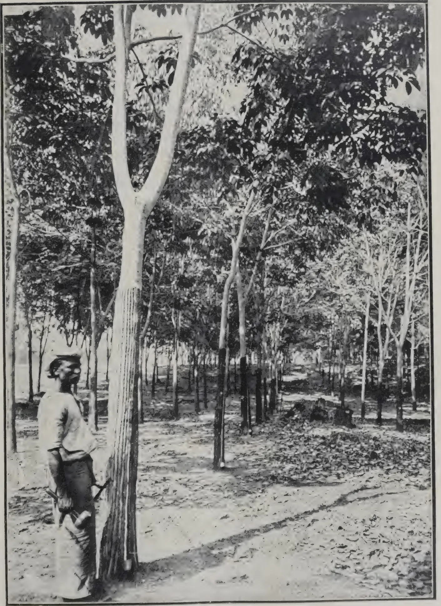A black and white photograph of a rubber plantation. In the foreground, a man stands next to a large Hevea rubber tree, using a Bamber pricker to tap it. The man is wearing a light-colored shirt and dark trousers. The plantation consists of many rows of rubber trees, and the ground is covered with fallen leaves. The trees are tall and slender, with dense foliage at the top. The lighting suggests it is daytime, with shadows cast on the ground.

TAPPING HEVEA RUBBER, EXPERIMENT STATION, PERADENIYA  
Bamber pricker method.

Part of a series of experiments being carried out at Peradeniya to test the merits of various systems of tapping rubber

191------------------------------------------------

This image is a scan of a blank page. The paper has a light beige or cream-colored tint. There are a few very small, faint dark spots scattered across the surface, which appear to be scanning artifacts or minor imperfections in the paper. No text, lines, or other markings are present.

192------------------------------------------------

MARCH, 1914.]181

## THE PREPARATION OF PLANTATION RUBBER.

An apology is due to the readers of the TROPICAL AGRICULTURIST and to the author, MR. SIDNEY MORGAN, for this belated notice of his recent book on "The Preparation of Plantation Rubber." The fact is that when the work was first advertised in Ceylon it was impossible to obtain a copy, so great was the demand. On that the author is deservedly to be congratulated. We would urge all rubber planters who have not invested in a copy to obtain one before the edition is exhausted, as it no doubt soon will be.

In rubber cultivation, as in most other industries, the day of the encyclopaedia is over, and it is now useless to expect up-to-date information on any branch of the subject in a book which professes to deal with all. Its place must be taken by less pretentious works, each written by a specialist in his own particular branch, as in the case of the book under notice.

One need have no hesitation in stating that from the point of view of the superintendent of a rubber estate the present volume is the best that has been published. It is absolutely indispensable. Its pages abound with explanations of the many difficulties which arise in the daily work of the factory, as well as with instructions and suggestions as to the methods of turning out a finished product of the highest grade. From the collection of the latex to the despatch of the rubber, every detail receives full attention, and the explanations are given in language remarkably free from technical terms. The chapters on defects in crepe, block, and sheet rubber will go far to assist the planter in evading phenomena which at times he is inclined to attribute to "pure cussedness" on the part of his material.

The author opens by stating that it is an easy task to criticise the actions of the pioneer planters of *Hevea brasiliensis*, but he does not always realise how recent the pioneer period is. For example, a full herring bone with three cuts, i.e., up to a height of 3 ft., on half the circumference, was a conservative system in 1908, when most estates were carrying the same system, with six cuts, up to a height of six feet. But the history of the rubber industry is not his strong point. He would perhaps not have been critical of PARKIN's knowledge of the chemistry of proteids if he had known that PARKIN's work was published in 1899, not, as he states, in 1910. There are several points, obvious to anyone who reads the original bulletin, which may afford an explanation of some of PARKIN's apparent mistakes. One is that he employed single incision methods of tapping, and therefore his latex may not have been identical in composition with ordinary estate latex. With regard to the acetic acid error there is one circumstance which has not been previously brought forward. PARKIN left Ceylon after his manuscript had been placed in the hands of the printer, and he did not correct the proofs. In the original bulletin, the quantity of acetic acid is given as 0.95 in the table, but in the text immediately below it is stated to be 0.09. Obviously one set of numbers was incorrect, and PARKIN wrote to Ceylon, correcting the error. For some

193------------------------------------------------

182[MARCH, 1914.

unfathomable reason, the correction was hidden, together with a four-page account of tests of PARKIN'S specimens by MM. MICHELIN & CIE, in the *Annals of Peradeniya*. But PARKIN corrected the text, making the figures there identical with those in the table. As the quantity given in the table is ten times too great, the natural suggestion is that PARKIN corrected the wrong set of figures.

The use of permanganate of potash for disinfecting rubber is deprecated on the ground that traces of that substance have an injurious effect on vulcanisation. It should have been stated in addition that, in any strength in which it is a disinfectant, it turns rubber tacky. It is rather surprising to find no reference to FICKENDEY'S experiments on tackiness. The author will be interested to learn that all his facts on "spot" diseases of rubber were known in Ceylon by the end of 1911.

On page 65, the author's method of calculating the amount of acid required, admittedly a rough one, brings the example given at the bottom of the page, nearly 25 per cent. in error. His difficulty in understanding why the use of formalin as a means of retarding coagulation is not more popular might be solved by a reference to his principals. One only wishes that the statement that the half coconut shell, as a collecting cup, has disappeared applied equally to Ceylon. His last paragraph on p. 33 is based on a misreading.

The author's dicta on botanical questions are not always well founded, though, generally speaking, he agrees with the more modern ideas on planting and tapping. But we regret that he fails to see any serious objection to the basal V., or to top tapping. On the question of fungicides he makes the sweeping statement that "there can be no legitimate excuse for the use of spraying mixtures containing copper salts on trees in bearing, since there are other mixtures equally efficacious and quite harmless." Would that it were true! It has of course been known for a long time that copper salts cause tackiness in rubber, and in using Bordeaux mixture, a copper fungicide, there is the danger that the copper compounds may be washed into the latex in wet weather. The equally efficacious mixture to which the author refers is lime sulphur wash, which has just been made the subject of an American boom. But a perusal of the technical journals will show that proved cases are being steadily accumulated, in which the lime sulphur is of no value, and the boom appears likely to subside as rapidly as it rose. It has not previously been claimed that lime sulphur mixture is as efficacious as Bordeaux mixture. What is claimed is that it can be used in cases where Bordeaux mixture causes injury. Is Hevea a case in point? Can lime sulphur mixture be substituted for Bordeaux mixture, with only a slight loss of efficiency? Bordeaux mixture has been recommended against "Pink disease" and "Canker" (*Phytophthora Faberi*). As regards *Phytophthora* it has been demonstrated that Lime sulphur mixture is useless in cases of Potato disease caused by *Phytophthora infestans*, and it has even been proved that the constituents of the mixture are not toxic to that fungus. We may grant that the latter point should be proved for *Phytophthora Faberi* also, but on the available facts it must be admitted that mycologists have good ground for recommending Bordeaux mixture. Both sides of this question have

194------------------------------------------------

MARCH, 1914.]183

hitherto been argued *a priori*; there is no proof that the copper salts of Bordeaux mixture cause tackiness. The author would confer yet another obligation on the industry if he would carry out an experiment in spraying with Bordeaux mixture and note the effect on the rubber subsequently collected.

The points on which we should venture to differ from the author are chiefly botanical. The book would have been better balanced by the omission of the first two and the greater part of the last two chapters. But the value of the book depends on the intermediate chapters, and, as has already been indicated, it should be purchased and studied by every rubber planter.

T. P.

## RUBBER INDUSTRY IN UGANDA.

Some interesting particulars as to the progress of the rubber industry in Uganda are contained in a Blue Book just issued. It is stated that the areas under the more important products are being greatly extended, and the number of European plantations is steadily increasing. The price of agricultural land has risen rapidly. Cotton is by far the most important product at present, Uganda coming second in the list of cotton-producing countries in Africa, but coffee, cacao and rubber are being widely planted, and experiments are in progress with tea and tobacco. The Agricultural Department is giving the closest attention to the education of the native in sound methods of agriculture with most promising results. There are three Government plantations in different parts of the country used as centres for instruction and for experiment in crops suitable to the locality.—FINANCIAL TIMES.

## THE RUBBER MARKET.

The market in rubber, the commodity, has been good. The offerings at the next auctions are again likely to prove much below the figures at one time published. The demand for rubber round present prices is very keen. Considerable forward business has been passing. A general impression prevails that the commodity is going better. This feeling is evidenced by big manufacturing concerns making overtures direct to leading companies for their produce at prices above current market rates. A feature of the less auction sales was the reduction in the big premium which smoked sheet has so long commanded above crêpe. The relative variation of the prices of these two descriptions merely reflects the varying demand. The present exigent demand for rubber is purely the result of the stimulus of recent low prices. Any organised attempt to crib supplies and crab the market, as unwisely advocated in some quarters, would react prejudicially on the future of the industry. Rubber shares are on a far sounder permanent investment basis with rubber at 2s. 6d. per lb. than at 3s. per lb. A continuance of the present prices will yield magnificent profits to sound companies during 1914, and further stimulate manufacturing activity. We hope leading companies will sell forward freely round 2s. 6d. Large scale manufacturers are not going to sink large sums of capital in

195------------------------------------------------

184[MARCH, 1914.

new departures unless certain of their supplies of the raw material at a price likely to yield them a fair manufacturing profit on their capital. The share market has been active and strong. The 3 per cent. Bank rate revolutionises the position of the first class dividend payers, which should steadily appreciate in value.—INVESTORS' CHRONICLE.

## THE RUBBER CRISIS.

**J. TILMAND & E. ZIMMERMANN.**

M. TILMAND summarises various views brought forward by journals, reviews and other authorities on the present rubber crisis and its possible solutions. Protection is of particular importance in its relation to wild rubber.

### BRAZIL.

A reduction in price does not affect the production till the following year. The quantity harvested depends on the credit of the "aviadores" and the means which they possess of sending workmen into the forest. They have suffered considerably this year owing to the fall in prices, and it seems doubtful if they will be in a position to finance the usual number of workmen next year.

The following measures have been adopted for improving the situation: Reduction of export duties by half; suppression of all duties and taxes on plantation rubber; construction of railroad; to reduce cost of transports; construction of refining station, so that only first quantity products are exported.

### BELGIAN CONGO.

The export duty of 1.75 francs per kilo ( $7\frac{1}{2}d$  per lb.) has been removed. It is hoped that recourse to bounties will be avoided by the following means:— Reduction of freight charges by rail and sea; more careful collection of the tax, which is at present too frequently evaded; increasing the tax on underselling pedlars.

### FRENCH EQUATORIAL AFRICA.

Export duties have been lowered from 0.60 franc to 0.30 franc per kilo ( $2\frac{1}{4}d$  to  $1\frac{1}{2}d$  per lb.). Including the reduction on the cost of transport by the Belgian Congo railway and the steamship companies, the total reduction on rubber in the French possessions amount to 0.70 franc per kilo ( $3d$  per lb.).

### GERMAN COLONIES.

In East Africa the most important question is the organization of labour. The period of indenture should be increased from one to three years, in order to reduce the loss of time and money to the coolies, the owners and the colony. According to DR. ZIMMERMANN, the cost of production can be lowered by increasing the output of the workers and the purity of the product. An expert coolie should easily harvest a quantity of latex equivalent to 900 grammes of washed rubber; at a market price of 3.5 marks (1s. 6d. per lb.) this will give a profit of £ 30 per ton. The reduction granted by the steamship companies has lowered the freight from 90 marks (£ 4. 10s) to 65 marks (£ 3. 5s.) per ton. The reductions by the railway companies amount to 50 per cent. Unfortunately the total reduction represent only about  $\frac{1}{2}d$  per lb. KAMERUN asks for the abolition of the export duty of  $8\frac{3}{4}d$  per lb.—MONTHLY BULLETIN.

196------------------------------------------------

MARCH, 1914.]185

## LONDON RUBBER EXHIBITION.

HIS MAJESTY THE KING having given his approval, PRINCE ARTHUR OF CONNAUGHT will open the above-named Exhibition on the 24th June next. The RIGHT HON. LEWIS HARCOURT, M.P., Secretary of State for the Colonies, will also be present and will speak. Thirty-five British and Foreign Governments will be exhibiting, as well as many important Associations and Companies; also manufacturers and others connected with the industries that come within the scope of the Exhibition.

## BRAZIL AND STANDARDIZATION.

We publish some comments made in the official journal of the Superintendencia da Defesa da Borracha prior to the issue of the Report of the Rubber Growers' Association, from which it is clear that Brazilian interests are anxious to gain a reputation for grades other than fine hard, presumably by the issue of certificates guaranteeing quality. The suppression of the Superintendencia da Defesa da Borracha by the new Minister of Agriculture, as announced in a recent issue, may, of course, affect the validity of the proposals made:—

Meanwhile really superior hard rubbers might be selling not only below "fine hard," but on a level with plantation or even lower, seeing that in the East a scheme of standardization is already under consideration of the Rubber Growers' Association, whilst here nothing practical has been done.

No satisfactory market can ever be established on mere samples. For free buying it is necessary that not only should the quantity offered be large enough for manufacturing purposes, but that quality should in some way be guaranteed.

To ensure that the first step should be to start experimental stations big enough for practical testing in every sense.

As, however, it would take some time to bring such plantations to maturity, and the necessity of thoroughly testing the commercial and technical value of rubbers offered for sale is urgent, Government might periodically purchase representative lots of the different new brands offering at Para, Manaus and elsewhere, and by selling same, accompanied by the respective vulcanized samples, at London and New York, ascertain the real price they are likely to obtain in those markets.

This would necessarily entail the acquisition of testing and vulcanizing plants for different districts. . . . .

In the same number of the above journal (31st October, 1913, p. 251) some interesting figures are given regarding quantity and value of Brazilian rubber. It is often suggested that only "fine hard" need be considered, i.e., in competition with plantation, and that this means only about 15,000 or 16,000 tons. The following figures in this connection are interesting:—

<table style="width: 100%; border-collapse: collapse;">
<tbody>
<tr>
<td>Hard fine, Brazilian origin, 1912</td>
<td>...</td>
<td>...</td>
<td style="text-align: right;">19,095</td>
</tr>
<tr>
<td>Soft fine, do do 1912</td>
<td>...</td>
<td>...</td>
<td style="text-align: right;">3,153</td>
</tr>
<tr>
<td>Hevea scrap or Sernamby</td>
<td>...</td>
<td>...</td>
<td style="text-align: right;">8,514</td>
</tr>
<tr>
<td colspan="4"><hr style="border: none; border-top: 1px solid black; margin: 5px 0;"/></td>
</tr>
<tr>
<td style="text-align: right;">Total Brazil</td>
<td>...</td>
<td>...</td>
<td style="text-align: right;">30,762</td>
</tr>
<tr>
<td style="text-align: right;">Peru and Bolivia, about</td>
<td>...</td>
<td>...</td>
<td style="text-align: right;">4,800</td>
</tr>
<tr>
<td colspan="4"><hr style="border: none; border-top: 1px solid black; margin: 5px 0;"/></td>
</tr>
<tr>
<td></td>
<td></td>
<td></td>
<td style="text-align: right; border-top: 1px solid black;">35,562</td>
</tr>
</tbody>
</table>

197------------------------------------------------

186[MARCH, 1914.

The Brazilian journal further points out that on the 6th September, in London, "fine hard" was quoted at 3s. 7d., 3s. 3d. for soft fine. 3s. 3½d. for entrefine, and 2s. 1½d. for Sernamby (scrap), while the best plantation smoked was selling at 2s. 7d.—INDIA-RUBBER JOURNAL.

## NEW METHOD OF TAPPING MANIHOT.

M. MIGDALSKY, Director of the Prinz Heino Plantation, Morogoro, E. Africa, has discovered a method of diminishing the expense of tapping Manihot trees. LEWA'S method of rolling into balls involves considerable hand-labour, and has been modified as follows: a piece of cloth about 28 inches long and 4 inches broad is soaked with a solution of vinegar and applied to the incision in the bark; the cloth is then drawn upwards in close contact with the tree. The latex adheres to the cloth and is coagulated in the form of a small pellicle, which is easily detached.

This method has distinct advantages.

(1) Fewer incisions are required compared with the older method and the trees can be tapped more frequently.

(2) The rubber is pure and can be cleaned by hand, one workman being able to clean 60 lb. per day.

(3) The operator does not require the same skill as with the older method.

(4) The yield of the labour is considerably increased. Unskilled workmen have produced in one day the following quantities:—

<table>
<tr>
<td>(a) by the old method (in balls)</td>
<td>...</td>
<td>8½ oz.</td>
</tr>
<tr>
<td>(c) by the new method</td>
<td>...</td>
<td>28 "</td>
</tr>
</table>

—MONTHLY BULLETIN.

---

## MANGOES AND COCONUTS IN CEYLON

MR. C. L. H. BANDARANAYAKE, VEYANGODA, writes to THE SECRETARY of THE SOCIETY as follows:—

You would be glad to know that the grafted mango trees purchased from you by me in 1909 are all in blossom and some have fruit on them. I trust they would not be affected by the drought we are having just now; if not I am sure I will have a good quantity of fruit. I may also mention the fact that 4 of my young coconut plants planted in this land have come into bearing in their fifth year. I am no more troubled with black beetles now.

---

## SORGHUM IN MADRAS.

Twenty-two acres were sown down with this crop this year and have given an average acre-yield of 433 lb. of grain and 1,394 lb. of straw as against last year's yield of 420 lb. of grain and 1,920 lb. of straw. The best yield was obtained from a 25-cent plot grown from seed obtained from Pulimaddi, the yield calculated per acre being 920 lb. grain and 2,200 lb. straw.—REP. OF THE DEPT. OF AGRIC., MADRAS PRESIDENCY.

198------------------------------------------------

MARCH, 1914.]187

# CACAO.

---

The January number of the PHILIPPINE AGRICULTURAL REVIEW is specially devoted to Cacao. We extract from it the following :

## CRIOLLO VARIETY.

Of this type there are three or four recognised forms, such as the Venezuela, Nicaragua, and Trinidad. This type has a long, thin-shelled, pointed pod, usually with more or less constriction near the base. The "bottle-neck" shape is not constant and even on the same tree some Criollo fruits will be found without the pinched-in base. The ridges, or angles, are usually more pronounced and sharper than in the case of the Forastero. The Typical Criollo seed is pale-yellowish white or pinkish yellow. The colour of the ripe pod is usually yellow but may in some forms take on a reddish or pale-purplish tinge, especially upon the tops of the ridges. The aroma and flavour of the cured seed are excelled only by the Pentagona.

## FORASTERO VARIETY.

This is by far the commonest variety of cacao throughout the world. In its many forms it constitutes probably 80 per cent. of the total output. The pod is characterised by a certain smooth appearance, of more or less cylindrical shape, usually with an abruptly tapering point and a square base. The colour is almost always purple or dark red, with just a tinge of yellow at maturity between the ridges. The seed is of good size, purple or, at least, pinkish, and in some forms of almost as good quality as the Criollo, while the productiveness is unquestionably better. The seed is usually somewhat flatter than that of the Criollo type.

## PROPAGATION.

Cacao propagation may be considered under two heads : (a) Seedage, including the propagation of the seedlings and their transfer to the cacao plantation ; and (b) graftage, including buddage, inarching, and all modes of grafting.

When the seedling plants have attained a diameter of 20 to 25 millimeters, and a height of 15 to 20 centimeters above ground, and are in vigorous growing condition, they may be budded. Budding should never be performed on rainy days, for if water enters the bud it will be destroyed.

The following conditions are necessary in order that the budding may be successful :—

1. 1. The plants must be in condition for budding, i.e., there must be a good flow of sap so that the bark separates readily from the wood.
2. 2. The stock at the point of insertion of the bud should be of approximately the same age as the bud wood.
3. 3. A good budding knife, absolutely clean of all impurities, with an edge sufficiently keen to shave the hair on one's fore-arm.

199------------------------------------------------

188[MARCH, 1914.

4. Suitable bud wood. Failure to give sufficient importance to this matter may have been one of the chief reasons for failure by former experimenters with shield or T budding. Bud wood should be selected from the current or last year's growth that has been of slow formation, and from which the leaves have dropped. Sappy wood or old black twigs should be rejected, at least by the inexperienced budder, for the reason that such bud wood is very brittle and splits easily in the cutting of the bud. Also, buds with the petiole still attached should never be inserted because fungi enter the bud from the petiole and destroy it. Desirable bud wood with the leaves still attached may be made available for budding in the course of two or three weeks by cutting off the leaf blades. The petioles then drop within a short time and the twig may be cut for bud wood as soon as the leaf scar is *well healed*.

5. The bud wood should never be permitted to dry out from exposure to the air and sun.

6. The bud should be inserted immediately after being cut, and the bud tied at once.

7. No water or foreign matter should be allowed to enter the bud incision.

8. The bud should be cut without any break or tear in the tissues.

9. Waxed tape should be used for tying and the entire incision covered.

#### PREPARATION OF GRAFTING WAX AND TAPE.

Wax cloth for tying is prepared as follows : Beeswax, 8 kilograms; resin, 2 kilograms.

Place the ingredients in an iron pot and melt over a slow fire.

The best material for grafting tape is cheap cotton cloth that tears easily. Rip the cloth into strips 15 to 20 centimeters wide, and wind the strips of cloth on stout iron wire until the roll is 5 centimeters in diameter ; if thicker, the wax penetrates with difficulty to the centre. To prevent the cloth from unrolling, tie strings around the end of the roll. The weight of the wire will sink the rolls in the mixture while the cloth absorbs the wax. If the cloth is rolled on wooden sticks the rolls must be weighted down. Keep the rolls in the melted wax for about fifteen minutes to saturate the cloth. Do not permit the mixture to boil else the cloth may be burned.

When required for use unroll the cloth and tear it into strips about 2 centimeters wide.

• The budding operations should be performed in the following order : First make a verticle incision in the stock, about 15 to 20 centimeters above the ground ; then, at the lower end of this incision, make a horizontal cut so that the resulting wound resembles an inverted T ; then, in order to facilitate the insertion of the bud, make a sloping cut upward, below the horizontal cut and also lift the bark by passing the point of the blade under the bark upward, along the vertical incision, loosening the bark sufficiently to allow the bud to slip into place easily ; now cut a bud not less than 4 centimeters long, by passing the knife *diagonally* under the bud, taking special care that it is not cut too thin and that the tissues do not split or tear which is liable to occur if the knife is dull or if it is held at too great an angle to the bud stick ;

200------------------------------------------------

MARCH, 1914.]189

as a further precaution it is well to hold the tip end of the bud stick toward the body in the act of cutting the bud ; now insert the bud and tie firmly, without strangling, with waxed tape, beginning at the point of insertion and covering the entire incision so that no water can enter.

Fourteen to eighteen days after the buds are inserted, the buds should be examined, and where they have taken the tape should be unwrapped to below the leaf scar and the stocks should be "lopped" about 10 centimeters above the bud. This is done by cutting through the stock about one-half to two-thirds with a knife or pruning saw and bending the tops over. The budded plants should hereafter be examined once every ten days, and all wild sprouts on the stock rubbed off. This work is most important, for if it is not attended to the stock sprouts rapidly gain the upper hand at the expense of the bud, which frequently under such circumstances fails to grow at all. When the bud has made a growth of 30 or more centimeters, according to the size of the stock, and the wood is well ripened, cut off the stock immediately above the bud union. *Paint the wound carefully with white lead or some other oil paint in order to exclude borers and fungi.* If the buds fail to make straight upright growths they should be staked and tied ; split bamboo stakes are very serviceable for this purpose.

Large seedlings may, of course, be top-worked by heading them back and budding the young sprouts.

#### SHADE FOR CACAO.

There has been and still is a great deal of discussion upon the question of shade in cacao plantations. The tendency now seems to be in all countries, however, to do away with the old heavy shade and use the nurse trees *only for the young plants*. Cacao roots cannot endure "sun baking" nor can the tender leaf flushes endure wind whipping, but, on the other hand, given a suitable cover crop for blanketing the soil surface and a moderate amount of protection from wind, there is, at least in the writer's (MR. O. W. BARRETT) opinion, no question whatever as to the injuriousness of dense shade. In the Philippines nothing larger than madre de cacao, or cacahuate (*Gliricidia maculata*), should be used for the young trees, while, of course, any quick-growing strong-wooded plant, such as the mango, can be used to form wind-breaks.

---

#### RAINFALL FOR FEBRUARY.

<table border="1">
<thead>
<tr>
<th>Place</th>
<th>1914</th>
<th>1913</th>
<th>Place</th>
<th>1914</th>
<th>1913</th>
</tr>
<tr>
<td></td>
<td>in.</td>
<td>in.</td>
<td></td>
<td>in.</td>
<td>in.</td>
</tr>
</thead>
<tbody>
<tr>
<td>Colombo</td>
<td>1.56</td>
<td>2.26</td>
<td>Kurunegala</td>
<td>.07</td>
<td>.72</td>
</tr>
<tr>
<td>Kandy</td>
<td>.52</td>
<td>1.92</td>
<td>Batticaloa</td>
<td>6.31</td>
<td>1.82</td>
</tr>
<tr>
<td>Galle</td>
<td>.29</td>
<td>3.85</td>
<td>Badulla</td>
<td>1.03</td>
<td>6.30</td>
</tr>
<tr>
<td>Jaffna</td>
<td>0</td>
<td>.52</td>
<td>Ratnapura</td>
<td>7.95</td>
<td>1.68</td>
</tr>
<tr>
<td>Anuradhapura</td>
<td>.27</td>
<td>2.61</td>
<td>Nuwara Eliya</td>
<td>.50</td>
<td>2.44</td>
</tr>
</tbody>
</table>

201------------------------------------------------

190[MARCH, 1914.

# COCONUTS.

## THE DRYING OF COPRA.

A recent official report contains an account of a kiln employed in the British Solomon Islands for drying copra. It consists of a house of corrugated galvanised iron with an enclosed furnace on the ground. The flues, constructed of fire bricks and sheet iron, extend beneath the whole area of the floor, and there is an external shaft of sufficient height to ensure a good draught. A system of trays composed of angle iron and woven wire, running on wheels is arranged one above the other within the house. As much as from one to two tons of copra can be treated within the twenty-four hours. The quantity, of course, depends entirely upon the size of the structure. The husks of the coconuts supply fuel for the furnace, and are better so employed than in an attempt to turn them to commercial use by the manufacture of coir fibre.

As the kiln-dried copra is worth from £1 to £2 per ton more than the smoke-dried at the place of shipment, it is, says the BRITISH TRADE JOURNAL, obviously advantageous to go to the expense of a kiln when large quantities of copra are handled, in spite of the high initial expense. It is probable that in a few years the use of the kiln will almost entirely supersede the operation of drying over an open fire.—WEST INDIA COMMITTEE CIRCULAR.

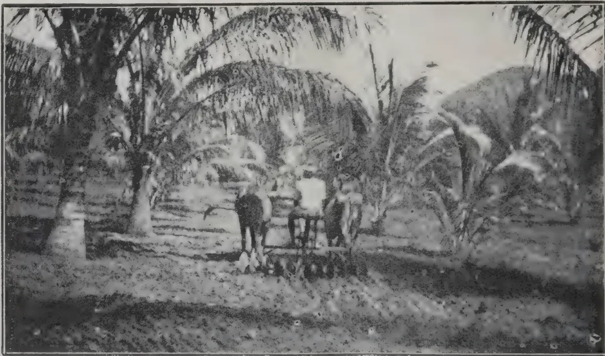

Disc-harrowing a 7-year-old Coconut Plantation at Peradeniya Experiment Station, keeping it free from weeds and preserving the moisture.

## THE INCREASING VALUE OF COPRA.

It is of great interest to note the rapid advance in the price of copra during recent years. Less than ten years ago, the market was over-supplied, yet to-day there is a shortage and prices are very high. Average copra used to realise £12 per ton; £32 per ton is now-a-days considered a low figure. Similarly coconut oil, the most valuable constituent of copra, has advanced from £18 to £48 per ton.

It is not probable that we have even yet reached the maximum price for these valuable commodities, rather are they indications that prices will advance and there is little danger of a material decrease for some years to come.

202------------------------------------------------

[MARCH, 1914.191

Undoubtedly this satisfactory growth in the copra trade was mainly determined by the researches of European chemists, who discovered methods of purifying crude coconut oil and made it possible for manufacturers to supply a tasteless and inodorous product. The objection to the use of coconut oil as an edible product, before this discovery, had been its great tendency to be rancid and of objectionable odour and flavour. During the drying of copra there is always present an excellent medium for the growth of bacteria, as the nut contains a considerable percentage of proteins. These bodies in the presence of moisture form an almost ideal food for bacteria, those minute plants which are always falling gently through land atmospheres in a never-ending rain. Only on the high seas are we free from these organisms and even there only to a comparative degree. This richly fertile seed-bed is thus quickly strewn with the falling bacteria and as it is maintained at temperatures favourable to their growth, the organisms multiply very rapidly.

One bacterium divided into two new plants every thirty minutes gives rise to upwards of a million organisms in 10 hours. From the copra the bacteria find their way into the oil and speedily cause rancidity and develop a disagreeable odour and taste.

It is pleasant to record the fact that chemists have thus stimulated tropical trade in this direction. Sometimes their labours have had an opposite effect, as in the case of the synthesis of indigo and as may be the case in the synthesis of rubber; but progress of any kind will always claim its victims and scientific progress is no exception to the rule.

Edible coconut oil has thus been established within recent years. Since the oil is a solid fat in temperate climates, it now has a very large sale under such names as nut lard, nut margarine, nut butter, etc. Three years ago margarines were mainly composed of animal fats. It is now hardly exaggeration to state that they are for the most part composed of coconut oil. Nut lard, consisting almost wholly of coconut oil, has gone up by leaps and bounds in the public estimation. The large numbers of nut butters sold in vegetarian restaurants and by large houses which manufacture vegetarian products under the names of walnut, peanut, almond butters, etc., contain coconut oil as a very substantial basis.

Mixtures of coconut oil, animal fats, milk and flavouring essences are made into compounds so nearly resembling butter that the Public Analyst has no little difficulty in distinguishing between the fictitious and the genuine article.

Coconut oil has also replaced cacao butter to no inconsiderable extent in the manufacture of chocolate.

The new odourless fat also enters into the composition of many ointments, pomades, etc., made up by the wholesale druggists. Formerly it could not have been used for such purposes on account of its liability to become rancid.

At the same time coconut oil always has been and probably always will be an invaluable fat to the soap boiler. Its fatty glycerides give rise to soaps that lather very freely, even making possible a so-called marine soap, which will lather in sea water. The shortage caused by its use as an edible has compelled soap makers to search for other fats and has given a great stimulus to the whole trade in fats and oils, more particularly such fats as are contained in the fruits of various palms.

It is hardly necessary to point out that millions of nuts are still desiccated, ground and sold for the confectionery trade. When it is also considered that the coconut is a stand by for the vast numbers of tropical natives whose wants must be satisfied before there can be an export and the many and rapidly increasing uses to which exported copra is being applied, there can be little fear of over production of this article for many years to come.

—H. S. S. IN TRINIDAD AND TOBAGO BULLETIN NO. 76.

203------------------------------------------------

192[MARCH, 1914.

# RICE.

## PADDY IN MADRAS.

### SEEDING PADDY.

Experiments were continued to determine the best seed-rate for seed beds and the best distance apart to transplant. Really this ought to be worked out by each man for his own land. But generally if the land be treated fairly singles about 9 inches apart are as a rule most profitable. The fact remains, however, that except in the few cases in which doubles or trebles are planted for definite experimental reasons every paddy crop which is transplanted on our farms is transplanted singly. The average yield of main crop paddy over the whole wet area at Samalkota this year was 3,586 lb. of grain, whilst the maximum yield found in any of the crop-cutting experiments on the ryots' land in the Godavari was 2,900 lb. of grain per acre or 1,302 M.Ms. as compared to 1,009 M.Ms. At Pular the average yield of paddy per acre in the main season over the whole farm was 2,119 lb. or 963 M.Ms. as compared with 1,872 lb. or 851 M. Ms., the maximum found in the local crop cutting experiments. These results are, of course, also in part attributable to better manuring—especially green manuring.

### GREEN MANURING OF PADDY.

It is round the action of green manure crops that most interest at present centres. In individual cases large increases in yield have resulted from growing and ploughing in green manure crops and there is no doubt that this practice has improved very considerably the fertility of the land at Palur and Samalkota. Also it has proved very profitable in the Periyar tract. Yet very little is known about the method in which the ploughing in of such crops reacts upon the soil of paddy land. For the last few years MR. HARRISON has been engaged on a series of carefully designed experiments to determine the processes of fermentation which take place in a paddy field and to find some clue to the factors controlling the growth of the crop. His researches were leading him to the conclusion "that drainage or at least some movement of the soil-water is essential for paddy cultivation and especially so when bulky organic manures are applied." Among his undrained plots paddy fared much worse in those that had received green manure than in those in which the soil was left unmanured. In the course of the year a farm was opened at Manganallur in the midst of very fine heavy soil of Tanjore delta. Sunn hemp was grown for green manure and treated in the method found to succeed at Palur and in Madura and the paddy was transplanted. It failed hopelessly. In the course of the green manuring the land had been flooded and dried, which it was found in this fine soil was sufficient to stop drainage. This result corroborates the results of MR. HARRISON'S experiments that if there is no drainage a green manure crop unless very carefully managed is likely to have a deleterious, instead of a beneficial, effect. On the other hand there is little doubt but that the addition of bulky organic manures will in

204------------------------------------------------

MARCH, 1914.]193

time improve the drainage of such land and incidentally the fertility. Experiments are being designed at Manganallur to discover how best to effect this. I look upon this failure at Manganallur and MR. HARRISON'S work as two of the most important and instructive local agricultural events of the year.

#### SAMALKOTA AGRICULTURAL STATION PADDY.

This crop did very well this year and most of it lodged owing to the weight of the ears. The average acre-yield for the whole area under this crop for the maincrop season was 3,586 lb. grain and 5,278 lb. straw as against 2,352 lb. grain last year. Rasangi on an area of 3.77 acres, Konamani on 15.66 acres and Ratnachudi on 2.24 acres gave average acre-yields of 4,459 lb. grain and 5,450 lb. straw, 3,498 lb. grain and 5,465 lb. straw, and 2,793 lb. grain and 3,938 lb. straw, respectively, the highest yield of grain, 4,960 lb. per acre being obtained from a 20-cent plot of Rasangi in Field No. 10.—REP. OF THE DEP. OF AGRIC., MADRAS PRESIDENCY.

---

### THE CULTIVATION OF UPLAND OR HILL RICE.

---

As already pointed out, the upland and lowland forms of cultivated rice tend to merge into each other, and no sharp line of distinction can be drawn between them. The extreme forms of each kind are, however, quite distinct so far as cultural requirements are concerned, whilst standing surface water is essential to the development of typical lowland rice it is unnecessary and even harmful to the extreme forms of upland rice. The cultivation of the latter is confined chiefly to hilly districts which cannot be artificially irrigated, and which in consequence are unsuited to lowland rice. Comparatively little cultivation is required, transplanting being unnecessary, and the natural rainfall affords the requisite amount of moisture.

Usually only a short period is required to mature the crop, the exact length of time necessary depending on the particular variety of rice grown and, to a large extent, on the duration of the rainy season.

The crop is therefore one which can be grown as a catch-crop on new plantations of perennial plants, or in rotation with other crops, and is worthy of more attention than it at present receives, especially in districts where a local demand for rice exists.

The success of the crop depends chiefly on the thorough preparation of the land, as this not only destroys weeds, but produces a fine surface tilth which serves as a suitable seed-bed for the grain and also tends to check the evaporation of soil-moisture. Soils of a lighter character than those required by lowland rice are preferable, and if it be virgin land a shallow ploughing is the only preparation required, but if the land has been cropped for several years deeper ploughing is essential in order to provide a more extensive rooting medium. As the seed is sown on the field and not on a seed-bed, it is important that grain of high germinative power should be selected for sowing otherwise the stand will be thin and the crop proportionately scanty. For this reason it is advisable to test the vitality of the grain intended for planting,

205------------------------------------------------

194[MARCH, 1914.

and to regulate the thickness of the sowing according as the percentage of germinated seeds is high or low.

The cultivation of upland rice is carried on by the natives in nearly all rice-growing countries, but on a much smaller scale than in the case of lowland rice. Forest clearings are usually planted with this crop and abandoned after the first harvest, but as this is a wasteful system, destructive to the forests, it is now discouraged in most countries, and in some cases it is forbidden. The native methods of cultivation as practised in the Philippine Islands are described in the PHILIPPINE AGRICULTURAL REVIEW (1910, 3,632), and these may be taken as typical of the general practice. Two methods are practised in the Philippines known locally as the "caingin" and the "sabog" methods. The caingin method consists in clearing a portion of the forest of shrubs and small trees and burning them on the ground, prior to the rainy season, leaving the stumps of larger trees standing. The area thus cleared is planted at the commencement of the rainy season. The planting holes are made by men who place themselves side by side about 3 feet apart and walk backwards, and by means of pointed sticks 1 to  $1\frac{1}{2}$  inch in diameter, make shallow holes in the ground, from 4 to 8 in. apart, to receive the seed. The seed is sown by women or children, who walk facing the men and place from 4 to 20 grains in each hole. From 4 to 7 grains, in holes of 6 in. apart, usually suffice. The right hand is used for handling the grain, and with the left the holes are filled in with soil. In some cases the filling in is done by a third party of workers who follow the sowers and cover the seed by brushing soil into the holes.

By the sabog method the ground is ploughed once during the dry season and again at the commencement of the rainy season, after which it is harrowed and the seed sown broadcast. A light harrowing is given after sowing, in order to cover the seed. Occasionally the seed is sown in drills instead of broadcast, in which case the sower follows the plough and places from 5 to 20 grains at intervals of from 4 to 8 in. along the furrow, covering them with soil by the foot, or the seed may be evenly distributed along the furrows instead of in "hills," and covered by lightly harrowing the soil.

The rate of seeding is about 58 lb. per acre. The average yield is usually not more than half that from transplanted lowland rice, but on virgin lands, if the rains are favourable, heavier yields are frequently obtained.

During the years 1909 and 1910 the Philippine Islands Bureau of Agriculture made trials of some 458 native varieties of upland rice. Of this number only twenty-five are recommended for general planting. These are non-bearded kinds with white, non-glutinous grains; the length of time they required to attain maturity varied from 126 to 141 days, and the yield from 2,378 to 4,064 lb. per acre. In these trials the average yield was higher than for lowland varieties, but the trials covered a period of only two years, and both seasons were favourable to the crops:—

Upland rice has been successfully grown in the Logan district of Queensland, with a rainfall of between 20 and 30 in. during the growing season. The variety found best adapted to this locality is known as "White Java." This grows to a height of from 4 to 6 ft., and produces good crops of

206------------------------------------------------

MARCH, 1914.]195

fairly plump grain, of good length and quality. The land is prepared as for an ordinary cereal crop, by ploughing and harrowing, to produce a fine surface tilth. The method of planting found to give the best results consists in sowing with an automatic seeder, in drills 2ft. 6in. to 3ft. apart, with a spacing of 10 to 12in. in the rows. The method requires 35 to 40 lb. of seed per acre as against about 60 lb. for broadcast sowing. The wide spacing between the rows permits of the use of the hoe or cultivator to remove weeds during the early stages of growth; it also encourages "tillering," and as many as thirty or forty heads of grain have been obtained from a single seed.  
—IMP. INST. BULL.

## PADDY.

### CULTIVATION AND PREPARATION OF RICE.

TO THE EDITOR OF THE TROPICAL AGRICULTURIST.

DEAR SIR,

In an article on the cultivation and preparation of rice published in the last number of the IMPERIAL INSTITUTE BULLETIN the following points have been brought out :—

(1) Complete withdrawal of the water prior to the ripening period produces the conditions most favourable to the proper maturing of the crop.

(2) In Java soils of only average fertility is chosen for seed-bed, as experience has shown that seedlings from rich beds receive a check, and grow less satisfactorily after being transplanted in less fertile soils.

(3) In such beds (i. e. "dry" seedbeds) seedlings may remain for as long as a hundred days and can then be transplanted without harm.

(4) It has been found that tillering is greatly encouraged and the yield thereby largely increased by keeping the soil saturated with water but not allowing sufficient to stand on the surface until after the plants have fully tillered.

I shall be glad to have an expression of opinion from you on these points.

Yours faithfully,

W. MOLEGODE.

Katugastota,

28, 2, 14.

---

## SEEDS AND PLANTS FOR MEMBERS.

No order form is being issued as hitherto, but the next April number of the *Tropical Agriculturist* will notify plants and seeds available.

207------------------------------------------------

196[MARCH, 1914.

# TOBACCO.

## TOBACCO PROSPECTS.

"FINANCIAL TIMES" (30 Jan.), in a lengthy article dealing with tobacco trade prosperity, states high yield now being returned upon capital invested exceeds all previous ratios. This is due to high degree of efficiency attained in organisation of industry, while market supply now regulated well in accordance with requirements. All producing companies are doing well just now. Their prosperity seems likely to improve during next 12 months in view of high prices ruling, while increased supplies will be available in those centres of production showing shortage last year.—INVESTORS' CHRONICLE.

## TOBACCO WAREHOUSE MANAGEMENT.

T. E. ELGIN.

The tobacco plant thrives in many parts of the world, and tobacco has become one of the principal exports of some of the great agricultural countries.

Revenue collected as excise and import duties enrich the treasuries of many nations, while the tobacco consuming public purchases each year approximately 2,000,000,000 lb. of this commodity. Tobacco is a source of income to many farmers in South Africa, and the area under cultivation is being extended. In South Africa, however, we produce only 1 lb. out of every 145 lb. of the world production of tobacco. Imports of leaf and manufactured tobacco into South Africa show but little decrease each year, which indicates that the consumption of the better grades of leaf in this country is increasing as rapidly as the production.

It is not necessary to mention in this article the methods used in the proper cultivation, harvesting, and curing of tobacco, as bulletins have already been published by the Tobacco and Cotton Division on this subject. We will, therefore, consider only the handling of the crop from the time it is taken to the warehouse until it is delivered to the manufacturer.

The first question to consider is that of finance.

If the business is conducted by a private company, it is controlled according to the ideas of the company's directors. When a warehouse is controlled by a co-operative society in this country certain laws passed by Parliament regarding the finances of such societies must be observed. Under certain conditions, co-operative societies can obtain loans from the Land Bank or perhaps from other banks, so that advance payments can be made to the farmers when their tobacco is delivered to the warehouse.

### BUILDINGS.

Next comes the question of suitable buildings. A warehouse may consist of two or three floors, but in South Africa one floor would be sufficient in most cases for the handling of leaf. The size of the buildings should be in

208------------------------------------------------

MARCH, 1914.]197

proportion to the quantity of tobacco to be handled during a season of good business. The material may be wood and corrugated iron, but in hot dry climates brick walls are better. There should be windows sufficient to give light and ventilation. Large buildings should have sky-lights so as to distribute an even light to all parts of the building. The floor of the warehouse should be high enough for the air to circulate underneath, which will prevent the tobacco from absorbing moisture from the ground. In large warehouses a road for wagons to pass into the building is desirable. When wagons are off-loaded outside the building there should be a lean-to roof sufficient to protect the loads from rain while the wagon is being unloaded.

The building may be one large room, or if conditions require it the building should be divided into compartments suitable for the handling of tobacco in its different stages. Offices should be provided in or near the main building.

### EQUIPMENT.

The weighing machines should be situated on or near the off-loading platform and should be mounted on solid foundations with the weighing platform level with the floor. Portable weighing machines on wheels are also needed so that they could be moved about and used for weighing bales and small lots of tobacco. All weighing machines should have two beams : one for balancing tare, while the other gives the net weight of the tobacco.

In modern warehouse "dump" trucks and baskets suitable for handling bales, are used for moving tobacco to and from different parts of the warehouse.

When tobacco is being handled in dry weather, steam is necessary for moistening it so that the leaves will not break in handling. The steaming plant consists of boilers, pumps, water-tanks, steam-boxes, steam and water hose, etc. Large tobacco warehouses are also equipped with what is known as a re-ordering machine with a drying-room. These are used when tobacco is prepared for the English market, and for tobacco which it is necessary to store for a long period.

All tobacco should be classified before being passed through the re-ordering machine, and for this purpose suitable storing tables are required. Similar tables should be situated near the baling presses, on which the tobacco may be placed before being passed into the presses.

It is frequently necessary to hang the tobacco on laths to dry it. These laths should be about 4 feet in length and triangular in shape, the three sides each measuring about  $1\frac{1}{4}$  inches. Laths of this shape will not turn over when filled with tobacco and hanging in the racks. Tobacco racks or trucks on wheels are needed for carrying the laths when the tobacco is to be conveyed about the warehouse.

When drying-rooms are used the trucks above described may be filled with laths of tobacco rolled into these rooms and allowed to remain until the tobacco is dry. The temperature of the drying-room is usually kept at from  $130^{\circ}$  to  $150^{\circ}$  F. though sometimes it is raised to  $200^{\circ}$  by means of steam passing through several coils of pipes around the sides or near the floor of the rooms, and the hot air in these rooms should be kept in circulation by means

209------------------------------------------------

198[MARCH, 1914.

of fans. When the tobacco is dry the trucks are rolled out of the drying-room into a cooling-room, and there remain until the leaves are in proper condition to receive moisture. The tobacco still on the trucks is then moved into an "ordering" room to receive steam until it becomes moist enough to handle. It is then in good condition for storing.

The re-ordering machine subjects the tobacco to treatment on the same principle as the drying-room. Laths filled with bundles of tobacco are hung on hooks of an endless chain or the leaves may be put on a wire-netting belt. The tobacco then passes from one end of the machine to the other and is kept slowly but constantly moving from the time it is put into the machine until it reaches the other end.

From the re-ordering machine, or the "ordering" room, the tobacco is taken immediately to the baling-press.

The choice of baling-presses is usually governed by the requirements. A good, though expensive press, is one which takes a case of suitable size, the necessary pressure being applied by means of a steel screw. A case is filled with tobacco and placed in the press; while the first case is being pressed a second case is filled in readiness for the press when the first bale is removed.

To complete the equipment of a warehouse there may be added sample-boxes, bunksails, thermometers, and thermometer tubes for use in testing the temperature of tobacco stacks, and a few minor articles of more or less importance.

### RECEIVING.

Next to the actual buyer and seller, there is no more responsible official connected with the warehouse business than the receiver of tobacco. If the crop has been bought previous to delivery the receiver must decide whether or not it is being delivered according to contract. It is necessary that he should be a close observer and possess good qualification or he will not be competent to detect any irregularity that might occur.

If the warehouse is managed on the co-operative plan, the position of receiver is even more important, for the tobacco is valued by him for the co-operative society. The old dealers' maxim "tobacco well bought is half sold" proves equally true with a co-operative society as with any other dealer. This means that when the proper valuation is put on tobacco when it is bought, there will be but little trouble in selling it at a reasonable profit. On the other hand, if the valuation is too high it will be difficult to convince the buyer that the tobacco is worth as much as it was valued at.

When farmers deliver their tobacco to a warehouse they expect a settlement. If the crop has been bought by a manufacturer or dealer, full contract price should be paid at once. If delivered to a co-operative society, there should be a system by which the farmer could collect an advance payment on the delivery of his crop. The margin between the amount of this payment and the value of the tobacco should be sufficiently large to insure safety in the business. This necessitates care in keeping the books, which work should be done by competent men.

210------------------------------------------------

MARCH, 1914.]199

### BULKING.

There should be no pressure other than the weight of the tobacco placed on the bulk, and it should be left in a loose condition. There should be air-spaces between the stacks, and passages left through which to convey tobacco to and from the stacks. It is necessary to have thermometer tubes in the bulks so that a thermometer can be inserted at different places. These tubes need not be expensive; they may be made with three sides and just large enough to hold the thermometer. The sides, which may be of ordinary wood, should be perforated so that the heat from the tobacco will have access to the thermometer and the correct temperature recorded. The proper amount of moisture in tobacco, so that the temperature will rise high enough but not too rapidly, can be judged only by experience.

### FERMENTING.

If tobacco is too dry when bulked it will not only break in handling, but will not ferment well. If, on the other hand, it is too wet, it will either become mouldy and have a bad odour, or will turn a dark colour if allowed to remain long in bulk. In either case it will deteriorate in value.

The temperature should rise slowly until it reaches 120° F., when the bulk should be broken down and a new one made. The outer portion of the old bulk should be the centre of the new, and the centre of the old bulk should be used for the outer part of the new. It has been found that if the temperature does not rise above 120° F. the leaf is usually improved in fermenting, but if the temperature reaches 140° the ordinary tobacco of the Transvaal turns a dark colour, which greatly decreases the value.

### CLASSIFYING.

If the tobacco has good burning qualities (without which it has but little value) the classifying should be done according to colours, length, breadth, and weight of the leaf. This work can only be done by experienced sorters capable of judging between leaves of different values. It has been said that a good tobacco man is born, not made, meaning that some have a natural aptitude for detecting the difference in quality, while others can never become experts at this work. To classify tobacco properly and rapidly requires good judgment and close attention to the work. Graders should be provided with tables, situated in a good uniform light. In South Africa the south side of the house is the best for the windows, as the sun never shines directly on to the sorting tables from that direction, and the windows should be at the side or behind the graders.

### ORDERING AND BALING.

When tobacco contains too much moisture it should be treated to the drying process described in this article. If, on the other hand, the tobacco is too dry it should be moistened by placing it in a steaming-box made for the purpose, and steamed. The steam may be led into the box by means of perforated iron pipe, which should enter the box from one of the sides and close to the bottom, and the box should be as nearly steam-tight as possible. A drawer on rollers is provided to contain the tobacco and for rolling it into the steam-box. The steaming of tobacco should be very carefully done; if it is allowed to remain exposed to the steam for only a few seconds too long the leaf may be greatly injured. When the tobacco has absorbed sufficient moisture to make it pliable, it should be put immediately into the baling-press.

211------------------------------------------------

200[MARCH, 1914.

As the bales are made they should be wrapped with fine hessian, and if intended for export the bales should first be wrapped in oil-paper then with hessian, so that the moisture from the sea will not affect the tobacco.

#### SAMPLES.

A sample may be drawn from each bale or one sample may represent several similar bales. Numbers on the samples must correspond to the numbers on the bales which the samples represent, and a complete record should be kept of each bale so that it can be traced to its destination. Samples are the basis of transactions between buyer and seller. Each sample should be carefully made so that it will fairly represent the bale or bales from which it is drawn. A card bearing the number and other marks of identification necessary should be affixed to the sample. As a protection to both buyer and seller the card may be affixed with a seal.

#### SELLING.

There is no more important part of the warehouse business than that of selling the tobacco. An important point is to inspire confidence in the buyer by convincing him that he will receive fair treatment, and that when he gives an order the goods will be delivered according to contract. The salesman can also advise farmers to grow such grades of leaf as the trade demands.

In considering a business, the first question which is usually asked is, "does it pay?"

In South Africa at present there is only one tobacco warehouse conducted on the co-operative plan. Tobacco delivered to this warehouse for the past two years was settled for at full market prices, with no expense to the farmer. By reference to the report of the auditor for the year 1912, we find that the gain in value of the tobacco handled in the co-operative warehouse was sufficient to pay all expenses of the business and still leave a balance of more than £6000 net profit to the co-operative society.

It would be well for all tobacco growers in South Africa to consider whether or not it pays to operate a co-operative warehouse.

---

### RAINFALL FOR JANUARY, 1914.

<table border="1">
<thead>
<tr>
<th>Place</th>
<th>1914</th>
<th>1913</th>
<th>Place</th>
<th>1914</th>
<th>1913</th>
</tr>
<tr>
<td></td>
<td>in.</td>
<td>in.</td>
<td></td>
<td>in.</td>
<td>in.</td>
</tr>
</thead>
<tbody>
<tr>
<td>Colombo</td>
<td>19</td>
<td>8.34</td>
<td>Kurunegala</td>
<td>81</td>
<td>17.79</td>
</tr>
<tr>
<td>Kandy</td>
<td>2.78</td>
<td>22.58</td>
<td>Batticaloa</td>
<td>16.76</td>
<td>53.77</td>
</tr>
<tr>
<td>Galle</td>
<td>1.17</td>
<td>8.09</td>
<td>Ratnapura</td>
<td>1.70</td>
<td>15.64</td>
</tr>
<tr>
<td>Jaffna</td>
<td>1.35</td>
<td>4.07</td>
<td>Badulla</td>
<td>8.32</td>
<td>40.43</td>
</tr>
<tr>
<td>Anuradhapura</td>
<td>1.42</td>
<td>12.68</td>
<td>Nuwara Eliya</td>
<td>2.17</td>
<td>24.75</td>
</tr>
</tbody>
</table>

212------------------------------------------------

MARCH, 1914.]201

# COTTON.

## THE SILK COTTON TREE.

One of the trees found throughout the Bombay Presidency and a very conspicuous object at this time of the year when it is covered with numerous large, bright red, cup-like flowers at the end of bare branches, is the Bombax Malabaricum known as "*Sawar* or the Silk Cotton tree." It is a large deciduous tree with wide spreading branches and armed with prickles on the bark and is generally found on dry hills. It is very common in the Konkan, and those who have visited Matheran during the Christmas holidays must have noticed it on the slopes along the steam tramway line. The leaves begin to drop soon after the rains are over, and the tree is then entirely bare from January to March when it flowers. The flowers are succeeded after some time by large pods containing numerous seeds employed in an abundance of white silky hair which, on the pod opening when ripe, comes out in the form of a downy heap, and when sufficiently dry is scattered all round the tree, carrying the seeds to long distances. The cotton obtained from the capsules is known as *Simul*, and though not well adapted for spinning is an excellent material for filling beds, cushions and pillows, and is largely used for this purpose here and is also exported to Europe. The oldest tree of this kind in the Victoria Garden, a little to the north of the Garden Office, is now in full blossom with a much younger one close by also in flower.—INDIAN AGRICULTURIST.

## COTTON AT A MADRAS AGRICULTURAL STATION.

The work of the improvement of the Tinnevelly cotton crop has now reached a stage when the results of seed selection work are now bearing fruit. Last year three single plant selections had reached a stage when they could be grown on a field scale and of these it was decided that one of them could now be put on to a seed-farm. Accordingly arrangements were made with a ryot of the adjoining village to grow 20 acres of this selection for the Department for seed. This has done exceptionally well; not only is the crop bearing heavily but it is giving a cotton of excellent quality which MR. STEEL of MESSRS. A. & F. HARVEY & Co., who has an expert knowledge of Tinnevelly cotton, values it at least  $\frac{1}{2}d.$  per lb. above F.G.F. Tinnevellis. Not only this; but the strain ginned at 28.25 per cent. against the 25 per cent. average of the district. This selection excels in yield, quality and percentage of lint to seed, and is admitted to be the best crop in the village. Many ryots are anxious to obtain seed of this next year. This opens up a splendid field for village co-operation. The ryot is always careless of his seed, but in the neighbourhood of the Agricultural Station (Koilpatti) the adjoining villages are now learning

213------------------------------------------------

202[MARCH, 1914.

the value of good seed and it may be estimated that this strain will bring in an increased value of crop worth, at present prices, at least, Rs. 16-4-0 per acre estimated as follows :—

<table>
<thead>
<tr>
<th></th>
<th>Rs.</th>
<th>A.</th>
<th>P.</th>
</tr>
</thead>
<tbody>
<tr>
<td>Increase in yield, <math>\frac{1}{4}</math> pothie (61 lb.) ...</td>
<td>7</td>
<td>8</td>
<td>0</td>
</tr>
<tr>
<td>Increased value of kappas due to higher ginning percentage ... ..</td>
<td>5</td>
<td>0</td>
<td>0</td>
</tr>
<tr>
<td>Increased value of cotton due to better quality</td>
<td>3</td>
<td>12</td>
<td>0</td>
</tr>
<tr>
<td>Total ...</td>
<td>16</td>
<td>4</td>
<td>0</td>
</tr>
</tbody>
</table>

Of this Rs. 16-4-0, without co-operation, the ryot would not get more than about Rs. 12 ; while there is no reason why with co-operation, he should not make at least Rs. 20, since the seed obtained from such a crop would have a much higher value for seed purposes when once the existence of such an improved strain became known in adjoining villages.

Thus, in this one village which grows 750 acres of cotton a year, on this basis, the value of the introduction of such an improved strain would be Rs. 15,000 per annum.—REP. OF THE DEP. OF AGRIC., MADRAS PRESIDENCY.

## COTTON BLIGHT IN EGYPT.

It is feared that the high expectations regarding the cotton crop will not be realised as it is already reported that the whole of the third packing and part of the second have been lost, owing to the disastrous ravages of the boll worm. This pest is having an increasingly serious effect on the crops every year. The Government has issued a circular recommending cultivators to pick off and burn all the bolls left on the cotton sticks before stacking them for the winter, but this precaution will involve a good deal of extra labour, and as the fellahs usually declines to do anything out of the ordinary unless compelled by law, it is doubtful whether a systematic stand will be made.—UNITED EMPIRE.

---

## LEMON-GRASS IN FIJI.

C. H. KNOWLES.

The writer gives the results obtained at the Nasinu Experiment Station with a lemon-grass (*Cymbopogon Coloratus* Stapf), introduced in 1907 from India. The most favourable time for harvest is when the plant has reached 3 or 4 feet in height before the flowering period is advanced. The percentage of oil in the young plants is greater than that of the old ones, but the total yield obtained is less. Thus a plot cut four times produced only one-third of the quantity of oil obtained during the same time from a similar plot cut only once after reaching 4 feet in height. The estimated yield of oil is 43 lb. per acre per cutting.

Distillation experiments show that the process should not continue longer than four, because the amount of essence produced after this time is unprofitable. The profits per acre should reach £2 per cutting, and two or three harvests are obtainable in the year.—MONTHLY BULLETIN.

214------------------------------------------------

MARCH, 1914.]203

# SOILS AND MANURES.

## MANURES AND SOIL FERTILITY.

F. B. GUTHRIE.

(Continued from p. 114.)

These experiments have so far been carried out in the laboratory. If means are discovered of partially sterilising the soil in the field, a most valuable method of increasing the fertility of the soil will be placed at the disposal of the farmer.

Indeed, experiments in this direction have been recently carried out by E. J. RUSSELL and J. GOLDING§ on "sewage-sick" soils. They find that "sewage-sickness" is an abnormal development of the factor harmful to bacteria (protozoa) always present in ordinary soils, and that the loss of efficiency in the purification of sewage in such soils is due to the hindrance of the development of the bacteria. Small land-filters were made in the field, some being filled with untreated soil and others with treated or sterilised soil. The effluents were examined periodically. The untreated samples soon became "sewage-sick," whereas the effluents from the treated filters retained their efficiency for months. A further experiment was tried by treating small plots in a similar manner, the plots being then sown with turnips. The crops on the treated plots (especially that treated with toluene) were not only better than those from the untreated, but suffered much less from "finger and toe."

Further interesting trials were recorded by E. J. RUSSELL and F. R. PETHERBRIDGE|| of the action of heat and antiseptics upon sickness in glass-house soils. In countries where plants like cucumbers and tomatoes are grown under glass, the soil is found to be unsuitable for the growth of these plants after a short time sometimes after the first crop. The soil used is therefore thrown away, and as it is necessary to enrich it very much with manure and to expend much time and labour on its preparation, this is a very wasteful operation. The authors find that previous steaming of the sick-soil of a commercial glass-house in which cucumbers were grown, resulted in curing the soil of cucumber sickness and rendering it once more commercially profitable. The same was found to be the case with tomato-sick soil on which a number of different antiseptics were tried. Of all methods, heating the soil to 98° was to be the most effective. The cost of this operation is from 1s. to 1s. 6d. per ton of soil, which while profitable in the case of plants grown under glass, is quite prohibitive on large areas.

S. U. PICKERING\*\* considers that on heating a soil the amount of soluble plant-food is increased and the changed bacterial conditions studied by RUSSELL and HUTCHINSON conduce to more vigorous growth, but that at the same time certain toxic substances are formed which arrest plant growth, but as these toxins are unstable and readily oxidised the toxic conditions do not prevail for any length of time.

§ *Journ. Agric. Science*, Vol. 5, p. 27

|| *Ibid.*, p. 86.

\*\* *Journ. Agric. Science*, Vol. 3, p. 27.

215------------------------------------------------

204[MARCH, 1914.]

F. FLETCHER\* obtained very much higher yields with maize plants grown in soil previously heated, which results he attributes to the destruction by heat of an alkaloid dihydroxystearate. He also finds germination injuriously affected by previous heating. This he attributes to increased osmotic activity which results in a decrease of imbibition, brought about by increase of soluble organic substances.

R. GREIG-SMITH, † to some extent opposes the conclusions of RUSSELL and HUTCHINSON. The beneficial action of disinfectants, such as chloroform, toluene, etc., is explained by him as being due to the removal, by these reagents (all of which are wax-solvents), of a wax-like substance (agricere) with which the soil particles are coated. With the removal of this water-proofing the soil nutrients are more easily dissolved in the soil water and attacked by bacteria.

According to this investigator, the principal nitrogen-fixing bacterium in soils is *Rhizobium leguminosarum*, the number of which affords an indication of the comparative fertility of the soil, and which, in the most fertile soils, may be present to the number of three or four millions per gramme of soil. He finds, further, that all soils contain a substance which acts as a bacterio-toxin, fertile soils containing a small, poor ones a large, amount. This toxin is destroyed by heat, sunlight, and storage, and is washed into the sub-soil by rain, so that after a shower of rain the surface soil is richer in bacteria than the lower strata. This latter is an extremely interesting observation, as indicating that the beneficial effects of rain or of irrigation are not confined to the mere supply of water or even of fertilising salts to the soil.

These bacterio-toxins are insoluble in wax-solvents, and are not volatile.

He finds also that after the protozoa have been destroyed by heat at 65° to 70°, the action of volatile disinfectants is to increase still further the bacterial productiveness of the soil.

If the theory that the action of heat and of solvents is to destroy the waterproof coating is correct, one would expect that the soils so treated would yield more of their mineral ingredients to soil-solvents. The evidence on this point is not conclusive, but it is fairly certain that the increases, when such have been found, are insufficient to account for the great increase in fertility noted by RUSSELL and HUTCHINSON (three or four times the crop in the case of heat, and 20 to 50 per cent. in the case of volatile antiseptics).

There are thus several theories in the field to account for the action of heat and of antiseptics upon the soil. On the one hand, it is attributed in both cases to a partial sterilisation of the soil, as a result of which certain organisms are destroyed which are hostile to the ammonia-producing bacteria; on the other hand, the action of antiseptics may, it is suggested, be due to the removal of an impervious wax-like material surrounding the soil grains, the presence of which hinders their being attacked by soil-solvents; and in the case of heating a third suggestion is that at first both harmful and beneficial organic substances are produced, the harmful ones being readily oxidised.

---

\* *Cairo Scient. Journal*, 1910, 4, reprint (abstract in Chem. Soc. Journ. Abstracts Vol. 100, ii., 350.)

† *Proc. Linn. Soc., N.S.W.*, Vol. 35, p. 808; Vol. 36, pp. 492, 609, 679.

216------------------------------------------------

MARCH, 1914.]205

## EFFECTS OF FERTILISERS ON PHYSICAL PROPERTIES OF SOIL.

Soluble salts in small quantities exert an influence upon the physical properties of soils. AIKMAN\* points out that the quantities of fertilising matter in farmyard manure are insufficient and in an unsuitable form for the growth of crops, and that the chief influence of such manure is on the structure of the soil. R. O. E. DAVIS has studied this influence more particularly in the case of the apparent specific volume of the soil, rate of capillary action, and change in vapour pressure.

He finds that most fertilisers accelerate capillary movement, sulphate of potash and a mixture of sulphate of potash and phosphoric acid retard it. Soluble salts, whether acting as plant-food or not, may produce in the soil changes in structure which in turn influence plant growth. Their effect is most pronounced in soils containing a large amount of fine particles.

### INFLUENCE OF FERTILISERS ON SOIL MOISTURE.

The action of soluble salts in affecting the moisture conditions of the soil is of great importance. CAMERON and GALLAGHER† have shown that the physical nature of the soil changes with its moisture-content, and consider that for every soil that is an optimum moisture-content at which its physical condition is more favourable for plant growth.

Of the various problems presented by a study of the physical nature of the soil, the one which is of the greatest importance is the question of the behaviour of water in the soil. This applies with special force to us in Australia, where the problem of conserving the soil-moisture is of even greater importance than that of manuring. The action of fertilisers, especially potash salts, in keeping the surface soil moist, is well known. The application of fertilisers has been found to have a very considerable effect upon the transpiration ratio of plants, enabling them to make a better use of the available moisture.

In fact J. W. LEATHER‡ in the course of an investigation into the water requirements of crops in India, finds that the transpiration ratio (that is the relation between the weight of water transpired by the crop and the weight of the dry crop) is always lower when suitable manures are employed, and concludes that "speaking generally the effect of suitable manure in enabling the plant to economise water is the most important factor which has been noticed in relation to transpiration."

It appears possible, however, from more recent researches of the same author§ that the decrease in the transpiration ratio when suitable manures are added, is due rather to the more vigorous growth of the plant than to any specific action of the manure on the transpiration ratio.

DR. LEATHER has, at all events, shown this to be the case with superphosphate, which when supplied to a soil known to have no need for phosphatic manuring did not lower the transpiration ratio.

\* Manures and Manuring, p. 273.

† Bull. 50, Bureau of Soils, U.S.A.

‡ "Memoirs," *Dent. Agri. India*, Chemical Series, vol. 1, No. 8, p. 170.

§ "Memoirs," *Dept. Agric. India*, Cheml. Series, vol. 1, No. 10, p. 230.

217------------------------------------------------

206[MARCH, 1914.

This, however, is a case in which it is possible to confuse cause and effect. The soil in question was unusually rich in available phosphoric acid, containing more than three times as much as the richest of the other soils, and it is not impossible that the transpiration ratio was affected by the presence of soluble phosphoric acid in the soil.

J. W. PATERSON<sup>||</sup> has published results of experiments to determine the transpiration ratio of oats, which are of interest in this connection, although the question of the effect of manuring does not enter into the investigation.

He finds that the transpiration figure for this crop, grown in pots and partially shaded during the period of their growth, to be about 483, that is to say, 483 tons of water are transpired for every ton of dry crop produced.

He assumes that for plants of moderate development, grown in the open air in Victoria, this figure would be 700, as against 870 in India (LEATHER, *loc. cit.*); 522 in America (KING); and 665 (WOLLNY) to 376 (HELLERIEGEL) in Europe.

According to LEATHER a 13-bushel crop of wheat (about 1 ton grain and straw) will transpire 693 tons of water (or 6.8 inches of rain) per acre in India. DR. PATERSON states that local conditions indicate that about 600 tons of water (6 inches of rain) per acre would pass through a 13-bushel crop of wheat during its growth under Victorian conditions.

The above short review of the work which is being done in the solution of a certain class of soil problems shows that the action of fertilisers is not confined to supplying the crop with food, but that it is far more complex, and that fertilisers influence the physical structure of the soil, and also its biological and chemical condition in a great variety of ways; further, that we have to take into account a large number of factors which affect the fertility of the soil and which are quite independent of its supply of plant-food.

We have seen that fertilisers may exert an influence on the toxic matters produced in the soil, the texture and the moisture-condition of the soil, on the development of bacteria or fungi, on the oxidising power of the soil, and that quite remarkable effects are produced by substances added in quantities much too minute to act as nourishment to the plant.

I do not for a minute desire to underrate the great importance of manuring in maintaining the fertility of the soil. I only wish to emphasise the point that the old conception of manures as acting solely by supplying plant-food must be abandoned.

There are, I venture to think, very few who would now-a-days recommend a particular manure formula based, on the one hand, on the composition of crop, and on the other, on the composition of the soil.

It appears to me that for the next important advance in our knowledge of fertility conditions we must look in the near future to the plant physiologists and the bacteriologists.

The great rôle played by toxic substances, perhaps of bacterial, perhaps of chemical origin, leads us to look for substances which shall restrain their development—for antitoxins.

<sup>||</sup> *Journ. Dept. Agric.*, Victoria, vol. 10, p. 349.

218------------------------------------------------

MARCH, 1914.]207

Just as diseases in men and animals are being combated by the discovery of substances which retard their progress, so it may be hoped that our plant physiologists may be able to discover antitoxins which shall render harmless the poisons which are secreted either by the growing plant or by the metabolism of organic matter in the soil, whether such substances are produced by bacterial agencies or by purely chemical changes. We shall, no doubt, find that many substances which we now apply in the confident anticipation of increased crop production act less by virtue of any special plant-food with which they supply the crop than through their power of retarding or preventing the formation of substances hostile to plant growth.

Soil-analysis will in the future concern itself less with the elaboration of methods for determining the proportions of plant-foods than in searching for conditions likely to produce toxic substances, and for means to overcome them. Unfertile conditions, whether due to soil bacteria, fungi, or the formation of poisonous chemical substances, will be combated by the same weapons as are now employed against similar diseases in men and animals.

Whilst there is no intention in all that has gone before to suggest for a moment that we should cease to manure with the recognised fertilisers—potash, nitrogen, and phosphates—or that we should cease to conduct experiments as the best proportions of these manures for different crops, still I feel that future progress in this matter lies more with actual farmers' experiments, where the principles already established by careful scientific investigations can be tested and modified to suit local conditions. I feel that the time occupied in elaborate manure experiments on the old lines, and in the elaboration of methods of soil analysis on the old lines, would be better spent in the study of other factors productive of soil fertility or infertility—such as some that I have outlined above—and I hope that it may be possible for some of our Australian workers to devote more time to plant physiology, to the study of soil toxins, and the elucidation of the conditions which render a soil fertile or infertile—whether these are physical, chemical or biological in their nature.  
—SCIENCE BULLETIN, NEW SOUTH WALES.

---

## THE OIL PALM.

The oil palm (*Elæis Guineensis*) is the source of palmetto-oil and palm-oil. The former is used in the preparation of vegetable butter, for which there is an ever-increasing demand. The latter is in request by soap-manufacturers, being the most suitable fat for their purpose. The price of palm-kernels, which 20 years ago was 8s to 10s per cwt., has now reached 24s to 26s.

The introduction of this African palm into Asia has given very encouraging results. Its growth is satisfactory and the yield and richness of the fruit are superior to those in Africa. Experiments show that one acre of these palm trees yield more than 2,500 lb. of palm-oil, producing a profit of £24 per acre. The cost of establishing and maintaining till bearing begins reaches £32 per acre. These trees come into bearing in four years.

In the province of Tamiang in Sumatra, preparation has been made for planting 7,500 acres per year.—MONTHLY BULLETIN.

219------------------------------------------------

208[MARCH, 1914.

# DRY FARMING.

---

TO THE EDITOR OF THE TROPICAL AGRICULTURIST.

SIR,

I have been astonished at the apparent distance the journal you so admirably edit penetrates. I have received letters from various parts of India and Burma and a large number from Ceylon in respect to my letter in reply to MR. FREEMAN, asking me a variety of questions.

I should be obliged if you would make my excuses through your columns. It is impossible for me to reply to each individual and enter into such correspondence. I feel sure on reflection my correspondents will appreciate my inability.

I would however like to express the opinion that a special meeting of the members of the Ceylon Agricultural Society be convened to enlighten them fully upon the practice of "dry cultivation" as indulged in other countries and the results obtained.

I notice, Sir, that the "King's Speech" contains reference to the unfortunate failure of crops in India owing to lack of rains. I submit, Sir, that such a position need not arise and that at least two years' crop can be safely provided for with proper cultivation of the soils and that a twelve months' drought would therefore not entail the distress now occasioned.

The Central and North-Central Provinces of Ceylon are blessed with a splendid soil, a periodic rainfall and I venture to submit that a duty is imposed upon us to reclaim those lands to man's benefit and utilize them to teach the East the art of dry cultivation. I further venture to submit that such undertaking will harmonize with the establishment of a College of Tropical Agriculture which we all hope will be established in Ceylon.

Yours obediently,

D. M. WEIGEL.

Jesmond Dene,

Colpetty, 12th February, 1914.

---

## IN INDIA.

### LETTER FROM A CEYLON STUDENT AT POONA.

I had been very interested in the discussion that has arisen about "Dry Farming." This has been taken up and worked somewhat successfully here in the Bombay Deccan where the rainfall is scarcely above 20 in. annually.

One fact of very great importance must here be emphasised with regard to conditions as compared with other arid regions (e.g., United States of America). The soil here varies from 2 in. to 2 ft. and the sub-soil is often decomposed "trap" which is so pervious as to cause a serious loss by underground drainage. This has appealed to MR. KEATINGE, the Director of Agriculture, very forcibly when he paid a visit to America and he is of opinion

220------------------------------------------------

MARCH, 1914.]209

that the principles as applied in America will not hold here. Some other serious factors about our soil is its marked deficiency in organic matter as well as its tendency to crack forming very wide rifts during the dry season. These often suit field-rats admirably and they cause serious loss to any standing crop. When the soil is ploughed clods are formed very much larger than a man's head and the practice here is to allow the sun to disintegrate them when a heavy log of wood dragged over it is sufficient to crumble and pulverise them. PROF. KNIGHT had worked for some time trying to devise a better cultural method as it is evident that there must be a tremendous loss of soil moisture. Here one meets with an interesting problem as suggested by the village cultivator. He does not see the necessity there is in pulverising these clods as he believes the sun aids him in making the plant-food available and especially when his soil is shallow there appears to be a very great deal of common-sense in this theory because the decomposed trap-rock that forms the sub-soil needs aeration to be converted into soil proper. Thus in attempting to conserve moisture one runs the risk of not having his plant-food in available form. It is one of the best examples I can think of as to how local conditions must modify one's methods and principles. Another instance was in the introduction of iron ploughs, here one had carefully to advise cultivators as to regulating the depth of their ploughing as inverting the soil and thus bringing up the sub-soil gave often very poor results. Some experiments had been carried on the College Farm as preliminaries to Dry Farming. They were known as Superior Tillage vs. Ordinary Tillage. In the first case there were two ploughings, immediate pulverisation with a harrow and weekly intertillage as long as the crop would admit of it. The ordinary tillage represented the practice of the village cultivator of one ploughing, subsequent harrowings and interculturing as ordinarily given by the cultivator.

The experiments gave interesting results, in the former case giving a good balance profit thus suggesting the possibilities in a better treatment of the soil. The disc harrow has proved to be the implement *par excellence* for forming a loose mulch and preventing the soil from cracking.

The indigenous implement used is known as a "blade harrow." It can best be understood by the diagram where an iron blade is attached to a head-piece by two coulter driven at an angle that varies according to the depth of soil to be worked. Its greatest disadvantage is the great draught needed whilst as a clod-crusher it is hardly effective. As a weed-killer it can find no equal, and for sub-soil packing it would be useful after the disc-harrow has pulverised clods and made the land workable. Thus after sowing seed it may with advantage be worked.


IRON BLADE

In seed-drills there is much to be desired in having a mechanical contrivance for dropping seed at regular intervals. The "Clipper" seed drill (MONTGOMERY WARD & Co.) has come nearest to the ideal implement needed here and with regard to spacing the number of plants, it has been

221------------------------------------------------

210[MARCH, 1914.

found that thinner seeding is more profitable, thus using half the quantity of seed and sowing in rows of 18 in. (i.e., double the present distance for the bullrush millet) better crops resulted due doubtless to the splendid facilities for intertillage. Here the Planet Jr. cultivators have proved the best and one of the features of the Agricultural Demonstration held last September here was the marvellous results obtained by just this practice of frequent intertillage. The fodder varieties of sorghum responded very well and grew to an average height of 8-10 feet. The rainfall up to that time had not been more than 15 inches.

In the year 1911-12 some interesting results were made out on our College Farm. The rainfall was only 13.72 inches and still our average outturn of Broach cotton was 600 lb. whilst one student had as much as 960 lb. per acre. The average outturn in the Presidency is never more than 500 lb. at the best. The tremendous possibilities that lie in the intertillage is thus clearly proven.

Then land that was left fallow for one year and only cropped the alternate year gave as much as 770 lb. of grain whilst the cropping of land for two successive years could only average 733 lb. The fallow was kept clear of weeds and carefully protected by a mulch. In the next observation I quote PROF. KNIGHT's own words (Bomb. Presd. Rep. 1911-1912):—

"An interesting observation has been made on the College Farm bearing on the subject of holding over soil moisture in the soil from one year to another. Uniform treatment and cropping was given to an area one-half of which had been irrigated the previous year while the other half was cultivated dry, but growing the same sort of crops; those on the part that had been irrigated the previous year were able to resist the trying breaks in the unfavourable monsoon, whereas those on the adjoining area which had not been irrigated the year before succumbed to the drought or were badly injured and in the end the yield was only one-half of that of the plots of the irrigated portion."

HENRY L. VAN BUUREN.

---

## THE PALMYRA PALM IN WEST AFRICA.

---

The wood of the Palmyra palm (*Borassus flabelliformis*) is very valuable for building on account of its large dimensions and rigidity. Its popularity leads to unfortunate results, for its utilization for European buildings takes precedence over the numerous uses of the leaves and fruits, so that there is danger of its extinction in the parts of the Sudan bordering on the Sahelian zone (upper Senegal and Niger).

The natives make use of the pericarp only; the kernels, which constitute one-third of the weight, may be used as a substitute for coroso, and a price of £16 per ton has been offered for them at Hamburg.

Certain precautions must be observed before a marketable production can be obtained. The nuts should be gathered soon after their fall to prevent germination, and the kernels must be thoroughly dried before opening, to prevent mould. At present two concessions have already been sought in West Africa.—MONTHLY BULLETIN.

222------------------------------------------------

MARCH, 1914.]211

# POULTRY.

## SOUTH AFRICAN EGG LAYING COMPETITION.

S. A. WEST.

The egg record for the month shows 3,103 eggs laid, but 88 have to be deducted for being under  $1\frac{3}{4}$  ozs. The total for the month is a considerable improvement on that of July, and may be considered fair. It is practically the first month of the competition, as the effects of the general moulting have passed, and a steady increase of eggs has resulted. On the 1st of the month there were 66 eggs laid, rising to 134 on the 31st, more than double the number; and on the 17th to the end of the month over 100 each day, the highest record being 146 on the 27th. Two pens, Nos. 7 and 10, laid over 100 eggs each, but deductions for underweight in these, as well as in pen 4, reduced their totals from 21 downwards. Nineteen pens had no deductions on this account. All but three pens had under six below weight, and most of them one or two only. The total number of light eggs for July was 120, so that there is a considerable improvement this month, and probably during September, correspondingly fewer of these unsatisfactory deductions will be recorded. The record for the month averages  $77\frac{1}{2}$  eggs per pen, or practically 13 per bird; this is not as good as it should be, and a careful study of the conditions lead me to think that a better record might be made. I would like to note a few points of this competition before going into the above.

### VALUABLE DEDUCTIONS.

It cannot be expected that birds in a strange place, under different conditions of treatment and feeding, would do as well as they would at home where a free hand is allowed. There are also climatic changes to be taken into account as well as the food; as far as quantity of the latter goes, the heavier breeds especially have more than the regulation amount of both grain and soft food if necessary. This does not seem to be understood, or that the pens are studied individually and treated accordingly, though the total amount given approximates to what is laid down as necessary. No stimulants whatever are allowed in this competition, either in the form of green bone, or any simple well-known and generally used form. It is a rule that the feeding must be as simple as possible. The supply of green food is very irregular, and a decided factor against a heavy egg production. The efforts made to get this very necessary food supply have been disappointing to all concerned. Warmer weather will of course, cause a growth of lucerne, and with the supply later obtainable from the plants here, will remove the difficulty. The sprouted oats have saved the position, but care has to be used not to feed these too heavily, as the birds are exceedingly fond of them and will eat them almost before anything else, to repletion. After four months' trial I think that the granulated whale meat causes a looseness of the bowels.

223------------------------------------------------

212[MARCH, 1914.

which must be detrimental. It is possible it is in too concentrated a form, or not sufficiently sterilised, but it is necessary to avoid anything in the feeding which acts as an irritant to the birds, however good the analysis may be. The foregoing conditions probably account for the egg supply not being larger.

#### CHARCOAL ESSENTIAL.

The importance of Charcoal in keeping the birds in health has been especially noticed this month, as there has been a heavy feeding of it, and the hoppers have been recharged every few days. Birds in confinement especially should never be without it. The weather has been more uniform during the month, generally dull with some heavy rains, but fairly even temperature, and not very cold. There was a rough time during the heavy downpour and flood, but as the ground generally dries soon, the birds did not show any ill effects. Their health generally has been good with no serious ailments to report. There have been six cases of broodiness from pens 2, 4, 5 and 21, of about a week's duration, but another bird from pen 4 has been persistently so, off and on, during the month.

A great uniformity in laying will be noticed this month. No pens stand out clear from the others, even without deductions. With the spring and warmer weather, a marked increase should result next month, and a good record be set up.—SOUTH AFRICAN POULTRY MAGAZINE.

### CHICKENS AND BEES.

W. R. BARTLETT.

The combination of bees, poultry and, I might add, an orchard, is an ideal one. We have two acres of land in a young orchard, and here we have the bees and poultry. A good growth of elderberry bushes and small trees on the south, east, and west lines of the lot, and the poultry-buildings on the north, furnish a good windbreak. We have from 1,000 to 1,500 chickens and 50 colonies of bees.

As we hatch all our chickens with incubators we are enabled to produce eggs and broilers (cockerels) when the prices are the highest. We feed the newly hatched chicks nothing for the first 48 hours, after which one of the commercial chick-foods is given every two hours for the first four or five days, gradually reducing the feeding to morning, noon, and night.

The brooder house, one room 28 x 16, is divided into pens by poultry wire, and a lamp-heated movable hover is placed in each pen of 100 chicks. This admits plenty of pure air, gives scratching-space, and insures perfectly sanitary conditions.

Grit, oyster-shells, and charcoal are continually before all fowls. The morning and evening meals for the fowls of all ages consist of mixed grains thrown into the litter. A dry mash, fed in troughs, is given at noon. Green food is fed to all at nine in the forenoon.

At the age of six weeks the chicks are placed in the colony houses and given the free range of the orchard. About Oct. 1 the pullets are moved to the large winter houses. The males are put with the two-year-old layers during

224------------------------------------------------

MARCH, 1914.]213

the breeding season only—from January 1 to June 1. The pullets are kept for laying entirely, as we make a specialty of sterile eggs for table use. We have a special trade in Cleveland, where there is a growing demand for *sterile* eggs.

We have not been in the bee business as long as we have in the poultry business; but we find business methods apply to the bees as well as to the poultry. A complete system of accounting is maintained. The hives are placed in rows, each one in the shade of a tree. Each hive bears a tin tag on which is painted the row letter, and hive number, enabling one to locate any hive immediately.

In the management of bees and poultry, every man, as he gathers experience, adopts methods peculiar to his own needs and conditions. We have found that it is the best policy to have all hives and parts uniform and interchangeable; and we therefore purchase all our supplies from one reliable manufacturer, which saves much time and labor.

We operate principally for comb honey. In order to check swarming somewhat we believe in plenty of hive room and ventilation. In the spring all queens are clipped.

We find the smoking plan of introducing queens one of the best.

There are several devices which have proven to be very convenient, among which is a frame the size of a hive covered with wire cloth, which, when placed over the top of the frames, prevents the bees from flying out and robber bees from getting in when the cover of the hive is off. At the same time, one is able to see what is going on in the hive. When a hive is being robbed we find a wire-cloth box, large enough to telescope over the entire hive, very effectual.

Early in the fall all colonies that are short of stores are fed a sufficient amount of syrup, so that none have less than 25 lb. for winter. Weak colonies are united by placing one hive on top of the other, with a screen between them for three or four days.

Our bees winter on their summer stands, and are protected with chaff cushions in a super on top (grain-bags, one on each side), together with an outer covering of roofing paper securely tied with a heavy cord.

There are many reasons why the bee and poultry businesses work together advantageously. Each business has its own busy season. The incubating and brooding of chickens is practically over before the busy season with the bees begins. Another advantage of the combination is that the same land can be utilized for both. Besides this, poultry fertilizes the land, bees fertilize the fruit, and the fruit-blossoms furnish the bees with nectar.

Our idea is to have a good laying strain of White Leghorns, a good laying strain of Italians, and to "keep on the job."—GLEANINGS IN BEE CULTURE.

North Ridgeville, Ohio.

225------------------------------------------------

214[MARCH, 1914.

## MAIZE AND FOWLS.

Too much maize is not good for fowls, as it brings on liver disease sooner than anything we know. It makes too much internal fat, and also makes blood too fast. Fowls that are fed liberally on it get lined with yellow fat, especially in the abdomen. We have taken it out when it has been  $\frac{1}{2}$ in. thick—the egg organs become so weak that the hens lay shell-less eggs. Even this is not the worst part of it, as fowls which have liver disease are susceptible of many other complaints, especially roup.

It is not always the liver that actually kills them—it is very often that other diseases follow through their being in a weak state. When roup has been incurable, we have found on examination that the liver was diseased, being full of tuberculous matter—it is commonly called scrofula—having white spots on it. Sometimes these spots are only as large as the head of a pin. We have found also in a few instances tumours, which maize is very liable to bring on. In cases where only the ordinary scrofula is coming on, tuberculous substance forms in small yellow spots about as large as a pin's head; these sometimes develop so quickly that they are  $\frac{1}{4}$ in. through, and the liver more than three times the ordinary size. We have weighed it when it has been from 9 to 11 oz., while the ordinary weight should be from  $2\frac{1}{2}$  to  $3\frac{1}{4}$  oz.

Inbreeding also brings on liver disease, from which there are more fowls that die than from all other diseases put together. We have known farmers use maize for years together, and it has effected the progeny so that they could scarcely rear a chicken. They die off when from four to seven days, and from three to six weeks old. It is used so largely simply because it is such a cheap food, and fowls seem to prefer it to any other grain. A little for a change does not hurt, especially in the cold weather.

We use more wheat than any other grain, as that is not so fattening as most other grains are. Next to wheat, we use good oats, which are a splendid grain for a change, but they ought not to weigh less than 40 lb. to the bushel. Hemp-seed is also an excellent grain for the breeding season, especially for the male birds. If this is given there will not be many unfertile eggs. It is also very good in the autumn through the moulting season, as it is stimulating. It is used largely for bringing young chickens into good condition for the show pen, but it is well to change the grain, as the birds like variation.

From October to March it is well to give corn softened by boiling from fifteen to twenty minutes, and standing the pot on one side till it soaks up the water used for boiling, giving it to the fowls when hot. Care should be taken not to boil the grain too much, or use too much water, as it causes it to burst and become sticky, in which state it is not at all liked by the fowls.

They ought not to have as much boiled corn as they can eat but should have a little hard corn to finish up with. When meat is given to the fowls, it should be cut into small pieces just so that the fowls can swallow it easily. If given in too large pieces, one hen gets hold of a piece and runs away with it, and while she is trying to peck it to pieces, the others eat all theirs, and then have a good run to the large piece in which case the hen which ran away with it usually gets none, and, worse than this, should she swallow the large piece she often gets into trouble, as it is apt to cause stoppage in the passage between the crop and gizzard. Where a large number of birds are kept it is well to pass the meat through a sausage machine.—FUI PLANTERS' JOURNAL.

226------------------------------------------------

MARCH, 1914.]215

## CEYLON NOTES.

Minutes of a Committee Meeting of the Ceylon Poultry Club held at the Adam's Peak Hotel on Monday, 19th January at 11 a.m.

Present.—MR. K. H. PLUMRIDGE, (President), MESSRS. F. J. REISS, PRESTON PLUMRIDGE, W. H. BRYMER, ALFRED LEWIS, and C. W. JONES, (Hony. Sec. and Treasurer.)

Letters were received from several members regretting their inability to attend.

Notice calling the meeting was read.

(1) Proposed by MR. K. H. PLUMRIDGE, seconded by MR. A. LEWIS that MR. W. H. BRYMER be elected a member of Committee.

(2) DATE AND PLACE OF SHOW.—After lengthy discussion it was proposed by MR. A. LEWIS, seconded by MR. C. W. JONES that the next show be held in Nuwara Eliya early in April, and be run with the Exhibition being held at that time by Nuwara Eliya Agri-Horticultural Show Committee, provided the terms asked for be agreed to.

(3) Proposed by MR. F. J. REISS seconded by MR. C. W. JONES that, in view of the difficulty in obtaining judges at our shows, MR. BULLMORE of Madras be asked to judge the forthcoming Nuwara Eliya Show and, failing MR. BULLMORE, MR. ABBOTT be invited.

(4) It was proposed by the PRESIDENT that H. E. THE GOVERNOR of CEYLON be asked to become Patron of the Club.

That the HON. MR. R. E. STUBBS be asked to become Vice-Patron.

That the following gentlemen be Hony. Members of Committee :—

The HON. THE GOVT. AGENT, Western Province, the HON. THE GOVT. AGENT, Southern Province, the DIRECTOR OF AGRICULTURE, MR. C. DRIEBERG, SECRETARY Board of Agriculture.

(5) THE PRESIDENT then proposed that in view of the heavy expenditure necessary to run the Club successfully that at the next general meeting to be held in October 1914 the subscription be raised to 15/ per annum.

This matter will of course have to be decided by the members at that meeting, but the proposal will be brought forward by the President.

(6) The following was then unanimously carried :

That DR. J. LL. THOMAS now resident in England be elected an Hon. Member of the Ceylon Poultry Club for life, and that he be asked to act as the Ceylon Poultry Club's representative in England. This is in view of the fact that he was one of the founders of the Club and one of its foremost officials during his time in Ceylon.

(7) The Nuwara Eliya Show Committee was then elected :—

MR. K. H. PLUMRIDGE, MR. W. H. BRYMER, MR. PRESTON PLUMRIDGE, MR. HEW KENNEDY, MR. EDWIN DE LIVERA, MR. C. DRIEBERG, and the HON. SECRETARY.

(8) The matter of the strong box made to hold the Club Cups and property was then brought forward, and it was decided to ask MR. LEWIS, if possible, to sell same in Colombo.

227------------------------------------------------

216[MARCH, 1914.

(9) IMPORTATION SCHEME.—Proposed by MR. C. W. JONES, seconded by MR. F. J. REISS that an importation scheme be got out. The matter was left in the hands of the SECRETARY, to circulate members, and see what support could be got.

(10) The following new members were then proposed by the SECRETARY and duly elected:—

MRS. INGRAM, Pelmadulla Group, Pelmadulla, MRS. MARCEL, Choisy, Pundaloya, MRS. BOUCHER, Duckwari, Rangalla.

A vote of thanks to the chair terminated the Meeting.

C. W. JONES,  
Hon. Secretary & Treasurer,  
C. P. Club.

Castlereagh, Dikoya.

#### A FEW REMINISCENCES BY AN OLD MEMBER.

In our last Magazine "Ruminations on the Show" reminds me of my early recollections of poultry. On my return from the Continent, in the sixties, I was greatly taken with a Light Brahma cock mated to a Dark hen.

In 1890 I started poultry out here, having had a setting of Imported Barndoor eggs given me, and for a long time I kept this breed. Unfortunately one night I had every bird stolen, bar a clutch I had in an outhouse. In 1896 (I remember the date well, as I was down in Colombo to meet a brother-in-law, who had just arrived in the Island) a well-known Lindula resident imported a pen of Golden Wyandottes. Can this be the same pen that an "Old Exhibitor" mentions in his notes?

Think of this: in 1902 I had some Black Orpingtons, and just before the Show I sold a cock and two hens for Rs. 30. These birds swept the board. As it has been remarked before, what becomes of the numerous fowls imported into Ceylon? Go round to any bungalow and you will find that not 25% keep pure bred fowls.

Villagers and our coolies seem to have benefited more.

"SNOW-WHITE."

#### CURE FOR CHICKEN POX.

To The HON. EDIT. SECRETARY., Ceylon Poultry Club Magazine.

DEAR SIR.—I was told of two cures for Chicken Pox in Fowls (1) ROUP POWDER AND SAFFRON mixed in equal parts, and applied as a paste to the scabs. I recommended this to a friend, who treated his birds and who found that this paste dried up the sores in a very short time. (2) TINCTURE OF IODINE. A neighbour had a clutch of 10 Buff Orpington chicks, 5 weeks old, that were suffering from chicken pox. I recommended Tincture of Iodine. The chicks could just see to eat, and after treatment not one died. I may mention he had lost two hens from this disease that were sitting on eggs.

I had some young Black Orpingtons a few months old and a Bantam hen, the latter a very bad case of Chicken-pox. I used Iodine and consider it the very best cure that I have ever come across

Yours, etc.,  
K. H. PLUMRIDGE.

228------------------------------------------------

MARCH, 1914.]217

### BLUE ORPINGTONS.

As there are now quite a few members of the Club who keep BLUE Orpingtons, the following notes taken from The Blue Orpington Club Book of Great Britain, will be of general interest.

General characteristics of Cock:—

**HEAD.** Small neat and carried erect. Beak, strong and nicely curved. Eye, bold, bright and intelligent. Comb, single, fairly small, erect, evenly serrated and free from side sprigs. Earlobes, small. Neck, nicely curved, compact with full hackle.

**BODY.** Breast, broad, deep and full (not flat) with long straight breastbone; Back, short and broad; Saddle, rising slightly with full flowing hackle; Wings, nicely formed and carried close; Skin and Flesh, white, fine in texture and firm; Tail, short and compact and inclined backwards.

**LEGS AND FEET.** Thighs and shanks short, strong and well set apart. Toes, four in number and well spread.

**GENERAL SHAPE AND CARRIAGE.** Cobby and compact, erect and graceful. Size and weight, large, from 10 lb. to 14 lb. when fully matured.

### GENERAL CHARACTERISTICS OF HEN.

**HEAD, NECK, BODY, LEGS, FEET, SKIN & FLESH,** corresponding with cock. **TAIL,** neat, small and inclined backwards with a gentle rise.

**SIZE AND WEIGHT.** Large from  $7\frac{1}{2}$  lb. to  $10\frac{1}{2}$  lb.

### COLOUR.

Beak, blue; Eye, black or very dark brown, black preferred. Comb, Wattles; Face and lobes, Bright red; Legs, Black or Blue. Toe Nails, White. Plumage of Cock,—Neck, Saddle, Hackles, Wingbow, Back and Tail,—dark slaty blue. Remainder of Plumage, medium slaty blue, each feather to show lacing of the darker shade as on back.

Plumage of Hen. Medium slaty blue, laced with darker shade all through except head and neck, these a dark slaty blue.

Value of Points of Blue Orpingtons.

<table>
<tbody>
<tr>
<td>Defects in condition</td>
<td>...</td>
<td>...</td>
<td>10</td>
</tr>
<tr>
<td>.. .. Colour and Plumage</td>
<td>...</td>
<td>...</td>
<td>25</td>
</tr>
<tr>
<td>.. .. Head</td>
<td>...</td>
<td>...</td>
<td>10</td>
</tr>
<tr>
<td>.. .. Want of shape</td>
<td>...</td>
<td>...</td>
<td>25</td>
</tr>
<tr>
<td>.. .. " size</td>
<td>...</td>
<td>..</td>
<td>20</td>
</tr>
<tr>
<td>.. .. Legs and Feet.</td>
<td>...</td>
<td>...</td>
<td>10</td>
</tr>
<tr>
<td>A perfect bird to count</td>
<td>...</td>
<td>...</td>
<td>100</td>
</tr>
</tbody>
</table>

**SERIOUS DEFECTS.** Any feather or fluff on legs, long legs, any yellow on legs or feet, more than four toes, side spikes on comb, more than one third white in lobe, any deformity.

### BIRD POX (CHICKEN POX).

The following article is taken from a pamphlet published by the U. S. Department of Agriculture and should be of general interest to all breeders of poultry in Ceylon:—

Bird pox is a condition characterized by an eruption of nodules varying from the size of a millet seed to that of a pea, which occurs on the comb, wattles ear lobes, and less frequently on the skin of other parts of the body.

229------------------------------------------------

218[MARCH, 1914.

It is more frequent and more malignant in warm than in cold climates, but occurs in most parts of the world. Recent investigations make it probable that it is caused by a filterable virus which is identical with that of diphtheria. As the symptoms of the two conditions are generally quite distinct they are here described separately.

**CAUSATION.**—Bird pox, so far as is known, does not originate in any other way than by contagion. It seems to be produced by virus from fowls or pigeons affected with either the eruption of bird pox or the false membranes of diphtheria. Experiments have shown that both pox and diphtheria are easily inoculated from fowl to fowl and from pigeon to fowl, but the inoculation of pox to fowl has proved very difficult and that of diphtheria is impossible. The contagion is believed to exist in the blood as well as in the nodules which appear upon the skin.

The disease is generally introduced by new birds which are put into the flock or by exhibition birds which return infected. Probably it is often brought by pigeons, sparrows, and other birds which fly from one yard to another. The inoculation of the comb and wattles appears to occur by rubbing these parts with the infected feet or by being injured with the infected beaks of other birds.

The virus is quite resistant and requires thorough disinfection for its eradication.

**SYMPTOMS.**—The eruption appears as round, oblong, or irregularly shaped nodules from the size of a pin head to that of a pea or a hazelnut. They are seen especially about the beak and nostrils and on the comb, the eyelids, the wattles, and the ear lobes. In some individuals, and particularly in pigeons, the eruption is more generalised and is found on the skin of other parts of the body, such as the neck, under the wings, on the rump, and about the cloaca. Here the nodules may become larger than on the head.

The nodules begin as small red or reddish-grey deposits with a shiny surface and gradually enlarge, while the colour changes to a yellowish surface and brownish or dark-brown and the surface dries and becomes shrivelled, uneven, and warty in appearance. Owing to the number of nodules and the extension of the inflammation, large patches of skin become thickened and covered with hard, dry crusts closing the nasal openings of the eyelids and making it difficult even to open the beak.

In the milder cases the eruptions are limited to the head, the nodules are distinct and small, and the general health of the affected bird does not suffer. The nodules soon dry, heal, and shrink; the crusts become loosened and fall off, and there is a rapid recovery. In the more malignant cases the eruption is generalised over the surface of the body, the nodules are larger, and there is a diffuse inflammation and thickening of large areas of skin. If the crusts are rubbed or scratched off by the fowls, there occurs from the ulcerous surface a discharge at first watery but later thick, yellowish and viscid, which soils the feathers, and if abundant, gives off a disagreeable odour. This type of the disease is accompanied by fever, rapid loss of flesh, and prostration, and frequently causes the death of the victim. In the most malignant cases, especially with pigeons, the eruption extends to the mucous membranes of the eyes, nostrils and mouth, causing a diphtheritic inflammation that is generally fatal.

230------------------------------------------------

MARCH. 1914.]219

**TREATMENT.**—The mild cases of this disease may be successfully treated by simple local applications. The crusts on the nodules are softened with carbolated ointment, glycerine, or oil, and after an hour or two removed by washing with warm water containing a little soap. The denuded tissue is then treated with a 2 per cent. solution of creolin or lysol, or with a saturated solution of boric acid. Some prefer carbolated oil or carbolated ointment to watery solutions; others apply tincture of iodine. If there is much inflammation of the eyes, apply frequently with a medicine dropper or a pledget of absorbent cotton a solution made by dissolving  $1\frac{1}{2}$  ounces boric acid and 1 ounce biborate of soda in a quart of warm water. This solution may be also applied to the inflamed skin either before or after the crusts are removed.

As this disease is contagious, the houses, drinking vessels and feed troughs should be kept disinfected during the outbreak and for some days after all the birds have apparently recovered.

---

## ONION GROWING.

---

The best way to sow onions is to drill them in although for small areas the seed may be sown in a seed bed, and the young seedlings be planted out. The drills should be from 8 in. to 15 in. apart, which will require from 2 lb. to 10 lb. of seed per acre. The seeds should be dropped at a distance of 2 to 3 in. apart in the drills, and the plants will afterwards require to be thinned out with the hoe to 6 in. apart in rich land. The drills should be slightly raised, and roots of the plants be firmly embedded therein. The *bulb* is not the root and it should be allowed, so to speak, to squat on the surface, not under it.

As the plant grows, the soil must be kept perfectly clear of weeds; and where the working of the ground has thrown the soil against the bulbs, it must be drawn down so that only the root is in the ground. Where this has not been attended to, the remedy for the resulting want of bulb-formation is to wring the necks of the plants, or, at least, to bend them down with a twist. This will have the effect of inducing the formation of bulbs.

When sowing the seed, it need only be put just under the ground, as it requires but a very slight covering of soil. If sown deep, many seeds fail to germinate, and most of those that do appear will make an abnormal growth of neck, causing much labour in drawing away the soil from the incipient bulbs. There are few seeds so annoyingly deceptive as onion seed, as old seed will lose its germinating power, and imported seeds, unless carefully packed in airtight bottles or soldered tins, will scarcely germinate at all. Therefore, it is well to make sure of getting new seed. After sowing, germination should take place in about a week, and the onions come to maturity in from 120 to 180 days (spring onions in from 60 to 99 days). They may be known to be ripe by the drying up of the tops. As soon as this happens, pulling should be done quickly, because, if wet should come on, the bulbs may start a fresh root action. This, besides making them harder to pull, will seriously impair their quality. After they are pulled, the onions are left in narrow "windrows" to get well dried and ripened, and may then be removed to a dry barn, subject to a free current of air. Should they show signs of heating, they must be at once turned over, and the bad ones picked out during the process.—QUEENSLAND AGRICULTURAL JOURNAL.

231------------------------------------------------

220[MARCH, 1914.

# ENTOMOLOGY.

## SOME NOTES ON XYLEBORUS FORNICATUS, EICHH. (SHOT-HOLE BORER.)

(Continued from p. 139).

Dipterous puparia and larvæ are not infrequently found in the tunnels. Whether they prey on the shot-hole borer colony or not I am unable to say, but if they do the extent to which they do so is practically negligible; beetles and their larvæ and eggs have been found in many galleries that contained the maggots. Still it affords an interesting case of (symbiosis?)

The maggot may be told from the larva of the beetle by its more pointed anterior end, and by the pair of black mouth-hooks which are protruded and retracted.

It has four, short, pointed tubercles at the anal end; these can readily be seen from the dorsal surface by the aid of a lens. (It is assumed that all the dipterous larvæ seen have been of one species as the adults that have been obtained from the puparia have all been of one species.)

One of the maggots obtained from the galleries I tried to introduce into an unopened gallery. But as soon as it tried to enter, the beetle, which seemed always to be near the outside, backed out pushing the intruder behind it. Time after time it tried to gain admission but without success I transferred it to another tunnel, but there also it was repulsed. At last, after I had given the beetle a good poking, the maggot was able to enter. When this gallery was opened some time afterwards only two adult female beetles were found; the maggot had vanished.

It is clear that the maggot is an unwelcome tenant of the gallery, but it does not follow that it is predaceous on the beetle's progeny. If it merely eats the fungus it is nevertheless an enemy of the colony and may serve to a certain, but a small, extent, to diminish the number of the beetles reaching maturity. The puparium is rather long and narrow and of a chestnut colour. It is ruptured by a horizontal split passing through the middle of the anterior end.

The adult fly is a very pretty insect. It belongs to the *Drosophilidæ*. The eyes are reddish-brown. The thorax is greyish with three longitudinal black bands. The abdomen is yellowish-white with four very distinct transverse black bands.

The antennæ are yellow and the arista ends in a fan-shaped structure. The legs are whitish-yellow.

Other foreign insects have been encountered on rare occasions in the tunnels.

232------------------------------------------------

MARCH, 1914.]221

In a gallery from which a sour-smelling substance was exuding (it is often in such galleries that the above mentioned *Dipteron* is found) was a dead female shot-hole borer and what may be a *Coleopterous* larva, of a different species from *Xyleborus fornicatus*. The segmentation of this larva was well marked, each segment being produced laterally into spinous processes. These spinous processes are much sub-divided on the second and third thoracic segments.

On the dorsum are two longitudinal rows of faint dark spots. In another gallery was a strange-looking larva and pupa. The larva is distinctly segmented and each segment bears long hairs. There is a distinct head and a protrusible organ ventrally on the first thoracic segment (suggesting *Lepidoptera*).

The pupa also is spiny. There is a black patch at the anterior end and on each side behind this a brown club-shaped organ. Two long caudal processes are present. Whether this was a pupa of the larva that accompanied it is impossible for me to say, as I failed to rear them.

In a soft excretion gathered round the entrance to one tunnel Dipterous larvæ, that possessed the power of leaping, were feeding. When disturbed they retreated into the burrow. The gallery in which they occurred contained no beetles.

For some reason or another the tenant had deserted the gallery after completing only a small portion of a circular gallery.

What is the significance of these bad-smelling exudations from the burrows, that are not infrequently met with?

What change comes over the cell contents of the tea eight months or so after pruning, that serves to attract the fertilised female? If there is no change why does the attack not begin earlier? It does not seem to have any well-defined relation to the thickness of the twigs.

If there is a change is it, or is it not, pathological?

These are problems that are more easily stated than solved.

*Xyleborus dispar*, an insect allied to the Shot-hole Borer of tea, is a pest of fruit trees in Europe. In *Centralbl. Bakter., Paras and Infekt.*, 2. Abt., XXXVIII, No. 1—6, 1913 O SCHNEIDER-ORELLI has a long paper giving the results of investigations on this beetle.

In the course of this paper he states that he has never found an infested tree that did not shew other primary injuries or disease, e.g., wounds, roots gnawed by mice, prunings, effects of frost.

"All influences sapping the vitality of the tree, even if only temporary, such as root and other pruning renders it more liable to the attacks of the beetle."

This investigator found the leaving of a few twigs unpruned in order, as he says, to regulate the flow of the sap, an effective preventive measure.

"Trees pruned in this way are far less liable to attacks from *X. dispar* and recover more rapidly from the effects of pruning."

In Porto Rico a species of *Xyleborus* attacks sugar-cane, but, according to VAN DINE, it is preceded by a rind disease due to a fungus, *Melanconium sacchari*.

233------------------------------------------------

222[MARCH, 1914.

A species of *Xyleborus*, *X. pubescens*, attacked orange trees in Florida in the summer following a winter when there had been a freeze.

They chiefly attacked dead wood but some tunnelled into sound wood.

At one time sugar-cane in Trinidad, Barbados and St. Vincent was attacked by a species of *Xyleborus*.

It was observed that there was an alarming increase coincident with a change in the method of disposing of the crushed cane; it had been the custom of the planters owning sugar mills to *burn* this refuse, whereas now they had changed to using it as manure.

Beetles of this genus are frequently bred from logs and timber and in India at one time *X. perforans* did much damage by attacking beer casks.

MR. A. D. HOPKINS, head of the Department of Forest Insect Investigations of the United States Bureau of Entomology and a foremost authority on this group of beetles, in the course of a letter to the writer states that "as a rule, the species of the genus (*Xyleborus*) do not attack perfectly healthy plants," and he writes as if our *X. fornicatus* were the only exception known to him.

It is possible that our species forms no real exception and that its presence denotes some weakness in the tea, due perhaps to the frequent prunings, perhaps to the stimulation of vegetative growth over long periods, perhaps to some other cause.

Against such a view it might be urged that the borer also attacks seed plants and plants in the nursery; but this might quite well be of the nature of an overflow.

In this connection it would be of interest to know whether plants grown for seed and nursery plants were attacked in the early days of Shot-hole Borer.

In the light of our present knowledge the only means of control that can be recommended are, from an Entomological point of view (1) *burning* of prunings (2) discovery of, and elimination of, so far as practicable, breeding grounds in plants other than tea (3), cultivation and manuring, (4) prevention, so far as possible, of the infestation of fresh areas.

We have records of the presence of *X. fornicatus* in tea in the under-mentioned localities:—

Agrapatnas, Badulla, Dolosbage, Demodera, Dehiowita, Gampola, Galaha, Haputale, Kandy, Kelani Valley, Koslande, Ingiriya, Madulkelle, Maturata, Matale, Namunukula, Peradeniya, Pundaluoya, Pussellawa, Puwak-pitiya, Rakwana, Rangala, Rattota, Talawakelle, Ulupane, Urugala, Watawala, Wattegama, Yatiyantota.

A. RUTHERFORD.

## STOMOXYS CALCITRANS L.

*Stomoxys calcitrans* L. is a biting fly that in appearance very closely resembles the house-fly (*Musca domestica*). It is popularly known as the "stable fly" or the "biting house fly."

234------------------------------------------------

MARCH, 1914.]223

It is a pest of domestic animals and of man throughout the year in tropical and sub-tropical countries, and in summer and autumn in more northern latitudes.

It bites man, mules, horses, sheep, goats, dogs, cats and even poultry. It plays a part in the transmission of "surra," and has been recently shewn to be a carrier of infantile paralysis.

Occasionally, when climatic conditions are favourable, it is a perfect scourge.

Such a condition of affairs existed in the United States of America in 1912. The writer saw something of this outbreak in Western Tennessee in August of that year. Horses even under shelter went almost frantic. They were never for an instant still. It was a common sight to see cattle standing up to the neck in water.

BISHOPP, in a recent Bulletin of the United States Department of Agriculture gives an account of this outbreak in Texas.

Many horses and cattle were so weakened through loss of blood that they gave up the fight and flies swarmed on to them in countless numbers.

All cattle in the Southern United States have the germs of Texas Fever latent in their blood, and in 1912, on account of the weakening of the animals through the attack of *Stomoxys*, many cattle developed an acute attack of the fever and died.

Dairymen had their output of milk reduced by from 40 to 60 per cent. while the fly pest was at its height.

In many cases cattle could not be fattened for market, and herds that had been formerly shown at the State Fair were not fit for exhibit.

Liverymen had to discontinue making pleasure drives out into the country.

Farm operations were in many cases discontinued.

Some farmers resorted to night work to try to escape the fly, but the teams, harassed as they were by day, were not equal to night work.

What were the factors that produced such an outbreak?

I quote directly from BISHOPP.—

"A study of the conditions existing in North Texas during 1912 shewed that the flies were breeding to a great extent in straw stacks. Unusually heavy rains occurred in the early part of August and as most of the straw was freshly threshed and had not become settled the rain deeply penetrated the stacks. The straw became heated immediately and formed very attractive breeding places for flies.

"The grain crop of 1912 was one of the largest ever produced in Texas and as the straw was also heavy a great number of straw stacks were present to furnish their quota of the pest. In fact the flies were so numerous around these stacks that many men in ploughing avoided, as far as possible, the portion adjacent to them.

"Although the stacks dried out rapidly on the surface the straw beneath continued moist for several months and flies continued to emerge from these stacks when the straw was not destroyed or when breeding was not otherwise prevented."

235------------------------------------------------

224[MARCH, 1914.

The fly has been found to breed in wheat straw, oat straw, rice straw debris left after thrashing flax, horse manure, especially if mixed with straw, cow manure, ensilage especially when mixed with straw.

GREEN in Ceylon has bred *S. calcitrans* from decayed pumpkins, and a nearly allied species *S. plurinotata* from decayed shoots of the Giant Bamboo.

There was a bad outbreak of *S. calcitrans* in Talawakelle in October of last year. The Government Veterinary Surgeon in the course of a letter says :—

“*Stomoxys* simply swarms in the town. I was bitten repeatedly on the ankles, and through the lace holes of my boots.

“The unfortunate cattle and horses cannot rest a minute.”

The egg which is laid in the straw is long-elliptical, about  $1/25$ " in length and of a creamy-white colour. When magnified it shows a longitudinal furrow.

They are usually laid in masses.

The egg hatches in from 1 to 3 days.

The larva is a maggot, widest at the hind end and tapering to the head end.

It is white or pale yellow in colour and about  $4/5$ " long. There is but one mouth-hook.

The stigmal plates—to be seen on the posterior aspect—are black, sub-triangular, well-separated, with three pale areas each containing an S-shaped slit

The larva avoids light and seeks moisture.

In hot weather it completes its growth in about eleven days.

The puparium is formed usually among the material where the larva has fed.

It is reddish-brown in colour and long-oval in shape.

In six days the adult may emerge.

The adult has four black bands running the length of the thorax, and several distinct black spots on the dorsum of the abdomen.

It may be told from the house-fly (*Musca domestica*) by its long, black, shining proboscis which protrudes in front of the head, and by the fact that the two veins which run to the apex of the wing are widely separated at the margin, whereas they come close together in the house-fly.

After taking a meal of blood the flies settle on the walls of near-by buildings or on the leaves of plants in a shady situation,

An adult female has been known to live for 29 days.

The number of generations in the year is not definitely known but it is estimated that in hot climates there may be seven broods in the course of a year.

Of the maggots BISHOPP says :—

“The maggots or larvæ are very susceptible to drying. This is particularly true, soon after they are hatched. Excessive moisture is also detrimental to their development and flooding kills them in a few hours.

“They appear to be able to endure rather high temperatures when abundant moisture is at hand, although the heat produced in manure and straw stacks is often sufficient either to kill them or to drive them outward.

236------------------------------------------------

MARCH, 1914.]225

"No doubt the generation of heat within the breeding places stimulates the development of immature forms in the fall and winter months.

"Light is detrimental to the development of the larvæ.

"When placed in bright daylight even though sheltered from the sun, larvæ have never been known to complete their development."

The pupæ are attacked in America by two hymenopterous parasites, and hogs, poultry, certain beetles, robber flies, wasps and spiders are predaceous on the insect in one or other of its stages.

It is a common sight at Peradeniya to see the crow picking parasites off the cattle. When a cow is resting a crow is often in attendance. As soon as a fly settles within reach it is snatched up. The crow even pushes its bill and head into the pinna of the cow's ear in search of parasites. When the cows are feeding the crows are often to be seen perched on their backs or leaping up from the ground to their bellies.

*Stomoxys calcitrans*, other blood-sucking Diptera, and various ticks occur on the cattle at Peradeniya.

Under the heading of "Artificial Control" BISHOPP has the following:—

1. (1) Coverings for horses and cattle gave a measure of relief.
2. (2) No substance to act as a repellent of the flies from stock was found to be altogether satisfactory. None had a lasting effect and some were injurious to the animals.
3. (3) Use of fly traps recommended, PROF. C. F. HODGE's trap being specially recommended. (Owing to the open structure of the stables, etc., in Ceylon this trap would be of no use here.)
4. (4) Prevention of breeding and destruction of immature stages. All straw not intended for use should be destroyed by burning or should be scattered over the land. Straw intended for use should be so stacked as to prevent it getting wet.
5. (5) Stable manure should not be stored but should be taken out and scattered at short intervals. [Every 12 days in Ceylon.] This procedure would also serve to control the house-fly and the horn-fly.

(The latter fly, *Hæmalobia serrata*, R.D., which is a pest of stock in America, also occurs in Ceylon.)

A. RUTHERFORD.

## TEA AND CITRUS MITES.

### BREVIPALPUS OBOVATUS, DONN.

(SCARLET MITE.)

*Brevipalpus obovatus* Donn is a common and widely distributed pest of tea. It has been recorded from Hewaheta, Passara, Peradeniya, Watagoda, Maousakelly, Haputale, Mahakande, Galaha, Dolosbage and Ouvahkellie. The writer has seen a good deal of what is probably this mite in the neighbourhood of Peradeniya.

237------------------------------------------------

226[MARCH, 1914.]

The mite lives in colonies on the under surface of the leaf, and the leaf along each side of the midrib and on the midrib has a brownish or blackish withered appearance. Or the under surface may be covered with brownish patches. Not infrequently the attack is worst near the base of the leaf.

GREEN records cases where whole bushes have been almost denuded of leaves and even killed as a result of an attack of this mite.

The mites I have found associated with the above type of injury are somewhat flat and move rather slowly. They are broadest in the region of the cephalothorax just caudad of a pair of crimson eye-spots. Thence they taper somewhat slowly to the posterior end, where they are bluntly rounded. They are shortly hairy and the majority are of a reddish-brown colour with an oval, crimson area in the cephalothoracic region, and just behind this a blackish area with a short, longitudinal, white band in its centre. The legs are light yellow in colour. I have not observed the red feet mentioned by GREEN.

The palpi hardly reach beyond the rostrum. The legs are rugose. The margin of the cephalothorax is serrated.

Many are provided with a fringe of six pectinæ-like processes grouped round the posterior end; they arise just inside the margin.

When mounted and examined under the microscope the mites are seen to be of two types. In shape and general build they are much the same. One set has the legs strongly constricted near the base; the pectinæ are present but greatly reduced; the rostrum is short and broad.

In the other set the rostrum is comparatively long and narrow, the pectinæ are prominent and the second pair of legs bear a distinct projection on the outer side near their base.

One such that came under my observation contained an oval crimson body resembling an egg.

Another shewed a group of stout bristles on each leg on the antepenultimate segment.

The six-legged mites are scarlet throughout.

Numerous white, cast skins occur in clumps. Among them are the broadly oval, shining, scarlet eggs.

These in certain cases are seen to be associated with an empty skin. Apparently but one egg is produced and this is enclosed in the skin of its dead parent.

I have observed the same mite on leaves of citrus.

WATT and MANN seem to have observed a different species from that described above, as they say "larva at first quite transparent but gradually obtained two circular red spots one on either side of the rounded and swollen body."

They give the distribution of *Brevipalpus obovatus* as Assam and Ceylon.

Under the name of *Tenuipalpus californicus* BANKS describes a mite that bears a striking resemblance to that described above. It occurs on Citrus in California.

238------------------------------------------------

MARCH, 1914.]227**TETRANYCHUS BIOCULATUS, WOOD MASON.**

(Red Spider.)

This mite, judging from the number of times it has been recorded does not prove so injurious in Ceylon as the other mites of tea. It has been recorded from Maturata, Gampola, Hewaheta, Kandy, Passara, Peradeniya and Gonakelle.

This mite attacks chiefly the upper surface of the leaves, though eggs are not at all uncommon on the under surface as well.

An early attack of red-spider shews up in brownish spots on the upper surface. In an advanced stage of attack the leaf is marled black and brown. On such leaves the white, globular, hatched eggs are present, but the mites have migrated to younger leaves.

The mites are quite visible to the unaided eye.

They are reddish in front and dark-brown behind. Under a lens the reddish part is seen to be confined to the first two pairs of legs and the part of the body to which they are attached.

The body caudad of this reddish area is of a very dark brown colour and spotted with white.

The third and fourth pairs of legs are yellowish.

An examination under a compound microscope shews that the white spots are in four transverse rows and that from each a white, backwardly-directed hair arises.

Eight of these spots are more conspicuous.

The legs bear long, stiff hairs, and there are two large hairs on the red area of the body.

The eggs are globular, somewhat depressed dorso-ventrally and shining and from each springs a stalk.

Some are pinkish or purplish, others yellowish, but the latter have purplish bands forming a more or less perfect network.

The eggs are scattered over the surface of the leaf.

What is probably the male is a smaller, flatter, more tapering mite of a yellowish-brown colour more or less suffused with black on the anterior and middle regions of the body; it is broadest about midway between the points of insertion of the second and third pairs of legs. In one case that came under my observation several such mites were present, and one was feeding near a female which was about to moult.

No distinct web was present though by careful search a few white strands could be made out.

GREEN records this mite from Camphor and Grevillea and I have found it, or one very closely related to it, in the jungle on *Eugenia jambos*. In this last case there was a distinct web, and a few "guy" threads passed down from the tip of the egg-stalk to the surface of the leaf.

**TETRANYCHUS MYTILASPIDIS, RILEY.**

I have recently found on *Citrus* in Ceylon a mite which seems to be the *Citrus* Red Spider (*Tetranychus mytilaspidis* Riley) of California and Florida.

It was first described from specimens taken from orange in Florida in 1885. Since about 1895 it has been a serious pest in California.

239------------------------------------------------

228[MARCH, 1914.

It has also been found on deciduous fruit trees in California and Oregon.

It is stated by QUAYLE (Bull. 234 Berkeley California, Nov. 1912) to be well adapted to warm and dry regions, while *T. sexmaculatus* Riley, another pest of Citrus, is better adapted to humid conditions.

Whether or not our species is *T. mytilaspidis* it is capable of doing considerable injury.

The leaves show a yellowing of the upper surface while the under-surface is marled with yellow and brown, and under a lens is seen to be dotted with black spots.

(In California the mite produces a pale grey or silvery effect over the whole of the leaf and fruit.)

Numerous white, cast skins, visible to the unaided eye are scattered over the under surface, and there is also a fine webbing present.

The largest and commonest mites present are of a yellowish-brown colour often mottled with black along the sides, with a small crimson eye-spot dorsad of the second pair of legs.

According to QUAYLE *T. mytilaspidis* is distinctly red in colour. But colour seems to be very variable in mites.

The body is not smooth and shining but somewhat corrugated and provided with long, white, backwardly-pointing hairs. On slide specimens it can be seen that these setæ arise from small tubercles, and this character is said by QUAYLE to distinguish *T. mytilaspidis* Riley from other members of the same genus, only one other species of *Tetranychus* having tubercles and that not having been found on Citrus trees.

The female is almost oval in shape.

The male is smaller, ovate, the posterior end being pointed.

He is of a clear-yellow colour throughout or darkish brown caudad of eye spots. His first pair of legs is long, stout and darker in colour towards the extremity.

I observed a quiescent female. The two anterior pairs of legs were folded towards each other in front of the rostrum. Near her stood a male. Next time I came across them the male had climbed on to the female and there it remained, no doubt awaiting the change.

The male shifted his position from one in which the axis of his body was parallel to that of the female's to one in which the axes were at right angles, two pairs of legs resting on the leaf, the other pair enfolding the female.

Though I had them under close observation I missed the first stages of the emergence. When I did observe it, the female had come out from the nymphal skin and the male was underneath her. Presently the male ran off and the female soon followed. In another case, while a male was in attendance as above, he was disturbed by the approach of another mite. He got very excited and ran off.

Comparatively large, shining, translucent, yellowish-white eggs often with purplish areas occur singly. They look globular but are flattened dorso-ventrally. Invariably a fine but distinct web over-spreads them as a tent, the threads extending from the top of an egg stalk to the surface of the leaf.

240------------------------------------------------

MARCH, 1914.]229

According to QUAYLE "The egg of *mytilaspidis* differs from that of all other species found on citrus trees by the presence of guy threads radiating from the top of a vertical stalk."

The egg, according to the same writer, is at first uniformly bright red, but when hatched it is perfectly transparent but otherwise appears as a normal egg. He adds that later the red colour becomes localised in particular areas.

The six-legged mites are similar to the adults in shape and also possess distinct eye-spots.

Besides the above species there were present on the same leaves several specimens of a smaller smoother and whiter mite. It is characterised by the presence of two comparatively large, oval, purple spots one on each side of the body near the apex of the abdomen. There are sometimes two more dark spots in the same region.

The abdomen is transversely striated.

There were also present small mites that resembled the males of *Tarsonymus translucens*. They varied in colour from a deep yellow with irregular reddish blotches to a light yellow with opaque white areas.

A white egg of (*T. mytilaspidis*?) was seen to crumple up under the attentions of one of these mites.

Small, oval whitish eggs and oval to ovate crimson eggs of same size were also present.

A mite resembling *Brevipalpus obovatus* was also present.

A. RUTHERFORD.

## THE RHINOCEROS BEETLE (ORYCTES RHINOCEROS L.).

In the JOURNAL OF ECONOMIC ENTOMOLOGY for December 1913, MR. R. W. DOANE of Stanford University, California, gives an account of studies made on *Oryctes rhinoceros*, L. in Samoa during May, June and July 1913.

The beetle, he states, was first observed near the custom-house of Apia in the Island of Upolu in 1910. Since then the area of infestation has increased, except to the windward of Apia; the prevailing wind is the north-east trade-wind.

The point of attack is usually close to the base of the leaves between the base of a leaf and the tree or between the bases of two leaves.

According to his observations the curved "horn" of the insect is made use of in forcing an entrance to the tree. "The head is lowered and the horn thrust into the fibre, then as the head is raised the body is drawn forward."

The beetles swallow little or none of the fibre through which they tunnel. The mouth parts are fitted less for biting and chewing than for boring and tearing and crushing. "The inner surfaces of the heavy mandibles do not meet except at the extreme base, the triangular space between them being filled by the maxillæ and the top of the labium. The outer margin of the maxillæ and the labium are furnished with a dense fringe

241------------------------------------------------

230[MARCH, 1914.

of rather long stiff bristles, which, with similar bristles on the labrum, serve as a sieve for straining out the particles of plant tissue that are torn loose by the mandibles and the two tooth-like projections above them. The mandibles and their projections tear the tissue of the plant into shreds and the juice which is crushed from it is strained through the bristles with which the mouth is surrounded." No trace of plant fibre was found in the stomach.

As the author points out, this fact has an important bearing on methods of control.

The larvæ are found most commonly in old decaying coconut logs or stumps, but they also occur in other rotting wood or decaying vegetable matter.

Cacao pods left in piles in the field afford suitable breeding places, and beetles are attracted to this form of breeding-ground even when the pods have been buried.

Larvæ may occur occasionally in living trees (coconut?) if these have been badly injured.

Pupæ are never found in considerable numbers.

Usually they are to be found in portions of the log that are somewhat firmer than that in which the larvæ commonly feed.

Probably they also pupate at some depth in the soil.

The adults are not attracted by lights in sufficient numbers to make trap lanterns of any value in control work.

Treatment of the trees with tar after the beetles had been removed was found to offer only a small measure of relief.

Lysol and lysol mixed with tar were tried but these were found to injure the leaves, especially the young leaves.

Coarse beach sand and also very fine sand were poured into the crowns of the trees, care being taken that plenty lodged at the bases of all the leaves; when the trees were last examined only one so treated had been attacked by beetles, but the interval was considered too short to allow of a definite conclusion being come to concerning the efficacy of these treatments.

When white arsenic was mixed with the sand, the young leaves that were touched by the mixture were injured.

Dusting with arsenic and Paris Green did not prevent several beetles from entering the trees.

Carbon bisulphide killed the beetles but injured the trees especially the young trees.

The author makes reference to the traps, which are described in the December number of the TROPICAL AGRICULTURIST.

Regarding this method of control he remarks:—

"If the work is carefully done it is quite effective on *well-cleared plantations*, but it is expensive and requires close supervision."

Government has begun to aid the planters to clean up their land. In this connection the author well says.—"The insect is a common foe and it is just as much the function of the Government to protect its subjects from it, as it is to protect them from invasion by another nation."

No insect parasite of the Rhinoceros beetle had been discovered in spite of careful search and breeding experiments.

242------------------------------------------------

MARCH, 1914.]231

Of the fungus parasite discovered by DR. FRIEDERICHS he says.—“It has been found attacking a very few of the larvæ on some of the plantations. Under laboratory conditions it can be made to do very good work but so far it has spread too slowly in the field to do very much good.”

He concludes that for the present the most effective method of control is to destroy the breeding places of the beetle.

A. RUTHERFORD.

## THE HORN OF THE RHINOCEROS BEETLE.

“The horn is present on both sexes and is usually longer on the male than on the female, but many males may be found with very short horns and many females with long horns, so that the sexes cannot be separated by this character. The horns vary in length, from 1.5 mm. to 10 m.m., 6 or 7 mm. being about the average length. The beetles feed on the growing heart in the crown of the coconut trees. They usually enter the trees close to the base of a leaf, crawling down as far as they can between the tree and leaf-stem before beginning to bore. The spiny legs enable the beetle to brace itself firmly before it begins literally to root its way into the web-like sheath through which it usually has to pass before it reaches the hard wood. In doing this the head is lowered and the horn thus thrust forward. The horn becomes imbedded in the tissue of the plant and when it is raised serves as an anchor to hold the insect while it pulls or pushes its body forward with its legs, or while it tears the tissue of the plant with its heavy mandibles. The insect will always root and push its way as deep as it can before it begins to bore. The amount of power it can develop is truly remarkable.”—SCIENCE.

---

## TURKISH TOBACCO IN SOUTH AFRICA.

According to the AGRICULTURAL JOURNAL of THE UNION of SOUTH AFRICA the Government experiments on the cultivation of Turkish tobacco in the Cape Province has given very encouraging results. The local demand for this tobacco is about half a million pounds per annum. A Tobacco Growing Co., Ltd., has been formed for developing the industry and a warehouse opened for providing marketing facilities. It is thought that this indicates a promising future for the local trade in Turkish leaf.

---

## DESTROYING STUMPS WITH ACIDS.

THE DEPARTMENT OF AGRICULTURE OF NEW SOUTH WALES having fully tested the value of this method of destroying stumps have arrived at the conclusion that neither dry nor green stumps can be destroyed by the strongest acids. The Agricultural Chemist (Mr. J. C. Brunnich) maintains that the process is not only useless but dangerous.

243------------------------------------------------

232[MARCH, 1914.

# GENERAL.

## LUCERNE.

### From Seed-bed to Market.

H. A. Melle.

#### DURATION OF STAND.

One of the valuable characteristics of lucerne is the long life of a well-grown, well-kept stand. In Mexico it is stated that fields of lucerne have been continuously productive without replanting for over two hundred years; and in the Cape Province an instance is reported where lucerne has been mown successfully for over eighty years. It follows naturally that such a deep-rooted and long-lived plant as lucerne should not come to full maturity the first year. As a matter of fact it is not until the third year that the full crop is secured.

#### ADAPTABILITY.

While experts have been declaring that lucerne would only grow in certain soils and in certain climates, it has proven its adaptability to nearly all climates and almost all soils. It produces with a rainfall as scant as 14 inches and flourishes with 65 inches. It gives crops at an elevation of 8,000 feet above sea-level, and in Southern California it grows below sea-level to a height of six feet or over, with nine cuttings a year aggregating ten to twelve tons per acre. On the Vryburg Experiment Station five light crops were reaped from the "Arabian" variety, sown March, 1912, on dry lands. The rainfall from December to April, i.e., during the growing period, was 9.86 inches. MR. W. C. HUNT, of Doornbult, states that he has cut as many as twelve crops in twelve months from lucerne in his garden under irrigation and with a heavy dressing of kraal manure.

While it is true that lucerne may be grown by devoted enthusiasts anywhere, yet it has affinity for certain types of soils, and is mostly grown thereon. These soils are deep, pervious to air and water, well stored with mineral plant food, and somewhat alkaline in their nature. Thus lucerne revels in the arid countries, when water is supplied; because there has never been any leaching of mineral fertility and the land is generally very rich in potash, phosphorus and lime.

Lucerne is certainly a voracious lime and potash feeder. The late MR. DONALD STEVENSON devoted nearly eighteen months to investigations in lucerne. Amongst some of his results are the following analyses (see *South African Journal of Science*, Vol. VII., No. 3. PROFESSOR HAHN'S paper).

"One season's crop would take from one acre of soil:—

<table border="1">
<thead>
<tr>
<th>Number.</th>
<th>1.</th>
<th>2.</th>
<th>3.</th>
</tr>
</thead>
<tbody>
<tr>
<td>Phosphoric oxide ... ..</td>
<td>67 lb.</td>
<td>80 lb.</td>
<td>86 lb.</td>
</tr>
<tr>
<td>Lime " ... ..</td>
<td>115 "</td>
<td>126 "</td>
<td>137 "</td>
</tr>
<tr>
<td>Potash " ... ..</td>
<td>274 "</td>
<td>306 "</td>
<td>312 "</td>
</tr>
</tbody>
</table>

244------------------------------------------------

MARCH, 1914.]233

"The researches of the late MR. STEVENSON yield very interesting results :—

"(a) The growth of lucerne in our sunny climate is much more vigorous than in the moderate climate of Europe, and consequently the amount of mineral constituents, phosphoric oxide, lime, and potash, taken from the soil is very much larger than in Europe.

"(b) The average amounts of albuminoids in our lucerne is larger than in the lucerne grown in Europe and our lucerne-hay is more nutritious than the lucerne-hay from Germany or England."

### SOILS ON WHICH IT IS DIFFICULT TO GROW LUCERNE.

Any soil that is not more than three feet above the water line is too shallow for continued lucerne growth. On barren sands it is doubtful if it is worth while trying to establish lucerne fields. They must be continually fed in order to produce this forage, so rich in mineral elements, which mineral elements, it must be remembered, must come from the soil.

### SOILS ON WHICH LUCERNE WILL NOT GROW.

There are just two soil conditions that seem absolutely against the growth of lucerne. The first is a state of constant wetness. Lucerne will not stand "wet feet." This invariably smothers the plants, in fact it usually kills any crop. The other kind of soil in which lucerne refuses to grow is one in which there is too much acidity. This is often the case where mealies and wheat have been raised for many years, thus robbing the soil of much lime—a condition that may be remedied by an application of lime to land just before sowing the lucerne. I do not believe that our sour veld will prove very satisfactory for lucerne growth. MR. J. E. WING, one of the greatest authorities on lucerne in America, holds that, to grow lucerne successfully, one requires lime, drainage, humus, and inoculation (here enumerated in the order of their relative importance).

### ROOT SYSTEM.

The mere mechanical effect of the extensive root system can scarcely be over-estimated. As soon as germination begins, the plant starts its tiny roots downward in search of moisture. Roots four feet long have been found on lucerne four months old. On examining the roots of lucerne fifteen months old, grown at the Vryburg Experiment Station, it was found that they had gone down over four feet and penetrated through a hard layer of lime formation. The formation was so hard that it was scarcely possible to make any impression on it with a crowbar. Lucerne roots have been known to go down as deep as 139 feet.

After the tap root reaches a few inches below the surface, it sends out smaller roots that have a lateral growth of but a few inches when they, too, take a downward course for moisture and for mineral elements needed for the growth above. These first smaller roots decay and others start out from the tap-root lower down. These decay and still others start. The lateral rootlets evidently die off when they have exhausted the surrounding soil of the mineral constituents the plant requires. The decaying roots add humus to the soil and the openings left by them form a wonderful system of channels for the penetration of air and water into the soil.

An advantage possessed by lucerne and other leguminous crops is that they are not dependent on the soil for their nitrogen supply, but are able to utilise the free nitrogen of the atmosphere. It is a bacterium present in the soil which enables them to use the atmospheric nitrogen : and these bacteria form little wart-like nodules on the roots. DR. SOMERVILLE states :—"In some way or another, these organisms can evidently lay hold of and work up into organic compounds, the free nitrogen and afterwards hand it on to the

245------------------------------------------------

234[MARCH, 1914.

plants on which colonies have established. This association of two organisms for the mutual benefit of both is not uncommon both amongst plants and animals. In the case we are considering the leguminous plant offers, as it were, house-room to the bacteria, which in return for the accommodation thus provided, convert the free nitrogen into such a form that it can be appropriated by the higher plant." The absence of nodule formation handicaps the plant seriously, for then the lucerne becomes dependent on soil nitrogen like any ordinary farm crop.

A number of observations have been made at Vryburg in search of these nodules on the roots, but none have yet been discovered. This is evidently due to the lucerne not being allowed to run to seed, and to the fact that nodules are said to form only after the plant is two years old. On the other hand, experiments conducted at the Grootfontein School of Agriculture show that lucerne six months old, which has not yet reached the flowering stage, has a great abundance of nodules present on the roots. On the plot adjoining the lucerne experiments at Vryburg some cowpeas were grown, and their rootlets had a number of nodules, which were noticed only after the plants came into seed. MR. BURTT-DAVY writes :—"In the Transvaal lucerne fields I have rarely been able to find many bacterial nodules present in the roots, and often none at all. The largest crop of them I have seen was in the field of the HON. J. A. NESER, M.L.A., at Klerksdorp, in a moist, light, sandy loam. On transplanting some of these plants, together with a good deal of soil surrounding them, to the Botanical Experiment Station, Skinner's Court, Pretoria, the lucerne grew, but the old nodules gradually disappeared, and very few new ones could be found." An instance is known where a certain plot of lucerne was repeatedly cropped just about the budding stage. After a while the lucerne seemed to make very poor and slow growth. It was allowed to run to seed and after that it made vigorous growth. It is intended to ascertain the effect of allowing lucerne to go to seed and then examine the rootlets for an increase of nodules.

The establishment of a good stand of lucerne is dependent on three essentials ; the man, preparation of the ground, and using the best quality of seed for sowing.

### PREPARATION OF THE GROUND.

Many of the most successful growers begin their preparations two or three years before they sow their seed. There ought to be the most perfect physical condition of the soil. In preparing the land for lucerne intended to be irrigated, the ground should preferably be divided into beds. The beds should not slope so much as to cause erosion or allow the water to run over the surface without penetrating it more than a couple of inches ; nor should it be a dead level, as drowning will take place in such spots. A gentle fall is the most suitable, ensuring sufficient penetration and at the same time causing no unnecessary wash and lodgement of water.

It must be remembered that lucerne in its early stages is a very delicate plant, hence the necessity for taking every precaution to have a deep and fine tilth and to give the lucerne a good start over its enemies. Under any land conditions as in Bechuanaland, almost any crop, except the sorghums, kaffir corn, and melons, may be grown to precede lucerne for the next season's sowing. The three crops mentioned should not be sown, as they take out too much moisture. In this part of the country, if possible, put on a liberal dressing of manure the preceding winter ; plough deep in the spring and work to a fine tilth for the summer. As cowpeas do so remarkably well in Bechuanaland, they may be strongly recommended as a preceding crop. Cowpeas are a valuable forage, the hay being worth almost as much, pound for pound, as that of lucerne.

246------------------------------------------------

MARCH, 1914.]235

To summarize the above, work the land for two or three years before sowing lucerne. Apply a good dressing of manure the preceding winter. Plough deep the following spring and sow cowpeas as a preceding crop. Plough deep again, and work the fallow during the summer until the time for sowing.

Ploughing just before sowing is not recommended, as this causes loss of moisture and leaves the ground in too loose a condition. Good tilth is required, but at the same time the soil must be compact enough to give the rootlets a firm footing.

#### SEEDING—TIME TO SOW.

In America sowings are always made either in early spring or late autumn. In South Africa most of the successful growers recommend sowing during the rainy season. It just comes to this, that sowing must be done when the ground is in a fit condition to receive the seed and the climate such that it will start the plants to grow vigorously, but at the same time assist in keeping down weeds. For Bechuanaland sowing in March is recommended, as by that time the weeds are harmless, having passed their prime, and if fallowing is practised we should have sufficient moisture to start the seeds germinating. The hot days—and some rain can generally be relied upon in March—will give the plant sufficient growth before winter sets in.

#### RATE OF SEEDING.

This will depend on many conditions, e.g., vitality of the seed, condition of the surface soil, condition of the sub-soil as to moisture, the method of sowing, weather conditions at the time of sowing or immediately after and also the natural fertility of the soil. For broadcasting in South Africa, the quantity ranges from 18 to 20 lb. per acre. With a good quality of seed, a suitable soil, and climatic conditions, 15 to 18 lb. is recommended.

#### SELECTION OF SEED.

It is of the utmost importance that great care be exercised in the selection of seed. It should make an attractive market sample and exhibit high power of germination. It should be a clean sample and guaranteed free of all impurities and parasitic weeds, such as dodder. Care should be taken to obtain the peculiar variety of plant desired; that is, the seed must be true to name; in this country it is often necessary to rely solely upon the honesty of the vendor.

Other things being equal, seed of high germinating power is usually cheapest, because a less quantity is required and the resulting plants are usually stronger and more vigorous. A sample of seed of low germination capacity is usually in this condition, either because it is immature—that is to say, insufficiently ripened—or because it is too old, or because it has “heated” in the stack at some other period of its history. This poor quality seed will produce plants so feeble as not to survive the first few weeks, or it may be days, especially under adverse conditions.

#### METHODS OF SOWING.

Broad-casting is most universally practised both in South Africa and America, although the experiment stations in America recommend drilling in preference to broad-casting. The advantages of a drill are, a more even distribution and uniform covering of the seed, also a more uniform distribution of soil moisture. The general opinion is that by sowing with a drill one will use much less seed. For seed purposes, in America, on dry lands, lucerne is drilled in rows three feet apart and cultivated the same as mealies. The lucerne at Vryburg is drilled in rows two feet apart at the rate of 8 lb. per acre. Two feet between the rows is found sufficient for inter-cultivation. MR. G. J. BOSMAN, Lecturer on Agriculture, Grootfontein School of Agriculture, who has had personal experience on a lucerne ranch in the Western Dryland States, America, says that “they also sow broadcast with good results. Of course every care is taken in conserving as much moisture in the seed bud as possible to ensure germination.”

247------------------------------------------------

236[MARCH, 1914.

### NURSE CROP.

Many people will practise the method of sowing their lucerne with a nurse crop. These people, it is feared, overlook the fact that, by having a nurse crop, they cut off the rays of the sun from the lucerne. Lucerne is essentially "a child of the sun." Besides, lucerne, when young is very easily smothered by other plants. Only under certain exceptional conditions, such as to prevent erosion, etc., under irrigation, is there any sufficient reason for practising this method.

### IRRIGATION.

Whenever it is possible to do so, lucerne should be sown under a well-laid-out irrigation scheme. The best results have always been obtained under irrigation. Although lucerne responds very readily to the practice of irrigation, yet this method can be abused. It is an established fact that lucerne, in its very young stages, generally gives better results if not irrigated. The germination and stand of lucerne are generally found to be better when brought up by rain. By having the surface too wet at the time of sowing a crust forms and evaporation sets in so rapidly as to be detrimental to germination and to the growth of the young plants. Lucerne should, if possible, not be irrigated until it has attained a growth of a few inches, weather permitting, say about six to eight weeks after sowing. WILLCOX, in his "Irrigation Farming," says :—"The critical time with alfalfa is the first six weeks of its growth. Flooding during that period is quite certain to give the plants a backset from which they seldom fully recover before the second, and sometimes not before the third year, and it is not often in the arid States that rain falls with sufficient frequency to dispense with the necessity for irrigating the plants while small. By soaking the earth from thirty-six to forty-eight hours before seeding, however, the plants will make vigorous growth until they are ten to twelve inches high, after which they may be irrigated with safety. When alfalfa has become established a single copious irrigation after each cutting will ordinarily be found sufficient to ensure a crop.

### CULTIVATION.

There are many useful implements on the market for cultivating lucerne. It is surprising to see what an amount of cross-cultivation lucerne can stand. During the last year's drought at this station four and five months' old lucerne was cross-harrowed as often as five times. The lucerne withstood the drought remarkably well, whereas in the adjoining plots a number of indigenous and foreign grasses all succumbed (with the exception of *Phalaris bulbosa*), although they received better treatment in that they were cultivated between the rows. Very good results have been obtained by discing. Discing splits the crowns, which tends to make the plant stool more.

### VARIETIES.

The principal varieties grown in this country are Provence, Arabian, Tamworth, Hunter River, Peruvian and Turkestan.

*Provence* is the best known and has been cultivated with universal success for a number of years.

*Arabian* is a comparatively new introduction, but has made rapid strides during the last two years and is now very popular. This variety is much thought of in America. It grows quicker, bears more crops per season, and grows in a lower temperature than ordinary lucerne. The leaves are thinner, larger, and more hairy. The stalks, when green, are very succulent. Horses and vermin, such as hare and buck, seem to prefer it to the other varieties. Owing most probably to its vigorous growth it does not appear to be affected so readily by insect pests.

248------------------------------------------------

MARCH, 1914.]237

*Tamworth and Hunter River*.—MESSRS. C. STARKE & Co. comment as follows :—"Tamworth and Hunter River probably differ only to a very small extent as they are grown in districts which are not very far apart, but the Tamworth variety is grown at a greater altitude than the other, and for this reason it possibly may be found superior for many districts where lucerne is grown at a high altitude. These two varieties, as well as Arabian, stand the cold very well and often give a fair amount of growth in mid-winter."

*Peruvian* is very similar to Arabian. It is characterised by its long-growing season and lack of hardness.

*Turkestan* has been tried to a considerable extent, but very few report favourably on it. It is a very slow grower, although at Doornbult three cuttings were obtained from it last season. It stools well along the ground and has a great deal of leaf surface.—SOUTH AFRICAN AGRICULTURAL JOURNAL.

(To be Continued.)

## CAN SELECTION IMPROVE THE QUALITY OF A PURE STRAIN OF PLANTS?

C. HAGEDOORN AND A. HAGEDOORN.

It is generally claimed by seed-merchants that continued selection gradually improves varieties of agricultural plants, and that unintermittent selection is indispensable to keep their quality up to standard. The majority of people believe that, as soon as selection ceases, the variety will begin to deteriorate. It is for this reason that a high price is paid for seed of a good variety to the man who either originated the variety or who continues its selection. In the case of some plants only the seed which leaves the hands of the seed merchant is used, while in other cases the seed is grown for two or three generations. In the latter case the value of the seed drops lower with each generation.

It is evident that it is of the utmost economic importance to know how far this belief, that unselected seed deteriorates, has a foundation in fact.

The qualities and characters of each individual plant result from the whole development of this individual,<sup>1</sup> and this development we now know to be, in its turn, the result of a great number of causes or factors. Some of these factors we know to influence the plant's development from the outside, such as light and water, and salts, but we also know that there are other factors which control the development of the plant and which must be transmitted through the seed from one plant to its daughter-plants. It is these transmitted factors which are responsible for the permanent differences observed between plants of different varieties, and these differences remain even if plants of the two varieties are grown under the influence of identical environment. We now know that the difference between a hairy and a glabrous wheat-plant is due to the presence, in the seed from which the former grows, of an inherited factor which is not present in the seed from which the latter grows. We now know also that in respect to such inherited factors a plant may be either pure or impure. It is pure if it inherited the factor in both halves of its germ, impure if only in one. If it is pure, all its seeds will be pure. If it lacks the factor, all its seeds will lack it. If a plant is impure for any inherited factor, we have a complication. Some of its seeds will give plants which are impure, but some of its children will lack the factor, and others will be pure in regard to it.

249------------------------------------------------

238[MARCH, 1914.

If we start with one single plant about the developmental factors of which we know nothing, it may, in respect to given factor,  $X$ , be pure, or impure, or it may be lack  $X$ . In the first and last cases all its descendants will in respect to  $X$  be identical. They all have it, or they all lack it. If it be impure for  $X$ , only half the number of its children will be impure; of the rest, some will be pure, some will lack it. If, therefore, we choose one-daughter plant of our plant at random, we have, even if this last were impure, a 50 per cent. chance that the daughter-plant will not be impure in respect to  $X$ . By continuing to take one daughter-plant in each generation, in very few generations our strain becomes automatically pure for all the genetic developmental factors it contains. This is of course only true if no crossing occurs. In self-fertilizing plants continued selection of one plant in each generation automatically makes a strain which is pure for all inherited factors, no matter how impure the plant we started from may have been. About 1850 LOUIS DE VILMORIN empirically discovered this principle. In the breeding of self-fertilized plants, his procedure of taking only one plant in each generation is now of almost universal application. A strain, which has been so bred is, as we saw, pure for all its inherited factors. If, therefore, selection could still alter its qualities, this would prove that selection could alter the quality of the individual inherited factors.

Can selection do this? Has selection any effect on a pure strain, or is such a pure strain unalterably pure as long as no crossing occurs?

JOHANNSEN has shown, in breeding experiments with beans, that such strains are really absolutely pure, and that selection in such strains has no effect whatever. Selection or no selection, the strain retains intact its inherited constitution.

Some authors have stated that in their opinion these selection experiments of JOHANNSEN are inconclusive, because of the small number of generations during which they have been made. They thought it possible, that even if no effect of the selection were felt in two or three generations, in ten, or twenty, or thirty generations the steady influence of selection would make itself appreciable. It is evident that it is not an easy matter to put this idea to the test. Such experiments would take too long a time. But they are happily also superfluous, for such experiments have been made on a big scale. Some sixty years ago, about 1843—1850, LOUIS DE VILMORIN started growing different varieties of wheat. He made a collection of the most important commercial varieties of his time, and when he procured a new one, he put an ear away as a sample, labelled and dated. From this original plant he selected one single daughter plant, from this again one and so on. The collection has been added to by himself, and later by his son and his grandson, until now it comprises about 1,800 varieties. The original specimen ears, kept by LOUIS DE VILMORIN, were re-discovered in a drawer by M. MEUNISSIER, the genetician of the firm of VILMORIN, in 1911. Every one of these ears was dated and labelled by LOUIS DE VILMORIN, and, though somewhat browned by age, was preserved in excellent condition. We took one dozen of these specimen ears and compared them with the corresponding specimen ears of the 1911 harvest. In each case the new ear is from a plant which is the direct descendant of that from which the old one is taken. Half a century of selection lies between them. In long-eared plants, the plant with the longest ears was continually chosen, in compact-eared varieties the plant with the compactest ears, and so on. In no respect has this long-continued selection been able to effect a change.

Once a strain is pure for all its genetic factors, is it possible to grow its seed without selection for a great number of generations, without fear of its deteriorating? Assuredly it is, provided the strain *is* pure. Wheat, or barley, which has been rendered pure by individual selection and of which every

250------------------------------------------------

MARCH, 1914.]239

plant descends from one individual plant some generations back, can be grown for as long as it can be kept free from admixtures. If a seed-merchant sells a mixture, in which some seeds, even a small minority, belong to a strain which does not quite come up to the standard, this seed cannot be multiplied indefinitely, for there is the risk that plants of the inferior strain may take the upper hand.

Seed of self-fertilized plants, which has been derived from one single plant of a pure strain, by some generations of multiplication, is as good after ten or twenty, as after three or four generations when it leaves the seed-merchant. There is really no excuse at the present day for seed-merchants to sell anything but seed of this absolute purity.

Wheat, or barley, or oats can be of so pure a strain that no amount of selection can possibly ameliorate them, no amount of selection in the other direction can deteriorate them.

On the other hand, in the case of habitually cross-fertilized plants, such as rye and beet, continued selection by experts is most necessary in order to keep the quality of the seed up to standard, as under practical conditions no really pure strain can ever be produced by such plants. In these plants the seed deteriorates by multiplication without selection, and it is very probable that, by an unwarranted generalisation, it has come to be believed that the same holds true for all agricultural plants.—JOUR. OF THE BOARD OF AGRICULTURE.

## EXPLOSIVES AND TEA CULTIVATION.

TO THE EDITOR OF THE TROPICAL AGRICULTURIST.

DEAR SIR,

With reference to the article which appeared in the "TROPICAL AGRICULTURIST" for October headed as above, we hand you a criticism sent by our Principals MESSRS. NOBEL'S EXPLOSIVES CO., LTD., Glasgow, which we shall be pleased if you will publish, in view of the effect the article referred to might have on your readers, who are users or probable users of Explosives for Agriculture.

Thanking you in anticipation

Yours faithfully,  
For BOSANQUET & Co.,  
A. B. RICKETTS.

Colombo 7th January 1914.

(Criticism referred to.)

With reference to the article which appeared in "THE TROPICAL AGRICULTURIST" for October headed as above, we think that certain remarks dealing with the liability of High Explosives to explode by spontaneous combustion are misleading in the extreme, and indeed inaccurate.

To begin with, great precautions are taken in the storage of High Explosives in the Tropics, and these compounds are therefore never subjected to exposure for a long time at an elevated temperature. All our High Explosives sent to the Tropics are certified by an Inspector of Explosives to be perfectly safe to transport, store, and use in the atmospheric conditions prevailing in the Tropics.

We need only point out the remarkable freedom from accidents of any kind caused in the transport or storage of High Explosives, and especially so in India. We do not attach much importance to the explosion of two

251------------------------------------------------

240[MARCH, 1914.

magazines at Aden in 1888, as, even if this were due to decomposition of Explosives—which is doubtful—a very great deal has been learned since then regarding the methods of establishing Explosives.

It is not correct to say that Nitro-glycerine compounds are more dangerous in storage than Gunpowder. In fact, it is very difficult to get buildings in which Gunpowder is stored free from the dust of the material, which is very easily ignited. On the other hand, suitable buildings can be erected for the storage of High Explosives, and, owing to the nature of the compounds, there is no danger of loose material lying about.

We think that, in view of the effect an article such as that which appeared in the "TROPICAL AGRICULTURIST" is likely to have on the use of explosives for agricultural purposes, it is desirable that the statements made should be contradicted. Persons interested in mining and such works know the benefits of using High Explosives, but it should be borne in mind that, for agricultural work, the use of Explosives and their nature are not so well known and consequently prospective users might be misguided by the article referred to.

[The passage complained of by our correspondents was from a paper in the QUARTERLY JOURNAL of the Scientific Department of the Indian Tea Association quoted by the INDIAN AGRICULTURIST. By not quoting the whole of the passage our correspondents miss the point themselves and are apt, we think, to mislead others. The sentence is as follows: "Amongst other points noted by the writer is the well-known fact that nitro-glycerine compounds are more dangerous in storage than is gunpowder, as they are liable to spontaneous combustion from being exposed for a long time to an elevated temperature, which sets up a chemical decomposition." The point we think here is not whether great precautions are taken in the storage of high explosives in the tropics but whether nitro-glycerine is liable to decompose at an elevated temperature. As it so liable, it was obviously desirable to offer a warning.—ED. T. A.]

## CONTROL OF THE WEATHER.

### ELECTRICITY AND PLANT LIFE.

Before the Institution of Electrical Engineers last night the annual Kelvin Lecture was delivered by Sir Oliver Lodge.

The LECTURER, who took for his subject the electrification of the atmosphere, said that in normal circumstances in fine weather the earth was negatively charged and the higher layers of the atmosphere positively charged. Lord Kelvin had held the view that fine weather was associated with the positive condition of the upper atmosphere, and it was the fact that the electrical conditions were reversed in cloudy and rainy weather. If these things were associated as cause and effect, that gave birth to the hope that a control of the electrical conditions of the atmosphere might be the proper line of research to follow in any attempt to control the weather. That in many parts of the British Empire it was desirable to control the air would be generally admitted. He could not help thinking that the well-known influence of ultraviolet light in coaxing the negative electricity of the earth into the lower air whence it was carried by wind currents to a higher level produced the conditions which caused thunderstorms. Further investigation of the upper atmosphere was necessary; now that both North and South Poles had been discovered there was a fairly complete knowledge of the electrical condition of the surface of the earth. Experiments ought to be

252------------------------------------------------

MARCH, 1914.]241

carried out as to the effect in countries where rain was wanted of flying kites at a high elevation and by that means discharging into the clouds sufficient electricity to start a rainfall.

The application of high-tension current to the growing of crops had over a series of years in Worcestershire given about 30 per cent. increase in the crops in comparison with areas to which artificial stimulation was not applied. In fine weather seasons there was no need to supplement the ordinary electrification of the atmosphere. The botanical effect of electricity on plant life was now being carefully investigated at Leeds University and elsewhere.—THE MAIL.

## THE VALUE OF SUGAR.

In a comment on the multiple uses of sugar, THE LANCET points out that the fact that sugar is a cheap carbohydrate containing a rich proportion of carbon, and that it acts in some cases as an acid, forming definite and soluble compounds with the bases, renders it a useful agent in certain industrial processes. It is, for example, the foundation of common boot blacking. To some extent this has been replaced by wax and fluid polishes, but the old blacking made from sugar is regarded by many authorities as holding its own both as a polisher and preserver of the leather. Sugar is also employed in the manufacture of leather in order to remove the lime used as a scourer of the hides. Sugar enters largely also into the composition of copying inks, and printers' rollers are made up of a mixture of glue and glycerine or sugar. It is used also as a cheap substitute for glycerine or alcohol in the manufacture of transparent soaps. Sugar, again, forms nitro-compounds, and hence a series of explosives owe their potentialities to the association of sugar with nitric acid. For a long time sugar has been employed as a hardener and strengthener of cements, and to this day is mixed with mortar to give it permanently hard qualities. Plaster is similarly treated with the same object. Some of the most ancient masonry of the world has been found to contain very appreciable quantities of sugar. The world thus owes a debt to sugar quite apart from its merits dietetically or as a preservative of foods. Its function as a preservative is not less important than its value as a nutritive, and, apart from being directly a food, sugar serves to stimulate the flow of the gastric juices, and so acts in a way which recalls the action of soups or meat extracts. All these considerations are interesting as illustrating the number of ways in which sugar serves, apart from that of being a direct nutritive in the common dietary.—THE GROCER'S JOURNAL

## MEDICINAL PLANTS IN HUNGARY.

### PEPPERMINT.

Peppermint (*Mentha piperita*) is cultivated in several regions of Hungary on greater extents of land. The dried leaves (*folia menthæ piperitæ*) are used for infusions, while menthol and the essential oil of peppermint (*oleum menthæ piperitæ*) are still more used. The value of this plant depends upon its menthol content. In this respect Hungarian peppermint is superior to American, for while the former contains 42.88 to 55.9 per cent. of free menthol and 55.38 to 65.19 per cent. of total menthol, the American peppermint contains 40 to 45 per cent. of the former and 59.6 per cent. of the latter.

253------------------------------------------------

242[MARCH, 1914.

Peppermint is cultivated in the Great Hungarian Plain (Alfold), as well as in the north of Hungary and in Transylvania. It is exported in great quantities to Austria and Germany; in 1912, however, the trade in this drug was not so brisk as in curled mint. Peppermint yields from 7 to 10 cwt. of dry herb per acre worth about £1 14s to £2 2s per cwt., so that the gross returns from an acre range from £12 to £21.

#### BALM.

Balm (*Melissa officinalis*) is grown in some dry localities of Hungary. At the station the cultivation of this plant has succeeded admirably and the farmers of Upper Hungary and of the Alfold have obtained good results. On the whole it may be said that Hungary produces a fine and very aromatic balm, the climatic conditions of our country suiting it very well. It is not consumed to the same extent as the mints. According to experiments made at the station, a revenue of about £23 per acre, after deduction of the cost of labour, may be expected from it.

#### SAGE.

Sage (*Salvia officinalis*, grows in similar conditions and is cultivated in gardens. It is a native of the South of Europe, where it grows wild, and whence great quantities are sent to the markets of the world. Though it is exported from Italy and Dalmatia at a very moderate price, its cultivation is profitable, as the cultivated plant is more esteemed.

#### CLARY.

Clary (*Salvia sclaria*) is also grown in Hungary. Its flowers and leaves are in great demand for their strong smell and aromatic flavour and are used especially for doctoring wines. Most of it goes to Germany.

#### SWEET MARJORAM.

Sweet marjoram (*Origanum Majorana*) is being increasingly grown in Hungary. It is sent to the Austrian, German and French markets. In Paris the celebrated marjoram of Provence has been compared with the Hungarian product and the latter has been found the finest and most aromatic. It has thus a great future before it in Hungary, especially on the right bank of the Danube and on the Alfold, where it is most cultivated. Marjoram can yield a profit of £12 per acre.

#### HYSSOP AND RUE.

Hyssop (*Hyssopus officinalis*) and rue (*Ruta graveoleus*) thrive well in the dry parts of Hungary, especially on the Alfold, as they are very drought resistant. According to the experiments carried out at the station, they can yield a yearly income of £11 5s. to £22 10s. per acre; nevertheless these two plants occupy a very subordinate position in the trade. Most of the exportation is to Austria and Germany.

Several large estates in Hungary grow coriander (*Coriandrum sativum*). Recently, Hungarian coriander has become an important factor in the trade, in which formerly Thuringian and Moravian corianders were predominant—

MONTHLY BULLETIN.

## THE CEYLON AGRICULTURAL SOCIETY.

Minutes of a meeting of the Board of Agriculture held at the Council Chamber at 12 noon on Tuesday, the 3rd February, 1914.

HIS EXCELLENCY THE GOVERNOR presided,

The following were also present:—Hon'ble the Colonial Secretary, Hon'ble Sir S. C. Obeysekere, Sir Solomon Dias Bandaranaike.

254------------------------------------------------

MARCH, 1914.]243

Dr. H. M. Fernando, Dr. A. J. Pearson, the Rev. Father Paul Cocreman, the Rev. Father Le Gock, Messrs. James Peiris, F. M. Mackwood, Herbert Inglis, G. W. Sturgess, M. Kelway Bamber, D. S. Corlett, T. Petch, G. Bryce, A. Bruce, H. L. De Mel, W. A. de Silva, Francis Beven, J. D. Vanderstraaten, A. W. Beven, H. Amarasuriya, Mudaliyar A. E. Rajapakse, F. L. Daniel, A. Rutherford, the Director of Agriculture, and Mr. C. Drieberg (Secretary).

Visitor.—PROFESSOR WYNDHAM R. DUNSTAN.

The minutes of the previous meeting were read and confirmed.

The Progress Report, which was circulated, was taken as read and adopted.

Statement of Accounts to end of 1913 was tabled.

H. E. THE PRESIDENT welcomed PROF. DUNSTAN.

THE SECRETARY read extracts from his report on the Coimbatore Agricultural Conference. MR. BAMBER and DR. FERNANDO offered remarks and the DIRECTOR OF AGRICULTURE proposed a vote of thanks to the SECRETARY for his paper. This was seconded by Mr. JAMES PEIRIS and carried.

THE SECRETARY brought up the question of raising the rate of local subscription from Rs. 8/- to Rs. 10/- and the foreign rate to Rs. 15/- per annum. In return the members would get a free copy of the Society's Year Book and an enlarged Journal with contribution from the members of the Staff of the Agricultural Department. MR. A. W. BEVEN seconded and suggested that a supplement of articles from the local press on subjects of special interest be added for purposes of reference. MR. VANDERSTRAATEN approved of MR. BEVEN's suggestion. The resolution was carried.

PROFESSOR WYNDHAM R. DUNSTAN, Director of the Imperial Institute, who was present as a visitor, addressed the meeting on the subject of the INTERNATIONAL CONGRESS OF TROPICAL AGRICULTURE in London to be held next June. He invited members of the Board to contribute papers and suggested that Ceylon should appoint delegates to the Conference. MR. LYNE, Director of Agriculture, proposed and it was agreed to contribute a sum of Rs. 150/- towards the expenses of printing the proceedings of the Congress.

MR. LYNE also referred to the forthcoming RUBBER AND ALLIED INDUSTRIES EXHIBITION to be held in London about the same time and proposed that the Society make a contribution of Rs. 250/-. This was approved.

MR. LYNE further referred to the proposed COLLEGE OF TROPICAL AGRICULTURE. He announced that the local committee had met PROFESSOR DUNSTAN in consultation, and referred back certain points to the London Committee for reconsideration.

The meeting concluded with a vote of thanks to the Chair.

C. DRIEBERG,  
Secy., C. A. S.

## SELECTING LAND IN THE TROPICS.

WOLTMANN.

The writer has often had occasion to observe that the lack of success of plantations had been due to errors in the selection of the land.

When a farmer intends utilising virgin soil for a plantation he should in the first place examine with attention the vegetation on it and the forms that it assumes; as the vegetative conditions of a district depends chiefly upon the climate, it may be said that the susceptibility to cultivation of a soil is determined in the first place by climatic conditions and of these the prevailing factors are temperature and rainfall.

255------------------------------------------------

244[MARCH, 1914.

Within the limits set by climate, the soil with its various properties becomes the decisive factor. In the first place there are the ecological factors in general and then the geological ones.

From the point of view of the latter the origin of the soil has to be investigated, that is from what rocks and by what process of decomposition it has been formed ; thus there are red soils, yellow soils and laterites widely spread in the tropics. Further the distinction between the sedentary and transported soils must be noted. The study of the subsoil is also very important, especially from the point of view of moisture conditions.

### CHEMICAL ANALYSIS.

In chemical analysis the first step is the investigation of lime content, which is to be done on the spot, using hydrochloric and not acetic acid. Arid soils in the tropics are very rich in lime, while moist ones contain very little of this element.

Now certain crops require lime: such as coffee, sugarcane, and among Leguminosæ, specially earthnuts; other crops are more or less indifferent; thus maize and sorghum thrive in washed-out soils containing a minimum of lime.

In general, the writer believes that a tropical soil may be considered good and suitable for a plantation from the point of view of its capital in fertilising substances, when it contains :

Soluble in cold hydrochloric acid :

<table>
<tbody>
<tr>
<td>Lime</td>
<td>Magnesia</td>
<td>...</td>
<td>...</td>
<td>0.2 to 0.5 per cent.</td>
</tr>
<tr>
<td>Potash</td>
<td></td>
<td>...</td>
<td>...</td>
<td>0.1 ,, ,,</td>
</tr>
<tr>
<td>Phosphorus</td>
<td>Peutoxide</td>
<td>...</td>
<td>...</td>
<td>0.1 ,, ,,</td>
</tr>
<tr>
<td>Nitrogen</td>
<td></td>
<td>...</td>
<td>...</td>
<td>0.1 ,, ,,</td>
</tr>
</tbody>
</table>

The following form is proposed for the chemical analysis of tropical soils.

The determination of the absorbent power of the soil is important, especially in connection with the prevalence in the tropics of red and yellow soils possessing a marked power of absorbing ammoniacal nitrogen and with the abundance of nitrogen in the rainfall of the tropics ; thus a yearly rainfall of 120 inches brings down 72 lb. of nitrogen to the acre.

As for bacteriological properties the writer has observed the development of Leguminosæ without nodules ; nevertheless the practice of inoculation in spreading their cultivation may turn out favourable, especially for soy beans and earthnuts.

### CROP REQUIREMENTS.

Turning to special crops, it may be said that *cacao* requires deep, warm and soft soils, rich in nutritive substances, especially potash, and not marshy. *Coffee* requires in the first place a soft soil, moderately moist and rich in plant food, so that it does not thrive on poor sandy soils or on lateritic ones. *Nutmegs* are very exacting as to soil, which must be of the best, and climate, which must have a uniform temperature from 69 to 90° F. and much rainfall. *Vanilla* demands humous soils, moist composts rich in plant food. *Sisal hemp* is suitable for those districts where the conditions of moisture are not of the best, being satisfied with 12 to 20 inches of yearly rainfall. *Cotton* grows on all kinds of soils excepting peaty or purely sandy ones ; nevertheless, account has to be taken of the subsoil and of the climate, and varieties must be selected which can avail themselves of two or three months' rain. *Jute* wants moist alluvial soils. Rubber has no special requirements, save for the fineness of texture, which maintains that moisture which seems to favour greatly the formation of latex. *Tan acacias* prefer the dry soils of arid regions. *Earthnuts* like deep and soft soils, never too moist, with sufficient lime and enough water for growth during the first few months. *Palms* behave differently according to their species : thus *coconuts* thrive on all soils except those containing stiff clay either on the surface or in the subsoil ; the best are sandy coral soils and basaltic soils, even if rocky, provided they have not

256------------------------------------------------

MARCH, 1914.]245

# THE DATE PALM

An easy and well paying culture, produces delicious fruit of great food value at low cost and with a small labour force.

From the **Official Report** of an Agricultural Department we take the following notes:

“It is confidently believed that date culture is one of the most profitable fruit industries and that it will pay to plant date palms on the best lands employing modern horticultural methods.

The amount of labour and care required by the date palm is much less than that necessary for any other fruit trees. The gathering of the fruit is performed easily and quickly by cutting off a whole bunch at a time.

“The Date Palm is almost as important as a shelter and partial shade for other trees and plants as it is for its own fruit.”

*We Supply Date Palm Seeds* of two varieties at the following prices:

**Phoenix D. Sapida**, a strong and resisting tree, demands no special care, but yields plenty of nice and soft fruit:

*On receipt of 3 Shillings* we forward about 10 ounces seeds (in full fruit) as sample of no value, under registered postage paid.

*On receipt of £1.-,—Sterling*==10 lbs. nett, by parcel post, postage paid.

**Phoenix D. Nobilis** requires more attention and plenty of heat; it produces a high class fruit of excellent flavour:

*On receipt of 3s. 6d.* we forward about 10 ounces seeds (in full fruit) as sample of no value, under registered postage paid.

*On receipt of £1.5.-—Sterling*==10 lbs. nett, by parcel post, postage paid.

Prices for quantities on application. Detailed instructions for cultivation with every order.

*Never buy Date Seeds in Kernels*, as such, i.e., without the pulp; they easily lose the germination power and offer no guarantee that the trees will produce soft dates, for a dry or hard date is absolutely valueless.—We therefore supply date palm seeds only in the original fruit.

**GEVEKOHT & WEDEKIND, Hamburg 1.**

undergone weathering to clay; *date palms* must have abundant irrigation; *oil palms* grow on all soils, but prefer light sandy ones; sago palms prefer marshy lands. *Tuber and rhizome crops*, many species of which form the staple of the natives' food, thrive best on loose soft, deep, humous soils free from stones. *Bananas* do not like clayey soils, otherwise they grow everywhere, benefiting by organic manuring. *Maize* and *sorghum* have no special requirements, while tobacco prefers soft, warm, deep, humous soils rich in plant food and with sufficient potash.

## MANURES.

As for the use of manures, the idea that tropical soils are inexhaustible is now exploded; on the contrary it may be said that they get exhausted easily. In such cases they are manured or left fallow; or they are abandoned for new lands. Which of these methods is to be preferred depends upon the economic conditions, especially the cost of manuring. It is to be considered that manuring has the effect of not only increasing the crops but also ensuring them; and if sometimes, as for instances with tobacco (Havana), it may injure the quality of the crop, it may be said that in general it keeps the plants healthier. But perhaps the most important effect of manuring is that of prolonging the duration of plantations; thus, for instance, whilst coconut palms live usually about 70 years, the use of manure prolongs their productive existence to 80 and 100 years; for coffee, also, a suitable and early manuring may prolong the life of the plantation by 5 or 10 years.

It is to be expected that systematic experimentation, such as the German Colonial Office and the Colonial Section of the German Agricultural Society have already undertaken in the German Colonies, will give the same results

257------------------------------------------------

246[MARCH, 1914.

as it has given in Germany. Greater care is, however, necessary in the choice of the manures; thus in the moist tropical regions and especially on ferruginous soils, a deficiency of phosphoric acid is hardly to be feared; potash salts mostly give good results in the regions of abundant rains, whilst potash abounds in the arid belts; in general nitrogenous manures are not to be recommended in the tropics as they are in the temperate zones; lastly, when liming is required it must be done under the form of marl or ground limestone, quicklime being rather too energetic in tropical soils. In a general way it may be said that the colonial farmer must prefer the less easily soluble manures to the more soluble ones; especially in those regions having a high rainfall which easily leaches the soil; thus sulphate of ammonia and Peruvian guano are to be preferred to nitrate of soda; and bone meal to superphosphate, the soluble phosphoric acid of which rapidly retrogrades in red and yellow soils.—MONTHLY BULLETIN.

## CURE FOR SNAKE BITE.

In the issue of this Journal for September, 1913, a paragraph was extracted from the QUEENSLAND AGRICULTURAL JOURNAL to the effect that the juice of the stem of the banana plant destroys snake poison.

MR. DONALD OBEYSEKERE, Advocate, of Rajagiriya, Colombo, had a favourite dog of his bitten by a *Cobra de capello*—the well-known hooded cobra, one of the deadliest of snakes. The dog was stung in no less than four places on its tongue and two places on the foreleg and was more or less in a comatose condition with its tongue bloodless. A full-grown plantain tree (Kolikuttu or table variety) was cut down and the juice squeezed out of its trunk and administered—2 breakfast cupfuls. The dog rapidly grew better and within half an hour was able to walk. An hour later it took its usual meal.

MR. OBEYSEKERE in the course of a communication to the daily press writes :—" I have had my bull terriers stung time after time by cobras and have invariably succeeded in bringing them round when they were not stung on their tongues—by administering them lime juice and ghee internally and undiluted Condy's fluid externally after having slit the spots where they have been stung with a pen-knife and squeezed out the dark blood that had accumulated there. Never had I been able to effect a cure when a dog had been stung on its tongue. In this instance too I administered ghee, lime juice and Condy's fluid as usual but the case grew steadily worse."

The subjoined account written by MR. E. G. A. PALMER of Cocagalla goes to indicate that the banana juice is as efficacious on human beings as in the case of animals.

" The subjoined facts may prove of interest to those of your readers who are interested in the use of banana juice as a cure for venomous snake bite. One of the coolies on this estate was bitten by a green "tic" while at work. I heard of the case from the dispenser at about 4 p.m. and lost no time in getting a plantain tree cut down and giving the patient about  $\frac{3}{4}$  of a long tumblerful of sap undiluted. The man was comatose at the time and had had Sinhalese people up to charm him. The next morning, after about half a tumblerful more of the sap he was allowed to go to sleep, as there was no swelling of the foot (he had been bitten in the toe) and since then the man has been quite all right again."

MR. R. DE ROOS NORMAN of Tinchur, Cochin State, reported a similar case of cure effected on a coolie bitten by one of the most venomous snakes known in India, by administering the juice of the banana stem.

More recently a case of a European planter being cured by the administration of the juice was reported in the papers by MR. B. F. DE MEL of Villa De Mel, Colombo.

258------------------------------------------------

MARCH, 1914.]247

It will interest readers to know that of the many varieties of plantains the ash plantain and the kolikutu or table are considered the most efficacious preferable.

Commenting on the subject, our contemporary above quoted resumes the subject in the following article which must prove very interesting :—

“We have heard of several infallible cures for snake bite, but many of them are only infallible from the inventor’s point of view. Now, a DR. SPEISSIGER has submitted the following prescription which appeared in a Carolina ( U. S. A. ) Gazette so far back as 1749. It was discovered by a negro slave, and is said to be infallible. As a reward for his discovery he was given his freedom and a pension for life :—

“Take of the roots of plantain or horehound ( in summer, roots and branches together ) a sufficient quantity ; bruise them in a mortar, squeeze out the juice, of which give as soon as possible one large spoonful. If the person is swelling, it must be forced down the throat. This generally will cure. If the patient finds no relief in an hour after, give another spoonful, which never fails. If the roots are dried, they must be moistened with a little water.

“To the wound may be applied a leaf of good tobacco, moistened with rum. The plantain and horehound roots are easily procured in Queensland. Happily, deaths from snake bite are rare in this State, but it is well to know of even a possible cure. Some districts of Queensland are infested by death adders. Residents in such places should take note of any possible cure, as the strychnine cure may not be always available.

“The plantain here mentioned is the Banana known botanically as *Musa paradisiaca*. What properties the juice of this plant has in common with that of horehound we cannot say, but it seems to be taken for granted that the juice is merely water holding some astringent and, so far as we are aware, no chemist has troubled to analyse it. We heard that only lately, in North Queensland, a cure had been effected by its means. Unfortunately, we could get no reliable information on the case which was said to have emanated from Cairns or Port Douglas. One scientific gentleman, to whom we mentioned the matter, said that absolute proof is necessary of its curative properties ; but who would risk applying it in preference to known remedies ? Very reasonable, but we have travelled in country, especially in New Guinea, where death adders literally swarm, and where no remedies are available, but these plantains abound. If this alleged remedy were there known, would any one hesitate to try it ? One argument against it is that snake poison affects the blood, and that any internal application in the shape of a draught could have no effect on the blood. At all events, experiments could be made on the lower animals, such as cattle, dogs, guinea pigs, or even pigs, which are believed to be immune to snake-bite, and, again, on natives who are frequently bitten by death adders, and have, as far as white men know, no antidotes unless they possibly know of the plantain juice cure. At all events, the subject is worth investigating in countries where snakes abound, especially in India, where thousands of natives die every year from snake bite. 120,800 persons died last year in India from snake bite.” J. S. DE S.

## JAPANESE LANDSCAPE GARDENS.

The dust and din of the outer world were left behind as the visitors to the tea-garden entered the gate, and waited at the *machiai*, or rest-shed, until their host summoned them. From the *machiai* to the tea-room was the winding *roji*, or garden path, with its orderly but oddly-framed stepping stones, around which clustered dried pine needles. They would touch in passing some hoary moss-covered granite lantern, shaded by a gnarled evergreen tree.

259------------------------------------------------

248[MARCH, 1914.

All conduced to serenity of spirit. A great tea-master, KOBORI-ENSHIU, who lived in the days of QUEEN ELIZABETH, finds the idea of the garden path in the following verses :—

"A cluster of summer trees,  
A hint of the sea,  
A pale evening moon."

Absolute purity is demanded everywhere. Here is a story :—" Rikin was watching his son Shoan as he swept and dusted the garden path. ' Not clean enough,' said Rikin, when Shoan had finished his task, and bade him try again. After a weary hour the son returned to Rikin and said : ' Father, there is nothing more to be done. The steps have been washed for the third time, the stone lanterns and the trees are well sprinkled with water, moss and lichens are shining with a fresh verdure ; not a twig, not a leaf have I left on the ground.' ' Young fool,' chided the tea-master, ' that is not the way a gravel path should be swept.' Rikin then stepped into the garden, shook a tree and scattered gold and crimson leaves over the path—the wealth of autumn. Rikin demanded not only cleanliness, but also the beautiful and the natural."

Until their arrival in Japan, as a recent writer has remarked very justly, globe-trotters are under the impression that a Japanese garden means a paradise of flowers, outvying the American or European enclosure. Rather is it a paradise of rocks and stones, full of suggestion of remote valleys and hills. Flowering shrubs come in accidentally ; while a blaze of colour could only appear as a background or contrast. The type of tree is that of some quaint evergreen with an individuality of its own, that seems—with its twisted roots and sinewy limbs—to tell of storms weathered successfully.

## **Sales of Produce in British and Continental Markets.**

Fibres, Cotton, Grain, Oil Seeds, Hides and Skins, Timber, Rubber, Drugs, Wool, Ores, Mica, Gums, Tea, Cocoa, Coffee, Copra, Sugar, etc., are being regularly dealt in ; Keymer, Son & Co., being selling Agents for Estates, Mills and Exporters.

Samples Valued.

**Best Ports for Shipments Indicated.**

THE MANAGEMENT OF

**ESTATES UNDERTAKEN.**

Capital found for the development or purchase of valuable properties.

**KEYMER, SON & Co.,**

Whitefriars.

LONDON, E.C.

(Same address since 1844.)

Cables :

KEYMER. LONDON.

260------------------------------------------------

MARCH, 1914.]249

Like everything that comes from a Chinese source and retains its original flavour, there is the cult of the old and mature in the arrangement of the garden. It is our English poet BROWNING who speaks of the ideal man as finding truth and reality in the ripeness of his years :—

“Youth ended, I shall try,  
My gain or loss thereby . . .  
Young all lay in dispute,  
I shall *know*, being old.”

Every stone in the garden seems to have a meaning of its own, and the most guileless-looking rock from the river-bed may bear a name like Moon Shadow, Wild Wave or Flying Crane. The garden is an enclosure where perfect proportion reigns, and the eye is suffered to rest only upon what conveys an impression of serenity. Form and tone are everywhere : colour is merely accidental—if it be present. At no time is the Japanese garden more beautiful than by moonlight.

There are three essentials—a stone, a tree, and water or its suggestion. Thus a watercourse may be dry and yet suggest falling water. It is not necessary to have water that may be turned on when required. There is, indeed, a distinct type of garden known as the Kare-Sunsui, where water is not present.

The stone lantern is to be regarded as an ornamental stone, and has a place in every garden, however small. Unlike ninety-nine of every hundred Japanese articles of virtue, the stone lantern cannot be traced to a Korean or Chinese source. The first lantern we read of was erected early in the seventh century of our era by an emperor's son, PRINCE IRUHIKO, who placed it by the side of a lake where some highway robberies had taken place. Its earliest intention was, therefore, of a social kind, to benefit wayfarers. From the highway it found its way to the courts of temples, as a fitting decoration, and elaborate lanterns were presented to shrines by devout worshippers. At Nikko and other Buddhist centres the stone lanterns are crowded together like automobiles in Piccadilly of an afternoon. Among them are many bronze lanterns, and foreigners who have been fortunate in securing one have placed the lantern in the garden ; but it does not properly belong thereto. Hanging lanterns, however, of bronze are often suspended by a chain from the verandah eaves of a house or tea-room, so as to be reflected in the garden basin, and they may be used without incongruity. Porcelain lanterns have been used on occasion, but they do not lend themselves readily to the production of the age—and weather-worn impression so desired in a garden. They are too fragile and ornamental in nature; demanding tracery and pictures of their own.

Lanterns are not much associated with actual lighting ; but natural stones are often so arranged in the vicinity of standard stone lanterns as to lead up to a higher “lamp-lighting stone,” often double-stepped. There are, broadly-speaking, four patterns of lantern. First is the pillared lantern, with the roof over the fire-box, usually hexagonal and curved at the extremities of the angles. Perhaps the best known of these pillared stone-lanterns is called the Kasugakatâ. Next comes the broader snow-viewing or Yukimi-kind, with umbrella-like top and spreading feet. Again, there is the bracket form, where there is only one support of the nature of a leg, assuming a curved form, and allowing the fire-box to rest free over a pool. To many the appearance of instability in this form is an objection, but it can be used very effectively.

Lastly, there is the unassuming “Crouching Lantern,” with neither pillar, feet, nor bracket. It is placed upon some rude stone near a low water-basin.

261------------------------------------------------

250[MARCH, 1914.

The Japanese garden has also room for lamp-posts of wood. These stand on garden roads or in passages, adjacent to summer-houses or resting-sheds. The fire-boxes take a square or wedge-shape, are roofed with boards or thatch, and are carried on high posts.

A garden lake of any size demands its island or islands. These are of two kinds—those that are reached from the shore by stepping-stones or bridge, and those that are out in the open, suggesting islands in the ocean. The chief of the latter kind is the *Horai-jima*, or Elysian Isle, the fairy or Brownie land of Chinese legend. This type is patterned after these fabled isles of the sea, peopled by monsters. The whole island takes the form of a tortoise, emblem of strength and longevity; on its back rests a rugged Pine tree. Stones, carefully selected, furnish the idea of the head, of the four feet, of the tail. There is also the *Fukiage-jima*, or wind-swept island, with the tree branches bending to an imaginary breeze, so as to suggest mid-ocean. No fresh-water vegetation is in place with either of these forms, but a pebbly beach, sea sand and shells.

What is known as the Master's Isle is placed in the foreground of the landscape and is reached by a bridge or a picturesque combination of bridge and stepping-stone. As often a peninsula (*deshima*) as an island, it usually has a resting-shed or rustic harbour for the visitor, as well as a Stone-of-Easy-Rest, set apart as a favourite spot for the master to take his ease. We also expect to see in the Master's Isle a Stone of Amusement (*Yukio-seki*) on a headland convenient for angling.


Compare this well-appointed Tabloid Medicine Chest with the old-time and unnecessary collection of apparatus and bottles, pots and parcels of medicaments which were often of uncertain strength and unstable.

TRADE MARK **'TABLOID'** BRAND  
**MEDICINE CASE No. 258**

Contains pure and reliable medicaments in compact doses, ready and easy to take.

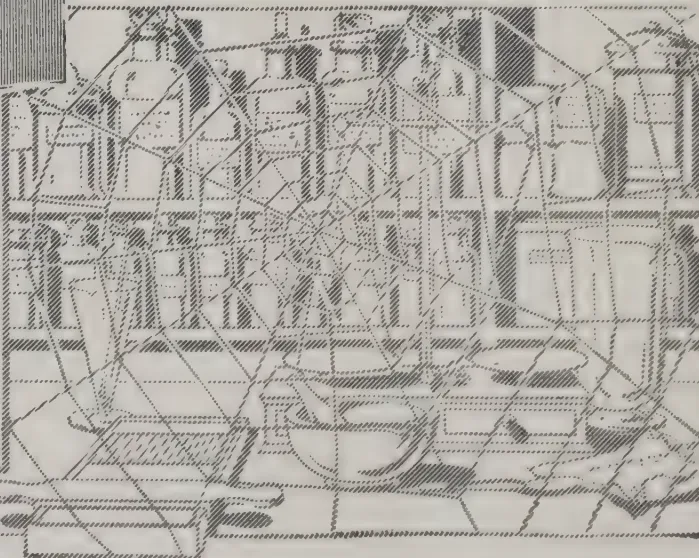

Dispensing made easy

No weighing  
No waste

Extremely light and climate-proof

Measures

$8\frac{1}{4} \times 4\frac{3}{8} \times 5\frac{3}{4}$  in.

In Japanned Metal, of all the principal Chemists and Stores


L.R. 976

BURROUGHS WELLCOME & CO., LONDON

NEW YORK

MONTREAL

SYDNEY

BUENOS AIRES

CAPE TOWN

BOMBAY

MILAN

SHANGHAI

All Rights Reserved

262------------------------------------------------

MARCH, 1914.]251

Very similar to the Master's Isle is the Guest's Isle, which is placed more in the background and is likewise approached by bridge and stepping-stones. Its ornamental stones are chosen to denote hospitality. There is a Guests honouring Stone, which serves as a rest for an important visitor ; an Interviewing Stone, of flat shape, in front of the Stone of Honour, where the host stands to salute visitors ; and Water-fowl Stones for birds to rest upon.

The Master's Isle as well as the Guest's Isle may contain a Seat of Honour Stone, patterned after a sacred stone in India, and a choice old tree always grows beside it. This takes the mind back to the banks of the Niranjara River, when truth flashed upon Guatama's soul. I might also mention the *Yama-jima*, or Mountain Isle, containing two peaks, one somewhat higher than the other. Encircling this island is a stretch of flat beach with occasional rocks.

A well is an indispensable feature of a Japanese garden. While in itself useful, its chief end is often ornamental, helping to express the mood or sentiment of the whole place. The ordinary form contains a border of box-like frame of wood or stone, two buckets suspended on a pulley, one resting on the edge of the frame, the other in the water. The accessories are a drain, stepping stones and ornamental rocks. Sometimes the pulley is of porcelain ; the Oxford frame is popular for the box-frame, the sides being of artistically-grained wooden slabs.

There is a semi-religious sentiment hovering round the presence of water in a Japanese garden, as something pure and immortal, reminding us of the text in St. John's Gospel, iv., 14. "A well of water springing up into eternal life." An ornamental stone water-basin, taking the form of Fuji-yama, maybe, or, in statelier gardens, of a bronze Lotus bowl, is as common as the well. A running-water basin is also popular, the water being allowed to stream over the bowl.

Let me discuss the essentials of garden construction. First comes the necessity of following and encouraging natural lines—assisting Nature, and not forcing her. Keep the geometrical and the artificial far away. Rigidly exact circles or ellipses, or rectangles, or squares—these have no place in a Japanese garden, as they have no place in actual outdoor life. Even the Parthenon, that miracle of architectural beauty, as recently shown by a capable writer, does not deal in straight lines. The apparent straight lines are delicate curves, so shaped as to give at a distance the appearance of forthrightness. And stone, it must be remembered, is not nature-life. Here must I make the exception : garden stone lanterns may always have geometrical curves, angles, and straight lines, for they come into a different category because of the material. The ease and grace of life are for the most part expressed in terms of subtle curves. To find these subtle curves demands both time and sympathy. Secure ease and grace of expression in the garden without the appearance of painstaking effort or studied labour. Here comes in the great principle of *Ars celare artem*, not manifest in the Dutch or Italian garden. The key-note of the Japanese garden is the spontaneity of life, which is Nature's secret that we may wrest from her by minute care and patience. Rich design, the accumulation of ornament, savour of vulgarity. Even one graceful old Pine, with two or three *yamaji*, Chrysanthemums, may make a garden of supreme taste. The garden must be given a soul.

Good taste has the effect of inspiring a feeling of truth and purity, while vulgar taste has a depressing effect. Refined taste in a garden consists not in the extent of its area nor in the profusion of its shrubs and trees, but in the truthfulness of the setting or composition. In arranging the details for a garden it is well first to study the topographical features of the spot where you decide to make it. Then transplant thither the mood or aspect of some vale or stream or hill that is dear to your memory, and arrange, all the single effects to suit the whole design.

263------------------------------------------------

MARCH, 1914.]252

Dispense with a fictitious mountain, says one good authority, if there is a fine waterfall. Eliminate a pagoda if there is an arbour. Study reticence, the "something left over," which leaves room for suggestion. A garden without suggestion is no real garden: Be ever careful to transcend artificial rules and enter as far as you can into the real spirit of Nature.—J. M. DIXON IN GARDENER'S CHRONICLE.

## ROWS IN CORN COBS.

REZSO FLEISCHMANN.

In selecting the ears of maize, growers as a rule only take into consideration the pure line and the percentage of cob and grain in relation to the whole ear. There are, however, certain other essential characters which should not be lost sight of. One is the number of rows, which may vary from 8 to 26 or even more in the case of the Horsetooth variety.

The importance of this character is demonstrated by observation on specimens of the above-mentioned variety, selected on the Ruma Estate; these showed that the weight of grain per ear increases regularly with the increase in the number of rows from 8 to 22.

The result was that the ears of 1912 had an average of 3 or 4 rows more than the original material of the first year.

In the number of seed-rows of the ears selected on the Ruma estate, the average of the ancestors varies about the figure 14, and the experimental data relating to the 1912 harvest indicated in Table show that the off-spring revert to this mean.

<table border="1">
<thead>
<tr>
<th>No. of lines.</th>
<th>No. of rows of grain in parents.</th>
<th>Average No. of rows of grain in the ear of each generation.</th>
</tr>
</thead>
<tbody>
<tr>
<td>Plot No. I.</td>
<td></td>
<td></td>
</tr>
<tr>
<td>13</td>
<td>14</td>
<td>14.04</td>
</tr>
<tr>
<td>20</td>
<td>16</td>
<td>14.58</td>
</tr>
<tr>
<td>5</td>
<td>18</td>
<td>15.56</td>
</tr>
<tr>
<td>2</td>
<td>20</td>
<td>16.23</td>
</tr>
<tr>
<td>1</td>
<td>22</td>
<td>17.31</td>
</tr>
<tr>
<td>Plot No. II.</td>
<td></td>
<td></td>
</tr>
<tr>
<td>1</td>
<td>12</td>
<td>13.40</td>
</tr>
<tr>
<td>9</td>
<td>14</td>
<td>14.21</td>
</tr>
<tr>
<td>34</td>
<td>16</td>
<td>14.78</td>
</tr>
<tr>
<td>4</td>
<td>18</td>
<td>15.29</td>
</tr>
<tr>
<td>1</td>
<td>22</td>
<td>15.94</td>
</tr>
<tr>
<td>1</td>
<td>26</td>
<td>17.25</td>
</tr>
<tr>
<td>Plot No. III.</td>
<td></td>
<td></td>
</tr>
<tr>
<td>7</td>
<td>12</td>
<td>13.92</td>
</tr>
<tr>
<td>24</td>
<td>16</td>
<td>15.01</td>
</tr>
<tr>
<td>6</td>
<td>18</td>
<td>15.32</td>
</tr>
<tr>
<td>8</td>
<td>20</td>
<td>15.88</td>
</tr>
</tbody>
</table>

According to these data the average number of rows of seeds in the offspring of the many-rowed parent ear is greater than the average of those from the fewer-rowed parent ears, but the average of the first approaches

264------------------------------------------------

MARCH, 1914.]253

from nearly the average number of rows of the whole group (i.e., 14) than the number of rows in the parent ear. This character can only be fixed by prolonged and continued selection.

The ears of the high-cropping types had, except in certain cases, the greatest number of seed rows.

The number of seed rows in the ear is also correlated with other characters. With increase in the number of rows the tips of the seeds are narrowed and become elongated, while the percentage of rachis in the ear decreases. The following results were obtained by the writer.

<table>
<tr>
<td>No. of rows</td>
<td>...</td>
<td>8</td>
<td>10</td>
<td>12</td>
<td>14</td>
<td>16</td>
<td>18</td>
<td>20</td>
</tr>
<tr>
<td>Percentage of rachis<br/>in the ear</td>
<td>...</td>
<td>20.6</td>
<td>16.7</td>
<td>14.4</td>
<td>14.3</td>
<td>15.4</td>
<td>15.3</td>
<td>14.9</td>
</tr>
</table>

These observations show that in the selection of maize or the improvement of the yield considerable importance should be attached to the number of seed-rows. At the same time the other characters must not be lost sight of. Further, the quantity and quality of the seeds, and the structure of the seed, and the structure of the rachis are also important factors in the analysis, a thickened rachis being correlated with a low yield. Also a thick rachis contains more pith, which takes longer to dry and deteriorates quicker, especially during a wet season.—MONTHLY BULLETIN.

## IS THE EARTH DRYING UP?

PROF. J. W. GREGORY, D. Sc., F.R.S.

Underlying the irregular and apparently capricious variations of the weather, a regular cycle of change has been recognised by the study of long continued observations. This cycle appears to be only a secondary movement on a still greater cycle, and it, according to some geographers, is in turn controlled by variations the length of which can only be measured in geologic ages, while glacial deserts were being changed into torrid wastes. In recent years we have been often warned that one of these great climatic changes is now carrying the world, slowly and irresistibly, toward world-wide drought. The view that the Earth is becoming steadily and even alarmingly drier was advocated in a paper read to this Society by PRINCE KROPOTKIN in 1904, and a considerable body of evidence appears to support this view.

Thus in recent geological times, glaciers were far larger and more numerous than they are now. Then followed a time characterized by such vast lakes that PRINCE KROPOTKIN has proposed to call it "The Lake Period." Hence, according to him, the world has recently experienced three successive climates, those of the cold Glacial Period, the moist Lake Period, and the existing period of world-wide desiccation. That the Earth is now becoming drier is consistent with many impressive facts. The post-glacial lakes have grown smaller; they have been replaced by marshes, or even by meadows. The great inland sea of south-western Asia has shrunk until it is now represented only by the Caspian and the Sea of Aral. Asiatic travellers bear unanimous testimony that in large areas of Central Asia, lakes and swamps are still disappearing, fertile plains are still being converted into deserts, rivers are ceasing to run, and the deserted ruins of once busy cities are being buried in sand. All these changes are interpreted to mean that the rainfall over central Asia has decreased and is still decreasing.

265------------------------------------------------

254[MARCH, 1914.

Similar evidence is reported from many widely spread parts of the world. The desolation of Palestine is attributed to a decrease in its water supply. In tropical Africa, many lakes have vanished, and Lake Chad has become so much shallower and smaller that it has been described as "a disappearing lake." LIVINGSTONE'S first contribution to South African geography, which was unluckily lost, described the increasing desiccation of the country beside the Kalahari desert. In North America, great freshwater lakes have dwindled to salt pools; Indian cities, once numerous in certain districts, have been deserted, and these districts are said to be incapable of now maintaining a population corresponding to the number of ruined settlements. In South America, DR MORENO (1901, pp. 581, 586) and SIR MARTIN CONWAY (1904) have referred to evidence of cultivation in land now abandoned owing to the failure of the water supply; and BOWMAN (1909) has described recent desiccation in southern Bolivia. The maps of the interior of Australia mark many extensive lakes which are to-day mere clay pans or salt swamps, while the once fertile plains around them have withered into desert.

Many of the geographical changes have been proved by unmistakable evidence, and according to PRINCE KROPOTKIN they occasioned some of the greatest historic movements among men. Thus he attributes the over-throw of the Roman Empire to the dwindling rainfall of Central Asia, which turned whole tribes of agriculturists into nomads by the repeated failure of their crops, and finally drove the drought-stricken barbarians into Europe, owing to their own lands having become uninhabitable. Similarly, PROF. J. L. MYRES (1910, pp. 679-80) has attributed the various invasions of Egypt to droughts in Arabia and Libya. If this desiccation of the Earth is still in progress it must lead to further great political changes; for in time the populations of the world will be forced out of the centres of the continents and crowded into continental margins.

This theory affects so many geographical questions that I gladly accepted the invitation to reconsider the evidence on which it rests, and discuss the conclusions which can be founded on the facts.

### THREE FORMS OF THE DESICCATION THEORY.

The theory that the climate of the world is becoming drier has been advanced in three main forms. As promulgated by PRINCE KROPOTKIN, the climate is undergoing a steady progress towards drought, though there may be fluctuations in the advance.

PROF. ELLSWORTH HUNTINGTON formerly adopted the theory in this form; but in recent years he has modified it, and now regards the most conspicuous change as pulsatory, causing an alternation of wet and dry periods; and he considers the differences between them to have been sufficient to have very important political and economic results, the dry periods having been sufficiently arid to render vast areas uninhabitable and to effect the moral ruin or extinction of whole nations. Although he recognises repeated returns towards moister conditions, he agrees with PRINCE KROPOTKIN that the resultant tendency of the present climatic movement is towards greater aridity. "At certain periods the climate appears to have become rapidly drier. At others it became moister, but, on the whole, the general tendency has been from moist to dry, and possibly from cool to warm. Thus it appears that the climate of the present time is distinctly drier than that of two thousand years ago. Nevertheless, at certain times during the two thousand years conditions appear to have been even drier than at present" (HUNTINGTON, 1910, p. 665).

A third form of the theory represents the climate as varying in great cycles, each of which may take thousands of years to run its course. Thus MR. ROWLAND THIRLMERE (1905, pp. 595-599) holds that our spring and summer "grow shorter and colder year by year. The apricot tree, now slowly

266------------------------------------------------

MARCH, 1914.]255

but surely disappearing from Central Europe, is a proof of some great climatic change inexorably approaching. Up to 1250 A.D., our temperatures were getting higher every year, but since that season of maximum heat the European springs and summers have been getting gradually colder. Chillier still they must become until the period of maximum cold is reached, probably about the year 2300 A. D." (THIRLMERE, 1905, pp. 594-5). He quotes figures which he claims to prove that the world is moving forward to one of the great turning-points of seasonal change. "We Europeans," he says, "are almost imperceptibly hastening towards a minimum of spring and summer brightness. Before four hundred years have passed, there will be no wine made in Champagne, and the grape-wine will not exist in that part of France, nor in Burgundy, nor in the Gironde. The vintages of Medoc and Macon will have become historical. Provence will be the only district producing wines north of the Pyrenees. Andalucia and the Mediterranean coasts of Spain will still make the red and yellow liquors for which they are now renowned. But the vineyard countries *par excellence* will then be Algeria, Morocco, and possibly Australia. Within ten thousand years Madrid, if she still exists, will have the winter temperature of Paris, Paris that of Berlin, and Berlin, that of Stockholm" (THIRLMERE, 1905, pp. 598-599).

#### PALESTINE—A TEST CASE.

A more precise test is needed than the variation of lakes and the ruin of cultivated land by wind-blown deposits. Probably the best available test is supplied by vegetation, and especially by any changes that may have taken place in the range of food plants or fruit trees in the countries of which we have the longest written records. Palestine furnishes a very good test case of such a nature.

#### EVIDENCE OF DESICCATION.

The striking contrast between the present and past conditions of Palestine appears at first to indicate some fundamental change in geographical conditions. Palestine is described in the Bible as a land flowing with milk and honey; it was fertile in vine and olive; many incidents suggest that it was well wooded; and, according to the Old Testament statistics, it had a dense population. Now it is a barren, arid land, with a scanty vegetation, swept by parching winds from the Eastern deserts, and occupied by some 700,000 people, who are mostly Arabs and most by paupers; and towns with only a tithe of their ancient population are said to be at the very limit of the available water supply.

#### ANCIENT POPULATION.

This deplorable change, according to one explanation is due to mal-administration and the blighting presence of the Turk; and it is held that under better government the country could be restored to its ancient fertility and prosperity. But, according to an alternative view, Palestine has been paralyzed by a climatic change; and this second explanation is affirmed on many grounds. It is claimed that the ruins of the ancient cities indicate that they had a population far larger than could be supported by the present water supply. Thus the population of Gerasa, the ancient of Jerash, in the land of Gilead, has been described by PROF. ELLSWORTH HUNTINGTON (1911, p. 279) as insignificant in comparison with that of the ancient city; and yet holds that the water supply available only just suffices for the present inhabitants (1911, pp. 278-282). The same author quotes the opinion of PROF. H. C. BUTLER of Princeton, that the ancient ruins indicate that some districts of Syria had a far larger population than they could now support. According to the Book of Numbers (i. 3 and 46), the Israelites in the wilderness included 603,550 men capable of bearing arms; the census in the reign of David records the number of available warriors as 1,300,000 (2 Sam. XXIV, 9),\* and the total

\* The number in 1 Chron. xxi. 5, for the same census, is given as 1,570,000; Josephus adopts the smaller total, though differing in the numbers assigned to the two kingdoms.

267------------------------------------------------

256[MARCH, 1914.

population then has been estimated as from five to six millions; and if Josephus be correct in his statement that 1,100,000 of the inhabitants of Jerusalem perished during the siege by Titus, the population of the city must have been as prodigious as overcrowded. It would certainly be difficult to maintain in modern Palestine the population indicated by these records.

#### WOODS AND RAINFALL.

Changed climatic conditions are also inferred from the forests. Palestine is represented as having been, in Old Testament times, a well-wooded country. Joshua (xvii. 15 and 18) promised the Ephraimites that "the mountain shall be thine; for it is a wood, and thou shalt cut it down;" and the "wood of Ephraim" is often referred to in Bible history; and the fact that timber was used in ancient buildings in districts where none grows now is quoted as evidence of the former greater abundance of forests.

#### ANCIENT CLIMATE AND WATER SUPPLY.

Another argument is afforded by the difference in the caravan routes into Palestine. Thus according to PROF. HUNTINGTON (1911, p. 269) three thousand years ago a great trade was conducted over the road from Egypt to Palestine, and it is now commercially useless owing to lack of water.

More direct evidence is offered by the former higher level and quarter size of the Dead Sea. Many ancient terraces mark the former positions of its shore. One of the most noticeable of the old beaches stands about 250 feet above the present surface of the water; this beach, however, was formed some five to six thousand years ago, so that it is prehistoric; but from the position of the boundary between the tribes of Benjamin and Judah, PROF. HUNTINGTON claims (1911, pp. 311-313) that in the time of Joshua the Dead sea level stood higher than it does now. The level is said to have been higher also in the time of Christ, though it was admittedly as at present in 333 A.D. Hence, there does not appear to have been any serious progressive fall in the surface of the lake since the time of Joshua, though there have been periods of rise and fall due to temporary variations in the rainfall.

PROF. HUNTINGTON concludes (1911, p. 375), "All these facts, and others not here mentioned, make a strong case in favour of the theory that from about 1100 B.C. or a little later, down to the time of Christ, comparatively moist conditions prevailed most of the time."

From such considerations many authorities have adopted the view that there has been a material change in the climate of Palestine since Old Testament times. This conclusion is advocated by PROF. E. HULL, PROF. O. FRAAS, Dr. T. H. FISCHER in his well known memoir on the climate of the Mediterranean lands, FR. R. P. ZUMOFFEN, PROF. HUNTINGTON, and by others. Observers in adjacent lands have supported this view, such as MR. D. CARRUTHERS in Arabia and PROF. J. J. MYRES in Egypt.

#### FORMER POPULATION EXAGGERATED.

Nevertheless the evidence seems unconvincing. The estimates of the former population are probably greatly exaggerated. HILDERSCHEID has rejected the estimates in the time of Moses and David (HILDERSCHEID, 1902, p. 98); and so does DR. STEVENSON, Professor of Hebrew in Glasgow University, in the following answer to an inquiry as to the probable ancient population of Palestine:—

"The literature of the Old Testament itself does not seem to contain numerical estimate of the population of Palestine in Old Testament times. Such numbers as those in Judges iv. 10; xx. 2; or 2 Sam. xxiv. 9, have no claim to be regarded as the result of calculation or estimate of any kind. The numbers of those carried into exile by the Babylonians (as given in 2 Kings xxiv. 14 and Jeremiah lii. 28-30) may be, or may have been originally, correctly recorded, but their relation to the whole population of Judah is a matter of complete uncertainty. A round number of considerable historical

268------------------------------------------------

MARCH, 1914.]257

value may be obtained from the statement in 2 Kings xv 19. A poll-tax of fifty shekels produces one thousand talents (reckoning three thousand shekels equal to one talent) when levied on sixty-thousand men. The Hebrew historian, accordingly, assumes that there were sixty-thousand *gibbore havi* in the northern kingdom at this period (eighth century B. C.)

Unfortunately the exact status of the *gibbore havi* is unknown. They may be spoken of as citizens or burgesses, but it is more than doubtful if they were equivalent to the free population capable of bearing arms.

Of the data contained in the inscriptions of the Assyrian kings, the most important, meantime, is one of Sennacherib, according to which the population of the kingdom of Judah, exclusive of the inhabitants of Jerusalem, is apparently given as 200,150 people of all ages (end of the eighth century B. C.). Such a figure is not, however, to be implicitly relied on without confirmation. The same king states that there were forty-six walled cities in Judah, and possibly a calculation may be based on this statement when the average areas of these towns has been sufficiently determined by the excavations now in progress. After the final conquest of the northern kingdom (721 B. C.) KING SARGON declares that he carried off 27,290 captives. But previous to this the kingdom had been reduced to small dimensions, and the proportion left behind can only be guessed at."

Josephus' statement about the population at the time of the great siege is obviously ridiculous.\* If 1,100,000 people perished during the siege, the population cannot have been less than 1,200,000; whereas WILLIAM SMITH'S 'Dictionary of the Bible' estimates that the population then "cannot have exceeded 60,000, or 70,000;" and as, according to the same authority, the Roman army "consisted of four legions and some auxiliaries—at the outside 30,000 men" (W. SMITH, 1860; *op. cit.*, pp. 1011—12), it could hardly have besieged a city of a million desperate people. From the area of Jerusalem and the estimate that in Eastern cities the population is never more than 1 to 50 square yards, SMITH calculated that the population of Jerusalem could hardly have reached 20,000, and probably (SMITH, 1860, p. 1025), even in the days of its greatest prosperity, included only 30,000 to 45,000 souls.

#### SCARCITY OF FOREST.

The arguments based upon the former woods and forests of Palestine is of little value, for the term translated "wood and forest" may have meant only scrub. Principal GEORGE ADAM SMITH tells us "the Hebrew word we translate *forest* ought to be *woodland*, and perhaps only *copse* or *jungle*, and we may safely conclude that the land was never very much more wooded than it is to-day. The distribution of woodland may have been different, but the woods were what we find the characteristic Palestine wood still to be—open and scattered, the trees distinguished rather for thickness than height, and little undergrowth when compared with either a northern or a tropical forest. Here and there groves of larger trees, or solitary giants of their kind, may have stood conspicuous on the bare landscape" (G. A. SMITH, 1897, pp. 80—81. See also HILDERSCHEID, 1902, p. 100). The general statements in the Old Testament are fully consistent with the conclusions of Principal G. A. SMITH and DR. HILDERSCHEID; for though we hear much of the cedars of Lebanon and the oaks of Bashan (Isa. ii. 13), very little useful timber appeared to grow in Palestine itself. The wood for the temple was imported from Labanon. No doubt in many places there is less vegetation than formerly; for woods are said to have disappeared since the time of the Crusades; but this is not likely to be a climatic effect since, in some places,

\* His figures are scornfully rejected by BELOCH, 1886, p. 240.

269------------------------------------------------

258[MARCH, 1914.

the woods have actually increased ; for Principal G. A. SMITH tells us (1897, p. 80), " On the other hand, copse and wood cover many old clearings, as on Carmel."

#### UNCHANGED RAINFALL.

An extensive deforestation of Palestine has often been adduced as the cause of a reduction of the rainfall ; but any appreciable change in the rainfall is quite unproved. Palestine now has a moderate rainfall. The average for Jerusalem for a mean of forty-seven years (1860—1906) is 26 inches ; so that Palestine has a heavier rainfall than Essex, and there is no adequate evidence that it has been larger at any time since the days of the Patriarchs. Thus HILDERSCHEID concludes (1902, p. 103) that, "referring to the conditions of rainfall in Palestine in ancient times, as presented to us by the Bible and the Talmud, and comparing the same with the present conditions of rainfall in the Holy Land, no important reduction of the rain in subsequent time is established."

Principal GEORGE ADAM SMITH is equally emphatic. "Did the rain in ancient times differ from this? The Old Testament data are, of course, not specific, but at least sufficient to justify a negative answer. Some authorities on the climate and fertility of Palestine have, indeed, argued that as in the Mediterranean basin as a whole, so throughout Palestine in particular, the climate has suffered a change for the worse through the diminution of the rainfall. One of the reasons given for this conclusion is the alleged decrease of the woodlands of the country. I have elsewhere shown that in all probability these were never much greater on western Palestine than they are to-day. The other natural features by which the rainfall is influenced—the position of the city relatively to the sea, and the prevalent winds—have remained the same; while the references to climate and weather in the Bible and Mishnah are fully consistent with the present conditions. We may conclude, therefore, that the rainfall upon Jerusalem in ancient times must have been very nearly the same as it has been observed to be during the last forty-six years. Even if it was a little greater, the difference cannot have been of much practical moment" (G. A. SMITH, 1907, p. 78). The unaltered nature of the rainfall is also maintained by WATT from a study of records at Hebron (1903, pp. 134, 147\*).

Moreover the distribution of the rainfall during the year appears to have remained the same. Practically all the rain now falls in the winter months, and only  $2\frac{1}{2}$  per cent. falls in the six months, from May to October; and that rain was very exceptional in the summer is indicated from the comparison in Proverbs (xxvi. 1), "as snow in summer and rain in harvest," and the statement in the Song of Solomon (ii.11.), "winter is past, the rain is over and gone."

It has been claimed that a statement in the Mishnah, the earliest of the Talmudic books, indicates that about 200 A.D. the rains began a month earlier than they do now; for a three-days' fast was ordered, if no rain had fallen by a date, the limits of which are between October 22 and November 21. According to the authorities cited by KEELING (1909, p. 87), the date would fall, on an average, on November 7, and the rains now often begin by the middle of October. HUNTINGTON (1911, p. 421), in his summary of the dates for the beginning of the rains in Jerusalem, shows that during fifty-nine years for which records are available, the important rains began twenty-four times in October, twenty-seven times in November, seven times in December, and

---

\* MR. WATT says, "It is unquestionably true that the weather lore of the Biblical writings is in every way applicable to the average weather conditions of to-day—WATT, 1903, p. 147).

270------------------------------------------------

MARCH, 1914.]259

once in January.\* Hence the fact that the Jewish farmer became seriously anxious if no rain had fallen by November 7, suggests that there has been no change either in the habits of the rain or of the farmers.

A translation of the passage in the Mishnah has been published by KEELING (1900, p. 87), and he does not regard it as any evidence of a climatic change. PROF. G. HELLMANN of Berlin has also referred to the evidence of the Mishnah and concludes (1908, p. 226), from the evidence of that authority, "that the amount of rainfall then considered as normal for a good crop corresponds pretty closely with that deduced from the modern observations made by MR. THOMAS CHAPLIN at Jerusalem whence it can be inferred that the climate of Palestine has not changed."

CONDER (1876, pp. 122, 123), who had called attention to the statement in the Mishnah, concludes in spite of it that "the seasons are unchanged," and PROF. HUNTINGTON (1911, p. 422) dismisses it as so indefinite that no argument can be based on it either for or against any change in the date of the rains. The utmost that could be inferred is that, about 200 A.D., the rains may have begun a little earlier than they do now.

#### UNCHANGED CLIMATE.

The evidence of the Bible shows that even in the days of the Patriarchs Palestine had a very similar climate to that of the present time. Throughout Bible history, the country was periodically stricken by drought, and the frequent scarcity of water is indicated by many Bible incidents, such as Abraham's gift to Hagar of a bottle of water and her trouble after its exhaustion. Abraham's quarrel with Abimelech was over a well (Gen. xxi. 25). Famines drove Abraham to Egypt (Gen. xii. 10) and Isaac coastwards into Philistia (Gen. xxvi. 1), and led to the immigration of Jacob and his family into Egypt and of Ruth's father-in-law into Moab (Ruth i. 1). Later on, in the time of the Kings, famines were also frequent. During the reign of Ahab there was no rain for three years (1 Kings xviii. 1) and the brook beside which Elijah was fed by the ravens dried up because there had been no rain in the land (1 Kings xvii. 7). Great care was clearly taken of the water supply, and that the houses had large tanks, as they still have in Jerusalem, is shown from the incident of Jeremiah in the waterless but miry cistern of Malchiah (Jer. xxxviii. 6); and that every house in town or country had its cistern is implied in the exhortation of Rabshakeh, "Eat ye every one of his vine, and every one of his fig tree, and drink ye every one the waters of his own cistern" (Isa. xxxvi. 16). In Palestine, then, for water during the summer, people were anciently as dependent upon the winter store as they are to this day.

Further, so far as we can judge of the climate from the Bible statements, it appears to have been essentially similar to that of the present time. Many of the prophets give graphic descriptions of the drought-stricken character of the country. "The beasts of the field," says Joel (i. 20), "cry also unto thee; for the rivers of water are dried up, and the fire hath devoured the pastures of the wilderness;" and Jeremiah's warning (Jer. iv., 11-12), "At that time shall it be said to this people and to Jerusalem, "A dry wind of the high places and of the desert toward the daughter of my people, not to fan, nor to cleanse, even a full wind from those places shall come unto me," suggests that the dry desert winds gave Jeremiah as just cause for lamentation as they give to modern visitors.

---

\* According to ZUMOFFEN (1899, p. 356), the meteorological records at Jerusalem for thirty-six years, from 1861 to 1896, show that October has a mean of 1.2 rainy days and November 6.1; hence the beginning of the rains in October was a normal occurrence. ROBINSON (1841, vol. ii, p. 97) says that the autumnal rains "usually commence in the latter half of October or beginning of November."

271------------------------------------------------

260[MARCH, 1914]

The balance of expert opinion seems strongly in favour of the climate of Palestine having undergone no important modification during historic times. PHUS ANKEL concludes (1877, p. 123), "The question whether the climate of the lands west of the Jordan has been essentially changed since historic memory, we must answer with a negative:" and he attributes the changes in its condition to political causes and believes with human help, "it could become as formerly, a land full of milk and honey, could again be of higher consequence to the civilized world, and present the same bloom as in the days of David and Solomon" (ANKEL, 1877, p. 129).

LIEUT. CONDER, with the intimate acquaintance of Palestine gained during his prolonged survey, after a careful discussion of "The Fertility of Ancient Palestine," denies that there has been a change in the climate, the seasons, the vegetation, or water supply. He decides (1876, p. 132):—

"The seasons in Palestine are unchanged, and there is no evidence of any very remarkable falling off in the amount of rain, though the data are not sufficient for a definite conclusion on the subject.

"The spontaneous growth resembles in character that mentioned in the Bible. In some districts it has greatly decreased, in others it has spread; woods of timber trees have increased in extent, but still exist in part of the districts formerly occupied by them.

"The present water supply answers exactly to that described in the Bible, in the Talmud, and in Josephus, and depends entirely on geological formation.

"To sum up, the change in Palestine is one of *degree only and not of kind*. The curse of the country is bad government and oppression. Justice and security of person and property once established, Palestine would become once more a land of corn, vines and olives rivalling in fertility and wealth its ancient condition, as deduced from careful study of such notices as remain to us in the Bible and in the later Jewish writings."

As a more recent authority may be quoted, PROF. I. BENZINGER, Professor of Old Testament Exegesis in the University of Berlin. In the article on Palestine in the Jewish Encyclopædia (vol. ix., 1905, p. 497) he emphatically rejects the view that there has been any change of climate in Palestine during the historic period. "All the references of the Old Testament which bear on this question apply," he says, "exactly to modern climatic conditions, and even if there were then more forests than at present, as is frequently asserted, this could not have been the case to an extent great enough materially to influence the climate."

Again, PROF. A. H. SAYCE, in his work on "Patriarchal Palestine," states (1895, pp. 19, 30), that in the time of the patriarchs the country was not well wooded, forest trees were scarce south of the Lebanon, the palm grew only on the sea-coast and in the valley of the Jordan, the tamarisk and sycamore were hardly more than shrubs, and the amount of ground fit for cultivation was no larger than it is now: and he tells us that in Samaria and Judah "The want of water was the only difficulty; in most cases the people were dependent on rainwater, which they preserved in cisterns cut out of rock."

No doubt there had been fluctuations of good seasons and of bad all through the history of Palestine. Famines occurred in the time of the Patriarchs and drove them into Egypt just as they drive the present inhabitants into beggary; but the changes from year to year and from decade to decade appear to be now of the same extent of those of ancient times. Certainly the modern rainfall records give no indication of a failure of rain as complete as in the time of Ahab.

272------------------------------------------------

MARCH, 1914.]261

### EVIDENCE OF DATE PALM AND VINE.

Nevertheless some more certain test is necessary than the general conclusions which can be based upon the historical and geographical evidence of the Bible. In the absence of rain gauge and thermometric records, the most precise test of climate is given by the vegetation; and fortunately the date palm affords a very delicate test of the past climate of Palestine and the Eastern Mediterranean. This argument was first used by the Danish botanist and meteorologist, J. F. SCHOUW, in 1826: it has been extended by various authors, such as the astronomer ARAGO (1833), Principal J. D. FORBES of St. Andrews in 1862, and D. EGINITIS, Director of the Athens Observatory, in 1898. The date palm has three limits of growth which are determined by temperature; thus it does not reach full maturity or produce ripe fruit of good quality below the mean annual temperature of 69° F. The isothermal of 69° crosses Southern Algeria near Biskra; it touches the northern coast of Cyrenaica near Derna and passes Egypt near the mouth of the Nile, and then bends northward along the coastlands of Palestine.

To the north of this line the date palm grows and produces fruit, which only ripens occasionally, and its quality deteriorates as the temperature falls below 69°. Between the isotherms of 68° and 64°, limits which include northern Algeria, most of Sicily, Malta, the southern parts of Greece and northern Syria, the dates produced are so unripe that they are not edible. In the next cooler zone, north of the isotherm of 62°, which enters Europe in south-western Portugal, passes through Sardinia, enters Italy near Naples, crosses northern Greece and Asia Minor to the east of Smyrna, the date palm is grown only for its foliage, since it does not fruit.

Hence at Benghazi, on the north African coast, the date palm is fertile, but produces fruit of poor quality; in Sicily and at Algiers the fruit ripens occasionally, and at Rome and at Nice the palm is only grown as an ornamental tree.

The date palm therefore affords a test of variations in mean annual temperature of three grades between 62° and 69°.

This test shows that the mean annual temperature of Palestine has not altered since Old Testament times. The palm tree now grows dates on the coast of Palestine, and in the deep depression around the Dead Sea; but it does not produce fruit on the highlands of Judæa. Its distribution in ancient times, as far as we can judge from the Bible, was exactly the same. It grew at "Jericho, the city of palm trees" (Deut. xxxiv. 3 and 2 Chron. xxviii. 15), and at Engeddi on the western shore of the Dead sea (2 Chron. xx. 2, Eccls. xxiv. 14); and though the palm does not still live at Jericho—the last apparently died in 1838\*—their disappearance must be due to neglect, for the only climatic change that would explain it would be an increase in cold or moisture. In olden times the date palm certainly grew on the highlands of Palestine; but apparently it never produced fruit there, for the Bible references to the palm are to its beauty and erect growth: "the righteous shall flourish like the palm" (Ps. xcii. 12); "they are upright as the palm tree" (Jer. x. 5): "thy stature is like to a palm tree" (Cant. vii. 7). It is used as a symbol of victory (Rev. vii. 9), but never praised as a source of food.†

\*STANLEY, 1856, p. 301, also pp. 143-145.

†ZUMOFFEN (1899, pp. 483-8) holds that the palms must have fruited in Palestine, as some Hebrew coins represent them covered with fruit; but the evidence of the coins would appear to be inadequate in face of the negative evidence of the Bible, and ZUMOFFEN'S excellent statement of the arguments in favour of a climatic change in Palestine does not appear convincing.

273------------------------------------------------

262[MARCH, 1914.

Dates are not once referred to in the text of the Bible, but according to the marginal notes the word translated "honey" in 2 Chron. xxxi. 5 may mean dates PROF. STEVENSON tells me that "the word is rightly translated 'honey' adn is the ordinary word for honey. I do not know how the alternative 'dates' comes to be given in the margin—it cannot rest on any authority. The Hebrew word very possibly denoted not only honey, but a kind of fruit syrup; but that has, of course, no bearing on your question." The Revised Version omits the marginal "dates."

It appears therefore that the date palm had essentially the same distribution in Palestine in Old Testament times as it has now; and hence we may infer that the mean temperature was then the same as now. If the climate had been moister and cooler, the date could not have flourished at Jericho. If it had been warmer the palms would have grown freely at higher levels and Jericho would not have held its distinction as the city of palm trees.

The vine too confirms the view that the climate of the highlands of Palestine has not changed; for the vine does not grow south of the mean isotherm of 72°, unless it be artificially shaded and protected. Vines and olives were the two most characteristic products of the highlands of Palestine. They were widespread: "Eat ye every man of his own vine" (2 Kings xviii. 31). Its fruitfulness was proverbial. "A fruitful vine" is the Psalmist's simile (Ps. cxxviii. 3); "the vine shall give her fruit," promised the prophet (Zech. vii. 12); and the twelve spies sent by Moses returned with bunches of grapes as evidence of the fertility of the promised land. In truth, so common was the vine that it passed into a proverbial expression: "and Judah and Israel dwelt safely every man under his vine from Dan to Beersheba in the days of Solomon" (1 Kings iv. 25).

The evidence of the vine supplements that of the date; for then as now Palestine was on the extreme southern edge of vine cultivation. The vine can be grown in Egypt as at Cairo, but it does not flourish there, and requires to be kept cool, shaded and moist. Its success at Engedi (Song of Sol. i 14) was probably due to the same care.

In accordance with the evidence of the vegetation, ARAGO (1833, p. 204) expressed his conviction that "the mean temperature of Palestine does not appear to have changed since the time of Moses." JAS. D. FORBES concluded, "Hence the climate of Palestine, being neither sensibly hotter nor colder than it anciently was, is, of course, unchanged; and the direct evidence of modern travellers on the distribution of the vine and palm in that country leads to the same result" (1862, p. 179). SCHOUW ends his discussion of the botanical evidence with the verdict "that the climate in Greece and Italy, like that of Palestine and Egypt, has undergone no important change since ancient times. But if, on account of the later harvest and the possible growth of the beech trees in the Roman plains,\* we might be led to the opinion that formerly the climate had been a little colder than now, the difference will hardly come up to one or two degrees, and will not be greater than might be occasioned by the cultivation of the north of Europe" (SCHOUW, 1828, p. 324).

The failure of the palm to fruit and the luxuriant growth of the vine on the highlands of Judæa both indicate that the climate there in ancient times was neither hotter nor colder than it is now. In ancient and modern times Palestine was on the southern margin of the cultivation of the vine and was just skirted by the northern margin of the date. Hence there can have been no change in the climate of any practical importance, since the days of the Patriarchs and of the Jewish kings.—THE GEOGRAPHICAL JOURNAL.

---

\* ARAGO (1833, p. 221) has also considered the evidence that the beech formerly grew on the plains near Rome, where the climate is now too warm for it; but he considers that this evidence must be disregarded, as it is inconsistent with so much else.

274------------------------------------------------

MARCH, 1914.]263

## DEVICES FOR ASSISTING FRUIT PRODUCTION.

The QUEENSLAND AGRICULTURAL JOURNAL for February last describes a process which has been found successful in influencing the setting of fruit in oranges.

This consists in tying a piece of soft No. 10 wire round the trunk of the tree in the spring, using heat if necessary to make the wire pliable and tapping it to make it follow closely the irregularities of the surface and then twitching it tight. The girdle should be left till the setting of the fruit is assured and then removed. It is most important that a complete girdle should be formed to be of any use. The adoption of this practice by MR. KETEKAR, Manager of the Fairview Orangery, is reported to have given excellent results.

MR. ROSS, Instructor in Fruit culture, Queensland, prefers the practice of cincturing to that of girdling and recommends that it should be performed in the head of the tree instead of on the main stem, as being less drastic. Cincturing is a modified form of ring-barking and consists of the removal of a strip of bark from the circle of the tree. The principle involved is to check the descending sap without unduly retarding the upward flow.

In this connection we may mention that MR. F. H. DANIEL who has given much attention to fruit-growing has succeeded in inducing backward trees to fruit by making vertical cuts down the stem with the object of "loosening" the bark.

## Ceylon Agricultural Society.

### Memorandum by the Secretary.

Members are particularly requested to NOTIFY CHANGE OF ADDRESS, and also forward necessary instructions when leaving the Island, temporarily or permanently. Members who fail to NOTIFY THEIR INTENTION TO RESIGN from the Society will be held liable for subscription till such notification is received

ENROLMENT of new members can take place at any time; but, the subscription being annual, no reduction on the rate can be made. Members joining later than January will be entitled to receive back copies of the 'T. A.' and other publications.

Full sets of "The Tropical Agriculturist" for 1906 1907, 1908, 1909, 1910 1911 & 1912, can be supplied to members on application.

Those wishing to join the Society can do so by filling up and forwarding appended form with a year's subscription—(Rs. 8 local; Rs. 15 foreign) to

THE SECRETARY, CEYLON AGRICULTURAL SOCIETY,

*Peradeniya.*

to whom remittances must in all cases be made payable.

CEYLON AGRICULTURAL SOCIETY.

Name.

Address.

Remittance of Subscription in respect of year.

From 1st. Jan. 19

275------------------------------------------------

264

[MARCH, 1914.

**MARKET RATES FOR TROPICAL PRODUCTS.**

(From Lewis & Peat's Latest Monthly Prices Current.)

<table border="1">
<thead>
<tr>
<th colspan="2"></th>
<th>QUALITY.</th>
<th>Quotations.</th>
<th colspan="2"></th>
<th>QUALITY.</th>
<th>QUOTATIONS.</th>
</tr>
</thead>
<tbody>
<tr>
<td><b>ALOES, Socotrine</b></td>
<td>cwt.</td>
<td>Fair to fine</td>
<td>40 a 50</td>
<td><b>INDIARUBBER</b></td>
<td>lb.</td>
<td>Common to good</td>
<td>9d a 1/3</td>
</tr>
<tr>
<td>Zanzibar &amp; Hepatic</td>
<td>..</td>
<td>Common to good</td>
<td>40 a 70</td>
<td>Borneo</td>
<td>..</td>
<td>Good to fine red</td>
<td>1/4 a 1/6</td>
</tr>
<tr>
<td><b>ARROWROOT (Natal)</b></td>
<td>lb.</td>
<td>Fair to fine</td>
<td>7d a 8d</td>
<td>Java</td>
<td>..</td>
<td>Low white to prime red</td>
<td>9d a 1/4</td>
</tr>
<tr>
<td><b>BEES' WAX</b></td>
<td>cwt.</td>
<td></td>
<td></td>
<td>Penang</td>
<td>..</td>
<td>Fair to fine red ball</td>
<td>1/10 a 2/3</td>
</tr>
<tr>
<td>Zanzibar Yellow</td>
<td>..</td>
<td>Slightly drossy to fair</td>
<td>£7 15/ a £8</td>
<td>Mozambique</td>
<td>..</td>
<td>Sausage, fair to good</td>
<td>1/9 a 2/2</td>
</tr>
<tr>
<td>East Indian, bleached</td>
<td>..</td>
<td>Fair to good</td>
<td>£8 10 a £8 15</td>
<td>Nyassaland</td>
<td>..</td>
<td>Fair to fine ball</td>
<td>1/6 a 1/8</td>
</tr>
<tr>
<td>unbleached</td>
<td>..</td>
<td>Dark to good genuine</td>
<td>£6 10 a £7</td>
<td>Madagascar</td>
<td>..</td>
<td>Fr. to fine pinky &amp; white</td>
<td>1/ a 1/3</td>
</tr>
<tr>
<td>Madagascar</td>
<td>..</td>
<td>Dark to good palish</td>
<td>£7 17 6 a £8 5</td>
<td>New Guinea</td>
<td>..</td>
<td>Niggers, low to good</td>
<td>6d a 1/6</td>
</tr>
<tr>
<td><b>CAMPHOR, Japan</b></td>
<td>lb.</td>
<td>Refined</td>
<td>1 4½ a 1 6½</td>
<td>INDIGO, E. I. Bengal</td>
<td>..</td>
<td>Ordinary to fine ball</td>
<td>1/4 a 1/7</td>
</tr>
<tr>
<td>China</td>
<td>cwt.</td>
<td>Fair average quality</td>
<td>155/</td>
<td>Shipping mid to gd. violet</td>
<td>..</td>
<td>Consuming mid. to gd.</td>
<td>3s 3d a 3s 8d</td>
</tr>
<tr>
<td><b>CARDAMOMS, Tuti</b></td>
<td>cwt.</td>
<td>Good to fine bold</td>
<td>6/ a 6 3</td>
<td>Ordinary to middling</td>
<td>..</td>
<td>Mid. to good Kurpah</td>
<td>2s 4d a 2s 9d</td>
</tr>
<tr>
<td>Malabar, Tellicherry</td>
<td>..</td>
<td>Middling lean</td>
<td>5 2 a 5 7</td>
<td>Low to ordinary</td>
<td>..</td>
<td>Low to ordinary</td>
<td>1s 1d a 1s 9d</td>
</tr>
<tr>
<td>Calicut</td>
<td>..</td>
<td>Good to fine bold</td>
<td>6/ a 6 3</td>
<td>Mid. to fine Madras</td>
<td>..</td>
<td>Mid. to fine Madras</td>
<td>1 11 a 2/9</td>
</tr>
<tr>
<td>Mangalore</td>
<td>..</td>
<td>Brownish</td>
<td>3 11 a 5 8</td>
<td>Pale reddish to fine</td>
<td>..</td>
<td>Pale reddish to fine</td>
<td>2/4 a 2/6</td>
</tr>
<tr>
<td>Ceylon, Mysore</td>
<td>..</td>
<td>Med Brown to good bold</td>
<td>5 3 a 6 6</td>
<td>Ordinary to fair</td>
<td>..</td>
<td>Ordinary to fair</td>
<td>2/ a 2/2</td>
</tr>
<tr>
<td>Malabar</td>
<td>..</td>
<td>Small fair to fine plump</td>
<td>4 3 a 6</td>
<td>Wild</td>
<td>..</td>
<td>Wild</td>
<td>2/ 1a 2/4</td>
</tr>
<tr>
<td>Seeds, E. I. &amp; Ceylon</td>
<td>..</td>
<td>Fair to good</td>
<td>3 6 a 3 8</td>
<td></td>
<td></td>
<td></td>
<td>1/</td>
</tr>
<tr>
<td>Ceylon "Long Wild"</td>
<td>..</td>
<td>Fair to good</td>
<td>4 7 a 4 8</td>
<td><b>MACE, Bombay &amp; Penang</b></td>
<td>per lb.</td>
<td></td>
<td></td>
</tr>
<tr>
<td>CASTOR OIL, Calcutta</td>
<td>..</td>
<td>Shelly to good</td>
<td>2 3 a 3 6</td>
<td>Java</td>
<td></td>
<td></td>
<td></td>
</tr>
<tr>
<td><b>CHILLIES, Zanzibar</b></td>
<td>cwt.</td>
<td>Good 2nds</td>
<td>3 3d</td>
<td>Bombay</td>
<td></td>
<td></td>
<td></td>
</tr>
<tr>
<td>Japan</td>
<td>..</td>
<td>Dull to fine bright</td>
<td>45 a 50</td>
<td><b>NUTMEGS,</b></td>
<td>lb.</td>
<td>64's to 57 s</td>
<td>9½d a 10½d</td>
</tr>
<tr>
<td><b>CINCHONA BARK.</b></td>
<td>lb.</td>
<td>Fair bright small</td>
<td>50</td>
<td>Singapore &amp; Penang</td>
<td>..</td>
<td>80's</td>
<td>7½d</td>
</tr>
<tr>
<td>Ceylon</td>
<td>..</td>
<td>Crown, Renewed</td>
<td>3 3½d a 7d</td>
<td></td>
<td></td>
<td>110's</td>
<td>6½d</td>
</tr>
<tr>
<td></td>
<td>..</td>
<td>Org. Stem</td>
<td>2d a 6d</td>
<td><b>NUTS, ARECA</b></td>
<td>cwt.</td>
<td>Ordinary to fair fresh</td>
<td>17/6 a 20</td>
</tr>
<tr>
<td></td>
<td>..</td>
<td>Red, Org. Stem</td>
<td>1½d a 4½d</td>
<td><b>NUX VOMICA,</b></td>
<td>Cochin</td>
<td>Ordinary to good</td>
<td>11/ a 13/</td>
</tr>
<tr>
<td></td>
<td>..</td>
<td>Renewed</td>
<td>3d a 5½d</td>
<td>per cwt.</td>
<td>Bengal</td>
<td>..</td>
<td>9/6</td>
</tr>
<tr>
<td></td>
<td>..</td>
<td>Root</td>
<td>1½d a 4d</td>
<td>Madras</td>
<td>..</td>
<td>..</td>
<td>9/6 a 10</td>
</tr>
<tr>
<td><b>CINNAMON, Ceylon</b></td>
<td>1sts.</td>
<td>Good to fine quill</td>
<td>1 3 a 1 7</td>
<td><b>OIL OF ANISEED</b></td>
<td>lb.</td>
<td>Fair merchantable</td>
<td>6/</td>
</tr>
<tr>
<td>per lb.</td>
<td>2nds.</td>
<td>..</td>
<td>1 2 a 1 6</td>
<td><b>CASSIA</b></td>
<td>..</td>
<td>According to analysis</td>
<td>2/11 a 33</td>
</tr>
<tr>
<td></td>
<td>3rds.</td>
<td>..</td>
<td>1 1 a 1 5</td>
<td><b>LEMONGRASS</b></td>
<td>oz.</td>
<td>Good flavour &amp; colour</td>
<td>2½d</td>
</tr>
<tr>
<td></td>
<td>4ths.</td>
<td>..</td>
<td>1 a 1 3</td>
<td><b>NUTMEG</b></td>
<td>..</td>
<td>Dingy to white</td>
<td>1½d a 1½d</td>
</tr>
<tr>
<td></td>
<td>Chips.</td>
<td>Fair to fine bold</td>
<td>2d a 4d</td>
<td><b>CINNAMON</b></td>
<td>..</td>
<td>Ordinary to fair sweet</td>
<td>3½d a 1s 5d</td>
</tr>
<tr>
<td><b>CLOVES, Penang</b></td>
<td>lb.</td>
<td>Dull to fine bright pkd.</td>
<td>1 1 a 1 3</td>
<td><b>CITRONELLE</b></td>
<td>lb.</td>
<td>Bright &amp; good flavour</td>
<td>1/7½</td>
</tr>
<tr>
<td>Amboyna</td>
<td>..</td>
<td>Dull to fine</td>
<td>10d a 10½d</td>
<td><b>ORCHELLA WEED</b></td>
<td>cwt.</td>
<td></td>
<td></td>
</tr>
<tr>
<td>Zanzibar</td>
<td>..</td>
<td>Fair and fine bright</td>
<td>5½d a 6½d</td>
<td>Ceylon</td>
<td>..</td>
<td>Fair</td>
<td>15/</td>
</tr>
<tr>
<td>Madagascar</td>
<td>..</td>
<td>Fair</td>
<td>7d</td>
<td>Madagascar</td>
<td>..</td>
<td>Fair</td>
<td>15/</td>
</tr>
<tr>
<td>Stems</td>
<td>..</td>
<td>Fair</td>
<td>3d</td>
<td>Zanzibar</td>
<td>..</td>
<td>Fair</td>
<td>15/</td>
</tr>
<tr>
<td><b>COFFEE</b></td>
<td></td>
<td></td>
<td></td>
<td><b>PEPPER</b></td>
<td>lb.</td>
<td></td>
<td></td>
</tr>
<tr>
<td>Ceylon Plantation</td>
<td>cwt.</td>
<td>Medium to bold</td>
<td>Nominal</td>
<td>Alleppy &amp; Tellicherry</td>
<td>..</td>
<td>Fair</td>
<td>5½d a 5½d</td>
</tr>
<tr>
<td>Native</td>
<td>..</td>
<td>Good ordinary</td>
<td>50/ a 55</td>
<td>Ceylon</td>
<td>..</td>
<td>Fair to fine bold heavy</td>
<td>5½d a 5½d</td>
</tr>
<tr>
<td>Liberian</td>
<td>..</td>
<td>Fair to bold</td>
<td>63/ a 80</td>
<td>Singapore</td>
<td>..</td>
<td>Fair</td>
<td>5d</td>
</tr>
<tr>
<td><b>COCO, Ceylon Plant.</b></td>
<td>..</td>
<td>Special Marks</td>
<td>81/ a 88 6</td>
<td>Acheen &amp; W. C. Penang</td>
<td>..</td>
<td>Dull to fine</td>
<td>5d a 5½d</td>
</tr>
<tr>
<td>Native Estate</td>
<td>..</td>
<td>Red to good</td>
<td>73 a 80 6</td>
<td>(White) Singapore</td>
<td>..</td>
<td>Fair to fine</td>
<td>8½d a 8½d</td>
</tr>
<tr>
<td>Java and Celebes</td>
<td>..</td>
<td>Ordinary to red</td>
<td>42 a 68</td>
<td>Siam</td>
<td>..</td>
<td>Fair</td>
<td>8½d</td>
</tr>
<tr>
<td><b>COLOMBO ROOT</b></td>
<td>..</td>
<td>Small to good red</td>
<td>30s a 93s</td>
<td>Penang</td>
<td>..</td>
<td>Fair</td>
<td>7½d</td>
</tr>
<tr>
<td><b>CROTON SEEDS, sifted,</b></td>
<td>..</td>
<td>Middling to good</td>
<td>12 6 a 21</td>
<td>Muntok</td>
<td>..</td>
<td>Fair</td>
<td>9½d</td>
</tr>
<tr>
<td><b>CUBEBS</b></td>
<td>..</td>
<td>Dull to fair</td>
<td>57 6 a 60 nom.</td>
<td><b>RHUBARB, Shenzi</b></td>
<td>..</td>
<td>Ordinary to good</td>
<td>2/ a 3/6</td>
</tr>
<tr>
<td><b>GINGER, Bengal, rough</b></td>
<td>..</td>
<td>Ord. stalky to good</td>
<td>130 a 150</td>
<td>Canton</td>
<td>..</td>
<td>Ordinary to good</td>
<td>1/10 a 3/6</td>
</tr>
<tr>
<td>Calicut, Cut A</td>
<td>..</td>
<td>Fair</td>
<td>19</td>
<td>High Dried</td>
<td>..</td>
<td>Fair to fine flat</td>
<td>11/ a 1/1</td>
</tr>
<tr>
<td>B &amp; C</td>
<td>..</td>
<td>Medium to fine bold</td>
<td>60 a 75</td>
<td></td>
<td></td>
<td>Dark to fair round</td>
<td>9d a 11d</td>
</tr>
<tr>
<td>Cochin, Rough</td>
<td>..</td>
<td>Small and medium</td>
<td>36 a 60</td>
<td><b>SAGO, PEARL,</b></td>
<td>large--cwt.</td>
<td>Fair to fine</td>
<td>18/</td>
</tr>
<tr>
<td></td>
<td>..</td>
<td>Common to fine bold</td>
<td>22 6 a 30</td>
<td>medium</td>
<td>..</td>
<td>..</td>
<td>17/</td>
</tr>
<tr>
<td></td>
<td>..</td>
<td>Small and D's</td>
<td>22 6</td>
<td>small</td>
<td>..</td>
<td>..</td>
<td>13/ a 14</td>
</tr>
<tr>
<td></td>
<td>..</td>
<td>Unsplit</td>
<td>23/</td>
<td><b>SEEDLAC</b></td>
<td>cwt.</td>
<td>Good pinky to white</td>
<td>10/ a 11</td>
</tr>
<tr>
<td><b>GUM AMMONIACUM</b></td>
<td>..</td>
<td>Ord. Blocky to fair clean</td>
<td>40 s a 72s 6d</td>
<td><b>SENNA, Tinnevelly</b></td>
<td>lb.</td>
<td>Ordinary to gd. soluble</td>
<td>65/ a 80</td>
</tr>
<tr>
<td>ANIMI, Zanzibar</td>
<td>..</td>
<td>Pale and amber, str. srts</td>
<td>£1 10 a £16 10</td>
<td></td>
<td></td>
<td>Good to fine bold green</td>
<td>5d a 8½d</td>
</tr>
<tr>
<td></td>
<td>..</td>
<td>.. little red</td>
<td>£11 a £12</td>
<td><b>SHELLS, M. o' PEARL-</b></td>
<td></td>
<td>Fair greenish</td>
<td>3d a 4½d</td>
</tr>
<tr>
<td></td>
<td>..</td>
<td>Bean and Pea size ditto</td>
<td>70/ a £11</td>
<td>Egyptian</td>
<td>cwt.</td>
<td>Common specky &amp; small</td>
<td>1½d a 2½d</td>
</tr>
<tr>
<td></td>
<td>..</td>
<td>Fair to good red sorts</td>
<td>£8 10/ a £10 10</td>
<td>Bombay</td>
<td>..</td>
<td>Small to bold</td>
<td>100/ a £7 nom</td>
</tr>
<tr>
<td></td>
<td>..</td>
<td>Med. and bold glassy sorts</td>
<td>£5 a £7</td>
<td>Mergui</td>
<td>..</td>
<td>Chicken to bold</td>
<td>60/ a £7 nom</td>
</tr>
<tr>
<td></td>
<td>..</td>
<td>Fair to good palish</td>
<td>£4 a £8</td>
<td>Manilla</td>
<td>..</td>
<td>Fair to good</td>
<td>£10 a £14</td>
</tr>
<tr>
<td></td>
<td>..</td>
<td>.. red</td>
<td>£4 a £7</td>
<td>Banda</td>
<td>..</td>
<td>Sorts</td>
<td>£9 a £14 2/6</td>
</tr>
<tr>
<td><b>ARABIC, E. I. &amp; Aden</b></td>
<td>..</td>
<td>Ordinary to good pale</td>
<td>26 a 30</td>
<td>Green Snail</td>
<td>..</td>
<td>Small to large</td>
<td>82/6</td>
</tr>
<tr>
<td>Turkey sorts</td>
<td>..</td>
<td>Sorts to fine pale</td>
<td>32 a 55</td>
<td>Japan Ear</td>
<td>..</td>
<td>Trimmed selected small</td>
<td>57/6 a 85</td>
</tr>
<tr>
<td>Ghatti</td>
<td>..</td>
<td>Reddish to good pale</td>
<td>18 6 a 30 nom.</td>
<td></td>
<td></td>
<td>to bold</td>
<td>41/ a £6 10</td>
</tr>
<tr>
<td>Kurrachee</td>
<td>..</td>
<td>Dark to fine pale</td>
<td>25 a 30s nom.</td>
<td><b>TAMARINDS, Calcutta</b></td>
<td>per cwt.</td>
<td>Mid to fine bl'k not stony</td>
<td>14/ a 15</td>
</tr>
<tr>
<td>Madras</td>
<td>..</td>
<td>Clean fr. to gd. almonds</td>
<td>£7 a £8</td>
<td>Madras</td>
<td>..</td>
<td>Inferior to good</td>
<td>6/ a 10</td>
</tr>
<tr>
<td><b>ASSAFETIDA</b></td>
<td>..</td>
<td>com. stony to good block</td>
<td>40s a £5 12/6</td>
<td><b>TORTOISE SHELL</b></td>
<td>Zanzibar, &amp; Bombay lb.</td>
<td>Small to bold</td>
<td>13/6 a 26</td>
</tr>
<tr>
<td><b>KINO</b></td>
<td>lb.</td>
<td>Fair to fine bright</td>
<td>6d a 1/5</td>
<td></td>
<td></td>
<td>Pickings</td>
<td>7/ a 15/6</td>
</tr>
<tr>
<td><b>MYRRH, Aden sorts</b></td>
<td>cwt.</td>
<td>Middling to good</td>
<td>60/ a 70</td>
<td><b>TURMERIC, Bengal</b></td>
<td>cwt.</td>
<td>Fair</td>
<td>11/6</td>
</tr>
<tr>
<td>Somali</td>
<td>..</td>
<td>..</td>
<td>52s 6d a 57s 6d</td>
<td>Madras</td>
<td>..</td>
<td>Finger fair to fine bold</td>
<td>14/6 a 16/6</td>
</tr>
<tr>
<td><b>OLIBANUM, drop</b></td>
<td>..</td>
<td>Good to fine white</td>
<td>45s a 50s</td>
<td>Do.</td>
<td>..</td>
<td>Bulbs</td>
<td>12/ a 13</td>
</tr>
<tr>
<td></td>
<td>..</td>
<td>Middling to fair</td>
<td>35s a 40s</td>
<td>Cochin</td>
<td>..</td>
<td>Finger fair</td>
<td>14/ nom</td>
</tr>
<tr>
<td></td>
<td>..</td>
<td>Low to good pale</td>
<td>15 a 27 6</td>
<td></td>
<td></td>
<td>Bulbs</td>
<td>12</td>
</tr>
<tr>
<td></td>
<td>..</td>
<td>Slightly foul to fine</td>
<td>18 s a 27s</td>
<td><b>VANILLOES</b></td>
<td>lb.</td>
<td>3d. crystallized 3½ a 8½ain.</td>
<td>10 a 15</td>
</tr>
<tr>
<td><b>INDIA RUBBER</b></td>
<td>lb.</td>
<td>Fine Para smoked &amp; sheets</td>
<td>2 4½</td>
<td>Mauritius</td>
<td>1sts.</td>
<td>Foxy &amp; reddish 3½a</td>
<td>9/6 a 12</td>
</tr>
<tr>
<td></td>
<td>..</td>
<td>Crepe ordinary to fine</td>
<td>2 4½</td>
<td>Madagascar</td>
<td>2nds.</td>
<td>Lean and inferior</td>
<td>9 a 10</td>
</tr>
<tr>
<td>Ceylon, Straits,</td>
<td>..</td>
<td>Fine Block</td>
<td>2 4</td>
<td>Seychelles</td>
<td>3rds.</td>
<td>Fine, pure, bright</td>
<td>28</td>
</tr>
<tr>
<td>Malay Straits, etc.</td>
<td>..</td>
<td>Scrap fair to fine</td>
<td>1/10 a 1 11</td>
<td></td>
<td></td>
<td>Good white hard</td>
<td>55/</td>
</tr>
<tr>
<td>Assam</td>
<td>..</td>
<td>Plantation</td>
<td>1/11</td>
<td></td>
<td></td>
<td></td>
<td></td>
</tr>
<tr>
<td></td>
<td>..</td>
<td>Fair 11 to ord. red No. 1.</td>
<td>1/6 a 1 7</td>
<td></td>
<td></td>
<td></td>
<td></td>
</tr>
<tr>
<td>Rangoon</td>
<td>..</td>
<td>..</td>
<td>1/3 a 1 5</td>
<td></td>
<td></td>
<td></td>
<td></td>
</tr>
</tbody>
</table>

276------------------------------------------------

THE  
**TROPICAL AGRICULTURIST:**  
JOURNAL OF THE  
**CEYLON AGRICULTURAL SOCIETY.**

---

VOL. XLII.

COLOMBO, APRIL, 1914.

**No. 4.**

---

**COTTON.**

---

*Peradeniya, April 15, 1914.*

During the season 1912-13 fifty small plots in various parts of Ceylon were placed under cotton by the Department of Agriculture and the Agricultural Society, the variety chosen being Allen's Long Staple American Upland. Of these only one plot of  $1\frac{3}{4}$  acres at Ambalantota in the district of Hambantota in the south-east part of the island was satisfactory. This plot yielded at the rate of 1,043 lb. of seed cotton per acre.

Planting took place in October 1912, the seeds being sown 20 inches apart in rows 3 feet apart. Flowering took place in the end of December and picking began early in March.

The land was placed at the disposal of the Society by the Assistant Government Agent of Hambantota, the experiment being carried out under the supervision of Mr. N. M. JAYASURIYA, Agricultural Instructor, with the co-operation of AMERASEKERE MUDALIYAR of Magam Pattu.

The crop was ginned in Colombo and two bales of lint sent to Liverpool sold for  $7\frac{1}{2}d.$  and  $9\frac{1}{2}d.$  per lb., the price of American middling at the same time being  $7\cdot35d.$  The cotton was grown on jungle land and cost, including clearing, freight and other charges, Rs. 48 per acre to produce. The gross proceeds per acre including sale of seed were Rs. 162, the net returns Rs. 54.

277------------------------------------------------

266[APRIL, 1914.]

The same piece of land has been sown again with cotton this season, the crop at the time of writing looking even better than that of last year. In view of the success of the trial, offers of Crown jungle land for cotton growing were made to *chena* cultivators on special terms by the Assistant Government Agent and applications were received from various private individuals in the locality but too close on to the October rains to permit of time for much to be planted. Thirty-one acres were however taken up at a nominal rental of Rs. 1 per acre and sown; reports as to the condition of the crops being now very satisfactory.

Hambantota has an average annual rainfall of 36 inches and, what is most important for cotton, a fairly reliable dry season for harvest.

In the case of the other plots unseasonable (from the point of view of the cotton planter) rains either stimulated the growth of leaf and stalk at the expense of boll, or dashed the crop when it opened.

For the October and November sowing the Agents of the British Cotton Growing Association in Colombo distributed to different parts of the island seed sufficient for 380 acres—an indication of the endeavours that are being made to establish a cotton industry in Ceylon. So far as they have gone the trials referred to above confirm the results previously obtained at Maha-iluppalama, namely, that the main portion of our so-called dry zone is unsuitable for cotton as a staple crop. But it is easier to show cotton to be an unsuitable crop for a particular locality than to prove that it is suitable for another because, as with all crops, it must be shown before confidence is gained that the chance of failure is reasonably remote. At Hambantota we have had one good year and there is now the promise of another which is decidedly encouraging. The only other part of the island with climatic conditions corresponding to those of Hambantota is the district of Mannar with an average annual rainfall of 38 inches and it is in these two districts that the cultivation of cotton is we think most likely to prove successful. In both localities there is a large amount of land available that is now unproductive.

R. N. L.

278------------------------------------------------

APRIL, 1914.]267

## PLANT & SEED SUPPLIES TO MEMBERS OF C.A.S.

A supply of grafted plants will be available to members of the Ceylon Agricultural Society at the Government Stock Garden, Colombo, early in May. The varieties include :—

### MANGOES.

Alponso or Badami.

Raspuri

Mulgoa

Goa

### ORANGES.

Coorg

Satkadi

Nagpore

Sylhet

### Other Varieties.

Pomelo

Lime

Lemon

Citron

Pomegranate

Sweetlime

Guava

Roseapple

Grape

do

do

Figs

### Other Varieties.

Bangalore variety

do do

Very large

Bangalore large

Large fruited

Pear

Bangalore variety

Black Hamburg

Gordo Blanco

Muscat of Alexandria

Brown Turkey.

N.B.—All these are grafted plants except Lemon, Grape and Fig.

The charge per plant will be Rs. 1.50 each, payable in advance. Orders with remittances may be booked at once. Applications will receive attention in the order of receipt.

### ENGLISH VEGETABLE SEEDS.

The usual supply is expected to reach the Government Stock Garden early in May : cost 10 cents per packet. Orders may be placed now. The varieties available are :—

Artichoke

Asparagus

Beans ( Dwarf French )

Beet

Borecole

Broccoli

Brussels Sprouts

Cabbage

Cabbage ( Savoy )

Capsicum

Cardoon

Carrot

Cauliflower

Celery

Chili

Cucumber ( ridge )

Cress

Endive

Fennel

Kohl Rabi ( knol khol )

Leek

Lettuce ( Cos )

Lettuce ( Cabbage )

Onion

Parsley

Parsnip

Peas

Radish

Rhubarb

Salsify

Spinach

Tomato

Turnip

Vegetable Marrow

C. DRIEBERG,

Secretary, C.A.S.

30-3-14.

279------------------------------------------------

268[APRIL, 1914.

# RUBBER.

## LEAF DISEASES OF HEVEA.

In the Eastern Tropics, the leaf diseases which have been recorded for *Hevea brasiliensis* have been confined to nursery plants and have not caused serious damage. In South America, however, there would appear, from the accounts of different investigators, to be at least one which is more dangerous than those known in the East in that it attacks both old trees and nursery plants.

The fungus which causes the disease was first described by HENNINGS in 1904 under the name of *Dothidella Ulei*. The specimens had been collected by ULE in the Upper Amazon Valley, Jurua (Acre Territory), on the banks of the Rio Jurua Mirum (Acre Territory), and on the banks of the Amazon in the neighbourhood of Iquitos (Peru). HENNINGS did not give any account of the injuries caused by the fungus. DR. HUBER, however, on the occasion of his visit to Ceylon, stated that it sometimes caused serious damage and defoliated the trees.

Recently, the fungus has been re-described by GRIFFON and MAUBLANC, from specimens obtained on nursery plants at Belem. These authors do not consider that it is likely to cause a serious disease. They state that on old trees the injury is doubtless insignificant, and only nursery plants could be seriously injured. GRIFFON and MAUBLANC found, on the same leaves as the *Dothidella*, conidia and pycnidia which they regard as stages of that fungus, a discovery which gives occasion for a revision of the known facts relating to the leaf diseases of Hevea in South America.

In 1911, DR. J. KUYPER described what was considered a different leaf disease of Hevea from Surinam. This disease occurs in three forms. In the first stage, the young leaves, only three to five days old, exhibit subtransparent, olive green or dark green patches, which are sometimes so numerous that the whole leaf blackens and collapses. In the nurseries, sometimes every plant is attacked. Hevea leaves grow rapidly and apparently the fungus cannot attack the older tissues. Consequently the disease is, in many cases, limited to the original spots, the centres of which turn yellow and fall out, so that the leaf becomes perforated. At the edges of the holes, small black bodies are produced, often in such numbers that they form a closed ring. This perforation of the leaf is KUYPER's second form. The fungus can also occur on the leaf stalks and stems, where it produces swollen areas which may form canker-like patches; this is the third form.

The fungus of the surinam disease was described as a *Fusicladium*, and was named *Fusicladium macrosporum* Kuyper. It occurs on both *Hevea brasiliensis* and *H. guyanensis*. KUYPER states that nursery plants are often strongly attacked. Its occurrence is irregular, and that, he considers, may be accounted for by the fact that Hevea drops its leaves twice a year. After the leaf-fall, trees previously seriously attacked often produce sound shoots. For that reason, the injury resulting is small. Weak plants often die, and even

280------------------------------------------------

APRIL, 1914.]269

six-year old trees may succumb to repeated attacks. KUYPER advises that old trees which are repeatedly attacked should be removed, that plants which show the second stage should be sprayed with Bordeaux mixture to kill the spores which appear then, and that, in nurseries, upper parts of stems which bear the third stage should be cut off.

From a comparison of KUYPER's description and figures with those of GRIFFON and MAUBLANC, it would appear that these authors are dealing with the same fungus. The pycnidia and pycnospores described by GRIFFON and MAUBLANC are identical with those described by KUYPER as occurring with his *Fusicladium*, while the conidia of the former authors agree with the *Fusicladium* spores of KUYPER. An exact comparison cannot be made, as several essential details are omitted from the descriptions, but the coincidences are so close that there does not seem to be much room for doubt.

More recently, BANCROFT has recorded another leaf-disease, from British Guiana. The symptoms were "a spotting of the leaves, followed by an increase in the size of the spots, with the production of dried areas which eventually fall away from the green parts leaving holes in the leaf surface." The disease is said to have been "not particularly abundant." Specimens of the fungus were forwarded to Kew, where it was considered to be a new species, and named *Passalora Heveæ* Mass. The description of the fungus is not available, but it may be pointed out that *Passalora* is a genus closely resembling *Fusicladium* and only doubtfully distinct from the latter. It would appear probable therefore that the British Guiana leaf disease is the same as those of Brazil and Surinam.

If these conclusions prove correct, Hevea throughout South America is subject to a leaf disease which can attack both old and young trees. It is unnecessary to point out the bearing of this on the proposal to establish plantations of Hevea in its native country.

T. P.

## THE RUBBER MARKET.

The market in rubber, the commodity, has been good. The offerings at the next auctions are again likely to prove much below the figures at one time published. The demand for rubber round present prices is very keen. Considerable forward business has been passing. A general impression prevails that the commodity is going better. This feeling is evidenced by big manufacturing concerns making overtures direct to leading companies for their produce at prices above current market rates. A feature at the last auction sales was the reduction in the big premium which smoked sheet has so long commanded above crêpe. The relative variation of the prices of these two descriptions merely reflects the varying demand. The present exigent demand for rubber is purely the result of the stimulus of recent low prices. Any organised attempt to crib supplies and crab the market, as unwisely advocated in some quarters, would react prejudicially on the future of the industry. Rubber shares are on a far sounder permanent investment basis with rubber at 2s. 6d per lb. than at 3s per lb. A continuance of the present prices will yield magnificent profits to sound companies during 1914, and further stimulate manufacturing activity. We hope leading companies

281------------------------------------------------

270[APRIL, 1914.

will sell forward freely round 2s. 6d. Large scale manufacturers are not going to sink large sums of capital in new departures unless certain of their supplies of the raw material at a price likely to yield them a fair manufacturing profit on their capital. The share market has been active and strong. The 3 per cent. bank rate revolutionises the position of the first class dividend payers, which should steadily appreciate in value.—INVESTORS' CHRONICLE.

## RUBBER IN BRAZIL.

We have seen that in the vast Amazon valley, the home of the Hevea, there are excellent possibilities of laying out rubber plantations, the climate and soil, most important factors for assuring success, being particularly suitable.

M. LABROY is against giving up the machadinho, or little tapping hatchet of the seringueiro. All that is necessary," he maintains, on p. 42, "is to supervise the tapping a little and see that it is carried out so as not to harm the trees." As such supervision would be even more necessary with the tapping tools of the East, such a suggestion is not out of the way; at the same time, as more scientific methods find their way into the Brazilian seringals, tapping instruments of the farrier-knife type are certain to be found there, especially as many illustrations in the latter part of the report show such implements to be already used up the San Francisco River for tapping.

We agree with the contentions of those who maintain that it has yet to be proved that the excision methods of the East are better in the long run to the trees and to the yield than the incision methods of the machadinho of the West; harmful as the latter can prove when unskillfully used, yet taking circumstances into consideration the machadinho has many advantages.

Roughly speaking, the seringueiros are busiest between July and February, and after making allowances for illness, fetes etc., the average number of days throughout the year on which the trees are tapped ranges between 100 and 140. This leads us to the important question of yields. On the average an *estrada* has 135 trees, we believe (p. 39 says 80 to 170), and whilst a virgin *estrada* in the Upper Xingu has given 1,000 kilos of dried rubber, others average 200 to 300 kilos annually. This, we take it, is before the rubber has been left to drain and dry after the smoke curing, when, we are told, on p. 51, between the time of smoking and the sale at the port of shipment as much as, and generally near to, 50 per cent. of the original weight is lost.

The daily output of an average tree has been put at 22 gr. *borracha fina*, allowing that there are 140 days' tapping, 22 by 140 should give 3,080 gr. as the average yield per tree in a year, or, it is estimated, an average of 400 kilos per *estrada*.

TROPICAL LIFE.

282------------------------------------------------

APRIL, 1914.]271

## INCISION AND EXCISION METHODS OF TAPPING.

F. G. SPRING.

For the purpose of making a comparison of these two systems one hundred 4-year-old rubber trees of approximately equal girth were selected, 50 trees being tapped with the serrated knife and the other 50 with the gouge. The trees tapped with the gouge were marked out on a single quarter system (half herring bone) with two cuts 18 inches apart and tapping was conducted every day at the rate of approximately 20 cuts to the inch. The Northway 4-Point Serrated Knife was used in the other area and tapping conducted on the single quarter system. The following directions for the use of the serrated knife were adopted and are taken from a circular issued by the agents. "The trees may be tapped on the half or full "herring bone" principle. The following describes the half "herring bone" system:—A narrow vertical channel is cut in the tree up to a height of 5 feet or more (according to age and size) from its base for carrying the latex. The "Northway Gouge" knife, or any other paring knife, may be conveniently used for this. A space about  $1\frac{1}{2}$  inches wide on one side of the channel is then scraped to remove dry bark or other inequalities of surface.

The following are the results obtained over a period of five months:—

<table border="1">
<thead>
<tr>
<th rowspan="3"></th>
<th colspan="4">Serrated Knife.</th>
<th colspan="4">Gouge.</th>
</tr>
<tr>
<th colspan="2">Latex Rubber.</th>
<th colspan="2">Scrap.</th>
<th colspan="2">Latex Rubber.</th>
<th colspan="2">Scrap.</th>
<th>Bark Shaving.</th>
</tr>
<tr>
<th>lb.</th>
<th>oz.</th>
<th>lb.</th>
<th>oz.</th>
<th>lb.</th>
<th>oz.</th>
<th>lb.</th>
<th>oz.</th>
<th>lb.</th>
<th>oz.</th>
</tr>
</thead>
<tbody>
<tr>
<td>7th June to 6th July, 1912</td>
<td>2</td>
<td><math>11\frac{1}{2}</math></td>
<td>1</td>
<td>6</td>
<td>2</td>
<td>8</td>
<td>1</td>
<td><math>3\frac{1}{2}</math></td>
<td>...</td>
</tr>
<tr>
<td>7th July to 6th Aug. "</td>
<td>4</td>
<td><math>1\frac{1}{2}</math></td>
<td>1</td>
<td>15</td>
<td>5</td>
<td><math>3\frac{1}{2}</math></td>
<td>1</td>
<td><math>11\frac{1}{2}</math></td>
<td>...</td>
</tr>
<tr>
<td>7th Aug. to 6th Sept. "</td>
<td>6</td>
<td>11</td>
<td>1</td>
<td>10</td>
<td>4</td>
<td><math>8\frac{1}{2}</math></td>
<td>1</td>
<td>8</td>
<td>...</td>
</tr>
<tr>
<td>7th Sept. to 6th Oct. "</td>
<td>6</td>
<td>2</td>
<td>1</td>
<td><math>4\frac{1}{2}</math></td>
<td>5</td>
<td>5</td>
<td>1</td>
<td><math>9\frac{1}{2}</math></td>
<td>...</td>
</tr>
<tr>
<td>7th Oct. to 6th Nov. "</td>
<td>6</td>
<td><math>1\frac{1}{2}</math></td>
<td>1</td>
<td>9</td>
<td>7</td>
<td><math>10\frac{1}{2}</math></td>
<td>1</td>
<td>6</td>
<td>...</td>
</tr>
<tr>
<td>Total ...</td>
<td>25</td>
<td><math>11\frac{1}{2}</math></td>
<td>7</td>
<td><math>12\frac{1}{2}</math></td>
<td>25</td>
<td><math>3\frac{1}{2}</math></td>
<td>7</td>
<td><math>6\frac{1}{2}</math></td>
<td>1</td>
<td>12</td>
</tr>
</tbody>
</table>

Total Rubber—Serrated Knife= $33\text{ lb. } 8\text{ oz.}$

Total Rubber—Gouge = $34\text{ ,, } 6\text{ ,,}$

As far as yield is concerned there is practically no difference in the two systems over a period of the first five months' tapping. As the girth of the trees increases there will be a corresponding increase in the length of the cuts where gouge tapping is conducted and a consequent increase in yield in this system, but in the other plot the same increase in yield can hardly be expected as the size of the cuts always remains the same, and if the number of cuts be increased as the tree becomes older, to more than five one foot sections, tapping becomes more difficult and expensive. The next point to

283------------------------------------------------

272[APRIL, 1914.

be considered is cost of labour in the two areas. I find that when using the Northway Serrated Knife the cost of labour is about double that where the gouge is used, an important point on an estate. The time lost in using the serrated knife I found due to the following :—

1. 1. Placing the knife at the correct angle in five separate sections.
2. 2. Guiding the latex.
3. 3. Collecting scrap.

After a period of five months' tapping the trees were left untapped for one year and then closely examined. As regards the health of the tree in the case of the gouge it is unnecessary to deal, as it is well known that renewal of bark depends largely on the quality of tapping. In the case of the serrated knife no injury to the tree could be found.—F.M.S. AGRICULTURAL BULLETIN.

---

## SEEDS DORMANT UNDER GAS.

In a communication made to the Royal Society yesterday (March 5) MR. F. KIDD showed that the germination of seeds is completely inhibited in an atmosphere containing from 20 to 30 per cent. of carbonic acid gas, according to the temperatures used. No injury is done to the seeds, which germinate at once when removed from the carbonic acid atmosphere. The seeds of white mustard, however, are an exception. They do not germinate on removal to ordinary air, the inhibition continuing indefinitely, even though they lie in well aerated and moist conditions at a temperature of 15° to 20° C. They germinate, however, if their testas are removed or if they are completely dried and then re-wetted.

Experiments in the field have shown that this action of carbonic acid may actually occur in nature. If a quantity of green material is placed deep in the ground the carbonic acid produced by its decay will inhibit the germination of seeds planted above it. This observation is of agricultural significance, and the fact that in the case of mustard seeds suspension of vitality continues, even after the external carbonic acid has been removed, suggests an explanation of the common occurrence of such seeds lying dormant in fields, and possibly of other natural causes of delayed germination.—THE MAIL.

---

## GHEE.

Copra oil has a new rival in India. Ghee, or boiled butter, prepared chiefly from milk of carabayas and cows, is used by about one-fourth of the entire population of India, the total consumption being some 3 or 4 kilos per capita per year, or in all about 267,000 tons. The present high price of ghee, however, is forcing the poorer classes to substitute some vegetable oil therefor in cooking. The high price of copra practically prohibits the use of coconut oil although this is still used to a great extent in Ceylon. Cotton-seed oil is now coming into common use and is, of course, considerably cheaper than even the poorest grades of ghee now on the Indian market.—PHILIPPINE AGRICULTURAL REVIEW.

284------------------------------------------------

APRIL, 1914.]273

# COCONUTS.

---

## CONSOLS OF THE EAST.

---

The interest which has been aroused in coconut cultivation during recent years is well evidenced by the steady output of literature on the subject. Among recent issues, we are glad to be able to chronicle the re-appearance of MESSRS. HAMEL SMITH and PAPE'S "Coconuts : the Consols of the East," which, first published in 1912, has now worthily attained the dignity of a second, and enlarged, edition.

As in the first edition, SIR WILLIAM LEVER provides a "Foreword," in which he records his opinion that, strong as was the case for the profitable outlook of coconut planting when the first edition was issued, it is stronger to-day, owing to the extended use of Coconut oil for the preparation of butter substitutes. At the same time, SIR WILLIAM LEVER takes advantage of the opportunity to point out, as MR. HAMEL SMITH had already done, that isolated sentences from his previous "Foreword" had been quoted by "the more or less undesirable class of company promoter" to exploit the public for their own ends and to draw money from the pockets of the ignorant and careless investor. With regard to the objections which have been raised to SIR WILLIAM'S estimate that "the amount of capital required to become the possessor of a rich coconut plantation is not excessive, and should not exceed £10 to £12 per acre, including every expense except the planter's own labour and interest on capital," he emphasizes the fact that these figures, as shown by his statement, do not include the price paid for land and buildings interest on capital, cost of management, etc.

The second edition contains 130 pages more than its predecessor. The chapter on the mechanical extraction of fibre has been re-written, and the former illustrations replaced by others of newer machines. The chapters on irrigation and stump extraction have been discarded in favour of new chapters on The Cost of making Copra, Expenditure and Revenue in Trinidad, Samoa in 1913, The Nasicornus Beetle Fungus, Coconut planting in Fiji, Coconuts in the Solomon Islands, Remounts for the Army, Farming with Dynamite, and General Notes.

The practice of adopting *in extenso* accounts written by observers in different countries involves considerable repetition, but probably the authors have gauged correctly the public demand and the method of presentation desired by the intending planter. Still, it is scarcely necessary to bring forward MR. BROWN'S erroneous views on the pollination of the coconut if they are to be immediately contradicted by DR. FREDHOLM'S actual observations. Moreover, this practice in some cases gives the reader totally incorrect ideas, as for example in the case of the Coconut beetles, red and black, which are referred to by various writers under their popular names regardless of the fact that these names may denote different beetles in different countries.

285------------------------------------------------

274[APRIL, 1914.

That the book is up to date is evident from the inclusion of an account of DR. FRIEDRICH'S experiments with the coconut beetle fungus in Samoa, the results of which will be awaited with interest. The fungus, by the way, is found (if the identification is correct) in both the East and the West Indies, and therefore probably occurs throughout the Tropics. Ceylon owes a debt of gratitude to MESSRS. HAMEL SMITH and PAPE for their forbearance in omitting to repeat the totally unsupported story that the rhinoceros beetle was introduced into Samoa from Ceylon. This is a repetition of the fables which were promulgated about the distribution of the coffee leaf disease, and which are now admitted to be quite without foundation.

The chapter on diseases remains the same as in the first edition. This chapter is not a very satisfactory one, and stands considerably in need of revision. The diseases of coconuts are not numerous, and it should be possible to give a full and coherent account of them within the fifty pages allotted to the subject. As it is, much of the available space is devoted to cases of disease which were never fully investigated, and the information is therefore of uncertain application. The authors exhibit a reluctance to discard information which has been proved to be incorrect. *Pestalozzia palmarum*, for example, is not the cause of budrot. On the other hand, the only cause of root disease which has a reasonable probability of having been correctly determined is not mentioned.

The book provides a wealth of information, displayed in a lively and attractive style, and cannot fail to fulfil its avowed mission of bringing the possibilities of coconut cultivation prominently before investors and financiers.

T. P.

---

## COCONUTS IN PANAMA.

---

The San Blas coconut of Panama still maintains its reputed superiority over all other varieties of the world. It is not only large but it is a "free sheller," i.e., the meat readily separates from the shell at the time of breaking, thus giving it a great advantage in the hands of confectionery and "shredded" coconut manufacturers in the United States. The raw nuts are shipped in the shell, of course, to the Eastern States for manufacture. The average market price for these nuts is from 60 to 90 per thousand, but over 100 per thousand has recently been obtained in New York for "select San Blas"—the price at Colon remaining fairly steady at about 0'06 per nut. As in the Philippine Islands, the common varieties of coconuts in Panama and Costa Rica are the "green" and "yellow," although a "red" and four or five other sorts are cultivated to a slight extent. Under ordinary conditions, which does not mean modern methods, a tree in Panama is expected to yield 6 to 10 nuts per month.—PHILIPPINE AGRIC. REVIEW.

---

## OLIVE OIL.

---

The olive-oil output of Greece is estimated at about 19 million kilos for 1913 as compared with 22,500,000 kilos in 1911; this substantial reduction in output of this oil is one of the contributory factors in the present high price of copra.—PHILIPPINE AGRICULTURAL REVIEW.

286------------------------------------------------

APRIL, 1914.]275

## COCONUTS AT PAPUA.

A correspondent writes:—"Papua is a fine coconut country. I have opened up three thousand five hundred acres of coconuts since I went out there about five years ago. We have trees well under five years carrying a crop, and showing very good promise. The average of the old native-planted trees work out to 57 nuts per tree per annum, so with cultivation you can just imagine what could be expected. The Copra average of this estate (we only dry a few tons a year as the place is very young) is 4,600 unselected coconuts for well dried copra. You will also be glad to hear that we have an area of 15,000 Ceylon coconuts planted out which are doing very well. I shall send you a set of prints of photos of plantation views."

## COCONUTS IN THE PHILIPPINES AND F.M.S.

Coconut planting is rapidly gaining in favour and prices are very satisfactory, copra having advanced considerably in value; the area in coconuts in the Federated Malaya States is estimated at about 63,000 hectares (157,600 acres), the area in the Philippine Islands being roughly between 220,000 and 250,000 hectares.—PHILIPPINE AGRIC. REVIEW.

## COPRA.

Copra shipments from Java, and in fact from all of the Dutch East Indies, are steadily increasing; in 1912 Java alone supplied more than 100,000 tons of copra valued at over 15 million pesos. The total copra export of Dutch East Indies will probably amount to well over 200,000 tons this year, which means that the Philippines can no longer boast of being at the top of the list of copra-producing countries, and, with East Africa, the Malay States, and Tropical America forging ahead in this industry, our place is dropping down the list and unless modern methods are adopted here soon this country, which a few years ago was looked up to as one of the two greatest copra countries of the world, will be deplorably outclassed.—PHILIPPINE AGRIC. REVIEW.

## SOYA BEAN.

As was confidently expected, the soya bean has been greatly improved in the past few years, both in America and Europe. Whereas in its home country of Manchuria the oil content is only about 15 or 16 per cent., some of the new varieties which have been bred up in America and Europe run as high as 20 and even 22 per cent. South Africa is now taking up this crop and it is found that altitude somewhat affects the yield of oil in any given variety; for instance, at an altitude of 1,000 meters the yield of a certain variety is about 20 per cent. while at sea level it is about 22 per cent. Germany, ranking with France as the heaviest importer of all seeds, has been trying for years to find a suitable oil crop which could be put under intensive cultivation; this desire seems about to be realized in the shape of soya, many varieties of which can now most likely be grown in Germany with excellent success. In 1912 Germany imported 1,443,447 metric tons of oil seeds valued at 217 million pesos.—PHILIPPINE AGRICULTURAL REVIEW.

287------------------------------------------------

276[APRIL, 1914.

# RICE.


## HOW TO IMPROVE PADDY CULTIVATION IN CEYLON.

MR. R. CHELVADURAI PROCTOR, Tamil Interpreter Mudaliyar, Supreme Court, Colombo, has sent us a comprehensive article on the question of Paddy Cultivation in Ceylon. Having reviewed the past history of the industry, MR. PROCTOR proceeds as follows :—The saved up capital to the credit of the Paddy industry is vast, as witness the numerous tanks and stretches of terraced paddy fields scattered all over the Island. The accumulated knowledge as regards the working up of the industry economically and with success among the operatives is above cavil. The personal qualities of the peasant are excellent in spite of exploitation by capital. He is honest, steady, obedient to authority, always conciliatory in spirit and willing to co-operate—qualities requisite to efficient production.

It has been said that “paddy-growing is something more than an industry in Ceylon ; it is a religion with a liturgy.” This is true in a sense. Many rational things connected with the industry here are, no doubt, entangled in religion. To the peasant, religion presents a material side also. Some four years ago the writer’s paddy plants were invaded by a pest of flies. His *goiyas* tried some remedies, and failing to reduce the pest asked his permission to hold a “religious ceremony,” viz., “to boil rice in milk and offer same in worship of the village god to rid the pest.” The permission was reluctantly given. A site was selected under a tree near the field. Fire kindled, and as the smoke rose some crows were seen coming to the scene. Cooking done, some boiled rice was “offered to god” by placing some under another tree and the rest partaken by the *goiyas*. The leaf-plates from which they ate their rice were thrown about with remnants. This “ceremony” called to the scene more birds. The *goiyas* returned to their homes, but the birds remained there to feast, and in two days’ time the field was well ridden of the pest. The presentation of religion through an industry is a feature in the economic scheme of the East. In the case of paddy cultivators, probably it was early felt that so large a body engaged in so noble a calling as production of corn should be guarded against giving themselves up to banality and banal associations. The whole social structure seems to give evidence of anxious concern to keep the corn producer alive for all times to come to the responsibilities of his high estate. However that may be, it is undisputed that the religious sense of the peasant in relation to his industry is alive today; and this makes for peace, harmony and contentment.

The paddy cultivator asks for fair treatment and restoration of those free conditions under which his ancestors lived and carried on their industry ; in plain words, he wants reform on “historic lines.”

288------------------------------------------------

APRIL, 1914.]277

In this connection the following suggestions are offered for consideration:—

(1) The Agricultural Department should be invested with authority to guide and control the activities of the Land Settlement, Irrigation, and Survey Departments; or appoint Boards of Control in the various provinces to exercise functions as *media* of co-ordination.

(2) Substitute in place of outright sales a system of leases of Crown lands in the villages. The villagers will be pleased to become tenant-farmers under the Crown.

(3) Where it is found expedient or necessary to sell Crown lands *in the villages*, let pre-emption rights be recognised as in Jaffna, and lands be offered for sale to bona fide paddy cultivators, not by competition, but at reasonable prices. Where a neighbouring cultivator is anxious to buy, but unable to pay owing to lack of funds, he should be allowed to pay by instalments under certain guarantee, through an agricultural bank or other village organisation.

(4) Appurtenant jungle to paddy lands should not be alienated by the Crown, except for purposes of extension of paddy cultivation. The first steps to *aswedumization* being chena cultivation, a liberal grant of permits for *chenaing* appurtenant jungles may be issued to bona fide paddy cultivators.

(5) Surveys should be ordered without delay of *catchment areas* of village tanks. The 'areas' should be demarcated and given over to Village Councils. It should be the duty of Village Councils to see these 'areas' to be preserved, as far as possible, in ever-green jungle. Such revenue as may be derived through issue of licenses to shoot game and sales of forest produce on these 'areas' should go to Village Councils to be applied for the improvement of Communal properties in villages.

(6) In villages where it is found that "catchment areas" had been sold to outside capitalists, and utility of tanks permanently injured, the villagers should be compelled to perform service on the bunds.

(7) The Village Councils and Gansabawas may be reformed on the lines of *Panchayats* of India. The bona fide villager should be given a larger measure of self-government in the management of affairs of his own village.

(8) It should be within the authority of Village Councils to punish criminally *goiyas* who, having entered into an agreement to cultivate a *gamarala's* field on profit-sharing system (according to the usages of paddy cultivation), failed or neglected to perform their work during season of cultivation—usually six months.

(9) Communal lands being lands reserved for the benefit of paddy cultivation, some provision in law should be made to exclude outsiders from using them.

(10) In villages where appurtenant jungles and catchment areas had been sold out, Government may be asked to acquire lands for use as village pasture.

(11) In villages where the inhabitants are too poor to bear the cost of repairing of tanks and channels, provision should be made to advance them money to be amortized by easy instalments in produce.

(12) Government may introduce a system of conferring native ranks on some of the largest producers of paddy through employment of labour on the old "profit-sharing" system. Larger employment of profit-sharing labour should be encouraged as much as possible, for, this will be the means of drawing "back to the land" many cultivators who during recent times, have become landless.

289------------------------------------------------

278[APRIL, 1914.

These suggestions do not cover the whole list of the peasant's wants, but if accepted, it is hoped, his principal causes of discontent will be removed and will also serve to give a new life to the industry. In a country such as ours where birth, and not contract, settles one's industry, any assistance, however slight, rendered to an industry will be greatly appreciated for, being wedded to an industry by birth, the operatives feel that they must stick to it even under hardships. Oppression therefore becomes doubly cruel. While nationalisation of land is a dream in England, it was a reality here, at least in the villages, till capitalism overthrows ancient usages and manners.

## GREEN MANURES FOR PADDY.

The Agricultural Department of Mysore, of which DR. LESLIE COLEMAN is the able head, has given considerable attention to this question and in view of the trials now going on locally in connection with the growing of sunn hemp (*Crotalaria juncea*) as a preparatory crop for paddy, the information given below, extracted from DR. COLEMAN'S reports should prove useful.

The following table shows the amount of manurial matter in legume commonly grown as green manures for paddy :—

<table border="1">
<thead>
<tr>
<th>Name of Plant.</th>
<th>Botanical Name.</th>
<th>Nitrogen per cent.</th>
<th>Green cuttings per acre, lb.</th>
<th>Nitrogen per acre, lb.</th>
<th>Lime per cent.</th>
<th>Phosphoric acid per cent.</th>
<th>Potash per cent.</th>
<th>Remarks.</th>
</tr>
</thead>
<tbody>
<tr>
<td>Sunn hemp</td>
<td><i>Crotalaria juncea</i></td>
<td>0.75</td>
<td>4,300</td>
<td>32</td>
<td>0.39</td>
<td>0.12</td>
<td>0.51</td>
<td>Average of 7 samples.</td>
</tr>
<tr>
<td>Cow pea</td>
<td><i>Vigna catiang</i></td>
<td>0.705</td>
<td>4,300</td>
<td>30</td>
<td>0.64</td>
<td>0.15</td>
<td>0.53</td>
<td>Average of 4 samples.</td>
</tr>
<tr>
<td>Green gram</td>
<td><i>Phaseolus mungo</i></td>
<td>0.72</td>
<td>3,200</td>
<td>23</td>
<td>0.76</td>
<td>0.18</td>
<td>0.53</td>
<td>Average of 7 samples.</td>
</tr>
<tr>
<td>Lab-lab</td>
<td><i>Dolichos lablab</i></td>
<td>0.75</td>
<td>2,400</td>
<td>18</td>
<td>0.67</td>
<td>0.16</td>
<td>0.56</td>
<td>Average of 8 samples</td>
</tr>
<tr>
<td>Horse gram</td>
<td><i>Dolichos biflora</i></td>
<td>0.50</td>
<td>3,400</td>
<td>17</td>
<td>—</td>
<td>—</td>
<td>—</td>
<td></td>
</tr>
<tr>
<td>Black gram</td>
<td><i>Phaseolus mungo</i>, var <i>radiatus</i></td>
<td>0.85</td>
<td>1,600</td>
<td>13.6</td>
<td>0.74</td>
<td>0.18</td>
<td>0.53</td>
<td>Average of 6 samples</td>
</tr>
</tbody>
</table>

The Sinhalese names of the above are (1) Sunn hemp, hana ; (2) Cow pea, gas mé ; (3) Green gram, mun ; (4) Lab-lab, mocha ; (5) horse gram, kollu ; (6) Black gram, ulundu.

To get an idea of the actual amount of nitrogen added to the soil by a green manure crop, the amount of growth that the plant can make in the available amount of time, for instance eight or ten weeks, must also be taken into consideration along with its nitrogen content. The weights of green cuttings per acre that have been obtained by growing the plants for about eight weeks under similar conditions are also given in the Table given above. From this table it is seen that sunn-hemp and cow pea make the largest amount of growth, yielding on an average about 4,300 lb. of green material per acre. Next comes green gram with 3,200 lb. per acre. Lab-lab yields 2,400 lb. and black gram only 1,800 lb. per acre. When these figures are considered along with the nitrogen content of the plants, it is seen that a crop of sunn-hemp adds the largest amount of nitrogen to the soil, e.g., about 32

290------------------------------------------------

APRIL, 1914.]279

lb. to the acre. Of the other plants, cow pea adds 30 lb., green gram 27 lb., lab-lab 27 lb., black gram 13'6 lb. to the acre. Hence it is seen, that though black gram contains the highest amount of nitrogen per plant, it is not capable of adding even half the quantity of nitrogen that can be added by either sunn hemp or cow pea for the reason that it does not grow so luxuriantly as either of these plants.

In addition to nitrogen, a lot of easily decomposing organic matter is added to the soil when green crops are ploughed in. When this organic matter ferments and decomposes in the soil, large quantities of carbonic acid are given off and this helps the soil water to attack and dissolve the plant food in soil. The organic matter also furnishes a supply of humus for absorbing and holding moisture, and for improving the texture of the land. By a system of green manuring, many a hungry soil may be made capable of retaining water and manure, and so of supporting crops.

The best time for ploughing in green crops grown upon the land is when they are in flower. By that time, they will have gathered from the soil and the air almost everything that they are capable of doing. But if the plants are allowed to fruit and the fruit harvested a great deal of nitrogen will be lost to the soil. When they are ploughed under at that stage, the land is furnished with everything that the plants have accumulated either from the air or from the soil or from the water in the soil, and there is placed within the land a mass of soft, green and succulent organic matter.

Sunn hemp is a plant that makes very good growth under normal conditions. In the course of eight or ten weeks, it is capable of growing to a height of about six or eight feet under favourable conditions, and of yielding up to 8,000 lb. of green cuttings to the acre at times. Since the seeds, even when they are allowed to form, are not required for human consumption, there is no temptation to collect them. When cattle are allowed to graze for some time in the fields, they do not eat much beyond the tender tops of the plants. On the whole, it is a plant very well suited for green-manuring paddy fields and its cultivation should be extended as much as possible.

For green manure the seed may be sown at the rate of 24 lb. per acre. The crop should be cut at the proper time and after the first ploughing it should be spread evenly and trampled in.

C. D.

## THE CULTIVATION AND PREPARATION OF RICE.

There are several species of the genus *Oryza*, the family of grasses to which the rice-plant belongs, but the species of greatest importance is *Oryza sativa*, Linn., the common or aquatic rice-plant of which there is an immense number of cultivated varieties. The wild plant from which the cultivated forms have been derived has been found growing naturally in marshy places in Southern India and Indo-China, and in all probability this region is its original home. Other forms of wild rice, which as far as the structure of the spikelets is concerned might be considered conspecific with *O. sativa*, have been found in North Australia, Borneo, tropical Africa and South America. The Canadian wild rice (*Zizania aquatica*, Linn.) and the Manchurian "water-rice" (*Z. latifolia* Turez.) are quite distinct from the true rices.

291------------------------------------------------

280[APRIL, 1914.

The cultivated rice plant is an annual with stems varying in height from 1 to 6 or more feet furnished with tapering leaves 1 to 2 feet in length, and upwards of 1 inch in width; the flowers are produced in one-flowered spikelets, in panicles 8 in. to 1 ft. in length, that are at first erect but become arched as the grain ripens; the two pales are persistent, forming the "husk" of the ripe grain, and in some varieties the lower pale is furnished with a stiff awn of considerable length; the grain is enclosed in, but does not adhere to, the persistent pales. The cultivated rices vary greatly in habit of growth and also in the size, shape, weight, colour, consistence, and properties of the grain. Rice, like wheat, will throw up a number of culms if the plants are not too crowded, a process known as "tillering."

Several attempts have been made by botanists to classify the numerous forms of cultivated rice; the most useful systems for practical purposes are those based on the cultural requirements of the plants and their periods of growth. The Japanese botanist, KIKKAWA, who has had exceptional opportunities for studying the forms of rice cultivated in the East, has published a useful paper on their classification in the JOURNAL OF THE COLLEGE OF AGRICULTURAL UNIVERSITY OF TOKYO (1912, 3 No. 2. p.11). In this paper, the classification proposed groups the varieties according to their habit of growth and cultural requirements, and also according to the characters of the grain. A summary of the grouping used for the classification according to cultural requirements and habit of growth is as follows:—

<table border="0">
<tr>
<td>(A) AQUATIC OR LOWLAND RICE.</td>
<td>(B) UPLAND OR HILL RICE.</td>
</tr>
<tr>
<td>(a) early; (b) medium;</td>
<td>(a) early; (b) medium;</td>
</tr>
<tr>
<td>(c) late.</td>
<td>(c) late.</td>
</tr>
<tr>
<td>I. Ordinary Rice.</td>
<td>(a) tall; (b) medium; (c) short</td>
</tr>
<tr>
<td>(a) tall; (b) medium; (c) short.</td>
<td>(1) awned; (2) awnless.</td>
</tr>
<tr>
<td>(1) awned; (2) awnless.</td>
<td></td>
</tr>
<tr>
<td>II. Special Rice.</td>
<td></td>
</tr>
<tr>
<td>(a) giant; (b) salt.</td>
<td></td>
</tr>
</table>

The points of distinction used for classifying the varieties, including both aquatic and upland rices, according to the grain are:

<table border="0">
<tr>
<td>(A) NON-GLUTINOUS RICE.</td>
</tr>
<tr>
<td>I. Slender-grained. II. Long-grained. III. Short-grained.</td>
</tr>
<tr>
<td>1. Large-grained. 2. Medium-grained. 3. Small-grained.</td>
</tr>
<tr>
<td>(a) Common coloured.</td>
</tr>
<tr>
<td>(a) Ordinary. (b) Scented.</td>
</tr>
<tr>
<td>(b) Specially coloured.</td>
</tr>
<tr>
<td>(B) GLUTINOUS RICE.</td>
</tr>
<tr>
<td>I. Slender-grained. II. Long-grained. III. Short-grained.</td>
</tr>
<tr>
<td>1. Large-grained. 2. Medium-grained. 3. Small-grained.</td>
</tr>
<tr>
<td>(a) Common Coloured. (b) Specially coloured.</td>
</tr>
</table>

The primary grouping into aquatic and upland varieties is recognised in most rice-growing countries, but KIKKAWA points out that in Japan some of the so-called upland rices grow and yield better in flooded fields than in ordinary fields; on the other hand, there are some Indian lowland forms that only need flooding during the germinating period; hence it is impossible to draw a hard and fast line separating these two groups. It is probable,

292------------------------------------------------

APRIL, 1914.]281

however, that the true upland rices are derived from distinct species that have their natural habitat in mountain regions, such as *Oryza granulata*, Nees, and *O. latifolia*, Desv.; but as the upland forms have no distinctive morphological characters their origin is somewhat difficult to account for. WATT considers they have descended from the variety *O. saliva* known as *abuensis*, which occurs wild on Mount Abu, Rajputana.

The grouping of the varieties into early and late kinds is also a familiar classification for practical purposes in all rice-growing countries. Where climatic conditions are favourable, and the necessary water supply is available, it is possible to raise several crops during the year, and to suit the local conditions that prevail at different periods special varieties of rice have been evolved. Thus in some parts of India five distinct seasonal groups are recognised; they are:—

<table>
<thead>
<tr>
<th></th>
<th></th>
<th>Sown.</th>
<th>Harvested.</th>
</tr>
</thead>
<tbody>
<tr>
<td>1.</td>
<td>"Aud" or early autumn rice</td>
<td>... April-May</td>
<td>July-September.</td>
</tr>
<tr>
<td>2.</td>
<td>"Aman" or winter rice</td>
<td>... May</td>
<td>November.</td>
</tr>
<tr>
<td>3.</td>
<td>"Boro" (khariff) or autumn rice...</td>
<td>June-July</td>
<td>September-October</td>
</tr>
<tr>
<td>4.</td>
<td>"Boro" (rabi) or spring rice</td>
<td>... October-Nov.</td>
<td>May</td>
</tr>
<tr>
<td>5.</td>
<td>"Raydra"</td>
<td>... December</td>
<td>September-October</td>
</tr>
</tbody>
</table>

In Siam there are two seasonal groups, viz:—

<table>
<thead>
<tr>
<th></th>
<th></th>
<th>Sown.</th>
<th>Harvested.</th>
</tr>
</thead>
<tbody>
<tr>
<td>1.</td>
<td>"Khao bao"</td>
<td>... January-February</td>
<td>May-June</td>
</tr>
<tr>
<td>2.</td>
<td>"Khao nak"</td>
<td>... June-July</td>
<td>December-January.</td>
</tr>
</tbody>
</table>

In Japan the time of sowing varies with the district, and may differ according to variety, but in most cases all varieties in one district are sown at the same time. The early varieties ripen in from four to five and a half months, the medium varieties in from five to six months, and the late varieties in from five and a half to six and three-quarter months. In Burma the following groups of varieties are known: "Kaukkyi," which ripen in five to five and a half months and are harvested in January; "Kauklab," ripening in four to four and a half months and harvested in December; and "Kaukyin," which take only three months to ripen and are harvested in November. In most of the rice-producing countries similar groups of varieties are grown. The term "giant rice" is proposed by KIKKAWA for certain forms that grow beyond the normal height of ordinary rice, which is usually above 3 ft., and seldom exceeds 6 ft. In Siam and certain parts of India the stems of "giant rice" have been known to reach a length of from 10 to 15 feet. As they seem to possess the property of growing taller as the water rises, these "giant rices" have their value in districts liable to flooding, and where the depth of the water cannot be controlled.

Fresh water is required for most cultivated rices, but there are a few varieties, known as "salt rices," that will grow in situations that are liable to be flooded with sea-water. Certain rices of the Bombay Presidency and of the Philippines belong to this category; and it would appear that some of the Egyptian varieties are also able to resist the action of salt in the soil, as rice is one of the crops recommended for cleansing salt land in Egypt.

293------------------------------------------------

282[APRIL, 1914.

The glutinous properties of some forms of rice grain have been observed from ancient times, and the grouping into glutinous and non-glutinous varieties is well understood. There are, however, few striking morphological characters to distinguish the plants that yield these two kinds of grain, except that the glutinous varieties are said to produce more tender leaves and stems than the non-glutinous kinds. The grain of glutinous rice is readily distinguished when ripe and well dried, owing to its opaque, chalky appearance, as against the wax-like, and semi-translucent grain of the non-glutinous rice; when steamed the former becomes transparent and sticky. Rice obtained from the "Kaukyin" varieties of Burma is said to be so glutinous that it will not stand the boiling required by ordinary rice, and is used for making various kinds of sweetmeats. In China only 20 to 30 per cent. of the total amount of rice cultivated is glutinous. It is occasionally cooked and eaten as a change from ordinary rice, the common method of preparation being to roast the grain after it has been steamed to form a kind of "popped corn."

HOOPER states (*Agric. Ledger*, 1908-9, No. 5, p. 75) that the glutinous property is probably dependent solely on the carbohydrate constituents of the grain. According to J. SHIMOYAMA (quoted by KIKKAWA *loc. cit.*) the endosperm of glutinous rice contains only a small amount of common starch, with a small percentage of soluble starch and dextrin as well as some maltose. The grains of both glutinous and non-glutinous rices vary greatly in size, shape, and colour; in some cases only the outer skin is coloured, in others the grain is coloured throughout.

#### CLIMATIC CONDITIONS AND SOIL REQUIREMENTS.

Rice is naturally a tropical plant, but under cultivation it grows well in sub-tropical regions, although in such localities it requires a longer period for development. The principal rice-producing areas of the world are situated within a zone that extends as far as 45° North latitude in some parts of the Old World (e.g., valley of the Po river, Italy), but in the United States of North America is some 10° farther south. In the southern hemisphere, with a few exceptions, the zone does not extend far south of the Tropic of Capricorn. For its successful cultivation rice requires full exposure to bright sunshine, an average day temperature of above 70° F., with a warm night temperature and a heavy rainfall, or a supply of fresh water sufficient to inundate the soil during the period of growth. It is in this last-named requirement that aquatic or swamp rice differs from all other cultivated cereals. The upland varieties of rice need no more soil moisture than ordinary cereal crops provided the atmosphere is humid; but these varieties are grown on much smaller scale than are the aquatic kinds. With the zone above mentioned, whenever fresh water be economically applied to the land, rice can usually be grown as a profitable crop. For the most part, the water necessary for flooding the fields is supplied and controlled by artificial systems of irrigation, and only in certain districts, such as, for instance, the delta zone in Burma and parts of Siam, is the rainfall sufficient to inundate the fields without the help of artificial irrigation. In Eastern countries there are numerous contrivances of a primitive nature, usually involving a large amount of manual labour, for raising the water for irrigating rice fields; but in the United States of North America, where labour is expensive, and rice is cultivated by modern methods, a large part of the water supply is obtained from artesian wells, and is raised to the necessary level by means of power-driven pumps.

294------------------------------------------------

APRIL, 1914.]283

In respect of soil, rice shows great adaptability, provided inundation is possible during the period of growth. The soil most generally in favour is a rich clay-loam, over-laying a subsoil of stiff clay, as such a soil will retain surface water even when situated at a considerable altitude. Rice can, however, be grown on a variety of soils of a lighter character if they are sufficiently low-lying to admit of being flooded and of retaining surface water. Although flooded fields are essential to the growth of lowland rice, good drainage is also necessary, as the complete withdrawal of the water prior to the ripening period provides the conditions most favourable to the proper maturing of the crop. Good drainage also allows of the more thorough cultivation of the soil and permits of its becoming sufficiently firm to support the heavy machinery that under modern methods of rice cultivation is now employed for harvesting the crop. Moreover, where the land is sufficiently drained, crop rotation can be practised, to the great benefit of the rice. In Japan, for example, naked barley and wheat are grown after rice as cold-season crops, whilst in Java rice is grown in rotation with maize, ground nuts, soy beans and other legumes, capsicums, sweet potatoes, millets, and tobacco. If possible, the land chosen for rice culture should be level, with sufficient slope to admit of ready drainage. On such land it is possible to maintain a fairly uniform depth of surface water, and this conduces to the regular maturing of the crop. Land of uneven contour requires more elaborate banking to form level plots or fields on which surface water will stand at an even depth, and this naturally involves more labour and adds to the cost of production.

#### SEED SELECTION.

It is important that the grain intended for sowing should be carefully selected with a view to securing seed of high germinative power, true to type and free from red grains. Light grains which usually fail to germinate may be eliminated from grains intended for sowing by winnowing or, more effectively, by floating off in salt water; the latter being the method commonly practised in Japan. To keep the grain true to type it is advisable to collect separately, previous to the harvest, the finest heads from the best yielding plants of the particular variety found to be the best suited to the locality, and to reserve the grain obtained from these for sowing purposes. The crop obtained from seeds so selected should be subjected to a similar process of a selection during subsequent harvest until the type has become "fixed." The mixing of seed intended for sowing is strongly deprecated, as it is probably due to this practice and to the absence of any selective methods that the quality of rice has undergone the deterioration which is said to have taken place during recent years in some rice-producing countries. A recent study of the varieties of rice grown in Lower Bengal has shown that although rice is normally self-fertilised, cross-fertilisation may occasionally take place between adjacent plants through the agency of the wind. So long as all the plants in a plot are true to type, there is no risk of contamination from cross-fertilisation, but should the seed used for sowing be mixed, it would result in reducing a variety to a number of splitting types in a few years (cf. *Mem. Dept. Agric. India, Bot. Sre.* 1913, 6, No. 1). The elimination of red grains is important, if the crop is intended for export, as the presence of red grains in samples of milled "white" rice lowers the commercial value of the latter considerably, and there are no methods of milling by which red grains can be

295------------------------------------------------

284[APRIL, 1914.

separated from white when the two kinds are mixed together. For milling purposes the grains should be regular in size, large and heavy, long and cylindrical in shape, as such kinds are less liable to get broken during the milling processes than are flat or "turtle-grained" varieties. A small embryo or "germ," a thin, awnless husk, and a hard, translucent kernel capable of taking a high polish are other desirable qualities. The nitrogenous qualities and weight of the grain may be improved by cultivation, by the addition of suitable manures to the soil, or by growing the grain on virgin land. The breaking of the grain is frequently due to careless harvesting, and is not in all cases an inherent defect in the variety of rice.

An increased yield may sometimes be obtained by sowing seed from some other locality. Before this is done on a large scale, however, it is advisable to test the new variety by growing on an experimental plot, otherwise loss may result. Obviously a variety requiring six months to mature cannot succeed where the climatic conditions and water supply are only suitable for variety ripening in from three to four months, and there are other less striking peculiarities that require to be ascertained experimentally before changing seed on a large scale.

#### MANURES.

Owing to the saturated condition of the soil essential to the growth of lowland rice, the selection of a suitable manure for this crop is a matter of some difficulty. Where the land is naturally flooded or, in some cases, where river water is used for irrigation, a layer of silt is deposited by the water standing on the soil, which is to a varying extent enriched thereby, and little manuring is required. In common with other cereal crops, rice withdraws nitrogen, phosphoric acid, and potash from the soil, and these constituents require to be present in manures intended to restore fertility to rice lands. Very little systematic manuring is done in rice-producing countries, but recent experiments in India and elsewhere have shown that the yield can be increased considerably by the judicious use of suitable manures. On the other hand, if the crop is unduly stimulated it is liable to produce a rank growth of straw, accompanied by a poor yield of grain. Experiments on the Central Farm, Coimbatore, have shown that bulky organic manures applied to rice fields give better results than manures of similar value but containing little organic matter. In Oriental countries where manuring is practised, the manures most in favour for rice are green manures, oil-cake, farmyard manure, night soil, and fish manure, all of which contain a considerable amount of organic matter that on decomposing serves to increase the amount of humus in the soil and to improve its physical properties. Nitrates are unsuitable as rice manures, as they are soluble in water and liable to be washed away, whereas compounds that yield ammonia in rice lands are valuable, as the rice plant readily absorbs ammonia, which, although soluble in water, is retained by the soil to a much greater extent than are nitrates. Recent experiments with cyanamide, which yields ammonia in rice soils, have given promising results, and it may possibly prove useful for mixing with low-grade poonac or other organic manures deficient in nitrogen.

Where rotation of crops is practicable, organic manures are best applied to the crops preceding rice, but if this is not possible it is advisable to apply them to the fields about a month before transplanting the rice, as if applied just previous to transplanting the products of decomposition may prove detrimental to the young plants.

296------------------------------------------------

APRIL, 1914.]285

The following leguminous plants have given good results as green manures in India : "daincha" (*Sesbania aculeata*), sunn-hemp (*Crotalaria juncea*), wild indigo (*Tephrosia purpurea*,) and green gram (*Phascolus mungo*). Under favourable conditions daincha will grow to a height of 8 ft., and 1 acre will yield sufficient material to manure 4 acres of rice land. The other plants mentioned are of lower growth, and are best grown on the land and ploughed in. In Japan the most favoured green manures for rice are the soy bean (*Glycine hispida*) and "gege" (*Astragalus sinicus*). These and other leguminous plants add nitrogen to the soil, and on decomposition return to the soil the phosphoric acid and potash they had absorbed. Even more valuable as green manures are green leaves collected in forests or waste places, as they add phosphoric acid and potash to the soil, in addition to nitrogen and humus. The manures above mentioned are chiefly valuable for supplying nitrogen to the soil, but they may be rendered more effective by the addition of phosphatic manures. Of these the most suitable for rice are superphosphate and bone-meal, both of which give quick results in rice soils. It is seldom necessary to add potash manures to rice land, especially if the stubble or straw is burned on the soil or turned in when ploughing is done. Where soils are found to be actually deficient in potash, it may be added in the form of wood-ashes or potassium sulphate.

The kind of manure applied will naturally depend to a large extent on local circumstances as regards availability and cost of transport, and the peculiarities of the particular soil to be dealt with. As a guide to mixtures that have given good results when used experimentally, the following may be quoted : A leguminous green manure crop plus 112 lb. per acre of superphosphate; bone-meal 240 lb. plus saltpetre (nitrate of soda) 60 lb. per acre, fish manure 560 lb. per acre, plus sulphate of potash or wood ashes on soils deficient in potash; castor-oil cake 400 lb. per acre, either alone or with the addition of superphosphate; green leaves alone 4,000 lb. per. acre.—IMP. INST. BULL.

---

## ROTATION OF CROPS.

---

The main reason for growing a series of crops is, briefly, an economic one. It is well known that crops differ both in their food requirements and in their capacity to extract and utilise the various materials that make plant food. Leguminous crops, such as clover and beans, are largely independent of soil nitrogen, being capable of utilising the nitrogen of the air. Turnips depend largely on a ready supply of phosphates. Again, some crops (e.g., barley) are shallow rooted, and are consequently dependent on an available supply of food near the surface. Others, again (e.g., all tap-rooted plants), send their roots deep into the soil and draw their food supply from a comparatively extended area. Furthermore, some (e.g., wheat) occupy the ground for a longer period than others, and consequently have more time in which to enlarge their root system and reach the reserves of plant food in the soil. The potato crop, on the other hand, is comparatively short-lived; it is, moreover, a shallow but gross feeder, thus necessitating an ample store of food material near the surface. It will be readily understood, therefore, that a suitable alternation of crops is necessary to the economic utilisation of the resources of the soil.—JOUR. OF THE BOARD. OF AGRIC.

297------------------------------------------------

286[APRIL, 1914.

# PADDY.

## CULTIVATION IN CEYLON DURING THE XIXTH CENTURY.

E. ELLIOTT.

(Continued from p. 100 Vol. XLII.)

### IMPORTED RICE.

Though somewhat foreign to the immediate subject of this compilation, the causes of the increase in the importation of rice into the Colony call for notice, as this has been advanced in the Ceylon Press as evidence of "no special advance in local production" and in the LONDON TIMES (29th Sept. 1913) "surprise was expressed that in the face of a 10% protection duty the quantity of rice imported into Ceylon had increased from 5 to 12 millions of bushels between 1872 and 1911."

Not only are such assertions and suggestions entirely erroneous, but they further ignore the true reasons for the increase in the importations. For firstly, as already shown, the island production has doubled in the past fifty years and increased by 33% since 1891, and secondly the additional demand for foreign rice is due to the increasing number of the alien immigrant element in the population, and the continuous advance in extent of the plantations with their connected interests, on which such labour is employed. Indeed as a matter of fact the addition to the imports of rice *has not kept pace* with the development in these respects, as the following tabular statement discloses:

<table>
<thead>
<tr>
<th></th>
<th>1871</th>
<th>1881</th>
<th>1891</th>
<th>1901</th>
<th>1911</th>
<th>Increase.<br/>1871-1911</th>
</tr>
</thead>
<tbody>
<tr>
<td>Rice Imports, Bushels*</td>
<td>4,259,000</td>
<td>6,031,000</td>
<td>7,162,000</td>
<td>8,951,000</td>
<td>11,856,000</td>
<td>177%</td>
</tr>
<tr>
<td>Plantations, acres</td>
<td>185,000</td>
<td>310,000</td>
<td>341,000</td>
<td>460,000</td>
<td>640,000</td>
<td>246%</td>
</tr>
<tr>
<td>Estate Population, persons</td>
<td>131,000</td>
<td>211,000</td>
<td>262,000</td>
<td>442,000</td>
<td>513,000</td>
<td>291%</td>
</tr>
<tr>
<td>Indians.</td>
<td>232,000</td>
<td>322,000</td>
<td>312,000</td>
<td>490,000</td>
<td>530,000</td>
<td>128%</td>
</tr>
</tbody>
</table>

Of the Aliens according to the Census returns the Indian born were in round thousands 193 in 1871, 277 in 1881, 265 in 1891, 437 in 1901 to 71 in 1911. In addition there has been an increasing number of Ceylon born descendants of Indians who have settled in Ceylon, and who were for the first time separately enumerated in 1911 and found to be 59,000.† For the previous periods I have worked back approximations at about 1% as the net

\* FERGUSON'S Directory figures. Census figures.

† I am doubtful of this figure. 530,098 given in the Census report includes 32,274 Indian born Moors found in Ceylon in 1911. If it does not the Ceylon born "Indian Tamils" should be raised to 91,000, but to be on the safe side I rest my case in the lower figures. The increase in the number of I. B. Moors residing in Ceylon has not been publicly noticed, having risen from 17,011 in 1881 to 24,250 in 91 and 32,724 in 1911.

298------------------------------------------------

APRIL, 1914.]287

yearly difference, which gives 39,000 in 1871. It must be remembered in consequence of the supply of Indians not keeping pace with the increased area of the plantations (exclusive of coconuts) a large number of Sinhalese villagers are now employed, especially in the low-country, who return to their own homes at night and are consequently not included in the return of "estate population," but supplement their local food supply with *imported* rice, thanks to the additional wages thus earned.

As the figures are somewhat more reliable since 1891, when a fresh era of prosperity set in, it is gratifying to find they strengthen the view expressed above—the importation of rice having only increased 65 % as against 134 in estate population, 87 in acreage of plantations (exclusive of coconuts) and 70 in Indians, during the 20 years ending in 1911.

Further comparison of the figures discloses that the Alien element in the population is the dominant factor governing the importation of rice, and that any excess of arrivals of immigrants over departures in any year has been inevitably accompanied by a rise, and by a decrease where the reverse is the case.

Thus, between 1871 and 1878, the *excess of arrivals* was 140,000 owing largely to famine and scarcity in India and the imports rose from 4'38 to 6'93 million bushels.

On the other hand between 1879 and 1886 the *departures exceeded* the arrivals by over 86,000, and the importation of rice fell to 5'4 million bushels.

Between 1887-90 the *arrivals* were again 42,000 in *excess* and the rice rose to 6'5 million bushels.

Since that the fluctuations have been as under :

<table>
<thead>
<tr>
<th>Year.</th>
<th>Excess<br/>in 000.</th>
<th>Imports</th>
<th>Year.</th>
<th>Excess<br/>in 000.</th>
<th>Imports.</th>
</tr>
</thead>
<tbody>
<tr>
<td>1890</td>
<td></td>
<td>6'5 M.B.</td>
<td>1903</td>
<td>15'</td>
<td>8'5 M.B.</td>
</tr>
<tr>
<td>1891</td>
<td>43'</td>
<td>7'6 ,,</td>
<td>1905</td>
<td>107</td>
<td>10'2 ,,</td>
</tr>
<tr>
<td>1895</td>
<td>43'</td>
<td>8'7 ,,</td>
<td>1906</td>
<td>65'</td>
<td>10'7 ,,</td>
</tr>
<tr>
<td>1898</td>
<td>31'</td>
<td>9' ,,</td>
<td>1908</td>
<td>80</td>
<td>10'1 ,,</td>
</tr>
<tr>
<td>1900*</td>
<td>95'</td>
<td>9'6 ,, (*)</td>
<td>1910</td>
<td>54</td>
<td>11'8 ,,</td>
</tr>
<tr>
<td>Total ...</td>
<td>212</td>
<td></td>
<td></td>
<td>249</td>
<td></td>
</tr>
<tr>
<td>Rise in Rice ...</td>
<td></td>
<td>3,000,000 Bushels ...</td>
<td></td>
<td></td>
<td>3,300,000</td>
</tr>
</tbody>
</table>

But there are others besides the "Indians" who *solely* eat imported rice, viz : (a) The inhabitants of Colombo (when the development of the Port and the extension of trade have nearly doubled the population since 1881) also the residents of the towns of Kandy and Galle.

(b) The low-country Sinhalese attracted to the Central Province and Kegalle by the great development of planting.

\* In 1901 when the excess was only 2000 the importation fell to 8'5 m.b.

299------------------------------------------------

288[APRIL, 1914.

(c) The Moors, Malays, and others resident in the same provinces but exclusive of Sabaragamuwa and Kurunegala. (Of the former class there is no return available as the Census report only shews the number born in the low-country but resident at the time in this province. I have adopted these figures as sufficiently accurate for the purpose in view though really under the mark owing to the omission of the descendants of such settlers, born up-country).

As the persons in these classes are more or less prosperous and many draw good wages and are largely able-bodied males, whose requirements are generally a bushel a month, I put their average consumption at 7 bushels of rice per annum. The numbers of these classes who entirely use imported rice and the consumption by them and the Indian Tamils are as follows:—

<table border="1">
<thead>
<tr>
<th></th>
<th>1891</th>
<th>1901</th>
<th>1911</th>
<th></th>
</tr>
</thead>
<tbody>
<tr>
<td>Colombo</td>
<td>103</td>
<td>120</td>
<td>164</td>
<td>000 persons.</td>
</tr>
<tr>
<td>Kandy</td>
<td>21</td>
<td>23·4</td>
<td>27</td>
<td>" "</td>
</tr>
<tr>
<td>Galle</td>
<td>34</td>
<td>36·6</td>
<td>39·4</td>
<td>" "</td>
</tr>
<tr>
<td>Low-country</td>
<td></td>
<td></td>
<td></td>
<td></td>
</tr>
<tr>
<td>    Sinhalese.*</td>
<td>24</td>
<td>36</td>
<td>48</td>
<td>" "</td>
</tr>
<tr>
<td>Malays and others†</td>
<td>8</td>
<td>9·6</td>
<td>10</td>
<td>" "</td>
</tr>
<tr>
<td></td>
<td>190</td>
<td>225·6</td>
<td>288·4</td>
<td>" "</td>
</tr>
<tr>
<td>Indians</td>
<td>313</td>
<td>4900</td>
<td>530·4</td>
<td>" "</td>
</tr>
<tr>
<td>Total</td>
<td>503</td>
<td>715·6</td>
<td>818·4</td>
<td>" "</td>
</tr>
<tr>
<td>Total Rice Import</td>
<td>7,162</td>
<td>8,951</td>
<td>11,856</td>
<td>000 bushels.</td>
</tr>
<tr>
<td>Consumption by</td>
<td></td>
<td></td>
<td></td>
<td></td>
</tr>
<tr>
<td>    above‡</td>
<td>3,731</td>
<td>5,289</td>
<td>6,044</td>
<td>" "</td>
</tr>
<tr>
<td>Balance</td>
<td>3,431</td>
<td>3,662</td>
<td>5,812</td>
<td>" "</td>
</tr>
</tbody>
</table>

The balance of imported rice shown above is consumed by the rural population who supplement these with the local food supply, especially the villagers employed on the estates in the low-country, largely in Kalutara and Galle, by day only, and consequently not included in the returns of "estate population" already taken into calculation.

In Jaffna too a good deal of imported rice is consumed in addition to the local supply and the surplus received from Batticaloa. Of the numbers of such consumers there is no return, and no reliable estimates are practicable; so further investigation must proceed on the presumption that the balance available for distribution is consumed by the balance of the population, after excluding the "whole eaters" already taken into the account.

\*Resident in Central Province, Uva and Kegalle.

†Excluding Tamils.

‡At 7 Bushels per annum per head.

300------------------------------------------------

APRIL, 1914.]289

To judge how far this is affected by local production I have framed the following statement :—

<table>
<thead>
<tr>
<th></th>
<th>1891</th>
<th>1901</th>
<th>1911</th>
<th></th>
</tr>
</thead>
<tbody>
<tr>
<td>Total Population ...</td>
<td>3,000</td>
<td>3,560</td>
<td>4,110</td>
<td>000 persons</td>
</tr>
<tr>
<td>Deduct exclusive eaters</td>
<td>533</td>
<td>755</td>
<td>863</td>
<td>“ “</td>
</tr>
<tr>
<td>Partial consumers ...</td>
<td>2,467</td>
<td>2,805</td>
<td>3,247</td>
<td>“ “</td>
</tr>
<tr>
<td>Balance imported rice...</td>
<td>3,431</td>
<td>3,662</td>
<td>5,812</td>
<td>“ bushels</td>
</tr>
<tr>
<td>Consumption per head...</td>
<td>1.39</td>
<td>1.03</td>
<td>1.79</td>
<td>bushel</td>
</tr>
<tr>
<td>Ceylon production rice</td>
<td>4,507</td>
<td>5,778</td>
<td>5,110</td>
<td>000 bushels</td>
</tr>
<tr>
<td>“ “ per head...</td>
<td>1.82</td>
<td>2.06</td>
<td>1.57</td>
<td>bushel</td>
</tr>
<tr>
<td>Total consumption per annum per head ...</td>
<td>3.21</td>
<td>3.36</td>
<td>3.36</td>
<td></td>
</tr>
</tbody>
</table>

It is significant that the average consumption of imported rice by the rural population fell to 1.3 b. per head in 1901, when there was a good crop in Ceylon, especially in the Western Province\* and Jaffna district ; and that it was highest (1.57 b. or 20 % additional) when the production in those districts was deficient, the *combined* annual consumption being very much the same about  $3\frac{1}{3}$  bushels per head.

There is no probability of the reduction in the Western or Central Province being largely added to, and as the cultivation is almost entirely dependent on the rainfall, there will be fluctuations in the crops, but thanks to irrigation in Kurunegala, Anuradhapura, Mannar, Batticaloa and Tissamaharama, there will be a supply considerably in excess of local requirements, wanting cheaper transport to suitable markets, especially those of the Western Province than is now available.

The Batticaloa excess doubtless reaches Jaffna to which freight is moderate, and the price is high, being governed by the selling rate for imported rice. Owing to the absence of such facilities may I think be ascribed the increase in the consumption of the foreign article in to 1.4 b. per head (an advance of 10 %) in 1893, when the largest crop ever harvested in Ceylon nearly 7 million b. rice and giving a supply of 2.36 b per head of the rural population) but the heaviest production was in Kurunegala, Anuradhapura and Batticaloa, while the W. P. crop was again moderate.

I note that in 1907, 403 tons of rice (say 30,000 b. of paddy) were sent away from the Maho station in Kurunegala district in spite of the high railway charges.

Such transfers should, of course, be encouraged and made possible for longer distances by a considerable reduction in the railway fare for paddy, it being the form the villager prefers to purchase his rice, the conversion being done by the females of his household free of cost.

To trace the distribution in 1911 of the balance of imported rice left after providing for the alien element and other “entire consumers” as already

\* *Note.*—The W. P. Crops in 1901 was equivalent to 1,912,000 as against in 1911 of 703,000 bushels rice.

301------------------------------------------------

290[APRIL, 1914.

estimated, I have prepared the following statement of the approximate requirements of the rural population of each district and how far they are met by local and foreign grain respectively.

<table border="1">
<thead>
<tr>
<th>Province or District.</th>
<th>Population<br/>persons.</th>
<th>Requirement<br/>per head.</th>
<th>Aggregate<br/>requirement.</th>
<th>Local *<br/>supply.</th>
<th>Imported<br/>supply.</th>
</tr>
<tr>
<td></td>
<td>000</td>
<td>Bushels.</td>
<td>000</td>
<td>Bushels.</td>
<td>Rice.</td>
</tr>
</thead>
<tbody>
<tr>
<td>Western †</td>
<td>880</td>
<td><math>3\frac{3}{4}</math></td>
<td>3,400</td>
<td>628</td>
<td>2,772</td>
</tr>
<tr>
<td>Central †</td>
<td>285</td>
<td><math>3\frac{1}{2}</math></td>
<td>997</td>
<td>735</td>
<td>262</td>
</tr>
<tr>
<td>Galle and Matara †</td>
<td>485</td>
<td><math>3\frac{1}{4}</math></td>
<td>1,576</td>
<td>564</td>
<td>1,012</td>
</tr>
<tr>
<td>Uva</td>
<td>138</td>
<td><math>3\frac{1}{8}</math></td>
<td>431</td>
<td>250</td>
<td>181</td>
</tr>
<tr>
<td>North-western</td>
<td>403</td>
<td>3</td>
<td>1,209</td>
<td>764</td>
<td>445</td>
</tr>
<tr>
<td>Sabaragamuwa and Kegalle</td>
<td>320</td>
<td>3</td>
<td>960</td>
<td>630</td>
<td>330</td>
</tr>
<tr>
<td>Northern</td>
<td>360</td>
<td>3</td>
<td>1,080</td>
<td>378</td>
<td>702</td>
</tr>
<tr>
<td>Hambantota</td>
<td>110</td>
<td><math>2\frac{3}{4}</math></td>
<td>308</td>
<td>202</td>
<td>106</td>
</tr>
<tr>
<td>Eastern</td>
<td>183</td>
<td>—</td>
<td>583</td>
<td>583</td>
<td>—</td>
</tr>
<tr>
<td>North-central</td>
<td>83</td>
<td>—</td>
<td>374</td>
<td>374</td>
<td>—</td>
</tr>
<tr>
<td>Unaccounted for</td>
<td>—</td>
<td>—</td>
<td>4</td>
<td>2</td>
<td>2</td>
</tr>
<tr>
<td rowspan="2">Indians and others ‡</td>
<td>3,247</td>
<td>326</td>
<td>10,922</td>
<td>5,110</td>
<td>5,812</td>
</tr>
<tr>
<td>863</td>
<td>7</td>
<td>6,044</td>
<td>—</td>
<td>6,044</td>
</tr>
<tr>
<td>Total ...</td>
<td>4,110</td>
<td>—</td>
<td>16,966</td>
<td>5,110</td>
<td>11,859</td>
</tr>
</tbody>
</table>

In the Batticaloa and Anuradhapura districts where no imported rice is consumed by the villagers and the people are now well off for food, the average crops supply  $3\frac{1}{2}$  bushels rice per head. This I have taken as the average basis of rural requirements, raising it in the case of the Western Province slightly in view of the opportunities existing therein of earning additional wages, and the consequently higher standard of comfort and luxury. On the other hand I have made a reduction to an average of three in districts where a portion of the inhabitants have not such opportunities of adding to their resources, and have to be content with the local supply and when this is limited to go without. This is specially the case in Hambantota district where imported rice is only used about Tangalle and by preference by the poor Malays in the town itself.

\*At 2 bushels paddy for one of rice.

†Exclusive of Colombo, Kandy and Galle Town Population and Indians.

‡Who exclusively use imported rice.

302------------------------------------------------

APRIL, 1914.]291

# FRUIT.

---

## THE CULTIVATION OF CITRUS IN THE PHILIPPINES.

MR. P. J. WESTER, Horticulturist in charge of Lameo Experiment Station, has written an interesting bulletin on citriculture from which we take the following extract :—

The following advantages are derived from budding or grafting :

1. A stock best adapted to the soil and climatic conditions can be used and by this means citrus fruits can frequently be grown in sections where this would be impossible if they depended upon their own root system.

2. Any variety desired can be grown in any quantity desired.

3. By planting budded trees the uniformity of quality and appearance of the fruit is insured, which is highly important in a discriminating export trade.

4. Budded trees are more precocious than seedlings, less spiny, and do not grow so tall ; they therefore (a) yield a profit earlier than the seedlings ; (b) the gathering of the fruit is performed with more facility ; (c) if insect pests and diseases gain entrance into the orchard their control and eradication is more easily effected in low-headed than in tall trees ; (d) they are not so liable to injury by storms ; and (e) by shading a larger area of ground they assist in conserving better the moisture in the earth during the dry season.

5. The season of maturity can be controlled to a large extent by the planting of early or late fruiting varieties.

6. Finally, even with the greatest care in seed selection, seedlings will always vary in productiveness.

Many people are under the impression that a budded tree must of necessity be superior to a seedling irrespective of where the bud came from, as if the budding process had effected some magical transformation in the plant ; nothing can be more erroneous, however. *Budded trees produce fruit identical with that of the trees from which the buds were obtained* except in so far as it may be very slightly influenced by a different stock and a different environment. The process of budding itself is not an improvement, but the *means by which the betterment is effected in the grove*. Therefore, in order to be an improvement upon this seedling, the bud *must be procured from a tree bearing superior fruit*.

### STOCK.

Horticulturally speaking, the "stock" is a seedling upon which is budded or grafted another variety of the same or another species ; sometimes a plant belonging to one genus can be grafted upon one of another genus. Contrary to the general public opinion, the stock has a greater or less influence upon the scion or the budded part of the tree, and vice versa, while the climate also is a determining factor with regard to flavour and quality.

303------------------------------------------------

292[APRIL, 1914.

Therefore, it is not possible to guarantee the behaviour of any imported variety until it has been actually tested. A most striking example of this fact is the Bahia, or Washington navel orange, which has made California famous as an orange-producing country. In Florida, while it grows well, and produces a thin-skinned, well-flavoured fruit, this variety is so unproductive that it cannot be grown profitably there and the quality of the fruit itself differs greatly from that grown in California. In California the Bahia is highly coloured, thick-skinned, and rather acid. In October, 1912, the author had an opportunity to sample a fruit of the first Bahia orange grown in Manila, and while retaining its size, seedlessness and the navel characteristics, the skin of the fruit was very thin and "silky" and the flesh rather too sweet. Without knowing the facts no one would have ventured to state that it was the ordinary Bahia.

In Florida, California, the Mediterranean countries, and Australia, the sour and sweet orange, pomelo, rough lemon, trifoliolate orange, and the lime are used as stocks. In the Philippines we may, in addition to those enumerated above (excepting the trifoliolate orange which is unsuited to conditions here), use the mandarin, cabuyao, calamondin, and taboc, *Aegle glutinosa* Merr.; furthermore our choice is not limited to these, regarding them as entities, for the Philippines have a large number of very distinct citrus types belonging to these species, many of which are, as previously stated, evidently natural hybrids and should perhaps *be regarded as sub-species*. From the great range of variation among these types it is evident that their influence on the stock must likewise vary for better or worse.

Generally speaking, the sweet orange, sour orange, pomelo, and lime can be recommended as stocks in the Philippines within the limitations set forth in the discussion of these species, without fear that they will adversely affect the quality of the fruit.

The qualities that determine the value of a certain stock are vigour, resistance to certain diseases, its influence on the scion with respect to productivity and quality of the fruit produced, and also to some extent its influence with respect to the habit of the top.

As far as the writer is aware only one test orchard has ever been planted on any considerable scale with the object of determining the value of a certain stock for a certain variety of citrus, and this test was limited to two stocks only, the trifoliolate orange and the sour orange. The influence of the stocks upon the scions was here, as in other instances where this has been noted, very marked, and considerable variance has been likewise observed in many other instances, both as regards the growth and productiveness; from the accumulated evidence it is reasonable to believe that all cultivated varieties are more or less susceptible to stock influence.

For the reasons stated above and in order to prevent losses later it is highly important that now, in the initial stage of the establishment of the citrus industry in the Philippines, as complete a stock and variety test as possible be made in the various districts of the Archipelago where it may seem desirable to establish a citrus industry.

304------------------------------------------------

APRIL, 1914.]293

In order that some light may be thrown on this important subject the Bureau of Agriculture has begun an extensive stock and variety test at the Lamaso experiment station, and this will be extended to the provinces as rapidly as the funds of the Bureau permit.

The sweet orange was exclusively used as a stock in all citrus-growing countries until mal-di-goma appeared in Italy and Florida, since which time its use has been almost entirely discontinued in these countries because of its susceptibility to this disease. It is still extensively used as a stock in California and Australia. The sweet orange should never be used as a stock on low, moist or poorly drained lands, but rather on well drained, light soils, where trees budded to this stock make a satisfactory growth and develop a shapely symmetrical top. The sweet orange has a well-developed root system and in rapidity of growth it is surpassed only by the pomelo, the rough lemon, and the cabuyao.

The pomelo is one of the most vigorous species in the genus and is in this respect surpassed by none save certain forms of the cabuyao. Judging from the experience in other citrus-growing countries the pomelo is unrivalled as a stock on dry soils and it succeeds well in those with an intermediate degree of moisture content. The root system of the pomelo is well developed and as far as known it is exempt from mal-di-goma. In south-west Florida the pomelo has won favour as a stock in preference to other species and is to some extent replacing the orange as a stock in California.

The mandarin is not so vigorous as the species already discussed, but considering that the mandarin seedling orchards in the Philippines have been so successful during the past it is believed that this species is well worthy of trial as a stock, as well as the other species of the genus.

The ordinary lime is used as a stock to a slight extent in south east Florida on stony, calcareous soil; the fruit produced on this stock—oranges, mandarins, and pomelos—is of excellent quality. The root system of the lime is weaker than that of any of its congeners heretofore mentioned and the tree is less vigorous and not so long-lived.

In some parts of India the so-called "sweet lime," a variety of vigorous growth bearing large, watery, sweetish, insipid fruits, is commonly used and considered a satisfactory stock for the mandarin and the orange.

The sour orange, *Citrus vulgaris* Risso, and the rough lemon, are used to a great extent in Florida as stocks and have recently been introduced by the Bureau of Agriculture. Both of these are resistant to the mal-di-goma. The sour orange is better adapted to moist though well-drained lands of moderate fertility, while the rough lemon is recommended for dry poor soils. The rough lemon has a tendency to increase the size of the fruit and its acidity, is comparatively shortlived, and is in south-east Florida being gradually replaced by the sour orange. It is very doubtful if this stock rough lemon would be of much value in the rich soils of the Philippines.

Of late years several citrus fruits have been worked successfully upon the taboc, *Aegle glutinosa* Merr., which is considered very drought resistant, and while this as well as related species may prove desirable stocks for the citrus fruits their value for practical purposes is still problematical and as yet their use on a large scale cannot be recommended.

305------------------------------------------------

294[APRIL, 1914.

## BANANA CULTIVATION.

O. W. BARRETT.

The banana leaf, being very easily damaged by strong winds, must be sheltered as much as possible, and therefore either hills or belts of trees should be in evidence to protect banana plantations from prevailing winds. In large plantations cross belts of leguminous trees should be planted at least every 100 meters. Alluvial areas along streams are to be preferred although narrow valleys and bases of hill slopes may be used providing the soil is not too rocky nor clayey and the exposure to winds not too great.

### SOIL.

While there are some individual variety preferences among the bananas and plantains, practically all kinds will grow in ordinary soil, even nearly pure clay or sand (if not too coarse) sometimes giving fairly good results. Sedimentary soils and flooded plains usually give the best results, however, providing there is sufficient drainage to prevent stagnation of water for more than two or three days at a time during the rainy season.

The banana root being rather tender, it is unable to penetrate "hardpan," and is not likely to do well in very rocky or gravelly soil; on the other hand, the root system is vigorous and the feeding roots extend to a distance from the base of the stem equal, approximately, to the height of the plant.

The banana will endure almost any amount of rain providing the drainage is good but any prolonged drought is very likely to check the growth if not stunt the entire "pono," or clump. Cracking of the soil during prolonged dry weather not only allows the slight amount of moisture to evaporate rapidly therefrom but breaks many of the feeding roots of the plant.

### SELECTION OF SEED SUCKERS.

While it is theoretically possible to use the base of any banana stem or even a portion of this for planting, much better results are obtained by using the suckers produced about the old plant. These offsets, ratoons, or as they are commonly called, suckers, may be divided into three types: Root buds, or the comparatively small short offsets having only a short growing point at the tip; the common ratoon which may have one or two rather broad leaves at the top of a stem from  $\frac{1}{2}$  to  $1\frac{1}{2}$  meters high; and, best of all, the "sword" sucker, which has a strong large base gradually tapering to a slender point with one or two very narrow straplike leaves at the tip which may be one meter above the surface of the soil.

These suckers should, of course, be selected from the most vigorous plants and in no case should they be taken from the vicinity of a "pono" which appears to be diseased or infested with the root-weevil. The suckers should be planted as soon after taking up as possible, although if necessary they may be kept for several weeks. For long-distance transportation the tops may be cut off, leaving only 10 to 20 centimeters of the stem above the bulb; the cut-back suckers should be thoroughly dried and packed in ventilated boxes or sacks for shipping. If badly cut by careless workmen in digging, the suckers should be "healed over" by drying for a few days before planting.

306------------------------------------------------

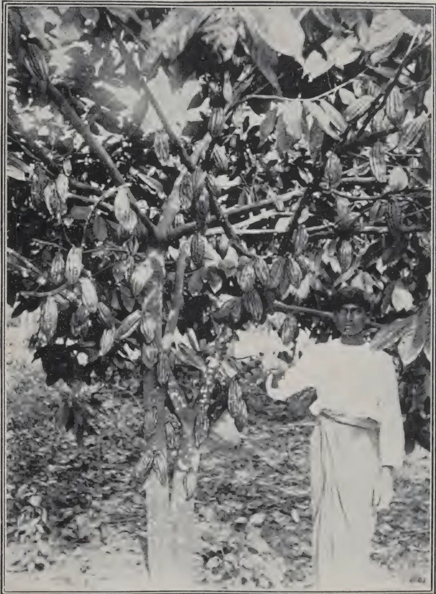A black and white photograph showing a person standing next to a cacao tree. The tree is heavily laden with cacao pods, which are hanging from its branches. The person is wearing a light-colored, long-sleeved garment and a hat. The ground is covered with fallen leaves and debris. The photograph is framed by a thin black border.

*Photo by H. F. Macmillan*

A PROLIFIC CACAO TREE  
(Nicaragua Creole variety) on Experiment Station, Peradeniya

307------------------------------------------------

This image is a scan of a blank page. The background is a uniform light beige or off-white color. There are a few very small, faint dark specks scattered across the surface, which appear to be scanning artifacts or dust particles. No text, lines, or other graphical elements are present.

308------------------------------------------------

APRIL, 1914.]295

### PLANTING.

The holes should be dug a week, or better a month, before setting out the suckers; they should be not less than 40 centimeters deep and better 50 or 60 centimeters in most soils. The diameter may be from 50 to 75 centimeters in most soils. The diameter may be from 50-75 centimeters depending upon the size of the sucker and the character of the soil. The hole should be levelled, if the ground is slightly sloping, i.e., earth from the upper should be heaped upon the lower side to form a sort of table and thus prevent "washing" during heavy rains.

The holes should be not less than 3 nor more than 5 meters apart. For most varieties, 4 meters will be found the most economical distance, especially if the plants are to be left in position for three or more years.

The suckers should be set so that the top of the bulb is at least 10 and better 15 centimeters below the soil surface, except in the case of root buds, which should be set so that the tip comes just to the surface. The sucker should, of course, be set vertical, but if halves or entire stem bases of old plants are to be used, particularly in the rainy season, these should be laid on the side in order that surplus water may not fill up the spongy tissue of the stem-base and cause rapid decay.

In refilling, earth from the soil around the surface hole should be used, the earth from the bottom being left outside on the lower side of the hole. The earth should not be packed too hard over the base of the young sucker but should be pressed just enough to hold the shoot firm until roots have formed. Loose earth may be heaped up somewhat over the top of the hole to allow for the "settling" of the earth after planting.

### CULTIVATION.

Immediately after setting out the suckers they should be mulched with straw, leaves, or brush to prevent the sun from heating and drying out the soil about the young plants, especially in the dry season; or, if planted in the rainy season, cowpeas or some sort of beans or leguminous vines should be planted rather close about the young plant in order to provide a blanket crop to keep down the growth of cogon and weeds and thus save expenses in weeding and hoeing. During the first year after planting, catch crops, such as sweet potatoes, pine-apples, maize, or upland rice may be planted between the rows of bananas, provided a clear space of at least 1 meter radius is left around each banana. If no catch crop is planted between the banana rows there should be some sort of a cover crop in evidence to keep down the growth of weeds and grass.

### HARVEST.

The first bunch of fruits should be mature in about twelve months from planting; some varieties require only ten, while some of the larger or more delicate of the plantains may require eighteen months even with good soil conditions. The time for cutting the bunch must be learned by experience. Most varieties are cut for market while the fruit is still green though, of course, for home use it should ripen on the plant. A rounding of the angles (possessed by nearly all varieties) of the individual fruits indicates that the growth of the fruit is practically complete; as soon as this plumpness of the fruits in the bunch is well marked it may be cut for market, the ripening taking place subsequently either *en route* or in the store room at the market end.

309------------------------------------------------

296[APRIL, 1914.

At the time of cutting down the bunch the stem producing it should be felled and chopped into three to five sections which should be placed about the "pono." The custom of allowing the stem which has produced a bunch to remain standing after the harvest is not to be recommended, since in that way certain fungus or bacterial diseases may develop and spread to living stems; the quicker the decay of the spent stem can be accomplished the less the danger from these fungus diseases; contrary to common belief, the sap in the old stem does not feed the daughter shoots.

If the "pono," or clump, has been growing well there will be at the time of cutting the first bunch two or three younger stems nearly ready to fruit; if there are more than four or five, one or two of them should be cut out in order that the strength of the "pono" may not be exhausted in producing too many (probably small) bunches at the same time. Only the experienced planter will know just how much to reduce the number of main stems in the "pono" and how many small suckers to leave for future fruiting stems; the age of the "pono" question, of course, makes considerable difference in this matter. In rich soil the life of the "pono" may be four or even six years, whereas in poor soil the planter may be obliged to replant every two or three years.

#### PACKING AND SHIPPING.

For shipping short distances the fruit bunches need little or no wrapping, especially if they have been cut quite green; for greater distances dry banana leaves, straw, or similar materials should be used for wrapping the bunches to prevent bruising and breaking *en route*. The more valuable dessert varieties may be cut into "hands" and packed in crates or baskets with padding material between the layers of hands. Fruits of the very small varieties may be nearly ripened on the bunch then cut so that each fruit has a small portion of the main peduncle attached to its own base, and then put into small cartons for retail trade.

#### FERTILIZERS.

Except in worn-out soils near towns fertilizers are seldom to be recommended. There is no doubt but that ordinary chemical fertilizers containing potash and phosphoric acid with or without nitrates will stimulate growth and productiveness, but the expense for fertilizers unless very carefully applied by an experienced planter will hardly balance the gain in product. If some sort of leguminous cover crop is maintained between the rows and if no grass-root excretions have been allowed to poison the feeding roots of the bananas, the fertility of the soil should be a matter for little worry on the part of the planter.

A compost pit in which all vegetable rubbish, animal manures, etc., can be quickly rotted is unquestionably a valuable feature for a banana plantation. No fresh animal manures should be used directly upon the young plants.

If the soil in the plantation becomes so exhausted after, say, five years that the crops are reduced below the paying point the planter should change the crop; i.e., he should cut down all the bananas and either dig up the roots or else allow some strong-growing cover crop, like Lyon beans, to smother them. After "resting" the land for one or two years in a legume crop he may replant the areas with maize, yams, sweet potatoes, upland rice, vegetables etc., and then replant with bananas.

310------------------------------------------------

APRIL, 1914.]297**YIELD.**

If the "ponos" are set 4 meters apart there should be 625 per hectare. Each "pono" should give one bunch of fruit at the end of the first year, if good methods have been followed; the 600 bunches should be worth some 300, wholesale. The second year the yield should be considerably greater, say, 400 to 500 in value. The value of the third and fourth year's crops depends very largely upon the kind of soil, the weather, and the planter.—PHILIPPINE AGRICULTURAL REVIEW.

**SIAMESE POMELOS.****H. H. BOYLE.**

On September 13 the writer proceeded to the Nakoi Chisii district where the finest pomelo orchards are located. The largest of these was owned by a Chinese planter and contained about 20 hectares, three-fourths of which was planted with pomelos of the "seed" variety, while some 25 per cent. of the area contained "seedless" trees. The orchard is divided into plats some 7 meters wide by 60 to 90 meters long, separated by trenches some 3 to 4 meters wide by  $2\frac{1}{2}$  meters deep. The pomelo trees are planted in single rows on these plats. All trees are propagated by marcottage, or the "don" method. The writer was able to demonstrate the modern methods of buddage and through the assistance of *Koon Pisit* explained each step so that, were it not for the deeply inculcated custom in vogue there, the planters would now be able to propagate their trees much more rapidly and economically. The soil of this orchard contains about 60 per cent. clay.

The first fruits examined in the "seedless" section proved to be full of seeds. Upon inquiry as to the reason for this it was stated that the seedlessness was due to the salt deposited from the brackish water which backs up into the river during the dry season; the planters also said that a coconut shell of salt was placed in the hole at the time of transplanting the tree and that another shellful was given the tree each year. Being unable to give full credence to these stories the writer began a thorough investigation of the trees in the "seedless" section, cutting open fruits from widely separated points on each tree and gradually arrived at what is believed to be the true explanation of this phenomenon: all, or nearly all, trees in the so called "seedless" section are the genuine seedless type and are not self-fertile; i.e., in order to produce seeds the flower must be pollinated with pollen from the "seed" trees in the near vicinity. In some striking cases the fruits on a "seedless" tree were found to be free from seeds on all branches of the tree except those on the side nearest to a "seed" tree, the pollen from the latter having apparently been carried across by insects or borne by the wind to the "seedless" flowers.—PHILIPPINE AGRICULTURAL REVIEW.

**PINE-APPLES IN FORMOSA.**

Pine-apple growing in Formosa is developing rapidly. The Hozan Pine-apple Cannery Company has put up 360,000 cans in the season which has just ended; this is about double the previous season's output; the Company has consequently declared an 8 per cent. dividend.—PHILIPPINE AGRICULTURAL REVIEW.

311------------------------------------------------

298[APRIL, 1914.

## BANANA CULTIVATION IN JAMAICA.

### WHAT AND HOW TO PLANT.

The cultivation banana of commerce has long ago lost the habit of making seed as it is supposed to be the oldest cultivated, or at least, domesticated plant. It is grown from "a sucker" or "head" as banana planters call it, and a "sucker" or "head" is the bulb root of a banana, which may be compared to a gigantic onion. When suckers or heads are wanted for planting they are usually taken from an old field or one about to be thrown up for replanting, where there are many suckers to choose from. Young plants are taken at an age of 6 to 8 months when they are about 9 to 10 feet high. These are called "Maiden Suckers." They are dug out, and all the trunk part cut off a foot or so from the bulb. Some planters cut the stem close up to the bulb, and this is done when the suckers have to be transported from a distance to lessen freight. But taking suckers from one's own field or near by, it is better to leave a foot of the stem which in the event of dry weather ensuing after planting, can drain its moisture into the bulb. Bulb-roots from younger plants can be taken but they do not contain so much food material, so have not the growing power that more mature bulbs have. Again, older plants than 8 or 9 months may not be taken, as after that age the bunch is about to shoot and from then on, part of the strength is out of the bulb. Old plants from which the bunch has been cut are unsuitable for planting; the vitality is out of them. Such a sucker is called "a spent" sucker. A common error is when digging the bulb to cut too close to the stem, as much of the bulb as possible should be taken.

The old way of planting was to cut a young plant 6 or 8 feet high, the offshoot from an older one, and plant it upright, leaves and all. By this method, however, it was top heavy and easily blown over by the wind; and moreover before the bulb could make new roots, the leaves and stems dried up more or less. Unless in very rich soil such a plant cannot give a good bunch for the first, but the ratoons or following growths having had time to make a good root system will be all right. A later method was to take a sucker at a young stage, an offshoot from a full grown plant called a "sword" sucker, taken before the leaves opened out and plant this. Such a young plant was cut off from the old root with as much bulb as possible. These suckers were planted upright but they took long to grow, and seldom gave good bunches unless on very fertile soil, as, however, the land generally was, when banana growing first was begun here. They had not enough vitality stored in their small bulbs to enable them to grow quickly. Such suckers are still planted, however, under certain circumstances, such as to supply a field where a plant has failed, for then the growth from a bulb sucker would be overshadowed by the plants already growing, and be stunted, whereas a tall sword sucker would be of equal height and share equally in the sunshine and air; also this makes the field look more even in growth.

It was later discovered that by taking plants when they were nearly fully matured with all the food material stored up in the bulb ready to make the bunch, the maximum vigour was obtained. At first these cut bulbs were planted upright with a foot or so of the stem above the soil, and in a day or

312------------------------------------------------

APRIL, 1914.]299

two a new growth would start out from the cut surface. When soils were very rich this way of planting gave fairly good bunches but later the results became poor. It was then found that though by this method the new shoot starting from the heart (where the old one was cut) grew quickly at first as the shoot drew upon the food stored in the bulb, yet as this growth was made before the roots were formed, the food was used up, the plant received a check as it had then to wait until roots were formed and could send up food from the soil; these roots too were slower to form because the new plant was consuming the food material stored in the bulb which should first have gone to make roots. After experimenting it was found that better results in bunches were obtained by planting this bulb or sucker flat or sideways in the holes to allow a new plant to start from one of the eyes. There are several buds or eyes on a large bulb and some planters take all of these off but two when planting; otherwise many shoots start out and when they appear above the soil have to be cut except the largest and strongest. When two eyes are left it still gives a choice of two when both grow, and in case of accident to one, the other is left. Others plant the "heads" as they are, and prune out the other growths when they appear above the ground leaving one or two of the strongest.

The principle of this system of planting the bulbs is scientifically correct. The bulb root contains stored up food, largely starch. As with a seed germinating, the heat and moisture below the earth, change the starch into sugar, roots grow at once, and before the new shoot can appear above ground there is a root system able to supply foodstuff to the young plant, which until it gets above ground is living on the sugar food in the bulb. The plant thus receives no check.

In a large sucker there are obviously larger supplies of food, to make powerful roots and send forth a vigorous shoot as a new plant, than in a small bulb.

If the soil around is soft and moist, and rich, the roots spread far and wide and deep, although the banana plant is not a very deep feeder. If the soil is hard or lumpy, or dry, or poor with a hard sub-soil, the growth must evidently be slower, and if this poor feeding ground continues, the plant gets stunted and cannot make a good bunch.

The young banana plants ought to grow rapidly and in 9 or 10 months from planting, shoot their bunch under normal circumstances, and the bunch takes under ordinary condition three months to be full for cutting for shipping, full but still green. If planted thickly or allowed to grow thickly they do not get enough light and air, take longer to shoot and the bunch takes longer to fill up. The cooler the temperature the slower they are to grow so that as one goes out of the plains to the hills, the growth is slower and the bunch takes longer to fill. But this is not remarkable up to 1,000 feet and at 2,000 feet the difference from sea level is on an average 3 months, at 2,500 to 3,000 feet 6 months, soil seasons and cultivation being equally good to make other comparisons even. It should be borne in mind that in the hills the days are quite as hot as in the lowlands, and plants do not grow appreciably at night; but the heat of the day does not last so long as one gets higher up so there is less growing time.—JAMAICA AGRIC. JOURNAL.

313------------------------------------------------

300[APRIL, 1914.

## CITRUS MEDICA.

The different varieties of citrus medica are so frequently confused by old writers that it is sometimes difficult to be sure which they are speaking of. Medica in this connection does not refer to medicine, but to Media, where the citron (of various kinds) is said to have been established early in our era, though the eastern end of the Himalayas is believed to be its native habitat. The citron itself was the first of its genus to be known in the West, and the orange and lemon were not introduced into Europe until the twelfth or thirteenth century. The lime, now so largely cultivated for our use, is not mentioned under that name by any writer I know before 1638, when SIR THOMAS HERBERT speaks of having found "Orenges, Lemons, Lymes" in the island of Mohelia (in the Comore group of Mozambique), in his voyage begun in 1626. A later traveller, DAMPIER (1697), says: "The lime is a sort of bastard crab-limon. The tree or bush that bears it is prickly, like a thorn, growing full of small boughs;" a description which recalls an earlier account of the lemon-tree—that of FITCH in his narrative of CAPTAIN KEELING'S voyage to Sierra Leone: "The limon-tree much resembles the crab in several points, is very full of prickles, and carries a slender leaf like a willow." He speaks of a "vast wood" of it on the coast. One of the varieties of *Citrus*, the *Pomum assyrium* of some old writers, was held, says GERARD, by "the common rude" people of Italy to be "the same apple which Adam did eat in Paradise, when he transgressed God's commandment; whereupon also the prints of the biting appear therein, as they say."—CHEMIST AND DRUGGIST.

---

## ECONOMIC VALUE OF THE BAT.

According to the REVIEW OF APPLIED ENTOMOLOGY—Series B: Medical and Veterinary, for October 1913, bats are probably immune from the bite of a mosquito, firstly because of the peculiar formation of the hair covering their bodies and secondly because of their peculiar odour. Bats in general are remarkably free from disease, and this is shown by the fact that although they live in caves in vast numbers, touching one another and even hanging to one another, yet men engaged in collecting bat guano very rarely find a single animal dead.

In Texas experiments have been made with the object of cultivating bats for the production of guano, and at the same time for the control of mosquitoes. It has been found that a structure large enough to hold 50,000 bats would cost considerably less than £2,400 and that would yield in a year 20½ tons of guano on an average value of £121. 10s. During the experiments, enquiries made in this district, of the heads of fourteen families, showed that the number of mosquitoes had abated remarkably, and that the fever which was previously rampant had almost entirely vanished. It is therefore concluded that it is not only commercially, but hygienically profitable, to cultivate bats.—AGRICULTURAL NEWS.

314------------------------------------------------

APRIL, 1914.]301

# DRY-FARMING.

---

"Privileges, like rights, connote duties, and the duty that I should wish every boy in this hall to know, a duty imposed upon him by the privileges he has received here, that duty is this, that he should go forth into the world remembering his privileges, anxious by his counsel, and superior knowledge and sympathy, to help those whose lot has been unfortunate, and who have not been able to enjoy the same privileges he had enjoyed. In particular, and this is the last word, I would exhort those who in the time to come may pass away from this school, to use the education they have received here—it may be to conduct family estates or to engage in agriculture or other developments of the Island's resources. I would exhort them, by their knowledge, by their aid, and by their sympathies, to do what they can to help on the cultivator, whose lot has not been so easy as of the boys who have received their education here. I would ask those who are embarking on agricultural pursuits, to do their best to bring what is known as the squire-clerk to the aid of the Government to achieve the advancement of the Colony." — *Address of SIR ROBERT CHALMERS at the Prize Distribution at the Royal College.*

As an old boy of the Academy, I am responding to this clear call to duty. I am doing this, more especially as a very prominent official has indulged in very pessimistic opinions as regards the possibilities of Dry-farming, and it becomes my duty as its sponsor in this Island to do my little best to counteract any ill-effects they are likely to cause.

I will quote from WIDSTOE's preface a few lines as also some extracts which will meet most of the obstacles that have been raised. "The possibilities of Dry-farming are stupendous. In the conquest of the non-irrigated and non-irrigable desert are offered as fine opportunities as the world has known to the makers of Empires. We stand before an undiscovered land through the restless ascending current of heated desert air the vision comes and goes. With stirring eyes the desert is seen covered with blossoming fields, with churches and houses and schools, and in the distance, with the vision, is heard the laughter of happy children."

The desert is conquered.

A fine specimen of the picturesque phrases with which we are told by MR. FREEMAN that the face of nature cannot be altered as also the conditions of life.

The designation of the Wanni as "desert" is taken exception to; the contradiction is too trivial to be noticed. The Wanni though arid is said to be malarial. It will be, as long as it is covered over with vegetation. It is common knowledge in Ceylon at the present time that malaria is caused by the breeding of "Anopheles" in stagnant water. In regions where Dry-farming is practised, there will not be super-abundant moisture to stagnate, and as a consequence there will be no mosquitoes and malaria.

On the discussion of my paper on Dry-farming, the HON. MR. FREEMAN was under the erroneous impression that it was the same as *chenaing*. In his letter to the December number of the TROPICAL AGRICULTURIST, his

315------------------------------------------------

302[APRIL, 1914.

knowledge of the subject does not seem to have increased. He states that the Jaffna man is a "ready-made dry-farmer and understands and practises tilth, the essence of dry-farming." There is hardly any "farmer" who irrigates his dry-land crop more than the Jaffna man. He is at it from early morn till dewy eve, except during the hottest hours of the day. "Dry-farming, as at present understood, is the profitable production of useful crops *without irrigation* (the italics are mine). The Iranamaduwa or any other land will not be wanted for Dry-farming."

The removal of the roots of big trees it is said will be an obstacle to Dry-farming. Recently, demonstrations were made of the use of Dynamite for removing tree-stumps. In other countries, stumps are removed by mechanical means. There is a mechanical contrivance called the Hercules' Stump Puller. It is said to be capable of pulling out a 4 ft. diameter stump in three minutes. At each setting it is said to be able to clear two to three acres. That is, by animal power. There is also a hand-puller. Besides, there are ploughs that can "jump" stumps and stones.

It has been stated that paddy will not be suitable for a Dry-farm crop. It was therefore suggested that hill paddy or "Ell-vi" should be grown. "The choice of the crop, its proper seeding, and its correct care and harvesting are as important as rational soil treatment in the successful pursuit of Dry-farming. Plants possess a marvellous power of adaptation to environment and this becomes stronger as successive generations of plants are grown under the given conditions. Home-grown seeds, if grown properly, are therefore of the highest value. Wheat is the leading dry-farm crop. Every prospect indicates that it will retain its pre-eminence. Not only is it the most generally used serial, but the world is rapidly learning to depend more and more upon the Dry-farming areas of the world for wheat production. In the arid and semi-arid regions, it is now a commonly accepted doctrine that upon the expensive irrigated lands should be grown fruit, vegetables and other intensive crops, while wheat, corn and other grains and even much of the forage should be grown as extensive crops upon the non-irrigated or Dry farm lands. It is to be hoped that the time is near at hand when it will be a rarity to see grain grown upon irrigated soil." From the preceding rather long extract, it will be seen that wheat is being grown as a Dry-farm crop in America. Mr. WEIGEL has asserted that it is the same in the dry-regions of Australia. Why should not the Agricultural Department of Ceylon by successive crops of paddy breed and raise paddy that can be grown on non-irrigated land? As it is, we have at the present time in hand seed paddy. The Agricultural Society should encourage the extension of the cultivation of seed paddy. At the present time, loss in rice is a very serious matter in up-country estates. It behoves the Government therefore to do all in its power to extend the cultivation of paddy and to increase its production, not only in irrigable but chiefly in non-irrigable lands.

Then there are the leguminous crops which not only yield wholesome and nourishing food, but as nitrogen gatherers enrich the soil. The group of leguminous crops is of great importance; first, because, it is rich in nitrogenous substances, which are valuable animal food, and secondly, because it has the power of gathering nitrogen from the air to maintain the fertility of the soil. Dry-farming will not be a wholly safe practice in agriculture until suitable leguminous crops are found and made part of the system. It is

316------------------------------------------------

APRIL, 1914.]303

notable that over the whole of the Dry-farm territory of this and other countries, wild leguminous plants flourish. They do so in Ceylon—"Pila" or *tephrosia purpurea* grows wild in the poor sandy soils of Jaffna, Chilaw, and other dry-regions, and are taken in cart loads to manure Tobacco and other crops. The *Crotalarias* too grow wild on sandy soils everywhere.

It may be urged that the quality of the crops grown on non-irrigated lands is poorer than on irrigated lands. The recognition of the superior quality of practically all crops grown without irrigation, under a limited rainfall, has done much to stimulate faith in the great profitableness of dry-farming. I do not wish to burden this paper with too many extracts. Both at Rothamsted and on the Dry-farms in America, it has been established that the proportion of wheat to straw increases with a smaller rainfall. Crops come to maturity sooner without than with irrigation. This will allow of more frequent cropping. Another advantage of Dry-farming is that the soil does not require to be manured to the same extent as an irrigable farm. The constant stirring and aeration of the soil renders soluble mud of the insoluble elements of fertility in the soil. The older Dry-farms in Utah, which are among the oldest of the country have never been manured, yet are yielding better crops to-day than they did a generation ago. This is not true of the irrigated farms.

The reason why arid soils are more fertile than irrigated soils is said to be that the roots feed at a greater depth than on moist soils and therefore the upper layer of soil does not get exhausted and require manure. Another reason is that arid soils being deep, the rain water that is stored up when being drawn to the surface brings with it the elements of fertility from the lower soil layers. The soil of the lower layers in arid soils is richer than in humid soils as its mechanical condition permits of air entering great depths and rendering still soluble the insoluble plant-food in the soil.

In this connection, I may be permitted to offer a few remarks on the paper read by MR. DRIEBERG at the conference held at Coimbatore. He stated that the Coimbatore Conference was against dry-ploughing of paddy fields. If I understood him aright he was not disposed to accept those conclusions as final, and suggested experiments. MR. BAMBER said that the conclusions of the Conference were right as the work of *Azotobacter* Bacteria will be disturbed and Nitrogen will be liberated. I will not presume to enter the lists against so qualified a scientist. But I may be permitted to quote HALL, who, I believe is acknowledged to be the first authority on Agricultural Chemistry in England. "The *Azotobacter Chrovococcum* is able to fix atmospheric nitrogen in the soil without the aid of legumes. This bacteria is active in decaying vegetable matter and is aided in the action by the presence of lime in the soil. What if the stubble be ploughed in and the surface be dressed with lime? That should help the work of the *Azotobacter* in the absence of lime. Organic matter, by its decay gives rise to various acid bodies, which may be *grasped* as humic acid; and the acidity thus produced inhibits the action of many of the valuable groups of Bacteria, such as the *Azotobacter*, which give nitrogen and the nitrifying Bacteria which convert Ammonia into Nitrates." I was drawn into this digression by reading that in the earlier days of Dry-farming, it was thought that the stubble ploughed in would not decay and would leave the soil in a condition unfavourable for the

317------------------------------------------------

304[APRIL, 1914.

growth of plants. It has since been demonstrated that if the methods of Dry-farming are correctly followed, there will be sufficient moisture in the soil to decay the stubble and enrich the soil. The stubble is said to contain a large proportion of the Nitrogen taken by the crop from the soil and more than that of the Potash and Phosphoric Acid. The introduction of the Neader (ploughing in the high stubble) in Dry-farming was one of the big steps in making the practice certain and profitable. If the benefit be so great in Dry-farming, of ploughing in the stubble, how much more will it be in irrigated fields when the soil below the surface is moist, if ploughing is done immediately after harvest.

So far, I have attempted to satisfy those who are sceptical of the possibilities of Dry-farming in the arid districts of Ceylon, that what is possible elsewhere will be possible in Ceylon. I wish now to suggest to the Agricultural Society that it might take up Dry-farming either at the Agricultural Station at Anuradhapura or anywhere accessible by rail. With either an agriculturist specially got out from India, or with one of the Ceylon students sent to Poona, the cultivation of "Ell vi" or hill paddy and curry-stuffs might be undertaken, first on a small scale as an experiment. Ceylon imports from India about two million rupees worth of curry-stuffs annually. It produces very little for home consumption. If a half of these imports are homegrown, it will mean the circulation of about a million rupees among the poorest of the peasantry of this Island. If as is suggested the Jaffna Tamil cannot be induced to migrate far from his home, colonies of Indian Tamils might be imported and induced to settle down in the desert regions of Ceylon. This is an undertaking for the Government to embark upon aided by a sympathetic Government Agent of the Northern Province. Inducements will have to be offered to settlers on inhospitable areas.

A. W. BEVEN.

---

## THE SO-CALLED NEW FERTILISER.

---

The reported discovery attributed to PROF. BOTTOMLEY of utilising peat as a medium for conveying nitrogen-fixing bacteria into the soil recalls the one-time popular "jadoo-fibre" which was introduced to Ceylon by the present Secretary of the Ceylon Agricultural Society, and was found to be an undoubtedly valuable fertiliser by those who tried it. The ingredients and preparation of "jadoo" which consisted of Peat moss saturated with various fertilising agents was described in the QUEENSLAND AGRICULTURAL JOURNAL and an analysis also furnished.

It is suggested by the QUEENSLAND JOURNAL that Megass from sugar mills might be found suitable as an absorbent material for similar purposes; and we have no doubt that dry coir dust might be employed in the same way.

C. D.

318------------------------------------------------

APRIL, 1914.]305

# ENTOMOLOGY.

---

## TERMITES.

---

Complaints have come recently from Maskeliya, Nanu Oya and Ruanwella of injury to tea by termites. In Maskeliya they had "destroyed a tea bush, going right down the stem and leaving only a shell; the same with the side branches." At Ruanwella "a large number of bushes shewed very few signs of borer (shot-hole borer) and yet the stems many of them are scooped out quite hollow and full of white ants."

In the latter case Red Borer had been present, and it is possible that the ants first began their attack in a tunnel of the borer.

The ants sent from Maskeliya comprised only workers.

In the collection from Nanu Oya soldiers, workers and 'Nymphs' were present. The 'Nymphs' were of rather a dark-brown colour.

The soldiers possess strong mandibles; the left mandible bears two teeth set close together, the right two teeth placed more proximally than in the left mandible, and more widely separated from each other. This termite is in all probability *Calotermes militaris*, Desn. which is known to have the habit of eating out the tea stems as described above.

The only remedy that can be suggested is that the nests should be destroyed, and for this purpose Carbon bisulphide is the most suitable substance, if one does not possess a Universal Ant Exterminator.

### DYNAMITE.

On July 1st several large ant-hills were treated with dynamite by MR. DOOLAN in the course of demonstrations on the use of dynamite for sub-soiling, ploughing, digging holes, breaking up roots and stones, etc.

A hole was driven horizontally into the hill at ground level, and a charge of dynamite exploded.

A careful inspection made after the discharge did not reveal a dead termite. Even the youngest of them were very much alive.

The earthwork was rendered very loose by the explosion, so that the ant hill was easily demolished.

On the following day although heavy rain had fallen during the night numerous ants were moving about in the neighbourhood of the disturbed nests, congregating under clods of earth.

On the 9th they had begun to build again. On the 24th the ants had disappeared, but a new nest had appeared about six yards away in a hole that had been dynamited for planting. In nests that were dynamited on the 10th ants were building briskly on the 24th. In this case the charge had not succeeded in disrupting the nest.

### MR. BANDARA-BEDDEWELA'S MIXTURE.

On July 1st MR. BANDARA-BEDDEWELA gave us a demonstration in the use of his termite mixture.

Three large nests were treated.

319------------------------------------------------

306[APRIL, 1914.

The treatment consisted in cleaning away the earthwork and exposing the tunnels just below the surface of the ground. This done, the mixture, which resembles wood-ashes, was sprinkled over the opened nest and over the earth, combs, etc., that had been thrown out.

A fourth nest was opened in much the same way but no mixture was applied.

MR. BANDARA-BEDDEWELA claims that the ants will not build again in the places that have been treated. He does not know whether the mixture kills the ants or not.

The nests had to be left open for a week.

A heavy rain fell during the night.

On the following morning ants were still present in the nests. On the 9th they had begun to build again; the control was slightly more vigorous than the others, but this was probably due to the fact that the nest did not get quite so thorough a cleaning out.

On the 15th ants were still present and building small heaps of earthwork. On the 24th all nests were deserted, the control as well.

I am of opinion that what good was done was due to the fact that the nests had been broken up and disorganised, and not to any property of the mixture.

To test whether the mixture had the power of killing termites or was distasteful to them, I procured some rotting wood infested with termites. This I broke up into small parts and put into two boxes. One lot was copiously sprinkled with the mixture and the other was left as it was. Both boxes were left uncovered out-of-doors. This was on October 29th.

On November 6th termites were present in both boxes.

On the 1st of November I put rotting wood and termites into four test tubes, sprinkling three of the lots freely with the mixture and leaving one untreated. All tubes were loosely stoppered with cotton-wool. The termites remained and were quite lively on the 6th instant.

In connection with the preceding experiments the following facts emerged.

Ant-hills provide a favourite retreat for snakes.

Two species of large, black ants prey on the white-ants when the nests of the latter are broken up.

A Dipteron with bluish-green thorax and brownish abdomen was observed to hover round the disturbed nests in considerable numbers. They invariably settled on a mass of earth that gave them a commanding view of their immediate surroundings.

I watched for a long time, but did not see what it was they were after.

This fly looked very similar to one I have seen pouncing down on *Cremastogaster* sp. as they were carrying what were probably their pupæ up a tree-stem.

#### **"CORDIROL."**

Wood impregnated with "Cordirol" was sent by a firm in Hamburg with the request that I would test it against termite injury. Much is claimed for "Cordirol."

320------------------------------------------------

APRIL, 1914.]307

In a leaflet issued by the firm which sent the blocks of wood it is stated that "at last there has been put on the market a remedy in the form of Cordirol which, in simplicity of employment and certainty of effect, stands unrivalled. It protects useful timbers of every sort with absolute security whether these are employed on buildings, for carriage work (sic) implements, furniture etc. from destruction by "Termites."

"Timber impregnated with "Cordirol" is quite free from attack by termites, as numerous experiments in Ceylon and in various parts of Africa have demonstrated."

A substance having the properties here claimed for "Cordirol" would be a great boon.

Alas !

Three blocks of impregnated wood were received.

One piece I placed in a termite's nest on November 30th, the other two in separate nests on December 1st.

I dug them up on December 17th. The two placed on December 1st were badly eaten and would soon have been gone.

The third piece was untouched. No termites, however, were near it. A colony of brown ants with pupæ had taken up its abode in the tunnel in which I had placed it.

Thinking that probably they had kept the termites away, I introduced it on the 17th into the nest from which I had taken one of the other pieces.

On December 27th it was as badly channelled as were the other two pieces.

A. RUTHERFORD.

## PLANTS OTHER THAN TEA FROM WHICH *XYLEBORUS FORNICATUS* (SHOT-HOLE BORER OF TEA) HAS BEEN TAKEN.

### GREVILLEA.

We have a few records of Shot-hole Borer attacking *Grevillea*. In 1903 MR. GREEN expressed the opinion that the insect is not at home in this tree, and attacks only sickly branches. So far as I can find there is no subsequent record that necessitates modification of that opinion.

The same has to be said regarding *Albizia stipulata*.

### ALBIZZIA MOLUCCANA.

There are several records of Shot-hole Borer attacking *A. moluccana*. The opinions regarding the state of health of the plants attacked differ.

In one case in which the plants were found to be badly infested, they were said to be apparently vigorous but to be growing on poor soil. A subsequent report concerning apparently the same case of infestation says that the borers were present only in sickly side-branches!

In another case the insects were found to be breeding freely in twigs that had apparently been killed back by a fungus; in another the branches that were attacked were dead or diseased, due to a "dieback" fungus.

321------------------------------------------------

308[APRIL, 1914.

In these cases several species of beetles were present and that in itself suggests that they were not the primary cause of injury. It is very interesting to read that in these cases tea in the district was not attacked.

In still another case the branches that were infested shewed no signs of original fungous disease. It is obvious therefore that *A. moluccana* must be regarded with suspicion.

#### **CROTALARIA STRIATA.**

A single case of attack, and that on twelve-month-old stems has been reported.

#### **LOQUAT.**

One case of attack is recorded, but as all the tunnels were deserted it is not known whether the beetle was breeding in this plant or not. Nothing is said regarding the presence or absence of signs of previous disease.

#### **CASTOR.**

One case of attack has been reported. The borer was present in an old stem in all stages. There is no mention of any signs of previous disease.

#### **PARA.**

Beetles which MR. GREEN was unable to distinguish from *X. fornicatus* were found tunnelling in dead parts only; the original injury appeared to have been due to a wound.

#### **MELASTOMA.**

A single case has been reported. The branches were infested by shot-hole borer, but only a single insect was found in each tunnel and no eggs nor larvæ.

#### **GUAVA.**

MR. GREEN has seen a single case of specimens of *X. fornicatus* that were said to have been taken from Guava.

#### **BIXA ORELLANA (ANATTO).**

The receipt of twigs of this plant that had apparently been perforated by *X. fornicatus* is recorded.

#### **CACAO.**

In 1903 MR. GREEN wrote: "I have found signs of the borer in isolated cacao trees growing amongst tea, but the insect had evidently not found a congenial home. In nearly every case the tunnels had been abandoned before completion.

"The profusion of gummy matter in the bark of a healthy cacao tree is an efficient protection. But should the tree become weakened by canker or other disease it will probably be freely attacked."

Recently I have observed that cacao trees suffering from an advanced stage of canker do provide a most favourable breeding ground for *X. fornicatus*.

The branches require to be neither too little nor too much decayed, but, when they are just right, the beetle has been found present in large numbers in all its stages.

It is obvious that abandoned and neglected cacao is a distinct menace.

In cultivated cacao all dying branches should be completely removed and the cut surface tarred, and a look-out kept for any attack of the beetle.

322------------------------------------------------

APRIL, 1914.]309

In the galleries in cacao I have found several specimens of a large, black Thrips; it may be predaceous but it seemed to be exercising little control over the numbers of the beetles. I have never taken a single Thrips of any species in the galleries of *X. fornicatus* in tea.

#### AVOCADO PEAR.

Recently I have observed that an Avocado Pear tree growing in the vicinity of infested tea periodically suffers from the attack of a Scolytid, which COL. WINN SAMPSON has identified as *X. fornicatus*. So far I have never found more than one insect in each tunnel, and in most cases the tunnel has been empty. The position of the entrance to the tunnel is usually indicated by a white encrustation. Girdled twigs sooner or later fall over and hang limp and withered, to be brought down by the next windstorm.

It is recorded by MR. GREEN that he had been informed that Lantana and Dadap are subject to attack, but there is no authenticated case of such attack on record nor has a case come under my notice.

I have seen cases of the invasion of *Poinciana regia*, *Bauhinia* sp., *Aberia Gardneri* (*Ketambilla*, S.) when growing in proximity to infested tea, but these are without doubt to be regarded as cases of a sporadic overflow infestation. In the case of *Aberia Gardneri* and *Poinciana regia* the beetle is usually to be found entombed in an exudation of resin, and in the case of *Bauhinia* sp. the beetle never makes any headway.

A. RUTHERFORD.

---

### THE CACTUS AS FODDER.

---

The question whether the prickly pear or the cactus, to give the shrub a more scientific name, can be utilised as fodder has, says the BOMBAY GAZETTE, been asked in India more than once, and the reply has usually been in the negative. Officials of the Agricultural Department at Poona, however, are able to report differently. It is stated in the Annual Report for 1912-13 that during the year important experiments have been carried out with the result that it has been proved conclusively that prickly pear, if fed with 6 per cent. of cotton seed, is a valuable emergency fodder in famine times. During the famine last year six bullocks were purchased from Ahmednagar and were fed on the compound mentioned. It is said that the spines of the cactus can be burnt off with kerosene flare lamps and the pear prepared at a cost of Rs 1-4 per 1,000 lb. in a day of ten hours. The food was tested practically at Manji when fodder was dear with apparently satisfactory results. Additional testimony comes from the Collector of Ahmednagar, who informed the Director of Agriculture that "the demonstrations of the use of pear carried out by the Department at the cattle camps were very successful and have convinced the leading cultivators." As it is calculated that two bullocks can be fed with pear and cotton seed at a cost of less than five annas a day, and the cactus grows in abundance in Poona and many other districts in the Bombay Presidency, one of the most serious problems to be faced in famine would appear to have been solved.—INDIAN AGRICULTURIST.

323------------------------------------------------

310[APRIL, 1914.

# POULTRY.

## THE BREEDING OF EGG-LAYING POULTRY.

The last number (January) of the JOURNAL OF THE DEPARTMENT OF AGRICULTURE FOR IRELAND contains a most instructive article on this subject by MR. JAMES WILSON, Professor of Agriculture. It deals with DR. RAYMOND PEARL'S work at the Maine Agricultural Station on the inheritance of the egg-laying propensity.

Hitherto the fundamental ideas governing all attempts at improving the egg-laying power were that that power ran in strains, and that both parents were equally responsible for the progeny. These ideas are now proved to be fallacious, for the strain may be broken even in the immediate progeny of the very best parents, and of the causes of good egg-laying one at least does not descend through the female. The results of DR. PEARL'S investigations have followed a long course of patient and persistent experiment in illustrating complicated phenomena which conform with the Mendelian theory. It is therefore necessary to have some acquaintance with this theory in order to thoroughly grasp the significance of the investigations referred to. We are, however, presuming that the reader has such an acquaintance; but if not he should read the article *in extenso*.

Among poultry as among other animals the sexes are about equal on the average. To account for this, the theory has been established that while the male is pure as regards the factors controlling sex the female is hybrid.

As regards mating it has been found that the breeder has two options.

(1) To mate a highest-grade cock with a number of highest grade hens without endeavouring to distinguish the impure hens from the pure. If the descendants of such a stock of hens be mated in every successive generation with highest-grade cocks only, the proportion of pure high-grade birds of both sexes will gradually increase until eventually all are pure, but no one can say when that stage will arrive; and, until it does arrive, the stock will continue to throw impure birds of both sexes. For some generations, no bird can be guaranteed of the highest grade and pure, and even then only after an exhaustive inspection and possibly a troublesome test.

(2) To identify the hens of highest-laying grade that are pure and mate them with a highest-grade cock. In this case the progeny of both sexes are all of highest grade and pure. The initial trouble is to identify the pure highest-grade hens.

With reference to mating we are told that this can be done in two ways:—

(a) If a number of highest-grade hens be mated with a male known to be of the bottom grade, the pure hens could be separated from the impure by the performances of their daughters. The former's daughters should all

324------------------------------------------------

APRIL, 1914.]311

be medium grade while some of the latter's should be bottom grade. The former should all lay eggs during their first winter, while some of the latter should lay none.

(b) If a number of highest-grade hens be mated with a highest-grade cock, the pure and the impure could be distinguished through their son's daughters. Mated with the lowest grade of hen, the sons of pure mothers would get highest grade daughters only, while the sons of impure mothers would get some medium-grade daughters.

In this connection it is worth mentioning that high laying powers are not confined to the so-called laying breeds and that laying and the table qualities may be found in the same child; and further that so long as the originally selected parents are strong and healthy there need be no fear of in-breeding.

An important observation arrived at with reference to this subject is that a hen's total yield for a year could be predicted approximately from her yield a few weeks after she has begun to lay. The great value of this observation lies in the fact that the breeder knows before the setting season begins the grade to which his pullets belong and he can infer therefrom the parents' grade.

We would advise those who are specially interested in this subject to study the article referred to in its entirety.

C. D.

## THE VALUE OF CHARCOAL FOR POULTRY.

ALFRED DINSLEY, F.R.M.S.

**"Trifling Precautions will often prevent Great Mischiefs."—Sharpe.**

With the advent of the chicken-rearing season there will be ushered in the usual ailments of young feathered stock, ailments which materially affect the profit account of the poultry-keeper. Last season the writer fully described the pathology of chicken enteritis—which term enteritis can be taken to cover the popular but vague one of "bowel complaints."

In this article the prevention of diseases of the alimentary canal will be dealt with, and, for the benefit of the old and the many new readers of this journal, a word will be said of the value of charcoal in the poultry yard and farm.

Let us start with the newly-hatched chicken.. Let us examine its dietary, the structure of its digestive system, and perhaps we shall ascertain the primary cause of the bowel ailments which are responsible for the high death-rate of young feathered stock.

In commencing, we must examine the newly-hatched chicken. We know that shortly before it makes its entrance into the world it absorbs the remains of the yolk-sac, which originally encompassed the germ-plasm. The yolk is composed of vitellin, fat, chloresterol, lecithin, and water. It is essential to

325------------------------------------------------

312[APRIL, 1914.

take into consideration the chemical composition, since it will help us to arrive at a common-sense diagnosis. When the chicken is out of its shell it is kept warm and as comfortable as possible, and it is not allowed to partake of food for a period of thirty to thirty-six hours. This allows the absorbed yolk to digest, and prepares the alimentary canal for the reception of food from an outside source.

#### **DELICACY OF CONSTRUCTION.**

The alimentary canal of the chicken is one of the most delicate structures it is possible to conceive ; there is a tiny œsophagus or crop which macerates the material taken in ; a wonderful little stomach which treats the foodstuff immediately before the latter enters the gizzard, which is a compact organ occupying more than one-half of the abdominal cavity. Then there is the duodenum, which is attached to the gizzard, and afterwards forms a loop which couples up with the small intestine. The outstanding feature of the above-mentioned organs is the delicacy of their construction.

Externally, there is little to be seen of the anatomy of the chicken ; and apart from the beauty of the fluffy little creatures, there is one important factor to which it is necessary to direct attention.

#### **THE DANGER ZONE.**

Carefully examine a newly-hatched chicken. Pass a finger down the breast and abdomen, and by manipulation you will ascertain that there is little protection for the organs contained in the lower part of the abdomen. The sternum, or breastbone, abruptly ends ; and with the exception of thin membranes and the epidermis there is nothing to preclude the action of climatic conditions on those portions of the alimentary canal lying near the surface. That is to say, there is nothing to prevent the action of dampness and cold upon the organs situated near the surface of the abdomen.

This region is *the danger zone* of the chicken, and it is here that the primary cause of intestinal ailments has its origin. The primary cause is fermentation, which is brought about by any of the following causes ; unsuitable and indigestible food, dirty or polluted drinking water, exposure to cold, draughts, or other adverse climatic conditions.

#### **UNSUITABLE FOOD.**

Thus there are many causes of fermentation of foodstuff in the alimentary canal. By unsuitable foodstuffs is meant foodstuffs containing anything of an irritating nature, mouldy substances and substances of an indigestible character. Among the latter may be classed hard-boiled eggs, which constitute the first feed of many chickens.

Whatever the cause of fermentation, whether it be irritant compounds, polluted drinking water, or unsuitable food, there remains a method by which fermentation can be prevented and abolished, namely, the administration of liberal quantities of charcoal. Charcoal is one of the finest intestinal disinfectants known on the poultry farm.

#### **PREVENTION.**

For young chickens the granulated charcoal should be well mixed into the mash or soft food ; but for older stock it is advisable to place it in a hopper or box where they will have access to it.

326------------------------------------------------

APRIL, 1914.]313

The employment of charcoal on the poultry farm in the way suggested will reduce the death-rate, prevent malnutrition and bowel ailments, and enable the poultry-keeper to rear better birds. In short, it is impossible to over-estimate the value of granulated charcoal to the poultry industry.—“POULTRY.”

## ROUP OR CONTAGIOUS CATARRH.

The following is taken from the same source as the article on Chickenpox published last month :—

Roup appears to be a strictly contagious disease. The contagion is generally brought in to the poultry yard by infected birds. Sometimes these are birds which are purchased from other flocks in which the disease exists. Sometimes they are birds of the home flock which have been to exhibitions and there exposed to sick fowls, and sometimes they are wild birds or pigeons which fly from one poultry yard to another.

### SYMPTOMS.

The symptoms first seen are very similar to those of an ordinary cold, but there is more fever, dullness, and prostration. The discharge from the nasal opening is at first thin and watery, but in two or three days becomes thick and obstructs the breathing. The inflammation, which begins in the nasal passages soon extends to the eyes and to the spaces which exist immediately below the eyeballs. The eyelids are swollen. The birds sneeze and shake their heads in their efforts to free the air passages. The appetite is diminished and the birds sit with their heads drawn in, wings drooping and having a general appearance of depression and illness.

### TREATMENT.

The medical treatment of this disease may be very successful if properly applied. The sick birds should be removed from the flock and put in a warm dry room. The affected mucous membranes should then be treated by applying antiseptic and healing mixtures. The remedies most suitable are, Boric acid 1 oz., water 1 quart, or, Permanganate 1 dram, water 1 quart.

The best method is to use a good spraying apparatus and spray the affected parts.

## AGRICULTURAL SHOWS.

MRS. MARION EDLEY of the Carlton Hotel, Nuwara Eliya, writing to the Honorary Secretary of the Ceylon Poultry Club, says:—“I am always ready to help on anything for the improvement of cattle, poultry, etc., as I am sure these shows have a world-wide influence on the nation. The eggs which are brought in from villages are twice the size and better. Of course, we have to pay more, but one does not mind that.”

327------------------------------------------------

314[APRIL, 1914]

# GENERAL.

## LUCERNE.

H. H. MELLE.

(Contd: from page 237)

### TREATMENT OF YOUNG LUCERNE.

The life of a lucerne plant will largely depend upon its treatment when young. Weeds often come up to crowd the young lucerne. To destroy these weeds mow the crop with the mower, setting it to run as close to the ground as possible. If a mower is not available use a sickle—the labour of cutting it will repay every time. On no account allow animals to graze on young lucerne. It is better not to pasture lucerne until it is three years' old. By cutting young lucerne the growth is stimulated, but by pasturing the reverse is the effect. Another point to remember is not to allow lucerne to run to seed the first season, as this tends to set back the plant considerably.

### HARVESTING.

The first point to accentuate on this subject is the great value of the leaves. These contain from 75 per cent. to 80 per cent. of the protein of the whole plant—that valuable compound that goes to produce milk and meat. It is estimated that the loss in leaves in harvesting ranges from 15 to 30, or more, per cent. It is readily seen that the harvesting is an important part in lucerne-hay making.

### WHEN TO CUT.

The time to cut lucerne is when it has begun to bloom—say, about a tenth in bloom—just as the lower leaves begin to turn yellow and drop off and buds start out from the base of the stems. Cut now, for it contains then the greatest quantity of nutrients. If allowed to stand longer the stems become woody, some of the leaves are lost, and the hay is not as palatable, nutritious, or digestible.

### MAKING LUCERNE-HAY.

J. E. WING says:—"There is a principle to be observed in making alfalfa-hay that applies to making hay from all clovers. If it can be so managed that the leaves are not at once burned and dried to powder the moisture from the stems is the most easily removed. Leaves are natural evaporators of sap; stems are not. Therefore, while the leaf has yet pliancy and some semblance of its natural condition, it is most effectively carrying away the sap of the stem, but when it is dried up it no longer aids in drying the plant at all. Therefore the best hay in all respects is made partly in the shade, in loosely turned windrows, or in narrow cocks." During hot, dry weather it is better to cut for hay making during the cooler part of the day, preferably in the afternoon. Allow it to be in the swath until the leaves become wilted, then rake into windrows and later into cocks. The time from cutting to making into cocks will depend entirely upon the climatic conditions. The art of making good lucerne-hay is only to be acquired by practice.

### TO TEST FOR SUFFICIENT DRYNESS.

Before stacking the hay, it must be sufficiently dry in order to prevent over-heating in the stack. A simple test is to take a wisp of hay, choosing a damp part of it, and twist it violently into a rope. If no moisture can be made to exude from the stems the hay may be put into the stack. If only a

328------------------------------------------------

APRIL, 1914.]315

small quantity of hay is to be made it should be well dried before stacking since it is more apt to become musty than when a large amount is piled together.

### STACKING.

Stacking the hay directly on the ground is sure to mean a loss of some portion of it. Elevate the bottom of the stack with timber and put straw at the bottom, also preferably build a rick rather than a round stack. Start the bottom 12 to 14 feet wide and build straight up. Keep the stack full in the middle, or a little higher than the sides, and well tramped all the time. When the stack has reached the desired height, top it with grass, if possible, as grass sheds water better than lucerne, or better still, cover it with tarpaulins well weighted down.

### ADVANTAGES OF LUCERNE.

(1) That it roots so deeply in the soil. It is considered that lucerne roots penetrate as deep as there is any soil. Thus the whole soil is utilized.

(2) That the plant uses the whole growing season. It is very hardy and does not much mind cold. In spring, as soon as the weather becomes warmer, the lucerne is up and growing. The number of cuttings you will obtain will depend upon the amount of moisture in the soil and your local climatic conditions.

(3) The forage that the lucerne plant produces is the richest and the most palatable that the farmer can grow. The hay, if properly cured, is very rich in protein. It is the best feed for the baby on the farm—for the baby colt, the baby calf, the baby lamb, pig, and chick.

### PASTURING.

In some respects lucerne does not seem to be a natural pasture plant. The stems are delicate, it will not thrive in a hard trampled soil, and the crowns when broken off will not readily revive; if some of the plants flower and drop their flowers early in the season, they lose vigour. Not an animal should be turned on to a lucerne field until the second or third year if it is desired that the stand endure for several years, nor should it be pastured too early in the spring or too late in the autumn. There should be something of a growth left for winter protection. Careful lucerne growers are known who pasture their older fields, but never put on a full quota of stock until they have cut over the field when the plants are first coming into bloom. They insist that this cutting invigorates and gives the plants new life.

### HORSES AND MULES.

There is no *one* thing so good as lucerne for the working horse. It builds up his wasting muscles, it keeps him strong and healthy. He needs much less grain when he can have lucerne-hay. It is necessary to remember that this hay should be fairly mature when it is cut, and well cured, and that it should not be mouldy or musty. For old and hard-worked horses in thin flesh lucerne has great restorative powers; for horses doing fast work a little grain should also be given. It should be constantly borne in mind that well-cured lucerne-hay is nearly as rich as wheat bran, so that to feed too great an amount of it is not merely wasteful, but puts an undue strain upon the excretory organs to eliminate the unnecessary food substance from the tissues. Lucerne is second to no other feed for the mare while she is carrying her unborn foal. Lucerne being a voracious lime, potash, and phosphorus feeder it is without parallel as a bone maker for young horses.

### CATTLE.

Heifer calves raised on lucerne develop rapidly and are ready to become mothers earlier than when developed on other foods. Cows in milk feed on

329------------------------------------------------

316[APRIL, 1914.

lucerne-hay as part of their ration give milk as with no other possible combination. The great dairy authority, EX-GOVERNOR HOARD, has found in practice that with a combination of lucerne-hay and good sweet mealie silage, and as little as from four to five pound daily of grain, not only has he had the maximum returns in milk and cream, but he has seen the dairy herd maintained in remarkable health and vigour. MR. WING writes: "Fattening cattle are desired to be fattened as rapidly as possible; why, therefore, need they be fed any foods rich in protein? Why not feed them in the old-fashioned way with corn (mealies) alone, to quickly cover their ribs, and then let them go forward to market? The theory sounds well, but does not work well in practice. These animals find waste going on in their own systems. Digestive processes require muscular action, and there is need to repair muscular tissue. Nerve force is to be maintained. Then, after all, when the animals come to the feed lot they seldom have an adequate frame of lean tissue on which to build the fat. Moreover, the modern trade demands lean flesh intermixed with fat, not fat laid on in masses. And, finally, digestion goes on better when there is fed a variety of foods containing both fats and muscle builders. So theory backs up practice, and that tells that steers fatten more quickly, more cheaply, and better when they have all the alfalfa-hay they want in combination with corn." Oxen are said to fatten in from ten to sixteen weeks if grazed on lucerne.

#### SHEEP.

Sheep prefer lucerne above all other forage, and for a good reason. It is the one thing best suited to their needs. They, more than other animals, need a ration rich in protein. Think for a moment what it means for an animal to like a food. Liking in the animal world is not whim or caprice. Man is the one animal, save a worm, that chews tobacco, the only animal that drinks whisky. All animals crave things that are good for them. Why do they hunger for fitting foods? Because the very cells of their bodies are calling to be built up, and this instinct tells them that tough grasses nourish feebly, if at all; that tender, rich lucerne leaves and stems have in them substances which, when assimilated, go directly to build the eager body cells, to reinforce the muscles and strengthen the bones and brace up the nervous system. Sheep, when once accustomed to a diet of lucerne, will scorn veld grass.

What has been said of the mare applies as well to the ewe and cow.

#### DANGERS TO CATTLE AND SHEEP.

The greatest objection to pasturing lucerne is its bloating effect upon cattle and sheep. Pigs and horses do not suffer. PROFESSOR COBURN drew up the following rules for pasturing:—

At the beginning of the pasturing season give animals a heavy feed in the morning before turning upon on the alfalfa.

Have water in the pasture all the time.

Keep the animals in the pasture night and day, after they have become accustomed to it, until removed permanently.

Use upland in preference to bottom fields for pasture.

Watch the stock closely the first few days and remove those permanently that show symptoms of bloat.

Sow blue grass, brome grass, or meadow fescue with alfalfa in fields intended for permanent pasture.

#### PIGS.

Farmers claim that pigs a few weeks old turned into a lucerne field derive almost their entire living from it, and leave their mothers two weeks earlier than when fed otherwise. Great care must be observed not to overstock a lucerne paddock with pigs, as they will then uproot the plants in a very short time.

330------------------------------------------------

APRIL, 1914.]317

### POULTRY.

The lucerne field is a rich storehouse for the poultry-keeper. In summer the fowls forage far and wide, eating the tender leaves rich in protein, and, incidentally, all the insects. Fowls given all the lucerne that they desire are more healthy and lay more eggs than without it.

### LUCERNE AS AN APPETIZER.

The high feeding value of lucerne is largely due to the chemical compound known as protein; its extreme digestibility is another desirable quality, and not the least is its appetizing character. Not only do all animals like it, but when given in moderate quantities it seems to increase the general appetite for more fat-making feeds. Animals fed on lucerne grow in weight, but the weight is principally of bone, blood, and muscle. It is without a sufficiency of fat and carbohydrates, and these should be supplied by the addition of such foods as mealies and kaffir corn. When lucerne is fed alone, all the protein cannot be digested, and it is, therefore, always economical to add some carbonaceous foods if animals are fattening for market.—SOUTH AFRICAN AGRICULTURAL JOURNAL.

---

### BASIC SLAG.

---

The great importance and extensive use of Basic Slag as a manure make it desirable to remind intending users of a few points as to its purchase, and its use on different soils and crops.

Basic Slag, as is well known, owes its value to the fact that it contains phosphate of lime in a more or less readily available condition. It usually contains also a considerable proportion of lime capable of neutralizing acids in the soil, though probably not more than 2 to 5 per cent. is in the form of "free" or "caustic" lime. Obviously, then, the first thing to be ascertained in buying basic slag is the percentage of phosphate of lime which it contains. Furthermore, the availability of the phosphate in different samples varies. As a rough guide to determine whether the phosphate is likely to become "available" or useful to plants in a reasonable time, a method often adopted, and officially recognised under the Fertilisers and Feeding Stuffs Act, is to ascertain the percentage soluble under standard conditions in a 2 per cent. solution of citric acid. While this method is only expected to give approximately correct information, it may safely be assumed that the value of a sample of slag is roughly proportional to its content of phosphate soluble in the approved solution of citric acid.

### FINENESS OF GRINDING.

As influencing the availability, the fineness of grinding is extremely important, and along with the guarantee of the amount of phosphate present, a statement as to the proportion of the slag which will pass through a sieve having 10,000 meshes per square inch should be obtained. This proportion should not be less than 80 per cent., and samples 90 per cent. of which will pass through the sieve are readily obtainable.

### MOST SUITABLE GRADE OF BASIC SLAG.

There is often discussion as to what is the most suitable quality of basic slag for general use. It is possible to obtain slag called basic slag containing very little phosphate at all, while on the other hand the richest samples contain up to 50 per cent. of "total phosphate of lime." The solubility of this total phosphate, however, varies very much in different samples, and there is no definite relation between the richness of slag in phosphate and its solubility. For instance, in one of a series of samples of which detailed

331------------------------------------------------

318[APRIL, 1914.

analyses are available, the total phosphate of lime amounted to 27 per cent., and 93 per cent. of this was soluble in a 2 per cent. solution of citric acid ; in another containing 45 per cent. total phosphate of lime, only 70 per cent. was soluble ; in still another sample, containing 20 per cent. total phosphate of lime, only 66 per cent. was soluble.

This question of which quality should be used is chiefly one of cost. From the crop's point of view, what is required is a sufficient supply of available phosphate, and whether this is supplied by a small quantity of a high quality slag, or a large quantity of a low quality slag, is immaterial. Every farmer intending to use basic slag should obtain quotations for different grades from one or two merchants, and calculate what 1 per cent. of citric-acid-soluble phosphate would cost him in each case. As an example, a case which recently came to notice may be quoted. Two grades of slag, containing 26 per cent. and 34 per cent. "citric soluble phosphate" were offered at 45s. and 55s. a ton respectively, both quotations including carriage ; the cost of 1 per cent. citric-acid-soluble phosphate in the first case is 45s. divided by 26, or 1s.  $8\frac{3}{4}d.$  ; in the other case it is 55s. divided by 34 or 1s.  $7\frac{1}{2}d.$  Clearly the latter is the cheaper manure, and, generally speaking, it may be said that the higher qualities of slag are really cheaper than the lower grades, particularly when the greater cost of carriage, carting, and distribution of a given quantity of phosphate is taken into account. Without going so far as to say that a purchaser should insist on having a high quality slag, it is safe to say that, as a rule, one containing not less than 15 per cent. of citric-acid-soluble phosphate should be employed.

### SOILS.

Basic Slag usually gives its most striking result when applied to poor pasture on heavy clay soil. The results obtained at Cockle Park and detailed in a supplement to the Journal of the Board of Agriculture and Fisheries (January, 1911), are most striking. The alkalinity of the slag renders it also a very suitable manure also for peaty and sour soils. Even very light soils deficient in lime sometimes respond well to an application of slag.

### DANGER TO STOCK.

The idea is sometimes entertained that basic slag, if taken even in small quantities, may be highly injurious to stock ; it may, therefore, be observed that there is no danger of special injury resulting from the consumption of small quantities. It is, however, advisable to wait until a heavy shower has washed most of the slag off the herbage before turning stock into the pasture.

It is, perhaps, well to point out that, while basic slag usually gives excellent results on poor clay soil, a small area should always be treated, and the effect observed before expending any great sum on the manure. Although it is usually not so well suited for light or chalky soils as for clays, such soils have in some cases benefited materially from its application. Here again, however, a field trial must be made before definite conclusions as to its effect can be drawn. On light soils, in addition to trying the effect of slag alone it is also advisable to test the effect of adding kainit (at the rate of 3 or 4 cwt. per acre). Potash is seldom required on heavy clays, but may be needed just as much as phosphate on light soils. On the poor pastures on which slag proves effective, nitrogenous manuring, either in the form of dung, nitrate of soda, or even cake feeding, seldom does good and often does harm. The improvement of such pastures is best effected by encouraging white clover ; direct application of nitrogenous manure tends to help the grass to suppress what little clover is present. Leaflet No. 267.—BD. OF AGRIC. AND FISHERIES.

332------------------------------------------------

APRIL, 1914.]319

# THE WAX PALM

## A New and Promising Cultivation of great importance to all Tropical Planters.

The Wax Palm (*Copernicia cerifera*) produces the valuable Carnauba Wax; this tree accommodates itself easily to climate and soil and can be interplanted with cotton, food or fodder plants, green manure, etc. To Coffee, Cocoa, Rubber, etc., it offers shade, but at the same time it allows sufficient light and air to pass to the trees below. Therefore the Wax Palm is not only a very useful but also a profitable acquisition.

For trials we supply on receipt of 7 shillings and 6d., 75 seeds as sample of no value under registration, postage paid; on receipt of £4, we forward 10 lb. seeds by parcel post, postage paid to all countries.

**Detailed Instructions for Cultivation with Every Order :—**

**GEVEKOHT & WEDEKIND, Hamburg 1.**

---

## THE INDIAN AGRICULTURAL COLLEGES.

It is a curious fact that while there is a persistent demand put forward in the Legislative Councils and elsewhere for more technical education the branch of technical education which India most needs and which opens up profitable employment still fails to attract students. The explanation of this contrast is obvious. What the members of Legislative Councils want when they ask for technical education is a scientific training which will, as they think, lead to the establishment of industries and manufactures. They have not yet grasped the fact that technical instruction is useless unless industries exist to which it can be applied. Even the melancholy experience of young men who have gone abroad to receive technical training and on their return have found no demand for their services seems to produce no effect on these amiable agitators, who cling to the belief that if only the Government will multiply technical colleges the industries must come. Meanwhile the scientific provision made for the greatest industry of the country—its agriculture—remains unnoticed because middle-class legislators whose lives are spent in towns either do not realise the possibilities of agriculture, or fail to perceive that it is an industry, or look upon it as merely an occupation for the lower classes. At any rate the fact is undoubted that the agricultural colleges admit a very small number of students and that the majority of these students are not of the right class. The number of students on the roll of the Agricultural College at Sabour at the end of June 1913, was 27, and the yearly admissions are “steadily decreasing.” The province of Assam awards a scholarship of Rs 20 a month to a student who will undertake a three years’

333------------------------------------------------

320[APRIL, 1914.

course at Sabour. A Mohamedan candidate received the scholarship, but he left the college soon after joining it because he objected to manual labour in the field. A Sylhet Hindu proved equally unsatisfactory, for he too speedily left Sabour, doubtless for the same reason. According to the Assam Director of Agriculture "the average entrance-passed student has neither aptitude nor liking for agriculture. He strongly objects to any form of manual labour, and is not even willing to undertake the minimum amount of practical work on the farm attached to an Agricultural College necessary to enable him to get a grasp of the principles of agriculture." In the United Provinces the number of students who entered the Agricultural College last year was 51, of whom 40 were nominees for the subordinate revenue service and had obviously no intention of devoting themselves to agriculture. At the Lyallpur Agricultural College, in the Punjab, the dearth of students has become farcical. After the scholarship examination in May, 1913, seven out of eleven candidates were awarded scholarships. Five fee-paying candidates were also admitted. But of the twelve thus selected "not one presented himself when the session opened." The report of the Agricultural College of the Central Provinces relates much the same experience. "The year's entry of new students at the Agricultural College," writes the Director, "was numerically disappointing, owing to an unusually large number of candidates who did not appear after permission for admittance, or who, after arrival, soon abandoned the College." The actual number of first-year students was 14, and it is not surprising to find that SIR BENJAMIN ROBERTSON states that "the problem of obtaining boys of the true agricultural castes, with the necessary standard of education, for admission to the Agricultural College, and subsequently to the department, is still as difficult as ever of solution." "Even in Madras the applications for admission to the Agricultural College show a decline for which it is not easy to account." The one exception to the dismal aspect which agricultural education in India presents is to be found in Bombay. Here also the number of students is not what it should be, for there are only 43 first-year students at Poona. But DR. MANN writes with enthusiasm of the prospects of the College. A larger portion of the students than ever before have gone to work on their own land. A demand for trained men has arisen, and more are wanted than can be furnished. "Private land-owners, local bodies, agricultural associations, and the like, have all applied for men during the past year, and a number of them cannot be supplied." DR. MANN does not, however, conceal the fact that many of his graduates do not care to take employment under private owners, and the statistics show that out of 17 who found employment last year ten went into Government service of one kind or other. Taken as a whole the various agricultural colleges, which are maintained at an annual cost of between five and six lakhs, are attended by a quite inadequate number of students, of whom the majority have not the least ambition to become skilled agriculturists. In England such institutions as the Cirencester Agricultural College attract the sons of landowners and large farmers who desire to pursue agriculture as a business and recognise the necessity of receiving a suitable scientific training. In this country the young men who go to the agricultural Colleges merely wish to qualify for a post under Government, and reluctantly submit to the manual labour which is an indispensable condition. This disappointing conclusion illustrates the extent to which the present system of education and the ideas of respectability which it generates tend to divert young men from an honourable calling in which brains and energy would secure a competence to the empty dignity of official employment or to the overcrowded professions. Those public men who recognise that the rush into Government service and the professions is demoralising to the community, and who look for a remedy in the creation of new industries, may well consider the question why India's chief industry is thus neglected.—INDIAN AGRICULTURIST.

334------------------------------------------------

APRIL, 1914.]321


By Appointment.

# FISON'S (IPSWICH) FERTILIZERS


By Appointment.

For Tea, Rubber, Coffee, "The Best in the World." Sugar, Tobacco, &c.

These Fertilizers are manufactured to suit every soil, crop, and climate. They show a handsome profit to the importing houses, and have for many years past been used in all parts of the world.

**SHEEP DIPS.**

Full Particulars sent post free  
on application to

**DISINFECTANTS.****INSECTICIDES.**

**Joseph Fison & Co., Ltd.,  
Ipswich, England.**

*Fertilizer Manufacturers to His Majesty the King.*

---

## THE VEGETABLE OIL INDUSTRY OF MARSEILLES.

---

The following abstract from MR. CONSUL-GENERAL GURNEY'S report on France appears in TROPICAL LIFE of February last :—

Of the annual value of the total output (£52,120,000) of the principal industries of Marseilles, vegetable oils, raw and manufactured, can be said to account for £17,000,000: say oils and oil-cakes, £14,000,000 and soap-making £3,000,000, to say nothing of candles and wax, £875,000, and lard, etc., £1,600,000, into which vegetable oil substitutes may or may not enter.

Last year, 1912, was a comparatively poor one in the oil trade (the chief industry of Marseilles, as can be seen by the above) owing to the high prices of the raw material. This being so, we wonder what the report for 1913 will say when it is published. The Ministerial crisis and the strained international situation during the summer and autumn also had a depressing effect. The total number of oil factories in Marseilles is 45, containing 1,941 presses, with a capacity of 1,000 tons a day. The principal factories specialize, either in crushing seeds, dealing chiefly with copra and coconut oil, or with cotton seed and ground nut oils, edible cotton seed oils, and deodorized oils. Only one firm crushes linseed, imported from Bombay, for the production of edible oils. This is consumed in certain parts of France as a substitute for walnut oil. About 225,000 tons of groundnuts were imported, from which 50,000 tons of oil were produced, being equal to  $4\frac{1}{2}$  tons of nuts to one ton of oil. Imports of copra amounted to 175,000 tons from which some 100,000 tons of oils are returned as being produced, or 1 ton of oil to each  $1\frac{3}{4}$  tons of copra, which must have contained, therefore, nearly 60 per cent. of oil.

It is estimated that some 30 per cent. or 30,000 tons, of the coconut oil is used for edible purposes, i.e. to make coconut butter, whilst the 70 per cent. goes for soap-making. The chief feature of interest during 1912 was the large increase and development of the new process for neutralizing and deodorizing the ordinary quality of groundnut oil, previously only considered suitable for soap-making, and utilized for that purpose. By this process, however, the oils are made perfectly sweet, and they are largely bought for edible purposes. It is estimated that nearly one-third of the production of oil from the Madras crop of ordinary decorticated groundnut kernels has been thus converted into edible oils. Owing to this and the high price of oil the olive oil industry has been passing through a severe crisis. The deodorizing is, we are told, also beginning to be applied to olive oil.

335------------------------------------------------

322[APRIL, 1914.

## THE JUTE INDUSTRY OF CALCUTTA.

Probably few persons in England who buy a sack of potatoes or a piece of linoleum realise that the useful bag and the fabric of the linoleum have both come from a plant which was grown in Eastern Bengal, was steeped in an Indian river, and was made into sacking or cloth on the banks of the Hooghly. Still less would the purchaser of a sack grasp the fact that year by year an area of Bengal, equal to that of Somerset, Wilts, Gloucester and Dorset combined, is covered with this tall but otherwise undistinguished plant. He will have heard of paddy fields, but the chances are that he will not know that jute, the source of sacks and sacking, is the crop which has brought wealth to the cultivators of Eastern Bengal and is the raw material of one of the richest industries in India.

### PART OF THE ROMANCE OF COMMERCE.

The history of jute is a part of the romance of commerce. The fibre was first mentioned in the Customs returns in 1828-29, when 364 cwt. were shipped to the United Kingdom. The rapidity with which jute grew in favour has often been described, and it is only necessary to state here that, as against 364 cwt. exported at the end of the first quarter of last century, the quantity exported in 1911-12 was 16,203,000 cwt., the value of which was over fifteen millions sterling.

The centre of this vast industry is, of course, Calcutta, and during the jute season the conveyance of jute to this city taxes the resources of the railways. The rivers are thronged with country boats bringing jute to Narayangune and other centres, and with large flats, towed by steamers, which carry astonishing quantities of the staple fibre of Bengal into the port of Calcutta.

### EXTENT OF THE OUTPUT.

But the collection and export of raw jute are only half of the story. In 1855 the first jute mill was reared on the banks of the Hooghly, and produced jute yarns to the amount of 8 tons a day. By the year 1909 the output of yarn had reached a total of 2,500 tons a day. There are now about 60 mills, in the erection and equipment of which a capital of about eight millions sterling has been invested. It is sometimes supposed that in order to find an industrial community in India one must go to Bombay. Bombay capitalists, with their wails over the cotton excise duty and with their genius for daring speculation, have given their city a prominence to which Calcutta has not aspired. But it is a mistake to confuse notoriety with pre-eminence in trade and commerce. As is pointed out in the Indian "Moral and Material Progress" Report for 1911-12, "the factory population is largest in Bengal, where, besides the jute mills and presses, there is a great variety of industries employing a few hundreds or thousands of persons each. Iron and brass foundries, tile factories, paper mills and silk filatures are prominent in this part of India. Bombay takes second place."

### CULTIVATION OF JUTE.

There are indeed few spectacles better calculated to give an impression of the growing industrial importance of India than a well-equipped jute mill, where a myriad spindles and looms convert the fibre received from Serajgunge or Narayangune into yarn and cloth. In the 60 jute mills and 85 jute presses about a quarter of a million persons find employment. The value of the jute manufactures annually exported has ranged in the last five years from £10,671,000 to £12,198,000, and there is every reason to anticipate that the industry will undergo a continuous expansion as time goes on. The fibre produces the cheapest fabric which civilisation has yet evolved, and there is no fabric which is more necessary to supply the means of transporting wheat and other grain. The only danger which threatens the industry

336------------------------------------------------

APRIL, 1914.]323

is the lack of adequate expansion in the supply of the raw material. It might have been supposed that a crop which puts many millions sterling a year into the hands of the cultivators would be extended out of sheer self-interest. In some measure this increase of cultivation has been secured automatically. In 1891 the acreage was 1,403,000; it has now risen to 3,353,000. But the expansion has not kept pace with the wonderful progress of a most successful industry.

#### ORGANIZATION OF THE INDUSTRY.

Efforts have repeatedly been made to grow jute elsewhere, and the plant has in fact been successfully cultivated in the United States and Brazil. There have been attempts also to secure a substitute for jute as a material for cheap bags. But only in Bengal are the conditions to be found which favour the production of jute at a low cost, while the proposed substitutes have one and all failed to answer the purpose which jute fabrics so admirably fulfil. The fact that this year the government of the United States have found it necessary to reduce the duty on jute bags and sacks is an eloquent testimony to the reality of the profitable monopoly which Nature has given to Bengal and Calcutta.

But Calcutta is not content to rely upon natural advantages. Measures are being adopted to place the jute industry in a stronger position, and there can be little doubt that before very long a better official organisation, improved cultivation, and the spread among the cultivators of a knowledge of the advantages of jute-growing will serve to ward off any danger of competition, and that jute will retain its place as "the cheapest and most easily manufactured of all fibres."—INDIAN AGRICULTURIST.

## Sales of Produce in British and Continental Markets.

Fibres, Cotton, Grain, Oil Seeds, Hides and Skins, Timber, Rubber, Drugs, Wool, Ores, Mica, Gums, Tea, Cocoa, Coffee, Copra, Sugar, etc., are being regularly dealt in; Keymer, Son & Co., being selling Agents for Estates, Mills and Exporters.

Samples Valued.

**Best Ports for Shipments Indicated.**

THE MANAGEMENT OF  
**ESTATES UNDERTAKEN.**

Capital found for the development or purchase of valuable properties.

**KEYMER, SON & Co.,**

Whitefriars.  
LONDON, E.C.

(Same address since 1844.)

Cables :  
KEYMER, LONDON.

337------------------------------------------------

324[APRIL, 1914.

## VALUE OF WILD BIRDS.

DR. E. WARREN, DIRECTOR, NATAL MUSEUM.

The JAMAICA AGRICULTURAL SOCIETY JOURNAL has reproduced the following article from the Agricultural Journal of the Union of South Africa with slight alterations to suit conditions in Jamaica:—

In this brief article it will be shown that bird life is of the utmost importance in the economy of Nature, and that its due preservation and encouragement are matters of vital interest to all agriculturists, stock-breeders, fruit-growers and gardeners.

It is true that certain birds at some seasons of the year may be seen eating fruit and doing a considerable amount of mischief ; but the hasty conclusion that the birds should be destroyed will be found on closer consideration to be fallacious and liable to lead to disastrous results.

Some birds are of more economic value than others, but those which take their annual toll of fruit or grain have themselves been instrumental in permitting the crops to grow by the destruction of insects and other vermin during the remainder of the year.

Birds being exceedingly active creatures, and their body temperature being higher than that of any other vertebrates, requires, relative to their size, an exceptionally large quantity of food.

The food is very various in nature, ranging from snakes and small mammals to insects of almost microscopic proportions, and in the vegetable world, seeds, berries, etc., are consumed.

Mammal-vermin, such as rats and mice, and destructive insects are capable of multiplying to an alarming extent, and the great value of birds in acting as a natural check is being conclusively proved wherever the subject has been investigated. It is found that near towns, where the birds have been more especially persecuted and driven away, the growing of fruit and other market produce has become increasingly difficult, or even impossible, owing to the prevalence of fruit-fly and other insect pests.

In the United States of America careful investigations of the nature of the food of many kinds of birds have been made. The contents of the stomach have been examined, and in the great majority of cases the food is shown to consist of just those kinds of insects, ticks, wireworms, etc., which constitute a menace to the stock-farmer, agriculturist and market-gardener.

Observations have also been made on the feeding of nestlings by the parent birds. The appetite of the young is truly prodigious, and every few minutes throughout the day one or other of the parent birds returns to the nest with food, which is generally of the nature of an insect such as a caterpillar, fly or beetle. Many fruit-eating birds feed their young solely on insect-food, and thus certain birds, which to a casual observer might be regarded as wholly harmful to the farmer, have been instrumental during a considerable portion of the year in protecting the crops from being over-run with insect vermin.

It may safely be asserted that bird-life taken as a whole is of the utmost economic value to the farmer, and in his own interest it behoves him to encourage it on his land.

Children with their traps and youths with catapults and air-guns often work destruction on the farmer's best friends, and every possible means should be taken to prevent this waste which may lead to a presence of birds.

Birds, in fact, act as a very efficient police force which is never off duty, but is ever searching for insects on the leaves of plants and for destructive grubs at the roots.

338------------------------------------------------

APRIL, 1914.]325

There is no doubt that the agriculturist is only beginning to realize the great importance of birds; and through hasty observation he has often been an active agent in reducing his crop by the destruction of birds which were apparently doing mischief. Birds of various kinds (Nightingales have been blamed) have been seen to uproot young plants, and they have on this account been summarily condemned and shot. These birds are searching for destructive beetles and other grubs at the roots of the plants, and they possess the remarkable faculty of locating such grubs. The young plant may apparently look healthy, but the bird in some unexplained manner discovers that there is a grub at the roots, and the loss of the plant is more than compensated for by the grub being removed and eaten by the bird.

In many districts there is a great paucity of bird-life, and this is not wholly due to the direct killing by the occupiers of the land. The scarcity is largely due to man's indirect influence. The lack of cover and the widespread bush fires are very prejudicial to bird-life. In European close-settled countries the agricultural land is covered with a regular net-work of more or less wide hedge rows, along which trees are very frequently scattered. Such hedge rows form admirable cover for birds, and to their presence the relative abundance of bird-life, in districts where the human population is relatively dense, is very largely due.

Farmers in this country would do well to consider carefully the needs of the birds. Strips of the bush should be especially reserved as cover, and where bush is scarce it would pay to plant strips of native trees and shrubs: but, of course, care would have to be exercised that the plantations should be placed in such situations as would permit their proper growth. There can be no doubt that clearing the bush to form agricultural land can soon be overdone, and on many farms there is practically no cover, and scarcity of the more valuable birds is the result. The planted belts would have to be sufficiently wide to enable them to resist the grass fires which are so general in Natal and other parts of South Africa.

The advisability of burning the grass is, however, extremely doubtful, and PROFESSOR BEWS has shown in a recent number of the "Annals of the National Museum" that grass burning leads to a deterioration of the veld and the growth of the coarser and less valuable species; but this is scarcely the place to combat a practice which is so largely followed.

We will now pass in review a few of the more important birds which possess a high economic value to the agriculturist, but it must be remembered that many birds not mentioned are nevertheless of great value, and that, speaking generally, the very great majority of birds perform an invaluable function which far outweighs the value of the grain or fruit which some may consume at certain seasons of the year. In orchards when the fruit is ripening and in newly sown land it would undoubtedly pay the farmer to employ a few natives to frighten away the birds rather than to destroy them. In the majority of cases fruit-eating birds are only destructive to the fruit for a comparatively limited period, while during the remainder of the year their presence is in every way beneficial.

The owls are extremely valuable birds to the farmer, they feed on mice, moles, rats of all kinds, and on insects. They seldom attack chicken or other birds. The loss to the farmer caused by rats and mice, both in the granary and on the field is sometimes exceedingly great. Small mammals are the favourite food of the larger owls, and on no account should these birds be shot. The best known of the owls are the barn owl, the grass owl, and the eagle owls which have tufts of feathers on each side of the head, and are sometimes called eared owls.

Game birds generally, such as quails, partridges, pigeons, ducks, guinea-fowls, etc., are all of the greatest value. MESSRS. A. HAAGNER and R. H. IVY,

339------------------------------------------------

326[APRIL, 1914.

in their "Sketches of South African Bird-life," quote MR. THOMSON, of the former Transvaal Agricultural Department, as saying that not only do they devour mature locusts, but they scratch up and eat the eggs, Termites (Duck Ants), and their insects are devoured in large numbers. They are also useful in eating weed-seeds in large quantities. The reckless shooting of game birds is greatly to be deprecated by all agriculturists; they are of far more use alive than in swelling the bag of the sportsman.

All woodpeckers are of very special value. They build in decayed tree trunks, and throughout the day they search for insects hiding in the crevices of the bark of trees. Such insects are often most injurious to the growth of the tree, and every possible encouragement to these birds should be afforded by all orchardists and foresters.

The buntings, wagtails, warblers, chats, flycatchers, cuckoo-shrikes, and swifts are all true insect-eating birds and should be carefully preserved.

The nightjars or goatsuckers (Gie-me-a-bit) also deserve special mention. They are owl-like birds of medium size and possess an enormous gape to the mouth. They fly very silently in the dusk of the evening and feed on flying insects, such as mosquitoes, small moths, etc.

The so-called seed-eaters which include such birds as the Grassbirds and Canaries are also of value. They subsist chiefly on weed-seeds and insects, and the result of their presence being a considerable reduction in the number of weed-seeds cannot but be of value to all cultivators.

We have now seen that birds constitute a most valuable protective force against the inroads of destructive creatures such as snakes, rats, mice, moles, insects of all kinds, ticks, wireworms, etc., while many of the seed-eating birds subsist almost entirely on the seeds of troublesome weeds.

To protect birds in the farmers' interest, and to preserve from extinction some of the most exquisite creatures on earth, a Plumage Bill has been recently introduced in the British Parliament.

It is undoubtedly high time that the ruthless destruction of plumage birds for the supply of the Milliner should be ended by all civilized countries, since many of the more beautiful species of humming-birds, birds-of-paradise, etc., are nearing extinction through the wholesale destruction by collectors.

In conclusion it may be said that, from a purely practical aspect, it behoves all stock farmers, agriculturists and gardeners to take active steps to encourage bird-life; and much more may be accomplished by providing adequate strips of bush for cover, and by resolutely preventing the killing of the birds.

---

## THE MANUFACTURE OF SUGAR: THE MODERN METHOD *vs.* THE OLD.

CLEVE W. HINES.

There is no industry in the Philippine Islands possessing greater future possibilities than that of cane sugar. Every advantage is offered in the way of rich soils, a tropical climate with a rainy season during the main growing period, and a dry season during a good part of the harvest period.

The industry might, however, be said to be only in its infancy. While there are numerous small antiquated mills scattered over the islands, but few strictly modern mills are found in operation to-day. Several, however, with efficient crushing plants are doing excellent work, and one under construction, the Calamba factory, will be equal to the modern factories of Hawaii and Louisiana.

340------------------------------------------------

APRIL, 1914.]327

A number of attempts have been made to modernize some of the native factories by the addition of improved crushing apparatus, boiling plants, and occasionally centrifugals, each of which is a step in the right direction.

Crushing plants are found in the various sugar houses with results ranging from 55 to 84 per cent. juice on cane. One may readily realize what a great loss is encountered to the manufacturer if even as low an extraction as 65 per cent. is attained. A typical example will illustrate this. Here 650 kilos of juice are received from each ton of cane. This juice with a sucrose of 15.2 per cent. gives 98.8 kilos of sucrose in juice recovered from each ton of cane. A modern mill with an extraction of 84 per cent. will give 840 pounds of juice with a sucrose of 15.1 per cent. (The last juice extracted from cane gives a lower sucrose and purity than the first.) This will give 126.8 pounds of sucrose from each ton. This difference will amount to 29.1 kilos of 96° test sugar valued at P 3.48.

The bagasse from the latter mill will have a much higher fuel value than the former because of the lower moisture content. One kilo of bagasse with a moisture content of 56 per cent. has a heat value of 65,491 B. t. u., while a kilo with a moisture content of 44 per cent. has a value of 90,882 B. t. u. These seem like enormous losses encountered by some of the smaller sugar houses, yet they have little comparison with many of the other losses throughout the plant.

After the juice leaves the rolls it is strained to remove any particles of bagasse and other foreign matter.

### SULPHURING OF THE JUICE.

The juice is now subjected to a sulphuring process which has a fourfold purpose. It removes some impurities, increases the acidity of the juice so that a greater quantity of lime may be added with precipitates impurities not removed by the sulphur, decolorizes or bleaches the organic nonsugars, and acts, to a certain extent, as a preservative. Juice should always be sulphured in the cold for two reasons: First, sulphurous acid at high temperatures would destroy by inversion an undesirable quantity of sugar; secondly, some sulphuric acid is likely to be formed which is much more active than the former. This sulphuric acid is the dangerous chemical in sugar-house work, but is only formed when high temperatures are used during sulphuring. The pipe carrying the sulphur fumes from the burner should be surrounded by a larger pipe filled with cool water to prevent the fumes from leaving at too high a temperature.

It may very readily be seen what an important role this sulphuring process plays in sugar-house work, and yet it is astonishing what little attention it oftentimes receives. Too many sugar houses are run without a definite knowledge of what is going on in each process of the work.

### THE LIMING PROCESS.

Immediately following the sulphuring of the juice comes the liming process. This requires even more skill than the former. In many factories expert clarifying men do nothing but attend to this part of the work.

The first action of the lime is to neutralize the organic and inorganic acids; it then coagulates some albumins and albuminoids, throws down insoluble lime salts in the form of sulphates, phosphates and carbonates, and the bases, iron and aluminum. These heavier compounds act as mechanical precipitants bringing down with them other impurities. These are removed at the bottom of the settling tanks and are sent to the filter process. The lighter substances including such material as fibre, wax, etc., float to the top in the form of a flocculant precipitate and are removed in the form of a "blanket."

341------------------------------------------------

328[APRIL, 1914.

### METHODS OF JUDGING THE CORRECT AMOUNT OF LIME.

There are two methods of judging the correct amount of lime to use. First, the chemical method as follows : 10 cubic centimeters of the juice are titrated against a standard acid using phenolphthalein or litmus as an indicator. It is not safe to lime beyond the neutral point. It is usually best to leave the juice slightly acid (about 0.2 cubic centimeter or 0.3 cubic centimeter in order to be on the safe side). The second method is one where the experienced operator judges by the colour of the juice, the rate of precipitation, etc.

The former method gives more accurate results and can be absolutely relied upon.

### EVIL EFFECTS OF OVERLIMING.

As stated before it is never safe to carry liming beyond neutrality. At this point all the precipitable impurities are removed and any excess of lime added will result in the destruction of the reducing sugars and the formation of soluble lime compounds of organic acids which impart a very dark colour to the juice and will later decompose into acid substances causing inversion of the sucrose.

The lime salts also increase the viscosity of the masscucutes thus retarding evaporation and crystallization. These dark-coloured masscucutes can only give a low yield of an inferior sugar with an excessive amount of molasses. These lime salts may be partly removed by the use of phosphoric acid. While this may improve conditions to a certain extent it does not remove the glucinic acid which has been liberated and must continue to impart the dark colour.

A factory recently visited had a good mill and fairly modern equipment throughout the house. The cane received was of the very finest type of Hawaiian and native mixed. The juice was in good condition until it reached the liming tank. Here it was limed to 0.4 cubic centimeter alkalinity and heated to 100° C. It immediately turned dark and exhibited all the evil effects of an overlimed juice. Phosphoric acid was then added until an acidity of from 0.7 cubic centimeter to 1 cubic centimeter was reached. During the process of evaporation these lime salts continued to decompose, increasing the already acid juice and causing a destruction of sucrose by inversion which gave an excessive amount of molasses that was of necessity turned out with a high purity since the large amount of invert sugar and lime salts prevented the crystallization of the sucrose. This final molasses with a purity of 52 was being sold for 16 centavos per gallon which was a small fraction of its sucrose value, were it possible to recover same. A slight change in the sulphuring of this plant with a reduction of the liming to 0.3 cubic centimeter acidity gave a beautiful straw coloured juice which precipitated well and gave a clear juice with a minimum of lime salts for the evaporators. The masscucute resulting from this juice was equal to many the writer has seen in Louisiana and Porto Rico where a much more elaborate process was used. The sugar was very readily washed to a yellow clarified grade and placed directly on the market for immediate consumption.—  
PHILIPPINE AGRICULTURAL REVIEW.

### THE SOURCES OF THE NITROGEN OF VEGETATION.

The results of the whole inquiry carried out by MR. J. B. LAWES, DR. GILBERT, and DR. PUGH on the sources of the nitrogen of vegetation, etc., may be very briefly enumerated as follows :—

The yield of Nitrogen in the vegetation over a given area of land, within a given time, especially in the case of Leguminous crops, is not satisfactorily

342------------------------------------------------

APRIL, 1914.]329

explained by reference to the hitherto quantitatively determined periodical supplies of combined Nitrogen.

Numerous experiments have been made by M. BOUSSINGAULT, from which he concludes that free or uncombined Nitrogen is not a direct source of the Nitrogen of vegetation. M. G. VILLE, on the other hand, concludes, from his results, that free Nitrogen may be a source of a considerable proportion of the Nitrogen of growing plants. The views, or explanations, or other experiments, on this disputed point, are various and inconclusive.

It was found that the conditions of growth adopted in our own experiments, on the question of the assimilation of free Nitrogen by plants, were consistent with the healthy development of various Graminaceous plants, but not so much so for that of the Leguminous plants experimented upon.

From the results of various investigations, as well as from other considerations, we think it may be concluded that, under the circumstances of our experiments on the question of the assimilation of free Nitrogen by plants, there would not be any supply to them of an unaccounted quantity of combined Nitrogen, due either to the formation of oxygen-compounds of it under the influence of ozone, or that of ammonia under the influence of nascent hydrogen.

We have found that free Nitrogen is given off in the decomposition of Nitrogenous organic matter, under certain circumstances. But considering the circumstances of such evolution, and those to which the nitrogenous organic matter necessarily involved in experiments on the question of the assimilation of free Nitrogen by plants is subjected, it may, we think, be concluded that there would be no loss of combined Nitrogen from this cause in such an experiment, excepting in certain cases, when it might be presupposed.

Our experimental evidence, so far as it goes, does not favour the supposition that there would be any loss of combined Nitrogen in our experiments on the question of assimilation, due to the evolution of free Nitrogen from the Nitrogenous constituents of the plants during growth.

In numerous experiments with Graminaceous plants, grown both with and without a supply of combined Nitrogen beyond that contained in the seed sown; in which there was great variation in the amount of combined nitrogen involved, and a wide range in the conditions, character, and amount of growth, we have in no case found any evidence of an assimilation of free or uncombined Nitrogen.

In our experiments with Leguminous plants the growth was less satisfactory; and the range of conditions possibly favourable for assimilation of free Nitrogen was, therefore, more limited. But the results recorded with these plants, so far as they go, do not indicate any assimilation of free Nitrogen. Since, however, in practice, Leguminous crops assimilate from some source, so very much more Nitrogen than Graminaceous ones, under ostensibly equal circumstances of supply of combined Nitrogen, it is desirable that the evidence of further experiments with these plants, under conditions of more healthy growth, should be obtained.

Results obtained with some other plants are in the same sense as those obtained with Graminaceæ and Leguminosæ, in regard to the question of the assimilation of free Nitrogen.

In view of the evidence afforded of the non-assimilation of free Nitrogen by plants under the wide range of circumstances provided in the experiments, it is decided that the several actual or possible sources of combined Nitrogen to plants should be more fully investigated, both qualitatively and quantitatively.

If it be established that the processes of vegetation do not bring free Nitrogen into combination, it still remains not very obvious to what actions a large proportion of the existing combined Nitrogen may be attributed.

343------------------------------------------------

330[APRIL, 1914.

## THE DEVELOPMENT OF THE LOCAL COCONUT INDUSTRY.

---

In a recent publication entitled "ALL ABOUT COCONUTS" by BELFORT and HOYER the writers remark that "at the present moment there is throughout Ceylon a great scarcity of land suitable for successful Coconut Growing."

This is not exactly the case inasmuch as there is still a fairly extensive area awaiting exploitation in regions where by adopting up-to-date methods of cultivation it is possible to secure very good yields.

Last month the purchase of a large tract in the Puttalam district was announced and this only goes to prove that experienced men are not afraid to venture into our drier parts. Anyone who visited that district during the last dry spell would have noticed the successful stand made by the palms under proper tillage and their healthy and prolific appearance.

It is only the traveller who penetrates into the remoter parts of the Island that has the opportunity of seeing the possibilities of extending coconut cultivation. The vigorous growth of the palm as seen from the Madampe-Godakawela road in the Sabragamuwa Province would come as a surprise to those who generally associate coconut cultivation with certain well known districts, and do not know that there is a good deal of land in the Island far from recognised coconut centres awaiting the enterprising planter.

Another phase of the development of coconut planting in the Island is intensive (as opposed to extensive) cultivation and the higher yields that are being secured by planters who believe in good tillage combined with manuring.

With liberal treatment a yield of 80 to 85 nuts per tree per annum over large areas is becoming common. The accompanying illustration reproduces one of a series of photographs taken on Kandehena Estate in the Veyangoda district belonging to Mr. Solomon Seneviratne. The tree which is 30 years old and has been systematically manured during the past few years is not a specially selected one; for indeed the whole estate is a model of careful cultivation and generous treatment. The illustration will give an idea of the high standard to which the palms of this favoured district could be brought under intelligent management.

C. D

---

## EXTERMINATING RATS.

---

A report from M. DE KRUYFF of the Dutch Agricultural Bureau at Buitenzorg, Java, points the way to real success in rat killing. He tried the modern method of giving a contagious disease to one rat in the hope that all would die. This proved useless. Finally, DE KRUYFF hit upon a novel use of carbon bisulphide. All visible rat holes were first stopped with earth to ascertain which holes were inhabited, for the inhabited holes were found reopened on the following day. Half a tea-spoonful of carbon bisulphide was poured in each of these holes and, after waiting a few seconds to allow the liquid to evaporate, the mixture of vapour and air was ignited. The resulting small explosion filled the hole with poisonous gases and killed all the rats almost instantly.—SCIENTIFIC AMERICAN.

344------------------------------------------------

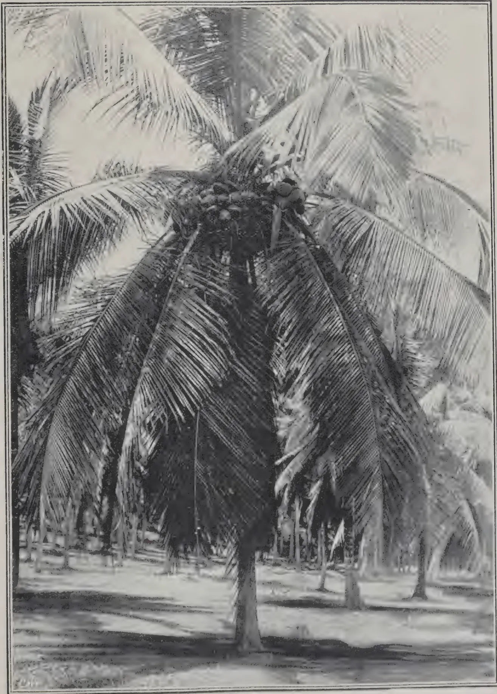A black and white photograph of a coconut grove. The central focus is a large coconut palm tree with its trunk and several large, feathery fronds. A cluster of coconuts is visible hanging from one of the upper branches. In the background, several other coconut palm trees are visible, creating a dense grove. The ground appears to be sandy or light-colored soil. The photograph is framed by a thin black border.

COCONUTS AT VEYANGODA.

345------------------------------------------------


<!-- stage4: FAINT old-images-only -->

[Faint page: no legible print of its own could be verified; text withheld (stage 4 review list)]

This image is a scan of a blank page. The background is a uniform light beige or off-white color. There are a few very small, faint dark specks scattered across the surface, which appear to be scanning artifacts or dust particles. No text, lines, or other graphical elements are present.


346------------------------------------------------

APRIL, 1914.]331

## MAIZE SUGAR.

MR. O. W. BARRETT, the versatile horticulturist of the Philippine Bureau of Agriculture, takes a hopeful view of the possibility of maize becoming a serious rival of cane in the sugar market, and advises Philippine planters to experiment along this line, notwithstanding the unsatisfactory results of experiments already conducted in the United States. The maize plant, when deprived of the ears at the time starch is being deposited in the kernels, i.e., when the seed is "in the milk," develops a remarkable saccharose, or rather glucose content. Thus, the agricultural chemist of the Rhodesian government finds as high as  $12\frac{1}{2}$  to 14 per cent. of sugar and about 1 per cent. of glucose in the decobbed maize stalks in his experiments, which is above the average yield from sugar cane. MR. BARRETT quotes the opinions of experts that maize "will be, through its wonderful variability under the hybridizer's hands and its adaptation to man's varied needs, the greatest crop of the future."—SCIENTIFIC AMERICAN.

## RADIUM IN AGRICULTURE.

According to recent experiments in Europe it appears that radium is instrumental in preventing diseases of plants, whence is likely to arise a new application of this interesting element in agriculture. For several years workers in agronomic science have been experimenting upon the effect of radium upon vegetation by mixing radio-active substances with the usual fertilisers. The numerous results obtained in this work show that most plants, either grain or flower, are remarkably stimulated and give a better yield both in size and quality, this being often seen in the fine and healthy colour of the green plants or leaves. Under these conditions it is not surprising that the same plants are in better condition to resist attacks from various sources of disease such as cause so much damage to crops, especially diseases known as cryptogamic, which arise from spores or mold. It seems that radium is to act as a preventive for such diseases as wheat rust, rotting of potatoes, grape vine mildew and many others which cause such detriment to agriculture. Such a result is only to be expected from what we know as to vital phenomenon in general, and among others as concerns the human body, for all influences that tend to reduce the vitality of the system are likely to leave it a prey to harmful outside influences and infections. Such results in the application of radium in agriculture are likely to be far-reaching.—SCIENTIFIC AMERICAN.

## RESEARCH IN BENGAL.

MR. MEGGIT'S work on sugarcane has so far been very successful and, as a result of the soil treatment adopted, the outturn of cane has risen during the last five years from 10 to 30 tons per acre. The use of lime and bone-meal has had a remarkable effect on the fertility of the soil of the Dacca farm, particularly in the case of rabi crops, and it is hoped that the experiments, which will be continued for the full period of six years, as originally contemplated, will yield definite results in regard to the residual value of manuring over a number of years. Green manuring experiments have also been continued, and so far the cow pea have proved itself the most useful plant for this purpose. MR. HECTOR'S important botanical work in connection

347------------------------------------------------

332[APRIL, 1914.

with the rice crop has shown that natural cross fertilization takes place to a much greater extent than was at first supposed, and a few successful crosses have been obtained. Special attention is rightly being paid to the higher yielding varieties. A large amount of time has been devoted to the study of the *ufra* disease of paddy which has appeared on a considerable scale in some of the deltaic districts of Eastern Bengal, and a full account of the work up to date is being published. It has been established that the disease is caused by an eelworm of the genus *Tylenchus*, allied to worms which cause well-known diseases of other cereals. The best remedy, so far discovered, appears to be the destruction of the worm, when in passive condition after harvest, by burning the stubble. An attempt is being made to work out a feasible scheme for dealing with the evil, but the problem which is of the utmost importance to the welfare of the province is one of much difficulty.—INDIAN AGRICULTURIST.

## LICORICE.

A very considerable part of the licorice root used in America is from marshy plains in Turkey and Russia.

This root is not cultivated, but grows wild in large quantities, generally in great stretches of open ground where the soil is more or less damp. It is regarded as a serious pest and greatly interferes with cultivation. Much land is abandoned to it, while some is ploughed and sown notwithstanding its presence. It is a perennial herb of the genus *Glycyrrhiza* of the bean family. The licorice of commerce is obtained by evaporating an infusion of the sliced roots. This solidified substance is used for flavouring confectionery and beer as well as entering into the make-up of most of the brands of tobacco.

The growth above ground of the plant is about two feet, while the root is about as deep beneath the soil. The land in Syria from which the root is gathered is leased from the owners, the condition, as far as lands that are cultivated, being that the digging out of the licorice root must cease when the time comes for planting the cereal crops. The result is, as far as these lands are concerned, that the getting out of the roots must be done quickly as soon as the rains, which begin in October generally, have somewhat moistened the ground, as it would be very difficult to do the digging in the long dry summer.

The root is piled in great stacks, and when the digging season is over a watchman takes charge, and the root remains thus stacked through the winter and the following summer, when it becomes quite dry and is ready for transportation to the coast. Great care has to be exercised that the stacks do not heat or mildew.

The Aleppo district gathers and exports on an average an aggregate of 8,000 tons annually of dry licorice root, while Bagdad yields about 6,000 tons, Antioch 4,000 tons, and Damascus 500 tons.

The pulp is pressed, with American ingenuity, into boards which are used in cabinet work and which are said to make up into novel and handsome articles.—SCIENTIFIC AMERICAN.

348------------------------------------------------

APRIL 1914.]333

## SORGHUM.

Sorghum (*Sorghum vulgare*) is a valuable food product of the millet order. Forms of it are known as Kaffir-corn and Dura. Six to eight pounds of seed are sufficient to sow an acre which should yield 500 lb. at least.

In parts of Africa sorghum forms the staple diet of the natives. It can be either boiled and eaten in the same way as rice, or ground into a fine flour which is capable of being made into excellent and nutritious bread. The advantage, from the native's point of view, that this grain possesses over maize is that it entails none of the slow hand labour of detaching the grains from the cob, and that it is very easy to grind, as compared with the hard-grained maize. Furthermore it is not as heating as maize.

It is also largely used, when fermented, as beer which if intoxicating, leaves no harmful results behind, and is nutritious.

It is exported to Europe for distilling the very fine alcohol obtained from the grain.

The leaves form a good fodder for cattle and the grain is excellent for horses and donkeys.

Other varieties of sorghum are grown for brooms and for sugar extraction.

D. S. C.

## 'TABLOID' BRAND First=Aid

(TRADE MARK)


A strong metal casket  
Measurements: 7½ × 4¼ × 2 in.  
Obtainable at all Chemists and Stores  
Price in London 10/6

No. 715. An ideal outfit of bandages, antiseptics, plasters, scissors, restoratives, etc., for planters, travellers and sportsmen.

Affords  
protection  
against  
blood-  
poisoning  
etc., in—

Wounds  
Bites  
Stings  
Burns  
Scalds  
Sprains  
Bruises

### You will need it in the Hills—take it


XX 1101

BURROUGHS WELLCOME & CO., LONDON

NEW YORK

MONTREAL  
SHANGHAI

SYDNEY  
BUENOS AIRES

CAPE TOWN  
BOMBAY

MILAN

ALL RIGHTS RESERVED

349------------------------------------------------

334[APRIL, 1914.

## BALSAM OF PERU.

The fragrant balsam imported into the United States as balsam of Peru is produced by a tree known botanically as *Myroxylon pereira* Klotzsch. This tree is a native of the Republic of San Salvador on the Pacific Coast of Central America known as the Balsam Coast, a tract of land which formerly belonged to Guatemala. The Coast was so named because originally balsam was the only article that was collected and shipped away from that region. The tree is found growing wild only along the west coast and in some localities it often occurs in dense forests. The balsam was long erroneously supposed to be a product of South America. In the period of Spanish rule, and by the commercial regulations then existing relative to the fruits of the coast, it was usually sent by the merchants here to Callao, Peru, and from there shipped to Spain, which accounts for the name of balsam of Peru, because it was considered indigenous to that region. The real place of its origin was known only to a few merchants.

At the present time balsam is shipped direct from points along the Balsam Coast which extends from Acajutla to La Libertad. The chief wealth of this coast is balsam and the trees yielding it are very numerous and apparently limited to one species, for in no other part of the coast, seemingly identical in soil and climate, are natural grown trees met with. Latterly the tree was introduced into tropical Africa and into the East Indies. The balsam tree is said to thrive very well in Kamerun in West Africa. A number of small experimental plantations have been started, and it is believed that a very profitable balsam industry will soon be developed there. It was planted as early as 1861 in Ceylon, and with complete success. A considerable quantity is yearly collected from trees which were planted near Calcutta, India, and the Central America balsam trade is now receiving some competition from these points.

The manner employed by the Indians of the Balsam Coast in collecting the resin is very crude. Incisions of from nine to ten inches long and about two inches wide are made in the bark of the trunk. The areas from which the bark has been removed are wrapped with rags, and the tree being previously heated by a brisk fire around it, or by means of torches, exudes a gummy substance which is absorbed by the rags that are allowed to remain on the naked wood for a few days, when they are removed and placed in a pot of boiling water, which separates the gum from the rags. They are taken out before the water cools, and the resin, which has a greater density than water sinks to the bottom and is collected after the water is poured off. The rags are removed from the water while they are still hot and submitted at once to heavy pressure for the purpose of obtaining the balsam still attached to them.

The balsam is imported in large earthen-ware pots of a pearshaped form partly covered with basket work, or in tin canisters. The balsam is a thick treacly-looking liquid, with a fragrant aromatic odour and taste. It is used in medicine as a stimulant, and also for making spills for lighting candles in churches and for torches.

The amount and value of imports of balsam of Peru from Central America during the past seven years have been as follows:—

<table>
<thead>
<tr>
<th>Year.</th>
<th>Amount<br/>Pounds.</th>
<th>Value.</th>
</tr>
</thead>
<tbody>
<tr>
<td>1905</td>
<td>29,835</td>
<td>$17,114</td>
</tr>
<tr>
<td>1906</td>
<td>15,747</td>
<td>10,848</td>
</tr>
<tr>
<td>1907</td>
<td>13,303</td>
<td>11,817</td>
</tr>
<tr>
<td>1908</td>
<td>28,021</td>
<td>26,171</td>
</tr>
<tr>
<td>1909</td>
<td>25,843</td>
<td>24,217</td>
</tr>
<tr>
<td>1910</td>
<td>50,363</td>
<td>49,132</td>
</tr>
<tr>
<td>1911</td>
<td>37,910</td>
<td>47,840</td>
</tr>
</tbody>
</table>

350------------------------------------------------

APRIL, 1914.]335

The tree, which yields the commercial balsam, is about 45 feet in height, and from 12 to 18 inches in diameter at the base. The trunk often grows to the height of from 6 to 9 feet before it puts forth any branches. The wood is of a close grain, handsomely veined, nearly of a mahogany colour, but redder. It has a very agreeable odor, which it retains for a long time and takes an excellent polish. Balsam wood is highly esteemed for cabinet work, but is rarely to be obtained, since the trees are seldom felled for the wood they yield.—SCIENTIFIC AMERICAN.

## THE RIDDLE OF SPECIES.

DR. LOTSY'S thesis is that new species arise by the crossing of species. Though the thesis is not new, the arguments which the author advances in its support are both novel and weighty. Briefly these arguments are as follows: A species is a thing of infinite variety. It is an assemblage of forms which may be arranged into a larger or smaller number of lesser groups—the *petites espèces* of Jordan. If the sorting process be carried far enough the species may be separated into a number of microspecies, each of which is unique and immutable. A true microspecies might be grown for ever and anywhere, and it would first and last and always to itself be true.

If, however, one microspecies with one set of characters be mated with another possessing a different set of characters, an unstable hybrid is produced.

The hybrid characters of this first generation plant or animal are dealt out among its offspring in all manner of combinations. The several characters of the parents are recombined in new and varied ways in the offspring. Some of these combinations are such that the forms which possess them breed true. They are *petites espèces* or genotypes, and, in so far as they differ from one another and from the parental forms, they are new microspecies. If the two parents belong to different species the assemblage of microspecies which segregate in the second or later generation constitute a new species in the ordinary sense of that heavy-laden word.

To do justice to the argument and to the wealth of illustration which DR. LOTSY brought forward in its support is not possible within the limits of space at our disposal. We will, therefore, confine ourselves to examining what must be regarded as the fundamental postulate on which the argument is based. This postulate affirms that a genotype or true microspecies is, like the laws of the Medes and Persians, unalterable. Like the germ plasm of Weissmann, a genotype cannot change. It is the unit of life. Circumstance, climate, may play upon the individual and may make it tall or short, fleshy or meagre, but such passing influences have no lasting effect, and the progeny of the genotype shows no trace of the changes which circumstances beget in the parent.

This is hardly a proposition to which those who are best informed will neither assent nor object. They will ask for proof. This proof DR. LOTSY offers in the results of JOHANNSEN'S famous experiments on the inheritance of size and weight of beans. As is now well known, JOHANNSEN discovered that it is possible to sort out from a race of beans a number of pure lines. In each pure line the seeds have a certain range of weight and size, and for each pure line that range is fixed, so that although seeds are chosen from either end of the range—a large seed and a small seed, for example—the range of the size in the seeds which they produce is the same in the produce of the small and of the large seed and identical with that of the pure line from which the seed was selected; or, expressed axiomatically, all the members of a pure line give rise to identical offspring. Selection in the seedman's sense means, therefore, the picking out of those pure lines which best serve his purpose.

351------------------------------------------------

336[APRIL, 1914.

We are not prepared to assert that DR. LOTSY is wrong in ascribing this undeviating permanence to the germinal factors on which a plant's manifest character depend. We are inclined to think; however, that DR. LOTSY ascribes to these factors a too rigid unchangeableness. The factors which determine characters must grow. Therefore, it is possible that in some circumstances the rate of growth of a factor may be so increased that a germ cell may receive "two factorial doses" instead of one, and this doubling of a factor may be expressed in the plant by a "new" character—a giant, a brighter flower, or even a change of form. If this be proved to occur, DR. LOTSY's conclusion that species originate solely by crossing must be regarded as untenable; but even so, the author will have performed a notable service in compelling the wandering or reluctant attentions of biologists to the greatest—or almost the greatest—of biological problems.—GARDENERS' CHRONICLE.

## SCHOOL GARDENING.\*

The object which MR. BREWER has in view in writing this book is expressed succinctly in the introduction which is written by the RT. HON. HENRY HOBHOUSE. This object is to show how the school garden may be used so as to give a less "bookish" form of education than that now prevalent. To this end the author is at pains to indicate how lessons in many subjects—arithmetic, drawing, mensuration, etc.—may be made more real by relating them with the work of the school garden. In accordance with this ruling idea MR. BREWER recommends that lessons in woodwork—now given in many schools—should take the form of exercises in the making of the simpler garden implements.

With these views we are in fullest sympathy, but we must take serious exception to the author's assertion that "*A schoolmaster should not mind if he is not an expert at gardening*; he should be an expert at teaching, and it is the teaching that is the thing." The fallacy underlying the statement italicised is responsible for half the evil in modern education. The cry goes up for a change from the old book subjects to more real subjects, and teachers ignorant of these subjects are obliged to teach them. The result is deplorable, and chiefly in this, that in the ignorant hands the "real" subjects soon became as unreal as those which they have displaced.

It is true that a teacher in a school garden need not know the practice of hot-house cultivation of Grapes and Pines, nor need he be conversant with the intricacies of Orchid hybrids; but if he be not an expert in school gardening he will be bound to fail. As FALSTAFF exclaimed: "I am not only witty in myself, but a cause of wit in others." For a real teacher in any subject must be able to declare: "I can not only tell my scholars how to do this thing, but I can do it." This fundamental fallacy excepted, we are in general agreement with MR. BREWER's thesis. His purpose is to make the scholars use their eyes and hands and wits, and he succeeds in demonstrating that this may be achieved by making full use of the school garden as a school teaching instrument.

Teachers who find themselves in charge of school gardens and who wish to make the fullest use of them will find in MR. BREWER's book much useful help. We like particularly the introduction of simple experiments—e.g., in seed sowing—into the ordinary school work, for among too many people there still lingers the idea that an experiment is a mode of mystification instead of a method of getting an answer to a precise question. The help which such teachers may derive is both direct and indirect: not only may they adopt MR. BREWER's suggestions, but they will be led themselves to conceive of others which they can put into practice in the lessons in the school garden.—GARDENERS' CHRONICLE.

\* Educational School Gardening and Handiwork. By G. W. S. BREWER.

352------------------------------------------------

APRIL, 1914.]337

## CARBON DIOXIDE AND SEED VITALITY.

The seeds of the commonality of plants are docile things. Given but a modicum of attention and they practise straightway the magic of their growth. Yet, as we all know, there are recalcitrants among the commonwealth of plants—some refusing to germinate unless they receive special attention, others maintaining unimpaired their powers of development even though they be treated most neglectfully. But whether difficult or easy in their response to the cultivator's cozening, all the seeds of cultivated plants have this in common, that if not sown soon after they are ripe their vitality fades by slow degrees, until after a briefer or longer period of decline it is lost altogether. In sharp contrast with this brief temporal hold on life is the endurance of the seeds of various weeds.... For the seeds of Charlock, of Foxglove, and certain other wild plants time, as it were, stands still, and long years after chance has buried them in the ground these seeds may spring up again and minister to the wonder of the observant and the credulity of the casual looker on. The seedsman accepts the annual loss among his seed stores as incidental to his trade. After making the best provision he may for the storage of his seed he bows to the inevitable, discards his stock of old seed of low germination capacity, and looks to each recurrent harvest to make good the loss. He knows that deterioration goes on more rapidly if the seed be that of a bad harvest, and he is aware of the fact that this deterioration may be delayed—at the expense of rapidity of germination—if the seed be dried by artificial means. To the man of science it is evident that large problems lurk behind these phenomena, and numerous attempts have been made to discover the causes of deterioration and of longevity of seeds. Until the other day these attempts had met with but scant success; but now a new worker has appeared in the field, and his discoveries, announced at the meeting of the Royal Society on March 8, bid fair to clear up some of the mystery which attaches to the problem of the life of the seed.

MR. KIDD, who has made this important contribution to our knowledge, has established the facts that if seeds be kept in an atmosphere containing from 20 to 30 per cent. of carbon dioxide their germination capacity may be held up indefinitely, and that they are none the worse for their enforced rest. When removed from the air charged with carbon dioxide and placed under ordinary conditions the seeds germinate at once. If this discovery be found to apply generally to the seeds of horticultural and agricultural plants it will prove of very considerable practical value. By MR. KIDD's method, which would appear to be of very simple application on a commercial scale, the seedsman will be able to arrest the gradual deterioration of his seeds, and, if he chooses, hold over stocks from the harvest of good years to supplement those of leaner harvests. The planter will be able to obtain seeds of Para Rubber (*Hevea brasiliensis*), which, unlike those which he is apt now to receive, may be guaranteed of high germination capacity. The traveller who includes in his kit a small cylinder of liquid carbon dioxide may succeed better than in the past in bringing home living seeds of the novelties which he has collected on his journeys. Indeed, should this simple method prove generally efficacious we may before long have seeds on the market as we have vintage wines guaranteed as the produce of a great year. To speculate thus is, however, to outrun the warrant given us by MR. KIDD's brief abstract of his work. What is clear is that we possess in carbon dioxide, properly applied, a means of arresting the slow loss of vitality which seeds suffer when exposed to ordinary conditions. No less interesting is the further discovery that in one case at all events (*Brassica alba*) seeds which have been treated with carbon dioxide remain dormant even when put in conditions of air, moisture, and temperature which favour germination. Such seeds require special

353------------------------------------------------

338[APRIL, 1914.

treatment before they may be awakened from the torpor in which they have been plunged. To induce them to germinate, the seed coat must be removed, or the intact seeds must be dried thoroughly and re-wetted.

This remarkable behaviour of the seeds of *Brassica alba* bears directly on the phenomenon of delayed germination manifested by the seeds of Charlock, Foxglove, and other wild plants; for it suggests that this delayed germination is due to a similar cause, namely, the "sealing" of the seed coat as a result of exposure to carbon dioxide. The effect of this treatment appears to be that the seed coat becomes less penetrable by oxygen, and so the seed, unquickened by oxygen, remains dormant.

MR. KIDD has shown by means of an ingenious experiment that seeds lying in the ground may be induced to remain dormant. Thus if a mass of green vegetable matter be buried deeply in the earth, and seeds be planted in soil over it, germination of the seeds is prevented by the carbon dioxide given off from the decaying plant remains.

We shall look forward with great interest to the publication of MR. KIDD'S researches, for we are confident that they supply a clue to the understanding of many obscure phenomena presented by the alternating states of rest and activity which occur among plants.—GARDENERS' CHRONICLE.

---

## GARDENS FOR THE POOR.

LEOPOLD KLATSCHER.

MME. FELICIE HERVIEU, of Sedan, was in the habit of giving financial assistance to a family of ten, and yet they were always in want. The benefactress was struck by this fact, and at last said to the head of the family, "You must be saved from this plight. Instead of giving you continual temporary help I shall put 6 francs in the Savings Bank for you every month for one year, on the condition that you add 3 francs to it." It was difficult but it was managed, and thus in a year's time 108 francs were saved. "Now you must employ the money advantageously," said the lady. "Rent a garden in your free time with your children." Averse to work and accustomed to help, the people seemed unable to find a garden, but MME. HERVIEU soon found one, and urged her protégés to work. At first unwilling, they soon took pleasure in it, and, at the end of a few months, found themselves able to obtain from their plot a large proportion of their food, as well as earn a fair sum of money by the sale of vegetables.

This was the beginning, about twenty years ago, of the present extensive charitable movement in France to institute gardens for the poor. MME. HERVIEU'S success induced a number of ladies in Sedan to lay by 60 francs each—instead of giving small alms in the streets—to enable them to supply garden plots for cultivation by the poor, and thus to fight against the professional begging so widely practised in the town. At first some 1,600 square yards were rented and divided between twenty-one families; seeds, manure and implements were placed at their disposal. This cost 531 francs during the first year—a sum which would have amounted to only 0.30 francs per head monthly if it had been given in coin, whereas in the form of garden plots it supplied 145 persons with a considerable part of their nourishment.

MME. HERVIEU then founded a society, "L'œuvre de la reconstitution de la famille," to facilitate the systematic diffusion of her ideas. By this society large families were allotted garden plots of from about 400-800 square yards each, according to the number of children, and also implements, manure and seeds. In 1895 a fresh venture was made by entrusting a similar plot of garden land to a set of lads from 15 to 16 years of age for

354------------------------------------------------

APRIL, 1914.]339

their joint cultivation, on the condition that each lad should pay one franc from his profits monthly into the Savings Bank. In the first year the net proceeds amounted to 50 francs a head, and in 1899 a further step was taken in granting plots on similar conditions to school children of eleven to twelve years. Thus in 1903 there were in Sedan 260 organised gardens for the poor, occupying an area of some 55 acres, and cultivated by 1,500 workers. In the whole of France there were in 1906 11,547 such gardens in 224 towns, which were contributing to the support of no fewer than 40,000 persons.

FATHER VOLPETTE, a Catholic priest in St. Etienne, who learnt of the successful efforts of the Sedan ladies, followed the example, rented a field of  $3\frac{1}{2}$  acres for 200 francs, and divided it into plots of 470 square yards, which he assigned to 30 needy families. Later he rented more land, and other plots were given him gratuitously. By the end of the year, with an outlay of 350 francs, he had about 12 acres at his disposal, which were divided among 98 families (608 persons in all). Fencing, draining, implements, manure and seeds cost 3,050 francs. In spite of drought, the proceeds of the outlay of 3,400 francs amounted to about 6,000 francs by the market sale of vegetables, including potatoes—that is to say, to over 60 francs per family. In the following years expenses came to about 1,500 francs per annum, while the profits, even in bad harvests, have amounted to from 6,000 to 7,500 francs, and of course much more in good years. FATHER VOLPETTE made four conditions with his protégés:—Diligent, daily cultivation; Sundays and church holidays strictly excluded; no under letting without an agreement; the avoidance of everything that could harm the good reputation of the allotment holders. I append an extract from FATHER VOLPETTE'S "Constitution":—

"Each combined group of gardens has its own board of directors. For this purpose every five families choose a representative for three years. All the representatives of a group form its board of directors, who have to decide upon all matters of common interest to the garden owners. They also determine the extent of outlay to be made in favour of the separate families from the capital of the group, and can refuse seeds if the land is insufficiently prepared, and even decree the expulsion of families with the ratification of the General Council. The latter possesses the following powers:—Final decision as to admittance or expulsion; decision as to the amount to be spent on each group of gardens; alterations of the regulations and by-laws; deliberation over the common interests of the groups."

FATHER VOLPETTE'S enterprise is not only distinguished by its "Constitution," but also by facilities in the way of dwelling-houses. One day an old, disabled miner drawing a small pension began to erect a very primitive dwelling on only 24 cubic metres upon his allotment. It was a rather curious cottage, but it answered the purpose, and served to induce others more skilled in building to follow suit. In order to cheapen the building materials FATHER VOLPETTE founded a brick-yard that was able to sell at 3 francs the thousand. The bricks are of the best quality, and are mostly made by allotment holders temporarily unemployed. There are at present about 800 VOLPETTE gardens, from which nearly 4,500 persons draw profits. There exists also a Raiffeisen Bank granting loans up to 500 francs, and defraying two-thirds of the cost of cottage-building for members able to furnish one-third from their own savings. In his Arbeitergärten, Schülergärten, HERR. W. VON KLACKSTEIN mentions a remarkable experiment, without, however, naming the locality:—

"A French enterprise grants each garden contract for four years. The first year the allotment holder receives land, manure, seeds and plants free of charge, and in the three following years the Association only bears the

355------------------------------------------------

340[APRIL, 1914.

expense of the land rent, and from the fifth year onwards the garden-holder must pay a rent of 8 marks annually."

This excellent plan appears to have met with success all over France. Those disinclined for work learned to like regular activity, worked for themselves and finally became proud, in a good sense, of their independence. Their life in the gardens, where they can eat with their families, makes them lose their former predilection for the public house. In course of time they become thrifty, their manners improve, and, in some instances, they become prosperous. It is indeed not surprising that statesmen should have endeavoured to obtain for these small gardens the advantages of the excellent Small Dwellings Act of 1886, which makes provision (at 2 per cent.) for loans from public funds and interdicts distraint upon the holdings. An Act for this purpose came into force in April, 1908.—GARDENERS' CHRONICLE.

---

## GROUNDNUTS.

---

The commercial importance of the peanut may be illustrated by the fact that the harvest of this product in America three years ago amounted to the sum of twelve million dollars as the money value of five millions of bushels—an output truly surprising, when one takes into consideration the fact that the peanut does not figure in the ordinary list of food-stuffs, and is only eaten on rare occasions. And yet, few persons have the smallest idea of its value, not only as an article of commerce, but as a food for farm stock.

The peanut (*arachis hypogea*) is known in various localities of the U. S. A. by the names of earthnut, groundnut, goober, and pindar. It is an annual plant, of a creeping and straggling habit, growing from 1 to 2 feet high, with angular and hairy shoots of a pale-green colour. It has a peculiar habit of perfecting its fruit under ground. As a matter of fact, the fruit has not the appearance of a nut. It ought more properly to be called a pea, the term "nut" having been given to it by the English-speaking people on account of the flavour, which is similar to that of a large number of true nuts. The flower, small and yellow, is borne at the end of a long calyxed stalk, like a peduncle, and the ovary is at the end. After the fall of the flower, the short and thick stalk which held the lower part of the flower lengthens itself downwards, penetrating several inches into the soil; and there the ovary begins to enlarge and develop into a wrinkled, slightly contorted pod of a pale yellow colour. This pod, depressed around the middle, contains from one to 3 beans. In the event of the ovary's not reaching the ground and penetrating it, a few hours after the fall of the flower, it withers and dies.

## SOIL.

The soil best adapted for the cultivation of the peanut is one which is naturally sandy or marly, preferably of a light or grey colour. Dark soil, and such as contains a considerable amount of iron or other mineral, tends to stain the pod, thus making it less desirable from a commercial point of view. For other purposes, however, the stain on the pod are of little importance, since no loss is sustained in its value as a food for farm stock. In fact, a soil which contains a considerable amount of clay and lime produce pods of a large size, and at times a larger crop than the most friable soils. As a general rule, the pods are produced in larger quantities in a sandy or marly soil, with a clayey and dry subsoil; but they can be cultivated under different conditions. Hard and compact soils are not adapted to the cultivation owing to the fact that the "pegs" cannot penetrate through the surface.

356------------------------------------------------

APRIL, 1914.]341

### CLIMATE.

The climatic conditions are, a long season free from frost. Light rainfalls during the period of growth, a lot of sunshine, and a high temperature. Spanish varieties come to maturity in 90 days; but they ought to be kept to ripen for 110 to 120 days.

Ploughing for sowing seed ought not to be as deep as that for maize in the same locality. From 5 to 6 inches should be sufficient. Deep ploughing might be resorted to in the case of a soil which has deficient drainage. After ploughing and a little before sowing, the ground ought to be harrowed, so as to prevent the loss of humidity. In sandy soils, which are almost free of ill weeds, it is possible to dispense almost entirely with ploughing, using a disc plough or a harrow only.

Under ordinary circumstances the land should be level; but where the drainage is imperfect, it is necessary to make low ridges on which to plant. This is desirable, especially during a season of excessive rain. Stable or farm manure ought not to be used as dressing, owing to the large number of seeds of various kinds which they contain. Commercial manure, however, can be used with advantage; although the soil adapted to the cultivation will not need it in large quantities. A commercial manure which has a percentage of 2 to 4 of nitrogen and from 5 to 7 of phosphoric acid in a form easily assimilated, and from 6 to 10 of potash, is the best, and should be applied at the rate of 200 to 1,000 lb. per acre, in accordance with the needs of the soil.

Plants require an abundance of lime in the soil (the best I have seen grown in Jamaica was on the site of an old lime-kiln. Tr.); and when this is deficient, it ought to be applied at the rate of 1,000 to 2,000 lb., freshly slaked, to the acre, every 4 or 5 years. The best seed should be procured. If this is attended to, it is possible to reap 34 to 60 bushels per acre. The usual distance for planting is in rows about 36 inches apart, and 7 to 9 inches between the plants. For an acre it will require about 13 to 14 litres (10 to 12 quarts) of shelled beans. Seed should be sown at a depth of three quarter to one and a quarter inch deep in compact soil, and one and a half to two in sandy soil. When the plants begin to bear pods, there is no need of further labour.

In harvesting, the roots should be left in the ground, as they are covered with numerous nodes containing nitrogen, and so help in fertilising a naturally poor soil.

Millions of bushels of peanuts are sold in Europe for oilmaking, the nut being particularly rich in fats. The oil is considered equal to olive oil, and may be used for all purposes served by the latter. The oil constitutes from 30 to 50 per cent. of the weight of the shelled beans. A bushel of first class beans which weighs 28 lb. will produce about a gallon of oil, valued at 45 cents, and 20 lb. of meal which when ground up with the husk is worth about 25 cents, and is a first class food for cattle.

Although the average yield of an acre is only 30 to 40 bushels per acre, with proper methods as much as 60 bushels may be reaped; and the "haulms" from one acre amount to from one to one and a half tons, which has a value equal to the cost of cultivation. In the U. S. A. an acre of first class peanuts, calculating the fodder at one ton to the acre, valued at \$8 to \$10, and 60 bushels of nuts at a value of \$40 to \$60, will yield an income of \$48 to \$70. The expenses vary from \$12 to \$15, including cost of seed and manure. These figures are considerably lower than those which could be obtained by the employment of scientific methods.—J. W. GRAHAM in JAMAICA AGRIC. SOCIETY JOURNAL.

357------------------------------------------------

342[APRIL, 1914.]

## THE CANNON-BALL TREE.

[See Frontispiece.]

The Cannon-ball tree, which is now commonly known to botanists as *Couroupita guianensis*, Aubl., may be considered as one of the seven wonders of the vegetable kingdom. It is a large upright tree with rough brown bark, attaining a height of from 60 to 80 feet, with short branches which have the leaves crowded at the tips. It belongs to the Natural Order *Myrtaceæ*, or rather to the closely allied or sub-order *Lecythideæ* known as the "Monkey-pot" family. Its native habitat is Tropical South America, chiefly around Guiana. It was introduced into the Royal Botanic Gardens, Peradeniya, in 1881, and into other parts of the Eastern tropics probably about the same date. Nowhere, however, in the East does the tree appear to find so congenial a home as at Peradeniya, judging by the luxuriance of its growth and the profusion with which it flowers and produces fruit. Here the row of trees skirting the east River-drive are, at the time of writing, in full flower from within a few feet of the ground to a height of 30 feet or more. These flowered for the first time in 1900, producing in the following year a few fruits, and have blossomed regularly each year since, chiefly in the drier months of February to May. When in its full glory of flowers and fruit together, as some are at Peradeniya at the time of writing, few trees present a more striking appearance. The large and remarkable flowers have a pleasant aromatic fragrance, and form a mound at the base of the tree as they drop.

The large globular fruits are borne towards the ends of the woody racemes, and remain on the tree for upwards of a year, by which time they reach maturity and maximum size. A full-sized fruit is sometimes as much as nearly nine inches in diameter. The outside of the fruit is of a brownish-red or iron colour, with a rough bark-like surface. It consists of three distinct parts, each about a quarter of an inch in thickness, viz., the *epicarp* or rind; the *mesocarp*, which is of a fleshy nature, and the *endocarp*, which is a hard woody brittle shell. The latter encloses a mass of pulp which, at first greenish-white, turns to a bluish tint on exposure to the air. Mixed with and embedded in this are the small seeds. When the fruit is cut open the pulp emits a most disagreeable and sickly odour, which the dried shell retains for many years.

The late SIR WILLIAM HOOKER, Director of the Royal Botanic Gardens, Kew, in describing the Cannon-ball tree in the Botanical Magazine, remarked: "It is one of the greatest ornaments of the dense forests of Cayenne, flowering at all seasons of the year, where it is infrequently concealed from view by a mass of the "Spanish long-beard (*Tillandsia usneoides*). If the tree is rendered attractive by the beauty of its flowers, which moreover are endowed with the most delicious odour, it is no less remarkable for the size of the fruit. No more curious or interesting plant has graced our pages."

To those who are unacquainted with this tree and desire further information, the following brief description may be of interest:—

The leaves are alternate, eight to ten inches long, broadly lanceolate approaching to cuneate, and rather obscurely toothed at the margins; the petioles are about an inch long and downy.

The flowers are borne on long woody racemes from three to five or more feet in length, produced on the stem, at first immediately below the branches and in later years, extending lower and higher each year. These racemes are persistent, remaining attached to the tree, sometimes developing foliage, and repeatedly produce lateral racemes in successive years. Each bears upwards of 100 of the large and remarkable flowers, those nearest the

358------------------------------------------------

APRIL, 1914.]343

trunk developing first. The large round convolute flower-buds, before expansion, are pale-pink in colour and of a striking appearance; they open in the morning and fall off by the morning of the following day. The flowers are unique in form and of striking beauty, the large fleshy corolla being salmon-pink in colour and pleasantly scented. The remarkable part is the stamiferous ligule, which consists of a circular fleshy disc surrounding the upper part of the pistil. This disc is prolonged on one side into a broad strap-shaped expansion, which is folded back upon itself to form a hood, the extremity of which is covered with short, upright fleshy yellowish stamens.

The trees are completely deciduous for a short period once a year, usually in February; all do not, however, drop their leaves at the same time, as is often characteristic of tropical species, some being completely bare in August while their confreres, even when growing side by side, are in full leaf. The tree does not appear to have any commercial value, though the shell of the fruit is used in South America for domestic purposes, as the calabash. The pulp of the unripe fruit is sometimes employed in its native habitat, to afford a refreshing drink in fevers; but in the perfectly ripe state "it exceeds all that is filthy, stinking, and abominable in nature."

H. F. MACMILLAN.

## PRUNING TREES.

(*Bailey's Cyclopædia*)

Fruit trees are pruned for the purpose of enabling them to produce a superior quality of fruit. They are not pruned primarily to assume any definite or preconceived shape. It is best, as a rule, to allow each variety of tree to take its own natural or normal form, only pruning it sufficiently, so far as shape is concerned, to remove any unusual or unsymmetrical growths.

1st. The fundamental conception in the pruning of fruit trees is to reduce the struggle for existence, so that the remaining parts may produce larger and finer fruits.

2nd. The result of pruning fruit trees should be to keep the tree in bearing condition, not to force it into such condition. If the tree has received proper care from the time it is planted it should come into bearing when it reaches the age of puberty. Pruning, therefore, is merely a corrective process, and keeps the tree in proper bearing condition. When trees have been much neglected, pruning may be the means of reinvigorating them and setting them into a thriftier condition. In such cases it is one of the means of renovating the tree, as tilling, fertilising, and spraying are.

3rd. Heavy pruning of the top tends to produce wood. This is because the same amount of root energy is concentrated into a smaller amount of top, thereby causing a heavier growth. This is particularly true if the pruning is done when the plant is dormant.

4th. Heavy pruning of the root tends to lessen the production of wood because the same amount of top receives a less supply of soil with its content of plant food.

5th. Trees which grow much to wood are likely to be relatively unproductive. It is an old maxim that checking growth induces fruitfulness, so long as the plant remains healthy. If the tree is thrown into redundant growth every two or three years by very heavy pruning it tends to continue to produce wood at the expense of fruit. When a tree is to be brought into bearing condition by general good treatment, the aim should be to keep it in that condition by a relatively light annual pruning. Violent pruning is allowable only when trees have been neglected and is necessary to bring them back into bearing condition, or to renew their tops.

359------------------------------------------------

344[APRIL, 1914.

6th. The operator should know where the fruit-buds are borne before undertaking the pruning of any fruit tree, otherwise he may destroy too many of them. If he knows the position of the fruit-buds he may prune in such manner as to thin the fruit even without the removal of much wood, and thereby to reduce the struggle for existence to a minimum. Every species of tree has its own method of fruit-bearing.

\* \* \* \* \*

Cacao (Cocoa or Chocolate) bears on old matured wood, and the aim with this tree is to make it grow as substantial as possible, thick trunk, three main branches, and laterals from these, arranged so as to give each branch as nearly as possible equal room, so that they may grow thick and strong. The best cacao pods are borne directly on the trunk or main branches, not on terminal twigs like oranges.

Coffee, on the other hand, bears on new wood and even with coffee there are two distinct processes of pruning. There is the pruning for what is called "short top coffee" and "long top coffee."

Shortly the system for pruning short top coffee is to prevent crowded, twiggy growth; to have the laterals from the main trunk, equally spaced (as Nature fortunately tries to do of itself) and to have primary, secondary and tertiary branches evenly arranged also, so as not to have any of these growing too close to the main trunk, and so crowding it and preventing air circulating. An open space should be kept near the trunk. The pruning of "Long Top" coffee consists simply in calculating for a constant relay of new wood every year, as conveniently planned as may be, with the view of not interfering with the neighbouring trees, and also to facilitate picking.

Citrus trees, that is Oranges and Grapefruits, (the growth of lemons is different, but these are not grown commercially in Jamaica) bear the fruit on the terminal branches and pruning must be aimed at securing plenty of light and air circulating through the trees, with no branches or twigs crowding the inside, and to secure plenty of spreading outside growth. The sun should not be allowed to strike directly on the trunk or main branches, else the bark becomes hard and brown, hide bound as it is called, like so many pasture grown trees, i.e. instead of being greenish and succulent, it becomes hard and brown, and so the free flow of the sap is impeded. Orange and Grapefruit trees are evergreens, not deciduous trees which drop their leaves at a certain time of the year, and it is essential that their trunks should be shaded by their tops, and that their tops should present as much surface as possible to the sun.

\* \* \* \* \*

7th. Heading-in tends to promote fruitfulness in citrus trees, particularly in those trees that are growing over-rapidly. If the heading-in is very severe, however, it may amount to a heavy pruning; and in that case it may set the plant into wood-bearing rather than into fruit-bearing or result in a crowd of gormondizers starting. It is not to be supposed, however, that heading-in is necessarily to be advised in order to make trees bear. They may bear just as well if they are never headed-in, provided they are otherwise well pruned and cared for. Whether one shall head-in his fruit trees or not is a personal question. If the trees are growing too rapidly root pruning is often better. This is particularly necessary when trees are growing on heavy or very fertile soil and tend to overgrow. In such case, cutting off the strongest leaders and inducing laterals is a good policy.

8th. Pruning fruit trees usually resolves itself into a thorough and systematic thinning out of the weak, imperfect, and interfering branches. Thereby the energy of the plant is saved, and is deflected to those parts that

360------------------------------------------------

APRIL, 1914.]345

are capable of bearing a useful product; the sun and air are admitted; the tree becomes manageable for spraying and for picking; all the fruits have an opportunity to develop. How much or how little to thin is wholly a local question. In humid climates, much thinning may be necessary. In dry, hot climate as on the plains—but little thinning is allowable, else the branches may sun-scald.

The foregoing are among the practical purposes to be served in pruning, and it will be seen that there are various ends to attain; therefore, have an ideal towards which to work, and always have an object in view when severing branches, shoots or spars from any portion of the tree. Never by any chance lose an opportunity of picking up any points from your neighbour, but don't attempt to follow everybody's advice. — JAMAICA AGRIC. SOC. JOURNAL.

---

## FERTILITY OF SOILS.

---

### SOLUTION OF PLANT FOOD.

Dr. C. F. Juritz.

I have said that unless the plant food constituents in the soils decompose they cannot be absorbed by the plants. The main reason of this is that until they decompose they do not become soluble, and that they should become soluble is essential, seeing that plants take up their food from solution. But how does the plant food get dissolved in the soil? First of all by the acids which the root hairs of the plants secrete. The roots of plants, as far as can be ascertained, secrete carbonic acid, while many also secrete oxalic and citric acids. These act on the fine soil particles, and dissolve them in a manner that in most cases pure water could not do, and so this plant food is rendered capable of absorption into the plant itself. But there is another way in which this solution is obtained, and that is quite independent of root action on the part of the plant. I referred at an earlier stage to the three forms of water in the soil: first, there is the free water that drains away or runs off quite easily and rapidly after flooding by rain or irrigation; next there is the capillary water that does not run away, but moves about slowly, and only under the stronger force of capillary attraction, and is not lost to the soil unless by evaporation from the surface, or when the plant root absorbs it; last of all there is the film water, which, by the immense power of surface tension acting on an almost infinitely thin film of water, is so tenaciously held by the tiny soil particles, with a pressure, it is said equal to 10,000 times that of the atmosphere, or 150,000 lb. per square inch, that only the application of heat can break the bond. Now under this great pressure chemical reactions may occur which are quite impossible under ordinary conditions, and so too this film water may dissolve out of those soil particles elements of plant food which would not ordinarily be dissolved out of minerals by water. These are the means by which the plant food in the soil enters into that liquid state in which alone the plant can absorb it. Once dissolved in the film water, the plant food may, with comparative ease, be passed on to the capillary water, and be thereby transported to other parts of the soil for the plants to feed on. The roots are always, as it were, sucking up this capillary water thus charged with plant food, and as soon as the soil in the immediate vicinity of the rootlets is dried by this suction, capillary attraction causes the water from adjacent parts of the soil to creep along to supply its place, so that there may be said to be a continuous current of capillary water in the direction of each root hair.

361------------------------------------------------

As the dissolving power of the film water varies greatly according to the minerals that it acts on ; and as the root hairs of different plants secrete different acids, or the same acids in different strengths, you will understand how impossible it is for the soil chemist, with one standard method of soil extraction to treat the soil in his laboratory precisely in the manner that plants act on it : all that he can do is to approximate as nearly as possible to the field conditions without ever hoping to imitate them exactly.

But in discussing the actual process of plant feeding, I have hitherto been dealing only with the mineral constituents of plant food ; nitrogen is not included among these, but is usually contained in the soil in two other forms, namely, as (1) organic nitrogen, in the remains of dead leaves and other parts of plants, and (2) as atmospheric nitrogen, in the air that circulates through the pore spaces in the soil. The organic nitrogen is just as incapable as the mineral silicates of becoming dissolved in the soil water, and before it can enter into the plant it has to be transformed into soluble nitrates. This transformation is effected by certain kinds of bacteria or micro-organisms in the soil. As for the atmospheric nitrogen it can be taken up only by leguminous plants, or plants which are provided with nodules or swellings on the roots, and these nodules swarm with other bacteria. In both cases, whether it be the soil bacteria that fix the organic nitrogen or the plant bacteria that utilise the atmospheric nitrogen, bacteria constitute the means of rendering nitrogen available to the plant, and the first requisite for a successful issue of course is the presence in the soil of those bacteria. In fertile soils they are present in enormous numbers, but in other soils they may be practically absent, and such soils have to be inoculated with the needed bacteria before any nitrogen fixation can go on. Next, the soil must have a free air circulation, not alone that the nitrogen which leguminous crops need may be supplied to them, but also because the bacteria cannot live unless certain conditions are fulfilled, and one of these conditions is a sufficiency of air in the soil. If the air supply of the soil is so dense that air cannot circulate in it the bacteria may be said to be drowned in one case and suffocated in the other. They can as little exist in a soil that lacks moisture, as in one that has all its air spaces filled with water, and so the happy medium must be observed, and in order that the best results may be obtained, the soil may have what is called its optimum of water. There are therefore, as you see, many factors that between them regulate that optimum.

### **CONDITIONS AFFECTING SOIL FERTILITY.**

Do not imagine that an unproductive soil always means deficiency in plant food. It may mean that and it may not. It may mean that there is abundance of plant food material, but not just in that condition wherein plants can take it in ; it may mean that there is not only plant food material, but even plant food itself in an available condition, but that lack of aeration, brought about either by excessive density of the soil or by water-logging, is stifling the plant's root action. Unproductiveness in soils is so often the result of cultural errors that it is unwise to seize upon lack of fertility as the fundamental cause, and yet that is exactly what most people do. It is true that there are many soils in this country that are wanting in fertility, but I have quoted to you several cases of chemically good soils in which mismanagement of water supply or imperfect physical manipulation has caused the ills that have been laid at the door of the soil's chemical qualifications. We cannot deal with those ills by mere random guess-work ; they require study, especially in a relatively young country, and as our conditions generally are so different from those of the older countries, we need fuller study of our many productive soil types, in order that they may serve as standards of comparison when we are faced with problems of unproductive soils or have to deal with cases of actual or supposed infertility.—  
AGRI. JOURNAL OF THE UNION OF S. AFRICA.

362------------------------------------------------

APRIL, 1914.]347

## DECOMPOSITION OF MINERALS: SOIL CHEMISTRY.

It is not enough, however, that the mineral constituents which go to form plant food should be merely mechanically disintegrated, they also need to be chemically decomposed. By this I mean that the rocks of which soils are made must not only become a fine powder before plants can make use of what they contain, but the very substances of which those rocks consist must undergo an internal change. There are, as you see, two separate branches of science involved here; soil physics is concerned in the investigation of the mechanical condition of the soil, and soil chemistry in that of its chemical condition; and the one science cannot say to the other, "I have no need of thee." In the Vine Diseases Commission's Report, issued in 1881, the results of analyses of a number of granite soils from Constantia, performed by PROFESSOR HAHN, were tabulated. In many cases it was found that the vines were poor and sickly, having evidently been badly nourished, although the granite rock, from which the soil whereon they stood had been derived, to all appearances contained ample quantities of lime, potash, and phosphoric oxide. On other soils, derived from that identical granite, the vineyards were healthy and thriving. In both cases there were ample supplies of the materials of plant food in the soil, but in the one case the granite had been merely disintegrated, and in the other it had been thoroughly decomposed as well. That means to say that in the former case the plant-food materials were there, but not in the condition available for the plants. In the latter case, not only were the plant-food materials there, but they had been converted into actual plant food, by thorough decomposition of the granite. The result was that the soil on which the vineyards flourished contained eight times as much available lime, six times as much available potash, and twelve times as much available phosphoric oxide as the average of the remaining soils. This one soil was a particularly good granite alluvium. In another of these Constantia soils there was no available lime whatever, simply because the felspar which would have supplied it had not been decomposed.

From this you observe that it is not enough for a soil merely to contain lime and potash; these may be there in so coarse a condition that the plant roots can do nothing with them. And even if they are in the soil as a more or less fine powder, they may be present only as silicates, and in that state they cannot get dissolved, and so the plants fail to absorb them, because it is necessary for plant food to enter into solution before the plants can take it up.

It is therefore very essential to the fertility of a soil that it should contain its plant-food materials in such a form that they may be available to the plant. If they are not available they might just as well not be there at all, and so, in chemical soil analysis, the availability or non-availability of the plant-food materials present is an all important matter for consideration. There has often been an outcry against soil analysis by people who did not know what they were tilting at. Methods of analysis which involve fusion or disclosing of the silicates in the soil may be interesting to the geologist, but for the practical agriculturist they have little value. It is as useless to tell a farmer that the total percentage of potash, lime, or magnesia in his soil is so and so much, as it would be to make him a free gift of all the gold that lies in the wrecked *Titanic*, four miles below the surface of the Atlantic Ocean. Both are useless because non-available. But, apart from this, the availability of plant food in soils is tested by different methods. Some investigators take strong boiling acids, and subject the soils to their action for a few minutes only. Others take cold acids and leave them on the soils for days. Others again use almost the weakest acids they can find, and use them in the cold. Naturally the results that you get from one and the same soil by such vastly different

363------------------------------------------------

348[APRIL, 1914.

methods of analysis must differ very much from each other. These different methods are being used in different parts of this Union, and so farmers have come to me in perplexity with seemingly contradictory figures, and have asked me how they can be reconciled. PROFESSOR HILGARD, of California, one of the most renowned soil investigators in the world, in his treatise on "Soils," expressed his deep regret that in various parts of the world methods of soil analysis were being used which were so incommensurable that it was quite impossible ever to compare agriculturally the soils of the various countries as to their chemical nature, and, writing to me on the subject about three years ago (7th May, 1910), he said :—

"I am greatly pleased that you have adopted my method of soil extraction for your work. I believe it to be the one most likely to find general acceptance, as having a natural element not subject to arbitrary personal bias. I have given the method a long trial, and find that results can be successfully interpreted, but I regret more and more the amount of energy wasted upon arbitrarily fixed methods, which are unlikely ever to receive universal assent."

At the International Agrogeological Congress at Budapesth in April, 1909, a report by the same eminent authority on "The Unification of Chemical Soil Analysis" was read, in which he pleaded earnestly for uniformity the world over ; with us in South Africa diversity is excused on the plea that independence of operators gives the best results.—DR. CHAS. F. JURITSZ in SOUTH AFRICAN AGRIC. JOURNAL.

---

## THE BANANA AS A FOOD.

---

SIR JAMES CRICHTON-BROWNE.

DR. G. ARBOUR STEPHENS' suggestion that bananas may be a factor in the increased prevalence of appendicitis seems to me to be utterly without scientific foundation, and should not have been lightly offered. As he is himself evidently aware it is a very serious step to take, to throw doubt on the harmlessness of a popular food, and that step should not have been taken in the case of the banana without better warrant than he is able to show. It is not only that an important branch of the trade in which some of our colonies and dependencies are largely interested may be injured, at least temporarily, by the suspicion raised, but that multitudes of people incapable of judging of its justice may be scared by it, much to their own detriment, into foregoing the use of an agreeable and wholesome article of diet. Appendicitis is a word to conjure with in these days, and the ignorant, the foolish, and the faddists in their fear of it are not unlikely to swallow DR. STEPHENS' allegation and to cease to swallow the banana. The discerning, however, and those who look into the so-called proofs advanced will, I think, conclude that notwithstanding DR. STEPHENS' indictment, the banana remains without a stain on its character, and may be enjoyed without a vestige of trepidation.

DR. STEPHENS' main argument, if argument it can be called, is that there has been in the last ten or twelve years an enormous increase in the prevalence of appendicitis in this country, and that in the same period there has been an enormous increase in the consumption of bananas by our people, and, *ergo*, the bananas are responsible for the appendicitis. But during the period in which the increase of appendicitis has taken place — and it has not perhaps really increased as enormously as DR. STEPHENS' would have us believe—there has been an enormous increase in the consumption of meat, and it is to the increased consumption of meat that DR. OWEN WILLIAMS has ascribed the increase of appendicitis. During the same period there has been an enormous increase in the consumption of tomatoes, and why should not the tomato be responsible for the appendicitis ? During the same period there has been the

364------------------------------------------------

APRIL, 1914.]349

enormous increase in the number of motor vehicles and why should they not be the explanation of the prevalence of appendicitis, for trauma is one of its acknowledged exciting causes and the comparative exemption of infants from it has been ascribed to the fact that they spend most of their time lying down, and are free from jars. If a mere concomitant increase in any dietetic custom of habit of life is to be accepted as an explanation of the increased prevalence of appendicitis, then a hundred such could be suggested, with a *reductio ad absurdum* of the banana theory.

DR. STEPHENS supports his banana theory by contentions which are, I think, exceedingly questionable. He says one does not find much appendicitis below the poverty line simply because the people in that zone have no pennies to spare on such a luxury as a banana. Now, I do not know any accurate statistics showing the distribution of appendicitis in different social grades, but of this I am quite sure, that there is now no poverty line circumscribing the sale of bananas. They are within the reach of the poorest, and are carried by hucksters' barrows into the most poverty stricken districts in town and country and sold largely at three or four a penny, because it is recognised that they are not only a luxury but a food. I believe I shall be correct in saying that the banana has become vulgarised, and is now much more largely consumed by the humble than by the affluent classes, so that if appendicitis is more frequent amongst the latter than amongst the former bananas can be in no way connected with their greater liability to it.

In tracing out his parallelism between the prevalence of appendicitis and the consumption of bananas DR. STEPHENS has curiously omitted to say anything of the notable fact that at all ages males suffer from appendicitis in much larger numbers than females, probably in the proportion of 5 to 3, but males at all ages, after childhood, are less addicted to bananas than females, who are attracted by saccharine foods, which to males, and especially to smokers, have no particular charm.

Errors in diet undoubtedly conduce to appendicitis, but special culpability in this connection cannot be attached to any particular articles of diet, except those which contain seeds or pips, or are hard and indigestible. The banana is really the blandest and most digestible of fruit-foods, and, as partaken of in this country, is fully disposed of long before it reaches the caecum and region of the appendix. It is made up of 74 per cent. of water, 22.7 per cent. of carbo-hydrate, 2.2 per cent. of proteid and extract, 9 per cent. of mineral matter, and 2 per cent. of cellulose. It is really its easy digestibility as much as its delicate flavour that has largely contributed to its popularity. The most delicate stomach tolerates it, and no inconvenience attends its passage through the alimentary canal.

The immediate cause of appendicitis is always microbic infection, but DR. STEPHENS' adduces no scrap of evidence that the banana induces by its presence in the bowel the conditions which render dangerous microbic contents that are normally innocuous. The statement that bananas have an irritating effect on the intestine and are therefore conducive to appendicitis is lacking of proof. It is buttressed by the statement that they are frequently given to children for aperient purposes. I do not know that this is so, but, if it is, then it must be borne in mind that numerous other inappropriate articles of food, even whelks and cockles, are given for the same purpose. Stewed apples and prunes are constantly thus employed, and they have not yet been catalogued as causes of appendicitis.

Appendicitis is not a thing of yesterday. I recollect seeing many cases of it passing under the name of typhlitis in by-gone years, when there were no bananas in this country beyond a few clusters of the banana *Cavendishii*, grown in the hot-houses of the rich. It is seen to-day, although comparatively rarely, in infants who have never tasted a banana, not even for

365------------------------------------------------

350[APRIL, 1914.

aperient purposes. It occurs in grown persons who have never touched bananas. Above all it is practically unknown in those races that feed most largely on bananas. The negroes in the Northern and Southern States of America are almost wholly exempt from appendicitis, and they consume bananas in prodigious quantities, while the white inhabitants of these States who partake of bananas sparingly frequently suffer from appendicitis. DR. STEPHENS attempts to account for this damning fact by suggesting that the high climatic temperature is protective to the Negroes living in banana-growing areas; but the protection is not confined to these areas, for it is noted in Negroes living in temperate regions, climatically akin to our own into which bananas are imported. The inhabitants of the Central States of South America, who consume imported bananas freely, are little subject to appendicitis; the rule indeed would seem to be that the prevalence of appendicitis is in the inverse ratio of the consumption of bananas.

I need not waste time in controverting DR. STEPHENS' speculations about the different varieties of the banana and his supposition that it is the virulent ones that are exported for our benefit. DR. STEPHENS seems to have acquainted himself very imperfectly with the forty different species of the Musadae.

DR. STEPHENS' dietetic notions seem to be of a unique description. With remarkable insight into cosmic design, he tells us that bananas "are intended for food for Niggers," and he deplores the fact that "the highly and hyper-civilised," whatever that may mean, people of these British Isles prefer to live on food brought from all parts of the world, instead of "tilling their own little cabbage patches at home." "Cosmopolitanism," he says, somewhat ambiguously, "has its drawbacks, but if they have to be paid for by a disturbed health-rate, the sooner the better we consider the position." "Before the importation of all these foreign food stuffs," he goes on, "the people of these islands ate what they produced." He seems inclined to carry us back to a very restricted regimen, "broth and porridge" in Scotland, "cawl and succan" in Wales. According to him all people that on earth do dwell should eat only the produce of the soil on which they find themselves. We shall have to give up tea, coffee, cocoa, potatoes, oranges, a thousand luxuries, and must look even on foreign flour with suspicion. It would be perhaps useless to remind DR. STEPHENS that foreign food stuffs are now the very life-blood of the country, and that just in proportion as they have been brought to us has the death-rate fallen. The important point is that coming from a quarter in which such singular views on dietetic questions are entertained, the malediction of the banana need not count for much.

The banana is a clean, wholesome, nourishing and fragrant addition to our food supply—*sans peur et sans reproche*—a boon and a blessing to our people.—WEST INDIA COMMITTEE CIRCULAR.

---

## RESEARCH, EXPERIMENT AND DEMONSTRATION.

---

The Experiment Station Record (U. S. A. Department of Agriculture) for December last contains an instructive editorial dealing with these subjects. In a complex subject like Agriculture the difficulty of fixing exact lines of demonstration between these three branches of work is greatly felt. At present the terms are used loosely and in a way to confuse most people; and for this reason we should like to reproduce what to our mind is a clear exposition of their meaning and scope.

One of the most satisfactory definitions of research is "diligent, protracted investigation, especially for the purpose of adding to human

366------------------------------------------------

APRIL, 1914.]351

knowledge . . . . . Specially in science, a systematic investigation of some phenomenon or series of phenomena by the experimental method, to discover facts or to co-ordinate them as laws." It is, therefore, scientific, it is systematic, it is extended inquiry, it employs the experimental methods, and it proceeds by the discovery of facts, which alone or coordinated contribute to understanding or permit laws or principles to be developed.

The term investigation is largely used synonymously with research. To investigate is "to inquire into systematically; ascertain by careful research." The same general method and character of inquiry are implied in both "systematic examination of some scientific question, whether by experiment or mathematical treatment." If there be a difference, it is one of degree rather than of kind. Both aim at the advancement of definite knowledge through science. It is therefore the method and essentials of science that we are concerned with in reaching conceptions of research and investigation in any field.

### SCIENCE.

First of all science is a matter of classification, a bringing together of facts in a system of relations. The function of science is to teach us the relations of facts to each other and their consequences. Science does not teach us the true nature of things—what heat is, what electricity is—it can only give a crude idea of these, but it can teach us the true relation of these things, their attributes, and their consequences. A recently-published translation of *The Foundation of Science*, by H. POINCARÉ, a French mathematician, is remarkably illuminating in defining the nature of science and the method by which it is developed; and while it deals largely with the philosophy of pure mathematical and physical science, it will be found helpful in any study of this subject.

Science, whether for itself or as applied to any particular class of phenomena, is developed through research. In agriculture we deal largely with natural phenomena of endless variety; while the object sought is ultimately practical knowledge or information, the standards and the methods must conform to those of science in general. The method of science is that of observation and experiment, guided and supported by reason and generalization. Observation and experiment teach facts; and in all science investigation consists in passing up from the fact to the law, and in discovering the facts capable of leading to a law or conclusion. Facts and laws are not artificial or accidental, and are not made by the scientist. Man's only originality in connection with them is their discovery.

Observation and experiment are therefore fundamental to progress in natural science. Because of this and because "it is better not to see than to see wrongly," these observations should be made with care and skill and so planned as to furnish a clear, decisive result which can be given a safe interpretation. This is the great secret of success in agricultural investigation. The subject and the conditions are usually complex, and the results are very likely to be complex, embodying a variety of factors and dependent upon many limiting conditions. For this reason the conditions of the experiment must be as simple as possible, and limiting factors checked or controlled to the utmost degree. In this way the number of variants will be reduced to a point where safe deductions can be made as to their several effects. The attempt to make an experiment answer too many questions, with a result that is fatal to the whole undertaking, is perhaps one of the most common errors of the over-ambitious worker.

(To be continued)

367------------------------------------------------

352[APRIL, 1914.]MARKET RATES FOR TROPICAL PRODUCTS.

(From Lewis & Peat's Latest Monthly Prices Current.)

<table border="1">
<thead>
<tr>
<th colspan="2"></th>
<th>QUALITY.</th>
<th>Quotations.</th>
<th colspan="2"></th>
<th>QUALITY.</th>
<th>QUOTATIONS</th>
</tr>
</thead>
<tbody>
<tr>
<td>ALCOES, Socotrine cwt.</td>
<td></td>
<td>Fair to fine</td>
<td>40/ a 50/</td>
<td>INDIARUBBER lb.</td>
<td></td>
<td>Common to good</td>
<td>9d a 14</td>
</tr>
<tr>
<td>Zanzibar &amp; Hepatic "</td>
<td></td>
<td>Common to good</td>
<td>40/ a 70/</td>
<td>Borneo "</td>
<td></td>
<td>Good to fine red</td>
<td>14 a 18</td>
</tr>
<tr>
<td>ARROWROOT (Natal) lb.</td>
<td></td>
<td>Fair to fine</td>
<td>6d a 7d</td>
<td>Java "</td>
<td></td>
<td>Low white to prime red</td>
<td>9d a 16</td>
</tr>
<tr>
<td>BEES' WAX cwt.</td>
<td></td>
<td></td>
<td></td>
<td>Penang "</td>
<td></td>
<td>Fair to fine red ball</td>
<td>1 10 a 24</td>
</tr>
<tr>
<td>Zanzibar Yellow "</td>
<td></td>
<td>Slightly drossy to fair</td>
<td>£77.6 a £8 2/6</td>
<td>Mozambique "</td>
<td></td>
<td>Sausage, fair to good</td>
<td>19 a 23</td>
</tr>
<tr>
<td>East Indian, bleached "</td>
<td></td>
<td>Fair to good</td>
<td>£8 10 a £8 15/</td>
<td>Nyassaland "</td>
<td></td>
<td>Fair to fine ball</td>
<td>19 a 21</td>
</tr>
<tr>
<td>" unbleached "</td>
<td></td>
<td>Dark to good genuine</td>
<td>£6 10 a £7</td>
<td>Madagascar "</td>
<td></td>
<td>Fr. to fine pinky &amp; white</td>
<td>16 a 18</td>
</tr>
<tr>
<td>Madagascar "</td>
<td></td>
<td>Dark to good palish</td>
<td>£7 17/6 a £8 5/</td>
<td></td>
<td></td>
<td>Majunga &amp; blk coated</td>
<td>1 a 13</td>
</tr>
<tr>
<td>CAMPHOR, Japan lb.</td>
<td></td>
<td>Refined</td>
<td>1/4½ a 1/6½</td>
<td></td>
<td></td>
<td>Niggers, low to good</td>
<td>6d a 16</td>
</tr>
<tr>
<td>China cwt.</td>
<td></td>
<td>Fair average quality</td>
<td>155/</td>
<td>New Guinea "</td>
<td></td>
<td>Ordinary to fine ball</td>
<td>1/4 a 1/7</td>
</tr>
<tr>
<td>CARDAMOMS, Tuti-coria</td>
<td></td>
<td>Good to fine bold</td>
<td>6/ a 63</td>
<td>INDIGO, E.I. Bengal "</td>
<td></td>
<td>Shipping mid to gd. violet</td>
<td>3s 3d a 3s 8d</td>
</tr>
<tr>
<td>per lb.</td>
<td></td>
<td>Middling lean</td>
<td>5.2 a 5/7</td>
<td></td>
<td></td>
<td>Consuming mid. to gd.</td>
<td>2s 9d a 3s 2d</td>
</tr>
<tr>
<td>Malabar, Tellicherry "</td>
<td></td>
<td>Good to fine bold</td>
<td>6/ a 63</td>
<td></td>
<td></td>
<td>Ordinary to middling</td>
<td>2s 4d a 2s 9d</td>
</tr>
<tr>
<td>Calicut "</td>
<td></td>
<td>Brownish</td>
<td>3/11 a 5/8</td>
<td></td>
<td></td>
<td>Mid. to good Kurpah</td>
<td>1s 11d a 2s 5d</td>
</tr>
<tr>
<td>Mangalore "</td>
<td></td>
<td>Med Brown to good bold</td>
<td>5/3 a 6/6</td>
<td></td>
<td></td>
<td>Low to ordinary</td>
<td>1s 6d a 1s 9d</td>
</tr>
<tr>
<td>Ceylon, Mysore "</td>
<td></td>
<td>Small fair to fine plump</td>
<td>4/3 a 6/1</td>
<td></td>
<td></td>
<td>Mid. to fine Madras</td>
<td>1 11 a 29</td>
</tr>
<tr>
<td>Malabar "</td>
<td></td>
<td>Fair to good</td>
<td>3/6 a 3/8</td>
<td>MACE, Bombay &amp; Penang</td>
<td></td>
<td>Pale reddish to fine</td>
<td>2 4 a 26</td>
</tr>
<tr>
<td>Seeds, E. I &amp; Ceylon "</td>
<td></td>
<td>Fair to good</td>
<td>4/7 a 4/9</td>
<td>per lb.</td>
<td></td>
<td>Ordinary to fair</td>
<td>2 a 22</td>
</tr>
<tr>
<td>Ceylon "Long Wild" "</td>
<td></td>
<td>Shelly to good</td>
<td>2/3 a 3/6</td>
<td>Java "</td>
<td></td>
<td>" good pale</td>
<td>2 1a 24</td>
</tr>
<tr>
<td>CASTOR OIL, Calcutta "</td>
<td></td>
<td>Good 2nds</td>
<td>3¾d</td>
<td>Bombay "</td>
<td></td>
<td>Wild</td>
<td>1/</td>
</tr>
<tr>
<td>CHILLIES, Zanzibar cwt.</td>
<td></td>
<td>Dull to fine bright</td>
<td>45/ a 50/</td>
<td>NUTMEGS,—</td>
<td></td>
<td></td>
<td></td>
</tr>
<tr>
<td>Japan "</td>
<td></td>
<td>Fair bright small</td>
<td>50/</td>
<td>Singapore &amp; Penang "</td>
<td></td>
<td>64's to 57 s</td>
<td>9½d a 10½d</td>
</tr>
<tr>
<td>CINCHONA BARK.—lb.</td>
<td></td>
<td>Crown, Renewed</td>
<td>3¾d a 7d</td>
<td></td>
<td></td>
<td>80's</td>
<td>7½d</td>
</tr>
<tr>
<td>Ceylon "</td>
<td></td>
<td>Org. Stem</td>
<td>2d a 6d</td>
<td></td>
<td></td>
<td>110's</td>
<td>6½d</td>
</tr>
<tr>
<td></td>
<td></td>
<td>Red, Org. Stem</td>
<td>1¾d a 4½d</td>
<td></td>
<td></td>
<td></td>
<td></td>
</tr>
<tr>
<td></td>
<td></td>
<td>Renewed</td>
<td>3d a 5½d</td>
<td></td>
<td></td>
<td></td>
<td></td>
</tr>
<tr>
<td></td>
<td></td>
<td>Root</td>
<td>1¾d a 4d</td>
<td>NUTS, ARECA cwt.</td>
<td></td>
<td>Ordinary to fair fresh</td>
<td>17/6 a 20</td>
</tr>
<tr>
<td>CINNAMON, Ceylon 1sts.</td>
<td></td>
<td>Good to fine quill</td>
<td>1/3 a 1/7</td>
<td>NUX VOMICA, Cochin</td>
<td></td>
<td>Ordinary to good</td>
<td>11/ a 13 nom.</td>
</tr>
<tr>
<td>per lb.</td>
<td></td>
<td></td>
<td>1/2 a 1/6</td>
<td>per cwt.</td>
<td></td>
<td></td>
<td>10/6</td>
</tr>
<tr>
<td>2nds.</td>
<td></td>
<td></td>
<td>1/1 a 1/5</td>
<td>Bengal "</td>
<td></td>
<td></td>
<td>10.6 a 11</td>
</tr>
<tr>
<td>3rds.</td>
<td></td>
<td></td>
<td>1/ a 1/3</td>
<td>Madras "</td>
<td></td>
<td></td>
<td>5/11</td>
</tr>
<tr>
<td>4ths.</td>
<td></td>
<td></td>
<td>2d a 4d</td>
<td>OIL OF ANISEED lb.</td>
<td></td>
<td>Fair merchantable</td>
<td>2/11 a 33</td>
</tr>
<tr>
<td>Chips, Fair to fine bold</td>
<td></td>
<td></td>
<td>1/1 a 1/3</td>
<td>CASSIA "</td>
<td></td>
<td>According to analysis</td>
<td>2½d</td>
</tr>
<tr>
<td>CLOVES, Penang lb.</td>
<td></td>
<td>Dull to fine bright pkd.</td>
<td>10d a 10½d</td>
<td>LEMONGRASS oz.</td>
<td></td>
<td>Good flavour &amp; colour</td>
<td>1½d a 1¾d</td>
</tr>
<tr>
<td>Amboyna "</td>
<td></td>
<td>Dull to fine</td>
<td>5¾d a 6½d</td>
<td>NUTMEG "</td>
<td></td>
<td>Dingy to white</td>
<td>3½d a 1s 5d</td>
</tr>
<tr>
<td>Zanzibar "</td>
<td></td>
<td>Fair and fine bright</td>
<td>7d</td>
<td>CINNAMON "</td>
<td></td>
<td>Ordinary to fair sweet</td>
<td>1 6½</td>
</tr>
<tr>
<td>Madagascar "</td>
<td></td>
<td>Fair</td>
<td>3d</td>
<td>CITRONELLE lb.</td>
<td></td>
<td>Bright &amp; good flavour</td>
<td></td>
</tr>
<tr>
<td>Stems "</td>
<td></td>
<td>Fair</td>
<td></td>
<td>ORCHELLA WEED—cwt.</td>
<td></td>
<td></td>
<td></td>
</tr>
<tr>
<td>COFFEE</td>
<td></td>
<td></td>
<td></td>
<td>Ceylon "</td>
<td></td>
<td>Fair</td>
<td>15</td>
</tr>
<tr>
<td>Ceylon Plantation cwt.</td>
<td></td>
<td>Medium to bold</td>
<td>Nominal</td>
<td>Madagascar "</td>
<td></td>
<td>Fair</td>
<td>15</td>
</tr>
<tr>
<td>Native "</td>
<td></td>
<td>Good ordinary</td>
<td>50/a 55/</td>
<td>Zanzibar "</td>
<td></td>
<td>Fair</td>
<td>15</td>
</tr>
<tr>
<td>Liberian "</td>
<td></td>
<td>Fair to bold</td>
<td>63/a 80/</td>
<td>PEPPER—(Black) lb.</td>
<td></td>
<td></td>
<td></td>
</tr>
<tr>
<td>COCO A, Ceylon Plant. "</td>
<td></td>
<td>Special Marks</td>
<td>81/ a 88/6</td>
<td>Alleppy &amp; Tellicherry</td>
<td></td>
<td>Fair</td>
<td>5½d</td>
</tr>
<tr>
<td></td>
<td></td>
<td>Red to good</td>
<td>73/ a 80/6</td>
<td>Ceylon "</td>
<td></td>
<td>Fair to fine bold heavy</td>
<td>5 a 5¾d</td>
</tr>
<tr>
<td>Native Estate "</td>
<td></td>
<td>Ordinary to red</td>
<td>42/ a 68/</td>
<td>Singapore "</td>
<td></td>
<td>Fair</td>
<td>5d</td>
</tr>
<tr>
<td>Java and Celebes "</td>
<td></td>
<td>Small to good red</td>
<td>30s a 93s</td>
<td>Acheen &amp; W. C. Penang</td>
<td></td>
<td>Dull to fine</td>
<td>5d a 5½d</td>
</tr>
<tr>
<td>COLOMBO ROOT "</td>
<td></td>
<td>Middling to good</td>
<td>12/ 6a 21/</td>
<td>(White) Singapore "</td>
<td></td>
<td>Fair to fine</td>
<td>8½d a 8¾d</td>
</tr>
<tr>
<td>CROTON SEEDS, sifted, "</td>
<td></td>
<td>Dull to fair</td>
<td>40/ a 45/</td>
<td>Siam "</td>
<td></td>
<td>Fair</td>
<td>8¾d</td>
</tr>
<tr>
<td>CUBEBS "</td>
<td></td>
<td>Ord. stalky to good</td>
<td>130/ a 150/</td>
<td>Penang "</td>
<td></td>
<td>Fair</td>
<td>7½d</td>
</tr>
<tr>
<td>GINGER, Bengal, rough "</td>
<td></td>
<td>Fair</td>
<td>19/</td>
<td>Muntok "</td>
<td></td>
<td>Fair</td>
<td>9d</td>
</tr>
<tr>
<td>Calicut, Cut A "</td>
<td></td>
<td>Medium to fine bold</td>
<td>60/ a 75/</td>
<td>RHUBARB, Shenzi "</td>
<td></td>
<td>Ordinary to good</td>
<td>2 a 4</td>
</tr>
<tr>
<td>B &amp; C "</td>
<td></td>
<td>Small and medium</td>
<td>36/ a 60/</td>
<td>Canton "</td>
<td></td>
<td>Ordinary to good</td>
<td>1 10 a 36</td>
</tr>
<tr>
<td>Cochin, Rough "</td>
<td></td>
<td>Common to fine bold</td>
<td>22/6 a 30/</td>
<td>High Dried, "</td>
<td></td>
<td>Fair to fine flat</td>
<td>11 a 11</td>
</tr>
<tr>
<td></td>
<td></td>
<td>Small and D's</td>
<td>20/</td>
<td></td>
<td></td>
<td>Dark to fair round</td>
<td>9d a 11d</td>
</tr>
<tr>
<td>Japan "</td>
<td></td>
<td>Unsplit</td>
<td>23/</td>
<td>SAGO, PEARL, large—cwt.</td>
<td></td>
<td>Fair to fine</td>
<td>18</td>
</tr>
<tr>
<td>GUM AMMONIACUM "</td>
<td></td>
<td>Ord. Blocky to fair clean</td>
<td>40s a 72s 6d</td>
<td>medium ..</td>
<td></td>
<td>" "</td>
<td>17</td>
</tr>
<tr>
<td>ANIMI, Zanzibar "</td>
<td></td>
<td>Pale and amber, str. srts</td>
<td>£14 10/a £16 10/</td>
<td>small ..</td>
<td></td>
<td>" "</td>
<td>13 a 14</td>
</tr>
<tr>
<td></td>
<td></td>
<td>" little red</td>
<td>£11 a £12</td>
<td></td>
<td></td>
<td></td>
<td>10 a 11</td>
</tr>
<tr>
<td></td>
<td></td>
<td>Bean and Pea size ditto</td>
<td>70/ a £11</td>
<td>Flour ..</td>
<td></td>
<td>Good pinky to white</td>
<td>65 a 75</td>
</tr>
<tr>
<td></td>
<td></td>
<td>Fair to good red sorts</td>
<td>£8 10/ a £10 10</td>
<td>SEEDLAC cwt.</td>
<td></td>
<td>Ordinary to gd. soluble</td>
<td>5d a 8½d</td>
</tr>
<tr>
<td></td>
<td></td>
<td>Med. and bold glassy sorts</td>
<td>£5 a £7</td>
<td>SENN A, Tinnevelly lb.</td>
<td></td>
<td>Good to fine bold green</td>
<td>3d a 4½d</td>
</tr>
<tr>
<td></td>
<td></td>
<td>Fair to good palish</td>
<td>£4 a £8</td>
<td></td>
<td></td>
<td>Fair greenish</td>
<td>1½d a 2½d</td>
</tr>
<tr>
<td></td>
<td></td>
<td>" red</td>
<td>£4 a £7</td>
<td>SHELLS, M. o' PEARL—</td>
<td></td>
<td>Common specky &amp; small</td>
<td>82/6 a £6</td>
</tr>
<tr>
<td>ARABIC, E. I. &amp; Aden "</td>
<td></td>
<td>Ordinary to good pale</td>
<td>26/ a 30/</td>
<td>Egyptian cwt.</td>
<td></td>
<td>Small to bold</td>
<td>60/ a £6 nom</td>
</tr>
<tr>
<td>Turkey sorts "</td>
<td></td>
<td></td>
<td>32/ a 55/</td>
<td>Bombay "</td>
<td></td>
<td>" "</td>
<td>£9 15 a £15</td>
</tr>
<tr>
<td>Ghatti "</td>
<td></td>
<td>Sorts to fine pale</td>
<td>18/6 a 30/ nom.</td>
<td>Mergui "</td>
<td></td>
<td>Chicken to bold</td>
<td>£7 10 a £14 10</td>
</tr>
<tr>
<td>Kurrachee "</td>
<td></td>
<td>Reddish to good pale</td>
<td>25 a 30s nom.</td>
<td>Manilla "</td>
<td></td>
<td>Fair to good</td>
<td>60/ a 65</td>
</tr>
<tr>
<td>Madras "</td>
<td></td>
<td>Dark to fine pale</td>
<td>22/6 a 29/6 nom</td>
<td>Banda "</td>
<td></td>
<td>Sorts</td>
<td>50/ a 82/6</td>
</tr>
<tr>
<td>ASSAFETIDA "</td>
<td></td>
<td>Clean fr. to gd. almonds</td>
<td>£6 a £6 10/</td>
<td>Green Snail "</td>
<td></td>
<td>Small to large</td>
<td></td>
</tr>
<tr>
<td></td>
<td></td>
<td>com. stony to good block</td>
<td>40s a 5s</td>
<td>Japan Ear "</td>
<td></td>
<td>Trimmed selected small</td>
<td></td>
</tr>
<tr>
<td>KINO lb.</td>
<td></td>
<td>Fair to fine bright</td>
<td>6d a 1/5</td>
<td></td>
<td></td>
<td>to bold</td>
<td>30 a £7</td>
</tr>
<tr>
<td>MYRRH, Aden sorts cwt.</td>
<td></td>
<td>Middling to good</td>
<td>57/6 a 67/6</td>
<td>TAMARINDS, Calcutta...</td>
<td></td>
<td>Mid to fine bl'k not stony</td>
<td>14 a 15</td>
</tr>
<tr>
<td>Somali "</td>
<td></td>
<td>" "</td>
<td>52s 6d a 57s 6d</td>
<td>per cwt.</td>
<td></td>
<td>Inferior to good</td>
<td>6/ a 10</td>
</tr>
<tr>
<td>OLIBANUM, drop "</td>
<td></td>
<td>Good to fine white</td>
<td>45s a 50s</td>
<td>Madras "</td>
<td></td>
<td></td>
<td></td>
</tr>
<tr>
<td></td>
<td></td>
<td>Middling to fair</td>
<td>35s a 40s</td>
<td>TORTOISE SHELL—</td>
<td></td>
<td></td>
<td></td>
</tr>
<tr>
<td>pickings "</td>
<td></td>
<td>Low to good pale</td>
<td>15/ a 27/6</td>
<td>Zanzibar, &amp; Bombay lb.</td>
<td></td>
<td>Small to bold</td>
<td>14 6 a 29</td>
</tr>
<tr>
<td>siftings "</td>
<td></td>
<td>Slightly foul to fine</td>
<td>18 s a 27s</td>
<td></td>
<td></td>
<td>Pickings</td>
<td>8 a 19</td>
</tr>
<tr>
<td>INDIA RUBBER lb.</td>
<td></td>
<td>Fine Para smoked &amp; sheets</td>
<td>26½</td>
<td>TURMERIC, Bengal cwt.</td>
<td></td>
<td>Fair</td>
<td>10/6</td>
</tr>
<tr>
<td></td>
<td></td>
<td>Crepe ordinary to fine</td>
<td>2/6</td>
<td>Madras "</td>
<td></td>
<td>Finger fair to fine bold</td>
<td>14 a 15 6</td>
</tr>
<tr>
<td>Ceylon, Straits, "</td>
<td></td>
<td>Fine Block</td>
<td>2 5½</td>
<td>Do. "</td>
<td></td>
<td>Bulbs " [bright</td>
<td>12 a 13</td>
</tr>
<tr>
<td>Malay Straits, etc. "</td>
<td></td>
<td>Scrap fair to fine</td>
<td>1/11 a 2/1</td>
<td>Cochin "</td>
<td></td>
<td>Finger fair</td>
<td>13 nom</td>
</tr>
<tr>
<td>Assam "</td>
<td></td>
<td>Plantation</td>
<td>2/</td>
<td></td>
<td></td>
<td>Bulbs "</td>
<td>12</td>
</tr>
<tr>
<td>Rangoon "</td>
<td></td>
<td>Fair 11 to ord. red No. 1.</td>
<td>1/6 a 1/9</td>
<td>VANILLOES— lb.</td>
<td></td>
<td></td>
<td></td>
</tr>
<tr>
<td></td>
<td></td>
<td>" "</td>
<td>1/3 a 1/6</td>
<td>Mauritius ... } 1sts.</td>
<td></td>
<td>Gd. crystallized 3½ a 8½ a in.</td>
<td>10 a 15</td>
</tr>
<tr>
<td></td>
<td></td>
<td></td>
<td></td>
<td>Madagascar ... } 2nds.</td>
<td></td>
<td>Foxy &amp; reddish 3¾ a ..</td>
<td>9 6 a 12</td>
</tr>
<tr>
<td></td>
<td></td>
<td></td>
<td></td>
<td>Seychelles ... } 3rds.</td>
<td></td>
<td>Lean and inferior</td>
<td>9 a 10</td>
</tr>
<tr>
<td></td>
<td></td>
<td></td>
<td></td>
<td>VERMILLION ... lbs.</td>
<td></td>
<td>Fine, pure, bright</td>
<td>2 8</td>
</tr>
<tr>
<td></td>
<td></td>
<td></td>
<td></td>
<td>WAX, Japan squares cwt.</td>
<td></td>
<td>Good white hard</td>
<td>54</td>
</tr>
</tbody>
</table>

368------------------------------------------------

THE  
**TROPICAL AGRICULTURIST:**  
JOURNAL OF THE  
**CEYLON AGRICULTURAL SOCIETY.**

VOL. XLII.

COLOMBO, MAY, 1914.

No. 5.

**RHINOCEROS BEETLE TRAPS.**

*Peradeniya, May 1914.*

The most ubiquitous pest with which the coconut planting industry is plagued is unquestionably the Rhinoceros Beetle which we believe pervades plantations wherever the palm is cultivated. These beetles breed in dead and decaying wood and vegetable refuse for which reason planters are prohibited in some countries from allowing dead wood to lie about their plantations; a somewhat clumsy regulation difficult to enforce. This habit of the beetle places in the hand of the planter effectual weapons of destruction in what are known as beetle traps, worthy we think of close attention. The traps are inexpensive and easily made. A hole 4 feet square and 4 inches deep is dug and into this, round the sides, are placed 4 pieces of coconut stem on which others are built so as to form a wall about 14 inches high. Bricks or stones are preferable to coconut stems as they do not harbour the grub. This enclosure is then filled with small pieces of dead and decaying coconut stems, leaves, plantain stems, farmyard manure; to which may be added, if available, decaying cocoa pods, well dried so as not to generate heat. The mixture should be covered with a thin layer of soil which should be watered from time to time, and the trap covered with palm leaves to keep it damp. The traps which could be used as refuse pits of the plantation may be placed about 100 yards apart, open areas being chosen for the sites.

369------------------------------------------------

In December last two traps were made at the Peradeniya Experiment Station and these were opened four months afterwards, namely in April, and each found to contain about 100 larvæ of the rhinoceros beetle. Traps were also set at the Experiment Station Maha-iluppalama capturing 150 each. The larvæ may be destroyed by carbon bi-sulphide which is poured into holes made with a crowbar. Probably the cheapest way to kill the larvæ where labour is inexpensive is by hand.

DR. FRIEDERICHS, Plant Pathologist and Zoologist of the Government of Samoa, who recently arrived at Peradeniya, has stimulated interest in the subject by reason of his discovery that by the aid of these traps he can also determine and collect the natural enemies of the beetle among which he finds a fungus which destroys the larvæ. He is visiting Ceylon with the object of studying the Rhinoceros Beetle and collecting if possible its natural enemies found here.

It should not be supposed that the setting of traps is all that is necessary. In a clean plantation subject to very little attack they may be superfluous, though our experience at Peradeniya and Maha-iluppalama, both clean plantations but near jungle, seems to show that they might probably always be usefully employed. Their chief value, however, is as a supplementary measure to clear a plantation of beetles where they are numerous; the first important step in such a case being to clean up the land of dead trunks and refuse vegetable matter. If traps are then added the effects might certainly be expected to be more rapid and complete.

The traps should be opened in two months' time for the destruction of the larvæ. If left longer there would be a danger of their becoming merely breeding grounds propagating the evil they were intended to destroy. The work of opening the traps should therefore be organised under systematic and intelligent control.

R. N. L.

370------------------------------------------------

MAY, 1914.]355

## C. A. S. YEAR BOOK 1913-1914.

Having a few copies in hand unsold, the Secretary will be glad to let members of the Society have copies on their sending cost of postage—10 cents.

2. Application accompanied by postage stamps should be sent to the Secretary, Peradeniya. It must be remembered that each member can receive only *one* copy. Those requiring more than one can have them at 50 cents per copy.

C. DRIEBERG,  
Secretary, C. A. S.

1st May, 1914.

## ELEMENTARY TROPICAL AGRICULTURE.

It is recognised that the development of agriculture in West Africa depends not so much on the establishment of plantations under European management as on the adoption of agriculture as a profession by the educated native. In furtherance of this end, MR. W. H. JOHNSON, the Director of Agriculture of Southern Nigeria, has published a book on "ELEMENTARY TROPICAL AGRICULTURE" primarily intended for use in connection with the study of the principles of agriculture in West African schools.

The author has not followed the unsatisfactory practice of "adapting" a book written for some other country, but has made a praiseworthy attempt to produce one which deals with the phenomena and flora of the tropics and is especially suited to the needs of the West African student. This somewhat limits its use, and it is doubtful whether it could be recommended for tropical countries in general.

About three-quarters of the book is devoted to "The Soil and Plant Life," and the remainder to "The School Garden." The latter part, which contains full practical directions for the cultivation of various garden crops will probably be found the more useful. It is curious to find Lantana recommended as a hedge plant.

The first part of the book consists chiefly of elementary botany, with chapters on the soil, insect pests, and diseases. Practical applications are made whenever possible, and great care has been taken to select illustrative examples which are easily accessible in the country. The sections which deal with budding and grafting show a more practical knowledge than is usually found in books on tropical horticulture. No doubt grafting in the Tropics is attended with greater difficulties than in temperate regions, but horticulturists in general have shown a remarkable reluctance to attempt to overcome them. It would seem probable, however, that the author has not carried out experiments in the Tropics with the grafting wax which he recommends.

As is now the usual practice, instructions are given for the performance of experiments in support of the fundamental facts of plant physiology, etc. This is a subject which is beset with pitfalls for the inexperienced. The material for such experiments requires to be carefully selected, if the experiment is to be successful, and general instructions which do not specify a particular plant only lead to disappointment and distrust. In the present case, the instructions are as a rule too general, some of the experiments do not prove what they are said to prove, and many are merely "book experiments" i.e., they are quite unworkable.

From a pedagogic standpoint, the book would have been improved by a revision at the hands of someone actually engaged in teaching. It is difficult, at times, to understand for whom the book was written, as sentences which are obviously intended for the instruction of elementary students are interwoven with others which are equally certainly directions to the teacher. And the same reviser might with advantage have effected improvements in the loose style indulged in by the author.

T. P.

371------------------------------------------------

356[MAY, 1914.]

# COCONUTS.

## MORE ABOUT COCONUTS.

In the overwhelming flood of literature about coconuts, it is a relief to find a book which opens up new ground. "DIE KOKOSPALME UND IHRE KULTUR" by P. PREUSS does indeed draw to some extent on FERGUSON'S well-known Coconut Planters' Manual and other sources; but it contains, in addition, a large volume of new information, the result of personal experience in German Colonies, more especially the Bismarck Archipelago. Moreover, as one would expect from the author's nationality, the information is systematically arranged. The illustrations, chiefly obtained in the Bismarck Archipelago, are generally to the point, and those of coconut beetles will be revelation to most writers on coconuts. One might take exception to the figure of the female flower of the coconut, which might have been drawn from memory,—and not a good memory either.

On the whole, the book is the best which has yet appeared. It is written for the planter, not for the "investor," and the German planter will find it extremely useful. One may be permitted to regret that it will be inaccessible to most British planters. We have searched in vain for any estimate of the cost and profits of a coconut plantation. The author's views—and it must be borne in mind that he has had a wide and prolonged experience of the Tropics,—are expressed in the following terms:—"No return is to be expected before the end of the seventh year, and only under favourable conditions will the expenditure and income balance in the tenth year. Profit begins at about twelve years; and a coconut plantation, fifteen years old, in full bearing, is one of the best and safest of investments in tropical agriculture."

(2) The second book we have to notice, "COCONUT CULTIVATION" by MESSRS. COGHLAN AND HINCHLEY, is of quite a different character, and may be classed with those which set out to picture coconut planting as the new El Dorado. "The aim of the author (? which) is to interest (planters) more deeply in the cultivation without wearying them by excessive quotations from other writers, or by voluminous statistics in regard to market prices." To avoid wearying them, the authors at first confined themselves to 103 pages dealing chiefly with conditions in Malaya, but having subsequently visited the West Indies, surveyed that region in an additional 21 pages. As the amount of print in each page only occupies a space of  $3 \times 4\frac{1}{2}$  inches, it will be evident that the information afforded is not voluminous,—indeed if the irrelevant matter be excluded, it is extraordinarily little.

Of the 124 pages, the first sixteen are taken up by two letters written by "the author" to a financial paper, extolling coconuts as an investment, and showing in five years (the 6th to the 10th), from an estate of 500 acres, a net profit of £13,080 on an invested capital of £12,000. The estimated dividends range from 8 per cent. in the sixth year to  $27\frac{1}{2}$  in the 10th. Next follow five pages on soils, three of which are extracts from other authors

372------------------------------------------------

MAY, 1914.]357

which will not be of any use to the coconut planter. Chapters 2 and 3 cover twelve pages and deal with the whole art of coconut planting. Chapter 4, on Pests, contains twelve pages, but dismissed fungus diseases in four lines. Chapters 5 and 6, nine pages, deal with the management of the crop and the preparation of copra and coir. These are followed by 29 pages, chiefly voluminous estimates, and 11 pages on Robusta Coffee, extracted from the well-known F. M. S. bulletin on that subject. An appendix consists of 11 pages of tables of various degrees of relevancy, and the 21 pages of information gleaned in the West Indies, of which four are again estimates.

According to the authors, half the present yield of coconuts goes back into the ground as seed nuts; Malaya is an ideal land for coconut cultivation, because of, *inter alia*, its ozone laden breezes; the best coconuts are of course grown in Malaya; Indigo is a paying catch crop; in late years the shade created by the trees (+8 to the acre) keeps in check all weed growth; the age of a tree is decided by the number of scar rings, which appear on the stem at the rate of two per annum; tapping the tree for toddy should not be continued for more than a year, and "a considerable period should then be allowed to elapse before again treating or tapping the young shoot of the tree for this purpose," and so on.

The estimated cost of a day's work of "copra mill, oil mill, and fibre mill" dealing with 50,000 nuts per day is given as £403 0s. 2d. and the net profit as "£79 9s. 10d. per working day, or over £23,000 per annum." "In the above estimates three-hundred working days are assumed as being one year, so that the profit is practically 100 per cent. per annum on the actual cost of the plant and buildings." One begins to understand why the authors included tables of yields and profits on rubber estates, and the weight of a cubic foot of gold.

Among the points which the authors learnt in the West Indies are (1) that nuts should be stored after plucking, and (2) that the pluckers should not cut notches in the stem to climb the tree.

The authors have been singularly unfortunate in their choice of illustrations. The palm on the cover is certainly not a coconut palm, and the drawings of the inflorescence which form the frontispiece are caricatures. The lowest figure shows a nut one month old, another about two months old, and two others about six months old, on the same inflorescence!

The book might with advantage have been improved by quotations, excessive or otherwise, from other writers, referring to coconuts.

(3) "ALL ABOUT COCONUTS" by MESSRS. ROLAND BELFORT and A. J. HOYER is another "boom book," but the authors (or publishers) have taken more than ordinary care to put it forward in an attractive guise. The book is well printed, well bound, and easy to handle. The coloured paper outer wrapper is too good to be discarded, and the illustrations are, from a technical standpoint, excellent. Indeed it seems a pity to waste such excellent workmanship on such (in some cases) trivial photographs. The publisher may certainly be proud of his production.

With regard to the illustrations—the majority are from (technically) very good photographs; but the "seed nut after germination" is a "fake," the "copra" photograph is not copra, and the drawings of the rhinoceros

373------------------------------------------------

358[MAY, 1914.

beetle have not a remote resemblance to the actual insect and larva. The palms in the illustration entitled "Coconut palms vigorous at 60" are really about 20 years old, the authors adhering to the fallacy that two leaf scars are produced per annum.

In a book of this description, the estimates constitute the important feature. SIR WILLIAM LEVER is quoted as stating that about £2,000 spent in developing an estate of 200 acres will ensure an income of £2,000 per annum. BROWN'S estimate that the cost per acre (500 acres) up to the sixth year, after which the estate becomes self-supporting, works out approximately at £14 5s. per acre is cited, with the proviso that the cost may be reduced by catch crops. Some Ceylon people already know the value of this estimate. As "a complete contrast to this estimate and showing what the Germans are doing in the Coconut industry which they are exploiting with their characteristic thoroughness," figures are given for an estate of 1,250 acres in Micronesia which work out at an all-in total cost for the first six years of less than £3 per acre. After this, the West African estimate of £10 per acre for the first six years appears unduly large, and the authors naturally stigmatise as ultra-conservative the estimate in FERGUSON'S Coconut Manual (sic) of about £30 per acre for the first 10 years.

The following extracts will illustrate the character of the information and probably interest the Ceylon reader. "Each native consumes about sixty coconuts a month." "In Ceylon alone, over £4,000,000 is thrown away each year by the neglect of the husk." "The green husk makes a toothsome preserve." "The stump produces a juice called toddy: the natives to obtain it make an incision in the stump and beat it until the juice flows. This ferments rapidly until it is transformed into palm wine. The juice contains a strong intoxicant called arrack, and native bakers use it instead of yeast." "The milk which is now practically wasted could and should be utilised for making vinegar, and it is probable that arrangements will ultimately be made for pooling the output of adjacent plantations for this purpose." Ceylon "still imports annually considerable quantities of Indian and Malabar coconuts, besides thousands of cwts. of jaggery, Indian copra, poonac, and coir fibre." "The coconut palm is indigenous to the West Coast of Africa." "Scientific fertilisation, in plain English, means the return to the soil of those vital constituents which former cultivation has absorbed." "Continuous aspiration is accompanied by constant transpiration."

The authors' ideas on the history of rubber cultivation are quite wide of the mark. "There is every opportunity at the moment of dealing with the native planter on lines similar to those adopted a few years ago by British experts in dealing with native rubber planters. Then, as everybody knows, small and scattered ownership was replaced by the formation of vast estates," etc. But rubber plantations were not formed in that way, nor will coconut plantations be. Coconut estates owned by native planters are not the neglected wastes which the authors appear to imagine—at least, not in Ceylon. The chapter on the sterilisation of copra is based chiefly on a misapprehension of the meaning of sterilisation. Sterilisation cannot protect copra from the *subsequent* attacks of insects and fungi, unless the copra is kept in hermetically sealed tins!

T. P.

374------------------------------------------------

MAY, 1914.]359

## THE RAT AS A COCONUT PEST.

H. C. PRATT.

The position of priority as a really serious pest to young coconuts in the Malay States must be given to rats. They have caused immense damage in several districts, completely destroying as much as 2,000 acres in one locality. They are not constant in their attack. At certain times of the year they invade young fields in immense numbers and working at night nibble the base of the trees, eventually eating out the heart, leaving a hole about  $2\frac{1}{2}$  inches in diameter. The young plant naturally dies. Several remedies were tried and that which is most satisfactory is the protection of each individual tree. Originally the expense of this method was its one drawback. With kerosene tins it would cost \$17 per acre. With sheets of zinc the cost was reduced to about \$12 per acre. Several designs were tried in order to reduce the cost and it is now possible to prevent the ravages of this destructive animal at a total cost of \$5 per acre. Considering the immense damage which rats cause this may be regarded as a nominal cost, although it may be possible still further to reduce it. All estates having young coconuts, i.e., those recently planted out, and where rats have previously demonstrated their ability to devastate large tracts of land, should as a matter of insurance be prepared to spend this amount on protecting their recently-planted areas. It is quite apparent that non-protected areas in some districts are very liable to be destroyed and should this happen the loss involved includes the following:—

<table>
<tr>
<td>1 year lost</td>
<td>1 year's weeding</td>
</tr>
<tr>
<td>Re-lining</td>
<td>Re-planting</td>
</tr>
<tr>
<td colspan="2" style="text-align: center;">Purchase of Nuts.</td>
</tr>
</table>

The following method for the protection of young trees will prove satisfactory. Out of a piece of zinc 18 inches long and 12 inches wide an arch is cut at the middle of the longer edge, measuring approximately 7 inches wide at the base, and 5 inches high.

The nut itself fits into this arch and by drawing the tin round the tree a cylinder about 5 inches in diameter is formed enclosing the young tree which practically fills the cylinder. The base of the cylinder on either side of the arch is buried about 3 inches in the ground thus enabling the top of the arch to fit tightly over the upper part of the nut. No rat can harm a young plant protected in this way, for if access is obtained by burrowing there is no room for the rat to work within the enclosure.

Older trees can be dealt with more easily and by the cheaper system of attaching a ring of tin to the trunk with the upper edge turned down. It would not be feasible, on account of expense to enclose older trees. Although it is probable that where the rats are in excessive numbers no trees would be really immune there can be no doubt that it is the younger ones, in fact those recently planted, that require guards. After they are a year old they are not at present often damaged and the guards above described will protect them for this necessary period.—F. M. S. BULLETIN.

375------------------------------------------------

360[MAY, 1914.

## PRODUCTS OF THE COCONUT PALM.

The following figures from the Report of the Ceylon Chamber of Commerce for the half year ended 31st December, 1913, show the exports from Ceylon for 1913 as compared with those for 1912:—

<table>
<thead>
<tr>
<th></th>
<th></th>
<th>1913.</th>
<th></th>
<th>1912.</th>
<th></th>
</tr>
</thead>
<tbody>
<tr>
<td>Coconut Oil</td>
<td>...</td>
<td>545,750</td>
<td>cwt.</td>
<td>395,740</td>
<td>cwt.</td>
</tr>
<tr>
<td>Copra</td>
<td>...</td>
<td>1,154,121</td>
<td>..</td>
<td>628,529</td>
<td>..</td>
</tr>
<tr>
<td>Desiccated Coconut</td>
<td>...</td>
<td>34,334,759</td>
<td>lbs.</td>
<td>31,295,813</td>
<td>lbs.</td>
</tr>
<tr>
<td>Coconut Poonac</td>
<td>...</td>
<td>239,968</td>
<td>cwt.</td>
<td>169,019</td>
<td>cwt.</td>
</tr>
<tr>
<td>Coconuts</td>
<td>...</td>
<td>16,858,007</td>
<td>nuts.</td>
<td>15,983,749</td>
<td>nuts.</td>
</tr>
</tbody>
</table>

## COCONUT PLANTING.

### A PROFITABLE ENTERPRISE.

During the past few years the constantly-rising price of the products of the coconut palm has not only attracted the attention of tropical planters engaged in the production of the nuts and manufacturers in Europe and America who employ coconut-oil, or coir in their industries, but also interested financiers desirous of finding new outlets for capital.

The advance in prices has been phenomenal. A very few years ago copra—that is, dried kernels of the coconut from which the oil is obtained—could be bought at from £10 to £12 per ton. The market quotations yesterday for the same article were from £30 15s. to £32 18s. 9d. per ton, an increase of nearly 300 per cent. in about ten years. The causes of this remarkable inflation are not far to seek. It is simply due to the fact that the production of coconuts is insufficient to keep pace with the world's demands. Coconut oil has long been in use for the manufacture of soap, candles, lubricants and articles of that kind. The inhabitants of the tropical countries have always used the nut as an important food, but the supply, on the whole, was fully equal to the demand, and prices for a long period remained at about £10 or £12 per ton.

But in recent years the supply of animal oils and fats which form an essential ingredient in the dietary of all peoples began to be inadequate to meet the world's consumption. Chemists and manufacturers began to search for substitutes. Their attention was turned to the oil of the coconut, and presently a method was discovered of removing the peculiar flavour which rendered this substance unpalatable to European peoples, and at the same time a means was found of overcoming its liability to become sour and rancid when kept for any length of time. These discoveries, which are to be credited to the investigations of Continental chemists, at once opened up a new and very extensive field for the use of coconut oil. It became possible to employ it in the manufacture of artificial butter, or margarine, to use it in pharmaceutical preparations, and in a great variety of other ways in which hitherto animal oils and fats have alone been utilised. Much of the salad oil which now comes on the dining-table is derived from the coconut; it is used to an enormous extent in cookery, and huge quantities go to the manufacture

376------------------------------------------------

MAY, 1914.]361

of the white inner core of the chocolate "creams" that young and old find so delicious. Naturally enough, these fresh applications of this wholesome and easily digestible vegetable oil created an increased demand, and prices began to go up until they have now reached a figure three times as high as that of ten years ago.

### COPRA CONSUMED.

The quantity of copra consumed at present in the preparation of comestibles is stupendous. One English firm engaged in the manufacture of so-called "nut-butter," which is constantly increasing in public favour as it becomes known, requires 500 tons daily to enable it to supply the demand. Half-a-dozen years ago the same firm did not use an ounce of copra, while to-day it consumes 150,000 tons annually. The value of coconut products exported for the present year is estimated at £750,000,000. This is £25,000,000 more than the value of the world's total output of rubber, and is not far behind the gold produced by the world's mines which is estimated at about £100,000,000. Yet the export represents only about one-fifth the total value of the coconut crop.

The profits to be made from coconut plantations are very great, but there is no prospect of production overtaking the demand, however great may be the effort to exploit the industry. The amount of land suitable for the crop is strictly limited. The coconut palm is a strictly tropical plant, and the fact that it will only thrive to perfection in sandy soil, near the sea, within a belt about 500 miles wide on each side of the Equator, renders it improbable that any excessive area can ever be cultivated. The countries where the palm will grow are the following which are placed in order of suitability of soil, climate, and other conditions: Malabar, West Africa, Dutch East Indies, Ceylon, East Africa, Malaya, Papua, and the West Indies. From the time of planting until the trees come into bearing is about seven years, but after that period the value of a plantation increases until it becomes a veritable gold mine. A good plantation in full bearing, that is, from the time the trees are about twelve or fifteen years old onwards, for nearly 100 years, will produce an annual net income of £10 per acre. An estate of 2,000 acres would, therefore, produce a very large revenue. The cost of bringing a property of this extent into full development is estimated at about £20,000 or the equivalent of one year's income.

These new applications, as already mentioned, have increased the demand for copra to an enormous extent. The whole of the Tropics is being ransacked for coconuts, and enough cannot be found, though the world's produce is estimated at about eight thousand million nuts. According to the views of those interested in the copra trade, a coconut famine is bound to arrive in a year or two. The price to which copra is almost certain to rise will no doubt lead to a great development of planting, and we shall probably see a "boom" in coconut plantations similar to that which occurred a few years ago in connection with rubber. Like the rubber tree, the coconut-palm requires a considerable time before it begins to produce a crop. These years, while they may be very lean for the manufacturers and consumers of coconut products, will be fat and prosperous for the fortunate owners of existing plantations.—INDIAN AGRICULTURIST.

377------------------------------------------------

362[MAY, 1914.]

## COCONUTS IN THE ISLAND OF SAMAR.

Coconuts rank next to abaca in importance. From no export at all previous to 1908 to nearly 7,000 tons of copra exported from the town of Catarman during the year 1913 is some indication of how rapidly this new industry is developing—not to mention the enormous number of nuts used locally for cooking purposes and the trees tapped for tuba.\*

More than a million new trees have been set out in the Catarman Valley during the past three years and the people here are just beginning to take a real interest in this product, abaca having heretofore occupied the farmers to the exclusion of all other pursuits.

There are still vast areas of choice coconut land available here at reasonable prices which could be made into beautiful and well-paying groves. With but a few notable exceptions the well-laid-out and well-kept groves are owned by foreigners or enterprising Filipinos from other parts who have seen the opportunity and have settled here to invest their capital. Of foreigners, there are at present twelve Americans, four Spaniards and a number of Chinese engaged in planting coconuts.

There are in evidence here the several varieties of nuts to be found in other coconut-producing provinces, some with yellow reddish husks while still unripe and others of various shades of green. There seems to be small preference as to kind in the matter of meat, one sort giving about as much as another. There is one variety here, however, which is said to be more prolific than the others. The native name of this is "Gugobing" and it is claimed that this variety bears as many as twenty nuts to the fruit stem. The nuts are of large size, thin husk, and a good quality of thick meat.

What is true of abaca as regards seed selection and clean cultivation also applies to coconuts. A well-cared-for grove will yield fruit in its fifth year but those who put a nut in the ground and expect Providence to do the rest, generally wait nearly ten years.—PHILIPPINE AGRICULTURAL REVIEW.

---

## SWEET POTATO AS A COVER CROP FOR COCONUTS.

G. Schaeffer.

During a visit to the Malay States in 1913, the writer saw young coconut plantations in which sweet potatoes were grown as a cover crop on black peaty soils with excellent results.

The advantages of this crop are (1) its rapid growth and spreading habit, giving complete protection to the soil; (2) reduction in expenses of cultivation; (3) natural decay of the plant when the trees reach maturity.—

MONTHLY BULLETIN.

---

\* A native wine

378------------------------------------------------

MAY, 1914.]363

## COCONUT BUTTER.

According to the United States consul at Carlsbad (Austria), most of the coconut butter manufactured in Bohemia is made of Cochin or Indian copra, which is received in large wooden tuns. The dried copra is sliced, and the fat is extracted by oil presses—quite a simple process. This raw oil contains soap fats and does not have a pleasant odour. It is placed in large tanks, and the first step in the refining process is the addition of powdered chalk, which absorbs the soap fats and settles to the bottom of the tank. The oil on the surface is pumped into another tank, passing through four or five filters as the second step in the refining process. It is then forced into a tank heated by steam pipes to about 270 to 518 degrees F. This process continues until the oil is as clear as crystal and begins to bubble. It is then pumped into an automatic weighing apparatus and run into the moulds, where it is allowed to cool, the tablets or cubes are removed to the packing table. Part of the oil is run into various sized tubes and is also placed on the market in this form. The soap fats, combined with the chalk, are treated with sulphuric acid, which dissolves the chalk, leaving the fats floating on the surface of the solution. These are drawn off into tubes and are sold to manufacturers of soap. The trimmings of the copra slices are made into a powder, which commands a good price as fodder for cattle and pigs. The coconut fat is white, but when manufactured into butter is coloured to resemble oleomargarine. Sesame oil is added to make the product more pliant. Coconut butter keeps well either raw or refined, and does not spoil for months, even in warm weather. It is claimed that the ordinary consumer cannot detect the difference between this butter and oleomargarine. Six or seven years ago the output of coconut butter in Austria was about 40 tons a day. It is now approximately 300 tons. The price has increased from 18.25 dollars (£3. 15s) to 26 dollars (£5. 8s. 6d) for 200 lb. The factories claim that they cannot keep up with the demand. The market is controlled practically by two firms—one in Vienna, the other in Aussig.—

QUEENSLAND AGRIC. JOURNAL.

---

## CANNED PINE-APPLE.

CANNED PINE-APPLE, familiar to us either as Pine Chunks or Cubes, or as whole Pines, has come to us mostly from Singapore, although in recent years the "Hawaiian" variety has made its mark on this market. Still, however, the great demand is for pine-apple chunks, and in selecting these one should see that the chunks are quite ripe, of a rich golden colour, whilst the fruit should be quite firm and not spongy. The pine-apple should, of course, run quite level in colour throughout the tin, but the packers, of late years, in this industry seem to have grown careless and large quantities of half-ripe fruit have been packed. The "Hawaiian" Pine Slices seem to represent the last word in pine-apple canning, and are justly popular on account of their extremely delicate flavour.—GROCERS' JOURNAL.

379------------------------------------------------

364[MAY, 1914.

# CACAO.

## FERMENTATION OF CACAO.

ARTHUR W. KNAPP, B. SC., LOND.

I was sent to Trinidad by MESSRS. CADBURY BROS., LTD., chiefly for my health's sake. Whilst there, through the kindness of various planters, I was able to observe the methods of fermentation on some twenty plantations, and in some cases I was permitted to carry out experiments. In the notes which follow I restrict myself to a consideration of the *practice* of fermentation.

On the whole Trinidad cacao is well fermented, and the only reason that more care is not taken is that the difference in the price obtained locally is not commensurate with the extra trouble. The Trinidad broker appears to judge largely by the external appearance, so one finds some capable scientific planters satisfied with the sweat-box they found on their plantation, and not even attempting to separate the diseased and germinated beans, but instead claying up to the right appearance. Too much attention is given to making cacao look right. It would be an advantage to manufacturers if they could encourage more attention being given to the real internal quality of the bean. I should have thought that it would have been an advantage in Trinidad for an association of planters to fix a standard which prohibited the presence of unfermented, diseased, germinated, or grubby beans, and to have all bags of beans passing this standard suitably marked. The effect of putting on the market large consignments of an equally high quality would be sure to enhance the price on the London market.

### WHY FERMENT?

The following is a brief comparison of fermented beans compared with beans dried direct in the sun:—

<table border="1">
<thead>
<tr>
<th></th>
<th>Dried beans.</th>
<th>Fermented beans.</th>
</tr>
</thead>
<tbody>
<tr>
<td>Shape</td>
<td>Flat</td>
<td>Plumper or rounder.</td>
</tr>
<tr>
<td>Shell</td>
<td>Soft</td>
<td>Crisp, usually darker outside; note the dark-brown colouring deposited on inside of shell.</td>
</tr>
<tr>
<td>Looseness of shell</td>
<td>Shell tight</td>
<td>Shell more or less free.</td>
</tr>
<tr>
<td>Colour of interior</td>
<td>Mud or slate-colour to black.</td>
<td>Bright; light and dark browns (and purples).</td>
</tr>
<tr>
<td>Consistence of interior</td>
<td>Leather to cheese.</td>
<td>Brittle; crumbles readily.</td>
</tr>
</tbody>
</table>

The above shows the extreme differences. In practice the dried beans are generally slightly fermented.

380------------------------------------------------

MAY, 1914.]365

When dried unfermented beans are roasted the product is inferior to the roasted fermented bean in all respects. It is very different from cacao, having a herbal odour, a grey colour, and a rather astringent taste. It will be seen from this how desirable it is that beans should be fermented. However, the planter may object that, whilst there is a gain in quality, there is a loss in weight as compared with drying. Beans which are fermented are said to be lighter than those which are merely dried. Now the beans lose certain constituents, but they gain oxygen.

In an attempt I made on a small scale, selected Criollo pods from one tree were taken and the beans mixed, and half put in a muslin bag. This bag was put in the midst of the beans in the sweat-box, and the contents underwent the usual fermentation. The other half were dried. This experiment was repeated with the beans most unlike Criollo that is, Calabacillo. The results obtained were as follows:—

<table border="1">
<thead>
<tr>
<th rowspan="2">Pod.</th>
<th rowspan="2">Beans.</th>
<th>Average weight per Bean.</th>
<th rowspan="2">Number per lb.</th>
<th>Shell.</th>
<th>Moisture in shelled beans.</th>
<th>Butter in shelled beans.</th>
</tr>
<tr>
<th>Grms.</th>
<th>Per cent.</th>
<th>Per cent.</th>
<th>Per cent.</th>
</tr>
</thead>
<tbody>
<tr>
<td>Trinidad</td>
<td>Unfermented</td>
<td>1,682</td>
<td>270</td>
<td>17.0</td>
<td>5.02</td>
<td>60.22</td>
</tr>
<tr>
<td>Criollo</td>
<td>Fermented</td>
<td>1,716</td>
<td>260</td>
<td>13.3</td>
<td>4.87</td>
<td>54.74</td>
</tr>
<tr>
<td>Trinidad</td>
<td>Unfermented</td>
<td>0,893</td>
<td>510</td>
<td>16.1</td>
<td>5.03</td>
<td>53.33</td>
</tr>
<tr>
<td>Calabacillo</td>
<td>Fermented</td>
<td>0,854</td>
<td>535</td>
<td>15.1</td>
<td>5.15</td>
<td>50.01</td>
</tr>
</tbody>
</table>

The above results show (1) that whilst the fermented Criollo beans were 2 per cent. heavier than the dried, the fermented Calabacillo beans were nearly 5 per cent. lighter than the dried; (2) that, contrary to expectations, there was on fermentation a loss of butter in the shelled beans. This butter had not passed into the shell.

Instead of giving a long account of the various types of sweat-boxes that I saw in Trinidad and Grenada, it seemed to me better to condense the results of my observation and experience into a recommendation of what I considered the best type. Whilst the conditions are given for Trinidad, with some modification they should hold for other climates and other types of beans.

The general conditions for good fermentation are that (1) The mass of beans must be kept warm; (2) the mass of beans must be moist, but not wet; (3) in the later stages there must be sufficient air; (4) the boxes must be kept clean.

#### HOW TO OBTAIN A GOOD FERMENTATION.

*The Sweat-boxes, Material.*—This should be hard native wood. Pitch pine is rapidly rendered rotten by insects. In Trinidad cedar and cyp are the best native woods for this purpose. As few iron rails as possible should be used (see Appendix B). The floor should be of concrete, smoothed with cement, and the roof may be of corrugated iron.

*Position.*—The boxes should not be in a very exposed position. It is often convenient to build them under the drying floor.

381------------------------------------------------

366[MAY, 1914]

*Construction.*—A wooden shed, about 10 feet high, is divided off by movable boards into boxes. The concrete floor of the shed is so shaped that the sweatings run along channels out of the building into a small, covered, cement-lined pit. The boxes should be raised about 6 in. above this floor on uprights, so that the air can circulate freely beneath them. There should be a space of about 4 in. between wall of building and side of box, thus forming a double wall with air space (see Appendix B). The boxes should be 4 feet each way (for reason of this size, see Appendix B), the boards fitting into grooves and being readily removed. The floors of the boxes should be made of boards about 3 in. wide, placed about  $\frac{1}{4}$  in., or less, apart, fastened together by cross-pieces, and the whole grid made removable for cleaning. The roof should hang over about 4 feet to protect the beans from the rains during charging, and the walls from the sun. The shed should be ventilated at the top. A simple method is to remove a 6 in. to 12 in. board from that side and end of the shed which are least exposed to the prevailing winds, and cover the slits with wire-netting. The area of the shed must be such that it will take two 4 ft. x 4 ft. boxes for every 8 cwt. of dry beans that are to be produced per week.—TROPICAL LIFE.

(To be continued).

## CACAO MANURING EXPERIMENTS.

We have before referred to experiments in manuring cacao as carried on both in Dominica and Trinidad. These show how greatly different conditions may affect results, and although the results of these experiments are interesting to us, we should not look with any certainty for the same results here. For instance, surface mulching with grass and leaves gave the best nett results in Dominica all through, over the application of different combinations of artificial fertilizers, and animal manure dug in. But this is not so in Trinidad. Mulching however happens to be most expensive there, but allowing for this, mulching with grass and leaves has not had the good results there that it had in Dominica or has here. Elaborate tables of the results on different estates in Trinidad are printed in the Bulletin of the Department of Agriculture of Trinidad and Tobago. While the addition of artificial fertilisers in most cases resulted in increased yields, in some cases the Control plots, that is the plots that received no manure, gave better results, that is, more dry cocoa per acre, and even in many of those cases where the application of fertilisers and lime and pen manure gave far better yields than the plots not manured, when the cost of manure was deducted, the nett results on most estates were, that the plots not manured gave more profitable results. Again, the same combination of fertilisers did not give the same results on different estates. We notice for instance that 2 lb. of Basic Slag and  $\frac{1}{2}$  a lb. of Sulphate of Potash applied to a plot of 115 bearing trees gave a nett profit on the yield of \$20.51 per acre. The plots that received no manure gave \$13.91 and \$14.71. Whereas on another estate the best nett results from the application of fertilisers over 136 trees was \$28.62, while pen manure with the addition of fertilisers only gave a nett profit of \$3.81 whereas the plots not manured

382------------------------------------------------

MAY, 1914.]367

gave \$34.53. There was also this result, that out of these three plots which were not manured, two of the plots being forked, and one not forked. Plot No. 3 forked 3 inches deep, gave a nett profit of \$38.12 over 141 trees. Plot No. 7 forked 9 to 12 inches deep, gave a nett profit of \$56.59 over 173 trees. Plot No. 9 not forked, gave a nett profit of \$70.62.

The best results from fertilisers on this estate were secured from the application of  $1\frac{1}{2}$  lb. of Sulphate of Lime,  $\frac{1}{2}$  lb. Sulphate of Potash and  $\frac{1}{4}$  lb. Sulphate of Ammonia, over 153 trees from 30 to 40 years old. The nett profit was \$58.82, but as has been stated every estate gave different results. In one case 40 lb. to 50 lb. per tree mulching gave the poorest results of all, less than those receiving no manure and no mulch.

This to us is extraordinary, because in almost every case where mulching has been applied here, good results have been obvious, but the rainfall in Trinidad is much heavier on an average than here, and we are not prepared to say that mulching on clay soils, or in a very wet climate is always beneficial. It is beneficial on light and medium soils and in districts where spells of dry weather are regularly to be expected. The printed results are very interesting, but as regards Jamaica they are not in any way conclusive, but they do show that in Trinidad they must have been hitherto groping pretty much in the dark when they applied fertilisers, pen manure and mulch, and forked. We should like to see careful comparative experiments carried through on unpruned trees versus trees intelligently pruned.—JAMAICA AGRIC. SOCIETY JOURNAL.

---

## MINIMUM OF PLANT FOOD REQUIRED FOR MAXIMUM PRODUCTION.

---

W. H. JORDAN.

Experiments were devised with a view to ascertaining the essential minimum amount of available phosphoric acid and potash required to produce maximum growth. The crops used included barely, peas, tomatoes, tobacco, buckwheat, rape and turnips.

Two sets of cultures contained all the required elements except phosphoric acid and potash respectively, one of these elements being added in progressive quantities to the several cultures of each set. The conditions of temperature and moisture were under control and were as far as possible regulated so as to fully satisfy the requirements of the plants throughout the experiments. The results obtained show considerable uniformity amongst the different crops.

No fixed relation exists between the production of dry matter and the amounts of phosphorus and potash utilised. Up to a somewhat indefinite point the production of plant substance increased in most cases with increase in the supply of the variable constituent, but beyond that point increase in the consumption of both phosphorus and potassium compounds only resulted in an increase in the proportion of phosphorus and potassium in the plant tissues and not to a corresponding increase of plant growth.

The results also confirm, the conclusion that the chemical analysis of a given crop is no certain criterion of the manurial requirements of that particular crop.—MONTHLY BULLETIN.

383------------------------------------------------

368[MAY, 1914.

# COTTON.

## THE WORLD'S COTTON INDUSTRY.

The average yield of cotton from each country during 1907-10 is given in the following table :—

<table>
<thead>
<tr>
<th></th>
<th>Millions<br/>of tons.</th>
<th>Percentage<br/>of total.</th>
<th>Yield<br/>per acre.</th>
</tr>
</thead>
<tbody>
<tr>
<td>United States ... ..</td>
<td>2,454</td>
<td>62.2</td>
<td>180 lb.</td>
</tr>
<tr>
<td>India ... ..</td>
<td>695</td>
<td>17.7</td>
<td>72 ,,</td>
</tr>
<tr>
<td>Egypt ... ..</td>
<td>292</td>
<td>7.4</td>
<td>410 ,,</td>
</tr>
<tr>
<td>Russian Empire ... ..</td>
<td>172</td>
<td>4.3</td>
<td>—</td>
</tr>
<tr>
<td>China ... ..</td>
<td>132</td>
<td>3.4</td>
<td>—</td>
</tr>
<tr>
<td>Brazil ... ..</td>
<td>76</td>
<td>1.9</td>
<td>—</td>
</tr>
<tr>
<td>Peru ... ..</td>
<td>22</td>
<td rowspan="5">} 3.1</td>
<td>—</td>
</tr>
<tr>
<td>Mexico ... ..</td>
<td>26</td>
<td>—</td>
</tr>
<tr>
<td>Turkey ... ..</td>
<td>16</td>
<td>—</td>
</tr>
<tr>
<td>Persia ... ..</td>
<td>15</td>
<td>—</td>
</tr>
<tr>
<td>Other Countries ... ..</td>
<td>42</td>
<td>—</td>
</tr>
<tr>
<td style="text-align: right;">Total</td>
<td><u>3,942</u></td>
<td></td>
<td></td>
</tr>
</tbody>
</table>

The value of the world's total production of cotton is about 250 millions sterling. The most important producing country is North America, but further development is hindered by unsuitable climatic conditions in the west and South and the scarcity and dearness of labour, the latter being an almost insuperable difficulty. Further development in Egypt is also improbable except in the higher regions, which will only produce inferior varieties of cotton.

Besides, these countries have reached their highest yield per acre. In 1901-02 the yield per acre in Egypt was 460 lb. per acre, while in the years 1908-10 it had fallen to 370 lb.

The ideal conditions required for successful cotton cultivation are (a) a soil with abundant moisture ; (b) a low rainfall ; (c) abundant sunshine ; (d) a humid atmosphere, and (e) an abundant supply of labour. These conditions are to be found in Asia, particularly in India, Turkestan and Mesopotamia, and it is in these countries that future developments in the cultivation of cotton will take place. Some parts of Nigeria abundantly supplied by the Niger also offer great possibilities of development in this direction, almost equal to those of Mesopotamia.—MONTHLY BULLETIN.

384------------------------------------------------

MAY, 1914.]369

## THE COTTONS OF CULTIVATION.

CARL GELLER.

The cotton production of the world may for industrial purposes be divided into two classes—cotton having a length of fibre up to about  $1\frac{1}{16}$ th inches and that of longer staple. The first-class embraces 90 per cent. of the total production and includes ordinary American Upland, Mexican, East Indian, Russian, Chinese and Turkish cottons. It is spun into coarse and medium yarns up to about 60s., which go into the great bulk of cotton manufactures for wearing apparel, household and industrial uses. It can be grown in all parts of the world where winter is not protracted, as cotton requires six or seven months of good growing weather. There must be a fair amount of moisture, either as rainfall of at least 30 inches, but not exceeding 70 inches a year, fairly evenly distributed, or supplied by irrigation; and the mean temperature during the four or five chief growing months must be from 70 to 80 degrees. As these conditions obtain over a wide area of the world's surface, the capabilities of producing ordinary cotton of the "bread and butter" variety are practically unlimited. This country alone could increase its cotton acreage from the present figure of  $37\frac{1}{2}$  million acres to 120 million acres without encroaching on the acreage of other agricultural products.

The remaining 10 per cent. of production embraces American Sea Island, American long staple Upland, Egyptian, Peruvian, Brazilian and West Indian cotton, also small quantities of Turkish, Chinese and Sudan cotton and American cotton grown from Egyptian seed. This class commands a large premium in price, because of its restricted production and its special character, which makes it suitable for purposes where strength and fineness are indispensable. Its special character is either due to climatic influences, to seed selection, or both. Long staple cottons are used for spinning fine yarns for making sewing thread, automobile tire linings, mercerized yarns, "silk" goods and for mixing with wool.

### SEA ISLAND COTTON.

Only about 15 per cent. of this cotton is really raised on the islands along and the mainland near the South Carolina coast. The remainder is produced in a narrow belt extending from North Florida through South-east Georgia, South Carolina. S.I. cotton constitutes the cream of the entire cotton yield of the world, as its staple attains a maximum length of  $2\frac{1}{5}$  inches and can be spun into yarn as fine as 400s and 500s. Comparing with to-day's price of 13 cents for middling Upland cotton, fine South Carolina S.I. costs 21 cents and extra fine about 50 cents per pound. Florida and Georgia S.I. cotton has a maximum length of  $1\frac{7}{8}$  inches and is suitable for spinning yarns from 150s. to 300s. Its present price varies from 17 cents for common to  $21\frac{1}{2}$  cents for fancy. In 1911-12 the total S.I. cotton production of this country reached 123,000 bales of 400 pounds each, but this proved temporarily in excess of the demand, and as at the same time a new Egyptian variety closely resembling medium S.I. came upon the market, prices became unremunerative and in 1912 the acreage was much curtailed. Production was cut in half, and even the present crop does not promise to yield more than 70,000 bales. Present prices in Liverpool are 2 to 3d. per lb. below those of last year and  $1\frac{1}{2}$  to 3d. below those of two years ago, despite the greatly reduced supply.

385------------------------------------------------

370[MAY, 1914.

The apathy of the S.I. cotton grower is further increased by the fact that his fields will soon have to pass through the ordeal of the boll weevil invasion. In view of the length of time required to mature S.I. cotton, it is feared that the ravages of the insect will be disastrous and many farmers will abandon the cultivation of the slow growing S.I. variety, planting in its stead early maturing Upland cotton.

Outside of the United States some S.I. cotton is grown in the West Indies, on the Peruvian coast and in Tahiti. To bring out the chief features of S.I. cotton—length and silkiness of the fibre—it has to be grown near the sea. If grown inland these characteristics soon disappear and it becomes necessary to obtain fresh planting seed from South Carolina.

#### AMERICAN LONG STAPLE COTTON.

Until the advent of the boll weevil this variety was chiefly produced from selected seed in a strip of country about 75 miles wide and 200 miles long lying in the Mississippi Valley, between Memphis and Vicksburg. Since the appearance of this insect many farmers have abandoned the cultivation of this long staple cotton, which requires a long time to mature and is thus specially exposed to its devastating attacks. The United States Government is making praiseworthy efforts to introduce types of prolific big boll cotton of  $1\frac{1}{4}$  to  $1\frac{1}{2}$  inch staple and possessing the essential early maturity. Such long staple American cottons are now grown in California and Arizona, in various localities of Texas, in the Red River Valley, in sections of Alabama and also in South Carolina. Very probably with the passing of the boll weevil scare in Mississippi, the "Delta" will also revert to the growing of long staple varieties when prices become tempting again. It is difficult to estimate the total production of long staple cotton in this country. Some experts do not think that at present it exceeds a total of 30,000 to 40,000 bales. Due to strong competition of some Egyptian varieties prices are not as remunerative as they used to be. Compared with 13 cents for middling Upland, long staples bring 14 to 17 cents per pound, whereas in previous years premiums of 8 to 10 cents were not uncommon.

#### EGYPTIAN COTTON.

This cotton is grown in the Nile Valley, over an area of about 1,750,000 acres, of which, 1,350,000 are north of Cairo and 400,000 South of the Egyptian capital. Egypt being practically a rainless country, cotton cultivation is almost entirely dependent upon irrigation fed by the annual rise of the Nile. In order to obtain a uniform water supply a huge dam has been built across the Nile at Assuan, but while this removes the danger of insufficient Nile floods, the abundant supply so provided has led to water-logging of the soil, and the hope of vastly increased crops of Egyptian cotton has so far not been fulfilled. Before the completion of the Assuan dam the Egyptian cotton crop had several times reached  $6\frac{1}{2}$  million cantars (one cantar equals 99.05 pounds), but long after the building of the dam and with abundant water supply the crop fell in 1909-10 as low as 5 million cantars. At one time the present crop bid fair to exceed 8 million, but a new insect pest, the pink boll worm, has caused much damage, and not more than  $7\frac{1}{4}$  million cantars are expected of this crop. The following are the chief Egyptian varieties :—Ashmouni—strong, brown, silky, mean length of staple  $1\frac{1}{4}$  inches, used for balbriggan underwear and yarns to about 80s ; Afifi,

386------------------------------------------------

MAY, 1914.]371

Nubari and Assili—brown, lustrous, strong, fine, used for yarns up to 100s and brilliant surfaced goods ; Abassi— $1\frac{1}{4}$  inches, pearly white, used for sewing silk ; Janovitch— $1\frac{1}{2}$  inches, fine, strong, silky ; Gallini— $1\frac{1}{2}$  inches, strong, bright golden ; Sakellaridis— $1\frac{1}{2}$  to  $1\frac{3}{4}$  inches, a recent variety, lustrous, white and strong, closely competing with the medium grades of American Sea Island.

Of the 1,750,000 acres under cotton last year about 800,000 were devoted to Afifi, Nubari and Assili ; 45,000 to Abassi, 225,000 to Janovitch, 350,000 to Ashmouni and 260,000 to Sakellaridis. It is worthy of note that while in the United States the average cotton production per acre is only about 200 pounds of lint cotton, in Egypt, under the intense cultivation prevailing there, it rises to about 450 pounds per acre. Comparing with the present Liverpool price of 7*d.* for middling Upland, American cotton, the Egyptian varieties in good, fair quality are quoted as follows :—Ashmouni,  $9\frac{3}{4}d.$  ; Abassi and Nubari, 10*d.* ; Sakellaridis,  $10\frac{1}{2}d.$ , and Janovitch, 11*d.*

#### PERUVIAN COTTON.

There are three kinds of cotton produced in Peru—Upland, Rough and Sea Island. The staple of these three varieties is  $1\frac{1}{8}$  to  $1\frac{3}{8}$  inches. Rough Peruvian has a fibre of  $1\frac{1}{4}$  inches and is kinky, closely resembling wool, which makes it specially suitable for mixing with that material. The Upland variety is smooth and white, about  $1\frac{1}{4}$  inches long and in good demand. Most of it is produced along the coast, north and south of Lima. Some cotton is grown there from Afifi (Egyptian) seed also from Sea Island seed, and good results are obtained. The great drawback to the development of cotton cultivation in Peru is the lack of irrigation works. The total crop amounts to 140,000 bales, of which one-third is of the "rough" variety largely exported to the United States. Comparing with the Liverpool price of 7*d.* for middling Upland American cotton, good rough Peruvian, is quoted at 9*d.*, smooth Peruvian at 8*d.*, Peruvian Sea Island and Afifi at  $10\frac{1}{2}d.$

#### BRAZILIAN COTTON.

Two kinds are grown, tree cotton and herbaceous cotton. The principal cotton section is in the North-Eastern Brazil. The staple varies from 1 to  $1\frac{1}{4}$  inches, and in Liverpool commands a premium of  $\frac{1}{2}d.$  over similar American varieties. The production is about 375,000 bales, of which half is consumed by Brazilian mills and the balance goes chiefly to Liverpool. While the area suitable for cotton cultivation is immense, labour is scarce and the main drawback is the uncertain and irregular rainfall, for notwithstanding the heavy rains on the Atlantic coast, the inland section, where most of the Brazilian cotton is raised, has frequently to contend with prolonged drought.

Other long staple cottons are raised in Asiatic Turkey (Smyrna), Sudan (Nubari and Afifi Egyptian), Tahiti (Sea Island) and China (Yangtze Valley, from American seed), but the quantities are so far small.

We thus find that the cultivation of low grade, ordinary and short staple cotton may be expanded almost indefinitely, but that at present at least the cultivation of fine long staple sorts is restricted—in this country by unremunerative prices and the boll weevil ; in Egypt by the pink boll worm and inability to cope with the new condition of the soil brought about by the irrigation works, and in Peru and Brazil by lack of labour and inadequate irrigation. Beyond any doubt, should sufficient inducement be offered by high prices, the production of long staple cottons could be greatly increased, and steps in this direction are taken by the Governments of the principal cotton-growing countries.—INDIA RUBBER WORLD.

387------------------------------------------------

372[MAY, 1914.

## SISAL HEMP.

A good deal of interest has been excited over the articles on Sisal Hemp published in the JOURNAL and enquiry has been made as to specific differences between the variety cultivated in Yucatan usually called Henequen and the real Sisal, the plants of which are more common here and which is the variety cultivated in the Bahama Islands. Both have their advantages.

We take the following from a Bulletin of the United States Department of Agriculture : Plants of both varieties can be got here in some quantity.

### HENEQUEN.

The largest quantity of binder twine is made of fibre obtained from the leaves of the Henequen plant (*Agave fourcroydes*). This fibre is commonly known in the trade as "Sisal," because it was formerly shipped from the port of Sisal in Yucatan, but it is different from the fibre of the true Sisal plant. Henequen is native in South Eastern Mexico, and it is cultivated in Yucatan and Campeche and to a limited extent in the States of Chiapas, Sinaloa, and Tamaulipas, Mexico, and also in Cuba. It is rarely seen outside of these regions. It requires a hot, dry climate and well-drained limestone soil. In Yucatan, where it thrives best, the lowest recorded temperature is 48° F., and the annual rainfall is about 30 inches. The atmosphere is very dry, except when it is actually raining, and the porous limestone soil affords excellent drainage. This soil also permits free access of air to the roots, which is necessary for the best development of Henequen.

Henequen plants produce seeds and bulbils, but they are propagated chiefly by suckers which grow from the root stocks. The suckers are set out in rows about 9 feet apart and about 6 feet apart in the row. The vegetation between the plants is kept down usually by cutting with machetes. Better results are obtained by clean cultivation where the land is not too stony.

The first crop of leaves is cut 4 to 7 years after planting, usually the sixth or seventh year in Yucatan, and after that annual or semi-annual crops are cut for 10 to 20 years. Only the two outer or lower rows of leaves are cut at each harvest, leaving the others to develop. The spines on the point and margins are trimmed off and the leaves are tied in bundles of 50 each and taken to the cleaning machines. Nearly all of the Henequen fibre of commerce is cleaned by machinery within 48 hours after the leaves are cut.

### SISAL.

The true sisal fibre is obtained from the leaves of the sisal plant (*Agave sisalana*). This plant is native in Southern Mexico and Central America. It is cultivated for fibre production in the Bahamas, Hawaii, German East Africa, and on a few plantations in India and in Chiapas, Mexico ; but in Yucatan it is cultivated to only a small extent for the production of fibre for domestic use. It is more widely distributed in gardens and collections of economic plants than any other fibre-producing *Agave*. It is often incorrectly labelled "Agave rigida sisalana." It will endure slight frosts and a considerable variation in soil and moisture better than Henequen, but for profitable fibre production it should be cultivated only in dry limestone soils in regions where the temperature does not fall below freezing.

388------------------------------------------------

MAY, 1914.]373

Sisal produces suckers and bulbils, as does Henequen, but no seeds. The bulbils, and usually the suckers, are cultivated 6 months or more in a nursery before being set out in the field. When 15 to 20 inches high they are transplanted to the field and set out in rows 6 to 9 feet apart. The first crop of leaves is out 3 to 5 years after transplanting, and annual or semi-annual crops are obtained for 4 to 10 years thereafter. Much of the sisal fibre in the Bahamas is cleaned by hand after the leaves have been soaked in water to soften the pulp. This produces a dull-grey or dingy-coloured fibre of poor quality. The best sisal is cleaned by machinery in the same manner as Henequen. When properly cleaned it is clear, ivory white, with a good lustre, and it is stronger than Henequen. Well-cleaned sisal commands a price somewhat better than Henequen, and it can be used to better advantage in higher grades of cordage than binder twine, while the hand-cleaned sisal is too poor to be made into binder twine except for mixing in the lowest grades.

<table border="1">
<thead>
<tr>
<th>Fibre.</th>
<th>Weight per<br/>metre.<br/>Grams.</th>
<th>Average break-<br/>ing strain per<br/>strand.<br/>Grams.</th>
<th>Breaking<br/>strain per<br/>gram metre.<br/>Grams.</th>
</tr>
</thead>
<tbody>
<tr>
<td>Henequen (Yucatan sisal)</td>
<td></td>
<td></td>
<td></td>
</tr>
<tr>
<td>Agave fourcroydes ...</td>
<td>05420</td>
<td>1,085</td>
<td>20,021</td>
</tr>
<tr>
<td>Sisal (Hawaii &amp; East Africa)</td>
<td></td>
<td></td>
<td></td>
</tr>
<tr>
<td>Agave sisalana ...</td>
<td>04370</td>
<td>1,472</td>
<td>32,773</td>
</tr>
</tbody>
</table>

—JAMAICA AGRIC. SOCIETY JOURNAL.

## KAPOK GROWING AS AN INDUSTRY.

MR. M. SALEEBY, Chief of the Fibre Division, United States Department of Agriculture, Manila, in a bulletin (No. 26) on kapok, points out that

### THE ANNUAL YIELD

of clean kapok from a tree of normal growth and under 7 years of age may be placed at 350 or 400 pods. Trees between 7 and 10 years should average 600 pods or more. Reckoning that 230 pods produce 1 kilo (about 2  $\frac{1}{5}$  lb.) of clean fibre; a hectare (about 2  $\frac{1}{4}$  acres) containing 280 trees ought to yield 95,000 to 110,000 pods, which, at the rate of 230 pods to 1 kilo (2  $\frac{1}{5}$  lb.) will yield 410 to 480 kilos (922 lb. to 1,080 lb.) of clean kapok per year. From the 7th to the 10th year, a hectare (2  $\frac{1}{4}$  acres) should produce about 640 kilos (about 1,440 lb.). The clean kapok averages from 55 to 65 per cent. of the weight of the seed. A tree which yields 3 kilos of clean kapok during the year yields also about 6 kilos of seeds. The value of kapok for the highest grades has gradually risen from 27 centavos (13  $\frac{1}{2}$ d.) in 1900 to about 80 centavos (3s. 4d.) in 1907; and in 1912 the value continued to advance, reaching its maximum of 90 centavos (3s. 9d.) per kilo of 2  $\frac{1}{5}$  lb. towards the latter part of the year.

389------------------------------------------------

374[MAY, 1914.

### THIS GRADUAL RISE

in the value of kapok is accounted for by the continual increases in the uses made of it, which was in turn caused by more general knowledge of its superior qualities and its suitability for several purposes heretofore unknown.—LOURENZ MARQUES GUARDIAN.

## ARTIFICIAL RIPENING OF COTTON.

The question of ripening is one of the most important in the cultivation of cotton. An American inventor seems to have found a process for ripening cotton by artificial means, which would allow all the bolls being gathered at one picking. L. DE COSTA WARD, of the Philadelphia Textile School, has tested bolls matured naturally and others artificially by the Hall process. They showed practically the same length of staple in both cases, with the artificially matured fibres possessing greater strength. The seed from the bolls was tested by M. J. WILLIAMS, Government Chemist, who reports that the oil and fat in the artificially ripened seeds was 2.32 per cent. higher than in the naturally ripened ones.—MONTHLY BULLETIN.

---

## PLANTING SWEET POTATOES

### TUBERS v. VINES.

The Curator of the Botanic Station, Montserrat, has sent in the results of an experiment carried out to test the value of sweet potato cuttings taken from sprouted tubers as compared with cuttings taken from the vines in the ordinary way. It may be mentioned that similar experiments were conducted in Cuba some few years ago and reported on in the AGRICULTURAL NEWS. Vol. vii, p. 120, where it will be found that the plots planted with slips returned a crop three and a half times as great as those planted with cuttings. In this experiment the gain of 350 per cent. fully repaid the extra expense and trouble involved.

In the recent Montserrat trials there has been no such phenomena difference noticed, though the figures show there was, in the case of some varieties, quite a considerable increase in yield from the tuber cuttings compared with the vine cuttings. It is interesting to observe that no difference in vigour was noticed in the rows planted with the two kinds of material.

The following are a few of the yields which seem to be the most striking: Red Bourbon (ordinary vines) 114 lb. (tuber cuttings) 145 lb; White Gilkes (ordinary vines) 83 lb. (tuber cuttings) 111 lb. In no case did the tuber cuttings give a lower yield than the ordinary vines, but it is not established that the average increase is sufficiently large to warrant the systematic planting of tuber cuttings instead of ordinary vines. At the same time the matter is worth serious consideration in the case of one or two special varieties.

It should be stated that as regards the size of the plots utilized in the experiments, the length of the row was 81 feet, the rows were 4 feet apart and the plants 2 feet. Each plot was therefore approximately  $1/134$  acre in area.—AGRICULTURAL NEWS.

390------------------------------------------------

MAY, 1914.]375

# TOBACCO.

---

## TOBACCO MANURING EXPERIMENTS IN HUNGARY.

K. COLOMAN.

PROFESSOR L. HILTNER, Director of the Agricultural Botany Institute of Munich, has drawn the attention of agriculturists to a new manner of using potash salts. He demonstrated in 1911 that potash salts (sulphate and chloride) in suitably diluted solutions, if sprayed on to growing plants, penetrated into them and were absorbed. The effects of repeated spraying were so far favourable that the plants submitted to the treatment, developed more vigorously and gave a higher yield than those not treated. HILTNER'S experiments were mostly made on white mustard, soya beans and potatoes.

In Hungary the Royal Tobacco Experiment Station at Debreczen conducted a series of experiments with the object of ascertaining whether this method could be applied to the cultivation of tobacco. The experiments made in 1911 gave negative results on account of the unfavourable weather; they were repeated in 1912, using the large-leaved Szegedi Rózsa variety and the small-leaved selected garden Réthát tobacco, on plots 662 sq. yards in extent. Three weeks after the striking of the plants that had been transplanted (June 11) spraying was commenced, a 2 per cent. solution of sulphate of potash being applied by a common knapsack sprayer. The operation was repeated every seven days up to July 24.

At the same time comparative experiments were made between morning spraying after the dew had evaporated and evening spraying before night fall. In 1912 the weather was favourable to tobacco, as the rains did not begin in Hungary before the middle of August when the plants were already ripening and consequently did not cause any trouble, except during the harvesting and drying. Whilst spraying, care was taken to wet the whole surface of the leaves. With the growth of the plants the treatment involved more labour and proportionately a greater quantity of solution.

With the variety Szegedi Rózsa, planted at distances of  $20 \times 28$  inches (11,200 to the acre), the work was quicker and less expensive than with the Réthát variety planted closer ( $12 \times 20$  inches or 27,624 to the acre), as may be seen in Table I.

391------------------------------------------------

376[MAY, 1914.TABLE I.

Time and quantity of liquid employed in spraying plots of 662 square yards.

<table border="1">
<thead>
<tr>
<th rowspan="3">Date of Spraying.</th>
<th colspan="3">Szegedi Rózsa.</th>
<th colspan="3">Réthát.</th>
</tr>
<tr>
<th colspan="2">Labour.</th>
<th>Liquid used</th>
<th colspan="2">Labour.</th>
<th>Liquid used</th>
</tr>
<tr>
<th>hours.</th>
<th>mins.</th>
<th>gallons.</th>
<th>hours.</th>
<th>mins.</th>
<th>gallons.</th>
</tr>
</thead>
<tbody>
<tr>
<td>June 11 ...</td>
<td>2</td>
<td>—</td>
<td>21.12</td>
<td>5</td>
<td>20</td>
<td>40.48</td>
</tr>
<tr>
<td>" 18 ...</td>
<td>2</td>
<td>50</td>
<td>35.20</td>
<td>8</td>
<td>—</td>
<td>59.84</td>
</tr>
<tr>
<td>" 25 ...</td>
<td>3</td>
<td>20</td>
<td>42.24</td>
<td>8</td>
<td>40</td>
<td>173.04</td>
</tr>
<tr>
<td>July 2 ...</td>
<td>4</td>
<td>40</td>
<td>56.32</td>
<td>12</td>
<td>40</td>
<td>114.40</td>
</tr>
<tr>
<td>" 9 ...</td>
<td>5</td>
<td>20</td>
<td>75.68</td>
<td>16</td>
<td>—</td>
<td>32.00</td>
</tr>
<tr>
<td>" 16 ...</td>
<td>10</td>
<td>—</td>
<td>119.68</td>
<td>16</td>
<td>—</td>
<td>142.56</td>
</tr>
<tr>
<td>" 23 ...</td>
<td>12</td>
<td>—</td>
<td>132.00</td>
<td>17</td>
<td>—</td>
<td>158.40</td>
</tr>
<tr>
<td>Total of sprayings.</td>
<td>40</td>
<td>10</td>
<td>482.24</td>
<td>83</td>
<td>40</td>
<td>720.72</td>
</tr>
</tbody>
</table>

The expense per acre based on the above data works out as follows:—

<table>
<thead>
<tr>
<th rowspan="2"></th>
<th colspan="3">Szegedi Rózsa</th>
<th colspan="3">Réthát</th>
</tr>
<tr>
<th>£.</th>
<th>s.</th>
<th>d.</th>
<th>£.</th>
<th>s.</th>
<th>d.</th>
</tr>
</thead>
<tbody>
<tr>
<td>Labour ...</td>
<td>2.</td>
<td>12.</td>
<td>7.</td>
<td>5.</td>
<td>12.</td>
<td>4.</td>
</tr>
<tr>
<td>Sulphate of potash ...</td>
<td>3.</td>
<td>17.</td>
<td>4.</td>
<td>5.</td>
<td>14.</td>
<td>10.</td>
</tr>
<tr>
<td>Drawing water, preparation of solution,<br/>carriage, etc. ...</td>
<td>1.</td>
<td>19.</td>
<td>2.</td>
<td>2.</td>
<td>16.</td>
<td>2.</td>
</tr>
<tr>
<td>Total. ...</td>
<td>8.</td>
<td>9.</td>
<td>1.</td>
<td>14.</td>
<td>3.</td>
<td>4.</td>
</tr>
</tbody>
</table>

This shows the expense per acre to be considerable for both varieties and distances of planting.

The effect of spraying appears in the more vigorous development of the plant, the greater length of the stems, the more numerous leaves and their fresher colour. This difference was more specially noticed on the plants treated in the morning, while in those sprayed in the evening it was less conspicuous. This fact confirmed the opinion of the writer that the absorption of potash by the leaves was more active in the morning, when the process of absorption begins, than in the evening, which opinion is corroborated by the data on the yields, given in Table II.

392------------------------------------------------

MAY, 1914.]377TABLE II.

<table border="1">
<thead>
<tr>
<th></th>
<th>Plots of<br/>662 sq.<br/>yards.</th>
<th>Per<br/>acre.</th>
<th>Increase<br/>of yield<br/>per acre.</th>
<th>Average<br/>number<br/>of<br/>leaves<br/>per stem.</th>
<th>Com-<br/>bustibility<br/>of the<br/>leaves.</th>
</tr>
<tr>
<th></th>
<th>lb.</th>
<th>lb.</th>
<th>lb.</th>
<th></th>
<th>seconds.</th>
</tr>
</thead>
<tbody>
<tr>
<td colspan="6"><i>Szegedi Rózsa Variety</i></td>
</tr>
<tr>
<td>Without spraying</td>
<td>226.2</td>
<td>1593.70</td>
<td>—</td>
<td>12.2</td>
<td>20</td>
</tr>
<tr>
<td>Morning spraying</td>
<td>339.2</td>
<td>2390.07</td>
<td>796.37</td>
<td>17.5</td>
<td>48</td>
</tr>
<tr>
<td>Evening spraying</td>
<td>277.6</td>
<td>1856.47</td>
<td>362.77</td>
<td>14.7</td>
<td>42</td>
</tr>
<tr>
<td colspan="6"><i>Rêthât Variety</i></td>
</tr>
<tr>
<td>Without spraying</td>
<td>287.5</td>
<td>2026.22</td>
<td>—</td>
<td>15.5</td>
<td>13</td>
</tr>
<tr>
<td>Morning spraying</td>
<td>426.8</td>
<td>3007.56</td>
<td>981.34</td>
<td>18.1</td>
<td>22</td>
</tr>
<tr>
<td>Evening spraying</td>
<td>367.4</td>
<td>2588.98</td>
<td>562.76</td>
<td>16.6</td>
<td>21</td>
</tr>
</tbody>
</table>

It appears from the above that spraying 2 per cent. sulphate of potash solution improved the combustibility of the leaves and increased the yield especially when the spraying was done in the morning.

Table III shows the financial results of the treatments.

TABLE III.

<table border="1">
<thead>
<tr>
<th rowspan="2">Variety of tobacco.</th>
<th colspan="3">Cost of spraying<br/>per acre.</th>
<th colspan="3">Value of greater yield.</th>
<th colspan="3">Deficit per<br/>acre.</th>
</tr>
<tr>
<th>£.</th>
<th>s.</th>
<th>d.</th>
<th>£.</th>
<th>s.</th>
<th>d.</th>
<th>£.</th>
<th>s.</th>
<th>d.</th>
</tr>
</thead>
<tbody>
<tr>
<td rowspan="2">Szegedi Rózsa</td>
<td rowspan="2">8.</td>
<td rowspan="2">9.</td>
<td rowspan="2">1</td>
<td>(morning</td>
<td>6.</td>
<td>15. 5</td>
<td>1. 13. 8</td>
<td></td>
<td></td>
</tr>
<tr>
<td>(evening</td>
<td>3.</td>
<td>1. 7</td>
<td>5. 7. 6</td>
<td></td>
<td></td>
</tr>
<tr>
<td rowspan="2">Rêthât</td>
<td rowspan="2">14.</td>
<td rowspan="2">3.</td>
<td rowspan="2">4</td>
<td>(morning</td>
<td>11.</td>
<td>2. 4</td>
<td>3. 1. 0</td>
<td></td>
<td></td>
</tr>
<tr>
<td>(evening</td>
<td>6.</td>
<td>7. 5</td>
<td>7. 16. 0</td>
<td></td>
<td></td>
</tr>
</tbody>
</table>

The final result of the experiments is a loss in spite of the considerable increase obtained in consequence of the morning spraying and the very favourable weather of 1912.

The writer concludes that the favourable effects of spraying with potash solution under favourable climatic conditions is undeniable, but that the necessary expense is so great that this method will be of no practical importance for tobacco growers.—MONTHLY BULLETIN.

## ON "KROEPOEK" OF TOBACCO IN KAMERUN.

KARL LUDWIGS.

In the spring of 1913, a tobacco disease which had already appeared in the previous spring, and was known to tobacco cultivators under the name of "Krauselkrankheit" (leaf curl), was very prevalent in Njombe. From observations made on the spot, the writer ascertained that the disease in

393------------------------------------------------

378[MAY, 1914.

question was not the true "Krauselkrankheit," but "Kroepoek," which at first sight appears very similar to the former affection; according to PETERS it occurs in Java, and more rarely in Sumatra, while it is probably present in Ceylon. The cause of this disease, together with the means of its control, have so far not been discovered.

Already on the young plants the central leaves are seen to develop abnormally, since instead of assuming a vertical position as in healthy plants, they curve partially, rotating horizontally. The upper surface of the leaf has a wrinkled appearance, while the nerves on the lower surface are especially marked and show on their margins excrescence of dark green tissue. The leaves no longer develop normally in length, but give the impression of being contracted into themselves; further they are not straight, but bent, and subsequently the interposed foliar tissue forms protuberances which are directed upwards. In the older leaves, the excrescences have the appearance of leaf-like appendices, having an anatomical structure differing from that found in the normal organ. The size and shape of these out-growths vary, but they are always connected with the principal nerves, or with the more marked secondary ones. The development in length of the whole plant is arrested, infected individuals only attaining to about one-third of their normal height, while their leaves are valueless to the grower.

Microscopic investigations have not revealed the presence of any bacteria, fungi or insects. Various experiments were also made with potassic manures; these, however, gave no results. The soil upon which the tobacco plantations have been made consists of decomposed basalt and is very fertile. The alternation of good with bad crops (from the autumn of 1911 in which the first sowings were made, until the spring of 1913), according to whether the tobacco was planted after the rains, or at the close of the dry season, an alternation which was proved to occur not only at Njombe, where there are the oldest and largest tobacco plantations, but also at Mbanga and Ebunje (Ebinse), strengthened the writer's belief that the degree of humidity of the soil exercises an influence upon the appearance of "Kroepoek," in so far that it is a physiological disease depending on disturbance in the nutrition of the plant. These disturbances, in the opinion of the writer, are connected with the peculiar structure of the soil. The subsoil of the plantations attacked by the disease consists of masses of rock of varying size covered by a stratum of fine volcanic ashes, which at Penja attains a depth of about 20 m. (66 ft.) These ashes, although in themselves very fertile, possess the disadvantage of permeable to water to an extraordinary degree. The sources of all the streams in the district are situated at great depths, and occur at the spots where the masses of rock crop out. It is impossible to dig a well in the plantations on account of the rocky subsoil.

This peculiar structure of the ground prevents deeply seated water from reaching the surface by capillarity; to this must be added the method by which the soil is prepared previous to the planting of the tobacco. All the district is covered by a thick virgin forest which assures to the soil a certain amount of moisture. In order to make a tobacco plantation, it is necessary to fell the virgin forest and completely clear the ground by working it repeatedly. It is easy to understand that the soil loses the greater part of its moisture during these operations, especially in the dry season, and dry soil, as is well known, only acquires moisture with great difficulty. Such are the conditions under which the tobacco plantations occur. After the first felling of the forest, which usually took place towards the close of the dry season, the soil still held sufficient moisture: the atmospheric precipitations of the rainy season followed, and a good crop resulted. Afterwards, the soil was exposed to the sun, the water evaporated without being replaced and the plants consequently became diseased.

394------------------------------------------------

MAY, 1914.]379

According to the writer, the appearance of the disease may be explained as follows. The tobacco plants are first grown in seed plots, whence they are later transplanted to the field. In order to facilitate their taking root they are generally watered, so that they may continue growing and attain a certain height. After this the watering is suspended and the plants are left to themselves. In this condition they form organic substances in their leaves, through assimilation, but they no longer receive mineral substances from the ground, as the necessary water is lacking. Consequently, the water-conducting vessels do not develop normally; the leaves become shrivelled, and the excess organic substances are used in the formation of the excrescences and the appendices which are observed on the leaves.

It is noteworthy that, at least according to the researches hitherto made, the plant which has once become diseased never regains its normal development, even if subsequently supplied with water.

The observations made exclude the possibility of affected plantations yielding any crop the same season.

In 1913, the writer advised for the control of the disease, the covering of the soil, after clearing it, with about 18 inches of cut grass; this decomposes forming humus, and thus preserves the moisture for a long time. The results of these experiments are awaited with interest. In any case it would be foolish to abandon tobacco growing, even if a bad harvest is obtained after a moderately wet rainy season, such as was experienced in 1913.

In the Esosung plantations, on the other hand, the soil is also volcanic, but as it contains clay it retains water better. Further, the humidity of the air is such that the soil cannot possibly dry up. In this district, the disease has not made its appearance, and it is possible to plant two tobacco crops in the year.

The writer states, in conclusion, that "Korpoek" does not only attack tobacco, for he has met with it to a considerable extent also upon plants of "makabo" (*Colocasia antiquorum*) growing upon dry soil near the village of Lum. Doubtless the disease could also be recorded as attacking other plants.—MONTHLY BULLETIN.

## TOBACCO STALK AS A FERTILISER.

H. D. HASKINS.

As the tobacco plant is a heavy feeder and is cut before the plant has a chance of developing its seed, it is obvious that a large quantity of fertilizing elements must remain in the stalks. Analysis of the latter yielded the following results:—

\* PER CENT. OF DRY MATTER.

<table border="1">
<thead>
<tr>
<th rowspan="3"></th>
<th rowspan="3"></th>
<th colspan="2">Stalks from which the leaves were stripped.</th>
</tr>
<tr>
<th>I. after curing.*</th>
<th>II. in a green condition.†</th>
</tr>
<tr>
<th></th>
<th></th>
</tr>
</thead>
<tbody>
<tr>
<td>Nitrogen</td>
<td>...</td>
<td>3.25</td>
<td>1.10</td>
</tr>
<tr>
<td>Potash</td>
<td>...</td>
<td>4.95</td>
<td>1.00</td>
</tr>
<tr>
<td>Phosphoric acid</td>
<td>...</td>
<td>0.78</td>
<td>0.26</td>
</tr>
</tbody>
</table>

\* Havana Seed Leaf variety.

† Another variety.

395------------------------------------------------

380[MAY, 1914.

From statistics collected for Havana Seed Leaf : 8,666 plants are usually grown per acre, and the average weight of 10 stalks (stripped) is 6'58 lb., that is 5,702 lb. per acre. Assuming that the stalks contain 52'94 per cent. of water, the residue of dry matter produced would be 2,684 lb. per acre, containing the following amount of fertilizing material :

<table>
<thead>
<tr>
<th></th>
<th></th>
<th>Lb. per acre.</th>
</tr>
</thead>
<tbody>
<tr>
<td>Nitrogen</td>
<td>...</td>
<td>87'23</td>
</tr>
<tr>
<td>Potash</td>
<td>...</td>
<td>132'85</td>
</tr>
<tr>
<td>Phosphoric acid</td>
<td>...</td>
<td>20'94</td>
</tr>
</tbody>
</table>

Applying the commercial values usually assigned to such material in cotton seed meal or other organic manures, tobacco stalks would be worth about \$24 per acre, or about \$8'40 per ton of partially dried stalks (i.e. containing 50 to 53 per cent. of water).

Usually tobacco stalks are thrown out on the land in autumn, left exposed to the rain and snow during the winter, then gathered into heaps and burnt in the spring, the ashes being scattered over the land. Analyses of unexposed and leached stalks showed that only a little over 50 per cent. of the nitrogen was washed out during the winter, probably consisting of nitrates and the more soluble amide compounds ; therefore the spring burning dissipates about 40 lb. of nitrogen per acre, valued at \$7, besides destroying a considerable amount of valuable organic matter. It is recommended that the practice be discontinued, and that the stalks be chopped up and buried.—MONTHLY BULLETIN.

---

## HOW TO MAKE BANANA VINEGAR.

---

Peel the ripe bananas and place them in a jar or large vessel. Pour off the juice each day as it accumulates; until there is only the coarse spongy debris left. Strain the juice through a thick bit of brown calico (the calico must be washed first), and let it stand until turned to vinegar. The vessel that holds the juice should not be corked, but have a piece of thin muslin tied over its mouth, to let the air in and to keep insects out, etc. The time for the juice to become good vinegar depends on the condition of the bananas used. Indifferent fruit makes poor vinegar. A common way to make banana or mango vinegar is to fill a corn bag with the ripe fruit and hang it over a wooden tub to collect the juice but the flavour of the vinegar is not so good as if a jar or enamelled vessel were used.—JAMAICA AGRIC. SOCIETY JOURNAL.

396------------------------------------------------

MAY, 1914.]381

# PADDY.

## CULTIVATION IN CEYLON DURING THE NINETEENTH CENTURY.

BY E. ELLIOTT.

(Continued from page 290.)

### CONCLUSION.

The task I undertook is now completed. I regret the compilation has run to a much greater length than originally contemplated, but this is largely due to a good deal of detail, as regards the districts, gone into in the hope it may prove useful to the officers administering them.

I sincerely trust that the figures I have been able to collaborate in the manner explained at p. 15 and for which I am consequently able to claim a high degree of accuracy, may place beyond dispute that a very substantial addition has in the past been made to the production of paddy. This will, it is to be hoped, prevent the repetition of such an egregious error as was made in the Official Annual Report on Ceylon (presented to both Houses of Parliament) that "there was less land cultivated with paddy in 1904 than there was in 1874." Whereas as a matter of fact there was an increase of 45 per cent. while the production had more than doubled.

I have not attempted to discuss whether "paddy cultivation pays," as the conditions under which it is carried on vary so largely even in the same locality that it is useless endeavouring to reduce to its *money equivalent the outlay in labour and kind*. As SIR A. ASHMORE wrote some years ago: "No one can certainly tell, for though it is possible to measure the receipts, no one can measure the amount of the work, for the fact is that except two or three days of arduous labour at the beginning and the end, the rest consists of a hand's turn done at odd times and is by no means incompatible with the contemporaneous pursuit of other industries." For instance, in the Batticaloa district cultivators of the Munmari (Maha) lands in the interval, between completion of sowing and fencing and beginning of harvesting, engage in the preparation of other lands for the Karaveloma sowing. Again, in the Talpe Pattu of the Galle district, between sowing and harvesting, a large proportion of the cultivators used to work as coolies coaling the steamers at Galle, and probably still do so there or at Colombo, leaving the care of the fields to their female relatives, who frequently even reap the crops, reserving only the treading out of the corn for the men to do, when convenient.

It is the non-recognition of such other "compatible contemporaneous pursuits" and the inclusion of the "whole time" between sowing and harvesting, which has bolstered up the allegations that "paddy does not pay."

Subsequent practical experience and personal observation of the native methods of working have confirmed the opinion I made public many years ago, that a day's labour produces a bushel of paddy, when climatic conditions are fairly favourable or supplemented by irrigation works.

397------------------------------------------------

382[MAY, 1914.

But whether it pays or not, when tested by European standards, is very secondary, and it goes without saying that the first desideratum is to increase the island production of cheap food for home consumption.

The price of rice in the markets of the world has trebled within the last fifty years, and this of course affects those who consume the imported article, whereas the local grain changes hands in the shape of paddy which, being converted into rice by the females of the consumers' household, is consequently much cheaper.

In this connection I think it right to challenge the aspersion in the last census report on the character of the Jaffna agriculturists, as "not disposed to act as pioneers in a country which requires to be opened, and which needs continuous effort for a year or two before they can obtain any profit."

I would suggest in the first place that their poverty is the real cause of their "indisposition" rather than unwillingness to work, for I am personally aware that the development of Batticaloa was largely dependent on the labour of the "field servants" who come from the Northern Province, and were "financed" by the Batticaloa landowners and have eventually themselves become landed proprietors. The fact is that in the East it has been long realised that "Peasant proprietorship is preferable to that of a hired agricultural labourer."

In consequence when opening land in the Hambantota district I found the labour available for hire was almost entirely the floating riff-raft and most unsatisfactory indeed. I could only get a gang of about 30 good coolies for a daily wage. But I had no difficulty in obtaining the services of some 200 real agriculturalists, as cultivators, when I adopted the native method of working on the *melayer* or share system.

It is in the interests of this desirable class and to multiply the number of peasant proprietors that I have framed the scheme given some pages back, for once such a man obtains the possession of a piece of land, the occupier has as a rule no great difficulty in obtaining sufficient credit to "carry on" and, according to native opinion, in four years get his head above water.

No great extension of cultivation can be expected in the Western and Central Provinces, but production can be still further increased in the North-Western and North-Central Provinces, especially by continuing the restoration of the village tanks. But in the Northern and Eastern Provinces and the Hambantota district, there is an enormous area awaiting development by the construction of further irrigation works, accompanied by a considerate, indeed generous, policy regarding the land as already indicated.

Even then, progress in these districts will however be comparatively slow, owing to the small resident population, but in view of the facilities about to be provided for crossing from Ramesweram to Mannar, the possibility of obtaining additional settlers from Southern India for the Giants' Tank Lands should be taken into consideration. It will be necessary to advance funds for transport, maintenance, etc., during the first, and possibly the second year, on deferred terms of repayment and subsequent conditions should be liberal and run on Indian lines of perpetual tenancy as already indicated.

398------------------------------------------------

MAY, 1914.]383

I would further suggest that the time has come for the extension of the South coast Railway from Matara via Deundara, Dickwella and Beliatta to Hambantotta and on to Tissa, in the general interests of the district and especially to provide cheap transport for its salt and the surplus production of paddy already existing, but the sale of which is heavily handicapped by the cost of putting it in the nearest market (Beliatta).

The problem how to get the "people on the land" is now engaging much attention all over the world. Parodying a well-known Scotch grace the situation is as follows :

For some have people, but scarce is land,  
And some have land, but none that want it,  
But we have land and men at hand,  
For which the Lord be thank it.

As the unoccupied land in Ceylon is all Government property, the task is easy, and only requires a truly liberal policy in lieu of the practically prohibitory terms which have of recent years been required especially in the Northern Province.

"There is (as wrote the Editor of the CEYLON OBSERVER) some contrast between the Dutch Policy in Java and that offered in Ceylon. Five years ago BARON TRENT (the head of the splendid Buytenzorg establishment) assured the writer that his attention was first to take care that special allotments of Crown land were set aside for rice to provide for the food of the population. And secondly he gave thought to the great industries of Tobacco, Sugar and Robusta Coffee. (Issue of 20th October, 1913.)

I would commend this view to the newly-created Agricultural authority in Ceylon and add that the extension of cultivation by the poor man on existing native methods should come first, and the endeavour to induce the adoption of what are considered improvements should follow, *festina lente*.

It now only remains for me to express the hope that the various recommendations and suggestions made in these pages, the result of long experience and detailed study of the subject, may receive the favourable consideration of the authorities now ruling in the Island.

Working on some such lines, I firmly believe there will be restored to these backward districts a degree of prosperity such as they formerly enjoyed under Prakrama Bahu the Great (1153—1192) who not only "united the whole of Ceylon in a single sovereignty but as the Lord of the Soil so advanced the affairs of the Kingdom that all the inhabitants prospered and the whole country abounded with food."

In conclusion I desire to express my acknowledgments to the Editor of the TROPICAL AGRICULTURIST, for permitting the publication of this history in its issues; and for further furnishing me with a number of separate reprints, so enabling me to send completed copies to the Government of Ceylon with the suggestion that they should be distributed especially amongst the several district Kachcheries.

For arranging the publication and for seeing it through the Press, my best thanks are due to my old and valued friend MR. C. DRIEBERG, whose exertions in regard to native agriculture, under considerable difficulties at times, have long interested me, and which I am glad to observe have at length met with suitable acknowledgment in the recent arrangements for an Agricultural Department.

399------------------------------------------------

384[MAY, 1914.]

## RICE GROWERS' CONGRESS.

The next Congress of Rice Growers will be held in Spain this year. The locality in which the Congress will meet, Valence, is the principal rice-producing region of that country. It will comprehend six sections which will discuss the following subjects :—

1. (1) Study of the varieties of rice : their importation ; means of preserving characters by selection.
2. (2) Process of assimilation of fertilisers by rice : modern methods of manuring rice fields.
3. (3) Cultivation, harvesting, and threshing : the most suitable machinery for these operations, especially for use on small holdings.
4. (4) Influence of the improvement in methods of rice cultivation in Valence as a cause of the change in the number of draught animals in the province.
5. (5) The most recent studies on the principal diseases of rice.
6. (6) The rice trade : need of international regulations to guarantee the authenticity of description and origin.
7. (7) Co-operation in production and consumption as applied to rice growing.

The holding of the Congress outside Italy is a departure from the rule which has hitherto prevailed and one which it is expected will result in the acquisition of new information and ideas.

---

## THE AGRICULTURAL RESEARCH INSTITUTE, PUSA.

The report on the working of this Institute for the year 1912-13 is to hand and includes besides the report of the Officiating Director (MR. MACKENNA) those of the Imperial Agriculturist, Chemist, Economic Botanist, Mycologist, Entomologist, Bacteriologist and Cotton Specialist.

Some idea of what the Government of India is doing for Agriculture will be found when it is stated that on this Institution alone the expenditure for the year under review was four lakhs.

Of particular interest is the report of MR. C. M. HUTCHINSON (Agricultural Bacteriologist) on his study of soil bacteriology in India which in time should yield results of great practical value to the Agriculturist.

The report of MR. GAMMIE (Cotton Specialist) indicates that considerable progress is being made in the improvement of this crop in the various provinces.

C. D.

400------------------------------------------------

MAY, 1914.]385

# FRUIT.

## THE BANANA INDUSTRY.

Few people are aware of the origin of the botanical names of the banana—*Musa paradisica* and *Musa sapientum*, signifying the fruit that grew in the Garden of Eden—"the fruit of knowledge."

Though it has been from the earliest times a favourite food with the inhabitants of the tropics it is only comparatively recently that it has become a popular dessert fruit in temperate climes.

THE TEA AND COFFEE TRADE JOURNAL for March last gives some interesting statistics with reference to the banana-growing industry and the trade in the fruit.

The annual import of fruit into United States is between 40 and 45,000,000 bunches valued at about 14,500,000 dollars. The imports into all Europe are about the same as that into the United States, but owing to the higher cost these countries only import about one-fourth the number of bunches.

Great Britain ranks second in the value of imports. Fifteen years ago bananas were little known but now they are cheap enough to be within the reach of the working classes. While in 1900 there were some 1,287,000 bunches imported, valued at 2,740,000 dollars: in 1912 the number rose to about 7,000,000 and the value to about 9,600,000 dollars.

Jamaica is the largest exporter of the fruit. In 1911 there were 16,947,385 bunches exported.

Costa Rica ranks second with an export of 10,647,000 in 1912.

Honduras ranks third and is steadily increasing in the value of its exports, while Panama has suddenly developed a large trade in the fruit owing to increased facilities for transport. Colombia too bids fair to become an important exporter of bananas.

The British isles and Europe have drawn their supplies chiefly from the Canaries which in 1912 exported  $1\frac{1}{2}$  million to Great Britain, 700,000 to Germany, 400,000 to France, 45,000 to Italy and 30,000 bunches to Spain.

In addition to the raw material there is a gradually increasing demand for banana products such as banana figs, chips and meal, for the manufacture of which a number of factories for drying and evaporating the fruit have been now established in the West Indies.

In Ceylon the largest banana growing area is disposed about Polgahawela and Rambukkana, while there is also a large output of fruit as a catch-crop wherever land is being opened out in coconuts, the cost of the latter being greatly reduced if not entirely covered by the revenue from the former.

In this connection it would not be inappropriate to say a word about the value of the banana as a food. There has recently been a futile attempt to condemn the fruit as a contributory cause of appendicitis, but the vigorous

401------------------------------------------------

386[MAY, 1914.

replies to this unfounded charge, made by such eminent authorities as SIR DANIEL MORRIS and SIR JAMES CRICHTON-BROWNE have gone far to explode the fallacy of a bold theorist.

A recent issue of the WEST INDIA COMMITTEE CIRCULAR contains a valuable contribution on the subject of the food value of the banana from the pen of DR. ALFORD NICHOLLS who is perhaps better entitled to express an opinion on the question than any one else, inasmuch as he speaks with the experience both of a medical man and an agriculturalist. He is satisfied that the banana contains all the elements necessary for the sustenance of the body, and that it is eminently suitable for persons of weak digestion. He has successfully treated persons suffering from intestinal disorders (such as dysentery, enteritis and sprue) by prescribing a diet of bananas for lengthened periods. How can any medical man, he asks, gravely assert that the banana causes appendicitis?

C. D.

---

## BANANA CULTIVATION.

---

(*Contd. from p. 297*)

### SOILS.

The richer the land in humus the better for bananas, so long as the soil is not sour or boggy. They will not grow on all soils successfully or naturally; to make unsuitable soils grow bananas means additional expense. At the same time bananas are now being grown on soils and in climates in Jamaica where a few years ago it would have been deemed impossible to grow them commercially, and this is done simply through cultivation and drainage on the heavy lands, and on the lighter and drier soils through a process of deep mulching with guinea grass cut from the pastures; or bush, and leaves cut from the woodlands, and spread over the surface of the soil. If land is once saturated by rain and then mulched, the soil which becomes hot and dry with strong sunshine is kept cool, retains moisture long, and remains soft; and it is further enriched also by every shower carrying down food material from the mulch. Few weeds can grow through a thick mulch, and although the process of getting it and applying it is expensive, yet in the end through little weeding and cultivation of the soil being necessary, the total expense is often actually less than in the wetter districts where two to four weedings per annum, two to three forkings or ploughings, and deep drainage are necessary. As the mulch requires renewal from time to time, there is thus also a constant addition of manure, making the land richer, although the primary purpose of the mulching is simply to protect the surface of the soil and prevent the evaporation of moisture.

At first planters in Jamaica preferred only the rich alluvial sandy loams along the river valleys; the soils there are always rich, flat and easy to work. There is always danger however, from heavy floods causing damage. Where these lands are situated that a flood does not run quickly off the land and so scour it, but eddies and goes off gently, there is usually a rich deposit of mud and debris, left so that the increased fertility often more than makes up for any damage done to the plants.

402------------------------------------------------

MAY, 1914.]387

It was found, however, that the so-called black soils common all through the central districts of Jamaica (which generally run from an elevation of 1,000 to 2,800 feet), derived from the old yellow lime stone formation, which consists of a black, fertile, surface soil, and with a stiff yellow clay, orange in colour, grew excellent bananas, with tall thick stems and fine bunches, having large fingers closely set together on the hands. This soil if turned up and broken roughly in large clods a month or more before planting, readily crumbles by exposure to the sun, air and rain. In continuous wet weather such a soil gets soggy, and the bananas grow slowly then, so that such lands require good drainage and when this is done there is no better soil for bananas. It is a rich and lasting soil too. There is another kind of yellow clay sub-soil however, not good for growing bananas. This is of a very soapy or rather greasy consistency, but is of a light yellow colour. This is, however, an excellent soil for sugar cane.

There are also black clay soils in the lowlands, but they are not so common as the yellow clays, nor are they so good. If this soil is a dark black, however, it grows bananas given good drainage. If of a grey colour and greasy consistency, it is not usually a good soil to choose to grow bananas on.

Then there is a conglomerate or broken rock soil, consisting of loose brown loam mixed with gravel, sometimes sharp, sometimes round. These are usually good banana soils (if they have not been worked out from long cropping with other crops like yams and sweet potatoes), easy to work but easily washed and gullied by rain, so they require trenches with hillsides, not to aerate the soil and relieve it of surplus water, but to prevent wash. The trenches act like pits and collect the sediment which otherwise would be washed to the bottom of the valleys. And the drains also help the soil to retain moisture, as much water instead of running over the land is retained, to percolate slowly through the soil.

There are red soils over large areas consisting of a deep free loam, very easy to work, very porous, easily dried out, yet very fiery, but they apparently contain much plant food as they grow grain, root crops and coffee better than most other soils. But no matter how they are worked in the ordinary way, they would not grow bananas, unless around houses where they happened to receive plenty of manure. But manure could not be found for large acreages, so bananas were not grown on red soils unless in small pieces where they could be dosed heavily with animal manure dug in. It was found, however, that by a simple process of surface mulching, that is laying a covering of grass or bush over the soil, nothing more was required to enable bananas to be grown successfully. The mulch evidently neutralizes the fiery heat of the red soil and prevents it drying out quickly. There are other soils containing what is called "shot," or small iron pellets which in dry weather appear to get heated and burn the tender roots in the soil. They are usually stiffish soils where shot appears and they are avoided for banana growing after experience of them. But with drainage through every second row of bananas on these soils, and heavy mulching either by green leguminous crops or grass applied, bananas can be successfully grown. It has to be calculated whether this expense is justified in results.—JAMAICA AGRIC. SOCIETY JOURNAL.

403------------------------------------------------

388[MAY, 1914.

## THE DATE PALM.

MR. POPENOE has pursued his investigations not only at home but in the chief date-growing countries of the world. His journeys have extended from the North African littoral and deserts through Turkey and Persia into India. He observed in the last named country that "there has been during the last half-century a small but continuous effort to establish the Date Palm on a large scale;" and he holds out some hope that in some localities these efforts may meet ultimately with success. MR. POPENOE'S enthusiasm for *Phœnix dactylifera* is almost equal to that of Mohammed, who proclaimed that "There is among the trees one tree which is blessed as is the Muslim among men; it is the Palm. Honour your uncle, the Palm: I call him your uncle because he was created from the earth left over after the creation of Adam.....The Palm resembles man by its erect position and its height, by its separation into two sexes and by its necessity for the pollination of the female. If its head is cut off it dies.....Is it not the same with man? If its leaves are cut off it cannot grow others in the same place; no more can man if he lose his members. It is covered with a fibre analogous to the hair of man." To those only familiar with the Date Palm in pictures or pots the most striking point of MR. POPENOE'S account of its "cultural requirements" is the need of the Date Palm for large and continuous supplies of water. It grows and fruits best when well and even constantly irrigated. Thus in Persia the immense plantations around Busreh are irrigated naturally and copiously every twelve hours throughout the year. Indeed, the author maintains that irrigation is the principal item in the cultivation of the Date Palm. Apart from this need for water the tree is not exacting. It grows and is fruitful in light and heavy soils, responds well to manuring with dung and humus, and in the adult stage withstands winter frosts; though it must be protected from wind. It is found advisable, however, to protect the ripening fruit.

Propagation may be effected by seed or by off-shoots, but as the author insists, the latter mode of propagation is by far the better, and this for two reasons. First, the offset from a female Palm is of course female, whereas, of seedlings, about half are male and half are female, and hence large numbers of useless male plants must be grown until they declare their sex at flowering time, when those not required as pollen-bearers must be discarded. Second, as is the case with all long cultivated plants, Date Palms are extremely variable, and hence the offspring of a choice kind are anything but true to the characters of the parents. The work of breeding pedigree races, which has been undertaken in America, will without doubt meet ultimately with success; but in the meantime offsets from fine forms should be used, because, as is the case generally with sexually produced plants, they are true to character.

That the Date Palm fails to set seed unless the female is pollinated was known centuries before the present era, and bas-reliefs on Assyrian monuments illustrate the operation of pollination. Mohammed never showed his astute genius better than in retrieving the great error into which he fell when he forbade the artificial pollination of the Date Palm on the ground that it is an unnatural practice. The obedient followers of the prophet abstained, and the harvest was barren. As MR. POPENOE puts it, "an indignation meeting

404------------------------------------------------

MAY, 1914.]389

was held," and as a result the Prophet announced, "You are weak in spiritual knowledge, but are worldly-wise; therefore in future I will confine myself to the government of your spiritual welfare, and let you manage the affairs of this world to suit yourselves,"—a pronouncement bound to be acceptable to a race of people with commercial instincts.

To secure crops, artificial pollination must be, and is, practised both in the Orient and in Occidental countries—wind pollination is too uncertain and insufficient. The male inflorescence with its spathe is detached as soon as it is mature, the spathe is slit open and the sprigs of male flowers are removed and placed in a basket for twenty-four hours. The cultivator climbs a tree on which the female flowers have burst their spathe and inserts several clusters of males among the females, and ties them in their place. If kept dry the pollen lasts a long time, and it is interesting to observe that it is customary in some districts to keep pollen from year to year. Trials made at the Mecca Experiment Station have shown that pollen may be kept for seven years and retain its power of fertilisation. Equally interesting is the statement that fertilisation may be effected by the pollen of other species of Phoenix, e.g., *P. canariensis*, and with other genera of Palms such as Washington *tilifera* and the Mediterranean dwarf palm, *Chamerops humilis*. Growers are advised to establish three or four males for each hundred females. An old statement by SCHWEINFURTH (in 1901) that the qualities of the fruit are influenced by the pollen used for fertilisation is said to be borne out by recent experiments made by BRUCE DRUMMOND in California. This statement is by no means in disaccord with modern views on fertilisation, and might well be tested in fruits other than Date. We need not follow the author in his estimates of the profit of Date-growing nor into the methods devised for ripening the fruit artificially, although these are matters which to our readers in sub-tropical countries are of considerable interest; but we may conclude our review by recommending horticulturists generally to read this entertaining and beautifully illustrated work, for we are assured that whether they grow Dates or not it will bring them both pleasure and profit.—GARDENERS' CHRONICLE.

## PROPAGATING DATE PLANTS.

### PROPAGATION BY SEEDS.

If 100 seeds are sown, about 50 of the seedling plants will probably be male trees, and will, of course, bear no fruits. Of the 50 female, perhaps 10 trees or fewer will yield passable fruits; 5 or 6 of these will probably yield fruits of a quality equal to that of the mother tree, and one, or not even one, may yield fruits superior to hers. The characters of the male and female palms used to produce the seeds will, of course, materially affect the number of useful seedlings got.

### AGE AT WHICH THE SEX OF SEEDLINGS CAN BE KNOWN.

The sexes cannot be known with certainty till the tree bears flowers; and as this will occur five to ten years after the seeds are sown, land, labour, and water will have to be provided for 100 trees for from five to ten years before the 90 more or less useless trees can be weeded out, and the ten, or fewer, passable ones can be selected.

405------------------------------------------------

390[MAY, 1914.

### BEARING OF DATE SEEDLINGS.

The seed-bed should be prepared in March or April\* as for any ordinary farm crop. The seeds should be planted in it to a depth of from 1 to 2 inches in rows, 3 to 4 feet between the rows, and then irrigated. The bed should be watered once a week till the seedlings show above ground, and should then be watered as frequently as will keep the ground moist enough to grow any ordinary farm crop. The seedlings are extremely hardy. If they are well treated they will grow faster and come into flower sooner. They repay good treatment well, as only when they come into flower and fruit can the fruitless males and worthless females be weeded out. When three to four years of age, every alternate plant may be taken out of the nursery and planted elsewhere. The remainder may be left until flowers and fruits are shown, and the worthless varieties can be thrown out. If they can be left in the seed-bed without choking each other up, they may all be left there until they show flowers or fruits. Transplanting may be done as in the case of off-shoots (as will be described later). The rearing of date trees from seeds is not advisable for ordinary date cultivators when good off-shoots can be obtained.

### THE FRUIT FORMED AS AN IMMEDIATE RESULT OF POLLINATION NOT AFFECTED BY CHARACTERS OF THE MALE.

The reason that so few good female trees are got from ordinary seeds is, that the female trees are generally pollinated by male trees of inferior quality, and they, of course, influence the offspring. As the female trees are almost always propagated by off-shoots in date-growing countries, and the fruit formed as the immediate result of pollination which is not affected by the character of the male used, ordinary dategrowers have no incentive to breed good male trees.

### ADVANTAGES OF PLANTING BY OFF-SHOOTS.

In ordinary date cultivation, propagation should be done by off-shoots. No useless trees have to be cultivated if this method is adopted, as all off-shoots from female trees will become female trees, and will yield fruits of the same quality as the mother tree. By planting off-shoots, therefore, it is possible to obtain a plantation of trees all yielding fruits of exactly the same quality. Where the date trees are reared from seeds, no individual tree bears fruits exactly like those borne by any other, and therefore the cultivator cannot supply a large quantity of fruits of exactly the same quality. This is a very important disadvantage for trading purposes.

### TIME OF YEAR TO SELECT OFF-SHOOTS.

Off-shoots should be selected when the fruits are ripe and hanging on the mother-trees, as at that time there can be no doubt about the quality of the fruits that the off-shoots will bear. The trees from which off-shoots are required should then be marked with paint or in any other convenient way, and their positions recorded in a note-book, a rough plan of the positions being made if necessary.

### DETACHING SUCKERS FROM FEMALE TREES.

The off-shoots are severed from the parent tree by means of an ordinary axe, the cutting being done in a plane parallel to the stem of the latter. The cut should be made as near to the tree as possible without unduly harming it.

---

\*About September or October in Queensland.

406------------------------------------------------

MAY, 1914.]391

The axe should be sharp and the blows light. Every care should be taken not to shatter the off-shoot in removing it from the mother. The wound on the mother should be earthed up at once, and it is well to first coat the wound with coal tar or other material generally used to cover plant wounds.

#### **SIZE OF SUCKERS TO BE TRANSPLANTED.**

Off-sets to be transplanted should have all the adult leaves cut back. Practically nothing but the tender young leaves in the central bud and the bare stalks of the old leaves should be left on the plant. The object in doing this is to reduce the amount of water transpired from the transplanted off-shoots through the medium of the leaves owing to being severed from its parent. If the amount of water given off by the leaves is greater than that taken up from the soil the plant must dry up, and will die. After the adult leaves have been trimmed back, the off-shoots should not weigh less than 6 lb. Off-shoots less than this usually die when transplanted, as, if by any chance the amount of moisture in the soil around the off-shoots becomes less than what is required, the plant has not sufficient strength in it to replace those rootlets that may have been dried up. From the weighment of a large number of plants, I find that the average weight of an off-shoot when trimmed and ready for planting is 12 to 15 lb. Off-shoots are usually fit for transplanting when they are three to four years old, but the larger the off-shoot is the better, as there will be less danger in shattering it when removing it from the parent tree, and more chance of its doing well when transplanted.

#### **TO INDUCE OFF-SHOOTS TO FORM ROOTS.**

Six months to a year before the off-shoots are removed earth is sometimes piled up round the bases of the mother trees and kept moist. This induces the off-shoots to send out rootlets, and increases their chances of taking root when planted out.

#### **CARE OF OFF-SHOOTS AFTER REMOVAL FROM THE PARENT TREE UNTIL PLANTED.**

When suckers are transported long distances, and a considerable time elapses before they can be planted, it is advisable to coat their bases with mud, and cover them with palm fibre, grass, or straw and matting, leaving the crown of the off-shoot exposed. The palm fibre is kept damp by occasional sprinkling with water. The water must be applied lightly, otherwise the mud tends to be washed off the palms. The mud used should have rather more sand than clay in it, and should be about as thick as cream. Dipping is done in a box or in a hole in the ground which should be at least 6 in. wider than the diameter of the largest sucker, and 6 in. deeper than the largest base to be coated. The box or hole is filled with mud, and a sucker is placed in it and withdrawn. It is then immediately bound in wet fibre, &c. If many trees are to be treated, a larger hole is better, as it has to be refilled with mud less frequently. Care is taken not to admit the mud into the crown of the plant. . . . Suckers have been known to keep healthy for about three months when treated in this manner (Gaskin). The bases of the off-shoots may be simply bound up with a covering of palm fibre to protect them during transport to where they are to be transplanted. More frequently, no packing of any sort is done. They should, however, have their bases placed in water on the same day as they are removed from

407------------------------------------------------

392[MAY, 1914.

the parent tree. If this is done, and the off-shoots are strong, probably little harm will happen to them if they are not planted for a month. It is well to plant them as soon as possible, however.

#### COST OF OFF-SHOOTS IN ARABIA.

In Basia, in 1910, the cost of 100 date-suckers fit for transplanting ranged from 50 to 75 rupees (£3 6s. 8d. to £4. 3s. 4d.).—QUEENSLAND AGRIC. JOURNAL.

---

### GRAFTING THE PAPAWE.

The method of grafting the Papaya is so simple that it seems remarkable that it was not discovered earlier. The difficulty evidently lay in the fact that a bearing papaya tree under ordinary circumstances has no bud wood for grafting purposes. After a seedling begins to fruit, it does not normally produce side shoots which can be used for grafting. It has been observed for some time, however, that if the top of a bearing tree is cut or broken off accidentally, a large number of shoots begin to form, one from the upper part of each leaf scar, that is the axil of the leaf. This takes place three or four weeks after the tree is decapitated. It is these small shoots, of which as many as fifty or more may be produced by a single tree, that are used in grafting the papaya. One of the shoots is taken when a few inches long and about the diameter of a lead pencil, is sharpened to a wedge point, the leaf surface reduced, and inserted in a cleft in a young seedling papaya plant which has been decapitated when 6 to 10 inches high, and split with an unusually sharp, thin grafting knife. At this age the trunk of the young seedling has not yet formed the hollow space in the centre. It is not necessary for the stock and the scion to be of equal size; the scion should not, however, be larger than the stock. After inserting the scion, the stock is tied firmly, but not tightly, with a short piece of soft twine. The grafted plant should be shaded for a few days after the grafting has been done, and the twine should be removed on the sixth or seventh day. The best success has been secured in these experiments by grafting potted seedlings in the greenhouse or under the shade of a lath house, presumably because the stock can be kept in good growing condition under these circumstances. Under these conditions fully 75 per cent. of successes can be expected. In the field, also, this method has been successfully followed.—QUEENSLAND AGRICULTURAL JOURNAL.

---

### TOMATO SOILS.

Although the tomato can be and is largely grown on many different types of soil from heavy clay to light sand, there is no doubt that the soil which provide the best conditions for the culture of this fruit is a deep, fertile, sandy loam with a well-drained clay sub-soil. An Indiana (U. S. A.) State Bulletin says that the highest yields are secured on sandy loam soils, well drained, and comparatively rich in plant food. On the heavier soils, the yields have not been so large as on the lighter types although the tomatoes are usually more firm and meaty, which makes them better for canning. On lighter soils, as a rule, the fruits are more juicy and the meat is less solid. Then, again, the fruits of many varieties, especially the early ones, are smoother and more symmetrical when grown on sandy soils.—

QUEENSLAND AGRICULTURAL JOURNAL.

408------------------------------------------------

MAY, 1914.]393

## NEW CITRUS TREES.

One of the most remarkable of the wild species of the genus *Citrus* is definitely described for the first time in the JOURNAL OF AGRICULTURAL RESEARCH, vol. i., No. 1.

The reader may remember that the question of wild citrus species was dealt with in the last issue of the AGRICULTURAL NEWS, and the present account forms, therefore, an interesting and important continuation of the subject.

The species under consideration has been named *Citrus Ichangensis*, SWINGLE. As far as is known, this plant is native farther north than any other evergreen species of citrus, only the deciduous *C. trifoliata* having a more northerly range. Besides having the most northerly range of any known evergreen species of citrus, it occurs at the highest altitudes reported for any other wild species of the genus.

*C. Ichangensis* is cultivated in China in the vicinity of Ichang; and it bears a very large lemon-like fruit that is of sufficiently good quality to cause it to be shipped to markets several hundred miles distant.

In the space of this article it would not be possible to reproduce in full SWINGLE's description of the species, but it may be noted that the species differs from its congeners in having very large thick seeds and slender leaves four to six times longer than broad, with very large winged petioles often as large or larger than the blade. It differs from *Citrus hirtix*, D.C., in having oblong rather than triangular winged petioles and much larger flowers with conate stamens. The bulky seeds of *Citrus Ichangensis* with their large brown caps and thickly formed cotyledons are not at all unlike those of the African species of hard-shelled citrus fruits belonging to the genera *Balsamo citrus* and *Ægloopsis*.

A wild species of citrus—collected by HOOKER and THOMPSON, in 1850, amongst the Khasi Hills, in Assam—has been described by SWINGLE, as a sub-species, namely, *Citrus Ichangensis latipes*, SWINGLE. It differs from *C. Ichangensis* in having the leaves more variable in size and shape with the tops acute, not caudate, the flowers in few-flowered (three to four) panicles instead of solitary, and the fruits oblate instead of prolate spheroidal in shape. The fact that HOOKER and THOMPSON called this plant a wild orange is additional evidence that the lemon-like appearance of the Chinese form is a constant sub-specific character.

### POSSIBLE USES OF THE SPECIES.

The large size of the seeds makes it probable that *Citrus Ichangensis* will produce vigorous seedlings, and hence it is likely to be of value as a stock on which to graft other citrus fruits. The numerous large seeds, however, possess the drawback of greatly reducing the proportion of juice because of

409------------------------------------------------

394[MAY, 1914.

the space they take up. Since the plant is a native of China and Assam, and very hardy, its suitability for growth in the Southern States is practically a foregone conclusion, and there is every probability that this species will play a great part in the development of citrus cultivation in America. In conclusion it may be pointed out that the discovery of *C. Ichangensis* in a part of China as accessible as *Ichang* is a further proof of the rich harvest of new species of plants that awaits the botanist and agriculturist in China.

The QUEENSLAND AGRICULTURAL JOURNAL also reprints the following from the AGRICULTURAL NEWS, Barbados. In connection with the above account, attention may be called to an article in the AMERICAN BREEDERS' MAGAZINE (July-September, 1913), dealing with *Cudrinia tricuspidata*, a representative of the natural order *Moracea*, and recently introduced to the United States from China. Its fruit, although small, is sweet and edible, and because of its hardiness, the shrub can probably be grown in the southern half of the United States. In China, the leaves are used for feeding silk worms at times when mulberry leaves are scarce. It is believed that it might be usefully employed for hedge purposes, and there appears to be little doubt that the fruit, if successfully crossed with the Osage orange, will provide a progeny-yielding produce of greater value as food for live stock

---

## DROUGHT-RESISTING CROPS.

---

Recent dry years have brought to light a new drought-resisting plant called Feterita. Its fine yields of grain in the severe drought of 1911, when both Milo and Kaffir Corn gave comparatively low yields, caused it to become quite popular in parts of Northern Texas. This year quite a number of farmers in other sections tried it.

Feterita greatly resembles Milo in its earliness, size and height of stalk, its relatively dry pith and few leaves. The heads are similarly shaped but more erect, while the seeds are somewhat larger and whiter. The Government Expert says :—“Experiments so far indicate that its earliness, its rather low water requirements, its satisfactory yields, and the ease with which it may be harvested, give it a real place among the Sorghums, either for grain or combined grain and forage purposes.”

The samples were cut September 8, from a field that had not received rain, or even sufficient showers to lay the dust, since the seed was planted on May 20, 1913.”—BREEDERS' GAZETTE.

410------------------------------------------------

MAY, 1914.]395

# SOILS AND MANURES.

## EFFECT OF GREEN MANURING ON CLAY SOIL.

TO THE EDITOR OF THE "TROPICAL AGRICULTURIST."

SIR,

You will please publish the following interesting and instructive fact in your valuable journal "THE TROPICAL AGRICULTURIST."

In the State Farm, Pudukotah, a small alkaline piece of wet land of about 11 cents was grown with a green manure crop of Daincha (*Sesbania acculeata*) last year, late in February. Plants grew up to a height of eight feet in about seven months and in the latter half of September they were pulled out by the roots when the land was subjected to flooding immediately after the rains. A considerable quantity of leaves had already been shed on the ground and now the tender twigs of the plants formed an additional application. The thick stout stems were chopped off and used as fuel. The clayey nature of the soil that rendered ploughing more difficult before was now made lighter, drainage having thus been a deal improved. On subsequent operations paddy was transplanted in singles as heretofore. Strange as it may appear, there was an even stand of the crop throughout the field. Tillerings were more free and profuse. No objectionable weeds could be seen. In fact the general luxuriance was on the whole a very attractive feature of the plot. As against 75 lb. of paddy obtained the previous year, an abnormally good outturn of 450 lb. of paddy has been secured during the current fasali.

Yours faithfully,

K. P. SANKAR,

Pudukotah,

25th March, 1914.

## MANURES AND THE RIPENING OF SUGAR-CANES.

A considerable amount of work has been done in different places on the influence of manures on the composition of sugar-cane, but it does not seem to have been established that even excessive manuring affects injuriously the quality or quantity of the juice. In Hawaii, for instance, extremely large dressings of manure are used without apparently any harmful effect upon the productivity of the crop. In the Leeward Islands it has been shown that manures exert their influence chiefly in increasing the weight of cane per acre. No profound alteration in the weight of sucrose to the ton of cane was demonstrated. From experiments in general, and

411------------------------------------------------

396[MAY, 1914.

from those under consideration in particular, it would appear that any harmful effect resulting from excessive dressings lies principally in a delay in the time of the maturity of the crop.

In order to observe the effect of manures, applied as top dressings to the cane at its most active periods of growth, a series of experiments were laid down at Sabour, India, for the season 1912-13, and the results obtained are summarised in the following paragraphs :

It was found, first of all, that the addition of super-phosphate had little or no effect upon the date of maturity of the crop. On the other hand a dressing of sulphate of ammonia delayed the ripening of the cane for about half a month, but the ultimate sugar content of the juice was not affected. It has sometimes been stated that the addition of sulphate of ammonia will increase the juice extraction to a considerable extent. This assumption was not substantiated by the experiments under review.

In conclusion it would appear that a top dressing of manure seems to weaken the juice of the sugar-cane at the beginning stages of coming to maturity, and delays its actual ripening for about a fortnight, but it is only a delay, and not a prevention of ripening, as in the case examined, the treated plots appear to have given juice of almost the same richness as the blank plots, the only difference being that the stage of maximum maturity was reached a fortnight earlier in the case of the plots which did not receive a top dressing.

Further details concerning these experiments may be obtained by reference to Bulletin No. 37, Agricultural Research Institute, Pusa.—

AGRICULTURAL NEWS.

## SOIL INOCULATION.

It is a simple proposition, and yet to a great many farmers it looks so remote and mysterious that they do not clearly understand it, and so they cast it aside as some crank notion or humbug. Yet, it is the absolute key-stone that holds the arch. The principle is this: All of those plants that are called legumes, like all of the clovers and lucerne, including peas, beans, and vetches, require the deposit on their roots of certain bacteria. These deposits are in the form of small colonies and are called "nodules."

Dig up a healthy clover or lucerne plant, and shake the dirt gently from the roots, you will see these nodules clustering on the finer roots about as big as a small pin head. The microscope discloses that these nodules are filled with certain bacteria that have the power to absorb the free nitrogen of the air, and change it over into plant nitrogen. What makes lucerne or clover valuable as a feed is its percentage of protein, which is another name for nitrogen. Milk and meat and the bodies of all animals require a great deal of nitrogen.

So we see that the soil must be in that condition to create and make a home for these bacteria, or else the clovers and lucerne will not live and flourish well.

412------------------------------------------------

MAY, 1914.]397

Go into some fields of lucerne, and you will note spots where the plants look unhealthy, yellow, and starved out. Dig down to the roots, and you will find no nodules there. Why? Possibly, and very probably, it is because the soil is too acid for the bacteria to exist. Exist they must, or the clover and lucerne will fail. Each one of the legume plants has its own kind of bacteria. Those on the lucerne are unlike those that inhabit the clover.

There are three prime lessons to be learned by the farmer in the consideration of this subject:—

(1) He must take the word of those scientists who have investigated the matter. Because he cannot understand it is no reason that it is not true. We have heard scores of farmers say that all this talk about bacteria was a humbug. But they spoke the words of ignorance, not wisdom.

(2) When a farmer is introducing lucerne upon his farm, it is fair to suppose that there are no bacteria in his soil that belongs to that plant. It is a simple matter for him to take some bags and go over to a farm where lucerne does well, and get a few hundred pounds of soil from the old lucerne field. This should be done on a cloudy day or just at nightfall, when the sun is not shining brightly, for, true to its purpose, the sunlight will kill the bacteria if they are exposed to its rays.

Keep the dirt in the dark, and apply it to the surface of the newly-sown lucerne field at the rate of about 500 lb. to the acre. Do this just at nightfall also. Now the effect will be to inoculate the soil with these bacteria. They make their way at once to the young lucerne roots, and there is altogether a different growth.

Or in place of soil from a lucerne field, if more convenient, get some of the commercial inoculating material called Nitagin, which is applied to the seed, and with its multitude of bacteria is carried to the soil with the seed. It has been noticed that lucerne, as well as clover, is a great deal more hardy, stands severe cold weather and all sorts of discouragements better, when there are plenty of its favourite bacteria in the soil.

The third lesson is an important one. If the soil is too sour, it must be sweetened. When clover does not grow well and is easily winter killed or summer killed, it is a pretty sure sign that the soil is in a bad condition for it. It is quite apt to need two things—lime and phosphate. The same is true of lucerne. The bottom reason for this is that the bacteria, necessary for the health of the plant, cannot live in that soil because of a lack of lime. The phosphate is also necessary to the growth of the plant.

The more we look into these things the more do we see the need of using the mind in a study of the real meaning of the facts as they exist. Very often it takes ten times as long to know what to do as it does to do it when we know. A large proportion of men weary of study a great deal quicker than they do of hard work. But we have noticed that the richest rewards come to the men who think and study. Blind, unthinking labour never made anybody prosperous.—FARM BULLETIN.

413------------------------------------------------

398[MAY, 1914.

## DISTRIBUTION OF MANURE IN DRILLS.

BELA JANCZO.

Considering the great interest recently shown by Hungarian farmers in the question of distributing manures in drills, and the widely spread use of mixed drills for seed and manure built by several agricultural machine manufacturers, the National Society of Hungarian Agriculturists (Orzsagos Magyar Gazdasagi Egyesulet) resolved, at the beginning of 1912, to exhibit such machines various of makes, with the object of examining them from a technical point of view and of determining their value by actual experiments.

The plan of these experiments, conducted on the estate belonging to the Hatvan sugar factory, was drawn up by the Royal Agricultural Experiment Station of Magyarovar, which was besides entrusted with the execution and supervision of the trials and with the examination of the material tested.

### EXPERIMENTS WITH SPRING BARLEY.

These experiments were carried out by five distributors of various systems, but owing to the too frequent rain the barley lodged, especially on the plots manured with chemicals. The yields of the various plots were nearly the same and no decisive result could be arrived at. Nevertheless it was seen that a moderate dose of superphosphate and nitrate of soda given in drills has no ill-effect on the germination of the seed, and rather hastens the first development of the young plants.

### SUGAR BEETS.

The experiments with beets, carried out on the same plan, were more successful. Each of the five machines had to work upon 6 plots, each 1.42 acres in extent, and manured as follows:—

<table>
<tr>
<td>Plots 1 and 4</td>
<td>No manure</td>
</tr>
<tr>
<td>„ 2 „ 5</td>
<td>186 lb. of super and 46 lb. of nitrate spread broadcast, over the whole surface</td>
</tr>
<tr>
<td>„ 3 „ 6</td>
<td>93 lb. of super and 23 lb. of nitrate in drills</td>
</tr>
</table>

The machines worked on the 15th and 16th of April.

Observations showed that manuring in drills acts better on the development of sugar beets than manure broadcasted, and its benefits were visible throughout the whole period of growth. On October 7 samples were taken from all the plots; in the sugar content no great differences were noticeable, but as to the size of the beets there was a difference in weight in favour of manuring in drills. In the experiments the average weights were:—

<table>
<thead>
<tr>
<th rowspan="2"></th>
<th colspan="2">Series of plots</th>
</tr>
<tr>
<th>I</th>
<th>II</th>
</tr>
<tr>
<th></th>
<th>grams</th>
<th>grams.</th>
</tr>
</thead>
<tbody>
<tr>
<td>Without manure ...</td>
<td>321</td>
<td>321</td>
</tr>
<tr>
<td>Manure broadcasted ...</td>
<td>371</td>
<td>373</td>
</tr>
<tr>
<td>Manure in drills ...</td>
<td>398</td>
<td>395</td>
</tr>
</tbody>
</table>

414------------------------------------------------

MAY, 1914.]399

The yields per acre averaged as follows :—

<table border="1">
<thead>
<tr>
<th rowspan="3"></th>
<th colspan="2">Series of Plots.</th>
<th rowspan="2">Average.</th>
<th rowspan="2">Surplus<br/>over<br/>control<br/>plot.</th>
</tr>
<tr>
<th>I</th>
<th>II</th>
</tr>
<tr>
<th></th>
<th>lb.</th>
<th>lb.</th>
<th>lb.</th>
<th>lb.</th>
</tr>
</thead>
<tbody>
<tr>
<td>Without manure, control</td>
<td>...</td>
<td>17,492</td>
<td>17,450</td>
<td>17,470</td>
<td>—</td>
</tr>
<tr>
<td>186 lb. super and 46 lb.<br/>nitrate, broadcasted</td>
<td>...</td>
<td>18,703</td>
<td>18,233</td>
<td>18,468</td>
<td>998</td>
</tr>
<tr>
<td>93 lb. super and 23 lb.<br/>nitrate, drilled</td>
<td>...</td>
<td>19,751</td>
<td>19,406</td>
<td>19,578</td>
<td>2,107</td>
</tr>
</tbody>
</table>

From the above table it will be seen that half the dressing drilled gave a surplus over the control plot more than double that obtained by the whole dose when broadcasted. It must also be mentioned that the sugar beets were affected by the great drought of July and August, without which the yield would have been much heavier.

That the drilled manure produced a better result than twice the dose spread broadcast might be explained by the supposition that the soil of the Hatvan estate, being rich in humus and well cultivated, did not require a greater amount of manure. According to this view the use of a larger quantity of manure broadcasted, the effect of which would be slower but more durable, should have proved more advantageous on poor and badly cultivated soils. But during the course of the experiments this objection was completely removed, quite by chance. The extremities of the experiment plots were formed by a piece of exhausted land belonging to an adjacent estate, which had been only recently rented. As all the plots ended in this land the development of the beets could be observed. Here also the result of manuring in drills were striking throughout the whole time from the germination of the seed to the time of lifting.

<table>
<thead>
<tr>
<th rowspan="3"></th>
<th colspan="2">Series of plots</th>
</tr>
<tr>
<th>I.</th>
<th>II.</th>
</tr>
<tr>
<th>grams.</th>
<th>grams.</th>
</tr>
</thead>
<tbody>
<tr>
<td>No manure ...</td>
<td>...</td>
<td>117</td>
<td>100</td>
</tr>
<tr>
<td>Manure broadcasted</td>
<td>...</td>
<td>...</td>
<td>174</td>
<td>186</td>
</tr>
<tr>
<td>Manure drilled ...</td>
<td>...</td>
<td>...</td>
<td>226</td>
<td>223</td>
</tr>
</tbody>
</table>

It appears from the above figures that in exhausted soils the drilled manure was more active than twice the amount broadcasted, for while the latter yielded nearly twice as much as the check plot, the former yielded

415------------------------------------------------

400[MAY, 1914

nearly three times as much, as is shown by the following figures per acre :—

<table border="1">
<thead>
<tr>
<th rowspan="3"></th>
<th colspan="2">Series of plots.</th>
<th rowspan="2">Average.</th>
<th rowspan="2">Surplus over control plot.</th>
</tr>
<tr>
<th>I.</th>
<th>II.</th>
</tr>
<tr>
<th></th>
<th>lb.</th>
<th>lb.</th>
<th>lb.</th>
<th>lb.</th>
</tr>
</thead>
<tbody>
<tr>
<td>Without manure, control ...</td>
<td>3,445</td>
<td>3,411</td>
<td>3,428</td>
<td></td>
</tr>
<tr>
<td>Broadcasted Manure ...</td>
<td>6,740</td>
<td>6,678</td>
<td>6,709</td>
<td>3,281</td>
</tr>
<tr>
<td>Drilled Manure ...</td>
<td>9,375</td>
<td>9,362</td>
<td>9,368</td>
<td>5,940</td>
</tr>
</tbody>
</table>

The Hatvan estate having found that drilling manure is more advantageous than broadcasting it, has definitely adopted the former method for all the crops.—MONTHLY BULLETIN.

## SOIL EXHAUSTION.

Each time a crop is taken off the land, it takes with it all the ingredients which have built up the plants. If these materials are not replaced in some way or other, it is clear that, after a time, longer or shorter, according to the natural fertility of the soil, the whole of the plant food which the roots can reach will be carried away, and the land becomes unproductive; but, in reality, there is no such thing as an exhausted soil. The plant food is there, but it is out of the reach of the roots of the plants, and requires to be brought up in some way or another to become available. Constant cropping has certainly removed the fertilising matter from the surface, and such being the case, good crops cannot be produced, and in this sense, too, land is said to be exhausted.

In China, the production of crops has been carried on for thousands of years, as far as records can be traced, and conducted in an extensive manner. The soil, after these thousands of years of cultivation, is as productive as ever. The Chinese have always understood the necessity of restoring to the land the supply of nourishment extracted from it. They may not understand the chemistry of the subject, but long experience has been a good master. Lands in Europe which have been cropped for hundreds of years still continue to yield heavy crops.

Some six or seven years ago the Bureau of Soils of the United States Department of Agriculture put forth an entirely new theory on the subject of the so-called exhausted soils. As a matter of fact, the Bureau declared that a soil does not become exhausted by constant cropping, that the mineral plant food is always there, being reproduced as fast as it is absorbed by the crops. The cause of the failure of the soil to produce good crops is the formation of some chemical poison when one kind of crop is being continually grown. This idea naturally causes one's mind to consider lucerne-sick and clover-sick soils as containing such poisonous elements. To obtain confirmation of the new theory, PROFESSOR WHITNEY made systematic

416------------------------------------------------

MAY, 1914.]401

experiments, of which the following is a summary :—

“In order to test the idea, and find out if we were safe in announcing such a fact as this, so revolutionary as regards our former ideas, the Bureau of Soils has had parties in all parts of the State equipped with the most sensible methods of making these determinations in the field. We have taken out of the soil its own moisture, and have actually found similar quantities of phosphate of potash, of nitrates, and of lime, in the sandy soils of our truck region, in the ‘worn out’ soils of Virginia, in the fertile limestone soils of Pennsylvania, and in the black prairie soils of the West.

“We then went into the question of how much plant food is necessary; how strong a concentration the solution must have to support a growth of plants, and I may tell you investigators are not able to say how small the amount of phosphoric acid or of potash in the solution must become, if other conditions be maintained perfectly, before the plant will suffer. Plants have an extraordinary power for absorbing material from solutions. Take the case of the seaweed, from which iodine is extracted. Sea water has so little iodine that, although we have an exceedingly delicate method for the detection of iodine, we cannot discover it, even if we concentrate the water to a very small part of the original bulk; but the seaweed can get it and store it up in its tissues from that very diluted solution.”

Other experiments were made, and all of them pointed to the same conclusion: The difference of yields between fertile and what was popularly regarded as “exhausted” soil was not due to a difference in the supply of available plant nutrients. The suspicion was born that the unproductiveness of so-called worn-out soils was due, not to the absence of anything necessary to the plant’s growth, but to the presence of something deleterious to its growth.

Several experiments were begun to test this suspicion. It was found at the outset that young seedlings would grow better in pure water, containing no plant nutrients whatever, than in the extract of soil which, though unproductive, lacked in none of the nutrient substances. This result again forced the bureau back to the conclusion that the unproductivity of the soil was due to the presence of a poison. To determine whether the soil was poisoned, lamp-black was mixed with soil extract and filtered off. Wheat seedlings planted in it then grew lustily, though in the same soil previously they had done nothing. Both their top and their root developments were improved astonishingly. The lamp-black added no nutrient to the soil; its sole service was to disinfect.

That these poisons render the soil unproductive, or, to speak more accurately, prevent the full and healthy germination of a seed, the bureau found out, determined their qualities, and identified them. Tyrosin, which is a substance found in green manure, is the name of one of them, and cumarin that of another. It was found that pure water, when impregnated with tyrosin, even to the small degree of 50 parts to a million of water, killed wheat seedlings outright, and that they thrived in the ratio that the quantity of tyrosin was diminished.

The question whether the soil can be cleansed from these poisons in some other way than the use of fertilisers is answered by the American scientists in the affirmative. It can be met by a systematic rotation of crops, and this, they think, is the true remedy.—QUEENSLAND AGRIC. JOURNAL.

417------------------------------------------------

402[MAY, 1914.

## INFLUENCE OF THE STATE OF FINENESS OF SUPERPHOSPHATE AND OF BASIC SLAG ON THEIR EFFICIENCY.

J. MIKUŁOWSKI POMORSKI.

From the time of LIEBIG it has been commonly held that fineness of texture is an important factor in the efficiency of superphosphate. The experiments of P. WAGNER proved how essential was fineness in the case of basic slag, but there is altogether little experimental evidence on the subject, especially with regard to superphosphate; in order to investigate the matter further, two series of culture trials were carried out with oats. The plants were grown in jars containing 13 lb. of a loose soil, deficient in phosphoric acid. For the first year's trial, the superphosphate and basic slag were mixed with 3 per cent. of gypsum used as a cement material, then pounded up and graded by means of sieves into particles of different sizes (0.5-1mm, 1-1.5 mm, 1.5-2mm) while another portion of the mixture was again reduced to a powder. The second season superphosphate alone was tested; it was cemented with agar and reduced to particles 0.5 cc. in size and to a fine powder. The manure was applied in the first series by mixing the dressing with the uppermost third of the soil in the jar, but in the second series the dressing was mixed with the entire contents of the jar. Further tests were carried out with the first series (consisting of 18 units of three jars each) on the effect of adding sodium nitrate and potassic salts; while in the second series (consisting of 8 units) all jars received the additional nitrate and potash.

The results show that superphosphate cemented by gypsum to particles 2 mm in size, or treated with agar, is no less effectual than when in the condition of a fine powder; in fact the samples treated with gypsum sometimes give better results. The depth at which the manure was buried seemed of more importance than its degree of fineness. The phosphoric acid in basic slag, on the other hand was less available when the manure had been treated with gypsum. From these results the following conclusions were drawn:—

(a) It is unnecessary to exact a great degree of fineness in superphosphate, as up to a certain point a rather coarse texture may be an advantage, amongst other reasons because it prevents pasting in the bags.

(b) Superphosphate is far better adapted than basic slag for applying in the furrows together with the seeds at drilling time, as the pasting of the latter is likely to decrease its efficiency.—MONTHLY BULLETIN.

## BACILLUS RADICICOLA AND PREPARATIONS FOR SOIL INOCULATION.

L. MAKRINOII.

The writer has subjected to bacteriological analysis the preparations for soil inoculation most widely distributed in Russia. At the same time he tested their effect on plant growth by means of pot cultures.

418------------------------------------------------

MAY, 1914.]403

The bacteriological analyses showed that KUHN'S liquid nitragin and BOTTOMLEY'S nitrobacterine did not contain the specific organism, *Bacillus radicicola*, while SIMON'S "azotogen" and KUHN'S "solid" nitragin contained about 50 per cent. of the bacillus amongst a mixed population of micro-organisms.

In the sand cultures the above preparations were compared with pure cultures of *Bacillus radicicola* and with fresh nodules. The best results were obtained with pure cultures, while the "azotogen" and the nitragin, though less effective, gave satisfactory results. The nodules were least effective of all, but even in this case the plants attained a normal development.—MONTHLY BULLETIN.

[This result with nitrobacterine confirms previous examinations by bacteriologists in Italy, Germany, etc.—Ed. T.A.]

## A NEW FERTILISER: MOLASSED SUPERPHOSPHATE.

H. STOLTZENBERG.

The residues from the distillation of molasses were at one time thrown away, but they were soon recognized to be of manurial value as they contain nitrogen and potash, and were sold to farmers who applied them to such crops as mangolds, potatoes, tobacco and hops, though their somewhat rapid decomposition and great bulk prevent their being used very extensively. Most of the sugar factories, however, concentrate and ignite their residues to recover the potash, or sell them in a concentrated condition to cyanamide works, which recover not only the potash but also 60 to 70 per cent. of the nitrogen as potassium cyanamide and ammonium chloride. Even in these cases, 30 to 40 per cent. of nitrogen and all the organic matter are lost, and for this reason efforts have repeatedly been made to transform these residues into a solid easily handled manure, either by drying the material or by mixing it with other substances. So far these efforts have proved unsuccessful, as the product has always been hygroscopic.

The reason for this is the presence in the residues of hygroscopic organic bases, more especially of betaine. Now ANDRLIK has shown that the acid phosphate of betaine is not hygroscopic, and the writer obtained a friable, non-hygroscopic product when he treated the concentrated residues from the molasses with a calculated amount of phosphoric acid and then dried the mixture. Better results still were obtained when the residues were mixed with superphosphate and the mixture heated for a short time at 108° C (226° F). The material thus prepared is friable, keeps well and is easy to apply. Molassed superphosphate obtained by mixing 3 parts of superphosphate with  $2\frac{1}{2}$  parts of concentrated residues contains 2.25 per cent. of nitrogen, 6.33 per cent. of potash and 11.53 per cent. of citrate-soluble phosphoric acid (8.48 per cent. water soluble), and yields 57.32 per cent of residues on ignition consisting of soluble calcio-potassic phosphate, potassium and sodium sulphate

419------------------------------------------------

404[MAY, 1914]

and chloridè, gypsum and non-decomposed phosphate from the superphosphate. The manure is made up of 50 per cent. of soluble substances and of 30 per cent. of undecomposed organic substances. If required, nitrate of soda, sulphate of ammonia or potash salts may be added in order to increase the nitrogen or potash content. The product does not damage sacks and has the advantage over other fertilisers of providing humus material as a basis for bacterial development in the soil.

Attempts to obtain analogous compounds, such as molassed slag or molassed cyanamide, with a preliminary treatment of the residues to render them non-hygroscopic, have not so far yielded practical results.—MONTHLY BULLETIN.

---

## SELECTION AND TREATMENT OF CANE CUTTINGS.

---

Some practical advice and recommendations are given to planters by MR. J. R. JOHNSTON in Bulletin No 6 of the Experiment Station of the Sugar Producers' Association of Porto Rico, in regard to the selection and treatment of planting material. Many of the points advocated have already from time to time been called attention to by this Department, but in view of the importance of the various points dealt with there would seem to be no harm in reiterating several of the statements.

Where possible several different varieties of cane should be grown on the same estate, and those which prove to be the best should be grown especially for 'seed' with which to supply the plantation. Both immature and mature cane furnish good 'seed', but top 'seed' is better than body 'seed' other things being equal. Cuttings from healthy cane only should be used: especial care being taken to avoid seed from cane affected by the different common diseases.

The average germination of good seed in good seedlings ranges around 50 per cent. of the eyes. In both wet and dry seasons it is much lower. According to this authority, the presence of diseased leaf sheaths on 'seed' does not affect germination nor subsequent growth. The sheath should be removed when (1) mealy bugs are present, and (2) when the 'seed' is to be treated. The chief advantage in using disinfectants is obtained when infected seed is being used or when good seed is being planted under poor conditions. In these cases the employment of disinfectants improves the germination. Treatment of seed to prevent rapid evaporation, and to hasten germination may be desirable but sufficient data is not yet at hand on which to base recommendations.—AGRICULTURAL NEWS.

420------------------------------------------------

MAY, 1914.]405

# CO-OPERATIVE CREDIT MOVEMENT.

## SOME PROBLEMS CONNECTED WITH CO-OPERATIVE CREDIT SOCIETIES.

BY THE HON. MR. T. B. L. MOONEMALLE, M.L.C.

In the early part of this century there existed in my town a group of young men interested in the well-being of the people. It was my privilege to belong to this group, and one of the problems we had to face was the reluctance of the educated youth to retain his occupation of the land, and to bring his superior intellect to bear upon the methods of efficient production.

We realized on the one hand that the most influential men in progressive countries in the West were those connected with the land; on the other we were unwillingly compelled to concede that in Ceylon the most influential were those who were either connected with the Government or belonged to one of the so-called learned professions.

We, of course, were prepared to admit that the Government servant and the professional man generally invested their surplus wealth in the land; but we were also convinced that land development was a profession in itself, and demanded not only a man's best gifts of intellect and culture, but also his whole and undivided attention.

Any compromise in this matter appeared to us as being of no practical value either to the one enterprise or to the other.

As we further investigated the matter we discovered that the real difficulty underlying the question was one of *capital*.

In 1906 the subject of Agricultural Banks came before the public mind.

Having read all the literature available at the moment, I placed before MR. DENHAM, the then Secretary of the Agricultural Society, my views concerning the establishment in this country of Agricultural Banks.

SIR HENRY BLAKE, who presided at one of the meetings of the Society, in referring to these institutions, stated that further investigation would be made before any decisive action was taken.

Five years after, the Co-operative Credit Societies Ordinance was brought before the Legislative Council, and at its second reading the Acting Attorney-General stated that the Ordinance was the outcome of a Committee appointed by SIR HENRY McCALLUM.

In concluding an able speech, the Attorney-General expressed himself in the following memorable words: "I have no doubt, Sir, that Honourable Members will agree with me that the Ordinance will be of immense benefit to this country; it may be some time before it is fully appreciated and availed of by the people, but there is no doubt that sooner or later its influence will penetrate into every part of the country, and that it will be an important and potent factor in the amelioration of the conditions of the poorer classes."

421------------------------------------------------

406[MAY, 1914.]

The optimism of the Attorney-General seems to have been fully justified by the progress which is being made by the movement, and it is good to learn that, after the appointment of MR. R. N. LYNE, the Director of Agriculture, as Registrar under the Ordinance, an impetus has been given to the movement, so that at present thirty-seven Societies have been registered in all parts of the Island.

Whilst recognizing the full merit of the Registrar's influence in relation to the establishment of Co-operative Credit Societies, I cannot refrain from expressing my belief that a great deal of the pioneer work has been the outcome of the zeal and devotion displayed by the minor officers of the Department.

The object I have in view in reading this paper is to stimulate inquiry as to the best methods of extending the operation of the Ordinance generally throughout the Island.

So far as I am able to judge, the centres in which Societies have been established are those in which the holdings are entirely under the control of the proprietor, from the first operation connected with cultivation right up to that of harvesting.

To make the point clear : take a district in which the rainfall is both regular and continuous ; all that the agriculturist need do is to watch the season and cultivate his particular product well within the limitation set by prevailing custom. This agriculturist who joins the Co-operative Credit Society at his centre, taking full advantage of the aid provided, brings his cultivation to a successful and profitable termination.

There are, however, districts in which the rainfall is not quite so good, and supplies of water are drawn from large or small tanks. Round this system of tanks—whether village tanks or otherwise—a great many customs centred in ancient times.

The central authority in the past was the King, who being possessed of the most arbitrary powers, was generally able to enforce the customary laws in such a way as to secure the highest standard of production.

At the present time we are living under a more enlightened and, consequently, a more liberal administration. Unfortunately the masses being still sunk in ignorance, and drastic powers such as I have described being withdrawn, the village population has adopted an individualistic attitude towards the general community. The result is that unless the preparatory communal work of clearing channels, fencing the common tract against the inroads of cattle, and each landowner accommodating his needs to the needs of the general community are faithfully carried out, a season, however propitious, is bound to terminate in a harvest of failure.

You may ask : Is there no officer who is responsible for the enforcement of these communal duties ? I answer : There is the Vel-Vidane, but he is in no sense better equipped for enforcing them than the villager himself, because, generally speaking, he is as ignorant as the rest of the population.

422------------------------------------------------

MAY, 1914.]407

So far as my experience has gone, the only duty that a Vel-Vidane has efficiently performed has been that of collecting his "suwandiram" at the end of the season's operations.

Another difficulty which has arisen in village life is that, except in very few instances, the settlements are no longer homogeneous. The outsider—whether he be the Moorman or the Tamil settler—has come in and acquired an interest in the village, and is in consequence of his superior claims a menace to the communal instincts of the rest of the community.

The whole question therefore of meeting this difficulty resolves itself into a definite programme of education.

The greybeards in the village need not necessarily go to school. They can be approached by propagandists who know their subject, and be given a clear idea as to the need of combination and co-operation in promoting the best aspects of life in the community, intermingled with a talk on the elementary principles of agricultural science.

Secondly, and I consider this the most important step of all, the children should be taught the simple rules of agricultural science from elementary text books in the vernacular.

Here, too, the great need of combination and co-operation as the outcome of life in the present century should be persistently placed before their impressionable minds.

Not only is our Ordinance framed on the Indian Act No. 10 of 1904, but a great deal of our inspiration for work on the same lines must be drawn from the movement as it has advanced in India to-day.

An Indian writer says : "Co-operative Societies are being established everywhere ; co-operative credit has now so far proved its utility."

We also hear of young men of education and influence in that country forming themselves into missionary groups, whose one great aim is to lay before their countrymen the claims of co-operation.

So far my remarks would apply to paddy cultivation.

The product in which I am most interested is the coconut, and the more time I devote to its exploitation, the more I am convinced that every villager can be a man of wealth and influence in his own way, if he will only bestir himself and systematically cultivate his holding with the aid of the capital available to him from a Society of this character.

Manures, implement<sup>s</sup>, and other necessities will be absolutely within his control, the only requisite being a little more enterprise than he has been accustomed to devote towards the furtherance of his own interests.

In a very short time, as the area under cultivation becomes more and more congested, the methods to be followed will have to be *intensive* rather than *extensive*.

It is my opinion that with ten acres of land under coconut and one amunam of paddy, both units being scientifically developed, a man need never despair of occupying a position of affluence and importance in his own community.

The merit of the Ordinance is that it can be applied to all kinds of trades and occupations.

423------------------------------------------------

408[MAY, 1914.

### CATTLE.

I have no doubt that the average villager keeps more cattle than he should.

In a herd of from 40 to 50 cattle you can seldom select two good bulls for draught purposes, and hardly any cows for milking.

The cattle are neglected, and are allowed to breed in and in through several generations, so that it would take very little to discover that the ordinary cattle in the villages must long since have degenerated from their original type.

On the other hand, it has been authoritatively stated that Ceylon cattle thrive fairly well on the food supply available, and that the breed cannot be improved without the risk of additional expenditure being incurred in maintaining them.

It is a safe proposition, however, that no man is able or should be encouraged to be nuisance to his more enterprising neighbour who is striving to cultivate the land.

Day by day this trouble is becoming more and more acute ; especially is this indicated by the trend of legislation regarding trespassing cattle.

I believe the time has now come when the villager should turn his thoughts to the selection of the best species available in the country, and breed an indigenous type able to thrive on the limited pasture available and still retain its efficiency for service.

Here, again, if stud bulls were located at different centres in each district, and the people encouraged to bring their cows to be served in return for the payment of a small fee, I think a great deal might be done to educate the villager to the propagation of a restricted number of genuine cattle, rising to a higher standard in type than he is in the habit of raising.

The stud bull may be the property of the Co-operative Society and located in a central spot accessible to all, so that he may serve all the members of the Society resident within a certain radius.

### MARKETS.

As the volume of production rises there ought to be provided for the community in a district a central market where produce, cattle, poultry, and commodities of every description might be disposed of.

I believe that there are periodical fairs held in some parts of the Island.

There is extreme necessity for establishing fairs all over the country, to be held at stated and regular intervals ; and I have no doubt that the village producer will thus be liberated from the thralldom of the itinerant trader, who never pays a reasonable price for the articles he collects in the villages, and disposes of in the towns at a profit entirely disproportionate to his outlay of capital.

I have endeavoured to show how some of the obstacles to a wider acceptance of the benefits accruing from these Societies may be eliminated.

Fortunately these Societies are under the management and control of officers of the Department of Agriculture, and if they will exploit the situation with the aid of their unofficial allies, a great deal may be done to extend the influence of Co-operative Societies throughout the land, and we shall in our generation realize that the work, difficult as it may be, is immensely worth the doing.

T. B. L. MOONEMALLE.

April 28th, 1914.

424------------------------------------------------

MAY, 1914.]409

## CO-OPERATION.

On our part we have got beyond the stage of considering that the East has nothing to teach the West. We have learned that we have to deal with an agricultural practice which is built on the traditional custom of years and in which reside, though unexpressed and unexplained, deep scientific principles, the reasons for which are only gradually being elucidated. We have found that the only way to progress is sympathetic appreciation of local conditions based on an accurate study of indigenous methods (for which a good knowledge of the language is essential) and a sympathetic co-operation with the cultivator. Unless we have the sympathy and co-operation of the cultivator we can do nothing. Compulsion and force are absolutely opposed to the idea of agricultural development. The adoption of the methods we recommend is a purely optional matter. The cultivator need not take them up unless he wants to : and he certainly will not do so unless he is firmly convinced that they are better than his own. Fortunately we have been able in many cases to persuade him that they are : the days of suspicion and mistrust are gradually passing away and with the cordial and increasing co-operation of the cultivator, I think, we may say that we have really begun to effect something.

Simultaneously with the development of our mutual understanding of each other—that great factor in all schemes of economic development—the co-operative credit movement has been gaining in strength. It provides the lever which lifts the small man out of his narrow and restricted environment and enables him, by the power of combination, to throw off the disabilities of his restricted village commerce and to enter on more equal terms into the business of the wider market places of the world. It is most opportune that the movement should have gained ground in India simultaneously with the forward movement in agricultural research. It is the one great factor which brings the adoption of the most approved methods, expensive though they be, within the reach of the small cultivator who is the backbone of the agricultural wealth of India.

Gentlemen, particularly fortunate and happy are those who, like the members of the Indian Agricultural Service, can take a share, however humble, in the economic development of this great Empire. For a contented and rural population means a satisfied and peace-abiding nation. Yours it is in peculiar measure to work in peaceful harmony and trust with the people amongst whom you are placed : no suspicion or mistrust arises as to the integrity and honesty of your intention : you are working with the people and for the people for the people's good.—SIR JOHN ATKINSON in COIMBATORE CONFERENCE PROCEEDINGS.

425------------------------------------------------

410[MAY, 1914.

# ENTOMOLOGY.

## THE MANGO WEEVIL.

The Mango Weevil (*Cryptorhynchus mangiferae* Fab.) is the most destructive insect pest of the mango in Oriental regions.

It is widely distributed, occurring, among other places, in India, Ceylon, Philippines, Madagascar, South Africa and Hawaii.

An inquiry regarding what is in all likelihood this pest has come recently from the Straits Settlements. The correspondent states that in Labuan only about 10 per cent. of the mangoes are fit to eat owing to the fact that the rest of the fruit are found to contain a small brown beetle. He states also that previous to this season mangoes on the mainland at Brunei (about 30 miles from Labuan) were free of this pest.

Mangoes from Jaffna infested with the weevil have reached the office in the course of the year.

From one 'stone' two adult weevils were obtained. The pulp of the fruit was intact but was rotten in some parts. In the side of the 'stone' there was a hole with blackened edges and the contents of the seed were reduced to a black mass of frass.

Weevils were found also in other seeds.

GREEN records having obtained a pupa from the 'stone' of a fruit. It is evident from the above facts that, in Ceylon at least, the insect passes through all its stages, egg, larva and pupa in the seed.

The American Bureau of Entomology has found the same condition of affairs to prevail.

In a circular calling attention to the danger of introducing the Mango Weevil into Florida, where a mango industry is springing up, it is stated :—

"The egg is deposited in the fleshy part of the fruit and the young grub burrows at once into the seed pod and develops in the seed to a pupa and finally to the adult."

LEFROY, however, in INDIAN INSECT LIFE, states that the insect pupates in the soil.

Under the former condition a much better opportunity is afforded of collecting and destroying the insects, as they remain for a time in the seed even as adults, whereas in the latter case control would be much more difficult as fallen fruits would probably soon be deserted by the larvæ.

At the same time this habit of remaining in the seed during all of its stages brings about a much greater degree of danger of the insect being distributed from place to place with seed.

And doubtless this explains how the weevil has come to be present in practically all mango regions.

It was found in the United States that shipments of mango seeds coming into the country were largely infested with the weevil.

426------------------------------------------------

MAY, 1914.]411

The American Bureau of Entomology further found that it was not possible to destroy the insect in the seed by fumigation with any certainty, and the only remedy they were able to advise was to collect and destroy all of the fallen fruit and the fruit that on examination was found to be infested.

The only means of determining infestation is to open the seedpod and remove the paper-like covering of the seed, when the work of the insect can be noted.

As a further precaution all apparently sound seeds should be germinated under a wire screen, so that weevils that may have been overlooked shall not be allowed to escape.

It should be possible by sustained and collective work to reduce the injury due to this pest to a minimum.

It is a source of encouragement to know that this weevil is specific on mangoes, no other food plant being known.

Perhaps a spraying at intervals with arsenate of lead at a strength of 2 lb. to 50 gallons of water would be an additional means of control. It might deter the weevils from egg laying, and, if it should be their habit to feed on the trees on which they lay their eggs, as is the habit of many weevils, they would thus be poisoned.

The weevil is about  $\frac{1}{5}$  in. long.

It is greyish-purple in colour with an indefinite but distinct black area in the mid-dorsal region.

The thorax is tubercled, the elytra punctured and tubercled. The rostrum fits into a groove and reaches to level of the middle coxæ.

A. RUTHERFORD.

## THE BEAN FLY (AGROMYZA PHASEOLI, Coq).

In Ceylon beans are subject to the attack of a small, black fly (*Agromyza phaseoli*, Coq). When this pest is present the crop is often a complete failure. A recent correspondent informed me that out of over 600 seeds planted, only 20 plants were obtained; this plant was identified as *Vigna sinensis*, (*Me-karal, Wanduru-me*, (Sing.) *Cheriy Bean*).

Another correspondent sending beans that had been killed said that his peas also were attacked.

The same species of fly is a very serious pest of French beans in Australia. It was from specimens sent him by MR. FROGGATT, Government Entomologist of New South Wales, that COQUILLET described the insect.

That was in 1898 or 1899.

The first record of its presence in Ceylon that I can find refers to the year 1901 when MR. GREEN observed it at Peradeniya. It is regarded by FROGGATT as an insect native to Australia, though in 1911 no native host-plant had been discovered. In Australia it attacks also Lima and Madagascar beans, Cowpeas, *Phaseolus* sp.

427------------------------------------------------

412[MAY, 1914]

At Peradeniya I have reared it from Green Gram and Black Gram.

Green Gram was attacked in a worse degree than Black Gram though they were growing in neighbouring plots.

FLETCHER lists an *Agromyza* as a major pest of young plants of Cowpea, Lablab and Green Gram, and another as a minor pest of Red Gram, in South India,

It is not improbable that at least the former of the two is *Agromyza phaseoli*, Coq.

Infested bean-plants are wilted.

The lower part of the stem is brown in colour, swollen and cracked. The tissues below the bark have been eaten away. In the empty spaces below the bark the brown puparia, the resting stage of the fly, chiefly lie.

But they are to be found also in the centre of the stem and in the leaf-stalks.

The nodes of joints are also subject to attack, in which case they too are brown, swollen and cracked.

The maggots which are the direct agents of the injury are to be found chiefly towards the limits of the damaged portions, where the tissue is fresher.

They are yellowish-white in colour and taper towards each end.

They bear a pair of processes at each end, the anterior pair being situated on the dorsum somewhat caudad of the anterior end.

On the dorsum near the anterior end is a small, soft, translucent process which is retracted along with the head region.

Mouth hooks are present.

The puparium, which is more conspicuous than the maggot, is about 1-12th of an inch long.

It is brownish, shining and much darker at the ends than in the middle.

At each end, as in the larva, there are two short processes. The anterior ones are slightly knobbed at the apex; the posterior ones are bifurcate at the apex.

Under the microscope eight transverse bands of brownish spots, one situated at the posterior limit of each of eight segments, can be plainly seen.

The adult fly is slightly less than 1-16th of an inch in length.

In shape it is like a small house-fly. It is bluish-black and glossy and very active.

The wings are whitish and the veins, except the costal, rather faint.

There is a distinct notch in the costal region where the first vein reaches it.

The distance from the point where the cross vein (r—m) meets the vein M (1 by 2, 4th vein) to the point where the cross-vein (m) meets this vein is distinctly greater than the length of (r—m), and is almost if not quite equal to twice the length of (r—m).

It has been recorded from Koslanda, Peradeniya and Trincomalee.

I have bred several species of Hymenopterous parasites, Chalcids, from infested material. While they no doubt do a considerable amount of good, they had not been able, in the cases which came under my observation, to keep the fly in check.

428------------------------------------------------

MAY, 1914.]413

In an article by E. JARVIS in the QUEENSLAND AGRICULTURAL JOURNAL of February and March, 1913, it is stated that the eggs are laid in the leaves and that the maggots tunnel down the leaf-stalk to the stem.

The following methods of control are there suggested :—

(1) Root up and burn all bean plants immediately they have ceased to be profitable.

[This procedure has the drawback of destroying at the same time any parasites of the fly that may be present. The flies are so small that it would be difficult to place the material in a cage that would permit the parasites to escape, while retaining the flies. But a cage provided with a covering of fine muslin would probably meet the case.]

(2) Protect the stems by hilling them up with soil. Sydney market gardeners are said to adopt this plan, which in good growing weather, enables a damaged plant to root afresh above the injured portion.

(3) Grow beans in a shallow trench and apply to the soil (so as not to touch the plants) whitewash made from acetylene refuse or lime slaked with water containing carbolic acid or phenyl.

(4) Stretch three or four lengths of packing twine over a row of beans close to the upper leaves having first dipped the string in some attractive sticky solution (a sticky solution may be made by dissolving  $\frac{1}{2}$  lb. of resin in  $1\frac{3}{4}$  pints of castor oil ; sugar being added to sweeten it).

A. RUTHERFORD.

---

## RAINFALL FOR MARCH, 1914.

<table border="1">
<thead>
<tr>
<th>Place</th>
<th>1914</th>
<th>1913</th>
<th>Place</th>
<th>1914</th>
<th>1913</th>
</tr>
<tr>
<td></td>
<td>in.</td>
<td>in.</td>
<td></td>
<td>in.</td>
<td>in.</td>
</tr>
</thead>
<tbody>
<tr>
<td>Colombo</td>
<td>3.80</td>
<td>8.07</td>
<td>Kurunegala</td>
<td>7.00</td>
<td>2.85</td>
</tr>
<tr>
<td>Kandy</td>
<td>6.62</td>
<td>3.28</td>
<td>Batticaloa</td>
<td>3.16</td>
<td>0.35</td>
</tr>
<tr>
<td>Galle</td>
<td>2.02</td>
<td>4.73</td>
<td>Badulla</td>
<td>4.14</td>
<td>3.15</td>
</tr>
<tr>
<td>Jaffna</td>
<td>0.22</td>
<td>0.14</td>
<td>Ratnapura</td>
<td>6.80</td>
<td>6.74</td>
</tr>
<tr>
<td>Anuradhapura</td>
<td>3.31</td>
<td>1.35</td>
<td>Nuwara Eliya</td>
<td>3.01</td>
<td>3.20</td>
</tr>
</tbody>
</table>

429------------------------------------------------

414[MAY, 1914.

# POULTRY.

---

## QUALITY AS A FACTOR IN PRODUCTION.

---

J. HADLINGTON.

Perhaps the most prominent feature of modern poultry-keeping is the amount of concentration of thought and effort on the attainment of the highest possible productiveness from our feathered flocks. Undoubtedly our laying competitions have been the means by which this idea has found expression and stimulation, the influence of which will be felt for all time, and far beyond the confines of Australasia. Another feature, too, is that they have dispelled the illusion that existed in the minds of farmers and utility men in general, that crossbred or mongrel poultry of any kind were preferable to pure breeds. This in itself has opened up a new chapter in poultry-keeping and lifted poultry culture to a higher plane upon a scientific basis, demonstrating what is possible with pure breeds, and at the same time making it clear that upon no other basis could anything like uniform results be obtained. So much is now admitted on all hands. But there is still one other matter of very vital importance upon which, in my opinion, we need equal effort and concentration. It may fairly be questioned, are our laudable efforts in the matter of production being followed up in due proportion in the direction of the maintenance and improvement of quality? If they are not, then I fear we shall soon lose ground in our other attainments. My contact with utility breeders leads me to the conclusion that there is a tendency to be satisfied with too low a standard of excellence. On every hand one is met with the almost stereotyped assertion that not quality, but productiveness, is wanted; in fact, quality would seem to be at a discount among utility men—at any rate among beginners. This would appear to indicate that we are in some danger of overlooking the standard of quality necessary to the maintenance of the production we are aiming at.

To get a clear conception of what is here meant by quality, it is necessary to refer to the breeds everywhere acknowledged as utility fowls, such as Leghorns, Orpingtons, Wyandottes and Plymouth Rocks. Each breed has distinctive type and characteristics of its own, and to have an identity this type must be preserved in its entirety; to get away from it is to merge into nondescript. The standards of perfection as set out for each breed are such that, with slight exception in regard to colour and markings, would be in conformity with what the experienced utility breeder would consider essential to his requirements. And as a matter of fact, most, if not all, of these breeds have been evolved with the special object of filling utility requirements, the fancier having come into the piece as a developer of exaggerations, such as length of leg, size of lobe, comb, etc. But in essentials such as type, symmetry, and proportion, the fancier and utility breeder are

430------------------------------------------------

MAY, 1914.]415

on common ground. These are the main points that concern us, and without conformity to the standards in these particulars, the breeds would lose their identity. And largely in proportion as our birds do conform to standard requirements in these particulars are they likely to retain or develop those traits for which each breed stands.

Last but not least comes the question of development in our growing stock. This is a feature of quality which has a very important bearing upon their productiveness. None of these points can a fancier afford to lose sight of; neither can we as utility men, if we are to succeed and carry through to perpetuation the grand breeds of fowls we are now working upon, and which have cost much thought, time, and money to bring to their present state of perfection.

It is not here contended that because a fowl conforms to all these requirements it will necessarily be a champion layer. Although my experience is, that there is nothing incompatible in this regard, it is the chief business of the utility breeder to develop the laying instinct, just as it is the aim of the fancier to develop quality in other points. But what is contended is this: that type, symmetry, and proportion is the foundation upon which all else is built. This brings us to a review of present-day conditions in regard to what is styled fancy and utility considerations. That the fancy poultry idea is on the wane, and in fact almost extinct, is evidenced by the lack of interest in our poultry shows. Very few people now keep fowls purely as a hobby; the commercial side of poultry-keeping has taken hold of the poultry man to an extent never perhaps known before. But in this we are losing the skill and enthusiasm of the fancier in maintaining high ideals. This in turn has sounded the death-knell of many old favourite and fancy breeds, and has narrowed down the displays at our shows to practically a few breeds. This, to my idea, is a clear gain from a commercial point of view, but it has brought with it a new responsibility to the utility breeder—the responsibility of maintaining the respective breeds up to their best features and traditions. It therefore devolves upon us as breeders, to take a keener interest in the preservation of the breeds we are using, and to make some effort to educate our new beginners in the poultry business up to standard requirements, in so far as it affects utility interests. This could be best accomplished by a closer study of the standards set up for each breed we are handling, with a view to making the utility voice heard when departures from standards as they affect us are creeping in.

We have no better illustration of this than in our present-day White Leghorn. The prominence that this breed has attained as a layer has actually had a modifying effect upon the style of that breed now being exhibited at our shows, and yet no alteration of the standard has taken place, but only a more rational idea in its interpretation. The standard was right all the time, but the departures from it were in the nature of exaggerations without any useful purpose, and to obtain which other good qualities were often sacrificed, and questionable methods of breeding resorted to. The remedy for this state of things, in my opinion, lies in the direction of utility breeders taking more interest in our shows, studying the standards, and coming into contact with fanciers and stud breeders, whereby an interchange

431------------------------------------------------

416[MAY, 1914.

of ideas would help to mould the thought and practices in connection therewith, as their interests are every day becoming more and more identical. We should then have the skill of the fancier and the practical commercial ideas of the utility breeder combined in mutual interest, resulting in an all-round improvement, and giving an impetus to poultry-keeping both for profit and pleasure.

I have never had any sympathy with the idea of one type of the same fowl for show, and another for utility, but type should not be confused with strain. There may be many strains of the same breed, all displaying some variations in character, yet they should be all one type.—FARMERS' BULLETIN, N. S. W.

## REARING DUCKS IN THE PHILIPPINES.

When the ducklings are only two or three days old they are divided, the males from the females. The most of the males are sold, either immediately to people who make a business of rearing them for the market or directly to the market when they are four to six months old. The ducks which are to be kept are put into groups of about 500 each, 50 males and 450 females. Each of these groups is put into a big bamboo basket two or three meters in diameter and three or four decimeters high. The bottom of the basket is covered with dry straw to keep the ducklings warm. On sunshiny mornings the ducks are taken out and the little birds are given a sun bath. They are fed with the larva, pupa, and adult of an insect locally known as "gamo-gamo" when adult, or as "bahay-uod" in the larval and pupal forms. The "gamo-gamo" is common in bamboo groves during dry weather, and the "bahay-uod" is taken from the bottom of the lake. Boiled rice is also given to the young ducks, but care is taken not to over-feed them. When the insects are not available, small shrimps are minced and fed with the rice. Five days after the ducklings are put in baskets, their normal diet is changed to shrimps and boiled rice, given three times a day. When they are about a month old, they are turned loose in small bamboo pens, each of about 12 sq. m. Each of these pens connects with a shed of the same size. In these pens they are fed on unhulled rice (palay), and on clams or snails from which the shells have been pounded off.

When the ducks are four months old, they are put into larger pens each of which is five meters wide, and has a length of eight meters, half of which is on the land and half in the river. Each pen also connects with a shed five meters wide and six meters long. The floor of the shed or dormitory is covered with rice hulls to keep it warm and dry. From time to time this bedding is removed, with the droppings of the ducks, and sold for a fertilizer to the growers of betel leaf. The ducks in these pens are fed twice a day with a basket of mollusks containing all they want, and once a day with a ration of five liters of rice. If they are well cared for, the ducks begin to lay after four months in these pens, but if they are not properly treated, it may be nine or ten months before laying eggs.

The adult ducks have the same care as those somewhat younger. They may be left in the same pens, but it is considered better treatment to put them into large enclosures and to have fewer ducks in a group.

432------------------------------------------------

MAY, 1914.]417

### INCUBATION.

The object of the duck and egg business in Pateros is the production of "balut" or eggs which have been partly incubated and are sold and eaten in this condition. As the ducks are non-setters, incubation has to be artificial, and is carried on in houses known as "balutan" constructed for this purpose. The building itself is a low one with bamboo walls and a nipa roof. The eggs are placed in deep cylindrical baskets. Each cylinder is 18 inches in diameter and 24 inches deep. These are arranged in two ways. The less common way is to have a single row along the wall; this arrangement is called "panabi." The more common arrangement called "de cajon," is to have a double row in a long box which is placed in the middle of the house. This box is made of bamboo or of wood and is made with tight sides and with a bamboo floor or on the ground. The bottom is then covered 10 cm. deep with firmly tamped rice hulls. The cylinders, called "toong," are then put in position on this body of hulls. If the arrangement is "de cajon," the cylinders are five inches apart and four inches from the sides of the box. After the cylinders have been put in place, the box is filled full around them with rice hulls so that it gives the appearance of a table with two rows of wells in it. The entire floor of the building is also covered three or four inches deep with well tamped hulls, which are said to serve to keep it dry and uniformly warm. The roof of the building is fitted with ventilators which can be opened and shut with levers.

The eggs come to the building in "kaeng" or baskets made to hold 500 eggs each. The first thing done with the eggs is to separate out all which have thin shells. This is done either by snapping the eggs with the finger, hard enough to break thin-shelled ones, or by looking through an egg tester. The latter consists of a hole through a board: eggs with thick shells can be distinguished by their dark colour. Thin-shelled eggs whether cracked or not are immediately marketed as fresh eggs; the subsequent treatment demands thick shells in order to avoid breaking.

The selected eggs—that is, thick-shelled ones—are then placed in the sun and allowed to heat until they become moist. If there is no sunshine, the eggs are put immediately into the "toong" and heated with palay. For this purpose the palay is heated in an iron cauldron until too hot for the hand.

Assuming that the initial heating has been in the sunshine, the eggs are then put 125 together on a piece of coarse abaca cloth about 90 cm. sq., and the corners of the cloth are then tied tightly together forming a sack. Five liters of palay at a temperature of 32 to 34 degrees are then tied into a similar sack and placed in the bottom of a cylinder. On this is placed a sack of eggs. Alternate layers are put in until there are eight layers of eggs. Over the last layer of eggs are placed two layers of the palay.

When the eggs have been incubated in this way for about five days, they are put into other cylinders in combination with fresh eggs, for the purpose of heating the fresh ones. If this were not done, the temperature of the eggs left to incubate altogether would rise sufficiently to kill the germs. Accordingly, if fresh eggs are not available it is necessary to take the old ones out of the cylinders to cool for a time in the air. The combination of eggs of different degrees of incubation is called "lansacan." The arrangement is as

433------------------------------------------------

418[MAY, 1914.]

follows :—At the bottom of the cylinder is placed a layer of rice as already described. On this are placed two layers of the five day old eggs. On this is another layer of rice ; then two layers of new eggs ; then a layer of rice : then two layers of five day old eggs ; another layer of rice : and two more layers of old eggs, and finally on top two layers of rice and a thick sack. In each cylinder there are then six layers of five day old eggs, two layers of new eggs and six layers of rice.

This is only the first step in this treatment. For as soon as the house comes to contain a variety of eggs of different stages the bottom layers will be thirteen days old, the next two layers nine, the third two five, and the top ones seventeen days old. During the dry season the eggs are transferred from one cylinder to another every day, and during the wet season twice daily. The seventeen-day old eggs are always kept on top and are accordingly there on the 18th or 19th day, at which time they are ready to be marketed as "balut." The shifting of the eggs, done daily or twice daily according to the weather, must be done by very skilful operators, or an unnecessary number of eggs will be spoiled. In this operation the rice sacks are lifted from the cylinder and tightened until instead of being flat they are spherical, and put down with the knot on the under side. The egg sack is grasped by the intersection of the corners, lifted a little, and turned in a circle until all the eggs are collected in the middle ; it is then lifted from the cylinder and transferred to the other. The eggs which were before toward the middle of the box are now placed on the outside. This is because the part of the cylinder which is toward the outside of the box is slightly cooler, and by changing the position of the eggs all of them, day in and day out, are kept at practically the same temperature.

During cold weather the rice is warmed in an iron cauldron which fits the top of a stone fire place. It is heated to 36 to 37 degrees C., and immediately put into the abaca sacks and carried to the incubator and piled in sacks. The rice for this purpose is used over and over and over and lasts for two years or more.

#### EGG TESTING.

When the eggs have been incubated for thirteen days, they are tested as to fertility. This is done by the usual method, that is by looking through them at the light and turning them. Those which are infertile are sold immediately under the name of "penoy." Their price is P. 25'00 a thousand. About 10 per cent. of the eggs are usually penoy, but the proportion may run as high as 50 per cent.—PHILIPPINE AGRICULTURIST & FORESTER.

### LOCAL NOTES.

#### POULTRY-KEEPING IN CEYLON.

TO THE HON. EDITORIAL SECRETARY,

*Ceylon Poultry Club Magazine.*

SIR,

There must be many members of the Club who keep poultry, and are no doubt very keen on this pastime and yet know very little about the matter, and are probably not getting results equal to the money they spend.

434------------------------------------------------

MAY, 1914.]419

Now, poultry keeping pays in Ceylon and pays well, if the birds are properly looked after, and there is no doubt every bungalow in the Island should have a poultry run. It is part of the work of the Hon. Secretary of the Ceylon Poultry Club to help members who require help and this the Secretary will be only too pleased to do, if members will write to him.

Yours, etc.,

C. W. JONES,

Hon. Secretary and Treasurer.

24/3/14.

### C. P. C. MAGAZINE.

THE HON. EDITORIAL SECRETARY,

*Ceylon Poultry Club Magazine.*

SIR,

I should like to inform all members of the Club that owing to constant complaints "that the Magazine has not been received" I have instructed the printers to send all Magazines to me, and in future I will post them off to members myself, thus making absolutely certain that there will be no cause for complaint in future. At the same time let me point out that Magazines will only be sent to members who have paid their subscriptions for the current year. At the present moment, 24/3/14, 66 members have paid, leaving another 35 unpaid subscriptions. In some cases I have written three or four times requesting payment, receiving no reply, and I regret to say one or two of our well-known members are among the non-payers. I would like to point out that the Club is run on a very low subscription and Rs. 359 outstanding is a large sum for the Club to stand, and also that constant writing to members for their subscriptions costs money in stationery and stamps, to say nothing of the Hon. Secretary's time.

Yours, etc.,

C. W. JONES,

Hon. Secretary and Treasurer.

### PRIZES AT POULTRY SHOWS.

THE HON. EDITORIAL SECRETARY,

*Ceylon Poultry Club Magazine.*

SIR,

I should like to propose that at our next Committee Meeting the Secretary brings up the following proposal :—

That instead of giving a special for the Best Imported Cock and another for the best imported Hen, that these two Cups be given

- (1) for the Best Imported Cock or Hen, Heavy breeds
- (2) " " " " Light "

All Exhibitors are not MILLIONAIRES and cannot afford £15 to £25 for importing winners out of the classical shows at home. To import a really good winner of any heavy breed a high price must be paid, whereas for £3 to £5 a very

435------------------------------------------------

420[MAY, 1914.

good specimen of any light breed can be purchased. When in England in 1911, I purchased from perhaps the best known Leghorn breeder and judge a pullet that had swept the board at the Tunbridge Wells Show, winning every special given for Leghorns and Light Breeds. For this pullet I paid £2 10s. An Orpington that had won at that Show could not have been purchased under £15, and that is why I say—Let the poorer members have a look in, and let the specials be given as stated above. I write this letter BEFORE the Show.

Yours, etc.,  
F. J. REISS,

10/4/14.

## THE CHICKENS.

Chickens when a few days old require grass, or its equivalent. Those poultry-keepers who have a lawn or grass plot should coop their chicks on it. Never mind what the neighbours say—it happens to be your affair, not theirs.

If a chicken twenty-four hours old cannot thrive in the open with its mother or foster-mother, put it out of its misery. In breeding fancy stock it may "pay" to coddle chicks; but where perfection in bone, muscle, and flesh is required, it does not pay to rear invalids.

It is a wise plan to have a stock of chicken meal to break the monotony of "egg and breadcrumbs." The chick wants a change after taking up nearly the whole of the yolk of the egg from which it was hatched.

Of all things in the usual menu for chickens' breakfast there is nothing to compare with warm, almost hot, milk. To see some fifty chicks partaking of this beverage just at dawn, one would suppose that grace before and after meals was not sufficient in chickendom. The general expression of satisfaction in a chicken when it has got a fair start into this warm drink rivals that of a city alderman when engaged on his turtle soup.

When hatching by hens, it will be found that it will pay to see that the bird is strong and vigorous, the nest absolutely clean, and the eggs reasonably fresh. Also, arrangements should be made to permit of the hen coming off whenever she wishes for food and water. Needless to say, the quieter the spot the better.—POULTRY FARMER.

## GIVE MEAT TO LAYERS.

Meat is highly nitrogenous, and supplies the hens with elements that are lacking in grain. Meat will cost little compared with the increased number of eggs that may be secured. When only grain is allowed the hens they will be unable to convert it into eggs unless "balanced" by foods of a more nitrogenous character. Although the price of meat is apparently high, yet one extra egg a week from each hen will be sufficient to pay for the luxury afforded them.—POULTRY FARMER.

436------------------------------------------------

MAY, 1914.]421

## THE INTENSIVE POULTRY KEEPER'S GUIDE.

GEORGE DENT.

Feeding is one of the most important factors of success in poultry-keeping, especially with intensively kept birds. Fowls that have broad acres at their disposal have a good opportunity to pick and choose where they like; but those in confined quarters have to live on what the owner gives them. It will be seen, therefore, that judicious feeding is absolutely necessary for profitable productiveness with intensive poultry keeping.

The food given to birds in the mash, either dry or moist, must be both bulky and nutritious. At the same time it must be easily and quickly assimilated, so that the birds are kept busy scratching for the grain or split maize, which should be buried in the scratching litter or earth. If birds are given the more concentrated foods on the intensive system many vices and ailments may be looked for, as the fowls get idle, and with idleness indigestion sets in; also the birds become victims to feather eating. With good judgment on the part of the feeder birds can be kept busy all day long, and yet obtain sufficient nutriment for their bodily needs, as well as a little overplus for the manufacture of eggs.\*

### KEEP THE BIRDS SCRATCHING.

Busy hens do not need half the attention as do idle ones, nor do they contract diseases so quickly. Scratching is a great health-giver, and it is therefore important that the foods given in the form of mashes are not too starchy or indigestible. In winter birds need more concentrated food than in summer, although ninety per cent. of poultry keepers give the same ratio in summer as in winter.

### CHANGE THE FOOD.

As the English climate is so changeable I feed accordingly, having a good variety of foods in stock to choose from. As a suggestion: If a cold spell sets in I give more concentrated foods, such as maize meal, a little pea or bean meal, or more meat or fish meal in the birds' mash; while in the warmer weather I give plenty of broad<sup>s</sup> or flake bran and lawn clippings in the mash. By so doing I cater for the extra bodily heat required in winter and prevent overheating in the warmer weather.

### SPROUTED OATS AND OTHER GRAINS.

Sprouted Oats, wheat, rye and even peas cannot be over-estimated for either intensive poultry keeping or any method of feeding or keeping birds. I have always found that when I have cut-off the supply of sprouted grain the egg yield has diminished. As we give sprouted oats as an egg-producer rather than as a green food, it will be perhaps as well to state that I consider it economy to feed sprouted grain with sprouts  $\frac{3}{4}$ in. and 1in. in length. I do not see the economy of giving oats with sprouts 2 or 3 inches long as a green food.

By experimenting I have found that by supplying the grains while the sprout is short I not only retain but increase the nutriment; as well as obtaining three times the amount of food. On the other hand, if the sprout is

437------------------------------------------------

422[MAY, 1914]

allowed to grow into a blade the nutriment of the grain is lost, and one might as well give grass. Green food is absolutely necessary, but can be obtained much cheaper than by converting oats to use for that purpose.

Both adult birds and chickens will eat sprouted grain in preference to any other food, and as it is very rich in albuminoids, yet quickly digested, it is one of the cheapest foods on the market when oats are about 1s. per stone. You cannot obtain a cheap and at the same time nutritious food at 4d. per stone by sprouting them. I give both chicks and adult fowls as much sprouted grain as they will eat, and by feeding while the sprouts are short, it is not necessary to chop them up before supplying. As a first feed in the morning I find it cannot be excelled. Being easily assimilated the birds are ready for the scratch feed early in the forenoon.

#### **QUICK SPROUTING NECESSARY.**

Grains that have taken a long while to sprout are not to be compared with those which have been forced to sprout quickly, as the former have lost nutriment through too much root formation, to say nothing of the slight mustiness, which increases according to the period in sprouting. If the grain is sprouted in three or four days it has very little root and is very sweet and nutritious.

#### **ONCE USED ALWAYS USED.**

After sprouted grain feeding has once had a good trial it is very rare that the feeder is induced to leave this valuable food out of his daily rations. By spending less than ten minutes daily a poultry-keeper can sprout sufficient grain for 600 to 800 birds. It will thus be seen that the time and labour are well and profitably spent in grain sprouting.

#### **THE KIND CHICKENS PREFER.**

While I have found that sprouted oats and rye are liked best by adult birds, chicks prefer sprouted wheat. But at the same time it will be found that oats and rye sprout the quickest. No intensivist should be without sprouted grain, either for raising chicks or for producing eggs.—POULTRY FARMER.

---

### **BAOBAB FRUITS AND SEEDS FROM THE EAST AFRICAN PROTECTORATE.**

---

The low oil content of baobab seeds does not allow them to be exported to Europe, but they can be used on the spot as food for live stock by softening the integument by boiling. They contain 3.5 per cent. of mineral matter, and their ash, which is rich in potash (31 per cent.) and in phosphorus pentoxide (34.2 per cent.), may be utilised as manure.

The husk of the fruit may be used as fuel, and its ash is a rich potash manure (47 per cent. of potash).

Though the pulp contains a certain amount of free citric acid, the extraction of this is not remunerative on account of the presence of a good deal of pectic substances. The pulp does not seem to be utilizable beyond the colony, where it is used to coagulate rubber.—MONTHLY BULLETIN.

438------------------------------------------------

MAY, 1914.]423

# GENERAL.

---

## RESEARCH, EXPERIMENT AND DEMONSTRATION.

(Continued from page 351.)

Facts differ widely in their importance. We must be sure in the first place that what we determine is actually a fact of a permanent character, and not merely the result of a particular combination of circumstances that might never occur again. This means a greater refinement of method than is usual in the common field and feeding experiment, a provision of methods and checks which will bring conditions more largely under control. But among established facts some are pregnant and others sterile, some have no reach—they teach us nothing beyond themselves, and the scientist who has ascertained them has not become more capable of foreseeing other new facts. On the other hand, there are facts of great yield; each of them marks a definite contribution or step in advance and foreshadows the way for further progress. Isolated facts in agriculture do not always have the constructive value that such facts may have in a pure science, because the investigator is sceptical of them, knowing the liability to faulty observation.

### FACTS.

Some have contended that all facts are contributions to knowledge, and that as research depends on the determination of facts the counting of the blades of grass on a plat or the leaves on a tree, wholly apart from any further connection, is research. The results are new facts which apply to the particular case in question, but such facts of themselves have no reach or significance, no permanent value, and represent only routine activity. Their determination does not form the part of a plan or supply a link in a theory, and is not guided by any scientific purpose. No matter how scientifically accurate such facts may be their determination manifestly is not what we understand by research. In much the same way, the making of analyses is in itself not research, although it may be important to that end. Without a guiding purpose that leads beyond the mere determinations they represent routine work. In research the determination of facts is guided by a purpose and aim, and implies a use.

The cataloguing of isolated facts without deducing from them their causes or consequences or relations is not to be classed as research. Merely to observe is not sufficient. The observations must be used. We cannot be content with the bare facts of the experiment. To do so would be to mistake the true nature of science. Isolated facts have little scientific value until they are arranged and correlated. The scientist must set in order. "Science is built up with facts, as a house is with stones. But a collection of facts is no more science than a heap of stones is a house."

Underlying all research is a definite purpose, a problem which the investigator aims to solve by the marshalling of experimental facts and observations, and their interpretation. Research, therefore, is directed in its selection or determination of facts. We cannot know all facts and hence it is necessary to choose those which are worthy of being known, and which for the time being meet the special needs of our investigation. Hence, also,

439------------------------------------------------

424[MAY, 1914.

observation and experiment should not be allowed to run wild, to wander wherever the facts may lead, but directed for the time being to the special problem under investigation. Fugitive effort accomplishes little.

The choice of facts is a large element in the method of science. Research advances by a procession of experiments skilfully and intelligently planned to supply the needed facts. Experiments are not made at random or by chance or to see what will happen, if they form a part of research, but advisedly, as a means to an end, and as an outgrowth of the working plan or of what previous experiments have suggested. They are devised for a definite purpose, and in the belief that they will yield the facts needed. It is a part of the function of the skilled investigator to devise ways of getting at the facts needed for his problem.

In pure science certain facts are considered more interesting than others because they complete an unfinished harmony, or because they make one foresee a greater number of other facts. "Above all the scientist must foresee." The securing of facts of such reach that they enable many others to be foreseen is one conception of fundamental research, as it is justification of "science for science's sake."

"The most interesting facts are those which may serve many times; these are the facts which have a chance of coming up again." They are the simple facts rather than the complex. As the biologist studies the cell rather than the whole animal, the investigator in any branch of agriculture must resolve his subject, which is always complex, into the simple factors that comprise it. The difficulty lies in this analysis. Too often what are really lines of work rather than integral phases have been the subjects of study. Cheese making, for example, is not a project for investigation but a line of study. So long as the experiments related to the process as a whole instead of to particular aspects of it little more resulted than poorly understood rules. How little we knew about the actual importance of various operations in cheese making until many, many detailed studies of small factors in the various stages of the process enabled the real and essential facts to be separated out from the dogmatic rules, and these facts to be classified and arranged into a system of relations that has given a science of cheese making.

### **THEORY.**

Having selected a definite restricted problem, a theory or hypothesis is essential for outlining the plan of attack, as a starting point and as a guide in the conduct of the investigation. We often hear reference to the danger of a preconceived idea. It is not unscientific to have a quite definite preconceived notion, provided it is not allowed to control and bias the investigator. On the contrary, all research implies hypothesis, for it is an accepted axiom of science that "without hypothesis, no science."

"Hypothesis has a necessary role that no one has ever contested. Only it ought always as soon as possible and as often as possible to be subjected to verification. And of course, if it does not stand this test it ought to be abandoned without reserve." The danger of hypotheses lies in making them unconsciously or without proper foundation, in accepting them as truth, and in clinging to them in spite of evidence. This danger is far greater in biological sciences which enter into agricultural investigation than in those having the precision of mathematics and capable of proof. The discarded hypothesis is not barren, for it has given a negative result and led to the opportunity for discovery. Without the hypothesis the experiment would have been mere chance, and hence have been lost because of the inability of the observer to see anything extraordinary in it. But essential and helpful as is hypothesis, experiment is, in the subjects with which agricultural research deals, the sole source of truth. It alone can teach us anything new; it alone can give us certainty.

440------------------------------------------------

MAY, 1914.]425

Success in research depends not alone on skill and ingenuity in planning experiments, but on foresight in generalizing from the facts secured. The scientist must be able to look beyond what the bare facts demonstrate, and to derive suggestions from them. A good experiment has been defined as one which informs us of something besides an isolated fact, which enables us to foresee through generalization. For without generalization knowledge is impossible.

Aside from its own intrinsic value each demonstrated fact enables the investigator to foresee other apparent facts, the essential features of which must be verified by experiment at the first opportunity, but which in the meantime enable further foresight, although without absolute certainty. As experiments are time-consuming, knowledge can never be fully supported on verified experiments, hence it is necessary to get the utmost possible number of predictions from every experiment, and with the highest possible degree of probability. Generalization must be directed in such a manner as to increase "the yield of science."

"Knowledge is not a gift of bare experience nor even made solely out of experience." The creative activity of the mind is an important essential in its derivation. We report facts, and we say we let them speak for themselves. But as we investigate we inevitably interpret the results as well as record them. Research leads outside the field of human experience and beyond experiment, and through constructive reasoning extends the boundaries of knowledge.

#### RESEARCH.

These things point to the necessity for reflection in productive research. The experiment is only a means to an end; the fact in and of itself may be barren if merely observed and chronicled. It is the skill and foresight of the investigator in deriving his facts, and the use which he is capable of making of these facts in seeing relations which are not obvious to the layman, supporting and developing his hypothesis, and guiding his further experiments. That determines his research ability. The unreasoning making of experiment bears no stamp of originality, leads nowhere except by the sheerest chance, and is not of the nature of research. It is what the scientist puts into the contemplation of the facts, the point of view they give him, and the further plans they suggest to his mind that make them virile.

This means that the investigator must be a student as well as an experimenter, must study his results critically to determine their true significance and relationship and reach, and interpret them in their bearing on his hypothesis. Unless he can take the time for this he will often miss the significant points in his experiments, will not be guided by what has gone before, and his investigation will devolve into a round of routine.

In a word, then, research advances by a procession of experiments and observations, based on hypothesis and guided by the foresight which generalization supplies. Science prospers through empirical discoveries, and the theory must not run counter to any positive empirical facts; but science does not stop with their determination. It demands the reason, the connection, the law. These are derived through induction from facts developed by experiment which support the theory or the principle or the conclusion at essential points. Without these steps research lacks the essential features. This is as true in agriculture as in any primary science.

But research is not the sole source of knowledge and there are many additions to knowledge of a sound, scientific character, whose derivation does not seem to answer the definition of research. Among such are discoveries made perhaps by chance observation, or the recognition of a fact in an experiment, possibly in the course of research but not an outgrowth of it. These may have all the weight of scientific facts, constitute contributions to science, and be strictly original, but still not represent research. This makes them no less valuable or dignified.

441------------------------------------------------

426[MAY, 1914.

Research carries the idea of a protracted inquiry; it is a conscious, premeditated effort in the working out of problems usually not solved by a single experiment, but requiring progressive study through a series of experiments from which the answer is gradually evolved. If we are to accept the definition of the sciences, agricultural research is to be understood as an excursion into the unknown, involving a combination of various types of effort—hypothesis, experiment, generalization.

It will be recognised that in contrast to research, what in agriculture we commonly designate as "experiments" are much simpler in their aim and plan, and lack the finality of research. They are usually satisfied with the empirical result. They may not even be original, for many experiments aim merely to test out or adapt the conclusions from former work to a new locality or a new set of conditions. They may not even be scientific in the sense that they seek strictly scientific facts, but they should be made with the care and precision of science. Such are many of the commercial experiments, to determine economical methods of practice or relative values. Usually the results are of a more or less temporary nature.

### EXPERIMENTS.

A large share of the ordinary field and feeding experiments are comparative trials rather than strictly scientific investigations. They are made under presumably quite uniform conditions, and hence the results of the comparisons in a given experiment are fairly comparable one with another, but not directly comparable with those in other trials, where the combination must necessarily be different. They report the findings under a given set of conditions, which may not recur completely another year or in another locality. Most of them are influenced by factors which it is impossible for the experimenter to take full account of because he does not know the measure of them. The conditions of experiment differ therefore from the control conditions of the laboratory.

The aim of many experiments is to get a relatively quick result, without resorting to the precision and detail of thorough-going investigation. In many cases this meets the immediate need of the problem and of practice. To know that fall plowing, for example, better prepares the land in a given locality for a particular crop is quite sufficient, and to determine just why this is true would probably involve a more intricate series of investigations than we are at present able to carry out, there are so many factors of soil, moisture, biology, and chemical and physical change to be taken into account. On the other hand, many classes of experiments are of such a kind or have been so often repeated and checked under varying conditions that quite broad generalizations may be drawn from them.

Taken as a whole, this grade of inquiry has been of inestimable service to American agriculture, in developing practical methods, leading to a broader undertaking, and making farming a more intellectual and profitable occupation. There is still need for work of this class and provision is made for it in the federal appropriations. For many years to come it will very properly constitute a large share of experiment station effort.

But, like research, it should be progressive, recognizing that advancement depends on building upon the things that have become known. After a certain number of experiments on a given topic have been made it is well to consider whether it is worth while to continue them. In certain classes of such work there is an endless number of different combinations which may be made, but most of these may give no new results of value. The experimenter using public funds should be careful not to extend such work beyond what is actually needed. At the present stage we must regard certain facts as practically established, in so far as it is possible to establish them by the methods employed, and direct our effort to other lines of inquiry, rather than

442------------------------------------------------

MAY, 1914.]427

move in circles. The methods, also, should be progressive, in order that gradually questions may be dealt with in a way to give a more enduring and intelligent answer; and, finally, these experiments, whose limitations are recognised, will often suggest subjects for systematic research. For we need a broader foundation of definite agricultural knowledge, and the methods of the ordinary isolated experiment can not alone furnish the foundation for a science and a well-rounded theory of American agriculture.

The line which separates the ordinary experiment from a demonstration trial is a changing one. What is an experiment in a new field this year may be a subject for demonstration trials next year or the year to come, and the provision of agencies for demonstration should lead to a closer scrutiny of the experiments conducted by the station, often with the result of elimination. The experimental work and the demonstration work represent separate fields. They should not overlap, and the desire of the station man to test out locally the result of his experimental findings should not lead into a series of purely demonstration trials.

The field experimenter is justified in repeating his experiments on different types of soil or under different climatic conditions sufficiently to test the validity of his deductions in the principal agricultural regions of the States; but it is useless for him to attempt experiments on hundreds of farms when the probability is that all the essential features of the experiment will be covered by a very limited number. Indeed, it may well be questioned whether he is within his field as a station man in doing so. One effect of this outlying work, where carefully done, has been to emphasize the distinction between an experiment made to secure information and a demonstration designed to impart it. The experiment to be of general value must be made under control conditions, and not be subject to the convenience or judgment of the farmer, who rarely understands the necessity for method and precision. Field experiments which are not thoroughly supervised and controlled by trained experts have little experimental value, and hence stations which are doing careful work make the absolute control of the land and direction of the work a condition of local experiments. This is not usually required or thought desirable in the case of demonstration trials, which indicates a distinct difference in the character of the two lines. It might reasonably mark a boundary line between them.

There comes a time when the result of experiment must be given to the public, through the bulletins and other agencies for getting it before the people. That time comes when the experimenter is reasonably sure of the accuracy of his results when his work has passed the experimental stage. Then it is ready to be taught. There should be no hesitancy on his part to then pass it over to the extension department through which it will be demonstrated to the farmers of the State. On the contrary, considering the great number of problems needing solution, the station worker ought to welcome the presence of the demonstrator, and be eager to get as many suggestions as possible from his attempts to teach the results to the farmers. If the author of the work serves in the dual capacity of experimenter and demonstrator, he should be just as careful to keep the distinctions of the two types of service clearly in mind.

But the time is here in many States, and rapidly approaching in others, when a man must be content to be primarily one thing or the other, an experimenter or a demonstrator. He must make the choice, for the opportunity lies open in both fields. It is well that he should consider the work and his interests carefully and then choose, and having made his choice to shape his work accordingly.

443------------------------------------------------

428[MAY, 1914.

# THE DATE PALM

An easy and well paying culture, produces delicious fruit of great food value at low cost and with a small labour force.

From the **Official Report** of an Agricultural Department we take the following notes:

“It is confidently believed that date culture is one of the most profitable fruit industries and that it will pay to plant date palms on the best lands employing modern horticultural methods.

The amount of labour and care required by the date palm is much less than that necessary for any other fruit trees. The gathering of the fruit is performed easily and quickly by cutting off a whole bunch at a time.

“The Date Palm is almost as important as a shelter and partial shade for other trees and plants as it is for its own fruit.”

*We Supply Date Palm Seeds* of two varieties at the following prices:

**Phoenix D. Sapida**, a strong and resisting tree, demands no special care, but yields plenty of nice and soft fruit:

*On receipt of 3 Shillings* we forward about 10 ounces seeds (in full fruit) as sample of no value, under registered postage paid.

*On receipt of £1.-,—Sterling*==10 lbs. nett, by parcel post, postage paid.

**Phoenix D. Nobilis** requires more attention and plenty of heat; it produces a high class fruit of excellent flavour:

*On receipt of 3s. 6d.* we forward about 10 ounces seeds (in full fruit) as sample of no value, under registered postage paid.

*On receipt of £1.5.-—Sterling*==10 lbs. nett, by parcel post, postage paid.

Prices for quantities on application. Detailed instructions for cultivation with every order.

*Never buy Date Seeds in Kernels*, as such, i.e., without the pulp, they easily lose the germination power and offer no guarantee that the trees will produce soft dates, for a dry or hard date is absolutely valueless.—We therefore supply date palm seeds only in the original fruit.

**GEVEKOHT & WEDEKIND, Hamburg 1.**

## IS THE EARTH DRYING UP?

**Prof. J. W. GREGORY, D.Sc., F.R.S.**

### SUMMARY OF CONCLUSIONS.

Owing to the varied nature of the evidence to be considered, the extensive and scattered literature whence much of that evidence has to be gleaned, and the contradictory opinions expressed by high authorities, the problem whether the Earth is drying up is hedged about with difficulties. But one fact does seem to me to result clearly from the evidence; there have been many widespread climatic changes in late geologic times, while in historic times there has been no world-wide change of climate.

If we consider particularly countries, such as Egypt and Palestine, the balance of expert opinion is strongly in favour of the view that there has been no climatic change in either since the earliest existing records. The belief in a lesser rainfall in Palestine has been fostered by the oft-repeated comparison of the Hebrews between the stony wilderness of Sinai and the matured fertility of Canaan. But it may be concluded from the most precise tests now available, from the range of the date palm and the vine, and from the facts recorded by Old Testament writers, that the climate of Palestine is the same to-day as in the time of Moses.

444------------------------------------------------

MAY, 1914.]429

Returning to the wider question—geological evidence shows how the passage from the climate of the Glacial Period to that of our own day has proceeded on two main lines. In some countries there has been a gradual rise in temperature since the disappearance of the ice, accompanied either by an increase or decrease in humidity. In other countries the glacial conditions were succeeded by a warm, dry period, followed again by wetter conditions. This increased humidity characterizes the present climates of Scandinavia, Germany, Hungary, Roumania, the eastern and southern parts of North America, parts of Africa from Nigeria to Cape Colony, and there is some evidence (see e.g. Raw, 1913) of the same change following a dry post-glacial period in England. As an increased rainfall has been demonstrated for so many parts of the world, it is only natural to expect a compensating decrease in other districts; and there is accordingly a predisposition to accept the claim that Central Asia is suffering from increasing desiccation.

Yet it is well to remember that the extent of such change may be easily exaggerated by attributing to recent climatic changes the effects of prehistoric variations. For archaeological and historical evidence shows that Central Asia and even the coasts of Persia and Baluchistan had a very arid climate in the earliest times of which we have human records, that the Caspian Sea was at least as small and as low in the fifth century as it is now, and that the African and Asiatic deserts are in places again passing under cultivation. Though it must be admitted that, while there is a strong balance of opinion in favour of the view that the aridity in Asia is being still increased, there are weighty authorities on the other side.

The explanation of the conflicting views may be that in Central Asia the desert is widening in some places and contracting elsewhere. That the total rainfall in Central Asia has diminished is, however, probable as an accompaniment to its increase in parts of Europe. Variations in the distribution of rainfall must result from any considerable alteration in the level of the land; the uplift of a continent must cause the rainfall to become heavier on the margins and lighter in the interior. The increase of rain on the coastlands would however hasten their lowering by denudation, and again the rain would sweep over the interior; hence that marvellous geographical equilibrium, which has rendered possible the unbroken course of evolution, would in time, unless checked by renewed uplifts of the coastlands, restore the more even distribution of the rain and revive the desolate regions in the heart of a continent.—THE GEOGRAPHICAL JOURNAL.

## STORING MAIZE.

THE QUEENSLAND AGRICULTURAL JOURNAL contains a reprinted account from the AGRICULTURAL JOURNAL OF INDIA of some interesting and conclusive experiments carried out by MR. A. J. GROVE, M.Sc., Officiating Imperial Entomologist. The following is an extract:—

A comparison of all the results recorded shows that storing with naphthalene is practically as effective as fumigation with carbon bisulphide, that it has no bad effect on the grain from the point of view of its suitability as food for cattle, and also does not alter the germinative capacity to any appreciable extent. It is therefore a much more suitable compound to use for preserving grain than carbon bisulphide, its advantages over that insecticide being:—

(1) It is quite easy to use. Carbon bisulphide is an extremely volatile liquid, and the vapour when mixed with air forms a very explosive gas. This necessitates extremely careful use, as in inexperienced hands it may prove dangerous.

445------------------------------------------------

430[MAY, 1914.

(2) No special apparatus is required, the only precaution necessary is that the naphthalene should be enclosed in muslin or some such porous material to prevent it becoming mixed up with the grain. With carbon bisulphide a special fumigating house is essential, and this is costly to build.

(3) The cost is much less. This is very important. Flaked naphthalene costs Rs. 16 a cwt., or say 3 annas a lb. The charge used was 1 lb. per bin holding twenty-five maunds (1 maund=25 lb.) and of this after eleven months only about a half had evaporated (in bin B  $23\frac{3}{4}$  tolas (80 tolas=2  $1\frac{1}{7}$  lb.) were left, and in bin D2 23 tolas). For the fumigation of the maize used in this experiment—that is to say, roughly, 100 maunds—7 lb. of carbon bisulphide were required, the fumigating house only accommodating about sixty maunds at a time, and the charge for the house at 5 lb. per 1,000 cubic ft. being  $3\frac{1}{2}$  lb. The cost of this alone, exclusive of the additional cost of labour required to cart the grain to the fumigating house and then back to the store, was about Rs. 7., the cost of carbon bisulphide being Rs. 12 a gallon. The charge of naphthalene of a similar quantity for maize would be 4 lb., of which only a half would be expended, and the cost of which would be 12 annas.

(4) The effect is continuous, as the naphthalene is stored along with the grain. The effect of fumigating with carbon bisulphide is to kill all the insects, larvæ, and eggs in the grain at the time, but after fumigating the carbon bisulphide must be allowed to evaporate, and any insects which found access to the grain could breed unchecked. The effect of the naphthalene is constantly to keep the insects in check. This is proved from a comparison of bins or bottles A and B, which contained exactly similar grain, and from the condition of A at the end of the experiment, must have contained insects at the time of storing. The insects in A bred unchecked, whereas in B they were not able to do so, with the result that the grain in B was as good as that in C, in which the insects were all killed by the carbon bisulphide, and insects prevented as far as possible from gaining access to the grain.

The use of naphthalene then is a simple way in which grain kept for fodder and for other purposes may be preserved from damage by insects, the only things to be remembered being that the naphthalene should be prevented from becoming mixed with the grain,\* by enclosing it in muslin, and that the grain should be exposed in the sun for from six to twelve hours before feeding the cattle.—QUEENSLAND AGRIC. JOURNAL.

## THE WORK OF THE SCIENTIST.

SIR CHARLES LUCAS in a recent speech thus refers to the services rendered by scientific men:—

"We talk much about lawyers and statesmen and legislators, but what have they done beside inventors, engineers, doctors and scientists to mould the earth and alter the lives of mankind? I should like to hear a great deal less about legislators and a great deal more about scientific men. The future of the British Empire depends more than anything upon the work of scientific men."

---

\* In this connection the use of naphthalene balls may suggest itself, but flaked naphthalene is cheaper, gives off vapour more easily, and above all, it is much easier to take out a package of muslin than to search for a number of loose balls which might easily be overlooked or broken up.

446------------------------------------------------

MAY, 1914.]431


By Appointment.

# FISON'S (IPSWICH) FERTILIZERS


By Appointment.

For Tea, Rubber, Coffee, "The Best in the World." Sugar, Tobacco, &c.

These Fertilizers are manufactured to suit every soil, crop, and climate. They show a handsome profit to the importing houses, and have for many years past been used in all parts of the world.

**SHEEP DIPS.**

Full Particulars sent post free  
on application to

**DISINFECTANTS.****INSECTICIDES.**

**Joseph Fison & Co., Ltd.,  
Ipswich, England.**

*Fertilizer Manufacturers to His Majesty the King.*

---

## PEPPER.

---

[ Sinhalese, "Gammiris;" Tamil, "Molavu" ]

*Illustrated*

---

Renewed interest has of late been evinced in the cultivation of pepper as a minor or subsidiary product in Ceylon. The production of the crop, once the vines are planted and well established, involves but little labour, and the harvesting of the berries can be done by boys and women. The following description and particulars are taken from MACMILLAN'S HANDBOOK OF TROPICAL GARDENING & PLANTING:—The Pepper plant (*Piper nigrum*, N. O. Piperaceæ) is a creeping perennial vine, indigenous to the moist low-country forests of Ceylon and South India. Both "black" and "white" peppers are obtained from the same plant. The berries (pepper-corns) when of a reddish colour are picked and spread in the sun, when they become black and shrivelled. These, when ground with the outer covering left on, form "black pepper;" deprived of the black covering (first by soaking in water for 7 or 8 days, then rubbed or macerated with the feet or otherwise) "white pepper" is obtained. A decorticating machine has, however, been invented by which the dried black corns can be converted into white pepper. The pepper vine requires a moist heat with shade, and thrives up to 1,500 feet above sea level. Artificial or natural supports, in the form of posts or trees, are necessary, the latter form being preferable and more durable. Erythrina, Mango, Jak and other quick-growing trees answer well for the purpose of supports, while they also provide a beneficial light shade. In Sumatra and Malaya, posts of some hard and durable wood are commonly used for supports. Propagation is best by cuttings, which should be selected from the ends of the best bearing vines, and may either be started in a nursery bed, or planted out *in situ* where they are to remain. A small crop may be expected in the

447------------------------------------------------

432[MAY, 1914.

third year from planting, but the vines will not be in full bearing till the sixth or seventh year. In India, Malaya, and Ceylon, the main crop is produced usually from March to May, and a smaller crop may sometimes be obtained in August or September.


*Photo by H. F. Macmillan*

PEPPER. (*PIPER NIGRUM*.)

It is considered that, with cultivation, an annual yield of about 2,000 lb. or more per acre should be obtained, allowing for the plants (stools) to be planted by 7 ft. by 7 ft., say, 880 to the acre.

The most economical method of Pepper cultivation is to grow the vines on trees which are used as shade along roadsides or for other crops, as "Dadaps" in Tea or Cacao, the cultivation in this case costing but very little. Pepper plants will continue to yield good crops for twenty-five to thirty years. The present market price of "black-pepper" in London ranges from 4*d.* to 5½*d.* per lb., "white pepper" usually fetching 2*d.* to 3*d.* per lb. more. The chief sources of supply are Penang, Sumatra, and Malabar. Ceylon exported over 350 tons of pepper in 1912, valued at £15,750.

H. F. M.

448------------------------------------------------

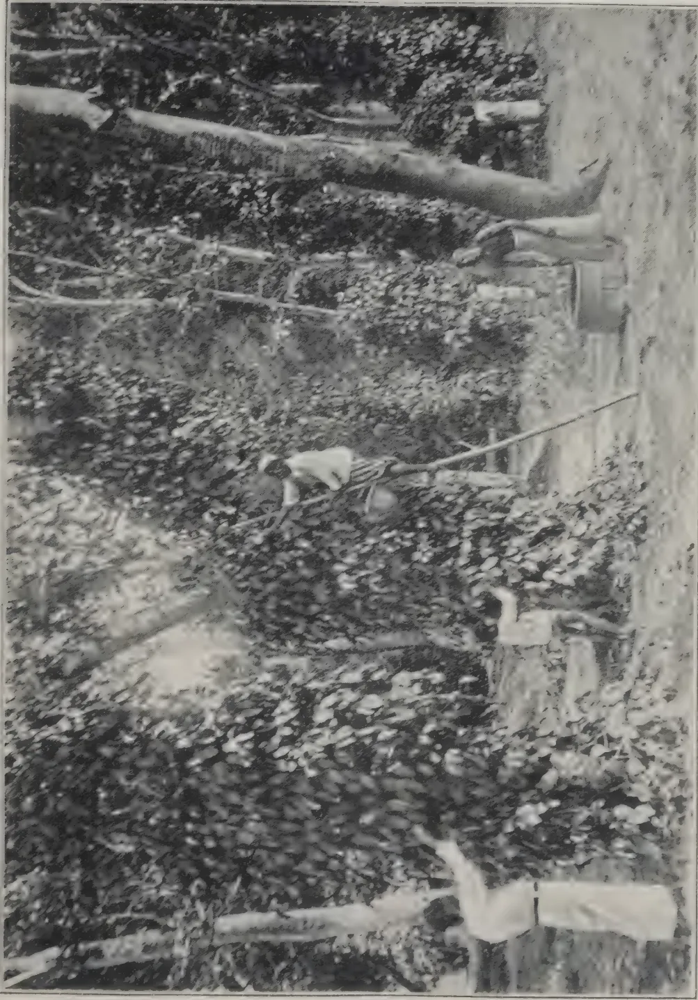A black and white photograph showing two people in a dense, wooded area. One person is kneeling in the foreground, and another is further back, near a large tree trunk. The scene is filled with dense foliage and fallen branches.

*Photo by H. F. Macmillan*

HARVESTING PEPPER

449------------------------------------------------

This image is a scan of a blank page. The background is a uniform light beige or off-white color. There are a few small, dark specks scattered across the surface, which appear to be scanning artifacts or dust particles. One speck is located near the top center, and another is slightly to the left of the center. The overall texture is smooth but shows slight variations in tone, typical of a scanned document.

450------------------------------------------------

MAY, 1914.]433

## THE PALMYRA PALM.

[ *See Frontispiece.* ]

### HISTORY AND NATIVE HABITAT.

The Palmyra (*Borassus flabellifer*) belongs to the aristocrats of the palm tribe, and has a history which is rivalled only by its confrères the Coconut and Date palms. The history of the Palmyra Palm is lost in hoary antiquity, and even the knowledge available regarding its native habitat is obscure. Though found throughout the plains of India, Burma, Java and in the northern drier region of Ceylon, it is nowhere in Asia considered to be indigenous. It is claimed to exist in a wild state in parts of Eastern Tropical Africa, and it is surmised that this must be its original habitat. In Ceylon, however, it has found a congenial home, having become quite naturalised in the sandy flat tracts of the north of the Island, forming regular forests in some cases. Here it reproduces itself freely, the large fibrous seeds remaining buried in the sandy soil until they absorb sufficient moisture to enable them to germinate, after which they sprout rapidly. In this connection RUMPHIUS wrote about the middle of the eighteenth century: "The tree is for the most part found to the east of Ceylon, especially in Jaffna, and from thence throughout the coast of Coromandel, also in Java and neighbouring islands. In Celebes there are vast woods of them about Gelissona and Mandura." The palm is naturally unsuited to the moist climate and alluvial or stiff soils, such as favour the Coconut palm; thus it takes the place of the latter in the drier coastal region, and is in many respects but little inferior to it; but it is by no means so handsome, nor so profitable to cultivate commercially as the Coconut.

"It is truly remarkable," wrote RUMPHIUS, "that these two palms, the Coconut and the Palmyra, cherish such secret envy and hatred towards each other that they will not grow in one and the same region. For we see that in all the western parts of Indostan and Ceylon, the Coconut tree grows abundantly and actively, but there we never or rarely see a Palmyra tree; on the contrary in Coromandel and the northern and eastern part of Ceylon the Palmyra predominates. I have seen in Amboina a Palmyra tree perfect and of full growth which had been cultivated with great labour, and was nevertheless always barren, from no other cause than that it stood amongst many Coconut trees." The superstitious writer was apparently not aware that the palm is dioecious, bearing male and female flowers on separate trees. It was probably a male tree that RUMPHIUS observed.

The *Index Kewensis* recognises four species of *Borassus*, including *B. flabellifer*. One of these is given as a native of Madagascar, another has its native habitat unknown, while the two others, including the Palmyra, are given as natives of India. But according to SIR JOSEPH HOOKER, the Palmyra is "apparently wild in Africa," and commonly found "cultivated in India, Burma, Malay," etc. This is also supported by TRIMEN, who considered the palm as naturalised, not indigenous, in Ceylon.

### ANTIQUITY OF OLAS.

One of the most ancient ways of writing was upon palm leaves or olas, and it appears that Palmyra olas are among the oldest written articles on record. They are mentioned by PLINY as dating from early history. Hindu authors have traced the writing of olas back to over 4,000 years,—i.e., according to the Hindu reckoning. The late MR. WILLIAM FERGUSON, an authority on the subject, stated: "I do not doubt that palmyra-leaf MSS. 400 to 500 years old now exist in Ceylon. They are certainly of a more durable quality than paper, and indeed when well prepared resemble parchment in their texture." Considerable doubt, however, is cast upon the supposed lasting qualities of olas by recent writers.

451------------------------------------------------

434[MAY, 1914.

It must be remembered that the leaves of the Talipot palm (*Corypha umbraculifera*) have also been used for olas from ancient times, and, like the Palmyra, are so employed till this day. Palmyra olas have, however, been claimed to be superior and to have greater durability. The leaves of the Coconut or other pinnate palms are not adapted for olas, and do not appear to have been used for the purpose.

The method of writing on olas is to produce impressions or scratches by means of a sharp-pointed iron stylus, the pen of the Scriptures, on the smooth surface of the leaf, the latter being first cut into uniform strips. The stylus, it will be recalled, was the instrument used by the Romans for writing upon leather, waxen tables and such like. Oriental customs die hard, and the writing on olas is still a practised art with some people, more particularly for deeds or important legal transactions. To see for the first time a clever ola-writer at work, is an interesting experience. He supports the leaf by the left hand and scratches the letters upon the surface with the stylus held in the right hand and supported over the thumb-nail of the left. The writing is done towards the right, but instead of moving the stylus onwards, the leaf is moved to the left. To render the characters more legible the engraved lines are generally smeared over with a mixture of oil and charcoal; this tinges the writing and renders it more distinct. Frequently, however, fresh cow-dung is preferred for smearing over the surface, afterwards rubbing it off. The ola-writers rarely use tables, and can write standing or walking, but the usual posture is squatting down tailor-fashion.

#### USES OF THE PALMYRA.

The uses of the Palmyra almost surpasses in number those of the Coconut. Tamil poets, who have dedicated verses to it, can enumerate over 800 purposes which it serves, and even that does not exhaust the catalogue. In fact it has been considered an uneasy task to mention any domestic requirement which some part or other of the Palmyra does not supply. Houses are built and thatched with the stems (cut into beams and rafters) and leaves; the nuts supply food and drink, the juice of the fruit providing sugar, wine, or medicine; matting for floors or ceilings are made from the younger leaves, the latter being also readily made into fans, baskets, buckets, jugs, hats, caps, umbrellas, toys, etc. A Tamil proverb says: "Witchcraft is the easiest of all arts, and the Palmyra basket is the easiest of all plaits." In short it would be almost impossible to mention any part of the tree which does not serve some useful purpose. It furnishes a supply of fresh vegetable food in the following remarkable manner. The seeds are sown thickly in a bed, covered with earth and kept moist. In about four months they germinate, sending up a shoot. The latter develops a succulent thick base underground resembling an inverted parsnip; this is edible and is regarded as a choice vegetable. Collectively the seedlings are called by the Tamils "Kelangoos," which means "yams" or "bulbs;" these are taken up when two to three months old, and either eaten or despatched to market. To keep these kelangoos or yams for future use, they are deprived of the delicate parchment-like sheath in which they are completely enveloped, and then dried in the sun. When thus simply dried they are called "odials;" boiled first and then dried they are known as "*puluc* odials." The latter keep for many months in good condition, and are transported to different parts of Ceylon, being found in most bazaars at all times of the year and retailed at about one cent each, i.e. one-sixth of a penny. The flour made from the odials was once highly prized by the Dutch and, it is recorded, exported to Holland.

#### PALMYRA TODDY, JAGGERY, &c.

When the palm reaches the age of about 15 years from seed, the flowering spathes begin to appear among the leaves, near the top of the trees, which will then have attained a height varying from 8 to 15 feet. To obtain

452------------------------------------------------

MAY, 1914.]435

the toddy the flowering spathe is securely tied up along its whole length to prevent the enclosed inflorescence from opening. It is then beaten or wounded by a mallet for three mornings successively, in order to assist the flow of toddy. After that it is ready for the operation of tapping, which consists in taking a thin slice off the end of the inflorescence each morning or evening (or both), until the whole of the latter is sliced away. The toddy is collected in earthen chatties, which are emptied morning and evening, the yield being about three quarts a day from each spathe. The process lasts for four or five months and is repeated for three successive years. The trees are then allowed to rest and develop their inflorescence naturally, otherwise, it is said, they will "pine and die." The toddy quickly ferments and becomes intoxicating, but the process of fermentation can be retarded by sprinkling the inside of the receptacle in which it is collected with lime, the result being "sweet toddy." Evaporation of the toddy by boiling produces a kind of brown sugar known as jaggery; distilled, it furnishes the well-known spirit arrack.

### DESCRIPTION.

The Palmyra is a short erect palm, ordinarily reaching a height of about seventy feet, but sometimes as much as 100 feet or more. It is curious the magnified sense of proportions with which the Tamils regard this palm, for if asked as to its height, remarked FERGUSON, they will quite probably answer 200 feet! I have put this to the test, and the answer, sure enough, was 250 feet. This exalted notion, however, apparently applies only to the Palmyra palm. A striking characteristic of the tree is its perfectly straight stem, which is never crooked or wavy, unless as a result of injury or accident, being thus the very reverse of its ally the Coconut palm. To quote another Tamil proverb: "A person who sees a straight coconut tree, a crooked palmyra, or a white crow will live for ever."

A Dutch writer, CORNELIUS, in describing the palm, wrote: "The trunk is like an iron cylinder, the perimeter of whose base is about 6 feet and that at the top about 3 feet. It is supposed to stand for about 1,000 years and lasts for the same period after being felled; in common proverb, a lakh after planted, a lakh after felled." The extraordinary longevity of the palm seems undisputed, but the estimates of the approximate age to which it attains vary exceedingly. Thus VYRAMUTU, of Point Pedro, estimated this at 500 years, as against CORNELIUS' 1,000 years, but even this more moderate estimate is doubtless slightly exaggerated.

The palm is dioecious, that is, male and female flowers are produced on separate trees; in other words, each tree is either male or female, and it is impossible to tell the sex until the trees flower, i.e., when about 12 or 15 years old. The inflorescences of both sexes are used for the extraction of toddy, but that from the male is considered of greater efficacy in native medicine.

The round globular fruits, about 4 to 5 inches in diameter, are smooth skinned and reddish-black in colour when ripe; they are produced in clusters (spadices) at the base of the leaves, each cluster containing from 10 to 15 fruits, being about as much as one man can carry. Each tree on an average bears seven or eight of these spadices or clusters, so that a tree often produces about 150 fruits in a season. The fruits when young are bluntly three-cornered, but when mature assume almost a perfectly globular appearance. Each ripe fruit contains one, two, or three "nuts" or seeds, embedded in a mass of soft yellowish pulp, intermixed with dark straw-coloured fibre. The seeds are oblong, flattened, and thickly covered with a mass of short fibre which adheres to them; in addition to this, each seed is protected by a thick shell which is so hard that even an elephant, according to the Tamils, cannot break it. "I have tried to break one with a hammer," says FERGUSON, "but the experiment is a dangerous one, the fruit flying off when struck with a

453------------------------------------------------

436[MAY, 1914.

force sufficient to break a man's shins." When for some time in the ground, however, the shell becomes softer and the kernel expands, thus marking the initial stage of germination; as the latter proceeds, the space within the kernel becomes filled with a sweet cream-coloured substance of the consistency of cheese, which is edible and considered a delicacy.

The stiff rigid fan-shaped leaves have comparatively short petioles or stalks, and radiate from the crown, giving the palm a distinctive character. A few years ago a sudden demand arose for the fibre obtained from the leaf bases, which is used for brooms and brushes, and the efforts made to supply this material threatened for a time to seriously affect the whole of the Palmyras in the Jaffna Peninsula, owing to the excessive stripping off of the leaves, followed by the death of many of the trees. DR. TRIMEN, late Director of the Royal Botanic Gardens, impressed by this wasteful procedure, proposed to enforce preventive measures by legislation. The practice still continues, but apparently not to the same extent as formerly, and the local headmen endeavour to restrict it within practicable limits.

The Palmyra ranks in importance to the Coconut palm in the Eastern tropics. Its chief commercial value consists in its fibre, above referred to, and in the laths made from the stem. Both these are important articles of export from Ceylon.

#### PLANTING.

In forming a palmyra plantation the seeds are best sown *in situ*, that is where the trees are to remain. This is usually at distances apart of about ten feet each way. The seeds take three to four months to germinate, and the trees should flower and fruit when fifteen years old, or earlier if well cultivated. Thus says an invocation to the Tamil goddess Ganesa: "O thou lady, resembling Laksimy who is seated on the beautiful red lotus. . . .

When the stones (seeds) sprout and become tender plants, if you take good care of them, not to let the goat, sheep, cow or wild cow feed upon the plants, they will grow in strength, and the swords of their stems, armed with indented jags on both their sides, they will destroy the iron edge of poverty and protect the earth. When the Palmyra tree grows to the height of two bones length, the roots of the stems that fastened the tree will get dry and fall off in season. A female child and a Palmyra tree, if carefully nurtured, will become fruitful in the tenth year."

The palm is peculiarly adapted to hot, dry, sandy plains, as in the north of Ceylon, where the annual rainfall is almost confined to three months of the year, viz., from October to January. It will grow however in the moist region, as at Peradeniya, which is at an elevation of 1,550 feet, but here it is apparently "out of its element." The avenue shown in the frontispiece was planted from seeds sown *in situ* in 1887, so is now 27 years old. None of these trees have by any means attained their full size, and some are only a few feet high.

H. F. MACMILLAN.

## THE CULTIVATION OF TEAK IN JAVA.

G. SCHAEFFER,

Java possesses at present upwards of 1,480,000 acres of teak forests, and this splendid asset increases every year, as the area reafforested is two and a half times larger than the area felled during the same time; on the other hand teak is nowhere cultivated except in Java. In the island the conditions required for the cultivation to be profitable are a fair soil of at least medium fertility, a minimum of 60 cm. (40 in.) of yearly rainfall and an altitude inferior to 100 m. (330 feet).

454------------------------------------------------

MAY, 1914.]437

### REGENERATION.

Teak sends up numerous shoots from the stool, but the trees thus obtained being much inferior to seedlings, this mode of regeneration is not utilized. The seeds are sown in holes in rows at 3 ft. by 10 ft. Other crops, such as rice or earthnuts, are grown between the rows during the first year.

### MAINTENANCE.

The greatest attention of the forester is devoted to preventing lalang-grass, (*Imperata arundinacea*) from invading the plantation; hoeing being too expensive, *Leuceæna glauca*, a leguminous plant, is sown between the rows as a cover plant; it chokes the lalang and keeps the soil clean; besides which it prevents the leaching out of the soil and enriches it in humus and nitrogen and disappears when the cover of the forest is sufficient.

### FELLING.

The new artificial forests are still too young to be felled; but it is estimated that the trees will attain a diameter of 24 inches at the age of 80 or 100 years.—MONTHLY BULLETIN.

## **Sales of Produce in British and Continental Markets.**

Fibres, Cotton, Grain, Oil Seeds, Hides and Skins, Timber, Rubber, Drugs, Wool, Ores, Mica, Gums, Tea, Cocoa, Coffee, Copra, Sugar, etc., are being regularly dealt in; Keymer, Son & Co., being selling Agents for Estates, Mills and Exporters.

Samples Valued.

**Best Ports for Shipments Indicated.**

THE MANAGEMENT OF  
**ESTATES UNDERTAKEN.**

Capital found for the development or purchase of valuable properties.

**KEYMER, SON & Co.,**

Whitefriars.  
LONDON, E.C.

(Same address since 1844.)

Cables :  
KEYMER, LONDON.

455------------------------------------------------

438[MAY, 1914.

## PLANT & SEED SUPPLIES TO MEMBERS OF C.A.S.

A limited supply of grafted plants is now available to members of the Ceylon Agricultural Society, at the Government Stock Garden, Colombo. The varieties include :—

<table>
<thead>
<tr>
<th>MANGOES,</th>
<th colspan="3">Other Varieties.</th>
</tr>
</thead>
<tbody>
<tr>
<td>Alponso or Badami</td>
<td>Lime</td>
<td>...</td>
<td>Bangalore variety</td>
</tr>
<tr>
<td>Raspuri</td>
<td>Lemon</td>
<td>...</td>
<td>do. do.</td>
</tr>
<tr>
<td>Mulgoa</td>
<td>Citron</td>
<td>...</td>
<td>Very large</td>
</tr>
<tr>
<td>Goa</td>
<td>Pomegranate</td>
<td>...</td>
<td>Bangalore large</td>
</tr>
<tr>
<td>ORANGES</td>
<td>Sweetlime</td>
<td>...</td>
<td>Large fruited</td>
</tr>
<tr>
<td>Coorg</td>
<td>Guava</td>
<td>...</td>
<td>Pear</td>
</tr>
<tr>
<td>Satkadi</td>
<td>Roseapple</td>
<td>...</td>
<td>Bangalore variety</td>
</tr>
<tr>
<td>Nagpore</td>
<td>Grape</td>
<td>...</td>
<td>Black Hamburg</td>
</tr>
<tr>
<td>Sylhet</td>
<td>do.</td>
<td>...</td>
<td>Gordo Blanco</td>
</tr>
<tr>
<td>Other Varieties</td>
<td>do.</td>
<td>...</td>
<td>Muscat of Alexandria</td>
</tr>
<tr>
<td>Pomelo</td>
<td>Figs</td>
<td>...</td>
<td>Brown Turkey</td>
</tr>
</tbody>
</table>

N.B.—All these are grafted plants except Lemon, Grape and Fig.

The charge per plant will be Rs. 1.50 each, payable in advance. Orders with remittances, may be sent at once, giving instructions *re* despatch. Applications will receive attention in the order of receipt.

### ENGLISH VEGETABLE SEEDS.

The usual supply has come to hand and is being distributed at the Government Stock Garden ; cost 10 cents per packet. Orders may be sent in now. The varieties available are :—

<table>
<tbody>
<tr>
<td>Artichoke</td>
<td>Endive</td>
</tr>
<tr>
<td>Asparagus</td>
<td>Fennel</td>
</tr>
<tr>
<td>Beans (Dwarf French)</td>
<td>Kohl Rabi (knol khol)</td>
</tr>
<tr>
<td>Beet</td>
<td>Leek</td>
</tr>
<tr>
<td>Borecole</td>
<td>Lettuce (Cos)</td>
</tr>
<tr>
<td>Broccoli</td>
<td>Lettuce (Cabbage)</td>
</tr>
<tr>
<td>Brussels Sprouts</td>
<td>Onion</td>
</tr>
<tr>
<td>Cabbage</td>
<td>Parsley</td>
</tr>
<tr>
<td>Cabbage (Savoy)</td>
<td>Parsnip</td>
</tr>
<tr>
<td>Capsicum</td>
<td>Peas</td>
</tr>
<tr>
<td>Cardoon</td>
<td>Radish</td>
</tr>
<tr>
<td>Carrot</td>
<td>Rhubarb</td>
</tr>
<tr>
<td>Cauliflower</td>
<td>Salsify</td>
</tr>
<tr>
<td>Celery</td>
<td>Spinach</td>
</tr>
<tr>
<td>Chili</td>
<td>Tomato</td>
</tr>
<tr>
<td>Cucumber (ridge)</td>
<td>Turnip</td>
</tr>
<tr>
<td>Cress</td>
<td>Vegetable Marrow</td>
</tr>
</tbody>
</table>

The following seeds are also available at the Government Stock Garden for sale to members of the C. A. S. :—

<table>
<tbody>
<tr>
<td>1 bushel and 13 measures of Molagu Samba paddy at 30 cts. p. m.</td>
<td></td>
<td></td>
<td></td>
</tr>
<tr>
<td>1 do 5 do Sorghum</td>
<td>10</td>
<td>..</td>
<td>..</td>
</tr>
<tr>
<td>130 lb. Maize</td>
<td>...</td>
<td>...</td>
<td>10 .. per lb.</td>
</tr>
<tr>
<td>523 ,, Sunn-hemp</td>
<td>...</td>
<td>...</td>
<td>10 .. ..</td>
</tr>
<tr>
<td>3 ,, Cow Peas</td>
<td>...</td>
<td>...</td>
<td>25 .. ..</td>
</tr>
<tr>
<td>53 ,, Daincha (Sesbania aculeata)</td>
<td>...</td>
<td>...</td>
<td>30 .. ..</td>
</tr>
</tbody>
</table>

C. DRIEBERG,

Secretary, C. A. S.

30-3-14.

456------------------------------------------------

MAY, 1914.]439

## EXPERIMENTS IN HUNGARY WITH HEMP SEED.

KAROLY GASZNER.

During the last three years the writer has conducted a series of comparative experiments with two varieties of hemp : one from Turkey-in-Asia, the other from Italy (Bologna). Of both varieties 62 lb. per acre were sown in rows  $4\frac{3}{4}$  inches apart on several fields of 57 to 72 acres in area. The two varieties were sown at the same time and under similar conditions. In the Asiatic variety germination began 8 or 9 days after sowing, in the Italian 2 to 3 days later. The Asiatic hemp showed a more rapid development than the Italian, its stalk became thinner and more flexible and at the approach of flowering time it turned light green, whilst the Italian hemp kept its dark green colour to the end. On August 1, at the beginning of the harvest, the Asiatic hemp was about 6 inches taller than the Italian and in spots where the soil was most suitable it attained 10 feet in height. The result obtained from the two varieties showed also some difference : in 1912 the crop of Asiatic stalks was 186 lb. per acre in excess of the Italian, and in 1913, 288 lb. (The average quantity of hemp harvested in 1912 was above 83 cwt. per acre). The difference in the yield of the two varieties may be attributed to the denser germination of the Asiatic hemp.

From these experiments the writer draws the conclusion that for the soils of Hungary, Asiatic hemp is more suitable. Its stalk becomes taller and it yields a finer and longer fibre, more suitable for the textile industry than the Italian variety. Nevertheless, the Asiatic seed has not yet been selected, as attention has only recently been paid to it. This is a task for the recently created Royal Hungarian Institute for the Cultivation of Flax and Hemp.—MONTHLY BULLETIN.


Compare this well-appointed 'Tabloid' Medicine Chest with the old-time and unnecessary collection of apparatus and bottles, pots and parcels of medicaments which were often of uncertain strength and unstable.

TRACE MARK 'TABLOID' BRAND  
**MEDICINE CASE No. 258**

Contains pure and reliable medicaments in compact doses, ready and easy to take.

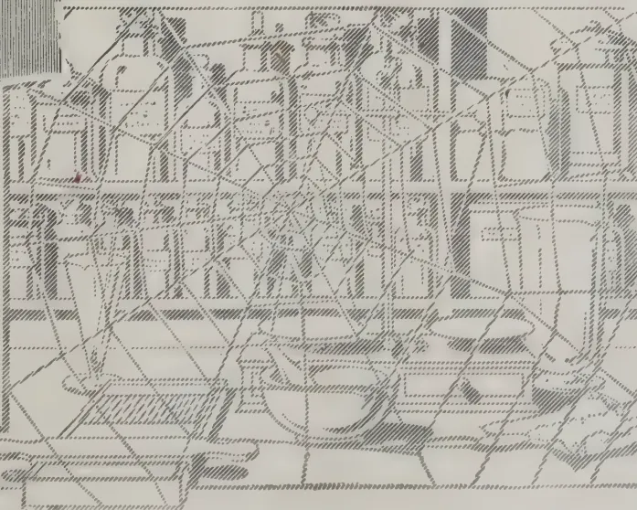

Dispensing made easy

No weighing  
No waste

Extremely light and climate-proof

Measures

$8\frac{1}{4} \times 4\frac{3}{8} \times 5\frac{3}{4}$  in.

In Japanned Metal, of all the principal Chemists and Stores

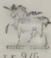

BURROUGHS WELLCOME & CO., LONDON

NEW YORK

MONTREAL

SYDNEY

CAPE TOWN

MILAN

SHANGHAI

BUENOS AIRES

BOMBAY

All Rights Reserved

22 916

457------------------------------------------------

440

[MAY, 1914.

**MARKET RATES FOR TROPICAL PRODUCTS.**

(From Lewis & Peat's Latest Monthly Prices Current.)

<table border="1">
<thead>
<tr>
<th colspan="2">QUALITY.</th>
<th>Quotations.</th>
<th colspan="2">QUALITY.</th>
<th>QUOTATION</th>
</tr>
</thead>
<tbody>
<tr>
<td>ALOES, Socotrine</td>
<td>cwt. Fair to fine</td>
<td>40/ a 50/</td>
<td>INDIARUBBER</td>
<td>lb. Common to good</td>
<td>9d a 1/4</td>
</tr>
<tr>
<td>Zanzibar &amp; Hepatic</td>
<td>" Common to good</td>
<td>40/ a 70/</td>
<td>Borneo</td>
<td>" Good to fine red</td>
<td>1/4 a 1/8</td>
</tr>
<tr>
<td>ARROWROOT (Natal)</td>
<td>lb. Fair to fine</td>
<td>6d a 7d</td>
<td>Java</td>
<td>" Low white to prime red</td>
<td>9d a 1/6</td>
</tr>
<tr>
<td>BEES' WAX</td>
<td>cwt. Slightly drossy to fair</td>
<td>£77.6 a £8 2/6</td>
<td>Penang</td>
<td>" Fair to fine red ball</td>
<td>1/10 a 2/4</td>
</tr>
<tr>
<td>Zanzibar Yellow</td>
<td>" Fair to good</td>
<td>£8 10/ a £8 15/</td>
<td>Mozambique</td>
<td>" Sausage, fair to good</td>
<td>1/9 a 2/3</td>
</tr>
<tr>
<td>East Indian, bleached</td>
<td>" Dark to good genuine</td>
<td>£6 10/ a £7</td>
<td>Nyassaland</td>
<td>" Fair to fine ball</td>
<td>1/9 a 2/1</td>
</tr>
<tr>
<td>" unbleached</td>
<td>" Dark to good palish</td>
<td>£7 17/6 a £8 5/</td>
<td>Madagascar</td>
<td>" Fr. to fine pinky &amp; white</td>
<td>1/6 a 1/8</td>
</tr>
<tr>
<td>Madagascar</td>
<td>" Refined</td>
<td>1/4½ a 1/6¼</td>
<td>"</td>
<td>" Majung &amp; blk coated</td>
<td>1/ a 1/3</td>
</tr>
<tr>
<td>CAMPHOR, Japan</td>
<td>lb. Fair average quality</td>
<td>155/</td>
<td>"</td>
<td>" Niggers, low to good</td>
<td>6d a 1/6</td>
</tr>
<tr>
<td>China</td>
<td>cwt. Good to fine bold</td>
<td>6/ a 6/3</td>
<td>"</td>
<td>" Ordinary to fine ball</td>
<td>1/4 a 1/7</td>
</tr>
<tr>
<td>CARDAMOMS, Tuticorin</td>
<td>per lb. Middling lean</td>
<td>5/2 a 5/7</td>
<td>New Guinea</td>
<td>" Shipping mid to gd. violet</td>
<td>3s 3d a 3s 8d</td>
</tr>
<tr>
<td>Malabar, Tellicherry</td>
<td>" Good to fine bold</td>
<td>6/ a 6/3</td>
<td>INDIGO, E.I. Bengal</td>
<td>" Consuming mid. to gd.</td>
<td>2s 9d a 3s 2d</td>
</tr>
<tr>
<td>Calicut</td>
<td>" Brownish</td>
<td>3/11 a 5/8</td>
<td>"</td>
<td>" Ordinary to middling</td>
<td>2s 4d a 2s 9d</td>
</tr>
<tr>
<td>Mangalore</td>
<td>" Med Brown to good bold</td>
<td>5/3 a 6/6</td>
<td>"</td>
<td>" Mid. to good Kurpah</td>
<td>1s 11d a 2s 5d</td>
</tr>
<tr>
<td>Ceylon, Mysore</td>
<td>" Small fair to fine plump</td>
<td>4/3 a 6/1</td>
<td>"</td>
<td>" Low to ordinary</td>
<td>1s 6d a 1s 9d</td>
</tr>
<tr>
<td>Malabar</td>
<td>" Fair to good</td>
<td>3/6 a 3/8</td>
<td>"</td>
<td>" Mid. to fine Madras</td>
<td>1/11 a 2/9</td>
</tr>
<tr>
<td>Seeds, E. I. &amp; Ceylon</td>
<td>" Fair to good</td>
<td>4/7 a 4/9</td>
<td>MACE, Bombay &amp; Penang</td>
<td>" Pale reddish to fine</td>
<td>2/4 a 2/6</td>
</tr>
<tr>
<td>Ceylon "Long Wild"</td>
<td>" Shelly to good</td>
<td>2/3 a 3/6</td>
<td>per lb.</td>
<td>" Ordinary to fair</td>
<td>2/ a 2/2</td>
</tr>
<tr>
<td>CASTOR OIL, Calcutta</td>
<td>" Good 2nds</td>
<td>3¾d</td>
<td>Java</td>
<td>" Wild " good pale</td>
<td>2/ 1a 2/4</td>
</tr>
<tr>
<td>CHILLIES, Zanzibar</td>
<td>cwt. Dull to fine bright</td>
<td>45/ a 50/</td>
<td>Bombay</td>
<td>"</td>
<td>1/</td>
</tr>
<tr>
<td>Japan</td>
<td>" Fair bright small</td>
<td>50/</td>
<td>NUTMEGS, —</td>
<td>lb. 64's to 57 s</td>
<td>9½d a 10½d</td>
</tr>
<tr>
<td>CINCHONA BARK.—lb.</td>
<td>Crown, Renewed</td>
<td>3¾d a 7d</td>
<td>Singapore &amp; Penang</td>
<td>" 80's</td>
<td>7½d</td>
</tr>
<tr>
<td>Ceylon</td>
<td>Red Org. Stem</td>
<td>2d a 6d</td>
<td>"</td>
<td>" 110's</td>
<td>6½d</td>
</tr>
<tr>
<td>"</td>
<td>Red Org. Stem</td>
<td>1½d a 4½d</td>
<td>"</td>
<td>"</td>
<td>"</td>
</tr>
<tr>
<td>"</td>
<td>Renewed</td>
<td>3d a 5¼d</td>
<td>"</td>
<td>"</td>
<td>"</td>
</tr>
<tr>
<td>"</td>
<td>Root</td>
<td>1½d a 4d</td>
<td>"</td>
<td>"</td>
<td>"</td>
</tr>
<tr>
<td>CINNAMON, Ceylon</td>
<td>1sts. Good to fine quill</td>
<td>1/3 a 1/7</td>
<td>NUTS, ARECA</td>
<td>cwt. Ordinary to fair fresh</td>
<td>17/6 a 20</td>
</tr>
<tr>
<td>per lb.</td>
<td>2nds. " "</td>
<td>1/2 a 1/6</td>
<td>NUX VOMICA, Cochin</td>
<td>Ordinary to good</td>
<td>11/ a 13 nom.</td>
</tr>
<tr>
<td>"</td>
<td>3rds. " "</td>
<td>1/1 a 1/5</td>
<td>per cwt.</td>
<td>" "</td>
<td>10/6</td>
</tr>
<tr>
<td>"</td>
<td>4ths. " "</td>
<td>1/ a 1/3</td>
<td>Bengal</td>
<td>" "</td>
<td>10/6 a 11</td>
</tr>
<tr>
<td>"</td>
<td>Chips, Fair to fine bold</td>
<td>2d a 4d</td>
<td>Madras</td>
<td>" "</td>
<td>5/11</td>
</tr>
<tr>
<td>CLOVES, Penang</td>
<td>lb. Dull to fine bright pkd.</td>
<td>1/1 a 1/3</td>
<td>OIL OF ANISEED</td>
<td>lb. Fair merchantable</td>
<td>2/11 a 33/</td>
</tr>
<tr>
<td>Amboyna</td>
<td>" Dull to fine</td>
<td>10d a 10½d</td>
<td>CASSIA</td>
<td>" According to analysis</td>
<td>2½d</td>
</tr>
<tr>
<td>Zanzibar</td>
<td>" Fair and fine bright</td>
<td>5¾d a 6½d</td>
<td>LEMONGRASS</td>
<td>oz. Good flavour &amp; colour</td>
<td>1½d a 1¾d</td>
</tr>
<tr>
<td>Madagascar</td>
<td>" Fair</td>
<td>7d</td>
<td>NUTMEG</td>
<td>" Dingy to white</td>
<td>3½d a 1s 5d</td>
</tr>
<tr>
<td>Stems</td>
<td>" Fair</td>
<td>3d</td>
<td>CINNAMON</td>
<td>" Ordinary to fair sweet</td>
<td>1/6½</td>
</tr>
<tr>
<td>COFFEE</td>
<td>Ceylon Plantation cwt. Medium to bold</td>
<td>Nominal</td>
<td>CITRONELLE</td>
<td>lb. Bright &amp; good flavour</td>
<td>"</td>
</tr>
<tr>
<td>Native</td>
<td>" Good ordinary</td>
<td>50/ a 55/</td>
<td>ORCHELLA WEED—cwt</td>
<td>" Fair</td>
<td>15/</td>
</tr>
<tr>
<td>Liberian</td>
<td>" Fair to bold</td>
<td>63/ a 80/</td>
<td>Ceylon</td>
<td>" Fair</td>
<td>15/</td>
</tr>
<tr>
<td>COCOA, Ceylon Plant.</td>
<td>" Special Marks</td>
<td>81/ a 88/6</td>
<td>Madagascar</td>
<td>" Fair</td>
<td>15/</td>
</tr>
<tr>
<td>Native Estate</td>
<td>" Red to good</td>
<td>73/ a 80/6</td>
<td>Zanzibar</td>
<td>" Fair</td>
<td>"</td>
</tr>
<tr>
<td>Java and Celebes</td>
<td>" Ordinary to red</td>
<td>42/ a 63/</td>
<td>PEPPER—(Black) lb.</td>
<td>" Fair</td>
<td>5½d</td>
</tr>
<tr>
<td>COLOMBO ROOT</td>
<td>" Small to good red</td>
<td>30s a 93s</td>
<td>Alleppy &amp; Tellicherry</td>
<td>" Fair</td>
<td>5 a 5¾d</td>
</tr>
<tr>
<td>CROTON SEEDS, sifted,</td>
<td>" Middling to good</td>
<td>12/ 6a 21/</td>
<td>Ceylon</td>
<td>" Fair to fine bold heavy</td>
<td>5d</td>
</tr>
<tr>
<td>CUBEBS</td>
<td>" Dull to fair</td>
<td>40/ a 45</td>
<td>Singapore</td>
<td>" Fair</td>
<td>5d a 5½d</td>
</tr>
<tr>
<td>GINGER, Bengal, rough</td>
<td>" Ord. stalky to good</td>
<td>130/ a 150/</td>
<td>Acheen &amp; W. C. Penang</td>
<td>" Dull to fine</td>
<td>8½d a 8¾d</td>
</tr>
<tr>
<td>Calicut, Cut A</td>
<td>" Fair</td>
<td>19/</td>
<td>(White) Singapore</td>
<td>" Fair to fine</td>
<td>8½d</td>
</tr>
<tr>
<td>B &amp; C</td>
<td>" Medium to fine bold</td>
<td>60/ a 75/</td>
<td>Siam</td>
<td>" Fair</td>
<td>7¾d</td>
</tr>
<tr>
<td>Cochin, Rough</td>
<td>" Small and medium</td>
<td>36/ a 60/</td>
<td>Penang</td>
<td>" Fair</td>
<td>9d</td>
</tr>
<tr>
<td>Japan</td>
<td>" Common to fine bold</td>
<td>22/6 a 30/</td>
<td>Muntok</td>
<td>" Fair</td>
<td>2/ a 4</td>
</tr>
<tr>
<td>"</td>
<td>" Small and D's</td>
<td>20/</td>
<td>RHUBARB, Shenzi</td>
<td>" Ordinary to good</td>
<td>1/10 a 3/6</td>
</tr>
<tr>
<td>"</td>
<td>Unsplit</td>
<td>23/</td>
<td>Canton</td>
<td>" Ordinary to good</td>
<td>11/ a 1/1</td>
</tr>
<tr>
<td>GUM AMMONIACUM</td>
<td>Ord. Blocky to fair clean</td>
<td>40/s a 72s 6d</td>
<td>High Dried,</td>
<td>" Fair to fine flat</td>
<td>9d a 11d</td>
</tr>
<tr>
<td>ANIMI, Zanzibar</td>
<td>Pale and amber, str. srts</td>
<td>£14 10/ a £16 10/</td>
<td>"</td>
<td>" Dark to fair round</td>
<td>18</td>
</tr>
<tr>
<td>"</td>
<td>" little red</td>
<td>£11 a £12</td>
<td>"</td>
<td>" Fair to fine</td>
<td>17/</td>
</tr>
<tr>
<td>"</td>
<td>Bean and Pea size ditto</td>
<td>70/ a £11</td>
<td>"</td>
<td>" " "</td>
<td>13 a 14</td>
</tr>
<tr>
<td>"</td>
<td>Fair to good red sorts</td>
<td>£8 10/ a £10 10</td>
<td>Flour</td>
<td>" " "</td>
<td>10 a 11</td>
</tr>
<tr>
<td>"</td>
<td>Med. and bold glassy sorts</td>
<td>£5 a £7</td>
<td>SEEDLAC</td>
<td>cwt. Good pinky to white</td>
<td>65/ a 75</td>
</tr>
<tr>
<td>Madagascar</td>
<td>" Fair to good palish</td>
<td>£4 a £8</td>
<td>SENNA, Tinnevelly</td>
<td>lb. Good to fine bold green</td>
<td>5d a 8½d</td>
</tr>
<tr>
<td>"</td>
<td>" red</td>
<td>£4 a £7</td>
<td>"</td>
<td>" Fair greenish</td>
<td>3d a 4½d</td>
</tr>
<tr>
<td>ARABIC, E. I. &amp; Aden</td>
<td>" Ordinary to good pale</td>
<td>26/ a 30/</td>
<td>"</td>
<td>" Common specky &amp; small</td>
<td>¼d a 2½d</td>
</tr>
<tr>
<td>Turkey sorts</td>
<td>"</td>
<td>32/ a 55/</td>
<td>"</td>
<td>"</td>
<td>"</td>
</tr>
<tr>
<td>Ghatti</td>
<td>" Sorts to fine pale</td>
<td>18/6 a 30/ nom.</td>
<td>"</td>
<td>"</td>
<td>"</td>
</tr>
<tr>
<td>Kurrachee</td>
<td>" Reddish to good pale</td>
<td>25 a 30s nom.</td>
<td>"</td>
<td>"</td>
<td>"</td>
</tr>
<tr>
<td>Madras</td>
<td>" Dark to fine pale</td>
<td>22/6 a 29/6 nom</td>
<td>"</td>
<td>"</td>
<td>"</td>
</tr>
<tr>
<td>ASSAFETIDA</td>
<td>" Clean fr. to gd. almonds</td>
<td>£6 a £6 10/</td>
<td>"</td>
<td>"</td>
<td>"</td>
</tr>
<tr>
<td>"</td>
<td>" com. stony to good block</td>
<td>40s a 5s</td>
<td>"</td>
<td>"</td>
<td>"</td>
</tr>
<tr>
<td>KINO</td>
<td>lb. Fair to fine bright</td>
<td>6d a 1/5</td>
<td>"</td>
<td>"</td>
<td>"</td>
</tr>
<tr>
<td>MYRRH, Aden sorts</td>
<td>cwt. Middling to good</td>
<td>57/6 a 67/6</td>
<td>"</td>
<td>"</td>
<td>"</td>
</tr>
<tr>
<td>Somali</td>
<td>" " "</td>
<td>52s 6d a 57s 6d</td>
<td>"</td>
<td>"</td>
<td>"</td>
</tr>
<tr>
<td>OLIBANUM, drop</td>
<td>" Good to fine white</td>
<td>45s a 50s</td>
<td>"</td>
<td>"</td>
<td>"</td>
</tr>
<tr>
<td>"</td>
<td>" Middling to fair</td>
<td>35s a 40s</td>
<td>"</td>
<td>"</td>
<td>"</td>
</tr>
<tr>
<td>"</td>
<td>" Low to good pale</td>
<td>15/ a 27/6</td>
<td>"</td>
<td>"</td>
<td>"</td>
</tr>
<tr>
<td>"</td>
<td>" Slightly foul to fine</td>
<td>18 s a 27s</td>
<td>"</td>
<td>"</td>
<td>"</td>
</tr>
<tr>
<td>INDIA RUBBER</td>
<td>lb. Fine Para smoked &amp; sheets</td>
<td>26½</td>
<td>"</td>
<td>"</td>
<td>"</td>
</tr>
<tr>
<td>"</td>
<td>" Crepe ordinary to fine</td>
<td>2/6</td>
<td>"</td>
<td>"</td>
<td>"</td>
</tr>
<tr>
<td>Ceylon, Straits,</td>
<td>" Fine Block</td>
<td>2/5½</td>
<td>"</td>
<td>"</td>
<td>"</td>
</tr>
<tr>
<td>Malay Straits, etc.</td>
<td>" Scrap fair to fine</td>
<td>1/11 a 2/1</td>
<td>"</td>
<td>"</td>
<td>"</td>
</tr>
<tr>
<td>Assam</td>
<td>" Plantation</td>
<td>2/</td>
<td>"</td>
<td>"</td>
<td>"</td>
</tr>
<tr>
<td>"</td>
<td>" Fair 11 to ord. red No. 1.</td>
<td>1/6 a 1/9</td>
<td>"</td>
<td>"</td>
<td>"</td>
</tr>
<tr>
<td>Rangoon</td>
<td>" " "</td>
<td>1/3 a 1/6</td>
<td>"</td>
<td>"</td>
<td>"</td>
</tr>
<tr>
<td>"</td>
<td>" " "</td>
<td>"</td>
<td>"</td>
<td>"</td>
<td>"</td>
</tr>
</tbody>
</table>

458------------------------------------------------

THE  
**TROPICAL AGRICULTURIST:**  
JOURNAL OF THE  
**CEYLON AGRICULTURAL SOCIETY.**

---

VOL. XLII.

COLOMBO, JUNE, 1914.

**No. 6.**

---

**CO-OPERATIVE CREDIT.**

---

*Peradeniya, June, 1914.*

The Conference of Co-operative Credit Societies which was held at the King's Pavilion, Kandy, on April 28th, under the patronage of His Excellency the Governor, will no doubt be considered the most important event of the year as far as the progress of agriculture is concerned. For many years, the benefits and advantages to be derived from co-operation were persistently brought to the notice of the Ceylon public, and this continual advocacy, assisted in great measure by the success of the movement in India, finally bore fruit in the passing of the Co-operative Credit Societies Ordinance of 1911.

That Ordinance has not been allowed to remain a dead letter. Thanks to the vigorous propaganda carried on by the officers of the Agricultural Society, and the enthusiastic support of the Mudaliyars and other officials who are most closely in touch with the agriculturist, a highly satisfactory beginning has been made. That enthusiasm was also evidenced by the large attendance, at the Conference, of delegates and others interested in the Co-operative Credit movement from all parts of the Island, in many cases at great personal inconvenience.

To His Excellency the Governor the Conference was indebted for a new light on co-operation in Ceylon which should help to remove any reluctance on the part of the agriculturist to

459------------------------------------------------

442[JUNE, 1914.

participate. His Excellency emphasised the fact that co-operation in the operations of agriculture is an established custom in the Island, to a degree unknown in temperate countries, if indeed it can be said to exist at all in such. But hitherto such co-operation has not been extended to monetary transactions. The realization of this will, it is hoped, facilitate the adoption of Co-operative Credit by those who are most in need of it.

The Ceylon Ordinance is based to a great extent on the corresponding Act which has been found to work with such success in India. Modifications will no doubt be necessary from time to time, but for the present we have a solid foundation to work from. The resolutions adopted by the Conference were eminently practical, and demonstrated the active interest taken by the members in the management of their Societies.

It must not be forgotten that Co-operative Credit is not necessarily confined to Agriculture. The opportunities for its application in other industries are equally numerous. It is perhaps more difficult to establish co-operation for credit among small artisans, as each member of a trade is inclined to regard another as a rival ; but societies of weavers, shoemakers, dairy-men, etc., have been successfully established in India. Many large firms have instituted Co-operative Credit Societies among their employees.

The co-operative spirit already exists among the village agriculturists, but it needs to be organised and directed along proper channels, so that the village may grasp the idea that it is a corporate community and that its members must, if they are to advance, work together for the common good. The extent to which this will be realised depends on the self-sacrificing efforts of the pioneers of the movement, and it is gratifying to be able to record that there is abundant evidence that such efforts have been, and are being, made. We may be permitted to express the hope that during the current year many others will be found willing to assist in the furtherance of the movement.

T. P.

460------------------------------------------------

JUNE, 1914.]443

# RUBBER.

---

## THE DESTRUCTION OF RUBBER BY MICROBES.

The occurrence of red, yellow, brown, purple, or black spots in sheet and crepe rubber is a well-known phenomenon, and it is now recognised that these are, in general, caused by fungi and bacteria. It is also claimed by some that these discoloured spots are the forerunners of tackiness, though no evidence of that has been adduced and the experience of all observers would appear to be to the contrary. All experimental evidence hitherto obtained points to oxidation as the cause of tackiness, though why particular batches of rubber should take up oxygen is as yet unexplained. The bacterial theory of tackiness has however fallen into disrepute, chiefly because, as has been known for at least fifteen years, exposure to sunlight, which is inimical to the development of bacteria, favours the development of tackiness.

It has been generally believed that the growth of fungi and bacteria on crude rubber could not injure the actual caoutchouc, because no organism was known which could attack and derive nourishment from that substance. The organisms found in crude rubber were supposed to live on the sugars and proteids in the rubber, not on the rubber itself.

MESSRS. N. L. SÖHNGEN and J. G. FOL have recently carried out experiments on this subject in Europe. They failed to cultivate the fungi which occur in rubber : it is generally found impossible to do that once the rubber has become dry, and in the case of some organisms, e.g. *Bacillus prodigiosus*, it would seem that the bacterium lives on the surface and only the colouring substance penetrates. But they have nevertheless made some important additions to our knowledge.

The coloured spots were cut out of a piece of crepe, and compared with the unspotted part. On analysis, no difference was found between the ash of the coloured and that of the uncoloured part. Samples of both were then dissolved, and the viscosity of each determined. The viscosity curves of the two were identical, showing that no destruction of the caoutchouc had occurred as a result of the development of the spots. The authors conclude that the spots make no difference to the actual value of the rubber.

In further experiments the authors prepared thin sheets of rubber as free as possible from proteids by the method of CLAYTON BEADLE AND STEVENS. In that way they obtained sheets containing about 0·1 per cent. of nitrogenous compounds. These sheets were placed in glass dishes and moistened with a solution containing inorganic salts only, thus forming a culture medium in which the only source of carbon (apart from impurities) was the caoutchouc. They were then infected with ordinary garden soil, with the result that two fungi, *Actinomyces elastica* and *Actinomyces fuscus*, developed on the rubber films.

461------------------------------------------------

444[JUNE, 1914.]

It was found that owing to the growth of these fungi on the films the rubber became friable and could easily be broken up, and on the spots where the colonies of the fungi had grown holes occurred in the film. Viscosity experiments proved that the viscosity of the infected rubber was decreased.

The authors consider that their experiments prove the existence of fungi which can attack and feed on caoutchouc. There are however several possibilities of error in the methods employed, and confirmation will no doubt be required before their findings are accepted. Curiously enough, both the fungi in question are remarkably deficient in enzymes.

T. PETCH.

---

## RUBBER TESTING MACHINERY AT THE IMPERIAL INSTITUTE.

---

The methods adopted for the preparation of plantation Para rubber have given rise to considerable discussion among agricultural officers and planters in the East, and a number of proposals have been made with the view of raising the average quality of the rubber in comparison with fine hard Para, and of securing greater uniformity in different consignments. In this connection, however, it has been felt that the present methods of judging the quality of rubber in the sale room are exceedingly crude and unsatisfactory, and that the only way to secure accurate data for comparison would be to carry out a careful scientific investigation of series of samples of plantation Para rubber prepared in different ways.

There can be no doubt that the best and most trustworthy method of judging the quality of a sample of rubber is to vulcanise a portion and to submit the vulcanised product to mechanical tests, as by this means the behaviour of the rubber under manufacturing conditions can be studied and its technical quality and value determined. Some work on these lines has already been carried out, but much further investigation is required before the question of the best method of preparation for use on plantations can be solved. Recognising this fact, the Rubber Research Committee of Ceylon, in co-operation with the Department of Agriculture in the Colony, has arranged with the Imperial Institute to conduct a complete investigation of the whole question of the effect of different methods of preparation on the quality of the rubber, and this work is now in progress. A scheme of operations has been drawn up which includes the preparation in Ceylon of samples of rubber in different ways and under different conditions, care being taken that the individual factors are studied singly, and that specimens of rubber for comparison are prepared from the same sample of bulked latex. The rubbers thus obtained are to be submitted to vulcanisation and mechanical tests, and for this purpose there has been installed at the Imperial Institute a complete experimental vulcanising testing plant, a short description of which may be of general interest.

The plant required for the vulcanisation experiments, consisting of a washing machine, a mixing machine, a three-bowl calender, a vulcanising press, a vulcanising pan, a vacuum drier, and a gas-fired boiler, has been

462------------------------------------------------

JUNE, 1914.]445

supplied and erected by MESSRS. DAVID BRIDGE & Co., of Castleton, Manchester, the well-known rubber machinists, and embodies all the improvements which have suggested themselves to the firm as the result of their experience of the working of previous installations of the same kind. One of the large rooms in the basement of the Imperial Institute has been specially allocated for the reception of the machines and forms a completely equipped research laboratory for the mechanical testing of rubber. The chemical investigation of rubbers will be conducted, as heretofore, in the main laboratories of the Scientific and Technical Department.

The washing machine is fitted with diamond-cut chilled cast iron rollers,  $4\frac{1}{2}$  in. in diameter and 9 in. long, the front roller being adjustable by means of a worm and worm wheel adjustment gear; it is supplied with hot and cold water for washing purposes.

The mixing machine has accurately turned, ground, and polished rollers, of the same size as those of the washer and adjustable by the same means. The rollers are hollowed and are fitted with water and steam connections so that they can be used either hot or cold.

The calender is fitted with three rollers similar to those of the mixer and adjustable by means of worm and worm wheel adjustment gear; it is provided with special cut gear and clutches so that the three rollers can be run at equal speeds or a friction speed obtained between the adjacent rollers, the changes being obtained by a simple movement of the clutches. The rollers can be either steam-heated or water-cooled.

These three machines are driven by electric motors through line shafting and cut gear; each machine being fitted with a Heywood and Bridge patent friction clutch.

The screw vulcanising press is furnished with three steam-heated platens, 12 in. square, which are machined and polished on the working faces. Each platen is provided with separate steam and drainage connections and thermometer.

The vulcanising pan, which is 18 in. deep and 18 in. in diameter, is so arranged that vulcanisation can be conducted either in live steam (by injecting steam into the pan) or in dry heat (by allowing the steam to enter only the jacket of the pan). It is fitted with the necessary steam and drainage connections, steam gauge, and thermometer.

The vacuum drier is one of BRIDGE's improved patent vacuum drying installations, of suitable size for experimental purposes; it is provided with steam-heated platens, condenser, receiver, and vacuum pump, the latter being driven by belts and pulleys from an electric motor.

The steam required for the working of the plant is supplied by means of a small vertical gas-fired boiler.

For the determination of the mechanical properties of vulcanised rubber, it is generally recognised that the machine designed by HERR LOUIS SCHOPPER is one of the most efficient and satisfactory, and a machine of this type, with the latest improvements, has been obtained for testing purposes. The test pieces for use with this machine are cut from vulcanised sheet in the form of rings of standard dimensions by means of a series of circular cutting knives, and these rings are evenly rotated during the application of tension. The machine can be used to determine the breaking strain and the

463------------------------------------------------

446[JUNE, 1914.

elongation at the breaking point ; the elongation with fixed load ; the load required for fixed elongation, etc. The machine is also fitted with an automatic apparatus for drawing hysteresis diagrams. The permanent or sub-permanent set of rubber after tension will be determined by means of a special apparatus, and other testing machines will be added during the progress of the investigation.

It is anticipated that work on these lines, carefully and systematically conducted, will throw considerable light on the effect of different methods of preparation on the quality of the rubber, and will enable a method to be selected for use on plantations which will produce rubber of the highest possible quality for manufacturing purposes.—IMPERIAL INSTITUTE BULLETIN.

---

## WHAT THE RUBBER CHEMISTS ARE DOING.

---

In the "GUMMI ZEITUNG," vol. 28, page 747, E. FICKENDEY contributes an article "On the Effect of Scraping the *Manihot* Tree on the Yield of Rubber Obtained." In this article attention is called to the German patent No. 265,937 issued to the Government of Cameroon for a process for increasing the yield of latex of the *Hevea brasiliensis*. The process consists in scraping, prior to tapping, the external portions of the bark as far as the green cork cambium. This scraping is repeated at definite periods of time during the tapping season. Trees so scraped nearly always yielded twice the normal output of rubber and in some cases four times the amount.

In the case of *Kickxia*, it was found that this scraping had no effect on the yield of latex, and it is suggested that this fact is probably connected with the observation that the *Kickxia* tree does not exhibit what is known as wound reflex. It was therefore of interest to determine whether a tree such as the *Manihot*, which does exhibit the property of wound reflex, would be affected by this scraping of the bark. It was actually found that this scraping process did materially increase the yield of latex in the case of the *Manihot*, although the increase was not quite so marked as in the case of the *Hevea*.

In the "JOURNAL OF THE SOCIETY OF CHEMICAL INDUSTRY," Vol. XXXII, page 1,041, W. A. CASPARI contributes an article on the "Composite Nature of Raw India Rubber." Attention has been called by previous investigators to the fact that crude rubber is not completely soluble in the usual solvents and that it consists of a soluble and an insoluble portion. CASPARI found that by using petroleum ether, B.P. 40 to 65 degs. C., a very satisfactory separation of the component parts of the rubber could be effected. By means of this solvent it is possible to obtain two distinct bodies, which may be described as soluble and insoluble rubber. The soluble portion is a colloid of relatively slight mechanical strength and has a pronounced tendency to become soft and sticky, especially on the application of heat. With solvents it forms a transparent solution and does not swell very materially prior to solution. The insoluble pectous portion

464------------------------------------------------

JUNE, 1914.]447

is a colloid of considerable elasticity, with a tendency to retain its structure in the presence of solvents, subsequently swelling to a "jel," usually with increase in volume. Both portions are doubtless constituted of the same hydrocarbon and have about the same specific gravity. The author constructed an apparatus for determining quantitatively the amounts of these two constituent parts of the rubber and gives the results of the determinations carried out with a variety of crude rubbers.—INDIAN RUBBER WORLD.

## HEVEA IN COCHIN CHINA.

A general account of the methods adopted in the exploitation of *Hevea brasiliensis* in Cochin China, by M. GIRARD, President of the Chamber of Agriculture, appears in the "Bulletin Economique de l'Indochina" for January-February of this year.

The region in which Hevea is planted experiences a dry season extending over five or six months of the year. The author claims that owing to depth and richness of the soil this does not affect the growth of the trees, which in many cases is superior to the average of countries with a greater rainfall.

Contrary to the experience of other countries, the dry season is very favourable to the yield of rubber, the dry months of November, December and January being those in which the highest yields are obtained. The yield in December is greater by 30 per cent. than that of November, while the January yield is 50 per cent. greater than the average yield of the rainy months.

The new foliage and flowers appear in February and March, and in those months the trees are rested. Tapping begins in April, and the yield, which is small at the commencement, increases until June, after which it remains almost constant, except for a slight increase during short periods of dry weather, until October or November, according to the duration of the rains. Then it rises as already stated.

It will be seen that, in spite of differences in climate, the annual history of the trees is similar to that of the trees on the western side of Ceylon. It would appear therefore that, as far as regards the yield, the result noted is not due to the dry season in Cochin China, nor to the wet season in Ceylon, but, as has been previously advanced, is in some way dependent upon the annual periodic changes in the tree. Apparently the greatest yield is obtained when the tree is approaching the end of its annual period of growth. It would be interesting to know whether the same is true of trees which, growing in the same district, "winter" at widely different times of the year.

Tapping is carried on in Cochin China for about three hundred days in the year. For the first 180 or 200 days, the yield is said to be the same as in the F.M.S. for trees of the same age, but, according to this author, it becomes greater for the last 100 or 120 days, in the dry season. Actual yields are not given.

### THE DAILY TASK.

The Annamite tapper is said to be a quicker and more skilful worker than any in other countries.

465------------------------------------------------

448[JUNE, 1914.

The daily task was at first 125 trees. This was afterwards increased to 300 trees, and then to 400. This figure is said to have been obtained for all the tappers, in less than a year.

The tapper has to make three cuts on each of 400 trees. His work included watering the cuts, collecting the latex, washing the cups, transport of latex and washings to the factory, and the cleansing of all his utensils. This was accomplished between half past five and half past eleven. In the afternoon, from three to six, the same workers collected scrap.

Watering the cuts necessitated two extra visits to each tree, and did not appear to be necessary. This was accordingly abandoned, and in consequence, the daily task was raised to 600 trees per man. The women, who tapped 300 trees a day when the cuts were watered, tapped 450 when watering was discarded.

Tapping was done on one-fifth of the circumference, half herring bone, with three cuts, eighteen inches apart, at an angle of  $15^\circ$ . The trees are tapped daily, twenty-five cuts to the inch. The author recommends those who are just beginning to tap to employ the same system, on one-sixth of the circumference with the cuts at an angle of  $45^\circ$ .

T. PETCH.

---

## WICKHAM HARD CURE.

More trouble seems in store for Brazilian finances—that is supposing that the Wickham Hard Cure Process comes up to the confident anticipations of the promoters of the company which is now engaged in exploiting it. I have not been fortunate enough yet to obtain a sample of the smoked rubber, but from what I have heard there is not exactly a unanimous opinion among manufacturers as to the equality of this rubber with Brazilian Hard Cure. Moreover the suggestion has been made in certain quarters that MR. WICKHAM, who is universally respected, has lent his name and influence rather too readily to the city element. Presumably the patent is a sound one, though, as the treatment of rubber latex with wood smoke is of course well known, the novelty must lie in the particular mechanical contrivance for carrying it into effect.

Briefly described the Wickham machine consists of a vertical disc with a flange three or four inches wide, the liquid latex being allowed to drip on the interior of the flange at a uniform rate. The disc is revolved at about 90 revolutions per minute, the centrifugal action causing the latex to spread, and carrying it in a thin film round the interior of the flange, to where a jet of hot smoke is allowed to impinge upon it. The resulting effect is a continuous process of curing in the Amazonian fashion, superimposed thin films of rubber being formed. When a thick enough film has been formed it is removed and pressed for transport. *Prima facie*, this process, which is quite distinct from the Byrne patent process of smoking the already coagulated latex, should give rubber equal to the Brazilian—always supposing that the actual composition of the latex from the youthful eastern trees is identical with that yielded by trees of far greater age. Personally I am not at all

466------------------------------------------------

JUNE, 1914.]449

satisfied that the latices are similar, and if they are not I imagine that it is asking far too much of the creosote in the smoke to rectify the deficiency in the plantation output. As samples of the Wickham rubber are stated to have been sold at 8*d.* per pound higher than first grade crepe, any misgivings I may have may easily be proved to have no foundation, and I shall await developments with interest, the matter being of course of the first importance to the planting industry.—INDIA RUBBER WORLD.

## RUBBER GROWING IN JAVA.

A Batavia correspondent of the *ECONOMIST* writes:—The general tendency to class Java and Ceylon as similar rubber-producing countries must be corrected by the qualification that estates in Ceylon are roughly distinguishable as up-country and low-country, while in Java there are marked differences between the various Provinces. The conditions obtaining in the estates in East and West Java are totally unlike. Although the soil, everywhere volcanic in character, is fairly uniform, and better than Ceylon (as much of it is virgin), rainfall, which is the most important natural factor in the rubber industry, is always abundant in West Java, whereas in East there are long periods of complete drought, varying from three to nearly six months. This explains why the rubber plants are being dug up in East Java, before bearing, and replaced by coffee, which stands drought comparatively well, requires less labour and affords, in East Java, an abundant harvest and good profits. Rubber, on the other hand, grows slowly there, is expensive to maintain, and becomes productive late, while drought will often reduce the yield of latex by a half. The costs of production are high, mainly because labour is so dear, the East Javan labourer often getting one-and-a-half to twice as much pay as the West Javan.

There are, of course, exceptions, but, generally speaking, it is impossible to take a very favourable view of the prospects of rubber cultivation in Eastern Java, in which a large amount of English capital is invested. A wiser policy would be to plant the new clearings with coffee, thereby affording the company a second string, and alternative employment to the labourers engaged. Many planters in Java and in Sumatra plant coffee as a catch-crop among the rubber; and this policy has been pursued with success, on many estates with exceptionally good soil and climatic conditions, the successful coffee crop making good the losses incurred on the rubber. But not every estate is suitable for such treatment, and better results would probably be obtained by planting the two products side by side instead of together, i.e., if 1,000 acres were divided into 500 rubber and 500 coffee.

Of West Java a better account can be given. Some of the estates contain trees superior to anything in Ceylon, and equal in growth and productivity to Sumatra and Malay.

Generally speaking, rubber-cultivation in Java is in its infancy in comparison with Ceylon, the oldest and the most extensive centre in the East. The total export is negligible as yet, and the interest of the big dealers of Batavia and Sourabaya correspondingly small in comparison with that absorbed by the major products of the country—sugar, tobacco, and coffee.

467------------------------------------------------

450[JUNE, 1914.

The number of rubber companies situated in Java is very small compared with Colombo, Singapore, and Shanghai. Even the rubber boom created no such great excitement in Batavia as elsewhere in the East, the peaceful Dutchman, averse to such upheavals, apparently preferred to leave others to speculate, while he pocketed the profits drawn from the sale of land to foreigners during the few months of the boom—indeed, no less than 42 million gulden are said to have been spent by Englishmen on the purchase of properties in Java. The figures may not be exact, but it is certain that the purchases made by Englishmen contained a large element of pure gift—the value of what they received from the Dutch being so much below what they paid for it.

Apart from Sumatra, which is largely internationalised, the capital invested in Java rubber is naturally mainly Dutch, and this, reinforced by the strong desire the Dutch have always shown to make Batavia, commercially and otherwise, the centre of their colonies, may lead to the establishment of a rubber market there in years to come. At present that event appears remote enough, but it is not impossible if the output of the Dutch colonies continues to grow, with the demand for it in Australia, Eastern Asia, and, possibly, after the opening of the Panama Canal, in America. The great bulk of the rubber now goes to Amsterdam, Rotterdam, London and Antwerp, and only a small proportion to Singapore and Colombo.

The Dutch managers in Java create a particularly favourable impression; rubber-cultivation in their hands has passed out of the stage of mere expansion into that of intensive culture. The average Ceylon manager has no conception of the care devoted by the Dutch planter to his plantation, the tenderness of his attention to his trees. The cost of labour is less in Ceylon than in Java; the Tamil coolie gets 40 to 45 rupee cents (100 cents equals 1s. 4d.) per day; the Java coolie in the best regions 40 to 50 gulden cents (100 cents equals 1s. 8d.), but the Ceylon planter does not get so much done with his cheaper labour as the Java manager does. The cost of production on those estates in Java which are already bearing vary too widely to be worth quotation; certain it is, however, that a good estate in Java will put its stuff at least as cheaply upon the market as will those in any other country in the East.—INDIAN TRADE JOURNAL.

---

## THE AWAKENING ON THE AMAZON.

The rubber industry of the Amazon is not by any means wiped out. Nor is it likely to be as long as there are rubber trees by the millions only waiting to be tapped. The trustees of this great industry have been profligate and extravagant in the discharge of their obligations, with the result that their stewardship is at an end, and the real owners—the people of Northern Brazil—are at length fully aroused to the seriousness of the situation and are standing shoulder to shoulder in determined effort to save their heritage.

That they have lived extravagantly in the past is no reason to believe them unable to live economically in the future. In fact the practice of rigid economies has already begun. Under the old and now discarded system it cost 60 cents' worth of food to produce one pound of islands rubber. Upriver sorts cost from 75 cents to \$1 a pound. Who knows how cheaply a pound of

468------------------------------------------------

JUNE, 1914.]451

Para rubber can be produced under the new order of things? It is a struggle for existence by a people who are determined to live and to preserve their rubber industry. The province of Acre is already spreading the gospel of economy, and Amazonia and Para are falling into line. The State and Federal governments will be forced to reduce the burdensome taxes, and then it will be seen, and no doubt with surprise, how cheaply Amazonian rubber can be produced.—INDIA RUBBER WORLD.

## EXPERIMENTS ON THE INFLUENCE OF ATMOSPHERIC ELECTRICITY ON PLANTS.

P. LESAGE.

The retardation in the growth of plants under metallic cages was supposed to be due to their protection from atmospheric electricity. Experiments were carried out with cress and also with *Datura Tatula*, and to eliminate the effect of the cage structure a batch of plants was grown in a silk cage of exactly similar dimensions to the iron wire cage containing a similar batch of plants. At the end of the three months the plants in the control batch grown in the open air were distinctly larger than the others, but there was no perceptible difference between the plants grown in the different cages. Further experiments on the evaporation of water from a plain surface showed that a cage of small mesh decreased the rate of evaporation by 10 per cent. in still air and by about 30 per cent. in moving air. It would therefore appear that the effect of the cage in diminishing the rate of growth is explained on other grounds than the removal of the influence of atmospheric electricity, even supposing this to exert any influence at all.—MONTHLY BULLETIN.

## RAINFALL FOR APRIL, 1914.

<table border="1">
<thead>
<tr>
<th>Place</th>
<th>1914</th>
<th>1913</th>
<th>Place</th>
<th>1914</th>
<th>1913</th>
</tr>
<tr>
<td></td>
<td>in.</td>
<td>in.</td>
<td></td>
<td>in.</td>
<td>in.</td>
</tr>
</thead>
<tbody>
<tr>
<td>Colombo</td>
<td>3.78</td>
<td>12.19</td>
<td>Kurunegala</td>
<td>5.77</td>
<td>9.74</td>
</tr>
<tr>
<td>Kandy</td>
<td>4.10</td>
<td>9.19</td>
<td>Batticaloa</td>
<td>.92</td>
<td>.81</td>
</tr>
<tr>
<td>Galle</td>
<td>2.28</td>
<td>10.57</td>
<td>Badulla</td>
<td>7.05</td>
<td>5.50</td>
</tr>
<tr>
<td>Jaffna</td>
<td>.40</td>
<td>1.15</td>
<td>Ratnapura</td>
<td>8.39</td>
<td>15.25</td>
</tr>
<tr>
<td>Anuradhapura</td>
<td>1.43</td>
<td>3.75</td>
<td>Nuwara Eliya</td>
<td>2.33</td>
<td>5.50</td>
</tr>
</tbody>
</table>

469------------------------------------------------

452[JUNE, 1914.

# CACAO.

## FERMENTATION OF CACAO.

ARTHUR W. KNAPP, B. SC. LONDON.

(Continued from page 366.)

*The Beans.*—When the beans are scooped out of the pod, those from diseased pods should be put on one side. These must be treated separately. The rest should be freed from the placenta, "guts," or "heart." The "guts" should now be mixed with the beans, and the whole transferred immediately to the boxes.

*Depth.*—The beans should be put in the boxes to a depth of from  $2\frac{1}{3}$  ft. to 3 ft.

*Covering.*—They should then be levelled down, and covered with several layers of fresh-cut banana or balissier leaves. These may be pressed close to the beans by a few boards.

*Turning.*—Every day they are shovelled into an empty box. It should be remembered that the principal object of this turning is to *mix*, and the beans on the outside of the box should be transferred to the centre of the empty box. Wooden shovels should be used to prevent damage to the beans.

*Duration of Fermentation.*—The time necessary to obtain a good fermentation varies with the kind of bean and the season of the year. With Trinidad beans, in which Forastero predominate, the shortest period is five days and the longest nine. If fermentation proceeds correctly, after three to four days the internal changes which give to cocoa its characteristic rich colour, and fine aroma and taste, are produced but the bean is still flat, and to produce a plump bean we must continue the fermentation for another two to three days.

*Rise of Temperature.*—If fermentation proceeds properly, then in Trinidad the temperature of the mass will be as follows:—

<table>
<thead>
<tr>
<th colspan="4"></th>
<th colspan="2">Degrees Cent.</th>
<th colspan="2">Degrees Fahr.</th>
</tr>
</thead>
<tbody>
<tr>
<td>After 1 day</td>
<td>...</td>
<td>...</td>
<td>30</td>
<td>...</td>
<td>or</td>
<td>...</td>
<td>86</td>
</tr>
<tr>
<td>" 2 days</td>
<td>...</td>
<td>..</td>
<td>37</td>
<td>...</td>
<td>"</td>
<td>...</td>
<td>98</td>
</tr>
<tr>
<td>" 3 "</td>
<td>...</td>
<td>...</td>
<td>47</td>
<td>...</td>
<td>"</td>
<td>...</td>
<td>117</td>
</tr>
<tr>
<td>" 4 "</td>
<td>...</td>
<td>...</td>
<td>48</td>
<td>...</td>
<td>"</td>
<td>...</td>
<td>118</td>
</tr>
<tr>
<td>" 5 "</td>
<td>...</td>
<td>...</td>
<td>49</td>
<td>...</td>
<td>"</td>
<td>...</td>
<td>120</td>
</tr>
<tr>
<td>" 6 "</td>
<td>...</td>
<td>...</td>
<td>49</td>
<td>...</td>
<td>"</td>
<td>...</td>
<td>120</td>
</tr>
</tbody>
</table>

*How to Know when to Remove from Sweat-box.*—If I were asked to give a rule, I should say: Do not remove from the box before the beans are plump,

470------------------------------------------------

JUNE, 1914.]453

brown without, and juicy within. The following observations on this should prove useful:—

*The external appearance* of the bean gradually changes from almost white to a rich brown. It should be a deep brown before removal from the box. By that time the beans will have become plump and round, and the external pulp, now of the consistence of thick paste, easy to remove.

*The internal appearance* of the bean alters also. If the beans are fermenting properly a notable change is observed after sixty-four hours, or, roughly, after three days. From being mottled and heliotrope, the interior has become more red, and the colour is smooth and even. From being dry inside the bean has become wet. When a bean has been juicy for two or three days, and becomes wetter inside than out, and so full of juice that it spurts out when cut, then it is well fermented. It will be noticed then that there are spaces (between the two cotyledons forming the bean) filled with a purple or brown sticky liquid.

*The odour* of the mass during fermentation changes from a delicate, melon-like odour to a heavy, sharp, fragrant acid odour (apparently ethyl and amyl esters with a little acetic acid). At the end the odour develops also a suggestion of sour barm.

*Removal from the box.*—The beans should now be removed at once from the box to the drying houses and spread in a thin layer in the sun. The first two nights they should be made into small heaps, and covered with clean banana leaves to allow fermentation to continue. That fermentation (mainly oxidation) occurs is shown by the rise in temperature. (Thus some beans, after seven days' sweating in box and one day's sun-drying on floor, were heaped 18 in. high and covered with plantain leaves. The following morning their temperature was 42° C., or 108° F.)

Of the art of drying I do not know sufficient to speak. The science of drying is to expose the beans for a long time to warm air. It is to be regretted that the temperature of the beans is permitted to fall at sundown, as the night periods are thus practically wasted from the point of view of colour change in the interior. Where artificial heat cannot be applied, an attempt might be made to retain this heat both by covering the beans with leaves, and by having the underside of the platform protected from the cool air by being double, with an air space of 6 in.—TROPICAL LIFE.

(To be continued)

## RAINFALL FOR MAY, 1914.

<table border="1">
<thead>
<tr>
<th>Place</th>
<th>1914</th>
<th>1913</th>
<th>Place</th>
<th>1914</th>
<th>1913</th>
</tr>
<tr>
<td></td>
<td>in.</td>
<td>in.</td>
<td></td>
<td>in.</td>
<td>in.</td>
</tr>
</thead>
<tbody>
<tr>
<td>Colombo</td>
<td>14.30</td>
<td>7.30</td>
<td>Kurunegala</td>
<td>4.01</td>
<td>7.50</td>
</tr>
<tr>
<td>Kandy</td>
<td>5.80</td>
<td>4.02</td>
<td>Batticaloa</td>
<td>1.20</td>
<td>0.86</td>
</tr>
<tr>
<td>Galle</td>
<td>9.82</td>
<td>10.39</td>
<td>Badulla</td>
<td>3.64</td>
<td>2.50</td>
</tr>
<tr>
<td>Jaffna</td>
<td>.76</td>
<td>1.30</td>
<td>Ratnapura</td>
<td>17.46</td>
<td>20.63</td>
</tr>
<tr>
<td>Anuradhapura</td>
<td>2.75</td>
<td>.06</td>
<td>Nuwara Eliya</td>
<td>3.16</td>
<td>5.79</td>
</tr>
</tbody>
</table>

471------------------------------------------------

454[JUNE, 1914.

# COCONUTS.

## COCONUTS IN ANTIGUA.

The question as to the advisability of planting this crop from nuts obtained from young trees has often been raised. Most growers are in favour of retaining seeds only from fully matured trees with which to establish plantations, although often good reasons for this cannot be given. The influence of the age of the parent tree on the character of its offspring is of interest, although it is probably an unanswerable question at the present moment. Nuts obtained from coconuts five to seven years old, however, do not appear to possess the same vitality as those obtained from mature trees. In Antigua, during the period under review, 250 nuts were obtained from young trees, and six months after planting only 100 had germinated. This cannot be put down to drought, for good rains were experienced soon after they were put in the nursery beds. The apparent lack of vitality shown by nuts taken from the young trees seems to be of almost sufficient importance, apart from any other consideration, to warrant advising growers to establish plantations from seeds obtained from mature trees. The germination of nuts from older trees was quicker and better than this. No germination of less than 50 per cent. has been obtained from the latter in Antigua during the last three to four years, the average being about 65 per cent.

Another point in connection with the material used for the establishing of coconut plantations of some importance, is the comparative size of the husked nut with that of the unhulled one. At the present time coconuts are not grown for coir, and apart from the probability of variations in the thickness of the husk in different varieties, it would seem that climate or soil conditions largely account for these differences.

In the case of coconut grown in Antigua, the green pericarp is usually small though the nut contained therein may be of a satisfactory size. To the casual observer the apparent small size of the Antigua nut when compared with those grown in other localities may cause unfavourable opinions to be formed regarding them, which the true state of affairs does not warrant. In this connection the following measurements were carried out.

Lots of six nuts each from Antigua, Dominica, and Nevis, respectively were taken, the external diameter of the unhulled nuts was determined in each case, the husk was removed and the diameter of the husked nut determined.

The results obtained were as follows:—

<table>
<thead>
<tr>
<th>Average diameter of<br/>unhusked nuts in<br/>inches.</th>
<th>Average diameter of<br/>husked nuts in<br/>inches.</th>
<th>Difference.</th>
</tr>
</thead>
<tbody>
<tr>
<td></td>
<td>Antigua.</td>
<td></td>
</tr>
<tr>
<td>5.88</td>
<td>4.50</td>
<td>1.38</td>
</tr>
<tr>
<td></td>
<td>Dominica.</td>
<td></td>
</tr>
<tr>
<td>8.26</td>
<td>4.46</td>
<td>3.84</td>
</tr>
<tr>
<td></td>
<td>Nevis.</td>
<td></td>
</tr>
<tr>
<td>7.69</td>
<td>4.33</td>
<td>3.33</td>
</tr>
</tbody>
</table>

472------------------------------------------------

JUNE, 1914.]455

The above figures are extremely interesting and illustrate in a striking manner the great differences in size which exist between the unhusked Antigua coconuts and those grown in other places; they also indicate how deceptive these appearances may be, since on comparison it will be seen that although the average difference between six unhusked Antigua and Dominica nuts was as much as 2.38 inches in favour of the latter, the husked Antigua nuts were 0.40 inch larger than the others. Much the same thing is seen when a comparison is made between the Antigua and Nevis nuts.

In the above tables only the results from the examination of six nuts from each place are given; this was on account of the fact that only a limited number from Nevis was available.—BOTANIC STATION AND EXPERIMENT PLOTS, ANTIGUA, 1912-13.

---

## THE PHYSIOLOGY OF THE GERMINATION OF RICE.

---

M. AKEMINE, who, during a series of years, has studied the conditions of germination of rice, summarises the results hitherto obtained as follows :—

1. The maximum, optimum and minimum temperatures for the germination of rice are 40° C., 30 to 35° C. and 10 to 13° C. respectively. From the practical point of view it is important to know that the development of strong seedlings is favoured by warm irrigation water.

2. Light exerts no influence on the germination of rice.

3. The same holds true for light of varying refraction.

4. Rice germinates equally well both in water and in air, when the grains are husked or unhusked, and when the grains are treated with water which contains oxygen or which has been deprived of it by boiling.

5. The plumule appears sooner if the grain is placed in favourable conditions than in water.

6. The radicles and crown roots develop considerably sooner in the air than in water.

7. The stem grows much more rapidly in water than in the air. The opposite is the case with the radicles and crown roots.

8. The frequent renewal of the water in the experiment had no sensible effect upon the development of the stem or roots.

9. The same holds true for differences in the depth of water, provided they keep within the limits of 3 to 20 cm. (1.2 to 8 inches).

10. The suitable degree of moisture for the germination of rice is 60 to 95 per cent. by weight of the seed-bed's capacity for water.

11. Rice grains are saturated by an amount of water equal to about 25 to 30 per cent. of their air-dry weight.

12. Rice grains cannot be made to germinate until they have absorbed about 25 per cent. of their air-dry weight of water.

13. The loss of weight of the unhulled grains during steeping amounts to only 1.5 per cent. of their weight, even after 20 days, if the temperature is 10° to 15° C (50° to 59° F).—MONTHLY BULLETIN OF AGRICULTURAL INTELLIGENCE AND PLANT DISEASES.

473------------------------------------------------

456[JUNE, 1914.

# RICE.

---

## EXPERIMENTS WITH RICE IN TONKIN.

In accordance with the general practice of tropical countries at the present day, the Government of Tonkin have instituted experiments with the object of improving the yield of rice. Experiments were begun by the selection of seed, which was carried out in 1912 by the Agricultural Inspectors. Twenty-one varieties which were said to give the best results in their particular localities were chosen, and selected seed of these to the amount of about a ton was distributed to cultivators in 1913 to be grown in comparison with the unselected seed of the same variety in each case.

The floods of 1913 damaged the crops to such an extent in some cases that no result was possible. In other cases, the selected seed was not sown, and in yet others the growers refused to allow their crop to be measured. In general, it is admitted that the experiments suffered from lack of supervision, a defect which is perhaps inherent in the system adopted. Where the experiments were carried out and figures are available, an increased yield was obtained from the selected seed. The gain in rice varied from 6.5 to 33 per cent. The results are considered satisfactory, in view of the elementary methods employed.

A second set of experiments was carried out at the instance of the "Societe des Phosphates du Tonkin" which is exploiting the natural phosphates found in several parts of the country. The Society placed at the disposal of the Agricultural authorities 250 tons of powdered phosphate, passing in the proportion of 80 per cent. through a No. 100 sieve. In the absence of any agricultural experiment station, this was distributed to cultivators, to be tried under the supervision of the Agricultural Inspectors. As before, it is admitted that this system of experimenting is defective in that it is impossible to supervise the scattered experiments effectually, and to make certain that the experimental and control fields are identical, or that both are worked in the same way, or that the manure is properly applied.

The phosphate was applied in addition to the ordinary manure, while the control fields were manured as usual. In some cases the phosphates produced an apparent gain of about 5 per cent., but in two cases there was a loss to the same degree.

The experiments are not of a high order, and the results are, as yet, somewhat indefinite, especially as regards manuring, but they afford another indication of the fact that the question of rice cultivation is now becoming a prominent one in all tropical countries. (ex *Bulletin Economique de l'Indochine*)

T. P.

474------------------------------------------------

JUNE, 1914.]457

## RICE PRODUCTION IN THE BRITISH EMPIRE AND EGYPT.

INDIA.—It is estimated that about 35 per cent. of the cultivated area of British India is under the rice-crop. The principal rice-producing provinces are Bengal, Madras, Assam, Burma and the Central Provinces.

The total rice-crop for the year 1910-11 was estimated at 27,896,000 tons, and for 1911-12 at 26,099,600 tons, as against an average of 23,167,300 tons for each of the preceding five years. India exports more rice than any other country in the world. In the year 1911-12 the total quantity of rice exported amounted to 2,625,000 tons, valued at £19,371,000; of this quantity Burma contributed 73.6 per cent. Burma is less subject to crop disaster than are other parts of India; and as the rice area in Burma per head of population is 0.832 of an acre, as compared with 0.509 in Eastern Bengal and Assam, and 0.496 in Bengal, there is a larger surplus available for export. Burma rice is exported from Rangoon, and in the European trade "Rangoon rice" is now the standard, other descriptions being quoted in relation to it. Indian rice is mainly exported in the months of January to April, and arrives on the western markets almost simultaneously with supplies from Saigon, Siam, and other sources. The result of this is a depression in price, owing to the market being glutted. For Java rice, which comes on to the market some six months later, much better prices are usually obtained; and this is, in a large measure, due to the smaller supplies on the market. In view of this fact, it has been suggested that modern grain elevators should be adopted in which to store the rice in Burma, and so spread the trade over a longer period of each year. (Cf. *Burma Rice*, by the Director-General of Commercial Intelligence, India, 1912).

CEYLON.—Rice is the staple article of food of the native population in Ceylon, and the cultivation of rice is the principal industry of the village agriculturist. The total area under rice in 1910-11 was estimated roughly at 680,574 acres. A large part of this area depends entirely on the rainfall, and this renders rice cultivation somewhat precarious in some districts. The irrigation schemes at present being carried out by the Government will, it is hoped, render a larger area independent of the natural rainfall for rice cultivation. The local production of rice for the year 1911 amounted to 10,219,746 bushels of paddy, equivalent to 8,108,058 bushels of rice. The local output is, however, never sufficient to meet half the demand of the population, including the large number of immigrant coolies employed on the planting estates, and large quantities are annually imported. For the year 1911 the quantity imported to supplement the local supply amounted to 11,775,442 bushels of rice and 1,190,287 bushels of paddy. The bulk of the import comes from India.

FEDERATED MALAY STATES.—Rice cultivation is an important native industry in the Federated Malay States, but the country produces only a small proportion of the amount consumed locally. According to the *Report of the Director of Agriculture*, 1911, the area under rice for the year 1911-12 was 103,278 acres, as against 119,224 acres for the preceding year. The reduction in area was mainly due to the drought experienced in the early part of 1911, which continued over the planting season, and resulted in considerably

475------------------------------------------------

458[JUNE, 1914.

reducing the area planted in those districts dependent on rain. In 1912-13 the area under rice had increased to 122,751 acres. The yield of rice in 1912 was 2,645,134 bushels.

Large areas of flat, low-lying land in the Krian district of the State of Perak are now irrigated by the Krian Irrigation Works, the first extensive irrigation scheme undertaken by the Government in these States. Under this scheme, some 60,000 acres of land are irrigated, and in consequence the rice area in this district has more than doubled since 1904. Numerous river valleys throughout the State have been rendered suitable for rice cultivation by native systems of irrigation. In the Krian district the Department of Agriculture has recently issued rules regulating the planting of rice, and fixing a date by which all planting operations must be completed. This was necessary in order to facilitate the working of the irrigation scheme, but it is also hoped that it will reduce the damage done by insect pests by restricting the time during which fresh broods could arise. Experiments are being carried out by the Department with a view to improving the drainage of irrigated rice-lands and the native methods of cultivation. At Kuala Kangsar seed selection experiments are now in progress, as a result of which it is hoped to improve the yield and milling qualities of the native varieties.

FIJI.—In Fiji the cultivation of rice is entirely in the hands of Indian immigrants, who cultivate the crop for their own food supply, but the local output does not meet the demand, and there is a considerable annual import. For the year 1912 the import of rice amounted to 2,376 tons, valued at £ 27,381, and this is likely to be considerably increased in the future, when the opening up of estates will result in the introduction of a larger rice-eating population. There are large areas of swampy land that might be rendered suitable for the production of lowland rice, and also drier areas at higher elevations suitable for the cultivation of upland varieties.

AUSTRALIA.—In Queensland rice was successfully grown for some years but during recent years it has been almost abandoned for more remunerative crops. In 1892-3 the area under rice was returned at 1,113 acres, but this had fallen to 7 acres in 1908, whilst there was no record of the crop in 1909; in 1911, 15 acres were under rice.

In the Northern Territory there were 12 acres under rice in 1910-11, and 2 acres in 1911-12, but there are large areas of land suitable for rice cultivation available.

EGYPT.—In Lower Egypt rice is cultivated chiefly in the Provinces of Sharquia, Behera, and Daqalia; in the north of Gharbia, especially near Damietta; and in Upper Egypt, chiefly in the Fayum. In the neighbourhood of Gharbia particularly it is grown for its own sake, but in other localities it is cultivated chiefly as a rotation crop with cotton, berseem, and wheat on lands that have become salty owing to imperfect drainage. The large quantities of water employed for the rice-crop, and the alternate draining and flooding that the crop receives during its growing period, tend to sweeten the land by removing the salts that are injurious to most other crops.

476------------------------------------------------

JUNE, 1914.]459

The area under rice for the year 1912-13, according to the *ANNUAIRE STATISTIQUE DE L'EGYPTE*, 1913, was 242,367 feddans (1 feddan=1'038 acres), of which 229,150 were in Lower Egypt, and 13,217 in Upper Egypt. The varieties of Egyptian rice are grouped into three classes, according to the quality of grain and their periods of growth: "Sultani," a white grain of high quality, occupying the land for from  $5\frac{1}{2}$  to 6 months; "Yamani," white seeded, occupying the land for from  $3\frac{1}{2}$  to 4 months, and requiring little water; and "Sabeini," a dirty white grain, requiring much water, and occupying the land for only  $2\frac{1}{2}$  to 3 months. Two crops a year are obtained in Lower Egypt, and these are known as flood (nili) and summer rices. The former are sown in May, and the latter in August.

There is a considerable import and export trade in rice in Egypt.

**SUDAN.**—In the Sudan rice has been grown experimentally during the past few years in the Bahr el Ghazal Province, and in consequence of the favourable results obtained rice is now being grown to supply the troops stationed in that district. Experiments have also been conducted in the Upper Nile Province and in Southern Kordofan.

There is a considerable import of rice into the Sudan, the supplies being drawn chiefly from India, Egypt, and Italy. The import for the year 1912 amounted to 3,186,843 kilos, valued at £E 28,683, as against 2,234,615 kilos, valued at £E 17,829, in 1911.

**NYASALAND.**—It has been stated that a considerable quantity of rice is grown by natives at Kota Kota on the lake shore, and that the industry could be extended if a market could be found for the product in Europe. The prepared rice from Kota Kota is sold in Zomba at £5. 6s. 8d. per ton, but it is thought that it could probably be produced on the marshes of the Lower River at from £3 to £4 per ton, which would bring the price in London to £5. 10s or £6. 10s per ton, allowing for transport at the rates now charged for maize. The unhusked rice could be exported at a cheaper rate. The total rice crop in the Protectorate in 1912 amounted to 824 tons, and the 1913 crop was estimated at 1,511 tons.

**ZANZIBAR AND PEMBA.**—Zanzibar at present produces but little rice, and large shipments are annually imported from Rangoon. The hot, swampy valleys of the island of Pemba could be made to produce abundant crops of rice, but comparatively little is grown at the present time, although formerly rice was an important article of export.

Eight samples of unhusked rice from Pemba were received at the Imperial Institute for examination in May 1912.

**EAST AFRICA PROTECTORATE.**—Rice is grown by natives in all suitable places along the coast-belt of the East Africa Protectorate. Slight depressions in the land are usually taken advantage of in which to form the rice patch, as such situations retain rain water. In the Vanga district rice is grown on a considerable scale, the necessary water for irrigation purposes being obtained from the river Umba.

**BRITISH WEST AFRICA.**—On the west coast of tropical Africa rice is grown by native cultivators wherever conditions are suitable, but the local output has to be considerably augmented by imports in order to supply the demand. In Sierra Leone rice is the most important food crop, both swamp and upland varieties being grown. Most of the varieties are, however, of a

477------------------------------------------------

460[JUNE, 1914.

red colour, and in consequence are of little value on the European market; but a certain quantity is exported to other West African countries, about 29,000 bushels of unhusked rice being exported to French Guinea in 1912.

Experiments with varieties of rice from South India, as well as with local varieties, have been commenced at the newly established Experiment Station at Jala.

Experiments are also being conducted at the Experimental Stations in the Gold Coast with a view to obtaining a variety suitable for local cultivation.

In Northern Nigeria the cultivation of rice is said to be extensively carried on in the low-lying districts to the south of Sokoto, where large areas of swampy land exist. It is possible to develop the cultivation of this crop in the valleys of all the large rivers. As large quantities of rice are annually imported at the Southern Nigerian ports, a ready market might be found for the crop.—IMPERIAL INSTITUTE BULLETIN.

---

## THE INDIAN AGRICULTURAL WORLD.

---

We have been favoured with a copy of the latest addition to the periodicals which deal with tropical agriculture,—THE INDIAN AGRICULTURAL WORLD, an illustrated monthly Journal, edited by MR. P. A. V. IYER, of Madras. The first number contains 100 pages and covers the whole field of Agriculture and Agricultural Economics. The Editor has adopted the plan of classifying the various contributions according to subjects, and a perusal of his subdivisions will show that he does not mean to allow any ramification of the industry to escape him. In whatever side of agriculture the reader is interested, he is sure of finding something worthy of his attention.

As special features of the present (April) number, MR. D. T. CHADWICK, Director of Agriculture, Madras, contributes an article on "Success in Farming," and the HON'BLE DIWAN BAHADUR L.D. SWAMIKANNU PILLAI, one on "Co-operation in Agriculture."

One of the main objects of the Journal will be to rescue information from Annual Reports and similar publications, and to summarise as simply as possible the results obtained by the various departments of the Indian Agricultural Service. In this first number, this has been done with remarkable success. Further, when foreign journals have been laid under contribution, the matter has usually an immediate application to Indian needs. If this high standard can be maintained, there can be no doubt of success.

A notable feature is the large amount of space devoted to Co-operation and Co-operative Credit. The Editor hopes to publish details of actual experience in these matters. In his opinion, "The greatest hope for India to-day, and for Agricultural India most of all, lies in the natural extension and ordered development of the co-operative idea, until it shall have spread throughout the length and breadth of this vast Peninsula." In this particular matter, THE INDIAN AGRICULTURAL WORLD should prove of interest to many in Ceylon.

T. P.

478------------------------------------------------

JUNE, 1914.]461

# FRUIT.

## CULTIVATION OF BANANAS.

(Continued from page 299.)

### CLEARING.

If the land to be planted is covered by woodland it is better to clear this by cutting at the roots of the trees, so that as they fall the roots tear from the soil, and with skilful axemen, the fall of one tree can bring several down. This obviates the leaving of stumps which are expensive to be dug out, and if left are in the way of after cultivation. The clearing should be done 6 to 12 weeks before the time intended to plant, so that the fallen trees may dry up. Then the limbs are lopped and with the smaller wood a good burn can be obtained. If any of the trees are of value, sale can be obtained for timber, posts, or firewood, thus use would be made of all that could be disposed of, before burning. On woodland it is, as a rule, necessary to burn not only to clear the large and small wood that would interfere with cultivation, but to sweeten the soil, because such soils as have been heavily shaded for years, and have a thick covering of humus, are usually acid, and a burn sweetens them without destroying an appreciable amount of humus. If the land has had crops before and is growing up in bush, not large trees, it should be cut at least three months ahead, and any wood large enough, or prickly bush that would interfere with cultural operations, must be burned; if soft bush it is better not to burn, but to gather into rows leaving room between to plant the bananas.

If old pasture land is being taken up, it should all be turned over three months before planting, to sweeten. It is a mistake simply to dig holes through this kind of land, and after the plants spring begin to fork and plough; it gives quicker and better growth to turn over the land roughly, in large clods, say in August or September. This is especially needful in dealing with lands that have been uncultivated for years, and at all times with heavy clay soils. Then according to location, holes should be dug for planting between October and March, the holes should be left open for a month before planting to aerate the soil more completely.

### PLANTING.

It is usual not to use suckers freshly cut but to put them down in heaps to "sweat" for a week. This starts the eyes quicker, and the man who checks the suckers in planting is better able to note those which are not likely to make good growth, or those which have many eyes, and chop off the weakest. Those suckers cost from 3s. to 6s. per 100 according to the locality and the demand for them.

If planting in dry weather it is better to plant the suckers fresh; if there is rain and the soil is moist, it is better to put the suckers to dry a little. It is usual now to plant 12 feet by 12 feet apart, or in the very richest land and where the bananas grow tall 14 by 14. All distances have been tried in

479------------------------------------------------

462[JUNE, 1914.

Jamaica, from 8 by 8 up to 16 by 16, also close in the row and wide between, but the above distance has given the best all round results in general. In dry climates, without irrigation, where mulching is depended upon, the plants do not grow tall and 11 feet by 11 feet is then a very suitable distance. Close planting in the row and wide between, with leguminous crops grown in the wide rows, has much to recommend it especially in the cooler elevations, as more sunshine and heat is thrown on the plants and soil, growth is made quicker, and when the bunches shoot they invariably do so in the wide row side towards the light and air. They then fill up quicker, whereas in the heavy shade they often take five to six months to fill up ready for cutting.

The field of course has to be lined out carefully before holing. Sticks or pegs are cut, and put in where each hole is to be dug. As the first plants are those whose fruiting time can be controlled by planting to give them from 12 to 18 months to produce the bunches, according to location, and as the price of fruit is highest between March and June, some planters, not many, plant two suckers (bulbs or heads) in a large hole or two holes close together, and allow two plants to grow together. This of course gives double the number of bunches in the first year. In this method the wider distance of 14 by 14 is usually allowed between the holes to give more room. Planting 12 by 12 gives 302 plants per acre ; 14 by 14 gives 222 plants per acre, and two suckers per double hole thus gives 444 plants per acre. Two months extra have to be allowed in planting two heads per hole as the growth of the plants is slower ; naturally being so close together they retard each other, as they are both the same size.

The holes are usually dug two feet square and  $1\frac{1}{2}$  to two feet deep. The labourers have to be watched that they make these holes square at the bottom of the hole ; their tendency is to slope the holes in as they go down. The top earth should be flung out at one side and the bottom earth on the other, and the top earth filled in first on the top of the plants. In planting if all the stalk has to be cut off, the sucker (or head of bulb) should be laid in the hole flat ; if it has a part of the stalk or stem left, which is preferable, it should be leaned against the side of the hole, the earth should then be filled on top of it. The careful planting necessary for fruit trees is not necessary, no ramming is needed though it is better to tramp the soil in with the feet lightly to firm it. The hole should not be filled up quite level with the surrounding soil at first.—JAMAICA AGRIC. SOCIETY JOURNAL.

---

## RICE SOILS.

KELLY in the Hawaii Agricultural Experiment Station Bulletin gives some interesting information as to the relation of manure in the clay soil of the Hawaiian rice fields. These soils are found on chemical examination to be rich in nitrogen and phosphoric acid, but poor in potash. The best results were obtained by the use of Ammonium sulphate, but organic manures it is said give even better results if applied early enough. With nitrates there is fear of decrease of crop owing to the formation of "poisonous nitrites." Dried blood acts well provided there is sufficient moisture.

It is recommended that a legume should be grown between rice crops to be ploughed as green manure : this being regarded as the best arrangement

C. D.

480------------------------------------------------

JUNE, 1914.]463

# ENTOMOLOGY.

## INSECTS INJURIOUS TO CAMPHOR.

(*CINNAMOMUM CAMPHORA*).

### THRIPS,

**PROBABLY CRYPTOTHrips FLORIDENSIS, WATSON.**

In December 1913 I observed that several Camphor bushes growing in the Gardens at Peradeniya were attacked by a species of thrips. Subsequently I found that the same insect was present on the Camphor at the Experiment Station, Peradeniya, and through the courtesy of MR. GORDON, Albion, Ambawella, who at my request sent me injured twigs, I was able to determine that the insect was present there also. So far as I know this insect has not been recorded in Ceylon previously.

The injury is unmistakable and fairly obvious. Many buds are blackened and dead. Those less severely attacked do not open properly. In such a case the tips of the young leaves are blackened, and leaves that have succeeded in opening slightly are covered with black spots.

Many of the twigs bear wounds resembling canker, and others show black, slightly-sunken, oval areas cracked along the outer edges. These areas turn light brown and bear a number of small black spots. Such areas are sometimes so abundant that the twigs are tessellated. Blackened areas occur frequently in the axils of the leaves. The whole appearance of the injured twigs suggest damage by a Heteropterous or Homopterous insect rather than by a thrips.

The insects are to be found in the bud, inside the cracks on the twigs and in the axils of the leaves. Underneath the bud scales or in the cracks in the bark small, oval, black eggs may be found adhering to the twig. Under the microscope they show a polygonal, almost a hexagonal reticulation, and when crushed they break up into polygonal pieces.

The nymphs are comparatively large, orange in colour and finely spotted with crimson. The antennæ, legs and two segments at the apex of the abdomen are black. The dorsum of the prothorax bears two black spots. They move rather slowly.

The adult insect is about 1/10th of an inch long, and black in colour. The last abdominal segment is tubular and bears a ring of longer and shorter hairs. Wings are present. There is no well-developed vein and the membrane of the wing is without minute hairs. The head is longer than wide, but not twice as long as wide. The antennæ have eight segments, the two basal, the distal end of the seventh and the apical being dark-brown, while the rest are yellowish. The segments bear short hairs. The prothorax is trapezoidal, widest at the posterior end and having the posterior-lateral angles rounded. The abdomen is flattened dorso-ventrally. The insects are sluggish.

481------------------------------------------------

464[JUNE, 1914]

What is probably the same thrips has recently been described by MR. J. R. WATSON from specimens found injuring Camphor in Florida. I sent some of our insects to MR. WATSON and he writes me that they seem to be identical with his species.

In "THE JOURNAL OF ECONOMIC ENTOMOLOGY," October 1913, WATSON writes :—

" In the beginning of the infestation the eggs are laid between the scales of the terminal bud. If the bud has commenced to develop when the eggs hatch the larvæ first attack the new growth. If there are but a few of the larvæ on each bud, there will result a blackening and deforming of one side of the young leaves. If there are more of the larvæ the developing bud will be killed outright. The insects then attack the younger twigs when they feed in groups, the yellow larvæ being very conspicuous on the light-green shoots of the camphor.

" The bark where these groups of larvæ feed is killed, and, as it dries out it cracks. The adults use these cracks as hiding places and as a means of entrance to the cambium on which they lay the eggs. As the infestation proceeds the bark on all of the twigs is killed and the leaves are shed. This leaves the cambium as the only suitable breeding place and here the larvæ as well as the adults are to be found. A favourite feeding place is at the base of a branch. This is quickly killed and then easily broken off leaving a scar much like the one at the base of a petiole only larger and deeper."

It will be seen that the nature of the injury in Florida agrees fairly closely with the injury done here.

MR. WATSON says that it is the young seedlings in the nursery row and the young trees in the field that are killed. He thinks that its distribution in Florida indicates that it has been introduced. It is present over a large portion of Florida but so far has given trouble only in one commercial orchard. I am unable to say whether or not the insect is native to Ceylon. If not it has probably come from somewhere farther East, Japan or Formosa. [Since the above was written SHIRAKI, Government Entomologist of Formosa, has informed me that a species of thrips is injurious to the camphor there.]

WATSON recommends the use of a tobacco decoction, the spraying to be done preferably when the larvæ are on the outside of the twigs. As the eggs are not killed a second and perhaps a third spraying will be necessary. Badly infested trees should be cut out and burned.

His spray consists of the following ingredients :—

$\frac{1}{2}$  gallon whale-oil soap  
 $\frac{1}{2}$  gallon commercial lime—sulphur  
 $\frac{1}{2}$  lb. "Black-leaf 40"  
 50 gallons of water

These are American insecticides.

"Black-leaf 40" (Nicotine sulphate) contains 40 per cent. of nicotine, and is used at a strength of 1 to 800 or 1,000 of water. It costs in the United States about \$12 $\frac{1}{2}$  per gallon, so that at the weaker strength the mixture would cost about 3.75 cents (Ceylon) per gallon. With 1 lb. of soap added to every 50 gallons of the "Black-leaf 40" spray, this preparation is useful against Psyllids, Aphids, Heteroptera and other Homoptera especially in the young stages, Thrips, and also against some leaf-miners.

482------------------------------------------------

JUNE, 1914.]465

A home-made tobacco decoction but one of less efficiency can be made by boiling 1 lb. of tobacco stems in 1 gallon of water.

#### LEAF MINER OF CAMPHOR (*ACROCERCOPS* SP.)

This pest occurs in Ceylon and inquiry regarding what is probably the same insect has been received from Burmah. Species of the same genus are stated by LEFROY to have been reared from *Blumea balsamifera*, *Trewia nudiflora*, *Achyranthes aspera*, *Terminalia catappa* and *Bauhinia* sp.

The caterpillar mines under the upper epidermis of the young leaves, and causes a large blotch. Sometimes two caterpillars occur on the same leaf. The gallery seems to start from any point, but in most cases the narrowest and presumably the earliest part of the gallery occurs towards the base of the leaf and often on the petiole.

The caterpillar is orange in colour and the segments of the body are distinct. The head is large and is widest near the caudal end. It is contracted in front of the antennæ and produced into a process which widens cephalad and ends in a distinct fringe. This cephalic projection consists of two parts which work horizontally. Each part consists of two strong teeth and a membrane fringed with hairs.

The antennæ consists of three segments, and bears several finger-shaped processes and several long setæ. Prolegs are present, three pairs on the abdomen and an anal pair. The abdominal pairs are on segments 3, 4 and 5. Each proleg bears a circle of hooks, there being about 22 in each circle. The caterpillars are subject to parasitisation by a small, black, yellow-legged chalcid. The grub of the parasite feeds externally on the caterpillar and its pupa occurs near to the remains of the caterpillar. Just caudad of the apex of its abdomen is a small, round, dark-brown mass, the excreta ejected by the grub prior to pupating. Several specimens of a Braconid have also been obtained from infested leaves.

The cocoon of the moth is formed in a fold of the leaf. The pupa protrudes from the cocoon at the emergence of the moth. The moth is minute and very active and has a habit of sitting up on the two first pairs of legs and vibrating its antennæ. The legs are reddish-brown. The forewings are brownish-black in colour and mottled with white in three areas, black spots occurring within the white areas. The wings are upturned at the posterior end when the insect is at rest. The abdomen and the venter of the thorax have black and white bands. The head is white, palpi black at base, white for the rest of their length except for a black band near the apex. The antennæ are white at the base. The fringe of the forewing is brownish-black; some of the hairs of the fringe have black, expanded tips toothed at the apex.

Its parasites seem to keep this pest fairly well under control. In the case of a severe attack spraying with a tobacco decoction might be given a trial.

#### LARGE BAGWORM (*CLANIA VARIEGATA*, SNELL).

This bagworm has been recorded from Tea and *Antigonum* as well as from Camphor.

The case in which the caterpillar lives is about  $1\frac{3}{4}$  inch long excluding the retractile part. It is made of brownish-white silk surrounded by pieces of stout twigs lying in a horizontal direction, and recalling a wood-gatherer's

483------------------------------------------------

466[JUNE, 1914.

bundle of firewood. On tea the case may be partly enclosed between two leaves the underside of each leaf being outermost.

Only the head and thorax are protruded when the caterpillar is feeding, the case in the meanwhile being attached to the plant by a strand of silk. The head is dark-purple with a white-coloured clypeus. The first thoracic segment is purplish-white with two broad, dark-purple, longitudinal stripes on the dorsum. The area round the spiracles is also dark-purplish. The second thoracic segment has four longitudinal, dark-purplish bands. The base of the antennæ is white. The thoracic legs are dark-purplish and end in a short claw. There are four pairs of abdominal prolegs and an anal pair. The hooks are situated in a "ring" open on the mesal side. The abdominal spiracles on the eighth segment are considerably larger than the others. The dorsum of the 8th, 9th and 10th abdominal segments is chitinised.

The caterpillars seem to make their growth very slowly. One taken on the 22nd of September and provided with ample food did not pupate till about the 8th of the following January. During that time there was little or no visible gain in size.

The caterpillar pupates inside the bag. The pupa in the case of the caterpillar referred to above was about 1 inch long, very soft, chestnut-brown in colour and tapering towards each end. The thoracic region is much corrugated, laterally compressed, and possesses a distinct mid-dorsal ridge. There is a short, transverse row of spines on the caudal margin of the second and fifth abdominal segments and also on the anterior margin of the seventh. The cremaster consists of four, short, blunt tubercles. On the venter of the abdominal region the remains of the prolegs are to be seen.

This pupa was placed in a cage. On the 13th of January a female moth emerged and crawled for some distance. Normally the female, which is grub-like, does not leave the case.

The insect was a little less than 1 inch long, and yellowish white in colour. From the head end the body widens out towards the posterior end when it narrows very abruptly. From this posterior truncated region the apex of the abdomen with the copulatory organs protrude. The dorsal edge of the truncated region is surrounded to a greater or less degree by a narrow band of fine, dark brown hair. The thoracic segments, 1st abdominal and the anterior part of the 2nd abdominal are chitinised on the dorsum and a distinct median ridge extends as far back as the 1st abdominal segment inclusive. Between the 2nd and 3rd thoracic segments on the dorso-lateral aspect projects on each side a tuft of hairs in two bunches; these may extend on to the venter. Cephalad of the head region project two short processes with a black spot at the base of each on the outer side (antennæ and eyes?).

Slight tubercles occur on the venter of the thorax. There is a distinct triangular process on the mid-venter of the second thoracic segment. Altogether it is a curious-looking creature to be an adult moth, and would not readily be taken for such.

The male moth is winged and otherwise fully organised. The pupa of the male remains protruding from the bag after the emergence of the insect.

484------------------------------------------------

JUNE, 1914]467

The following description of the male is from MOORE:—

“The male is about 40-42 m. m. in expanse of wing. The forewing is produced at the apex and is of a bright, rufous-brown colour on the anterior and posterior borders. The veins have black streaks. The median region of the wing is semi-transparent. The body is brightly coloured with black tufted streaks on the thorax and the sides of the abdomen. The palpi, base of antennæ, and legs are black-streaked.”

The antennæ are bipectinate to the tips.

HAMPSON gives the distribution as—Shanghai, Canara, Nilgiris, Ceylon, Borneo and Celebes.

Probably the best way to deal with this pest is to collect and destroy the caterpillars. The size of the bags renders this comparatively easy.

**BAGWORM (PROBABLY AMANTISSA CONSORTA).**

The cases of what is probably *Amantissa consorta* have been collected from Camphor at Peradeniya. The case is about 4/5 in. long and composed of short pieces of twigs arranged in a spiral. Looked at from the anal end the direction of the spiral is seen to be counter-clock-wise. Of similar cases in the collection some shew a clock-wise and some a counter-clock-wise spiral.

The pupa of the female is brown, shining and tapers gradually from near the posterior end to the head end. The dorsum is minutely wrinkled transversely and several short bands of reduced spines occur. Five conspicuous, black bands encircle the abdomen of the pupa. The cremaster consists of a very few short spinous tubercles. Similar “bags” have been collected from tea.

I have observed two species of (Pyrallid?) larvæ feeding on Camphor at Peradeniya.

One lives within the buds and is very minute. It has a black head, the black being notched into on the posterior edge. It possesses four pairs of abdominal prolegs and a pair of anal prolegs. The hooks are in a circle. Seven or eight hooks make up each ring. The body-setæ are frayed at the end. The jaws are powerful and bear several stout teeth.

The other Lepidopterous larva is larger, being about 1/3 in. long. It spins the young leaves together and eats them. It is yellowish-brown throughout. There are four pairs of abdominal prolegs and a pair of anal prolegs; the hooks of the prolegs are in a circle.

**XYLEBORUS COMPACTUS EICHH.**

I have taken this beetle from Camphor in which it was breeding at Peradeniya. It also occurs in tea, coffee and Avocado Pear.

*X. Arquatus*, Wynne Sampson. GREEN records this borer from living branches of camphor. It is about 1.5 m.m. long, of a very dark-brown colour, with head and thorax bright reddish and legs and antennæ of a lighter brown.

*Xylopertha* sp. recorded by GREEN from dead or diseased wood.

*Suana concolor*, *Papilio lankeswara*, *P. clytia*, *Attacus atlas*.—caterpillars recorded by GREEN as feeding on foliage.

*Lepidiota pinguis*. The larva, a very large “White grub,” is recorded by GREEN as feeding on the roots.

485------------------------------------------------

468[JUNE, 1914.

*Mice* have been recorded by GREEN as digging up and devouring seed in the nursery.

Mite (*Tetranychus bioculatus*). This is recorded by GREEN as occurring in injurious numbers on the upper surface of the leaves, and leaves suffering from such attack have been submitted to me.

*Coptosoma siamicum*. I have observed this beetle-like bug feeding on the young shoots.

Mite (*Brevipalpus obovatus*)—recorded by GREEN.

*Aspidiotus* (probably *A. camelliae*). I have observed this scale insect on the buds and twigs. There are three pectinæ between the 2nd and 3rd lobes, the outermost of the three being deeply bifid. There are two pectinæ laterad or the 3rd lobe. The pectinæ between the median lobes project beyond the apex of the lobes.

*Twig girdler*. I have recently found that a Lepidopterous larva mines in the young twigs, often causing them to wilt and fall over. It tunnels underneath the epidermis, the tunnel running upwards for a short distance in a spiral and then striking somewhat more deeply into the tissue. The point of entrance is usually indicated by a longitudinal crack and the direction of the tunnel can be easily followed from the facts that the frass shews black through the epidermis and that the area over the tunnel is somewhat elevated.

The caterpillar is very small and is not easily found. By the aid of a pocket lens it can be made out that it is greenish in colour with head and prothoracic shield black. It possesses thoracic legs, four pairs of abdominal prolegs and a pair of anal prolegs. The hooks of each proleg are arranged in a complete circle and are about 15 in number. The mandibles are very stout and end in five or six large teeth.

The caterpillar bears a marked resemblance to the one found feeding in the buds and referred to above; in confinement the caterpillars eventually left the twigs and took to feeding on the leaves, so it is possible they are one and the same insect.

A. RUTHERFORD.

---

## ENTOMOLOGY IN THE UNITED STATES OF AMERICA.

---

The February number of the JOURNAL OF ECONOMIC ENTOMOLOGY contains the annual address (1913) delivered to the American Association of Economic Entomologists by P. J. PARROTT, the retiring President.

The address sets forth much interesting information on the growth and present status of Entomology in the United States, and in view of the fact that the United States has acted as pioneer for the rest of the world in matters Entomological, the following brief summary of portions of the address may be welcome.

In 1912 forty-one states provided for the teaching of Entomology in their Agricultural Colleges; forty-three appropriated funds for experimental and investigational work; twenty-six were engaged in research under the

486------------------------------------------------

JUNE, 1914.]469

Adams Fund on problems that had been carefully considered and approved by a competent authority: all the states in the Union but two provided funds for orchard and nursery inspection, twenty for bee inspection and eight for combating certain particular species of insects.

The estimated amounts of money expended by the various states for the different lines of effort are as follows:—

<table>
<tr>
<td>For instruction and experimental and investigational work</td>
<td>$ 374,262.27</td>
</tr>
<tr>
<td>For control of bee diseases</td>
<td>25,625.00</td>
</tr>
<tr>
<td>For inspection of insecticides</td>
<td>12,523.00</td>
</tr>
<tr>
<td>For control of special insects</td>
<td>388,168.97</td>
</tr>
<tr>
<td>For orchard and nursery inspection and quarantine measures against insects</td>
<td>245,553.81</td>
</tr>
<tr>
<td>Total</td>
<td>$ 996,133.05</td>
</tr>
</table>

Expenditures by the National Bureau of Entomology during 1912 are as follows:—

<table>
<tr>
<td>For investigational work</td>
<td>$ 317,080.00</td>
</tr>
<tr>
<td>For control of gipsy and brown-tail moth</td>
<td>284,840.00</td>
</tr>
<tr>
<td>Total</td>
<td>$ 601,920.00</td>
</tr>
</table>

Grand Total for United States \$ 1,598,053.05  
= Rs. 4,993,915.78

The Budget for 1913-14 provides a sum of \$ 752,210.00 for the work of the National Bureau of Entomology.

The sums expended on Entomological work by certain of the states are as follows:—

*California*.—\$ 75,094.68; of this \$ 3,000 were ear-marked for mosquito control. In addition to the above sum certain counties in California make appropriations for orchard inspection; this sum is estimated at \$ 1,000,000 employing 400 men for more or less of their time.

*Georgia*.—\$ 29,050.00

*Illinois*.—\$ 30,550.00

*Kansas*.—\$ 26,360.00

*Maine*.—\$ 33,300.00; of this \$ 30,000.00 is for work against the gipsy and brown-tail moths.

*New Jersey*.—\$ 37,800.00; \$ 25,000 being for mosquito-control work.

*New York*.—\$ 78,730.69; \$ 4,700 being for work on bee diseases.

*Massachusetts*.—\$ 272,850.00; of this \$ 250,000 is for work against the gipsy and brown-tail moths. In addition various Commissions and Boards spend \$ 85,900.81; on these moths.

*Washington*.—\$ 38,100.

In 1912 there were one hundred and one entomologists on the staffs of the experiment stations as against 25 in 1899. Not less than one hundred and twelve persons were engaged in teaching Entomology in the state agricultural colleges and state universities.

The Staff of the National Bureau of Entomology in 1912 comprised two hundred and fifteen technically trained Entomologists besides many other individuals who served as helpers; in 1894 the staff consisted of sixteen men all told.

487------------------------------------------------

470[JUNE, 1914.

Great as has been the development of Entomology in the United States in recent years a further development is confidently anticipated. In States where funds are more ample the work of instruction is being separated from that of experiment or investigation. Formerly the Station Entomologist had to conduct instructional and investigational work, as well as direct all the other Entomological projects.

Further there is a growing tendency to subdivide activities by creating Divisions dealing with insects of particular crops—as fruit insects, cereal insects, truck-crop insects.

The nursery and orchard inspection work is gradually being taken over from the station Entomologist by the State Administrative Service charged with the enforcement of agricultural laws, and in connection with the extension departments of the agricultural colleges special officers are being deputed to give field demonstration experiments of the recommendations of the Entomologist.

All this means money, but the American tax-payer has confidence that his money is being well spent in furnishing him with weapons wherewith to fight the enemies that would deprive him of the fruits of his labour.

"The rapidity of development and the present financial support are convincing proofs of the vitality of Entomological effort of to-day in this country and of its increasing economic importance in the eyes of the commercial and scientific public."!

A. RUTHERFORD.

## CHILI CULTIVATION IN AMERICA.

"Paprika" is the pungent red pepper got by grinding a Hungarian variety of *Capsicumannum* grown in America. YOUNG AND TRUE in Bulletin No. 43 of the U. S. A. Department of Agriculture state that the quality depends on colour, pungency, sweetness and flavour. The colouring matter which is found in the shell is preserved by grinding together shell and seed, the seed containing an oil in which the colouring matter is soluble. Pungency is due to the presence of a crystalline substance, Capsaicin ( $C^9 H^{14} O^2$ ) found in the placentæ of the pods. Sweetness is due to the sugar in the shells.

In South Carolina the growing period runs from 230 to 240 days with a mean summer temperature of 78° F. The following figures are of interest :—

<table>
<thead>
<tr>
<th>Average<br/>Yield per<br/>Acre.</th>
<th>Price<br/>per lb.</th>
<th>Total.<br/>income per<br/>Acre.</th>
<th>Average<br/>cost per<br/>Acre.</th>
<th>Average<br/>profit per<br/>Acre.</th>
</tr>
</thead>
<tbody>
<tr>
<td>1,092 lb.</td>
<td>9·3 cts. (American)</td>
<td>$102·23</td>
<td>$31·97</td>
<td>$70·26</td>
</tr>
</tbody>
</table>

C. D.

488------------------------------------------------

JUNE, 1914.]471

# POULTRY.

---

## THE TREATMENT OF THE GROWING CHICKENS.

---

In rearing fowls a common mistake is to neglect the older birds for the sake of the young ones. Many are apt to think, when chickens are over the first perils of babyhood, they need no further care. Many a mistake is made here. The birds are growing fast now and they must be fed well or all the pains bestowed on them will be lost, whether for the fattening-pen or show-pen, for it greatly depends on the progress they make within the next few weeks whether they turn out fine birds or not. Avoid over-crowding, but see that proper ventilation is given. Coops are much better not shut up at all, but if there is a fear of rats or other vermin a slide covered with fine mesh wire-netting had better be substituted for the ordinary shutter. If this precaution was taken there would not be half the cases of roup and cold as when the birds are over-crowded and thus overheated at night; they are almost certain to get cold when let out in the early morning. As regards those chickens which have left the hen, the provision for their accommodation must depend on the nature of the chickens to a certain extent. If of a strong constitution they can at once be put into a small fowl-house by themselves, but they should on no account be put with the older fowls or allowed to roost at this early age. Do not take the hen away from the chicks until they are well on their feet . . . . . At from ten to twelve weeks old the cockerels should be separated from the pullets, and only chickens of the same age be placed in a run together or the weaker ones will stand no chance. Without separating the sexes the birds will never grow so large; besides, it prevents trouble, as a number of cockerels may be kept by themselves till fully grown. Perfect cleanliness is absolutely essential. With regard to food, four meals a day is enough, but they must have it at regular times, just enough to satisfy them, and none left. Some animal food may be given, but this should be supplied very sparingly to the pullets. Look out for vermin; many chickens are lost by nothing else but vermin. See that the hen is well dusted with insect powder; also have the coops cleaned out regularly on a fine day. Feed on good wholesome food; never give 'condiments' or too stimulating foods. Whole ground oats are excellent with chopped wheat. Many feed too much on egg food, which is, on the whole, a mistake, especially where chickens are confined. It puts the bowels wrong, and this is the greatest source of danger to chickens. The test of good chicken rearing is never to allow the bowels to get out of order, and this may be done in ninety-nine chicks out of the hundred if people will avoid patent and stimulating foods and give only good wholesome food with abundance of green food and small sharp grit. Give chickens plenty of fresh air; avoid rearing them in lofts, greenhouses, &c. Wet is bad for chickens, but they cannot have enough of fresh air. Get the coops into the

489------------------------------------------------

472[JUNE, 1914.

sun as much as possible during the cold weather, but, of course, use discretion if there is a long period of intense heat. See that the drinking water is given fresh and often. Feed early and late. Always endeavour to look round the coops last thing at night to see all is going on right—it pays well to do so.—C. B. TAYLOR IN "FEATHERED LIFE."

## THE WHITE WYANDOTTE.

J. STEPHEN HICKS.

### COLOUR.

In the early days of every white breed or variety of poultry there is always a decided scarcity of birds with any pretensions to purity of colour. The reasons for this are not far to seek : strains have not become properly established, a good deal of out-crossing (in blood-lines if not in breeds) has to be resorted to, and the old red pigment belonging to the varieties from which the whites sported still evinces itself in brassiness or ticking—either sandy or black.

One must always remember, too, that it is the all-powerful law of supply and demand that helps any variety along in its struggle towards perfection, and that a white variety bred by few will never attain to any general purity of plumage. It is, then, its great popularity that has greatly helped to make the white Wyandotte of such all-round excellence in colour, for, twelve years ago, the general ruck of exhibits failed lamentably in this respect : one would find sunburned hackles, patches of sap, yellow undercolour and quills on specimens in the money at the biggest shows, though I do not mean to suggest that all exhibits necessarily showed these defects.

At the present time, yellow or sunburned birds are seldom seen in the show pen ; they are all more or less white ; while I am not afraid to say that the dead white, chalk white bird is as much a *rara avis* as ever ; specimens that look white enough in their pens show tinges on the wings, hackles and tails, when handled in a good light. It may seem a surprising statement that there were under a dozen dead white exhibits at the last club show of the White Wyandotte Club, but I make that statement nevertheless. The fact is that there are ever so many degrees of whiteness, and it is not until you pen a good coloured bird against a better coloured one with a best coloured bird next to that, that you realise it. The champion at the East Midlands Show, then described as "very pure," can only attain third place in the London novice class, and there we hear he is "behind winners in colour ;" everything is so comparative, you see.

Good as white Wyandottes are on the whole, there is still a vast amount of room for improvement in colour ; we hear a lot about "stay whites," but where is the breeder who can wash and exhibit you six such birds—old ones which have had their liberty—in July ? The man who owns a couple of them has reason to be proud of his strain. We have more or less eliminated sap and faulty undercolour, but the faintly tinged bird is still with us, and the only true test is a bird's ability to withstand exposure.

490------------------------------------------------

JUNE, 1914]473

The modern tendency to protect and confine the growing stock is to be deplored inasmuch as it prevents the breeder from knowing which are his genuine white birds and how they are being produced. It is probable that insufficient attention is paid to colour in the breeding of females, and improvement could undoubtedly be made more rapidly by rigid selection on this side of the pen.

It is noticeable that a red-winged male is often of the purest white elsewhere. It is pretty certain, however, that this tendency will be handed on to the progeny of such a bird, and he should never be used for breeding unless (1) you know that his parentage is sound for at least two generations, (2) he is the only such bird in your flock that year, and (3) he is really excellent in all other respects. Provided he answers satisfactorily to all these requirements, he should, well-mated, throw good chickens; but, even so, the experiment is risky. No risk, on the other hand, attaches to the use of a male with a few black-ticked feathers, though there is a limit, of course, to the amount and extent of this ticking, while the mates of such a bird would need to be more or less free from the same peculiarity.

#### SIZE.

According to the scale of points drawn up by the executive of the White Wyandotte Club, size is allowed to count for fifteen points, while colour and type are worth twenty-five each out of a hundred. Therefore you will see that a specialist judge must not unduly consider the importance of size; in fact, by this same scale he is supposed only to value it equally with the whole of the head points. The fact remains, though, that a good big bird will always beat a good little bird, and no English fancier will be likely to grumble at such judging, provided (and here's often the rub) the big bird is really good.

Under the score-card system—until a few years ago almost universal in the States—it was the practice to “cut” so many points for birds deviating either way from the weights laid down in the standard. This system possessed, at any rate, one advantage, in that it enabled breeders to know exactly what size of exhibit to aim for. Our own standard weights—cock, 10 lb.; cockerel, 8 lb.; hen, 8 lb.; pullet,  $6\frac{1}{2}$  lb.—are rarely considered even by the specialist judge. In fact, the word “about” appears as a prefix in the standard to these weights.

By all means let us have big white Wyandottes, if we can at the same time preserve quality and true shape, but so many of these extra big birds are mere clodhoppers, coarse and angular, lacking the grace and aristocracy of bearing that characterises the correctly-bred specimen. We have more or less educated the average judge so that he will leave cardless the giraffe-like specimen, but he is now inclined to go to the other extreme and award prizes to the heavy-headed, bull-necked, coarse-boned, loose-feathered lout of a bird, that is no more a true white Wyandotte than the other; my latter remarks apply more chiefly to females.

If size is to be obtained only at the expense of quality, then I say, most emphatically, let size go; otherwise it is just as much a good attribute to the ideal specimen as any other feature, and should be striven for as such.—  
“POULTRY.”

491------------------------------------------------

474[JUNE, 1914.

## NUWARA ELIYA POULTRY SHOW.

APRIL 13, 1914

The Nuwara Eliya Show may be voted to have been a great success. MR. PRESTON PLUMRIDGE won all the specials with his Black Orpingtons.

This breed seems to catch the judge's eye more than any other.

There were more plumaged breeds penned at this Show than ever before, but it requires an expert to judge them.

The Black Orpington is undoubtedly an easy breed to show. They are typical and no washing is necessary, but

We shall want another rubber boom before next January, if we are to import birds up to this year's quality.

It was good to see so many new names amongst exhibitors.

Some of them might remember that soap and water is cheap, and that it does not hurt a fowl to be washed.

All the details of the Show were most carefully and thoroughly carried out by our keen and energetic Hon. Secretary, and everything passed off without a hitch.

Our hats off to him for having made such a handsome profit out of the Show.

Who said the Club was dead?

May we see MR. BULLMORE, over at the August Show.

One opinion is all we want at our shows.

Too many judges are like too many chickens in a foster-mother—they are always falling over each other.

May MR. STURGESS wield the wand again at future shows. His awards gave general satisfaction, and not a murmur was heard.

MRS. MARCEL'S La Bresse Cock shown in the pairs was a good one. His lobes were a little red which was a pity.

The following are the awards that have been won by MR. PLUMRIDGE'S Black Orpington hen.

1st at Gloucester Show; Cup for best in Show at Gloucester; 1st. at Radstock; Cup for best in Show at Radstock, and 1 special; 2nd. at Birmingham; Two 1st at Nuwara Eliya; and Cargill's Cup.

Below will be found the full results of the Ceylon Poultry Club's 21st Exhibition of Poultry. All members of the Club who visited the Show should have left feeling well satisfied with both the exhibits and the excellent manner in which the Show was managed. Taking each class in turn the Barred Rock Hens were a good exhibit. The winner, which has been twice placed 1st. in previous shows, is a large massive hen and handles very heavy. Pen No. 1 shewed the best barring but was on the small side for a Rock.

In the Imported Wyandotte Hen Class the winner seemed to win with a lot to spare.

MR. PRESTON PLUMRIDGE'S Buff hen won comfortably in the Imported Class, and was very even in colour. A darker buff than that seen is what the judges require at home just now, but every one who has kept this breed in Ceylon knows how difficult it is to retain the proper colour.

492------------------------------------------------

JUNE, 1914.]475

In the country bred hens, although the pullets were on the small side and rather lacking in the Orpington type, must be considered one of the best exhibits of this breed seen in Ceylon Shows for some years. The two cocks exhibited by MR. PRESTON PLUMRIDGE and MRS. C. W. JONES in the Black Orpington Class were a very hot pair. In type there is very little to choose between them, and without handling either of them it would appear that the former's bird won being rather more advanced in plumage. It will be interesting to see how they are placed at the next show. The Australian Cock owned by MR. PRESTON PLUMRIDGE, and which swept the board at the last Colombo Show, seemed to have fallen off a lot, and was in poor feather.

MR. PLUMRIDGE'S Black Orpington Hen, which was placed second in one of the Classes at the Birmingham Show, won fairly easily. She may be considered the best of her Breed ever seen at Ceylon Shows.

The country-bred hens and pullets were a fine class. The winner has been in the same place before, and is a large hen for a country-bred. MRS. JONES' pullet should be placed nearer the top when a few months older.

Taking them all round the Blue Orpington Hens were a very disappointing lot. The judge's fancy was for size, and pencilling was not taken much into consideration. This is an expensive breed to invest in and high prices are asked for the best birds, and these have undoubtedly still to be imported.

In the Imported Blue & Buff Class, MR. CONGREVE'S Cock won easily. MRS. REISS' Blue was fairly nicely laced on the breast but showed red in the neck hackle and was also on the small side.

In the White Orpington Hen Class, MRS. JONES' hen was quite the finest exhibit of this variety ever seen in this country. She was quite typical and was snowy white—beautifully shown.

In the Game Cock Class MR. DIAS' bird won. He is a son of the great Rajah, but is not a patch on his father. He has good bone but goes off too much in body. The hens were a rather poor lot, running small. It is, no doubt, not a good time of the year for this breed as they are generally moulting at this season. We must hope that MESSRS. DIAS & JANZI have better birds for the next show to compete for the Country-bred Cups.

All the Minorcas & Black Leghorns were utility type and require no special notice. MRS. JONES' White Leghorn hen stood out in her class and was a nice hen, winning also the special given for the best hen of any light breed.

In the A. O. V. heavy breeds, cocks, MR. HARRY JONES' White Wyandotte was placed first, and in the light breeds MRS. REISS' Brown Leghorn was a bird of exceptional quality. In the A. O. V. country-bred and selling classes there were no exhibits to call for special notice. MRS. MARCEL'S entry of Bresse fowls was of interest. They are smaller than a Leghorn but have the reputation of being good layers of large eggs and a nice fowl for table purposes.

The Competition for the Meaden Cup was most satisfactory, and MISS CICYLY KERSHAW had hard luck in not winning. There must have been very little to choose between the winners and her excellent pair of Golden Wyandottes. The Blues were lucky to have been placed 3rd, the cock standing rather high on his legs and being distinctly squirrelled-tailed, and lacking

493------------------------------------------------

476[JUNE, 1914.

any pencilling on the breast. The Bantams were a most interesting lot and MRS. ASTE'S buff Pekin hen was as good as any seen at any home shows. The special went to a rather poor specimen of a Black-red O. E. Game cock, with a lot of red about his breast, and quite lacking in contrast of colour, which is a most important point in this breed. The neck and saddle hackle were very dark in colour.

MR. PLUMRIDGE'S Black Orpingtons carried off all the specials.

In conclusion the club's best thanks are due to our Hon. Secretary, MR. C. W. JONES, for all the hard work he has put in to make this Show a success, and for the excellent way in which it was run in every detail.

It was a disappointment that MR. A. C. BULLMORE was at the last moment unable to come over to judge the Show, but MR. STURGESS' awards gave great satisfaction all round, and our best thanks are due to him for the arduous work he put in at judging the whole Show. We must hope he will undertake to do the same at our next Show, which should be held about August.

### SPECIALS.

Best Bird in Show.

Won by MR. PRESTON PLUMRIDGE'S Black Orpington Cock.

Best Imported Cock. do do do

Best Imported Hen. do do Hen

Meaden Cup for Best Imported Pair. MR. P. PLUMRIDGE'S Black Orpingtons.

Special presented by a Maskeliya member for Best Light Breed Hen. Won by MRS. C. W. JONES' W. Leghorn.

Special presented by MISS DELGA REISS for Best Bantam. Won by MR. LESLIE-MELVILLE'S O. E. Game.

## RESULTS OF THE POULTRY SHOW

*Held at Nuwara Eliya on 13th April.*

### PLYMOUTH ROCKS.—Imported Hens or Pullets.

1st, Mrs. Reiss ; Reserve, Mrs. Reiss ; V. H. C., Mrs. Reiss ; H. C., Mrs. Reiss.

### WYANDOTTES, WHITE.—Imported Hens or Pullets.

1st, Harry Jones ; Reserve, Harry Jones ; V. H. C., Harry Jones.

### ORPINGTONS, BUFF.—Imported Hens or Pullets.

1st, Preston Plumridge ; 2nd, R. J. Congreve ; Reserve, R. J. Congreve ; V. H. C., Miss Dias Bandaranaike.

### ORPINGTONS, BUFF.—Country-bred, Hen or Pullet.

1st, Mrs. Marcel ; Reserve, R. J. Congreve ; V. H. C., Mrs. Marcel.

### ORPINGTONS, BLACK.—Imported Cock or Cockerel.

1st, Preston Plumridge ; Reserve, Mrs. C. W. Jones ; V. H. C., Preston Plumridge.

494------------------------------------------------

JUNE, 1914.]477**ORPINGTONS, BLACK.—Imported Hens or Pullets.**

1st, Preston Plumridge ; 2nd, Preston Plumridge ; Reserve, K. H. Plumridge ; V. H. C., K. H. Plumridge.

**ORPINGTONS, BLACK.—Country-bred Hens or Pullets.**

1st, Preston Plumridge , 2nd, Preston Plumridge ; 3rd, K. H. Plumridge ; Reserve, Mrs. C. W. Jones ; V. H. C., Preston Plumridge ; H. C., W. H. Brymer.

**ORPINGTONS, BLUE.—Imported Hens or Pullets.**

1st, Percy Aste ; Reserve, Percy Aste ; V. H. C., Mrs. Reiss.

**ORPINGTONS, BUFF AND BLUE.—Imported Cocks and Cockerels.**

1st, R. J. Congreve ; Reserve, Mrs. Reiss ; V. H. C., Miss Dias Bandaranaike.

**ORPINGTONS, WHITE.—Imported Hens or Pullets.**

1st, Mrs. C. W. Jones ; Reserve, Mrs. C. W. Jones.

**GAMES, INDIAN.—Cocks or Cockerels.**

1st, W. P. H. Dias ; Reserve, W. E. A. Janzi.

**GAMES.—Hens or Pullets.**

1st, W. E. A. Janzi ; Reserve, W. P. H. Dias.

**MINORCAS, BLACK.—Imported Hens or Pullets.**

1st, Mrs. L. A. Wright ; Reserve, Mrs. L. A. Wright ; V. H. C., Mrs. Reiss.

**LEGHORNS.—Imported Hens or Pullets.**

1st, Mrs. C. W. Jones ; Reserve, Mrs. C. W. Jones ; V. H. C., Mrs. C. W. Jones.

**LEGHORNS, BLACK.—Imported Hens or Pullets.**

1st, Mrs. P. H. Aste ; Reserve, Percy Aste ; V. H. C., Percy Aste.

**A. O. V.—Heavy Breeds, Cock or Cockerel, Hen or Pullet.**

1st, Harry Jones, W. Wyandotte ; Reserve, Mrs. F. A. Boucher, Barred Plymouth Rock ; V. H. C., Mrs. Reiss, Barred Plymouth Rock.

**A. O. V.—Imported, Light Breeds, Cock or Cockerel.**

1st, Mrs. Reiss, Brown Leghorn Cock ; 2nd, Mrs. Reiss, Old English Game Cock ; Reserve, Mrs. Reiss, Brown Leghorn Hen ; V. H. C., Mrs. Huyshe-Eliot, Black Minorca Cock.

**A. O. V.—Country-bred, Cock or Cockerel.**

1st, R. Leslie-Melville, Barred Plymouth Rock ; Reserve, Mrs. L. A. Wright, Black Orpington.

**A. O. V.—Country-bred Hens or Pullets.**

1st, Mrs. Reiss, Barred Plymouth Rock ; Reserve, Harry Jones.

**LA BRESSE.—Imported Cock or Cockerel.**

1st, Mrs. Marcel ; Reserve, Mrs. Marcel ; V. H. C., W. de Lemos.

**LA BRESSE.—Imported, Hen or Pullet,**

1st, Mrs. Marcel ; Reserve, Mrs. Marcel ; V. H. C., Mrs. Marcel.

495------------------------------------------------

478[JUNE, 1914.**IMPORTED PAIRS.—Cock and Hen, any Pure Breed.**

1st, Preston Plumridge, Black Orpingtons ; 2nd, Miss Cicely Kershaw, Golden Wyandottes ; 3rd, Percy Aste, Blue Orpingtons ; Reserve, Mrs. C. W. Jones, White Leghorn ; V. H. C., Mrs. Boucher, Barred Plymouth Rock ; H. C., Miss Alice Dias Bandaranaike, Buff Orpington.

**BANTAMS.****PEKIN BUFF.—Hen or Pullet, Imported or Country-bred.**

1st, Mrs. P. Aste ; Reserve, Mrs. P. Aste.

**PEKIN.—Black and White Hens or Pullets.**

1st, Mrs. C. W. Jones ; Reserve, Miss Delga Reiss ; V. H. C., Mrs. C. W. Jones.

**A. O. V.—Cock or Cockerel.**

1st, R. Leslie-Melville, Black-red O. E. Game. Reserve, Mrs. Aste, Buff Pekin ; V. H. C., Mrs. C. W. Jones, Black Pekin.

**JAPANESE.—White Cock or Cockerel.**

1st, Miss Delga Reiss ; Reserve, Mrs. C. W. Jones ; V. H. C., Mrs. C. W. Jones.

**JAPANESE.—White Hen or Pullet.**

1st, Mrs. C. W. Jones ; 2nd, Mrs. C. W. Jones ; Reserve, Mrs. C. W. Jones ; V. H. C., Miss Delga Reiss ; H. C., L. P. Larsen.

**DUCKS.—Buff Orpington, Drake or Duck.**

1st, Reserve and V. H. C., Mrs. L. A. Wright.

**PIGEONS.—Magpie, any colour, Cock or Hen.**

1st, Reserve and V. H. C., A. le P. Jones.

**PIGEONS.—A. O. V. Cock or Hen.**

1st, A. le P. Jones ; 2nd, J. V. Baldwin ; Reserve, A. le P. Jones ; V. H. C., J. V. Baldwin ; H. C., A. le P. Jones.

**EGGS.—Fowl, White or Tinted.**

1st, Edwin de Livera, Tinted ; 2nd, Mrs. L. A. Wright, White.

**SELLING CLASS.—Rs. 15 Limit**

1st, Miss Clark, White Orpington Cock ; V. H. C., L. H. Deed, Buff Orpington Hen.

**SELLING CLASS.—Rs. 7.50 Limit.**

1st, Reserve, and V. H. C., Miss Clark.

**PATRON OF THE CLUB.**

The members of the Ceylon Poultry Club should be honoured at having as their Patron H. E. SIR ROBERT CHALMERS, K.C.B. I had the honour of taking His Excellency round the Show in Nuwara Eliya on April 13th, and the very kind interest shown in all the different breeds and varieties proves that His Excellency is the Patron we have been looking for for a long time, and one who in his position as Governor of Ceylon, can, and I feel sure will, help the Ceylon Poultry Club to realise their great hope, that of improving the type of poultry throughout the Island. His Excellency has very kindly offered a Challenge Cup to the Club, and the Committee have suggested that this should be given to what we should all consider the most important class in our Shows, viz.: the Best Breeding Pen, cock and two hens, country-bred—all

496------------------------------------------------

JUNE, 1914.]479

birds to be bred and exhibited by the owner, in whose yard they must have been raised. It now rests with members to make this class the feature of our Country-bred Shows held every August.

The thanks of the Club are due to MR. A. W. SEYMOUR, President, and MR. E. F. EDRISINGHE, Hon. Secretary, of the Nuwara Eliya Agri-Horticultural Show, for the splendid building they put up for us and for the great trouble they took over it.

C. W. JONES,

Hon. Secretary and Treasurer,

C. P. C.

[I would propose that His Excellency's Cup be given for cock and three hens.—HON. EDIT. SEC.]

### SOME SUGGESTIONS.

DEAR SIR,—May I suggest that at future Shows there be an annex with sufficient pens for all nominated birds for the specials. That when the specials are being judged the nominated birds be taken and penned in the annex, as I am sure it would make it far easier for the Judge, than at present having to run backwards and forwards from one nominated bird to another.

May I also suggest that the Judge publish the points awarded by him to each nominated bird.

Yours, etc.,

F. J. REISS.

### FOWL THEFTS.

TO THE EDITOR, THE CEYLON POULTRY MAGAZINE.

DEAR SIR.—As fowl thefts are so very common at times in Ceylon in all parts of the Island, might I suggest a simple remedy which might prove useful in tracing the thieves?

I recently purchased from MR. A. C. BULLMORE, of Madras, a small hand toe punch, a very small instrument, worked with the thumb and finger, costing a rupee or so. I have toe punched all my poultry.

In the event of a theft say of some fowls, perhaps an odd foot of a fowl (which naturally cannot be eaten, might be thrown on or about the premises of the thieves) with a private punch mark, would lead to detection,

Natives, in my opinion, would not think of looking for such a mark, and armed with such proof, think would lead to a conviction.

Yours faithfully,

TOE PUNCHER.

Low Country, Ceylon, 26th April, 1914.

497------------------------------------------------

480[JUNE, 1914.

# CO-OPERATIVE CREDIT MOVEMENT.

---

## CREDIT AND CO-OPERATION AND RURAL INDUSTRIES IN CEYLON.

W. A. de SILVA, J. P.

The development of rural industries in a country depends to a very large extent on the condition of the credit of the rural populations. Every industry requires a certain amount of capital outlay before it can become a permanent source of income to those engaged in it. The capital required in the villages has either to come from more prosperous landowners or from the lenders of money. These two sources, when they are normal, conduce to the welfare of the country. Where the large landowning classes exploit the labour of the villager for their own use, the supply of capital from that source does not take a normal course; where the money lender takes advantage of the helplessness of the villager, his trade becomes one of exaction; and between these two sources the villager becomes helpless. Many remedies have been suggested and have been tried in different countries to counteract these evil results. One that has been tried and found wanting is restrictive legislation. A second means employed has been charity—charitable donations by philanthropists or by the State. This, too, has failed to ensure the desired results, for charity can never stimulate industry, or build up any permanent stability in the condition of the people who receive it.

The one great factor that can and that has from experience done most for improving the condition of a people has been the discriminate encouragement of self-help and self-reliance. It is on these lines the co-operative credit movement has been able to do so much good in countries where it has been tried. The beneficial results of this movement are apparent in Germany, Denmark, Ireland, and India.

It has to be borne in mind that systems, however beneficial they may be under certain conditions, cannot produce similar results under a different set of conditions. It is on this principle that those in Ceylon interested in the co-operative credit movement should seek information and experience.

Sometimes we are too ready to generalize, particularly in regard to rural affairs. Instances are not wanting in Ceylon where these generalizations have resulted in disappointment.

One must, therefore, be very cautious before advocating the adoption of even a system that has succeeded well in another country. The conditions of rural life in Ceylon differ in certain respects very much from those prevailing in India and certain parts of Europe, from where we have to glean the experience of successful experiments in the co-operative credit movement.

498------------------------------------------------

JUNE, 1914.]481

In India the villager is usually a tenant in what may be called two degrees. The paramount landlord is the State that obtains a heavy land tax, often absorbing a very large percentage of the average profits of the landlord. The landlord in his turn exploits the rural population, who have to work hard to gain a bare living after payment of the landlord's dues. Under these conditions the professional money lender flourishes and carries on his trade according to his own will. The Co-operative Credit Societies in many instances have relieved the cultivator from this last evil.

In some parts of Europe the State ownership of the land is absent, but in its place there is the landlord who possesses very large areas with which he can do whatever he likes. The tenant so far, as a general rule, has no inducement to improve his holdings, and hardly any means of doing it where he wishes to do so. These conditions are being changed in recent times, and the Small Holders Acts and Co-operative Societies are helping to remedy some of the drawbacks.

The conditions in Ceylon differ vastly from those prevailing both in India and in many parts of Europe. The Ceylon villager usually is a free holder of land. The extent of land held by one individual may be very small, but the fact remains that over nine-tenths of the people own their own lands. The professional money lender does not, as a rule, exist in the village, though from year to year the influence of the lender is increasingly apparent in certain districts. The standard of living and comfort of the Ceylon villager is much higher than that of his Indian contemporary, as also is his standard of intellectuality, and superior, too, to a large majority of his contemporaries in Europe.

It is well to inquire into the actual drawbacks suffered by the Ceylon villager.

As the population increases, the extent of land owned by him is gradually diminishing, and he finds that he has no means of acquiring new lands or settling in new districts. He has no reserve capital or any appreciable surplus from his ordinary industry to enable him to engage in any investment on his land in the form of improvements, such as the obtaining and maintaining a sufficient supply of ploughs and draught cattle, or of obtaining and using fertilizers and manures.

He finds that the cost of necessities is increasing in price, and he has no means of combining to buy his requirements at reasonable rates.

He finds that his opportunities for the ready sale of his produce at reasonable rates are greatly restricted.

His freedom of action in engaging in new industries is more and more restricted on account of regulations and rules that come into force for the protection of large owners and on account of the more strict conservancy of State resources. His indebtedness on the security of his holdings is increasing daily, and he gets more and more into the hands of the capitalist landowner, who often advances him money on high rates of interest with the object of eventually acquiring his holding.

It is to meet and counteract these conditions that credit and co-operation among the Ceylon villager has to be shaped and organized.

499------------------------------------------------

482[JUNE, 1914.

The best form of a village Co-operative Credit Society is the one known as the Raiffeisen Bank. These banks depend on the integrity and capacity of their members, and on the personal knowledge of the members of one another.

Each society, therefore, covers only a small area. The members are jointly and severally liable for the obligations of the society. No salaried position must exist in these societies. The benefits of the bank are open to the poorest, if he be trustworthy; and the wealthiest, if he becomes a member, must submit to the liabilities of the concern. It is a capitalization of honesty.

In Ceylon we have in every village a number of persons who own land and who are fairly well-to-do. Banks of the above description give them an opportunity to help their fellow villagers by co-operating with them, for when they are not able to spare capital for investment, they are able to ensure the status of the bank and its position for credit by the mere fact of their joining and taking part in the management of such societies.

There is, however, one essential element wanting for the successful establishment of these banks. A Raiffeisen Bank can be established under the best conditions in a Ceylon village, and can be made a unit of sound security for any capital that may be advanced to it, but the source of capital is non-existent. One of the first requirements, therefore, for the successful working of any system of Co-operative Credit Societies is the establishment of a Central Credit and Land Bank. This, as I have mentioned before, should not be a charitable or philanthropic institution, but a sound business concern based on purely business lines.

A Land and Credit Bank will meet three principal requirements in Ceylon :—

(1) It will be the means of supplying capital to Co-operative Credit Societies on the security of the individual and joint liability of the members. A village Co-operative Credit Society should not be stunted or limited through lack of sufficient funds, when on a business basis the credit of the society through its individual members stands high. The people who need most the aid of such societies are the poorest members of the village, who are, perhaps, unable to contribute anything towards its fund.

(2) It will be the means of supplying capital for the purchase of land, or the raising of loans on mortgage bonds on lands, to be repaid with interest by yearly instalments extending over a large number of years. It will also enable the rural population to acquire more land and to purchase land and settle themselves in new areas.

(3) It will enable the village societies to obtain capital for co-operative industries, purchase of economic necessaries, and the distribution of their produce to advantage.

There are many small cottage industries in the villages which should flourish where those engaged in them are able to obtain the raw materials at a reasonable price. The metal workers have now to pay twice and three times what they actually should pay for their raw material. Lace-workers and those engaged in embroidery and fancy work find it difficult to procure

500------------------------------------------------

JUNE, 1914.]483

materials of suitable good quality. The weavers are without means for obtaining necessary yarn and looms. The dyers pay exorbitant prices for very inferior dye stuffs, which even depreciate the value of their work to a great extent. The wood-worker has no stock of suitable wood to carry on his trade. The cultivator finds it difficult to get fertilizers and seed at anything like a reasonable price. A Co-operative Society can buy such raw materials of a superior quality at reasonable prices and distribute the same among the workers. The sale of produce is also attended with difficulties : the middleman who advances money makes a very large profit, leaving the worker hardly a sufficiency as the fruits of his toil. The villager often has to travel long distances to sell his produce, and spend much time and labour in doing so. The surplus produce from the field is collected by the petty trader on his own terms. A Co-operative Society can collect all the produce of the industries of the village and sell the same to greater advantage. Such a combination in the village will also solve the problem of the difficulties now experienced in the sale of certain produce, such as cacao, arecanuts, &c., and in procuring the necessities of the villager, such as cloth and food stuff, at a cheaper price than obtainable from the itinerant trader and the boutique-keeper.

A Land and Credit Bank will have in the first instance to be a State institution ; later, when banking and financial experience become more available in the country, such banks may pass into the hands of private corporations. The Land Banks originally established in Egypt were State institutions. In Prussia, where the co-operative credit and rural banking system is being so successfully worked, there is a Central Bank established there since 1895—"The Prussian State Co-operative Central Bank"—endowed by the State with a capital of £3,750,000 sterling."

The departmental committee appointed in 1911 by the Board of Agriculture and Fisheries in England has recommended that in England the State should advance the sum of £500,000 to contribute the capital of a Land Bank. A State Land and Credit Bank is more necessary here than in Europe and elsewhere, as free capital is very scarce in Ceylon, and the knowledge and experience of banking and finance is almost non-existent in this country. If a State bank is required in Prussia, and if such a bank is considered to be essential for the working of rural credit schemes in England, the necessity for an institution of this nature in Ceylon need not be emphasized.

A State Central Bank when established will draw around its nucleus of original capital a large amount of money in the form of current accounts and deposits and should prove to be a flourishing institution, which at the same time will give the required help for the general development of the people of the land.

It is only with the aid of such an institution that co-operative institutions can readily come into successful existence, and only through such means can the rural population be freed from unnecessary exactions on their industry, which they now pay in excessive rates of interest, and can be encouraged to take up and develop new land, to settle and colonize the vast tracts of the Wanni. Only through such means can we expect to bring the benefits of co-operation, such as co-operative buying and co-operative selling, within the reach of the

501------------------------------------------------

484[JUNE, 1914.

people. There is, then, the urgent need for the introduction of two principal elements for making the co-operative credit movement in Ceylon a success:—

(1) The freeing of credit societies from restrictions and modelling them on the Raiffeisen system by opening the membership to all, irrespective of whether they can contribute towards its funds or not, and giving them power to advance money for the benefit of all rural industries, whether agricultural or non-agricultural, and empowering the societies to use their funds in co-operative buying and selling.

(2) By the establishment of a State Land and Credit Bank for financing the village societies and for advancing money for the purchase of land and for freeing the small holdings from existing liabilities.

April 28th, 1914.

W. A. DE SILVA.

---

## CO-OPERATIVE CREDIT IN THE UNITED PROVINCES.

---

The example of western countries shows that co-operation is bound sooner or later to raise the moral character not only of the members but of their neighbours. Cases are now numerous in our societies where in a village whole castes as well as individuals have given up drinking, gambling and other vices that rendered them ineligible for election. The society at Shahpur in Benares, which has been favourably noticed in successive annual reports, is composed mostly of Bhars, a tribe locally noted for its criminal propensities. Other villages reputed for the bad livelihood of the residents are making strenuous efforts for the establishment of societies. In many localities elementary schools are maintained by a grant from the profits of the society or by a special levy amongst the members. Sanitation and medical relief have also been taken up in some cases. Many *panchayets* stock a supply of quinine for the use of the members and their families. Petty disputes amongst members, of a civil or criminal nature, are now usually referred to the *panchayet*. Extravagant expenses at marriages, funerals or festivities have been much curtailed. Many villagers have told me that formerly they spent more money than they could afford on such occasions to avoid local odium. Now they can safely say that they are not permitted by the *panch* to indulge in ruinous hospitality. The policy followed of discouraging caste or sectional societies in villages has borne very good fruit. In the *panchayet* all castes and interests are represented, and hostility between caste and caste is disappearing. As a local inspector has reported, a Brahman *sarpanch* has no longer the slightest hesitation in catching hold of the hand of a Chamar member and securing his thumb impression on the promissory note executed by the latter for a loan.—ANNUAL REPORT 1911-12.

502------------------------------------------------

JUNE, 1914.]485

# GENERAL.

## GARDENS FOR THE POOR.

(Concluded from Page 340.)

Small gardening for the poor is on a different basis in Germany. In consequence, doubtless, of the brilliant success attending the French private movement, it has come to pass in a number of German towns during the last three or four years that the Municipal authorities themselves have assigned land for market gardening, instead of cash, to those entitled for relief. This was first done in April, 1909, at Posen. In the suburb Gurtschin there were first rented about 1,800 square yards, which were assigned to seven large families for cultivation. A few loads of manure were given them free, and the seeds they bought themselves. The crops not only supplied the said families with all their vegetables during the summer and autumn, but also yielded a small store for the winter. They drew much more money from the garden than would have been given them in cash, and the town fared equally well, for with a total expenditure of 17 marks (rent) from 70 to 100 marks had been saved in cash assistance. The new arrangement is of even greater value as regards health and education. Naturally in Posen there has been a considerable extension of the successful experiment. It was imitated in Konigsberg, where the Poor Relief Board prepared an acre or so of Municipal land for agriculture and kitchen-gardening, and in May, 1910, divided it into allotments, each of from 80 to 600 square yards. The first experiment was made with 25 married or unmarried recipients of poor relief, a preference being given to widows with children and those who though infirm were not incapable of garden work. The under-letting of allotments is prohibited. Larger tracts of land are to be prepared for the same purpose. Frankfort and Strassburg have also recently come to follow the good example of Posen. Not long ago the town council of Dresden decided to devote provisionally 4,800 square yards, together with the necessary seeds, to the same purpose. A rapid advance in this new small gardening movement will doubtless soon be made in consequence of the following decision of the Third International Congress for Workmen's Gardens (Brussels, autumn, 1910):—

“Taking into consideration the fact that the poor relief burdens weighing upon Municipalities and charitable institutions are not infrequently to be traced to drink, consumption and the consequent corporeal and moral distress, and that family gardens form one of the most efficient weapons against this distress, the congress expresses the request that Municipalities and poor relief boards shall promote such gardens and assign them to large families, instead of giving cash assistance. The State and Municipalities should be bound to lease to garden societies at moderate rates a part of their land suitable for cultivation.”

The same congress also requested the speedy enactment of laws that, like those in France, should render family gardens not subject to mortgage or distraint.

A novel kind of experiment in plot-gardening for unemployed workmen is being successfully carried on in a wretched poor part of the East End of

503------------------------------------------------

486[JUNE, 1914.

London. In 1906 the West Ham Unemployed Aid Society obtained permission to use gratuitously three acres of the Gas Light and Coke Company's vacant land in Canning Town for the purpose of granting garden plots to temporarily unemployed workmen. In 1907 two acres were added. Two years later the Mansfield House Settlement took the concern over, and were given the free use of the whole of the Company's vacant land—30 acres. This area is at present divided into 340 plots. The holders have to buy their own seeds, or else they have to repay the price out of the sale of produce. Only vegetables are grown, the vicinity of the gas works having proved detrimental to flowers. The average annual yield amounts to about £5 per plot. In 1912 the management of the Settlement asked for a voluntary yearly contribution of 2s., and most of the holders cheerfully responded. Up to then nothing had ever been paid in the way of rent. This kind of gardening gives some work to the unemployed, and enables them to earn at least part of their living.

This principle of putting waste land to philanthropic use might be called a "Columbus egg" in its simplicity, inexpensiveness and usefulness. No wonder it is beginning to be acted upon a larger scale in England and America. Recently I received the fifteenth annual report of the Philadelphia Vacant Lots Association. From it I gather that "the land is prepared, and fertilisers with seeds are supplied annually, at a cost of \$5 to the Association for each plot." No rent is charged, but every holder is required to contribute, for what is supplied to him, \$1 the first season, \$2 the second, and so on, so that a family which continues to cultivate a garden pays in the fifth season the full five dollars.

Encouraged by the good results obtained in the State, the late MR. JOSEPH FELS, the well-known land reformer, called into life a Vacant Land Cultivation Society for London, in 1908, which, according to its fourth annual report, is doing splendid work—materially as well as educationally. An official return of the L.C.C. puts the metropolitan acreage of unused vacant land at 14,000. Part of it would be too expensive to prepare for plot gardening, but there is ample that would need comparatively small outlay. The Society could, if it had the money, very well manage ten times as much as the 60 acres with which, owing to lack of funds, it has to be content at present. It obtains the loan of this land from the owners, letting it in 500 plots to needy men or women of the working classes. It is noteworthy that every sovereign spent by the V.L.C.S. means five times this amount in vegetables for the plot holders. "Recognising the value of the aid they receive, and aware of the fact that the Society is not adequately supported by the public," most of the holders lately volunteered to contribute to the management and seed fund. Some offered to pay as much as 15s. a year stating that they "would much prefer doing so to receiving continuous gratuitous aid." Recently a branch society was founded in Birmingham. The report rightly expresses a desire for the "substantial recognition" of its work from public bodies to enable it to effect a large extension of its acreage. I hope that not only public bodies but some public spirited persons of means among my readers will do something substantial for the meritorious work of the V. L. C. S., or for establishing similar agencies in other large towns. There are few ways in which money may be spent to better and more lasting good purpose; for to this discriminating form of help the Pauline aphorism certainly applies: "Faith, Hope and Charity, these three; but the greatest of these is Charity."—LEOPOLD KATSCHER in GARDENERS' CHRONICLE.

504------------------------------------------------

JUNE, 1914.]487

# THE WAX PALM

## A New and Promising Cultivation of great importance to all Tropical Planters.

The Wax Palm (*Copernicia cerifera*) produces the valuable Carnauba Wax; this tree accommodates itself easily to climate and soil and can be interplanted with cotton, food or fodder plants, green manure, etc. To Coffee, Cocoa, Rubber, etc., it offers shade, but at the same time it allows sufficient light and air to pass to the trees below. Therefore the Wax Palm is not only a very useful but also a profitable acquisition.

For trials we supply on receipt of 7 shillings and 6d., 75 seeds as sample of no value under registration, postage paid; on receipt of £4, we forward 10 lb. seeds by parcel post, postage paid to all countries.

**Detailed Instructions for Cultivation with Every Order:—**

**GEVEKOHT & WEDEKIND, Hamburg 1.**

---

## COIMBATORE CONFERENCE.

---

The proceedings of the Board of Agriculture in India which held its Annual Conference in December last at Coimbatore have just come to hand.

Under the section dealing with "The Best Means of Bringing Improved Methods of Agriculture to the Notice of Cultivators" the following note appears in the report of the Committee:—

"MR. DRIEBERG, Director of School Gardens in Ceylon, gave the Committee an account of what has been done in this direction in Ceylon, and the Committee recommend that he should be asked to record a note on the subject as an appendix to this report. A first effort to establish school gardens in Burma has aroused great keenness, and the parents have co-operated extensively in making such gardens a success."

The memorandum referred to is given below:—

The following note will give an idea of what we have done in Ceylon for the sons of cultivators with a view to better equip them for their future life, and the lines upon which the work so begun is developing.

About 10 years ago it was decided to adopt a scheme for establishing gardens in connection with Government vernacular schools in order to give a practical side to the ordinary school curriculum.

A start was made with a selection of half a dozen schools provided with facilities for gardening, viz., a suitable piece of land and satisfactory water supply.

505------------------------------------------------

488[JUNE, 1914.

Beginning in this small way the scheme gradually developed till to-day we have 250 school gardens distributed throughout the island.

The scheme may be briefly described as follows:—

About an acre of the land attached to the school is set apart for the garden, where no crown land is available the District School Committee (of which the Revenue Officer is Chairman) provides the required area by purchase or long lease, meeting the cost from a local fund.

The cost of wire for fencing (say Rs 25) and of garden implements (say another Rs 25) is met from the vote for school gardens allowed by Government, but the cost of erecting the fence and where necessary of providing a water supply is borne by the local authorities.

The gardens are controlled by a superintendent with the assistance of three inspectors (each of whom is in charge of a third of the island) who are constantly on tour, keeping the work going on proper lines.

The garden itself is generally divided into three sections—an ornamental section in front of the school, and economic section consisting chiefly of vegetable plots occupying the two sides and a fruit section in the back ground.

The necessary seeds and plants are mainly supplied from a stock garden in Colombo where it is sought to exemplify all that is expected of a school garden and where new products are first tried before being sent out.

The actual work of the school garden is done by the school children and no paid labour is allowed. This work is generally done in the early morning before regular school work begins: the garden being divided up among the different standards and the children working under the supervision of the teacher, his assistants and monitors.

At first two difficulties were encountered: the prejudice of parents against their children engaging in manual labour and the inexperience of teachers.

The former soon gave way before the spontaneous interest which the children displayed in the outdoor work and the healthy competition which sprang up between different classes and between one school and another. The latter difficulty was minimised by the practical instruction imparted by the trained men who visited the gardens.

A course of nature study and elementary science combined with practical outdoor work was subsequently made part of the curriculum of the teachers under training so that now teachers are better qualified for their duties under the new order of things.

A further development is about to take place by providing a short special course of agricultural training for teachers after their course in the normal school, while from next year a set of agricultural readers will be introduced into Government vernacular schools. Last year school gardening was included in the government educational code as a subject for grant so that it may be expected that all private schools will take up the new movement.

As a result of the operation of the scheme for school gardens the surroundings of our schools are being altered beyond recognition. Originally bare and uninviting, they are now bright and attractive.

The outlook of the village school boy is being widened and his mind given that bent which is appropriate to him as a unit in a rural population; while through his daily experience in the growing and tending of plants he acquires a knowledge of the fundamental principles of agriculture. Incidentally the school garden is a means of introducing new plants—chiefly additions to the food supply—which the children help to disseminate in the villages.

506------------------------------------------------

JUNE, 1914.]489

The produce of the garden is shared by the teacher and the boys while there is also a vote for prizes for the best gardens—half the award going to the teacher and the other half being distributed among the three best workers.

It will thus be seen that we are taking full advantage of the opportunity of working through village school children (the most promising material) for the benefit of the rural population and I think it will be admitted that the scheme is calculated to better equip these boys for the life before them so that they would enter upon their business with a wider outlook upon the world and with a foundation of technical knowledge upon which to build.

Within the next few years it is intended to establish a number of agricultural schools throughout the island, so that on leaving the ordinary village school the boys may have an opportunity of continuing and so to speak specialising in agriculture. It is for these schools that we are getting four young men trained at the Poona Agricultural College.

---

## TEFF GRASS—ERAGROSTIS ABYSSINICA.

G. B. BROOKS.

A short time ago a quantity of Teff seed was introduced by the Department of Agriculture, and is being tested at the various agricultural institutions, samples also being sent to selected farmers in other districts. It is expected that the results from these tests will be known shortly, and will be published in this Journal.

Frequent mention of this grass has been made recently in agricultural and other publications, which have also in several instances advertised it for sale. The result is, that in my travels amongst farmers it has been found that many have been induced to purchase seed for the purpose of giving it a trial as a pasture grass.

It may be pointed out that this grass is not claimed to be of any great value for grazing purposes. It is essentially a hay crop and, moreover, practically an annual, which fact renders it useless as a permanent pasture grass.

It is a heavy and free seeder, and will undoubtedly reproduce itself by "shedding," if allowed to stand over, or ripen before harvesting. Some caution should, therefore, be exercised if planted as a hay crop previous to lucerne, maize, or sugar-cane, to see that it is cut down before seeding. It is a very rapid grower, coming to maturity in a few weeks, so that if a spell of wet weather were experienced to prevent cultivation, it would be likely to choke out these crops.

Teff grass is a native of North-east Africa, grown principally for food, the small grains being made into bread.

The stem is fine in texture, attaining a height of from 2 to 4 feet. As it is a warm weather crop, planting should be carried out from September to February, the amount of seed necessary to sow an acre being from 3 to 7 lb.

The land should be put into good tilth previous to planting. The seed, being small, should be covered lightly either with lever or brush harrows and then rolled.—QUEENSLAND AGRIC. JOURNAL.

507------------------------------------------------

490[JUNE, 1914.

## THE OIL PALM IN FRENCH GUINEA.

L. NICOLAS.

Experiments on the preparation of palm oil from *Elais guineensis* by the native method during 1911-12 have given the following results:—

### Total Yearly Production from 590 Trees.

#### FRUITS.

<table>
<tr>
<td>No. of bunches of fruit</td>
<td>...</td>
<td>...</td>
<td>2,521</td>
<td></td>
</tr>
<tr>
<td>Total weight</td>
<td>...</td>
<td>...</td>
<td>44,300</td>
<td>lb.</td>
</tr>
<tr>
<td>Total weight of fruit</td>
<td>...</td>
<td>...</td>
<td>26,570</td>
<td>"</td>
</tr>
<tr>
<td>Average weight of fruit per bunch</td>
<td>...</td>
<td>...</td>
<td>10·1</td>
<td>"</td>
</tr>
</table>

#### OIL.

<table>
<tr>
<td>Total weight of oil extracted by native method</td>
<td>...</td>
<td>...</td>
<td>2,073</td>
<td>lb.</td>
</tr>
<tr>
<td>Average weight of oil per bunch</td>
<td>...</td>
<td>...</td>
<td>0·82</td>
<td>"</td>
</tr>
<tr>
<td>Percentage of oil extracted from fruit</td>
<td>...</td>
<td>...</td>
<td>8·1</td>
<td></td>
</tr>
</table>

#### PALM NUTS.

<table>
<tr>
<td>Total weight of palm nuts obtained</td>
<td>...</td>
<td>...</td>
<td>16,208</td>
<td>lb.</td>
</tr>
<tr>
<td>Average weight of palm nuts per bunch</td>
<td>...</td>
<td>...</td>
<td>6·43</td>
<td>"</td>
</tr>
<tr>
<td>Percentage of palm nuts in the fruits</td>
<td>...</td>
<td>...</td>
<td>63·4</td>
<td></td>
</tr>
</table>

#### KERNELS.

<table>
<tr>
<td>Total weight of shelled kernels</td>
<td>...</td>
<td>...</td>
<td>4,528</td>
<td>lb.</td>
</tr>
<tr>
<td>Average weight of kernels per bunch</td>
<td>...</td>
<td>...</td>
<td>1·80</td>
<td>"</td>
</tr>
<tr>
<td>Percentage of kernels in the fruit...</td>
<td>...</td>
<td>...</td>
<td>17·7</td>
<td></td>
</tr>
<tr>
<td>Percentage of kernels in the palm nuts</td>
<td>...</td>
<td>...</td>
<td>27·9</td>
<td></td>
</tr>
</table>

Analysis of the results obtained from the harvests at different times of the year shows considerable variation in the yield of oil and nuts. In May the yield of fruit is much less than in October and January, but the percentage of fruit per bunch and the percentage of oil obtained from the fruits is much higher, whilst the percentage of nuts in the fruits is much lower.

### Annual Returns from a Plantation of 590 Trees.

<table>
<thead>
<tr>
<th></th>
<th>£</th>
<th>s.</th>
</tr>
</thead>
<tbody>
<tr>
<td>2,073 lb. of oil at nearly 3d. per lb. at (Conakry)...</td>
<td>24</td>
<td>5</td>
</tr>
<tr>
<td>4,528 lb. of kernels and 2,200 lb. of kernels gathered from the ground beneath the trees, making a total of 6,728 lb. of kernels at about 1½d. per lb. (at Conakry)</td>
<td>...</td>
<td>42 8</td>
</tr>
<tr>
<td>Total income from 590 trees</td>
<td>...</td>
<td>66 13</td>
</tr>
</tbody>
</table>

Corresponding to a return of 2s. 3d. per palm tree in bearing.—MONTHLY BULLETIN.

## THE PROPERTIES OF BACTERISED PEAT.

Recent investigations have shown that peat when subjected to the action of bacteria becomes transformed into a manure of considerable value. The treatment required to bring about this result was devised by PROF. BOTTOMLEY, and consists in three stages. In the first stage the crude peat is acted on by certain bacteria, and as a result of that action large quantities of "humates" are liberated. In the second stage the humated peat is

508------------------------------------------------

JUNE, 1914.]491

sterilised by heat, and in the third stage it is treated with a mixed culture of nitrogen-fixing bacteria (*Azotobacter chroococcum* and *Bacillus radicicola*). It is claimed that the sterilised humated peat encourages in a marked manner the activities of the nitrogen-fixing organisms, and that as a result the amount of soluble nitrogen-compounds is increased during the third stage of the process.

The foregoing facts are recorded with some detail in the GARDENERS' CHRONICLE (October 25th, 1913, pp. 290 and 295); the new observations made more recently and described by PROF. BOTTOMLEY in a lecture before the Royal Society of Arts on Wednesday, March 11th, are destined, if they are established, to prove of considerable importance both to science and practice.

Briefly, these new facts are that extremely small quantities of a watery extract of bacterised peat are potent stimulators of plant-growth. For example, it is stated, on the authority of DR. ROSENHEIM, who carried out the experiments, that plants treated twice with the water extract of 0.18 gram ( $= 1/150$  oz.) respond very readily to the treatment and grow away from untreated "control" plants.

If the result of other more extended and similar experiments is to confirm the correctness of this observation we shall be face to face with a discovery of prime importance: for it is well nigh certain that this growth-accelerating effect of the extract cannot be brought about by the nitrogenous or other ordinary substances contained in that extract. The actual amounts of nitrogen—and of phosphorus—contained in  $1/150$  oz. of the bacterised peat must be extremely small; far too small as it would seem, to produce a marked increase in the rate of growth of plants potted in ordinary garden soil. To account for the phenomenon DR. ROSENHEIM has suggested—albeit but tentatively—that bacterised peat contains substances similar to those discovered by animal physiologists in various foodstuffs. These substances—known as vitamins or accessory food substances—are held by physiologists to play a fundamental part in animal nutrition. Without their presence foodstuffs, no matter how rich they may be in the ordinary food materials—proteins, fats and the like—fail to nourish, and the animal, deprived of the accessory food substances, languishes and dies.

These accessory food substances are derived by animals directly or indirectly from plants, and the well-known incidence of scurvy among sailors and others deprived for a long time of fresh vegetable food may be attributed, in the light of recent research, to the absence from the diet of accessory food substances. A further illustration of the vital importance of these substances is supplied in the disease known as beri-beri. It has been shown that this disease, which is widespread and increasing among Eastern people who live on rice, is due to the fact that as the result of the introduction of the modern steel roller the husk is removed during the preparation of the rice grain. It is in the husk that the vitamins are contained, and it is the lack of these accessory food substances that accounts for the disease of beri-beri. By adding the husk to the polished rice or by the addition of vitamins from other sources, e.g., from *Phaseolus mungo* L., the disease is prevented. Rickets, another malady which has long been ascribed to a disordered and poor nutrition, is now attributed more precisely to the deficiency of vitamins in the restricted and monotonous diet of the poor.

The observation that a water extract of bacterised peat containing so little solid matter as 30 milligrams acts as a stimulator of plant growth has led DR. ROSENHEIM to make the suggestion that no less than in animal nutrition, so in plant nutrition, obscure accessory substances may play a part. The suggestion is one of great interest, but it must be received as it is given with proper caution.—GARDENERS' CHRONICLE.

509------------------------------------------------

492[JUNE, 1914.]

## THE SELECTION OF TEA.

MESSRS. BERNARD & VAN LEERSUM, of the Experiment Station for Tea, Java, have just perfected a method for disinfecting the seeds of the tea plant and separating those possessing only a low germinative power. The disinfection is accomplished by means of a one per thousand solution of corrosive sublimate, and its chief object is to preserve Java from two pests which do not yet exist in the Island, but which cause damage in British India : *Exobasidium vexans*, which produces blister blight, and the green fly (*Chlorita flavescens*).

The seeds after being taken out of the corrosive sublimate bath are plunged into pure water with the object of washing them and separating those that float and which form class (a). The seeds that are heavier than water are then placed in a 25 per cent. solution of sugar : some float (b) and the others sink (c). After the sugar bath the seeds are washed again in pure water.

The (a) seeds have a low germinative power ; they are put into a germinator and those which sprout are added to the (b) seeds, which are sown in a nursery ; then the most vigorous plants are selected. As for the (c) seeds, the best, they may be sown at once where they are to remain. This method is very rapid, simple and cheap, and it has given excellent results

[It is interesting to note that Java has adopted the method which it was proposed to employ in Ceylon but which was abandoned in deference to Indian criticism.—ED. T. A.]

### GRAFTING.

In order to improve the quality of existing plantations, the writers have devised a method of grafting which gives 70 per cent. of successful grafts, and this with still inexperienced hands. The stock must be between 3 and 5 years of age and the best time for the operation is the beginning of the rainy season. The graft that has yielded the best results is one in which a T-shaped incision is made in the bark of the stock. The scion is a strong shoot bearing three or four buds and somewhat lignified at its base ; its lower extremity is cut to a level about  $1\frac{1}{4}$  inch in length, and inserted into the T-shaped incision, the sides of which are then drawn together and the whole is carefully bound.

The question of decorticating the tea seeds used for sowing is not completely settled ; it seems, however, that it is preferable to crack the tegument without removing it from the grain.—MONTHLY BULLETIN.

---

## PRODUCTION OF ALCOHOL FOR MOTOR FUEL.

According to a recent discussion\* it would seem probable that a new field of industry will be very soon opened up in the Colonies to meet the rapidly growing demand for motor fuel. Last year Great Britain alone consumed about 20,000,000 gallons more of petroleum spirit than was used in 1912 whilst it is calculated that American requirements for motor spirit must be somewhere in the neighbourhood of 1,500,000,000 gallons per annum, and this figure is likely to increase each year. It is true that new oil fields are being developed, but it is equally true that old fields are getting exhausted, and the ever-growing price, not only of motor spirit but also of lubricating and lighting oil, makes it fairly evident that production will not be able to keep pace with demand in the near future.

\* See JOURNAL OF THE ROYAL SOCIETY OF ARTS, February 6th, (1914)

510------------------------------------------------

JUNE, 1914.]493

For petrol, the obvious substitute is alcohol; and on this point the mechanical engineer and the planter come into intimate contact. Already we know that the greatest of the manufacturing industries—with the exception of the metal trades—are directly dependent on the soil. It would not be strange if agriculture is now to play an important part in engineering, and to provide the principal source of energy for mechanical locomotion. Of course the principal consideration at present is whether alcohol could really be an efficient substitute. According to DR. ORMANDY, there seems little doubt that it could. Already, we are told, alcohol can be applied with perfect success in specially designed engines in Germany, where thousands of machines working on alcohol are employed for miscellaneous purposes in and about agriculture. But these engines are primarily of the high-compression, slow-running type, and the employment of alcohol for the fast-running motor-car type of engine has not yet received systematic attention. Nevertheless it has been definitely established that a mixture of alcohol and benzene can be used in fast-running engines of present day construction, and it is further a fact that alcohol, chemically and physically, possesses properties which should enable it, under proper conditions, to yield superior results as a fuel to petrol. A discussion of the relative merits would be out of place in the present article; but we may strengthen the soundness of our contention that a demand for alcohol fuel will spring up, by quoting the following concluding passage from PROFESSOR VIVIAN LEWES' book\* : 'The world's stores of petroleum, coal, and shale are all being rapidly depleted, and in the not very distant future it will be to alcohol that we shall have to turn, and it will then be found that alcohol, denatured with 10 per cent. of benzol and tinged by a trace of aniline dye will give a motor spirit at once safer, more pleasant in use, and sweeter in exhaust than the petrol, of to-day; and that although the calorific value of such a mixture is only 0·6 of the value of petrol, the smaller amount of air needed for its combination, the increased explosive range of the mixture, and the higher compression that could be used in the cylinder, all combine to make it the ideal motor spirit, and one about which no doubts can be raised as to the possibility of future supply.'

The passage ends, it will be observed, with a statement of no little interest to the agriculturist. What are the possibilities in the direction of alcohol production for fuel in the Tropics? For local consumption, at all events, the possibilities are very great, and this phase of the question may be considered first. In regard to the utilization of alcohol as a by-product on the cacao estate, credit is due to MR. HAMEL SMITH for urging the importance of this matter. He writes† : 'In theory there is no reason why a well organized cacao estate should not produce its own spirit, if not its own vegetable oil as fuel for any power required in the sweating or drying houses, or for tractors transporting the produce.' The same author also quotes at considerable length in the book referred to, passages from several important articles recently published on the utilization of alcohol as a fuel—information which will repay study by those who are interested in the subject under consideration. To MR. HAMEL SMITH is also due credit for urging coconut planters, instead of losing the milk contained in the fruit, to ferment it, thereby producing alcohol. The same thing applies in the case of estates which have Manila and sisal fibre refuse. On the banana plantation, MR. FAWCETT‡ has recently shown there is great scope before the production of alcohol. 'In all the [banana] exporting countries put together there are

\* Oil Fuel. By PROFESSOR VIVIAN B. LEWES, F.I.C., F.C.S. (1913).

† The Fermentation of Cacao. Edited by HAROLD HAMEL SMITH (1913).

‡ The Banana; Its Cultivation, Distribution and Commercial Uses. By W. FAWCETT B.Sc. (1913).

511------------------------------------------------

494[JUNE, 1914.

probably as many as eight million bunches that annually fail to come up to the high standard rightly insisted upon by the shippers.' This is the material which, in part, at any rate, could be used for the production of alcohol. It would seem that 100 kilogrammes of banana meal washed with malt extract and then fermented with yeast yields 47.8 litres of alcohol.

But it is in the sugar estate that the production of alcohol offers the greatest commercial possibilities. The manufacture of rum is of course one profitable way of using molasses. But it is a question whether molasses might not be used economically in the factory and on neighbouring estates for fuel purposes by its conversion into alcohol. The central sugar-cane factory, like the beet factory, possesses special advantages in regard to the production of alcohol, since distillation plants are available together with proper heating arrangements and what is equally important—chemical control. Moreover, it must be remembered that at the present day there are difficulties in the matter of disposing of molasses as such, so that a new and profitable way of utilizing this by-product is really urgently required.

The production of alcohol thus far considered has been for fuel purposes on the estates or in the factory. But it is quite possible that in the large tropical colonies it might pay to manufacture alcohol for transport purposes. This subject has already received definite attention in regard to South Africa for instance ; but in the Federated Malay States where the roads are good and in West Africa and in British Guiana where they may be some day, the idea of establishing a definite industry of alcohol manufacture is worthy of consideration. Of course, in Germany, which is remarkably deficient in sources of oil fuel, many of the agricultural districts produce abundant crops of potatoes and beets for the production of alcohol for fuel purposes. Proposals are now being made in England for following suit in this matter, and it is estimated that, with a remission of the Government duty, alcohol could be retailed to the consumer at 1s. per gallon as against about 1s. 7d. per gallon for petrol.

The question whether it would ever be possible for the Tropics to grow crops systematically for alcohol production, that is to say for export purposes, is difficult to answer at the present time. A great deal would depend upon prices, fiscal arrangements and transport. For the present it is almost sufficient to urge each tropical country to look after itself and to endeavour by utilizing by-products in sugar, cacao, banana and fibre cultivations to provide itself with motor fuel for local consumption. In regard to sugar, in particular, emphasis may be given to the possibilities before the utilization of molasses for the production of fuel alcohol.

Having referred to the systematic cultivation of crops for alcohol production, it would be an omission to neglect the chemical aspects of the subject. It has been said that it would be a wrong course to use the land for the production of raw materials for alcohol-making, for fear that humanity might thereby be deprived of food and clothing. There is something to be said in favour of this contention, particularly in connexion with certain districts ; but in the production of crops for alcohol-making the soil need not be depleted unduly, for the residuals containing essential mineral elements of plant and animal food can be replaced. It is more a question of occupation than exhaustion, and if it will pay to grow crops for alcohol-making it may be done without any undue violation of chemical ethics. As we have said, the most promising lines of activity lie in the direction of the utilization of by-products ; and when the demand for motor tyres begins to wane from the want of petrol to drive them round, then the sugar-growing colonies, to some extent those producing other tropical produce, may be able to help sister industry by producing alcohol for fuel. In doing so they will also confer a great benefit on the general public, and incidentally make a profit out of valuable material, which is now, to a large extent, being wasted.—AGRICULTURAL NEWS.

512------------------------------------------------

JUNE, 1914.]495


By Appointment.

# FISON'S (IPSWICH) FERTILIZERS


By Appointment.

For Tea, Rubber, Coffee, "The Best in the World." Sugar, Tobacco, &c.

These Fertilizers are manufactured to suit every soil, crop, and climate. They show a handsome profit to the importing houses, and have for many years past been used in all parts of the world.

**SHEEP DIPS.**

Full Particulars sent post free  
on application to

**DISINFECTANTS.****INSECTICIDES.**

**Joseph Fison & Co., Ltd.,  
Ipswich, England.**

*Fertilizer Manufacturers to His Majesty the King.*

## GARDENING AND GOOD SEED.

Complete success in vegetable gardening is not possible without good seed. Expert gardeners have always exercised great care in procuring good seed, although the significance of the subject has not been fully appreciated until recently, when the Pure Seeds Bill was introduced by the present Minister for Agriculture. "If," as HENDERSON states in "Gardening for Profit," "there is one thing of paramount importance in vegetable gardening it is—purity of seed." And he spoke from his experience of a long and active life as a commercial grower.

Good seed must meet five requirements:—1. It must be true to name and not mixed. 2. The seed must produce the best type of the variety in question. The strain is by far the most important factor for consideration in obtaining seeds, although it has received comparatively little attention. 3. The seeds must be viable. That is, a high percentage should be able to grow under favourable conditions. 4. They must be free from weeds. 5. They must be free from impurities such as grit, sticks, or other foreign materials.

In the United States, seed supply houses were established in 1820, and these have since grown to mammoth establishments. The seed business is highly specialised, requiring the services of experts who understand the principles of plant breeding. The most reliable firms maintain extensive trial grounds where the seeds are tested before being sold. It is a means of protecting both the dealer and the buyer.

With respect to seed guarantees, several States in America have enacted laws to regulate the seed trade. Such laws have undoubtedly proved very valuable, but it is a very difficult matter to control by law. Legislation is imperatively needed more for farm seeds than for garden seeds, as impurities are seldom found in the latter. The difficulty with the former, even with reputable firms, is that errors in labelling may occur and inclement weather may affect the vitality of the seeds and unjust penalties might be imposed if legislation were too severe in this matter, as even the most reliable dealers may unintentionally make mistakes. Rules and regulations for official seed testing have been adopted by the Association of American Colleges and Experiment Stations.

The life of seeds depends upon: 1. The kind of vegetables. 2. The conditions under which they are grown. 3. Thoroughness of curing. 4. Storage conditions. In some years seeds lose their vitality more rapidly

513------------------------------------------------

496[JUNE, 1914.

than in others. The figures in the following table relative to the longevity of vegetable seeds are conservative, for it is not best to place too much reliance upon tables of this character; the only certain means of determining the vitality of seeds is to make germination tests.

PROFESSOR WATTS then supplies the following table showing the maximum ages of properly cured and stored vegetable seeds when they will be likely to germinate satisfactorily:—

<table>
<thead>
<tr>
<th></th>
<th>Years.</th>
<th></th>
<th>Years.</th>
<th></th>
<th>Years.</th>
<th></th>
<th>Years.</th>
</tr>
</thead>
<tbody>
<tr>
<td>Artichoke</td>
<td>2</td>
<td>Celery</td>
<td>2</td>
<td>Lettuce</td>
<td>4</td>
<td>Pepper</td>
<td>3</td>
</tr>
<tr>
<td>Asparagus</td>
<td>2</td>
<td>Cucumber</td>
<td>5</td>
<td>Muskmelon</td>
<td>5</td>
<td>Radish</td>
<td>2</td>
</tr>
<tr>
<td>Bean</td>
<td>3</td>
<td>Eggplant</td>
<td>5</td>
<td>Okra</td>
<td>4</td>
<td>Salsify</td>
<td>2</td>
</tr>
<tr>
<td>Beet</td>
<td>4</td>
<td>Endive</td>
<td>2</td>
<td>Onion</td>
<td>1</td>
<td>Squash</td>
<td>3</td>
</tr>
<tr>
<td>Cabbage</td>
<td>3</td>
<td>Kale</td>
<td>2</td>
<td>Parsley</td>
<td>1</td>
<td>Tomato</td>
<td>5</td>
</tr>
<tr>
<td>Carrot</td>
<td>1</td>
<td>Kohlrabi</td>
<td>3</td>
<td>Parsnip</td>
<td>1</td>
<td>Turnip</td>
<td>4</td>
</tr>
<tr>
<td>Cauliflower</td>
<td>4</td>
<td>Leek</td>
<td>3</td>
<td>Pea</td>
<td>3</td>
<td>Watermelon</td>
<td>5</td>
</tr>
</tbody>
</table>

The following table, showing the average percentages of germination of one-year-old seed when planted under proper conditions is given by RALPH L. WATTS, Professor of Horticulture in the Pennsylvania State College, in his book on "Vegetable Gardening," 1912:—

<table>
<thead>
<tr>
<th></th>
<th>Per cent.</th>
<th></th>
<th>Per cent.</th>
<th></th>
<th>Per cent.</th>
<th></th>
<th>Per cent.</th>
</tr>
</thead>
<tbody>
<tr>
<td>Asparagus</td>
<td>90</td>
<td>Celery</td>
<td>60</td>
<td>Okra</td>
<td>80</td>
<td>Salsify</td>
<td>75</td>
</tr>
<tr>
<td>Bean</td>
<td>90</td>
<td>Corn, Sweet</td>
<td>85</td>
<td>Onion</td>
<td>80</td>
<td>Spinach</td>
<td>80</td>
</tr>
<tr>
<td>* Beet</td>
<td>140</td>
<td>Cucumber</td>
<td>85</td>
<td>Parsley</td>
<td>70</td>
<td>Squash</td>
<td>85</td>
</tr>
<tr>
<td>Cabbage</td>
<td>90</td>
<td>Egg plant</td>
<td>75</td>
<td>Parsnip</td>
<td>70</td>
<td>Tomato</td>
<td>85</td>
</tr>
<tr>
<td>Carrot</td>
<td>80</td>
<td>Lettuce</td>
<td>85</td>
<td>Pea</td>
<td>90</td>
<td>Watermelon</td>
<td>85</td>
</tr>
<tr>
<td>Cauliflower</td>
<td>80</td>
<td>Muskmelon</td>
<td>85</td>
<td>Radish</td>
<td>90</td>
<td></td>
<td></td>
</tr>
</tbody>
</table>

—QUEENSLAND AGRI: JOURNAL.

## ELECTRICITY AND PLANT PRODUCTION.

It is desirable to make clear the scope of this article at the outset. There are many ways in which electricity may serve agriculture and horticulture in the future. Here it is only intended to discuss its possible direct application to increase or accelerate the production of a crop by modifying the electrical conditions under which that crop is normally grown. This is an application of electricity which is still in an experimental stage, but a brief description of the progress recently made will show that the next few years may enable a definite verdict to be pronounced as to its commercial practicability.

It is now a very long time since the first experiments upon this problem, modern though it seems to be. Perhaps some day it may be desirable to write the history of the investigation, but at the moment I think we may leave this pioneer work upon one side. As I shall hope to show later, the result of recent practical trials of this treatment has been to demonstrate that the significance of many of the statements of the earlier workers will have to be re-considered. This is not the occasion for such a critical historical survey, so leaving aside this earlier work, which makes a fascinating chapter in the history of the science, we will proceed at once to a discussion of the modern methods of applying electricity to plant growth.

\* Botanically a fruit, often containing more than one seed.

514------------------------------------------------

JUNE, 1914.]497

At the present time in nearly all the large scale trials the electricity is applied as a discharge into the atmosphere above the plants. This simply modifies the electrical charge which is already reaching the plants from this source. Usually the air above the growing plant is charged to a positive potential. This charge is continually leaking away through the plants to the ground, and is continually renewed from the upper layers of the atmosphere. It is extremely variable, but in normal weather is comparatively small, not more than a few hundred volts at a point about a yard above the plant. But in thunder weather, when the electrical charge increases, the potential is greatly increased and the current leaks away more rapidly to the ground.

Now, the method of electrical discharge employed in these experiments generates a very high potential of electricity by means of a coil and a series of rectifying valves, and then charges a system of thin wires spread above the plants at intervals of ten to fifteen feet, to this high potential of some 50,000 to 100,000 volts. The wires are so highly charged that though raised upon Larch poles to a height of from ten to fifteen feet above the plant, they continue to discharge sufficient electricity into the air to raise the electric current passing from the air to the plant to about ten thousand times its normal value.

The electrical apparatus for developing these high-tension currents has been designed by MR. J. F. NEWMAN, with the advice and help of SIR OLIVER LODGE, and it can easily be rendered efficacious for the supply of electricity to quite large areas.

The greatest practical difficulty on the electrical side is the adequate insulation of the system of wires which are kept at such a high electric potential. This is a very necessary precaution to ensure that the current shall be leaking away off the thin wire stretched above the crops at intervals of about ten to fifteen feet, rather than elsewhere. These difficulties have been overcome to an extent that shows that electrical problems in the way of practical application of the discharge can be solved. We may now, therefore, turn our attention to the experiments devised to ascertain whether such practical application would be advantageous.

The investigator who wants to apply electricity in the field is confronted with one difficulty. He has no adequate knowledge of the scientific side of the problem upon which to base his plan of treatment. Laboratory investigations are now in progress which may in time settle the broad principles of treatment, but the effect of the practical application of the discharge upon a large scale had to be demonstrated before it was realised that these problems called for solution. At present the times of applying the discharge, the strength used, the duration of discharge, are all matters that have to be decided empirically. The final answer to the practical problems involved will only be obtained when the practical control of the field experiment is based upon principles thought out and thoroughly tested by previous work in the laboratory. With the aid of a grant from the Development Fund, administered through the Board of Agriculture, these problems are now being attacked in the laboratory at the University of Leeds. Some points have been cleared up, but there is still a great deal of work to be done, and until it has been done a general discussion of principles is premature.

In the meantime, large-scale field trials have also been in progress, carried out in part by the University of Leeds, and also through the energy and interest of private individuals, especially of Miss E. C. DUDGEON at Lincluden, Dumfries, MR. WILLIAM LOW at Balmakewan, near Montrose, and MR. RAYMOND BOMFORD at Salford Priors, near Evesham. These field trials have lately entered upon a new phase, and the most useful purpose this article can serve will be to bring out this point of view and discuss its reference to the practical problems involved.

515------------------------------------------------

498[JUNE, 1914.

When funds were available for making large-scale experiments at the University Experiment Farm at Garforth, it was immediately decided to direct attention in the first place to the methods of measuring the actual strength of the electrical discharge distributed over the plants. It was obviously no use to weigh crops from experimental and control areas with great care, unless the figures could be contrasted with significant figures as to the electrical comparison between the two areas. To take an extreme case, an increased case of 50 per cent. would be of but little help to the experimenter unless it would be ascertained what were the actual electrical conditions accompanying this increased yield. An attempt to repeat this result might be made with different electrical quantities and an entirely different yield obtained.

It took some time to devise suitable methods for measuring these electrical conditions, but the difficulties, which were considerable, were eventually overcome, and a paper will shortly be published elsewhere describing these methods and drawing certain conclusions from their use up to the present. One of the results is of very great significance. It has been demonstrated beyond doubt that the *effect of the electrical discharge is by no means confined to the area directly beneath the wires*. It will be seen how seriously this conclusion affects all the field trials made up to the present. Perhaps this may be made clear by reference to a specified experiment in which the new facts learnt about the distribution of the discharge entirely alter the conclusions that might at first sight be drawn from it. It should be first stated that on a windy day the discharge does not spread equally on all sides of the electrical area. It is carried by the electrically charged particles of the air, and therefore, of course, spreads very little against the wind, and a very long time in the direction of the wind. In the light of this knowledge let us discuss the field experiment carried out at Dumfries in 1912.

This experiment was made upon Potatoes (British Queen), and it was arranged that the crop should be lifted and weighed in tenth-acre plots from the whole of the electrical and control areas.

As these two areas totalled four acres of ground, this provided that any errors due to other local conditions, such as soil conditions, could be gauged very accurately. This experiment was carried out in complete ignorance of the facts about the distribution of the discharge stated above, and the experimental area was arranged in four plots together forming a square with the controls diagonally opposite each other. The idea in so distributing electrified and control areas was, of course, to equalise as far as possible differences in soil and exposure between the different ends of the field.

When the crop was lifted and weighed it was found that practically no difference existed between the yield from the electrified and control areas. At first sight this seemed a decisive proof that the electrical treatment had no practical value; the conditions for growing were good, and the crop on the light soil were excellent, averaging 14 tons to the acre. But concurrently with these experiments the measurements at Garforth were in progress, and by the time the potatoes were weighed the data to hand from these measurements led us to anticipate that the crop should in any case give a nearly even yield. These measurements had shown the effect of wind in carrying the discharge. Now a little consideration of the arrangement of the plots will show that, in whatever direction the wind might blow, it always carried the charge from an electrified to a control area. Very light winds will carry the discharge the full length of the control areas in these experiments, so that the electrical difference between these four areas was negligible. By our very precautions we were undone, and the results of the year's trials are without significance. This example will suffice to show that experiments

516------------------------------------------------

JUNE, 1914.]499

in which weight of crop alone are taken cannot be relied upon: they must be accompanied by figures expressing the electrical comparisons between the two experimental areas. In the light of these facts it would be interesting to review the earlier experiments.

Space will not permit a full discussion, but the two following points may be emphasised. Firstly, the validity of the results obtained with the system of electrical treatment will be greater as the size of the control area increases; secondly, the results will also be more reliable when the discharge wires are nearer to the ground, as this means less spreading of the discharge in the wind.

It should be pointed out that these new facts as to the distribution of the discharge do not point to any impossibility in its practical application; rather the reverse, as they show how easy it will be to arrange for the discharge to cover a considerable area.

But they have considerably increased the difficulties in the way of carrying out crucial experiments which shall finally decide the question as to whether the discharge will produce a sufficiently increased crop to justify its application upon a large scale. To decide this point experiments must be carried out in which the weight of a crop obtained under measured electrical conditions is compared with the weight of a crop from a genuine control area in which the electrical conditions approach closely to those under a normal atmosphere. The rest of this paper will describe the progress that has been made in obtaining this quantitative comparison between known electrical conditions and a genuine control area.

For this purpose it was necessary to standardise the methods of electrical measurement, so that they could be used in all field experiments. These measurements can now be carried out by convenient portable instruments with considerable ease, and will give a very fair representation of the electrical conditions of different points within an area. In subsequent years it is hoped that in all the large-scale experiments in Great Britain these measurements will be made so that the value of any difference in yields may be assessed in the light of valid electrical data.—J. H. PRIESTLEY IN GARDENERS' CHRONICLE.

---

## THE NATURAL INFECTION OF CALVES WITH TUBERCLE BACILLI.

---

The writer (Chausse) submitted to careful examination 56 calves destined for the slaughter house and suffering from typical tuberculosis, with the object of ascertaining the principal way by which the tubercle bacillus had entered their bodies. Of the 56 animals, 44 had typical tubercles in the lungs; while all the other organs, including those of digestion, were intact. The infection then must have followed the respiratory canal. Material from the intestinal glands of 11 animals was inoculated into guinea-pigs and produced tuberculosis only in one case. But in this case also it was not certain that the corresponding calf, besides lung tuberculosis, had not intestinal tuberculosis also.

Of the remaining 12 calves, 8 showed decided tuberculosis of the liver and its glands. In these cases, the infection must have taken place before birth, which seems all the more probable as the stage of the disease was much more advanced than in the pulmonary tuberculous calves. The four last calves had severe intestinal tuberculosis and had tubercles in the walls of the intestine and in the mesenterial glands. The tubercle bacillus in these

517------------------------------------------------

500[JUNE, 1914.

calves had undoubtedly been introduced with their food. In all the calves the glands of the infected organs were much degenerated. The animals infected before birth showed a more advanced degeneration than those infected by the air or food.

The writer concludes from these investigations that the animal organism has always the tendency to oppose a local reaction as soon as possible to any local infection with tubercle bacilli. Consequently the development of the disease proceeds somewhat more rapidly in the calf than in mature cattle. Calves take the tubercle bacillus in the great majority of cases from the air. Nevertheless, infection before birth is not unimportant. Infection by means of the food is much rarer than through the blood. In France the writer found in 6,000 slaughtered calves only one that had been infected by its food. The reason of this may partly lie in the fact that the herds of cows are relatively only very slightly affected by tuberculosis. In pigs, this kind of infection is naturally much more frequent, owing to their very varied food: in 169 pigs that were slaughtered the writer found one animal that had taken the bacillus with its food.

It can therefore be assumed that cows' milk is only in the rarest cases the cause of human tuberculosis.—MONTHLY BULLETIN.

---


---

## **Sales of Produce in British and Continental Markets.**

---


---

Fibres, Cotton, Grain, Oil Seeds, Hides and Skins, Timber, Rubber, Drugs, Wool, Ores, Mica, Gums, Tea, Cocoa, Coffee, Copra, Sugar, etc., are being regularly dealt in; Keymer, Son & Co., being selling Agents for Estates, Mills and Exporters.

Samples Valued.

**Best Ports for Shipments Indicated.**

THE MANAGEMENT OF  
**ESTATES UNDERTAKEN.**

Capital found for the development or purchase of valuable properties.

**KEYMER, SON & Co.,**

Whitefriars.  
LONDON, E.C.

(Same address since 1844.)

Cables :  
KEYMER, LONDON.

518------------------------------------------------

JUNE, 1914.]501

## MAIZE.\*

It is symptomatic of the change in appreciation of relative values that the RIGHT HONOURABLE LOUIS BOTHA, to whom MR. BURTT-DAVY'S book is dedicated, holds the dual post of Prime Minister and Minister for Agriculture of the Union of South Africa. The fact is significant not only because of GENERAL BOTHA'S keen interest in agriculture, but also because it shows that South Africa is alive to the great problem which lies before it, that of establishing agriculture before the other great South African industry passes into an inevitable, albeit as we hope far distant, decline.

MR. BURTT-DAVY, in his capacity of Government Agrostologist and Botanist in the Department of Agriculture of the Union of South Africa, has had great opportunities for gaining knowledge of the plant about which he writes, and he has used those opportunities well.

That the Maize plant is worthy of the extended treatment meted out to it in this work will be evident when it is realised that maize stands first in productiveness of all crops whatsoever. The total world's crop is no less than 3,875 million bushels, with Oats a far outpaced second (3,532 million bushels,) and Wheat a close third with 3,428 millions, and Rice 3,203 millions, winning easily from Rye and Barley, the annual yields of which are considerably less than half that of Maize. In spite of the enormous production of Maize the world absorbs it readily, and although the United States raises 2,927 million bushels per annum, it consumes almost the whole of that vast amount, and exports only  $1\frac{1}{2}$  per cent. This means, of course, that the consumption of Maize by the people of the United States is enormous; as indeed is the case, for no less than  $25\frac{1}{2}$  bushels of Maize are consumed on the average by an individual American. Indeed, as the Professor of Economics of Harvard has said, Maize is the leading product of America.

The yield from the Maize industry is estimated as greater by five million pounds sterling than the yield from the manufacture of iron and steel. MR. BURTT-DAVY, with his eye on these facts, aspires to make of South Africa a great Maize producing and exporting country—in fact, the Maize granary of Europe. So far as climate goes, South Africa enjoys an advantage over the States; for the percentage of moisture in the grain exported is five per cent. less than that in American-grown Maize.

Needless to say our knowledge of the origin of this plant is meagre in the extreme. That it originated in America appears to be certain; but from what wildling the Maize has sprung is unknown. Some hold that it is descended from the Teosinte plant (*Euchlæna mexicana*), and affording some measure of plausibility for this origin is the fact that Teosinte is the only known plant which hybridises with the Maize. Support of an indirect nature is also supplied by the results in later generations of crossing these two plants. As MR. BURTT-DAVY points out, the first and second generations of the cross consist of plants which for the most part resemble Teosinte. This, we think, was to be expected if the Maize has developed by the loss of a considerable number of factors, and if, therefore, the several characters of maize are due to the absence of a number of factors.

From the practical point of view these cross-breeding experiments have proved useless for the immediate purpose for which they were instituted, that of conferring on Maize the greater resistance to chlorosis possessed by Teosinte.

MR. BURTT-DAVY recognises clearly that if South Africa is indeed to become the Maize granary of Europe it must improve its methods of cultivation. He shows us on the one hand that heavy crops may be and are

\* Maize: Its History, Cultivation, Handling, and Use with Special Reference to South Africa. BY JOSEPH BURTT-DAVY.

519------------------------------------------------

502[JUNE, 1914.

produced in suitable parts of the Union—for example yields of  $35\frac{1}{2}$  to  $42\frac{1}{2}$  bushels have been obtained on the Government Experiment Farm—and on the other hand that the average yield in the Union is so low as 14-18 bushels. In contrast with this poor result Mr. Burtt-Davy puts the yields obtained in America—where good farmers grow 75-100 bushels of Maize per acre, and where without manure the average yield is half as much again as the average in South Africa. Nothing is more impressive in Mr. Burtt-Davy's comprehensive account of the Maize than the description of the amount of systematic labour which has been and is being devoted in the United States to the further improvement and increase of the crop. It is in applying such labour and system that the author hopes to do for South Africa what the many workers and investigators have done for America.

That this is in course of achievement is shown by the excellence of the chapters on the "Improvement of Maize by Breeding."

To review the many aspects of the Maize problem treated of in this volume is beyond the space at our disposal, and we must conclude by congratulating Mr. Burtt-Davy on the success of his great undertaking and the South African Government on having the services of such a hard working and able agricultural officer as the author of this work.—GARDENERS' CHRONICLE.

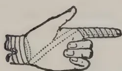

## The Cry of the Injured

### 'TABLOID'

*(Trade Mark)*

BRAND

### FIRST-AID

No. 715

*For Planters, Estate-Managers,  
etc., in the Tropics*

When an accident happens you hasten to help the injured. If you have this 'TABLOID' OUTFIT you are equipped with just those things you are likely to need.


No. 715 'Tabloid' First-Aid contains 'Tabloid' Bandages, Dressings, Antiseptics, Plasters, Emollients, etc., etc. Enamelled Metal Casket. Measurements:  $7\frac{3}{8} \times 4\frac{1}{2} \times 2$  in.

**Compact  
Portable  
Serviceable**

All Chemists  
Price in London, 10/6

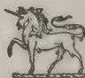

BURROUGHS WELLCOME & CO., LONDON  
NEW YORK MONTREAL SYDNEY CAPE TOWN  
MILAN SHANGHAI BUENOS AIRES BOMBAY

rr 1016

Copyright

520------------------------------------------------

JUNE, 1914.]503

## THE MANURING OF VEGETABLES AND FLOWERS.

To those who know the excellent results achieved by French horticulturists, the pronouncement of the author that his compatriots in the horticultural world are chary in the use of artificial manures will come with surprise. Yet such is apparently the case, and the purpose of this work is to convert French gardeners from indifference to a proper belief in the use of artificial fertilisers.

If sound argument and the evidence of prolonged and careful experiment can effect this conversion, M. DUMONT will undoubtedly succeed.

The standpoint adopted by the author is expressed with directness and lucidity in the opening chapter. The staple manure for horticultural purposes is humus, and hence the application of dung or some other source of humus must form the basis of every rational system of manuring. The functions of artificial manures are to supply special and necessary plant foods, the mineral salts which, though present in insufficient quantities in humus, are essential for the nutrition of all plants.

M. DUMONT reminds his readers that the philosophy of manuring has passed through three main phases. In the early part of last century the humus theory prevailed. That theory maintained that humus is the food of plants. LIEBIG in 1840 shattered the humus theory and replaced it by the "mineral" theory, teaching that plants feed on the inorganic salts—nitrates, phosphates, potash salts, etc.—which are contained in the soil solution. The shattered theory gathered itself together again, and, affecting a compromise with its rival, gave rise to the "organic mineral" theory, which is held at the present day. As summarised by the distinguished French agriculturist Grandeau, this theory holds that humus is essential for perfect and rapid plant growth, since it makes the ideal environment for the roots. It not only helps to bring the necessary salts into solution and helps to hold them in the soil at the disposal of the plant, but it also serves the no less important function of holding water and absorbing heat. Without humus a clay is sour and a sandy soil is a loose powder. Wherefore the wise gardener digs dung into his ground and adds with the natural manure such mineral substances as his soil lacks and his plants require. Once it is admitted that the role of artificials is to supplement, not to replace, farmyard manure, the way is open to an intelligent and economical use of both. Such a use must be based on a knowledge, which need be by no means profound, though it must be sound, of four sets of facts, namely, those concerning (1) the several amounts of the essential minerals which are contained in a given soil, (2) the average chemical composition of dung, (3) the requirements with respect to mineral substances of different kinds of cultivated plants, (4) the general properties and relative prices of the chief artificial manures. Such knowledge is well within the grasp of every gardener; books such as the excellent treatise under review provide information with respect to (2), (3), and (4), and simple experimentation suffices to determine the chemical composition of the soil. For this purpose direct soil-analyses, although of great value if carried out properly, are not absolutely necessary; plants themselves may be used to make the analysis, and by observing the behaviour in the garden of plants known to be exacting with respect to a given inorganic food substance, potash or phosphoric acid or nitrogen salt, the deficiency of the soil may be inferred. As the great pioneer of plant physiology, BOUSSINGAULT, observed "I prefer the opinion of the plant to that of ten professors."—GARDENERS' CHRONICLE: (Review of "La Fumure raisonnée des Légumes," etc. by R. DUMONT).

521------------------------------------------------

504[JUNE, 1914.

## THE CAMPAIGN AGAINST FLIES.

Flies are often a real pest to man and domestic animals, especially when they invade stables. The importance of the destruction of flies has even been the subject of a discussion by the Budget Commission of the Prussian Chamber of Deputies, in connection with the removal of the thoroughbred stud from Graditz to Straussfurt, the latter place being infested with flies.

The reasons for destroying these persistent and dangerous insects are well known, and many methods of destruction have been devised; but the writer (Bauwerker) considers that appreciable and durable results can only be obtained by giving up half measures and undertaking an energetic and systematic campaign. Considering the importance of the question, he has thought well to give an account of the methods he has used in the stud under his direction at Eichelscheiderhof, as the results have been very satisfactory. In 1887 when he undertook the direction, the stud was so badly infested by flies that living there was most disagreeable in summer.

He began by hanging up in the stables and all dwellings, without exception, pieces of limed wood, bigger and longer for the stables, thinner and shorter for the houses. For some time the flies had to be removed and the sticks re-limed every day; but when the flies were somewhat reduced this was done only every two or three days. In the earlier years the cost of the lime was considerable (£4 to £4. 10s), but it soon diminished considerably.

Various other means were employed. The general conditions were much improved by the drainage of the land round the stud farm, which was rather marshy and provided excellent conditions for flies to breed. Great benefit was also derived from scrupulous cleanliness throughout the homestead, including disinfection of closets and cess-pools, and ventilation of the stables. Flies dislike draughts, whereas the animals, being accustomed to open air when quite young, do not take any ill effects from them.

The flies were also destroyed in places where they like to assemble; a great number were burnt by spirit lamps, when they collected at the approach of winter on the ceiling and walls of the kitchens; in this way many eggs were destroyed before they had time to develop. It was found that whitewashing with the sprayer was an excellent means of destroying the eggs; this was still better when a little formalin was added to the milk of lime. For disinfection, a strength of 2 or 3 per cent. was used; but 1 per cent. does for ordinary purposes.

Formalin is an excellent fly-poison. The writer had good results with a method he got from a paper: this consists in setting out on a plate small slices of bread soaked in a pint of milk to which two spoonfuls of formalin have been added. A pint was found to be enough for large spaces, such as stables; while for smaller places, such as dwelling-rooms, half a pint is sufficient.

Having undertaken a systematic fight, the writer did not neglect any of the usual methods, such as fly papers and fly traps; but he did not find them very successful.

Attempts were made also to encourage as much as possible the natural enemies of flies, especially insectivorous birds. Swallows and martins were the first to be pronounced useful; as it was found that sparrows were preventing their increase in numbers by occupying their nests during their absence, a campaign against these was undertaken, and quantities were destroyed. The number of swallows and martins steadily increased, and they now nest all about the buildings.

522------------------------------------------------

JUNE, 1914.]505

The increase of starlings was encouraged by putting up Berlepsch nesting-boxes for them. Other insectivorous birds were encouraged in every possible way (planting of pines and fruit-trees, destruction of their enemies: martens, polecats, weasels, squirrels, birds of prey, etc).

Quantities of flies were also destroyed by the large numbers of fowls kept at Eichelscheiderhof.

Thanks to all these measures, the stud-farm has now been very largely freed from the pest.—MONTHLY BULLETIN.

## COTTON AT AMBALANTOTA.

(See frontispiece.)

The frontispiece of this number is reproduced from a photograph of the cotton recently grown at Ambalantota, in the Southern Province, to which reference was made in the April number of this Journal.

The variety was Allen's Long Staple American Upland. It was planted in October 1912 and picked in March 1913, the yield being at the rate of 1,043 lb. of seed cotton per acre (total area  $1\frac{3}{4}$  acres).

The crop was ginned in Colombo and the seed disposed of locally. The lint, sold in Liverpool, realised  $7\frac{1}{2}d$  and  $9\frac{1}{2}d$  per lb. The expenditure on clearing and cultivation was Rs. 48 per acre, the shipping charges, &c., Rs. 60 per acre, and the gross return Rs. 162 per acre, leaving a profit of Rs. 54 per acre. On a larger consignment the shipping charges might be expected to be proportionately less.

T. P

## THE RELATION BETWEEN AN ABUNDANT RAINFALL AND THE PRODUCTION OF COFFEE.

PAULO R. PESTANA.

The writer points out a direct, though not exclusive, relation between the rainfall during the months October to March and the yield of coffee in the season two years later. The same relationship has already been observed in Costa Rica. The figures in the table are those of the three principal coffee-producing centres in the State of São Paulo. The grouping of the months into two periods corresponds to the climatic conditions of the State and to the biological conditions of the coffee plant. October is the beginning of frequent rains, which reach their maximum in December and January and diminish towards the end of March. In April begins the cold dry season during which the coffee is harvested, and this terminates in September. Rains during the hot season favour the flowering the following

523------------------------------------------------

506[JUNE, 1914.

year and the fruiting of the second year, but during the cold season they are injurious.

<table border="1">
<thead>
<tr>
<th colspan="3">Rainfall.</th>
<th colspan="2">Yield of Coffee.</th>
</tr>
<tr>
<th colspan="2">Season.</th>
<th>mm.</th>
<th>Year.</th>
<th>Arrobas.</th>
</tr>
</thead>
<tbody>
<tr>
<td colspan="5" style="text-align: center;">I. <i>Ribeira Preto.</i></td>
</tr>
<tr>
<td>1904-05</td>
<td>October-March</td>
<td>... 1,573</td>
<td>1906-07</td>
<td>3,261,500</td>
</tr>
<tr>
<td></td>
<td>April-September</td>
<td>... 270</td>
<td></td>
<td></td>
</tr>
<tr>
<td>1907-08</td>
<td>October-March</td>
<td>... 905</td>
<td>1909-10</td>
<td>2,497,742</td>
</tr>
<tr>
<td></td>
<td>April-September</td>
<td>... 196</td>
<td></td>
<td></td>
</tr>
<tr>
<td>1908-09</td>
<td>October-March</td>
<td>... 896</td>
<td>1910-11</td>
<td>2,316,154</td>
</tr>
<tr>
<td></td>
<td>April-September</td>
<td>... 293</td>
<td></td>
<td></td>
</tr>
<tr>
<td>1909-10</td>
<td>October-March</td>
<td>... 1,209</td>
<td>1911-12</td>
<td>2,540,230</td>
</tr>
<tr>
<td></td>
<td>April-September</td>
<td>... 229</td>
<td></td>
<td></td>
</tr>
<tr>
<td>1910-11</td>
<td>October-March</td>
<td>... 753</td>
<td>1912-13</td>
<td>2,100,000</td>
</tr>
<tr>
<td></td>
<td>April-September</td>
<td>... 358</td>
<td></td>
<td></td>
</tr>
<tr>
<td colspan="5" style="text-align: center;">II. <i>S. Carlos do Pinhal.</i></td>
</tr>
<tr>
<td>1904-05</td>
<td>October-March</td>
<td>... 1,950</td>
<td>1906-07</td>
<td>2,214,550</td>
</tr>
<tr>
<td></td>
<td>April-September</td>
<td>... 511</td>
<td></td>
<td></td>
</tr>
<tr>
<td>1907-08</td>
<td>October-March</td>
<td>... 1,595</td>
<td>1909-10</td>
<td>1,601,472</td>
</tr>
<tr>
<td></td>
<td>April-September</td>
<td>... 321</td>
<td></td>
<td></td>
</tr>
<tr>
<td>1908-09</td>
<td>October-March</td>
<td>.. 2,170</td>
<td>1910-11</td>
<td>* 1,328,160</td>
</tr>
<tr>
<td></td>
<td>April-September</td>
<td>... 471</td>
<td></td>
<td></td>
</tr>
<tr>
<td>1909-10</td>
<td>October-March</td>
<td>... 1,459</td>
<td>1911-12</td>
<td>1,403,300</td>
</tr>
<tr>
<td></td>
<td>April-September</td>
<td>... 523</td>
<td></td>
<td></td>
</tr>
<tr>
<td>1910-11</td>
<td>October-March</td>
<td>... 1,061</td>
<td>1912-13</td>
<td>1,232,314</td>
</tr>
<tr>
<td></td>
<td>April-September</td>
<td>... 390</td>
<td></td>
<td></td>
</tr>
<tr>
<td colspan="5" style="text-align: center;">III. <i>Botucatia.</i></td>
</tr>
<tr>
<td>1904-05</td>
<td>October-March</td>
<td>... 1,124</td>
<td>1906-07</td>
<td>1,026,600</td>
</tr>
<tr>
<td></td>
<td>April-September</td>
<td>... 402</td>
<td></td>
<td></td>
</tr>
<tr>
<td>1907-08</td>
<td>October-March</td>
<td>... 1,103</td>
<td>1909-10</td>
<td>765,350</td>
</tr>
<tr>
<td></td>
<td>April-September</td>
<td>... 201</td>
<td></td>
<td></td>
</tr>
<tr>
<td>1908-09</td>
<td>October-March</td>
<td>... 863</td>
<td>1910-11</td>
<td>493,140</td>
</tr>
<tr>
<td></td>
<td>April-September</td>
<td>... 211</td>
<td></td>
<td></td>
</tr>
<tr>
<td>1909-10</td>
<td>October-March</td>
<td>... 971</td>
<td>1911-12</td>
<td>668,260</td>
</tr>
<tr>
<td></td>
<td>April-September</td>
<td>... 165</td>
<td></td>
<td></td>
</tr>
<tr>
<td>1910-11</td>
<td>October-March</td>
<td>... 842</td>
<td>1912-13</td>
<td>510,000</td>
</tr>
<tr>
<td></td>
<td>April-September</td>
<td>... 477</td>
<td></td>
<td></td>
</tr>
</tbody>
</table>

—MONTHLY BULLETIN.

\* It must be noted that the coffee plants still showed the exhausting effects of the high yield of 1906-07.

524------------------------------------------------

JUNE, 1914.]507

## NOTES ON PLANTING IN ANTIGUA.

From the Report on the Botanic Station and Experiment Plots, Antigua, for the year 1912-13 it will be seen that the cultivation of cassava in Antigua is in the hands of peasants, and only a limited quantity is grown, and it would seem there is little likelihood of the area planted in this crop in the near future increasing to any appreciable extent. Cassava probably cannot be grown as cheaply there as in some parts of the world where it is grown as a catch crop through permanent plantings. It is however probable that a small trade with America or Great Britain could be worked up with cassava cakes or biscuits. The local cakes are crisp and possess a delicate flavour entirely their own, and if known in those countries would possibly in a short time become popular as an afternoon tea delicacy.

Cassava is put on the market in the form of starch, chipped and sun-dried with peel or without peel; it is also grated, and even the refuse after the starch is extracted is saleable.

The chief characteristics of Columbian cassavas which distinguish them from the West Indian varieties is the low content of hydrocyanic acid which they possess. Determinations on West Indian bitter and sweet cassavas show that they contain about ten times the amount of hydrocyanic acid determined in Columbian varieties.

The results appear to show that after six years' cultivation in Antigua, these varieties have not sensibly altered in respect of their contents of hydrocyanic acid. This fact, combined with the very marked improvement in yield which has taken place during the past three years, indicated that some at any rate of the varieties are worthy of careful attention.

Sesamum might possibly be useful to the peasants in Antigua, for it has been stated that the seeds when parched and eaten with sugar form a nourishing and palatable dish, and that this can be crushed and mixed with other ingredients to form cakes and bread. A plant, the seeds of which can easily be transformed into a breakfast, and one that grows with little difficulty, is worthy of trial, on a small scale at least, by the peasants of the island. As stated in previous reports, the seeds of this plant yield a bland oil sometimes known as gingelly oil; it is used in domestic economy and for adulterating olive oil.

During the different reappings of sweet potatoes it has been noticed that the yield per hole, or in other words, the yield per plant varies in no small degree.

The above appears to be of some significance, and plant selection on this crop was started this year and will be continued in the future. In the first instance it is intended that selection will, generally speaking, be based only on weights of roots of individual plants: possibly in the future other factors will be taken into account. A check on the value of this work will be kept by planting duplicate plots\* from unselected plants.

This crop is of the greatest importance to the island, and the work done at the Experiment Stations in connection with it, judging by the amount of planting material distributed, is being appreciated; and it is hoped that experiments undertaken to increase the yields of the various standard varieties will add to this.

Local interest in the growing of limes has been maintained during the year under review. During this period nearly 44,000 plants were distributed in the island, this being sufficient material to plant approximately 220 acres. Many of these were used for supplying vacant spaces in plantations recently established.

525------------------------------------------------

508[JUNE, 1914.

If this industry is to be a success in Antigua, the greatest care will have to be exercised in choosing sites for new plantings. Speaking generally, the rainfall in this island is too low for lime growing, and when this factor is combined with indifferent soil and a wind-swept situation, very little hope can be entertained of ultimate success. The influence of wind on this crop cannot be over-estimated, and it would be well for the local lime growers to give the question of wind-breaks serious consideration.

Orders have been received at the Botanic Station for several thousand plants of the Bay (*Pimento acris*), and if seeds of this tree can be obtained several experimental areas will in the near future be planted in Antigua. The young trees planted some four years ago at Scotts Hill are now bearing a few seeds, but these will in no way be sufficient to meet the demand. It might be stated that the factor limiting the planting of these at the present moment is the scarcity of seed.

Enquiries have been made at the office in connection with the possibilities of growing papaw (*Carica papaya*) on a commercial scale for the preparation of papain. Orders have been received for a fair number of plants, and during the next few months several experimental areas of this crop will be planted. Little information exists as to the amount of papain yielded per tree, or the best methods for preparing this. Experiments are being conducted to answer some of these questions.

## ERADICATION OF MOSQUITOES BY THE CULTIVATION OF BATS.

DR. CHAS. A. R. CAMPBELL.

The writer begins by a brief review of the discoveries made concerning the plasmodia of malarial fever, he then describes how the mosquitoes inoculate their living poison into its human host, and communicates the results of an enquiry made by him by means of hundreds of letters addressed to health officers and druggists in different parts of the Union, in order to ascertain the existence of malaria in the several States. He quotes DR. L. O. HOWARD, Chief Entomologist of the United States. Department of Agriculture, who very conservatively estimates the tribute that that Nation pays to malaria at one hundred million dollars yearly.

The greatest enemy of the mosquito, according to the writer, is the bat. For the cultivation and propagation of this animal the writer has devised a kind of wooden tower or roost (see fig.) which offers the advantage of preventing bats, who are obliged usually to fly long distances from their caves in search of food, remaining continuously on the wing for ten and twelve hours at a time, from continually seeking new quarters.

Besides the well known means of defence which the bat possesses against its enemies, viz. its nocturnal habits, its propensity for hiding in dark places during the day, its facility of compressing its body into small apertures, there is the character of the hair covering its body. This last feature is considered by the writer to be a protection against the stings of the *Anopheles* which during the day also inhabit the same dark places. This protection appears to be due to the peculiar formation of the hair, which is not a round and smooth shaft, but is similar in form to a number of Morning-glory flowers strung on a straw, with the edges of the flowers terminating in points with the belts outward. Possibly the odour of the bat also serves to protect it from mosquitoes. That bats are most remarkably free from disease is evidenced by the fact that they live in caves by the million, hang touching

526------------------------------------------------


<!-- stage4: FAINT old-images-only -->

[Faint page: no legible print of its own could be verified; text withheld (stage 4 review list)]

This image is a scan of a blank page. The background is a uniform light beige or off-white color. There are a few small, dark specks scattered across the surface, which appear to be scanning artifacts or dust particles. One speck is located in the upper right quadrant, and another is near the bottom center. The overall texture is slightly grainy, typical of a scanned document.


527------------------------------------------------

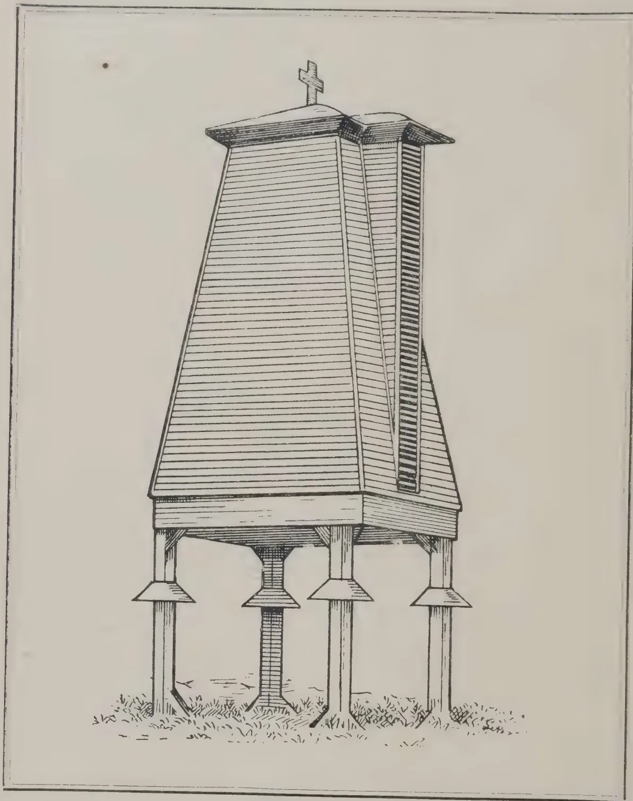A detailed black and white line drawing of a tall, narrow, conical structure, likely a bat roost. The structure is supported by four legs, each with a flared base, and is topped with a cross. The drawing is enclosed in a rectangular border.

A BAT ROOST.

528------------------------------------------------

JUNE, 1914.]509

one another and even to one another in huge bunches, yet people engaged in the business of gathering guano from caves very rarely find a dead bat.

That mosquitoes form the chief diet of bats is certain, ninety per cent. being a conservative estimate. The character and arrangement of its teeth clearly show it to be carnivorous. It will eat pieces out of hams and bacon left in smoke houses. The character of the bites show the pieces to have been torn out, instead of being gnawed, as would be the case if gnawed by some rodent. The mosquito, being a blood-sucking insect, furnishes the bat with an ideal carnivorous diet.

Knowing of a hunter's small cabin some ten miles from San Antonio, where bats were congregating, I procured two large white sheets and spread them on the floor of the cabin about four o'clock in the morning, and awaited their coming. I had however stuffed the roosting places in the hut with rags so they could not roost out of range of the area of the sheets. I watched carefully and counted the proper number going in, and verified the count from the inside of the cabin. I then left them and returned in the evening to count them again when they flew out; after counting the same number going out as came in, I very carefully collected the pieces of guano on the sheets, put them in a little box, and again spread out the sheets to continue the experiment the next day. This was done three times consecutively, and the result is that it averages twenty-six (26) pieces of guano to each bat. These observations were made in the month of November, purposely selected on account of the food of the bats being about at a minimum at this time.

Having ascertained approximately how many times a day a bat dropped guano I took one dropping or single piece of guano and macerated it in peroxide of hydrogen for several days. The peroxide dissolves the oxidized and concreted mucus which holds the mass of guano together. I then filtered this through ordinary filter paper the weight of which I had previously ascertained, and found the residuum to contain principally the comminuted skeletons of mosquitoes; the proboscis, the heads, eyes, thoraces, abdomens, legs, wings and scales of mosquitoes. The external body or shell of mosquitoes being of a horny substance known as chitin, affords the bat no nutrition, being entirely insoluble, hence passes through the alimentary canal as fecal debris. The contents of the head and in fact all internal organs are digested. The weight of this filtered residue of one bat dropping, was approximately  $1/25$  of a grain\*

This much of the work is purely scientific, but it demonstrates the enormous value of these usually despised creatures. I was content with having done this much, and would have considered the work concluded, had it not occurred to me to weigh the twenty-six pieces of guano.

Twenty-six pieces of guano toward the end of the season, when insect life is at a minimum, weigh two and three-fifths grains; the bat in this climate is active from about Feb. 16 to as late as Dec. 15, depending on the season.

In order to be very conservative in estimating the value of the guano, we will calculate only on eight months, namely from the middle of March to the middle of December.

#### COMMERCIAL VALUE OF ONE BAT ROOST AT ESTIMATED CAPACITY OF 500,000 BATS.

Twenty-six pieces of guano, which are the droppings of one bat per day, weigh two and three-fifths ( $2\frac{3}{5}$ ) grains, which equals seventy-eight (78) grains per month, or, six hundred and twenty-four (624) grains per bat in

\* Basing his calculations on the analyses of one hundred dried mosquitoes, the writer comes to the conclusion that each of the droppings of a bat contains the skeletal remains of ten mosquitoes, and as a bat drops upwards of 50 pieces of guano a day he considers the number of mosquitoes destroyed by each bat to be above 500 per diem. He further assumes that there are at least five hundred thousand bats per roost.

529------------------------------------------------

510[JUNE, 1914.

eight months. 500,000 bats drop in the same time 624 times 500,000 = 312,000,000 grains, or more than 20½ tons; at 30.00 dollars per ton, equals \$607.50. A structure large enough to hold 500,000 bats would cost, figuring long, about \$ 1,200; now let us treat this estimate just as we did the hygienic, deduct 50 %; I think we could well afford to deduct 50 % again from that, and still leave a nice margin of income, on the investment.

In the beginning of this writing, it suggested that the bat ought to be provided with a home, in order that we might take advantage of its wonderful habits, and the photograph shown and marked "DR. CAMPBELL'S Hygiostatic Guano-Producing Bat Roost" represents such a structure in actual existence—though intended only as a working model for demonstration. It has proved itself more than a model. The Roost stands ten feet above the ground, and the structure itself, twenty feet above that, is twelve feet at the base, and six at the apex. It is given that steeple shape, and placed above ground for several reasons: its shape makes it resistant to high winds and the elevation from the ground acts as a wind break, and allows the supporting posts to be fitted with contrivances to prevent the bat's enemies from gaining access to the Roost, also a wagon to be driven underneath at the base, which is provided with a hopper on hinges and which opens downward, enabling the guano to be easily collected.

The defence which this structure affords the bat from its natural enemies is of great importance. These enemies are coons (*Procyon lotor*), opossums, wild-cats, skunks, civet-cats (*Viverra civetta*) and chicken snakes (*Coluber quadrivittatus*). It is during the breeding season that the bat suffers most from its natural enemies. Shortly after the young are born, they cling mechanically to the mother's body, and very often loosen their hold, and fall to the bottom of the cave, only to become a prey to some of the aforementioned wild animals, who seek bat caves at this particular season. The mother bat darts down after her young and she also falls a victim to that most noble of characteristics, maternal instinct. These features of protection, and freedom from molestation, will cause the bats to increase so rapidly, that the capacity of the Roost will be soon taxed, especially if it be erected in some quiet place, some distance from human habitations.

This bat Roost I erected at the head of a large body of standing water, ten miles south of the city of San Antonio. The inner construction (which is of course the most vital) is based on lines, after long and most careful study, entirely in harmony with their most singular habits. The louvered window seen on the outside forms the entrance and exit for the bats. A red cross on the apex of the roof designates it as a hygienic measure. In choosing the location for the erection of this Roost, it might be well to mention that it was selected because conditions and environments in the vicinity of its location could not be more ideal for the breeding of mosquitoes. Into this large body of water, known as Mitchell's Lake, flows the sewage of San Antonio, averaging 10,000,000 gallons per day. The extent of territory covered by this lake is estimated by its owners at 900 acres. It never overflows, as the water is used for irrigation, some by gravity, and some by pumping. The huge amount of organic matter in the water, the large pools formed both by irrigation on the land, and water left in the laterals, the receding water in the lake left when used largely, the large pools formed by seepage through earthen dams, outside of the main body of the lake, are the existing conditions, and I am sure that no more exacting demands could be put to the value of bats as destroyers of mosquitoes than such environments. No swamp in the low lands is worse.

The Roost was finished on April 2, 1911. Before locking the louver, I sprayed the inside with a chemical fluid giving off an odour identical to the natural odour of the bat, and spread twenty-five pounds of fresh guano, in the hopper at the bottom of the Roost.

530------------------------------------------------

JUNE, 1914.]511

On August 4, 1911, or about four months later, it became tenanted by a colony of bats attracted there by the odour, that I estimated at several hundred, from the fact that it took them, flying in one constant stream, fully twenty minutes. The next year, 1912, the Roost became so thickly stocked, that it took them several hours to come out; they came out in clouds. This feature conclusively demonstrates the fact that bats can be colonized. There are other features employed in the colonization of these creatures, and these require time and labour, but one is amply rewarded in the end.

When these little "bird animals" once become accustomed to a place, they never leave it except at night to feed and always return in the morning. During the spring of 1910 and 1911, in studying the period of gestation in bats, I had occasion to catch a great many from an old building, and as I could only use the females, I marked every male bat by cutting a tiny "v" on the right ear, and liberating them from my work room, some three miles from the old building. In a week's time, when I again caught a large number from the same place, I would invariably catch some of the same ones again; and in many instances, for the third time, evidenced by the different markings.

It might be said that this vicinity is better favoured for the cultivation of bats than others. The answer is very simple. Of course there are more bats in the neighbourhood of hills and mountains, than in low lands and swamps, because caves are their normal homes, and these are found in hilly and mountainous regions, but the fact remains that they can be colonized, and on just such a territory as desired. There are bats in every city, town or village in the world, because the geographical range of that creature, whether of one species or another, like its principal food, extends from Alaska to Patagonia on this hemisphere, and the same holds good on the other half of the world. The Roost must be built, as said before, entirely in harmony with their habits, or it will prove a failure, as I know from actual experience in building the first Roost.

#### THE PRACTICAL HYGIENIC AND COMMERCIAL RESULTS.

A few days ago I made a personal canvas of every family living on the east side of the lake. I spoke to the heads of 14 families, and each one declared to me that the mosquitoes last year were very much less than the year before. They also declared that chills had almost vanished. To a man they had become friends of the bat, and they instructed their children never to kill one.

One of the more prosperous tenants pointed out to me a sleek looking herd of work animals as the best evidence of the scarcity of mosquitoes; he said that during 1910 and 1911 his stock was very thin notwithstanding being well fed, and he was certain the emaciation was due to anaemia caused by depletion on the part of the mosquitoes. Several others said that in the same years they were at times driven from the work of irrigating at night by the myriads of mosquitoes on the lake. Last year, 1912, they scarcely bothered them.

One of the tenants said he had often awakened at night, and found what he thought were hundreds of bats flying about in his cottage, all doors being open on account of the heat; knowing them to be in quest of mosquitoes, he never molested them, neither did the mosquitoes molest him, after the bats left. A prominent San Antonio business man, who frequently goes duck-hunting on this lake was very much surprised last year, when he found he was not molested by mosquitoes when remaining in the blinds rather late towards evening in quest of game.

As it becomes essentially necessary that these creatures be not disturbed for some time after finding a new home, I did not go very near the Roost, nor allow any one within the enclosed area. On December 18, 1912, after a

531------------------------------------------------

512[JUNE, 1914.

cold snap, I opened the Roost for the first time, and found between four and five hundred pounds of guano had accumulated in the hopper. A sample shows the following chemical analysis:—

<table>
<tr>
<td>Moisture</td>
<td>...</td>
<td>...</td>
<td>10.70</td>
<td>per cent.</td>
</tr>
<tr>
<td>Water soluble phosphoric acid</td>
<td></td>
<td></td>
<td>1.00</td>
<td>"</td>
</tr>
<tr>
<td>Citrate soluble phosphoric acid</td>
<td></td>
<td></td>
<td>0.35</td>
<td>"</td>
</tr>
<tr>
<td>Citrate insoluble phosphoric acid</td>
<td></td>
<td></td>
<td>0.10</td>
<td>"</td>
</tr>
<tr>
<td>Total phosphoric acid</td>
<td></td>
<td></td>
<td>1.45</td>
<td>"</td>
</tr>
<tr>
<td>Available phosphoric acid</td>
<td></td>
<td></td>
<td>1.35</td>
<td>"</td>
</tr>
<tr>
<td>Nitrogen</td>
<td>...</td>
<td>...</td>
<td>11.76</td>
<td>"</td>
</tr>
<tr>
<td>Ammonia</td>
<td>...</td>
<td>...</td>
<td>14.26</td>
<td>"</td>
</tr>
<tr>
<td>Potash</td>
<td>...</td>
<td>...</td>
<td>0.98</td>
<td>"</td>
</tr>
</table>

As to bats and guano as a commercial proposition, I quote a letter from MR. ROBERT P. MARBACH, Broken, Texas, who deals in guano :

" I work two bat caves, one 19 miles from Sabinal on the South Pacific Rail-road, the other 7 miles from here (Bracken). They are known as the Frio cave and the Cibolo cave. The Frio cave is very large and yields about 60 tons annually, but I lose about 20 tons on account of its enormous size and colossal boulders, which prevent gathering all of the deposit. The Cibolo cave yields on an average seventy-five tons annually; it is much smaller than the Frio cave, but the bats are not so scattered, and I have a smaller area to work. I have however the same trouble in this cave that I do in the other, viz., large rocks which prevent me from gathering the entire deposit. I calculate that I lose in this cave about one car-load. However in a wet year, when all water holes are full, and there is plenty of water, I count on a heavy car-load more from each cave.

" This business was handed down to me by my father, who controlled it for many years. I am supplying his customers, and ship large quantities to Crystal Springs, Jackson and Hazelhurst Miss., though the entire crop of my Cibolo cave I shipped to Laredo, Texas, on account of an extensive onion industry which has developed there. I get thirty dollars a ton for my product—put in sacks of about 100 pounds."

In conclusion and as a resumé of this work, let me again revert to a few facts:

1.—That the mosquito is unquestionably one of man's most formidable enemies, not only "per se" but also by the subtle role he plays in transmitting disease-producing bacteria.

2.—That the mosquito may be considered as a good food for the bat.

3.—That we can build a home for the bat where it will be protected from his enemies, and propagate in countless numbers, at the same time protecting us by improving our hygienic conditions.

4.—That the commercial feature in the propagating of bats will insure its adoption, the hygienic benefits that follow will protect the community in which they are erected, especially the poorer classes who know nothing of the dangers of mosquitoes or the use of screens, and amongst whom we find the most sickness.

5.— That when we propagate this most useful creature, it not only destroys the disease-producing mosquito that serves it as food, but it actually converts that most malevolent of insects into a high grade fertilizer.—

MONTHLY BULLETIN.

532------------------------------------------------

JUNE, 1914.]513

## PROGRESS REPORT OF THE EXPERIMENT STATION, PERADENIYA.

(From February 15th to April 15th, 1914)

*Tea*.—The yield for the months of February and March was 5,305 lb. green leaf; the price  $7\frac{1}{4}$  and  $7\frac{1}{2}$  cents per lb.

Plots 146-150 were tipped 7th April. After pruning in December these plots were left with a live-branch which yielded on an average 427 lb. per acre for four months. Two rows in the middle of each plot, 148, 149 and 150 had no live-branches left, and the yield of these is being kept separately from the rest for purposes of comparison.

*Cocoa*.—Picking was continued up to end of February.

A bulletin is being prepared in which all the figures of the experimental plots will be given for the last two years.

All the plots have been thoroughly pruned, at the cost of Rs. 2.50 per acre. Light pruning of suckers is being continuously carried out.

*Coconuts*.—All the plots under experiment were manured as usual in February.

In the 10-acre plot of young palms two more trees have been destroyed by red-beetle at the base, where it is very difficult to discover them in time to save the tree.

The beetle-traps laid down according to DR. FRIEDERICH'S system contain larvæ of the black-beetle. These are awaiting the inspection of the Doctor who has now arrived in Ceylon.

*Rubber*.—The *Tephrosia candida* in the new plantations was cut in March and again in April and mulched to the young plants, which apparently derived much benefit from this mulch throughout the dry weather.

All the young plantations have been kept well disced and mulched.

One of the six-year old rubber trees in the tea (plot 154) suddenly wilted and died after putting out its young leaves. The cause of its death was root disease (*Fomes lignosus*).

*Coffee*.—Two more coffee pests, the brown bug (*Saissetia hemispherica*) and the mealy bug (*Pseudococcus citri*) have made their appearance on the hybrid coffee bushes round the show plots. These with the green bug (*Coccus viridis*) already established on them make three scale pests. The trees are being kept sprayed with kerosene emulsion, but it is extremely difficult to spray thoroughly under the leaves or to get coolies to pay enough attention to the necessity of thoroughness.

In the Robusta coffee under shade there is practically no sign of any green bug left, the fungus (*Cephalosporium lecanii*) having almost eradicated it.

*Vanilla*.—Several plants of this planted in November, 1911, have flowered and have been fertilized in the usual way.

*Fruit Plots*.—The mangosteen seedlings planted in bamboo pots on 20th September, 1913, beyond having put out two leaves, seemed to remain dormant. Eight of these have been planted out in dynamited holes and shaded, to see if they will make a forward movement.

Indian melons which were fruiting well suspended on bamboo trellis, at the approach of the hot weather split to pieces before ripening, rendering them only fit for stewing.

Varieties of melon have again been sown as well as cucumber and this time are being kept well shaded from the time of planting. Varieties of cantaloupe with stouter skins have been ordered from America.

533------------------------------------------------

514[JUNE, 1914.

Tomatoes have done remarkably well in the dry season. Sown in beginning of November they fruited end of March, with a large supply of fruits weighing 1 lb. each. Two together weighed  $3\frac{1}{4}$  lb. No single plant has been attacked by the withering disease (*Bacillus solanacearum*) as so many were during the wet season, but a fruit fly made its appearance and caused a few fruits to rot.

These tomatoes have found a ready sale in Kandy at three cents each. Seeds of better varieties have now been sown ready for planting in May.

A nursery of *Telfaria pedata*, a valuable gourd from Zanzibar with oil-bearing seeds, has been sown.

*Sorghum*.—Plot 20, 1/3rd of an acre sown 10th November, 1913,  $1\frac{1}{2}$  ft. by  $1\frac{1}{2}$  ft. with Undendible sugar cane Sorghum from America and manured with cattle manure was harvested 6th March, 1914, i.e., 120 days, yielded 177 lb. of grain.

Plot 19 of the same Sorghum sown and harvested at the same time but manured with an artificial mixture of Muriate of Potash, Nitrate of Soda, Sulphate of Ammonia, and ash, yielded  $87\frac{1}{2}$  lb. only.

The growth of plot 20 was markedly more rapid and luxurious throughout than plot 19. The poor yields are probably due to the very poor nature of the soil on these plots, to too wide planting (9 in. by 12 in. would be quite wide enough for this variety), to an attack on the underside of the leaves by a yellow aphid at present unidentified, and to the drought.

This variety does not seem well adapted for flour purposes as the husk does not separate easily from the grain as does that of some African Sorghums. It would serve as a good food for horses, cattle and fowls. The dried leaves are readily eaten by cattle.

The Sorghum sent from the Sudan was overcarried and lost by the Steamship Company, but another consignment is on its way and will I hope be sown in June.

Plots 19 and 20 have had 500 lb. per acre of lime broadcasted and ploughed in, to improve the soil. They require draining.

The above experiment demonstrated the value of cattle manure which doubled the crop.

*Maize*.—Plot 20 1/3rd acre sown with American Hickory King 2 ft. by 2 ft. on 6th November, 1913, and harvested 5th March, 1914, i.e., four months, yielded 746 lb. in the cob.

Same plot, 1/3rd acre in native maize, manured with cattle manure, harvested a month earlier, yielded 788 lb. in the cob.

Plot 19, 1/3rd acre Hickory King sown and harvested as above but manured with the same artificial mixture as for the Sorghum yielded 315 lb. in the cob; and 1/3rd acre with the same mixture in Native Maize 240 lb. of very poor cobs.

Here again the crop cattle-manured doubled that artificially manured. Pigs did a certain amount of damage. The percentage of good cobs was very poor.

All the best cobs have been selected and will be kept for resowing and distribution.

*Bananas*.—The bananas planted in dynamited holes West Indian fashion, with an artificial mixture, though they have fruited much earlier than those planted in the usual Ceylon manner, are disappointing in the size of the bunches produced, the majority being seven hands and under, when they should have been nine and over from the first plants. This may be due to

534------------------------------------------------

JUNE, 1914.]515

the inferior varieties. Suwandel and Alukehel were the earliest varieties. Planted 21st June, 1913, they commenced flowering 15th February, 1914, i.e., eight months.

*Camphor.*—A still with three boxes was made by the Industrial School at Kandy, and a small amount of camphor has been distilled, for the London Exhibition. Our own boiler having been condemned, it will be necessary to procure another for the distillation of the camphor and oil grass.

*Drains.*—All drains in the Station have been thoroughly cleaned and roads made up and new side-drains made.

*London Exhibition.*—The following exhibits have been sent to London from the Experiment Station :—

<table>
<tbody>
<tr>
<td>30 blocks Wickham smoked rubber</td>
<td>...</td>
<td>...</td>
<td>...</td>
<td>233</td>
<td>lb.</td>
</tr>
<tr>
<td>21 rolls do. do.</td>
<td>...</td>
<td>...</td>
<td>...</td>
<td>195</td>
<td>"</td>
</tr>
<tr>
<td>21 rolls Commercial Co.'s do.</td>
<td>...</td>
<td>...</td>
<td>...</td>
<td>104<math>\frac{1}{2}</math></td>
<td>"</td>
</tr>
<tr>
<td>3 bands Wickham crepe from smoked parings</td>
<td></td>
<td></td>
<td></td>
<td>19</td>
<td>"</td>
</tr>
<tr>
<td colspan="4"></td>
<td><hr/></td>
<td></td>
</tr>
<tr>
<td colspan="4"></td>
<td>551<math>\frac{1}{2}</math></td>
<td>lb.</td>
</tr>
<tr>
<td colspan="4"></td>
<td><hr/></td>
<td></td>
</tr>
<tr>
<td>Amelonado cocoa</td>
<td>...</td>
<td>...</td>
<td>...</td>
<td>25</td>
<td>lb.</td>
</tr>
<tr>
<td>Nicaragua do.</td>
<td>...</td>
<td>...</td>
<td>...</td>
<td>20</td>
<td>"</td>
</tr>
<tr>
<td>Forastero do.</td>
<td>...</td>
<td>...</td>
<td>...</td>
<td>23<math>\frac{1}{2}</math></td>
<td>"</td>
</tr>
<tr>
<td>Caracas do.</td>
<td>...</td>
<td>...</td>
<td>...</td>
<td>26<math>\frac{1}{2}</math></td>
<td>"</td>
</tr>
<tr>
<td>Mixed plantation cocoa</td>
<td>...</td>
<td>...</td>
<td>...</td>
<td>25</td>
<td>"</td>
</tr>
<tr>
<td colspan="4"></td>
<td><hr/></td>
<td></td>
</tr>
<tr>
<td colspan="4"></td>
<td>120</td>
<td>"</td>
</tr>
<tr>
<td colspan="4"></td>
<td><hr/></td>
<td></td>
</tr>
</tbody>
</table>

Thirty sheaves of paddy.

Three bundles of Sisal fibre.

Three sacks Hevea rubber seed.

*Labour.*—The labour force has become exceedingly small but an arrangement has now been come to removing the difficulty of recovering the whole of the advance yearly. We shall therefore be able to obtain more coolies in the near future.

*Visitors.*—36 visitors have been conducted round the Station since the last meeting.

## PROGRESS REPORT OF THE EXPERIMENT STATION, MAHA-ILLUPPALAMA

(From February 20th to April 20th, 1914.)

*Coconuts.*—A twelfth round of picking was made on March 6th. The number of nuts collected was 367 from 104 trees which gives an average of 3.5 nuts per tree.

Of this quantity

In the cultivated area, 94 trees gave 341 nuts, an average of 3.75 nuts per tree.

In the uncultivated area, 10 trees gave 26 nuts, an average of 2.5 nuts per tree.

A thirteenth round of picking was made on April 5th. The number of nuts collected was 558 from 150 trees, which gives an average of 3.75 nuts per tree.

535------------------------------------------------

516[JUNE, 1914.

Of this quantity

In the cultivated area, 133 trees gave 505 nuts, an average of 3.75 nuts per tree.

In the uncultivated area, 17 trees gave 53 nuts, an average of 3 nuts per tree.

With regard to copra production, the following figures have been obtained :—

*Combined Plots.*

<table border="1">
<thead>
<tr>
<th colspan="2">Picking.</th>
<th>Break in Nuts.</th>
<th>Rejections.</th>
<th>Copra lb.</th>
<th>Number of Nuts required per candy.</th>
</tr>
</thead>
<tbody>
<tr>
<td>November</td>
<td>...</td>
<td>405</td>
<td>1</td>
<td>160<math>\frac{1}{2}</math></td>
<td>1399</td>
</tr>
<tr>
<td>December</td>
<td>...</td>
<td>337</td>
<td>1</td>
<td>134<math>\frac{1}{2}</math></td>
<td>1390</td>
</tr>
<tr>
<td>January</td>
<td>...</td>
<td>504</td>
<td>2</td>
<td>203<math>\frac{1}{2}</math></td>
<td>1364</td>
</tr>
<tr>
<td>February</td>
<td>...</td>
<td>367</td>
<td>2</td>
<td>163<math>\frac{1}{2}</math></td>
<td>1233</td>
</tr>
</tbody>
</table>

  

<table border="1">
<thead>
<tr>
<th>Picking</th>
<th>Break.</th>
<th>Rejections.</th>
<th>Copra.</th>
<th>No. of Nuts.</th>
<th>Break.</th>
<th>Rejections.</th>
<th>Copra.</th>
<th>No. of Nuts.</th>
</tr>
</thead>
<tbody>
<tr>
<td>January</td>
<td>452</td>
<td>2</td>
<td>185</td>
<td>1344</td>
<td>52</td>
<td>0</td>
<td>18<math>\frac{1}{2}</math></td>
<td>1755</td>
</tr>
<tr>
<td>February</td>
<td>341</td>
<td>2</td>
<td>154</td>
<td>1214</td>
<td>26</td>
<td>0</td>
<td>9<math>\frac{1}{2}</math></td>
<td>1532</td>
</tr>
</tbody>
</table>

The first consignment of copra—12 cwt. was sent to Colombo and sold on March 17th, 6 $\frac{1}{2}$  cwt. fetching Rs. 84 per candy and the balance Rs. 74—and Rs. 70—per candy. The former figure was top price at the sale, the market being unfortunately very weak at the time. The broker's report on our copra was as follows :—

"The copra is very well dried, but probably owing to its having been kept some time in your store has lost colour."

Owing to the drought, it has been necessary occasionally to water the two traps for Rhinoceros Beetle which were constructed on January 17th and February 9th.

Insect pests, both of the red and black varieties are conspicuous by their absence at the present time.

The fields have now been brought to a proper state of cultivation, and only require to be disc-harrowed once a month.

*Paddy.*—On March 26th the harvesting operations were started on the 4-acre trial plots. Satisfactory returns are assured, as the crops, which have not been damaged by fly, pig or elephant, were stacked in favourable weather.

The results will be available for my next report.

*Fruits.*—The plots of Kew and Mauritius pines have been periodically irrigated and cultivated and the flowering stage has now been reached.

The condition of the plots clearly demonstrates the fact that considerable shade is necessary for the cultivation of pines in this Province if the best results are to be obtained.

The 7-year old citrus trees of various kinds are now bearing for the first time. The fruits are very well developed.

## TIN CANS vs. POTS FOR SEEDLING PLANTS.

E. V. WILCOX.

It has been long observed in the work of propagation at this Station (Hawaii) that young seedling plants, such as papaia, mango, avocado, Christmas tree, &c., grow more rapidly and with greater vigour in tin cans

536------------------------------------------------

JUNE, 1914.]517

than in ordinary florist's pots. A set of experiments was carried out to determine the cause of the difference in growth. It was assumed, as a working hypothesis, that two factors were involved—a difference in evaporation and a possible stimulation due to the tin and solder of the cans.

For the first step two tins and two ordinary flower pots were selected. The cans were  $3\frac{3}{4}$  inches in diameter and the pots 5 inches at the top and 3 inches at the bottom. All four containers received the same amount of potting soil by measure, approximately 760 grams. The potting soil was made by mixing three parts of ordinary clay soil, 3 parts of rotted manure and 2 parts of coral sand. It had been sterilised by heat, and in an air-dry state contained about 10 per cent. of moisture. To each container 150 c. c. of water was added, bringing the moisture content up to 30 per cent. Holes were punched in the bottom of the tins and the pots had the usual drainage hole. The cans and pots were weighed once or twice daily, and were brought back to the original weight by the addition of water, every other day at first and later every day.

During a period of 17 days the total loss of water by evaporation from the first can was 200 grams; from the second can 220 grams; from the first pot 491 grams; from the second pot 489 grams. Averaging the loss from the cans and pots, the evaporation from pots was exactly  $2\frac{1}{2}$  times greater than that from tins. The soil was not shaken or in any way disturbed during the experiment. For the first few days the loss of water from the pots was three times that from the tin cans. At the end of the experiment it was only twice as great. The difference was thus gradually reduced as the soil became packed, reaching in about 10 days what seemed to be a permanent ratio of 1 to 2. The loss of water shown at each weighing was almost precisely the same for the 2 cans, and the same was true for the pots.

In a well ventilated laboratory room and in a ventilated glass-house the ratio of evaporation from tin cans and pots remained constant, but when exposed directly to the sun in the free air the tins showed a relatively greater increase of evaporation than the pots. This was due to the rapid penetration of heat through the tin. Evaporation was of course greatly affected by the humidity of the air. On a rainy day when the air was saturated with moisture the evaporation was only one-tenth that of the following clear, dry night.

It was soon found that, in order to secure results which were comparable from day to day, it was necessary to bring the soil back to the original moisture content each day. Otherwise, on the second day, the soil on the surface of the pots, as well as that in contact with the sides, becomes much drier than that in the tins, and the evaporation is thereby somewhat checked.

The porosity of flower pots varies greatly. Some of them allow the water to pass through so readily that an efflorescence of soluble salts is formed on the outer side of the pot. In order to compare the rate of evaporation from the exposed upper surface of soil in tins and pots, a pot was heavily coated by dipping in melted paraffin, received the same moisture content as the others and was added to the series. No evaporation could take place through the side of this pot. The ratio of the surface of the soil in the tins and pots was as 1:1.5. The evaporation from the paraffined pot was 1.52 times as much as from the tins, which corresponds very closely with the difference in exposed surface. It was to be expected that the difference in evaporation would be greater than the difference in exposed surface, for the reasons that the tins and pots contained the same amount of soil and that, therefore, the greater exposed surface in the pots entailed a relatively still greater proportion of the soil near the surface. In other words the soil in a pot is more exposed to evaporation than even the greater surface area would indicate.

537------------------------------------------------

518[JUNE, 1914.

In order to determine the relative amount of evaporation through the side of the pot and from the upper surface of the soil, another pot was added to the series. This pot was covered so as to prevent any evaporation from the upper surface of the soil. During the period of the experiment the sum of the loss from the upper surface of the paraffined pot and through the sides of the covered pot almost exactly equalled the average loss from the untreated pots. The average loss for a period of 3 days from the two untreated pots was 40 grams, and the sum of the loss from the paraffined and covered pots was 39 grams, the covered pot losing 18 grams and the paraffined pot 21 grams. From these figures it is apparent that with the ordinary flower pot 52.3 per cent. of the evaporation takes place from the top and 47.7 per cent. through the side. The area of surface (side and bottom) of each pot in contact with the soil was 17.8 square inches. From these figures and those of total evaporation it was easily calculated that the evaporation from a given area is 3.5 times as fast through a free surface of soil as through the side of the pot. The greater area of the side makes the evaporation from the side almost equal to that from the top.

Young uniform seedlings of a species of *Schinus* (Christmas tree or Hawaiian holly) were planted in 10 cans of the same size as those used in the above-mentioned experiments with the same quantity of potting soil, and also in 10 pots. Five of the cans and five of the pots were coated with paraffin to eliminate any effect which the containers themselves might have on plant growth. The plants in all the tins and in the paraffined pots received 60 C. C. of water every two days, and the unparaffined pots 120 C. C. Of the latter five pots 2 were very porous while the other 3 were equally porous with those used in the simple evaporation test. The plants were as near uniform as possible at the start. At 2 months of age the plants in the two very porous pots were  $3\frac{1}{2}$  inches high, those in the three medium-porous pots  $4\frac{1}{2}$  inches, those in paraffined pots  $5\frac{1}{4}$  inches, those in paraffined tins  $6\frac{1}{4}$  inches, those in untreated tins  $7\frac{1}{2}$  inches. The height and vigour of the plants showed a regular series of gradations, increasing in size as the evaporation from the container decreased.

At the age of 2 months 2 plants in untreated pots and 2 in untreated tins were selected for daily weighings. The soil in all 4 containers was brought to a moisture content of 30 per cent. which was maintained by bringing it back daily to the original weight by the addition of water. For comparison the 2 pots and 2 tins from the previous experiment and without plants were added to the series. The loss of water by transpiration was calculated by subtracting the loss in the tins and pots without plants from the loss from the pots and tins with plants. For a period of ten days the total evaporation from the two tins without plants was 90 and 102 grams respectively, and the loss from the two tins with plants 301 and 295 grams showing a transpiration of 211 and 193 grams respectively. For the same period the evaporation from the two pots without plants was 186 and 201 grams, and the total loss from the pots with plants was 304 and 310 grams giving a transpiration of 118 and 109 grams respectively. At this stage of growth, therefore, the greater loss of water by evaporation from the pots was approximately balanced by the greater transpiration by the larger plants in the tins. A careful measurement of the leaf surface was made, indicating the leaf surface of the plants in tins to be 1.6 times greater than that of the plants in pots, while the transpiration was twice as great. The plants in tins were growing more vigorously and were obviously transpiring more water per unit of leaf surface.

During the period of 10 days just mentioned the 4 plants outstripped the rest of the group from which they were selected. They were of the same size at the start, but at the end of the 10 day period the two plants in tins were 3 inches taller than the other 3 plants in tins and the two plants in pots

538------------------------------------------------

JUNE, 1914.]519

showed a similar increased growth. This shows the importance of maintaining the optimum moisture content as uniformly as possible. The only advantage enjoyed by the four plants which made the greatest growth consisted in the fact that the original optimum moisture content of the soil was restored each day by adding precisely the amount of water lost by evaporation and transpiration during the preceding 24 hours while the other plants received the same amount of water each day. On humid days this was too much and on dry days it was too little.

The great advantage of using tin cans rather than porous pots seems to rest in the fact that in tins it is easier to maintain a nearly constant moisture content without a rapid drying of the soil about the growing roots. This results in a more rapid and vigorous growth. Since nearly one-half of the evaporation from pots takes place through the side of the pot, the movement of this part of water is necessarily in a horizontal direction. Root growth responds to the direction of the water movement in soil. Therefore, the roots reach the side of the container more quickly and in greater numbers in pots than in tin cans. The difference in this regard is striking in all plants with which we have experimented. For example seedling papaias, grown in pots, show a felted mass of roots on the outer surface of the ball of soil in the pot. After watering the soil rapidly dries by escape of water through the side of the pot, thus leaving the young rootlets too dry. By the shrinkage of the soil away from the side of the pot in drying a space is formed into which the water runs upon the next watering. The roots are thus alternately exposed to the air and submerged in water. In tin cans these conditions do not occur. No water can escape through the tin. The moisture content of the whole ball of soil is uniform and consequently the roots distribute themselves uniformly through the mass.

When used in growing seedling plants tin cans show extensive disintegration within a year. Under the influence of oxygen, the soil solution and plant acids, salts of tin, zinc and iron are formed from the can and solder. The growing tips of rootlets come in contact with the side of the can, and are in position to absorb these mineral salts. Naturally the salts of the tin and zinc in the soil in tin cans must be in extreme dilution. Under these conditions tin and zinc are known to stimulate plant growth to some extent. MICHELS\* found that colloidal tin had a decided stimulating effect on wheat and oats. NAKAMURA† showed that zinc in great dilution was a marked stimulant. Similar results were obtained by SILBERBERG.‡

In the experiments at this Station (Hawaii Agricultural Experiment Station, Honolulu) plants grown in untreated tin cans showed a better colour and a more rapid growth than those in paraffined cans. In the paraffined cans the roots could not come in contact with the tin. Since all other conditions were the same it is necessary to conclude that the substance of the tin can itself exerted a slightly stimulating effect.

For the practical propagator these experiments indicate certain suggestions of considerable value. It is impossible to maintain the moisture content of the soil in porous pots as uniform as in tin cans, at least without watering them three or four times daily. Even then there are lateral movements of water through the side of the pot, which bring the roots to the outside of the ball of soil where the variation in moisture content is greater. In these experiments 5 inch pots containing 760 grams of soil lost about 29 grams of water daily by evaporation, while tin cans holding the same amount of soil lost about 12 grams daily. The loss by transpiration depends of course on the size of the plant. A seedling Christmas tree 10 inches high transpires about

\* Rev. Sci. (Paris) 5 ser. 5 (1906) pp. 427-429

† Bul. Col. Agric. Tokyo Imp. Univ. 6 (1904) pp. 147-152.

‡ Bul. Torrey Bot. Club 36 (1909) pp. 480-500.

539------------------------------------------------

520[JUNE, 1914.

21 grams. daily, and one 5 inches high about 11 grams. These are average figures. The amount varies according to the humidity. It is obviously important to maintain the moisture content of the soil as nearly as possible at the optimum point. This can be determined approximately by a simple test similar to that on which this bulletin is based. A measuring device for watering may then be used by which approximately the right amount of water can be applied to each plant. In this way much better results will be obtained than by guessing at the amount of water required.

The advantages of tin cans over porous pots are several. Flower pots are expensive in Hawaii since we have no material for manufacturing them and they must therefore be imported. Tin cans of various sizes cost nothing except the trouble of going to the pine-apple canneries for them, where rejected cans may be obtained in almost any quantity. On account of the flaring tops of pots they occupy about  $1\frac{1}{2}$  times as much space as tin cans holding the same amount of soil. Pots are easily broken in handling, while tins may be roughly handled without injury. The root development of plants is better in tin cans than in pots. The growth of plants in tins is faster than in pots, for the reason that a uniform moisture content is more easily maintained in tins. We find in practice that plants in tin cans will thrive when watered only every third day, under conditions where plants in pots require watering every day. This brings about an economy in the cost of watering. Finally there is a slight stimulating effect from the disintegrating wall of the tin can.—PRESS BULLETIN No. 41, Hawaii Agricultural Experiment Station, Honolulu.

---

## EXPERIMENT STATIONS AND RESEARCH.

---

The conditions developed by several of the recent changes in the United States illustrate the results of loose organization and lack of a sufficient measure of formality in the management of the experiment stations. They emphasize the difficulty and embarrassment into which a station may be thrown by the retirement or withdrawal of the director unless there has been some systematic and orderly provision for records of the various lines of activities, the plan for financing these, the development of new lines, and an outline of general policy.

The station is to be looked upon as a permanent institution. It has its own funds, and it should have a definite aim, a programme, and a policy. It is composed of a group of men working, not individually, but collectively and unitedly, as an organized body. It should suffer as little shock and setback as possible by a change in directorship; and provision to guard against this should be made from day to day and from month to month, recognizing the permanence of the institution and the liability of change. Such provision is a part of good administration.

The director of an experiment station is not merely the administrative officer but he is the natural leader, and as such is the most fundamental factor in building a strong institution. His personality and viewpoint will have very much to do with the zeal and enthusiasm of the men and the general effectiveness of the station. But its strength cannot rest alone upon his individuality if it is to be more than a one-man station and have permanence. A leader in any line who so organizes his enterprise that it all centers in him and carries the plan in his own mind cannot be regarded as an efficient organizer, but builds only a house of cards. The whole enterprise collapses or is thrown into confusion when he steps out, and permanence and continuity are only preserved with great difficulty. It is one of the tests of a director that he builds something which will endure, develops

540------------------------------------------------

JUNE, 1914.]521

and puts into operation a plan, establishes an ideal, disseminates an inspiration, a sentiment and an attitude, which will remain an invaluable legacy when he has gone elsewhere. In this way he stamps his individuality and his influence, and at the same time leaves a system which is a permanent strength.

Perhaps it is because there has been so much pressure for the immediate result, and the eyes of the men have been kept so largely on the present, that more attention has not been given to the future of the institution, and this may account for a lack of adequate records noticed too often in the administrative office; but it is faulty administration regardless of the cause, and some day the results of it may largely obliterate the good which an officer has done.

To some men system and order are naturally distasteful, and mean to them only "red-tape" and a species of restriction and control which goes counter to their ideas of academic freedom. They pride themselves on not acting according to rule, and assume for themselves a freedom from formality which in the end is dangerous. If such men are placed in administrative positions they should, for their own protection, be surrounded by a system of procedure which will insure an orderly conduct of the station's affairs and provide records for the future.

The growth of the stations in available funds makes necessary a more formal plan of administration than was required when the funds were much smaller. The simple and rather free system then in practice does not meet the needs of the more complicated situation at present, with relatively large amounts of money, more diverse activities and responsibilities, and broader relationships. The desire to keep the system simple and avoid formality has in some cases prevented the organization growing with the funds and left it inadequate.

One of the first things we should expect to find in every director's office, for example, is a complete list of the activities of the station in its various departments, with estimates of their probable needs and the provision made for meeting these needs. In fact, it is difficult to see how a station can be intelligently and safely operated without such a record, or how a governing board can be satisfied to authorize lines of work and expenditures. But even at this day such a programme is not infrequently lacking, as some of the recent changes have shown. It has more than once transpired that the Adams fund projects were the only activities definitely listed by the station, and there have been even cases where reference has had to be made to this Office for a list of these lines of investigation. The outlining of all work in the form of projects is becoming far more common in the better organized stations, and is found mutually advantageous to the director and specialists. It is the simplest way of keeping track of what is in progress and what needs to be provided for, and it is a convenience in planning the season's campaign, in following up the work, and in preparing reports. Such an outline ought to be a condition of allotment of funds among departments.

The outlining of plans for experiments and investigations gives opportunity for weighing their importance and for scrutinizing the plan of individual undertakings. There is need for this. It is quite clear that if some of the experiments going on to-day had to be outlined as projects and passed upon by a discriminating director, they would not be undertaken or continued at this stage of station development, but would be turned over to the extension department; and it is equally certain that if there were a critical review or revision of lines which are going on year after year, because they have got in running order and require little attention, there would be a discontinuance or bringing to a head of many activities which are expensive of land, time, and labour, and are not in harmony with the present view or spirit of station work. Some experiments gain in value by long continuation,

541------------------------------------------------

522[JUNE, 1914.

if carefully conducted and studied with discrimination in the light of what has gone before; but in other cases these long-continued experiments without change of plan become cumulative evidence of their inability to contribute to understanding. The latter class, instead of being entitled to the veneration of age, should long ago have given way to a search for more effective methods and more productive studies.

Much of the work in the field and the feed lot has reached a stage where it calls for critical analysis and segregation. Now that the line is being more sharply drawn between the acquisition of new knowledge and the dissemination of current information is just the time for the exercise of such discrimination—for making the station work more objective and original and purposeful, and directed at a broader understanding both of the results and of conditions.

The planning and arranging for this is an administrative problem. It calls for a definition of policy, and a weighing of the various types of work in the light of twenty-five years of experience. To a certain extent it calls for a more active direction. Like the carrying out of any programme, it implies some degree of restriction in the freedom of individual action. Experience has shown the importance and reasonableness of this. Especially in the case of the more immature workers, supervision and control are necessary. It is doubtful wisdom to invest a man with "academic freedom" to conduct a long and expensive series of field experiments until it is certain that he has availed himself of what others have done before him, and has developed a method of attack adapted to the case and capable of yielding results of scientific accuracy.

The economical and effective use of the funds of a station require discretion in the selection of topics to be studied, care in planning these studies, and the following up of the work as it progresses. In these respects our station work in some instances leaves opportunity for improvement, and the administrative management lacks the strength which the present magnitude of the enterprise calls for.

In his recent presidential address before the agricultural section of the British Association, PROF. T. B. WOOD, of the University of Cambridge, voiced many of the views which have often been urged in this country as to the basis of progress in agricultural investigation and its application. His address dealt in a general way with the result of the last twenty years, discussing both successes and failures as a guide to the future.

Considering the common field and plat experiments, PROFESSOR WOOD argued for more painstaking methods, to reduce the probable error and make the practical recommendations more reliable and safe. In this country we have recognized the necessity of this, have bent our energies towards safeguarding the results of this type of experimenting, and as time has gone by have realized more and more its limitations. *The safe interpretation of results is the crucial point in experimental work, and this refers back to the manner in which the results were obtained.* Unless the conditions of the experiment are known and the variable factors controlled or checked, there can be no safe tracing of relationship between cause and effect.

Although the number of plats has been multiplied and various checks provided, many of our field experiments are still crude and far from giving results of scientific accuracy. They have served to furnish indications of practical importance, but after twenty-five years of experimenting, which has been so largely on a practical basis, it would seem that many of the practical and commercial aspects of such questions as varieties, culture, feeding, etc., should have received sufficient attention for the present, or at least have indicated the inability of the methods used to settle these questions with a degree of finality and understanding.

Our experimental work has been quite largely the development of facts and the attempt to interpret these in action—in rules or theories largely of

542------------------------------------------------

JUNE, 1914.]523

empirical nature. To make this work virile and give it the force of understanding requires a deeper insight than is usually had into the meaning of the facts, the reasons for them, their limitations, and their consequences. It is far easier to develop a body of facts than it is to evolve from those facts a few deductions that are scientifically sound and explained in their relationships and consequences. The latter gives us a working knowledge upon which other knowledge can be built. In this way human intelligence is broadened, since "to know a thing and know you know it, that is knowledge" and this intelligence born of understanding gives power in dealing with the composite phenomena surrounding agricultural operations.

Now that a separate department has taken over the demonstration features, the stations should give their attention to perfecting their experimental work and putting the questions of agriculture in such form that results of scientific accuracy and value will follow. Unless the methods of research in some phases of agriculture can be mastered more effectually, neither the theory nor the practice can be permanently advanced on the basis of scientific understanding.

As PROFESSOR WOOD well said, "agricultural science has now reached that stage of development at which the obvious facts which can be demonstrated without considerable effort have been demonstrated, and further knowledge can only be acquired by the expenditure of continually increasing effort. In fact, the law of diminishing returns holds here as elsewhere."

Responsibility to the farmer and the need of being sure of conclusions is greater than ever, for his confidence has been won and he is in a receptive condition. As PROFESSOR WOOD put it: "The chief danger seems to be that he tries new things simply because they are new, and he may be disappointed if those who are responsible for the new things in question have not taken pains to ascertain with certainty that they are not only new but good . . . . Let us therefore recognize that the farmers of the country are ready to listen to us and to try our recommendations, and let that very fact bring home to us a sense of our responsibility. All that is new is not therefore necessarily good. Before we recommend a new thing let us take pains to assure ourselves of its goodness. To do so we must find not only that the new thing produces a greater return per acre but that the increased return is worth more than it costs to produce, and we must also define the area or the type of soil to which this result is applicable."

In summing up what he terms "the moral of the last twenty years of work in agricultural science," PROFESSOR WOOD says: "The many practical field and feeding tests carried out all over the country have demonstrated several very striking results, but if they are to be continued with profit more trouble must be taken to insure accuracy. Farmers are ready to listen. It behoves us more than ever to found what we tell them on accurate results. Besides such practical trials, however, much has been done in the way of individual scientific work," and he makes an argument for more work of this character, which he declares to be "of practical value to the farmer, as immediate as the most practical field trial, and of far wider application."

This is the keynote of the whole argument for research in agriculture—its practical and its wide application. Results of the most simple trials which are not accurate or cannot be safely extended to similar areas are impractical in the highest sense unless carefully guarded. Unless the findings are accurate and represent the truth as far as they go, they are of little practical or theoretical value but are rather a stumbling block at a stage when mistakes are less excusable than formerly. Unless our work can be progressive in method and in kind it becomes itself a just and valid criticism of our institutions.

No work is of more practical or intrinsic value than that based on research related to practical agricultural questions. The difference between research and the simpler forms of experimenting is one of method and aim,

543------------------------------------------------

524[JUNE, 1914.

and not one of subject. The immediate relation of research to practice is limited only by the skill and success of the investigator. If the experiment stops with ascertaining merely the empirical fact and without an attempt to work out the reason on which these facts rest or their limitations, it cannot be regarded as a very high type of experiment and cannot broaden human intelligence, which after all is the ultimate object of all our agricultural experimenting and investigating. There are distinct limits to the working out of rules for practice, to be followed unthinkingly and without consideration of many conditions. The broader understanding essential to intelligent management must rest on well-considered and well-directed research, which goes beyond the realm of human experience and attempts to add something new or a link in a chain of evidence or a new point of view.

The essentials of research were recently outlined in an address by PROF. R. D. CARMICHAEL, published in SCIENCE,<sup>\*</sup> in a manner which helps to clarify this subject. "True research," he says, "consists in any one or more of three kinds of work of equal rank, as follows:—

"1. Ascertaining new facts of a permanent character or drawing attention to new relations among facts already known. This requires the power to direct attention to things which other people have overlooked, to separate them from the mass of facts in which they are imbedded, and to study them first for their own sake and then in relation to other things. . . .

"2. Deriving the consequences of facts already known. No fact is thoroughly understood until all its consequences are brought into review or the possibility of doing this has been clearly and definitely recognized. Indeed it is only when this has been done that we can be said to have ascertained that the thing is a fact.

"3. Developing a body of theoretical doctrine, with or without reference to facts to be accounted for by it. Under this head come such matters as the Mendelian theory of inheritance, the electron theory, the mathematical theory of electricity, projective geometry."

As to the subject matter, he says: "Out of the myriads of facts in the universe selection must be made. Some are irrelevant; and these should be discarded. To determine the number of springs of grass on the campus or to count the lady bugs on our planet is not research. These facts—though facts they are—have no permanent character; they do not lead anywhere." And as to the spirit of research he says: "To do effective research is to know the spirit of mastery, the spirit of mastery where no one else suffers the pang of defeat. It is to develop the sense of superiority of mind over that which is not mind. It is consciously to obey the command to subdue the earth. It is to replenish it with a new creation. It is to make the universe a little fuller and richer by understanding it better."

Years ago the director of one of our oldest stations explained in his first annual report that "to rightfully connect cause and effect requires careful education and training of the faculties, and to interpret fully facts in their proper relations requires most considerate study."

In the past few years a long list of efficient station workers have exemplified the meaning of research and its method, have demonstrated its spirit, and have furnished results which show more conclusively than words can the practical and the enduring value of that type of activity. The stage has been reached for its broader application to the live practical problems of agriculture. We have outgrown the more superficial methods and tentative results. It was interesting to hear the statement recently of a station director in the far West, that the most practical and valuable features of his station's activities had been the product of its Adams fund projects;—this in a country where cultivated agriculture is new and where the natural tendency would be for quick results, to answer the questions of the immediate present.

<sup>\*</sup> SCIENCE, n. ser., 37 (1913), No. 959, pp. 738-743.

544------------------------------------------------

[JUNE, 1914.]525

Until permanent and enduring facts are developed we can have only a shifting and uncertain foundation for a theory of practical agriculture; and until our understanding is clear and sure it is impossible to broaden the understanding and the reasoning basis of the farmer.—EXPERIMENT STATION RECORD.

## INDIAN CONDIMENTS.

Amongst the many commodities handled by the grocer, few have increased in popular favour during the last twenty years at a greater rate than Indian Chutneys and Curry Powder, the demand for which in this country was no doubt originated by those of our fellow countrymen who had retired to their native land after years of service in our Eastern Empire, and having acquired a taste for these Eastern luxuries, brought home with them supplies and initiated the demand which has gradually spread until both these articles are now recognised leading lines in the stock of the grocer.

The foundation of all Indian Chutney is the mango fruit, which is treated in various ways, being made up into some thirty well-known and well-defined varieties of Chutney—some consisting principally of slices of mango, others being of a pulpy nature, that is, the mango ground up. The manufacturer, however, in preparing his Chutney, uses many other fruits besides the mango, but, whatever kind of Chutney he is making, the mango forms the base, as it were, other fruits being added to give the particular flavour required according to recipe.

Up to about twenty-five years ago the importation of Chutney in original packages was limited, and the sale was confined in this country to very small bottles, sold at what seems to us now ridiculously high prices. However, since that time modern business methods have been applied to this industry, with the result that, at the present moment, the large quart bottle of Chutney which is so familiar to us all can be retailed at the same price as, or lower than, a quart bottle of pickles; whilst it cannot be denied from a "cold meat" point of view that the Indian mango Chutney is quite as appetising as any kind of pickles. Chutney has the further advantage of acting as a digestive agent.

Chutney is shipped to this country principally from Bombay, Calcutta, and Madras, and it is well to bear in mind that these places represent three distinctive methods of preparing Chutney. By far the greater proportion of Indian Chutney imported into this country is shipped from Bombay, in which city are situated some of the largest manufactories of this condiment, owing their popularity undoubtedly to the fact that they are both "good and cheap." Generally speaking, the Bombay manufacturers make two grades of Chutney—a cheap kind and a higher grade article—and although Bombay Chutneys are regarded as not quite up to the same quality as those manufactured in Calcutta, yet these higher grade kinds are quite equal to Calcutta make and have the additional advantage of being able to be retailed at about half the price.

The great demand is, however, for the popular cheap varieties, which are about seven in number, and perhaps here we had better give a short description of some of the well-known kinds. Care should be taken, however, by the grocer to discriminate, otherwise the customer who is looking for a sweet Chutney may be supplied with a sour one, and this sometimes gives rise to serious complaints. The following descriptions should be helpful in avoiding any contretemps.

First and foremost amongst these is the Sweet-Sliced Mango, which is a sweet Chutney containing bold slices of mango fruit, and is medium hot in character. This kind is the best "seller" and the most in demand by the general public.

545------------------------------------------------

526[JUNE, 1914.

Bengal Hot is a hot pungent Chutney ground into a pulp and quite free from slices.

Mild Mango is similar in character to the sweet-sliced mango, only, as its name implies, it is not hot.

Green Mango is a sliced Chutney, unsweetened and moderately hot.

Cashmere.—A mixture of sliced and pulp mangoes, sour and very hot.

Tamarind.—A sweet ground Chutney, with tamarind flavour.

Madras.—Another ground Chutney, moderately hot in character.

Besides the above cheap varieties there are the higher grade Chutneys referred to before; these are manufactured from selected mangoes and prepared with a great number of ingredients, the mango slices being more tender than those used in the cheaper varieties, and the Chutneys are milder and sweeter in character.

The following description of a few of the leading kinds may interest the reader:—

Extra Sweet-Sliced Mango.—A delicious sweetened Chutney, containing tender slices of mango fruit, flavoured with spices, and moderately hot.

“Colonel Skinner” Chutney.—A mixture of mangoes and other fruits cut into slices. Medium hot and prepared from an old original recipe.

“Major Grey.”—A sweet mild Chutney of a sweet pickle character.

Bengal Club.—A real fruity pulp Chutney of a very mild nature.

Sweet Lucknow.—A mild sweet Chutney with a great variety of fruits blended with mango slices.

Tirhoot.—A very high-class sweet-sliced mango Chutney, moderately hot, but prepared with the choicest mango slices and selected spices.

The names of the above varieties are applied to standard kinds of Chutney, each made up on a specific recipe, which necessitates only the highest quality ingredients being used. Unfortunately there has been a tendency by some importers to use these names indiscriminately, and to label as “Tirhoot” and “Colonel Skinner” a very cheap variety of Chutney. It is well, therefore, to remember that it is impossible to get amongst the cheap varieties, a real “Tirhoot,” or a real “Colonel Skinner,” and that any offered as such must of necessity be imitations.

Calcutta Chutneys are similar in character to the best Bombay kinds, and are perhaps rightly regarded as of superior quality; certainly they fetch a very much higher price and, being made from selected and rich-flavoured mangoes, they are generally milder and very fruity in character, but, as before explained, the sale of Calcutta Chutney, is very limited owing to the high price demanded.

Madras Chutneys differ considerably from both the Bombay and Calcutta kinds, and although the names of the varieties are similar to those used in Bombay and Calcutta, the chutneys are themselves of a very different nature, the most part having the appearance of a sticky mixture, which is at the same time extremely hot and pungent. The demand for these Chutneys is confined almost entirely to people who have lived in the East, and they are not likely ever to become a popular kind in this country.

Madras, however, is more celebrated for its Curry Powder, and its leading manufacturer (Mr. P. VENCATACHELLUM) is well-known throughout all the world. It is the excellence of his Curry Powder that has enabled the cooks and chefs in different parts of the world to make curries similar to the famous native curries made in India. The native chef is renowned for the excellence of his curry, and of course enjoys the advantage of making this with fresh spices, and it says, therefore, a great deal for P. VENCATACHELLUM'S Curry Powder that in capable hands it can rival the best efforts of the native chef.

Each manufacturer has his own particular method of preparing Curry Powder, and each no doubt has his secret formula, but in the main it is

546------------------------------------------------

JUNE, 1914.]527

composed of the following:—Turmeric, Coriander Seeds, Cardamoms, Mace, Cinnamon, and similar spices. These are all ground and blended together in certain proportions. Madras Curry Powder is usually packed in 1 lb. and  $\frac{1}{2}$  lb. tins, although large quantities are also shipped in bulk and repacked into bottles of various sizes.

The term "Indian Condiments" includes other articles besides Chutney and Curry Powder, although the demand for these is, comparatively speaking, limited; but manufacturers make some very good Indian Pickles packed both in oil and in vinegar—of these the Lime Pickle, Mango Pickle, and Brinjal Pickle are the most popular.

Another popular line is Bombay Ducks, which is not a duck at all, but, strange as it may seem, is a dried fish (sometimes called "Bummaloe Fish"), which is appreciated by Anglo-Indians, although its somewhat strenuous aroma is quite enough to keep off ordinary mortals.

Poppadoms.—These are a dry, thin, paper-like biscuit which is used for eating with the said Bombay Ducks.

Although it can hardly be described as a condiment, a favourite article imported from India with these goods is Guava Jelly, a delicious jelly made from the guava fruit, the demand for which is growing very steadily in this country.

There are other articles which might come under the description of Indian Condiments, but the demand for them being only limited, one has endeavoured to devote the time and space allotted to this subject to those lines which are in more general daily demand.—GROCERS' JOURNAL.

---

## A NEW COVER-CROP.

(*DOLICHOS HOSEI*)

BY W. G. CRAIB.

Last year MR. E. HOSE\* drew attention to a cover crop which had proved highly satisfactory with him in Sarawak. In the same article there was an editorial note to the effect that MR. HOSE had sent cuttings which would be tried in the Kuala Lumpur Experimental Plantation. In response to an inquiry from Kew the Director of Agriculture, Kuala Lumpur, forwarded specimens for identification. The specimens could not be matched in the Kew herbarium, and as they did not appear to agree with any described species of *Dolichos* they have been made the type of a new species—D. HOSEI—named after the discoverer.

In the course of his article quoted above, MR. HOSE says that for five years he has been experimenting with various leguminous plants as cover crops. His experience demonstrated to him that what was required was a low-growing leguminous plant which could be dug into the soil and which would reproduce itself in time to check the growth of weeds. For three years he had been planting D. HOSEI with rubber and had then 200 acres planted with it—the result being that it had "proved itself in every way a success." He describes the plant, which he says is indigenous in Sarawak, as forming a thick level mass about six inches thick on the ground; it will grow on almost any soil, but a light one for preference, and in six months after planting should prevent all wash, if planted three feet apart. The trees, he adds, are ring-weeded monthly. It "grows readily from cuttings but seeds are difficult to procure," a fact which has been corroborated during the Kuala Lumpur experiments.

---

\*Notes on a Creeping Bean—AGRIC. BULL. Fed. Mal. States, vol. i. p. 276.

547------------------------------------------------

528

[JUNE, 1914.

**MARKET RATES FOR TROPICAL PRODUCTS.**

(From Lewis & Peat's Latest Monthly Prices Current.)

<table border="1">
<thead>
<tr>
<th colspan="2"></th>
<th>QUALITY.</th>
<th>Quotations.</th>
<th colspan="2"></th>
<th>QUALITY.</th>
<th>QUOTATIONS.</th>
</tr>
</thead>
<tbody>
<tr>
<td>ALoes, Socotrine</td>
<td>cwt.</td>
<td>Fair to fine</td>
<td>40 a 50</td>
<td>INDIA RUBBER</td>
<td>lb.</td>
<td>Common to good</td>
<td>9d a 14</td>
</tr>
<tr>
<td>Zanzibar &amp; Hepatic</td>
<td>"</td>
<td>Common to good</td>
<td>40 a 70</td>
<td>Borneo</td>
<td>"</td>
<td>Good to fine red</td>
<td>14 a 17</td>
</tr>
<tr>
<td>ARROWROOT (Natal)</td>
<td>lb.</td>
<td>Fair to fine</td>
<td>5d a 5½d</td>
<td>Java</td>
<td>"</td>
<td>Low white to prime red</td>
<td>9 d a 16</td>
</tr>
<tr>
<td>BEES' WAX</td>
<td>cwt.</td>
<td></td>
<td></td>
<td>Penang</td>
<td>"</td>
<td>Fair to fine red ball</td>
<td>19 a 22</td>
</tr>
<tr>
<td>Zanzibar Yellow</td>
<td>"</td>
<td>Slightly drossy to fair</td>
<td>£7 12.6 a £7 17.6</td>
<td>Mozambique</td>
<td>"</td>
<td>Sausage, fair to good</td>
<td>19 a 21</td>
</tr>
<tr>
<td>East Indian, bleached</td>
<td>"</td>
<td>Fair to good</td>
<td>£8 10/a £8 15/</td>
<td>Nyassaland</td>
<td>"</td>
<td>Fair to fine ball</td>
<td>19 a 21</td>
</tr>
<tr>
<td>" unbleached</td>
<td>"</td>
<td>Dark to good genuine</td>
<td>£6 5/a £7</td>
<td>Madagascar</td>
<td>"</td>
<td>Fr to fine pinky &amp; white</td>
<td>16 a 17</td>
</tr>
<tr>
<td>" Madagascar</td>
<td>"</td>
<td>Dark to good palish</td>
<td>£7 15/a £8 2/6</td>
<td></td>
<td>"</td>
<td>Majunga &amp; blk coated</td>
<td>1 a 12</td>
</tr>
<tr>
<td>CAMPHOR, Japan</td>
<td>lb.</td>
<td>Refined</td>
<td>1/7 a 1/8</td>
<td></td>
<td>"</td>
<td>Niggers, low to good</td>
<td>6d a 16</td>
</tr>
<tr>
<td>China</td>
<td>cwt.</td>
<td>Fair average quality</td>
<td>155/</td>
<td>New Guinea</td>
<td>"</td>
<td>Ordinary to fine ball</td>
<td>14 a 17</td>
</tr>
<tr>
<td>CARDAMOMS, Tuticorin</td>
<td>per lb.</td>
<td>Good to fine bold</td>
<td>5/1 a 5/4</td>
<td>INDIGO, E.I. Bengal</td>
<td>"</td>
<td>Shipping mid to gd. violet</td>
<td>3s 3d a 3s 8d</td>
</tr>
<tr>
<td>Malabar, Tellicherry</td>
<td>"</td>
<td>Middling lean</td>
<td>3/9 a 4/7</td>
<td></td>
<td>"</td>
<td>Consuming mid. to gd.</td>
<td>2s 9d a 3s 2d</td>
</tr>
<tr>
<td>Calicut</td>
<td>"</td>
<td>Good to fine bold</td>
<td>5/ a 5/3</td>
<td></td>
<td>"</td>
<td>Ordinary to middling</td>
<td>2s 4d a 2s 9d</td>
</tr>
<tr>
<td>Mangalore</td>
<td>"</td>
<td>Brownish</td>
<td>3/ a 4/8</td>
<td></td>
<td>"</td>
<td>Mid. to good Kurpah</td>
<td>1s 1ld a 2s 5d</td>
</tr>
<tr>
<td>Ceylon, Mysore</td>
<td>"</td>
<td>Med Brown to good bold</td>
<td>3/ a 5/6</td>
<td></td>
<td>"</td>
<td>Low to ordinary</td>
<td>1s 6d a 1s 9d</td>
</tr>
<tr>
<td>Malabar</td>
<td>"</td>
<td>Small fair to fine plump</td>
<td>3.3 a 5/9</td>
<td></td>
<td>"</td>
<td>Mid. to fine Madras</td>
<td>1/11 a 2/9</td>
</tr>
<tr>
<td>Seeds, E. I. &amp; Ceylon</td>
<td>"</td>
<td>Fair to good</td>
<td>3/ a 3/3</td>
<td>MACE, Bombay &amp; Penang</td>
<td>per lb.</td>
<td>Pale reddish to fine</td>
<td>2/4 a 2/6</td>
</tr>
<tr>
<td>Ceylon "Long Wild"</td>
<td>"</td>
<td>Fair to good</td>
<td>3/9 a 4/</td>
<td></td>
<td>"</td>
<td>Ordinary to fair</td>
<td>2/ a 2/2</td>
</tr>
<tr>
<td>CASTOR OIL, Calcutta</td>
<td>"</td>
<td>Shelly to good</td>
<td>2/3 a 3/6 nom.</td>
<td>Java</td>
<td></td>
<td>Wild " good pale</td>
<td>2/1 a 2/4</td>
</tr>
<tr>
<td>CHILLIES, Zanzibar</td>
<td>cwt.</td>
<td>Good 2nds</td>
<td>3½d a 3½d</td>
<td>Bombay</td>
<td></td>
<td></td>
<td>1/</td>
</tr>
<tr>
<td>Japan</td>
<td>"</td>
<td>Dull to fine bright</td>
<td>45/ a 50/</td>
<td>NUTMEGS,--</td>
<td>lb.</td>
<td></td>
<td></td>
</tr>
<tr>
<td>CINCHONA BARK.--lb.</td>
<td></td>
<td>Fair bright small</td>
<td>50/</td>
<td>Singapore &amp; Penang</td>
<td>"</td>
<td>64's to 57's</td>
<td>9½d a 10½d</td>
</tr>
<tr>
<td>Ceylon</td>
<td></td>
<td>Crown, Renewed</td>
<td>3¾d a 7d</td>
<td></td>
<td>"</td>
<td>80's</td>
<td>7½d</td>
</tr>
<tr>
<td></td>
<td></td>
<td>Red, Org. Stem</td>
<td>2d a 6d</td>
<td></td>
<td>"</td>
<td>110's</td>
<td>6½d</td>
</tr>
<tr>
<td></td>
<td></td>
<td>Red, Org. Stem</td>
<td>1¾d a 4½d</td>
<td>NUTS, ARECA</td>
<td>cwt.</td>
<td>Ordinary to fair fresh</td>
<td>17/6 a 20</td>
</tr>
<tr>
<td></td>
<td></td>
<td>Renewed</td>
<td>3d a 5½d</td>
<td>NUX VOMICA, Cochin</td>
<td></td>
<td>Ordinary to good</td>
<td>13/6 a 15</td>
</tr>
<tr>
<td></td>
<td></td>
<td>Root</td>
<td>1½d a 4d</td>
<td>per cwt. Bengal</td>
<td></td>
<td>"</td>
<td>12/</td>
</tr>
<tr>
<td>CINNAMON, Ceylon</td>
<td>1sts.</td>
<td>Good to fine quill</td>
<td>1/3 a 1/7</td>
<td>Madras</td>
<td></td>
<td>"</td>
<td>12/ a 13/</td>
</tr>
<tr>
<td>per lb.</td>
<td>2nds.</td>
<td>"</td>
<td>1/2 a 1/6</td>
<td></td>
<td></td>
<td>Fair merchantable</td>
<td>5/6</td>
</tr>
<tr>
<td></td>
<td>3rds.</td>
<td>"</td>
<td>1/1 a 1/5</td>
<td>OIL OF ANISEED</td>
<td>lb.</td>
<td>According to analysis</td>
<td>2/10 a 3/2</td>
</tr>
<tr>
<td></td>
<td>4ths.</td>
<td>"</td>
<td>1/ a 1/3</td>
<td>CASSIA</td>
<td>"</td>
<td>Good flavour &amp; colour</td>
<td>2½d</td>
</tr>
<tr>
<td></td>
<td>Chips.</td>
<td>Fair to fine bold</td>
<td>2d a 4d</td>
<td>LEMONGRASS</td>
<td>oz.</td>
<td>Dingy to white</td>
<td>1½d a 1¾d</td>
</tr>
<tr>
<td>CLOVES, Penang</td>
<td>lb.</td>
<td>Dull to fine bright pkd.</td>
<td>1/ a 1/2</td>
<td>NUTMEG</td>
<td>"</td>
<td>Ordinary to fair sweet</td>
<td>3½d a 1s 5d</td>
</tr>
<tr>
<td>Amboyna</td>
<td>"</td>
<td>Dull to fine</td>
<td>10d a 10½d</td>
<td>CINNAMON</td>
<td>"</td>
<td>Bright &amp; good flavour</td>
<td>15½</td>
</tr>
<tr>
<td>Zanzibar</td>
<td>"</td>
<td>Fair and fine bright</td>
<td>5¾d a 6d</td>
<td>CITRONELLE</td>
<td>lb.</td>
<td></td>
<td></td>
</tr>
<tr>
<td>Madagascar</td>
<td>"</td>
<td>Fair</td>
<td>7d</td>
<td>ORCHELLA WEED--cwt</td>
<td></td>
<td></td>
<td></td>
</tr>
<tr>
<td>Stems</td>
<td>"</td>
<td>Fair</td>
<td>2d</td>
<td>Ceylon</td>
<td>"</td>
<td>Fair</td>
<td>12/6 nom.</td>
</tr>
<tr>
<td>COFFEE</td>
<td></td>
<td></td>
<td></td>
<td>Madagascar</td>
<td>"</td>
<td>Fair</td>
<td>12/6 "</td>
</tr>
<tr>
<td>Ceylon Plantation</td>
<td>cwt.</td>
<td>Medium to bold</td>
<td>Nominal</td>
<td>Zanzibar</td>
<td>"</td>
<td>Fair</td>
<td>12/6 "</td>
</tr>
<tr>
<td>Liberian</td>
<td>"</td>
<td>Fair to bold</td>
<td>63/ a 80/</td>
<td>PEPPER--(Black)</td>
<td>lb.</td>
<td></td>
<td></td>
</tr>
<tr>
<td>COCOA, Ceylon Plant.</td>
<td>"</td>
<td>Special Marks</td>
<td>81/ a 88/6</td>
<td>Alleppy &amp; Tellicherry</td>
<td></td>
<td>Fair</td>
<td>5d</td>
</tr>
<tr>
<td>Native Estate</td>
<td>"</td>
<td>Red to good</td>
<td>73/ a 80/6</td>
<td>Ceylon</td>
<td>"</td>
<td>Fair to fine bold heavy</td>
<td>5d a 5½d</td>
</tr>
<tr>
<td>Java and Celebes</td>
<td>"</td>
<td>Ordinary to red</td>
<td>42/ a 68/</td>
<td>Singapore</td>
<td>"</td>
<td>Fair</td>
<td>4½d</td>
</tr>
<tr>
<td>COLOMBO ROOT</td>
<td>"</td>
<td>Small to good red</td>
<td>30s a 93s</td>
<td>Acheen &amp; W. C. Penang</td>
<td></td>
<td>Dull to fine</td>
<td>5d a 5½d</td>
</tr>
<tr>
<td>CROTON SEEDS, sifted,</td>
<td>"</td>
<td>Middling to good</td>
<td>15/6 a 22/6</td>
<td>(White) Singapore</td>
<td>"</td>
<td>Fair to fine</td>
<td>8½d a 8¾d</td>
</tr>
<tr>
<td>CUBEBS</td>
<td>"</td>
<td>Dull to fair</td>
<td>42/6 a 47/6</td>
<td>Siam</td>
<td>"</td>
<td>Fair</td>
<td>8½d</td>
</tr>
<tr>
<td>GINGER, Bengal, rough</td>
<td>"</td>
<td>Ord. stalky to good</td>
<td>130/ a 150/</td>
<td>Penang</td>
<td>"</td>
<td>Fair</td>
<td>7½d</td>
</tr>
<tr>
<td>Calicut, Cut A</td>
<td>"</td>
<td>Fair</td>
<td>19/</td>
<td>Muntok</td>
<td>"</td>
<td>Fair</td>
<td>9d</td>
</tr>
<tr>
<td>B &amp; C</td>
<td>"</td>
<td>Medium to fine bold</td>
<td>60/ a 75/</td>
<td>RHUBARB, Shenzi</td>
<td>"</td>
<td>Ordinary to good</td>
<td>2/ a 4/</td>
</tr>
<tr>
<td>Cochin, Rough</td>
<td>"</td>
<td>Small and medium</td>
<td>36/ a 60/</td>
<td>Canton</td>
<td>"</td>
<td>Ordinary to good</td>
<td>1/10 a 3/6</td>
</tr>
<tr>
<td>Japan</td>
<td>"</td>
<td>Common to fine bold</td>
<td>22/6 a 27/</td>
<td>High Dried,</td>
<td>"</td>
<td>Fair to fine flat</td>
<td>11/ a 1/1</td>
</tr>
<tr>
<td>GUM AMMONIACUM</td>
<td>"</td>
<td>Small and D's</td>
<td>20/</td>
<td></td>
<td>"</td>
<td>Dark to fair round</td>
<td>9 d a 1ld</td>
</tr>
<tr>
<td>ANIMI, Zanzibar</td>
<td>"</td>
<td>Unsplit</td>
<td>20/</td>
<td>SAGO, PEARL, large--cwt</td>
<td></td>
<td>Fair to fine</td>
<td>18/</td>
</tr>
<tr>
<td></td>
<td>"</td>
<td>Ord. Blocky to fair clean</td>
<td>40/s a 72s 6d</td>
<td>medium ...</td>
<td></td>
<td>"</td>
<td>16/</td>
</tr>
<tr>
<td></td>
<td>"</td>
<td>Pale and amber, str. srts</td>
<td>£14 10/a £16 10/</td>
<td>small ...</td>
<td></td>
<td>"</td>
<td>13/ a 14/</td>
</tr>
<tr>
<td></td>
<td>"</td>
<td>" little red</td>
<td>£11 a £12</td>
<td></td>
<td></td>
<td>"</td>
<td>10 a 11/</td>
</tr>
<tr>
<td></td>
<td>"</td>
<td>Bean and Pea size ditto</td>
<td>70/ a £11</td>
<td>Flour</td>
<td></td>
<td>Good pinky to white</td>
<td>65/ a 75/</td>
</tr>
<tr>
<td></td>
<td>"</td>
<td>Fair to good red sorts</td>
<td>£8 10/ a £10 10/</td>
<td>SEEDLAC</td>
<td>cwt.</td>
<td>Ordinary to gd. soluble</td>
<td>5d a 8½d</td>
</tr>
<tr>
<td></td>
<td>"</td>
<td>Med. and bold glassy sorts</td>
<td>£5 10/ a £7 5</td>
<td>SENNA, Tinnevelly</td>
<td>lb.</td>
<td>Good to fine bold green</td>
<td>3d a 4½d</td>
</tr>
<tr>
<td></td>
<td>"</td>
<td>Fair to good palish</td>
<td>£4 a £8</td>
<td></td>
<td></td>
<td>Fair greenish</td>
<td>1½d a 2½d</td>
</tr>
<tr>
<td></td>
<td>"</td>
<td>" red</td>
<td>£4 a £7</td>
<td>SHELLS, M. o' PEARL--</td>
<td></td>
<td>Common specky &amp; small</td>
<td></td>
</tr>
<tr>
<td>ARABIC, E. I. &amp; Aden</td>
<td>"</td>
<td>Ordinary to good pale</td>
<td>26/ a 30/</td>
<td>Egyptian</td>
<td>cwt.</td>
<td>Small to bold</td>
<td>85/ a £5 15/</td>
</tr>
<tr>
<td>Turkey sorts</td>
<td>"</td>
<td>"</td>
<td>32/ a 55/</td>
<td>Bombay</td>
<td>"</td>
<td>"</td>
<td>77/6 a £5 5/</td>
</tr>
<tr>
<td>Ghatti</td>
<td>"</td>
<td>Sorts to fine pale</td>
<td>18/ a 28/ nom.</td>
<td>Mergui</td>
<td>"</td>
<td>Chicken to bold</td>
<td>£9 10 a £14 10</td>
</tr>
<tr>
<td>Kurrachee</td>
<td>"</td>
<td>Reddish to good pale</td>
<td>22/6 a 27/6 nom.</td>
<td>Manilla</td>
<td>"</td>
<td>Fair to good</td>
<td>£8 a £13 12/6</td>
</tr>
<tr>
<td>Madras</td>
<td>"</td>
<td>Dark to fine pale</td>
<td>20/ a 27/ nom</td>
<td>Banda</td>
<td>"</td>
<td>Sorts</td>
<td>50/ nom.</td>
</tr>
<tr>
<td>ASSAFETIDA</td>
<td>"</td>
<td>Clean fr. to gd. almonds</td>
<td>£6 a £6 10/</td>
<td>Green Snail</td>
<td>"</td>
<td>Small to large</td>
<td>67/6 a 80</td>
</tr>
<tr>
<td></td>
<td>"</td>
<td>com. stony to good block</td>
<td>40s a 5s</td>
<td>Japan Ear</td>
<td>"</td>
<td>Trimmed selected small</td>
<td></td>
</tr>
<tr>
<td>KINO</td>
<td>lb.</td>
<td>Fair to fine bright</td>
<td>6d a 1/5</td>
<td></td>
<td></td>
<td></td>
<td></td>
</tr>
<tr>
<td>MYRRH, Aden sorts</td>
<td>cwt.</td>
<td>Middling to good</td>
<td>57/6 a 67/6</td>
<td>TAMARINDS, Calcutta...</td>
<td></td>
<td>Mid to fine bl'k not stony</td>
<td>to bold 25/ a £6 17.6</td>
</tr>
<tr>
<td>Somali</td>
<td>"</td>
<td>"</td>
<td>52s 6d a 55s</td>
<td>per cwt. Madras</td>
<td></td>
<td>Inferior to good</td>
<td>14 a 15</td>
</tr>
<tr>
<td>OLIBANUM, drop</td>
<td>"</td>
<td>Good to fine white</td>
<td>45s a 50s</td>
<td></td>
<td></td>
<td></td>
<td>6 a 10</td>
</tr>
<tr>
<td></td>
<td>"</td>
<td>Middling to fair</td>
<td>35s a 40s</td>
<td>TORTOISESHELL--</td>
<td></td>
<td></td>
<td></td>
</tr>
<tr>
<td></td>
<td>"</td>
<td>Low to good pale</td>
<td>15/ a 27/6</td>
<td>Zanzibar &amp; Bombay lb.</td>
<td></td>
<td>Small to bold</td>
<td>14/ a 24</td>
</tr>
<tr>
<td></td>
<td>"</td>
<td>Slightly foul to fine</td>
<td>18s a 25s</td>
<td></td>
<td></td>
<td>Pickings</td>
<td>8/6 a 16/6</td>
</tr>
<tr>
<td>INDIA RUBBER</td>
<td>lb.</td>
<td>Fine Para smoked sheets</td>
<td>2 5½</td>
<td>TURMERIC, Bengal cwt.</td>
<td></td>
<td>Fair</td>
<td>12 a 13</td>
</tr>
<tr>
<td></td>
<td></td>
<td>Crepe ordinary to fine</td>
<td>2 5½</td>
<td>Madras</td>
<td>"</td>
<td>Finger fair to fine bold</td>
<td>14/ a 16/6</td>
</tr>
<tr>
<td>Ceylon, Straits,</td>
<td>"</td>
<td>Fine Block</td>
<td>2 5½</td>
<td>Do.</td>
<td>"</td>
<td>Bulbs " [bright</td>
<td>12/ a 13</td>
</tr>
<tr>
<td>Malay Straits, etc.</td>
<td>"</td>
<td>Scrap fair to fine</td>
<td>2/ a 2/1</td>
<td>Cochin</td>
<td>"</td>
<td>Finger fair</td>
<td>13/ nom</td>
</tr>
<tr>
<td></td>
<td></td>
<td></td>
<td></td>
<td></td>
<td></td>
<td>Bulbs</td>
<td>12</td>
</tr>
<tr>
<td>Assam</td>
<td>"</td>
<td>Plantation</td>
<td>1/11</td>
<td>VANILLOES--</td>
<td>lb.</td>
<td></td>
<td></td>
</tr>
<tr>
<td></td>
<td>"</td>
<td>Fair 11 to ord. red No. 1.</td>
<td>1/6 a 1/7</td>
<td>Mauritius</td>
<td>1sts.</td>
<td>Gd. crystallized 3½ a 8½ a in.</td>
<td>9/6 a 15</td>
</tr>
<tr>
<td></td>
<td>"</td>
<td>"</td>
<td>1/3 a 1/6</td>
<td>Madagascar</td>
<td>2nds.</td>
<td>Foxy &amp; reddish 3½ a "</td>
<td>9/ a 12/</td>
</tr>
<tr>
<td></td>
<td>"</td>
<td>"</td>
<td>"</td>
<td>Seychelles</td>
<td>3rds.</td>
<td>Lean and inferior</td>
<td>9/ a 9/6</td>
</tr>
<tr>
<td></td>
<td></td>
<td></td>
<td></td>
<td>VERMILLION</td>
<td>lbs.</td>
<td>Fine, pure, bright</td>
<td>2/8</td>
</tr>
<tr>
<td></td>
<td></td>
<td></td>
<td></td>
<td>WAX, Japan, squares</td>
<td>cwt.</td>
<td>Good white hard</td>
<td>50</td>
</tr>
</tbody>
</table>

548------------------------------------------------


549------------------------------------------------


550------------------------------------------------


551------------------------------------------------

