630.5  
TAG  
V.45

1------------------------------------------------

2------------------------------------------------

3------------------------------------------------

4------------------------------------------------

THE

**= Tropical =**

**Agriculturist:**

JOURNAL OF THE CEYLON  
AGRICULTURAL SOCIETY.

---

---

FOUNDED 1881.

*Vol. XLV.*

Containing Numbers I to VI:  
July to December, 1915.

---

---

PRINTERS & PUBLISHERS:  
H. W. CAVE & Co.,  
COLOMBO.

5------------------------------------------------

6------------------------------------------------

# INDEX.

<table border="0" style="width: 100%; border-collapse: collapse;">
<thead>
<tr>
<th style="text-align: left; width: 45%;"><b>A</b></th>
<th style="text-align: right; width: 15%;">PAGE.</th>
<th style="text-align: left; width: 45%;"></th>
<th style="text-align: right; width: 15%;">PAGE.</th>
</tr>
</thead>
<tbody>
<tr>
<td>Absorptive Power of Soils ...</td>
<td style="text-align: right;">38</td>
<td>Cereals, Tillering of ...</td>
<td style="text-align: right;">69</td>
</tr>
<tr>
<td>Acetic Acid ...</td>
<td style="text-align: right;">250</td>
<td>Ceylon Agricultural Society, Annual Meeting, 1915 ...</td>
<td style="text-align: right;">279</td>
</tr>
<tr>
<td>Acidity in Soils, Correcting ...</td>
<td style="text-align: right;">178</td>
<td>C. A. S. Board ...</td>
<td style="text-align: right;">202</td>
</tr>
<tr>
<td>Action of Antiseptics on Crops ...</td>
<td style="text-align: right;">127</td>
<td>C. A. S. Progress Report LXVIII</td>
<td style="text-align: right;">413</td>
</tr>
<tr>
<td>Agricultural Bank of South Africa, The Land and ...</td>
<td style="text-align: right;">193</td>
<td>C. A. S. Report for 1914-15 ...</td>
<td style="text-align: right;">202</td>
</tr>
<tr>
<td>Agric Dept., Madras, Expansion of the ...</td>
<td style="text-align: right;">137</td>
<td>C. A. S. Statement of Receipts and Payments for year ending 31st December, 1914 ...</td>
<td style="text-align: right;">200 &amp; 201</td>
</tr>
<tr>
<td>Agricultural Facts and Figures, A Note-book of ...</td>
<td style="text-align: right;">199</td>
<td>Ceylon Cigarettes ...</td>
<td style="text-align: right;">219</td>
</tr>
<tr>
<td>Agricultural Implements and Machines ...</td>
<td style="text-align: right;">70</td>
<td>Ceylon Coconut Industry, 1914 ...</td>
<td style="text-align: right;">148</td>
</tr>
<tr>
<td>Agricultural Products of Peru ...</td>
<td style="text-align: right;">71</td>
<td>Ceylon Produce in the Drug Trade...</td>
<td style="text-align: right;">37</td>
</tr>
<tr>
<td>Agricultural Progress in India ...</td>
<td style="text-align: right;">62</td>
<td>Ceylon School Gardens ...</td>
<td style="text-align: right;">186</td>
</tr>
<tr>
<td>Agricultural Society, Annual Meeting of the Ceylon ...</td>
<td style="text-align: right;">279</td>
<td>Changes of Nitrogenous substances during the Curing of Tobacco...</td>
<td style="text-align: right;">27</td>
</tr>
<tr>
<td>Agriculture, Dynamite in ...</td>
<td style="text-align: right;">262</td>
<td>Chemical Changes in the Ripening Coconut ...</td>
<td style="text-align: right;">370</td>
</tr>
<tr>
<td>Agriculture in Surinam ...</td>
<td style="text-align: right;">17</td>
<td>Chilaw Coconut Trial Grounds ...</td>
<td style="text-align: right;">151</td>
</tr>
<tr>
<td>Ajowan Seed, Thymol from ...</td>
<td style="text-align: right;">305</td>
<td>Chillies, Cultivation of ...</td>
<td style="text-align: right;">321</td>
</tr>
<tr>
<td>American Cotton in India ...</td>
<td style="text-align: right;">249</td>
<td>Cigarette Paper ...</td>
<td style="text-align: right;">315</td>
</tr>
<tr>
<td>American Rice Trade ...</td>
<td style="text-align: right;">351</td>
<td>Cigarette Tobacco in India ...</td>
<td style="text-align: right;">314</td>
</tr>
<tr>
<td>Ant Extermination ...</td>
<td style="text-align: right;">425</td>
<td>Cigarettes, Ceylon ...</td>
<td style="text-align: right;">219</td>
</tr>
<tr>
<td>Antiseptics on Crops, Action of ...</td>
<td style="text-align: right;">127</td>
<td>Cinchona ...</td>
<td style="text-align: right;">355</td>
</tr>
<tr>
<td>Apiculture: Comb Foundation for Bees ...</td>
<td style="text-align: right;">198</td>
<td>Cinnamon, A Disease of ...</td>
<td style="text-align: right;">321</td>
</tr>
<tr>
<td>Apiculture: Bee-keeping in the West-Indies ...</td>
<td style="text-align: right;">50</td>
<td>Citrus Fertilization Experiments ...</td>
<td style="text-align: right;">168</td>
</tr>
<tr>
<td>Arabian Coffee in Uganda ...</td>
<td style="text-align: right;">306</td>
<td>Citrus Trees, Manuring of ...</td>
<td style="text-align: right;">320</td>
</tr>
<tr>
<td>Arcanut, The Sweet ...</td>
<td style="text-align: right;">3</td>
<td>Claying Cocoa ...</td>
<td style="text-align: right;">24</td>
</tr>
<tr>
<td>Artificial Manures, The Use of ...</td>
<td style="text-align: right;">39</td>
<td>Coagulation of Latex, Some Scientific Aspects of ...</td>
<td style="text-align: right;">230</td>
</tr>
<tr>
<td>Azotobacter in Soils ...</td>
<td style="text-align: right;">104</td>
<td>Cocoa Claying ...</td>
<td style="text-align: right;">24</td>
</tr>
<tr>
<td>Azotobacter, Stimulation of Nitrogen-Fixation by ...</td>
<td style="text-align: right;">352</td>
<td>Cocoa Experiments in British Guiana ...</td>
<td style="text-align: right;">25</td>
</tr>
<tr>
<td></td>
<td></td>
<td>Cocoa in America, Consumption of...</td>
<td style="text-align: right;">380</td>
</tr>
<tr>
<td></td>
<td></td>
<td>Cocoa in British Guiana ...</td>
<td style="text-align: right;">232</td>
</tr>
<tr>
<td></td>
<td></td>
<td>Cocoa Manuring Experiments in Dominica ...</td>
<td style="text-align: right;">23</td>
</tr>
<tr>
<td></td>
<td></td>
<td>Coconut, Chemical Changes in the Ripening ...</td>
<td style="text-align: right;">370</td>
</tr>
<tr>
<td></td>
<td></td>
<td>Coconut Cultivation in the Eastern Province ...</td>
<td style="text-align: right;">293</td>
</tr>
<tr>
<td></td>
<td></td>
<td>Coconut Cultivation in the Southern Province, A Note on ...</td>
<td style="text-align: right;">368</td>
</tr>
<tr>
<td></td>
<td></td>
<td>Coconut Experiments ...</td>
<td style="text-align: right;">148</td>
</tr>
<tr>
<td></td>
<td></td>
<td>Coconut Palms, Effect of Lightning on ...</td>
<td style="text-align: right;">224</td>
</tr>
<tr>
<td></td>
<td></td>
<td>Coconut Poonac, Analysis of ...</td>
<td style="text-align: right;">298</td>
</tr>
<tr>
<td></td>
<td></td>
<td>Coconut Ripening, Chemical Changes in the ...</td>
<td style="text-align: right;">370</td>
</tr>
<tr>
<td></td>
<td></td>
<td>Coconut Trial Grounds at Chilaw ...</td>
<td style="text-align: right;">151, 370</td>
</tr>
<tr>
<td></td>
<td></td>
<td>Coconuts, A Pest of ...</td>
<td style="text-align: right;">152</td>
</tr>
<tr>
<td></td>
<td></td>
<td>Coconuts at Maha Iluppalama ...</td>
<td style="text-align: right;">150</td>
</tr>
<tr>
<td></td>
<td></td>
<td>Coconuts at St. Lucia ...</td>
<td style="text-align: right;">296</td>
</tr>
<tr>
<td></td>
<td></td>
<td>Coconuts, Cassava as a Catch Crop with ...</td>
<td style="text-align: right;">15</td>
</tr>
<tr>
<td></td>
<td></td>
<td>Coconuts, Conservation of Moisture in the soil ...</td>
<td style="text-align: right;">149</td>
</tr>
<tr>
<td></td>
<td></td>
<td>Coconuts for Germination, Selection of ...</td>
<td style="text-align: right;">296</td>
</tr>
<tr>
<td></td>
<td></td>
<td>Coconuts in Porto Rico ...</td>
<td style="text-align: right;">297</td>
</tr>
<tr>
<td></td>
<td></td>
<td>Coconuts, "Gray Blight" of ...</td>
<td style="text-align: right;">151</td>
</tr>
<tr>
<td></td>
<td></td>
<td>Coconuts in British Guiana ...</td>
<td style="text-align: right;">228</td>
</tr>
<tr>
<td></td>
<td></td>
<td>Coconuts in the Dutch East Indies ...</td>
<td style="text-align: right;">77</td>
</tr>
<tr>
<td></td>
<td></td>
<td>Coconuts in the Solomon Islands ...</td>
<td style="text-align: right;">78</td>
</tr>
<tr>
<td></td>
<td></td>
<td>Coconuts, Industry, Ceylon, 1914 ...</td>
<td style="text-align: right;">148</td>
</tr>
<tr>
<td></td>
<td></td>
<td>Coffee ...</td>
<td style="text-align: right;">73</td>
</tr>
<tr>
<td></td>
<td></td>
<td>Coffee, Arabian, in Uganda ...</td>
<td style="text-align: right;">306</td>
</tr>
<tr>
<td></td>
<td></td>
<td>Coffee and Coffee Planting ...</td>
<td style="text-align: right;">310</td>
</tr>
<tr>
<td></td>
<td></td>
<td>Coffee in Abyssinia, Wild ...</td>
<td style="text-align: right;">155</td>
</tr>
<tr>
<td></td>
<td></td>
<td>Coffee in British Guiana ...</td>
<td style="text-align: right;">236</td>
</tr>
</tbody>
</table>

7------------------------------------------------

# INDEX.—Contd.

<table style="width: 100%; border-collapse: collapse;">
<thead>
<tr>
<th></th>
<th style="text-align: right;">PAGE.</th>
</tr>
</thead>
<tbody>
<tr>
<td>Coffee in Ceylon ...</td>
<td style="text-align: right;">156</td>
</tr>
<tr>
<td>Coffee in Porto Rico, Fungus Disease of ...</td>
<td style="text-align: right;">155</td>
</tr>
<tr>
<td>Coffee in Uganda, Arabian ...</td>
<td style="text-align: right;">306</td>
</tr>
<tr>
<td>Coffee, Preparation of ...</td>
<td style="text-align: right;">233</td>
</tr>
<tr>
<td>Coffee, The Cultivation of ...</td>
<td style="text-align: right;">35</td>
</tr>
<tr>
<td>Coffee, Uganda ...</td>
<td style="text-align: right;">76</td>
</tr>
<tr>
<td>Comb-Foundation for Bees ...</td>
<td style="text-align: right;">198</td>
</tr>
<tr>
<td><i>Commelina Nudiflora</i> ...</td>
<td style="text-align: right;">68</td>
</tr>
<tr>
<td>Comparison of Tillage and Sod Mulch ...</td>
<td style="text-align: right;">349</td>
</tr>
<tr>
<td>Composition and Value of Liquid Manures ...</td>
<td style="text-align: right;">181</td>
</tr>
<tr>
<td>Concrete, Notes on the Making of ...</td>
<td style="text-align: right;">346</td>
</tr>
<tr>
<td>Conservation of Moisture in the Tropics, Dry Zone Farming and the Consumption of Cocoa in America ...</td>
<td style="text-align: right;">355 380</td>
</tr>
<tr>
<td>Consumption of Rice in America ...</td>
<td style="text-align: right;">351</td>
</tr>
<tr>
<td>Control of Flies in Rural Districts ...</td>
<td style="text-align: right;">430</td>
</tr>
<tr>
<td>Co-operation in Ceylon, Progress of ...</td>
<td style="text-align: right;">277</td>
</tr>
<tr>
<td>Co-operation in India ...</td>
<td style="text-align: right;">401</td>
</tr>
<tr>
<td>Co-operation in India, Progress of ...</td>
<td style="text-align: right;">195</td>
</tr>
<tr>
<td>Co-operative Societies, Rural ...</td>
<td style="text-align: right;">406</td>
</tr>
<tr>
<td>Correcting Acidity in Soils ...</td>
<td style="text-align: right;">178</td>
</tr>
<tr>
<td>Cost of Production of Plantation Rubber ...</td>
<td style="text-align: right;">377</td>
</tr>
<tr>
<td>Cotton Cultivation, Hints on ...</td>
<td style="text-align: right;">92</td>
</tr>
<tr>
<td>Cotton Cultivation, New System of ...</td>
<td style="text-align: right;">353</td>
</tr>
<tr>
<td>Cotton in British Colonies ...</td>
<td style="text-align: right;">162</td>
</tr>
<tr>
<td>Cotton in India, American ...</td>
<td style="text-align: right;">249</td>
</tr>
<tr>
<td>Cotton in the British Empire ...</td>
<td style="text-align: right;">163</td>
</tr>
<tr>
<td>Cotton, The Cultivation of Sea Island ...</td>
<td style="text-align: right;">34</td>
</tr>
<tr>
<td>Crops, Action of Antiseptics on ...</td>
<td style="text-align: right;">127</td>
</tr>
<tr>
<td>Crops in Jaffna, Rotation of ...</td>
<td style="text-align: right;">289</td>
</tr>
<tr>
<td>Crops, Inoculation of ...</td>
<td style="text-align: right;">258</td>
</tr>
<tr>
<td>Crushed Bones from Mysore ...</td>
<td style="text-align: right;">104</td>
</tr>
<tr>
<td>Cuba, Sugarcane in ...</td>
<td style="text-align: right;">241</td>
</tr>
<tr>
<td>Cultivation of Chillies ...</td>
<td style="text-align: right;">321</td>
</tr>
<tr>
<td>Cultivation of Coffee ...</td>
<td style="text-align: right;">35</td>
</tr>
<tr>
<td>Cultivation of Sea Island Cotton ...</td>
<td style="text-align: right;">34</td>
</tr>
</tbody>
</table>

## D

<table style="width: 100%; border-collapse: collapse;">
<tbody>
<tr>
<td>Destruction of Fly Larvæ in Horse Manure ...</td>
<td style="text-align: right;">352</td>
</tr>
<tr>
<td>Destruction of Rubber by Microbes...</td>
<td style="text-align: right;">230</td>
</tr>
<tr>
<td>Determining the Capillary Pull of Soils ...</td>
<td style="text-align: right;">333</td>
</tr>
<tr>
<td>Die-back of Lime Trees in Montserrat ...</td>
<td style="text-align: right;">423</td>
</tr>
<tr>
<td>Disease of Cinnamon ...</td>
<td style="text-align: right;">321</td>
</tr>
<tr>
<td>Disease of Hevea ...</td>
<td style="text-align: right;">230</td>
</tr>
<tr>
<td>Disease of Plantain ...</td>
<td style="text-align: right;">164</td>
</tr>
<tr>
<td>Disease of Potato ...</td>
<td style="text-align: right;">192, 363</td>
</tr>
<tr>
<td>Draft Prospectus of the School of Tropical Agriculture, Peradeniya</td>
<td style="text-align: right;">187</td>
</tr>
<tr>
<td>Draining and Irrigating Rice Crops</td>
<td style="text-align: right;">381</td>
</tr>
<tr>
<td>Drug Trade, Ceylon Produce in ...</td>
<td style="text-align: right;">37</td>
</tr>
<tr>
<td>Dry Land Sorghum, A new, "Kao-liang" ...</td>
<td style="text-align: right;">367</td>
</tr>
<tr>
<td>Dry Zone Farming and the Conservation of Moisture in the Tropics</td>
<td style="text-align: right;">355</td>
</tr>
<tr>
<td>Dynamite in Agriculture ...</td>
<td style="text-align: right;">262</td>
</tr>
</tbody>
</table>

## E

<table style="width: 100%; border-collapse: collapse;">
<tbody>
<tr>
<td>Economic Plants, Names of Tropical Economic Products, Report on some</td>
<td style="text-align: right;">354 136</td>
</tr>
<tr>
<td>Effect of Lightning on Coconut Palms ...</td>
<td style="text-align: right;">224</td>
</tr>
</tbody>
</table>

<table style="width: 100%; border-collapse: collapse;">
<thead>
<tr>
<th></th>
<th style="text-align: right;">PAGE.</th>
</tr>
</thead>
<tbody>
<tr>
<td>Effect of Palm Oil Cakes upon Milk Production ...</td>
<td style="text-align: right;">110</td>
</tr>
<tr>
<td>Effect of Radium on the Growth of Plants ...</td>
<td style="text-align: right;">422</td>
</tr>
<tr>
<td>Effect of Smoke and Gases on Vegetation ...</td>
<td style="text-align: right;">258</td>
</tr>
<tr>
<td>Effect of Transplanting upon Rice Production ...</td>
<td style="text-align: right;">64</td>
</tr>
<tr>
<td>Empire's Resources in Paper-making Materials ...</td>
<td style="text-align: right;">107</td>
</tr>
<tr>
<td>Entomology, Preventive ...</td>
<td style="text-align: right;">281</td>
</tr>
<tr>
<td>Estate Water Supply ...</td>
<td style="text-align: right;">111</td>
</tr>
<tr>
<td>Expansion of the Madras Agricultural Department ...</td>
<td style="text-align: right;">137</td>
</tr>
<tr>
<td>Experiment in Planting Sweet Potatoes ...</td>
<td style="text-align: right;">252</td>
</tr>
<tr>
<td>Experiment on the Tapping of <i>Hevea Brasiliensis</i> ...</td>
<td style="text-align: right;">378</td>
</tr>
<tr>
<td>Experiment Station, Peradeniya, Cacao at the ...</td>
<td style="text-align: right;">362</td>
</tr>
<tr>
<td>Experiment with Rubber, Planning of ...</td>
<td style="text-align: right;">18</td>
</tr>
<tr>
<td>Experiment with various types of Lucerne ...</td>
<td style="text-align: right;">291</td>
</tr>
<tr>
<td>Extermination of Ants ...</td>
<td style="text-align: right;">425</td>
</tr>
<tr>
<td>Extermination of Rats ...</td>
<td style="text-align: right;">79</td>
</tr>
<tr>
<td>Evaporation of water from soil ...</td>
<td style="text-align: right;">44</td>
</tr>
</tbody>
</table>

## F

<table style="width: 100%; border-collapse: collapse;">
<tbody>
<tr>
<td>Fermentation of Cacao ...</td>
<td style="text-align: right;">304</td>
</tr>
<tr>
<td>Field Tests of Soy Beans, 1914 ...</td>
<td style="text-align: right;">251</td>
</tr>
<tr>
<td>Flax, Manuring ...</td>
<td style="text-align: right;">177</td>
</tr>
<tr>
<td>Flies in Rural Districts, Control of ...</td>
<td style="text-align: right;">430</td>
</tr>
<tr>
<td>Fluctuations in Nitrate Content of Soils ...</td>
<td style="text-align: right;">103</td>
</tr>
<tr>
<td>Fly Larvæ in Horse Manure, Destruction of ...</td>
<td style="text-align: right;">352</td>
</tr>
<tr>
<td>Fodder for Cattle ...</td>
<td style="text-align: right;">121</td>
</tr>
<tr>
<td>Food Societies, Village War ...</td>
<td style="text-align: right;">345</td>
</tr>
<tr>
<td>Food Supplies in Time of War ...</td>
<td style="text-align: right;">337</td>
</tr>
<tr>
<td>Fungus, Rhinoceros Beetle ...</td>
<td style="text-align: right;">150</td>
</tr>
<tr>
<td>Fungus Disease of Coffee in Porto Rico</td>
<td style="text-align: right;">155</td>
</tr>
</tbody>
</table>

## G

<table style="width: 100%; border-collapse: collapse;">
<tbody>
<tr>
<td>Ganja, Bhang, Hashish ...</td>
<td style="text-align: right;">269</td>
</tr>
<tr>
<td>Garden Soils...</td>
<td style="text-align: right;">39</td>
</tr>
<tr>
<td>Gases and Smoke on Vegetation, Effect of ...</td>
<td style="text-align: right;">258</td>
</tr>
<tr>
<td>German substitutes for Raw Materials</td>
<td style="text-align: right;">229</td>
</tr>
<tr>
<td>Germination of Seeds, Carbon Dioxide and the ...</td>
<td style="text-align: right;">106</td>
</tr>
<tr>
<td>Ginseng Cultivation ...</td>
<td style="text-align: right;">270</td>
</tr>
<tr>
<td>"Gohine" Rubber ...</td>
<td style="text-align: right;">90</td>
</tr>
<tr>
<td>Grafting Tape ...</td>
<td style="text-align: right;">223</td>
</tr>
<tr>
<td>Grape Fruit, The ...</td>
<td style="text-align: right;">17</td>
</tr>
<tr>
<td>"Gray Blight" of Coconuts ...</td>
<td style="text-align: right;">151</td>
</tr>
<tr>
<td>Green Manuring ...</td>
<td style="text-align: right;">185</td>
</tr>
<tr>
<td>Green Manuring before Paddy ...</td>
<td style="text-align: right;">383</td>
</tr>
<tr>
<td>Green Manuring Experiment at Rothamsted ...</td>
<td style="text-align: right;">98</td>
</tr>
<tr>
<td>Groundnut Cake ...</td>
<td style="text-align: right;">254</td>
</tr>
<tr>
<td>Growth of Plants in Partially Sterilized Soils ...</td>
<td style="text-align: right;">97</td>
</tr>
</tbody>
</table>

## H

<table style="width: 100%; border-collapse: collapse;">
<tbody>
<tr>
<td>Hen, The Broody ...</td>
<td style="text-align: right;">197</td>
</tr>
<tr>
<td><i>Hevea Brasiliensis</i>, Experiments on the Tapping of ...</td>
<td style="text-align: right;">378</td>
</tr>
<tr>
<td><i>Hevea</i>, Diseases of ...</td>
<td style="text-align: right;">230</td>
</tr>
<tr>
<td><i>Hevea</i> in Dahomey Colony ...</td>
<td style="text-align: right;">90</td>
</tr>
</tbody>
</table>

8------------------------------------------------

## INDEX.—Contd.

<table style="width: 100%; border-collapse: collapse;">
<thead>
<tr>
<th></th>
<th style="text-align: right;">PAGE.</th>
</tr>
</thead>
<tbody>
<tr>
<td><i>Hevea</i>, Nodules in ...</td>
<td style="text-align: right;">153</td>
</tr>
<tr>
<td><i>Hevea</i> on the Amazon, Planting ...</td>
<td style="text-align: right;">375</td>
</tr>
<tr>
<td>Hints on Cotton Cultivation ...</td>
<td style="text-align: right;">92</td>
</tr>
<tr>
<td>Horse Manure and House Flies ...</td>
<td style="text-align: right;">400</td>
</tr>
<tr>
<td>House Flies and Horse Manure ...</td>
<td style="text-align: right;">400</td>
</tr>
<tr>
<td>"Humogen" or Bacterized Peat ...</td>
<td style="text-align: right;">362</td>
</tr>
</tbody>
</table>

### I

<table style="width: 100%; border-collapse: collapse;">
<tbody>
<tr>
<td>Implement and Machines, Agricultural ...</td>
<td style="text-align: right;">70</td>
</tr>
<tr>
<td>India as a Source of Paper-making Material ...</td>
<td style="text-align: right;">272</td>
</tr>
<tr>
<td>India, Agricultural Products of ...</td>
<td style="text-align: right;">62</td>
</tr>
<tr>
<td>Influence of Salt ..</td>
<td style="text-align: right;">43</td>
</tr>
<tr>
<td>Influence of Soil on Tobacco in Java</td>
<td style="text-align: right;">386</td>
</tr>
<tr>
<td>Influence of Weather on Soils ...</td>
<td style="text-align: right;">174</td>
</tr>
<tr>
<td>Injurious Action of Heavy Dressings of Lime on Moor Soils ...</td>
<td style="text-align: right;">332</td>
</tr>
<tr>
<td>Inoculation of Crops ...</td>
<td style="text-align: right;">258</td>
</tr>
<tr>
<td>Irrigating and Draining the Rice Crop in California ...</td>
<td style="text-align: right;">381</td>
</tr>
</tbody>
</table>

### J

<table style="width: 100%; border-collapse: collapse;">
<tbody>
<tr>
<td>Jaffna, Rotation of Crops in ...</td>
<td style="text-align: right;">289</td>
</tr>
<tr>
<td>Java, A Run Through ...</td>
<td style="text-align: right;">428</td>
</tr>
<tr>
<td>Java, Sugarcane in ...</td>
<td style="text-align: right;">241</td>
</tr>
<tr>
<td>Jute Plants, The Two ...</td>
<td style="text-align: right;">33</td>
</tr>
</tbody>
</table>

### K

<table style="width: 100%; border-collapse: collapse;">
<tbody>
<tr>
<td>"Kaoliang," a New Dry Land Sorghum ...</td>
<td style="text-align: right;">367</td>
</tr>
<tr>
<td>Killing Timber by Ringbarking and Poisoning ...</td>
<td style="text-align: right;">126</td>
</tr>
</tbody>
</table>

### L

<table style="width: 100%; border-collapse: collapse;">
<tbody>
<tr>
<td>Land and Agricultural Bank of South Africa ...</td>
<td style="text-align: right;">193</td>
</tr>
<tr>
<td>Land for Tobacco, Selection and Preparation of ...</td>
<td style="text-align: right;">80</td>
</tr>
<tr>
<td>Largest Trees in the United States ...</td>
<td style="text-align: right;">363</td>
</tr>
<tr>
<td>Late Dr. R. H. Lock, The...</td>
<td style="text-align: right;">72</td>
</tr>
<tr>
<td>Latex Coagulation, Some Scientific Aspects of ...</td>
<td style="text-align: right;">230</td>
</tr>
<tr>
<td>Lawn-making in the Tropics ...</td>
<td style="text-align: right;">408</td>
</tr>
<tr>
<td>Leaf Mould ...</td>
<td style="text-align: right;">287</td>
</tr>
<tr>
<td>Leaf Nodules, Nitrogen-Fixing Bacteria in ...</td>
<td style="text-align: right;">59</td>
</tr>
<tr>
<td>Lightning in the Tropics...</td>
<td style="text-align: right;">283</td>
</tr>
<tr>
<td>Lightning on Coconut Palms, Effect of ...</td>
<td style="text-align: right;">224</td>
</tr>
<tr>
<td>Lime: Forms Available for Agricultural Use ...</td>
<td style="text-align: right;">260</td>
</tr>
<tr>
<td>Lime on Moor Soils, Injurious Action of Heavy Dressings of ...</td>
<td style="text-align: right;">332</td>
</tr>
<tr>
<td>Lime Requirements of Certain Soils</td>
<td style="text-align: right;">98</td>
</tr>
<tr>
<td>Lime Trees in Montserrat, Die-back of ...</td>
<td style="text-align: right;">423</td>
</tr>
<tr>
<td>Limes ...</td>
<td style="text-align: right;">338</td>
</tr>
<tr>
<td>Liquid Manure, Composition and Value of ...</td>
<td style="text-align: right;">181</td>
</tr>
<tr>
<td>Lock, The Late Dr. R. H.</td>
<td style="text-align: right;">72</td>
</tr>
<tr>
<td>Loss of Water from Weeds ...</td>
<td style="text-align: right;">424</td>
</tr>
<tr>
<td>Lucerne, Experiments with various Types of ...</td>
<td style="text-align: right;">291</td>
</tr>
</tbody>
</table>

### M

<table style="width: 100%; border-collapse: collapse;">
<tbody>
<tr>
<td>Machines and Implements, Agricultural ...</td>
<td style="text-align: right;">70</td>
</tr>
<tr>
<td>Madras Agricultural Department, Expansion of the ...</td>
<td style="text-align: right;">137</td>
</tr>
<tr>
<td>Madras Agricultural Research ...</td>
<td style="text-align: right;">350</td>
</tr>
</tbody>
</table>

### PAGE.

<table style="width: 100%; border-collapse: collapse;">
<tbody>
<tr>
<td>Manioc and Groundnut Meal ...</td>
<td style="text-align: right;">163</td>
</tr>
<tr>
<td>Manufacture of Paper Pulp in Mysore</td>
<td style="text-align: right;">109</td>
</tr>
<tr>
<td>Manufacture of Pencils ...</td>
<td style="text-align: right;">91</td>
</tr>
<tr>
<td>Manufacture of Sugar Cane in Cuba...</td>
<td style="text-align: right;">241</td>
</tr>
<tr>
<td>Manufacture of Sugar Cane in Java...</td>
<td style="text-align: right;">241</td>
</tr>
<tr>
<td>Manure Heap, The ...</td>
<td style="text-align: right;">49</td>
</tr>
<tr>
<td>Manure, House Flies and Horse ...</td>
<td style="text-align: right;">400</td>
</tr>
<tr>
<td>Manure, Sewage Sludge as ...</td>
<td style="text-align: right;">100</td>
</tr>
<tr>
<td>Manures, Composition and Value of Liquid ...</td>
<td style="text-align: right;">181</td>
</tr>
<tr>
<td>Manures, Organic <i>versus</i> Inorganic</td>
<td style="text-align: right;">325</td>
</tr>
<tr>
<td>Manures, Phosphatic ...</td>
<td style="text-align: right;">393</td>
</tr>
<tr>
<td>Manures, The Supply of...</td>
<td style="text-align: right;">397</td>
</tr>
<tr>
<td>Manures, The Use of Artificial</td>
<td style="text-align: right;">39</td>
</tr>
<tr>
<td>Manuring of Citrus Trees ...</td>
<td style="text-align: right;">320</td>
</tr>
<tr>
<td>Manuring Experiments at Rothamsted, Green ...</td>
<td style="text-align: right;">98</td>
</tr>
<tr>
<td>Manuring Flax ...</td>
<td style="text-align: right;">177</td>
</tr>
<tr>
<td>Manuring, Green ...</td>
<td style="text-align: right;">185</td>
</tr>
<tr>
<td>Manuring, Green, before Paddy ...</td>
<td style="text-align: right;">383</td>
</tr>
<tr>
<td>Manuring Rubber ...</td>
<td style="text-align: right;">20</td>
</tr>
<tr>
<td>Marketing of Nyasaland Tobacco in London ...</td>
<td style="text-align: right;">82</td>
</tr>
<tr>
<td>Microbes, Destruction of Rubber by</td>
<td style="text-align: right;">230</td>
</tr>
<tr>
<td>Milk Production, Effect of Palm Oil Cakes Upon ...</td>
<td style="text-align: right;">110</td>
</tr>
<tr>
<td>Millet and Sorghum, Growth of ...</td>
<td style="text-align: right;">93</td>
</tr>
<tr>
<td>Minutes of Board of Agriculture, Ceylon ...</td>
<td style="text-align: right;">202</td>
</tr>
<tr>
<td>Moor Soils, Injurious Action of Heavy Dressings of Lime on ...</td>
<td style="text-align: right;">332</td>
</tr>
</tbody>
</table>

### N

<table style="width: 100%; border-collapse: collapse;">
<tbody>
<tr>
<td>Names of Tropical Economic Plants</td>
<td style="text-align: right;">354</td>
</tr>
<tr>
<td>New System of Cotton Cultivation...</td>
<td style="text-align: right;">353</td>
</tr>
<tr>
<td>New Zealand, <i>Phormium Tenax</i> in ...</td>
<td style="text-align: right;">250</td>
</tr>
<tr>
<td>Nitrate Content of Soils, Fluctuations in ...</td>
<td style="text-align: right;">103</td>
</tr>
<tr>
<td>Nitric Acid, Synthetic Production of</td>
<td style="text-align: right;">130</td>
</tr>
<tr>
<td>Nitrogen Fixation by <i>Azotobacter</i>, Stimulation of ...</td>
<td style="text-align: right;">352</td>
</tr>
<tr>
<td>Nitrogen-Fixing Bacteria in Leaf Nodules ...</td>
<td style="text-align: right;">59</td>
</tr>
<tr>
<td>Nitrogen Substances during Tobacco Curing, Changes of ...</td>
<td style="text-align: right;">27</td>
</tr>
<tr>
<td>Nodules in <i>Hevea</i> ...</td>
<td style="text-align: right;">153</td>
</tr>
<tr>
<td>Note-Book of Agricultural Facts and Figures ...</td>
<td style="text-align: right;">199</td>
</tr>
<tr>
<td>Note on Coconut Cultivation in the Southern Province ...</td>
<td style="text-align: right;">368</td>
</tr>
<tr>
<td>Notes on the Making of Concrete ...</td>
<td style="text-align: right;">346</td>
</tr>
<tr>
<td>Notes on the Potash Content of Ceylon Soils and its Liberation from its Insoluble Combinations ...</td>
<td style="text-align: right;">392</td>
</tr>
<tr>
<td>Nyasaland Tobacco, in London Marketing of ...</td>
<td style="text-align: right;">82</td>
</tr>
</tbody>
</table>

### O

<table style="width: 100%; border-collapse: collapse;">
<tbody>
<tr>
<td>Oil Content of Seeds ...</td>
<td style="text-align: right;">79, 237</td>
</tr>
<tr>
<td>Onion Cultivation in Hawaii ...</td>
<td style="text-align: right;">62</td>
</tr>
<tr>
<td>Onion, Propagation of ...</td>
<td style="text-align: right;">334</td>
</tr>
<tr>
<td>Organic <i>versus</i> Inorganic Manures...</td>
<td style="text-align: right;">325</td>
</tr>
<tr>
<td>Outlook for Tea ...</td>
<td style="text-align: right;">154</td>
</tr>
</tbody>
</table>

### P

<table style="width: 100%; border-collapse: collapse;">
<tbody>
<tr>
<td>Paddy at Mahailuppalama ...</td>
<td style="text-align: right;">161</td>
</tr>
<tr>
<td>Paddy Cultivation in Ceylon ...</td>
<td style="text-align: right;">160</td>
</tr>
<tr>
<td>Paddy, Green Manuring Before ...</td>
<td style="text-align: right;">383</td>
</tr>
<tr>
<td>Paddy in the Mannar District ...</td>
<td style="text-align: right;">157</td>
</tr>
<tr>
<td>Paddy Soils, Subsoil Drainage in ...</td>
<td style="text-align: right;">94</td>
</tr>
<tr>
<td>Paddy Transplanting ...</td>
<td style="text-align: right;">64</td>
</tr>
</tbody>
</table>

3

9------------------------------------------------

# INDEX.—Contd.

<table style="width: 100%; border-collapse: collapse;">
<thead>
<tr>
<th style="text-align: left;"></th>
<th style="text-align: right;">PAGE.</th>
<th style="text-align: left;"></th>
<th style="text-align: right;">PAGE.</th>
</tr>
</thead>
<tbody>
<tr>
<td colspan="2" style="text-align: center;"><b>P</b></td>
<td>Prospectus of School of Tropical Agriculture, Peradeniya ...</td>
<td style="text-align: right;">187</td>
</tr>
<tr>
<td>Palmyra Palm as a Source of Sugar</td>
<td style="text-align: right;">351</td>
<td>Pruning ... ..</td>
<td style="text-align: right;">316</td>
</tr>
<tr>
<td>Papain ... ..</td>
<td style="text-align: right;">122</td>
<td>Pruning and Treatment of Banana Suckers ... ..</td>
<td style="text-align: right;">96</td>
</tr>
<tr>
<td>Papain, Papaw Fruits Tapped for ...</td>
<td style="text-align: right;">379</td>
<td>Prussic Acid content of Plants, The Influence of the soil ...</td>
<td style="text-align: right;">339</td>
</tr>
<tr>
<td>Papaw Plants, Sex of ... ..</td>
<td style="text-align: right;">96</td>
<td><i>Psoralea Corylifolia</i> ... ..</td>
<td style="text-align: right;">128</td>
</tr>
<tr>
<td>Paper for Cigarettes ... ..</td>
<td style="text-align: right;">315</td>
<td>Pulp, Bamboo as a Source of ...</td>
<td style="text-align: right;">108</td>
</tr>
<tr>
<td>Paper-Making materials, Empire's Resources in ... ..</td>
<td style="text-align: right;">107</td>
<td colspan="2" style="text-align: center;"><b>R</b></td>
</tr>
<tr>
<td>Paper-Making Material, India as a Source of ... ..</td>
<td style="text-align: right;">272</td>
<td>Radium on the Growth of Plants, Effect of ... ..</td>
<td style="text-align: right;">422</td>
</tr>
<tr>
<td>Paper Pulp in Mysore, Manufacture of ... ..</td>
<td style="text-align: right;">109</td>
<td>Rainfall for May 1915 ... ..</td>
<td style="text-align: right;">95</td>
</tr>
<tr>
<td>Parasite of Prickly Pear... ..</td>
<td style="text-align: right;">154</td>
<td>" " June 1915 ... ..</td>
<td style="text-align: right;">95</td>
</tr>
<tr>
<td>Past History and Present Position of the Sugar Industry ... ..</td>
<td style="text-align: right;">238</td>
<td>" " July 1915 ... ..</td>
<td style="text-align: right;">292</td>
</tr>
<tr>
<td>Peat, Bacterised; or "Humogen" ...</td>
<td style="text-align: right;">362</td>
<td>Rats, To Get Rid of ... ..</td>
<td style="text-align: right;">79</td>
</tr>
<tr>
<td>Pencils, Manufacture of ... ..</td>
<td style="text-align: right;">91</td>
<td>Raw Materials, German Substitutes for ... ..</td>
<td style="text-align: right;">229</td>
</tr>
<tr>
<td>Peradeniya Experiment Station, Progress Report (15. 8. 15—15. 10. 15)</td>
<td style="text-align: right;">426</td>
<td>Report on Some Economic Products</td>
<td style="text-align: right;">136</td>
</tr>
<tr>
<td>Peradeniya Experiment Station, Visitors to the ... ..</td>
<td style="text-align: right;">192</td>
<td>Researches on the Curing of Tobacco in Java ... ..</td>
<td style="text-align: right;">387</td>
</tr>
<tr>
<td>Peradeniya School of Tropical Agriculture, Draft Prospectus of ...</td>
<td style="text-align: right;">187</td>
<td>Rhinoceros Beetle Fungus ... ..</td>
<td style="text-align: right;">150</td>
</tr>
<tr>
<td>Peru, Agricultural Products of ...</td>
<td style="text-align: right;">71</td>
<td>Rice Crop in California, Irrigating and Draining the ... ..</td>
<td style="text-align: right;">381</td>
</tr>
<tr>
<td>Pest of Coconuts ... ..</td>
<td style="text-align: right;">152</td>
<td>Rice in British Guiana ... ..</td>
<td style="text-align: right;">271</td>
</tr>
<tr>
<td><i>Phormium Tenax</i> in New Zealand ...</td>
<td style="text-align: right;">250</td>
<td>Rice in Japan, Storing ... ..</td>
<td style="text-align: right;">159</td>
</tr>
<tr>
<td>Phosphatic Manures ... ..</td>
<td style="text-align: right;">393</td>
<td>Rice Production, Effect of Transplanting upon ... ..</td>
<td style="text-align: right;">64</td>
</tr>
<tr>
<td>Physiological Changes in Sweet Potatoes during Storage ...</td>
<td style="text-align: right;">220</td>
<td>Rice Trade, American ... ..</td>
<td style="text-align: right;">351</td>
</tr>
<tr>
<td>Planning of Experiments with Rubber</td>
<td style="text-align: right;">18</td>
<td>Rice, Yield of ... ..</td>
<td style="text-align: right;">95</td>
</tr>
<tr>
<td>Plant Food in Soils ... ..</td>
<td style="text-align: right;">133</td>
<td>Ringbarking and Poisoning Timber</td>
<td style="text-align: right;">126</td>
</tr>
<tr>
<td>Plant Nutrition ... ..</td>
<td style="text-align: right;">26</td>
<td>Rotation of Crops in Jaffna ...</td>
<td style="text-align: right;">289</td>
</tr>
<tr>
<td>Plantain Disease in Ceylon ... ..</td>
<td style="text-align: right;">164</td>
<td>Royal Botanic Gardens ... ..</td>
<td style="text-align: right;">288</td>
</tr>
<tr>
<td>" " " India ... ..</td>
<td style="text-align: right;">164</td>
<td>Rothamsted, Green Manuring Experiment at ... ..</td>
<td style="text-align: right;">98</td>
</tr>
<tr>
<td>Plantation Rubber, Cost of Production of ... ..</td>
<td style="text-align: right;">377</td>
<td>Rubber by Microbes, Destruction of</td>
<td style="text-align: right;">230</td>
</tr>
<tr>
<td>Plantation Rubber, The Valuation of Plants, Effect of Radium on the growth of ... ..</td>
<td style="text-align: right;">18</td>
<td>Rubber, Ceylon Outlook, 1914 ...</td>
<td style="text-align: right;">22</td>
</tr>
<tr>
<td>Plants in Partially Sterilized Soils, Growth of ... ..</td>
<td style="text-align: right;">97</td>
<td>Rubber, Coagulation of Latex, Some Scientific Aspects of... ..</td>
<td style="text-align: right;">230</td>
</tr>
<tr>
<td>Plants, Names of Tropical Economic</td>
<td style="text-align: right;">354</td>
<td>Rubber, Cost of Production of Plantation ... ..</td>
<td style="text-align: right;">377</td>
</tr>
<tr>
<td>Planting Hevea on the Amazon ...</td>
<td style="text-align: right;">375</td>
<td>Rubber Experiments, Planning of ...</td>
<td style="text-align: right;">18</td>
</tr>
<tr>
<td>Poisoning Timber, Killing by ...</td>
<td style="text-align: right;">126</td>
<td>Rubber Famine in Germany ...</td>
<td style="text-align: right;">299</td>
</tr>
<tr>
<td>Poisonous Plants ... ..</td>
<td style="text-align: right;">425</td>
<td>Rubber in the French Colonies ...</td>
<td style="text-align: right;">90</td>
</tr>
<tr>
<td>Poisonous Plants : their Use and Mis-use ... ..</td>
<td style="text-align: right;">263</td>
<td>Rubber, "Gohine" ... ..</td>
<td style="text-align: right;">90</td>
</tr>
<tr>
<td>Potash, American Deposits ... ..</td>
<td style="text-align: right;">12</td>
<td>Rubber, Manuring ... ..</td>
<td style="text-align: right;">20</td>
</tr>
<tr>
<td>Potash Content of Ceylon soils and its Liberation from its Insoluble Combinations, Note on the ...</td>
<td style="text-align: right;">392</td>
<td>Rubber Notes, Some ... ..</td>
<td style="text-align: right;">89</td>
</tr>
<tr>
<td>Potash, Old and New Sources of ...</td>
<td style="text-align: right;">6</td>
<td>Rubber on the Gold Coast ...</td>
<td style="text-align: right;">90</td>
</tr>
<tr>
<td>" Review of the Present Position ...</td>
<td style="text-align: right;">4</td>
<td>Rubber, Planning of Experiments with ... ..</td>
<td style="text-align: right;">18</td>
</tr>
<tr>
<td>" Waste from Saw Mills as a Source of ... ..</td>
<td style="text-align: right;">128</td>
<td>Rubber Plantations, Treatment of ...</td>
<td style="text-align: right;">153</td>
</tr>
<tr>
<td>Potash, World's Supply of ... ..</td>
<td style="text-align: right;">324</td>
<td>Rubber Situation on the Amazon ...</td>
<td style="text-align: right;">375</td>
</tr>
<tr>
<td>Potato Disease ... ..</td>
<td style="text-align: right;">363</td>
<td>Rubber : Smoked Sheet and Smoke Houses ... ..</td>
<td style="text-align: right;">301</td>
</tr>
<tr>
<td>Potatoes for Disease, Treating ...</td>
<td style="text-align: right;">192</td>
<td>Rubber, The Tackiness of ... ..</td>
<td style="text-align: right;">91</td>
</tr>
<tr>
<td>Potatoes, Experiment in Planting Sweet ... ..</td>
<td style="text-align: right;">252</td>
<td>Rubber Trade in Japan ... ..</td>
<td style="text-align: right;">20</td>
</tr>
<tr>
<td>Poultry Houses and Appliances ...</td>
<td style="text-align: right;">51</td>
<td>Rubber, Valuation of Plantation ...</td>
<td style="text-align: right;">18</td>
</tr>
<tr>
<td>Preventive Entomology ... ..</td>
<td style="text-align: right;">281</td>
<td>Rubber : Wild Rubber and Selection</td>
<td style="text-align: right;">88</td>
</tr>
<tr>
<td>Prickly Pear, Parasite of ... ..</td>
<td style="text-align: right;">154</td>
<td>Run through Java, A ... ..</td>
<td style="text-align: right;">428</td>
</tr>
<tr>
<td>Production and Quality of Sulphate of Ammonia ... ..</td>
<td style="text-align: right;">173</td>
<td>Rural Co-operative Societies ...</td>
<td style="text-align: right;">406</td>
</tr>
<tr>
<td>Products of Peru, Agricultural ...</td>
<td style="text-align: right;">71</td>
<td colspan="2" style="text-align: center;"><b>S</b></td>
</tr>
<tr>
<td>Progress of Co-operation in Ceylon ...</td>
<td style="text-align: right;">227</td>
<td>Sacred Trees of the Tropics ...</td>
<td style="text-align: right;">215</td>
</tr>
<tr>
<td>" " " " India ... ..</td>
<td style="text-align: right;">195</td>
<td>Sandalwood Tree ... ..</td>
<td style="text-align: right;">298</td>
</tr>
<tr>
<td>Propagation of Onions ... ..</td>
<td style="text-align: right;">334</td>
<td>Sawmills Wastage as a Source of Potash ... ..</td>
<td style="text-align: right;">128</td>
</tr>
<tr>
<td></td>
<td></td>
<td>School Gardens, Ceylon... ..</td>
<td style="text-align: right;">186</td>
</tr>
<tr>
<td></td>
<td></td>
<td>School Gardens and the Planting of Vegetable Products... ..</td>
<td style="text-align: right;">147</td>
</tr>
</tbody>
</table>

4

10------------------------------------------------

# INDEX.—Contd.

<table style="width: 100%; border-collapse: collapse;">
<thead>
<tr>
<th style="text-align: left;"></th>
<th style="text-align: right;">PAGE.</th>
</tr>
</thead>
<tbody>
<tr>
<td>School of Tropical Agriculture, Peradeniya ... ..</td>
<td style="text-align: right;">221</td>
</tr>
<tr>
<td>School of Tropical Agriculture, Peradeniya, Draft Prospectus of ... ..</td>
<td style="text-align: right;">187</td>
</tr>
<tr>
<td>Scientific Aspects of Congulation of Latex ... ..</td>
<td style="text-align: right;">230</td>
</tr>
<tr>
<td>Sea Island Cotton, The Cultivation of ... ..</td>
<td style="text-align: right;">34</td>
</tr>
<tr>
<td>Seaweed as Manure ... ..</td>
<td style="text-align: right;">87</td>
</tr>
<tr>
<td>Seeds, Carbon Dioxide and the Germination of ... ..</td>
<td style="text-align: right;">106</td>
</tr>
<tr>
<td>Seeds for Planting, Treatment of ... ..</td>
<td style="text-align: right;">286</td>
</tr>
<tr>
<td>Seeds, Oil Content of ... ..</td>
<td style="text-align: right;">79</td>
</tr>
<tr>
<td>Selection and Preparation of Tobacco Land ... ..</td>
<td style="text-align: right;">80</td>
</tr>
<tr>
<td>Selection of Coconuts for Germination ... ..</td>
<td style="text-align: right;">296</td>
</tr>
<tr>
<td>Sewage Sludge as Manure ... ..</td>
<td style="text-align: right;">100</td>
</tr>
<tr>
<td>Sex of Papaw Plants ... ..</td>
<td style="text-align: right;">96</td>
</tr>
<tr>
<td>Shade ... ..</td>
<td style="text-align: right;">365</td>
</tr>
<tr>
<td>Shade Trees ... ..</td>
<td style="text-align: right;">60</td>
</tr>
<tr>
<td>Shot-hole Borer of Tea ... ..</td>
<td style="text-align: right;">55</td>
</tr>
<tr>
<td>Smoke and Gases on Vegetation, Effect of ... ..</td>
<td style="text-align: right;">258</td>
</tr>
<tr>
<td>Soil Acidity, Correcting ... ..</td>
<td style="text-align: right;">178</td>
</tr>
<tr>
<td>Soil Analysis, Value of ... ..</td>
<td style="text-align: right;">45</td>
</tr>
<tr>
<td>Soil Bacteria ... ..</td>
<td style="text-align: right;">360</td>
</tr>
<tr>
<td>Soil Erosion ... ..</td>
<td style="text-align: right;">327</td>
</tr>
<tr>
<td>Soil, Evaporation of Water from ... ..</td>
<td style="text-align: right;">44</td>
</tr>
<tr>
<td>Soil Fertility Problems ... ..</td>
<td style="text-align: right;">43</td>
</tr>
<tr>
<td>Soil, Influence of Salt on ... ..</td>
<td style="text-align: right;">43</td>
</tr>
<tr>
<td>Soil Investigations, Some ... ..</td>
<td style="text-align: right;">47</td>
</tr>
<tr>
<td>Soil Moisture, Storage and Use of ... ..</td>
<td style="text-align: right;">331</td>
</tr>
<tr>
<td>Soil Ventilation ... ..</td>
<td style="text-align: right;">330</td>
</tr>
<tr>
<td>Soils, Absorptive Power of ... ..</td>
<td style="text-align: right;">38</td>
</tr>
<tr>
<td>Soils, Azotobacter in ... ..</td>
<td style="text-align: right;">104</td>
</tr>
<tr>
<td>Soils, Correcting Acidity in ... ..</td>
<td style="text-align: right;">178</td>
</tr>
<tr>
<td>Soils, Determining the Capillary Pull of ... ..</td>
<td style="text-align: right;">333</td>
</tr>
<tr>
<td>Soils, Fluctuations in Nitrate Content of ... ..</td>
<td style="text-align: right;">103</td>
</tr>
<tr>
<td>Soils, Garden ... ..</td>
<td style="text-align: right;">39</td>
</tr>
<tr>
<td>Soils, Growth of Plants in Partially Sterilized ... ..</td>
<td style="text-align: right;">97</td>
</tr>
<tr>
<td>Soils, Influence of Weather on ... ..</td>
<td style="text-align: right;">174</td>
</tr>
<tr>
<td>Soils, Lime Requirements of Certain ... ..</td>
<td style="text-align: right;">98</td>
</tr>
<tr>
<td>Soils, Injurious Action of Heavy Dressings of Lime on Moor ... ..</td>
<td style="text-align: right;">332</td>
</tr>
<tr>
<td>Soils, Plant Food in ... ..</td>
<td style="text-align: right;">133</td>
</tr>
<tr>
<td>Some Scientific Aspects of Latex Coagulation ... ..</td>
<td style="text-align: right;">230</td>
</tr>
<tr>
<td>Some Soil Investigations ... ..</td>
<td style="text-align: right;">47</td>
</tr>
<tr>
<td>Sorghum and Millet, Growth of ... ..</td>
<td style="text-align: right;">93</td>
</tr>
<tr>
<td>Soy Beans, Field Tests of ... ..</td>
<td style="text-align: right;">251</td>
</tr>
<tr>
<td>Sterilised Soils, Growth of Plants in Partially ... ..</td>
<td style="text-align: right;">97</td>
</tr>
<tr>
<td>Stimulation of Nitrogen-Fixation by Azotobacter ... ..</td>
<td style="text-align: right;">352</td>
</tr>
<tr>
<td>Storage and Use of Soil Moisture ... ..</td>
<td style="text-align: right;">331</td>
</tr>
<tr>
<td>Storing Rice in Japan ... ..</td>
<td style="text-align: right;">159</td>
</tr>
<tr>
<td>Sub-soil Drainage in Paddy Soils ... ..</td>
<td style="text-align: right;">94</td>
</tr>
<tr>
<td>Substitutes for German Raw Materials ... ..</td>
<td style="text-align: right;">229</td>
</tr>
<tr>
<td>Sudan Millet ... ..</td>
<td style="text-align: right;">251</td>
</tr>
<tr>
<td>Sugar, British ... ..</td>
<td style="text-align: right;">32</td>
</tr>
<tr>
<td>Sugar Cane Growing in Ceylon ... ..</td>
<td style="text-align: right;">169</td>
</tr>
<tr>
<td>Sugar Cane in Western India ... ..</td>
<td style="text-align: right;">29</td>
</tr>
<tr>
<td>Sugar in Cuba, Manufacture of ... ..</td>
<td style="text-align: right;">241</td>
</tr>
<tr>
<td>Sugar in Java, Manufacture of ... ..</td>
<td style="text-align: right;">241</td>
</tr>
<tr>
<td>Sugar Industry, Past History and Present Position of ... ..</td>
<td style="text-align: right;">238</td>
</tr>
<tr>
<td>Sugar, Influence of the Direction of the Rows on Growth of Beet... ..</td>
<td style="text-align: right;">247</td>
</tr>
<tr>
<td>Sugar Palms ... ..</td>
<td style="text-align: right;">240</td>
</tr>
<tr>
<td>Sugar Question in Mysore, The ... ..</td>
<td style="text-align: right;">388</td>
</tr>
<tr>
<td>Sulphate of Ammonia, Production and Quality of ... ..</td>
<td style="text-align: right;">173</td>
</tr>
<tr>
<td>Supply of Manures ... ..</td>
<td style="text-align: right;">397</td>
</tr>
</tbody>
</table>

<table style="width: 100%; border-collapse: collapse;">
<thead>
<tr>
<th style="text-align: left;"></th>
<th style="text-align: right;">PAGE.</th>
</tr>
</thead>
<tbody>
<tr>
<td>Surinam, Agriculture in ... ..</td>
<td style="text-align: right;">17</td>
</tr>
<tr>
<td>Sweet Arecanut ... ..</td>
<td style="text-align: right;">3</td>
</tr>
<tr>
<td>Sweet Potatoes, Experiment in Planting ... ..</td>
<td style="text-align: right;">252</td>
</tr>
<tr>
<td>Sweet Potatoes During Storage, Physiological Changes in ... ..</td>
<td style="text-align: right;">220</td>
</tr>
<tr>
<td>Synthetic Production of Nitric Acid ... ..</td>
<td style="text-align: right;">130</td>
</tr>
</tbody>
</table>

## T

<table style="width: 100%; border-collapse: collapse;">
<tbody>
<tr>
<td>Tackiness of Rubber .. ..</td>
<td style="text-align: right;">91</td>
</tr>
<tr>
<td>Tape for Grafting ... ..</td>
<td style="text-align: right;">223</td>
</tr>
<tr>
<td>Tea, The Outlook for ... ..</td>
<td style="text-align: right;">154</td>
</tr>
<tr>
<td>The Development of Uganda ... ..</td>
<td style="text-align: right;">145</td>
</tr>
<tr>
<td>Thymol from Ajowan Seed ... ..</td>
<td style="text-align: right;">305</td>
</tr>
<tr>
<td>Tillage and Sod Mulch, Comparison of ... ..</td>
<td style="text-align: right;">349</td>
</tr>
<tr>
<td>Tillering of Cereals ... ..</td>
<td style="text-align: right;">69</td>
</tr>
<tr>
<td>Tobacco Beetle ... ..</td>
<td style="text-align: right;">248</td>
</tr>
<tr>
<td>Tobacco, Changes of Nitrogenous Substances during the Curing of ... ..</td>
<td style="text-align: right;">27</td>
</tr>
<tr>
<td>Tobacco Curing Researches ... ..</td>
<td style="text-align: right;">387</td>
</tr>
<tr>
<td>Tobacco Growing in Ceylon ... ..</td>
<td style="text-align: right;">387</td>
</tr>
<tr>
<td>Tobacco Growing in Queensland ... ..</td>
<td style="text-align: right;">80</td>
</tr>
<tr>
<td>Tobacco in India, Cigarette ... ..</td>
<td style="text-align: right;">314</td>
</tr>
<tr>
<td>Tobacco in Java, Influence of Soil on ... ..</td>
<td style="text-align: right;">386</td>
</tr>
<tr>
<td>Tobacco in Java, Research on the Curing of ... ..</td>
<td style="text-align: right;">387</td>
</tr>
<tr>
<td>Tobacco in London, Marketing of Nyasaland ... ..</td>
<td style="text-align: right;">82</td>
</tr>
<tr>
<td>Tobacco Land, Selection and Preparation of ... ..</td>
<td style="text-align: right;">80</td>
</tr>
<tr>
<td>Tobacco Seed Selection and Beds ... ..</td>
<td style="text-align: right;">85</td>
</tr>
<tr>
<td>Tobacco—Stewart Cuban ... ..</td>
<td style="text-align: right;">315</td>
</tr>
<tr>
<td>Tobaccos Grown in Italy ... ..</td>
<td style="text-align: right;">27</td>
</tr>
<tr>
<td>Transpiration Co-efficients of Plants ... ..</td>
<td style="text-align: right;">357</td>
</tr>
<tr>
<td>Transpiring Power of Plants ... ..</td>
<td style="text-align: right;">280</td>
</tr>
<tr>
<td>Transplanting Paddy, Effect of ... ..</td>
<td style="text-align: right;">64</td>
</tr>
<tr>
<td>Treating Potatoes for Disease ... ..</td>
<td style="text-align: right;">192</td>
</tr>
<tr>
<td>Treatment of Seeds for Planting ... ..</td>
<td style="text-align: right;">286</td>
</tr>
<tr>
<td>Treatment of Young Rubber Plantations ... ..</td>
<td style="text-align: right;">153</td>
</tr>
<tr>
<td>Trees of the Tropics, Sacred ... ..</td>
<td style="text-align: right;">215</td>
</tr>
<tr>
<td>Trenching, The Value of ... ..</td>
<td style="text-align: right;">343</td>
</tr>
<tr>
<td>Trees in the United States, Largest ... ..</td>
<td style="text-align: right;">363</td>
</tr>
<tr>
<td>Tropical Agriculture, Peradeniya School of ... ..</td>
<td style="text-align: right;">187</td>
</tr>
<tr>
<td>Tropical Economic Plants, Names of ... ..</td>
<td style="text-align: right;">354</td>
</tr>
<tr>
<td>Tropical Lawns ... ..</td>
<td style="text-align: right;">403</td>
</tr>
<tr>
<td>Tropical Sacred Trees ... ..</td>
<td style="text-align: right;">215</td>
</tr>
<tr>
<td>Tropics, Lightning in the ... ..</td>
<td style="text-align: right;">283</td>
</tr>
</tbody>
</table>

## U

<table style="width: 100%; border-collapse: collapse;">
<tbody>
<tr>
<td>Uganda Coffee ... ..</td>
<td style="text-align: right;">76</td>
</tr>
<tr>
<td>Use and Mis-use of Poisonous Plants ... ..</td>
<td style="text-align: right;">263</td>
</tr>
<tr>
<td>Use of Artificial Manures ... ..</td>
<td style="text-align: right;">39</td>
</tr>
</tbody>
</table>

## V

<table style="width: 100%; border-collapse: collapse;">
<tbody>
<tr>
<td>Valuation of Plantation Rubber ... ..</td>
<td style="text-align: right;">18</td>
</tr>
<tr>
<td>Value of Soil Analysis ... ..</td>
<td style="text-align: right;">45</td>
</tr>
<tr>
<td>Value of Trenching ... ..</td>
<td style="text-align: right;">343</td>
</tr>
<tr>
<td>Varieties of Cassava ... ..</td>
<td style="text-align: right;">129</td>
</tr>
<tr>
<td>Vegetation, Effect of Smoke and Gases on ... ..</td>
<td style="text-align: right;">258</td>
</tr>
<tr>
<td>Village War Food Societies ... ..</td>
<td style="text-align: right;">345</td>
</tr>
<tr>
<td>Visitors to the Peradeniya Experiment Station ... ..</td>
<td style="text-align: right;">192</td>
</tr>
</tbody>
</table>

## W

<table style="width: 100%; border-collapse: collapse;">
<tbody>
<tr>
<td>Waste from Saw Mills as a Source of Potash .. ..</td>
<td style="text-align: right;">128</td>
</tr>
<tr>
<td>Water Supply, Estate ... ..</td>
<td style="text-align: right;">111</td>
</tr>
<tr>
<td>Weather on Soils, Influence of ... ..</td>
<td style="text-align: right;">174</td>
</tr>
<tr>
<td>Weeds, Loss of Water from ... ..</td>
<td style="text-align: right;">424</td>
</tr>
<tr>
<td>Wild Coffee in Abyssinia ... ..</td>
<td style="text-align: right;">155</td>
</tr>
<tr>
<td>Wood Oil, Chinese ... ..</td>
<td style="text-align: right;">363</td>
</tr>
<tr>
<td>World's Supply of Potash ... ..</td>
<td style="text-align: right;">324</td>
</tr>
</tbody>
</table>

## Y

<table style="width: 100%; border-collapse: collapse;">
<tbody>
<tr>
<td>Yield of Rice ... ..</td>
<td style="text-align: right;">95</td>
</tr>
<tr>
<td>Yield of Rice, Effect of Transplanting on ... ..</td>
<td style="text-align: right;">64</td>
</tr>
</tbody>
</table>

11------------------------------------------------

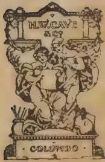A small, ornate decorative vignette centered on the page. The vignette features a central figure, possibly a cherub or child, surrounded by scrollwork and floral elements. The text "H.V. CAVE & CO" is visible at the top, and "COLOMBIA" is at the bottom.

12------------------------------------------------

# CONTENTS.

---

<table>
<thead>
<tr>
<th></th>
<th>PAGE.</th>
<th></th>
<th>PAGE.</th>
</tr>
</thead>
<tbody>
<tr>
<td>The Bare Fallow ... ..</td>
<td>1</td>
<td>The Cultivation of Coffee ... ..</td>
<td>35</td>
</tr>
<tr>
<td>The Sweet Arecanut ... ..</td>
<td>3</td>
<td>Ceylon Produce in the Drug Trade ...</td>
<td>37</td>
</tr>
<tr>
<td>Potash ; Review of the Present Position</td>
<td>4</td>
<td>The Absorptive Power of Soils ... ..</td>
<td>38</td>
</tr>
<tr>
<td>Cassava as a Catch Crop with Coco- nuts ... ..</td>
<td>15</td>
<td>Garden Soils ... ..</td>
<td>39</td>
</tr>
<tr>
<td>The Grape Fruit ... ..</td>
<td>17</td>
<td>The Use of Artificial Manures ... ..</td>
<td>39</td>
</tr>
<tr>
<td>Agriculture in Surinam ... ..</td>
<td>17</td>
<td>Soil Fertility Problems ... ..</td>
<td>43</td>
</tr>
<tr>
<td>The Planning of Experiments with Rubber ... ..</td>
<td>18</td>
<td>Influence of Salt ... ..</td>
<td>43</td>
</tr>
<tr>
<td>The Valuation of Plantation Rubber</td>
<td>18</td>
<td>The Evaporation of Water from Soil</td>
<td>44</td>
</tr>
<tr>
<td>The Rubber Trade in Japan ... ..</td>
<td>20</td>
<td>Value of Soil Analysis ... ..</td>
<td>45</td>
</tr>
<tr>
<td>Manuring Rubber ... ..</td>
<td>20</td>
<td>Some Soil Investigations ... ..</td>
<td>47</td>
</tr>
<tr>
<td>Ceylon Out-put, 1914 ... ..</td>
<td>22</td>
<td>The Manure Heap ... ..</td>
<td>49</td>
</tr>
<tr>
<td>United States the Greatest Consumer of Tobacco in the World ... ..</td>
<td>22</td>
<td>Bee-keeping in the West Indies ... ..</td>
<td>50</td>
</tr>
<tr>
<td>Cocoa Manuring Experiments in Dominica ... ..</td>
<td>23</td>
<td>Poultry Houses and Appliances ... ..</td>
<td>51</td>
</tr>
<tr>
<td>Claying Cocoa ... ..</td>
<td>24</td>
<td>The Shot Hole Borer of Tea ... ..</td>
<td>55</td>
</tr>
<tr>
<td>Cocoa Experiments in British Guiana</td>
<td>25</td>
<td>Nitrogen Fixing Bacteria in Leaf Nodules ... ..</td>
<td>59</td>
</tr>
<tr>
<td>Plant Nutrition ... ..</td>
<td>26</td>
<td>Shade Trees ... ..</td>
<td>60</td>
</tr>
<tr>
<td>Changes of Nitrogenous Substances during the Curing of Tobacco ... ..</td>
<td>27</td>
<td>Onion Cultivation in Hawaii ... ..</td>
<td>62</td>
</tr>
<tr>
<td>Tobaccos Grown in Italy ... ..</td>
<td>27</td>
<td>Agricultural Progress in India ... ..</td>
<td>62</td>
</tr>
<tr>
<td>Sugar-cane in Western India ... ..</td>
<td>29</td>
<td>The Effect of Transplanting upon Rice Production ... ..</td>
<td>64</td>
</tr>
<tr>
<td>British Sugar ... ..</td>
<td>32</td>
<td>Back to the Land ... ..</td>
<td>65</td>
</tr>
<tr>
<td>The Two Jute Plants ... ..</td>
<td>33</td>
<td>Cassava Experiments ... ..</td>
<td>66</td>
</tr>
<tr>
<td>The Cultivation of Sea Island Cotton</td>
<td>34</td>
<td>Commelina Nudiflora ... ..</td>
<td>68</td>
</tr>
<tr>
<td>Market Rates of the Oil Trade ... ..</td>
<td>34</td>
<td>Tillering of Cereals ... ..</td>
<td>69</td>
</tr>
<tr>
<td></td>
<td></td>
<td>Agricultural Implements and Ma- chines ... ..</td>
<td>70</td>
</tr>
<tr>
<td></td>
<td></td>
<td>Agricultural Products of Peru ... ..</td>
<td>71</td>
</tr>
</tbody>
</table>

13------------------------------------------------

## INDEX TO THE JULY NUMBER.

<table style="width: 100%; border-collapse: collapse;">
<thead>
<tr>
<th style="text-align: left; width: 45%;"></th>
<th style="text-align: right; width: 15%;">PAGE.</th>
<th style="text-align: left; width: 45%;"></th>
<th style="text-align: right; width: 15%;">PAGE</th>
</tr>
</thead>
<tbody>
<tr>
<td>Absorptive Power of Soils ...</td>
<td style="text-align: right;">38</td>
<td>Manuring Rubber ...</td>
<td style="text-align: right;">20</td>
</tr>
<tr>
<td>Agricultural Implements and Machines ...</td>
<td style="text-align: right;">70</td>
<td>Nitrogen Fixing Bacteria in Leaf Nodules ...</td>
<td style="text-align: right;">59</td>
</tr>
<tr>
<td>Agricultural Products of Peru ...</td>
<td style="text-align: right;">71</td>
<td>Oil Trade, Market Rates of the ...</td>
<td style="text-align: right;">34</td>
</tr>
<tr>
<td>Agricultural Progress in India ...</td>
<td style="text-align: right;">62</td>
<td>Onion Cultivation in Hawaii ...</td>
<td style="text-align: right;">62</td>
</tr>
<tr>
<td>Agriculture in Surinam ...</td>
<td style="text-align: right;">17</td>
<td>Planning of Experiments with Rubber</td>
<td style="text-align: right;">18</td>
</tr>
<tr>
<td>Areca-nut, The Sweet ...</td>
<td style="text-align: right;">3</td>
<td>Plant Nutrition ...</td>
<td style="text-align: right;">26</td>
</tr>
<tr>
<td>Back to the Land ...</td>
<td style="text-align: right;">65</td>
<td>Potash ; Review of the Present Position</td>
<td style="text-align: right;">4</td>
</tr>
<tr>
<td>Bare Fallow, The ...</td>
<td style="text-align: right;">1</td>
<td>Poultry Houses and Appliances ...</td>
<td style="text-align: right;">51</td>
</tr>
<tr>
<td>Bee-keeping in the West Indies ...</td>
<td style="text-align: right;">50</td>
<td>Rice Production, The Effect of Transplanting upon ...</td>
<td style="text-align: right;">64</td>
</tr>
<tr>
<td>British Sugar ...</td>
<td style="text-align: right;">32</td>
<td>Rubber, Ceylon Output, 1914 ...</td>
<td style="text-align: right;">22</td>
</tr>
<tr>
<td>Cassava as a Catch Crop with Coconuts ...</td>
<td style="text-align: right;">15</td>
<td>Rubber, Manuring ...</td>
<td style="text-align: right;">20</td>
</tr>
<tr>
<td>Cassava Experiments ...</td>
<td style="text-align: right;">60</td>
<td>Rubber, Planning of Experiments with</td>
<td style="text-align: right;">18</td>
</tr>
<tr>
<td>Ceylon Produce in the Drug Trade</td>
<td style="text-align: right;">37</td>
<td>Rubber Trade in Japan ...</td>
<td style="text-align: right;">20</td>
</tr>
<tr>
<td>Changes of Nitrogenous Substances during the Curing of Tobacco ...</td>
<td style="text-align: right;">27</td>
<td>Rubber, Valuation of Plantation ...</td>
<td style="text-align: right;">18</td>
</tr>
<tr>
<td>Claying Cocoa ...</td>
<td style="text-align: right;">24</td>
<td>Salt, Influence of ...</td>
<td style="text-align: right;">43</td>
</tr>
<tr>
<td>Cocoa Claying ...</td>
<td style="text-align: right;">24</td>
<td>Shade Trees ...</td>
<td style="text-align: right;">60</td>
</tr>
<tr>
<td>Cocoa Experiments in British Guiana</td>
<td style="text-align: right;">25</td>
<td>Shot Hole Borer of Tea, The ...</td>
<td style="text-align: right;">55</td>
</tr>
<tr>
<td>Cocoa Manuring Experiments in Dominica ...</td>
<td style="text-align: right;">23</td>
<td>Soil Analysis, Value of ...</td>
<td style="text-align: right;">45</td>
</tr>
<tr>
<td>Coconuts, Cassava as a Catch Crop with ...</td>
<td style="text-align: right;">15</td>
<td>Soil Fertility Problems ..</td>
<td style="text-align: right;">43</td>
</tr>
<tr>
<td>Coffee, The Cultivation of ...</td>
<td style="text-align: right;">35</td>
<td>Soil Investigations, Some ...</td>
<td style="text-align: right;">47</td>
</tr>
<tr>
<td>Commelina Nudiflora ...</td>
<td style="text-align: right;">68</td>
<td>Soils, Garden ..</td>
<td style="text-align: right;">39</td>
</tr>
<tr>
<td>Cotton, Cultivation of Sea Island ...</td>
<td style="text-align: right;">34</td>
<td>Soils, The Absorptive Power of ...</td>
<td style="text-align: right;">38</td>
</tr>
<tr>
<td>Cultivation of Coffee ...</td>
<td style="text-align: right;">35</td>
<td>Some Soil Investigations ...</td>
<td style="text-align: right;">47</td>
</tr>
<tr>
<td>Cultivation of Sea Island Cotton ...</td>
<td style="text-align: right;">34</td>
<td>Sugar-cane in Western India ...</td>
<td style="text-align: right;">29</td>
</tr>
<tr>
<td>Effect of Transplanting upon Rice Production ..</td>
<td style="text-align: right;">64</td>
<td>Sweet Areca-nut, The ...</td>
<td style="text-align: right;">3</td>
</tr>
<tr>
<td>Evaporation of Water from Soil ..</td>
<td style="text-align: right;">44</td>
<td>Tillering of Cereals ...</td>
<td style="text-align: right;">69</td>
</tr>
<tr>
<td>Grape Fruit, The ...</td>
<td style="text-align: right;">17</td>
<td>Tobacco, Changes of Nitrogenous Substances during the Curing of ...</td>
<td style="text-align: right;">27</td>
</tr>
<tr>
<td>Influence of Salt ...</td>
<td style="text-align: right;">43</td>
<td>Tobaccos Grown in Italy ...</td>
<td style="text-align: right;">27</td>
</tr>
<tr>
<td>Jute Plants, The Two ...</td>
<td style="text-align: right;">33</td>
<td>United States the Greatest Consumer of Tobacco in the World ...</td>
<td style="text-align: right;">22</td>
</tr>
<tr>
<td>Manure Heap, The ...</td>
<td style="text-align: right;">49</td>
<td>Use of Artificial Manures ..</td>
<td style="text-align: right;">39</td>
</tr>
<tr>
<td>Manures, The Use of Artificial ...</td>
<td style="text-align: right;">39</td>
<td>Valuation of Plantation Rubber ...</td>
<td style="text-align: right;">18</td>
</tr>
<tr>
<td></td>
<td></td>
<td>Value of Soil Analysis ...</td>
<td style="text-align: right;">45</td>
</tr>
</tbody>
</table>

14------------------------------------------------

This image is a scan of a blank page. The background is a uniform light beige or off-white color. There are several small, dark specks scattered across the surface, which appear to be dust or scanning artifacts. No text, lines, or other graphical elements are present.

15------------------------------------------------

A black and white photograph showing a large, mature Rain Tree (Pithecolobium Saman) planted along a road. The tree has a wide, spreading canopy that provides shade to a rickshaw and pedestrians on the road below. The road is lined with other trees, and the scene is set in a tropical or subtropical environment.

*Photo by H. F. Macmillan.*

THE RAIN TREE (*Pithecolobium Saman*). When properly planted and attended to, few surpass it as a Road-side shade tree.  
(See page 60)

16------------------------------------------------

THE  
**TROPICAL AGRICULTURIST:**  
JOURNAL OF THE  
**CEYLON AGRICULTURAL SOCIETY.**

---

VOL. XLV.

COLOMBO, JULY, 1915.

No. 1.

---

**THE BARE FALLOW.**

---

Elsewhere we make some extracts from the 1913 and 1914 Annual Reports of the Rothamsted Experiment Station which have recently been received at Peradeniya. At this institution a staff of twenty-five specialists is engaged upon "the study of the soil conditions that affect the growth of the plant and the nature of the changes induced in the plant by variations in soil and nutrition conditions," problems that cover the whole range of soil management and crop production. One lesson these reports convey is the importance of continuity. Though many of the experiments have been going on for 60 and 70 years, yet year after year light is thrown by them on new problems of agriculture.

A great deal of study is given to the behaviour of nitrogen, the most expensive ingredient the planter has to supply in his manures. It is well known that nitrogen compounds, whether in the soil or applied in manures, are attacked by micro-organisms which liberate the nitrogen to form soluble nitrates that can be taken up by the plant and gaseous nitrogen which, as far as is known, cannot. It was found that the rate of accumulation was rapid in the spring with the spring showers and rise of temperature, fell in the dry weather of summer, rose again with the renewed rain of autumn while the soil was still warm, and fell again in winter.

17------------------------------------------------

2[JULY, 1915.

The stock of nitrates at the end of a hot dry summer is high, but this stock is very much increased if a summer fallow has been taken. When bare fallow follows a green manure we get a combination equal in results to heavy manuring. This was shown by an experiment made at Rothamsted in 1913. A field of lucerne of four years stand that had received no manure for some years was selected. This was ploughed up, fallowed during the summer and sown with wheat in the autumn. The resulting crop was greater than that of any plot receiving artificial manures and equal to that of the plot dressed with 14 tons of farmyard manure. It will be observed that the wheat crop was sown at the end of the summer and before the winter rains set in. Had no crop been growing to arrest the escape of the nitrates, much of the good effect of the summer fallow following the lucerne ley would have been lost. If instead of wheat a green manure crop had been grown, the nitrates would still have been taken up but returned again with interest when the green crop was ploughed in. Thus the sequence is green manure, fallow, green manure; the fallow being taken in the dry weather.

We may gather from these conditions some useful ideas about the management of land in the tropics, especially in those places with a long dry season. The circumstances are complicated because in such countries the acute problem is generally the supply of moisture but happily the treatment that tends to promote the accumulation of nitrates—the summer fallow—tends also to conserve the moisture of the soil. The important point is that the land should not be left fallowed during the rainy season, but a crop planted to preserve the nitrates from being washed away in the rain water.

In the management of land in such a country as our so-called dry zone, which has a rainfall of some 50 inches per annum but a long dry season during which however a little rain falls from time to time, green manures should be used with judgment. At Rothamsted it has been found that the best results are only attained when a period of fallow comes after the green crop. As between a bare fallow and a green crop in the dry season the arguments are strongly in favour of the

18------------------------------------------------

JULY, 1915.]3

former and these arguments are strengthened with us by the necessity we are under to check the dissipating action of the sun upon the slender reserves of water at the disposal of the plant ; which can be done by a properly worked fallow. In a young coconut plantation in the dry zone a green manure crop such as cow pea or gram that comes off the land in a few months and permits of the soil being worked through the dry season would be preferable to a perennial like tephrosia that would continue on through the dry season to evaporate moisture, thus counteracting much of the benefit it would otherwise confer upon the young trees. As the palms grew and spread their roots the value of the green crop would decline ; green manuring would in most cases eventually become impracticable ; but as the demands of the trees increased the bare fallow or its plantation equivalent would gain in importance.

R. N. L.

---

## THE SWEET ARECANUT.

---

The authors in describing the species *Areca catechu* L. in the FLORA OF BRITISH INDIA, Vol. v, page 406, do not mention the astringent taste of the seed. The ordinary betel nut has a very astringent taste when tasted raw (before boiling), the amount of tannin and glucosides being over 14 per cent. (Lewin. uber *Areca catechu*, etc.). The present variety is fairly sweet to eat and is further distinguished by the fact that the endosperm is much lighter in colour and softer. On account of the latter character, it becomes pulpy and does not lend itself to the treatment which the arecanut undergoes before being sent to the market. The cultivators find it a loss to propagate these plants, and it only grows occasionally in the areca gardens. The plant bears the same type of fruit year after year and has to be ranked as a distinct variety. I propose the name var. *delicciosa* on account of its pleasant taste.

*Areca catechu* L. var. *delicciosa* : tree 40 to 80 feet high with leaves and flowers similar to those of *Areca catechu*, fruit slightly smaller about 1 inch in diameter, remaining green even when nearly ripe, endosperm pale white in colour, soft when ripe, percentage of tannin much less.

*Distribution.*—Occasionally met with in the areca gardens in the Western Ghats of Mysore.—M. K. VENKATA RAU in the JOURNAL OF THE BOMBAY NATURAL HISTORY SOCIETY.

19------------------------------------------------

4[JULY, 1915.

# POTASH.

## REVIEW OF THE PRESENT POSITION.

Potash is one of the essential elements of plant-food and is found universally in soils. Potassium, the element, is found in combination with silica, etc., in many rocks and occurs to the extent of 2.4% as potash in the crust of the earth and is the chief source of potash in soils. Potassium silicates are difficult to decompose and are insoluble in strong acids but by weathering they gradually break down into less stable and more soluble compounds from which the plants derive their supply of potash. Potassium compounds, principally chlorides, are found in small quantities in sea-water, about 0.5—0.7 per 1,000, probably all obtained originally from the leaching by rain of decomposed rocks. It is also found as the soluble nitrate in Peru, Chile, India, etc., but the big source of potash is the natural Stassfurt deposits in Germany and it is curious that no other large deposit of potash has yet been discovered. No other element is so uniquely isolated in deposition in quantity as potassium and at the same time so universally scattered over the earth in small quantity, and for this reason a description of the formation of the Stassfurt deposits is interesting.

### THE STASSFURST DEPOSITS.

Theories as to the formation of the huge potash deposits more or less agree, but they do not explain everything and much is still left to the imagination. It has been stated above that potash is present in small quantity in sea-water, and it is from this basis that Germany has derived her potash beds. It can be traced geologically that the sea had at one time extended over large areas of Germany and then gradually receded by geological changes in the level of land and sea leaving a number of inland seas and lagoons, some of these connected with the sea by means of small estuaries. At this time tropical conditions existed over the northern part of Europe as proved by fossils of tropical plants and animals. The tropical sun evaporated and concentrated the waters of the inland lakes until the concentration became so great that the waters became saturated with some of the less soluble salts in solution, and they gradually crystallised out. The concentration continuing, the saturation point of more soluble salts was reached and they crystallised out. The waters then became saturated with still more soluble salts and they in turn reached their crystallisation point. The inland seas which were connected with the ocean were continually obtaining additional sea-water through their estuaries while the concentration process was going on, making the process continuous and giving rise to great beds of salts, crystallised out according to their solubility, the less soluble crystallising out first. The weak point in this theory is the high percentage of potash salts compared with other salts present, and must point either to sea-water exceptionally rich in potash or else the strata on which the evaporation took place to be exceptionally rich in potash. The temperature required to evaporate such great quantities of sea-water must have been high for the time taken, higher than one would expect under tropical conditions, an explanation of which might be given by the action of

20------------------------------------------------

JULY, 1915.]5

subterranean heat, or the heat given out by the interaction of the salts in solution. Examination of the Stassfurt potash beds will find the less soluble salts at the bottom of the beds. Calcium sulphate forming the bottom layer, then comes a 3,000 ft. bed of common salts which took about 13,000 years to deposit. This mass is interspersed with layers of calcium sulphate, showing that this salt had again accumulated in the lakes probably due to further influx by the sea, and had again reached a saturation point and crystallised out. These layers of anhydrite become fewer as the top layers of salt are reached, and their place is taken by a more soluble salt called "polyhalite," a mixture of the sulphates of lime, potash, and magnesia. This area is called the "polyhalite" region and is succeeded by the kieserite region in which the sulphate of magnesia predominates. Above this comes a deposit 30 to 130 ft. thick, which is the most important from the potash point of view, as from this layer nearly all the agricultural potash is prepared. It is called the "carnallite" region and is composed of muriate of potash and muriate of magnesia, and overlying these deposits is a layer of clay which acts as a water-proof protector to the soluble salts below. Above this impervious layer comes more anhydrite and a very pure deposit of common salt : again gypsum, clay, sand, and then outcrops of limestone are found on the surface. The total depth of these beds is little less than a mile and they extend over the whole of North Germany. It must not be supposed that on examination of the Stassfurt deposits parallel layers of salts are to be found, due to the internal pressure over geological ages these layers have become displaced and in some cases tilted up and exposed to atmospheric influences, and rain speedily dissolved out the salts, and on other conditions presenting themselves favourable to concentration recrystallised out again in different combinations.

The deposition of the potash beds has been further explained by USIGLIO who experimented on the evaporation of sea-water and found that the Stassfurt deposits were not quite in agreement with the mere evaporation of sea-water and came to the conclusion that there must have been less of mother liquor at periods and autumnal influx of fresh sea-water, rain and floods, thus diminishing the extent of the more soluble salts and giving an increase of the less soluble salts. The anhydrite (calcium sulphate) layers mark a certain periodicity in the deposition of the salts which quite bears out the above observations. Surprise is expressed by many that the calcium sulphate crystallised out as anhydrite, without water of crystallisation, and not as gypsum with two molecules of water of crystallisation, but it has been proved that a nearly-saturated solution of common salt dehydrates calcium sulphate forming anhydrite on crystallisation. The clay layer was probably due to an eruption and saved the lower layers from leaching but lost the mother liquor salts to the deposits, and explains to a certain extent why the composition of evaporated sea-water differs from that of the Stassfurt deposits. Where the protecting layer of clay is absent drainage and leaching dissolved the top layers, and accounts for the difference in this case. At present there are similar deposits of salts now being formed in Europe in parts of the Caspian Sea and the Sarmatian Lakes.

The German potash deposits were first used as a source of common salt, but were abandoned in 1839 as a salt source for a purer deposit of common salt and more economical working. The old brine deposits were not absolutely abandoned but were explored by boring, with astonishment to

21------------------------------------------------

6[JULY, 1915.

the explorers, at the depth of the deposits obtained, but as the percentage of potash and magnesia increased in the brines the deposits were looked upon with disfavour as it interfered with the crystallising of the common salt. Further investigation showed that these deposits could be used as a source of potash and the common salt was then looked upon with disfavour as it interfered with the purification of the potash. The year 1860 marks the new era for the salt deposits in Germany, for it is from that time that they were used as a source of potash chiefly for agricultural purposes, and the extraction from the deposits has gone on by leaps and bounds since then.

The Board of Trade states that the sales of the German potash syndicate in the year 1914 amounted to £78,000,000 as compared with £96,000,000 in 1913. The estimate for 1914 was £105,000,000. Working expenses have gone up and there are skilled labour difficulties. These drawbacks with the cessation of exports due to the war will minimise the profits of the syndicate considerably. Representations are at present being made to the German Government to reduce the price of potash to local agriculturists so as to enable them to purchase largely and obtain huge yields by its application.

Local agriculturists use the unpurified deposits, getting it at a cheap rate but when the salts have to be carried any distance the freight makes the salts very expensive, so they are made into muriate of potash with 58 % potash, and sulphate of potash, with 50-52 % of potash. Kainit also has a large sale with 13 % of potash. Where the chlorine is not desirable, as for tobacco cultivation, the sulphate of potash is used or the potassium magnesium carbonate with 17-18 % potash, which is also manufactured at the Stassfurt mines. Pre-war days these salts were extensively used all over the cultivated world and were practically the only sources of potash applied as a manure at least in bulk. No manufacture of potash could in any way compete with these vast deposits of easily accessible and readily convertible potash salts, as the bases of supply from ashes, etc., is not localised sufficiently to manufacture into concentrated salts which could stand freight to far countries.

Natural deposits of potash have been searched for by prospectors in every land but with practically no success. Occasionally one hears of promising deposits of salts, but generally the economic conditions are not favourable. Great hopes are still expressed that natural deposits may be found, and the war, which has stopped exports of Germany's potash salts, has stimulated the search and researches on waste products and cheap material from which to manufacture concentrated potash salts. The war has reduced agriculture to potash starvation and to the same stage as it was as regards potash at the middle of the nineteenth century, but at that period there was not the same demand for potash as the manufacture of artificial manures had not reached the height it has to-day, and there was not the same stimulus to agriculture giving huge crops at home and abroad. Again the tropical belt was still undeveloped.

#### OLD AND NEW SOURCES OF POTASH.

The sources of potash supply fifty or sixty years ago are now being reinvestigated as a source of potash for to-day. Seaweed is washed up in many lands on many shores and is again coming to the front as a source of potash. Many farmers near to the coast plough seaweed into their land but farmers at a distance from the coast have not the advantage of a ready

22------------------------------------------------

JULY, 1915.]7

supply of organic matter with valuable mineral matter, and these men require the kelp, the ash of the sea-weed, to be made into a more suitable and concentrated form for transport. In those days kelp was used as a source of iodine and potash salts, but the industry was killed by the working of the Stassfurt deposits, and the iodine is now obtained from the Chile nitre beds where it occurs as sodium iodate. According to MERZ and LINDEMUTH (J. Ind. Eng. Chem.) the ash of the *Macrocystis* amounts to 2·5-3·5%. Muriate of potash 16-30 %, Iodine 0·1 %, nitrogen 1 %. Dry kelp contains 19·8 % potash.

Potashes made from the ashes of wood were at one time the largest bases of source of supply of potash salts, but as wood went out of use as a fuel, being displaced by oil, petrol and coal, ashes became scarce. Whole forests were burned up for the sake of potashes and if the utility of the Stassfurt deposit had not been discovered there would have been great wastage in fuel in obtaining ashes. Some forests are badly situated as a timber source and all woods are not suitable for timber, so that these might have been used up for the manufacture of potashes, but generally the nearest forests are taken for such purposes. The potash in wood-ash exists as carbonates to a great extent, but in the grasses as silicates. Wood ashes also contain phosphates and lime giving useful additional value to the potashes. The harder the wood the more potash it generally contains. The soft pines contain less potash than the hard oak. Herbs contain more than shrubs, shrubs more than trees. Different parts of a tree contain different proportions of potash; generally the growing points and young leaves contain most, and the bark is usually richer than the wood. Seeds are also rich in potash, the hull being generally richer than the interior. When oil seeds are used as a source for oil they are crushed for the oil and the residue or poonac used as a manure or feeding stuff. The potash is a valuable addition to the nitrogen on which the cake is valued as a manure. Phosphoric acid is also present in about the same quantity as potash in seeds, usually about 1-2 % in the poonac. This mounts up when large quantities of poonac are used per acre.

UMNEY in the PERFUMY. and ESSENT. OIL RECORD suggests co-operation in collection and utilisation of waste marine and land plants. Some of the potash results are given below:—

<table>
<tbody>
<tr>
<td><i>Fucus serratus</i></td>
<td>4—5 %</td>
<td><i>Agaricus velutipes</i></td>
<td>78 %</td>
</tr>
<tr>
<td>„ <i>nodosus</i></td>
<td>13 %</td>
<td>Heath Mosses, <i>Hy-</i></td>
<td></td>
</tr>
<tr>
<td></td>
<td></td>
<td><i>pund schreberi</i></td>
<td>28-30 %</td>
</tr>
<tr>
<td><i>Laminaria saccharina</i></td>
<td></td>
<td></td>
<td></td>
</tr>
<tr>
<td>(oarweed)</td>
<td>15 %</td>
<td>Hop bine</td>
<td>25 %</td>
</tr>
<tr>
<td><i>Zosteria marnia</i></td>
<td>9·5 %</td>
<td>Groundsel, <i>Senecio vulgaris</i></td>
<td>43·5 %</td>
</tr>
<tr>
<td>Bracken</td>
<td>60 %</td>
<td>Common broom</td>
<td>33 %</td>
</tr>
<tr>
<td><i>Bœetus edulis</i></td>
<td>50-57 %</td>
<td>Willow Bark</td>
<td>24 %</td>
</tr>
<tr>
<td>Tweel chestnut Bark</td>
<td>20 %</td>
<td>Common furze</td>
<td>28 %</td>
</tr>
<tr>
<td><i>Euphorbia amcyldaloides</i></td>
<td>39 %</td>
<td>Virginia creeper leaves</td>
<td>25 %</td>
</tr>
</tbody>
</table>

RUSSELL in the JOURNAL OF THE BOARD OF AGRICULTURE suggests obtaining potashes from the hedge clippings, etc., and experimented with green and dead wood, grasses, weeds from hedges and ditches, by burning them in the open, 10·9 % of potash was obtained. Refuse material from threshing floors yielded an ash containing 11 % potash. The potash is present as

23------------------------------------------------

8[JULY, 1915.

carbonate, and after exposing to rain lost half of its potash. The ashes obtained from trimming of 100 yards of hedge weigh about 15 lb. and cost about 8 pence. The ashes are very light, and mix well with superphosphate but have not the same keeping properties as kainit. But the ashes of these would only interest the farmer who made the potashes from these for his own use, and are hardly interesting from an industrial point of view. They are of no interest to the tropics.

The United States still produce 10—15,000 tons of potashes which is entirely consumed locally. According to the CHEM-ZEIT potashes are manufactured from the stems of sun flowers in 24 factories in North Causasia to the extent of 100,000—120,000 tons per annum.

ROMANIS in the CHEMICAL NEWS states that potash is made from bamboo-cane in British Burmah.

The ash contains

<table>
<tbody>
<tr>
<td>Potash</td>
<td>...</td>
<td>...</td>
<td>32.5</td>
</tr>
<tr>
<td>Muriate of potash</td>
<td>...</td>
<td>...</td>
<td>18.7</td>
</tr>
<tr>
<td>Silica</td>
<td>...</td>
<td>...</td>
<td>17.0</td>
</tr>
<tr>
<td>Carbonic acid</td>
<td>...</td>
<td>...</td>
<td>8.1</td>
</tr>
<tr>
<td>Sulphate</td>
<td>...</td>
<td>...</td>
<td>2.7</td>
</tr>
<tr>
<td>Iron and alumina</td>
<td>...</td>
<td>...</td>
<td>1.1</td>
</tr>
<tr>
<td>Moisture</td>
<td>...</td>
<td>...</td>
<td>19.4</td>
</tr>
</tbody>
</table>

In the process of green manuring the green manure plant draws its potash from the soil generally at some depth and when cut down returns the potash to the soil in the form of potash salts of organic acids. If the attempt were made to form potashes from the organic refuse by burning, large quantities of organic matter and nitrogen would be dissipated and considerable value lost to the soil. The same is true of tea-prunings, which contain about 25 % of potash in the ash.

It is a well-known fact that before a plant sheds a member a large proportion of the important constituents are returned to the main part of the plant so that some of the fertilizing material is retained by the plant, but the part which falls to the ground by the plant shedding a member is not to be despised.

Cocoa leaves are very rich in potash when they are young but as they get older silica largely takes its place, so that when they are shed the potash has been largely transferred to the younger or growing parts of the plant; but the potash retained, although small, is valuable and should be utilised by mulching.

Refuse from coconut plantations is rich in potash as the coconut tree is a greedy potash feeder. Coconut husk is rich in potash, 25 % when dried, and should always be utilised by ploughing in between the rows or placing as a mulch round the trees with a covering of soil; the potash in the husks will soon be absorbed by the roots by this procedure. Coconut shells will not decay so readily, but as they contain 0.5 % potash they have some value as a source of potash. The ash from coconut shells prepared when using the shells as a fuel when making copra is useful as a ready source of potash and should be spread round the neighbouring trees.

24------------------------------------------------

JULY, 1915.]9

Tobacco is a greedy feeder of potash and hence the refuse is a source of potash. The mid-ribs, stalks, etc., which are not used for manufacture of tobacco should be ground up, extracted with water, and the solution which contains nicotine sprayed on plants as an insecticide while the residue could be used as a manure. Tobacco is very rich in ash, containing about 15 %, of which 50 % is pure potash.

Sugar beet is another greedy feeder of potash, and in order to obtain the potash from the residues, the molasses, which is the residue after getting all the crystallisable sugar out of the juice, is fermented with yeast, the alcohol distilled off and the residue sprinkled on the soil for the sake of the potash it contains, and thus preserving the nitrates which are present in valuable quantity. Molasses contains 44-50 % of sugar, 14-18 % of other organic matter, 16-18 % of moisture, 10-12 % of ash. If the molasses is burnt in the air, Vinasse cinder, as it is called, is prepared and the valuable nitrates are lost. Germany has treated molasses in a special way by osmosis, strontia and lime process. Another method followed on the Continent is to carbonise the material in a retort getting as bye-products from the distillate, trimethylamine, methyl chloride, methyl alcohol, ammonia, etc., the cinder being left in the retort. The cinder contains :—

<table>
<tr>
<td>Potash</td>
<td>...</td>
<td>...</td>
<td>49.5</td>
</tr>
<tr>
<td>Soda</td>
<td>...</td>
<td>...</td>
<td>2.5</td>
</tr>
<tr>
<td>Lime</td>
<td>...</td>
<td>...</td>
<td>5.0</td>
</tr>
<tr>
<td>Carbon di-oxide</td>
<td>...</td>
<td>...</td>
<td>26.0</td>
</tr>
<tr>
<td>Phos : acid</td>
<td>...</td>
<td>...</td>
<td>0.3</td>
</tr>
</table>

So it is a valuable source of potash.

Another base for procuring potash if it were run on properly organised lines is the refuse from wool washings. The sheep gives off a peculiar substance called "suint" which is really sheep's sweat, and is collected in the sheep's wool : before the wool can be used it must be cleansed from this impurity and if the dirt were retained and worked up a valuable source of potash would be obtained along with other bye-products such as fats, but generally the waste is allowed to run on to the fields for fertilising purposes and in many cases runs to waste. A central washing station is the most desirable method of collecting the washings, but manufacturers prefer that they wash their own wool, then knowing that the wool they purchased goes to their factory. Under these conditions the manufacturer does not consider it economical to collect the refuse. As 100 parts of wool gives 14-18 % salts or five parts potassium carbonate, 60,000 tons of wool imported could give 3,000 tons potassium carbonate if the scheme were thoroughly organised. None is recovered. On the Continent 2,000 tons per annum is obtained. There is a difference in the composition of the 'suint' of inland and seashore sheep: in the former the soda is 2.2 % while in the latter the soda is 13 %. Suint gives 79 % potassium carbonate, 9 % potassium sulphate and chlorides.

Where vines flourish and wine is made a residue called "argol" is obtained, which is crude potassium bitartrate and when ignited potassium carbonate is formed, which can be used as a potash manure; or the argol is purified and exported as potassium bitartrate.

The nitre beds mentioned above exists in Chile, Peru, and in parts of India. The conditions for the formation of these beds is nitrogenous organic

25------------------------------------------------

10[JULY, 1915.

matter, air, and potash to absorb the nitric acid formed by the bacterial process. The district must be very dry, else the nitrate formed soon gets dissolved out. The original source of potash is usually felspar, which is very common in rock formation and although insoluble when fresh, weathers to a form in which it can be attacked. The nitre forms in an incrustation on the surface of the soil and is scraped off and purified by solution from the insoluble matter and crystallisation from other soluble salts.

It would be interesting to note here that during the French Wars the French government ran short of nitrate of potash to manufacture black powder, which was the propellant in those days. The scientific department devised a means similar to the above to make the nitrate. Heaps of rubbish such as garbage, stale urine, mortar, etc., were made with a steep end facing the prevailing winds. Nitrification was rapid under those conditions; nitrate of lime was quickly formed and sand extracted and nitrate of potash by double decomposition with ashes was made from it.

### ROCKS.

In the fore part it was noted that where the soil is uncultivated the plant derives its potash originally from rocks. On examination of rocks it is generally found that there is more than one class of crystal and on microscopic examination the different crystals are easily recognised. The commonest potash bearing crystals orthoclase and mica are distinctive and their decomposition is seen, felspar always having a muddy appearance showing the starting of the decomposition into clay. On a laboratory scale the decomposition of felspar has been studied and the complex silicate has been found to decompose into clay—an aluminium silicate—and potash. The latter is taken up by plants and the clayey matter is left. Mica decomposes in a similar manner, freeing the potash for the plant. The process by which rocks decompose due to natural agencies is called "weathering," and when the rock masses have been sufficiently disintegrated by natural means the mineral constituents pass into and form a portion of the soil. When these soils are analysed the potash which has been freed by decomposition and is ready for absorption by plants is called the available potash. Minerals which have not been decomposed sufficiently to dissolve in moderately strong acids are not estimated, for although potash is still there it is not available to the plant in a reasonable time. In cultivated soils the weathering process is hastened by drainage, forking, liming and green manuring; forking and draining expose the mineral particles to the action of the atmosphere; liming, by double decomposition, interchanges lime for potash freeing the potash in an available form for the plant; while green manure obtains the potash from decomposed minerals from the subsoil and when mulched gives potash in a readily available form to the surface soil so that in spite of potash starvation due to the war agriculturists can to a certain extent do without this year's application by extra cultivation, especially if the soil is naturally rich in potash and has been regularly manured with potash in the past. This is borne out by the Cocoa Experiments at Gangaroo, where no manuring has taken place for two years and yet the crops are still on the increase.

Soils which have mica present are generally well supplied with available potash. This is contrary to what others have found, micaceous soils generally being considered poor soils, but this probably refers more to temperate climates where the weathering is not so favourable to the decomposition of mica.

26------------------------------------------------

JULY, 1915.]11

Attempts and many suggestions have been made to bring the potash in potash-bearing rocks into an available form suitable for agricultural purposes. Potash minerals are universally distributed but are so scattered that great expense would be incurred in collecting them for treatment, and greater expense incurred in the treatment. On referring to the analysis of the common potash-bearing strata, the low percentage of potash is noted.

<table>
<thead>
<tr>
<th></th>
<th><i>Potash</i></th>
<th><i>Oxide of Alumina</i></th>
<th><i>Silica</i></th>
</tr>
</thead>
<tbody>
<tr>
<td><i>Orthoclase</i></td>
<td>10.9 %</td>
<td>18.4 %</td>
<td>64.7 %</td>
</tr>
<tr>
<td><i>Leucite</i></td>
<td>21.5 ,,</td>
<td>23.5 ,,</td>
<td>55.0 ,,</td>
</tr>
<tr>
<td><i>Muscovite Mica</i></td>
<td>11.3 ,,</td>
<td>38.5 ,,</td>
<td>45.2 ,, 4.5 % Water</td>
</tr>
</tbody>
</table>

Orthoclase and mica are the most common of above ; so that it will be seen that large quantities require to be collected before one could obtain a few tons of potash salts equivalent in quality to Stassfurt sulphate of potash : and the insoluble nature of the silicates means that either a high temperature must be obtained to fuse the mineral, after fine grinding with fluxes or lime, or else fluorides and strong sulphuric acid added to break up the silicate. It can be done easily in the laboratory but not economically in the factory, but still attempts have been made. One of these products which came under the writer's notice was called "phonolith" and was apparently one of the silicates treated so as to render part of the potash soluble. The analysis is given below:—

*Phonolith*

<table>
<tbody>
<tr>
<td>Moisture</td>
<td>...</td>
<td>3.7</td>
<td>...</td>
<td>3.7</td>
</tr>
<tr>
<td>Loss on Ignition</td>
<td>...</td>
<td>5.07</td>
<td>...</td>
<td>5.07</td>
</tr>
<tr>
<td>Insoluble in Hydrochloric acid, chiefly silicates</td>
<td>}</td>
<td>59.65</td>
<td>...</td>
<td>59.65</td>
</tr>
<tr>
<td>Silica</td>
<td>...</td>
<td>50.12</td>
<td></td>
<td></td>
</tr>
<tr>
<td>Iron and alumina oxide</td>
<td>...</td>
<td>6.38</td>
<td></td>
<td></td>
</tr>
<tr>
<td>Lime</td>
<td>...</td>
<td>0.26</td>
<td></td>
<td></td>
</tr>
<tr>
<td>Magnesia</td>
<td>...</td>
<td>0.39</td>
<td></td>
<td></td>
</tr>
<tr>
<td>Potash, insoluble in Hydrochloric acid</td>
<td>}</td>
<td>2.50</td>
<td></td>
<td></td>
</tr>
<tr>
<td>Iron and alumina oxide</td>
<td>...</td>
<td></td>
<td>...</td>
<td>23.15</td>
</tr>
<tr>
<td>Lime</td>
<td>...</td>
<td></td>
<td>...</td>
<td>1.40</td>
</tr>
<tr>
<td>Magnesia</td>
<td>...</td>
<td></td>
<td>...</td>
<td>0.47</td>
</tr>
<tr>
<td>Potash soluble in Hydrochloric acid</td>
<td>...</td>
<td></td>
<td>...</td>
<td>4.50</td>
</tr>
<tr>
<td>Soluble silica</td>
<td>...</td>
<td></td>
<td>...</td>
<td>2.06</td>
</tr>
<tr>
<td>Total potash</td>
<td>...</td>
<td></td>
<td>...</td>
<td>7.00</td>
</tr>
<tr>
<td>Available potash</td>
<td>...</td>
<td></td>
<td>...</td>
<td>4.50</td>
</tr>
</tbody>
</table>

"Phonolith" was not favourably reported on by me and was never on sale in the Island, although it was experimented with in Europe but with varying results. It is easily seen that even although one was to get a huge deposit of leucite conveniently situated for manufacture and make it partly soluble it could never compete against the highly concentrated Stassfurt potash with 95 per cent. purity, as the insoluble silicates left would kill it as regards freight.

Hopes are expressed that when the Germans are driven out of Upper Alsace the salt deposits which cover an area of 200 square kilometres near Mülhausen will be thoroughly investigated and yield a good outturn of potash salts and so relieve the situation. Unfortunately they are deeply seated, 15/2000 ft., which means working at a high temperature.

27------------------------------------------------

12[JULY, 1915.

### AMERICAN DEPOSITS.

America has hopes in the Searles Lake deposits in California, which are estimated to contain potassium compounds equivalent to six million tons of chloride. Over a quarter of a million sterling has been spent on development but much more will be required before it is a commercial success. America's great hope is in the kelp beds for producing potash in commercial quantities, and a few ten thousand tons might be obtained from beet refuse, scourings of wool and wood ashes. The unfortunate part about America's bases of sources is that they are nearly all situated on the west coast and required on the east for agricultural operations. The great Appalachian felspar dyke is near the scene of agricultural activity, and might be used as a base for operations, but as the felspar contains only 10% potash considerable working up would be required before it could compete with the European product. America imports annually £3,000,000 worth of potash salts, the bulk being used for fertilisers and the balance for other industries such as the manufacture of carbonate, chlorate, bichromate, caustic potash, etc. It can be well understood from these figures why America, which has large agricultural industries and a large population to feed, is so anxious to be independent of Europe and its strife for its potash supplies. Germany at present is not exporting potash to America for fear she uses the salts in making explosives and sells them to her enemies.

Alunite, a potash alumina sulphate, is fairly widely distributed on all the western coast of the United States of America and when the sulphates are separated can be used as a concentrated potash salt with high fertilising value. Raw and ignited alunite contains 10.14% potash.

Potash has been recently found in Spain near Coldona about 40 miles North-West of Barcelona. The salts existing there consist of potassium sulphate and carbonate and are reported to be of great depth, beginning at about 200 ft. below the surface.

It will be seen after reviewing all the possible sources of potash that there is no practical way of obtaining large quantities of potash as obtained in pre-war days, but the agricultural world can rest assured that Germany will be only too glad to part with her potash when peace is declared in order to help to pay off the huge debts involved by the war. It would be a good score to seize the mines as part of the indemnity so that there could be no question of a monopoly, as Germany talks of a monopoly of nitrogen as she has been badly hit by the Chile nitre being declared contraband, and is thereby unable to procure easily the base of the manufacture of nitric acid which is required to make nitro-cellulose and nitro-glycerin, the basis of smokeless powder. But it is said that Germany has risen to the occasion by obtaining nitric acid indirectly from the air and it is to be believed, as OSTWALD had patents out for procuring it from nitrolim before the war and no doubt stress of circumstances has led to many improvements in the process.

### THE IMMEDIATE THING TO DO.

Agriculturists who have indulged in high cultivation in the past can do without potash for the next three years by using up the manure residues so wisely invested in the past. The money usually spent on potash can be spent on extra cultivation and by applying larger supplies of nitrogen and phosphoric acid; when potash is obtainable larger quantities than usual should be

28------------------------------------------------

JULY, 1915.]13

applied, so as to obtain a good reserve and the quantities of nitrogen and phosphoric acid can be reduced. Indian nitrate can to a certain extent replace some of the German potash, but as it is combined with a readily available form of nitrogen it must be used with due caution, else a forcing action is obtained. When used, a reduction in other readily available and organic nitrogen should be made.

One amongst many things the war has taught us is that it does not do to depend on one country for anything. Dyes and potash salts are a case in point. The manufacture of dyes is now being attended to by the nation and it is hoped still further efforts will be made to relieve the world of the German potash monopoly. Who knows what legacy geological ages have left us, if we but search and find? The reward will be great for the prospector who is lucky to strike potash in quantity, and he will be a benefactor to the nation as it will mean a great national asset, cheaper sources of potash for agriculture, meaning cheaper food stuffs, potash for industrial operations and potash for export to compete against Germany and strike a blow at one of Germany's great commercial assets. Considering the area of the British Empire and the different climatic conditions under which it exists, there is probably more chance of potash deposits being found under the British Government than under other Governments.

*Tables showing the proportion of ash and potash in various tropical plants.*

<table border="1">
<thead>
<tr>
<th></th>
<th></th>
<th></th>
<th>Ash</th>
<th></th>
<th>Potash</th>
<th></th>
</tr>
</thead>
<tbody>
<tr>
<td>Acacia diabetes</td>
<td>...</td>
<td>...</td>
<td>3.2</td>
<td>%</td>
<td>13.8</td>
<td>% on ash</td>
</tr>
<tr>
<td>" decurrens twigs</td>
<td>...</td>
<td>...</td>
<td>5.3</td>
<td>"</td>
<td>0.8</td>
<td>" on dried sample</td>
</tr>
<tr>
<td>" young melanoxylon</td>
<td>...</td>
<td>...</td>
<td>2.3</td>
<td>"</td>
<td>0.56</td>
<td>" " "</td>
</tr>
<tr>
<td>Adhatoda vesica</td>
<td>...</td>
<td>...</td>
<td>2.16</td>
<td>"</td>
<td>20.1</td>
<td>" on ash</td>
</tr>
<tr>
<td>Albizzia molluccana</td>
<td>...</td>
<td>...</td>
<td>5.6</td>
<td>"</td>
<td>1.16</td>
<td>" on dried sample</td>
</tr>
<tr>
<td>" prunings</td>
<td>...</td>
<td>...</td>
<td>4.4</td>
<td>"</td>
<td>22.8</td>
<td>" on ash</td>
</tr>
<tr>
<td>Artemisia Vulgaris ( Worm Wood )</td>
<td></td>
<td></td>
<td>7.1</td>
<td>"</td>
<td>37.8</td>
<td>" "</td>
</tr>
<tr>
<td>Bodi plant ( Psoralea corylifolia )</td>
<td>...</td>
<td>...</td>
<td>9.28</td>
<td>"</td>
<td>22.18</td>
<td>" "</td>
</tr>
<tr>
<td>Cardamom leaves</td>
<td>...</td>
<td>...</td>
<td>7.2</td>
<td>"</td>
<td>20.2</td>
<td>" "</td>
</tr>
<tr>
<td>" stem</td>
<td>...</td>
<td>...</td>
<td>3.3</td>
<td>"</td>
<td>13.3</td>
<td>" "</td>
</tr>
<tr>
<td>" fruit</td>
<td>...</td>
<td>...</td>
<td>7.7</td>
<td>"</td>
<td>31.7</td>
<td>" "</td>
</tr>
<tr>
<td>Cashew nuts</td>
<td>...</td>
<td>...</td>
<td>—</td>
<td>"</td>
<td>0.64</td>
<td>" on sample</td>
</tr>
<tr>
<td>Castillo leaves</td>
<td>...</td>
<td>...</td>
<td>14.24</td>
<td>"</td>
<td>13.10</td>
<td>" on ash</td>
</tr>
<tr>
<td>" twigs</td>
<td>...</td>
<td>...</td>
<td>4.86</td>
<td>"</td>
<td>24.3</td>
<td>" "</td>
</tr>
<tr>
<td>Castor seeds</td>
<td>...</td>
<td>...</td>
<td>3.2</td>
<td>"</td>
<td>0.5</td>
<td>" dried sample</td>
</tr>
<tr>
<td>Cocoa young red leaves and twigs</td>
<td></td>
<td></td>
<td>7.5</td>
<td>"</td>
<td>40.1</td>
<td>" on ash</td>
</tr>
<tr>
<td>" young leaves and twigs</td>
<td>...</td>
<td>...</td>
<td>7.2</td>
<td>"</td>
<td>39.7</td>
<td>" "</td>
</tr>
<tr>
<td>" older twigs</td>
<td>...</td>
<td>...</td>
<td>5.3</td>
<td>"</td>
<td>29.1</td>
<td>" "</td>
</tr>
<tr>
<td>" twigs fully developed</td>
<td>...</td>
<td>...</td>
<td>8.1</td>
<td>"</td>
<td>9.2</td>
<td>" "</td>
</tr>
<tr>
<td>" leaves young developed</td>
<td>...</td>
<td>...</td>
<td>7.8</td>
<td>"</td>
<td>19.2</td>
<td>" "</td>
</tr>
<tr>
<td>" " fully developed</td>
<td>...</td>
<td>...</td>
<td>11.5</td>
<td>"</td>
<td>6.6</td>
<td>" "</td>
</tr>
<tr>
<td>" " fallen</td>
<td>...</td>
<td>...</td>
<td>13.1</td>
<td>"</td>
<td>1.2</td>
<td>" "</td>
</tr>
<tr>
<td>Coconut husk ( dry )</td>
<td>...</td>
<td>...</td>
<td>5.3</td>
<td>"</td>
<td>47.0</td>
<td>" "</td>
</tr>
<tr>
<td>" Shell</td>
<td>...</td>
<td>...</td>
<td>1.3</td>
<td>"</td>
<td>26.5</td>
<td>" "</td>
</tr>
<tr>
<td>" Pinnæ mid-rib</td>
<td rowspan="3">} fallen</td>
<td>...</td>
<td>2.2</td>
<td>"</td>
<td>2.9</td>
<td>" "</td>
</tr>
<tr>
<td>" Pinnæ</td>
<td>...</td>
<td>10.9</td>
<td>"</td>
<td>1.1</td>
<td>" "</td>
</tr>
<tr>
<td>" Leaf mid-rib</td>
<td>...</td>
<td>3.2</td>
<td>"</td>
<td>0.6</td>
<td>" "</td>
</tr>
</tbody>
</table>

29------------------------------------------------

14[JULY, 1915.

<table border="1">
<thead>
<tr>
<th></th>
<th></th>
<th><i>Ash</i></th>
<th></th>
<th><i>Polash</i></th>
<th></th>
</tr>
</thead>
<tbody>
<tr>
<td>Citronella Grass</td>
<td>...</td>
<td>6.3</td>
<td>%</td>
<td>1.0</td>
<td>on dried sample</td>
</tr>
<tr>
<td>Crotalaria incana</td>
<td>...</td>
<td>9.6</td>
<td>"</td>
<td>2.4</td>
<td>" "</td>
</tr>
<tr>
<td>" laburnifolia</td>
<td>...</td>
<td>6.2</td>
<td>"</td>
<td>1.81</td>
<td>" "</td>
</tr>
<tr>
<td>" juncea</td>
<td>...</td>
<td>4.0</td>
<td>"</td>
<td>14.1</td>
<td>on ash</td>
</tr>
<tr>
<td>Dadap leaves</td>
<td>...</td>
<td>7.4</td>
<td>"</td>
<td>1.0</td>
<td>on dried sample</td>
</tr>
<tr>
<td>" " fallen</td>
<td>..</td>
<td>8.6</td>
<td>"</td>
<td>0.56</td>
<td>" "</td>
</tr>
<tr>
<td>Fern</td>
<td>...</td>
<td>—</td>
<td></td>
<td>29.00</td>
<td>on ash</td>
</tr>
<tr>
<td>Erthyrina lithosperma</td>
<td>...</td>
<td>7.3</td>
<td>"</td>
<td>35.1</td>
<td>" "</td>
</tr>
<tr>
<td>Ground nuts (whole)</td>
<td>...</td>
<td>3.8</td>
<td>"</td>
<td>0.8</td>
<td>on sample</td>
</tr>
<tr>
<td>" " fresh</td>
<td>...</td>
<td>1.7</td>
<td>"</td>
<td>0.58</td>
<td>" "</td>
</tr>
<tr>
<td>" " fruits</td>
<td>...</td>
<td>10.0</td>
<td>"</td>
<td>2.9</td>
<td>" "</td>
</tr>
<tr>
<td>Hevea bark</td>
<td>..</td>
<td>10.6</td>
<td>"</td>
<td>9.2</td>
<td>on ash</td>
</tr>
<tr>
<td>" leaves</td>
<td>...</td>
<td>4.4</td>
<td>"</td>
<td>25.8</td>
<td>" "</td>
</tr>
<tr>
<td>" " old</td>
<td>...</td>
<td>4.4</td>
<td>"</td>
<td>4.7</td>
<td>" "</td>
</tr>
<tr>
<td>" wood</td>
<td>...</td>
<td>6.0</td>
<td>"</td>
<td>13.5</td>
<td>" "</td>
</tr>
<tr>
<td>" seed husk</td>
<td>...</td>
<td>1.6</td>
<td>"</td>
<td>0.31</td>
<td>on sample</td>
</tr>
<tr>
<td>" " meal</td>
<td>...</td>
<td>3.4</td>
<td>"</td>
<td>—</td>
<td>" "</td>
</tr>
<tr>
<td>" latex</td>
<td>...</td>
<td>0.35</td>
<td>"</td>
<td>43.0</td>
<td>on ash</td>
</tr>
<tr>
<td>" crepe</td>
<td>...</td>
<td>0.4</td>
<td>"</td>
<td>23.4</td>
<td>" "</td>
</tr>
<tr>
<td>" biscuit</td>
<td>...</td>
<td>0.4</td>
<td>"</td>
<td>26.4</td>
<td>" "</td>
</tr>
<tr>
<td>Indian corn</td>
<td>...</td>
<td>—</td>
<td>"</td>
<td>0.33</td>
<td>on sample</td>
</tr>
<tr>
<td>Congayam grass</td>
<td>...</td>
<td>10.7</td>
<td>"</td>
<td>13.4</td>
<td>" ash</td>
</tr>
<tr>
<td>Kepitiya leaves</td>
<td>...</td>
<td>9.1</td>
<td>"</td>
<td>0.65</td>
<td>" sample</td>
</tr>
<tr>
<td>Leucana glauca</td>
<td>...</td>
<td>6.5</td>
<td>"</td>
<td>25.1</td>
<td>" ash</td>
</tr>
<tr>
<td>Lemon grass</td>
<td>...</td>
<td>9.5</td>
<td>"</td>
<td>3.0</td>
<td>" sample</td>
</tr>
<tr>
<td>" " fresh</td>
<td>...</td>
<td>2.02</td>
<td>"</td>
<td>0.65</td>
<td>" "</td>
</tr>
<tr>
<td>Marsilia</td>
<td>...</td>
<td>13.1</td>
<td>"</td>
<td>2.6</td>
<td>" "</td>
</tr>
<tr>
<td>Micania scandens</td>
<td>...</td>
<td>7.6</td>
<td>"</td>
<td>42.8</td>
<td>" ash</td>
</tr>
<tr>
<td>Neem Husk</td>
<td>...</td>
<td>13.6</td>
<td>"</td>
<td>0.75</td>
<td>" sample</td>
</tr>
<tr>
<td>" Poonac</td>
<td>...</td>
<td>9.0</td>
<td>"</td>
<td>1.69</td>
<td>" "</td>
</tr>
<tr>
<td>Passiflora foetida</td>
<td></td>
<td></td>
<td></td>
<td></td>
<td></td>
</tr>
<tr>
<td>" roots and woody stems</td>
<td></td>
<td>3.64</td>
<td>"</td>
<td>15.24</td>
<td>" ash</td>
</tr>
<tr>
<td>" leaves, tendrils, fruits</td>
<td></td>
<td>10.06</td>
<td>"</td>
<td>13.84</td>
<td>" "</td>
</tr>
<tr>
<td>" green stems</td>
<td>...</td>
<td>3.8</td>
<td>"</td>
<td>20.84</td>
<td>" "</td>
</tr>
<tr>
<td>Psorolea corylifolia</td>
<td>...</td>
<td>9.28</td>
<td>"</td>
<td>22.18</td>
<td>" "</td>
</tr>
<tr>
<td>Phaseolus lunatus</td>
<td>...</td>
<td>7.7</td>
<td>"</td>
<td>30.1</td>
<td>" "</td>
</tr>
<tr>
<td>Pithicolobium saman</td>
<td>...</td>
<td>5.0</td>
<td>"</td>
<td>1.27</td>
<td>" sample</td>
</tr>
<tr>
<td>Sesbania aculeata</td>
<td>...</td>
<td>6.2</td>
<td>"</td>
<td>15.6</td>
<td>" ash</td>
</tr>
<tr>
<td>Sophora glauca dry</td>
<td>...</td>
<td>5.5</td>
<td>"</td>
<td>24.1</td>
<td>" "</td>
</tr>
<tr>
<td>Suriya tree</td>
<td>...</td>
<td>10.3</td>
<td>"</td>
<td>26.8</td>
<td>" "</td>
</tr>
<tr>
<td>Sunflower</td>
<td>...</td>
<td>—</td>
<td>"</td>
<td>2.0</td>
<td>" sample</td>
</tr>
<tr>
<td>Tephrosia candida</td>
<td>...</td>
<td>5.2</td>
<td>"</td>
<td>31.6</td>
<td>" ash</td>
</tr>
<tr>
<td>" hookeriana</td>
<td>...</td>
<td>4.4</td>
<td>"</td>
<td>29.0</td>
<td>" "</td>
</tr>
<tr>
<td>" purpurea</td>
<td>...</td>
<td>5.9</td>
<td>"</td>
<td>24.0</td>
<td>" "</td>
</tr>
<tr>
<td>Tobacco</td>
<td>...</td>
<td>16.0</td>
<td>"</td>
<td>25.9</td>
<td>" "</td>
</tr>
<tr>
<td>Vigna catjang dried</td>
<td>...</td>
<td>14.2</td>
<td>"</td>
<td>3.46</td>
<td>" sample</td>
</tr>
<tr>
<td>" " fresh</td>
<td>...</td>
<td>3.03</td>
<td>"</td>
<td>0.73</td>
<td>" "</td>
</tr>
<tr>
<td>Tapioca stem</td>
<td>...</td>
<td>4.7</td>
<td>"</td>
<td>22.1</td>
<td>" ash</td>
</tr>
<tr>
<td>" leaves</td>
<td>...</td>
<td>8.6</td>
<td>"</td>
<td>14.6</td>
<td>" "</td>
</tr>
</tbody>
</table>

These figures are estimated on the sun-dried material.

A. BRUCE.

30------------------------------------------------

JULY, 1915.]15

# COCONUTS.

## CASSAVA AS A CATCH CROP WITH COCONUTS.

In his recently issued book, THE COCONUT, PROFESSOR E. B. COPELAND, Dean of the College of Agriculture in the Philippines, discusses very impartially the question of catch crops in coconut cultivation. He argues that any catch crop must take something from the fertility of the soil, and that this by itself is bad for the coconuts. On the other hand coconut growing is a business, and the planter will prefer to grow another crop with the coconuts if thereby he can secure a greater profit. If labour conditions permit it will be found that under any reasonably good market conditions, there are various crops which can be taken from the ground and made to pay some profit above the cost of raising them and purchasing manures more than sufficient to replace what they take from the soil, and "that their culture will keep the coconut plantation in better condition than can be expected if attention is devoted to the coconuts alone."

PROFESSOR COPELAND insists that catch crops will prove unprofitable in the long run, even if they give immediate returns, unless manuring is practised; but, "if such a return is made, and in full measure, the coconuts will fare better for the operation: because the food of the catch crop is taken from the area between the coconuts, and the fertilizers can be applied more immediately by the neighbourhood of the young trees. And this is bound to result in their growing more rapidly than they would if they had all the ground to themselves, but were not helped to reach their food."

He then discusses the labour question and what should be done if catch crops are not employed; and instances a case in which as the result of keeping the ground cultivated, trees six years old were six inches more in diameter than those in a control plot, kept clean weeded, but without the ground being worked.

The conclusion the author draws is, "This is indeed a very striking result, and it may prove, as the trees produce, that the money spent in cultivation pays better returns than it would have done if used in planting and giving the merely necessary attention to a larger number of trees. It is my personal opinion that under most labour conditions, such care cannot profitably be given to coconuts, and I am sure that where it is practicable to this extent, it is advisable to raise catch crops."

The next point PROFESSOR COPELAND deals with is that coconuts can be left to take care of themselves, after describing how such lack of proper care results in trees below the proper size, in delay in coming into full bearing and reduction of the crop when they reach full bearing, he concludes:—"In spite of the fact that a great many people treat their coconuts in this way, I do not believe that any who has observed the matter carefully enough to frame a sound opinion will hold that the money invested in such plantations has been used to the best purpose."

31------------------------------------------------

16[JULY, 1915.

" Taking up now the other assumption, that a catch crop is to be cultivated, choice must be made among the various crops which in different places are used for this purpose. The catch crop must be one which does not need to keep the land for a long enough time to interfere with the development of the coconuts, or to have to be sacrificed when the coconuts need the whole of the ground—this is equivalent to saying that it must be a crop which can either be removed at the end of not more than three years, or which can endure being shaded after that time by the coconuts. In spite of the fact that it has already been advised that if any catch crop be grown a return of fertilizers be made to the soil to balance what the catch crop removes from it, it is advisable in choosing the catch crop to give the preference to one which is known not to make too heavy demands on the soil's fertility. For instance, tobacco, if at all intensively grown, makes very heavy demands on the fertility of the soil. In other respects it would be a valuable catch crop, but for this one reason it is not in general to be recommended. So far as possible, it is advisable to give the preference to a catch crop which will be consumed on the ground, rather than to one which provides an article of commerce which contains in considerable quantity any mineral food; and a catch crop whose seed or grain only is sold from the plantation is better than one of which the whole plant is sold."

PROFESSOR COPELAND then discusses the advantages and disadvantages as catch crops with coconuts, of rice, corn, abaca or Manila hemp (*Musa textilis*) and finally cassava or manioc, concerning which he says :—

" My own preference in the choice of a catch crop, if it is possible to utilise it, is manioc. Manioc is an exceedingly heavy producer and can be made to pay a very large return for the use of the land. This can be done either by feeding the roots to stock, which however can be recommended only with certain qualifications, and often only with certain treatment, or by using the roots for the manufacture of starch or alcohol. This is not the place to discuss these industries. They are distinct and separate from coconut culture, and must be understood both in their industrial and their market relations before they can safely be undertaken. Where market conditions are satisfactory, it is practically certain that the production of manioc starch or alcohol can be made in two crops to pay for the necessary manufacturing equipment, for the clearing of the land, planting of both crops, and the cultivation needed by the land, and the return of fertilizers, and still leave a good profit for the operation of establishing the plantation.

" There are various crops, of the garden rather than of the field with which this can be done on a small scale, but there is no other which makes such slight demands upon labour, nor which can safely be undertaken on so large a scale, the reason for the last statement being that the manufactured products from the manioc are not perishable, and are marketable on the world's market.

" There is a superstition, or it might be more respectful to say belief, that manioc is an exceedingly hard crop on the soil. This is caused by the practice formerly common in the Malay Peninsula of clearing land for manioc, and abandoning it, to return to grass or bush, after harvesting two or three crops. There is no doubt that land treated in this way deteriorates very rapidly. In the Philippines land is very commonly treated in exactly the same way, except that the crop temporarily raised on it is usually rice. Still nobody

32------------------------------------------------

JULY, 1915.]17

believes that rice is distinctly a hard crop on the soil ; and neither, as a matter of fact, is the manioc. The soil would deteriorate almost as rapidly if the rice or the manioc were ploughed under and nothing at all taken away from the ground. Observation has given me considerable confidence in the opinion that the soil does not deteriorate as rapidly in manioc as it does in rice. This has little to do with the relative rate of removal of mineral food, but is simply because the manioc keeps the soil more nearly in what may be called its virgin condition."—W. F. G. in TRINIDAD AND TOBAGO BULLETIN, XIV, 2.

---

## THE GRAPE FRUIT.

---

The grape fruit, so named in America, is familiar to us under the name of pumelo which is derived from the two Latin words *pomum* and *melo*. Other names for it are Shaddock, so named after CAPTAIN SHADDOCK who introduced it into India, and pompelmousse. It is the *Citrus decumana* of the botanist. The name grape fruit is said to have been given to it owing to the fruits being borne in large clusters, but as this characteristic is tending to disappear under cultivation, only 2 or 3 larger fruits being produced instead of a number of smaller ones, it is reported that the U.S.A. Agricultural Department has decided to discard the name in favour of the older and more popular term pumelo. If this be so it is a move in the right direction, as the adoption of fancy names gives rise to unnecessary confusion, the extent of which will be understood when it is stated that the Secretary of this Society not long ago received an order for plants of the "grape fruit" and "grape nut," the latter being a trade name for a manufactured cereal food.

According to an exchange the Florida crop of the grape fruit amounted in 1913 to 3,125,465 boxes as compared with 5 million boxes of oranges. Besides Florida, which practically monopolises the market, Louisiana and California are also taking up the cultivation of this fruit which is very popular as an item in the American breakfast menu.

---

## AGRICULTURE IN SURINAM.

---

Surinam, or Dutch Guiana as it is otherwise known, has a temperature ranging between 72° and 92° F. and an average annual rainfall of 92 inches. The chief agricultural products are cocoa, coffee and sugar. MR. F. S. LAWTON, writing in the TEA AND COFFEE TRADE JOURNAL, gives a sketch of the agriculture of this little colony which comprises only 57,900 sq. miles. In 1913 there were estimated to be 14,000 acres under cocoa plantation besides a good deal grown by small owners. In that same year the export was about 150 tons and in the year following (1914) about 185 tons, 93 per cent. of which went to the States.

Coffee flourishes here. The Arabian variety has given place to the Liberian which is planted together with rubber, the rubber affording the necessary shade for which "coffee-mamma" (*Erythrina glauca*) used to be grown. When in full bearing a crop of 1,100 lb. of dry coffee per acre may be expected. In 1913, 200 tons of Liberian coffee were exported, and last year 336 tons, while the cultivation is extending rapidly.

33------------------------------------------------

18[JULY, 1915.

# RUBBER.

---

## THE PLANNING OF EXPERIMENTS WITH RUBBER.

M. BARROWCLIFFE.

Experiments with rubber trees are liable to incur many unsuspected sources of error, with the result that various experiments have obtained very contradictory conclusions. Even after taking the greatest care in the selection of the trees for the different plots it is of the utmost importance that the daily records of each plot should be recorded at least six months before the commencement of the experiment. In addition to comparing the yields of the different plots amongst themselves it is necessary to know something of the performance of each individual plot both before and during the experiment. This is best realised by plotting the yields of the plots in the form of graphs during the whole period of the observations. In this way a more comprehensive and accurate view is obtained of the extent and duration of the action of the manure or other factor under investigation—MONTHLY BULLETIN.

---

## THE VALUATION OF PLANTATION RUBBER.

J. M. A. WYNAENDTS VAN RESANDT.

The subject with which it is proposed to deal in this article is that of the market valuation of plantation rubber, and the question will be raised as to whether planters now obtain for rubber sold its actual value.

Many planters find matter for astonishment in the fact of widely differing prices being fetched in the market by different lots of rubber from the same estate. The reason frequently given for these divergences is an apparently trifling difference in colour, or the fact of one lot not being so "nicely ribbed" as another.

The writer received the other day a letter stating that the rubber from a certain estate, *although considered as being of standard f. a. q.*, fetched 2d. less than top price, the only reason being that the sheets were *not ribbed*. This shows quite plainly that plantation rubber is given a valuation largely on its appearance. This position is surely absurd.

A solution of this question would be the standardization of all plantation rubber. Notwithstanding all the trouble and the efforts of some prominent men, the standardization of plantation rubber is still far from solved. It is obviously possible to make a standard product on each estate, but it is more difficult to make the same standard quality on all estates. This would only be possible if everyone worked with the same machinery, used the same method of manufacture, the same smoking material, etc. So long as the conditions on the various estates are so different, it will be almost impossible to produce a standard product. I cannot think that companies

34------------------------------------------------

JULY, 1915.]19

would be willing to change their factories and machinery just to be able to make the same quality of rubber as their neighbours. If we had found the secret of making rubber as uniform as hard Para rubber at a minimum cost price we could do away with our present machines, replace them by more simple ones, and the standardization of plantation rubber would be accomplished. In such circumstances the appearance of the rubber would be the same, and it would therefore be difficult for buyers to maintain price differences according to appearance. Although many kinds of rubber come very near to hard Para in appearance, the right method of preparation has not yet been found, and I am afraid that until this has been attained our rubber will fetch a higher or lower price according to appearance.

### CENTRAL RUBBER STATION FORMED IN JAVA.

At the Batavia Rubber Exhibition and Congress MR. FOLL, assistant to PROFESSOR VAN ITTERSON, proved clearly how little the appearance of rubber can be correlated to its inferior qualities. He told us that he had asked several estate managers to send him samples of their rubber and mark these samples in accordance with their higher or lower market value. It happened in several cases after these samples were vulcanised and tested that No. 1, which got the best price, was of less value to manufacturers than say No. 6, which obtained a poor price. This showed clearly the empiric and false basis on which the rubber was valued.

At the close of the Congress DR. LOVINK, the Director of Agriculture in the Netherlands East Indies, asked some directors of estates, visiting agents, and leading planters to be present at a meeting he proposed to hold. At this meeting, at which the writer was present, he proposed the establishment of a central rubber station. This station would be provided with complete testing installations and would have the following objects in view:—

1. (1) To guide the planters as to the method of preparation to follow, after having tested their rubber.
2. (2) To give a certificate of the quality of the rubber which is sent to the rubber market.

This, I think, is a most important matter, and it is to be hoped that in this way some influence will be exercised on the brokers and buyers of rubber in Europe. I know that in the Straits, F. M. S. and Ceylon there are testing stations of a kind, but I doubt if they are used for this purpose. I would therefore ask all rubber planters and those interested in plantation rubber to join the Java planters in their efforts to do away with the empiric valuation of their rubber. This can be reached by standardization, and a step in the right direction would be made by establishing central rubber stations (all working upon the same lines), and sending a certificate showing the qualities after testing of an average sample of each consignment. The directors of rubber companies at home can do a great deal to help us. It frequently happens that the directors accept forward contracts for crepe as well as for smoked sheet. In this way it is already impossible for the manager to make only one kind of rubber. If only block rubber, similar as being made on Lanadron Estate, were made it would be difficult to do any "hand testing."

DR. LOVINK, our Director of Agriculture, has taken the initiative in the establishment of a central rubber station, on the lines as above explained. What countries and planters will join us and help to put an end to the fancies and caprices inseparable from the present system?—INDIA RUBBER JOURNAL.

35------------------------------------------------

20[JULY, 1915.

## THE RUBBER TRADE IN JAPAN.

The Japanese rubber trade has not escaped the effects of the British embargo on the export of rubber from home and colonial ports. Ceylon and the Straits Settlements have in the past formed the chief source of the Japanese crude rubber supply, and the continuance of the embargo for a prolonged period would naturally have meant serious loss to the manufacturers of that country. The matter was taken up by the foreign and agricultural departments of the Japanese Government and requests made that Great Britain except Japan from the embargo conditions; resulting in an arrangement, effected March 3, by which the embargo has been lifted on rubber exports to Japan, on condition that the Government of this country shall control re-exports and also the exports of manufactured rubber goods so that they positively shall not reach any enemy country. The ordinance issued by the Department of Agriculture and Commerce, under date of March 3, states that any person desiring to export crude rubber or rubber goods must make application to the Minister of Agriculture and Commerce, naming the variety and quantity of the goods to be exported, the ports of shipment and destination, the name of the consignee and the trade-mark. Any person exporting goods without official permission is liable to fine and imprisonment. Applications for permit to ship goods to British and Russian ports are especially likely to be granted.

The export trade of this country has in the past been chiefly with China where there is a demand of jinrickshaw tyres and also a small but gradually increasing trade in rubber tyres for bicycles. Chinese roads, however, are not especially suited to bicycles, and until these are improved there will probably not be any very large export of this commodity. So keen a competition has developed during the past year in the Japanese tyre trade that one of the large companies—the Dunlop Rubber Co. (Far East) Limited—has changed its policy of distribution and is now seeking an extension of its trade with China rather than among home consumers.

Japanese planters now control in Johore and Borneo 46 plantations on which rubber is cultivated. These plantations cover an area of 92,871 acres, of which 39,045 acres are under cultivation, with 31,813 acres planted. Some of this area was opened as early as 1906, but the greater portion of it, or about 27,750 acres, came under cultivation during 1910 and 1911. The number of labourers employed on these various estates ranges from a very few on the smaller plantations up to 1,053—this latter number being employed on the Batu Pahat Rubber Estate at Suligarten.—INDIA RUBBER WORLD.

## MANURING RUBBER.

The object of this experiment was to determine the advantage, if any, in the use of the ordinary fertilizers to increase the yield of rubber during a tapping season. A block of 1,000 trees was divided into 10 plots numbered 1 to 10. The odd sections were left unfertilized for check, and the even sections fertilized with equal amounts of phosphoric acid in the form of superphosphate, potash in the form of potassium sulphate, and nitrogen in the forms of sodium nitrate and ammonium sulphate. The trees were

36------------------------------------------------

JULY, 1915.]21

measured at the beginning and at the end of the experiment. The sodium nitrate was divided into four applications, but rainy weather destroyed the results of the tapping after the last application, so that the results are tabulated for only three series of tappings with three-fourths of the nitrate.

Ten tappings were made during September, October, and November, and five during February. Sodium nitrate was applied just before each of the tappings. In the three series of tappings, results per tree were as follows:—

### EFFECT OF FERTILIZERS ON YIELD AND GIRTH OF RUBBER TREES.

<table border="1">
<thead>
<tr>
<th rowspan="3">Plot No.</th>
<th rowspan="3">Fertilizer.</th>
<th rowspan="3">Yield.</th>
<th colspan="2">Girth of Trees.</th>
</tr>
<tr>
<th>At beginning of experiment.</th>
<th>At end of experiment.</th>
</tr>
<tr>
<th>Ozs.</th>
<th>Inches.</th>
<th>Inches.</th>
</tr>
</thead>
<tbody>
<tr>
<td>1</td>
<td>No fertilizer ...</td>
<td>1.54</td>
<td>16</td>
<td>17.9</td>
</tr>
<tr>
<td>2</td>
<td>Superphosphate, 375 pounds, &amp; potassium sulphate, 125 pounds</td>
<td>1.57</td>
<td>15.97</td>
<td>18.5</td>
</tr>
<tr>
<td>3</td>
<td>No fertilizer ...</td>
<td>1.1</td>
<td>15.75</td>
<td>19.6</td>
</tr>
<tr>
<td>4</td>
<td>Superphosphate, 375 pounds; potassium sulphate, 125 pounds; and ammonium sulphate 375 pounds ...</td>
<td>1.4</td>
<td>17.23</td>
<td>19.2</td>
</tr>
<tr>
<td>5</td>
<td>No fertilizer ...</td>
<td>1.32</td>
<td>16.9</td>
<td>19</td>
</tr>
<tr>
<td>6</td>
<td>Superphosphate 375 pounds, potassium sulphate 125 pounds, and sodium nitrate 375 pounds</td>
<td>1.4</td>
<td>16.34</td>
<td>18.4</td>
</tr>
<tr>
<td>7</td>
<td>No fertilizer ...</td>
<td>1.43</td>
<td>15.55</td>
<td>18.4</td>
</tr>
<tr>
<td>8</td>
<td>Ammonium sulphate 375 pounds</td>
<td>1.55</td>
<td>14.78</td>
<td>16.5</td>
</tr>
<tr>
<td>9</td>
<td>No fertilizer ...</td>
<td>1.44</td>
<td>16.5</td>
<td>18.1</td>
</tr>
<tr>
<td>10</td>
<td>Sodium nitrate 375 pounds ...</td>
<td>1.48</td>
<td>15.2</td>
<td>17.7</td>
</tr>
</tbody>
</table>

Comparing the yield per tree from each of the fertilized plots with the average from the two unfertilized plots on either side, plot 2 exceeded plots 1 and 3 by 19 per cent.; plot 6 exceeded plots 5 and 7 by 5 per cent., plot 8 exceeded plots 7 and 9 by  $8\frac{1}{2}$  per cent., and plot 10 exceeded plot 9 by 3 per cent. Had all the scrap been collected, the nitrate-fertilized plots would have made a better comparative showing. The trees on these two plots retained more rubber after each tapping that had coagulated on the trees. This was more noticeable in the case of plot 10, fertilized with nitrate alone.

With the exception of plot 3, the largest increase in girth is in the section fertilized with superphosphate and potassium sulphate. Why it should be greater in this case than in that of the trees fertilized with these fertilizers plus ammonium sulphate or sodium nitrate is hard to say, but the same was noted in measurements of trees on which an experiment was made in 1909 and 1910.

37------------------------------------------------

22[JULY, 1915.

In general, the results show an increased yield resulting from the use of fertilizers. The increase varies from 3 per cent., in the case of nitrate alone, to 19 per cent., in the case of superphosphate and potassium sulphate.

Superphosphate and potassium sulphate, in combination with ammonium sulphate, show a greater increase than the same two in combination with sodium nitrate. Superphosphate, potassium sulphate, and sodium nitrate show an increase of 19 ounces between the first and third tappings. The largest yield per tree was obtained from superphosphate and potassium sulphate. The next largest from ammonium sulphate alone, though this was only 0.07 ounce greater than that obtained from three-fourths as much sodium nitrate. The difference in cost of material and application would perhaps be the determining factor in deciding between these two. The largest difference between the yield of fertilized and adjacent unfertilized trees was also obtained in the case of potassium sulphate and superphosphate.—REPT. OF THE HAWAII EXPT. STATION, 1914.

---

## CEYLON OUT-PUT, 1914.

---

From January 1 to December 31, 1914, 35,318,269 pounds of native crude rubber was exported from Ceylon, as against 25,433,551 pounds during the same period of 1913; showing an increase of shipments of 9,884,718 pounds. Considering statistics from August 1 to December 31, 1914, during each of these five months, in spite of the fact that the war was in progress, the exports of rubber from Ceylon were much heavier than for the corresponding period of the previous year—the aggregate increase amounting to 4,709,396 pounds. Although public auctions were suspended at the commencement of the war, and in spite of the fact that figures representing private sales of rubber are unavailable, statistics in hand show that 13,334,557 pounds of rubber was offered at public auction in Ceylon during 1914, as compared with 12,013,824 pounds in 1913, and 6,260,026 pounds in 1912. Diamond-pattern smoked sheet was most in demand and was at a premium over other rubbers throughout the entire year. In fact, all good rubber was well sold, but there was a very small demand for the poorer qualities. The great European war has had but comparatively little effect upon the Ceylon rubber industry.—INDIA RUBBER WORLD.

---

According to BRADSTREET'S (May 1st) the United States is the greatest producer, exporter, importer and consumer of tobacco in the world. The production of leaf of all sorts averages somewhat more than 1,000 million pounds a year, having a value of 100 million dollars. About a third of this is exported in normal years but at present the trade is dislocated, though manufactured tobacco is holding its own in spite of the war, thanks to the increasing trade with the Far East (chiefly in the form of cigarettes) and Oceania. THE WESTERN TOBACCO JOURNAL gives the total output of cigars and cigarettes in 1914 as 16,496,241,576 (pounds?), with another 404,768,725 for tobacco and snuff.

38------------------------------------------------

JULY, 1915.]23

# COCO A.

## COCO A MANURING EXPERIMENTS IN DOMINICA.

H. A. TEMPANY.

Two series of experiments on manuring cacao were carried out: the original series began in 1901 and an additional series began in 1906. The nitrogenous manure was applied in the form of dried blood containing 12 per cent. of nitrogen, phosphoric acid as basic slag of 16 per cent. strength, and potash as sulphate of potash at 50 per cent. These manures were tried separately and together. Experiments were also tried with a mulch of grass, leaves and pods of *Pithecolobium saman* Benth. (at the rate of 100 lb. per tree), containing as percentages of the air-dry matter: nitrogen 2.116, phosphoric acid 0.156 and potash 0.644. A parallel series of experiments was made using cottonseed meal as manure, containing nitrogen 4.5 per cent., phosphoric acid 1.2 per cent. and potash 1.2 per cent. The arrangement of the plots and average results obtained are summed up in

TABLE I.

<table border="1">
<thead>
<tr>
<th>Plots.</th>
<th>Number of trees</th>
<th>Area in acres</th>
<th>Manurial treatment.</th>
<th>Average yield of cured cacao, in lb. per acre</th>
</tr>
</thead>
<tbody>
<tr>
<td colspan="4"></td>
<td>(1902-1913)</td>
</tr>
<tr>
<td>1</td>
<td>51</td>
<td>0.28</td>
<td>None ... ..</td>
<td>1190</td>
</tr>
<tr>
<td>2</td>
<td>64</td>
<td>0.29</td>
<td>{ Basic phosphate 4 cwt. ... Sulphate of potash 1½ cwt. ... }</td>
<td>1430</td>
</tr>
<tr>
<td>3</td>
<td>59</td>
<td>0.36</td>
<td>Dried blood 4 cwt. ...</td>
<td>1405</td>
</tr>
<tr>
<td>4</td>
<td>44</td>
<td>0.29</td>
<td>{ Basic phosphate 4 cwt. ... Sulphate of potash 1½ cwt. ... Dried blood 4 cwt. ... }</td>
<td>1653</td>
</tr>
<tr>
<td>5</td>
<td>49</td>
<td>0.37</td>
<td>Mulched with grass and leaves</td>
<td>1798</td>
</tr>
<tr>
<td colspan="4"></td>
<td>(1907-1913)</td>
</tr>
<tr>
<td>6</td>
<td>46</td>
<td>0.25</td>
<td>Mulched with grass and leaves</td>
<td>1934</td>
</tr>
<tr>
<td>7</td>
<td>51</td>
<td>0.25</td>
<td>Cottonseed meal ...</td>
<td>1751</td>
</tr>
<tr>
<td>8</td>
<td>82 (74)</td>
<td>0.414</td>
<td>None ... ..</td>
<td>937</td>
</tr>
<tr>
<td>9</td>
<td>84 (78)</td>
<td>0.373</td>
<td>Mulched with grass and leaves</td>
<td>1612</td>
</tr>
</tbody>
</table>

These results show clearly the effects of the various forms of manurial treatment; the best result was given by the plots mulched with grass and

39------------------------------------------------

24[JULY, 1915.

leaves, while the plot with complete manure came next. Examination of the results for each year shows that under orchard cultivation a period of from three to five years will usually be required before the trees settle to the state of productivity conditioned by the treatment applied.

Analyses of the soils (which are light and sandy) show that on certain plots, particularly those mulched with grass and leaves, there is a considerable accumulation of nitrogen, probably due to bacteria of the *Azotobacter* type. Laboratory experiments suggest that, in view of the small content of calcium carbonate, the ammonia formed in the early stages may serve to neutralise the citric acid formed later. A study of the soil moisture conditions indicates that while adequate covering and shading of the soil surface affect the moisture content of the upper layers of the soil to a marked degree, none of the manual methods practised have exerted any appreciable direct effect on the moisture-retaining properties of the soil.

With regard to soil temperature, shade has a very favourable effect in maintaining it almost constant at the value of the air temperature during the coolest portions of the day, which is very suitable to the delicate nature of cacao plants, at any rate when young. A study of the relation between the yield and rainfall shows that a very heavy rainfall tends to diminish the yield.

Owing to the importance of mulches in tropical agriculture, the analyses of some of the materials used for this purpose are given (see Table II).

**TABLE II.—Composition of mulch in percentages of air-dry material.**

<table border="1">
<thead>
<tr>
<th></th>
<th><i>Andropogon caricosus</i> L.</th>
<th><i>Cymbopogon citratus</i> Stapf</th>
<th>Mixed grass</th>
<th>Grass for mulch</th>
<th>Clippings from <i>Gliricidia maculata</i></th>
<th>Pods of <i>Pithecolobium saman</i> Benth</th>
</tr>
</thead>
<tbody>
<tr>
<td>Moisture at 100°C.</td>
<td>13.42</td>
<td>13.03</td>
<td>9.97</td>
<td>10.83</td>
<td>11.69</td>
<td>16.80</td>
</tr>
<tr>
<td>Nitrogen ...</td>
<td>0.66</td>
<td>0.51</td>
<td>0.83</td>
<td>0.74</td>
<td>3.12</td>
<td>2.60</td>
</tr>
<tr>
<td>Phosphoric acid ...</td>
<td>0.04</td>
<td>0.37</td>
<td>0.22</td>
<td>0.22</td>
<td>0.40</td>
<td>—</td>
</tr>
<tr>
<td>Potash ...</td>
<td>0.97</td>
<td>1.16</td>
<td>0.80</td>
<td>0.99</td>
<td>—</td>
<td>—</td>
</tr>
</tbody>
</table>

—MONTHLY BULLETIN.

## CLAYING COCOA.

The process of claying cocoa, which consists of coating it with a thin covering of very fine ferruginous clay, was originally adopted with the object of preventing the bean from becoming mouldy in wet weather, to keep it bright and uniform in appearance, and to help to preserve its aroma.

According to the WEST INDIA COMMITTEE CIRCULAR the practice was introduced from Venezuela and first applied to fine estate cocoa, but with regard to that type it had not been practised to excess. In 1913, however, it was found that some small dealers were claying more or less immature

40------------------------------------------------

JULY, 1915.]25

cocoa to excess, chiefly obtained from small holdings, with the result that complaints were at once received. There is little doubt that in many cases the offenders were prompted by a desire to increase the weight of the cocoa. Thanks to the action of the Trinidad Chamber of Commerce, the Agricultural Society and Cocoa Planters' Association this excessive and fraudulent claying has now been put an end to.

## COCOA EXPERIMENTS IN BRITISH GUIANA.

J. B. HARRISON AND S. H. BAYLEY.

Manurial experiments carried out on cocoa trees during five years (1909-13) have furnished the following results :—

<table border="1">
<thead>
<tr>
<th rowspan="3">Plots.</th>
<th colspan="4">Yields in lb. per acre.</th>
</tr>
<tr>
<th colspan="2">Wet Cocoa.</th>
<th colspan="2">Cured Cocoa.</th>
</tr>
<tr>
<th>Yield.</th>
<th>Probable Error.</th>
<th>Yield.</th>
<th>Probable Error.</th>
</tr>
</thead>
<tbody>
<tr>
<td>Nos. 1, 4, 7, 11 and 16. No manure...</td>
<td>5,762</td>
<td>+ 196</td>
<td>2,080</td>
<td>+ 71</td>
</tr>
<tr>
<td>„ 3, 8 and 13. Heavily mulched...</td>
<td>7,482</td>
<td>+ 289</td>
<td>2,699</td>
<td>+ 113</td>
</tr>
<tr>
<td>„ 12 and 18. Sulphate of Ammonia ... ..</td>
<td>5,440</td>
<td>+ 426</td>
<td>1,963</td>
<td>+ 155</td>
</tr>
<tr>
<td>„ 6 and 14. Superphosphate of lime and sulphate of potash...</td>
<td>7,492</td>
<td>+ 460</td>
<td>2,705</td>
<td>+ 154</td>
</tr>
<tr>
<td>„ 5, 10 and 15. Superphosphate and sulphate of ammonia ...</td>
<td>6,56</td>
<td>+ 485</td>
<td>2,375</td>
<td>+ 213</td>
</tr>
<tr>
<td>No. 9. Sulphate of potash and sulphate of ammonia ...</td>
<td>6,208</td>
<td>+ 596</td>
<td>2,242</td>
<td>+ 217</td>
</tr>
<tr>
<td>Nos. 2 and 17. Superphosphate, sulphate of potash and sulphate of ammonia ...</td>
<td>6,801</td>
<td>+ 271</td>
<td>2,465</td>
<td>+ 99</td>
</tr>
</tbody>
</table>

Taking into account the probable errors, the highest total yield of cocoa during the five years has been on the heavily mulched plots which gave a minimum increase of about 435 lb. of cured cocoa, or about 84 lb. per acre over the mean of the five control plots.

The value of this increase is about \$52 and the cost of the mulching approximately \$66. On the other hand the application of sulphate of potash and superphosphate of lime, costing approximately \$14 during the five years gave a minimum increase of 400 lb. of cocoa worth about \$50. The quick

41------------------------------------------------

26[JULY, 1915.

acting nitrogenous manure—sulphate of ammonia—somewhat lessened the yields both when applied alone and in conjunction with superphosphate and sulphate of potash.

The results obtained in 1913, during which no manures were applied, showed that a residual effect remained from the previous years only in the case of the mulched plots and those receiving both superphosphate and sulphate of potash, while, where sulphate of ammonia had been applied, the yields were lower than in the case of the unmanured plots.

Liming experiments carried on 36 plots showed no beneficial effect during the five years.

The effect of decreasing the shade, improving the tillage, drainage and sanitation of cocoa trees is seen in the results obtained from two acres of trees taken over by the Agricultural Department in 1910. During the last five years the yields have steadily increased from a mean of 1,064 lb. to 4,494 lb. of cured cocoa. Further experiments on the reduction of shade were carried out in 1913 on the same plots.

The results were as follows:—

<table>
<thead>
<tr>
<th></th>
<th colspan="2">Per acre of 300 trees.</th>
</tr>
<tr>
<th></th>
<th>No. of pods.</th>
<th>Lb. of pulp.</th>
</tr>
</thead>
<tbody>
<tr>
<td>Heavily shaded</td>
<td>... 5,589</td>
<td>1,204</td>
</tr>
<tr>
<td>Very lightly shaded</td>
<td>... 9,546</td>
<td>1,823</td>
</tr>
</tbody>
</table>

The writers consider that the removal of shade has a greater influence on the yield of the trees than the improvement in drainage and cultivation.—

MONTHLY BULLETIN.

## PLANT NUTRITION.

The fundamental problem in plant nutrition is the production of sugar in the green leaf, but the investigation is seriously hampered by analytical difficulties. During the past three years considerable improvements in method have been effected by MR. DAVIS and his assistants, MESSRS. DAISH and SAWVER, and this year satisfactory proof has been adduced of the presence of free pentoses in the leaf and a method has been elaborated for determining them.

The complete method now allows of the determination of cane sugar, maltose, dextrose, levulose, pentoses, starch, and pentosans in the leaf. It has been used for numerous analyses of leaves and stalks plucked at regular intervals during the day and night, the results of which will be discussed later.

Equally important from the standpoint of crop production is the formation of starch in the grain. Analytical difficulties have hitherto prevented a satisfactory investigation, but this year the determination of starch has been put on a satisfactory basis. The existing methods may give rise to an error equal to 20 per cent. or more of the starch present: in the ordinary diastase method, for example, a loss of this magnitude may arise from the precipitation of dextrin during the preliminary processes of precipitation. A new method has therefore been devised, based on the fact that the enzyme taka-diastase transforms starch quantitatively into maltose and dextrose, no dextrin being formed: thus the errors of the ordinary method are obviated. This is apparently the only trustworthy way of estimating starch in plant tissues, and it is now being used for wheat and barley grown on the Rothamsted plots.—

ROTHAMSTED EXPT. STN. ANN. REPT. 1914.

42------------------------------------------------

JULY, 1915.]27

# TOBACCO.

---

## CHANGES OF NITROGENOUS SUBSTANCES DURING THE CURING OF TOBACCO.

L. BERNARDINI.

The artificial curing of tobacco, invented by ANGELONI, may be regarded as the fusion of the two processes, curing and fermentation, into one continuous process. The writer sets himself the task of investigating the changes that take place in the nitrogenous substances during artificial curing as compared with air curing; for the latter method, even after subsequent fermentation, does not succeed in giving good results in the case of fine native tobaccos.

The results of these researches were as follows:—

(1) The artificial curing process does not produce any changes in the proteid substance of the leaf.

(2) In leaves cured by this process there are none of the soluble nitrogenous substances belonging to the amino-acids which occur in air-cured leaves.

(3) In the artificial curing and air curing processes alike, the basic nitrogen contained in the leaves corresponds exactly to that present under the forms of nicotine and ammonia.

The consumption of nitrogenous substances observed during artificial curing, therefore, takes place at the expense of the amino-acids which are completely used up, while the proteid substance and the nicotine remain unaffected.—MONTHLY BULLETIN.

## TOBACCOS GROWN IN ITALY.

DR. ERNESTO PANNAIN.

The cultivation of tobaccos from foreign seeds is more important than that of native tobaccos and the yield is twice as great. On the whole, however, the yearly output of the country (about 20 million pounds) is barely one quarter of the quantity that is bought every year by the monopoly. This production might be very considerably increased, because the cultivation of tobacco is as profitable as that of any other staple. The conditions of climate and soil in Italy are almost everywhere favourable to this crop, the yield per acre is often superior to that obtained in the greatest centre of production and the quality of the product is generally very good. The Kentucky of some regions, such as Roman Campagna, Tuscany, Abruzzi, Calabria, and the district about Salerno bears comparison, as regards strength and taste, with that of the United States. Virginia tobacco has also given good results in several regions and the Levantine tobaccos, especially Xanti Yakà, grown in the provinces of Lecce and of the Abruzzi, have such an exquisite aroma, perfume and

43------------------------------------------------

28[JULY, 1915.

delicacy of texture that they can stand the competition of Macedonian tobaccos even on foreign markets.

Certain difficulties are met in growing this crop ; in order to obtain leaf tobacco complex operations are necessary and these may be divided into two groups: (a) *agricultural or farming operations* and (b) *industrial operations*.

The former include: preparation of the soil (ploughing, spading, manuring, etc.), sowing, transplanting, hoeing, earthing up, topping and harvesting, which are performed as for any other crop. The industrial operations are divided into *curing* and *fermentation*. By curing, the green leaves, either threaded together or left on their stems according to the system of harvesting, are subjected to a series of treatments during which, owing to the action of the oxygen of the air, of moisture, of the sun's heat or of artificial heat, they undergo a profound transformation in their external characters and in their chemical composition. The bright green colour becomes yellow, chestnut or brown according to the system followed. The greater part of the water content is eliminated, the tissue becomes more tough and elastic, the characteristic perfume and aroma of tobacco is developed, while the organic substances contained in the leaf act and react upon each other. These complex alterations are then completed by *fermentation*, which is brought about by packing the cured leaves in small bales covered with canvas, in wooden casks or in large heaps, opportunely moving them so as to prevent the heat produced by fermentation and chemical reactions from becoming too great and thus damaging the product.

Before fermenting the leaves, they are *classified* and made into bunches (*affascicolamento*) and the leaves are detached from the stem when this has not already been done at harvest time (*sfogliettatura*). Of all these manipulations curing requires most care because it is during this process that the tobacco is formed. As with the best grapes very bad wine can be made if the complex operations involved in wine-making are not carefully carried out, so an excellent plant of tobacco can yield a very inferior product if curing is done carelessly.

The production of the raw tobacco is thus a real agricultural industry which requires special technical knowledge on the part of the growers, and the product will be all the better the more the growers are aware of the importance and the delicacy of the various operations they have to carry out. Very often it happens that plants grown on adjoining plots under the same conditions of climate and culture, and which are identical in the green state, give rise to quite different tobaccos according to the care with which the curing is carried out.

In order to improve, and consequently, to develop the production of tobacco it is indispensable that tobacco-growing should be considered as a great agricultural industry. Considering the nature of curing operations it is not always possible for every small grower to have the necessary equipment and skill ; it should therefore be done by suitable establishments in each area of production. And it would also be a great advantage if the grower were left free either to export his tobacco or to sell it to the Monopoly.—MONTHLY BULLETIN.

44------------------------------------------------

JULY, 1915.]29

# SUGAR-CANE.

---

## SUGAR-CANE IN WESTERN INDIA.

---

The cultivation of sugar-cane is the most paying industry to a cultivator in Western India wherever irrigation facilities exist.

This is largely due to the extent of the local market there is for the outturn which is very largely the unrefined sugar (*gul*).

The climatic conditions are obviously unfavourable; but when a cultivator is given the privilege to put on his land water in unlimited quantities, then the only limiting factor becomes capital.

The manuring and watering is perhaps the heaviest ever given to sugar-cane in any part of the world. The costs of cultivation and marketing the outturn as crude sugar varies from Rs. 350 to Rs. 500 per acre but the gross profits realised may be anything from Rs. 400 to Rs. 800 per acre.

In irrigated tracts, frost is the limiting factor in distribution. Whilst short-season canes are available still they do not give as good outturns both in quantity and quality as do the varieties that need at least twelve months to mature.

Consequently, the profits are less even so that other garden crops become more paying.

### RATOON, ROTATIONS AND MIXED CROPS.

The crop is never ratooned except in the Poona district. More than one ratoon crop is rarely, if ever, taken. Ratoonng has not been found to be economical. The outturn of the ratoon crop is never so heavy as that of the plant canes whilst weeding becomes a very heavy item of expense. Deep-rooted grasses and other weeds become rapidly and thoroughly established. They make irrigation impracticable; the land becomes foul and deteriorates in physical condition. The cost of bringing such land back again to the necessary tilth is rarely within the means of the small proprietor. Waterlogging and the rise of salts often appear in quick succession. These are largely due to the heavy waterings whilst the natural drainage of the tract is not attended to. For these reasons, sugar-cane is never grown continuously. Good cultivators recognise the necessity of a rotation that will enable them to clean and thoroughly cultivate the land.

Cane is rotated with dry crops or other garden crops as ginger, turmeric, potatoes, etc. Often 4 to 6 years are allowed to intervene between two crops of cane.

A rotation that is considered good is :—

*1st Year.*—Sugar-cane. *2nd Year.*—Sorghum (rain-fed; thrives on the residual manures; gives an opportunity to clean the land). *3rd Year.*—Spanish peanut or Small Japan (early varieties of groundnut) or *San* (as green manure).

45------------------------------------------------

30[JULY, 1915.

In the intensively cultivated garden lands, along the coast, near Bombay, the order of crops taken are :—

*1st Year.*—Betel-vine. *2nd Year.*—Ginger (or Turmeric). *3rd Year*—Sugar-cane. *4th Year.*—Plantains.

Catch crops are often taken during the first three months of the growth of the cane. Maize is a very popular crop because it attracts the stem-borer which then seldom attacks the cane. The crop is taken solely for fodder purposes. (Fodder is always an acute problem with the Deccan cultivator.)

Other catch crops are onions, cucurbits, *Cyamopsis psoralioides*, (as green manure and vegetable), castors and tobacco.

Tobacco is planted along the water-courses and takes about five months to mature after the seedlings are transplanted.

This combination is not good because the cane commences its period of rapid growth after the first three months and then chokes out the tobacco.

A common combination of varieties to keep away jackals is often seen where hard reed-canes are planted on the outside.

### CULTIVATION.

This is a very heavy item of expense to the cultivator. Nearly half of this expenditure can be reduced by one thorough ploughing with the Eagle gallows plough followed soon after by the disc harrow or Orwell's cultivator. The Acme harrow prepares the best tilth for planting.

The Planet Junior ridger has been found to be very effective as a ridging implement as well as in weeding and earthing. It has been estimated to save about one-third of the expenses of the after-tillage.

In this case, it is the row system of planting that is economical. By this system, four lines of cane sets are planted in furrows that are about 5 feet apart.

In planting, the use of the terminal sets, i.e. the three or four internodes of the cane just below where the leaves are lopped off, has experimentally been shown to give better cane with an increase of 10 per cent. on the net profits.

This top portion of the cane has been found to contain a larger percentage of reducing sugars, and also, that it adversely affects the quality of the crude sugar that is turned out.

### VARIETIES.

The Manjri Experiments have brought out the superiority of an indigenous variety, *Pundia*.

It is a soft, juicy and thick cane. It has an average content of 15 per cent. sucrose with a little more than  $\frac{1}{2}$  per cent. of reducing sugars. The cane is a gross and shallow feeder, needs heavy manuring and irrigation; it needs to be acclimatized before it can be introduced into a new tract.

The red and green varieties of Mauritius cane give a heavier yield but the juice is one per cent. inferior in quality to that of *Pundia*, besides, it takes two months longer to mature than the indigenous *Pundia*.

Other varieties need less water and manure but they contain a larger per cent. of reducing sugars and the canes are harder to crush.

46------------------------------------------------

JULY, 1915.]31

### MANURING.

It has been found that the quantity of manure necessary for maximum crop production bears a definite relation to the quantity of water applied to the land.

The cultivators, generally, apply as much farmyard manure as they can get, i.e., about 30 to 60 cartloads.

This they supplement with a top-dressing, as much, it is stated, as from 2 to 3 tons of castor-cake or fish manure per acre.

A summary of the results gained at the Manjri Experimental Station are as follows :—

(1) The quantity of water used can be reduced to about one half.

(2) Manures furnishing organic matter are essential for successful cultivation.

(3) Farmyard manure should be applied at the rate of 25 cartloads to the acre, or its equivalent in green crop manures, poudrette or megass.

In the latter instance, at least 5 cartloads of farmyard manure should be used.

(4) A top-dressing equivalent to about 100 lb. nitrogen per acre applied in oil cakes, preferably safflower cake applied when the plants are 2 to 3 months old is recommended.

(5) If available cheap, half the above quantity of the top dressing should consist of sulphate of ammonia. (This has been found to give about 40 per cent. greater outturn than a top dressing of safflower cake alone).

### HANDLING THE OUTTURN.

It has been found that the quality of the *gul*\* is not affected by manures but very largely by the time of harvesting. Experiments have been conducted to ascertain the stage of maximum sugar content by the use of a Brix Saccharometer and correlating its reading with actual analyses of the juice at different stages of the maturing cane. By this means a practicable method has been devised of ascertaining the "ripeness" of the cane.

The quality of the *gul* turned out then depends on the operations connected with its preparation, e.g., clarification, speed of boiling, striking temperature and method of cooling.

In crushing the cane† by means of the iron mills an increase of 14 to 22 per cent. in the outturn of juice has been demonstrated over the country methods.

The power crusher can effect a saving of Rs. 100/- per acre by its use, but to be economical needs an area of at least 25 acres ; this is rarely possible in these areas of small holdings.

In the evaporation of the juice a Multiple Furnace has been devised which saves much labour, fuel, and time. It consists, in principle, of the utilisation of the waste hot gases in evaporating the juice in a series of pans.

---

\* In the local market the price of *gul* (or crude sugar) varies according to the quality and colour.

47------------------------------------------------

32[JULY, 1915.

### SUGAR-MAKING.

The Haddi process of sugar-making is admitted to be the most economical but as long as *gul* commands a price just a little less than that of sugar there will be no opening for sugar-making.

The establishment of a refined sugar industry on a co-operative basis is now engaging the attention of the Bombay Agricultural Department. This is largely the result of many factors:—

(1) The increase of the acreage under sugar cane has lowered the price of *gul*.

(2). The increased imports of refined sugar show that the taste for this is on the increase whilst that for *gul* is decreasing.

(3) The immediate demand for sugar due to the war.

H. VAN BUUREN, (JR.)

---

### BRITISH SUGAR.

From replies received from the Governors of British Guiana, Fiji and Mauritius to a circular letter addressed to them by the West India Committee it is estimated that under favourable conditions the output of sugar in British Guiana could be raised to  $2\frac{1}{2}$  million, that of Fiji to 95,000, and of Mauritius to 305,000 tons a year. In the reply received from the Governor of Trinidad the average annual sugar output for 20 years past is given as 52,715 tons. At one time (1895-6) the output was nearly 70,000 tons, and among reasons for the decrease are given the substitution of more profitable crops, e.g., coconuts, and, to a less degree, cocoa, and lime. Though of late much attention has been given to the development of the sugar industry by the selection of better varieties of cane and the adoption of better methods of cultivation, no material extension is expected to take place in the near future.

In this connection it may be mentioned that a report of a Joint Committee of the Chamber of Commerce and the Agricultural Society of Trinidad and Tobago upon the question of placing colonial sugar on as favourable a footing in English markets as British beet, has been adopted prior to a representation being made to the Secretary of State for the Colonies.

---

The UNITED STATES BUREAU OF PLANT INDUSTRY discusses the question of growing groundnuts in the cotton belt owing to the expected shortage of cotton seed for oil purposes. The idea is to make oil from both cotton and groundnut seed so as to keep the mills working regularly. It is stated that shelled Spanish groundnuts contain 50 to 52 per cent. of oil and that with up to-date presses 42 to 44 per cent. is extractable. The estimate is that one gallon of oil should be got from 1 bushel of good nuts weighing 30 lb. A ton of the Spanish nut, after cleaning and shelling, is expected to yield 350 to 400 lb. first-grade oil and 800 lb. cake., the oil being saleable at 75 cents per gallon for first grade and 35 to 40 cents a gallon for soap making.

48------------------------------------------------

JULY, 1915.]33

# FIBRES.

---

## THE TWO JUTE PLANTS.

---

The seeds of *Corchorus capsularis* are about twice as heavy as those of *C. olitorius* and therefore require to be sown at twice the rate of the latter. The yield of seed from the two species is also in the same proportion. Both seeds are irregularly eight-sided in shape, but differ as regards colour, the former being uniformly brown and the latter being bluish—or brownish-green or brown according to the degree of maturity. Thus if a sample of *C. capsularis* seed contains any greenish seed it is mixed, but this is not necessarily the case with seeds of *C. olitorius*. The fruits of the former are round and much warted, those of the latter, long and cylindrical and much less warted.

In growth, the plants of *C. capsularis* develop more rapidly during the first three weeks but are gradually overtaken by those of *C. olitorius*, which sometimes attains a height of 18 feet, and which have much thicker, and more uniform, stems. In addition to tapering, the stem of *C. capsularis* has a tendency to branch before flowering, with the result that the uniform retting of the fibre is very difficult.

The leaves of the two species may be distinguished by the angle of the apex, that of *C. capsularis* being less than thirty degrees, whilst that of *C. olitorius* is nearer fifty degrees. The leaves of the former are also bitter to the taste and are used medicinally, whilst the latter are edible and used as a vegetable.

With regard to the quality of the two fibres, there is little difference, though that of *C. capsularis* has more gloss. Both fibres are used for almost the same purposes and some authorities consider the *Olitorius* fibre to be the finer and stronger. The percentage of fibre in *Olitorius* plants is remarkably constant among plants of 7 to 12 feet high, whereas in *Capsularis* the percentage rises with the height. The result of a series of analyses gave an average of 5.63 per cent. of fibre in *Olitorius* without leaves and a percentage loss of matter in retting and drying of 78.6; in the case of *Capsularis* the averages were 5.33 and 85.50 per cent. The percentage of matter lost in retting and drying includes moisture and decomposition products, and is greater in the case of *Capsularis* owing to the higher percentage of water in these plants. This is in agreement with the nature of this plant, which is more adapted to districts with a high rainfall than *Olitorius*. — MONTHLY BULLETIN.

49------------------------------------------------

34[JULY, 1915.

## THE CULTIVATION OF SEA ISLAND COTTON.

*Soil.*—Should be fairly good land, and must be well drained. Cotton requires plenty of sun, and should not be planted under the shade of any trees. It should not be exposed to strong winds.

*Preparation of Land.*—At the end of October or beginning of November, plough or fork the land over, well burning allweeds; then let it lie a couple of weeks, when lumps will be readily broken down.

*Planting.*—Sow several seeds at each spot two and a half feet apart in straight rows five feet apart. The seeds should be sown in wet weather at the end of November or early in December. One acre of land will require about four or five pounds of seed.

*After Treatment.*—After the seeds have germinated the plot should be examined, and seeds should be supplied to places where the first seeds have failed to germinate. It will be seen that where seeds have germinated, there are generally several seedlings at each place, and they must be thinned out by removing the weakest plants one by one at intervals of a fortnight, until only one plant (the strongest) remains.

Kill weeds by a light hoeing once or twice a month until the bushes begin to cover the land. When hoeing among cotton, see that the soil is worked up towards the stems of the cotton bushes, so as to afford them more support against winds.

Report the appearance of insect pests to the District Commissioner or Inspector of Immigrants (who will forward the information on to the Superintendent of Agriculture).

*Picking.*—The cotton is picked from the pods after they have burst open and the cases have become dry. Cotton must not be picked wet or until the cases of the pods have become brown and perfectly dry. The best time to pick each day is after 10 o'clock, when the sun will have dried up dew and other moisture. Do not pick cotton while it is raining. See that the cotton picked is clean and that no pieces of leaves or pods are included. Stained cotton and small immature pods are useless and should not be gathered. The Government will purchase mature clean seed-cotton at the Experimental Station, Lautoka, or certain District Commissioners' Stations, at the rate of 3d. per lb. in lots to suit growers.—FIJI PLANTERS' JOURNAL.

---

THE OIL, PAINT AND DRUG REPORTER (May 3rd) in reviewing the position of the oil trade quotes the comparative market rates of the heavy oils at that date. Linseed oil varied from 61 to 63 cents (American) per gallon. Olive oil 90 to 94 cents. groundnut oil 65 to 70 cents. cotton seed oil and rapeseed oil 82 to 84 cents. For the following the quotation is per pound:—Coconut oil (Ceylon)  $9\frac{3}{4}$  to  $10\frac{3}{8}$ , (Cochin)  $11\frac{1}{2}$  cents, Palm oil (Lagos)  $9\frac{1}{4}$  to  $9\frac{1}{2}$  cents, Palm Kernel oil  $11\frac{1}{2}$  to 12 cents, Soya bean oil  $6\frac{1}{4}$  to  $6\frac{1}{2}$  cents China wood oil  $6\frac{1}{2}$  to  $6\frac{3}{4}$  cents.

50------------------------------------------------

JULY, 1915.]35

# COFFEE.

---

## THE CULTIVATION OF COFFEE.

---

The first matter to be considered in the establishment of a coffee estate is the selection of seed and the preparation of nurseries. Emphasis is placed upon the importance of selecting only the best, full, perfectly shaped beans for sowing, and upon the selection of new and fertile ground for the nursery beds, in which care should be taken not to sow the seed too close together. The land selected for the establishment of the coffee trees should be a rich sandy loam containing an abundance of humus with a well-drained gravelly subsoil. If clay soils are used, they must be frequently limed. Instructions are given in the bulletin under review for the transplanting of seedlings. Holes are dug about 5 feet by 6 feet apart, and about 3 feet deep. The bottom of the holes should be broken up so that the young tap root of the nursery plant can easily penetrate the soil. When the planting season arrives with the rain, the plants are carefully lifted from the nursery beds, each with a ball of earth round its roots, and planted one in each pit, care being taken to fill the pit with the top soil, and to press the plant firmly into its place without ramming the soil too tightly.

Under favourable conditions, a coffee plant will live from thirty-five to sixty years, but many trees on every estate are exhausted in ten or twelve years by unskilful treatment or the attacks of borer or leaf disease. Consequently arrangements must be made to have a constant succession of young plants coming on in the nursery to replace those which have to be taken out.

In the chapter dealing with the cultivation and preparation of the soil, it is observed that coffee is largely a surface rooting and surface feeding plant, so that the utmost care must be taken about cultivation, and fully grown coffee should not be dug deeply at all if it can possibly be avoided. After describing the methods of clearing lands for coffee, the interculture of the crop is considered and the importance of a light surface cultivation amongst established coffee is emphasized.

An interesting section in the present chapter is that dealing with the renovation of old coffee. Briefly this consists in sawing the trees off at the ground level immediately after they have borne a heavy crop. All the shade trees are felled and the land turned up in big clods. The light branches of the coffee and shade tree and all the litter are then spread over the field and the whole given a quick burn. The soil is again forked and an application of about a ton per acre of good slaked lime is then worked into the top soil. Erythrina and new shade is then planted. The coffee stumps sucker, and each is allowed to grow the two most healthy shoots thrown out. After two years the suckers are reduced to one, and in three or four years a complete new root has been formed and a new healthy tree produced. The results of the above treatment have been most successful and have repaid the cost, which is considerable.

51------------------------------------------------

36[JULY, 1915.

After calling attention to the necessity for draining, consideration is given to the question of shade. It is stated that in South India it is necessary to grow coffee under shade. Probably the best all round shade tree in Southern India is the silver oak (*Grevillea robusta*), which possesses nearly all the good points required for a shade tree amongst coffee, namely, growth not too large, big spread of branches, retention of leaves in the hot weather, root system not too near the surface of the soil, and lastly, immunity from the attacks of insect or fungoid pests which attack coffee. In the course of the developments of the estate the shade trees have to be regulated, and detailed instructions are given as regards carrying this into effect.

The next two subjects dealt with are pruning and weeding. If the coffee plant is left alone, it forms a tall bush with a number of long, upright primary branches on which the berries are chiefly borne. In this form it is easily broken by the wind, and the crop is not easy to gather without breaking the branches. For this reason the young trees are usually topped by cutting off the leading shoot with a sharp knife when they are about five feet high. A common system of pruning is to take off the alternate secondary branches to allow for the extension of the tertiary branches on which the berries are chiefly borne. Sometimes this is accompanied by the development of a mass of suckers : these must be removed, and the process is known as 'handling' the trees. The worst weed on the South Indian coffee estate is grass. A constant war should be waged against grass and it should be remembered that the first principle in destroying this or any other weed is to attack it before it has time to ripen seeds. Whereas vegetation of this kind growing in the soil is exceedingly harmful, a mulch of leaves derived from weeds or shade trees is very beneficial. The reasons for the good action of mulches is now well known to planters, and it may be pointed out that this method of soil improvement and manuring is becoming widely recognised all over the world in regard to nearly every orchard cultivation.

One of the last chapters, and by far the longest, is that dealing with the manuring of coffee. From the information already presented in this abstract it will have been realized that the previous sections dealing with cultivation contain much sound, practical knowledge bearing directly upon the successful production of the crop in question. The chapter on manuring, though interesting and enlightening, cannot be commented on in the same way. It explains the general principles of plant nutrition, the general composition of manurial substances, and gives some attention to the valuation of manures, whilst a note on the mixing of fertilizers is appended. But a search through this information for references to coffee is rather disappointing ; it is noticed however, that the general practice in applying manures in Southern India is based upon their application in connexion with the occurrence of the monsoon. It seems that potash should be applied before the monsoon, and phosphoric acid half before and half after the monsoon, the after monsoon application to be in an available form such as superphosphate. The nitrogen should be applied after the monsoon in an available form. Attention is called to the cheap and valuable nature of waste materials on the coffee estate for manurial purposes. It is urged that coffee is benefited by the cultivation of suitable leguminous cover crops provided the soil is first got free from weeds.

52------------------------------------------------

JULY, 1915.]37

The last chapter deals with the handling of the crop. This subject, which involves such important points as picking, pulping, fermentation and packing, is most disappointingly short. It would be of interest to have found a full description of the method of fermentation adopted in Southern India, and the methods and machinery employed in the drying and handling of the crop. Apart from this criticism and the suggestion that more space might have been devoted to pests and diseases, we may confidently state that the bulletin under review is likely to prove of great service to those who are in possession of estates, and to agriculturists who intend embarking upon such an enterprise under similar conditions to those obtaining in Southern India.

—THE AGRICULTURAL NEWS.

---

## CEYLON PRODUCE IN THE DRUG TRADE.

---

THE CHEMIST AND DRUGGIST thus reviews the situation in respect of Ceylon produce of importance in the drug trade :—The shipments of coconut oil declined by some 1,600 tons, due chiefly to the closing of the German markets, but it will be seen that largely increased quantities were shipped to the United Kingdom. In fact, since the outbreak of war, shipments of copra to London began in earnest for the first time, and have gone on steadily, and at the end of the year the total shipments amounted to 562,520 cwt., against 1,500 cwt. only in 1913. We believe that active steps have been taken to deal with the manipulation of this and other products of the coconut palm in this country, and it is to be hoped that a large proportion of the trade will be retained after the war.

The decrease in exports of Cinnamon is practically double that recorded in 1913, and particularly noticeable in shipments to the Continent. In the past Germany has to a certain extent been a distributing centre, and was by far the largest customer, but the decrease in quills was 720,000 lb., and 100,000 lb. less of chips was also wanted last year. Similar decreases took place to Italy and Holland. Spain, however, took more, and last year proved the second best customer to the United States, which country imported 674,000 lb. quills against 360,000 lb. in 1913. Great Britain received 132,000 lb. more chips, but less quills, and the whole decrease of 860,000 lb. meant a drop of 26 per cent.

It will be seen that there was a decrease of 47,430 lb. in the shipments of cardamoms, and the shortage would have been still larger had not the United Kingdom taken an increase of 58,314 lb. The falling-off in shipments to Germany, Turkey, and India is very marked, and as these countries have taken large quantities in previous years, it has had the effect of depressing the market for cardamoms. Since the commencement of the war there has been practically no market in Ceylon, and a large proportion of bleached cardamoms—usually sold in Colombo—have been shipped to London, where they are difficult to sell at the moment. Citronella oil shows a decline of practically 150,000 lb., or about 10 per cent. less. The United Kingdom took 26,000 lb. less but the United States, the next largest consumer, bought 28,000 lb. more. Germany, the third largest consumer, shows an extraordinary decrease of 197,000 lb., or 70 per cent. The Australian Commonwealth is evidently becoming a valuable customer for citronella oil, imports increasing by almost 50,000 lb. The State of Victoria practically trebled its imports, and those for New South Wales were almost double. Japan and China also took increased amounts. Undoubtedly war has considerably upset this market locally, and we understand that there are large stocks in Ceylon, owing partly no doubt to lack of freight.

53------------------------------------------------

38[JULY, 1915.

# SOILS AND MANURES.

## THE ABSORPTIVE POWER OF SOILS.

A study of the absorptive power of soils for salts used as fertilisers has been made in Mauritius by MR. DE SORNAY, Assistant Chemist on the staff of the Agricultural Department of that Colony, and his conclusions on the subject are of considerable value.

In the case of ammonium sulphate it was found that sandy soils have practically no power of retaining the ammonia, and that the absorption of ammonia salts is associated with the humus and clay contents. Besides the decompositions which take place in the soil, clay absorbs and retains ammonia mechanically. A fact which must not be overlooked is that soils lose their lime contents when frequent applications of ammonia salts are made. The acid of the salt combines with lime to form a salt of lime, and when ammonium sulphate is used the salt produced is sulphate of lime which can be readily carried down into the subsoil. Analyses tended to show that the proportion of lime found in the washings is in direct relationship to the quantity of sulphuric acid. Both humus and iron colloids when present probably increase the absorptive power for sulphate of ammonia. In the case of nitrate of potash there is a marked tendency for the potash to be retained by soils, the retention being associated with clay.\* The nitrate undergoes double decomposition and the acid combines with the bases in the soil. The base is generally lime and the quantity of lime in the washings is in direct relationship to the nitric acid.

In the case of sodium nitrate it was found that a relatively high proportion of nitrate can be washed away when rain falls soon after application. It is not correct to infer that by being washed down to deeper layers of soil the nitrates are lost, since they again rapidly rise by capillarity.

In the case of phosphatic manures the retention of phosphoric acid does not always accrue to the benefit of the plant.

When superphosphate is employed the soluble monobasic phosphate combines with lime to form a dibasic phosphate, but if the soil be poor in lime it decomposes and combines with iron and alumina. Monobasic phosphates combining with humus form stable and useful compounds which are not capable of reacting with mineral compounds in the soil. Where iron and alumina exist in proportions varying from 30 to 40 per cent. with a lime content of 0.3 to 0.45, it is probable that the acid phosphate of lime present in superphosphates is changed into phosphate which is practically insoluble. Where the humus and lime contents are low it is impossible to regard these as the factors in the fixation of phosphoric acid. The combinations of phosphates with hydrated compounds of iron and alumina are of little use to plants. It would thus appear that the results arrived at by the application of phosphate is not always reached, inasmuch as the fixation is in the form of insoluble compounds.

\* As double hydrated silicates of alumina.

54------------------------------------------------

JULY, 1915.]39

To summarise, the absorption of free or alkaline bases always takes place in a soil, and the degree of such absorption varies according to the nature of the soil: and the soil will give back the ammonia and potash retained but with difficulty and only after good showers of rain.

Soluble salts which are carried into the lower layers of the soil will be brought up again by surface tension and capillarity.

If the soil is allowed to become compressed loss of manurial matter will occur during heavy rains by soil being actually carried away in the washings. It is therefore necessary that manures should be well covered over: but where the soil is preserved in good porous condition the loss of fertilising elements even during very wet weather is not considerable.

---

## GARDEN SOILS.

---

In a lecture by MR. THOMAS CHALLIS referred to in the GARDENERS' CHRONICLE some practical observations on this subject, to which we should like to direct attention, occur.

We are told that soils for garden purposes should contain a certain proportion of sand, clay, and lime, with a small quantity of humus. When the clay is heavy or plastic, a greater proportion of sand, lime, and humus is required to make it workable and also to admit air to the roots; for soil that does not allow air and water to pass freely through is of very little value. In nine cases out of ten where failures occur in plant or fruit cultivation, it is found to be due to an insufficient amount of either calcareous or silicious matter in the soil. The lower, flatter, and more moist the situation of a garden, the greater is the proportion of sand and humus required in the soil, and the greater the quantity of humus and lime the less sand is required to temper the clay. A good, easily-cultivated loam is composed of at least one-half fine silicious or calcareous sand, one-third of clay and humus, and the rest chalk.

The chief constituent in all composts, especially where permanency is required, is calcareous and silicious sand, not so much perhaps for its nutritive properties as for its effect in rendering the soil pervious to water and air. Any soil deficient in either sand, lime, or humus is certain to end in failure. It is not altogether the constituents of a soil, with regard to its organic and chemical ingredients, that should be studied, but also its mechanical texture.

---

## THE USE OF ARTIFICIAL MANURES.

---

The use of fertilisers is often regarded as the most essential and characteristic feature of the practice of scientific agriculture. Courses of agricultural instruction usually give much more attention to this than to any other part of the subject. There are various books, and good books, devoted to the subject of fertilizers and their use. Every general treatment of one of our crops devotes much attention to this phase of its proper culture. In one book on the coconut, there are nearly 150 pages devoted to fertilizers. The planter is

55------------------------------------------------

40[JULY, 1915.

continually urged to use them, and the favourable experience of those who have done so is constantly invoked for his guidance.

There is no question as to the general possibility of securing by means of fertilizers greater yields than will be obtained without them. There is likewise no question as to the profits which can usually be obtained by the judicious use of fertilizers. Neither is there any doubt that such manures as are produced on the farm can be used to good purpose as fertilizers, and that failure so to use them is always very wasteful.

Nevertheless, the dogmatic treatment which the subject often receives in editorials and appeals to the farmer, and in many other places, is thoroughly misleading. There are two general reasons why this is so. In the first place, the evidence is not what it seems to be. It is the almost universal custom outside of well conducted experiment stations to apply fertilizers to the land, to observe the increase in production of crops, and to construe this as measuring the profits. It needs no consideration to show that increased yields and increased profits are by no means the same thing. Before a profit from the use of fertilizers can be computed, the farmer must, of course, take into account the cost of fertilizer, and the cost of operations incidental to its use, such as, for instance, harrowing it into the ground. In careful work there must still be considered interest on the money tied up, the future value of fertilizers still remaining in the soil, and the value independently of fertilization, of treatment given incidentally to the use of the fertilizer. It is rare indeed to find a farmer who keeps his books in such a way that he knows at all accurately what the application of fertilizers has cost him. Even the manure of his own stock is rarely applied without some expense, whether for fencing, herding, hauling, or otherwise.

There is no kind of experimentation which requires more perfect understanding of the subject and knowledge of possible sources of error, and care in guarding against unreliable results, than does the testing of the value of fertilizers. In such experiments, when carried on as field or plot cultures, the soil takes the place of the chemist's laboratory apparatus, and the soil is complex far beyond anything in the chemist's laboratory. The gross chemical composition of the soil is easily determined and is reasonably stable. But the individual constituents as chemical compounds fluctuate from day to day. These fluctuations are partly understood and are partly under control.

It is generally believed by those who are not professionally acquainted with the subject, that it is possible to determine by chemical analysis of the soil what fertilizers, and how much of each, can profitably be applied to it. This is sometimes the case, but it is a rare one. Soil analysis may reveal such scarcity of nitrogen, or potash, or phosphorus that one may safely conclude without any other evidence, that one of these substances will produce such results as are sure to be profitable. Much more commonly this is not the case. The soil analysis is likely to indicate what experimental tests are most likely to be worth while, and these experimental tests will then be a guide to the use of fertilizers on the farm.

There are many reasons why the analysis alone is not a safe guide for the application of fertilizers. It has already been mentioned that the elements in the soil are constantly rearranging themselves. What is present in the soil is of value to the farmer only as his crops take it up and use it. The crops take all of their food from the soil in solution in water. Any compound in

56------------------------------------------------

JULY, 1915.]41

the soil is available when it is dissolved and unavailable when it is not dissolved. The extent to which the food materials in the soil enter into solution depends obviously on the amount of water present. In the soil of most farms and of the best coconut plantations there is moving water which brings into the soil about the trees food material from other places. However poor chemical analysis may show such soil to be, the trees are well nourished, and the use of fertilizers is very likely to be unprofitable. The application of fertilizers, guided by chemical analysis, but without taking into account the water supply of the soil, is, therefore, irrational.

Crops differ considerably in the demands which they make upon the soil. Some of them have deep root systems, and can accordingly take up food at depths down even as far as two meters. Others have the roots very close to the surface; for those deep seated stores of food are available only as the substances come toward the surface of the soil in solution. Some plants are conspicuous for the quantity of single food element which they require. These peculiarities of individual plants are always taken into account in applying fertilizers to crops of temperate lands. In the tropics it is customary to attempt this; but as a matter of fact our knowledge of the requirements of most of the staple tropical crops is altogether inadequate in this respect. We have no such analyses, that is, no such large number of analyses, of coconut trees, of their leaves, or nuts, or of the abaca plant or fibre, that any man can say with confidence that either of these plants need to take up any particular amount or any particular per cent. of any single mineral food. It is sometimes possible by analysis of the plant, or the marketable product of the plant of various temperate crops, to ascertain that some mineral food is not present in normal amount, and, therefore, to decide that this food could be profitably applied as a fertilizer. The knowledge obtained by analysis of the plant is in such cases a very much safer guide to the use of fertilizers than is the suggestion afforded by chemical analysis of the soil.

The second objection to the evidence at hand demanding the use of fertilizers on our crops is the fact that there is not sufficient account taken of the extreme variability of local conditions. The world's study of fertilizers has been made in Europe and the United States. In the central United States observations made in one spot are usually valid ten miles away, often one hundred miles away, or even more. The soils and climate have been so perfectly studied that the intelligent farmer can easily know whether or not the results obtained at his state experiment station are immediately applicable to his own farm. In the Philippines there is an astounding local diversity of soil. At this College it is difficult to secure a square tract of one hectare on which soil conditions are so uniform that one part furnishes a valid check for all others. The variable climatic factor is water. Its variations are not so intensely local as those of the soil except as the water varies with the difference in the soil. Still, there are places in the Philippines where at sea level the rainfall at points 20 kilometers apart varies in the ratio of fully 3 to 1.

Under such conditions the individual planter should take experience in other places as a guide to experiments, but cannot without risk take it as a guide to practice on a large scale.

With all this, I do not intend to discourage the use of fertilizers. Their proper use would be one of the greatest possible improvements in the

57------------------------------------------------

42[JULY, 1915.

agriculture of most parts of these islands. There are provinces in which the staple industry will be improved by their judicious use more than in any other way. There are probably few farmers in the whole Archipelago who could not increase their profits if they know how to use fertilizers to the best advantage. But while they do not know what fertilizers are most needed, what forms can best be secured, when and how they should be applied, and what results can reasonably be expected from their use, the time for their widespread application has not arrived. Their use on a large scale, with confident expectation of profit, would merely result in the majority of cases in disappointment, and in the establishment of prejudices, which would be very difficult to remove, against their further employment.

In securing the adoption of any improvement in agriculture, haste must be made slowly. This is true when those who give advice are sure of their ground. When experimentation itself has not passed the earlier stages, it is not time to make haste at all. The time is always here to encourage the farmer to experiment, understanding when he does this that he is making experiments, and that it is not in the nature of an experiment that the result should be known in advance. He can be told with confidence that it is possible for him to use fertilizers with profit. He can also be told how to find out how to do this. In many places it is now possible for the government, through field representatives of its bureaux, to help the farmer plan his experiment, so that it will be most likely to show how to use fertilizers profitably.

The most rapid possible advance in the use of fertilizers in these islands will be by enrolling the farmers as experimenters, by helping them to institute and properly control their experiments, and by taking care that they understand that failure with one fertilizer and in one place is no more reason for discouragement than success with another fertilizer and in another place is a reason for the general adoption of locally successful methods.

Finally, it must be understood that many experiments prove nothing whatever, and that this is especially true of experiments made by those who are not especially expert in such work. So long ago that every individual concerned has now left the Philippines, I saw an experiment made on the fertilization of the coconut by means of ashes. These ashes were applied to two parallel rows of trees running east and west. During the succeeding few months the trees of the south row, which had received the ashes, exceeded the other row remarkably in production. This fact was duly reported as a most instructive demonstration of the value of ashes as coconut fertilizers.

The fact was that the trees of the south row were an average of 3 or 4 meters higher than those of the north row, and that they were at all times correspondingly thriftier. The experiment included the winter months when the south row shaded the north one to a considerable extent. But if the experiment had been properly started, the trees of the two rows exactly alike and equally exposed to all outside conditions except the fertilizers, it would still have been true that the application of the fertilizers could have had no appreciable effect on the production during the time the experiment lasted.

There have been reported to me the results of two other experiments on the fertilization of coconut in these islands. In both cases, the supposed improvement was observed before it possibly could have been due to the

58------------------------------------------------

JULY, 1915.]43

fertilizers applied. In all of these cases the treatment was probably beneficial so that good happened to result from the accident; but the observed results were none the less accidental.

Men are not so quick to tell about their mistakes as about their successes, and it is probable that at various times fertilizers have been applied and decided to be valueless or injurious; and that the subsequent thrifty growth and production, for which the fertilizers were really responsible, have been construed as evidence of recovery.

The first essential in any scientific agriculture is the understanding of the ways of the plant.—E. B. C. in THE PHILIPPINE AGRICULTURIST AND FORESTER.

---

## SOIL FERTILITY PROBLEMS.

---

In reviewing the Rothamsted report for 1914, THE GARDENERS' CHRONICLE refers to some of its more salient points. e.g., the investigations into the importance of the liquid and gaseous concomitants of the soil. Until we know the state in which water exists in the soil, fertility cannot be said to be even remotely under control and the influence of manures on crops cannot be estimated with any degree of certainty. According to the Rothamsted investigations though the air in the soil is rarely in default the carbonic acid gas is sometimes very high and under the circumstances produces a deleterious effect on the growth of roots. Hence if fertility is to be controlled the nature of the free and dissolved gases, and the nature of the processes which yield these gases must be determined.

Another point which has been elucidated is that lime and chalk (carbonate) are not of equal value, for lime not only supplies calcium but exercises a partially sterilising effect, which chalk does not.

---

## INFLUENCE OF SALT.

---

When salt is added to the soil, it may act in various ways upon the crops. As regards its injurious action, when in excess it tends to form with the soil particles impermeable crusts, which interfere with the aeration of the soil. In addition, it raises the osmotic concentration of the soil moisture, and so tends to make the soil physiologically dry to the plant roots, even while it still contains a fair percentage of free moisture. This effect is naturally more pronounced with freely transpiring plants than with drought-resistant ones. These two injurious actions will be feeble when the rainfall is abundant, but pronounced when it is scanty. As regards its beneficial effect, a solution of common salt increases the solubility of many of the mineral constituents present in the soil. Further, although salt itself is not generally considered to be a food substance to plants, it is always present in the ash, and since it is capable of influencing certain oxidase actions it may also affect the respiration and growth of the plant.—JOURNAL OF THE BOARD OF AGRICULTURE.

59------------------------------------------------

44[JULY, 1915.

## THE EVAPORATION OF WATER FROM SOIL.

B. A. KEEN.

The relation between soil and evaporation was studied by measuring the rate of evaporation from moist soil maintained at constant temperature over concentrated sulphuric acid. An apparatus was fitted up by means of which it was possible to make successive weighings without removing the evaporating dishes from the sulphuric acid chambers, and thus to reduce very considerably the experimental error.

Two solid fractions, fine sand (0.2—0.04 mm.) and silt (0.04—0.01 mm.), a sample of pure china clay and two soils were used in the experiments and when the rates of evaporation were plotted, curves were obtained which were continuous over the whole range, showing that there was no abrupt change in the physical state of the water between the limits experimented upon (i.e., from about 25 per cent. of water to dryness).

When a tray of moist sand or silt was suspended over sulphuric acid, the rate of evaporation was largely determined by the rate of diffusion of the water vapour from the sand to the acid, and the observed results agreed closely with those calculated from the laws of diffusion. But soil behaved differently, the process of evaporation being so influenced that the comparatively simple laws holding in the case of sand or silt no longer applied. The soluble humus was then removed from a sample of soil by means of a 2 per cent. caustic soda solution, but the soil still behaved as before; ignition, however, completely altered the character of the evaporation which became precisely similar to the evaporation from sand or silt. Ignition on the other hand did not affect the behaviour of sand or silt, so that the difference between ignited and unignited soil cannot be ascribed to loss of organic matter, but should rather be attributed to the destruction of the colloidal properties of the soil. Further confirmation of this view was obtained by experiments on the china clay sample, which possessed only very feeble colloidal properties and yielded an evaporation curve practically identical with that given by fine sand.

Further information on the process of evaporation was obtained by a mathematical examination of the rate curves for soil. Two factors have been distinguished which operate over practically the whole range of water content dealt with in these experiments. In the first place the simple linear relationship observed with sand is not seen with soil, the curve being more nearly exponential in character, and indicating that the relationship of water to soil is quite different from its relationship to sand, a circumstance which has already been traced to the colloids. This relationship has only been expressed empirically, but it is probably connected with the relation between vapour pressure and moisture content. As the curve is not of a simple exponential type another factor must also be at work, i.e., the effect of evaporation of the decreasing water surface in the soil, the surface obviously diminishing as evaporation continues.—MONTHLY BULLETIN.

60------------------------------------------------

JULY, 1915.]45

## VALUE OF SOIL ANALYSIS.

E. J. RUSSELL, D.Sc.

Analysis is the method adopted by the expert adviser for obtaining certain information about a soil. It includes chemical, physical and bacteriological investigations, and it may be accompanied by more general field observations for the purpose of discovering the nature of the subsoil, of the water supply, and of the climatic and other conditions important for the growth of plants.

A full investigation of this kind is found to be too laborious for ordinary use, and in practice shorter methods are commonly necessary. These do not aim at giving a complete account of the soil, but they express the amounts of certain substances present which are known to have an important effect on crop production. Experience has shown, however, that these methods are at their best when used for purposes of comparison, and as far as possible they should only be applied in this way. The analysis of a casual sample of soil from a district of which the analyst has no intimate knowledge is a much more difficult affair, and is often unsatisfactory both to him and to the farmer. Indeed, from the farmer's point of view, the question as to whether a soil analysis is worth conducting depends very largely on the possibility of making a comparison with some similar soil about which definite knowledge has been obtained by field experiments.

Fortunately, this country is now provided with organised schemes under which such systematic field experiments may be made and the results recorded; the possibility of setting up comparisons is therefore steadily increasing.

### HOW A SOIL ANALYSIS MAY BE USEFUL.

In at least three distinct cases useful help can be given by the soil expert:—

(1) The simplest case arises when a farmer wants to know whether he has any reasonable chance of obtaining results similar to those demonstrated by field experiments on another farm in his locality. Where, for instance, such experiments have demonstrated the advantage of applying lime, phosphates, or potash, the expert can with considerable accuracy say whether similar results can be obtained on the farm in question. He cannot be absolutely certain, as there is always an unknown factor, but the chances are that he comes out right. There is no doubt that much more use might be made of field experiments in this way with considerable gain both to farmers and the officers advising them.

(2) Another comparatively simple case arises when a farmer wishes to adopt some system of cropping or soil treatment known to give good results elsewhere in the locality, but before embarking on the charge he desires to know how far his soil conditions resemble those where the method works well. Here examination may reveal some difference which, while not very obvious to casual inspection, is of vital importance to the success of the enterprise. Two heavy soils, for instance, may look very much alike, but one may owe its heaviness to very fine particles and the other to silt particles. Methods that succeed in one case have often failed in the other. If the farmer is aware of the difference he can make his plans accordingly.

61------------------------------------------------

46[JULY, 1915.

(3) The problem is rather more extensive when a man is entering on a new farm and wants to obtain as complete information as possible about the soil. Here the farmer must remember that no one person can possibly give him all the information that could be gleaned ; chemists, bacteriologists, physicists, could each say a good deal without exhausting the subject. A selection has to be made, and much time is saved where an interview can be arranged on the spot with the expert consulted, who can then ascertain exactly what information is wanted. Most farmers feel that they have a bent for some special branch of production, and they naturally wish to exercise their powers in the right direction.

On the other hand, many soils have some special feature fitting them for some particular crops better than for others. A certain amount of accommodation is possible on both sides. The farmer may alter both his scheme and his soil, and the best results cannot be obtained till the process is complete and the scheme made to fit the possibilities of the soil. This end may be and often is attained by the costly and bitter method of experience ; it can, however, often be reached more quickly by securing the services of the expert. In the first place an investigation will show whether the soil and the general conditions resemble those obtaining where the proposed system of husbandry is known to be a success. It may reveal the more important differences and enable the farmer and the expert to discuss methods by which they may be overcome. Secondly, a comparison of the results with others obtained in the locality will show the expert to what type the soil belongs, and he can then inform the farmer what systems of farming are known to succeed on this type. Thus the materials for a comparison can be got together. Although no one would pretend that anything like complete information could be obtained in this way it is certain that money and valuable time can often be saved.

#### DIFFICULTIES.

The problem becomes much more difficult directly the soil expert gets away from comparisons and is asked to make an absolute pronouncement on a sample of soil considered by itself. Of course, if he has considerable local knowledge, or if a soil survey of the district has been made, he may discover a standard of comparison, and then matters proceed tolerably smoothly. Failing this, he feels that his ground is very uncertain ; he has to try and put some absolute value on the quantities obtained by analysis and in interpreting the results a good deal of balancing of probabilities becomes necessary ; this is always a delicate business and is likely enough to miscarry.

Still more difficult is the case when the farmer does not ask for definite information on specific points, but puts the general (and natural) question. How can I manure my land at greater profit than I am getting at present ? Although every farmer must ask himself this question he will, after careful thought, quickly realise that it is much too complex to be answered off-hand. The analyst may be able to report that similar soils under similar conditions have given satisfactory returns for the application of certain manures to certain crops ; but the question whether equal returns would be satisfactory on the farm in question depends on many other factors—the amount of

62------------------------------------------------

JULY, 1915.]47

capital available, the market facilities, the general economy of the whole farm, etc.—and a satisfactory answer can usually only be obtained when the whole question has been discussed by the farmer, the agricultural expert and the soil expert. Short of this, the best method is for the analyst to suggest two or three systems of manuring, and for the farmer to give them as good a trial as possible before making the final selection. This problem, of course, becomes more and more easy as the number of analyses is multiplied, but it continues to be very difficult until the expert's work is well organised.

### CONCLUSIONS.

The farmer who wishes to derive the maximum assistance from soil analysis must bear the following points in mind :—

(1) The simplest problem for the expert is to compare soils, and, therefore the chances of success are greatest when a soil survey has been made or when some similar soil has been under proper field experiments.

(2) The object of the analysis is to furnish information, but no one has the time, even if he had the power, to set out all that can be discovered about a particular sample of soil. The farmer must, therefore, arrange to go over the land with the expert and discuss on the spot the various points on which information is desired ; the necessary samples can then be drawn with the proper tools and with all due precautions.

(3) Finally, it should be remembered that the problem is very difficult indeed when no satisfactory standards exist, and where the expert has not made a personal inspection ; so much balancing of probabilities has to be done that no expert can give more than a general opinion or do more than submit two or three alternative schemes for consideration and trial.—JOURNAL OF THE BOARD OF AGRICULTURE.

## SOME SOIL INVESTIGATIONS.

The effects of heat were studied on twelve different soils of varying types, the soils being heated to 100° and 250° C and to ignition. On the whole the effect of applying heat to soils was to render plant food compounds and other chemical compounds more soluble. The most important effects of heating soils are apparently included in the processes of flocculation, oxidation, double decomposition, and alteration of soil elements. There was a slight loss of total nitrogen from heating. One of the striking effects was the unusually rapid formation of ammonia after the soil had been heated. Heating soils seems to bring about rapidly the effects which are otherwise obtained more slowly by aeration. It has been noted in the case of all plants with which experiments have been made that growth is much more rapid on heated than on unheated soils.

Further experiments on the fertilization of rice substantiated the results already obtained along this line. In nearly all of the rice soils of Hawaii ammonium sulphate or some form of organic nitrogen seems to be the fertilizer most needed. Poor growth results from the use of nitrate as a source of nitrogen for rice. Experiments to determine the possible effect of aeration of the soil between rice crops indicated some advantage from aeration, but the experiments were inconclusive on account of the lack of soil uniformity in the experimental plots.

63------------------------------------------------

48[JULY, 1915.

The investigation of the nature of nitrogen compounds in the soil has been continued and the subject studied from various standpoints. The results thus far obtained indicate that bacteria cause more rapid decomposition of the di-amino acids than of the other groups present in protein. A further study of this subject is being made on pure proteins. The hydrolytic and other decomposition products of proteins will receive further study.

Attention has been devoted also to a study of the physical properties of soils, with interesting results. In heavy clay soils all fertilizers used alone or in mixtures at the ordinary rate have been found to check the movement of soil moisture. Sodium nitrate increased the water-holding power of soils and also increased the rate of percolation of the water. Corresponding with this there was a diminution of the capillary rise of moisture. Capillarity was found to be greatest in silty soils, less in sandy soils, and least in heavy clay soils. In all these experiments the increase in the concentration of the fertilizer salts caused a diminution in the capillary movement of water. In ordinary soils all fertilizers diminished the percolation of water through the soils. Lime and magnesia salts check percolation less than the salts of sodium, potassium, and ammonium. In clay soils chlorides were found to check the flow of water less than sulphates, while the reverse proved to be true in the case of organic soils. In each case the soil which showed greatest capillarity offered the greatest resistance to the percolation of water. It was demonstrated that fertilizers exert physical effects which are perhaps more easily detected and measured than are chemical effects.

In a study of the function of fertilizers in soils it was found that phosphoric acid was fixed to a greater extent than other fertilizers. This fertilizer proved most effective when applied in the most soluble form. While, however, phosphoric acid in soluble form was fixed in the soil to an almost indefinite extent in so far as leaching is concerned, it still remained available to plants, as shown by the decided residual effect of phosphoric acid upon three successive crops grown without additional application of phosphoric acid. Ammonia was fixed to a greater extent than potash, but was less firmly held by the soil, and may become available more promptly. Nitrates were not fixed by Hawaiian soils to any appreciable extent. It was found that there was less loss by fixation in the soils when fertilizers were applied singly than when applied in combination. More deflocculation took place, however, when fertilizers were applied singly.

Continued study of the lime-magnesia ratio in Hawaiian soils brought additional evidence that this ratio is not important in itself. It becomes important only when soluble salts are in great excess or when the soil solution is greatly concentrated and the mineral matters out of normal proportion.

Additional evidence has been accumulated that attention to aeration is especially necessary for the proper growth of plants in Hawaiian soils. No nitrification took place without aeration. In soils which have been left fallow for a year or more there was practically no nitrate nitrogen, but nitrification took place rapidly as soon as the soils were thoroughly tilled.

Volatile antiseptics and heat were found to increase ammonification for a period of two weeks. Nitrification then began after about three weeks, and gradually increased to a maximum. Volatile antiseptics in experiments at the station did not kill protozoa, but these organisms were easily killed by

64------------------------------------------------

JULY, 1915.]49

heat. The evidence accumulated in soil work at the station is against the possibility of protozoa being connected with nitrification in soils.

Continued pot experiments with various forms of phosphate have demonstrated anew that soluble phosphates do not leach through the soils, but remain permanently available for plant growth. It was also shown that legumes used as green manure greatly increased the availability of rock phosphate.

Analyses were made of all the common tropical fruits in Hawaii. A special study was made of the changes which take place during the ripening of bananas and papayas. A study was also made of the organic phosphorus of rice. This is of particular importance on account of the extensive use of rice as food. The organic phosphorus compound was found to be formed chiefly in the bran or outer layer of the rice grain.—REPORT OF THE HAWAII AGRIC. EXPT. STN. 1914.

## THE MANURE HEAP.

As evidence of the loss which manure suffers when left freely exposed to the air and rain, the following figures, published by the West of Scotland Agricultural College,\* are of interest:—

The respective losses in  $4\frac{1}{2}$  months in large (8-ton) heaps of freshly made cow manure were as follows:—

Nitrogen in open, 28.4 per cent.; under cover, 20.4 per cent.

Phosphoric acid in open, 21.1 per cent.; under cover, nil.

Potash in open, 28.3 per cent.; under cover, nil.

It was found, moreover, that the loss in manures stored in the open may amount in a few months to one-fifth of the total weight, but that this loss is reduced very considerably when peatmoss litter is used instead of straw. In the above cited experiment the relative manurial value of the open and covered-stored manures was tested on crops of potatoes and turnips, and it was shown by the crop yield that the manure stored under cover gave an increased yield of 7 per cent. over that from manure kept in the open.

Experiments conducted with the view of ascertaining the best means of conserving the plant-food materials in manure led to the recommendation that the liquid manure should be collected in tanks, i.e., separated so far as possible from the solid matter, that protection from rain should be provided, and that the manure should be trampled and covered with a 3-inch layer of soil. Thereby the loss of nitrogen is reduced to a minimum. The worst method is to leave the manure in a loosely packed heap, for in that condition fermentation proceeds rapidly and much nitrogen is lost in the form of ammonia.

Striking results were obtained in trials designed to ascertain the best time for distributing manure on the land. Fresh manure, 20 tons per acre, broadcasted on the land in autumn gave an increased yield, over unmanured land, of 25 per cent.; but equal lots of fresh manure stored till spring and the residue applied in drills to the same root crops (potatoes and turnips) produced an increase of 56 per cent.—GARDENERS' CHRONICLE.

\* BULLETIN No. 65.

65------------------------------------------------

50[JULY, 1915.

# APICULTURE & POULTRY.

## BEE-KEEPING IN THE WEST INDIES.

Of the two or three insects which are reared and kept by man for the economic value of their products, the bee and silkworm are the most important. The agricultural entomologist has usually to deal with this immense division of the animal world as pests, foes to be combated or eradicated if possible. Bees are certainly the most widely cultivated of these economic insects; some species or other being valued throughout the world for their productions, honey and wax.

Some fourteen or fifteen years ago considerable interest seemed to have been aroused in the smaller West Indian islands in bee-keeping, owing to the efforts of the Imperial Department of Agriculture. A bee expert, MR. W. K. MORRISON, under the auspices of the department, visited all the islands of the Windward and Leeward Governments, and also Barbados, and gave lectures and instructions in bee-keeping, the substance of which was afterwards published as Pamphlet No. 9. This interest has largely diminished of late years except in St. Lucia; perhaps because it was soon seen that bee-keeping in the West Indies could hardly be depended upon alone as a means of livelihood.

It would seem, however, that bee-keeping is admirably adapted for adding to the income of any one who has a little time to spare to give the necessary attention to it. In fact, it involves so little labour that in many parts of the world, notably in Jamaica, ladies are largely interested in it, to the benefit not only of their pockets, but also of their health and their mental powers. The value of the export of honey and wax from Jamaica is over £15,000 per annum.

To be a successful bee-keeper, whether with one or in hundreds of hives, it is necessary to study and observe their ways, and such study must greatly assist to foster the habit of taking notice of all sorts of other things in the world of life, animal and vegetable. Bee-keeping also calls for being out-of-doors, though not in the heat of the sun—a most healthy manner of life.

Apart from the intrinsic value of the honey and wax produced by them, bees are very valuable assistants to growers of crops, the yield of which depends on the fertilization of the flowers for the production of fruit. Hives of bees kept among lime trees or in orange groves help to secure a large yield, because by the visits of the bees a larger number of flowers are fertilized and set in fruit. The same rule probably applies to all tropical fruit, notably avocado pears and mangoes. Very likely larger bunches of coconuts are induced also by the visits of bees, which can be observed as constant visitors to the newly-opened flowers of this palm. In temperate climates it is well known that the visits of bees to leguminous plants are most beneficial, if not indispensable, to secure a large crop. An interesting point for observation, in case of bean crops being tried in the West Indies, would be the effect of

66------------------------------------------------

JULY, 1915.]51

keeping bees within reach of them. As to the food supply for the bees from other than cultivated plants, the West Indies afford an inexhaustible supply of nectariferous flowers, from the unrivalled logwood to the otherwise poisonous manchineel.

Considering the attention that is being paid at present to encouraging new food-producing industries in these islands, it may be worth while to draw attention to this, if only as a by-production. Although not very remunerative, honey and wax do pay the patient, careful, and observant bee-keeper, as is proved in Jamaica and in St. Lucia, to a minor extent, where the industry is growing. There is always likely to be a sale for honey of good quality, if produced in marketable quantities, in larger countries. Quite lately enquiries have been made from Canada as to the possible supply of honey from these islands, and encouragement given as to the ready sale of it there.

Anyone who wishes to try bee-keeping for any of the reasons mentioned above, even by beginning with one hive or two—and that is enough for the beginner—ought first of all to get some knowledge of the subject, which Pamphlet No. 9 of the Pamphlet Series of the Agricultural Department will give.—THE AGRICULTURAL NEWS.

---

## POULTRY HOUSES AND APPLIANCES.

---

In building a poultry house the following important points should be observed :—

(1). With regard to material the timber should be sound and dry. The cost of deals is largely governed by the extent to which they have been seasoned. If newly cut there will be shrinkage and warping as the natural moisture evaporates. It is, therefore, true economy to pay, say, 10 or 15 per cent. more for thoroughly seasoned wood.

(2). Narrow deals are cheaper than broad ones.

(3). Deals are sold by timber merchants by the square, that is, with a surface of 100 sq. feet.; scantling for frame-work and joists is sold per 100 ft. run.

(4). In regard to construction the back, two sides and roof of the house should be solid, and air and water-tight. For this purpose well-seasoned, tongued and grooved deals are preferable, if tightly clamped together. These should be fixed to the frame perpendicularly. If fixed horizontally special deals must be used, each overlapping that below. These are more expensive, having to be specially cut, and a larger amount of timber is required.

(5). Ventilation must be adequate. It is best secured by making the house, which should always be the maximum height in front, what is called "open-fronted," that is, a space 15 to 30 in. above the floor should be boarded and the rest covered with wire netting. This ensures a constant circulation of air without draught. The inmates are quite comfortable even on the coldest night, and the air is not at such times saturated with moisture, which is the case if ventilation is insufficient. To prevent rain driving in, a sloping or sliding shutter should be fixed outside. Open-fronted houses do not

67------------------------------------------------

52[JULY, 1915.

usually need windows, as the lighting is abundant. Sunlight purifies the atmosphere and kills many forms of organisms.

Fig. 1.—Field House for 20 Birds.

(6). The internal fittings should be as simple as possible, and capable of easy and immediate removal. Perches may be made of 2 in. by 2 in. scantling with corners smoothed off, resting on supports fixed to the sides, 15 in. to 2 ft. above the ground in portable houses, or 3 ft. above the ground in fixed houses with, in the latter case, a dropping board below in order to give a greater amount of scratching space. Nest boxes in portable houses should be raised 12 in., and one compartment should be allowed for every four or five hens. With a little alteration orange boxes are excellent for this purpose.

(7). Cleanliness is supremely important. The whole house—roof, walls and floors—should be regularly brushed over; nesting materials should be renewed frequently; and lime washing or spraying with a good disinfectant twice a year is essential.

#### **Types of Houses Suitable for Allotments and Gardens.**

On the larger allotments or small holdings, that is, such as approach five acres in area, where the fowls are not kept within enclosures of wire netting and have, therefore, a measure of liberty, what is known as a portable or field house should be employed, either upon wheels or upon runners, so that it can be removed frequently in accordance with methods of cultivation, or to prevent injury to the grass. Figure 1 illustrates a suitable type of such a house.

What is known as the Colony System can be recommended upon allotments; that is, one-fourth the ground available is devoted entirely to the fowls for a year. It is enclosed by wire netting, which is removed bodily to enclose another similar area, the process being repeated annually, and forming a four-course rotation. Under such conditions, especially if the enclosed areas do not exceed an acre, a scratching shed house is desirable to afford

68------------------------------------------------

JULY, 1915.]53

abundance of shelter and provide exercise, the grain being scattered among litter on the floor. On larger areas, especially if the land is arable, a scratching shed is not required.

On garden plots, and where by reason of the limited amount of land available the runs must be small, the scratching shed system is also advised, the size of house being varied with the number of inmates. Upon garden plots and where land is very limited double runs should always be used.

#### Specification of Apex Portable Poultry House.

In houses which must be moved frequently it is essential that the frame should be strong to stand the strain, or it may soon come to pieces. The joints should, in all cases, be tightly mortised, and where cross stays are used the ends should be cut and fitted into corresponding grooves in the uprights, as nailing does not afford sufficient resistance to the strain.

An apex house on similar lines to that illustrated in Fig. 2 may be 5 ft. wide, 6 ft. long, and 6 ft. high to the point of the gable, with side walls  $1\frac{1}{4}$  ft. high, and boarding in front  $1\frac{3}{4}$  ft. high. The capacity is 15 adult fowls, or 20 growing chickens. Roof, sides and back are solid, except that a door is made

Fig. 2.—Apex House for 15 Birds.

in the last-named. The front consists of boarding  $1\frac{1}{4}$  ft. from the ground, with 1 in. mesh wire netting above, and a triangular shutter. The roof may usefully be carried a foot beyond the front.

#### Material Used.

Scantling for frame, 2 in. by 2 in.; to reduce weight, 2 in. by  $1\frac{1}{2}$  in. may be used, but the heavier material should be used for the sills or bottom frame. Boarding, white deals, 5 in. by  $\frac{3}{4}$  in., tongued and grooved. Wire netting for front, 1 in. mesh. One pair of 9-in. hinges and lock or catch for door; a supply of  $1\frac{1}{2}$ , 2 and  $2\frac{1}{2}$  in. French nails; optional, guttering and felting for roof.

69------------------------------------------------

54[JULY, 1915.

### FRAME.

Front: 2 lengths, 5 ft. each, for sill and cross; 2 lengths, 6 ft., for roof; 2 uprights from roof stays to sill, 1 ft. 3 in. each; 1 cross tie, 2 ft., below apex. Back: 1 length, 5 ft., for sill; 2 lengths, 6 ft., for roof; 2 uprights, 1 ft. 3 in.; 1 cross tie above door; 2 uprights, 4 ft. 6 in., for door space. Roof: 3 lengths, 6 ft. 6 in. Sides: 4 lengths, 6 ft. Floor: 1 length crosswise 3 ft. from each end, 5 ft. Two perches, each 5 ft. long, will be required. The total is  $116\frac{1}{2}$  foot run.

Match boarding should be firmly nailed upon the frame. Allowance has been made for the roof to project 3 in. at either end, but a projection of a foot at the front end is better. The timber required will be as follows:—Front, boarded 21 in. up,  $8\frac{3}{4}$  sq. ft.; back, inclusive of door and cross pieces of the same material,  $21\frac{3}{4}$  sq. ft.; sides, 15 sq. ft.; roof, 78 sq. ft.; and floor, 30 sq. ft.; total,  $153\frac{1}{2}$  sq. ft., or, with allowance of 24 sq. ft. for nest boxes,  $177\frac{1}{2}$  sq. ft. in all.

To prevent the entrance of rain at the apex of the roof a cap should be made, planed and carefully jointed, from 6 ft. by 6 in. boarding cut down the centre; or iron guttering can be bought cheaply and fitted upside down; or if the roof is covered with felting, one length may be nailed over the apex.

Where the door is placed at the back it must fit tightly to prevent draughts; otherwise it would be better to make the front into a door, either wholly or partly. An excellent plan is to nail a strip of wood outside all-around the door, overlapping  $1\frac{1}{2}$  to 2 in. on to the wall against which it closes.

If the house has to be moved frequently wheels should be attached. In this case  $3 \times 3$  in. wooden beams should be bolted right across the under frames of the house a foot from either end, to which the axles are attached, or stout iron axles 6 ft. long may be employed. The wheels should be not less than 9 in. in diameter with a 2 in. tyre. An alternative is to use runners fixed lengthways with ends curved upward. These should not be less than 6 in. broad. A horse is required for removal where runners are employed.

The two perches should be fixed at the back 15 in. above the floor and 18 in. apart.

The nest boxes should be removable, 15 in. square, 12 in. high, and without bottoms, standing upon the floor or upon the ground under the dropping board. If in sets the partitions and ends alone need be solid, as strips of wood back and front keep them firm.

Thorough creosoting or tarring outside will preserve the wood, and tend to keep down parasites. It is an economy to cover the roof with felting.—

BOARD OF AGRIC. AND FISHERIES SPECIAL LEAFLET No. 11.

---

A new method of growing maize is recommended by the U.S.A. Department of Agriculture for arid areas. While the rows are placed twice the usual distance, the seeds are sown twice as thickly in the rows. The object is to make the most of the soil moisture. In West Kansas the new system was found to raise the yield to nearly three times as much as is secured under the ordinary conditions of planting.

70------------------------------------------------

JULY, 1915.]55

# ENTOMOLOGY.

---

## THE SHOT-HOLE BORER OF TEA.

---

At the meeting of the Committee of Agricultural Experiments held at Gangoruwa on May 13th last Mr. SPEYER in continuation of an account of the life-history of the Shot-hole Borer of Tea, *Anisandrus fornicatus* Eichh., said that the investigation had advanced a step further. The female beetle, having completed the entrance gallery and the first spiral gallery, as referred to at the last meeting, deposits from 2 to 5 eggs in the second spiral—a gallery which is subject to infinite variation in length and direction, within proportional limits to the total extent of the whole gallery. This gallery completed and the eggs deposited, borings of a different nature from those of the previous borings are seen to be ejected through the entrance hole. When a small heap of borings has accumulated—each shred of the plant tissue being passed between the legs of each side to the posterior of the insect—the beetle pushes them out through the entrance gallery, finally protruding the extremity of the body out of the entrance hole, and thus always moving in the galleries in a backward direction when approaching the entrance from inside. These borings are the result of the tearing away of the pith of the stem, and mark the beginning of one or other of the longitudinal galleries—usually, however, the gallery which passes downwards through the pith of the stem.

The time which is expended in making the second spiral in which the eggs are laid, and the time which elapses before beginning of the first longitudinal pith gallery, is naturally dependent upon the rate of the maturing and of the development of the egg in the body of the beetle.

Should these periods be well advanced, then the egg gallery will be short; if backward, then the second spiral gallery will be long. In cases where the periods are abnormally extended the longitudinal gallery is constructed before the eggs are laid, and then there is some evidence (though at present quite inconclusive) to show that the eggs, perhaps 8 to 10 in number, are laid on the completion of the longitudinal gallery at the extremity of that gallery.

The process of oviposition does not stop here but is continued again after the whole gallery is constructed, but exact details as to this must be deferred till later.

It can be asserted, however, that from the beginning of the gallery up to the laying of the first mass of eggs, no male beetle enters the gallery.

Some peculiar and interesting, if not remarkable, observations have been made upon the growth of the fungus upon which the larva and adult beetles feed, and the rate of growth of this fungus no doubt occasions extensive variation in the time required for the construction of the various parts of the gallery. At present these variations must lie in obscurity.

Referring to the suggested control methods as applied to Shot-hole Borer, the fact that neither the larvæ, nor, as far as is known, the adult

71------------------------------------------------

56[JULY, 1915.

beetles actually feed upon any part of the tea plant, leads to a question of some importance regarding the various suggestions which have been made concerning the use of sprays and chemical salts, either applied to the plant itself or to the soil around the plant, either with a view to preventing the entrance of the beetle into the plant, or to making the juices of the plant distasteful to the beetle.

The female beetle, in boring into the stem does not swallow the borings, but ejects them without their passing into any part of the alimentary tract.

A spray containing a chemical salt applied to the bushes, either pruned or unpruned, would make a film over the bark of the stem of extreme tenuity, so that in any place where the film was discontinuous—and there would be many places due to drying or crystallising—the beetle would bore in without the slightest difficulty.

Further, the method of spreading salts on the ground to render the tissues of the plant distasteful would be equally fruitless, for, in passing into the composition of the tea-plant, their composition would be completely altered during the metabolism of the tissues, in which they would be broken down and built up again in a different form.

The composition of the plant would then not be materially altered, and the structure of the wood remain unchanged altogether.

The beetle larvæ, which draw no nutriment from the plant, would therefore develop undisturbed, and there is no evidence to show that the growth of a fungus has, or will ever be, seriously affected by such treatment. Apart from this, there is urgent call for economy in any control scheme for Shot-hole Borer, and both the methods mentioned above would be costly past economy.

Further arguments on these points can be drawn from the *combating of other insect-pests*.

The extermination of the Gipsy-moth, in Massachusetts, U.S.A.—the caterpillar of which defoliates broad-leaved trees of all descriptions—has been ventured by more methods perhaps than in the case of any other insect.

Spray mixtures of lead arsenate—apart from the huge cost expended in the use of this substance—had a very minor effect, compared to more simple and quite recent methods, which have been arrived at by ordinary observations, upon the habits of the insect, namely that a caterpillar in its early stages is unable to feed upon the leaves of pine trees, and the placing of woods under proper forest conditions, by thinning, has had a marked effect upon the decrease of this pest over and above the methods mentioned, and the introduction of countless parasites from other parts of the world. It only remains to be added that wood-boring insects—known as internal feeders—such as the Leopard Moth of Europe and U.S.A., the Scolytid Beetles of Pines, and the Bupestrid Beetles of the latter country, have all been combated with sprays, and in other complex ways, without the slightest success.

Any insect-pest which has been eradicated, either wholly or partially, has been stamped out by simple methods arrived at by simple observation upon the habits of the insect, for the very reason that the balance of Nature and the relation of insect to host-plant helps the would-be exterminator at every turn.

72------------------------------------------------

JULY, 1915.]57

The same is bound to apply, in the long run, to Shot-hole Borer, and as an illustration of observation work, it is proposed to present two methods, which have been adopted in the study of the insect, upon which the Committee are asked to pass judgment as to which has been most effective.

Contrasting the methods of experiment in Shot-hole Borer investigation, the incomplete account of the life-history already given, has been arrived at by fixing glass tubing over shot-holes in tea plants, and, to provide suitable ventilation, an apparatus has been devised with which this glass tubing communicates, thus preventing the escape of any emerging beetle or other material which may make its exit from the galleries.

Apart from the time expended in setting up the apparatus, and bending the glass tubes, this complex method of working can only be applied to a comparatively small number of individual beetles and galleries, so that little idea can be ascertained of the general entrance and emergence of the beetles from the galleries, which is the first piece of knowledge essential to the determination of any control schemes.

The second method adopted was the choosing of an area of plantation which contained 256 tea plants, of which 91 were or had been attacked on or before April 24th, and 145 had not been attacked on that date. Every branch attacked was cut out from its base on that date, and between May 4th and May 8th the trees were again examined—the previously attacked trees having been marked with sticks.

On May 8th, 78 trees had been attacked again, of which 20 had *not* been infested previously, and 58 had been infested before April 24th. The remaining 33 trees which had been attacked before April 24th were not attacked again. Some of the trees from which the shot-hole had been eradicated on April 24th had only one branch left—others only 3 or 4, so that the branch area of attack was considerably lessened, making the number of trees re-attacked still more prominent.

It is possible to draw the following direct conclusions from this simple experiment :—

1. 1. An emergence of the beetle took place from the surrounding infested tea between April 24th and May 8th.
2. 2. During the wet season there is considerable activity on the part of the insect.
3. 3. Trees attacked once are highly liable to further attack.
4. 4. An invasion of the beetle will infest trees not previously attacked.
5. 5. To leave one branch on a tree unpruned—a suggestion which is current for the control of the Shot-hole Borer in the pruning season—courts the increase, rather than the decrease, of the beetle.\*

MR. SPEYER said, in conclusion, that it must be emphasized that the extermination of Shot-hole Borer is a matter for urgent and pressing haste, lest those areas which are now uninfested become subject to attack, and the insect gets a still further grip upon a produce of vast importance.

The necessity of obtaining a clear idea of areas which are infested and most particularly those which are not, cannot be exaggerated, and the Members of the Committee of Agricultural Experiments are urged to do

\* Since this account was given, these results have been confirmed, and other conclusions arrived at, which may be far-reaching in future investigations.

73------------------------------------------------

58[JULY, 1915.

all in their power to further the registration of infested estates at a time when the Shot-hole Borer investigations may be said to have reached a critical period.

The CHAIRMAN thanked MR. SPEYER for his interesting remarks and a general discussion followed.

MR. WILKINS asked if the borer was found in many other plants and whether it infected jungle, because if so its control would be almost hopeless as most estates had jungle round them.

MR. SPEYER replied that owing to the habits of the beetle, it would only be found in dead wood of a few jungle plants, if in any. In the dead branches of living plants, as far as was known, it had been found in cocoa, grevillea, and dadap—especially the thorned species—and was reported in living crotalaria. It was doubtful whether it attacked healthy albizzia. He asked that specimens might be sent to him.

MR. W. SINCLAIR said he knew of an absolutely isolated estate infested with Shot-hole Borer and would like to know how it got there.

MR. SPEYER thought it might have been imported either in fire-wood or young plants ; also the female beetle was capable of flying considerable distances, but that it was essential to see such places himself before forming any opinions.

MR. GRAEME SINCLAIR asked whether it was possible that coolies could carry the beetle either on their clothes, in their rice or in manure sacks. This was popularly supposed to be the case, especially as the borer was generally bad on the sides of roads used by coolies.

MR. SPEYER thought it unlikely that beetles would be spread in such a manner, and that they would be distributed more easily by their own flight.

MR. COOMBE thought elevation had much to do with the spread of the pest and that above 4,500 feet it was practically unknown. It was very noticeable on estates, where the elevation rose from two to four thousand feet, how the tendency was for the pest to spread upwards.

Mr. WILKINS thought it was worse in districts where heavy rainfall was experienced.

MR. GOLLEDGE drew attention to the importance of protecting estates that were free of the pest, Kalutara District being practically free. He would like to know if any estate in Kalutara had been notified as being infected ?

The CHAIRMAN said he would find out. But the new regulations were so framed as to check the spread. There were already 400 estates registered, but doubtless many infected estates remained unregistered. Asked as to the penalty for not registering an infected estate, he said it was Rs. 1,000 fine or 12 months imprisonment, or both.

MR. HEW KENNEDY said the Planters' Association had circulated for a complete list of infected estates, but that many planters were in doubt with whom they should communicate, and also whether they were really infested or not. A staff was undoubtedly needed in order to investigate such cases and report estates—especially in the case of native tea-gardens—who

74------------------------------------------------

JULY, 1915.]59

persisted in not registering and to see that infected estates rigorously kept the rule of not selling plants, stumps or seed. For instance he would like to know how he was to answer an estate which was not sure if it really had borer or not and wanted to sell plants. Was it to wait indefinitely till the point could be determined?

The CHAIRMAN replied that the regulations were quite clear on such a point—no estate under suspicion could sell plants without incurring the penalty. MR. GRAEME SINCLAIR asked if any opinion could be formed as to the ultimate success of the investigations?

The CHAIRMAN replied in the negative. The object in asking MR. SPEYER to speak at these meetings was that members might have some idea of what was being done and that in the discussions that followed opinions could be exchanged and useful information gathered. But it was too early to form any definite conclusions.

MR. COOMBE quite agreed and stated he was most satisfied with the results so far obtained and that he would continue to do all in his power to further the investigations.

---

## NITROGEN FIXING BACTERIA IN LEAF NODULES.

---

Every year sees further advances made by Science in wresting from Nature her secrets in connection with plant life with results of far reaching practical importance.

The discovery regarding the functions of the bacteria inhabiting the tubercles found on the roots of certain plants has had a marked influence on the question of maintaining the fertility of the soil.

What is regarded as the most remarkable of recent discoveries is that referred to in the January number of the BOTANICAL GAZETTE, viz. the symbiotic relationship between bacteria and seed plants as seen in certain leaves.

In 1894 TRIMEN (late Director of Peradeniya Gardens) drew attention to the small knob-like excrescences on the leaves of certain Ceylon Rubiaceæ e.g. *Pavetta indica* (S. Pawatta). In 1902 ZIMMERMANN recognised the presence of bacteria in these structures. Subsequently the researches of MIEHE and VON FABEK revealed the fact that these bacteria were also nitrogen fixing organisms.

It is a noteworthy fact that among the Tamil cultivators of the North "pawatta" is in high esteem as a green leaf manure.

75------------------------------------------------

60[JULY, 1915.

# GENERAL.

## SHADE TREES.

(See *Frontispiece.*)

The importance of shade trees in the tropics is impossible to over-estimate ; they are often essential to the planter for his crops, to the gardener for the growth of his more delicate plants, and are a boon to man and beast on account of the shelter they afford from the sun. Most crops in the tropics require shade at one stage or another, some more or less permanently, especially at low elevations. Bungalows or other human abodes are in many cases rendered cooler and pleasanter by the judicious planting of suitable trees in the vicinity, the green foliage absorbing a certain amount of the strong light and tempering the powerful rays of the tropical sun. The presence of certain kinds of trees has not only the effect of rendering the atmosphere cooler and healthier by checking excessive radiation from the soil, but may also be the means of reclaiming swampy land and eradicating malaria. Thus in towns as well as in malarial districts, the hygienic effects of suitable and well-grown trees is a matter of common knowledge.

All trees however are not equally suited to the purpose, and it is very important that in making a selection the greatest care and discrimination should be exercised. Trees which have adaptations for collecting water, as sheathing leaf-bases or a spathulated inflorescence, should not be planted near houses, for they harbour mosquitoes and thereby encourage malaria. Certain trees, as *Spathodea*, may also be a source of danger from their soft brittle character and liability to be blown down by wind ; while others (as species of *Ficus*) are objectionable and dangerous on account of their extensive root system. Others again, as *Casuarina*, frequently block gutterings, drains, etc., by the almost constant dropping of leaves.

### QUALITIES OF GOOD SHADE TREES.

The suitability of trees for purpose of shade depends of course on local conditions and individual requirements ; those which would be suitable for public roads would not be satisfactory for street-planting, and vice versa. Some trees may, according to position, serve other useful purposes in addition to providing shade or shelter ; thus, certain kinds which yield edible fruit or other useful product may in some localities be also employed to combine shade. In parts of India, mango and other fruit-as well as lac-producing trees are utilised for this dual purpose ; in some European countries the leasing of fruit-trees which have been planted along public roads is a valuable source of revenue to their respective governments. The most essential qualities of a good shade-tree are : (1) it should be ever-green, or at least have the habit of putting on fresh foliage immediately after shedding the old leaves ; (2) it should normally have a good spreading form, with an upright clean trunk for at least 10 feet from the ground ; (3) it should be a moderately fast grower ; and (4) the foliage should be of a light feathery nature, preferably consisting of small leaves which have the habit of closing up at night or in dull weather, as in the case of certain leguminous species. Those of slow rather than rapid growth are preferable, for too rapid a growth must be deprecated as being productive of brittle wood and short-lived trees. It may be noticed that trees in general belong to either of two types of habit of growth, viz.: (1) those in which the branches are developed in an upward or horizontal direction, and

76------------------------------------------------

JULY, 1915.]61

(2) those with the branching system curving downwards or drooping. Trees of the former type are the most suitable for road-sides or streets, while those of the latter are very effective when planted in parks, pastures or open spaces. The merits of any tree may be said to depend largely upon the attention given it when young, as well as on the manner of planting. Careless or improper planting, injury by cattle, etc., when young, or ruthless treatment by disinterested owners of adjoining land, will permanently injure or disfigure trees however good their qualities.

### **TREES FOR PARKS, PASTURE LAND, ETC.**

Here scenic effects must be studied in combination with the practical purpose of shade-trees. Those of bold appearance, with striking foliage and drooping branches, will produce an imposing effect and at the same time improve the conditions for pasture, their shade encouraging the growth of soft, tender herbage.

### **SHADE TREES FOR FIELD CROPS.**

That suitable shade-trees, thinly planted and properly tended, have beneficial effects, physically or chemically, upon most crops in the tropics is an established fact. They help to conserve moisture, ærate the soil by means of their deep-feeding roots, which bring plant-food from the under-strata to be returned again in the form of mulch by the fallen leaves. Further they may be lopped during seasons when shade is least required, and the loppings used as a mulch for the crops. Leguminous trees are preferable for various reasons, viz.: (1) they are usually fast-growers, (2) their thin feathery foliage does not form too dense a shade, and (3) their leaves have often the habit of closing up at night, and (4) many of the family have the property of collecting free nitrogen by means of bacteria nodules on their rootlets.

### **TREES FOR ROADSIDES, STREETS, ETC.**

Trees of the type with upright (not drooping) spreading branches should be chosen for this purpose. They should have a deep rather than a surface system of roots, and should not be of rapid growth, for this, as already stated, will not produce stable and shapely specimens. Large leaves and heavy dangerous fruits are obviously characters which disqualify for planting in public thoroughfares. The ideal tree for this purpose should have, in addition to being evergreen and of an upright spreading habit, light thin foliage, with the leaves closing up at night or in dull cloudy weather. The Inga Saman, or "Rain Tree," approaches these requirements very closely, but it has the disadvantage of growing to too great a size for streets, its surface system of enormous spreading roots being also dangerous in the vicinity of buildings. It is however an excellent tree for planting along rural roads and is adapted to a wide range of climate; incidentally, its nutritious sugary pods form an excellent cattle-food and are an article of export from South America.

### **RULES FOR THE PROPER PLANTING AND CARE OF SHADE TREES.**

The planting and preservation of suitable shade trees for road-sides being of greatest importance to the public in general, the writer would suggest the adoption of certain recognised rules, such as the following, for their proper planting and maintenance:—

1. (a) Proper holes (from 2 to 3 feet deep, by as much in diameter, and  $\frac{3}{4}$  filled with good soil) to be prepared before planting.
2. (b) Where possible, holes to be well behind the side-drains and not in the margin of the road: the distance from the road should be from 8 to 10 feet, according to circumstances.
3. (c) The plants to be well-established in bamboo-pots or plant-baskets before being planted out.

77------------------------------------------------

62[JULY, 1915.

- (d) Planting out should, as far as possible, be done at the commencement (not at the *end*, as is frequently the case) of the rainy season.
- (e) The distances for planting apart in the first place may be from 20 to 30 feet (according to the species of tree), every alternate tree being cut out later, if necessary, as it fills its allotted space or encroaches on its neighbour.
- (f) Proper protection must be provided, either collectively or individually, against cattle, etc., by means of tree-guards or fence until the trees are sufficiently established to take care of themselves.
- (g) The injudicious cutting of branches or interference with the growth and proper form of trees in public thoroughfares, should be considered an act punishable by law.
- (h) The building of houses, huts or shanties too close to the trees should be prohibited.

In a subsequent issue selections will be given of trees suited as shade for special purposes and different elevations.

H. F. M.

---

## ONION CULTIVATION IN HAWAII.

---

The work of the Waipio substation is of a co-operative nature. The main problem for the year was a study of onion production. Red and white Bermuda onion seed was planted directly in drills in the fields on September 23, October 3, October 9, November 13, and December 10. Part of the seed was planted in shallow furrows and part in level culture. The Waipio substation is in a region of low rainfall, but unusually heavy rains occurred this year, filling the furrows with soil and burying the onion bulbs. Considerable thinning and transplanting had to be done throughout this area, and the bulbs buried by washed soil had to be uncovered. The best results were obtained from the sowings in September and October. November and December appear to be too late. Areas on which trash was burned not only produced larger onions, but the onions required only 90 to 100 days from seeding to maturity, as compared with 130 to 160 days on areas not burned. It is planned to carry on some experiments to determine whether it may be economical to heat the soil in the rows by means of a crude-oil blast before planting. The area planted to onions was 8 acres. Most of the soil showed 3 per cent. manganese by analysis. From seeding to harvest 23 inches of rain fell. The eight acres of onions yielded 32,210 pounds, not counting the small onion of pickling size.—REPORT OF THE HAWAII AGRICULTURAL EXPERIMENT STATION, 1914.

---

## AGRICULTURAL PROGRESS IN INDIA.

---

The Report of the Agricultural Adviser to the Government of India for 1913-14 which has just come to hand reviews the progress of agriculture in India during that period.

The report opens with a sketch of the origin and development of the Research Institute and College at Pusa, which owes its present position to LORD CURZON, an excellent portrait of whom forms the frontispiece.

78------------------------------------------------

JULY, 1915.]63

In the section devoted to Agricultural Bacteriology at Pusa reference is made to the examination of soils for azotobacter, and we read that the addition of a seer of cane sugar to a plot of 2 square yards increased the nitrogen contents of the first 6 inches of soil by 15 per cent. during 10 weeks. As many soil organisms produce soluble carbohydrates by their action upon the cellulose of buried organic residues, this stimulation of nitrogen activity may be found to be of considerable practical importance.

In the Bombay Presidency perhaps the most valuable work done was in increasing the water supply, chiefly by means of well-boring. The operations in Gujarat, during the past five years are said to have increased the available supply of water for the irrigation of crops by 900,000 gallons per hour, a result which is tending to turn this tract into one large garden.

In the Madras Presidency the development in the cultivation of green manure crops in rice fields is remarkable. In the District of Chingleput alone some 32,000 lb. of seeds of these crops were disposed of, and the Director thinks it impossible to estimate the ultimate demand when trained men are sent to popularise the practice of green manuring.

In the Bengal Presidency MR. ANNETT, the Agricultural Chemist, who has been studying the enzymes in Indian seeds, has made the discovery (which may prove useful as a quantitative test for urea in urine or blood) that the swordbean contains a ferment which rapidly changes urea into an ammonium salt.

It is interesting to read that in the Punjab MR. COUSINS, lately an officer of the Military Department, has placed his large practical experience in bee-keeping at the disposal of amateur workers.

The extension of groundnut cultivation in India has been remarkable. In the Bombay Presidency the area under the crop has risen from 57,000 acres in 1903 to 181,000 acres in 1913. In the United Provinces where the crop was introduced 8 years ago it now covers about 35,000 acres; in Madras the increase has been from 393,100 in 1905-6 to 1,175,200 in 1913-14; in Burma from 80,000 in 1906-7 to 240,000 in 1913-14.

As regards coconuts we read that in Travancore coconuts yield more than 70 per cent. of the total customs revenue and that work is now being done in connection with the systematic manuring of the palm and the study of the characteristics of different varieties of the nut.

The following remarks by MR. KEATINGE, Director of Agriculture, Bombay, on the subject of dry-farming are worth reproducing:—

"Other points in which the dry-farming regions of the United States of America have an advantage over us is that the rainfall is far more consistent and better distributed. They know fairly well what rain they can count on, and do not get such excessive downpours in a day as we often get. With us a tract which usually gets less than 15 inches of rain in the year may suddenly get 20 inches in two months, or contrariwise in a famine year a tract may get less than two inches in a year. Further the heat of the sun, and consequently evaporation, is far less in the United States of America, during the greater part of the year; and in the late summer when the heat there is considerable, the crops cover the ground. Last but not least must be mentioned the fact that they have at their disposal far better teams and far better implements than our farmers have.

"My general conclusions are:—

1. (1) That we must work our own problems of dry-farming.
2. (2) That the study of soil physics is a matter of great importance to us."

The report also contains an account of the All-India Agricultural Conference held at Coimbatore on December 8th, 1913, at which the Secretary of the Agricultural Society was present as a delegate from Ceylon.

79------------------------------------------------

64[JULY, 1915.

## THE EFFECT OF TRANSPLANTING UPON RICE PRODUCTION.

In the experimental field of the Rice-growing Station at Vercelli, systematic experiments have been carried out to ascertain the effect of transplanting upon rice production. The latter operation was effected in the same soil in which the sowing had taken place and from which were taken the seedlings for transplanting. Thus, in the case of one of the experimental varieties, Ranghino, the transplanting was effected in ground immediately adjoining the plot in which it had been sown and from which the seedlings for transplanting had been thinned out. The seedlings were moved early in June and planted (as is the rule) in tufts of 3 to 4 at a distance of 10 to 12 in. apart, the tufts being arranged in a quincunx.

After the usual period of taking root, the leaves grew luxuriantly and the plants were green until after the beginning of July, developing and tillering in a satisfactory manner. The same varieties of rice which lodged when grown where they had been sown, showed, in the transplanted plots, a noteworthy resistance, and it was only when nearly ripe that some of them, for instance Shiraighe and Jojiruschi, lodged, and then with little injury to their yield. The proportion of aborted grains was much less and the straw was stronger and hardier.

The numerical results given by the first experiment were as follows:—

<table>
<thead>
<tr>
<th rowspan="2">Variety.</th>
<th colspan="2">Yields in lb. per acre.</th>
</tr>
<tr>
<th>Untransplanted.</th>
<th>Transplanted.</th>
</tr>
</thead>
<tbody>
<tr>
<td>Onsen</td>
<td>6,197</td>
<td>5,911</td>
</tr>
<tr>
<td>Shiraighe</td>
<td>3,137</td>
<td>4,983</td>
</tr>
<tr>
<td>Sckiyama</td>
<td>4,293</td>
<td>5,745</td>
</tr>
<tr>
<td>Takatzu</td>
<td>4,348</td>
<td>5,243</td>
</tr>
<tr>
<td>Jojirushi</td>
<td>2,620</td>
<td>6,610</td>
</tr>
<tr>
<td>Nero di Vialone</td>
<td>3,860</td>
<td>4,197</td>
</tr>
<tr>
<td>Lencino</td>
<td>5,247</td>
<td>4,100</td>
</tr>
<tr>
<td>Runghino</td>
<td>3,498</td>
<td>5,412</td>
</tr>
</tbody>
</table>

Only the Onsen and Lencino varieties gave inferior results; and it is noteworthy that, while the other untransplanted varieties suffered injury from lodging, these two, which seem not to bear moving, proved very resistant to lodging. The writer, who in continuing the experiments, considers that he has now proved that by transplanting, it is possible to maintain good crops, especially, in the case of those varieties of rice which have the weakest straw.—MONTHLY BULLETIN

The Agricultural Department of North Wales recommends the use of salt in place of potash when, as now, it is difficult to supply in manures, in view of the fact that it is able to liberate some of the potash locked up in the soils. For annual crops, such as potatoes, a dressing of 5 to 6 cwt. per acre is recommended to be broadcasted some weeks before planting. The salt must not be mixed with superphosphate.

80------------------------------------------------

JULY, 1915.]65

## BACK TO THE LAND.

### WOMEN.

One of the results of the war is that a great number of women as well as men have been thrown out of work. In London alone no less than 40,000 women were put out of employment almost immediately war was declared. Unlike men, women could not, when the workshops were closed, go down to the recruiting centres and answer their country's call.

It was through the initiative of Her Majesty Queen Mary herself that the "Work for Women Fund" was started, to provide employment for as many women as possible who have been thrown out of work. Many are the ways in which the hands of these unfortunate unemployed have been kept busy, assisting in the great work of alleviating the distress of others while helping themselves. Among other schemes is one for utilising the services of women to fill the places of those who were taken away from the land. The following quotation from an article appearing in *WOMAN AT HOME* on "Queen Mary's Work for Women Fund" refers to this phase of the great organisation :—

"Perhaps of all the experiments tried by the Central Committee, the back-to-the-land scheme at Radlett in Herts has given the greatest amount of real pleasure to those who are taking part in it. We have seen in the faces and figures of recruits marching past our windows the transformation of thin, pale, sickly youths used to office work into bronzed creatures with chests to be proud of after a few weeks of open-air life. Something of the same sort has happened in the case of a little group of East-end girls who are hard at work developing an acreage of land with fruit and vegetables and flowers. They are in training as market gardeners, and the Central Committee is for a limited time paying them wages until they shall be ready for work elsewhere. They are between the ages of eighteen and twenty and their comfort and well-being are having careful supervision."

### SCHOOLBOYS.

The following extract from a letter regarding the question of boys of school age being used for agricultural work during the mobilization of His Majesty's present forces, is signed by "The Chairman of a School Attendance Committee" and addressed to the Editor of the *SPECTATOR* :—

The deficiency of men must be made up by women and boys. Old men hardly affect the matter, as rural labourers do not give up work so long as they are fit to do any. Some labour-saving machinery may be installed where farming is conducted on a large scale and there is ample capital, but neither this nor Belgian labour will generally solve the difficulty. Women and boys remain. Let me deal with the women first. On the whole it is a good thing that female agricultural labour has diminished. In the North, where it is still common, it will probably expand this year ; in the Midlands, and where the disappearance of the dairymaid is recent, it will probably revive. In many districts, particularly near London, there remain only the boys to make up the deficiency, and I think that before the hay harvest the demand for boy labour will become irresistible. It will be well that we should consider in time how the most good and the best harm may result. Everybody must lose or go without something on account of the war, and if some boys lose some education, how can the loss be minimised ? First of all, the law should generally stand as it is, enforcing attendance up to fourteen years of age. Probably no one will wish to see the law repealed in this respect, for the exceptional and temporary character of exemption should be kept in prominence. Nor should the laws or by-laws prohibiting the employment of children be set aside : employers would become indiscriminate in engaging boys unless they realised that they may still be liable to prosecution. The

81------------------------------------------------

66[JULY, 1915.

present system of examinations for labour certificates is not very satisfactory, and merely to develop it would not induce satisfaction. My experience of rural schools leads me to think that the safest scheme would be one which may sound cumbersome but would not in practice be so in country districts where "everybody knows everybody." The farmer, knowing of a likely boy whom he wishes to employ, should apply to the parents. The parents, if willing, should apply to the school managers, who, after consulting the teacher, should grant or refuse leave for whole time or half time. They should then inform the school attendance officer of their decision. The local Attendance Committee should delegate their discretion to prosecute or refrain to the managers, even if they demand information and keep some supervision. In support of this scheme I would say that the demand should come from the farmers. It will be the parents' business to see that the boys are not "sweated" either with too heavy work or too long hours or too little pay. Then I would give discretion to the managers. They probably know the farmers, the parents, and the boys, the conditions of the work, the homes and probable prospects of the boys. But I would insist on their taking the teacher into consultation. He should know best which boys would lose least by missing some of their literary education, and which might even be said to be likely gainers by early specialization in the technical education of agriculture.

---

## CASSAVA EXPERIMENTS.

### FLAT VS. BANK.

Two plots of cassava were grown with the object of ascertaining, with some degree of accuracy, the weight of green roots produced per acre. Like the arrowroot cultivation, in one section the cassava was grown on the banks (which is the usual estate practice), whilst the other section was "flat." In both cases the cuttings were planted at 5 ft. by 2 ft. The results this season showed an increase of yield of 3,525 lb. per acre in favour of the "flat" cultivation, the yields being at the rate of 17,570 lb. green roots per acre on the "flat" cultivation, and 14,054 lb. on the banked land. The soil in the two plots was, so far as appearances go, of similar fertility, and the plants themselves were ordinary estate cuttings, so that there is every indication that the increased yield may be attributed to the method of cultivation. As, however, one season's results cannot be definitely relied upon, the same point will be tested in next year's experiments.

No selection work has been done with this crop, but it is proposed to make selections from amongst next season's plants.

### EXPERIMENTAL SHIPMENTS OF DRIED ROOTS.

In order to test the market in Canada for dried cassava roots, a trial shipment of the article was made to the West India Company, Montreal.

The roots were sun-dried on galvanised wire mesh trays, such as are used in drying arrowroot starch. The average percentage of thoroughly dried roots was 38, although in some cases 40 per cent. was obtained. The product was shipped in ordinary cacao bags.

The calculations given are based upon the results of the trial shipment, together with the trial at the Experiment Station. As will be seen, the dried cassava roots realised \$35 per Canadian ton of 2,000 lb. in Montreal. The average estate yield of 10,000 lb. per acre was calculated from information given by a local planter, who cultivates a considerable area of cassava each season.

82------------------------------------------------

JULY, 1915.]67SUMMARY OF DATA CONCERNING DRIED CASSAVA ROOTS.

Results of trial shipment as per account sales :—

<table>
<thead>
<tr>
<th></th>
<th>Cr.</th>
<th>$</th>
<th>c.</th>
<th>$</th>
<th>c.</th>
</tr>
</thead>
<tbody>
<tr>
<td>By 11 bags dried cassava roots 1,457 lb. at $35 per ton of 2,000 lb. ex rails, Toronto</td>
<td>...</td>
<td>...</td>
<td>...</td>
<td>25</td>
<td>50</td>
</tr>
<tr>
<td></td>
<td>Dr.</td>
<td></td>
<td></td>
<td></td>
<td></td>
</tr>
<tr>
<td>To Customs Entry</td>
<td>...</td>
<td>...</td>
<td>1</td>
<td>00</td>
<td></td>
</tr>
<tr>
<td>„ Ocean freight</td>
<td>...</td>
<td>...</td>
<td>3</td>
<td>58</td>
<td></td>
</tr>
<tr>
<td>„ Rail freight 1,430 lb. at 38c.</td>
<td>...</td>
<td>...</td>
<td>5</td>
<td>43</td>
<td></td>
</tr>
<tr>
<td>„ Commission on $25.50 at 2½ per cent.</td>
<td>...</td>
<td>...</td>
<td>64</td>
<td>10</td>
<td>65</td>
</tr>
<tr>
<td>Balance due</td>
<td>...</td>
<td>...</td>
<td></td>
<td>14</td>
<td>85</td>
</tr>
</tbody>
</table>

Yields at Experiment Station, 1913 :—

On banks at rate of 14,000 lb. per acre.  
 „ flat „ „ „ 17,000 „ „ „

17,000 lb. would give at 38 per cent. 6,460 lb. dried roots, or approximately three tons of 2,000 lb. gross value at \$35, \$105 (£21 17s. 6d.) per acre. Net value in Kingstown at \$21.72, \$65.16 (£13 11s. 6d.) 14,000 lb. would give at 38 per cent. 5,320 lb. dried roots, approximately 2½ tons of 2,000 lb. per acre—gross value, at \$35, \$87.50 or £16 4s. 6d, and net value in Kingstown at \$21.72, \$54.30 (£11 6s. 3d.) Average yield on estates 10,000 lb. 10,000 lb. would yield at 38 per cent. 38,000 lb. dried roots—gross value \$66.50 (£13 17s.) Net value at \$21.72, \$41.26 (£8 11s. 11d.)

HOW NET VALUE IN KINGSTOWN OF ONE TON WAS ESTIMATED.

<table>
<tbody>
<tr>
<td>Value of one ton of 2,000 lb. in Montreal</td>
<td>$35.00</td>
<td>(£7 5s. 10d.)</td>
</tr>
<tr>
<td>Freight at 54c. per 100 lb. ....</td>
<td>$10 80</td>
<td></td>
</tr>
<tr>
<td>Customs entry</td>
<td>1 00</td>
<td></td>
</tr>
<tr>
<td>Commission at 2½ per cent.</td>
<td>88</td>
<td></td>
</tr>
<tr>
<td>Lighterage, etc.</td>
<td>60</td>
<td></td>
</tr>
<tr>
<td></td>
<td>
$13 28</td>
<td>
$13 28 (£2 15s. 4d.)</td>
</tr>
<tr>
<td>Net value in Kingstown ...</td>
<td></td>
<td>$21 72 (£4 10s. 6d.)</td>
</tr>
</tbody>
</table>

COMPARISON OF PRICES OF DRIED CASSAVA ROOTS AND CASSAVA STARCH.

The following figures show that when cassava starch is selling at \$6.85 per barrel of 220 lb. in Trinidad, the value is on a par with dried cassava roots at \$35 per ton in Montreal. In other words, when cassava starch is selling at over 3c. per lb. in Trinidad, or over 2½c. per lb. in the Colony, it is more profitable to manufacture starch than to sell the dried roots.

In this comparison no allowance has been made either for depreciation of machinery, or the difference in cost of labour in the preparation of the two products. Such allowance would need a more accurate estimate than I feel in a position to give, but would undoubtedly, at least in the matter of machinery, be in favour of the manufacture of the dried roots.

The starch extraction by weight from the green roots is placed at 17 per cent., which is calculated from information given by local starch manufacturers. Details of calculations :—

5,000 lb. green roots yield 2,000 lb. (1 Canadian ton) dried roots or 850 lb. starch.

83------------------------------------------------

68[JULY, 1915.

Therefore, for the selling price to be on a par with dried roots at \$35 in Montreal (\$21.72 in Kingstown), the starch would realise \$6.85 per barrel of 220 lb. in Trinidad (\$5.60 per barrel in Kingstown).

The net value of the starch has been calculated from account sales, the charges per barrel, when shipped to Trinidad, being as follows:—

<table>
<thead>
<tr>
<th></th>
<th>Cr.</th>
<th>$</th>
<th>c</th>
<th>$</th>
<th>c.</th>
</tr>
</thead>
<tbody>
<tr>
<td>By 1 barrel of cassava starch</td>
<td>...</td>
<td>...</td>
<td>...</td>
<td>6</td>
<td>85</td>
</tr>
<tr>
<td></td>
<td>Dr.</td>
<td></td>
<td></td>
<td></td>
<td></td>
</tr>
<tr>
<td>To Freight</td>
<td>...</td>
<td>...</td>
<td>24</td>
<td></td>
<td></td>
</tr>
<tr>
<td>„ Export Duty</td>
<td>...</td>
<td>...</td>
<td>12</td>
<td></td>
<td></td>
</tr>
<tr>
<td>„ Import Duty</td>
<td>...</td>
<td>..</td>
<td>50</td>
<td></td>
<td></td>
</tr>
<tr>
<td>„ Porterage</td>
<td>...</td>
<td>...</td>
<td>05</td>
<td></td>
<td></td>
</tr>
<tr>
<td>„ Commission at 5 per cent.</td>
<td>...</td>
<td>...</td>
<td>34</td>
<td>1</td>
<td>35</td>
</tr>
<tr>
<td></td>
<td></td>
<td></td>
<td></td>
<td colspan="2">
</td>
</tr>
<tr>
<td>Value in Kingstown</td>
<td>...</td>
<td>...</td>
<td></td>
<td>$5</td>
<td>60</td>
</tr>
<tr>
<td></td>
<td></td>
<td></td>
<td></td>
<td colspan="2">
</td>
</tr>
</tbody>
</table>

—TRINIDAD AND TOBAGO BULLETIN, XIV, 2.

## COMMELINA NUDIFLORA.

Amongst the various problems studied in Hawaii is the production of suitable forage for dairy cows at Glenwood sub-station. The peculiarity of this locality is the heavy rainfall which ranges from 200 to 250 inches per year. The soils are saturated most of the time and most legumes and other forage plants do not thrive.

The Report of the Hawaii Agricultural Experiment Station for 1914 states that, "as a soiling crop *Commelina nudiflora* has come into great prominence. This plant grows wild throughout the Glenwood substation and ratoons readily giving heavy crops in succession particularly if a top-dressing of manure is added from time to time after cutting." \* \* \* \*

"It is probable that an extension of the present crude system of live-stock farming with *honohono* (*Commelina nudiflora*) and Para grass as the main crops, could be made very profitable. In the summer months there is much more growth than during winter. *Honohono* lodges badly and Para grass becomes woody if left in the field after a certain stage of development. To prevent loss of the surplus in summer, some means of storing is needed. The soil offers one means of solving this difficulty."

*Commelina nudiflora* is a very common plant in the moist low-country. TRIMEN states, "In shady places amongst grass in the low-country, very common." It is known as *Girâpala* ('parrot-beak') by the Sinhalese

The plant is nearly glabrous, with a stem 2-3 ft. long, branching from the base. It will be seen from the table of analyses given below that it excels Guinea grass and Water grass, the two feeding stuffs commonly used in Ceylon. Between Rakwana and Bentota the country is suitable for cattle-rearing as there is a plentiful supply of sweet grasses, but the constant and

84------------------------------------------------

JULY, 1915.]69

heavy rainfall causes periodical flooding of the country. This forage plant is worthy of note for this locality.

<table border="1">
<thead>
<tr>
<th>Kind of feed</th>
<th>...</th>
<th>Protein</th>
<th>Fat</th>
<th>Nitrogen-free extract</th>
<th>Crude fibre</th>
<th>Ash</th>
</tr>
</thead>
<tbody>
<tr>
<td>Guinea grass</td>
<td>...</td>
<td>5.52</td>
<td>0.87</td>
<td>54.59</td>
<td>28.17</td>
<td>10.89</td>
</tr>
<tr>
<td>Water grass</td>
<td>...</td>
<td>11.23</td>
<td>2.44</td>
<td>42.21</td>
<td>34.48</td>
<td>9.55</td>
</tr>
<tr>
<td><i>Commelina nudiflora</i></td>
<td>...</td>
<td>13.27</td>
<td>2.77</td>
<td>47.62</td>
<td>22.24</td>
<td>13.33</td>
</tr>
<tr>
<td>Alfalfa</td>
<td>...</td>
<td>25.26</td>
<td>1.76</td>
<td>32.25</td>
<td>28.85</td>
<td>11.23</td>
</tr>
</tbody>
</table>

## TILLERING OF CEREALS.

At a meeting of the Farmers' Club held at the Whitehall Rooms, Hôtel Métropole, S W., the REV. E. SEELEY, of Tumbbridge Wells, read a paper on "The Tillering of Wheat."

MR. SEELEY explained the tillering or stooling habit of cereal plants, and described the conditions that encourage or restrict the process. Wheat and other cereals were capable, under favourable conditions, of developing a number of stems from one root, and although this might be seen demonstrated in any field, there were great differences in the freedom of its operation, both as between individual plants and in different localities.

MR. SEELEY said that liberal tillering was largely the result of opportunity. The plant with a strong root hold and a fair length of stem underground would branch more freely than that which germinated near the surface. One means of promoting free tillering was to plant the seed deeper than usual, but an objection to this was that deep planting was prejudicial to the healthy germination and robust growth of the young plant. Cereals in their early stages of growth must be near sunlight.

The question, therefore, was how to reconcile the conditions that stimulate germination and tillering respectively. He was convinced that the problem could be solved by the use of a machine he had invented, which was undergoing a trial this season on the Corporation Farm, Nottingham, and elsewhere. The principle of the mechanical tiller was that it pushed the earth close to the roots of the cereals sown in drills, at intervals, as might be required. By this means the development of the stem underground was prolonged and the plant was provided with an opportunity for exercising its clumping or stooling habit, thereby filling the ground in such a way as to effect an appreciable economy in seed and increase the yield of both straw and grain.—THE TIMES.

The so-called briar root from which the cheap and popular pipe of that name is made is really a nodular structure which forms on the root of *Erica arborea*. It was believed that supplies of the root were only obtainable from Austria, but according to the KEW BULLETIN Corsica can supply an unlimited quantity of the commodity.

85------------------------------------------------

70[JULY, 1915.

## AGRICULTURAL IMPLEMENTS AND MACHINES.

Circular No. 6 issued by the Department of Agriculture, Mysore State, deals with implements and machines suitable for Indian conditions and is intended to help the agriculturist in the choice of them. Most of these are kept in stock by the Department, which also undertakes to procure any special machine that may be required for abroad and to set it up and give instructions as to its use.

Under the head of ploughs a number of cheap and effective implements are described. The advantages of an improved plough are thus enumerated :—

(1). It does not, like the Country plough, leave any unstirred soil between the furrows; the land can therefore be prepared for the seed after one ploughing. In the case of the Country plough several ploughings and cross ploughings are required before seed can be sown.

(2). It ploughs deeper, whereby the water-holding capacity of the soil is increased and more space is afforded for the penetration of plant roots.

(3). The furrow slice is inverted and pulverised by the mouldboard ; and, as a result, there will be more thorough aeration, and noxious weeds and insects will be exposed and killed.

(4). The furrows are wider, and therefore more land is ploughed up by the improved plough for the same distance covered by the bullocks.

The ploughs described are the "Verity" of Canadian make, "Kolar Mission" (American) and "Eureka" (made by the Kolar Mission). The last mentioned is intended chiefly for small bullock power. It has a single handle and adjustable wooden reversible steel share, and though it does not turn or pulverise the furrow slice as well as the other ploughs named, it is said to be much more efficient than the Country implement. The depth of the furrow is  $4\frac{1}{2}$  inches and width 5 in., and with a pair of ordinary bullocks it is possible to work  $\frac{1}{2}$  to  $\frac{3}{4}$  acre in a day. The price is only Rs. 9 and extra shares cost 50 cents each.

The function of the cultivator is to break up the clods left by the plough and loosen and pulverise the soil ; while that of the harrow is to gather up weeds and form a level seed bed. It is pointed out that harrowing and cultivating increase the feeding area of the roots and the capacity of the soil for catching water and holding it ; both operations helping to aerate the soil and promote the activity of germ life.

The American disc harrow suitable for a pair of strong bullocks has 6 discs and costs Rs. 100 while a lighter type manufactured by the Kolar Mission suitable for a pair of ordinary bullocks is priced at Rs. 32.50, and the workable area is given as  $2\frac{1}{2}$  acres per day.

The six-shovel cultivator, also of local make for stirring the soil to a depth of about 3 inches working with ordinary bullocks, costs only Rs. 12. About 2 acres could be worked in a day.

Among machines the most interesting are those for threshing and winnowing. The thresher is suitable for paddy and kurakkan. Four pairs of ordinary bullocks are required for this machine, which can deal with about 20 bushels of paddy and 13 of kurakkan in an hour. The American made machine is priced at Rs. 410 and that made by the Kolar Mission at Rs. 350.

The winnower, which is priced at Rs. 80 and is designed to deal with various kinds of grain, requires one man to work it and another to feed it and remove clean grain. Riddles of galvanised wire for dealing with different grains cost Rs. 3 each.

86------------------------------------------------

JULY, 1915.]71

The Director of Agriculture, Mysore, writing to the Secretary of the Agricultural Society, says:—"We are using bullock power with fourway head pieces to drive the machine, but engine power gives a more steady speed, which is a distinct advantage. Furthermore the working cost would be decidedly cheaper in the long run if the machine is worked by an oil engine. A  $3\frac{1}{2}$  H. P. engine is sufficient, but if there is other work to be done a higher power is desirable. The outfit will thresh 400-500 lb. ragi (Kurakkan) per hour and will work normally about 6 hours per day, i. e. from 1 to 7 p.m. the forenoon being devoted to the drying of sheaves in the sun."

## AGRICULTURAL PRODUCTS OF PERU.

*Cotton* is grown throughout the coastal zone. During the past two or three years the area under this crop has considerably extended, and many sugar estates are planting a fair quantity of cotton. The quality also has improved very much owing to the introduction of modern machinery. The coast of Peru is admirably adapted to the growth of cotton, for the mildness of the climate and the absence of storms and heavy rains reduce the work of cultivation; thus the cost of production is 2 or 3 cents a pound less than in the United States. Besides, the yield per unit of area is greater in Peru than in any other part of the world. Upland cotton (*Gossypium hirsutum*) gives from 553 to 968 lb. per acre in the Cañrnete Valley and a maximum of 1,384 lb. has been reached in the Lambaveque Valley. Sea Island gives an average of 447 lb., Mit Afifi up to 550 lb. on the coast and 830 lb. in the upper valley of the Pativilca. The Peruvian average production is 484.4 lb.; the Egyptian 390.4 lb.; the United States 308 lb. or less.

*Sugar cane* occupies between 75,000 and 100,000 acres of land. During the past two years, 1912—1913, more than £1,500,000 have been invested in machinery installations. In 1912, 192,754 metric tons of sugar were produced (of which 149,188 metric tons were exported) and over 1,980,000 gallons of alcohol from sugarcane. The 1913 crop was about the same. In Peru the production runs as high as 40 tons per acre, while in Cuba it is approximately 22 tons per acre. Sugar is produced in Peru at a cost of from £5 to £6 per ton, against £14 per ton in Louisiana, £9 in the West Indies and £12 to £14 in Hawaii.

*Rubber*.—Wild rubber is chiefly obtained from *Hevea brasiliensis* which grows usually to a height of 60 to 70 ft. in the lower lands up to an elevation of 300 ft. *Castilloa* is also found in Peru at higher altitudes and provides the *caucho* of trade. Along the Halluaga river and at other points in the eastern Provinces extensive rubber plantations have been laid out. The rubber output in 1913 was 2,781 metric tons, valued at approximately £816,000. The highest previous production was 3,193 metric tons in 1912, valued at £1,380,000.

*Coffee*.—Several kinds of coffee are grown in Peru, all being of superior quality; its cultivation has reached the largest development in the Montaña and Sierra districts. Usually 200 trees are planted to the acre and after the third year the yield from each coffee plant is more than one pound in weight.

*Vineyards*.—Wine growing has been practised for centuries; of late years the vineyards have extended considerably, especially in the Ica Valley, where they cover about one-fifth of the cultivated area (namely about 8,000 acres) in the Moquegua valley, the vineyards of which are considered to produce the best Peruvian wines, and in the neighbourhood of Lima and Arequipa. In 1907 some experimental vineyards with over 10,000 vines were planted in the Moquegua valleys.

*Maize* is grown extensively, the maize of Cuzco being considered the most productive as well as the largest and most vigorous of all the known varieties.

*Rice* is grown chiefly in the Department of Lambayeque and the district of Pacasmayo.

87------------------------------------------------

72[JULY, 1915.

*Barley and wheat* are grown mainly on the upland plateaux. The Peruvian Corporation has been carrying out a successful series of experiments in the vast arid upland Lake Titicaca region with cereals and grasses brought from the high altitudes of China, India, Tibet and Abyssinia and from the dry plains of Persia, Siberia, Smyrna and Tripoli. Experiments are also being made in the Junin highlands with Siberian alfalfa.

*Lima beans*, native in Peru, grow to perfection and yield an average of 1,700 lb. per acre.

*Tobacco* has been grown in Peru from remote times. Tumbes, Jaen, Hunacalamba, and Jeveros are the chief sources of the supply of the leaf.

*Coca*.—The production of coca has decreased considerably in recent years. The largest area devoted to this industry is in Southern Peru around Cuzco. In 1913 7,187 lb. of cocaine worth £28,000 were manufactured.

*Tea*.—In the vicinity of Cuzco experiments are being made with the production of tea, and leaves of excellent quality have been obtained.

*Fruits and Vegetables*.—All the fruits of the tropics and of the temperate zone can be grown to perfection in Peru. The olive was imported into Peru during the time of the viceroyalty; it is, however, only within recent years that it has assumed importance, especially in the coast Province of Camaná, Department of Arequipa, and in Ilo and Moquegua. In the latter department are to be found the best varieties introduced from Seville, Spain.

*Forests*.—Their utilisation, in spite of their wealth, is at present prevented by the transportation problem, but will no doubt be solved in time.

*Stock raising*.—In Peru the raising of live stock is extensively practised, and especially in the Departments of Cajamarca, Junin, Ayacucho and Puno and in the districts of Acomayo, Chumbivilcas, Canas and Anta. In these districts the estates are large. The Peruvian cattle, which it is believed originate from the stock imported from Spain, are of medium size, strong for work in the field, but rather inferior for beef or dairy purposes. In order to improve the stock several choice breeds have been introduced with success, especially the Shorthorn and Brown Swiss. The exportation of hides and skins and the tanning industry are of growing importance. The goat and kid skins of Piura are in great demand.

The wool product in 1913 amounted to 4,710 metric tons, valued at £649,806. Recently Tierra del Fuego and Patagonian sheep have been introduced for cross breeding. A British enterprise conducts a sheep ranch at Atocsayco, where the yield has been as much as  $6\frac{1}{2}$  pounds per head. Besides sheep's wool, Peru produces that of the llama, the alpaca and the vicuna. The female alpacas yield from  $5\frac{1}{2}$  to  $6\frac{1}{2}$  lb. of wool and the males from  $6\frac{1}{2}$  to  $8\frac{3}{4}$ . Pigs are reared chiefly in the Barranca, Supe, Huacho and Chancay valleys, where they are fattened with maize, lucerne, sweet potatoes and barley. The principal object of breeding pigs is the production of lard, which amounts to over 2,200,000 lb. per annum. This quantity, however, is insufficient to meet local demands.

The following are the most important items of agricultural produce exported during the year 1913 :—

<table>
<thead>
<tr>
<th></th>
<th></th>
<th></th>
<th></th>
<th>Metric tons.</th>
<th>£</th>
</tr>
</thead>
<tbody>
<tr>
<td>Cotton</td>
<td>...</td>
<td>...</td>
<td>...</td>
<td>56,162</td>
<td>1,564,844</td>
</tr>
<tr>
<td>Sugar</td>
<td>...</td>
<td>...</td>
<td>...</td>
<td>142,902</td>
<td>1,412,665</td>
</tr>
<tr>
<td>Rubber</td>
<td>...</td>
<td>...</td>
<td>...</td>
<td>2,781</td>
<td>815,998</td>
</tr>
<tr>
<td>Wool</td>
<td>...</td>
<td>...</td>
<td>...</td>
<td>4,711</td>
<td>649,806</td>
</tr>
<tr>
<td>Skins and Hides</td>
<td>...</td>
<td>...</td>
<td>...</td>
<td>3,727</td>
<td>200,924</td>
</tr>
<tr>
<td>Guano</td>
<td>...</td>
<td>...</td>
<td>...</td>
<td>37,530</td>
<td>150,120</td>
</tr>
<tr>
<td>Panama Hats</td>
<td>...</td>
<td>...</td>
<td>...</td>
<td>—</td>
<td>118,735</td>
</tr>
<tr>
<td>Rice</td>
<td>...</td>
<td>...</td>
<td>...</td>
<td>3,410</td>
<td>78,226</td>
</tr>
<tr>
<td>Cattle</td>
<td>...</td>
<td>...</td>
<td>...</td>
<td>—</td>
<td>39,705</td>
</tr>
</tbody>
</table>

—MONTHLY BULLETIN.

88------------------------------------------------

This image is a scan of a blank page. The background is a uniform light beige or off-white color. There are several small, dark specks scattered across the surface, which appear to be dust or scanning artifacts. No text, lines, or other graphical elements are present.

89------------------------------------------------

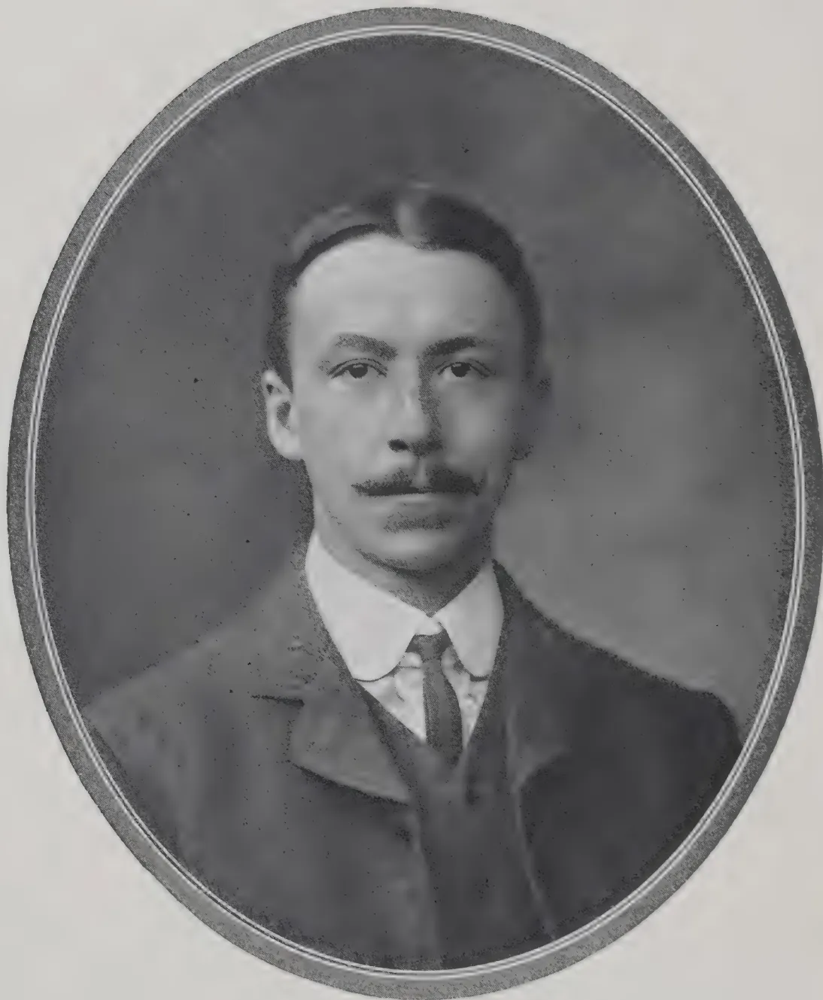A black and white oval-framed portrait of a man with a mustache, wearing a dark suit, white shirt, and tie. The portrait is set against a dark, mottled background within the oval frame.

THE LATE DR. R. H. LOCK, M.A., SC. D.  
Formerly Assistant Director, Royal Botanic Gardens, Ceylon

90------------------------------------------------

## THE LATE DR. R. H. LOCK.

We regret to record the death which took place on the 26th June last of DR. R. H. LOCK, M.A., Sc.D., late of the Department of Agriculture, Ceylon, DR. LOCK was the son of Rev. J. B. LOCK, and was born on January 19, 1879, at Eton College where his father was at that time an assistant master. He was educated at Charterhouse and Caius and took First Class in both parts of the Natural Science Tripos. He was Frank Smart Student in 1902. DR. LOCK came out as Scientific Assistant to the Director of the Royal Botanic Gardens, Ceylon, in 1902, and worked with plant-breeding experiments with peas and maize, and provided the first demonstration of MENDEL'S law based on a large number of crosses. He also carried out experiments on the growth of bamboos which provided BLACKMAN with part of the evidence on which the latter based his theory of limiting factors.

He returned from home in 1908 as Assistant Director, and carried out experiments in plant breeding on tobacco. After acting as Director in 1909, he devoted himself more to the agricultural side, and instituted experiments in selection of paddy and also began experiments with arecanuts. He proceeded home on 3 months half pay leave in 1910, and on his return acted again, a year later, as Director.

As a result of his investigations of the cocoa experiments on Gangaroooa, he was led to question the efficacy of the manures applied in that particular case, and advocated the cessation of manuring for some time—a course which appears to have been justified by the results.

In 1912, DR. LOCK initiated a series of tapping experiments at Gangaroooa which, with the exception of the previous experiment instituted by himself and MR. BAMBER at Heneratgoda, are the first in Ceylon to be conducted on a rigorous experimental basis.

DR. LOCK went home having resigned his appointment on November 20, 1912, and was appointed an Inspector under the Board of Agriculture and Fisheries, London, in the following year. During his stay in Ceylon DR. LOCK identified himself with sport and was a member of the Ceylon Mounted Rifles. He played tennis, cricket, and golf, and won the Clifford Cup (Golf) at Peradeniya in 1912. We express our deep sympathy with his widow and bereaved relatives.

91------------------------------------------------

This image is a scan of a blank page. The background is a uniform light beige or off-white color. There are a few very small, dark specks scattered across the surface, which appear to be scanning artifacts or dust particles. A faint, thin vertical line is visible near the center of the page, possibly indicating a fold or a scanning artifact. No text, images, or other markings are present.

92------------------------------------------------

THE  
**TROPICAL AGRICULTURIST:**  
JOURNAL OF THE  
**CEYLON AGRICULTURAL SOCIETY.**

---

VOL. XLV.

COLOMBO, AUGUST, 1915.

**No. 2.**

---

**COFFEE.**

---

Whether or not coffee is destined again to become one of the great staples of Ceylon and other parts of the East, renewed interest is certainly being taken in the product due principally to the advent of Robusta, a species indigenous to Uganda and the Belgian Congo and introduced into Java about the year 1900 whence it has spread to other eastern countries. It has been said that if ever the East should seriously take up coffee planting again it would kill the plantations of Brazil because of the abundance of cheap labour it can command. The labour position of the great planting countries of Asia is undoubtedly very strong compared with that of America or of Africa, and this must always tell heavily in its favour, but the quality of the product produced is also a determining factor. Consumers would not put up with low grade coffee from the East, however cheap, if they could obtain high grade from Brazil at a moderate price, though of course there would always be a market for the inferior product subject, however, to depression if it were produced in great quantity.

The principal characteristics of Robusta coffee are, as is generally well known, earliness, prolificness and disease-resisting power. In favourable situations it comes into bearing within two years from seed and is one of the heaviest, if not the heaviest, yielders now in cultivation. It suffers from leaf disease in the native gardens of Uganda, but in the East it has hitherto enjoyed comparative immunity, especially under light shade. Robusta coffee is suited to low and medium elevations and does not appear to be a mountain coffee like Arabian. In

93------------------------------------------------

74[AUGUST, 1915.

the Government Stock Gardens at Colombo ( sea level ) 75 trees planted on a plot of poor sandy soil are now, though not yet two years old, fruiting well. At Peradeniya ( 1,600 ft. ) seedlings of Robusta planted in 1910 under *Leucaena glauca* shade bore a small crop of berries in 1913. The shade was allowed to get a little too dense and this no doubt checked flowering.

Against the heavy yielding properties of Robusta coffee must be put the fact that it commands a lower price in the market than Arabian, and for that reason may ultimately come to be rejected as a staple. The door may not be finally closed to Arabian, which it is now found does not suffer so much from disease when grown under light shade as when fuller exposed. *C. arabica* could no doubt be rendered more immune by crossing with an immune species, though a difficulty is here met with inasmuch as there is as far as is yet known no immune species in cultivation equal in quality to Arabian, and hence a cross would probably give us a bean of inferior flavour. Many hybrids have been produced. In the Royal Botanic Gardens, Peradeniya, there are several plants of a cross between Arabian and Liberian, but they show variation in type. This is inevitable with new crosses until the type tree has been selected and bred from till the strain is fixed, a process that would last through several generations. Disease-resisting power and flavour should be the principal qualities sought for when selecting the type trees. At the Experiment Station, Peradeniya, there is another hybrid introduced from Paris about the year 1904. It bears heavily and has not suffered permanently from *Hemeleia* though growing without shade. Some beans were sent home in March last for a report on their commercial value and the following has now been received from the Imperial Institute: " The coffee as received was submitted for valuation to brokers, who reported that the sample consisted of parchment coffee which would have been improved by more careful washing. They valued the product, after husking, at 43s. per cwt., and stated that it would sell in competition with 'Robusta' coffee, the Java variety of which is now worth from 46s. to 49s. per cwt. (June 1915) for washed beans of good quality." The average price of Mysore fair to good bold at the time was 78 to 87 shillings. The report also states that the beans " differ considerably in

94------------------------------------------------

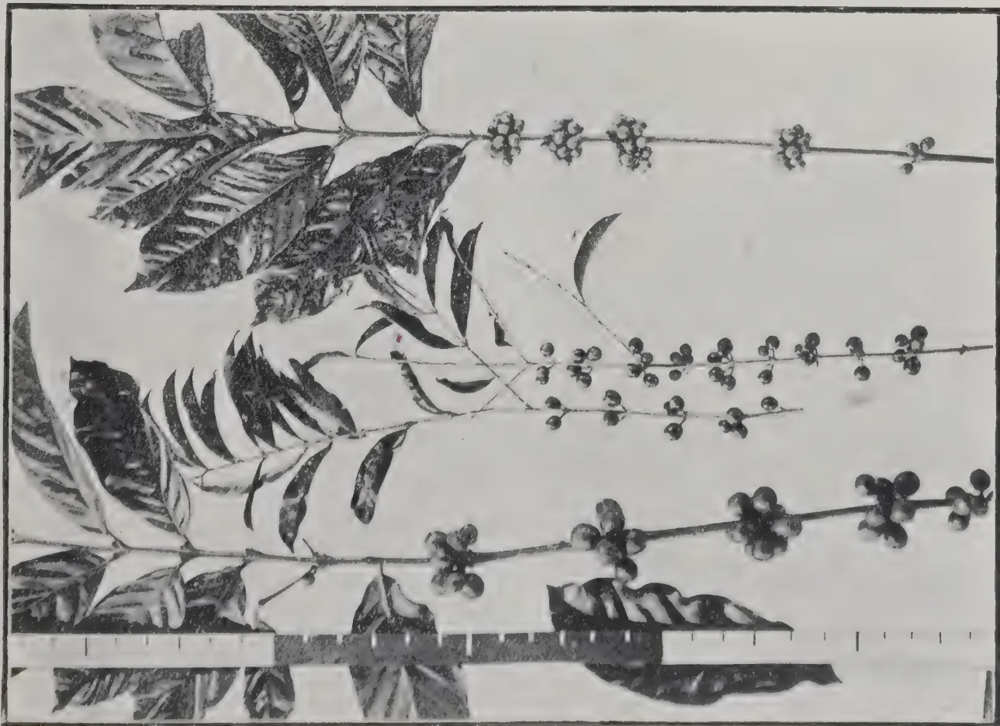

1 LIONIAN COFFEE 2 *Coffea Stenophylla* 3. *Coffea Robusta*.  
 In Raja Botanic Gardens, Peradeniya.

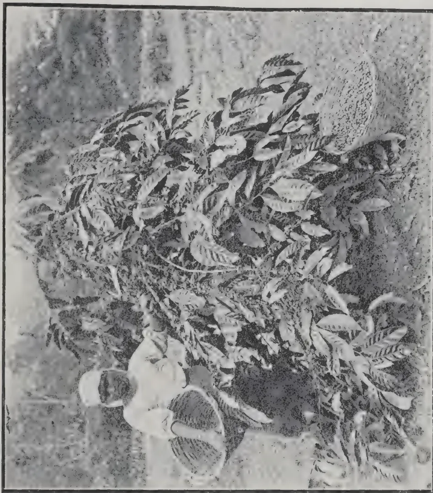

Photo by H. F. Macmillan.  
 HYBRID COFFEE  
 At the Experiment Station, Peradeniya.

95------------------------------------------------

This image is a scan of a blank page. The background is a uniform light beige or off-white color. There are a few very small, faint dark specks scattered across the surface, which appear to be scanning artifacts or dust particles. No text, lines, or other graphical elements are present.

96------------------------------------------------

AUGUST, 1915.]75

composition from the average raw coffees of commerce. The amount of caffeine present (1.76 per cent.) is much above the average, the normal quantity in ordinary coffee being from 1.0 to 1.5 per cent., and the maximum figure recorded 1.8 per cent. On the other hand the percentage of crude fibre (12.6) is exceptionally low, the usual amount being from 20 to 30 per cent. and the lowest figure for a large number of analyses 16.6 per cent. The amounts of protein, ash, and starch are normal, but the percentage of fat is decidedly low."

Bushes of the second generation of this hybrid planted in 1908 first came into bearing in 1912. They were planted without shade, and in 1913 and 1914 suffered severely from green and brown scale and leaf disease, some of them dying. With cultivation, manuring and mulching the survivors revived and are now bearing heavy crops as will be observed from the photograph of one of them reproduced. It is an example of what can be accomplished by cultivation. This hybrid would appear to be a cross between Arabian and Liberian, but some of the bushes approximate in appearance to the one and some to the other. All are heavy croppers. Type trees are being selected for testing flavour and for reproduction on the assumption that those more closely resembling the Arabian in appearance will probably do so also in flavour.

Some fine specimens of *C. stenophylla* exist at Peradeniya, introduced in 1894. They are about 25 feet high, and though they have been allowed practically to run wild under rather heavy shade yet they bear good crops annually. In the KEW BULLETIN of 1893 *C. stenophylla* is spoken of as being sold by a French dealer as 'best mocha' at 4 francs 50 centimes a lb. *Stenophylla* is a possibility for a cross with Arabica. At Buitenzorg, where hybridization has been carried out on a considerable scale, *Stenophylla* has been crossed with *Liberica* but not apparently with Arabica.

There are considerable areas in the uplands of Ceylon too high for rubber and not wet enough for tea, as for example parts of the Uva patnas, that could come under coffee if the problem of immunity *cum* flavour could be solved. We believe we are correct in saying that in the coffee days plantations in Ceylon were not shaded; but, as has been stated, it is now recognised that light shade affords protection from leaf disease.

R. N. L.

97------------------------------------------------

76[AUGUST, 1915.

## UGANDA COFFEE.

The history of the coffees grown in Uganda is as follows :—

The occurrence of coffee in Uganda is first mentioned by SPEKE in his NILE JOURNAL, Appendix p. 636, where he states that coffee "M'wanee" is cultivated in considerable quantities on and about the equator. The trees grow 10-12 ft. high, their boughing branches affording shade.

STUHLMANN, in his account of the Uganda people in Emin Pasha's African Expedition p. 179, states that nearly every native banana plantation has its solitary coffee tree.

He also expresses the opinion' (p. 720) that the coffee plants of the banana groves of Bukoba, on the German East African border of Uganda, appear to be indigenous ; at least not introduced by either Arabs or Europeans. The coffee referred to in this paragraph is undoubtedly the "Bukoba" coffee which was later described by FROEHNER as *Coffea arabica* var. *Stuhlmannii*, and which, from the examination of the type kindly lent to Kew by PROFESSOR ENGLER, appears to be little more than a form of *C. robusta*. Linden. This variety was afterwards raised to specific rank by ZIMMERMANN as *C. bukobensis*.

According to SIR HARRY JOHNSTON (UGANDA PROTECTORATE, vol. i. p. 288) the coffee plant "whether originally introduced or not from Abyssinia is at any rate native now in a semi wild form to the better forested regions of the Uganda Protectorate, its berries producing coffee of excellent flavour."

Again in vol ii., p. 674, speaking of the Bantu people, SIR HARRY says that the coffee tree is probably indigenous to the forests of Uganda and the neighbouring islands in Lake Victoria.

In 1962 J. MAHON communicated to Kew dried specimens of "the common coffee of the country, collected from bushes 20 ft. high in a deserted native garden," and other specimens grown in the Entebbe Botanic Gardens from a seedling sent from Kew in 1901. The plants are practically identical, except that the ones from the native garden have smaller leaves, as might be expected from a neglected bush, and may without doubt be referred to *C. robusta*, Linden.

It seems clear, therefore, that the wild coffee of Uganda which is found in native gardens and plantations is *Coffea robusta*, Linden, a species which, as DE WILDEMAN has already suggested, may be merely a variety or local race of *C. canephora*, Pierre, which was originally described from specimens from the Gaboon.

To sum up, therefore, we have the following synonymy :—

*Coffea arabica*, var. *Stuhlmannii*, FROEHNER = *C. bukobensis*, ZIMMERMANN = *C. robusta*, LINDEN = *C. canephora*. PIERRE, forma.—KEW BULLETIN.

98------------------------------------------------

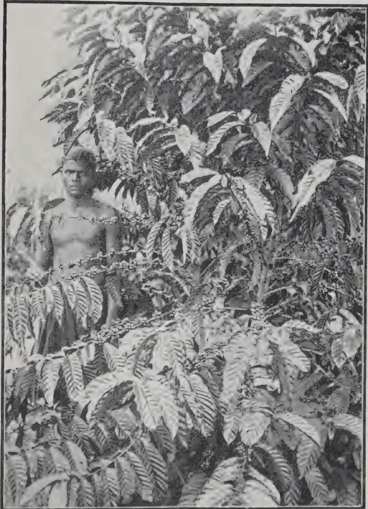A black and white photograph showing a person standing amidst a dense field of tall, leafy plants. The person is shirtless and looking towards the camera. The plants have large, serrated leaves and appear to be coffee plants. The background is bright, suggesting an outdoor setting.

*Photo by H. F. Macmillan.*

COFFEA ROBUSTA.

At the Experiment Station, Peradeniya; received from Java as Uganda Coffee, apparently the same as Robusta coffee.

99------------------------------------------------

This image is a scan of a blank page. The background is a uniform light beige or off-white color. There are a few very small, dark specks scattered across the surface, which appear to be scanning artifacts or dust particles. No text, lines, or other graphical elements are present.

100------------------------------------------------

AUGUST, 1915.]77

# COCONUTS.

## COCONUTS IN THE DUTCH EAST INDIES.

A few remarks about the coconut in these Islands (based on personal experience) may prove of interest. The local name for the nut is "Noere," and the tree is "Noere Tenne." There are at least eight different sorts to be found here, the red and green varieties being most common. Then come the small nuts, one being round as a ball with large meat content, the other cigar shaped. There is also a variety which bears early and forms a dwarf tree, which may be the King Coconut. A nut which is called in Malay Klapa Kenarie (locally Noere Minuk) is also fairly common, though I doubt whether it is a distinct variety. The meat or flesh is very soft and is of no value as copra locally, owing to the difficulty of separating the meat from the shell and the great shrinkage which takes place in drying—though the flesh is said to be very rich in oil. Traders here assert that three hundred nuts go to one picul copra (picul= $133\frac{1}{2}$  lb.) but by choosing the red and green nuts only two hundred and fifty are necessary. Nearly all copra bought from the natives is smoked, as they have no inducement to sun-dry it. Tapping the trees for toddy (toeak) is extensively practised, though the manufacture of arrack (sopi) therefrom is forbidden by the Government. The natives do not consider all trees to be suitable for tapping, and often reject several before finding one that gives a good flow of juice. The method employed is practically the same as that detailed in the MANUAL OF COCONUTS, but chillies are added to the toddy to give it a "bite." I have seen no traces of disease here, but have remarked several trees which exuded a transparent gum. The black beetle is found in large numbers, but only an occasional tree shows the well-known clipped leaf. A small white cockatoo is regarded as being very destructive to half ripe fruit. According to the natives this bird opens the shell and eats its fill, and then calls the red parrot to finish the remainder. I have seen numbers of nuts punctured with a  $1\frac{1}{2}$  inch hole, and have also seen both birds eating the meat, but am not prepared to assert that the puncture is made by a bird and not by the rats. The edges of the hole present the same appearance as that made by the batjing (small squirrel) in Java, though I believe the latter is not found here. In opening my plantation here, I purchased 15,000 nuts and rejected 2,000 as being unsuitable for planting: the remaining 13,000 were steeped in sea-water and immediately stored in a dark godown for one month. They were then taken to the nurseries and planted horizontally six inches by twelve between the nuts with a pathway between every three rows. The nuts were planted to half their depth in the soil and covered with a four inch layer of dry grass. When taken from the godown about 50 per cent. had sprouted, and three months from date of plucking all unsprouted nuts were turned into copra, making total rejections 4,000. At three months I therefore had 11,000 plants and had reduced the purchase price, as the copra was sold at a good profit. At the end of six months I rejected 1,000 backward and ailing plants, and had lost up to that

101------------------------------------------------

78[AUGUST, 1915.

time 500 plants through various causes. The remaining 9,500 plants received a pint of brackish water daily for six months and at the end of one year many plants were over two meters in height by actual measurement, and in no part of the nursery could a man's head be seen above the plants. There were a few exceptions, perhaps 5 per cent., where the plants for some reason formed the crown leaves without reaching the uniform height of their neighbours but on the contrary had a very strong butt. The diameter at the base of plants was always  $1\frac{1}{2}$  inch and often exceeded 2 inches. No manure was applied to the nurseries but they were kept clean weeded. In transplanting the plants to the field I left every third row standing, and these will be planted out as two-year-old plants. A great deal of damage was done to the roots of the young plants, and about three months cessation of growth resulted, but as far as I can judge at present no permanent harm resulted. I may mention that out of 11,000 sprouted nuts there were seven having two sprouts and one having three sprouts. These are all doing well but are more backward than the others. In transplanting I found large numbers of black beetle in all stages, but not one instance of its having attacked the plants. It seemed merely to have used the moist cool ground under the nuts and grass as a breeding place. The four spotted weevil (mentioned by a Philippine authority as attacking only dead trees) was fairly common when the trees were from twelve to eighteen inches high, large numbers of the leaves being broken where the weevil had made its entrance and subsequent excavations; but the plants seemed to resist the attack better as they grew in strength. I caught many weevils by simply slitting the leaf stalk with a knife point; others were found with the head protruding from the entrance to the tunnel. The tunnelling was done usually towards the base and extended to a maximum length of 5 inches, being partly filled with fibrous matter. I never saw larvæ in the tunnels, which vary in diameter from 3 mm. to 5. mm., but of the 500 dead plants alluded to above the majority upon being opened were found to have numbers of small white grubs 10 mm. in length in the growing point and base of the stalk, but no weevils were to be seen.

A. W. A.

---

## COCONUTS IN THE SOLOMON ISLANDS.

---

Coconut planting on a commercial and scientific basis was first started in the group about fourteen years ago by CAPTAIN SVENSEN, a man who had a large experience of the Pacific Islands and is now reaping the benefit of his energy and foresight. Since then planting has been proceeding at an ever-increasing rate, and to-day there are about 25,000 acres under coconuts on plantations owned by white men. Soil and climatic conditions are so uniquely favourable to the growth of the coconut palm that it comes into bearing at a much earlier date than in Ceylon or India. Trees five years old are to be seen bearing prolifically. On the writer's (FRED. GOULD) last visit to the Solomons he saw a tree not six years old carrying considerably over 300 nuts, and this is by no means a record for these islands.

102------------------------------------------------

AUGUST, 1915.]79

The soil is all of a volcanic origin ; mainly rich, deep alluvial, of quite exceptional fertility, mixed with a coral limestone, very suitable for coconut cultivation. Being virgin scrub country it is naturally in splendid physical condition, and exceedingly high in available nitrogen, phosphoric acid, potash and lime, so that it should keep its fertility for a long period of years. The luxuriance of the vegetation which grows right down to the water's edge is an excellent indication of the amount of plant food which the soil contains. The old idea that the coconut thrives best in sandy soil is quite exploded in the Solomons. It has been abundantly proved that in the heavier, richer soils the tree puts on a much more vigorous growth, comes into bearing earlier and yields a heavier crop.—THE LOUISIANA PLANTER AND SUGAR MANUFACTURER.

---

## TO GET RID OF RATS.

The JOURNAL OF THE JAMAICA AGRICULTURAL SOCIETY gives the experience of an old cocoa planter whose smoking-out process is said to have effectually rid his estate of rats.

He built one or more woodfires ready for lighting on the windward side. At dusk with a steady breeze blowing he lighted the fires and threw on them a number of smoke-forming substances (e.g. sulphur, incense, etc.) together with a quart of bird's eye pepper.

In his own experience he says that it is seven years since he tried this remedy and the rats have not returned. Human beings are advised to keep out of the track of the smoke.

The PASTORAL REVIEW recommends that if a few handfuls of sulphur be rubbed over the bags in which grain is stored, rats and mice will not touch them.

---

## OIL CONTENT OF SEEDS.

The oil content of seeds as affected by the nutrition of the plant is dealt with in a paper in the JOURNAL OF AGRICULTURAL RESEARCH, Vol. III, No. 3. It is concluded that climate is a more potent factor than soil type in controlling the size of the seed and its oil content, probably because climatic conditions largely regulate those of the soil.

Within ordinary limits the relative fertility of the soil appears to be a minor factor in influencing the size of the seed and its oil content. In fertilizer tests with cotton, the addition of a complete fertilizer to an unproductive soil gave larger seed and a considerably higher percentage of oil. Application of increased quantities of nitrogen did not affect the size of the seed but lowered the percentage of oil. Increasing application of phosphorus or potassium did not affect either character. In pot culture tests with soy beans, the addition of phosphorus did not change the size of the seed, but increased the oil content.—THE AGRICULTURAL NEWS.

103------------------------------------------------

80[AUGUST, 1915.

# TOBACCO.

---

## TOBACCO GROWING IN QUEENSLAND.

---

Although the tobacco-plant thrives wherever it is sown in Queensland, or even where it is self-planted, it has been found by experience that it was only in certain districts, in certain classes of soils, and under certain climatic conditions that the most perfect qualities of the leaf can be developed. The districts recommended by the Government for the culture of pipe and cigar tobacco are, for the former, Texas and Inglewood, on the southern border of Queensland, and the coast between Bowen and Cardwell in the north. It may, of course, be discovered later on that there are other districts where this form of agriculture may be pursued with profit. The latter kind of tobacco has thriven in the northern district mentioned, and growers there have realised from £60 to £100 per acre for their crops. Cigar-leaf is exclusively grown in the north. The value of an acre of pipe tobacco may be set down at £30, so that it is obvious that only a small area under intense cultivation is needed to ensure a competence. In 1911, 10,044,399 lb. of manufactured plug and cut tobacco were produced. This required 8,546,726 lb. of leaf, of which no less than 7,339,611 lb. were imported from abroad. To this must be added the weight of manufactured tobacco and cigars also imported, so that over 2,500,000 lb. more must be allowed for. British New Guinea has now entered the field of competition with cheap coloured labour. In 1912 eighteen tons of leaf were made into cigars, etc., in that country, and the reduced cost of culture and manufacture ensures a good market in Australia. Under the Commonwealth Counties Act, high grade cigar-leaf receives a bounty of 2d. per lb. for five years if grown under certain conditions.—UNITED EMPIRE.

---

## SELECTION AND PREPARATION OF TOBACCO LAND.

---

### THE NURSERY.

The nursery should be located on rich, well-drained land. It should be covered over with a layer of coconut husks or waste wood and burned. This renders some of the potash salts of the ground more available for the plant food, destroys insect eggs, and kills the grass and weed seeds. The ashes should be dug into the soil as they are good for manure and also prevent the soil from becoming so hard. After digging, the soil should be put into a finely pulverised condition, levelled off, provided with good drains to prevent water from standing on the nursery, and the beds are ready for manuring.

It is better to apply well rotten manures, as they are more cooling and are also less likely to contain weed seeds that would produce weeds to crowd the growth of the tobacco plants. The manure should be worked into the surface soil and the surface made smooth.

104------------------------------------------------

AUGUST, 1915.]81

The middle of October is the best time for sowing the nurseries in the Jaffna District. The seeds should be winnowed in a gentle breeze to get out all of the light and faulty ones. One teaspoonful of seed is enough to sow five square yards of nursery. They must be mixed with a large pan of ashes or other fine material to enable the sower to distribute them evenly over the nursery. Pressing the surface of the soil with a board, or by trampling, will cover the seed sufficiently deep.

All *weeds*, bushes, etc., should be removed from around the nursery, as they make an attractive hiding place for insects which would feed upon the young plants. For the same reason the shade should be erected *over* the nursery instead of being placed upon it.

When rains are infrequent, the nursery should be watered in the early morning or late evening, by sprinkling. If the water is poured on, it will wash up some of the small plants.

If the plants come up too thick, some of them should be plucked out to prevent the remaining ones from producing a weak spindling growth. It is very important to secure sturdy seedlings with a large, short stem and a good root system. Such plants not only live better when transplanted, but grow better and produce better tobacco.

### THE PLANTATION.

Virgin soil produces the best quality of tobacco. The ground should be ploughed deep, at the beginning of rainy season, and sowed to sunn hemp or other green manure crop, to be turned under just prior to preparing the land for transplanting the tobacco. This last ploughing should be only moderately deep as it is better to leave the subsoil in a firm condition. The ground should then be manured broadcast. The manure should be thoroughly mixed with the surface soil by ploughing or harrowing, and the ground put in a well pulverised condition before transplanting. Assuming that sturdy plants have been secured from the nursery, it is not necessary to shade the plants if transplanting is done during the months of December or January, before the sun gets extremely hot. It is best to do the transplanting late in the afternoon. Care should be taken not to double back the roots of the seedlings in the operation of transplanting. A shallow hole should be made by the side of the plant and filled with water. As soon as the water has settled in the hole, the earth should be lightly replaced. By this method it is only necessary to water the young plants once every three or four days. Do not be alarmed if the plants wither a bit when they are set out. As long as the stems do not become shrivelled, the plant is not harmed.

It is a bad plan to pen cattle or sheep on land as a method of manuring, during wet weather, as the tramping of the cattle ruins the physical properties of the soil.

B. F. S.

105------------------------------------------------

82[AUGUST, 1915.

## THE MARKETING OF NYASALAND TOBACCO IN LONDON.

The quantities of unmanufactured tobacco remaining in bonded warehouses or entered to be warehoused at the chief bonding ports in the United Kingdom were as follows on December 31st, 1911 and 1912 :—

<table>
<thead>
<tr>
<th></th>
<th></th>
<th>1911.</th>
<th></th>
<th>1912.</th>
</tr>
<tr>
<th></th>
<th></th>
<th>lb.</th>
<th></th>
<th>lb.</th>
</tr>
</thead>
<tbody>
<tr>
<td>London</td>
<td>...</td>
<td>38,842,508</td>
<td>...</td>
<td>41,031,606</td>
</tr>
<tr>
<td>Liverpool</td>
<td>...</td>
<td>107,605,207</td>
<td>...</td>
<td>112,166,858</td>
</tr>
<tr>
<td>Bristol</td>
<td>..</td>
<td>26,069,739</td>
<td>...</td>
<td>25,850,903</td>
</tr>
<tr>
<td>Leith</td>
<td>...</td>
<td>1,426,062</td>
<td>...</td>
<td>1,615,755</td>
</tr>
<tr>
<td>Glasgow</td>
<td>...</td>
<td>8,794,991</td>
<td>...</td>
<td>10,598,038</td>
</tr>
<tr>
<td>Dublin</td>
<td>...</td>
<td>1,120,295</td>
<td>...</td>
<td>1,014,628</td>
</tr>
<tr>
<td>Belfast</td>
<td>...</td>
<td>9,132,339</td>
<td>...</td>
<td>11,778,634</td>
</tr>
</tbody>
</table>

It is clear from these figures that there should be a good market for the better grades of Nyasaland tobacco in provincial ports of the United Kingdom, but the results of enquiries show that it will be just as difficult to dispose of the lower grades there as it is in London.

It is however worth while to consider plans for avoiding the heavy dock and other charges in London, but representations to the Port of London authority are not likely to succeed unless action were taken by the tobacco trade of this country as a whole. It is understood that the attempts already made to sell Nyasaland tobacco in provincial ports of the United Kingdom have not been very successful, but this may be due to the fact that only low grades have been offered there.

The following plan may be worth consideration :—The planters in Nyasaland might combine to start a central grading and packing warehouse in Nyasaland, or perhaps one of the large buying houses in the country might undertake this work. The planters might send their cured tobacco to this warehouse, receiving an advance, the amount of which would depend on the quantity and quality of the tobacco deposited.

The tobacco would be graded and packed at the warehouse under expert supervision, and the manager would submit to manufacturers in the United Kingdom typical samples of the season's grades and ask for direct orders.

If this system were successful the tobacco could be shipped direct to the port nearest to the manufacturer's factory.

There are several objections to this plan ; thus, manufacturers like to buy on dock samples, and it might be difficult to overcome this preference, at any rate at first. Again it is stated that the quality of the tobacco produced in Nyasaland varies during the season, so that the grades would change during the season. Further, it seems likely that there may be advantages in having a large stock of Nyasaland tobacco awaiting sale in the United Kingdom, as it is then on the spot to meet any sudden demand. The plan would, however, have some advantages and may be worth consideration.

It seems clear that there is no prospect of arranging for public sales of tobacco in the United Kingdom, so that the question of avoiding or reducing the heavy charges for dock and warehouse accommodation, now paid in

106------------------------------------------------

AUGUST, 1915.]83

London, resolves itself into either selling direct to manufacturers in the provinces as suggested above, or in interesting provincial merchants and brokers in the sale of Nyasaland tobacco to manufacturers. The third possibility, viz., the general improvement in the quality of Nyasaland tobacco so that it can be sold more quickly and at higher prices, when these admittedly high charges would bear less heavily upon it, has been referred to already.

### QUALITY OF NYASALAND TOBACCO.

From figures supplied to the Imperial Institute it appears that in the season 1912-13, the percentage proportions of the various grades of Nyasaland tobacco marketed were as follows :—

<table>
<tr>
<td>First grade</td>
<td>3.18</td>
<td>...</td>
<td>Fourth grade</td>
<td>28.6</td>
</tr>
<tr>
<td>Second ,,</td>
<td>14.69</td>
<td>...</td>
<td>Fifth ,,</td>
<td>20.5</td>
</tr>
<tr>
<td>Third ,,</td>
<td>22.06</td>
<td>...</td>
<td>Sixth ,,</td>
<td>10.9</td>
</tr>
</table>

It is clear from these figures that a very large proportion of Nyasaland tobacco placed on the English market in 1913 was of very low grade, and it is this low grade tobacco which is the source of all the present trouble. The tobacco received this year from Nyasaland is said to contain less low grade material. There is a very small market in this country for anything but the better grades of the Virginian types of tobacco, and therefore low grade brown and nondescript tobaccos are extremely difficult to sell, and when they are sold they fetch very low prices. That is the reason why Nyasaland tobacco sometimes has to lie in the London warehouses for years before it is sold. As this is the crux of the whole question the Imperial Institute has made enquiries on the point from manufacturers, brokers and merchants in London, and the following is a selection from the opinions expressed :—

### MANUFACTURERS.

(1) "We are constant users of the Nyasaland tobacco, but we always buy from London or Liverpool dock sample, and will be pleased at any time to consider any such sample sent us, provided they are of good quality."

(2) "Nyasaland tobacco is often of dark colour, and in this respect it was especially bad last season (1912-13 crop). That is the chief reason why it sold so badly. This year's crop is better. Nyasaland tobacco will not absorb much water, and therefore, unless cheap, is not economical to use. Irish and Canadian tobaccos are better in this respect. Both these types are now being produced of good quality."

This firm already uses a fair quantity of Nyasaland tobacco and is anxious to use more if the planters will produce what is wanted, viz., "bright" tobacco. The Admiralty already buy a good deal of Nyasaland tobacco. Manufacturers in the United Kingdom have no special interest in, or prejudice in favour of, American tobacco, and other things being equal they will buy Colonial tobacco in preference to that from other sources, including America.

### BROKERS.

"We have had considerable experience in the sale of Nyasaland tobacco during the last few years.

"With regard to the complaint that the tobacco lies a long time in warehouses here, and then realises low prices, this may be justified when shipments consist of low and mixed grades, as for these there is a very small sale.

107------------------------------------------------

84[AUGUST, 1915.

"With better grade tobacco, i.e., good "bright" and "semi-bright" leaf, there is as a rule a fairly quick sale, at good market prices, and as this better grade of tobacco is coming more into favour with manufacturers here, there is a steady demand for it, which demand will, we feel sure, greatly increase, so that it behoves planters to do their best to improve the quality of their crops.

"Speaking for ourselves, we consider that, taking Nyasaland tobacco on its merits, full value has been obtained with all sales, especially as this growth was, for some considerable period, looked upon with disfavour by the majority of manufacturers."

### MERCHANTS.

(1) "My firm, from the very commencement, has taken a great interest in this Nyasaland tobacco, and was largely instrumental in introducing it to the British market. With regard to the complaints mentioned in your letter about the difficulty of selling the tobacco in our market, and the poor prices realised, I can state as follows :—

"The principal demand in our market is for 'bright' tobacco, which sells quickly and realises a good price. 'Brown' and 'nondescript' tobaccos on the other hand, such as predominated principally in the large crop of 1912-13, have only a limited sale and command a poor price. The complaints in question are no doubt largely due to the poorness of this crop, which was a most troublesome and difficult one to handle. The efforts of planters should therefore be directed to the production of a 'bright' tobacco, a small crop of which will pay better than a large one of 'brown' and 'nondescript' tobacco.

"Care should also be taken to avoid shipping tobacco late in the season, as it is likely to be held up on the way to the coast through the low state of the river, and owing to this cause very often too brittle to handle. If it is possible for the Nyasaland planters to act as suggested above they will, I believe, have more satisfactory results in the future.

(2) "We note your remarks with reference to the complaint made by Nyasaland planters with respect to their shipments of tobacco to this side, and in reply to your enquiry as to whether these complaints are justified, and also if we can put forward any suggestion to overcome the difficulty, we would point out that the trouble is caused purely by the inferior quality of the majority of the tobacco that arrives here from Nyasaland. Buyers on this side will not even trouble to look at the dark leaf which comprises the larger proportion of most of the shipments.

"Therefore, it appears to us that the only permanent remedy that can be arrived at is for the planters to endeavour to improve the quality of the stuff sent here, which will result in their finding a ready sale for their produce, as good, fine, light tobacco of all growths is quite easy to dispose of to buyers."

It will be seen that these firms are unanimous in stating that it is only the lower dark coloured grades of Nyasaland tobacco which do not sell readily in the market, and that if larger quantities of the better grades could be produced the sales of Nyasaland tobacco would increase rapidly.

The question for the planters is therefore that of augmenting the production of first grade "bright" or "semi-bright" tobacco. Opinions differ as to the cause of the large proportion of brown, dark and nondescript tobaccos

108------------------------------------------------

AUGUST, 1915.]85

in the Nyasaland output. It seems likely that the soil on which the tobacco is grown has a good deal to do with this matter. The ideal soil for the production of "bright" tobacco is a rather sandy loam, and it seems possible that much of the soil on which tobacco is grown in Nyasaland is too rich to yield first grade tobacco of the Virginian type. This is a problem which can only be solved by co-operation between planters and the Department of Agriculture, and it would be of great assistance if the Department of Agriculture could get from planters data which would enable it to determine the proportion of first grade tobacco obtainable from different types of soil in Nyasaland.

Another factor which favours the production of "brown" and "non-descript" tobacco is excessive humidity of the atmosphere and a high rainfall.

Even in the best tobacco-growing districts of the United States there is always some "brown" and "nondescript" tobacco in the crop, and this is usually attributed to the presence of unripe or over-ripe leaves. The proportion of low-grade tobacco due to this cause is, however, usually small, and though some of the low-grade produce in the Nyasaland output is undoubtedly due to this cause, this certainly does not account for the bulk of it.

If the investigation suggested above proves that the cause of the high proportion of dark coloured tobacco is due to over-richness of soil and excessive humidity, it may become necessary to restrict tobacco cultivation to certain areas, or to produce by selection a tobacco which will give a "bright" crop even under what are now regarded as unsuitable soil and climatic conditions. Nyasaland has already successfully evolved a good local type of cotton, and there seems to be no reason why a similar solution should not be found for this difficulty in tobacco cultivation.

The other complaint made by manufacturers is that Nyasaland tobacco will not absorb as much moisture as American tobacco, and is therefore less economical to use. This is not such a serious matter at the moment as the question of the dark colour of the tobacco referred to above, but it is of great importance to the future of Nyasaland tobacco. The defect is probably due to a difference in the texture of Nyasaland tobacco as compared with the American product, but nothing definite as to the cause can be suggested at present. The Imperial Institute proposes to investigate the question, and a report on the subject will be furnished in due course.—SUPPLEMENT TO THE NYASALAND GOVERNMENT GAZETTE.

## SEED-SELECTION AND BEDS.

Last month we discussed soils, and now come to the important item of selecting and raising seeds. To get the right seed you must go not only to the right plant, but to the last word in the particular variety of the plant that you wish to raise, and even then having got the most suitable plant and the best seed, still go over the latter carefully and see that you use only the best of the best. We believe in most cases that your choice as regards the variety and hence the seed that you wish to select, forces you to consider not only the type you wish to rear, but also the markets that it will probably pay you best to supply. On this point the Orange Judd Company's book\* will give

\* THE TOBACCO LEAF, by KILLERBEW AND MYRICK; in London of Tropical Life Publishing Department, Price 11s. 6d., post free.

109------------------------------------------------

86[AUGUST, 1915.

you very full information as it devotes many pages to the various kinds of tobacco as well as including tables and details of the numberless varieties that they discuss. If they do not discuss every variety known, then we trust that we may never be compelled to complete the list.

"No step in the culture of tobacco is more important than proper care in the preparation and sowing of the seed beds," this book tells us. "This work cannot be neglected in manner or season without running the risk of making a partial or total failure of the crop. To make good beds is a laborious task, and requires ripe judgment both in the selection of the location, the soil, and in the preparation of the land." Of this more anon. Plants, we believe, have to be carefully acclimatized and so in at least some parts of America, we understand, the rule is not to raise crops from freshly imported seeds, but to let the plants become acclimatized first. As regards KILLEBREW's book we must own that the plan they propose is not quite clear to us, but as it may be to others we will quote what they say, then give the page to let our readers look it up for themselves. "Some growers of fine cigar wrappers," we are told, "import seed from the best Vuelta districts of Cuba and grow it, as previously described, for four years in succession before saving seed for crop purposes, and thus succeed in raising a uniform article year by year. Crops are never raised from freshly imported seed,\* because several years are necessary to thoroughly acclimatize the plant. The idea that Havana seed should be used only for a few years after importation, that it deteriorates, runs out, runs into seed leaf, etc., is disputed by many of the most skilful growers in Connecticut valley, who believe that these results arise more from cross-fertilization than from any other cause. It is true that soil and climate gradually change the size and fragrance of the leaf in the course of a long term of years, but this change does not necessarily lessen the quality of the leaf for wrappers if proper attention is paid to raising and selecting the seed. They believe that the quality, instead of deteriorating, steadily improves under the careful cultivation given to it," (see p. 166-167). "Tobacco," we are told on p. 163, "apparently has a natural inclination to depart from a fixed type and break into sub-varieties, thus adjusting itself to the climate and soil in which it is placed." If, however, in adjusting itself to its new surroundings, it loses or changes even those points which cause it to be preferred over all others, then of course the object of its introduction is not attained.

The seed is, of course, very small—estimates vary in placing the number per ounce at 287,000 up to 389,000 seeds. If all the seeds of a single plant germinated and the plants all thrived, then one plant would supply sufficient seed to plant 250 acres. An average head, says KILLEBREW, contains eighty pods, and each large seed pod when properly fertilized and developed contains about 5,000 seeds. Now  $80 \times 5,000 = 400,000$ , so that the above estimates are, to say the least of it, reasonable. The Rhodesian Handbook also calls attention to this (see p. 13) when it tells us: "If all the seeds of a plant were fertile and capable of germination, one ounce of tobacco seed would be sufficient for 300,000 plants. Experience has shown, however, that at least 75 per cent. of the seeds are sterile, and that many of the remainder

---

\* If so, then what becomes of the tobacco raised for the four years as described in previous sentence? Is it thrown away?

110------------------------------------------------

AUGUST, 1915.]87

will produce only small and unthrifty plants, so that for every 30,000 plants required, it is necessary to allow one ounce of seed. Now 30,000 plants would be sufficient to set from four to seven acres of the Virginia type of tobacco, or two acres of the Turkish and cigar tobaccos." Two or even seven acres are much less than 250 acres, so when buying seed, and let this always be of the very best, care must be taken to ascertain what area of land can be covered per ounce of seed purchased as well as sown.

The present problem of increasing the plant's efficiency is not merely one of nutrition but a problem which touches on the physical basis of life. It consists in an endeavour to adjust the properties of protoplasm to external conditions, and such an endeavour requires the application of research.

In this respect very interesting results have been obtained, the Barbados AGRICULTURAL NEWS of May 8 tells us, in regard to the influence of shade upon assimilation. The Florida work in connection with tobacco is probably well known to most persons. The idea originated from a chance observation that some Sumatra tobacco grown near trees where it had been partially shaded was superior in quality to the rest of the field. Experiments were then begun to produce tobacco under artificial shade. The first method of shading was with lattice work which produced good results, but on account of the ease of erecting, openly woven cotton cloth has replaced the lattice work. After a few years of successful work in Florida, the idea was taken up by other States, and now growing tobacco under shade is an important industry not only in the United States but in South Africa, Java, and other countries. It is of interest to record that this method of cultivation has been tried locally in St. Kitts with highly satisfactory results. The point to bear in mind in connection with this work is that it consists in producing a change in the activity of the plant cells, in a re-adjustment of functions; and is on a different plane altogether to the influence of soil nutrients.—TROPICAL LIFE.

---

## SEAWEEED AS MANURE.

Sea weed, which is plentiful on some coasts, forms a cheap and valuable manure.

The composition varies with the variety, but the following may be taken as the approximate analysis:—

<table>
<tbody>
<tr>
<td>Water</td>
<td>...</td>
<td>...</td>
<td>...</td>
<td>80 per cent.</td>
</tr>
<tr>
<td>Organic matter</td>
<td>...</td>
<td>...</td>
<td>...</td>
<td>10—20 ,, ,,</td>
</tr>
<tr>
<td>Nitrogen</td>
<td>...</td>
<td>...</td>
<td>...</td>
<td>3—73 ,, ,,</td>
</tr>
<tr>
<td>Potash</td>
<td>...</td>
<td>...</td>
<td>...</td>
<td>3—19 ,, ,,</td>
</tr>
<tr>
<td>Phosphoric acid</td>
<td>...</td>
<td>...</td>
<td>...</td>
<td>1—5 ,, ,,</td>
</tr>
</tbody>
</table>

From the above analysis it will be seen that sea weed is comparable as a manure with farmyard manure, being, however, slightly deficient in phosphates.

It has the advantage of being free from weed seeds.—JOURNAL OF AGRICULTURE, VICTORIA.

111------------------------------------------------

88[AUGUST, 1915.

# RUBBER.

## WILD RUBBER AND SELECTION.

DR. CRAMER, of Buitenzorg, in a paper under this title, gives some useful hints to growers on the selection of *Hevea*. This subject, he points out, has been neglected, or at any rate undertaken on wrong lines. The selection of *Hevea* should commence with the seed-bearers, and not be entirely confined to the seeds or the seedlings. According to the author's personal observations of both wild and cultivated trees, considerable variation occurs in the shape and size of the seeds from different examples and also in the productiveness of wild trees, among which "barren" individuals are sometimes found. DR. CRAMER gives reproductions of photographs of a series of seeds from trees of *H. brasiliensis* growing in the same localities in Brazil, which show striking variation in size. The impossibility of determining critical species from seeds alone is evident from the author's remark that "the difference in (seed) characters in *Hevea Randiana* (a closely allied species) and *H. brasiliensis* is less marked than may occur between the seeds of two trees of true *brasiliensis*."

The wild trees observed by DR. CRAMER were all from the lower reaches of Brazilian rivers, which often overflow their banks at high tide; and he suggests an interesting explanation of the cause of marked differences which are shown in adjacent trees in such localities. Frequently seeds may be observed floating down the rivers from the upper reaches, and these become stranded in quiet corners of the banks, where they form a layer on the water. At high tide they are immediately transferred to a considerable distance on the adjoining banks, where they germinate. Therefore many of the trees now growing in the lower reaches of Brazilian rivers are really the direct offspring of upper region types and thus a mixture of the two races has been brought about.

Part 5 of the paper deals with experiments on seedlings and tables and photographs are given showing their relative variation from different stocks.

In part 6, DR. CRAMER points out that, according to the late DR. HUBER, the Tapajoz region of Brazil where WICKHAM obtained his seeds, is not the place from which the best rubber is at present obtained, and as nearly the whole of the East India plantations have been stocked from seeds gathered in this region, it is therefore assumed that the quality of the rubber is not so good as it might have been had the first seeds been gathered in the Acre district of the up-river regions, i.e., on the Beni and other tributaries of the Upper Madeira and Purús rivers, where the best rubber is at present obtained. There is, however, no indication that this rubber is superior to that which used formerly to be collected in the Tapajoz region.

The question is discussed as to whether this Acre or up-river *Hevea* may be a distinct variety or subspecies of *H. brasiliensis*, as is the general belief in Brazil, and DR. CRAMER is himself inclined to this opinion.

112------------------------------------------------

AUGUST, 1915.]89

It should be noted that DR. CRAMER'S work on Hevea selection so far concerns the character of the seedlings only, and it remains to be seen whether the young plants showing the most vigorous growth will prove to give the greatest yield of latex.

DR. CRAMER'S interesting contribution concludes with notes on the practical importance of careful choice of the best producing varieties of other agricultural crops, citing as examples the advantages which have accrued from the introduction of *Cinchona Ledgeriana*, with a bark richer in quinine than the elder *C. officinalis*, the replacement by Assam of the old China tea, and the revival of the coffee cultivation in Java by the advent of *Coffea robusta*.—J. H. in KEW BULLETIN.

## SOME RUBBER NOTES.

Exports of wild rubber from German East Africa, which in 1910 reached a total of 725,584 pounds, with a value of £145,147, fell off to about half that quantity in the following year, and in 1912, amounted to 379,938 pounds, valued at £59,298. The chief rubber yielding plants native to German East Africa are the *Landolphia Stolzii* and the *Landolphia dondeensis*—the former a vine occurring commonly in the New Langenburg district, north of Lake Nyasa, and the latter a shrubby plant occurring in the southern parts of the Protectorate. Other wild rubber plants are the *Mascarenhasia elastica*, *Landolphia Kirki*, *Landolphia lucida*, *Clitandra Kilmandjarica* and *Holarrhena microterantha*. The wild rubber exported has been collected chiefly in the forest reserves of Kimboza, Mouha, Uluguru (Morogoro) and Unguru (Bagamoyo). Dar-es-Salaam and Kilwa are both reported as producing good wild rubber in considerable quantities.

The planting industry, on the other hand, has made rapid progress during the last few years, the value of exports of plantation rubber, including gutta percha, rising from £20,798 in 1908, to £362,012 in 1912. The Ceara Rubber tree (*Manihot Glaziovii*) has been most extensively planted, although some attention has been devoted to *Funtumia elastica*, *Hevea brasiliensis* and *Ficus elastica*, the area under these three varieties amounting in 1910-11 to 355 acres, in 1911-12 to 698 acres, and in 1912-13 to 1,035 acres. A small *Landolphia* plantation was also established some years ago at Langenburg. During 1910-11, when the area planted in Ceara rubber had reached a total of 63,222 acres, divided between 248 plantations, the high price of rubber led to severe tapping of the trees, which, with wind storms of some violence, resulted in extensive damage, and this induced hasty extension of the plantation with consequent less thorough cultivation and rise of wages through scarcity of labour. The area under Ceara cultivation had risen in 1911-12 to 81,705 acres, and in 1912-13 to 112,258 acres.

The following table shows the quantity and value of the rubber exports for the year 1911 and 1912.

<table>
<thead>
<tr>
<th rowspan="3"></th>
<th colspan="2">1911.</th>
<th colspan="2">1912.</th>
</tr>
<tr>
<th rowspan="2">Tons.</th>
<th>Value.</th>
<th rowspan="2">Tons.</th>
<th>Value.</th>
</tr>
<tr>
<th>£</th>
<th>£</th>
</tr>
</thead>
<tbody>
<tr>
<td>Plantation rubber and gutta percha (destination Germany and the United Kingdom)</td>
<td>671</td>
<td>180,480</td>
<td>998</td>
<td>362,012</td>
</tr>
<tr>
<td>Wild rubber and gutta percha (destination Germany)</td>
<td>168</td>
<td>58,568</td>
<td>181</td>
<td>59,298</td>
</tr>
</tbody>
</table>

113------------------------------------------------

90[AUGUST, 1915.

Attempts have been made to improve the economic condition of the industry in this protectorate, mainly by means of less expensive methods of tapping and by utilization of catch crops or of secondary cultures, such as beans and maize.

#### RUBBER ON THE GOLD COAST.

During the past six years 250,000 Para rubber plants and 1,500,000 seeds, have been distributed by the Government of the British Gold Coast Colony, and many trees have reached the tapping stage. The Government is instructing and encouraging the natives in improved methods of tapping and preparation of latex, through its agricultural stations. Attempts have also been made to cultivate *Funtumia elastica*, but the plants have suffered greatly from violent winds and tornadoes.

#### RUBBER IN THE FRENCH COLONIES.

French colonial possessions exported over 400,000 pounds of crude rubber and 363,999 pounds of balata gum during 1914. Of the crude rubber Cochin China exported at least 300,000 pounds, and the French Ivory Coast colony about 93,422 pounds, while the balata gum was all exported by French Guiana. Of the Cochin China rubber, 292,761 pounds went to France, the balance to Singapore; less than 80 pounds of the total was forest rubber, the remainder being all of the plantation type.

#### HEVEA IN DAHOMEY COLONY.

A French colonial inspector reports that a group of *Hevea brasiliensis* trees planted in 1898-1899 near Porto Novo, French Dahomey colony, is now producing exceptionally well. Prior to 1914 these trees received no regular attention, but in August last year a real attempt at tapping was made, and the trees yielded from 2 to  $4\frac{3}{4}$  pounds of dry rubber each. Those trees that yielded only 2 pounds of dry rubber were plants that had been mistreated in the course of former tapings, and had not altogether recovered from the abuse they had suffered. The swampy soil of the Dahomey colony appears to be especially well suited to *Hevea brasiliensis*.

#### "GOHINE" RUBBER.

The French Colonial Department has recently made experiments with samples of rubber prepared from the latex of a vine known as the "Gohine" (*Landolphia Hendelotii*), obtained from the Upper Senegal and Niger districts of French West Africa. Part of this latex came from Konakry, where it was coagulated with lemon juice, part from Koury, where it was produced by spontaneous coagulation. Vulcanized fine Para hard cure was used as a standard in comparing the vulcanized products of these different samples of "Gohine" latex, and the experiments showed that the difference in the manner of coagulation had but very little effect on the vulcanized product. Samples of "Gohine" latex obtained from Portuguese colonies, where it was coagulated with such vegetable acids as lemon juice, Guiana sorrel juice, "manina" and the like, show, when vulcanized, but slight technical differences. "Gohine" rubber can be classed among good vine rubbers, suitable for industrial purposes.

114------------------------------------------------

AUGUST, 1915.]91

### THE TACKINESS OF RUBBER.

Sometimes, in the course of transportation or in storage, crude rubber becomes "tacky," thus losing its elasticity and nerve. This phenomenon has often been attributed to the action of microbes, but a French scientist—M. BERTRAND—attributes this alteration or decomposition of crude rubber to the action of physico-chemical agents. He states that when rubber becomes "tacky" it is due to a molecular transformation. Exhaustive experiments made by F. HEIM and R. MARQUIS confirm BERTRAND's views, for they state, in giving an account of their experiments, first, that the turning of crude rubber into a pitchy, tacky mass is due to the absorption by the rubber of the oxygen of the air, this absorption being favoured by a rise in temperature; secondly, that a small quantity of oxygen is sufficient to decompose a large quantity of rubber, and thirdly, that smoking after coagulation preserves rubber from becoming tacky, at least under the conditions present during their experiments. Air is therefore the enemy of crude rubber, which, in order to keep, must be preserved from it. The action of smoke is to cover the crude rubber with a coating that preserves it from air, and therefore formaldehyde and creosote are not really the preserving factors of the smoking treatment of rubber.—INDIA RUBBER WORLD.

---

### THE MANUFACTURE OF PENCILS.

The Committee employed MR. LUBER, a pencil expert, to inspect the Shimoga forests where varieties of soft white woods suitable for pencils are available and to submit a report on the practicability of starting the manufacture of pencils in Mysore. The results of his investigation indicate that 40,000 cubic feet of suitable wood can safely be estimated as the annual yield of the forests at Shimoga. Specimen pencils out of the wood locally available were prepared, and estimates for a pencil factory with an outturn of 300 gross of pencils per day, absorbing about 11,000 cubic feet of wood per annum, were submitted. It was ascertained from independent inquiry that the market in Southern India for pencils is sufficient to absorb the whole output of the factory and the estimates prepared by the expert showed that pencils can be made locally with a fair margin of profit. In view of the fact that the industry on the scale contemplated was quite new to India, Government were recommended to pioneer the industry in the State by establishing a pencil factory with a capital of Rs. 150,000, as a Government undertaking. Unfortunately no action could be taken just then on account of the War. Government have recently passed orders to the effect that the question of pioneering the industry will be considered if private enterprise does not come forward to establish the industry in the State.—ANN. REPT., INDUSTRIES AND COMMERCE COMMITTEE OF THE MYSORE ECONOMIC CONFERENCE.

115------------------------------------------------

92[AUGUST, 1915.

# COTTON.

## HINTS ON COTTON CULTIVATION.

*Season.*—It is important that the season chosen should be one that insures that at the harvesting there should be little or no rain. During the first three months of growing, flowering, and bolling there should be constant showers, and during the last two months bright dry weather for the bolls to open. Too much rain at the time the bolls are setting, i.e., at the end of the third month and in the fourth, will cause many to drop off.

*Situation.*—The ground should have good natural drainage; any depressions in which stagnant water lies damages the crop.

*Preparation of Land.*—The land should be ploughed at least twice, and three times is better still, so that the soil is well mixed and pulverised in the cross-ploughing. If cattle or artificial manure is to be applied it should be broadcasted after the first ploughing. The land should then be set out in ridges 3-4 feet apart, especially when the crop is to be irrigated.

*Planting.*—The distance apart must depend on the variety; thus for ALLEN'S Long Staple, grown in rich soil 4 ft.  $\times$  1 $\frac{1}{2}$  ft. apart is not too much, but for smaller varieties such as Egyptian on medium soil (a really poor soil is useless for cotton) 2 $\frac{1}{2}$   $\times$  1 $\frac{1}{2}$  feet is recommended.

Holes should be  $\frac{1}{2}$  inch deep, half-way up the ridge and on one side only, if the ridges are the proper distance apart.

Only selected seed of good quality and a bona fide variety should be sown. Seed kept from the bulk of the last crop will always yield a deteriorated cotton.

If the weather is dry at the time of sowing, the seed may be soaked in water for a few hours before sowing. 6-8 seeds should be sown in each hole, and they should germinate within a week.

When the plants are 15 inches high they should be thinned out so as to leave the two strongest plants. Those with a red dot at the base of the stalk and leaf are of the poor variety known in Egypt as "Hindi" cotton, and should always be taken out.

*Cultivation.*—The ground must be kept as clean as possible and free from weeds during the growing period. As soon as the plants are 2 feet high drag soil towards the plants so as to strengthen the base and support the stem. This can be done when weeding, with a mamotty; the soil should be piled 2 or 3 inches high round each plant, and it is a safeguard against the plants being blown over by the wind. Always make the rows to run north-east and south-west, as they are less liable to be damaged by the wind. Cultivation of soil should be finished before the plants obtain their full growth: as soon as flowering commences and the bolls setting the plants should as far as possible be left undisturbed.

116------------------------------------------------

AUGUST, 1915.]93

*Supplies.*—All vacancies should be noticed as early as possible and replanted with *seeds*. Do not supply with plants when thinning out as they never do any good—probably because the long tap root has been injured. I have never succeeded in any transplanting.

*Pests.*—When the plants are well up, the field should be carefully gone over and all leaves with egg-masses (generally on the underside of the leaves) should be picked off and put in a basket and *burned*. All the caterpillars and other insects should be collected and destroyed. This will prevent the spread of boll-worm, which does so much damage to the cotton directly the bolls make their appearance.

It is important that all the cotton stems should be burnt on the fields directly the cotton is harvested, for, if left, the boll-worm and other pests will breed and multiply in the standing stalks and, hiding in the soil, lie in wait for the next crop.

*Harvesting.*—At an early stage plants burst a few bolls; they should be left alone. It does not pay to gather the crop in small quantities. The greatest care should be exercised in plucking the cotton clean. Never permit a cooly to offer dirty cotton, with little broken pieces of leaf in it; have it all *carefully* picked over. *This is most important.* The whole financial success of cotton depends upon its cleanliness. It must be absolutely clean, and to secure this the greatest care and vigilance is necessary. A conductor who is slack in this respect is useless, and what is more he is cheating his employer. One dirty bale will condemn the rest of the shipment and make a difference between a very substantial profit and a serious loss. Once gain a reputation for clean cotton and your goods will always command a ready sale. Never pick when the cotton is damp with dew or after rain, or before the bolls are properly open and the cotton quite ripe.

*Grading.*—When it is received at the store have it spread out on a platform, exposed to the sun, so as to thoroughly dry before putting away and give the cotton a silky appearance. The first, second and third pickings should always be kept quite separate and the sacks marked, because the first picking is always the most valuable and should fetch a higher price, whereas if the pickings are all mixed together the grade on the whole is considerably lowered. Check all weights carefully. Weigh each picking, weigh the bulk to make certain of being correct and also to avoid being cheated by the pickers. Get the cotton ginned as soon as possible, in order to avoid loss from squirrels and rats and stow away in a dry place.

D. S. CORLETT.

---

## GROWTH OF MILLET AND SORGHUM.

Millet (*Sorghum vulgare*) was drilled on May 14th at the rate of 20 lb. per acre in rows 7 in. apart; the crop reached 7 ft. in height and remained erect. It yielded  $22\frac{3}{4}$  tons of green fodder per acre when cut on August 17th. The crop is useful as giving an early supply of green fodder in dry seasons; the seed costs about 3d. per lb.

A small plot of *Sorghum saccharatum* sown on May 14th produced 25 tons 6 cwt. of green fodder per acre.

Dhura (yellow branching) and white Kaffir corn, plants similar to sorghum and millet, produced 19 tons 3 cwt. and 23 tons 9 cwt. per acre respectively of green fodder.—JOURNAL OF THE BOARD OF AGRICULTURE.

117------------------------------------------------

94[AUGUST, 1915.

# RICE.

---

## SUBSOIL DRAINAGE IN PADDY SOILS.

---

R. CECIL WOOD

This paper is a short account of the experience gained in laying down subsoil drains in paddy land.

The ground chosen for the experiment was about  $1\frac{1}{2}$  acres in extent and is not affected by excess of water. It was more in the hope of reducing the alkalinity from which the land suffers, that the experiment was carried out.

Eight drains were laid 21 feet apart : each drain was 400 feet in length and had a fall of from 1.35 to 0.7 feet.

Two kinds of drains were used : one, a plain loose stone one, the other made of bamboo tubes. The drains were 2 feet 6 inches deep, the stones being filled in to a breadth of 1 foot and a depth of 6 inches. The bamboos were also packed in stone to a depth of 6 inches. The tubes were simply bamboos of about 3 inches bore cut at the internodes into lengths of about 1 foot 3 inches. The diaphragms were removed and the whole piece dipped in tar. They were laid end to end, being threaded up on long thin bamboos. The cost of the stone drains was 8.82 pies per running foot or Rs. 95.73 per acre, that of the bamboo drains, 10.14 pies and Rs. 109.11.10 respectively.

The drains were laid in 1910 and after 3 years cropping have recently been examined. The bamboos were found in a very good state of preservation, but were blocked in several places by silt, owing to displacement of the pipes and to the inadequate fall. This latter is the main difficulty, since on this class of land a considerable fall is seldom available.

That these drains have resulted in an improvement in the land, there is little doubt. A more alkaline piece of land has now been chosen for further trial, since if such land could be reclaimed at Rs. 100 an acre it would show a very large profit.

Other experiments of underdrainage were carried out at Saidapet in Madras.

More recently experiments have been made at Sivagiri. Stone drains were laid down in clayey alkaline land and have been running well for five years, to the marked improvement of the land.—MONTHLY BULLETIN.

118------------------------------------------------

AUGUST, 1915.]95

## THE YIELD OF RICE.

THE PHILIPPINE AGRICULTURIST AND FORESTER publishes the following table showing the yield of rice in the chief rice-growing countries.

<table border="1">
<thead>
<tr>
<th>Country.</th>
<th>Area under rice in acres.</th>
<th>Production in tons.</th>
<th>Yield per acre in bushels of 45 lb.</th>
</tr>
</thead>
<tbody>
<tr>
<td>Spain ... ..</td>
<td>96,000</td>
<td>246,000</td>
<td>126.6</td>
</tr>
<tr>
<td>Italy ... ..</td>
<td>360,000</td>
<td>534,000</td>
<td>73.3</td>
</tr>
<tr>
<td>Egypt ... ..</td>
<td>254,000</td>
<td>375,000</td>
<td>73.3</td>
</tr>
<tr>
<td>Japan ... ..</td>
<td>7,393,000</td>
<td>7,026,000</td>
<td>46.6</td>
</tr>
<tr>
<td>United States ... ..</td>
<td>827,000</td>
<td>517,000</td>
<td>33.3</td>
</tr>
<tr>
<td>India ... ..</td>
<td>70,580,000</td>
<td>28,167,000</td>
<td>19.7</td>
</tr>
<tr>
<td>Philippine Islands ... ..</td>
<td>2,991,000</td>
<td>723,000</td>
<td>10.7</td>
</tr>
</tbody>
</table>

## RAINFALL FOR MAY AND JUNE.

<table border="1">
<thead>
<tr>
<th rowspan="2">Place</th>
<th colspan="2">May</th>
<th colspan="2">June</th>
</tr>
<tr>
<th>1915</th>
<th>1914</th>
<th>1915</th>
<th>1914</th>
</tr>
<tr>
<th></th>
<th>in.</th>
<th>in.</th>
<th>in.</th>
<th>in.</th>
</tr>
</thead>
<tbody>
<tr>
<td>Colombo</td>
<td>11.03</td>
<td>14.30</td>
<td>7.96</td>
<td>10.29</td>
</tr>
<tr>
<td>Kandy</td>
<td>5.04</td>
<td>5.80</td>
<td>6.14</td>
<td>9.30</td>
</tr>
<tr>
<td>Galle</td>
<td>23.04</td>
<td>9.82</td>
<td>6.16</td>
<td>11.15</td>
</tr>
<tr>
<td>Jaffna</td>
<td>3.35</td>
<td>.76</td>
<td>.07</td>
<td>.56</td>
</tr>
<tr>
<td>Anuradhapura</td>
<td>.72</td>
<td>2.75</td>
<td>1.70</td>
<td>.26</td>
</tr>
<tr>
<td>Kurunegala</td>
<td>1.07</td>
<td>4.01</td>
<td>6.18</td>
<td>5.88</td>
</tr>
<tr>
<td>Batticaloa</td>
<td>2.35</td>
<td>1.20</td>
<td>.44</td>
<td>1.15</td>
</tr>
<tr>
<td>Badulla</td>
<td>1.81</td>
<td>3.64</td>
<td>3.99</td>
<td>.66</td>
</tr>
<tr>
<td>Ratnapura</td>
<td>30.65</td>
<td>17.46</td>
<td>21.21</td>
<td>16.51</td>
</tr>
<tr>
<td>Nuwara Eliya</td>
<td>3.30</td>
<td>3.16</td>
<td>12.02</td>
<td>10.90</td>
</tr>
</tbody>
</table>

119------------------------------------------------

96[AUGUST, 1915.

# FRUIT.

## PRUNING AND TREATMENT OF BANANA SUCKERS.

R. G. BARTLETT.

In Jamaica a great deal of attention is given to this subject in order to produce fruit when the market demand is keenest and prices, therefore, highest.

Queensland growers know the great difference in prices obtaining in January and February compared with those of May to September or October. The returns from plantations would be very materially increased if we could regulate our fields to grow bunches in, say, March or April. These bunches are always large and they mature during the months of good prices.

It has been the practice on the school plot to carry out the main pruning in February and March. At that time a fair-sized "follower" is left to each of the three main suckers forming the stool. During the rest of the year the small "peepers" (suckers) are pruned out as they appear. The result has been that 66 per cent. of the total crop has been harvested in the six months, June to December. Actual figures are 54 bunches for six months, January to June, and 103 bunches from July to December. Out of the total 157 bunches only 24 bunches were harvested in January and February—months of wet weather and exceedingly low prices.

Of course it will require careful testing before conclusive results are obtained to show which is the best month or months to allow "followers" to go ahead in order to gain the desired end—i.e., majority of bunches harvested during time of best prices. In this connection, the views of your readers who have considered this matter would be valuable if you could spare space in your journal for the discussion of this subject.—QUEENSLAND AGRICULTURAL JOURNAL.

## THE SEX OF PAPAW PLANTS.

MR. ERNEST C. DAVIES, Charters Towers, writes :—

"MR. C. ROSS, in your May number, tells 'A. H. F. Diddillibah,' that there is no way to tell sex in young papaw plants. Here's an idea that is advocated by MR. GEORGE JOHNSON, Curator of Lissner Park, Charters Towers. I have tried it repeatedly with marked success. To get females, plant only about 5 per cent. of your seedlings, choosing the very smallest and sickliest-looking plants. Destroy all the big strong fellows. Watch for the plants that come up after the main lot have germinated; they are often females. The idea is taken from the general rule of nature, that the female is mostly weaker and smaller in infancy. Watch a litter of puppies or a batch of chickens, for instance. Of course, the rule is not absolutely certain, for there is often a sickly male in every part of Nature, and vice versa, an extra sturdy female; but I get over 50 per cent. of female papaws in this way, and I recently scored twenty-four out of twenty-five plants."—QUEENSLAND AGRICULTURAL JOURNAL.

120------------------------------------------------

AUGUST, 1915.]97

# SOILS AND MANURES.

## GROWTH OF PLANTS IN PARTIALLY STERILISED SOILS.

E. J. RUSSELL AND F. R. PETHERBRIDGE.

Seven important directions have been found in which partially sterilised soils differ from untreated soils as media for plant growth.

(1) There is generally a retardation in germination but sometimes partial acceleration (i.e., affecting some of the seeds only).

(2) There is generally an acceleration in growth up to the time of the appearance of the third or fourth leaves, but sometimes a marked retardation, especially in rich soils heated to 100° C. We have failed to discover the conditions regulating the retardation, and can never predict with certainty whether or not it will set in. On the whole we have observed it more frequently during dull winter days than in the brighter spring or summer days.

(3) When this retardation occurs it is accompanied by a very dark green leaf colour and either the formation of a purple pigment or a tendency for the leaves to curl towards the under side. The whole appearance is strongly suggestive of an attempt on the part of the plant to reduce assimilation.

(4) Later on the purple colour goes and the curling ceases; rapid plant growth then takes place. The subsequent growth is finally proportional to the amount of food present.

(5) Plants grown in soils heated to 100° show a very remarkable development of fibrous root unlike anything obtained on untreated soils.

(6) Plants grown on soils heated to 100° have, in comparison with those on untreated soils, larger leaves of deeper green colour, stouter stems, usually shorter internodes; they flower earlier and more abundantly, and contain a higher percentage of nitrogen and sometimes of phosphoric acid in their dry matter; the roots give up their nitrogen, phosphorus, and potassium more completely to the fruit.

(7) Plants grown on soils heated to 50° or treated with volatile anti-septics showed fewer of these effects; there is only rarely a retardation in seedling growth but usually an acceleration, sometimes a rapid one, succeeded by a period of steady growth which is finally proportional to the amount of plant food present. No specially marked development of fibrous root or shortening of the internodes occurs, but there is an increase in the percentage of nitrogen and sometimes of phosphoric acid in the dry matter as compared with plants raised on untreated soils, and also a more complete translocation of these materials to the fruit—ROTHAMSTED EXPERIMENT STATION REPORT 1913.

121------------------------------------------------

98[AUGUST, 1915.

## LIME REQUIREMENTS OF CERTAIN SOILS.

H. B. HUTCHINSON AND K. MACLENNAN.

This paper (JOUR. AGRICULTURAL SOCIETY, March, 1915) deals with the lime requirements of certain soils (a) for sterilisation purposes, (b) for neutralisation purposes.

### STERILISATION.

Calcium oxide (caustic lime) can produce partial sterilisation effects but not calcium carbonate (chalk, limestone, marl, etc.).

The amount of lime necessary to produce specific effects in different soils has been found to vary greatly and it is not possible to make any general recommendations. The method proposed for indicating the critical amount required is based on the determination of the amount necessary for the production of an alkaline reaction of the soil water; the amounts thus indicated agree very closely with those required for the production of typical partial sterilisation effects in the soil itself, e.g., the inhibition of protozoa and nitrifying organisms. The amount of lime thus indicated not only gives the maximum production of dry matter in the *first* crop following treatment, but also in the first *four* crops.

Certain physical changes also occur about the partial sterilisation point.

### NEUTRALISATION.

The method described for the determination of the lime requirements of the soil is based on the absorptive capacity of the soil for calcium carbonate, this method having the advantage that no absorption is indicated in the case of neutral soils. An application of carbonate to a soil exercises a marked effect in accelerating the process of ammonification, and, to a less degree, nitrification; soils showing a positive lime requirement according to the proposed method have been found to respond distinctly to the application of carbonate (a) by increased ammonia and nitrate production in laboratory experiments, and (b) by greater plant growth in pot culture and field work.

The values of calcium oxide and carbonate have been shown to be identical, provided that the lime requirements for neutralisation purposes are not fully satisfied. After the neutral point is reached calcium oxide exercises its specific effect (see sterilisation above).

In the case of soils on the same geological formation a definite relation between soil reaction and natural flora has been traced. The occurrence of certain plants on acid soils appears to be determined by their capacity of resistance to acidity.—JOURNAL OF THE BOARD OF AGRICULTURE.

## GREEN MANURING EXPERIMENT AT ROTHAMSTED.

Throughout the Rothamsted experiments a number of observations have shown the marked effect of ploughing-in a green crop or a crop residue as a preparation for a succeeding crop. Every four years the residues of a clover crop after carting the hay are ploughed-in on half of the Agdell Field,

122------------------------------------------------

AUGUST, 1915.]99

and the effect on the succeeding crops in the rotation is recorded. In Hoos Field some leguminous crop has periodically been ploughed-in and a number of grain crops have then been grown, almost always with beneficial results.

The growing scarcity of stable manure renders it imperative that some method should be worked out whereby the farmer can get all the benefit of stable manure in some other way, and green manuring affords an obvious means of doing this. Experiments in the laboratory and pot culture house, however, showed that the growing plant has a complex effect on the soil and on other crops, and that one could not without further trial advocate unrestricted green manuring. For example, it was found that the growing plant apparently depressed nitrification and other bacterial actions in the soil, and that some interval was needed between two crops in order that the bacterial processes might become completed.

Another action is indicated as the result of MR. PICKERING'S work at Woburn: one growing crop has an injurious effect on another growing crop apparently through exerting some deleterious influence on the soil. It appears, therefore, that there is another side to the question, and that a growing crop not only takes out certain plant foods (which are automatically returned when the crop is ploughed-in, or can be added as artificial fertilisers), but it may also have other effects. This is while it is actually growing: the residues ploughed-in seem to be wholly beneficial—at any rate no ill-effect has yet been detected in the field, although one (a destruction of nitrate in certain circumstances) has been indicated in the laboratory. So far as our present knowledge goes the best results are only attained when a period of fallow comes after the green manure crop.

Thus green manuring is intimately bound up with fallowing. It was shown in the last Report that fallowing had a very beneficial effect on the crop of barley and further observations to the same effect have been made this year. Winter oats on Sawpit Field taken after a fallow were better than crops fertilised with nitrogenous manures. No green manure or crop residue was ploughed in either for the barley or oats, but this year an experiment was made to find the effect of combined crop residues and fallow on wheat. A four year-old lucerne ley on Broadbalk Field was broken up, fallowed during the hot weather and sown with wheat in October, 1913. The land had received no manure for some years, but the wheat crop was greater than on any plot receiving artificial manures, and at least as large as that on plot receiving 14 tons of farmyard manure. Even more remarkable, however, was the effect on the weight of the grain. Practically all the wheat on the regular plots, with the exception of the unmanured, had the same density, viz: 62.2 lb. per bushel, this being independent of the amount or nature of the fertiliser used. The wheat after lucerne had a heavier grain, weighing 63.9 lb. per bushel.

But in regard to fallowing a difficulty at once arises. While the land is lying fallow it is subject to loss of nitrates by leaching; indeed one of the great merits of green manuring is that it puts a crop on the land in autumn when the stock of nitrates is high and the crop takes up the nitrates and holds them safely from the winter rain. A simple way round the difficulty is to have the necessary fallow only during the dry weather, and it so happens that all our experiments were made under these conditions.

123------------------------------------------------

100[AUGUST, 1915.

It is to clear up these and similar problems that a definite green manuring experiment has been begun. A field is divided into four parts, one of which is farmed with artificials only, one with farmyard manure and artificials, and two with artificials and green manure but no farmyard manure. One of the two last carries leguminous crops and the other non-leguminous crops for the green manure. An eight-year rotation has been drawn up to keep the green manured land as closely cropped as possible, and to reduce to a minimum all losses by leaching; whether other losses will also be reduced has yet to be determined. The eight-year run should show how far green manuring can be regularly practised under farming conditions, and whether periodical fallows will be necessary.

Meanwhile, in view of the marked benefit just recorded of the fallow coming after the lucerne ley and of other results of like nature, the question arises whether, in a dry summer, it is worth while to trouble about the aftermath of the seeds or clover ley (unless wanted for clover seed), and whether it would not be better to take the first cut early and plough up immediately so as to secure a long bastard fallow before the next corn crop. Under dry conditions the aftermath may be worth only little, while the benefit of the fallow is great. The practical difficulty on a heavy loam like ours consists in breaking up a hard baked ley at midsummer sufficiently quickly to avoid interference with other work. Not only for this purpose, but for the general object of being well forward in autumn, there is great need on medium sized heavy-land farms of a plough which will cheaply and efficiently do more than the one acre a day that has for untold years been considered the ploughman's proper and sufficient duty.—ROTHAMSTED EXPT. STN. ANN. REPT., 1914.

---

## SEWAGE SLUDGE AS MANURE.

---

The conclusion of the enquiry of the Royal Commission on Sewage Disposal with the presentation of their Final Report affords an opportunity for reviewing the position as regards the use of sewage sludge as manure.

Small amounts of human excreta are of course applied to the land as such, with or without some preliminary treatment, but the fact that a water-borne system of sanitation is almost everywhere prevalent necessitates the use in some way of sewage as manure if the valuable manurial ingredients of human excreta are not to be allowed to go to waste. Sewage has found application on sewage farms for crops such as cabbages, turnips, mangolds and grass. Its employment in this way, however, has been limited, since large volumes of liquid have to be dealt with, of which even the best-adapted soils can absorb only relatively small quantities, so that considerable areas of land are necessary; and sewage farming in general does not seem to have been a great commercial success.

A further method of utilising the manurial ingredients of sewage, to which much attention has been given, is the application of sewage "sludge" to the land. At the sewage works where the sewage is treated for purification the coarser solids are first removed; after this the finely-divided matter in suspension is removed either by sedimentation, or precipitation with

124------------------------------------------------

AUGUST, 1915.]101

chemicals, or septic treatment. The "sludge" is the sediment so obtained, and in view of its content of nitrogen, phosphate and a small amount of potash, attempts have been made to utilise this product as manure.

It has been found that the most convenient way of disposing of this sludge is to press it into a "cake" after mixing it with lime. In some cases a charge of about 6*d.* per ton is made for it, but in others the sludge is given away to neighbouring farmers, or a small fee may even be paid for its removal.

Speaking generally, properly pressed sludge when in the form of solid cake does not give rise to serious nuisance from smell, and if exposed to the air in dry weather it soon becomes entirely inoffensive. It has, however, a slight smell of fresh sewage, and if kept moist, e.g., if it is exposed to the air during wet weather, it soon becomes putrid and gives rise to offensive odours. For this reason it should, if possible, be stored under cover until it can be distributed on the land, or covered in.

The composition of the pressed cake varies according to its origin; in addition to its manurial constituents it naturally contains a good deal of lime. The actual market value, however, is insignificant owing to the relatively high cost of carriage upon a mixture containing of necessity a large proportion of water, grit, and carbonaceous matter.

Experiments with regard to the use of various sewage sludges in agriculture were first carried out for the Royal Commission on Sewage Disposal about ten years ago.

PROFESSOR SOMERVILLE's trials with turnips, mangolds and swedes at five centres did not reveal any consistent manurial effect from the sludge; and the conclusion was drawn that the nitrogen and phosphoric acid of sludge are in a much less available form than the same substances in sulphate of ammonia, superphosphate and fish meal.

In experiments carried out by MR. MIDDLETON on grass at eight centres the application of the sludge seems to have been useful for the hay crop in the north where the wet summer experienced favoured slow-acting manure, but the sludge produced no results in the south of England. The conclusions were drawn that, for root crops and grass, the action of the nitrogenous and phosphatic constituents of sludge is very slow as compared with the effect produced by nitrogen and phosphates supplied in ordinary artificial manures; that sewage sludge would not appear to be well adapted for such crops as mangolds, potatoes and swedes, which have a short period of growth and require quick-acting manures, and if employed it should be applied in tons rather than in hundredweight per acre; that proper quantities of sludge would be likely to form a good dressing for the slow-growing plants of many permanent pastures and meadows; and that sludge is unlikely to give satisfaction on the very poor clay-soil pastures which are so much benefited by basic slag.

DR. VOELCKER found in pot-trials with wheat that those sludges did best which contained most moisture and most lime, but that high amounts of organic matter and of total nitrogen did not produce a correspondingly good result, while all the sludges tried were somewhat inferior to artificial manures supplying equal amounts of approximately like ingredients. An increase of 10 to 12 per cent. in corn and in straw over the unmanured produce was, on the average, obtained, as against one of 16 to 17 per cent. with artificial manuring. Based on the extra produce obtained the best of the sludges was valued at 10*s.* a ton delivered on the land.

125------------------------------------------------

102[AUGUST, 1915.

The experiments for the Royal Commission on Sewage Disposal did not end with the above trials, owing to the subsequent discovery of an efficient process for "de-greasing" the sludge. It must be explained that natural sludge contains a large amount of grease and soapy matter (equal to from 10 to 15 per cent. of the dry matter). Grease is of no value as manure and, in fact, is supposed to exercise a retarding influence by preventing the ready decomposition of the organic and nitrogenous matters with which it may be mixed.

The effect of these "de-greased" sludges was compared with that of natural sludges on wheat at Woburn and on hay and oats at Rothamsted in 1913-14.

At Woburn the natural sludge was found to contain more moisture, more nitrogen and more soluble nitrogen than the de-greased, an application of 1 ton per acre supplying 45 lb. of nitrogen in the case of natural sludge and 40 lb. in the case of de-greased sludge. The following table shows the yields of grain and straw from various dressings :—

<table border="1">
<thead>
<tr>
<th rowspan="2">Treatment.</th>
<th colspan="2">Weight of produce (untreated—100).</th>
</tr>
<tr>
<th>Corn.</th>
<th>Straw.</th>
</tr>
</thead>
<tbody>
<tr>
<td>Untreated                      ...      ...</td>
<td>100</td>
<td>100</td>
</tr>
<tr>
<td>Natural sludge :</td>
<td></td>
<td></td>
</tr>
<tr>
<td>  1 ton per acre              ...      ...</td>
<td>122</td>
<td>102</td>
</tr>
<tr>
<td>  2 tons per acre            ...      ...</td>
<td>120</td>
<td>112</td>
</tr>
<tr>
<td>  1 ton per acre + <math>\frac{1}{2}</math> ton lime    ...</td>
<td>132</td>
<td>110</td>
</tr>
<tr>
<td>De-greased sludge :</td>
<td></td>
<td></td>
</tr>
<tr>
<td>  1 ton per acre              ...      ...</td>
<td>101</td>
<td>107</td>
</tr>
<tr>
<td>  2 tons per acre            ...      ...</td>
<td>118</td>
<td>102</td>
</tr>
<tr>
<td>  1 ton per acre + <math>\frac{1}{2}</math> ton lime    ...</td>
<td>122</td>
<td>111</td>
</tr>
<tr>
<td>Lime only— <math>\frac{1}{2}</math> ton per acre    ...</td>
<td>113</td>
<td>102</td>
</tr>
</tbody>
</table>

Thus the average increase in grain over the untreated produce was 25 per cent. with the natural sludge and 14 per cent. with the de-greased. The best results were obtained with lime, but that this was not due to lime alone is shown by the yields where lime was applied without sludge.

At Rothamsted, also, the nitrogen content of the natural sludge (1.76 per cent.) was found to be above that of the de-greased sludge (1.55 per cent.) while the content of phosphoric acid was 0.85 and 1.33 per cent. respectively

In the grass experiments the manures were applied at the uniform rate of 20 lb. of nitrogen per acre (equivalent to about half a ton of sludge) with

126------------------------------------------------

AUGUST, 1915.]103

the following results:—

<table>
<thead>
<tr>
<th colspan="3">Treatment.</th>
<th>Yield of Hay per acre. cwt.</th>
</tr>
</thead>
<tbody>
<tr>
<td>Untreated</td>
<td>...</td>
<td>...</td>
<td>17.64</td>
</tr>
<tr>
<td>Natural sludge</td>
<td>...</td>
<td>...</td>
<td>18.64</td>
</tr>
<tr>
<td>De-greased sludge</td>
<td>...</td>
<td>...</td>
<td>16.29</td>
</tr>
<tr>
<td>Calcium cyanamide</td>
<td>...</td>
<td>...</td>
<td>21.59</td>
</tr>
<tr>
<td>Nitrate of soda</td>
<td>...</td>
<td>...</td>
<td>25.93</td>
</tr>
</tbody>
</table>

The effect of the sludges was negligible. It should be mentioned that the season was a distinctly dry one.

Experiments with oats were carried out on the same plan, but from neither of the sludges was so good a return obtained as where no treatment was given, the sludges being applied so as to supply 16.67 lb. of nitrogen per acre.

The results of the Rothamsted experiments are taken to indicate the lack of evidence to the effect that the removal of the fat from the sludge increases the ease of decomposition in the soil.

The point towards which laboratory and other experiments should in future be directed seems to be the discovery of some method of rendering the nitrogenous matter of the sewage sludge more readily available as plant food than at present.—JOURNAL OF THE BOARD OF AGRICULTURE.

## THE FLUCTUATIONS IN NITRATE CONTENTS OF SOILS.

E. J. RUSSELL.

The amount of nitrate in the soil of arable land fluctuates regularly, but in these experiments it rarely exceeded the following values:—

<table>
<thead>
<tr>
<th></th>
<th>Per million.</th>
<th>Per cent.</th>
<th>Lb. per Acre, 0.18 ins.</th>
</tr>
</thead>
<tbody>
<tr>
<td>Sand</td>
<td>... 6</td>
<td>.0006</td>
<td>28</td>
</tr>
<tr>
<td>Loam</td>
<td>... 23</td>
<td>.0023</td>
<td>115</td>
</tr>
</tbody>
</table>

(excepting on heavily dunged land, when it rose to 37 parts per million).

<table>
<tbody>
<tr>
<td>Clay</td>
<td>... 14</td>
<td>.0014</td>
<td>60</td>
</tr>
</tbody>
</table>

In almost all the soils examined accumulation of nitrate took place most rapidly in late spring or early summer. After this there was usually little if any gain, and frequently a loss. In the hot dry autumn of 1911, however, and again in 1913, the accumulation continued in some of the soils right on till September.

During the winter loss of nitrate took place. This was more marked in the wet winter of 1911-1912 than in the drier winter of 1908-1909.

The fluctuations in nitrate content are more marked on loams than on clays or sands. Clays lose less of their nitrates in winter, but, on the other hand, they accumulate smaller amounts in June and July. Sands lose much of their nitrates in winter and do not accumulate very large amounts in summer. It appears that the main loss in winter is due to leaching and not to denitrification.

127------------------------------------------------

104[AUGUST, 1915.

On comparing the nitrate content of cropped and fallow land it is found that during the late summer and early autumn the fallow land is the richer even after allowing for the nitrate taken up by the crop. The question arises whether the growth of a crop exerts any depressing effect on the rate of nitrate production in the soil. This is under further investigation.

The rapid rise in nitrate content in spring does not usually set in immediately the warm weather begins; there is a longer or shorter lag. There are indications of greater bacterial activity in early summer than later on, a phenomenon readily explicable on our view that the soil population is complex and includes organisms which are detrimental to the activity of bacteria, but which are, on the whole, more readily put out of action.

The supply of nitrate to the plant is known to be a factor of prime importance in plant growth. Similarly it is found that the factors which determine the accumulation of nitrates in the soil also play a great part in determining the amount of crop production. Thus heavy winter rainfall, which washes out nitrates, tends to reduce crop growth; on the other hand, hot dry summers, succeeded by dry winters, are shown to be favourable to nitrate accumulation, and therefore to crop growth.—ROTHAMSTED EXPT. STN. ANN. REPT., 1914.

---

## CRUSHED BONES FROM MYSORE.

A considerable quantity of bone is being exported from the State and all the bone manure required by the coffee planters is being imported from outside. It has recently been decided to start a joint-stock company at Chickmagalur to manufacture bone manure. The capital of the company will be Rs. 40,000 half of which is proposed to be called up in the first instance. The capital called will be expended on buildings, machinery, and a coffee hulling plant proposed to be installed in the factory, the working capital being furnished either by Government or Bank of Mysore, on the security of the property of the company and the uncalled capital. The factory is estimated to crush 1,200 tons of bone per annum. An application for certain concessions by a private syndicate who propose to set up a Bone factory in Bangalore is also under consideration.

A note on the other manurial possibilities of the State prepared by MR. SAMBASIVA IYER, one of the members of the Committee, is under consideration,—ANNUAL REPORT INDUSTRIES AND COMMERCE COMMITTEE OF THE MYSORE ECONOMIC CONFERENCE.

---

## AZOTOBACTER IN SOILS.

FR. WEIS AND C. H. BORNEBUSCH.

The present investigations, which dealt with a series of soils taken from Danish forests, form part of the experimentation, which is to be continued in future years, intended to throw light on the natural store of nitrogen in the soil. While so far it has not been demonstrated that green plants (that is those containing chlorophyll) can fix and absorb nitrogen without the

128------------------------------------------------

AUGUST, 1915.]105

agency of micro-organisms (fungi or bacteria), several fungi and bacteria are known to possess such power, either alone or in symbiosis. Among these the one which has attracted most attention of late is *Azotobacter*, because it is generally widespread in fertile field and garden soils, to whose nitrogen supply it contributes to an appreciable degree. It was thus obvious to investigate the presence of *Azotobacter* also in forest soils, all the more so as they are capable of maintaining their equilibrium in nitrogen for long periods without artificial manuring; moreover, several writers have observed a considerable increase in comparison with the absolute quantity of nitrogen contained in the leaves that fall to the ground. Recently it has been shown that the presence of *Azotobacter* in arable soil depends upon its reaction and on its content of certain compounds of lime and humus; consequently, it is not so generally distributed as was formerly believed; it seems to be rare in peaty soils, and has been shown to be absent from a series of Swiss forest soils, though present in the leaf mould layer.

For the experiments here described, samples of soil were taken from 64 different localities in Danish forests (in Seeland, Laaland and Fünen) and examined in the Laboratory of Agricultural Bacteriology of the Royal Agricultural and Veterinary College in Copenhagen. They were sown in the nutritive solution recommended by BEIJERINCK for *Azotobacter*. Every sample of soil was tested with litmus paper and for calcium carbonate (effervescence with cold, dilute hydrochloric acid); lastly, for 54 samples, *Azotobacter* was inoculated into 50 cc. of a solution similar to BEIJERINCK'S, but with the calcium carbonate substituted by 5 grams of the soil to be examined; thus the bacterium has no available source of lime but that contained in the added soil, and from its development after a few days at 25° C. the lime requirements of the soil may be interred. (HAROLD R. CHRISTENSEN'S method).

The principal results were the following: Of the 64 localities investigated, only in two (the soil of which showed marked effervescence and alkalinity) was *Azotobacter* found, in both cases in the soil of beech woods. It did not, however, belong to *A. chroococcum*, form generally present in arable soil, which after a few days' culture becomes blackish-brown, but to one which forms films which remain whitish; hence it probably belongs to *A. bitjerinckii* or *A. vitreum*. The same whitish form was also found on a black moor soil flushed by spring-water and overgrown with ash and alder, at Folehaven (Seeland), and by a roadside at Ordrup-Krat (Seeland), both soils giving marked effervescence with hydrochloric acid.

The forest soils examined rarely contained sufficient calcium carbonate to cause effervescence with hydrochloric acid, even in the numerous cases in which their reaction was neutral or slightly alkaline. Nevertheless they were not without lime in other forms, and could not be defined as requiring liming. The culture experiments with *Azotobacter* gave positive results in 32 cases and negative ones in 22; even in the former, the good development of the trees and the good physical condition of the wooded soil showed that there was no need of liming. In several cases the dry leaves fallen to the ground were examined for *Azotobacter*, but always with negative results. In the cases in which it was looked for in arable soils in the immediate vicinity of woods whose soil did not contain any species of *Azotobacter*, its presence was easily demonstrated, but the species was always *A. chroococcum*.

129------------------------------------------------

106[AUGUST, 1915.

The following general conclusions thus seem justified :

1. *Azotobacter* is only exceptionally present in Danish forest soils ; in some localities in which the soil contains much calcium carbonate, *A. beijerinckii* and *A. vitreum* are present. Consequently, for the supply of nitrogen to the forest soils of Denmark some other micro-organisms, probably lower fungi, must be of importance. The causes of the absence of *Azotobacter* from forest soils are perhaps the insufficient quantity of calcium carbonate, the too low temperature and an excess of humic matter.

2. *Azotobacter*, perhaps on account of the low temperature, seems not to be generally present on the fallen leaves in Danish woods.

3. The culture of *Azotobacter* in BEIJERINCK'S nutritive solution in which the lime is replaced by 5 gms. of the soil to be studied, namely HAROLD R. CHRISTENSEN'S method, is a rapid and easy way of showing if a woodland to be regenerated requires lime or not ; since the calcium compounds that favour the development of *Azotobacter* in such cultures seem to be the same which facilitate the development of those organisms which lead to the production and conservation of a good mould and favour the development of forest trees, especially of beeches.—MONTHLY BULLETIN.

---

## CARBON DIOXIDE AND THE GERMINATION OF SEEDS.

---

An interesting review of a paper appearing in the PROCEEDINGS OF THE ROYAL SOCIETY is to be found in the AGRICULTURAL JOURNAL OF INDIA for January 1915. It is pointed out in this that the writer of the paper had previously determined the inhibitory action of carbon dioxide, especially in the seed itself. Germination can also be arrested by the carbon dioxide produced by decaying organic matter in the soil. Especial reference is made in the course of the review to the germinating power of Para rubber seeds. It is well known that in planting the seed under estate conditions, it is always desirable to put the seed in the ground within a fortnight. On this account some practicable method of extending the life of the seeds is desirable. It was found that bottling up the seeds with air in flasks gave far better results than the commercial method now in use of packing these seeds in a mixture of charcoal and ashes. It is suggested that the partial pressure of the carbon dioxide inhibits deterioration ; the carbon dioxide is in fact in this case a preservative agent. The reviewer attaches much importance, as regards India, to the author's results in regard to green dressings which concern largely the production of carbon dioxide in the soil already referred to above.—THE AGRICULTURAL NEWS.

130------------------------------------------------

AUGUST, 1915 ]107

# PAPER PULP.

---

## THE EMPIRE'S RESOURCES IN PAPER-MAKING MATERIALS.

---

MR. CHAS. PHILLIPS, M.S.C.I., lecturing on this subject before the Colonial Section of the Royal Society of Arts, refers to the possible sources of paper-making materials obtainable in the British Dominions and Dependencies.

Canada stands out pre-eminent among suppliers of paper-making materials.

Cheap papers are now produced mainly from wood-pulp. While England still depends largely on Scandinavia for this material Canada is the next most important source and at present supplies the world with 320,000 tons of paper-making materials as wood or wood pulp.

The paper-maker relies chiefly on rags, esparto grass and wood, but there are many other materials which are also used or likely to prove useful. At the same time a number of fibres which have been examined have not proved to be of much value. Among the last may be mentioned the Baobab, Heliconia, Bihai, *Lepidosperma gladiatum*, and *Phragmites communis*, all of which were investigated and found more or less disappointing.

Tests made with Majorca and *Uniola virgata* went to indicate that they were something to fall back upon. The Californian cactus, worked on by DR. KING of Calcutta, gave indifferent results, while the expectations held out by *Calatropis gigantea* proved disappointing.

*Cavanillesia platinifolia*, pulped and bleached exceedingly well and proved capable of being turned into strong white paper of fine quality : but *Opuntia* was found of no economic value.

*Broussonetia papyrifera*, of tapa cloth fame, was considered by ROUTLEDGE as nearly if not quite the best of fibres, requiring little chemical treatment and yielding 62.5 per cent. boiled equivalent to 58 per cent. bleached.

Encouraging results were at one time obtained from the giant bamboo and considerable attention given to *Molinia cærulea* (rye straw) : while in 1880 Muddar was reported on as a commercial possibility. But MR. LIOTARD'S valuable report on Indian paper-making material did not consider any fibre as being a serious rival to Esparto, particularly for supplying British paper-makers.

At the present time the fibre of *Nipa fruticans* is under trial, and promises well as a material for making strong boards and packing papers.

Considerable attention has recently been given to *Imperata arundinacea* (our "Iluk") which appears to range between Spanish esparto and good straw fibre.

The lecture referred to is reported in the PAPER MAKER AND BRITISH PAPER TRADE JOURNAL,

131------------------------------------------------

108[AUGUST, 1915.

## BAMBOO AS A SOURCE OF PULP.

In view of the fact that some attention is being given in Trinidad to the utilization of the bamboo as material for paper-making, considerable interest attaches to a communication made by MR. WILLIAM RAITT, Cellulose Expert, Imperial Forest Research Institute, India, to the English International Congress of Applied Chemistry. In the article under consideration it is stated that it has been proved that bamboo cellulose is suitable for the manufacture of paper, especially for the printing and litho grades, provided its isolation has been successfully accomplished. Previous to the investigation with which the article deals, some divergency of opinion existed in regard to the possibility of utilizing nodes and certain operations connected with isolation.

The writer refers to MR. R. S. PEARSON'S work in connection with the species of *Bambusa* suitable for paper-making material in India and Burma. Out of some hundred different species, only five were found to be suitable, namely, *B. Tulda*, *B. arundinacea*, *B. polymorpha*, *B. (Cephalostachyum) pergaçile*, and *B. (Meloconna) bambusoides*. These are the only species which exist in commercial quantities and under economically exploitable conditions. Though few in number, these species are each so dominant in its own area that they probably represent 80 per cent. of the whole growing stand of bamboo in the country.

The point next dealt with is the difficulty of distinguishing bamboo stems of different ages. The writer then proceeds to consider the digestion of the stems. It is stated that the material has an undesirable tendency to float. Its resistance to penetration and the variation of this in accordance with the size of the chip is indicated. Also there is the variation in this respect in accordance with age, a charge of mixed age being invariably irregularly digested.

A bamboo column is light and buoyant solely because it is hollow. Its component wood is really as heavy as many of our commercial hardwoods. Its actual specific gravity varies somewhat with species, that of the lightest of the five species we are concerned with being '8.410 for internodes, and '8.091 for nodes, while the heaviest is '9.555 for internodes, and '9.170 for nodes. Bamboo is therefore of about twice the specific gravity of the common pulp woods, spruce and fir—a fact which when realized in all its bearings, throws considerable doubt as to whether we have been right in treating it on similar lines as wood so far as its preliminary preparation for digestion is concerned.

A marked microscopic feature of bamboo is the large vessels which run continuously from top to bottom of the stems. These do not collapse in drying, but retain their full size and shape, and consequently their air-carrying capacity. Dry bamboo is therefore largely impregnated with air in a state of capillarity—a condition which makes it somewhat difficult to expel, and which fully accounts for the tendency to float, which is one of the chief difficulties in its digestion. Digestion difficulties are therefore due to resistance of the capillary air and to a mass of structural resistance to penetration of liquor varying with the size of the individual chip. The smaller the particles and the more regular their size, the better will be the results. Some light is thrown upon resistance by chemical examination of the stem. It was found that lignification begins with the sprouting of the branches, which occurs

132------------------------------------------------

AUGUST, 1915.]109

when the culm is three-fourths grown, and is complete at one year old, little or no change in this respect happening afterwards. At the half grown stage, the plant is wholly pecto-cellulose in character. With the rapid increase in lignin at maturity, there is a corresponding reduction in pectose, but with advancing age a gradual increase in the latter at the expense of the starch group. The plant is distinctly of a pecto-ligno-cellulose character.

The investigation into the amount of caustic soda needed for digestion showed that the whole stem, nodes included, when suitably crushed, will digest satisfactorily with a theoretical  $17\frac{1}{2}$  to 18 per cent. of caustic soda, and it makes no difference whether it is one or three years old; and in the produce there is absolutely no indication whatever of the nodes. It is pointed out that under normal conditions of digestion, pectose gelatinizes, and probably resistance is set up; but crushing counteracts such action in the case of bamboo.

One of the remaining difficulties is connected with the starch content of the plant, and its effect upon yield of cellulose and also on the bleaching results. It was found that starch in the bamboo is capable of being oxidized by air and dispersed in the atmosphere, and that such oxidation is an integral part of the process of seasoning. This has led to the conclusion that the maximum yield of cellulose can only be obtained from bamboo which is not merely dry, but is also seasoned. The influence of the starch content upon bleaching is due to the results of the combination between it and caustic soda which occurs under the digestion condition of strong liquor and high temperature. This does no harm if it were not for the fact that the secondary starch contains an insoluble dark-brown precipitate, which is unbleachable within economic limits. This was removed satisfactorily by means of the sulphite process. A 1-per cent. solution applied in simple cold steeping to the unbleached pulp produced by caustic soda, dissolved out of it a large quantity of dark-brown colouring matter, leaving it several shades lighter in colour and much more bleachable.

In conclusion, the objections that have been made to bamboo as a paper-making material, and the difficulties hitherto met in their treatment as described in the above article can be met in the following ways:—(a) seasoned bamboo only to be used; (b) raw material to be crushed; (c) water soluble matter to be extracted previously to digestion; (d) digestion with sulphite liquor. It is pointed out that the foregoing refer only to the five species of India and Burma, and may not prove altogether applicable to the bamboos of other species grown elsewhere.—THE AGRICULTURAL NEWS.

---

## MANUFACTURE OF PAPER PULP IN MYSORE.

---

Investigations into the practicability of the manufacture of paper pulp in the States are being proceeded with in several directions. The Forests have been explored for suitable raw material by special officers deputed for the purpose and a qualified technical expert, MR. RAITT, has been engaged to conduct tests on samples of grasses and bamboos locally available. With a view to arrive at an estimate of working costs under factory conditions an

133------------------------------------------------

110[AUGUST, 1915.

agreement has been arrived at with one of the factories in India to get paper manufactured out of 20 tons of crushed bamboo sent from Mysore.

The resources of Mysore both in grasses and bamboos appear to be ample for the manufacture of pulp on a commercial scale. The Mysore District is specially rich in large grass areas and eight forests of an aggregate extent of 456 square miles have been explored during the year. The forests can be conveniently divided into two main blocks of 245 and 211 square miles each. The first block has Nanjungud as a central place, and Manchegowdanahalli on the Mysore-Manantoddy road is a convenient site in the second block.

About 31,000 tons of Mudehullu, Bevinhullu and Doddahanchihullu that are reported to be suitable for pulp are annually available in the first block. The grass can be delivered at Nanjungud at Rs. 15.00 per ton. The resources of the second block in grasses of this variety are about equal, but the cost of delivery at Manchegowdanahalli is less, being only Rs. 9.00 per ton. Besides the grass, the second block that comprises the forests on both banks of the Kabbana yield an annual supply of 30 lakhs or 15,000 tons of bamboos (*Dendrocalamus strictus*). The laboratory tests on the grasses are satisfactory and the results are pronounced to be well within economic commercial limits. Unfortunately the localities in which they are found are not associated with the necessary manufacturing facilities. Manchegowdanahalli is 38 miles from Mysore and the fuel supply does not promise to be adequate.

None of these difficulties are met with in the case of the bamboo. A careful investigation into the resources of the Shimoga forests has revealed that 28,500 tons of thin bamboo (*Dendrocalamus strictus*) can annually be landed at Shimoga at a cost of 9-4-0 per ton. The required quantity of firewood is available at 5-8-0 per ton and water facilities from the Tungabhadra are of course ample.—ANNUAL REPORT, INDUSTRIES AND COMMERCE COMMITTEE OF THE MYSORE ECONOMIC CONFERENCE.

---

## EFFECT OF PALM OIL CAKES UPON MILK PRODUCTION.

J. HANSEN.

The writer concludes from a critical review of the experiments made by other workers and from the results of his own experiments that palm-oil cake does not affect the milk yield, but increases its fat content. He considers that this specific action increases with the increase of the amount of the cake contained in the ration and with the quantity of fat in the palm oil cake itself. In order to obtain a perceptible specific effect at least 2.5 to 3 lb. per 1,000 lb. of live-weight should be used, if the cake is somewhat deficient in fats (i.e. containing under 6 per cent. of fat) or 2 lb. per 1,000 lb. of live weight if it is rich in fats (i.e. containing about 12 per cent. of fat).

The effect of the palm oil cake varies with the individual cows, but is in every case perceptible when the cake is fed in sufficient quantities. Neither the milk yield nor the period of lactation when the palm oil cake is introduced into the rations seems to have any influence upon its action.

The writer considers an increase of from 0 to 0.14 per cent. in the fat content of the milk to be but small : 0.14 to 0.20 per cent. as average ; above 0.20 per cent. as large. Of the 21 cows which were the subjects of his experiment, 5 showed a small increase in the fat content of their milk, 10 an average and 6 a large one, the maximum being 0.51 per cent.—MONTHLY BULLETIN.

134------------------------------------------------

AUGUST, 1915.]111

## ESTATE WATER SUPPLY.

---

The origin of water supplies is rain. Rain falling on the ground drains off to a great extent into rivers, lakes, and the sea, but there is a certain amount of soakage from these and from the wetted land into the rocks beneath; the amount of the soakage and the depth to which the water descends depends on the porosity of the rocks and the number of fissures, cracks, faults, etc., which the strata contain. These underground waters come to the surface as springs by hydrostatic pressure or by descent to the point of outflow, generally determined by a valley or depression cutting across the water-containing strata. The water level of a district is the depth at which the rocks or subsoil are saturated with water, and if the mass is penetrated to this level a collection of water will take place. Such holes are often made and are called wells; if the water level is at a small depth, the well is shallow; if at a great depth, the well is deep.

Due to the varying porosity of rocks underground water will flow in the direction of the dip of the more porous strata, or collect there on meeting less pervious strata; and if the strata has taken a basin form, as it sometimes does due to great pressure from internal causes, there is a collection of water in the basin; if a bore is made from the surface to the water-containing strata, water will often bubble up or form a jet. Water supplies of this sort are called artesian wells. If the boring of an artesian well is in contemplation the place for the bore to be made is calculated from the dip of the strata. Artesian wells are found in rainless tracts and deserts, which shows the great distance to which water can travel underground from its origin as rain-water, river or lake.

Rain as it descends to earth absorbs into solution and collects by gravity impurities in the air; when it reaches the surface of the land, impurities there, are washed by the rain water into rivers, lakes, and the sea, and the soakage water is purified according to the depth and nature of the ground through which it passes before coming to the surface again. Soil, gravel and rock are great purifiers of water, as impurities are held back in the finely-divided interstices and act as a filter.

Water supplies are chosen for their purity and volume. The larger the supply required the greater the difficulty there is in getting purity; and then surface water such as rivers and lakes have to be used and a purification system applied, as for example the water supplies of London and Glasgow.

### THE IDEAL WATER SUPPLY.

The ideal water supply for a small community is from a deep spring, bubbling clear and sparkling, free from organic pollution, and containing sufficient dissolved mineral matter and gases to make it palatable. Such ideal sources of water supply are not easily obtained in Ceylon and the estate has to fall back on surface water collected in a reservoir called a well, generally shallow, that is under 100 feet in depth. All such sources are open to suspicion as they are easily contaminated unless every precaution is taken to protect the collected supply and the areas around it from pollution.

135------------------------------------------------

112[AUGUST, 1915.

Ceylon Municipal water supplies, as the supplies for Colombo, Kandy, Nuwara Eliya, are surface water allowed to collect in a shallow basin, generally a dammed-up valley, and precautions taken that the periphery of the miniature lake is kept clean from vegetation and no habitation of the catchment area permitted. Some of these large water supplies are used for human consumption direct or after straining through fine wire gauze fixed on screens, followed by rough sedimentation and syphoning off into the mains. These water supplies are tested regularly for impurities, as a large population is dependent on the sources; when the number of consumers is small continual control of the water supply is impracticable as the control expenses are too heavy. Such conditions are present when the population is too small to have an organised water supply and they have to fall back on the collection of surface water in a series of shallow wells. When the site for the well is chosen so that it is improbable that the sewage from the neighbourhood can gain entrance, it is well chosen, but it is difficult for the layman to know when that is the case, as water with impurities can find its way into the well through devious difficult ways that seem almost impossible. When a well is surrounded by houses and the inhabitants careless of the disposal of their refuse and sewage, the soil in the neighbourhood in time gets thoroughly impregnated with sewage matter and finds its way into the well : such conditions obtained for example in Slave Island, Colombo, where the population is dense and ignorant of sanitation. Many wells had to be closed in Colombo in densely populated areas where the drainage area was saturated with sewage, and the water collected in the wells was found to have on testing all the characteristics of dilute sewage. The owners of these wells think that wells are like wine, the longer they have been kept the better they are able to stand criticism, and fail to understand why they are filled in when they served as water-supplies for their great-grand-fathers, but it is no hardship for these people to have their water supply condemned as a guaranteed water supply is close at hand if they will take the trouble to apply their hand to the city pump a few yards away.

Estate population is on quite a different footing; they have to make the most of the water supply nature has provided for them, fortunately for them the population is not so dense as in a city and they are under the control of the Superintendent, who tries to impress upon them the cleanliness and neatness born in him; this saves the estate cooly to a certain extent from a grossly polluted drainage area, but, having the eyes of a layman only, it lies out of his province to further protect the cooly from a dangerous water supply unless he has expert advice. This has been supplied by the Sanitation Department, which can advise as to drainage area, but no expertness can pass a water without chemical apparatus, the skill to manipulate it, and to report on the results. Many of the waters sent to me for examination are clear and sparkling and yet turn out the worst on examination, while some are not promising to look at but on examination are found to be quite good waters.

The extent of a drainage area of a water supply depends on the nature of the ground and the lay of the land. The nature of the ground means the type of rock, subsoil and surface-soil through which water percolating to a well must pass through before reaching it, if the well is properly constructed no water passes direct into the well through the surface or subsoil, but passes through a certain thickness of rock. In order to obtain

136------------------------------------------------

AUGUST, 1915.]113

this the well must be surrounded by a wall a continuation of the side of the well 1-3 ft. high and a cement platform of about 10 ft. radius covering the surrounding soil, sloping away from the base of the wall ; the side of the well should be covered with 1-2 in. thickness of cement or a covering of clay down to the depth of a minimum of about 12 feet according to the depth of the soil ; this will force all water entering the well through an efficient filtering layer of soil, gravel, and rock. If the ground is sloping the higher side of the well should have a thicker layer of cement on the inside of the well. The more porous the subsoil the greater is the area from which the well drains the water, and is usually calculated at an area 20 times in radius to the depression of the water-surface in the well caused by a day's use. The surface of the ground water produced by pumping is in the form of an inverted cone, with the apex at the bottom of the well ; the sides are steep until nearing the subsoil, when they flatten out to the horizontal. The velocity of flow of water feeding the well at any point is inversely as the square of the distance, so that if a point is 30 yards away from the well the rate of flow of water to the well is exceedingly slow and allows of thorough filtration ; but it is always safer to look for danger around a much larger area. These conditions are easily carried out when the strata is uniform, which it seldom is, but when it is fissured, cracked, faulted or a line of weakness somewhere due to stratification, dip or some other cause then the filtration breaks down and the fissure, etc. merely acts as a passage or drain to the collecting depot—the well.

An examination of a water-supply is necessary first to say whether the water is polluted or not and secondly an examination of the drainage area to trace the source of pollution if any. When several probable sources of pollution are traced, or to trace the only probable one without digging deep channels in the soil and blasting rocks, certain chemicals in sufficient quantity are sprinkled over the suspected source and washed in with copious supplies of water; if the chemical is found in the well, a connection between the well and the suspected source of pollution is proved. The chemicals used are an alkaline solution of fluorescin, which gives a distinct colour when one part is added to 50 millions of water. Common salt is sometimes used and tested for regularly in the well water for an increase. Kerosene is sometimes used, but when once it gets into the well it is difficult to eradicate. Lithium salt is useful but expensive ; the presence of lithium being identified by the spectroscope, a bright red band forming at a definite place on the spectrum when lithium is present. These methods of identifying sources of pollution have been criticised, as it is argued that the organisms which do the damage are in suspension and not in solution, that therefore substances insoluble in water should be used ; various finely divided substances have been tried, but not with such success as with the solutions mentioned above. *Bacteria prodigioneus* has been used, being non-pathogenic, rarely found in waters, and gives a distinctive red colouration on growth; it is however difficult to get rid off, once introduced.

#### POLLUTION OF WATER.

When considering a water supply for domestic uses one must consider pollution and probability of pollution, the amount of matter in solution and suspension which would cause furring in kettle or boiler, and on which depends the amount of soap one is going to use.

137------------------------------------------------

114[AUGUST, 1915.

Pollution of an organic source is animal or vegetable. Animal pollution is traceable on analyses as the products of decomposition of animal excretions are found in the water contaminated. Urine contains two easily identified bodies, common salt and urea, the former is easily tested for by means of silver nitrate giving a white precipitate with the chlorine ion of the common salt molecule, and the presence of much salt in a water makes one suspicious that there is animal contamination, unless the water is near the sea. Urea very rapidly decomposes into ammonium carbonate, which in alkaline solution and on distillation, gives off ammonia, which can be tested for in a very delicate manner by means of NESSLER'S reagent. The solid excrement of animals rapidly decomposes on exposure to air into saline or free ammonia, which in alkaline solution is driven off on distillation. The portion partially decomposed and undecomposed called albuminoid ammonia requires to be oxidised by boiling with strong alkaline permanganate of potash before it will pass over on distillation as free ammonia. The quantity of free ammonia from the decomposed urine and excrement, and the albuminoid ammonia from the more stable excrement, are estimated by the intensity of colour produced on addition of NESSLER'S reagent to the distillates, and comparing it with pure distilled water after the addition of a measured quantity of standard ammonium chloride.

The presence or absence of nitrates is also an indication of the pollution or purity of water. Nitrogenous organic matter in solution in waters passes into the nitrate state by taking up oxygen by a bacterial process, so that when nitrates are present in a water, an indication is given that the water has been polluted and oxidation to innocuous nitrates has taken place, if free and albuminoid ammonia are also present it indicates that nitrification is not complete and that there is still danger from the pollution. An organically pure water with nitrates indicates past pollution and that an efficient form of purification has taken place from the point of pollution to the point of collection; grave danger lurks in such water for although it may be efficiently filtered and purified for the present, the filtering medium may break down at any time and the water again become polluted. This happens after heavy rains when a fissured rock which has been acting as a filtering medium gets cleaned out and then acts as a pipe leading from the place of pollution to the place of collection.

The nitrates indicates either an inefficient supply of oxygen to oxidise the nitrogenous organic matter or the reduction of the nitrates by the excess of organic matter. The presence of nitrites makes an Analyst very suspicious of a water especially if the analysis is unsatisfactory from other points of view.

The mineral matter dissolved in a water should not amount to more than 50 parts per 100,000. Magnesia salts should not amount to more than 10 parts per 100,000, owing to the laxative effect, lime having the opposite effect should not be in excess. As most of the Ceylon and Tropical waters where there is a good rainfall as in the cultivated areas are generally soft waters, it is not necessary to discuss all the probable constituents to be found in solution in waters. Suspended matter, being visible, forms the usual complaint about waters used for human consumption and industrial purposes, a light flocculent ferruginous deposit often giving trouble; this can easily be removed by rough filtration through a layer of sand.

138------------------------------------------------

AUGUST, 1915.]115

### VEGETABLE MATTER IN WATER.

When vegetable matter is in excess in a water, the albuminoid ammonia is present in large quantity, and the free ammonia, chlorine, and solids are generally low. Nitrates are generally absent. Waters with vegetable matter can have a larger proportion of albuminoid ammonia than other waters without creating suspicion, but there is danger to people drinking the water who are not accustomed to it, this may be said of all waters which are not pure, and even of people accustomed to the water who are not in their usual health. This is often demonstrated by people going to live in the country during the hot weather especially at farm-houses in Europe where the usual occupants have received no ill-effects from the water supply but the new comers develop enteric, diphtheria, etc., often due to inflow of sewage matter into the water supply from cess-pools, drainage from fields manured with animal refuse, etc. Water collected in the coal measures are usually high in albuminoid ammonia and cause summer diarrhœa in visitors to the district.

Great stress was at one time laid on the determination of the organic matter in a water by ignition of the solids, this laborious method has been superseded by the determination of the amount of oxygen absorbed from permanganate of potash in presence of sulphuric acid. The figure obtained is useful as an additional test in determining the purity of waters, but is more used in examination of sewages where the determination of organic matter is of great importance, especially its stability, and its resistance to oxidation.

Determination of the dissolved oxygen is another useful extra factor, a fully oxygenated water being very palatable, but this determination is hardly necessary in household waters, as water supplies are easily saturated with oxygen even by handling. Examination of sewages is rather different in this respect as the more oxygen contained in the water the more chance there is of noxious bodies being broken down.

The sediment of a water when collectable should always be examined microscopically, the nature of the sediment will give valuable evidence as to the source of pollution if any.

### ANALYSES OF WATER.

A few examples of analyses of water will assist in explaining what is a condemned water and a pure water.

<table border="1">
<thead>
<tr>
<th></th>
<th colspan="6">Parts per 100,000.</th>
</tr>
<tr>
<th></th>
<th colspan="2">Colombo.</th>
<th colspan="2">Suspicious.</th>
<th colspan="2">Bad.</th>
</tr>
</thead>
<tbody>
<tr>
<td>Total Solids</td>
<td>...</td>
<td>5'0</td>
<td>...</td>
<td>30'0</td>
<td>...</td>
<td>50'0</td>
</tr>
<tr>
<td>Free Ammonia</td>
<td>...</td>
<td>nil</td>
<td>...</td>
<td>0'0030</td>
<td>...</td>
<td>0'012</td>
</tr>
<tr>
<td>Albuminoid Ammonia</td>
<td>...</td>
<td>0'0045</td>
<td>...</td>
<td>0'010</td>
<td>...</td>
<td>0'024</td>
</tr>
<tr>
<td>Chlorine</td>
<td>...</td>
<td>0'6</td>
<td>...</td>
<td>3'0</td>
<td>...</td>
<td>8'0</td>
</tr>
<tr>
<td>Nitrates</td>
<td>...</td>
<td>nil</td>
<td>...</td>
<td>0'5</td>
<td>...</td>
<td>2'5</td>
</tr>
<tr>
<td>Nitrites</td>
<td>...</td>
<td>nil</td>
<td>..</td>
<td>trace</td>
<td>...</td>
<td>present</td>
</tr>
</tbody>
</table>

It must be remembered that analyses showing so much chlorine, free ammonia, etc., is only an indication that pollution has taken place; the actual amounts of these substances are not poisonous in themselves but they serve as an indication that the germs are present to do their deadly work. Analyses are not infallible in a decision, but if a water is condemned on analysis one can be certain that it is not good for human consumption; but delicate as water analysis is a water may have such minute traces of

139------------------------------------------------

116[AUGUST, 1915.

sewage in them that it may be passed as fit for human consumption after analysis. A bacteriological test is more delicate even than delicate water analysis as the germs procured in the sample can be multiplied many times and the trace then becomes a workable quantity, but the objections to bacteriological tests are that they take a long time to make, the tester prefers to take his own sample, and it is necessary, otherwise there is no certainty that germs have not entered the sterilised bottle when taking the sample. A water analysis is made fairly quickly and there is not quite the same danger in taking the sample as for a bacteriological test, although every precaution must be taken when the sample is procured as analysis of water is a very delicate operation. Preferably a sample of water for analysis should be sent in a Winchester Quart which has been previously cleaned with acid and copious quantities of water and securely stoppered with a glass stopper. Many samples of water are received in a whisky or medicine bottle stoppered with an old cork, these are rejected as being an improper sample, and a proper sample called for. Samples of water should always be taken under the worst possible conditions, preferably after a heavy shower of rain after a drought ; one may be certain then that any pollution of the drainage area will be washed into the well if there is not sufficient filtering medium. Samples should not be taken during dry weather or during the rainy season unless the supply is being tested under various conditions. In the former case it is only the deeper seated well filtered water that is reaching the well, in the latter any pollution has been diluted out of recognition. Waters which are clear during normal weather conditions and become muddy after rain are specially dangerous, as it shows that the filtering layer of soil from the surface to the inlet in the well is not sufficient. Samples should be taken when the water is muddy.

A report on a sample of water does not, if the sample has been passed, state that it passes for all time, but really only refers to that sample. The next day the water might be polluted. Waters which are polluted intermittently are the most dangerous, as a water might be tested a dozen times and each time be passed and yet not be pure, so it is necessary to impress upon the sampler the urgent necessity to take the sample of water requiring testing under the worst possible conditions.

#### FILTERING.

When an Estate has had all its convenient sources of water condemned it will be necessary to treat the water to a purification process before using. Filtering is the usual mode of purification but care must be taken that an efficient filter is used. Chatty strainers and charcoal filters are condemned. There are a large number of domestic filters on the market which have been well reported on and from which one can make a choice. The filter should be cleaned out once a week or ten days, by scalding with hot water, the candles should be boiled and brushed if necessary, the cleaning of the domestic filter should be supervised else the servant is apt, to lay the clean candles down on a dirty place contaminating them again, a wine-glassful of lime water per gallon is a useful addition to the water to be filtered as tropical waters are so poor in lime, it also adds to the efficiency of filtration. Filters to treat large quantities of water for estate water supplies are on the market, the filtering medium being a column of sand or flint, the particles of which are of special diameter, a thin filtering skin on the surface of the sand

140------------------------------------------------

AUGUST, 1915.]117

is made by the action of burnt lime on alum or ferrous alum (Green Vitriol and alum) which forms a gelatinous membrane through which the water has to pass; to clean the filter the flow of water is reversed, the cleansing water passing out by a bye-pass, which when clear is stopped, a fresh filtering skin is formed, and after passing some water through and running it out by the bye-pass is again ready for use. If a filter is not at hand it is advisable to boil the water, which is then safe but unpalatable, but can be made more palatable by shaking it when it rapidly absorbs oxygen, the cooler the water is the more oxygen it will absorb.

When a well has become contaminated and the source of pollution has been detected and stopped instead of allowing the well to cleanse itself, it can be effected quicker by giving the well a thorough cleaning by pumping out the water and allowing fresh water to pass in. Quicker cleansing may be obtained by addition of permanganate of potash until there is a permanent pink tint given to the water. Burnt lime added to a well quickly subsides carrying all suspended matter to the bottom, the lime lying at the bottom of the well will do no harm to subsequent supplies and it would not be objectionable if a cwt. of lime were turned into every well, as it would gradually pass into solution and hasten the settling of suspended matter.

Another method which in part action is similar to the lime purifier is the addition of bleaching powder or calcium hypochlorite, which in dilute solution gives off hypochlorous acid killing the germs and the lime acts as a precipitant. The objectionable smell and taste pass off in a night. Twenty-five pounds per million of water is about the proportion. This can be calculated knowing the diameter of the well and the depth of water.

The formula

$$\frac{\pi}{4} r^2 h$$

will give the volume of the cylinder of water in the well

$$\begin{aligned} \pi \times 12 \text{ ft. (depth of water)} \times 3\frac{1}{2} \text{ ft. (radius of well)} \\ 3.1415 \times 12 \times 9 &= 339.3 \text{ c. ft.} \\ &= 2110.4 \text{ gallons} \\ &= 21,104 \text{ lb.} \end{aligned}$$

A little less than 10 ounces of chloride of lime made into a thin cream in a bucket and poured into the well giving a mix with the lowered bucket, would be sufficient for a well of above dimensions.

A rough filtration through a box of clean sand with 5 % burnt lime added is advised for water to be used in rubber-factories, as some waters are slightly acid and create premature coagulation in the collecting cups and buckets. Suspended matter, included in the prepared rubber is detrimental to the appearance and price, is also removed by this rough filtration.

Waters may have a source of pollution which is difficult to remove. The contamination may be due to manured fields or trees, these cases are difficult to deal with, the trees may be removed and fields manured with mineral manures, such as Nitrolim, Basic Slag, Sulphate of Potash, the two former have been heated to a high temperature and are unlikely to contain any pathogenic germs due to subsequent contact, sulphate of potash has come from deep mines and after careful preparation is exported so there is little chance of it containing dangerous germs. Cattle manure, blood-meal, fish manure or other matters of animal origin should be avoided for even if they have been manufactured they are still liable to be dangerous on their decomposition.

141------------------------------------------------

118[AUGUST, 1915.

### POLLUTION OF WATER THROUGH TREES.

A curious case came before me some years ago showing that trees could pollute a water supply and I have obtained permission to publish the results of the investigation from MR. BROCKMAN of Owilakande Estate, Matale. The following are extracts from the correspondence :—

“All around and above the spring there is a reserve jungle of about half an acre to preserve the spring. In this jungle there are several of the following trees :—Kottakebula, Rukettana, Gooranthie. The Singhalese say all these trees are bad for water particularly “Gooranthie.”

“Gooranthie did not smell much in a dry state, but when dipped in water becomes offensive.”

“If contamination is not due to these trees then it must be at a distance and the only possible is Asgiriya Estate,  $2\frac{1}{2}$  miles as the crow flies.”

“There are very few houses or dwellings on Pansilattenne—Owilakande Range, and they are mostly on the other side from us.”

After this evidence had been led as to the probable source of pollution and the barks of the above trees had been tested, it was considered necessary to remove the trees. The following analysis shows the original analysis condemning the water supply and subsequent ones showing the improvement. It will be noted that it took over 3 years to cleanse the drainage area from its undesirable properties derived from the trees.

#### Parts per 100,000.

<table>
<thead>
<tr>
<th></th>
<th>1910.</th>
<th>1910.</th>
<th>1911.</th>
<th>1914.</th>
</tr>
</thead>
<tbody>
<tr>
<td>Total Solids</td>
<td>... 26'0</td>
<td>16'0</td>
<td>6'1</td>
<td>12'0</td>
</tr>
<tr>
<td>Chlorine</td>
<td>... 3'5</td>
<td>1'6</td>
<td>1'8</td>
<td>1'3</td>
</tr>
<tr>
<td>Free Ammonia</td>
<td>... 0'240</td>
<td>0'070</td>
<td>0'0066</td>
<td>nil</td>
</tr>
<tr>
<td>Albuminoid ammonia</td>
<td>... 0'120</td>
<td>0'0180</td>
<td>0'0060</td>
<td>nil</td>
</tr>
<tr>
<td>Nitrates</td>
<td>... 4'0</td>
<td>1'0</td>
<td>2'0</td>
<td>nil</td>
</tr>
<tr>
<td>Nitrites</td>
<td>... much</td>
<td>much</td>
<td>present</td>
<td>nil</td>
</tr>
</tbody>
</table>

The last sample was passed as fit for human consumption.

### WATER TANKS AND PIPES.

In making a new water tank or laying down water pipes, galvanised iron is most useful but water often dissolves off the zinc giving the waters a metallic taste and leaves a white greasy precipitate, this is specially noticeable on boiling. Zinc is not one of the dangerous metals and no cases of poisoning have been noted from a water supply, but it is not a desirable substance to have in a water supply. Lead is dangerous and is usually found where lead has come in contact with soft water. No lead piping should be used where the water supply is deficient in lime. Lead can be identified after Colombo water has been poured through a foot of lead pipe, which shows its high plumbic solvent power. The action of lead on the system is cumulative that is to say it is not easily excreted but deposits itself in the liver, kidneys, etc., giving the well known symptoms of lead poisoning, if sufficient has been consumed. Lead piping quickly takes on a coating from hard water (that is containing lime) which preserves it from further action, but one should be specially cautious until this film has been formed. Copper from brass, gun-metal, or copper pipes is apt to get into water supplies but there is not so much danger from copper as there is from

142------------------------------------------------

AUGUST, 1915.]119

lead, as it is non-cumulative, that is the bulk of it is excreted. Copper is often found in Soda Waters due to the action of the carbonic acid on the gun-metal when aerating, if the machine is well tinned the action is stopped. There is danger in drinking Soda-water unless one knows that it has been obtained from a reliable firm in a town or city which is under Municipal control. Many Soda-waters made outside large towns contain both lead and copper, and the source from which the water has been taken is anything but desirable.

New piping of any sort should be carefully watched so as to prevent any dirt getting into them before placing. Piping will often lie by the road side for months before being placed so there is often the chance of the larger pipes being used as a place of abode or shelter by tramps and children playing. Iron pipes are protected from rusting by tar, oil, and hessian which often gives the water a distinctive taste for some time. New pipes should in all cases be well washed out before allowing the supply for human consumption to pass through them.

#### **WATERS FOR INDUSTRIAL PURPOSES.**

Waters which are used for industrial purposes should be free from suspended matter, and should not have too much mineral matter dissolved in them. Suspended matter is easily removed by filtration, but the dissolved mineral matter is more difficult to get rid off and means can only be devised after a complete analysis of the mineral matter has been made. If a large proportion of mineral matter is present in a water it is said to be hard; hardness is divided into two kinds, temporary and permanent, the temporary is caused by calcium bicarbonate in solution which is removable by boiling forming insoluble calcium carbonate, and is thus thrown out of action, depositing and causing furring in kettles and boilers; it can also be precipitated by adding the exact proportion of lime water or other alkali necessary to form calcium carbonate from the bi-carbonate, and this latter method is the one used in purifying a water for industrial purposes. A long vertical settling tank of the requisite size is used for mixing and settling. Lime water and often ferrous alum is added in the required proportion. After the calcium carbonate is precipitated the water is free from calcium bi-carbonate, which causes furring in boilers, and the water is drawn off ready for use. Permanent hardness, so-called because it is not removable on boiling, is much more difficult to deal with and is caused by magnesia salts, sulphates, etc. Priming in boilers is due to the permanent hardness. When it is inconvenient to have water softeners other solutions may be added to prevent precipitation. Organic matter, certain organic salts are well known to prevent precipitation, and it is on this basis that many patent articles are made up to prevent furring on boilers. In the cultivated tropical belt there is not the same danger of waters having high total solid figures as in a temperate climate, as the lime has been washed out of the soil by the high rainfall, but occasionally there are limestone outcrops from which waters dissolve out the lime.

143------------------------------------------------

120[AUGUST, 1915.

### WATER FROM DRY REGIONS.

In the arid portion of the tropics where the rainfall is small, lime and other salts are found in large proportion in the waters due to the absence of the leaching effect of high rains. This is noticeable when the analyses of soils and waters of the Northern Province are compared with those of, say, the Central Province, where the rainfall is plentiful. A few analyses are given below of waters obtained from the Northern Province, showing the high proportions of total solids compared with the analyses previously given total solids amounting to 5-20 parts per hundred thousand :

<table style="width: 100%; border-collapse: collapse;">
<thead>
<tr>
<th></th>
<th style="text-align: center;">1</th>
<th style="text-align: center;">2</th>
<th style="text-align: center;">3</th>
</tr>
</thead>
<tbody>
<tr>
<td>Silica ...</td>
<td style="text-align: center;">4' 0</td>
<td style="text-align: center;">1' 2</td>
<td style="text-align: center;">0'8</td>
</tr>
<tr>
<td>Magnesia ...</td>
<td style="text-align: center;">7' 2</td>
<td style="text-align: center;">12'02</td>
<td style="text-align: center;">9'3</td>
</tr>
<tr>
<td>Calcium carbonate ...</td>
<td style="text-align: center;">38' 8</td>
<td style="text-align: center;">50'06</td>
<td style="text-align: center;">85'4</td>
</tr>
<tr>
<td>Iron and Alumina ...</td>
<td style="text-align: center;">6' 4</td>
<td style="text-align: center;">1'0</td>
<td style="text-align: center;">2'2</td>
</tr>
<tr>
<td>Sodium Chloride ...</td>
<td style="text-align: center;">47'05</td>
<td style="text-align: center;">156' 4</td>
<td style="text-align: center;">157'2</td>
</tr>
<tr>
<td>Sulphates ...</td>
<td style="text-align: center;">Trace</td>
<td style="text-align: center;">2' 7</td>
<td style="text-align: center;">3'5</td>
</tr>
<tr>
<td>Total Solids ...</td>
<td style="text-align: center;">103' 5</td>
<td style="text-align: center;">224' 6</td>
<td style="text-align: center;">259'6</td>
</tr>
</tbody>
</table>

These waters gave considerable trouble when used for industrial purposes, as the hardness is more or less of a permanent nature.

In the Straits Settlements water supplies have caused considerable trouble. An analyses is given below typical of the brackish peaty waters that have to be dealt with.

#### Parts per 100,000.

<table style="width: 100%; border-collapse: collapse;">
<tbody>
<tr>
<td>Total Solids ...</td>
<td style="text-align: center;">..</td>
<td style="text-align: center;">94</td>
</tr>
<tr>
<td>Mineral Solids ...</td>
<td style="text-align: center;">..</td>
<td style="text-align: center;">27</td>
</tr>
<tr>
<td>Organic Solids ...</td>
<td style="text-align: center;">..</td>
<td style="text-align: center;">67</td>
</tr>
<tr>
<td>Sodium Chloride ...</td>
<td style="text-align: center;">..</td>
<td style="text-align: center;">24</td>
</tr>
<tr>
<td>Free Ammonia ...</td>
<td style="text-align: center;">..</td>
<td style="text-align: center;">0'374</td>
</tr>
<tr>
<td>Albuminoid Ammonia ...</td>
<td style="text-align: center;">..</td>
<td style="text-align: center;">0'360</td>
</tr>
<tr>
<td>Nitrates and Nitrites ...</td>
<td style="text-align: center;">..</td>
<td style="text-align: center;">Nil</td>
</tr>
</tbody>
</table>

A water of this nature requires careful treatment before it can be made suitable for domestic use : about the only thing to do is for neighbouring estates to combine to obtain a purifier and draw their supply from that : treatment in small quantities with lime and ferrous alum is hardly workable. For bungalow use and for the labour supply, a purifier not being obtainable, distillation might be the easiest method of treatment as the process is simple, fuel plentiful, and an estate cooly could look after the distillation making sufficient for a day's use. For the factory's use the water might be passed through a box of sand and burnt lime.

The rhyme "water, water everywhere, but ne'er a drop to drink" does not hold good when Science grapples the question. Although some estates are not in a position financially to carry out the suggestions made for a pure water supply, all can make some improvement and minimise the danger to public health, remembering that prevention is always better than cure.

A. BRUCE.

144------------------------------------------------

AUGUST, 1915.]121

# GENERAL.

## FODDER FOR CATTLE.

The question of cultivating crops suitable for fodder—particularly in parts of the Island subject almost annually to severe droughts during which the natural herbage is practically killed out—is one of growing importance.

The difficulty is to get cattle owners to realise that such a necessity exists.

In the neighbourhood of large towns Mauritius or water grass (*Panicum maticum*) and Guinea grass (*Panicum maximum*) are commonly cultivated.

The cultivation of these two grasses if properly carried on is very remunerative, as both are in large demand for feeding town horses and cattle. While Mauritius grass is commonly cultivated in the low country Guinea grass is chiefly found upcountry.

In the past the necessity for cultivating fodders has not presented itself owing to the excellent natural pasture—whether public or private—that has been available to stock. Indeed individual owners were so abundantly blessed with property that they raised no objection to their neighbour's cattle grazing on their waste lands areas which bulked largely in comparison with cultivated areas.

Now, things are very difficult, for not only have public and private pastures shrunk almost to the point of disappearance, but large stretches of uncultivated land which at one time were so commonly met with, are rarely met with. At the same time the indigenous population who were content with the coconut palm as a perennial crop, have taken to the cultivation of other plantation products—rubber, tea, etc. The result of all these changes has been that village cattle from being free to roam about and pick up any green food that appealed to them have come to have their freedom so restricted by the fencing-in of land and the law of trespass, that stall-feeding has become a necessity.

The material commonly used for stall-feeding native stock is natural herbage cut and brought from wherever available. In the Western Province it may be a wild grass such as *Panicum refrans*: in the Northern the leaves of a tree such as *Erythrina indica*. In the vicinity of towns, however, we find the two grasses already referred to cultivated for use or sale as fodders. Mauritius grass is grown on low swampy lands, e.g., about Colombo, and Guinea grass at higher elevations, e.g., about Kandy.

Lately a third grass has come into favour, viz., *Paspalum dilalatum* introduced from Australia not many years ago. Though it does best at elevations of 4 to 6,000 feet, it can be induced to grow even in the plains.

These grasses need a good deal of moisture for their successful growth and do not thrive in the drier districts. For such areas we want a drought-resisting plant and the most suitable would appear to be Sorghum (in one or other of its varieties) which is found covering millions of acres in India. There it is cultivated both as a cereal and a fodder crop—in the latter case taking the place of rice in places where the rainfall is scanty. It may be grown either as a pure or a mixed crop; in the latter case along with a legume.

145------------------------------------------------

122[AUGUST, 1915.

The land should be ready for sowing with the rains. For fodder purposes the seed is sown thick to produce a heavy crop of fine thin stalks. For grain about 8 lb. should suffice if put in rows 12 in. to 18 in. apart, but for fodder 50 to 60 lb. may be broadcasted. The stalks should be cut for fodder when the plants are in flower, that is in about 10 weeks.

The outturn of green fodder per acre under favourable conditions will be 20,000 to 30,000 lb. If continuous cultivation is to be kept up, Sorghum should be rotated, or grown together with a leguminous crop.

The crop may be cultivated on high lands or in suitable fields in place of the short paddy crop, and the fodder could be dried off and stored away for use when pasture is scarce.

Recently the Society has been endeavouring to popularise the cultivation of Durra or Egyptian Sorghum (which is specially suited to the dry divisions of the Island) both as a food and fodder crop. It was tried with success on chena lands in the Hambantota district.

MR. D. S. CORLETT, Manager of the Experiment Station, Peradeniya, who has had experience in the growing of this crop in Egypt, says in a note contributed to the TROPICAL AGRICULTURIST (April 1914) that the grain is the staple food (for man and beast) in many parts of Africa. It can either be eaten boiled like rice, or ground into flour and made into bread and cakes. As the grain matures the leaves may be gradually removed from below upwards to serve as fodder : or the crop may be grown for fodder only. According to MR. CORLETT 6 or 8 pounds of seed sown for a grain crop should return a minimum yield of 500 lb.

MR. AMERASEKERE, Mudaliyar, Magam Pattu, writing about this variety of Sorghum, seeds of which were sent to him by the Society for distribution in the Hambantota district, says, "It grows luxuriantly, being well adapted to the soil and climate, and has created a favourable impression on the minds of the villagers not only on account of its abundant yield but from the fact that it is easier to grow, and easier to separate the grain and grind it. The chief difficulty is in protecting the ripening heads from parrakeets and other predatory birds."

C. DRIEBERG,

Peradeniya, 23rd May, 1915.

Secretary, Ceylon Agricultural Society.

---

## PAPAIN.

---

Since MR. MACMILLAN'S contribution on this subject to the March number of this journal, MR. DAVID PRATT of the Philippine Bureau of Science has written a valuable paper on the origin and chemical character of the proteolytic enzyme. The best quality of papain, according to our author, is produced in the West Indies, followed by Mexico and Ceylon, the last of which however produces by far the largest amount of the gum.

MR. PRATT in the course of his travels has visited Ceylon, and seen for himself the preparation of papain as carried on in the Island, viz., by the village folk of the Kegalle district where the crudest methods are in vogue and adulteration is commonly practised, the most common adulterant being boiled rice.

The local product as described by MR. PRATT is either brown or blackish in colour in the case of the pure gum and a light brown colour where a large percentage of starch has been added ; the former being known to the Colombo broker as No. 1. and the latter as No. 2.

146------------------------------------------------

AUGUST, 1915.]123

To meet the requirements of London and Hamburg the two qualities are blended.

The information given to MR. PRATT by the dealers in Colombo that pure light coloured papain cannot be made in Ceylon is of course incorrect, since it is possible to turn out the most finished article by careful attention to details, and this has been done over and over again both at the Government Stock Garden and Peradeniya.

The whole trouble arises, as with citronella oil in the South, in the trade being permitted to be carried on without any supervision and produce of varying quality being accepted by dealers, with the result that papain exported from Ceylon has earned a bad name. If only the manufacture could be controlled, adulteration punished by the authorities, and good quality insisted upon by dealers, there should be no further complaints about Ceylon papain. There is no doubt that most of the adulteration is practised by the middleman who purchases the gum in the villages and re-sells it.

It is stated that at least a ton of high grade papain could be sold every month, if it were available, at prices varying from 2.50 to 3 dollars per lb.

MR. PRATT'S article is however mainly concerned with the analysis of papain with a view to ascertaining its proteolytic or digestive value. For this analysis milk as free as possible from butter fat was selected as the substrate, and samples from Ceylon, Mexico, West Indies, etc., tested; while the digestive value of the gum prepared in different ways and under various conditions were also investigated. The use of alcohol for obtaining a pure enzyme is recommended but the action of the alcohol should be limited to as short a time as possible. The process as carried out in the experiments was as follows:—20 grains of fresh latex were well mixed with 100 cubic centimeters of 95 per cent. alcohol. A gummy white coagulum was thrown down that was readily collected in a ball. The alcohol was poured off and replaced with 50 cubic centimeters of the same strength. The papain readily crumbled to a fine powder during the second treatment with alcohol. It was then filtered with suction and washed twice with ether to remove a semisolid yellow wax and facilitate drying. The washed papain was dried *in vacuo*, giving a perfectly white powder with a faint characteristic odour; yield, 3 grams. The time required from latex to dry papain was about twenty minutes.

This sample is said to represent the most active papain that could be prepared commercially. Its manufacture would need a still for recovering the waste alcohol, while the ether treatment might be done by the drug firms themselves.

On the subject of yield MR. PRATT thinks that under our local conditions a yield of 1 kilogram (2.2 lb.) of fresh latex may be obtained from 5 trees, according to age of plant and maturity of fruit. Fruits two-thirds mature gave 1 kilogram (2.2 lb.) of fresh latex, representing 200 grams (7 oz.) of dry papain. In another test 40 fruits of medium size, averaging 1.25 lb. each, yielded 2.2 lb. latex, or 3 per cent.

DR. HUYBERTSZ of Kandy who is well known as an authority on this subject and possesses not only the experience as a grower but also of a manufacturer of papain products for medicinal purposes, has kindly contributed the following interesting observations:—

THE PHILIPPINE JOURNAL OF SCIENCE for January of the current year contains an exceptionally able article on "Papain: its commercial preparation and digestive properties." The writer MR. DAVID S. PRATT of the Bureau of Science, Manila, though not conveying anything specially new to us, is yet to be congratulated on producing such an excellent and exhaustive contribution; and the elaborate tables of analyses showing the proteolytic action of papain derived from different sources arrest one's attention, and indicate

147------------------------------------------------

124[AUGUST, 1915.

that much time, labour, and patience have been devoted to the chemical and etiological character of *Carica papaya*. The alleged frequent employment of the Papaya by the natives to remove stains, and to intensify colours, comes as a surprise, inasmuch as the practice is not known locally. Therapeutically, apart from the instances mentioned in the article, papain has been considered an important agent in the treatment of cancer, and extensively used as such in Germany. The Sinhalese use it mainly to induce the early, rapid, and painless bursting of abscesses. Papain acts equally well in an acid and alkaline medium, and the late DR. MODDER of the Ceylon Medical Service found it of great value in preparing milk for infant feeding. The flesh of poultry and pigs fed on the ripe fruit is rendered tender and of delicate flavour. Green papaw is credited with antaphrodisiac properties.

It is surprising to find that Ceylon Papain ranks third as regards quality, for if the evidence of a well known American firm of chemists who have long dealt in the product is to be accepted, it should take precedence of all others both for quality and high digestive action, a conclusion which is entirely borne out by local experiments.

It has long since been pointed out that the dark colour assumed by the latex in sun drying is due to exposure to air and light, and also to smoke drying during wet weather, and does not affect the purity of the stuff though it is objected to by dealers. Its blending with light coloured and often doctored stuff is an advantage to the producer though not to the consumer. Pure light coloured papain can be obtained by rapid drying in a hot air chamber, while the putrefaction of under-dried latex can be prevented by treatment with formalin. In the preparation of papain the fruits should not be scarified with *steel* knives, but bone, glass, or a sharp-edged piece of bamboo used for the purpose. Repeated tapping of the same fruit is unsatisfactory, as apart from the few drops of inferior latex obtained, the fruit, after primary scarification, ferments and goes bad. This change is frequently mistaken for ripening, but the fruits have no flavour, taste insipid and stale, and are only fit for the poultry yard.

Papaya trees should be planted 15 to 20 feet apart, and interplanted with some other product, as otherwise they are very liable to develop disease which has been known to wipe out a 6 acre block of closely planted trees in less than a month. MR. CARRUTHERS, late Government Mycologist, examined, at my request, such an affected area, and attributed the disease to close planting. The yield of papain depends entirely on the fruit-bearing capacity of the trees, and 5 trees of the better sort, yielding a total of 15 or 20 fruits, will hardly produce a pound of dried papain, whereas a single native papaya tree carrying 30 to 40 fruits, has been known to yield a pound of the dry material. Latex obtained from secondary branches, after amputation of the parent tree, is generally weak. As for adulterations, many devices are resorted to by collectors to increase their profits, and this is a truly melancholy feature of the industry. But when local firms are prepared to accept any stuff how could the collector be blamed? That there is an excellent market for expoliting pure papain is undoubted; but to get good material, free from impurities and adulteration, and of the required consistency and colour to suit the demands of the home market, responsible personal supervision in the collection of the raw material and the subsequent drying of it are essential.

C. D.

## PAPAYA AND PAPAIN.

The attempt to establish a strain of papaya with self-fertile flowers and with male trees eliminated has been continued. The results give promise of complete success within two or three more generations of papaya. The

148------------------------------------------------

AUGUST, 1915.]125

examination of 454 trees of the second generation of breeding showed that  $95\frac{1}{3}$  per cent. of these trees are fruit-bearing trees with perfect flowers. Two male trees were cut off three feet from the ground, and when the new branches came out it was found that the sex had been changed and that regular, perfect flowers, each bearing fruit, were developed.

In addition to breeding work with papayas, the station has investigated the matter of producing papain. It was found that dried papain can be produced at a profit for about \$2.50 a pound. Requests have recently been made for 2,000 pounds of the material at that price. A papaya grower on Maui is preparing to produce the material. In experiments at the station it was found that if in the early morning a dozen shallow lengthwise incisions, one-half to three-quarters inch apart, are made in a papaya fruit of good size enough juice will be obtained to make half an ounce of dry papain. Fruits may be tapped on alternate days five to seven times in all. As soon as the fruit begins to turn yellow the milky juice flows less freely. The tapping wounds heal quickly and the fruit is not injured by tapping; in fact, the flavour appears to be somewhat improved, since a slight bitterness which characterizes the juice is thereby removed. It has been found that the papain is injured if the juice is allowed to come in contact with any metallic substances. The only precautions to be observed are that tapping be done with a glass, bone, or ivory instrument, and that the juice be collected in China or earthenware containers, and promptly dried. From the work along this line at the station it is estimated that papain to the value of \$2 can be taken from each tree annually.—REPORT OF THE HAWAII EXPT. STATION, 1914.

---

## PEAS AND BEANS OF BURMA.

---

Bulletin No. 12 of 1914 issued by the Department of Agriculture, Burma, deals exhaustively with the economic value of these products.

The authors (MESSRS. THOMPSTONE AND SAWYER) express the hope that as a result of their having clearly defined the various kinds of peas and beans, the confusion caused by making such a minor quality as colour the basis of commercial classification (e.g. "white beans") will be cleared up: and that the bulletin will serve its object as a botanical and agricultural guide to this class of plants.

The note on the poisonous properties of the so called "Rangoon bean" (*Phaseolus lunatus*) is of interest from a local point of view in view of the fact that species of this bean are commonly cultivated in the Island, and that their cultivation is extending as the result of the distribution of seed by the Agricultural Society.

According to the authors there is considerable variation in the percentage of the poisonous principle of the beans but the conditions most favourable to its developments have yet to be investigated. It would appear that the variety of a light brown to red or purple, plain or mottled is the chief, if not the only, type which contains the prussic acid-forming glucosides to any dangerous extent.

The white types are recommended for cultivation by the Director of the Imperial Institute as being less dangerous for consumption, and it is suggested that the amount of prussic acid contained in the beans may depend to some extent on the method of cultivation and the degree of maturity of the bean at harvest.

The Burmans consider the dried haalms a safe cattle feed but when fed fresh, and particularly when in flower, they look upon it as a dangerous food which causes death within 12 hours,

149------------------------------------------------

126[AUGUST, 1915.

In Burma the beans are eaten boiled or parched, which is probably the reason why they are innocuous.

No fatal results are known to follow the consumption of the beans in Ceylon probably for the same reason, viz. that they are well cooked (boiled or curried) before use.

## KILLING TIMBER BY RINGBARKING AND POISONING.

### AS PRACTISED IN NEW SOUTH WALES.

MR. A. H. FARRAND, Diddillibah, writes :—When ringbarking was in its comparative infancy in New South Wales, thirty to forty years ago, mostly only box timber was ringed, where it had become too dense to allow pasture to grow. Areas were large and rentals very cheap, so that reclaiming inferior country was unnecessary. The style of ringbarking was sapping, but after a time other methods were tried, such as chip ringing, frill ringing, removing strip of bark around tree, etc., but chip ringing remained in general use. It was thought that sapping, causing the tree to die quickly, conduced to a plentiful and vigorous growth of suckers, and there were no doubt good grounds for such opinion. By destroying the timber quickly one is able to bring the land into use so much more quickly that such very much more than compensates for the extra suckers that it may bring. Ringing being done in the summer, when sap is well up, its effect, when tree has been sapped, is shown in a few days by leaves turning colour ; and slumming of work can easily be detected, but contractors for this style might not now be easily obtained.

For some years past in New South Wales there has been a great rush for land, and any small area now made available, within reach of a railway, that can be improved into farming land, commands numerous applicants. Such blocks in almost every case are heavily timbered, and the best and cheapest method of destroying such has become an important matter.

Various liquids for poisoning trees have been put on the market, and poisoning with arsenic has been extensively practised of late years. Arsenical poisoning, like sapping, produces a very quick effect, and when it was first tried in New South Wales the Press was deluged with letters extolling its merits. The experimenter was so elated with its apparent success that he made his deductions without waiting sufficiently long to be fully served of all the points. Arsenic is applied in a liquid form by pouring it into ring cut around tree from a vessel such as a teapot, and frill-ringing, holding such liquid best, is generally adopted. The poison is at once carried up by rising sap and the top of the tree dies as in sapping, but as such poison does not go below the ringed cut, the bottom of the tree is not affected, and a good healthy crop of suckers soon arrives.

Arsenical poisoning of trees is about on a parallel with sapping. If four cuts are put in tree opposite one another and arsenic applied the tree will die, and if just one cut is put the limbs on tree on that side die, whilst the rest of the tree flourishes, thus showing how arsenic is carried up. The other liquids put on the market had much the same effect as arsenic, and as none of them had any effect below cut into which they were poured, the bottom part of tree still went on producing suckers. After a very considerable experience in dealing with timber in New South Wales in various parts, and many years with the Government, where one of my duties was to inspect ringbarked areas, so that I saw the work being done and years afterwards saw the effect, I would

150------------------------------------------------

AUGUST, 1915.]127

summarise as follows :—Have work done, whether arsenic is used or not, late in the summer, so that the suckers will begin to sprout in the winter time, when the tree is in its most unhealthy period, as you will then have fewer suckers, and those that do grow will not be such strong growers. Also, if the country is stocked with sheep, they will, in the winter time, keep nibbling at green shoots and so impede their growth, and, in some instances, altogether kill them.

Poisoning with arsenic repays the trouble, but do not make your solution too weak, as the arsenic itself is cheap. The “rise and fall of sap,” so generally spoken of, is apt to deceive you, but remember, when the arsenic is applied, the sap is rising, and poison therefore carried upwards, so be prepared to see the tree below the cut still growing. This applies to every poison I have seen used.

Fire sapping is being extensively used in the farming districts of New South Wales. A little earth is removed at the foot of the tree and it is lightly ringed at the bottom, and any small timber stacked around it and burned. This causes the tree to die quickly, and it will burn up when grubbed.—

QUEENSLAND AGRICULTURAL JOURNAL.

## THE ACTION OF ANTISEPTICS ON CROPS.

E. J. RUSSELL AND WALTER BUDDIN.

Chemical substances are now being put upon the market for partial sterilization of soils, and this paper is intended to afford guidance to the works chemist, who is called upon to supervise the preparation of such materials. Antiseptics may be used in practice in the following cases :—

(1) Where the crop yield is limited to the supply of nitrogenous plant food, and where therefore an increased production of ammonia in the soil is desirable.

(2) Where disease organisms and other detrimental forms are present, and the micro-organic population of the soil has lost much of its effectiveness in producing ammonia from the nitrogen compounds of the soil. Such soils are known as “sick” soils and are fairly prevalent in certain types of high farming and market gardens. To some extent also sewage sick soils come into this category.

The first case is the simplest in principle, but the most difficult in practice, from the circumstance that it is already provided for by the various nitrogenous manures on the market. Until the antiseptic treatment can be made to cost less than a dressing of a nitrogenous manure, it will have no chance against these competitors.

The second case is more difficult in principle but easier in practice because it is not provided for, and there is a clear field here for the application of antiseptics in practice.

The following is found to be roughly the order of effectiveness of a number of typical antiseptics :—

Class 1.—Most effective. Formaldehyde, pyridine.

Class 2.—Cresol, phenol, calcium sulphide, carbon bisulphide, toluene, benzene, petrol.

Class 3.—Least effective. Higher homologues of benzene (e.g., heavy solvent naphtha), naphthalene and certain of its derivatives.

None of these antiseptics is as good as steam, either in increasing the amount of ammonia in the soil, in killing insect and fungoid pests, or in inducing a good fibrous root development. In all trials, therefore, a steamed soil is included to set the standard of excellence previously unattained by antiseptics.—ROTHAMSTED EXPERIMENT STATION REPORT FOR 1913.

151------------------------------------------------

128[AUGUST, 1915.

## PSORALEA CORYLIFOLIA.

This plant (formerly *Trifolium unifolium*) was recently referred to in the Progress Report of the Ceylon Agricultural Society as having been analysed by the Government Agricultural Chemist at the request of the Secretary, in view of the fact that it was reported by MR. K. B. BEDDEWELLA to have a high reputation as a soil renovator in the Walapane district. Specimens were procured for botanical and chemical examination with the assistance of the Assistant Government Agent, Nuwara Eliya, from a village (Bodiwela) to which the plant (known in Sinhalese as Bodi) probably gives its name.

TRIMEN in his Flora of Ceylon states that it is found in the dry region, though rather rare, and mentions Anuradhapura and Delft as places where it occurs.

The plant somewhat resembles the guar bean, *Cyamopsis psoralioides*, growing up to about 3 feet in height. The flowers are not conspicuous, and of a purple colour. The leaves when crushed have a characteristic odour, which is not pleasant.

WATT refers to it as a common herbaceous weed found in the plains from the Himalayas to the southern extremity of India. In the Konkan a perfumed oil is extracted from the seeds which are also believed to possess many medicinal virtues. The seeds are said to be efficacious in cases of lepra and leucoderma.

The plant has been established in the Government Stock Gardens in order to admit of a further study of it.

## WASTE FROM SAW MILLS AS A SOURCE OF POTASH.

The following note has been communicated to the Board by MR. C. T. GIMINGHAM, F.I.C., University of Bristol, Agricultural and Horticultural Research Station :—Since the outbreak of war various methods have been suggested for making up, to some extent, the deficiency in our supplies of potash manures caused by the cessation of the imports from Germany. Reference may be made in this connection to recent work on the value of the ashes from hedge-clippings, etc., and from waste forest produce.

In addition to the potash obtainable from these sources there is a very large amount of material, of which little use is made, in the wood-scrap, saw-dust, and shavings from planing machines, etc., produced in enormous quantities in every saw mill in the country. It is true that some of the wood-waste, in particular the saw dust, is saleable as such in certain localities, and it is also true that the percentage of ash in the shavings and saw-dust, especially from some of the imported timbers, is very small. Even when allowance has been made for both these considerations, however, it remains a notable fact that there are vast quantities of wood available for conversion into ash.

1. In many saw mills the wood-waste is already used as fuel, and the ash obtained usually either accumulates in a heap, and incidentally loses nearly all its potash by exposure to rain, or it is given away to anyone who will take it. In some few cases it is sold to a neighbouring farmer at a low price.

The writer has recently examined a number of samples of such ash. Some consisted of comparatively coarse material obtained from gas-producing plants, etc.; others were flue-dusts from boiler flues and chimneys. Flue-dust is the more valuable material, sometimes containing up to 10 per cent.

152------------------------------------------------

AUGUST, 1915.]129

of potash, constituting a manure of about the same value as kainit ; it is always obtained perfectly dry, and is in a beautifully fine mechanical condition. The percentages of potash in a few of the samples was as follows :—

<table>
<thead>
<tr>
<th colspan="4"></th>
<th>Potash (K2O).</th>
</tr>
<tr>
<th colspan="4"></th>
<th>per cent.</th>
</tr>
</thead>
<tbody>
<tr>
<td>Sample No. 4</td>
<td>...</td>
<td>Coarse Ash :</td>
<td>Combustion very complete</td>
<td>... 7.24</td>
</tr>
<tr>
<td>" 5</td>
<td>...</td>
<td>"</td>
<td>... ..</td>
<td>... 5.08</td>
</tr>
<tr>
<td>" 6</td>
<td>...</td>
<td>Flue-dust</td>
<td>... ..</td>
<td>... 9.11</td>
</tr>
<tr>
<td>" 8</td>
<td>...</td>
<td>"</td>
<td>... ..</td>
<td>... 6.35</td>
</tr>
<tr>
<td>" 9</td>
<td>..</td>
<td>"</td>
<td>Coarser than Nos. 6 and 8</td>
<td>... 5.89</td>
</tr>
<tr>
<td colspan="4" style="text-align: right;">Average</td>
<td>... 6.73</td>
</tr>
</tbody>
</table>

2. In other mills a mixture of wood and coal is burned. If wood-ash were a saleable commodity, however, it would in many mills be possible to increase the use of wood in the furnaces.

3. In mills where the wood-waste is not used as fuel the quantity produced is often so great that its disposal is a matter of serious difficulty. Were there a demand for wood-ash, there is little doubt that many firms would find it worth while to instal plants adapted to use wood as fuel either for steam-raising or gas-making. Moreover, in big towns where there are many large saw-mills turning out hundreds of tons of wood-waste every week, it might very well pay to set up special plant for burning the waste for the express purpose of ash production.

In view of these considerations it would seem useful to bring to the notice of both farmers and timber merchants the possibility of utilising wood-ashes, at least in their own localities in place of kainit when potash manuring is contemplated. If even a small general demand sprang up, and the collection of the material could be satisfactorily organised, it is possible that a considerable trade could be done.

With regard to the value of wood-ash and flue-dust obtained from saw-mill furnaces, it is important to remember that since timber is relatively poorer in potash than leaves, bark, twigs, etc., the material will, in the great majority of cases, contain less potash than similar ash obtained by burning the undergrowth and waste of forest and woodland. It will, therefore, constitute a somewhat cheaper and lower grade fertiliser. On the basis of the ordinary price of kainit, ashes, such as those of which the analyses are given, should be worth from 25s. to 50s. per ton ; and since ash is almost purely a waste product, there is good reason to suppose that it could compete with kainit even in normal times.—JOURNAL OF THE BOARD OF AGRICULTURE.

## VARIETIES OF CASSAVA.

(1) *Bobby Hanson* or *Gordon* is an early variety and matures in nine months. It will give good results in all soils except soils remaining always wet. Grows equally well from sea-level to 2,000 feet elevation.

(2) *Pum-pum* or *Bunch of Keys* is another early variety and matures between nine and twelve months. The holes for this variety may not be more than one foot in length, but may be two feet wide. The tubers are generally short and stout. Hilly or gravelly land suits it better than any other soil. Planting at too great an elevation may result in "tree" and not tuber development.

153------------------------------------------------

130[AUGUST, 1915.

(3) *Grey Hound* is a variety of considerable growth, many and large tubers. It does not yield as much flour as the two varieties mentioned before. It matures in ten or twelve months. Red soil is not the ideal one for it, but it suits best a conglomerate such as brown earth and brown gravel mixed.

(4) *Red Jacket* is a variety of many tubers but not necessarily large. It matures in twelve months. It bears best in gravelly land of brownish appearance.

(5 & 6) *Brown Stick* and *Smalling* are varieties much alike in many ways. They thrive in the same kind of soil; much humus should be in the soil where these are grown and they give very good account of themselves from a little above sea-level to 3,000 above. The flour and starch yields from these varieties is considered the best. They are later to mature than the other varieties. In dry soils they mature between twelve and fourteen months. In damp soils they mature between fourteen and eighteen months. The *Smalling* variety is chiefly planted. Its tubers are largest, and while the first tubers never fail to continue their development after they are a year old, other tubers go forth from the first. They seldom lose in weight, however long they are kept before they are lifted.

#### HOLES, CUTTING AND PLANTING.

Except in the case of the Pum-pum, the holes should not be less than two feet (length) by one foot (width). The depth should be about nine inches. These remarks apply to the stiffer soils. In fine light soils a foot square is sufficient. All cuttings should be close to a node or eye, and need not be more than six inches in length, the plants being shorter where the nodes are not far apart. At this time when there may be much rain about  $\frac{1}{2}$ -inch of the plant may be left uncovered and these plants should be put in slanting, the tuber-producing end not being more than four inches deep. It is hoped the people will not place more than one cutting or plant in each hole. There is no necessity for more.—THE AGRICULTURAL NEWS.

---

## THE SYNTHETIC PRODUCTION OF NITRIC ACID.

---

The recent pronouncement of the German Chancellor, and the statements which have appeared from time to time in the daily Press and in technical journals, respecting the enormous extension in the methods of transforming atmospheric nitrogen into ammonia and nitric acid, which are claimed to have been developed by German chemical engineers, have attracted such widespread attention at the present time on account of the necessary employment of this acid in the manufacture of explosives, that it may not be uninteresting to explain shortly, and in general terms, the main principles of the methods by which such transformation is effected. The actual details of the manufacturing processes now employed in Germany have not been published, and are not likely to be made known for some time to come. But there is little doubt that these processes are in the main merely extensions or refinements of methods already established, and in more or less successful operation, at Odda, Notodden, and Christiansand in Norway, at Legnano, near Milan, at La Roche-de-Dame, in the south of France, and at Niagara Falls. Even before the outbreak of the war, factories for the utilisation of atmospheric nitrogen in the manufacture of synthetic ammonia and nitric acid were at work in Westphalia, at Knapsack, near Cologne, at Spandau, and in one or two places in Austria-Hungary. Similar works have been erected, or are in course of erection, in the United States, Switzerland, and Japan.

154------------------------------------------------

AUGUST, 1915.]131

Although a considerable amount of British capital has been invested in Norwegian enterprises, no attempts have hitherto been made in Great Britain to utilise the vast stores of potentially combined nitrogen which exist in the air. It has been calculated that the air over a dozen acres contains as much potential nitric acid as is annually exported in the form of Chile saltpetre. The apparent apathy of the British manufacturer is probably due to the circumstance that hitherto we have not suffered to any appreciable extent from any shortage of nitrates or nitric acid, and that, so long as we have command of the sea, we are not likely to suffer for some time to come. But it must not be forgotten that the supply of Chile saltpetre is not inexhaustible. The rich deposits of Tarapaca are already worked out and what is now obtained from the more inaccessible districts of Antofagasta, Toco, and Taltal is of much lower quality. On the other hand, we gather from the Chancellor's statement in the Reichstag that the new industry in Germany is to be protected for at least a number of years, which would seem to imply that the manufacture cannot be worked on ordinary commercial lines. The probable effect of protection would be to limit, if not altogether to destroy, the importation of Chile saltpetre into Germany, and thereby to diminish its price to us unless German syndicates manage to obtain control of the workings.

Another reason for the apparent lack of enterprise on the part of the British chemical manufacturer is the assumption that hitherto the commercially successful working of all such synthetic processes would seem to depend upon cheap water-power, of which this country has no very ample store. But it may be doubted whether this advantage is altogether insuperable, at least under certain conditions. At all events, it is certain that the German engineers have to look to other sources of energy. What will be the ultimate effect on the price of nitric acid remains to be seen. In the meantime, it is probable that its present cost to Germany is far higher than to us.

The new methods of making nitric acid from atmospheric nitrogen are twofold in character; either direct, that is, by the direct combination of nitrogen and oxygen, or indirectly through the intermediate production and subsequent combustion of ammonia. The direct formation of ammonia by the union of its elements, nitrogen and hydrogen, has frequently been attempted, but hitherto with very limited success. It has long been known that small quantities of ammonia may be formed by the action of high temperatures, say by the passage of electric sparks, on a mixture of hydrogen and nitrogen. But the reaction is necessarily incomplete, since it belongs to the class known as reversible, and in ordinary circumstances the yield of ammonia is wholly incommensurate with its cost. But it was found by HABER that when a mixture of 1 part of nitrogen and 3 parts of hydrogen, under a pressure of 175 atmospheres, is heated to about 550° in presence of a catalyst, about 8 per cent. by volume of ammonia is formed, which may be isolated by passing the products through a refrigerating apparatus, the uncombined gases being returned to the compression chamber.

The catalyst first used by HABER was osmium, a comparatively rare metal belonging to the platinum group. Later, finely powdered uranium was employed. Much experimental work has been spent in the effort to find other and cheaper catalysts, in studying the influence of temperature and pressure upon the yields, and in overcoming the technical difficulties inseparable from the construction of apparatus of large size capable of withstanding such high pressure as, say, a couple of hundred atmospheres.

The nitrogen is obtained from the air by the use of a HAMPSON or LINDE liquifying apparatus, and subsequent fractionation on CLAUDE'S system; the hydrogen is made by passing steam over red-hot iron or heated

155------------------------------------------------

132[AUGUST, 1915.]

coke. The ammonia is converted into nitric acid by oxidation under the influence of a catalyst. The same principle is adopted in the method of OSTWALD, by which ammonia, obtained from "nitrolim," or, as it is called in Germany, "Stickstoffkalk," by a process to be described later, is mixed with air and passed through iron tubes into a chamber containing the contact-agent. The resulting products are led to a condensing plant, whereby, by suitable arrangements which cannot be here described but are well known, it is claimed that from 85 to 90 per cent. of the theoretical yield of nitric acid can be obtained of a strength and purity suitable for the manufacture of explosives. The OSTWALD process has been worked for some time at Gerthe near Bochum, where it is said to have produced upwards of 1,800 tons of nitric acid annually; but the experience of other countries where it has been in operation has been far less favourable, and it is doubtful whether a single Ostwald plant is now in use outside Germany.

Up to the present time, the most successful of the factories which have been established for the utilisation of atmospheric nitrogen would appear to be that of the North-Western Cyanamide Company, at Odda, on the Hardanger Fiord, Norway. This concern, which is largely financed by British capital, is operated by electrical energy furnished by a water supply capable of producing 80,000 horse-power. This factory and the associated Alby works together produce calcium carbide, and "nitrolim," a mixture of calcium cyanamide and carbon. Pure nitrogen is obtained from the air by a LINDE plant driven by a 200 horse-power electric motor, and capable of producing 13,000 cubic feet of nitrogen per hour. This gas is caused to react on calcium carbide (made by fusing lime with Welsh anthracite in electric furnaces) in electric retorts heated to a temperature of 800°. "Nitrolim," by treatment with superheated steam, yields calcium carbonate and ammonia, which latter substance can be converted into nitric acid by combustion, as already stated.

The methods for the direct combination of nitrogen and oxygen to form nitric acid depend upon a reaction first pointed out independently by PRIESTLY and CAVENDISH upwards of 130 years ago, and further elaborated towards the close of the last century by SIR WILLIAM CROOKES and LORD RAYLEIGH, who established the theoretical principles upon which the reaction proceeds. They showed that under the influence of a high temperature, produced by electric sparkling, or by the passage of a strong induction current, oxides of nitrogen, and ultimately nitric acid, were formed in notable quantity. Indeed, it was in the course of the experiments which served to establish the composition of water that CAVENDISH incidentally discovered the true nature of nitric acid. But, as the history of science so frequently reveals, although the fundamental discovery was made by English observers, it was left to foreign technologists to turn it to practical account. This was first accomplished by BIRKELAND and EYDE in 1903, who established a factory at Notodden in Norway. In their process, air is driven by a ROOTS blower through a powerful arc flame, operating in a magnetic field, in a specially constructed furnace. At the high temperature of the flame (3,000°—3,500°) about 1 per cent. of nitric oxide is formed, equal to about 30 milligrams of nitric acid per litre. The actual volume of air operated upon in each furnace is nearly 800,000 litres per minute, and in all about three dozen furnaces are in use. The nitric oxide thus produced is rapidly cooled, when it combines with a further amount of oxygen in the escaping gases to form nitric peroxide, which by treatment with water in absorption towers is changed into dilute nitric acid, to be subsequently concentrated or converted into nitrates.

Various modifications in the mode of producing the arc flame, either with or without a magnetic field, have been introduced by German and

156------------------------------------------------

AUGUST, 1915.]133

Russian engineers, and different methods of absorption and concentration of the acid have been suggested, but the essential principles of the processes are practically identical in all, of which published accounts are at present available.

It will be seen from the foregoing statement that the Germans have by no means an exclusive monopoly in the production of synthetic nitric acid, and there is no reason to believe that the modifications they have been able to make in pre-existing processes not of their own invention have placed them in an independent or greatly superior position. It must be remembered that they are at present driven to work under abnormal and utterly uneconomic conditions and it remains to be seen how far they will be able, as a manufacturing nation, and in face of the world's competition, to make good their boast that they have rendered themselves permanently independent of outside supplies of nitrates. Their strenuous labours, under the sharp spur of necessity, will at least serve to demonstrate what is to be the ultimate future of synthetic ammonia and nitric acid.—NATURE.

## PLANT FOOD IN SOILS.

The thirteenth of the series of lectures established to commemorate the late DR. MASTERS was delivered by DR. E. J. RUSSELL, of the Rothamsted Experimental Station, at the Royal Horticultural Society's Hall on Tuesday last. The subject dealt with was the production of plant food in the soil.

The lecturer pointed out that the expression "plant food" is open to criticism from the physiological side, but nevertheless it has the advantages of simplicity and of being readily understood by practical men. Further, no equally simple but unobjectionable expression has yet been suggested. The term is used to denote those substances which the plant takes from the soil, and out of which it builds its tissues.

The plant food obtained from the soil is, roughly speaking, of two kinds :—

(1) Substances that exist already formed in the soil, and were part and parcel of the minerals from which it was derived.

(2) Those which were not originally present, but have come in since the soil was laid down as the result of the changes produced by vegetation.

The first beginning of the soil goes back to remote ages, when the particles of sand, grit or clay got split off from the original rocks and began their wanderings by stream, wind or glacier that have finally brought them where now they lie. Many of their properties were determined by these wanderings, and cannot now be altered ; thus some of the most striking differences between the red soils of Devon and the grey soils of Dorset arose out of the differences in conditions between Triassic and Lias times. These differences have persisted all through the ages, and the work of the past cannot now be undone.

But the mineral particles do not constitute soil. The final stage in soil formation is not complete until vegetation has sprung up and died, and its remains have mingled with the mineral fragments and begun to decay. During its lifetime this vegetation took up certain substances from the mineral matter and the atmosphere, and built them up into complex organic matter. Like other construction work, this process requires energy, which in this case is derived from the sunlight and is stored up in the complex substance of the cell tissues.

157------------------------------------------------

134[AUGUST, 1915.

When the plant dies its remains mingle with the mineral fragments and begin to decay. The whole process then reverses: instead of building-up there is a breaking-down, the fabric of complex material slowly elaborated during life is disintegrated and resolved into the simple substances out of which it was formed, and the stored-up energy is dissipated. The old life is cleared away, and the ground is left clear for new life: the old plant tissues are converted into food for another generation of plants. So prodigal is Nature with life that even this process of dissolution and decay affords the means whereby more life may manifest itself. A whole population of the most varied description springs up in the soil, feeding on these plant tissues, deriving its energy stored up during the lifetime of the plant, and reversing completely the changes effected by the plant.

The soil is the medium in which this second part of the great cycle of life goes on. In some respects the medium and the cycle are so intimately bound up that it is impossible to separate them or to think of the soil apart from the changes going on within it. This is the great distinguishing feature of the soil, marking it off sharply from a heap of mineral matter and bringing it out of the province of the mineralogist into the sphere of the biochemist.

The first obvious change in the plant material after it has mingled with the soil is that it goes black; this can easily be observed when the leaves are dug into the soil or dragged in by earthworms. The old chemists were very interested in this black substance, and, in the early days of the last century, when men of science were very prodigal with new names for new forces and new substances, they supposed it to be made up of a number of compounds which they call ulmic acid, cronic acid, apocrenic acid, and humic acid. No one has ever succeeded in preparing any of these compounds in any state that would satisfy a modern chemist, and there is no evidence whatsoever that they exist; but their names have been piously handed down through long generations of students, and they still occasionally turn up in popular articles and examination papers.

It has proved more fruitful to study the fate of the separate plant constituents and ascertain the changes through which they pass when decomposed in the soil. For this purpose the plant substances are divided into several groups: the carbohydrate group, including soft cellulose and gums, the hard resistant fibres made up of resistant cellulose, the proteins, the mineral substances, and the waxes.

Very little is known about the decomposition of the carbohydrate constituents except that it is rapid. Apparently, a considerable number of organisms is able to bring it about: bacteria, moulds, and larger forms ranging up to earthworms, and it appears to furnish much of the energy necessary for the life of the soil population.

The decomposition of the protein has been studied more closely. The first products appear to be the amino—and diamino—acids formed on hydrolysis, but these break down further to yield ammonia. If this were left to itself it would change into the carbonate, a substance which in small quantities can be taken up and utilised by the plant, but is harmful in larger quantities, besides having rather a bad effect on heavy soils, making them very sticky.

But the ammonia is not left to itself. It is at once seized upon by another set of bacteria quite distinct from all others, which oxidise it into nitrite, and this in turn is seized upon by an organism, also quite distinct from any other, and oxidised to nitrate. The decomposition of the protein thus involves two stages, and the production of nitrate, which also involves at least two stages. It so happens that in natural conditions the last stages proceed more rapidly than the earlier ones, so that each set of organisms may be regarded as having to wait for those engaged in the earlier stages. This arrangement seems at first sight wasteful, but it is really advantageous, because it prevents any

158------------------------------------------------

AUGUST, 1915.]135

accumulation of intermediate products which might be harmful both to bacteria and to plants.

Running alongside of this decomposition is another. The amount of nitrate formed is never as great as one expects from the nitrogen in the protein, and the deficit is attributed to a loss of gaseous nitrogen. We have, therefore, two possibilities : the protein may change to nitrate, or it may change to nitrogen.

Now, the evolution of gaseous nitrogen is of no value whatsoever to the farmer or the gardener : on the contrary, it represents a dead loss, because the nitrogen escapes into the air. It is difficult to exaggerate the seriousness of this loss to the intensive cultivator. One of the Rothamsted plots annually receives the liberal, but by no means excessive, dressing of 14 tons of dung per acre, containing 200 lb. of nitrogen. Of this about 50 lb. is recovered in the crop, and about 25 remains in the soil. Some, also, gets away in the drainage water. But about one-half of the nitrogen cannot be accounted for, and presumably it goes off as gas ; at any rate, the cultivator gets no benefit from it.

It is impossible to form a precise estimate of the losses of nitrogen in a market garden, but the conditions all favour high losses ; still more do they in glasshouses where crops like cucumbers are being grown.

The market gardener is compelled to manure heavily in order to secure heavy crops, and this loss of nitrogen simply represents the extra price that always has to be paid whenever production is forced beyond a certain level. But just as the engineer has learnt how to increase the efficiency of an engine, so the cultivator has to learn how to increase the efficiency of his production processes.

For a long time it was uncertain whether the gaseous nitrogen arose direct from the proteins by a process analogous to combustion, or whether it was formed by decomposition of the nitrates. The problem is not yet solved, but the evidence is steadily accumulating against the combustion hypothesis, and as far as it goes it indicates that the nitrogen passes safely through the ammonia stage, but gets lost afterwards. If this turns out to be correct an interesting method of reducing the loss, if not of preventing it altogether, will become possible. It is obvious that if the ammonia (or the nitrate into which it is converted) is absorbed by the plant, it cannot give rise to gaseous nitrogen in the soil, and therefore the loss will be eliminated by arranging the conditions so as to facilitate absorption by the plant. It has been shown in agricultural practice that absorption of nitrate is greatly facilitated by properly balancing the manures, and we hope for a good deal by adopting the same plan in horticulture. At present horticultural practice is, to say the least, indiscriminate, and there is considerable scope for improvement.

The cycle of change on which depends the success of our crops and our gardens is the work of the soil organisms, but it is hardly likely to be their sole work. Can we step in and control the process, and make the organisms more useful ? The idea of sitting down and directing things instead of labouring to do them has always been one of the laudable ambitions of mankind, and efforts have not been wanting to control the soil bacteria.

The attempt began some 25 years ago, when it was found that leguminous plants could be made to grow on the most barren sands manured only with calcium carbonate, potash and phosphates by the simple expedient of inoculating with the necessary bacteria. Nothing is easier than to put bacteria into the soil, and it was thought that if nothing else were needed, then truly the golden age had come to the husbandman. The desire to get something for nothing is deeply implanted in the human breast, and here seemed

159------------------------------------------------

136[AUGUST, 1915.

to be fulfilment complete beyond the wildest hopes of the most visionary schemer. Unfortunately, inoculation has not come up to expectations; before it can hope to succeed all the soil conditions have to be made favourable both to the organisms and the plant: drainage, cultivation, supply of calcium carbonate, phosphates, potassium salts, moisture, suitable temperature, depth of soil, all have to be provided for, and by the time this is done the soil has generally been so greatly improved that inoculation is unnecessary. A few successful cases are on record where the necessary organism was presumably lacking from the soil, but they are the exception, and not the rule.

More recently it has been found that the useful organisms are on the whole more resistant to adverse conditions than the useless or harmful ones, and, therefore, that any process of gentle killing or partial sterilization will effect an improvement. Experience is bearing this out, but it is also demonstrating that the process cannot be carried out without considerable trouble. "Truly," says VIRGIL, "the farmer's path is not an easy one," and in that still older Book the cultivator is told that only by the sweat of his brow shall he earn his bread. Modern science promises no short and easy way of getting round this old injunction. What it has done is to dignify the husbandman's calling by revealing something of the wonder and beauty of the factors involved: it has shown, also, how this labour may be better directed as his knowledge of the forces of Nature becomes more and more extended.—THE GARDENERS' CHRONICLE.

---

## REPORT ON SOME ECONOMIC PRODUCTS.

---

The following information on Lemongrass Oil, Papain, Plantain Flour and Plantain Fibre has been furnished by the Director of the Imperial Institute in reply to a letter addressed to him by the Editor of this journal:—

(a) Lemongrass oil was recently quoted in London "on spot" at  $2\frac{1}{4}d.$  to  $2\frac{1}{2}d.$  per oz., according to quality, with "shipment" at about  $1\frac{1}{8}d.$  to  $2d.$  net c.i.f. (May 1915).

(b) Papain was offered at 9s. per lb. in London in January 1915. There is but little demand for papain, and the market is easily overstocked.

(c) The sale for plantain flour is very limited. There is little doubt that the flour could be used for many ordinary manufacturing purposes, but it would have to compete with other farinaceous materials selling in London at from £6 to £12 per ton. Prices up to £20 per ton have been realised for banana flour, but it is unlikely that such values would be maintained if large quantities were placed on the market.

(d) The value of plantain fibre is difficult to state, as so much depends on the quality of the fibre, but it may be mentioned that "fair current" Manila hemp, with which good plantain fibre would compete, was recently quoted at from £39 10s. to £40 per ton in London (19th May 1915) and from £27 to £28 per ton at the corresponding date in 1914.

The under-mentioned firms of brokers in London would probably be able to obtain offers for consignments of the foregoing products. It must, however, be pointed out that it will be useless to approach brokers regarding the sale of the products unless it is intended to offer them in commercial quantities.

*Lemongrass Oil*: MESSRS. R. C. TREATT AND CO., LTD., DUNSTER HOUSE, MINCING LANE, LONDON, E.C., MR. W. NAUMANN, 63, BARTHOLOMEW CLOSE, LONDON, E.C.

160------------------------------------------------

AUGUST, 1915.]137

*Papain* : MESSRS. LEWIS AND PRAT, 6, MENCING LANE, LONDON, E.C.;  
MESSRS. FRENCH AND PLECKENETT, 7, MENCING LANE, LONDON, E.C.

*Plantain Flour* : THE PRODUCE BROKERS' CO., LTD., 24/28, ST. MARY  
AXE, LONDON, E.C.; MESSRS. LEWIS AND PRAT, 6, MENCING LANE, LONDON,  
E.C.

*Plantain Fibre* : MESSRS. WIGGLESWORTH & CO., 82, FRENCHURCH  
STREET, LONDON, E.C.; MESSRS. HINDLEY AND CO., 74, BILLITER BUILDINGS,  
LONDON, E.C.

## EXPANSION OF THE MADRAS AGRICUL- TURAL DEPARTMENT.

Apparently the Agricultural Department in India is not being hampered by a policy of retrenchment.

We gather from a press note issued by the Government that an elaborate scheme for the expansion has received the sanction of the Secretary of State.

The provision for the employment of a large staff of officers recruited locally, who are to receive adequate remuneration, is an important feature of this scheme which promises well. Such men not only know the country and could serve as intermediaries between the scientific experts and the cultivating classes, but will also have an opportunity of benefiting themselves and proving more useful to their own communities and the country at large by their association with men of higher qualifications.

According to the WEALTH OF INDIA, the main features of the scheme are the division of the Province into seven distinct agricultural tracts, each of which will be in charge of a Deputy Director of Agriculture, and the improvement in the pay and prospects of the various branches of the Agricultural Service so as to make them not inferior to those of the corresponding branches of the Educational Service. Under the re-organisation there will be three distinct branches of the service—Imperial, Provincial and Subordinate. The Imperial branch will consist of seven Deputy Directors exclusive of the expert and teaching staff of the Coimbatore Agricultural College. The Provincial staff of 14 will consist of Assistant Directors of Agriculture and Assistant Scientific Officers on pay ranging from Rs. 200 to Rs. 700. One of the most interesting features of the scheme is the manner in which the subordinate staff will be organised. The Upper Subordinate Service on the agricultural side will consist of four managers, teachers at the Agricultural College, and the Senior District Inspectors, and on the science side, of assistants in the Science Sections at the College. The two branches will have a combined cadre of 84 appointments in all, on pay ranging from Rs. 50 to Rs. 200. The Lower Subordinate Service will include assistant managers, Junior Inspectors and fieldmen. It will contain 141 appointments on pay ranging from Rs. 35 to Rs. 90.

There will be the College and Central Farm at Coimbatore and nineteen experimental and demonstrational farms in the chief agricultural tract of the Presidency. There will be at least one upper subordinate in each district with extra hands in the more advanced tracts, and in each division there will be one spare man at the disposal of the Deputy Director for employment on special duties. At the College there will be twenty-two men in these grades, or twenty-four including the engineering and veterinary assistants. The

161------------------------------------------------

138[AUGUST, 1915.

Lower Subordinate branch will help to man the farms and provide fieldmen in the science sections. Three subordinates will be allotted to each district, and there will be two reserve hands in each division who can be used by the Deputy Director to supplement the district staff where needed, with extra men in each of the three more advanced divisions

The total extra cost involved by this scheme amounts to nearly  $2\frac{3}{4}$  lakhs per annum.

## THE CULTIVATION OF ONIONS.

The chief objection to thinning onions is the expense. On the other hand, if onions are not thinned, there is likely to be a large percentage of undersized bulbs, and even those that are of marketable size (that is, more than  $1\frac{1}{4}$  inches in diameter), are likely to be much smaller than those that have been thinned. The tendency of the market at the present time is to give preference to large-sized onions, so that although the accepted minimum standard size for market onions is  $1\frac{1}{4}$  inches in diameter, unless most of the onions in a given lot are considerably above the minimum it is difficult to sell them on some markets, even at a reduced price. Therefore, if onions are to be grown without thinning, great care must be taken in sowing the seed to secure a thin and uniform stand. This involves testing the seed for germinative power, and adjusting the seed drill with extreme precision.

### GROWING ONIONS FROM SETS.

On the whole it appears that although the cost of growing onions from sets is considerably greater than growing the crop from seed, the sets are more certain than the seed to produce a paying crop, especially under unfavourable weather conditions; the crop is likely to be larger; it ripens earlier, and can usually be disposed of promptly at harvest time. The chief objection to the growing of onions from sets is the enormous amount of labour involved in planting them. However, this is usually offset by the saving of expense in weeding, thinning, and tillage. The excess cost of sets over seed, and the increased labour of harvesting the larger crop from the sets are usually more than balanced by the greater value of the crop; thus, under present conditions, the growing of onions from sets for local market in Illinois town appears to offer greater opportunity for large profits from small areas than growing onions from seed. The growing of ripe onions from sets may well form part of a general market-gardening business, provided the quantity grown in a given locality does not exceed the capacity of the available markets.—

BULLETIN OF THE UNIVERSITY OF ILLINOIS EXPERIMENTAL STATION.

## DEVELOPMENT OF AGRICULTURE IN JAPAN.

Sixty per cent. of the people in Japan are engaged in agricultural pursuits. In 1914 the *area subject to land tax* was 36,356,594 acres divided as follows :—

<table>
<thead>
<tr>
<th></th>
<th>Acres.</th>
<th></th>
<th>Acres.</th>
</tr>
</thead>
<tbody>
<tr>
<td>Rice fields</td>
<td>... 7,158,634</td>
<td>Non afforested plains...</td>
<td>3,149,257</td>
</tr>
<tr>
<td>Arable land</td>
<td>... 5,980,270</td>
<td>Other lands</td>
<td>... 31,294</td>
</tr>
<tr>
<td>Forests</td>
<td>... 19,178 568</td>
<td>Ponds and swamp</td>
<td>... 31,438</td>
</tr>
<tr>
<td>Pastures</td>
<td>... 103,679</td>
<td></td>
<td></td>
</tr>
</tbody>
</table>

The difference between these items and the whole includes the surface occupied by buildings, salt works and mineral springs. On March 31, 1913,

162------------------------------------------------

AUGUST, 1915.]139

the *total area of forests* (both those subject to land tax and those exempt from it) was 46,318,550 acres, of which 19.5 millions belong to the State and about 4.2 millions to the Imperial Household. At the same time the *mountains and plains not under forest* (both those subject to and those exempt from land tax) amounted to 5,338,202 acres, of which about 323,400 belong to the State and 360,150 to the Imperial Household.

Thanks to the fertility of its soil and the humidity of its climate, Japan is very rich in forests; thus the land under forests or susceptible of being afforested is estimated at 69,706,013 acres, or 73.1 per cent. of the whole area. Up to within a few years ago the forests were not utilised to any great extent, but of late years this utilisation has made great progress. In 1912 the forests of Japan proper yielded :—

<table>
<thead>
<tr>
<th></th>
<th></th>
<th>Cubic feet.</th>
<th></th>
<th>£</th>
</tr>
</thead>
<tbody>
<tr>
<td>Timber ...</td>
<td>...</td>
<td>1,008,609,646</td>
<td>...</td>
<td>8,146,960</td>
</tr>
<tr>
<td>Bamboos</td>
<td>...</td>
<td>37,713,642</td>
<td>...</td>
<td>257,140</td>
</tr>
<tr>
<td>By-products</td>
<td>...</td>
<td>—</td>
<td>...</td>
<td>2,160,332</td>
</tr>
</tbody>
</table>

The value of products derived from wood (charcoal, acetic acid, gum, pitch, resin, lamp-black, wood pulp, camphor and oil of camphor), amounted to £2,691,266. In 1912, 354,289 acres were afforested at a cost of £440,064.

According to the law on forest management of 1907, the Forest Administration is empowered to prevent deforestation and to promote reafforestation. A project for improving watercourses has been drawn up; its execution will require 19 years from 1911. In pursuance of this subject meteorological observatories will be erected in the most important forest centres in order to determine the relation between climate and forests; special grants will be allowed for the reconstitution of national forests, for the reafforestation of waste lands belonging to the State, and for the protection of these against erosion, etc. The area of State property to be reafforested is estimated at about 12 million acres, or 30.7 per cent. of the total area of woods and waste lands.—MONTHLY BULLETIN.

## THE FIXATION OF ATMOSPHERIC NITROGEN.

DR. H. C. PRINSEN-GEERLIGS.

The great development in the science of agriculture has greatly contributed to the over-increasing output of crops per acre, while the use of steam ploughs and other agricultural machines, the rational rotation of crops, the selection of adequate varieties, the combatment of pests and diseases has also increased the outcome enormously. The instances in which incredible amounts of product are reaped from small plots of land, specially in the case of garden truck and fruits, are numerous and show how the land can be induced to bear extraordinary amounts of produce.

This fact is a very hopeful one and apt to inspire confidence in the future, contrary to the pessimistic views pronounced now and then to the effect that ere long the steadily-increasing population will outgrow the means of existence and thereby have to suffer famine in the long run.

When, however, we examine the requirements which cause the big returns, we see that copious fertilization is one of the chief factors of the opulence and next, that at least one of the manuring units, the nitrogenous bodies are used to a great extent and in fact, are indispensable to its obtention.

163------------------------------------------------

140[AUGUST, 1915.

The greater part of the nitrogenous matter, however, is derived from layers of guano and saltpetre or from coal, which all have taken thousands of years to be formed and are now very rapidly used up without restoration of the loss. In these times of great progress in agriculture we are rapidly living upon the capital hidden in the soil, which is not renovated and may become exhausted some day. The layers of guano have already almost totally been disposed of, and every now and then we hear predictions about the time when, at the present rate of exportation, the saltpetre mines in Chile will cease to yield their precious product. It is true that notwithstanding the yearly increasing output of the Chilean saltpetre fields the date at which they will have become exhausted is delayed every time, so that the term is now being put down at fifty years from hence, while fifteen years ago the time to elapse dating from that year was still reckoned at thirty years. But anyhow, even if the term may be again prolonged by another score of years, there certainly will come a day, when those accumulated riches are no more available and will have had only a temporary influence on the world's food production.

The second source of industrial nitrogenous bodies is the coal from which ammonia may be obtained on its being turned into coke. The nitrogen of the huge amounts of coal consumed now in the hearths and furnaces is completely lost, while in the common coke distilling process no more than 15 per cent. of the nitrogen is recovered and the other 85 per cent. goes to waste. The Mond coking process, with superheated steam, is much better in this respect, as it causes no less than 70 per cent. of the ammonia to be obtained. It is, therefore, true that still immense quantities of nitrogenous combinations might be won which now are squandered, so that in case of emergency much might be done to supply our wants if the saltpetre is no more available. We ought, however, not to forget that in every case the ammonia is only a very insignificant by-product of the coal and that it only pays to gather it because the coal itself is used for useful ends. If now we find a good substitute for coal in some form or other, be it water power from waterfalls, sunheat utilization, use of oil for fuel, fixation of the force of the tides, so that the necessity of digging coal is no more felt, this source of combined nitrogen is at the same time stopped even if the earth still contained enormous amounts of good coal.

The danger of our supply of nitrogenous bodies coming to fail us one day or other in a not too remote time, has induced the famous British chemist CROOKES to urge, in a speech delivered some twelve years ago, that every effort had to be made in order to find a good process of fixing the nitrogen of the atmosphere, as this was the most necessary means to prevent our race losing the advantages reaped now by the advance of science. The excellent results obtained by agriculture now reposed on annihilation of existing soil capital and were sure to fail one day, while as soon as it was found possible to fix the atmospherical nitrogen the supply of nitrogenous bodies for our production of foodstuffs will become inexhaustible, and progress can go on indefinitely.

The inorganic constituents for the plant production are to be found in the earth in untold masses, the carbon, oxygen and hydrogen which build up the organic matter are derived by the green cells of the plants from the atmosphere, but the plants cannot, as a rule, assimilate the free oxygen of the air. They want combined nitrogen in the form of ammonia or nitrates, and if now we are able to turn the free atmospherical nitrogen into those combinations on a technical scale, our necessities for production of plants are unlimited as well in this time as in times to come.

Already very soon after CROOKES' speech nitric acid was made on a large scale from the nitrogen and oxygen of the atmosphere, and that by forcing air through a chamber in which a very powerful electric arc lamp burns in a

164------------------------------------------------

AUGUST, 1915.]141

magnetic field. By the action of the magnetism the flame is flattened so that it yields a good contact with the air passing along it and under the influence of the electric flame a few percents of oxygen and nitrogen combine into nitrogen oxide. The mixture of the unchanged air and its small percentage of nitrous gases are conducted over towers in which water trickles down, which converts the oxyie into nitric and nitrous acid. After having passed two towers moistened with water, the gases pass a third one in which milk of lime is used to catch the last traces of nitrous compounds, which change them into calcium nitrate and nitrite. The last solution is exposed to a heavy pressure by which also the last traces of nitrite oxidize into nitrates, so that the whole amount of combined nitrogen has passed over into the form of nitric acid or its lime salt. The nitric acid solution from the first towers is saturated with limestone, thereby forming calcium nitrate. The solution is evaporated to dryness and the dry residuum sold as calcium nitrate or, according to the country in which it has first been made, Norgesaltpetre.

A second method of fixation of atmospherical nitrogen is the heating of calcium carbide in a current of pure nitrogen gas. The carbide is made in an electric furnace from coal and lime and after it has cooled down to a certain temperature a current of pure nitrogen gas is conducted over it, whereby it changes into calcium cyanamide. If this preparation is distilled with water vapour, it gives up its nitrogen content in the shape of ammonia, which may be captured in some way or other. It is not even necessary to treat the cyanamide with vapour, but when put into the soil in a finely powdered state, it gradually is transformed in such a way that the nitrogen is liberated as ammonia and becomes available for the rootlets of the plants.

In a third method a current of nitrogen gas is conducted over aluminium carbide, which had previously been prepared in an electric furnace from aluminium oxyde and carbon. The re-action which follows turns the aluminium into aluminium nitride, while a current of carbon-monoxyde escapes, which may be used as fuel. The aluminium nitride in its turn is transformed into aluminium oxyde and ammonia, of which the former may be used as a raw material for the manufacture of metallic aluminium, while the latter is our nitrogenous material, which we wanted. In all these instances the nitrogen of the atmosphere is induced to enter into combination by bye-paths and under application of much energy or heat. In all the cases mentioned that energy has been derived from the force of waterfalls, which is as inexhaustible as the atmospherical nitrogen itself and which is the best instance of the application of natural supplies which are everlasting and do not use up the limited supplies laid aside by nature.

A new method, which is based on quite another principle is the direct combination of nitrogen and hydrogen under pressure at somewhat elevated temperature and in presence of a catalytical matter. Under favourable circumstances a mixture of both gases mentioned will combine to a very small percentage, while the reaction does not go farther, as it is reversible and will cease as soon as a certain equilibrium is obtained. The mixture of gases is cooled to a low temperature at which the portion of ammonia formed becomes liquid and may be tapped off, or it is conducted through sulphuric acid which absorbs the ammonia, while the remaining mixture is conducted back into the condensing room, where a new portion of ammonia is formed from the elements, and so the whole of them may be linked together to form ammonia.

It is necessary that the gases are pure in order to keep the catalytical force up and it is evident that such processes require enormous installations to be put to profit. The pure nitrogen is ordinarily made by fractioned distillation of liquified air, by which separation the pure oxygen may also be

165------------------------------------------------

142[AUGUST, 1915.]

recovered and put to profit. The methods for making pure hydrogen are being steadily improved, and it is certain that in the long run those gases will be made much cheaper than nowadays.

In this moment the methods for the fixation of atmospherical nitrogen are still in their infancy, and out of the over 4.5 million tons of nitrogenous bodies yearly used in the world, only 450,000 tons or 10 per cent. have been obtained in this way, while the balance still hails from the saltpetre mines and the cokes and gas works, but there is every reason to believe that the tables will turn. We see now, that after the supply of Germany with Chile saltpetre has been stopped by the blockade, the manufacturers of that country have gone to work with energy and have succeeded in rendering themselves independent of the foreign supply by making their nitrogen compounds themselves in hurriedly equipped establishments.

The ammonia and the saltpetre may be used as fertilizers and be turned into albuminoids by the intermediary of plants, which serve as food for man and animal. In most cases we are bound to time, climate, conditions of growth and so on and in every instance the transformation is a slow and risky one. In the last months, however, under the pressure of the extraordinary times, it appears that the German Fermentation Industry Institute has found a means of converting the nitrogen of ammonia into albuminoids in a very short time and quite independent of climate or temperature. When allowing yeast to grow under certain circumstances in a liquid containing sugar, ammonia sulphate and some nourishing salts, and by forcing a current of air through that liquid, the yeast is induced to grow very lively and to form a great deal of organic matter. The dry substance formed is equal to the weight of the sugar employed and about 40 per cent. of the dry substance formed thus consists of albumen. It is already practised since a long time to feed cattle on dry yeast, which by the drying process has lost its fermentive properties and forms an excellent fattening material. When mixed with molasses it forms a complete food, containing every element for the production of meat, fat, butter, milk, hides, horns, etc., which by the combination of the two methods may, as far as concerns the organic substance, be totally derived from the atmosphere. We see, therefore, that it is really possible to obtain all plant and all animal matter on an unlimited scale from inexhaustible supplies, after methods which as yet are still very incomplete, but will not fail to become improved and will be able to procure all the nitrogen compound desired without having need to take recourse to the soil's capital.—

THE LOUISIANA PLANTER AND SUGAR MANUFACTURER.

## SOME POINTS ABOUT MULCHING.

H. E. KEMP.

There are but few crops which are not benefited to some extent by the judicious use of a good mulch during the hottest months of the year, but fear that in many cases mulches are employed too early in the spring, so that instead of benefiting the crops they do more harm than good. The chief reasons for applying a mulch are (1) to check evaporation of moisture from the soil and to prevent the direct rays of the sun reaching the soil; (2) as a stimulant to an early or a very heavy crop; (3) as a protection to the surface roots of tender subjects during the colder months of the year. As to the proper time to apply mulches one must be guided by the weather and the locality. The best time is after the soil is warmed by the sun's rays, but before the sun has drawn all the moisture from the surface. It must be remembered that the roots of plants and trees need air and warmth, therefore in the first place the mulching material should not consist of wet, heavy

166------------------------------------------------

AUGUST, 1915.]143

manure, which tends to prevent the air and warmth from reaching the roots. Where it is intended to stimulate the crop a good mulch of horse droppings is very beneficial, or, if manure from the cowsheds be preferred, a good quantity of short, rotten, strawy litter should be mixed with the same, to prevent it settling too closely. If mulches are only intended to check evaporation of soil moisture, either lawn mowings, old mushroom-bed materials, moss litter, or leaf mould may all be used to advantage. Frequent hoeing is also a means of checking evaporation, but one that cannot always be carried out, especially when labour is scarce. In the case of mulches used for stimulating and forwarding early crops, the application had better be a little late rather than too soon, for if warmth and air are prevented from reaching the soil and roots in early spring the result will be that the crop will be later than if the mulch had not been used. When mulches are employed to give warmth and protection (as in the case of a winter mulch) the nature of the manure must be considered, for if frost, cold winds, and wet are to be guarded against, the material must be such as will dry quickly, and can be easily packed about the bottom part of the stems.—THE GARDENERS' CHRONICLE.

## CONTINUOUS DRY LAND CULTIVATION.

Much has been said and written in condemnation of the practice of the method of cultivation in vogue in some parts (chiefly the dry districts) of Ceylon where the available area of cultivable land is disproportionately large in comparison to the population. This method consists in cultivating land for a year or two, then abandoning it and moving on to a fresh area.

There are those who hold that so long as the supply meets the demand made under such a system, there is no reason for condemning it. Be that as it may, a time is bound to come with the increase of population when more up-to-date methods will have to be adopted and the sooner this fact is realised and the principles of conserving the fertility of the soil understood, the better for the cultivator and the country at large.

The necessity of rotating annual crops, that is growing a variety of crops in succession, cannot be sufficiently impressed upon our cultivators. If the same crops be grown continuously on the same land, there is greater tendency to exhaustion of the soil than if it is grown in a rotation. The reason why there is less exhaustion in the latter case is that some crops take up more of one kind of food than another. Again, some crops are shallow-rooted, others are deep-rooted, and plant food is thus drawn from varying depths of soil when different crops follow one another. Lastly, there are some crops which exert a special fertilizing action on the soil that others cannot do and these must, whenever possible, be included in a rotation. This fertilizing property is possessed by leguminous or bean-bearing crops.

It would be very difficult to induce cultivators to adopt rotation of crops as it is generally understood and practised in England and other countries in view of the fact that dry-land cultivation of annual crops is carried on on a small scale, i.e., by individual cultivators who seldom cultivate more than an acre of land which they generally sow with a mixture of seeds, consisting of one main crop (such as kurakkan) and such subsidiary crops, e.g. Indian corn, Amaranthus, Mustard, etc. It will thus be seen that the cultivator must have his supply of cereal grain (generally millet) to serve for food, and it is therefore necessary to modify the commonly accepted idea of a rotation, viz., giving up the land to one crop one year and a different crop the next. Taking for instance a two course rotation the simplest modification to meet the case would be to divide the available land into two (preferably

167------------------------------------------------

144[AUGUST, 1915.

equal) parts and in the same season cultivate one part with a cereal and the other with a leguminous crop. Similarly for a three course rotation the land would have to be divided into three parts and cultivated with a cereal, legume and root crop ; and so on.

The cereal may be hill paddy, maize, sorghum, or one or other of the millets (species of *Paspalum*, *Setari*, etc.); the legume species of *Phaseolus*, *Vigna*, *Cicer*, *Cajanus*, or *Arachis*, etc., the root crop *Cassava*, *Sweet-potato*, etc.

In suitable areas cotton might be introduced as a fourth crop, and where preferable an oil-producing crop such as *Sesamum* takes its place.

In the three courses referred to the arrangement would be as follows :—

<table>
<tbody>
<tr>
<td>A.—1st year</td>
<td>cereal</td>
<td>legume</td>
<td>cereal</td>
<td></td>
</tr>
<tr>
<td>2nd ,,</td>
<td>legume</td>
<td>cereal</td>
<td>legume</td>
<td></td>
</tr>
<tr>
<td>B.—1st year</td>
<td>cereal</td>
<td>roots</td>
<td>legume</td>
<td></td>
</tr>
<tr>
<td>2nd ,,</td>
<td>roots</td>
<td>legume</td>
<td>cereal</td>
<td></td>
</tr>
<tr>
<td>3rd ,,</td>
<td>legume</td>
<td>cereal</td>
<td>roots</td>
<td></td>
</tr>
<tr>
<td>C.—1st year</td>
<td>cereal</td>
<td>roots</td>
<td>cotton</td>
<td>legume</td>
</tr>
<tr>
<td>2nd ,,</td>
<td>roots</td>
<td>cotton</td>
<td>legume</td>
<td>cereal</td>
</tr>
<tr>
<td>3rd ,,</td>
<td>cotton</td>
<td>legume</td>
<td>cereal</td>
<td>roots</td>
</tr>
<tr>
<td>4th ,,</td>
<td>legume</td>
<td>cereal</td>
<td>roots</td>
<td>cotton</td>
</tr>
</tbody>
</table>

In the case of some shortlived varieties it would be possible to get two crops in the season.

In addition to this a modified rotation there are other points which call for attention in the adoption of up-to-date principles of cultivation, viz., proper preparation of land, regular sowing, tillage and weeding, and manuring.

In preparing the land for cultivation it should be dug or ploughed to a proper depth, cleared of stones and weeds, pulverised and levelled.

Sowing should be done in rows, at suitable distances in the rows and between them, so as to give the plants the best scope for securing food and moisture, light and air, and allow of weeding and tilling.

By tillage is meant intercultivation which keeps the soil loose and aerated, conserves soil moisture, keeps out weeds, and helps the roots to grow and feed. By keeping out weeds the general sanitation of the soil (in relation to insects and pests) is satisfactorily maintained.

Lastly there is manuring. Where cattle manure is difficult and folding cattle on the land (so much practised in the North) is not possible the practice of green manuring should be followed. This can best be done by raising a green crop, preferably of a leguminous kind (such as *Grotalaria*, *Sesbania*) in the off season to be worked into the soil and allowed to decompose therein, so adding humus and supplying nitrogen as well as a certain proportion of mineral matter to the soil, improving its texture and increasing its capacity for retaining moisture.

Another method is to dress the land with green stuff collected from outside and brought on to it, as is done in the Jaffna peninsula, where *Tephrosia*, *Adhatoda*, *Croton*, etc., are largely employed for the purpose of adding fertility to the soil.

The Society has for some years endeavoured to demonstrate the advantages of such approved practices at the gardens in charge of Agricultural Instructors, whose work in this connection has given encouraging results, though it will be some time yet before the practice is likely to become common.

C. D.

168------------------------------------------------

# AN ILLUSTRATED HANDBOOK OF Tropical Gardening and Planting

With Special Reference to Ceylon,

By **H. F. MACMILLAN, F.L.S.,**

**Superintendent of Botanic Gardens, Ceylon.**

About 300 Illustrations. Demy 8vo. 32 Chapters.

## ABRIDGED SYNOPSIS:

<table border="0"><tr><td style="vertical-align: top; width: 50%;">
I. Climate, Soils, &amp;c.

II. Plant-life, nutrition, &amp;c.

III. Manures, natural and artificial

IV. Green-manuring, mulching, inter-cropping, &amp;c.

V. Soil operations: Tillage, rotation of crops, &amp;c.

VI. Propagation; grafting, budding, &amp;c.

VII. Cultural operations: Planting, transplanting, shading, pruning, ring-barking, &amp;c.

VIII. Garden and estate tools and implements.

IX. Laying out gardens: choice of site, preparation of ground, paths, borders, lawns, pot-plants, verandah gardening, &amp;c.

X. Tropical fruits.

XI. Sub-tropical or Temperate fruits.

XII. Tropical Vegetables or Food-products.

XIII. Sub-Tropical or Temperate Vegetables.

XIV. Spices of the tropics.

XV. Flowering and ornamental foliage trees.

XVI. Selections of foliage and flowering shrubs, climbers, palms, bamboos, &amp;c., for low or medium elevations.

XVII. Selections of pot-plants: Foliage and flowering pot-plants, Orchids, Ferns, &amp;c.

XVIII. Selections for medium or high elevations: Ornamental foliage &amp; flowering trees, &amp;c.

XIX. Sand-binding plants, trees, &amp;c., suited to the sea-side.

XX. Shade trees for parks, field crops, Windbelts, Timber, &amp;c.
</td><td style="vertical-align: top; width: 50%;">
XXI. Railway Rest-house and School Gardens; Memorial trees; Plants for Cemeteries &amp;c

XXII. Standard products of Ceylon, Tea, Coconuts, Rubber, Cacao, Rice, Cardamoms, Tobacco, &amp;c.

XXIII. Minor Products of Ceylon (Arecanuts, Annatto, Camphor, Cinchona, Citronella, Coca, Coffee, Cotton, Croton-oil, Kola-nut, Nux-vomica, Palmyrah, Sugar-cane, &amp;c.

XXIV. Miscellaneous Economic Products of the Tropics: Edible products, Drugs, Oils, Dyes, Fibres, Guttahs, Tannins, Vegetable-wax, &amp;c.

XXV. Perfume-yielding plants; honey plants; Ornamental seeds; curious fruits; poisons, &amp;c.

XXVI. Pasture, grazing, fodder plants, Edible Herbs and flowers; medicinal plants.

XXVII. Garden and Estate enemies and friends; weeds, &amp;c.

XXVIII. Insect pests, and termites. Insecticides, Fumigation, &amp;c.

XXIX. Fungus diseases, preventive measures, fungicides. Spraying, &amp;c.

XXX. Transport and packing of plants, seeds, bulbs, flowers, &amp;c. Storing of seeds.

XXXI. Useful references; measuring land, trees, timber, &amp;c. Recipes for jams, jellies, &amp;c.

XXXII. Calendars of work.
</td></tr></table>

**Price exclusive of Postage, Rs. 10, or 13s. 4d.**

*Send for Complete Synopsis of Contents to the Author or*

**Messrs. H. W. Cave & Co., Colombo, Ceylon.**

\*Postage in Ceylon, cts. 50; to India and Burma, As 14; to other countries, Is. 4d.

169------------------------------------------------

A black and white photograph of a village vegetable garden. The foreground is filled with dense, low-growing plants, likely leafy greens. In the background, several tall, slender palm trees stand against a clear sky. A person is visible in the middle ground, standing near the edge of the garden and the trees.

A VILLAGE VEGETABLE GARDEN.

170------------------------------------------------

THE  
**TROPICAL AGRICULTURIST:**  
JOURNAL OF THE  
**CEYLON AGRICULTURAL SOCIETY.**

---

VOL. XLV.

COLOMBO, SEPTEMBER, 1915.

**No. 3.**

---

**THE DEVELOPMENT OF UGANDA.**

---

A book entitled *PLANTING IN UGANDA* \* recently published, though primarily written for settlers and investors interested in Uganda will be welcomed in all planting circles as an important contribution to the literature of Tropical Agriculture and, as it contains an introduction by PROFESSOR DUNSTAN, it will be accepted as possessing authority. Planters in the East who are turning their attention again to coffee will find in it a very useful and much needed account of the cultivation and preparation of this product written by men who evidently understand their business. The book is not arranged under product headings but under plantation operations, a system somewhat inconvenient for an established planter but with obvious advantages for a settler in a new country.

Investors acquainted with conditions of the East will wonder whether a country with rainfall under 60 inches and an elevation of 4,000 feet can have a future for the planting of Hevea, but as the authors remark Uganda is nearer the equator than Ceylon or Malaya, a circumstance that would tend to neutralize to some extent the effect of elevation. Rainfall again should be estimated in relation to elevation; that is to say 50 inches at 4,000 feet would be equivalent to perhaps 70 or more at sea level. "As regards moisture," they write, "we have splendid advantages in the presence of huge lakes to supply moisture to the air." But

---

\* *PLANTING IN UGANDA: COFFEE, PARA RUBBER, COCOA* by E. BROWN, F.L.S., and H. H. HUNTER, LL.D., with contributions by PROFESSOR DUNSTAN, C.M.G., and GEORGE MASSEE, F.L.S.—Longmans. **Rs. 8.**

171------------------------------------------------

146[SEPTEMBER, 1915.

while they have lakes we have oceans. There are as yet no records showing what plantations of Hevea in Uganda actually yield, but the authors after examining the results of various experimental tappings conclude that 1 lb. of rubber per annum may be expected from 5-year old and 2 lb. from 8-year old trees. In one case 164 trees, presumably 8 years old, yielded 13 ozs. of dry rubber per tree in 3 months ; in another an average of 5.13 ozs. of dry rubber per tree was obtained in 3 months on a plantation of 5-year old trees on which 1,800 trees per month had been tapped. We think that the expectation of 2 lb. per tree per annum sustained through renewed bark scarcely justified from data available as yet. The authors advocate the basal V system of tapping for young trees, two V's for older. These systems are being abandoned in Ceylon in favour of one cut on half or third circumference at an angle of  $15^{\circ}$  or less, not  $45^{\circ}$  as stated in this book. Considering the interests likely to be involved we think it would be worth while for Uganda to send a representative to study the methods of planting, tapping and preparation adopted in Ceylon, so that full advantage may be taken of the experience that has been gained here. The authors state there is no certain advantage in smoking rubber as compared with creping, overlooking the capital expense saved in being able to dispense with creping machinery. It is probable that in the East smoked sheet is made on the majority of new estates opened.

There are over 9,000 acres under Arabian coffee in Uganda, and judging by the photographs reproduced in this book the country has in coffee found a product, provided it can ward off leaf disease which has now made its appearance. Arabian Coffee in Uganda is not shaded, but if leaf disease makes progress it might be prudent to consider the advisability of providing light shade for the plantations.

In his chapter on Diseases caused by Fungi MR. MASSEE states that "It has been demonstrated that coffee trees grown in the open are less susceptible to the disease (*Hemileia vastatrix*) than those grown in the shade." This is not in accordance with our experience here where we find that trees grown under light shade like that afforded by *Leucaena glauca* suffer less from leaf disease than those fully exposed. In his third report on Coffee

172------------------------------------------------

SEPTEMBER, 1915.]147

Leaf disease published as a Ceylon Sessional Paper in 1881, MR. MARSHALL WARD stated: "There can be no question that coffee under artificial shade is spared a large infliction of wind-blown spores.....it becomes an important question how far the visitations of *Hemileia* could be checked by belts of trees or other shelter. It is a matter for regret that such immense, unbroken areas of coffee exist without break of any kind, and one can trace the swaying backwards and forwards of the spore-laden winds in consequence."

The authors of the volume under notice, MESSRS. E. BROWN and H. H. HUNTER, pioneers, as PROFESSOR DUNSTAN tells us, in the agricultural development of the country, speak with confidence of the prospects for Cocoa which is in a more elementary state of development than even Hevea rubber, and when corrections for latitude and elevation are made this confidence would seem to be well justified. Though the rainfall is not abundant it is well distributed and there is no long dry season. No mention is made of tobacco, but we shall be surprised if this product does not in the future claim attention by Uganda planters.

R. N. L.

---

## SCHOOL GARDENS AND THE PLANTING OF VEGETABLE PRODUCTS.

---

The value of school gardens as agencies through which to reach villagers was demonstrated in a striking manner in the latter part of the year, when, there appearing to be some likelihood of our food supplies being interrupted through the depredations of enemy cruisers, it seemed desirable to encourage as much as possible the planting of vegetables in the villages. Steps were taken to distribute through the medium of the school gardens, of which we have now over 280 in various parts of the Island, seeds and cuttings in time for planting in the north-east monsoon rains, and this was successfully accomplished, thanks chiefly to the energies of MR. DRIEBERG and the staff under him. In three weeks (October 24th to November 14th) 13,318 packets of seed, 6 cwt. of sweet potatoes, 6,100 cuttings of yams, 6 maunds of potatoes, 200 lb. of yams, and 200 lb. of sorghum seed were sent out. Distribution continued to the end of the year. A great deal of planting was done, independently of supplies from Peradeniya, by the people, many of whom were fully alive to the possibility of an increased demand for vegetable products arising in the markets, so that altogether a considerable addition was made to the food supply of the Island and to the resources of seed and cuttings for future seasons.—ANNUAL REPORT OF THE DIRECTOR OF AGRICULTURE, CEYLON, 1914.

173------------------------------------------------

148[SEPTEMBER, 1915.

# COCONUTS.

## CEYLON COCONUT INDUSTRY, 1914.

On the outbreak of war a serious though brief slump occurred in the market, prices falling to Rs. 30 per candy for a few parcels. They speedily recovered, the price ruling at Rs. 77 in December, as against Rs. 97 in January. Restrictions upon exports by enemy subjects, who were large local buyers, induced some planters to ship direct to London. The loss in weight proved negligible, and there seemed to be a possibility of commanding a better market. In the case of one group of estates I am aware of, that took this course, an average of approximately £25 per ton (equal to, say, Rs. 93.75 per candy) was obtained in London for all shipments after the war. To pack for export bags should show an even nett weight. Cultivation, in which I include manuring, is apt to wax and wane with the rise and fall of copra, but on the whole a better standard of cultivation has, I think, been maintained, due to some extent to a plentiful supply of labour. Planters are in some cases realizing the good effect of clean weeding and digging or ploughing on crop production. In the drier districts crops suffer mainly from want of rain. It should, therefore, be the object of the planter to conserve the rain he gets, which is often ample in quantity but badly distributed. This he can do by preventing his land from getting hard, the most favourable condition for the soil to be in for evaporating moisture.

### EXPERIMENTS.

The problems, which the experiments now in progress are intended to determine may be set out as follows :

*At Peradeniya (Wet Zone).*—The effect of the chief manurial constituents alone and in combination, as well as that of simple treatment available to the villager upon old trees. These experiments are being conducted with 15 plots, and were started in 1911.

The influence of nitrogen, phosphoric, and potash on the yields of nuts, six plots each of four trees (bearing) having been selected so that the experiment may be duplicated. Manures have not yet been applied.

The up-bringing of a young plantation by means of the plough and the harrow alone—a young plantation consisting of 10 acres planted in 1907.

*At Maha Iluppalama (Dry Zone).*—The up-bringing of a young plantation by means of the plough and the harrow (i.e., on dry farming principles). This experiment is on a more extensive scale than the corresponding one at Peradeniya, and consists of two plots: one (A) of 17 acres planted in 1909, and the other (B)  $6\frac{1}{2}$  acres planted in 1908. Plot (B) acts as a control, and has not been cultivated, but only weeded; (A) has had water turned on about twice a year to soften the ground before ploughing.

*At Chilaw (Semi-Dry Zone).*—The influence of the principal manurial ingredients, and of cultivating the land and keeping it stirred with the hoe (dry-farming) upon a plantation in full bearing on rather poor soil. This ground, which is 15 acres in extent and divided into 13 plots, was established in 1914.

174------------------------------------------------

SEPTEMBER, 1915.]149

*At Negombo* (Wet Zone).—The effect of the principal manuring ingredients, in combination upon the up-bringing of a young plantation on poor sandy soil; 10 acres of land divided into 10 plots; trees planted in June, 1912; manures applied in June, 1914. This experiment is being conducted by MUDALIYAR A. E. RAJAPAKSE at his own expense under our direction.

*At Pitakande*, near Kurunegala (Wet Zone).—The effect of the principal manurial ingredients upon young trees in bearing (15 years old); 11 acres divided into 1 acre plots. This experiment was established under our advice by MR. C. E. COLLIN, of the North-Western Rubber Company, Ltd., in 1914.

*Available Results.*—Only in the case of 8 and 11 have the experiments been conducted over a sufficient length of time to permit of results being accepted. At Maha Iluppalama the effects of cultivation may be studied in three respects, namely, that of yield of nuts, of early bearing, and of quality of nuts, as set out in MR. HARBORD's report.\* The 17 cultivated acres are bearing in six years at the rate of  $11\frac{1}{2}$  nuts per tree; the  $6\frac{1}{2}$  acres uncultivated but weeded, at the rate of  $2\frac{3}{4}$  nuts per tree in seven years; the proportion of bearing trees are respectively 29 and 12 per cent; the number of nuts required to produce a candy (560 lb) of copra 1,239 and 1,510. These results are without doubt of considerable value to coconut planters in dry districts, as they demonstrate that with intelligent husbandry the effect of a long dry season can be counteracted.

The old trees at Peradeniya, which have been under experiment, shed a large proportion of their nuts in the immature state, which, of course, were useless for copra, not an uncommon habit with old trees or trees on poor soil. The result of manuring and cultivation was to raise the yield from an average of 26 good nuts per tree in 1911 to 30 in 1913, the unmanured plots declining from 27 to 23. The number of immature nuts also showed a rise on the manured plots as might have been expected. Other results were the poor effect of nitrate of soda and of common salt on the yield of nuts, and the good effect of potash. The experiments also showed that ploughing twice a year was as beneficial as manuring.

### CONSERVATION OF MOISTURE IN THE SOIL.

I have referred to some results that have been obtained at Maha Iluppalama with a young coconut plantation by keeping the land cultivated and not allowing it to cake. This subject is of the utmost importance to all planters and cultivators in Ceylon. The drawback to Chilaw and to some other parts of the Island is a long dry season, through which coconut trees struggle with their crops with difficulty. The rain that falls is sufficient in quantity but is badly distributed. The problem of how to provide moisture for the palm during the dry season is the urgent one in these regions, and overshadows all others. It should receive the closest attention on the part of those responsible for the management of estates. The problem is connected with the treatment of the land, which will differ in different localities. But the management of his land should claim the study of the planter quite as much as of the farmer in England, who knows that clay soils require different treatment from loam, and light from heavy. The problem of conserving the moisture of the soil may be summed up in an expressive phrase used to me by

\* See *Report of the Manager, Dry Zone Experiment Station*, p. 150.

175------------------------------------------------

150[SEPTEMBER, 1915.

a visitor to Peradeniya, who referred to it as "kraaling the rain." First get your land into such a condition that the maximum amount of rain can enter it. Having kraaled your rain, maintain the land in such a condition that the bulk of the water cannot escape, except through the roots of the trees of the plantation. This is what is understood by dry farming. It is receiving more and more attention in Ceylon.—ANNUAL REPORT OF THE DIRECTOR OF AGRICULTURE, CEYLON, 1914.

## RHINOCEROS BEETLE FUNGUS.

MR. G. BRYCE, who has charge of the experiments on this subject, reports as follows:—

Cultures of this fungus, *Metarrhizium anisopliae* (Metsch) were brought to Peradeniya by DR. FRIEDERICHS of Samoa. Four fungi were tried in culture: one obtained in the Philippines, the second in the Malay States, the third in Hawaii, and the fourth in Samoa. No growth was obtained from the last two. A further supply of spores of the Samoan fungus was sent to Peradeniya by DR. FRIEDERICHS at a later date. This also failed to grow in culture tubes. The Philippine and Malay fungi have been kept established in pure cultures at Peradeniya. Laboratory experiments with these two fungi on the larvæ of the rhinoceros beetle show that they are parasitic on the larvæ but do not attack larvæ which are well grown and are kept under conditions nearly approximating their normal environment. Field experiments with the fungi in breeding traps for rhinoceros beetle are still in progress.—ANNUAL REPORT OF THE BOTANIST AND MYCOLOGIST, CEYLON, 1914.

## COCONUTS AT MAHA ILUPPALAMA.

The plantations at Maha Iluppalama have made satisfactory progress during the year. The plots A and B referred to in this report consist of the following:—

Plot A.—17 acres of 6-year-old trees (ploughed and harrowed and growing on irrigable land).

Plot B.— $6\frac{1}{2}$  acres of 7-year-old trees (not ploughed and harrowed and growing on unirrigable land).

Number of trees per acre for all plots: 72.

*Crop Returns.*—Yield of nuts per tree per annum:—

<table>
<thead>
<tr>
<th></th>
<th></th>
<th>Plot A. Calculated from 10 yielding Months.</th>
<th></th>
<th>Plot B. Calculated from 9 yielding Months.</th>
</tr>
</thead>
<tbody>
<tr>
<td>1913</td>
<td>...</td>
<td>3</td>
<td>...</td>
<td>0.5</td>
</tr>
<tr>
<td>1914</td>
<td>...</td>
<td>11.5</td>
<td>...</td>
<td>2.75</td>
</tr>
</tbody>
</table>

These yields are based upon the total number of trees, including those not yet in bearing.

*Copra Returns.*—Calculating from the yields of the first seven months\*

\* Owing to the rainy season the copra returns of the last five months were not available when this report was drawn up.

176------------------------------------------------

SEPTEMBER, 1915.]151

of the year 1914, the number of nuts required to produce a candy (560 lb.) of copra has been in the case of Plot A 1,239, and in the case of Plot B 1,510, with an average of 1,257 from the combined plots. The copra was well reported upon by Colombo brokers, and fetched top prices at the sales, in March Rs. 84 and in December Rs. 70 per candy.

*Census of Trees.*—The annual census of trees which have arrived at or are approximate to the yielding stage was taken in June, 1914, and the following figures were obtained:—

<table>
<thead>
<tr>
<th></th>
<th></th>
<th>Age.</th>
<th></th>
<th>Yielding.</th>
<th></th>
<th>Bearing.</th>
<th></th>
<th>Flowering.</th>
</tr>
</thead>
<tbody>
<tr>
<td>Plot A</td>
<td>...</td>
<td>6 years</td>
<td>...</td>
<td>337</td>
<td>...</td>
<td>355</td>
<td>...</td>
<td>103</td>
</tr>
<tr>
<td>Plot B</td>
<td>...</td>
<td>7 years</td>
<td>...</td>
<td>43</td>
<td>...</td>
<td>54</td>
<td>...</td>
<td>30</td>
</tr>
</tbody>
</table>

*Beetle Traps.*—Traps consisting of pits excavated and filled with pieces of plantain stems, coconut stems, and other decaying vegetable matter, and covered with a layer of soil, the whole kept in a moist condition, were established in all the plantations. They proved useful in controlling the numbers of the black rhinoceros beetle.—ANNUAL REPORT OF THE MANAGER, DRY ZONE EXPERIMENT STATION, 1914.

---

## “GRAY BLIGHT” OF COCONUTS.

---

Towards the end of the year complaints were received that “gray blight,” the leaf disease caused by *Pestalozzia palmarum*, was more prevalent than usual. This disease is always prevalent to some extent on palms, tea, cinnamon, etc., and, except in the case of very young plants, does little damage. It is more abundant after the monsoon rains, and, being much more vigorous as a saprophyte than a parasite, it particularly affects palms which from any cause are in a condition of reduced vigour. It is now recognized that cultivated trees suffer much less from this disease than those which are not cultivated, and therein lies the remedy. Treatment with fungicides is obviously impossible, except in the case of very young plants.—ANNUAL REPORT OF THE BOTANIST AND MYCOLOGIST, CEYLON, 1914.

---

## THE CHILAW COCONUT TRIAL GROUNDS.

---

THE EDITOR OF THE TROPICAL AGRICULTURIST.

DEAR SIR,

The account of the meeting of the Experiments Committee held on the 5th instant at “The Manor,” Chilaw, as supplied to the OBSERVER by a Chilaw correspondent, is not authentic and is therefore not quite accurate.

MR. N. J. MARTIN not MR. SCHRADER stated that the plot chosen was, as regards bearing, about the worst on Millicent Estate. This does not, in my opinion, indicate want of fertility of the soil, but absence of its proper cultivation. The objection I took to experiments being conducted on fertile soil, at a previous meeting was, because it did not want long and costly experiments to prove that such soils could be made to yield handsome returns. I suggested that poor, hard, gravelly, or cabooky soils, on which coconuts now yielded little or no returns, if scientifically cultivated and made to yield good

177------------------------------------------------

152[SEPTEMBER, 1915.

crops, would attract more attention and be more profitable as object lessons, than experiments on fertile soils. I voiced this opinion at Peradeniya too and met with the support of all interested in coconuts. MR. LYNE did *not* say "that it would be no use experimenting on utterly bad soil of which nothing could be made." He explained that the object of the present experiments was to find out the most suitable manure for coconuts and that he quite understood and sympathised with the suggestions I made and would endeavour to give effect to them.

What is meant by the experiment plot being "close to the residence of MR. MARTIN, the most experienced Planter in the District? This is a guarantee that no experiments will be 'allowed' which are not practicable to the ordinary Coconut Planter." The general belief is, that the experiments sub-committee decide on the experiments after much discussion and consideration.

The successful cultivation of coconuts on poor, white, sandy soils has long passed the experimental stage. The experiment on MUDALIYAR RAJAPAKSE'S estate is to find out the most suitable manure to bring plants on such soils into early maturity and bearing.

Truly yours,

A. W. BEVEN.

What about irrigation? Is it "practicable to the ordinary Coconut Planter?"

Negombo, 10th August, 1915.

---

## A PEST OF COCONUTS.

### (BRONTHISPA FROGATTI.)

MR. W. DE COURCY BROWNE, of Kindar Estate, Hawthorn Sound, Solomon Islands, writes to us as follows:—This method [application of kerosene emulsion] of dealing with the pest has been generally discontinued for some considerable time in favour of "cutting out." It was found that simply using a wash or spray gave no definite results as the attacks of this pest are practically confined to the unfolded or partially unfolded leaf spathe.

The treatment now in general favour is by recourse to the knife—cutting out all the affected portions—thus removing beetle pupæ and eggs. The cut away portions are carefully collected by the boys employed on this work, handed over to one of the white staff at the end of the day for examination and then burnt. In addition, after cutting out has been accomplished a wash of arsenate of lead in combination with Bordeaux or any other wash for that matter is applied. If this treatment is systematically carried out the pest can be almost eliminated, or at any rate, checked so far, that harmful results are practically nil. With trees badly affected the cutting out causes rather a ragged appearance but otherwise apparently does not affect the tree in any way. Trees that have been systematically cut out for years show just as vigorous growth as trees that have been free from the pest. The attacks of the pest are not confined to trees of any particular age—plants in the nursery are just as liable to attack as old bearing trees.

178------------------------------------------------

SEPTEMBER, 1915.]153

# RUBBER.

## NODULES IN HEVEA.

MR. G. BRYCE, Assistant Botanist and Mycologist, who has been occupied with the investigation of nodules in Hevea, reports as follows:—

The work undertaken early in the year yielded confirmatory evidence of the results originally obtained by BATESON in the F. M. S. In the great majority of nodules examined there was a central core of latex tubes containing caoutchouc. With these occur a few layers of cells of the original cortex, some of which have a dark brown or blackish compact content. Similarly coloured streaks occur apparently in intercellular spaces. A few nodules had no discernible central core of latex tubes. The walls of the latex tubes and accompanying cortical cells gave the lignin reactions with various stains. The brown discolouration appears to be due to a tannin which has undergone some change; it is insoluble in 90 per cent. alcohol, and resembles somewhat closely the product formed by the action of potassium bichromate on the tannin in normal Hevea bark.

Nodules were collected from an untapped, healthy tree on the Experiment Station, Gangaruwa. These had no central core of latex tubes with their accompanying cortical cells.

On an old Hevea tree in the Royal Botanic Gardens, Peradeniya, dead nodules were found in process of being shed in the dead scales of bark still adhering to the tree. Other nodules were observed in living connection with the cortex at only one small point of their surface. This would indicate that nodules are in certain cases shed in the normal shedding of bark.

The conditions leading to the formation of nodules in Hevea bark are still obscure.—ANNUAL REPT. OF THE BOTANIST AND MYCOLOGIST, CEYLON, 1914.

## TREATMENT OF YOUNG RUBBER PLANTATIONS.

On the "Hilltop" (11 acres) and "Hillside" (7 acres) plantations the trees are now 18 months old, and have responded remarkably well to mulching from the interplanted *Tephrosia candida* sown 2 feet by 2 feet (6 lb. per acre). The bushes have been cut every two months to one foot from the ground, yielding about 3 tons per cutting or 18 tons per year.

Plots 73 to 76 (2 acres, planted in avenues of 40 feet by 15 feet by 15 feet (112 trees per acre), trees 18 months old, have been kept well dis-harrowed during the dry weather. *Crotalaria incana* sown in drills in June has been cut and mulched to the trees after forking round each. Plot 67 (1 acre) has been planted in June, 1914, with two-year old stumps from seed from old Peradeniya trees, in dynamited holes 33 feet by 33 feet and kept mulched with dadap and *Tephrosia candida*.

179------------------------------------------------

154[SEPTEMBER, 1915.

Plot 140 A (1 acre), behind the plant-breeding cage, planted in June, 1914, 33 feet by 33 feet in dynamited holes with two-year old stumps from No. 39 tree at Henaratgoda, a tree marked as a good yielder. The land being infested with Cora grass, sweet potato was sown to smother it out.

Plot 140 B (1 acre), tree 18 months old, planted 33 feet by 33 feet from stumps raised from seed of a black-seeded variety at Henaratgoda, mulched with *Tephrosia candida* and jungle stuff.

Plot 140 C trees 18 months old, planted 33 feet by 33 feet (half an acre) from stumps of a small-leaved variety at Henaratgoda. Mulched with *Crotalaria incana*.

Plots 14 and 15 of two-year old trees from No. 2 tree at Henaratgoda have been kept disced in the dry weather, and planted with *Indigofera arreela* in June, which has been twice cut and mulched to the trees.—ANNUAL REPT. OF THE MANAGER, EXPERIMENT STN., PERADENIYA, 1914.

---

## PARASITE OF PRICKLY PEAR.

---

In January, 1913, DR. T. H. JOHNSTON, Lecturer in Biology at the University of Queensland, and MR. HENRY TYRON, Government Entomologist and Vegetable Pathologist of Queensland, visited Peradeniya to inquire into means used to destroy the prickly pear. They discovered at Matara the Ceylon wild cochineal insect (*Coccus indicus*) feeding on some prickly pear (*Opuntia monocantha*), which the inhabitants stated used to exist in great quantity, but for some reason which they could not explain was disappearing. They procured specimens of the plant and parasite, and a little breeding farm was established at Henaratgoda. At the same time the Northern Province prickly pear (*Opuntia dillenii*) was also planted. The insects established themselves on *Opuntia monocantha*, and two boxes of plants carrying a quantity of the scale were despatched to Brisbane early in 1914. At the time of writing the little patch of *Opuntia monocantha* has been almost exterminated by the parasite, but all efforts to establish it on *Opuntia dillenii* have proved unavailing.—ANNUAL REPORT OF THE DIRECTOR OF AGRICULTURE, CEYLON, 1914.

---

## THE OUTLOOK FOR TEA.

---

The demand for tea is increasing everywhere and growers are looking forward to particularly bright times. Already a large tea consuming country, Russia, will probably use more tea as a substitute for vodka. But apart from an increased demand from countries which hitherto have not absorbed large quantities of tea, a big consumption in the home market is virtually assured. The requirements of the Army alone are enormous, while the needs of the civilian population continue to grow. Although tea promises to be much dearer than it has been during the past few years, it is still, perhaps, the cheapest and most stimulating beverage obtainable, and its popularity is certainly not on the wane among the masses of the population:—THE GARDENERS' CHRONICLE.

180------------------------------------------------

SEPTEMBER, 1915.]155

# COFFEE.

## WILD COFFEE IN ABYSSINIA.

Coffee occurs in three main regions in Abyssinia, viz., in the East, in the South, and in the West, over which the climate is practically the same.

In the East, round the old Egyptian garrison town of Harrar, there are a few plantations established by Europeans, but the bulk of the coffee comes from bushes growing wild. The coffee bush in this region grows at an elevation of between 3,000 and 4,000 feet.

In the South, in the Arussi and Jimma districts, the coffee is uncultivated: it is found at an elevation of about 5,000 feet.

In the West, on the Western margin of the plateau, coffee occurs abundantly at an elevation of 6,000 feet.

There are no meteorological records obtainable for Abyssinia: outside the usual rain-gauge and thermometer found in the compounds of European houses in Adis Abeba the capital, there are no instruments in the whole country. The rainy season lasts from June to September, and in intensity rivals the South-west monsoon in Ceylon. October to March is the dry season; April and May are showery. Abyssinia forms part of the East African plateau: Southern Abyssinia is built up of igneous rocks, whose decomposition has yielded a rich laterite soil.

The coffee bushes occur in open park country, amongst tall trees, mostly evergreens, under whose shade the coffee bushes are most numerous. The soil is covered with grass in open spaces, where the coffee bushes are wanting, and affords good grazing for cattle.

The coffee crop is the monopoly of the Abyssinian Government, who sell it to Greek traders. These latter buy at about  $2\frac{1}{4}$  Maria Theresa dollars per frasula of  $37\frac{1}{2}$  lb.: this is equivalent to £0. 14s. 0d. per hundredweight.

The coffee crop from the Eastern side is exported through the French port of Djibouti, and put on the market at Mocha as "Long Berry Mocha."

The Western crop was formerly shipped down the River Sobat and River Nile to Khartoum and thence exported to Europe through Port Soudan. Merchants found, however, that they could obtain a good price in the local market at Khartoum and the Abyssinian coffee is now ousting Brazilian coffee. The Abyssinian bean seems to make a more oily coffee, which is preferred by the natives to the coffee made from the Brazilian bean.

G. BRYCE.

## FUNGUS DISEASE OF COFFEE IN PORTO RICO.

For leaf rot (*Pellicularia koleroga*) there has been found no really satisfactory method of control. The benefit of repeated sprayings with Bordeaux mixture is lessened by the fact that the fungus is not all killed even by repeated sprayings, enough remaining to re-infect the trees after a time.

181------------------------------------------------

156[SEPTEMBER, 1915.

For a leaf spot (*Stilbella flavida*) Bordeaux mixture is really effective, and it may be recommended to prevent the disease from extending to healthy and productive plantings.

Cercospora spot of the berries, which causes the more badly affected berries to be pulped with difficulty, and also injures the grain to some extent, is to be prevented in its worst form by providing sufficient shade, which by rendering less harmful this and other sources of injury to the grain decidedly improves the quality of the output.

The root disease may be prevented from spreading by ditching, this being preceded by the removal and destruction of vegetable debris, diseased trees, and stumps. It is apparent that the addition of unslaked lime, sulphur, and some other substances to the soil prevents the growth of the fungus causing the disease.

Importance is to be placed on the use of preventive measures to keep the still healthy younger plantings in good condition rather than on attempts to exterminate the diseases among the older trees.—BULL. No. 17, PORTO RICO AGRIC. EXPT. STN.

## COFFEE IN CEYLON.

There has been a larger demand for Robusta coffee seed than we have been able to meet.

The Robusta plot has been severely attacked with green scale (*Cocos viridis*), but this pest has been kept well in check by spreading the fungus *Cephalosporium lecanii* by taking infected leaves and pinning them on to branches infected with the scale. *Hemileia vastatrix* also made its appearance, but does not seem to do much serious damage to Robusta, as it does to *Canephora*, Liberian, and Arabian coffees. Die-back of the branches (*Colletotrichum incarnatum*, Zimm.) is also present.

The small plot 140C, of Robusta, planted out in October, 1913, without shade, has made very slow growth, and has been severely attacked both by green scale and *Hemileia*. Half the plot has been sprayed and half unsprayed to watch the effects.

The plot of Liberian coffee, which was so badly infected with scale and leaf disease as to be a source of continual infection, has been uprooted and burnt and young Robusta plants planted out in its place under the shade of the old *Lucana glauca* trees. The plants are thriving, and no disease has made its appearance.

The hybrid coffee round the show plots seems to have thrown off its diseases, partly no doubt due to the spraying and to the intensive cultivation given to it. The trees are bearing in consequence a heavy crop.

The Uganda coffee bushes have been attacked by the green scale, but having become self-infected with fungus (*Cephalosporium lecanii*) the scale has all been killed out. This is interesting, as it was supposed the fungus only thrived under shade and in a damp atmosphere, whereas these bushes have no shade whatever.—ANN. REPT. OF THE MANAGER, EXPT. STN., PERADENIYA, 1914.

182------------------------------------------------

SEPTEMBER, 1915.]157

# RICE.

---

## PADDY IN THE MANNAR DISTRICT.

---

The District of Mannar is interesting because it has not fallen into the severe decadence that its neighbouring districts—the Vanni districts have succumbed to.

“I think it is wonderful,” wrote MR. BOAKE in 1888, “considering the excessive taxation in the earlier years of the century, the unhealthiness of the district, the frequency of cholera introduced from India, the defective means of irrigation, and the variableness of the rainfall, that the industry [paddy] has not altogether died out. Nothing could have withstood the oppression by man and the persecution by nature but the great love of the people for their land and the fertility of the soil.”

On the other hand, it must be remembered that the district is in a very backward state due largely to the unhealthy climate and a small inconstant rainfall which has hitherto prevented the land from being more densely peopled. This is reflected in the character of the people who are not thrifty? The social economy of such a community is very simple. Farming is not looked upon so much to make profits as for the production of the necessities of life enough merely to *maintain* a family in reasonable comfort. If, therefore, a man needs about 48 bushels of paddy for his own consumption he sows only that extent of land which on harvest will satisfy his needs.

In physical features the district is ideal for the development of a rich rice-tract. It consists of a level plain with a fertile soil intersected by rivers that slope gently east and west admirably adapted for canalization.

The cultivation of paddy is taken up under Giant's Tank and connected works. The houses of the villagers adjoin the paddy fields, some of them have small plots of garden produce or these may even be planted up with coconuts.

The tanks, seldom if ever, are more than half full; this necessitates a restriction of the area that can be cultivated during the dry season and results in grievances between those who can cultivate their lands and those who cannot.

At present, the villagers have to contribute in labour according to the extent of the land they own, but they prefer to commute their labour for a money payment. Wandering gangs of Indian coolies do all the earthwork in shaping, sloping and building the bunds. Sub-inspectors of Irrigation supervise this labour as well as other matters concerning irrigation. A scheme devised so as to secure an Agricultural training for these men should prove of great benefit to the cultivators.

The rainfall of the district is about 35 inches or under, mainly in the North-East monsoon, when about three-fourths of the total rain falls in the last three months of the year.

183------------------------------------------------

158[SEPTEMBER, 1915.

Agriculturally, the year is divided into two seasons:—

1. *Sirupokam*.—The dry hot season extending from June to September when a three-month paddy is raised.

2 *Kalapokam*.—This extends from October to May and a five-month crop is generally taken.

The rainfall is insufficient to mature the paddy crop and irrigation is hence necessary to tide over the breaks in the monsoon.

*Manvari* fields or fields cultivated with rain-water only are seldom, if ever, met with.

There are two methods of cultivation depending to some extent on the nature of the soil.

### 1. PULUTHI CULTIVATION.

This is generally practised on sandy soils which are considered less fertile. Agricultural operations begin after April. Sheep, goats or cattle are folded on the land for about ten days. They graze on the stubble of the previous crops together with the grasses and weeds that generally over-run the fields. The land is ploughed twice with the ordinary indigenous wooden implement and once after every shower of rain. This type of cultivated fallow is kept on till September when at the sign of rain the seed is broadcasted on the land and the soil ploughed once. The seed rate is heavy being about  $2\frac{1}{4}$  bushels to the acre.

In October which is a rainy month irrigation is rarely needed.

In November, irrigation is necessary about once in ten days.

From December to February the cultivators are compelled to become active. Irrigation is necessary about once every week; weeding is a very laborious operation and has been estimated to cost about Rs. 9 per acre. A notorious weed is a variety of *Panicum crus-galli* (S. *Wel-marukku*; T. *Koli-chudan pullu*) which grows rapidly and tillers excessively choking out the paddy plants.

In March the land is gradually dried as the crop comes to ear and in the latter half of the month harvesting operations commence.

The variety of paddy preferred for this season is *Palasitheri*. It is a big-grained white variety and takes five months to mature. The yield is on an average 10 to 15 fold. This variety finds a better market in Jaffna than in Mannar. It commands an average price of Rs. 2 per bushel in Jaffna and Rs. 1/75 in Mannar. The trade is mostly in the hands of Moormen who contrive to secure a large portion of the crop by lending out money and seed paddy to the cultivators at high interest.

Other varieties grown are *Elankalayan*, *Motakaruppan* and *Panankalayan*. They all mature in about five months.

### 2. TWO CROPS A YEAR.

This type of cultivation is done on fertile clayey loams. The preparatory tillage for both the crops is always on land that has first been irrigated and the seed is thus broadcasted in the mud. The land is ploughed and puddled three times, levelled with a plank and the seed broadcasted at the rate of about  $2\frac{1}{4}$  bushels per acre.

The significance of this is seen when we understand that the rains after sowing are so heavy as to spoil the germination of the seed, making it

184------------------------------------------------

SEPTEMBER, 1915.]159

necessary to sow two or three times over, thus involving extra expenditure as well as encroaching on the too limited growing season.

Since the floods in the Aruvi-ar come before the rains in Mannar, it is possible to utilise the water in the Giant's Tank and other minor tanks to irrigate the land and strengthen the seedlings before the disastrous rains come on. This method of cultivation is thus likely to supersede *puluthi* cultivation.

For the *Kalupokam* season, operations begin in November and the after-tillage is similar as described before. Manuring or the folding of cattle on the land are very seldom practised. It depends largely on the means of the cultivator.

For the *Sirupokam* season, the problem of manuring becomes acuter; April is generally a busy month as the paddy has to be carted, threshed and disposed of or stored. There is no time left to fold cattle on the land and it is only the well-to-do cultivators who can cart cattle manure on to their fields. Otherwise, unless time can be found to fold cattle or goats on the land, manuring is never practised.

Sowing operations begin in May after the land has been puddled as described above and the crop is harvested at the end of July.

The variety of paddy taken at this time is a coarse-grained red variety known as *Seenaddi*; it is a three-month paddy and at the time commands the best price in Mannar where it is preferred even to *Palasitheri*. The price in Mannar is about Rs. 2 per bushel when *Palasitheri* is sold for Rs. 1/75 per bushel.

Another variety, *Murugan*, gives a better yield but it needs one more irrigation and thus holds the ground for about a week or ten days longer.

The yields of these three-month varieties are about ten-fold when manured. This is rarely obtained and 5-7 fold may be said to be the average yield.

H. L. VAN BUUREN, JR.

---

## STORING RICE IN JAPAN.

TO THE EDITOR OF THE TROPICAL AGRICULTURIST.

DEAR SIR,

In reply to MR. JAS. F. KEDDIE'S enquiry on the subject in the TROPICAL AGRICULTURIST of May, 1915, allow us to state how the rice in husks are stored here in Japan.

We keep the rice packed in straw bags tied up with straw rope, in a well ventilated shed, and piled upon blocks so as to allow a current of air to pass through underneath. In this manner rice in husk keeps immune from insects and is prevented from getting mouldy. The tighter bound the better; if loosely bound climatic conditions may affect the contents.

185------------------------------------------------

160[SEPTEMBER, 1915.

Bamboo basket plastered with clay and cow dung as mentioned by him is, we think, liable to dampness. Tough paper lining would be a far better insulator against atmospheric influence.

The straw bags and rope one can easily make on the spot where rice is produced. Any further information can be obtained from us.

Yours faithfully,

The Yokohama Nursery Co., Ltd.,

S. IIDA,

Manager.

Yokohama, Japan,

July 10th, 1915.

## PADDY CULTIVATION IN CEYLON.

There has been no striking extension in the cultivation of paddy, though official statistics indicate that the area is increasing.

Proposals made in various quarters to take up cultivation under the tanks and effect a settlement either of Sinhalese or Tamil labour have not materialized. At the suggestion, however, of the Ceylon Planters' Association, a few preliminary trials in growing Indian rice suitable for Tamil cooly labour were begun last maha season at Maha Iluppalama, Anuradhapura and Nalanda.

The term "cooly rice" as used in Ceylon is not very definite, since the rice that coolies consume in India is not what they usually get on Ceylon estates.

In a letter from the Deputy Director of Agriculture, Madras Presidency, that officer reports that no varieties of the names which are so familiar in the Island as cooly rice (soolai, kallunda, etc.), are known, in Southern India, whence most of our estate labourers come. He adds: "I know what the labouring classes here eat, but what they get is more a matter of necessity than of taste. The Tanjore cooly, for instance, who gets grain wages, usually gets kuruvai or ottadam, both coarse varieties, which do not digest quickly, and are suited to hard manual labour and a bare living wage."

It would thus appear that the rice (imported from Bengal and elsewhere) which the Indian cooly is given here is one of the conditions of service in the Island which he duly appreciates and is probably attracted by.

If an approved syndicate of capitalists put forward a business proposition for the cultivation of paddy under tank irrigation, the easiest possible terms should, I think, be offered to open the way, if possible, for the colonization of the extensive areas under Giant's tank (with 20,000 acres irrigable), Kalawewa (17,000), Minneri (9,000), Nachchaduwa (6,968), etc.

The system of "transplanting" is slowly but steadily being taken up, and the practice of economy by this means as well as by thin broadcasting is calculated to effect an immense saving of seed.

In some parts of the Island as much as five bushels of seed are used per acre. The ordinary sowing is two bushels, and what reduction could advisedly be made on this latter rate is the subject of investigation. So far no definite conclusions have been reached, but the indications appear to be that sowings are much too heavy.

186------------------------------------------------

SEPTEMBER, 1915.]161

One of the chief reasons for thick sowing is no doubt that it is a means of suppressing weeds, which, especially in muddy fields, are difficult to deal with in the ordinary way.

The system of manuring paddy by means of a green crop raised on the field to be afterwards turned into the soil has been demonstrated in the different Provinces, and its economy and efficiency have appealed forcibly to the cultivator. The Government Agent, Sabaragamuwa, is encouraging the practice of green-crop manuring in the Ratnapura District, where the improvement of the fertility of rice fields is much to be desired.

Of introduced paddy muttusamba, Carolina and molagusamba are being cultivated regularly. The attention that has recently been directed to the subject of paddy cultivation, though not associated with any large practical scheme, has through the efforts of such agencies as the Agricultural Society and the Low-country Products Association, with the co-operation of individual landowners well known for their altruism, resulted in increased interest and greater faith in the possibilities of improving local methods of cultivation, so as to approximate our yields to those of other rice growing countries.—ANNUAL REPORT OF THE SUPERINTENDENT OF LOW-COUNTRY PRODUCTS AND SCHOOL GARDENS, CEYLON, 1914.

## PADDY AT MAHA ILUPPALAMA.

The trials at Maha Iluppalama this year have been conducted on the same lines as last year, namely, to compare the results obtained from the high and low rates of sowing 3- and 4-month paddy. In the maha season an experiment was put in hand with a 3-month paddy. The variety used was bala-wi, and the trial carried out on 1-acre plots.

Plot 1 was sown broadcast with 2 bushels of seed, plot 2 with  $1\frac{1}{2}$  bushels, plot 3 with  $2\frac{1}{2}$  bushels, and plot 4 with 1 bushel. The results were rendered valueless owing to the depredations of pigs. The total yield from the four plots was 80 bushels of paddy.

In the yala season another trial was carried out, also on 1-acre plots, in this case with a 4-month paddy. The variety used was sudu-wi. The results were :—1 bushel gave  $27\frac{3}{4}$  bushels,  $\frac{1}{2}$  bushel gave 42 bushels, and  $\frac{1}{4}$  bushel gave  $54\frac{1}{2}$  bushels. It is noteworthy that in all our trials the lowest rate of sowing has almost invariably given the best results.

With the opening of the new Experiment Station at Anuradhapura, work at Maha Iluppalama Experiment Station is entirely devoted to the cultivation of coconuts and paddy.—ANNUAL REPORT OF THE MANAGER, DRY ZONE EXPERIMENT STATION, 1914.

187------------------------------------------------

162[SEPTEMBER, 1915]

# COTTON.

---

## COTTON IN BRITISH COLONIES.

---

Cotton growing in British Uganda continues to make progress. In 1914, ginned cotton exports from this colony amounted in value to £45,231. The Uganda cotton industry would become much more important were it not for the difficulties of transportation. The whole of the main crop for 1914 was of the Allen's Long Staple variety. Cotton growing in the British East Africa Protectorate is not profitable, except along the banks of the Tana and Juba rivers where irrigation is possible. In the Lake District of the Nyanza Province the climate and soil are quite favourable to cotton growing and it will doubtless become quite an important industry.

In Nyasaland the area under cotton cultivation by European planters amounted in 1914 to 25,097 acres, of which 160 acres were planted in Egyptian cotton and the remainder in the Nyasaland Upland variety. The total exports for 1914 amounted to 6,003 bales of 400 pounds, as compared with 8,093 bales exported during the previous year, this decrease being due to the failure of the crop in some districts. During the same year native plantations produced 1,811 bales of 400 pounds as against 1,126 bales in 1912-13.

Jamaica's 1914 cotton crop was a failure, owing to abnormal climatic conditions. In 1913, the crop was valued at £4,000 and consisted of the Sea Island variety, being grown mostly by small planters in Vere. Following the failure of the 1914 crop, Jamaica planters are seeking for a more hardy variety of cotton for general planting in the Island. A perennial tree cotton has been introduced from Cauto in Cuba and has given good results. In the drier districts of the Island this Cauto cotton is expected to become the basis of a reliable cotton growing industry. Experiments have also been made with the Sakelarides and other Egyptian varieties of cotton. The Cauton cotton tree grows wild in South-eastern Cuba.

In Fiji cotton growing was started in 1906, when the Lautoka Experimental Station planted seed of two kinds of Sea Island, one of which had been obtained from Barbados, the other from St. Kitts. Good results have been obtained, the yield of lint ranging from 252 to 311 pounds per acre. The cotton produced in Fiji is all medium staple, and therefore, more readily saleable than cottons of the finer staples, though having larger yields.—INDIA RUBBER WORLD.

188------------------------------------------------

SEPTEMBER, 1915.]163

## COTTON IN THE BRITISH EMPIRE.

The following approximate estimate of cotton grown in new fields in the British Empire is taken from the Tenth Annual Report of the British Cotton Growing Association:—

### BALES OF 400 LBS.

<table border="1">
<thead>
<tr>
<th></th>
<th>1908</th>
<th>1909</th>
<th>1910</th>
<th>1911</th>
<th>1912</th>
<th>1913</th>
<th>1914</th>
</tr>
</thead>
<tbody>
<tr>
<td>Gold Coast ...</td>
<td>200</td>
<td>200</td>
<td>100</td>
<td>100</td>
<td>120</td>
<td>100</td>
<td>100</td>
</tr>
<tr>
<td>Lagos ...</td>
<td>5500</td>
<td>12100</td>
<td>5900</td>
<td>5800</td>
<td>8900</td>
<td>14000</td>
<td>13600</td>
</tr>
<tr>
<td>Southern Nigeria ...</td>
<td>200</td>
<td>300</td>
<td>300</td>
<td>300</td>
<td>270</td>
<td>200</td>
<td>150</td>
</tr>
<tr>
<td>Northern Nigeria ...</td>
<td>500</td>
<td>400</td>
<td>400</td>
<td>600</td>
<td>2600</td>
<td>2000</td>
<td>1000</td>
</tr>
<tr>
<td>West Africa ...</td>
<td>6400</td>
<td>13000</td>
<td>6700</td>
<td>6800</td>
<td>11890</td>
<td>16300</td>
<td>14850</td>
</tr>
<tr>
<td>Uganda ...</td>
<td>4000</td>
<td>5100</td>
<td>12000</td>
<td>20000</td>
<td>29000</td>
<td>26000</td>
<td>4200</td>
</tr>
<tr>
<td>British East Africa ...</td>
<td>300</td>
<td>300</td>
<td>400</td>
<td>500</td>
<td>900</td>
<td>1000</td>
<td>500</td>
</tr>
<tr>
<td>Nyasaland and Rhodesia ...</td>
<td>2100</td>
<td>2800</td>
<td>3400</td>
<td>5300</td>
<td>7200</td>
<td>7500</td>
<td>8000</td>
</tr>
<tr>
<td>East Africa ...</td>
<td>6400</td>
<td>8200</td>
<td>15800</td>
<td>25800</td>
<td>37100</td>
<td>34500</td>
<td>50500</td>
</tr>
<tr>
<td>Sudan ...</td>
<td>?</td>
<td>?</td>
<td>15000</td>
<td>21000</td>
<td>15000</td>
<td>14000</td>
<td>20000</td>
</tr>
<tr>
<td>West Indies ...</td>
<td>7000</td>
<td>6400</td>
<td>5500</td>
<td>6500</td>
<td>6500</td>
<td>7000</td>
<td>6000</td>
</tr>
<tr>
<td>Sundries ...</td>
<td>500</td>
<td>500</td>
<td>500</td>
<td>700</td>
<td>1000</td>
<td>1000</td>
<td>1000</td>
</tr>
<tr>
<td>Total ...</td>
<td>20300</td>
<td>28100</td>
<td>43500</td>
<td>60800</td>
<td>71490</td>
<td>72800</td>
<td>92350</td>
</tr>
</tbody>
</table>

Approximate value ... £330,000 £450,000 £696,000 £840,000 £952,000 £1,074,100 £1,194,750

## MANIOC AND GROUNDNUT MEAL.

The addition of 4 lb. of good quality maize gluten feed to the basal ration of dairy cows was compared with 4 lb. of a mixture of manioc meal and groundnut meal in the proportion of 3 : 2. This mixture was found to be at least equal to the maize gluten feed, and to result in a gain of 3s. 4d. per 220 lb. of concentrated food fed owing to the cheaper prices of groundnut meal and manioc meal as compared with maize gluten feed.—JOURNAL OF THE BOARD OF AGRICULTURE.

189------------------------------------------------

164[SEPTEMBER, 1915.

# FRUIT.

## PLANTAIN DISEASE IN CEYLON.

The root disease of plantains recorded in the last report is still under investigation. A *Fusarium* has been found in the diseased plants, but it has not yet been proved that this is the cause. It has been demonstrated that the disease spreads rapidly to neighbouring plants. A leaflet on this disease was issued by the Agricultural Society.

Another disease of plantains which occurred on the Experiment Station, Gangaruwa, was examined by the Assistant Botanist and Mycologist. This was primarily a leaf disease, the attack beginning at the margin of the leaf and spreading down the petiole. The older leaves were the first attacked, and from these the fungus spread to the younger. The disease was checked by cutting off and burning the diseased leaves. The fungus found was a *Fusarium*.—REPT. OF THE BOTANIST AND MYCOLOGIST, CEYLON, 1914.

## PLANTAIN DISEASE IN INDIA.

JEHANGIR FARDUNJI DASTUR.

Since May, 1914, a disease of bananas, resembling in some external symptoms the Panama disease, has been under observation at Pusa. The variety that has been found to be the most attacked is the *Kabuli* or *Bengali*; *Kanthali*, *Chini Champa*, and *Martban* are however not immune.

The diseased plants, from a distance, look as if they were suffering from drought or bad cultivation. The lower leaves begin to turn yellow, generally from the margin inwards and ultimately become brown and shrivelled up, but the blades do not necessarily break down at the base of the stalk, and gradually this process moves up the trunk involving at times all the leaves. These symptoms are not always found whenever the disease is present, at least in its early stages sometimes the blade remains green long after the leaf sheath is attacked, and at times it turns brown without first turning yellow. The leaf sheaths lose their healthy colour, become soft and watery and the trunk splits lengthwise. In some cases the diseased leaf sheaths get separated from the trunk, especially at the base of the crown; in these cases the stalk of the leaf blade frequently breaks down. The outermost leaf sheaths of a healthy trunk are generally without leaf blades, the blades having been either removed or having withered away; the dried tops of these leaf sheaths seems to be a suitable breeding ground for this disease as the infection has often been first found at these places, the rot of the leaf sheath commencing from the top downwards. The inner leaf sheaths may become infected from the outer leaf sheaths. The newly diseased inner leaf sheaths show the point of infection by the presence of discoloured red or brown spots, which have a dark centre surrounded by a diffused lighter area. As these spots grow, the rotting of the leaf sheaths

190------------------------------------------------

SEPTEMBER, 1915.]165

begins and consequently the leaf blades turn first yellow, then brown and ultimately wither. That the inner leaf sheath may be directly infected by the diseased outer leaf sheath is probable from the presence of fructifying hyphæ on the inside epidermis of the outer sheath. These hyphæ bear *Cephalosporium* spores; in cultures they give *Fusarium* spores as well and this latter kind of spores is also at times found on the leaf sheath. Cultures from pieces of diseased parts, sterilised by flaming after soaking in rectified spirit, have given a *Fusarium* with a *Cephalosporium* stage. Sections from the diseased areas have shown the fungus not only in the wood cells, as found by ASHBY\* and DROST† in case of the Panama disease, but also in the cortex and *Cephalosporium* spores borne on short conidia have been observed in some cells. The walls of the cells of the infected tissues usually take on a brown yellow, honey or vine coloured discolouration and the lumen of the cell is sometimes filled with an insoluble gum of the same colour.

As a rule the trunk is first attacked, the disease proceeds inwards and may ultimately kill the plant but cases have been found in which the attack commences from the heart leaf. If the attack is not severe the growth of the plant is not checked. When, however, the heart leaf comes out from the centre of the crown some portion of its still folded leaf blade is found to be damaged. The diseased portions are brown or black in colour, they are unable to unfold themselves along with the healthy parts of the leaf blade, and consequently get torn to pieces. The area surrounding the diseased parts is chlorotic and almost white. The leaf bud enclosed by the heart leaf may completely escape infection. In other cases the attacked heart leaf is at times observed to come out of the green and healthy crown but it is twisted, crumpled and brown and its growth is completely checked; white and pink ascervuli are found on it. These are the beds of *Cephalosporium* and *Fusarium* spores. The leaf buds enclosed within this heart leaf may also be attacked and their growth checked; but, under favourable circumstances, the disease does not make headway and the growing point continues to grow and after a long time a new healthy leaf is observed arising from the crown.

In some cases the growth of the plant is completely checked. Except for the absence of the central unopened leaf there is nothing unusual about the appearance of the plant, the crown leaves are green and healthy and so is the trunk. When such a plant is split open, it is found to be rotten at the core with the heart leaf a black, putrid, crumpled mass. The surrounding sheaths are also attacked. The rotting has invariably been found to commence from the apex downwards, the infected portion being black and rotten. The soft tissues are destroyed leaving behind shreds of fibres; in advanced cases the rotten tissues give out a characteristic foul smell. From such an attack the plant, of itself, has not been found to recover; but if the trunk be cut as far back as the healthy part the growing point puts forth new leaves. Of course the vitality of the plant is very poor and consequently it produces very poor fruits.

---

\* ASHBY, S. F. Banana Diseases in Jamaica. BULL. DEPT. AGRIL., JAMAICA, N. S. II., No. 6, 1913.

† DROST, A. W. The Surinam Panama Disease of the Gros Michel Banana. BULL. DEPT., AGRIL., JAMAICA, N. S. II., No. 6, 1913.

191------------------------------------------------

166[SEPTEMBER, 1915.

In the Panama disease which has been found by DROST\* and ASHBY† to be due to a *Fusarium* with a *Cephalosporium* stage, and in the Chinsurah disease reported by BASU‡ to be due to the same genus, the attack in all cases is sudden and rapid, so that once the field is diseased it is soon completely destroyed. This is not the case with the disease at Pusa. The progress of the disease is slow and it does not always prove fatal. When a leaf is attacked the disease has been found to remain confined to some portion of the leaf and not to envelop the whole leaf; in cases where the trunk is attacked, the disease may spread on to the whole trunk and ultimately may kill the plant but death occurs long after the infection has first been observed. Sometimes the disease is found to have ceased growing after having attacked almost the whole of the trunk. In this case the outer leaf sheaths are dry and leathery, their softer tissues being almost destroyed and fibrous tissues in shreds. The outer leaves are completely brown and leathery to touch. That the plant is not killed is evident from the presence of one or two central new green leaves or from the presence of a fruiting bunch, if the plant be bearing. These fruits ripen normally but they are smaller in size and fewer in number. This condition is more particularly applicable to the *Bengali* or *Kabuli* variety. When the top of the trunk is attacked and the crown of leaves is destroyed the heart leaf in some cases instead of coming out from the centre of the crown breaks through the healthy part of the split trunk and comes out from its side. The diseased parts of the plant wither and drop off; it continues to grow but remains a weakling and bears a fruit bunch with very few fingers. Not only has the heart leaf been found to emerge from the side of the trunk but the flowering stalk as well. The progress of the disease can be checked if the infected leaf sheath or leaf be removed in the early stage of attack.

This disease does most damage when the stalk of the fruit bunch is infected, and it is remarkable that the attack is generally found on the upper surface of the stalk. If the stalk gets diseased in the early stage of its development the whole bunch is destroyed before the fruits ripen; but they ripen normally if the attack is late. The diseased part is black, surrounded by a diffused purplish area. As this attack progresses the diseased part becomes soft and sunken, the cellulose tissues being destroyed, leaving behind strands of fibrous tissues. From the stalk the disease proceeds to the fingers. If the stalk gets attacked from within the trunk, it breaks at this point on account of the weight of the fruits even though the attack be not severe. Only in one or two cases has the attack been found to proceed from the tip of the finger inwards. The diseased tips are black and wrinkled and show a pinched-in appearance. Hyphae bearing *Cephalosporium* spores have been found inside of these tips; in cultures they have produced the *Fusarium* stage.

Two important and characteristic symptoms of the Panama disease and of the disease at Chinsurah, which appears to be identical with the former, have not been found in the disease at Pusa. There is a sudden appearance of imperfectly developed leaves in the former. Such leaves have not been

---

\* DROST, A. W. (Ibid).

† ASHBY, S. F. (Ibid).

‡ BASU, S. K. Report on the Banana Disease in Chinsurah. QUAT. JOURN. DEPT. AGRIC., BENGAL, IV., No. 4, 1911.

192------------------------------------------------

SEPTEMBER, 1915.]167

found till now on the affected plants at Pusa. Again at all stages of the growth, if a head of a "sick" tree be cut it will be found to be diseased. In nature the head or the "yam" has not been found to be attacked at Pusa except in rare cases when the whole of the leaf sheath is completely rotten and the disease then travels from the base of the leaf sheath to the head. Here the disease has always been found to travel from the top downwards and not from the yam upwards. Whether this disease is present in many other places is not known but it was found during a short visit to Muradabad last year.

Inoculation experiments with pure cultures taken from diseased parts have given positive results. Suckers of *Kabuli* or *Bengali* variety were inoculated with pure cultures of the fungus. The outer sheath was inoculated through a wound made by a sterilized knife. The outer leaf sheath of another sucker was inoculated at the point where the blade had withered and fallen off. The effects of the inoculation were seen within a week. The inoculated leaf sheath began to rot; the rot spread downwards and inwards and the heart leaf broke through the side of the trunk. From the rotting part *Fusarium* hyphæ and spores were found. In another case the tip of the heart leaf was nipped and then inoculated. When the heart leaf grew out of the protecting petiole it was only partly able to unfold itself. The portion where the inoculation had taken effect was black and shrivelled up, and remained unopened.

Inoculations by injecting with a hypodermal syringe *Fusarium* spores suspended in distilled water have been successful; in one case the heart leaf was hidden in the centre of the trunk when the injection was made, so it was got at by introducing the needle through the base of the outer leaf stalks. When the heart leaf opened, the midrib and some parts of the blade were found to be injected. That the inoculation of the midrib was successful was evident from the presence of purplish longitudinal streaks originating from the injected portion. This discolouration extended to the whole circumference of the midrib for a couple of inches below and above the place of inoculation. About a fortnight after the inoculation the midrib was cut through this discoloured portion and the tissues were found to be rotting. Microscopic examination showed the presence of *Fusarium* hyphæ and discoloured cells filled with some insoluble gum, as in the case of naturally infected tissues. The margins of the puncture made by the needle on the blade were brown, and surrounded by a chlorotic area when the leaf had just opened. Sections made from these portions showed the presence of *Fusarium* hyphæ and purplish or brown coloured gum in cells.

The underground stem has also been successfully inoculated. A small piece was removed from the head underground; mycelium from a pure culture was introduced in the cavity and the piece replaced in position. After a month the inoculated plants were dug out and the infection was found in all stages of progress. The badly infected area was a brown putrid mass; the newly infected tissues at a distance from the seat of infection were firmer and wine red in colour. In cases where the infection had not advanced much the tissues near the point of inoculation were brown but firm, and the presence of the infection beyond this browning was noticeable in a section across the bulb as black or brown dots corresponding to the position of the vascular strands; in a longitudinal section these dots are seen as streaks criss-crossing one another. Unlike the Panama disease, the hyphæ have not been found confined to the vascular tissues.

From the preliminary study of the pure cultures obtained from the diseased parts it seems that this *Fusarium* with a *Cephalosporium* stage differs from that studied by ASHBY in pure cultures as the cause of the Panama disease — AGRIC. JOURN. OF INDIA,

193------------------------------------------------

168[SEPTEMBER, 1915.

## CITRUS FERTILISATION EXPERIMENTS.

The response to fertilisation was very prompt and the effect pronounced on both trees and quantity of fruit produced.

In each plat given but two elements the leaves were smaller and lighter in colour than in those given a complete fertiliser. This difference in colour was not great in the grove at Bayamon, and was most pronounced in other groves during periods of drought. In the grove at Pueblo Viejo the colour was poorest in the plat given no phosphoric acid, and in the grove at Manati, where no nitrogen was given.

The growth in the check plats was so slow and unsatisfactory that all except one were discontinued before the conclusion of the experiments. Where but two elements were given the growth of both trunk and top was much slower than where a complete fertiliser was given.

The appearance and growth of the trees in plats given a complete fertiliser were practically the same except that in a plat given nitrogen in the form of dried blood they were not as thrifty.

The weight of fruit per tree harvested from the check trees was but 27 per cent. of that from the trees given a complete fertiliser.

Where records of yields were made, the crop from plats given a complete fertiliser was decidedly greater than where but two elements were applied. In one grove the gain in yield by plats given three elements over those given two was 80 per cent., and in the other 44 per cent.

When but two elements were applied, the plats given no nitrogen gave the poorest yield. The plats given no potash bore more than the plats given no phosphoric acid or those given no nitrogen.

The average weight of the fruit per hundred was heavier in the plats given no nitrogen than in those where phosphoric acid or potash was omitted.

Where potash was applied in the form of muriate, the crop was heavier in one orchard and slightly lighter in the other than where applied in the form of sulphate. These differences are too small to indicate that for the quantity of fruit production one form of potash is superior to the other. No differences were noted between these plats regarding quality, flavour, or colour of the fruit.

In the grove at Pueblo Viejo, where the element nitrogen was applied in the form of nitrate of soda, the yield was but 83.7 per cent. of that where an equal amount of nitrogen was given in the form of sulphate of ammonia. At Bayamon there was practically no difference resulting from the two treatments.

The yield from the plat given nitrogen in the form of dried blood was but 75 per cent. of that where sulphate of ammonia was given.

No marked difference in flavour of fruit was observed resulting from the application of different fertilisers.

Differences in time of ripening of the fruit in fertilised plats, resulting from different fertilisers applied, were not apparent. The fruit ripened earlier in the check plat than in the fertilised plats.—BULL. No. 18, PORTO RICC AGRIC. EXPT. STN.

194------------------------------------------------

SEPTEMBER, 1915.]169

# SUGAR CANE GROWING IN CEYLON.

N. WICKRAMARATNE

[*Paper read before the Ceylon Agricultural Society, August 31, 1915.*]

Among the tropical food products that have been seriously affected since the beginning of the present war, is sugar. We in Ceylon, who depend on foreign supply for our requirements, have also been affected by the changes that have taken place, and, as a result, have to pay nearly double the price paid before the war.

Our consumption is constantly increasing since our village population, who hitherto used jaggery, are now employing sugar more and more.

Those who have an agricultural interest in the island have naturally raised the question whether Ceylon cannot produce sugar sufficient at least to supply the demand for the lower grades which are used by the masses.

Sugar cane is found growing in all parts of the island, but it is only in the Galle District that any sugar is manufactured. The fact that cane grows well and that sugar is produced, albeit on a small scale, at a profit, gives ground for belief that it ought to be possible to meet the bulk of our own requirements provided that both cultivation and manufacture are properly conducted.

Sugar growing, it is true, was abandoned by European capitalists as non-remunerative; but this was the case also with the citronella industry, which has survived in the hands of the local agriculturists. It is a coincidence that both the industries are confined to the Southern Province.

There are seven sugar cane mills (worked by bullock power) in the villages in the valley of the Ginganga River, but all these mills are not at work. The Blue Book gives as 2 in 1912 and 5 in 1913, referring evidently to the number of the working mills.

FERGUSON'S Directory gives the area under sugar cane in the island as 20,000 acres, which can eventually be extended to 40,000 acres. Omitting, however, the area under sugar cane grown for the purpose of chewing, the total grown for sugar manufacture is probably not more than 400 acres.

MESSRS. WINTERS of Baddegama were the last European capitalists to grow sugar on a commercial scale, since when the industry is in the hands of Sinhalese planters.

Among the latter the late MUDALIYAR D. E. A. JAYASINHA of Nagoda was the pioneer. He had sugar mills driven by steam power and made the business pay, but with his death the enterprise waned.

In 1906, I made a report on this subject to the Ceylon Agricultural Society from which the following facts are culled :—

Baddegama, Nagoda, Mapalagama and other villages situated on the banks of the Ginganga are the places where sugar cane is grown. The industry was once the mainstay of the people where every patch of "owiti"

195------------------------------------------------

170[SEPTEMBER, 1915]

land was under this crop. The village cultivator delivers the produce of his field to the nearest mill where it is turned into sugar, a third being appropriated by the mill owner for the cost of manufacture. The first crop which is reaped a little over a year from planting was reckoned to return a net profit of at least Rs. 100 per acre. One or two later crops, raised from ratoons, are generally counted upon, but the amount of produce from such crops depends on the fertility of the soil and subsequent careful cultivation. There is a ready market for the crude sugar made on these mills, but cultivation for sugar is for some reason or other declining.

The cultivation of other paying crops, the inability to compete with foreign sugar and the absence of any encouragement to effect improvement in cultivation and manufacture, are probably some of the causes for this unsatisfactory state of affairs.

But with the present rise in price and with encouragement from official sources there is no reason why the industry should once again be revived, and with advantage both to the grower and consumer.

Ceylon imports sugar from Hong-Kong, Java, the Straits Settlements, Mauritius, India and other countries. Even Austria and Belgium used to export sugar to this Island.

The following figures taken from the Blue Book show the amount of money annually going out of the Island for refined and unrefined sugar.

<table>
<tr>
<td>Value of imports in 1911-12</td>
<td>...</td>
<td>Rs. 4,135,718'00</td>
</tr>
<tr>
<td>" " 1913</td>
<td>..</td>
<td>Rs. 5,429,070'00</td>
</tr>
</table>

The quantity imported in 1911-12 of refined sugar was 365,421 cwt., unrefined 8,474 cwt. In 1913, refined sugar 527,378 cwt., unrefined 10,882 cwt.

Taking a ton of sugar as the lowest yield per acre (though 2 and even 3 tons are possible) and accepting FERGUSON'S estimated area of 20,000 acres, an output of not less than 20,000 tons of sugar can be expected at present, if all the cane produced is utilized for manufacture. Taking the price per cwt. at Rs. 10, the total value of the produce will be four million rupees. This will be doubled if the whole area of 40,000 acres is brought under cultivation.

My object in this paper is to invite the attention of local agriculturists to the possibility of making sugar growing a village industry by adopting co-operative methods. There is already in existence the system of co-operation between the grower and the mill owner, but this is more to the benefit of the latter.

In India, especially in Mysore, the co-operative measures have given an impetus to the sugar industry. There we find co-operative societies working under special by-laws for increasing the output of the locally made sugar.

The Government assists in purchasing machinery, selecting sites and erecting plants; training men and supervising the work as well as giving expert advice, and above all lending money to be repaid by small instalments.

We, too, now have similar advantages (which we had not before) under our co-operative movement which give financial assistance to such industries, and it is for the people to avail themselves of these benefits and utilize them for the common good of their fellow villagers.

196------------------------------------------------

SEPTEMBER, 1915.]171

There are sugar mills worked by hand power or bullock power suitable for village use, and others driven by steam power suitable for big capitalists. A small bullock power mill can be had from Rs. 100 upwards. A mill of this type will be sufficient for a village growing 25 to 500 acres of cane. The Director of Agriculture, Mysore, recommends the "Nahan" mill which produces a higher percentage of juice than other mills suitable for village use. There is yet another popular mill called the "Hathi," also worked by bullock power, the cost of which is under Rs. 200.

The following are some notes on the cultivation of the sugar cane as practised in the Galle District.

#### **VARIETIES.**

Both the Mauritius red and striped canes are grown.

#### **LAND.**

Flat stretches of land in the valley of the river commonly known as "owiti" or "talawa" are selected for sugar cane. These lands consist of alluvial soil of a brownish colour and is of a fine texture.

#### **PREPARATION OF THE LAND.**

Careful attention is given to clearing, drainage, fencing and tilling. The scrub is cut and removed or burnt. A trench of 2 to 3 feet deep and 1 to  $1\frac{1}{2}$  feet wide is opened all around the land, and the earth removed from it is heaped on the inner edge of the land to form an embankment on which a fence, generally a live fence, is set up. This is intended as a protection against cattle and floods.

Ridges are made 4 feet broad at the base and about 2 feet high each, with furrows between them each 1 foot wide. These may be of any length.

#### **PLANTING.**

The soil in the furrow is dug out or loosened and two rows of cane tops are planted in the furrow bordering the ridges on either side, and afterwards covered with half an inch of soil cut from the edge of the ridge.

Cane tops are placed in such a way that the heads of the tops of one row face one direction and the other row the opposite direction. These tops are cut about 2 feet long with two or three nodes.

#### **IRRIGATION.**

No irrigation is done as rain is expected to supply all the necessary water. Planting takes place during the monsoon.

#### **WEEDING.**

Two months after planting the first weeding takes place; the weeds are collected and put on the ridges to add humus to the soil. A second weeding is given two months after the first.

#### **AFTER CULTIVATION.**

A month after the second weeding or in the first month of planting the earth is cut from the ridges and thrown into the furrows so as to bring the furrows and the ridges to the same level. Six weeks after this when the canes have formed a few nodes, the withered leaves of the cane tops are removed and the earth from the sides of the rows is cut and thrown into the rows converting the original furrows into ridges, and the ridges into furrows. This is repeated every three months.

197------------------------------------------------

172[SEPTEMBER, 1915.

### HARVESTING.

Sixteen or eighteen months after planting the cane is harvested. The tops, about 2 feet long, are first cut off to be subsequently used for planting. Heavy sharp knives are employed for cutting the canes so as to give a clean cut and ensure the growth of both tops and ratoons.

The canes are cleaned of trash and roots and are removed to the factory for milling.

### RATOONS.

The canes growing from ratoons are treated in the same way. In about 12 or 14 months the ratoon crop is ready for harvesting. Two ratoon crops can be gathered from some canes.

### ROTATION OF CROPS.

Sweet potatoes, dry grain and pulses are grown by rotation in sugar-cane lands.

### LABOUR.

In the preparation of land, fencing, drainage, etc., men are employed, and in weeding and other work, women and children.

### EXPENDITURE AND INCOME FOR AN ACRE.

The following figures show the average expenditure in growing an acre of sugar cane and the income to be expected:—

#### EXPENDITURE

<table>
<tbody>
<tr>
<td>For preparation of land, trenching, drainage and planting ...</td>
<td>Rs.</td>
<td>16'00</td>
</tr>
<tr>
<td>Fencing ... ..</td>
<td>„</td>
<td>15'00</td>
</tr>
<tr>
<td>6,000 tops at Rs. 3'00 per 1000 ... ..</td>
<td>„</td>
<td>18'00</td>
</tr>
<tr>
<td>For weeding and after cultivation ... ..</td>
<td>„</td>
<td>20'00</td>
</tr>
<tr>
<td>Harvesting ... ..</td>
<td>„</td>
<td>4'00</td>
</tr>
<tr>
<td></td>
<td></td>
<td>
73'00</td>
</tr>
</tbody>
</table>

#### INCOME.

<table>
<tbody>
<tr>
<td>1 ton or 20 cwt. of sugar at Rs. 10'00 per cwt. ...</td>
<td>Rs.</td>
<td>200'00</td>
</tr>
<tr>
<td>75 gallons molasses at 0'36 cts. per gallon ... ..</td>
<td>„</td>
<td>27'00</td>
</tr>
<tr>
<td>8,000 cane tops at Rs. 3'00 per 1000 ... ..</td>
<td>„</td>
<td>24'00</td>
</tr>
<tr>
<td></td>
<td></td>
<td>
251'00</td>
</tr>
</tbody>
</table>

The net profit is: Rs. 178'00 minus milling expenses. In the case of those who have no mills, one-third of the produce (sugar and molasses) is given to the mill owner. Taking the cost of milling as Rs. 78'00, there is still left a net profit of Rs. 100'00 to the grower.

A ratoon crop gives us nearly the same return, while the expenditure on cultivation is greatly reduced.

No fertilizer is used except the cattle manure when available. Recently MR. M. A. JAYASINHA of Nagoda began some manuring improvements with common fertilizers.

The Ceylon Agricultural Society has imported a variety of canes known as B 208, which is said to yield a higher percentage of saccharine matter. Cuttings of these are being distributed to various centres.

198------------------------------------------------

SEPTEMBER, 1915.]173

# SOILS AND MANURES.

## PRODUCTION AND QUALITY OF SULPHATE OF AMMONIA.

The report of the Chief Inspector of Alkali Works for 1914 (H. C. 253, 1915) shows that there were 624 works or separate processes for the manufacture of sulphate and muriate of ammonia in England and Wales in 1914, as compared with 595 in 1913, and 581 in 1912, the number having steadily increased from 449 in 1904. In Scotland the number of such works was 111. There were also 56 gas liquor works in England and Wales, and 8 in Scotland.

The quantity of sulphate of ammonia produced in the United Kingdom in 1914 is shown in the following table :—

<table border="1">
<thead>
<tr>
<th>Source.</th>
<th>1914.</th>
<th>1913.</th>
<th>1912.</th>
</tr>
<tr>
<td></td>
<td>Tons.</td>
<td>Tons.</td>
<td>Tons.</td>
</tr>
</thead>
<tbody>
<tr>
<td>Gas works ... ..</td>
<td>175,930</td>
<td>182,180</td>
<td>172,094</td>
</tr>
<tr>
<td>Iron works ... ..</td>
<td>16,008</td>
<td>19,956</td>
<td>17,026</td>
</tr>
<tr>
<td>Shale works ... ..</td>
<td>62,749</td>
<td>63,061</td>
<td>62,207</td>
</tr>
<tr>
<td>Coke oven works ... ..</td>
<td>137,430</td>
<td>133,816</td>
<td>104,932</td>
</tr>
<tr>
<td>Producer-gas and carbonising works (bone and coal) ... ..</td>
<td>34,295</td>
<td>33,605</td>
<td>32,049</td>
</tr>
<tr>
<td>Total ... ..</td>
<td>426,412</td>
<td>432,618</td>
<td>388,308</td>
</tr>
</tbody>
</table>

The disturbing influence of the war affected the production of most of these different groups of works in 1914.

The standard quality of British sulphate of ammonia has been the subject of discussion, some of the sulphate produced in this country prior to the war being said by foreign consumers to compare unfavourably, to a marked degree, with the product received from Germany. The Sulphate of Ammonia Association has, it is stated, issued directions as to the conditions best calculated to ensure a satisfactory product, but there is wide room for enquiry and research on the question of the manufacture of sulphate of ammonia with the object of getting the best product at low costs.

The question of efficient production is one which is likely to become more prominent as advance is made in the domain of synthetic nitrogenous fertiliser products with attendant reduced costs, increased production, and more severe competition; and centralised effort is recommended as offering the most hopeful expectations and most general advantage.

199------------------------------------------------

174[SEPTEMBER, 1915.

The exports of sulphate of ammonia in 1914 amounted to 314,000 tons as compared with an estimated home consumption (for all purposes, including manure manufacture) of 106,000 tons. The corresponding figures for 1913 were 325,000 tons and 97,000 tons respectively.

In the table below are shown the imports of the materials used in the fertiliser trade, the principal being mineral phosphates. A proportion of the nitrate of soda imported is used in the manufacture of sulphuric and nitric acids.

<table border="1">
<thead>
<tr>
<th></th>
<th>1914.</th>
<th>1913.</th>
<th>1912.</th>
</tr>
<tr>
<th></th>
<th>Tons.</th>
<th>Tons.</th>
<th>Tons.</th>
</tr>
</thead>
<tbody>
<tr>
<td>Guano ... ..</td>
<td>39,285</td>
<td>25,548</td>
<td>14,115</td>
</tr>
<tr>
<td>Mineral phosphates ... ..</td>
<td>555,605</td>
<td>539,016</td>
<td>520,270</td>
</tr>
<tr>
<td>Nitrate of soda ... ..</td>
<td>171,910</td>
<td>140,926</td>
<td>123,580</td>
</tr>
</tbody>
</table>

The number of chemical manure works under inspection in 1914 was 183 as compared with 217 in 1901.—JOURNAL OF THE BD. OF AGRIC.

## INFLUENCE OF WEATHER ON SOILS.

The fourteenth "Masters" lecture was given by DR. E. J. RUSSELL, of the Rothamsted Experimental Station, on Tuesday last, at the Royal Horticultural Society's Hall, and dealt with the influence of weather and other natural conditions on the soil changes that had been discussed in the previous lecture. It had been shown that the decomposition of the residue of plant materials in the soil is of fundamental importance in soil fertility, determining on the one hand the production of necessary plant nutriments and on the other the extent of accumulation of organic material in the soil, which, in turn, determines many of the soil properties. Three methods are adopted in studying this decomposition and in finding how it is affected by changes in conditions such as commonly occur in nature: measurements are taken of the rate at which oxygen is absorbed or carbon dioxide is given off by the soil; of the rate of ammonia or nitrate formations in the soil; and estimates are made of the changes in numbers of bacteria in the soil.

The first two can be determined as accurately as is desired, but the accurate estimation of bacterial numbers is not yet possible, and the values are comparative only; nevertheless, they are of considerable value for this work.

It may be taken as a general rule that the soil organisms, being living creatures, are dependent on suitable temperatures and water supply, that they must have food and sources of energy to enable them not to live only, but also to carry on those reactions which involve the accumulation of energy, or, in other words, resemble rolling a ball up a hill. These are general requirements that can safely be predicted of any living organism. In addition there is the special requirement that has been discovered by experiment: the need for calcium carbonate, without which many soil organisms will not act efficiently.

200------------------------------------------------

SEPTEMBER, 1915.]175

In dealing with soil, however, it is commonly the unexpected that happens, and experimental confirmation is required at every stage. Thus the effect of increases in temperature on the bacterial numbers is quite different from what might be expected; instead of rising, the numbers remain fairly constant up to about 80 degrees Fahr., and then they begin to fall. In like manner increases in water content of the soil do not lead to regular increases in bacterial numbers; there is a rise at first, but it is not sustained. So, in natural conditions, the numbers of bacteria do not show the expected fluctuations in the rise in temperature or moisture content. The discrepancy has been traced to the circumstance that the soil population is complex and is not formed of bacteria only. The figures do not give the effect on the whole soil population, but only on part of it, and they afford further evidence of the conclusion to which other experiments lead, namely, that the soil bacteria are subject to the operation of some limiting factor distinct from temperature and moisture content and food supply. There is reason to suppose that this limiting factor is to be found in the action of some of the less resistant and larger forms, such as protozoa, which keep down the numbers of the bacteria. This hypothesis explains all the facts that have yet been ascertained, but so many protozoa have been discovered in the soil that it is difficult to pick out the exact offenders and render the hypothesis more precise from the purely zoological standpoint.

The rate at which plant residues are decomposed and plant food is produced in the soil is, as we have just seen, indicated by the amount of carbon dioxide formed. The amount is found to follow the soil temperature during the winter months, but not during summer; indeed, during hot, dry weather the amount is distinctly low. Nor has the amount of carbon dioxide any very close connection with the moisture content; it depends more upon the rainfall.

Thus it appears that the rain does something more than add water to the soil, and an interesting problem is reopened which has, in the past, occupied a great amount of attention from agricultural chemists. From time immemorial practical men have felt that rain had a fertilising effect. Mediæval writers attributed it to some aerial spirit of celestial nitre washed down. LIEBIG, more precise, put it down to ammonia. As a result of LIEBIG'S support a vast number of analyses have been made of rain from all parts of the world, but all agree in showing that there is not enough ammonia present to make any practical difference.

The explanation offered is very simple. Air readily penetrates into a well-cultivated soil so that the soil atmosphere is not unlike our own. But the air dissolved in the soil water is something quite different; it is chronically short of oxygen, so that the plant roots and micro-organisms immersed in it could probably always do with more. Now rain is a saturated solution of oxygen, and when it falls on the soil it not only supplies the needful water, but also renews the stock of dissolved oxygen, and thus gives the micro-organisms and the plant roots a new lease of activity.

But the soil is not governed solely by the conditions that happen to obtain at the time being, it is profoundly influenced by those that have passed; indeed, one might go so far as to say that its properties are determined largely by its history. The shape, the size, and to a large extent, the composition, of the mineral particles are the result of forces that

201------------------------------------------------

176[SEPTEMBER, 1915.

caused the fragments of rock to chip off long ages ago, and have governed their wanderings ever since. The nature of the organic matter depends on the past vegetation which, in turn, depends on the climate; the micro-organic population is determined by the same cause. The soil as we see it to-day is the result of changes long since past as well as those still proceeding. In short, the soil is the embodiment of its history, and can only be read aright in the light of its history.

This is equally true of the minor events. Changes in conditions do not cease to be effective as soon as the old conditions are restored; they leave their mark which may persist for a long time. Very unexpected effects are sometimes produced. Experiments at Rothamsted and elsewhere have brought out the apparent paradox that conditions harmful to life lead to greater activity of micro-organisms as soon as they have passed, while conditions favourable to life finally cause decreased activity.

Thus, if a soil is dried for a long time and then remoistened or frozen very hard and then allowed to warm up, or heated, or treated with mild antiseptics—all processes harmful to life—it becomes a better medium for the growth of plants and of bacteria; the production of nitrate is increased, and the supply of phosphate becomes more available.

Again, whenever a soil is well supplied with organic matter, with moisture, and kept well warmed, the bacterial numbers do not keep as high as might be expected; on the contrary they tend to come down. After a time these soils do not produce their full effect, and they are said to become "sick." Instances occur in commercial glasshouses which are kept at high temperatures where the soil, after a season's use, becomes unsuitable, and is, therefore, thrown out, all its valuable manurial residues being sacrificed.

"Sick" soils have been examined in some detail and the trouble was traced to at least two causes: an accumulation of disease organisms, and also an exaggerated activity of the factor limiting bacterial activity in ordinary soils.

These observations afford further evidence of competition among the soil organisms and indicate that some of the groups, and especially those which are fairly readily killed, are detrimental to the useful soil bacteria.

The effects of season and climate on the production of nitrate in the soil were discussed. It is notoriously difficult to generalise about seasonal effects, but, as a rule, the activity of micro-organisms is greatest in late spring and in autumn and lowest in winter and in dry summers.

The winter minimum is easily intelligible: the low temperature limits the activities of the organisms: in dry summer weather the moisture supply may be insufficient.

The spring maximum is the most interesting. It begins to show itself when the soil is drying after the cold and wetness of the winter, and when the sunny days first cause the temperature to rise. But it is the rain coming after warmth that causes the rush of life. Three factors seem to be involved. During winter the cold and the general unfavourable conditions have had their partially sterilizing effect on the soil population, and also have resulted in a certain amount of disintegration of the soil organic matter. Everything is, therefore, ready for a great outburst of activity. A start is made as soon as the soil begins to dry and to become warm, but the dryness that favoured

202------------------------------------------------

[SEPTEMBER, 1915.177

the warmth checks further development. Finally, all obstacles vanish when the warm rain comes, renewing the supply of water and the atmosphere containing the dissolved oxygen.

In consequence of these various actions the soil is left pretty rich in nitrate at the end of autumn provided the summer has been reasonably dry. If these remain they form a good supply for the young plants of the following season. But in a wet winter they are washed out and the young plant is deprived of some of its food. We thus have part of the explanation of the harmful effect of a wet winter, and one of the reasons why the husbandman in all ages has hoped for dry winters. "A fine winter," to quote from the *Georgics*, written over 200 years ago, "should be the farmers' prayer. From winter dust comes great joy to the corn, joy to the land." Again, the man of science has annotated the fact, and SIR WILLIAM SHAW has worked out a mathematical expression showing how much damage is done on an average by winter rain.

From time to time it has been alleged that substances are produced in the soil harmful to bacteria. It is possible that something of this sort may occur in really sour, badly drained soils, but there is no evidence of their existence in normal soils.

There is, however, considerable evidence that the growing plant exerts a depressing effect on the soil organisms. Rigid comparisons are not easy, but when the conditions on a fallow plot are made to approximate as closely as possible to those on a cropped plot it is found that there is more activity on the fallow plot.

It is not clear from the experiments how the action takes place: whether the plant simply exercises some indirect effect on the temperature or moisture supply, or whether it directly influences the soil organisms. On the whole the evidence rather tends to indicate a direct action such as might be brought about by a poison given off from the root or left by the plant, or by the removal by the plant of some substances necessary for the bacteria.

Further experimental work is in hand on this matter. The effect of the plant on soil bacteria recalls the remarkable effect of one growing crop on another observed by MR. PICKERING. It is obviously impossible to say that these actions are identical, but at least we may hope that the further investigations of each of these problems will throw light on the other.—

THE GARDENERS' CHRONICLE.

## MANURING OF FLAX.

The experiments conducted by the Department (Agricultural and Technical Institute for Ireland) from 1901 to 1912, showed the application of potassic manures to the flax crop to give profitable increases; kainit and muriate of potash, which were about equal in value, gave better results than sulphate of potash. There was no difference in the results from the first two whether they were applied in winter or at the time of sowing.

The use of phosphatic manures was almost invariably attended with a loss, owing to the encouragement of the growth of weeds; and the application of agricultural salts was not remunerative.

203------------------------------------------------

178[SEPTEMBER, 1915.

Variable results were obtained in different seasons and at different centres with sulphate of ammonia, and the 1913 experiments were, therefore, designed to test this manure further. On the average of 10 centres a higher yield of 3 st. 11 lb. of scutched flax per acre resulted from the application of  $\frac{1}{2}$  cwt. sulphate of ammonia per acre in 1913, which left a profitable increase of £1 4s. 3d. after deducting the cost of the manure.

The addition of  $\frac{1}{2}$  cwt. sulphate of ammonia to dressings of  $1\frac{1}{2}$  cwt. and 1 cwt. muriate of potash per acre gave, on the average, increased profits over those from the potash dressings alone of 11s. 11d. and 13s. 8d. per acre. These and former results are taken to show that in most seasons the addition of a light dressing of sulphate of ammonia to muriate of potash will prove effective.

More remunerative results were obtained in 1913 from the application of  $1\frac{1}{2}$  cwt. muriate of potash than from 1 cwt. of this manure per acre, whether applied alone or along with sulphate of ammonia.—JOURN. OF THE BD. OF AGRICULTURE.

## CORRECTING ACIDITY IN SOILS.

The question of acidity in soils and the best way of remedying this has of late aroused much interest. The use of lime at Woburn both in the field work and in pot-culture experiments has frequently been referred to, and it has been shown how the acidity caused by the prolonged use of sulphate of ammonia on a soil naturally poor in lime can be entirely corrected. At the same time, certain anomalies have appeared during the progress of the field experiments, notably in the case of plot 2bb (continuous wheat) where the application of four tons of lime per acre (two tons per acre in December, 1897, and a repetition of this in January, 1905), has not as yet produced such a good crop as that on plot 2b, where a single application of two tons of lime per acre was made in December, 1897, and not repeated since.

Seeing that in these field experiments lime had always been applied in the caustic state, this seemed to indicate the possibility of harm being done by the use of lime in the caustic state to this extent.

This deterioration, while occurring in the case of wheat, was not, however, found with the barley crop, the repetition of two tons of lime per acre having produced no harmful effect, but, on the contrary, having yielded a much increased crop.

It was accordingly resolved to carry out at the Pot-culture Station further experiments on this point, and chiefly with a view to seeing whether carbonate of lime in place of caustic lime, and in what amounts, would be beneficial in correcting the acidity of the soil. In the meantime, DR. HUTCHINSON, of the Rothamsted Experimental Station, had worked out a new method for the estimation of the acidity of soils, and, having been supplied with soil from several of the Woburn plots, he calculated in them the amount of acidity in terms of carbonate of lime, and kindly supplied the figures for use in these new experiments.

204------------------------------------------------

SEPTEMBER, 1915.]179

For the purposes of the experiments soil was taken from the following continuous barley plots of Stackyard Field:—

<table>
<tr>
<td>Plot</td>
<td>1.</td>
<td>Unmanured.</td>
</tr>
<tr>
<td>„</td>
<td>2a.</td>
<td>Sulphate of ammonia alone.</td>
</tr>
<tr>
<td>„</td>
<td>2bb.</td>
<td>Sulphate of ammonia with four tons of lime per acre.</td>
</tr>
<tr>
<td>„</td>
<td>5a.</td>
<td>Mineral manures and sulphate of ammonia.</td>
</tr>
<tr>
<td>„</td>
<td>5b.</td>
<td>As 5a, with four tons of lime per acre,</td>
</tr>
<tr>
<td>„</td>
<td>8aa.</td>
<td>Mineral manures and sulphate of ammonia (double-dressing) together with four tons per acre of lime.</td>
</tr>
</table>

For more detailed information regarding the several plots reference may be made to Table II (continuous barley) in the present Field Experiments report (page 289).

It was determined to carry out three methods of treatment in the case of each soil. In the first of these the soil as it occurs in the field and without further treatment was taken. In the second case carbonate of lime was added in the quantities ascertained by DR. HUTCHINSON to be sufficient to just neutralise the soil acidity. In the third case carbonate of lime was added to 50 per cent. in excess of the figures supplied by DR. HUTCHINSON, lime thus being in marked excess.

The carbonate of lime (chalk) was in each case ground up finely and intimately mixed with the whole of the soil used in each pot. Earthenware pots, each holding 34 lb. of soil, were used. On April 14, 1914, barley was sown, 12 seeds per pot, the plants, being, later on, thinned to six per pot.

The crops grew well throughout; the chief points of difference observed during the growth are given below, and the crops were cut on August 26, 1914, and weighed. The results are given in the following table:—

<table border="1">
<thead>
<tr>
<th rowspan="2">Plot.</th>
<th rowspan="2"></th>
<th rowspan="2">No. of ears.</th>
<th rowspan="2">No. of grains.</th>
<th colspan="2">Weight.</th>
</tr>
<tr>
<th>Corn.</th>
<th>Straw.</th>
</tr>
<tr>
<th></th>
<th></th>
<th></th>
<th></th>
<th>Grammes.</th>
<th>Grammes.</th>
</tr>
</thead>
<tbody>
<tr>
<td rowspan="3">1.</td>
<td>Untreated ...</td>
<td>14</td>
<td>192</td>
<td>7.86</td>
<td>13.88</td>
</tr>
<tr>
<td>Neutralised ...</td>
<td>11</td>
<td>218</td>
<td>9.05</td>
<td>12.57</td>
</tr>
<tr>
<td>Excess lime ...</td>
<td>16</td>
<td>224</td>
<td>8.37</td>
<td>13.57</td>
</tr>
<tr>
<td rowspan="3">2a.</td>
<td>Untreated ...</td>
<td>6</td>
<td>26</td>
<td>.75</td>
<td>1.75</td>
</tr>
<tr>
<td>Neutralised ...</td>
<td>19</td>
<td>314</td>
<td>13.48</td>
<td>14.75</td>
</tr>
<tr>
<td>Excess lime ...</td>
<td>22</td>
<td>321</td>
<td>13.00</td>
<td>19.20</td>
</tr>
<tr>
<td rowspan="3">2bb.</td>
<td>Untreated ...</td>
<td>17</td>
<td>283</td>
<td>12.32</td>
<td>16.52</td>
</tr>
<tr>
<td>Neutralised ...</td>
<td>16</td>
<td>240</td>
<td>10.73</td>
<td>17.50</td>
</tr>
<tr>
<td>Excess lime ...</td>
<td>18</td>
<td>297</td>
<td>11.42</td>
<td>15.95</td>
</tr>
<tr>
<td rowspan="3">5a.</td>
<td>Untreated ...</td>
<td>15</td>
<td>155</td>
<td>7.00</td>
<td>14.65</td>
</tr>
<tr>
<td>Neutralised ...</td>
<td>18</td>
<td>257</td>
<td>11.35</td>
<td>17.93</td>
</tr>
<tr>
<td>Excess lime ...</td>
<td>21</td>
<td>336</td>
<td>15.40</td>
<td>18.80</td>
</tr>
<tr>
<td rowspan="3">5b.</td>
<td>Untreated ...</td>
<td>16</td>
<td>273</td>
<td>11.81</td>
<td>16.93</td>
</tr>
<tr>
<td>Neutralised ...</td>
<td>17</td>
<td>294</td>
<td>12.32</td>
<td>16.80</td>
</tr>
<tr>
<td>Excess lime ...</td>
<td>15</td>
<td>278</td>
<td>11.87</td>
<td>14.80</td>
</tr>
<tr>
<td rowspan="3">8aa.</td>
<td>Untreated ...</td>
<td>19</td>
<td>286</td>
<td>11.90</td>
<td>19.50</td>
</tr>
<tr>
<td>Neutralised ...</td>
<td>16</td>
<td>226</td>
<td>10.05</td>
<td>17.95</td>
</tr>
<tr>
<td>Excess lime ...</td>
<td>18</td>
<td>309</td>
<td>14.60</td>
<td>17.80</td>
</tr>
</tbody>
</table>

205------------------------------------------------

180[SEPTEMBER, 1915.

Plot 1 (no treatment), 1'2 tons carbonate of lime required per acre.

There were no great differences observed during growth. If anything, the neutral and excess lime crops had a better colour. The harvest results showed no marked differences, though, from the returns, as compared with those of other plots, it was clear that the land wanted manuring.

The need for the addition of lime, even to the extent suggested by DR. HUTCHINSON was not clearly brought out.

Plot 2a (sulphate of ammonia alone), 2'60 tons of carbonate of lime required per acre.

This soil came from a plot on Stackyard Field, which, for several years past, has never been capable of bearing a crop, no lime having been applied to it, while sulphate of ammonia has been used every year.

In the untreated pot the crop at first came quite well, but then rapidly fell off and died away just as it does in the field.

Where the soil was just neutralised, the crop was markedly better, and still better where lime in excess was used, the tillering of the plant being more marked. The harvest results showed an almost entire failure of crop when untreated, but both the neutral and excess lime crops were large, and practically as good as any in the whole series. There was but little difference between them in corn, but the excess lime produced much the most straw. It would appear from these results that it is only lime which the soil requires, and that there is plenty of nitrogen present for plant needs. Also that lime may be safely used in excess.

Plot 2bb (sulphate of ammonia with 4 tons of lime per acre), 40 ton carbonate of lime required per acre.

The crops here all grew well, and there were no marked differences. It was clear from the harvest results that this plot has quite sufficient lime in it.

Plot 5a (sulphate of ammonia and minerals, without lime), 1'80 tons carbonate of lime required per acre.

During the period of growth the neutral and excess lime crops were much in advance of the untreated. This was shown at harvest, when, of the two lime sets, the excess lime one was the better both in corn and straw. It would appear that this soil needs a large amount of lime, and more than is required in the case of plot 2a.

Plot 5b (sulphate of ammonia with minerals and 4 tons of lime per acre), no carbonate of lime required to neutralise.

The crops here were all good, the differences being but little marked either during growth or at harvest. It would appear from the results that lime has already been given in sufficiency.

Plot 8aa [sulphate of ammonia (double dressing) with minerals and 4 tons of lime per acre], no carbonate of lime required to neutralise.

The crops were fair. The excess treatment seemed to show slightly the better crop. The harvest results were somewhat contradictory and a certain amount of uncertainty must attach to these, as the excess lime crop, while giving the most corn, produced the least straw. It is doubtful, indeed, whether this plot needs liming at all.

206------------------------------------------------

SEPTEMBER, 1915.]181

Putting together the general results, the conclusion may be come to that where the soil acidity has gone to the extent that a crop cannot be produced—as in the case of plots 2a and 5a—lime, as carbonate of lime, may advantageously be added to an extent exceeding that required to neutralise the acidity present; but that where—as in plots 1 and 2bb—acidity may be indicated, but a fair crop be still produced, there is no advantage from adding lime as carbonate of lime even to neutralising point. Lastly, when—as in plots 5b and 8aa—no acidity is shown, further liming is thrown away. In no case was there, when using carbonate of lime, the harmful effect produced in the case of plot 2bb of the Continuous Wheat series, and due, no doubt, to the causticity of the lime applied.—JOURNAL OF THE ROYAL AGRICULTURAL SOCIETY OF ENGLAND.

## COMPOSITION AND VALUE OF LIQUID MANURE.

The chemical composition of liquid manure as produced under the farming conditions of the North East of Scotland is discussed in a bulletin\* published by the North of Scotland College of Agriculture, and an account is given of the results obtained over a series of years with this manure for the hay crop.

Liquid manure, it is explained, consists mainly of the urine of animals and of the drainage from manure heaps during the rotting of the dung, mixed in many cases with rain water. The urine is the most important part, and contains both nitrogen and potash, but very little phosphate. Its potash content has increased the value of urine since the outbreak of war, as German sources of potash manures have been cut off.

The quality of the urine depends to a large extent upon the amount of water taken by the animal with its food. Turnips, e.g., contain about 90 per cent. of water, and as it has been repeatedly shown that from 50-60 lb. of turnips contain sufficient water for the requirements of bullocks, it follows that the larger the quantity of turnips above this consumed, the poorer is the quality of the urine. Two experiments, in Scotland and England respectively, are cited by PROFESSOR HENDRICK to illustrate the point. The amount and quality of the urine obtained in these experiments by varying the root feeding is shown in the following tables :—

### SCOTTISH EXPERIMENT.

<table border="1">
<thead>
<tr>
<th colspan="3">Food per Day.</th>
<th colspan="2">Excretion.</th>
<th colspan="2">Urine Content in</th>
</tr>
<tr>
<th>Turnips.</th>
<th>Straw.</th>
<th>Linseed Cake.</th>
<th>Dung.</th>
<th>Urine.</th>
<th>Nitrogen.</th>
<th>Potash.</th>
</tr>
<tr>
<th>lb.</th>
<th>lb.</th>
<th>lb.</th>
<th>lb.</th>
<th>lb.</th>
<th>Per cent.</th>
<th>Per cent.</th>
</tr>
</thead>
<tbody>
<tr>
<td>119</td>
<td>9½</td>
<td>0</td>
<td>29</td>
<td>58</td>
<td>0.22</td>
<td>—</td>
</tr>
<tr>
<td>60</td>
<td>13¼</td>
<td>3</td>
<td>30¾</td>
<td>15¼</td>
<td>0.58</td>
<td>—</td>
</tr>
</tbody>
</table>

\* North of Scotland College of Agriculture, Bull. No. 19, *The Composition and Value of Liquid Manure*: PROFESSOR JAMES HENDRICK,

207------------------------------------------------

182[SEPTEMBER, 1915.ENGLISH EXPERIMENT.

<table border="1">
<thead>
<tr>
<th colspan="3">Food per day.</th>
<th colspan="2">Excretion.</th>
<th colspan="2">Urine Content in.</th>
</tr>
<tr>
<th>Mangolds.</th>
<th>Lucerne Hay.</th>
<th>Water.</th>
<th>Dung</th>
<th>Urine.</th>
<th>Nitrogen.</th>
<th>Potash.</th>
</tr>
<tr>
<th>lb.</th>
<th>lb.</th>
<th>lb.</th>
<th>lb.</th>
<th>lb.</th>
<th>per cent.</th>
<th>per cent.</th>
</tr>
</thead>
<tbody>
<tr>
<td>150</td>
<td>0</td>
<td>0</td>
<td>42</td>
<td>88</td>
<td>0.124</td>
<td>0.597</td>
</tr>
<tr>
<td>0</td>
<td>26</td>
<td>66</td>
<td>48</td>
<td>14</td>
<td>1.54</td>
<td>1.69</td>
</tr>
</tbody>
</table>

In districts, therefore, where dry foods are mainly used and roots are given only in small quantity, or not at all, the bulk of the urine is small, easily soaked up in the litter, and retained in the dung. Under such conditions the dung is enriched by the nitrogen and potash of the urine and it is less necessary to make special arrangements for dealing with liquid manure.

The importance of the proper collection of the urine where large quantities are produced is increased by the consideration that the nitrogen in the roots, which produce these large quantities is very well digested, so that only 10 or 20 per cent. of the total nitrogen is contained in the dung, at least 90 per cent. of the remainder being voided in the urine; and the same holds true as regards the potash. Further, the nitrogen and potash in the urine are in a form immediately available for the use of crops, so that both these manurial ingredients are, weight for weight, as valuable and as quick-acting as those of any other manure the farmer can purchase. The nitrogen and potash in the dung and the straw are, on the other hand, relatively slow in their action on crops.

In the present investigation 35 samples of liquid manure from farms in the North East of Scotland were analysed, with the following results:—

<table border="1">
<thead>
<tr>
<th></th>
<th>Average per cent</th>
<th>Maximum per cent.</th>
<th>Minimum per cent.</th>
</tr>
</thead>
<tbody>
<tr>
<td>Water ... ..</td>
<td>98.21</td>
<td>99.33</td>
<td>96.46</td>
</tr>
<tr>
<td>Solids ... ..</td>
<td>1.79</td>
<td>3.54</td>
<td>.67</td>
</tr>
<tr>
<td>Total Nitrogen ... ..</td>
<td>.204</td>
<td>.470</td>
<td>.088</td>
</tr>
<tr>
<td>Including Ammoniacal Nitrogen ... ..</td>
<td>.179</td>
<td>.410</td>
<td>.060</td>
</tr>
<tr>
<td>Phosphoric Acid ... ..</td>
<td>.029</td>
<td>.090</td>
<td>.004</td>
</tr>
<tr>
<td>Potash ... ..</td>
<td>.462</td>
<td>1.030</td>
<td>.128</td>
</tr>
<tr>
<td>Lime ... ..</td>
<td>.019</td>
<td>.043</td>
<td>.003</td>
</tr>
</tbody>
</table>

In the feeding a considerable quantity of turnips was used, together with straw, and sometimes a little hay; oats and various kinds of cake were added to this basal ration, and in the case of milking cows some "draff" (wet grains) was also used. The varying amounts of rain water which gained access to the collection tanks in different instances caused much greater differences in the composition of the various samples than the feeding; so far as the evidence went, however, it did not indicate that even if rain were entirely excluded from the tanks the average solids would be much higher than 2 per cent. or the average nitrogen above 0.3 per cent.

208------------------------------------------------

SEPTEMBER, 1915.]

183

The weight of 1,000 gallons of liquid manure would be about 10,000 lb. or nearly 4½ tons. This quantity would contain :—

<table>
<tr>
<td>Nitrogen, about ...</td>
<td>...</td>
<td>...</td>
<td>20½ lb.</td>
</tr>
<tr>
<td>Phosphoric acid, about</td>
<td>...</td>
<td>...</td>
<td>3 "</td>
</tr>
<tr>
<td>Potash ...</td>
<td>...</td>
<td>...</td>
<td>46¼ "</td>
</tr>
<tr>
<td>Lime ...</td>
<td>..</td>
<td>...</td>
<td>2 "</td>
</tr>
</table>

The content of nitrogen would be equal to that present in 100 lb. of sulphate of ammonia, and, on the basis of 7*d.* per lb. of nitrogen, would have a value of 12*s.* The potash is more than that present in 3 cwt. of kainit, and at the pre-war price of 2*d.* per lb. might be valued at 8*s.* The value of the phosphoric acid present would be about 7*d.*, while the lime would have practically no value. Liquid manure as collected in the North East of Scotland would, therefore, have a value of about 4*s.* 6*d.* per ton as manure, reckoning the potash at pre-war prices, or of about 6*s.* 3*d.* per ton, assuming potash to have doubled in price.

Liquid manure is suitable for a good many crops, but hay was chosen for these experiments on account of the ease with which the results of application could be ascertained. The applications were carried out at different times during the winter, viz : (1) in December, (2) at the end of January, and (3) in March, as it was thought that in the case of the two earlier dressings, in spite of assertions by practical men to the contrary, little of the potash would be lost and that a great part of the nitrogen might also be saved. The standard dressing of liquid manure adopted was 2,000 gallons per acre, which was generally given in two dressings of 1,000 gallons each at an interval of a few days. For distribution purposes a barrel-cart was used.

In all, twelve experiments were carried out over four seasons, and in every one a marked increase of crop was obtained from the application of liquid manure; further, the increase obtained by applications in December was, on the average, about as great as that obtained from March applications. This is brought out in the following table :—

<table border="1">
<thead>
<tr>
<th colspan="4">Time of Application.</th>
<th>Weight of Hay per acre.</th>
</tr>
<tr>
<th colspan="4"></th>
<th>lb.</th>
</tr>
</thead>
<tbody>
<tr>
<td>Untreated</td>
<td>..</td>
<td>...</td>
<td>...</td>
<td>4,512</td>
</tr>
<tr>
<td>2,000 gal.</td>
<td>per</td>
<td>acre.</td>
<td>December ...</td>
<td>5,557</td>
</tr>
<tr>
<td>2,000</td>
<td>..</td>
<td>..</td>
<td>January or February ...</td>
<td>5,768</td>
</tr>
<tr>
<td>2,000</td>
<td>..</td>
<td>..</td>
<td>March ...</td>
<td>5,610</td>
</tr>
<tr>
<td>1,000</td>
<td>..</td>
<td>..</td>
<td>December ...</td>
<td rowspan="2">} 5,719</td>
</tr>
<tr>
<td>1,000</td>
<td>..</td>
<td>..</td>
<td>March ...</td>
</tr>
<tr>
<td>2,000</td>
<td>..</td>
<td>..</td>
<td>December ...</td>
<td rowspan="2">} 6,075</td>
</tr>
<tr>
<td>2,000</td>
<td>..</td>
<td>..</td>
<td>March ...</td>
</tr>
</tbody>
</table>

With fine, mild weather early in the season plots receiving an early dressing began to grow early and obtained a start over those dressed later : but with a cold and wet early season the advantage of the early-dressed

209------------------------------------------------

184[SEPTEMBER, 1915.

lots was more or less lost ; while with dry weather in May and June the plots dressed late, especially on light, thin land, were retarded by the drought, and the advantage of the plots dressed early was increased.

For practical purposes, therefore, PROFESSOR HENDRICK recommends dressing at intervals throughout the season as might be found convenient, each part of the area being gone over two or three times in the course of the winter.

From the financial point of view the experiments showed that ( valuing the hay at 15s. per ton ) about 25s. per acre was obtained from an application of 2,000 gal. of liquid manure, quite apart from the value of the improved aftermath, which was undetermined, but estimated at 5s. per acre. If the unexhausted value of the potash is placed at one-half the original dressing (i.e., 8s. per 2,000 gal. at pre-war prices) the total return would seem to have been about 38s. from the liquid manure, the value of which, based on its manurial ingredients, was placed at £2 (see above).

The dressing of 4,000 gal. per acre was shown to give an insufficiently good return for the extra 2,000 gals. applied (see above table).

Treatment with liquid manure had a beneficial rather than a detrimental effect on clover.

In conclusion, PROFESSOR HENDRICK points out that when liquid manure is applied to pasture, the latest dressing would require to be given some weeks before the cattle are to be turned on to the grass, so that all trace of the liquid manure and its smell, which would probably interfere with the relish of the cattle for the grass, would have had time to disappear. Probably it would be an additional benefit, in the case of pasture, than an early growth would be obtained which would provide food for stock at a time of year when it is often scarce.—JOURN. OF THE BD. OF AGRIC.

---

## GREEN MANURING.

H. C. SAMPSON.

The extension in the practice of growing green manure crops on wet land, to be ploughed in as a manure for the succeeding paddy crop, has of recent years been most marked and with its extension this department has gained considerable experience in how best to grow green manure crops and what is their effect on the following paddy crop.

The results obtained from the use of green manure crops are very variable and they lay stress on the value of this method of manuring in improving the texture of the soil. Many wet soils are naturally rich in plant food, but owing to the bad texture of the soil, the paddy crop has been unable to utilise this in the past and it is only when a green manure crop has been grown and ploughed in that the texture and consequently the drainage of the soil improves and the paddy crop is enabled to benefit by this. This is most marked in the case of saline land. Such land is often very rich, but owing to the bad drainage and the presence of salts which check the growth of paddy, this latter crop is unable to utilise the plant food present. A green manure ploughed into such soils greatly improves the texture and the drainage. The injurious salts, all of which are very soluble in water are washed out and this

210------------------------------------------------

SEPTEMBER, 1915.]185

enables the paddy crop to make use of the plant food in the soil. This year Daincha (Takkaupundu) grown as a green manure crop on saline land near Sholavandan and ploughed in, so improved the texture of the soil that a yield of 850 Madras measures per acre was obtained. This piece of land had never been known previously to give a greater yield than 175 Madras measures per acre: an increased yield of nearly five times any previously recorded yield. Yet on sweet land where Daincha has been used, it has given no greater yields than ordinary methods of manuring. What is the reason for this? Sweet land is usually well drained land. Hence previous paddy crops have taken as much plant food from the soil as they can. That is to say, sweet lands are in reality much more exhausted than badly drained lands. They, however, respond very readily to general manuring and under good treatment will continue to yield bumper crops. Now a green manure crop by itself is not a general manure. Those recommended by the department are able to form nitrogenous compounds from the air and such nitrogenous compounds are a very valuable manure. In fact nitrogenous manures cost very much more to buy than any kind of manure. But beyond this a green manure crop does not supply the soil with any plant food which was not already present in the soil. Now paddy grown year after year on the same land removes from the soil large quantities of phosphorus, and the heavier the yield of paddy, the more prosperous will the crop remove. Hence all old wet land, provided it is well drained, is usually found to be very deficient in phosphorus and if this is supplied along with the green manure crop, heavy yields may be expected.

The leaflets of this department as well as articles in previous calendars all emphasize the value of phosphatic manures for paddy. This can be supplied by manure manufacturers in several forms, such as, superphosphate of lime, concentrated superphosphate of lime, basic superphosphate of lime, bone meal, and ground Trichinopoly mineral phosphate. The first three mentioned are much more soluble, i.e., the paddy crop can much more readily utilise these as plant food and as these are concentrated manures, only small quantities from 100 to 200 lb. per acre need to be applied.

As to the best method of growing green manure crops, this varies under different conditions. At one time, the department recommended that the land should be ploughed and the seed sown with the help of a rain or with irrigation, but neither rain nor water are always available. Excellent results are now being obtained by sowing the green manure crop in the standing paddy crop before harvest while the soil is still wet. By sowing in this way, the seed germinates in the shade of the paddy and the young plant can send down its roots into the moisture below before the land becomes too dry. If the sowing is delayed until after the paddy harvest, the exposed surface of the ground soon dries up and the young seedling has not much chance of developing.

In some places where irrigation is supplemented by wells and where the wet lands are utilised for growing dry cereals after the harvest of paddy, excellent results have been obtained by sowing the green manure crops along with the dry cereal. This certainly diminishes the yield of the cereal, but with the help of the irrigation given to the latter, the green manure crop grows luxuriantly and its value as manure much more than compensates for the loss of grain.

211------------------------------------------------

186[SEPTEMBER, 1915.

As to the choice of green manure crops, this depends very largely on local conditions. If it is single crop wet land, and the green manure seeds are sown before the harvest of the paddy, then a crop is required, which will continue to grow for nearly six months. On light or loamy soils which are well drained and do not crack, kolangi or wild indigo will probably give best results. If the soil is heavy or saline, local Daincha (Takkaipundu) will probably do best. Indigo also gives very good results on heavy land and often a cutting is taken of this to manure first crop paddy seed beds while the second growth is allowed to come up and is ploughed in on the land on which it is grown. It is not always possible, however, to procure fresh seed of indigo. If it is on double crop land and the seed of the green manure crop is sown before the paddy harvest, Bengal or Assam Daincha seed will probably give the best results. This will be ready to be ploughed in from two and a half to three months from the time of sowing. On double crop lands where the land is vacant for only two or two and a half months, sunn hemp can be grown. This, however, will only thrive on good well drained land which can, if necessary, be irrigated. In this case, it is better to plough the land before sowing the seed. This crop will not stand water stagnation.

On very heavy delta soils which crack deeply, the department has not yet been successful in raising green manure crops though there is evidence that if this difficulty can be overcome green manuring will prove of immense value on such land.

When green manure crops are ploughed into the land, they should be given ample time to rot in the soil. Ryots know from experience that when they apply green leaves to wet lands these must be given time to rot before the paddy crops are transplanted. This is even more important in the case of green manure crops as these are quite fresh and succulent when they are ploughed in. On light and loamy soil a week to ten days at least should be allowed, but on stiff and heavy soils, at least from fourteen days to three weeks should be allowed for the green manure crop to rot.—AGRICULTURAL CALENDAR, 1915-16.

---

## CEYLON SCHOOL GARDENS.

---

The number of Government School Gardens has now risen to 286, and 53 grant-in-aid schools have been registered for inspection for the school garden grant payable by the Education Department.

Good progress has been maintained in the majority of school gardens, some of which have shown remarkable improvement. Owing, however, to the suspension of travelling due to the reduction of the vote, the steady work done during the past fourteen years may, I fear, have been seriously affected. The Director of Education has kindly adopted the suggestion that his school inspectors should send me reports on the condition of the gardens.

The Junior Agricultural Reader prepared at the request of Government has been adopted in Government vernacular and Anglo-vernacular schools. The Senior Reader referred to in my last report is in the hands of the Government Printer:—ANNUAL REPT. OF THE SUPDT. OF LOW-COUNTRY PRODUCTS AND SCHOOL GARDENS, CEYLON, 1914.

212------------------------------------------------

SEPTEMBER, 1915.]187

# SCHOOL OF TROPICAL AGRICULTURE, PERADENIYA.

## DRAFT PROSPECTUS.

The following is the draft Prospectus of the School of Tropical Agriculture which is to be opened at Peradeniya, in January next. :—

*Principal.*

THE DIRECTOR OF AGRICULTURE.

*Vice-Principal.*

C. DRIEBERG, B.A., F.H.A.S.

*Lecturing and Demonstrating Staff.*

STAFF OF THE DEPARTMENT OF AGRICULTURE.

### ENTRANCE.

Candidates for admission must be at least 17 years of age and must have passed the Eighth Standard of the Education Department or its equivalent in a private school.

### FEES.

The inclusive fee for board and tuition is Rs. 30 per mensem; for tuition only Rs. 7.50 per mensem. Fees are payable in advance. There is accommodation for a limited number only of boarding students.

### HOURS.

The school hours are as follows :—

<table>
<tbody>
<tr>
<td>6.20 a.m.</td>
<td>...</td>
<td>...</td>
<td>Muster.</td>
</tr>
<tr>
<td>6.30—8 a.m.</td>
<td>...</td>
<td>...</td>
<td>Note books.</td>
</tr>
<tr>
<td>8—10.30 a.m.</td>
<td>...</td>
<td>...</td>
<td>Demonstrations and Lectures.</td>
</tr>
<tr>
<td>11 a.m.</td>
<td>...</td>
<td>Breakfast.</td>
<td></td>
</tr>
<tr>
<td>1—2 p.m.</td>
<td>...</td>
<td>...</td>
<td>Lectures.</td>
</tr>
<tr>
<td>2—3 p.m.</td>
<td>...</td>
<td>...</td>
<td>do.</td>
</tr>
<tr>
<td>3—4 p.m.</td>
<td>...</td>
<td>...</td>
<td>Laboratory work.</td>
</tr>
<tr>
<td>7 p.m.</td>
<td>...</td>
<td>Dinner.</td>
<td></td>
</tr>
<tr>
<td>8—9 p.m.</td>
<td>...</td>
<td>...</td>
<td>Preparation.</td>
</tr>
<tr>
<td>10 p.m.</td>
<td>...</td>
<td>...</td>
<td>Lights out.</td>
</tr>
</tbody>
</table>

Boarders are required to be within doors by 7 p.m.

Students late for muster will be fined 10 cents. The list of late fines in each week will be posted up on Saturdays.

There is no regular work on Saturdays. Students muster as usual and thereafter are expected to employ themselves during the morning in the grounds of the Royal Botanic Gardens, the Experiment Station or school house. Expeditions may be undertaken by permission.

### PLOTS.

Each student is required to cultivate himself a plot of land growing thereon various economic products. Marks will be awarded for the plots which will be taken into account for the school certificate.

213------------------------------------------------

188[SEPTEMBER, 1915.

### ARMS AND ALCOHOLIC LIQUORS.

Firearms, other than service rifles, and alcoholic liquors may not be brought into the school. Smoking is forbidden during working hours.

### ATTENDANCE.

Students must attend all lectures and practical classes. Irregularity in attendance may result in loss of the terms' courses as a qualification for the School Certificate. In serious cases of irregularity the student's name will be removed from the school books.

### FIELD WORK.

Students are required themselves to take part in field work connected with demonstrations as the Demonstrator or Instructor may direct.

### DISCIPLINE.

Students are required to obey the orders of those in authority and to conform to the school regulations. A student breaking a regulation will be fined or detained during recreation hours. Repeated irregularities or insubordination will necessitate his name being removed from the school books.

## COURSE OF INSTRUCTION.

### THE SOIL.

Origin of soils. Aqueous and Igneous Rocks. Soil and Subsoil. Mineral Organic Matter. Classification (Sand, Clay, Lime, Humus and their combinations: Sands, Loams, Marls, Clays). Physical Properties (Light and Heavy, etc.) Plant Food. Analysis of Soils. Air and Water of soils. Capillarity. Tilt and Tillage. Water table. Soil Mulches. Bare Fallow. Hard Pan. Rain and Dew. Temperature. Nitrification. Nitrogen-fixing Bacteria. Denitrification. Poor and Rich Soils. Dry Farming.

### MANURES AND MANURING.

General Introduction. Farm-yard Manure. Artificial Manures. Nitrogenous Manures (Guanos, Cakes, Fish, Blood, Mineral Manures). Phosphatic Manures (Superphosphates, Bones, Phosphatic Guanos, Basic Slag). Potassic Manures (Potassium Sulphate, Kainit, Potassium Chloride, other sources of potash). Common Salt. Lime and Limestone. Application of artificial manures (quantities, seasons, methods). Dominant manures for certain crops. Green Manuring. Warping.

### THE PLANT.

Root, kinds of roots, functions of roots, stem, kinds of stem, climbing and running stems, underground stems, tubers, bulbs, suckers, function of stems, leaves, general characters, kinds of leaves. Flowers, general description. Fruits, general description, kinds of fruits. Seeds, kinds of seeds. Germination and germinating capacity. Selection and Identification. Gramineous plants. Leguminous plants. Palms. Other Important Natural Orders. How plants feed. Absorption by Root Hairs. Importance of waters. Sap. Transpiration. Starch and Sugar. Cellulose. Plant Cells. Formation of seed, wood, latex, etc., Weeds and Vegetable Pests.

### CHEMISTRY.

Gases, Liquids, Solids, Atmosphere, Hydrogen, Oxygen, Carbon. Nitrogen, Phosphorus, Potassium, Sodium, Aluminium, Calcium, Iron, Acids, Bases, Salts, Nitric Acid, Nitrification, Nitrates, Ammonia. Phosphates, Potash, Carbon-di-oxide, Salt, Sand, Clay, Lime, Humus, Water. Starch, Sugar, Proteids, Fats and Oils.

214------------------------------------------------

SEPTEMBER, 1915.]189ECONOMIC PRODUCTS.

*Low-Country Products.*—Tobacco, Paddy, Cotton, Pulses, Millets, Arrow-root, Sago, Cassava, Maize, Gourds, Root Crops. Tropical Vegetables, English Vegetables, Fodder Grasses, Sugar Cane, Condiments, Oilseeds, etc.

*Estate Products.*—Coconuts, Rubber, Tea, Cocoa, Coffee, Fibres, etc

*Fruits (Tropical).*—Anonas, Citrus, Guavas, Mangoes, Mangosteens, Melons, Papaw, Pineapples, Plantains, Brazil-nuts, Butter-nut, etc. (*Sub-Trpoical*).—Cherimoyer, Tree-tomato, Mountain-papaw, Persimmon, Hill-guava, Cape-gooseberry, Passion-fruit, Peach, Pears, etc.

*Drugs and Medicinal Plants.*—Cubebs, Ipecacuanha, Kola-nut, Cinchona, Nux vomica, Sarsaparilla, Senna, Jalap, Croton-oil, Principal medicinal plants of Ceylon, etc.

Poisonous Plants as Datura, Arrow-poisons, Dumb-cane, Gloriosa, Cerbera, Laportea, Modecca, etc.

*Spices and Condiments.*—Allspice, Cardamoms, Cassia-bark. Cinnamon, Clove, Ginger, Grains of Paradise, Nutmeg (including mace), Pepper, Star-anise, Turmeric, Vanilla, Aniseed, Caraway, Coriander, Cummin, Mustard, Garlic, etc.

AGRICULTURAL ENGINEERING.

Metric system. Chain and Arrows. Measuring land. Plotting Scales. Simple Plotting. Calculation of Areas and Solids. Road Tracing.

Ploughs, Harrows, Tools, Pumps, Oil Engines, Steam Engines.

Irrigation and Drainage, Water Loggings.

THE ANIMAL.

Anatomy. Physiology. Common Diseases. Management and Feeding.

CO-OPERATION.

Historical sketch. The Co-operative Ordinance. The Organising of Societies. Co-operation in Agriculture. Co-operation in Industries. Co-operation and Social Progress. The Working of Societies. Accounts and Books. Inspection and Supervision. Credit Loans and their repayments. Deposits.

CROP PESTS.

*Coconuts.*—Rhinoceros Beetle, Red Weevil, Coconut Nephantis, Coconut Aphid, Palm Butterfly.

*Tea.*—Shot-hole Borer, Red Borer, Tortrix, Red Slug Caterpillar, Lobster Caterpillar, Nettle-grubs, Leaf-mining Fly, Tea Mosquito, Red Spider, Yellow-mite, Purple-mite, Tea-eelworm.

*Rubber.*—Long-horned Boring Beetle, Black scale insect, Spotted Locust, Large Cockchafer.

*Cocoa.*—Helopeltis Bug (Same as Tea Mosquito), Pod-boring Moth, Shot-hole Borer, Bark-eating Borer.

*Paddy.*—Paddy Fly, Paddy Grasshopper, Paddy cutworm, Paddy Butterfly, Rice Skipper, Rice Case Worm, Paddy Borer.

*Cotton.*—Red Cotton Bug, Cotton Beetle borer, Pink bollworm, Spotted Bollworm, Cotton leaf-roller, Cotton bud caterpillar, Cotton Aphid.

*Tobacco.*—Tobacco leaf-caterpillar, Tobacco Stem-borer, Tobacco cutworm.

215------------------------------------------------

190[SEPTEMBER, 1915.

*Fruit*.—Fruit flies, Scale-insects, Mango-hoppers, Mango weevil, Lemon caterpillar.

*Vegetable Products*.—Diamond-back Moth, Sweet-potato Weevil, Red leaf beetle, Black leaf beetle, Brinjal leafbug, Cutworms, Brinjal Fruit Borer, Dorylus Ant, Pumpkin Fruit-fly.

#### PLANT DISEASES.

Diseases caused by various organisms. Parasites and Saprophytes, Obligate and Facultative, Wounds and function of bark of plants. Epiphytes, Lichens, Orchids, Ferns, Epidemics. Damage to crops and loss entailed. Quarantine. Legislation and Diseases.

*Causes of Disease*.—Fungi, Bacteria, Plants, Physiological.

*Fungi*.—Brief sketch of morphology and classification.

*Bacteria*.—Bacterial diseases.

*Plants*.—Parasites.

*Physiological*.—Fasciation, Chlorosis, Wound effects, nodules.

*Symbiosis*.—Mycorrhiza. Root tubercles of Leguminosæ, Lichens.

*Control*.—Fungicides, Treatment.

CEYLON DISEASES AND TREATMENT. *Hevea*.—Wet season bark rot on tapping surfaces, Leaf fall and Pod Disease. Fomes, Brown Root, Sphaerotilbe. Dieback, Botryodiplodia, Pink Disease, Canker.

*Tea*.—Shot-hole fungus, Brown Blight, Gray Blight, Red Rust, Horsehair Blight, Massaria. Botryodiplodia, Brown Root Disease, Poria, Rosellinia Ussulina.

*Cocoa*.—Canker, Botryodiplodia. Brown Pod, Botryodiplodia. Brown Root Disease.

*Coconuts*.—Gray Blight, Bud Rot. Stem bleeding. Fomes lucidus.

*Coffee*.—Hemileia.

*Diseases Various*.—Grevillea, Dadap, Albizzia, Acacia decurrens, Casuarina. Jak, Citrus, Mango, Plantain. Clove, Nutmeg, Cinnamon, Tobacco, Cotton.

### DEMONSTRATIONS.

#### HORTICULTURE.

*Seed Sowing*.—Season, Selection of seed, suitable soils, germinating periods, preparation (filing, etc.,) aquatic seeds, etc.

*Rootstocks, Suckers, etc.*.—Methods, division, replanting, suckers, leaves, eyes, tubers, rhizomes, etc.

*Cuttings*.—Season, condition of shoot, preparation, compost, succulents, etc.

*Layers*.—Methods, selection, conditions, seasons for.

*Gootee Layering*.—Selection, season, materials, etc.

*Grafting*.—Methods, selection of stock and scion, conditions and seasons, composts.

*Inarching*.—Method, selection, mode.

*Budding*.—Season, condition of eye and branch, forms of budding.

216------------------------------------------------

SEPTEMBER, 1915.]191

*Pruning*.—Objects and principles, periods, lopping and pollarding, thinning, root pruning.

*Planting*.—Seasons, preparations, holing, shading, watering, distances, mulching, surface dressing.

*Transplanting*.—Seasons, preparations, guards and supports, shading, watering, etc.

*Pots and Pot Culture*.—Selection of pots, seed pans, etc., compost, orchid potting, conditions for syringing, watering, plant labels.

*Packing and Transporting of Seeds and Plants*.—Packing materials, preparation of seed, aquatic seeds, preparation of cuttings, label and stencilling, packing and transportation, puddling.

*Storing of Seeds*.—Seed collection, selection, vitality methods.

*Renovating of Paths and Roads*.—Foundation, drains, culverts, silt pits, gradient.

*Tree Felling and Charcoal Burning*.—Methods of felling, stump extraction.

*Nurseries*.—Position, water, shelter, soil, preparation of beds.

*Garden Tours*.—Study of growth, habits, peculiarities of trees and shrubs, adaptations.

*Garden Making*.—Selection of site. Laying out hedges, boundaries, screens, etc. Selection of ornamental plants for borders, trees and shrubs, climbers, etc. Palms. Lawn making.

*Useful Trees*.—Trees for shade or ornament, for wind belts, for fuel, for timber, for road-side or street planting, for sea-side, for dry region, for up-country.

#### PLANTING.

*Tea*.—Nurseries; holing and planting of tea-stumps, pruning, burying prunings, tipping and picking.

*Rubber*.—Nurseries; holing and planting rubber-stumps, spacing, mulching and forking, marking out trees for tapping, tapping, collecting scrap, various methods of tapping, excision and incision, periods of tapping, bark renewal, coagulation, rolling, drying, creping, packing, care of rubber-room, smoking, grading.

*Cocoa*.—Selection of seed pods, preparation of bamboos or baskets, planting, care of nursery, holing, planting out, spacing, planting at stake, temporary shade, permanent shade, varieties, pruning, shade-topping, picking, breaking, burying pods, fermenting, washing, drying, grading, packing.

*Coconuts*.—Seed selection, nurseries, holing, planting, cultivation, ploughing, discing, beetle traps, picking, husking, shelling, drying, selecting, packing, oil-pressing.

*Coffee*.—Planting in baskets, and care of nursery, holing, planting out, shading, varieties, picking, pulping, drying.

*Plantains*.—Varieties, suckers for planting, holing, planting, Ceylon method, West Indian method, suckering, manuring, fruiting, cutting, packing.

*Vanilla*.—Planting, shading, mulching, training, fertilising, thinning pods, harvesting, drying and fermenting.

*Fibres*.—Balbils, suckers, planting, spacing, harvesting, preparation.

*Fruit Orchard and Vegetable Garden*.—Digging, forking, trenching, raking, manuring, manure-heap, compost and leaf heap, mixing, seed boxes, potting, fruit-tree pruning, pine culture, beans, bean-fly, soya bean, beets, other root culture.

217------------------------------------------------

192[SEPTEMBER, 1915.

*Paddy*.—Irrigation, draining, ploughing, levelling, broadcasting, transplanting, nursery, seed selection, harvesting, threshing, winnowing, storing, straw stacking.

*Grains*.—Maize, sowing, sorghum, sowing, culture, leaf-fodder cutting, harvesting, threshing, storing.

*Sugar-cane*.—Method of planting, cultivation, cutting, ratooning.

*Papaw*.—Planting, tapping for papain.

*Dynamiting*.—Dynamiting for planting, for sub-soiling, blasting rocks and stumps.

#### SCHOOL CERTIFICATE.

The course of instruction covers a period of one year divided into three terms corresponding approximately with the terms of the Education Department Schools, that is to say approximately 2nd week January to 1st week April, 1st week May to 1st week August, and 4th week August to 2nd week December. There will be three examinations in the year, one at the end of each term. To gain the school certificate students must have completed the course and obtained a pass at each examination. Every student will be required to make notes daily in books which will be examined and marked weekly by the Lecturers and Demonstrators. Students who fail to obtain a satisfactory proportion of note book marks will not be eligible for the School Certificate.

---

### TREATING POTATOES FOR DISEASE.

In dipping potatoes for disease they may be immersed in a solution of corrosive sublimate (1 oz. to 6 gallons of water) for two hours, or sprayed with a solution of copper sulphate and washing soda in the proportion of 2 lb. sulphate,  $2\frac{1}{2}$  lb. soda to 10 gallons water.

In experiments referred to by the JOURNAL OF AGRICULTURE, Victoria, the tubers produced under either treatment were found to be free from scab except that caused by the eel worm, which is not affected by dipping. It is worthy of note that the yield for the untreated plot was exceeded by those which were subjected to dipping and spraying.

---

### VISITORS TO THE PERADENIYA EXPERIMENT STATION.

Visitors to the Experiment Station included PROFESSOR DUNSTAN, Director of the Imperial Institute, PROFESSOR ARMSTRONG of the London University, and the MAHARAJA and MAHARANEE of Kapurthala. Over 300 other visitors have been shown round, which is less than half the number of last year, the decline being due to the war. Directors and members of the agricultural staffs of Cashmere, the Andaman Islands, Java, Portuguese East Africa, Japan, Malay States, Russia, and Holland have all paid visits for considerable periods to the Experiment Station, expressing their great interest in the work being carried on.—MANAGER'S ANNUAL REPORT FOR 1914.

218------------------------------------------------

SEPTEMBER, 1915.]193

# CO-OPERATION.

## THE LAND AND AGRICULTURAL BANK OF SOUTH AFRICA.

The Land and Agricultural Bank of South Africa was established by an Act of the Union Parliament, and came into existence on 1st October, 1912, on which date it took over the assets and liabilities of the Transvaal Land Bank and the Agricultural Loan Funds of the Orange Free State and Natal.

The main object of the Bank is "to assist the farming population by providing bona fide and deserving applicants with funds at a cheap rate, repayable in instalments over an extended period."

The control of the Bank is in the hands of a Central Board, with offices at Pretoria. This Central Board deals directly with the business of the Transvaal area, while local boards have been established for Natal, the Orange Free State, Eastern Cape Colony, and Western Cape Colony.

The magistrates of the Union are the agents of the Bank, which is largely dependent upon them, on the one hand, for information as to the character of each applicant for a loan, and the value of the security offered, and, on the other hand, for making known to the farmers the various kinds of advances which the Bank is authorised to make.

The minimum amount which may be lent to any one farmer is £50, and the maximum amount ordinarily £2,000, and exceptionally £5,000.

Each application for an advance must be accompanied by a valuation of the property offered as security, made by a valuer appointed by the Central Board; the cost of making the valuation is regulated by a scale of charges and falls upon the applicant. The security for loans is normally a first mortgage on land or farm buildings, and advances may be made up to 60 per cent. of the value of the security offered.

The advances are made for thirty years; during the first five years interest is paid at the rate of 5 per cent. and the borrower has the privilege of reducing the amount of the loan by repayments of £5, or any multiple of such sum, at any date upon which interest is due. At the end of five years the principal sum outstanding becomes repayable in twenty-five years in half-yearly instalments.

Besides the above "ordinary" loans, the following (among other) "extraordinary" advances may be made: (1) Cash credits to farmers for short periods for an amount not exceeding £1,000; (2) Advances for the construction of fences and dipping tanks; and (3) Advances to approved co-operative societies.

The last-named advances are guaranteed by the joint and several liability of all the members, while, as an additional security, the Bank has power to inspect the books of the Society for the purpose of ascertaining whether the funds advanced are being carefully and economically expended for the proper purposes.

219------------------------------------------------

194[SEPTEMBER, 1915.

These purposes are especially:—

1. (1) The erection of buildings and the purchase of
   1. (a) Immovable property.
   2. (b) Agricultural machinery to be worked on behalf of members.
   3. (c) Breeding stock to be controlled and used on behalf of members.
   4. (d) Plant, office furniture, and other equipment.

(2) To make advances to members against produce, actually delivered to a society in good order and condition, and carefully graded.

(3) To purchase grain bags, agricultural implements, seeds, and farming requisites to be supplied to members.

*Operations from 1st October, 1912, to 31st December, 1912.* In this period the number of applications for ordinary advances, which were approved, was 547, to the amount of £348,220; the number of advances actually paid out was 287, to the amount of £106,840 (i.e., £372 on the average), and secured by farm property to the value of £265,521. The purposes for which these advances were made were: For improvements, £20,124, for purchase of stock, £14,622; for discharge of existing liabilities, £49,142; for sub-division of land, £172; and for purchase of land, £22,780.

The profit made by the Bank in the period was £8,674, which, added to the reserve funds taken over from the Transvaal Land Bank and the Land and Agricultural Loan Funds of the Orange Free State and Natal, brought the reserve fund of the Bank at the end of 1912 to £88,160.

*Operations during 1913.* The demand during 1913 for the benefits offered by the Bank was so much beyond expectations that the funds placed at the disposal of the Central Board proved quite inadequate, and the Board could only continue to make advances after securing a large overdraft from its bankers, and an additional grant of £25,000 from the Government. The issue of stricter regulations as to the purposes for which loans could be granted failed to lessen the rate at which applications for advances increased, and the maximum amount of loans was, therefore, reduced to £500.

The Board estimated that it would require a further vote of £439,000 for the year ending 31st March, 1914, and one of £1,435,000 for the year ending 31st March, 1915, unless the maximum amount of the loan of £2,000 were permanently lowered, and it was loath to advocate this way out of the difficulty, as any such reduction would defeat the purposes for which the Bank was created.

During 1913, 2,636 "ordinary" advances were made to the amount of £1,530,060 (average £584), and against security of the value of £3,418,670. The purposes for which the loans were granted were for: Improvements £216,270; purchase of stock, £125,335; discharge of existing liabilities £662,118; and purchase of land, £525,972.

Of the "extraordinary" advances £60,246 was granted in respect of dipping tanks (though not paid in full), £102,195 was paid for fencing construction, and advances of £55,000 were made to three co-operative societies.—JOURN. OF THE BD. OF AGRICULTURE.

220------------------------------------------------

SEPTEMBER, 1915.]195

## PROGRESS OF CO-OPERATION IN INDIA.

The following figures showing the progress of the Co-operative movement are abstracted from the "MADRAS BULLETIN OF CO-OPERATION," Vol. VI. No. 2, December 1914.

<table border="1">
<thead>
<tr>
<th rowspan="2">Province.</th>
<th colspan="2">No. of Societies.</th>
<th colspan="2">No. of Members.</th>
<th colspan="2">Working Capital.</th>
</tr>
<tr>
<th>1912-13.</th>
<th>1913-14.</th>
<th>1912-13.</th>
<th>1913-14.</th>
<th>1912-13.</th>
<th>1913-14.</th>
</tr>
</thead>
<tbody>
<tr>
<td>Madras ... ..</td>
<td>1,078</td>
<td>1,333</td>
<td>82,713 (× 198 societies)</td>
<td>100,537 (× 232 societies)</td>
<td>9,553,751</td>
<td>12,320,186</td>
</tr>
<tr>
<td>Bombay ... ..</td>
<td>615</td>
<td>698</td>
<td>46,223</td>
<td>66,775</td>
<td>4,847,763</td>
<td>6,613,135</td>
</tr>
<tr>
<td>Bengal ... ..</td>
<td>1,123</td>
<td>1,663</td>
<td>56,889</td>
<td>90,363</td>
<td>4,607,301</td>
<td>8,940,803</td>
</tr>
<tr>
<td>Punjab ... ..</td>
<td>2,845</td>
<td>3,333</td>
<td>133,780</td>
<td>160,892</td>
<td>12,809,304</td>
<td>18,429,096</td>
</tr>
<tr>
<td>United Provinces of Agra and Oudh ... ..</td>
<td>2,530</td>
<td>2,800</td>
<td>106,627</td>
<td>116,069</td>
<td>8,667,662</td>
<td>11,418,637</td>
</tr>
<tr>
<td>Central Provinces and Berar ... ..</td>
<td>1,449</td>
<td>2,213</td>
<td>27,571 (× 825 societies)</td>
<td>40,415 (× 180 societies)</td>
<td>3,515,046</td>
<td>6,509,938</td>
</tr>
<tr>
<td>Burma ... ..</td>
<td>1,115</td>
<td>1,355</td>
<td>31,750</td>
<td>37,131</td>
<td>5,564,523</td>
<td>6,610,881</td>
</tr>
<tr>
<td>Bihar and Orissa ... ..</td>
<td>595</td>
<td>822</td>
<td>30,673</td>
<td>50,804</td>
<td>1,372,212</td>
<td>2,287,938</td>
</tr>
<tr>
<td>Ajiner-Merwara ... ..</td>
<td>282</td>
<td>357</td>
<td>8,111</td>
<td>11,162</td>
<td>995,448</td>
<td>1,485,831</td>
</tr>
<tr>
<td>Total ... ..</td>
<td>11,672</td>
<td>14,274</td>
<td>524,337</td>
<td>674,148</td>
<td>51,933,010</td>
<td>74,616,445</td>
</tr>
</tbody>
</table>

The following figures showing the progress of the movement in Mysore and Baroda are given in the annual reports of Registrars of Co-operative Societies in their respective states.

<table border="1">
<tbody>
<tr>
<td>Mysore ... ..</td>
<td>343</td>
<td>530</td>
<td>24,538</td>
<td>40,479</td>
<td>1,289,338</td>
<td>2,147,340</td>
</tr>
<tr>
<td>Baroda ... ..</td>
<td>189</td>
<td>262</td>
<td>5,465</td>
<td>7,749</td>
<td>336,612</td>
<td>639,837</td>
</tr>
<tr>
<td>Total ... ..</td>
<td>532</td>
<td>792</td>
<td>30,003</td>
<td>48,228</td>
<td>1,625,950</td>
<td>2,787,177</td>
</tr>
</tbody>
</table>

## CATTLE CLUBS.

There are now 157 clubs for the co-operative insurance of cows in England and Wales, distributed over fifteen counties. Of these 117 have 4,582 members, with 14,316 cows and calves insured, and assets amounting to £32,656. They are organised on much the same principles as the pig clubs, membership being confined to one large parish or a small well-defined district.

221------------------------------------------------

196[SEPTEMBER, 1915.

Most of them probably originated in the latter half of the nineteenth century, but some few were formed earlier, and one at least has had a continuous existence for over a century. Out of the total number only twenty-two are registered, but they appear to be more permanent in character than pig clubs probably because of the greater volume of their financial business.

It is rather striking that cow clubs are generally found where small holdings, especially of an old-established character, exist in unusual numbers. For instance, a very prosperous club exists at Whixall, in Shropshire, where there are 170 small holdings in a parish of 2,300 acres, and at Friskney, in Lincolnshire, where a good club has existed for over half a century, holdings between 1 and 50 acres constitute 78 per cent. of the total number. The number of animals insured by the clubs may vary between 40 and 1,400, the average for 21 registered societies being 220, and for 86 societies, including both registered and unregistered, 115. The membership varies between 20 and 300, the average for 86 societies being 41.

The method of collecting premiums in cow clubs differs somewhat from that adopted by many pig clubs. When the member of a pig club has paid his entrance fee he pays a small subscription every quarter irrespective of whether he has animals insured or not. This arrangement has doubtless been made to preserve the continuity of the club when there is no continuity of possession of pigs by members throughout the whole year. But in the cow clubs an annual membership subscription is paid, and generally an entrance fee, and a quarterly subscription for each animal, fixed according to age or rate of insurance. The annual premium for an adult animal varies between 4s. and 8s. per annum. Few, if any, of the societies insure the full value of all animals. Some societies pay full value for some animals, but fix a maximum amount for insurance; others pay a fixed proportion of the value of each animal. The average death rate varies considerably, some localities being apparently unhealthy for cow stock, but the average is about 2.5 per cent. In 1912 the average loss per animal incurred by twenty-two registered societies was 4s., while the average compensation per animal dead was £8. 5s. This includes a small percentage of immature stock, amongst which the death rate is higher than among cows. The costs of management amount to about 6*d.* per cow, and altogether it has been proved that the cow clubs can insure stock at a cost of some 3 or 4 per cent. per annum of the total value of animals, while the insurance companies demand a premium of some 7½ per cent. While doing this many of the clubs have been able to build up considerable reserves. In 1912 eighty-six societies had funds amounting to over £10,000, while some societies have accumulated sums much larger than the average for this group. The Whixall Club had £1,500 in 1908, when it decided to reduce its reserve by making a dividend of £500 among its members. Fortunately the practice of making dividends is not so common among cow clubs as among the pig insurance societies. A scheme has recently been laid down by which cow clubs may reinsure part of their risks with a co-operative insurance company, but an increase in the number of clubs registered seems to be a necessary preliminary to any scheme of development. As in the case of the pig clubs, it seems a pity that so few societies take the advantages accruing to the process of registration, and that some attempt is not made on the part of the officials of the clubs to strengthen their position by federation, and to extend the benefits of such associations into other localities.—JOURNAL OF THE ROYAL AGRICULTURAL SOCIETY OF ENGLAND.

222------------------------------------------------

SEPTEMBER, 1915.]197

# POULTRY AND APICULTURE.

---

## THE BROODY HEN.

---

"RED LINCOLN" treats of this subject in the SOUTH AFRICAN POULTRY MAGAZINE for June, and his practical hints are reproduced below :—

There are two main ways of hatching—natural and artificial. Nature's way, the broody hen; art's way, the incubator. Broody hens are scarce when most wanted. To ensure a good supply of early chicks, an incubator is almost indispensable, but as the majority of farmers confine their hatching to mother hen, a few words on her treatment and care first.

Make sure that your hen is really broody before you interfere with her in any way. When you first find her sitting on the nest when the rest are off to roost, leave her alone. She may be only thinking about it, and to disturb her maternal meditations at this early stage may frighten the thought right out of her head. Give her another twenty-four hours to think over it, and by that time she will usually be of the same opinion still—only more so. Meanwhile, if you are going to change her quarters, get them ready for her. This is generally necessary, for she is most likely sitting where other hens are laying, if not at present, they will most likely want to before she is through her work, and then it's a case of too many eggs, too many hens, and too few chicks.

### HOW TO MAKE A HATCHING COOP.

Have a bottomless coop ready for her. This should be not less than 2 feet square and 2 feet high. It may have square sides with a pitched roof, or it may be of the inverted V pattern, which is all pitched roof. If I have a square box suitable I knock off the bottom, top and front, and convert them into the roof and the laths in front; if not, I generally knock two paraffin cases to pieces carefully and make an inverted V shaped coop. The front laths I make  $1\frac{1}{2}$  inches wide, and place them the same distance apart. The two middle ones slide up and down and act as a door.

Choose a quiet secluded place on short grass and make a shallow depression about the depth of a soup-plate; don't dig a hole as deep as a pudding basin. Go and look at the nest the hen made for herself; it is not a dug-out, only just a scratch-out. Now, put in a thin layer of hay or chaff; sprinkle it with some disinfectant or a good insect powder. Place a couple of dummy eggs in the nest and put the coop over so that the nest takes up one of the back corners. After sundown, and just before dark, quietly and carefully take her ladyship from the nest of her choice, dust her well with insect powder, especially among her fluffy feathers, and under her wings, and place her quietly on the nest of your approval. If she settles down quietly, you can give her the eggs you wish her to hatch the next evening.

Don't disturb a broody hen any time before sundown for the first few days. See that she has water always accessible, and changed everyday, and give her two meals a day of hard corn. White maize may safely be fed to

223------------------------------------------------

198[SEPTEMBER, 1915]

her; in fact, there is probably no better food, for a broody hen always loses considerable weight during her period of sitting. After two or three days the door may be opened for an hour before sundown to give her an opportunity of stretching her legs if so inclined. If she finds her way back safely, give her the same privilege next day, and more of it until she may have full liberty to please herself during the whole day, *but always make her safe for the night*. Whenever you find her off the nest, just count the eggs to see that none are broken. Should such an accident occur, take the remaining eggs and wash them in warm water, and renew the hay or chaff of the nest before replacing them. It may also be necessary to catch the hen and clean any mess of broken egg from her.

#### TESTING EGGS.

After the fourteenth day the eggs may be examined and the unfertiles taken away; these may be easily distinguished by taking them to a darkened room and holding each one before a light. Those that are clear may safely be discarded. It is best to have only eggs with chicks in on hatching day, and for this reason the remaining eggs may be put to another safe test on the eighteenth or nineteenth day. Place them in a dish or bucket of warm water, and if any of them come to the surface they may also be taken away. You may only have half your original eggs left, but those useless eggs, left in the nest, might cause the crippling or even the death of one or more of the chicks that are going to hatch. When the chicks commence to hatch, it is a good plan, if the hen is quiet enough, to remove the chicks from time to time and place them in a lined box or basket near the fire until the last one has made its appearance. Then remove any unhatched eggs and the egg shells from the nest and replace the chicks carefully under the hen.

---

#### COMB FOUNDATION FOR BEES.

G. S. OETTLÉ, writing in the SOUTH AFRICAN POULTRY MAGAZINE, furnishes the following interesting information on this subject:—

Wax foundation is provided by the bee-keeper for the simple reason that it enables the bees to build straight combs in the frames, and straight brood combs admit of easy manipulation. It is a thin sheet of wax on which the imprint of worker or drone cells has been made by machinery.

In oversea apiaries drone-comb foundation is preferred for extracting supers, but a good deal of experience with our South African bees indicate that they will not store in drone cell shallow frames, if they can possibly help it. A splendid example was instanced of this peculiarity last season. Several shallow frames had been fitted up with old comb which had been cut out from brood frames spoilt by the excessive building of drone-comb upon the bottom edges. Being undesirous of wasting this comb I trimmed it and fitted it into some shallow frames which had to be put into service at once. In the super there were twelve frames, and of these five contained some drone-built comb. It was remarkable to note how that whilst all the worker cells were filled with honey, and in many cases had been sealed over, the drone

224------------------------------------------------

SEPTEMBER, 1915.]199

cells were as clean as a whistle. Further experiments indicated that whilst the bees had placed honey in drone cells they only do it as a last resort, and in one super which as an experiment I had filled with purely drone comb frames, I found the brood-chamber clogged with honey, swarming prevalent and the super empty.

Wax foundation is made in several qualities : thin, medium and heavy. The thin foundation is used for the sections, and has just sufficient wax to enable the bees to draw out the cells and fill them with honey without leaving any indication of a mid-rib when the honey is being eaten. When putting foundation into the frame remember that the points of the cells' hexagons must point straight up and down, and not from side to side, otherwise in hot weather the comb is liable to break down with the weight of bees on it. Never use starters if possible, always use "full" sheets, because the comb will be even and will be worker-comb. Above all things, avoid the presence of drone-comb in the brood-chamber.

---

## A NOTE-BOOK OF AGRICULTURAL FACTS AND FIGURES.

---

The above is the title of a little volume compiled by MR. R. CECIL WOOD, Principal of the Agricultural College at Coimbatore, arranged as remarked by the author of the book on lines similar to MCCONNELL'S Agricultural Notebook. It contains 178 pages of information on various subjects and is intended for those engaged in agricultural investigation, instruction or demonstration in the South of India though it will certainly appeal to a much wider circle of Tropical agriculturists.

Under the heading labour will be found information regarding the time and number of persons required for extracting fibre, grinding cotton seed, husking paddy, planting canes, coconuts, chillies and other garden crops, rope-making, etc.

The important subjects of soils and manures are given due recognition and the chapter on crops deals with cereals, pulses, vegetable and garden produce, oilseeds, fibres, condiments and spices, drugs and narcotics, sugars and dyes. The book in addition to the above contains information on weights and measures ; mensuration and levelling ; machinery and buildings ; foods and feeding ; live stock with notes on some of the common diseases ; dairying ; common insect pests ; horticulture, timber trees ; a most comprehensive list. It has been printed by the Superintendent of the Government Press, Madras, and is priced at 14 annas. It is of convenient portable size and we can recommend it as a companion to all practical men. The size would have been still less if no blank pages had been left. The system adopted of interleaving with blanks is, we think, out of date with modern books of reference such as this.

225------------------------------------------------

200[SEPTEMBER, 1915.

# THE CEYLON

## STATEMENT OF RECEIPTS AND PAYMENTS FOR

<table border="1">
<thead>
<tr>
<th colspan="2">RECEIPTS.</th>
<th>Rs.</th>
<th>Cts.</th>
<th>Rs.</th>
<th>Cts.</th>
</tr>
</thead>
<tbody>
<tr>
<td colspan="2">To BALANCE AT MERCANTILE BANK, KANDY, 31ST DEC. 1913</td>
<td></td>
<td></td>
<td>5397</td>
<td>32</td>
</tr>
<tr>
<td colspan="2">" MEMBERS' SUBSCRIPTIONS.</td>
<td></td>
<td></td>
<td></td>
<td></td>
</tr>
<tr>
<td colspan="2">    Local Subscriptions for 1910</td>
<td>8</td>
<td></td>
<td></td>
<td></td>
</tr>
<tr>
<td colspan="2">        do 1911</td>
<td>32</td>
<td></td>
<td></td>
<td></td>
</tr>
<tr>
<td colspan="2">        do 1912</td>
<td>112</td>
<td></td>
<td></td>
<td></td>
</tr>
<tr>
<td colspan="2">        do 1913</td>
<td>742</td>
<td>60</td>
<td></td>
<td></td>
</tr>
<tr>
<td colspan="2">        do 1914</td>
<td>3859</td>
<td>80</td>
<td></td>
<td></td>
</tr>
<tr>
<td colspan="2">        do 1915</td>
<td>374</td>
<td>73</td>
<td></td>
<td></td>
</tr>
<tr>
<td colspan="2">        do 1916</td>
<td>54</td>
<td></td>
<td></td>
<td></td>
</tr>
<tr>
<td colspan="2">    Foreign Subscriptions</td>
<td>8756</td>
<td>16</td>
<td>13939</td>
<td>29</td>
</tr>
<tr>
<td colspan="2">" GOVERNMENT GRANT FOR 1914 (3 QUARTERS ONLY)</td>
<td></td>
<td></td>
<td>19125</td>
<td></td>
</tr>
<tr>
<td colspan="2">" INTEREST</td>
<td></td>
<td></td>
<td></td>
<td></td>
</tr>
<tr>
<td colspan="2">    On Mercantile Bank A/c</td>
<td></td>
<td></td>
<td>54</td>
<td>87</td>
</tr>
<tr>
<td colspan="2">" NATIONAL BANK OF INDIA, LTD.</td>
<td></td>
<td></td>
<td></td>
<td></td>
</tr>
<tr>
<td colspan="2">    Overdraft at 31st December, 1914.</td>
<td></td>
<td></td>
<td>334</td>
<td>84</td>
</tr>
<tr>
<td colspan="2" style="text-align: right;">Rs.</td>
<td></td>
<td></td>
<td>38851</td>
<td>32</td>
</tr>
<tr>
<th colspan="2">PAYMENTS.</th>
<th>Rs.</th>
<th>Cts.</th>
<th>Rs.</th>
<th>Cts.</th>
</tr>
<tr>
<td colspan="2">BY GENERAL EXPENDITURE</td>
<td></td>
<td></td>
<td></td>
<td></td>
</tr>
<tr>
<td colspan="2">    Organising Vice-President ...</td>
<td>3000</td>
<td></td>
<td></td>
<td></td>
</tr>
<tr>
<td colspan="2">    Assistant Editor ...</td>
<td>999</td>
<td>96</td>
<td></td>
<td></td>
</tr>
<tr>
<td colspan="2">    Proof Reader ...</td>
<td>240</td>
<td></td>
<td></td>
<td></td>
</tr>
<tr>
<td colspan="2">    Clerks and Peons ...</td>
<td>5147</td>
<td>64</td>
<td></td>
<td></td>
</tr>
<tr>
<td colspan="2">    Agricultural Instructors ...</td>
<td>6556</td>
<td>92</td>
<td></td>
<td></td>
</tr>
<tr>
<td colspan="2">    Stationery ...</td>
<td>601</td>
<td>46</td>
<td></td>
<td></td>
</tr>
<tr>
<td colspan="2">    Postage and Telegrams ...</td>
<td>2071</td>
<td>41</td>
<td></td>
<td></td>
</tr>
<tr>
<td colspan="2">    Office Furniture ...</td>
<td>76</td>
<td>53</td>
<td></td>
<td></td>
</tr>
<tr>
<td colspan="2">    Bank Charges and Commission ..</td>
<td>115</td>
<td>53</td>
<td></td>
<td></td>
</tr>
<tr>
<td colspan="2">    Miscellaneous Petty Expenses ...</td>
<td>647</td>
<td>85</td>
<td></td>
<td></td>
</tr>
<tr>
<td colspan="2">    Printing ...</td>
<td>230</td>
<td>96</td>
<td></td>
<td></td>
</tr>
<tr>
<td colspan="2">    Auditors' Fee for 1913 ...</td>
<td>200</td>
<td></td>
<td></td>
<td></td>
</tr>
<tr>
<td colspan="2">    Transporting Bull ...</td>
<td>43</td>
<td>89</td>
<td>19932</td>
<td>15</td>
</tr>
<tr>
<td colspan="2">" TRAVELLING EXPENSES</td>
<td></td>
<td></td>
<td></td>
<td></td>
</tr>
<tr>
<td colspan="2">    Secretary and Staff ...</td>
<td>269</td>
<td>05</td>
<td></td>
<td></td>
</tr>
<tr>
<td colspan="2">    Agricultural Instructors ...</td>
<td>8518</td>
<td>73</td>
<td></td>
<td></td>
</tr>
<tr>
<td colspan="2">    Show Judges, etc. ...</td>
<td>226</td>
<td>95</td>
<td></td>
<td></td>
</tr>
<tr>
<td colspan="2">    Organising Vice-President and Staff ...</td>
<td>123</td>
<td>25</td>
<td>9137</td>
<td>98</td>
</tr>
<tr>
<td colspan="2" style="text-align: right;">Forward Rs....</td>
<td></td>
<td></td>
<td>29070</td>
<td>13</td>
</tr>
</tbody>
</table>

We certify that we have prepared this account of Receipts and Payments from the books

Colombo, 13th May, 1915.

226------------------------------------------------

SEPTEMBER, 1915.]

201

# AGRICULTURAL SOCIETY.

THE TWELVE MONTHS ENDED 31st DECEMBER, 1914

<table border="1">
<thead>
<tr>
<th colspan="3">PAYMENTS.</th>
<th>Rs.</th>
<th>Cts.</th>
<th>Rs.</th>
<th>Cts.</th>
</tr>
</thead>
<tbody>
<tr>
<td colspan="3" style="text-align: center;">BROUGHT FORWARD</td>
<td></td>
<td></td>
<td>29070</td>
<td>13</td>
</tr>
<tr>
<td colspan="3">BY TROPICAL AGRICULTURIST &amp; MAGAZINE OF C. A. S.</td>
<td></td>
<td></td>
<td></td>
<td></td>
</tr>
<tr>
<td>    Printing English Magazine</td>
<td>...</td>
<td>...</td>
<td>7949</td>
<td>68</td>
<td></td>
<td></td>
</tr>
<tr>
<td>    " Tamil Edition</td>
<td>..</td>
<td>...</td>
<td>200</td>
<td></td>
<td></td>
<td></td>
</tr>
<tr>
<td></td>
<td></td>
<td></td>
<td>8149</td>
<td>68</td>
<td></td>
<td></td>
</tr>
<tr>
<td>    Less Received for Advertisements</td>
<td>...</td>
<td>...</td>
<td>3703</td>
<td>68</td>
<td></td>
<td></td>
</tr>
<tr>
<td></td>
<td></td>
<td></td>
<td>4446</td>
<td></td>
<td></td>
<td></td>
</tr>
<tr>
<td>    Cost of Sinhalese Magazine</td>
<td>...</td>
<td>...</td>
<td></td>
<td></td>
<td></td>
<td></td>
</tr>
<tr>
<td>        Editor's Fee</td>
<td>...</td>
<td>450 00</td>
<td></td>
<td></td>
<td></td>
<td></td>
</tr>
<tr>
<td>        Printing, Postage, &amp;c.</td>
<td>...</td>
<td>1147 83</td>
<td></td>
<td></td>
<td></td>
<td></td>
</tr>
<tr>
<td></td>
<td></td>
<td>1597 83</td>
<td></td>
<td></td>
<td></td>
<td></td>
</tr>
<tr>
<td>    Less Subscriptions</td>
<td>...</td>
<td>393 27</td>
<td>1204</td>
<td>56</td>
<td>5650</td>
<td>56</td>
</tr>
<tr>
<td colspan="3">.. AGRICULTURAL SHOW EXPENSES</td>
<td></td>
<td></td>
<td></td>
<td></td>
</tr>
<tr>
<td>    Grant to London</td>
<td>...</td>
<td>...</td>
<td>250</td>
<td></td>
<td></td>
<td></td>
</tr>
<tr>
<td>    Cotton Exhibit</td>
<td>...</td>
<td>...</td>
<td>6</td>
<td></td>
<td></td>
<td></td>
</tr>
<tr>
<td>    Cost of medals</td>
<td>...</td>
<td>...</td>
<td>327</td>
<td></td>
<td></td>
<td></td>
</tr>
<tr>
<td></td>
<td></td>
<td></td>
<td>583</td>
<td></td>
<td></td>
<td></td>
</tr>
<tr>
<td>    Less Paid on a/c of Kalutara medals</td>
<td>...</td>
<td>...</td>
<td>300</td>
<td></td>
<td>283</td>
<td></td>
</tr>
<tr>
<td colspan="3">.. EXPERIMENTAL GARDENS</td>
<td></td>
<td></td>
<td></td>
<td></td>
</tr>
<tr>
<td>    Paddy and Tissa Grass</td>
<td>...</td>
<td>...</td>
<td>95</td>
<td>37</td>
<td></td>
<td></td>
</tr>
<tr>
<td>    Bandaragama 200/-, Kegalla 210/36</td>
<td>...</td>
<td>...</td>
<td>410</td>
<td>36</td>
<td></td>
<td></td>
</tr>
<tr>
<td>    Balangoda 165/-, Badulla 195/</td>
<td>...</td>
<td>...</td>
<td>360</td>
<td></td>
<td></td>
<td></td>
</tr>
<tr>
<td>    Jaffna 150/-, Nugawela 38/60</td>
<td>...</td>
<td>...</td>
<td>188</td>
<td>60</td>
<td></td>
<td></td>
</tr>
<tr>
<td>    Nikaweratiya 97/50, Ambalantota 241/66</td>
<td>...</td>
<td>...</td>
<td>339</td>
<td>16</td>
<td></td>
<td></td>
</tr>
<tr>
<td>    Mediwake 150/-, Vavuniya 33/25</td>
<td>...</td>
<td>...</td>
<td>183</td>
<td>25</td>
<td></td>
<td></td>
</tr>
<tr>
<td>    Balalla and Hittipola</td>
<td>...</td>
<td>...</td>
<td>168</td>
<td>50</td>
<td>1745</td>
<td>24</td>
</tr>
<tr>
<td></td>
<td></td>
<td></td>
<td></td>
<td></td>
<td>21</td>
<td>81</td>
</tr>
<tr>
<td colspan="3">.. APICULTURE</td>
<td></td>
<td></td>
<td></td>
<td></td>
</tr>
<tr>
<td colspan="3">.. SEED STORE AT GOVERNMENT STOCK GARDEN</td>
<td></td>
<td></td>
<td></td>
<td></td>
</tr>
<tr>
<td>    Coolies' Wages and Miscellaneous Expenses</td>
<td></td>
<td></td>
<td></td>
<td></td>
<td>254</td>
<td>61</td>
</tr>
<tr>
<td colspan="3">.. SERICULTURE EXPERIMENTAL FARM</td>
<td></td>
<td></td>
<td></td>
<td></td>
</tr>
<tr>
<td>    Grant to Salvation Army</td>
<td>...</td>
<td>...</td>
<td>125</td>
<td></td>
<td></td>
<td></td>
</tr>
<tr>
<td>    Sundry Expenses</td>
<td>...</td>
<td>...</td>
<td>189</td>
<td>65</td>
<td>314</td>
<td>65</td>
</tr>
<tr>
<td colspan="3">.. AGRICULTURAL IMPLEMENTS</td>
<td></td>
<td></td>
<td>33</td>
<td>92</td>
</tr>
<tr>
<td colspan="3">.. AGRICULTURAL TRAINING</td>
<td></td>
<td></td>
<td>35</td>
<td>78</td>
</tr>
<tr>
<td colspan="3">.. CASH IN SECRETARY'S HANDS</td>
<td>30</td>
<td></td>
<td></td>
<td></td>
</tr>
<tr>
<td colspan="3">.. STOCK OF STAMPS</td>
<td>58</td>
<td>49</td>
<td>88</td>
<td>49</td>
</tr>
<tr>
<td colspan="3">.. SEED SUPPLIES</td>
<td></td>
<td></td>
<td></td>
<td></td>
</tr>
<tr>
<td colspan="3">    Excess Purchases over Sales</td>
<td></td>
<td></td>
<td></td>
<td></td>
</tr>
<tr>
<td></td>
<td>Purchases.</td>
<td>Sales.</td>
<td></td>
<td></td>
<td></td>
<td></td>
</tr>
<tr>
<td>    Vegetable Seeds</td>
<td>1103 03</td>
<td>368 49</td>
<td></td>
<td></td>
<td></td>
<td></td>
</tr>
<tr>
<td>    Paddy</td>
<td>58 34</td>
<td>52 52</td>
<td></td>
<td></td>
<td></td>
<td></td>
</tr>
<tr>
<td>    Cotton</td>
<td>22 20</td>
<td></td>
<td></td>
<td></td>
<td></td>
<td></td>
</tr>
<tr>
<td>    Grafted Plants</td>
<td>852 48</td>
<td>796 07</td>
<td></td>
<td></td>
<td></td>
<td></td>
</tr>
<tr>
<td>    Indian Corn</td>
<td>37 15</td>
<td></td>
<td></td>
<td></td>
<td></td>
<td></td>
</tr>
<tr>
<td>    Soya Beans</td>
<td>35 06</td>
<td>4 30</td>
<td></td>
<td></td>
<td></td>
<td></td>
</tr>
<tr>
<td>    Sunn Hemp</td>
<td>85 31</td>
<td></td>
<td></td>
<td></td>
<td></td>
<td></td>
</tr>
<tr>
<td>    Wheat</td>
<td>27 42</td>
<td></td>
<td></td>
<td></td>
<td></td>
<td></td>
</tr>
<tr>
<td>    Lucerne</td>
<td>14 92</td>
<td></td>
<td></td>
<td></td>
<td></td>
<td></td>
</tr>
<tr>
<td>    Grass</td>
<td>18 64</td>
<td>11 13</td>
<td></td>
<td></td>
<td></td>
<td></td>
</tr>
<tr>
<td>    Potatoes</td>
<td>36 50</td>
<td></td>
<td></td>
<td></td>
<td></td>
<td></td>
</tr>
<tr>
<td>    Coffee</td>
<td>390 68</td>
<td>256 75</td>
<td></td>
<td></td>
<td></td>
<td></td>
</tr>
<tr>
<td>    Turmeric &amp; Ginger</td>
<td>35 60</td>
<td></td>
<td></td>
<td></td>
<td></td>
<td></td>
</tr>
<tr>
<td>    Sundries</td>
<td>239 61</td>
<td>114 55</td>
<td></td>
<td></td>
<td></td>
<td></td>
</tr>
<tr>
<td></td>
<td>2956 94</td>
<td>1603 81</td>
<td></td>
<td></td>
<td></td>
<td></td>
</tr>
<tr>
<td>    Excess Purchases</td>
<td></td>
<td>1353 13</td>
<td></td>
<td></td>
<td>1353</td>
<td>13</td>
</tr>
<tr>
<td></td>
<td></td>
<td></td>
<td></td>
<td>Rs.</td>
<td>38851</td>
<td>32</td>
</tr>
</tbody>
</table>

of the Society and that to the best of our belief it is correct.

(Signed) FORD, RHODES, THORNTON & Co.

Chartered Accountants.

227------------------------------------------------

202[SEPTEMBER, 1915.

# GENERAL.

## COMMITTEE OF THE BOARD OF AGRICULTURE.

*Minutes of Meeting held 31st August, 1915.*

The Board of Agriculture met in Committee at 11-15 a.m. on Tuesday the 31st August, 1915.

Present :—MR. R. N. LYNE, O.V.P., in the chair ; DR. H. M. FERNANDO, HON'BLE MR. A. KANAGASABAI, DUNUWILLE DISAVA, MUDALIYAR TUDOR RAJAPAKSE, MESSRS. W. A. DE SILVA, L. W. A. DE SOYSA, K. BANDARABEDDEWELA, H. L. DE MEL, N. J. MARTIN, A. W. BEVEN, J. M. HENRY, D. S. CORLETT, A. BRUCE, GEO. BRYCE, L. E. CAMPBELL, JAS. PEIRIS, B. F. SCHERFFIUS and C. DRIEBERG (Secretary).

The first subject discussed was the advisability of using common salt as a substitute for potash (introduced by DR. H. M. FERNANDO).

The Acting Government Agricultural Chemist gave it as his opinion that the use of salt was not to be recommended in spite of its hygroscopic properties, and that lime was to be preferred as a liberator of potash in the soil and an aid to nitrification.

THE CHAIRMAN referred to the value of the bare-fallow as a means of conserving moisture in the tropics, and invited attention to the work done by the disc harrow at the Chilaw Coconut Trial ground. He quoted figures to prove the value of the bare over the crop-fallow.

THE CHAIRMAN also mentioned the "Chula" Copra Dryer, and invited the opinion of members present. The majority considered that there was no room for improvement in the present method of drying, which gave marketable copra at the cheapest possible cost. At present there was no encouragement to produce a white copra.

MR. D. S. CORLETT explained by means of a model the work done by the "leveller" used on paddy land in Egypt. It was pointed out that a similar implement was already in use, but that the model was an improvement on it. MR. H. L. DE MEL undertook to demonstrate the use of the new implement and report what cultivators thought of it.

## CEYLON AGRICULTURAL SOCIETY.

### REPORT FOR 1914-15.

The last Annual Meeting of the Society was held on 11th August, 1914, in the Executive Council Chamber, Queen's House, and was presided over by HIS EXCELLENCY SIR ROBERT CHALMERS, President.

#### MEMBERSHIP.

The following members joined the Society during the year :—E. Peace ; The Superintendent, Ferham Estate ; W. S. Cookson ; The New York Public Library ; John Booth ; F. W. Barker ; T. H. Obeyesekere ; Dr. M. J. de Jong ; Dr. M. J. Appaswamy ; W. Diopenheim ; Bulatgey Konnehamy ; Henry A. Peiris ; P. M. Tikiriduraya ; T. B. Madawela ; M. B. Ratwatte ; F. VanRooyen ;

228------------------------------------------------

SEPTEMBER, 1915.]203

T. B. Panabokke ; H. Poyntz-Wright ; The American Consul, Colombo ; George Benzie ; B. Abeyesundera ; E. Long ; W. L. Mesman ; D. G. Cameron ; W. T. Samaraweera ; M. Towfique ; C. Kumbalatera ; L. B. Bulankulame ; K. S. Pantulu ; E. A. Reid ; Popular "Guaahan" Club ; M. Mooneswamy & Co. ; Rev. J. P. M. Gibson ; J. Cikot ; C. Canagaratnam ; T. W. T. Perett ; F. I. S. Sutherland ; George Farmer ; The Manager, Nan Heng Rubber Estate ; The Mexican Crude Rubber Co. ; V. Palmgren ; Okinawaken-Tokyo-Shikenjo ; E. Salis ; Taiwan-Sotokufu-Shuchikiyo ; M. P. Itot ; M. A. Subha Rao ; J. E. Eddie ; Sam K. Dickson ; M. H. M. Samseeden ; T. R. Wiggins ; E. C. Villiers ; E. J. Woodhouse ; The Editor, La Hacienda ; Ross Wyllie ; Rolf Smerdon ; Dodwell & Co. ; Ceylon Coconut Oil and Desiccating Co. ; J. S. Vereschagin ; S. Oxton Jones ; A. M. C. Dias ; G. H. Boulbee-Whall ; E. M. B. Seneviratne ; J. J. Wall ; R. L. Ephraums ; C. D. A. Gunawardene ; W. M. Hall ; A. C. Koorenhof ; D. Butinschaap ; A. Stephen ; M. Somasundaram ; A. B. Rickets ; G. F. Weatherston ; R. R. Wheatley ; John Cotton ; William Wicherley ; Pelmadulla Valley Tea and Rubber Co. ; J. H. Wall ; Delmege, Reid & Co. ; H. C. Wickham ; Director of Agriculture, Amloh ; Gibson Islands Ltd. ; I. A. Duff-Joss ; P. B. Rambukwella ; The Superintendent, Tismoda Group ; Meade Gilbert Stone ; Philip Shelley ; J. C. Parker ; R. Bannerman ; J. F. Dias ; C. S. Rajaratnam ; Francis Wickramasinghe ; Deputy Director of Agriculture, Konkan Division ; Phra Raja Yodha ; Principal, Agricultural College, Sabour ; A. D. Gilbert Bennett ; Mrs. W. H. Wright ; A. Robt. de Alwis ; K. N. Power ; G. B. Smitz ; Karl Krippendorff ; K. R. Fernando ; William Edward Dean ; R. H. Wijemanne ; John Spring & Co. ; H. Brian ; C. Hill ; J. P. G. Kruyt.

The total number at date is 1,590—Local 860, Foreign 730, representing a decrease of 293, mainly due to the names of enemy subjects having been struck off the list.

The following statement shows the distribution of local and foreign members :—(*Local*) Western Province (323) ; Central Province (239) ; Southern Province (57) ; Northern Province (23) ; North-Western Province (38) ; Province of Sabaragamuwa (55) ; Eastern Province (14) ; North-Central Province (17) ; Province of Uva (57). (*Foreign*) England (69) ; Scotland (8) ; Ireland (4) ; New Zealand (3) ; France (11) ; Siam (6) ; Italy (4) ; Burma (36) ; Java (41) ; Japan (20) ; Fiji (4) ; Belgium (2) ; India (138) ; F. M. S. (75) ; Portugal (3) ; China (2) ; Russia (2) ; Cochin China (5) ; Africa (50) ; America (25) ; Australia (31) ; East Indies (6) ; West Indies (29) ; Pacific Islands (1) ; Hawaii (8) ; New Caledonia (1) ; Egypt (4) ; Bahamas (1) ; Gold Coast (10) ; Holland (7) ; Dutch East Indies (8) ; Philippine Islands (10) ; Solomon Islands (7) ; Mauritius (3) ; Seychelles (5) ; Borneo (10) ; Uganda (8) ; Cook Island (1).

#### BOARD OF AGRICULTURE.

The death occurred during the year of CAPT. A. N. GALBRAITH, C.P.R.C., a former Secretary ; the HON'BLE MR. JAS. VANLANGENBERG, K.C., a Vice President ; MR. ANDREW RUTHERFORD, M.A., Government Entomologist ; and DR. R. H. LOCK, M.A., D.Sc., who acted for a time as Organising Vice-President.

At to-day's meeting a revised list of Board Members nominated by His Excellency the President will be submitted for the year 1915-16.

#### FINANCIAL.

A statement of income and expenditure is tabled as usual. The excess of purchases over sales under "Seed Sundries" was due to special expenditure on the free distribution of seed at the commencement of the war. In previous years the reverse was the case. Travelling expenses show a decrease by Rs. 2,000, compared with last year's expenditure, due to rigid economy necessitated by the retrenchment policy ; while the printing account has been reduced by Rs. 1,291.49 for the same reason.

229------------------------------------------------

204[SEPTEMBER, 1915.

The income during the 12 months under review exceeds the amount of the Government subsidy by 13,939'29, indicating that the Society is steadily making headway—a fact which should gratify its members. The activities of the Society have of course to be regulated according to the resources at its disposal, and under normal conditions there would have been opportunity for considerable expansion in the scope of our work : but under existing circumstances, and in view of our satisfactory financial position, Government has thought it wise to cut down the grant by Rs. 5,000, so that for a time at least it will be necessary to exercise extreme caution in incurring expenditure.

#### STAFF.

During the year the Secretary visited 168 centres in the different Provinces, inspecting the work of the Instructors, visiting the Gardens conducted under the auspices of the Society and conferring with officials and private individuals connected with the Agriculture of the Island.

The Society is now employing only 9 Instructors, the number being temporarily kept down in accordance with the general policy of retrenchment in operation at the present time. The movements of the Instructors have also been restricted on the same grounds.

MR. K. CHINNASWAMIPILLAI who was seconded for duty as Foreman of the Dry Zone Experiment Station, Anuradhapura, reverted to his substantive post as Agricultural Instructor, Batticaloa, on 1st February, 1915. MR. CHINNASWAMIPILLAI's training and experience in South India enabled him to put in some excellent work in the laying down of a series of dry-land crops at the Experiment Station, and should stand him in good stead in the district in which he is now serving where the climatic conditions approximate closely to those of South India. Already his knowledge and advice as to agricultural practice have come to be appreciated and sought after, and some interesting schemes affecting crops and cattle are likely to be launched with his assistance.

MR. L. A. D. SILVA, Agricultural Instructor, Balangoda, was for three months on special duty at Bandaragama and has since returned to his station where his chief charge is the excellent garden he has established, in addition to itinerary work in the Ratnapura district.

MR. L. de Z. JAYATILLEKE, Agricultural Instructor, Kosgoda, itinerated in the Galle District in addition to supervising the Weragoda and Bandaragama Gardens.

MR. S. S. MAPANAR has acted with acceptance as Agricultural Instructor at Jaffna for MR. S. CHELLIAH, since the latter's appointment as Maniagar of Delft, and supervised the work in the Jaffna Garden.

MR. A. A. JAYASINHE was stationed at Hettipola and looked after the Garden there, paying periodical visits to Puttalam, Nikaweratiya and Wariapola.

MR. M. J. A. KARUNANAYAKE, with headquarters at Hambantota during the cultivating season and otherwise at Matara, was in charge of the work at Ambalantota and Tissamaharama.

MR. A. MADANAYAKE was stationed in the North-Central Province, but was unfortunately incapacitated by malaria for a considerable period.

MR. JAS. R. NUGAWELA continued to work in the Central Province with headquarters at Katugastota and devoted his time chiefly to paddy experiments while inspecting the Mediwaka Garden at intervals.

MR. W. MOLEGODE, now Senior Instructor, has been of considerable help to me in the office, and was entrusted with special duties of a responsible nature. He also looked after the Kegalle Garden, and attended to work connected with lac culture.

230------------------------------------------------

SEPTEMBER, 1915.]205

All the Instructors were on special duty for a period of five weeks during which they worked strenuously in connection with the general distribution of seeds, at the end of last year, under a scheme for encouraging the cultivation of quick-growing crops to meet any possible shortage of food stuffs as the result of unemployment following upon retrenchment during war time.

#### OFFICE.

With so large a clientele as is indicated under membership the Society's office has had a great volume of correspondence to deal with. The number of letters that were despatched and received during the year were respectively 6,020 and 5,873.

The work could not have been carried on satisfactorily but for the services of a well-trained staff.

MR. J. S. DE SILVA, the Chief Clerk, who joined the Society at its inception, has a thorough grasp of the duties of his office. MR. W. A. W. GUNAWARDENE and MR. V. RAMANATHAN (Assistant Clerks) maintained their good record. No less efficient have been MESSRS. A. C. MACK (personal clerk to the Editor of the TROPICAL AGRICULTURIST), A. DE ALWIS and K. B. HALANGODA (Junior Clerks). In July MR. ALWIS succumbed to a painful illness and through his death the Society has lost a conscientious officer.

#### APPOINTMENT OF INSTRUCTORS AS CHIEF HEADMEN.

MR. S. CHELLIAH, Agricultural Instructor, Jaffna, was appointed Maniagar and President of Village Tribunals, Delft, and assumed duties on February 1st, 1915, his place being temporarily filled by MR. S. S. MAPANAR.

MR. P. B. M. BANDARANAYAKE, Agricultural Instructor, Badulla, was appointed Ratemahatmaya of Bintenne (E. P.) and assumed duties on May 1st, 1915.

The appointment of officers with agricultural training and experience to responsible posts in which they will have ample scope for dealing with questions affecting the welfare of a rural population and initiating measures for the improvement of its agricultural practices, is a most welcome innovation, and is bound to result in far-reaching benefits to the cultivating classes. Both the districts referred to are agriculturally in a backward state, and it will be interesting to watch their progress under officers who have special qualifications for dealing with rural problems.

Bintenne, the largest division of the Eastern Province, with a sparse population of some 3,000, is the home of a simple peasantry who practise the crudest methods of cultivation and are frequently confronted with serious difficulties in respect of food requirements. The possibilities of a larger and better food supply exist and are only awaiting development. The deep interest which the Government Agent (MR. BERTRAM HILL) has taken in this part of his province has led to his initiating a well-thought-out scheme for encouraging a better and more reliable system of cultivation with the use of irrigation water in place of the haphazard and improvident methods in vogue; and with the co-operation and sympathy of an agricultural Headman the future of the district is more hopeful than before.

In Delft, an Island of 17 square miles, very little agricultural work is carried on. With the exception of small cultivated patches the Island is in a state of nature. Some 20 or more years ago cotton was grown to a fairly large extent, and a perennial variety is still to be found successfully combating the drought that prevails during the greater part of the year. The lint from this is spun into an inferior thread and sold in Jaffna. A better variety of cotton will be tried next season. The most promising industry, however, is that of breeding animals (which include a few horses). There is ample pasture, and apparently much scope for improving the breed of cattle, sheep and goats; and this matter is engaging the attention of the new Maniagar who is working in co-operation with the Society.

231------------------------------------------------

206[SEPTEMBER, 1915.

It is to be hoped that the policy here indicated of appointing men trained to agricultural work to take charge of the backward districts of the Island will be pursued, so that through the agency of such "missioners" the standard of cultivation in these districts may be raised and greater uniformity may prevail in a Colony wherein the contrast of prosperous and depressed areas is so extraordinarily marked.

### GARDENS.

The Society's Gardens continue to exercise an influence for good as experiment and demonstration centres, as well as media for the dissemination of new and improved varieties of crops.

At BALANGODA the garden is divided into six sections—School Garden proper, Vegetables, Fruits, New Economics, Fodder and Nursery. A large quantity of seed and plants were distributed during the year.

The MEDIWAKA garden is worked on a four-course rotation under a scheme for demonstrating the continuous cultivation of dry lands. The extent of two acres is divided into half acres and the following sequence adopted: Cotton, Legume, Cereal, Rootcrop.

During the past year the crops grown were Cambodia cotton, *Vigna sinensis*, Hickory King maize and Potatoes.

The BANDARAGAMA Garden was extended by the planting up of further rows of fruit trees, both grafts and seedlings, and though the larger part of the fruit section is devoted to oranges, the collection of plants is very representative. The locality being suitable for mangosteens, arrangements have been made for putting in a good number of these plants. About an acre is under pine-apples which are doing very well.

The WERAGODA Garden now carries a large number of introduced varieties of mangoes and oranges which are coming into bearing, and about a hundred "Gootee" layers are about to be taken off them. Among the fruiting trees is an excellent variety of Citron with edible peel. The fertility of the vegetable section is being maintained by green crop manuring with *Sesbania aculeata*. Jak planted mainly as a wind break is making good growth, and pine-apples cover about three acres.

At AMBALANTOTA after the removal of cotton, Egyptian sorghum and Castor oil, the garden has been got ready for sowing sunn hemp as a renovating crop.

The JAFFNA Garden is of a mixed character and is being cultivated with crops new to the Peninsula.

At TISSAMAHARAMA there is a plantation of fodder grasses with a view to introducing their cultivation into the locality where the question of cattle food is a pressing one.

The Garden at HETTIPOLA is worked on a four course system as at Mediwaka. The crops grown last year were Cotton, *Phaseolus radiatus*, Maize, and Cassava. Vegetables were grown in a separate section during the off season.

### DISTRIBUTION OF SEEDS AND PLANTS.

Not the least important work of the Society is that accomplished through the half-yearly distribution of seeds and plants. During the past year, according to records kept, 1,726 plants and 6,164 seed packets went out from the nurseries and seed store in charge of MR. M. J. FERNANDO, the Seedsman. According to a recent census the number of seedlings of all kinds in the Stock Garden nurseries was 4,993.

The Society being in close touch with agricultural departments and agencies in all parts of the world is able to procure for its members any plant or seed they are in need of. In this way seeds of such rare plants as Durango

232------------------------------------------------

SEPTEMBER, 1915.]207

and Cauto cotton, Hopi maize, and perennial rice have been introduced through the kindness of foreign correspondents.

In addition to the half-yearly distribution of seed the general "War distribution" referred to elsewhere should be mentioned here. For this work the Finance Committee voted a sum of Rs. 1,000. The task which the Society undertook was no light one and taxed its resources to the utmost. The co-operation of the Department of Agriculture was of great assistance in accomplishing the work, the result of which is seen in the abundant supply of vegetables in both town and village markets.

### THE VALUE OF CO-OPERATIVE WORK.

A striking instance of the agricultural improvements effected in certain districts by this means is to be seen in Upper Dumbara. Here, with Mediwake as a centre, a great deal of useful work has been done in the introduction of new crops and better methods of cultivation. During the past five years the advantages of a rotation of crops has been demonstrated at the Mediwake Garden which is subsidised by the Society. This garden is under the management of D. U. BANDA, Teacher of the Government School, and worked under the supervision of MR. W. MOLEGODE, Senior Agricultural Instructor. Both manager and supervisor have been keenly interested in the work, and the country around has greatly benefited by their labours. Cotton (Allen's and Cambodia), Tobacco, Hickory King maize, Sorghum (Indian and Egyptian) Onion (grown from seed), English potatoes, the cluster Sweet Potato, Coriander, Cow pea, etc., have been successfully raised and their cultivation taken up in the locality.

In connection with fruit culture the Society has had similar good fortune in discovering an enthusiast in MR. N. A. S. JAYASURIYA of Weragoda in the Southern Province. Though nearly 70 years old, MR. JAYASURIYA'S energy and intelligence are remarkable, and to the Weragoda Garden he devotes all his time and attention without any cost to the Society. Here a large and representative collection of fruit trees of local and introduced varieties has been established from which layered plants are now available for propagation. In addition there is in season a nicely cultivated garden of annual crops where experiments directed by the Society are also carried out.

In the Pasdum Korale the Mudaliyar, MR. J. A. WIRASINGHE, heartily co-operated with the Society in the upkeep of the Bandaragama Garden, while MR. AMERASEKERA Mudaliyar, Magam Pattu, closely identified himself with the Society's work in Hambantota; and in the Kandy district MR. K. B. BEDDEWELA rendered valuable assistance in connection with paddy cultivation and lac culture.

If the Society can rely upon the co-operation of more of its members, there need be little fear that its efforts on behalf of the cultivating classes, and particularly the small native cultivator who is most in need of assistance, will not fulfil the object with which those efforts were conceived, viz., to increase his produce and bring prosperity and contentment to the goiya.

### PADDY.

The results of the Society's work in paddy were published in the form of a Bulletin in May last. Since then the following results are available :—

#### *Transplanting.*

<table>
<thead>
<tr>
<th rowspan="2">Centre.</th>
<th rowspan="2">Spacing.</th>
<th colspan="2">Yield per Acre in Bushel</th>
</tr>
<tr>
<th>Ordinary.</th>
<th>Transplanted.</th>
</tr>
</thead>
<tbody>
<tr>
<td>Mediwake (Upper Dumbara)</td>
<td>3—4 plants 6 in. × 6 in.</td>
<td>35</td>
<td>50</td>
</tr>
</tbody>
</table>

233------------------------------------------------

208[SEPTEMBER, 1915.*Manuring.*

<table>
<tr>
<td>Walalla ( Lower Dumbara )</td>
<td>600 lb.</td>
<td>104 bus.</td>
<td>920 straw</td>
</tr>
<tr>
<td></td>
<td colspan="3">White Castor cake.</td>
</tr>
<tr>
<td>Do</td>
<td>Nil.</td>
<td>58</td>
<td>620</td>
</tr>
<tr>
<td>Mediwaka</td>
<td>Sunn hemp sown in field and cut in 2 months.</td>
<td>60</td>
<td>580</td>
</tr>
<tr>
<td>Do</td>
<td>Nil.</td>
<td>35</td>
<td>300</td>
</tr>
</table>

The experiment in transplanting confirms the experience previously gained (as will be seen from results given below) that planting 3 or 4 seedlings with a spacing of 6 inches gives a yield which in the Kandy district has never been less than 50 bushels per acre and is sometimes as high as 90 bushels.

<table>
<thead>
<tr>
<th>Centre.</th>
<th colspan="2">Method.</th>
<th colspan="2">Yield per acre in bushel.</th>
</tr>
</thead>
<tbody>
<tr>
<td>Gallella</td>
<td>3-4 Seedlings</td>
<td></td>
<td>6 × 6 ins.</td>
<td>60</td>
</tr>
<tr>
<td>Watawala</td>
<td>3</td>
<td>do</td>
<td>do</td>
<td>57</td>
</tr>
<tr>
<td>Do</td>
<td>4</td>
<td>do</td>
<td>do</td>
<td>60</td>
</tr>
<tr>
<td>Nugawela</td>
<td>3</td>
<td>do</td>
<td>do</td>
<td>52</td>
</tr>
<tr>
<td>Do</td>
<td>4</td>
<td>do</td>
<td>do</td>
<td>51</td>
</tr>
<tr>
<td>Peradeniya</td>
<td>3</td>
<td>do</td>
<td>do</td>
<td>90</td>
</tr>
<tr>
<td>Nugawela</td>
<td>3</td>
<td>do</td>
<td>do</td>
<td>63 1/3</td>
</tr>
<tr>
<td>Do</td>
<td>4</td>
<td>do</td>
<td>do</td>
<td>53</td>
</tr>
<tr>
<td>Galasiyapattu Korale</td>
<td>3</td>
<td>do</td>
<td>do</td>
<td>52</td>
</tr>
</tbody>
</table>

The following introduced paddies were grown during the year :—

<table>
<thead>
<tr>
<th>Source.</th>
<th>Name.</th>
<th>Age.</th>
<th>Centre.</th>
</tr>
</thead>
<tbody>
<tr>
<td>India</td>
<td>Vadan Samba</td>
<td>4 months</td>
<td>Dry Zone Station</td>
</tr>
<tr>
<td>Queensland</td>
<td>Upland</td>
<td>5 do</td>
<td>Kandy and Chilaw</td>
</tr>
<tr>
<td>Egypt</td>
<td>No. 1.</td>
<td>5 do</td>
<td>Nugawela</td>
</tr>
<tr>
<td>Egypt</td>
<td>Fino</td>
<td>5 do</td>
<td>Hiyarapitiya</td>
</tr>
<tr>
<td>Do</td>
<td>Sebeneri</td>
<td>5 do</td>
<td>Hanguranketa</td>
</tr>
<tr>
<td>Do</td>
<td>Yapani</td>
<td>5 do</td>
<td>Jaftna</td>
</tr>
<tr>
<td>Do</td>
<td>Sultani</td>
<td>5 do</td>
<td>Hanguranketa</td>
</tr>
<tr>
<td>India</td>
<td>Kuruvi</td>
<td>2½ do</td>
<td>Matale North</td>
</tr>
<tr>
<td>Manilla</td>
<td>Macan</td>
<td>179 days</td>
<td rowspan="2">} Ratnapura</td>
</tr>
<tr>
<td>Do</td>
<td>Inasimang</td>
<td>169 do</td>
</tr>
<tr>
<td>Do</td>
<td>Mulanay</td>
<td>143 do</td>
<td rowspan="2">} and</td>
</tr>
<tr>
<td>Do</td>
<td>Piniling Daniel</td>
<td>171 do</td>
</tr>
<tr>
<td>Do</td>
<td>Panie</td>
<td>144 do</td>
<td rowspan="3">} Kandy.</td>
</tr>
<tr>
<td>Do</td>
<td>Hacan Pina</td>
<td>143 do</td>
</tr>
<tr>
<td>Do</td>
<td>Senora II</td>
<td>143 do</td>
</tr>
</tbody>
</table>

Different varieties of paddy (e.g. Hatiel, Mudukiriel, Hondarawala, Elwi, Henati, Kaluwi, Ratawi and Suduwi and Hill paddy) were sent out of the Island in response to applications received.

It is interesting to read in connection with experiments in Mauritius the following yields per acre secured from Ceylon paddies :—Mudukiriel 2,664 lb., Sudu elwi 1907, Kaluwi 1,447 lb.

The following exchanges of seed paddy were effected :—

Ambalangoda to Kalutara—Carolina.  
Kandy to Matara—Heenati.  
Matale to Nikaweratiya—Balawi.

Early this year the Society offered prizes for the best cultivated fields in Harispattu and Hewaheta. The arrangements in connection with this competition were in the hands of MR. W. MOLEGODE who, with the assistance

234------------------------------------------------

SEPTEMBER, 1915.]

209

of MR. J. R. NUGAWELA, closely followed the details of cultivation. The Secretary also visited the competing areas and helped in the final selection.

The prizes consisting of silver medals were presented by the Hon'ble the Government Agent of the Central Province at the meeting of the Society held in Kandy on May 25th, 1915. The competition naturally created much interest among cultivators and the awards gave great satisfaction. In view of this result it is intended to offer similar prizes next year also.

Since paddy is seldom cultivated with paid labour, the following statement furnished by MR. W. MOLEGODE of the actual expenditure incurred in the cultivation of an acre of paddy land, and the return from it, should prove of interest.

**Statement showing Expenses incurred in the Cultivation of 1 acre of paddy land in Dunuwile and the returns.**

**EXPENDITURE.**

<table border="0">
<tr>
<td>1. Clearing "Wanethes," and Water Courses, 4 men</td>
<td>@</td>
<td>-/50</td>
<td>-</td>
<td>2'00</td>
</tr>
<tr>
<td>2. 1st ploughing and cutting ridges, etc. 2 pairs buffaloes</td>
<td>@</td>
<td>2/-</td>
<td>-</td>
<td>4'00</td>
</tr>
<tr>
<td>do do do 6 men</td>
<td>@</td>
<td>-/50</td>
<td>-</td>
<td>3'00</td>
</tr>
<tr>
<td>3. 'Ketuma' (hoeing) in lieu of 2nd ploughing 15 men</td>
<td>@</td>
<td>-/50</td>
<td>-</td>
<td>7'50</td>
</tr>
<tr>
<td>4. 3rd ploughing, levelling, draining, etc. 2 pairs buffaloes</td>
<td>@</td>
<td>2/-</td>
<td>-</td>
<td>4'00</td>
</tr>
<tr>
<td>do do do 6 men</td>
<td>@</td>
<td>-/50</td>
<td>-</td>
<td>3'00</td>
</tr>
<tr>
<td>5. Transplanting per pela</td>
<td>@</td>
<td>2/50</td>
<td>-</td>
<td>5'00</td>
</tr>
<tr>
<td>6. Harvesting 10 men</td>
<td>@</td>
<td>-/50</td>
<td>-</td>
<td>5'00</td>
</tr>
<tr>
<td>8 women</td>
<td>@</td>
<td>-/30</td>
<td>-</td>
<td>7'40</td>
</tr>
<tr>
<td>7. Threshing 4 buffaloes</td>
<td>@</td>
<td>1/-</td>
<td>-</td>
<td>4'00</td>
</tr>
<tr>
<td>4 men</td>
<td>@</td>
<td>-/50</td>
<td>-</td>
<td>6'00</td>
</tr>
<tr>
<td>8. Winnowing 6 men</td>
<td>@</td>
<td>-/50</td>
<td>-</td>
<td>3'00</td>
</tr>
<tr>
<td>5 women</td>
<td>@</td>
<td>-/30</td>
<td>-</td>
<td>4'50</td>
</tr>
<tr>
<td>9. Preparing threshing floor, 2 men</td>
<td>@</td>
<td>-/50</td>
<td>-</td>
<td>1'00</td>
</tr>
<tr>
<td>10. Cost of seed 2½ bushels</td>
<td>@</td>
<td>2/50</td>
<td>-</td>
<td>6'25</td>
</tr>
<tr>
<td>11. Bundling 600 bundles straw</td>
<td>@</td>
<td>-/25</td>
<td>-</td>
<td>1'25</td>
</tr>
<tr>
<td colspan="4"></td>
<td style="border-top: 1px solid black;">54'90</td>
</tr>
<tr>
<td colspan="4">Profit -</td>
<td style="border-top: 1px solid black;">82'10</td>
</tr>
<tr>
<td colspan="4"></td>
<td style="border-top: 1px solid black; border-bottom: 3px double black;">137'00</td>
</tr>
</table>

**RECEIPTS.**

<table border="0">
<tr>
<td>1. 64 bushels Paddy</td>
<td>per bushel</td>
<td>@</td>
<td>2/-</td>
<td>-</td>
<td>128'00</td>
</tr>
<tr>
<td>2. 600 bundles Straw</td>
<td>per 100</td>
<td>@</td>
<td>1/50</td>
<td>-</td>
<td>9'00</td>
</tr>
<tr>
<td colspan="5"></td>
<td style="border-top: 1px solid black; border-bottom: 3px double black;">137'00</td>
</tr>
</table>

**TOBACCO.**

The prospects of a better market have improved considerably since the advent of MR. B. SCHERFFIUS, the tobacco expert, whose first season's work at the Jaffna Farm has yielded very promising results. The hopeful view which MR. SCHERFFIUS entertains of the Island's possibilities in this connection may be taken as an assurance of the fact that with proper cultivation and under skilled control the leaf produced in Ceylon ought to find a place in the European market. Samples of cigar, pipe, chewing and cigarette tobacco have gone to England for examination and report.

The general interest aroused in tobacco is evident among both Europeans and natives in localities where tobacco is grown: while locally made cigars of a decidedly improved type are now obtainable at moderate cost.

**COTTON.**

For cotton the outlook is by no means bright. At present there is no local agency to foster the industry, and though it has been shown that in the drier parts of the Island cotton of excellent quality can be produced, there is not sufficient inducement either for the capitalist or small land owner to embark upon the enterprise.

235------------------------------------------------

210[SEPTEMBER, 1915.

Allen's long staple and Cambodia have both done well—the former in Hambantota and the latter in Dumbara. A trial was also made with Durango and Cauto cotton, the first of which gave excellent results in Anuradhapura. The Manager of the Experiment Station, Peradeniya, reported on the lint as strong, silky and of first class quality.

Though Kapok is not cultivated systematically, a large number of land-owners have made a point of growing it along their boundaries in view of the good prices ruling. Exports fluctuate extraordinarily as the following figures kindly furnished by the Hon'ble the Principal Collector of Customs will show :—

1904—177,568 lb. ; 1905—152,650 ; 1906—263,793 ; 1907—309,583 ; 1908—214,465 ; 1909—193,175 ; 1910—256,776 ; 1911—339,126 ; 1912—572,065 ; 1913—239,115.

The largest importers are the United Kingdom, British India and Belgium.

### POTATOES.

The Cluster Sweet potato introduced by the Society has become extremely popular and is extensively grown in the Central, Southern, Western and Sabaragamuwa Provinces. At the Mediwaka Experimental Garden a crop of 5,000 lb. was secured from an acre. The crop can be lifted in 4 months. The average price of sweet potatoes is about 3 cents per lb. in the local market which works out at Rs. 150 gross return per acre. Deducting Rs. 40 as the cost of cultivation and another Rs. 40 for cost of delivering at a market centre, a profit of Rs. 70 per acre is possible under favourable conditions. In Mediwaka alone over 30 acres are under this crop this year. In Harispattu and Dumbara this variety is taking the place of the common strains.

Little has been done in the systematic cultivation of the ordinary potato outside the Nuwara Eliya district, but the efforts of the Society in encouraging the growing of varieties acclimatised in India are likely to result in a good part of the Colony's demand being met by local cultivation. The importation of potatoes is very large, the tubers coming over from Southern Europe, the Australian Commonwealth and India. At the present time owing to a shortage of deliveries the price per lb. is almost prohibitive.

*Solanum commersonii* potato, introduced by the Society some years ago, has established itself as a superior variety. Mr. JAMES NOCK, Curator, Hakgala Gardens, reports having received one tuber from the Society in 1909, and kindly furnishes the following details of recent results : 42 lb. of tubers were planted on January 25th, 1914, and dug up on the 7th March, 1915, the yield being 171 lb. off 927 square ft., or roughly 3 tons per acre. Cattle manure was used and the sets planted 9" apart and 6" deep, in rows 2 ft. apart. A considerable amount of damage was done by black grub during the early stages of growth, and but for this the crop would have been much larger. A distribution of tubers kindly supplied by MR. NOCK has been made to suitable School Gardens in the Uva and Nuwara Eliya districts.

### ONION CULTIVATION.

Onion cultivation is steadily extending though not as fast as can be wished, seeing that last year no less than 294,376 cwt. were imported into the Colony ! School gardens are acting as centres for the spread of the cultivation and proving the economy of using seed instead of bulbs for propagation. The heavy cost of seed-bulbs is undoubtedly one of the chief drawbacks to extended cultivation.

The Teacher of the Government School at Udispattu who sowed seed on October 10th, 1914, and transplanted on November 15th, lifted his crop on February 22nd, 1915, and secured a yield which worked out at 10 cwt. per acre.

236------------------------------------------------

SEPTEMBER, 1915.]211

### LAC.

In May last, MR. MOLEGODE made a personal enquiry into the lacquer-work industry in Tangalle. He proceeded to Angurumaduwa, which is the centre of the industry, and took with him a quantity of brood lac for inoculating suitable trees found in compounds of the lacquer workers. He also instructed seven workmen in the method of lac cultivation. There were five families employed in the industry, who secured their necessary supply of wild lac with difficulty, at a cost of nearly Rs. 4 per lb. of prepared lac. It is roughly estimated that three seers of lac are required by a family per month; and that a family consisting of parents, two sons and two daughters could utilise not less than 5 seers a month if that quantity were available. The market for lacquered articles is good, and if an enterprising agency took up their sale, the industry which seems to be dying out could be revived, as has been done in Hapuvida, Hurihakaduwa and Attaragama in the Central Province through the help of the Kandyan Art Association.

MR. MOLEGODE subsequently visited the Northern Province where the prevalence of *Zizyphus* trees offers facilities for establishing lac. Inoculation has also been done at the Government Stock Garden (Colombo), Kurunegala, Nugawela and Beliatta.

The best results so far have been secured on Maligatenne Estate, near Kandy, where MR. K. B. BEDDEWELA is making a special study of the subject.

### APICULTURE.

There is nothing special to report under Apiculture except that hives of *Apis Indica* continue to be kept at the Stock Garden. Hives of the same bee have also been started by the Manager of the Experiment Station, Peradeniya.

MR. SHANKS who was of great service in our early experiments still continues his interest in this work.

The Society has recently placed itself in communication with an expert in Northern India, LIEUT. F. S. COUSINS, who is adviser to the Punjab Government. He is interested in the comb foundation turned out by the machine specially made for the Society in America and is giving it a trial in his hives. MR. SHANKS, as well as the Manager of the Stock Garden, has found the foundation satisfactory. The chief difficulty in its manufacture is the scarcity of good wax.

### SERICULTURE.

In a circular letter from Downing Street, the Secretary for the Colonies invites attention to the article in the IMPERIAL INSTITUTE BULLETIN on the "Possibilities of Sericulture in British Colonies and Dependencies," and suggests consideration of the question whether steps could not be advantageously taken for fostering and encouraging the silk industry.

At the request of the Director of Agriculture the Secretary submitted the following note which reviews the situation in Ceylon :—

"An attempt to establish silkworm rearing as a cottage industry in Ceylon was made by the Ceylon Agricultural Society soon after its inception in 1904.

"A site near Peradeniya Junction, some 7 acres in extent, was leased from the Railway Department for a silk farm, and the services of MR. PERCY BRAINE, who had made a special study of sericulture, were engaged for a term of years. He gave attention chiefly to the Mulberry worm, but as the extinction of the pupæ is a *sine qua non* for reeling the silk, the rearing of these worms did not find favour with the Buddhist population in view of their religious scruples against the taking away of life.

"Subsequently the Society introduced the rearing of the Eri silk worm, of which the moth is allowed to escape as the cocoons are not reeled

237------------------------------------------------

212[SEPTEMBER, 1915.

but treated as waste silk. For a time the rearing of the Eri worm was carried on at a large number of village schools, but owing to the want of a ready market it was gradually given up.

" Though the Society further sought the co-operation of the Salvation Army in the conduct of the silk farm with a view to reviving an interest in sericulture the results were not encouraging.

" One of the reasons why silkworm rearing has not taken root in Ceylon is that it is not particularly attractive from a financial point of view to our village population who live under comparatively easy conditions compared with their Indian brethren.

" With a ready market, however, and fair prices (say Re. 1 per lb. on the spot) for cocoons, there should be better prospects of making sericulture a cottage industry.

" The Mulberry grows well in the island, and the Silk Farm has been planted up with a good variety which could always furnish material for propagation, while the castor oil plant grows like a weed in most parts of the Island : so that there should be no difficulty at any time in establishing a food supply for *Bombyx* and *Attacus* silkworms, both of which have been found to thrive well if conditions are otherwise favourable.

" The Society makes a point of keeping up the breeding of worms on a limited scale to meet any demand for eggs.

" At the Home for Vagrants in Colombo, the Salvation Army employs the less able-bodied inmates for sericultural work, and with the assistance of one of its trained officers spins the silk into fabrics."

#### RECLAMATION OF SALINE LANDS.

The difficulty of cultivating saline lands is a problem with which the cultivator is frequently confronted in the North and other parts of the Island ; and the improvement of saline fields for paddy is a matter of considerable importance in tidal areas, as for instance in the vicinity of Alutgama.

At the request of the Secretary a short memo. on the methods in vogue in Western India was kindly prepared by the Deputy Director of Agriculture, Konkan Division, and is here reproduced for the benefit of members who have from time to time applied for information on the subject:—

" The reclamation of these lands is done by erecting bunds to keep the water out at high tides. The bunds are usually made of mud, and in few cases is there any masonry. Exits are left in the bunds to let out excess water during rains. In some cases the exits are fitted with sluices, which are open at low tide and closed at high tide. The exits are closed with mud during the hot weather, the object being to keep out the water, which is more saline in the dry season, from getting in. In the first two or three years deep drains are made at regular intervals to drain the excess of salt from the land.

" *Methods of Cultivation.* (1)—*Kola Gazni system.*—In this the openings of the embankment are not closed throughout the year. The salt water enters the land at high tides. The cultivation of the land is commenced just before the sowing which takes place when the water in the river gets sweet. At low tide the earth is turned over and sprouted seed broadcasted. These lands are liable to be damaged by flood if they continue long, and by salt water in case of drought. (2)—*Hulihetti system.*—In this system the openings in the embankments are shut up in the month of March. Until then salt water is allowed into the land. The exits are closed at low tide when all the water is out of the fields. The land is allowed to dry for a fortnight and then dug up. As soon as the river water becomes sweet, openings are made to let in sweet water and the land again dug up and the seed broadcasted. These two systems do not provide against damage by flood or drought.

238------------------------------------------------

SEPTEMBER, 1915.]213

(3)—*Thimanu system*.—In this the embankments are fitted with sluices, and are sufficiently high to keep off floods. The land is dug up in the hot season and sown as soon as the rains set in. It is not necessary to wait till the water becomes sweet. In case of drought, river water so long as it is sweet is taken in and then shut off. If there be a good supply of spring water, spring rice is also cultivated on such lands."

In the North Konkan the cultivation of salt lands with paddy differs to a certain extent from the sweet lands. Salt lands are not ploughed in puddle like the sweet lands. Very little cultivation is given and it is completed during the hot weather when the fields are dug up with crew-bars. The soil, being very clayey, comes up in large clods and these are turned over. The borders of the fields just inside the bunds are excavated and the soil is placed on the bunds. This finishes the cultivation.

*Varieties*.—In the early days of reclamation "Rata" and "Morchuka" (both red rices) are sown broadcast in the fields, but as the land tends to become sweet, "Maugarwel," "Dodki" and "Ekchodya" (white rices) are sown.

*Sowing*.—The salt lands are generally sown broadcast in June at the commencement of S. W. monsoons and no transplanting is done. Sprouted seed is generally used, but in fields where water does not stagnate till the seedlings come up, dry seed is sown. Broadcasting of sprouted seed is done in about  $\frac{1}{4}$  inch of water. It is best to sow in cloudy weather. The seed should not be exposed to the sun. For dry sowing about 60 lb. and for sprouted seed about 30 lb. of seed are used per acre.

As the seedlings grow up more water is allowed in the field until it is about a foot in height, after which the excess is drained off. The fields are weeded when the crop grows to about 12 in. to 18 in. In weeding the fields seedlings that have sprung from seed that had fallen at the time of the previous harvest should also be removed. The seedlings should be thinned out from places where they are thick, and planted where wanting.

No further care except the regulation of the water supply, which is solely supplied by rain, is needed.

"Rata" is the early variety and is harvested in about 110 days. "Morchuka" takes about 120 days. "Dodki" and "Ekchodya" are reaped in about 140 days, while "Maugarwel" takes over 155 days.

Salt-land paddy is harvested just after the sweet-land paddy. The yield per acre is at first 600 to 800 lb., but this increases to over 2,000 lb. when the land is completely sweetened.

### AGRICULTURAL EDUCATION.

At the last Annual Meeting the question was raised as to whether, in view of the postponement for the present of the larger scheme for an Imperial College of Agriculture, it would not be wise to launch a more modest institution of the nature of a School of Agriculture for the youth of the country, providing for classes both in English and the Vernacular. This idea is now taking shape, and the Director of Agriculture who has already matured his plans will probably be in a position to make an announcement at to-day's meeting.\*

At the C.M.S. Training Colony in Peradeniya a short course of agriculture was undertaken by MR. MOLEGODE at the request of the authorities.

---

\* As anticipated the Director announced at the Meeting that arrangements had been completed for the opening of a School of Tropical Agriculture at Peradeniya in January next.—E.D. T.A.

239------------------------------------------------

214[SEPTEMBER, 1915.

### PUBLICATIONS.

The TROPICAL AGRICULTURIST continues to maintain its position among the leading agricultural publications of the day, and no pains have been spared to make it worthy of its reputation.

The *Sinhalese* and *Tamil* magazines have been issued regularly and are up to their usual standard of efficiency. The former has a very wide circulation and as an educative medium is of the greatest utility.

As most of the old series of leaflets have gone out of print it has been decided to reissue revised editions of the more important leaflets in addition to new publications. Recent issues deal with the Society's work on Paddy ; Hints to Tobacco Growers, and Irrigation in Paddy Cultivation.

A Junior Agricultural Reader prepared by the Secretary is now in use in Government Village Schools. A second (Senior) reader is passing through the press.

### MISCELLANEOUS.

The Society's pedigree Kangayam stud bull after remaining for a time at Walawa, where it covered 20 cows, was removed to Tissa and is in charge of the Mudaliyar.

Through the kind offices of Mudaliyar Naganather of Nuwara Eliya a consignment of "Suvandel" plantain, considered by many the finest variety, was sent free of cost to Jaffna, where it is said to be practically unknown.

For the following analyses, made by the Government Agricultural Chemist, of the cattle foods and fodders commonly used in the Island, the society is indebted to the Director of Agriculture :—

<table border="1">
<thead>
<tr>
<th></th>
<th>Coconut Poonac.</th>
<th>Gingelly Poonac.</th>
<th>Mauritius Grass.</th>
<th>Guinea Grass.</th>
</tr>
</thead>
<tbody>
<tr>
<td>Moisture at 100°F</td>
<td>11.7</td>
<td>10.80</td>
<td>83.0</td>
<td>63.38</td>
</tr>
<tr>
<td>Oil</td>
<td>14.6</td>
<td>13.40</td>
<td>0.21</td>
<td>0.84</td>
</tr>
<tr>
<td>Albuminoids</td>
<td>17.8</td>
<td>31.75</td>
<td>2.01</td>
<td>1.88</td>
</tr>
<tr>
<td>Carbohydrates</td>
<td>42.0</td>
<td>29.00</td>
<td>7.67</td>
<td>19.36</td>
</tr>
<tr>
<td>Woody Fibre</td>
<td>5.9</td>
<td>3.65</td>
<td>5.61</td>
<td>8.79</td>
</tr>
<tr>
<td>Mineral Matter</td>
<td>8.0</td>
<td>11.40</td>
<td>1.50</td>
<td>5.75</td>
</tr>
<tr>
<td></td>
<td>100.00</td>
<td>100.00</td>
<td>100.00</td>
<td>100.00</td>
</tr>
<tr>
<td>Water soluble ash</td>
<td></td>
<td>1.50</td>
<td>0.89</td>
<td></td>
</tr>
<tr>
<td>Nitrogen</td>
<td></td>
<td>5.08</td>
<td>0.33</td>
<td></td>
</tr>
<tr>
<td></td>
<td></td>
<td></td>
<td>Nutrition</td>
<td>1.11.3</td>
</tr>
</tbody>
</table>

In addition to the paddies (mentioned elsewhere) introduced by the Society the following seeds were also received and distributed during the year: Quawoon and Dudain melons from Egypt, Manketan melon from Cape Colony, *Carum copticum* and Senna from S. India, Potatoes (5 varieties) from Ootacamund, Soy beans (12 varieties) from Bangalore, African oil palm (3 varieties) from the Gold Coast.

### LOCAL DISTURBANCES.

In the course of the year the Island experienced an unfortunate outburst of animosity between two sections of its inhabitants which led to dreadful excesses in the heartless destruction of property, necessitating the intervention of the strong arm of the law to suppress them. In these disturbances which wrecked the peace of many a village a great number of the agricultural population became involved, and as a result a certain amount of distress has occurred. To what extent this will affect agricultural pursuits has yet to be ascertained after the temporary disorganization of rural life has subsided. Certain it is that the villager resumes the care of his fields and gardens and makes an effort by honest toil to repair such losses as

240------------------------------------------------

REPORTED 1915215

he has sustained, the better for the rural community and the better for the country at large. It is, therefore, incumbent on all members of this Society to encourage in every possible way the speedy return to the land of those who through pressure from outside have been divorced from their peaceful avocations, and induce them once more to pursue the even tenour of their way.

It is to the leaders in the country districts, the landed gentry among the agricultural community, that we would specially appeal, to put an end to the jealousy that exists between class and class and show by their example that the honourable calling to which they and their less prosperous brethren belong does not recognise any rivalry but that which impels them to emulate one another as producers of the fruits of the earth—the food of the nations—wherein their sole duty lies, and lead them to appreciate to the fullest extent the blessings which they enjoy under an enlightened and beneficent Government which expects unswerving loyalty from all good citizens.

#### THE WAR.

The war in Europe which began early in the year under review still drags on, and the Colony is contributing its quota of fighting men towards the defence of the Empire. Those who remain behind to pursue the more peaceful arts of agriculture must realise that they too can do their duty by the State by making the effort which the situation demands to develop to their fullest extent our great natural resources with the assistance which science can afford.

"Not all by battlefield and wave  
His country's shield can hope to stand :  
He serves no less who toils to save  
The harvest of his native land."

#### CONCLUSION.

The work of the Society for the past year as reviewed in this report has not, it will be seen, overlapped that of other Associations connected with the agriculture of the Island, which however are chiefly concerned with estate products. The interest of the Ceylon Planters' Association is divided between Tea, Rubber and Cocoa, while that of the Lowcountry Planting Association may be said to be centred on coconuts. The subjects dealt with in this report are therefore complementary to those treated of in the reports of the two Associations referred to; and in this way do the three bodies co-operate to cover the varied field of tropical agriculture.

To the Director of Agriculture, who is the organizing Vice-President of the Society, the Secretary is greatly beholden for advice and guidance : to the Government as its Patron and His EXCELLENCY THE GOVERNOR as its President the Society would return its most grateful thanks for assistance and encouragement.

C. DRIEBERG,

*Secretary, Ceylon Agricultural Society*

*Peradeniya, 31st August, 1915.*

## SACRED TREES OF THE TROPICS.

[ *Illustrated.* ]

The worship of certain plants or trees, supposed to possess supernatural qualities, has been at one time or another practised in many parts of the world, and the custom has still survived to a large extent among certain races in tropical countries, more especially in the Eastern tropics. In India the number of trees or plants which are held sacred, or are specially esteemed for temple offerings, is fairly extensive, and many are the fables and stories

241------------------------------------------------

216[SEPTEMBER, 1915.

current among the masses alluding to their mysterious properties and their association with the spirits or the gods.

How such trees come to be singled out for preference is not generally clear to the uninitiated, although no doubt special selective qualities may be indicated in each case. They are not necessarily indigenous, for certain introduced species are equally sought after, as for example the *Plumeria* of South America, now commonly cultivated throughout the East and popularly known as the "Temple tree." As a general rule the production of showy or strongly scented flowers, as in the case of the last named, or the presence of a powerful aromatic odour in the leaves would seem to be essential characteristics. *Ficus religiosa*, or Bo-tree, is, however, an exception in this respect, for it bears no flowers in the ordinary sense of the word, neither is it in any way scented; but on the other hand, it is well adapted for growing near-buildings or among ruins, and being of a large spreading habit affords grateful shade and shelter.

The origin of the custom of tree-worship may thus be traced to the effect on the senses, more especially those of sight and smell, and the degree of veneration is generally in proportion to the extent, though perhaps unconsciously, of these factors. Similarly the burning of incense, which consists principally of odoriferous gums and resins, and has been associated with certain Christian religious rites from remote ages, has had a like origin. The Israelites employed fragrant herbs in their thank offerings, while the Romans and Egyptians burnt spices at funeral ceremonies, or buried them with the dead.

#### PRINCIPAL KINDS.

The Bo-tree (*Ficus religiosa*) which belongs to the Banyan family, takes foremost place in the religion of the Hindus and Buddhists, and probably no other member of the vegetable kingdom in any country is the object of such intense veneration. Throughout India, Ceylon and Burma the "Bo," or "Peepul" as it is called in India, is the most venerated of all trees. A good Hindu who when on a journey sees a Peepul tree will take off his shoes and walk five times round the tree from right to left. "The Hindu who plants a Peepul tree does so expecting that just as he thereby affords shade to his fellow creatures in this world, so after death he will not be scorched by excessive heat on his journey to Yama." (Oudh. Gaz., 111. 345). It was under a Bo-tree that Buddha is supposed to have attained perfection. The history of the tree in Ceylon, where it is not indigenous but is now found growing at every Buddhist temple, is interesting from the fact that a specimen at the ancient ruin city of Anuradhapura is considered the oldest historical tree in the world, dating back more than twenty centuries and visited by thousands of pilgrims every year. Its original introduction into this country was effected by an Indian Buddhist princess (Sanghamitta), who with great ceremony came on a special visit to Ceylon to present a branch to King Tissa. The transport of the said branch and the planting of it at Anuradhapura, where it now forms the historical monument referred to, is recorded with much extravagant romance, the conclusion of the ceremony being said to have been marked by "numerous miracles and a quaking of the earth." The species is by no means naturally long-lived, but in this case the tree is perpetuated by a series of terraces built around it, one above the other.

The Bo-tree has now become so thoroughly naturalised in Ceylon as to have all the appearance of being indigenous. An aged specimen, with a rustic shrine piled around it for the offering of scented flowers, is a familiar sight in every town or village or at roadside halting spots. Supplementing the flowers, the shrine is sometimes embellished with small bright coloured candles, which are lit up at night. The Bo is distinct from all other species of *Ficus* by the long tadpole-like prolongation of the leaf tip. It is often an unsolicited visitor among buildings, seedlings having a special aptitude for becoming established in the crevices of walls and drains or behind rain pipes, and unless removed early will cause considerable damage and

242------------------------------------------------

*Photo by H. F. Macmillan.*

SAUSAGE TREE (*Kigelia finnata*).  
*See page 217*

*Photo by H. F. Macmillan.*

THE SPRING AT THE FOOT OF THE SACRED MOUNTAIN  
(From Rukuma)

243------------------------------------------------

This image is a scan of a blank page. The background is a uniform light beige or off-white color. There are several small, dark specks scattered across the surface, which appear to be dust or scanning artifacts. No text, lines, or other graphical elements are present.

244------------------------------------------------

SEPTEMBER, 1915.]217

become difficult to eradicate. A devout Buddhist will do anything rather than injure, or cut a branch off, a Bo-tree; if it comes up as a weed in his garden and must be removed, the operation is carried out with due care and tenderness, the young Bo being ceremoniously transplanted elsewhere. In the event of a tree which is on the property of a non-Buddhist having to be uprooted, pruned, or mutilated, the job must be done by a person other than a Buddhist.

*Aegle marmelos*, the Bael fruit or "Beli," known in India as Bilva, is among the most sacred of Indian trees and is consecrated to Siva. It is one of the trees the planting of which by the wayside gives long life. "It is incumbent on all Hindus to cultivate and cherish the tree, and it is sacrilege to cut it down." The fruit is an effectual and well-known remedy in the East for dysentery.

*Azadiracta indica* is the well-known Nim or Neem of India, where the tree is held sacred. It is known in Ceylon by the Portuguese name Margosa, to the Sinhalese also as "Kohomba," and to the Tamils as "Vempu." It is an elegant tree, belonging to the natural order *Meliaceæ*, being indigenous to India and the northern part of Ceylon. It is commonly cultivated here, chiefly for the sake of its medicinal bark and valuable oil obtained from the seed. The latter, known as "Kohomba tel," is a universal external application for rheumatism, and is a common remedy for cattle. Here the Margosa is considered a lucky tree to grow near dwellings.

*Butea frondosa* is a beautiful flowering leguminous tree which is especially sacred to the Brahmins. It is indigenous to the plains of India and the northern part of Ceylon, being commonly known by the name Bengal Kino, also by numerous vernacular names, as Palas, Parasu, Duku, Moduga, Murrukka-maram (Tamil). In Ceylon it is called "Gas-kela." The botanical name is in honour of the third Earl of Bute, once Prime Minister of England. Nearly every part of the tree furnishes a useful product, including gum from the trunk, fibre from the bark, oil from the seed, a yellow dye from the flowers, medicine from the leaves, and an antidote for snake poison from the root and bark. So it is not perhaps surprising that such virtues should command some degree of reverence.

*Cannabis sativa*, well known by the names Gañja, Bhang, Indian Hemp, etc., is an annual plant of the Nettle family, supposed to be indigenous to India and Persia, but spread by cultivation throughout Asia and Africa. It has been cultivated from very early times both for its fibre and narcotic or stimulating properties. The leaves are smoked alone or mixed with tobacco, pounded into water and taken as a drink, or in other forms. The effect is to induce pleasant excitement or demented intoxication, which passes into delirium if the quantity be increased. The practice readily becomes a habit which, like the opium habit, is difficult to break off, and produces ultimately a form of insanity. The cultivation of the plant in India is regulated by law, and licensed dealers control the sale of the narcotic product; in Ceylon, Africa and other Eastern countries the cultivation of the plant is entirely prohibited under severe penalties. Ganja is sacred to the Hindus, and is associated with magical powers, having according to Hindu mythology, "originated as nectar from the sea while the gods were churning the ocean."

*Kigelia pinnata*, or "Sausage Tree," appeals to the religious sense of the natives of tropical Africa, where it is indigenous, presumably more from appearances than from any actual merit. The large curious-shaped fruits, which hang from the ends of long cord-like attachments, are distinctly of those which deceive the eye; they belie their popular name, for despite their suggestive appearance they are of a dry and woody nature, containing scarcely anything that is edible. The tree is nevertheless sacred to some African tribes (*see illustration*).

245------------------------------------------------

218[SEPTEMBER, 1915.

*Nandina domestica*, "Sacred Bamboo," is a native of China and Japan, where it is almost universally grown in gardens, etc. It is sacred to the inhabitants of the countries named, and is commonly planted near temples and pagodas. It is not a bamboo, but a pretty shrub with fine tri-pinnate leaves, of the Berberry family, but its peculiar habit of sending up numerous straight unbranching stems from the root, as can be seen from the photograph, has obviously caused it to be mistaken for a kind of bamboo. It produces a large panicle of pretty creamy flowers. (*see illustration.*)

*Nyclanthus Arbor-tristis* is well-known to the Sinhalese by the Sanskrit name "Sepala" or "Sepalika," and to the Tamils as "Manja pu." In India it is known by numerous vernacular names, all befitting the supposed claims of the tree on the religious sense of the people who worship it. The plant is supposed to have been brought from heaven by the god Krishna for his wife Satyabhama. The flowers are much esteemed as temple offerings in India, Ceylon, and Burma. The tree, which belongs to the Olive family, is indigenous to India, but has been introduced into Ceylon and is commonly planted here in the vicinity of Buddhist temples. One of the dyes for the Buddhist monks' yellow robes is obtained from the flowers.

*Nelumbium speciosum*, the Sacred Lotus, known in Ceylon as "Nelun" and in India as "Kanwal" and other names, has attracted the attention of Hindus from a very remote period and is the most sacred of all flowers to Vishnu. It is also a very prominent flower in the religious ceremonies and mythological fables of Buddhists, figuring conspicuously in their paintings and works of art. The four-faced Brahma is supposed to have been born in a lotus, and the goddess Lakshmi is generally represented as seated in a lotus flower. Known as the "Sacred Bean" or Cyamus, the plant has been held sacred by the Egyptians from time immemorial, but has now become extinct on the Nile. It is equally venerated in Burma, China, and Japan, in which countries it is indigenous. The lotus is a great ornament of our low-country waters in Ceylon, often covering acres of tanks, etc., with its curious leaves and fruit and magnificent pink flowers. The large seeds are an article of food.

*Ocimum sanctum*, or Sacred Basil, is a small herbaceous aromatic perennial, of the natural order *Labiatae*. This is the Indian "Tulsi," which is universally worshipped by the Hindus, especially by Vishnuites. It is well-known in Ceylon under the name "Maduru-tala," which means "mosquito leaf;" it is credited with the power of driving away mosquitoes, and is commonly found in native dwellings, being tied in bundles and hung from the rafters.

*Plumeria acutifolia*, commonly known in Ceylon as the "Temple tree," in Burma as the "Pagoda tree," and in India sometimes as *Franjipani*, is always planted near Buddhist temples and pagodas, the highly scented flowers being greatly esteemed as votive offerings. The tree nevertheless is a native of tropical America, but has been introduced in the Eastern tropics, where it has become naturalised and is very commonly met with in gardens, etc.

*Prosopis spicigera*, of the natural order *Leguminosæ*, is the Sami Tree (god tree) of the Hindus, by whom it is worshipped all over India. The death of a notorious Asura (demon) at the hand of Vishnu is celebrated yearly at the foot of this tree. It is said that some of the Hindu temple gods are taken on horseback once a year to commemorate this event.

*Saraca indica*, or "Asoka," a small beautiful Leguminous tree, bearing clusters of scarlet and orange-yellow flowers, is indigenous to India and Ceylon. It is one of the sacred trees of the Hindus, and its flowers are much used in temple offerings in India. The tree is a symbol of love, and is dedicated to Kama, the Indian god of love. It is believed to have a certain charm in preserving chastity. Thus Sita, the wife of Rama, when abducted by Ravana, escapes from the caresses of the demon and finds refuge in a grove of Asoka

246------------------------------------------------

Photo by H. F. Macmillan

SACRED BAMBOO (*Nandina domestica*).

247------------------------------------------------

<!-- stage4: FAINT old-images-only -->

[Faint page: no legible print of its own could be verified; text withheld (stage 4 review list)]

This image is a scan of a blank page. The background is a uniform light beige or off-white color. There are a few very small, faint dark specks scattered across the surface, which appear to be scanning artifacts or dust particles. No text, lines, or other graphical elements are present.

248------------------------------------------------

SEPTEMBER, 1915.]219

trees. The tree also figures in the legend of Buddha, when Maya seeks protection in a wood of "Asoka." The latter word signifies that which is deprived of grief.

*Stereospermum xylocarpum* is known in India as the "Padri tree," for reasons which do not seem clear. It is a large spreading tree, of the natural order *Verbenaceæ*.

H. F. MACMILLAN.

## CEYLON CIGARETTES.

Some boxes of cigarettes made from Turkish tobacco grown at the Government Trial Ground, Jaffna, by MR. SCHERFFIUS were exhibited at the meeting of the Ceylon Agricultural Society on 31st August. We reproduce below some of the press comments on the cigarettes which will indicate how they were received :—

**TIMES OF CEYLON.**—"A distinctly encouraging incident in the agricultural development of Ceylon is the practical advance that has been made in tobacco cultivation. MR. D. W. ARNOTT in his report on the Blue Book for 1913 feared that 'unless improved methods of growing and curing are devised it seems unlikely that tobacco will ever become a staple industry.' At that time the great majority of people probably held the same view. To-day more optimistic opinions may justifiably be entertained. In order to test the possibilities of tobacco, Government appointed an expert planter and curer to carry out experimental cultivation, and after a year of diligent work a cigarette tobacco has been produced which HIS EXCELLENCY THE GOVERNOR has admirably summed up as "quite a good smoke," and coarse cut pipe tobacco of a quality that warrants a ready sale is available. This success does not, of course, warrant the hasty conclusion that the difficulties of the past have been overcome or that a new staple industry has already been founded for Ceylon. All that the experiments have accomplished so far is to prove that tobacco which deserves to have a real marketable value can if, grown on carefully selected ground under proper supervision, be produced in Ceylon. It would seem, too, that it can be placed on the market at a price that makes it a sound commercial proposition. The cigarettes, we learn, can be marketed at Rs. 2 a hundred and leave for the grower a return of about 60 cents (per lb.—Ed. "T. A."). This should be enough to encourage producers and it will certainly please consumers. The achievements, then, mark sound progress. They had laid a practical foundation on which an industry can be started, and it is an industry which ought to offer handsome profits. No Turkish or Egyptian cigarettes are made East of Suez, and Ceylon would have the benefit of a readily accessible market in India and the East. Locally, too, we imagine that a good cigarette at Rs. 2 per 100 would find a ready market. Tobacco cultivation then seems to be an industry which offers attractive possibilities. The next step lies in individual enterprise. Government has done its share. It has shown what can be done, and no doubt further experiments will continue to be made with a view to improving the quality and the methods of cultivation. But it does not come within the province of the Government to enter into trade and market the tobacco. This must be the work of private initiative, and now that MR. SCHERFFIUS has shown the way to make the tobacco it is to be hoped that the enterprise of the Government will be recognised by private initiative and that a thorough effort will be made to establish tobacco growing as one of our staple industries. It is evident it can be done."

**CEYLON MORNING LEADER.**—"The proceedings of the Board of Agriculture yesterday disclosed that a definite and highly satisfactory forward move has been made in the manufacture of locally grown tobacco and there is every assurance that, if the efforts which have recently been made in this direction are steadily maintained, a new era of prosperity is about to open in

249------------------------------------------------

220[SEPTEMBER, 1915.

this country. We have not the figures before us of the imports of tobacco and cigarettes into the Island but they form a very appreciable proportion of the trade of the country, and now that local manufacture has definitely passed the experimental stage, and its commercial possibilities are within practical realization, the planting and manufacture of tobacco bids fair to enter the lists of our staple industries. The production of a smokable cigarette out of the material locally available would have been scoffed at a few years ago by those acquainted with the conditions of soil and climate. But MR. SCHERFFIUS has performed the seemingly impossible, and those who have had an opportunity of sampling the Ceylon cigarettes, His EXCELLENCY THE GOVERNOR being among the number, have pronounced them as very good indeed. MR. SCHERFFIUS informed the Board yesterday that the tobacco out of which the cigarettes had been made was less than five months old, but as the Agricultural Society was in need of immediate opinion on it, they could not wait to age it for two years when the best results could be obtained. Despite this fact, and also that the curing had been done under very primitive conditions, a very excellent article has been produced."

CEYLON OBSERVER.—"The Department of Agriculture has produced an attractive Ceylon Turkish leaf cigarette, which is eventually to be put on the market. A number were on view at to-day's meeting of the Board of Agriculture and evoked general admiration."

CEYLON INDEPENDENT.—"The Ceylon cigarettes on which SIR ROBERT CHALMERS passed so favourable an opinion, should now take their place in the local market as a worthy rival of the foreign brands sold so largely in the Island."

## PHYSIOLOGICAL CHANGES IN SWEET POTATOES DURING STORAGE.

H. HASSELBRING AND L. A. HAWKINS.

The results of the investigations conducted at Washington, D.C., with Jersey Big Stem and Southern Queen sweet potatoes are summarised as follows :—

During its growth the sweet potato root is characterised by a very low sugar content. The reserve materials from the vines are almost wholly deposited as starch.

Immediately after the roots are harvested there occurs a rapid transformation of starch into cane sugar and reducing sugars. This initial transformation seems to be due to internal causes and is largely independent of external conditions. Even at a temperature of 30° C (86° F) both cane sugar and reducing sugars accumulate during this initial period in excess of the quantity used in respiration, while during subsequent periods the quantity of reducing sugar diminishes at that temperature as a result of respiration. These initial changes seem to be associated with the cessation of the flow of materials from the vines.

In sweet potatoes stored at a temperature of 11.7 to 16.7°, the moisture content remains fairly constant. There is a gradual disappearance of starch during the first of the season (October to March) and probably a re-formation of starch accompanied by a disappearance of cane sugar during the latter part of the season (March to June). The changes in reducing sugar are less marked than those in cane sugar. The changes in starch and cane sugar appear in a general way to be correlated with the seasonal changes in the temperature.

In sweet potatoes kept in cold storage (4° C.) there is a rapid disappearance of the starch and an accompanying increase in cane sugar. These changes do not attain a state of equilibrium at that temperature, as the sweet potatoes invariably rot by action of fungi before the changes have reached their maximum. At both high and low temperatures cane sugar is the chief product formed by the conversion of starch in the sweet potato. The quantity of invert sugar in the root at any time is comparatively small.—

EXPERIMENT STATION RECORD.

250------------------------------------------------

# AN ILLUSTRATED HANDBOOK OF Tropical Gardening and Planting

With Special Reference to Ceylon,

By **H. F. MACMILLAN, F.L.S.**,  
Superintendent of Botanic Gardens, Ceylon.

About 300 Illustrations. Demy 8vo. 32 Chapters.

## ABRIDGED SYNOPSIS:

<table border="0"><tbody><tr><td>I.</td><td>Climate, Soils, &amp;c.</td><td>XXI.</td><td>Railway Rest-house and School Gardens; Memorial trees; Plants for Cemeteries &amp;c</td></tr><tr><td>II.</td><td>Plant-life, nutrition, &amp;c.</td><td>XXII.</td><td>Standard products of Ceylon, Tea, Coconuts, Rubber, Cacao, Rice, Cardamoms, Tobacco, &amp;c.</td></tr><tr><td>III.</td><td>Manures, natural and artificial</td><td>XXIII.</td><td>Minor Products of Ceylon (Arecanuts, Annatto, Camphor, Cinchona, Citronella, Coca, Coffee, Cotton, Croton-oil, Kola-nut, Nux-vomica, Palmyrah, Sugar-cane, &amp;c.</td></tr><tr><td>IV.</td><td>Green-manuring, mulching, inter-cropping, &amp;c.</td><td>XXIV.</td><td>Miscellaneous Economic Products of the Tropics: Edible products, Drugs, Oils, Dyes, Fibres, Guttahs, Tannins, Vegetable-wax, &amp;c.</td></tr><tr><td>V.</td><td>Soil operations: Tillage, rotation of crops, &amp;c.</td><td>XXV.</td><td>Perfume-yielding plants; honey plants; Ornamental seeds; curious fruits; poisons, &amp;c.</td></tr><tr><td>VI.</td><td>Propagation; grafting, budding, &amp;c.</td><td>XXVI.</td><td>Pasture, grazing, fodder plants, Edible Herbs and flowers; medicinal plants.</td></tr><tr><td>VII.</td><td>Cultural operations: Planting, transplanting, shading, pruning, ring-barking, &amp;c.</td><td>XXVII.</td><td>Garden and Estate enemies and friends; weeds, &amp;c.</td></tr><tr><td>VIII.</td><td>Garden and estate tools and implements.</td><td>XXVIII.</td><td>Insect pests, and termites. Insecticides, Fumigation, &amp;c.</td></tr><tr><td>IX.</td><td>Laying out gardens: choice of site, preparation of ground, paths, borders, lawns, pot-plants, verandah gardening, &amp;c.</td><td>XXIX.</td><td>Fungus diseases, preventive measures, fungicides. Spraying, &amp;c.</td></tr><tr><td>X.</td><td>Tropical fruits.</td><td>XXX.</td><td>Transport and packing of plants, seeds, bulbs, flowers, &amp;c. Storing of seeds.</td></tr><tr><td>XI.</td><td>Sub-tropical or Temperate fruits.</td><td>XXXI.</td><td>Useful references; measuring land, trees, timber, &amp;c. Recipes for jams, jellies, &amp;c.</td></tr><tr><td>XII.</td><td>Tropical Vegetables or Food-products.</td><td>XXXII.</td><td>Calendars of work.</td></tr><tr><td>XIII.</td><td>Sub-Tropical or Temperate Vegetables.</td><td></td><td></td></tr><tr><td>XIV.</td><td>Spices of the tropics.</td><td></td><td></td></tr><tr><td>XV.</td><td>Flowering and ornamental foliage trees.</td><td></td><td></td></tr><tr><td>XVI.</td><td>Selections of foliage and flowering shrubs, climbers, palms, bamboos, &amp;c., for low or medium elevations.</td><td></td><td></td></tr><tr><td>XVII.</td><td>Selections of pot-plants: Foliage and flowering pot-plants, Orchids, Ferns, &amp;c.</td><td></td><td></td></tr><tr><td>XVIII.</td><td>Selections for medium or high elevations: Ornamental foliage &amp; flowering trees, &amp;c.</td><td></td><td></td></tr><tr><td>XIX.</td><td>Sand-binding plants, trees, &amp;c., suited to the sea-side.</td><td></td><td></td></tr><tr><td>XX.</td><td>Shade trees for parks, field crops, Windbelts, Timber, &amp;c.</td><td></td><td></td></tr></tbody></table>

**Price exclusive of Postage, Rs. 10, or 13s. 4d.**

Send for Complete Synopsis of Contents to the Author or  
**Messrs. H. W. Cave & Co., Colombo, Ceylon.**

\*Postage in Ceylon, cts. 50; to India and Burma, As 14; to other countries, Is. 4d.

251------------------------------------------------

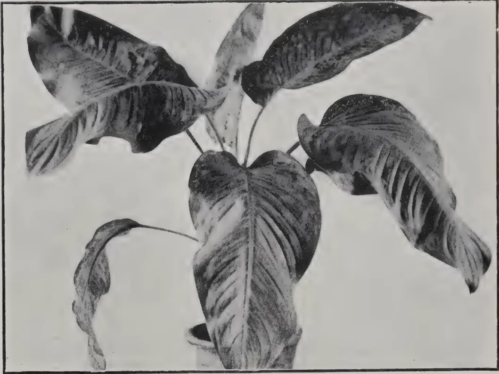

Photo by H. F. Macmillan.

DUMB CANE (*Dieffenbachia* var.)

Photos by H. F. Macmillan.

ISOTOMA LONGIFLORA

"RAT-NETUL," Sinh.

*Plumbago rosea*

(See Page 263.)

252------------------------------------------------

THE  
**TROPICAL AGRICULTURIST:**  
JOURNAL OF THE  
**CEYLON AGRICULTURAL SOCIETY.**

---

VOL. XLV.

COLOMBO, OCTOBER, 1915.

No. 4.

---

**THE SCHOOL OF TROPICAL AGRICULTURE,  
PERADENIYA.**

---

At the Annual General Meeting of the Ceylon Agricultural Society held in the Council Chamber on August 31st last, the Director of Agriculture announced the projected opening of a School of Tropical Agriculture at Peradeniya. He said:—On November 24th, in seconding a vote of thanks moved by SIR CHRISTOFFEL OBEYESKERE to SIR HENRY McCALLUM and other members of the London Committee for their efforts in urging the claims of Ceylon as the site for the Imperial College of Tropical Agriculture, SIR PONNAMBALAM ARUNACHALAM suggested that now that the war had necessitated the College scheme being shelved a small school might be started, adding that now was the time to prepare for the expansion we might expect after the war. I replied that HIS EXCELLENCY THE GOVERNOR had recognised from the first the importance of a School of Agriculture, as distinct from a College. Early this year HIS EXCELLENCY gave instructions for plans to be prepared for the starting of such a school. This has been done, and it is now hoped a School of Tropical Agriculture will be opened at Peradeniya in January next, probably on January 10th. It will be within the recollection of many present that an Agricultural School existed in Colombo, and that on the advice of a Committee appointed by SIR WEST RIDGEWAY it was decided to transfer the school to Peradeniya. The Colombo School was closed down, and now after 15 years we are ready for the next step. Let us hope, if we have been slow, that we are sure, SIR HENRY McCALLUM

253------------------------------------------------

222[OCTOBER, 1915.

advanced the project of a School of Agriculture at Peradeniya by despatching four students to be trained as teachers at Poona. These students have now returned and are undergoing further training in Ceylon. A course of instruction has been prepared to occupy one year divided into three terms. A special point is being made of practical instruction, the mornings being devoted to demonstrations in the Royal Botanic Gardens and the Experiment Station. In 1900, in a memorandum to the GOVERNOR (SIR WEST RIDGEWAY), DR. WILLIS wrote: "It should be made clear to the students and to the public that attendance at the school in no way implies a promise of Government employment afterwards." It is necessary very emphatically to repeat that warning now. No doubt the time will come when all candidates for posts in the Department of Agriculture, and in the Society too as Instructors, will be required to have taken the school course successfully, but such appointments would be very few indeed annually. The School is intended in the first place for the training of teachers in the vernacular schools with a view eventually to making agriculture a compulsory subject in the code, thus ensuring that the youth of Ceylon shall grow up familiar with the elementary principles of Agricultural Science. These teacher-students will be taught in the vernacular. There will be an English side for the instruction of the sons of land-owners and others who are to take up plantation work as a career. A special feature of the school will be the necessity for students themselves working with their own hands at the various planting and horticultural demonstrations and operations. Only in this way can good practical men be turned out. You cannot learn how to do things by looking at other people do them. The inclusive fee for board and tuition is Rs. 30 per mensem; for tuition only Rs. 7.50 per mensem. We are beginning in a very modest way, occupying a bungalow in which there is only limited accommodation, but we shall endeavour to make provision for the boarding of students in other houses if desired.

The prospectus, draft of which was published in our last issue, is now available. In two important respects the new school will have a distinct advantage over the old. It is close to the famous Botanic Gardens and to the Experiment Station, where demonstrations in horticulture and planting operations will be

254------------------------------------------------

OCTOBER, 1915.]223

given daily. We may, I think, say without danger of challenge or of exposing ourselves to the charge of undervaluing the resources of other tropical dependencies, that nowhere else in the Empire could equal educational facilities be found. The second point of importance is that the Staff of the Department of Agriculture, the members of which are specialists in research and in the application of the principles of tropical agriculture, will be responsible for the lectures and demonstrations. The course is fixed for one year, but no one could make himself proficient in the science and practice of tropical agriculture in one year. It may be found necessary, therefore, hereafter to lengthen the course to two years. It has been deemed advisable, however, not to make conditions too severe to begin with.

The projected establishment of this School of Tropical Agriculture has been welcomed by the Press and the Public of Ceylon. It will be up to the public to give it the support necessary to make it an enduring success. We want more of the educated youth of Ceylon on the land, and when they go on the land to take with them some professional equipment. If we can create a supply of well-trained conductors and superintendents we can expect a demand to arise for their services not only in Ceylon but throughout the tropic east. But the doors of the School will be open to the youths of other lands as well, especially within the Empire. We shall look forward to welcoming students from India and Burma, Malaya, Borneo and Papua, and East Africa.

R. N. L.

---

## GRAFTING TAPE

In grafting or budding a suitable tying material is necessary to keep the scion in place and protect it from outside influences. MR. WESTER, horticulturist to the Philippine Department of Agriculture, prefers *grafting tape* as it prevents drying up before circulation has been established between scion and stock, and at the same time keeps out extraneous moisture.

For the wax he recommends equal parts of beeswax and resin. For tape, he considers cheap cotton cloth that tears easily the best. This is torn into strips which are wound round stiff iron wire or pieces of stick and immersed in the melted grafting wax till thoroughly saturated.

255------------------------------------------------

224[OCTOBER, 1915]

# COCONUTS.

## EFFECT OF LIGHTNING ON COCONUT PALMS.

T. PETCH.

That coconut palms are killed by lightning is well known to all coconut planters. The Editor of the TROPICAL AGRICULTURIST wrote in 1886 (Vol. VI., page 73) : " Those connected with coconut estates are aware that, besides the destruction of young trees by grubs or beetles, they must lay to their account a varying but appreciable percentage of loss of trees at all stages of growth from the effects of lightning ;" and the well-known Ceylon coconut planter, MR. W. H. WRIGHT, stated in " All about Coconut Planting" (3rd edition, 1914, Appendix, page IV.) : " The ills a coconut property is heir to are drought, white ants, beetles, and lightning." The statement of SIR EMERSON TENNENT, referred by SEEMAN (*loc. cit.*), is : " One pre-eminent use of the coconut palm is omitted in all these popular enumerations ; it acts as a conductor in protecting their houses from lightning. As many as 500 of these trees were struck in a single pattu near Puttalam during a succession of thunderstorms in 1859."

But though the destruction of coconut palms by lightning is an undoubted fact, it is necessary to exercise considerable caution in accepting that as an explanation of the death of trees in any particular case. As a general rule, the native always assigns the death of a coconut palm to lightning, or, in the rare event of the absence of thunderstorms for any considerable period, to a " falling star" or a " meteorite." Until quite recently deaths from budrot were always so explained, and probably cases of root disease also, while I have been offered the same theory in the case of a tree which was obviously killed by " red beetle" (*Rhynchophorus signaticollis*, Chevr.) When the observer is not the owner of the trees in question, but merely after the storm examines the locality to find out ' what the lightning struck,' the possibility of error is still greater, for he is apparently content to accept headless stems as evidence of the lightning stroke, without pausing to consider what has become of the crowns, and in many cases he relies on the evidence of trees, which the pathologist could inform him had been headless for months previously.

The damage inflicted on coconut palms by lightning may take any one, or any combination, of the following three forms :—

1. (1) The crown may be set on fire.
2. (2) The tree may be mechanically injured, either by splitting of the stems or by defoliation.
3. (3) The tree may exude a liquid which dries in red-brown streaks and patches on the stem,

256------------------------------------------------

OCTOBER, 1915.]225

### COMBUSTION OF THE CROWN.

This has been recorded by FRANK (*KRANKHEITEN DER PFLANZEN*, 2nd ed., I., page 241), who states that the dry branches and leaf stalks of palms are sometimes set on fire by lightning.

In 1895 considerable interest was aroused in the Ceylon daily press by the report that a coconut palm had been seen with its crown on fire at Pondicherry. The subsequent correspondence has been recorded in the *TROPICAL AGRICULTURIST* (Vol. XV.), and from the opinions expressed it would appear that the lightning was generally considered a normal explanation. One correspondent recalled that a similar occurrence had been observed in 1893 or 1894 near Christ Church, Colombo, during a severe storm (*TROPICAL AGRICULTURIST*, Vol. XV., page 351); while MR. W. H. WRIGHT stated that some time ago he had witnessed a coconut tree taking fire from a flash of lightning just before the rain came down, but he had never seen any tree on fire during the rain, a fact which he thought might be explained by supposing that the tree could not take fire when wet. On the other hand, another well-known coconut planter, MR. JARDINE, wrote that he had never seen a coconut tree set on fire by lightning or a meteorite, though he had seen hundreds struck by lightning (*TROPICAL AGRICULTURIST*, Vol. XV., page 345).

In 1907 it was reported in the local press that a coconut palm in Colombo had been set on fire by lightning during a storm.

This effect would appear to occur in the case of coconut palms in town gardens, where many old trees, hemmed in by buildings, are barely able to exist, and so may bear more dead and dry fronds than their more fortunate relatives on cultivated estates. But it is certainly not the most usual effect of lightning. That it should occur before the rain and not during the storm is only to be expected, as the coconut stem is rapidly wetted by the stream of rain water which descends from the crown, and under such conditions it forms an efficient conductor.

### MECHANICAL INJURY.

H. H. THIELE, writing in the *FIJI PLANTERS' JOURNAL* (see *TROPICAL AGRICULTURIST*, December 1913, page 462), states: "Lightning will, as a rule, shatter one or two trees badly, and those standing close by will be damaged by the heat to such an extent that they get diseased, their tops rot, and they die, their stems being marked with a number of brown spots." How far this is based on actual observation is not apparent.

In the *TROPICAL AGRICULTURIST*, Vol. VI., page 73, the Editor writes:—"During the last monsoon storms twelve fine palms, a little to the south of Kollupitiya station, were struck. Five of these were practically decapitated and others were badly burnt, but some were only affected so that slight brown colour showed on a few of the branches."

Shattering of the stem or immediate decapitation of the coconut palm would appear to be rare. I have never seen any case of decapitation as a direct and *immediate* consequence of lightning. Of course, when a palm dies after having been struck by lightning, its crown ultimately decays, and only the headless stem remains after a few months. In the only case of mechanical injury which I have observed, the stem bore two short vertical wounds, one at 12 feet and the other at 18 feet from the ground, from each of which the fibres were protruding in loose bundles.

257------------------------------------------------

226[OCTOBER, 1915.

### EXUDATION OF LIQUID.

This is by far the commonest effect of lightning on coconut palms. As a rule, no sign of injury to the stem, or scorching of the crown is observable, but the stem exudes at numerous points a liquid which dries in red-brown streaks and patches on its surface. The earliest stage of this which I have seen was two or three days after the tree had been struck. The plantation was fourteen years old and the palms were 22 feet apart ; all were about the same height, but only one was affected. It did not appear to differ in any respect from the surrounding trees, and there was no apparent reason why it should have been struck rather than any other. Its stem was about 10 feet high, and the central spike about 10 feet more ; in consequence of its small stature, the tips of the decumbent outer leaves nearly touched the ground.

The stem was not split or marked by the lightning in any way. Owing to the collapse of the inner tissues of the bud, the central spike had fallen over, but it was still green and not charred. The outer leaves, i.e., those which bent over towards the ground, were charred along the midrib ; and round the tree, at distances of 8 or 10 feet from the trunk, the grass and weeds were burnt in small patches, each patch being situated below the point of a leaf. But the most striking phenomenon was the exudation of sap from the stem. Liquid was oozing out from the innumerable cracks which are always to be found in the "rind" of the coconut stem, forming white frothy masses and then running down in long red streaks. The appearance gave one the impression that the whole of the internal tissues were undergoing rapid fermentation. On cutting into the stem the internal tissues were found to be slightly pale brown, uniformly coloured and full of sap. It is to be regretted that, as the tree was situated in a district at least three days' journey from a laboratory no further investigation could be made.

Another case was examined about a month after the occurrence. A breadfruit tree (*Artocarpus incisa*) was said to have been actually struck, and this was dead and leafless, though its trunk was not split. Close to it was a coconut palm about 12 feet shorter. This was not quite dead ; it showed long red streaks of sap, particularly in the lower half of the stem, and had two short vertical wounds, one at 12 feet and the other at 18 feet from the ground, from which the vascular bundles were protruding in loose masses. Westward from these two, the palms only 15 feet away showed no sign of injury, but to the east 20 trees, which were taller than the breadfruit tree, were affected. Their trunks bore red bleeding spots and their crowns were scorched, the outer leaves being generally withered and drooping, though the youngest leaves were still erect and green. None of these showed any injury to the stem, except the exudation of sap. Two palms had been felled, as being beyond recovery, and four others appeared to be dying. The tree with the worst crown was about 20 yards from the breadfruit tree, and the affected area formed, roughly, an ellipse, with the breadfruit tree at one focus.

In general, the effect of lightning on coconut palms may be summarized as follows :—A group of trees, not differing in any obvious respect from the surrounding trees, is affected ; sap exudes from the trunks of all these trees ; their crowns are slightly scorched ; one tree is more severely affected than the others, and this is regarded as the tree actually struck. In some cases longitudinal wounds are made in the stem ; and if the crown is surrounded by dead leaves these may be set on fire. But apparently these last two effects are rare. The occurrence of injured trees in groups is especially remarkable.

258------------------------------------------------

OCTOBER, 1915.]227

As regards the ultimate fate of coconut palms struck by lightning, there would appear to be a considerable difference of opinion. To quote again from the TROPICAL AGRICULTURIST (Vol. VI., page 73) : "On one occasion, when a crash gave rise to the impression 'the sky had fallen,' we felt certain that something had been struck, and on going to the seashore we found seven coconut trees affected, some killed outright, and others with only the edges of their branches (i.e., leaves) singed. But ultimately every tree, however faintly affected, died. During the late monsoon storms twelve fine palms, a little to the south of the Kollupitiya station, were struck. Five of these were practically decapitated, and others were badly burnt. But some were only affected so that a slight brown colour showed on a few of the branches. Amongst the latter is a tree with a magnificent head of fruit, and this morning we expressed our fears, based on our experience, to a good native authority, that this valuable tree was as much doomed as those whose vitality had been at once destroyed. He fully confirmed our opinion : the tree must die." It would have been of greater value if the fate of this tree had been recorded. With regard to the first of these occurrences, the statement that several trees were immediately "killed outright" makes the record somewhat doubtful.

The general opinion, however, inclines to the belief that coconut palms which have been struck by lightning may recover if properly treated. The treatment adopted by the native is apparently based on the observation that a liquid exudes from the stem ; he merely cuts a hole in the stem "to let out the excess of sap." W. H. WRIGHT, in "All about Coconut Planting" (3rd edition, Appendix, page iv.), states : "When a tree has been partially struck by lightning, steps should at once be taken to bleed it and the surrounding trees by boring holes at their bases with an auger, by which means a large percentage can be saved. Any tree, however, which has been irretrievably struck by lightning should at once be cut down and burnt."

The distinction between "partially struck" and "irretrievably struck" would appear to afford a convenient explanation in case the treatment failed. It does, however, appear to be correct that when a group of coconut palms is struck, some are more lightly affected than others. The former are not regarded as actually struck, but as "affected by the heat." Their case may be analogous to that of the tea bushes which die round a rock which has been struck by lightning on a tea estate. It would appear to be open to question whether the trees which recover after the treatment described would not have recovered without treatment of any kind.

No explanation of this "fermentation effect" can at present be offered, and the facts have been placed on record here in the hope that the subject will be taken up by others more favourably situated for detailed investigation. It may, however, be pointed out that the same effect may be produced on a small scale by making a fire near the base of a coconut palm, but not near enough to char the stem. The red-brown patches subsequently appear on the parts which have been heated. A number of red-brown spots and streaks at the base of the tree, usually on one side only, indicates that it has been injured by fire. This appearance is very common, more so in native gardens or on trees near a native hut, than on estates. If a fire is made quite close to the base of a coconut palm, the outer stem issues are, of course,

259------------------------------------------------

228[OCTOBER, 1915.

burnt and charred; but when it is too far away to admit of this, the stem is heated, especially if the wind blows the flames in that direction, and it afterwards exudes a red-brown liquid from dozens of the pre-existing cracks. It is notable that in some cases, not, however, universally, when the lower part of the stem is severely charred, the parts immediately above this do not bleed; on the other hand, if the stem shows no blackening whatever, it bleeds vigorously. Probably in the first case the supply of sap to the upper parts of the cortex is cut off altogether.

I have seen an area of several acres affected in this way, where the grass had evidently been burnt off a long time before. All the trees were marked with red-brown spots to a height of about 3 feet on one side only. Apparently a quickly advancing fire had not been strong enough to char the stems, or to heat them sufficiently on the leeward side to cause them to bleed.

A good example of this was furnished by a group of old coconut palms over sixty years old on the Experiment Station, Gangoruwa. The plot being more or less waste ground, it was used for storing the thinnings of the cacao plots in 1907, and these were set on fire in February, 1908, without any regard for the coconut palms. When examined in April, 1908, the lower parts of the stems, sometimes to a height of 25 feet, were covered with small red-brown patches. The liquid had issued from the cracks and had dried round them; it had not run down the stem, as in the case of a severe lightning stroke. The cortex under each patch was slightly decayed and brown, but it afterwards dried up. Four trees were marked above the highest red-brown patch. On three of these the bleeding had not extended further up the stem by March, 1909, but on the fourth there were fresh spots higher up the stem at the end of July, 1908. As a rule, on trees which have been injured by fire the bleeding occurs immediately afterwards, and the spots do not subsequently increase in number or size. Only the cortex is affected, and the amount of sap which exudes is small. But when trees are severely struck by lightning, the exuding sap is derived from the whole of the inner tissues, and issues in such quantity that it runs down the stem in long streaks.—ANNALS OF THE ROYAL BOTANIC GARDENS, PERADENIYA.

---

## COCONUTS IN BRITISH GUIANA.

---

PROFESSOR HARRISON, Director of Agriculture, British Guiana, in an exhaustive article contributed to the BULLETIN OF THE IMPERIAL INSTITUTE on the Field and Forest Resources of British Guiana,\* states that coconuts thrive well on the coastal lands of the colony, especially where the land is more or less of a sandy nature, and expansion of this cultivation is steadily taking place.

The coconut palms growing in the colony are scattered, being owned chiefly by small growers, but there are a few fair-sized coconut estates, whilst extension over large areas is taking place on some sugar plantations. Reefs of light sandy loam exist on the Corentyne Coast, along the east coast of Demerara, and in Essequibo, where coconuts flourish; and even on the

---

\* Extracts from this article on Coffee, Cocoa, and Balata, will be found on other pages of this Journal.—Ed. T.A.

260------------------------------------------------

OCTOBER, 1915.]229

heavier coastal lands they grow satisfactorily and bear heavily. They do not grow so well or yield satisfactorily on the pegassy clay lands and on river lands away from the coastal region.

The area under the crop is now over 15,000, but much of this consists of young plantations. Little copra is exported (1,690 cwt. in 1914), the nuts going chiefly to the United States.

---

## GERMAN SUBSTITUTES FOR RAW MATERIALS.

Of substitutes for olive oil there were already several derived from nuts of various kinds. Latterly, since the supply from Italy has ceased, German ingenuity has set to work to find substitutes in addition to those already existing. One of the leading chemists told me as a fact that the Germans are now extracting a substitute for olive oil from cherry stones, although he did not know, and I cannot say, on what scale the experiment is being conducted. At any rate, "save your cherry stones" had already been started during the cherry season on its career as a popular domestic war cry. I am told that since almost any kind of fruit stone contains glycerine, as does olive oil, it might be possible to produce a substitute from it. But whether any process would be quantitatively worth while is another question. In any case, the Germans have not neglected the possibility.

Germany has likewise developed since war began the original Norwegian process for extracting nitrogen from the air. The claim of her newspapers that this is a German invention is, of course, an impudent lie. It is only so far of German origin in that SAMUEL EIDE, the Norwegian chemist, who worked on the process in conjunction with PROFESSOR BIRKELAND, of the University of Christiania, did study at one time at the Technical High School of Charlottenburg. Previously Germany obtained most of her nitrogenous material from Chili. Her air-extracting process provides her now with the three important substitutes of ammonium nitrate, used in the manufacture of explosives, sodium nitrate, used in colouring, and concentrated nitric acid.

### NO SUBSTITUTE FOR RUBBER.

In only two cases must some doubt be thrown on a German claim to the invention of substitutes. She is scouring every available neutral country for rubber, which hitherto her synthetic experts have not been able to replace, and, despite all her claims to the contrary, it is more than doubtful whether she has really perfected a cheap substitute for cotton to be used in the manufacture of propulsive explosives. Her claim in this respect is to have invented a process for purifying wood fibre and making it available for use in guncotton. But, as has already been stated in a previous article, this assertion is believed in the neighbouring neutral countries to be little more than a "bluff" intended to discourage the Allied Governments from declaring cotton contraband. Her extreme anxiety to get cotton was very obvious to any visitor to Stockholm of late, as I recently stated.—THE TIMES.

261------------------------------------------------

230[OCTOBER, 1915.]

# RUBBER.

## DESTRUCTION OF RUBBER BY MICROBES.

It is said in the *REVUE SCIENTIFIQUE* that microbes do not attack commercial rubber which is kept in dry air, but when a small amount of moisture is present certain bacteria and moulds derive nourishment from the albuminoids, resins and sugars which the rubber contains. Some microbes form on the rubber, making spots of various colours—red, yellow, black or brown—but the rubber is not materially altered thereby. On the other hand, two species of *actinomyces*, very common in garden earth and in canals, *Actinomyces elastica* and *A. fustus*, assimilate the hydrocarbons of the rubber, and are in consequence capable of modifying its properties in such a way as to deprive it of all commercial value.—INDIA RUBBER WORLD.

## DISEASES OF HEVEA.

“Canker” of *Hevea brasiliensis* was rather common during the latter half of 1912, but appears to have been less prevalent during 1913. It has been found that the leaf fall which often follows the fruit disease, and is characterised by the appearance of a dark-brown ring on the leaf stalk, is caused by the canker fungus (*Phytophthora faberi*). Decay of the renewing bark is still common in wet weather; the use of carbolineum plantarium, which has been found to stop this decay in Java, has been recommended, and this substance is now available in the Island. The Assistant Botanist and Mycologist is investigating the nodule formation on Hevea. Other diseases of Hevea have called for much attention recently.

In dealing with the diseases of rubber trees in bearing, one is handicapped by the fact that the best fungicide available, Bordeaux mixture, is a copper compound, since traces of copper in the rubber are known to turn it tacky. Lime sulphur mixture, which is frequently recommended, has been found useless against a disease caused by *Phytophthora*, as “canker” is. An experiment carried out during the wet months of 1912 would seem to show that the amount of copper salts found in the rubber after spraying with Bordeaux mixture is insufficient to cause tackiness. The trees were sprayed during dry weather. The first heavy rain occurred five days later, and the rubber collected the following day was made into biscuits, which were subsequently analysed. The biscuits, all in biscuit form, from this row of trees for the next seven months was kept under observation, but no tackiness was noted. At the request of the Kalutara Planters' Association, Hevea “canker” has been placed under the Pest Ordinance.—ANNUAL REPORT OF THE BOTANIST AND MYCOLOGIST.

## SOME SCIENTIFIC ASPECTS OF LATEX COAGULATION.

One of the most interesting questions raised in connection with the process of rubber preparation is that of the mechanism of the coagulation of the latex. It is part of one of the most recent subjects of modern science—colloid chemistry. In the first place it may be mentioned that the term coagulation is one which has been rather indiscriminately used, for the reason

262------------------------------------------------

OCTOBER, 1915.]231

that investigation of the coagulation of suspensions and emulsions, etc., has not yet been sufficiently detailed to allow of the definition of different types or degrees of coagulation. WHITBY is of the opinion that there are three stages in the degree of coherence of rubber separated from latex, viz., creaming, flocculence or agglutination, and coagulation. The present writer is of the opinion that there is a fourth variety which he would term flocculence, the term agglutination being reserved for the type we observe in the clotting of latex which is left to itself without addition of acids.

Thus, *creaming* is the conditions observed in the early stages of slow coagulation; the latex thickens and becomes of a creamy consistency.

*Flocculence* could be the term applied to the formation of small particles of rubber without coalescence of the same to form lumps. This state is observable in latex to which much formalin has been added.

*Agglutination* is applicable to local or lumpy coagulation observed when the latex coagulates spontaneously or when certain mineral salts are added.

*Coagulation* proper is the final stage observed on careful addition of acids to latex, the rubber forming in one clot and leaving a clear liquid.

Now rubber latex is one member of the class of colloids but it is by no means a simple member. In latex we have a suspension of rubber particles or at any rate a suspension of the particles which subsequently form rubber, but we also have at the same time a number of bodies in solution some of which belong to the class known as proteins. These proteins are in colloidal solution and are capable of being precipitated by certain reagents, notably acids. It seems probable that this protein acts as a protective colloid to the pure rubber substance caoutchouc. The theory of this protective action is that a suspension such as that of the caoutchouc substance when mixed with a colloidal solution of such a body as protein acquires many of the characteristics of the substance in colloidal solution. It has been suggested that this protective action is due to the absorption of a layer of the dissolved protective agent over the surface of each of the suspended particles. That this is so in the case of the rubber particles seems probable in view of the fact that it does not behave as a pure suspension but that its coagulation reactions resemble in many respects those of certain proteins. Not all the nitrogenous constituents of latex, however, are precipitated with the rubber during the ordinary process of coagulation.

Again, in considering the effects of anti-coagulants we may have many factors at work. The anti-coagulant may be an alkaline substance acting so as to neutralise acid formed in the latex by decomposition or fermentation, or it may act as a retarding agent on the coagulating enzyme said to exist in the latex. Again it has been observed that formalin when added in certain proportions to the latex acts apparently as a retarding agent in that the latex still retains its milky appearance and the rubber does not form a clot but actually the latex has lost its original nature and consists of a number of particles of rubber in suspension in a clear liquid. In this connection it may be observed that formalin is a coagulant of certain protein bodies.

Again the question of heat enters very largely into operations such as the coagulation of latex by the Brazilian and similar processes. The writer found that in the Wickham Process if the temperature of the jet of smoke impinging on the band of latex be less than  $60^{\circ}\text{C}$ , coagulation is not obtained. WHITBY states that heat alone will coagulate fresh latex, a temperature of  $65\text{-}70^{\circ}\text{C}$  being required. The writer also found that on heating the latex to  $60^{\circ}\text{C}$  a certain quantity of acid coagulated the latex almost immediately, whereas in the normal course of events it would have required some hours. The object of this article has been to show the complicated nature of only one section of the process of rubber preparation, and only the surface of this question has been touched. The question is found to be still more complicated when we get below that surface.

L. E. C.

263------------------------------------------------

232[OCTOBER, 1915.

# COCOA.

## COCOA IN BRITISH GUIANA.

PROFESSOR HARRISON.

Cocoa planting is an industry of some promise in parts of the colony, but unfortunately it requires for its successful installation command of more capital than small farmers usually possess. Cocoa requires for its satisfactory growth land well drained to the depth of from 3 to 5 feet, and on land of this sort it does very well indeed. There are great areas of land a few miles up the lower reaches of the rivers, where good drainage can be easily ensured, and upon them cocoa flourishes. It is to be regretted that persons with command of sufficient capital and with knowledge of the cultivation of cocoa have not taken up its growth in these parts of the colony to a greater extent than has been done.

Some of the cocoa estates are of fair age, but there are also considerable areas under young trees that have not yet come into bearing. The Government has an experimental area of cocoa at Onderneeming, Essequibo, where from selected trees of high yield and good quality seeds are obtained for propagating purposes, and increasing numbers of promising cocoa seedlings are being supplied at low cost. Systematic experiments with cocoa were commenced at Onderneeming in 1900. They have proved of value to the cocoa cultivators in the colony by indicating that largely increased yields are obtainable by the reduction of the shade trees to the minimum necessary for protection of the cocoa trees against wind, that large increases in yield result from heavily mulching the trees, and that the most profitable applications of artificial manures are of mixtures of sulphate of potash and superphosphate of lime, to which additions of nitrogenous manures are seldom remunerative, whilst nitrogenous manures *per se* tend to reduce the bearing powers of the trees.

The acreage under cocoa cultivation during recent years is as shown below:—

<table>
<thead>
<tr>
<th></th>
<th></th>
<th>Acres.</th>
<th></th>
<th></th>
<th>Acres.</th>
</tr>
</thead>
<tbody>
<tr>
<td>1907-8</td>
<td>...</td>
<td>1,832</td>
<td>1911-12</td>
<td>...</td>
<td>2,127</td>
</tr>
<tr>
<td>1908-9</td>
<td>...</td>
<td>2,181</td>
<td>1912-13</td>
<td>...</td>
<td>1,983</td>
</tr>
<tr>
<td>1909-10</td>
<td>...</td>
<td>2,223</td>
<td>1913-14</td>
<td>...</td>
<td>1,863</td>
</tr>
<tr>
<td>1910-11</td>
<td>...</td>
<td>2,016</td>
<td>1914-15</td>
<td>...</td>
<td>2,316</td>
</tr>
</tbody>
</table>

The decreases in the area returned as cultivated in cocoa in the years 1912 and 1913 were attributed to the drought of 1911 and 1912, and to the abandonment of cocoa in some cases for rubber cultivation. Practically only the Forastero variety is grown in British Guiana, other sorts being cultivated only to a very small extent.

At present, therefore, only about 2,000 acres are planted in cocoa; their yield is mostly used for the local demands of the colony, and thus the export is small—not more, as a rule, than from 750 to 900 cwt. per annum. That exported brings a good price, owing perhaps to the great care which is exercised in fermenting and curing the beans.

On some plantations kola nuts are grown among the cocoa, producing a small yearly output of about 40 cwt. Among subsidiary products which do well wherever cocoa and kola flourish, nutmegs occupy a prominent place.—

BULLETIN OF THE IMPERIAL INSTITUTE.

264------------------------------------------------

OCTOBER, 1915.]233

# COFFEE.

---

## PREPARATION OF COFFEE.

---

Two methods are employed in converting coffee fruits or "cherries" into saleable coffee, viz. (1) the dry method and (2) the wet method. The former is the more primitive and is still practised to a certain extent in some countries, but the second method is preferable and should be employed if possible.

### THE DRY METHOD.

This method has the advantage of being serviceable when cherries in different stages of ripeness have to be handled at the same time, owing to the crop ripening irregularly, and labour being scarce or dear, so that successive gatherings are impracticable, or to the lack of a good supply of water. Its success, however, is dependent on the continuance of fine weather over a fairly considerable period.

The gathered cherries are spread in a thin layer on open drying grounds or barbecues. These should if possible be made of brick or cement, although clay will serve. The cherries are turned over, made into heaps, and spread out again, to ensure even exposure to the sun. After the first two or three days, when the coffee is beginning to dry, it should be placed under cover at night if dews are prevalent and exposed again on the drying floor the next day. It is also necessary to protect the coffee from rain. If only small quantities are being dried the cherries may be exposed on small wooden trays which can be easily handled and carried bodily under cover when necessary. When the cherries become quite dry, which even under good conditions usually takes about three weeks, they may be stored.

The next stage is to remove the dried husks from the cherries. This may be done by threshing with a flail or by pounding in a large mortar, the particles of shell and dust being removed by winnowing. The threshing or pounding, however, usually leads to the breaking of a considerable proportion of the beans, and it is preferable to use a hulling machine, which can be obtained of a size requiring either hand or mechanical power.

### THE WET METHOD.

This is the more modern method of preparation, and is the one practised on all up-to-date plantations. It requires a fairly considerable amount of equipment in the form of buildings and machinery, and care must be taken in selecting the site for the factory. Much water is required, and the factory must therefore be situated where there is an ample and constant supply. It is an advantage if the buildings can be erected at the foot of a slope, as it is then possible to so arrange the required machinery on different floors that the fresh cherries can enter at the top of the building and pass downwards through the various stages of preparation with a minimum amount of handling. As far as possible throughout the preparation mechanical appliances should be used in order to economise the expense of labour.

265------------------------------------------------

234[OCTOBER, 1915.

To obtain the best results by the wet process the berries should be quite ripe and should be dealt with the same day as picked. The cherries, as they are brought in from the plantation, are placed in tanks of water, built of concrete and of a size proportionate to the quantity of fruit brought in daily. The ripe cherries sink, and are drawn off through a pipe in the base, but on a small scale the water may be emptied out and the sunken cherries removed.

The next stage is the removal of the pulp which surrounds the beans. This is effected by special pulping machines. On a large scale the cherries are delivered directly from the tanks in a stream of water to the hopper of the pulper. The latter may be obtained in various sizes, from small hand machines to the large power-driven ones used on the large estates. Those in common use are of two types, the cylinder machine and the disc machine. In the former case the disintegrating apparatus usually consists of an iron cylinder covered with punched copper, like a large nutmeg-grater, which rotates close to a pulping bar or breast. The cherries are fed by a stream of water into the hopper, which is usually fitted with a device for removing stones, and then pass through the pulping mechanism, the pulp and the beans being delivered separately. As a general rule some imperfectly pulped or unpulped cherries pass over with the beans and these can be separated by a rotary screen or oscillating sieve, the unpulped material being repulped. Double machines are in use in which the unpulped cherries delivered from one cylinder are automatically separated from the beans and carried to the hopper of a second cylinder, which is specially adjusted to pulp them. Some machines are fitted with a crushing apparatus which partially pulps the cherries before the latter pass through the pulping cylinders. Great care is necessary to see that the machine is properly adjusted, and the maker's instructions on this point should be carefully carried out. If this is not done the cherries will be imperfectly pulped or the beans may be damaged.

The disc pulpers, which are said to require less water than the cylinder machines, possess one or more vertical iron discs, covered with copper, bearing solid projections. The discs rotate against adjustable pulping bars with steel faces, the beans and pulp being delivered separately as in the case of the cylinder machines.

The pulped cherries, after leaving the machine, are always mixed with a certain amount of pulp, and to remove this they are sometimes passed on from the pulper to a receptacle containing water, in which they are stirred about with poles, paddles, a revolving wheel, or other suitable device; or they may be placed in a tank with a small amount of water so that they can be trampled upon by bare-footed men. More water is then added, the mass is stirred up, and the light pulp got rid of by withdrawing the water from above. The beans, still enclosed in the parchment, remain at the bottom of the vat, and are left comparatively free from pulp when the water is removed. If it is found that the amount of pulp present with the beans on leaving the pulper is small, this washing may be dispensed with.

The parchment in any case, however, is still very slimy owing to portions of the pulp, etc., remaining adherent to it. This material is removed by fermenting the coffee, for which process the beans are piled up in a heap under cover, or more usually placed in special receptacles. The fermentation may be carried out in the washing tank after removal of the water. When fermentation is complete the parchment coverings no longer feel slippery but

266------------------------------------------------

OCTOBER, 1915.]235

are slightly rough. The exact time taken for this process may vary from one to three days, and a handful of beans should be taken out occasionally in order to ascertain when the fermentation is completed. If fermented too long the quality of the coffee will be affected.

The beans are then washed again, the parchment being now left clean. The washing may be carried out in the manner already described, or in one of the special mechanical washing machines now on the market.

The washed parchment coffee is next spread out in a thin layer 3 to 4 in. deep on a smooth dried ground of cement or brick, and raked over several times daily at least to ensure uniform drying, or it may be placed on trays made of ] in woven mat, which are supported on a framework 3 or 4 ft. high. After the first day or two the coffee should be protected from night dew and rain. If the weather cannot be depended on during the drying period artificial drying must be resorted to, for which purpose several good machines are available, while good results have been obtained in some countries by utilizing sun-dried tobacco-curing barns. A good method is to partially dry the coffee in the sun and finish in a machine. The effect of sun and artificial drying on the size of the beans is dealt with subsequently.

The actual duration of the drying period varies. For sun-drying a hot ten full days' sunshine is necessary, but some kinds of hot-air driers will completely dry the coffee in twenty-four hours. It is essential that the coffee should be completely dried, as, if stopped in a moist condition, it develops a nasty smell, which is difficult to get rid of. When thoroughly dry the parchment can be removed to dust by the fingers, and the bean is hard and cannot be dented by the finger-nail or teeth.

The next process is to remove the parchment. This operation may be carried out on the estate, at the port of shipment, or in the country to which the coffee is exported.

To effect the removal of the parchment the dry coffee is fed into a machine known as a "peeler and polisher" fitted with screw or cone rotating inside a cylinder. The parchment as well as the outer skin surrounding the bean is broken up by this means, and at the same time the beans are polished. The broken husk and dust are removed by means of a sieve and by screening, or by means of an exhauster fan attached to the machine.

Grading follows next, i.e., the sorting of the beans into various sizes. This can be done in a simple manner by sieves with meshes of appropriate dimensions, or by special sizing machines. There are several forms of the latter, and as a rule at least two are necessary in order to separate the beans into uniform grades. In London the most grades are peaberry (the spherical beans), bold (the largest flat beans), medium, and small.

The question as to whether the planter cleans and grades his coffee or exports it in the parchment, is one which he must decide for himself on the conditions obtaining locally. It may be mentioned, however, that Uganda coffee cleaned and graded in London has in certain cases at least proved to contain a larger proportion of the higher grades than coffee cleaned in Uganda, and moreover, the London cleaner can grade according to the demands of the market. Bayers and Hincks (Bayers & Hincks) is the sole London

267------------------------------------------------

236[OCTOBER, 1915]

1913, p. 170) point out that two consignments consisting of identical sun-dried coffee, shipped at the same time, one cleaned in London and the other in Uganda, yielded the following percentages of the different grades:—

<table>
<thead>
<tr>
<th></th>
<th>Peaberry.</th>
<th>Bold.</th>
<th>Medium.</th>
<th>Small.</th>
</tr>
</thead>
<tbody>
<tr>
<td>Uganda cleaned ...</td>
<td>9.41</td>
<td>6.22</td>
<td>46.87</td>
<td>37.50</td>
</tr>
<tr>
<td>London cleaned ...</td>
<td>6.00</td>
<td>56.00</td>
<td>20.00</td>
<td>18.00</td>
</tr>
</tbody>
</table>

The difference in price between bold and medium was about 3s. per cwt., so that the advantage in this consignment was enormously in favour of London grading.

The same authors also quote comparative figures relating to sun-dried and artificially-dried coffee. Two consignments were shipped together and were precisely similar, except that one-half was sun-dried and the other machine-dried. The percentages of the grades obtained when cleaned in London were as follows:—

<table>
<thead>
<tr>
<th></th>
<th>Peaberry.</th>
<th>Bold.</th>
<th>Medium.</th>
<th>Small.</th>
</tr>
</thead>
<tbody>
<tr>
<td>Sun-dried ...</td>
<td>3.13</td>
<td>26.56</td>
<td>35.94</td>
<td>34.37</td>
</tr>
<tr>
<td>Artificially dried ...</td>
<td>5.35</td>
<td>58.03</td>
<td>21.45</td>
<td>15.17</td>
</tr>
</tbody>
</table>

These figures show that artificial drying results in less shrinkage of the bean than sun-drying, and consequently a very large increase in the higher grades.

Before the graded coffee is put on the market, it is usually hand-picked in order to remove discoloured and faulty beans. On a large scale the beans are delivered on to a travelling band, the defective beans being picked out by the operator, the good coffee being delivered into a bag.

The coffee is shipped in bags, double bags being used in some cases, and each consignment should be sent off as soon as it is ready, as the coffee deteriorates in appearance, and consequently realises lower prices if stored for some time.—BULL. OF THE IMP. INST.

## COFFEE IN BRITISH GUIANA.

PROFESSOR HARRISON.

In the earlier part of the last century British Guiana, and especially the county of Berbice, was celebrated for the high quality of the coffee it produced. Unfortunately, about the time of the cessation of slavery, circumstances beyond the control of the planters necessitated the gradual abandonment of the cultivation.

At the present time about 3,800 acres are occupied in coffee cultivation, a large proportion of the product being consumed locally. Two kinds of coffee are cultivated in the colony, the Arabian or so-called Creole kind, and the Liberian variety. Both sorts grow with exceptional vigour, and the former is singularly free from disease.

Large areas of low-lying land in British Guiana are ideally suited to the growth of Arabian coffee. The meteorological conditions of these parts of the colony are very similar to those of the higher parts of many of the West Indian Islands, and when this is borne in mind the excellent way in which coffee grows on them ceases to be surprising.

268------------------------------------------------

OCTOBER, 1915.]237

It is greatly to be regretted that local conditions, especially scarcity of available labour, tend to restrict the extension of the area under cultivation, and that the usually low price of coffee does not offer much inducement for small capitalists to take up its cultivation.

The Liberian variety grows very well indeed in many parts of the colony, and wherever it flourishes it is very prolific; in fact, at times the difficulty is to restrain its bearing propensities sufficiently to prevent the tree permanently injuring itself. It is, however, on the wind-swept parts of the coastlands more adversely affected by unfavourable meteorological conditions than is the Arabian kind. But this is not the case at some distance back from the coastline and on the lands along the lower reaches of the rivers.

The annual exports of coffee during recent years may be seen from the following statement:—

<table>
<thead>
<tr>
<th></th>
<th></th>
<th>cwt.</th>
<th></th>
<th></th>
<th>cwt.</th>
</tr>
</thead>
<tbody>
<tr>
<td>1907</td>
<td>...</td>
<td>2</td>
<td>1911</td>
<td>...</td>
<td>1,225</td>
</tr>
<tr>
<td>1908</td>
<td>...</td>
<td>190</td>
<td>1912*</td>
<td>...</td>
<td>727</td>
</tr>
<tr>
<td>1909</td>
<td>...</td>
<td>1,122</td>
<td>1913*</td>
<td>...</td>
<td>798</td>
</tr>
<tr>
<td>1910</td>
<td>...</td>
<td>978</td>
<td>1914</td>
<td>...</td>
<td>2,132</td>
</tr>
</tbody>
</table>

—BULL. OF THE IMP. INST.

---

## OIL CONTENT OF SEEDS.

---

The JOURNAL OF AGRICULTURAL RESEARCH publishes the results of the work of GARNER, ALLARD and FOUBERT on the relation of the oil content to nutritive and other conditions, and though their researches deal with cotton seed, ground nut and soy bean, the deductions are most interesting. To what extent they would equally apply to the coconut is not indicated, but it may be assumed that the general tendency of the controlling conditions would be the same.

It was found that for a high yield of oil the plant should have facilities for storing carbohydrate food with a view to its subsequent transformation into oil. No apparent relation was found between the size of seed and its oil content. The effects of different types of soil on the oil content were neither specific nor constant, but depended largely on seasonal conditions, climate more than soil being the responsible factor, seeing that climate materially influences such conditions as temperature and moisture.

Within ordinary limits the relative fertility of the soil appears to have only a small influence on oil seeds; though the use of a complete manure on an unproductive soil gave larger seed with a higher percentage of oil.

\* Crops affected by the prolonged drought of 1911 and 1912,

269------------------------------------------------

238[OCTOBER, 1915.

# SUGAR.

---

## THE PAST HISTORY AND PRESENT POSITION OF THE SUGAR INDUSTRY.

W. G. FREEMAN.

If we go back a hundred years, we find that the sugar cane was the dominant plant and the sole source of sugar for the civilised world. Still earlier, in 1747, a German chemist, MARGGRAF, had shared the possibility of getting sugar from the beet. In 1797 a French refugee, ARCHARD, continued the work, and about the beginning of the last century the first experimental factory for beet was started in Silesia with a capacity of something like 525 tons of roots a year, which would probably produce about 30 tons of sugar. The baby-hood of the best industry was greatly affected by continental wars. NAPOLEON, as you are probably aware, attempted to stifle England's commerce by a continental blockade, his main object being to keep out from Europe the products of the British Colonies (which at that time were chiefly cotton, sugar and indigo.) The result of this was a great impetus to the beet industry and NAPOLEON himself in 1811 ordered that 80,000 acres in France be planted in beet. The industry flourished for a time, and in 1812 there were forty beet sugar factories producing 10,000 tons of sugar per annum. After the Napoleonic Wars, the industry dropped again and in 1829 the beet sugar production was only 4,000 tons. In 1835 Germany also took up the industry seriously. By 1860 the world's production of sugar was 1,500,000 tons, cane sugar 1,250,000 and beet 250,000. Both France and Germany seriously fostered the beet industry, and it is very interesting to follow the results of the more scientific taxation of Germany as compared with the cruder method of France. Germany encouraged the industry along lines which gave great incentive to research by botanist, chemist and engineer by levying duties not on the amount of sugar which the factory produced, but on the amount of roots which were taken in. In France, on the other hand, the tax was put on the amount of sugar produced. There was therefore a greater incentive to improve the sugar contents of the beet, thus escaping taxation. The results were very marked. In 1871 France produced 284,000 tons of sugar and Germany produced 186,000 tons, the beet in both containing about 6 per cent. of sugar. In 1884 the German production had gone up to over 1,000,000 tons, whereas the French production had gone slightly back from 284,000 to 265,000. Still more striking was the improvement effected in the beet. In 1871 the roots in both countries contained about 6 per cent. of sugar; in 1884 those in France had not improved, whilst in Germany the sugar contents had been raised to 11 per cent. France then adopted the German system and taxed the roots which went into the factory. Thirteen years later the production in France had gone up to 1,500,000 tons and in Germany to 1,850,000, and the sugar contents of the French was about 11 per cent. and in Germany from 11 to 12.66 per cent. During a great part of this period there had been in both countries a drawback on sugar exported. In

270------------------------------------------------

OCTOBER, 1915.]239

1892 Germany altered her system from duty on roots to duty on sugar with a direct bounty or bonus of £5 per ton on exports. The other continental countries worked on more or less similar lines, and as a general result the beet industry increased from 250,000 tons in 1860 to 6,000,000 tons in 1903. During the same period the sugar cane production had gone from 1,500,000 to 5,800,000. In 1903 the Brussels Convention of 1902 became operative. It abolished the bounty on beet sugar. The result was a great stimulus to cane sugar. By 1914 beet had only gone up from 6,000,000 to 6,800,000, whereas cane sugar had progressed from 5,800,000 to 9,000,000.

At the present time Germany and Austria produce more sugar than the whole of the British Empire. The total amount of sugar used annually in the United Kingdom is 1,800,000 tons; beet 1,500,000, and cane sugar only 300,000, of which only a small amount comes from the British Empire, and the rest from foreign countries. In the British Empire the sugar position is thus entirely different from that of cacao. The British Empire is very largely dependent on foreign sources of supply for its sugar. The Brussels Convention put an end to the artificial stimulus given to the beet sugar industry, and since 1903 beet and cane sugar have competed on equal terms—as far as they can be equal. Beet has the great natural advantage that it is produced near the great centres of consumption and thus has a natural protection in the form of cheaper freights. Beet sugar has one great disadvantage; its impurities are very objectionable compared with those in the cane sugar.

At the outset of the war, the Home Government was faced with a shortage in sugar supplies; it acted promptly and purchased 900,000 tons of sugar at £20 per ton (at a total cost of £18,000,000) the biggest sugar deal ever made in the world. It has also prohibited the importation of sugar from other countries for the reason that importation from a natural country such as Holland might be merely a means of passing German sugar through that country to England. West Indian sugars, as you are aware, can be imported by license. From the most recent accounts, it does not seem that the war up to the present, except in northern France, has very seriously affected the beet sugar output, and therefore the immediate difficulty in Europe is not so much the production of sugar as getting rid of it. Accordingly much is being stored, causing demand for proper storage facilities as there is a lack of suitable warehouse accommodation for very large quantities of sugar. In one of his very interesting letters in the LOUISIANA PLANTER Mr. P. GEERLIGS describes how Belgian refugees have been turned out of warehouses in Holland in order to make room for sugar.

If the war suddenly came to an end the situation would be that a very large quantity of German and Austrian sugar would be dumped on the home market unless there was some sudden change in the fiscal policy of the United Kingdom. So that unless the war goes on for a comparatively long period over this year, there is no guarantee that the present prices of sugar will be maintained. Supplies in England are said to be sufficient to last until May, but an early peace will liberate large quantities of sugar with a consequent drop in prices. Speaking in the House of Commons early in February, Mr. ASQUITH, the Prime Minister, announced that any change in the price of sugar in the next few months is likely to be downward. There is, thus distinct uncertainty as to the price of sugar this year; and after that, assuming that the war does not continue, there is no sign of any permanent

271------------------------------------------------

240[OCTOBER, 1915.

increase in the prices unless there is an alteration in feeling in Imperial matters, and steps are taken to ensure that the British Empire shall not be so dependent upon foreign countries for one of the staples of life, *i.e.*, by some form of preference for sugar, whether cane or beet, produced in the British Empire. This probably involves an increase in the price of sugar to the home consumer. Failing this, if the struggle is to be between cane and beet on equal terms, then we have to aim at producing sugar at as cheap a rate as the best cane sugar countries, *i.e.*, Java and Cuba. This can only be done by the exercise of unremitting care and attention to all branches of the cane industry, the selection of canes, their cultivation and manufacture. It is possible that if we only had some form of scientific taxation on the lines on which the Germans encouraged their beet industry, the sugar cane industry of the Colony would also make much more rapid strides than during the last fifty years.—PROCEEDINGS OF THE AGRICULTURAL SOCIETY OF TRINIDAD.

## SUGAR PALMS.

In December last the Government of Bengal instituted enquiries as to the possibility of increasing the output of date-sugar and MR. ANNETT, the Agricultural Chemist, made a tour of the central districts of the Presidency which contain the principal date-sugar producing areas. The enquiries made generally indicated that owing to the decline of the date-sugar industry in recent years, a considerable number of date trees are annually left untapped. Another source of crude sugar is the sugar palm (*Arenga saccharifera*) which is very commonly cultivated in India and which is found wild in the forests of Burma and Assam. The possibilities of this palm as a sugar producer are discussed in the second article of a series in the June number of the INTERNATIONAL SUGAR JOURNAL, based on data furnished by MESSRS. O. W. BARRATT and C. W. HINES. The sugar palm is said to flower at the fifth or sixth year in the Philippines, where it is fairly common, and in the tenth year in India; and has an economic life of about fifteen years. The Philippine palm sugar trees are calculated to be capable of producing 20 tons of marketable sugar per year from an area of one hectare ( $2\frac{1}{2}$  acres), containing not less than 150 and not more than 200 trees, and that for a period of 10 to 15 years. This, if not exaggerated, compares favourably with the 4 tons per hectare stated to be obtained in Java.

As with other sugar palms, it is necessary to take adequate precautions to prevent the tapped juice from fermenting before it can be worked up into sugar at the mill. Some experiments carried out with preservatives and methods of clarification showed that formalin was a very satisfactory preservative, as was also chloroform; but the best results appear to have been obtained with alcohol, added at the rate of 1 cubic centimetre to 40 cubic centimetres of sample juice. This had the advantage of acting chemically on some of the non-sugars and precipitating them. It is stated that the best method of clarification has been found to be to heat the sap to boiling point, whereby with the aid of the alcohol the albuminous bodies, pectins, etc., are precipitated and filtered off. The filtrate should then be treated with milk-of-lime of 15Be. until an alkalinity of 0.3 is reached. This is then carbonated to 0.3 acidity which causes another heavy precipitate to fall immediately,

272------------------------------------------------

OCTOBER, 1915.]241

leaving a perfectly clear, supernatant liquor. A beautiful, light, clear masse-cuite of 86 Brix is made from this sap, which begins to crystallize after three days, and at the end of five days is filled with sharp clear crystals and a very light coloured molasses. The sugar is easily drained off and washed to a high grade product with very little water.

The article referred to above states that, if a sufficient number of trees are available, there appears to be no reason why first class sugar and a very superior syrup cannot be made with a minimum expense in installing the necessary plant. Where a grove of sufficient magnitude is available, it would pay to have a vacuum evaporating apparatus, especially when a high grade of sugar is desired. With only a few trees, however, the usual copper open-train apparatus, as used in the maple sugar industry, may very well be employed, making high grade syrup and molasses sugars.

The sap from the Philippine sugar palm will, it is said, flow for two months at least, and sometimes for three. On an average, trees in full flow will give from  $2\frac{1}{2}$  to 3 gallons per day, but this diminishes in time; the average for 60 days' flow may be taken as  $1\frac{1}{3}$  gallons, hence at that rate we have 80 gallons of sap of a specific gravity of 1.07, or about 850 lb. of sap containing 14 per cent. of sucrose, or 118 lb. of sucrose in the form of a molasses sugar of about 90 purity, which is equal to about 132 lb. of sugar. It should be possible to plant at least 150 to 175 trees per  $2\frac{1}{2}$  acres. Taking the number as 160, that gives  $9\frac{1}{2}$  tons on the basis of one tapping per tree per season.

Some analytical tests on three selected trees in the Philippines gave the average total solids in the sap as 17.07 per cent.; the sucrose as 15.3; the reducing sugars as 0.02; and only a trace of acidity. The low acidity of the fresh juice is said to be a striking feature. Besides sugar, the juice of the sugar palm is readily manufactured into alcohol, and thence into acetic acid and impurities, or vinegar; 342 parts of sucrose will yield 184 parts of alcohol, or 240 parts of acetic acid. Finally, there is starch, which is a product considered almost as profitable as sugar. The yield varies, but the Filipinos are reported to get as a rule from 1,100 to 1,650 lb. of starch per tree.

—INDIAN TRADE JOURNAL.

## MANUFACTURE OF SUGAR. CUBA.

J. F. CLARENCE.

There are factories grinding from 5,000 to 6,000 metric tons of cane per 24 hours. In spite of the great capacity of the mills, the juice extraction is not so large as is the case in Java, Hawaii, etc.

This may be accounted for in two ways. In Cuba grinding is exclusively done in the dry season, for should the rainy season set in before the crushing is finished, the cane still in the field would be past reaping. This would mean a complete loss for that harvest. It is evident therefore that factory owners have to direct all their efforts to getting the greatest quantity of material ground in the shortest time, and they pay minor attention to the quantity of sugar to be obtained from the crushed cane—a quantity which slow and careful treatment might increase. In addition to this the wages

273------------------------------------------------

242[OCTOBER, 1915.

paid in Cuba are very high, and amount to \$1.00 or \$1.50 (Rs. 3.00 or Rs. 4.50) a day, so that it becomes advisable to make the quantities of cane to be worked as large as possible, and let the inevitable wages cover as much output as possible. It is for these two reasons that the Cuban manufacturers, working with very powerful American mills and machinery, do not extract the same amount of sugar from the cane as for instance do the Hawaiian manufacturers with the same type of plant. Consequently, the loss of sugar in the bagasse exceeds that in other countries, while the loss in filter presses, molasses and losses unaccounted for in those factories where careful records are kept show nothing abnormal compared with factories in other centres.

The sugar crop begins in the latter part of December, but about the middle of January all the factories are working; work continues until May in some provinces and until August in others. In the provinces of Pinar del Rio, Havana, Matanzas, etc., mills begin grinding at the end of December and finish in May, while further south, especially in Oriente province, the grinding season lasts from January to August. This depends entirely on the rainy season, which varies considerably throughout the Island.

The factories work day and night; some stop every Sunday for cleaning while others only every fortnight.

There are generally two shifts of employees; in some factories they work six hours on and six hours off; in others eight hours on and eight hours off; and still in others, twelve on and twelve off.

In Cuba, the cane is cut close to the ground with a *machete*, a kind of cutlass, then stripped of its tops and cut into pieces two or three feet in length.

These are bound into bundles and piled up on ox carts which are driven to the factory, or the weighing stations in the fields, where they are weighed and transferred to the railway trucks for transportation to the mills.

No cane loaders are used in Cuba; the cane is loaded on carts by hand.

The cane is transferred from the cart to the railway or tramway car in the same way as described in the Louisiana Report.

It is the custom to convey the cane from the fields to the mills by the estate railways, for which purpose extensive tracks with sidings run in all directions, along which the cane, when cut into lengths, is steadily conveyed to the factory.

Besides the methods already described in the Louisiana Report, there are others in use in Cuba.

Steel chains are placed across the floor of the car, the canes being loaded lengthways across the chains. When the car is in a position to be unloaded the ends of the chain are pulled out by a hooked rod, battens being placed along the sides of the car to facilitate this; the ends of the slings are then joined and attached to the wire rope of a hoist; the load is lifted and transferred by a travelling electric crane over a hopper; a pull at a rope opens the attachment of the sling, and the load of cane is discharged. This form of unloader has been used by the Link Belt Engineering Company of New York. Another modification used by this company dispenses with the hoist altogether. Slings are placed in the waggon, as before. The waggons are furnished with drop sides, so that a continuous platform to the hopper is provided. The end of the sling remote from the hopper is attached to a

274------------------------------------------------

OCTOBER, 1915.]243

wire rope passing over a pulley block fixed to the roof of the shed. The waggon is anchored to the ground, and a pull on the hoisting rope turns the load of cane into the hopper. In another method the cane waggons are tilted, electric or hydraulic power being used, the canes falling into a pit or hopper similar to that above. The cane carrier is of the same type as described in the Louisiana report; it is always placed on the same level with the ground, so as to facilitate the feeding. It is independently driven by two small vertical engines.

#### FACTORIES.

The sugar factories of Cuba, especially those erected during the last ten years, are quite up to date in their design and equipment; the buildings are large and well ventilated, but unfortunately the steady increase in their capacity from year to year has given rise to overcrowding with machinery in some cases, and hence it is difficult to institute a thorough supervision—to the detriment of efficiency. The gravity system is extensively used in Cuba; the factories are built very high, sometimes up to four or five storeys, with the result that a great saving is effected in pumps and the power necessary for working them. It did not, however, appear to me to be practical, as the several storeys rendered the heat excessive and unbearable, especially during the summer months. This system, which is an ideal one theoretically, is not so in practice, as I have been able to experience. The latest factories I visited were very beautiful indeed; they are built up with plenty of air space and the machinery is so arranged that there is room for the machinist to reach any part of the engine he desires. When I left Cuba all the factories were making raw sugar of 96° polarization, which they sold to the refineries in New York and New Orleans. No white sugar was being manufactured. There is, however, a great tendency toward the manufacture of white sugar among the planters, and installations are being provided for that purpose.

#### CRUSHING.

The biggest and best arranged factories in Cuba have triple crushing and a crusher applying maceration, while it is quite an exception for a factory to have four or five mills in tandem. The mills are by several makers, READING, PRATT, FIVES LILLE, CAIL, etc., and in excellent condition. The hydraulic system for regulating pressure is used in all factories in the same way as described in the Louisiana report.

#### BOILERS AND FURNACES.

The return tubular boilers and water boilers are both used in Cuba. There are several types, among which are the BABCOCK and WILCOX, CLIMAX, etc.

The Dutch oven furnace with flat bars, and also the step grate furnace, are very much used, but the production of steam is not economically regulated and the furnaces work with a great excess of air, in consequence of which the quantity of bagasse, notwithstanding a fibre content of 10 to 11 per cent. in cane, is insufficient as fuel (and this while maceration is only sparingly applied, and only one sort of raw sugar is manufactured), so that wood as extra fuel is everywhere much used. The furnaces seem to be too large, and consequently the ratio of grate furnace to heating surface is great.

Automatic bagasse feeders are also used in Cuba. The Rotary bagasse feeder of the Link Belt Engineering Company is preferred and adopted in all the latest sugar factories; it works very satisfactorily and is a great labour-saving device.

275------------------------------------------------

244[OCTOBER, 1915.

## JAVA.

J. F. CLARENCE.

The sugar industry is only carried on in Middle and Eastern Java—the Western boundary being formed by the Tjimonoeek,—although some small plantations are met with west of this river. In middle Java the entire northern plain from the Tjimonoeek to the limestone mountain of Rembang is given up to the sugar industry, and from the sea up to the foot of the middle mountains cane plantations are found. In East Java the sugar industry is more prominent in the extensive valley of the Brantas. In the alluvial north coast of the narrow eastern streak of that Island and in the tableland between the volcanoes in the residencies of Madioen and Mediri cane is grown.

The area planted with cane for the crop 1911 was 135,780 hectares = 335,591 acres. These figures stand for the number of hectares or acres that have been planted with cane for one of the harvests, and as no cane in Java is kept from the preceding year, but every year yields a new crop, they also represent the number of reaped hectares of this planting. The sugar production of Java in metric tons is 1,400,000 to 1,500,000 tons per year.

The grinding season lasts from the middle of May to the end of October.

Cane cultivation, as a rule, is carried on in Java on land which is not the planter's property, but is rented by him either for a single crop or for a comparatively small number of years, though sometimes he gets it on perpetual lease. Nearly all the cane ground by the sugar factories is planted under their own management, and only a very small part is bought from native growers, so that the manufacturers are cane planters as well, and both agriculture and manufacture are controlled by the same people.

Most of the sugar factories get their arable land by voluntary agreement with the population,—i.e., they hire land for one harvest only from the villages round the factories, and work them under estate control with their own labourers. According to the civil regulations, it is forbidden to hire more than one third of the arable land belonging to a village; moreover, a maximum planting area has been fixed for every factory, which cannot be exceeded when hiring. This is done mainly to assure enough food to the large population. The following scheme approximately indicates the succession of crops, although it is not an exclusive sample. Sometimes manioc or some other crop is planted instead of rice, so that then only one rice crop finds its place between two cane harvests.

<table style="width: 100%; border-collapse: collapse;">
<tbody>
<tr>
<td>September ... ..</td>
<td>...</td>
<td>Cane crop</td>
</tr>
<tr>
<td>September to November...</td>
<td>...</td>
<td>Beans, maize, etc.</td>
</tr>
<tr>
<td>November to April ...</td>
<td>...</td>
<td>Rice</td>
</tr>
<tr>
<td>April to November ...</td>
<td>...</td>
<td>Fallow, beans, indigo, etc.</td>
</tr>
<tr>
<td>November to April ...</td>
<td>...</td>
<td>Rice</td>
</tr>
<tr>
<td>April to September of next year ...</td>
<td>...</td>
<td>Cane, etc.</td>
</tr>
</tbody>
</table>

There are 198 sugar factories in the island of Java. Many of the factories are old and show evidence of additions and re-arrangement. The two newer factories visited are well designed and well equipped; like the others, they are of the two storey type, with liberal use of space, and present an excellent appearance. The majority of the mills have either one or two sets. An attempt to work with three sets in one factory did not prove successful.

276------------------------------------------------

OCTOBER, 1915.]245

### CRUSHING.

In Java an occasional crushing is seen, but most of the factories have triple crushings preceded by a crusher, and the newer factories have a crusher with quadruple crushings. These newer mills are supplied by STORK AND COMPANY or by one of the English makers. They are well built mills, and powerful.

The most striking and interesting feature of the factories in Java is the excellent mill work obtained with old mills. Taking into consideration the light mills, poor equipment and small percentage of maceration water in cane, the mill work in Java is excellent and compares most favourably with the work of more modern installations in Louisiana, Cuba, and Porto Rico.

There are few mills equipped with hydraulics. It seems the general opinion in Java that no better extraction is secured with hydraulics. In the tests made with and without hydraulics, no differences in the results were found. This is due, of course, to the even quality of the cane. It is the practice to grind one variety of cane at a time and change the setting of the mills to suit the next variety. As most factories grind two seedling varieties, namely J—100 and J—247, this is a simple matter, but would be out of the question in other countries where many different qualities of cane are ground during 24 hours. It is evident that the nature of the cane has a considerable influence in the milling results. The general practice of milling appears to be exactly opposite to those in vogue in Cuba and Porto Rico. It is usual in Java to run the mills as slowly as possible. One and a half to two revolutions per minute is the common practice corresponding to a peripheral speed of 14 to 18 feet per minute. The desire is to secure a heavy matt and to have it under pressure as long as possible. All the sugar men in Java are of opinion that the slower the speed of the mills, the better the extraction.

No scrapers are used on top rolls. It is considered advantageous to have a small amount of bagasse clinging to the roll. Small scrapers about three inches wide are often used at each end of the roll to prevent building up at the flanges and in cases where there is a tendency to build up, a light hanging scraper is used, merely to remove the excess. Many systems of grooving and cutting are employed, all with the same purpose of securing a good feed.

It is the general custom to turn the rolls down and regroove them for each crop.

The system of returning last mill juice for maceration is almost universal in Java.

### BOILERS AND FURNACES.

The fire-tube boilers are used almost exclusively in the Java factories. There are a few water-tube boilers in use, but they are not liked.

The boilers used in Java are similar to the standard horizontal return tubular boilers, except that they have two long water drums attached to the bottom. These drums vary from 18 to 24 inches in diameter, and are set at a slight downward slope towards the back. They are connected to the main shaft by two uptakes, one in front and one at the back. The advantages claimed for these drums are that they increase the circulation of the boiler and also hold in reserve a large amount of hot water to take up the changes in load. The only disadvantages are that they cannot be made large units—about 300 h.p. being the limit,—and some trouble has been experienced with

277------------------------------------------------

246[OCTOBER, 1915.

the water drums bagging and warping, due to the high temperature they are subjected to. The step grate furnace is universally used. It is a long narrow grate set immediately in front of the boiler and supplied with blanking off plates which are used as needed. The upper steps are generally blanked off, and when working with a small supply of bagasse more are closed. This closed portion serves as a drying space, so that bagasse burns freely in the lower section, and at the same time the open steps are always covered with fuel and excess supply of draft is prevented.

The proper mixture of air and partly dried bagasse makes a short flame so that long combustion chambers are not necessary. The principal kinds of fuel burned in the sugar factories of Java are bagasse, wood, cane trash, and oil residue.

Generally bagasse suffices as fuel; some factories have a great quantity of bagasse, and run on nothing else during the whole grinding season.

Most of the bagasse is burned just as it comes from the mills. Factories that have an excess of bagasse generally sun-dry it before storing. In some places they make a practice of sun-drying the bagasse, with a view to increasing the fuel value. Bagasse from the mills is carried into the yards in bamboo baskets. This bagasse is spread all over the ground and native women are employed to walk and stir it occasionally. It is, however, questionable whether the increase in the fuel value of the bagasse pays the cost of drying in this way.

It is common practice to haul in cane trash from the fields to be burned in the furnaces. This trash is burned in separate furnaces, on account of the dirt and high percentage of ash. A labourer is constantly kept cleaning the grates.

The fuel oil generally used in Java is a thick residue of crude oil left after the lighter distillates have been taken off. There are three ways of burning this oil residue in Java. One is to burn it in an oven behind the grates; this method is claimed to be very economical by the engineers of Java, but as no tests were made to bear out this claim, it is impossible to say how far this is true.

Another method is to pour the oil on the bagasse as it is fired. This is done only when a small amount of extra fuel is needed, but this method is very wasteful of oil.

The third method is to burn in the same chamber with the bagasse by atomizing it in a steam oil burner. This is the same method as used in Louisiana. None of the factories have a separate boiler and furnace for burning oil, as the amount of oil to be burned is so small that it would not pay.

The bagasse is fed by hand and the opening kept closed with a good supply of bagasse. The flues are generally built in the boiler setting, running along the back of the boilers to a single brick or concrete chimney.

These chimneys vary from 120 to 150 feet in height.

For a 1,000 ton factory the diameter of the chimney is about 10 feet. They give a draft of  $\frac{1}{2}$  to  $\frac{3}{4}$  inch of water. Induced draft fans are used in a few factories. The only advantage which the engineers claim for the induced system is that the amount of draft could be better controlled than with a stack and damper.—BULLETINS OF THE DEPARTMENT OF AGRICULTURE, MAURITIUS.

278------------------------------------------------

OCTOBER, 1915.]247

## INFLUENCE OF THE DIRECTION OF THE ROWS ON GROWTH OF BEET.

The following extract is taken from the MONTHLY BULLETIN:—

So long as the soil was bare of vegetation the influence of the direction of the wind was hardly felt. In proportion as the sugar beets grew and the foliage developed and shaded the land, the direction of the lines of cultivation began to have a more appreciable influence. Winds travelling in a direction parallel to the lines lost little of their velocity as they met with little resistance between the wide rows. They displaced the masses of air saturated with moisture close to the soil, and passing between the lines they could absorb a greater quantity of water in proportion as the masses were further from the saturation point. The behaviour of currents of air travelling across rows of beets was very different, and since the distance between the plants was only half that between the rows, the force of the wind was considerably diminished. And as the plants were arranged on the quincunz system the wind was obstructed by the mass of leaves; it was obliged to rise and pass over the rows without disturbing the stratum of air between the rows. It is certain that the cool north winds and the warm south winds that are relatively frequent especially at the period when the crop has the greatest need of water, have acted prejudicially on growth in the rows of beets arranged in this way compared with the effect of east and west winds. These influences of the position of the rows were further accentuated by the shade which was also determined by the direction of the lines.

Assuming that, under the given conditions, the quantity of water present determines the rate of production of organic matter, it follows that the yield of the lines running east and west should be higher than that of the lines running north and south. The results obtained verified this supposition. It is therefore beyond doubt that a change in the direction of the lines may cause a diminution or an increase in the yield of organic matter. MAREK, who worked with much larger plots, was also led to the same conclusion.

To show the economic importance of these results, the writer has calculated the yields per acre under the different systems.

The same variety of sugar beets sown in lines east and west—all other conditions remaining the same—gave a yield exceeding 16 cwts. per acre or about 7 per cent. the yield obtained with lines running north and south. The difference in the yield of sugar exceeded 2.32 cwt. per acre, and in the yield of leaves exceeded 103 cwt. per acre or 71.5 per cent. in favour of lines sown east and west.

Estimating the value of 1 cwt. of beets at 10*d* and 1 cwt. of fresh leaves at 2*d*, the value of the above increases is  $(16 \times 10) \times (103 \times 2) = \text{£}1\ 10s\ 6d$  per acre. The profit is obtained without expense by the simple process of changing the direction of lines of seeding.

It is, therefore of great importance for the agriculturist to study the question of the direction of the lines of cultivation. The best arrangement should be determined for each locality, since local conditions such as proximity to mountains and large areas of water exert a considerable influence.

279------------------------------------------------

248[OCTOBER, 1915.

# TOBACCO.

## THE TOBACCO BEETLE (LASIODERMA SP.)

In view of enquiries received as to methods of controlling this beetle, the following *resumé* of an article appearing in the PHILIPPINE AGRICULTURAL REVIEW by MR. DAVID MACKIE, Tobacco Inspector, should prove useful to those who are troubled with the pest.

The insect is found in all parts of the world and, though known as the Tobacco beetle, attacks many other products (ginger, chillies, &c.) as well as herbarium specimens. It particularly affects cigars and prefers the milder and lighter leaves. It is the mature beetle that causes the damage by boring holes and depositing eggs in the cavities so formed. These eggs hatch in about 11 days and the young grubs continue boring about in the cigar.

The beetles also lay their eggs in the baled tobacco, and in this way the trouble may begin before the manufacture of the cigars.

The control of the insects as carried on in the U.S.A. for the last 10 or 15 years consists of subjecting the cigars to the fumes of some poisonous gas that will kill the beetles, grubs and eggs. Of these gases hydrocyanic acid gas has proved the most effective, though the greatest care should be exercised in its use owing to its highly poisonous nature. It is prepared by adding cyanide of potassium to sulphuric acid diluted with water; 15 grams of the cyanide per cubic metre of space is sufficient to destroy the beetles. The amount of acid necessary is  $1\frac{1}{2}$  times that of the cyanide, and water twice the amount of acid. Thus for a case of 2 cubic metres we would require 30 grams of cyanide, 45 grams of sulphuric acid and 90 grams of water. A graduated vessel of sufficient depth (to prevent overflow as the result of violent agitation which takes place) is the most convenient generator. The water should *first* be placed in the generator and the sulphuric acid added. (Do not add water to acid.) This gives rise to considerable heat. The cyanide is then tied up in paper and placed in the generator. The mixture will be found to froth and bubble while a whitish gas escapes. The gas is very poisonous and must not be inhaled on any account. The case in which the cigars are put should be airtight and when finally opened should be left so for at least 15 minutes before the cigars are taken out. The cigars may be made into bundles and placed on wire trays.

It is recommended that the case be lined with tin fitted with clamps and pieces of extra heavy felt attached to the edges where the covers fit. After closing, strips of paper should be pasted along the edges. The case communicates by a piece of 1 inch hose with the generator box of the same capacity. In the latter an observation glass panel may be inserted in the door.

The cyanide inserted in a paper bag may be suspended inside the generator box by a string running out through a small hole in the cover; the generator with the water and acid can then be placed in the box just under the suspended cyanide and the door closed and all crevices sealed with strips of paper. Everything being ready the cyanide is lowered into the vessel. A few seconds is sufficient for the cyanide to eat through the paper; then follows violent agitation and the evolution of mist-like fumes which will pass into the case in which the cigars are placed and kill both beetles and eggs. A case of the size mentioned is sufficient for treating about 6,000 cigars.

Cigars exposed to gas for 24 hours and aired for 5 minutes had no trace of any odour or possessed any objectionable flavour. The treatment costs very little.

280------------------------------------------------

OCTOBER, 1915.]249

# FIBRES.

## AMERICAN COTTON IN INDIA.

It will require some investigation and a careful examination of any facts that may have been observed to determine whether there is really truth in the suggestion that the difficulty of cultivating American cotton in India is due to the deteriorating influence of the indigenous varieties of cotton. Some species being indigenous in America and others in India, nothing would appear simpler than to cultivate the former species in the latter country or the Indian species in America. Experiments on this subject have for many years and at different times been made, both by the East India Company and individuals, but with the simple exception of what is called Bourbon cotton in the Tinnivelly district, no permanent success has attended them. Without referring to any recent results that may have been obtained, it is an important question to ascertain the cause or causes of this failure. In looking over the chapters of the cultivation of cotton, pp. 78 and 312, in ROYLE'S ESSAY ON THE PRODUCTIVE RESOURCES OF INDIA, we find that numerous experiments have been made on the subject : that the attention of the Directors of the East India Company was called to it as early as 1788 ; that seeds, with a machine for cleaning cotton, have been sent to India ; and that a cotton farm was even established in the last century. So, again, in 1810, 1813 and 1818 ; and in 1840 CAPTAIN BAYLIS, who had returned from America with 10 experienced planters, was sent with them to India to cultivate American and Indian cotton in the American method in different parts of that extensive empire. In addition to this, we find the Agricultural Society of India and numerous individuals making experiments with the same object in view. Success has certainly not been in proportion to the efforts made. This cannot be because American cotton will not grow in India, for the complaints in some places are that it grows too much. We cannot believe that all the experiments have been unskillfully performed in a country where Indigo, Poppy, Sugar Cane, Mulberry and Rice are successively cultivated. We suspect, therefore, that the causes of failure in producing an article suited to the European market must be of a very general nature to have been productive of so many similar results. And as these results may depend upon many different parts of the culture being carefully attended to—that is, the growth, the gathering the crop, the cleaning the cotton, the proper housing, and the careful packing—it is a question whether the people pay equal attention to every part of the culture, although each is of equal importance. It is probable also that in so wide a sphere of experiment, and where there are considerable differences of climate, the same causes may not be those which are the most influential in all the different situations ; for instance, the soil may be too rich in one and too poor in another situation ; the winds too violent, or the cold too great ; the moisture excessive, or the dryness intolerable.—Extract from THE GARDENERS' CHRONICLE, August 2nd, 1845.

281------------------------------------------------

250[OCTOBER, 1915.

## PHORMIUM TENAX IN NEW ZEALAND.

W. H. FERRIS.

This plant furnishes the only true native product of commercial importance in New Zealand. Rich harvests of fibre are still being obtained from the native fields, and though the only cultural treatment is the removal of surface water by drains and canals, the industry supports more labour per acre than any other crop produced in the country. At the present time 182 mills are in operation employing 3,276 men, of whom the annual wages total £400,000. The area of land occupied by the crop is about 65,130 acres, valued at £1,332,500 and the capital invested in the mills is £314,460.

One crop is obtained every 3 years at an annual maintenance cost of £1 per acre. The yield of leaf is 15 tons per acre, equivalent to about  $1\frac{1}{2}$  tons of fibre and about 3 cwts. of tow.—MONTHLY BULLETIN.

---

## ACETIC ACID.

Considerable alarm arose among rubber planters when on the outbreak of war it was realised that supplies of acetic acid, almost all of which came from Germany and Austria, were likely to run short. MR. CAMPBELL, who was at that time Acting Government Chemist, immediately began investigating the question of being able to provide acetic acid or some substitute locally, and numbers of private investigators also set to work on the same problem. Cocoa juice, coconut water, and coconut vinegar were all found to be suitable coagulants, especially coconut water which is now being regularly used on some rubber estates. At Peradeniya pyroligneous acid from the destructive distillation of wood and of coconut shells was produced by an improvised still and the results made public. Supplies of acetic acid soon began to arrive from England and the urgency of the question passed, but results which will probably prove of permanent benefit to the Island remain. Acetic acid can be made cheaply and in ample quantity from coconut shells. It is not sufficiently clear in colour for the coagulation of rubber that is to be made into first latex crepe, but good, clear smoked sheet can be and is being made in large quantities with it. Ceylon produces enough coconut shells to provide sufficient acid for all the smoked sheet made in the Island—perhaps in the whole East—and I think our resources in that respect may very likely be turned to good account. The cost of acid works out at much less per lb. of dry rubber with crude acetic acid from coconut shells than with the imported product. MR. BAMBER has shown that considerable economy could be effected by using acetic acid prepared from coconut shells over the imported product. He calculates that the cost of acid per lb. of dry rubber is 0.08 cent in the case of the crude product, as compared with 0.39 cent to 0.65 cent when ordinary acetic acid is used.—ANN. REPORT OF THE DIR. OF AGRIC., CEYLON, 1914.

282------------------------------------------------

OCTOBER, 1915 ]251

# FOOD PRODUCTS.

## BANANA MEAL.

The IMPERIAL INSTITUTE JOURNAL for April-June last refers to this product which in view of the present high price of wheat flour has been thought of as a likely substitute. The analysis of a sample prepared in Jamaica goes to indicate that compared with maize or wheat flour banana meal contains a smaller percentage of proteins, and is consequently of a lower nutritive value : it also contains less fat than maize meal. In consequence banana meal does not compare favourably with either of the other farinaceous products named.

Frequent enquiries are received as to the practicability of preparing banana flour in this colony, but as long as the present demand for the ripe fruit as well as for the cooking plantain exists, there would be no object in preparing the meal for which there is no steady demand.

## SUDAN MILLET.

In April four varieties of Durra (*Sorghum vulgare*), new to Ceylon, were received from the Sudan and planted at Peradeniya, where excellent crops were obtained. Seed has been distributed to Anuradhapura and to several other centres through the Agricultural Society. Good crops have been reared under the Agricultural Instructors, notably at Ambalantota (Hambantota district); at Balangoda and Hettipola, in the Province of Sabaragamuwa ; and at the Urugala, Tenna, and Ankumbura School Gardens, in the Central Province.

At Anuradhapura it has been grown side by side with eight central Indian varieties. The Sudan have better heads and a larger proportion of grain and straw than the Indian. At Peradeniya the results were not quite satisfactory in some respects. It was a wet season and some of the ears, especially those of the erect varieties, became mouldy from rain being caught in the glumes. The pendulous-head varieties did not suffer so much. Smut again appeared. The climate of Peradeniya is, I think, too wet for the crop to give the best results.

Sorghum has been known in Ceylon many years, but for some reason has not found favour as a chena crop. As long ago as 1882 it was reported as growing very well as a grain-bearing crop in the North-Central Province, the yield being good. The grain is wholesome and nutritious for both man and beast, and should prove a valuable acquisition to gardens in the dry districts of the Island.—ANN. REPT. OF THE DIR. OF AGRIC., CEYLON, 1914.

## FIELD TESTS OF SOY BEANS, 1914.

This bulletin (CONNECTICUT STATE STA. BUL. 185) briefly discusses the uses of soy beans as a catch crop, green manure crop, seed crop, silage crop, and for hay for Connecticut farmers, and gives results of tests of 1914 that

283------------------------------------------------

252[OCTOBER, 1915.

were planned and carried out by H. K. HAYES and C. D. HUBBELL, showing analytical data and composition in comparison with corn and alfalfa.

Data of 19 varieties grown as forage show the total yields to range from 5,389 lb. to 21,240 lb., averaging 16,949 lb. per acre, and the dry matter to range from 1,247 lb. to 6,287 lb.

The protein ranged from 2.7 to 7.1 per cent. with an average of 4.8, fat from 0.7 to 2.6 with an average of 1.6, nitrogen-free extract from 8.8 to 15.5 with an average of 11.7, and fibre from 4.9 to 12.3 with an average of 8.6.

The highest yielding variety in grain produced 32.5 bushels per acre. Analyses of the grains show the protein to range from 36.8 to 45.5 per cent, fat from 14.1 to 19 per cent., ash from 5.2 to 8.6 per cent., nitrogen-free extract from 26.2 to 32.9 per cent., and fibre from 4 to 6.5 per cent.

The composition and digestible nutrients of soy beans, cotton-seed meal, and linseed meal are compared. Methods of planting soy beans are discussed briefly. The Hollybrook variety is recommended for Connecticut conditions as a crop for soiling, hay, or green manure.—EXPERIMENT STATION RECORD.

---

## EXPERIMENT IN PLANTING SWEET POTATOES.

---

Towards the beginning of 1914 there appeared in the AGRICULTURAL NEWS (Vol. XIII., No. 310) an account of an experiment carried out in Montserrat by MR. W. ROBSON, the Curator of the Botanic Station, to test the value as planting material of sweet potato cuttings taken from sprouted tubers, as compared with cuttings taken from the vines in the ordinary way. This experiment though showing increased yields in the case of the tuber-planted crop did not indicate the phenomenal difference said to have been obtained in Cuba some few years previously and reported in the AGRICULTURAL NEWS, Vol. VII., p. 120.

With a view to obtaining more conclusive information, the Montserrat experiments were repeated last year and the results have now been forwarded to this Office by MR. ROBSON. In this second experiment the cuttings from tubers and from vines of the same variety were placed in contiguous rows on November 25 and reaped on March 31. With regard to the climatic conditions which prevailed, during the latter half of the period the weather was very dry, the total rainfall from planting to reaping being 12.71 inches, distributed as follows: from November 25.78 inches, December 5.46, January 3.42, February 2.87, March .18 inch.

Considerable trouble was taken to conduct the experiments in most careful manner; and the tuber cuttings and vines got an equal start. The results, however, were less conclusive than in the previous year. In the former experiment the percentage gained from tuber cuttings worked out at about 20 per cent., while in this experiment it was only about 9 per cent., with only four of the varieties showing appreciable gains. The variety Red Bourbon, which showed an average gain of 27 per cent. in the first experiment, showed no gain in the present one, but the increase in crop from White Gilkes was as much as below.

284------------------------------------------------

OCTOBER, 1915.]253

It will be seen that on the basis of these two trials it is very difficult, if not impossible, to decide whether any particular variety will give an increased yield as the result of either method of planting, and the results must be regarded as disproving the general application of the original Cuban trials in which a gain of 350 per cent. was recorded in the case of the tubers.

It is interesting to note that the Montserrat results indicate that Blue Belle and North No. 3 are good dry weather varieties. Owing to the small rainfall a large proportion of the Red Bourbon and other varieties that usually give the largest crops yielded in this case potatoes that were small and unshippable.—THE AGRICULTURAL NEWS.

## THE CASSAVA INDUSTRY IN THE WEST INDIES.

MR. A. VYVYAN BOARD has called attention to the commercial possibilities of cassava. Cassava starch, he pointed out, was a comparatively expensive product, which must be sold in England at from £11 to £15 per ton to show a profit. Cassava flour, on the other hand, such as was being made in Trinidad, could be sold at £7 per ton in the English market, and on account of its lower price could enter markets closed to the higher grade product. Cassava was a competitor of maize, and in fermentation industries, such as brewing and distilling, had a great advantage over maize in that it was almost entirely free from oil and albuminoids. Oil had to be extracted from maize before it could be used for this purpose, especially in the case of brewing. The average amount of carbo-hydrates in maize was 60 per cent. and in cassava flour 84 per cent. Speaking of the small factory which had been erected at Palmiste, MR. BOARD said that the process employed was to put the roots when they entered the factory into a rotary cleaner. The woody parts were then cut off, and the trimmed roots passed through a disc cutter, where they were cut into small pieces. These were subjected to considerable pressure, which removed1 about 15 per cent. of the moisture, starch being recovered in the ordinary way from the moisture thus expressed. The pressed cassava was then dried and ground into flour. MR. BOARD considered that with cassava at £1 per ton, a very profitable business could be worked up.

MR. W. G. FREEMAN, the Assistant Director of Agriculture, dealt with the agricultural side of the question. Cassava was of advantage as a catch crop, and he quoted an instance in which 58 tons grown in this way had cost, delivered a mile away, \$4.11 per ton, the yield per acre being 5.63 tons. As a main crop he estimated that eight tons an acre could be grown, and it was reasonably expected, from what had been done elsewhere, that the cost would not exceed £5 to £6. He also pointed out that cassava was useful as a rotation crop for canes, these being grown for six years, then cassava and corn until the beginning of the eighth year, then a leguminous crop, with a return to canes in the ninth year.

The question of a cassava industry was again brought up and discussed at the February meeting of the Board of Agriculture, when PROFESSOR

285------------------------------------------------

254[OCTOBER, 1915.

CARMODY referred to the Cassava Starch Factory at the Carenage, which was far in excess as regards power of the cassava obtainable. An account of this factory is given in the BULLETIN, in which it is stated that with 25s. per ton paid for roots, a satisfactory price could be obtained for the starch in the United States.—WEST INDIA COMMITTEE CIRCULAR.

## GROUND NUT CAKE.

The ground nut, earth nut, monkey nut or pea nut (*Arachis hypogaea*) is grown in most of the tropical and sub-tropical regions of the world, and to a certain extent in countries where a temperate climate prevails. The chief countries from which ground nuts are exported are, in order of importance, India, Senegal, Gambia, China and Nigeria. A slowly but steadily increasing production has taken place in the tropical parts of the British Empire in recent years. The chief importing countries for ground nuts, in order of importance, before the war, were France, Germany and Holland, and the most important crushing centres, also in order of importance, were Marseilles, Bordeaux, Dunkirk, Hamburg and Delft.

The ground nuts imported into the United Kingdom prior to the war were mainly used either in confectionery (as a cheap substitute for almonds and pistachio nuts) or as edible nuts; on the Continent they are chiefly used as a source of oil and of feeding cake for stock. The nuts are now being crushed on a small scale in the United Kingdom, and ground nut cake of British manufacture will be on the market shortly.

The oil is obtained either by pressing or extraction. The pressing seems to be carried out in three distinct stages: the first (cold) pressing gives an almost colourless oil of pleasant taste and smell which is largely used for table purposes and in the manufacture of margarine; the oil from the second pressing (either cold or warm) is sometimes fit for table purposes, but is mostly used for burning; and that from the third (warm) pressing is a yellowish oil of less pleasant taste and smell, which is used in the manufacture of soap. When the oil is only to be used for the manufacture of soap the whole is usually extracted by chemical means, and as the nuts must then be previously ground, the residue after extraction is in the form of a meal.

Only in the case of the very best ground nut cake are the nuts shelled in Europe, and in this case most of the seed-coat is removed in the process. Most of the cake is made from Indian-shelled nuts, in which case only the shell is removed, not the seed-coat and germ. Ground nuts obtained from China and Africa are, as a rule, of much better quality than those exported from India. The last-named, owing to the native practice of wetting them, generally arrive in Europe in bad condition and yield a dark-coloured cake, much of which can be used only as manure. Efforts are, however, now being made to improve the quality of the Indian exports.

### COLOUR.

Samples of the cake vary in colour from an almost pure white to grey or grey-brown. The more nearly the colour is pure white, the better is the sample and the smaller is the likelihood of adulteration. (Good cold-pressed cake from decorticated nuts is white or light grey-brown). Yellow or grey-yellow cakes and dark-coloured meals should be suspected of being the produce of nuts mostly spoilt by fermentation and possibly adulterated. Good cake from unspoilt nuts has a sweet, pleasant, bean-like taste, and a fresh, oily smell; the latter, however, is easily lost as the fat has a great tendency to go rancid (some experimenters, however, think that cake with a high fat content keeps better than one with a low). The effect of warm pressing is to give the cake and meal therefrom a red appearance, as the reddish seed coat is then broken up finely, whereas in cold-pressed cakes it is present in large pieces and recognisable as red spots.

286------------------------------------------------

OCTOBER, 1915.]255COMPOSITION.

Analyses of decorticated ground nut cake show that this feeding stuff is very rich in protein. Rufisque cake is usually sold in Germany with a guaranteed minimum of 48 per cent. of crude protein (over 50 per cent. is often found), with 6 to 9 per cent. of fat, about 25 per cent. of carbohydrates, and less than 1 per cent. of sand; while ordinary decorticated samples are usually guaranteed to contain 46 per cent. of crude protein and 7 to 8 per cent. of fat, and they contain in addition up to 9 per cent. of fibre and from 2 to 3 per cent. of sand.

The following analyses are given by various authorities:—

<table border="1">
<thead>
<tr>
<th></th>
<th>Moisture</th>
<th>Oil.</th>
<th>Crude Protein.</th>
<th>Carbo- hydrates.</th>
<th>Crude Fibre.</th>
<th>Ash.</th>
</tr>
<tr>
<th>GROUND NUT CAKE:</th>
<th>Per cent.</th>
<th>Per cent.</th>
<th>Per cent.</th>
<th>Per cent.</th>
<th>Per cent.</th>
<th>Per cent.</th>
</tr>
</thead>
<tbody>
<tr>
<td>KELLNER:</td>
<td></td>
<td></td>
<td></td>
<td></td>
<td></td>
<td></td>
</tr>
<tr>
<td>Decorticated</td>
<td>9.8</td>
<td>9.2</td>
<td>44.5</td>
<td>23.8</td>
<td>5.2</td>
<td>7.5</td>
</tr>
<tr>
<td>Rufisque</td>
<td>9.0</td>
<td>7.0</td>
<td>50.8</td>
<td>24.3</td>
<td>4.4</td>
<td>4.5</td>
</tr>
<tr>
<td>POTT:</td>
<td></td>
<td></td>
<td></td>
<td></td>
<td></td>
<td></td>
</tr>
<tr>
<td>Decorticated</td>
<td>10.00</td>
<td>7.30</td>
<td>48.00</td>
<td>24.50</td>
<td>5.00</td>
<td>5.2</td>
</tr>
<tr>
<td>Undecorticated</td>
<td>11.00</td>
<td>9.00</td>
<td>31.00</td>
<td>19.50</td>
<td>23.50</td>
<td>6.0</td>
</tr>
<tr>
<td>VOELCKER:</td>
<td></td>
<td></td>
<td></td>
<td></td>
<td></td>
<td></td>
</tr>
<tr>
<td>Decorticated</td>
<td>10.43</td>
<td>8.17</td>
<td>48.32</td>
<td>22.99</td>
<td>4.67</td>
<td>5.42</td>
</tr>
<tr>
<td>Undecorticated</td>
<td>11.60</td>
<td>7.17</td>
<td>28.50</td>
<td>28.06</td>
<td>18.97</td>
<td>5.70</td>
</tr>
<tr>
<td>SMETHAM:</td>
<td></td>
<td></td>
<td></td>
<td></td>
<td></td>
<td></td>
</tr>
<tr>
<td>Decorticated</td>
<td>10.60</td>
<td>7.73</td>
<td>49.31</td>
<td>21.71</td>
<td>4.70</td>
<td>5.95</td>
</tr>
</tbody>
</table>

DIGESTIBILITY.

As regards digestibility it seems to be accepted that both protein and fat in decorticated ground nut cake are about 90 per cent. digestible on the average; the figure given for the average digestibility of the carbohydrates varies—it has recently\* been placed at 93 (KELLNER'S figure is 84). The following are KELLNER'S figures for digestible constituents of decorticated cakes compared with those for other foods:—

<table border="1">
<thead>
<tr>
<th></th>
<th>Oil</th>
<th>Crude Protein.</th>
<th>Carbo- hydrates.</th>
</tr>
<tr>
<th></th>
<th>Per cent.</th>
<th>Per cent.</th>
<th>Per cent.</th>
</tr>
</thead>
<tbody>
<tr>
<td>Ground Nut Cake, decorticated ...</td>
<td></td>
<td></td>
<td></td>
</tr>
<tr>
<td>Ordinary ... ..</td>
<td>8.30</td>
<td>40.00</td>
<td>20.00</td>
</tr>
<tr>
<td>Rufisque ... ..</td>
<td>6.30</td>
<td>46.70</td>
<td>20.60</td>
</tr>
<tr>
<td>Decorticated Cotton Cake ...</td>
<td>8.46</td>
<td>35.26</td>
<td>17.42</td>
</tr>
<tr>
<td>Undecorticated Cotton Cake ...</td>
<td>5.11</td>
<td>16.94</td>
<td>17.68</td>
</tr>
<tr>
<td>Linseed Cake ... ..</td>
<td>9.20</td>
<td>25.80</td>
<td>26.52</td>
</tr>
</tbody>
</table>

According to VOELCKER the ash contains 7.62 per cent. of nitrogen, 2.0 per cent. of phosphoric acid and 1.5 per cent. of potash. The residual

\* *Illustriertes Landwirtschafts Lexicon*, 1910.

287------------------------------------------------

256[OCTOBER, 1915.]

manurial value is high : adopting HALL and VOELCKER'S scale, the value works out at 66s. 2d. per ton if made into dung, and 89s. 1d. per ton if consumed on the land. These are higher figures than for any other food shown in HALL and VOELCKER'S Tables. Ground nut cake used in England in the past has at times contained excessive amounts of sand and earthy matters.

#### FEEDING VALUE.

Decorticated ground nut cake would form a suitable substitute for decorticated cotton cake, and can be used for all classes of stock to add to rations which are poor in protein. If of good quality it is readily eaten by all animals. The best results are obtained from its use when fed in moderate quantities and introduced into the ration gradually, in which case it has no effect on the taste of milk or meat.

For *dairy cows*, up to  $3\frac{1}{2}$  lb. per head per day can be recommended ; the milk and butter are said to suffer in flavour with larger quantities ; with small quantities some experimenters report a favourable effect on the quality of the butter. Ground nut oil was added to the ration of dairy cows in an experiment at Wye College without producing any appreciable difference in the yield of milk or percentage of fat. From 2 to 4 oz. per head per day improved the flavour of winter butter, but larger quantities made the cream difficult to churn and the butter was soft in texture.

*Fattening cattle* may be given up to  $4\frac{1}{2}$  lb. per head per day ; and fattening calves may receive up to  $1\frac{1}{2}$  lb. per head per day. Excellent results have been obtained in the Bremen district by feeding calves with a gruel made up with decorticated ground nut cake, separated milk and warm water. Experiments at Woburn in 1892 with fattening bullocks showed that the cake could replace beans in a mixed diet and give as satisfactory results.

*Pigs* may be given up to 2 lb. per head per day, and a firm bacon of good quality is said to result from the feeding. Care must be taken to begin with very small quantities.

It would probably be best not to give *sheep* more than from  $\frac{1}{2}$  lb. to 1 lb. per head per day.

For *horses* ground nut cake seems to have been found specially suitable, and numerous experiments have been made in which this food has satisfactorily replaced part of the oats ration for horses. Thus in a ration of 12 lb. of oats 4 lb. of the oats might be replaced by 2 lb. of ground nut cake, or 6 lb. of the oats by 3 lb. of ground nut cake. In Schleswig-Holstein it is usual to begin by replacing 1 lb. of oats by  $\frac{1}{2}$  lb. of ground nut meal, and gradually increase this amount. It has further been used in many cavalry regiments in the German Army with good results. If the cake is given to horses it is best fed crushed, and either spread out dry over their other foods or mixed with the latter.

Ground nut cake sometimes causes constipation ; where this is found to be the case it could be remedied by regulating the other foods in the ration.

#### POSSIBLE DANGER FROM FEEDING GROUND NUT CAKE.

While the high protein content is largely responsible for the high feeding value of the cake it is also a source of danger, favouring the production of harmful decomposition products, though this can, as a rule, only occur when nuts in bad condition are used for making the cake. In a case of poisoning

288------------------------------------------------

OCTOBER, 1915.]257

of cows investigated at the Kiel Veterinary Institute the cause was found to be the presence of these decomposition products of the protein of earth nut cake. Decomposition is liable to set in where the nuts have been shelled before transport, but where it does occur it is almost entirely confined to Indian nuts and is due to the wetting of the nuts before they are shipped. Faulty storage of the cake or meal is also likely to cause decomposition. PORT insists that decorticated cakes of which the protein content falls below 47 per cent. should *a priori* be regarded with suspicion as being spoilt or coming from spoilt nuts; and that suspicion should increase when the cake contains relatively much amide nitrogen and little sugar.\*

Besides the protein decomposition products, cakes may contain rancid fat, decomposed starch, alkaloids, mould organisms and insect larvæ. There have been many instances of animals steadily refusing ground nut cake even though it appeared clean and unspoilt, and this may have been due to one or other of the factors mentioned. If the cakes have a rancid, bitter, or sharp taste they should certainly not be fed to animals; and if there is any doubt on the point they should be cooked and fed to fattening and draught animals, and not to dairy cows, breeding animals and young animals.

Adulteration of the cakes and meals has been practised in the past, and inferior samples may be due to this cause. Both undecorticated cake and meal are more easily adulterated than decorticated cake, but the two former seem to be disappearing from the oil cake trade.

Numerous instances have occurred in which illness has been caused in animals owing to samples of decorticated cake containing castor oil seeds. These seeds may be present in consignments of nuts sent to Europe, but their presence is also possibly due to the cake being pressed on the same machines as castor oil seeds without the residues of the latter having been removed. A serious case of poisoning from this cause was reported in France in 1913, in which five cows aborted and one died through feeding on earth nut cake of the kind commonly used in France. A guarantee should be obtained from the vendor as to the absence of castor oil seeds from the cake.

Besides the possibility of spoilt and adulterated cakes, a third source of trouble in the past has been the presence of hairs on the cakes from the pressing cloths, though these hairs are usually easily visible on the outside of the cake.

Broken ground nut husks are frequently used to adulterate cakes and meals. The husks are also occasionally ground, mixed with molasses, and used as a cattle food. The product known in Germany as "ground nut bran" is generally a mixture of ground nut seed coats and husks.

Damaged and mouldy ground nut cake is used as a manure.

A leaflet giving statistical and commercial information regarding ground nuts can be obtained free on application to the Imperial Institute, and an article giving detailed information as to the cultivation, preparation, and uses of the nut will be found in the BULLETIN OF THE IMPERIAL INSTITUTE, 1910, Vol. 8, No. 2.—JOURN. OF THE BD. OF AGRIC.

---

\* Spoilt cakes were found to contain from 1.2 to 5.3 per cent. of sugar (reckoned on fat free organic matter); normal cakes from 6.2 to 9.1 per cent. Spoilt cakes contained from 0.3 to 0.5 per cent. of amide nitrogen; normal cakes not over 0.34 per cent. Spoilt cakes showed an average fat acidity of 75.3 per cent.; normal cakes 28.4 per cent.—(BULL. DE L'AGRIC., 1906, No. 7).

289------------------------------------------------

258[OCTOBER, 1915.

# SOILS AND MANURES.

---

## THE EFFECT OF SMOKE AND GASES ON VEGETATION.

A. L. BAKKE.

The following results are arrived at as a result of the above study :—

1. 1. Gases and smoke have a detrimental effect upon vegetation.
2. 2. The presence of vegetation in the vicinity of a manufacturing concern depends to a large degree upon its proximity to the plant in question. The territory reaching out from an industrial centre is marked out into various belts. Each belt has a certain characteristic flora that marks it out from the others.
3. 3. An industrial city shows conditions that are similar to those of a single large manufacturing concern.
4. 4. The effect of smokes and gases upon the leaves of plants concerns itself mainly with the assimilation process.
5. 5. Certain species on account of their anatomical structure are more resistant than others.
6. 6. As a means of prevention for an industrial city like that of Des Moines, Iowa, it is proposed to put in smokeless furnaces with tall smoke stacks, which will dilute the  $\text{SO}_2$  to such an extent as to be harmless to the vegetation in general. Where gaseous emanations are peculiar to the product manufactured, special condensing flues must be provided.
7. 7. The smoke from locomotives is largely prevented by careful firing. The real solution lies in electrification.—BULL. No. 54, IOWA STATE COLLEGE, AMES.

---

## INOCULATION OF CROPS.

It was determined to make a trial of the new preparation of peat, introduced by PROFESSOR BOTTOMLEY, for the purpose of inoculating crops. An account of the method of preparation is given in the JOURNAL OF THE ROYAL SOCIETY OF ARTS, Vol. LXII., No. 3,199, March 13, 1914. It may briefly be stated that this consists of the formation, in the first place, of soluble humates, after which the material is sterilised and then inoculated with *azotobacter* and other nitrogen-fixing organisms. The necessary material was kindly supplied

290------------------------------------------------

OCTOBER, 1915.]259

by PROF. BOTTOMLEY, and an analysis of it gave the following results :—

<table>
<tbody>
<tr>
<td>Moisture</td>
<td>...</td>
<td>...</td>
<td>49.87</td>
</tr>
<tr>
<td>Organic matter</td>
<td>...</td>
<td>...</td>
<td>40.87</td>
</tr>
<tr>
<td>Mineral matter</td>
<td>...</td>
<td>...</td>
<td>9.26</td>
</tr>
<tr>
<td colspan="3"></td>
<td style="border-top: 1px solid black;">100.00</td>
</tr>
<tr>
<td>Containing nitrogen (total)...</td>
<td>...</td>
<td>...</td>
<td>2.16</td>
</tr>
<tr>
<td>    equal to ammonia</td>
<td>...</td>
<td>...</td>
<td>2.63</td>
</tr>
<tr>
<td>Soluble nitrogen</td>
<td>...</td>
<td>..</td>
<td>0.53</td>
</tr>
<tr>
<td>    equal to ammonia</td>
<td>...</td>
<td>...</td>
<td>0.64</td>
</tr>
<tr>
<td>Containing sand</td>
<td>...</td>
<td>...</td>
<td>3.66</td>
</tr>
<tr>
<td>    ,, lime</td>
<td>...</td>
<td>...</td>
<td>0.83</td>
</tr>
</tbody>
</table>

Previous experiments at Woburn having shown the advantage of heating ordinary Fen soil, it was determined to compare the effect of this with BOTTOMLEY's peat preparation in order to see whether any influence attaching to the use of the latter might not be derived purely from the organic and nitrogenous matters supplied.

The experiment was accordingly arranged as follows :—

1. 1. Ordinary Woburn soil.
2. 2. Ordinary Woburn soil, with BOTTOMLEY's preparation added in the proportion recommended by him, viz., eight parts of soil to one of the Peat.
3. 3. Ordinary Woburn soil, with heated Fen soil.

In No. 2 the Peat preparation was added to the top six inches of soil, and in No. 3 the same bulk of heated Fen soil was mixed with the top six inches of soil. The Fen soil had been heated continuously for two hours at a temperature of 80°–100°C. The crops were barley, peas, and mustard, and the pots—which were in duplicate—were filled on March 31, 1914, and sown on April 8.

During the period of growth it was noticed that with mustard the Bottomley preparation and the Fen soil imparted a much darker green colour to the crop than did the untreated soil. Later on, the Bottomley preparation produced much thicker stems, and at the beginning of July, when the first crop of mustard was ready to cut, the effect was very marked. With barley the Bottomley preparation gave also a darker colour and a broader flag, and with peas a stronger growth and better colour. The Fen soil appeared to be without much effect in the case of barley and peas.

The first crop of mustard was cut on July 4th, and the second crop sown at once. This second crop showed much the same differences as were observed in the first instance, and was in due time also cut and weighed green.

The barley crop when ripe was cut and weighed, but the peas were very much blighted, an unsatisfactory crop resulting, and the results with peas must be taken with reserve. There was, however, no mistaking the better appearance and greener colour of the crop treated with Bottomley preparation,

291------------------------------------------------

260[OCTOBER, 1915.

The results were as follows :—

<table border="1">
<thead>
<tr>
<th rowspan="3"></th>
<th colspan="2">Mustard. Weight of Green Crops.</th>
<th colspan="2">Barley.</th>
<th colspan="2">Peas.</th>
</tr>
<tr>
<th>1st Crop.</th>
<th>2nd Crop.</th>
<th>Corn.</th>
<th>Straw.</th>
<th>Corn.</th>
<th>Straw.</th>
</tr>
<tr>
<th>Grms.</th>
<th>Grms.</th>
<th>Grms.</th>
<th>Grms.</th>
<th>Grms.</th>
<th>Grms.</th>
</tr>
</thead>
<tbody>
<tr>
<td>1. Ordinary soil ...</td>
<td>59.6</td>
<td>12.3</td>
<td>18.1</td>
<td>25.5</td>
<td>0.70</td>
<td>10.9</td>
</tr>
<tr>
<td>2. Do. with BOTTOM- LEY'S preparation</td>
<td>163.3</td>
<td>20.6</td>
<td>19.6</td>
<td>33.5</td>
<td>10.1</td>
<td>16.9</td>
</tr>
<tr>
<td>3. Do. with heated Fen soil ...</td>
<td>71.8</td>
<td>20.0</td>
<td>14.0</td>
<td>27.1</td>
<td>3.5</td>
<td>12.5</td>
</tr>
</tbody>
</table>

From these results it is seen that the benefit of the Bottomley preparation was very marked in the case of mustard, a slight advantage accruing with barley, and, so far as can be judged, an advantage also with peas. The Fen soil proved slightly better than the ordinary soil with mustard, but not as good with the barley crop, and in each case it fell considerably below the Bottomley preparation.—JOURN. OF THE ROYAL AGRIC. SOCIETY.

## LIME.

### THE FORMS AVAILABLE FOR AGRICULTURAL USE.

W. S. HILL.

The manifold beneficial results attending the use of some form of lime on most agricultural and pastoral lands have lead to its widespread use during recent years. In order to encourage the use of lime for agricultural purposes the Government of New Zealand allows free railag to a distance of 100 miles. But few districts are beyond this distance from some available source of supply, and consequently most farmers have at their nearest railway station a cheap and efficient soil improver.'

Lime or oxida of calcium is found in many forms and combinations. In natural deposits it is found in limestone, shell rock, papa rock, marl. Forms artificially produced from these are quick-lime and slake-lime. The three substances of highest efficiency and usually applied for agricultural purposes are :—

1. (1) Ground limestone.
2. (2) Unground burnt limestone.
3. (3) Ground burnt limestone.

It is sometimes difficult to determine which material will best suit the conditions and purpose for which it is required. The first consideration will be to ascertain the relative values of the three forms of lime by comparing

292------------------------------------------------

OCTOBER, 1915.]261

their qualities as soil improvers. The second consideration will be one concerning cartage and convenience in applying the material to the land.

Ground limestone is lime in the carbonate form, or chemically the carbonate of calcium.

Burnt limestone is lime in the "quick" or "hot" form, or chemically, oxide of calcium. It is made by burning limestone with wood, coke, or coal. The burning process simply drives off the carbon dioxide or carbonic acid gas from the limestone. Treating with pure substances 100 parts of limestone would yield 56 parts of burnt limestone or quick-lime. As the best limestone is usually from 90 per cent. to 95 per cent. pure, and the burning process is not always complete, it may be estimated that by burning the weight is reduced by from 35 per cent. to 40 per cent. For agricultural purposes  $1\frac{3}{4}$  tons of ground limestone are taken as equivalent to 1 ton of burnt limestone in lime content. If this burnt limestone be exposed to water, rain, or moist air "water slaking" or falling takes place. The major portion of the compound formed in this process is slaked lime, or, chemically hydrate of calcium. If the burnt limestone be exposed to a comparatively dry atmosphere "air slaked-lime" or, chemically, carbonate of calcium, is formed. This is the same substance as the original limestone, only in an extremely finely divided condition.

Ground limestone will vary in value, depending upon the manure of the limestone from which it is obtained. A pure, white limestone will yield a more valuable product than one with an admixture of clay or sand. The degree of fineness to which a limestone is ground is of importance. This ensures a more even distribution, and enables many particles to be carried into the soil by rains. The higher the degree of fineness the larger is the surface exposed to the action of soil acids and other solvents. An excellent limestone ground in New Zealand contains 33 per cent. which will pass through a sieve with 10,000 holes to the square inch. Some limestones are so coarsely ground as to be somewhat like coarse bonedust or sand. To grind limestone much finer than from 30 per cent. to 40 per cent. to pass through the sieve mentioned would necessitate the installation of machinery which would greatly add to the cost of production.

Ground limestone is easy of application, does not deteriorate by keeping in the bags for a length of time, and is quite as efficient as, and cheaper than, burnt limestone for medium to light soils. The quantities applied per acre vary with the land and conditions. Heavy clay or sour soils would benefit by dressings of one to two tons, and even more, per acre. This may seem a large quantity, but it must be remembered that 2 tons per acre represents but 0.15 per cent. for the top 9 inches of soil. On medium and light lands, from 10 cwt. to 1 ton per acre would be considered a good dressing.

Underground burnt limestone or cob lime requires to be slaked before incorporating with the soil. This form of lime is preferably placed in heaps on the ploughed land during the winter months. If covered with some soil air slaking is reduced to a minimum. Should it be wished to hasten falling the application of water to the heaps will greatly assist. The slaked lime is then spread by means of shovels, and harrowed into the soil.

293------------------------------------------------

262[OCTOBER, 1915.

Ground burnt limestone, or quick lime is as a rule applied through a distributor. Its fineness ensures an even distribution, but its application is, as a rule, disagreeable, owing to its action on the face and hands. Burnt limestone, on account of its strong basic nature, is of the greatest benefit to sour soils or heavy clays. Its action is rapid, and on lighter lands would be inclined to be exhaustive. Its application would best be performed during the winter months, and if possible just before rain falls. The object of this is to ensure that the lime may be water slaked to a larger extent than air-slaked. Owing to the readiness with which burnt limestone combines with water or the carbon dioxide of the air this substance cannot be retained in bags for long, as its rapid increase in bulk will cause the bags to burst.

The changes which take place when lime is applied to land under varying conditions are but little known. It would seem that a proportion of the lime would be converted into the bicarbonate of calcium, which substance is soluble in water. It may be in this form that the ground limestone is utilised as a plant food by leguminous plants. The bicarbonate of calcium would be thoroughly distributed in the soil by the soil water.

Ground limestone would seem the more suited for light and medium lands, especially over a long period of years. For heavy clay, sour, or heavy swamp lands, where cartage from the nearest railway station is expensive, in cases where it is wished to thoroughly prepare land for legumes, and for soils very rich in organic matter, the burnt limestone would seem more suitable.

In order to experiment for oneself and compare the lime and ground limestone, these should be applied in the proportion of 1 of the former to  $1\frac{3}{4}$  of the latter. The results from liming are not always immediately apparent. The most reliable sign that the soil has benefited by the dressing with lime is the abundance and robustness of leguminous plants, and a distinct improvement in mechanical condition.—CANTERBURY AGRIC. COLLEGE MAGAZINE.

---

## DYNAMITE IN AGRICULTURE.

---

MR. B. BUNTING in the F. M. S. AGRICULTURAL BULLETIN discusses the results of experiments in the use of dynamite by the Agricultural Department and arrives at the following conclusions:—

1. That dynamite is unequalled for breaking up hard-pan or layers of impervious subsoil, which not only prevent the roots from going down to the subsoil but interfere with the drainage.

2. It is most effective on heavy clay and hard laterite soils, and least effective on light or loose soils which offer no resistance to the explosion.

3. That it might be profitably employed in holing previous to planting, especially in heavy soils, half a charge of dynamite being sufficient for this purpose.

4. It may be successfully used in breaking up logs and tree stumps infected with termites in rubber clearings.

5. That the value of dynamite for cultivation is not doubted, but the high cost of the explosive prevents its more general use.

294------------------------------------------------

OCTOBER, 1915.]263

# DRUGS.

## POISONOUS PLANTS.

### THEIR USE AND MIS-USE.

[Illustrated.]

While certain families of plants are characterised generally by distinct poisonous characters, others are distinguished by a remarkable freedom from poisonous traces. As an example of the latter may be mentioned the Natural Order *Cruciferae*, to which belong the cabbage, cauliflower, turnip and other useful vegetables. To the former belong *Aroideae*, *Euphorbiaceae*, *Apocynaceae*, *Asclepiadeae*, *Urticaceae*, *Solanaceae*, *Umbelliferae*, *Longaniaceae*, and others. Although these latter contain some of the most virulent poisons of the vegetable kingdom, yet some of them furnish wholesome food products, as for example the natural order *Solanaceae*, which yields some of the most powerful poisons, as nicotine, atropine and hyoscyamine, and also includes such excellent vegetables as potatoes, brinjals and others. The order *Leguminosae*, which furnishes nutritious peas and beans of numerous kinds, includes also some very poisonous members, as for example the Sassy-bark tree *Erythrophlæum* of West Tropical Africa, and the famous ordeal poison bean of Old Calabar, *Physostigma venenosum*. It is best, therefore, to regard all unfamiliar Leguminous plants with suspicion until proved to be innocuous. It may here be mentioned that practically all plants contain certain traces of poison, so that the term "poisonous" has no precise definition and is only a matter of degree. Then again some poisons vary somewhat in their effects on individuals, according to the physical conditions of the latter, and this is more especially the case among animals. Some poisons are only harmful if injected into the blood, and pass without ill-effects if swallowed. Such, for example, is the seed of the Indian Liquorice, or Olinda-wel (*Abrus pectorius*) and certain other Leguminous seeds. In some instances the poison may be dissipated by boiling and careful washing; thus Manihot ("Manyokka") roots, which contain prussic acid when raw, are rendered a wholesome food by careful preparation. Some people consider that the boiling of suspicious tubers with salt is a safe precaution. In many cases the noxious properties are distributed throughout the whole plant, in others they are mostly confined to certain organs, some being peculiar to the roots, others to the leaves or seeds. Thus in *Strychnos* the poison (strychnine) is centred almost entirely in the seed, as is also the case with certain Leguminous species. In others the virulent qualities are contained in the milky juice, as in the Upas-tree and members of the families *Euphorbiaceae*, *Apocynaceae*, etc. Any plant which possesses a milky juice should be treated with caution until more is known about it.

### VALUE OF POISONS AS DRUGS

A fact of very great importance to mankind is that plants possessing poisonous qualities have very often great medicinal value, some of the most deadly poisons being among the most important and indispensable drugs, as, for example, opium. There are thus probably few poisonous kinds which do not also possess useful properties either therapeutically or antiseptically.

295------------------------------------------------

264[OCTOBER, 1915.

The powerful poisonous seeds of *Strychnos*, already referred to, furnishes the valuable drug strychnine, the *Datura* or "Thorn Apple" yields hyoscine and atropine, while the small seeds of the poisonous Umbelliferous plant, *Carum copticum*, produces thymol, a useful drug in demand for anchylostomiasis treatment and an antiseptic said to be better than carbolic acid. The poisonous *Gloriosa superba*, "Niyangala" of the Sinhalese, has recently shown on chemical analysis to possess an alkaloid drug which has hitherto been known to occur only in *Colchicum*, a small plant of northern Europe. Poisonous plants are, therefore, always worthy of careful investigation, not only on account of their possible medicinal value, but also from the fact that they are liable to be used for criminal purposes, or to be the cause of serious accidents to human or animal life.

#### ARROW, OR DART POISONS.

The art of poisoning arrows or darts for use with a bow or blow-pipe as a weapon for defence or offence does not appear to have been practised in Ceylon, unlike other countries, to any great extent except by the aboriginal Veddahs. Therefore the knowledge which the Sinhalese possess of the poisonous plants of the country is more associated with other causes than arrow-poisoning. In other tropical regions, however, as Africa, Malaya, etc., the reverse is the case, and most vegetable poisons are known to the natives from their use for the latter purpose. In Ceylon there are certain poisonous species which appear to be not employed for any other but criminal purposes, while there are others which, not being well-known, are not infrequently the cause of accidental poisoning, as the tuberous root of the above-mentioned *Gloriosa superba* ("Niyangala"), the fruit of "Hondala" (*Modecca palmata*), and the yam of a wild species of *Dioscorea* (*D. tomentosa*). It is worthy of note that certain poisonous plants which are notorious in other countries are here overlooked or passed as innocuous, as for example the Upas-tree of Malaya and the Dumb-cane of Brazil. The Upas-tree furnishes the arrow-poison *par excellence* of Malaya. A correspondent writing recently from Sumatra states that during the last intertribal war of the interior, men from the mountains came down to Kwala, a distance of 100 miles or more, to collect the juice for the poisoning of their blow-pipe darts.

#### ANTIDOTES.

Some knowledge of first aid measures in the case of vegetable poisoning is especially useful in the tropics, where risks from the accidental use of dangerous plants are sometimes considerable. As a rule the first step, until a physician arrives, should be to empty the stomach by means of an emetic, as by a liberal dose of mustard and warm water. If this is not at hand, tickling the throat with a feather or a blade of grass should be tried persistently. Here are some recognised official emetics: zinc sulphate, 10 to 30 grains in half tumblerful of warm water; copper sulphate, 5 to 10 grains in same quantity of warm water; ipecacuanha powder, 30 grains in a wineglassful of water; ipecac. wine, 6 drachms in a tumblerful of warm water; common salt, 2 table-spoonfuls in a tumblerful of warm water. In the case of fungi poisoning some doctors especially recommend the last named emetic, to be followed, as in other cases, by a dose of castor oil. After the stomach is thoroughly emptied, a stimulant in the form of brandy, whisky or strong coffee should be administered, while keeping the feet warm and the patient lying down should also be attended to. Curiously enough one poison has often the effect of counteracting

296------------------------------------------------

OCTOBER, 1915.]265

another, and the doctor will probably give hypodermic injections of atropine or other strong drug to act on the heart or to deaden pain. The Sinhalese have as a rule great faith in the efficacy of simple vegetable antidotes or charms, of which numerous kinds for different purposes are recognised. Those for snake-bite are varied and numerous, one of which, for example, is banana juice, the virtue of which, it is stated authoritatively, depends entirely on faith. Certain animals are popularly supposed to find their own remedy for poisons; thus the mungoose, if he should get bitten by a cobra, promptly resorts to the root of a plant which has been named in his honour, *Ophiorrhiza mungos*. In native medicine numerous antidotes or charms are also given as remedies for hydrophobia. These often consist of roots, but sometimes of seeds or portions of grotesque stems.

#### ORDEAL POISONS.

In former times, persons suspected of witchcraft or crime were made to eat portions of certain poisonous plants, or confess the alleged offence; if the accused died from the effects, they were considered to be guilty; while if they vomited the poison they were held to be innocent. So strong was the belief in the mystic discriminative power of these poisons that the innocents gladly availed themselves of the test, while the real culprits would in many cases rather confess their guilt than submit to the fatal ordeal. The custom still prevails among some tribes in Africa, and so persistently was it followed, in spite of civilised law, in Old Calabar that the British Government ordered the extermination of the famous ordeal bean of that country.

**Hippomane Mancinella** is the deadly Manchineal tree, of the Natural Order *Euphorbiaceæ*, common in Venezuela, Panama and in some of the West Indian Islands. The acrid milky juice of the tree is of a virulent poisonous nature, and has earned for it a reputation as notorious as that of the Upas tree of Java. Fabulous tales are recorded of its fatal powers, it being considered that even grass will not live under it. But the explanation of the latter is probably found in the fact that the tree is usually found on sandy sea-shores.

**Erythrophloeum guineense**, the "Sassy Bark" of Sierra Leone, is a leguminous tree, whose poisonous bark is administered in remote regions by the natives as an ordeal poison.

**Antiaris toxicaria** is the famous Upas tree, belonging to the very large and varied order of *Urticaceæ*. Few trees have been more widely exaggerated in regard to supernatural powers than this, which has been credited with giving off poisonous fumes fatal to animal life. Criminals condemned to die, it has been recorded, were offered the chance of life if they would go to the Upas tree and collect some of the poison, and "of those who accepted the offer only two out of twenty returned alive." Those who were lucky enough to escape reported that "they found the ground under the trees covered with the bones of the dead." There is a good specimen of this tree, some fifty years old, in the Royal Botanic Gardens, Peradeniya, close to the entrance, and is not only visited and closely inspected by numerous visitors every year, but even stabbed and punctured by the more daring. The tree is not, however, as innocent as may appear from this, for it has been proved by experiment to possess a virulent poison (antiarin) which if injected into the blood is rapidly fatal, and is consequently in great demand by the natives of Malaya and Java for poisoning their arrows.

297------------------------------------------------

266[OCTOBER, 1915]

**Physostigma venenosum** is the "Ordeal Bean" of Old Calabar, above referred to. It is a strong twining climber, producing large oval dark brown seeds, which are poisonous and have, as stated, long been employed by the natives as an ordeal poison.

**Cerbera Tanghin**, of the Natural Order *Apocynaceæ*, is a small tree with a milky juice whose fruits are the Ordeal Poison of Madagascar.

#### GENERAL POISONOUS PLANTS.

**Acokanthera spectables.** (N. O. *Apocynaceæ*). African arrow-poison. A large shrub of tropical Africa, bearing white scented flowers. The milky juice obtained from the roots and wood are used by natives in Africa for poisoning their arrows.

**Abrus precatorius** (N. O. *Leguminosæ*).—"Olinda-wel." Sinh., commonly known as "Indian liquorice." A slender perennial climber, the bright red and black seeds of which are an acrid poison, and are often used criminally in India for killing cattle. The method of procedure is to powder the seed into a paste and apply this by means of a dart or arrow aimed from a short distance, the results being generally fatal within 24 hours. The poisonous property is believed to be in the red covering of the seed. Boiling renders the seed harmless. The roots and leaves are much used in native medicine.

**Alxyia zeylanica.** (N. O. *Apocynaceæ*). "Wal-kaduru," or "Wasâ-kaduru" of the Sinhalese. A shrub found in semi-dry regions; the milky juice is poisonous.

**Cerbera odallam.** (*Apocynaceæ*). "Gon-kaduru," Sinh. A small tree, with acrid milky juice and white scented flowers; common at low elevations, chiefly near the sea, throughout India, Ceylon and Malaya. The seeds are an irritant poison, which are said to be used in India for criminal purposes.

**Datura fastuosa.** (*Solanaceæ*). "Attana," Sinh. A small shrub, with large leaves and large white or purple trumpet-shaped flowers; fruit round, with numerous prickles. The leaves and seeds are sedative and narcotic, as well as poisonous.

**Datura stramonium.** Thorn-apple, Trumpet Flower, "Rata-attana," Sinh. A shrub with large white flowers, native of Mexico. The round green prickly fruits are a well-known poison. A drug obtained from the leaves and seed is used as an ingredient in burning powders for asthma.

**Dieffenbachia.** (*Aroidæ*). There are many species and varieties, all commonly known as Dumb Cane. Herbaceous, branchless, succulent plants, bearing a crown of large variegated leaves, much cultivated in gardens for ornament. The juice is highly acrid and poisonous; the slightest contact of a portion of it with the tongue will cause the latter to swell, making speech difficult or impossible for some days.

**Euphorbia antiquorum.** (*Euphorbiaceæ*). "Daluk," Sinh. A spreading, leafless tree, 15—30 ft. high, found in rocky places in the low-country: branches 3-winged, very spiny. The acrid milky juice is poisonous.

**Euphorbia tortilis.** (*Euphorbiaceæ*). "Sinuk," Sinh. A small leafless tree, found in similar places to Daluk; the milky juice is acrid and poisonous, as in fact in most plants of this genus.

298------------------------------------------------

This image is a scan of a blank page. The background is a uniform light beige or off-white color. There are several small, dark specks scattered across the surface, which appear to be dust or scanning artifacts. No text, lines, or other graphical elements are present.

299------------------------------------------------

"DIVI-KADURU," Sinh.

[*Tabernaemontana dichotoma*]

Sometimes known as the "Forbidden Fruit," the shape of the fruit suggesting a piece having been bitten out.

Photos by H. F. Macmillan.

"HONDALA," Sinh.

*Modecca palmata*

"NIYANGALA," Sinh.

*Gloriosa superba*

Photos by H. F. Macmillan.  
MADAGASCAR ORDEAL POISON.

*Cerbera Tanghin*

300------------------------------------------------

OCTOBER, 1915.]267

**Excaecaria Agallocha.** (*Euphorbiaceæ*). "Tala-kiriya," *Sinh.* Blinding Tree. A small tree with extremely acrid milky juice. Common on the coast of Ceylon and other Eastern countries. It is one of the arrow poisons of Malaya.

**Girardinia heterophylla.** (*Urticaceæ*). Elephant or Nilgiri Nettle; "Gaskahambilia," *Sinh.* A tall herb, covered with stinging poisonous hairs; found in forests of the montane zone.

**Gloriosa superba.** (*Liliaceæ*). "Niyangala," *Sinh.* "Ventonti," *Tam.* A well-known herbaceous slender climber, with whorled leaves whose tips end in a spiral tendril, and beautiful orange and yellow flowers. The large fleshy tubers are very poisonous, and are not infrequently eaten in mistake by the poorer classes for edible yams, often with fatal results. The tubers have recently been found to possess important medicinal qualities.

**Hydnocarpus venenata.** (*Bixaceæ*). "Makulu," *Sinh.* A medium-sized tree with smooth bark, common in the low-country; the fruits are used for poisoning fish. The seeds are poisonous.

**Isotoma longiflora.** (*Campanulaceæ*). An annual weed with white flowers, introduced from Jamaica; has an acrid poisonous milky juice, which has been considered to be a frequent cause of death amongst ponies on the Delft Island, north of Ceylon.

**Laportea crenulata.** (*Urticaceæ*). Fever or Devil's Nettle; "Maussa," *Sinh.* A large shrub with large oval leaves; the whole plant is clothed with minute urticating hairs, which sting severely, the distressing effects often remaining for many days.

**Lobelia nicotianaefolia.** (*Campanulaceæ*). "Wild Tobacco," "Rasni," *Sinh.* A large herbaceous perennial, 4 to 10 ft. high, with large oblong leaves, found in Ceylon in open ground at 4,000 to 7,000 feet above sea level. The leaves and seeds are acrid and poisonous.

**Mirabilis Jalapa.** (*Nyctagineæ*). Jalap Plant; Marvel-of-Peru; Four o'clock Flower; Hendrikka, *Sinh.* An annual 1 to 2 feet high, with white or pink flowers. Roots and seeds poisonous.

**Modecca palmata.** (*Passifloraceæ*). "Hondala," or "Potu-hondala," *Sinh.* A small perennial climber with large shiny leaves, common in the moist low-country; the round scarlet fruit, of the size of an orange, though very attractive is strongly poisonous and has been known to cause death.

**Mushroom.** (*Agaricæ*). So many species of fungi, or wild mushrooms, are poisonous that it is deemed inadvisable here to differentiate between these and those that are edible. People who are accustomed to collecting and eating the latter sometimes make mistakes with grave effects.

**Nerium Oleander.** (*Apocynaceæ*). Oleander; "Arali," "Araliya," or "Kanairu" of the Sinhalese and Tamils. A large shrub or small tree, with milky juice, producing large showy pink or white flowers. The roots are poisonous.

**Orchrosia borbonica.** (*Apocynaceæ*). "Mudu-kaduru," *Sinh.* A small tree with milky juice and greenish-white flowers, common near the sea-coast; the bright red fruit is poisonous.

**Plumbago zeylanica.** (*Plumbagineæ*). "Ela-nitul," *Sinh.* A perennial herb with spreading cylindrical, striated stems, 2 to 4 feet high. The long, succulent roots are acrid and pungent, and commonly used in native medicine, sometimes for illegal purposes.

301------------------------------------------------

268[OCTOBER, 1915.

**Sapium indicum.** (*Euphorbiaceæ*). "Kiri-makulu," *Sinh.* Small tree with smooth white bark and willow-like leaves; the acrid milky juice is very poisonous.

**Solanum verbacifolium.** (*Solanaceæ*). A large shrub; covered with a dense yellowish-grey tomentum; moist region up to 6,000 feet. Fruit poisonous.

**Streblus asper.** (*Urticaceæ*). "Geta-netul," *Sinh.*, "Pirasu," *Tam.* A shrub or small tree, with scabrous leaves, common in the low-country of Ceylon. The yellow fruit is edible, but the bark is an irritant poison.

**Strychnos Nux-vomica.** (*Loganiaceæ*). Nux-vomica; "Godakaduru," *Sinh.* A fairly large tree, common in the forests of the dry region; the flat button-like grey seeds are the source of the useful drug strychnine and are powerfully poisonous. They are collected from the forests and exported. The pulp in which the seeds are immersed is eaten by birds and monkeys. The bark is used as a tonic and as a remedy for skin diseases. Several species of *Strychnos* are used in Malaya for arrow poison.

**Yucca gloriosa.** (*Liliaceæ*). "Adam's Needle." A semi-woody branchless plant, 6 to 8 feet high, with long, rigid, sharply-pointed leaves; the roots are poisonous.

The foregoing do not by any means exhaust the list of plants which are entitled to be classified as poisonous; nor is it possible to give a list even approximating in completeness. It may be interesting to add the following as being among the principal plants used as arrow poisons in Malaya.

#### ARROW POISONS IN MALAYA.

**Coscinium fenestratum.** (*Menispermaceæ*). "Weni-wel," *Sinh.* A woody climber. The wood is of a bright yellow colour, and is valued as a bitter tonic by the Sinhalese.

**Pangium edule.** (*Bixaceæ*). A tall spreading tree, with very large ovate leaves, producing a large dark-brown fruit. The seeds have been found to contain hydrocyanic acid. Known in Malaya as Payung or Kapayung.

**Derris elliptica.** A leguminous climber, the seeds of which are poisonous. The plant is cultivated in Malaya for use as a fish poison, the pounded roots being the part used.

**Medinilla sp.** (*Melastomaceæ*). A shrub, belonging to a genus of handsome plants.

**Aralidium pinnatifidum.** (*Araliaceæ*). A shrub or small tree, known as Malai or Balai. Poison obtained from the tree is used in combination with that of other trees for making arrow poison.

**Strychnos.** (*Loganiaceæ*). Trees or strong woody climbers; strychnine is obtained from *Strychnos Nux-vomica*.

**Tabernæemontana malaccensis.** (*Apocynaceæ*). "Prachek." A shrub with white flowers and orange-red fruits. It is used in the preparation of arrow-poison, also in medicine.

**Laportea crenulata.** (*Urticaceæ*). Devil Nettle. "Jelatang." A shrub or small tree, covered with small stinging hairs which have violent urticating powers. It is used in combination with the *Antiaris* poison.

302------------------------------------------------

OCTOBER, 1915.]269

**Excoecaria Agallocha.** (*Euphorbiaceæ*). A small tree with intensely acrid milk, common throughout Ceylon, India and Malaya. See foregoing remarks.

**Discorea doemona.** (*Dioscoraceæ*). A climber belonging to the yam family. The juice of the tuber, obtained by boiling, is used along with that of the Upas tree (*Antiaris*).

**Amorphophallus Prainii.** (*Aroidæ*). "Likir," "Begung." A perennial producing a larger tuber, which throws up a single leaf at a time. The juice of the tuber is acrid, and irritant. The tuber, cut in slices, boiled and washed, is eaten. Several species of this genus are cultivated as a vegetable.

H. F. MACMILLAN.

---

## GANJA, BHANG, HASHISH.

JNO. ATTYGALLE, M. D.

Although we here use the term "ganja" generally for *Cannabis Indica* or Indian Hemp, it is only one form of it. It is met with in three forms, ganja, bhang, and charas in commerce. Ganja is the resinous and flowery shoots of the female plant before fertilisation and grows in the plains of Bombay, Bengal and the Central Provinces of India. Bhang grows in the lower hills of the Punjab and consists of mature leaves and fruity shoots and is also known as sibdi. It is from this that the intoxicating liquor hashish and the narcotic conserve or confection called madjum is prepared. Charas is a resinous powder that exudes from the leaves and flower stalks, naturally. They are called by that name because they are collected in skin bags (from *char* = skin). It is highly narcotic, and is smoked by natives mixed with tobacco. Indian hemp has a peculiarity in that the plants grown in Europe differ greatly in character from those grown in India, which are much superior in medicinal virtues. Even in India the plants that grow in different soils and districts differ from each other in character. Those grown in the plains of Bengal, Bombay, and Central India are the best. Bhang has 20 per cent of the narcotic principle and ganja only ten, whilst charas has 40 per cent, and is the most narcotic. It is to this want of uniformity in character of hemp grown in different climates, countries and even soils that Indian hemp has of late got into disfavour with Western practitioners and not because of its wanting in therapeutic properties and usefulness in itself as a medicine, or in other words for its lack of uniformity in its action. Owing to the restrictions placed of late on the cultivation of this plant by the Government of India all the best ganja is taken to Bombay, whilst only a very inferior quality of ganja grown in the West of India is taken to the drug emporium of London, and that is the *Cannabis sativa* of the British pharmacæpia. Another peculiarity of the plant is that in ganja the narcotic principle is developed only before fertilisation of the flowers. It disappears entirely after fertilisation, whereas in bhang it is developed after they are fertilised and fruits are matured, and it should also be mentioned that no resin is produced except in plants grown between an altitude of 6,000 and 8,000 feet.—TIMES OF CEYLON.

303------------------------------------------------

270[OCTOBER, 1915.

## GINSENG CULTIVATION.

I read with much interest the facts on ginseng presented by MR. H. F. MACMILLAN in the April number of the TROPICAL AGRICULTURIST. I am a native of the State of Wisconsin where ginseng grows wild in the forest, and is now successfully grown as an industry. I contribute the following account as likely to prove interesting reading on a little known product and to stimulate those plant explorers who are constantly adding to the world's known economic products.

J. H. KOEHLER of Wausau, Wisconsin, was for a number of years known as the "ginseng crank," but now he is respectfully referred to as the "ginseng king." As a boy he dug up some wild ginseng roots in the Wisconsin forest and never forgot the impressive way his father said to him: "The Chinese will pay any money for this root dried, but it is so scattered that it is difficult to collect in large quantities." Young KOEHLER grew up and became owner of a modest pine lumber saw mill. One day a newspaper article reporting that ginseng was in great demand and bringing a high price because of its increasing scarcity, again awoke all the dreams of his boyhood and he began to experiment in planting it. His small plot of land cost him a good deal, for in three years he spent 3,700 dollars in experiments. He thereby learnt something of the nature of the plant and what it needs to thrive, and went on to spend 14,194 more! The whole enterprise only occupied three-fourths of an acre, but this had to be roofed with spaced slats to approximate forest-shade conditions. KOEHLER gradually learned what leaf mould soil conditions were required, and then had to wait five years while the roots grew. He was constantly ridiculed over this venture and everyone predicted failure. His lumber business suffered, not through his neglect but because the banks and others considered him "ginseng crazy."

Without going into every detail, the result was that at the end of eight years he had sold ginseng from this three-quarter acre plot to the value of 58,994 dollars, which left him a profit of 41,100 dollars, the average per cent. of net profits being 137 per cent. per annum. The business paid back the entire capital, together with 6 per cent. interest within six years from the time the first dollar was invested, and after that there was an average net profit of 360 per cent. per annum, calculated on the original investment.

During the period under review the price of ginseng rose to 12 dollars a pound and speculators sold ginseng seeds as high as five cents each, and when the supply was exhausted they sold wild turnip seeds instead! Efforts were also made by applying fertilizers and artificial heat to stimulate rapid growth, but the result was that the roots became diseased and decayed. The ranks of ginseng growers were thinned out and hundreds of incipient projects were nipped in the bud. Then everyone took up the cry "cultivated ginseng is doomed," and anti-ginseng articles were popular in the press, and even the U.S. Department of Agriculture issued a warning, cautioning the public not to put too much faith in ginseng. In the midst of this chaos, KOEHLER continued growing ginseng, spreading money to develop his miniature plantation of less than an acre, which only went to confirm the general opinion that he was stark mad. Several years later, when by the

304------------------------------------------------

OCTOBER, 1915.]271

legitimate sale of well-prepared ginseng he cleared up a net profit of 41,100 dollars, he came to be known as the "ginseng king," a title to which he has been adding dignity and lustre ever since. All this is not ancient history, for KOEHLER started in 1901. The first few years were spent groping his way in the dark, and his first large harvest came only at the end of eight years, after having pioneered the work of putting what was known as a "freak" crop on a solid business footing. He early recognised that the only way to secure high grade roots that brought the top price lay along the line of scientific breeding and development. While all the ginseng looked alike to the American, the Chinese recognised differences. By experimenting KOEHLER found that "debudded" plants made excellent root growth, and he further discovered that these did not shrink as much as the others in drying, and also that he secured the highest price for this root.

KOEHLER's extraordinary success in making this freak crop what it is does not prove that every enthusiast can take up some new product and necessarily succeed. The product may have possibilities, but the person may be temperamentally unfitted for the task, or lack patience and business acumen; or he may be unable to command sufficient capital to make the venture possible; or again the venture may be unsound.

KOEHLER succeeded with ginseng while hundreds failed. He had the qualities that compelled success, among which were the courage to stand by his convictions and see the thing through, and also had money to assist him and a strong belief that the project was feasible if the natural conditions under which the crop grew were approximated.

As the thermometer at times registers as low as 40° F. below zero in Wisconsin, it is hardly to be expected that ginseng will thrive in the tropics.

A. W. PRAUTCH,  
Manila, Philippine Islands.

---

## RICE IN BRITISH GUIANA.

PROF. HARRISON.

The area under rice in 1898 was 6,000 acres; in 1914 it was 45,000 acres. The increase represents about 32,000 tons of cleaned rice per annum worth about £450,000. The enormous extent of land suitable for this cultivation should enable the Colony to become the granary of the West Indies.

The common variety cultivated is known as "Creole," said to be of excellent quality, the choicest strain of which is the "Berbice."

Cultivation is still carried on by hand and cattle labour, but labour-saving methods are being gradually introduced. A great many rice mills exist. It has been found that locally grown paddy gives from 60 to 65 per cent. of its weight of clean rice. Last year 240 tons of rice meal were exported. The average yield of paddy per acre is 22.2 cwt.—BULL. OF THE IMPERIAL INSTITUTE.

305------------------------------------------------

272[OCTOBER, 1915.

# PAPER PULP.

---

## INDIA AS A SOURCE OF PAPER-MAKING MATERIAL.

---

CHAS. PHILLIPS.

Among the various fields of investigation to which chemists and cellulose experts have devoted attention, with satisfactory results, are the vast bamboo-producing areas of India and Burma, where, it has been estimated, there are millions of acres which are either bamboo forests or are perfectly adapted for the cultivation of bamboo. In this connection, valuable service has been rendered by the Forest Research Institute, Dehra Dun, with whose work MR. W. RAITT and MR. R. S. PEARSON are so honourably associated. So successfully has bamboo passed the experimental stages, that it may already be said to have come within the realm of paper-making materials, and it is not at all improbable that in the near future it will have taken its place as one of the principal fibres from which paper can be produced, especially in the Far East. Up to the present, however, the only two mills for the pulping of bamboo of which I have recollection are one belonging to the Mitsui Bishi Company (Japan) in Formosa, and the other to a Tonkin corporation near Haiphong, in Indo-China.

The researches of MR. SINDALL, MR. RICHMOND, MR. PEARSON, and MR. RAITT, followed by factory tests in this country and in India, have demonstrated the suitability of bamboo cellulose for the manufacture of paper, particularly printing and litho grade, "provided its isolation has been successfully accomplished," and showed a general agreement that reduction by soda was the only practical method applicable. The commercial exploitation of bamboo was a matter of some initial difficulty owing to the fact that there were several hundreds of species growing over a wide range and variety of latitude, elevation, climate, and soil. These, therefore, became the subject of an exhaustive inquiry by MR. PEARSON, the official Forest Economist to the Government of India, who arrived at what proved to be the well-founded conclusion that only five species of bamboo existed in commercial quantities and under economically exploitable conditions. In the course of a paper on the subject of "Bamboo Cellulose," presented two or three years ago at the International Congress of Applied Chemistry, MR. W. RAITT, of the Imperial Forest Research Institute, Dehra Dun, India, stated that, "though few in number, these species are so dominant in their own area that they probably represent 80 per cent. of the whole growing stand of bamboo in the country." It may, therefore, be considered that the adaptability of bamboo to paper-making purposes becomes of first-class importance, especially to our Indian Empire, where paper-mills have been not altogether remunerative, owing to the fact that much of their raw material has hitherto been brought from distant lands. Experts have already arrived at the opinion that before long bamboo will become a staple article for the production of paper in India, and

306------------------------------------------------

OCTOBER, 1915.]273

RAITT calculates that it is admirably suited for probably 50 per cent. of the entire trade. "For the better classes of writing and ledger paper," he states, "bamboo pulp is not so useful, as it is lacking in the strength and firmness which is essential for these grades."

My friend, MR. SAMUEL MILNE, of Messrs. Bertrams, Ltd., who has made a long and deep study of the question of the treatment of bamboo which, he says, depends more upon the plant than on the chemical used, emphatically asserts that it is quite safe to say that no fibre available in quantity at the present moment can be superior to bamboo. He maintains that it is suitable for the highest qualities of paper, and when properly treated, can also be converted into excellent kraft paper. MR. MILNE was good enough to furnish me with several samples of bamboo pulp, and referring to one of an easy bleaching pulp from Tonkin, he states that it is of the thin walled type and can be treated without difficulty to produce pulp of the highest quality. As a matter of fact, he is of the strong opinion that, properly handled, bamboo can be used for practically anything for which cellulose is suitable. MR. MILNE, I believe, has for a long period been developing an improved method of treatment of bamboo by means of the ordinary caustic soda process with modifications to suit the particular necessities of the material, and to ensure greater economy of working than is at present obtained with the best plants working esparto, and is convinced that suitable bamboo can be converted into an easy bleaching pulp at practically the same cost as esparto. So certain is he of his ground that he is prepared to guarantee results.

In drawing your attention to some slides illustrating bamboo, with which my friend, MR. CHRISTIE, has supplied me, it may be mentioned that the elements of the stem which enter into the composition of the pulp are mainly derived from: (1) The broad zone of fibres lying under the epidermis; and (2) from the fibres forming the sheath of the fibro-vascular bundles running through the whole stem. Besides these actual fibres the pulp contains parts of the large and small vessels with their characteristic markings; parenchymatous cells form the ground tissues and epidermal cells with serrated edges.

In the section of the whole stem the fibro-vascular bundles with their large vessels of wide cavity are seen disposed in fairly regular concentric rings throughout the ground tissue or parenchyma. The enlarged section of a portion of the stem shows the hypodermal layers of fibres and fibro-vascular bundles more clearly.

The longitudinal sections of node and internode are chiefly interesting from the structural point of view and call for no particular remarks.

For nearly a generation the leading Indian paper-making fibre has been the baib or sabai grass (*Ischænum augustifolium*), the similarity of which in appearance and quality to esparto lead English paper-makers in India to utilise it for paper manufacturing purposes in that country. Again, using MR. RAITT as my authority, "when carefully collected, free from weeds and foreign matter, it is one of the best and cleanest materials known for the production of the finest printing and medium quality writing-papers." Owing to the fact that no portions of the leaf or flower culm differ materially in composition from other portions, and that even the nodes do not suffer any serious resistance to the action of the digestion liquors, baib is easily reduced

307------------------------------------------------

274[OCTOBER, 1915.

to a clean and regular pulp, and the paper made from it is scarcely distinguishable from esparto. Latterly, however, there appears to have been experienced a serious deterioration in quality and falling-off in quantity collected per acre or mile. MR. RAITT, indeed, states that baib is, in short, suffering from the effects of over-cropping, and he suggests that, in the case of certain other grasses whose crops represent a very much larger weight per acre, factories should obtain control of areas considerably in excess of their annual requirements, so as to permit of portions being occasionally allowed to rest uncropped for one or two years.

I had a very interesting conversation with a Japanese paper-maker last year, who informed me he had completed arrangements for operating his company's mill on bamboo fibre.

This brings me to speak of the Savannah grasses of Northern and Central India, which have been the object of considerable study by the experts of the Forest Research Institute at Dehra Dun, with a view to determining their cellulose or paper-making value. Hitherto paper-making experience of grasses on a practical and commercial scale has been confined to the cereal straws, esparto, and the baib grasses of India, all of which are easily treated as they are not strongly lignified, and their nodes or knots are small and easily dealt with. MR. RAITT, to whose interesting report upon the subject I am largely indebted, states that the Savannah grasses are of a very different type, being much larger and coarser, more strongly lignified, and having hard and large nodes. It is, therefore, encouraging to learn, on his authority, that the need for a strong, long-fibred pulp having some of the qualities which at present can only be obtained by the use of linen and cotton rag may probably be supplied by several of the coarse Savannah grasses common to much of the waste and thinly-forested areas of India. In the course of his report, MR. RAITT entered into an exhaustive examination of these grasses from the physical, analytical, microscopical, and other points of view, with which it would be superfluous for me to deal, but the results of his experiments in digestion with caustic soda are interesting, as showing that of ten species of grasses only two—*Imperata arundinacea* and *Eragrostis cynosuroides*—proved weak and short in fibre, difficult to bleach, and of little value as second class pulps to be used in mixture with stronger ones. The remaining eight species, all of which produced good strong pulps, were—*Saccharum spontaneum*, *S. arundinaceum*, *S. munja*, *S. narenga*, *Anthistiria gigantea* sub. sp. *arundinaceum*, *Anthistiria* sub. sp. *Villosa*, *Aruundo donax*, and *Phragmites karka*. Eight other grasses were similarly experimented with, and of these the following were found to yield good clean pulps suitable for mixing with either of the eight I have already mentioned—*Saccharum fuscum*, *Andropogon intermedius*, *A. squarrosus*, *A. nardus* and *Erianthus ravennae*.

Each of the ten grasses mentioned produced fibres of the long slender type with tapering points, ranging from 4.70 to 50 mm. in length, the outstanding feature being the marked superiority of *Anthistiria*, as to which PROF. HANAUSEK, of Vienna, a well-known fibre microscopist, reported as follows :—“With regard to length, it appears to surpass all other straw or grass celluloses. It must yield an excellent pulp, combining fineness, equality and strength.” MR. RAITT adds that several of the *Saccharum* group approach it,

308------------------------------------------------

OCTOBER, 1915]275

as also does *Phragmites karka*, while all are regarded as first-class, possessing the features desirable for the manufacture of high grade writing-papers, or for admixture with second-class pulps like bamboo, in order to gain firmness and strength. The eight grasses which have thus received the benediction of experts, and which are calculated to be capable of adding several million tons annually to the paper and pulp-making resources of India, are found over a wide area extending from Sindh to Burma, with the result that there must be wide divergencies of manufacturing facilities, labour, freight costs, etc. MR. RAITT aptly summarises the position when he states: "As a general rule grass districts connote inland, upland, and comparatively dry country, with long railway leads to seaports, coalfields, and papermills, and an absence of the cheap water transport frequently found associated with bamboo. An exception to this will probably be found in the extensive grass-covered Savannas on the banks of the Brahmaputra and its tributaries. The cost of cutting and collecting will also be more than for bamboo, as the greater size and weight of the individual culms of this material permits a larger quantity of it to be collected per coolie per day, so that generally, and especially in the absence of water transport, the cost of grass pulp must exceed that of bamboo pulp. This, however, will be compensated for by its better market value."

MR. RAITT provisionally estimates that the cost per ton of unbleached pulp at the factory would work out at between 100 and 119 rupees, and goes on to say: "Unbleached baib pulp cannot be produced in our local papermills with their long railway lead on raw material for less than 155 rupees, and in some instances 170 rupees, per ton. The former figure may, therefore, be regarded as their minimum market value, and it is less than the delivered cost of the European chemical wood pulp now being imported to make up the shortage of baib. There is, therefore, a margin on the above estimated costs of from 35 to 55 rupees available for manufacturer's profit and payment of freight to consumer."

Another potential paper-making material which has been described as a native of India, being distributed from the Himalayas to Ceylon and Malacca, is *Hedychium coronarium*, to which MR. CLAYTON BEADLE and DR. STEVENS drew the attention of the Royal Society of Arts a little more than two years ago. Brazil, however, appears to be the fibre's chief home so far as it may be said to come within the scope of the paper-making industry, and it was in that country, at Morretes, Parana, that rough paper was first produced from it. Subsequent to the Society of Arts communication, MESSRS. BEADLE and STEVENS, in my own journal, THE PAPER MAKER, and in other ways have outlined the result of further investigations with regard to *Hedychium*, and it is interesting to note that their tests of some dried-down specimens of the plant from Calcutta were satisfactory in result. They were boiled with 10 per cent. (of 77 per cent.) caustic soda for four hours at two and a half atmospheres, washed free of liquor, and lightly brushed for three hours in a hollander, then made into paper without any sizing material. The conclusion is arrived at that from 80 to 90 per cent. yield of paper on the raw dry fibre weight can be obtained. The paper manufactured from the Calcutta sample is described as "good," although not like the Brazilian, but the yield is said to have been

309------------------------------------------------

276[OCTOBER, 1915.

much lower. Unfortunately, however, the upshot of MESSRS. BEADLE and STEVENS' inquiries, stated in their own language, is "that there is no real promise of success outside the State of Parana, Brazil, in which country it grows in wild abundance and profusion." Quite recently the experts I have mentioned have tested a sample of the stems of *Hedychium flavescens* forwarded to Kew by the Director of Agriculture, Ceylon, in order that its paper-making qualities might be compared with that of *Hedychium coronarium*, and I gather that the results of their investigation show that the stems of *Hedychium flavescens* furnish a paper of similar character to that afforded by the stems of *Hedychium coronarium* but in somewhat lower yield.

Another grass to which the attention of the Research Institute, Dehra Dun, India, has been drawn is moya grass (*Pennisetum alopecuros*), which, reports state, yields 39 per cent. of easy bleaching pulp similar in quality to that obtained from baib grass. It is said to grow over large areas in the hills of the Central Provinces, and to be capable of collection at a low cost. It is, indeed, considered that in the neighbourhood of the Pench Valley Coalfield—says a Bulletin of the Imperial Institute—15,000 to 20,000 tons could be collected annually at a suitably situated factory site, at a cost not exceeding 15 rupees (£1) per ton.

Quite a number of other plants, chiefly from India, have also been examined, tested, and reported upon during the last few years, among them being *Iris ensata* var. *Oxypetala*, abundant in Kashmir; *Musa textilis*; and *Spatholobus roxburghii*, collected in Bengal. The results, however, were not of a very satisfactory character. The leaves of the *Iris ensata* were found to contain 42·3 per cent. of cellulose calculated on the dry material, which is a much lower percentage than is usually present in esparto grass, and it is considered improbable that they could be used as a source of fibre, and that they could compete with such cheap material as esparto grass or wood pulp. *Musa* sheaths contained a much lower percentage of cellulose and a higher percentage of ash than esparto grass. This fibre might be utilised in the manufacture of Manila papers, but could not compete with Manila rope. In the tests of *Spatholobus* negative results were obtained.

There is one other great source of fibre which India might profitably exploit, viz., the cotton seed cotton obtained from the down of the cotton seed by a process of dry mechanical separation. BEADLE and STEVENS, in recent years, have very carefully investigated the question of the paper-making possibilities of this fibre, and from hulls shipped from India, as well as from the United States, paper has been made. The Indian fibre, however, is of shorter staple than that from the States of Egypt, and, moreover, the notoriously dirty condition of Indian seed prevents the mechanical separation of the cotton being as remunerative as that from the Brazilian or the American seed, the product from which is now used in large quantities in place of rags for the highest qualities of paper, thanks to the mechanical improvements initiated by MINCK, and subsequently brought to a state of perfection by E. DE SEGUNDO.—THE PAPER MAKER.

310------------------------------------------------

OCTOBER, 1915.]277

# CO-OPERATION.

## PROGRESS OF CO-OPERATION IN CEYLON.

R. N. LYNE.

This report by MR. N. WICKKREMARATNE, Secretary of the Board of Control, is a record of the Co-operative Credit movement in Ceylon after two years' experience. There are, as will be seen, some failures to record, as might have been expected, but on the whole it is a chronicle of satisfactory progress. The number of societies has increased by 19, from 35 to 54; the total membership by 2,030, that is from 1,820 to 3,850; and the paid-up capital by Rs. 10,630; it now stands at Rs. 18,832, as against Rs. 8,202 in 1913-14.

On April 28, 1914, a general meeting of Co-operative Credit Societies was held in Kandy. It was presided over by HIS EXCELLENCY THE GOVERNOR and constituted an important milestone, because out of it grew the appointment by HIS EXCELLENCY of a Committee to report on the advisability of establishing a Local Loans Fund, and on the scope of such fund, if established. Their report was published as Sessional Paper XVII. of 1914, a document that has not attracted the public attention it deserves. The Committee, in view of the possibilities of further developing the resources of the country on organised lines, recommended the establishment of such a fund for the purpose of making loans to public bodies, Co-operative Credit Societies, Co-operative Industrial Societies, and Government officers for the purpose of building houses for their own residence. With such a scope for its operation a Local Loans Fund, when once its use was understood, would become the base upon which the industrial and financial welfare of the people would rest, and a firm, enduring base it would be.

An event of some importance during the year under review was SIR HORACE PLUNKETT'S speech at the London Congress of Tropical Agriculture in June, 1914. SIR HORACE is one of the greatest living authorities on the Co-operative Credit movement. The final proposition, he said, if you want to solve the modern problem of rural life, is to look upon agriculture as an industry, as a business, and as a life. In dealing with the business side of farming—hitherto neglected—the first thing is to emancipate small producers from the toils of powerful middle interests, which can only be done by combination in the form of co-operation, the only kind of combination suitable to their conditions. You must begin with better business, and better business is co-operation.

In those parts of Ceylon where the principles underlying co-operation have been intelligently studied and their importance understood by the leaders of the people upon whose influence success must depend, the movement has gathered momentum sufficient to ensure steady progress in the future. The

311------------------------------------------------

278[OCTOBER, 1915.

common people have no opportunity of studying for themselves; literature on the subject is beyond their reach. A great responsibility therefore rests upon those in a position to educate and lead the people, but neglect to do so. For it should be remembered that co-operation as a means of bettering the conditions of the rural population of a country cannot now be challenged. It is too world-wide for that. The only barrier that stands between the people of Ceylon and this emancipating measure is ignorance of its true nature. The efforts of the educated classes are required to break down this barrier in those districts where it still exists.

#### N. WICKREMARATNE.

*Conference.*—The Conference of Co-operative Credit Societies has been useful in arousing public interest and popularizing the movement. One now hears more of the Co-operative Credit movement than hitherto. A certain society was established as a direct result of the Conference, the organiser although an opposer of the movement, becoming a convert at the Conference.

*Our Helpers.*—The Low-country Products Association, the Total Abstinence Central Union, and the Ceylon Social Service League have given their attention to this movement and passed resolutions in sympathy with it.

The Secretary of the Total Abstinence Central Union reports that the subject of Co-operative Societies was discussed at several of their district quarterly conferences, and as a result several societies have started work. We look forward to see these societies brought under the Ordinance.

The Ceylon Social Service League has adopted as part of its programme the promoting of Co-operative Credit Societies. This is an encouraging step.

*Growing of Food Crops.*—The Registrar issued a circular just after the war broke out to all the societies then in existence, requesting them to encourage the raising of quick-growing food-crops in village gardens, and conserving of sufficient seed paddy for future use: the societies responded well. Some distributed among members vegetable seeds received from the Ceylon Agricultural Society through its Secretary, MR. DRIEBERG.

*Paddy Manure.*—The Colombo Commercial Company is very generously prepared to supply manure, to be paid for in six months' time, to registered and approved societies, at a discount of 5 per cent.

The GOVIKAM SANGARAWA, the Sinhalese magazine of the Ceylon Agricultural Society, edited by MR. C. DRIEBERG, B.A., F.H.A.S., and the press in general continue to render assistance to popularize the movement. The Sinhalese Press published the specimen bye-laws sent to them, with long leading articles commending the co-operative movement to their readers. —

REPORT ON CO-OPERATIVE CREDIT SOCIETIES, CEYLON.

---

312------------------------------------------------

OCTOBER, 1915.]279

# GENERAL.

## CEYLON AGRICULTURAL SOCIETY.

ANNUAL MEETING, 1915.

*At the Council Chamber, Colombo, 31st August.*

The Annual Meeting of the Ceylon Agricultural Society for the year 1914-1915 was held at the Council Chamber at 12 noon on Tuesday the 31st August, 1915, the Organising Vice-President presiding, in the absence of the HON'BLE THE COLONIAL SECRETARY who was kept away by illness.

There were present :—MR. R. N. LYNE (in the chair), HON'BLE MR. A. KANAGASABAI, REV. FATHER PAUL COOREMAN, DR. H. M. FERNANDO, DUNUWILLE DISAWA, MUDALIYARS WALTER DIAS BANDARANAYAKE and TUDOR RAJAPAKSE, MESSRS. E. B. DENHAM, W. A. DE SILVA, L. W. A. DE SOYSA, K. BANDARA-BEDDEWELA, H. L. DE MEL, N. J. MARTIN, A. W. BEVEN, J. M. HENRY, D. S. CORLETT, A. BRUCE, G. BRYCE, L. E. CAMPBELL, JAMES PEIRIS, B. F. SCHERFFIUS, J. C. DRIEBERG, H. L. VAN BUUREN, F. L. DANIEL, J. C. DE SILVA, A. W. WINTER, C. B. BRODIE, N. WICKREMARATNE, and C. DRIEBERG (Secretary).

Before the business for the day was begun the following resolutions were passed :—

(1) "That this Society has learnt with deep regret the news of the death of the son of the PRESIDENT, and of CAPTAIN RALPH CHALMERS being wounded and missing, and records its sincere sympathy with HIS EXCELLENCY and LADY CHALMERS."

(2) "That this meeting of the Ceylon Agricultural Society desires to express its sympathy with MRS. LOCK on the death of DR. LOCK, late Director of the Royal Botanic Gardens." Proposed by MR. E. B. DENHAM, seconded by DUNUWILLE DISAWA and passed.

The Minutes of the last Annual Meeting held on the 11th August, 1914, were read and confirmed.

THE SECRETARY gave a summary of his Report for the year. After remarks by the HON'BLE MR. KANAGASABAI, DUNUWILLE DISAWA, DR. FERNANDO and MR. A. W. BEVEN, the report was adopted.

The statement of accounts for the year 1914 was accepted.

THE CHAIRMAN expressed his appreciation of the work done by the Secretary not only for the Society but also for the Department of Agriculture.

Samples of cigarettes made from Egyptian tobacco raised at Jaffna by MR. SCHERFFIUS were submitted for inspection.

THE CHAIRMAN gave details of his scheme for a School of Agriculture at Peradeniya.

MR. MACMILLAN read his paper on "The Making of Loans in the Tropics," which evoked much interest.

MR. WICKREMARATNE read an abstract of his paper on Sugar-cane Cultivation. MR. BEVEN, MR. WINTER and the CHAIRMAN offered remarks.

THE CHAIRMAN announced that HIS EXCELLENCY the President had appointed the Board for the ensuing year, and that the names would be published in the usual course.

Lacquered articles made from lac produced by the insects introduced from India were exhibited.

The meeting terminated with votes of thanks to the writers of the papers.

C. DRIEBERG,  
Secretary, C.A.S.

Peradeniya.

313------------------------------------------------

280[OCTOBER, 1915.

## CASTOR SEED CULTIVATION IN THE WEST INDIES.

An enquiry concerning the cultivation of the castor plant, recently received at this office, includes a statement to the effect that an acre under this crop will yield £14 net. The facts relating to castor cultivation show this estimate to be high, and it may be of interest to consider them.

The time which the castor crop takes to come into bearing varies with the variety and the climatic conditions under which it is grown; the fruits may be gathered in four months, but it may be seven months or even longer. With 1,210 plants per acre (planted 6 feet by 6 feet,) the yield may be expected to be, under ordinary circumstances, about 1,000 lb. Assuming that two crops could be produced annually, the yield would be approximately 2,000 lb. The price of castor seed at Liverpool in May, 1912, was £12 per ton (it apparently varies from £9 to £13), so that the gross revenue from an acre each year would be £10 15s. Subtracting the cost of cultivation and transportation, which would amount to at least £4, we arrive at an estimate of £6 15s., which is less than half that which has been quoted above. Even £6 15s. is probably too high since, as already intimated, it is not possible to rely upon two crops each year (because of climatic conditions), and certainly unwise to expect the maintenance of the English market price at a normal level like £12 per ton.

The castor plant makes an exhausting crop and can only be grown commercially on good soil. The oil is usually expressed abroad, but if done locally the residual cake, being unsuitable as a food stuff, makes a useful manure. The most likely way of growing castor seed profitably in the West Indies is as a catch crop on well manured land, or as is done in India, growing it around cotton or sugar-cane fields or with potatoes, cereals, or a leguminous crop.

It may be added that experiments with castor oil have been conducted at several of the Botanic Stations in the West Indies, especially at Antigua during 1908-10. Here two 1/10 acre plots were planted 5 feet × 4 feet on February 17. Each plot contained two varieties, that is, 1/20 acre was planted in each variety. The seeds were harvested on November 1. Hence the crop was in the ground nine and a half months.

The yields were as follows :—

<table style="width: 100%; border-collapse: collapse;">
<tbody>
<tr>
<td style="padding-right: 10px;"><i>Ricinus</i></td>
<td style="padding-right: 10px;">No. 3,173,</td>
<td style="padding-right: 10px;">65 lb.</td>
<td style="padding-right: 10px;">shelled seed or</td>
<td style="padding-right: 10px;">1,300 lb.</td>
<td style="padding-right: 10px;">per acre</td>
</tr>
<tr>
<td style="padding-right: 10px;">"</td>
<td style="padding-right: 10px;">" 3,172,</td>
<td style="padding-right: 10px;">61 "</td>
<td style="padding-right: 10px;">" " "</td>
<td style="padding-right: 10px;">1,220 "</td>
<td style="padding-right: 10px;">"</td>
</tr>
<tr>
<td style="padding-right: 10px;">"</td>
<td style="padding-right: 10px;">" 3,176,</td>
<td style="padding-right: 10px;">48 "</td>
<td style="padding-right: 10px;">" " "</td>
<td style="padding-right: 10px;">960 "</td>
<td style="padding-right: 10px;">"</td>
</tr>
<tr>
<td style="padding-right: 10px;">"</td>
<td style="padding-right: 10px;"><i>Zanzibariensis</i>,</td>
<td style="padding-right: 10px;">42 "</td>
<td style="padding-right: 10px;">" " "</td>
<td style="padding-right: 10px;">840 "</td>
<td style="padding-right: 10px;">"</td>
</tr>
</tbody>
</table>

The crop is not grown in Antigua or any one of the Leeward Islands except to a limited extent as a green dressing, and an extension under ordinary circumstances is not to be expected.—AGRICULTURAL NEWS.

## THE TRANSPIRING POWER OF PLANTS.

A. L. BAKKE

The studies upon *Verbascum*, as presented in this paper, show that the transpiring power of younger and older leaves is not to be considered the same, a proposition probably generally accepted. They suggest also that, apart from age, the position of a leaf upon the stem and the variations in structure related to correlations, may influence its transpiring power.

314------------------------------------------------

OCTOBER, 1915.]281

Various plants growing under more and under less arid conditions of the soil and air give differences in transpiring power which suggest that the same species may possess quite different indices, when grown under moist conditions, from those exhibited by individuals grown under dry conditions. Opportunity was not offered for a definite study of this relation, but it appears that the magnitude of the foliar transpiring power is probably a physiological character that will be found to vary for each species, within somewhat distant limits, just as do the cruder morphological characters employed by plant taxonomists, such as leaf size, shape, hairiness, etc.

The relation between diurnal and nocturnal transpiring power can be studied advantageously by means of the method of standardized hygro-metric paper, in the same way as this method is available for the study of the daily march already mentioned.

The ecological classification is a classification according to water-need, as far as this depends upon foliar transpiring power, and the agricultural problem of determining the relative drought resistance of different crops or different varieties should be approachable by means of such studies as are here reported. The tests recorded for *Medicago* and *Sorghum* point promisingly in this direction. The full diurnal march of foliar transpiring power should probably be employed, however, rather than merely a few day and night determinations. Of course a comparatively large number of individual tests will be requisite, more of these with some plant forms than with others, but the method here employed appears to be by far the most satisfactory yet suggested.

Studies on the transpiring power of potted *Phaseolus* plants before and after wilting agree in general with the conclusions of F. DRAWIN, that resistance to transpiration increases at wilting, and with those of LIVINGSTON and BROWN, that incipient drying may produce such an increased resistance before wilting occurs. No attempt is here made to deal with the question regarding the causal conditions determining the fall, as wilting occurs, in the values of the indices here used. It is suggested, however, that foliar transpiring power may be a characteristic of plants, the magnitude of which may prove valuable in predicting the need of irrigation long before the occurrence of any wilting.—BULL. No. 55, IOWA STATE COLLEGE, AMES.

---

## PREVENTIVE ENTOMOLOGY.

---

An editorial in the last (April) number of the JOURNAL OF ECONOMIC ENTOMOLOGY is suggestive of a line of entomological work which has been but little developed, but which has great possibilities, especially in a state like California, where the insect problem is vital. In medicine the old saying "an ounce of prevention is worth a pound of cure," has been found to be especially true, and we are now witnessing in that science a marked growth in the prophylactic branch as opposed to the therapeutic. In the future, undoubtedly, there will be a great deal of attention paid to what might be termed "preventive entomology." It is true, as the editorial says, that the forecasting on insect outbreaks has its perils, but there are some instances where the chances of making a wrong prediction are so small as to be almost negligible. Instances of this kind occur, of course, in connection with those pests, such as most scale insects which have a comparatively simple life history and whose ecological relations are not exceedingly complex. A good example of this kind in California is the European Fruit Lecanium, *Lecanium corni*. Every spring, in May or June, numerous complaints are received from growers whose orchards are severely infested with

315------------------------------------------------

282[OCTOBER, 1915.

this scale. By the time the complaints are received it is too late to adopt control measures. The damage is already done. Yet the insect is not difficult to control, and had the grower been informed by some one competent to make a careful examination of his orchard during the latter part of winter when the scale was small, that the prospects were good for a heavy infestation, a serious monetary loss could have been avoided. California, with her large corps of horticultural commissioners and inspectors in every part of the State, is well equipped for this type of work, and as a matter of fact it is already carried on to a large extent, but generally at the suggestion of the individual orchardist. Would it not be desirable for the county commissioner, through his inspectors, to examine every prune and apricot orchard in his county during winter, making careful counts of the brown apricot scale, from which examination he could give accurate information as to which orchard would be badly infested and which would not? With the police power which is granted the county commissioners this policy would have a salubrious effect upon the quality and quantity of the fruit crop of the county as a whole. There are many other pests which might be handled in this way to the great advantage of the county and especially of those growers who are not sufficiently well informed on entomological questions to make the forecast themselves. The peach worm, *Anarsia lineatella*, is an example; the mites or red spiders, another. It might even be possible for a careful observer to predict, by ascertaining the number of eggs on the twigs during winter, whether or not the green apple aphid would be abundant during the following season. It is a fact that only a small percentage of these eggs survive the winter, and it would of course be necessary to take this winter mortality into account in making an estimate. Perhaps the mortality occurs sufficiently early in the winter that the examination could be postponed until this mortality had occurred, and still be in time to adopt remedial measures before the leaves come out in the spring. This "advance information," as DOCTOR FELT calls it, would also save a considerable sum of money for that rapidly decreasing class of growers who spray just "because the trees seem to need it," and for that reason spray sometimes when it is not necessary.

Out of this thought the question arises: When, *in relation to the abundance of the pest*, is the most economical time to adopt control measures in order to prevent injury? In practically all cases where scale insects are concerned, spraying is delayed until the pest is abundant on the trees. The percentage of kill, when taken alone, has no bearing whatever upon the effectiveness of the treatment. The factor of importance is the *number* of living scales which are left after treatment, not the *percentage*. A kill of 50 per cent. would be equally as effective as a kill of 95 per cent., if in the latter case the scale were ten times as abundant as in the former. There would be left to re-infest the tree for the next year an equal number of scales in either case. It might be much easier to get a kill of 50 per cent. in the one case than 95 per cent. in the other. As a concrete example, it might be more economical to treat for the brown apricot scale when it is comparatively scarce in an orchard and thus prevent it from ever becoming a pest, than to wait until it is abundant before attempting control measures. As a general rule, when a scale becomes sufficiently abundant to cause the grower to consider remedial measures, it has already done much damage. This damage might be avoided by the action suggested above. There is, some place, a happy medium between spraying only when the scale has become abundant and spraying every year regardless. Spraying at that time could very properly be termed "preventive entomology," and its usefulness ought not to be difficult to demonstrate.

One other phase of economic entomology might come under the head of "preventive entomology," and that is the use of parasitic and

316------------------------------------------------

OCTOBER, 1915.]283

predaceous insects. Few entomologists nowadays will maintain that introduction of the enemies of an insect pest will entirely control it, even under the most favourable circumstances. The ecological relations of insects are such that perfect control by means of parasites is practically impossible. As MARCHAL says, the fluctuation in numbers of host and parasites is the *sine qua non* of the existence of the species. But the introduction of parasites and predators may have a very profound influence upon the abundance of an insect pest by checking to a certain extent its increase. The more enemies an insect pest has, the less frequently will it reach the stage of abundance where artificial means of control must be adopted, and it is along this line, which might well be termed preventive entomology, that the work of the State Insectary is being prosecuted at the present time.—H. S. S. IN THE MONTHLY BULLETIN OF STATE COMMISSION OF HORTICULTURE.

## LIGHTNING IN THE TROPICS.

T. PETCH.

In a recent publication, entitled DIE BLITZGEFAHRDUNG DER VERSCHIEDENEN BAUMARTEN, DR. ERNST STAHL has collected and discussed all that is known of the effect of lightning on trees, and has described new experiments, which afford further explanation of the natural phenomena recorded. It is remarkable that practically the whole of the information available refers to temperate climates; indeed, that which relates to the tropics is so brief that it may be quoted in full:—

According to HANN (HANDBUCH DER KLIMATOLOGIE, Bd. II., page 20), the lightning which accompanies the violent thunderstorms of the tropics has the most remarkable peculiarity that it very seldom sets things on fire or proves fatal. Moreover, injury to trees is relatively much less frequent than in temperate climates. During a stay of four months at Buitenzorg, which happened to coincide with the rainy season, when severe thunderstorms occurred almost every day, I only remember hearing of two cases, the one a palm, and the other a large *Ficus elastica*.

SEEMAN (JOURNAL OF BOTANY, V., page 378) has noted that "no observations seem to be on record of coconut palms being injured by lightning, though, as TENNENT in his well-known work on Ceylon states they are known to be excellent lightning conductors."

A short communication from HERR Z. KAMERLING records that injury by lightning occurs from time to time in Java and Sumatra, for example, in the case of the coconut palms, but somewhat rarely. He is of opinion that the numerous trees bring about a slow equalization between the earth and the clouds, and that discharges, in general, take place from one cloud to another, but only rarely between the clouds and the earth.

DR. C. BERNARD states that at Buitenzorg *Albizia* and *Ficus* are often struck by lightning, and coconut palms are killed. But he notes that *Oreodoxa* and other palms, which often stand in isolated positions, are not struck, and suggests that the vertical shoot formed by the young unfolded leaves acts as a lightning conductor. None of the palms which form the *Oreodoxa* and *Areca* avenues in the Botanic Gardens have up to the present been struck by lightning.

PECHUEL-LOESCHE (UBER BLITZE UND BLITZSCHLAGE, page 93) has recorded that in spite of careful search he was not able to find trees injured by lightning in the regions of the Loango Coast, though at various times he had observed the lightning fall on isolated giant trees so near at hand that he heard only a short sharp, clap of thunder.

317------------------------------------------------

284[OCTOBER, 1915.

The natives display no fear of lightning ; they take shelter under trees without hesitation if they are caught in the open by thunderstorms. The view that very few flashes reach the ground might, therefore, appear to be justified. But I cannot agree with that opinion ; and I would venture the explanation that the enormous volume of rain water which saturates the porous soil, or, while running off, constitutes a mantle over the thick thatch of the huts probably, being a good conductor, affords protection to the latter at least. PECHUEL-LOESCHE'S observations can no doubt be explained by the fact that the tropical rainstorms soon wet the bark, which is generally smooth, and so furnish a practical protection.

In dealing with the Mediterranean region, DR. STAHL cites DR. TRABUT as stating that in Algeria thunderstorms and injury by lightning are rare, but in the oases the date palm is frequently struck. In the case of one palm which had been struck a short time previously, DR. TRABUT found the crown dead and in course of decay, and a long split in the stem. The author accounts for this excessive injury to the date palm by the facts that it is taller than the surrounding vegetation, that in consequence of the structure of its crown and stem, it is not readily wetted by the rain, and, not least, by its position in a damp situation in a dry region.

It will be noted, no doubt with some astonishment by residents in the tropics, that the records which DR. STAHL has been able to discover of injury by lightning to tropical trees in general and palms in particular are remarkably few. This is no doubt to be explained in great measure by the fact that the daily common-places of tropical life pass unrecorded, though it would appear to be correct that, comparatively speaking, the frequent thunderstorms of the tropics cause less injury than those of temperate climates.

This latter view is fairly widely held. VON DANCKELMANN, writing in NATURE, December 11, 1884 ( Vol. 31, page 127 ), stated :—

It is a remarkable fact that in all the publications relating to Africa we so seldom come across accounts of injuries caused by lightning. Some travellers—those of the German Loango Expedition of 1873—76 for example—even distinctly report that, notwithstanding the extreme frequency of lightning in Africa, cases of damage inflicted by it are almost unheard of. During my own stay on the Congo, though I was eagerly on the lookout for instances of this kind, I did not succeed in authenticating a single case of injury due to the electric fluid. There was, indeed, a vague rumour among the natives of a man in some village having been struck dead and of “ tshimbek ” burnt down by lightning, but I could find no eye-witnesses to the fact ; and all the time I was in Africa I never saw a tree or other object which showed signs of having been struck by lightning. The only case of which I obtained any authentic report was that the coal magazine of the French Factory at Banana was burnt down in consequence of a lightning stroke in March, 1882. I have been recently informed, however, that just a year after the destruction of the French coal magazine, the large gin store of the Dutch Factory at Banana was similarly destroyed, a flash of lightning having kindled a great fire there, which lasted four days. As a result of these two accidents following so close on one another in the same locality, lightning conductors are now being set up at Banana, and the International Association of the Congo has had conductors fixed on all the magazines at Vivi. I find in DR. POGGE'S JOURNALS, which I am now preparing for publication, an instance, witnessed by that traveller himself, of a man being killed by lightning. As far as my own researches go I find scarcely any literature concerning the use of lightning rods, or the frequency of accidents from lightning in the tropics,” etc.

318------------------------------------------------

OCTOBER, 1915.]285

The foregoing communication elicited a letter from J. J. MEYRICK (NATURE, Vol. 31, page 194), who wrote as follows:—

My experience confirms the remarks of DR VON DANCKELMANN in NATURE (page 127) respecting the little damage done by lightning in tropical countries. In the plains of India, at the commencement of the monsoon, storms occur, in which the lightning runs like snakes all over the sky at the rate of three or four flashes in a second, and thunder roars without a break for frequently one or two hours at a time. During twelve years' residence in India I heard of only two human beings, and I think, three buildings, being struck, although in parts of Lower Bengal the population amounts to more than 600 to the square mile. I always attributed the scarcity of accidents to the great depth of the stratum of heated air next the ground keeping the clouds at such a height that most of the flashes pass from cloud to cloud and very few reach the earth. This idea is supported by the fact that in the Himalayas, at 6,000 feet or more above the sea, buildings and trees are frequently struck. I have seen more than a dozen pine trees which had been injured by the lightning on the top of one mountain between 8,000 and 9,000 feet high. In the British Islands thunderstorms are said to be more dangerous in winter than in summer, and such a fact if true can be explained by the very thin stratum of air then intervening between the clouds and earth.

On the other hand, DR. A. ERNST wrote from Venezuela, where he had resided for twenty-two years:—

Thunderstorms are very frequent during the rainy season. They break out generally in the afternoon, about the time of the daily maximum of heat, whilst they are extremely rare in the morning, (I only witnessed one case) and during the night. Statistics of accidents do not exist, nor are there many lightning rods in use (in Caracas about half a dozen). But there are certain regions where the former are far from being uncommon, as, for instance, the country round the Lake of Valencia and the plains or *llanos* to the north of the Orinoco. In these a considerable number of cattle are killed by lightning every year, and I know also of several cases where houses were destroyed and people killed. The herds of cattle crowd together as soon as a thunderstorm begins, and the animals remain during the whole time with their heads down to the ground, thus avoiding instinctively that their pointed horns should act as lightning conductors (*sic*). In the neighbourhood of Maracay, at the Eastern end of the Lake of Valencia, accidents occur almost every year.....Near Caracas accidents are comparatively rare. During all the years of my residence here no more than six have come to my knowledge; in three of them some damage was done to buildings, in two cases large trees were split, and in one (October, 1882), a ploughman was killed while at work in the field, together with his two oxen, his driving stick (about four yards long and shod with an iron point) having acted as a lightning conductor.

To the above may be added the following extract from a recent number of the same Journal (NATURE, Vol. 94, page 261) :—

In SYMONS'S METEOROLOGICAL MAGAZINE for July last (1914), MR. L. C. W. BONACINA asked readers who had been in India whether lightning casualties, notwithstanding the severity of tropical storms, are not much rarer there than with us. He pointed out that many persons agree that thunderstorms in England are much more dangerous than in India. In the issue for October, a correspondent (G.G.) states that, in the course of his travels in various parts of India during a period of several years he had only known, or heard of one case of death by lightning, though a few high buildings, notably near Delhi, and tall trees in mountain districts had been struck. He, therefore,

319------------------------------------------------

286[OCTOBER, 1915.

answers MR. BONACINA'S question in the affirmative, the reason being given that thunderstorms occur higher up in the air. He states that he has never seen lightning in India so near the earth as in England.

It will be seen that the information elicited in 1914, is practically the same as that of thirty years earlier, and is based on general opinions, not on detailed and continuous observation. It would appear, therefore, that there is still need of careful records of the effects of lightning in the tropics.

The records of the Registrar-General of Ceylon give the average number of deaths by lightning in this country as ten per annum from 1891 to 1898, and eleven per annum from 1898 to 1910. The actual numbers for each year from 1899 are given in the following table:—

<table>
<tbody>
<tr>
<td>1899</td>
<td>...</td>
<td>...</td>
<td>16</td>
<td>1906</td>
<td>...</td>
<td>...</td>
<td>7</td>
</tr>
<tr>
<td>1900</td>
<td>...</td>
<td>...</td>
<td>18</td>
<td>1907</td>
<td>...</td>
<td>...</td>
<td>15</td>
</tr>
<tr>
<td>1901</td>
<td>...</td>
<td>...</td>
<td>17</td>
<td>1908</td>
<td>...</td>
<td>...</td>
<td>15</td>
</tr>
<tr>
<td>1902</td>
<td>...</td>
<td>...</td>
<td>13</td>
<td>1909</td>
<td>...</td>
<td>...</td>
<td>11</td>
</tr>
<tr>
<td>1903</td>
<td>...</td>
<td>...</td>
<td>2</td>
<td>1910</td>
<td>...</td>
<td>...</td>
<td>10</td>
</tr>
<tr>
<td>1904</td>
<td>...</td>
<td>...</td>
<td>9</td>
<td>1911</td>
<td>...</td>
<td>...</td>
<td>2</td>
</tr>
<tr>
<td>1905</td>
<td>...</td>
<td>...</td>
<td>4</td>
<td></td>
<td></td>
<td></td>
<td></td>
</tr>
</tbody>
</table>

The population of Ceylon in the year 1911 was 4,106,350.—ANNALS OF THE R. B. G. PERADENIYA.

## TREATMENT OF SEEDS FOR PLANTING.

The following practical suggestions have been issued by the JAMAICA AGRICULTURAL SOCIETY in regard to the treatment of seeds for planting :—All corn (maize), and especially Guinea corn (Sorghum) seeds should be treated before planting to prevent them being eaten by mice, rats, ants and birds. When Guinea corn is planted without any safeguard it is usually the case that ants attack it within a few hours of planting, eat out the germ, and few of the grains grow : then the seed is blamed.

There are two simple ways of treating these grains. For Guinea corn we prefer to take a pudding pan half full of wood-ashes ; take enough kerosene to damp this, but not to make a thin paste. Soak the seeds for two hours or three hours in water, then put them in the mixture and shake it through. The seeds get coated and can then be planted ; some then shake through a sieve to get rid of the superfluous wood-ashes, but this is not necessary.

The corn (maize) can also be treated in this way or by being coated with tar. Take coal tar, thin it with kerosene if necessary, put the corn in a sieve or pudding pan with holes punched in it, then pour the tar on and let it run through ; or the corn can be put in a bucket or kerosene tin, the tar poured on, the tin shaken until all the corn is treated, and the superfluous tar can be poured off. The tar method is a messy one but very effective.

We have found it sufficient to soak the grain in tar water which is made by keeping water for some weeks on tar, and stirring occasionally, then draw off enough of the water to soak the seed for three or four hours in it.

Altogether, the kerosene and wood-ashes method is the cleanest and easiest.—THE AGRICULTURAL NEWS.

320------------------------------------------------

OCTOBER, 1915.]287

## LEAF MOULD.

Next to farmyard manure, leaf mould is the chief agent by means of which the gardener ameliorates the soil. Whenever he has reason to know that specially congenial conditions must be established for the roots of his plants, the gardener "incorporates" leaf mould with his compost. If possible he selects the decayed remains of oak or beech, but if these are unobtainable he takes what he can get in the way of decayed leaves. The wise gardener does not, however, merely wait upon Nature to set up decay. He collects the leaves as they fall, and, pressing them down into close heaps, prepares his own stock of leaf mould.

It is evident that the changes which the leaves undergo in becoming mould are many and various. The heap develops a considerable temperature—the sure sign of bacterial and fungus activity. The closer the leaves are packed, the higher the temperature rises—and of this use is made in the employment of leaves with or without manure for the purpose of giving bottom heat to crops.

Of the orderly series of changes which set up leaf decay and lead to its consummation in mould, little is known. Nevertheless, the broad features are clear. For decay to be complete, and to result in a sweet humus grateful to plant, a certain amount of moisture is necessary. Otherwise decay is arrested, and a sour, peat like mass repugnant to most plants is produced. Lime is also necessary, whether it be supplied by the soil water, as is the case on soils containing limestone or chalk, or whether it be supplied by the leaves themselves. It may, perhaps, come as a surprise to gardeners to learn that leaves contain a considerable amount of lime, but so it is. Analyses made in 1913 by MR. COLVILLE\* show that the following amounts of lime (in per cent. of calcium oxide) are contained in leaves:—

Red Oak, 1.73; Elm (*Ulmus americana*), 2.39; Ben wood (*Tilia americana*), 4.5; and Orange (*Citrus aurantium*), 6.77.

Thus in their content of lime the leaves bear, as it were, the seeds of their decay. One part, and perhaps the most important, which is played by lime in fostering decay, consists in the neutralisation of the acids contained in leaves. For, as is well known, and as is pointed out by MR. COLVILLE, fresh leaves contain considerable quantities of acids—enough to give to incompletely decayed leaves a distinctly acid reaction. Hence, unless the decay has proceeded far enough, leaf mould used in large quantities may produce an initial ill effect on plants. It is doubtful, however, whether in ordinary garden practice any such risk is run, for in such practice the partially decayed leaves are mixed with soil and other ingredients, and any acidity they may have is quickly neutralised. Nevertheless, the gardener is wise who adheres to his general rule of choosing for his composts the nice well decayed debris, feeling kindly to his skilled fingers. MR. COLVILLE has been at pains to trace the gradual decline in acidity in decaying leaves, and finds that under proper conditions the acidity is lost, and the mould becomes alkaline in reaction in the course of a year. Where, of course, rainfall and lime are deficient, the acidity remains, and then, as anyone may see in woodlands, only certain kinds of plants can thrive. Gardeners are apt to be too much on their guard against using leaf mould in such situations. They need have no fear. Let them but collect this partially rotted mould, dust it with lime, and expose it to the weather, and in the course of a few months they will have an admirable material for garden use.

\* ANNUAL REPORT, SMITHSONIAN INSTITUTE, 1913.

321------------------------------------------------

288[OCTOBER, 1915.

MR. COLVILLE makes a good point, and one which we do not remember having seen made before, namely, that in soils poor in lime trees and plants generally act as surface concentrators of lime. Their roots absorb lime, and from the deeper layers of the earth send it to the trunk, and particularly to the leaves, so that when the latter decay, the lime forms a top-dressing, and is at the disposal of surface-rooting plants. Virgin soil from old forest land owes some, and perhaps much, of its fertility to the presence of lime. And this not only because of the virtue of lime itself, but also because nitrification is encouraged by the presence of lime.

Beside the prime agents of decay—bacteria and fungi—animals play a part in breaking down vegetable remains. Earthworms, as DARWIN showed long ago, are important agents of decay, mixing as they do, soil and vegetable particles and voiding them on the surface. MR. COLVILLE claims a similar role for myriopods, and estimates that in some regions these agents may manufacture leaf mould at the annual rate of more than two tons per acre.—

GARDENERS' CHRONICLE.

## ROYAL BOTANIC GARDENS, PERADENIYA.

The following are the principal species introduced or reintroduced into the Royal Botanic Gardens, Peradeniya, during the period under review:—

<table>
<tbody>
<tr>
<td><i>Acacia molissima</i></td>
<td>...</td>
<td>(Forest Department, South Africa)</td>
</tr>
<tr>
<td><i>Agave tequilana</i></td>
<td>...</td>
<td>(Royal Botanic Gardens, Kew)</td>
</tr>
<tr>
<td><i>Balanites Maughamii</i></td>
<td>...</td>
<td>do</td>
</tr>
<tr>
<td><i>Bambusa polymorpha</i></td>
<td>...</td>
<td>(Forest Department, Burma)</td>
</tr>
<tr>
<td><i>Bolusanthus speciosus</i></td>
<td>...</td>
<td>(E. Budd, East Transvaal)</td>
</tr>
<tr>
<td><i>Brass-Laelia Helen</i></td>
<td>...</td>
<td>(Sander &amp; Sons, England)</td>
</tr>
<tr>
<td><i>Caesalpinia horrida</i></td>
<td>...</td>
<td>(Hakgala)</td>
</tr>
<tr>
<td><i>Calosanthus indicus</i></td>
<td>...</td>
<td>(Horticultural Gardens, Lucknow)</td>
</tr>
<tr>
<td><i>Cassia beariana</i></td>
<td>...</td>
<td>(Ceylon Agricultural Society)</td>
</tr>
<tr>
<td><i>Cattleya Ashtonii</i></td>
<td>...</td>
<td>(Sander &amp; Sons, England)</td>
</tr>
<tr>
<td><i>C. Portia</i></td>
<td>...</td>
<td>do</td>
</tr>
<tr>
<td><i>C. Heloisiae</i></td>
<td>...</td>
<td>do</td>
</tr>
<tr>
<td><i>C. labiata, X. C. alexandra</i></td>
<td>...</td>
<td>do</td>
</tr>
<tr>
<td><i>Calanthe veitchii</i></td>
<td>...</td>
<td>do</td>
</tr>
<tr>
<td><i>C. "Wm. Murray"</i></td>
<td>...</td>
<td>do</td>
</tr>
<tr>
<td><i>C. "Bryan"</i></td>
<td>...</td>
<td>do</td>
</tr>
<tr>
<td><i>Cardamom, Java variety</i></td>
<td>...</td>
<td>(A. J. van der Poorten, Galagedara)</td>
</tr>
<tr>
<td><i>Chamaedorea, sp.</i></td>
<td>...</td>
<td>(J. C. Harvey, Mexico)</td>
</tr>
<tr>
<td><i>Clitandra arnoldiana</i></td>
<td>...</td>
<td>(A. J. van der Poorten, Galagedara)</td>
</tr>
<tr>
<td><i>Copernicia cerifera</i></td>
<td>...</td>
<td>—</td>
</tr>
<tr>
<td><i>Cotoneaster frigida</i></td>
<td>...</td>
<td>(Royal Botanic Gardens, Calcutta)</td>
</tr>
<tr>
<td><i>Cynoglossum furcatum</i></td>
<td>...</td>
<td>do</td>
</tr>
<tr>
<td><i>Cytisus proliferus</i></td>
<td>...</td>
<td>(Royal Botanic Gardens, Kew)</td>
</tr>
<tr>
<td><i>Dalbergia sissoo</i></td>
<td>...</td>
<td>(Horticultural Gardens, Lucknow)</td>
</tr>
<tr>
<td><i>Desmodium podocarpum</i></td>
<td>...</td>
<td>(Royal Botanic Gardens, Calcutta)</td>
</tr>
<tr>
<td><i>Echium candicans</i></td>
<td>...</td>
<td>(Royal Botanic Gardens, Kew)</td>
</tr>
<tr>
<td><i>E. simplex</i></td>
<td>...</td>
<td>do</td>
</tr>
<tr>
<td><i>Eucalyptus citriodora</i></td>
<td>...</td>
<td>(Horticultural Gardens, Lucknow)</td>
</tr>
<tr>
<td><i>Ficus Krishnae</i></td>
<td>...</td>
<td>(Royal Botanic Gardens, Calcutta)</td>
</tr>
<tr>
<td><i>Guaicum officinale</i></td>
<td>..</td>
<td>(Department of Agriculture, Trinidad)</td>
</tr>
<tr>
<td><i>Hibiscus (collection)</i></td>
<td>...</td>
<td>(Botanic Gardens, Bangalore)</td>
</tr>
<tr>
<td><i>Hippophae salicifolia</i></td>
<td>...</td>
<td>(Royal Botanic Gardens, Calcutta)</td>
</tr>
<tr>
<td><i>Jacquinia sp.</i></td>
<td>...</td>
<td>(J. C. Harvey, Mexico)</td>
</tr>
</tbody>
</table>

322------------------------------------------------

OCTOBER, 1915.]289

<table border="0">
<tbody>
<tr>
<td>Jak. Johore variety</td>
<td>..</td>
<td>(F. L. Daniel, Colombo)</td>
</tr>
<tr>
<td>Kennedyya comptoniana</td>
<td>..</td>
<td>(M. Herb. Naples)</td>
</tr>
<tr>
<td>Landolphia klainii</td>
<td>...</td>
<td>(A. J. van der Poorten, Galagedara)</td>
</tr>
<tr>
<td>L. owariensis</td>
<td>...</td>
<td>do</td>
</tr>
<tr>
<td>Laelia cinnabarosa</td>
<td>...</td>
<td>(Sander &amp; Sons, England)</td>
</tr>
<tr>
<td>L.c., X. L. purpurata</td>
<td>...</td>
<td>do</td>
</tr>
<tr>
<td>L. pacavia</td>
<td>...</td>
<td>do</td>
</tr>
<tr>
<td>L. purpurata, X. L. cattleya "C. S. Ball"</td>
<td>...</td>
<td>do</td>
</tr>
<tr>
<td>L. Cattleya Nyasa</td>
<td>...</td>
<td>do</td>
</tr>
<tr>
<td>L. C. fascinator</td>
<td>...</td>
<td>do</td>
</tr>
<tr>
<td>L. C. Kathleen</td>
<td>...</td>
<td>do</td>
</tr>
<tr>
<td>L. C. martinetti</td>
<td>...</td>
<td>do</td>
</tr>
<tr>
<td>L. C. schutzeriana</td>
<td>...</td>
<td>do</td>
</tr>
<tr>
<td>L. C. canhamiana</td>
<td>...</td>
<td>do</td>
</tr>
<tr>
<td>L. C. elegans</td>
<td>...</td>
<td>do</td>
</tr>
<tr>
<td>L. C. statteriana</td>
<td>...</td>
<td>do</td>
</tr>
<tr>
<td>Leea robusta</td>
<td>...</td>
<td>(Royal Botanic Gardens, Calcutta)</td>
</tr>
<tr>
<td>Mango "Pico"</td>
<td>...</td>
<td>(Division of Horticulture, Manila)</td>
</tr>
<tr>
<td>Prosopis juliflora, "Mesquit Bean"</td>
<td>...</td>
<td>(Ceylon Agricultural Society)</td>
</tr>
<tr>
<td>Metroxylon longispinum</td>
<td>...</td>
<td>(Botanic Gardens, Buitenzorg)</td>
</tr>
<tr>
<td>Musa textilis</td>
<td>...</td>
<td>(Department of Agriculture, Manila)</td>
</tr>
<tr>
<td>Peristrophe speciosa</td>
<td>...</td>
<td>(Royal Botanic Gardens, Calcutta)</td>
</tr>
<tr>
<td>Statice arborescens</td>
<td>...</td>
<td>(Royal Botanic Gardens, Kew)</td>
</tr>
<tr>
<td>Stereospermum sinicum</td>
<td>...</td>
<td>(Hakgala)</td>
</tr>
<tr>
<td>Vanda teres, var. Andersonii</td>
<td>...</td>
<td>(J. H. de Saram, Kandy)</td>
</tr>
<tr>
<td>V. Miss Ganejuina</td>
<td>...</td>
<td>do</td>
</tr>
<tr>
<td>Voandzeia subterranea</td>
<td>...</td>
<td>(Botanic Gardens, Mauritius)</td>
</tr>
<tr>
<td>Vitis repens</td>
<td>...</td>
<td>(Royal Botanic Gardens, Calcutta)</td>
</tr>
</tbody>
</table>

—ANN: REPT. OF THE SUPDT. OF BOT: GARDENS, CEYLON, 1914.

## ROTATION OF CROPS IN JAFFNA.

C. M. SINNYAH MUDALIYAR.

(A paper read at the meeting of the Jaffna Tobacco Committee  
held 24th August 1915).

Rotation of crops means raising of various crops, one after the other, on the same soil. If crops of the same kind are grown continuously on the same soil, the efforts of the farmer will not be crowned with success, for reasons stated below.—

(a). It is a well-known fact that every kind of crop raised on a soil removes from that soil that special kind of plant food required for that crop; consequently, by raising the same kind of crop year after year on a soil, that soil becomes denuded of that special kind of plant food and the result will be a deterioration of the crops raised on that soil.

(b). Growing repeatedly the same kind of crop on a land conduces to an abnormal increase of insects and fungoid pests which damage that crop, there being a continuous supply of food for those pests. To make these plant pests either to die from want of their food or to make them go away elsewhere in search of food, it becomes necessary that different kinds of crops should be raised, one after the other, on the land. This is the very reason why coffee failed in the Central Province and it will be no wonder if tea too fails in course of time.

323------------------------------------------------

290[OCTOBER, 1915.

(c). The plants secrete their poisonous substances in the system through their roots, into the soil just as animals secrete theirs. If steps are not taken to nullify the bad effects of these poisonous excretions, they, in course of time, will become deleterious to the plants growing on that soil. In view of these reasons, it is absurd to attempt to grow coconuts, palmyrahs or other plants once again on the same soil on which they grew once before. I have observed that several farmers who are ignorant of the above fact have been sadly disappointed in their attempts to grow coconuts once again on the lands on which those plants grew once before. The poisonous excreta of the plants can be divested of their poisonous character by a liberal supply of lime, leaf manure, etc., and by deep and frequent tillage.

(2). Rotation of crops is very advantageous to the farmer for reasons stated below :—

(a). He can control the devastations caused by insects and fungoid pests.

(b). He can, weather permitting, be profited by growing some useful crops on paddy lands which now lie fallow from February to August.

(c). He can increase the supply of plant food in a soil by cultivating thereon leguminous crops which, as a rule, store up nitrogenous food from the air. This food would be available for the succeeding crop.

(d). He can get a good supply of food for his cattle which are indispensably necessary to every farmer for manuring and tilling his soil.

(3). Rotation of crops is practised to some extent, in some parts of the Jaffna District, but it is not carried out in the proper way. In paddy lands where irrigation is possible by means of ponds and wells, tobacco, chillies, gingelly or kurakkan is grown immediately after the paddy crops have been harvested. In garden lands, tobacco, millet, and kurakkan are grown, one after the other. I have to point out, in this connection, that raising two cereal crops such as millet and kurakkan, one after the other, on the same soil, is not a very judicious course. I would advise the farmers to give up growing kurakkan after millet and to grow in lieu thereof sunn hemp or some other leguminous plant and to bury them into the soil when they are about to flower. This course, I need not point out, would obviate the necessity for expending a large sum of money in procuring green leaf manure from outside as it is at present done. The farmer thinks that any kind of leaves will do for manuring tobacco. He does not know that the leaves of the leguminous plants alone are the leaves that are well suited for manuring tobacco whose leaves are used for smoking.

(4). The special points to be observed in rotation of crops are the following :—

(a). Plants are either shallow-rooted or deep-rooted. The former kind of plants make use of the plant food contained only in the upper layer of the soil while the latter kind make use of the plant food contained both in the upper and in the lower layers. The object of the farmer being to derive as much profit as possible from the soil with the least possible outlay, it becomes necessary that both kinds of plants should be grown one after the other.

(b). Some plants require plant food containing a large quantity of potash while others require food containing a large quantity of either nitrogen or phosphorus. The soil contains these plant foods not in a fixed proportion. In order to derive as much profit as possible from one's land, it becomes necessary that the owner thereof should raise such crops as are suitable to his soil, one after the other.

324------------------------------------------------

OCTOBER, 1915.]291

(c). Nitrogenous plant food is too scanty in the Jaffna soil. Any plant will not thrive well, if a good supply of this kind of food is not available in the soil. To increase the supply of this plant food in the soil, it becomes necessary that leguminous crops, such as sunn hemp, dhaincha, pease, crotonaria or kavilai (tephrosia) should be grown on all soils and buried therein every year.

5. The proper course of rotation of crops suitable to Jaffna is to raise the following crops one after the other to suit the seasons.

#### FOR PADDY LANDS.

<table border="0">
<tr>
<td>1. Paddy crop.</td>
<td>|</td>
<td>2. Leguminous crop.</td>
</tr>
</table>

#### FOR GARDEN LANDS.

<table border="0">
<tr>
<td>1. Tobacco crop.</td>
<td>|</td>
<td>2. Cereal crop of millet, etc.</td>
</tr>
<tr>
<td colspan="3">3. Leguminous crop.</td>
</tr>
</table>

## EXPERIMENTS WITH VARIOUS TYPES OF LUCERNE.

### E. BREAKWELL.

The lucernes grown in the Experiment Farms of New South Wales may be divided into the following types: Tamworth, Peruvian, Arabian, Sand, Turkestan and American.

The Tamworth type is characterised by an erect growth, rather woody stem, large tap root and leafy branches. The Hunter River and Mudgee types are essentially similar to the Tamworth. The Mudgee type, however, at Cowra seems to thrive better during the winter months than the Tamworth or Hunter River, probably due to local acclimatisation.

Owing to its erect habit, the Tamworth type is particularly adapted to haymaking, and up to the present has produced the largest quantity of food of all lucernes at Grafton, Wollongbar, Yanco and Bathurst Experiment Farms, and at Hawkesbury Agricultural College.

Peruvian lucerne can very readily be distinguished from the Tamworth by the hairiness of the leaves; it has fewer stems and these are less branched. It is credited with thriving best in a climate of mild winters and hot dry summers; but on the whole in those New South Wales Experiment Farms under such a climate, Peruvian lucerne did not prove superior to the Tamworth.

Arabian lucerne required somewhat the same climatic conditions as Peruvian, but was much more sensitive to cold. This lucerne is characterized by extremely succulent stems containing less fibrous matter than Tamworth. It is as hairy as Peruvian and has much larger leaves than the latter. Another character is the short life of the tap root, which soon rots while the new growth springs from shoots from the surface of the tap root. It is probable that this characteristic will militate against its drought resistance. It does well at Wollongbar, Cowra and Bathurst Experiment Farms. At Wollongbar during the cooler months it is superior to Tamworth. It makes rapid growth after cutting.

Sand lucerne, as originally bred in America is said to be a cross between *Medicago falcala* and *M. sativa*. In New South Wales it has been tried to Wollongbar, Grafton, Glen Innes, Cowra, Bathurst and Wagga, Hawkesbury and Nyngan. Owing to its prostrate or semi-prostrate habit Sand lucerne cannot be recommended for hay. But it seems to be particularly adapted at pasture, owing to its heavy growth of foliage at the crown.

325------------------------------------------------

292[OCTOBER, 1915.

There appears no doubt that Sand lucerne is more drought resistant than any other lucerne. At Nyngan it subsisted during the year 1914 with only 6 or 7 inches of rain. The best results have been obtained by sowing thinly in dry districts in rows 2 ft. 6 in. or 3 ft. apart.

Turkestan lucerne is characterised by thick leafy growth and rather small leaves. In no case, however, has it proved superior to Tamworth.

American lucernes in appearance are similar to the Tamworth type. They show, however, the results of acclimatisation in America, and certain local strains have there been raised which have proved superior to the older types. Such are Montana, Oasis, Northern Californian, Kansas and Grimm lucernes.

All these are being tried at the Experiment Farms. The results of acclimatisation in America are well shown by the progress of certain types here. For example, Montana lucerne coming from a district with very cold winters and extremely hot summers does very well at Glen Innes which has a similar climate, and has proved superior to Tamworth. Although not growing much higher than Tamworth it stools more considerably and produces a greater bulk of food. Its tap root is much larger and the other roots are more numerous than those of the Tamworth type.

Northern Californian, coming from a district with a similar climate, has also done well at Glen Innes.

Kansas lucerne is showing promise at Hawkesbury and at Cowra.

Oasis lucerne, credited with standing dry conditions in America is doing well at Grafton, Cowra, Bathurst and Yanco. It is semi-prostrate and appears similar in structure to Sand lucerne.

Other types of lucerne are being tried at the Experiment Farms. Algerian does best at Glen Innes. Chubut lucerne, from Patagonia, is thriving well at Yanco.—MONTHLY BULLETIN.

---

## RAINFALL FOR JULY, 1915.

<table border="1">
<thead>
<tr>
<th>Place</th>
<th>1915</th>
<th>1914</th>
<th>Place</th>
<th>1915</th>
<th>1914.</th>
</tr>
<tr>
<td></td>
<td>in.</td>
<td>in.</td>
<td></td>
<td>in.</td>
<td>in.</td>
</tr>
</thead>
<tbody>
<tr>
<td>Colombo</td>
<td>12.63</td>
<td>3.65</td>
<td>Kurunegala</td>
<td>9.53</td>
<td>.55</td>
</tr>
<tr>
<td>Kandy</td>
<td>12.90</td>
<td>5.96</td>
<td>Batticaloa</td>
<td>3.14</td>
<td>1.15</td>
</tr>
<tr>
<td>Galle</td>
<td>15.18</td>
<td>6.07</td>
<td>Badulla</td>
<td>4.79</td>
<td>0.33</td>
</tr>
<tr>
<td>Jaffna</td>
<td>1.21</td>
<td>0</td>
<td>Ratnapura</td>
<td>36.21</td>
<td>9.77</td>
</tr>
<tr>
<td>Anuradhapura</td>
<td>1.06</td>
<td>0</td>
<td>Nuwara Eliya</td>
<td>20.06</td>
<td>12.39</td>
</tr>
</tbody>
</table>

---

326------------------------------------------------

# AN ILLUSTRATED HANDBOOK OF Tropical Gardening and Planting

With Special Reference to Ceylon,

By **H. F. MACMILLAN, F.L.S.,**

**Superintendent of Botanic Gardens, Ceylon.**

About 300 Illustrations. Demy 8vo. 32 Chapters.

## ABRIDGED SYNOPSIS:

<table border="0"><tr><td>I. Climate, Soils, &amp;c.</td><td>XXI. Railway Rest-house and School Gardens; Memorial trees; Plants for Cemeteries &amp;c</td></tr><tr><td>II. Plant-life, nutrition, &amp;c.</td><td>XXII. Standard products of Ceylon, Tea, Coconuts, Rubber, Cacao, Rice, Cardamoms, Tobacco, &amp;c.</td></tr><tr><td>III. Manures, natural and artificial Green-manuring, mulching, inter-cropping, &amp;c.</td><td>XXIII. Minor Products of Ceylon (Arecanuts, Annatto, Camphor, Cinchona, Citronella, Coca, Coffee, Cotton, Croton-oil, Kola-nut, Nux-vomica, Palmyrah, Sugar-cane, &amp;c.</td></tr><tr><td>IV. Soil operations: Tillage, rotation of crops, &amp;c.</td><td>XXIV. Miscellaneous Economic Products of the Tropics: Edible products, Drugs, Oils, Dyes, Fibres, Guttahs, Tannins, Vegetable-wax, &amp;c.</td></tr><tr><td>V. Propagation; grafting, budding, &amp;c.</td><td>XXV. Perfume-yielding plants; honey plants; Ornamental seeds; curious fruits; poisons, &amp;c.</td></tr><tr><td>VI. Cultural operations: Planting, transplanting, shading, pruning, ring-barking, &amp;c.</td><td>XXVI. Pasture, grazing, fodder plants, Edible Herbs and flowers; medicinal plants.</td></tr><tr><td>VII. Garden and estate tools and implements.</td><td>XXVII. Garden and Estate enemies and friends; weeds, &amp;c.</td></tr><tr><td>VIII. Laying out gardens: choice of site, preparation of ground, paths, borders, lawns, pot-plants, verandah gardening, &amp;c.</td><td>XXVIII. Insect pests, and termites. Insecticides, Fumigation, &amp;c.</td></tr><tr><td>IX. Tropical fruits.</td><td>XXIX. Fungus diseases, preventive measures, fungicides. Spraying, &amp;c.</td></tr><tr><td>XI. Sub-tropical or Temperate fruits.</td><td>XXX. Transport and packing of plants, seeds, bulbs, flowers, &amp;c. Storing of seeds.</td></tr><tr><td>XII. Tropical Vegetables or Food-products.</td><td>XXXI. Useful references; measuring land, trees, timber, &amp;c. Recipes for jams, jellies, &amp;c.</td></tr><tr><td>XIII. Sub-Tropical or Temperate Vegetables.</td><td>XXXII. Calendars of work.</td></tr><tr><td>XIV. Spices of the tropics.</td><td></td></tr><tr><td>XV. Flowering and ornamental foliage trees.</td><td></td></tr><tr><td>XVI. Selections of foliage and flowering shrubs, climbers, palms, bamboos, &amp;c., for low or medium elevations.</td><td></td></tr><tr><td>XVII. Selections of pot-plants: Foliage and flowering pot-plants, Orchids, Ferns, &amp;c.</td><td></td></tr><tr><td>XVIII. Selections for medium or high elevations: Ornamental foliage &amp; flowering trees, &amp;c.</td><td></td></tr><tr><td>XIX. Sand-binding plants, trees, &amp;c., suited to the sea-side.</td><td></td></tr><tr><td>XX. Shade trees for parks, field crops, Windbelts, Timber, &amp;c.</td><td></td></tr></table>

**Price exclusive of Postage, Rs. 10, or 13s. 4d.**

*Send for Complete Synopsis of Contents to the Author or*

**Messrs. H. W. Cave & Co., Colombo, Ceylon.**

\*Postage in Ceylon, cts. 50; to India and Burma, As 14; to other countries, 1s. 4d.

327------------------------------------------------

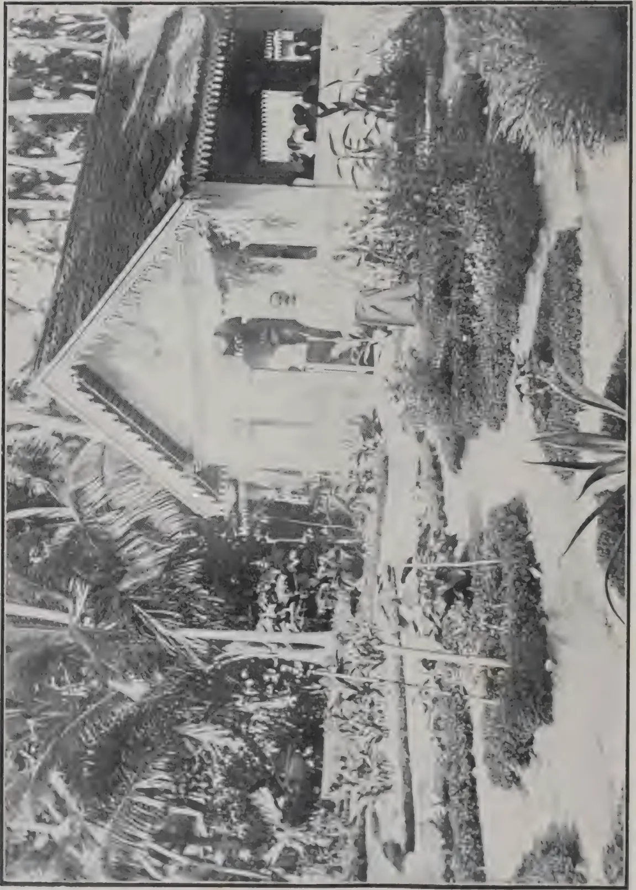A black and white photograph of the Walana School Garden. The image shows a building with a tiled roof and a garden area with various plants and trees. The building has a light-colored facade and a dark roof. The garden is filled with various plants, including palm trees and other tropical vegetation. The overall scene is a lush, green landscape.

(See Page 341).

WALANA SCHOOL GARDEN

Photo by H. F. Macmillan

328------------------------------------------------

THE  
**TROPICAL AGRICULTURIST:**  
JOURNAL OF THE  
**CEYLON AGRICULTURAL SOCIETY.**

---

VOL. XLV.

COLOMBO, NOVEMBER, 1915.

**No. 5.**

---

---

**COCONUT CULTIVATION IN THE  
EASTERN PROVINCE.**

---

The rainfall of Batticaloa, the centre of the coconut growing industry of the Eastern Province, has averaged for the last 44 years 62.83 inches per annum. Some 50 inches of this total fall in the five months October-February during the North-East Monsoon; so that while the rain is sufficient in quantity the distribution is so uneven that the trees bear only half crops. It is worth while calculating the amount of water lost during the year, and whether and by what means any of it could be saved.

The trees are planted at the rate of 80 to the acre, and yield on an average 25 nuts per tree per annum. This gives 2,000 nuts per acre. It takes at Batticaloa 1,100 nuts to make a candy of copra (560 lb.), so that the average weight of copra produced is 9 cwt. Taking into account the husks, shells and fallen leaves, we shall probably not be far wrong in estimating the amount of dry matter produced in the course of the year at 36 cwt. The amount of water transpired by a plant for one pound of dry matter produced depends upon several factors—species, fertility of soil, temperature and humidity of atmosphere. Generally speaking it may be taken as 500 lb. It is probably much more than this with the hot dry climate and poor soils of Batticaloa; not less than 800 lb. Calculating it at 800\* we find that

---

\* The writer in his address at Batticaloa on October 9th, of which this article is a summary, took the amount at 1,000, which may perhaps be a little high.

329------------------------------------------------

294[NOVEMBER, 1915.

1,440 tons of water per acre per annum are used by the coconut trees to produce their crop. A fall of 62.83 inches represents 6,408 tons of water ; 4,968 tons are therefore lost.

Some of this drains away in the monsoon flood but the bulk of it sinks in, raising the water table. Of that which sinks a great proportion is eventually dissipated through surface evaporation and transpiration by weeds. Surface evaporation can be checked by stirring the surface of the land from time to time to rupture the capillary tubes through which water rises by attraction from the water table. If these tubes are broken by harrows the water cannot escape at the surface but must needs pass through the trees. The amount of copra produced being in direct proportion to the amount of water transpired, the planter possesses in the harrow means whereby to increase his crops. Again, clean weeding is one of the fundamental principles of the Dry-farmer, because weeds transpire soil moisture just as the crops themselves do. The water escapes through weeds at a much greater rate than through a bare, uncultivated surface. Under conditions such as prevail at Batticaloa, where all the energies of the coconut planter should be concentrated upon husbanding his soil-water, not a weed or bush should be allowed to grow in a bearing plantation during the dry weather. In a young plantation the circumstances are a little different ; the young trees do not occupy all the land ; green manures could therefore with advantage be grown between the rows and cut and mulched to the plants. If by disc-harrowing his land, say, once a month and clean weeding he could save one-seventh part of the water now lost, the planter might reasonably expect to increase his crop 50 per cent.

The soils of Batticaloa are sandy, very suitable, it has been pointed out, for coconut trees ; but the suitability of a soil for a particular crop can never be considered wholly apart from climate. If the 62 inches of rain fell half in the South-West Monsoon and half in the North-East the soil might be considered very suitable for coconut trees, but sandy soils are not adapted for retaining moisture through a long period of dry weather. The Batticaloa soils lack body; they require organic matter in the form of coconut husks, dead leaves, branches; as much as can

330------------------------------------------------

NOVEMBER, 1915.]295

possibly be applied to them. This would improve their texture and increase their power of retaining moisture. It would also increase their fertility, as organic matter is the source of nitrogen. The amount of water transpired for a pound of dry matter produced is less in a fertile than in a poor soil. Coconut husks, jungle mulch and green manures can therefore to a certain extent take the place of water. At present husks are in nearly every case burnt, a squandering of wealth deplorable under the circumstances. By some means or other they should be returned to the land to rot into the soil. Burying them in trenches no doubt hastens their decomposition, but the trenches unless filled up immediately operate as drains, the very thing to avoid in the dry season. Scattering them loosely over the land before the rains set in would probably be the most satisfactory for the soil. It is a point, however, that only local experience and circumstances can decide.

But we believe that something more than the returning of the husks could profitably be undertaken on these porous soils, which require above all things organic matter to give them body and to enrich their store of plant food. Jungle mulch where available and near at hand could be carted on to the land; and young plantations could be thickly sown with green manures suitable to the soil. *Divi-divi* appears to be such a one. It belongs to the natural order leguminosæ which has the property of collecting nitrogen from the atmosphere, thus adding greatly to the food supply of the soil when their leaves and branches are cut and mulched, and it grows freely at Batticaloa. The question of how best to cultivate them as a green manure to occupy the land for only 5 or 6 years is one that the local Agricultural Society should take up on their new experiment station when it is opened. Thick sowing (say in rows 3 feet apart) and frequent cutting back would be the lines to follow. Pigeon pea (*Cajanus indicus*) should also be tried as well as other green manures such as horse gram (*Dolichos*), black and green gram (*Phaseolus*), cowpea (*Vigna*), jack beans (*Canavalia*), velvet beans (*Stizolobium*); not only in young plantations but also among large trees, provided the green crops were ploughed or harrowed into the soil before the dry weather set in.

R. N. L.

331------------------------------------------------

296[NOVEMBER, 1915.

# COCONUTS.

---

## COCONUTS AT ST. LUCIA.

---

A considerable amount of attention has been paid to coconut cultivation during the last few years, and the extension has increased at such a rate that coconut planting can no longer be regarded as a minor industry in St. Lucia. Many of the older plantations will soon be coming into bearing, and the various questions connected with the preparation of marketable copra, etc., will require investigation.

The soils of St. Lucia and the local climatic conditions are most suitable for this cultivation, and the majority of the young groves give every promise of a flourishing industry being established in the near future.

The export of coconuts shows a decrease of 16,459 nuts on the previous year. This decrease can be explained satisfactorily from a local and agricultural standpoint, as there has been no falling-off in production but really an annual increase of something between 25,000 to 30,000 nuts. These nuts have been used for local planting, and allowing for losses, represents an increase in this cultivation of something like 450 acres.

In future it is likely that there will be a steady increase in the shipping of copra, as the majority of planters are fully alive to the importance of selecting only the best nuts for planting, the smaller ones being dried and shipped as copra. The increase in this export for the year under review was 73 cwt.—REPT. OF THE AGRIC. DEPT., 1914-15.

---

## SELECTION OF COCONUTS FOR GERMINATION.

---

This article discusses the question of the effect of the age of the tree and its local conditions on the quality of the nuts for seed purposes. No evidence is obtainable to support the view that the nuts of young trees are unsuitable for seed purposes, and it is considered sufficient to select nuts for planting purposes from trees in their third or fourth year of bearing. In this way a more complete pedigree, so essential to seed selection, is obtained.

Trees from selected nuts planted in Nevis (West Indies), came into bearing at 4 years and 4 months and out of 1,000 nuts selected a year later, more than 89 per cent. germinated.—BULL. OF THE INTERNATIONAL INST. OF AGRIC.

332------------------------------------------------

NOVEMBER, 1915.]297

## COCONUTS IN PORTO RICO.

The coconut co-operative experiments, including fertilization and culture, reported on the past two years, have been continued and new cultural experiments undertaken in parts of the island where different weather conditions prevail. As this is a profitable crop, and one to which but little experimental attention has been given in Porto Rico, it is the plan to extend the lines of work already undertaken, including fertilization, seed-nut selection, and nursery and orchard culture. In the fertilization experiments started in June, 1912, eight harvests have been made. The number of nuts taken from each tree and the diameter of the nuts from the different plats have been recorded for each harvest. The yield in the plats given complete fertilizer was in excess of that in check plats for the last harvest, although between the complete and incomplete and check plats but little differences have resulted so far. The number of nuts harvested in the experimental field hardly averaged 30 per tree. The average diameter of the nuts was 4.8 inches. As the trees under observation are old palms on sandy beach land, apparently an ideal situation for coconut culture, the results of the harvests show how slowly old palms give returns for fertilizer investment. As the yield per tree is far below what it should be, an early increase is expected in the fertilizer plats.

Aside from the notes on fertilization, valuable data have been recorded regarding the number of nuts harvested from the individual trees. A few trees are bearing over 100 nuts per year, exceptional ones over 140, while a number, which are from all appearance thrifty, are producing annually not more than 10 nuts each, and a few not more than 5 nuts each. As there is a good stand of trees in the experimental plats, and productive and unproductive ones are found growing side by side throughout the field, the importance of seed-nut selection by those contemplating a new grove is plainly shown. In connection with selection work, records are being made showing the constancy in shape and size of both husks and nuts borne by individual trees.

In co-operation with A. J. HARVEY, experiments are being conducted on his plantation to determine the advisability of growing leguminous cover crops in a young coconut grove. This plantation is situated a few miles east of San Juan on a sandy coastal plain within half a mile of the ocean. Jack beans (*Canavalia ensiformis*) and a few species of velvet beans (*Stizolobium* spp.) planted in April all made good growth; and as they crowded out all native weeds and grass, cultivation was dispensed with, except for cutting the leguminous vines near the palms every few weeks, until the plants died in the following winter. The *Stizolobium* species proved to have a longer growing season and to produce a heavier crop of vegetation than the *Canavalia*, and are, therefore, preferable in coconut plantations. The type of land suitable to coconut culture, if not cultivated, will, for most of the year, be overgrown with wild vines and weeds. These wild vines are almost as troublesome as

333------------------------------------------------

298[NOVEMBER, 1915.

the *Stizolobium*s in climbing over the young trees, and they store no nitrogen from the air and add much less vegetable matter to the soil. Coconut palms should be set further apart than other orchard trees, and the cultivation of this large area and the improvement of the soil can be greatly facilitated by the judicious use of leguminous cover crops.—REPT. OF PORTO RICO AGRIC. EXPT. STN., 1914.

## COCONUT POONAC.

The following analysis of coconut poonac recently made in the Bangalore Laboratory appears in the PLANTERS' CHRONICLE :—

<table>
<tr>
<td>Moisture</td>
<td>...</td>
<td>...</td>
<td>...</td>
<td>12.89</td>
</tr>
<tr>
<td>Organic Matter*</td>
<td>...</td>
<td>...</td>
<td>...</td>
<td>78.09</td>
</tr>
<tr>
<td>Phosphoric acid</td>
<td>...</td>
<td>...</td>
<td>...</td>
<td>1.47</td>
</tr>
<tr>
<td>Potash ...</td>
<td>...</td>
<td>...</td>
<td>...</td>
<td>1.89</td>
</tr>
<tr>
<td>Other soluble mineral matter</td>
<td>...</td>
<td>...</td>
<td>...</td>
<td>3.05</td>
</tr>
<tr>
<td>Insoluble mineral matter</td>
<td>..</td>
<td>...</td>
<td>...</td>
<td>2.61</td>
</tr>
</table>

## SANDALWOOD TREE.

The following interesting note on this tree occurs in the report of the Superintendent, Madras Agri-Horticultural Society's Gardens :—*Santalum album*, known as the Sandalwood Tree, is a native of the Mysore State where the wood is a Government monopoly and brings in a very large income as the bulk of the 2,000 tons annually offered for sale comes from Mysore. Frequently members and customers of this Society have asked for sandalwood seedlings and I have procured them from Mysore, or grown them from seed in the gardens, but the majority of the plants have died and it has always been put down to defective re-potting and hurting the roots; but it has recently come to my notice that the plant is a root-parasite obtaining a great deal of its nourishment from the roots of other trees, so that in transplanting sandalwood tree seedlings a very large ball of earth attached to the roots must be taken up in addition to being careful not to hurt the tap root and in planting the tree it should be placed where the roots can attach themselves to the roots of shrubs growing near by. Most trees object to and suffer from the tangling of the roots of other trees and shrubs, but in the case of the Sandalwood tree such a tangle is necessary to its parasitic root system.

\* Nitrogen in organic matter......3.50

334------------------------------------------------

NOVEMBER, 1915.]299

# RUBBER.

## RUBBER FAMINE IN GERMANY.

When the war broke out German business circles recognized that the extraordinary conditions it created would have a far-reaching effect on the commercial and industrial life of the empire. But there still seem to be a good many people in Germany who have not yet been impressed with the changed conditions, and among them are quite a number of dealers in the rubber trade, who complain very loudly that the manufacturer does not turn out their orders as acceptably and as rapidly as he would in normal times. The rubber journals are taking these complainers to task, and seeking to convince them that under present trade conditions they should make all proper allowances for the extraordinary difficulties under which the manufacturer labours, and that they should not be too insistent on immediate deliveries or on getting exactly the quality at precisely the price mentioned in their orders.

The Allies' blockade is being felt more and more each day, and the list of rubber goods "no longer obtainable" is increasing constantly. Each day increases the inconveniences created by the lack of raw materials, and the discovery, or even the pretended discovery, of some new substitute for a scarce or "no longer obtainable" raw material is heralded throughout the press. It was announced lately that the Kaiser had motored to the front in a machine equipped with artificial rubber tires. Immediately the press announced that the great problem had been solved, that artificial rubber was at last practicable that Germany would no longer have to rely upon foreign countries for her crude rubber supplies. Rubber would now be home-made. It appears, however, now that the much-talked-of artificial rubber tires of the Kaiser's automobile were only experimental ones, produced at great cost, or at least at a cost that would prohibit their being produced on a commercial basis, or even on a basis permitting their use for the present military needs.

Another substitute that is receiving wide publicity in Germany appears to offer greater possibilities. It is known as "textilose," and is to be used as a substitute for the jute Germany formerly imported in great quantities from British India.

Textilose is made by spreading paper on a fibre gauze and cutting the product in strips, which are then spun into a yarn and can be woven in a similar manner as other paper yarns. Two factories are said to be producing about 44,000 pounds of textilose bags per day, and it is also stated that over 40,000,000 marks (\$9,520,000) have been subscribed for the promotion of the manufacture of this jute substitute both in Germany and abroad.

When the war broke out there was a very large supply of cotton, and even after the beginning of hostilities, large quantities of raw cotton from time to time reached Germany. Manufacturers used freely of this supply, with the result that when the Allies tightened their effective blockade the supply of raw cotton was considerably depleted. Since August 1st the manufacture of

335------------------------------------------------

300[NOVEMBER, 1915.

cotton goods has been absolutely prohibited. The government's order is far-reaching and strikes all kinds of goods made of cotton or containing any of this staple. Without distinction it prohibits the manufacture of all cotton yarns, cotton threads, fabrics, wearing apparel, bags, belts and all woven or knitted goods containing cotton. Since August 1st it has been legal to use cotton only in the manufacture of military requisites. Long before the government decided on these restrictions the price of raw cotton had reached the alarmingly high price of 30 cents per pound. The efforts made to encourage the planting and harvesting of hemp and flax have not yet given any material results.

Another government operation of great importance to the rubber industry is the recent seizure of all supplies of sulphur. However, the seizure of sulphur supplies is considered an advantage to the rubber trade, for the government has promised to distribute sufficient quantities to answer the immediate needs of all.

Lubricating oil is becoming so scarce and its price so high that only few rubber manufacturers can afford to use it for their machinery. Even graphite, which is used as a substitute therefor, is becoming rare and expensive.

The Allies' blockade has created such a rubber, gutta percha and copper famine that the D. V. E. (Union of German Electrical Engineers), which fixes the standards for rubber and gutta percha insulated wires, has been obliged to modify its standards to make their observance possible under present conditions. As far as possible iron will be used instead of copper, and rubber and gutta percha insulations will be replaced by impregnated paper wherever practicable. In cases where impregnated paper cannot be used, reclaimed rubber will take the place of the usual insulator until normal conditions are re-established.

The war has increased interest in farming here, and farmers, owing to lack of labour, are obliged to use modern machinery to a much greater extent than they formerly did. This creates an unusual domestic demand for many rubber mechanical articles, and especially for belts, in view of the fact that the use of leather for other than military purposes is strictly forbidden. But, because of the high cost of raw materials necessary for making these belts, it is almost impossible for manufacturers to make reasonable profits in producing these necessities. Of course, those who had a large stock of belts on hand are securing large profits, for farmers are glad to take what they can get and are using all sorts of belts on their threshing machines and other agricultural implements.

Packings and the like that can easily be made of substitute materials are giving but little trouble. The hose industry, generally speaking, is dead. No orders are forthcoming: people who use hose are doing the best they can by keeping their old hose in repair.

Before the war, maritime as well as river navigation offered a great market for all sorts of mechanical rubber goods. River navigation is at a standstill through lack of freight and lack of hands; maritime navigation, as far as Germany is concerned, is stopped almost entirely by the activities of the Allies' fleets.

In a word, the rubber industry here is badly affected by the war, and were it not for government orders for tires and other mechanical and surgical rubber goods, the whole industry would be at a dead standstill.

336------------------------------------------------

NOVEMBER, 1915.]301

### THE GERMAN SYSTEM.

As an illustration of the thoroughness with which the Germans conduct their military operations, a paragraph in a letter recently written from northern France is interesting. The writer says :—

"After every battle in which the Germans have been victorious the field is literally scoured, and all the junk is transported to headquarters. Scores of ripped and torn auto tires are collected and sent to an establishment where the rubber can be utilized in the making of new tubes."

### GERMANY SAVING EVERY SCRAP OF RUBBER WASTE.

The saving of every possible scrap of waste rubber has now become such an important matter in Germany that not only the Imperial Government but State and Municipal authorities have taken the matter up ; and the Red Cross organization particularly is instructing the public in regard to collecting old rubber articles so that nothing shall be missed. The newspapers even go to the extent of giving general instructions as to how waste rubber articles shall be sorted before being turned over to the factories for use, so that the delay of re-classification may be avoided.

On June 1st, Austro-Hungarian rubber manufacturers increased their prices for rubber goods from 50 to 100 per cent.—INDIA RUBBER WORLD.

---

## SMOKED SHEET AND SMOKE HOUSES.

B. J. EATON.

As enquiries are received from time to time from planters asking for advice on the phenomenon in connection with sheet rubber known on the rubber market as "stretching rusty or resinous," and frequently attributed by brokers to excess of resin in the particular rubber, it is thought advisable to make a brief statement with reference to this particular fault, which, although it probably has no effect on the real quality of the rubber, affects its market value and under present conditions of buying and selling must be taken account of and remedied.

The appearance which is usually produced when the dry rubber is stretched or lightly scratched, resembles powdered resin ; hence probably the broker's idea of the presence of excess of resin.

The phenomenon, however, is due to a sweating or exudation of the serum or mother-liquor left in the rubber, which comes to the surface as the sheet of rubber contracts on drying and, if unable to drain off or not removed by suitable methods, evaporates on the surface in the form of a thin film. This film is not obvious till the rubber is stretched or scratched, when it breaks up and on account of the reflection and refraction of light caused by small particles, its appearance is indicated by a deposit resembling powdered resin. All transparent substances, such as glass, large colourless crystals, light yellow resins, gums, etc., when in a thin film, would not be visible, but when powdered the minute particles all reflect and refract light and the powdered material becomes visible as a white or yellowish powder. The film of evaporated serum on sheet rubber behaves similarly.

337------------------------------------------------

302[NOVEMBER, 1915.

Some time last year when investigating surface slime formation on slab rubber, i.e., fresh coagulum from the ordinary pans, which were only rolled or pressed lightly and which contained a large proportion of residual serum, a large amount of this deposit was naturally formed on the surface of these slabs; when the slabs were soaked in water, if the surface remained above the surface of the water in the tanks in which the slabs were soaked, this slime formed on the surface on standing, while on the side below the surface of the water it was dissolved off in the water.

An analysis of this slime, after drying completely in a desiccator, yielded nitrogen corresponding to a total protein content of over 60 per cent., the remainder being chiefly resin (acetone extract) and mineral salts. This proved that the film consisted largely of protein material as had been suspected.

#### REMEDY.

The remedy for this fault suggests itself, viz., to allow the sheets after machining and marking, to drain for an hour or two and then to soak them again in large pans of water, with one or two changes of water if necessary, subsequently scrubbing the surface of the sheets slightly with a stiff scrubbing brush, after removing from the water, and before placing in the smoke house. As a rule, the more concentrated the latex used in making the sheet, and the thicker the sheet, the more liable is this film to be formed.

This phenomenon is less likely to occur on ribbed sheets, i.e., with ribbed markings along the length of the sheets; since, on hanging to drain, the exudation from the rubber would drain more easily along the ribs.

A sample was received recently from an estate in which only one side of the sheet was affected. This was probably caused by the sheet having been placed on a table on which the serum from other sheets had drained.

#### CONTROL OF SMOKE ROOM TEMPERATURES.

The usual method of controlling the temperature in a smoke house is by means of a maximum and minimum thermometer.

The disadvantage of this instrument in recording temperatures is that a cooly can easily make up a fire early during the night so that the thermometer reaches a definite maximum and, for the remainder of the night, the fire need not be replenished, since the temperature will not drop very low till early morning. The actual maximum temperature may therefore have been maintained only a very short time and the drying may become slow.

The use of an instrument, however, which records the temperature automatically during the whole period obviates this difficulty and is an excellent check on the cooly. Such an instrument is known as a thermograph and is supplied by most scientific apparatus makers.

The instrument consists of an eight-day clock rotating a drum to which a paper chart is fixed. The chart is divided into days and hours, each chart covering a period of 8 days. Sufficient charts are provided with the instrument for one year and extra supplies can be purchased cheaply or a plain piece of paper can be used, as the temperature curve will show whether great variation of temperature has occurred. The instrument itself costs under £5; the clock, with chart attached, is enclosed in a copper case, which can be locked, so that the mechanism of the instrument cannot be interfered with. The only work involved is the winding of the clock once every eight days and the replacement of the old chart by a new chart.

338------------------------------------------------

NOVEMBER, 1915.]303

### DAMP SMOKE HOUSES.

One or two enquiries have been received in connection with the "sweating" of the rubber in smoke houses and the deposition of moisture on the rubber and on the interior of the building.

In these cases, it was found that outside smoking arrangements were employed, i.e. furnaces built up outside the smoke room, usually below the ground level, with a flue leading into the smoke room.

In one case, common moulds or mildews were actually found growing on the rubber in the smoke house.

As a rule such exterior smoking arrangements are unsatisfactory. The principle of smoking is slow combustion, producing a product rich in anti-septic constituents; consequently to obtain a good smoke or vapour the fuel must burn slowly and at a comparatively low temperature. Many of the products of this slow combustion, although volatile, are easily condensed, and with an exterior furnace and long flue, these products condense in the flue or near the end entering the smoke room, and the water vapour which passes through, condenses in the smoke room itself, on the rubber and on the walls and roof of the room and causes "sweating" or deposition of moisture. Where the fuel is burnt in the smoke house itself, in boxes or holes in the ground, there is sufficient heat to drive the water vapour out and only the other products are left to diffuse into the rubber.

One factor in connection with smoking which is frequently not realised, is that the drying caused by the heat is far more effective than the actual smoke products—creosote, etc.—as a preventive of moulds.

This is well known in connection with the smoking of bacon and meat in general.

It has been actually stated by scientific workers that, where moulds appear on smoked sheet, the rubber could not have been properly smoked. This is entirely erroneous. The common mildews will grow most readily on the best smoked sheet, given the proper conditions subsequently, i.e. suitable moisture conditions.

One of the simplest methods of inducing mould growth on smoked sheet is to wrap the sheet in paper—especially newspaper.

Several cases have occurred also in which No. 1 pale crepe and smoked sheets have been despatched by an estate manager in perfect condition, and owing to becoming damp in the hold of a ship or by subsequent accidental contact with sea water, moulds of various kinds have developed and discoloured the rubber and the manager has been blamed wrongly. This has been proved by actual instances, in which cases of rubber despatched for the last International Rubber Exhibition, which had previously been inspected by the Director of Agriculture and the writer and found to be in perfect condition, were accidentally dropped into the sea at Port Swettenham and when returned to the Agricultural Department were found to be discoloured by most of the usual fungi which have been found by the mycologist to produce such effects.—F. M. S. AGRIC. BULL. VOL. III., No. II.

339------------------------------------------------

304[NOVEMBER, 1915.

# COCOA.

---

## CACAO FERMENTATION.

---

MR. HARVEY BRILL of the Bureau of Science, Manila, communicates an interesting article on the Enzymes of Cacao to the March number of the PHILIPPINE JOURNAL OF SCIENCE, in which he seeks to trace the causes of the changes which take place in cacao fermentation. From this article we quote as follows:—

The necessity for fermenting or sweating cacao is now generally acknowledged. The principal changes brought about by this process are:—(1) The removal of the greater portion of the sugary pulp or parenchymatous tissue surrounding the beans, (2) the dissociation of the bean from its testa or seed coat, (3) the promotion of chemical changes within the seeds, (4) the conversion of the bitter astringent taste into a palatable sweet one, and (5) an improvement in colour, break, and flavour. Investigators are not agreed as to the cause of these changes and attribute them to the action of various agencies. HART contends that the process of fermentation or sweating in cacao consists in an alcoholic fermentation of the sugars in the pulp of the fruit accompanied by a loss of some of the albuminoid and indeterminate nitrogenous constituents of the beans . . . . . Some parts of the carbohydrates other than sugars undergo hydrolysis and either escape in the runnings from the boxes in the form of glucose, or undergo in turn the alcoholic and acetic fermentations. During this change some of the astringent matters to which the somewhat acrid taste of the raw beans is due are also hydrolysed, and thus a marked improvement in flavour is gained.

HARRISON holds the same view. A. SCHULTE IM HOFE, in an investigation carried out at Victoria, in Cameroon, came to the conclusion that the changes brought about in the cacao bean during fermentation were the results of an oxidation process and were precisely similar to those taking place during the conversion of green tea into black tea. He made no attempt to determine if the oxidation was due to the action of enzymes or arose from other causes. That the fermentation is the result of biological action is the conclusion of J. SACK.

PREYER has isolated a yeast, *Saccharomyces theobromæ*, from fermenting cacao and has recommended the use of the pure culture of this for the initiation of the fermentation. Besides the above he observed *S. cerevisiæ*, *S. ellipsoidies*, and *S. membranae-faciens* in fermenting cacao. Others have noted the presence of *Penicillium* and *S. apiculatus*. However, not much success has been attained with the use of pure cultures of yeasts, and not much development can be looked for along this line, since the use of a pure strain of yeast would necessitate the sterilization of the culture medium, the cacao. Sterilization would destroy the enzymes present. BEHRENS has pointed out that the changes desired from fermentation do not occur when the enzymes are destroyed. That the colour change in the bean from white or violet to brown is only indirectly produced by fermentation, is maintained

340------------------------------------------------

NOVEMBER, 1915.]305

by LOEW. He insists that the brown colouration is due to the action of the oxidases or oxidizing enzymes, since this same brown colouration is produced when the beans are crushed and exposed to the air. These oxidases are stored up in the protoplasm of the bean of the cell and are liberated when the cells are killed, without injury to the enzyme. The enzyme then becomes active. It is a very generally accepted belief that enzymes are an important factor in the changes tobacco undergoes during the curing process. With this in mind, OOSTHUIZEN and SHEDD have investigated the enzymes of the tobacco plant. Many plants and plant products are being investigated to discover the enzymes present and thus throw some light on the changes they undergo when ripening and germinating and their influence on the system when used for foods. On account of the great interest manifested in enzymology and in the hope that some light may be thrown on the case of the changes taking place in the fermentation of cacao and on the real nature of the changes themselves, this investigation has been undertaken.

The writer then furnishes details of his experiments involving tests for lipase, emulsin, casease, albuminase, protease, inulase, reductase, oxidases, diastase, invertase, raffinase and maltase, and concludes as follows:—The pulp surrounding the cacao bean contains a greater number of enzymes than the fresh bean itself. The pulp shows activity for the enzymes, casease, protease, oxidase, raffinase, and invertase. The fresh bean gave reactions for casease and raffinase, and very strong reactions for oxidase. The fermented bean reacted for casease, protease, oxidase, diastase, raffinase, and invertase. The fermented bean shows the presence of protease and invertase, both of which are absent in the fresh bean, but present in the pulp. These must have penetrated the membrane surrounding the bean during fermentation. Diastase is present, but absent in the extracts from the fresh bean and from the surrounding pulp. This has been developed in the bean itself during the process of fermentation. Therefore, the conclusion is reached that the presence of these enzymes undoubtedly influences the character of the fermentation and that temperature control during fermentation is necessary in order that they may not be destroyed,

---

## THYMOL FROM AJOWAN SEED.

The bulk of India's export of Ajowan seed (*Carum copticum*) went to Germany before the war. In 1912-13 the export was 21,650 cwt., of which 19,055 was appropriated by Germany. In 1913-14 the export only reached 9,784 cwt. of which 6,990 went to Germany, from which it will appear that though the exports to the enemy country have decreased considerably the trade has not been taken up in the United Kingdom or elsewhere. The CHEMIST AND DRUGGIST, in drawing attention to this fact, points out that the share of the United Kingdom in 1914-15 was 382 cwt. against *nil* in the preceding two years. The output of thymol from Ajowan seed is about 1¼ per cent. In August last the drug was about 10s., rising to 45s. in September and declining to 24s. in April. At present the scarcity is said to be acute, the English article (obtained from thyme) being unable to meet the demand at 27s.

341------------------------------------------------

306[NOVEMBER, 1915.

# COFFEE.

---

## ARABIAN COFFEE IN UGANDA.

---

The present year has been a decided improvement as far as the Leaf disease and Die-Back are concerned. No doubt the climatic conditions of the present year have been as favourable to the coffee trees as the climatic conditions of the previous year were unfavourable, for the advent of the leaf disease culminated in a spell of drought seriously crippling the trees; whereas the greater rainfall during the present year, although giving the disease a fresh impetus—for the disease has been present to a considerable extent—also created vigorous growth in the trees which were thus enabled to keep pace with it. How far and important is the part played by the weather conditions in the life of the disease may be seen at a glance from the chart overleaf.\*

It will be noticed that a high rainfall preceded the gradual rise of disease causing defoliation; then extreme drought causing wholesale die-back and numerous deaths amongst the trees. This spell of drought was phenomenal and resulted in a serious shortage of food among the natives, and in parts a serious lack of water. This drought subsided in September of that year by a rainfall in one day of 1.68 inches. This stimulated the trees into new growth, with a sufficient subsequent rainfall to maintain it. This new growth enjoyed meantime partial immunity from the disease, but then again a gradual rise in the percentage of disease present takes place with the increasing rainfall. The rapid falls in the disease are due to the trees having supplemented their leaves by a new leaf system. This in two cases, i.e., from September 1913, and November, 1914, was enhanced by drought followed by a good rainfall, and in the other case, viz., September, 1914, by a natural process of the renewal of the leaf system.

Comparing then the climatic conditions of last year and the leaf disease and die-back with the climatic conditions of the present year and the improved condition of affairs as regards leaf disease and die-back, it would appear that what we have most to fear are the spells of drought which deprive the trees of the stimulus necessary to enable them to resist the disease, for, as was pointed out in a previous report, the high percentage of die-back among the trees was due in large measure to the phenomenally dry conditions then prevailing. This contention was again borne out by the considerable die-back present during the short drought of December and January, 1914-15.

That the effects of the leaf disease and die-back have considerably

---

\* Not reproduced.

342------------------------------------------------

NOVEMBER, 1915.]307

reduced the yields of the trees will be seen from the following records:—

### COFFEA ARABICA.

#### Nyasaland Variety $5\frac{1}{2}$ years 9 by 10 in.

<table border="1">
<thead>
<tr>
<th>No. of Plot.</th>
<th>Total No. of Trees.</th>
<th>No. of Good Trees.</th>
<th>No. of indifferent Trees.</th>
<th>No. of Deaths.</th>
<th>Total Yield of Berries.</th>
<th>Average Yield of Berries.</th>
<th>REMARKS.</th>
</tr>
</thead>
<tbody>
<tr>
<td>1A.</td>
<td>249</td>
<td>87</td>
<td>115</td>
<td>47</td>
<td>49 lb.</td>
<td>3.88 ozs.</td>
<td>Unmanured.</td>
</tr>
</tbody>
</table>

These 249 trees make up 4 rows of the original coffee on the Plantation. This plot was so much affected by the leaf disease and die-back that during the latter part of 1913 it was uprooted, with the exception of these 4 rows which were left as a test. Assuming that a tree 5 years old should produce at least 1 lb. of parchment coffee, it will be seen that the bearing capacity of these trees has been reduced by three-fourths, if not considerably more.

Nor are the facts any more encouraging in the next series of plots, with perhaps the possible exception of No. 1, which were also considerably affected by leaf disease and die-back. These plots show a high percentage of indifferent trees. It is interesting, however, to notice that the only plot which is anyway near the normal is the manured one with a greater number of normal trees and consequently a higher average yield. These plots were on a par, previous to the manurial test.

#### Nyasaland Variety $4\frac{1}{2}$ years 6 by 8 in.

<table border="1">
<thead>
<tr>
<th>No. of Plot.</th>
<th>Total No. of Trees.</th>
<th>No. of Good Trees.</th>
<th>No. of indifferent Trees.</th>
<th>No. of Deaths.</th>
<th>Total Yield of Berries.</th>
<th>Average Yield of Berries.</th>
<th>REMARKS.</th>
</tr>
</thead>
<tbody>
<tr>
<td>1</td>
<td>767</td>
<td>590</td>
<td>126</td>
<td>51</td>
<td>1b. 287½</td>
<td>ozs. 5.3</td>
<td>Manured with Farmyard manure and Kainit and pruned in 1913.</td>
</tr>
<tr>
<td>2</td>
<td>1328</td>
<td>653</td>
<td>533</td>
<td>42</td>
<td>108</td>
<td>1.45</td>
<td>Unmanured.</td>
</tr>
<tr>
<td>3</td>
<td>1439</td>
<td>589</td>
<td>786</td>
<td>64</td>
<td>138½</td>
<td>1.61</td>
<td>Unmanured.</td>
</tr>
</tbody>
</table>

The only coffee which is in a normal state of health at present is the series of the younger plots. These plots, although they were diseased, were never seriously affected by it, as during the advent of the disease they had not yet reached a reproductive stage and were therefore not handicapped by crops. The die-back is present only in the older plots where there was an excess of leaf disease and excessive cropping. The yields from the younger

343------------------------------------------------

308[NOVEMBER, 1915.

plots are as follows:—

**Nyasaland Variety 3 years 8 by 3 in.**

<table border="1">
<thead>
<tr>
<th>No. of Plot.</th>
<th>Total No. of Trees.</th>
<th>No. of Good Trees.</th>
<th>No. of indifferent Trees.</th>
<th>No. of Deaths</th>
<th>Total Yield of Berries.</th>
<th>Average Yield of Berries.</th>
<th>REMARKS.</th>
</tr>
</thead>
<tbody>
<tr>
<td>4</td>
<td>737</td>
<td>737</td>
<td>Nil</td>
<td>Nil</td>
<td>lb. 251½</td>
<td>ozs. 5.44</td>
<td>Manured with Cotton seed.</td>
</tr>
<tr>
<td>5</td>
<td>312</td>
<td>312</td>
<td>Nil</td>
<td>Nil</td>
<td>100</td>
<td>5</td>
<td>Unmanured.</td>
</tr>
<tr>
<td>6</td>
<td>1588</td>
<td>1588</td>
<td>Nil</td>
<td>Nil</td>
<td>611½</td>
<td>6.16</td>
<td>Part of this plot was manured with Basic Slag. 1913.</td>
</tr>
</tbody>
</table>

—ANN. REPT. OF THE DEPT. OF AGRIC., UGANDA PROTECTORATE, 1915.

## DIE-BACK IN UGANDA.

Almost a hundred examples of this Coffee trouble have been examined in the laboratory during the year. In many estates this die-back has caused a serious loss of trees, and in others a serious loss of bearing wood, and, therefore, of crop. On the older estates, it was most common when *Hemileia* disease was at its worst and afterwards, and there is always a certain amount of it on all plantations.

The tips of affected branches blacken, and the leaves fall; the berries very often remain on the branches, but they become brown and do not mature. At first, only a few branches are affected. These may occur at different levels in the centre of the tree. A further stage shows the gradual drying-up and death of practically all the primary branches, situated above the oldest primaries at the base of the stem and below the young green apical shoots. Thus is produced a tree with a lower mass of well-developed leafy primary branches, an upper crown of fresh green shoots, and an intermediate area which is naked, barren, and unsightly, and consists of projecting primaries which have lost all interest in life.

This condition is the result of physiological causes, and is not due to fungoid attack. It was thought at one time that "die-back" trees were affected by a bark disease, caused by a fungus of the nature of the *Corticium* which attacks *Hevea* and other crops, but this idea has been entirely departed from. The following two paragraphs may perhaps give an explanation of Uganda Coffee "die-back."

During the first years of the coffee-tree's growth, the basal primary branches, which are the oldest, are enabled to make good secondary growth and thoroughly to establish themselves. Therefore, when flowering and bearing commence, they are able by their own efforts, and with the help of their secondary branches, to ripen their crop and survive the ordeal. The young apical primaries bear no crop, and they, having no extra strain put upon them and having to hand their full share of sap, continue to grow and increase. The intermediate mass of primary branches—the ones which die back—find themselves unable, of their own unaided efforts, to ripen the large maiden crop

344------------------------------------------------

NOVEMBER, 1915.]309

they invariably bear. They are not yet well-established, and they collapse under the strain put upon them. Inspection of a coffee tree in this condition shows that some of these primaries succeed in ripening their whole crop and then die, while others, after ripening only a part of the berries, give up the effort to do any more. The dead branches are lost for ever to the tree. Others which survive may linger on for some time, with, as a rule, only one apical pair of leaves. In this way, a gap in the symmetry of the tree is made, and, should the same effects follow the incidence of the next flowering season, an exceedingly useless and unsightly tree is produced.

The Coffee "die-back" is thus to be regarded as the direct effect of a form of over-bearing, and, on this assumption, the following measures are recommended.

Where "die-back" is common, and it is desired to adopt remedial measures, these should take the form of stumping affected trees. The cut should be made through the stem at the top of the basal portion which bears the healthy primary branches. A new sucker can be raised from this stump, and the tree restored in time to its normal shape.

Preventive measures are strongly recommended to those who are able to adopt them. They consist in the prevention of over-bearing by the branches under discussion by relieving them of their maiden crop. The young berries should be pulled and rubbed off the trees. This operation is best performed within a month after flowering. If it is carried out too soon after the flowering, a set of new buds will be produced, and if it is delayed until the berries are well-grown, and the bearing branch shows signs of sickness, the benefit of the operation is lost. The harm is already done, and the branch is in the grip, so to speak, of the "die-back."

The carrying out of this operation on a fair-sized estate will undoubtedly prove costly, but it will most likely require to be undertaken only once, and that during the second or third year of the plant's life, and only on those branches that attempt to bear on green wood. Expense and loss of crop (the latter being negligible because the lost berries would not, in any case, come to maturity) will be repaid by the development of naturally and symmetrically branched trees, and the subsequent evenness of crop borne. Secondary and other branches can be replaced, but lost primaries *never can be*.

In this connection, it is to be regretted that the operations of removing from young trees all tender superfluous growths, of systematic pruning of older trees, and of keeping clear around the main stem a cylindrical vertical passage a foot in diameter by removing secondary branches, are not more frequently carried out. Good cultivation is also necessary.

The fungi found on "die-back" trees are *Periconia Byssoides*. Pers., *Fusarium coffeicola*, P. Henn., *Phoma* sp. (probably new), *Fusarium* sp., *Tubercularia* sp. and a *Colletotrichum*. The first-mentioned form and the two species of *Fusarium* were also found on young trees killed by lightning. The *Phoma* and the *Tubercularia* were found only once. None of these species is constant in its presence on "die-back" branches, and other imperfect forms found only very occasionally are not suggestive of parasitism. These fungi are undoubtedly only saprophytic.

The foregoing remarks do not bring into the question of the prevalence of die-back a factor which has undoubtedly had a great influence upon it, the

345------------------------------------------------

310[NOVEMBER, 1915.

baneful effects of *Hemileia* disease—the loss of leaf-surface and the consequent reduction of the working efficiency of the weakened tree. Branches which never bore or attempted to bear any crop have died back solely because of their loss of leaves and the general low condition of the parent tree caused by the demands made upon it by the necessity for renewal of a lost or damaged leaf-system. Die-back, again, is favoured when weeds have been allowed to interfere with the nutrition of the trees, where the soil is poor, and where a period of drought has been experienced, the last being the case in certain districts immediately after the epidemic of *Hemileia* which lasted over 1913. Like *Hemileia* itself, it is not at present so much in evidence as it was during 1913 and the earlier part of 1914. In other words, many trees have “recovered,” but the planter is still faced with the fact that owing to the loss of primary branches, he cannot take from his trees the full crop they ought to yield.—ANN. REPT. DEPT. OF AGRIC., UGANDA PROTECTORATE, 1915.

## COFFEE AND COFFEE PLANTING.

That there is a growing demand for coffee is shown by the statistics of the United Kingdom's foreign and Colonial trade. In 1910 this country imported 936,778 cwt. of raw coffee, valued at £2,303,014. In 1914 the quantities had increased to 1,036,705 cwt., valued at £3,546,231. This raw coffee is the basis of one of our greatest transhipment trades, and we find that of the total imports the greater part is re-exported. For instance, in 1914 we re-exported 669,803 cwt. of raw coffee, valued at £2,194,945; but this transhipment business, although there was a spurt in the last half of 1914, owing to the war, has been tending to decline, for we find that such transhipments were 753,338 cwt. in 1910, and only 439,236 cwt. in 1912, a falling-off explained by the more direct trade springing up between coffee-growing countries and Continental ports. The great increase in this trade which took place in 1914 must, therefore, be attributed entirely to the closing of Continental ports since August of that year.

### SOURCES OF SUPPLY.

It will be interesting to touch briefly upon the principal sources of supplies reaching this country. These in 1914 are shown in the following table:—

<table>
<thead>
<tr>
<th></th>
<th></th>
<th>Quantities.</th>
<th></th>
<th>Values.</th>
</tr>
</thead>
<tbody>
<tr>
<td>Brazil</td>
<td>... ..</td>
<td>333,488 cwt.</td>
<td>... ..</td>
<td>£954,247</td>
</tr>
<tr>
<td>Costa Rica</td>
<td>... ..</td>
<td>236,842 ,,</td>
<td>... ..</td>
<td>£905,404</td>
</tr>
<tr>
<td>Colombia</td>
<td>... ..</td>
<td>83,022 ,,</td>
<td>... ..</td>
<td>£296,294</td>
</tr>
<tr>
<td>Guatemala</td>
<td>... ..</td>
<td>76,825 ,,</td>
<td>... ..</td>
<td>£268,889</td>
</tr>
<tr>
<td>Mexico</td>
<td>... ..</td>
<td>34,859 ,,</td>
<td>... ..</td>
<td>£123,818</td>
</tr>
<tr>
<td>Java</td>
<td>... ..</td>
<td>30,429 ,,</td>
<td>... ..</td>
<td>£97,663</td>
</tr>
<tr>
<td>Salvador</td>
<td>... ..</td>
<td>27,277 ,,</td>
<td>... ..</td>
<td>£92,483</td>
</tr>
</tbody>
</table>

It will be noticed that all of these are foreign markets, and an examination of the statistics since 1910 shows that we are obtaining larger supplies from Java, Mexico, Salvador, Costa Rica, Colombia and Brazil. The total imports from foreign countries in 1910 were 797,087 cwt., valued at £1,866,589. These imports had increased in 1914 to 880,837 cwt., valued at £2,938,511.

346------------------------------------------------

NOVEMBER, 1915.]311

Our imports of raw coffee from British possessions have also increased, viz., from 139,691 cwt. in 1910, valued at £436,425, to 155,868 cwt., valued at £607,720 in 1914. Among British coffee-producing countries by far the most important is British India, which supplied last year 124,332 cwt., almost double as much as in 1913, and here again the effects of the war can be traced. A steadily improving market is British East Africa, from which the quantities increased from 866 cwt. in 1910 to 16,124 cwt. in 1914. There is also a satisfactory improvement in the British Guiana trade, but our imports of raw coffee are either at a standstill or declining as regards Nyasaland, Aden and Dependencies, the Federated Malay States, Ceylon, and the British West India Islands.

### CAPITAL AND PROFITS.

An excellent book\* on coffee-planting and the preparation of coffee for the market has recently been published at Aberdeen. The author, who has adopted the *nom de plume* of "Jotapeu," is MR. J. P. UGARTE, the Consul in Aberdeen for the Republic of Salvador, and his long experience of the coffee trade, and especially his acquaintance with the best methods of preparing the coffee bean, entitle him to speak with authority on the practical points involved. MR. JOTAPEU has arranged his book in seventeen chapters. Of these the first two deal mainly with the profit to be derived from coffee-planting, and in this connection the author furnishes some interesting particulars of the cost and returns of a plantation in Mexico. He finds that the annual nett profit on capital invested is 90 per cent. To start a plantation of 500,000 plants, 50,000 dollars capital is estimated to be sufficient, say 10 cents for each plant. At the end of the third year the first crop would be obtained—a minimum of  $\frac{1}{2}$  lb. from each plant, or say, 250,000 lb. of coffee, which at the low price of 10 cents per lb. gives 25,000 dollars or 50 per cent. on the capital invested. At the end of the fourth year each plant produces 1 lb. of clean coffee, which at the same price would give 50,000 dollars. Allowing gathering and general expenses to absorb the 25,000 dollars produced by the first crop, the planter at the end of the fourth year has not only reimbursed the capital outlay of 50,000 dollars, but is also possessor of a plantation which will continue to give large yearly profits. This applies in the respective proportions to a plantation of 10,000 or 100,000 plants. The United States Consul-General in the city of Mexico, in a report to his Government, has estimated that the profits obtained from coffee-planting vary, but that the lowest shows something like 100 per cent. per annum on the capital employed. As regards the yield, that of one plant is given at 1 lb. of coffee, but 2 lb. per tree after the fifth year would be the average, judging from the yield of well-established and properly managed plantations. Naturally the cost of a plantation varies somewhat, according to the locality, but the author points out that unquestionably coffee-planting is a profitable investment, even when conducted on a limited scale in connection with general farm operations.

### THE MANAGEMENT OF PLANTATIONS.

There are a number of hints in this section of the book, evidently based on experience, as regards the varieties of coffee best suited to different

---

\* THE CULTIVATION AND PREPARATION OF COFFEE FOR THE MARKET. (With twenty-five illustrations). By JOSE JOTAPEU. 1915.

347------------------------------------------------

312[NOVEMBER, 1915.

localities, and there are also interesting notes as to the management of coffee plantations. One of the most important things to have, the author says, in a coffee plantation is a medical book dealing with and describing methods for attending emergency cases and minor sufferings, such as snake bites, cases of malaria, dysentery, etc. A medicine chest is also necessary. In all the coffee estates he visited in Mexico and Central America this is done, particularly in plantations situated at long distances from any professional assistance. Then there is the question of central stores, and it appears that on some estates which the author visited in Mexico and Central America the natives employed can procure their main necessaries of life, such as maize, rice, corn, beans, salt, clothing and light agricultural implements from stores run by the planters. On some estates he noticed that on pay-day the majority of the natives used to spend the greater part of their earnings, if not all, at such stores. The book also touches upon the treatment of the plantation labourers, and shows how this can be made conducive to efficiency and economy.

### VARIETIES OF COFFEE AND CULTIVATION.

One of the most interesting chapters is that entitled "Species of Coffee." This deals with the characteristics of the principal varieties and the climates suitable for them, such as the Arabian coffee, the café Amarillo, or yellow coffee, the café Hibrido de Liberia, red coffee, a variety of Arabian, the Robusta and the Liberian. With reference to the last-named, he mentions that this is not by any means in such great demand as the other species, for although its cultivation is easier its preparation for the market differs somewhat, necessitating machines specially adapted, and the loss in weight in preparing it for the market is very great. Of 50 lb. of ripe cherry coffee (Liberian), only  $4\frac{1}{2}$  lb. of dried, shelled beans are obtained, an equivalent of 91 per cent. loss in weight, the average loss being 85 per cent.

Another important question or series of questions is touched upon in the chapter headed, "The Planter's Enemies." In this the diseases of the coffee tree are discussed, and the author's experience should be of great interest to the planter. The value of spraying is emphasised, and particulars of the insecticides to be employed are reproduced. Among the troubles which can be checked and often entirely eradicated are the "Ojo de Gallo," or Cock's eye, the "Pulgón" or bug, the "Hemileia Vastatrix" the most dangerous of all coffee diseases, and the "Taladrador" or borer. There is a brief but practical chapter on the use of fertilisers, the results of experiments with these being tabulated.

In the section dealing with cultivation the questions of shade trees, and of bushes and trees to serve as a protection against wind, and the quick evaporation of moisture from the soil are discussed, and there is a note on the adulteration of coffee. Planting and pruning complete the first part of the book, and the pages on these subjects touch upon the selection of ground, the most favourable altitude, and distance between the trees. In Central America, Arabian coffee begins to yield in the third year, giving a minimum crop of three-quarters of a pound per plant. At the end of the fourth year the yield gives an average of 1 lb. per plant. In the fifth year the trees in full bearing sometimes yield from 2 lb. to 4 lb. One or 2 lb. from each plant is a very safe yield to calculate upon.

348------------------------------------------------

NOVEMBER, 1915.]313

## THE CURING OF COFFEE

### THE LATEST PROCESSES AND MACHINES.

No point is more insisted upon by MR. JOTAPEU than that a coffee plantation is most successful when the management is under the personal supervision of the owners. This supervision, however, must not end with the planting. A planter or "hacendado" must also supervise the working of the "beneficio," or curing plant; and the second half of his book is devoted to this subject. The coffee planter, he adds, is liable to lose a considerable amount of money on one crop alone, and we do not think it is an exaggeration to state that a careful study of MR. JOTAPEU'S pages and the carrying out of the advice given will go far towards helping planters to avoid such losses. Modern machinery has brought many changes in the preparation of coffee for the market, such as pulping, fermenting, washing, drying, hulling, polishing and grading, and the processes involved, together with the latest forms of machinery now employed, are described in an intelligible manner and with the aid of numerous illustrations. Having described how the coffee is best received from the native labourers and the respective quantities checked and recorded, MR. JOTAPEU describes the pulping process and the newest machines for carrying it out. As to the advisability of fermenting coffee he also expresses an opinion, based on practical experience, and he then enters fully into the question of drying, pointing out that open-air drying grounds are being gradually abandoned in favour of drying machines, and he shows why this must necessarily result from the improvements now embodied in appliances of this kind, which can be heated economically, either by exhaust steam heaters or by direct fire-heating. An important stage in the preparation of coffee, namely, husking, has a chapter to itself, which is followed by another on the new method of polishing coffee by means of phosphor bronze polishers, and the machinery for these processes in their latest developments is dealt with. The hulling of dry cherry coffee, also the subject of treatment by new machines, is next described, and this brings us to the concluding operation, viz., grading or classifying, in which a series of machines is noted. MR. JOTAPEU points out that coffee used simply to be classified by its thickness, making three grades, viz., firsts, seconds and thirds. The percentage of firsts seldom exceeded 25 to 30 per cent. This is the old and wrong way of classifying coffee, because the beans, though they may be of the same thickness, may yet differ a good deal in their width and length. The sample of firsts by the old method of grading was very irregular. The European coffee markets demand nowadays that coffees should be very uniform in appearance, and in order to comply with this demand, coffee must be graded first of all by its thickness, being the smallest dimension, then by the width and afterwards by the length, these two latter dimensions being more apparent to the sight. Up to the present no single machine is able to make the above three classifications, but two machines can be combined to produce the results demanded. Descriptions and particulars of these machines very appropriately conclude one of the most useful and most practically written books on the subject of coffee which planter or trader can have.—THE BRITISH TRADE JOURNAL.

349------------------------------------------------

314[NOVEMBER, 1915.

# TOBACCO.

## CIGARETTE TOBACCO IN INDIA.

Trials made in Northern India (where of course the conditions are entirely different from those obtaining in Ceylon) have gone to prove that local strains of tobacco are more likely to prove suitable for cigarette making than types introduced from America. THE INDIAN TRADE JOURNAL contains the following reference to these trials :—At the request of the Peninsular Tobacco Company, a good deal of work has been done at Pusa in the search for a suitable cigarette tobacco for Bihar. Seed from all the chief tobacco localities in India was collected and the types found in this seed have been separated in pure culture and classified. All the likely types of this collection were grown at Pusa and cured both on racks in the sun and also on the ground. Large samples of the cured product were sent to the factory and actually made into cigarettes. At the same time, a number of American varieties\* suitable for cigarettes, were also grown and tested in a similar way.

In a BULLETIN (No. 50 of 1915) recently issued by the Agricultural Research Institute, Pusa, MR. and MRS. HOWARD explain that the results of those numerous trials were somewhat unexpected. All the American varieties proved unsuitable as they did not grow fast enough in Bihar to have the least chance of success with the cultivators. In all cases, the seedlings were weak and lagged behind the robust Indian forms. The Americans were about a week to ten days late in transplanting and this slowness of growth was also seen in the ripening process. All the introduced kinds were too late for Bihar. As regards the colour, texture and flavour of the American sorts, the results were disappointing and in no case was a variety found combining the requisite colour, texture and flavour for cigarette manufacture.

The Indian varieties are reported to have given much more promising results. Many of the Bihar kinds gave good colour and flavour when cured on racks, but all were deficient in texture. Only one, out of all the fifty-one Indian types grown at Pusa, showed itself to possess the desired combination of texture and flavour with a fair colour when cured on racks or on the ground. This was Type 28, a kind found in a sample of seed from South Bihar. This variety has given good results for several years both on racks and also when cured on the ground. On the large scale, under estate conditions, it has done exceedingly well and a great demand for seed has arisen not only in Bihar but also in other parts of India. Type 28 has also been taken up by the people for the local trade as they find that, topped low in the country fashion, it gives a heavy yield of produce.

---

\* The American varieties tried were—Burley, Long leaf Gooch, White stem Oronoko, Easter Pride, Conqueror and Granville.

350------------------------------------------------

NOVEMBER, 1915.]315

## STEWART CUBAN.

H. K. HAYES.

The type of tobacco known as Connecticut Cuban Shade was first introduced into America in 1904 from Cuba. A selected strain of this variety has been grown continuously since then and has shown considerable evidence as to its homogeneity. Selection for high leaf-number during four years did not raise the mean from its original number 19.9. During the harvest of 1912 certain plants were observed with a large number of unpicked leaves and no inflorescence. These were removed to a glasshouse where they blossomed in January and bore 72 leaves on the stem. Seed from these new types sown in 1913 produced plants of uniform appearance but differing from the normal Cuban in having leaves of a somewhat lighter green shade, in a partial absence of green suckers, and in a practically indeterminate growth. Whereas the normal Cuban type bears a terminal inflorescence after producing from 14 to 25 leaves, this new type blossomed in November, after producing from 60 to 82 leaves per plant. In 1913 this new type, known as "Stewart Cuban," was grown as a field crop and manufactured by the Windsor Tobacco Corporation. The quality of the leaf was equal to the normal type and its yield 90 per cent. higher. Owing to its prolonged period of growth seed cannot be obtained without transplanting to a greenhouse in the late autumn.

Other mutations giving a higher leaf-number and an abnormal growing season have been observed in the case of Connecticut Havana, which has shown a uniform type for over 50 years. The same mutation has appeared in different parts of the country, but has only appeared for a single generation.—BULL. OF THE INT. INST. OF AGRIC.

---

## CIGARETTE PAPER.

According to the PAPER MAKER AND BRITISH PAPER TRADE JOURNAL a good cigarette paper must be absolutely neutral in flavour and aroma while the cigarette is burning. Flax or linen, hemp and ramie fibres are all that should enter into a cigarette paper and even the selection of these is of importance. All other paper materials are banned by defects such as "biting" of the tongue, irritating of the throat, objectionable odour, etc. Cotton, wood and straw enter into the inferior qualities, bamboo fibre and maize husk being also sometimes employed. "Rice paper," one time the boast of the high grade cigarette, is a thing of the past. The process of manufacture itself is a most complicated one, including among other things "cooking" with the aid of chemicals. The profits of the trade in cigarette paper have greatly fallen off of late owing to the manufacture of low grade goods which have taken the place of the better article. The competition too is severe, Austria and Italy contending for the trade in the East; and Austria, Germany, and France being rivals in the continental markets. The war has forced America into the trade, but prejudice is in favour of the foreign article though American cigarette paper is quite up to standard.

351------------------------------------------------

316[NOVEMBER, 1915.

# FRUIT.

## PRUNING.

PROF. F. C. SEARS.

Why is it that almost any one who takes any interest at all in fruit growing likes to prune? Ask most fruit growers, particularly those who have time to get the real enjoyment of the work, what they would rather do about the orchard, and ten to one will say "prune." One does not need to look far for the reason either. Few, if any, of the other operations call for so much knowledge and such good judgment, and none of them puts you in such intimate touch with your trees. The man or woman who cannot become enthusiastic over the pruning of a tree, especially a young tree, is certainly difficult to enthuse.

### SHALL WE PRUNE?

As a practical orchard matter the question of whether we shall prune or not is, of course, almost always answered in the affirmative, but there are a few men who prune little, if any, particularly on young trees, and the amount of pruning done varies tremendously, some men being very severe and others doing none at all, or at least very little. With the young trees there is a "school" of orchardists of fairly respectable numbers who do not believe in pruning at all, at the time of setting. They argue that the tree needs all its vitality to recover from the operation of transplanting and that to remove any of the top reduces by just so much the total vitality of the tree.

On the other hand, most growers prune the tree severely when it is set in order to reduce the top to correspond to the reduction of the root system which has been necessitated by digging the tree. This argument has always appealed to me as a sound one, and what experimentally I have done along this line has served to confirm my belief in the practice. I believe, however, that after the tree is established but while it is still young, say from the second to eighth year, it ought to receive very little pruning. In practice I have tended, during recent years, steadily towards less and less severe pruning of such trees. At the present time all that I would do to such a tree is to take out crossing branches, to look carefully after the development of the main branches and possibly to do a little additional thinning. I think we are likely to overlook the fact that trees of this age, being relatively small in bulk, can afford to remain more thick than trees of larger volume, and it seems to me that so long as we can keep such trees open enough to give us well-coloured fruit, the less pruning they receive the better. The most important reason for curtailing our pruning at this stage is the reasonably well-established fact that unpruned trees, or those which at most receive very little pruning while young, come into bearing relatively early.

The past month I had the pleasure of visiting a young orchard in the Annapolis Valley, Nova Scotia, which had been set for nine years. It was made up of Northern Spies and Wageners and the Spies had never been pruned at all. Now the Spy is proverbially slow in coming into bearing, and

352------------------------------------------------

NOVEMBER, 1915.]317

yet some of these young trees bore half a barrel of apples at seven years, and at nine years the majority of them were in bearing and many trees gave from one bushel to one-half barrel of fruit. Other instances might be cited showing the same results.

### REASONS FOR PRUNING.

If we are to prune we ought to acquire as clear a conception as possible of why we do it, and most of the intelligent pruning of fruit trees is done for one of the following three reasons:—

(1) To control size and shape of the tree. This is the only type of pruning that the writer would do while the trees are young and it varies with our ideals, all the way from the man who merely sees that the main branches are satisfactorily distributed on the trunk, and that there are no crossing branches of any size, up to the man who insists that the tree take some specific shape, as horizontal cordon or espalier. As already suggested to me, it is the most interesting of all phases of pruning, for one works out his ideas and co-operates with the little tree to produce very definite and specific results.

(2) The second general reason for pruning is to influence the bearing habit of the tree, to make it bear more or less fruit. Usually it is the former which we aim at, but occasionally we do pruning with the definite purpose of making the trees bear less fruit. This is especially likely to happen with such varieties as Wealthy and Wagener which bear very freely and on which the apples are likely to run small as the trees get older. It is often advisable to give such trees a severe pruning with the idea of starting them into renewed wood growth, which will reduce the amount of fruit and increase the size of the individual apples.

(3) The last general reason for pruning is to influence the character of the fruit, to make it better in colour and finer in quality. This comes into play as the trees get older and is the reason which we most commonly have in mind as we prune.

### GENERAL PRINCIPLES.

Let us glance next at some of the general principles which govern the pruning of fruit trees. We can do little more than mention them here and yet they must be understood if one is to prune intelligently.

(1) The first of these is that the season of the year in which the pruning is done is likely to influence the result. Where one prunes in summer the tendency is toward fruit bearing, and where one prunes during the dormant season the tendency is in the other direction. If summer pruning is to be most effectual it must not be severe, and must consist in a mere checking of the growing tips. The explanation of this result is simply this: Our tree is to be looked upon as a manufacturing plant with a certain capacity in manufactured plant food per day. The growing tips draw most heavily on this output for materials to make new leaves and twigs. Now, if we stop this new formation of parts, we have still the same amount of manufactured food and therefore a larger amount for the use of the developing buds, and as a consequence these buds can develop into fruit buds instead of having only materials enough for the less-highly developed leaf buds.

In distinction to this we have the effect of pruning in the dormant season. When the tree goes into winter quarters there is a practical equilibrium between the roots and top. If we take off half the tops we have 100

353------------------------------------------------

318[NOVEMBER, 1915]

per cent. of root surface to supply 50 per cent. of top, and the result is that the 50 per cent. makes a rank wood growth and gives little fruit.

(2) The second general principle is that checking the growth of the tree tends to make it bear fruit. This checking may be brought about in various ways. One important way is by summer pruning as just discussed. Another is by the increasing age of the trees. As they get older they grow more slowly and consequently bear more generously. The application of fertilizers has a very important effect on production, some kinds tending towards wood growth and away from fruit and others tending in the opposite direction. Diseases almost always tend toward fruitfulness. As the tree becomes decrepit it tends to reproduce itself and is thrown into fruit-bearing.

(3) The third, and perhaps the most important, of these general principles is that the pruning should vary with the kind or class of fruit tree. This is because different fruits bear in such different ways. Apples, for example, bear on short stubby spurs which may live and produce fruit for ten or fifteen years and in that time not make a growth of over six or eight inches. These spurs must, therefore, be preserved at all costs, and the pruning is relatively slight. In contrast to this peaches bear altogether on the new wood of the previous season's growth, and the pruning must be relatively severe in order to keep up a supply of this new wood. The other fruits vary between these extremes, and each requires a little different treatment in order that we may secure the best results.

(4) A fourth general principle is that the pruning must vary with the age of the tree. This has already been touched upon. The young tree may be left with a thicker top, and in many cases must be so left if it is to develop into the best type of tree. Take young pears, for example, or some of the upright growing varieties of apples and plums. If these are pruned so as to give the proper amount of density to the top while young, they will, as they get older and bear fruit, spread out so as to make too open a top.

(5) We have lastly the general principle, closely allied to our first principle, that severe pruning of the top at any season always tends to strong wood growth, while little pruning or no pruning at all tends towards fruit.

When we come to the actual operation of pruning, there are many interesting details. When shall we prune? How shall we prune? What shall we prune with? Shall we treat the wounds, and if so, with what?

#### PRUNING TOOLS.

Naturally the first step for real work is to provide oneself with a convenient and efficient set of pruning tools. There are endless types on the market, but strangely enough, relatively few of them are satisfactory—at least that has been my experience. Perhaps I am unduly particular, but half the satisfaction in pruning comes from having a pruning knife or shear or saw that will do its work in a workmanlike manner. A large knife is to be preferred, one with a large and quite hooked blade. Personally, I use a knife very little, preferring a good shear, but there are occasions when a knife will do the work better than anything else. In selecting a shear, buy a good one; that always pays in the long run. \$1.00 to \$2.50 is well spent for a really good shear. The so-called "French Wheel-Spring Shear," which can be had at any first class hardware store, is the type I have used with the greatest satisfaction. Some people object to a shear on the ground that it bruises the

354------------------------------------------------

NOVEMBER, 1915.]319

wood so. It does if you have a poor, dull affair; possibly the best of shears will to a limited extent, but only a very little, and this is much more than offset by the greater danger of shaving into other parts of the tree with a knife after the particular branch we are working on has been cut off. A shear is also usually much more convenient to work with.

The last item in our equipment is a saw. Here we are even worse off than with shears. There are almost no good pruning saws on the market. Here again perhaps I ought to plead guilty to being particular, but I want a saw of good steel which is adapted to the particular work I have in hand, and usually I cannot get it. The situation is so bad that I have had saws made for me on special orders, and three of these saws I want to describe. For heavy work we use a saw of the following specifications:—26 inches long, 6 inches wide at the butt, 1 inch wide at the tip, and 5 teeth to the inch. We have this made of No. 12 steel, the best on the market. This saw has what is called the "regular" handle. For work on bearing trees which have been well cared for, that is where there will be no very heavy work, we use the following saw—24 inches long, 4 inches wide at the butt, 1 inch at the tip,  $5\frac{1}{2}$  teeth per inch. For small work we use a saw with the following specifications—15 inches long, 3 inches wide at the butt tapering to a point, with 7 teeth per inch. The last two saws have what is known as a paragon handle. With such an equipment one is ready for any type of work, and it is a pleasure to do it.

#### SEASON FOR PRUNING.

The question of when to do the work is sure to come up and like most other questions depends on circumstances. As already explained there is some difference in effects of pruning at different seasons, but barring this consideration it is my opinion that it makes little difference when we do our pruning. Pruning during the dormant season has two very definite advantages: (1) One can see the shape of the tree much better and (2) there is usually more time for the work. If one is looking for the *ideal* time in which to do this dormant pruning, I should say the last of March or first of April. The wounds have then but a short time to stand before healing begins and one has all the advantages of the dormant season. On the other hand when one has much work to do I consider it entirely allowable to begin in December or even in November. Don't be afraid of pruning while the wood is frozen, at least not so far as the well-being of the tree is concerned.

A maxim of good pruning which is more frequently violated than almost any other is the admonition to cut close to the main branch, to leave no stubs. The proper method requires little if any more work than the wrong one, and yet men usually persist in leaving more or less of a stub when removing a branch, and the stub is always fatal to the best healing of the wound. If the branch is of any considerable size cut it off twice, once a foot away from the tree (to get rid of the extra weight), and then cut it again right in line with the line contour of the branch from which it is removed.

#### DRESSINGS FOR WOUNDS.

Another question of considerable practical importance, and one which is always asked when pruning is up for discussion, is what treatment the wounds ought to receive. If they are at all large, say anything above an inch in diameter, they ought to be treated with some dressing. The ideal dressing should be durable, harmless to the tissues, a good preservative, cheap, and

355------------------------------------------------

320[NOVEMBER, 1915.

easy to apply. Unfortunately the ideal dressing does not exist. In actual practice we have to choose between paint, which is harmless to the tissues of the tree but not a very good preservative, and tar or creosote, which are much better as preservatives but damage the tissues. Personally, I have used the latter on very large wounds where it was necessary that the tissues be preserved for a long time before we could expect that the wound would be healed, and have used paint on all smaller wounds.

Ready-mixed paint should be avoided since it usually contains turpentine or some similar substance that will strike deeply into the tissues and destroy them. The best type of paint is plain white lead and oil, to which a little lamp black or raw sienna may be added to take away the glaring white.

With the foregoing plans and specifications in mind one may sally forth well equipped for his pruning campaign. But the fun of the thing comes from the fact that each new tree is a new problem to be thought over and solved on slightly different lines from every other tree.—TRANSACTIONS OF THE MASSACHUSETTS HORTICULTURAL SOCIETY.

## MANURING OF CITRUS TREES.

Some important manurial experiments have been carried out in Porto Rico with oranges and grape fruit, and the results are published in BULLETIN No. 18, of the Agricultural Experiment Station. The response to manuring was very prompt, and the effect pronounced on both trees and quantity of fruit produced. The weight of fruit per tree harvested from the controls was but 27 per cent. of that from the trees given a complete fertilizer. The fruit ripened earlier in the control plots than in the manured plots. The following are the general conclusions arrived at:—

The theory that fertilizer requirements for a plant may be determined definitely by the chemical analysis of the soil in which it is growing has been abandoned, as the food elements may be present in abundance, but insoluble or too slowly available to the plants for their support. The analyses of the orchard soils where these experiments were done are, however, of unusual value, as they show the actual quantity of food elements in the soil which may become available for the trees, and that these elements are present in such small quantities that a thrifty profitable orchard could not be maintained without the addition of a fertilizer.

It would be impossible to give a formula which would provide for the fertilizer needed in all orchards in Porto Rico, although the results of the experiments under consideration point to one which may be recommended for those having like conditions. As the weather conditions in the citrus growing sections on the north side of the island are almost uniform, this will include localities where the soil is of a rather compact, red, sandy clay, or red, sandy clay loam. Practically all the land in the citrus-growing sections on the north side of the island except the sandy beach land answers this description. For trees of the age of those in the experiment at the time the harvests were recorded, a fertilizer formula providing for 3 per cent. nitrogen, 12 per cent. phosphoric acid, and 12 per cent. potash is recommended. This formula is suggested for use until the exact needs in individual localities are determined. For older trees which have passed their maximum annual growth, it would probably be economical to decrease the nitrogen content slightly.

The quantity of fertilizer required varies with the age and general conditions surrounding the tree, but the experiments indicate that for trees six to eight years old, which are producing good crops, 20 lb. per tree should probably be the minimum. Much larger quantities have been applied in Porto Rico with good results.—THE AGRICULTURAL NEWS.

356------------------------------------------------

NOVEMBER, 1915.]321

# SPICES.

---

## A DISEASE OF CINNAMON.

---

A bark disease due to fungus known as *Pestalozzia palmarum* (responsible for the Grey Blight on coconuts) is reported from the F. M. S. MR. SHARPLES, writing in the AGRICULTURAL BULLETIN of that Colony, describes it as first causing the death of individual branches and then involving the whole bush. The diseased cortex is found to be dark brown in colour and on splitting open the wood, the outer layers show a dark-grey colouration about  $\frac{1}{8}$ " deep. The fruiting bodies are found in the rotting tissues of the cortex and on these tissues completely decaying the spores become liberated. It is recommended that the diseased branches well below the affected parts should be cut off and burnt immediately.

---

## CULTIVATION OF CHILLIES.

---

The chillie crop is cultivated throughout the Bombay Presidency, but the area in the Deccan and Karnatak is much greater than in Gujarat. The profit which the crop may yield when carefully grown, and the constantly increasing demand for the product renders it worthy of attention on the part of those who are anxious to improve the returns from their holdings.

### VARIETIES.

There are a number of varieties of chillies, the principal ones being short and long. The former are generally sold green while the latter are allowed to ripen on the plants before harvest. In the long variety there are again two kinds; one with thick skin while the other has a thin skin. The one with thick skin is considered less pungent than the other. The Goa variety belongs to this class. There is a third variety called *Lavangi* which is very small, at the most  $\frac{3}{4}$ th of an inch long and about  $\frac{1}{8}$ th of an inch thick. This is very sparingly grown in the Deccan and also to a small extent cultivated as an irrigated crop on *besar* soil in the neighbourhood of Surat. This is very pungent. A variety resembling the tomato in shape is very common in the Dharwar and Belgaum districts. It is less pungent and is generally used as a vegetable.

### SOIL.

Chillies may be grown as a dry crop on medium black soil and also on the *goral* soil of Gujarat and *Malai* (deep loam) land on the banks of the big rivers. Dry crop cultivation is extensive where the rainfall is well distributed. Such conditions are obtained in parts of Dharwar, Belgaum and Satara districts, and therefore large areas are annually put under chillies without irrigation. The area under this crop is 50,000 acres in Dharwar and 20,000 acres in Belgaum. As an irrigated crop it is grown on lighter descriptions of soil, but in Khandesh even black soil is used for the irrigated crop.

357------------------------------------------------

322[NOVEMBER, 1915.

### TILLAGE.

The land should be ploughed deep and harrowed several times to get a fine tilth. For dry crop a handful of well rotted farmyard manure or town sweepings is put at the bottom of each plant at the time of its transplanting. In the case of an irrigated crop the manure is mixed with the soil; but in East Khandesh the farmyard manure is usually given by handfuls in three dressings. It is advisable to spread the manure before ploughing so that it gets well mixed with the soil. The usual rate of application is up to twenty loads of farmyard manure or town sweepings per acre. For the irrigated crop either flat beds or furrows and ridges are made to facilitate irrigation. In Khandesh and Gujarat beds are made after the cessation of the monsoon.

### THE NURSERY.

High land should be selected for the purpose of raising the seedlings of chillies. It should be well dug, and levelled for the purpose, and formed into small beds, six feet by three feet in size. A basket of farmyard manure or poudrette is then thoroughly mixed with the soil of each bed, along with a basket of ashes. Seedlings from twenty such beds will be sufficient to transplant an acre.  $2\frac{1}{2}$  roalas of seed is needed for each bed, i. e.  $1\frac{1}{4}$  pounds for twenty beds. The time best suited for raising the seedlings is before the beginning of the monsoon, and they should be ready for planting by June 15th. Hence the seed should be sown early in May (*Vaishakh*). The seed should be thoroughly mixed and lightly covered with the soil, the beds then pressed and watered lightly daily in the morning and evening. The seed beds are generally covered with toddy leaves, turf and cotton stalks, etc., in order to conserve moisture and protect the delicate seedlings from the heat of the sun in their early stages.

### TRANSPLANTING.

The seedlings will be ready in about four to six weeks. They will be eight inches high, and the transplanting should be done on a cloudy day or in the evening. The distance between the plant should be  $1\frac{1}{2}$  to 3 feet according to the nature of the soil and treatment. To ensure the planting being done at equal distances, a rake (*dantali*) should be prepared, having three or four teeth at the required distance, and the line marked out with this in both directions so as to form squares, or a long string should be used for each line, having marks placed at the distance needed, and the points thus fixed. Holes should be made with a small pointed stick at each place, and two plants placed in each hole. If the crop is to be irrigated it is recommended that ridge and furrow should be made in preference to flat beds and then the seedling should be transplanted on the sides of the ridges.

### ROTATION AND MIXTURE.

Chillies are considered to be a good preparation for all crops. In Khandesh chillies are grown continuously for several years on the same land. Chillies may be grown as a mixed crop with ginger, turmeric, potatoes, onions, brinjals and the like crops, and the methods are the same as when the crop is grown alone under irrigation.

### AFTER TREATMENT OF THE CROP.

Regular interculture is necessary after transplanting to move weeds and to loosen the soil. In dry crop cultivation the bullock hoe is worked both lengthwise and crosswise. If the rain is satisfactory there is no need for

358------------------------------------------------

NOVEMBER, 1915.]323

irrigation in any case until October, and not often even after October if the late rains are favourable. The weeding must be done by the weeding hook or the Planet-Junior hand hoe, which is found to be very satisfactory where the bed system is adopted. A top-dressing either of farmyard manure or of castor cake (300 to 500 pounds per acre) should be given in September to an irrigated crop. This will increase the number of flowers and hence the amount of fruit. In Khandesh, Nasik and Gujarat plants are earthed up to prevent lodging after top-dressing. If irrigation be adopted, watering should be given at intervals of ten to fifteen days, after the rains are fully over, the interval being determined by the texture of the soil. Overwatering does great damage and spoils the fruit.

### HARVESTING.

Three months after transplanting the first picking is ready. There are usually three to five pickings of the crop when grown without irrigation, and more when irrigation is employed. The chillies after picking are dried in the sun, and then marketed. A very common disease which this crop is subject to is malformation or curling of leaves called *khokada* in Khandesh and this, if it once spreads, materially affects the outturn. The remedy adopted by the cultivators is to temporarily withhold water and expose the soil for aeration by ploughing the intervening space.

### COST OF CULTIVATION AND OUTTURN.

The whole cost of growing the crop, including the cultivator's labour, is about Rs. 40 per acre for the dry crop and Rs. 75 to Rs. 175 per acre when grown with irrigation. The outturn of dry chillies varies from 750 to 1,000 pounds per acre with the dry crop, to 1,200 to 2,000 pounds per acre with the irrigated crop. The average value of dry chillies to a cultivator is about 12 pounds (6 seers) per rupee, and hence the money return may vary from Rs. 60 to Rs. 160. The general results are shown as follows :—

### CHILLIE CROP.

<table border="1">
<thead>
<tr>
<th></th>
<th>Total cost of production.</th>
<th>Outturn.</th>
<th>Return from crop at 6 seers per rupee.</th>
</tr>
</thead>
<tbody>
<tr>
<td>Dry crop ...</td>
<td>Rs. 40 ...</td>
<td>750 to 1,000 ...</td>
<td>Rs. 62 to 83</td>
</tr>
<tr>
<td>Irrigated crop ...</td>
<td>Rs. 75 to 125..</td>
<td>1,200 to 2,000 ...</td>
<td>Rs. 100 to 166.</td>
</tr>
</tbody>
</table>

The actual return to a cultivator is much more than this as he uses his own labour in raising the crop.—AGRICULTURAL AND CO-OPERATIVE GAZETTE.

In connection with the question of potash for agriculture the bi-products in sugar manufacture are mentioned as a likely source. A writer in the WEST INDIAN AGRICULTURAL NEWS places a high value on the potash and nitrogen contents of molasses.

359------------------------------------------------

324[NOVEMBER, 1915.

# SOILS AND MANURES.

## THE WORLD'S SUPPLY OF POTASH.

W. A. D.

In view of the scarcity of potash occasioned by the war, the Imperial Institute has issued a pamphlet (pp. 47, price 1s) under the above title, in which a review is given of the existing sources of supply and suggestions made as to the possibility of obtaining potash from materials not hitherto worked for this purpose. The potash used in this country has been almost exclusively derived from the Stassfurt deposits, south of Magdeburg, which have been so systematically and economically worked since about 1862 that German potash, on account of its cheapness, has driven all other competitors from the market. Potash salts are essential constituents of plant food, and the greater part of the potash salts extracted at Stassfurt is used as a fertiliser; but relatively large quantities are employed in various chemical industries and in the manufacture of glass and soap.

Besides the Stassfurt deposits, there is only one extensive deposit of carnallite at present known, and that is the Spanish deposit of Catalonia, the working of which, it is stated, has recently been commenced. This deposit has great commercial promise, and, next to those of Stassfurt, may prove to be the most important source of potash at present known. There are also deposits in India, which may prove to be of importance if they can be worked sufficiently cheaply.

All plants contain more or less potash, and the utilisation of the ash of wood, the ash of sea-weeds, of beet-root residues, and similar by-products of industries in which vegetable raw materials are employed, is of importance as a source of potash, especially at a time of scarcity like the present. The burning of seaweed and the extracting of potash from the ash, at one time an important industry on the coasts of Scotland and Ireland, has recently shown signs of revival. From Ireland during 1913, 3,939 tons of kelp, valued at £16,631, were exported. As a rule the Irish kelp contains more potash than that produced in Scotland. At the present time the utilisation of the giant kelps of the Pacific coast is regarded by many as the most promising source of soluble potash salts in the United States. The best account of the new industry which has sprung up on the Pacific shores was given by F. K. CAMERON in a paper read before the Franklin Institute in 1913 (JOURN. FRANKLIN INSTITUTE, Vol. clxxvi., p. 347). According to an official estimate 6,000,000 tons of potassium chloride could be obtained annually from this source. It was shown by BALCH in 1909 that the giant algæ of the Pacific, the principal species being *Nereocystis* and *Macrocystis*, contain about five times as much potash as the majority of seaweeds, the average percentage on the dried weed being from 15 to 20 per cent. of  $K_2O$ . Since the publication of these results various labour-saving devices have been tried for cutting and collecting the weed, and the cost per ton of weed not landed is stated to be about 20 cents.

360------------------------------------------------

NOVEMBER, 1915.]325

The preparation of potash salts and iodine has also become an important industry on certain parts of the coast of Japan, and it is stated that Japan now supplies about 80 per cent. of the iodine consumed in the United States. The weeds used on the coast of Japan are species of *Laminaria*, *Ecklonia cava*, *E. Bicyclis* and *Sargassum*, spp.

In Canada the burning of wood to ash was for several years a considerable source of potash, but in a report recently issued by the Forestry Branch Department of the Interior, it is stated that at the present day, owing to altered conditions, there is small possibility of reviving the potash industry as formerly practised. The amount of potash to be recovered from the waste from the sawmills is considered to be too small to be regarded as commercially practicable for the mills to undertake its recovery. In most cases the only use for the ash from sawmill burners is for the farmers in the locality to apply it directly on the land.

Experiments made at Rothamsted recently have shown that the ash of hedge cleanings, consisting of grass, weeds, and clippings, contained on the average about 11 per cent. of potash, that is to say, about as much as kainit (RUSSELL, JOURN. BOARD OF AGRIC., 1914, vol. xxi., p. 694). The potash is present in a very soluble form (carbonate) and is rapidly washed away. If it is to be utilised, therefore, care must be taken to protect the ashes from showers of rain while they are cooling.

A rather neglected source of potash is the soapy water used for removing grease from wool. The matter soluble in water contains potash equivalent to 5 per cent. of potassium carbonate, calculated on the raw wool, but as the recovery of potash is not remunerative unless conducted on a large scale, the wool washings are usually allowed to go to waste. On the other hand, in Belgium, France and Germany the wool suint is utilised as a source of potash; it is estimated that in the Roubaix district alone potash salts to the value of £100,000 are obtained annually from this source.

One of the most promising future sources of potash supplies seems to be the recently discovered deposits in Alsace. In 1904 deep borings were made at Niederbruck in the hope of striking oil, but instead saline matter was encountered at the depth of 1,174 feet. Since then the number of mines has increased to twelve: in 1912 the output was 137,243 metric tons, and in 1913, 350,341 metric tons. Recent reports state that the Alsatian deposits are probably continued across the Rhine into Baden.

During the past few years attention has been directed to the possibility of employing as manures, with or without previous treatment, minerals which contain potash in an insoluble form; the more important of these are alunite, felspar, and leucite. An account is given in the pamphlet of the methods which have been experimented with.—NATURE.

## ORGANIC VERSUS INORGANIC MANURES.

The history of science offers no more instructive or interesting chapter than that which records the growth of knowledge in the principles of manuring land. While from time immemorial the gardener has been content to use on his land as much good farmyard or stable manure as he could obtain,

361------------------------------------------------

326[NOVEMBER, 1915.

there have been periods when the agricultural chemist has urged that this faith in dung was excessive, and has maintained that a judicious outlay on artificials would result in crops at least as large as those obtained by the use of manure, as well as in a saving of money.

Nevertheless, the gardener went on using the product of stable or barn, and ignored the teaching of the chemists.

Now we learn from MR. HODSOLL, who lectured at the Royal Horticultural Society meeting on 31st ultimo [August] on the respective values of organic and inorganic manures, that there is much justification for the gardener's prejudice in favour of organic manures.

By organic manure, in contradistinction to inorganic, MR. HODSOLL means not only farmyard and stable manures, but any other waste products of animal or plant life—dried blood, fish manure, guano, rape dust, shoddy, and the like.

He points out that the actual market price (per unit of ammonia) of dried blood is 15 or 16 shillings, whereas that of sulphate of ammonia (an inorganic manure) is per similar unit 12-13 shillings; and he asks the pertinent question, why is the cultivator content to pay more for the one than the other if the amount of nitrogen is the same in both? Not so long ago the chemist would have maintained that sulphate of ammonia was to be preferred; urging in justification of that view that the high degree of solubility of the inorganic nitrogenous manure was a great point in its favour. Nevertheless it would be unjust to the chemists to claim that their conversion to a belief in organic manures is due to the gardener's practice. They have worked out—or are working out—their own salvation, and the results of experiments carried on for years at Rothamsted have been important elements in provoking their change of opinion. Thus in one series of experiments with Mangels it was found that whereas a complete manure of superphosphate and potash with nitrate of soda gave 18 tons per acre and roots to the number of 14,130, a similar dressing of superphosphate and potash, but with rape dust in lieu of nitrate of soda, gave upwards of 21 tons per acre and roots to the number of 17,474.

A similar advantage in favour of organic manure is shown in the results of another series of Rothamsted experiments in which phosphates were given in different forms, namely, as superphosphate, basic slag, and bone meal. In all cases—with Swedes, Barley, and Wheat—the best result was obtained with bone meal.

The conclusion seems clear. Since the difference between organic and inorganic manure lies in the fact that the former contains humus and that the latter does not, the superior results due to the organic manures must be attributed to the beneficent action of the humus.

Now that action is of several kinds—mechanical, chemical, and biological.

The effects of humus on the mechanical conditions of the soil are well-known. Clay is flocculated by it, and, in consequence, becomes more open; sand, on the other hand, becomes more retentive of water.

The chemical value of humus is understood only in a general way. It is composed of a large number of compounds of nitrogen and other "plant foods," and these compounds presently become available to the plant. The

362------------------------------------------------

NOVEMBER, 1915.]327

biological effect of humus is no less, and perhaps more, important ; for that substance serves as a store food for bacteria, and the latter in the process of living break down the humus into compounds which are capable of being absorbed by the roots of plants.

It is furthermore suggested by certain American investigators that a disadvantage inherent in the use of inorganic manures is that they render the soil uncongenial to beneficent soil bacteria, and hence arrest in a measure the processes of decay which must take place in every fertile soil.

Nevertheless, it must not be thought that MR. HODSOLL would advocate the exclusion of inorganic manures from our gardens, but that rather they should be employed in conjunction with organic manures, and particularly those containing potash and phosphates. For, as is well known, although the use of such manures alone on poor land is productive of little good, their use in conjunction with dung leads to admirable results.

Yet another advantage of organic manures is shown by the Rothamsted records, in which the effects of dung are shown to persist for many years, whereas the residual value of inorganic manures is soon lost.

The main conclusion is clear : organic manures in one form or another are essential. If sufficient dung cannot be obtained recourse must be had to other forms of organic manure, of which many are on the market. If sufficient supplies fail the gardener, he must, and should, resort to the practice of green manuring. More might be done in this respect, and we should like to see an autumn crop of Mustard or Tares sown in the vacant land of every garden. Worked in rotation, now on this quarter and now on that, and dug in in the autumn, it would help to a very considerable degree to keep garden land in good heart.—THE GARDENERS' CHRONICLE.

---

## SOIL EROSION.

---

BULLETIN NO. 53 OF THE AGRICULTURAL RESEARCH INSTITUTE at Pusa deals with this subject which is of very great importance from a local point of view, and any information as to how the resulting loss could be prevented would be very welcome.

MR. ALBERT HOWARD, the author of the bulletin referring to the methods by which erosion could be prevented, says that both erosion and water logging take place because the run-off is not checked but is allowed to gain volume and velocity on its way to the drainage lines. According to him it is necessary to harness the monsoon and to deal with it on the principle of *divide and rule*. It is of course a distinct advantage to cultivate the soil pretty deep so as to increase its absorbing power. The two means recommended are (1) embankment and (2) surface drainage.

The embankment system is seen at its best in Italy where it is combined with a drainage and irrigation system for the distribution of the water. The object should be not to allow the water which is caught to stand for any length of time but to distribute as quickly and advantageously as possible. The surface drainage system recommended by Pusa has proved very effective and is being adopted by many estates in Bihar. The method consists in dividing up the country into areas of from five to ten acres and surrounding

363------------------------------------------------

328[NOVEMBER, 1915.

these with trenches, the borders and sides of which are turfed to prevent cutting. The field trenches communicate with larger channels which carry the run-off either to the low-lying rice areas or to streams and rivers. The size of the field trenches will vary, according to the amount and distribution of the rainfall. In Bihar, it has been found that channels four feet broad at the top, two at the bottom and eighteen inches deep, suffice in most cases. A grass strip, about a foot wide, should be left on the field on each edge of the trench to prevent breaching by the run-off and it is an advantage to let the grass grow on the sloping sides as well. The roots consolidate the soil and, after the first year, there is little trouble from breaches. A good deal of attention is necessary during the first monsoon in repairing the edges and in checking cutting. It is best to dig the trenches in the hot weather and to plant the sides and edges with *dub* grass on the early rains. During the monsoon, the trenches silt up to some extent and it is necessary to clean them out every hot weather, the soil being placed on the down side. By this method each field deals with its own rainfall only and water-logging is prevented. The border on the lower edge of the field becomes raised by the growth of the grass an inch or two above the level of the land and by this means a large quantity of the silt is deposited before the surplus water runs off. The grass borders continue to raise themselves automatically as silt becomes deposited on the lower portions of the fields. Any small depressions in the plots soon become filled up with silt and areas surface-drained in this manner soon assume an exceedingly even appearance. The aim of the method is to keep the fine silt on the land, a matter which was referred to at the recent Sanitary Conference at Lucknow by the HON'BLE MR. HUTTON, Chief Engineer and Irrigation Secretary to the Government of the United Provinces, in the following words:—'I am firmly convinced that the problem to be solved in many parts of these Provinces and over a considerable part of India is not that of capturing the silt after it has found its way into our torrents and rivers but to *prevent it getting there*.

In carrying out the Pusa system in practice, a drainage map is essential. This can best be obtained by marking on an ordinary map the direction in which rain water runs off the land. This enables the drainage lines to be determined far more easily and cheaply than by any system of taking levels. Once the drainage lines are known, the drains can be laid out to the best advantage, both from the point of view of the prevention of erosion as well as from that of surface drainage. Where the slope is considerable, the cross drains must run parallel to the contour lines and somewhat close together. The fields then become long strips.

## FARM-YARD MANURE.

R. T. MCKENZIE.

It is a notorious fact that many farmers under-estimate the value of farm-yard manure, with the result that much valuable fertilizing material goes to waste every year on the farms of this State. It is no uncommon sight to see great heaps of manure, the accumulation of many years, lying about without any attempt made to put same to profitable use. In fact, in some

364------------------------------------------------

NOVEMBER, 1915.]329

cases it is looked upon as a nuisance, the farmer being content with getting it away from the proximity of his milking sheds and other places. In cases where farmers do make an endeavour to utilize the farm-yard manure, their efforts are, to a large extent, neutralized by faulty methods of storage. They are, for the most part, ignorant of the fundamental bacterial changes which manure undergoes subsequent to being voided by the animal. It is in extremely rare cases that any attempt is made to save the liquid manure; yet this is by far the more valuable of the two, as analyses from American sources indicate, viz :—

<table>
<thead>
<tr>
<th></th>
<th>Nitrogen.</th>
<th>Phosphoric acid.</th>
<th>Potash.</th>
</tr>
</thead>
<tbody>
<tr>
<td>Solid horse manure contains</td>
<td>·495</td>
<td>·13</td>
<td>·200</td>
</tr>
<tr>
<td>Liquid horse manure contains</td>
<td>1·20</td>
<td>trace</td>
<td>1·24</td>
</tr>
<tr>
<td>Solid cow manure contains</td>
<td>·324</td>
<td>·09</td>
<td>·124</td>
</tr>
<tr>
<td>Liquid cow manure contains</td>
<td>·95</td>
<td>·013</td>
<td>·79</td>
</tr>
</tbody>
</table>

The above table demonstrates that the liquid excrement is much richer in plant food than the solid; consequently every effort should be made to retain it. Once, farm-yard manure was practically the only manure used; this was prior to the advent of the artificial fertilizer, which is applied in a way that is easily assimilated by the soil, and makes its effect immediately apparent. But with farm-yard and organic manure it is not until they are decomposed that the beneficent results are manifested.

The great advantage that organic manure has over artificial fertilizers is that, besides furnishing plant food, it improves the physical, chemical, and biological nature of the soil, by increasing the humus. It is this humus in the soil which has the faculty of absorbing water quickly and arresting evaporation, and makes the soil in which humus is abundant more retentive to moisture. Humus in soil can be increased by the addition of farm-yard and other organic manure; hence the importance of the proper care and use of farm-yard manure. The primary factor to be considered in storage of manure is the control of fermentation, which causes the decomposition.

There are two processes of fermentation, namely, that caused by aerobic bacteria, which cannot live or have their being without access to the air, and anærobic bacteria, which flourish and develop only when atmospheric air is excluded. It is the first class of bacteria that causes the extreme heat, which is very undesirable, inasmuch as the heat liberates the nitrogen, the most valuable element. It also incidentally destroys the humic acid. The conditions favourable for the development of aerobic germs are when the manure is loose and contains little moisture. Anærobic fermentation, on the other hand, is carried on best when the manure is compacted and moist, thereby preventing the incursion of air, so that decomposition is carried on without any great heat, thus preventing the loss of nitrogen and humic acid. It is obvious, therefore, that the farmer should store manure, in such a way as to prevent aerobic, and encourage anærobic fermentation.

This cannot be done under the present haphazard fashion of piling manure. A good method of storing manure is to build a brick or concrete pit of sufficient size to meet the requirements of the farm, making provision for the catchment of the liquids.

Another inexpensive method is to make a compost heap, where the manure is spread in layers until the needed size is reached, a few inches of

365------------------------------------------------

330[NOVEMBER, 1915.

soil being thrown on to exclude the air. Provision should be made for the catchment and return of the seepage water to the heap.

Another good method, where practicable, is to apply the manure in a fresh condition straight from the stable or byre, spread in narrow strips, which should be ploughed in about once a fortnight.

If farm-yard manure is conserved in some such way, it will be of much greater value than when allowed to accumulate in the present loose fashion.—

JOURN. OF AGRIC., VICTORIA.

## SOIL VENTILATION.

### A. HOWARD AND G. L. C. HOWARD.

The alluvial soils of the Indo-Gangetic plain in India are characterised by a fine even texture and by the faculty which their constituent particles possess of running together to form a hard crust or cement after heavy rains or irrigation. This latter property, combined with the fact that in many parts, when the monsoon is at its height, the water table may rise to within a few feet of the surface, makes the proper ventilation of the soil a somewhat difficult matter. A considerable amount of evidence is brought forward to show that the crops in these regions frequently suffer from asphyxiation. Such crops exhibit various signs of loss of vigour which are usually interpreted by the native cultivators as an indication that more irrigation water is required, with the result that the condition of the crop is merely aggravated by continued waterings. On the other hand, experiments have now proved that immediate benefit is derived when measures are taken to break up the crust and aerate the soil to as great a depth as possible.

In other parts of India, as for instance the Quetta Valley, where similar kinds of soils are found under totally different climatic conditions, soil aeration has also been shown to be deficient, though in this case there can be no lack of drainage and the harmful effects must be attributed solely to the impermeable crust formed on the surface of the land.

The necessity for aeration is still more marked where green manuring is practised, and a great similarity may be noted between the harmful effects produced by ploughing in green vegetable matter and those observed when fruit trees are planted in grass land. It is therefore suggested that there exists a connection between the two phenomena, i.e., the excessive production of carbon dioxide, which becomes deleterious when it forms too large a proportion of the soil atmosphere.

Over and above having discovered the cause of much damage to crops the writers, in showing the part played by soil aeration on all irrigated lands, have indicated a means of economising water and thus extending the benefits of irrigation over a larger area of the country than was thought possible.—

BULL. INT. INST. OF AGRIC.

366------------------------------------------------

NOVEMBER, 1915.]331

## THE STORAGE AND USE OF SOIL MOISTURE.

W. W. BURR.

These bulletins\* report experiments carried out during 1907 to 1912 at the Experimental Sub-Station of Nebraska at North Platte, in collaboration with the Bureau of Dry-Farming and the Bio-physical Laboratory of the Bureau of Plant Industry of the United States Department of Agriculture.

The object of the experiments was the study of the problems concerning the accumulation and use of soil water. The soil used was a silty sand, or loess, and the subsoil conditions such that the crops depend absolutely on the rainfall, which averaged 18.6 inches (472 mm) during 1875-1912; June has the highest monthly average and January the lowest. These facts should not be lost sight of in considering the following results.

The maximum quantity of water retained by this soil under cultivation varies between 16 and 18 per cent. of its dry weight; the minimum content at which crops can still obtain water is about 7 or 8 per cent.; in other words the soil water above 7 or 8 per cent. of its dry weight is available for plants. Summer fallow is the most effective means of accumulating water in the soil and the relative quantity of this depends upon a number of factors, viz., the nature and distribution of the rainfall, the efficiency of the cultivation and the presence or absence of a crop. At the North Platte Sub-Station, in a period of six years the soil accumulated from 6 to 33 per cent. of the rainfall each season and in favourable years the soil was practically saturated to a depth of 6 or 7 feet. With regard to the storage of water in the soil, the distribution of the rainfall is just as important as the quantity; water accumulates more rapidly when the rains are sufficiently frequent to maintain the surface of the soil damp during the intervals. One inch of rain falling on a very dry surface rarely moistens more than 6 inches, whilst a fall of half an inch is only stored if the soil is already damp from previous rain. Water passes more rapidly through a damp than through a dry soil. A cultivated soil retains water better than an uncultivated soil; and this difference is greater in proportion as the rainfall is heavier. Ploughing is more efficient than disc harrowing in accumulating water in the soil; disc harrowing is more successful on a stubble in destroying weeds and in stirring the surface soil; but a mulch of several inches of hay or straw is still more efficacious in storing water.

Maize, oats, spring wheat and barley use the soil water to a depth of 4 or 5 feet; winter wheat uses water to a depth of 6 or 7 feet; maize sown in rows and hoed uses less water than other cereals.

Plants appear to extract the water from the soil by developing their roots in the moist soil: capillary movement appears to play only a small part. Under normally favourable conditions vegetation in an active state of growth is a more important factor than surface evaporation in removing the water from previously saturated soil. Weeds are often the most active agents in consuming the soil water and in preventing its storage in the soil for the benefit of other plants. A 3-inch straw mulch is the best means of diminishing surface evaporation during prolonged drought. In these particular soils lucerne when once established utilises the water to a depth of 20 to 30 feet.

\* Agric. Expt. Sta. of Nebraska. Res. Bull No. 5 & No. 140.

367------------------------------------------------

332[NOVEMBER, 1915.

Capillarity is a useful means of supplying the water requirements of plants within certain limits when water is available ; for instance, it may be an important factor when the water table is just at the lowest limit reached by the roots of the crop. But the water-table may be too low for capillarity to supply the roots, as in the case of the high lands of Nebraska.

According to these researches, the production of 1 lb. of dry matter of wheat, rye, oats and barley requires twice as much water in an unfavourable as in a favourable season. Unfavourable conditions to these cereals do not necessarily constitute an unfavourable season for maize, as its chief growing-period is so much later.—BULL. INT. INST. OF AGRIC.

---

## INJURIOUS ACTION OF HEAVY DRESSINGS OF LIME ON MOOR SOIL.

---

The object of these researches was to determine whether there is any connection between liming and certain injurious transformations of nitrogen, on moor soil. That this should depend upon an injurious effect on the biological activity of the soils in question would seem to be contradicted by the fact that in no case did application of lime decrease the activity of the soil.

With regard to a possible reduction of the soil nitrates to nitrites, experiments made with different samples of limed and unlimed peaty soil showed no chemical decomposition of the nitrates. A solution of nitrate inoculated with extracts of heavily limed moor soil gave no chemical reaction that could decompose the nitrate. On the other hand, it would appear that the formation of nitrites from nitrates depends upon temperature, small differences in the latter causing considerable modification in the reduction of the nitrates : this would be a corroboration of the biological nature of the reduction of nitrates in limed moor soils. In any one group of moor soils, the microbiological formation of nitrites due to heavy liming increases with the degree of decomposition of the soil. The soil of fens shows a greater power of producing nitrites than that of upland moors. Such applications of lime as do not remove the acidity of the moor soil bring about no perceptible reduction of the nitrates ; but applications that give to the soil a neutral or alkaline reaction induce a formation of nitrites. In the acid soils of high moors, nitrites are rapidly decomposed, owing to a double reaction between the nitrous acid and the peat ; in soils neutralised by the application of lime, a chemical decomposition of the nitrites is not observed, the process being brought about solely by micro-organisms.

The first phase, therefore, in the decomposition of nitrates in moor soils is their reduction to nitrites by microbic activity ; then the chemical reaction between nitrites and the peaty substances results in the complete breaking up of the nitrous acid ; part of the nitrous nitrogen is lost in the soil and, of the remainder, part is transformed into ammonia or amide compounds, and part is present as organic nitrogen.

368------------------------------------------------

NOVEMBER, 1915.]333

The denitrification experiments lead us to conclude that the conditions unfavourable to bacteria obtaining in the soils of unlimed upland moors of acid reaction, hinder the bacterial decomposition of nitrates; in neutralised soil, on the contrary, a rapid breaking up of the nitrates takes place, together with great loss of nitric and total nitrogen. These great losses of nitrogen are in relation to the amount of lime applied.—BULL. INT. INST. OF AGRIC.

---

## DETERMINING THE CAPILLARY PULL OF SOILS.

W. A. CANNON.

By this method the capillary pull is measured by the reduction in pressure in the closed arm of a manometer connected with the soil container.

The apparatus consists of a 'T'-shaped glass tube having a three-way cock, and of a mercury manometer, a reservoir and a soil container, each of which is connected to a limb of the cock by means of a rubber tube. The reservoir is filled with water and the stop cock adjusted so as to allow all the tubes and connection to fill with water. A small plug of cotton wool is placed in the bottom of the soil container to prevent the escape of the soil.

The container is filled with soil and the stop-cock turned so as to connect it with the reservoir. The levels of the container and reservoir are adjusted so that water flows into the container and the soil is stirred with a small glass rod to prevent the collection of air bubbles. When the soil appears to be uniformly settled the cock is turned so as to cut off the flow of water from the reservoir and to connect the container with the manometer. The position of the mercury is then observed, the uppermost point reached by the mercury being considered the measure of the capillary pull of the soil under the conditions of the test.

The great objection to this method is the difference in the compactness of the soils when placed in the container. This error is reduced to some extent by the settling under water and can be still further minimised by repeating the tests.—BULLETIN INT. INST. OF AGRIC.

---

According to the note in the EXPERIMENT STATION RECORD the effect of *loranthus* is to bring about a high rate of transpiration of water from the host plant through the partial parasite. Observations made in Java showed that the daily loss of water per unit of leaf surface of the parasite is about 50 per cent. greater than that of the host—in this case a mango tree. The same relation was observed in the case of a guava tree. This high rate of transpiration is thought to be accountable for the desiccation and death of the region in which the parasite establishes itself.

369------------------------------------------------

334[NOVEMBER, 1915.

# FOOD PRODUCTS.

## PROPAGATION OF ONIONS.

There are three recognised methods adopted for establishing a crop of onions:—

1. 1. By sowing seed in a prepared bed and transplanting into permanent positions.
2. 2. By sowing seed in rows where the plants are to mature.
3. 3. By means of sets.

The first method is the one usually adopted under West Indian conditions, and taking everything into consideration, it is undoubtedly the safest method in normal seasons. It will be convenient to consider this method first.

### SEED BEDS.

Seed beds should be carefully prepared during the month of July, so that they will be in a fit condition to receive the seed immediately on arrival. They should be made in a selected and fertile place near a supply of water, and the soil must be mellow and well drained. The ideal site for such a bed is in a position that possesses protection from wind; it is also a good plan to have placed around the beds strong stakes from which ropes are stretched so that protection from heavy rainstorms can easily be provided by means of canvas or cloth.

The beds should be raised about 18 inches above the surrounding land so as to ensure good drainage, and they should not exceed five feet in width. Care should be taken not to sow the seed too deeply. Drills  $\frac{1}{2}$  inch deep should be made, but they may be a little deeper in very sandy soil. After covering the seeds, the soil of the beds should be compressed. Some growers after sowing put a light covering of straw on the beds which undoubtedly helps to keep the soil moist and cool; but at times it is left on too long and the young plants then become weak and leggy. Good seeds germinate in five or six days' time, but sometimes three or four days more elapse before they are seen. If a straw covering is used it should be removed as the seedlings are visible.

### TRANSPLANTING AND ESTABLISHMENT OF CROP.

The operation of transplanting small seedlings is performed at times in a manner far from satisfactory, and irregular stands are often obtained. When fit for planting in their permanent positions, seedlings should be stocky and between 5 and 6 inches high; when transplanting; the roots should be trimmed, the plants placed in boxes containing soil, which should be packed tightly against the roots, and then carried to the field. Labourers are often seen carrying young seedlings about in their hands; as a result of this practice a large number of plants become wilted and limp before they are planted.

370------------------------------------------------

NOVEMBER, 1915.]335

### PLANTING IN SITU.

This method is one that has so far only been tried in Antigua on a small scale. It is only possible to adopt it when rains fall at the time that seed is available for planting. There are two ways of establishing an onion crop by this means: one is by sowing the seeds thinly in rows and then thinning to the required distance apart, and the other, which is merely an elaboration, is by sowing in holes made equidistant in the rows.

By the first method an experienced onion grower can sow the seeds in the drills in such a manner that little thinning out of the young seedlings is necessary. When the other is adopted two or three seeds are placed in the ground by means of the thumb and forefinger. A marked line is used so that it is not easy for the labourers to make mistakes. Careful supervision is however essential during this operation.

In Antigua it has been found that when this method of establishing an onion crop is adopted, the onions mature some weeks (about three) earlier than when seedlings are transplanted. This is a point of importance to the local grower, for as a rule the very early onions meet with little competition from produce grown in other places; consequently good prices are obtained. It must be stated, however, that contrary to experience gained in some other parts of the world, it would seem that onions resulting from seed sown *in situ*, in Antigua, are not of such good shape as those grown by transplanting from nursery beds.

### PLANTING BY MEANS OF SETS.

The raising of a proportion of the onion crop by means of sets, that is to say, small onion bulbs raised in one season and planted out in the next, appears at first sight to be an easy means of growing produce for the very early markets. This method has been successfully tried on a small scale in the West Indies, sets imported during the months of August and September having matured a crop much earlier than if seeds were utilized; on the other hand, a recent trial at Skerrett's Experiment Station, Antigua, with the planting of imported sets of the Red and White 'Bermuda' varieties failed to form bulbs, indicating that a considerable degree of uncertainty attaches to this process under West Indian conditions.

In many parts of the world the setting or planting out of onions is facilitated by the use of planting-distance indicators. By this means straight rows, which are essential to good cultivation, are obtained. Boards through which holes have been bored can with advantage be used in this connection. Through these holes round pieces of wood are thrust which make the holes for the young plants. It is quite possible that small furrows could be made by light cultivators into which the young plants could be set, and the soil made firm against them by hand. At the present time, under West Indian conditions, labourers often go into the field to plant onions without being provided with even a dibble.

The task of transplanting onions is laborious, and it will be found that although a gang of labourers will perhaps perform this operation in a satisfactory manner when watched by an overseer, it is often done in a slovenly fashion when they are left to themselves. One point which should be borne in mind is that it is not the neck, but the roots of the plant that require to be

371------------------------------------------------

336[NOVEMBER, 1915.

firmly planted. It is common practice for the labourer, when tired, to squeeze the earth against the side of the plant with his thumb and forefinger, and this often leads to the loss of many young onion plants.

#### YIELD.

The yield of onions, which varies considerably, is usually reckoned in pounds.

In certain onion-growing districts 25,000 to 30,000 lb. per acre are obtained, but for such a crop it is estimated that the cultivation costs, at times, as much as £30 per acre.

If between 5,000 and 8,000 lb. are obtained in the West Indies it is regarded as a good return. Against this, however, the cost of production is very small. Should onions be grown as a main crop, there is every probability that returns equal to those obtained in other parts of the world would be realized by growers.

#### CURING.

The curing of onions consists in removing the superfluous water which they contain when reaped, and is accomplished by allowing them to dry under suitable conditions for a sufficient length of time.

Neglect in this respect is liable to lead to the spoiling of the crop after a very short time.

For their successful curing, onions require to be dried in a cool well-ventilated room on shelves constructed to secure a free circulation of air around the bulbs. In curing, the onions should be placed in single layers on the shelves and never one on the top of the other.

The time required to complete curing ranges from five to seven days, while the loss in weight, which occurs during the process ranges from 4 to 10 per cent., depending on the conditions under which the bulbs were grown.

Curing is judged to be complete when the onions have formed a well-marked dry outer skin, which serves to prevent further loss of moisture from the interior of the bulb, and affords protection from injury.

In the past, in the West Indies, few growers have paid sufficient attention to the requirements of the crop in this respect. The most common practice has been to heap up the onions in the fields after reaping, allowing only a few hours to elapse before they are placed for export. This practice must be unreservedly condemned.

The more careful planters have, however, been in the habit of spreading their produce on the ground for a few days before shipping; the onions are turned periodically, and tarpaulins provided as protection against rain. This method is preferable to the others previously cited and answers fairly well during dry weather, but it is difficult to keep the produce dry during showery weather, and on this account this mode of working is open to objection.—BULL. No. 78, IMPERIAL DEPT. OF AGRIC. FOR THE WEST INDIES.

372------------------------------------------------

NOVEMBER, 1915.]337

## FOOD SUPPLIES IN TIME OF WAR.

### WHAT THE NAVY IS DOING.

The President of the Agricultural Section, MR. R. H. REW, C.B., delivered an address on "Farming and Food Supplies in Time of War."

MR. REW contrasted British agriculture to-day with what it was during the Napoleonic wars. A century ago the pioneer work of JETHRO TULL, "TURNIP" TOWNSHEND, ROBERT BAKEWELL and their disciples had only recently established the principles upon which modern farming has been developed. Comparing the agricultural statistics of 1808 with those of 1914, MR. REW pointed out that the greatest contrast was in the acreage of wheat in proportion to the population, the earlier estimate giving  $35\frac{1}{2}$  acres for every hundred inhabitants, compared with five acres last year. The yield per acre, however, had been increased from 3 qr. to 4 qr., thus reducing the disparity to  $8\frac{1}{2}$  and  $1\frac{1}{2}$  bushels per head of the population respectively. Even at that time this country was not self-supporting in breadstuffs, the surplus of about a million quarters of wheat being derived mainly from the Continent.

Dealing with the situation at the outbreak of the present war, MR. REW quoted from the official statistics to show that the country had rather more than normal supplies of every crop except peas, roots and hay, and emphasized the fact that the war had been in progress for nearly four months before prices began to rise appreciably. The speaker commented upon the energy with which the nation set about remodelling its farming system only to discover the elementary fact that it was impossible to improvise food, the main farm crops taking an unreasonably long time to grow and the sudden extension of the area under cultivation being anything but a simple proposition. The country was suddenly brought face to face with the fact that its agricultural system had not been arranged to meet the conditions of a great European war. Having reviewed the various schemes for utilizing our resources and conserving supplies, he noted the patriotism and intelligence of the British and Irish farmers.

After showing that the share of British Agriculture in the food supply of the nation was more considerable than was commonly realized, MR. REW submitted comparative statistics of food imports, showing how our overseas supplies have been maintained during the first year of the war. In total weight of food stuffs the quantity brought to our shores was rather larger in time of war than in time of peace. Yet one still occasionally met a purblind pessimist who plaintively asked what the Navy was doing. This was a part of the answer. It was also a measure of the success of the German "blockade" for the starvation of England. So absolute a triumph of sea power in the first year of war would have been treated as a wild dream by the most confirmed optimist two years ago.

### POTASH.

A paper on "The Manurial Situation and its Difficulties" was read by PROFESSOR JAMES HENDRICK. He pointed out how quickly the manure industry had grown and how large it was. The war had dislocated this great international industry in various ways. It had stopped our main supply of potash manures, which came from the German potash mines. A certain amount might be obtained at home from seaweed, but it was difficult to revive

373------------------------------------------------

338[NOVEMBER, 1915.

this decayed industry quickly. Much might be done to make special potash manuring unnecessary if better use were made of liquid manure and of farm-yard manure. Great quantities of potash were lost through want of proper care in saving these. If lime were more extensively used in certain districts, it would also help to tide over the potash famine.

### COCONUT CAKE.

MR. E. T. HAINAN submitted a paper on "New Feeding Stuffs." He said that the stockfeeder was now called upon to grapple with a new situation. Lately prices had been rising, not on account of an actual shortage of supplies, but on account of the fact that the concentrated foodstuffs—e.g., cake—were a by-product of other industries, and the manufacturer would not put down new crushing plant for seed unless he saw a chance of making a profit. The situation was improving and more plant was being put down. Discussing new feeding-stuffs, MR. HAINAN said that palm kernels had not been popular in this country, but had been popular in Germany. They now cost £7 per ton, and were economical at the price. Coconut cake was used for dairy cows on the Continent. It was said to go rancid easily, but did not if kept in a cool, dry place. Yeast had also been used for pigs with good results.

In the discussion which followed PROFESSOR WOOD suggested that the difficulty in keeping palm kernels might be due to the fact that the seed contained a fat-splitting enzyme which was killed by high temperature.

PROFESSOR SOMERVILLE, discussing PROFESSOR HENDRICK'S paper, said that the supply of potash did not cause him uneasiness because he had not found the benefit from potash which its advocates claimed for it.—LONDON TIMES.

---

### LIMES.

---

Lime planting commenced in St. Lucia about 1902 and since that date 440,856 lime plants have been distributed from the Department Nurseries. The distribution during the year exceeded all previous records and coincided with the first year's work at the new Experiment Station, Choiseul.

The progress made in lime planting is indicated in the following estimated acreage under limes during 1912-14:—

<table border="1">
<thead>
<tr>
<th>Year.</th>
<th>Acreage.</th>
<th>Extension during year (acres.)</th>
<th>Total value of lime products exported.</th>
</tr>
</thead>
<tbody>
<tr>
<td>1912</td>
<td>1,900</td>
<td>300</td>
<td>£ 1,085</td>
</tr>
<tr>
<td>1913</td>
<td>2,200</td>
<td>300</td>
<td>3,108</td>
</tr>
<tr>
<td>1914</td>
<td>2,837</td>
<td>637</td>
<td>6,451</td>
</tr>
</tbody>
</table>

Unfortunately, many of the earlier plantations are now showing the ill-effects of planting too closely, and thinning-out operations have commenced

374------------------------------------------------

NOVEMBER, 1915.]339

on several estates. Lack of wind belts has been the chief cause in retarding the progress of many of the older estates.

The high prices obtained throughout the year for concentrated lime juice has had a beneficial effect upon the lime industry generally, both by causing an extension in the area under cultivation, and more particularly in causing greater attention to be paid to the existing plantations. Until quite recently limes were usually only planted in positions where the soil was considered by the owner unsuitable for any other crop, and their future progress was in many instances entirely left to nature. This period has passed, and lime cultivation is now looked upon with the same careful regard as cacao, and it is earnestly hoped that it will soon receive the same degree of attention.

The lime plantations in St. Lucia are in their infancy, and if profitable crops are to be obtained and maintained liberal applications of manure must be applied annually.

Although the rainfall for the year was 19 inches below the average for the last twenty-five years, the entomogenous fungi maintained complete control where conditions were favourable; only in dry and exposed situations were trees observed to be seriously infested with scales.

The method of concentrating lime juice in steam heated evaporators has proved so satisfactory that seven such factories are now at work in the island and others are in course of erection.—REPORT OF AGRICULTURAL DEPARTMENT, 1914-15.

---

The influence of the soil on the prussic acid content of plants is a subject of much interest in the West Indies in connection with cassava, *Phaseolus lunatus* (coloured Lima beans) and other plants. The following results (especially par. 1,) are in accordance with those obtained by BRUNNICH and TREUB. On the other hand, SCURTI and TOMMASI in Italy found that the addition of nitrates, in the case of beans, reduced the prussic acid content:—(1) When sorghum is grown on poor, infertile soil, added nitrogen may slightly increase the amount of hydrocyanic acid in the plant. With a fertile soil and abundant nitrogen this effect may not be produced. (2) During the first three or four weeks of the plant's life the prussic acid is concentrated in the stalks. Then it rapidly decreases and disappears there, but apparently persists in the leaves in decreasing percentages until maturity. (3) Climate and variety may be more important factors than soil nitrogen in determining the amount of the acid in the plant. (4) Complete hydrolysis of the glucoside is obtained by digesting the macerated tissue for two hours at 40° to 45° C. The paper on which these conclusions are based will be found in the JOURNAL OF AGRICULTURAL RESEARCH for May, 1915.—THE AGRICULTURAL NEWS.

375------------------------------------------------

340[NOVEMBER, 1915]

## NOTES.

---

THE PLANTERS' CHRONICLE draws attention to the importance of *Apis dorsata* (the Ceylon Bambara bee) in the pollination of coffee in south India. In view of the fact that considerable numbers of this bee are destroyed by natives, it has been suggested that estate managers should communicate with the Forest Department with a view to putting a stop to interference with this insect.

The common honey bee (*A. indica*) is not less active wherever fruit trees are under cultivation, and its value for pollination purposes is a matter which is not sufficiently appreciated. As it is capable of domestication (unlike *A. dorsata*) and besides yields a palatable honey, those who have to do with fruit crops would do well to keep as many hives of this bee as possible.

---

THE KEW BULLETIN records the death on May 31st last of SIR ARTHUR CHURCH. An acknowledged authority on the chemistry of pigments and minerals, PROF. CHURCH will be best remembered as an agricultural chemist. There are no doubt some who can recall him as lecturer on Chemistry at the Royal Agricultural College, Cirencester, while his LABORATORY GUIDE is a familiar text-book. In the Eastern tropics his classical work on THE FOOD GRAINS OF INDIA is a well-known work of reference.

---

The lack of female flowers in Cucurbits is most frequently to be attributed to the plants making too rapid growth and failing to produce lateral fruiting shoots. The remedy recommended is to pinch off the growing points and stop the laterals developing. Keep the plants dry and pick off the bulk of the male flowers.

---

The JOURNAL OF THE ROYAL SOCIETY draws attention to the virtues of cod-liver oil as an insecticide, and states that it has been found an effective remedy in New Caledonia against horse-flies which infect sores and wounds, the flies being killed immediately by contact with the oil. It is also claimed that cod-liver oil is equally efficacious against the house fly and mosquito as well as against ticks in dogs and other animals.

---

A note in the AGRICULTURAL NEWS gives an idea of the enormous trade in tomatoes in Italy. It is estimated that there are about 385,000 acres under the crop. The annual export to the United States is about 20 million pounds, while some 8 million pounds go to S. America. The total value of tomato exports from Italy are said to be well over 6 million dollars. With this enormous output it is only natural that some use has been discovered for what has hitherto been considered waste material, i.e. the skin and seed. The former is now being used for cattle feed and the latter for oil production, the refined oil being edible, while the crude oil is used for soap-making and burning.

376------------------------------------------------

NOVEMBER, 1915.]341

# GENERAL.

## SCHOOL GARDENS.

While originally the school garden scheme only applied to Government Vernacular Schools, it is now open to any grant-in-aid school to become registered, so that, if inspected and found eligible, it may secure a grant. This grant may be either Rs. 50 for gardens of not less than an acre, or Rs. 30 for those not less than a third of an acre.

In the case of Government schools a vote is provided for making awards, and the amount available is utilised to the best advantage by the Superintendent of School Gardens. Ordinarily, there are three classes of prizes, viz., Rs. 30, Rs. 20, and Rs. 10, which are awarded according to the merits of the gardens. In considering these merits the previous record of the garden, and not merely the show it makes when inspected for awarding prizes, is taken into consideration.

While Government Schools are furnished with fences and implements, aided schools have to look to their own Managers to provide them with all garden requisites. It is unfortunately often the case that Managers fail in this obligation, and teachers are expected to carry on their work the best way they can. This is, of course, very hard on teachers and boys, and is not calculated to encourage them in developing their gardens.

Another matter which it would be well to refer to here is, that while the awards made by Government reach the teacher and his boys (half going to the teacher and half divided among the best workers), the grant to aided schools often goes to swell the common school fund and does not find its way to the schoolmaster or his scholars.

There are, however, a number of excellent aided school gardens in the Island, and the illustration appearing as frontispiece shows the garden attached to the Walana Buddhist school near Panadura, the teacher in charge of which has done continuously good work. Though provided with only a very limited piece of land he has made the very most of his opportunities and displayed great taste in the laying out of the garden, and what is of chief importance, he has trained his boys to take an intelligent interest in their outdoor work and in the study of plant life.

C. D.

## BRITISH GUIANA BALATA.

### PROFESSOR HARRISON.

The trees from which balata is obtained are found growing all over the colony, particularly on the lower but not swampy lands along the banks of the smaller rivers and creeks. They are, perhaps, most abundant in the county of Berbice, where the balata-collecting industry has been established for the past five years.

The collection of balata is carried out under licences issued by Government. For the purpose of the administration of balata collection the colony is divided into sections of 50 or 250 square miles in area, the former in the more readily accessible and the latter in the less readily accessible parts of

377------------------------------------------------

342[NOVEMBER, 1915.

the colony. A separate licence is issued for each section, and confers the right to collect wild rubber as well as balata. The terms are for not more than fifteen years, an application fee of £1 13s. 4d. and an annual rental of £4 3s. 4d. for each licence, and a royalty of 1d. per lb. on all balata and wild rubber collected. The licences are issued for collecting only, and may be cancelled if the land is required for agricultural or mining purposes. The collection is carried out by negroes and aboriginal Indians, who are registered as bleeders. No tree is allowed to be bled which does not measure 36 in. in girth and 4 ft. from the base. Trees may be bled on one-half of the circumference only at any one time. No tree is allowed to be re-bled until five years have elapsed from the previous bleeding. The cuts employed for extracting the milk must be not more than  $1\frac{1}{2}$  in. wide and not closer together than 10 in.

The collectors proceed to the grants from January to April, and the work generally commences towards the end of May and extends to the beginning of October. The collectors are paid by the weight of balata obtained.

Bleeding is done by means of a cutlass; the incisions are 10 in. apart, and are arranged in a feather-stitch pattern. Bleeding is commenced at the base of the tree, and extends to the main fork; the branches of trees are seldom bled. The milk is collected in a calabash (made from the fruit of *Crescentia cujete*), placed at the bottom of the tree, and held fast by inserting its lip between the bark and wood of the tree. The first bleeding is done while the collector is standing on the ground; the parts of the trunk situated higher up are bled by the aid of a ladder roughly constructed in the forest, while the highest parts are frequently reached by the aid of a rope for climbing.

The latex is transferred from the calabashes to kerosene tins and taken to the camp, where it is poured into a shallow tray (dabree) and allowed to evaporate. This tray is constructed generally of pieces split from the stem of a palm. The latex coagulates by evaporation, and the balata is removed in successive sheets from the top to the bottom.

The yield varies up to certain limits according to the age and size of the tree. Speaking generally, 5 lb. of dry balata per tree is considered a good yield.

Recent investigations have shown that the yields obtained by bleeding standing trees with cuts arranged in the feather-stitch pattern are not less than those obtained by first felling the trees and then extracting as much latex as possible by completely ringing the bark, and this fact has prevented the ruthless destruction of the tree, which is valuable for its timber as well as for its production of balata.

The following table shows the export of balata in five-year periods since 1893:—

<table>
<thead>
<tr>
<th>Period.</th>
<th>Total lb.</th>
</tr>
</thead>
<tbody>
<tr>
<td>1893-7 ...</td>
<td>1,133,123</td>
</tr>
<tr>
<td>1898-1902 ...</td>
<td>2,009,785</td>
</tr>
<tr>
<td>1903-7 ...</td>
<td>2,488,951</td>
</tr>
<tr>
<td>1908-12 ...</td>
<td>5,376,059</td>
</tr>
</tbody>
</table>

The exports go chiefly to the United Kingdom, the remainder going to the United States of America and to Holland.

The export of balata from the colony for the year 1913 was 1,323,609 lb. of the value of £160,000. Owing to the war closing some of the important European markets the export for 1914 fell to 1,022,750 lb.

As the balata tree occurs in large quantity in the forests of the colony, and providing the product continues to realise its present market value, there is a prospect of the balata industry continuing to flourish for many years to come.—BULLETIN OF THE IMPERIAL INSTITUTE.

378------------------------------------------------

NOVEMBER, 1915.]343

## THE VALUE OF TRENCHING.

VICARY GIBBS.

I have recently been reading a very interesting paper in the July number of the JOURNAL OF FORESTRY "on the harmful effects of certain grasses and weeds around the roots of young forest trees." I heartily commend its perusal to readers, and especially to those, if there be any, who are not already convinced of the advantage which young trees gain from being in open ground as against those which stand on turf.

The paper gives details of some experiments which were carried out at Ryston in 1912. Fourteen plots were laid out, 7 feet long by 3 feet wide, and on each of them were planted three common Ash and two Larch. Two plots were kept clear of all other growth; one was sown with Stinging Nettle, one with Creeping Buttercup, and the remaining ten plots with various kinds of Grasses such as are commonly found in young plantations.

The result was as follows, taking 100 as the percentage of growth in the two clean plots. The least harmful of the ground coverings proved to be the Creeping Buttercup, where, however, the percentage of growth of trees was only 52, or little more than half that in the clean ground. The next was the Stinging Nettle, where the percentage was 41. In the case of plots covered with various Grasses the percentage ranged from 33 to 13, the covering of the ground which proved most detrimental to tree growth being Cooch Grass and perennial Rye Grass, in which two cases the rate of tree growth was but 15 and 13 per cent., respectively. There appears to have been but little difference in the effect of various crops on the Ashes as distinguished from the Larches. A photograph of the Ashes and their foliage, which accompanied the paper, brought out very markedly the difference not only in height of the trees growing on clean ground, but in the colour, size, and appearance of the foliage.

Reading this paper, of which I have given a short and imperfect account, has tempted me to set out the results of a somewhat similar experiment which I have made (unintentionally) at Aldenham of the different rate of the growth of trees of the same kind when planted in trenched and untrenched ground. Some eighteen years ago I planted a row of fourteen Maples (*Acer Schwedleri*). Twelve of them stand on lawn, being planted in holes 6 feet across, which are kept clean and free from turf and weeds. At the time of planting the clay was removed and the holes filled with good light loam. The thirteenth stands half on lawn and half in a shrubbery where the ground was well trenched; the fourteenth stands wholly in trenched ground.

About the same time, perhaps a year later, I planted fourteen Copper Beeches, and in this case too, the conditions are the same, twelve trees being in a field, the thirteenth on the edge of a trenched plantation, and the fourteenth growing wholly in the plantation. About the year 1875, my late father planted a double avenue of Horse Chestnuts along the drive in the park. The holes made were not large and there was no breaking up of the adjoining ground, consequently though the trees are healthy the growth has been very slow. Some eighteen years ago it was decided to put a new bridge over the lake at the end of the Chestnut avenue, and this necessitated a gradual raising of the drive as it approached the bridge, and the consequent lifting and replanting of the first trees in the loose, newly-raised ground at the sides of the road. Although it might have been expected that moving fairly big trees aged about twenty-four years would have checked their growth and thrown them behind their unmoved brethren, yet so great has been the advantage to them of growing in what is equivalent to well trenched ground, that it has much more than compensated them for the check of moving, and now after eighteen years they are bigger, taller, with wider spread, more vigorous and darker foliage, and in every respect finer than the unmoved ones.

379------------------------------------------------

344[NOVEMBER, 1915.

I will now set out in tabular form the results in all three cases of planting in trenched and untrenched ground, and I hope it will convince any intending planters who read these lines that, at any rate on heavy clay land like ours, the labour and cost of trenching is not only thrown away but is absolutely essential to successful planting. Many years ago when I had less experience than I have now, I tried making small plantations without trenching, as I grudged the labour and expense. The attempt resulted in total failure. After wasting ten to fifteen years I had to have the ground trenched after all, and young trees planted in between the others, and these have already passed those which had a long start of them. I can say broadly that on this heavy London clay all trees benefit enormously by trenching, and as for even the hardiest Conifers, they will not grow at all without it, for when their roots reach the walls of the hole they fail to penetrate, and the trees become holebound.

*Trenched Ground.*

<table>
<thead>
<tr>
<th></th>
<th></th>
<th>Height.</th>
<th></th>
<th>Circumference</th>
<th></th>
<th>Girth</th>
</tr>
<tr>
<th></th>
<th></th>
<th>Ft. in.</th>
<th></th>
<th>of branches.</th>
<th></th>
<th>3 ft. 6 in. high.</th>
</tr>
<tr>
<th></th>
<th></th>
<th></th>
<th></th>
<th>ft.</th>
<th></th>
<th>in.</th>
</tr>
</thead>
<tbody>
<tr>
<td>Maple</td>
<td>...</td>
<td>26'6</td>
<td>...</td>
<td>60</td>
<td>...</td>
<td>25</td>
</tr>
<tr>
<td>Copper Beech</td>
<td>...</td>
<td>31'0</td>
<td>...</td>
<td>57</td>
<td>...</td>
<td>28</td>
</tr>
<tr>
<td>Horse Chestnut</td>
<td>...</td>
<td>40'0</td>
<td>...</td>
<td>106</td>
<td>...</td>
<td>51</td>
</tr>
</tbody>
</table>

*Partly in Trenched Ground.*

<table>
<tbody>
<tr>
<td>Maple</td>
<td>...</td>
<td>23'0</td>
<td>...</td>
<td>57</td>
<td>...</td>
<td>18</td>
</tr>
<tr>
<td>Copper Beech</td>
<td>...</td>
<td>27'3</td>
<td>...</td>
<td>42</td>
<td>...</td>
<td>18½</td>
</tr>
</tbody>
</table>

*Untrenched Ground.*

<table>
<tbody>
<tr>
<td>Maple</td>
<td>...</td>
<td>19'0</td>
<td>...</td>
<td>42</td>
<td>...</td>
<td>13½</td>
</tr>
<tr>
<td>Copper Beech</td>
<td>...</td>
<td>19'9</td>
<td>...</td>
<td>36</td>
<td>...</td>
<td>12</td>
</tr>
<tr>
<td>Horse Chestnut</td>
<td>...</td>
<td>34'0</td>
<td>...</td>
<td>75</td>
<td>...</td>
<td>34</td>
</tr>
</tbody>
</table>

There is one other matter which I should like to mention before concluding my remarks. Although the deleterious effect of grass and weeds on young trees, referred to in the earlier part of this article, is generally recognised, yet the expense of weeding is so prohibitive that it is usually abandoned the moment that the trees are high enough not to be choked by the grasses. Yet, if people would only realise it, it is possible to take most satisfactory crops of vegetables, such as Potatoes, Cabbages, Kale, Savoys, Broccoli, and Turnips, off ground where the young trees are eight to ten years old, and range from fifteen to twenty feet in height. I should like to show any readers of the GARDENERS' CHRONICLE the young covert at Aldenham, where every available inch of ground is cultivated, and has been cultivated, with profitable vegetable crops ever since the trees were planted. Of course, in time of war and high prices, such as we are living in now, a very good profit can be made out of vegetables from land which would otherwise lie idle, but the same crop was taken two or three years ago when the German peril was scoffed at by the majority, and when the primary object of such planting was to make the crop pay for the cost of weeding. Certainly the result has been to produce an abnormally rapid and satisfactory growth in the mixed timber, with which the young wood is planted, and which consist for the most part of Ash, Oak, Norway Maple, Hornbeam Elm, Cherry, Birch, and Lime. Some parts which have only been planted three or four years have all the appearance of five to six years' growth. I should add that the land has not only been well trenched, but well drained with open ditches, otherwise the results would have been very different.—THE GARDENERS' CHRONICLE.

380------------------------------------------------

NOVEMBER, 1915.]345

## VILLAGE WAR FOOD SOCIETIES.

It is probable that the most successful means of increasing the production of all classes of foodstuffs, other than those which can only be produced on small or large holdings, would be the formation of what might be termed "Village War Food Societies." This title is suggested as useful, without reference to "cultivation," because it will cover the *utilisation* and *consumption* of foods as well as their production.

Such societies might often be amalgamated (at any rate for the period of the war) with the local gardening and allotment societies, and they might in some cases cover a group of villages. Even where there are allotments the workers can commonly cultivate much more land than they have, and the necessity and desirability of producing more food of all kinds should be impressed upon each village as a unit. The interest of the women and children should be especially enlisted, as their aid will be of very great importance to the success of any operations undertaken.

*Formation.*—The formation of a society might be brought about by the Clerk to the Parish Council, who might call a meeting of local residents interested in gardening, pigs, poultry, bees, etc., for the purpose of considering the question of the formation of a local society. This being decided upon, a small committee should be elected (with chairman, secretary, and treasurer of the society) to organise the work of the society on a business footing.

*Objects.*—The object of each society would be to ascertain the position of vacant building plots, uncultivated "waste" areas, and even some common land; discover the owners and secure permission to cultivate such land (if possible, without charge to the society); arrange either for co-operative and mutual cultivation of the land so secured, and ownership of the produce, or parcel it out to the members to cultivate for themselves individually; secure manures, seeds, plants, stock, foodstuffs, and implements on a co-operative basis, and sell or preserve for home use the produce of their labours.

Again, leaflets on the growing of vegetables and fruit, pig-keeping, poultry-keeping, rabbit-keeping, bee-keeping, the bottling and preserving of fruit, storage of vegetables, preservation of eggs, etc., can be obtained free of charge and post free on application to the Board of Agriculture and Fisheries. Further, there are in most districts capable gardeners and breeders of small stock (pigs, rabbits, poultry, and bees), both professional and amateur, who would be glad to give the benefit of their experience to persons who require help in this way.

*Rules.*—A short, concise set of simple and plain rules should be drafted, based on whether the cultivation of the plots is to be individual or co-operative as regards produce. If the work were to be co-operative and mutual all through, the produce would be divided in proportion to the labour and interest of the individual or be pooled and shared equally by the members. Again, actual cultivation might be individual, but seeds, stock, etc., might still be supplied on a co-operative basis. In any case the members would have to subscribe a small sum to get the society started and place it on a secure footing.

*Poultry.*—Every additional egg and every extra chicken reared will help the food supply, if produced under proper conditions; and there is at the present time special need to increase the numbers of both eggs and poultry. Any reduction in the laying or breeding stock of poultry kept is against the best interests of both the individual and the nation, and each society should do all it can to extend poultry-keeping in its district—again,

381------------------------------------------------

346[NOVEMBER, 1915]

either by individuals or collectively by co-operation. The number of persons who could readily keep poultry is very great, and a few birds kept by each would not only enable them to utilise much household and garden "waste," but to utilise it in the economic production of eggs and table birds, and add to the resources of the country.

*Preservation of Eggs.*—While it may often be desirable and profitable to sell the eggs produced when new-laid, the societies may usefully consider whether their numbers cannot act in concert, purchase jars and materials in bulk, and preserve eggs for future use. By this means it may be possible for a small district or village to put by some thousands of eggs during the "cheap" season for use when eggs are dear, and so save the meat bill. The more useful means by which eggs may be preserved are described in Leaflet No. 83 (*Preservation of Eggs*).—JOURNAL OF THE BOARD OF AGRICULTURE.

## NOTES ON THE MAKING OF CONCRETE.

C. W. FOSTER.

Owing to the price of timber having advanced considerably during the last few years, and also to the difficulty in obtaining sound and seasoned material, concrete is gradually taking its place in many instances on the farm as elsewhere. Concrete has certainly the advantage over wood so far as durability is concerned, and in many cases, especially when good clean gravel can be obtained on the farm, it has the advantage in cost and transit. However, there is good and bad concrete, and care must be taken in the selection of the materials used, and also in the mixing, if good results are wanted.

Ideal concrete is made from a mixture of broken rock, or clean, screened gravel varying in size from stones that will pass through rings from half an inch to two and a half inches in diameter, depending on the nature of the work, clean coarse sand, and first-class cement, in such proportion that the voids between the stones will be filled with sand, and the voids between the grains of sand filled with cement, with the cement slightly in excess of the quantity necessary to fill the sand voids, in order to furnish additional adhesive properties to thoroughly combine the sand with the broken stone. In large mass work the broken stone, or aggregate, as it is generally called, may be used in much larger sizes. However, in reinforced concrete work the aggregate should be smaller—from one half to one inch in diameter.

The greatest care should be exercised in the selection of the aggregate, because the power of adhesion of a high grade cement to stone is shown by the fact that when a piece of concrete, several months old, is broken, the line of fracture usually runs through the stone; therefore we may take it that the ultimate strength of concrete depends largely upon the character of the aggregate. Usually the character of the aggregate depends upon the availability of the supply, but where there is much choice in the selection, those which are hardest and which break with a cubical fracture will make the best concrete, although some engineers prefer rounded pebbles because they are more easily handled. Avoid soft sandstone, soft limestone, shale, or any soft rock. Granite, hard limestone, or gravel are best.

For ordinary construction, gravel is more generally used than any other aggregate, and in places it is found mixed with sand in nearly correct proportions. The stones in the gravel must be clean, as a coating of clay or soil will prevent the cement from adhering to them.

382------------------------------------------------

NOVEMBER, 1915.]347

The sand used should be clean and coarse, that is, it should be free from clay or soil, as both the latter retard the setting of cement and, if present in large quantities, destroy its adhesive property. Three simple ways of telling whether sand is clean or not are as follows :—

1. Rub some between the hands, and if they are badly discoloured do not use it.

2. Drop a handful into a bucket of water, and if the water is clear enough to see the sand at the bottom in a minute it is "clean sand."

3. Fill a bottle or glass jar one-quarter full of sand, and add clean water until the bottle or jar is three-quarters full. Shake well, and if a layer of mud settles over the sand, do not use it.

Of course, if the soil be removed by washing, the sand may be used.

The sand should be sharp as well as clean, with the main proportion of the grains from  $1/32$  of an inch to  $1/16$  of an inch in diameter, and even if a few are somewhat larger there is no objection to them. Sand with very fine grains, even if clean, makes a poor mortar or concrete, and if its use is unavoidable, an additional quantity of cement must be used to thoroughly coat the grains. It is most important that good quality cement be used, as otherwise the ultimate strength of the concrete cannot be depended upon. Great care should be exercised in storing cement prior to using it, for should it become at all damp it will cake and harden, and its usefulness will be greatly impaired. It is wise to obtain only sufficient quantity for the work in hand, and get fresh supplies when more concrete work is to be done. It will pay best in the long run to use only the finest quality of cement obtainable.

The proportion of cement, sand, and aggregate depend upon the class of work to be done, and also upon the size of the stones forming the aggregate. When the size of the stone is such that it will pass through a two and a half inch ring but will not pass through a two inch ring the concrete is weaker and requires more cement than one made with graded stone from  $2\frac{1}{2}$  inches downwards. When the stone is graded in size, the stones of smaller size fill the voids between the larger stones, and thus reduce the quantity of cement and sand required.

In estimating, do not make the mistake, so often made by the uninitiated, of thinking that six cubic yards of broken stone, three cubic yards of sand and one of cement will make ten cubic yards of concrete. As previously stated, the sand fills the voids between the stones, while the cement fills the voids between the grains of sand; therefore the total quantity of concrete will be but slightly in excess of the original quantity of broken stone. The strongest concrete does not always have to be used, as it may be required to withstand only slight stresses, and be used simply for its weight. The strongest concrete would then be unnecessarily expensive.

A common proportion for unimportant works is 1—3—6, or in other words, one part cement, three parts sand, and six parts broken stone or gravel. This proportion may be used for foundations below ground, retaining walls, foundations for asphalt pavements, and for similar purposes. For ordinary machine foundations, thin foundation walls, walls of buildings, paths, floors, etc., a mixture in the proportion of 1— $2\frac{1}{2}$ —5 is suitable. For reinforced engine or machine foundations, tanks or other water-tight work, a richer mixture in the proportion of about 1—2—4, or stronger, is required.

In measuring out the quantities of material, a wooden frame is usually used, made like a box with the top and bottom removed, and handles attached. This is made of a convenient size, depending on the size of the work and on the quantity of material that can be handled at one time. Mixing should be done on a smooth, flat, water-tight platform, in the following manner :—Measure the sand and spread it in an even layer on the board,

383------------------------------------------------

348[NOVEMBER, 1915.

Place the cement on top and turn with a shovel at least three times, or until the two are thoroughly mixed, as shown by the uniform colour. The aggregate, being previously made thoroughly wet, should then be placed on the top, and the mixture again well turned three times, water being slowly added, and in small quantities at a time, during the second turning. The quantity of water depends upon the nature of the work, but generally speaking sufficient water should be used to give a "mushy" mixture, just too soft to bear the weight of a man when in place.

Buckets are most convenient for measuring the water, and enough bucketsful should be provided in advance for wetting an entire batch. If a hose be used it should be provided with a sprinkling nozzle, or otherwise much of the cement is liable to be washed out of the mixture. The water used should be clean and free from acids or strong alkalis. Care should also be taken that no water flows off the mixing board, as it is liable to carry some of the cement with it.

Concrete should be mixed as near to the place where it is to be used as practicable, so as to avoid delay in getting it into place. Greater quantities should not be mixed than can be conveniently placed within a reasonable time, otherwise if left standing any length of time, it will set and become useless. Should the cement begin to harden before being placed in the form, so that it lumps when re-tempered, it is best to discard, as the hardening qualities of cement are affected if disturbed after it has begun to set.

We find then, in conclusion, that although two lots of concrete may be made in the same proportions, their strengths may vary considerably, owing to the material used for the aggregate, the presence of soil or clay in the sand or stone, insufficient and uneven mixing, or in using cement that has been exposed to the weather or stored in a moist place and become perished.

An example of the use of concrete on the College Farm consists of fencing posts. Ordinary fencing posts are made 6 ft. 6 in. in length, 5 in. wide at the bottom and 3 in. at the top, and have a depth of 5 in. Either holes for the wires are made in the concrete when in the moulds, or staples are set in the side. The moulds, of course, can be used over and over again. These posts were reinforced with ordinary galvanised plain wire placed from 1 in. to 2 in. in from the surface, being bent at right angles at each end to prevent it slipping. The cost of these posts will, of course, vary in different localities, depending mainly on whether the aggregate can be obtained on the farm or not. A very liberal estimate is 1s. a post, but should be made for less on most farms. After being turned out of the moulds the posts should be allowed to stand from three to six months before being used.

Straining posts and those used for hanging small gates are made 8 in. square, 7 ft. in length, reinforced with  $\frac{1}{4}$  in. mild steel bars. The hangers for the gate can of course be put in whilst the post is being moulded. The reinforcing costs 1s. a post, and the concrete about 2s. 6d. For heavy gates and to give a better appearance to the post, one 12 in. square, and 5 ft. above the base may be built *in situ* with special moulds. A sixteen inch square hole should be dug 2 feet deep. This is filled with concrete and the mould set on top and stayed in position. The mould can be held together with straps so that when the latter are removed it comes to pieces. The reinforcing, which goes into the base, consists of  $\frac{3}{8}$  in. mild steel bars, four in each post, and 2 in. from the corners. These latter should be laced with wire to keep them in position when the concrete is being placed, and the ends bent to prevent slipping. The cost of each post is approximately 9s. 6d.—CANTERBURY AGRIC. COLLEGE MAGAZINE.

384------------------------------------------------

NOVEMBER, 1915.]349

## COMPARISON OF TILLAGE AND SOD MULCH.

U. P. HEDRICK.

A continuation of the studies at the New York Agricultural Experiment Station to determine whether the apple thrives better under tillage or in sod. The experiment summarised in this paper was begun in 1903 in an orchard of Baldwin trees. The tilled land was ploughed each spring and cultivated from four to seven times. The grass in the sod plot was usually cut once, sometimes twice, all other operations being identical for all the plots.

The experiment was divided into two 5-year periods. During the first period the orchard was divided in halves by a north and south line, and during the second period by an east and west line. Thus, one quarter of the orchard was under tillage 10 years; another under tillage 5 years, then left in sod 5 years; the third quarter was in sod 10 years and the fourth in sod 5 years, then tilled 5 years.

The writer summarises the results as follows:—

The average yield of the plot left in sod for ten years was 69.16 barrels per acre, that of the plot tilled 10 years 116.8 barrels per acre, making a difference in favour of tillage of 47.64 barrels per acre per annum. The fruit from the sod plots was more highly coloured than that from the tilled land and matured from one to three weeks earlier than the tilled fruit. The latter keeps from two to four weeks longer than the former and is also better in quality, being crisper, juicier and of better flavour. The uniformity of the trees under tillage was in striking contrast to that of the trees in sod, which lacked uniformity in every organ and function of which note could be taken. The grass had also a decided effect on the wood of the trees, as evinced by the greater number of dead branches and the less plump and duller appearance of the sodded trees. The leaves of the tilled trees came out three or four days earlier and remained on the trees several days longer than on the sodded trees. Those on the tilled trees were a darker, richer green and more numerous, indicating greater vigour.

The effects of the change from sod to tillage were almost instantaneous. Both tree and foliage were favourably affected before midsummer of the first year, and the crop, while below normal, consisted of apples as large in size as any in the orchard, the falling-off in yield being due to poor setting. The change from tillage to sod was quite as remarkable and as immediate, the average yield of the new sod plots being less than half that of the tilled plots. The use of nitrate of soda in the sod plots greatly increased the vigour of the trees and was a paying investment, yet for the 5-year period the yield was only slightly more than half as much as that of the tilled trees.

The very marked beneficial effect on sodded trees of placing adjacent ground under tillage shows that the sod should not only be removed round the trees but also for a considerable distance from them.

The changes in the soil due to the two systems concern chiefly the amount of humus and nitrogen. It was found that tillage and cover crops conserve humus and nitrogen better than the sod-mulch treatment.

The pasturing of pigs, sheep or cattle on sodded orchards does not overcome the bad effects of the grass.

The average cost per acre of growing and harvesting apples in sod was \$57.73 and under tillage \$83.48, making a difference of \$31.75. Subtracting these figures from the gross return leaves a balance of \$74.31 for the sodded plots and \$140.67 for the tilled plots, or an increase of \$66.36 in favour of tillage.—BULL. INT. INST. OF AGRIC.

385------------------------------------------------

350[NOVEMBER, 1915]

## MADRAS AGRICULTURAL RESEARCH.

### SUGARCANE.

*Varieties and cultural methods.*—This section deals only with the work on the district farms. DR. BARBER'S work is dealt with separately, whilst the missionary work in the districts falls under the heading of Demonstration, etc. It was due to the presence of the red-rot disease in Godavari that the first district farm was ever started, viz., at Samalkota. The great achievement there was the discovery of a cane very much more immune to this disease than the local variety, viz., Red Mauritius. But even so there is still some red-rot about. The last three years' work at Samalkota has clearly shown that the loss from this disease may be entirely prevented by the exercise of a little care. There the practice is to harvest the canes clump by clump and tie together all those from one clump. As the canes are cut they are carefully looked over and any setts cracked or bored or with broken buds are discarded, and if there is any sign of disease in any cane from a clump no setts whatever are taken from the canes of that clump for planting next year. The results have been as follows: out of 18,000 clumps which were grown in 1912-13 only 70 subsequently showed any traces of disease, in 1913-14 out of 38,500 clumps only 838 and in 1914-15 out of 32,200 only 175 or taking the three years together the incidence of the disease is only  $1\frac{1}{4}$  per cent—a very different state of affairs from the time when the area under sugarcane in Godavari was rapidly decreasing because the majority of the clumps were so badly diseased that the cultivation of cane more often resulted in loss than gain. Among the varieties tested at Samalkota B. 3412 for the second year in succession topped the list in yield of raw sugar per acre with  $8\frac{1}{3}$  tons. Java, 247, again came second. On the average of the last three years the positions of these two are reversed, but if B. 3412 maintains its position this year it will be put out in the district. For the conditions in Vizagapatam on the other hand B. 1529 appears to be suitable—a cane which is steadily improving its relative position at Samalkota but as yet has only reached fourth place there. Much reliance, however, cannot be placed upon the Anakapalle results this year as the farm was first flooded and later many of the canes were laid low by a cyclone. At Nellikuppam MESSRS. PARRY & Co. are testing most of our varieties of cane on field scale and under factory conditions. These results are not yet to hand.

Sugarcane is one of the most paying of crops and requires intensive cultivation. Questions therefore connected with its manuring are of importance. A series of experiments tried some time ago showed that on the delta land of Samalkota artificials were not so profitable as oilcakes, and for the last three years different oilcakes, viz., safflower, pungam, gingelly, groundnut and castor have been tried against each other. So far as any inference can be drawn from these results as yet it would appear that none of these possesses any peculiar virtue over its competitors; the controlling factor in the nett profits is the price at which these cakes can be obtained at the time of purchase provided about 120 lb. of nitrogen is given per acre. There is, if anything, a slight advantage in gingelly cake unless the price rises very high.

### PEPPER.

The year on the West Coast was altogether peculiar. There was practically a seven months' drought from October 1913 to May 1914 as only 1'56" of rain were received instead of the average 8'35". The result was that many of the vines died and all, except those in the most sheltered corners, suffered from lack of shade in the hot weather. On the other hand there was almost an entire absence of the usual disease "pollu," and the final result on the whole was a record yield of pepper from the farm, viz., 4,741 Madras

386------------------------------------------------

NOVEMBER, 1915.]351

measures of green pepper (practically 4,741 lb. of dry pepper); but the yields varied so much according as to the amount of shade received in May that for the comparative purposes the results from the different plots are of little value. Of the varieties Kallavalli continued to improve its position as the heaviest yielder.—REPORT OF THE MADRAS AGRIC. DEPT., 1914-15.

## THE PALMYRA PALM AS A SOURCE OF SUGAR.

M. N. GHOSH.

The juice of the Palmyra palm is collected twice a day, in the morning and evening; but owing to fermentation the juice collected in the evening is not suitable for the production of sugar. This trouble may be prevented by coating the inside of the collecting cups with lime, or washing them with formalin. Smoking the pots after cleaning also acts as a preventive of fermentation, but the best results are obtained with formalin.

Five or six pots may be hung on a full grown tree during the flowering season and a total of from 12 to 15 lb. of juice obtained. The juice contains about 12 per cent. of saccharose and is remarkably free from glucose (non-crystallisable sugar). The yield of gur, or crude sugar, is about  $1\frac{1}{2}$  to 2 lb. per tree per day, or 200 lb. per annum.

At present the tree is seldom cultivated, but is planted along the boundaries of plots of land. As suggested by ANNETT, it is very probable that in places where it is grown side by side with the date palm (*Phoenix sylvestris*) which produces its sugar during the cold season, a sugar factory would be able to work with profit throughout the year.—BULLETIN INT. INST. OF AGRIC.

## AMERICAN RICE TRADE.

A recent American Consular report says there has been increased American commercial activity in rice during the past three years. The imports of rice averaged about £400,000 and of rice flour, meal, and broken rice about £450,000 annually during the five fiscal years 1906-1910. Production and prices of rice in the United States have fluctuated greatly, having been 21,096,000 bushels, valued at 65.8 cents (about Rs. 2) per bushel in 1904, and 12,933,000 bushels, valued at 95 cents (about Rs. 3) per bushel in 1905. Production from 1908 has always exceeded 20,000,000 bushels, and in both 1912 and 1913 went over 25,000,000 bushels. In 1914, however, the American crop dropped to 23,649,000 bushels. The Carolinas, once the leaders in rice growing, have been turning to other crops, while Texas, Louisiana, and Arkansas, have been planting much larger areas—813,200 acres in 1913 out of a total for the country of 827,100 acres. The most noted recent increase has been in California, which started rice-growing in 1913, when 293,000 bushels were grown. In 1914 California produced 800,000 bushels; the acreage increased from 6,100 acres to 16,000 acres, and the 1915 planting will probably exceed this. It is estimated that 200,000 acres may finally be devoted to rice in California, this being the area suitable to its culture. If this should be accomplished, rice production of the United States should go up to nearly 35,000,000 bushels.—INDIAN AGRICULTURIST.

387------------------------------------------------

352NOVEMBER, 1915.]

## DESTRUCTION OF FLY LARVÆ IN HORSE MANURE.

MESSRS. COOK, HUTCHINSON and SCALES have issued, through the U. S. Department of Agriculture, a further bulletin (No. 245) of their experiments in the use of divers substances in destroying the larvæ of flies. Our readers will remember that in their earlier report BULLETIN No. 118, U. S. Department of Agriculture) they recommended for this purpose the use of borax applied at the rate of '62 lb. per 8 bushels or 10 cubic feet of manure. Although it is claimed that manure treated in this manner may be applied to the land at the rate of 15 tons to the acre without injury to vegetation, the authors recognise that there is a risk to crops if larger quantities of borax are added. They have, therefore, sought to discover other substances which, whilst not open to this objection, may be used to destroy the larvæ of flies. At the same time the authors repeat their recommendation of the use of borax for the treatment of out-houses, refuse heaps, and similar places in which flies deposit their eggs. Of various substances experimented with some, though effective, are too expensive for use on manure heaps; but they find in powdered Hellebore (*Veratrum album* and *V. viride*) a substance harmless to plants (and also to chickens) and destructive of fly larvæ. The cost at the present price of Hellebore powder is not prohibitive: in America it is 0'69 cent. per bushel of manure; but it is to be feared that with a general demand for this substance the price would advance. Furthermore, it is doubtful whether the present stocks of Hellebore would suffice to meet a widespread demand. It is also to be noted that Hellebore, as we know it, is the powdered root of Helleborous niger, and that this plant, which is not a commercial product in the United States, was not tested. On general grounds, however, it is probable that European Hellebore would be no less efficacious than the spurious Hellebore, *Veratrum viride* (Swamp Hellebore), on which the American experiments were made. It is, however, to be desired that experiments should be made with the powdered root of Helleborous niger. The authors recommend that the powdered Hellebore be mixed with water at the rate of one-half pound to 10 gallons, the mixture stirred, and allowed to stand in a barrel for several hours, and sprinkled on the manure heap at the rate of 10 gallons to eight bushels of manure, paying particular attention to the edges of the heap. A rough estimate of the amount to use per day may be made by reckoning that 2 bushels of manure per horse—a liberal estimate—is the daily output.—THE GARDENERS' CHRONICLE.

## STIMULATION OF NITROGEN-FIXATION BY AZOTOBACTER.

H. S. REED & B. WILLIAMS.

The effects of various organic compounds on the development of Azotobacter have been injurious to plant growth which are important factors in modifying the fertility. Azotobacter was chosen to represent the microflora of the soil owing to its recognised importance in maintaining fertility and to the possibility of making accurate analytical measurements of its activity. The compounds chosen were such as are likely to occur in the soil; esculin, vanillin, daphnetin, coumarin, pyrocatechin, heliotropin, arbutin, resorcin, pyrogallol, fluoroglucin, hydroquinone, salicylic aldehyde, oxalic acid, quinic acid, dihydroxystearic acid, rhamnose, borneol, caffeine, betain, trimethylamine, legumin, allozan, cinnamic acid, aspartic acid, asparagin, hippuric acid, creatin, xanthin and hypoxanthin, urea, formamide, glycol, allantoin, guanidin, nicotin, picolin, scatol, piperidin.

388------------------------------------------------

NOVEMBER, 1915.]353

The results of the experiments show that the majority of the compounds studied have only a slight influence on the fixation of nitrogen by *Azotobacter*; in many cases a depression was noted, but this was generally due to considerable concentration of the compound in question.

Hydroquinone and salicylic aldehyde showed greater toxicity than any other compounds. Esculin, quinic acid and borneol had a markedly stimulating action on the development of the organism.

The effects of these compounds on *Azotobacter* do not generally agree with the action recorded in the case of higher plants; in concentrations fatal to certain higher plants, many of them show only a slight reduction in the fixation of nitrogen.

Some of the nitrogenous compounds investigated, as nicotin, picolin, guanidin and scatol, showed toxic properties similar to those usually attributed to them, while caffeine apparently acted as a stimulant. On the other hand, many nitrogenous compounds recorded as having a beneficial action on higher plants, were found to have a depressing action on nitrogen-fixation by *Azotobacter*; in this case the simpler compounds appeared to have a more energetic action than the more complex ones.

It is suggested that this is not due to toxic properties, but to the fact that the nitrogen of these bodies is used by *Azotobacter* in preference to atmospheric nitrogen. Urea, glycocol, formamide and allantoin gave particularly noteworthy depression of nitrogen-fixation.—BULL. INT. INST. OF AGRIC.

## NEW SYSTEM OF COTTON CULTIVATION.

O. F. COOK.

The system which is here described and recommended has been successfully tested in several localities of the United States, both by the Bureau of Plant Industry of the Department of Agriculture and by practical farmers.

The way to secure an early short-season crop of cotton is to thin the plants later and leave them closer together in the rows than is now customary. Neither of these policies is advisable if used alone, but they give a real advantage when properly combined. Keeping the plants closer together during the early stages of growth restricts the formation of vegetative branches and induces an earlier development of fruiting branches.

The spacing of the plants and stages at which thinning should be done will depend upon local conditions and will have to be determined experimentally in every case.

So long as the plants are close together they do not form vegetative branches; hence by thinning them when the stalks have grown beyond the stage in which vegetative branches are produced, the latter are controlled or suppressed. This makes it possible to leave more plants in the rows than is now customary and yet avoid injurious crowding.

The control or suppression of the vegetative branches also permits an earlier development of fruiting branches and leads to the production of an earlier crop. In regions where the period of crop production is limited either by short seasons or by the presence of the boll weevil, increased earliness is a means of securing larger yields. Hitherto no other way has been suggested whereby it is possible for the farmer to gain such direct control of the behaviour of his crop and to ensure larger yields in short seasons. The danger of weevil injury is greatest under conditions that favour the luxuriant growth of the young plants and induce the formation of large numbers of vegetative sterile branches, and it is under such conditions that the control of the formation of branches becomes most effective as a method of weevil resistance.—

BULLETIN INT. INST. OF AGRIC.

389------------------------------------------------

354[NOVEMBER, 1915.

## NAMES OF TROPICAL ECONOMIC PLANTS.

A writer in a recent issue of the KEW BULLETIN, referring to the death of the eminent lexicographer, SIR JAMES MURRAY, remarks that though primarily a philologist he was deeply interested in zoology, geology and botany.

In the course of a sketch of MURRAY's life which the writer gives we find some interesting references to the names of certain tropical economic plants to which we make reference below.

*Coconut.* More than a quarter of a century ago PROFESSOR BALYAY BALFOUR (in Ann. Bot. i. 184) called attention to the erroneous use of Cocoa-nut, instead of Coco-nut, for the fruit of *Cocos nucifera*, and referred to the help in the matter which he had obtained from DR. MURRAY, who later on discussed the subject in a letter to KEW. It is quite clear that Cocoa-nut is wrong, yet in many publications, including those of some important botanical establishments, this spelling is still used. The mistake is attributed to DR. SAMUEL JOHNSON, who, in his Dictionary, confused the Coco-nut (*Cocos nucifera*) with Cocoa (*Theobroma Cacao*), though in using the word Cocoa he showed that it came from the Spanish cacaotal, "and therefore more correctly written Cacao." JOHNSON quotes from MILLER'S Gardeners' Dictionary and MURRAY says that MILLER wrote Coco nut, but this statement appears to be incorrect, as no instance of that spelling has been found in his works, but Cocoa nut occurs several times. MILLER, however, did not confuse *Cocos* and *Theobroma*, the latter of which appears under Cacao. PROFESSOR SKEAT, in his Etymological Dictionary, has "Cocoa, the cocoa-nut palm-tree," and quotes DE BARROS, Asia, for the origin of the word. It is "called coco by the Portuguese in India on account of the monkey-like face at the base of the nut, from coco, a bugbear, an ugly mask to frighten children." PROFESSOR SKEAT explains Cocoa (*Theobroma*) as a corrupt form of Cacao.

*Cinchona.* LINNAEUS named the genus *Cinchona* in commemoration of LADY ANA DE OSORIO, Countess of Chinchon, who is reputed to have been the first to make known to Europe the healing virtues of its bark, familiar as Peruvian Bark, the source of the quinine of commerce. This being so, several writers, including SIR CLEMENTS MARKHAM, who took so important a part in those measures which secured the introduction of the plant into India, pointed out that the name should be Chinchona, and strongly advocated the adoption of this spelling. As a lexicographer SIR JAMES MURRAY was much concerned about this, because it was not merely that the one word would have to be changed, but many derivatives, botanical and chemical, as well. To be consistent all would have to be changed and that he thought would be "a large order." Eventually the word appeared, as LINNAEUS wrote it, with a cross-reference from Chinchona.

*Potato.* Five columns of the Dictionary are occupied by the word Potato with its combinations and derivatives. DR. MURRAY, judging from his letters, was perplexed by the statement, appearing in accounts of the introduction of the potato into this country, that it was brought from Virginia. "It is generally assumed to have been first brought by the remnant of RALEIGH'S ill-fated colonists, whom DRAKE picked up on his way home and brought back to England in 1586. . . . But the question is how these people who lived barely two years in Virginia should have found or grown there a plant belonging to the very antipodes of that part of the American continent. Moreover, there is no later mention of the plant as cultivated there, the plant there grown until about 1800 being the Sweet or Spanish Potato (Batatas), called in America the Carolina P [otato], while *Solanum tuberosum* was at first and still is largely known as Irish Potato, from being introduced by Irish settlers at Londonderry, New Hampshire, in 1719, whence its culture gradually extended into other parts of the North American colonies." GERARD cultivated

390------------------------------------------------

NOVEMBER, 1915.]355

the plant in 1596, being introduced into Spain from Quitto. It spread from Spain into Italy about 1585, and two years later was grown at Mons in Hainault. It soon appeared in various continental Botanic Gardens, including Breslau, where it was found in 1590. "The plant may have been brought independently to England. . . . but no contemporary statement associating RALEIGH'S name with the potato has been found.

*Tobacco.* An exhaustive treatment of the words Tea and Tobacco would, as may be supposed, entail an enormous amount of research, and of this the columns of the Dictionary bear ample evidence. An enquiry addressed to KEW with regard to the latter was: "Whether there is any connection between tobacco and the name of the Island Tobago?" The Dictionary states that "COLUMBUS gave this island the appellation of Tobago, from a whimsical notion that its form resembled that of a tubical instrument, so called by the aborigines, with which they inhaled the fumes of tobacco."

## CINCHONA.

The fifty-third annual report of the Government cinchona plantations and factory in Bengal for the year 1914-15 is a remarkably interesting document, and affords striking evidence of the valuable work unobtrusively carried on by the distinguished botanists who have held the post of superintendent of cinchona cultivation in Bengal. Between 1887 and 1892 enough bark was produced in the plantation at Mungpoo to meet the annual demand, never exceeding 4,000 lb., for quinine. By 1905 the demand had risen to 15,000 lb., but the annual yield from plantation bark never reached 9,000 lb. of quinine. A new plantation was started at Munsong, the old one improved, the factories enlarged, and a quinologist appointed, with the result that now the annual output of quinine has increased to as much as 50,000 lb. Not only has the quality of the trees planted been greatly improved and the area under cultivation enlarged, but the methods of extraction now employed have raised the average quinine percentage from 2.5 to 4.5. Since 1905 the annual possible harvest has increased from about 300,000 lb. of 2.5 per cent. bark to 1,000,000 lb. of 4.5 per cent. bark, a quantity assured for many years to come: the possible annual output of the factory has increased from 14,000 lb. to more than 50,000 lb. of quinine, its extraction efficiency has been raised from not more than 75 per cent. to 95 per cent. of the possible, while the manufacturing cost of quinine has been reduced from Rs. 9 to a little more than Rs. 5 per lb. Moreover, the quinine reserve has risen from less than 3,500 lb. to more than 163,000 lb. When it is remembered that cinchona takes ten years to arrive at maturity, this record of ten years' work must be regarded as a remarkable achievement. The work of reconstruction initiated by SIR DAVID PRAIN has been most ably carried on by MAJOR GAGE, his successor in office, who records his indebtedness to MR. SHAW, the Government quinologist, and to the managers of the two plantations, MR. H. F. GREEN and MR. P. T. RUSSELL, through whose keen interest and cordial co-operation the success of the undertaking has been rendered possible.—NATURE.

## DRY ZONE FARMING AND THE CONSERVATION OF MOISTURE IN THE TROPICS.\*

H. HAMEL SMITH.

Tropical planters must, if they wish to minimize this loss through drought, study dry-farming or moisture-conserving methods in order to utilize them on their estates. These methods include mulching, cross-ploughing, rotation of crops, wind-breaks, reforestation, subsoiling by means

\* Being the paper contributed by the Editor of TROPICAL LIFE to the Eighth International Dry Farming Congress, held at Tulsa, U. S. A., in 1913.

391------------------------------------------------

356[NOVEMBER, 1915.

of explosives, and the use of moisture-attracting fertilizers, as nitrate of soda beneath the surface with a mulch to cover it, so that no waste shall occur. This will encourage the roots of the trees or plants to remain down in the cool away from the *heat* and drought, and in the midst of whatever moisture there is, restricted though it may be, instead of coming to the surface to be exposed and starved, and often stumbled over and broken as it gets left projecting through the ground as the wind blows the loose soil, now turned into dust, away over land and down the hills. Thanks to the dry-farming methods above mentioned, however, the surface soil can be kept cool and retained in its place by means of a mulch, even if only a dust mulch that remains stationary on account of the cultivation it receives; and many a cacao estate during the past few years would have increased their output and benefited their trees had they adopted one or more of such moisture-conserving schemes.

Like a good many others, I shall probably use the term 'dry-farming' in a somewhat haphazard and not always, perhaps, a very correct fashion. I do so, however, for brevity, and would excuse myself for this by various sentences in DR. WIDTSOE'S well-known book,\* as, for instance, on the statement that (p. 95) 'the fundamental operations of dry-farming include a soil treatment which enables the largest possible proportion of the annual precipitation to be stored in the soil.' This is exactly what many of my cacao-planting friends in the Tropics need to remember, so that they may be able to lay up a store of moisture whilst it is still there, for a 'rainless' day when it is absent. I have preached on this on many occasions in my Journal (TROPICAL LIFE) and in my books, where I report on how reliable experts have urged, and are urging, members of the various agricultural societies and others to adopt mulching by means of leaves, cover crops, or even by cultivating the surface so as to 'break' that capillary attraction in the soil which brings the moisture to the surface and causes it to be lost; this is prevented by the cultivation which utilizes the earth by turning it into a dust mulch. By such means that most-to-be-dreaded result of drought, viz., cracking of the soil (a serious matter that can lead to the death of the trees), can at least be avoided, and the water beneath the surface conserved and kept below to be diverted to, and almost entirely taken up by, the rootlets of the trees, cacao, rubber, coco-nuts, tea, etc. to feed and nourish them instead of escaping to the surface and being lost by evaporation.

Such methods would lessen the "change of leaf," which discourages, if it does not actually prevent, cacao and other trees from forming their fruit, as it saps its energy, which is (quite needlessly, I would claim) diverted to throw out fresh leaves. This causes the crop of fruit to be reduced, and what does come to be of inferior quality, being less nourished.

Manuring, therefore, ameliorates drought conditions, and in this term I include the use of estate refuse, stable and pen manure, mulching, etc.; but in all cases precautions must be taken to prevent pests breeding in the compost and spreading trouble around. This can be avoided by mixing a little kainit with the manure, since this fertilizer acts as an insecticide as well as a plant food.

Taking for granted that you have the moisture safely tucked away under the top soil, you may still want to apply fertilizers to feed the tree and help it fight the drought. In this case apply it as much as possible, in such a manner as to still keep the roots well down in the deeper, cooler, moister subsoil away from the dryness and heat of the surface. In TROPICAL LIFE for June, 1913 (pp. 113-114), I discussed the possibilities of attaining your

---

\* DRY-FARMING, A SYSTEM OF AGRICULTURE FOR COUNTRIES UNDER A LOW RAINFALL. BY JOHN A. WIDTSOE. Crown 8vo. 7s. 6d. post free. TROPICAL LIFE Publishing Department.

392------------------------------------------------

NOVEMBER, 1915.]357

desire to do so by planting the trees wide enough apart to apply the fertilizers, especially nitrate of soda, which attracts moisture, and give almost immediate results by means of rather deeply set drills following a cultivating hoe, and being followed, perhaps, in their turn by disc harrows or clod rollers, or other cultivating implement to form an even dust mulch to cover in the holes, and at the same time pressing this home to the desired firmness.\*

There always has been, and still is, a tendency in the Tropics to plant too closely. I have always maintained, on the contrary, that you want to plant wide—that is, remember, as wide as you can, so long as you do not expose your soil to the scorching sun and cause it to crack and the trees to wither, to give no crop, perhaps to die. To-day, thanks to the training and publications of the various Agricultural Departments that both the United States and Great Britain have 'dotted' about their Colonies, and thanks especially to what you 'dry-farmers' have taught us, we have learnt many wrinkles of how to plant wide and still keep the ground moist, cool, and well aerated so as to give the trees those three necessities of life, water, food, air, without which they can no more live than you or I. The result is that, instead of talking of planting up estates at  $6 \times 6$ ,  $9 \times 9$ ,  $12 \times 12$ ,  $15 \times 15$ , and so on, we have, with the latest books to guide us, already reached  $30 \times 30$ , or 48 to the acre, and the sooner that such distances are generally adopted—that is, on the flat lands—the better for the trees and the pockets of the planter as well as for the manufacturer, since the less strenuous struggle for existence gives the latter a better article with a lower percentage of shell and waste. It is only by such means, i.e., by scientific drainage (to divert surplus rains and water) and dry-farming methods (to conserve the moisture in times of scarcity) that we can expect regular outputs independent of the elements, or whether the sun shines or the rain rains.

## TRANSPIRATION CO-EFFICIENTS OF PLANTS.

N. TOULAIKOFF.

The study of the question of the transpiration coefficients of cultivated plants, viz., of the amount of water necessary to form a unit of dry matter, is part of the chief work of the culture house of the Besentchuk Agricultural Experiment Station, as this is situated in a district of South-East Russia (province of Samara) which suffers greatly from prolonged summer drought and excessive variations in the crops. The experiments were carried out during the five years 1910-1914, in the culture house and in the open, in order to answer the following questions: Is it possible to overcome rapid changes of temperature and great variations in the amount of humidity in the soil and the air by means of cultivating plants possessing great properties of resistance? Is it possible to obtain such a combination of anatomical and physiological characters in a cultivated plant as to ensure, in all circumstances, the maintenance of its highest productive capacity? And, finally, in what relation does the latter stand to its environment?

The pot experiments were begun in 1910 in the culture house, which is protected above by a glass roof and at the sides by wire netting; their number continued to increase so that by 1914 there were 408 pots. A measured volume of water was given to each pot throughout the growing period, so that

\* Since I made this suggestion I have been glad to see that several of my contemporaries have supported me in recommending it, especially the idea of applying the fertilizer by means of drills to get it safely tucked away underground.

393------------------------------------------------

358[NOVEMBER, 1915.

the daily or seasonal consumption could be calculated. Now, dividing the total amount of water consumed by the plant by the amount of dry matter of the aerial parts of the same plant, we obtain what is commonly known as the transpiration co-efficient. This co-efficient, as shown by experiments, has not a constant value for every plant, but changes within somewhat wide limits from year to year, according to the meteorological conditions of the surroundings and the humidity of the soil in which the plant is growing. For example, on cultivating plants under identical conditions of soil humidity (60 per cent. relative humidity) and with the same amount of nutritive substances, the following transpiration co-efficients were obtained.

<table border="1">
<thead>
<tr>
<th></th>
<th>1911.</th>
<th>1912.</th>
<th>1913.</th>
<th>1914.</th>
</tr>
</thead>
<tbody>
<tr>
<td>Wheat var. Poltawka ...</td>
<td>628.4</td>
<td>444.5</td>
<td>338.6</td>
<td>387.6</td>
</tr>
<tr>
<td>" " Bieloturka ...</td>
<td>756.3</td>
<td>475.9</td>
<td>316.5</td>
<td>397.1</td>
</tr>
<tr>
<td>Oats " Giant ...</td>
<td>655.1</td>
<td>510.3</td>
<td>347.4</td>
<td>369.9</td>
</tr>
<tr>
<td>Barley " Moravian ...</td>
<td>617.9</td>
<td>461.6</td>
<td>230.3</td>
<td>413.3</td>
</tr>
</tbody>
</table>

The year 1911 was excessively dry, while that of 1913, on the contrary, was too rainy; 1912 was an average year and, 1914 rather dry. Comparing the coefficients, it may be said that there is a definite relation between the numerical value of the transpiration coefficient and the humidity of the air.

In order to study the question more thoroughly, experiments were also made with LIVINGSTON'S evaporimeter and the results obtained showed, according to the writer, that, as regards the question of the amount of water consumed by a plant in different years, or in different seasons of the same year, the greatest influence is exerted by the external meteorological conditions, and not by the biological character of the plant.

<table border="1">
<thead>
<tr>
<th></th>
<th>Bielotur- ka wheat.</th>
<th>Poltawka wheat.</th>
<th>Moravian barley.</th>
<th>Giant oats.</th>
<th>Common millet.</th>
</tr>
</thead>
<tbody>
<tr>
<td colspan="6" style="text-align: center;"><i>Humidity of Soil 60 %</i></td>
</tr>
<tr>
<td>Amount of water evaporated, cc. ...</td>
<td>18.284</td>
<td>18.206</td>
<td>20.840</td>
<td>22.875</td>
<td>14.025</td>
</tr>
<tr>
<td>Yield of dry matter (aerial parts) gms. ...</td>
<td>44.11</td>
<td>41.55</td>
<td>48.00</td>
<td>48.56</td>
<td>44.51</td>
</tr>
<tr>
<td>Yield of grain, gms. ...</td>
<td>16.02</td>
<td>15.63</td>
<td>20.41</td>
<td>18.99</td>
<td>20.34</td>
</tr>
<tr>
<td>Transpiration coefficient ...</td>
<td>441.4</td>
<td>449.8</td>
<td>439.5</td>
<td>480.5</td>
<td>307.3</td>
</tr>
<tr>
<td colspan="6" style="text-align: center;"><i>Humidity of Soil 40 %</i></td>
</tr>
<tr>
<td>Amount of water evaporated, cc. ...</td>
<td>10.841</td>
<td>11.401</td>
<td>14.728</td>
<td>12.706</td>
<td>10.704</td>
</tr>
<tr>
<td>Yield of dry matter (aerial parts), gms. ...</td>
<td>30.99</td>
<td>28.92</td>
<td>35.14</td>
<td>37.20</td>
<td>37.84</td>
</tr>
<tr>
<td>Yield of grain, gms. ...</td>
<td>11.34</td>
<td>12.66</td>
<td>13.63</td>
<td>16.27</td>
<td>15.39</td>
</tr>
<tr>
<td>Transpiration coefficient ...</td>
<td>391.0</td>
<td>405.1</td>
<td>434.3</td>
<td>356.4</td>
<td>279.6</td>
</tr>
<tr>
<td colspan="6" style="text-align: center;"><i>Humidity of Soil 20 %*</i></td>
</tr>
<tr>
<td>Amount of water evaporated, cc. ...</td>
<td>2.881</td>
<td>3.553</td>
<td>3.296</td>
<td>5.096</td>
<td>4.940</td>
</tr>
<tr>
<td>Yield of dry matter (aerial parts) gms. ...</td>
<td>8.50</td>
<td>7.98</td>
<td>8.94</td>
<td>12.28</td>
<td>10.28</td>
</tr>
<tr>
<td>Yield of grain, gms. ...</td>
<td>2.85</td>
<td>3.20</td>
<td>2.60</td>
<td>5.06</td>
<td>5.55</td>
</tr>
<tr>
<td>Transpiration coefficient ...</td>
<td>457.7</td>
<td>426.4</td>
<td>544.2</td>
<td>652.5</td>
<td>367.1</td>
</tr>
</tbody>
</table>

The accompanying table gives the chief results of the experiments, viz. the averages for the four years 1911-1914, which refer to the amount of water

\* The averages of these experiments are for three years (1911, 1912 and 1914).

394------------------------------------------------

NOVEMBER. 1915.]359

transpired, the dry matter produced, the amount of grain obtained, and to the coefficients of transpiration under the different conditions of soil humidity, viz. 60, 40 and 20 per cent. of the relative humidity.

Experiments on the transpiration coefficient were also instituted in the open and since the majority agreed with those of the culture house, the writer draws the following conclusions :

1. In studying the conditions of the consumption of soil moisture by different plants in the arid part of the province of Samara, it has been clearly shown that the daily consumption of water on the part of the plant is in intimate relation with the meteorological conditions of the period of growth, and, to be precise, in inverse ratio to the humidity of the air. The plants that have been studied from this point of view (beardless common wheat, bearded durum wheat, oats, barley and millet) do not differ in the course of the daily consumption of water, but only in the absolute amount of water used.

2. The transpiration coefficient is not a constant quantity, but varies from year to year within somewhat wide limits in connection with the external meteorological conditions of the locality and the reserves of soil moisture at the plant's disposal.

3. The experiments carried out in the culture house of the Besentchuk Experiment Station have shown that in the optimum conditions of growth (from the point of view of the content of nutritive substances and of humidity), or approximately in such conditions (where the soil is a little less damp), there is no practical difference between the transpiration coefficients of bearded durum wheat, beardless common wheat and barley, while this coefficient is less for millet and larger for oats.

4. The variations in numerical value of the transpiration coefficient in the case of a given plant (wheat, oats, millet) are not infrequently larger in different years than for different species in the same year.

5. From the attempts to determine the transpiration coefficient in the open, it was found that the said coefficient is twice as large as that determined in the culture house and that its numerical value depends upon meteorological conditions in the same manner as is the case in the experiments carried out under shelter.

6. The numerical value of the transpiration coefficient of summer wheat grown in the open varies very considerably in connection with the date of sowing: early sowing, which under the experimental conditions gives the largest crop, gives the lowest transpiration coefficient, while late sowing greatly increases the coefficient and decreases the crop.

7. The transpiration coefficients of wheat and oats sown in rows are lower than for the same crops broadcasted.

8. According to the experimental data of 1914, the largest crops of summer wheat and oats were always obtained when the amount of water consumed per unit of production was smallest, and vice versa.—BULL. INT. INST. OF AGRIC.

---

According to an abstract in the MONTHLY BULLETIN, the area under rice in Argentina is about 12,350 acres which yield from 12 to 13,000 tons of rice per annum. Only 5,000 of this is consumed locally. The extension of cultivation is being managed by government and an experiment station for rice growing is about to be established in the province of Buenos Ayres. Usual yields are said to be about 66 bushels per acre.

395------------------------------------------------

360[NOVEMBER, 1915.

## SOIL BACTERIA.

Soil contains myriads of minute living organisms on whose activity much of the fertility of the soil depends. Without them many of the soil constituents and most manures would be of little avail to plants as it is only by their action that the constituents become available for the nutrition of crops. A cubic centimetre of soil taken from near the surface contains from  $1\frac{1}{2}$  to 2 millions of bacteria of many kinds, besides innumerable fungi. Below  $5^{\frac{1}{2}}$  or  $6^{\frac{1}{2}}$  few bacteria are to be met with.

Farmyard manure, guanos, cakes, bonemeal, etc., undergo decomposition by their agency and are broken down into simpler chemical compounds which can be absorbed through the root hairs of plants.

To deal with Nitrogen, practically all plants absorb this in the form of Nitrate of Lime or similar salt. This nitrate has been formed by the gradual decomposition of decaying leaves, or other nitrogenous vegetable or animal matter, brought about by the agency of certain putrefactive and other bacteria. By these the proteids are broken down into simpler nitrogenous bodies, and slowly and gradually into compounds of ammonia. The action of different types of bacteria now begins, and the ammonia compounds are oxidised first to nitrous compounds by very minute mobile bacteria belonging to the genus *Nitrosomonas* and finally to nitric acid by bacteria belonging to the genus *Nitrobacter*.

The nitric acid as it is formed combines with a base in the soil, usually lime, or with the potash of wood ashes if such have been applied, to form calcium or potassium nitrates, both of which salts are soluble in water and are readily absorbed through the root hairs of plants.

For nitrification to take place several conditions must be fulfilled, otherwise the bacteria cannot act. These are, briefly, a suitable temperature, about  $75^{\circ}$  F. being best; ample air such as is found in a well-drained soil, sufficient moisture, and the presence of a free base such as lime to combine with the nitric acid as it is produced.

Besides the nitrifying bacteria mentioned above, there are several denitrifying bacteria which act in the reverse way reducing nitrates to nitrites, and these to ammonia and finally to free nitrogen, which escapes into the air and is lost. These are found chiefly in fresh dung and old straw, and can only act under anaerobic conditions, i.e. with little or no air, so that on well drained and cultivated land they are of little importance, and can cause but a slight loss of nitrates through their agency.

An important group of soil organisms are now known which have the power of using the free nitrogen of the air to form the complex nitrogenous compounds of which their bodies are largely composed.

By their continued action they gradually enrich the soil with nitrogenous material, which after nitrification becomes available for the use of the higher plants.

The higher plants cannot fix nitrogen, but the *Bacterium clostridium pasteurianum* common in most soils is able to utilise free nitrogen under anaerobic conditions and an organism known as *Azotobacter chroococcum* and others closely allied to it can utilise the nitrogen under aerobic conditions.

All these need to be supplied with carbohydrates or other carbon compounds which are contained in humus or plant residues, or in some instances from carbohydrates manufactured by minute green Algae with which they live in close union.

Among the nitrogen-fixing bacteria, a certain class enter into association with the roots of leguminous plants such as Beans, Peas, Dadaps, Tephrosias, etc.

396------------------------------------------------

NOVEMBER, 1915.]361

These bacteria are present in almost all soils and enter the root hairs of their host plants and gradually stimulate the production of a characteristic growth or nodule on the rootlets. These nodules are found to contain large numbers of a bacterium termed *Bacillus radicicola* or *Pseudomonas radicicola*. For a time they multiply, obtaining the necessary nitrogen for their nutrition and growth from the free nitrogen of the air, and the carbohydrates from their host plants.

The nodules increase in size and for a time are rich in nitrogen, which gradually decreases as the organisms are transformed into soluble nitrogenous compounds, which are conducted to the developing roots and tissues of the hosts. After the death of the plants and subsequent decay of the roots some of the unchanged bacteria are left in the soil to infect a new leguminous plant.

These nitrogen-fixing bacteria have been cultivated on artificial media and many attempts have been made to utilize them for practical purposes, by inoculating soils with the special type required by the crop to be grown.

The results are always negative, probably owing to the soil already containing the particular organism in abundance.

Applications of more or less pure cultivations of bacteria of the azotobacter group have been made to poor soils in order to provide a cheap supply of nitrogen, but such applications are still in the experimental stage.

In Ceylon and the East generally the advantages of the azotobacter group of nitrogen-fixing bacteria have been utilised on a large scale for many years. First for the improvement of tea in Assam by the growth of the San tree *Albizia stipulata* as a green manure, and later by the growth of numerous herbaceous and tree form leguminous plants such as *Crotalarias*, *Tephrosias* and *Phaseolus* species, and *Erythrina*, *Albizia* and *Acacias* amongst the tea, rubber, cocoa and other tropical products in Ceylon.

All the plants utilised on a practical scale at the various elevations in Ceylon are known to develop nodules to a greater or less extent, according to the type of soil and the assistance given to the plants by cultivation and manuring of the products amongst which they are grown. In old, worn out soils from which the surface soil had long been removed by wash it was often difficult to establish any form of green manuring, probably partly due to the almost complete absence of the special bacteria required, and for *crotalaria* the addition of a little soil from where the species grew luxuriantly was found very successful.

In the case of *Dadaps*, a brief form of propagating this plant is gradually being established at higher elevations and in most unpromising soils by first planting them in sheltered ravines, allowing them to grow into trees and utilising the branches for cuttings, which can be planted immediately, before fermentation has set in. Here the bacteria are not required for the establishing of the plants, but in all cases examined they appear later and assist in the production of a large amount of green organic material for the subsequent benefit of the tea or other product concerned.

These green manuring crops during their growth compete with the main product for the moisture and mineral matter required for their growth, also to a certain extent for their nitrogen requirements. Leguminous plants, however, obtain much of their nitrogen from the air in the manner described, a feat impossible to ordinary plants. The decay of the branches and leaves after lopping therefore add to the soil a large amount of nitrogen, which with the carbohydrates and cellular matter is gradually changed into humus by the putrefactive bacteria, and the proteid bodies are slowly converted into ammonia compounds and these into nitrites and nitrates, which are then directly assimilable by ordinary plants.

M. KELWAY BAMBER.

397------------------------------------------------

362[NOVEMBER, 1915.

## “HUMOGEN,” OR BACTERISED PEAT.

A telegram appeared in the local press of the 3rd instant stating that the Board of Agriculture has agreed to assist experiments on a large scale with a view to ascertaining the possibilities of Humogen, otherwise bacterised peat, as a fertiliser, discovered by PROFESSOR BOTTOMLEY of King’s College. Some authorities believe Humogen could double the food supply.

In a leading article in the OBSERVER of the 5th instant the process is described as one of three stages.

1st.—Crude peat is acted on by certain bacteria and quantities of humates are liberated.

2nd.—The humated peat is sterilised by heat.

3rd.—It is treated with a mixed culture of nitrogen-fixing bacteria.

It is claimed that the sterilised humated peat encourages in a marked manner the activities of the nitrogen-fixing organisms, so that the amount of soluble nitrogen compounds is increased during the third stage of the process.

It is also stated that extremely small quantities of a watery extract of bacterised peat are potent stimulators of plant growth and that the peat is 50 times more valuable than any manure now in general use.

The effect is ascribed not so much to an increase of plant food, as the amount in the watery extract employed in the experiments was minute, but to the presence of some unknown substance, which apparently acts as a strong tonic in stimulating and accelerating growth.

PROFESSOR BOTTOMLEY recently lectured at the Royal Botanic Gardens, Regent’s Park, on his investigations and discovery, and no doubt further evidence of the advantages of his discovery will be forthcoming other than the box of healthy looking potatoes said to have been grown in  $7\frac{1}{2}$  weeks simply by being watered with an extract of bacterised peat.

A cultivation of nitrogen-fixing bacteria for soil inoculation was brought out some years ago that was going to revolutionise agriculture, but it has not yet materialised, although the following experimental evidence is clear.

1st.—Soil inoculation has proved successful on poor virgin soils that are being put under leguminous plants for the first time.

2nd.—It has also succeeded on older arable land, when a completely new variety of leguminous crop is being grown for the first time.

3rd.—For ordinary leguminous crops that have been grown fairly frequently on the same soil successful results have been so rare that the plan has not been adopted to any extent.

If the results of PROFESSOR BOTTOMLEY’s investigations are confirmed by the new experiments under the Board of Agriculture they will certainly be of great importance and similar experiments will no doubt be carried out in Ceylon with the bacterised peat to prove its value for tropical and semi-tropical products.

M. KELWAY BAMBER.

## CACAO AT THE EXPERIMENT STATION, PERADENIYA.

The cacao plots at the Government Experiment Station, Peradeniya, are looking well as the result of careful attention to cultivation, manuring and plant-sanitation. The removal of excess of shade and the systematic excision of cankered bark have greatly improved the health of the trees. The cutting-out of diseased bark is now being done on improved lines which ensure quicker healing of the wound and do not leave an unsightly scar. To check the spread of the fungus among the pods, picking is being done every fortnight. Forking and liming also help to keep the soil well aerated and sweet. The illustration accompanying this Note shows a fine crop of cacao at the Experiment Station.

398------------------------------------------------

*Photo by H. F. Macmillan.*

CACAO HARVEST AT THE EXPERIMENT STATION, PERADENIYA

399------------------------------------------------

<!-- stage4: FAINT old-images-only -->

[Faint page: no legible print of its own could be verified; text withheld (stage 4 review list)]

This image is a scan of a blank page. The background is a uniform light beige or off-white color. There are several small, dark specks scattered across the surface, which appear to be scanning artifacts or dust particles. A faint, thin vertical line is visible near the center of the page, possibly indicating a fold or a scanning artifact. The overall texture is slightly grainy, typical of a scanned document.

400------------------------------------------------

NOVEMBER, 1915.]363

## POTATO DISEASE.

### (PHYTOPHTHORA INFESTANS.)

This is the subject of a useful leaflet issued by the Board of Agriculture and Fisheries, England.

The first signs of the disease are yellow spots on the leaves. These increase in size and become brown and the leaves begin to curl. Under the leaf will be found a delicate white mould, which represents the fruiting part of the fungus and contains spores which help to spread the disease.

The disease as it occurs in the leaves gradually travels down the stem and into the tubers.

As soon as the disease appears, cut and remove all affected plants leaving the tubers if already formed, but these too should be lifted as soon as practicable.

Store tubers in a clean, dry place. Exclude all diseased and damaged tubers. Seed tubers should be stored in boxes separate from the rest.

Where disease inclines to persist a change of seed from a perfectly healthy crop should be obtained.

## LARGEST TREES IN THE UNITED STATES.

The JOURNAL OF HEREDITY for September devotes an article to this subject and gives some interesting records of the largest broad-leaved trees.

The largest tree in the States (excluding conifers) appears to be an American plant (*Plantanus occidentalis*) at Worthington, Indiana, measuring 42 feet in girth 5 ft. from the ground and dividing at 12 ft. into two stems 27 ft. 8 in. and 23 ft. 2 in. in girth, the total height being 150 ft.

In the same district another tree of this species 67 ft. in girth is known to have been felled.

A Tulip tree (*Liriodendron tulipifera*) near Asheville, N. Carolina, is 198 ft. high with a girth of  $34\frac{1}{2}$  ft. at 4 ft.

Of Elms (*Ulmus americana*), the largest reported is the Manchester Elm of Massachusetts, 105 ft. in height and 24 ft. in girth at 5 ft.

The largest oak (*Quercus lobata*) in America is in San Benito country, California, 125 ft. high and  $37\frac{1}{2}$  ft. in girth.

An American Chestnut (*Castania dentata*) at Chestmont, North Carolina, is 75 ft. high and 33 ft. in girth at 7 ft.

Other records are a Pecan (*Hickoria pecan*) 150 ft. high and  $19\frac{1}{2}$  ft. in girth near Bermuda, Louisiana; a *Catalpa speciosa*, 75 ft. high and 16 ft. in girth at Luxora, Arkansas; a Sassafras at Horsham near Philadelphia 15 ft. 10 in. in girth; and a black walnut 24 ft. in girth at Hanover Neck, New Jersey.

The source of Chinese wood oil (to which the BULLETIN OF THE IMPERIAL INSTITUTE VOL. XI. No. 3 devotes an article) is *Aleurites Fordii*, though a small amount is also obtained from *A. montana*. The PHILIPPINE JOURNAL OF SCIENCE mentions that in 1911 the United States imported 5 million gallons of the oil from China. The oil is used extensively for varnishes, linoleum and similar purposes in America, and so highly is it appreciated that 40,000 trees have been planted in the Southern States. These are expected to furnish one-fourth to one-third of the present supply of imported oil. In Ceylon *Aleurites triloba* (Sinh. Tel Kekuna), which is widely spread over the moist region of the Island, furnishes a drying oil of very similar properties.

401------------------------------------------------

364

[NOVEMBER, 1915]

**MARKET RATES FOR TROPICAL PRODUCTS.**

(From Lewis & Peat's Latest Monthly Prices Current.)

<table border="1">
<thead>
<tr>
<th colspan="2"></th>
<th>QUALITY.</th>
<th>Quotations.</th>
<th colspan="2"></th>
<th>QUALITY.</th>
<th>QUOTATIONS.</th>
</tr>
</thead>
<tbody>
<tr>
<td><b>ALOES</b>, Socotrine</td>
<td>cwt.</td>
<td>Fair to fine</td>
<td>40/ a 50/</td>
<td><b>INDIA RUBBER</b></td>
<td>lb.</td>
<td>Common to good</td>
<td>9d a 13</td>
</tr>
<tr>
<td>Zanzibar &amp; Hepatic</td>
<td>"</td>
<td>Common to good</td>
<td>40 a 70</td>
<td>Borneo</td>
<td>"</td>
<td>Good to fine red</td>
<td>13 a 16</td>
</tr>
<tr>
<td><b>ARROWROOT</b> (Natal)</td>
<td>lb.</td>
<td>Fair to fine</td>
<td>5d</td>
<td>Java</td>
<td>"</td>
<td>Low white to prime red</td>
<td>9 d a 14</td>
</tr>
<tr>
<td><b>BEES' WAX</b></td>
<td>cwt.</td>
<td></td>
<td></td>
<td>Penang</td>
<td>"</td>
<td>Fair to fine red ball</td>
<td>1/9 a 2/1</td>
</tr>
<tr>
<td>Zanzibar Yellow</td>
<td>"</td>
<td>Slightly drossy to fair</td>
<td>£7 10/ a £7 15/</td>
<td>Mozambique</td>
<td>"</td>
<td>Sausage, fair to good</td>
<td>1/9 a 2</td>
</tr>
<tr>
<td>East Indian, bleached</td>
<td>"</td>
<td>Fair to good</td>
<td>£8 10/ a £8 12/6</td>
<td>Nyassaland</td>
<td>"</td>
<td>Fair to fine ball</td>
<td>1/9 a 2</td>
</tr>
<tr>
<td>unbleached</td>
<td>"</td>
<td>Dark to good genuine</td>
<td>£6 5/ a £7</td>
<td>Madagascar</td>
<td>"</td>
<td>Fr. to fine pinky &amp; white</td>
<td>1/4 a 1/6</td>
</tr>
<tr>
<td>Madagascar</td>
<td>"</td>
<td>Dark to good palish</td>
<td>£7 15/ a £8 2/6</td>
<td></td>
<td>"</td>
<td>Majunga &amp; blk coated</td>
<td>1/ a 1/2</td>
</tr>
<tr>
<td><b>CAMPHOR</b>, Japan</td>
<td>lb.</td>
<td>Refined</td>
<td>1/7 a 1/8</td>
<td></td>
<td>"</td>
<td>Niggers, low to good</td>
<td>6d a 1/6</td>
</tr>
<tr>
<td>China</td>
<td>cwt.</td>
<td>Fair average quality</td>
<td>155/</td>
<td></td>
<td>"</td>
<td>Ordinary to fine ball</td>
<td>1/4 a 1/7</td>
</tr>
<tr>
<td><b>CARDAMOMS</b>, Tuti</td>
<td>corin</td>
<td>Good to fine bold</td>
<td>5/9 a 6/</td>
<td>New Guinea</td>
<td>"</td>
<td>Shipping mid to gd. violet</td>
<td>3s 3d a 3s 8d</td>
</tr>
<tr>
<td>per lb.</td>
<td></td>
<td>Middling lean</td>
<td>4/8 a 5/4</td>
<td><b>INDIGO</b>, E.I. Bengal</td>
<td>"</td>
<td>Consuming mid. to gd.</td>
<td>2s 9d a 3s 2d</td>
</tr>
<tr>
<td>Malabar, Tellicherry</td>
<td>"</td>
<td>Good to fine bold</td>
<td>5/9 a 6/3</td>
<td></td>
<td>"</td>
<td>Ordinary to middling</td>
<td>2s 4d a 2s 9d</td>
</tr>
<tr>
<td>Calicut</td>
<td>"</td>
<td>Brownish</td>
<td>3/9 a 5/3</td>
<td></td>
<td>"</td>
<td>Mid. to good Kurpah</td>
<td>1s 11d a 2s 5d</td>
</tr>
<tr>
<td>Mangalore</td>
<td>"</td>
<td>Med Brown to good bold</td>
<td>4/ a 6/4</td>
<td></td>
<td>"</td>
<td>Low to ordinary</td>
<td>1s 6d a 1s 9d</td>
</tr>
<tr>
<td>Ceylon, Mysore</td>
<td>"</td>
<td>Small fair to fine plump</td>
<td>4/ a 6/4</td>
<td></td>
<td>"</td>
<td>Mid. to fine Madras</td>
<td>1/11 a 2/9</td>
</tr>
<tr>
<td>Malabar</td>
<td>"</td>
<td>Fair to good</td>
<td>3/2 a 3/4</td>
<td></td>
<td>"</td>
<td>Pale reddish to fine</td>
<td>2/4 a 2/6</td>
</tr>
<tr>
<td>Seeds, E. I. &amp; Ceylon</td>
<td>"</td>
<td>Fair to good</td>
<td>4/ a 4/3</td>
<td><b>MACE</b>, Bombay &amp; Penang</td>
<td>g</td>
<td>Ordinary to fair</td>
<td>2/ a 2/2</td>
</tr>
<tr>
<td>Ceylon "Long Wild"</td>
<td>"</td>
<td>Shelly to good</td>
<td>2/3 a 3/6 nom.</td>
<td>per lb.</td>
<td></td>
<td>Wild " good pale</td>
<td>2/1 a 2/4</td>
</tr>
<tr>
<td><b>CASTOR OIL</b>, Calcutta</td>
<td>"</td>
<td>Good 2nds</td>
<td>3 3/4d</td>
<td>Java</td>
<td></td>
<td></td>
<td></td>
</tr>
<tr>
<td><b>CHILLIES</b>, Zanzibar</td>
<td>cwt.</td>
<td>Duli to fine bright</td>
<td>50/ a 60/</td>
<td>Bombay</td>
<td></td>
<td></td>
<td></td>
</tr>
<tr>
<td>Japan</td>
<td>"</td>
<td>Fair bright small</td>
<td>60/ a 70/</td>
<td><b>NUTMEGS</b>,—</td>
<td>lb.</td>
<td></td>
<td></td>
</tr>
<tr>
<td><b>CINCHONA BARK</b>,—</td>
<td>lb.</td>
<td>Crown, Renewed</td>
<td>3 3/4d a 7 d</td>
<td>Singapore &amp; Penang</td>
<td>"</td>
<td>64's to 57's</td>
<td>9 3/4d a 10 3/4d</td>
</tr>
<tr>
<td>Ceylon</td>
<td>"</td>
<td>Red, Org. Stem</td>
<td>2d a 6d</td>
<td></td>
<td></td>
<td>80's</td>
<td>7 3/4d</td>
</tr>
<tr>
<td></td>
<td></td>
<td>Red, Org. Stem</td>
<td>1 3/4d a 4 1/4d</td>
<td></td>
<td></td>
<td>110's</td>
<td>6 3/4d</td>
</tr>
<tr>
<td></td>
<td></td>
<td>Renewed</td>
<td>3d a 5 1/2d</td>
<td></td>
<td></td>
<td></td>
<td></td>
</tr>
<tr>
<td></td>
<td></td>
<td>Root</td>
<td>1 1/4d a 4d</td>
<td><b>NUTS, ARECA</b></td>
<td>cwt.</td>
<td>Ordinary to fair fresh</td>
<td>17/6 a 20/</td>
</tr>
<tr>
<td><b>CINNAMON</b>, Ceylon</td>
<td>1sts.</td>
<td>Good to fine quill</td>
<td>1/3 a 1/9</td>
<td><b>NUX VOMICA</b>, Cochin</td>
<td></td>
<td>Ordinary to good</td>
<td>13/6 a 15</td>
</tr>
<tr>
<td>per lb.</td>
<td>2nds.</td>
<td>"</td>
<td>1/2 a 1/7</td>
<td>per cwt.</td>
<td>Bengal</td>
<td></td>
<td>12/</td>
</tr>
<tr>
<td></td>
<td>3rds.</td>
<td>"</td>
<td>1/1 a 1/6</td>
<td></td>
<td>Madras</td>
<td></td>
<td>12/ a 13/</td>
</tr>
<tr>
<td></td>
<td>4ths.</td>
<td>"</td>
<td>1/ a 1/3</td>
<td></td>
<td></td>
<td></td>
<td></td>
</tr>
<tr>
<td></td>
<td>Chips.</td>
<td>Fair to fine bold</td>
<td>2d a 4d</td>
<td><b>OIL OF ANISEED</b></td>
<td>lb.</td>
<td>Fair merchantable</td>
<td>5/2</td>
</tr>
<tr>
<td><b>CLOVES</b>, Penang</td>
<td>lb.</td>
<td>Dull to fine bright pkd.</td>
<td>1/ a 1/2</td>
<td><b>CASSIA</b></td>
<td>"</td>
<td>According to analysis</td>
<td>2/8 a 2/11</td>
</tr>
<tr>
<td>Amboyna</td>
<td>"</td>
<td>Dull to fine</td>
<td>10d a 10 1/2d</td>
<td><b>LEMONGRASS</b></td>
<td>oz.</td>
<td>Good flavour &amp; colour</td>
<td>2 1/4d</td>
</tr>
<tr>
<td>Zanzibar</td>
<td>"</td>
<td>Fair and fine bright</td>
<td>5 3/4d a 6 1/4d</td>
<td><b>NUTMEG</b></td>
<td>"</td>
<td>Dingy to white</td>
<td>1 3/4d a 1 3/8d</td>
</tr>
<tr>
<td>Madagascar</td>
<td>"</td>
<td>Fair</td>
<td>7d</td>
<td><b>CINNAMON</b></td>
<td>"</td>
<td>Ordinary to fair sweet</td>
<td>4d a 1s 5d</td>
</tr>
<tr>
<td>Stems</td>
<td>"</td>
<td>Fair</td>
<td>2d</td>
<td><b>CITRONELLE</b></td>
<td>lb.</td>
<td>Bright &amp; good flavour</td>
<td>1/6 1/2</td>
</tr>
<tr>
<td><b>COFFEE</b></td>
<td></td>
<td></td>
<td></td>
<td><b>ORCHELLA WEED</b>—</td>
<td>cwt.</td>
<td></td>
<td></td>
</tr>
<tr>
<td>Ceylon Plantation</td>
<td>cwt.</td>
<td>Medium to bold</td>
<td>Nominal</td>
<td>Ceylon</td>
<td>"</td>
<td>Fair</td>
<td>10/6</td>
</tr>
<tr>
<td>Liberian</td>
<td>"</td>
<td>Fair to bold</td>
<td>63/ a 80/</td>
<td>Madagascar</td>
<td>"</td>
<td>Fair</td>
<td>10/6</td>
</tr>
<tr>
<td><b>COCOA</b>, Ceylon Plant.</td>
<td>"</td>
<td>Special Marks</td>
<td>81/ a 88/6</td>
<td>Zanzibar</td>
<td>"</td>
<td>Fair</td>
<td>10/6</td>
</tr>
<tr>
<td>Native Estate</td>
<td>"</td>
<td>Red to good</td>
<td>73/ a 80/6</td>
<td></td>
<td></td>
<td></td>
<td></td>
</tr>
<tr>
<td>Java and Celebes</td>
<td>"</td>
<td>Ordinary to red</td>
<td>42/ a 68/</td>
<td><b>PEPPER</b>—(Black)</td>
<td>lb.</td>
<td>Fair</td>
<td>5d</td>
</tr>
<tr>
<td></td>
<td>"</td>
<td>Small to good red</td>
<td>30s a 93s</td>
<td>Alleppy &amp; Tellicherry</td>
<td>"</td>
<td>Fair to fine bold heavy</td>
<td>5d a 5 3/4d</td>
</tr>
<tr>
<td><b>COLOMBO ROOT</b></td>
<td>"</td>
<td>Middling to good</td>
<td>15/ a 22/6</td>
<td>Ceylon</td>
<td>"</td>
<td>Fair</td>
<td>4 3/4d</td>
</tr>
<tr>
<td><b>CROTON SEEDS</b>, sifted,</td>
<td>"</td>
<td>Dull to fair</td>
<td>42/6 a 47/6</td>
<td>Singapore</td>
<td>"</td>
<td>Dull to fine</td>
<td>5d a 5 1/2d</td>
</tr>
<tr>
<td><b>CUBEBS</b></td>
<td>"</td>
<td>Ord. stalky to good</td>
<td>130/ a 150/</td>
<td>Acheen &amp; W. C. Penang</td>
<td></td>
<td>Fair to fine</td>
<td>8 3/4d a 8 3/4d</td>
</tr>
<tr>
<td><b>GINGER</b>, Bengal, rough</td>
<td>"</td>
<td>Fair</td>
<td>19/</td>
<td>(White) Singapore</td>
<td>"</td>
<td>Fair</td>
<td>8 3/4d</td>
</tr>
<tr>
<td>Calicut, Cut A</td>
<td>"</td>
<td>Medium to fine bold</td>
<td>75/ a 85/</td>
<td>Siam</td>
<td>"</td>
<td>Fair</td>
<td>7 3/4d</td>
</tr>
<tr>
<td>B &amp; C</td>
<td>"</td>
<td>Small and medium</td>
<td>35/ a 74/</td>
<td>Penang</td>
<td>"</td>
<td>Fair</td>
<td>7 3/4d</td>
</tr>
<tr>
<td>Cochin, Rough</td>
<td>"</td>
<td>Common to fine bold</td>
<td>22/6 a 27/</td>
<td>Muntok</td>
<td>"</td>
<td>Fair</td>
<td>9d</td>
</tr>
<tr>
<td>Japan</td>
<td>"</td>
<td>Small and D's</td>
<td>20/</td>
<td><b>RHUBARB</b>, Shenzi</td>
<td>"</td>
<td>Ordinary to good</td>
<td>2/ a 4/</td>
</tr>
<tr>
<td><b>GUM AMMONIACUM</b></td>
<td>"</td>
<td>Unsplit</td>
<td>20/</td>
<td>Canton</td>
<td>"</td>
<td>Ordinary to good</td>
<td>1/10 a 3/6</td>
</tr>
<tr>
<td>ANIMI, Zanzibar</td>
<td>"</td>
<td>Ord. Blocky to fair clean</td>
<td>40s a 72s 6d</td>
<td>High Dried</td>
<td>"</td>
<td>Fair to fine flat</td>
<td>11d a 1/1</td>
</tr>
<tr>
<td></td>
<td>"</td>
<td>Pale and amber, str. srts</td>
<td>£14 10/ a £16 10/</td>
<td></td>
<td></td>
<td>Dark to fair round</td>
<td>9 d a 10d</td>
</tr>
<tr>
<td></td>
<td>"</td>
<td>" little red</td>
<td>£11 a £12</td>
<td><b>SAGO</b>, PEARL, large—</td>
<td>cwt.</td>
<td>Fair to fine</td>
<td>18/</td>
</tr>
<tr>
<td></td>
<td>"</td>
<td>Bean and Pea size ditto</td>
<td>70/ a £11</td>
<td>medium</td>
<td>...</td>
<td>"</td>
<td>16/</td>
</tr>
<tr>
<td></td>
<td>"</td>
<td>Fair to good red sorts</td>
<td>£8 10/ a £10 10</td>
<td>small</td>
<td>...</td>
<td>"</td>
<td>13/ a 14/</td>
</tr>
<tr>
<td></td>
<td>"</td>
<td>Med. and bold glassy sorts</td>
<td>£5 10/ a £7 5/</td>
<td></td>
<td></td>
<td>Flour</td>
<td>10/ a 11/</td>
</tr>
<tr>
<td></td>
<td>"</td>
<td>Fair to good palish</td>
<td>£4 a £8</td>
<td><b>SEEDLAC</b></td>
<td>cwt.</td>
<td>Good pinky to white</td>
<td>65/ a 75/</td>
</tr>
<tr>
<td></td>
<td>"</td>
<td>" red</td>
<td>£4 a £7</td>
<td>SENNA, Tinnevelly</td>
<td>lb.</td>
<td>Ordinary to gd. soluble</td>
<td>5d a 8 1/2d</td>
</tr>
<tr>
<td><b>ARABIC</b>, E. I. &amp; Aden</td>
<td>"</td>
<td>Ordinary to good pale</td>
<td>26/ a 32/6</td>
<td></td>
<td></td>
<td>Good to fine bold green</td>
<td>3d a 4d</td>
</tr>
<tr>
<td>Turkey sorts</td>
<td>"</td>
<td>"</td>
<td>37/ a 57/6</td>
<td></td>
<td></td>
<td>Fair greenish</td>
<td>1 1/2d a 2 1/2d</td>
</tr>
<tr>
<td>Ghatti</td>
<td>"</td>
<td>Sorts to fine pale</td>
<td>17/ a 27/</td>
<td><b>SHELLS</b>, M. o' PEARL—</td>
<td></td>
<td>Common specky &amp; small</td>
<td></td>
</tr>
<tr>
<td>Kurrachee</td>
<td>"</td>
<td>Reddish to good pale</td>
<td>22/6 a 32/6 nom.</td>
<td>Egyptian</td>
<td>cwt.</td>
<td>Small to bold</td>
<td>72/6 a £6</td>
</tr>
<tr>
<td>Madras</td>
<td>"</td>
<td>Dark to fine pale</td>
<td>20/ a 30/ nom</td>
<td>Bombay</td>
<td>"</td>
<td>"</td>
<td>85/ a £6 10/</td>
</tr>
<tr>
<td><b>ASSAFETIDA</b></td>
<td>"</td>
<td>Clean fr. to gd. almonds</td>
<td>£6 a £6 10</td>
<td>Mergui</td>
<td>"</td>
<td>Chicken to bold</td>
<td>£8 12/6 a £14 5</td>
</tr>
<tr>
<td></td>
<td></td>
<td>com. stony to good block</td>
<td>40s a £5</td>
<td>Manilla</td>
<td>"</td>
<td>Fair to good</td>
<td>£7 17/6 a 13 10</td>
</tr>
<tr>
<td><b>KINO</b></td>
<td>lb.</td>
<td>Fair to fine bright</td>
<td>6d a 1/5</td>
<td>Banda</td>
<td>"</td>
<td>Sorts</td>
<td>50 nom.</td>
</tr>
<tr>
<td><b>MYRRH</b>, Aden sorts</td>
<td>cwt.</td>
<td>Middling to good</td>
<td>57/6 a 67/6</td>
<td>Green Snail</td>
<td>"</td>
<td>Small to large</td>
<td>70/ a 85/</td>
</tr>
<tr>
<td>Somali</td>
<td>"</td>
<td>"</td>
<td>52s 6d a 55s</td>
<td>Japan Ear</td>
<td>"</td>
<td>Trimmed selected small</td>
<td></td>
</tr>
<tr>
<td><b>OLIBANUM</b>, drop</td>
<td>"</td>
<td>Good to fine white</td>
<td>45s a 50s</td>
<td></td>
<td></td>
<td>to bold</td>
<td>47/ a £5 15</td>
</tr>
<tr>
<td>pickings</td>
<td>"</td>
<td>Middling to fair</td>
<td>35s a 40s</td>
<td><b>TAMARINDS</b>, Calcutta</td>
<td>...</td>
<td>Mid to fine bl'k not stony</td>
<td>14/ a 15</td>
</tr>
<tr>
<td>siftings</td>
<td>"</td>
<td>Low to good pale</td>
<td>15 a 27/6</td>
<td>per cwt.</td>
<td>Madras</td>
<td>Inferior to good</td>
<td>6/ a 10</td>
</tr>
<tr>
<td><b>INDIA RUBBER</b></td>
<td>lb.</td>
<td>Slightly foul to fine</td>
<td>18s a 25s</td>
<td><b>TORTOISE SHELL</b>—</td>
<td></td>
<td></td>
<td></td>
</tr>
<tr>
<td></td>
<td></td>
<td>Fine Para smoked sheets</td>
<td>2 4</td>
<td>Zanzibar &amp; Bombay</td>
<td>lb.</td>
<td>Small to bold</td>
<td>12 a 26</td>
</tr>
<tr>
<td></td>
<td></td>
<td>Crepe ordinary to fine</td>
<td>2/2 1/2</td>
<td></td>
<td></td>
<td>Pickings</td>
<td>6/6 a 19</td>
</tr>
<tr>
<td>Ceylon, Straits,</td>
<td>"</td>
<td>Fine Block</td>
<td>2/4</td>
<td><b>TURMERIC</b>, Bengal</td>
<td>cwt.</td>
<td>Fair</td>
<td>12 a 13</td>
</tr>
<tr>
<td>Malay Straits, etc.</td>
<td>"</td>
<td>Scrap fair to fine</td>
<td>1/8 a 1/9</td>
<td>Madras</td>
<td>"</td>
<td>Finger fair to fine bold</td>
<td>14 a 16</td>
</tr>
<tr>
<td>Assam</td>
<td>"</td>
<td>Plantation</td>
<td>1 10</td>
<td>Do.</td>
<td>"</td>
<td>Bulbs " [bright</td>
<td>12/ a 13/</td>
</tr>
<tr>
<td></td>
<td>"</td>
<td>Fair 11 to ord. red No. 1.</td>
<td>1/3 a 1/6</td>
<td>Cochin</td>
<td>"</td>
<td>Finger fair</td>
<td>13 nom.</td>
</tr>
<tr>
<td></td>
<td>"</td>
<td>"</td>
<td>1/2 a 1/4</td>
<td></td>
<td></td>
<td>Bulbs</td>
<td>11/6 a 12</td>
</tr>
<tr>
<td></td>
<td></td>
<td></td>
<td></td>
<td><b>VANILLOES</b>—</td>
<td>lb.</td>
<td></td>
<td></td>
</tr>
<tr>
<td></td>
<td></td>
<td></td>
<td></td>
<td>Mauritius</td>
<td>1sts.</td>
<td>Gd. crystallized 3/4 a 8 1/2 in.</td>
<td>9/0 a 15</td>
</tr>
<tr>
<td></td>
<td></td>
<td></td>
<td></td>
<td>Madagascar</td>
<td>2nds.</td>
<td>Foxy &amp; reddish 3/4 a</td>
<td>9/ a 12</td>
</tr>
<tr>
<td></td>
<td></td>
<td></td>
<td></td>
<td>Seychelles</td>
<td>3rds.</td>
<td>Lean and inferior</td>
<td>9/ a 9/6</td>
</tr>
<tr>
<td></td>
<td></td>
<td></td>
<td></td>
<td></td>
<td></td>
<td>Fine, pure, bright</td>
<td>2/7</td>
</tr>
<tr>
<td></td>
<td></td>
<td></td>
<td></td>
<td><b>VERMILLION</b></td>
<td>lbs.</td>
<td>Good white hard</td>
<td>47/6</td>
</tr>
<tr>
<td></td>
<td></td>
<td></td>
<td></td>
<td>WAX, Japan, squares</td>
<td>cwt.</td>
<td></td>
<td></td>
</tr>
</tbody>
</table>

402------------------------------------------------

# AN ILLUSTRATED HANDBOOK OF Tropical Gardening and Planting

With Special Reference to Ceylon,

By **H. F. MACMILLAN, F.L.S.,**

**Superintendent of Botanic Gardens, Ceylon.**

About 300 Illustrations. Demy 8vo. 32 Chapters.

## ABRIDGED SYNOPSIS:

<table border="0"><tr><td style="vertical-align: top; width: 50%;">
I. Climate, Soils, &amp;c.

II. Plant-life, nutrition, &amp;c.

III. Manures, natural and artificial

IV. Green-manuring, mulching, inter-cropping, &amp;c.

V. Soil operations: Tillage, rotation of crops, &amp;c.

VI. Propagation; grafting, budding, &amp;c.

VII. Cultural operations: Planting, transplanting, shading, pruning, ring-barking, &amp;c.

VIII. Garden and estate tools and implements.

IX. Laying out gardens: choice of site, preparation of ground, paths, borders, lawns, pot-plants, verandah gardening, &amp;c.

X. Tropical fruits.

XI. Sub-tropical or Temperate fruits.

XII. Tropical Vegetables or Food-products.

XIII. Sub-Tropical or Temperate Vegetables.

XIV. Spices of the tropics.

XV. Flowering and ornamental foliage trees.

XVI. Selections of foliage and flowering shrubs, climbers, palms, bamboos, &amp;c., for low or medium elevations.

XVII. Selections of pot-plants: Foliage and flowering pot-plants, Orchids, Ferns, &amp;c.

XVIII. Selections for medium or high elevations: Ornamental foliage &amp; flowering trees, &amp;c.

XIX. Sand-binding plants, trees, &amp;c., suited to the sea-side.

XX. Shade trees for parks, field crops, Windbelts, Timber, &amp;c.
</td><td style="vertical-align: top; width: 50%;">
XXI. Railway Rest-house and School Gardens; Memorial trees; Plants for Cemeteries &amp;c

XXII. Standard products of Ceylon, Tea, Coconuts, Rubber, Cacao, Rice, Cardamoms, Tobacco, &amp;c.

XXIII. Minor Products of Ceylon (Arecanuts, Annatto, Camphor, Cinchona, Citronella, Coca, Coffee, Cotton, Croton-oil, Kola-nut, Nux-vomica, Palmyrah, Sugar-cane, &amp;c.

XXIV. Miscellaneous Economic Products of the Tropics: Edible products, Drugs, Oils, Dyes, Fibres, Guttahs, Tannins, Vegetable-wax, &amp;c.

XXV. Perfume-yielding plants; honey plants; Ornamental seeds; curious fruits; poisons, &amp;c.

XXVI. Pasture, grazing, fodder plants, Edible Herbs and flowers; medicinal plants.

XXVII. Garden and Estate enemies and friends; weeds, &amp;c.

XXVIII. Insect pests, and termites. Insecticides, Fumigation, &amp;c.

XXIX. Fungus diseases, preventive measures, fungicides. Spraying, &amp;c.

XXX. Transport and packing of plants, seeds, bulbs, flowers, &amp;c. Storing of seeds.

XXXI. Useful references: measuring land, trees, timber, &amp;c. Recipes for jams, jellies, &amp;c.

XXXII. Calendars of work.
</td></tr></table>

**Price exclusive of Postage, Rs. 10, or 13s. 4d.**

*Send for Complete Synopsis of Contents to the Author or*

**Messrs. H. W. Cave & Co., Colombo, Ceylon.**

*\*Postage in Ceylon, cts. 50; to India and Burma, As 14; to other countries, Is. 4d.*

403------------------------------------------------

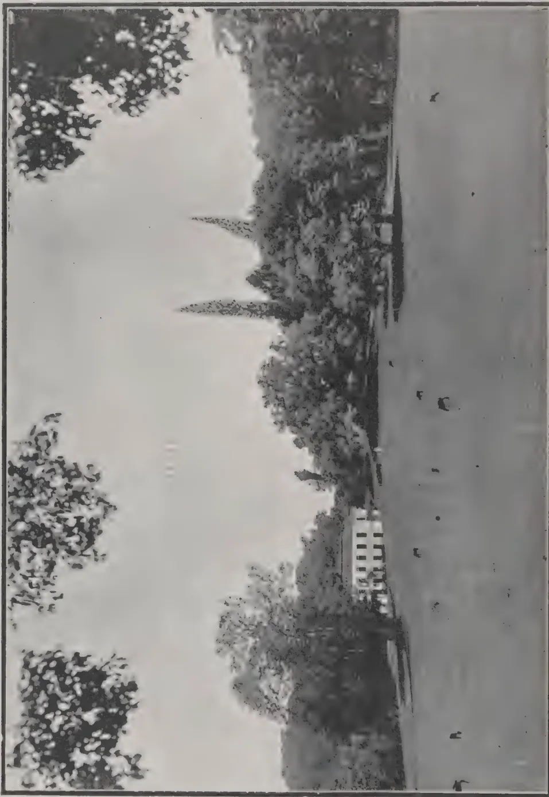A black and white photograph showing a wide view across a large, open lawn. In the distance, a large, multi-story building with a prominent central tower is visible, surrounded by dense trees and foliage. The sky is bright and clear.

*Photo by H. F. Macmillan.*

VIEW ACROSS THE GREAT LAWN IN THE ROYAL BOTANIC GARDENS, PERADENIYA  
HERBARIUM AND ECONOMIC MUSEUM IN THE DISTANCE..

*(See page 408).*

404------------------------------------------------

# THE TROPICAL AGRICULTURIST: JOURNAL OF THE CEYLON AGRICULTURAL SOCIETY.

VOL. XLV.

COLOMBO, DECEMBER, 1915.

No. 6.

## SHADE.

The importance of studying the natural habitat of our cultivated products, more especially with regard to the protection from disease and insect attack they enjoy through the shelter of their forest companions, has scarcely we think been adequately realized in the planting world. Yet to succeed with the cultivation of a plant we should certainly try to reproduce as far as possible the environments with which it flourished in the wild state; and this involves the study of those environments. Most of the important products of the small tree or shrub type now cultivated in the tropics being of forest or semi-forest origin, we may take it that some degree of shade is necessary for their welfare. Coffee to which we referred in our August number is a case in point. In Abyssinia, the home of Arabian Coffee, it occurs, as MR. BRYCE pointed out in a note we published in the September issue, "in open, park-like country, amongst tall trees mostly evergreens, under whose shade the coffee bushes are most numerous." We now know that coffee under light shade enjoys a greater degree of immunity from leaf disease than that under no shade at all. MR. BRYCE states that in Abyssinia October to March is the dry season, so that we might expect that Arabian coffee thrives best in a country with a fairly long dry season during which it can shed its leaves, an expectation that also corresponds with present-day experience.

The circumstances with regard to Tea are in some respects similar. WATTS states,\* "In 1882 the wild tea plant was found by

\* The Commercial Products of India.

405------------------------------------------------

366[DECEMBER, 1915.

me as a forest tree or large bush in the eastern tracts of Manipur." We take the bushes from their forest seclusion, expose them all crowded together under the full glare of daylight to discover that they become the prey of all manner of vermin. MR. GREEN, the late Government Entomologist, Ceylon, was of opinion that dadaps, albizzia and perhaps other trees grown among tea for green manure acted as a deterrent to the attack of Tea Tortrix, and MR. J. R. NEALE of Bogawantalawa in a letter to the writer on this subject said, "my experience goes to show that open areas devoid of shade are most liable to attack." Other planters hold the same view and it is one that, bearing in mind the conditions of the natural habitat of tea, we should expect to find correct.

But if shade may be regarded as an important factor in the successful cultivation of many of our products, especially when bushes or small trees, it should be carefully regulated so that while affording the required protection it may not obstruct light and air and check the crops. To illustrate this point we may take the case of cocoa, also of forest origin (basins of the Amazon and Orinoco) and which in Ceylon can sometimes be observed almost overwhelmed with shade trees. Cocoa belongs to that category of products in which we depend for crop upon a good flowering, and flowering is promoted by light and air. Some cocoa manuring experiments were begun at Peradeniya in 1906. Liberal dressings of manure were applied annually (except to controls) till 1912 when manuring was stopped to watch the effect of the unexhausted residue.

The crop from all the plots averaged for these 7 years 4.7 cwt. per acre. In 1914-15, after three years of no manuring the crop averaged 6.1 cwt. per acre. But in the interval the shade trees which had grown very large were pruned back. The late DR. LOCK had drawn attention\* to the remarkable results at Peradeniya following pruning. In 1907-8 the yield from 8 acres of unmanured cocoa yielded at the rate of 5.8 cwt. per acre. The group suffered from an excess of shade, having between 300 to 400 shade trees per acre, but in 1907 these were cut out to one-tenth. The next year, 1908-9, the crop jumped

---

\* Circular of the R. B. G. Vol. XI., No. 9.

406------------------------------------------------

DECEMBER, 1915.]367

to 7.8 cwt. per acre. To show conclusively that this improvement was due to reduction of shade DR. LOCK tabulated the yields from an adjacent field of 42 acres in which the shade had not been cut out. For the same years the yields were 3.2 cwt. and 2.5 cwt.; i.e., instead of a rise of 2 cwt. per acre, a drop of 1.7 cwt.

These products, typical of several others—Vanilla and Nutmegs for example—demand the nicest adjustment of shade for their welfare, each too in a separate degree; but there are some that delight to be drenched in sunlight, provided their moisture requirements are met, and to which shade is inimical. Such are lofty trees like Para rubber designed by nature for protecting small companions of the forest, not to be themselves shaded.

R. N. L.

---

## **“KAOLIANG,” A NEW DRY-LAND SORGHUM.**

---

**A. N. HUME AND M. CHAMPLIN.**

Kaoliang was introduced from Manchuria (where it is grown as a forage and grain crop) by the United States Department of Agriculture to fill the demand for an early-ripening grain-sorghum in the Northern Great Plains.

It was first placed on trial at the South Dakota Experiment Station in 1909 and found to be extremely variable. Selection of the heaviest and most compact heads on stalks of uniform height was made during two seasons and in 1911 selected seed was distributed to a few farmers. Distribution of seed and selection have been continued during subsequent years until at the present time the crop is grown on some thousand farms in central and western South Dakota.

It has been found to be drought-resistant and has produced satisfactory yields in the driest seasons and better yields than maize. The crop has a comparatively low moisture requirement and should be planted towards the end of May on well prepared land and kept free from weeds.

Both seeds and stalks should be utilised for forage, so that the crop does not require threshing.—BULLETIN, INTERNATIONAL INST. OF AGRIC.

407------------------------------------------------

368[DECEMBER, 1915.

# COCONUTS.

## A NOTE ON COCONUT CULTIVATION IN THE SOUTHERN PROVINCE.

H. AMARASURIYA.

The Galle district of the Southern Province has the unique distinction of having been the first home of the coconut palm since its naturalization in this Island. According to tradition, the coconut was introduced into Ceylon by one of its own Kings and planted in Weligama whence its cultivation spread to other parts of the Island.

A striking feature of the Southern Province is its extensive sea frontage beginning at Bentota on the South-west and running up to the limit of the Hambantota district on the South-east—a distance of roughly 150 miles; but along this maritime area the coconut does not flourish much beyond Tangalla, up to which point it helps to make up the "palm-fringed beach" which strikes the eye of the traveller as he approaches our shores.

I would classify the coconut land of the Province under three heads and deal with it accordingly.

(1) *The sea-board area.*—This is the most important of the three and constitutes a continuous belt or palm grove from Bentota to Tangalla. It extends inland to a distance of from 8 to 10 miles. The nature of the cultivation along this area is familiar to most travellers on the southern coast line. Notwithstanding the efforts of this Society to bring home to the masses through its officers and its widely circulating publications, both in English and Sinhalese, the advantages of good cultivation, the rule among coconut landowners is to leave the palms to grow as best they can, with little or no tillage, weeding or manuring and, after taking in one crop, wait for the next. As a result, only half crops are secured, and cultivators, through their own apathy, are losing many thousands of rupees which they would otherwise earn by enterprise and energy.

What is most noticeable in the smaller gardens along this area is the close planting (in many cases as close as 15 or 18 ft.) and the non-observance of the fact that the coconut palm needs a free supply of sun and air if it is to grow and bear well. In better-cared for estates the common rate of planting is 70 trees to the acre. Under such conditions, in favourable situations, the palm takes about 10 years to come into bearing, though rare instances have occurred where under good management it flowers at 5 and bears nuts at 6.

A well-cultivated estate should yield at the rate of 60 nuts per tree per annum. This has been my own experience.

It is usual to make 6 pluckings in the year, but owing to the demands of the coir yarn industry, which flourishes along the southern coast, 7 pluckings are often made with the object of securing the husks for fibre. As a result the copra is not of the best quality, owing to its being made from nuts which are not fully mature, and fetches Rs. 15 or Rs. 20 less per candy than copra made from well-matured nuts.

408------------------------------------------------

DECEMBER, 1915.]369

(2) *The riverain area* includes the land found along the banks of the principal rivers, e.g., the Ginganga and Nilwalaganga. The growth in these zones is, as might be expected, very good except where trees suffer as they sometimes do from water-logging. The alluvial deposits during floods contribute materially to the fertility of such lands. The coconut belts along rivers do not, however, extend much beyond  $\frac{1}{4}$  mile on either bank. An important advantage which cultivators in this area enjoy is the low cost of transport which is done by water.

(3) *The village garden area* is made up of little patches of coconuts round dwelling houses. To the villager the coconut is almost an indispensable article of food, and even in the remotest hamlets will be seen the results of his efforts to establish a few palms on which he can rely for his nuts. Sometimes it is only a single tree, but valued beyond any other garden product and jealously guarded. Such coconut palms, in near proximity to dwellings, are naturally well-nourished owing to the fact that they are amply supplied with fertilising agents drawn from the waste of the household. I have known such trees to bear as many as 140 nuts in the year, and their prolific nature has no doubt given rise to the saying that the coconut palm flourishes best within sound of the human voice. The difficulty is to induce the villager to extend his plantations, especially as the hilly nature of the interior deters him, the common belief being that the palm does not thrive, or requires special cultivation, when grown on hill sides. The fact is that the villager in general is too apathetic and too well provided-for by Nature to make any effort beyond that required to keep him supplied with the necessaries of life; though in the vicinity of more populated centres he is becoming imbued with the spirit of enterprise and is acquiring a taste for what are more or less luxuries. At the same time it may be mentioned that extension of cultivation beyond the sea-board is not being carried on even by capitalists and that these areas are being given to tea and rubber by preference. The village garden area while sufficient to meet the requirements of rural life is practically of no account from a commercial point of view.

Once beyond Tangalla the general conditions for coconut cultivation become less favourable and the cultivation of paddy and dry land cereals comes more into evidence. There is no doubt, however, that as the Province becomes more thickly populated and the naturally-favoured areas for coconuts are exhausted, the capitalist will be forced to take up land in the drier parts (as is already being done in the neighbourhood of Puttalam, Wariyapola and Wellawa) and that cultivation will assume the nature of dry-farming.

In conclusion I should wish to submit, for the information of members, a record of the results of my own cultivation, in the hope that it will induce others to reap the benefits of manuring which, when judiciously carried on, is most profitable. The results refer to a block of 16 acres of a fairly hilly nature, such as is not generally considered the most suitable for coconuts. It is a part of my "Citrus Group," Akmeemana, about 6 miles out of Galle, and I shall be only too pleased to show it to any members present to-day who have the time to pay the estate a visit. The manure mixture selected

409------------------------------------------------

370[DECEMBER, 1915.

by me as most suitable for local conditions was the following:—

<table>
<tr>
<td>Castor cake</td>
<td>...</td>
<td>...</td>
<td>...</td>
<td>14 parts</td>
</tr>
<tr>
<td>Crushed fish</td>
<td>...</td>
<td>...</td>
<td>...</td>
<td>33 „</td>
</tr>
<tr>
<td>Steamed bones</td>
<td>...</td>
<td>...</td>
<td>...</td>
<td>14 „</td>
</tr>
<tr>
<td>Bone meal</td>
<td>...</td>
<td>...</td>
<td>...</td>
<td>14 „</td>
</tr>
<tr>
<td>Basic slag</td>
<td>...</td>
<td>...</td>
<td>...</td>
<td>6 „</td>
</tr>
<tr>
<td>Sulphate of Potash</td>
<td>...</td>
<td>...</td>
<td>...</td>
<td>13 „</td>
</tr>
<tr>
<td>Kainit</td>
<td>...</td>
<td>...</td>
<td>...</td>
<td>6 „</td>
</tr>
<tr>
<td colspan="4"></td>
<td style="border-top: 1px solid black;">100</td>
</tr>
</table>

15 lb. of this mixture was applied per tree, at a cost of 80 cents. This was applied twice every three years between 1910 and 1914 and gave the following results:—

<table>
<thead>
<tr>
<th></th>
<th>1910.</th>
<th>1911.</th>
<th>1912.</th>
<th>1913.</th>
<th>1914.</th>
</tr>
</thead>
<tbody>
<tr>
<td>January ...</td>
<td>4,018</td>
<td>4,361</td>
<td>4,760</td>
<td>4,166</td>
<td>7,489</td>
</tr>
<tr>
<td>March ...</td>
<td>6,581</td>
<td>8,962</td>
<td>9,771</td>
<td>7,768</td>
<td>11,746</td>
</tr>
<tr>
<td>May ..</td>
<td>9,292</td>
<td>14,107</td>
<td>12,111</td>
<td>13,812</td>
<td>17,401</td>
</tr>
<tr>
<td>July ...</td>
<td>10,980</td>
<td>15,391</td>
<td>15,312</td>
<td>15,017</td>
<td>17,452</td>
</tr>
<tr>
<td>September ...</td>
<td>7,624</td>
<td>9,348</td>
<td>5,827</td>
<td>10,923</td>
<td>15,155</td>
</tr>
<tr>
<td>November ...</td>
<td>4,893</td>
<td>4,158</td>
<td>3,047</td>
<td>7,368</td>
<td>5,304</td>
</tr>
<tr>
<td colspan="6">
</td>
</tr>
<tr>
<td></td>
<td>43,388</td>
<td>56,327</td>
<td>50,828</td>
<td>59,254</td>
<td>74,547</td>
</tr>
<tr>
<td colspan="6">
</td>
</tr>
</tbody>
</table>

H. AMARASURIYA.

Citrus Group, Akmeemana, 8th November, 1915.

MR. W. DE COURCY BROWNE of Kindar Estate, Solomon Islands, has sent us a very interesting photograph of a four months coconut seedling in bearing.

Such freaks occur occasionally and are to be seen at local agricultural shows.

## CHEMICAL CHANGES IN THE RIPENING COCONUT.

TOMAS VISTA Y ISLES.

### INTRODUCTION.

The changes occurring in the ripening coconut have been studied by GONZALES.\* However, the value of his work is somewhat diminished because he did not know the exact ages of the nuts he analyzed, but was compelled to use size, colour, and thickness of the meat to indicate the relative ages of the nuts, an assumption which is subject to many errors. For this reason it seemed well to continue his work, especially since the number of nuts he

\* PHIL. AGRICULTURIST AND FORESTER VOL. III. 2. 1914.

410------------------------------------------------

DECEMBER, 1915.]371

examined was rather small. In the present work the ages of the nuts analysed are expressed in days, counting from the day each spathe or flower-cluster opened.

The procedures used in all determinations were official methods, unless otherwise stated.

The percentages of husk, shell, and milk, in terms of the whole nut, were taken from their actual weights, while the percentage of meat (to avoid loss by evaporation) is assumed to be the percentage calculated on the difference between the weight of the whole nut and the sum of the weights of husk, shell, and milk.

### CHANGES IN COLOUR, SIZE, AND WEIGHT.

When the spathe opens a cluster of pistillate and staminate flowers having a yellowish colour is exposed to the sun. About the third or fifth week the female flowers become fertilized. It is interesting to note that self-pollination is hardly possible, because before the stigmas become receptive all staminate flowers have been shed. After the pistillate flowers are pollinated the fertilized ovaries begin to increase in size. From this time on we can divide the changes taking place during the ripening of the coconut into four groups, namely:

1. 1st. changes in colour.
2. 2nd. changes in size.
3. 3rd. changes in weight.
4. 4th. changes in chemical composition.

The yellowish colour of the embryonic fruits, on exposure to the sun, is gradually changed to green, and finally to brown, when the nuts have become nearly ripe.

In the case of the yellow and red varieties the change in colour is from yellowish to yellow and red respectively, until such time as the colour in both varieties is changed to brown. As the colour changes are well marked, they are a fairly efficient guide in determining the degree of ripeness of the nuts.

The young nut at first increases most rapidly in size longitudinally (measured from the base to the tip of the fruit) until the meat begins to form and afterwards transversely.

On this account the ratio of the longitudinal diameter to the transverse diameter tends to decrease as the nut grows older, though it does not always happen that the oldest nuts have a greater longitudinal than transverse diameter. These variations in form continue until the nut is ripe. They are most striking when the measurements of the shell are taken, as the variation in shape of the husk is not so noticeable. Table I (omitted) shows the size of nuts of different ages, arranged in order of increasing age.

Parallel with the increase in size is the increase in weight. The nuts gain both moisture and dry matter at first, but during the later stages of ripening the loss due to evaporation of water more than counterbalances the gain due to increase of dry matter, and the nuts actually lose in weight. Because this loss of moisture takes place very largely from the husk, there is even a shrinkage of the latter, so that measurements of the external diameter of nuts in the husk show that a decrease of size accompanies the decrease of weight during the final stage of ripening.

411------------------------------------------------

372[DECEMBER, 1915.

In the case of mature nuts, though they contain the maximum amount of dry matter in the form of meat, shell, and husk, they are far lighter than those somewhat younger, because a large part of the water content of the husks has evaporated. Table II (not reproduced) shows the changes in weight of nuts at different ages.

It appears that the percentage of shell increases up to the very last, though the actual weights of shells from nuts of different ages do not show any such tendency, the increased percentage being due to the decrease of the total weight of the nut during the later stages of ripening. The percentage of husk decreases rapidly from the very first and if actual weights are considered it will be found that the weight of husks of fully mature nuts is from one-fifth to one-tenth of that of those that are about half mature. The percentage of water existing as liquid inside the nut is subject to great variations in individual nuts, but there is a decided tendency for the actual weight of water to decrease during the later stages of ripening. The total percentage of meat increases up to the very last, though this apparent gain during the last 100 days is due as much to the decrease of the total weight of the nut as to any other cause. The great variation in the weight of the endosperm of fully mature nuts is not altogether due to their difference in size, but rather to the fact that the meat of some nuts is decidedly thicker than that of others. This fact should be taken into consideration in the selection of seed-nuts by copra growers.

Another way which may be used in determining the degree of maturity of fruits, besides changes in colour and size, is by means of specific gravity. Young nuts are not only often far heavier than the old ones, but have higher specific gravities than the latter.

#### **CHEMICAL CHANGES IN THE MILK.**

The milk or liquid portion of unripe nuts is turbid, containing in semi-solution substances which can easily be precipitated by lead sub-acetate. The milk of the ripe nuts is also turbid, and when germination takes place oil may be seen floating in it.

The milk of coconuts, young or old, has an acid reaction. This is partly due to carbon dioxide dissolved in it, but mainly to organic acids, as may be shown by the fact that the juice when titrated with a standard alkali gives almost as great a figure, using methyl orange as an indicator, as it does with phenolphthalein. The acidity increases as the nut matures, and is greatest during the formation of the meat, then decreases, though there is towards maturity an irregular fluctuation. The amount of amino acids decreases, while the nitrogen content of the milk increases as the nut matures. Table III (not reproduced) shows these changes in the milk at different ages.

The procedure used in determining amino acids in the milk is to treat 100 cc. of the milk with 10 cc. of neutral formaldehyde. The acid set free is titrated with standard alkali free from carbon dioxide, using phenolphthalein as an indicator. From the number of cc. of standard alkali used in titration, the number of grams of amino acid, expressed as glycocoll, is calculated.

The milk of the young nut has lower specific gravity than that in which meat is being formed, and towards maturity irregular fluctuations occur, in which there is a general tendency to decrease. The specific gravity of the milk of nuts which have already sprouted is higher than that of the milk of mature ones that have not sprouted.

412------------------------------------------------

DECEMBER, 1915.]373

The percentage of milk gradually rises until the meat is formed, then decreases with further development of the latter, though irregular fluctuations occur here also.

Sucrose is absent in the milk of young nuts; the percentage of invert-sugar increases until the formation of meat begins. At this time sucrose is being formed, which increases with further development of the meat, but the percentage of invert sugar is always greater than that of sucrose.

In the case of the milk of sprouted nuts the percentage of sucrose increases, possibly, at the expense of the oil in the endosperm, which decreases at the same time. In Table IV (omitted) the changes in specific gravity, percentages of milk, invert sugar, and sucrose are well illustrated.

#### CHEMICAL CHANGES IN THE MEAT OR SOLID ENDOSPERM.

The very young nut contains no meat. When meat is formed it first appears as a thin coating of white watery substance. At first it does not occupy the whole inner surface of the shell, but only one end, that which is opposite the eye. As the meat gradually increases in thickness during further development it occupies more and more space until the whole inner surface of the shell is covered with it. Concurrent with this is the gradual hardening of the meat, beginning from the thickest part, and proceeding towards the thin part, which is near the eye.

Since the thickness of the meat at the two ends is not the same, even in mature nuts, measurements of the thickness of meat were taken at points between these two extremes.

The newly formed meat contains no sucrose, but only invert sugar; the latter is gradually produced, in increasing amounts, in the further development of the meat, and as the nut ripens the amount of invert sugar decreases. Mature or ripe nuts have therefore nearly equal amounts of sucrose and invert sugar. But when sprouting begins the percentage of both sugars is increased.

In the case of pine-apples large amounts of sugars\* are accumulated during the ripening of the fruit, while with dates an accumulation of sugar† take place shortly before ripening.

As the nuts ripen the meat loses water. The percentage of dry matter in the meat is increased until the endosperm is well developed.

At the beginning of the formation of meat oil is absent, but as the nut ripens it appears and continues to accumulate. Parallel with this is an increase in the ash content of the meat.

The oil content of sprouted nut decreases. It is perhaps changed into sugars, for the meat of sprouted nuts contains much sugar. The ash content of the endosperm also decreases as the seedling becomes older.

---

\* KELLEY; Hawaii Expt. Sta., Bull. 28, 16-17.

† VINSON; Arizona Expt. Sta., Bull. 66, 405.

413------------------------------------------------

374[DECEMBER, 1915.

### SUMMARY.

The conclusions drawn by GONZALES\* were :

"During the first period there is an accumulation of invert sugar and amino acids in the milk or watery portion. The meat is still absent, the shell and husk are soft and watery, and the nut as a whole has its greatest diameter along the main axis.

"During the second period of growth sucrose appears in the milk and the specific gravity of the latter is high. During all this time water is lost from the coconut, though its total weight continues to increase. The nut has in the meantime been changing its shape, and begins to acquire its greatest diameter in a direction at right angles to the main axis.

"During the closing period of ripening there is a sudden rise in the content of oil in the endosperm. The specific gravity of the milk falls at the same time owing to the transfer of nutrient materials or to respiration. In the meantime the shell has become impervious, and the drying cut of the husk results in a loss of weight, which overbalances the gain in weight due to other changes."

The present work has confirmed the above statements, except that it appears that mature nuts do not always have their greatest diameter in a direction at right angles to the main axis.

In addition to the conclusions cited above the following are deduced from the preceding data :

1. 1. The meat begins to form when the nut is about six months old.
2. 2. Only invert sugar is present in the meat when it is 0.1 cm. thick.
3. 3. The general tendency of the nitrogen content of the meat is to rise.
4. 4. As the nut becomes older the evaporation of the water from the husk causes an apparent increase in the percentages of meat, shell, and water but if the actual weights are considered it will be found that the weight of the shell undergoes little change during the later stages of ripening, while the weight of water appears to be subject to irregular fluctuations tending towards a decrease. The actual weight of the meat does not appear to increase much if any during the last 100 days, though analysis during this time shows that the endosperm changes greatly in composition. Most of the oil in fact is produced after the period when the nuts have become very decidedly brown.

5. When the nuts germinate the percentages of sucrose and invert sugar contained in the milk increase very rapidly. The percentages of these two sugars in the meat increase likewise. The nut that has just begun to sprout appears to make use of the nitrogenous constituent of the endosperm before much of the oil is removed, though the fact that but two nuts were analyzed will leave this statement somewhat in doubt.

6. In this locality it appears that nuts require in the neighbourhood of 370-410 days to become fully ripe, counting from the moment the spathes open.

The writer wishes to express his thanks to PROF. DEMING for suggestions and help during the progress of this work, and to DEAN COPELAND for valuable information.—THE PHILIPPINE AGRICULTURIST AND FORESTER.

---

\* PHIL. AGRICULTURIST AND FORESTER, VOL. III, 2 (1914) 31.

414------------------------------------------------

DECEMBER, 1915.]375

# RUBBER.

---

## PLANTING HEVEA ON THE AMAZON.

---

The following paragraphs are taken from a letter, which recently appeared in a paper published in Manaus, written by the owner of an estate near the mouth of the Purus River, some miles above Manaus, who is planting rubber extensively and apparently with a good deal of enthusiasm.

"On reading the message of the Governor of the State, in that interesting part where he treats of the means of encouraging the planting of *Hevea* in our State, I could not resist the duty of associating myself with this excellent train of thought, seeing that in my opinion the planting of *Hevea* is one of the surest means of assuring the future prosperity of the Amazon. I have, in fact, already planted many thousand rubber trees and am still continuing to do so.

"In addition to the recommendations of the Governor's message it would be specially useful, MR. EDITOR, if the authorities of the interior were instructed to insist upon *Hevea* being planted when State lands are encroached on and cleared for planting cassava. These clearances are abandoned after making the floor, and fresh forest is cleared for the ensuing year, leaving the former clearing to become overgrown again with jungle, while it would be so simple to plant *Hevea*, seeing that one man can plant a thousand trees in a day.

"It is thus that our forests are getting cut down without any permanent advantage to ourselves, and to the detriment of our children.

"If a man puts in a day's work planting a thousand rubber trees among his cassava, it is by no means a day lost, as cleaning out the weeds and undergrowth benefits the cassava as well, and when the cassava is pulled up at the end of the year, the land remains fairly clean for another six months, which gives the *Hevea* a start of eighteen months and a growth of ten feet in height, so that it runs no risk of getting caught up and choked by the jungle afterwards.

"By adopting this plan I myself have rubber trees five years and eight months old, with a circumference of 110 centimeters at the base, that could already be tapped by modern methods."—INDIA RUBBER WORLD.

## THE RUBBER SITUATION ON THE AMAZON.

---

MIGUEL P. SHELLEY.

The present low price of rubber, as we have predicted, has not affected the industry on the Amazon very much. The Amazon will always be able to compete with Ceylon in prices, as we have already said. The Amazon will not be removed as a producer of rubber. As cheap as they may be able to produce their rubber, the Amazon will be able to produce it still cheaper. The middlemen, however, who are many, between producer and consumer will

415------------------------------------------------

376[DECEMBER, 1915.

earn less profit. The proof of this is that during 1914 and 1915 there were very few failures recorded on the Amazon, and these in small amounts.

Practically the whole business is now connected on a cash basis. The war has cut off their former supplies from England, Germany and the other belligerent countries with which they had a 3-to-6 months' credit. Since the Amazon is compelled to import the necessities of life, it is obliged to purchase goods from the United States. The commission houses and the manufacturers, although very anxious to get Amazonian trade (the National City Bank not yet having established an institution which could be of great help to them in ascertaining the credits), are exporting goods to them for cash only. The Amazonian importers buying for cash have no other course than to supply the *aviadores* for cash, who in their turn send goods to the rubber centres in the interior only upon the receipt of the rubber for the goods bought. In many instances a clerk of the *aviadore* goes along with the boat carrying the goods, to exchange them for rubber and other products.

The war of course has been very bad for all business and also for the Amazon, but at the same time it has taught the Amazon a good lesson. On account of the great risk it has removed the entire credit system by means of which they could overcharge 50 to 80 per cent. on the goods.

Everybody was squandering money in going to Europe and buying all kinds of useless paraphernalia. Some bought boats at \$100,000, which, after being used once or twice a year, would remain idle the rest of the time. Now they are working on a real business basis. The rubber producer is taking from the *aviadore* only those goods which he must take and which he cannot raise on his estate. Formerly he was supplied with beans, rice, corn, canned stuff, etc., in order to make profit. These he could easily raise on his estate by farming, raising cattle, chickens, etc. Now he is actually doing these very things.

For these reasons it is our opinion that the Amazon, barring all other obstacles including the 22 per cent. duty to the government, can still compete with the East. There is no doubt that Para rubber is much better than Ceylon rubber for the manufacturer. Ceylon claims, however, that she supplies a rubber that is 25 per cent. richer than Para rubber because of the loss in washing. This will easily be overcome. It is already realized and all steps are being taken to cure the rubber in such a way as to obviate this loss and yield the same purity of rubber as Ceylon claims to produce.

The speculation in rubber on the Amazon is altogether shameful. In many instances the price here in New York is much lower than that paid by some export houses in Para. According to the present outlook sales at that port will be largely for future delivery. Though they do not have the rubber nor even have it in view, some Para exporters sell for future delivery at much lower price than is actually quoted in the New York market. Of course, should the quotation rise, they are liable to be badly caught. They do not take this into consideration, but continue to lower the price with every sale.

As we have stated above, the commerce is becoming more and more stable, since earning less they spend less. The government which calculates its budget from the former price or the prevailing price has a greater deficit each year and is seeking a way to regulate this, from which originate the valorization schemes. In attempting to improve this situation the State gets

416------------------------------------------------

DECEMBER, 1915.]377

in touch with the Federal Government, which, being already interested in other products, mixes them all up together, and brings forth a valorization plan which, while suitable to some, cannot be suitable to all. At any rate the entire thing will bring confusion and the men who will suffer will be the same rubber exporters.

The low price of rubber renders the income of the country less. For this reason they are trying to increase it by paying more attention to other products, especially hardwoods with which the forests of the Amazon are full, and which are very valuable and cannot be gotten in any other country. All other timber is also to be found there, and will surely be in demand after the war ceases.—INDIA RUBBER WORLD.

---

## COST OF PRODUCTION OF PLANTATION RUBBER.

---

The Far Eastern press has of late devoted considerable attention to the question of giving greater publicity to estate costs. Opinions on the subject, of course, differ, the majority of the parties interested being opposed to the publication of costs, while a strong minority favour the publication of this information. The majority consider the cost of production of rubber as a business secret that should not be divulged, but the minority contend that rubber planting is an exceptional line of business and that it stands on a plane by itself. A correspondent of the Kuala Lumpur daily, MALAY MAIL, gives the following view of the question:—

Rubber planting is an industry practically limited to the Dutch East Indies, Malaya and Ceylon. There are rubber plantations in East Africa and in a few other parts of the globe, but their combined output is so small that their existence does not affect the question. Large sums of money have been secured from thousands of shareholders and invested in rubber plantations. The Far Eastern plantation industry has led to a change in Government policies. It concerns not only investors but the world in general, occupying a unique position not to be compared with general industries.

Though admitting this, there are many people who still maintain that it would not be a good thing to publish "all-in" costs. "Why," they ask, "should the whole world know our costs in producing rubber?" The MALAY MAIL'S correspondent believes that the adoption by all of the practice of publishing costs would lead to a greater economic stability—that the competitive element has to exist to produce the best results and that the competitive test can be safely applied to rubber estate work. The industry is, comparatively speaking, a young industry, with much to learn. The boom days are over, and prices are lowering to a more natural level. The successful estate manager is reducing his costs to a minimum by improved methods in tapping and by improvement in the yields obtained. If every estate published its costs, this economy should act as an incentive to those still producing on a fairly high scale.

Another point is that the vast number of shareholders who have invested in rubber naturally want to know not only what the output has been and what profit has been made, but what was the cost of production. But there

417------------------------------------------------

378[DECEMBER, 1915.

should be uniformity of accounts. It is difficult accurately to apportion estate charges. The average estate is planted in sections, and the rubber is in varying stages of development. If the whole estate is to bear the "all-in" costs, it is obvious that the sections of it that are not in bearing are going to consume a large amount of money without giving any output return. The accounts should be made separately for each section, so that it could be ascertained what the actual cost of working each section is. But where the whole estate is in bearing, and all estate and managerial items are chargeable against the rubber harvested, there is no reason why the cost per pound of rubber could not be published with beneficial results.—INDIA RUBBER WORLD.

## EXPERIMENTS ON THE TAPPING OF *HEVEA BRASILIENSIS*.

A. W. K. DE JONG.

Experiments on tapping to different depths showed that ordinary tapping gave a yield equal to 52 per cent., and deeper tapping 80 per cent. of that obtained on tapping right down to the wood. The width of the strip of bark removed, however, has no influence on the yield.

The direction of tapping (from above downwards or vice versa) did not give different results.

The rapid flow of latex obtained by means of repeated tapping would tend to prove that the stoppage of the flow should not be attributed to a lack of latex, but to the closing of the latex tubes. Experiments made with trees tapped throughout their circumference showed that after a time the latex produced could not be coagulated by acetic acid, thus giving additional proof that the cause of the stoppage of the flow of latex is due to a closing of the latex tubes.

As the result of preliminary experiments it appears that the evaporation of the latex and the drying of the bark have only a slight influence or none at all on the yield of rubber if the tapping cuts are re-opened each day.

When the distance between the cuts is 20 inches, the lowest generally produces more caoutchouc than the highest; if they are still further apart this is not the case. Daily or alternate-day tapping of the same tree showed that in the latter case the cuts were not sufficiently deep, probably owing to the drying of the bark. The strip of bark removed does not appear to have any great influence on the yield of rubber. When it affects the flow of sap the yield from each cut is diminished; otherwise wounding results in a greater local formation of rubber.

Young bark yields more rubber than old bark. Experiments carried out on the same and different trees have shown once more that left hand tapping is preferable to right-hand tapping.

Little or no difference occurs between the yield from a single 'V' and a single cut to the left. Experiments with cuts at different angles to the vertical show that the cut with the steepest inclination removes the greatest quantity of bark, while the yield of rubber (when the experiments were carried out on different trees) varied very little. When the cuts were made on the same tree, a vertical cut gave about half the yield of a cut forming an angle of about  $50^\circ$  with the vertical.

418------------------------------------------------

DECEMBER, 1915.]379

Experiments on the height of tapping on the same trees showed that : (1) there is no advantage in making one or two cuts above rather than below a previous cut ; (2) two cuts starting from the middle of the tapping area give a better result than two cuts made in the ordinary way at a distance of 10 to 14 inches, but in view of the results reported in TEYSMANNIA (1913—530, 745; 1914—139, 337, 447), it is not probable that this would be the case in actual practice. The experiments also show that the influence of a new cut on an old cut appears in less than an hour, if the two cuts are not too far apart vertically, and also if they are at the same height and only two inches apart. If, however, they are at the same height but far enough apart to be on opposite sides of the tree, no difference is observed even after one hour. This fact also shows that the transport of the latex along the latex vessels in *Hevea* occurs with great facility. With tapping twice a day, equilibrium was established four hours after the first cut, and did not change for the rest of the day.

In trees tapped by a cut right round the trunk, the latex from above the ring was found to contain tyrosin and its derivatives as well as tyrosinase, whilst the latex from below this ring contained only tyrosinase. It was found also that isolated pieces of bark may produce rubber.

The girths of *Hevea* trees at the respective height of 4, 34 and 53 inches are proportionally as 1.60 : 1.13 : 1.

Opening the same cut twice per day economises the bark and it is more advantageous to effect the second cut at 10 a.m. if the first cut was made at 6 a.m. Another cut on the opposite side of the tree has little influence on the yield of the first cut, and conversely the closing up of one of the opposite cuts has only a slight effect in increasing the yield from the other.—BULL. OF THE INTERNATIONAL INST. OF AGRIC.

---

## PAPAW FRUITS TAPPED FOR PAPAIN.

---

TO THE EDITOR OF THE TROPICAL AGRICULTURIST.

DEAR SIR,

On pages 124 and 125 of the August TROPICAL AGRICULTURIST, there are two statements which appear to contradict one another. (1) In the former DR. HUYBERTSZ states that the tapping of the fruit produces a spurious ripening which is characterised by an insipid flavour, and that such fruit is only fit for the poultry yard; (2) in the latter the report of the Hawaiian Experiment Station makes out that tapping improves the flavour of the fruit which is in no way injured by the process.

It may be that (1) refers to hard tapping and (2) to moderate tapping: but my own experience is that growing the papaw for fruit and for papain is not to be recommended and that scoring the fruit to any extent is calculated to spoil it. No fruit-grower will advocate the bruising of fruit in any way.

Yours truly,

C. D.

419------------------------------------------------

380[DECEMBER, 1915.

# COCOA.

---

## CONSUMPTION OF COCOA IN AMERICA.

---

The increase in the consumption of cacao in the United States is nothing short of phenomenal. In 1881-5 it was about 8,000,000 lb., in 1896-1900 it rose to 29,000,000 lb. In the next five years the quantity doubled, amounting to 58,000,000 lb.; in the next period it increased 63 per cent. and amounted to 95,000,000 lb; and in the last period it was 144,000,000 lb.

The value of the imports did not reach a million dollars until 1881-85. In 1901-05 it was \$7,000,000, and in 1911-14 was more than double what it was in 1901-05. This increase in the value of the cacao imported has made it almost equal to that of tea.

The consumption did not reach 1 pound per capita until the 1906-10 period, and in the next period it increased 50 per cent., or to one and a half pounds per capita. "The price of cacao, which was only 3.3 cents per pound in 1851-55, increased until it was 14.73 cents in 1876-80. Since then, while the quantity has increased thirty times, the value has only fallen to 11.39 cents per pound.

The average consumption of cacao in the United States in the four years, 1911-14, was 2,000,000 pounds more than the total production of the world in 1894. Since that time the production of the world has increased over four times, being 609,000,000 pounds in 1914, while during the same period, the consumption in the United States has increased over seven times.

During the last twenty years the consumption of tea in the United States has increased 7 per cent; that of coffee 56 per cent; while that of cacao has increased 575 per cent. Unless there are new sources of supply of cacao it will not be possible for the United States to increase its consumption at the same rate during the next twenty years.—TEA AND COFFEE TRADE JOURNAL.

---

Reference is made in the SOUTH AFRICAN POULTRY JOURNAL for September to an egg produced in the run belonging to MR. CRAIK of Maritzburg. Its size round the middle was 7 inches and lengthwise it was  $8\frac{1}{4}$  inches. In weight it was a few grains under a quarter of a pound. It was laid by a leghorn hen of medium weight. Age of fowl about 3 years. Is it the biggest and heaviest egg ever produced?

420------------------------------------------------

DECEMBER, 1915.]381

# RICE.

---

## IRRIGATING AND DRAINING THE RICE CROP IN CALIFORNIA.

---

The U. S. A. Department of Agriculture's FARMERS' BULLETIN No. 688 deals with Rice Cultivation in California, and refers to the irrigation and drainage of rice fields as follows:—

Because continuous submergence at a uniform depth is necessary for the growth of rice, only level land with a good slope for drainage should be selected for this crop. The field should be inclosed by strong embankments and so subdivided that each subfield shall have a surface level enough to hold the irrigation water at the required depth.

These conditions can be obtained by constructing field levees on contour lines at distances which, during submergence, will hold water at an average depth of 5 or 6 inches. These levees should be just high enough to prevent the water from overflowing into the subfields below and so broad that all kinds of machinery used in the cultivation of rice may pass over them easily without damaging them. Such levees will be low and very broad. They should be planted to rice. If this is done the cultivated area is increased and no uncultivated strips of land are left in the field for the growth of weeds. The growth of rice upon the field levees may not be equal in every respect to the main crop, but the results that will be obtained in the control of weeds alone will justify the practice.

The levees should be permanent and accurately located.

The successful growth of this crop often depends upon the availability of water at the time of planting. While it may not always be necessary to apply water for the germination of the seed, it is never safe in this section to seed the crop without having a good supply of available water.

If the water supply is to be developed from wells, the digging of the wells should precede the planting. Where this has not been done, heavy losses have resulted. The acreage to be watered from a well should never overtax the supply. Until more is known about the underground waters of these two valleys, wells should not be depended upon as the only source of water for rice, except in the artesian districts.

On typical adobe soil, and probably on all of the clay soils upon which rice may be grown, it may be necessary to apply water to germinate the seed. A seed bed on these soils loses its moisture very quickly. Under normal weather conditions a good seed bed on soils of lighter texture may not require the application of water for germination. Such soils, if well drained, would probably permit very early planting, which, in California, will always be an advantage.

Great care should be taken in irrigating to obtain germination. Soil and atmospheric temperatures are usually low at this season of the year, and if the water is left on the land too long the seed is likely to rot. Before the plants

421------------------------------------------------

382[DECEMBER, 1915]

come up, water should not be allowed to remain on the land longer than 24 to 48 hours after each irrigation. After planting, the soil should never be allowed to dry out. This will require frequent irrigation, and a supply of water should always be available and abundant enough to meet general requirements.

Tests at the Biggs Rice Field Station indicate that the land should be submerged for approximately 30 days after the plants have come up and that the best depth of water is from 5 to 6 inches. This depth should be maintained until the heads (botanically called panicles) are well turned down, when the fields should be rapidly drained.

Paying crops of rice cannot be produced without submerging the land continuously for a period of several months. The growing of rice on soil that is merely kept moist and not submerged should not be considered seriously.

The amount of water required to make a good crop of rice will depend largely upon how well the outside levees have been constructed and what quantity of water is allowed to flow through the field. Poorly constructed outside levees are responsible for the loss of much water by seepage. The loss is further increased by allowing too much water to flow through the fields in an effort to keep the field water fresh.

The levees that inclose the field should be firm and compact. If they are next to a field that is not under irrigation, they should be very broad. Seepage is greater through levees that are constructed of black adobe soil than through levees that are made of other types of clay.

After a field has been submerged, no more water should be admitted than is needed to maintain the required depth. This will be rather small if there is no loss through seepage. The overflow of water should be no more than a mere film. From many fields it is often several inches. This is an extravagant use of water and should not be practised. The field water will not become stagnant if freshened only once in 10 days.

Too much attention cannot be given to levees and to the delivery and discharge of water. Payment for water should be based upon the volume delivered. Upon this basis it would be more economically used, other conditions being equal, than could reasonably be expected when sold on a flat charge per acre.

On commercial fields of rice where the water was accurately measured during the last season in co-operation with the office of irrigation investigations of this department, the amount used on adobe soil in the vicinity of Biggs varied from 4.65 to 8 acre-feet. This range is too great, but more data must be obtained before definite statements can be made regarding the quantity of water that may be necessary to produce a crop of rice under California conditions.

One 40-acre field which produced a yield of 6,000 pounds of grain per acre received 4.65 acre-feet of water. This field had well-constructed levees and was carefully watered. The other fields did not have the levees so well constructed and were not so carefully watered. It is safe to conclude that faulty levees cause the loss of much water and that a waste of water can be prevented by giving daily attention to the manner of its application.

422------------------------------------------------

DECEMBER, 1915.]383

A field of ripe rice should be rapidly drained. This is very necessary in order to harvest the crop at the least expense of time and labor and to prevent the loss of grain. Boggy fields will delay harvesting, and this delay will invariably result in reduced yields from the shattering of the grain.

It is just as important to provide means for the removal of irrigation water from a field of ripe rice as it is to provide means for supplying water to the growing crop. This is not appreciated as it should be. There are difficulties, it is true, but these can be overcome. It is an engineering problem, requiring community co-operation, and can be readily solved by the creation of drainage districts.

The natural drainage facilities of the level land upon which rice is grown are always overtaxed. It is often the case that little or no field drainage can be had until outlets have been made, and the success of these depends upon their connections with watercourses of sufficient capacity. Poor drainage, or the lack of drainage, results in underproduction through the waterlogging of the land and the accumulation in the surface soil of harmful salts, commonly called alkali.

After their construction, drainage ditches need constant attention. They must be kept free from all kinds of obstructions, especially weeds, which grow luxuriantly in them, or their efficiency will soon become greatly impaired.

It should be remembered that a well-aerated soil is just as essential for rice as for any other crop, if maximum yields are to be maintained.

## GREEN-MANURING BEFORE PADDY.

ROBERT G. ALLAN.

This has been experimentally tried at Raipur. The green crops used are *san* and *daincha*. The former is the more rapid; the latter though standing the constantly water-logged state of the land better is very slow in the early stages. Both are sown at the break of the monsoon. As far as his memory goes the writer has never seen a tall, thick, or heavy crop of either at the time of inversion. Indeed the stand has generally been poor. Inversion takes place before transplanting.

The following is a tabulated statement of results obtained here to date. In all cases transplanting has immediately followed ploughing in, the first series being so treated at the beginning of August and the second about the middle of that month.

<table border="1">
<thead>
<tr>
<th></th>
<th></th>
<th colspan="2">1911-12 Paddy. Grain Straw.</th>
<th colspan="2">1912-13 Paddy. Grain Straw.</th>
<th colspan="2">1913-14 Paddy. Grain Straw.</th>
<th colspan="2">Average Grain Straw.</th>
</tr>
</thead>
<tbody>
<tr>
<td rowspan="3">(1)</td>
<td>San</td>
<td>570</td>
<td>550</td>
<td>860</td>
<td>850</td>
<td>810</td>
<td>790</td>
<td>747</td>
<td>730</td>
</tr>
<tr>
<td>Sawri (Daincha)</td>
<td>680</td>
<td>610</td>
<td>610</td>
<td>630</td>
<td>910</td>
<td>920</td>
<td>733</td>
<td>720</td>
</tr>
<tr>
<td>No manure</td>
<td>450</td>
<td>433</td>
<td>500</td>
<td>440</td>
<td>640</td>
<td>560</td>
<td>530</td>
<td>517</td>
</tr>
<tr>
<td rowspan="3">(2)</td>
<td>San</td>
<td>490</td>
<td>460</td>
<td>880</td>
<td>840</td>
<td>700</td>
<td>810</td>
<td>690</td>
<td>703</td>
</tr>
<tr>
<td>Sawri</td>
<td>500</td>
<td>500</td>
<td>690</td>
<td>640</td>
<td>800</td>
<td>910</td>
<td>617</td>
<td>683</td>
</tr>
<tr>
<td>No manure</td>
<td>360</td>
<td>370</td>
<td>610</td>
<td>640</td>
<td>470</td>
<td>450</td>
<td>460</td>
<td>487</td>
</tr>
</tbody>
</table>

Average of san over no manure ... 223 lb. grain  
 " sawri " ... 203 "

423------------------------------------------------

384[DECEMBER, 1915.

The results of two years prove *daincha* to be a little more satisfactory than *san*. In 1912-13 the monsoon was late and *sawri* was only some 5 inches high at the time of inversion. In the other, rather wetter, years the *san* suffered more from water-logging. Inversion and transplanting at a later date do not appear to add to the outturn; though as a consequence of delay, a slightly bigger crop may be inverted, yet the late transplantation probably affects the tillering of the paddy. The writer ventures to suggest that a better method, where irrigation is available in the hot weather (which is not commonly the case in the Central Provinces), is to start the green crop a fortnight or so before the general break of the monsoon. *San* once established is capable of standing more water.

*San* has also been used over all the manurial paddy series on the farm to raise the fertility of the unmanured plot without altering its relative fertility in the series.

There has been a general improvement over the series, but the relative values of the manures applied in the series do not appear to have been maintained; in five out of six plots in which bone dust has been applied with artificial, the effect of the combination has been extraordinary. This is in line with HOPKIN'S system of maintaining soil fertility and MEGGITT'S note to the Board of Agriculture in 1911.

The following figures to illustrate the point are taken from the RAIPUR FARM REPORT, 1912-13:—

**Series transplanted paddy without irrigation.**

<table border="1">
<thead>
<tr>
<th></th>
<th>Before green-manuring.</th>
<th>After green-manuring.</th>
<th>Average increased yields of phosphate plots due to green manure.</th>
</tr>
<tr>
<th></th>
<th>lb.</th>
<th>lb.</th>
<th>lb.</th>
</tr>
</thead>
<tbody>
<tr>
<td>Average yield of plots to which phosphate was applied</td>
<td>1,490</td>
<td>2,043</td>
<td>—</td>
</tr>
<tr>
<td>Average yield of plots to which no phosphate was applied</td>
<td>1,346</td>
<td>1,412</td>
<td>—</td>
</tr>
<tr>
<td>Average increase due to phosphate</td>
<td>144</td>
<td>631</td>
<td>487</td>
</tr>
</tbody>
</table>

424------------------------------------------------

DECEMBER, 1915.]3851912-13.Series irrigated transplanted rice.

<table border="1">
<thead>
<tr>
<th></th>
<th>Before green-manuring.</th>
<th>After green-manuring.</th>
<th>Average increased yields of phosphate plots due to green manure.</th>
</tr>
<tr>
<th></th>
<th>lb.</th>
<th>lb.</th>
<th>lb.</th>
</tr>
</thead>
<tbody>
<tr>
<td>Average yield of plots to which phosphate was applied</td>
<td>1,199</td>
<td>1,773</td>
<td>—</td>
</tr>
<tr>
<td>Average yield of plots to which no phosphate was applied</td>
<td>1,067</td>
<td>1,277</td>
<td>—</td>
</tr>
<tr>
<td>Increase due to phosphate</td>
<td>132</td>
<td>496</td>
<td>364</td>
</tr>
</tbody>
</table>

1913-14.Series of transplanted paddy without irrigation on different plots from those used 1912-13.

<table border="1">
<thead>
<tr>
<th></th>
<th>Before green-manuring.</th>
<th>After green-manuring.</th>
<th>Average increased yield of phosphate plots due to green manuring.</th>
</tr>
<tr>
<th></th>
<th>lb.</th>
<th>lb.</th>
<th>lb.</th>
</tr>
</thead>
<tbody>
<tr>
<td>Average yield of plots to which phosphate was applied ...</td>
<td>1,504</td>
<td>1,603</td>
<td>—</td>
</tr>
<tr>
<td>Average yield of plots to which no phosphate was applied ...</td>
<td>1,386</td>
<td>1,281</td>
<td>—</td>
</tr>
<tr>
<td>Increase due to phosphate ...</td>
<td>118</td>
<td>322</td>
<td>204</td>
</tr>
</tbody>
</table>

The only artificial manure in the rest of the series which has apparently been affected by the presence of the green manure and has reacted on the paddy is calcium cyanamide.

<table border="1">
<thead>
<tr>
<th></th>
<th>Before green-manuring.</th>
<th>After green-manuring.</th>
<th>Increased yield due to green-manuring.</th>
</tr>
<tr>
<th></th>
<th>lb.</th>
<th>lb.</th>
<th>lb.</th>
</tr>
</thead>
<tbody>
<tr>
<td>Average of 3 plots dressed with calcium cyanamide</td>
<td>1,005</td>
<td>1,240</td>
<td>235</td>
</tr>
</tbody>
</table>

Generally speaking, green-manuring pays in paddy cropping and can be recommended for practice. Probably the results are enhanced if the sowing of the green crop can be done before the monsoon and if the green-manuring treatment is accompanied by the use of phosphates, which in the opinion of the writer are best applied at the time of sowing the green-manure crop.—

AGRICULTURAL JOURNAL OF INDIA.

425------------------------------------------------

386.[DECEMBER, 1915]

# TOBACCO.

## INFLUENCE OF SOIL ON TOBACCO IN JAVA.

N. H. COHEN.

The writer made chemical and mechanical analyses (the latter according to E. C. JULIUS MOHR'S method—cf. O. DE VRIES : MEDEDEELING VAN HET PROEFSTATION VOOR TABAK No. 1)—of samples of twenty tobacco soils in the island of Java. The samples were taken to a depth of 9 inches for the surface soil, and from 9 to 15 inches for the subsoil ; the following determinations were made : potash soluble in 25 per cent. hydrochloric acid ; phosphoric acid ; lime (surface soil only) ; phosphoric acid soluble in 2 per cent. citric acid ; lime soluble in 10 per cent. ammonium chloride. Determinations for the tobacco included : ash, potash, phosphoric acid, lime, magnesia and chlorine ; in addition, the exact colour of the ash was determined by a scale of 10 shades of grey obtained by mixing 5, 10, etc., up to 50 per cent. of animal charcoal with calcium carbonate.

The results obtained are summarised as follows :—

1. The citric-soluble phosphoric acid decreases as the soil becomes heavier and more disintegrated.

2. The content of so-called "available" lime in the various soils is proportional to the amount of the "very fine" fraction of the soil.

3. The proportion between the lime soluble in 25 per cent. hydrochloric acid and the amount of "available" lime is in inverse ratio to the amount of "very fine" soil and approaches unity.

4. There is no connection between the amounts of potash present in the tobacco and the soil respectively.

5. There seems to be some relation between the amount of phosphoric acid in the tobacco and in the soil ; heavy soils poor in citric-soluble phosphoric acid produce a tobacco with a lower phosphate content than tobaccos grown on light soils.

6. There is a certain connection between "available" lime in the soil and the lime content of the tobacco.

7. In the case of the tobacco, no connection could be established between chlorine and potash contents and combustibility.

8. On the other hand, some connection exists between the lime content and the colour of the ash ; the higher the lime content, the lighter the colour of the ash.

9. There is no certain connection between the amount of magnesia present in tobacco and the colour of the ash.—BULL. OF THE INT. INST. OF AGRIC.

426------------------------------------------------

DECEMBER, 1915.]387

## TOBACCO GROWING IN CEYLON.

The expert planter and curer appointed by the Ceylon Government to carry out the experimental cultivation of tobacco seems, after a year's work, to have produced a cigarette which the Governor of Ceylon describes as "quite a good smoke" and a coarse cut pipe tobacco of a quality good enough to guarantee a ready sale. The cigarettes can be marketed at Rs. 2 a hundred, and altogether there seems to be ground for optimism in regard to the future of the "weed" in Ceylon. It may never become a staple, but the disturbance of the output of the Kavalu district in Macedonia as a result of the existing and recent wars would seem to indicate the present as a golden opportunity for the Ceylon product to establish itself. If the cultivators are as successful as the Government expert has been, they would find a big market at their doors in India, and the fact that no "Turkish" tobacco is manufactured nearer Colombo than Cairo would seem to indicate another possible market east of India if not also westward up the Gulf, along the Shatt-el-Arab, and in South Africa.—THE INDIAN AGRICULTURIST.

## RESEARCHES ON THE CURING OF TOBACCO IN JAVA.

Experiments were carried out in a drier of somewhat primitive construction heated by a wood stove and aerated by a horizontal electric fan. In spite of the provisional plant, it has been shown that if the temperature and moisture are well regulated in the interior of the drier, the curing proceeds normally and the flexibility of the leaf is maintained to the end; the chief condition of success appeared to be the hermetic closing of the drying-shed. It was found that the air could be kept moist by passing it through a series of pieces of sufficiently thick cloth continually steeped in water; sprayers gave no results. The experiments will be repeated in a more scientific manner to discover whether it is possible to regulate the processes of tobacco curing.

Previous experiments on the influence of differently coloured light and of darkness upon the development of tobacco leaves, published by the writer (H. JENSEN) in 1903, showed that plants placed in darkness and exposed to green or blue light begin after a time to suffer from lack of assimilation, while the function of respiration is less affected. It was, therefore, to be expected that during the first period of curing (while assimilation and respiration are still going on in the detached leaf), light would have some effect upon the process, and consequently upon the product, and that during the second period (while the leaf is changing colour) light might also play an important part in the little-known alterations that take place. Very careful experiments, however, made both in an ordinary drier and in the laboratory, have revealed no difference in quality or colour between leaves dried in darkness and those dried in daylight or green light. It therefore seems unnecessary to illumine the drying apparatus with green light or to keep it in the dark as is nearly always done.—BULLETIN OF THE INT. INST. OF AGRIC.

427------------------------------------------------

388[DECEMBER, 1915.

# SUGAR.

## THE SUGAR QUESTION IN MYSORE.

ALFRED CHATTERTON.

The Mysore State is one of the Provinces of India which produces more sugar than is consumed locally and consequently in normal years the exports are in excess of the imports. During the last 14 years the excess value of exports over imports amounts to 105.7 lakhs of rupees as shown by the following table :—

<table>
<thead>
<tr>
<th>Years.</th>
<th></th>
<th>Exports.</th>
<th>Imports.</th>
</tr>
</thead>
<tbody>
<tr>
<td rowspan="3">1901—15</td>
<td>Sugar</td>
<td>45.5 lakhs</td>
<td>87.9 lakhs</td>
</tr>
<tr>
<td>Jaggery and Molasses</td>
<td>238.7 ,,</td>
<td>90.6 ,,</td>
</tr>
<tr>
<td>Total</td>
<td>... 284.2 lakhs</td>
<td>178.5 lakhs</td>
</tr>
</tbody>
</table>

From this statement it will be seen that the imports of refined sugar exceed the exports whilst the exports of unrefined sugar and jaggery greatly exceed the imports. Since the closing down of the Refinery at Goribidnur, sugar is not made in the State and the whole of the cane crop is converted into jaggery. Every year a considerable quantity of molasses is imported chiefly from Java for the manufacture of Arrack at the Government distillery. Previous to the outbreak of War in August last year, the price of jaggery averaged about Rs. 1-8-0 per maund of 25 pounds. At the time of writing, it ranges from Rs. 3-8-0 to Rs. 4 per maund in the Bangalore bazaar ; that is to say, it is about  $2\frac{1}{2}$  times the price at which it stood fifteen months ago. In consequence of this enhancement of the price, the cultivation of sugar-cane has been greatly stimulated and the area under cultivation this year is much larger than usual. Further, the season so far has been a favourable one and there is every prospect of a bumper crop being realised at the beginning of next year. It is hardly probable that prices will be maintained at their present level, but it is a practical certainty that they will be very high and the sugar-cane growers in this State should realise large profits.

From the statistics of sea-borne trade published by the Government of India, I have extracted the following table showing the value of the imports of sugar into India for the last four years and the average price per hundred-weight at the place of importation for what is known as "Sugar, 16 Dutch standard and above."

<table>
<thead>
<tr>
<th>Year.</th>
<th></th>
<th>Value.</th>
<th>Price per Cwt.</th>
</tr>
</thead>
<tbody>
<tr>
<td>1911-12</td>
<td>...</td>
<td>16.94 crores</td>
<td>11.10 rupees</td>
</tr>
<tr>
<td>1912-13</td>
<td>...</td>
<td>14.28 ,,</td>
<td>10.11 ,,</td>
</tr>
<tr>
<td>1913-14</td>
<td>...</td>
<td>14.96 ,,</td>
<td>8.92 ,,</td>
</tr>
<tr>
<td>1914-15</td>
<td>...</td>
<td>10.53 ,,</td>
<td>11.43 ,,</td>
</tr>
</tbody>
</table>

The figures for 1914-15 are also given separately from April to July under peace conditions and from August to March when War prevailed. Finally the figures for the first six months of 1915-16 are also given and

428------------------------------------------------

DECEMBER, 1915.]389

those for August and September separately.

<table>
<thead>
<tr>
<th></th>
<th></th>
<th>Value.</th>
<th>Price per Cwt.</th>
</tr>
</thead>
<tbody>
<tr>
<td>April-July 1914</td>
<td>...</td>
<td>2.45 crores</td>
<td>8.83 rupees</td>
</tr>
<tr>
<td>August 1914- March 1915</td>
<td>...</td>
<td>8.08 ,,</td>
<td>12.57 ,,</td>
</tr>
<tr>
<td>April-September 1915</td>
<td>...</td>
<td>7.59 ,,</td>
<td>15.52 ,,</td>
</tr>
<tr>
<td>August 1915</td>
<td>...</td>
<td>2.58 ,,</td>
<td>15.44 ,,</td>
</tr>
<tr>
<td>September 1915</td>
<td>...</td>
<td>1.53 ,,</td>
<td>15.6 ,,</td>
</tr>
</tbody>
</table>

For many years the imports of sugar into India have been steadily increasing and reached the maximum value of 14.96 crores in 1913-14 when the average price for sugar was 8.92 rupees per hundred-weight. During the first four months of 1914-15 the imports of sugar were valued at 2.53 crores of rupees and the average price was 8.83 per cwt. During the remaining eight months of the year under War conditions the imports were valued at 8.08 crores of rupees and the average price rose to 12.57 rupees per cwt. During the first six months of the current year, that is from April to the end of September the imports were valued at 7.59 crores of rupees and the average price was 15.52 rupees per cwt. The recent heavy shipments and the enhanced price combined with the very high local rates for jaggery suggest the conclusion that owing to the short crops of last year and the serious decrease in the weight of sugar imported, the stocks in the country are much below their usual level. It is noteworthy that, whilst the price of imported sugar has risen by 75 per cent., the value of jaggery has, at any rate locally, risen by nearly 150 per cent., so that at the present moment, the rates for jaggery and sugar are practically the same.

It has been necessary to enter into these statistical details to exhibit clearly the favourable position in which the sugar-cane growers in India are now placed. For many years past it has been asserted that sugar growing in India was doomed to extinction unless adequate measures were taken to protect it against foreign competition. The effect of the War is to give the sugar-cane grower of India an extraordinary measure of protection and it behoves those who ask for a protective tariff to stimulate the growth of the industrialism in India, to show what can be done now that circumstances have so far favoured the sugar industry as to afford it a measure of protection equivalent to the imposition of an *ad valorem* duty of more than 50 per cent. As an excuse for doing nothing it will doubtless be alleged that the measure of protection now obtained is a very uncertain quantity and will be enjoyed for a very uncertain time. The idea of "making hay while the sun shines" is not congenial to the somewhat pessimistic temperament of the people of this country and the golden opportunity for putting new life into the Indian sugar industry will be lost unless energetic action is taken by those who are entrusted with the duty of developing the agricultural and industrial resources of the country.

During the last three years in Mysore, in the Department of Industries and Commerce we have been carrying on experiments to discover practical methods of improving the manufacture of jaggery whilst simultaneously in the Agricultural Department much has been done to encourage better method of cultivating sugar-cane, chiefly in the direction of more intensive cultivation by the use of suitable manures. The time has now come when we ought to

429------------------------------------------------

390[DECEMBER, 1915.

reap the reward of our labours and an extremely energetic policy should be pursued with a view to enabling the ryots, who grow sugar-cane, to avail themselves of the results of the work which has been accomplished. There are two main things to be done :—

(1) The ryot should manure his sugar-cane very much more heavily than he has hitherto been accustomed to do.

(2) The sugar-cane crop when it is ripe should be crushed in power-driven mills so as to avoid the heavy loss due to imperfect and delayed crushing of cane which always occurs when a heavy crop has to be dealt with.

Two cardinal facts stand out as the result of recent work : The first is that the average sugar-cane crop can be more than doubled by the liberal use of manure and that the enhanced value of the crop is greatly in excess of the cost of the manure. The second, that the milling of sugar-cane and its manufacture into jaggery by country methods is a very heavy burden on the ryots and that, in consequence, it is done badly.

In this article I do not propose to go over the ground which has been covered in the Bulletins on Jaggery Manufacture which have been issued by the Industries and Commerce Committee and by the Agricultural Research Institute, Pusa. It must now suffice to state that as a result of our experimental work, we have evolved a system of manufacturing jaggery in small power-driven mills, the use of which will enable the sugar-cane growers to obtain 30 per cent. more from their cultivation than they have hitherto done. It may I think be assumed that in the Mysore State the ryots have now arrived at a point at which they recognise the value of the work done in the Department of Agriculture and Industries ; but unfortunately owing to lack of capital they are not in a position to carry out the reforms which would so greatly enhance their profits. It is here that a paternal government should intervene and provide facilities for financing the ryots. To some extent this is being done by the Mysore Durbar and doubtless, as time goes on and experience accumulates, the scale of operations will be increased. Ordinarily, it is desirable to let things develop naturally, but in time of war exceptional conditions prevail and more energetic measures are justifiable than would be the case under normal circumstances. Already the Agricultural Department has, on a tentative scale, established manure depots chiefly for the sale of oil-cake and the same is disposed of to the ryots on credit, the cost to be paid when the crop is put on the market. There is practically no financial risk to Government and the price at which manure is sold can be so fixed that the working of the Depots will involve no loss. All that is necessary is to extend the scale of operations, and the only real difficulty in doing this will be to secure at comparatively short notice sufficient stocks of oil-cake. Here every transaction will be with individual ryots and there should be no more trouble in collecting outstandings than there is in collecting the ordinary land revenue.

The introduction of power mills is not quite such an easy matter except when individuals are willing to set up a complete plant themselves. In such cases, the machinery may either be furnished by Government on the Hire Purchase System or Taccavi loans may be granted to defray the cost. In all other instances it will be necessary for a number of ryots to combine to set up a power-driven mill and the simplest procedure is for them to form themselves into a Co-operative Society with limited liability. Their joint credit is

430------------------------------------------------

DECEMBER, 1915.]391

then good enough to enable the Durbar to advance the money necessary to establish the plant. To deal with from 20 to 30 tons of cane a day, or with about 100 acres of fairly good cultivation in a season, the capital outlay will be about Rs. 12,000 and the gross value of the jaggery turned out about Rs. 60,000. By indigenous methods of milling the ryots are hardly likely to realise more than Rs. 45,000, so that in a single season at the present abnormal prices and after allowing for working expenses the capital outlay on an installation will be almost entirely recovered. Obviously, then, it is desirable that where there is a sufficient area of sugarcane, Co-operative Societies should be started to take advantage of the terms offered.

There are at the present time in the Mysore State ten sugar-cane crushing plants driven by gas or oil engines, and it is anticipated that about ten more will be started during the next few months so as to be in time to deal with the crops of the present season: that is to say, we may expect shortly to have 20 installations at work to mill by modern methods the cane grown on between two and three thousand acres. The area of sugar-cane grown in the State will probably be nearly 50,000 acres this year. A good deal of this, probably one half, is grown on small isolated patches insufficient in extent to justify the establishment of power-driven plants. Allowing for this, there still remains an area from 10 to 15 times greater than that which will come under the mills already established shortly; that is to say, instead of 20 mills we ought to have 200, and to set up these would involve an expenditure of about 25 lakhs of rupees. This is not a large amount considering that the cane crop of the next season will probably be worth considerably more than a crore of rupees.

For convenience in stating my argument, I have referred only to power-driven installations capable of dealing with 20 to 30 tons of cane a day and costing on an average about Rs. 12,000 each; but smaller installations than this are possible and it is a practical proposition to put in plants of about one-third the capacity at about one-third the cost. In fact, ultimately, more of these small mills are likely to be established than of the larger plants as there are but a comparatively small number of tracts in which sugar-cane cultivation is so concentrated that it would be possible to secure a total area of 100 acres within a reasonable working distance of a central mill. In the South of India there are very few ryots who can be called "cane growers" though there are many who grow a small patch of cane. The crop is a profitable one but it is exposed to risks and requires capital. When power driven mills supersede the present iron mills worked by bullocks to the same extent that these mills have displaced the indigenous wooden mills, sugar-cane cultivation is likely to be more concentrated.

The area under cane in India is large enough to provide the whole sugar requirements of the country, yet because the methods of cultivation pursued are primitive and the machinery employed in crushing is inefficient, it is necessary to spend 15 crores of rupees a year in procuring a supplementary supply. This supply amounts to roughly one-third of the Indian crop. In normal years that crop is worth probably 40 crores of rupees—the next season's crop is likely to be worth double that sum. That is to say the people of India will have to pay something like 40 crores extra for their sugar or go without. The money will remain in the country, and it is a pity that the cane growers cannot be made subject to a special war tax and half their abnormal profits devoted to the improvement of the sugar industry in India.—MYSORE ECONOMIC JOURNAL.

431------------------------------------------------

392[DECEMBER, 1915.

# SOILS AND MANURES.

## NOTE ON THE POTASH CONTENT OF CEYLON SOILS AND ITS LIBERATION FROM ITS INSOLUBLE COMBINATIONS.

The potash in Ceylon soils ranges between 0.9 and 2.0 per cent., the latter being unusually high. It has been derived from the decomposition of the felspar and mica of the gneiss and other metamorphic rocks comprising the mass of the hill districts of Ceylon.

The composition of these rocks varies largely, but two distinct types of gneiss rock are well known, light and dark coloured, and generally tea grows more freely in soils derived from the latter. COCKRAN published three or four analyses of typical Ceylon rocks and the chief ingredients are as follows:—

<table border="1">
<thead>
<tr>
<th></th>
<th>Light coloured gneiss rock.</th>
<th>Dark coloured gneiss rock.</th>
<th>Ferruginous gneiss.</th>
<th>Ceylon Orthoclase</th>
</tr>
</thead>
<tbody>
<tr>
<td>Lime</td>
<td>1.2</td>
<td>9.5</td>
<td>1.5</td>
<td>.5</td>
</tr>
<tr>
<td>Magnesia</td>
<td>.2</td>
<td>3.5</td>
<td>.5</td>
<td>1.7</td>
</tr>
<tr>
<td>Potash</td>
<td>3.8</td>
<td>.8</td>
<td>1.5</td>
<td>6.7</td>
</tr>
<tr>
<td>Phosphoric Acid</td>
<td>.2</td>
<td>.3</td>
<td>.4</td>
<td>0.5</td>
</tr>
</tbody>
</table>

The dark coloured gneiss, amongst which tea does so well, is rich in lime but poor in potash, while the light coloured rock is poor in lime and fairly rich in potash. Further variation is seen in the ferruginous gneiss and orthoclase felspar, the latter being particularly rich in potash.

The soils resulting from these rocks—and for the most part Ceylon soils generally are formed from the decomposition of the rocks in situ—naturally vary in their mineral composition and some are rich and some poor in potash.

Even when the rocks have disintegrated, the potash is for the most part still insoluble in the soil fragments as silicates and hydrated silicates or zeolites, but it can be attacked by the roots of plants, and gradual weathering liberates small quantities annually for the crops.

The application of quicklime to the soil assists in this liberation, but for tea particularly too much lime is inadvisable, though for rubber more can be applied especially to swampy and sour soils.

In most tea estates cultivation by forking, burying prunings, etc., has now been carried on for several years together with manurial applications containing far more potash and phosphoric acid than is removed by the sale of the produce. The cultivation has also assisted in breaking down the insoluble silicates and liberating some of the potash for the use of the tea so that in all probability there is ample potash at the disposal of the bushes for some time to come.

From experiments conducted with tea and to a less extent with rubber, the indications are that potash has not the importance usually ascribed to it, and which it has no doubt partly gained from the constant advertisement given to it by the German Potash Syndicate, whose business was to sell potash.

432------------------------------------------------

DECEMBER, 1915.]393

Taking an average potash content in the finer portion of Ceylon soil at about 0.150 per cent., or say 0.075 per cent., on the whole soil, this represents roughly 5,250 lb. of potash per acre in the top 2 feet of soil. At least one-tenth of this is fairly available in a well cultivated soil, or 525 lb. of potash; so that given sufficient nitrogen and phosphoric acid, and a little lime to promote nitrification of the large amount of green manure loppings and leaf tea prunings now being constantly returned to the soil, potash may well be temporarily omitted from mixtures without much fear of loss of crop or deterioration of the wood of the bushes.

The amount of potash removed from the soil by 1,000 lb. of tea is about 21 lb. and the amount of potash returned to the soil from a two-yearly pruning of good jât bushes is about 48 lb., besides 102 lb. of lime, i.e. provided the prunings are forked in or buried and the wood is not removed.

With regard to the application of lime to tea to liberate potash or for other purpose, the manurial experiments at Portswood and Dessford show clearly that while so much as 1,000 lb. per acre (half quick-lime and half ground lime) did harm to the bushes and reduced crop, 500 lb. per acre of the same mixture applied for several consecutive years did good, the increased crop being almost equal to an application of 750 lb. per acre of ordinary mixture and costing only about one-third of the latter. There is an impression that one of the effects of the comparatively large applications of potash salts in recent years has been to increase the proportion of red stalk and fibre in the finished tea. It is quite possible, and the omission of potash from mixtures for a year or two should help to prove the point.

It should be remembered that the effect of applying potash salts such as Kainit, Muriate and Sulphate of Potash is not confined to supplying so many pounds of potash to the soil, as they often have a harmful chemical effect especially if dilute solutions of these salts come in contact with carbonate of lime. Dr. VOELCKER as long ago as 1864, showed that under such conditions the alkaline carbonate of potash was produced, which injured the physical character of the soil by causing deflocculation of the clayey particles. The remedy is always to include superphosphate of lime in such mixtures.

There is little risk of potash salts being washed out of the soil, as under ordinary conditions there is an interchange of bases in the zeolites of the clay; potash combining in the zeolite and becoming insoluble and an equivalent amount of other bases such as lime, magnesia and soda being liberated to combine with the acid of the potash salt, which is then more or less washed out of the soil. At Rothamsted it was shown that carbonate of lime was being washed out of the soil at the rate of 600 to 1000 lb. per acre per annum.

M. KELWAY BAMBER.

## PHOSPHATIC MANURES.

R. E. ALEXANDER.

Experiments on manuring have demonstrated one peculiarity at least in Australasian soils, and that is the fact that all crops respond to a dressing of phosphates. This fact may be taken as an indication that the average Australasian soil is deficient in available phosphates. A manure for any crop,

433------------------------------------------------

394[DECEMBER, 1915.

therefore, should have phosphates for its basis. Phosphates may be got from two or three sources, and, depending on the source, may be divided up into at least two classes:—Manures containing available or soluble phosphates, and those manures containing slow acting or insoluble phosphates. There might be an intermediate class containing reverted phosphates, i. e., phosphates which have been soluble and quickly become soluble in the soil. Then again, phosphatic manures might be divided into acid, non-acid and neutral manures.

The term soluble phosphates implies that the phosphates are soluble in water, and can be obtained by the plant at once.

Reverted phosphates have lost their solubility, but as a rule are quickly changed in the soil and soon become available.

Insoluble phosphates are insoluble in water, and may only change slowly.

Acid phosphates are those which give an acid re-action under the chemical test.

Non-acids are those distinctly non-acid, and neutral are those that are neutral to the test.

The chief source of soluble phosphates in New Zealand is superphosphate, which is obtained by acting on mineral phosphate with sulphuric acid. It is an acid manure, therefore, and the percentage of phosphates varies in proportion to the purity of the original mineral phosphates. The terms high and low grade are used in regard to superphosphate. A low grade super contains less than 3% phosphates, and besides this, the impurities may be objectionable; it is not, therefore, as valuable lb. for lb. of phosphates as a high grade, which may contain up to 40 and 42% phosphates, with little or no impurities. In a high grade super, most phosphate is obtained per ton, and where carriage is an important item, it is better to get the highest grade and so save carriage. Values of the different grades are easily estimated; if 40% super costs £4 10s., then 36% super is worth £4 1s., and 30% super £3 7s. 6d. but if there is carriage to put on to this, the high grade becomes the cheapest, as it costs no more per ton to carry than the low grade. All the phosphates, in a mineral phosphate, are not acted on in the process of manufacture,—sometimes, whether by accident or design, too large a percentage is acted on and the resultant superphosphate is a pasty, sticky mass. A farmer has no means at his disposal of drying this pasty or damp super and so he would be wise not to buy it. Damp super, as a rule, contains free acid, and is very severe on the manure drill. The continuous use of super tends to make lands acid or sour, especially on our Canterbury lands, where lime is present in a very limited quantity. None of our farm crops thrive well on acid lands; where super is used constantly, liming occasionally would be necessary, or at least where possible use of the non-acid phosphatic manures. The analysis of super is sometimes given as a percentage of phosphoric acid equal to tricalic phosphate. This is practically the same as stating that two sixpences equal one shilling, and as it is easier to compare values as phosphates, the phosphoric acid can be reduced to phosphates by multiplying by 2.2, or to be exact, 2.18; thus a super guaranteed to contain 18% phosphoric acid, contains 39.3 phosphates.

Animal refuse and bones all contain insoluble phosphates which are slow acting (bones from 40 to 50%). These manures are neutral in their chemical action, but develop a certain degree of acidity or sourness as they break up or

434------------------------------------------------

DECEMBER, 1915.]395

decay in the soil, so that a change to non-acid manures where possible or a liming would be necessary, where animal manures have been continuously used.

Basic superphosphate or basic super is made by mixing superphosphate, that has had the highest possible proportion of its phosphates rendered soluble with lime, which acts as a drier, and so the mixture is as a rule in a very good condition for sowing. The phosphates in basic super are either reverted or insoluble, but soon become soluble in the soil. There is also, in basic super, about one-third of its weight of lime, which can function as lime in the soil. It is therefore a non-acid manure, but slower acting than ordinary super. An application of basic super to autumn or early sown crops would reduce the acidity in the soil. It might be used to advantage in place of super to such crops.

Basic slag is a bye-product in the manufacture of steel from phosphatic iron ores. The blast furnaces into which the ore is run in the final process of smelting are lined with lime, and lime is introduced with the molten ore. At a very high temperature the phosphates, which would render the iron useless, unite with the lime, forming basic slag, which is run into the slag pits as the ore is run into the moulds. This basic slag is ground to a very fine state of division and sold as a manure. Some iron ores contain no phosphates, and the slag from such ores would be useless. Other ores again contain a very small percentage of phosphates and so produce low grade slags, which are objectionable for two reasons, namely for their high percentage of impurities, and for their insolubility. High-grade slags containing from 30 to 40% phosphates (if the analysis of a slag is given as so much phosphoric anhydride or phosphoric acid, the equivalent phosphates can easily be calculated by multiplying the phosphoric anhydride or acid by the factor 2.18 already given) are the most desirable from a farmer's point of view; they contain less impurities (the impurities in slag, especially low-grade slags, are more or less injurious) and are as a rule more soluble.

When purchasing basic slag it is essential to attend to the following points and get a written guarantee: (1) Percentage of phosphates. Some slags are worthless and extensive frauds have been perpetrated on farmers by unscrupulous individuals selling them such slags. A guarantee of the percentage of phosphates should always be insisted on. It is easy to compare prices of the different grades by methods already given for super. (2) Insist on getting guarantee of fineness. Slag has been formed in the blast furnace at a very high temperature and unless it is very finely ground it is useless to the farmer. The guarantee should be, that at least 85% will pass through a sieve with 10,000 holes per square inch—this is generally given as fineness, 85%. (3) The analysis of a slag should also state the solubility of the phosphates in a 2% solution of citric acid, and a good slag will have a solubility of from 80% to 90%. Since 1906 this test has been insisted on by the English Board of Agriculture, and at least one experimenter asserts that slag, with such a solubility is as quick-acting on certain soils, as super. It is also essential to see that slag is absolutely dry and it must be kept dry or its fineness will be destroyed. (The Boards of Agriculture have adopted the WAGNER test, i.e., the percentage of phosphates soluble in 2% solution of citric acid in a given time, namely half-an-hour).

435------------------------------------------------

396[DECEMBER, 1915.

The best results are obtained from slag on boggy land and heavy land deficient in lime. The results on light shingly land are very doubtful. When top-dressing lands with slag, it is not advisable to apply slag if the lands are sodden or if there are pools of water lying about; but on the other hand, poor results are often obtained from slag in a dry season. The explanation is that there is not sufficient moisture in the soil to render the slag soluble. It is generally recommended that slag should be sown in the Autumn or early Spring. If sown in the late Spring, it should be well worked into the ground, the object being to get it either washed into the soil or into intimate contact with the soil, so that it may be acted on.

This question is often asked, "Which is the most valuable, slag or super?" Formerly, soluble phosphates in super were considered to be  $1\frac{1}{2}$  times as valuable as insoluble phosphates in slag, and many people value them still on this basis, but this is leaving all consideration except water solubility out of the question. When we want to grow a crop there are other considerations besides the availability of the plant food, one of them being the acidity or non-acidity of the soil. If the soil is in the least degree acid or sour (and all rich soils have a tendency to get sour unless there is a plentiful supply of lime in them, or lime is frequently applied), the comparison between the phosphatic contents of superphosphate and the slag do not apply when considering a manure for such a soil. Basic slag or basic super would be the most suitable manure, irrespective of the fact that the phosphates in them might cost nearly as much as superphosphate. The question a farmer has to consider is, which of the phosphatic manures will suit his land the best, and not altogether, which is the cheapest per lb., of phosphates. At the present time in England, there is a controversy going on which is described by someone as the "Battle of the Phosphates," and quite a number of reliable experiments have been quoted, showing that even to Spring crops as good returns have been produced from the application of basic slag as superphosphate, and the well-known "Cockle-park Grass Experiments" have also shown slag to be equal, lb. for lb., to superphosphate. I do not mean to say that these experiments prove that slag is as good as super, but they are indications that, in some lands, it is not so much a question of the solubility of the phosphates as whether the manure will decrease or increase the sourness of the soil. I have already pointed out that super increases the sourness, and slag decreases it. Just lately, I have been asked should slag and super be mixed? I assume the object was to get rid of the acidity in the super. No loss of phosphates can take place from such a mixture, but then the soluble phosphates in the super are reverted. It should also be remembered that heat will be generated when the mixture is made, and mixing must be done some time before the manure is required for use. I cannot see anything to be gained by making the mixture, as basic super in which is a mixture of superphosphate and lime, can easily be obtained in New Zealand.

Another question I am often asked is "Which contains the most phosphates, 40 % slag or 40 % super?" They both contain the same and there can be no difficulty in comparing slag, super or basic super, so far as the phosphatic content is concerned, the only difference being that the phosphates have not the same solubility.—CANTERBURY AGRICULTURAL COLLEGE MAGAZINE.

436------------------------------------------------

DECEMBER, 1915.]397

## CAUSTIC LIME AND LIMESTONE.

Caustic lime produces more rapid decay and therefore a quicker circulation of food stuffs in the soil. It destroys soil pests and neutralises acidity.

Lime to a humus soil accelerates consumption of oxygen and production of carbon dioxide; it also facilitates conversion of unavailable nitrogen to ammonia, but inhibits the production of nitrates (Boussingault). Lime neutralises soil acidity, breaks down some organic compounds and increases the amount of compounds easily resolved into ammonia or capable of serving as food for bacteria. Limestone neutralises acidity but does not decompose complex organic residues.

Lime increases the number of organisms in soil by the more favourable reaction induced. 0.10 per cent. of lime to soil temporarily increases the numbers of bacteria. Observers have noted favourable effect of lime on production of nitrates, also on increasing the availability of bones, dried blood, cotton seed meal and other organic residues. Field soils that have been limed are shown to have an increased amount of nitrate and available potash and phosphoric acid. The presence of lime in the soil is essential for the nitrogen fixing organism *Azobacter*. It increases the bio-chemical efficiency of bacteria and improves the soil conditions for peptone decomposition, nitrification and nitrogen fixation. Heavy applications of quicklime destroy certain classes of protozoa and nitrifying bacteria, but after an initial depression the total numbers of bacteria were subsequently largely increased and resulted in increased amounts of ammonia and in pot experiments of plant growth.

M. KELWAY BAMBER.

## THE SUPPLY OF MANURES.

JAMES HENDRICK, B.Sc., F.I.C.

It is probable that there will be sufficient supplies of nitrogenous manures. In normal times we export over three-fourths of our total production of sulphate of ammonia. Such export will now be restricted, as this and other fertilisers can only be exported under license. Our total production of sulphate of ammonia exceeds 400,000 tons per annum, so that there should be sufficient of this valuable fertiliser available to meet even greatly increased consumption. It is probable that the price will be a little higher than in pre-war times owing to the enhanced price of sulphuric acid, and the increased cost of labour and transport, but it is not likely that the price will be excessive.

There should also be considerable supplies of nitrate of soda. Normally, the German market consumes many times as much of this substance as the British. The Belgians were also heavy consumers of nitrate. These great markets are now closed and practically unlimited supplies are nominally available for the British market. Freights from Chile have, however, risen to an almost prohibitive level. Therefore, though there is plenty of nitrate available in South America, it is probable that the price in this country will be high. At present the price of nitrogen per unit is much higher in nitrate of soda than in sulphate of ammonia. Great supplies of nitrate will of course be required for the explosives industry.

437------------------------------------------------

398[DECEMBER, 1915.

In addition to these two leading nitrogenous manures there will also be supplies of others, such as calcium cyanamide and nitrate of lime. There seems no reason to suppose that the supplies of these will be seriously restricted. At present, calcium cyanamide (nitrolim) is considerably the cheapest of the concentrated nitrogenous manures per unit of nitrogen.

#### PHOSPHATIC MANURES.

It seems probable that manufacturers will be able to obtain sufficient quantities of raw phosphates, though at greatly enhanced prices. For a time after the outbreak of war there was serious difficulty in obtaining supplies, as contractors for these and other materials almost everywhere took steps to get their contracts cancelled. Further, as the German market was the principal one for high-grade Florida phosphates, many of the mines closed down when this market was cut off. To a large extent, the difficulties seem now to have been adjusted, but the price of rock phosphates will be considerably raised owing to the great rise in freights. Thus, before the war the freight from Florida was 15s. to 20s. per ton. It is now 50s. to 60s. per ton, and it is difficult to get bottoms even at these rates.

The cost of sulphuric acid will also be much increased owing to the rise in price of pyrites, the increased cost of labour and the great demand for acid for the manufacture of war materials. There seems also to be some uncertainty as to the supply of acid. The demand for Government purposes has not merely doubled or trebled, but has increased many fold, and it will continue to increase with the increased production of munitions. Though active steps have been and are being taken to increase the supply of acid, and many manufacturers think there will be a sufficient supply, there are elements of doubt and uncertainty in the problem. It is not impossible that there may be a shortage for the manufacture of superphosphates and of other dissolved manures. If so, there will be a more or less serious scarcity of superphosphate. In any case the price of superphosphate will be greatly increased. If soluble phosphate is not scarce it will, at any rate, be dear.

On the other hand, there should be large supplies of basic slag available. As in the case of sulphate of ammonia, part of the basic slag produced in this country is normally exported. Such exportation is, at present, largely restricted, as it is forbidden except under license. Our recent production of basic slag has been a little over 400,000 tons per annum, while our production of superphosphate exceeds 800,000 tons per annum, of which about one-tenth is exported. There are normally available for home consumption about 750,000 tons of superphosphate in this country. The home consumption of basic slag on the other hand is about 250,000 tons per annum. These figures show that if there is a really serious deficiency of superphosphate it cannot be met by the use of slag. Even if we use at home the whole of the slag at present exported from this country, it cannot do more than replace a fraction of the superphosphate at present consumed.

Even if there is a serious deficiency of superphosphate owing to want of acid and labour, there is no reason why our soils should suffer from lack of phosphatic fertilisers so long as we can obtain supplies of raw mineral phosphates. Finely-ground Tunis and Algerian phosphates (and to these may be added Egyptian phosphate, which are now also on the market in bulk) are far more valuable as manures than is generally realised. They can be used for

438------------------------------------------------

DECEMBER, 1915.]399

all purposes for which basic slag is employed, and will give, weight for weight, of phosphoric acid, only slightly inferior result. As they are cheaper per unit of phosphate, a greater weight of phosphate can be applied for the same money than in the case of slag, and still more than in the case of superphosphate. Even apart from war exigencies, ground mineral phosphates deserve far more attention for direct application as manure than they receive.

#### POTASSIC MANURES.

As our chief supplies of potash manures are cut off, the most important question we have to consider is how we can maintain our crops without supplies of German potash salts. Various recommendations have been made as to obtaining potash from waste organic materials like hedge clippings, bracken, and waste timber, bark, twigs, and similar forestry by-products. All of these are useful, and where it is practicable to obtain ash from such materials they should not be neglected. No large supplies, however, need be looked for from these sources. A more hopeful source of potash supply is to be found in seaweed. Even in peace time a certain amount of seaweed has always been burnt in Scotland and Ireland, and the ash, or kelp, sold to chemical manufacturers, who extract potash compounds and iodine from it. The production of kelp is a poor, badly-organised industry, found only among the crofters of the Islands and West Coasts of Scotland and Ireland. It is difficult to revive this decayed industry, but the writer believes that under present conditions greatly increased supplies of potash might profitably be obtained from seaweed.

Before leaving this subject it may, perhaps, be pointed out that the direct use of seaweed as manure is well worth the consideration of all farmers within reach of the coast. As potash has risen to about four times its pre-war price, seaweed is much more valuable per ton as manure than it was, and it is better worth while to incur some expenditure in saving and carting it to the land.

An immense amount of potash is at present lost in liquid manure. It is not generally realised that liquid manure is far richer in potash than in any other manurial constituent. As a result of 35 analyses of liquid manure obtained from farms in the North-East of Scotland, the writer found that the percentage content of potash is, on the average, more than twice the percentage of nitrogen. There are, naturally, great variations in composition, and in exceptional cases the nitrogen was higher than the potash, but in nearly all cases the potash was higher than the nitrogen and generally very much higher.

Most of the potash in the food of stock is excreted in the urine, and the liquid which drains away from the dung heap is very rich in potash. If all the urine of stock, and all the liquid manure which drains away from the dung heaps were saved and used as manure, it would largely do away with the necessity for the use of special potash manures, and would also supply much nitrogen to the soil. With potash at its present high price, the waste of liquid manure is almost criminal.

Liquid manure can be applied to the land in various ways. It may be soaked up in absorbent organic materials like peat moss, leaves, bracken, and other waste vegetable material, where such can be obtained, or it may be sprayed direct on the fields in the form of liquid. In any case it should be well distributed. Part of the prejudice which seems to exist against it in the

439------------------------------------------------

400[DECEMBER, 1915.

minds of farmers appears to have been caused by its excessive use on limited areas easy of access. Farmyard manuring itself will do harm if applied in excess to limited portions of land, and no farmer thinks of applying it only to a few spots which he can get at easily.

Other methods which may be used to help the potash supply on certain soils are the use of soda salts, such as common salt, and nitrate of soda, and the use of lime. These manures are of use only on soils which naturally contain considerable supplies of potash locked up in insoluble forms.

#### CALCAREOUS MANURES.

There is no danger of the supply of lime being cut off owing to the war, but there is a danger that owing to scarcity of labour and difficulties of transport supplies may not easily be obtained when they are wanted, especially if farmers do not order early and leave as large a margin of time as possible for obtaining delivery. In many districts of the country lime, whether in the form of carbonate or of burnt lime, is far too little used. In order to increase our crops during this time of stringency and high prices, greatly increased amounts of carbonate of lime and of burnt lime should be used over large parts of the country.—JOURNAL OF THE BOARD OF AGRICULTURE.

---

### HOUSE FLIES AND HORSE MANURE.

---

A valuable account of a simple means of preventing manure heaps from becoming breeding grounds for flies is published by M. E. ROUBARD in COMPTES RENDUS (1915, 161, p. 325); see also PHARM. JOURNAL, October 2, 1915. M. ROUBARD points out that horse manure is the chief breeding ground of the house-fly, and that house-fly larvæ are not found in the manure of cattle or pigs. The eggs are deposited in fresh stable manure which has stood not more than 24 hours. From each cubic metre of such a heap 10,000 flies may hatch, and this number may, under favourable conditions, rise to 35,000. Egg deposition occurs only in fresh stable litter, saturated with urine, and it may continue outside the day after its removal, but not longer; fermentation preventing further eggs from being laid. The addition of substances such as borax, which reduce fermentation, may allow of egg-laying for another day or so. The larvæ hatch out from the eggs and work their way to the surface, leaving the central portion before fermentation becomes vigorous. On or about the sixth day the larvæ descend to the base of the heap, where they pupate. At this time the manure contains no more larvæ, and no more eggs are deposited in it. Inasmuch as the centre of the heap, after the second day, reaches a temperature of 70° to 90° C., and inasmuch as the larvæ are very sensitive to heat, and also to the gases liberated during fermentation, it is easy to destroy them *by burying the exterior portion in the middle of the heap*. Experiments have shown that the house-fly larva is killed by an exposure of three minutes to a temperature of 51° C., and if it be subject both to this temperature and to the gases produced by fermentation, it succumbs in one minute. When the manure heap is turned over the larvæ which fall into the middle are killed instantly. To destroy the eggs, and so prevent the development of flies, all that is necessary is to bury the stable litter as removed in the centre of a fermenting dunghill instead of throwing it on the top.—GARDENERS' CHRONICLE.

440------------------------------------------------

DECEMBER, 1915.]401

# CO-OPERATION.

## CO-OPERATION IN INDIA.

### SIR E. MACLAGAN'S REPORT.

The report of the committee on co-operation in India was published at Simla on September 2nd. It is unanimous and covers 127 pages. The following is a summary of the recommendations:—We have in the first chapter of this report given a brief sketch of the origin and progress of co-operation in India, the passing of the Acts of 1904 and 1912, and the reasons for the constitution of our committee (paragraphs 1—7) with the establishment of central financing agencies. After the passing of the Act of 1912 there arose a special class of difficulties in connection with the co-ordination and financial position of the various parts of the co-operative organisation; and our committee while authorised to examine any important aspects of the movement was intended mainly for the suggestion of measures to meet this class of difficulties. Of the 14,566 co-operative societies in existence in British India in 1914, no less than 13,715 were societies which had been started to provide agricultural credit and in dealing with the question before it the committee has in the main, confined its remarks to those societies which came under this category. Much excellent work has been done by societies established for urban credit, or for objects such as the purchase of instruments and seed, the production and sale of produce, the insurance of cattle and the like, and it is not improbable that the greatest developments of the future will be connected with this class of co-operation. In view, however, of the present preponderance in the number of agricultural credit societies, and the similarity of the general principles which guide all classes of co-operation, we have contented ourselves with a comparatively short examination of the non-credit and non-agricultural credit aspects of the work and have dealt mainly with the institutions established for providing agricultural credit.

These institutions were first left, and we think, rightly left, to develop on independent lines in different parts of the country but the stage has now been reached at which further haphazard development can only be attended by complication and danger. In the forefront of these institutions are the primary credit societies themselves, 13,715 in number, and in some provinces attempts have been made to group those societies for financial purposes into guaranteeing or other unions. Above these societies and unions, balancing their funds and supplying them with capital, are some 189 central banks of various kinds, and above these again, performing in some degree for the central banks the same function that the latter do for societies, we find in five provinces a series of institutions which we have classed together as provincial banks. We have dealt with these three groups of institutions in the second, third and fourth chapters of our report, and in each case we have examined separately (a) their constitution and management; (b) the composition and employment of their capital; and (c) the manner in which

441------------------------------------------------

402[DECEMBER, 1915.

they are audited and supervised. We have enumerated the requirements which have, in our opinion, to be met in order that the primary societies may be truly co-operative in their institution. We have pointed out the extreme care which is necessary in the formation of new societies and have indicated the principles upon which a decision should be reached as regards the area and size of normal societies. We have further urged the extreme importance of systematically inculcating the main principle of co-operation both before and after the registration of a society, and have pointed out the increase in efficiency and financial stability that must result from such teaching. We have described the guaranteeing unions of societies which are found in Burma and elsewhere and have suggested their extension to other provinces, as an intermediary between the society and the central banks.

### CENTRAL BANKS.

The central banks themselves are at present of three classes, according as their shareholders are entirely individuals, entirely societies, or partly individuals and partly societies; and, while advocating the disappearance of the first class and the ultimate adoption of the second, we have held that for the present the third, or mixed, form of constitution offers the best advantages, if due provision is made for enabling the co-operative elements to secure once preponderating, and ultimately exclusive control. We consider that for each central bank a definite area, corresponding as far as possible with the administrative units, should be assigned, and we have calculated that the most economical size for a central bank is one that deals with not less than 200 to 250 societies. We hold that all credit societies (or, at any rate, all agricultural credit societies) within the area of a central bank should be shareholders in the bank, and should have no dealings with other financial bodies. To balance the excesses and deficiencies in the central banks and to supply them with funds, we would advocate the foundation at an early date of a co-operative institution at the head of each province which does not possess one. These institutions should, in our opinion, be composed, not of individual shareholders only, but should have a mixed constitution in which individuals and co-operative banks should both be represented, and in which provision should be made for enabling co-operative banks to obtain within a short time the control of the general meeting though not necessarily of the directorate. The constitution, in fact, of co-operative institutions at all stages should, in our opinion, be such as will ensure true co-operation, and such as will secure assistance from middle-class men of education, and, where possible from business experts, without endangering the ultimate object in view, which the concentration of the control in the hands of the co-operative institutions themselves.

The capital of co-operative institutions is composed mainly of shares, deposits and loans, and the liability is usually unlimited in the case of primary societies, while it is always limited in the case of central or provincial banks. We have described the different systems upon which shares are now taken in societies in certain provinces and, while indicating the circumstances under which we would advocate the introduction of a share system where it does not now exist, we have recommended no general change in this respect in the case of individual shareholders in central and provincial banks. We recommend that, as a general rule, there should be

442------------------------------------------------

DECEMBER, 1915.]403

one vote per man and no preference shares or reserve liability, while in the case of societies which hold shares we would make the holdings of the societies proportionate to their borrowings and permit of a portion only of their shares being paid up.

#### DEPOSITS AND LOANS.

For institutions of all grades the amount of dividend must, in our opinion, be limited and we have indicated the principles upon which the limit should be imposed. Deposits have hitherto constituted, except in the Punjab, a comparatively small portion of the capital of primary societies, and we think that so long as deposits in such societies are of a local character every effort should be made to increase their amounts, all sums received in excess of the needs of the societies being duly forwarded to the control banks. The period of deposits accepted by co-operative institutions of all kinds should ordinarily be for as long as possible, but there are certain circumstances in which it would be legitimate to receive short-term or current or saving deposits. The class of depositors in primary societies differs somewhat from that depositing in central or provincial banks, and we have indicated the difference which this may entail in the arrangements for repayment. We have also stated our views regarding the circumstances in which central banks would be justified in attempting to raise money by debentures. Loans received by the provincial banks from presidency or joint-stock banks, and those received by central banks from presidency, joint-stock or provincial banks, are generally, though not always, in the form of cash credits, and we have pointed out the convenience, and at the same time the uncertainty attaching to this form of advance from banks outside the movement. The advances made by central banks to societies, on the other hand, are ordinarily in the form of a loan for a term, and we have described in some detail the manner in which the credit to societies should, for this purpose be assessed, the periods for which the interest at which, and the security on which loans should be given, and the manner in which their recovery should be enforced. The principles on which societies should in their turn grant loans to members have also been examined by us at some length. We would allow sufficient cash to be kept locally to allow of urgent loans being given, and we recommend the use of promissory notes and of members' pass books. The total borrowing power of the committee, and the normal maximum borrowing power of each member should be assessed beforehand by the societies, and we have suggested the adoption of a system under which the period of a loan should, as a rule, automatically correspond with the object for which it is given.

We advocate the taking of sureties in all cases and the rigorous exaction of the sureties' liability when necessary. While deprecating the extensive use of mortgages, we have stated the circumstances in which we consider them legitimate, and we have suggested the possibility of special concessions being made to societies in the matter of mortgages and liens on crops. We have represented the disadvantages of premature reduction in the rates of interest charged to members and have pointed the way to an ultimate introduction of cash credits to members in place of loans. We have laid special stress on the absolute necessity for introducing a systematic method of ascertaining the amount of loans which are overdue and have not been repaid by members, and the avoidance of fictitious payments of loans.

443------------------------------------------------

404[DECEMBER, 1915.

While advocating the full use of the existing law in respect of recoveries from members we have not supported the claim put forward for a summary procedure, and we have deprecated the use of Government's agency for the recovery of debts due to societies.

#### RESERVE FUND.

We have further considered the much-debated question of the functions and employment of the reserve fund. We have held that all co-operative institutions should build up a reserve fund, in the sense of surplus assets, and that every effort should be made by each institution to accumulate and own capital to supply its working needs and to meet the claims of creditors on liquidation. But we have also laid great stress on the necessity in the case of all institutions which take deposits to provide for themselves, either by their own investments or by arrangements with other banks, an adequate fluid resource, and in the absence of facilities for discounting co-operative paper. We have suggested that this fluid resource should in central banks be sufficient to meet half the deposits for payment within the next twelve months, a standard of one-third being held sufficient in the case of provincial banks. We consider it advisable that, after satisfying the above requirements, co-operative institutions should be left to utilise their surplus assets in their own business. We recognise that these proposals will, in places, entail a disarrangement of existing financial conditions and will in many cases involve a considerable raising of existing margins but we are convinced that they should be carried out as soon as circumstances permit and before the natural fall in margins renders it difficult, if not impossible.

We have added some miscellaneous suggestions regarding the use of profits for charitable purposes or for the establishment of separate funds, the employment of superfluous money and the introduction of a special procedure for recovering liquidation.

#### GOVERNMENT SUPERVISION.

We have then drawn attention to the vital importance of proper audit and supervision in the case of central and provincial banks. We suggest that the formal audit of accounts should be done on payment, either by professional or by Government agency, the further examination of the conditions of the banks and their general supervision being entrusted to Government agency. For primary societies the audit should include not only the accounts audit but a further examination, and these duties should be carried out by a staff of auditors approved by the registrar and maintained by the societies themselves, the work of supervision being similarly entrusted to a staff paid for by the societies. The auditing staff would be on a provincial basis and under the ultimate control of the registrar, who would also entertain an adequate Government establishment, on a scale suggested by us, for maintaining a super-audit or second audit of societies. We have added suggestions regarding the use to be made of audit reports, the publication of balance sheets in central and provincial banks and the preparation of annual and quarterly returns.

In our fifth chapter we have examined a special class of questions, relating to the degree in which the co-operative movement should receive administrative and financial help from the Government. We have suggested

444------------------------------------------------

DECEMBER, 1915.]405

no additions to the special concessions permitted by the Act, or to the concessions in respect of remittances, savings bank accounts, etc., which have been departmentally allowed to societies; but we have examined the relation of Government and its servants to the movement. In other respects the rules prescribing the attitude of Government servants, as members, directors and depositors respectively, to the various classes of co-operative institutions appear to us to be generally suitable, but we have recommended some minor changes which appear to us advisable. The relation of the district officers (and in some cases of sub-divisional officers) to the movement has also been re-examined and, while deprecating any devolution to the district officers of duties assigned under the Act to the registrar, or any general arrangement for making him *ex-officio* a director or chairman of the central banks at district head-quarters, we would wish him to be entitled to attend all meetings of central banks in his jurisdiction. We have stated our views as to the scale on which the controlling Government staff should be fixed and we have explained the duties and qualifications required of the registrars and joint-registrars, the status they should hold, the pay and allowances which in our opinion they should draw, and the arrangements which should be made to provide qualified successors for vacancies in the posts as well as for making junior civilians acquainted with the principles of co-operation.

We have further examined a proposal which has sometimes been put forward for the co-ordination of certain economic departments, including those of co-operation, agriculture and industries, under a single officer of high standing in each province and have recommended that a move be made in this direction as opportunity offers. We have then pointed out the need for closer control by Government over the objects for which the co-operative organization is utilized and over the financial arrangements of the movements. To meet the former need we propose certain rules and bye-laws to define accurately the objects and activities of co-operative institutions, and to meet the latter we suggest the appointment of an officer with co-operative experience to act as adviser to the Local and Supreme Governments. Indirect financial assistance has sometimes been given to the movement by the deposit of Court of Wards and other funds over which Government or Local Bodies have control, and we have indicated our opinion regarding the extent to which use might be made of co-operative societies for the deposit of other public or quasi-public funds. We have also suggested that where agricultural loans are being given by Government on a large scale to meet seasonal distress or to provide for the initial expenses of a scheme of colonization, it should be open to societies to receive such loans for distribution to their members, the arrangements for distribution, fixing of interest and recovery being left to the societies, and we have suggested a somewhat similar procedure in the case of large loans to bodies of men for agricultural improvements. We have then examined the effect on the co-operative movement of recent famines, of banking crisis and of the present war, and we have explained that the Government has hitherto given direct financial aid to co-operation in three ways only, viz., (1) by the grant of initial advances to new societies; (2) by guaranteeing the interest on the debentures of the Bombay Central Bank, and (3) by special advances in two provinces to meet difficulties anticipated in connection with the war.

We have expressed our concurrence with the present policy of Government, so far as it represents the rejection of the system of money doles and of

445------------------------------------------------

406[DECEMBER, 1915.

undue concessions, but we have pointed out that in order to make the movement self-sufficing it will be necessary to provide some means of re-discounting the pro-notes societies, either through the Presidency banks or by means of a State co-operative bank, and we have recommended that a careful examination should be made of this question.

In conclusion we desire to take this opportunity for expressing our appreciation of the valuable assistances rendered by our Secretary, MR. R. B. EWBANK, I.C.S. In view of both his personal qualities and of his previous experience as a registrar, he was admirably fitted for his duties in connection with our committee and we are greatly indebted to him for the help which he has given us.—INDIAN AGRICULTURIST.

## RURAL CO-OPERATIVE SOCIETIES.

The following letter from MR. B. TIRUMALA CHAR appeared in the MYSORE ECONOMIC JOURNAL for October, 1915:—

A question of great importance in the State of Mysore is to put into practical shape the various ideas of improvements in different directions which are being suggested from time to time. One of these for instance is the idea of a broadcast or universal education, which in spite of the indefatigable exertions of the responsible officers is far from making any headway at all. If there is to be any the least advancement, it can only be effected by individual improvement. If properly handled Co-operative Societies, which are now, thanks to the untiring perseverance of the Registrar with his efficient staff, sufficiently numerous, may form effectual organs for this individual improvement. For this purpose, the societies must first be thoroughly overhauled, and this can be effected, not by repeated inspections and audits by a handful of officers, but only by the education of the members of the societies.

This education of the members is not such a difficult operation as it appears. There are at present in the Department of Co-operative Societies, thirteen permanent inspectors, as many more pro-rata inspectors (?), and an Honorary Supervisor for each taluk which can boast of ten or more societies. It is expected by the department that an inspector will visit each society in his charge at least twice in the year. Practically the Inspector visits most of his societies, now that the jurisdiction of each Inspector is limited, very much more frequently. Most of these inspectors, if not all, are highly educated and are fitted to be excellent teachers, if they are properly instructed. Much of the visits of the Inspectors may thus be turned to great advantage. The lecturers on co-operation could have answered the purpose to the point of perfection but for their removal.

To grapple with the present problem, a picture of the existing state of affairs in a rural co-operative society must be formed. The main idea of the great majority of the members is that the society is organised only to furnish them with money at a moment's notice. There is hardly a single member in each society who has grasped the idea of co-operation and the aims of the society. The stumbling block in the general improvement of people is their utter apathy to what is going on around them. How many members are there in each society who have taken the trouble to ascertain the share capital

446------------------------------------------------

DECEMBER, 1915.]407

of the society or the number of members on the roll? A humorous incident is told of how an officer, while motoring past a village stopped before a co-operative society and while casually inspecting the books of the society happened to ask a member standing by whether he had studied anything about the co-operative movement, limited and unlimited societies, and such like things. The man is said to have replied, "Sir, I know nothing of all that. They made me the President and there is an end of it." Asked whether he knew anything about the financial state of his society, he replied that there was the Secretary to look after all such things, who, he said, was paid every year to do so. (The payment was an honorarium).

It must be brought home to every member of a society that a co-operative society is not a Government institution, but that it is a private concern where each has the welfare of the whole community as his sole responsibility, where private interests are smothered for the good of a neighbour, where each member throws off his individuality as he would a cloak and becomes merged in the general and congregational duties as an equal with the rest; where external interference, not advice, is resented in a body and where official arrogance meets with the haughty coldness which it deserves. Great effort must be made to make it evident to these people that these rural societies in particular are not meant to be money making machines, nor that they are only financing agencies. The manifold purposes that a society ought to serve must be well impressed on the individual member, how it can be of help to them financially, commercially, industrially, educationally, mentally and morally. Each society as a body must patronise its own local industries and commerce. For this purpose a portion of the net proceeds of the society can be set apart by each co-operative society not by official interference from without, but by the voluntary gift of the society which can be effected by persuasion if necessary. The attraction of deposits and the collection of such deposits is a necessary function of a co-operative society and is a sign of a great confidence in the society, besides being convenient working material for the society.

Lastly, all egotism must be effaced. With its disappearance party spirit, that bane of rural advancement, vanishes. Each member should be brought to understand that he is the party who is honoured by admission into the society, and not the society which is the gainer. It gives to the humblest a feeling of equality with the highest and to the social magnates of the locality a satisfaction of having really stretched forth a hand of help to a trodden neighbour. Public spirit is thus inculcated into the mind of the villager who really possesses more common sense than he is commonly credited with.

These ideas can be achieved only by lecturing at the doors of the villagers with practical illustrations, and drawing comparisons with parallels obtaining from the Western countries. The ideas thus sown by these lectures may or may not take effect. As in the famous parable of the New Testament some of the seeds may fall up on rocky soil and perish, some might fall among thorns and bush and get eaten up by birds and be otherwise useless, while some at least might fall on good soil and take root and bear fruit.

447------------------------------------------------

408[DECEMBER, 1915.]

# GENERAL.

## LAWN-MAKING IN THE TROPICS.

[*Illustrated.—See frontispiece.*]

The question of lawn-making in the tropics is one that concerns, or should concern, almost every person possessing a bungalow, for a piece of lawn, however small, is an important if not indispensable adjunct of every place of residence. It has been well said that "a good lawn to a garden is what a background is to a picture." One might say that a good lawn is even the most important feature of the garden picture. Nothing is more refreshing than an expanse of smooth green sward; it has a special and distinctive charm, enhances the beauty of surrounding objects, whether they be trees, shrubs, or flower beds, and forms a most pleasing adornment to a bungalow or dwelling. Many people think it is almost impossible to make a good lawn in the tropics, which by no means is the case, though admittedly it is not as simple a problem as in temperate countries. The chief trouble is, as a rule, in the upkeep, not in the initial making; but unfortunately no means have yet been devised of maintaining a good lawn except by constant attention to mowing, also to rolling and watering as may be required. The chief reason that lawns are not more generally seen in Ceylon is that people do not realise their incomparable charm, preferring to devote their energies, often with futile results, to growing some tender exotic flowering plants. This lack of appreciation is especially noticeable at railway stations, rest-houses, etc., where great efforts are sometimes made to carry out fantastic designs in pebbles or some dwarf unattractive plant, dissected by miniature paths which are often only wide enough for a cat to walk on.

### PREPARING THE GROUND.

In some cases, as in ordinary pasture land, it may be only necessary to uproot weeds and coarse growth, fill up depressions in the surface, and close-cut the grass or herbage regularly in order to obtain a tolerably good lawn. But under less favoured conditions, as in the case of uncultivated or unreclaimed land, it is essential at the outset that the ground be properly prepared, the surface thoroughly dug to a depth of about ten inches and uniformly levelled—large stones, roots and similar obstacles being removed and the surface raked level. If the sub-soil be heavy or clayey, and the position low and flat, provision must be made for proper drainage and for the escape of excessive rainwater; but if the land be undulated or the soil of a loose gravelly nature, artificial drainage should not be necessary, at least once the ground is well set and covered with turf. In the case of newly-made soil, however, especially if on a slope, it may be necessary to make slanting drains of gentle gradient at suitable intervals, according to situation, so as to prevent washaway by heavy rainfalls. As the surface becomes consolidated and well-bound by the turf, these drains may be gradually closed up. If the soil is very poor, it is liable to result in the turf being thin and patchy especially in dry weather; therefore it is advisable to place on top a layer of good soil, or preferably a compost of soil and well decomposed manure. In case where there is nothing but sand, clay, or laterite (a not very rare occurrence in the tropics), it is necessary of course to transport soil from the nearest source available. This should be laid on to a depth of at least two

448------------------------------------------------

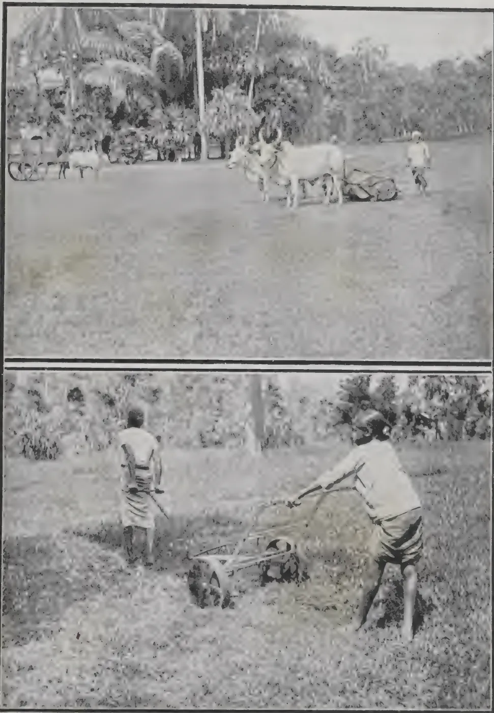The image consists of two vertically stacked black and white photographs. The top photograph shows a wide view of a large, open lawn area. In the background, there is a dense line of trees and foliage. In the middle ground, a pair of oxen is harnessed to a large, flat mowing machine. A person is standing near the machine, guiding it. The lawn appears to be a large, open space, possibly a central feature of a garden. The bottom photograph is a closer, more detailed view of the same mowing equipment. Two men are visible, one standing behind the machine and another guiding it from the side. The machine is a small, two-wheeled device with a long handle and a cutting mechanism. The ground is covered in low-lying vegetation, and the background shows more of the garden's foliage.

*Photos by H. F. Macmillan.*

The top photograph shows a large mower in use on the Great Circle lawn in the Royal Botanic Gardens, Peradeniya; the lower shows a "Bent-cutter" at work on rough ground, also in the Gardens.

449------------------------------------------------

<!-- stage4: FAINT old-images-only -->

[Faint page: no legible print of its own could be verified; text withheld (stage 4 review list)]

This image is a scan of a blank page. The background is a light beige or off-white color. There are several small, faint, brownish spots scattered across the surface, which appear to be scanning artifacts or minor imperfections on the paper. No text, lines, or other graphical elements are present.

450------------------------------------------------

DECEMBER, 1915.]409

or three inches, forking it in roughly with the foundation in order to enable it to grip the latter, finishing off with a thin layer of soil on the top, after which the surface should be finely raked. In order to ensure a uniformly even surface, pegs should be driven into the ground at the extreme points, and intermediate pegs at regular distances between these; the desired level or gradient from peg to peg can easily be obtained by means of a spirit-level and a long piece of wood having a straight edge. At least a portion of the lawn should be level, so as to allow of sitting out and of games being played if desired; but it should not be forgotten that natural undulations and sloping banks have a very pleasing effect, and these should be worked in whenever possible. It is essential that the surface should be as uniformly even as possible, for otherwise the mowing machine will be unable to cut the grass in the depressions, and the general result will be unsatisfactory. Sloping banks should not be so steep as to make it difficult to cut the grass and keep the turf in good order, a gradient of more than one in two being excessive. Finally, it should be remembered that faults in general are easier to correct while the lawn is being made than afterwards.

### TURFING.

The quickest and, at any rate for the low-country, the most satisfactory method of forming a lawn is to lay turf by hand, sowing seed being generally slow and precarious under the best of circumstances. The sods should be obtained from close-grazed pasture land, and cut as nearly as possible to uniform thickness. This is best done by a spade, though for ordinary purposes a mammoth will answer, and this is the easiest tool for coolies to handle. It is important that the turfs should be laid as fresh as possible, the earth being scooped out with a trowel so as to make a bed for each, afterwards pressing it in between them and filling up all crevices, finally sprinkling some fine soil on the surface. The sods being beaten down into position by means of a spade or a flat wooden beater, the whole surface should be thoroughly rolled over and afterwards watered. If the weather be wet, no further attention is necessary until the turf is well established, but if dry, watering must be done daily. A thin layer of any litter of leaves or grass which may be at hand if spread over the surface may save watering and hasten the turf in becoming established. A good plan is to drive a number of pegs, made of split bamboo or any other material convenient, into the turf a few inches apart, leaving about eight inches of these out of the ground. This has the effect not only of fixing the turf firmly in position until it has taken root, but also of keeping animals from trampling the surface. As soon as the turf has taken root, the pegs may be removed. On sloping banks this precaution is especially necessary.

### TURF-GRAFTING.

Often, however, especially in the case of a large area, turfing becomes a laborious and costly undertaking. This may be obviated by what may be termed turf-grafting, i.e., laying the sods, or portions of these, a foot or more apart, sinking them level with the surface and fixing them with small pegs as described above. The intervening spaces may be sown with seed, or grass roots may be dibbled in, the whole surface being then rolled and watered. Though this method is suited to a flat surface, it may not always be adapted to steep banks, as in this case the loose earth between the sods is liable to be ferreted out by the rain.

### DIBBLING GRASS-ROOTS.

As an alternative to the foregoing methods an even more economical plan may be adopted, that is by planting grass roots which may be obtained from any good turf or close-grazed pasture in the vicinity. The ground must

451------------------------------------------------

410[DECEMBER, 1915]

be prepared as already described, the surface in this case being brought to a fine tilth, thus enabling the grass roots to be dibbled in easily and firmly pressed down. Care should be taken that the roots are of the desired kind only; they should be planted about 3 inches apart, followed by a liberal watering and then slightly rolled. Wet seasons should, as of course in all planting operations, be chosen for the purpose; but if the weather should unexpectedly turn dry, watering and shading as above described become necessary. A special advantage of this method is that the desired species of grass may be chosen, undesirable kinds and weeds being easily eliminated.

#### APPLYING GRASS-ROOTS IN PASTE FORM.

A method favoured in Northern India is to pull up a quantity of grass (the Doob grass, *Cynodon dactylon*, being usually selected for the purpose) by the roots, chopping this up tolerably fine and mixing it with cowdung, mud, and sand, making a mixture of the consistency of mortar; this paste is spread thinly over the prepared ground, and in a short space of time a green and even cover is produced. This, however, would not be suited to a wet climate, where a single heavy shower might wash the whole preparation away.

#### LAWNS BY SEED-SOWING.

Lawn making by sowing seed is not generally satisfactory in the tropics, especially in the low-country. At the higher elevations, however, where certain English lawn-grasses will thrive for a time, it may be moderately successful, but even here it is difficult to prevent foreign or fine grasses from being rapidly superseded by coarse species and weeds. As, however, it is a question frequently asked, I may mention that suitable grass mixtures may be obtained from seed-merchants in England or Australia, the quantity usually required being about 50 lb. per acre, or  $\frac{1}{2}$  to  $\frac{3}{4}$  lb. per 30 square yards. Some recommend a more liberal allowance, say about 80 lb. to the acre, or 1 lb. to every 50 square yards. The ground should be well prepared and the surface brought to a fine pulverised state by raking, the seed when sown being raked in the usual way, followed by rolling, also by watering if the weather be dry. In the low-country a uniform green sward can seldom be obtained by sowing seed, owing to various reasons—the rapid growth of weeds, prevalence of bird and insect pests, and the liability of the seed to be washed away by heavy rain, or be exposed to a period of drought after sowing. Whatever method of lawn-making be adopted, whether seed-sowing, root-planting, or turf-grafting, an important point is that the margins should always be defined by laying a continuous belt of turf, even if it be but a foot in width.

#### LAWNS FOR GAMES.

Generally speaking, all that is expected of an ordinary lawn is that it should be uniformly smooth and green, and free from weeds. For purposes of games, however, such as croquet, putting-greens, etc., the conditions are more exacting. The surface must either be quite level or uniformly even, according to requirements; the grass forming the turf should be of the right kind, i.e. it should be a species with fine narrow leaves, a grass with broad, wiry or stiff leaves being unsuitable. It should preferably be a deep rather than a surface-rolling grass. The surface soil should be of an absorbent texture in order to enable rain to percolate through. If it is of a clayey adhesive nature a layer of a porous material, as coal ashes or broken brick and lime rubble, should be placed under the surface; otherwise constant trouble is likely to be experienced from worm castings, patchiness, and sloppy surface in wet weather. Frequent rolling is necessary, but it should not be carried out when the ground is very wet. Small depressions may be filled up by sprinkling a mixture of finely sifted soil and sand over the surface, drawing

452------------------------------------------------

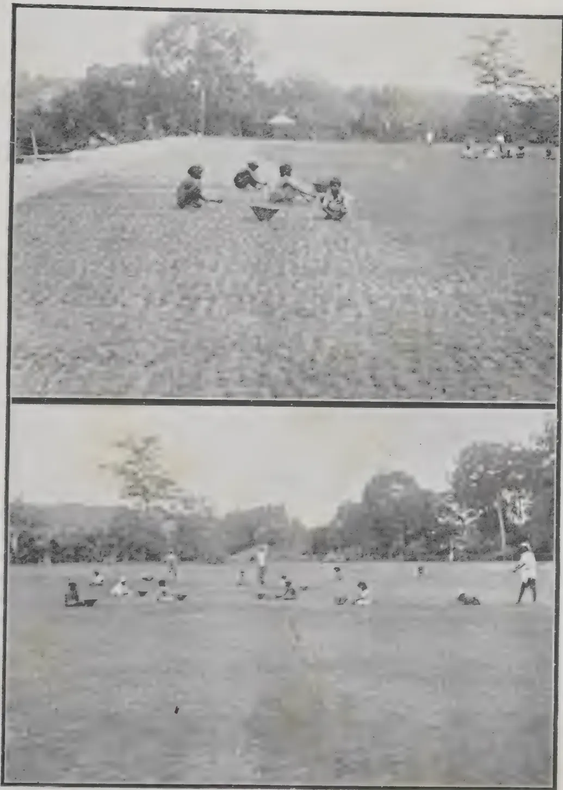The image consists of two vertically stacked black and white photographs. The top photograph shows a group of about five boys in a grassy field, some kneeling and some standing, working on the turf. The bottom photograph shows a wider view of the same field, now more densely covered with grass, with several boys scattered across it, some standing and some kneeling, engaged in weeding or maintenance. The background of both photos shows a line of trees and a clear sky.

*Photos by H. F. Macmillan.*

NEW RECREATION GROUND, TRINITY COLLEGE, KANDY.  
The Turf is composed entirely of the Doob-grass (*Cynodon dactylon*). The top photograph shows an early stage and boys dibbling the grass roots; the lower shows the lawn well covered, with boys picking out weeds or extraneous grasses.

453------------------------------------------------

This image is a scan of a blank page. The background is a uniform light beige or off-white color. There are several small, faint dark spots scattered across the surface, which appear to be scanning artifacts or dust particles. A slightly more prominent dark speck is located near the bottom center of the page. No text, lines, or other graphical elements are present.

454------------------------------------------------

DECEMBER, 1915.]411

it along with the back of a rake or a flat straight board. It is of primary importance that a supply of water be close at hand. To be properly equipped, water should be laid on in pipes and controlled by sunk taps or hydrants, to which a hose may be attached.

#### MOWERS.

The question is often asked: What are the most suitable lawn mowers for the tropics? It may be stated at once that well-made English machines of such well-known makes as RANSOME'S, SHANKS'S, GREEN'S, etc., will meet one's requirements in the tropics as elsewhere, provided the lawn is not allowed to run into a state of neglect. Owing, however, to the rapid rate of growth generally characteristic of the tropics, the tendency of coarse or arborescent growths rapidly superseding tender grasses, and the prevalence of termites and other ground pests, it is not always practicable to keep the turf in a condition fit for ordinary small mowers. Moreover, in a large garden or park there are parts in which it is desired only to keep down the rough grass or herbage, and how to deal with this satisfactorily is often a problem. In Peradeniya Gardens, where the larger lawns cover several acres in extent, a reaper machine with low-set knives, and adapted to bullock draught, is found very serviceable. It has a cutting width of 48 inches, is easily worked, and being drawn by two bulls, can be used in any weather. A very useful machine recently introduced is what is called RANSOME'S Bent-cutter. It is light and simple, easily repaired, and has a cutting width of 24 inches. Fitted on rather high wheels, with a good clearance, the four spirally placed knives revolve at a rapid pace and are reversible. It is specially adapted for golf links or situations where it is desired to cut chiefly the bent or pasture flower-heads. To a cooly a bamboo splint with a sharp edge, and shaped like a long sword, is a welcome substitute for a mowing machine. On steep banks this is a fairly efficient implement, especially where the turf has good recuperative powers.

#### UPKEEP OF LAWNS.

The success of a lawn depends entirely upon its proper up-keep; it should as far as practicable be kept free of weeds, mowed at brief intervals with a mowing machine, and never allowed to produce seed stalks or wear a neglected appearance. Frequent cutting, which is analogous to pruning, is most beneficial and results in close springy sward which gives a delightful feeling of elasticity. A heavy roller should be used frequently, but not when the ground is either very wet or unusually dry. A mower should not be employed until a firm green sward has been formed, the grass at first being cut by a scythe or sickle, so as to encourage the plants to tiller. When lawns become impoverished, a top dressing of a rich compost consisting of fine loamy soil, well rotted manure, and some fine river sand should be given, this being raked well in and the surface afterwards rolled and watered. The dressing should not be sufficient to completely hide the grass from view. The above application may with advantage be supplemented by some suitable chemical manure, say, at the rate of about 5 or 6 lb. per 40 square yards, according to ingredients, this being well mixed with the above compost before application. Nitrate of soda is an excellent stimulant and may be applied at the rate of about one pound per 40 square yards. Ammonium sulphate is, however, considered by some to be preferable, it being claimed for it, if applied in a liberal manner (say  $1\frac{1}{2}$  lb. dissolved in 4 gallons of water to 100 square feet of surface), to have the effect of eliminating coarse weeds while benefiting the grass. It should be remembered that nitrogenous manures encourage the growth of grasses and depress clovers, while potash manures encourage clovers. A sprinkling of fine river sand (not coarse gravelly sand), especially if mixed in equal proportions with finely sifted loamy soil, has a very beneficial effect on lawns; it acts as a mulch and renders the soil more absorbent to rain, producing a soft and even surface.

455------------------------------------------------

412[DECEMBER, 1915.]

### ENEMIES OF LAWNS.

Perhaps the most formidable of these in the low-country is the pernicious termite or white-ant, whose "nests" should be looked for and destroyed at the earliest signs, either by digging them out, or, if discovered in their early stages, by pouring a small quantity of carbon bisulphide or pumping poisonous fumes down their crevices. The device known as the "ant-exterminator" is excellent for destroying ants in large nests, but is hardly practicable for use on lawns, except in the case of ant-nests which have been allowed to grow to a large size. At the higher elevations lawns are apt to deteriorate from a persistent growth of moss. The remedy is to improve the drainage and, after eradicating the moss by means of an iron-toothed rake, give a top-dressing of a mixture as already described, to which may be added some freshly slaked lime. An application of basic slag (1 lb. per square rod) has also a good effect. Certain weeds are particularly partial to lawns, one of the worst being the "Elephant's foot" (*Elephantus scaber*). These should be dug up by a spud or "daisy fork;" or the plants may be killed by dropping poison into their centre. Worm-casts in lawns are particularly objectionable, and are generally due to imperfect draining or an excess of vegetable matter in the soil. Ground that is worked deep and is of an open, percolative nature seldom exhibits worm castings. Watering the soil with Vaporite, or a weak solution of ammonia or lime water, will cause the worms to come to the surface, when they should be collected and destroyed. "Fairy rings" are not so common in the tropics as in temperate countries, where they often do considerable damage to lawns. They are due to a puff-ball fungus, and the best remedy has been found to be a solution of iron sulphate, 8 lb. in 30 gallons of water, using half a gallon to a square yard.

### SUITABLE GRASSES FOR LAWNS.

As to what constitutes the best grasses for lawns, much depends on climate and local conditions. Those which are suitable in the low-country will not thrive at the higher elevations, and vice versa. Certain species are peculiarly suited to dry regions, of which the "Doob-grass" (*Cynodon dactylon*) is an example. This is a favourite for the dry plains of India, occurs naturally practically all over Ceylon, and is often the first grass to take possession of newly made ground; but in wet districts, unfortunately, it is soon superseded by coarser growing kinds, unless these are constantly watched for and eradicated. The love-grass or "Tutteri" forms excellent turf in the moist low-country in spite of the objection to it, when allowed to flower and seed, owing to its sharp hooked awns which adhere to and penetrate one's clothes. It is deep-rooted and stands drought well. The Couch-grass (*Panicum repens*), a persistent weed in some up-country districts, is probably the best grass for lawns at the higher elevations, being deep-rooted and consequently drought-resistant. MR. N. G. CAMPBELL found it the best grass for putting-greens on the Nuwara Eliya famous golf links. It is important that a lawn grass should be deep-rather than surface-rooted, and of a spreading creeping habit. Grasses with broad or wiry leaves, as has already been pointed out, or which are inclined to a tufty habit, are unsuitable for the purpose. The ordinary self-formed turf on the lawns in Peradeniya Gardens has been found to consist chiefly of the following species:—*Chrysopogon aciculatus* (Love-grass" or "Tutteri,") *Ischacmum ciliare* ("Rattana,") *Selaria glauca* ("Kavulu"), *Anthestiria tremula*, *Panicum sanguinale*, *Sporobulus diander*, and the clover-like *Desmodium triflorum* ("Hin-undupiyali"). Under the shade of trees the principal turf-grasses are *Paspalum undulatum*, *Paspalum conjugatum*, *Panicum trigonum*, *Oplismenus compositus* and *Apluda aristata*.

H. F. MACMILLAN.

456------------------------------------------------

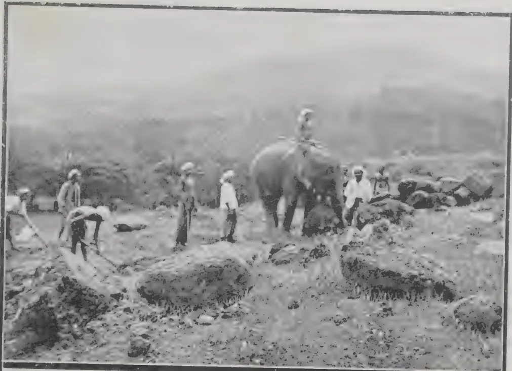A black and white photograph showing the commencement of a putting-green on a golf link. Several men are working on the ground, and an elephant stands in the background.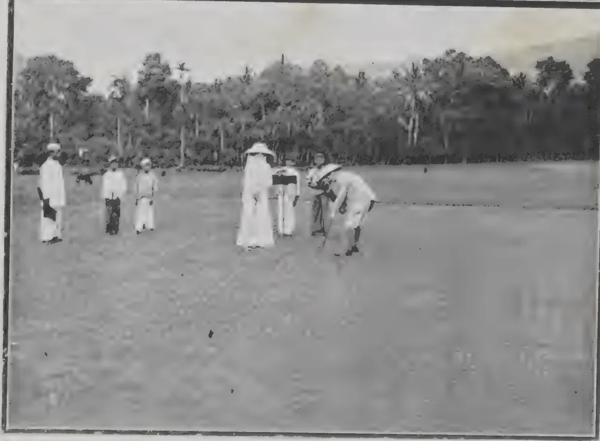A black and white photograph showing the finish of the putting-green on a golf link. A man is putting a golf ball, and several other men are watching.

*Photos by H. F. Macmillan.*

PUTTING-GREEN ON PERADENIYA GOLF LINKS,  
Showing commencement and finish. The turf is composed almost entirely  
of the love-grass, *Chrysopogon aciculatus*.

457------------------------------------------------

This image is a scan of a blank page. The background is a uniform light beige or off-white color. There are several small, dark specks scattered across the surface, which appear to be scanning artifacts or dust particles. A few very faint, blurry smudges are also visible, particularly in the upper right and lower right areas. No text, lines, or other graphical elements are present.

458------------------------------------------------

DECEMBER, 1915.]413

## THE CEYLON AGRICULTURAL SOCIETY.

### PROGRESS REPORT LXVIII.

#### PADDY (RICE).

*Change of Seed.*—In March last  $1\frac{1}{2}$  bushels of *Heenati* Paddy were sent to a member in Ambalantota. MR. KARUNANAYAKE, Instructor, reports that this quantity gave a return of 30 bushels, while the average yield in the neighbourhood is only 10 fold or 10 times the quantity sown. The crop took 4 months to ripen. In Kandy, whence the paddy was sent, *Heenati* takes  $4\frac{1}{2}$  months from sowing to harvest.

In August a bushel of *Hondrawala* Paddy, also from Kandy, was supplied to a member at Marawila.

In September a bushel of *Heenati* was sent to the Mudaliyar of Hinidum Pattu to grow by way of experiment. It was reported that owing to the destruction of crops by flood, cultivators were very short of seed paddy, but they were reluctant to use seed from another district. The Mudaliyar hopes that his experiment will be successful and help to remove this prejudice.

*Transplanting.*—This season several transplanting experiments are being carried on. In Madampe district, for the first time, a field has been planted with seedlings raised in a nursery. The experiment is carried out under MR. MOLEGODE'S supervision at the request of MR. GRAHAM PANDITHESEKERA, and is being followed with interest.

At the Training Colony at Peradeniya a part of the paddy field has been planted by the students themselves with *Molagu Samba* seedlings, single seedlings being put 4 inches apart; the rest is being planted with 3 seedlings 4 inches apart.

At the request of MR. R. SENIOR-WHITE of Suduganga Estate a nursery of *Molagu Samba* Paddy was established on the 13th of October and transplanted about the middle of November, single seedlings being put 4 inches apart.

The Society is co-operating with MR. A. B. THOMSON of Marakona Estate, Ukuwela, in a trial of paddy cultivation by transplanting. The variety grown is *Hondarawala* and the seedlings are being planted out 6 inches by 6.

In Haris Pattu, where for the last 5 years a series of successful demonstrations have been made, the Instructors still continue to go amongst the cultivators with a view to induce them to plant no more than 3 plants per hole instead of bunches of 6 or more plants together, as they are inclined to do.

*Water-Resisting Paddy.*—MR. D. A. GOONAWARDENA of Baddegama tried a further experiment in the cultivation of *Burmese water-resisting* paddy during the last Yala Crop and the results are as follows:—

Plot No. 1.—Very low land. Sown broadcast on 1st April, was under water from 2nd to 12th May, 7th to 17th, 24th to 26th June and 13th to 31st July. Crop withstood inundation well but unfortunately the last flood occurred when the paddy was flowering and consequently the grain was damaged.

Plot No. 2.—Slightly higher than Plot No. 1. Seed broadcasted 10th April, was under water from 6th to 12th May, 12th to 18th June, 14th to 20th July. The crop withstood inundation well but yielded only at the rate of 12 bushels per acre. Harvested 2nd September.

Plot No. 3.—Broadcasted 3rd April, was under water 7th to 11th May 13th to 17th June and 13th to 19th July. Here too the inundation occurred during the flowering stage and spoilt the crop.

459------------------------------------------------

414[DECEMBER, 1915.

### FRUIT CULTIVATION.

A small lot of Sapodillas grafted on *Bassia Longifolia* were recently distributed by the Society.

The HON'BLE SIR CHRISTOFFEL OBEYSEKERE has succeeded in growing an excellent apple (to judge from a sample forwarded to Peradeniya) at Wilson's Bungalow, Palugama, at an elevation of about 3,500 feet above sea level and with an average rainfall of about 60 inches. Writing on the subject, SIR CHRISTOFFEL says that he has two fruiting trees of which the plants were obtained from Hakgala some 8 years ago.

DR. DAVID FAIRCHILD, Agricultural Explorer, U.S.A. Department of Agriculture, who has visited Ceylon on more than one occasion, contributes an interesting paper on the Mangosteen to the JOURNAL OF HEREDITY for August last. In it he refers to the experience of the late MR. W. H. WRIGHT and MR. F. L. DANIEL, both of whom made a careful study of the conditions under which the Mangosteen grows best.

DR. FAIRCHILD states that MR. G. S. OLIVER, also of the U.S.A. Department of Agriculture, has succeeded in grafting the Mangosteen on 20 other species of *Garcinia*, the most promising stocks being *G. tinctoria*, *G. morella* and *G. Livistononei*. At the Government Stock Garden inarching on *G. xanthochymus* has been successfully carried out.

A fair number of local Persimmon trees have borne fruit this year. The fruit is botanically known as *Diospyros kaki* and sometimes called Kaki fruit or date-plum. MACMILLAN describes the tree as medium sized and slow-growing with large handsome ovate or cordate leaves. The fruit in appearance suggests an orange-yellow tomato, but the flavour is not unlike that of the Sapodilla. It dries well and is exported from Japan in that form. In that country the varieties are said to number about a hundred and these are classified as sweet and astringent. The tree is usually dioecious, i.e., bearing male and female flowers on different trees. The Society is arranging to import some plants from Japan, but it may be stated that, like the Cherimoyer, the tree thrives at an elevation of 4 to 5,000 feet and does not do in the low-country.

### INVESTIGATIONS.

PROFESSOR DUNSTAN, in a letter to HIS EXCELLENCY THE GOVERNOR under date 24th June 1915, wrote: "I have the honour to enclose a report on the results of the examination of the leaves of *Adhatoda vasica*, a sample of which was forwarded to the Imperial Institute by the Secretary of the Ceylon Agricultural Society with letter dated 22nd June, 1910.

"The reputed poisonous properties of this plant were mentioned to me during a visit to Ceylon by MR. DRIEBERG, and I then suggested that the plant should be examined at the Imperial Institute with special reference to the possible occurrence of a volatile alkaloid.

"These leaves are used in Indian native medicine as an expectorant, and were reported to contain an alkaloid (vasicine) which had, however, never been properly examined. A quantity of the alkaloid has been isolated from the leaves at the Imperial Institute, and is now under detailed chemical examination. Physiological trials of the alkaloid have also been carried out by PROFESSOR A. R. CUSHNY, F.R.S., of the University College, London, but, unfortunately the results indicate that the substance has no therapeutic value. It is, however, desirable that the chemical examination of this alkaloid should be completed, and for this purpose I have already asked the Secretary of the Ceylon Agricultural Society for a further supply of the leaves."

The following is the interim report:—"The leaves of *Adhatoda vasica* (which are the subject of this report) were received from the Secretary of the Ceylon Agricultural Society with letter No. 1570, dated 22nd June, 1910.

460------------------------------------------------

DECEMBER, 1915.]415

These leaves were forwarded at the request of the Director of the Imperial Institute in order that certain properties attributed to them in Ceylon might be investigated, as it seemed likely that these properties might be due to the presence of a volatile alkaloid. The leaves are used in India as an expectorant, and a previous investigation by HOOPER had shown that they contain an alkaloid, which, however, was not fully characterised.

"The sample weighed 9 lb. and consisted of broken leaves which appeared to have ranged from about 5 to 8 inches in length and were sage-green on the upper surface and yellowish-brown green underneath. The leaves possessed no appreciable smell, but had a somewhat bitter taste.

"The leaves as received at the Imperial Institute contained no volatile alkaloid. They were, however, found to contain 0.46 per cent. of a non-volatile alkaloid, equivalent to 0.50 per cent. in the dry leaves. The pure alkaloid was obtained as a white granular substance, which when viewed under the microscope was seen to consist of masses of slender needles. The alkaloid is sparingly soluble in water, and the solution has a distinct alkaline reaction to litmus. After drying at 100° C the alkaloid melts indefinitely between 150° C and 155° C. The hydrochloride, hydrobromide, nitrate and aurichloride of the alkaloid were obtained in a crystalline condition.

"The alkaloid (vasicine) isolated by HOOPER from the leaves was stated to be poisonous to the lower orders of animals, but not to the higher animals, and it seemed probable that it was the active constituent of the drug. Arrangements were accordingly made to have physiological trials conducted with the alkaloid isolated at the Imperial Institute, and this work was kindly undertaken by PROFESSOR A. R. CUSHNY, F.R.S., of the University College, London, who was supplied with a quantity of the crystalline hydrobromide of the alkaloid. PROFESSOR CUSHNY reports as follows on the results of his experiments :—

"(1) When injected into a frog, in the proportion of 0.9 gram per kilogram of body weight, the hydrobromide caused some clumsiness and incoördination in movement, but the animal continued active and recovered in 2 to 3 hours.

"(2) In rats, 0.4 gram per kilogram of body weight injected hypodermically caused some dyspnoea and cyanosis, with lessened movement and weakness, but these symptoms disappeared in two hours and the animal remained normal thereafter.

"(3) In cats, 0.025 gram per kilogram injected hypodermically had no apparent effect, and 0.05 gram per kilogram given by the mouth was equally ineffective.

"(4) In man, 20 mgs. administered by the mouth had no apparent action, apart from the slightly bitter taste.

"(5) Protozoa such as *Paramœcium* and *Colpidium* continued to move about in a 1 per cent. solution of the hydrobromide for 30 minutes or longer.

"The doses given in each of the foregoing instances were very large, and the results indicate that the alkaloid yielded by the leaves of *Adhatoda vasica* is of no therapeutic value.

"It is impossible to say definitely whether the alkaloid obtained in the course of this investigation is identical with the vasicine isolated by HOOPER. The present alkaloid does not give the colour change on fusion described by HOOPER for vasicine, and such slight physiological action as it exhibits appears to be different.

"The investigation of the leaves is being continued, as it will be of interest to complete the chemical examination even if the material proves to have no therapeutic value."

461------------------------------------------------

416[DECEMBER, 1915.

A further consignment of leaves is going forward.

It should be added that the leaves when used on irrigated paddy fields has been found to prevent the growth of low-life flora and also act as an insecticide. It was this fact, and not to any specific poisonous effect on the higher fauna that was brought to the notice of PROFESSOR DUNSTAN.

The dried leaves of adhatoda are reputed to relieve asthmatic patients when smoked in the form of a cigarette, and are commonly offered for sale as such.

At the instance of MR. J. P. OBEYSEKERE, who suggested that an analysis of average samples of Ceylon paddy grown in the low-country and on the hills should be procured in order to ascertain what proportions of organic and mineral ingredient were taken out of the soil, the Government Agricultural Chemist made the following report on the material furnished to him:—

“(1) Hill paddy.—a. *Food Analysis*.—Moisture 9.0 %, Oil 2.4 %, Ash 4.7 %, Woody fibre 9.5 %, Proteids 9.0 %, Carbohydrate 65.4 %, total 100.0 %; Nitrogen 1.44 %, Nutritive ratio 1 : 8.

“b. *Ash Analysis*.—Moisture 9.00 %, Organic matter 86.26 %, Ash 4.74 %, total 100.00 %, Lime 1.6 %, Magnesia 3.3 %, Potash 4.9 %, Phosphoric acid 9.0 %, Silica 74.5 %, Sulphuric anhydride 0.7 %, Chlorine trace, Soda 4.6 %, Iron and Alumina 1.4 %, total 100.00 %.

“2. Lowland paddy.—a. *Food Analysis*.—Moisture 6.9 %, Oil 1.7 %, Ash 5.5 %, Woody fibre 11.0 %, Proteids 7.6 %, Carbohydrate 67.3 %, total 100.0 %; Nitrogen 1.22 %, Nutritive ratio 1 : 9.4.

b. *Ash Analysis*.—Moisture 6.90 %, Organic matter 87.56 %, Ash 5.54 %, total 100.00 %. Lime 1.20 %, Magnesia 3.46 %, Potash 4.35 %, Phosphoric acid 8.96 %, Silica 77.44 %, Sulphuric anhydride 0.34 %, Chlorine trace, Soda 2.30 %, Iron and Alumina 1.95 %, total 100.00 %.”

MR H. L. VAN BUUREN applied for seeds of the variety of *Paspalum scrobulatum*, commonly known as “Mat-amu” reported to possess poisonous properties, with a view to his investigating the poisonous agency, which it had been suggested to him by the Government Mycologist might be traceable to a phosphorescent fungus analogous to that occurring on species of *Lolium* grass in Europe. Seed obtained through MR. S. D. MAHAWALATENNE (late R. M.) of Balangoda are being grown at the Government Stock Garden under MR. VAN BUUREN’s observation.

### PESTS AND DISEASES.

The Assistant Entomologist reported as follows on a caterpillar attacking Agathi plants (*Sesbania grandiflora*):—

“The caterpillars sent are larvæ of a pierid butterfly. They cannot be certainly identified until the imago has been reared, which will probably take another fortnight.

“The pest could be easily controlled by spraying affected trees with arsenate of lead, but as this substance is poisonous there would be danger in using it on leaves of trees used for curry, etc.

“‘Vermisapon’ which can be obtained from MESSRS. E. B. CREASY & Co., Colombo, may be sprayed on, and is likely to be effective while the caterpillars are small. This substance is non-poisonous.”

Later he added:—

“The caterpillars defoliating *Sesbania grandiflora* have been bred out and prove to be the common yellow and black butterfly, *Terias hecabe*, which also ‘defoliates Albizzias.’”

462------------------------------------------------

DECEMBER, 1915.]417

On specimens of beetles found as a pest in Marawila District the Assistant Entomologist reported :—“The Beetle is the well-known Cockchafer, *Lepidiota pinguis*. The immature stage of the beetle is a large white grub which lives underground and does much damage to roots of various plants.

“I am supplying the live specimen with various plants to discover its food-plant, and I am also trying it with coconut leaves of different stages of growth. Probably the best means of dealing with this pest is with beetle traps composed of fresh cow-dung and any rotting vegetation, mixed together and placed in prepared holes in the ground. The female beetles visit these places and lay their eggs in them. When the mass of rubbish has been lying about three months it should be turned out and any beetles or grubs seen should be killed. The rubbish can then be returned to the hole and examined again in another three months' time. If these beetle-traps are distributed fairly numerously (say one to an acre), they should gradually lead to the eradication of all Cockchafer pests and also the black Coconut Beetle, *Oryctes rhinoceros*, which prefers laying its eggs in such places.”

Specimens of diseased cinnamon were received from Seeduwa with the following note :—“The leaves are first affected and thence the disease appears to travel down the bark of the stem till it reaches the root, the branches withering at the same time. In some areas fully half the number of bushes are affected. Even when the leaves only are affected the bark is found to be unpeelable.”

The Assistant Botanist and Mycologist reported on the specimens :—“The leaves are attacked by a *Gloosporium* and a *Colletotrichum*. A second symptom present may be due to *Pestalozzia* (Grey Blight), but no specimens could be obtained. The leaf disease is of minor importance. The stems are attacked by ‘red rust’ (*Cephalearos mycoidea*) which is the cause of the damage.”

Mango leaves attacked by a caterpillar were submitted by MR. MOLEGODE to the Assistant Entomologist, who identified the pest as the grub of a moth (*Thalassodes Quadraria*) and suggested that the trees should be sprayed with arsenate of lead.

DR. MUTTUKUMARU of Bandarawela forwarded specimens of an insect attacking the blossoms of introduced varieties of mangoes and preventing the setting of fruit. The specimens were submitted to the Assistant Entomologist who reported as follows :—

“The insects attacking Mango flowers are a species of *Chrysomelid* beetles. I have no named specimens of this species, and am unable to identify them with certainty. Spraying the trees with arsenate of lead should be a means of getting rid of them. As they probably attack only the flowers and young buds these only would have to be treated. A simple method of reducing their numbers would be to send round a couple of boys, one to disturb the flower-bunches and the other to catch the beetles in a long-handled butterfly-net as they fall. An alternative method is for the second boy to hold a pan of water, with a film of kerosene on the surface, under the flowers so as to catch the falling beetles, but neither of these plans is practicable if the trees are very high or the flower-bunches are out of reach. On the whole, the spraying method is likely to prove the most successful.”

Damaged Brinjal plants submitted to the Assistant Entomologist were found to be attacked by the “Shoot Borer” caterpillar. The treatment recommended is to cut off each affected plant below the point of attack (which can be detected by a discolouration at the spot) and burning all the cuttings. The resulting moths may be captured and destroyed with the aid of light traps.

The Mudaliyar, Pitigal Korale South, reported the occurrence of an insect pest which feeds on the leaves of the coconut palm.

The Assistant Government Entomologist is visiting the affected area with a view to studying the pest.

463------------------------------------------------

418[DECEMBER, 1915]

On specimens of damaged Knol-kohl, the same officer reports :—

“The trouble is apparently caused by brown ants (most probably *Dorylus orientalis*), which attack and eat many garden plants and vegetables. The presence of the white ant is doubtless due to the use of the cow-dung manure, and is a sign that the former was not sufficiently rotted ; as they will not attack really old manure after fungal growth has ceased in it (i.e., when decomposition has proceeded as far as it will go). Probably the white ants were first attracted by the manure and then the *Dorylus* ants were attracted by the presence of the white ants, subsequently transferring their attention to the Knol-kohl. “Vaporite” should be dibbled into the ground near the plants or mixed with the soil some days before putting the plants down. It should not, however, touch the roots.”

On a specimen of insect-damaged brinjal at Anuradhapura, forwarded by MR. MADANAYAKE, Agricultural Instructor, the Government Entomologist reported :—“The insect is *Leucinodes orbonalis*, which bores into young shoots of brinjals in India and Ceylon. The affected shoots and fruits should be collected and destroyed.”

### CINNAMON BARK OIL.

In June last the Director of the Imperial Institute wrote :—

“I understand that before the war a considerable quantity of cinnamon bark oil was distilled in Ceylon and exported to France and Germany, whence part of it was re-exported to this country.

“Importers in this country are now desirous of getting into direct touch with Ceylon producers of cinnamon bark oil, and I shall be much obliged if you will let me have the names and addresses of such firms, with any information that may be available as to the price at which the oil could be offered and the quantities available for shipment.

“For certain purposes it is essential that importers should be in a position to guarantee that this oil is genuine, i.e. that it consists only of oil distilled from cinnamon bark and contains no added cinnamic aldehyde, cassia oil or other adulterants. I realise that it may be difficult to obtain trustworthy information on this point, but I shall be much obliged if you will make enquiries and let me know whether I could assure the British Firms interested that they can regard the oil as genuine. MR. BRUCE may be able to give you assistance and information on this part of the subject.

“I shall also be glad to have a typical sample of about 1 lb. of the oil.”

On consulting the Secretary, Lowcountry Products Association, that officer reported :—“The distillation of Cinnamon Bark oil was practically abandoned some years ago owing to a drop in the price offered for it and the greater demand for the Leaf Oil. It is not likely that a trade involving the setting up of stills for distillation can be restored afresh unless there is a very strong demand for pure Bark Oil, and, at the same time, the market for Cinnamon Chips from which it is distilled shrinks considerably. I realise, however, that the enquiry from the Imperial Institute deserves the closest attention of the proprietors of Cinnamon Estates, and shall endeavour to arrange for a conference with them and inform you definitely whether it is possible to revive the industry. I may add that if the Bark Oil is distilled it will be pure.”

MESSRS. CHAS. P. HAYLEY & Co. wrote :—

“At the approximate price of Re. 1/25 to Re. 1/50 per oz. leaf oil is undoubtedly mixed with the bark oil, but at about Rs. 3/ to Rs. 3/50 a pure distillate can be obtained.”

464------------------------------------------------

DECEMBER, 1915.]419

MUDALIYAR A. E. RAJAPAKSE furnished the following information :—“Unadulterated Cinnamon Bark Oil is not exported from the Island owing to its high cost and the absence of a satisfactory market. The oil which is being exported from Ceylon and passed off as bark-oil generally contains 50 per cent. or more of cinnamon leaf oil. If any pure Bark Oil has been recently exported to England from Germany it must have been oil distilled in Germany from Chips. If there are buyers at Rs. 3/- an ounce I am prepared to take it up and distil the oil myself and give a guarantee as to its purity.”

MR. BRUCE wrote :—“The market for this product is very poor at present. The product is rarely pure, containing from 10 to 20 per cent. of leaf oil.”

Subsequently the Secretary of the Lowcountry Products Association reported :—“I have now had the privilege of consulting those engaged in the Cinnamon industry, and I am prepared to supply any English consumers who desire to purchase Cinnamon Bark Oil about 1,000 ounces per month. The price F.O.B. in Ceylon will be about Rs. 2/25 or 3 shillings per ounce.

“As the Cinnamon industry is at a very low ebb it will be of particular benefit to small-holders if an order can be secured. I may mention that the previous price for this oil was 4 shillings.”

A pound sample was specially distilled for the Society and submitted to the Government Agricultural Chemist, whose report on the same was as follows :—“Aldehyde 68 per cent. ; Eugenol 16 per cent. ; Rotation 1°0. I consider this a commercial sample and of fair purity although it is rather high in Eugenol.”

#### POLLINATION OF CACAO.

The A. I. Root Company of Medina, Ohio, the leading apicultural firm in America, and therefore greatly interested in the work of the honey-bee as an agricultural ally, wrote under date July 6th :—“You are doubtless aware that the agency of the common honey bee is valuable in the pollination of the fruit of the temperate zone, e.g. apples, grapes, peaches and plums. The bees carry the pollen from one blossom to another, and from one tree to another. This results in a much larger yield than would be the case were the wind alone relied upon to perform the service.

“We write for information as to what part the bee plays, if any, in the pollination of tropical fruits, such as citrus, bananas, and cacao. We have considerable information in regard to other tropical fruits, but what we want to get at mostly is something in regard to the pollination of cacao. We should like to know if honey bees have ever been seen on the blossoms of cacao, or whether the fruit will mature and produce good seed in places where the honey bee is absent.”

On consulting those likely to afford information on the point, the Assistant Entomologist wrote :—“I have not yet had opportunity of observing the part played by bees in the pollination of the Cacao blossom. I will take the first opportunity of watching this. Off-hand, however, I think it unlikely that they play any important part.”

“Citrus and Banana flowers are pollinated by bees.”

The Manager of the Experiment Station, Peradeniya, wrote regretting his inability to furnish any data, but said he would watch and see, though he was of opinion that bees did not take much part. In his opinion the pollinating agents were more likely to be ants and small winged insects.

DR. UZEL'S observation at Peradeniya led him to the conclusion that pollination in cacao was affected solely by Thrips, which were most in evidence on the flowers.

E. E. GREEN recorded the occurrence of no less than 30 specimens of the common *Aphis* (*Ceylonia theaccola*) on a single flower.

465------------------------------------------------

420[DECEMBER, 1915.

HART was of the view that pollination was due to several kinds of small insects. He disputed UZEL's statement, since in Trinidad there were few if any Thrips, which, therefore, cannot be said to be solely instrumental in pollinating cacao flowers.

HART dwelt on the fact that little trouble is experienced by any want of effective pollination, as fertilization is regularly effected in proportion to the flowers that appear.

### INTRODUCTIONS.

Seed of a new variety of Dhall (*Cajanus indicus*) were procured through the courtesy of the Deputy Director of Agriculture, Northern Circle, India. The variety is from a selected line raised at the Government Experimental Farm, Poivar Khera. The chief characteristics of the new Dhall are a spreading bushy habit, a heavy yield, white pods and light coloured seed and a small sowing rate (2 seers per acre). The seed was distributed to Agricultural Instructors and School Gardens.

The Society is indebted to DR. DAVID FAIRCHILD, Agricultural Explorer, U S.A. Department of Agriculture, for seed of *Phaseolus acutifolius*, commonly known as the Tepary bean from Arizona. It is specially suited to dry areas as it germinates quickly in little soil moisture, and, once established, stands drought successfully. Tepary is reputed to give four times as large a crop as the ordinary Kidney bean. The seed was distributed in October for trial in the drier parts of the Island and reports as to its growth are being awaited.

In July last MR. C. CASSIPILLAI, who is always ready to try new methods of cultivation and new varieties of crops, wrote inviting attention to the reference to SAN RAMOAN coconuts on page 110 of COPELAND's work on the coconut, where the author states that 3,270 nuts of this variety go to make a ton of copra, i.e. about 818 to the candy. This he pointed out as remarkable, and enquired if the Society could get him some seed nuts for planting.

By communication with the Agricultural Department it has been possible to procure 4 dozen nuts which have been despatched to MR. CASSIPILLAI, and were in good time for planting during the N. E. Monsoon rains. The nuts which are abnormally large were received in excellent condition, nearly all having germinated in transit.

This introduction is a notable one, particularly for the Jaffna peninsula, and thanks are due to MR. CASSIPILLAI for his enterprise.

### DISTRIBUTION OF PLANTS AND SEEDS.

Mudaliyar A. NAGANATHER of Nuwara Eliya has offered to supply a quantity of the purple Jaffna "King Yam" (a variety of *Dioscorea alata*) for distribution to the headmen of the Kurunegala District through the Government Agent of the North-Western Province, with a view to encouraging the cultivation of this excellent tuber in the district. MR. NAGANATHER reports what is not generally known, that the yam thrives at high elevations (6,200 ft.)

In September the Society imported 3,200 lb. of acclimatised English seed Potatoes from Ootacamund and distributed to those who had booked orders beforehand in response to a notice in the TROPICAL AGRICULTURIST, the potatoes going to Nuwara Eliya, Kandapola, Maskeliya, Talawakele, Bandarawela, Pundaluoya, Welimada, Deltota, Mediwaka and Ambawela. The orders varied from 28 to 800 lb.

MR. A. J. KELLOW, who has had considerable experience and success in potato-cultivation, has been good enough to write with regard to seasons in Ceylon: "I have had the best results from July-August planting and fairly good from sets put down in February-March, but the climatic conditions vary so much in Ceylon that it would be impossible for me to give an opinion as regards any locality other than this. As a general rule, however, I would suggest a choice of season when a period of 3 months can ordinarily be depended on for pretty fair weather, i.e., without too much rain. If the plants are exposed to heavy rains after blossoming—which generally occurs

466------------------------------------------------

DECEMBER, 1915.]421

about 2 months from setting—they are liable to be affected by blight which is frequently transmitted to the tubers.”

For the October planting season the Society distributed the following plants and seeds :—

<table>
<tbody>
<tr>
<td>Vegetable Seeds</td>
<td>...</td>
<td>...</td>
<td>...</td>
<td>packets</td>
<td>1,165</td>
</tr>
<tr>
<td>Seedling plants</td>
<td>...</td>
<td>...</td>
<td>...</td>
<td></td>
<td>1,117</td>
</tr>
<tr>
<td>Cowpea</td>
<td>...</td>
<td>...</td>
<td>...</td>
<td>lb.</td>
<td>134</td>
</tr>
<tr>
<td>Seed potato</td>
<td>...</td>
<td>...</td>
<td>...</td>
<td>“</td>
<td>3,200</td>
</tr>
<tr>
<td>Indian grafted plants</td>
<td>...</td>
<td>...</td>
<td>...</td>
<td></td>
<td>426</td>
</tr>
<tr>
<td>Australian budded plants</td>
<td>...</td>
<td>...</td>
<td>...</td>
<td></td>
<td>30</td>
</tr>
<tr>
<td>Burmese drought-resisting paddy</td>
<td>...</td>
<td>...</td>
<td>...</td>
<td>2 bush.</td>
<td>6 measures</td>
</tr>
<tr>
<td>Dura (Sorghum)</td>
<td>...</td>
<td>...</td>
<td>...</td>
<td>8 “</td>
<td>14 lb.</td>
</tr>
</tbody>
</table>

The Society has now distributed between 10 and 11,000 grafted plants from India, and it has been decided not to import any more, at least for a time. Whether these imported varieties will prove suitable to local conditions and bear as good fruit as in India remains to be seen. Members are reminded that our local varieties of mangoes are as good as any if the right sorts are propagated and that every effort is made by the Society to provide the best of these.

#### MISCELLANEOUS.

*Agricultural Education.*—Arrangements have been made by the Director of Agriculture for the opening of a School of Tropical Agriculture at Peradeniya early in January, and so far a large number of applications for admission have been received. Two hostels are to be provided for resident students, and these will be in charge of responsible officers. Arrangements have been made for the erecting of temporary class-rooms on the grounds of the Royal Botanic Gardens, towards the cost of which the Agricultural Society contributed a grant of Rs. 1,000.

*Poultry Rearing.*—DR. H. M. FERNANDO and MR. H. L. DE MEL have approached the Secretary with a practical scheme for the improvement of village poultry, the cost of which they offer to meet. Details are under discussion and will be made known shortly.

*Bee-keeping.*—MR. THOMPSON, a visitor from India, had a consultation with the Secretary and the Assistant Entomologist with reference to bee-keeping in the East, and the Society's comb-foundation machine was specially worked for his benefit at the Government Stock Garden. MR. SHANKS, who still maintains his interest in apiculture, has kindly communicated to the Society the results of observations made with regard to the comparative weight of the English (*A. mellifica*) and the Indian honey bee (*A. indica*), viz., that while about 5,000 of the former go to make a pound, approximately 11,500 of the latter are required for the same weight.

MR. D. S. CORLETT, Manager, Experiment Station, Peradeniya, writes : “My bees have gone into the super and worked on all the frames which are pretty full up.”

*Soy Beans.*—Reference has previously been made to the introduction of several new varieties of Soy Beans from Bangalore. At Balangoda Agricultural Garden 12 varieties were grown in plots 3 × 16, and of these the three best were found to be : (1) Willson, (2) Seka Leha and (3) Brown No. 2 (creeping variety) all of which gave a yield equal to between 6 and 7 cwt. of seed per acre.

The seeds were put down on July 12th, the plants flowered about the middle of August, and the crop was gathered in the first week of October, except in the case of Brown No. 2 which cropped 2 to 3 weeks later.

The pods, when about half-ripe, were attacked by field rats and the crop was thereby to some extent reduced.

C. DRIEBERG,  
Secretary, C. A. S.

Peradeniya,  
30th November, 1915.

467------------------------------------------------

422[DECEMBER, 1915.

## THE EFFECT OF RADIUM ON THE GROWTH OF PLANTS.

E. J. RUSSELL.

Among the many remarkable properties of radium it was perhaps natural to expect that it might have some definite effect on plants, and even, under suitable conditions, cause sufficient increase in the amount of growth to justify its use in horticulture and agriculture. The early report noted a more or less complete inhibition in cell activities in younger and especially embryonic tissues, with few exceptions. The action of radium through the soil, however, was different; germination and growth were both accelerated, and the plants furthest away were stimulated most. ACQUA found that different plants, and even different organs of the same plant, were differently affected, the root system in general responding more markedly than the ærial parts, and in his experiments being arrested in their development.

The intensity of the radiation is important, and G. FABRE, using *Linum catharticum* as test plant, was able to obtain increased development and germination of seedlings by working with emanations up to 1.5 microcuries per 2 litres of air, and to retard development by using emanations of 40 microcuries per litre of air. H. MOLISCH obtained a like result: young plants of vetches, beans, sunflower, etc., were stimulated in growth by weak emanations, but checked or entirely stopped by stronger ones. He further claimed that the "rest period" could be broken by the radium emanation, and forced lilac into bloom in November by attaching pipettes containing small quantities of radium chloride to the terminal buds. In his earlier experiments he, like DIXON and WIGHAM, failed to detect any radiotropism, but later on he found indications in the case of certain heliotropically sensitive plants, e.g., oats and vetches.

These and similar results naturally suggested that the residues left after the extraction of radium, but still containing radio-active material, might have definite manurial value, and it was not long before definite statements were forthcoming. BAKER claimed that increased yields of wheat and radishes had been obtained by mixing one part of radio-active material (2 mg. ra. per ton) with ten of soil. It is true that STOKLASA'S results were negative (although in his other experiments radium emanations increased growth to a marked extent), but this did not prevent the introduction of radio-active fertilisers, and the enterprising syndicates and companies concerned were by no means loth to push their wares. The staffs of the agricultural experiment stations being busy people and, moreover, somewhat sceptical about plant stimulation on account of some rather sad failures, did not generally take the matter up, and it remained for MR. MARTIN SUTTON to carry out the necessary tests.

MR. SUTTON'S experiments were made with radishes, tomatoes, potatoes, onions, carrots, and marrows, some grown in pots, others in plots out of doors. Eight different radium residues were used, in addition to pure radium bromide; the dressings were so arranged that equivalent quantities of radium were given in each case (1/4,000 mgm. radium bromide to 15 lb. of soil in the pots;  $2\frac{1}{2}$  times this amount per square yard to the plots). Controls were set up, including a set treated with the other substances present in the residues, designed to ascertain whether those had any effect.

The results have just been issued by MR. SUTTON. Going carefully through them, one is forced to the conclusion that the radio-active materials have been ineffective. In no case is there any clear evidence of increased growth. Even the pure radium bromide seems to have done nothing. We are, therefore, left with an apparent discrepancy. The work of

468------------------------------------------------

DECEMBER, 1915.]423

the physiologists, assuming it to be sound, certainly indicated that radium emanation is capable of stimulating certain cell activities. MR. SUTTON'S results show that such stimulus, if it exists at all, does not affect the final growth of the plant. The discrepancy is not a new one; it is periodically confronting the agricultural investigator. Thus DR. WINIFRED BRENCHLEY, at Rothamsted, has failed to obtain increases in growth by supplying plants with inorganic poisons which have been supposed to stimulate certain cell functions in suitable dilutions. The result opens up the prospect of an interesting discussion, but it also shows the danger of arguing from a simple physiological observation to a complex phenomenon like the growth of a plant in soil.—  
NATURE.

---

## DIE-BACK OF LIME TREES IN MONTSERRAT.

---

As affording an interesting comparison with the description reviewed above of citrus branch troubles in the Isle of Pines, the following extract is published from a report made to the Imperial Commissioner of Agriculture respecting a recent short visit to Montserrat:—

‘The factors concerned in the dying back of twigs and branches are possibly somewhat complicated, and cannot be determined with certainty by inspection and the examination of specimens. Observation of the sequence of events during their decline are necessary before a definite conclusion can be reached. Certain probabilities, however, may be indicated.

‘Much of the die-back is complicated by the presence of scale insects on the branches which fail. I was able, however, to find instances where scale insects were practically absent and where there were no indications of their having been present in adequate numbers to account for the failure. I regard them in most cases as accessories merely, which hasten, but do not cause the death of twigs and branches. I am more inclined to believe that it is usually when the branch has already become sickly that they are able to increase to a serious extent.

‘There are two fungi present on diseased branches at a sufficiently early stage and with so much regularity as to enable them to be regarded as possible parasites. The first of these is a species of *Colletotrichum* whose fructifications are found everywhere in the islands I have visited on dead or dying lime twigs. It closely resembles the withertip fungus of American writers on citrus diseases (*Colletotrichum gloeosporioides*) but has not been found to cause any such effects on leaves and fruits as are recorded for that fungus. A case has been seen on a young tree in Barbados which left little room for doubt that this fungus can under some circumstances bring about the death of twigs and small branches. I have not seen any indication of its presence on larger branches.

‘On such diseased main branches as were examined in Montserrat, the fungus found working up to the margin of apparently healthy wood and fruiting on the dead bark is a *Diplodia*, which appears to be the same as the well-known cacao fungus. In the case of cacao it is associated with the die-back that occurs on trees in exposed situations, usually in circumstances which make it difficult to decide whether the die-back has attracted the fungus, or the fungus has caused the die-back. The general opinion, to which I myself adhere after a period of doubt, is that it acts as a parasite on trees weakened by unfavourable conditions. It may very well be found to have a similar position in respect of lime trees.’—W. N. IN THE AGRICULTURAL NEWS.

469------------------------------------------------

424[DECEMBER, 1915.]

## LOSS OF WATER FROM WEEDS.

LYMAN J. BRIGGS, M.S., Ph. D.

A relatively small proportion of the total annual rainfall is conserved in the fallow. The maximum quantity of stored moisture available for crop seldom exceeds 4 inches of rainfall in sections where the annual rainfall ranges from 13 to 18 inches. This low efficiency is due in part to loss from run-off, but mainly to surface evaporation, and to loss through the transpiration of weeds. Numerous measurements have shown that a rainfall of less than  $\frac{1}{2}$  inch does not contribute to the permanent store of moisture in the soil unless the surface soil is already wet from previous rains. If the rainfall penetrates the soil below a depth of 6 inches, its rate of loss due to evaporation is low. But if the fallow is weedy, the stored water is lost through the transpiration of the plants almost as rapidly as if the moist subsoil were freely exposed to the air. The water requirement of weeds is fully as high as some of our most valuable crop plants. For example, pigweed (*Amaranthus retroflexus*), tumble-weed (*Amaranthus græcizans*), and Russian thistle (*Salsola pestifer*), have a water requirement as high as the millets and sorghums, while sunflower (*Helianthus petiolarus*), and lamb's quarters (*Chenopodium album*) rank higher than many of the legumes. The dry-farmer can therefore produce a valuable forage or grain crop with no greater expenditure of water per pound of dry matter than is lost through the weeds on his fallow.

Determination by W. W. BURR, in Nebraska; R. W. EDWARDS and J. G. LILL, in Kansas; and C. B. BURMEISTER, in Texas, all unite in showing that the evaporation loss from land from which the weeds are sliced off with a hoe is but little greater than from cultivated plats. In other words, cultivation is effective in conserving water mainly through the destruction of weeds rather than in the reduction of surface evaporation. This is well illustrated by LILL's measurements at Garden City, Kansas. The moisture content of the mulched plat did not differ markedly from the plat on which the weeds were kept sliced off with a sharp hoe; while the plat on which the weeds were allowed to grow was dried out to a depth of 3 feet.

A striking example of the loss of moisture from weeds is also shown in experiments by P. V. CARDON, at Nephi, Utah. Winter wheat was grown on four plats by the summer fallow system, one-half the plats being in wheat each year. Two plats were fall-ploughed each year, and during the following summer, one plat was cultivated to destroy the weeds, while the other was left untouched, except to clip the weeds in time to prevent the seeds maturing. In the autumn, both plats were sown to winter wheat. The experiment was conducted for four years, and during this time the yield from the cultivated plat averaged 4 bushels more per acre than from the weedy plat.

The loss of moisture in these plats as the season advanced, due to the demand made by the weeds, is illustrated in the accompanying graphs, Fig. 4. (*Not reproduced*). That this loss is primarily due to the weed cover, and not to direct evaporation, is supported by the fact that in other experiments at this station, spring-ploughed, uncultivated fallow on which the weed-growth was slight was practically as effective as cultivated fallow in conserving moisture. The average moisture content (6 feet in depth) of the weedy Nephi plat was, at the time of the spring sampling, 0.8 per cent. below the cultivated plat; and at the time of the fall sampling, 4.5 per cent. below the cultivated plat. This loss in moisture during the summer is equivalent to 3.5 inches of rainfall stored in the soil. This amount of water is sufficient, according to the water-requirement measurements of BRIGGS and SHANTZ, to produce 10 bushels of wheat per acre at Akron, Colorado, where the evaporation is the same as at Nephi. In 1911, the actual increase in yield of the

470------------------------------------------------

DECEMBER, 1915.]425

cultivated plat over the weedy plat was 11 bushels per acre. During the other years, the yield was reduced by winter-killing, so that the water supply was not the primary factor in determining production. Surely no more convincing proof is needed of the necessity of keeping fallow land free from weeds in regions where the moisture supply is of primary importance!—JOURNAL OF AGRICULTURE, VICTORIA.

## ANT EXTERMINATION.

For the extirpation of ants the following remedies are good. To be effective, they require attention and perseverance. It is well to find their main burrow or nest, if possible. Arsenic is sure destruction to them, but it is dangerous to handle :—

Air-slaked lime plentifully dusted in warm dry weather over and around the hills, or in the house or other places infested, will cause the ants to vacate them in a short time.

Snuff : Dust a little snuff upon the floor of the rooms or pantry.

Draw a thick chalk line around a smooth tree or across an upright board or post, and they will not pass over it.

Camphor : Put a piece of camphor, the size of a filbert nut, into 2 quarts of hot water. When cold, apply to pot and other plants, and the insects will be driven off without injury to the plants.

Mix together 1 part of calomel and 10 parts of finely powdered white sugar, and lay it in little heaps about their nests and runs. The ants will eat it and die.

Coal oil, mixed with six times its bulk of water, sprinkled over the nests every few days, will kill and drive them away.

Pans or saucers, nearly filled with honey or sweet oil, attract ants, and they are drowned in it.

Flowers of sulphur,  $\frac{1}{2}$  lb.; potash, 4 oz. Set in an earthen vessel over the fire until dissolved and united. Afterwards beat to a powder. Infuse a little of the powder in water and sprinkle in places infested with ants.

To Destroy Black Ants : A few leaves of green wormwood scattered among the haunts of black ants will drive them away.

Red Ants : Powdered borax sprinkled around will exterminate both red and black ants.

Make holes in the ant hills, 6 in. deep and 1 ft. apart, with an iron or zinc tube fitted with a wooden stake. Withdraw the stake. Pour 1 tablespoonful of bisulphide of carbon down the tube. Withdraw the tube and stop the hole immediately. Bisulphide of carbon is very inflammable.—

QUEENSLAND AGRICULTURAL JOURNAL.

## POISONOUS PLANTS.

TO THE EDITOR OF THE TROPICAL AGRICULTURIST.

DEAR SIR,

In connection with the interesting article on Poisonous Plants communicated by Mr. H. F. MACMILLAN to the October issue of the Journal it may be added with reference to *Gloriosa superba* that there is a strange notion locally prevalent about it, viz., that the poisonous properties are transferred from the aerial to the subterranean parts of the plants during the day and vice versa at night time, so that pasturing animals may eat the foliage with impunity in daylight and such animals, like the pig, as dig for their food may consume the tubers after dark without any evil effects.

Yours truly,  
C. D.

471------------------------------------------------

426[DECEMBER, 1915.

## PROGRESS REPORT, PERADENIYA EXPERIMENT STATION.

(15th August, 1915, to 15th October, 1915.)

### TEA.

The return for the month of August was 1,566 lb. green leaf, and for September 2,237 lb. from five acres.

Dadaps in plots 144 and 149 were pruned in October, yielding 1,791 lb. green leaf and 1,120 lb. per acre respectively.

All pruned plots have been tipped, three months after pruning.

All drains have been cleaned.

### RUBBER.

In the beginning of October, plots 11, 12 and 13 were supplied with 40 stumps raised from seed of No. 2 tree (Heneratgoda).

### COCOA.

The Dadap shade in all the plots has been thoroughly lopped for the second time this year.

A round of canker has been finished, the cankered bark being lightly cut off and the diseased area rubbed over with copper sulphate, instead of as hitherto practised, the whole affected area being cut out down to the wood.

By this treatment it is hoped the fungus will be killed and the wound heal quicker.

Owing to the continued damp weather much pod-fungus is prevalent.

Picking will be carried out every two weeks to check the spread of the fungus.

Lime at the rate of 2 tons per acre was applied to the plots in Experiment C in September.

Lime has also been applied to a poor patch of  $\frac{1}{4}$  acre in DR. LOCK'S plot. All the young trees in this plot have also been forked round.

The artificial manures necessary for manuring the cocoa experiments have arrived and been stored ready for application in February.

Three rounds of pickings have taken place. The last lot was fermented for only 36 hours; this being sun-dried, has given the beans a remarkably fine colour.

### COCONUTS.

As only Rs. 22 per 1,000 nuts were offered at the last auction in September, the nuts were not sold but turned into copra and sold in Colombo for Rs. 52'00 per candy giving us a profit of Rs. 90'00 on the consignment over what the nuts would have sold for.

Lime at the rate of 2 tons per acre has been applied in September to the plots in the new scheme for manuring the 11 acres of young palms.

The plots have all been kept well disc-harrowed and the palms weeded round.

The beetle-traps have been re-set against the rainy season as rhinoceros beetle has again become very prevalent.

### PADDY.

The six weeks old seedlings from DR. LOCK'S selected paddy were transplanted from the nursery on the 6th September and planted 6 in. by 6 in. single plants. The  $\frac{1}{4}$  bushel sown only supplied enough plants to plant 1 acre, so that the remaining  $\frac{1}{2}$  acre had to be supplied two weeks later, from plants thinned out from the portion sown broadcast.

472------------------------------------------------

DECEMBER, 1915.]427

The field has been divided up as follows:—

$\frac{1}{2}$  acre above road broadcasted 23rd August. 1 acre below the road, right hand side of the drain broadcasted 23rd August, at the rate of 1 bushel per acre. Plants have been thinned out as they were too thick. Plots were weeded early in October.

Left hand side of drain  $1\frac{1}{2}$  acres transplanted 6 in. by 6 in.

Two small plots of Hondarawala "hill" paddy sown broadcast on 6th September and one small plot of Philippine paddy the plants of which were kindly supplied by MR. BEDDEWELA of Kandy, planted 7th October.

The transplanted is showing a remarkably vigorous growth and is stooling very well.

The whole field looks in a much healthier condition than last year, save where the levelling necessitated the removal of the surface soil to fill in the low portions.

These poor portions should recover in time after cultivation and green-manuring.

There are five factors at work on the improvement of the field, namely:—Draining, dry-ploughing, levelling, controlled water supply, and selected seed from last crops.

#### DURA.

The red variety of Sudan Dura picked out of the other varieties, white and yellow, from the Soudan and sown 17th June was harvested on October 10th, i.e., 115 days from sowing.

The crop was very fine and made a good show when ripening with its rich, red colour. The stem borer (*Chilo simplex* and not *sesamia inferens* as previously stated) which attacked the plants does not appear to have done much damage, but the stalks are all being burnt on the fields to kill all eggs and larvæ still in the stalks.

A variety, pink in colour and more easily detached from the husk when threshing, has been observed and kept apart for resowing and obtaining yet another variety.

The whole of this red Dura as well as 25 bushels of the other varieties have been distributed to the Government Agents of the North-Central, Northern, Eastern, Uva and Central Provinces, and to the Secretary, Agricultural Society, as well as to private individuals, for free distribution to chena and other cultivators to grow and report on.

It is thus hoped to familiarise the Ceylon goiya with this valuable grain.

#### COFFEE.

The young coffee plants have each been given  $\frac{1}{2}$  lb. basic slag reserving several rows in each plot as controls.

The five year old Robusta has been manured according to the scheme tabled at last meeting.

All the new plots have had the shade-dadaps lopped and the leaves mulched round the plants.

The sweet-potato, sown to smother the Cora grass, has been uprooted as the shade from the Dadaps should be sufficient to check the growth of the Cora.

Green-bug is common on all the young plants but is kept in check by spreading the fungus *Cephalo sporium*.

The hybrid trees round the Show plots are bearing a remarkably heavy crop.

473------------------------------------------------

428[DECEMBER, 1915.

### MANILA HEMP.

The plants received from the Philippines in August 1914 are now 10 feet high and are producing quantities of suckers. These are being distributed to Hakgala and other places.

The plants are being manured to show a vigorous growth.

### ECONOMIC PLOTS.

In the fibre plots the Jute and C. Juncea have been uprooted, the seed being saved for replanting, and the sesamum has been harvested in the old plots.

These plots have been ploughed for resowing. The remaining plots of 10 acres, sown in peas and other pulses to improve the soil, have been ploughed and disced ready for sowing in legumes.

Owing to retrenchments the establishing of these plots in economic products must be again postponed.

### KITCHEN GARDEN.

The limes planted in June 1913 are flowering and some fruit is setting which shows healthy growth for only two years old. They have been kept well cultivated and the ground-nut mulch intergrown, dug in round them with a little cattle manure twice a year.

The pines have been well manured.

### LABOUR.

Ample for the means we are allowed. New lines on hill top have been re-roofed with iron by the Public Works Department.

DUDLEY S. CORLETT,  
Manager,  
Experiment Station, Peradeniya.

## A RUN THROUGH JAVA.

C. A. C. CUNINGHAM.

The steamer anchored about a mile from the wharf, and I went ashore in a motor launch, with the sun pouring down relentlessly. After much difficulty and delay in getting through the Customs, and obtaining my railway ticket, caused largely by my ignorance of the Dutch language and Dutch money, I took my seat in the train bound for Weltevredin (New Batavia). After a run of about half-an-hour through low-lying swampy ground and cocoanut plantations, and for some distance along the side of a rather dirty looking canal, in which were numerous bathers, I left the train, and obtained a gharri (vehicle), and was driven to my hotel. Here I had the pleasure (?) for the first time in my life of tasting the Javanese national dish, known as a "Rice Taffel." It is a mixture of rice, curry, chicken, eggs, jam, fruit, pudding, and numerous other things and flavourings of all sorts thrown into a basin and mixed up. I did my best with it and survived, but I hope Providence may, in the future, preserve me from being again so foolhardy as to partake of this wonderful production of the culinary art. I remained a few days in Weltevredin, seeing its museum, streets and buildings, and other sights, and driving out to Old Batavia, and having a look at its old-fashioned streets and decaying houses, with its river thickly studded with native barges and old-time craft. As cholera was rather rife, I determined to move on, so early one morning I took the train to Buitenzorg, about 30 miles or so situated 857 feet above the sea. I passed through a most picturesque country up through the mountains among cocoanut and banana plantations and native

474------------------------------------------------

DECEMBER, 1915.]429

villages, the fresh morning air and the novelty and beauty of the scene adding a zest and a delight to everything. My chief object in visiting Buitenzorg was to see the far-famed, world-renowned Botanical Gardens. Previous to seeing these gardens, I had always considered the Botanical Gardens at Singapore the most beautiful I had ever seen. I am, however, constrained to admit that in my opinion they must take second place to those at Buitenzorg. They are a perfect paradise on earth. The collection of orchids, all growing in the open, is wonderful, and covers a large space. The *Victoria Regia*, with leaves probably 4 feet in diameter, floats in silent beauty and majesty on the still waters of the lake in front of the Governor's Palace, and the splendid collection of economic and other trees and shrubs makes picturesque and shady avenues, along which one can saunter leisurely to find some shady nook in which to rest and watch the native gardeners working in their own peculiar way. My visit to these gardens will always remain one of the most pleasing memories of my many travels. From Buitenzorg I went by train—a seven hours' journey—to Garöet, 2,000 feet above the sea. This town is encircled by 14 volcanoes, and is the centre of an intensely cultivated district, rice, coffee, bananas and coconuts growing in perfection. The rice cultivations are, indeed, well worth seeing. The little plots which extend as far as the eye can reach, are all irrigated, and the hills are terraced and irrigated nearly up to the top. The general effect is beautiful and picturesque in the extreme. The manner in which the Javanese cultivate and irrigate the rice fields strikes one with profound admiration, and is a wonderful monument to their industry and engineering ability. Hundreds of them, men, women and young people are to be seen working together in the fields. Sometimes they are to be seen ploughing with an antiquated wooden plough drawn by a water buffalo, at other times planting, and at others plucking the ears of rice one by one, and making them into little bundles—a peaceful, contented, happy and delightful scene.

Making an early morning start, I drove about nine miles, and then got a pony and a native guide, and by various winding paths and mountain tracks, through rice, coffee, tea, tapioca, tobacco and banana plantations reached "Papandajan," an active volcano situated about 8,000 feet above sea. The excursion was very pleasant, but the mountain tracks were very rough, and, in some places, very steep. I passed through some miles of jungle, reminding me very much of the New Zealand bush. I also visited Lake Bagendit, and crossed over it on a native raft paddled by four pretty native girls, and then visited some hot springs a few miles distant. From Garöet I had another seven hours' train journey to Djokdja, and, after seeing the water castle and other sights, trammed and drove to Borobodoer, and spent a day inspecting and admiring its wonderful temple built between the eighth and ninth centuries. It is justly considered to be one of the wonders of the world, and is supposed to represent the transmigrations of the soul and the life of Buddha. There is no interior to it. It consists of a series of terraces all beautifully carved, and on the outside walls of these terraces sit in apparent meditation innumerable statues of Buddha. The view obtained from the terraces is lovely in the extreme, extending, as it does, for miles over a fertile and highly cultivated plain covered with rich tropical vegetation. In returning to Djokdja, I visited the temples of Mendöet and Pawon, in the former of which are immense statues of Buddha and two princes. The next place of interest which I visited was "Tosari," a sanatorium 6,000 feet above sea. It is truly a picturesque spot, and is much patronised and appreciated by people living in the lower parts of Java. A blanket at night is indispensable, and one morning a very slight frost was discernible. From Tosari I rode out about 10 miles to Bromo, another active volcano. In going to Bromo it is necessary to cross the Zandzee (a sea of sand). It is the bottom of an extinct crater, and is 7,000 feet above sea level. After crossing this the foot of the Bromo is

475------------------------------------------------

430[DECEMBER, 1915.

reached, and then a climb, 253 steps made by the Dutch Government, brings one to the mouth of this active volcano, down which a clear view is obtained.

From this point is also obtained a splendid view of "Smeroc," another active volcano, 12,000 feet above sea level, and the highest mountain in Java. From Tosari I went to Sourabaya, and thus ended my travels in this beautiful and fruitful island. As this paper is somewhat longer than I intended, I shall not describe the sights of Sourabaya, or refer to other parts of Java which I visited. Neither shall I refer to some of its other products further than mentioning that sugar cane is extensively grown, and large sugar mills are to be seen in several parts of the country. Cinchona, from which quinine is obtained, is also grown to a certain extent. To sum up, Java is only a little less in area than the South Island of New Zealand.\* It is a rich, picturesque, and productive country, supporting 35,000,000 of people, nearly all of whom are natives living in small crowded villages, and, as is well known, it is a portion of the Dutch East Indies. It has no parliament of its own, and is governed from Holland. On the whole the hotel accommodation is good, and the charges reasonable. The railways are comfortable, and the fares moderate. To anyone who has not seen it, I think it is well worth a visit.—JOURN. OF THE CANTERBURY AGRIC. AND PASTORAL ASSOCIATION.

## CONTROL OF FLIES IN RURAL DISTRICTS.

C. W. HOWARD.

DR. H. W. HILL, of the Minnesota Public Health Association, has recently said that the rural fly is worse than the city fly and that "death and disease caused by flies is confined chiefly to rural districts." This fact has been recognized by this office for some time and our work against the house-fly has been conducted almost entirely with this in view. These facts are not usually given the consideration which they deserve probably, in part, because our statistics upon the prevalence of diseases in rural and country districts as distinct from cities and towns are extremely meagre. It is not our purpose at this time to enter into a discussion of what diseases may be carried by the house-fly, or how and when it acts as the carrying agent. That subject has been dwelt upon so often that the facts are now common knowledge. To the thoughtful person, it will soon become evident that there must be less danger of disease transmission by flies in our modern cities where sewers provide for the removal of infectious materials from sick people and where houses are for the most part well screened to prevent the access of flies to infectious material or, in turn, to food where they may deposit their load of germs. But in the small towns and farm districts, where no attention is given to sanitation, not even to fly-proofing the outdoor closets, every chance is given for flies to gather up infectious germs.

The same rules must apply to fly control both in rural districts and in cities, the application being modified to suit differing conditions. The campaign of "swat the fly" and the use of fly traps, while serving a very valuable end in arousing public opinion, will never reach the root of the evil. They are like the medicine which the doctor prescribes to relieve the painful symptoms of a disease. We have reached the stage in fly control when we are ready to prescribe not for the symptoms but for the causes of the trouble. We must destroy the flies before they get wings; or, better still, we must prevent them breeding at all.

\* Area of the South Island of New Zealand, 58,000 square miles. Area of Java, 50,554 square miles.

476------------------------------------------------

DECEMBER, 1915.]431

With this in view, we must remember that fully 95 per cent. of all our house-flies come from horse-manure. Hence one of the first places to receive our attention must be the litter about horse stables. It has been taught in the past that manure, to be best for fertilizer, must be placed in piles and allowed to rot. Modern research has shown, however, that this is not correct. It is preferred now to spread out the manure upon the field as fast as made. In the handling of manure, the object to be aimed at is to prevent the loss of the plant food which it contains. The chief sources of loss are through fermentation and the leaching which results on exposure to rain. These are prevented by the spreading of the manure on the field, where it quickly dries and, when ultimately plowed into the soil, none of its plant food content has been lost.

This system gives us a method of prime value against flies. The house-fly prefers very fresh horse-manure which has begun to ferment sufficiently to provide considerable heat and which is fairly moist. These conditions are found in the ordinary manure pile on to which fresh manure is thrown each day. If this could be drawn out at frequent intervals, say daily, from large stables, or not less than twice a week from smaller stables and spread out on a field, the conditions favourable to flies would be avoided. Even if the flies were able to lay their eggs in the manure before it was drawn out, the fact that it is spread out thinly and dries out rapidly causes the egg and young maggots to die quickly. At first thought, this system may seem to involve excessive labour, but our experts to-day in farm management feel that it is perfectly possible to put into practice with little, if any, additional labour, providing a little thought is given to planning the routine on the farm.

On the farm, it is perfectly possible to carry out the above system regularly, but in the smaller towns and villages stable litter cannot be removed so often, either for lack of means for carrying it away or for lack of a place to which it may be taken at once. In such places it is necessary to store up the manure for some time until enough has accumulated to make it worth while to haul it away or until a place is found to which to send it. This, of course, is exactly the condition which gives the flies a chance to breed and multiply. But even here, their breeding can be prevented by storing the manure in a tight receptacle. Where there are gardeners who will collect it once or twice a week, a garbage tin or even a barrel with a tight cover will serve the purpose if there is only one animal in the stable. Where there are several animals, a closet or bin can be constructed at very small cost in which to store the manure. The closet should be built in or attached to the stable, with a screen door through which the manure can be thrown at the time of cleaning and also to provide for ventilation. An outer door enables one to clean out the closet without entering the stable. One essential must be observed; that is, the closet must be constructed tightly so as to give no chance for flies to work their way to the inside and reach the manure. For this same reason, the doors must fit snugly and **must be kept closed all the time**, except when actually throwing in or removing manure. The floor should also be tight so as to prevent liquids seeping through.

The closet may take the form of a lean-to on the outside of the stable or in small stables may take the form of a cement bin, with cover and front both movable to facilitate filling and emptying. The greatest objection to these bins is that they must be opened wide when placing litter in them and at this time flies may enter and deposit their eggs. Thus, without the most painstaking care, they may become as great fly producers as the open manure pile. Much better is the lean-to or shed opening from the darkest corner of the stable.

It has been stated that pits constructed in a dark portion of the stable would prevent flies breeding in the manure placed therein, because flies will not breed in manure in the dark. It is, however, a well-known fact that flies

477------------------------------------------------

432[DECEMBER, 1915.

will breed inside of a very dark portion of a stable. Many observations were made during the past summer upon this point. We repeatedly found fly maggots in the manure which had been allowed for one reason or another to collect in dark corners. In many cases the light was almost entirely absent, yet flies bred there. So it does not seem advisable to consider manure pits as a satisfactory means of keeping manure from fly infestation. The manure closets are safer as well as making it possible to handle the manure with less labour.

The writer has had the opportunity to watch the results following the use of a manure closet during the past summer. In former seasons, when the stable litter was thrown outside and only removed twice a year, the entire neighbourhood suffered from a plague of house-flies. But the past season, following the construction of the manure closet, flies have been almost a negligible quantity. The stable in question was the only one in the immediate vicinity, so that the results were very plain.

#### EXPERIMENTS ON A FARM.

To test the possibility of exterminating or at least materially reducing the number of flies on a farm, work was begun last summer on the University Farm attached to the Agricultural College. This farm was chosen because it offered very exaggerated conditions and we felt that if we were successful under such conditions, a similar plan would be perfectly feasible on an ordinary farm. There are, on the University Farm ten distinct buildings used to house animals which numbered about as follows during the summer: 31 horses, 195 cattle, 125 sheep, 20 pigs. We included all of these stables because flies will breed in almost any manure when necessity forces them to do so. The plan from the beginning was to follow the simple method of drawing out the manure from each stable at least twice a week. There was not sufficient land to make it possible to spread out such a quantity of manure at once, so it had to be placed on a compost heap. To meet this difficulty and kill the fly maggots which would breed there, the compost heap was sprayed each week with a poison spray prepared as follows: Arsenite of soda, 4 pounds, molasses, 4 quarts, water 50 gallons. We met many obstacles, for the whole system was new; there was difficulty in persuading the attendants to thoroughly clean out every corner and crack of the stable floors where manure might collect and flies breed; the quantity of manure was so large that there was difficulty in getting it sprayed promptly when drawn on to the compost heap; certain contractors who were working on the farm at the time did not give as close attention to the manure from their temporary stables as they should have done. But taking these facts into consideration, its value seems evident when we say that flies were not more than one-quarter as abundant this summer as during the previous seasons. This shows the value of prompt removal of manure. The further perfection of our present system will, we confidently expect, give us much better results the coming summer.

It may be well to mention here a fact which came to our attention while carrying out this work. The compost heap on a neighbouring farm was found to be breeding no flies at all. Upon investigation we found that so much straw was used for bedding in the stables that the manure dried out quickly on the compost heap and offered no attraction to flies looking for places to deposit their eggs.

While fully 95% of our house flies come from horse-manure, they will not despise other material, such as kitchen garbage, in which to rear their young, if nothing else is available. We have bred house-flies from such material as decaying watermelon and others have bred them in banana peel, rotten bread and cake, decaying rags and paper, etc. In this connection, we must also consider such flies as the "blue bottle" (*Lucilia sericata*), the flies with a metallic green or blue sheen, which breed in garbage or decayed animal matter and which often enter the house in company with the house-fly.

478------------------------------------------------

DECEMBER, 1915.]433

We must remember that collections of garbage are one of the favourite dining places of the fly. The Minnesota State Board of Health, in its report for 1911, points out that one of the forms of dysentery which attack the residents of Minnesota in the summer, comes from the bacteria found in decaying fruit and vegetables and that flies feeding on such fruit bring them later to our own tables. Even putting aside the question of disease transmission, who wishes flies to be visiting the garbage-pile and then coming in to wash their feet in the milk upon the table or crawl over the butter? Consequently, we must turn our attention also to sanitary conditions about the house if we wish to completely control flies.

### GARBAGE AND SEWAGE.

The question of garbage disposal in rural districts is a serious one. For small towns with inadequate funds to establish a garbage collecting system modelled after those of our large cities is impossible, but much can be done to accomplish the end desired in another way. Garbage should never be thrown into the backyard and allowed to accumulate. Much material which usually goes into such piles can easily be burned in the stove, and many housewives prefer to do this rather than have the unsightly odorous garbage pile in the back yard. That which cannot be easily burned can be disposed of otherwise. Where manure is being drawn out from the stables daily or twice a week or even once a week, the garbage can be collected in a tightly covered tin and emptied into the wagon with the manure. When spread out on the field it will dry quickly and cause no further annoyance. In other cases recourse must be had to burial of garbage. Unless carried out with certain precautions, this is followed with some danger of producing flies. If the garbage becomes "fly-blown," the adult flies will be able to work their way up for considerable distances through the soil. It has been recorded that flies cannot emerge through a covering of six inches of ordinary soil, while another record says that house-flies emerged through 48 inches of soil, and other species such as "blue-bottle" flies through 72 inches of sand. Doubtless much depends upon the character of the soil, as to whether it is compact and apt to crack, or loose and soft but apt to pack firmly with rain.

Some experiments carried on at the University Farm during the past two summers show that under indoor experimental conditions as many as 25 % of adult house-flies may work their way to the surface through twelve inches of a black, sandy loam. Under natural outdoor conditions, where fly maggots in garbage and manure were buried in twelve-inch porous tiles, a maximum of two "blue bottle" flies and eight house-flies were able to reach the surface from one foot depth through the same black sandy loam; at two feet depth a maximum of eight blue-bottles reached the surface and from a depth of three feet seven blue bottles and one house-fly reached the surface. These were from a total 500 maggots, half blue bottle and half house-fly maggots which were buried in each tile. Apparently the exact depth of burial makes very little difference as to the number of adult flies reaching the surface. The reason for this cannot be fully explained. It seems apparent, however, that very few will reach the surface when garbage containing maggots is buried under one foot of soil, and when the exposure is such that the soil will be compacted with the rain and moisture as was the case in the above-described outdoor experiments.

To make the burial of garbage entirely satisfactory, one precaution must be taken. A metal garbage tin with a tight-fitting top should be provided in which the garbage is placed at once. When the can is full, it can be emptied into the pit. If the cover has been faithfully kept in place on the can so that no flies could gain admission and lay eggs, and if upon removal from the tin, the contents are at once covered with a layer of soil through which the flies will not lay their eggs, all danger is obviated. Wrapping each lot of garbage in old newspaper before placing it in the can will facilitate the handling of the

479------------------------------------------------

434[DECEMBER, 1915.

material at the time of burial and also prevent the can from becoming too uncleanly. Under any circumstances, the can should be frequently scrubbed out as the odour will quickly attract your neighbours' flies. A filthy garbage can may become as objectionable to eye and nose as the garbage pile or slop hole.

There is still a better method for the disposal of garbage in small towns. Where there are sufficient funds available for building and operating an incinerator, the burning of the garbage is certainly the quickest and safest method of disposal. There is now for sale in Minnesota a locally-made incinerator, which costs only a small sum, quite within the reach of a village purse. This has been recommended to the writer as entirely satisfactory in its working. The use of an incinerator necessitates the collection of the garbage at regular intervals, which means extra labour as does the running of the incinerator. The services of one man with a horse and a suitable wagon should be sufficient for the collection of the garbage of a town of 2,000 inhabitants. The same man should be able to operate the incinerator. During the winter months, the collection can be abandoned, providing prompt cleaning up follows in the spring, so that the cost of operating such a system should not be a great burden, especially when we consider the results which must follow its installation.

A third source of danger to the rural resident is the out-house or privy. Outside of the cities so little attention is given to these places that in nine cases out of ten, they are an offence to every sense, not considering their danger from the hygienic point of view. The house-fly breeds readily in human excrement when no horse manure is available and also feeds greedily upon it after reaching the fly stage of its life history. The blue bottle fly also breeds in human excrement and feeds upon it. We must remember that the most dangerous diseases of man which the fly carries are the intestinal diseases, such as typhoid, dysentery, and summer complaints of children. In the open and tumble-down farm or village privy, every chance is given for the fly to cover its body with the infectious material contained beneath. It is usually not far removed from the kitchen and the odour of the cooking dinner attracts the fly from these places, with the inevitable result. Consider the danger to the farmer's family from chance visitors who may be bearing the infection of some intestinal disease and not be aware of its presence or danger.

We need not dwell further upon this unpleasant subject. Sufficient has been said to show the danger and the need for drastic changes in household sanitation in rural districts. The primary essential of a privy is that it be made fly proof, so that no fly may enter above or below. The ventilators and window must be covered with wire screening; the door must fit tightly and have a spring attached so that it closes promptly and stays closed; the seat should have a cover so constructed that it closes automatically when not in use and cannot be left open. If the type known as the earth closet is followed, the building should fit well down on to the surface with the soil banked up around it if necessary.

The earth closet is not as sanitary as other types, owing to the danger of soil infection and the difficulty of keeping them odourless. Much better is the type where a receptacle such as a large metal bucket is used, which can be emptied at frequent intervals and the contents buried at some distance from any source of water supply. Where such a closet as this is built, the floor upon which the receptacle stands should be made, like the remainder of the building, of tightly fitting matched lumber and the door for its removal should also close tightly. Such a privy will cost comparatively little for its construction, and "when you find a fly on your food or in your milk, you will know one place that fly did not come from."

Still better than the fly-proof, outdoor closet is the septic tank system for the disposal of sewage. It has the advantage of providing for the kitchen waste and the sewage from closet and bath-room at the same time. Before its

480------------------------------------------------

DECEMBER, 1915.]435

installation, there must be provided a supply of running water from some source. The theory of the septic tank is that the storing of sewage in large chambers allows bacterial action to break down all solid material and renders it semi-liquid so that it can then be run off through underground tile piping on to the land. Whether the disease producing bacteria are all destroyed or not is open to question, but from the stand-point of the fly danger, they are placed where flies can never come in contact with them. A properly-constructed septic tank should need no attention for cleaning out for two to three years at a time. The cost of construction is comparatively small if it is not necessary to hire labour for the work. Seventy-five dollars should cover all costs, including labour for a tank large enough to care for the sewage from an ordinary farm house. Many small towns are now installing septic tanks of a size sufficient to care for their sewage. In other cases, several families in small towns are clubbing together and putting in a system suited to their needs. There is certainly no method more satisfactory from the hygienic standpoint, either for the single householder or the small town or village. It is not possible in the space at our disposal to give details for the construction of a septic tank. The reader is referred to Bulletin No. 57, of the U. S. Department of Agriculture, entitled "Water Supply, Plumbing and Sewage Disposal for Country Homes." This can be secured by writing to your Congressman and requesting a copy.

#### CONCLUSION.

Last of all, we must not forget the proper screening of our houses. The writer will not hold out any false hopes, for under farm and rural conditions, it must be an extremely thorough system which will not allow a few flies to escape destruction. We can reduce them to minimum numbers on our own premises but some breeding place may escape our attention or our neighbours may not be as careful as we are and it is well to be provided against the results. This does not mean that we should let down the bars and give them complete liberty of life and reproduction. In screening a house, remember that the poorly-fitting or broken and torn door or window screen may render your house a fly trap and retain the flies where they can do the most harm rather than keeping them out. In this connection, it may be well to also call attention to the fact that we should never purchase food from a store which is full of flies and which exposes food uncovered or makes no attempt to screen its doors and windows. Such food may be contaminated with disease germs before it is purchased.

To summarize the measures which should be followed on the farm or in the rural community to control the house-fly, the following points should be emphasized:

1. Prevent their breeding in stable manure by drawing it out daily if possible, or at least twice a week in summer, and spreading it out on the field. If it cannot be drawn out so often, then store it in fly-proof manure closets or bins, or even in covered barrels.

Prevent breeding in kitchen garbage by storing garbage in tight tins until it can be drawn out, buried or burned.

Prevent breeding in privies or outdoor closets by making them fly-proof.

2. Prevent the possibility of flies carrying disease infection by proper disposal of garbage.

By constructing privies fly-proof or by installation of a septic tank system.

By fly-proofing the houses and by insisting that dealers in food make their stores fly-proof.

If these suggestions were carefully followed, I am sure that our annual loss from typhoid fever in Minnesota would be reduced from \$1,152,000 to less than half that sum, not to mention losses from other diseases which are borne entirely or in part by flies.

Those wishing further details or advice upon the subjects mentioned are requested to write to the Division of Entomology, University Farm, St. Paul.

CIRCULAR NO. 33 OF THE MINNESOTA EXPERIMENT STATION.

481------------------------------------------------

436

[DECEMBER, 191

**MARKET RATES FOR TROPICAL PRODUCTS.**

(From Lewis & Peat's Latest Monthly Prices Current.)

<table border="1">
<thead>
<tr>
<th colspan="3">QUALITY.</th>
<th>Quotations.</th>
<th colspan="3">QUALITY.</th>
<th>QUOTATION</th>
</tr>
</thead>
<tbody>
<tr>
<td><b>ALOE, Socotrine</b></td>
<td>cwt.</td>
<td>Fair to fine</td>
<td>40/ a 50/</td>
<td><b>INDIA RUBBER</b></td>
<td>lb.</td>
<td>Common to good</td>
<td>9d a 1/3</td>
</tr>
<tr>
<td>Zanzibar &amp; Hepatic</td>
<td>"</td>
<td>Common to good</td>
<td>40/ a 70/</td>
<td>Borneo</td>
<td>"</td>
<td>Good to fine red</td>
<td>1/3 a 1/6</td>
</tr>
<tr>
<td><b>ARROWROOT (Natal)</b></td>
<td>lb.</td>
<td>Fair to fine</td>
<td>5d</td>
<td>Java</td>
<td>"</td>
<td>Low white to prime red</td>
<td>9 d a 1/4</td>
</tr>
<tr>
<td><b>BEES' WAX</b></td>
<td>cwt.</td>
<td></td>
<td></td>
<td>Penang</td>
<td>"</td>
<td>Fair to fine red ball</td>
<td>1/9 a 2/1</td>
</tr>
<tr>
<td>Zanzibar Yellow</td>
<td>"</td>
<td>Slightly drossy to fair</td>
<td>£7 10/ a £7 15/</td>
<td>Mozambique</td>
<td>"</td>
<td>Sausage, fair to good</td>
<td>1/9 a 2</td>
</tr>
<tr>
<td>East Indian, bleached</td>
<td>"</td>
<td>Fair to good</td>
<td>£8 10/ a £8 12/6</td>
<td>Nyassaland</td>
<td>"</td>
<td>Fair to fine ball</td>
<td>1/9 a 2</td>
</tr>
<tr>
<td>" unbleached</td>
<td>"</td>
<td>Dark to good genuine</td>
<td>£6 5/ a £7</td>
<td>Madagascar</td>
<td>"</td>
<td>Fr. to fine pinky &amp; white</td>
<td>1/4 a 1/6</td>
</tr>
<tr>
<td>" Madagascari</td>
<td>"</td>
<td>Dark to good palish</td>
<td>£7 15/ a £8 2/6</td>
<td></td>
<td>"</td>
<td>Majunga &amp; blk coated</td>
<td>1/ a 1/2</td>
</tr>
<tr>
<td><b>CAMPHOR, Japan</b></td>
<td>lb.</td>
<td>Refined</td>
<td>1/7 a 1/8</td>
<td></td>
<td>"</td>
<td>Niggers, low to good</td>
<td>6d a 1/6</td>
</tr>
<tr>
<td>China</td>
<td>cwt.</td>
<td>Fair average quality</td>
<td>155/</td>
<td></td>
<td>"</td>
<td>Ordinary to fine ball</td>
<td>1/4 a 1/7</td>
</tr>
<tr>
<td><b>CARDAMOMS, Tuticorin</b></td>
<td></td>
<td>Good to fine bold</td>
<td>5/9 a 6/</td>
<td><b>New Guinea</b></td>
<td>"</td>
<td>Shipping mid to gd. violet</td>
<td>3s 3d a 3s 8d</td>
</tr>
<tr>
<td>Malabar, Tellicherry</td>
<td>per lb.</td>
<td>Middling lean</td>
<td>4/8 a 5/4</td>
<td><b>INDIGO, E.I. Bengal</b></td>
<td>"</td>
<td>Consuming mid. to gd.</td>
<td>2s 9d a 3s 2d</td>
</tr>
<tr>
<td>Calicut</td>
<td>"</td>
<td>Good to fine bold</td>
<td>5/9 a 6/3</td>
<td></td>
<td>"</td>
<td>Ordinary to middling</td>
<td>2s 4d a 2s 9d</td>
</tr>
<tr>
<td>Mangalore</td>
<td>"</td>
<td>Brownish</td>
<td>3/9 a 5/3</td>
<td></td>
<td>"</td>
<td>Mid. to good Kurpah</td>
<td>1s 1d a 2s 5d</td>
</tr>
<tr>
<td>Ceylon, Mysore</td>
<td>"</td>
<td>Med Brown to good bold</td>
<td>4/ a 6/4</td>
<td></td>
<td>"</td>
<td>Low to ordinary</td>
<td>1s 6d a 1s 9d</td>
</tr>
<tr>
<td>Malabar</td>
<td>"</td>
<td>Sl. all fair to fine plump</td>
<td>4/ a 6/4</td>
<td></td>
<td>"</td>
<td>Mid. to fine Madras</td>
<td>1/11 a 2/9</td>
</tr>
<tr>
<td>Seeds, E. I &amp; Ceylon</td>
<td>"</td>
<td>Fair to good</td>
<td>3/2 a 3/4</td>
<td><b>MACE, Bombay &amp; Penang</b></td>
<td></td>
<td>Pale reddish to fine</td>
<td>2/4 a 2/6</td>
</tr>
<tr>
<td>Ceylon "Long Wild"</td>
<td>"</td>
<td>Fair to good</td>
<td>4/ a 4/3</td>
<td>per lb.</td>
<td></td>
<td>Ordinary to fair</td>
<td>2/ a 2/2</td>
</tr>
<tr>
<td>CASTOR OIL, Calcutta</td>
<td>"</td>
<td>Shelly to good</td>
<td>2/3 a 3/6 nom.</td>
<td>Java</td>
<td></td>
<td>Wild " good pale</td>
<td>2/1 a 2/4</td>
</tr>
<tr>
<td><b>CHILLIES, Zanzibar</b></td>
<td>cwt.</td>
<td>Good 2nds</td>
<td>3 1/2 d</td>
<td>Bombay</td>
<td></td>
<td></td>
<td>1/</td>
</tr>
<tr>
<td>Japan</td>
<td>"</td>
<td>Dull to fine bright</td>
<td>50/ a 60/</td>
<td><b>NUTMEGS, Singapore &amp; Penang</b></td>
<td>lb.</td>
<td>64's to 57's</td>
<td>9 1/2 d a 10 1/2 d</td>
</tr>
<tr>
<td><b>CINCHONA BARK, Ceylon</b></td>
<td>lb.</td>
<td>Fair bright nail</td>
<td>60/ a 70/</td>
<td></td>
<td></td>
<td>80's</td>
<td>7 1/2 d</td>
</tr>
<tr>
<td>Crown</td>
<td>"</td>
<td>Renewed Org. Stem</td>
<td>3 1/2 d a 7 d</td>
<td></td>
<td></td>
<td>110's</td>
<td>6 1/2 d</td>
</tr>
<tr>
<td>Red</td>
<td>"</td>
<td>Org. Stem Renewed</td>
<td>2d a 6d</td>
<td><b>NUTS, ARECA</b></td>
<td>cwt.</td>
<td>Ordinary to fair fresh</td>
<td>17/6 a 20/</td>
</tr>
<tr>
<td></td>
<td>"</td>
<td>Root</td>
<td>1 1/2 d a 4 1/2 d</td>
<td><b>NUX VOMICA, Cochin</b></td>
<td></td>
<td>Ordinary to good</td>
<td>13/6 a 15</td>
</tr>
<tr>
<td><b>CINNAMON, Ceylon</b></td>
<td>1sts.</td>
<td>Good to fine quill</td>
<td>1 1/2 d a 4d</td>
<td>per cwt.</td>
<td>Bengal</td>
<td>"</td>
<td>12/</td>
</tr>
<tr>
<td>per lb.</td>
<td>2nds.</td>
<td>"</td>
<td>1/3 a 1/9</td>
<td>Madras</td>
<td></td>
<td>"</td>
<td>12/ a 13/</td>
</tr>
<tr>
<td></td>
<td>3rds.</td>
<td>"</td>
<td>1/2 a 1/7</td>
<td></td>
<td></td>
<td>Fair merchantable</td>
<td>5/2</td>
</tr>
<tr>
<td></td>
<td>4ths.</td>
<td>"</td>
<td>1/1 a 1/6</td>
<td><b>OIL OF ANISEED</b></td>
<td>lb.</td>
<td>According to analysis</td>
<td>2/8 a 2/11</td>
</tr>
<tr>
<td></td>
<td>Chips.</td>
<td>Fair to fine bold</td>
<td>1/ a 1/3</td>
<td>CASSIA</td>
<td>"</td>
<td>Good flavour &amp; colour</td>
<td>2 1/2 d</td>
</tr>
<tr>
<td><b>CLOVES, Penang</b></td>
<td>lb.</td>
<td>Dull to fine bright pkd.</td>
<td>2d a 4d</td>
<td>LEMONGRASS</td>
<td>oz.</td>
<td>Dingy to white</td>
<td>1 1/2 d a 1 3/4 d</td>
</tr>
<tr>
<td>Amboyna</td>
<td>"</td>
<td>Fair and fine bright</td>
<td>1/ a 1/2</td>
<td>NUTMEG</td>
<td>"</td>
<td>Ordinary to fair sweet</td>
<td>4d a 1s 5d</td>
</tr>
<tr>
<td>Zanzibar</td>
<td>"</td>
<td>Fair</td>
<td>10d a 10 1/2 d</td>
<td>CINNAMON</td>
<td>"</td>
<td>Bright &amp; good flavour</td>
<td>1/6 1/2</td>
</tr>
<tr>
<td>Madagascar</td>
<td>"</td>
<td>Fair</td>
<td>5 1/2 d a 6 1/2 d</td>
<td>CITRONELLE</td>
<td>lb.</td>
<td></td>
<td></td>
</tr>
<tr>
<td>Stems</td>
<td>"</td>
<td>Fair</td>
<td>7d</td>
<td><b>ORCHELLA WEED</b></td>
<td>cwt.</td>
<td>Fair</td>
<td>10/6</td>
</tr>
<tr>
<td><b>COFFEE</b></td>
<td></td>
<td></td>
<td>2d</td>
<td>Ceylon</td>
<td>"</td>
<td>Fair</td>
<td>10/6</td>
</tr>
<tr>
<td>Ceylon Plantation</td>
<td>cwt.</td>
<td>Medium to bold</td>
<td>Nominal</td>
<td>Madagascar</td>
<td>"</td>
<td>Fair</td>
<td>10/6</td>
</tr>
<tr>
<td>Liberian</td>
<td>"</td>
<td>Fair to bold</td>
<td>63/ a 80/</td>
<td>Zanzibar</td>
<td>"</td>
<td>Fair</td>
<td>10/6</td>
</tr>
<tr>
<td><b>COCOA, Ceylon Plant.</b></td>
<td>"</td>
<td>Special Marks</td>
<td>81/ a 88/6</td>
<td><b>PEPPER (Black)</b></td>
<td>lb.</td>
<td>Fair</td>
<td>5d</td>
</tr>
<tr>
<td></td>
<td>"</td>
<td>Red to good</td>
<td>73/ a 80/6</td>
<td>Alleppy &amp; Tellicherry</td>
<td>"</td>
<td>Fair to fine bold heavy</td>
<td>5d a 5 1/2 d</td>
</tr>
<tr>
<td>Native Estate</td>
<td>"</td>
<td>Ordinary to red</td>
<td>42/ a 68/</td>
<td>Ceylon</td>
<td>"</td>
<td>Fair</td>
<td>4 1/2 d</td>
</tr>
<tr>
<td>Java and Celebes</td>
<td>"</td>
<td>Small to good red</td>
<td>30s a 93s</td>
<td>Singapore</td>
<td>"</td>
<td>Dull to fine</td>
<td>5d a 5 1/2 d</td>
</tr>
<tr>
<td><b>COLOMBO ROOT</b></td>
<td>"</td>
<td>Middling to good</td>
<td>15/ a 22/6</td>
<td>Acheen &amp; W. C. Penang</td>
<td>"</td>
<td>Fair to fine</td>
<td>8 1/2 d a 8 3/4 d</td>
</tr>
<tr>
<td><b>CROTON SEEDS, sifted</b></td>
<td>"</td>
<td>Dull to fair</td>
<td>42/6 a 47/6</td>
<td>(White) Singapore</td>
<td>"</td>
<td>Fair</td>
<td>8 1/2 d</td>
</tr>
<tr>
<td><b>CUBEBS</b></td>
<td>"</td>
<td>Ord. stalky to good</td>
<td>130/ a 150/</td>
<td>Siam</td>
<td>"</td>
<td>Fair</td>
<td>7 1/2 d</td>
</tr>
<tr>
<td><b>GINGER, Bengal, rough</b></td>
<td>"</td>
<td>Fair</td>
<td>19/</td>
<td>Penang</td>
<td>"</td>
<td>Fair</td>
<td>9d</td>
</tr>
<tr>
<td>Calicut, Cut A</td>
<td>"</td>
<td>Medium to fine bold</td>
<td>75/ a 85/</td>
<td>Muntok</td>
<td>"</td>
<td>Ordinary to good</td>
<td>2 a 4</td>
</tr>
<tr>
<td>B &amp; C</td>
<td>"</td>
<td>Small and medium</td>
<td>35/ a 74/</td>
<td><b>RHUBARB, Shenzi</b></td>
<td>"</td>
<td>Ordinary to good</td>
<td>1,10 a 3,6</td>
</tr>
<tr>
<td>Cochin, Rough</td>
<td>"</td>
<td>Common to fine bold</td>
<td>22,6 a 27/</td>
<td>Canton</td>
<td>"</td>
<td>Fair to fine flat</td>
<td>11 d a 1/1</td>
</tr>
<tr>
<td>Japan</td>
<td>"</td>
<td>Small and D's</td>
<td>20/</td>
<td>High Dried</td>
<td>"</td>
<td>Dark to fair round</td>
<td>9 d a 10d</td>
</tr>
<tr>
<td><b>GUM AMMONIACUM</b></td>
<td>"</td>
<td>Unsplit</td>
<td>20/</td>
<td><b>SAGO, PEARL, large</b></td>
<td>cwt.</td>
<td>Fair to fine</td>
<td>18/</td>
</tr>
<tr>
<td><b>ANIMI, Zanzibar</b></td>
<td>"</td>
<td>Ord. Blocky to fair clean</td>
<td>40/s a 72s 6d</td>
<td>medium</td>
<td>"</td>
<td>"</td>
<td>16/</td>
</tr>
<tr>
<td></td>
<td>"</td>
<td>Pale and amber, str. srts</td>
<td>£14 10/ a £16 10/</td>
<td>small</td>
<td>"</td>
<td>"</td>
<td>13/ a 14/</td>
</tr>
<tr>
<td></td>
<td>"</td>
<td>" little red</td>
<td>£11 a £12</td>
<td><b>SEEDLAC</b></td>
<td>cwt.</td>
<td>Good pinky to white</td>
<td>10/ a 11</td>
</tr>
<tr>
<td></td>
<td>"</td>
<td>Bean and Pea size ditto</td>
<td>70/ a £11</td>
<td><b>SENNA, Tinnevelly</b></td>
<td>lb.</td>
<td>Ordinary to gd. soluble</td>
<td>65/ a 75/</td>
</tr>
<tr>
<td></td>
<td>"</td>
<td>Fair to good red sorts</td>
<td>£8 10/ a £10 10</td>
<td></td>
<td></td>
<td>Good to fine bold green</td>
<td>5d a 8 1/2 d</td>
</tr>
<tr>
<td></td>
<td>"</td>
<td>Med. and bold glassy sorts</td>
<td>£5 10/ a £7 5/</td>
<td></td>
<td></td>
<td>Fair greenish</td>
<td>3d a 4 1/2 d</td>
</tr>
<tr>
<td>Madagascar</td>
<td>"</td>
<td>Fair to good palish</td>
<td>£4 a £8</td>
<td></td>
<td></td>
<td>Common specky &amp; small</td>
<td>1 1/2 d a 2 1/2 d</td>
</tr>
<tr>
<td></td>
<td>"</td>
<td>red</td>
<td>£4 a £7</td>
<td><b>SHELLS, M. o' PEARL</b></td>
<td></td>
<td>Egyptian</td>
<td>Small to bold</td>
<td>72/6 a £6</td>
</tr>
<tr>
<td><b>ARABIC, E. I. &amp; Aden</b></td>
<td>"</td>
<td>Ordinary to good pale</td>
<td>26/ a 32/6</td>
<td>Bombay</td>
<td>"</td>
<td>Chicken to bold</td>
<td>85/ a £6 10/</td>
</tr>
<tr>
<td>Turkey sorts</td>
<td>"</td>
<td>"</td>
<td>37/ a 57/6</td>
<td>Mergui</td>
<td>"</td>
<td>Fair to good</td>
<td>£8 12/6 a £145</td>
</tr>
<tr>
<td>Ghatti</td>
<td>"</td>
<td>Sorts to fine pale</td>
<td>17/ a 27/</td>
<td>Manilla</td>
<td>"</td>
<td>Sorts</td>
<td>£7 17/6 a 13 10</td>
</tr>
<tr>
<td>Murrachee</td>
<td>"</td>
<td>Reddish to good pale</td>
<td>22/6 a 32/6 nom.</td>
<td>Banda</td>
<td>"</td>
<td>Small to large</td>
<td>50/ nom.</td>
</tr>
<tr>
<td>Madras</td>
<td>"</td>
<td>Dark to fine pale</td>
<td>20/ a 30/ nom</td>
<td>Green Snail</td>
<td>"</td>
<td>Trimmed selected small</td>
<td>70/ a 85/</td>
</tr>
<tr>
<td><b>ASSAFETIDA</b></td>
<td>"</td>
<td>Clean fr. to gd. almonds</td>
<td>£6 a £6 10/</td>
<td>Japan Ear</td>
<td>"</td>
<td>to bold</td>
<td>47/ a £5 15</td>
</tr>
<tr>
<td><b>KINO</b></td>
<td>lb.</td>
<td>com. stony to good block</td>
<td>40s a £5</td>
<td><b>TAMARINDS, Calcutta</b></td>
<td>per cwt.</td>
<td>Mid to fine bl'k not stony</td>
<td>14/ a 15</td>
</tr>
<tr>
<td><b>MYRRH, Aden sorts</b></td>
<td>cwt.</td>
<td>Fair to fine bright</td>
<td>6d a 1/5</td>
<td>Madras</td>
<td></td>
<td>Inferior to good</td>
<td>6/ a 10</td>
</tr>
<tr>
<td>Somali</td>
<td>"</td>
<td>Middling to good</td>
<td>57/6 a 67/6</td>
<td><b>TORTOISE SHELL</b></td>
<td></td>
<td>Small to bold</td>
<td>12/ a 26/</td>
</tr>
<tr>
<td><b>OLIBANUM, drop</b></td>
<td>"</td>
<td>Good to fine white</td>
<td>52s 6d a 55s</td>
<td>Zanzibar &amp; Bombay</td>
<td>lb.</td>
<td>Pickings</td>
<td>6/6 a 19/</td>
</tr>
<tr>
<td></td>
<td>"</td>
<td>Middling to fair</td>
<td>45s a 50s</td>
<td><b>TURMERIC, Bengal</b></td>
<td>cwt.</td>
<td>Fair</td>
<td>12/ a 13/</td>
</tr>
<tr>
<td></td>
<td>"</td>
<td>Low to good pale</td>
<td>35s a 40s</td>
<td>Madras</td>
<td>"</td>
<td>Finger fair to fine bold</td>
<td>14/ a 16</td>
</tr>
<tr>
<td></td>
<td>"</td>
<td>Slightly foul to fine</td>
<td>15/ a 27/6</td>
<td>Do.</td>
<td>"</td>
<td>Bulbs " [bright</td>
<td>12 a 13</td>
</tr>
<tr>
<td><b>INDIA RUBBER</b></td>
<td>lb.</td>
<td>Fine Para smoked sheets</td>
<td>18s a 25s</td>
<td>Cochin</td>
<td>"</td>
<td>Finger fair</td>
<td>13 nom.</td>
</tr>
<tr>
<td>Ceylon, Straits.</td>
<td>"</td>
<td>Crepe ordinary to fine</td>
<td>2/4</td>
<td><b>VANILLOES</b></td>
<td>lb.</td>
<td>Bulbs</td>
<td>11/6 a 12</td>
</tr>
<tr>
<td>Malay Straits, etc.</td>
<td>"</td>
<td>Fine Block</td>
<td>2 1/2</td>
<td>Mauritius</td>
<td>1sts.</td>
<td>Gd. crystallized 3/4 a 8 1/2 in.</td>
<td>9/6 a 15</td>
</tr>
<tr>
<td>Assam</td>
<td>"</td>
<td>Scrap fair to fine</td>
<td>2 1/4</td>
<td>Madagascar</td>
<td>2nds.</td>
<td>Foxy &amp; reddish 3/2 a "</td>
<td>9 a 12</td>
</tr>
<tr>
<td></td>
<td>"</td>
<td>Plantation</td>
<td>1/10</td>
<td>Seychelles</td>
<td>3rds.</td>
<td>Lean and inferior</td>
<td>9/ a 9/6</td>
</tr>
<tr>
<td></td>
<td>"</td>
<td>Fair 11 to ord. red No. 1</td>
<td>1/3 a 1/6</td>
<td><b>VERMILLION</b></td>
<td>lbs.</td>
<td>Fine, pure, bright</td>
<td>2/7</td>
</tr>
<tr>
<td></td>
<td>"</td>
<td>" " "</td>
<td>1/2 a 1/4</td>
<td><b>WAX, Japan, squares</b></td>
<td>cwt.</td>
<td>Good white hard</td>
<td>47/6</td>
</tr>
</tbody>
</table>

482------------------------------------------------

483------------------------------------------------

484------------------------------------------------

485------------------------------------------------

