630.5  
TAC  
V.46

1------------------------------------------------


2------------------------------------------------


3------------------------------------------------


4------------------------------------------------

The  
— Tropical —  
Agriculturist:

JOURNAL OF THE  
CEYLON AGRICULTURAL SOCIETY.

.....

*Founded 1881*

*Vol. LVI.*

.....

Containing Numbers I to VI  
January to June, 1921.

5------------------------------------------------

# INDEX.

## A

<table style="width: 100%; border-collapse: collapse;">
<thead>
<tr>
<th style="text-align: left;"></th>
<th style="text-align: right;">Page</th>
</tr>
</thead>
<tbody>
<tr>
<td>Achras Sapota ... ..</td>
<td style="text-align: right;">325</td>
</tr>
<tr>
<td>Agricultural and Industrial Show, Batticaloa ... ..</td>
<td style="text-align: right;">376</td>
</tr>
<tr>
<td>Agricultural Conditions of Lower Hewaheta ... ..</td>
<td style="text-align: right;">164</td>
</tr>
<tr>
<td>Agricultural Education and Research in the United Kingdom ..</td>
<td style="text-align: right;">323</td>
</tr>
<tr>
<td>Agricultural Machinery in the Cultivation of Rice in California, Employment of ... ..</td>
<td style="text-align: right;">86</td>
</tr>
<tr>
<td>Agricultural Possibilities ... ..</td>
<td style="text-align: right;">1</td>
</tr>
<tr>
<td>Agricultural Problems, Scientific Research in Relation to ..</td>
<td style="text-align: right;">188</td>
</tr>
<tr>
<td>Agricultural Shows, the Importance of Agriculture, Aid of Science to Indian Agriculture, Board of ... ..</td>
<td style="text-align: right;">63<br/>125<br/>133</td>
</tr>
<tr>
<td>Agriculture. Proceedings of the Board of ... ..</td>
<td style="text-align: right;">135</td>
</tr>
<tr>
<td>Aid of Science to Indian Agriculture Algaroba Seed Germination Tests ...</td>
<td style="text-align: right;">125<br/>262</td>
</tr>
<tr>
<td>Animal Disease Return for the Month ended 31st December, 1920 ... ..</td>
<td style="text-align: right;">64</td>
</tr>
<tr>
<td>Animal Disease Return for the Month ended 31st January, 1921 ... ..</td>
<td style="text-align: right;">132</td>
</tr>
<tr>
<td>Animal Disease Return for the Month ended 28th February, 1921 ... ..</td>
<td style="text-align: right;">196</td>
</tr>
<tr>
<td>Animal Disease Return for the Month ended 31st March, 1921 ... ..</td>
<td style="text-align: right;">264</td>
</tr>
<tr>
<td>Animal Disease Return for the Month ended 30th April, 1921 ... ..</td>
<td style="text-align: right;">328</td>
</tr>
<tr>
<td>Animal Disease Return for the Month ended 31st May, 1921 ... ..</td>
<td style="text-align: right;">400</td>
</tr>
<tr>
<td>Annual General Meeting of the Ceylon Agricultural Society, Minutes of the ... ..</td>
<td style="text-align: right;">151</td>
</tr>
<tr>
<td>Arrowroot on the Farm, Cultivation and Manufacture of ... ..</td>
<td style="text-align: right;">359</td>
</tr>
<tr>
<td>Artichoke, Jerusalem ... ..</td>
<td style="text-align: right;">193</td>
</tr>
<tr>
<td>Avocado Pears, Mangos, Papaws and</td>
<td style="text-align: right;">366</td>
</tr>
</tbody>
</table>

## B

<table style="width: 100%; border-collapse: collapse;">
<tbody>
<tr>
<td>Banana and Plantain Suckers, Correct Method of Planting ... ..</td>
<td style="text-align: right;">397</td>
</tr>
<tr>
<td>Bangalore Central Co-operative Bank, Ltd. ... ..</td>
<td style="text-align: right;">186</td>
</tr>
<tr>
<td>Beans in Our Villages, Cultivation of Beans, Tonka ... ..</td>
<td style="text-align: right;">6<br/>397</td>
</tr>
<tr>
<td>Bee-keeping, General Information and Hints to Amateurs about to Start ..</td>
<td style="text-align: right;">318</td>
</tr>
<tr>
<td>Bee-keeping in the Matara District</td>
<td style="text-align: right;">49</td>
</tr>
<tr>
<td>Bees-wax, Production of ... ..</td>
<td style="text-align: right;">50</td>
</tr>
<tr>
<td>Board of Agriculture ... ..</td>
<td style="text-align: right;">133</td>
</tr>
<tr>
<td>Board of Agriculture, Minutes of Meeting of Estate Products Committee of the ... ..</td>
<td style="text-align: right;">267, 368</td>
</tr>
<tr>
<td>Board of Agriculture, Proceedings of</td>
<td style="text-align: right;">135</td>
</tr>
<tr>
<td>Borer (<i>Batocera rubus</i>), Mango Tree</td>
<td style="text-align: right;">384</td>
</tr>
<tr>
<td>Botanic Gardens, Hakgala ... ..</td>
<td style="text-align: right;">60</td>
</tr>
</tbody>
</table>

## C

<table style="width: 100%; border-collapse: collapse;">
<thead>
<tr>
<th style="text-align: left;"></th>
<th style="text-align: right;">Page</th>
</tr>
</thead>
<tbody>
<tr>
<td>Cacao in Dominica, Mulching of ...</td>
<td style="text-align: right;">399</td>
</tr>
<tr>
<td>Calcium Cyanamide ... ..</td>
<td style="text-align: right;">175</td>
</tr>
<tr>
<td>Cambodia Cotton (<i>Gossypium Hirsutum</i>) ... ..</td>
<td style="text-align: right;">347</td>
</tr>
<tr>
<td>Cassava, Improvement in the Method of Planting ... ..</td>
<td style="text-align: right;">282</td>
</tr>
<tr>
<td>Castor Oil as a Crop ... ..</td>
<td style="text-align: right;">219</td>
</tr>
<tr>
<td>Ceylon Agricultural Society for 1920, Report of the ... ..</td>
<td style="text-align: right;">153</td>
</tr>
<tr>
<td>Ceylon Agricultural Society, Minutes of Annual General Meeting of</td>
<td style="text-align: right;">151</td>
</tr>
<tr>
<td>Ceylon's Coconut Crops ... ..</td>
<td style="text-align: right;">214</td>
</tr>
<tr>
<td>Coagulation, Spontaneous ... ..</td>
<td style="text-align: right;">337</td>
</tr>
<tr>
<td>Coconut Crops, Ceylon's ... ..</td>
<td style="text-align: right;">214</td>
</tr>
<tr>
<td>Coconut Diseases Kurunegala District</td>
<td style="text-align: right;">94</td>
</tr>
<tr>
<td>Coconut Experiments ... ..</td>
<td style="text-align: right;">274</td>
</tr>
<tr>
<td>Coconut Trial Grounds, Chilaw, Rainfall figures of the ... ..</td>
<td style="text-align: right;">277</td>
</tr>
<tr>
<td>Coconut Trial Grounds, Chilaw, Statement of Yields of the ... ..</td>
<td style="text-align: right;">275</td>
</tr>
<tr>
<td>Coconut Trial Grounds, Negombo, Manning ... ..</td>
<td style="text-align: right;">340</td>
</tr>
<tr>
<td>Coconuts, Cultivation of ... ..</td>
<td style="text-align: right;">329</td>
</tr>
<tr>
<td>Coffee Bushes, Variability of Yields of Individual ... ..</td>
<td style="text-align: right;">338</td>
</tr>
<tr>
<td>Coffee Cultivation in Queensland ... ..</td>
<td style="text-align: right;">229</td>
</tr>
<tr>
<td>Coffee, Shade Trees for ... ..</td>
<td style="text-align: right;">128</td>
</tr>
<tr>
<td>Committee of Agricultural Experiments, Minutes of Meeting of ...</td>
<td style="text-align: right;">101</td>
</tr>
<tr>
<td>Competitions and Prize-holding Schemes, Garden ... ..</td>
<td style="text-align: right;">260</td>
</tr>
<tr>
<td>Competitions in Kandy District, Paddy Cultivation ... ..</td>
<td style="text-align: right;">278</td>
</tr>
<tr>
<td>Congress and Exhibition in Java, International Tea ... ..</td>
<td style="text-align: right;">333</td>
</tr>
<tr>
<td>Co-operation, Some Fundamental Principles of ... ..</td>
<td style="text-align: right;">121</td>
</tr>
<tr>
<td>Co-operative Bank Ltd., Bangalore Central ... ..</td>
<td style="text-align: right;">186</td>
</tr>
<tr>
<td>Co-operative Credit Society (Ceylon) Kevitiyagala ... ..</td>
<td style="text-align: right;">187</td>
</tr>
<tr>
<td>Co-operative Credit Societies in Burma, Progress of ... ..</td>
<td style="text-align: right;">123</td>
</tr>
<tr>
<td>Co-operative Failures, Some Causes of</td>
<td style="text-align: right;">321</td>
</tr>
<tr>
<td>Corn for Seed Purposes, How to select desirable Ears of ... ..</td>
<td style="text-align: right;">326</td>
</tr>
<tr>
<td>Corn, How to keep Seed ... ..</td>
<td style="text-align: right;">395</td>
</tr>
<tr>
<td>Corn in the South-eastern States, Growing ... ..</td>
<td style="text-align: right;">360</td>
</tr>
<tr>
<td>Correct Method of Planting Banana and Plantain Suckers ... ..</td>
<td style="text-align: right;">397</td>
</tr>
<tr>
<td>Cotton, Cambodia (<i>Gossypium Hirsutum</i>) ... ..</td>
<td style="text-align: right;">347</td>
</tr>
<tr>
<td>Cotton Culture ... ..</td>
<td style="text-align: right;">16</td>
</tr>
<tr>
<td>Cow, Management of the "Dry" ... ..</td>
<td style="text-align: right;">396</td>
</tr>
<tr>
<td>Cows, Feeding of Milch ... ..</td>
<td style="text-align: right;">41</td>
</tr>
<tr>
<td>Crop, Castor Oil as a ... ..</td>
<td style="text-align: right;">219</td>
</tr>
<tr>
<td>Crop Growth, Rainfall and ... ..</td>
<td style="text-align: right;">327</td>
</tr>
<tr>
<td>Crop Production, Water Factor in ...</td>
<td style="text-align: right;">190</td>
</tr>
<tr>
<td>Cultivation and Manufacture of Arrowroot on the Farm ... ..</td>
<td style="text-align: right;">359</td>
</tr>
<tr>
<td>Cultivation of Beans in our Villages</td>
<td style="text-align: right;">6</td>
</tr>
</tbody>
</table>

6------------------------------------------------

# INDEX.—Contd.

## C—Contd

<table style="width: 100%; border-collapse: collapse;">
<thead>
<tr>
<th style="text-align: left;"></th>
<th style="text-align: right;">Page</th>
</tr>
</thead>
<tbody>
<tr>
<td>Cultivation of Coconuts ...</td>
<td style="text-align: right;">329</td>
</tr>
<tr>
<td>Cultivation of Large Onions ...</td>
<td style="text-align: right;">202</td>
</tr>
<tr>
<td>Cultivation of Sugar-cane 9, 197, 210</td>
<td style="text-align: right;"></td>
</tr>
<tr>
<td>Cultivation, Radish ...</td>
<td style="text-align: right;">8</td>
</tr>
<tr>
<td>Cultural Directions for Field Crops and Vegetables ...</td>
<td style="text-align: right;">118</td>
</tr>
<tr>
<td>Cyanamide, Calcium ...</td>
<td style="text-align: right;">175</td>
</tr>
</tbody>
</table>

## D

<table style="width: 100%; border-collapse: collapse;">
<tbody>
<tr>
<td>Date, Edible ...</td>
<td style="text-align: right;">183</td>
</tr>
<tr>
<td>Department of Agriculture, Reports for the Year 1920, Experiments and Investigations ...</td>
<td style="text-align: right;">143</td>
</tr>
<tr>
<td>Disease Return for the Month ended 31st Dec, 1920, Animal ...</td>
<td style="text-align: right;">64</td>
</tr>
<tr>
<td>Disease Return for the Month ended 31st Jan, 1921, Animal ...</td>
<td style="text-align: right;">132</td>
</tr>
<tr>
<td>Disease Return for the Month ended 28th Feb., 1921, Animal ...</td>
<td style="text-align: right;">196</td>
</tr>
<tr>
<td>Disease Return for the Month ended 31st March, 1921, Animal ...</td>
<td style="text-align: right;">264</td>
</tr>
<tr>
<td>Disease Return for the Month ended 30th April, 1921, Animal ...</td>
<td style="text-align: right;">328</td>
</tr>
<tr>
<td>Disease Return for the Month ended 31st May, 1921, Animal ...</td>
<td style="text-align: right;">400</td>
</tr>
<tr>
<td>Diseases Coconut, Kurunegala District</td>
<td style="text-align: right;">94</td>
</tr>
<tr>
<td>Diseases, Ticks, and their Eradication</td>
<td style="text-align: right;">292</td>
</tr>
<tr>
<td>Dominica, Lime Industry in ...</td>
<td style="text-align: right;">363</td>
</tr>
<tr>
<td>Dry Zone Experiment Station, Anuradhapura, Progress Report of the</td>
<td style="text-align: right;">107</td>
</tr>
<tr>
<td>Dutch East Indies, Tea Growing in the ...</td>
<td style="text-align: right;">331</td>
</tr>
</tbody>
</table>

## E

<table style="width: 100%; border-collapse: collapse;">
<tbody>
<tr>
<td>Edible Date ...</td>
<td style="text-align: right;">183</td>
</tr>
<tr>
<td>Education and Research in the United Kingdom, Agricultural ...</td>
<td style="text-align: right;">323</td>
</tr>
<tr>
<td>Effect of Continuous Cropping upon the Major Soil-Nutrients ...</td>
<td style="text-align: right;">391</td>
</tr>
<tr>
<td>Effect of Sheltering Manure: A Practical Trial ...</td>
<td style="text-align: right;">291</td>
</tr>
<tr>
<td>Egg Production, Recent Research in</td>
<td style="text-align: right;">252</td>
</tr>
<tr>
<td>Employment of Agricultural Machinery in the Cultivation of Rice in California ...</td>
<td style="text-align: right;">86</td>
</tr>
<tr>
<td>Encouraging Results of Paddy Transplanting at Telijawila ...</td>
<td style="text-align: right;">204</td>
</tr>
<tr>
<td>Eradication, Ticks and their ...</td>
<td style="text-align: right;">265</td>
</tr>
<tr>
<td>Estate Products Committee of the Board of Agriculture, Minutes of Meeting of the</td>
<td style="text-align: right;">267, 368</td>
</tr>
<tr>
<td>Exhibition in Java, International Tea Congress and ...</td>
<td style="text-align: right;">333</td>
</tr>
<tr>
<td>Experiment Station, Peradeniya, Progress Report of the</td>
<td style="text-align: right;">105, 272, 373</td>
</tr>
<tr>
<td>Experiments and Investigations: Department of Agriculture Reports for the Year 1920 ...</td>
<td style="text-align: right;">143</td>
</tr>
<tr>
<td>Experiments, Coconuts ...</td>
<td style="text-align: right;">274</td>
</tr>
<tr>
<td>Experiments with Oats at Nuwara Eliya ...</td>
<td style="text-align: right;">355</td>
</tr>
<tr>
<td>Experiments with Rice under Irrigation in Ceylon, Selection</td>
<td style="text-align: right;">165</td>
</tr>
<tr>
<td>Experiments with Sugar-cane at Peradeniya and Anuradhapura...</td>
<td style="text-align: right;">205</td>
</tr>
<tr>
<td>Experiments with Tomatos ...</td>
<td style="text-align: right;">204</td>
</tr>
</tbody>
</table>

## F

<table style="width: 100%; border-collapse: collapse;">
<thead>
<tr>
<th style="text-align: left;"></th>
<th style="text-align: right;">Page</th>
</tr>
</thead>
<tbody>
<tr>
<td>Facts about Guinea Fowls ...</td>
<td style="text-align: right;">47</td>
</tr>
<tr>
<td>Factors that affect the Growth, Reproduction, and Maturity of Tobacco</td>
<td style="text-align: right;">97</td>
</tr>
<tr>
<td>Feeding of Milch Cows ...</td>
<td style="text-align: right;">41</td>
</tr>
<tr>
<td>Fertilisers for Fruit ...</td>
<td style="text-align: right;">387</td>
</tr>
<tr>
<td>Fertilisers, Synthetic Nitrogenous</td>
<td style="text-align: right;">238</td>
</tr>
<tr>
<td>Few Home-made Remedies against Some Common Plant Pests ...</td>
<td style="text-align: right;">249</td>
</tr>
<tr>
<td>Few Instructions for Pine-apple Cultivation ...</td>
<td style="text-align: right;">22</td>
</tr>
<tr>
<td>Field Crops and Vegetables, Cultural Directions for ...</td>
<td style="text-align: right;">118</td>
</tr>
<tr>
<td>"Fiji Disease" of Sugar-cane ...</td>
<td style="text-align: right;">381</td>
</tr>
<tr>
<td>Fodder for Milch Cattle, Prickly Pear as ...</td>
<td style="text-align: right;">399</td>
</tr>
<tr>
<td>Food Production Committee, Kalutara, Minutes of Meeting of the ...</td>
<td style="text-align: right;">161</td>
</tr>
<tr>
<td>Food Production Committee, Kandy, Minutes of Meeting of the ...</td>
<td style="text-align: right;">109</td>
</tr>
<tr>
<td>Food Production Committee, Kegalle, Minutes of Meeting of the ...</td>
<td style="text-align: right;">163</td>
</tr>
<tr>
<td>Food Production Committee, Matara, Minutes of Meeting of the ...</td>
<td style="text-align: right;">109</td>
</tr>
<tr>
<td>Food Production Committee, Trincomalee, Minutes of Meeting of the</td>
<td style="text-align: right;">162</td>
</tr>
<tr>
<td>Food-stuffs and their Food Values, Some Ceylon ...</td>
<td style="text-align: right;">199</td>
</tr>
<tr>
<td>Fruit, Fertilisers for ...</td>
<td style="text-align: right;">366, 387</td>
</tr>
<tr>
<td>Fruits and Vegetables into the United States of America, Quarantine on Imported ...</td>
<td style="text-align: right;">383</td>
</tr>
</tbody>
</table>

## G

<table style="width: 100%; border-collapse: collapse;">
<tbody>
<tr>
<td>Garden Competitions and Prize-holding Schemes ...</td>
<td style="text-align: right;">260</td>
</tr>
<tr>
<td>General Information and Hints to Amateurs about to start Bee-keeping ...</td>
<td style="text-align: right;">318</td>
</tr>
<tr>
<td>General Meeting, Annual, of C.A.S.</td>
<td style="text-align: right;">151</td>
</tr>
<tr>
<td>Germination Tests, Algaroba Seed ...</td>
<td style="text-align: right;">262</td>
</tr>
<tr>
<td>Grafting the Grape-vine ...</td>
<td style="text-align: right;">398</td>
</tr>
<tr>
<td>Grain Sorghums: How to Grow Them</td>
<td style="text-align: right;">110</td>
</tr>
<tr>
<td>Grape-vine, Grafting the ...</td>
<td style="text-align: right;">398</td>
</tr>
<tr>
<td>Green Manures and Paddy Cultivation</td>
<td style="text-align: right;">3</td>
</tr>
<tr>
<td>Green Manuring ...</td>
<td style="text-align: right;">4</td>
</tr>
<tr>
<td>Green Vegetables, Growing of ...</td>
<td style="text-align: right;">357</td>
</tr>
<tr>
<td>Growing Corn in the South-eastern States ...</td>
<td style="text-align: right;">360</td>
</tr>
<tr>
<td>Growing of Green Vegetables ...</td>
<td style="text-align: right;">357</td>
</tr>
<tr>
<td>Guinea Fowls, Facts about ...</td>
<td style="text-align: right;">47</td>
</tr>
</tbody>
</table>

## H

<table style="width: 100%; border-collapse: collapse;">
<tbody>
<tr>
<td>Hakgala Botanic Gardens ...</td>
<td style="text-align: right;">60</td>
</tr>
<tr>
<td>Hints to Amateurs about to Start Bee-keeping, General information and</td>
<td style="text-align: right;">318</td>
</tr>
<tr>
<td>How to Select desirable Ears of Corn for Seed Purposes ...</td>
<td style="text-align: right;">326</td>
</tr>
<tr>
<td>How to protect Stored Maize and Wheat ...</td>
<td style="text-align: right;">194</td>
</tr>
</tbody>
</table>

## I

<table style="width: 100%; border-collapse: collapse;">
<tbody>
<tr>
<td>Importance of Agricultural Shows ...</td>
<td style="text-align: right;">63</td>
</tr>
<tr>
<td>Improvement in the Method of Planting Cassava ...</td>
<td style="text-align: right;">282</td>
</tr>
<tr>
<td>Indian Agriculture, Aid of Science to</td>
<td style="text-align: right;">125</td>
</tr>
<tr>
<td>Indian Saltpetre ...</td>
<td style="text-align: right;">385</td>
</tr>
<tr>
<td>Industrial Show, Batticaloa, Agricultural and ...</td>
<td style="text-align: right;">376</td>
</tr>
<tr>
<td>Insects and Mites upon Tea, Scale ...</td>
<td style="text-align: right;">378</td>
</tr>
</tbody>
</table>

2

7------------------------------------------------

# INDEX.—Contd.

## I.—Contd.

<table style="width: 100%; border-collapse: collapse;">
<thead>
<tr>
<th style="text-align: left;"></th>
<th style="text-align: right;">Page</th>
</tr>
</thead>
<tbody>
<tr>
<td>Investigations and Experiments : Department of Agriculture Reports for the Year 1920 ...</td>
<td style="text-align: right; vertical-align: bottom;">143</td>
</tr>
<tr>
<td>Investigations, Shot-hole Borer ...</td>
<td style="text-align: right; vertical-align: bottom;">23</td>
</tr>
<tr>
<td colspan="2" style="text-align: center;"><b>J</b></td>
</tr>
<tr>
<td>Jamaica, Sisal Cultivation in ...</td>
<td style="text-align: right; vertical-align: bottom;">216</td>
</tr>
<tr>
<td>Jerusalem Artichoke ...</td>
<td style="text-align: right; vertical-align: bottom;">193</td>
</tr>
<tr>
<td colspan="2" style="text-align: center;"><b>K</b></td>
</tr>
<tr>
<td>Kalutara Food Production Committee, Minutes of Meeting of ...</td>
<td style="text-align: right; vertical-align: bottom;">161</td>
</tr>
<tr>
<td>Kandy District Paddy Cultivation Competitions ...</td>
<td style="text-align: right; vertical-align: bottom;">278</td>
</tr>
<tr>
<td>Kandy Food Production Committee, Minutes of Meeting of ...</td>
<td style="text-align: right; vertical-align: bottom;">109</td>
</tr>
<tr>
<td>Kegalle Food Production Committee, Minutes of Meeting of ...</td>
<td style="text-align: right; vertical-align: bottom;">163</td>
</tr>
<tr>
<td>Kevitiyagala Co-operative Credit Society (Ceylon) ...</td>
<td style="text-align: right; vertical-align: bottom;">187</td>
</tr>
<tr>
<td colspan="2" style="text-align: center;"><b>L</b></td>
</tr>
<tr>
<td>Lime Industry in Dominica ...</td>
<td style="text-align: right; vertical-align: bottom;">363</td>
</tr>
<tr>
<td>Liquid Manure ...</td>
<td style="text-align: right; vertical-align: bottom;">287</td>
</tr>
<tr>
<td>Loquat, the ...</td>
<td style="text-align: right; vertical-align: bottom;">367</td>
</tr>
<tr>
<td>Lower Hewaheta, Agricultural Conditions of ...</td>
<td style="text-align: right; vertical-align: bottom;">164</td>
</tr>
<tr>
<td colspan="2" style="text-align: center;"><b>M</b></td>
</tr>
<tr>
<td>Maize and Wheat from Weevil, To Protect Stored ...</td>
<td style="text-align: right; vertical-align: bottom;">194</td>
</tr>
<tr>
<td>Make Plan on Paper before Planting the Garden Seeds ...</td>
<td style="text-align: right; vertical-align: bottom;">362</td>
</tr>
<tr>
<td>Management of the "Dry" Cow ...</td>
<td style="text-align: right; vertical-align: bottom;">396</td>
</tr>
<tr>
<td>Mango Tree Borer (<i>Batocera rubus</i>) ...</td>
<td style="text-align: right; vertical-align: bottom;">384</td>
</tr>
<tr>
<td>Mangos, Papaws, and Avocado Pears ...</td>
<td style="text-align: right; vertical-align: bottom;">366</td>
</tr>
<tr>
<td>Manning Coconut Trial Grounds, Negombo ...</td>
<td style="text-align: right; vertical-align: bottom;">340</td>
</tr>
<tr>
<td>Manure, Effect of Sheltering : A Practical Trial ...</td>
<td style="text-align: right; vertical-align: bottom;">291</td>
</tr>
<tr>
<td>Manure, Liquid ...</td>
<td style="text-align: right; vertical-align: bottom;">287</td>
</tr>
<tr>
<td>Manures ...</td>
<td style="text-align: right; vertical-align: bottom;">245</td>
</tr>
<tr>
<td>Manuring Experiments with Yala Crop, 1920, Paddy ...</td>
<td style="text-align: right; vertical-align: bottom;">87</td>
</tr>
<tr>
<td>Manuring of Paddy ...</td>
<td style="text-align: right; vertical-align: bottom;">281</td>
</tr>
<tr>
<td>Manuring Plots, Peradeniya, Tea ...</td>
<td style="text-align: right; vertical-align: bottom;">91</td>
</tr>
<tr>
<td>Matara District, Bee-keeping in the ...</td>
<td style="text-align: right; vertical-align: bottom;">49</td>
</tr>
<tr>
<td>Matara Food Production Committee, Minutes of Meeting of the ...</td>
<td style="text-align: right; vertical-align: bottom;">109</td>
</tr>
<tr>
<td>Meteorological Return for December, 1920 ...</td>
<td style="text-align: right; vertical-align: bottom;">64</td>
</tr>
<tr>
<td>Meteorological Return for January, 1921 ...</td>
<td style="text-align: right; vertical-align: bottom;">132</td>
</tr>
<tr>
<td>Meteorological Return for February, 1921 ...</td>
<td style="text-align: right; vertical-align: bottom;">196</td>
</tr>
<tr>
<td>Meteorological Return for March, 1921 ...</td>
<td style="text-align: right; vertical-align: bottom;">264</td>
</tr>
<tr>
<td>Meteorological Return for April, 1921 ...</td>
<td style="text-align: right; vertical-align: bottom;">328</td>
</tr>
<tr>
<td>Meteorological Return for May, 1921 ...</td>
<td style="text-align: right; vertical-align: bottom;">400</td>
</tr>
<tr>
<td>Milch Cows, Feeding of ...</td>
<td style="text-align: right; vertical-align: bottom;">41</td>
</tr>
<tr>
<td>Minutes of Annual General Meeting of the Ceylon Agricultural Society ...</td>
<td style="text-align: right; vertical-align: bottom;">151</td>
</tr>
<tr>
<td>Minutes of Meeting of Committee of Agricultural Experiments ...</td>
<td style="text-align: right; vertical-align: bottom;">101</td>
</tr>
<tr>
<td>Minutes of Meeting of the Estate Products Committee of the Board of Agriculture ...</td>
<td style="text-align: right; vertical-align: bottom;">267, 368</td>
</tr>
</tbody>
</table>

## M.—Contd.

<table style="width: 100%; border-collapse: collapse;">
<thead>
<tr>
<th style="text-align: left;"></th>
<th style="text-align: right;">Page</th>
</tr>
</thead>
<tbody>
<tr>
<td>Minutes of Meeting of Kalutara Food Production Committee ...</td>
<td style="text-align: right; vertical-align: bottom;">161</td>
</tr>
<tr>
<td>Minutes of Meeting of Kandy Food Production Committee ...</td>
<td style="text-align: right; vertical-align: bottom;">109</td>
</tr>
<tr>
<td>Minutes of Meeting of Kegalle Food Production Committee ...</td>
<td style="text-align: right; vertical-align: bottom;">163</td>
</tr>
<tr>
<td>Minutes of Meeting of Matara Food Production Committee ...</td>
<td style="text-align: right; vertical-align: bottom;">109</td>
</tr>
<tr>
<td>Minutes of Meeting of Trincomalee Food Production Committee ...</td>
<td style="text-align: right; vertical-align: bottom;">162</td>
</tr>
<tr>
<td>Mites upon Tea, Scale Insects and ...</td>
<td style="text-align: right; vertical-align: bottom;">378</td>
</tr>
<tr>
<td>Mosquito Blight of Tea ...</td>
<td style="text-align: right; vertical-align: bottom;">31</td>
</tr>
<tr>
<td>Mulching of Cacao in Dominica ...</td>
<td style="text-align: right; vertical-align: bottom;">399</td>
</tr>
</tbody>
</table>

## N

<table style="width: 100%; border-collapse: collapse;">
<tbody>
<tr>
<td>Natural Phosphates in Rice Fields ...</td>
<td style="text-align: right; vertical-align: bottom;">248</td>
</tr>
<tr>
<td>Newer Knowledge of Plant Nutrition ...</td>
<td style="text-align: right; vertical-align: bottom;">130</td>
</tr>
<tr>
<td>Nutrients, Effect of Continuous Cropping upon the Major Soil ...</td>
<td style="text-align: right; vertical-align: bottom;">391</td>
</tr>
<tr>
<td>Nitrogenous Fertilisers, Synthetic ...</td>
<td style="text-align: right; vertical-align: bottom;">238</td>
</tr>
</tbody>
</table>

## O

<table style="width: 100%; border-collapse: collapse;">
<tbody>
<tr>
<td>Oats at Nuwara Eliya, Experiments with ...</td>
<td style="text-align: right; vertical-align: bottom;">355</td>
</tr>
<tr>
<td>Oil from Rubber Seed ...</td>
<td style="text-align: right; vertical-align: bottom;">192</td>
</tr>
<tr>
<td>On the Urgency of Washing Freshly Prepared Rubber Sheets in Streaming Water ...</td>
<td style="text-align: right; vertical-align: bottom;">334</td>
</tr>
<tr>
<td>Onions, Cultivation of Large ...</td>
<td style="text-align: right; vertical-align: bottom;">202</td>
</tr>
</tbody>
</table>

## P

<table style="width: 100%; border-collapse: collapse;">
<tbody>
<tr>
<td>Paddy Cultivation Competitions in Kandy District ...</td>
<td style="text-align: right; vertical-align: bottom;">278</td>
</tr>
<tr>
<td>Paddy Cultivation, Green Manures and ...</td>
<td style="text-align: right; vertical-align: bottom;">3</td>
</tr>
<tr>
<td>Paddy Manuring Experiments with Yala Crop, 1920 ...</td>
<td style="text-align: right; vertical-align: bottom;">87</td>
</tr>
<tr>
<td>Paddy, Manuring of ...</td>
<td style="text-align: right; vertical-align: bottom;">281</td>
</tr>
<tr>
<td>Paddy Selection ...</td>
<td style="text-align: right; vertical-align: bottom;">65</td>
</tr>
<tr>
<td>Paddy Transplanting at Telijjawila, Encouraging Results of ...</td>
<td style="text-align: right; vertical-align: bottom;">204</td>
</tr>
<tr>
<td>Palms, Wax-excreting ...</td>
<td style="text-align: right; vertical-align: bottom;">195</td>
</tr>
<tr>
<td>Papain, Preparation of ...</td>
<td style="text-align: right; vertical-align: bottom;">194</td>
</tr>
<tr>
<td>Papaw, Pepsin from ...</td>
<td style="text-align: right; vertical-align: bottom;">324</td>
</tr>
<tr>
<td>Pepsin from Papaw ...</td>
<td style="text-align: right; vertical-align: bottom;">324</td>
</tr>
<tr>
<td>Pests, Few Home-made Remedies against Some Common Plant ...</td>
<td style="text-align: right; vertical-align: bottom;">249</td>
</tr>
<tr>
<td>Pests, Poultry ...</td>
<td style="text-align: right; vertical-align: bottom;">180</td>
</tr>
<tr>
<td>Philippines, Rural Credit in the ...</td>
<td style="text-align: right; vertical-align: bottom;">53</td>
</tr>
<tr>
<td>Phosphates in Rice-fields in Indo-China, Use of Natural ...</td>
<td style="text-align: right; vertical-align: bottom;">248</td>
</tr>
<tr>
<td>Physical Properties of Soils ...</td>
<td style="text-align: right; vertical-align: bottom;">283</td>
</tr>
<tr>
<td>Pine-apple Cultivation, a Few Instructions for ...</td>
<td style="text-align: right; vertical-align: bottom;">22</td>
</tr>
<tr>
<td>Plan on Paper before Planting the Garden Seeds, Make ...</td>
<td style="text-align: right; vertical-align: bottom;">362</td>
</tr>
<tr>
<td>Plant Growth Influence of Heated Soils on Seed Germination and ...</td>
<td style="text-align: right; vertical-align: bottom;">393</td>
</tr>
<tr>
<td>Plant Nutrition, Newer Knowledge of ...</td>
<td style="text-align: right; vertical-align: bottom;">130</td>
</tr>
<tr>
<td>Poultry Pests ...</td>
<td style="text-align: right; vertical-align: bottom;">180</td>
</tr>
<tr>
<td>Poultry, Principles of Breeding as Applied to ...</td>
<td style="text-align: right; vertical-align: bottom;">314</td>
</tr>
<tr>
<td>Preparation of Papain ...</td>
<td style="text-align: right; vertical-align: bottom;">194</td>
</tr>
<tr>
<td>Prickly Pear as a Stock Food ...</td>
<td style="text-align: right; vertical-align: bottom;">310</td>
</tr>
<tr>
<td>Prickly Pear as Fodder for Milch Cattle ...</td>
<td style="text-align: right; vertical-align: bottom;">399</td>
</tr>
<tr>
<td>Principles of Breeding as Applied to Poultry ...</td>
<td style="text-align: right; vertical-align: bottom;">314</td>
</tr>
</tbody>
</table>

3

8------------------------------------------------

# INDEX.—Contd.

<table style="width: 100%; border-collapse: collapse;">
<thead>
<tr>
<th style="text-align: left;"></th>
<th style="text-align: right;">Page</th>
<th style="text-align: left;"></th>
<th style="text-align: right;">Page</th>
</tr>
</thead>
<tbody>
<tr>
<td colspan="2" style="text-align: center;"><b>P—Contd.</b></td>
<td></td>
<td></td>
</tr>
<tr>
<td>Prize-holding Schemes, Garden Competitions and ...</td>
<td style="text-align: right;">260</td>
<td>Shows, Agricultural, Importance of Sisal ...</td>
<td style="text-align: right;">63<br/>351</td>
</tr>
<tr>
<td>Proceedings of the Board of Agriculture ...</td>
<td style="text-align: right;">135</td>
<td>Sisal Cultivation in Jamaica ...</td>
<td style="text-align: right;">216</td>
</tr>
<tr>
<td>Production of Bees-wax ...</td>
<td style="text-align: right;">50</td>
<td>Soil Drainage ...</td>
<td style="text-align: right;">288</td>
</tr>
<tr>
<td>Progress of Co-operative Credit Societies in Burma ...</td>
<td style="text-align: right;">123</td>
<td>Soil Nutrients, Effect of Continuous Cropping upon the Major ...</td>
<td style="text-align: right;">391</td>
</tr>
<tr>
<td>Progress Report of the Dry Zone Experiment Station, Anuradhapura ...</td>
<td style="text-align: right;">107</td>
<td>Soil, Physical Properties of ...</td>
<td style="text-align: right;">283</td>
</tr>
<tr>
<td>Progress Report of the Experiment Station, Peradeniya 105, 272,</td>
<td style="text-align: right;">373</td>
<td>Soils on Seed Germination and Plant Growth, Influence of Heated ...</td>
<td style="text-align: right;">393</td>
</tr>
<tr>
<td colspan="2" style="text-align: center;"><b>Q</b></td>
<td>Some Causes of Co-operative Failures ...</td>
<td style="text-align: right;">321</td>
</tr>
<tr>
<td>Quarantine on Imported Fruits and Vegetables into the United States of America ...</td>
<td style="text-align: right;">383</td>
<td>Some Ceylon Foodstuffs and their Food Values ...</td>
<td style="text-align: right;">199</td>
</tr>
<tr>
<td>Queensland, Coffee Cultivation in ...</td>
<td style="text-align: right;">229</td>
<td>Some Fundamental Principles of Co-operation ...</td>
<td style="text-align: right;">121</td>
</tr>
<tr>
<td colspan="2" style="text-align: center;"><b>R</b></td>
<td>Sorghum Grain: How to Grow them ...</td>
<td style="text-align: right;">110</td>
</tr>
<tr>
<td>Radish Cultivation ...</td>
<td style="text-align: right;">8</td>
<td>Spontaneous Coagulation ...</td>
<td style="text-align: right;">337</td>
</tr>
<tr>
<td>Rainfall and Crop Growth ...</td>
<td style="text-align: right;">327</td>
<td>Statements of Yields of Coconut Trial Grounds, Chilaw ...</td>
<td style="text-align: right;">275</td>
</tr>
<tr>
<td>Rainfall Figures of the Coconut Trial Ground, Chilaw ...</td>
<td style="text-align: right;">277</td>
<td>Stock Food, Prickly Pear as a ...</td>
<td style="text-align: right;">310</td>
</tr>
<tr>
<td>Recent Research in Egg Production ...</td>
<td style="text-align: right;">252</td>
<td>Stored Maize and Wheat, how to protect ...</td>
<td style="text-align: right;">194</td>
</tr>
<tr>
<td>Remedies against Some Common Plant Pests, Few Home-made ...</td>
<td style="text-align: right;">249</td>
<td>Sugar-cane at Peradeniya and Anuradhapura, Experiments with ...</td>
<td style="text-align: right;">205</td>
</tr>
<tr>
<td>Report of the Ceylon Agricultural Society for 1920 ...</td>
<td style="text-align: right;">153</td>
<td>Sugar-cane Cultivation 9, 197,</td>
<td style="text-align: right;">210</td>
</tr>
<tr>
<td>Research in Relation to Agricultural Problems, Scientific ...</td>
<td style="text-align: right;">188</td>
<td>Sugar-cane, "Fiji Disease" of ...</td>
<td style="text-align: right;">381</td>
</tr>
<tr>
<td>Research in the United Kingdom, Agricultural Education and ...</td>
<td style="text-align: right;">323</td>
<td>Sugar-cane Trials, Summary of Anuradhapura ...</td>
<td style="text-align: right;">209</td>
</tr>
<tr>
<td>Rice-fields in Indo-China, Use of Natural Phosphates in ...</td>
<td style="text-align: right;">248</td>
<td>Sugar-cane Trials, Summary of Peradeniya ...</td>
<td style="text-align: right;">208</td>
</tr>
<tr>
<td>Rice in California, Employment of Agricultural Machinery in the Cultivation of ...</td>
<td style="text-align: right;">86</td>
<td>Synthetic Nitrogenous Fertilisers ...</td>
<td style="text-align: right;">238</td>
</tr>
<tr>
<td>Rice under Irrigation in Ceylon, Selection Experiments with ...</td>
<td style="text-align: right;">165</td>
<td colspan="2" style="text-align: center;"><b>T</b></td>
</tr>
<tr>
<td>Rices, Tillering of Ceylon ...</td>
<td style="text-align: right;">67</td>
<td>Tea Congress and Exhibition in Java, International ...</td>
<td style="text-align: right;">333</td>
</tr>
<tr>
<td>Rubber Seed, Oil from ...</td>
<td style="text-align: right;">192</td>
<td>Tea Growing in the Dutch East Indies ...</td>
<td style="text-align: right;">331</td>
</tr>
<tr>
<td>Rubber Sheets in Streaming Water, On the Urgency of Washing freshly prepared ...</td>
<td style="text-align: right;">334</td>
<td>Tea Manuring Plots, Peradeniya ...</td>
<td style="text-align: right;">91</td>
</tr>
<tr>
<td>Rural Credit in the Philippines ...</td>
<td style="text-align: right;">53</td>
<td>Tea, Mosquito-Blight of ...</td>
<td style="text-align: right;">31</td>
</tr>
<tr>
<td colspan="2" style="text-align: center;"><b>S</b></td>
<td>Tea, Scale Insects and Mites upon ...</td>
<td style="text-align: right;">378</td>
</tr>
<tr>
<td>Saltpetre Indian ...</td>
<td style="text-align: right;">385</td>
<td>Ticks, and their Eradication ...</td>
<td style="text-align: right;">265</td>
</tr>
<tr>
<td>Sapota, Achras ...</td>
<td style="text-align: right;">325</td>
<td>Ticks, and their Eradications, Diseases ...</td>
<td style="text-align: right;">292</td>
</tr>
<tr>
<td>Scale Insects and Mites upon Tea ...</td>
<td style="text-align: right;">378</td>
<td>Tillering of Ceylon Rices ...</td>
<td style="text-align: right;">67</td>
</tr>
<tr>
<td>Schemes, Garden Competitions and Prize-holding ...</td>
<td style="text-align: right;">260</td>
<td>Tobacco, Factors that Affect the Growth, Reproduction and Maturity of ...</td>
<td style="text-align: right;">97</td>
</tr>
<tr>
<td>Science to Indian Agriculture, Aid of Scientific Research in Relation to Agricultural Problems ...</td>
<td style="text-align: right;">125<br/>188</td>
<td>Tomatos, Experiments with ...</td>
<td style="text-align: right;">204</td>
</tr>
<tr>
<td>Seed Corn, How to Keep ...</td>
<td style="text-align: right;">395</td>
<td>Tonka Beans ...</td>
<td style="text-align: right;">397</td>
</tr>
<tr>
<td>Seed Germination and Plant Growth, Influence of Heated Soils on ...</td>
<td style="text-align: right;">393</td>
<td>To Protect Stored Maize and Wheat from Weevil ...</td>
<td style="text-align: right;">194</td>
</tr>
<tr>
<td>Seeds, Make Plan on Paper before Planting the Garden ...</td>
<td style="text-align: right;">362</td>
<td>Transplanting Paddy ...</td>
<td style="text-align: right;">204</td>
</tr>
<tr>
<td>Selection Experiments with Rice under Irrigation in Ceylon ...</td>
<td style="text-align: right;">165</td>
<td>Trincomalee Food Production Committee, Minutes of Meeting of ...</td>
<td style="text-align: right;">162</td>
</tr>
<tr>
<td>Selection, Paddy ...</td>
<td style="text-align: right;">65</td>
<td colspan="2" style="text-align: center;"><b>U</b></td>
</tr>
<tr>
<td>Shade Trees for Coffee ...</td>
<td style="text-align: right;">128</td>
<td>United States of America, Quarantine on Imported Fruits and Vegetables into ...</td>
<td style="text-align: right;">383</td>
</tr>
<tr>
<td>Shot-hole Borer Investigations ...</td>
<td style="text-align: right;">23</td>
<td>Use of Natural Phosphates in Rice fields in Indo China ...</td>
<td style="text-align: right;">248</td>
</tr>
<tr>
<td>Show, Batticaloa, Agricultural and Industrial ...</td>
<td style="text-align: right;">376</td>
<td colspan="2" style="text-align: center;"><b>V</b></td>
</tr>
<tr>
<td colspan="2"></td>
<td>Variability of Yield of Individual Coffee Bushes ...</td>
<td style="text-align: right;">338</td>
</tr>
<tr>
<td colspan="2"></td>
<td>Vegetables, Cultural Directions for Field Crops and ...</td>
<td style="text-align: right;">118</td>
</tr>
<tr>
<td colspan="2"></td>
<td>Vegetables, Growing of Green ...</td>
<td style="text-align: right;">357</td>
</tr>
<tr>
<td colspan="2"></td>
<td>Vegetables into the United States of America, Quarantine on imported Fruits and ...</td>
<td style="text-align: right;">383</td>
</tr>
</tbody>
</table>

4

9------------------------------------------------

# INDEX.—Contd.

<table style="width: 100%; border-collapse: collapse;">
<thead>
<tr>
<th style="text-align: left; width: 50%;"><b>W</b></th>
<th style="text-align: right; width: 25%;"></th>
<th style="text-align: left; width: 50%;"><b>Y</b></th>
<th style="text-align: right; width: 25%;"></th>
</tr>
</thead>
<tbody>
<tr>
<td>Water Factor in Crop Production</td>
<td style="text-align: right;">190</td>
<td>Yam Grown on Stakes ...</td>
<td style="text-align: right;">362</td>
</tr>
<tr>
<td>Wax-excreting Palms ...</td>
<td style="text-align: right;">195</td>
<td></td>
<td></td>
</tr>
<tr>
<td>Wheat from Weevil, To Protect<br/>Stored Maize and ...</td>
<td style="text-align: right;">194</td>
<td></td>
<td></td>
</tr>
</tbody>
</table>

## LIST OF ILLUSTRATIONS APPEARING IN Nos. 1-6 of VOL. LVI.

<table style="width: 100%; border-collapse: collapse;">
<thead>
<tr>
<th style="text-align: left; width: 50%;"></th>
<th style="text-align: right; width: 25%;">Page</th>
<th style="text-align: left; width: 50%;"></th>
<th style="text-align: right; width: 25%;">Page</th>
</tr>
</thead>
<tbody>
<tr>
<td>Percentage Reduction of Shot-hole<br/>Borer in Occupied Galleries due<br/>to painting (<i>Chart</i>) ...</td>
<td style="text-align: right;">25</td>
<td>Transplanting of 3,000 Series; Pera-<br/>deniya Experiment Station ...</td>
<td style="text-align: right;">72</td>
</tr>
<tr>
<td>Percentage Reduction of Gallery In-<br/>mates (Shot-hole Borer) due to<br/>painting. (<i>Chart</i>) ...</td>
<td style="text-align: right;">26</td>
<td>Tiller Numbers (<i>Graph</i>) ...</td>
<td style="text-align: right;">74</td>
</tr>
<tr>
<td>Tiller Numbers (<i>Graph</i>) ...</td>
<td style="text-align: right;">70</td>
<td>Tiller Numbers (<i>Graph</i>) ...</td>
<td style="text-align: right;">75</td>
</tr>
<tr>
<td>Plots of 3,000 Series: Showing<br/>Tillering ...</td>
<td style="text-align: right;">71</td>
<td>Partly Harvested Pure Line Plots ...</td>
<td style="text-align: right;">80</td>
</tr>
<tr>
<td>Plots of 3,000 series showing Chess-<br/>board arrangement. Pure lines<br/>of another Series were sown in<br/>the vacant Plots ...</td>
<td style="text-align: right;">72</td>
<td>Four Varieties of Paddy ...</td>
<td style="text-align: right;">82</td>
</tr>
<tr>
<td></td>
<td></td>
<td>Mawi Plant, Seven Weeks old ...</td>
<td style="text-align: right;">83</td>
</tr>
<tr>
<td></td>
<td></td>
<td>Muthusamba Paddy from Different<br/>Centres ...</td>
<td style="text-align: right;">168</td>
</tr>
<tr>
<td></td>
<td></td>
<td>Sugar-canes at Peradeniya Experi-<br/>ment Station—4½ months old ...</td>
<td style="text-align: right;">206</td>
</tr>
<tr>
<td></td>
<td></td>
<td>Graph Showing Average Yields per<br/>Palm in Various Plots at Chilaw<br/>Coconut Trial Ground ...</td>
<td style="text-align: right;">276</td>
</tr>
</tbody>
</table>

5

10------------------------------------------------


<!-- stage4: ACCEPT r2J/J_007:55 -->

# CONTENTS.

---

<table><thead><tr><th></th><th>PAGE.</th><th></th><th>PAGE.</th></tr></thead><tbody><tr><td>Agricultural Possibilities ...</td><td>1</td><td>Feeding of Milch Cows ...</td><td>41</td></tr><tr><td>Green Manures and Paddy Cultivation</td><td>3</td><td>Facts about Guinea Fowls ...</td><td>47</td></tr><tr><td>Green Manuring ... ..</td><td>4</td><td>Bee-keeping in the Matara District</td><td>49</td></tr><tr><td>Cultivation of Beans in our Villages</td><td>6</td><td>The Production of Bees-wax ...</td><td>50</td></tr><tr><td>Radish Cultivation ... ..</td><td>8</td><td>Rural Credit in the Philippines ...</td><td>53</td></tr><tr><td>Cultivation of Sugar-cane ...</td><td>9</td><td>Botanic Gardens, Hakgala ...</td><td>60</td></tr><tr><td>Cotton Culture ... ..</td><td>16</td><td>The Importance of Agricultural<br/>Shows ... ..</td><td>63</td></tr><tr><td>A Few Instructions for Pine-apple<br/>Cultivation ... ..</td><td>22</td><td>Animal Disease Return for the Month<br/>ended 31st December, 1920 ...</td><td>64</td></tr><tr><td>Shot-Hole Borer Investigations ...</td><td>23</td><td>Meteorological ... ..</td><td>64</td></tr><tr><td>The Mosquito-Blight of Tea ...</td><td>31</td><td></td><td></td></tr></tbody></table>


11------------------------------------------------

# INDEX TO THE JANUARY NUMBER

---

<table style="width: 100%; border-collapse: collapse;">
<thead>
<tr>
<th style="text-align: left; width: 50%;">PAGE.</th>
<th style="text-align: right; width: 50%;">PAGE</th>
</tr>
</thead>
<tbody>
<tr>
<td style="vertical-align: top;">
<p>Agricultural Possibilities ... 1</p>
<p>Agricultural Shows, The Importance of .. ... 63</p>
<p>Animal Disease Return for the Month ended 31st December, 1920 ... 64</p>
<p>Beans in Our Villages, Cultivation of ... 6</p>
<p>Bee-Keeping in the Matara District ... 49</p>
<p>Bees-wax, Production of ... 50</p>
<p>Botanic Gardens, Hakgala ... 60</p>
<p>Cotton Culture ... 16</p>
<p>Cultivation of Beans in our Villages ... 6</p>
<p>Cultivation of Sugar-cane ... 9</p>
<p>Cultivation, Radish ... 8</p>
<p>Disease Return for the Month ended 31st December, 1920, Animal ... 64</p>
<p>Facts about Guinea Fowls ... 47</p>
<p>Feeding of Milch Cows ... 41</p>
<p>Few Instructions for Pine-apple Cultivation ... 22</p>
<p>Green Manures and Paddy Cultivation ... 3</p>
</td>
<td style="vertical-align: top;">
<p>Green Manuring ... 4</p>
<p>Guinea Fowls, Facts about ... 47</p>
<p>Hakgala, Botanic Gardens ... 60</p>
<p>Investigations, Shot-Hole Borer ... 23</p>
<p>Importance of Agricultural Shows, The ... 63</p>
<p>Matara District, Bee-keeping in the ... 49</p>
<p>Meteorological ... 64</p>
<p>Milch Cows, Feeding of ... 41</p>
<p>Mosquito-Blight of Tea ... 31</p>
<p>Paddy Cultivation, Green Manures and ... 3</p>
<p>Philippines, Rural Credit in the ... 53</p>
<p>Pine-apple Cultivation, A Few Instructions for ... 22</p>
<p>Possibilities, Agricultural ... 1</p>
<p>Production of Bees-wax ... 50</p>
<p>Radish Cultivation ... 8</p>
<p>Rural Credit in the Philippines ... 53</p>
<p>Shot-Hole Borer Investigations ... 23</p>
<p>Sugar-cane, Cultivation of ... 9</p>
<p>Tea, Mosquito-Blight of ... 31</p>
</td>
</tr>
</tbody>
</table>

12------------------------------------------------

# CONTENTS.

---

<table>
<thead>
<tr>
<th></th>
<th style="text-align: right;">PAGE.</th>
<th></th>
<th style="text-align: right;">PAGE.</th>
</tr>
</thead>
<tbody>
<tr>
<td>Paddy Selection ... ..</td>
<td style="text-align: right;">65</td>
<td>Minutes of Meeting of Kandy Food Production Committee ...</td>
<td style="text-align: right;">109</td>
</tr>
<tr>
<td>The Tillering of Ceylon Rices ...</td>
<td style="text-align: right;">67</td>
<td>Minutes of Meeting of Matara Food Production Committee ...</td>
<td style="text-align: right;">109</td>
</tr>
<tr>
<td>Employment of Agricultural Machinery in the Cultivation of Rice in California ... ..</td>
<td style="text-align: right;">86</td>
<td>Grain Sorghums : How to Grow them</td>
<td style="text-align: right;">110</td>
</tr>
<tr>
<td>Paddy Manuring Experiments with Yala Crop 1920 .. ..</td>
<td style="text-align: right;">87</td>
<td>Cultural Directions for Field Crops and Vegetables ... ..</td>
<td style="text-align: right;">118</td>
</tr>
<tr>
<td>Tea Manuring Plots, Peradeniya ...</td>
<td style="text-align: right;">91</td>
<td>Some Fundamental Principles of Co-operation ... ..</td>
<td style="text-align: right;">121</td>
</tr>
<tr>
<td>Coconut Diseases — Kurunegala District ... ..</td>
<td style="text-align: right;">94</td>
<td>Progress of Co-operative Societies in Burma ... ..</td>
<td style="text-align: right;">123</td>
</tr>
<tr>
<td>Factors that Affect the Growth, Reproduction, and Maturity of Tobacco ... ..</td>
<td style="text-align: right;">97</td>
<td>The Aid of Science to Indian Agriculture ... ..</td>
<td style="text-align: right;">125</td>
</tr>
<tr>
<td>Minutes of Meeting of Committee of Agricultural Experiments ...</td>
<td style="text-align: right;">101</td>
<td>Shade Trees for Coffee ... ..</td>
<td style="text-align: right;">128</td>
</tr>
<tr>
<td>Progress Report of the Experiment Station, Peradeniya ...</td>
<td style="text-align: right;">105</td>
<td>The Newer Knowledge of Plant Nutrition ... ..</td>
<td style="text-align: right;">130</td>
</tr>
<tr>
<td>Progress Report of the Dry Zone Experiment Station, Anuradhapura</td>
<td style="text-align: right;">107</td>
<td>Animal Disease Return for the Month ended 31st January, 1921 ...</td>
<td style="text-align: right;">132</td>
</tr>
<tr>
<td></td>
<td></td>
<td>Meteorological ... ..</td>
<td style="text-align: right;">132</td>
</tr>
</tbody>
</table>

13------------------------------------------------

# INDEX TO THE FEBRUARY NUMBER

---

<table style="width: 100%; border-collapse: collapse;">
<thead>
<tr>
<th style="text-align: left; width: 60%;">PAGE.</th>
<th style="text-align: right; width: 40%;">PAGE.</th>
</tr>
</thead>
<tbody>
<tr>
<td style="vertical-align: top;">
<p>Agricultural Machinery in the Cultivation of Rice in California, Employment of ... .. 86</p>
<p>Aid of Science to Indian Agriculture 125</p>
<p>Animal Disease Return for the Month ended 31st January, 1921 ... 132</p>
<p>Coconut Diseases— Kurunegala District ... .. 94</p>
<p>Coffee, Shade Trees for ... .. 128</p>
<p>Committee of Agricultural Experiments, Minutes of Meeting of .. 101</p>
<p>Co-operation, Some Fundamental Principles of ... .. 121</p>
<p>Co-operative Credit Societies in Burma, Progress of ... 123</p>
<p>Cultural Directions for Field Crops and Vegetables ... .. 118</p>
<p>Disease Return for the Month ended 31st January, 1921, Animal ... 132</p>
<p>Diseases, Coconut — Kurunegala District ... .. 94</p>
<p>Dry Zone Experiment Station, Anuradhapura, Progress Report of the 107</p>
<p>Employment of Agricultural Machinery in the Cultivation of Rice in California ... .. 86</p>
<p>Experiment Station, Peradeniya, Progress Report of the ... .. 105</p>
<p>Factors that Affect the Growth, Reproduction, and Maturity of Tobacco ... .. 97</p>
<p>Field Crops and Vegetables, Cultural Directions for ... .. 118</p>
<p>Food Production Committee Kandy, Minutes of Meeting of ... 109</p>
<p>Food Production Committee Matara, Minutes of Meeting of ... 109</p>
<p>Grain Sorghums : How to Grow them 110</p>
<p>Indian Agriculture, Aid of Science to Kandy Food Production Committee, Minutes of Meeting of ... 109</p>
</td>
<td style="vertical-align: top;">
<p>Manuring Experiments with Yala Crop, 1920, Paddy ... .. 87</p>
<p>Manuring Plots, Peradeniya, Tea ... 91</p>
<p>Matara Food Production Committee, Minutes of Meeting of ... 109</p>
<p>Meteorological ... .. 132</p>
<p>Minutes of Meeting of Committee of Agricultural Experiments ... 101</p>
<p>Minutes of Meeting of Kandy Food Production Committee ... 109</p>
<p>Minutes of Meeting of Matara Food Production Committee ... 109</p>
<p>Newer Knowledge of Plant Nutrition 130</p>
<p>Paddy Manuring Experiments with Yala Crop, 1920 ... .. 87</p>
<p>Paddy Selection ... .. 65</p>
<p>Plant Nutrition, Newer knowledge of 130</p>
<p>Progress of Co-operative Credit Societies in Burma ... .. 123</p>
<p>Progress Report of the Dry Zone Experiment Station, Anuradhapura 107</p>
<p>Progress Report of the Experiment Station, Peradeniya... .. 105</p>
<p>Rice in California, Employment of Agricultural Machinery in the Cultivation of ... .. 86</p>
<p>Rices, Tillering of Ceylon ... 67</p>
<p>Science to Indian Agriculture, Aid of Selection, Paddy ... .. 65</p>
<p>Shade Trees for Coffee ... .. 128</p>
<p>Some Fundamental Principles of Co-operation ... .. 121</p>
<p>Sorghum Grain : How to Grow them ... .. 110</p>
<p>Tea Manuring Plots, Peradeniya ... 91</p>
<p>Tillering of Ceylon Rices ... 67</p>
<p>Tobacco, Factors that Affect the Growth, Reproduction and Maturity of ... .. 97</p>
<p>Vegetable, Cultural Directions for Field Crops and ... .. 118</p>
</td>
</tr>
</tbody>
</table>

14------------------------------------------------

# CONTENTS.

---

<table>
<thead>
<tr>
<th style="text-align: left;">PAGE.</th>
<th></th>
<th style="text-align: right;">PAGE.</th>
</tr>
</thead>
<tbody>
<tr>
<td></td>
<td>Board of Agriculture ... .. 133</td>
<td></td>
</tr>
<tr>
<td></td>
<td>Proceedings of the Board of Agriculture ... .. 135</td>
<td></td>
</tr>
<tr>
<td></td>
<td>Department of Agriculture Reports for the Year 1920 : Experiments and Investigations ... .. 143</td>
<td></td>
</tr>
<tr>
<td></td>
<td>Minutes of the Annual General Meeting of the Ceylon Agricultural Society ... .. 151</td>
<td></td>
</tr>
<tr>
<td></td>
<td>Report of the Ceylon Agricultural Society for 1920 ... .. 153</td>
<td></td>
</tr>
<tr>
<td></td>
<td>Minutes of Meeting of Kalutara Food Production Committee ... .. 161</td>
<td></td>
</tr>
<tr>
<td></td>
<td>Minutes of Meeting of Trincomalee Food Production Committee ... .. 162</td>
<td></td>
</tr>
<tr>
<td></td>
<td>Minutes of Meeting of Kegalle Food Production Committee ... .. 163</td>
<td></td>
</tr>
<tr>
<td></td>
<td>Agricultural Condition of Lower Hewaheta ... .. 164</td>
<td></td>
</tr>
<tr>
<td></td>
<td>Selection Experiments with Rice under Irrigation in Ceylon ... .. 165</td>
<td></td>
</tr>
<tr>
<td></td>
<td></td>
<td></td>
</tr>
<tr>
<td></td>
<td>Calcium Cyanamide ... .. 175</td>
<td></td>
</tr>
<tr>
<td></td>
<td>Poultry Pests ... .. 180</td>
<td></td>
</tr>
<tr>
<td></td>
<td>Edible Date .. ... 183</td>
<td></td>
</tr>
<tr>
<td></td>
<td>Bangalore Central Co-operative Bank, Ltd. ... .. 186</td>
<td></td>
</tr>
<tr>
<td></td>
<td>The Kevitiyagala Co-operative Credit Society, (Ceylon) ... .. 187</td>
<td></td>
</tr>
<tr>
<td></td>
<td>Scientific Research in Relation to Agricultural Problems ... .. 188</td>
<td></td>
</tr>
<tr>
<td></td>
<td>The Water Factor in Crop Production ... .. 190</td>
<td></td>
</tr>
<tr>
<td></td>
<td>Oil from Rubber Seed ... .. 192</td>
<td></td>
</tr>
<tr>
<td></td>
<td>Jerusalem Artichoke ... .. 193</td>
<td></td>
</tr>
<tr>
<td></td>
<td>Preparation of Papain ... .. 194</td>
<td></td>
</tr>
<tr>
<td></td>
<td>To Protect Stored Maize and Wheat from Weevil ... .. 194</td>
<td></td>
</tr>
<tr>
<td></td>
<td>Wax-Excreting Palms ... .. 195</td>
<td></td>
</tr>
<tr>
<td></td>
<td>Animal Disease Return for the Month ended 28th February, 1921 ... .. 196</td>
<td></td>
</tr>
<tr>
<td></td>
<td>Meteorological ... .. 196</td>
<td></td>
</tr>
</tbody>
</table>

15------------------------------------------------

# INDEX TO THE MARCH NUMBER

<table style="width: 100%; border-collapse: collapse;">
<thead>
<tr>
<th style="text-align: left; width: 50%;">PAGE.</th>
<th style="text-align: right; width: 50%;">PAGE.</th>
</tr>
</thead>
<tbody>
<tr>
<td style="vertical-align: top;">
<p>Agricultural Conditions of Lower Hewaheta ... .. 164</p>
<p>Agricultural Problems, Scientific Research in Relation to ... 188</p>
<p>Agriculture, Board of ... 133</p>
<p>Agriculture, Proceedings of the Board of ... .. 135</p>
<p>Animal Disease Return for the Month ended 28th February, 1921 ... 196</p>
<p>Annual General Meeting of the Ceylon Agricultural Society, Minutes of the ... .. 151</p>
<p>Artichoke, Jerusalem ... .. 193</p>
<p>Bangalore Central Co-operative Bank, Ltd. ... .. 186</p>
<p>Board of Agriculture ... .. 133</p>
<p>Board of Agriculture, Proceedings of ... 135</p>
<p>Calcium Cyanamide ... .. 175</p>
<p>Ceylon Agricultural Society for 1920, Report of the ... .. 153</p>
<p>Ceylon Agricultural Society, Minutes of Annual General Meeting of ... 151</p>
<p>Co-operative Bank Ltd., Bangalore Central ... .. 186</p>
<p>Co-operative Credit Society (Ceylon), Kevitiyagala ... .. 187</p>
<p>Crop Production, Water Factor in ... 190</p>
<p>Cyanamide, Calcium ... .. 175</p>
<p>Date, Edible ... .. 183</p>
<p>Department of Agriculture Reports for the year 1920, Experiments and Investigations ... .. 143</p>
<p>Disease Return for the Month ended 28th February, 1921, Animal ... 196</p>
<p>Edible Date ... .. 183</p>
<p>Experiments and Investigations : Department of Agriculture Reports for the year 1920 ... 143</p>
<p>Experiments with Rice under Irrigation in Ceylon, Selection ... 165</p>
<p>Food Production Committee, Kalutara, Minutes of Meeting of .. 161</p>
<p>Food Production Committee, Kegalle, Minutes of Meeting of ... 163</p>
<p>Food Production Committee Trincomalee, Minutes of Meeting of ... 162</p>
<p>Investigations and Experiments : Department of Agriculture Reports for the year 1920 ... .. 143</p>
</td>
<td style="vertical-align: top;">
<p>Jerusalem Artichoke ... .. 193</p>
<p>Kalutara Food Production Committee, Minutes of Meeting of the ... 161</p>
<p>Kegalle Food Production Committee, Minutes of Meeting of the ... 163</p>
<p>Kevitiyagala Co-operative Credit Society (Ceylon) ... .. 187</p>
<p>Lower Hewaheta, Agricultural Conditions of ... .. 164</p>
<p>Maize and Wheat from Weevil, To Protect Stored ... .. 194</p>
<p>Meteorological ... .. 196</p>
<p>Minutes of Annual General Meeting of the Ceylon Agricultural Society ... .. 151</p>
<p>Minutes of Meeting of Kalutara Food Production Committee .. 161</p>
<p>Minutes of Meeting of Kegalle Food Production Committee ... 163</p>
<p>Minutes of Meeting of Trincomalee Food Production Committee ... 162</p>
<p>Oil from Rubber Seed ... .. 192</p>
<p>Palms, Wax-excreting ... .. 195</p>
<p>Papain, Preparation of ... .. 194</p>
<p>Pests, Poultry ... .. 180</p>
<p>Poultry Pests ... .. 180</p>
<p>Preparation of Papain ... .. 194</p>
<p>Proceedings of the Board of Agriculture ... .. 135</p>
<p>Report of the Ceylon Agricultural Society for 1920 ... .. 153</p>
<p>Research in Relation to Agricultural Problems, Scientific ... 188</p>
<p>Rice under Irrigation in Ceylon, Selection Experiments with ... 165</p>
<p>Rubber Seed, Oil from ... .. 192</p>
<p>Scientific Research in Relation to Agricultural Problems ... 188</p>
<p>Selection Experiments with Rice under Irrigation in Ceylon ... 165</p>
<p>To Protect Stored Maize and Wheat from Weevil ... .. 194</p>
<p>Trincomalee Food Production Committee, Minutes of Meeting of the ... .. 162</p>
<p>Water Factor in Crop Production ... 190</p>
<p>Wax-excreting Palms ... .. 195</p>
<p>Wheat from Weevil, To Protect Stored Maize and ... .. 194</p>
</td>
</tr>
</tbody>
</table>

16------------------------------------------------

# CONTENTS.

---

<table style="width: 100%; border-collapse: collapse;">
<thead>
<tr>
<th style="text-align: left; width: 50%;"></th>
<th style="text-align: right; width: 25%;">PAGE.</th>
<th style="text-align: left; width: 50%;"></th>
<th style="text-align: right; width: 25%;">PAGE.</th>
</tr>
</thead>
<tbody>
<tr>
<td>Sugar-cane Cultivation ...</td>
<td style="text-align: right;">197</td>
<td>Castor Oil as a Crop ...</td>
<td style="text-align: right;">219</td>
</tr>
<tr>
<td>Some Ceylon Foodstuffs and their<br/>Food Values ...</td>
<td style="text-align: right;">199</td>
<td>Coffee Cultivation in Queensland ...</td>
<td style="text-align: right;">229</td>
</tr>
<tr>
<td>Cultivation of Large Onions ...</td>
<td style="text-align: right;">202</td>
<td>Synthetic Nitrogenous Fertilisers ..</td>
<td style="text-align: right;">238</td>
</tr>
<tr>
<td>Experiments with Tomatos ...</td>
<td style="text-align: right;">204</td>
<td>Manures .. ...</td>
<td style="text-align: right;">245</td>
</tr>
<tr>
<td>Encouraging Results of Paddy Trans-<br/>planting at Telijawila ...</td>
<td style="text-align: right;">204</td>
<td>Use of Natural Phosphates in Rice-<br/>fields in Indo-China ...</td>
<td style="text-align: right;">248</td>
</tr>
<tr>
<td>Experiments with Sugar-cane at<br/>Peradeniya and Anuradhapura...</td>
<td style="text-align: right;">205</td>
<td>Few Home-made Remedies against<br/>some Common Plant Pests ...</td>
<td style="text-align: right;">249</td>
</tr>
<tr>
<td>Summary of Peradeniya Sugar-cane</td>
<td style="text-align: right;">208</td>
<td>Recent Research in Egg Production</td>
<td style="text-align: right;">252</td>
</tr>
<tr>
<td>Summary of Anuradhapura Sugar-<br/>cane ... ..</td>
<td style="text-align: right;">209</td>
<td>Garden Competitions and Prize-hold-<br/>ing Schemes ... ..</td>
<td style="text-align: right;">260</td>
</tr>
<tr>
<td>Cultivation of Sugar-cane ...</td>
<td style="text-align: right;">210</td>
<td>Algaroba Seed Germination Tests ...</td>
<td style="text-align: right;">262</td>
</tr>
<tr>
<td>Ceylon's Coconut Crops ...</td>
<td style="text-align: right;">214</td>
<td>Animal Disease Return for the Month<br/>ended 31st March, 1921 ...</td>
<td style="text-align: right;">264</td>
</tr>
<tr>
<td>Sisal Cultivation in Jamaica ...</td>
<td style="text-align: right;">216</td>
<td>Meteorological ... ..</td>
<td style="text-align: right;">264</td>
</tr>
</tbody>
</table>

17------------------------------------------------

## INDEX TO THE APRIL NUMBER

---

<table style="width: 100%; border-collapse: collapse;">
<thead>
<tr>
<th style="text-align: left; width: 50%;"></th>
<th style="text-align: right; width: 25%;">PAGE.</th>
<th style="text-align: left; width: 50%;"></th>
<th style="text-align: right; width: 25%;">PAGE</th>
</tr>
</thead>
<tbody>
<tr>
<td>Algaroba Seed Germination Tests ...</td>
<td style="text-align: right;">262</td>
<td>Onions, Cultivation of large ...</td>
<td style="text-align: right;">202</td>
</tr>
<tr>
<td>Animal Disease Return for the Month<br/>ended 31st March, 1921 ...</td>
<td style="text-align: right;">264</td>
<td>Paddy Transplanting at Telijjawila,<br/>Encouraging Results of ...</td>
<td style="text-align: right;">204</td>
</tr>
<tr>
<td>Castor Oil as a Crop ...</td>
<td style="text-align: right;">219</td>
<td>Pests, Few Home-made Remedies<br/>against some Common Plant ...</td>
<td style="text-align: right;">249</td>
</tr>
<tr>
<td>Ceylon's Coconut Crops ...</td>
<td style="text-align: right;">214</td>
<td>Phosphates in Rice-fields in Indo-<br/>China, Use of Natural ...</td>
<td style="text-align: right;">248</td>
</tr>
<tr>
<td>Coconut Crops, Ceylon's ...</td>
<td style="text-align: right;">214</td>
<td>Prize holding Schemes, Garden Com-<br/>petitions and ...</td>
<td style="text-align: right;">260</td>
</tr>
<tr>
<td>Coffee Cultivation in Queensland ...</td>
<td style="text-align: right;">229</td>
<td>Queensland, Coffee Cultivation in ...</td>
<td style="text-align: right;">229</td>
</tr>
<tr>
<td>Competitions and Prize-holding<br/>Schemes, Garden ...</td>
<td style="text-align: right;">260</td>
<td>Recent Research in Egg Production</td>
<td style="text-align: right;">252</td>
</tr>
<tr>
<td>Crop, Castor Oil as a ...</td>
<td style="text-align: right;">219</td>
<td>Remedies against some Common<br/>Plant Pests, Few Home-made ...</td>
<td style="text-align: right;">249</td>
</tr>
<tr>
<td>Cultivation of Large Onions ...</td>
<td style="text-align: right;">202</td>
<td>Rice-fields in Indo-China, Use of<br/>Natural Phosphates in ...</td>
<td style="text-align: right;">248</td>
</tr>
<tr>
<td>Cultivation of Sugar-cane ...</td>
<td style="text-align: right;">210</td>
<td>Schemes, Garden Competitions and<br/>Prize-holding ...</td>
<td style="text-align: right;">260</td>
</tr>
<tr>
<td>Cultivation, Sugar-cane ...</td>
<td style="text-align: right;">197</td>
<td>Sisal Cultivation in Jamaica ...</td>
<td style="text-align: right;">216</td>
</tr>
<tr>
<td>Disease Return for the Month ended<br/>31st March, 1921, Animal ...</td>
<td style="text-align: right;">264</td>
<td>Some Ceylon Foodstuffs and their<br/>Food Values ...</td>
<td style="text-align: right;">199</td>
</tr>
<tr>
<td>Egg Production, Recent Research in<br/>Encouraging Results of Paddy Trans-<br/>planting at Telijjawila ...</td>
<td style="text-align: right;">252</td>
<td>Sugar-cane at Peradeniya and Anu-<br/>radhapura, Experiments with ...</td>
<td style="text-align: right;">205</td>
</tr>
<tr>
<td>Experiments with Sugar-Cane at<br/>Peradeniya and Anuradhapura...</td>
<td style="text-align: right;">205</td>
<td>Sugar-cane Cultivation ...</td>
<td style="text-align: right;">197</td>
</tr>
<tr>
<td>Experiments with Tomatos ...</td>
<td style="text-align: right;">264</td>
<td>Sugar-cane, Cultivation of ...</td>
<td style="text-align: right;">210</td>
</tr>
<tr>
<td>Fertilisers, Synthetic Nitrogenous ...</td>
<td style="text-align: right;">238</td>
<td style="padding-left: 20px;">Summary of Anuradha-<br/>pura ...</td>
<td style="text-align: right;">209</td>
</tr>
<tr>
<td>Few Home-made Remedies against<br/>some Common Plant Pests ...</td>
<td style="text-align: right;">249</td>
<td>Sugar-cane, Summary of Peradeniya</td>
<td style="text-align: right;">208</td>
</tr>
<tr>
<td>Foodstuffs and their Food Values,<br/>Some Ceylon ...</td>
<td style="text-align: right;">199</td>
<td>Synthetic Nitrogenous Fertilisers ...</td>
<td style="text-align: right;">238</td>
</tr>
<tr>
<td>Garden Competitions and Prize-<br/>holding Schemes ...</td>
<td style="text-align: right;">260</td>
<td>Tomatos, Experiments with ...</td>
<td style="text-align: right;">204</td>
</tr>
<tr>
<td>Germination Tests, Algaroba Seed ...</td>
<td style="text-align: right;">262</td>
<td>Use of Natural Phosphates in Rice-<br/>fields in Indo-China ...</td>
<td style="text-align: right;">248</td>
</tr>
<tr>
<td>Jamaica, Sisal Cultivation in ...</td>
<td style="text-align: right;">216</td>
<td></td>
<td></td>
</tr>
<tr>
<td>Manures ...</td>
<td style="text-align: right;">245</td>
<td></td>
<td></td>
</tr>
<tr>
<td>Meteorological ...</td>
<td style="text-align: right;">264</td>
<td></td>
<td></td>
</tr>
</tbody>
</table>

18------------------------------------------------

# CONTENTS.

---

<table>
<thead>
<tr>
<th></th>
<th style="text-align: right;">PAGE.</th>
<th></th>
<th style="text-align: right;">PAGE.</th>
</tr>
</thead>
<tbody>
<tr>
<td>Ticks and their Eradication ...</td>
<td style="text-align: right;">265</td>
<td>Diseases, Ticks, and their Eradication</td>
<td style="text-align: right;">292</td>
</tr>
<tr>
<td>Minutes of Meeting of Estate Products Committee of the Board of Agriculture ...</td>
<td style="text-align: right;">267</td>
<td>Prickly Pear as a Stock Food ...</td>
<td style="text-align: right;">310</td>
</tr>
<tr>
<td>Progress Report of the Experiment Station, Peradeniya ...</td>
<td style="text-align: right;">272</td>
<td>Principles of Breeding as Applied to Poultry ...</td>
<td style="text-align: right;">314</td>
</tr>
<tr>
<td>Coconut Experiments ..</td>
<td style="text-align: right;">274</td>
<td>General Information and Hints to Amateurs about to start Bee-keeping ...</td>
<td style="text-align: right;">318</td>
</tr>
<tr>
<td>Statement of Yields of Coconut Trial Grounds, Chilaw ...</td>
<td style="text-align: right;">275</td>
<td>Some Causes of Co-operative Failures ...</td>
<td style="text-align: right;">321</td>
</tr>
<tr>
<td>Rainfall Figures of the Coconut Trial Grounds, Chilaw ...</td>
<td style="text-align: right;">277</td>
<td>Agricultural Education and Research in the United Kingdom ...</td>
<td style="text-align: right;">323</td>
</tr>
<tr>
<td>Paddy Cultivation Competitions in Kandy District ...</td>
<td style="text-align: right;">278</td>
<td>Pepsin from Papaw ...</td>
<td style="text-align: right;">324</td>
</tr>
<tr>
<td>Manuring of Paddy ...</td>
<td style="text-align: right;">281</td>
<td>Achras Sapota ...</td>
<td style="text-align: right;">325</td>
</tr>
<tr>
<td>Improvement in the Method of Planting Cassava ...</td>
<td style="text-align: right;">282</td>
<td>How to Select desirable Ears of Corn for Seed Purposes ...</td>
<td style="text-align: right;">326</td>
</tr>
<tr>
<td>Physical Properties of Soils ...</td>
<td style="text-align: right;">283</td>
<td>Rainfall and Crop Growth ...</td>
<td style="text-align: right;">327</td>
</tr>
<tr>
<td>Liquid Manure ...</td>
<td style="text-align: right;">287</td>
<td>Animal Disease Return for the Month ended 30th April, 1921 ...</td>
<td style="text-align: right;">328</td>
</tr>
<tr>
<td>Soil Drainage ...</td>
<td style="text-align: right;">288</td>
<td>Meteorological ...</td>
<td style="text-align: right;">328</td>
</tr>
<tr>
<td>Effect of Sheltering Manure : A Practical Trial ...</td>
<td style="text-align: right;">291</td>
<td></td>
<td></td>
</tr>
</tbody>
</table>

19------------------------------------------------

## INDEX TO THE MAY NUMBER

---

<table style="width: 100%; border-collapse: collapse;">
<thead>
<tr>
<th style="text-align: left; width: 50%;"></th>
<th style="text-align: right; width: 25%;">PAGE.</th>
<th style="text-align: left; width: 50%;"></th>
<th style="text-align: right; width: 25%;">PAGE.</th>
</tr>
</thead>
<tbody>
<tr>
<td>Achras Sapota ... ..</td>
<td style="text-align: right;">325</td>
<td>How to Select desirable Ears of Corn<br/>for Seed Purposes ... ..</td>
<td style="text-align: right;">326</td>
</tr>
<tr>
<td>Agricultural Education and Research<br/>in the United Kingdom ... ..</td>
<td style="text-align: right;">323</td>
<td>Improvement in the Method of Plant-<br/>ing Cassava ... ..</td>
<td style="text-align: right;">282</td>
</tr>
<tr>
<td>Animal Disease Return for the Month<br/>ended 30th April, 1921 ... ..</td>
<td style="text-align: right;">328</td>
<td>Liquid Manure ... ..</td>
<td style="text-align: right;">287</td>
</tr>
<tr>
<td>Bee-keeping, General Information and<br/>Hints to Amateurs about to Start ...</td>
<td style="text-align: right;">318</td>
<td>Manure, Effect of Sheltering: A<br/>Practical Trial ... ..</td>
<td style="text-align: right;">291</td>
</tr>
<tr>
<td>Board of Agriculture, Minutes of<br/>Meeting of Estate Products Com-<br/>mittee of the ... ..</td>
<td style="text-align: right;">267</td>
<td>Manure, Liquid ... ..</td>
<td style="text-align: right;">287</td>
</tr>
<tr>
<td>Cassava, Improvement in the Method<br/>of Planting ... ..</td>
<td style="text-align: right;">282</td>
<td>Manuring of Paddy ... ..</td>
<td style="text-align: right;">281</td>
</tr>
<tr>
<td>Coconut Experiments ... ..</td>
<td style="text-align: right;">274</td>
<td>Meteorological ... ..</td>
<td style="text-align: right;">328</td>
</tr>
<tr>
<td>Coconut Trial Grounds, Chilaw, Rain-<br/>fall figures of the ... ..</td>
<td style="text-align: right;">277</td>
<td>Minutes of Meeting of Estate Pro-<br/>ducts Committee of the Board of<br/>Agriculture ... ..</td>
<td style="text-align: right;">267</td>
</tr>
<tr>
<td>Coconut Trial Grounds, Chilaw, State-<br/>ment of Yields of the ... ..</td>
<td style="text-align: right;">275</td>
<td>Paddy Cultivation Competitions in<br/>Kandy District ... ..</td>
<td style="text-align: right;">278</td>
</tr>
<tr>
<td>Competitions in Kandy District, Paddy<br/>Cultivation ... ..</td>
<td style="text-align: right;">278</td>
<td>Paddy, Manuring of ... ..</td>
<td style="text-align: right;">281</td>
</tr>
<tr>
<td>Co-operative Failures, Some Causes of ...</td>
<td style="text-align: right;">321</td>
<td>Papaw, Pepsin from ... ..</td>
<td style="text-align: right;">324</td>
</tr>
<tr>
<td>Corn for Seed Purposes, How to Select<br/>desirable Ears of ... ..</td>
<td style="text-align: right;">326</td>
<td>Pepsin from Papaw ... ..</td>
<td style="text-align: right;">324</td>
</tr>
<tr>
<td>Crop Growth, Rainfall and ... ..</td>
<td style="text-align: right;">327</td>
<td>Physical Properties of Soils ... ..</td>
<td style="text-align: right;">283</td>
</tr>
<tr>
<td>Disease Return for the Month ended<br/>30th April, 1921, Animal ... ..</td>
<td style="text-align: right;">328</td>
<td>Poultry, Principles of Breeding as<br/>Applied to ... ..</td>
<td style="text-align: right;">314</td>
</tr>
<tr>
<td>Diseases, Ticks, and their Eradication ...</td>
<td style="text-align: right;">292</td>
<td>Prickly Pear as a Stock Food ... ..</td>
<td style="text-align: right;">310</td>
</tr>
<tr>
<td>Education and Research in the United<br/>Kingdom, Agricultural ... ..</td>
<td style="text-align: right;">323</td>
<td>Principles of Breeding as Applied to<br/>Poultry ... ..</td>
<td style="text-align: right;">314</td>
</tr>
<tr>
<td>Effect of Sheltering Manure: A<br/>Practical Trial ... ..</td>
<td style="text-align: right;">291</td>
<td>Progress Report of the Experiment<br/>Station, Peradeniya ... ..</td>
<td style="text-align: right;">272</td>
</tr>
<tr>
<td>Eradication, Ticks and their ... ..</td>
<td style="text-align: right;">265</td>
<td>Rainfall and Crop Growth ... ..</td>
<td style="text-align: right;">327</td>
</tr>
<tr>
<td>Estate Products Committee of the<br/>Board of Agriculture, Minutes of<br/>Meeting of the ... ..</td>
<td style="text-align: right;">267</td>
<td>Rainfall Figures of the Coconut Trial<br/>Grounds, Chilaw ... ..</td>
<td style="text-align: right;">277</td>
</tr>
<tr>
<td>Experiment Station, Peradeniya, Pro-<br/>gress Report of the ... ..</td>
<td style="text-align: right;">272</td>
<td>Research in the United Kingdom,<br/>Agricultural Education and ... ..</td>
<td style="text-align: right;">323</td>
</tr>
<tr>
<td>Experiments, Coconuts ... ..</td>
<td style="text-align: right;">274</td>
<td>Sapota, Achras ... ..</td>
<td style="text-align: right;">325</td>
</tr>
<tr>
<td>General Information and Hints to<br/>Amateurs about to Start Bee-<br/>keeping ... ..</td>
<td style="text-align: right;">318</td>
<td>Soil Drainage ... ..</td>
<td style="text-align: right;">288</td>
</tr>
<tr>
<td>Hints to Amateurs about to Start Bee-<br/>keeping, General Information and ...</td>
<td style="text-align: right;">318</td>
<td>Soils, Physical Properties of ... ..</td>
<td style="text-align: right;">283</td>
</tr>
<tr>
<td></td>
<td></td>
<td>Some Causes of Co-operative Failures ...</td>
<td style="text-align: right;">321</td>
</tr>
<tr>
<td></td>
<td></td>
<td>Statement of Yields of Coconut Trial<br/>Grounds, Chilaw ... ..</td>
<td style="text-align: right;">275</td>
</tr>
<tr>
<td></td>
<td></td>
<td>Stock Food, Prickly Pear as a ... ..</td>
<td style="text-align: right;">310</td>
</tr>
<tr>
<td></td>
<td></td>
<td>Ticks and their Eradication ... ..</td>
<td style="text-align: right;">265</td>
</tr>
<tr>
<td></td>
<td></td>
<td>Ticks, and their Eradication, Diseases ...</td>
<td style="text-align: right;">292</td>
</tr>
</tbody>
</table>

20------------------------------------------------

THE  
**TROPICAL AGRICULTURIST:**  
JOURNAL OF THE  
**CEYLON AGRICULTURAL SOCIETY.**

---

---

VOL. LVI.

PERADENIYA, JANUARY, 1921.

No. 1.

---

---

**AGRICULTURAL POSSIBILITIES.**

---

The critical period through which the two principal crops of Ceylon are passing at the present time has brought forward the question of the possibilities of establishing and extending other industries. The undesirability of dependance upon a small number of crops is always urged by colonial administrators, agricultural departments and others interested in development.

Ceylon is fortunate in its number of crops, and although tea, rubber and coconuts form the bulk of Ceylon's exports yet there are other export industries that occupy not unimportant positions in certain areas of the colony.

The number of industries already existing in the colony should not preclude investigations being made into the possibilities of others. Some provision has been made in the past for this work, but greater efforts will have to be made in the future to accumulate data for the information of prospective cultivators of crops at present receiving but little attention in the colony.

Experiments carried out at Hakgala and at Peradeniya several years ago demonstrated the possibilities before camphor as a crop for the higher elevations in Ceylon. Considerable areas of this crop were planted up, but the greater portion has been cut out and replaced by tea or timber. This was caused by a fall in price for camphor and by the improved prospects for tea. The position is now reversed. The price for tea has fallen although it is hoped that this will be only temporary, while the price for camphor has risen considerably. Many are convinced that the prices for camphor are likely to remain high, and extended plantations are being opened out in various parts of the southern United States of America. At present prices, camphor should be remunerative, and the question of the cultivation of this product is worthy of consideration.

21------------------------------------------------

2[JANUARY, 1921.

Sisal has been demonstrated at the Anuradhapura Experiment Station to be a crop with possibilities for the dry zone, and a syndicate has undertaken the cultivation of this fibre upon estate lines. There are good prospects for this fibre and for *Furcræa* as a crop for the small cultivator. Attempts to demonstrate this are being made at the Anuradhapura Experiment Station, and it is hoped to make arrangements for similar trials in the Hambantota district of the Southern Province.

Cotton has been tried in the North-Central and North-Western Provinces, Uva, the drier parts of the Central Province and the Southern Province. Most promising results have been obtained from certain areas of the Southern Province, and provision is being made for a trial upon a commercial scale of various varieties and for the inauguration of a purchase scheme for peasant grown cotton.

The Robusta types of coffee are being extended and demands for supplies of seeds from areas growing on the Experiment Stations are difficult to meet. Plants of known percentage for selected seed bearers in Java have been secured during the past few years and are now coming into bearing.

Trials are also being made at Anuradhapura with oil-palms introduced from West Africa. The cultivation of this palm is being undertaken in Malaya where several thousands of acres are already under this crop. The acreage under oil-palm in Sumatra is also very considerable. It is possible that this oil-producing crop may offer favourable prospects for cultivation upon lands which are not suited for coconuts.

Other crops that deserve the closest investigation in Ceylon are sugar and limes. Ceylon can grow sugar cane with profit and with satisfactory cultivation high yields can be secured. The establishment of sugar-cane cultivation upon estate scale is a necessity for the colony. Not only is the sugar required but alcohol as a motive power is likely to become an essential in the not distant future. Sugar-cane can also be grown with profit by the small holders, who supplies his canes to a central factory.

Limes grow and yield excellently in many parts of the colony and it has been demonstrated in the West Indies that this crop is a profitable one for large and small growers. Experiments have been begun at Anuradhapura with the cultivation of limes on a fairly large scale.

There are many additional crops which can be added to those at present under cultivation in the colony. Definite experiments are, however, essential at the beginning and the establishment of an increased number of experiment stations under trained supervision necessary.

22------------------------------------------------

JANUARY, 1921.]3

# FOODSTUFFS.

## GREEN MANURES AND PADDY CULTIVATION.

W. MOLEGODE,

*Senior Agricultural Instructor.*

The use of green leaves and twigs as manure for paddy fields is now extensively practised and is being recognised as the most economical, safest and best manure to use. Below are some striking results obtained from the use of green manures. Cultivators who have asked what is the best way to increase the yield of paddy without running any risk or incurring expenditure beyond their means, have always been advised to apply green manures and transplant their paddy. This advice wherever given has been taken up by the more energetic cultivators always, without any exception in the writer's experience, with very satisfactory results so much so that cultivators who once used green manures in sufficiently large quantity to obtain the necessary results are now regularly using green leaves and twigs and constantly improving their paddy soils resulting in getting larger yields. (See list below of trees and plants recognised as suitable for manuring paddy fields.)

### *Example A.*—Centre—ARAMBEPOLA.

An extent of 2 pelas or approximately 1 ac. was manured with 24 loads of green stuffs weighing between 50 and 60 lb, per load or say 1,200—1,400 lb. after the first ploughing. The green stuff was composed of the leaves and twigs of dadap, tulip, and wild sunflower (Titta). This was buried in the soil at the ploughing three weeks later. Ten more approximately similar loads of green stuffs of the same kind were again applied and allowed to rot and mixed up in the soil at the mudding. The field was transplanted and the yield was 56 bushels—an increase of 14 bushels from the previous average of 42 bushels.

### *Example B.*—Centre—POLGOLLA.

A field approximately 2 acres was similarly treated with leaves of *Kekuna* (*Canarium zeylanicum*) and Karande (*Pongamia glabra*). The yield was 104 bushels against previous yields of 80 bushels. The quantity of green manure used in this case was about 1,500 lb. per acre.

### *Example C.*—ATTARAGAMA.

A field approximately  $\frac{3}{4}$  acre or 15 lahas sowing extent was fairly heavily manured with *Kekuna* and *Dadap*, using 30 loads of approximately 50 lb. The application was made after the first ploughing and an interval of 6 weeks lapsed before the manure was ploughed in. The yield was 46 bushels or 69 bushels per acre against an average of 40 bushels per acre in the range.

The above are a few of the many instances where by the use of green manures the crop has appreciably increased. During the year the writer

23------------------------------------------------

4[JANUARY, 1921.

has visited over one hundred fields on which green manure has been applied and can quote many more examples of decided increases of yields obtained.

It has now been ascertained that to get a fair increase at least 2,000 lb. of green leaf and twigs should be applied per acre. This ought to be applied at two periods. The first lot should be spread over the fields after the first *Bin-neguma* or the first ploughing and at this such leaves and twigs as would take a longer time to decompose should be applied. At the *Dehiya* or second ploughing the leaves and twigs should be ploughed in and after that the second lot should be spread over the ploughed field. Sufficiently long interval will have to lapse between this and the final ploughing for the leaves and twigs to decompose and easily get mixed up in the mud.

It is suggested that with green manures phosphates should be applied at the rate of one to one and half cwt. per acre. This should be applied at the final preparation and will have to be mixed up in the mud. During the present *Maha* season several manuring experiments are being carried out and some of these are experiments with green leaves and phosphatic manures as suggested above.

List of trees and plants from which leaves and twigs are commonly used :—

1. 1. Karaude—*Pongamia glabra*
2. 2. Kekuna—*Canarium zeylanicum*
3. 3. Dadap—*Erythrina lithosperma*
4. 4. Keppitiya—*Croton lacciferus*
5. 5. Wild sunflower—*Nattasuriya* or *Titta Sinh.*, *Trithonia diversifolia*
6. 6. Adathoda—*Adhatoda vasica*
7. 7. Wild Indigo\*—*Pila Sinh.*, *Tephrosia purpurea*
8. 8. Sunn-hemp\*—*Crotalaria juncea*
9. 9. Crotalarias\*—*Crotalaria species*
10. 10. Bodu\*—*Psoralæ corylifolia*
11. 11. Hanapatta—*Furcræa gigantea*
12. 12. Suriya—*Thespesia populnea*
13. 13. Etdemata—*Gmelina arborea*
14. 14. Totilla—*Oroxylum indicum*
15. 15. Kaduru—*Cerbera Odollam*
16. 16. Tarana—*Webera Corymbosa*

---

## GREEN MANURING.

---

“Green Manuring” on paddy lands, according to the Department of Agriculture includes, first, the collecting and applying of green leaves to wet lands at the time of puddling, and secondly, the growing of a green crop on the wet land and ploughing it into the soil at the time of puddling. There is much to be said against the first practice. The leaves cannot usually be obtained in the near vicinity of the field in sufficient quantities for its requirements which entails useless expenditure in transport and collection ;

---

\* Whole plant is used and can be grown in the field itself and ploughed in when flowering,

24------------------------------------------------

[JANUARY, 1921.]5

and naturally this expenditure is ill-afforded by any agriculturist; whilst for the paddy cultivator, the delay, besides causing unnecessary inconvenience spells serious loss to him. Therefore, the second method appears preferable. But besides the saving that is effected by this method, the natural growth of the roots of the green manure crop tends to open up the soil and thus improve its texture, consequently the crop, which it is to benefit, finds organic matter in abundance and better drainage for its growth. A soil devoid of decaying matter, no matter how much artificial manuring be done, can never be made to produce a healthy crop, whether it be paddy, coconuts, tea, rubber or coffee. The feeding rootlets are more or less bound and the necessary nourishment is "locked up." As a preventive measure, to counteract this tendency of soils devoid of decaying matter, heavy liming has to be resorted to. No doubt the decay of organic matter is far more rapid in India than in the Home climate, so that organic matter in our land tends to disappear within the space of a few years, calling for more and more manuring. Even weeds that have been allowed to grow year after year on the sunny spot make the surface soil rich in humus, but it has no depth. The application of lime with the green manure would certainly be beneficial, in that the decay of the green matter is speeded and plant food will be available in large quantities. To what extent can liming, in conjunction with green manuring, be done? This is a point worthy of close attention. It would appear advisable to know your future intentions; whether green manuring is to continue indefinitely or whether it is to be resorted to biennially, etc. For in the first instance, it is obvious, that heavy liming can be safely done without materially impoverishing the soil, provided, of course, other necessary plant foods are applied also. In our soils heavy liming may be done as long as sufficient organic matter can be supplied; and therefore, the amount of lime to be applied is governed by the quantity of organic matter available in the shape of leaves, stalks and roots, derived from the green manure.

It is well known that many an authority has advised large quantities of lime for certain districts on account of this element being deficient in the soils of that locality. But to use it indiscriminately for all products will lead to anything but the desired result. The fact that a certain product in one locality is benefited by large applications of lime does not give any indication of the same good results being obtained elsewhere, as more than one person has found to his cost. If the results of liming and green manuring are more rapid than those of the green manure without lime, it stands to reason that green manures must be applied frequently to replace what has been used up and the same holds good for other manures as well. This is frequently lost sight of; and when large applications of lime have been advised it is, of course, taken for granted that other factors are equal, or if they are not, that they will be attended to. I think I am right in saying that when a certain method of cultivation has been advised it will usually be found that the person carrying out the advice fails to take into consideration other factors which play an important part in its success. When these factors are omitted it is but natural to expect failure. New plant diseases, deterioration of the soil, etc. are said by some people to be the results of scientific cultivation, and in an indirect way this is so, as already referred to in the previous sentences. As most agriculturists know, the application of this and

25------------------------------------------------

6[JANUARY, 1921.

that manure or such a quantity of lime, although they may have been successful elsewhere, cannot be relied upon. But if a certain manure is to be applied, the condition of the soil, climate and such factors must invariably be considered, if the results are to be satisfactory. Therefore, in the writer's opinion; and I am sure I shall receive general support when I say that the liming of soils that have been green manured, depends on the quantity of green manure applied and the extent to which it has decayed; and naturally, if the particular product depends on the lime for its nourishment, the lime application may be greater in quantity.

As regards the green manure, its choice is greatly a matter of convenience as well as its suitability for a given soil and climate of convenience, since one green manure may produce an abundance of green material, but the cost of cutting it down may be prohibitive; whilst another, although it may not yield a great quantity of green material, may be easily worked into the soil. The following are some of the green manure crops, which are grown in various parts of the country. Pulse crops such as horse gram, green gram, field gram, etc.; and Daincha, sunn hemp and indigo; Boga medeloa (*Tephrosia candida*) and others.

Some of the above are known for their drought-resisting qualities, and others for the large quantities of green material they produce. Indigo is said to be a valuable crop for heavy soils, being very drought-resistant and with a deep root system. The latter quality is very useful. The wild indigo is also considered very valuable, but it only thrives well on well-drained land, containing a certain quantity of coarse sand particles.—INDIAN SCIENTIFIC AGRICULTURIST, Vol. 1, No. 12.

---

## CULTIVATION OF BEANS IN OUR VILLAGES.

W. MOLEGODE,

*Senior Agricultural Instructor.*

A good amount of beans is cultivated all over the Island. Except in the case of the small-seeded lima and the lab-lab they are mostly grown for the green pods which have a ready market. The Welimada-Palugama district is noted for the cultivation of beans and what is known as "butter beans" is grown there largely. In Kalugamma Siyapattu near Katugastota the main vegetable grown is the Dwarf or French bean. Every year roughly 50 acres are grown with this and the Kandy market is, in the season, flooded with millions of green pods which sell usually from 20—30 cents per 1000 during the main season, and 40—50 cents at other times. In the Walapane district a considerable amount of the ordinary small-seeded lima (dambala) is grown in the chenas and generally all over the Island different types of beans are grown.

26------------------------------------------------

JANUARY, 1921.]7

The various types of beans cultivated in Ceylon are :—

(1) Dwarf or French Beans (*Phaseolus vulgaris*).—This is the most extensively cultivated type. Grown at all elevations in almost any kind of soil though the most suited is a rich loamy soil. As a rule this type is sown in beds 3 ft. wide the seeds being sown 1 to  $1\frac{1}{2}$  inches deep 5 to 6 inches apart. This type is also grown in furrows 2 ft. apart, the seeds being put 2 to 4 inches apart. This is a quick yielding crop—in five to six weeks from planting, pods are ready to be collected and in less than 12 weeks the plants die out. Under the same type comes a climbing variety. They are planted in the same manner as Dwarf Beans at slightly longer distances. Sticks should be provided for climbing.

(2) Broad Beans (*Vicia Faba*).—Very little cultivated even in the high elevations and hardly worth growing in lower elevations.

(3) Lima Beans (*Phaseolus lunatus*).—Under the name of Lima Beans there are several varieties grown in Ceylon but the real Lima has only two distinct types, viz. the climbing limas and the dwarf or bush lima, a recent introduction now becoming popular. The bush or dwarf lima should be planted in rows 2 feet apart putting the seeds 18 to 20 inches in the rows. The climbing variety should be planted 2 ft. by 2 ft., putting about 3 seeds in holes or hills prepared for them. When the plants begin to climb poles should be provided or a trellis running from end to end of the row.

(4) The Lab-lab Beans (*Delichos lab-lab*).—These are distinguished from others by the wavy margins. There are several varieties but is not cultivated systematically in any part of the Island.

(5) The Sword Beans (*Canavalia gladiata*).—There are two varieties, the climber and the shrub, both are perennials. Not cultivated in any large scale anywhere but found in most village gardens.

(6) Princess or Winged Beans (*Psophocarpus tetragonolobus*) commonly found in village gardens. This is a strong climbing variety and is generally run on to low trees or roofs of outer houses or on pandals.

(7) Yard-long Beans, Cow Pea (*Vigna sinensis*).—This variety is composed of several types. The Iron cow pea, of short pods, the ordinary cow pea of medium sized beans, the very long variety of sometimes five feet in length, and the variety extensively grown in chena district for the small seed the Kola-mè. Cow peas of these types are grown extensively at low and intermediate elevations. The tender pods and the ripe seeds are largely eaten and is a very common vegetable in local markets.

The practice prevalent in some parts of Kandy of growing the “*Mèkaral*”, type along ridges of cultivated paddy fields deserves to be encouraged and extended. Some special attention was given to this subject by the Instructors last year and the practice has fairly extended in the Kandy and Matale districts.

27------------------------------------------------

8[JANUARY, 1921.

## RADISH CULTIVATION.

W. MOLEGODE,

*Senior Agricultural Instructor.*

The long white-rooted Radish is a very prominent vegetable in our markets just at present. Cartloads of it are brought into the Kandy market on Mondays and Fridays. This particular variety of radish is very extensively grown by the vegetable growers of Kandy district. It is easily and rapidly grown. Although it does not compare favourably with other varieties of radish it has become a popular vegetable with the people and has become a useful addition to the food supply of the masses. The entire plant—leaves as well as the roots—are used, cooked in various ways. The current wholesale purchasing price is Cts. 75 to Re. 1.25 per 100 plants and the selling retail price is  $1\frac{1}{2}$  cts. to 2 cts. each. A village woman planted 18 beds of radish from seed raised by her from a previous crop and sold the standing crop to a "vegetable man" for Rs. 18 who in turn made a net profit of Rs. 12 from the sale recently here.

Why this particular variety has become so popular among vegetable growers is not only because it is easily grown but because a regular supply of seeds can be raised by the growers themselves. A dozen plants left to flower will produce sufficient seed for a fairly extensive planting the next season.

It is well known that all imported varieties of radish readily acclimatize here. The best radish is, of course, produced in the higher elevations, but they all grow well in lower elevations as well if planted in cool shady places and watered liberally.

Radish should be grown on rich or highly manured soils. If not planted during rainy weather plenty of water from sowing till large enough for use should be applied. Seeds should be sown broadcasted thinly in beds or in drills 10 inches apart and plants thinned out to 4 inches in the rows. Being a very quickly growing plant sowing should be done every fortnight if a regular supply of radish is desired.

It is quite easy to raise seed for the next planting. A few of the best plants possessing the true type of roots should be allowed to grow and flower. Systematic raising of seed is done by selecting sound well-shaped roots when they are fairly grown and transplanting them 2 to 3 feet apart. Before transplanting the leafy tops and a portion of the root from the lower end should be cut off leaving only about two-thirds of the roots and growing crown at the top. Roots treated in this manner are planted and covered up with the soil and allowed to grow and flower.

28------------------------------------------------

JANUARY, 1921.]9

# SUGAR-CANE.

## CULTIVATION OF SUGAR-CANE.

The following portion of an article by H. T. EASTERBY, General Superintendent, Bureau of Sugar Experiment Stations, Queensland, is reproduced :—

### SOILS.

The land in Queensland used for growing sugar is included in a long, narrow coastal belt, which is not continuous. Those parts which are suitable are separated from each other, often by considerable tracts of non-sugar producing country. The latter, owing to deficient rainfall or poorness of soil, are not utilized for cane. The sugar belt in Queensland is included between latitudes 16 degs. and 28 degs. South, but the bulk of the output is produced from Mackay North.

Cane soils vary considerably in character and composition. Cane as a plant demands an abundant supply of moisture, and so requires retentive soils. The open red porous soils of volcanic origin require frequent falls of rain to produce good crops of cane, and this, unfortunately, does not always take place in the rich soils of the Wongarra and Isis scrub in the Bundaberg and Childers districts. The following classification of Queensland cane soils was made by MAXWELL formerly Director of Sugar Experiment Stations :—

<table border="1">
<thead>
<tr>
<th>District</th>
<th>SOILS</th>
</tr>
</thead>
<tbody>
<tr>
<td>Cairns -</td>
<td>Partly shaly sterile soils, but in the main deep alluvial sandy loams, also rich red volcanic soils.</td>
</tr>
<tr>
<td>Mackay -</td>
<td>Shaly in parts, with better alluvial over the lower levels, mixed volcanic and rich siliceous alluvial.</td>
</tr>
<tr>
<td>Bundaberg .</td>
<td>Rich alluvial delta soils, interspersed with sterile soils and deep rich red volcanic soils.</td>
</tr>
</tbody>
</table>

The bulk of the sugar soils can be stated to be from good to rich alluvial, such as river flats ; and the deep-red volcanic soils of considerable depth. The nature of the country is generally designated "scrub" and "forest." The North Queensland scrubs are really jungles, carrying a thick growth of what is known as scrub timber, such as silky oak, bean, pender, kauri, milkwood, Johnstone River hardwood, interlaced with lawyer vine and other creeping plants, while the stinging tree is also conspicuous. Forest country usually consists of ironbark, bloodwood, Moreton Bay ash, blue-gum, poplar-gum and acacia.

29------------------------------------------------

10[JANUARY 1921.

The following are average analyses of a number of soils from each of the three sugar districts mentioned :—

<table border="1">
<thead>
<tr>
<th rowspan="2">District</th>
<th colspan="4">Total Plant Foods</th>
<th colspan="3">Available Plant Foods*</th>
</tr>
<tr>
<th>Lime</th>
<th>Potash</th>
<th>Phosphoric acid</th>
<th>Nitrogen</th>
<th>Lime</th>
<th>Potash</th>
<th>Phosphoric acid</th>
</tr>
</thead>
<tbody>
<tr>
<td>Cairns</td>
<td>·292</td>
<td>·310</td>
<td>·141</td>
<td>·122</td>
<td>·0654</td>
<td>·0132</td>
<td>·0010</td>
</tr>
<tr>
<td>Mackay</td>
<td>·829</td>
<td>·223</td>
<td>·165</td>
<td>·122</td>
<td>·1119</td>
<td>·0222</td>
<td>·0020</td>
</tr>
<tr>
<td>Bundaberg</td>
<td>·636</td>
<td>·144</td>
<td>·404</td>
<td>·120</td>
<td>·2755</td>
<td>·0083</td>
<td>·0018</td>
</tr>
</tbody>
</table>

### WEATHER CONDITIONS.

Hot, humid conditions are the best for the sugar-cane plant, and, fortunately, these generally obtain during the period of the maximum growth of the crop in Queensland. The wet season is usually synonymous with the three hot summer months of January, February and March.

Although the weather is hot and humid during this period, the higher temperatures experienced in the dryer belts of Australia are not common. A temperature of 100 degrees is rarely recorded. It is unusual for the thermometer to show much above 90 degrees, even in the middle of summer. Indeed, during times of heavy rain, the weather becomes comparatively cool, but as soon as the sun re-appears, the atmosphere becomes steamy and the growth of the cane is vigorously promoted.

On the coast of Queensland, where sugar is grown, the greatest rainfalls occur where the mountain ranges come close into the coast. Where they are considerably distant, as at Bundaberg and Ayr the lowest precipitations take place. Consequently, the greatest amount of rain falls at Babinda and Innisfail, where the lofty ranges of Bartle Frere and Bellenden Ker are not far from the seaboard.

The following table shows the average annual rainfall in each of the sugar districts :—

<table border="1">
<thead>
<tr>
<th>District</th>
<th>Average Annual Rainfall in Inches and Hundredths</th>
<th>District</th>
<th>Average Annual Rainfall in Inches and Hundredths</th>
</tr>
</thead>
<tbody>
<tr>
<td>Mossman</td>
<td>82·91</td>
<td>Proserpine</td>
<td>76·96</td>
</tr>
<tr>
<td>Cairns</td>
<td>90·49</td>
<td>Mackay</td>
<td>68·52</td>
</tr>
<tr>
<td>Mulgrave</td>
<td>81·91</td>
<td>Bundaberg</td>
<td>44·40</td>
</tr>
<tr>
<td>Babinda</td>
<td>165·00</td>
<td>Gin Gin</td>
<td>37·71</td>
</tr>
<tr>
<td>Innisfail</td>
<td>149·20</td>
<td>Childers</td>
<td>42·07</td>
</tr>
<tr>
<td>Ingham</td>
<td>80·53</td>
<td>Maryborough</td>
<td>46·14</td>
</tr>
<tr>
<td>Halifax</td>
<td>89·17</td>
<td>Pialba</td>
<td>38·04</td>
</tr>
<tr>
<td>Ayr</td>
<td>44·48</td>
<td>Nambour</td>
<td>60·93</td>
</tr>
<tr>
<td>Bowen</td>
<td>40·60</td>
<td>Beenleigh</td>
<td>48·87</td>
</tr>
</tbody>
</table>

### HUMIDITY.

The mean relative humidity or percentage of moisture in the air is a most important factor in the growth of cane. The table hereunder gives the

\* Aspartic acid analyses.

30------------------------------------------------

JANUARY, 1921.]11

percentage of relative humidity in the principal coastal towns in the sugar districts at 9 a.m. :—

<table border="1">
<thead>
<tr>
<th>Place</th>
<th>Percentage of Humidity</th>
<th>Place</th>
<th>Percentage of Humidity</th>
</tr>
</thead>
<tbody>
<tr>
<td>Bundaberg</td>
<td>69.0</td>
<td>Innisfail</td>
<td>80.0</td>
</tr>
<tr>
<td>Mackay</td>
<td>75.0</td>
<td>Cairns</td>
<td>70.2</td>
</tr>
<tr>
<td>Ayr</td>
<td>68.0</td>
<td></td>
<td></td>
</tr>
</tbody>
</table>

### CULTIVATION.

Land for cane growing requires plenty of tillage. Not less than four deep cross ploughings should be given, and then the soil should be well-worked up into a fine tilth by harrowing and rolling. Sub-soiling to a depth of 20 inches or more on deep alluvial soils has been found to yield as much as 20 tons more cane per acre than from similar land cultivated in the ordinary way.

Two great factors in the preparation of our older cane lands are lime and green manure.

Owing to the long-continued growth of cane upon the same land, and also, in some instances, to the continued use of acid fertilizers, such as sulphate of ammonia and superphosphate, the bulk of our older cane soils in Queensland have become acid in reaction. This has been exhibited time after time in analyses of soils made by the agricultural chemist and by the Sugar Bureau. After ploughing out the stools it is, therefore, wise in most instances to apply lime, and it also has the advantage of increasing the purity of the juice of the succeeding cane crops. There are many other benefits to be obtained from a dressing of lime, which may be summarized as follows :—

(1) It acts on dormant mineral matter and renders available phosphoric acid and potash which would otherwise remain inert. (2) Acts on organic matter and converts part into nitrogen compounds available for the crop. (3) Enables the plant to make the greatest use of artificial fertilizers. (4) With moisture and warmth it favours the maintenance of abundant bacterial life, especially those forms which aid in nitrification. (5) It develops the activity of root bacteria in leguminous crops. In soils with an acid reaction, the fixation of nitrogen from the air is frequently at a standstill. (6) Improves the mechanical condition of the soil. Stiff clay soils are rendered more friable, less adhesive, and porosity is increased, so that its cultivation can be more easily undertaken.

Lime is usually applied to the soil in the following forms :—

(a) Burnt lime or lime oxide. (b) Air-slaked lime—i.e., burnt lime that has been allowed to gradually slake in the air, and which ultimately becomes lime carbonate. (c) Water-slaked lime (lime hydrate). (d) Pulverized limestone (lime carbonate).

The growth of green manure crops is a form of rotation, and is not yet sufficiently practised in Queensland. It is also a means of restoring humus to old cane lands, and is a prime essential in the making of a fertile soil.

31------------------------------------------------

12[JANUARY, 1921.

Humus benefits the soil—(1) By augmenting its water-holding capacity. (2) By increasing its warmth. (3) By bettering its texture and being a controlling factor in the determination of fine earth.

Humus in the soil is lowered by :—(1) The continued growth of crops. (2) Bare fallowing (3) The continued use of commercial fertilizers.

The best possible crops to grow for green-manuring purposes are the legumes, such as cowpea, Mauritius bean, velvet and soya beans, lupins, vetches, etc. Among the advantages of a green crop are the following :—

(1) During growth the ground is shaded and moisture is conserved. (2) Erosion of fine earth is prevented during heavy rains. (3) Weed-killing is promoted. (4) The deep tap-roots of leguminous plants bring available plant-food from the subsoil to the surface soils. (5) The interposition of a crop, other than cane, that will act in minimizing fungoid diseases and insect attacks. If the habitat of parasites attacking the cane is removed for a time, it must result in their dying out or disappearance. (6) Crop rotation.

Nitrogen is the soil element that becomes the most quickly exhausted as it is also the element that is the most expensive to purchase. The best time to plough-in green crops is at the time the seed in the pods is in a milky condition.

### SELECTION OF PLANTS.

This is a highly important matter to which too much attention cannot be paid.

Generally speaking, plant cane from ten to twelve months old, or first ratoan of the same age, should be taken. If the time of planting corresponds to that of harvesting, it is a good plan to cut as many top plants as possible from the best of the cane going to the mill. These are undoubtedly superior to the parts of the cane situate lower in the stick, although it is claimed that butts also make very good plants. The top plant, however, has the minimum of sugar, and contains nitrogenous bodies and salts which form food material for the plant during its early stages of growth. Top plants cannot always be procured, and it is then usual to cut up the whole stick for plants. Cane plants should be brought from colder to warmer climates, and from hillsides to lower levels where it is invariably found to do well.

The best width of row has been found from numerous experiments in Louisiana, Hawaii, and Queensland, to be 5 feet ; though, in the case of a straight-growing cane, such as "D. 1135", this could be reduced to 4 ft. 6 in. The drilling is best accomplished by means of a double mouldboard or drill plough. The plough should make a good wide drill about 9 to 10 inches deep in the loose soil. Where the cultivation has been deep and good, this will leave a few inches of soil for the plant to lie on. In a dry time, when planting by hand, there is usually a certain amount of moisture in this loose soil into which the plants can be pushed down, and so give them a much better opportunity to strike more rapidly. Three-eye plants are almost universally favoured, but the distance at which the plants are to be spaced apart in the row varies greatly in the different districts. At Bundaberg, the plants are often placed 12 to 18 inches apart, while on the Herbert River the planting is almost continuous. A good average distance for the spacing, and one found to give good results, is 6 inches. The plants are usually put in about 9 inches deep when planting by hand, and covered with from 2 to 4 inches of soil—2 inches when conditions are very moist, and 4 inches when they are very dry. When planting by hand, the cane sets should be laid in the ground with the eyes at the sides, if possible. The cane-planting machine is now coming into great favour, and, while spacing cannot be carried out so evenly by its means, it puts the plant well down into the moist soil. It is a great labour-saver, and many types of machine are now upon the market.

32------------------------------------------------

JANUARY, 1921.]13

### SUBSEQUENT CULTIVATION.

As soon as the cane is up about 6 inches, the subsequent shallow cultivation should commence, and this, if properly done, is a factor which materially contributes to the after-success of the crop.

Providing a number of deep ploughings have been given the ground before planting, the subsequent inter-row cultivation should be of a shallow nature, so that a thin layer of earth may be separated from the bulk of soil and laid as a mulch upon the surface.

PROFESSOR HILGARD ("Soils") remarks:— "The loose tilth of the surface, which is so conducive to the rapid absorption of the surface-water, is also, broadly speaking, the best means of reducing evaporation to the lowest possible point.... It is true that relatively coarse compound particles are incapable of withdrawing capillary moisture from the dense soil or subsoil underneath, just as a dry sponge is incapable of absorbing any moisture from a wet brick, while the dry brick will withdraw readily nearly all the water contained in the relatively large pores of the sponge. A layer of loose, dry, surface soil is therefore an excellent preventative of evaporation, and to moderate the access of excessive heat and dryness to the active roots."

While the use of a disc harrow may be permitted during the early stages of the crop, especially when some form of drill cleaner is pulled behind, its use should be prohibited directly it is found that the young cane roots—which subsequently begin to stretch out laterally are being cut. There are now many devices in use in the cane-fields to obviate the labour of "chipping" or weeding the drills by hand. In some of these, a form of bent harrow is pulled behind the disc harrow or a two-row cultivator. This bent harrow sits in the drill, and if the weeds are taken when they are small they can nearly all be removed in this way. Others use a light form of triangular harrow in the drill such as a strawberry cultivator. Special forms of implements for cleaning the interspaces and the cane drills at one operation are also to be procured. The cultivator should be run regularly through the cane, whether there are weeds or not, so as to insure the crop getting all the benefits from the cultivator, and to conserve moisture during dry times.

### DISPOSAL OF TRASH.

The trash is usually burned in Queensland, and there is a good deal to be said in favour of this method, provided humus is restored at intervals by the growth and ploughing under of a good green manure crop. Trash often forms a harbour for vermin, pests, and fungus diseases of many kinds. It has been claimed that the increase in a ratoon crop, due to excellent cultivation, rendered possible by burning the trash, will more than compensate for the fertilizing ingredients lost in burning.

From the "stools" of cane, as they are called, a succeeding crop springs up. These require as careful after-cultivation as a plant crop and it is usual, just after burning the trash, to well work the land with the plough.

It is believed that the best method of securing large yields of ratoon cane is to adopt the following procedure:—Immediately the trash is burnt, open up the middles of the rows to a depth of 9 inches with the swing plough; next subsoil these two furrows so that a further depth of 6 inches is thoroughly stirred. Next plough away from the cane rows on to the middles, and again follow with the subsoiler. By this means, the whole of the ground between the rows has been moved and stirred to a depth of 15 inches; and the benefit to the ratoons in thus breaking up the hard ground and letting in air and sunlight is difficult to over-estimate. Subsequent shallow cultivation with broad hoes should now be practised frequently, in the same manner as recommended for the plant crop,

33------------------------------------------------

14[JANUARY, 1921.

The results obtained at the Experiment Station, due to this method of cultivating ratoons, are detailed in the table below :—

<table border="1">
<thead>
<tr>
<th rowspan="2">Crop</th>
<th>Yield of Cane per Acre where<br/>the Ground between the Rows<br/>was ploughed and subsoiled</th>
<th>Yield of Cane per Acre where<br/>the Ground between the Rows<br/>was only Ploughed to 8 inches</th>
</tr>
<tr>
<th>English tons</th>
<th>English tons</th>
</tr>
</thead>
<tbody>
<tr>
<td>First Ratoons</td>
<td>38.9</td>
<td>27.0</td>
</tr>
<tr>
<td>Second Ratoons</td>
<td>31.3</td>
<td>19.2</td>
</tr>
<tr>
<td>Third Ratoons</td>
<td>20.4</td>
<td>9.91</td>
</tr>
</tbody>
</table>

These experiments were not fertilized.

The question of manures has not been touched on, but cane is a plant which demands nitrogen, potash, and phosphorus. Hence, mixed fertilizers containing these three elements have universally been found to yield the best results. Mixtures containing from 7 to 12 per cent. of nitrogen, in nitrate of soda and sulphate of ammonia, 7 to 10 per cent. of potash in sulphate of potash, and 5 to 9 per cent. of phosphoric acid in superphosphate are generally the most useful mixtures to apply. Sulphate of ammonia appears to be the best form of nitrogen to use in the face of the wet season. Nitrate of soda has been found specially advantageous in promoting a quick growth of cane when there is no danger of its being leached from the soil. It often shows its effect in a week or two, producing a rich dark-green colour in the foliage.

As a rule, considerably more benefit is got from the manuring of ratoons than from the manuring of plant cane, and this experience is common. This is strikingly shown in the following summary of experiments carried out at Mackay :—

<table border="1">
<thead>
<tr>
<th colspan="3">Plant Crop</th>
<th colspan="3">First Ratoon Crop</th>
</tr>
<tr>
<th>Manures</th>
<th>No Manures</th>
<th>Difference</th>
<th>Manures</th>
<th>No Manures</th>
<th>Difference</th>
</tr>
</thead>
<tbody>
<tr>
<td>50.7</td>
<td>47.4</td>
<td>3.3</td>
<td>42.4</td>
<td>31.7</td>
<td>10.7</td>
</tr>
</tbody>
</table>

  

<table border="1">
<thead>
<tr>
<th colspan="3">Second Ratoon Crop</th>
<th colspan="3">Third Ratoon Crop</th>
</tr>
<tr>
<th>Manures</th>
<th>No Manures</th>
<th>Difference</th>
<th>Manures</th>
<th>No Manures</th>
<th>Difference</th>
</tr>
</thead>
<tbody>
<tr>
<td>38.8</td>
<td>24.1</td>
<td>14.7</td>
<td>35.9</td>
<td>19.8</td>
<td>16.1</td>
</tr>
</tbody>
</table>

Sugar-cane removes varying amount of the vital elements from the soil. It is estimated, from analyses of the total cane plant (except roots) made in the Agricultural Laboratory, that the variety known as CLARK'S Seedling, sixteen months old, took from the soil 163 lb. of potash, 83 lb. of phosphoric acid, and 96 lb. of nitrogen; while the variety known as Badila, of the same age, took out of the land 139 lb. of potash, 44 lb. phosphoric acid, and 107 lb. of nitrogen.

34------------------------------------------------

JANUARY, 1921.]15

### IRRIGATION.

The climatic variations in Queensland from year to year are often so great that cane-growing is only certain in those districts possessing a high average rainfall. Districts with an average rainfall of 50 inches and under suffer exceedingly during dry spells, and irrigation would prove highly payable in such localities.

At the present time, the only cane-growing district that uses irrigation water to any extent is the Lower Burdekin, situated some 40 to 50 miles south of Townsville. On the north side of the Burdekin River, irrigation has been practised for a number of years, the plants used being the property of the farmers. Water is found at shallow depths, and is easily obtainable by sinking spearheads. On the south side of the river, the Government are installing a complete system, which will be available to growers of cane. Wells are being sunk, and the pumps will be electrically driven from a central power-house.

The cost of applying irrigation water on the Lower Burdekin is comparatively high, even though the most economical method is used. Consequently, there is a tendency to do as little of it as possible, and, in many instances, to postpone the application if rain appears probable. This frequently leads to the suffering of the crop should rain fail to fall and the irrigation has not been carried out.

Water is not applied scientifically to cane crops on the Lower Burdekin, so that the greatest efficiency is not secured. This, however, is largely due to the high cost of application. The method of irrigation is to run the water in shallow furrows between the cane drills, usually made with the disc harrow known as the Cotton King Cultivator. The water is generally conveyed by fluming to the main ditch running on the headland at right angles to the cane rows. The water is then admitted to the channels between the cane, but as no attempt has been made to grade the land, a great deal of water is often wasted.

In Hawaii, the water is usually applied directly in the furrow or drill in which the cane plants are growing. The preparation of the land is more expensive, as it is laid out for irrigation according to the land contour, and the drills are cut into short sections so as to secure an even distribution. This method secures the largest economy of water. In the Queensland system, as practised at Ayr, it is not generally possible to evenly distribute the water over all the land, consequently some of the area goes short, while other parts obtain too much. This system, therefore, involves the greatest waste of water, but is the cheaper as far as actual application is concerned. This is, of course, a vital point in the cultivation of cane in Queensland, where the costs of labour are so high. It is usual to only make one or two, or at most three, applications of water on the Lower Burdekin, but these are large in volume, running up to 6 inches.

In Hawaii, on the contrary, the applications are smaller, but far more frequent, ranging from the equivalent of  $\frac{1}{2}$  inch of rainfall per week to 3 inches or more, as the crop makes greater demands upon the soil. These irrigations are carried on until the crop nearly reaches maturity; they are then stopped, so that the absence of water may have the effect of ripening the cane crop. With such a system, the application of manures can be carried out in the most satisfactory manner, and the combined use of water and fertilizers renders the cane crops of Hawaii the heaviest in the world, while the production of sugar per acre is also higher than elsewhere.

As irrigation for cane must eventually play a large part in sugar production in the drier cane areas of the State, the matter will ultimately have to be taken in hand, so that the water may be applied in the most economical way; and no doubt the Hawaiian system, which has proved so successful, will be tried. It is a noteworthy fact that much larger crops can be grown with irrigation properly applied in dry areas than on lands where the rainfall is plentiful.—SCIENCE & INDUSTRY, Vol. 2, No. 10.

35------------------------------------------------

16[JANUARY, 1921]

# COTTON.

---

## COTTON CULTURE.

---

PIETER KOCH, B.Sc.

*Agr., Manager, Tobacco Experiment Station, Elsenburg, Mulder's Vlei.*

The cotton plant is one of the most important, if not *the* most important, fibre plant cultivated. From its products hundreds of necessaries are manufactured. For instance, from the fibre, clothes, explosives etc., are made; from the seed, oil, soap, a kind of butter, and many other articles; and from the seedmeal, animal foods, fertilizers, and dyestuffs.

The normal world production of cotton lint is about twenty to twenty-five million bales of 500 lb. each, and of this amount South Africa produces very little. The farmers of our country have been trying to grow cotton for many years, but until a few years back their efforts have met with failure through lack of knowledge of cultural methods and want of gins and means of conveyance. Cotton culture has, however, made rapid progress in recent years (since 1912), especially in the warmer parts of the Transvaal and also in Natal, and its future is very promising. Every year sees an increasing acreage under cotton, so that at present some thousands of acres are devoted exclusively to this purpose.

*Botany.*—Botanically cotton belongs to the *Malvaceæ*, and falls under the genus *Gossypium*. Cotton is generally divided into two groups, namely the American and the Asiatic group. In South Africa the first group only is grown, which includes the Upland varieties (or *Gossypium hirsutum*), Sea Island (or *Gossypium barbadense*), and Peruvian Cotton (or *Gossypium peruvianum*). The first of these three includes all the short and some of the long-staple varieties, and is grown mostly in the Transvaal and Natal; the second named produces the best, longest, and most valuable lint, and is grown on a small scale along the coastal regions of Natal and Kaffraria; the third is the most important cotton of Egypt, and has a beautiful, glossy appearance and a yellowish colour. This variety is still under experiment, and it has not yet been proved whether it will thrive in the Union.

Experiments have also been made with a tree cotton (*Caravonica*) but with unsatisfactory results.

Nyasaland Upland is being grown in the coastal regions on a small scale

The difference between Upland and Sea Island is that the former is taller, with longer and thinner branches, much longer leaves, and small pointed bolls, and it ripens much later. Further, the fresh flower is more yellowish in colour, with red spots at the base, longer and finer fibres, and black smooth seeds. Some Upland varieties, e.g. Peterkin, however, also possess smooth black seed. The fibre of Upland measures from  $\frac{3}{4}$  to  $1\frac{1}{2}$  inch in length, and that of Sea Island from  $1\frac{1}{2}$  to 2 inches.

36------------------------------------------------

JANUARY, 1921.]17

Under cultivation cotton is generally considered to be an annual, and is usually replanted every season, with the exception of the tree variety. It is not yet possible to say whether ratooning will be practised permanently in future. (By ratooning is meant the method of cutting off the first crop close to the ground, when a new plant or "volunteer" takes its place the following year, re seeding thus being eliminated. Authorities state that, after the second year, the lint of such plants deteriorates greatly by losing its gloss and strength—two of the most important and desirable qualities of cotton fibre.

*Climate.*—Cotton is eminently suited to warm regions. One of the essential climatic conditions is a summer rainfall of not less than 18 to 20 inches, fairly well distributed over the whole period of growth. During the first five or six weeks the plant is very delicate and weak; consequently the soil should not be allowed to dry out too much during that time. Thereafter the plant can withstand much drought the taproot being long and shooting well down. The plant being very sensitive to frost, it is necessary that no frost occurs for six or seven months where cotton is grown. In localities which are subject to frost, planting should not be done before October, but also not much later than November,

During harvesting time it is desirable that the weather should be dry and sunny. The plant reaches full maturity in about six months.

*Soil.*—This crop can be grown on nearly every kind of soil where mealies grow, though the most suitable are clayey and sandy loams. Clay soils also give good results provided they are well cultivated and the seed is sown early. Light, sandy soils, however, should be manured judiciously, otherwise the growth will be poor and a light crop reaped. Under favourable weather conditions turf soils will occasionally yield excellent results. If the soil is very fertile branches and leaves are formed at the expense of fruit.

*Seed Selection.*—The selection of seed plays a highly important part in cotton culture. It is essential that good seed be planted, and, as the cotton plant is very sensitive to climatic and soil conditions, the greatest care should be exercised in selecting seed plants. A variety yielding the best results in one particular locality is very often unsuited elsewhere. The farmer is therefore advised to experiment personally with the different varieties and keep the seed from the most suitable plants for the following season's planting. Seed should be kept only from those plants which show uniformity of type and at the same time produce a great number of well-developed bolls.

It is further important that the seed matures normally and is dried properly prior to its being stored. If it is stored in a heap in a damp condition over-heating takes place and the power of germination is partly destroyed.

*Soil Fertility and Rotation.*—It is unnecessary to enlarge here on the subject of improving the fertility of the soil and of practising crop rotation, the subject having been discussed in detail in Bulletin No. 6, 1917, of the Tobacco and Cotton Division. It is only necessary to point out that the cotton plant requires far more nitrogen than phosphorus or potash. Nitrogen can easily and economically be supplied to the soil by the use of leguminous crops, such as cowpeas, velvet beans, and field peas. If the growth is poor

37------------------------------------------------

18[JANUARY, 1921.

and the plants are yellowish the soil is deficient in nitrogen; if the plants mature late and the bolls do not open well the soil is in need of phosphoric acid; and if the leaves contract<sup>1</sup> rust and fall off there is a deficiency in potash.

Among the principal field crops grown commercially in South Africa the cotton plant is the least exhausting. The following table, taken from "Burkett's Cotton," is interesting:—

**PLANT FOODS DRAWN FROM THE SOIL BY CROPS.**

<table border="1">
<thead>
<tr>
<th>Crop</th>
<th>Nitrogen</th>
<th>Phosphates</th>
<th>Potash</th>
<th>Total</th>
</tr>
</thead>
<tbody>
<tr>
<td><i>Cotton</i>—</td>
<td>lb.</td>
<td>lb.</td>
<td>lb.</td>
<td>lb.</td>
</tr>
<tr>
<td>300 lb. of lint</td>
<td>1.02</td>
<td>0.30</td>
<td>1.37</td>
<td>2.69</td>
</tr>
<tr>
<td>650 lb. of seed</td>
<td>20.34</td>
<td>10.67</td>
<td>7.84</td>
<td>38.85</td>
</tr>
<tr>
<td></td>
<td>21.36</td>
<td>10.97</td>
<td>9.21</td>
<td>41.54</td>
</tr>
<tr>
<td><i>Meals</i>—</td>
<td></td>
<td></td>
<td></td>
<td></td>
</tr>
<tr>
<td>8<math>\frac{3}{4}</math> bags</td>
<td>32.14</td>
<td>12.36</td>
<td>7.06</td>
<td>51.56</td>
</tr>
<tr>
<td>4,000 lb. of stover</td>
<td>41.60</td>
<td>11.60</td>
<td>56.00</td>
<td>109.20</td>
</tr>
<tr>
<td></td>
<td>73.74</td>
<td>23.96</td>
<td>63.06</td>
<td>160.76</td>
</tr>
<tr>
<td><i>Wheat</i>—</td>
<td></td>
<td></td>
<td></td>
<td></td>
</tr>
<tr>
<td>3<math>\frac{1}{2}</math> bags</td>
<td>19.75</td>
<td>7.44</td>
<td>5.10</td>
<td>32.29</td>
</tr>
<tr>
<td>2,300 lb. of straw</td>
<td>13.57</td>
<td>2.76</td>
<td>11.73</td>
<td>28.06</td>
</tr>
<tr>
<td></td>
<td>33.32</td>
<td>10.20</td>
<td>16.83</td>
<td>60.35</td>
</tr>
<tr>
<td>* <i>Tobacco</i>—</td>
<td></td>
<td></td>
<td></td>
<td></td>
</tr>
<tr>
<td>1,000 lb. leaves</td>
<td>44.00</td>
<td>5.00</td>
<td>52.00</td>
<td>101.00</td>
</tr>
<tr>
<td>353 lb. of Stalk</td>
<td>12.00</td>
<td>2.00</td>
<td>17.00</td>
<td>31.00</td>
</tr>
<tr>
<td></td>
<td>56.00</td>
<td>7.00</td>
<td>69.00</td>
<td>132.00</td>
</tr>
</tbody>
</table>

We leave it to the reader to make comparisons and draw his own conclusions from these figures.

The farmer should endeavour to obtain the greatest yields at a minimum cost by methodical and scientific cultivation of the soil. This we may call intensive cultivation as contrasted with extensive cultivation. It is far better to grow 50 morgen of cotton yielding 1,600 lb. of seed cotton per morgen than to grow 100 morgen yielding 800 lb. per morgen. It is self-evident that intensive cultivation is by far the better method for the development of the country.

*Preparation of the soil.*—It is impossible to state with certainty when and how the soil should be cultivated, as so much depends on the class of soil and weather conditions. Where possible the lands should be ploughed in autumn or the early winter, and as deep as possible—9 to 12 inches, depending on the nature and kind of soil utilized. As soon as the first spring rains set in the lands should be either ploughed again, if necessary, or rolled and harrowed to a fine tilth. As soon as all danger of frost has disappeared the seed may be planted. The earlier the planting the greater the chance for the plants to come to full maturity and the higher the yield.

\* Taken from "Killebrew and Myrick's Tobacco Leaf."

38------------------------------------------------

JANUARY, 1921.]19

The seed germinates in from seven to twelve days. When the plant is about forty to fifty days old the first squares appear; after that it takes about three weeks for the buds to open. From the open flower till the boll opens it takes another fifty days. The warmer the weather the sooner the bolls open.

*When and How to Plant.*—Seeding should be done between October and the middle of November. In the remote, warm low veld planting may be done till the end of November. In fertile soil the distance between the rows should be 4 feet, but in poor soil not wider than about 3 feet. In sticky or heavy soil the seed should be planted thicker than in sandy, light soil. The young plants emerge from the ground similar to bean plants, and being, moreover, covered with fuzz, which impedes germination, the depth of seeding should not be greater than from 1 to 2 inches, otherwise the cotyledons are unable to burst through the hard crust of earth which is formed after rain.

Forty pounds of seed per morgen is sufficient if a cotton planter is used (In the U.S.A. the rate of seeding is from 60 to 80 lb. per morgen.) When the plants have reached a height of about 5 inches they should be thinned out to a distance of 12 or 15 inches. Thinning is done with hand-hoes, or if the soil is soft and moist, by hand.

*Cultivation.*—The object of cultivation is to destroy weeds which would otherwise damage and perhaps choke the crop, to break the crust of earth formed after rain followed by sunshine, to impede capillary attraction and thus improve the moisture holding capacity of the soil, and to facilitate the penetration of air into the soil. Proper cultivation of the soil also improves the growth of useful bacteria and the chemical solution of the plant foods.

As soon as the plants are well above the ground cultivation should be proceeded with and continued after each rain. At first the cultivation may be deeper than afterwards, especially when a heavy rain has caused packing of the soil. But when the plants have attained a height of 10 to 12 inches the cultivator should not be set deeper than 2 to 3 inches. The feeding roots of the cotton plant spread from 3 to 9 inches under the surface of the ground; deep cultivation would consequently result in the breaking of the roots and the plants would suffer. Cultivation should be continued until the flower buds or squares make their appearance. Shortly afterwards this should be discontinued, otherwise the squares may be bruised and the yield diminished accordingly.

*Picking.*—As soon as the cotton fields are white with open bolls, or when about half of the bolls are open, harvesting may be begun. It takes about three pickings before the whole crop is gathered. When cotton is wet after rain or heavy dew, harvesting should not be proceeded with until it is dry. If it should be found that moist seed cotton has been picked it should be spread open on the ground to dry and then stored in a clean, dry, protected shed or on the loft.

Care should be taken to pick only clean seed cotton; all leaves, pieces of boll, and other foreign matter are to be discarded, as such impurities only detract from the value of the product. Soiled cotton should be picked and ginned separately. The employment of native women and children for

39------------------------------------------------

20[JANUARY, 1921.

harvesting is the most economical. It is light, clean, and attractive work. An active woman can collect as much as 75 lb. per day if the plants are rather full of open bolls. The average is, however, about 50 lb. per day. Some natives who have become skilled in the work can pick as much as 100 lb. per day.

Muid sacks are mostly used in this country for harvesting. On either side of the opening a riem or cord is fastened and then hung over the neck and shoulders of the picker.

The picking costs work out at about a farthing to halfpenny per lb. of seed cotton.

*Ginning and Preparation for the Market.*—The cotton is conveyed loose in wagons or in wood packs and bags to central establishments for ginning. This consists in separating the lint from the seed. About one-third of the weight of seed cotton is lint and the remainder seed.

There are two kinds of gins in general use, namely, roller gins and saw gins. The former is used for the long-staple cottons, thereby avoiding breaking or knotting of the fibres; the latter almost exclusively for ginning the short-staple cottons with fuzzy seeds. The greater majority of gins are saw gins, as they do much quicker and cheaper work. An ordinary roller gin requiring 2 horsepower can treat about 35 lb. of seed cotton per hour, whereas a saw gin with the same horsepower can gin 180 lb. per hour. The saws of the latter have a velocity of approximately 450 revolutions per minute, and the teeth of the saws pull the lint from the seed, while a brush revolving at high speed again removes the lint from the saws.

Before the invention of the roller gin in 1792 by WHITNEY & HOLMES in America, it took a man a whole day to separate 1 lb. of lint with his fingers (the general practice followed at that time). After the machine had come in use the growing of cotton in North America made enormous strides. The demand for gins in the Union is being increasingly met, and to-day there are several gins permanently established in various parts of the Transvaal and Natal, where the cotton industry is developing rapidly.

In South Africa, where manual labour is still in vogue, the ginning costs are half-penny per lb. lint, and in the U.S.A., where the pneumatic system is in use, it amounts to only one-eighth of a penny, or one-fourth of what it is here.

After being ginned the cotton is pressed by means of a strong press into bales of 54 in. by 27 in. by 27 in., and weighing 500 lb. each. The bales are covered with hessian or sack cloth and fastened with iron hoops to prevent them from expanding. South African cotton bales are, as a whole, far neater and more attractive than American bales.

*Costs of Cultivation and Profit.*—The costs and profits naturally depend largely on the value of the ground, the weather conditions, and the distance from the ginneries, and the market. But even if these conditions should be quite favourable sufficient labour must be available at reasonable wages. Without sufficient cheap labour it is practically impossible to grow cotton profitably. Fortunately most parts of the Union suitable for the growing of cotton are well supplied with natives with large families.

40------------------------------------------------

JANUARY, 1921.]21

The costs work out at about £4 to £5 per morgen, and the profits, under normal conditions, at £6 to £18. Since the world-war prices have risen enormously and the profits are therefore much greater. It is not possible to give definite figures, as so much depends on the farmer himself and on circumstances. This, however, may be said with certainty that, where conditions are favourable and the farmer does his duty, cotton is a profitable crop and pays better than mealies. Moreover, the cotton plant in South Africa is not yet so subject to insect pests and diseases as, for instance, it is in America, where the profits of the cotton grower are greatly reduced by the depredations of the cotton-boll weevil, the boll worm, fungus diseases, etc. If cotton were to be grown here on a more extensive scale more pests would most likely make their appearance, but in such contingency means would no doubt be devised to combat them. Boll-worms are at present the greatest pest the South African cotton grower has to contend with.

Cotton lint has also the advantage that it can be kept many years without any danger of the deterioration or being damaged to any extent by moths and mice, and there is an ever-increasing demand for it.

### CONCLUSION.

North America produces about 60 per cent. of the world's cotton. In other countries, where cotton is grown to any appreciable extent, e.g. Egypt and India, the possibilities of greater production are as far as we at present know, more or less limited. The only countries where cotton can still be grown extensively are Africa and a few South American Republics, especially Brazil. The future for cotton culture in Mesopotamia appears to be good. Much is being done by European commercial bodies to further cotton growing in Africa, as it is a matter of life and death for the cotton factories on which hundreds of millions of pounds have been invested, and on which millions of people are dependent for their daily bread.

Every year the United States of America manufactures more of its cotton, and more textile buildings are continually being erected, with the result that the manufacturers in England and on the Continent are unable to obtain supplies for their own factories. The demand is increasing much faster than the supply. Of the world's population about 500,000,000 are properly clad, 750,000,000 partly dressed, and 250,000,000 practically naked. The population of the world is getting more civilized, and the first requirement next to food is clothing in some form. The production of wool, camel hair, and other fibre suitable for clothing is so limited that at present the only solution seems to be in a very much greater production of cotton.

The tendency is for prices still to rise, and the farmer need have no fear whatever of over-production. In 1764 North America exported eight bags of cotton to Liverpool, and this probably represented the whole amount exported during that year, whereas to-day the export runs into millions of bales. The amount of cotton grown here at present and exported to other countries may not be great, yet it is most encouraging if one considers that the culture of this crop is of recent date and practically unknown to most farmers of South Africa, and, further, that the northern and eastern parts of the Union, where cotton is successfully grown, are still sparsely populated by whites. The prospects of the man who goes in for cotton growing are decidedly good, and there is not the slightest reason why thousands of farmers in the low veld should not give attention to this very promising crop.

—JOURNAL OF DEPT. OF AGRIC., UNION OF SOUTH AFRICA, Vol. 1, No. 7.

41------------------------------------------------

22[JANUARY, 1921.

# FRUITS.

---

## A FEW INSTRUCTIONS FOR PINE-APPLE CULTIVATION.

---

We are indebted to the Akbarpur Queen Pinery for a sheet of useful hints on Pine-apple cultivation, compiled by MR. JAMES LAURIE, an experienced European planter of the Surma Valley, and we reproduce parts of it for the benefit of our readers who may be interested in Pine-apple Cultivation, which would appear to have a promising future.

### SOIL.

A light sandy soil is best suited for Pine-apple cultivation. Pine-apples will not thrive upon Paddy fields or stiff clay soil and the land must not be water-logged. If the land is not naturally well-drained by a porous subsoil to let the water drain away readily, artificial drainage must be resorted to.

### PLANTING.

When suckers are being planted they should be stripped of their lower leaves but not too much, as the tender white stalks must not be too much exposed. When planting great care must also be taken that no soil or sand gets into the axils of the leaves of young plants. If this occurs the plant will be choked and will never grow. This is very important and must be carefully attended to. It is found that the best distances to plant, for the "Queen" variety, is 18 ins. between the plants in the row and 4 ft. between the rows. These distances will allow of 7,260 plants to the acre approximately.

### HOEING.

The ground between the plants during the early stages of their growth must be kept regularly hoed in order to keep down weeds. The hoeing must not be too deep as the pine-apple plant is shallow rooting. Hoeing must not be done from March till the gathering of the crop is finished, and must be done at least thrice a year. Upon no account must root grasses be allowed to grow amongst the plants. Whenever such appear they must be rooted out immediately.

### GATHERING THE CROP.

The fruit should be gathered before it becomes fully ripe. When the pips at the base of the crown at top of the fruit are swollen and well-developed and the lower half of the fruit turned to colour, is the best state in which the fruit can be cut. The fruit should be cut with a small portion of the stem adhering, if it has to be sent to any distant place. When the fruit has been gathered all superfluous young plants and suckers should be removed and only the plants will be left intended for fruiting the following season. The ground between the plants should then be thoroughly cleaned and manured as it is from now onwards that the plant-growth takes place and the stronger and healthier the growth now made, the finer the crop will be next season.

The pine-apple is a voracious feeder and the better it is attended to in the above particulars, the finer and the larger fruits you will get.—INDIAN SCIENTIFIC AGRICULTURALIST, Vol. I, No. 12.

42------------------------------------------------

JANUARY, 1921.]23

# PESTS AND DISEASES.

---

## SHOT-HOLE BORER INVESTIGATIONS.

*Quarterly Progress Report of the Assistant Entomologist.*

The following summary of the progress report of the Assistant Entomologist, for the third quarter of 1920, has been selected for publication :—

### **SPEYER'S PAINT-MIXTURE.**

A final trial of treatment by painting pruned bushes with Speyer's paint-mixture was conducted at Sarnia Estate in July. Two acres of infested tea, due for pruning, were selected, one being pruned and painted and the other acre was reserved as a control, being pruned but not painted. In order to provide for a uniform collection of cuttings for examination both the treated and untreated areas were each sub-divided into twelve, plots of equal size, and, at each subsequent examination of galleries, the same number of prunings were removed from each sub-plot, thus insuring, so far as possible, an average for each area.

The control area was pruned on July 1st and the treated area was pruned and painted on July 3rd. Cuttings were removed from each area, in the regulated manner referred to above, at intervals of five days. Fine weather prevailed throughout the experiment and in every way all conditions were most favourable.

The quantity of paint required for one acre was 38 lb. and the cost was Rs. 31.50, of which Rs. 23.40 represented cost of material and Rs. 8.10 cost of application. The paint for the experiment was generously provided free of cost by the Colombo Commercial Company.

The paint was applied by hand, a liberal coating being given to each bush.

The first buds observed in the control area appeared 15 days after pruning, and those in the treated area 20 days after pruning and painting, but the buds were comparatively few in the latter area. Subsequent growth was rapid in the control, but retarded in the treated area and six weeks after the commencement of the experiment the control area was at least four weeks in advance of the painted area as regards recovery from pruning. After an interval of three and a half months this difference was still more apparent, although most of the treated bushes are recovering, but very slowly. Some treated bushes have died back to soil level, buds appearing round the collar, some bushes have died completely, and a very large percentage have barren branches with cracked bark, which cannot now bear buds. There are a small number of dieback branches in the control area, but these are negligible in comparison with the very large number in the painted area, and the formation of new wood is unquestionably superior in the control untreated bushes. The loss of frame in the treated bushes has been very considerable and more damage has been done by painting than would have been done by the borers which remained in the bushes after pruning.

During the progress of the experiment 1,300 galleries were examined in minute detail and records made.

An analysis of the figures obtained from the experiment shows a reduction in favour of treatment of 28% of galleries occupied five days after painting. This reduction was increased to 34% ten days and to 41% fifteen days after treatment. The improvement then becomes less marked, being 26% twenty days, and 19% twenty-five days, respectively after painting. In regard to inmates per 100 galleries there was also a considerable improvement following treatment, being most marked with a decrease of 47% adults, and 86.5% of pupæ, ten days after treatment, and 80.9% of larvæ and 22.1% of eggs, five and fifteen days respectively, after treatment. The course of the improvement may be more conveniently followed by a study of the accompanying tables and charts.

43------------------------------------------------

24

[JANUARY, 1921.

**TABLE 1.**  
**SARNIA ESTATE PAINT-MIXTURE EXPERIMENT. PERCENTAGE OF GALLERIES OCCUPIED.**

<table border="1">
<thead>
<tr>
<th rowspan="2">Date of observation</th>
<th rowspan="2">Commencement of Experiment :</th>
<th rowspan="2">Painted area</th>
<th rowspan="2">Control area</th>
<th rowspan="2">Reduction due to painting</th>
</tr>
<tr>
</tr>
</thead>
<tbody>
<tr>
<td></td>
<td></td>
<td>69 %</td>
<td>58 %</td>
<td>—</td>
</tr>
<tr>
<td>5 days later</td>
<td>-</td>
<td>32 "</td>
<td>58 "</td>
<td>28 %</td>
</tr>
<tr>
<td>10 "</td>
<td>-</td>
<td>24 "</td>
<td>56 "</td>
<td>34 "</td>
</tr>
<tr>
<td>15 "</td>
<td>-</td>
<td>16 "</td>
<td>55 "</td>
<td>41 "</td>
</tr>
<tr>
<td>20 "</td>
<td>-</td>
<td>10 "</td>
<td>34 "</td>
<td>26 "</td>
</tr>
<tr>
<td>25 "</td>
<td>-</td>
<td>16 "</td>
<td>33 "</td>
<td>19 "</td>
</tr>
</tbody>
</table>

**TABLE 2.**  
**SARNIA ESTATE PAINT-MIXTURE EXPERIMENT: INMATES OF GALLERIES.**

<table border="1">
<thead>
<tr>
<th rowspan="3">Date of observation</th>
<th rowspan="3">Commencement of experiment</th>
<th colspan="4">Painted area per 100 galleries</th>
<th colspan="4">Control area per 100 galleries</th>
<th colspan="4">Reduction due to painting</th>
</tr>
<tr>
<th rowspan="2">Adults</th>
<th rowspan="2">Pupæ</th>
<th rowspan="2">Larvæ</th>
<th rowspan="2">Eggs</th>
<th rowspan="2">A</th>
<th rowspan="2">P</th>
<th rowspan="2">L</th>
<th rowspan="2">E</th>
<th rowspan="2">A</th>
<th rowspan="2">P</th>
<th rowspan="2">L</th>
<th rowspan="2">E</th>
</tr>
<tr>
<th>%</th>
<th>%</th>
<th>%</th>
<th>%</th>
</tr>
</thead>
<tbody>
<tr>
<td></td>
<td></td>
<td>92</td>
<td>18</td>
<td>118</td>
<td>48</td>
<td>120</td>
<td>14</td>
<td>88</td>
<td>38</td>
<td>30.9</td>
<td>50.0</td>
<td>80.0</td>
<td>18.3</td>
</tr>
<tr>
<td>5 days later</td>
<td>-</td>
<td>36</td>
<td>9</td>
<td>44</td>
<td>19</td>
<td>84</td>
<td>14</td>
<td>104</td>
<td>22</td>
<td>47.0</td>
<td>86.5</td>
<td>77.3</td>
<td>12.8</td>
</tr>
<tr>
<td>10 "</td>
<td>-</td>
<td>25</td>
<td>5</td>
<td>20</td>
<td>9</td>
<td>89</td>
<td>16</td>
<td>83</td>
<td>12</td>
<td>31.9</td>
<td>34.9</td>
<td>63.1</td>
<td>22.1</td>
</tr>
<tr>
<td>15 "</td>
<td>-</td>
<td>22</td>
<td>4</td>
<td>2</td>
<td>2</td>
<td>67</td>
<td>8</td>
<td>57</td>
<td>10</td>
<td>25.2</td>
<td>4.7</td>
<td>33.0</td>
<td>4.2</td>
</tr>
<tr>
<td>20 "</td>
<td>-</td>
<td>9</td>
<td>3</td>
<td>0</td>
<td>3</td>
<td>42</td>
<td>3</td>
<td>29</td>
<td>4</td>
<td>23.4</td>
<td>7.1</td>
<td>12.7</td>
<td>2.6</td>
</tr>
<tr>
<td>25 "</td>
<td>-</td>
<td>16</td>
<td>0</td>
<td>1</td>
<td>0</td>
<td>49</td>
<td>1</td>
<td>12</td>
<td>1</td>
<td></td>
<td></td>
<td></td>
<td></td>
</tr>
</tbody>
</table>

44------------------------------------------------


<!-- stage4: FAINT old-images-only -->

[Faint page: no legible print of its own could be verified; text withheld (stage 4 review list)]

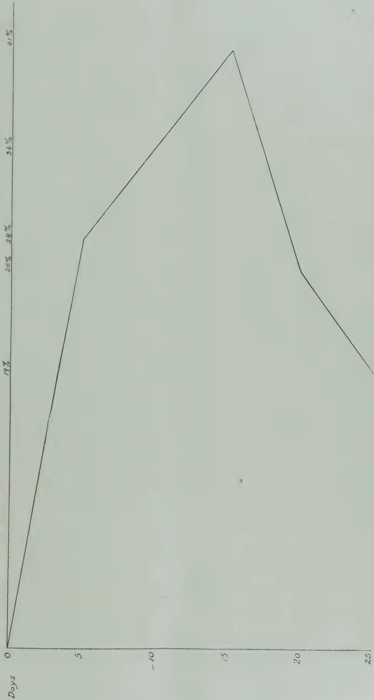


45------------------------------------------------

26

[JANUARY, 1921.

Chart 2. Percentage reduction of gullery inmates due to painting.

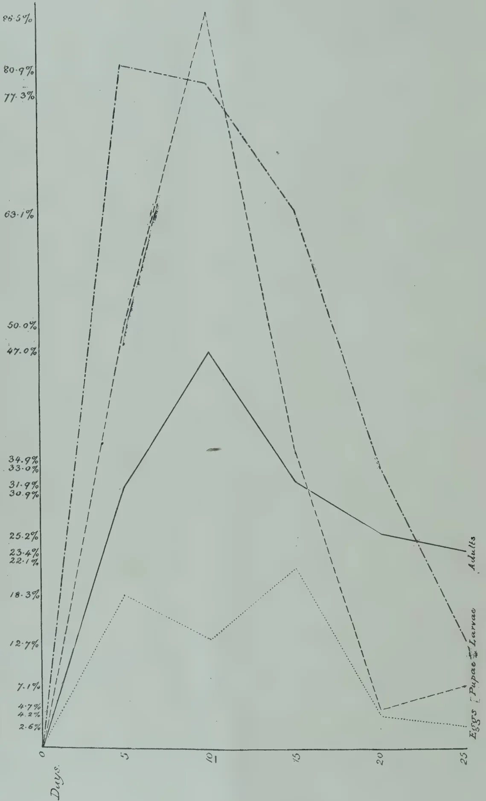

The graph illustrates the percentage reduction of gullery inmates due to painting over a 25-day period. The Y-axis represents the percentage reduction, ranging from 0% to 86.5% in increments of 7.1%. The X-axis represents time in days, from 0 to 25. Four data series are plotted: Adults (solid line), Larvae (dashed line), Pupae (dotted line), and Eggs (dash-dot line).

<table border="1">
<thead>
<tr>
<th>Days</th>
<th>Adults (%)</th>
<th>Larvae (%)</th>
<th>Pupae (%)</th>
<th>Eggs (%)</th>
</tr>
</thead>
<tbody>
<tr>
<td>0</td>
<td>0</td>
<td>0</td>
<td>0</td>
<td>0</td>
</tr>
<tr>
<td>5</td>
<td>31.9</td>
<td>80.9</td>
<td>18.3</td>
<td>77.3</td>
</tr>
<tr>
<td>10</td>
<td>47.0</td>
<td>86.5</td>
<td>12.7</td>
<td>77.3</td>
</tr>
<tr>
<td>15</td>
<td>31.9</td>
<td>63.1</td>
<td>23.4</td>
<td>63.1</td>
</tr>
<tr>
<td>20</td>
<td>25.2</td>
<td>34.9</td>
<td>4.2</td>
<td>34.9</td>
</tr>
<tr>
<td>25</td>
<td>22.1</td>
<td>12.7</td>
<td>7.1</td>
<td>22.1</td>
</tr>
</tbody>
</table>

46------------------------------------------------

JANUARY, 1921.]27

The examination of galleries after treatment indicated that a large number of gallery inmates had been destroyed by painting, but the question arises whether a maximum reduction of 47% of adults, 86.5% of pupæ, 80.9% of larvæ and 22.1% of eggs warrants an expenditure of at least Rs. 30 per acre. There is no doubt that this figure would be increased to Rs. 36 per acre in old and well grown tea.

The merits claimed for this form of treatment are two fold, firstly that it causes the destruction of a large number of inmates in the pruned bush, between the time of pruning and the output of new shoots, and secondly that the eyes of the pruned bush are protected from invasion by beetles owing to the repellent nature of the paint, resulting in a saving of branches which will otherwise become "diebacks." In regard to these claims, it should be remarked that, in spite of the satisfactory results obtained in the Sarnia experiment, which as pointed out was carried out under the most ideal conditions such as would rarely occur in general practice, there are still a considerable number of gallery inmates which remain unaffected by treatment. In regard to the second claim, the instances where pruned bushes are reinvaded are by no means common and it is considered that the cause of dieback branches in shot-hole borer districts is more often due to borers left in the branches at pruning time than to those which enter subsequently.

In reference to the general question of treatment of the pruned bushes by painting methods, it should be pointed out that there are considerably more galleries in the prunings than in the pruned bush and that therefore this treatment is valueless unless prunings are also disposed of in a manner which will insure the destruction of a large percentage of gallery inmates. The method of disposal recommended by MR. SPEYER consisted in the removal of leaves and small branches for burial and burning the heavier wood where most of the galleries are situated. This recommendation is sound from the point of view of borer destruction and at the same time endeavours to affect a compromise for the benefit of those who are convinced that agriculturally the burial of prunings is essential, all green matter being returned to the soil by this method. Unfortunately, however, this form of pruning-disposal is seldom resorted to, chiefly possibly on account of the extra expense involved.

When MR. SPEYER recommended the use of his paint-mixture he intended that prunings should be disposed of in the manner suggested by him, as otherwise mulching or lightly burying will enable more beetles to escape from the prunings than from the pruned bush had it remained unpainted. Until therefore it is decided to destroy all inmates of galleries in the prunings by the method advocated by MR. SPEYER, by burning wholesale, or by burial with some substance, if such can be discovered, destructive to the inmates of galleries, it is useless to consider treatment by painting methods.

There is a common impression, among planters, that a bush once painted is immune from further attack for a considerable period—certainly throughout the pruning interval, but it is obvious that all wood formed subsequent to pruning can receive no protection against invasion by beetles.

The removal of infested branches at definite intervals during the periods between prunings, the adoption of which was recommended by MR. SPEYER in conjunction with treatment by painting, while sound in theory is impossible in practice, causing a mutilation of bushes which would never be agreed to by planters.

47------------------------------------------------

28[JANUARY, 1921.

In view therefore of the extremely high cost of treatment by painting with SPEYER'S paint-mixture, the insufficient benefits derived and the damage done to the bushes, it is not considered that this form of treatment should be recommended for use on Shot-hole Borer estates.

#### CASTOR AS A TRAP TREE.

The experiment at Hantane Estate, with a view to testing the attractive powers of castor oil plant, when interplanted with tea, is still in progress. The original plants were obtained from seed, planted out direct in the field on December 25th, 1919, but for various reasons only 25% of the plants became established. Seed was provided to replace missing plants in July of this year, but unfortunately it appears that most of the young plants have become attacked by "rust" and many of them are dying.

Heavy invasions of castor plants by this borer have been observed in the Badulla district, and the opinion is being freely expressed by many planters that the compulsory eradication of castor in the tea-growing areas, has resulted in Shot-hole Borer turning its attention to tea, but, while this is possible, there is no evidence at present to confirm this view.

A second experiment with castor as a trap-tree is to be commenced shortly at Sarnia Estate but it will be on a smaller scale than the experiment in progress at Hantane Estate.

#### "CONTROL PRUNING."

An attempt to limit the reproduction of borers by so-called "control pruning," i.e. the removal of infested branches at intervals, was made at Sarnia Estate in two fields of 23 and 21 acres respectively. On August 1st the former field was twelve months and the latter field ten months from last pruning. Both fields were examined on July 30th with the object of ascertaining the degree of infestation by borer. In the 23 acre field 60% of the bushes were infested and 48% in the 21 acre field.

Pruners commenced in the 23 acre field on August 1st, but the removal of infested branches caused so severe a mutilation of the bushes that pruning was stopped at the request of the Superintendent of the estate. The pruners were then transferred to the 21 acre field and were instructed to remove all branches containing galleries. This again resulted in a very severe mutilation of the bushes, some of them being almost collar pruned in the endeavour to remove occupied galleries. This attempt was therefore also abandoned.

The scheme of "control pruning" aims at eradicating the borers that have become established in a field when the attack first becomes apparent after pruning. It is, however, obviously of little value to remove only those galleries in the smaller stems and leave occupied galleries in the heavier wood. It is feared therefore that this form of control is not possible, as if the work is thoroughly carried out more damage is done by the pruners than by the borers.

#### MANURIAL EXPERIMENTS.

Manurial trials have been arranged, and will be commenced when the rains are expected, in order to test the effects of Nitrogen, Potash and Phosphoric Acid upon borer incidence. Plots of equal size have been selected in three fields, recently pruned, one year and two years from pruning respectively. The manures to be tried are Nitrate of Soda, Nitrate of Potash,

48------------------------------------------------

JANUARY, 1921.]29

Sulphate of Ammonia, Muriate of Potash, Basic slag, Ephos phosphate, Nitrolim, and a mixture, in equal proportions, of Ephos phosphate and Nitrate of Soda. For the sake of completeness Cattle manure at the rate of 7 tons per acre, lime at 5 tons per acre, and dadap and "boga" loppings also at 5 tons per acre are to be also included. Basic slag is to be applied at the rate of 300 lb. per acre and the other manures mentioned at 200 lb. per acre. Each plot will consist of approximately 400 bushes and there are sixteen plots of equal size in each field, four of which will be controls receiving no treatment.

The experiments should prove of considerable interest and it is hoped that they may be continued over a series of years. It is anticipated that some information may be available from these trials regarding the process of gallery-entrance healing which appears to be stimulated by the application of certain manurial mixtures. It is hoped also that certain plots may indicate some degree of immunity against attack by borer.

The manures for this experiment have been most generously donated by the Colombo Commercial Company.

#### HEALING OF GALLERY ENTRANCE HOLES.

The healing of entrance holes has been very marked in some fields on Sarnia Estate during the period under review. This subject was referred to in a previous report (Progress Report January—June 1920) and the opinion was then expressed that the process of healing appeared to be seasonal. It now appears that the process can be in operation at any season and it is probable that it is stimulated by the application of certain manures.

During August an examination of the 50 acre field of the Mahattenne Division of Sarnia Estate was made while pruning was in progress, in order to decide whether the field was sufficiently infested for an experiment with the burial of prunings. It was found that no less than 75% of the galleries had completely healed. Of the remaining 25% which had not healed, 14% were empty, and 11% occupied. The occupied galleries contained per gallery the following inmates:—Adults 1'2, pupæ 2, larvæ 7 and eggs nil. This result was most unexpected and no previous instance has been observed where so slight an infestation occurred at pruning time. The Superintendent of the estate reported a heavy infestation of this field at the end of the second year from pruning, an opinion which is confirmed by the very large number of galleries which the bushes had, at one time, possessed, but which have since become occluded.

It is interesting to record that this field, on entering its third year from last pruning was given an application of 500 lb. of general manure mixture, which was 200 lb. in excess of any previous application.

Another field treated in the same manner was examined shortly after pruning and it was found that 63.7% of galleries had healed in the pruned bushes and 51.1% in the prunings themselves.

Gallery entrance healing has also been observed to be actively in progress in some fields on other estates in the Badulla district and entirely absent on others and the factor which influences this condition is being sought for. The manurial experiments which are to commence shortly on Sarnia Estate should throw some light on the subject, which is of considerable interest and may be an important factor in the control of this pest in the future.

49------------------------------------------------

30[JANUARY, 1921.

### NATURAL ENEMIES OF *XYLEBORUS FORNICATUS*.

*Phortica Xyleboriphaga*. The immature stages of this Drosophilid fly have again been observed. Of 1,300 galleries examined at Sarnia Estate 6.8% contained some stage of this fly, larvæ numbering 114 and puparia 43, respectively 1.78 individuals per gallery, or 12 per gallery of the total galleries examined.

The galleries which contain the larvæ of this fly almost invariably emit a putrid odour and dead borer larvæ occur, but whether they have been destroyed, in all cases, by the larvæ of this fly, or whether their death from other causes, and subsequent decomposition, has attracted this fly for purposes of oviposition is not definitely ascertained. Instances have been observed where the larvæ of this fly have attacked and destroyed the larvæ and pupæ of *Xyleborus fornicatus*, the fly larvæ disappearing beyond view into the body of their hosts.

*Nemosoma* ? sp. It was reported from one estate that this Trogositid beetle was present in such numbers as to be exercising a vigorous control upon the activities of Shot-hole borer.

A visit was paid to the estate in question to investigate the matter, but no evidence could be found in support of the report. No sign of the predaceous beetle could be found and 75.3% of the galleries examined were occupied by all stages of *X. fornicatus*. Of the bushes examined 63.3% contained galleries and as stated above 75.3% of these were occupied.

One single specimen of this beetle has been found in 1,300 galleries examined at Sarnia Estate during the period under review.

### BURIAL OF PRUNINGS EXPERIMENT.

Arrangements have been completed to commence an experiment to ascertain the effects of various fertilizers and insecticides upon the inmates of galleries when prunings are buried with these substances. Eighteen different substances are to be tried. The object of the experiment is to discover if any of these substances has a deadly action upon the inmates of galleries when buried with prunings so that, if possible, some recommendation may be made regarding the treatment of prunings to insure the destruction of borers when prunings are to be buried. The experiment is only in the nature of a preliminary test and if any substance, or substances, used in the experiment indicates any possibility of success, investigations will be continued accordingly.

### DESTRUCTION OF "AMBROSIA" FUNGUS.

The possibility of destroying the so-called "ambrosia" fungus, upon which the larvæ and adults subsist in the galleries, has been considered. The cut ends of infested prunings have been placed in solutions of various strengths of Copper Sulphate and Iron Sulphate. Copper Sulphate had an immediately toxic effect upon the prunings, all leaves withering at once, but those placed in Iron Sulphate did not suffer in the same way although the wood and walls of the galleries became deeply stained and all galleries were vacated by the beetles.

Copper Sulphate applied to the growing bush either in the form of crystals up to 1,500 lb. per acre, or in the form of a 20% solution appeared to have a decidedly stimulating effect and trials are contemplated with various substances on a small scale upon infested bushes.

F. P. JEPSON,  
Assistant Entomologist.

50------------------------------------------------

JANUARY, 1921.]31

## THE MOSQUITO-BLIGHT OF TEA.\*

You will ere this have seen a copy of Part IV of the QUARTERLY JOURNAL OF THE SCIENTIFIC DEPARTMENT for 1919, in which I have published a short note on the present state of the mosquito-blight enquiry, which, to some extent, anticipates what I have to say to you to-day. I shall not, therefore, confine myself, as I at first intended, to giving you a short summary of the results achieved along the lines which appear to me to be the most promising from the point of view of complete control, but shall endeavour to give you as complete an idea as possible in the short space of time at my disposal of the nature of the problem we are endeavouring to solve, of the methods which have been followed in its investigation, and of the progress which has been made towards its solution.

First, a few general remarks on the question of insect control, as applied to a problem of this nature. We have an insect feeding on a plant, situated in a given environment. There are thus three factors—the insect, the plant, the environment, the mutual reactions of which culminate in a result which we estimate by the amount of damage done to the plant. Now the environment reacts both on the insect and the plant. Changes in the characteristics of the environment produce changes in the vitality of both the insect and the plant, these changes being most noticeable in extreme cases, where the insect or plant is found, in the one case, to flourish, in the other case, to die. The converse reactions of the insect and plant on their environment, so far as we know at present, are so small as to be negligible. Again, the insect reacts on the plant, as we know by the loss of crop produced, and the plant reacts on the insect, for it is the source of the most important of all the factors controlling the vitality of the insect, namely, its food supply. We can then represent the condition of affairs diagrammatically, thus :—

```

    ENVIRONMENT
    /           \
  INSECT <-----> PLANT
  
```

the arrows indicating the direction in which the reactions can proceed. Four arrows are shown on the diagram, indicating the four reactions, and one of the arrows, indicating the reaction of the insect on the plant, has been made much thicker than the other three. This is the reaction which it is our ultimate endeavour to control. How is this to be done ?

The most obvious method of controlling this reaction is the direct destruction of the insect. Were this as simple as it is obvious, the problem would have been solved long ago ! There is another method, however, not nearly as obvious, but vastly more promising. It is a matter of common experience, in the case of mosquito-blight, that neighbouring areas are affected to a different degree by the pest, and that in many cases such areas may be of very small extent and quite close together, so much so that a few bushes in a section may be flushing strongly, while the rest of the section is almost shut up; or a few bushes may be shut up while the rest of the section is practically unaffected. This will occur even when no control measures of any kind are attempted. In such instances environmental conditions would

\* Address given by the Entomologist before the Committee of the Indian Tea Association (London).

51------------------------------------------------

32[JANUARY, 1921.

appear to be exactly similar in the two places, the reaction of the environment on the insect would be the same in both cases, the reactions of the environment on the plants would likewise be similar, and, as a consequence, the reaction of the plants on the insects would also be similar. These combinations of similar reactions result, on the one hand, in comparative immunity from attack and, on the other hand, in a considerable amount of damage, which is absurd, for it is a natural law that a combination of exactly similar circumstances will always produce the same results. If we refer again to our diagram we see that the environment acts on the insect in two ways, first, directly; secondly, indirectly, through the plant. Now the insect is a separate entity, complete in itself, capable of movement from one place to another. It is hardly conceivable that the direct influence of the environment on the insect would show material differences at two places so close together. The plant, however, is not a separate entity. Its existence is indissolubly bound up with the soil in which it is situated. Its reactions to environmental conditions are the sum total of the direct action of those conditions on the plant and the indirect action of those conditions brought about by its intimate connection with the surrounding soil. The soil is far from being homogenous, and we know, of course, from the results of many observations, that different soils, and closely adjacent patches of similar soil, may differ considerably in chemical composition, mechanical constitution, and physical condition at any particular time. Obviously, the reactions of a similar combination of environmental conditions on two plants may differ according as their indirect action on the plant through the soil is modified by the nature and condition of the soil itself. This brings us to our second method of approaching the problem of control, which consists in the study of the conditions under which the plants succumb to, and resist, the attacks of the pest in nature, and of the methods by which the combination of conditions under which resistance to attack is found to obtain can be brought about in practice.

The problem of mosquito-blight has, then, been approached from two different standpoints—first, the study of the methods of destroying the insect directly, second, the investigation of the conditions under which the tea bushes resist and succumb to attacks and of the means whereby these sets of conditions are caused to exist.

First, the direct destruction of the insect. This might conceivably be brought about by either natural or artificial means of control. Natural means consist in the discovery and introduction of parasites and predators which, by feeding on the insect, will affect a diminution in its numbers. Artificial means consist in attempts to destroy the insect by collection in the various stages, by mechanical means such as light traps, attractive baits, etc., or by the use of insecticides in the form of sprays or gases.

Several natural enemies of *Helopeltis* are known. Certain species of the preying mantis, certain predaceous grasshoppers, spiders, some predaceous bugs, will all feed on the tea mosquito, and at certain times even dragon-flies have been observed to follow the pluckers and catch the insects as they flew from the disturbed bushes. None of these feed solely on the mosquito, all are universally distributed throughout the tea districts, none flourish to a greater extent on gardens which offer an abundant supply of food in the

52------------------------------------------------

JANUARY, 1921.]33

shape of tea mosquitos than on gardens where the tea mosquito is not to be found. Two parasites have been observed. The more important of these is a *Mermithid* worm, the young stage of which is found in the bodies of tea mosquitos during the first half of the season. Parasitism by this worm allows the insect, in most cases, to reach maturity, but effectively destroys its powers of reproduction. This worm is already distributed throughout the tea districts and nowhere parasitises more than 2 per cent. of the insects caught, and has the further disadvantage that it, or some closely allied species, likewise parasitises a species of spider which feeds on tea mosquito. The other parasite is a small parasitic insect somewhat related to the ichneumons, and only one case of this has ever been noticed. It may be that in China and Japan, where damage by *Helopeltis* never seems to be reported there is a parasite which effectually keeps the insects down and which might be successfully imported, but the indigenous parasites are not at all hopeful.

Before discussing artificial methods of control, it is advisable that we should consider the salient points in the life history and bionomics of the insect, as, without a knowledge of this, it is impossible to realise the difficulties in the way of control by artificial means. First, the tea mosquito, as it has unfortunately been named, is not a mosquito at all, but a true plant bug. It is important to remember this, as the non-recognition of this fact sets us wrong at the very outset. Methods of Control which are often advocated for the destruction of mosquito larvæ are not applicable to the so-called mosquito-blight of tea. The larva of the domestic mosquito is a wriggling worm-like grub, which lives in water; the larva of the tea-mosquito is an insect, closely resembling the adult in all save the possession of wings, which spends its existence on the tea-plant, and never goes near water at all. The life cycle of *Helopeltis* is as follows:— The eggs are laid in the green stem, in the midrib of the leaves, and in the leaf-buds of the plant, and are entirely concealed within, and protected by, the plant tissues. During the cold weather the eggs appear to be laid mainly at the base of the unopened buds which are to be found on the branches, and near the base of the midrib of the older leaves. At the beginning of the season the green stems of the young shoots which come away inside the bush are the spots mostly favoured, though the eggs can also be found in the young shoots at the top of the bush. Later, a large proportion of eggs are found in the flush, and at the height of the season eggs are being laid in the young flush and in the broken ends of shoots from which the leaf has been plucked. The time of hatching varies from three to four weeks in the cold weather to six days in the height of the season. The young mosquito hatches from the egg as an active insect, provided with a perfect sucking proboscis, and capable of feeding on the young shoots. In this stage it is characterised by having long hairs scattered over its body, and there is no trace of either the spine which is to be found on the back in the older stages, or of the wings. After a day or two the insect moults, and the spine on the back appears, while the long hairs have disappeared. There is as yet no trace of the wings, which first appear at the next moult, and the young insect moults again three times after that, the wings and spine becoming more strongly developed at each moult, and after the fifth moult the insect emerges in the adult winged condition. During the whole of the time spent in the young stages, which may occupy a

53------------------------------------------------

34[JANUARY, 1921.

period varying from a month or more in the cold weather to a week or ten days at the height of the season in July, the insect feeds voraciously on the tea, but does not reproduce its kind. Reproduction takes place only in the adult stages, and the female may live for two months or more, and may lay as many as 500 eggs, singly or in pairs, and scattered over a considerable area.

In the case of many insects, for example, the tea looper, there are a definite number of broods per year, and it is possible to state definitely that, say, the second brood of the insect will be in a certain stage at a certain time of year. In the case of the tea-mosquito this is not so, for one might expect to find it, and one does find it, in all stages at any time of year. This state of affairs caused by the fact that the period during which the female will live and lay eggs is longer than the period of time necessary for the eggs to hatch and the insects from them to become adult. I have supposed that an adult female tea-mosquito commences to lay eggs on the first of April. She will then continue to lay eggs for two months, that is, to the end of May. The first-laid eggs, deposited in April, will hatch out in nine or ten days, while those deposited in May will hatch out in six to seven days. Young insects, from eggs laid by this female, will therefore be emerging between the 9th of April and the 6th of June. The first insects to hatch, which emerge in April, will take twelve days to attain maturity while those which hatched latest, in June, will become mature in about nine days. Insects from the eggs laid by this female will then be attaining maturity between, say, the 21st of April and the 15th of June. Now, these can begin to lay eggs two days after attaining maturity, and may continue to do so for two months, so that the first eggs laid will be deposited on about the 23rd of April, while the females which last emerge may continue to lay eggs until the middle of August. Thus the eggs which will give birth to the second generation (or brood) are being deposited between the 23rd of April and the 16th of August, and, by following a process of reasoning similar to that followed in connection with the first generation, we find that young forms will be present between the 2nd of May and the 3rd of September, and that adults will emerge between the 14th of May and the 3rd of September, and that the eggs which are to give rise to the third generation will be deposited between 16th of May and about the 5th of November. Following through in a similar manner with the next two generations, we find that, by the time fourth generation has been attained, egg-laying, by individuals of that generation alone, will be going on the whole year through. In the meantime, it will be noticed that certain individuals of the second generation are in existence contemporaneously with individuals of the first generation, and that individuals of the third and fourth generations also will appear before the first generation has died out. And so it goes on throughout the season—beginnings of successive generations continue to appear at intervals of a month or less, less than three weeks, indeed, during the height of the season; and we find that by August we may have individuals of seven generations present in different stages at the same time. Also, we see that while four generations will carry the insect through the year it may, in the same period reproduce itself to the fourteenth generation.

54------------------------------------------------

JANUARY, 1921 ]35

I have gone into this in some detail, as it has an important bearing on the question of artificial control. From what I have said, it will be seen that we have to deal, at one and the same time, with egg, young, and adult stages of several generations, some of which are the result of rapid reproduction, some of which are the result of slow reproduction, with corresponding difference in vitality. There are no specific periods during the season at which all the insects are in the egg, larval, or adult stages and at which the application of ovicides, larvicides, or insecticides can be recommended with confidence. If the adults could be attracted to light, or to attractive bait, over an extended period, good might be expected to accrue, but all experiments in this direction have given negative results. No oviicide is known which will kill the eggs without damaging the young shoots, but it is possible in the cold weather, after stick pruning, to destroy most of the eggs (perfect application would destroy all) which are present in the buds on the bushes by the application of an alkali wash. Here we are faced by the difficulty that, if this be done on high pruned tea, it receives a slight check and comes away later, as all the buds are of course killed ; and, unless the treatment be carried out thoroughly over the whole garden, and on any adjacent gardens, insects from other places will get into the tea soon enough to cause appreciable damage to the bushes.

Spraying with insecticide to kill the insects is of value where the attack is confined to small area, if the treatment is commenced early in the season, and if the work be carried out efficiently and repeatedly. The majority of insects killed by such spraying are the young forms. These, when the bush is disturbed, run down the branches and take shelter at the base of the leaf stalks. If the bush be thoroughly soaked, the insecticide runs down the branches and collects in drops at those places, so that the young insects are immersed in a globule of liquid, from which they cannot readily escape, and are killed. For this sort of work, lime-sulphur is an efficient spray, and we find in practice that numbers of the adults are also killed by it. Many, however, escape the spray, and the work must be done several times. Spraying of this nature, carried out repeatedly during the season on a plot of  $3\frac{1}{2}$  acres, kept the pest in hand, but by no means eradicated it. There are always the eggs, which are not affected by such treatment, and a few insects always escape to carry on. Early in the season, it is possible to notice when the young forms are emerging in greater numbers by examining the catches brought in by the children, and to apply the spray fluid at those times. Very soon, however, this guide fails, and recourse must be had to applications repeated at least once a week. One very disheartening feature of spraying is that whereas, in a year when the pest is not so bad as usual, comparative success may be attained, the same treatment, carried out in a year when the pest is more serious, may seem to be almost without result. Spraying on a large scale, where hundreds of acres are affected, is at present impracticable. As will readily be understood from the account of the life history of the insect which has been given, and spray fluid which is to be completely successful in one application must kill the eggs, the young and the adults. The substance must, from the nature of the insect, be a contact insecticide, which will kill the insect only when applied to it. Since the insects are active, the insecticide must be sufficiently powerful to act quickly, yet it must be innocuous to the young foliage. The bushes must be thoroughly soaked,

55------------------------------------------------

36[JANUARY, 1921]

yet the ground must be covered rapidly. This necessitates a considerable outlay on machines, a considerable number of people, and thorough supervision, and at a time when all the available labour is required for the routine operations of the garden. It is conceivable that these difficulties might be overcome, but, in the absence of a perfect spray fluid one is not justified in advocating the expenditure of labour, time and money which would be necessary for treating large areas. Certain spray fluids, notably those containing safrol and pyrethrum as their principal ingredients, are excellent insecticides, but their cost is out of all proportion to their value, more especially since they will not kill the eggs, and more than one application, with an interval of not more than a week between each, is necessary.

Fumigation seems to offer more scope than spraying. This was tried with fumes of sulphur, but the erratic behaviour of the wind at that time of year militated against the success of the experiment, and the deleterious effect of the vapours on the foliage was a distinct drawback. It is reported that this treatment has lately been carried out with some success on a few gardens where mosquito-blight is not particularly severe by taking advantage of the evening breezes. We propose to try some of the lately-discovered poisonous gases at an early opportunity.

We now turn to the possibility of controlling mosquito-blight indirectly by treatment of the plants. This is a method of approaching the problem which does not appear to have received serious consideration before, but it is, I think, an enquiry which promises to afford a more reliable and practicable means of control than attempts to compass the direct destruction of the insects. Much of what I shall have to say in this connection has been anticipated by the appearance of the fourth part of the QUARTERLY JOURNAL of the Department for 1919, in which a short account of the work has been given. It will be remembered that, in the early portion of this paper, reference was made to the fact that the bushes can show resistance to the attack of the pest and that a consideration of the factors involved seemed to suggest that the nature of the soil surroundings might have something to do with the liability or otherwise of the bushes to attack. This line of enquiry has been followed up during the last few years. The first step taken was a general survey of the gardens in the different districts, an enquiry into their liability or otherwise to attack, and an examination into the characteristics of the soils, with a view to ascertaining whether any particular feature in the soils could be correlated with the distribution of the pest. Such was found to be the case, and it was discovered that, where the ratio of available potash to available phosphoric acid is low, there is a greater liability to attack than where this ratio is high. Details of these differences are given in my paper, from which I will now quote:—

“The soils in the Duars can be separated into four main types, though there are of course intermediate varieties:—

(1) The Dam Dim type, a light sandy loam falling into the division 1, 2\*. Gardens on this type of soil are exceedingly liable to suffer from attack,

---

\* See SUGGESTIONS FOR MANURIAL TREATMENT OF TEA SOILS by HOPE and CARPENTER.

56------------------------------------------------

JANUARY, 1921.]37

(2) The Dina Toorsa type, a heavier loam falling into the division 4, 2 Gardens on this soil also get blight.

(3) The Red Bank type, a clay soil falling into the division 4, 1, on which many gardens have remained free from attack for years, although surrounded by blighted gardens, and on which, in some places, *Helopellis* is beginning to obtain a foothold.

(4) The Hantapara Plateau type, a heavy loam falling typically into the 4, 2 division, and on which mosquito-blight is now very serious.

The following table shows the relationships between the types, the figures given being the average figures obtained from the examination of a large number of soil analyses:—

<table border="1">
<thead>
<tr>
<th>Soil Type</th>
<th>Total Potash</th>
<th>Total Phosphoric Acid</th>
<th>Available Potash</th>
<th>Available Phosphoric Acid</th>
<th>* Percentage availability of Potash</th>
<th>* Percentage availability of Phosphoric Acid</th>
<th>Available Potash<br/>Ratio<br/>Available Phosphoric Acid</th>
</tr>
</thead>
<tbody>
<tr>
<td>Lam Dim Type</td>
<td>- 0.377%</td>
<td>0.127%</td>
<td>0.012%</td>
<td>0.044%</td>
<td>2%</td>
<td>36%</td>
<td>0.340</td>
</tr>
<tr>
<td>Dina Toorsa Type</td>
<td>- † 0.854%</td>
<td>0.170%</td>
<td>0.018%</td>
<td>0.053%</td>
<td>† 3%</td>
<td>31%</td>
<td>0.487</td>
</tr>
<tr>
<td>Red Bank Type</td>
<td>- 0.697%</td>
<td>0.100%</td>
<td>0.015%</td>
<td>0.014%</td>
<td>2%</td>
<td>14%</td>
<td>1.114</td>
</tr>
<tr>
<td>Hantapara Plateau Type</td>
<td>- 0.444%</td>
<td>0.246%</td>
<td>0.011%</td>
<td>0.063%</td>
<td>2%</td>
<td>26%</td>
<td>0.195</td>
</tr>
</tbody>
</table>

From these figures it will be seen that the relationships between the available potash, available phosphoric acid ratios referred to above are found to exist, even after the examination of a large number of soil analyses. Further, it may be seen that in the Red Bank Soils there is a much smaller proportion of the total phosphoric acid present in a readily available form, and that the percentage availability of the potash is about the same in all four types. In certain parts of the Red Bank, however, gardens are beginning to suffer seriously from mosquito-blight, notably in the Nagrakata district. A comparison of the figures obtained in this district with those for the remaining typical Red Bank Soils is interesting:—

<table border="1">
<thead>
<tr>
<th>Soil Types</th>
<th>Total Potash</th>
<th>Total Phosphoric Acid</th>
<th>Available Potash</th>
<th>Available Phosphoric Acid</th>
<th>Percentage availability of Potash</th>
<th>Percentage availability of Phosphoric Acid</th>
<th>Available Potash<br/>Ratio<br/>Available Phosphoric Acid</th>
</tr>
</thead>
<tbody>
<tr>
<td>Red Bank Type</td>
<td>- 0.697%</td>
<td>0.100%</td>
<td>0.015%</td>
<td>0.014%</td>
<td>2%</td>
<td>14%</td>
<td>1.114</td>
</tr>
<tr>
<td>Nagrakata Type</td>
<td>- 0.560%</td>
<td>0.147%</td>
<td>0.019%</td>
<td>0.028%</td>
<td>3%</td>
<td>18%</td>
<td>0.785</td>
</tr>
</tbody>
</table>

\* Percentage availability means the percentage of the total amount which is present in an available form.

† These figures are for one soil only. There are no figures for total potash available for the others.

57------------------------------------------------

38[JANUARY, 1921.

Another comparison can be made between analyses of Red Bank Soil made by DR. MANN at a time when there was no mosquito-blight on the gardens, and the analysis of a sample of soil taken from an area on the same garden which now suffers from mosquito-blight.

<table border="1">
<thead>
<tr>
<th>Soil Types</th>
<th>Total Potash</th>
<th>Total Phosphoric Acid</th>
<th>Available Potash</th>
<th>Available Phosphoric Acid</th>
<th>Percentage availability of Potash</th>
<th>Percentage availability of Phosphoric Acid</th>
<th>Available Potash Ratio<br/>Available Phosphoric Acid</th>
</tr>
</thead>
<tbody>
<tr>
<td>Dr. Mann's analyses</td>
<td>0.82%</td>
<td>0.09%</td>
<td>0.029%</td>
<td>0.009%</td>
<td>3%</td>
<td>10%</td>
<td>3.222</td>
</tr>
<tr>
<td></td>
<td>0.84%</td>
<td>0.06%</td>
<td>0.019%</td>
<td>0.019%</td>
<td>2%</td>
<td>15%</td>
<td>2.111</td>
</tr>
<tr>
<td>Recent analysis</td>
<td>0.77%</td>
<td>0.081%</td>
<td>0.007%</td>
<td>0.008%</td>
<td>1%</td>
<td>10%</td>
<td>0.875</td>
</tr>
</tbody>
</table>

There has been a loss in mineral constituents, and the balance between the two has been entirely upset, bringing about an approximation to grey loam conditions as regards the potash, phosphoric acid ratio, as in the case of the Nagrakata soils.

Turning now to Cachar soils, it is possible to divide them into teela, flat and bheel soils. There is not as yet, however, sufficient material to hand to enable one to work out the mechanical types, and the mechanical analyses available in any case show considerable variation within the limits of one class. It has, however, been possible to group together a large number of analyses from gardens which, though on widely different types of soils fall into three classes, *viz*:—(1) those which remain free from blight, (2) those which get it badly at times, and remain comparatively free at other times and (3) those which are always attacked.

<table border="1">
<thead>
<tr>
<th>Type</th>
<th>Total Potash.</th>
<th>Total Phosphoric Acid.</th>
<th>Available Potash.</th>
<th>Available Phosphoric Acid.</th>
<th>Percentage availability of Potash.</th>
<th>Percentage availability of Phosphoric Acid.</th>
<th>Available Potash Ratio.<br/>Available Phosphoric Acid.</th>
</tr>
</thead>
<tbody>
<tr>
<td>(1) ...</td>
<td>0.440 %</td>
<td>0.168 %</td>
<td>0.020 %</td>
<td>0.010 %</td>
<td>4 %</td>
<td>6 %</td>
<td>2.000</td>
</tr>
<tr>
<td>(2) ...</td>
<td>0.188 ,,</td>
<td>0.056 ,,</td>
<td>0.003 ,,</td>
<td>0.003 ,,</td>
<td>1 ,,</td>
<td>5 ,,</td>
<td>1.000</td>
</tr>
<tr>
<td>(3) ...</td>
<td>*0.499 ,,</td>
<td>0.115 ,,</td>
<td>0.010 ,,</td>
<td>0.029 ,,</td>
<td>*3 ,,</td>
<td>25 ,,</td>
<td>0.345</td>
</tr>
</tbody>
</table>

Here, again, we see the same differences—an extremely low value for the available potash available phosphoric acid ratio in the soils of blighted gardens, and a high percentage availability of phosphoric acid. Group (2) again occupy an intermediate position, and although at first sight the percentage availability of phosphoric acid appears to be low, this is due to the poverty of the soils, and when compared with the percentage availability of the potash the ratio can be seen to be 5 to 1, as compared with  $1\frac{1}{2}$  to 1 in (1) and 8 to 1 in (3). Thus, in the two districts where mosquito-blight is always severe, differences in the severity of attack can be correlated with differences in the chemical composition of the soil, as above described.

\* Only one figure available.

58------------------------------------------------

JANUARY, 1921.]39

The question then arises as to how differences in the chemical composition of the soil can affect the insect. No living thing can flourish in the absence of an abundant and suitable food supply. The bush has to depend on the soil for nourishment, the insect relies on the bush. The character of the nourishment afforded to the insect by the bush will depend on the nature of the soil. An attempt was made to ascertain whether the feeding habits of the insect were at all connected with the potash, phosphoric acid ratio. Leaf was plucked from three gardens throughout the season. On one garden the tea was shut up by the end of August, on another the pest was serious, but the tea never quite shut up, while the third remained practically free from the pest. It can be seen that in the case of the garden which remained unblighted the ratio of potash to phosphoric acid remained fairly constant throughout the season. In the other two gardens, as the percentage of punctured leaves plucked from the tea became greater, the ratio of potash to phosphoric acid increased, showing the greatest rise in the garden which shut up completely. Thus the relationship between the insect and the bush is in some way connected with the potash and phosphoric acid in the leaf, while the distribution of the pest can be correlated with differences in the relation of these substances to each other in the soil.

The question now arises as to whether these relationships are due to a more or less accidental preference of the insect for a certain type of bush, or to the fact that the pest cannot flourish to any extent on bushes of a certain character. From general observations the latter supposition seemed the more probable, as otherwise the factor of "jat" of bush might be expected to have more effect, but experiments were tried, by keeping specimens of *Helopeltis* under observation and feeding them on leaves taken from bushes which showed liability to attack in the one case, resistance to attack in the other. It was found that the insect flourished in the former case, and did much damage to the shoots, while in the latter case they did little or no damage to the shoots, became listless, and soon died. Not only so, but it was found that insects which had become listless and had ceased to feed on the leaf from resistant bushes, could be brought round again by giving them leaf from bushes which had been seriously affected in the field, and that they would feed ravenously, and soon regain their former vigour. This showed that the insects did not flourish on bushes which resist attack, and points to the fact that bushes can attain a condition in which mosquito-blight cannot flourish on them.

The next thing was to endeavour to ascertain whether bushes in the field could be brought into a condition in which they would resist attack. The first step taken was the obvious one of adding potash manures to the soil and recording the differences in intensity of attack produced. The first experiment gave hopeful results, and a small dressing of sulphate of potash applied somewhat late in the season produced a distinct diminution in the intensity of attack. Further experiments were carried out on a more extensive scale on soils of different types, and results were not obtained in all cases. Where results were obtained, it was found that small dressings at frequent intervals gave the best results on light soils, while comparatively heavy dressings only gave a temporary effect on heavy soils, and small dressings had no effect. It struck the writer, from his observations and

59------------------------------------------------

40[JANUARY, 1921.

certain results published by other investigators, that when potash manures are added to the soil a certain proportion might be fixed and rendered non-available, this proportion being perhaps controlled by the percentage availability of the potash in the soil itself. The next step was therefore an experiment carried out on a garden where potash manures had shown little or no result, and consisted in giving an enormous dressing of potash to the soil, so as to allow of a distinct increase being made in the available potash in the soil, even though this fixation took place. This did not cause the mosquito-blight to lift, but whereas the surrounding tea, and neighbouring areas manured with light dressings of potash, became worse as the season went on, the area treated with the heavy dose of potash became no worse.

Thus the manuring experiments, while they afforded distinct evidence that potash did, in some cases, do good, were irregular, and far from satisfactory in that it became obvious that the factors causing the bush to be unable to benefit from the potash present in the soil also prevented it, to some extent, from benefitting from the potash manures added, and it still remained to be proved that if the bush could only get the necessary potash it would throw off the blight.

To do this it was evident that the soil must be eliminated from the experiments and direct injection of the bushes tried. In this connection the writer was fortunate in meeting DR. GOUGH, of the Ministry of Entomology in Cairo, who gave him valuable information and advice culled from his experience in this line of work. As a result experiments were carried out during the past season in which bushes which were absolutely shut up by the blight were directly injected with potash. These bushes, after a short interval, have thrown off the pest and given splendid flushes, while untreated bushes in the vicinity remained shut up. The writer has spent a considerable time in watching these bushes, and it is interesting to note that the field observations thus made confirm the observations, referred to above, made with mosquitos in confinement. Tea-mosquito after tea-mosquito alighted on the treated bushes, prodded its proboscis into a few leaves without doing any appreciable damage, and then flew to a neighbouring untreated and already attacked bush, and remained there to feed. This is the most convincing point of all, for it is possible that the addition of potash might have forced leaf through by its stimulating effect alone, and it was not until one observed that the insects attempted to feed on the treated bushes, and gave it up, that one was justified in assuming that the desired result had been achieved."

A hearty vote of thanks was given to MR. ANDREWS for his address, which was greatly appreciated by the Committee, and for the trouble he had gone to in preparing it.—QUARTERLY JOURNAL OF SCIENTIFIC DEPT. OF INDIAN TEA ASSOCIATION, Part 111, 1920.

60------------------------------------------------

JANUARY, 1921.]41

# LIVE-STOCK.

## FEEDING OF MILCH COWS.

J. C. DRIEBERG.

*Lecturer, School of Tropical Agriculture, Peradeniya.*

One of the important recommendations contained in the Report of the Ceylon Cattle Committee issued lately is that greater attention should be paid to feeding. In general, this holds true all the world over, but never to such an extent as in Ceylon, where there appears to be a serious lack of knowledge of the proper method of rationing dairy stock. And the importance of this part of the dairy business becomes all the greater in view of the growing popularity of dairying in Ceylon, not only as a side pursuit, but also as the main source of income of a great many amateurs. The margin of profit obtained at present could be greatly enhanced; but, in not a few instances, it appears as though the returns do not sufficiently compensate the dairy owner for all the trouble expended.

The indigenous cattle of Ceylon are admittedly unfit for dairy or draught purposes; and therefore improvement of the breed is necessary. But it will be some time before the results of this line of work could be appreciably felt. The raising of the standard of local animals, as we have them, however, could be materially effected by sufficient attention being paid to proper care and judicious feeding.

At the present time, Ceylon relies solely on imported animals, especially from Australia and India, for dairy and draught work. The outcome of this is a very heterogenous mass of cattle as the result of indiscriminate crossing, the precise value of which for dairy purposes cannot well be estimated. There is no doubt that the majority of these animals would turn out well-provided, of course, that they are cared for and fed properly.

But unfortunately there is a great lack of knowledge of the science of feeding; and this affects not only the condition and usefulness of the animal; but at the same time causes an unnecessary drain on the resources of the dairyman, and consequently reduces his margin of profit very materially.

Before discussing conditions peculiar to Ceylon, it would not be out of place briefly to indicate the principles of feeding, in the hope that this would prove of benefit to the general reader and especially the Ceylon dairyman.

What is the function of food? In general terms the duty of food is (1) to supply heat to the body; (2) to provide energy for doing work; (3) to replace wasted tissue; (4) to form new tissue required for growth. Work, it must be understood, is of two kinds—internal work concerned with the vital functions of the system; and external, as in the case of the draught bull or milking cow.

A certain amount of food is required merely to maintain the animal; and a further amount proportionate to the amount of work done by the animal, for the production of such work.

61------------------------------------------------

42[JANUARY, 1921.

It must be borne in mind, however, that all the food is not taken into the system. A portion is not digested, and goes as waste. At the same time, the nett value of the food is further reduced as the system must expend a certain amount of energy in the process of digestion, and this energy is derived from the food supplied. An animal fed solely on straw is required to expend a greater amount of energy to digest it than can be supplied by the straw, and consequently must suffer physically.

Food is made up of chemical constituents, the most important of which, for feeding purposes, are fat (or oil,) albuminoid (protein) and carbohydrates (starch and sugar). These are present in greatly varying proportions in different food-stuffs; but for the different classes of feeding stuffs, they may be taken to be as follows:—

<table border="1">
<thead>
<tr>
<th><i>Class</i></th>
<th><i>Fat.</i></th>
<th><i>Albs.</i></th>
<th><i>Carbos.</i></th>
</tr>
<tr>
<th></th>
<th><i>%</i></th>
<th><i>%</i></th>
<th><i>%</i></th>
</tr>
</thead>
<tbody>
<tr>
<td>Fodder ... ..</td>
<td>—</td>
<td>1—2</td>
<td>15</td>
</tr>
<tr>
<td>Cereal ... ..</td>
<td>1—2</td>
<td>8</td>
<td>70</td>
</tr>
<tr>
<td>Pulse ... ..</td>
<td>2</td>
<td>15—20</td>
<td>40—50</td>
</tr>
<tr>
<td>Cake ... ..</td>
<td>10—15</td>
<td>20—30</td>
<td>20—40</td>
</tr>
</tbody>
</table>

As mentioned before, only a portion of these constituents is digested and absorbed into the system, and the amount so obtained varies as follows:—

<table border="1">
<thead>
<tr>
<th colspan="4">Digestible percentage.</th>
</tr>
</thead>
<tbody>
<tr>
<td>Fat ... ..</td>
<td>..</td>
<td>..</td>
<td>90 %</td>
</tr>
<tr>
<td>Protein and Carbohydrate ... ..</td>
<td>..</td>
<td>..</td>
<td>80 ,,</td>
</tr>
<tr>
<td>In the case of fodders ... ..</td>
<td>..</td>
<td>..</td>
<td>60 ,,</td>
</tr>
</tbody>
</table>

So that when the figures of a chemical analysis are being used, the necessary reduction for non-digestibility must not be omitted.

One other constituent, which is apt to retard digestion and detract from the value of a feeding stuff is fibre, of which only a small portion can be of any use. Fodders, of course, are highest in fibre content; some of the cakes, such as coconut, may contain as much as 12%; the cereal grains are especially free of it, although the different "brans" would be fairly high in fibre content.

The function of these constituents, in the first instance, is to supply energy, which is derived from the heat liberated when they are oxidized in the body.

The Carbohydrate material merely gives heat. At the same time, fat is an important source of heat and energy, and liberates  $2\frac{1}{4}$  times as much as an equal amount of starch. The specific duty of protein is to form tissue or flesh, and neither starch nor fat could replace protein. The formation of fatty tissue in the body is the special virtue of the fat in the food.

These constituents could be compared on their value as energy producers, carbohydrate being taken as the unit, and protein as equivalent to carbohydrate. Thus the energy value of coconut cake, the analysis of which shows it to contain 12% fat, 15% protein and 42% carbohydrate, would be

$(12 \times 2.25) + 15 + 42 = 84$ , and if linseed cake containing 10% fat, 30% protein and 36% carbohydrate

[Energy value =  $(10 \times 2.25 + 30 + 36) = 88.5$ ] is compared with coconut cake, it will be found that the former gives more energy than the latter.

62------------------------------------------------

JANUARY, 1921.]43

In this manner the energy values of two different rations could be ascertained when the total amount of each of the constituents contained is determined.

The next important point to bear in mind is that a definite proportion must exist between the amounts of the flesh forming material (protein) and the heat producers (fat and carbohydrate). This ratio is termed the "albuminoid" or "nutritive ratio," and is arrived at by reducing the value of fat to that of carbohydrate and dividing the sum by the amount of protein, as is shown in the following example :—

Suppose a ration to supply 0.8 lb. fat, 1.9 lb. protein and 9 lb. carbohydrate ; then its nutritive ratio would be

$$(0.8 \times 2.25) + 9 \div 1.9 = 1 : 5.7$$

When animals are being fed on scientific principles the nutritive ratio is an important factor, as it varies with different animals, as well as according to the amount of work performed. Thus for cattle the following standards have been found to be most suitable :—

<table>
<tbody>
<tr>
<td>Oxen at rest .</td>
<td>...</td>
<td>...</td>
<td>1 :</td>
<td>12</td>
</tr>
<tr>
<td>Oxen at work</td>
<td>...</td>
<td>...</td>
<td>1 :</td>
<td>7</td>
</tr>
<tr>
<td>Fattening cattle</td>
<td>...</td>
<td>...</td>
<td>1 :</td>
<td>6</td>
</tr>
<tr>
<td>Milch cows ..</td>
<td>...</td>
<td>...</td>
<td>1 :</td>
<td>6</td>
</tr>
<tr>
<td>Dry cows ...</td>
<td>...</td>
<td>...</td>
<td>1 :</td>
<td>9</td>
</tr>
</tbody>
</table>

The ratio for milch cows would be closer for higher yielding animals, and for heavy milkers might be 1 : 4.5.

Along with the nutritive ratio, however, we must consider the actual amount of each constituent fed to the animal. For a definite amount of work performed fixed amounts of the constituents are necessary ; anything short of this will cause the animal to fall off, while excess would only mean waste.

Thus a cow yielding 15 bottles of milk a day ought to get about 0.5 lb. fat, 2.5 lb. protein, and 13 lb. carbohydrate per day making a ratio of 1 : 5.5. The chief constituent in the case of milch animals is the protein, as this functions largely in the production of milk.

But the economic aspect of feeding must not be over-looked. Two rations, or feeding stuffs, might yield the same amount of energy and give the required amount of the constituents in the desired ratio, and yet vary in price. The owner naturally wants the cheaper feed. Or, when cost alone is considered, it might be that the more expensive feed is the more economical one in the long run.

The basis of comparison for the purpose of determining economy is arrived at by considering both the function and the value of the constituents. Both fat and protein, unlike carbohydrates, have other functions to perform, besides producing heat, moreover food-stuffs rich in protein and fat are more expensive than the starch-containing foods. Hence, when the value of carbohydrate is made the unit, that of protein and fat is considered as being 2½ times greater.

The number of food units in a sample of coconut cake, therefore, would be :

$$2.5 \times (12 + 15) + 42 = 109.5, \text{ while that in linseed cake would be}$$

$$2.5 \times (10 + 30) + 36 = 136$$

63------------------------------------------------

44[JANUARY, 1921.

That is to say that when equal quantities of these cakes are compared, linseed cake is the more nutritive, possessing as it does more food units of direct value to the animal. The cost of these cakes at present market rates works out at Rs. 7.40 for 100 lb. coconut cake and Rs. 10.65 for 100 lb. linseed cake.

The value of a *unit of food* supplied by these cakes therefore would be—  
for coconut cake Rs.  $7.40 \div 109.5 = 6.7$  cts.

„ linseed cake Rs.  $10.65 \div 136 = 7.8$  „

which shows that linseed cake costs more than coconut cake for every unit of food, by 1 cent.

But there is a great difference in the nett feeding values of these two cakes, in that coconut cake contains as much as 10—12% fibre, whereas linseed cake contains only about 5—6%. When it is remembered that the price of the feeding stuff includes what is being paid on fibre, the unit values of these two foods will probably be equal, after a deduction is made for fibre.

Coconut cake is the cheapest food-stuff available in Ceylon at Rs. 8 for 108 lb., whereas linseed cake is priced at Rs. 12.50 for 108 lb.; but it is probably more economical to feed linseed, or at least to replace the greater part of coconut cake fed by means of linseed cake; for, according to their feeding value.

$1\frac{1}{4}$  coconut cake = 1 lb. linseed cake,

though according to cost, the amount spent on 1 lb. linseed cake can purchase  $1\frac{1}{4}$  lb. coconut cake. In order to appreciate the importance of these principles, it would be well to compare two rations from different points of view.

Rations for a cow yielding 18—20 bottles or approximately 22 lb. milk (the bottle used in Ceylon varies from the standard bottle) :

(I.)

<table border="1">
<thead>
<tr>
<th rowspan="2"></th>
<th rowspan="2">% Composition</th>
<th colspan="3">Lb. fed.</th>
<th colspan="3">Amount fed in lb.</th>
</tr>
<tr>
<th>F</th>
<th>P</th>
<th>C</th>
<th>F</th>
<th>P</th>
<th>C</th>
</tr>
</thead>
<tbody>
<tr>
<td>Guinea grass</td>
<td>...</td>
<td>—</td>
<td>2</td>
<td>16</td>
<td>40</td>
<td>—</td>
<td>.8</td>
<td>6.4</td>
</tr>
<tr>
<td>Pollard...</td>
<td>...</td>
<td>3</td>
<td>10</td>
<td>55</td>
<td>3</td>
<td>1</td>
<td>.3</td>
<td>1.65</td>
</tr>
<tr>
<td>Coconut cake</td>
<td>...</td>
<td>12</td>
<td>15</td>
<td>42</td>
<td>3</td>
<td>.36</td>
<td>.45</td>
<td>1.26</td>
</tr>
<tr>
<td>Cotton seed</td>
<td>...</td>
<td>18</td>
<td>16</td>
<td>35</td>
<td>2</td>
<td>.36</td>
<td>.32</td>
<td>.7</td>
</tr>
<tr>
<td>Gram (Kollu)</td>
<td>...</td>
<td>.8</td>
<td>20</td>
<td>60</td>
<td>2</td>
<td>—</td>
<td>.4</td>
<td>1.2</td>
</tr>
<tr>
<td colspan="4"></td>
<td>10</td>
<td>.82</td>
<td>2.37</td>
<td>11.2</td>
</tr>
</tbody>
</table>

(II.)

<table border="1">
<thead>
<tr>
<th rowspan="2"></th>
<th rowspan="2">% Composition</th>
<th colspan="3">Lb. fed.</th>
<th colspan="3">Amount fed in lb.</th>
</tr>
<tr>
<th>F</th>
<th>P</th>
<th>C</th>
<th>F</th>
<th>P</th>
<th>C</th>
</tr>
</thead>
<tbody>
<tr>
<td>Guinea grass</td>
<td>...</td>
<td>—</td>
<td>2</td>
<td>16</td>
<td>40</td>
<td>—</td>
<td>.8</td>
<td>6.40</td>
</tr>
<tr>
<td>Bran ...</td>
<td>...</td>
<td>4</td>
<td>11</td>
<td>60</td>
<td>4</td>
<td>.16</td>
<td>.44</td>
<td>2.40</td>
</tr>
<tr>
<td>Coconut cake</td>
<td>...</td>
<td>12</td>
<td>15</td>
<td>42</td>
<td>2</td>
<td>.24</td>
<td>.3</td>
<td>.84</td>
</tr>
<tr>
<td>Linseed cake</td>
<td>...</td>
<td>10</td>
<td>30</td>
<td>36</td>
<td>2</td>
<td>.2</td>
<td>.6</td>
<td>.72</td>
</tr>
<tr>
<td>Black gram (Ulundu)</td>
<td>...</td>
<td>.8</td>
<td>20</td>
<td>60</td>
<td>2</td>
<td>—</td>
<td>.4</td>
<td>1.20</td>
</tr>
<tr>
<td colspan="4"></td>
<td>10</td>
<td>.60</td>
<td>2.54</td>
<td>11.76</td>
</tr>
</tbody>
</table>

64------------------------------------------------

JANUARY, 1921.]45

<table>
<thead>
<tr>
<th></th>
<th></th>
<th></th>
<th>(I.)</th>
<th></th>
<th>(II.)</th>
</tr>
</thead>
<tbody>
<tr>
<td>Nutritive ratio</td>
<td>...</td>
<td>...</td>
<td>1 : 5.6</td>
<td>...</td>
<td>1 : 5.2</td>
</tr>
<tr>
<td>Energy value</td>
<td>...</td>
<td>...</td>
<td>15.3</td>
<td>...</td>
<td>15.5</td>
</tr>
<tr>
<td>No. of food unit</td>
<td>...</td>
<td>...</td>
<td>19</td>
<td>...</td>
<td>19.5</td>
</tr>
<tr>
<td>Cost of Mixture</td>
<td>...</td>
<td>...</td>
<td>Rs. 1.05</td>
<td>...</td>
<td>Rs. 1.06</td>
</tr>
<tr>
<td>Value of unit</td>
<td>...</td>
<td>...</td>
<td>5.5 cts.</td>
<td>...</td>
<td>5.4 cts.</td>
</tr>
</tbody>
</table>

(The number of food units and the value of a unit are determined for the concentrates only.)

From the figures it will be seen that the two rations are almost identical in all respects, the slight differences being almost negligible. It might be pointed out, however, that feed 2 scores over feed 1 in respect of (1) the nutritive ratio which is closer, (2) the energy value which is higher and (3) the number of food units which are greater. Though the cost of the mixture is 1 cent higher, yet, it is the more economical since the value of a unit of food is less. The quantities of food are the same in both cases, the chief difference however, lying in the choice of the feeding stuffs. The fat content of No. 1, is in excess. The ingredients of ration 1 are those which find most favour in Ceylon. It is not quite clear why Pollard enters so largely into Ceylon feeds. Compared with bran its percentage composition is less; the value of Bombay pollard, however, being the same as bran, viz. Rs. 11/- a bag of 108 lb. Australian pollard is of higher value, viz. Rs. 15/- a bag of 108 lb. There appears to be a prejudice in favour of pollard. Bran in quantity, or by itself, is known to produce costiveness in animals; but this affect is counteracted by the addition of sufficient oil cake in the feed.

Cotton seed is a particular favourite in Ceylon; and is sometimes given in fairly large amounts. Protein is the important constituent that goes to form milk; and if protein is wanted it could be got from a pulse, or from linseed cake which contains a high percentage of it. It was pointed out previously that one of the objections against coconut cake was its high content of fibre; perhaps it is not generally known that cotton seed contains about 20% of fibre. Surely this must not be left out of consideration in judging a ration or a food-stuff from the economical point of view—apart from the fact that fibre causes an undue strain upon the digestive faculties of the animal.

Many dairymen add Gram (kollu) to their rations. Kollu and black gram (*Phaseolus mungo* var. *radiatus*) are equal in food value, but the latter is cheaper on the market.

The merits of linseed are not sufficiently appreciated in Ceylon, while two very valuable cakes, which are used in India, however, are unknown here and are not on the market, namely groundnut cake and cotton seed cake.

The price of feeding stuffs here is much too high; and if a real effort is to be made in the direction of improving cattle in Ceylon with a view to forming a dairy industry, the first step should be the reduction of the price of cattle foods, which is due, I believe to the excessive duty levied. It will be seen that the above-mentioned rations cost Re. 1/- per animal per day, excluding the cost of fodder; and this is a most exorbitant figure. Of course it must be understood that good milking animals need to be specially fed, and this means expense; but certainly not to this extent.

The ration of an animal is divided into 2 parts, viz., fodder and concentrates. Milch cows need plenty of fresh succulent fodder, which in Ceylon is mainly Guinea grass and water grass (or *Mauritius* grass); and the amount to be fed should be from 30-40 lb. per animal per day. The amount of the concentrate mixture should be approximately 1 lb. to every 2 bottles of milk; but this must be varied by studying results closely. An important point that is generally overlooked here is that individual animals require special attention. The usual practice is to feed all the animals of a herd

65------------------------------------------------

46[JANUARY, 1921.

alike, i.e., a common ration is adopted. The capacity of individual animals varies greatly; and while it is possible that a good heavy yielder may 'milk dry' sooner than she should, it may be attempting the impossible to increase the yield of a poor milker by feeding it more than is necessary. It usually pays to feed a little extra to a good animal, provided, of course, that the further expenditure is defrayed by the increase in value of milk produced. At the same time, it is questionable if it is profitable to feed extra when the animal is going dry, in other words, to lengthen the period of lactation.

In general, the owners of dairies in Ceylon, especially in Colombo know little or nothing of the principles of feeding stock, and trust to their milkers to care for their animals. This is a very regrettable state of affairs, and calls for immediate attention. The supervision of a dairy should be in the hands of an intelligent and capable person who knows the principles of the business. Dairying could be made to be a very sound and profitable concern, especially in a city like Colombo, where the demand for good milk cannot be met at present, as a consequence of which the price of milk is getting to be prohibitive. There are just two other points to which I would especially draw attention. The first is the keeping of milk records, which no business man should omit to do. It is of the greatest importance to know how the animals are doing, and if it entails too much trouble to keep a daily record of the yield of each cow, this ought to be done at least every week and regularly. Then only could the owner determine the value of his stock, and judge of the correctness of his feeding methods.

The other point is in regard to the treatment of dry cows. In many instances there exists the pernicious practice of sending dry cows away to some estate to graze, till they have calved. It ought hardly to be necessary to point out that cows should be in good condition when due to calve. And it pays in the long run, to feed cows in calf. It is only very little that can be got from grazing, and this is wholly inadequate to the cow that has soon to drop a calf. At least some extra nourishment should be given for two or three months prior to calving. No amount of later feeding, after the animal has begun to fall off, could raise the yield of milk. The extra feeding will only go to bring the cow into condition—at the expense of the milk yield. The difference of yield between a cow in good state and in poor condition at time of calving may be appreciable, and has been found to be as great as 2 bottles a day, on the average for the milking season.

Systems of feeding must, of necessity, vary with local conditions; but my attempt has been only to indicate the principles which underlie so important an aspect of dairying as the proper rationing of milch cows. It is only when this is fully appreciated that we can hope to raise the standard of our cows, and secure the profit which a well conducted dairy should give.

Appended is a list of the locally obtainable food-stuffs, showing their percentage composition and the current market rates:—

<table border="1">
<thead>
<tr>
<th rowspan="2">Feeding Stuff</th>
<th colspan="4">% Composition*</th>
<th rowspan="2">Price</th>
</tr>
<tr>
<th>Fat</th>
<th>Protein</th>
<th>Carbohydrate</th>
<th>Fibre</th>
</tr>
</thead>
<tbody>
<tr>
<td>Rice bran</td>
<td>8</td>
<td>6</td>
<td>35</td>
<td>22</td>
<td>Rs. 10/- per bag of 108 lb.</td>
</tr>
<tr>
<td>Wheat bran (Bombay)</td>
<td>4</td>
<td>11</td>
<td>60</td>
<td>8</td>
<td>" 11/-</td>
</tr>
<tr>
<td>Pollard</td>
<td>3</td>
<td>10</td>
<td>55</td>
<td></td>
<td>" 11/-</td>
</tr>
<tr>
<td>Gram (Kollu)</td>
<td>8</td>
<td>20</td>
<td>60</td>
<td>4.5</td>
<td>" 17/-</td>
</tr>
<tr>
<td>Black Gram (ulundu)</td>
<td>8</td>
<td>20</td>
<td>60</td>
<td>3.5</td>
<td>" 16/25</td>
</tr>
<tr>
<td>Cotton seed</td>
<td>18</td>
<td>16</td>
<td>35</td>
<td>20</td>
<td>" 11/50</td>
</tr>
<tr>
<td>Coconut cake</td>
<td>12</td>
<td>15</td>
<td>42</td>
<td>10</td>
<td>" 8/-</td>
</tr>
<tr>
<td>Linseed cake</td>
<td>10</td>
<td>30</td>
<td>36</td>
<td>6</td>
<td>" 11/50</td>
</tr>
<tr>
<td>Gingelly cake</td>
<td>16</td>
<td>32</td>
<td>30</td>
<td>5</td>
<td>" 12/50</td>
</tr>
</tbody>
</table>

\* The figures are approximate and represent the average of a number of analyses. A publication giving analyses of a large number of feeding stuffs is Bult. 70 of the Imperial Institute, Pusa, entitled—The Composition of some Indian Feeding stuffs by J. N. Sen, M.A., F.C.S.

66------------------------------------------------

JANUARY, 1921.]47

# POULTRY.

---

## FACTS ABOUT GUINEA FOWLS.

---

There are things to be said for guinea-fowl keeping and things against it. They are difficult to control, as they wander off into the fields, and are not particular about trespassing on the neighbour's plantations. They live a semi-wild life, preferring to sleep in the trees, and generally choosing the highest and most inaccessible branches to roost upon. They have a habit of making their nests in places that are troublesome to find, and this involves a good deal of attention. It will be evident from this that guinea fowl ought not to be kept by anyone who has a limited space of ground, whilst for the country farmer, or the Colonist, who has plenty of room at his disposal, they are in every way to be recommended. Some farmers in England keep guinea fowls in place of a watch-dog, for they are very keen to detect the presence of intruders—two-legged or four-legged—and, perched up far out of reach, will set up an amount of screaming on the approach of a stranger or marauder that cannot fail to "rouse the district." So that we see the conditions under which they pay are those of entire liberty. An attempt to keep guinea fowls in confinement would be foredoomed to failure, for they are largely insectivorous in their diet, and need a wide range to roam over, in order that they may obtain the insect life which is their natural food. The best way to begin keeping guinea fowls is to get a sitting or two of eggs and hatch these out under common poultry. It is useless, or nearly useless, to attempt to make a start by purchasing adult birds, for they are very wild, and as soon as they are turned down they will set out in search of their old home, and if they cannot find that, the probability is that they will take to the woods and become wild. Eggs can be purchased and usually prove sufficiently reliable to ensure a fair average of chicks.

### HOW TO REAR THEM.

The period of incubation is from twenty-six to twenty-eight days, and when hatched out the little guinea fowls may be treated much in the same way as ordinary chickens are treated, being supplied, however, with additional food in the shape of some fresh minced lean meat, or, failing that, some dried meat shred. It is best to rear them in a confined run until they are pretty well half grown. They are fairly hardy, and, though fragile, are not delicate. They ought not to be hatched out too early in the year, as they will not stand wet, cold weather—June and July are not by any means too late—and it is of the utmost importance that they be not overcrowded or housed in dirty, unwholesome coop. Good bedding must be regularly supplied to the floor of the coop or foster-mother, for they can be reared quite as well in a fostermother

67------------------------------------------------

48[JANUARY, 1921.

as chickens can, and, in fact, our experience is that losses are fewer in a brooder than when they are under hens, because hens are apt to trample a good many of them to death. They, need, in addition to meat, a regular supply of finely-chopped green food—grass and small clover or trefoil—and when they have once got a good start in life there ought not to be any difficulty in rearing them. They will thrive on ordinary biscuit meal and meat, such as is sold in the granulated form for chickens, provided a little extra lean meat shred is added, because they need so much insect food, and meat shred is the best substitute. Beyond this an occasional feed of groats and, as they grow bigger, buckwheat will be sufficient. They should not, however, have rice or Indian corn, except in very small quantities, as these things tend to give them liver trouble.

#### **GUINEA FOWLS AS LAYERS.**

Guinea fowls are undoubtedly profitable to keep for the eggs they produce, so that they deserve to be much more widely cultivated than they are at the present time. The eggs, it is true, are small, but they are rich in flavour, and are held, for that reason, in high esteem by the connoisseur. They do not lay all the year round, but, if not permitted to go broody and sit, they will begin to lay again, and will produce quite a profitable crop of eggs. But still more are they profitable for the market. They cost very little to rear or keep because they get mostly their own living on the farm.

#### **AS TABLE BIRDS.**

The flesh is distinctly that of a game bird, and for this reason they will command a good price when marketed. With regard to breeding, it may be remarked that there are two varieties, of which the ordinary speckled variety is the commoner, the other being white. There is really nothing to choose between the two varieties. In their wild state they are said to be monogamous, and pair off just as pheasants do, but under domestication it will suffice to keep one male with two or three, or even more, hens. At the same time, if there are an equal number of the sexes, it will be found that they will pair off as they would do in their wild state. The male guinea fowl can be distinguished from the female sex by reason of the fact that he is usually a shade larger, and his wattles are longer. If the plan be adopted of running one male with four or six hens, they should not be kept beyond two or three years old, and at the end of the laying season the older birds should be marketed, whilst younger ones are kept to take their places. Nothing in the way of scientific fattening is possible, as with domestic poultry, but a good plump condition can be assured by giving them an extra allowance of oats and buckwheat for a week or two before they are to be sent to market. If any attempt be made to shut them up to fatten, it will assuredly end in failure.—FARMERS' JOURNAL, Vol. 2, No. 42.

68------------------------------------------------

JANUARY, 1921.]49

# APICULTURE.

## BEE-KEEPING IN THE MATARA DISTRICT.

S. W. ILANGAKOON,

*Mudaliyar Weligam Korale.*

One of the chief advantages gained by the formation of the Ceylon Bee-keepers' Association is that through its activity, improved methods of Bee-keeping have been introduced into the District through the medium of some of the Government Vernacular Schools.

With a view to encouraging Bee-keeping, the Matara District School Committee has very generously defrayed the cost of supplying ten hives to village schools in the Weligam Korale as an experiment.

The ten schools selected for this purpose are situated in the villages Maramba, Kamburugamuwa, Mirissa, Tellijjawila, Maliduwa, Paraduwa, Weligama and Dampella, where the Bee-range is considered good and the schools most promising.

Bee-keeping by improved methods, which was unknown to the ordinary villager all these years, has by this means been established.

The methods previously adopted by villagers to extract honey from a hive situated in the hollow of a tree trunk or an earthenware pot were most destructive. They resulted in the killing of most of the bees and the demolition of the whole hive. Only men who were experts dared to approach a hive, as the *Apis indica* bee though diminutive in size is something to be reckoned with, in its wild state. The average villager would not go within fifty yards of one. The rising generation however, has now the chance of knowing that Bees like most wild creatures can be domesticated, and that as a rural industry Bee-keeping by improved methods is worth while trying, as it is most interesting and profitable; honey and wax being very largely in demand for native medicinal and other purposes. During my visits to some of the schools which have been supplied with hives, I notice the intense interest the boys took whenever I explained to them the art of handling bees. Some of them I find have since started making and working beehives of their own, and I shall not be surprised to find within another few years, most of the village homes of this District studded with hives.

The Maramba Government School where the Head teacher has developed into an efficient Bee-keeper has already five hives in full working order.

The Kamburugamuwa Government School has three. I had only one opportunity of giving a lecture at this school, and on my subsequent visit I was agreeably surprised to find that the very first attempt at capturing swarms and introducing them to the hives had been successful.

The Mirissa Government School has one hive in full and satisfactory working order; and so have the other schools.

Some well known landed proprietors too have, to my knowledge, started taking an interest in Bee-keeping; and if others follow their good example, I have no doubt that in time to come this District will be a "land flowing with milk and honey," if it isn't already that!

69------------------------------------------------

[JANUARY, 1921.

## THE PRODUCTION OF BEES-WAX.

W. A. GOODACRE,

*Senior Apiary Inspector.*

Bees-wax, in the first instance, is secreted by the worker bees through scales in the lower portion of the body, and to enable the bees to secrete wax to any extent a good supply of honey or syrup must be consumed. There appears to be no definite basis of calculation as to the consumption of honey necessary to produce 1 lb. of wax, but it has been proved by test that assistance given to the bees by using full sheets of comb-foundation is so considerable, that—apart from its other advantages—the practice pays. It can be said that a certain quantity of wax could be produced naturally during heavy honey flows without noticeable loss, but to provide for this, and make extra wax production possible, the practical apiarist has to adopt the wider spacing for extracting combs, which, when built out, are cut down to normal again during extracting. Also, there is usually a number of new combs to build out from foundation.

The market for good quality bees-wax is almost invariably good, yet there is much waste of this valuable product in many localities—and usually through neglect to melt up surplus or damaged combs, or, if the melting is done, to carry out the operation properly. With a small wax press (described later), £4 to £5 may be earned in a day by treating damaged combs, so that even with a small quantity it pays to treat such combs properly. The careless bee-keeper often spreads disease to a neighbouring apiary by leaving about old damaged combs, frequently allowing combs attacked by wax moths to go to waste, and afterwards purchasing foundation at a high price. In seasons after drought more care than usual is necessary. Let the apiarist who has unsatisfactory or damaged combs serve his own interests by melting them up, thereby (1) keeping the locality clean, (2) minimising the risk of spreading disease, and (3) increasing his production of wax and his returns. Under the Apiaries Act, wax moth is a proclaimed disease, and with infested combs on hand apiarists are likely to meet trouble when the inspector calls.

When bees are building comb they hang in narrow graceful clusters. Hanging thus, when strips of foundation are used, the cluster acts as a kind of plumb-line. As the bees build in the line in which they hang, the necessity of keeping the hives level will be obvious, though a slight dip toward the entrance is not of importance.

The natural colour of bees-wax is yellow, but by bleaching it can be lightened in colour even to pure white. Wax can be bleached by moulding it into thin sheets, and exposing these in the sunlight. Dark colour in wax may result if rusted iron or galvanized vessels are used for melting.

Where a patent cappings reducer is used, the wax is melted and separated from the honey as the work of uncapping the combs proceeds. In this case, when the blocks of wax so produced are cool, they should be put through a refining process before being sent to market. Where no cappings reducer is used, a wax extractor is useful for melting the wax from the strained cappings.

70------------------------------------------------

JANUARY, 1921.]51

Melting combs is considerably more difficult than the treatment of cappings, but it pays to make a good job of it. Where large quantities are to be done it is advisable to install a different plant to that which would suffice for the apiarist in a small way. For the ordinary apiarist, or where a small number of combs are to be melted annually, the plant required would be a few kerosene-tin buckets, and a small wax press complete. A fair-sized vat with a tap or gate at the bottom is also desirable. A good supply of water should be available; clean, fresh water of any description will do, providing it is not mineralised.

The procedure is as follows:—Stand the kerosene tins on bricks built up about a foot, so that a fire can be built under the tins; then a little over half-fill the tins with water, and proceed to heat. Put in the tins sufficient comb to make a free mush, and allow this to stand at about boiling point, stirring occasionally until well melted up; then pour a quantity into the press, which has previously been kept warm and contains a straining cloth. Small quantities of the melted mass, with a fair supply of the hot water, give the best results. When a sufficient quantity is in the press, fold the straining-cloth neatly over and apply the screw pressure gradually. After applying the first pressure and allowing to stand for a time, ease the screw sufficiently to allow the hot water to get over the slum gum; then apply the pressure again, leave the hard pressure on for a few minutes, and tip the press forward, draining the water and wax into a bucket, which is then emptied into the vat. The slum gum is removed from the press and the remaining quantities of melted comb treated. When the melted comb from the tins on the fire has been treated, the hot water can be drained from the vat into the melting tins again, and a start made with a fresh lot of comb. After completion of the day's work the wax can be drained from the vat into moulds, which should be placed in warm water and covered to allow the necessary slow cooling. To obtain a high grade wax, the blocks of wax from the moulds when cool should be cleaned at the bottom, and then properly refined.

A few hints for the operator:—(1) Do not allow the wax to boil over ; (2) have convenient handles in the tins on the fire so that they can be lifted off readily ; (3) have an extra tin of water on hand to douse the fire if necessary (although there should be no trouble if care is taken) ; (4) soak very old combs in water overnight to soften the cocoons so that they will not hold the wax.

### MELTING LARGE QUANTITIES.

Where large quantities are to be melted annually, the apiarist's outfit should include a steam boiler and two fairly large wooden casks fitted with taps—one cask with a tap near the bottom, and the other with two taps, one near the bottom and another a little over a quarter-way up. Steam pipes connect with the boiler and run into the casks.

The cask with the one tap is half-filled with hot water, and steam turned on to keep it hot, and the frames immersed and twisted about in the water until the combs are removed. By this means the combs are removed quickly and cleanly. Meanwhile the wax press (preferably a steam one) should have been prepared, the preparation consisting of pouring hot water into the bottom compartment and keeping it hot by means of either a primus stove

71------------------------------------------------

52[JANUARY, 1921.

or steam from the boiler, putting a straining-cloth in the press and placing a fair-sized bucket under the spout. A quantity of the melted mass (not a large quantity, and with plenty of hot water) is then put into the press, the straining cloth neatly folded, and pressure gradually applied and maintained for a while. The hot water and wax are emptied into the second cask, and steam turned on. When the melted quantity has been treated, the hot water can be drained from the wax through the bottom tap and returned to the first cask, and further melting of the comb proceeded with. When the day's work has been completed, the wax and hot water will be in the cask containing the two taps. Drain the water from the bottom tap, until the wax is just below the tap above; the wax can then be drained into moulds with flanged sides. The moulds containing the wax should be placed in hot water to ensure slow cooling, and the sides of the moulds should be smeared with glycerine to prevent sticking. For a high-grade sample it would be advisable, on completion of all melting operations, to refine the whole quantity. The slum gum from the press can be tested to see if it is worth a second treatment, by again putting a small quantity through the process of melting and pressing.

#### TO REFINE BEES-WAX IN SMALL QUANTITIES.

A fair-sized tinned vessel is a quarter filled with water and the blocks of wax (which have previously undergone the treatment already described, added. The vessel is then heated and the wax melted slowly but thoroughly) the fire withdrawn, and the wax allowed to stand (well covered) in a warm, room for a few hours. It is then drained off from the top into suitable moulds until the underlying impure matter is reached. The moulds should have flanged sides previously smeared with glycerine, and when containing the wax should be placed in warm water to ensure slow cooling. When properly cooled off the wax is removed from the moulds and any adhering impurity scraped off.

#### FOR LARGER QUANTITIES.

When large quantities of wax are to be refined, steam and the cask with two taps previously described should be used. The water is poured in to just below the top tap, and about a quarter of a pint of sulphuric acid for say, 10 gallons of water and 250 lb. of wax added. The acid is used to clarify the wax. Needless to say, care should be exercised in its handling. Turn on the steam and when the water is hot put in the blocks of wax, which should then be melted slowly but thoroughly, and stirred occasionally. When melted, turn off the steam, cover the cask and allow it to stand for a few hours; then drain off from the top tap into moulds to be treated and cooled as previously mentioned. The small cake of wax left in the cask below the tap can be lifted out when cool, cleaned of impurities, and held over for the next lot.

To expedite the work of cleaning wax from utensils, kerosene will be found of service where its use is practicable.

#### ADULTERATED WAX.

Persons have sometimes tried to sell adulterated wax—usually a mixture of tallow or paraffin—but since the adulterated article is easily detected under the specific gravity test and generally results in a loss to the seller, very little adulteration is carried on nowadays.—*AGRIC. GAZ. OF N.S.W.*, Vol. XXXI, Part II.

72------------------------------------------------

JANUARY, 1921.]53

# CO-OPERATION.

## RURAL CREDIT IN THE PHILIPPINES.

MACK CRETCHER.

*Assistant Director.*

The remarkable growth of the co-operative idea, especially as applied to rural credit operations, has attracted world-wide attention, and is worthy of careful thought and honest effort by all progressive people. In every country in which co-operation has made progress there has been opposition and difficulties to overcome. This has been particularly true in the Philippines where farmers are isolated and established over a vast territory where means of communication are inadequate, where there is lack of common language and where the baleful influence of usury has become an entrenched, established custom.

The urgent need of some sort of rural credit has been felt in the Philippines for many years. Working capital is essential to the agriculturist and it has been beyond the reach of the small farmers except at ruinous rates from usurers. It has been demonstrated in other lands that in union there is strength, and the desirability and necessity for the uniting of agriculturists for mutual defence against usurers and produce speculators has been recognized. In Europe the small agriculturists provided the money needed for their operations. They evolved a plan of co-operation whereby joint effort they created security. This security attracted deposits and was accepted for loans of capital. Suitable rules were made by the people themselves for the conduct of their credit banking business. Reports for the year 1912 show that there were 65,000 successful co-operative peoples' banks in Europe with over five million dollars of active capital, all gathered from the people and loaned to the people without any government money or management entering into the transaction.

Realizing the importance of this wonderful record and convinced that in time and possibly in amended form it was capable of adoption in the Philippines, the first steps towards the education of the people concerning co-operation were made during the latter part of the year 1914, when a campaign was launched by the provincial government through the Bureau of Agriculture for the organization of agricultural societies throughout the provinces. This work was so successful that early in the year 1915 provincial agricultural societies with a membership composed of leading agriculturists, had been formed in over twenty provinces, and under these parent or governing societies, branch or municipal societies were formed in nearly three hundred municipalities well distributed throughout the Archipelago, with a total membership of over twenty thousand farmers. There has been a steady growth and extension of these agricultural societies since that time. The object of this organization was that of systematic agricultural education concerning the principles of co-operation, thus paving the way for the establishment of rural credit, co-operative work-animal insurance, irrigation projects, co-operative marketing, and other enterprises of mutual or community interest.

73------------------------------------------------

54[JANUARY, 1921.

The first definite action taken toward the establishment of rural credit in the Philippines was the enactment of Act No. 2508, known as the Rural Credit Law, by the Philippine Legislature February 5, 1915. This act provided for the organization of associations to be denominated "Agricultural Credit Co-operative Associations," and stated that the purpose of the aforesaid associations should be to "accumulate funds, by means of co-operation, in order to extend to their members credit on reasonable terms for exclusively agricultural operations, and to encourage thrift, activity, and punctuality in meeting obligations among said members."

Although the preliminary organization leading toward co-operative effort on the part of the people had all been handled under the supervision of the Bureau of Agriculture, the control of the proposed rural credit organizations was placed in an entirely different department of the Government service Sec. 43, of the act specifically delegating this power to the Executive Secretary. This provision was remedied by the legislature by an amendment passed February 3, 1916, which placed the administration of Act No. 2508 in the hands of the Director of Agriculture and made other minor changes in the original act. In the meantime, however, a whole year had elapsed without even one rural credit society being formed under the new law. This delay was not entirely due to the provision above stated. The people were not in a particularly receptive mood for progress along co-operative lines and additional educational work was required. Farmers the world over are conservative and slow in adopting new and untried methods, no matter how promising. There are thousands of instances that substantiate the above statement. In Ireland, under SIR HORACE PLUNKETT, after a co-operation law had been passed, it took fifty meetings to organize the first society. To-day there are in Ireland over 100,000 farmers engaged in co-operative business transactions, the total volume of their business amounting to over fifteen million dollars annually. In France and Germany those who secured the enactment of co-operative laws discovered that the people they sought to benefit were slow in appreciating what the new legislation meant and a thorough campaign of organization and education had to be carried out before the societies were formed which became the very basis of agricultural progress in Europe. The state of Massachusetts enacted a credit union law for its farmers in 1909, and in 1911, after two years had elapsed, the committee in charge made a report deploring the fact that the provisions of the law had not been taken advantage of by the people, thus showing that agricultural legislation without proper organization and education was practically useless. This same situation is particularly true in the Philippines where "custom" is followed with almost religious tenacity, and it is therefore little wonder that progress in rural credit was slow and at times discouraging.

Having determined upon an aggressive and persistent campaign for the organization of rural credit societies, the Bureau of Agriculture took the first active step in the matter on August 25th, 1916, by forming a rural credit section in the Bureau, of which MR. A. W. PRAUTCH was appointed chief.

MR. PRAUTCH at once organized an office force and commenced work with vigor and enthusiasm. Plans of the campaign were perfected, tentative by-laws were drafted, forms were outlined, books, records and blanks were

74------------------------------------------------

JANUARY, 1921.]55

adopted and approved by the Director of Agriculture, a system of auditing the societies' records in conformity with the law was arranged with the Insular Auditor—a seemingly endless procession of details before actual work could begin.

The first rural credit society in the Philippine Islands organized under Act No. 2508, was perfected at Cabanatuan, Province of Nueva Ecija, October 19, 1916. Progress since that time has been quite satisfactory. At the outset, two different plans of organization were considered, one having in prospect the organization of only a limited number of societies, these to be given the most minute care and supervision at every step of their progress, thus working out surely the idea of co-operative credit in these limited instances, their labors thus becoming a successful experiment and a guide for a more extensive campaign at a later date. The other plan proposed the extension of the organization of societies as rapidly as possible from the start. Each plan had its advantages and its unsatisfactory features. The first plan gave the thorough, careful supervision so greatly needed by a new and untried enterprise, but extended the benefits of the law to only a limited number of people. The latter plan meant a rapid extension of the idea over a large portion of the islands, but naturally precluded the possibility of careful supervision, instruction, and guidance from the Central Office, as there is a limit to the activities of a small though efficient office force. As usually results, the Office kept well on safe middle ground between these two extremes, organizing more societies than could be given personal supervision in every instance, yet not extending the organization in a haphazard, indiscriminate manner.

Thus the work has progressed very satisfactorily, so that now, one year after the organization of the first society, there is an ever-increasing demand for rural credit societies. The growth of the societies has been healthy and encouraging. The reception of the idea of rural credit has been most hearty. Provincial governors, local officials, leading farmers and prominent citizens in general, have enlisted for the rural credit campaign and have freely given their services in the work of organization.

Under Act No. 2508 all rural credit organizations must incorporate in accordance with the Philippine Incorporation Law (Act No. 1459.) There must be not less than five nor more than fifteen incorporators. From these incorporators a board of five directors is selected. Twenty per cent of the capital stock must be subscribed before incorporating and 25 per cent. of this subscription must be paid to the treasurer at the time of incorporation. Shares to the full amount of the capital stock may then be issued and sold. Act No. 2508 limits individual holdings to \$250, and each member of the association is limited to but one vote irrespective of the number of shares held. Par value of the shares must not exceed \$2.50 each. The usual price of shares in most associations has been placed at \$1, this popular price making them attractive to the man of small means. The law grants special exemptions and privileges to the associations. There are no fees or charges for incorporation and no taxes until the paid-up capital exceeds \$5,000. They are also exempted from court fees payable to the Insular Government for actions brought under this Act or to enforce the payment of obligations contracted in favour of the association.

75------------------------------------------------

56[JANUARY, 1921.

Once incorporated, the association may engage in the following operations : Extend credit to the members of the association for securing title to and registration of their land under Act No. 496 and for purchasing and securing title to new agricultural land ; for the purchase of live-stock, fertilizers, preparations for the destruction of pests of various kinds, and for the purchase of seeds, machinery, or implements which the borrower shall use for agricultural purposes exclusively ; for the redemption of encumbrances on agricultural land ; for the cultivation and improvement of such lands ; for the expenses in connection with the planting, cultivation, harvesting or care of any agricultural crop or product, or storage and housing until sold or marketed ; upon gathered products stored in a safe place and at the disposal of the association, in a sum not to exceed 50 per cent of the fair market value of such gathered products ; and for the construction, repair, and maintenance of works of irrigation or drainage of land. Associations are further authorized to open credits in current account, with interest, with the members of the association ; to acquire or purchase seeds, fertilizers, preparations for the destruction of pests of various kinds, machinery, live stock, and agricultural implements of any kind and sell the same to the members of the association ; and lastly to contract loans and receive deposits in order to increase their working and circulating capital.

By this last clause it may be seen that it is not the intention to have the association provide all the capital, but that they shall establish a security by which they may increase their working capital by securing money as loans from outside sources.

Commenting upon the operations of the rural credit law, MR. PRAUTCH, in one of his reports says : " In practice the application of the machinery of this law is very simple. There is a sum of money, large or small, in the hands of the treasurer at incorporation. The amount depends largely on the confidence that has been created by those who presented the matter to the general public. The directors meet and receive applications for loans. They decide on the merits of each case. The poorest and neediest who have a legitimate productive use for the money are considered first, as the association is limited by law to one municipality. The character and reputation of each applicant is known and if he furnishes two securities to sign his note to guarantee its prompt payment, the loan is voted and the president and secretary are instructed to sign a check for the amount on the municipal treasurer, who is by law *ex-officio* treasurer of the association. When the funds have been loaned out and there are unsatisfied applicants for loans the directors will feel impelled to sell more shares to increase the capital stock to meet the growing needs. Each loan received by a small agriculturist is an argument among his neighbours that these associations are practical. They do not understand the system or its working but they see the real money that has been loaned at 10 per cent a year to their neighbours and they buy shares and an ever widening circle of influence is at work. Everything depends on the character, activity and public spiritedness of directors. Unfortunately there are associations in which the directors were selected by the members on their social merits, therefore the fine machine of rural credit is not working at all or on very low pressure. Even the most discouraging associations are not entirely hopeless. The visits of the agents have a helpful effect, the

76------------------------------------------------

JANUARY, 1921.]57

information of what other associations are doing acts as a stimulant, and a new election may change the board. It must always be remembered that these incorporated associations have the right to carry on their business in their own way provided they do not violate the law. Our power is merely advisory."

The law requires that sufficient security be taken for each loan. Three kinds of security are permitted, personal, chattel mortgage, and real-estate mortgage. Personal security is defined as "a bond signed by two or more persons of recognized solvency in the municipality." Associations have been advised to make only small loans of \$50 or less, emphasizing the fact that a note signed by the borrower and two endorsers is good security and less troublesome than a mortgage on crops, implements, cattle, or real estate. Loans cannot be made for a longer period than one year, but they may be renewed if in the judgment of the board of directors there is valid reason for so doing. The rate of interest is limited to 10 per cent per annum. Loans may be made only to members of the associations, and every member is required to own at least one share of stock. No director is permitted to vote on a loan for himself or for any member of his family. The combined credit of the association serves as an inducement to secure deposits not only from members but from outsiders as well, thus adding a savings-bank feature and also increasing the loaning capacity and working capital of the institution. As a guarantee of safety for depositors, the law limits the amount of deposits that may be received to a sum equal to the capital stock and by further declaring that the entire assets of the association shall be available to guarantee depositors, who shall have a prior right to said assets as against all other creditors. Provision is also made for a reserve fund which consists of a sum set aside by the board of directors from the net profits at each annual balance prior to the distribution of any dividend, said sum to be not less than 20 per cent of the net profits.

The administration and government of these associations is largely in the hands of the members, although there is Government supervision and audit and as a further measure of safety, the funds are held by the municipal treasurer, a bonded official, who is by the law made ex-officio treasurer of the association. Arrangements are made for the transaction of business at a stockholders' general assembly which shall be held at least once each year. The Insular Auditor, through his deputy, audits the association accounts at the same time the municipal funds are audited. The Director of Agriculture or his deputy examines the working of each association at least once every six months to see that the provisions of the law are being properly observed.

These associations represent a simple form of banking. When the people of a community have collected a sum of money by co-operation, they all feel a personal interest in their enterprise and watch the loans made and the security given. The utmost publicity is invited. This stimulates interest and attracts new members, thus the funds and the ability to administer them, advance together. The very struggle at the beginning, to secure funds, makes better and more self-reliant members and promises greater success than if all difficulties and obstacles had been removed by mistaken but well-meaning philanthropists.

77------------------------------------------------

58[JANUARY, 1921.

Concerning the actual operations of the law, MR. PRAUTCH says : "Many of the founders of these associations are or have been members of the municipal council, so parliamentary usage and keeping the minutes and administering the affairs of the association is not unfamiliar and dozens of copies of resolutions and minutes of the meetings of the boards of directors are sent in which are entirely satisfactory and prove beyond a doubt that the plan is feasible and adaptable to the people of this Archipelago. Naturally the same degree of interest is not taken in every association nor has the same progress been made but there are encouraging features which bespeak a brighter future. It must be borne in mind that, first of all, the money belongs to the people themselves. Act No. 2508 permits and encourages them to administer their affairs and they permit only such to join as are of good character. This feature if strictly adhered to will go a great way toward making safe and helpful loans. The board of directors carefully examines the applications for loans and if satisfied on every point the loan is granted. The man who receives the loan would not injure his chances for future loans by defaulting and compelling his bondsmen to pay. Those people are the only friends he has, as that is the world he moves in. A moment's reflection will convince one that these associations appeal to the strongest ties that human beings possess—a sense of brotherhood. They do not approach sentimentalism nor, on the other hand, are they so fiercely commercial that they cannot be helpful. Careful business rules govern all the transactions, but a man is not made to feel that he is suspected of being a swindler or thief when he applies for a loan. He feels a confidence in an institution in which he is a part owner and he will value and respect the membership more and more as his understanding of the plan and its utility is enlarged by experience and observation."

These credit associations are unquestionably training people with limited ability and small means, to grow by their own efforts. They provide a place to borrow as well as to deposit funds. They enable a person to state his financial needs to his neighbours instead of to strangers. If the association starts with only \$100 capital, it is possible to make at least ten loans of \$10 each, and the value of these loans to the borrowers can be appreciated only by those thoroughly familiar with usury as it is practised in the Orient. The plan for advancement and growth is elastic and progress depends upon the co-operation of all. No better system is known to develop self-help, to enable self-respecting people to create a system of finance for themselves without asking or receiving charity or gifts. A great advancement toward the economic independence of the Filipino people will be made when the money now taken from the small agriculturist in ruinous interest, remains with him through the agency of these rural credit associations.

78------------------------------------------------

JANUARY, 1921 ]59

The movement is growing. Counting the associations that have completed their organization but have not yet incorporated owing to all the subscribed capital not having been collected, there are at present writing (October, 1917) over one hundred rural credit associations already established in the Philippine Islands, representing a combined capital stock of over \$150,000, of which over \$40,000 has been paid in. This is loaned out in sums ranging from \$15 to \$50 to small farmers for strictly agricultural purposes. In addition to this local capital, four associations have had \$500 each deposited with them to increase their working capital. Once confidence is thoroughly established, it is expected that this will be one of the best sources of obtaining sufficient working capital. As there is a constant propaganda carried on to increase the membership in each society it is hard to give accurate figures but a safe estimate places the total membership at over 20,000 people who are interested in these associations to the extent of having purchased shares. Nine associations adopted the price of \$2.50 as the par value of their shares. The others have placed the value at \$1 per share. Interest in rural credit is growing rapidly. One of the most hopeful features is that the people no longer depend upon the Bureau of Agriculture for the organization of associations. The governors of provinces, presidents of municipalities, senators, representatives and public-spirited citizens in all walks of life are taking an active part in the campaign by pointing out the benefits of rural credit and explaining the plan in order to remove suspicion and prejudice. This, with the hearty indorsement by the members who have given the plan a trial, added to the cordial support of the public press indicates that advancement in the future will be satisfactory and encouraging.

Only a start has been made it is true, but it is a start and a good one based upon sound economic principles. The smallness of the loans and the limited capital secured may appear to be insignificant to men of large affairs, but it should be remembered that it is just such a class of small farmers, small investors, small borrowers, that this system is designed to help. Big business is reasonably well taken care of in the Philippines. There are large banking institutions that have ample facilities for taking care of a great portion of the commercial and industrial transactions of the country. In addition to these big banking institutions there is the recently organized Philippine National Bank, a Government institution with a capital of five million dollars. None of these institutions are so constituted, however, that they may render aid to the small agriculturist who is poor, has no Torrens title to land to offer as security, yet needs assistance as much as any one and heretofore has had no recourse but to fall into the clutches of the ruinous usurer, which has kept him in a condition of semiservitude. The progress made in developing rural credit may appear small, therefore, but it is reaching a class of people that can apparently be reached in no other way, and is aiding them by simply teaching them how to profitably help themselves through co-operation and mutual confidence.—PHILIPPINE AGRIC. REVIEW, Vol. X, No. 4.

79------------------------------------------------

60[JANUARY, 1921.

# GENERAL.

## BOTANIC GARDENS, HAKGALA.

*Bi-monthly Report of Acting Curator for September and October, 1920.*

### COLLECTIONS.

All experimental plots and collections have received attention in the direction of weeding, staking, etc. Now the S. W. winds have ceased the temporary protection afforded the *Aleurites* and *Cinchonas* has been removed. These plants already show signs of renewed and vigorous growth.

The old holes prepared last year for *Aleurites Fordii* in the exposed area in front of Hakgala Laboratory have been re-opened and prepared. Additional plants to the number of 36 have been planted out during October.

### BEDS, BORDERS AND SHRUBBERIES.

All beds, borders and shrubberies have received attention during the period under review. A commencement was made in mid October with the annual forking up and pruning, manure being applied as far as stocks allowed. Other beds and borders have been manured preparatory to digging and a re-planting of many of the borders will be undertaken during the coming month.

### ROADS, PATHS, etc.

The renovating of the paths throughout the Fernery has been undertaken and completed during October, also the small path running from lower drive (just beyond lower pond) to upper pond.

### NURSERY.

The erection of wide and permanent stone steps up the nursery terraces has been completed during this period. These give a much improved appearance to the nursery and render the various terraces much more accessible.

### LAWNS.

The residue of all burnt rubbish has been collected, sifted and mixed with manure to form a good top dressing to the lawn now established on old herbaceous site. This mulch was applied early in October and an improvement in the condition of this lawn is already noticeable.

### LORANTHUS.

Strenuous efforts have been made temporarily to eradicate all *Loranthus* growth from the trees in Hakgala Gardens. The majority of the coolie labour force was concentrated on this for weeks together, resulting in practically a clean eradication of the pest from the garden trees by the middle of October.

The opportunity was taken at the same time to remove all dead and over-hanging branches from the surrounding trees.

80------------------------------------------------

JANUARY, 1921.]61

### FRUIT PLOTS.

The broadcast sowing of *Tephrosia candida* between the beds in the new fruit plot in July last was not a success owing to the continued dry weather succeeding the sowing of the seed. Other seed was procured in October from Manager, Experiment Station, Peradeniya, and has been sown in drills 6 inches apart, and with more favourable weather succeeding this sowing much more success can be anticipated. Most of the beds are at present filled with plants obtained locally, but good imported fruit trees are being indented for and should arrive early next season.

### OLD NURSERY OR FOOD PLOT.

This area, opened for the object of food production, and later decided to be given over to nursery purposes, is being used to build up a reserve of nursery plants most in demand, including a stock of 5000 Cupressus, stocks of Roses and others for which a great demand is shown. One of the smaller sections is being utilised for Asparagus to ascertain if this will do better with the lesser rainfall of Hakgala than has been the case in Queen's Cottage gardens, Nuwara Eliya.

The Asparagus roots grew well at the latter place until the heavy rain in July and August last, since when the plants have made no progress whatever.

### TREE FELLING.

All dead trees in Fernery and around other parts of the gardens have now been cut out. The large *Acacia melanoxylon* in the shrubbery above lower Drive mentioned in my previous report, has now been cut out; the large trunk of the tree is being cut up for timber purposes and a cross section has been prepared and will be kept with the Cupressus specimen cross section near office.

### NEW IMPROVEMENTS.

New improvements during the period under review have consisted of further attention to the area opened up as a wild garden, by planting up in the more open spaces, plants of Cupressus and *Quercus glauca* and *Quercus variabilis*.

A further planting of hedge plants round the rubbish area has been made, and this area now being planted around on three sides, is exactly defined.

The proposal to open up the section below rubbish area for the purpose of establishing a Rockery having been decided on, steps have been taken to carry this out. A rough plan of the area was made defining the proposed paths and sections, which was generally approved. The paths have already been traced out, and in course of being made. Owing to the contour of the ground it was found necessary to terrace one of the sections by means of a stone bank, and the paths by means of steps. Good progress is being made here and such rockery plants as are obtainable will be planted during the present month (November).

A revised plan showing the position of steps, stone bank, drains and the general contour of the area will be submitted later.

81------------------------------------------------

62[JANUARY, 1921.

3. The straggling border on left hand side of lower Drive on entering has been remade, the back of this border having been well made up and turfed over. A small path has been opened up (opposite existing path from Rose garden) leading from lower Drive to the lower path from Nock Memorial. The section of the border from this new path to the Camphor tree previously planted with *Salvia corymbiflora* has now been turfed over to correspond with the grass bank and lawn opposite.

### GENERAL.

Advice has been tendered by Curator on improvements to the Race-course, Nuwara Eliya, and on the laying out of the undeveloped areas under the Board of Improvement, Nuwara Eliya. Reports have also been submitted to the Chairman, Board of Improvement, on timber trees suitable to this locality and on the improvement and draining of marshy lands in Nuwara Eliya. A report was also submitted embodying a complete planting programme for Nuwara Eliya town for the information of the Board.

A gang of 6 coolies was detailed for *Loranthus* eradication within the Board limits. This gang commenced operations on September 1st, and has been employed throughout the months of September and October. The number of trees cleared up to October 31st being 475. Other gangs have at intervals been loaned to me for the purpose of tree felling, planting of wind-screens and new plantings in Nuwara Eliya.

The following stocks of interesting plants successfully raised and fairly well established at Hakgala are worthy of notice.

<table>
<tbody>
<tr>
<td><i>Abies pectinata</i>, Silver Fir, Introduced</td>
<td>1920</td>
<td>in plant baskets</td>
<td>50</td>
<td>beds</td>
<td>150</td>
</tr>
<tr>
<td><i>Cunninghamia sinensis</i></td>
<td>1920</td>
<td>10 good plants in baskets</td>
<td></td>
<td></td>
<td></td>
</tr>
<tr>
<td><i>Ginkgo biloba</i></td>
<td>1917</td>
<td>6 good plants in pots</td>
<td></td>
<td></td>
<td></td>
</tr>
<tr>
<td><i>Juniperus bermudiana</i></td>
<td>1920</td>
<td>200</td>
<td>in</td>
<td>large</td>
<td>pots</td>
</tr>
<tr>
<td>J. ... <i>Cedrus</i></td>
<td>1916</td>
<td>2</td>
<td>in</td>
<td>large</td>
<td>pots</td>
</tr>
<tr>
<td><i>Larix leptopus</i>, Jap Larch</td>
<td>1920</td>
<td>200 in plant baskets,</td>
<td>beds</td>
<td>900</td>
<td></td>
</tr>
<tr>
<td><i>Pseudo Tsuga Douglasi</i></td>
<td>1920</td>
<td>200</td>
<td>in</td>
<td>large</td>
<td>pots</td>
</tr>
<tr>
<td><i>Picea morinda</i></td>
<td>1920</td>
<td>170 in boxes</td>
<td></td>
<td></td>
<td></td>
</tr>
<tr>
<td><i>Pinus excelsa</i></td>
<td>1920</td>
<td>20</td>
<td>do</td>
<td></td>
<td></td>
</tr>
<tr>
<td>P. <i>sylvestris</i></td>
<td>1920</td>
<td>14</td>
<td>do</td>
<td></td>
<td></td>
</tr>
<tr>
<td>P. <i>Strobus</i></td>
<td>1919</td>
<td>6 in plant baskets</td>
<td></td>
<td></td>
<td></td>
</tr>
<tr>
<td>P. <i>insignis</i></td>
<td>1919</td>
<td>3</td>
<td>do</td>
<td></td>
<td></td>
</tr>
<tr>
<td><i>Sequoia gigantea</i></td>
<td>1919</td>
<td>120</td>
<td>do</td>
<td></td>
<td></td>
</tr>
<tr>
<td><i>Paulownia imperialis</i></td>
<td>1920</td>
<td>50 in pots.</td>
<td></td>
<td></td>
<td></td>
</tr>
</tbody>
</table>

### WEATHER AT HAKGALA.

The number of inches of rain recorded during September was '99, and for October 7'52, compared to 11'49 inches and 16'28 inches respectively for the same period last year.

The greatest rainfall for any 24 hours in September was 1'53 on 22nd and 23rd, and in October was 1'67 on 21st and 22nd.

The rainfall for the 10 months amounts to 64'42 inches, against 77'53 for the corresponding period last year,

82------------------------------------------------

JANUARY, 1921.]63TRADE  
MARK

# 'TABLOID' BRAND

## Medicine Chest

No. 254

No. 254 'Tabloid' Medicine Chest  
Measurements: 9 X 6¾ X 6¼ in.


A compact yet comprehensive equipment containing medicaments, dressings, etc., which always maintain their efficiency in tropical climates.

Particularly adapted to the needs of settlers and planters. The ideal medical equipment for out-stations, works and camps.

Obtainable from all Chemists and Stores


BURROUGHS WELLCOME & CO., LONDON  
AND COOK'S BUILDING, HORNBY ROAD, BOMBAY

xx 2703

All Rights Reserved

## THE IMPORTANCE OF AGRICULTURAL SHOWS.

The importance of Shows in an Agricultural country cannot be over-estimated. They not only give the farmer an incentive to improve his stock but they supply him with a standard to work for, and in addition teach him the best methods to use to attain that standard. One thing the farmer has to learn is, that as far as the production of milk producing and meat bearing animals are concerned to stand still, is to retrograde. There must be a continual search for improvement and progress, and the main direction of improvement for production, as well as breeding, will be along lines of increased application of scientific methods. No *progressive* farmer blessed with the normal amount of commonsense can shut eyes to the fact that without the aid of science, especially as applied to machines he cannot hope to secure a safe position. Milking machines, butter churns, cream separators, ploughs, planters, flax scutching machinery, etc., have all been brought to such a standard of perfection that their non-use is not only unreasonable but blameworthy. The Show affords progressive farmers an excellent opportunity of seeing and judging for themselves the best breeds to aim for, the best machines to get to help in increased production or to lower the working costs on the farm. The opportunity presents itself of examining to his own satisfaction, learning the costs of using and up-keep without risking a cent in advance. But Shows play their own part as well. They cultivate rivalry and emulation, they are a real means of education in stock breeding, for no farmer, no matter how lackadaisical he might be, could look at the parading of fine stock without registering a vow that he would go one better next time at the same time getting a better and more accurate knowledge of how to go about it.—FARMERS' JOURNAL, Vol. 2, No. 49.

83------------------------------------------------

64

[JANUARY, 1921.

**METEOROLOGICAL.  
DECEMBER, 1920.**

<table border="1">
<thead>
<tr>
<th rowspan="2">Station</th>
<th colspan="2">Temperature</th>
<th rowspan="2">Mean Humidity %</th>
<th rowspan="2">Mean amount of cloud<br/>0=clear.<br/>10=overcast</th>
<th rowspan="2">Mean Wind<br/>Direction<br/>during month</th>
<th rowspan="2">Daily Mean<br/>Velocity.<br/>Miles</th>
<th colspan="2">Rainfall</th>
<th rowspan="2">Difference<br/>from<br/>Average<br/>Inches</th>
</tr>
<tr>
<th>Mean Daily<br/>Shade</th>
<th>Dif-<br/>ference<br/>from<br/>Average</th>
<th>Amount<br/>Inches</th>
<th>No. of<br/>Rainy days</th>
</tr>
</thead>
<tbody>
<tr>
<td>Colombo</td>
<td>78.6</td>
<td>- 0.4</td>
<td>78</td>
<td>4.4</td>
<td>N</td>
<td>121</td>
<td>4.42</td>
<td>11</td>
<td>- 0.29</td>
</tr>
<tr>
<td>Observatory</td>
<td>77.2</td>
<td>- 0.4</td>
<td>82</td>
<td>5.0</td>
<td>NNE</td>
<td>126</td>
<td>5.15</td>
<td>8</td>
<td>- 1.04</td>
</tr>
<tr>
<td>Puttalam</td>
<td>78.4</td>
<td>- 0.3</td>
<td>80</td>
<td>5.0</td>
<td>NNE</td>
<td>173</td>
<td>5.32</td>
<td>10</td>
<td>- 2.55</td>
</tr>
<tr>
<td>Mannar</td>
<td>77.2</td>
<td>- 0.4</td>
<td>80</td>
<td>4.8</td>
<td>NE</td>
<td>56</td>
<td>3.99</td>
<td>6</td>
<td>- 6.83</td>
</tr>
<tr>
<td>Jaffna</td>
<td>79.2</td>
<td>+ 0.5</td>
<td>78</td>
<td>5.5</td>
<td>NNE</td>
<td>155</td>
<td>6.15</td>
<td>11</td>
<td>- 7.97</td>
</tr>
<tr>
<td>Trincomalee</td>
<td>77.6</td>
<td>- 0.4</td>
<td>80</td>
<td>5.0</td>
<td>N</td>
<td>196</td>
<td>9.80</td>
<td>12</td>
<td>- 7.01</td>
</tr>
<tr>
<td>Batticaloa</td>
<td>78.6</td>
<td>+ 0.1</td>
<td>79</td>
<td>4.0</td>
<td>ENE</td>
<td>268</td>
<td>3.18</td>
<td>11</td>
<td>- 2.14</td>
</tr>
<tr>
<td>Hambantota</td>
<td>78.2</td>
<td>- 0.2</td>
<td>84</td>
<td>4.2</td>
<td>Variable</td>
<td>113</td>
<td>12.16</td>
<td>18</td>
<td>+ 5.54</td>
</tr>
<tr>
<td>Galle</td>
<td>80.1</td>
<td>+ 0.7</td>
<td>76</td>
<td>5.1</td>
<td>—</td>
<td>—</td>
<td>8.15</td>
<td>13</td>
<td>- 0.80</td>
</tr>
<tr>
<td>Ratnapura</td>
<td>76.2</td>
<td>- 0.8</td>
<td>79</td>
<td>5.0</td>
<td>NE</td>
<td>—</td>
<td>3.84</td>
<td>11</td>
<td>- 5.15</td>
</tr>
<tr>
<td>Anu'pura</td>
<td>77.3</td>
<td>- 0.8</td>
<td>79</td>
<td>4.4</td>
<td>—</td>
<td>—</td>
<td>2.75</td>
<td>8</td>
<td>- 4.97</td>
</tr>
<tr>
<td>Kurunegala</td>
<td>74.6</td>
<td>+ 0.1</td>
<td>78</td>
<td>5.3</td>
<td>—</td>
<td>—</td>
<td>4.40</td>
<td>10</td>
<td>- 4.77</td>
</tr>
<tr>
<td>Kandy</td>
<td>70.6</td>
<td>- 0.2</td>
<td>83</td>
<td>6.8</td>
<td>—</td>
<td>—</td>
<td>5.91</td>
<td>17</td>
<td>- 6.69</td>
</tr>
<tr>
<td>Badulla</td>
<td>65.1</td>
<td>0</td>
<td>84</td>
<td>6.6</td>
<td>—</td>
<td>—</td>
<td>6.17</td>
<td>18</td>
<td>- 2.18</td>
</tr>
<tr>
<td>Diyatalawa</td>
<td>57.0</td>
<td>- 1.0</td>
<td>90</td>
<td>7.1</td>
<td>—</td>
<td>—</td>
<td>7.10</td>
<td>13</td>
<td>- 6.73</td>
</tr>
<tr>
<td>Hakgala</td>
<td>58.2</td>
<td>+ 0.4</td>
<td>80</td>
<td>5.2</td>
<td>—</td>
<td>—</td>
<td>3.16</td>
<td>12</td>
<td>- 5.58</td>
</tr>
<tr>
<td>N. Eliya</td>
<td></td>
<td></td>
<td></td>
<td></td>
<td></td>
<td></td>
<td></td>
<td></td>
<td></td>
</tr>
</tbody>
</table>

The majority of the rainfall totals for the month were below average particularly in the areas where those averages are high.

The chief factor that contributed to this was the period of very clear dry weather during the first eleven days of the month that came as the natural sequel to the storm at the end of November. From the 21st to the 29th was another period of comparatively little rain though there were more exceptions than in the former dry period.

Among the few districts that received more than their average for the month may be mentioned the low-country near Colombo, Kalutara, southern Sabaragamuwa, part of the Southern Province and one or two isolated stations further north e.g. Nalande and Bibile. The great majority of stations in the North, North East and East of the island and up-country were considerably in deficit.

In temperature the offsets were on both sides of the mean and none of them large.

The Barometer was consistently above normal and the amount of cloudy sky and percentage of humidity as consistently below it—in each case the result being largely due to the first ten days.

A. J. BAMFORD,  
Supdt. Observatory.

**ANIMAL DISEASE RETURN FOR THE  
MONTH ENDED 31st DECEMBER, 1920.**

<table border="1">
<thead>
<tr>
<th>Province, &amp;c.</th>
<th>Disease.</th>
<th>No. of<br/>Cases up<br/>to date<br/>since<br/>Jan. 1st.<br/>1920.</th>
<th>Fresh<br/>Cases</th>
<th>Reco-<br/>veries.</th>
<th>Deaths.</th>
<th>Bal-<br/>ance<br/>Ill.</th>
<th>No.<br/>Shot.</th>
</tr>
</thead>
<tbody>
<tr>
<td rowspan="2">Western</td>
<td>Rinderpest</td>
<td>1356</td>
<td>—</td>
<td>361</td>
<td>955</td>
<td>—</td>
<td>40</td>
</tr>
<tr>
<td>Foot-and-mouth disease</td>
<td>421</td>
<td>—</td>
<td>418</td>
<td>3</td>
<td>—</td>
<td>—</td>
</tr>
<tr>
<td rowspan="3">Colombo Municipality</td>
<td>Anthrax</td>
<td>—</td>
<td>—</td>
<td>—</td>
<td>—</td>
<td>—</td>
<td>—</td>
</tr>
<tr>
<td>Rabies</td>
<td>2</td>
<td>—</td>
<td>—</td>
<td>1</td>
<td>—</td>
<td>1</td>
</tr>
<tr>
<td>Rinderpest</td>
<td>507</td>
<td>—</td>
<td>—</td>
<td>—</td>
<td>—</td>
<td>—</td>
</tr>
<tr>
<td rowspan="3">Cattle Quarantine Station</td>
<td>Foot-and-mouth disease</td>
<td>137</td>
<td>—</td>
<td>—</td>
<td>—</td>
<td>—</td>
<td>—</td>
</tr>
<tr>
<td>Anthrax</td>
<td>—</td>
<td>1</td>
<td>—</td>
<td>—</td>
<td>—</td>
<td>—</td>
</tr>
<tr>
<td>Rabies</td>
<td>3</td>
<td>—</td>
<td>—</td>
<td>—</td>
<td>—</td>
<td>—</td>
</tr>
<tr>
<td rowspan="3">Central</td>
<td>Rinderpest</td>
<td>20</td>
<td>121</td>
<td>—</td>
<td>—</td>
<td>—</td>
<td>—</td>
</tr>
<tr>
<td>Foot-and-mouth disease</td>
<td>191</td>
<td>28*</td>
<td>—</td>
<td>—</td>
<td>—</td>
<td>—</td>
</tr>
<tr>
<td>Anthrax</td>
<td>324</td>
<td>—</td>
<td>—</td>
<td>—</td>
<td>—</td>
<td>—</td>
</tr>
<tr>
<td rowspan="4">Southern</td>
<td>Rinderpest</td>
<td>2</td>
<td>—</td>
<td>1</td>
<td>—</td>
<td>—</td>
<td>—</td>
</tr>
<tr>
<td>Foot-and-mouth disease</td>
<td>526</td>
<td>—</td>
<td>489</td>
<td>37</td>
<td>—</td>
<td>—</td>
</tr>
<tr>
<td>Anthrax</td>
<td>8</td>
<td>—</td>
<td>—</td>
<td>8</td>
<td>—</td>
<td>—</td>
</tr>
<tr>
<td>Haemorrhagic Septicæmia</td>
<td>12</td>
<td>—</td>
<td>9</td>
<td>3</td>
<td>—</td>
<td>—</td>
</tr>
<tr>
<td rowspan="2">Northern</td>
<td>Surra</td>
<td>11</td>
<td>—</td>
<td>2</td>
<td>9</td>
<td>—</td>
<td>—</td>
</tr>
<tr>
<td>Rinderpest</td>
<td>125</td>
<td>47</td>
<td>125</td>
<td>—</td>
<td>—</td>
<td>—</td>
</tr>
<tr>
<td rowspan="2">Eastern</td>
<td>Foot-and-mouth disease</td>
<td>6</td>
<td>—</td>
<td>—</td>
<td>6</td>
<td>—</td>
<td>—</td>
</tr>
<tr>
<td>Anthrax</td>
<td>Free</td>
<td>—</td>
<td>—</td>
<td>—</td>
<td>—</td>
<td>—</td>
</tr>
<tr>
<td rowspan="2">North-Western</td>
<td>Rinderpest</td>
<td>2</td>
<td>—</td>
<td>—</td>
<td>2</td>
<td>—</td>
<td>—</td>
</tr>
<tr>
<td>Foot-and-mouth disease</td>
<td>24</td>
<td>—</td>
<td>8</td>
<td>16</td>
<td>—</td>
<td>—</td>
</tr>
<tr>
<td rowspan="2">North-Central</td>
<td>Anthrax</td>
<td>946</td>
<td>10</td>
<td>277</td>
<td>602</td>
<td>67</td>
<td>—</td>
</tr>
<tr>
<td>Rinderpest</td>
<td>41</td>
<td>—</td>
<td>41</td>
<td>—</td>
<td>—</td>
<td>—</td>
</tr>
<tr>
<td rowspan="2">Uva</td>
<td>Foot-and-mouth disease</td>
<td>27</td>
<td>—</td>
<td>27</td>
<td>—</td>
<td>—</td>
<td>—</td>
</tr>
<tr>
<td>Anthrax</td>
<td>12</td>
<td>85</td>
<td>—</td>
<td>12</td>
<td>4</td>
<td>—</td>
</tr>
<tr>
<td rowspan="2">Sabaragamuwa</td>
<td>Rinderpest</td>
<td>125</td>
<td>—</td>
<td>121</td>
<td>—</td>
<td>—</td>
<td>—</td>
</tr>
<tr>
<td>Foot-and-mouth disease</td>
<td>—</td>
<td>—</td>
<td>—</td>
<td>—</td>
<td>—</td>
<td>—</td>
</tr>
<tr>
<td rowspan="2"></td>
<td>Anthrax</td>
<td>—</td>
<td>—</td>
<td>—</td>
<td>3</td>
<td>—</td>
<td>—</td>
</tr>
<tr>
<td>Haemorrhagic Septicæmia</td>
<td>4</td>
<td>—</td>
<td>1</td>
<td>327</td>
<td>—</td>
<td>—</td>
</tr>
<tr>
<td></td>
<td></td>
<td>328</td>
<td>—</td>
<td>—</td>
<td>1</td>
<td>—</td>
<td>—</td>
</tr>
<tr>
<td></td>
<td></td>
<td>17</td>
<td>—</td>
<td>—</td>
<td>—</td>
<td>—</td>
<td>—</td>
</tr>
</tbody>
</table>

\* Fresh cases from 1st to 16th December, 1920.

Colombo, 7th January, 1921. G. W. STURGESS, G.V.S.

84------------------------------------------------

# THE TROPICAL AGRICULTURIST: JOURNAL OF THE CEYLON AGRICULTURAL SOCIETY.

---

VOL. LVI.

PERADENIYA, FEBRUARY, 1921.

No. 2.

---

## PADDY SELECTION.

---

In the present number of the TROPICAL AGRICULTURIST is included a paper by the Economic Botanist on the tillering of paddy. This paper is the first of a series of articles presenting details of a scientific investigation of the paddy plant under Ceylon conditions. The results shown are interesting and indicate various lines of work for the future investigator. They have been accumulated during the study of Ceylon paddies which was begun in 1920.

Pure line selections from the principal paddy varieties grown for the Maha and Yala season crops throughout the colony have been made and are being tested under conditions of careful scientific control at the Anuradhapura and Peradeniya Experiment Stations. From these selections sufficient seed will be available for comparative yield trials, and as the results of these trials are procured seed will be available for field trials upon seed farms and upon cultivators' lands.

There is little doubt that considerably increased yields can be secured by the use of selected and improved seed, but the work of improvement has to be conducted in a systematic manner.

It is proposed to make Anuradhapura the main centre for the selection work with paddy. The land on that station is fairly uniform, irrigation and drainage can be effectively controlled and the climate is suited to the growing of good crops of paddy.

85------------------------------------------------

66[FEBRUARY, 1921.

Duplicate investigations will, in part, be continued at Peradeniya and special work undertaken in connexion with those paddies which are best suited to the conditions prevailing in the Central Province.

Considerable confusion exists in Ceylon at present over the varieties of paddy. The same name is given in different districts to totally different varieties, while one variety may exist in different parts of the colony under a number of names. An analysis of the Mawis and Sambas has been begun, while a number of the Yala varieties has been gone through for selection.

While this selection work is being carried out, a very considerable number of problems will present themselves for investigation. These will be undertaken as time permits and the article on the tillering of paddy presents data which is of importance and interest. To what are the increased yields from transplanting due? Is it possible to secure these increased yields without the employment of the manual labour necessary for transplanting? These are practical questions that present themselves and they can only be answered when the fullest data have been collected and analysed.

There is little doubt that Ceylon, if it is to become more self-supporting in its paddy requirements, must increase its yields per acre. These increases can be effected by the use of better seed, by the adoption of better methods of cultivation and by the more liberal use of manures. Advice on these points must be based upon accurate scientific investigations. Work has already begun in other rice-producing countries and it is of importance that work should not be delayed in Ceylon.

Better seed can easily be secured and the experience of other rice-producing countries has shown that better crops result from the use of better seed.

All growers of paddy are therefore requested to watch the progress of the work of securing supplies of pure lines of paddy selected from the most popular varieties growing in the colony. Visits should be made to the Experiment Stations—especially that at Anuradhapura—while the work is in progress. All information possible will be given and, later, supplies of seed of pure-line selections will be available in limited quantities.

86------------------------------------------------

FEBRUARY, 1921.]67

# RICE.

## THE TILLERING OF CEYLON RICES.

F. SUMMERS, D.S.O., M.Sc., &c.,

*Economic Botanist.*

### INTRODUCTION.

The importance of a study of the tillering of the rice plant lies in the amount of evidence to be obtained which bears upon the question of the relative importance of broadcasting, drilling or transplanting the crop.

It is a well-known fact that the average yield of paddy per acre is much less in Ceylon than in the rice-growing countries of Europe, America, Australia and the Far East. The following figures from the Bulletin of the Imperial Institute for 1917 have been frequently quoted but are here inserted for reference.

<table border="1">
<thead>
<tr>
<th colspan="2">COUNTRY</th>
<th colspan="2">YIELD</th>
</tr>
</thead>
<tbody>
<tr>
<td>Spain</td>
<td>-</td>
<td>101 bushels per acre</td>
<td></td>
</tr>
<tr>
<td>Japan</td>
<td>-</td>
<td>77</td>
<td>“ “ “</td>
</tr>
<tr>
<td>Egypt</td>
<td>-</td>
<td>73</td>
<td>“ “ “</td>
</tr>
<tr>
<td>Italy</td>
<td>-</td>
<td>63</td>
<td>“ “ “</td>
</tr>
<tr>
<td>British Guiana</td>
<td>-</td>
<td>54</td>
<td>“ “ “</td>
</tr>
<tr>
<td>Java</td>
<td>-</td>
<td>40</td>
<td>“ “ “</td>
</tr>
<tr>
<td>India</td>
<td>-</td>
<td>30-40</td>
<td>“ “ “</td>
</tr>
<tr>
<td>Ceylon</td>
<td>-</td>
<td>15.</td>
<td>“ “ “</td>
</tr>
</tbody>
</table>

Whether this grading is quite fair to Ceylon is open to doubt, for obviously it takes no cognizance of relatively adverse or favourable conditions in the various countries.

Apart from the fact that for Ceylon accurate statistics are seldom available either of the acreage actually under paddy in any given year or of the annual and crop yields per acre, it may be asserted that, on the whole, the paddy soils of Ceylon are inferior in fertility to those of other countries on the list. In spite of this it is highly probable that Ceylon yields compare more favourably with those of other countries than the above table would appear to indicate.

If the agricultural methods of these various countries are reviewed, we find that in India, Malaya, Java and the Philippines transplanting is a normal agricultural practice carried out over the larger part of the irrigable area. For example, CONNER in Bulletin No. 22 of the Philippine Bureau of Agriculture (1912) states that it would be safe to say that four-fifths of the rice grown is transplanted, while JACK makes the following statement about the cultivation of rice in KRIAN, F.M.S.

“ The annual padi crop in Krian.....gives an annual yield per acre of.....1,700 lb. (about 38 bushels).....of clean, unhusked rice over the entire planted area, though the best areas produce about 4,000 lb. (89 bushels) in a good year, a yield which compares very favourably with that obtained in Spain the world's heaviest producer of rice per acre..... ”

87------------------------------------------------

68[FEBRUARY, 1921.

The high yields of Spain are obtained by transplanting and in the same way are those of Queensland and Italy. In the latter country the practice of drilling is supplanting gradually that of transplanting owing to labour difficulties, while drilling is the usual practice in the United States where the acreage under rice has increased to a very great extent in recent years, especially in California.

While in the United States the ordinary chain drill is employed in the same way as with other cereals, a good deal of attention has been paid by agricultural engineers in Italy to the perfection of a seed drill which can be worked over a puddled field. Several types of machine have been evolved, the chief features of which are lightness and the uniform distribution of the weight upon either rollers or skids which support the machine as it travels over the mud. Rudimentary drills are also employed in India to a small extent.

In Ceylon, on the other hand, the seed drill is never employed for paddy, while as yet transplanting has only made slight headway. Owing to the efforts of the Agricultural Society through its Agricultural Instructors, experiments have been carried out chiefly in the Central Province, while sporadic efforts have also been made by progressive cultivators in this and other provinces to popularise the practice. Reference may be made to reports of the C.A.S. and various articles by W. MOLEGODE and others in the TROPICAL AGRICULTURIST from 1914 onwards for particulars of this pioneer work.

It should not be understood from this that these constitute the earliest attempts to popularise the practice of transplanting in the Island, for records are available showing that, upwards of one hundred years ago, the cultivators, e.g. of the Southern Province, were being encouraged to adopt it.

The fact that the yield per acre is increased to a considerable extent by transplanting is now beyond dispute, for the practice has progressed beyond the stage of experiment, and the same may be said of the use of the drill. But the reason for this increase has never been satisfactorily explained. It has generally been assumed to be due to the large increase in the number of tillers thrown out by the transplanted seedlings as soon as they have recovered from the shock received during their transference.

Experimental evidence on this point should be of two kinds. Statistical methods should demonstrate that the number of tillers produced is sufficient to account for the increased yield, and physiological experiments should demonstrate the valency of the somewhat plausible shock re-action hypothesis. In Malaya the practice is to transplant clumps of seedlings from the nursery two or three times before finally planting them out in the field. It is assumed that, with each transplantation, the shock stimulus is magnified and the re-action correspondingly increased.

But direct experimental evidence is lacking as far as can be ascertained from the literature and the subject will be returned to later in order to demonstrate the necessity for this.

An increased volume yield of paddy per acre is due to one of the two following causes :—

1. (1) When the average size of the ears and grains is not increased, in an increased number of mature ear-bearing shoots per acre.

88------------------------------------------------

FEBRUARY, 1921.]69

(2) When the number of mature ear-bearing shoots per acre is not increased, in a greater development of the individual ears with an increase in number or size of the grains borne by each.

Naturally, if the number of ear-bearing shoots per acre is increased and, at the same time, the ears themselves attain a greater development the resultant yield per acre will be correspondingly increased.

The observations described below are intended to throw light upon the question of the average number of ears per acre to be expected in the following three cases.

1. (1) When the seed paddy is broadcasted in the ordinary way.
2. (2) When single plants are transplanted at intervals of 6 in. by 6 in.
3. (3) When the seeds are sown at intervals of 12 in. by 6 in.

### BROADCASTED PADDY.

Below are given examples of the number of ears actually found in the case of broadcasted varieties grown at the Experiment Station, Peradeniya, during the Yala season of 1920. From these results it will be simple to calculate the number of mature ears per acre to be expected from a broadcasted crop.

The ground was prepared by Sinhalese for broadcasting according to the methods usually practised in the Central Province. The actual levelling, surface drainage and sowing were carried by villagers specially adept at this work. The evenness with which the sower scatters the seed is surprising when seen for the first time.

The variety Heenati (2) was a crop grown by the Manager of the Experiment Station who allowed a selected portion to be specially harvested. After the whole was harvested the yield was determined to be 20 bushels per acre. It was grown, however, in precisely the same way as the other varieties which were raised by myself in experimental plots about 15 feet square. All were weeded and thinned out at the appropriate time, the same treatment being given to all. On completion the individual plants were separated by distances rarely greater than  $2\frac{1}{2}$  inches. At maturity a strip was marked off across each plot and the plants within it carefully pulled up by the roots. The plants on the two margins were rejected. In the case of Heenati (2) a narrow rectangular block, beginning at one of the smaller bunds, was marked off and treated similarly with the exception that the border plants were not rejected. The number of tillers of each plant was counted and the plants grouped according to their tiller numbers.

The results are set out in Table I., and are shown graphically by the curves of Fig. I.

TABLE I.

<table border="1">
<thead>
<tr>
<th>Variety</th>
<th>1</th>
<th>2</th>
<th>3</th>
<th>4</th>
<th>5</th>
<th>6</th>
<th>7</th>
<th>8</th>
<th>9</th>
<th>No. of tillers per plant</th>
</tr>
</thead>
<tbody>
<tr>
<td>Kombila</td>
<td>395</td>
<td>84</td>
<td>18</td>
<td>1</td>
<td>—</td>
<td>—</td>
<td>—</td>
<td>—</td>
<td>—</td>
<td>No. of plants</td>
</tr>
<tr>
<td>Hetadawi</td>
<td>130</td>
<td>161</td>
<td>24</td>
<td>5</td>
<td>1</td>
<td>—</td>
<td>—</td>
<td>—</td>
<td>—</td>
<td>" "</td>
</tr>
<tr>
<td>Heenati (2)</td>
<td>71</td>
<td>63</td>
<td>33</td>
<td>17</td>
<td>10</td>
<td>11</td>
<td>—</td>
<td>—</td>
<td>—</td>
<td>" "</td>
</tr>
<tr>
<td>Heenati (1)</td>
<td>122</td>
<td>83</td>
<td>47</td>
<td>16</td>
<td>7</td>
<td>9</td>
<td>2</td>
<td>—</td>
<td>—</td>
<td>" "</td>
</tr>
<tr>
<td>Ratkunda</td>
<td>172</td>
<td>170</td>
<td>114</td>
<td>50</td>
<td>14</td>
<td>6</td>
<td>3</td>
<td>1</td>
<td>—</td>
<td>" "</td>
</tr>
</tbody>
</table>

The results above are merely a selection of many similar ones and it will be noticed that they are of three kinds.

89------------------------------------------------

70[FEBRUARY, 1921.

In the first class most of the plants possess only one shoot as in Kombila; in the second class the majority have either one or two shoots as in Hetadawi, while in the third class, typified by Heenati and Ratkunda, a relatively small number of plants have more than three tillers each.

The results given by Heenati (2) and Ratkunda require some amplification. In the case of the former the harvested strip included the plants on the border near the bund. It is common knowledge that the plants growing close to the bunds tiller more freely than those growing in mid-field.

JACK (loc. cit page 304) says that this may be put down to the richness of the soil in humus which is derived from the decay of the vegetation used in constructing the bunds, but the fact must not be lost sight of that these plants are exposed to less competition on the part of the others and this may account for the freedom of their development. This point will also be returned to later in the paper.

The case of the Ratkunda was slightly more complicated. This variety was harvested late, and, although about one-third of the plants possessed more than two tillers, immature and sterile ears were present to such an extent that only about one-ninth had more than two good ears.

Classified according to number of mature ears the 532 plants harvested were arranged as follows:—

TABLE II.

<table border="1">
<thead>
<tr>
<th>Variety</th>
<th>1</th>
<th>2</th>
<th>3</th>
<th>4</th>
<th>5</th>
<th>6</th>
<th>No. of Mature Ears</th>
</tr>
</thead>
<tbody>
<tr>
<td>Ratkunda</td>
<td>305</td>
<td>168</td>
<td>47</td>
<td>9</td>
<td>2</td>
<td>1</td>
<td>No. of Plants</td>
</tr>
</tbody>
</table>

Analysed in this way the results fall very well into the first class.

Considering merely the good ears in the case of a number of the most successful varieties the mean or average number for the whole harvested product was calculated, the results being given in Table III.

TABLE III.

<table border="1">
<thead>
<tr>
<th>Variety</th>
<th>Mean No. of Mature Ears</th>
</tr>
</thead>
<tbody>
<tr>
<td>Heenati (2)</td>
<td>2.3</td>
</tr>
<tr>
<td>Ratkunda</td>
<td>2.2</td>
</tr>
<tr>
<td>Podiheenati</td>
<td>2.2</td>
</tr>
<tr>
<td>Heenati (1)</td>
<td>2.1</td>
</tr>
<tr>
<td>Hetadawi</td>
<td>1.7</td>
</tr>
<tr>
<td>Podiheenati (2)</td>
<td>1.6</td>
</tr>
<tr>
<td>Kombila</td>
<td>1.2</td>
</tr>
<tr>
<td>Average of Means</td>
<td>1.9</td>
</tr>
</tbody>
</table>

To sum up the results of all the above tables, it might now be said that in a paddy crop broadcasted, weeded and thinned out by the methods normally employed by the Ceylonese cultivator,—

1. (1) Most of the plants in the crop will have either one or two good ears. (Table I.)
2. (2) If more than two ears are borne on a plant the chances are that one of these will be immature and worthless. (Table II.)

90------------------------------------------------

Fig 1


The graph displays the distribution of tiller numbers for five different plant species. The x-axis is labeled 'Tiller Numbers' and ranges from 0 to 9. The y-axis is labeled 'Number of Plants' and ranges from 0 to 400. The legend identifies the species by their line styles: Kombila (solid line), Hetadami (wavy line), Heenaticu (dotted line), Heenaticu (dash-dot line), and Ratkunda (dashed line).

<table border="1"><thead><tr><th>Tiller Numbers</th><th>Kombila</th><th>Hetadami</th><th>Heenaticu (dotted)</th><th>Heenaticu (dash-dot)</th><th>Ratkunda</th></tr></thead><tbody><tr><td>0</td><td>0</td><td>0</td><td>0</td><td>0</td><td>0</td></tr><tr><td>1</td><td>390</td><td>125</td><td>125</td><td>170</td><td>70</td></tr><tr><td>2</td><td>170</td><td>160</td><td>160</td><td>170</td><td>65</td></tr><tr><td>3</td><td>18</td><td>45</td><td>45</td><td>45</td><td>25</td></tr><tr><td>4</td><td>0</td><td>15</td><td>15</td><td>15</td><td>15</td></tr><tr><td>5</td><td>0</td><td>10</td><td>10</td><td>10</td><td>10</td></tr><tr><td>6</td><td>0</td><td>10</td><td>10</td><td>10</td><td>10</td></tr><tr><td>7</td><td>0</td><td>0</td><td>0</td><td>0</td><td>0</td></tr><tr><td>8</td><td>0</td><td>0</td><td>0</td><td>0</td><td>0</td></tr><tr><td>9</td><td>0</td><td>0</td><td>0</td><td>0</td><td>0</td></tr></tbody></table>

91------------------------------------------------

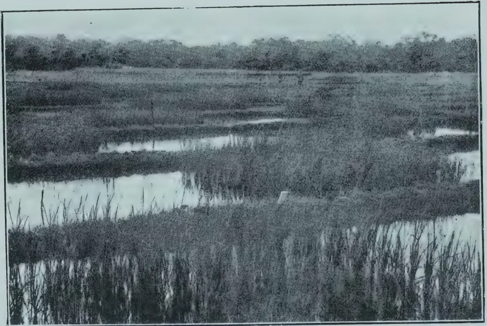A black and white photograph showing a field of tall grass or reeds growing in water. The field is divided into several rectangular plots, and the background shows a line of trees under a cloudy sky. The grass is tall and dense, with many individual stalks visible, indicating tillering. The water reflects the sky and the grass.

PLATE I.  
Plots of 3,000 Series. Yala 1920. Showing Tillering.

92------------------------------------------------

FEBRUARY, 1921.]71

(3) The average number of ears per plant to be expected from the crop is 1.9. (Table III.)

(4) If the plants are separated on an average by a distance of  $2\frac{1}{2}$  inches, each square yard will contain 220 plants and should therefore produce about 418 good ears.

The above results have been checked in the field, chiefly with Central Province fields of Hatiel, Heenati and Mawi. They were found to be conformed to in all cases. The number of ears per square yard, viz. 418, was judged to be a maximum, for, in many well-thinned fields the distance between the plants was more than three inches, giving a less number of ears per equivalent area.

### RESULTS WITH TRANSPLANTED PADDY.

In the following section the question is examined of whether an increased number of mature ears per acre can be obtained by transplanting the seedlings at intervals of 6 inches by 6 inches.

The problem is a simple one. Each seedling occupies 36 square inches so that a square yard contains 36 plants, or one-ninth of the number found when the crop is broadcasted. It follows therefore that, on an average, the plants must produce, if there is no increase in the average size of the ears, nine times as many ears as the broadcasted plants if the yield is to be maintained.

Before giving the results of actual experiments on this point a short account of the method employed will be given. The varieties used were a series of three months paddies grown in the experimental plots at the Dry Zone Experiment Station at Anuradhapura. The series comprised 90 varieties of which 52 were exactly duplicated at the Peradeniya Experiment Station. The seed samples were collected from all parts of the Island about the middle of 1919. They were not grown until the Yala season of 1920, the data concerning this being given below in Table IV.

TABLE IV.

<table border="1">
<thead>
<tr>
<th rowspan="2">Experiment Station</th>
<th colspan="2">Date of</th>
</tr>
<tr>
<th>Sowing</th>
<th>Transplanting</th>
</tr>
</thead>
<tbody>
<tr>
<td>Anuradhapura</td>
<td>31st March, 1920</td>
<td>May 4th to 7th, 1920</td>
</tr>
<tr>
<td>Peradeniya</td>
<td>11th April, 1920</td>
<td>May 13th to 17th, 1920</td>
</tr>
</tbody>
</table>

In both cases selection of seedlings was practised, all weak ones being rejected. The varieties were then transplanted into plots chess-board fashion as shown in Plates I and II. These plots were about 13 feet square. The plates show the plots at Anuradhapura when the seedlings were about one month old from the time of transplanting, or two months in all. Transplanting in progress at Peradeniya is shown in Plate III.

A striking feature of all plots was the almost entire absence of weeds so that no weeding was necessary from start to finish.

Progress was excellent at Anuradhapura, many of the varieties being harvested within 76 days from the time of transplanting or within 110 days from the time of sowing. Amongst these were several Morungans, Dahanala, Kottiyaran, Rata Balawi, Madael, Heenati, Heen Ratkunda and Mada Arawi.

In comparison progress was very poor at Peradeniya and many of the varieties were rejected as unfit for comparison with those of Anuradhapura.

Confining attention to the varieties of the latter station, these were at harvest pulled up carefully by the roots and the number of tillers in each individual plant counted. The plants of the side rows were rejected as before. In every case these put up astonishingly large numbers of tillers, plants with 40 mature ears being far from uncommon. The remaining plants were then classified according to tiller number.

93------------------------------------------------

72[FEBRUARY, 1921.

This classification was carried out for 90 varieties, but considerations of space prevent more than half of these being quoted. The results obtained in the case of 44 varieties are given in full in order that they may serve as a guide to workers and cultivators in the future as to what a particular variety may be expected to show in the way of tillering when transplanted in a similar fashion. In Table V the vertical columns contain for each variety the number of plants in each tiller class.

TABLE V.

<table border="1">
<thead>
<tr>
<th rowspan="2">Name of Variety</th>
<th colspan="16">Number of Tillers</th>
</tr>
<tr>
<th>1</th>
<th>2</th>
<th>3</th>
<th>4</th>
<th>5</th>
<th>6</th>
<th>7</th>
<th>8</th>
<th>9</th>
<th>10</th>
<th>11</th>
<th>12</th>
<th>13</th>
<th>14</th>
<th>15</th>
<th>16</th>
</tr>
</thead>
<tbody>
<tr>
<td>Sudukuruwi</td>
<td>3</td>
<td><b>35</b></td>
<td>28</td>
<td>26</td>
<td>23</td>
<td>15</td>
<td>2</td>
<td>3</td>
<td>1</td>
<td>—</td>
<td>1</td>
<td>—</td>
<td>—</td>
<td>—</td>
<td>—</td>
<td>—</td>
</tr>
<tr>
<td>Panniti</td>
<td>28</td>
<td><b>45</b></td>
<td>34</td>
<td>29</td>
<td>18</td>
<td>10</td>
<td>13</td>
<td>7</td>
<td>4</td>
<td>1</td>
<td>2</td>
<td>—</td>
<td>—</td>
<td>—</td>
<td>—</td>
<td>—</td>
</tr>
<tr>
<td>Sulai</td>
<td>11</td>
<td>45</td>
<td><b>48</b></td>
<td>43</td>
<td>24</td>
<td>10</td>
<td>3</td>
<td>2</td>
<td>1</td>
<td>—</td>
<td>—</td>
<td>—</td>
<td>—</td>
<td>—</td>
<td>—</td>
<td>—</td>
</tr>
<tr>
<td>Sulai</td>
<td>15</td>
<td>33</td>
<td><b>72</b></td>
<td>64</td>
<td>58</td>
<td>26</td>
<td>21</td>
<td>5</td>
<td>4</td>
<td>1</td>
<td>—</td>
<td>1</td>
<td>—</td>
<td>—</td>
<td>—</td>
<td>—</td>
</tr>
<tr>
<td>Perumal</td>
<td>21</td>
<td>32</td>
<td><b>48</b></td>
<td>44</td>
<td>31</td>
<td>22</td>
<td>19</td>
<td>17</td>
<td>6</td>
<td>7</td>
<td>—</td>
<td>1</td>
<td>1</td>
<td>—</td>
<td>—</td>
<td>—</td>
</tr>
<tr>
<td>Suduratawi</td>
<td>10</td>
<td>39</td>
<td><b>46</b></td>
<td>45</td>
<td>17</td>
<td>7</td>
<td>4</td>
<td>—</td>
<td>1</td>
<td>—</td>
<td>—</td>
<td>1</td>
<td>—</td>
<td>—</td>
<td>—</td>
<td>—</td>
</tr>
<tr>
<td>Heenati</td>
<td>15</td>
<td>27</td>
<td><b>52</b></td>
<td>32</td>
<td>8</td>
<td>8</td>
<td>3</td>
<td>1</td>
<td>1</td>
<td>—</td>
<td>—</td>
<td>—</td>
<td>—</td>
<td>—</td>
<td>—</td>
<td>—</td>
</tr>
<tr>
<td>Galpawi</td>
<td>5</td>
<td>27</td>
<td><b>50</b></td>
<td>34</td>
<td>28</td>
<td>11</td>
<td>7</td>
<td>3</td>
<td>1</td>
<td>2</td>
<td>1</td>
<td>—</td>
<td>—</td>
<td>—</td>
<td>—</td>
<td>—</td>
</tr>
<tr>
<td>Balakara</td>
<td>16</td>
<td>30</td>
<td><b>42</b></td>
<td>30</td>
<td>13</td>
<td>6</td>
<td>5</td>
<td>3</td>
<td>2</td>
<td>—</td>
<td>—</td>
<td>—</td>
<td>—</td>
<td>—</td>
<td>—</td>
<td>—</td>
</tr>
<tr>
<td>Kaluwi</td>
<td>14</td>
<td>28</td>
<td><b>57</b></td>
<td>46</td>
<td>41</td>
<td>38</td>
<td>9</td>
<td>6</td>
<td>5</td>
<td>2</td>
<td>2</td>
<td>1</td>
<td>—</td>
<td>—</td>
<td>—</td>
<td>—</td>
</tr>
<tr>
<td>Bediratawi</td>
<td>26</td>
<td>72</td>
<td><b>74</b></td>
<td>38</td>
<td>10</td>
<td>5</td>
<td>5</td>
<td>1</td>
<td>—</td>
<td>—</td>
<td>—</td>
<td>—</td>
<td>—</td>
<td>—</td>
<td>—</td>
<td>—</td>
</tr>
<tr>
<td>Ratelwi</td>
<td>11</td>
<td>46</td>
<td><b>68</b></td>
<td>57</td>
<td>39</td>
<td>30</td>
<td>17</td>
<td>15</td>
<td>1</td>
<td>—</td>
<td>—</td>
<td>1</td>
<td>—</td>
<td>—</td>
<td>—</td>
<td>1</td>
</tr>
<tr>
<td>Danahal</td>
<td>35</td>
<td>44</td>
<td><b>76</b></td>
<td>53</td>
<td>34</td>
<td>25</td>
<td>20</td>
<td>2</td>
<td>2</td>
<td>3</td>
<td>—</td>
<td>1</td>
<td>—</td>
<td>—</td>
<td>—</td>
<td>—</td>
</tr>
<tr>
<td>Galpawi</td>
<td>11</td>
<td>42</td>
<td><b>62</b></td>
<td>34</td>
<td>22</td>
<td>10</td>
<td>5</td>
<td>2</td>
<td>—</td>
<td>2</td>
<td>—</td>
<td>—</td>
<td>—</td>
<td>—</td>
<td>—</td>
<td>—</td>
</tr>
<tr>
<td>Balakara</td>
<td>15</td>
<td>58</td>
<td><b>93</b></td>
<td>77</td>
<td>54</td>
<td>31</td>
<td>9</td>
<td>8</td>
<td>5</td>
<td>2</td>
<td>—</td>
<td>—</td>
<td>—</td>
<td>—</td>
<td>—</td>
<td>—</td>
</tr>
<tr>
<td>Mada-arawi</td>
<td>15</td>
<td>28</td>
<td><b>48</b></td>
<td>39</td>
<td>35</td>
<td>16</td>
<td>16</td>
<td>7</td>
<td>5</td>
<td>3</td>
<td>1</td>
<td>—</td>
<td>1</td>
<td>1</td>
<td>—</td>
<td>—</td>
</tr>
<tr>
<td>Murungan</td>
<td>30</td>
<td>65</td>
<td><b>82</b></td>
<td>63</td>
<td>55</td>
<td>26</td>
<td>16</td>
<td>16</td>
<td>9</td>
<td>3</td>
<td>3</td>
<td>2</td>
<td>—</td>
<td>—</td>
<td>—</td>
<td>—</td>
</tr>
<tr>
<td>Heenratkunda</td>
<td>8</td>
<td>22</td>
<td><b>23</b></td>
<td>19</td>
<td>10</td>
<td>8</td>
<td>11</td>
<td>9</td>
<td>4</td>
<td>4</td>
<td>3</td>
<td>—</td>
<td>—</td>
<td>—</td>
<td>1</td>
<td>—</td>
</tr>
<tr>
<td>Heenhalsuduwi</td>
<td>16</td>
<td>23</td>
<td><b>42</b></td>
<td>34</td>
<td>18</td>
<td>12</td>
<td>5</td>
<td>2</td>
<td>1</td>
<td>—</td>
<td>—</td>
<td>—</td>
<td>—</td>
<td>—</td>
<td>—</td>
<td>—</td>
</tr>
<tr>
<td>Nandusuduwi</td>
<td>12</td>
<td>21</td>
<td>35</td>
<td><b>48</b></td>
<td>30</td>
<td>21</td>
<td>4</td>
<td>4</td>
<td>2</td>
<td>1</td>
<td>—</td>
<td>—</td>
<td>—</td>
<td>—</td>
<td>—</td>
<td>—</td>
</tr>
<tr>
<td>Bala Mawi</td>
<td>4</td>
<td>16</td>
<td>33</td>
<td><b>47</b></td>
<td>30</td>
<td>19</td>
<td>11</td>
<td>4</td>
<td>6</td>
<td>4</td>
<td>1</td>
<td>3</td>
<td>—</td>
<td>—</td>
<td>—</td>
<td>—</td>
</tr>
<tr>
<td>Kaharamana</td>
<td>8</td>
<td>43</td>
<td>62</td>
<td><b>68</b></td>
<td>59</td>
<td>46</td>
<td>30</td>
<td>19</td>
<td>5</td>
<td>5</td>
<td>1</td>
<td>—</td>
<td>1</td>
<td>—</td>
<td>—</td>
<td>—</td>
</tr>
<tr>
<td>Ratkunda</td>
<td>3</td>
<td>20</td>
<td>27</td>
<td><b>32</b></td>
<td>27</td>
<td>26</td>
<td>12</td>
<td>6</td>
<td>5</td>
<td>—</td>
<td>—</td>
<td>—</td>
<td>—</td>
<td>—</td>
<td>—</td>
<td>—</td>
</tr>
<tr>
<td>Suduwi</td>
<td>9</td>
<td>16</td>
<td>28</td>
<td><b>48</b></td>
<td>33</td>
<td>24</td>
<td>19</td>
<td>13</td>
<td>8</td>
<td>—</td>
<td>1</td>
<td>—</td>
<td>—</td>
<td>—</td>
<td>—</td>
<td>—</td>
</tr>
<tr>
<td>Oddaivala.</td>
<td>6</td>
<td>9</td>
<td>28</td>
<td><b>56</b></td>
<td>51</td>
<td>50</td>
<td>41</td>
<td>34</td>
<td>11</td>
<td>8</td>
<td>—</td>
<td>3</td>
<td>1</td>
<td>2</td>
<td>—</td>
<td>—</td>
</tr>
<tr>
<td>Gonnavalu</td>
<td>5</td>
<td>20</td>
<td>29</td>
<td><b>65</b></td>
<td>53</td>
<td>34</td>
<td>24</td>
<td>11</td>
<td>13</td>
<td>5</td>
<td>1</td>
<td>—</td>
<td>—</td>
<td>—</td>
<td>—</td>
<td>—</td>
</tr>
<tr>
<td>Heendikvi</td>
<td>20</td>
<td>41</td>
<td>55</td>
<td><b>60</b></td>
<td>41</td>
<td>23</td>
<td>7</td>
<td>6</td>
<td>—</td>
<td>—</td>
<td>—</td>
<td>—</td>
<td>—</td>
<td>—</td>
<td>—</td>
<td>—</td>
</tr>
<tr>
<td>Sirivellai</td>
<td>9</td>
<td>27</td>
<td>34</td>
<td><b>53</b></td>
<td>52</td>
<td>49</td>
<td>24</td>
<td>28</td>
<td>15</td>
<td>12</td>
<td>3</td>
<td>3</td>
<td>1</td>
<td>2</td>
<td>—</td>
<td>—</td>
</tr>
<tr>
<td>Kirikara</td>
<td>12</td>
<td>33</td>
<td>63</td>
<td><b>72</b></td>
<td>48</td>
<td>36</td>
<td>13</td>
<td>8</td>
<td>11</td>
<td>2</td>
<td>1</td>
<td>—</td>
<td>3</td>
<td>—</td>
<td>—</td>
<td>—</td>
</tr>
<tr>
<td>Sudumadael</td>
<td>3</td>
<td>24</td>
<td>45</td>
<td><b>65</b></td>
<td>48</td>
<td>34</td>
<td>23</td>
<td>10</td>
<td>14</td>
<td>6</td>
<td>—</td>
<td>2</td>
<td>—</td>
<td>1</td>
<td>—</td>
<td>—</td>
</tr>
<tr>
<td>Podiratawi</td>
<td>5</td>
<td>43</td>
<td>56</td>
<td><b>80</b></td>
<td>52</td>
<td>28</td>
<td>23</td>
<td>8</td>
<td>7</td>
<td>3</td>
<td>—</td>
<td>—</td>
<td>—</td>
<td>—</td>
<td>—</td>
<td>—</td>
</tr>
<tr>
<td>Raturatawi</td>
<td>5</td>
<td>17</td>
<td>25</td>
<td><b>36</b></td>
<td>29</td>
<td>22</td>
<td>28</td>
<td>16</td>
<td>17</td>
<td>10</td>
<td>9</td>
<td>8</td>
<td>5</td>
<td>5</td>
<td>1</td>
<td>—</td>
</tr>
<tr>
<td>Karayal</td>
<td>10</td>
<td>14</td>
<td>31</td>
<td>48</td>
<td><b>49</b></td>
<td>44</td>
<td>20</td>
<td>21</td>
<td>6</td>
<td>6</td>
<td>5</td>
<td>3</td>
<td>2</td>
<td>—</td>
<td>—</td>
<td>—</td>
</tr>
<tr>
<td>Panankalayan</td>
<td>4</td>
<td>12</td>
<td>38</td>
<td>36</td>
<td><b>48</b></td>
<td>34</td>
<td>21</td>
<td>12</td>
<td>8</td>
<td>7</td>
<td>6</td>
<td>2</td>
<td>3</td>
<td>—</td>
<td>—</td>
<td>—</td>
</tr>
<tr>
<td>Ilankalayan</td>
<td>8</td>
<td>10</td>
<td>34</td>
<td>36</td>
<td><b>39</b></td>
<td>24</td>
<td>25</td>
<td>10</td>
<td>16</td>
<td>5</td>
<td>1</td>
<td>1</td>
<td>—</td>
<td>—</td>
<td>—</td>
<td>—</td>
</tr>
<tr>
<td>Balakara</td>
<td>5</td>
<td>16</td>
<td>49</td>
<td>45</td>
<td><b>50</b></td>
<td>33</td>
<td>18</td>
<td>8</td>
<td>10</td>
<td>2</td>
<td>2</td>
<td>—</td>
<td>—</td>
<td>1</td>
<td>—</td>
<td>—</td>
</tr>
<tr>
<td>Giris</td>
<td>6</td>
<td>23</td>
<td>24</td>
<td>56</td>
<td><b>59</b></td>
<td>47</td>
<td>38</td>
<td>27</td>
<td>14</td>
<td>7</td>
<td>6</td>
<td>1</td>
<td>1</td>
<td>1</td>
<td>—</td>
<td>—</td>
</tr>
<tr>
<td>Balakara</td>
<td>3</td>
<td>29</td>
<td>35</td>
<td>41</td>
<td><b>43</b></td>
<td>29</td>
<td>25</td>
<td>12</td>
<td>8</td>
<td>9</td>
<td>1</td>
<td>1</td>
<td>1</td>
<td>—</td>
<td>—</td>
<td>—</td>
</tr>
<tr>
<td>Heenati</td>
<td>13</td>
<td>24</td>
<td>27</td>
<td>26</td>
<td>28</td>
<td><b>37</b></td>
<td>18</td>
<td>18</td>
<td>14</td>
<td>12</td>
<td>13</td>
<td>6</td>
<td>3</td>
<td>3</td>
<td>3</td>
<td>1</td>
</tr>
<tr>
<td>Podiheenati</td>
<td>6</td>
<td>24</td>
<td>45</td>
<td>50</td>
<td>30</td>
<td><b>51</b></td>
<td>27</td>
<td>21</td>
<td>10</td>
<td>5</td>
<td>4</td>
<td>3</td>
<td>2</td>
<td>1</td>
<td>—</td>
<td>—</td>
</tr>
<tr>
<td>Heenati</td>
<td>7</td>
<td>18</td>
<td>29</td>
<td>21</td>
<td>31</td>
<td><b>33</b></td>
<td>31</td>
<td>18</td>
<td>10</td>
<td>10</td>
<td>6</td>
<td>5</td>
<td>3</td>
<td>4</td>
<td>1</td>
<td>—</td>
</tr>
<tr>
<td>Norungan</td>
<td>10</td>
<td>35</td>
<td>47</td>
<td>46</td>
<td>48</td>
<td><b>53</b></td>
<td>45</td>
<td>21</td>
<td>17</td>
<td>9</td>
<td>5</td>
<td>2</td>
<td>—</td>
<td>—</td>
<td>—</td>
<td>—</td>
</tr>
<tr>
<td>Danahal</td>
<td>5</td>
<td>12</td>
<td>25</td>
<td>26</td>
<td>33</td>
<td><b>37</b></td>
<td>35</td>
<td>35</td>
<td>19</td>
<td>16</td>
<td>8</td>
<td>6</td>
<td>6</td>
<td>1</td>
<td>—</td>
<td>2</td>
</tr>
<tr>
<td>Pachchaiperumal</td>
<td>3</td>
<td>13</td>
<td>8</td>
<td>24</td>
<td>25</td>
<td>25</td>
<td><b>31</b></td>
<td>28</td>
<td>17</td>
<td>11</td>
<td>14</td>
<td>4</td>
<td>2</td>
<td>1</td>
<td>—</td>
<td>2</td>
</tr>
</tbody>
</table>

94------------------------------------------------


PLATE II.

Plots of 3,000 series showing Chess-board arrangement. Pure lines of another series were sown in the vacant plots.


PLATE III.

Transplanting of 3,000 Series.  
Peradeniya Experiment Station—Yala 1920.

95------------------------------------------------

This image is a scan of a blank page. The background is a uniform light beige or off-white color. There are several small, dark specks scattered across the surface, which appear to be dust or scanning artifacts. No text, lines, or other graphical elements are present.

96------------------------------------------------

FEBRUARY, 1921.]73

The tiller class in which most of the plants of a variety occur is known as the Mode, i.e. the mode is the commonest tiller number. In Table V the number of plants forming the mode is shown for each variety in darker type.

It will be noticed that the mode may range from 2 to 7 the number of varieties possessing each particular mode being shown in tabular form in Table VI.

TABLE VI.

<table border="1">
<thead>
<tr>
<th>Mode.</th>
<th>No. of Varieties.</th>
</tr>
</thead>
<tbody>
<tr>
<td>2</td>
<td>2</td>
</tr>
<tr>
<td>3</td>
<td>17</td>
</tr>
<tr>
<td>4</td>
<td>13</td>
</tr>
<tr>
<td>5</td>
<td>6</td>
</tr>
<tr>
<td>6</td>
<td>5</td>
</tr>
<tr>
<td>7</td>
<td>1</td>
</tr>
</tbody>
</table>

From this table the average value of the mode can be calculated as 3.95, or, in other words, if all the varieties were lumped together the mode would fall at 3.95 tillers.

If, for any variety, a graph is drawn showing the distribution of the plants according to tiller numbers a typical peaked curve is the result, the mode being the ordinate at the peak. Four such curves are shown in Fig. II, the mode being 3, 4, 5, and 6 respectively.

But the mode is not necessarily the same thing as the average number of tillers; on the contrary, the two are generally unequal. A comparison of the mode and mean (or average) number of tillers for each of the varieties shown graphically in Fig. II, demonstrates that in every case the mean is greater than the mode. This is due to plants with tiller numbers greater than the mode over-balancing, as it were, those with tiller numbers less than the mode. In only eight of the 44 varieties of Table V is the mean, on calculation, found to be less than the mode.

In view of the great variation amongst the tiller curves as far as range, mode and steepness are concerned, the mean or average number of tillers is a better expression of the tillering capacity of the variety than the mode.

The mean has been calculated for all the varieties of Table V, and the results shown in Table VII grouped into classes. The lowest mean was 2.9 in the case of Bediratawi and the highest 6.6 for Pachchaiperumal.

TABLE VII.

<table border="1">
<thead>
<tr>
<th>Mean Number of Tillers.</th>
<th>Number of Varieties.</th>
</tr>
</thead>
<tbody>
<tr>
<td>2.1—3.0</td>
<td>1</td>
</tr>
<tr>
<td>3.1—4.0</td>
<td>15</td>
</tr>
<tr>
<td>4.1—5.0</td>
<td>15</td>
</tr>
<tr>
<td>5.1—6.0</td>
<td>10</td>
</tr>
<tr>
<td>6.1—7.0</td>
<td>3</td>
</tr>
</tbody>
</table>

It has been shown previously that the mean of all the modes was 3.95 tillers and, a similar calculation having been carried out for the means, it was found that the mean of all these was 4.02 tillers.

In other words, if the selection of paddies given in Table V. can be taken as a typical collection of the short aged paddies of the Island, then, if transplanting at six inch intervals is practised, the cultivator can expect an average of 4.02 tillers for all the plants of his plots.

97------------------------------------------------

74[FEBRUARY, 1921.

If this is so the plants will, on an average, produce 2.1 times as many ears as in a broadcasted crop. But, as the number of plants per square yard is only 36, the total number of ears per square yard will only be about 145 or less than one-half of the number in the broadcasted crop. It follows therefore that the increased yields obtained by transplanting are not entirely due to increased tillering on the part of the seedlings.

#### RESULTS AT ANURADHAPURA AND PERADENIYA COMPARED.

Up to the present, in order to establish a more equal comparison, the transplanting results at Anuradhapura alone have been quoted. So many of the 52 duplicates at Peradeniya failed owing to causes beyond control that a complete comparison is not possible.

In order however to demonstrate that tillering results are not dependent upon station a few comparisons might profitably be made between Peradeniya and Anuradhapura varieties.

In Fig. III the results obtained with certain Heenatis are shown graphically. The numbers of the curves refer to Table VIII which contains the data necessary for their interpretation.

TABLE VIII.

<table border="1">
<thead>
<tr>
<th>No. of Curve</th>
<th>Name of Variety</th>
<th>Where Grown</th>
<th>How Grown</th>
<th>Mean No. of Tillers</th>
</tr>
</thead>
<tbody>
<tr>
<td>1</td>
<td>Heenati (1)</td>
<td>Peradeniya</td>
<td>Broadcasted</td>
<td>2.1</td>
</tr>
<tr>
<td>2</td>
<td>do (2)</td>
<td>do</td>
<td>do</td>
<td>2.3</td>
</tr>
<tr>
<td>3</td>
<td>do (3)</td>
<td>Anuradhapura</td>
<td>Transplanted</td>
<td>3.2</td>
</tr>
<tr>
<td>4</td>
<td>do (4)</td>
<td>do</td>
<td>do</td>
<td>5.9</td>
</tr>
<tr>
<td>5</td>
<td>do (5)</td>
<td>Peradeniya</td>
<td>do</td>
<td>4.3</td>
</tr>
<tr>
<td>6</td>
<td>do (6)</td>
<td>do</td>
<td>do</td>
<td>4.3</td>
</tr>
</tbody>
</table>

Similar data are given in Table IX. for six other transplanted varieties grown at both stations.

TABLE IX.

<table border="1">
<thead>
<tr>
<th>Name of Variety</th>
<th>Where Grown</th>
<th>Mean No. of Tillers</th>
</tr>
</thead>
<tbody>
<tr>
<td>Ratkunda</td>
<td>P'iya</td>
<td>4.1</td>
</tr>
<tr>
<td>do</td>
<td>A'pura</td>
<td>4.5</td>
</tr>
<tr>
<td>Suduheenati</td>
<td>P'iya</td>
<td>4.9</td>
</tr>
<tr>
<td>do</td>
<td>A'pura</td>
<td>4.9</td>
</tr>
<tr>
<td>Ratawi</td>
<td>P'iya</td>
<td>2.9</td>
</tr>
<tr>
<td>do</td>
<td>A'pura</td>
<td>6.2</td>
</tr>
<tr>
<td>do</td>
<td>do</td>
<td>2.9</td>
</tr>
<tr>
<td>Mahakuruwi</td>
<td>P'iya</td>
<td>6.5</td>
</tr>
<tr>
<td>do</td>
<td>A'pura</td>
<td>5.2</td>
</tr>
<tr>
<td>Kaharamana</td>
<td>P'iya</td>
<td>5.8</td>
</tr>
<tr>
<td>do</td>
<td>A'pura</td>
<td>4.6</td>
</tr>
<tr>
<td>Dahanala</td>
<td>P'iya</td>
<td>4.0</td>
</tr>
<tr>
<td>do</td>
<td>A'pura</td>
<td>3.8</td>
</tr>
</tbody>
</table>

These examples were typical of the remainder but are sufficient to show that the tillering capacity of a variety was roughly the same in both stations, the only exception being Ratawi.

This result is rather surprising in view of the fact that the fields at the two stations differ widely in soil characters. The Anuradhapura fields are only three years old, the drainage is good and the mud not at all clayey. On the contrary the Peradeniya field is old and clayey and the drainage inferior.

98------------------------------------------------

Fig. II.


The graph illustrates the relationship between the number of tillers and the number of plants for four different locations. The x-axis, labeled 'Tiller Numbers', ranges from 0 to 12. The y-axis, labeled 'NUMBER OF PLANTS', ranges from 0 to 50. The legend identifies the four locations: Sudusi (solid line with dots), Balakera (dashed line with dots), Panankalayan (solid line with crosses), and Nahantala (dotted line with squares). All locations show an increase in the number of plants as tiller numbers increase, with Sudusi generally having the highest number of plants and Nahantala the lowest.

<table border="1"><thead><tr><th>Tiller Numbers</th><th>Sudusi</th><th>Balakera</th><th>Panankalayan</th><th>Nahantala</th></tr></thead><tbody><tr><td>0</td><td>0</td><td>0</td><td>0</td><td>0</td></tr><tr><td>1</td><td>10</td><td>10</td><td>10</td><td>10</td></tr><tr><td>2</td><td>20</td><td>20</td><td>20</td><td>20</td></tr><tr><td>3</td><td>30</td><td>30</td><td>30</td><td>30</td></tr><tr><td>4</td><td>40</td><td>40</td><td>40</td><td>40</td></tr><tr><td>5</td><td>45</td><td>45</td><td>45</td><td>45</td></tr><tr><td>6</td><td>48</td><td>48</td><td>48</td><td>48</td></tr><tr><td>7</td><td>49</td><td>49</td><td>49</td><td>49</td></tr><tr><td>8</td><td>50</td><td>50</td><td>50</td><td>50</td></tr><tr><td>9</td><td>50</td><td>50</td><td>50</td><td>50</td></tr><tr><td>10</td><td>50</td><td>50</td><td>50</td><td>50</td></tr><tr><td>11</td><td>50</td><td>50</td><td>50</td><td>50</td></tr><tr><td>12</td><td>50</td><td>50</td><td>50</td><td>50</td></tr></tbody></table>

99------------------------------------------------

10-100-01-63

Fig. III

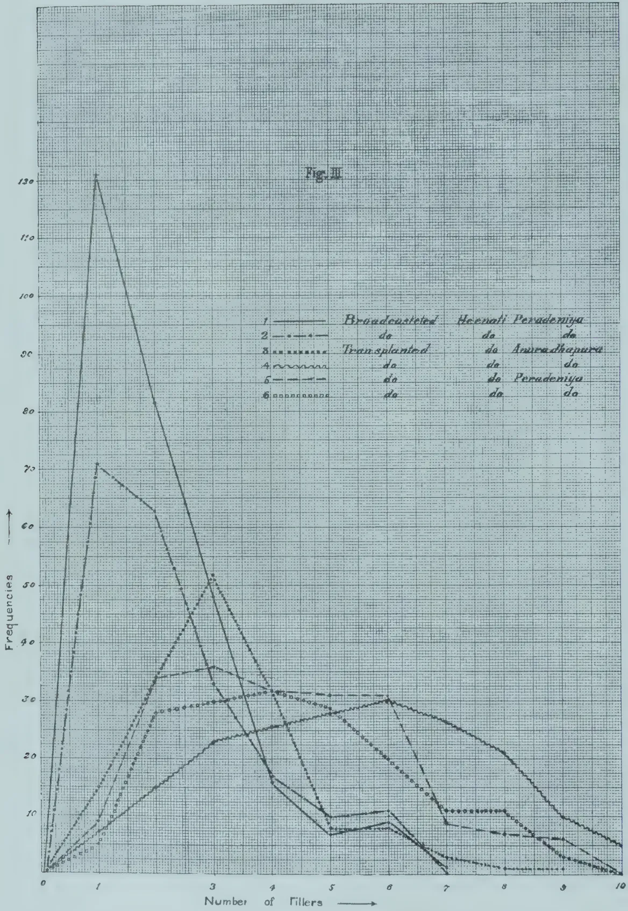

The graph plots Frequencies (Y-axis, 0 to 130) against the Number of Fillers (X-axis, 0 to 10). Six data series are shown, each representing a different group. The legend identifies the series as follows:

<table border="1">
<thead>
<tr>
<th>Series</th>
<th>Group 1</th>
<th>Group 2</th>
<th>Group 3</th>
<th>Group 4</th>
<th>Group 5</th>
<th>Group 6</th>
</tr>
</thead>
<tbody>
<tr>
<td>1</td>
<td>Broadcasted</td>
<td>Hecenati</td>
<td>Peradeniya</td>
<td></td>
<td></td>
<td></td>
</tr>
<tr>
<td>2</td>
<td>da</td>
<td>da</td>
<td>da</td>
<td></td>
<td></td>
<td></td>
</tr>
<tr>
<td>3</td>
<td>Transplanted</td>
<td>da</td>
<td>Anura Chapura</td>
<td></td>
<td></td>
<td></td>
</tr>
<tr>
<td>4</td>
<td>da</td>
<td>da</td>
<td>da</td>
<td></td>
<td></td>
<td></td>
</tr>
<tr>
<td>5</td>
<td>da</td>
<td>da</td>
<td>Peradeniya</td>
<td></td>
<td></td>
<td></td>
</tr>
<tr>
<td>6</td>
<td>da</td>
<td>da</td>
<td>da</td>
<td></td>
<td></td>
<td></td>
</tr>
</tbody>
</table>

Approximate data points from the graph:

<table border="1">
<thead>
<tr>
<th>Number of Fillers</th>
<th>Series 1</th>
<th>Series 2</th>
<th>Series 3</th>
<th>Series 4</th>
<th>Series 5</th>
<th>Series 6</th>
</tr>
</thead>
<tbody>
<tr><td>0</td><td>0</td><td>0</td><td>0</td><td>0</td><td>0</td><td>0</td></tr>
<tr><td>1</td><td>130</td><td>70</td><td>10</td><td>5</td><td>5</td><td>5</td></tr>
<tr><td>2</td><td>80</td><td>65</td><td>35</td><td>15</td><td>28</td><td>15</td></tr>
<tr><td>3</td><td>60</td><td>52</td><td>36</td><td>23</td><td>30</td><td>25</td></tr>
<tr><td>4</td><td>40</td><td>32</td><td>32</td><td>25</td><td>31</td><td>25</td></tr>
<tr><td>5</td><td>25</td><td>18</td><td>31</td><td>10</td><td>28</td><td>25</td></tr>
<tr><td>6</td><td>15</td><td>10</td><td>30</td><td>10</td><td>20</td><td>25</td></tr>
<tr><td>7</td><td>5</td><td>5</td><td>10</td><td>5</td><td>10</td><td>10</td></tr>
<tr><td>8</td><td>2</td><td>2</td><td>10</td><td>5</td><td>5</td><td>5</td></tr>
<tr><td>9</td><td>1</td><td>1</td><td>5</td><td>2</td><td>2</td><td>2</td></tr>
<tr><td>10</td><td>0</td><td>0</td><td>2</td><td>1</td><td>1</td><td>1</td></tr>
</tbody>
</table>

100------------------------------------------------

FEBRUARY, 1921.]75

It is generally held, in the case of dry cultivated cereals that a sandy soil encourages tillering while a soil rich in clay has the reverse effect. In the above experiments there was not the slightest evidence that this is true for the rice plant so that evidently caution is necessary before attempting to apply to paddy the results obtained with dry cultivated cereals.

It has been stated that the varieties employed for the purposes of these experiments were obtained from all parts of the Island. Now the same variety will behave very differently in different habitats in so far as agricultural characters such as its height and period necessary for maturation are concerned. Reference has already been made to the early ripening of certain three months varieties on page 71, and it is a matter of frequent observation in the Central Province, for example, that the same variety has a very different ripening period at different elevations.

It seemed of interest therefore to investigate the reverse operation, viz., that of bringing the same variety from different districts to the same Experiment Station. For instance, 8 different Heenatis were grown at Anuradhapura, 5 Murungans, 4 Balakaras and two each of Sulai, Siruvellai and Galpawi. The mean number of tillers for each variety is shown in Table X.

TABLE X.

<table border="1">
<thead>
<tr>
<th>No.</th>
<th>Variety</th>
<th>Mean</th>
</tr>
</thead>
<tbody>
<tr>
<td>1</td>
<td>Murungan</td>
<td>5.1</td>
</tr>
<tr>
<td>2</td>
<td>do</td>
<td>5.2</td>
</tr>
<tr>
<td>3</td>
<td>do</td>
<td>5.1</td>
</tr>
<tr>
<td>4</td>
<td>do</td>
<td>4.6</td>
</tr>
<tr>
<td>5</td>
<td>do</td>
<td>4.0</td>
</tr>
<tr>
<td>1</td>
<td>Balakara</td>
<td>3.8</td>
</tr>
<tr>
<td>2</td>
<td>do</td>
<td>3.4</td>
</tr>
<tr>
<td>3</td>
<td>do</td>
<td>5.0</td>
</tr>
<tr>
<td>4</td>
<td>do</td>
<td>4.8</td>
</tr>
<tr>
<td>1</td>
<td>Sulai</td>
<td>3.4</td>
</tr>
<tr>
<td>2</td>
<td>do</td>
<td>4.1</td>
</tr>
<tr>
<td>1</td>
<td>Galpawi</td>
<td>3.5</td>
</tr>
<tr>
<td>2</td>
<td>do</td>
<td>3.9</td>
</tr>
<tr>
<td>1</td>
<td>Siruvellai</td>
<td>5.3</td>
</tr>
<tr>
<td>2</td>
<td>do</td>
<td>5.4</td>
</tr>
<tr>
<td>1</td>
<td>Heenati</td>
<td>6.0</td>
</tr>
<tr>
<td>2</td>
<td>do</td>
<td>5.2</td>
</tr>
<tr>
<td>3</td>
<td>do</td>
<td>3.2*</td>
</tr>
<tr>
<td>4</td>
<td>do</td>
<td>5.9</td>
</tr>
<tr>
<td>5</td>
<td>do</td>
<td>4.9</td>
</tr>
<tr>
<td>6</td>
<td>do</td>
<td>5.2</td>
</tr>
<tr>
<td>7</td>
<td>do</td>
<td>6.0</td>
</tr>
<tr>
<td>8</td>
<td>do</td>
<td>5.1</td>
</tr>
</tbody>
</table>

The number of varieties instanced is certainly small, but as only the variety of Heenati asterisked appears to depart much from the average, there appears to be sufficient data in the above table to warrant the assumption that, within small limits, each variety has a specific tillering capacity for the same habitat whatever its origin.

101------------------------------------------------

76[FEBRUARY, 1921.

### CORRELATION BETWEEN TILLERING AND MATURATION PERIOD.

During recent years certain workers in Burma, Malaya and the Philippines have published the results of experimental work upon the rice plant, in which the character of tillering has been subjected to analysis. In one paper of this kind, "Some observations on Upper Burma Paddy grown under Irrigation." (AGRIC. JOURNAL OF INDIA, Vol. X, 1915), the author E. THOMPSTONE, after stating as a fact that "tillering varies with the variety, the soil and the treatment of the plants" goes on to assert that "generally speaking there appears to be a relationship between the length of life of a paddy and the number of tillers produced."

He publishes the results of experiments during which a very large number of tiller counts were made for two varieties, viz. a 150 day variety named KALAGYI and a 170 day variety named NGASEINGYI. The results of these are summarised in Table XI.

TABLE XI.

<table border="1">
<thead>
<tr>
<th>Variety.</th>
<th>Age in Days.</th>
<th>Range of Tiller Numbers.</th>
<th>Tiller Mode.</th>
<th>Tiller Mean.</th>
</tr>
</thead>
<tbody>
<tr>
<td>Kalagyi -</td>
<td>150</td>
<td>1 to 11</td>
<td>4</td>
<td>4.59</td>
</tr>
<tr>
<td>Ngaseingyi -</td>
<td>170</td>
<td>1 to 27</td>
<td>9</td>
<td>10.12</td>
</tr>
</tbody>
</table>

It is not stated whether these two varieties are typical of Burmese 150 and 170 days paddies, but the difference between the tillering of the two is so very great that it seemed worth while investigating whether any similar distinction was to be observed between the longer and shorter aged paddies of Ceylon.

It has already been shown that in the transplanted 3 months Yala paddies the extreme range of the mean number of tillers was from 2.9 to 6.6 but most commonly from 3 to 6. (Table V.) In order to furnish data as to the comparative tillering capacities of 4 to 5 months and six to seven months paddies a large number of observations was made upon varieties of these ages grown at Anuradhapura during the Maha season of 1920.

The material consisted of 105 varieties of age 6 months or more, and 260 4-5 months varieties. They were collected from all parts of the Island and transplanted singly from the nurseries, at six inch intervals, into long eight-rowed plots. All varieties received precisely the same treatment.

When the plots were harvested the side rows were rejected as before and the remaining plants pulled up by the roots. They were then arranged in classes according to tiller numbers.

From the complete records, 80 popular six months varieties were chosen fortuitously and an equivalent number of 4-5 months varieties. It will be seen from the tables which follow that the result was a fairly representative selection of the paddies of the Island, the North-Central Province and Uva alone being unrepresented.

The tillering mean for each variety was then calculated.

The results are set out in Tables XII and XIII. In the first column the province of origin of each variety is given, while the mean number of tillers is given in the last one. Here as elsewhere in the paper the varietal name given by the sender of the seed sample is employed, with the exception of a

102------------------------------------------------

FEBRUARY, 1921.]77

few obvious examples of illiteracy. No time has, as yet, been available for a study of the nomenclature of native rices.

**TABLE XII—4-5 Months Paddies.**

<table border="1">
<thead>
<tr>
<th>Province</th>
<th>Variety</th>
<th>Mean</th>
</tr>
</thead>
<tbody>
<tr>
<td>Northern</td>
<td>- Oddaivalan</td>
<td>- 6.9</td>
</tr>
<tr>
<td>Western</td>
<td>- Handiram</td>
<td>- 5.7</td>
</tr>
<tr>
<td>do</td>
<td>- Suduhandiram</td>
<td>- 5.6</td>
</tr>
<tr>
<td>Central</td>
<td>- Madael</td>
<td>- 5.6</td>
</tr>
<tr>
<td>Western</td>
<td>- Suwandel</td>
<td>- 5.5</td>
</tr>
<tr>
<td>do</td>
<td>- Madael</td>
<td>- 5.4</td>
</tr>
<tr>
<td>do</td>
<td>- Mudukiriel</td>
<td>- 5.4</td>
</tr>
<tr>
<td>Central</td>
<td>- Kaluheenati</td>
<td>- 4.9</td>
</tr>
<tr>
<td>Eastern</td>
<td>- Onnaraivalan</td>
<td>- 4.6</td>
</tr>
<tr>
<td>do</td>
<td>- Muppankan</td>
<td>- 4.6</td>
</tr>
<tr>
<td>Southern</td>
<td>- Matarawi</td>
<td>- 4.2</td>
</tr>
<tr>
<td>Central</td>
<td>- Heenati</td>
<td>- 4.1</td>
</tr>
<tr>
<td>Northern</td>
<td>- Muppankan</td>
<td>- 4.1</td>
</tr>
<tr>
<td>do</td>
<td>- Kallundai-vellai</td>
<td>- 4.0</td>
</tr>
<tr>
<td>Central</td>
<td>- Godawi</td>
<td>- 3.9</td>
</tr>
<tr>
<td>Southern</td>
<td>- Muttumanikkan</td>
<td>- 3.8</td>
</tr>
<tr>
<td>do</td>
<td>- Mahadilli</td>
<td>- 3.7</td>
</tr>
<tr>
<td>Central</td>
<td>- Mudukiriyal</td>
<td>- 3.7</td>
</tr>
<tr>
<td>Sabaragamuwa</td>
<td>- Ratuwi</td>
<td>- 3.2</td>
</tr>
</tbody>
</table>

**TABLE XIII—6-7 Months Paddies.**

<table border="1">
<thead>
<tr>
<th>Province</th>
<th>Variety</th>
<th>Mean</th>
</tr>
</thead>
<tbody>
<tr>
<td>North-Western</td>
<td>- Hondarawala</td>
<td>- 5.4</td>
</tr>
<tr>
<td>Sabaragamuwa</td>
<td>- Nugawi</td>
<td>- 4.3</td>
</tr>
<tr>
<td>Central</td>
<td>- Dewereddiri</td>
<td>- 4.0</td>
</tr>
<tr>
<td>do</td>
<td>- Hatiel</td>
<td>- 3.8</td>
</tr>
<tr>
<td>do</td>
<td>- Kuruwi</td>
<td>- 3.8</td>
</tr>
<tr>
<td>Southern</td>
<td>- Suduratuwi</td>
<td>- 3.6</td>
</tr>
<tr>
<td>do</td>
<td>- Mahamawi</td>
<td>- 3.6</td>
</tr>
<tr>
<td>Central</td>
<td>- Puwaketahatiel</td>
<td>- 3.6</td>
</tr>
<tr>
<td>Southern</td>
<td>- Kurumawi</td>
<td>- 3.3</td>
</tr>
<tr>
<td>Central</td>
<td>- Ratawi</td>
<td>- 3.3</td>
</tr>
<tr>
<td>North-Western</td>
<td>- Muttusamba</td>
<td>- 3.2</td>
</tr>
<tr>
<td>Northern</td>
<td>- Palaichitari</td>
<td>- 3.2</td>
</tr>
<tr>
<td>Central</td>
<td>- Suduhatiel</td>
<td>- 3.1</td>
</tr>
<tr>
<td>Western</td>
<td>- Kurulutuduwi</td>
<td>- 3.0</td>
</tr>
<tr>
<td>Northern</td>
<td>- Kulavalai</td>
<td>- 2.9</td>
</tr>
<tr>
<td>do</td>
<td>- Peria Vellai</td>
<td>- 2.8</td>
</tr>
<tr>
<td>Western</td>
<td>- Handiram</td>
<td>- 2.7</td>
</tr>
<tr>
<td>Eastern</td>
<td>- Vellainellu</td>
<td>- 2.7</td>
</tr>
<tr>
<td>do</td>
<td>- Kulaivalai</td>
<td>- 2.7</td>
</tr>
<tr>
<td>do</td>
<td>- Vanan</td>
<td>- 2.6</td>
</tr>
</tbody>
</table>

The results obtained for the above varieties, together with those given in Table VII for the Yala 3-months varieties, are summarised together in

103------------------------------------------------

78[FEBRUARY, 1921.

Table XIV, from which it is clear that, so far as the Anuradhapura cultures are concerned, the shorter-aged paddies possess a greater tillering capacity on the whole than those of longer periods of maturation.

In attempting to interpret the foregoing table so as to demonstrate the existence or otherwise of a correlation between tillering and length of maturation period the question of acclimatisation must be borne in mind. There is an obvious tendency towards equalisation of this period at Anuradhapura when varieties of different ages, transferred from different provinces, are cultivated there at the same time and under equal conditions.

This is strikingly shown in the case of the pure lines grown there during the Yala season of 1920. These had been extracted from cultures raised there during the preceding Maha when the tendency towards equalisation was already evident. During the following Yala the pure line plants were harvested individually as they became ripe, the results being shown in Table XIVa. It will be noticed that, for the pure line cultures, the mean ripening period is almost exactly the same for all four varieties.

TABLE XIVa.

<table border="1">
<thead>
<tr>
<th rowspan="4">Name of Variety</th>
<th rowspan="4">Age as given</th>
<th colspan="6">Ripening Period at Anuradhapura</th>
</tr>
<tr>
<th colspan="2">Maha 1920</th>
<th colspan="4">Yala 1920</th>
</tr>
<tr>
<th colspan="2">Mean</th>
<th>Earliest plot</th>
<th>Latest plot</th>
<th colspan="2">Mean</th>
</tr>
<tr>
<th>Mths.</th>
<th>days</th>
<th>Mths.</th>
<th>days</th>
<th>Mths.</th>
<th>days</th>
</tr>
</thead>
<tbody>
<tr>
<td>Suwandel</td>
<td>4 Mths.</td>
<td>3</td>
<td>23</td>
<td>3</td>
<td>20</td>
<td>4</td>
<td>12</td>
<td>4</td>
<td>1</td>
</tr>
<tr>
<td>Kalupanniti</td>
<td>5 ,,</td>
<td>3</td>
<td>26</td>
<td>3</td>
<td>20</td>
<td>4</td>
<td>12</td>
<td>4</td>
<td>1</td>
</tr>
<tr>
<td>Suduhatiel</td>
<td>5½ ,,</td>
<td>3</td>
<td>23</td>
<td>3</td>
<td>20</td>
<td>4</td>
<td>19</td>
<td>4</td>
<td>4½</td>
</tr>
<tr>
<td>Madoluwa</td>
<td>7 ,,</td>
<td>4</td>
<td>27</td>
<td>3</td>
<td>21</td>
<td>4</td>
<td>17</td>
<td>4</td>
<td>4</td>
</tr>
</tbody>
</table>

TABLE XIV.

<table border="1">
<thead>
<tr>
<th>Mean No. of Tillers</th>
<th>No. of 6 months varieties</th>
<th>No. of 4.5 months varieties</th>
<th>No. of 3 months varieties</th>
</tr>
</thead>
<tbody>
<tr>
<td>2.1—3.0</td>
<td>6</td>
<td>0</td>
<td>1</td>
</tr>
<tr>
<td>3.1—4.0</td>
<td>11</td>
<td>6</td>
<td>15</td>
</tr>
<tr>
<td>4.1—5.0</td>
<td>2</td>
<td>7</td>
<td>15</td>
</tr>
<tr>
<td>5.1—6.0</td>
<td>1</td>
<td>6</td>
<td>10</td>
</tr>
<tr>
<td>6.1—7.0</td>
<td>0</td>
<td>1</td>
<td>3</td>
</tr>
</tbody>
</table>

The foregoing observations are necessarily somewhat superficial and limited in scope, as they have been quite subsidiary to the main work on the selection of pure lines of the chief paddy varieties of the Island. A closer investigation of tillering phenomena in the rice plant would furnish appropriate work for a plant-physiologist.

But it is very necessary for the plant-breeder to be quite clear as to the nature of tillering as a character, for there has been at times a tendency to

104------------------------------------------------

FEBRUARY, 1921.]79

employ it as a basis of selection. The question has been gone into by THOMPSTONE (loc cit. p. 30—40) who concludes that "it by no means follows that because a plant has many shoots it is the best to select in breeding high yielding strains . . . . the highest yielding strains have been found among those whose 'mean' for tillering is but a little higher than that of the original type : while some of the strains with a high tillering mean have yielded by weight comparatively poor out-turns of grain—the 'lines' producing high tillering averages yield comparatively poor and light panicles . . . . in the case of free-tillering strains which do not show an increase of grain in proportion to the number of tillers, an increase of space might result in a better out-turn. If this be so the space which, theoretically, ought to be given to each plant depends upon the hereditary mean tillering power of the strain."

According to this view, if the mean tillering power of Heenati can be taken as 5 (see table X.), it is unlikely that

1. (1) a strain of Heenati can be bred which has a higher tillering mean than 5.
2. (2) improved strains can be extracted by selecting individual Heenati plants with tiller numbers greatly in excess of 5 although such plants are far from uncommon.

#### RESULTS OBTAINED WITH SOWN AND SPACED PADDY.

Up to this point only broadcasted or transplanted paddy has been considered, but, during the Yala season of 1920, in an attempt to elaborate a system of field-technique for pure line work at Anuradhapura, the plan was tried of sowing the individual seeds by hand directly upon the paddy field.

In all 69 pure lines were sown in this manner, but the results have not yet been worked out in every case. Sufficient are, however, available to give an indication of the behaviour of the whole so far as tillering is concerned. Table XV gives details of the varieties worked upon.

The seeds of each pure line were soaked and germinated under pressure in the usual way. They were then sown by hand at intervals of 12 inches by 6 inches in the vacant chess-board plots between the 3-months varieties already dealt with. Sowing took place on June 2nd and 3rd 1920.

TABLE XV.

<table border="1">
<thead>
<tr>
<th>Name of Variety</th>
<th>Age</th>
<th>No. of Lines</th>
</tr>
</thead>
<tbody>
<tr>
<td>Madoluwa</td>
<td>6 Months</td>
<td>20</td>
</tr>
<tr>
<td>Sudubatiel</td>
<td>5½ ,,</td>
<td>20</td>
</tr>
<tr>
<td>Suwandel</td>
<td>4 ,,</td>
<td>20</td>
</tr>
<tr>
<td>Kalupamiti</td>
<td>5 ,,</td>
<td>9</td>
</tr>
</tbody>
</table>

As before, the varieties are named in accordance with the original samples. That is, the name given to the sample by the sender is employed and given for what it is worth. All are well known paddies but the possibility of any one being met with elsewhere under a different name is not excluded.

105------------------------------------------------

80[FEBRUARY, 1921.

Kalupanniti (*Sinh.*) is a paddy in which the inner glumes are either very dark piebald or totally black. The two outer glumes are white and may vary in size from the minute ordinary type to a length approximately equal to that of the inner glumes. It has, no doubt, received its name from the resemblance of the large glumed grains to the writing tool employed by Buddhist priests and others in inscriptions upon the ola leaf (*Corypha umbraculifera*. L.) of sacred writings.

Madoluwa (*Sinh.*) has probably been named on account of the "big-headedness" of its grains. The grain is long, the outer glumes minute and the inner glumes light brown with the furrows much deeper brown. In both the above the pericarp is reddish-brown while the endosperm itself is faintly violet coloured.

The name Suduhatiel implies a white seven-months paddy. Colour is but slightly developed in the inner glumes and, when present, occurs either as brown blotches near the apex of the grain or as definite brown dots near the middle. Whether Suwandel possesses the sweet smell implied by its name is difficult to judge, but the almost colourless grain is quite distinctive. Illustrations of these different grains are given in Plate IV.

When the time came for harvesting the earliest of the pure lines it was intended to neglect the border rows as before for the purposes of tiller counting. But as it was found that these had not tillered any more freely than the others they were included in order to keep the numbers as large as possible. The extent to which the inner rows had tillered may be judged from Plate V. which shows in the foreground a partly harvested plot from which the border rows have been removed.

As the number of plants in each plot rarely exceeded eighty, the numbers were still too small to permit a typical frequency curve being drawn for any of the pure lines as was done for the broadcasted and transplanted varieties. Further, the range of the tiller numbers was so great that finally it was necessary to form the tiller classes into groups as in Table XVI.

TABLE XVI.

<table border="1">
<thead>
<tr>
<th rowspan="2">Name of Variety</th>
<th rowspan="2">No. of Line</th>
<th colspan="7">Number of Tillers</th>
</tr>
<tr>
<th>1—5</th>
<th>6—10</th>
<th>11—15</th>
<th>16—20</th>
<th>21—25</th>
<th>26—30</th>
<th>Above 30</th>
</tr>
</thead>
<tbody>
<tr>
<td>Suwandel</td>
<td>1</td>
<td>10</td>
<td>13</td>
<td>23</td>
<td>17</td>
<td>4</td>
<td>2</td>
<td>3</td>
</tr>
</tbody>
</table>

In Table XVII. are set out the results obtained with a number of pure lines of the same variety. They are quite typical of the whole series.

TABLE XVII.

<table border="1">
<thead>
<tr>
<th rowspan="2">Name of Variety</th>
<th rowspan="2">No. of Line</th>
<th colspan="7">Number of Tillers</th>
</tr>
<tr>
<th>1—5</th>
<th>6—10</th>
<th>11—15</th>
<th>16—20</th>
<th>21—25</th>
<th>26—30</th>
<th>Above 30</th>
</tr>
</thead>
<tbody>
<tr>
<td>Suwandel</td>
<td>1</td>
<td>10</td>
<td>13</td>
<td>23</td>
<td>17</td>
<td>4</td>
<td>2</td>
<td>3</td>
</tr>
<tr>
<td>"</td>
<td>2</td>
<td>4</td>
<td>15</td>
<td>19</td>
<td>13</td>
<td>6</td>
<td>7</td>
<td>1</td>
</tr>
<tr>
<td>"</td>
<td>3</td>
<td>9</td>
<td>22</td>
<td>22</td>
<td>8</td>
<td>2</td>
<td>—</td>
<td>1</td>
</tr>
<tr>
<td>"</td>
<td>4</td>
<td>4</td>
<td>15</td>
<td>19</td>
<td>13</td>
<td>6</td>
<td>7</td>
<td>1</td>
</tr>
</tbody>
</table>

106------------------------------------------------

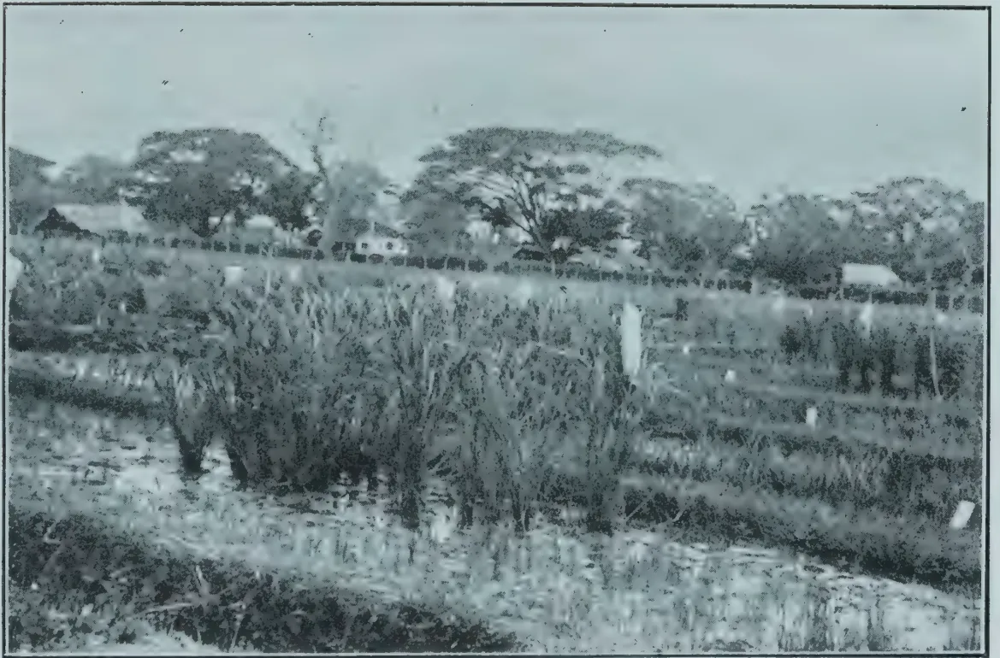A black and white photograph showing a field of crops, likely corn, in a state of partial harvest. The foreground and middle ground are filled with rows of tall, dense stalks. Some stalks appear to have been recently harvested, leaving gaps or shorter plants. In the background, a line of large, leafy trees stretches across the horizon. Behind the trees, several small, simple buildings or huts are visible. The sky is clear and light-toned.

PLATE V.  
Partly Harvested Pure Line Plots.

107------------------------------------------------

This image is a scan of a blank page. The background is a uniform light beige or off-white color. There are several small, dark specks scattered across the surface, which appear to be dust or scanning artifacts. No text, lines, or other graphical elements are present.

108------------------------------------------------

FEBRUARY, 1921.]81

Results similar to these were obtained in the case of the other varieties and it is unnecessary to multiply them. Most of the plants therefore possessed tiller numbers lying between 6 and 15 although a fair number had from 16 to 20 tillers. This extensive tillering will be illustrated more clearly by quoting the means for several lines. This is done in Table XVIII, which includes all four varieties. In the table the pure lines are denoted by their registered numbers and the varietal names are omitted. There was no more variation of the tillering mean between the different varieties than there was amongst the means of the lines of any single variety, nor was anything in the nature of a specific tillering capacity observed.

TABLE XVIII.

<table border="1">
<thead>
<tr>
<th>Pure Line</th>
<th>B4</th>
<th>B5</th>
<th>E1</th>
<th>E2</th>
<th>E3</th>
<th>H1</th>
<th>N1</th>
<th>V2</th>
<th>G1</th>
<th>N2</th>
</tr>
</thead>
<tbody>
<tr>
<td>Tiller Mean</td>
<td>21.1</td>
<td>22.3</td>
<td>11.2</td>
<td>14.0</td>
<td>21.4</td>
<td>8.4</td>
<td>10.9</td>
<td>10.5</td>
<td>15.2</td>
<td>16.0</td>
</tr>
</tbody>
</table>

The lowest mean obtained was 8.4 for one line of Suwandel but often the mean was greater than 20 for this same variety in other lines.

#### RELATION BETWEEN NUMBER OF TILLERS AND YIELD.

The important question is not merely that of the number of tillers produced by each plant but rather that of the total yield per acre. This is a function of the yield of each tiller and the number of plants per acre in addition to the number of tillers per plant. It is important therefore to investigate whether there is any proportion between the number of tillers and the yield of the individual plants.

This question has received attention from THOMPSTONE (loc. cit. p. 39), who made observations on a number of pure lines of two varieties. His results showed that "generally speaking, as the tillers increase there is an increase in the weight of grain (per 1000 plants) but this increase is not in direct proportion to the number of tillers produced by the plant. In other words as the number of tillers increases the average yield per tiller decreases.

In the following section the results of a number of observations made upon the sown and transplanted paddies are shown. It is not possible to give more than a selection of the hundreds of results recorded, but these are sufficient to indicate what may be expected from Ceylon paddies.

In Table XIX. the yields in clean winnowed paddy of a number of pure lines are given. These are expressed in 64ths of a measure which is one-twenty-eighth of a bushel. Where several plants of a given tiller number are found the average yield is given.

In accordance with THOMPSTONE'S results there is an increase in the yields of individual plants as the number of tillers increases, but this increase is not proportional to the number of tillers produced by the plant. It is easy in practice to see the reason for this if the progress of single plants is followed from transplanting to harvest. Tillering takes place in three phases which are illustrated by the Mawi plant shown in Plate VI. Shortly after being transplanted, when the plant is about five weeks old, three or four main shoots such as that numbered I. in the figure, are thrown out. At

109------------------------------------------------

82[FEBRUARY, 1921.

maturity these bear ears which are slightly larger than those borne by the shoots of the second phase like that numbered 2 in the figure. The tiller which is numbered 3 belongs to the third phase in which two or three smaller shoots are developed as late as the seventh week. These bear ears which are smaller still. If development proceeds normally no more tillers are produced after the lapse of eight weeks from the time of transplanting, the result being that, at harvest, a plant with (say) 15 tillers possesses four or five main ears, about half a dozen which are slightly smaller and three or four which are smaller still.

If however when nearing maturity the plants receive an excess of water, either artificially or in consequence of excessive precipitation, two or three smaller tillers may be produced in a fresh tillering phase actuated by the abnormal conditions. These late tillers produce ears which do not normally reach maturity. They have a separate ripening period of their own, the full course of which they are not permitted to pursue.

The mean yield of these pure lines was very large. For example in one line of Suwandel, which was taken as a fairly average culture, the mean yield per plant for the 63 plants of the line was 0.057 bushels, which corresponds to a yield of 180 bushels per acre. It is not pretended that such a yield would be obtained under field conditions, but, as these cultures received precisely the same treatment as the transplanted three-months varieties it is possible to use these figures in establishing a comparison of yields between the objects of the two kinds of cultivation. In the next section therefore some examples of yields by the transplanted varieties will be quoted.

#### **YIELDS OF TRANSPLANTED VARIETIES.**

The first example taken was a variety of Murungan with a tillering mode of 5.1 and having a considerable number of plants with tiller numbers greater than eight. These alone were examined and the result was that the largest yield determined was one of  $3/128$ ths of a measure given by a plant with eight tillers. Plants with as many as fourteen tillers failed to surpass this quantity.

The mean yield per plant for the whole culture of 343 plants was under  $1/64$ th of a measure or about one-quarter of that given by a typical sown culture.

Almost similar figures were given by varieties of Heenati examined so that it was concluded that the mean yield for the transplanted plots did not exceed an average of  $1/64$ th of a measure per plant, and in many cases was much less. The highest individual yield was given by a number of plants of Suduheenati which had produced 12 or 13 tillers each. These furnished  $1/32$  measures per plant a yield which, on the whole, was minimal for the plants of the sown series.

From the material available it was not possible to assert definitely that, with increase of tillering, there was no corresponding reduction in the size of individual ears, for the transplanted plants rarely produced tiller numbers large enough to institute a complete series of comparisons between them and those of the sown series. It is however quite evident from the few numbers available that there is no evidence to support the converse view. The lack

110------------------------------------------------


PLATE IV.

No. 1—Suwandel.

No. 3—Madoluwa.

„ 2—Kalupanniti.

„ 4—Suduhatiel.

111------------------------------------------------

A black and white photograph of a Mawi plant, seven weeks old, showing its root system and several upright stems. Three stems are labeled with small white tags: '2' on the left, '1' in the center, and '3' on the right. The plant is set against a light background and enclosed in a thin black rectangular border.

PLATE VI.  
Mawi Plant. Seven Weeks old,

112------------------------------------------------

FEBRUARY, 1921.]83

of proportionality between increase of yield and increased tillering is merely due to lack of uniformity in size of the separate ears. It should be remarked

TABLE XIX.

<table border="1">
<thead>
<tr>
<th rowspan="2">No. of<br/>Tillers</th>
<th colspan="6">Yield per plant in 1/64 Measures</th>
</tr>
<tr>
<th>NN2.</th>
<th>HI.</th>
<th>B4.</th>
<th>K2.</th>
<th>N.</th>
<th>E1.</th>
</tr>
</thead>
<tbody>
<tr><td>3</td><td>—</td><td>1</td><td>—</td><td>—</td><td>—</td><td>—</td></tr>
<tr><td>4</td><td>—</td><td>—</td><td>—</td><td>—</td><td>—</td><td>—</td></tr>
<tr><td>5</td><td>1</td><td>1</td><td>—</td><td>—</td><td>—</td><td>—</td></tr>
<tr><td>6</td><td>—</td><td>2</td><td>—</td><td>—</td><td>—</td><td>—</td></tr>
<tr><td>7</td><td>—</td><td>1.3</td><td>2</td><td>1</td><td>—</td><td>—</td></tr>
<tr><td>8</td><td>—</td><td>—</td><td>—</td><td>4</td><td>—</td><td>—</td></tr>
<tr><td>9</td><td>2</td><td>—</td><td>2</td><td>4</td><td>—</td><td>—</td></tr>
<tr><td>10</td><td>—</td><td>4</td><td>—</td><td>—</td><td>—</td><td>—</td></tr>
<tr><td>11</td><td>2.5</td><td>2</td><td>2</td><td>—</td><td>2</td><td>—</td></tr>
<tr><td>12</td><td>—</td><td>2.5</td><td>2.2</td><td>4</td><td>2</td><td>3</td></tr>
<tr><td>13</td><td>3</td><td>—</td><td>—</td><td>3</td><td>3</td><td>3</td></tr>
<tr><td>14</td><td>—</td><td>2</td><td>—</td><td>4</td><td>3</td><td>—</td></tr>
<tr><td>15</td><td>—</td><td>4</td><td>—</td><td>—</td><td>4</td><td>3</td></tr>
<tr><td>16</td><td>—</td><td>—</td><td>5</td><td>—</td><td>3</td><td>3</td></tr>
<tr><td>17</td><td>—</td><td>—</td><td>3</td><td>—</td><td>3</td><td>4</td></tr>
<tr><td>18</td><td>—</td><td>—</td><td>5</td><td>4</td><td>3</td><td>—</td></tr>
<tr><td>19</td><td>—</td><td>—</td><td>—</td><td>—</td><td>4</td><td>—</td></tr>
<tr><td>20</td><td>5.5</td><td>—</td><td>5</td><td>6</td><td>6</td><td>5</td></tr>
<tr><td>21</td><td>7</td><td>—</td><td>6</td><td>—</td><td>—</td><td>6</td></tr>
<tr><td>22</td><td>4</td><td>—</td><td>—</td><td>—</td><td>4</td><td>4</td></tr>
<tr><td>24</td><td>—</td><td>—</td><td>6</td><td>—</td><td>—</td><td>8</td></tr>
<tr><td>25</td><td>6</td><td>—</td><td>—</td><td>—</td><td>4</td><td>6</td></tr>
<tr><td>26</td><td>7</td><td>—</td><td>—</td><td>—</td><td>3</td><td>—</td></tr>
<tr><td>27</td><td>7</td><td>—</td><td>—</td><td>—</td><td>—</td><td>8</td></tr>
<tr><td>28</td><td>6</td><td>—</td><td>—</td><td>—</td><td>6</td><td>—</td></tr>
<tr><td>29</td><td>—</td><td>—</td><td>—</td><td>8</td><td>—</td><td>—</td></tr>
<tr><td>30</td><td>—</td><td>6</td><td>—</td><td>—</td><td>—</td><td>—</td></tr>
<tr><td>31</td><td>6</td><td>6</td><td>6</td><td>—</td><td>—</td><td>—</td></tr>
<tr><td>32</td><td>—</td><td>—</td><td>—</td><td>8</td><td>—</td><td>—</td></tr>
<tr><td>33</td><td>8</td><td>—</td><td>—</td><td>—</td><td>—</td><td>—</td></tr>
<tr><td>35</td><td>—</td><td>—</td><td>7</td><td>—</td><td>—</td><td>—</td></tr>
<tr><td>40</td><td>12</td><td>—</td><td>—</td><td>—</td><td>—</td><td>—</td></tr>
<tr><td>42</td><td>—</td><td>—</td><td>—</td><td>—</td><td>9</td><td>—</td></tr>
<tr><td>55</td><td>—</td><td>—</td><td>—</td><td>—</td><td>9</td><td>—</td></tr>
</tbody>
</table>

that in the transplanted plants the ears produced are more uniform in size than in either the sown or broadcasted plants.

*Discussion of results :—*

We are now in a position to survey the results obtained with broadcasted, transplanted and sown native paddies. From these results a certain amount of evidence can be extracted which bears on the theories current as to why transplanting results in increased tillering. Before discussing these it will be advantageous to examine the conclusions which previous scientific workers have arrived at.

113------------------------------------------------

84[FEBRUARY, 1921.

GRAHAM in his "Preliminary Note on the classification of Rice in the Central Provinces," (Memoirs Department of Agriculture in India. Botanical Series, Vol. VI. p. 209) states:—"The physiological factors involved in transplantation are somewhat obscure, but the conclusion at present arrived at after a number of experiments, is to the effect that transplanting acts in a way like root-pruning, the injury to the root system stimulating the growth of the subaerial portion and resulting in increased tillering. The root system of the transplanted rice is developed from the lower nodes of the stem, the first or seedling root-system in many cases dying completely. In fact a series of experiments shewed that amputation of the root system of the seedlings did not interfere with the development of the transplanted plants."

H. W. JACK in a "Preliminary Report on Experiments with Wet Rice in Krian (Agricultural Bulletin Federated Malay States Vol. VII. 1919 No. 5) says:—"It is quite evident that the splitting up of seedlings in transplanting nurseries stimulates general growth, and particularly tillering, to such a degree that a much smaller quantity of seed would be sufficient to plant up an oorlong. . . . Plants which in good land have only been transplanted once have produced under experimental conditions roughly one-quarter of the number of tillers as that produced by plants transplanted and split up three times, all the energy of the former being used up in vegetation. In like manner in similar land the yield of grain varies directly, within limits, in proportion to the number of transplantations, the optimum number in Krian being four." This refers to the method practised in Malaya of transplanting the seedlings into the field in clumps which are split up successively two or three times before the final transplanting in clumps of 2-4 seedlings. JACK proceeds to say that "in poor land the reverse holds, for the soil is not nutritive enough to enable the plant to recover from the repeated shocks of several transplantation and a single transplantation is sufficient." Here an additional soil factor is introduced to account for the shock factor being insufficient to ensure the success of the seedlings. Or, in other words, the end result, as far as tillering and yield are concerned, is the product of the resultant of two factors, viz., a stimulus due to the shock of transplantation and a nutrition factor dependent on the richness of the soil in plant food.

It has been shown however in the case of the Pure Lines worked upon, that when paddy-seeds are sown at such intervals as to give the plants the same amount of space for development as seedlings which are transplanted into the same field, where naturally all soil factors are equivalent, the transplanted plants are very inferior both as to tillering capacity and individual yield to these former. Obviously then the shock factor cannot be alone responsible for increase of tillering and other factors must be called in to explain it. It also indicates that successfully drilled paddy, in addition to eliminating the costly and laborious process of transplanting, must furnish greater yields than either broadcasted or transplanted and at the same time effect a great saving of seed paddy. This is an important point especially for cultivators of large areas.

As far as the physiological problem is increased, some light on its complexity is furnished by the results of certain investigations upon Barley carried out at the Rothamsted Experimental Station by DR. WINIFRED E. BRENCHLEY ("Some Factors in Plant Competition"—ANNALS OF APPLIED BIOLOGY, Vol. VI., December, 1919.)

114------------------------------------------------

FEBRUARY, 1921.]85

The author analyses the phenomenon into

1. (1) Competition for food from the soil
2. (2) " " water
3. (3) " " light
4. (4) The possible harmful effect due to toxic excretions from the soil.

As all cultures were sown, a shock factor due to transplantation was not considered, but the results obtained and the conclusions arrived at are of such interest and correspond so closely with what is found during field work on the rice plant that an almost complete summary of the latter is included below.

(1) "When the food supply is limited the dominant factor of plant competition is that of food and in particular the amount of available nitrogen. Other things being equal the total growth is determined by the nitrogen supply.

This will apply equally well to the rice plant as to barley, although the actual process whereby the nitrogen of the soil is made available differs essentially in the swampy rice field. Nitrates, which form such a valuable source of food in dry cultivation, are of no more use to the rice plant than the nitrogen of the atmosphere. In the peculiar swampy conditions which prevail, those which are not washed out quickly by the irrigation water, are decomposed and most of the oxygen in them either liberated as free nitrogen which is useless to the plants, or converted into injurious compounds.

(2) "With limited food supply the percentage rate of increase of dry weight decreases with the number of plants (per equivalent area), as the working capacity of the plant is limited by the quantity of material available for building up the tissues."

(3) "The decrease in light caused by overcrowding is a most potent factor in competition even when an abundance of food and water is presented to each individual plant. With barley the effect of light competition is,

1. (a) To reduce the number of ears.
2. (b) " cause great irregularity in the number of tillers produced.
3. (c) " reduce the amount of dry matter formed.
4. (d) " encourage shoot growth at the expense of root growth
5. (f) " decrease the power of the plants to make use of the food supplied to the roots."

In the case of barley Miss BRENCHEY supported these conclusions by evidence from careful experiments upon each individual point. Similar experiments upon the rice plant have not as yet been carried out but the observations recorded earlier in this paper indicate that a similar state of things prevails in the paddy field. For instance the following general comparison may be made between broadcasted and transplanted paddy :—

<table border="1">
<thead>
<tr>
<th>Broadcasted.</th>
<th>Transplanted.</th>
</tr>
</thead>
<tbody>
<tr>
<td>1. The number of ears produced is a minimum (Table III.)</td>
<td>1. The number of ears produced is greater. (Tables VII &amp; VIII.)</td>
</tr>
<tr>
<td>2. Tillering is irregular (Table I. &amp; II.)</td>
<td>2. Tillering is more regular and can be expressed by a definite Tiller Mean. (Table VII. &amp; IX.)</td>
</tr>
<tr>
<td>3. Development of the aerial portion of the plant is small.</td>
<td>3. The aerial portion develops vigorously.</td>
</tr>
<tr>
<td>4. Root development is greatly restricted.</td>
<td>4. Root development is very great compared with that of broadcasted plants.</td>
</tr>
</tbody>
</table>

In this comparison and also in the results of the experiments with paddies of Ceylon there is therefore sufficient indication that the postulation

115------------------------------------------------

86[FEBRUARY, 1921.

of a shock factor in order to account for the increased tillering of transplanted paddy plants is insufficient and that in addition it is necessary to take into consideration other physiological factors of nutrition, illumination and water which all take part in the determination of the success of the plants in competition with one another.

There is a most striking difference between the sown and transplanted cultures on the one hand and the broadcasted crops on the other in the relative development of the root system. This cannot be ascribed to the greater space given to the plants for even when thinned out well the broadcasted plants appear to be unable to produce a good crown of rootlets. It appears as though it is necessary to furnish adequate growing space to the plant during the first two months of its growth if root development is to be a maximum. This is borne out by cultures which are being now carried out, in which the seeds were sown and spaced in the nurseries at intervals of 2 in. by 2 in. The vigour and development of the root system in the young plants surpass anything hitherto met with. There is an obvious relation between the development of the root system and the number of ears produced by the plant, but up to the present no method of expressing this in terms of measurable quantities has been evolved.

---

## EMPLOYMENT OF AGRICULTURAL MACHINERY IN THE CULTIVATION OF RICE IN CALIFORNIA.

---

The following is a summary of a translation from the French of an article by SILVERIO APOSTOL in the BULLETIN AGRICOLE DE L'INSTITUT SCIENTIFIQUE DE SAIGON" for January 1921.

The author, who is the Chief of the Plant Industry Division of the Philippine Bureau of Agriculture, has recently completed an extensive tour of most of the principal rice growing countries of the world and has chosen this subject in view of the tendency in many such countries to adopt modern methods of cultivation.

He keeps in view throughout the special climatic conditions of California, and confines himself to a simple exposition of the actual methods observed by him during his visit, leaving the reader to make his own deductions as to their practicability under other and different conditions.

The cultivation of rice in California is confined to the broad valley of the Sacramento which is exceptionally favourable to the employment of agricultural machinery. In practice this is often of considerable power and weight. Multiple ploughs, often with 8 or 10 shares, are used for working the land. On one occasion a specially heavy single-shared plough, drawn by a pair of 75 H.-P. tractors, was seen in action breaking up the bunds before the general working of the land.

Harrowing and the reconstruction of the bunds are also carried out by mechanical methods. Transplanting is not practised: in its place large seed drills are employed. Weeding is the only operation carried out by hand and for this the labourers—many of them Asiatics—receive a daily wage of from 3 to 4½ dollars.

Threshing is done in the field, when all the sheaves within a radius of about half a mile are carried in specially constructed waggons to the threshing machine. When all these have been threshed the machine is moved further on.

116------------------------------------------------

FEBRUARY, 1921.]87

The grain is often transported in sacks direct from the field by means of motor lorries or in trains of trailers drawn by tractors. The Four Wheel Drive tractor is specially esteemed for this class of work.

The exceptionally favourable topography permits the establishment of large square fields of 5 to 15 acres—often of 30 acres or more—thus making easy the employment of large machines.

Apart from this, the extremely low rainfall,—21.3 inches per year—is very significant. The land is worked immediately after harvest in October when the monthly rainfall is only about 2.2 ins. The frosts and thaws of the winter months make subsequent harrowing easy. The final working of the land is completed in March and April and sowing before the middle of May. No rain falls in July or August. The fact that all the cultural operations can be carried out during months when the rainfall is slight, together with the admirable irrigation and drainage systems which allow the soil water to be controlled at will, account for the ease and efficacy of the employment of agricultural machinery.—F. S.

## PADDY MANURING EXPERIMENTS WITH YALA CROP, 1920.

M. KELWAY BAMBER, M.R.A.C., F.C.S.,

*Secretary, Agricultural Society.*

Owing to the urgent necessity of increasing food production several paddy manuring experiments were arranged by the Agricultural Society for the Yala crop in 1920.

The chief objects were to ascertain :—

(1) Whether Ephos phosphate could be usefully employed to replace bone meal, the common paddy manure, as the latter was at that time almost unobtainable, and very expensive.

There was also the possibility of the export of Bone meal from India being stopped altogether.

(2) To try the effect of Nitrolim as a source of nitrogen for paddy, as it supplied the cheapest unit of nitrogen, and will probably continue to do so in the future especially if manufactured in Ceylon.

The decomposition of Nitrolim in the soil with production of urea and ammonia, should also make it especially suitable for paddy manuring.

The expenditure on paddy manuring with Bone meal rarely exceeded Rs. 10 per acre, and was generally much less, the application ranging from  $\frac{1}{2}$  to 1 cwt per acre at most.

It was difficult to make up mixtures not to exceed Rs. 10 or Rs. 12 per acre, which could be expected to give much increase, especially with the first crop. But the following were employed :—

<table>
<tr>
<td><i>1st Mixture.</i></td>
<td>Fish Guano</td>
<td>70 lb.</td>
<td>Containing Nitrogen</td>
<td>8.8 lb.</td>
</tr>
<tr>
<td></td>
<td>Ephos phosphate</td>
<td>80 ,,</td>
<td>Phos. Acid</td>
<td>29.6 ,,</td>
</tr>
<tr>
<td></td>
<td>Nitrolim</td>
<td>18 ,,</td>
<td></td>
<td></td>
</tr>
</table>

168 lb. or 1½ cwt. per acre

costing Rs. 12.15 per acre in Colombo.

117------------------------------------------------

88[FEBRUARY, 1921.

<table>
<tr>
<td><i>2nd Mixture.</i></td>
<td>Bone meal</td>
<td>120 lb.</td>
<td>Containing Nitrogen</td>
<td>6.16 lb.</td>
</tr>
<tr>
<td></td>
<td>Nitrolim</td>
<td>25 ,,</td>
<td>Phos. Acid</td>
<td>24.64 ,,</td>
</tr>
</table>

145 lb. per acre ; costing Rs. 10.89 per acre.

<table>
<tr>
<td><i>3rd Mixture.</i></td>
<td>Ephos phosphate</td>
<td>100 lb.</td>
<td>Containing Nitrogen</td>
<td>4.0 lb.</td>
</tr>
<tr>
<td></td>
<td>Nitrate of Potash</td>
<td>40 ,,</td>
<td>Phos. Acid</td>
<td>30.0 ,,</td>
</tr>
<tr>
<td></td>
<td></td>
<td></td>
<td>Potash</td>
<td>13.2 ,,</td>
</tr>
</table>

140 lb. per acre, costing Rs. 12.05 per acre

in Colombo.

The manures were to be well mixed with their bulk of soil and applied broadcast after the second ploughing and before mudding and levelling.

No change was to be made in the method of cultivation adopted in each district, except that each operation was to be thoroughly done.

It was proposed to recover the cost of the manures from the crop after harvest.

The following is a summary of the results of the manuring received to date :—

#### KANDY DISTRICT.

##### Mahaiyawa Fields on Katugastota Road.

<table>
<thead>
<tr>
<th></th>
<th></th>
<th>Yield per acre.</th>
</tr>
</thead>
<tbody>
<tr>
<td>Plot 1.</td>
<td>First mixture</td>
<td>... 30 bushels</td>
</tr>
<tr>
<td>,, 2.</td>
<td>Second ,,</td>
<td>... <math>28\frac{2}{5}</math> ,,</td>
</tr>
<tr>
<td>,, 3.</td>
<td>Third ,,</td>
<td>... 25 ,,</td>
</tr>
<tr>
<td>,, 4.</td>
<td>Control</td>
<td>... 25 ,,</td>
</tr>
</tbody>
</table>

The mixture with Potash gave no improvement over the control. Mixtures 1 and 2 gave an increase of 5 and  $3\frac{2}{5}$  bushels respectively. The experiments (modified) are being continued for the present Maha crop.

#### UDISPATTU.—H. B. RAMBUKWELLA.

These plots are on hilly land with small fields, rather exposed to high winds, and B and C were cultivated for Yala for the first time.

<table>
<thead>
<tr>
<th></th>
<th></th>
<th>Yield per acre.</th>
<th>Previous Maha Crop.</th>
</tr>
</thead>
<tbody>
<tr>
<td>Plot A.</td>
<td>Mixture No. 3</td>
<td>22 bushels</td>
<td>25 bushels</td>
</tr>
<tr>
<td>,, B.</td>
<td>,, No. 2</td>
<td>19 ,, and 2 light</td>
<td>17 ,,</td>
</tr>
<tr>
<td>,, C.</td>
<td>,, No. 1</td>
<td>20 ,, ,, ,,</td>
<td>17 ,,</td>
</tr>
</tbody>
</table>

Severe winds were experienced during the flowering stage which affected yields. They were not up to expectation, judging from the growth of the plants before flowering, plots B and C being very promising. All the plots were sown with Heenati. These experiments are being continued with a control plot.

#### GIRIHAGAMA.

These plots were cultivated for Yala for the first time and the manure was only applied just before sowing. There were prolonged and heavy showers during the flowering period and Paddy-fly caused some damage.

<table>
<thead>
<tr>
<th></th>
<th></th>
<th>Yield per Acre.</th>
<th>Previous Average for<br/>Maha Crop.</th>
</tr>
</thead>
<tbody>
<tr>
<td>Plot A.</td>
<td>1st mixture</td>
<td>23 bushels</td>
<td>35 bushels</td>
</tr>
<tr>
<td>,, B.</td>
<td>2nd ,,</td>
<td>20 ,,</td>
<td>35 ,,</td>
</tr>
<tr>
<td>,, C.</td>
<td>3rd ,,</td>
<td>24 ,,</td>
<td>36 ,,</td>
</tr>
</tbody>
</table>

The plots have not been manured again for the present Maha but the effect of the previous manuring will be recorded.

118------------------------------------------------

FEBRUARY, 1921.]89

It is reported that the present growth is satisfactory the plants being healthy and vigorous.

#### DUNUWILA FIELDS.

One plot manured with No. 1 mixture :—

<table>
<tr>
<td>Fish guano</td>
<td>...</td>
<td>...</td>
<td>...</td>
<td>70 lb.</td>
</tr>
<tr>
<td>Ephos phosphate</td>
<td>...</td>
<td>...</td>
<td>...</td>
<td>80 ,,</td>
</tr>
<tr>
<td>Nitrolim</td>
<td>...</td>
<td>...</td>
<td>...</td>
<td>18 ,,</td>
</tr>
</table>

168 lb. per acre

The yield obtained was 32 bushels per acre, the adjoining half acre field giving only 12 bushels or 24 bushels per acre. The previous Yala crop gave 27 bushels per acre.

#### MAVILMADA.

One plot manured with No. 3 mixture Ephos phosphate and Nitrate of Potash. This yielded only 15 bushels per acre, compared with 20 bushels for the previous Yala.

It is reported that there was a severe drought just when the plants needed water and the soil was baked. Paddy-fly also did some damage.

A quarter acre plot manured with No. 1 mixture gave at the rate of 24 bushels per acre. It had ample water.

A third plot of  $\frac{1}{4}$  acre, manured with No. 2 mixture, Bone meal and Nitrolim gave at the rate of 20 bushels per acre.

The control plot of  $\frac{1}{2}$  acre also gave 20 bushels per acre.

All the plots were badly damaged by the Paddy-fly.

#### COLOMBO DISTRICT.

##### Veyangoda.

Four plots of one acre each were arranged at Veyangoda and manured with the same mixtures.

<table>
<tr>
<td>No. 1</td>
<td>Fish guano</td>
<td>70 lb.</td>
<td rowspan="3">} Yield per acre</td>
</tr>
<tr>
<td></td>
<td>Ephos phosphate</td>
<td>80 ,,</td>
</tr>
<tr>
<td></td>
<td>Nitrolim</td>
<td>18 ,,</td>
<td>28 bushels</td>
</tr>
</table>

168 lb.

<table>
<tr>
<td>No. 2</td>
<td>Bone meal</td>
<td>121 lb.</td>
<td rowspan="2">} 30 bushels</td>
</tr>
<tr>
<td></td>
<td>Nitrolim</td>
<td>25 ,,</td>
</tr>
</table>

146 lb.

<table>
<tr>
<td>No. 3</td>
<td>Ephos phosphate</td>
<td>100 lb.</td>
<td rowspan="2">} 25 bushels</td>
</tr>
<tr>
<td></td>
<td>Nitrate of Potash</td>
<td>40 ,,</td>
</tr>
</table>

140 lb.

<table>
<tr>
<td>No. 4</td>
<td>Control Plot</td>
<td>12 bushels</td>
</tr>
</table>

Although there is such a marked difference between the control and manured plots, it is reported that the yield is only fair as owing to insufficient water the fields got dried up at early growth and during the flowering stage, with the result that 30 per cent. of the plants did not flower and the formation of paddy grain too was not satisfactory.

119------------------------------------------------

90[FEBRUARY, 1921.

## RATNAPURA DISTRICT.

### Ratnapura.

Four plots of  $\frac{1}{2}$  acre each at Tiruvanaketiya.

<table style="width: 100%; border-collapse: collapse;">
<thead>
<tr>
<th style="width: 60%;"></th>
<th style="width: 40%; text-align: right;">Yield per acre</th>
</tr>
</thead>
<tbody>
<tr>
<td>Plot 1. No. 1 mixture      ...      ...</td>
<td style="text-align: right;">26 bushels</td>
</tr>
<tr>
<td>2.      do      ...      ...</td>
<td style="text-align: right;">28 ,,</td>
</tr>
<tr>
<td>3. No. 2 mixture      ...      ...</td>
<td style="text-align: right;">32 ,,</td>
</tr>
<tr>
<td>4.      Control ...      ...      ...</td>
<td style="text-align: right;">20 ,,</td>
</tr>
</tbody>
</table>

The results of manuring these plots were very satisfactory.

Experiments were arranged for with MR. R. C. PROCTOR at Chilaw, and MR. G. PANDITASEKERA at Marawila, and at Badulla; but owing to the late arrival of manure in the Easter holidays, they were postponed until the present Maha crop.

Before the Maha crop which is grown between October—February, a new series of plots were arranged for in different parts of Ceylon, some 45 in all.

The general plan was to have four plots of approximately one acre each to be cultivated by the usual methods, but thoroughly, and to be treated as below.

*Plot 1.*—Green manure at 2000 lb. per acre and 1 cwt. Ephos phosphate costing about Rs. 10.50 including Rs. 5.50 for the manure.

*Plot 2.*—A mixture consisting of

<table style="width: 100%; border-collapse: collapse;">
<tbody>
<tr>
<td style="width: 30%;">Fish Guano</td>
<td style="width: 15%;">84 lb.</td>
<td style="width: 15%;">containing</td>
<td style="width: 15%;">Nitrogen</td>
<td style="width: 15%;">13.5 lb.</td>
</tr>
<tr>
<td>Ephos phosphate</td>
<td>100 ,,</td>
<td>,,</td>
<td>Phos. acid</td>
<td>37.14 ,,</td>
</tr>
<tr>
<td>Nitrolim</td>
<td>40 ,,</td>
<td>,,</td>
<td>Potash</td>
<td>nil</td>
</tr>
<tr>
<td colspan="5" style="text-align: center;">—————</td>
</tr>
<tr>
<td colspan="5" style="text-align: center;">224 lb. per acre.</td>
</tr>
<tr>
<td colspan="5" style="text-align: center;">—————</td>
</tr>
</tbody>
</table>

Costing approximately Rs. 16.68 per acre.

*Plot 3.* Control

<table style="width: 100%; border-collapse: collapse;">
<tbody>
<tr>
<td style="width: 30%;"><i>Plot 4.</i> Sterilised Animal Meal</td>
<td style="width: 15%;">112 lb.</td>
<td style="width: 15%;">containing</td>
<td style="width: 15%;">Nitrogen</td>
<td style="width: 15%;">10.1 lb.</td>
</tr>
<tr>
<td>Std. Bone meal</td>
<td>56 ,,</td>
<td>,,</td>
<td>Phos. acid</td>
<td>19.8 ,,</td>
</tr>
<tr>
<td colspan="5" style="text-align: center;">—————</td>
</tr>
<tr>
<td colspan="5" style="text-align: center;">168 lb. per acre</td>
</tr>
<tr>
<td colspan="5" style="text-align: center;">—————</td>
</tr>
</tbody>
</table>

Costing approximately Rs. 14.99 per acre.

Most of these plots are now under cultivation, but several were started very late owing to lateness of the N. E. rains in the districts concerned and in two or three cases the plots have been partly ruined by heavy floods.

The harvest will be made between February and April next.

120------------------------------------------------

FEBRUARY, 1921.]91

# TEA.

---

## TEA MANURING PLOTS, PERADENIYA.

---

Apart from the application of Basic slag and Sulphate of Potash at pruning, Artificials were first applied to the Tea plots in May 1918 and have been continued annually since.

During 1919 it was decided by the Committee of Agricultural Experiments to change the pruning periods so that all the plots would be pruned the same month, the period of two years to remain the same.

To effect this the single and Assam Hybrid plots Nos. 141-145 and 155 were run 27 months and the Manipuri indigenous plots Nos. 146-150 only 21 months and all were pruned in October 1919.

Plucking began again in February, 1920, so that the yields this season are from 11 months' plucking only.

Owing to the change in the period of pruning, the yields in 1920 are not strictly comparable with those of 1918, but the increases during that period are shown under the table giving the actual yields for 1918, 1919 and 1920.

The plots marked A & B are approximately half acre each, and Nos, 144, 145, 149 and 150 one acre each.

The quantities of manure given represented 20 lb. each of Nitrogen, phosphoric acid or potash per plot and were applied annually as follows:—

Plots 141A & 146A 286 lb. groundnut cake and 50 lb. Sulphate of potash per acre

Plots 141B & 146B 286 lb. groundnut cake only

„ 142A & 147A 286 lb. groundnut cake and 111 lb. Superphosphate,

„ 142B & 147B 286 lb. groundnut cake only

„ 143A & 148A 111 lb. Superphosphate and 50 lb. Sulphate of Potash

„ 143B & 148B 286 lb. Groundnut cake, 111 lb. Superphosphate and 50 lb. Sulphate of potash (40 %)

Plot 144 had dadaps planted in 1912 and received the usual Slag and Potash mixture at pruning.

„ 145 No manure

„ 149 Original Dadap plot

„ 150 Albizzia plot

„ 155 Cattle manure at 30 tons per acre applied in March, 1908

121------------------------------------------------

92

[FEBRUARY, 1921.

**TABLE I SHOWING THE ACTUAL YIELDS OF MADE TEA PER PLOT FROM 1918.**

<table border="1">
<thead>
<tr>
<th rowspan="2">Year</th>
<th colspan="2">A</th>
<th colspan="2">B</th>
<th colspan="2">A</th>
<th colspan="2">B</th>
<th colspan="2">A</th>
<th colspan="2">B</th>
<th colspan="2">A</th>
<th colspan="2">B</th>
<th colspan="2">A</th>
<th colspan="2">B</th>
<th rowspan="2">Dadap</th>
<th rowspan="2">Albizzia</th>
<th colspan="2">Cattle Manure</th>
<th rowspan="2">Rainfall</th>
<th rowspan="2">Wet days</th>
</tr>
<tr>
<th>141</th>
<th>141</th>
<th>142</th>
<th>143</th>
<th>143</th>
<th>144</th>
<th>144</th>
<th>145</th>
<th>146</th>
<th>147</th>
<th>148</th>
<th>148</th>
<th>149</th>
<th>150</th>
<th>155</th>
<th>155</th>
</tr>
</thead>
<tbody>
<tr>
<td>1918</td>
<td>394</td>
<td>430</td>
<td>453</td>
<td>517</td>
<td>347</td>
<td>426</td>
<td>1,060</td>
<td>1,066</td>
<td>395</td>
<td>410</td>
<td>410</td>
<td>337</td>
<td>374</td>
<td>915</td>
<td>1,071</td>
<td>556</td>
<td>681</td>
<td>91.84</td>
<td>168</td>
</tr>
<tr>
<td>1919</td>
<td>276</td>
<td>278</td>
<td>310</td>
<td>312</td>
<td>249</td>
<td>277</td>
<td>720</td>
<td>623</td>
<td>461</td>
<td>490</td>
<td>426</td>
<td>384</td>
<td>412</td>
<td>1,082</td>
<td>1,125</td>
<td>369</td>
<td>383</td>
<td>92.04</td>
<td>176</td>
</tr>
<tr>
<td>1920</td>
<td>512</td>
<td>553</td>
<td>572</td>
<td>582</td>
<td>496</td>
<td>534</td>
<td>1,160</td>
<td>1,274</td>
<td>750</td>
<td>792</td>
<td>680</td>
<td>705</td>
<td>612</td>
<td>1,670</td>
<td>1,545</td>
<td>558</td>
<td>605</td>
<td>101.50</td>
<td>174</td>
</tr>
<tr>
<td>Increased yield over 1918</td>
<td>118</td>
<td>123</td>
<td>119</td>
<td>65</td>
<td>149</td>
<td>108</td>
<td>100</td>
<td>208</td>
<td>355</td>
<td>389</td>
<td>270</td>
<td>295</td>
<td>275</td>
<td>267</td>
<td>755</td>
<td>474</td>
<td>2.76 lb.</td>
<td></td>
<td></td>
</tr>
<tr>
<td>Increase per acre A &amp; B.</td>
<td>241</td>
<td></td>
<td>184</td>
<td></td>
<td>257</td>
<td></td>
<td>100</td>
<td></td>
<td>208</td>
<td></td>
<td>744</td>
<td></td>
<td>565</td>
<td></td>
<td>542</td>
<td></td>
<td>755</td>
<td></td>
<td>474</td>
<td></td>
<td>-74 lb.</td>
<td></td>
<td></td>
<td></td>
</tr>
</tbody>
</table>

**TABLE II SHOWING THE ACTUAL YIELDS OF TEA IN LB. FROM EACH PLOT IN TWO YEARLY PERIODS, FROM 1915 TO 1920 INCLUSIVE.**

<table border="1">
<thead>
<tr>
<th>Periods</th>
<th colspan="2">Plots</th>
<th>141</th>
<th>142</th>
<th>143</th>
<th>144</th>
<th>145</th>
<th>146</th>
<th>147</th>
<th>148</th>
<th>149</th>
<th>150</th>
<th>155</th>
</tr>
</thead>
<tbody>
<tr>
<td>1915 &amp; 1916</td>
<td>lb.</td>
<td>lb.</td>
<td>1,224</td>
<td>1,422</td>
<td>1,231</td>
<td>1,806</td>
<td>2,012</td>
<td>2,058</td>
<td>1,984</td>
<td>1,736</td>
<td>2,660</td>
<td>2,622</td>
<td>1,839</td>
</tr>
<tr>
<td>1917 &amp; 1918</td>
<td></td>
<td></td>
<td>1,314</td>
<td>1,575</td>
<td>1,272</td>
<td>1,818</td>
<td>1,794</td>
<td>2,011</td>
<td>1,926</td>
<td>1,651</td>
<td>2,547</td>
<td>2,550</td>
<td>2,093</td>
</tr>
<tr>
<td>1919 &amp; 1920</td>
<td></td>
<td></td>
<td>1,619</td>
<td>1,776</td>
<td>1,556</td>
<td>1,880</td>
<td>1,897</td>
<td>2,499</td>
<td>2,022</td>
<td>2,049</td>
<td>2,752</td>
<td>2,670</td>
<td>1,915</td>
</tr>
<tr>
<td>Increase or decrease per acre plot for each period.</td>
<td>1st Period</td>
<td>2nd Period</td>
<td>90</td>
<td>153</td>
<td>41</td>
<td>12</td>
<td>-218</td>
<td>-47</td>
<td>-58</td>
<td>-85</td>
<td>-113</td>
<td>-72</td>
<td>+ 254</td>
</tr>
<tr>
<td></td>
<td></td>
<td></td>
<td>305</td>
<td>201</td>
<td>284</td>
<td>62</td>
<td>193</td>
<td>488</td>
<td>96</td>
<td>398</td>
<td>205</td>
<td>120</td>
<td>-178</td>
</tr>
</tbody>
</table>

122------------------------------------------------

FEBRUARY, 1921.]93

From these figures of increased yield it appears that a mixture containing nitrogen and potash has a greater effect than nitrogen and phosphoric acid. But where nitrogen and potash were applied together the increase was rather less in both plots than with nitrogen only—Plots 141B and 146B.

With nitrogen and phosphoric acid Plots 142A and 147A, the increase from the phosphoric acid was satisfactory, but in this case also nitrogen alone gave rather better results in the Manipuri plots, though not in the Single plots 142 A. & B.

The four B plots manured with 286 lb. groundnut cake only (20 lb. nitrogen) Nos. 141, 142, 146 and 147 all gave satisfactory increases.

Comparing plots 143A and B and 148A and B the complete mixture (Plots B) gave rather heavier yields than Plots A, nitrogen omitted, but the relative increase over 1918 yields was greater in the A Plots.

The effect of the manuring is more clearly shown in Table II when the increase in the two periods, before and after manuring is compared.

During the 1st period 1915-16 to 1917-18 Plots 141-144 and 155 showed a fair improvement in yield, while the control plot No. 145 and the Manipuri indigenous plots all showed a decrease.

During the 2nd period 1917-18 to 1919-20 after manuring all the plots show a marked increase, except the cattle manure plot, last manured in 1908, which shows a decrease of 178 lb. per acre.

The Dadap plot No. 144 has been rather disappointing as regards any increase during the same period 1915-1920, but the yield has been maintained at an average of 917 lb. compared with 759 lb. for the six previous years.

The control plot No. 145 still continues to give an average yield of 950 lb. per acre, during the last six years, compared with an average of 901 lb. per acre for the previous six years.

The original dadap plot No. 149 received an application of 1,000 lb. of lime (500 lb. quicklime and 500 lb. ground lime) in September 1916. The yield in 1917 was 1,632 lb., an increase of 114 lb. on the corresponding yield in 1915. During 1918 and 1919 the crop fell off considerably, but recovered to 1,670 lb. per acre in 1920. It is evident that 1,000 lb. per acre of lime, even with half as ground-lime, is too heavy an application for tea.

The Albizzia plot received 500 lb. of the same lime mixture in 1916, the results were very similar, but less marked.

M. KELWAY BAMBER.

123------------------------------------------------

94[FEBRUARY, 1921.

# PESTS AND DISEASES.

## COCONUT DISEASES—KURUNEGALA DISTRICT.

### GENERAL REPORT.

The following diseases are apparent with varying degrees of intensity in the district :—

1. 1 Leaf-droop
2. 2 Leaf-break
3. 3 Nut-fall

Leaf-droop and Nut-fall are ascribed by the Mycologists to be due to a species of *Phytophthora*, while leaf-break is associated with a *Diplodia*. It is possible that leaf-break may in some instances not be un-associated with a diseased condition in the bud. Bud-rot is now being ascribed by various Mycologists in several countries as being caused by a species of *Phytophthora*, and there is some possibility that all these diseases may be connected with one and the same fungus.

Leaf-break is frequently most common in cultivations where the Agricultural conditions are not entirely satisfactory, but this is not always the case. There is however some evidence that leaf-break may be a "deficiency" disease and that it would be less common upon well cultivated estates. Other cases, however, have been observed where leaf-break has occurred upon well cultivated plantations.

Leaf-droop and nut-fall are believed to be caused by the same fungus and from the grower's point of view are more serious than the leaf-break above mentioned.

These diseases occur where the rainfall is *heavy for coconuts* and from the records of this Department are not particularly frequent except in the Kurunegala district. They may occur upon well-cultivated estates as well as upon neglected properties. On well-cultivated estates they will, however, as a general rule, occasion less damage than when the agricultural conditions are unfavourable.

In excessive and continuous spells of wet weather they may be capable of causing considerable damage to palms and crops even in well-cultivated plantations. Isolated cases have been seen in which vigorously growing palms have dropped 50 % of their nut crop as the result of this disease—the nuts being of all sizes but most usually about half grown. These isolated cases appear to be scattered and do not seem to serve as centres of infection. It can only be concluded that these palms are more susceptible to the disease than others.

In some cases the nut-fall has been considerable and it is probable that this loss is worst where the rains are continuous. The damage occasioned to palms by the leaf-droop must not however be minimized. Palms may be put out of bearing for a considerable period by this disease but this does not appear to be general and it is probable that good cultivation would assist towards minimizing the effects of this disease.

124------------------------------------------------

FEBRUARY, 1921.]95

The next question arises "Are these diseases likely to become a menace to the Industry?" The diseases of leaf-droop and nut-fall are likely only to occasion serious damage in a district which has a heavy rainfall with a number of days with light or misty rains. No one with a knowledge of the effects of *Phytophthora* disease of other crops would be prepared to overlook the possibilities of serious losses being occasioned. It is conceivable that under exceptional circumstances of bad cultivation, insufficient drainage and exceptionally unfavourable climatic conditions this fungus might cause considerable damage. That situation does not however exist to-day and in fact there appears to be evidence that the disease is generally not so common as it was in 1917.

In my opinion therefore there is no occasion at the present moment for any alarm, but I cannot overlook the possibilities of greater prevalence under certain conditions.

What are the remedies for the diseases?

These would appear to be as follows :—

1. 1. Good cultivation.
2. 2. Better drainage.
3. 3. Collection and destruction of all fallen diseased nuts and diseased leaves.
4. 4. Spraying of palms as a preventive measure.

Good cultivation will improve the vigour of the palms while I am convinced that on the heavy soils of the Kurunegala district much better drainage is essential. All fallen diseased nuts should be collected and destroyed. The collection of diseased pods upon a cacao estate—the pod disease of which is similar to if not identical with the nut disease of coconuts—at regular intervals weekly during the wet weather and fortnightly during the dry weather will under ordinary circumstances reduce the incidence of pod disease to an economic minimum. The collection of diseased nuts of a coconut palm cannot be effected on the palms themselves, but they rapidly fall when affected and should be collected and destroyed. Upon estates where nut-fall is common regular gangs should be employed for collecting and dealing with diseased nuts.

In regard to spraying the main question is "Will it pay"? This can only be determined upon the properties themselves. It is an economic problem which the man on the spot alone can settle. One estate has given me figures which shew that spraying can be carried out at 8 cents per palm per application. This cost, I am certain, can be considerably reduced, if better spray nozzles are employed and if the weight of the pipe extension can be reduced. It should not however be over-looked that the cost of spraying one palm works out at present prices for coconuts at less than one nut per palm per application. The problem for the estate therefore is to settle whether an average of more than one nut per palm cannot be saved from falling per spraying. This point should not be difficult to settle.

Spraying of tall palms such as coconuts is not a simple operation particularly when the land is hilly. On one estate it has been demonstrated that it is practicable and spraying of areca palms is being carried on successfully and economically in the Madras Presidency. After careful consideration I am of opinion that spraying of coconuts is a practical operation and

125------------------------------------------------

96[FEBRUARY, 1921]

can be adopted when circumstances warrant it. In a wet district where nut-fall is prevalent I am of opinion that such spraying would be warranted. It must however be used as a preventive measure and cannot be used as a cure or a remedy. Spraying at first should be directed to the well cultivated areas bearing good average yields of nuts. The losses preventible by spraying are likely to be greater on those areas and spraying is therefore much more likely to be remunerative.

When should spraying be carried out? A study of six years' rain-fall records shows that heavy rains may be expected for 3 consecutive months between September and January and sometimes for 2 consecutive months between May and July. Spraying should certainly therefore be carried out during the North-East monsoon and in wet years possibly during the South-West season. As a general practice it might be suggested that spraying should begin when the North-East season sets in; and the area to be sprayed should be completed within the first month of this season, and that it should be sprayed again a second time within six weeks of the first spraying.

In a prolonged wet season a third spraying might be advisable and might pay. This could only be settled by experiment. Whether spraying would be necessary and remunerative in the South-West season could only be determined after accurate data regarding fallen nuts is available.

It remains to consider whether Government could at this stage render further assistance. The Mycologists have worked out a considerable amount of information respecting the diseases of nut-fall and leaf-droop. These diseases are declared diseases under the Pest Act, and it is incumbent upon all owners "to collect and destroy by fire all diseased fruits and fallen leaves in affected fields....." These regulations are not complied with and the Department of Agriculture has not the machinery to enforce them at the present time. Steps are being taken to train a staff and later an inspection and educational campaign will be undertaken.

If the disease were at the present time a menace to the coconut industry of the Kurunegala district immediate measures would have to be taken. It is not considered to be at the present moment sufficiently serious to warrant such action. What is required at the present time is that progressive estates should undertake to carry out the remedial measures recommended, keep a record of the number of fallen nuts (small unfertilized nuts should not be counted) and undertake spraying operations in defined areas of the estates as a preventive measure. If these operations pay (there is every reason to believe that they would at present high prices for coconut products) the present proprietors can be induced to undertake co-operative spraying with or without Government assistance. In this matter however education must precede the enforcement of compulsory measures, unless and until the diseases threaten to become a menace to the industry.

It must not be lost sight of that in the Kurunegala district coconuts are being grown on a heavy soil in a climate that is wetter than the average of the best coconut districts. Crops are probably therefore more uniform but the cultivators must expect to meet the toll of diseases under such conditions and must be prepared to spend money to combat and prevent them. Attempts should also be made to identify if possible any varieties or trees that are immuned to disease, as nuts from these palms would be of value for the future plantings.

F. A. STOCKDALE.

126------------------------------------------------

FEBRUARY, 1921.]97TRADE  
MARK**'TABLOID'** BRAND

# Medicine Chest

No. 254

No. 254 'Tabloid' Medicine Chest  
Measurements 9 X 6¾ X 5¼ in


A compact yet comprehensive equipment containing medicaments, dressings, etc., which always maintain their efficiency in tropical climates.

Particularly adapted to the needs of settlers and planters. The ideal medical equipment for out-stations, works and camps.

*Obtainable from all Chemists and Stores*


**BURROUGHS WELLCOME & CO., LONDON  
AND COOK'S BUILDING, HORNBY ROAD, BOMBAY**

xx 2703

*All Rights Reserved*

## TOBACCO.

---

### FACTORS THAT AFFECT THE GROWTH, REPRODUCTION, AND MATURITY OF TOBACCO.

**W. H. SCHERFFIUS, M.S.,**

*Chief, Division of Tobacco and Cotton.*

The various factors that affect the development of a crop of tobacco are numerous. Probably the most important are light, temperature, moisture, chemical changes, and fertility of soil.

*Light.*—I have purposely mentioned light first, as too frequently we attach more importance to the other factors mentioned and leave light out of consideration. A number of investigators have given special attention to this phase of plant life, and their results have indicated that light plays a most important part in the growth and reproduction of plants. This topic might be viewed from three directions, namely: (1) Intensity of the light; (2) the quality, that is, the wave lengths of the radiation; and (3) the duration.

As regards intensity of the light, there seems to be an optimum amount suited for each plant species, and that optimum may be more or less than the full intensity of the sun's light on a clear day in a particular quarter of the

127------------------------------------------------

98[FEBRUARY, 1921.

globe. Within certain limits a reduction of the intensity of the light has a tendency to lengthen the axis and branches and also to increase the superficial area of leaf surface of a good many species of plants.

The effects produced by different spectrum rays are very marked, though nothing very decisive can be stated at present. Under the influence of red rays of light certain species of plants show an abnormal elongation of the axis, while under green and blue rays the length of the axis is markedly reduced. Some plants show the greatest growth under white light.

The duration of daily exposure to light seems to have an important bearing on the period of vegetative growth of certain species, the lengthening of the daylight period, showing a considerable shortening of the period of vegetative growth, larger seeds produced, and an increase in the flavour and aroma. The exclusion of light prevents the development and functioning of the seed-forming agents, or sexual reproduction; on the other hand, the length of the seasonal daylight, or if supplemented by artificial light, is a dominant factor in developing the staminate and pistillata reproductive organs, and, therefore, the existence of the species.

Only moderate shortening or lengthening of the daylight period tends to retard or accelerate, as the case may be, the sexual reproduction. If the daylight period is too short for production of seed the plant tends to gigantism or indefinite vegetative development. While under the influence of the correct length of daylight for a particular species an abundant flowering and fruiting may be expected. Thus certain varieties may act as late or early maturing, depending on the amount of daylight they may be exposed to as compared to the optimum requirements of that species or variety.

Annuals, biennials, and perennials may also be the results of seasonal range of daylight, as many species are, in a measure, governed by length of daylight rather than the retarding influence of winter. Therefore, certain annuals may complete two cycles of reproduction in a single season by subjecting the plants to a suitable length of daylight or artificial light. Similarly, under certain reduced light exposures, some annuals behave like non-flowering perennials.

Apparently the rate of growth is directly proportionate to the length of daily light exposure.

From the above one would conclude that the proper time for seeding in order to get the correct amount of sunlight is important, and that the seasonal range of daylight is an important factor in controlling the natural distribution of plants.

*Temperature and Moisture.*—The various factors mentioned previously are so vitally dependent one upon the other that it is important to bear in mind that one of these factors, such as temperature, will not give results approaching perfection without the other conditions being favourable to the production of the crop. Tobacco is a plant which is very sensitive to its surroundings, and we must not expect a good development if the conditions under which we compel the plant to grow are unfavourable. To obtain the fullest development in growth the plant requires a humid atmosphere and a fairly high temperature, though in my opinion it attains its greatest perfection in temperate zone heat. It has, however, been very clearly demonstrated that certain varieties or types of tobacco will make good development under the

128------------------------------------------------

FEBRUARY, 1921.]99

influence of high temperature, while others show poor development. A notable example of this is found in the White Burley types. They seem to reach the highest degree of perfection in the Blue Grass Region of Kentucky; there is, however, another factor which plays a vital part in this connection which will be mentioned later. White Burley tobacco, when planted in this country, with occasional exceptions, seems to become somewhat dwarfed, and the different individuals show a lack of uniformity in their growth, and not infrequently the leaves show a parched or dried condition during the growing period. It seems to thrive best in rather a humid atmosphere and with a moderate temperature.

Cigar wrapper tobacco, which is probably the most highly specialized type grown, seems to thrive best and reach the highest degree of perfection in growth, flavour, and aroma, in a high temperature with a fair amount of humidity. During the curing or drying stage, to obtain the best results, the tobacco planter must use his best judgment in this process, as the method of handling his crop depends largely on the type of tobacco he is attempting to produce. For example, in the production of cigar wrappers the curing process is an alternating one, in which the tobacco should partially dry during the day and at night it should absorb a certain amount of moisture—this process is called "running," i.e. the cured portion of the tobacco gradually changes from a yellow or green colour to a light mahogany brown. In the production of so-called Virginian tobacco the process is somewhat different; to secure the greatest amount of light-coloured leaf the planter must for the first few days during the yellowing process prevent curing, by keeping the atmosphere humid, till the tobacco is properly yellow; then the curing process is commenced and is continued constantly to prevent "running" till the tobacco is thoroughly dried. The relative amount of humidity and heat necessary both during the yellowing period and the curing period are highly important, as the results obtained depend largely on these factors.

The ageing or fermenting process should not be attempted by the farmer where a warehouse is available, as it is purely a warehouse operation and can only be done properly where large quantities of tobacco are brought together and where suitable buildings are available.

*Chemical Changes.*—During the growing period there are certain plant foods which become water soluble and are drawn into the plant by means of fine root hairs on the plant. These plant foods, nitrogen, potash, and phosphorus, in addition to certain other minerals such as lime, magnesium, sulphur, iron, and carbon, are essential in building up the cell structure of the plant. During the growth, curing, and fermentation of a crop of tobacco there are complex chemical changes constantly going on; starches are converted to sugars, alkaloidal poisons are built up and broken down, nitrogen is probably used up in this process and again liberated in the fermentation process. This continuous chemical change is illustrated by the varying amounts of nicotine found in tobacco at different stages. Generally speaking, as a plant develops, there is a gradual increase in the nicotine. Seedlings at transplanting time will show approximately 25 per cent. of

129------------------------------------------------

100[FEBRUARY, 1921.

nicotine, and at full maturity the plant may show 4 per cent. of nicotine; if allowed to stand longer in the field and become over-ripe it will show a slight falling in the nicotine content. Likewise, during the fermentation process, there is a reduction in the nicotine content.

If one follows these changes, we see starch form and disappear, sugar form and disappear, nitrates and nicotine increase and again decrease. Citric, oxalic, and malic acids are present in the growing plants, and these partially disappear in the cured leaf. Butyric and acetic acids are present in fermented leaf. During the fermentation process gases are formed by the breaking down of certain compounds; ammonia is one of these gases, which is easily detected by the odour in the fermenting room. Thus it is apparent that after a crop of tobacco reaches the curing-shed it is highly important that the curing and fermenting be carried out with the greatest care in order that the best qualities may be obtained.

*Fertility of Soil.*—The question of the fertility of the soil is one which though often discussed, is of such importance that I feel justified in making a few comments on it before closing. I would first like to impress the fact that the quantity of plant food in the agricultural zone of the soil is a definite quantity, and every crop grown on that soil takes away a portion of that definite quantity. So it becomes a simple matter of reasoning, that if one continues to draw on that stock of plant food without replacing it by means of fertilizers or by growing deep-rooted manuring crops, he must expect in a few years to see a falling off in yields. Again, constant cropping without ploughing under manuring crops will reduce the humus or decaying vegetable matter in the soil to such an extent that, although there may be sufficient nitrogen, potash, and phosphorus to produce crops, the soil may be lifeless. This decaying vegetable matter acts like a sponge in holding moisture in the soil and also provides a habitat for the soil bacteria, which is so essential to plant life.

Tobacco, which is sometimes spoken of as a potash plant, requires a fair amount of plant food; therefore, if a soil is not giving good yields, for lack of plant food, it is probably advisable to apply a complete fertilizer carrying, say, 4 per cent. of potash, 3 per cent. of nitrogen, and 8 or 10 per cent. phosphoric oxide. I would, however, advise caution in the use of nitrogen, especially in attempting to produce yellow tobacco. Nitrogen has a tendency to produce a stronger, heavier, and darker tobacco. Potash should not be used for tobacco in the form of a chloride, as chlorine is generally conceded to be injurious to the burning quality of tobacco. Phosphoric oxide seem to give an earlier maturity and a lighter coloured leaf. Previously we mentioned the Blue Grass Region of Kentucky as the favourite home of the White Burley tobacco. Underlying this area is a stratum of limestone, and the surface soil contains decomposed limestone, and incidentally this soil shows a high percentage of available phosphoric oxide. It is probably the phosphorus or the combination of phosphorus and lime together with a temperate heat that makes this section ideal for the production of this particular type of tobacco.

(*Acknowledgment*—Article by GARNER and ALLARD was consulted for certain facts and expressions.)—JOURN OF DEPT. OF AGRIC., Union of South Africa, Vol, 1, No. 8.

130------------------------------------------------

FEBRUARY, 1921.]101

# CEYLON AGRICULTURE.

## MINUTES OF A MEETING OF THE COMMITTEE OF AGRICULTURAL EXPERIMENTS.

*Minutes of a Meeting of the Committee of Agricultural Experiments held at the Experiment Station, Peradeniya, on Thursday, January, 13th, 1921.*

*Present* :—The Director of Agriculture (Chairman), the Government Agricultural Chemist, The Government Entomologist, The Acting Government Botanist and Mycologist, The Director of Food Production, Messrs. E. C. Villiers, A. S. Long Price, T. Y. Wright, L. Bayly, Graham Pandittasekera, A. W. Beven, W. Sinclair, E. W. Keith, R. G. Coombe, J. Austin Dickson, N. G. Campbell. Gate Mudaliyar A. E. Rajapakse and T. H. Holland (Secretary).

*Visitors* :—Messrs. F. P. Jepson (Asst. Entomologist), F. Summers (Economic Botanist), P. A. Keiller, P. R. Shand, R. H. Villiers, George Brown and C. H. Gadd (Assistant Mycologist.)

Telegrams and letters of regret from HON. MR. GRAEME SINCLAIR and MESSRS. D. S. CAMERON and R. GARNIER were read.

A letter from MR. J. SHERIDAN PATTERSON resigning his membership upon proceeding to England on leave was read.

The minutes of the last meeting were confirmed.

*Progress Report, Peradeniya* :—The Chairman in his review of these reports commented on the interest now being shown in Robusta coffee. The establishment of 1 acre plots of Fodder Grasses at Peradeniya to obtain reliable yields would fill a long felt requirement.

The yields of sugar cane considerably exceeded any previously recorded in the Colony.

MR. E. C. VILLIERS enquired as to the Sugar-content of Ceylon grown canes.

The Chairman replied that though rather low the content was up to the average of that of other tropical countries of the same latitude. Full analyses had been made by the Agricultural Chemist and would be available for publication shortly.

*Progress Reports, Anuradhapura* :—At Anuradhapura attention had been mainly concentrated on Paddy. The Paddy Fly had been prevalent and an Entomological Officer trained in India had been detailed for further investigation of this pest. Fibres were doing well and it was intended next year to erect a small plant to deal with these.

Sugar-cane yields were disappointing compared with Peradeniya.

*Tea Manurial Experiments* :—The Government Agricultural Chemist read and commented on the report for 1920.

The figures appeared to show that in this instance a mixture containing Nitrogen and Potash had more effect than one containing Nitrogen and phosphoric acid. In the case of two plots the increased yield given by Nitrogen and potash were rather less than that given by Nitrogen only.

131------------------------------------------------

102[FEBRUARY, 1921]

The increases in yields from the Manipuri Indigenous plots were much greater than in the Single or Hybrid jat plots. It was decided that plot 155 which had 13 years ago been manured with cattle manure and was now showing a falling yield should again be similarly treated. It was also decided that the Albizzias in plot 150 should be uprooted and the plot supplied from basket plants of Albizzias 2 years hence.

MR. R. G. COOMBE asked if the Mycologist considered the removal of all Albizzia roots necessary.

The Mycologist replied that it was desirable to remove as many of the roots as possible.

*Shot-hole Borer of Tea—Report on Investigations:—*MR. JEPSON addressed the meeting on the result of his investigations on Sarnia and other estates. Trials with painting had proved expensive and not sufficiently effective and control pruning had to be abandoned owing to the mutilation caused to the bushes. The general conclusion was that cultural methods would prove more valuable than direct remedies. Gallery healing appeared to be stimulated by certain manurial ingredients and manurial experiments were now in progress on Sarnia with the object of following up this side of the question. Specimens of branches showing gallery healing were exhibited. MR. JEPSON stated that experiments had been begun with various manures supplied gratis by the Commercial Company and that he anticipated useful data from these experiments.

MR. COOMBE urged that the future of the tea industry largely depended on the adequate control of pests and that in addition to an Entomologist the services of an Agricultural Chemist and a Botanist were required to study the problem from every aspect. MR. GEORGE BROWN suggested that die back might be caused by the entrance of a fungus into the galleries after exposure by pruning.

A vote of thanks moved by COL. T. Y. WRIGHT and seconded by MR. R. G. COOMBE to the Colombo Commercial Company for their kindness in supplying paint and manures free was carried unanimously.

MR. COOMBE offered to place a bungalow within reach of Sarnia Estate at MR. JEPSON's disposal for the continuance of his investigations. MR. CAMPBELL offered 10 acres on Bellwood Estate for experimental purposes.

The Chairman in concluding stated that the Inspection branch had found that a very large proportion of village gardens visited were infected with borer. It was necessary to attempt to improve these cultivations and offers of prizes or other means would have to be devised for the encouragement of this improvement of cultivation.

*Coconut Diseases in Kurunegala District:—*The Chairman stated that he, in company with the Assistant Botanist and Mycologist, had visited certain estates and village cultivations in the Kurunegala District. The diseases of Leaf-droop, Leaf-break and Nut-fall were apparent in varying degrees. The former two were ascribed to a species of *Phytophthora* while the latter was associated with a *Diplodia*. Mr. Gadd and two Sub-Inspectors were about to commence a survey of a certain area of the district.

The remedies to be urged were good cultivation, better drainage, and the collection of diseased nuts. Spraying as a preventive measure at present prices of coconuts was likely to be remunerative for on Delwita

132------------------------------------------------

FEBRUARY, 1921.]103

estate it had been demonstrated that spraying could be carried out at a cost of 8 cents per palm per spraying.

GATE MUDALIYAR RAJAPAKSE asked if actual percentages of losses were known.

THE CHAIRMAN replied that no such figures were available at present.

MR. BEVEN asked if many detailed inspections had been made around Hettipola as that district was drier than around Kurunegala.

THE CHAIRMAN stated that some diseases did occur near Hettipola but accurate data as to the incidence of disease were not available.

MR. LONG PRICE proposed that the report be published in the TROPICAL AGRICULTURIST. This was agreed to. He further suggested that conditions had been the same for at least 20 years in that district and that although a phytophthora fungus might be associated with the diseases the prime cause was the waterlogged condition of the soils.

The improvement of cultivation and drainage would result in less losses from diseases.

#### SNAIL PEST.

MR. E. W. KEITH said that the pest had with the rains recurred to an alarming degree in the Dumbara Valley and was a menace to young Cacao supplies upon cacao estates. He showed photographs of snails actually attacking cacao pods. So far as had been observed none of these pods were originally healthy. Photographs of snails upon rubber were also shown. MR. KEITH agreed that the proclamation of the snail as a pest would be futile. Collection of snails would be almost impossible and the attempt would be too costly. The Chairman agreed to arrange for a spraying experiment with copper sulphate on Kondasale Estate. MR. NEILL CAMPBELL on behalf of the Anglo-Ceylon and General Estates Company offered to bear the cost of such an experiment if necessary.

#### MANURIAL EXPERIMENTS AND DEMONSTRATIONS WITH PADDY.

MR. KELWAY BAMBER read a report of paddy manurial experiments and demonstrations carried out in different districts. These experiments had been carried out by the Ceylon Agricultural Society during the Yala season. MR. BAMBER was of opinion that these demonstration plots should be continued for a considerable time. They were the only method of impressing the desirability of manuring upon the cultivator. Green manuring gave most promising results. Forty-five plots were established for the present Maha crop out of the funds provided by the Food Production Department. The results from these would be available after the crops were harvested.

MR. PANDITTASEKERA remarked that green manuring was now being carried out with good results in the Chilaw district. MUDALIYAR RAJAPAKSE remarked that too much nitrogen in the form of green or artificial manures caused lodging of paddy. MR. NEILL CAMPBELL asked if the manure given was intended to serve for the two crops. MR. BAMBER replied that this was so

133------------------------------------------------

104[FEBRUARY, 1921.

COL. WRIGHT alluded to the labelling of the Katugastota plots and suggested improvements. The Chairman said that to increase our food supplies the manuring of paddy was essential.

#### **PROGRESS REPORT OF PADDY SELECTION.**

The Economic Botanist addressed the meeting and gave details of his work. The undertaking was a large one owing to the enormous number of alleged varieties of paddies and to overlapping and duplication of nomenclature. For any cereal the yield per acre gradually rises to a constant according to the perfection of agricultural methods. Improvements can be effected by (a) the selection of pure lines and (b) crossing. In the present case methods have been based on the presumption that a large yield is the sole aim for the present. Planting small plots of pure lines had been carried out at Peradeniya and Anuradhapura. The latter plots had been the most successful. After isolating the best types the next step was their multiplication on Experimental Stations. The seed could then be supplied to the growers but it would be necessary to continue to grow the varieties upon Experiment Stations to maintain their purity. Crossing did not seem likely to be necessary at present in Ceylon. To obtain a variety immune from paddy fly was not practical. Fungus diseases of paddy were negligible. The Chairman remarked that much work had been done and much yet remained to be done. The future establishment of seed farms was essential though the expense would be considerable. Land had been asked for by the Department of Agriculture in several of the areas now being brought under paddy cultivation. He emphasized the importance of work being undertaken by the Economic Botanist and expected increased crops from the improved strains now being selected by MR. SUMMERS.

#### **PROPOSED COTTON EXPERIMENTS IN HAMBANTOTA DISTRICT.**

The Chairman stated that Government had sanctioned the commencement of experiments and had agreed to purchase the cotton grown. Hambantota was on the whole the most suitable district for cotton. The Cambodia variety was considered the most suitable.

Mr. T. Y. WRIGHT mentioned that he had successfully grown 40 acres of Sea Island cotton in the Kurunegala district some years ago. He stated that he would look up the figures. The Chairman stated that the Ceylon Manager of the Chilean Nitrate Committee had promised to supply the Department with some seed of American varieties to be imported by him.

Mr. T. Y. WRIGHT asked for some particulars regarding the nominations to the proposed Board of Agriculture and to these questions the Chairman replied.

*The Food Production Leaflets*—Galle and Kalutara districts circulars—were tabled and copies supplied to members.

T. H. HOLLAND,  
Secretary, Committee of Agricultural Experiments.

134------------------------------------------------

FEBRUARY, 1921.]105

## PROGRESS REPORT OF THE EXPERIMENT STATION, PERADENIYA.

*From 1st November to 31st December, 1920.*

### MANAGEMENT.

MR. T. H. HOLLAND took over management from MR. G. HARBORD on November 12th, 1920.

### TEA.

<table border="0">
<tr>
<td>Yield for November was 5,770 lb. green leaf</td>
<td rowspan="2">} from 11 acres</td>
</tr>
<tr>
<td>“ “ December “ 4,535 “ “ “</td>
</tr>
</table>

The Dadaps in Plot 144 were lopped in November.

The lower branches of Dadaps and Gliricidia in Plots 151 and 152 were lopped in December.

In the last week in December all the drains in the 11 acres tea clearings were redug to a depth and width of 18 inches. The old drains were inadequate. The whole area was weeded in each month and a large quantity of couch-grass forked out.

### RUBBER.

The tapping of (a) the rows under manurial experiment and (b) the area under 2 and 3-day tapping trials has been continued. All the weeding in old rubber was given out on contract from December. The young rubber at Bandarattenne was disc-harrowed and ploughed during a spell of dry weather. It is hoped to clean the area to a great extent during the dry months and plant it up with a leguminous crop before the south-west monsoon.

### COFFEE.

A very large number of orders for Robusta coffee seed has been received and executed. There appears to be a great interest in this crop now.

A large quantity of cora grass has been forked out from the coffee plot

### CACAO.

A round of picking was done early in November and another in December.

The November picking gave a good crop but owing to the heavy rains which ensued a portion of the crop became mildewed.

The December picking contained a very large proportion of fungus pods as the result of the wet weather.

A complete fresh census of trees was taken in all plots in December.

### COCONUTS.

A round of picking was done at the end of December resulting in a crop of 8,234 nuts.

13,000 nuts were sold in November @ Rs. 70 per 1,000.

The redraining of the Bandarattenne coconut plot according to the plan tabled at a previous meeting has been carried out.

### PADDY.

The new paddy fields were completed in November but suffered much damage from flooding and silting during the same month. The drainage system has now been improved to obviate this.

135------------------------------------------------

106[FEBRUARY, 1921.

The last of the transplanting was completed by December 12th. In all eight varieties have been sown. It has been impossible to plant the whole area.

#### FODDER GRASS PLOTS.

1 acre plots have been cleared and planted with the following fodder grasses :—

- (1) Guinea Grass
- (2) Bermuda grass
- (3) Water grass

A further plot is now being planted with Rhodea grass. *Paspalum Dilatalum* and *Paspalum virgatum* will also be planted.

#### SWEET POTATOS.

6 varieties of imported sweet potatoes planted from cuttings in April were lifted in December. The yields calculated per acre were as follows :—

<table>
<tbody>
<tr>
<td>Scaly's.....</td>
<td>13,920</td>
<td>lb. per acre.</td>
</tr>
<tr>
<td>Red Jersey.....</td>
<td>13,620</td>
<td>" " "</td>
</tr>
<tr>
<td>Jersey.....</td>
<td>9,100</td>
<td>" " "</td>
</tr>
<tr>
<td>Shanghai.....</td>
<td>8,040</td>
<td>" " "</td>
</tr>
<tr>
<td>Raisin.....</td>
<td>3,280</td>
<td>" " "</td>
</tr>
<tr>
<td>Southern Queen.....</td>
<td>1,130</td>
<td>" " "</td>
</tr>
</tbody>
</table>

The last named variety was practically a failure.

#### GREEN GRAM.

24 Plots were sown in the economic plots area in November. Both above crops are rather patchy owing to excessive wet weather immediately after sowing.

#### SUGAR-CANE.

Plots of 8 varieties were cut in December. The yields were as follows :—

<table>
<thead>
<tr>
<th>Variety.</th>
<th>Weight.</th>
<th>Per acre.</th>
</tr>
</thead>
<tbody>
<tr>
<td>1237.....</td>
<td>lb. 84724</td>
<td>37'8 tons.</td>
</tr>
<tr>
<td>55P.....</td>
<td>" 79261</td>
<td>35'4 "</td>
</tr>
<tr>
<td>Scaly's seedling.....</td>
<td>" 100872</td>
<td>45'8 "</td>
</tr>
<tr>
<td>131P.....</td>
<td>" 45094</td>
<td>20'8 "</td>
</tr>
<tr>
<td>D. K. 74.....</td>
<td>" 49000</td>
<td>21'8 "</td>
</tr>
<tr>
<td>3390.....</td>
<td>" 61841</td>
<td>27'6 "</td>
</tr>
</tbody>
</table>

Orders for canes for planting purposes had also been executed from these plots and therefore the weights were really in excess of those above recorded. Further areas have been planted in plots 119 and 120. These have been weeded and the couch grass forked out during the period under review.

#### ROADS.

Progress has been made with levelling the traced circular road round the economic plots. This is a large undertaking and will have to be proceeded with gradually as labour is available.

#### MISCELLANEOUS.

The new manure pit has been completed.

#### RAINFALL.

<table>
<thead>
<tr>
<th>November.</th>
<th>December.</th>
</tr>
</thead>
<tbody>
<tr>
<td>20'78</td>
<td>2'22</td>
</tr>
</tbody>
</table>

T. H. HOLLAND,

Manager, Experiment Station, Peradeniya.

Peradeniya, 7th January, 1921.

136------------------------------------------------

FEBRUARY, 1921.]107

## PROGRESS REPORT OF THE DRY ZONE EXPERIMENT STATION, ANURADHAPURA.

*From 1st November to 31st December, 1920.*

### PADDY.

*Time of sowing experiments.*—The following varieties of paddy were transplanted in November and December :—Murungan, Illankalagen, Mawi and Mutusamba. The seedlings were put out 6 inches apart on the four plots  $\frac{1}{5}$  of an acre each.

*The Mutusamba.*—Illankalagen 9 Murungan varieties transplanted in October flowered in December.

A nursery of the same varieties were sown in December for the next four plots.

*'Varietal Tests'.*—The  $\frac{1}{5}$  acre plots were divided into small plots by means of ridges made across and planted with pure line seedlings 10 inches apart.

The new paddy area has been further levelled and planted with single seedlings of Murungan paddy 6 inches apart.

All the plots lying fallow were ploughed and the woods on the ridges cut down and buried.

Paddy fly was found in large numbers in November and early December. A boy was employed to capture these and destroy them. An Entomological Officer of the Department has been sent from Peradeniya further to study the life history of this troublesome pest and the effect of control measures.

### FIBRES.

*Sisal fibre.*—A portion of the land reserved for lines and which was found to be unsuitable by the Director was planted with sisal fibre.

All the vacancies in the old plot have been supplied with nursery plants and plants procured from the Maha-Iluppalama plantation.

Ranawara seed was again interplanted between some of the rows of fibre but did not germinate.

*Mauritius Hemp.*—The vacancies have all been supplied with plants procured from Kekirawa. The whole plot has been clean weeded.

### CITRUS.

The high land has been planted with lime plants from our nursery. The plants have all been shaded and are doing well. It was not possible to plant out the low land as the recent heavy rains had made the place swampy.

A nursery has been established for planting up this area.

### COFFEE.

The young trees were topped and the vacancies supplied. The older trees have been pruned. The trees are at present laden with berries. Fresh selected seed is obtainable on application to the Manager.

137------------------------------------------------

108[FEBRUARY, 1921.

### COCONUTS.

The unirrigable coconut plot has been ploughed and the palms weeded.

### SUGAR-CANE.

The canes in all the plots have been cut down. The alternate rows forked and the dry leaves spread over. The following are the weights obtained from the different varieties:—

<table>
<thead>
<tr>
<th colspan="4"></th>
<th>Weight of cane.</th>
</tr>
</thead>
<tbody>
<tr>
<td>1.</td>
<td>No. M1237, 10 rows</td>
<td>...</td>
<td>...</td>
<td>1261 lb.</td>
</tr>
<tr>
<td>2.</td>
<td>55 P. 10 ,,</td>
<td>...</td>
<td>...</td>
<td>904 ,,</td>
</tr>
<tr>
<td>3.</td>
<td>131 P. 10 ,,</td>
<td>..</td>
<td>..</td>
<td>1287 ,,</td>
</tr>
<tr>
<td>4.</td>
<td>74 D. K. 10 ,,</td>
<td>...</td>
<td>...</td>
<td>1226 ,,</td>
</tr>
<tr>
<td>5.</td>
<td>Red Top Mauritius 10 rows</td>
<td>...</td>
<td>...</td>
<td>1452 ,,</td>
</tr>
<tr>
<td>6.</td>
<td>Scaly's Seedling 10 ,,</td>
<td>...</td>
<td>...</td>
<td>1480 ,,</td>
</tr>
<tr>
<td>7.</td>
<td>Striped Tanna 4 ,,</td>
<td>...</td>
<td>...</td>
<td>39 ,,</td>
</tr>
<tr>
<td>8.</td>
<td>Sin Nombre 10 ,,</td>
<td>...</td>
<td>...</td>
<td>1219 ,,</td>
</tr>
</tbody>
</table>

### OIL PALMS.

140 lb. of dry seed has been collected during the year 1920, the palms are at present bearing bunches of fruit.

### MISCELLANEOUS CROPS.

The whole of the lime area has been sown with dhall as a catch-crop.

1/10th of an acre has been planted with manioc cuttings.

1/5th of an acre has been planted with Dura seed.

The following varieties of plantain have been planted:—Mohndan and Etamburio. The vacancies in the Murunga plot have been supplied; the cuttings are shooting well. 1/10th of an acre has been planted with Bush-lima. 1/10th of an acre has been planted with Lab-lab bean. 1/10th of an acre of maize has been established.

The old plantain plot has been ploughed and sown with cow peas. A plot of yellow and one of white dhall has been established. The vegetable plots have been ploughed and got ready after the heavy rains.

### CHENA EXPERIMENTS.

The plot of green gram had to be re-sown as the previous crop was badly destroyed by deer.

The manioc plot was submerged during the recent heavy rains; this plot will be re-planted after the rains cease.

Drains were opened out in the low land.

### NEW WORKS.

A portion of the low land opposite the coolies has been filled and terraced with sods of grass.

The live fence of Madras thorn has been extended as far as the Foreman's new bungalow. The old fence has been cut down to 4 feet. The erection of a third set of coolies is in progress.

*Labour.*—The health of the coolies has been unsatisfactory. Three deaths occurred during December.

(Signed) H. A. DEUTROM,  
Manager, D. Z. E. S., Anuradhapura.

138------------------------------------------------

FEBRUARY, 1921.]109

## FOOD PRODUCTION.

### MINUTES OF MEETING OF FOOD PRODUCTION COMMITTEES.

#### KANDY.

*Minutes of a Meeting of the Kandy Food Production Committee held at the Kandy Kachcheri on Friday the 3rd December, 1920.*

*Present* :—Hon'ble Mr. W. L. Kindersley, Chairman, Messrs. F. A. Stockdale, M. Kelway Bamber, A. B. Talgodapitiya, R. E. Paranagama, W. Molegode and J. R. Nugawela.

Read and confirmed minutes of the previous meeting held on Friday the 5th November, 1920.

Letter No. 3266/37 of 10th November, 1920, received from the Director of Food Production, regarding the restoration of the Minipe Ela Scheme, which has been approved by Government, was read.

Reports of the Food Production Sub-Committees of Pata Hewaheta, Uda Dumbara and Uda Bulatgama were read with letter No. 3465 of 2nd December, 1920, from the Director of Food Production, regarding Chena Cultivation.

Diaries and Programmes of work of the Agricultural Instructors were tabled.

Statement of lands leased for production of food-stuffs was tabled.

The Director of Agriculture asked what arrangements were made for judging cultivations, e.g. in Udunuwara about 270 entries. Resolved that the Ratemahatmaya should arrange to sift out the applicants leaving, say, 10 in each Korale to be examined by the Instructor.

#### MATARA.

*Proceedings of a meeting of the Food Production Committee held at the Matara Kachcheri on the 17th January 1921.*

*Present* :—Mr. J. D. Brown in the chair, and the following gentlemen : Messrs. G. Auchinleck, G. Altendorff, W. Schokman, E. Buultjens, Mudaliyars W. A. Ameresekera, S. W. Illangakoon, P. F. de Livera, H. E. Wickremaratne, W. A. Perera and Messrs. J. E. Wijesinhe, B. Samaraweera and B. J. Buultjens.

Resolved that the HON'BLE MUDALIYAR O. C. TILLEKERATNE be nominated to represent this Committee on the proposed Food Products Committee under the Board of Agriculture of Ceylon.

Resolved that the Vote of Rs. 300 apportioned for prizes for transplanting competitions by villagers be allotted to Weligam Korale and Gangaboda Pattu and the amount be distributed in three prizes of Rs. 75 Rs. 50 and Rs. 25 for each division.

Resolved that a Sub-Committee consisting of the following members be appointed to submit suggestions and frame rules regarding the transplanting competitions, viz :—Mudaliyar W. A. Ameresekera, Messrs. J. E. Wijesinhe, W. Schokman, G. Altendorff and Agricultural Instructor.

Resolved that village shows be held in July at Deundra and Hakmana and that the Government Grant of Rs. 300 be divided between the two divisions at the rate of Rs. 150 per division.

The proceedings terminated with a vote of thanks to the chair.

139------------------------------------------------

110[FEBRUARY, 1921.

# FOOD-STUFFS.

## GRAIN SORGHUMS: HOW TO GROW THEM.

The following extracts from the Farmers' Bulletin 1137 of the United States Department of Agriculture are reproduced:—

### INCREASING THE YIELD AND QUALITY OF THE GRAIN.

The main steps in increasing the yield and quality of sorghum grain are as follows:

1. (1) Grow adapted varieties.
2. (2) Use pure seed of high vitality.
3. (3) Prepare a good seed bed.
4. (4) Sow the crop at the most favourable time.
5. (5) Sow at a uniform depth, so that all the seeds come in contact with moist soil.
6. (6) Use plates that will give the desired stand.
7. (7) Cultivate the crop well, to prevent the growth of weeds, for weeds cannot grow on the land at the same time without injury to the sorghum.
8. (8) Harvest the crop as soon as it is ripe.
9. (9) Let the crop get dry before thrashing.
10. (10) Adjust the cylinder so that it will not crack the kernels.
11. (11) Use the fanning mill to screen and blow out cracked kernels and dirt.
12. (12) Store the clean grain in a dry well-ventilated bin or in bags.

### THE VARIETY TO GROW.

Grow the variety of grain sorghum which is most likely to prove best in a series of years. No one variety will make the highest yield under all conditions. Where there is plenty of moisture and a long, warm growing season, the late-maturing Blackhull kafir usually yields more than any other variety. Under drier conditions and in shorter seasons the earlier varieties are surer and on the average outyield the later ones.

No fixed lines can be drawn showing just where each variety succeeds best. In general, the milos and feterita should be grown on the uplands, at elevations of 3,000 feet or more, and in the drier sections of the grain-sorghum belt. These varieties mature in fewer days and require less moisture than the kafirs. They usually give better results than the kafirs in localities where the average annual rainfall is 20 inches or less. The milos and feterita succeed well in south-western Kansas, in the Panhandles of Oklahoma and Texas, in eastern Colorado, and in north-eastern New Mexico. In southern Arizona and in California, where the crop is grown under irrigation, Dwarf milo usually outyields other varieties.

140------------------------------------------------

FEBRUARY, 1921.]111

The kafirs are well adapted to localities which have an average annual rainfall of approximately 25 inches and an elevation up to or slightly more than 2,500 feet. The bulk of the kafir crop should be grown east and south of the territory previously indicated for the milos and feterita. However, the kafirs do well in much of that territory in favourable seasons. The early kafirs, Dawn and Sunrise, are the best varieties to grow. The larger broad-leaved Blackhull kafir requires a longer season and more moisture than the early varieties. It should be grown farther east and south, at lower elevations and where the rainfall is greater.

#### SELECTING SEED.

Pure seed which germinates strongly is one of the chief factors in the production of large grain yields. Therefore care must be exercised in selecting the seed. This is essential not only as a means of improvement but also to prevent deterioration of the crops. Poor, off-type, low-yielding heads are always present, and the seed from such heads will be sown if the bulk grain thrashed from the entire crop is used.

The best seed obtainable should be used for sowing. From the resulting crop, seed heads should be selected for sowing the next year. Through continuous systematic selection from year to year it is possible to make substantial improvements in the uniformity of the plants and heads and to increase the yield and quality of the grain.

#### HEADS TO SELECT.

Select the heads which in size and shape, colour of the glumes, and size and colour of the seeds are true to the variety. The unusually large off-type heads which always can be found in grain sorghum fields should not be gathered for seed. These heads are from hybrids resulting from the crossing of varieties and will not breed true to type. The sorghums are often pollinated and cross readily under field conditions when two or more varieties are grown close together.

Uniformity must be the watchword in making head selections if the quality of the crop is to be maintained or improved. The best type to grow should be determined and selections then made to that type. The main points to be observed in making head selections are: (1) Uniformity in height of the plants; (2) uniformity in shape and size of the heads; (3) uniformity in ripening; (4) uniformity in productiveness; and (5) in the milos and durra, uniformity in erectness of heads. In this group erect heads should be chosen in preference to pendent heads, other things being equal.

Where dwarf varieties are preferable the plants from which the heads are selected should be of a uniformly low stature, because a crop of uniform and comparatively short stalks usually makes a better grain yield and is much easier to harvest either by hand or by machinery than a crop of tall non-uniform stalks. Neither is the crop of dwarf stature so likely to lodge as the tall one if windstorms occur.

#### WHEN TO MAKE HEAD SELECTIONS.

The seed heads must be selected before the main crop is harvested. This work should be done at or before the time when half of the crop is ripe, as then the early plants can be seen easily. When the crop is fully ripe

141------------------------------------------------

112[FEBRUARY, 1921.

the early plants cannot be distinguished from the late ones. Earliness often is the deciding factor between success and failure of the crop in much of the grain-sorghum belt and should not be overlooked or neglected in making the selections.

Seed heads may be selected before they are ripe enough to harvest. In that case it is necessary to mark them in some way, so they can be found when harvest time comes. A tag or piece of binder twine tied to the base of the head makes a good marker. The twine alone is effective and inexpensive. Marking is not necessary if selection is delayed until the seed is ripe enough to harvest. Then the heads should be cut as they are selected. About 4 inches of stem should be cut off with the head. A burlap bag hung from the shoulder by a strap is the simplest container in which to place the heads as they are gathered.

### **STORING THE SEED HEADS.**

Proper care of the seed heads after harvest is important in maintaining the vitality of the seed. The heads must be stored in a dry well-ventilated place where they are protected from damage by rats, mice, and birds. They will heat if piled before they are dry; hence they should be hung up as gathered. String them on baling wire or a cord and hang them from the ceiling or rafters of a granary or shed. The wire can be pushed through the stem and the ends twisted together after a number of heads have been put on. Cord can be substituted for the wire if a sacking needle is used to run it through the stems. About 50 heads make a bunch of convenient size to handle. The danger of injury by rats and mice is lessened if the bunches are suspended from the ceiling rather than hung against the walls of the building. If birds can get into the building the bunches of heads should be protected with old bags or papers.

### **PREPARING THE SEED FOR SOWING.**

The seed heads should be carefully thrashed and the seed thoroughly cleaned and tested for germination. Seed of all varieties except the milos and feterita should be treated for smut before it is sown. The milos and feterita so far have proved immune from attack by smut.

### **THRASHING THE SEED HEADS.**

The seed heads may be thrashed either by hand or by machine in late winter or in early spring before the rush of spring work begins. The quantity of seed each farmer will need is in most cases so small that the use of a thrashing machine is not desirable.

A good way of thrashing by hand is to put the heads into a stout bag, tie the mouth, lay the bag on the floor or bench, and beat it with a stick. The bag should not be filled too full and it should be turned over occasionally, so that all the heads will be beaten. For the best results, not more than about 50 heads should be put into a 2-bushel bag at one time. Where large numbers of heads are to be thrashed, more rapid progress can be made by using a large tarpaulin instead of a bag. This can be laid on the floor and the heads piled on until just room enough is left to bring the four corners of the tarpaulin together and tie them securely. Then a flail instead of a stick can be used to beat out the seed. Care must be taken to prevent cracking the seeds. The percentage of cracked seeds usually is much smaller when thrashing is done by hand than where a machine is used.

142------------------------------------------------

FEBRUARY, 1921.]113

All the chaff, sticks, dirt and cracked and immature kernels should be screened or blown out by a fanning mill. If no fanning mill is convenient, winnow the seed in the wind.

Hulls and cracked or immature kernels mixed with the good seed make uniform stands impossible.

### SEED TREATMENT FOR KERNEL SMUT.

The smut treatment is as follows :—\*

Mix 1 pound of commercial formaldehyde with 30 gallons of water. Put the seed in sacks and immerse the sacks in this solution for 1 hour, stirring it occasionally. Then take the sacks out and set them to drain. Spread the seed out on a clean floor or canvas. Be sure that all the sacks, the barn floor, and the canvas used in handling the grain after treatment are cleaned either with boiling water or with a strong formaldehyde solution. The seed will be infected again if any untreated smut spores touch it. When the seed is sufficiently dry after treatment, it may be sown.

The same solution may also be used as a spray, in which case the seed to be treated should be spread out on a clean floor or canvas and sprinkled with the solution. It must be shovelled over frequently until all of the seeds are wet. It may then be shovelled into a pile, covered with a clean canvas or sacking to keep in the fumes, and left over night. In the morning it should be spread out to dry. Seed treated in this way will be free from smut. The immersion method is more thorough, but it is not as convenient as the sprinkling method.

### GROWING THE CROP.

Grain sorghums will grow on almost any soil, ranging in type from light sandy soils to heavy clay loams. A maximum yield of 88 bushels to the acre has been produced on the sandy soil at the Big Springs Field Station, Big Springs, Tex. Similar yields have been recorded at the Amarillo Cereal Field Station, Amarillo, Tex., where the soil is a heavy chocolate loam.

Rich soils will produce higher yields than poor soils, other things being equal. However, most of the soils in the region where grain sorghums are important are productive enough to give good yields. Moisture and its distribution are more often the determining factors in sorghum production than the soil. With good seed, proper cultivation, and moisture sufficient for normal plant growth, good yields may be obtained on either light or heavy soils.

### PREPARING THE SEED BED.

The work necessary to prepare a good seed bed depends largely upon the kind and condition of the soil. Light soils usually require less work than heavy soils. The seed bed should be uniform. All the large clods must be pulverized and the surface soil well worked, so that no large holes or air pockets are left, but the surface should not be worked into a fine dust mulch. Heavy soils puddle and bake after rains and light soils blow more readily if the surface is too fine.

---

\* FREEMAN, EDWARD M., and UMBERGER, HARRY J.C. The smuts of sorghums. U. S. DEPT. OF AGR., BUREAU OF PLANT INDUSTRY CIR. 8, p. 6-7, 1908.

143------------------------------------------------

114[FEBRUARY, 1921.

### PLOWING.

Fall plowing gives better results on the average than spring plowing. Their relative values depend largely on the amount of moisture in the soil and on the winter precipitation. If plowing is done early in the fall, before the weeds have used the available moisture in the soil, and the winter precipitation is normal or above, then fall plowing has a decided advantage over spring plowing. Plowing destroys the weeds and helps to conserve the moisture already in the soil, while plowed land left rough over winter will catch the snow and hold more moisture than unplowed land. For the best results fall plowing on old land should be at a depth of 6 to 7 inches. Late in the spring shallow plowing is sometimes best if moisture in the surface soil is lacking and the crop is to be sown immediately after plowing is done. The seed may then be sown in contact with moist soil without being covered too deeply.

The first breaking of sod should be at a depth of about 3 inches.

### HARROWING.

Harrowing puts the plowed land in condition for sowing the crop. How much is necessary to make a good, rather compact seed bed depends on the condition of the soil. When plowing is left rough over winter, usually one disking early in the spring and once over with a spike-tooth harrow just before the crop is sown are sufficient. The disk will pulverize the large clods, destroy weeds, and compact the soil, and the harrow will smooth the surface and destroy the small weeds which start after the land is disked. More work is necessary under unfavourable conditions, but the surface should not be worked into a fine dust.

### LISTING.

Listing may take the place of plowing and is preferred by some farmers because it is a more rapid method of preparing the land. Listing prevents soil-blowing to a greater extent than plowing and should be practiced on soils which blow. When listing is done in the early fall late weeds will be killed. The lister furrows will help to prevent soil blowing and will catch the snow during the winter, thus saving moisture that otherwise often is lost. Because of the rapidity with which land can be prepared by listing and the benefits in saving moisture and preventing soil blowing, the practice is very general throughout the grain-sorghum area.

When listing is done in the fall or winter the best seed bed can be prepared by cutting down the ridges with a disk harrow in the spring and relisting the land at seeding time. The disking may be omitted and the ridges or middles split with the lister. This method gives good results under favourable conditions and avoids the expense of disking the land.

### SOWING THE CROP.

#### How to Sow.

The grain sorghums are either surface grown or listed in rows spaced about  $3\frac{1}{2}$  feet apart. A corn drill (corn planter) or lister drill fitted with sorghums plates is used for sowing the crop. A better stand usually is obtained from surface sowing than from listing. The plants also grow better in the early part of the season, because the seed is placed near the surface

144------------------------------------------------

FEBRUARY, 1921.]115

where the soil is warmer and more favourable to germination and growth than it is at the bottom of the lister furrow. Under certain conditions the listed crop has advantages over the one which is surface sown. Listing helps to prevent soil blowing and the deep furrows protect the young plants from being whipped by the winds or cut to pieces by moving particles of soil. The method to be used in any given locality depends largely on the soil type and on the weather conditions. Listing is very generally practiced in the drier portions of Kansas, Oklahoma, and Texas.

#### WHEN TO SOW.

The grain sorghums are of sub-tropical origin and therefore grow best where the temperatures are high. The seeds will not germinate well nor will the plants make normal growth in cold soils. For the best results seed-ing must not be done too early in the spring. A good time to sow in any given locality is from 10 days to 2 weeks later than the average date for planting corn there.

#### HOW MUCH SEED TO SOW.

No one stand or rate will produce the highest yield under all seasonal conditions. Thick stands yield higher than thin ones in favourable seasons, but in dry seasons thin stands are best. The best average yield from Dwarf milo in the 5-year period from 1914 to 1918, inclusive, at the Amarillo Cereal Field Station, Amarillo, Tex., resulted from a stand of one plant to every 10 to 12 inches of row space in rows  $3\frac{1}{2}$  feet apart. Dawn kafir yielded best from a stand of one plant to 14 to 16 inches of row space during the same period. Similar results have been obtained at other stations.

To get the stand desired it is necessary to sow at a heavier rate because all the seed will not germinate under field conditions, though it may have shown 100 per cent. germination in the laboratory or the home test. From 2 to 3 pounds of clean viable seed ordinarily is sufficient to sow 1 acre when the rows are spaced  $3\frac{1}{2}$  feet apart. Heavier seeding may be necessary to obtain a stand under unfavourable conditions.

#### CULTIVATING THE CROP.

Cultivation should be begun early and repeated frequently enough to destroy weeds and keep the surface soil loose. The sorghum plants grow slowly when young and are easily injured by weeds. If weeds are allowed to grow in large numbers serious damage to the crop is sure to result. As much or more water is required to produce a large weed than a sorghum plant. When the available moisture is limited, as it usually is in the grain-sorghum region, that used by weeds is at the expense of the sorghum crop. This results in reduced yields or even in a total failure.

The spike-tooth harrow is a satisfactory implement to use for the first and often for the second cultivation of surface-sown sorghum. If the surface soil crusts or bakes so that the emergence of the plants is made difficult or if the weed seeds on the surface are germinating rapidly, then the first harrowing should be given before the plants are up and the second one before they are large enough to be worked satisfactorily with the shovel cultivator. On soils free from weed seeds and under favourable conditions for the plants to emerge, the first harrowing may be delayed until after the crop is up and

145------------------------------------------------

116[FEBRUARY, 1921.]

the second harrowing may be omitted. The harrow teeth must be slanted backward at an angle which will prevent them from pulling out the seeds or young plants. The field should then be cultivated often enough to destroy all weeds and to keep the surface soil in a loose, mellow condition, so that it will take up moisture readily. The loss of moisture by run-off and from weed growth after the plants are too large to be cultivated will then be reduced to the minimum.

The listed crop can be best cultivated with lister cultivators. Some of these cultivators are equipped with disks, some with shovels, and others with both disks and shovels. The disks and shovels are adjustable, so that the soil can be thrown either to or from the plants. At the first cultivation the soil is thrown from the small plants, in order to prevent covering them. Later, as the plants grow taller, the dirt gradually is thrown toward the plants, filling the furrows and levelling the ridges at the same time. After the ridges are levelled, the ordinary shovel cultivator must be used if further cultivation is necessary.

#### HARVESTING.

Three methods of harvesting the grain-sorghum crop are in common use. These are (1) heading by hand, (2) heading with a grain header, and (3) harvesting the whole plant with a row binder. By the first and second methods the stalks are left standing in the field, where they may be used for pasture or turned under as manure. In the third method both stalks and heads are harvested as the whole crop may be fed or the grain thrashed later.

#### CURING.

The heads usually contain too much moisture at harvest time to be thrashed or put immediately into a large bulk without danger of heating. In good weather the heads may be spread in a thin layer on grass and left to cure, which will take about 10 days. Then the heads may be thrashed, or they can be put into large piles or stacks and thrashed later. These stacks should be covered with some material which will turn water and so protect the heads from heavy rains. A better and safer way to handle the heads, however, and one which requires but little added expense, is to provide well-ventilated bins or cribs where they can be stored as harvested. This saves one handling and prevents rain injury. The cribs should be not more than 6 feet wide, about 8 or 10 feet high, and as long as is necessary to hold the crop.

A simple method of constructing a crib is to set posts 6 feet apart in two parallel rows also 6 feet apart. A 2 by 4 scantling or a 6-inch board should then be spiked on the outside at the top of the posts. This will help to hold the posts in place and will support the roof. At least two pieces of the same material should be spiked to each pair of posts crosswise of the crib. One should be placed about 2 feet above the ground and another about 3 feet below the top of the posts. After the crib is filled and the mass of heads has settled, a small space will be left under each cross brace, which will permit

146------------------------------------------------

FEBRUARY, 1921.]117

free circulation of air through the crib. Thus, the braces not only hold the crib together but aid in the ventilation. The sides of the crib should be left as open as practicable. Woven-wire fencing makes satisfactory siding for this purpose. It should be stretched tightly on the outside of the posts and stapled securely to them. The mesh in the fencing must be small enough to keep the heads from falling through. Any heavy fencing with a small mesh will do. The roof may be made of any convenient material that will turn water.

The crop harvested with a row binder is cured best by setting the bundles in shocks in the field, where they may stand until dry. The shocks may contain from 12 to 18 bundles with safety, depending on the condition of the crop and the weather at harvest time. A well-matured crop can be put into larger shocks than one not so mature without danger of damage from heating or moulding. The bundles should be set close together and all leaning slightly to the centre. The finished shock will then shed most of the water from heavy rains.

#### THRASHING.

The grain sorghums are thrashed with the same machine that is used for thrashing the small grains. By adjusting the cylinder and concaves and regulating the speed to suit the nature of the crop, satisfactory results may be obtained. About half the concave teeth should be removed and the speed of the cylinder reduced to about two-thirds that required for thrashing wheat. A large part of the seeds will be cracked if these adjustments are not made. The kernels are larger and softer than those of wheat and will not stand as hard thrashing.

If the crop was cured in the bundles it may be thrashed (1) by first cutting the head from the bundles with an axe or large knife and thrashing only the heads, (2) by holding the bundles against the cylinder until the heads are thrashed, and (3) by putting the whole bundles through the machine. The latter is possible only when the stalks are short and small.

#### STORING THE GRAIN.

The grain may be stored either in bins or bags. It should be free from foreign material and cracked kernels and should be dry when stored in large bulk or it will heat and spoil. Dirt, chaff, or cracked seeds will fill the spaces between whole kernels and keep out the air. In warm weather the grain will heat in a short time if it contains a high percentage of moisture. The grain should be watched while in storage, and if heating starts it should be stirred so the air can pass through and cool it off. This is done at grain elevators by running the grain from one bin to another. More time and labour are required on the farm where the bins are not equipped with elevators. A safe way there is to equip the bins with ventilators or to store the grain in bags. The bags can be put in a dry place where the air will have free circulation around them. Grain entirely too moist to store in bins may be stored in this way with safety, and it will dry while in storage.

147------------------------------------------------

118[FEBRUARY, 1921.

## CULTURAL DIRECTIONS FOR FIELD CROPS AND VEGETABLES.

P. J. WEBSTER,

*Agricultural Adviser.*

### FIELD CROPS.

Rice, sugar-cane, and corn excepted, which will grow even on heavy soils, the field crops mentioned hereafter succeed best on loamy, friable, well drained soils, provided that they are reasonably fertile. Light, sandy soils are especially adapted to rootcrops such as cassava, camote, potato, tongo and ubi. The gabi occurs in three general types : (1) Those adapted to well drained land ; (2) those that do best under submersion or on wet lands ; and (3) those which succeed under either of those conditions.

The preliminary work in preparing the field for all these crops consists of clearing the land of the native growth, trees, shrubs, cogon or other vegetation, and plowing, cross plowing and harrowing until the land is in a good state of tilth. Ordinarily the land is then ready to plant any of the crops mentioned, such as rice, corn, peanuts, cowpeas, etc., but if it is desired to further improve the land this can best be done by planting cowpeas and plowing them under as soon as they have attained a good growth, or the land may be planted to patani, the Lyon or velvet beans.

After the young plants, except those which are planted broadcast, have made their appearance above ground, the field should be cultivated frequently with animal or motor drawn implements, and also hoed to keep all weeds well under control until they shade the ground sufficiently to render further cultivation unnecessary.

Whenever a crop has been harvested unless the land is again planted to another crop it should be an invariable rule to sow it to some legume to prevent weed growth and to improve the soil.

Rotate all crops. That is, do not plant the same crop nor two closely related crops twice in succession, such as rice and corn, ubi and tongo. By means of crop rotation the soil fertility is maintained, better crops are obtained, and the danger from plant pests is lessened. As a sample of correct crop rotation plant, on a given field, rice, to be followed by peanuts ; after their harvest plant corn, followed by cowpeas, then cassava, again followed by mungos, then rice, etc.

### THE VEGETABLE GARDEN.

*Location.*—In locating and making a vegetable garden the following points should be kept in mind : (a) That the prospective garden must be well sheltered from strong winds , (b) that the land must be well drained ; (c) that the soil must be fertile, rich in humus, light and easily worked.

If not naturally protected by buildings or vegetation, a windbreak may be constructed by the planting of shrubs or small trees around the garden, yet it should be well exposed to the sun. Well-drained land is absolutely essential ; if the site for the garden is not well-drained naturally, drainage must be provided by ditching.

*Preparation of the Garden.*—A well planned garden is laid out in long, broad beds, of a convenient width, so that the vegetables can be watered, weeded and cultivated with ease. The land should never be cut up into small, short or narrow beds with more paths than necessary in order to

148------------------------------------------------

FEBRUARY, 1921.]119

properly care for the plants. This is wasteful of land and labour, and the soil dries out more rapidly and requires more irrigation than if large beds are made. Ordinarily the high beds are not to be recommended as the soil dries out too rapidly, but they are sometimes necessary where the rainfall is excessive or where the drainage of the level land is imperfect.

Spade or plow the ground well to a depth of not less than 20 centimeters ; break up all lumps, remove all trash, and level the land with a garden rake. If the soil is not naturally fertile, and is heavy, stiff, and inclined to bake, it may be improved by adding to it stable manure or decaying vegetable matter and a little sand, which substances should be thoroughly worked into the soil. As a matter of fact, unless the ground is exceptionally fertile, heavy applications of well decayed manure or compost should be the rule rather than the exception, and the grower will find himself surprisingly well repaid for this extra expense in the better vegetables produced. A poor growth of vegetables in a large majority of cases is due merely to the fact that the land is not sufficiently fertile or that the land was not properly prepared. Especially is this true of European vegetables, many of which ordinarily cannot be grown at low elevations but which prove very satisfactory if the soil is enriched. Do not attempt to work the soil when it is wet and soggy after a heavy rain. The soil is about right for working and planting when it crumbles and falls apart under moderate pressure in the hand ; the land is then in good condition for planting seed direct in the soil for the setting out of plants from the seed bed.

*Seed Beds.*—Many plants succeed better if the seed is sown in a seed bed, where, during the early stages of their growth, they may be protected better from the hot rays of the sun, heavy rains, and noxious insects, than if the seed is sown in the open ground. If the seed bed is prepared in the garden, a small bamboo frame should be erected over it, and a shelter made of palm leaves or cogon grass to turn the rain.

*Seed Boxes.*—If insects, particularly ants, are troublesome, it is best to sow the seeds in shallow boxes, commonly called "flats," placed under a rainproof shelter. Make the flats about 10 centimeters deep, and in nailing them allow enough space between the bottom boards (3 to 5 millimeters) to provide for drainage ; a number of small holes bored in the bottom of the flat will also serve to carry off any surplus water. Good seed flats are obtained by sawing a kerosene box in two so as to make two shallow boxes.

Cover the bottom of the flat with a layer (about 2 centimeters deep) of coal ashes, gravel, or small stones, and then fill the flat to within a centimeter of the top with fine, rich, preferably sandy loam. Heavy, sticky soil is not suitable. Level, and pack the soil moderately firm before sowing the seed.

In seed beds and flats sow the seeds in rows about 4 to 5 centimeters apart, from 3 to 10 millimeters apart in the row, depending upon the size of seed and vigour of the plant. Cover the seed slightly with a layer of soil, or two or three times the thickness of the seed, pack the soil well and then water thoroughly.

After planting the seed do not allow the soil in the flat to dry out, or the seed will not germinate ; nor on the other hand, should it be watered so often that the soil is kept continually wet and soggy, for in this case the seed decays, or the young plants are likely to rot off at the surface of the ground. With many plants this stage is the most critical in their development and many are lost by excessive watering if this is not carefully attended to.

After the plants have appeared above ground, a good rule is to allow the soil to become so dry that the plants are on the point of wilting and then water the flat thoroughly so that the water penetrates to the bottom. Frequent and shallow watering is very pernicious in that it encourages a shallow root system near the surface of the soil and prevents the development of deep-going roots, and thus stunts the plants.

149------------------------------------------------

120[FEBRUARY, 1921.

Weeds should, of course, be pulled out whenever they appear. If ants and other crawling insects are troublesome, place the seed boxes on a table made of bamboo with the legs standing in tin cans filled with water.

*Transplanting* :—When the young plants begin to crowd each other transplant them about 3 to 5 centimeters apart into other boxes prepared as heretofore described. Before removing the plants the seed flat should be watered thoroughly and the flat into which the plants are transplanted should be well watered after the operation. Then, when the plants are 6 to 12 or more centimeters tall, depending upon the kind, they are ready to set out in their permanent position in the garden. It is well to place the plant box in the full sunlight a few days prior to setting out the plants in order to accustom them to the change. The transplanting of the plants from the seed bed or flat to the garden is best accomplished during a cloudy day or late in the afternoon. Cut off about one-half of the leaves. Disturb the roots as little as possible, and firm the soil well around them when the plants are set out. Water them unless it is raining.

In the case of most plants, such as beans, peas, radishes, carrots, maize, cucumbers, melons, etc., it is best to plant the seed direct in the field. However, if for any reason it is desired not to do so, make small baskets of banana leaves or stalks about 3 centimeters in diameter, fill them with earth, plant 3 to 5 seeds in each and place them side by side in a flat. When the plants are large enough to set out in the field, water the plants thoroughly, carefully remove the basket, and set out each plant with its ball of earth without breaking it.

*Saving Seeds* :—Seed of European vegetables deteriorates so rapidly in the Philippines at sea level that it is usually not advisable to collect seed for planting another year, the better plan being to obtain fresh, imported seed for each season. At the higher elevations seed saving is more successful. On the other hand vegetables of tropical origin, such as segidilla, eggplant, sitao, libato, and the cucurbits produce seed abundantly. It should be the rule to save enough seed for planting the next crop. Save the seeds from the best plants when they are ripe, spread them out to dry on a paper in the shade, and, well dried, place them in a tightly corked bottle stored in a cool place. Seeds in vegetables like the tomato, eggplant, cucumber and melon should be carefully washed of all pulp and then dried. It is well to remember that seeds do not, as a rule, retain their vitality long in the Philippines, and that the sooner they are planted the better.

*Insect Control*.—Most insects that attack plants in the seedling stage devour the foliage and tender shoots. They are easily controlled by dusting the plants with a mixture of Paris green and air-slaked lime, dry road dust, or fine soil. For this purpose mix 25 grams Paris green to 1 kilo of the diluting substance and stir together the two ingredients thoroughly. Place the mixture in a bag of thin cotton cloth or a gunny sack and shake it over the plants until they are covered with a thin layer of dust. This is best done in the morning while the plants are still wet with dew. Do not apply the mixture thickly as then it may injure the plants.

Cucumbers, squash, melons, eggplant, and okra are frequently troubled by aphids, which are small, green or brownish, sucking insects. These are readily destroyed by the application of tobacco dust. The aphids usually attach themselves to the under side of the leaves and in order to be effective the tobacco dust should therefore be thrown on the plants from the side and upwards. Apply the tobacco dust early in the morning while the plants are wet with dew. Repeat the application at intervals of two or three days until the insects have been eradicated.

Remember that *Paris green* is a dangerous poison and therefore should never be placed where it is accessible to children or domestic animals—

PHILIPPINE AGRIC. REVIEW, VOL. XIII, No. 2.

150------------------------------------------------

FEBRUARY, 1921.]121

# CO-OPERATION.

## SOME FUNDAMENTAL PRINCIPLES OF CO-OPERATION.

C. C. CRANE, B.A.,

*Organising Inspector of the Agricultural Bureau.*

Although co-operative ventures vary greatly in detail and organisation, practically all have been raised on a foundation of co-operative principles that are generally accepted. Many of the unsuccessful co-operative undertakings can trace the root of failure to some departure from co-operative principles. The principles may be briefly enunciated in a few paragraphs.

Co-operative organisation can only be successfully undertaken when the conditions it is designed to remedy are such that the need for improvement is clearly evident to all whom the conditions affect. In short, *necessity must be the mother of co-operation.*

When prices are demonstrably too high so far as consumers are concerned, when undue profits can be definitely pointed out, when producers' receipts fall below actual cost of production, when existing methods are costly and harmful to the prosperity of an industry, then perhaps co-operators may hope to organise with definite objectives and good probabilities of success.

Every single step in the organisation must be formal and regular. Each step must stand the test of practical application, and must be able to show (a) striking improvements from the time of its practical adoption, and (b) good prospects for further improvement as it develops. The time must be ripe and results must be speedily apparent; otherwise the organisation will die from inertia and succumb to the attacks of competitors.

There must be sufficient visible support to ensure at least the minimum amount of business, below which the venture cannot be economically conducted. There must be a sufficient volume of business to reduce the overhead costs and charges to a minimum, so that the venture can work more economically and efficiently than the organisation it was designed to displace.

The loyalty of individual members and mutual confidence in each other are of paramount importance. It is perhaps the most outstanding feature necessary to success. Every member must be made to feel his importance as a cog in the machinery, and steps must be taken to maintain his interest and keep him in touch with the whole detail and scope of the undertaking. He must realise (a) the necessity for the movement; (b) the improvements already effected; (c) the improvements likely to accrue; and (d) the probable results of abandoning the venture. In many successful co-operative ventures, binding agreements have been found necessary to guarantee absolutely the loyalty of individual members as though it were the life blood of the movement.

151------------------------------------------------

122[FEBRUARY, 1921.

The organisation must be composed only of persons whose interests are similar and directly involved. In a co-operative store, as all consumers are involved the membership must be open to all, irrespective of occupation. In a producers' co-operation only those growers who are concerned as actual growers should be admitted to membership. Many successful co-operative marketing exchanges have found it necessary to limit membership to quite restricted areas to secure (a) uniformity of produce; (b) mutual acquaintance and confidence of members; and (c) simplicity of organisation.

Definite provision must be made for financing the business of the organisation. A minimum should be fixed which will not exclude possibly earnest members. Shares in a growers' concern should be taken in proportion to bearing acres or volume of probable business. Capitalisation is of first importance, and a means of obtaining necessary capital must be adopted as a first principle. When necessary a beginning will have to be on a small scale. The society must learn to walk before it can run. Development will depend on capitalisation.

If sufficient capital cannot be raised by subscription for shares, a loan will be necessary and sufficient security will have to be forthcoming. A shortage of capital may induce the society to dispose of shares to other than those directly interested, but in a producers' co-operation the sale of stock must always be limited to the grower of the product marketed, stock must be transferable only to growers, and the amount of stock held by any individual must be limited.

Benefits accruing from membership must be distributed among members in proportion to the amount of business effected, and not in proportion to the amount of share capital subscribed by each member.

Whereas in a producers' co-operation subscriptions to capital should be in proportion to the bearing acreage of the member, the returns must be in proportion to the actual business effected; this is essential to quality and uniformity.

A maximum rate of interest on capital should be determined to prevent (a) fluctuation in price of shares; (b) speculation in shares; and (c) capitalisation from a profit-making point of view in lieu of the non-profit co-operative ideal.

It makes very little difference whether voting power is based on the principle of "one-man-one-vote," or whether voting power is in proportion to (a) capital invested, or (b) business effected, for the limit placed on the holding of any individual and the restriction of membership to people with similar interests will secure sufficiently democratic control. An essential feature of the Rochdale pioneer system was one-man-one-vote, and while in a co-operative store that principle would perhaps be wiser, in a producers' concern voting power in proportion either to acreage or to business, in accordance with the basis of share distribution, should prove satisfactory. But wherever the one-man-one-vote principle is departed from, sufficient guarantees must exist to prevent (a) too many shares coming into the possession of one man; and (b) accumulations of shares passing into the hands of possible opponents of the scheme.

The individual is the basis of the local co-operative society, which itself is a unit in a co-operative union, federation, or wholesale exchange. Individual societies affiliated with such a union produce a greater co-operative

152------------------------------------------------

FEBRUARY, 1921.]123

zeal and enthusiasm than where individuals are just members of some big co-operative enterprise, or where the local co-operative society is but a branch of a bigger concern.

Every local society, therefore, should preserve its identity and have necessary machinery thoroughly to represent its interests in the central organisation.

The local unit will require to organise itself, for as it is to retain its own individuality it will need its local enthusiasts and directors. Therefore local organisation is generally to be preferred to the system, which nevertheless frequently succeeds admirably, of securing the services of a professional organiser. Each organisation will need administrative ability and business knowledge, and it is the poorest form of economy to engage a cheap manager. A manager will be absolutely necessary, for his full time will be required. As local conditions are of tremendous importance in designing and administering the policy, the conception of the local society as a unit affiliated with a central union is of the utmost importance.

In co-operative marketing, expenses should be counted on the basis of quantity not of price. It costs as much, often more, to market poor quality produce, and as returns from the co-operative society are made, not in proportion to the actual cash receipts for produce handled, but in proportion to the quantity of produce handled the tendency will always be to improve the quality of the product—*AGRIC. GAZ. OF N. S. W.*, VOL. XXXI, PART 12.

## PROGRESS OF CO-OPERATIVE SOCIETIES IN BURMA.

The Report of the Registrar of Co-operative Credit Societies, Burma, for the year 1919-20 is an interesting and instructive document to those interested in the co-operative movement. Apart from the usual statistics found in such reports there is much reading matter useful to practical co-operators.

*Societies.*—The number of Societies has increased from 3,613 in the previous year to 4,394. The increase in each kind of Societies is shown below : District Central Banks from 6 to 10. Non-agricultural Societies from 123 to 157 ; Agricultural Credit Societies from 2,675 to 3,319 ; Agricultural Purchase and Sale Societies from 9 to 16 ; Non-agricultural Purchase and Sale Societies from 7 to 12 ; Agricultural Production Societies from 1 to 2 ; Agricultural Production and Sale Societies from 50 to 53 ; Unions from 325 to 409 ; District Agricultural and Co-operative Associations and Union Group Boards from 28 to 33. A decrease is seen in the number of the Cattle Insurance Societies which have been reduced to 381 from 386 in the previous year. The Provincial Bank and the Cattle Re-Insurance Society are the two remaining societies.

*Members.*—The number of members has increased by over 20,000, that is, from 88,860 the previous year to 108,868 in the year under review. Of this increase over 15,000 are members of Agricultural Credit Societies.

*Capital.*—The working capital of all the Societies has increased to Rs. 25,207,884 from Rs. 22,241,066 in the previous year. And the financial

153------------------------------------------------

124[FEBRUARY, 1921.

soundness of the Societies is evident from the fact that a sum of Rs. 2,824,245 is shown as excess assets over liabilities on 30th June, 1920, which is the end of the financial year of the Societies. The working capital includes the following items: Share capital Rs. 3,885,588; Deposit by members Rs. 323,364; Loans and Deposits by non-members Rs. 8,817,655; Loans by other Societies and Central Banks Rs. 7,514,252 and State aid in agricultural advances Rs. 1,842,860. The last item has been reduced from Rs. 2,088,368 in the previous year.

The general extension of the co-operative movement in Burma is evident from the large number of Co-operative Societies operating in various directions in existence dealt with in the report. There are registered Societies for the ginning and baling of cotton, for rice milling, for the lease of fisheries, for salt-boiling, for the supply of stone-metal and fuel to the Railways, for saw-milling, for weaving and handicrafts of various kinds in addition to the usual kinds of societies enumerated under societies in this review. Speaking of another new form of Society the Registrar states that it is a "Species of general purposes Society, possessing great potentialities for usefulness." Co-operators on all hands are employing their organizations to assist towards the solution of economic difficulties and the promotion of individual enterprise. The "General Purpose" Society was organised by an Assistant Registrar and was the first attempt to form a Society of its kind. Its operations are so far intended only to the milling of paddy received from other Societies and the sale of rice to other Societies at fair prices. In this business considerable success has been met with. It has been proposed that this Society shall have a branch dealing with the proposed Co-operative Journal and Newspaper and also designed to assist small artisan and weaver societies in the disposal of produce. The District agricultural and Co-operative Associations and Union Group Boards are peculiar to Burma and are doing useful work in the promotion of agricultural and co-operative work within their respective areas. The former not only afford an opportunity for co-operators to meet and exchange views on matters connected with co-operation, but they encourage discussion on various general subjects touching on social and economic life of the district, such as agricultural experiments, education, sanitation, infant mortality, communications, postal facilities, etc. The Union Group Boards administer the funds for the employment of Union Supervisors and in checking the latter's work.

*Cattle Insurance.*—The cattle Insurance Societies have been working for some years in Burma and the movement has passed the experimental stage. The term of Government guarantees has expired and it is not proposed to renew it. There were 5,795 members who have insured their cattle. The Central-Re-Insurance Society has a reserve of Rs. 10,000 and a general fund of Rs. 5,600 and is now in a strong position to stand alone unless mortality among insured cattle should be unprecedented over a series of years. The rate of premium has been reduced in certain areas and it has been proposed to amend certain bylaws which the members of primary societies dislike. These Societies have no veterinary or inspecting staff. It was decided to give stipends to students for courses of study in a veterinary school with a view to their employment as inspecting officers. The working of the Societies has cost Rs. 306,681 to Government and Rs. 414,358 to Societies for the year under review.

N. W.

154------------------------------------------------

FEBRUARY, 1921.]125

# GENERAL.

## THE AID OF SCIENCE TO INDIAN AGRICULTURE.

C. B. SAMUEL.

The application of science to industry during the last few years has produced revolutionary changes in the industrial world. New industries have been created and the old ones have had their production increased and improved. This development has produced a wonderful change in public sentiment towards science.

In Britain a generation ago what was termed the practical man regarded the scientist with a degree of suspicion, and this is the case now in India. To-day in England all the great industries look to the Universities for their exports, and most of the large manufacturing firms have their own research departments. It is more and more being recognised that scientific methods pay, and that the sums spent on scientific research are a trifle compared with the results obtained.

With the exception of improvement in machinery, which are largely the gifts from the Engineering World, one can boldly say that no advance or improvement towards increased production has been made in India. As an explanation, it might be argued!—and indeed the opinion is widely held—that agricultural production is limited by certain natural factors excluding the possibility of such increased production as is obtained in manufacturing industries, and that, consequently the science is of limited application to agriculture and of little value to the practical farmer.

This view is rapidly disappearing in Britain, but I am afraid that in India there are very few who realize the fact that there is hardly a branch of pure science with which agriculture is not connected. The problems of the soil are problems of Physics, Chemistry, Geology and Bacteriology. Agriculture is without doubt the most scientific of all vocations.

In almost every country much advance is being made in every branch of science and it would be contrary to all experience for any marked advance in pure science not to be accompanied sooner or later by an advance in applied science. The probability is, that there is an accumulation of scientific information which has not yet been applied on the farm with the same diligence as it has been in the work shop.

It is very instructive to note what has been done in other countries, and how the recent development of agriculture in Germany has increased production.

155------------------------------------------------

126[FEBRUARY, 1921.

<table border="1">
<thead>
<tr>
<th rowspan="3"></th>
<th colspan="4">Yield per acre per annum.</th>
</tr>
<tr>
<th colspan="2">England and Wales</th>
<th colspan="2">Germany</th>
</tr>
<tr>
<th>1885-89</th>
<th>1909-13</th>
<th>1885-89</th>
<th>1909-13</th>
</tr>
</thead>
<tbody>
<tr>
<td>Wheat (Bushels)</td>
<td>29.5</td>
<td>31.2</td>
<td>19.8</td>
<td>31.6</td>
</tr>
<tr>
<td>Barley "</td>
<td>32.4</td>
<td>32.7</td>
<td>22.7</td>
<td>36.7</td>
</tr>
<tr>
<td>Oats</td>
<td>38.8</td>
<td>39.0</td>
<td>25.7</td>
<td>44.6</td>
</tr>
<tr>
<td>Potatos (tons)</td>
<td>5.9</td>
<td>6.2</td>
<td>3.4</td>
<td>5.4</td>
</tr>
</tbody>
</table>

It will be seen that in England the yield has been practically stationary, despite the fact that ground was going out of cultivation. In Germany, the production per acre has increased by over 50% and in every case except potatos is now actually higher than that of England. The increase in yield is not to be explained by the assumption that the yield in England in 1885-89 had already reached a maximum and that the improvement in Germany was due to the fact that during the above period, German farming was in backward condition and that in the interval she had improved her methods of farming to the level of English methods. It is not so. SIR T. H. MIDDLETON discusses this point and shows that the soils and climate of Germany are inferior to those of Britain, and surely not so well suited for the growing of large crops of grain, potatos, etc. He says "If a full discussion were possible it could probably be shown that the production of the two countries in the eighties is a closer index to the natural advantages enjoyed by cultivators in each than the production in the period immediately before the war." This shows how the Germans having unfavourable natural conditions were yet, through the increase of scientific research, able to produce more than a country which has more favourable conditions.

Again in meat and milk production, MIDDLETON shows that for every 100 acres of cultivated land Germany produces 4.27 tons of meat against Britain's 3.9 tons and 28.1 tons of milk against Britain's 17.4 tons.

It is worth while considering how this ascendancy has been achieved. Firstly, the Government had a definite Agricultural policy and the farmers had confidence in the Government. The ends desired were increased food production and the maintenance of a rural population.

The means whereby these ends were obtained may be summed up in the three words, Research, Organization and Education. What has crowned the Prussians with success was the policy of concentrating first on research and higher education. And even the Germans knew it was VON RUMKER who says that the "great progress that agriculture has attained in Germany during the last quarter of a century is the result of the Union of *practice with science*" and even goes to prove that money spent on research and education brings in a high rate of interest.

Education, unless based on research, is sterile, for unless new information is obtained there is nothing for the teacher to demonstrate. There can

156------------------------------------------------

FEBRUARY, 1921.]127

be no doubt that the recent progress made by the Germans is a demonstration on a big scale of the value of the application of science to practical farming.

In America the belief in the value of research in agriculture is greater still. Research institutions in that country surpass in number and size, those of any other country. The experimental stations there enjoyed a total revenue of \$5,642,149 equivalent to Rs. 11,754,477. The activities in which this money is expended are research, dissemination of information and administration of statutes.

To enter into the question as to whether research in agriculture is profitable, it is best to take some of the main lines of investigation and indicate the results of economic value that have already been achieved by scientific research.

In arable farming two of the fundamental factors that determine yield are seeds and soils. It is a known fact that these can both be improved but the degree to which improvement can be carried is not yet thoroughly appreciated by all concerned, at least in this country. One example from the continent of Europe and one from America will suffice to show the possibilities of research in plant breeding.

In 1875,  $11\frac{1}{2}$  tons of sugar beet were required to make one ton of sugar. By 1910, the quality of the plant has been so improved that 6 tons alone were needed! At the Montana Experimental Station, United States of America, in 1917 a strain of oats was isolated which gave 10 bushels or 420 lb. more than the original variety. The same results can be got if the number of plant-breeding stations was increased and more research men, employed for crops like paddy, cholam, sugar-cane; and when one considers the several million acres devoted to the cultivation of these crops, some idea is obtained of the economic value of this line of work.

The soil is the fundamental raw material of farming and its quality is one of the most important factors upon which the crop yield depends. The quality is not a fixed constant. Among the uninitiated there seems to be an idea that all the information that is needed about soils can be obtained in a short time by a chemist armed with a test-tube and a few reagents. Chemistry is of limited application. The micro-organisms in the soil and its physical condition are as important as its chemical constitution. The problems of the soil are of the utmost complexity and require a well-equipped and well-staffed institution before they can be investigated with any hope of success.

Soil problems are being investigated at Rothamsted in England and in several places in America. At the experimental station at Georgia (United States of America) it has been found that a change in the method and time of application of the manure from that commonly practised gave 13.4% increase in the crop. At Rothamsted researches have shown the possibility of effecting a saving of the waste of farm-yard manure and of increasing its value to

157------------------------------------------------

128[FEBRUARY, 1921.

the land. The worth of this scientific work can be appreciated only when we realise that this commodity is produced in India to the value of several millions of rupees, and it is estimated that about half of its most useful constituent is lost. Unfortunately results obtained in soil investigations in other countries do not always apply to our country with its different soil and climatic conditions ; consequently there is a great need for a research station in every representative agricultural tract.

Stock-farming presents as promising a field for the application of science as arable farming. The great advances made during the past few years in the Medical Schools in Science in relation to disease and nutrition are in a large measure still waiting to be applied to agriculture.

The value of research in agriculture is not a matter of academic speculation that awaits demonstration and proof. In Britain in the end of the 18th and beginning of the 19th century the epoch-making lectures on agricultural chemistry by HUMPHREY DAVY and the work of J. TULL and others enabled much progress to be made.

To secure an equal stand with other nations, the first requisite is a settled Government policy, that will give security and confidence to the farmer, and induce him to adopt a continuous system of farming that will lead to increased production. The second requisite is a wide extension of agricultural research and education.

When there is a settled agricultural policy, applied research and absorption in practice of the results of research will undoubtedly lead to increased production of food stuffs and continued prosperity for the agricultural community. A relatively large rural population and an abundant home-produced food-supply are now recognised as being essential for the welfare of every country. If research in agriculture can assist in attainment of this, it will re-pay the nation, in a manifold measure, its comparatively trifling cost.—JOURNAL OF MADRAS AGRIC. STUDENTS' UNION, Vol. VIII., No. 9.

## SHADE TREES FOR COFFEE.

P. J. WEBSTER,

*Agricultural Adviser.*

In Java Ipil-ipil, Dapdap and Guango have been found to be the best plants for shade in the order named. In other countries, the Guama, the Silkoak, the Ratamara, Matadiya and Bukare have been found serviceable as shade trees for coffee. While it seems probable that the Ipil-ipil will be equally good for shade in the Philippines as in Java, still there may be exceptions to this rule. In Bukidnon, for instance, the Dapdap appears to be better than the Ipil-ipil.

158------------------------------------------------

FEBRUARY, 1921.]129

Ipil-ipil should be set out from 5 to 6.5 meters apart ; Dapdap 10 to 18 meters ; Ratamara 12 to 18 meters ; Silkoak 9 to 15 meters ; Matadiya, 10 to 12 meters ; Bukare 10 to 15 meters ; and Guango 15 to 20 meters apart according to circumstance, taking into consideration that the amount of the shade required by coffee depends upon the elevation, the need of shade increasing in the altitude ; then again, less shade is needed where the sky is frequently overcast than where it is clear.

The easiest way of setting out the shade trees is to make cuttings from 2 to 8 centimeters in diameter, one or more meters long, from the tops of old Ipil-ipil trees, of well matured growths, and insert them in holes made by a crowbar, packing the soil well around them so that they remain firm in the ground on being pulled by hand. About 85 per cent. of the cuttings may be expected to grow.

Dapdap and Guango cuttings should be not less than 5 centimeters in diameter.

If the Ipil-ipil is propagated from seed, prepare a seed bed and sow and cover the seed thinly about like radish seed, in rows from 20 to 25 centimeters, apart, at the same time as the sowing of the coffee seed, or shortly, thereafter. When the plants are needed for planting cut them back to the height of 1 meter and transplant them with the aid of a crowbar in setting out the cuttings as already described.

The first few years after planting the trees mentioned are not large enough to provide sufficient shade. Therefore, temporary shade must be provided by planting alternately with the coffee, either additional plants of the Ipil-ipil and Dapdap or some other quick growing plants, such as cadios, castor beans, or other local serviceable plants that are easily destroyed and not likely to become weeds, and which produce a heavy growth of leaves for mulch. The papaya makes a good temporary shade plant, but bananas should not be used for this purpose. As the growth of coffee and shade progresses and the shade becomes excessive, the temporary shade plants should gradually be thinned out until finally only the permanent trees remain. If it is found that the shade is too heavy, the trees should be pruned from time to time.

The land should at all times be kept free of weeds either with cultivators or by hand hoeing.

Except where the land is exceptionally rich, it will be found advantageous to plant the vacant space between the coffee to some legumes, such as cowpeas, mungos, peanuts, or Crotalaria, the growth of which may be turned under or left as mulch to decay upon the ground. On sloping land, if not terraced, at least narrow trenches about 3 to 5 meters long, and about 30 centimeters deep, should be dug at right angles to the slope of the hill from 5 to 10 meters apart according to the slope and the need to prevent erosion.

There the land slopes and the texture of the soil is of such a nature that it is easily washed away by rains the land should be terraced. The terrace should follow the conformation of the land, the top sloping slightly towards the center of the hill, so as to hold the rain water. According to the slope of the land the terrace may be made wide enough for planting one or two rows of coffee trees, interspaced with shade trees according to the need.—

PHILIPPINE FARMER, VOL. VI, No. 9.

159------------------------------------------------

130[FEBRUARY, 1921.

## THE NEWER KNOWLEDGE OF PLANT NUTRITION.

---

An article in the July number of the BIOCHEMICAL JOURNAL is worthy of the serious attention of all who are concerned with agriculture. The generally accepted idea of the nutrition of an ordinary green plant is that it requires only a supply of inorganic food material, consisting of minerals, carbon dioxide and water, from which it is able to elaborate the whole of its organic substance. This conception of plant nutrition, which forms one of the main physiological distinctions between plants and animals, has been modified during recent years by the work of BOTTOMLEY. Experimenting on the growth of green plants of *Lemna minor* in water culture, he has found that the addition to the inorganic nutrients of minimal quantities of certain organic substances is absolutely essential, if the plants are to grow healthily and normally for any length of time. These organic substances, which have been termed "auximones" by BOTTOMLEY, are apparently similar in function, though not necessarily so in nature, to the "vitamines," the accessory growth substances which play such an important part in animal nutrition.

The use of water-cultures affords practically the only means of absolutely controlling the food materials supplied to a plant, and water plants are obviously the best suited to such growth, since they normally grow with their roots submerged. This afforded the reason for the choice of *Lemna minor* for the experiment; the results of the experiment, however, led to the suggestion that perhaps this plant was peculiar in requiring some organic addition to its nutrient solution. A number of other water plants have been tested in the same way, and have all been found to grow healthily in the presence of a small quantity of organic material, while in inorganic materials alone they gradually died off; and this was the case, no matter what the nutrient solution employed. The well-known fact that ordinary plants will grow well in water-culture is explained by the comparatively large quantity of organic food introduced in their seeds, and it was shown that wheat seedlings, with their endosperm removed at a very early stage, responded very much more quickly to the addition of these organic materials than plants which were not so treated. A number of experiments carried out with cuttings demonstrated the absolute necessity of organic materials for normal healthy growth, and explained the prevalent idea of the unsuitability of cuttings for water-culture. All these experiments tend to the conclusion that all green plants require the presence of organic material of a special kind for their maximum growth and development.

An entirely different type of plant, a yeast, has recently been the subject of similar researches on the part of WILLIAMS, who arrived at the conclusion that "a substance of unknown nature is necessary in addition to the ordinary nutrients for the nutrition of yeast cells," and the effect of the substance is so marked that he suggests that yeast may be used as a biological test for vitamins. He also concludes that this substance is identical with the animal beri-beri vitamin.

That all of the animal vitamins are direct products of plant synthesis appears to be probable. It has been ascertained by numerous workers that animals obtain their necessary vitamins from their plant food. It is now

160------------------------------------------------

FEBRUARY, 1921.]131

established that plants, in their turn, require growth-promoting substances, or auximones; which, in the case of some of the lower plants are apparently manufactured by themselves, but which, in the case of green plants, must be supplied from without. Since these accessory substances are essentially organic in nature, their only possible source in the case of ordinary green plants is to be found in the organic matter in the soil in which they are growing.

BOTTOMLEY has found that the products of the nitrogen-fixing bacteria can function as growth-promoting substances for the higher plants. It appears that the production of growth-promoting substances, whether plant or animal, is ultimately due to soil organisms, and that the moulds and bacteria of the soil, growing upon the organic matter produce these necessary substances, which are then absorbed by the plants and utilized in their metabolism, and eventually passed, either in the same form in which they have originally been absorbed, or as some other product of plant synthesis, to the animal in its plant food.

It seems probable, therefore, that the greater the bacterial activity in the soil, the greater will be the supply of plant auximones; and the bacterial activity may be concluded to be dependent upon the amount of organic matter present.

It is therefore of interest to find that the ordinary organic manures, which are generally applied to soils in agricultural operations, contain, in varying proportions, substances which are effective as plant growth-promoting substances, or auximones. Such ingredients are also to be found in well-manured fertile soil. A comparison between fresh and well-rotted stable manure shows that the rotted manure is more effective than the fresh material.

The exact nature of these growth-promoting substances is still very problematical, but it has been found that peat contains derivatives of nucleic acid, and that these derivatives are effective in increasing the growth of plants. Microscopic examination has shown that the various auximones have marked influence on the size and the contents of the cell, especially on nucleus, and it seems not improbable that they might supply some essential nuclear constituent.

It is interesting to note that SCHREINER and SKINNER of the U.S.A., Bureau of Soils, have found that nucleic acid and guanine and xanthine are beneficial to the growth of plants, the guanine especially to root development.

The value of organic manures is a well-recognized fact, and stress has been laid on their physical effect on the soil, and on the value of organic matter as food for soil bacteria; but the fact that organic materials may be of direct importance to the plant has not yet received the attention that it merits. A number of physiological diseases in the last few years have been found to be associated with a deficiency of humus in the soil. The mottle leaf of citrus trees in California is a case in point. It seems not impossible that the cause of the dieback of the lime trees will be found to be due to a deficiency of some organic substance which, by limiting root development, prevents the necessary supply of water for the transpiring leaves. It may be that many of these malnutrition diseases of plants will ultimately be found to be, like the food-deficiency diseases of animals, due to a deficiency of some specific growth-accessory substance.—T. G. M.—*AGRIC. NEWS*, Vol. XIX, No. 480.

161------------------------------------------------

132

[FEBRUARY, 1921.

**METEOROLOGICAL.**  
JANUARY, 1921.

<table border="1">
<thead>
<tr>
<th rowspan="3">Station</th>
<th colspan="2">Temperature</th>
<th rowspan="3">Mean Humidity %</th>
<th rowspan="3">Mean amount of cloud<br/>10 = overcast<br/>0 = clear.</th>
<th rowspan="3">Mean Wind Direction during month</th>
<th rowspan="3">Daily Mean Velocity. Miles.</th>
<th colspan="2">Rainfall</th>
</tr>
<tr>
<th rowspan="2">Mean Daily Shade</th>
<th rowspan="2">Difference from Average °</th>
<th rowspan="2">Amount. Inches</th>
<th rowspan="2">No. of Rainy days.</th>
<th rowspan="2">Difference from Average Inches</th>
</tr>
<tr>
</tr>
</thead>
<tbody>
<tr>
<td>Colombo</td>
<td>79.8</td>
<td>+0.8</td>
<td>78</td>
<td>7.2</td>
<td>NNE</td>
<td>126</td>
<td>7.55</td>
<td>18</td>
<td>+ 4.45</td>
</tr>
<tr>
<td>Observatory</td>
<td>79.9</td>
<td>+1.5</td>
<td>84</td>
<td>6.4</td>
<td>NNE</td>
<td>130</td>
<td>7.12</td>
<td>20</td>
<td>+ 5.12</td>
</tr>
<tr>
<td>Puttalam</td>
<td>79.4</td>
<td>+0.6</td>
<td>82</td>
<td>6.7</td>
<td>NE</td>
<td>182</td>
<td>4.80</td>
<td>12</td>
<td>+ 2.23</td>
</tr>
<tr>
<td>Mannar</td>
<td>78.6</td>
<td>+1.2</td>
<td>81</td>
<td>5.9</td>
<td>ENE</td>
<td>91</td>
<td>9.07</td>
<td>11</td>
<td>+ 6.90</td>
</tr>
<tr>
<td>Jaffna</td>
<td>78.6</td>
<td>-0.1</td>
<td>84</td>
<td>7.8</td>
<td>NE</td>
<td>214</td>
<td>24.52</td>
<td>21</td>
<td>+ 8.51</td>
</tr>
<tr>
<td>Trincomalee</td>
<td>78.4</td>
<td>+0.6</td>
<td>86</td>
<td>6.6</td>
<td>ENE</td>
<td>224</td>
<td>20.12</td>
<td>22</td>
<td>+ 10.37</td>
</tr>
<tr>
<td>Batticaloa</td>
<td>78.6</td>
<td>+0.2</td>
<td>83</td>
<td>5.7</td>
<td>NE</td>
<td>266</td>
<td>4.15</td>
<td>15</td>
<td>+ 0.81</td>
</tr>
<tr>
<td>Hambantota</td>
<td>78.6</td>
<td>+0.4</td>
<td>85</td>
<td>6.1</td>
<td>Variable</td>
<td>114</td>
<td>4.26</td>
<td>20</td>
<td>- 0.07</td>
</tr>
<tr>
<td>Galle</td>
<td>80.2</td>
<td>+0.5</td>
<td>78</td>
<td>7.2</td>
<td>—</td>
<td>—</td>
<td>13.02</td>
<td>20</td>
<td>+ 7.88</td>
</tr>
<tr>
<td>Ratnapura</td>
<td>77.1</td>
<td>+0.7</td>
<td>82</td>
<td>7.0</td>
<td>—</td>
<td>—</td>
<td>15.80</td>
<td>18</td>
<td>+ 12.37</td>
</tr>
<tr>
<td>Anu'pura</td>
<td>78.1</td>
<td>+0.1</td>
<td>80</td>
<td>7.6</td>
<td>—</td>
<td>—</td>
<td>10.20</td>
<td>19</td>
<td>+ 6.95</td>
</tr>
<tr>
<td>Kurunegala</td>
<td>74.8</td>
<td>+0.4</td>
<td>82</td>
<td>7.8</td>
<td>—</td>
<td>—</td>
<td>11.14</td>
<td>23</td>
<td>+ 6.24</td>
</tr>
<tr>
<td>Kandy</td>
<td>71.3</td>
<td>+1.5</td>
<td>88</td>
<td>7.0</td>
<td>—</td>
<td>—</td>
<td>13.46</td>
<td>24</td>
<td>+ 3.96</td>
</tr>
<tr>
<td>Badulla</td>
<td>66.7</td>
<td>+2.2</td>
<td>77</td>
<td>8.0</td>
<td>—</td>
<td>—</td>
<td>8.85</td>
<td>23</td>
<td>+ 2.94</td>
</tr>
<tr>
<td>Diyatalawa</td>
<td>58.5</td>
<td>+1.6</td>
<td>94</td>
<td>8.7</td>
<td>—</td>
<td>—</td>
<td>14.57</td>
<td>24</td>
<td>+ 5.15</td>
</tr>
<tr>
<td>Hakgala</td>
<td>59.2</td>
<td>+1.8</td>
<td>86</td>
<td>8.2</td>
<td>—</td>
<td>—</td>
<td>7.04</td>
<td>23</td>
<td>+ 1.48</td>
</tr>
<tr>
<td>N. Eliya</td>
<td></td>
<td></td>
<td></td>
<td></td>
<td></td>
<td></td>
<td></td>
<td></td>
<td></td>
</tr>
</tbody>
</table>

The rainfall was consistently above average in almost all parts of the island though a few exceptions occurred in the Southern Province. The highest totals for the month were on the northern and north eastern shoulders of the high country and include St. Martin's 48.4, Hendon 45.7, and Dooroomadella 42.7, North, North East, and East of this area there were several large totals in the low country some of which though not so high as those just quoted were more in excess of their own January averages (e.g. Minneriya, Kanthalai, Horawapotana).

The heaviest rain was on the 8th-10th when, in the Eastern Province, falls of 10 in. in 24 hours were the rule rather than the exception. During the next few days an area of low pressure of distinctly cyclonic type continued to be over Ceylon but as its general movement was westward the most intense rainfall transferred itself to the Indian mainland.

However falls of 5 in. in a day were not uncommon throughout the rest of the month, notably on the 20th-22nd and from the 27th onwards.

As will be seen from the table, temperatures were pretty consistently above the average and the same is true of the humidity, amount of cloud, and number of rainy days.

A. J. BAMFORD,  
Supdt. Observatory.

**ANIMAL DISEASE RETURN FOR THE**  
MONTH ENDED 31st JANUARY, 1921.

<table border="1">
<thead>
<tr>
<th>Province, &amp;c.</th>
<th>Disease</th>
<th>No. of Cases up to date since Jan. 1st, 1921.</th>
<th>Fresh Cases</th>
<th>Recoveries</th>
<th>Deaths</th>
<th>Bal- ance Ill.</th>
<th>No. Shot.</th>
</tr>
</thead>
<tbody>
<tr>
<td rowspan="2">Western</td>
<td>Rinderpest</td>
<td>15</td>
<td>15</td>
<td>6</td>
<td>—</td>
<td>9</td>
<td>—</td>
</tr>
<tr>
<td>Foot-and-mouth disease</td>
<td>—</td>
<td>—</td>
<td>—</td>
<td>—</td>
<td>—</td>
<td>—</td>
</tr>
<tr>
<td rowspan="2">Colombo Municipality</td>
<td>Rinderpest</td>
<td>55</td>
<td>55</td>
<td>—</td>
<td>—</td>
<td>—</td>
<td>—</td>
</tr>
<tr>
<td>Foot-and-mouth disease</td>
<td>—</td>
<td>—</td>
<td>—</td>
<td>—</td>
<td>—</td>
<td>—</td>
</tr>
<tr>
<td rowspan="2">Cattle Quarantine Station</td>
<td>Rabies</td>
<td>1</td>
<td>1</td>
<td>—</td>
<td>—</td>
<td>—</td>
<td>—</td>
</tr>
<tr>
<td>Rinderpest</td>
<td>32</td>
<td>32*</td>
<td>—</td>
<td>—</td>
<td>—</td>
<td>—</td>
</tr>
<tr>
<td rowspan="2"></td>
<td>Foot-and-mouth disease</td>
<td>79</td>
<td>79†</td>
<td>—</td>
<td>—</td>
<td>—</td>
<td>—</td>
</tr>
<tr>
<td>Anthrax</td>
<td>—</td>
<td>—</td>
<td>—</td>
<td>—</td>
<td>—</td>
<td>—</td>
</tr>
<tr>
<td rowspan="2">Central</td>
<td>Rinderpest</td>
<td>Free</td>
<td>—</td>
<td>—</td>
<td>—</td>
<td>—</td>
<td>—</td>
</tr>
<tr>
<td>Foot-and-mouth disease</td>
<td>—</td>
<td>—</td>
<td>—</td>
<td>—</td>
<td>—</td>
<td>—</td>
</tr>
<tr>
<td rowspan="2">Southern</td>
<td>Rinderpest</td>
<td>35</td>
<td>35</td>
<td>21</td>
<td>—</td>
<td>14</td>
<td>—</td>
</tr>
<tr>
<td>Foot-and-mouth disease</td>
<td>—</td>
<td>—</td>
<td>—</td>
<td>—</td>
<td>—</td>
<td>—</td>
</tr>
<tr>
<td rowspan="2">Northern</td>
<td>Rinderpest</td>
<td>Free</td>
<td>—</td>
<td>—</td>
<td>—</td>
<td>—</td>
<td>—</td>
</tr>
<tr>
<td>Foot-and-mouth disease</td>
<td>—</td>
<td>—</td>
<td>—</td>
<td>—</td>
<td>—</td>
<td>—</td>
</tr>
<tr>
<td rowspan="2">Eastern</td>
<td>Rinderpest</td>
<td>Free</td>
<td>—</td>
<td>—</td>
<td>—</td>
<td>—</td>
<td>—</td>
</tr>
<tr>
<td>Foot-and-mouth disease</td>
<td>—</td>
<td>—</td>
<td>—</td>
<td>—</td>
<td>—</td>
<td>—</td>
</tr>
<tr>
<td rowspan="2">North-Western</td>
<td>Rinderpest</td>
<td>5</td>
<td>5</td>
<td>3</td>
<td>—</td>
<td>2</td>
<td>—</td>
</tr>
<tr>
<td>Foot-and-mouth disease</td>
<td>—</td>
<td>—</td>
<td>—</td>
<td>—</td>
<td>—</td>
<td>—</td>
</tr>
<tr>
<td rowspan="2">North-Central</td>
<td>Rinderpest</td>
<td>Free</td>
<td>—</td>
<td>—</td>
<td>—</td>
<td>—</td>
<td>—</td>
</tr>
<tr>
<td>Foot-and-mouth disease</td>
<td>—</td>
<td>—</td>
<td>—</td>
<td>—</td>
<td>—</td>
<td>—</td>
</tr>
<tr>
<td rowspan="2">Uva</td>
<td>Rinderpest</td>
<td>45</td>
<td>45</td>
<td>34</td>
<td>2</td>
<td>9</td>
<td>—</td>
</tr>
<tr>
<td>Foot-and-mouth disease</td>
<td>—</td>
<td>—</td>
<td>—</td>
<td>—</td>
<td>—</td>
<td>—</td>
</tr>
<tr>
<td rowspan="2">Sabaragamuwa</td>
<td>Rinderpest</td>
<td>Free</td>
<td>—</td>
<td>—</td>
<td>—</td>
<td>—</td>
<td>—</td>
</tr>
<tr>
<td>Foot-and-mouth disease</td>
<td>—</td>
<td>—</td>
<td>—</td>
<td>—</td>
<td>—</td>
<td>—</td>
</tr>
<tr>
<td rowspan="2"></td>
<td>Anthrax</td>
<td>—</td>
<td>—</td>
<td>—</td>
<td>—</td>
<td>—</td>
<td>—</td>
</tr>
</tbody>
</table>

\* 6 cases amongst sheep and goats. † Amongst sheep and goats.

Colombo, 5th February, 1921. G. W. STURGESS, G.V.S.

162------------------------------------------------

THE  
**TROPICAL AGRICULTURIST:**  
JOURNAL OF THE  
**CEYLON AGRICULTURAL SOCIETY.**

---

VOL. LVI.

PERADENIYA, MARCH, 1921.

No. 3.

---

**THE BOARD OF AGRICULTURE.**

---

In the present number of the TROPICAL AGRICULTURIST are included the proceedings of the inaugural Meeting of the Board of Agriculture, which has been constituted as an advisory body to the Government and to the Department of Agriculture on all matters and questions concerning the agricultural industries of the colony.

Attempts have been made to make the Board as representative of agricultural interests as possible and all agricultural associations—the Planters' Association, the Low Country Products Association, the Estate Agents Association, the Agricultural Society and the various Provincial and District Food Production Committees have nominated representatives to the Board.

Agricultural Councils and Boards have been established in the United Kingdom and throughout the Empire. By this means the different Governments and their Departments of Agriculture are kept in the closest possible touch with instructed public feeling and opinion in regard to agricultural affairs.

The Ceylon Department of Agriculture will be afforded, through the Board, the opportunity of regularly receiving advice and assistance from representatives of agriculture from every part of the colony and these representatives will be able to maintain a close touch with the work of the Department of Agriculture and will ascertain how that Department is endeavouring to work for the agricultural industries and what are the difficulties that beset it.

Any Department of Agriculture, to fulfil its obligations to the agricultural interests must possess the confidence of the whole agricultural community and must be in close touch with

163------------------------------------------------

134[MARCH, 1921.

the problems and needs of all classes of agriculturists. The representatives of the industries on the Board of Agriculture will have opportunities of expressing their views on the work of the Department and upon the needs and requirements of agriculture in general.

The Department of Agriculture in Ceylon has in the past received valued advice and assistance from the Committee of Agricultural Experiments which was originally formed as an advisory body for the Peradeniya Experiment Station. The Agricultural Society has rendered valuable assistance in matters concerning village agriculture and has through its Instructors helped to stimulate interest in the improvement of agricultural practices.

As the Department has expanded and its work become more general throughout the colony, the need for co-ordinating these agencies became necessary and the formation of the Board of Agriculture was decided upon.

The agriculturist is making increasing demands upon the technical officers of the Department, and the need of practical advice and assistance is becoming more important to the Department. No subject is so complex as that of agriculture, and its varied interests are often numerous and conflicting. The technical department requires the help and assistance of the practical man, while the agriculturist is becoming, year by year, more in need of technical assistance from the scientific specialist.

The Board will consist of three Committees—one charged with the consideration of the needs of Estate Products—those products such as tea, rubber, coconuts, cinnamon, cacao, cardamoms which form practically the whole of the exports of the colony, and another charged with the consideration of all matters connected with the cultivation, harvesting and marketing of paddy and other food crops and grains. The third Committee—the Executive—will consider the resolutions of the other Committees and advise Government with respect to all matters and questions affecting the agricultural industries and interests.

The meetings of the Estate Products Committee will be held at Peradeniya and those of the Food Products Committee in Colombo, while general meetings of the full Board will be held twice annually—in Kandy and in Colombo. It is hoped that at these meetings progressive agricultural thought will have an opportunity of expressing itself and that the public view on agricultural matters will be ascertained.

164------------------------------------------------

MARCH, 1921.]135

# CEYLON AGRICULTURE.

## THE PROCEEDINGS OF THE BOARD OF AGRICULTURE.

### INAUGURAL MEETING IN KANDY.

The inaugural meeting of the Board of Agriculture was held at the Ferguson Hall of the Victoria Commemoration Buildings, Kandy, at 12 noon on Wednesday, the 9th February, 1921.

HIS EXCELLENCY THE GOVERNOR presided.

Others present were:—The Director of Agriculture, Sir Solomon Dias Bandaranaike, Kt., c.M.G., the Hon'ble Mr. Graeme Sinclair, the Hon'ble Dr. H. M. Fernando, the Hon'ble Mr. O. C. Tillekeratne, the Hon'ble Mr. J. H. Meedeniya, the Hon. Mr. A. Sapapathy, the Hon'ble the Government Agent, C.P., the Government Agent, N.P., the Director of Food Production, Colonel J. W. Oldfield, Lieut.-Colonel T. G. Jayawardene, Lieut.-Colonel T. Y. Wright, Lieut.-Colonel L. Bayley, Gate Mudaliyar A. E. Rajapakse, Gate Mudaliyar C. H. A. Samarakkody, Gate Mudaliyar, Tudor Rajapakse, Gate Mudaliyar L. A. Dassanaike, Mudaliyars G. A. Goonetilleke, Edmund Peiris, B. J. H. Bahar, V. M. Muttukumaru, Dr. C. A. Hewavitarne, Messrs. M. Kelway Bamber, C. Drieberg, F. Summers, G. Bryce, G. Auchinleck, G. Harbord, N. Marshall, T. Walloopillai, Geo. Brown, A. W. Beven, Graham Pandittasekera, E. W. Keith, A. S. Long Price, A. A. Wickremasinghe, C. W. Bibile, Ratemahatmaya; P. B. Nugawela, Ratemahatmaya; W. A. de Silva, R. Garnier, C. E. A. Dias, E. C. Villiers, S. Tiyagaraja and C. S. Muttutamby.

Visitors:—The Hon'ble Robert Trefusis, Dr. G. W. Sturgess, Messrs. P. B. Herat, R. H. Pereira, N. Wickremaratne, and W. Molegode.

MR. F. A. STOCKDALE, Director of Agriculture, read the following brief history of the formation of the Board of Agriculture:—

During the Dutch occupation of Ceylon, a Botanic Garden was started in Colombo, but after the British occupation this was neglected and eventually sold. In 1810, however, SIR JOSEPH BANKS, then President of the Royal Society, was instrumental in having another Botanic Garden opened under British superintendence in Colombo. Later this garden was transferred to Kalutara, and in 1821 steps were taken to transfer the Garden—this time to Peradeniya. The actual transference took place early in 1822 to the present site of the Gardens—a site which was formerly utilized in past as the fruit garden and pleasure grounds of the Sinhalese Royal dynasty.

From this beginning, the Department of Botanic Gardens was formed. Branch Gardens were opened in various parts of the Colony and work on the trial of new crops and upon the acclimatization of newly introduced exotics undertaken. In 1880-1882 the disease of coffee was investigated by MR. H. MARSHALL WARD and later the Planters' Association of Ceylon engaged MR. CARRUTHERS to investigate canker of cacao.

165------------------------------------------------

136[MARCH, 1921.

To the Botanic Gardens Department was added an Entomologist in 1897, a Mycologist in 1900, and a Chemist in 1900. Other branches of botanical investigation were also undertaken, particularly in the realms of economic and agricultural botany. In 1902, the Peradeniya Experiment Station was acquired and experiments in tropical agriculture begun. The Committee of Agricultural Experiments was formed at the same time to "confer and advise on the experiments in agriculture carried on by the Department at the Experiment Station." It originally consisted of eleven members. In 1904, the Agricultural Society was founded by SIR HENRY BLAKE and its object was to "encourage the advance of the agricultural community by improved methods of cultivation and by more careful selection in stock breeding. A Board of Agriculture was formed as the Executive of the Society. The formation of a Department of Agriculture was urged, but it was thought desirable to maintain the Department of Botanic Gardens and to encourage the Agricultural Society to undertake the charge of village agriculture.

1912 saw the re-constitution of the Botanic Department as a Department of Agriculture. The work and functions of the Department have considerably extended from that date and there will undoubtedly be a great extension in the future, as additional provision is made by Government for scientific research and technical education.

Early in 1919, Provincial and District Food Production Committees were formed as advisory committees in matters of Food Production to the various Government Agents and Assistant Government Agents. Of all departments of Government, the Agricultural Department should be in the closest touch with the people. Its advice is sought on the many and varied aspects of agricultural industry, and in order that this advice may be of practical value it is essential that these officers should be in intimate contact with the practical side of the business, and that those responsible for the administration of the department should be able to secure guidance, assistance and advice from a body of practical agriculturists representative of the whole industry.

The formation of a Board of Agriculture, advisory to the Department, was therefore brought up for discussion before the Committee of Agricultural Experiments, the Agricultural Society, the Planters' Association and the Low-Country Products Association. The result of these deliberations have been carefully considered by HIS EXCELLENCY THE GOVERNOR who has been pleased to appoint the following gentlemen to the Board of Agriculture :—

#### EXECUTIVE COMMITTEE.

1. 1. His Excellency the Governor—*President*.
2. 2. The Hon. the Colonial Secretary—*Vice-President*.
3. 3. The Hon. the Controller of Revenue
4. 4. The Director of Agriculture
5. 5. The Rural Member of Council
6. 6. The Hon. Dr. H. M. Fernando, M.L.C.
7. 7. Lieut.-Col. T. Y. Wright
8. 8. R. G. Coombe, Esq.
9. 9. Hon. Mr. O. C. Tillekeratne, M.L.C.
10. 10. W. A. de Silva, Esq.
11. 11. J. B. Coles, Esq.—Member nominated by the Planters' Association  
    The Chairman, Low-Country Products Association—Member nominated by the Low Country Products Association.

166------------------------------------------------

MARCH, 1921.]137**EX-OFFICIO MEMBERS.**

The Government Agent—Western Province.  
 The Government Agent—Southern Province.  
 The Government Agent—Central Province.  
 The Government Agent—Northern Province.  
 The Director of Irrigation.

**ESTATE PRODUCTS COMMITTEE.**

THE DIRECTOR OF AGRICULTURE—*Chairman*.

<table border="0">
<tbody>
<tr>
<td>1. A. J. Austin Dickson, Esq.</td>
<td rowspan="9">} Nominated by His Excellency the Governor.</td>
</tr>
<tr>
<td>2. Lieut.-Col. L. Bayly</td>
</tr>
<tr>
<td>3. J. S. Patterson, Esq.</td>
</tr>
<tr>
<td>4. D. S. Cameron, Esq.</td>
</tr>
<tr>
<td>5. M. L. Wilkins, Esq.</td>
</tr>
<tr>
<td>6. Geo. Brown, Esq.</td>
</tr>
<tr>
<td>7. H. D. Garrick, Esq.</td>
</tr>
<tr>
<td>8. Sir Solomon Dias Bandaranaike</td>
</tr>
<tr>
<td>9. A. W. Beven, Esq.</td>
</tr>
<tr>
<td>10. Grahame Panditasekera, Esq.</td>
<td rowspan="8">} Nominated by the Planters' Association.</td>
</tr>
<tr>
<td>11. The Chairman, Planters' Association.</td>
</tr>
<tr>
<td>12. E. W. Keith, Esq.</td>
</tr>
<tr>
<td>13. A. S. Long Price, Esq.</td>
</tr>
<tr>
<td>14. J. Graeme Sinclair, Esq.</td>
</tr>
<tr>
<td>15. R. G. Coombe, Esq.</td>
</tr>
<tr>
<td>16. R. Garnier, Esq.</td>
</tr>
<tr>
<td>17. N. G. Campbell, Esq.</td>
</tr>
<tr>
<td>18. Col. J. W. Oldfield</td>
<td rowspan="4">} Nominated by the Estate Agents' Association.</td>
</tr>
<tr>
<td>19. A. C. Matthew, Esq.</td>
</tr>
<tr>
<td>20. W. Coombe, Esq.</td>
</tr>
<tr>
<td>21. H. L. De Mel, Esq., C.B.E.</td>
</tr>
<tr>
<td>22. Thomas A. de Mel, Esq.</td>
<td rowspan="7">} Nominated by the Low-Country Products Association.</td>
</tr>
<tr>
<td>23. C. P. de Silva, Esq.</td>
</tr>
<tr>
<td>24. C. E. A. Dias, Esq.</td>
</tr>
<tr>
<td>25. Dr. C. A. Hewavitarne</td>
</tr>
<tr>
<td>26. Gate Mudaliyar A. E. Rajapakse</td>
</tr>
<tr>
<td>27. F. R. Senanayake, Esq.</td>
</tr>
<tr>
<td>28. N. D. S. Silva, Esq.</td>
</tr>
<tr>
<td>29. James Peiris, Esq.</td>
<td rowspan="2">} Nominated by the Agricultural Society.</td>
</tr>
<tr>
<td>30. Lt.-Col. T. G. Jayawardane</td>
</tr>
<tr>
<td>The Govt. Agricultural Chemist</td>
<td rowspan="5">} Department of Agriculture Members</td>
</tr>
<tr>
<td>The Botanist and Mycologist</td>
</tr>
<tr>
<td>The Entomologist</td>
</tr>
<tr>
<td>The Assistant Botanist and Mycologist</td>
</tr>
<tr>
<td>The Assistant Entomologist</td>
</tr>
</tbody>
</table>

**THE FOOD PRODUCTS COMMITTEE.**

THE DIRECTOR OF AGRICULTURE—*Chairman*

1. 1. Director of Food Production.
2. 2. E. C. Villiers, Esq.
3. 3. Dr. C. Hewavitarne.

167------------------------------------------------

138[MARCH, 1921.

<table border="0">
<tr>
<td>4.</td>
<td>H. L. De Mel, Esq. C.B.E.</td>
<td></td>
<td></td>
</tr>
<tr>
<td>5.</td>
<td>Mudaliyar V. M. Muttukumar</td>
<td></td>
<td></td>
</tr>
<tr>
<td>6.</td>
<td>Gate Mudaliyar C. H. A. Samarakkody</td>
<td></td>
<td></td>
</tr>
<tr>
<td>7.</td>
<td>Hon. Mr. J. H. Meedeniya, M.L.C.</td>
<td rowspan="4">} Nominated by the Agricultural Society.</td>
<td></td>
</tr>
<tr>
<td>8.</td>
<td>Hon. Dr. H. M. Fernando, M.L.C.</td>
<td></td>
</tr>
<tr>
<td>9.</td>
<td>Gate Mudaliyar Tudor Rajapakse.</td>
<td></td>
</tr>
<tr>
<td>10.</td>
<td>C. Drieberg, Esq.</td>
<td></td>
</tr>
<tr>
<td>11.</td>
<td>A. W. Beven, Esq.</td>
<td></td>
<td></td>
</tr>
<tr>
<td>12.</td>
<td>Mudaliyar Dissanaike—Nominated by Food Production Committee, Western Province ( Colombo )</td>
<td></td>
<td></td>
</tr>
<tr>
<td>13.</td>
<td>Mudaliyar Edmund Peiris—Nominated by Food Production Committee, Western Province ( Kalutara )</td>
<td></td>
<td></td>
</tr>
<tr>
<td>14.</td>
<td>Mudaliyar C. A. Gunatillake—Nominated by Food Production Committee, Southern Province ( Galle )</td>
<td></td>
<td></td>
</tr>
<tr>
<td>15.</td>
<td>Hon. Mr. O. C. Tillekeratne, M.L.C.—Nominated by Food Production Committee, Southern Province ( Matara )</td>
<td></td>
<td></td>
</tr>
<tr>
<td>16.</td>
<td>Mudaliyar B. J. H. Bahar—Nominated by Food Production Committee, Southern Province ( Hambantota )</td>
<td></td>
<td></td>
</tr>
<tr>
<td>17.</td>
<td>T. Walloopillai, Esq.—Nominated by Food Production Committee, Sabaragamuwa Province ( Ratnapura )</td>
<td></td>
<td></td>
</tr>
<tr>
<td>18.</td>
<td>A. A. Wickramasinghe, Esq.—Nominated by Food Production Committee, Sabaragamuwa Province ( Kegalle )</td>
<td></td>
<td></td>
</tr>
<tr>
<td>19.</td>
<td>Ratemahatmaya C. W. Bibile—Nominated by Food Production Committee, Uva</td>
<td></td>
<td></td>
</tr>
<tr>
<td>20.</td>
<td>K. V. Markandan—Nominated by Food Production Committee, Eastern Province ( Batticaloa )</td>
<td></td>
<td></td>
</tr>
<tr>
<td>21.</td>
<td>S. Tiyagaraja—Nominated by Food Production Committee, Eastern Province ( Trincomalie )</td>
<td></td>
<td></td>
</tr>
<tr>
<td>22.</td>
<td>P. B. Nugawela, Esq., R.M.—Nominated by Food Production Committee, Central Province ( Kandy )</td>
<td></td>
<td></td>
</tr>
<tr>
<td>23.</td>
<td>R. A. Senior White, Esq.—Nominated by Food Production Committee, Central Province ( Matale )</td>
<td></td>
<td></td>
</tr>
<tr>
<td>24.</td>
<td>C. C. Wilson, Esq.—Nominated by Food Production Committee, Central Province ( Nuwara Eliya )</td>
<td></td>
<td></td>
</tr>
<tr>
<td>25.</td>
<td>Hon. Mr. A. Sapapathy, M.L.C.—Nominated by Food Production Committee, Northern Province ( Jaffna )</td>
<td></td>
<td></td>
</tr>
<tr>
<td>26.</td>
<td>S. Muttuthamby, Esq.—Nominated by Food Production Committee, Northern Province ( Mannar )</td>
<td></td>
<td></td>
</tr>
<tr>
<td>27.</td>
<td>W. A. de Silva, Esq.—Nominated by Food Production Committee, North-Central Province</td>
<td></td>
<td></td>
</tr>
<tr>
<td>28.</td>
<td>Hon. Mr. T. B. L. Moonamalle—Nominated by Food Production Committee, North-Western Province</td>
<td></td>
<td></td>
</tr>
<tr>
<td></td>
<td>Divisional Agricultural Officer, Central</td>
<td rowspan="3">} Department of Agriculture Members.</td>
<td></td>
</tr>
<tr>
<td></td>
<td>" " " Southern</td>
<td></td>
</tr>
<tr>
<td></td>
<td>" " " Northern</td>
<td></td>
</tr>
<tr>
<td></td>
<td>Economic Botanist.</td>
<td></td>
<td></td>
</tr>
</table>

168------------------------------------------------

MARCH, 1921.]139

### THE PRESIDENT'S ADDRESS.

HIS EXCELLENCY said he had been asked to preside at the meeting the notice of which together with the various memoranda had been circularised. They would recollect that some time ago at a meeting held in that hall he had set out what he believed to be the most desirable plan to deal with agriculture generally in the colony, and he had outlined a scheme, which had then been placed before them lately, and concerning which they had met now to consider the details. He said emphatically that there should be a Board of Agriculture in the Colony, but the Board should deal entirely with the agricultural products of the country. They would see set out before them the Committees which would be connected with the Board. As he had said on the previous occasion it seemed desirable that one Committee should deal with the major products and the other with the minor products. There should also be besides an Executive Committee or Senate to which the proposals of the Products Committees would be forwarded for serious consideration of Government. On that Committee would sit the leaders in agricultural matters in Ceylon. Upon the advise of this Committee Government would either take steps to carry out the different suggestions, or the Executive Committee would if it were necessary refer their proposals back to the Products Committee for further discussion. In his opinion the constitution of this Board of Agriculture was one of very great importance. It brought himself as Chief Executive Officer of the Colony into closer touch with agriculture. It enabled him, personally, to examine into any question which might be referred to the Executive Committee and to understand exactly the objects and the aims of the particular question—it enabled him to deal personally with agricultural matters. At the present moment if the Governor was to become personally acquainted with agricultural matters, he had either to attend the meetings of the Committee of Agricultural Experiments or the meetings of the Ceylon Agricultural Society. But unfortunately his official business prevented him, to a very large extent, from being present at the Peradeniya meetings, and likewise at the meetings of the Ceylon Agricultural Society. The question that arose at these meetings were possibly mainly in connection with the minor products and not in connection with the major products of tea, rubber, coconuts, and he could not get into touch with those members whose advise, at all times, was valuable, and on occasions extremely important. Therefore he was glad to see that after considerable delay this Board of Agriculture had at last taken shape, and they had met to consider a series of rules which would govern the procedure of the Board. In connection with its formation he should perhaps say that they had been a little previous in so far as the Ordinance that dealt generally with questions connected with the Board had not as yet received the sanction of the Legislative Council, which was not likely to meet for some months yet. But still, he believed that the Legislative Council would at once approve of the step they had taken, and though they had been previous, he felt that their haste, if he might so call it, had been justified. He thought that the constitution of the two Committees was one which appealed to all. It contained the names of those who were well known in Agricultural matters in the Colony. The Estate Products, to take it first, contained members who were nominated by the Governor, members nominated by the Planters' Association,

169------------------------------------------------

140[MARCH, 1921.

by the Estate Agents' Association and by the Low-Country Products Association. There were also members nominated by the Agricultural Society and the members from the Department of Agriculture. In that list were names they were accustomed to hear in connection with agricultural matters, more particularly in connection with agricultural matters which apply to the major products of the country. Then as regards the Food Products Committee they would have a very useful number of members, and he was glad to see that the Agricultural Society was represented on both Committees. In some remarks he had made in connection with the Agricultural Society he had said he saw no reason why that Society should not continue—they would be an independent body. They would be able possibly through their members who had been nominated to the Board to bring up matters, which might otherwise be lost sight of—matters mainly in connection with the minor products and possibly also in connection with the major products of the Colony. He would like to refer, for a moment, to the work of the Committee of Agricultural Experiments. He had only one or two opportunities of attending its meetings, and he was struck with the very careful way in which that Committee conducted its business. Though he had no opportunity of attending those meetings oftener, he read with very great interest the reports of their meetings which were published from time to time. He understood that this Committee was to be merged—or rather the Major Products Committee was to take its place. He hoped and he believed that the inauguration of this Board of Agriculture with its two Committees to consider Agricultural questions, and its Executive Committee or Senate to which matters of serious importance would be referred, would do a great deal towards the advancement of Agriculture in the Colony. He wished the New Board a very successful and useful term of office.

The draft rules were passed with certain amendments and are as follows :—

#### **DRAFT RULES FOR THE BOARD OF AGRICULTURE.**

1. The Board of Agriculture shall consist of three Committees—the Executive, the Estates Products and the Food Products Committees. These Committees may if desirable appoint Sub-Committees of members and may with the approval of the President of the Board co-opt other members to such Sub-Committees.

2. All members of the Executive Committee and ex-officio members shall be members of the Estates Products and Food Products Committees.

3. Full meetings of the Board shall be held twice annually in the months of February and August and on such other occasions as may be desired by the President. In addition to members, these meetings shall be open to all members of Planters' Associations, Estate Agents' Association, Low Country Products Association, Agricultural Societies, or Food Production Committees.

4. The Estates Products Committee shall meet at Peradeniya six times per annum on the second Thursday of the months of January, March, May, July, September and November under the Chairmanship of the Director of Agriculture.

170------------------------------------------------

MARCH, 1921.]141

5. The Food Products Committee shall meet four times per annum at different important centres in the months of February, June, August and December under the Chairmanship of the Director of Agriculture.

6. In the absence of the Director of Agriculture at any meeting, the members of the Estates Products or Food Products Committees shall elect their own Chairman.

7. All members other than Department of Agriculture members and Chairmen of Associations nominated in their capacity of office-bearers of such Associations, shall hold office for a term of three years from the date of appointment, and may be eligible for reappointment.

8. Any member may resign his seat on the Board by letter addressed to the President and any member, who has not, on December 31st, in each year, attended during the preceding twelve months or during his tenure of office one-half of the meetings of the Committee to which he has been appointed, shall be considered to have vacated his seat unless he has been absent through ill-health or with leave.

9. Any member may be granted leave for a period not exceeding twelve months and the Governor may appoint any person to act in his stead.

10. At meetings of the Executive Committee five members shall form a quorum and at meetings of the Estates Products and Food Products Committees twelve shall form a quorum.

11. The Chairman at each meeting shall have a casting as well as an original vote.

12. Notices of meetings shall be given at least fourteen days before the date of the meeting, and notice of subjects desired by members to be placed on the agenda of such meetings shall reach the Secretaries of the Committees at least seven days before the date fixed for the meeting.

13. The Chairmen of the Estates Products and Food Products Committees shall have the right to decide as to the relevancy of the subjects desired to be discussed and shall submit such subjects to the Executive Committee for decision if he considers them irrelevant.

14. A precis of the proceedings of meetings of the Executive Committee shall be supplied to the Press for general information. Meetings of the Estates Products Committee and of the Food Products Committee shall be open to the Press.

15. A Secretary shall be appointed to each Committee, the Secretary of the Executive Committee being *ipso facto* Secretary to the full Board. These officers shall be responsible for the minute books in which the proceedings of the Board shall be recorded.

#### VOTE OF THANKS.

COLONEL T. Y. WRIGHT said : I propose a hearty vote of thanks to His Excellency the Governor for presiding here to-day at the first meeting of the Board of Agriculture. As you are aware, His Excellency has always taken the greatest interest in the agriculture of this colony, and this Board is the direct result. I should like to take this opportunity of saying a word or two about the representation of agricultural interests in the New Legislative Council. So far as we can foresee agriculture will be inadequately represented on that new Council. It seems to me that it is going to be a council of lawyers. Gentlemen, Ceylon is an agricultural colony and the Government

171------------------------------------------------

142[MARCH, 1921.

depends more or less on agriculture. I submit, Sir, that lawyers have not sufficient practical knowledge. It is a matter for regret (I hope I may be forgiven for saying so) that the Low-country Products Association have not selected a planter to represent them. I hope you will not think that I suggest MR. DE MEL is not a proper member for the Legislative Council. I feel sure that he will be a most useful member, so far as mercantile affairs are concerned. Under the circumstances I should like the Board to ask His Excellency to nominate a member of the Board of Agriculture to one of the three nominated seats in the new Council.

The HON. DR. H. M. FERNANDO said : It gives me great pleasure to second the vote of thanks, and in doing so I may say that ever since His Excellency came to this Colony he has taken the deepest interest in the agricultural development of the Colony, and it was very fortunate that he came to us with the experience that he has had in other Colonies which depend, like Ceylon, perhaps more, on the development of agriculture for their prosperity. And with the wide outlook and varied experience he has had in these other Colonies he came to us to help the development of agriculture to its fullest extent. The accomplishment to-day of a policy which has been outlined by His Excellency is welcomed and I hope the new policy will bear in time the fullest success. It is a very heartening thing, gentlemen, that His Excellency had only the other day the opportunity of inaugurating a new era in the educational development of the country. To-day he has the privilege of inaugurating a new era, I hope, in the agricultural development of the Colony and in a very short time he will also inaugurate a new era in the political development of the country.

#### HIS EXCELLENCY IN REPLY.

In returning thanks, HIS EXCELLENCY said that in reply to COL. WRIGHT'S remarks he would say that a very distinguished agriculturist would be appointed a member of the Legislative Council and that would be the Director of Agriculture (applause), a nomination very necessary under the new regulations. In his experience in other Colonies the Director of Agriculture was invariably a member of the legislature. As regards the appointment of another nominated member he said that it would be found that members of the learned profession have found favour with their constituents to the exclusion of representatives of agricultural interests. He thought that it was his duty, in such a case, as he had said more than once, to provide for interests that are not adequately represented and he would not forget the agricultural interests of the Colony. (Applause.)

#### VISIT OF INSPECTION.

The Director of Agriculture announced the arrangements that had been made for members of the Board to visit the School of Agriculture, Peradeniya, the Botanic Gardens and the Experiment Station the following morning. He stated that members would also be conducted by the scientific officers through the various offices and laboratories of the Department.

In conclusion, before the meeting adjourned, he asked members to pass a vote of thanks to the Planters' Association of Ceylon for the use of their spacious Hall. The vote of thanks was carried unanimously and the meeting adjourned *sine die*.

172------------------------------------------------

MARCH, 1921.]143

## DEPARTMENT OF AGRICULTURE REPORTS FOR THE YEAR 1920.

### EXPERIMENTS AND INVESTIGATIONS,

*(Extracts from the Annual Report of the Planters' Association of Ceylon.,*

During the year under review the policy of the Department in regard to the investigation of plant pests and diseases has been continued. Particular attention has been given to the continuation of the investigations of the Shot-hole borer pest of Tea and an Entomologist has been detailed for this work. The inspection of Tea estates and gardens in the central division for pests and diseases has been systematically carried on, and the completion of the preliminary survey of this area will shortly be accomplished. It has been found that Shot-hole borer in Tea is extremely prevalent, particularly in the smaller gardens and that this pest of Tea is spreading—especially in those areas which are not highly cultivated and manured.

The African snail has also been under further investigation during the year, and particular attention given to the predatory habits of the fire-fly larvæ.

The fungus diseases of coconuts have received attention and further detailed investigation of the diseases of this important crop will be continued. The Kurunegala district has forwarded the largest number of specimens for investigation, and in this district considerable losses of crops have resulted from the nut-fall, leaf droop and leaf-break diseases. A Mycologist will be detailed for work on these diseases and sub-inspectors are being trained preparatory to starting an organized disease survey of the coconut plantations.

The necessity for further work in the investigation of plant diseases was brought to the attention of Government by the planting community and sanction secured for the appointment of three additional Mycologists. These will be secured as early as possible, but the shortage of trained men may cause some delay.

Sanction has also been secured for building and equipping research laboratories at Peradeniya to form the nucleus of a properly staffed Research Institute. In these laboratories provision is to be made for research students from the Universities of the Empire and the University College of Colombo and for the higher training of officers required for the Department of Agriculture as it expands.

The necessity for the greater local production of food-stuffs has resulted in a considerable demand for information and for seeds from the Department of Agriculture. These requests have been met and leaflets on the cultivation of the principal food products have been prepared for distribution through the various District Planters' Associations. The pests and diseases of food crops have also received attention. Articles and leaflets have been prepared on the pests in the island and investigations made into the diseases of plantations.

The various experiments on the Experiment Stations have been continued and results published for general information as they become available. Fibres on the Anuradhapura Experiment Station are promising, while the small area of oil-palms continue to give increasing yields. The Economic Botanist has begun work on the selection and improvement of paddy varieties and experiments with tobacco have been continued at Jaffna and at Teldeniya.

173------------------------------------------------

144[MARCH, 1921.

Detailed Reports from Mycological, Entomological, and Inspectorate divisions of the Department are appended :—

## REPORT OF MYCOLOGICAL DIVISION OF PLANT DISEASES.

### FUNGUS DISEASE.

#### Hevea.

Brown Bast has been less prevalent during the year. The cause is still unknown, but it is generally considered to be a diseased physiological condition induced by tapping. It apparently occurs more frequently in the Federated Malay States and in the Dutch East Indies than it does in Ceylon and in this connection it is worthy of note that alternate day tapping has been the practice in Ceylon for a number of years, whereas in the above countries daily tapping has been the common practice. An attempt was made to obtain an accurate estimate of the prevalence of the disease in Ceylon. A schedule of queries was issued and replies were received from Rubber estates. Consideration of the data thus obtained rendered it doubtful, if the estimate would be accurate enough to be of use, and a review of the whole situation threw light on so many probable errors that it was decided to proceed no further with these figures. The morbid anatomy of Brown Bast has not as yet been fully described, but the condition will probably be found to be closely related in its inception to the alteration of latex vessel content that proceeds nodule formation.

Fomes root disease (*Fomes lignosus*) is the cause of numerous losses. It is difficult to eradicate as, in uprooting diseased trees, small portions of diseased root are often left in the soil. It spreads especially rapidly along drains and watercourses. The appearance of the disease and the fructification of the fungus are well-known and drastic treatment on its first appearance is essential if further losses are to be avoided. In view of the repeated warnings as to the danger of root disease where old stumps are left among Hevea, it is surprising to find that cases still occur where old stumps are left to decay *in situ*. It should be the first principle in the plant sanitation of estates that no old stumps should be left in the ground, nor should old logs be left among the trees.

Brown Root disease (*Fomes lamaoensis*) has been especially frequent. This is typically a disease connected with the presence of old jungle stumps. The fructification has not appeared so frequently this year.

Stem disease caused by *Ustulina zonata* has been reported periodically. This fungus is often found on old logs, where it produces its fructifications. Old logs thus act as centres of infection for adjacent healthy trees.

Decays of renewing bark have been less serious. Preventive painting with Brunolinum and other substances is undoubtedly checking this group of diseases. During the year several cases of suspected "Mouldy Rot" (*Sphaeronema* sp.) of the F. M. S. have been reported, but none of these have yielded anything save species of *Fusarium* and *Cephalosporium*. The "Mouldy Rot" of the F. M. S. has therefore not yet been found in Ceylon. Lately it has been recorded on one estate in Java and there is always the possibility of its appearance in Ceylon. The Java case is considered to be a case of a *Sphaeronema* sp. already present in Java developing a parasitic habit on Hevea.

174------------------------------------------------

MARCH, 1921.]145

Leaf fall and Pod disease due to *Phytophthora Faberi* and *P. Meadii* have shown a decline, which may be attributed to the unusually dry weather in September and October. The pods were able to ripen and burst and the trees were to a great extent free of fruit when the heavy monsoon rains set in late in October. As the two fungi attack the pods first, and later spread to the leaf petioles causing leaf fall, the absence of the pods as starting points resulted in greatly lessened leaf fall.

Two cases have been recorded of *Fomes lucidus* fructifications occurring on Hevea apparently saprophytically, i.e. on dead wood. This fungus is the cause of a root disease in Coconut, Flamboyante (*Poinciana regia*) and mango, and is a wound parasite in some cases. While it may only be a saprophyte on Hevea, its occurrence if noted frequently on Hevea would be suspicious.

Lightning scars on the upper portions of Hevea have again been recorded. Lightning may be a more common cause of damage than is generally recognised.

A black sooty fungus growing over the leaves and associated with scale insects has been somewhat common. This fungus is a *Meliola* sp. and grows on the secretions of the scale insects. It is not parasitic on the leaf. Usually the scale insects are parasitised by entomogenous fungi; which serve to limit the extent of the scale insect attack. The damage done to the tree is insignificant, and the danger of unlimited increase of the scale insects is small as they are effectively controlled by parasitic fungi.

---

### Tea.

Red Rust (*Cephaleuros* sp.) has again been prevalent in the Ratnapura District and the Southern Province, and has been found on one estate in the Kalutara District. In this latter case the bushes were in a weak condition. The evidence from all the cases supports the view that this is a disease of weak bushes. In one particular case the attack was connected with shallow soil; the bushes sent in for examination were young and had reached the limit of root development permitted by the shallow soil; further vigorous growth was then impossible and in their weakly condition the bushes succumbed to attack. Unfavourable growth conditions may be of the soil or of the climate; their effect on the bush is to lessen its vitality, in which condition the bush is more liable to fungus attack.

*Poria Hypolataritia* has occurred up-country among old tea and the serious nature of this root disease has again been demonstrated. It spreads freely through the soil and is extremely difficult to eradicate. Measures for eradication must be applied drastically on its first appearance if serious loss of bushes is to be avoided.

A new branch canker caused by *Helminthosporium gigasporum* was recorded. The bark generally on the upper side of the branch was killed back from the pruning cut. In conjunction with this a canker closely resembling that caused by *Leptosphaeria* was found, but the fungus itself was not obtained. The damage done in one case was severe. As a measure of control painting with various fungicidal fluids is in course of being tried. A suspected case of stem canker caused by *Nectria* sp. was recorded.

175------------------------------------------------

146[MARCH, 1921.

Two ascomycetous fungi, as yet unidentified, were recorded as causing stem galls of Tea seed bearers. In the first the fungus penetrates the cortex and ruptures the tissue along the line of the cork cambium. It does not appear to penetrate more deeply into the cortex, but its presence in the outer layers stimulates the branch to excessive growth, and a large woody swelling forms on the stem covered by a thick, much wrinkled and warted layer of abnormal cortex containing the fructifications of the fungus. The second fungus also penetrates only the outer layers of the cortex, but its effect is confined to fissuring of the bark and slight woody swelling on the stem. Both fungi appear to be very susceptible to lime, and should be easily kept in check by the liming of stems of seed bearers undertaken to keep down growth of lichens.

The unfavourable market prices of Tea, especially during the latter half of the year, have resulted in a general cutting down of expenditure on estates. Manuring and general cultural operations have been restricted, and this following on the war period of manure shortage will result in lessened vigour of growth. It is therefore to be expected that in the coming year the incidence of disease will be heavier in the case of known diseases, and further that fungi hitherto not parasitic on Tea may, under the present conditions, be able to attack Tea.

---

### Coconuts.

Phytophthora nut-fall occurred to much the same extent as last year. The question of preventive treatment by spraying with Bordeaux mixture has been taken up. It is not improbable that a saving of nuts will be thus effected which will more than counter-balance the expense of spraying.

Phytophthora leaf droop has been less frequently reported.

Investigations as to the cause of Leaf break indicate that *Diplodia* is present at the point of fracture, and that weakly growing coconuts are subject to attack.

The "tapering of the crown" disease has been partially investigated. Field observations showed that the crown is not diseased and that many dead roots occur. Amongst these vigorously growing new roots are often to be seen. No evidence of *Fomes lucidus* was obtained nor was any parasitic fungus hatched out in material under observation in the laboratory. The symptoms tend to indicate that this condition is due to a root disease.

---

### Green Manures.

*Poria hypobrunnea* has again been recorded on dadaps, and from the severe nature of the attack observed, it is evident that it is a serious root disease.

No cases have been reported of *Cercospora theæ* on *Acacia decurrens*.

*Tephrosia candida* suffered severely from root disease caused by *Poria hypobrunnea* and stem disease caused by *Irpx subvinosus*.

176------------------------------------------------

MARCH, 1921.]147**REPORT OF ENTOMOLOGICAL DIVISION ON PLANT PESTS.****INSECT PESTS, 1920.****Tea.**

Shot-hole borer (*Xyleborus fornicatus*) has been the subject of continuous investigation by the Assistant Entomologist throughout the year and a brief report of this work is as follows :—

“ The work with Shot-hole borer of Tea has been chiefly confined to further trials with SPEYER’S paint mixture and manurial experiments on a large scale. Painting cannot be carried out at less than Rs. 30 per acre and the benefits derived from this form of treatment were not as great as was anticipated, apart from the high cost and damage done to the bushes by the application of paint.

The manurial experiments are in progress at Sarnia Estate, Badulla, and have been commenced in order to test the effects of Nitrogen, Phosphoric Acid and Potash upon the incidence of Shot-hole borer and also upon the healing of gallery-entrances.

The process of gallery-entrance healing, and the factors which promote it, have received considerable attention, as the matter is of interest and importance.

Experiments in connection with the burial of prunings with various manures and chemicals are to be commenced shortly and continued trials have been made in connection with the emergence of beetles from prunings when buried and mulched.

Further trials with “control pruning” have been made, but unfortunately with no success owing to the considerable and unavoidable mutilation of the bushes.

One experiment with castor-oil plant as a trap tree is in progress at an estate near Kandy and another one on a smaller scale is to be commenced near Badulla in the near future.”

Tea tortrix (*Homona coffearia*) continues to be a serious pest of Tea in some districts. Experiments are being made by the Plant Pest Inspector with powdered lime against tortrix, but no definite statement as to the results obtained can be given at present.

Apart from Shot-hole borer and Tea tortrix the outstanding Tea pests of the year have been leaf-eating caterpillars and Tea mites. Both of these groups of pests have been responsible for a considerable amount of damage over large areas during the dry weather which prevailed almost without a break from May to October. Short notes on the more important of these pests are given below.

The “fringed nettle grub” (*Natada nararia*) has been much in evidence during the year, especially in the Uva Tea districts, and outbreaks of this pest were usually accompanied by attacks of other species of nettle grubs in smaller number. In some instances the outbreaks were checked in the early stages by the collection of the caterpillars and small brown egg-shaped cocoons, but where the pest was allowed to run on through two or three broods it more or less completely defoliated areas of Tea varying from ten to upwards of a hundred acres before its natural enemies regained control.

177------------------------------------------------

148[MARCH, 1921.

The "red slug" (*Heterusia cingala*) has also done some damage during 1920. The conspicuous reddish caterpillars should be collected as soon as they are first noticed. They form their cocoons within folded leaves, especially those lying on the ground, and the gathering and burning of all fallen leaves is an important method of checking this pest.

The "lobster caterpillar" (*Stauropus altornus*) occasionally becomes numerous enough to be a pest and an outbreak of this curious-looking creature was reported during the dry season.

Small local outbreaks of bag-worms and faggot-worms were reported during the year and the specimens received were mostly *Psyche vitrea* and *Clania variegata*. These insects usually occur only on a few bushes and do not spread rapidly. They can easily be controlled by hand-picking and destroying the cases.

All attacks of leaf-eating caterpillars of Tea should be checked promptly in their early stages, as by so doing not only is considerable damage to the Tea bushes avoided, but the cost is trifling compared with the expense incurred in trying to stem the advance of an extensive outbreak. This is a point worthy of special consideration at the present time.

A prompt application of the lead chromate rosin compound spray recommended in Bulletin No. 46 of this Department for use against the Tea tortrix would be effective in wiping out an attack of any of the above mentioned caterpillar pests.

Tea mites have been very prevalent in some districts during the dry weather and large areas of Tea were affected on some estates. The use of a lime and sulphur mixture was recommended to be applied either as a dust or in the form of a liquid spray with water. The shortage of good manures on many estates during the last few years coupled with over-plucking has resulted in a gradual weakening of large areas of Tea, especially those growing under less favourable conditions. Such bushes have been among the first to feel the effects of the prolonged drought which visited some districts, and bushes in this weakened condition suffered heavily from the attacks of mites. A return to normal methods of plucking in conjunction with good cultivation and manuring is indicated as a prevention against serious mite attacks in the future. Specimens of Tea mites received during the year were mainly the "red spider" (*Tetranychus bioculatus*), the purple mite (*Phyloptus carinalus*), and the yellow mite (*Tarsonymus translucens*). *Other Tea Pests.*—The scale insects commonly known as "brown bug" (*Saissetia hemisphaerica*) and "green bug" (*Coccus viridis*) have been prevalent on some estates during the year. These insects are usually accompanied by a sooty fungus (*Meliola* sp.), which is not a true parasitic fungus, but grows superficially on the leaf surface, developing in the sweetish secretions given off by the scales. These scales are usually more prevalent in dry weather which is unfavourable for the development of the parasitic fungi which normally control them during the monsoons. Remedial measures include lopping the twigs and leaves and burning these immediately, and application of manure. Heavily infested areas should be pruned and the prunings burnt. The frames should then be sprayed with a soap solution, at the rate of 1 lb. good bar soap to 1 gallon of water. This solution can be best applied by means of a Knapsack sprayer fitted with a nozzle giving a fine misty spray.

178------------------------------------------------

MARCH, 1921.]149

Cockchafer grubs have been prevalent on some up-country estates especially where Tea clearings have been planted up in patna soils, which usually swarm with these grubs.

A systematic collection of eggs and grubs from the soil, and of the beetles from acacia and grevillea plants serves to reduce the infestation. An application of "Vaporite" to the soil is useful. The common species is the large cockchafer (*Lepidiota pinguis*), while a smaller cockchafer (*Anomala superflua*) also occurred.

Termites or white ants (mainly *Calotermes militaris*) are prevalent on many Tea estates and are responsible for more damage to the frames of Tea bushes than is generally realized. As pointed out in the last Planters' Association insect notes the main injury is done within the stems and branches which are sometimes completely hollowed out before the injury is detected.

Periodic inspection followed by an application of surgical methods are recommended. Such methods include the removal of diebacks, the trimming of broken branches, and the application of tar to all cut ends and termite borings. Much of this work can be done at pruning time when the extent of the injury is best detected.

#### Rubber.

The leaves and twigs of Hevea trees have been subject to the attacks of scale insects during the year, the infestations occurring on a few scattered trees or on trees within a small definite area. The species usually concerned were *Saissetia hemisphaerica* and *S. nigra*. The sooty fungus (*Meliola*) usually covered the affected leaves and twigs, giving the trees an unsightly appearance. In most cases, however, the attacks were being effectively checked by parasitic fungi (mainly *Aschersonia* sp.). Trees affected by the scale insects should receive special attention in the way of cultivation and manuring.

The long-horned beetle *Batocera rubus* was occasionally reported. A reference was made to this pest in the last report.

Cockchafer grubs were reported from Rubber nurseries.

#### Coconuts.

The black-headed caterpillar (*Nephantis serinopa*) was prevalent in the Eastern Province during the early part of the year. Recommendations for control were given in the 1919 report.

### REPORT OF PLANT PEST AND DISEASE INSPECTOR. (CENTRAL).

During the year the staff of the Inspectorate consisted of one Inspector, two trained Sub-Inspectors and one Sub-Inspector, under training.

The following figures show the inspections made, areas scheduled as infested with Shot-hole borer, and the movement of Tea plants by sales under permits.

<table>
<thead>
<tr>
<th>Inspections</th>
<th></th>
<th>Number of<br/>Estates<br/>scheduled<br/>for S. H. B.</th>
<th>Number of<br/>permits<br/>issued</th>
<th>Number of<br/>plants<br/>sold</th>
</tr>
</thead>
<tbody>
<tr>
<td>Estates</td>
<td>172</td>
<td>755</td>
<td>111</td>
<td>1,098,150</td>
</tr>
<tr>
<td>Gardens</td>
<td>2,547</td>
<td>2,362</td>
<td>21</td>
<td>187,000</td>
</tr>
<tr>
<td>Total</td>
<td><u>2,719</u></td>
<td><u>3,117</u></td>
<td><u>132</u></td>
<td><u>1,285,150</u></td>
</tr>
</tbody>
</table>

179------------------------------------------------

150[MARCH, 1921.

The present objects of the Plant Pest Inspectorate are to make a complete insect survey of the Tea growing area in order to ascertain the distribution of Shot-hole borer, the presence of other proclaimed pests and diseases, and insects known to be serious pests during certain seasons and years, and at the same time to impress upon agriculturists the losses that are, or may be caused, by such pests; to bring all agriculturists into closer touch with the Research Officers of the Department; to advocate and encourage remedial measures for the control of all pests; and to acquire information for the improvement of the Plant Pests and Disease Regulations.

Among insects found upon Tea during the year are the following :—

Shot-hole borer (*Xyleborus fornicatus* Eich.) spreading throughout the tea growing area. Great majority of small gardens are likely to be infested. A large proportion of these gardens are badly cultivated and consequently Shot-hole borer is prevalent. These badly cultivated areas serve as centres of dissemination of the pest. The use of seeds from these badly cultivated and pest infested bushes for the purpose of raising plants for sale is common, but such plants naturally give rise to bushes of poor vitality.

Tea Tortrix (*Homona coffearia*, niel) not present in the early part of the year to any great extent; due to recommended measures being adopted. Now making its appearance in areas unprotected by flight breaks. Insects can be controlled by application of lime, and a good system of flight breaks throughout estate. This serious pest is now within our control.

The Leaf-miner (*Oscinis theae*, Bigot) present throughout the year in sufficient quantities to make bushes ugly. Present in Uva in quantity during drought. Restricting itself to leaves below the fish leaf; is of little consequence at present.

Tea Mosquito (*Helopellis antonii*, sign) one case noted; immediate measures taken.

Tea aphid (*Ceylonia theacola*, Buch.) present generally on tea just out from pruning. Effects remedied by application of manures.

<table border="0">
<tr>
<td>Green Bug (<i>Lecanium viride</i> Gr.)</td>
<td rowspan="3">}</td>
<td rowspan="3">Noted in</td>
</tr>
<tr>
<td>Brown Bug ( do <i>hemisphericum</i>, niel )</td>
</tr>
<tr>
<td>Black Bug ( do <i>nigrum</i>, Targ.)</td>
</tr>
</table>

Considerable extent in Uva Province during drought. Certain estates of Central Province possess insects to a dangerous degree. Insects not spreading into other localities.

White Ants (*Collestermes militaris*) to a very considerable extent in one estate at elevation of 4,400. Several records at lower elevation.

Red Borer (*Zenzera coffeae*, niel).—One or two cases recorded; no perceptible distribution recorded.

Nettle Grubs (*Thosea* spp.) General. No "plague" recorded.

Bag-worms (*Physche* spp.) One instance of numbers. This was easily coped with; the attack exterminated.

Faggot-worms (*Clania* spp.) Generally localized. Not common.

Leaf Roller (*Gracilaria theivora* Wesm.) General to a moderate degree, considerably less than in 1919.

Red Spider (*Tetranychus bioculatus*). In considerable quantities during drought especially in Uva, often confused with and mistaken for red rust (*Cephaleuros mycoidea*).

180------------------------------------------------

MARCH, 1921.]151

## CEYLON AGRICULTURAL SOCIETY.

*Minutes of Proceedings of Annual General Meeting of the Ceylon Agricultural Society, held at Colombo on 2nd February, 1921.*

The annual general meeting of the Ceylon Agricultural Society for the year 1920 was held at noon on Wednesday the 2nd February, 1921, in the Council Chamber, Colombo. In the absence of the President H. E. the Governor, the Director of Agriculture presided. There were also present : The Hon. Sir S. C. Obeyesekere, Sir Ponnambalam Arunachalam, Hon. Mr. O. C. Tillekeratne, Hon. Dr. H. M. Fernando, Hon. Meedeniya Adigar, Dr. C. A. Hewavitarna, Lieut.-Col. T. G. Jayawardene, Gate Mudaliyars Tudor Rajapakse and J. A. Weerasinha, Ratemahatmayas H. W. Boyagoda and P. B. Nugewela, Messrs. G. W. Sturgess, James Peiries, A. W. Beven, Fred. L. Daniel, J. S. de Silva and M. Kelway Bamber (Secretary). Telegrams expressing regret at their absence were received from Sir Solomon Dias Bandaranaike, Hon. Mr. Sapapathy and Mudaliyar A. E. Rajapakse.

Minutes of Board Meeting held on 1st March, 1920, were read and confirmed.

The Secretary read the Annual Report.

The CHAIRMAN in his opening address explained that the reference to meeting of October 29th should be to September 29th when proposals *re* the New Board of Agriculture were adopted and that the change of rules of the Society were adopted at the meeting of October 29th. He stated that no meetings had been held since March 1920 as every effort was directed towards increasing the production of food crops of the colony. Shortly after the decision was arrived at to form a new Board of Agriculture and readjust the relationship between the Society and the Department of Agriculture, he went home on leave and it was decided that the matter had better stand over until his return. Immediately he did return definite proposals were submitted to Government involving the ultimate taking over of the Agricultural Instructors by the Department of Agriculture. The Scheme included the revision of salaries and other departmental proposals, which had received provisional sanction and were at the moment under reference to the Secretary of State. It would be possible under the proposed scheme for officers entering the lowest grade of the Department to work right through to the highest grade and even on to the superior staff if qualified.

SIR P. ARUNACHALAM expressed surprise at the delay in holding meetings and enquired why the accounts were not audited.

DR. FERNANDO enquired what the position of the Society would be in view of the New Board of Agriculture. Many were of opinion that the Society should exist as an independent body.

181------------------------------------------------

152[MARCH, 1921.

MR. TILLEKERATNE regretted there should be arrears in subscription and expressed pleasure that headmen's co-operation with instructors was duly acknowledged. LIEUT.-COL. JAYAWARDENE thought no profit should be made on seeds supplied.

The Chairman offered explanations on the points raised. Accounts would be duly audited and brought up at next meeting. He welcomed the question raised by DR. FERNANDO and proposed a select Sub-Committee should go into the matter fully. Arrears of subscriptions were due partly to trade depression and could ultimately be recovered. No profits were made on seeds issued which were given at cost price. The difference seen in cost and recoveries was money due to the Food Production Department.

The report was adopted on the motion of DR. FERNANDO seconded by MR. BEVEN.

After explanatory remarks made by the Chairman and some observations by SIR P. ARUNACHALAM, the Estimates for 1921 were adopted.

Nominations for the new Board of Agriculture were made as follows :—

*Estates Products Committee.*—Mr. Jas. Peiris and Lt.-Col. Jayawardene

*Food Products Committee.*—Hon. Meedeniya Adigar, Hon. Dr. Fernando, Mudaliyar Tudor Rajapakse, Messrs. C. Drieberg and A. W. Beven.

The Chairman announced his intention of proposing to Government that DR. FERNANDO be appointed a member of the Executive Committee of the new Board of Agriculture.

The Executive Committee of the Agricultural Society in terms of the new rules of the Society as an independent body was then elected as follows :—

President :—H. E. the Governor.

Vice-Presidents :—Sir S. C. Obeyesekere and Sir P. Arunachalam.

Committee.—The Director of Agriculture, Sir Solomon Dias Bandaranaike, Hon. Dr. Fernando, Hon. Mr. Balasingham, Hon. Mr. O. C. Tillekeratne, Hon. Meedeniya Adigar, Dr. C. A. Hewavitarna, Lt.-Col. T. G. Jayawardene, H. W. Boyagoda Ratemahatmaya ; Mudaliyars Tudor Rajapakse, A. E. Rajapakse, J. A. Weerasinha, V. M. Muttukumaru and C. H. A. Samarakody, Messrs. W. A. de Silva, Jas. Peiries, C. Drieberg, A. W. Beven, L. W. A. de Soysa, H. L. De Mel, F. L. Daniel, A. W. Winter, G. W. Sturgess, Graham Panditasekera and M. Kelway Bamber (Secretary).

At the suggestion of the Chairman a select Sub-Committee was appointed consisting of the Director of Agriculture, Hon. Dr. Fernando, Sir P. Arunachalam, Dr. Hewavitarna, Lt.-Col. Jayawardene, Messrs. Jas. Peiries, C. Drieberg, A. W. Beven, M. Kelway Bamber (Secretary). This Committee to meet at 11-30 a.m. on Monday, March 7th, 1921, in the Council Chamber, to consider the future relationship between the new Board of Agriculture and the newly constituted Society, details as to its functions and what adjustments may seem necessary.

This concluded the business of the meeting which terminated with a vote of thanks to the Chair proposed by SIR P. ARUNACHALAM and seconded by MR. JAS. PEIRIES.

182------------------------------------------------

MARCH, 1921.]153

## THE CEYLON AGRICULTURAL SOCIETY.

### REPORT FOR 1920.

*Meetings.*—The last annual Meeting was held on the 29th September, 1919, with his Excellency the President in the chair. Since then two meetings were held at the Council Chamber, Colombo: one Special General Meeting on 29th October, 1919,\* when alterations to the Constitution and Rules of the Society and detailed proposals for the formation of new Board of Agriculture were adopted. The other meeting held on 1st March, 1920, was the first quarterly meeting for the year; but no subsequent meetings were held in 1920 in view of the resolutions adopted at the previous meeting and pending the reorganization and amalgamation of the agricultural services in terms of those resolutions which had to await the formal sanction of Government. This sanction has now been received and the Director of Agriculture will submit to the meeting the constitution of the new Board of Agriculture. The Society will have to nominate 7 Members—2 to serve on the Estate Products Committee and 5 on the Food Products Committee of the new Board of Agriculture.

*Membership.*—There are in the list 840 local and 675 foreign members, making a total of 1515. The members who joined the Society during the period under review were the following:—Clark, Young & Co., J. Shaw Hellier, Japan; R. Gregor, The Goodyear Rubber Tire Co., Sumatra; F. H. Griffith, F. A. E. Price, J. W. Alahakoon, E. W. P. Pritchard, R. Neville Rolfe, Y. L. Stegg, Eucador; C. Arumugam, D. Finch Noyes, W. L. Symons, J. R. Elton Bett, Burma; M. N. Burder, M. M. H. Cassim, C. J. Varghose, India; H. B. Walker, Cebu; J. H. Underwood, U.S.A.; J. H. Jolliffe, P. S. Swaminathan, Madras; Chas. B. Collinson, Lambert P. Seneviratne, E. C. Sylvester, S. India; H. E. Candy, F. A. Burke, the Superintendent, Balangoda Group, W. E. Bayley, G. B. Foote, P. W. F. de Livera, Batam Estate (Furakawa & Co.), Singapore; President, Pole Coconut Ptn., Cebu; S. Christson, Bengal; C. E. Hart, B. S. I.; W. H. Biddle, W. Ranfuran, India; Hamdi Bey Babu, Mesopotamia; the Principal Governor, Cotabato; C. C. Herbert, England; Head Master, Heneratgoda School; A. M. Brodziak, Ltd., Fiji; Edmund Peris, Mudaliyar; Bootle L. Jardine Australia, S. Serikawa, Singapore; E. Murakami, Singapore; U. Kumagai, Singapore; S. Kosaka, Singapore; Thomson Bros. & Birch, Ltd., Brisbane; K. S. Gopalachari, Dehra Dun; K. Ramalingam Aiyar, Tinnevelly District; Gilbert Fenning, J. A. Connor, Rangoon; Crisp & Co., Rangoon; George Bridges Stevens, George H. Murray, Papua; Esmailjee Jivanjee & Co., Mombasa; H. Don, Carolis & Sons, Walter G. Poole, Uganda; Harrisons & Crosfield, Ltd., Mokhtar El Gammel, Egypt; A. M. Paine, Nolan Nylon, C. W. Wijesekera, Francisco A. Osario, P. I.; C. M. Thomas, S. India; J. W. Mackay, Calcutta; S. Kyojoh, Singapore; J. Shirley, Dr. Buenaventura Rueda, Cuba; Major E. Jecks, West Africa; E. B. Edwards, Transvaal; C. Batuwantudawe, John Still, H. B. Wade, the Secretary, Board of Agriculture, Rogwood, Bangalore; D. T. Perera, Cuyamal Fruit Co., New Orleans; R. A. Din, Singapore; J. H. Lodewyke, J. J. Wilson, Professor in Charge, Biological Library, Calcutta; D. S. Senanayake; H. H. Hiscocks, Stanley Redlich; The Superintendent, Wellimaluwa Estate, Ratnapura; Office Nationale, Paris, F. France; Arthur M. Hurst; The Chandpore Tea Co., Ltd., Assam; H. W. Hoyles, B. N. Guinea; Yellowe Venkatt, S. Canada; The Superintendent, Segersta Estate, Chilaw; The Superintendent, Hatton Estate, Hatton; The Superintendent, Milleniya Estate, Bandaragama; Reuben Gunasekera, John Clark, R. W. Vaughan, D. S. Gunasekera, L. N. de Silva, Wm. Strettell-Miller, J. B. de Silva, K. Spencer, N. D. Lewis Perera, E. W. Bedford, Harrison & Eastern Export Co., P. Eardley Wilmot, H. F. C. Phillips.

\* *Correction:*—Proposals *re* New Board of Agriculture were adopted at meeting of September 29th; change of Rules was adopted at meeting of October 29th.

183------------------------------------------------

154[MARCH, 1921.

*Staff.*—Mr. J. S. de Silva acted as Secretary from 22nd November, 1919, to 20th January, 1920, and again during the period 15th May to July 21st. Mr. A. Madanayake, Agricultural Instructor, Matale, was appointed an Inspector of School Gardens on 15th October, 1920; Mr. M. Amarasinghe, Agricultural Instructor, Kalutara, was appointed an Inspector of Co-operative Credit Societies on 1st November, 1920. Mr. T. B. Beddewela ceased to be Agricultural Instructor in October, 1920.

The following is the list of Instructors :—

<table>
<tbody>
<tr>
<td>W. Molegode, Senior A.I., Kandy</td>
<td>H. C. Peiris, Weligama</td>
</tr>
<tr>
<td>K. C. Pillai, Jaffna</td>
<td>J. A. Rambukpota, Badulla</td>
</tr>
<tr>
<td>L. A. D. Silva, Ratnapura</td>
<td>D. T. J. Weerasuriya, Panadura</td>
</tr>
<tr>
<td>M. J. A. Karunanayake, Matara</td>
<td>Geo. Seneviratne, Galle</td>
</tr>
<tr>
<td>J. R. Nugawela, Matale</td>
<td>W. F. Seneviratne, Bandaragama</td>
</tr>
<tr>
<td>V. Ramanathan, Mannar</td>
<td>T. Chas. de Sylva, Naula</td>
</tr>
<tr>
<td>P. B. Kapuwatte, Ratnapura</td>
<td>M. B. Boangè, Wahacotte</td>
</tr>
<tr>
<td>A. V. Chelvanayagam, Trincomalie</td>
<td>J. C. Abayawardena, Dambulla</td>
</tr>
<tr>
<td>C. P. Crispeyn, Kegalle</td>
<td>R. S. Pelpola, Gampola</td>
</tr>
<tr>
<td>A. B. Attygalle, Veyangoda</td>
<td>J. D. Nicholas, Balangoda</td>
</tr>
<tr>
<td>V. G. Perera, Paldeniya</td>
<td>D. D. Banda, Mawanella</td>
</tr>
<tr>
<td>A. C. W. Jayawardena, Kurunegala</td>
<td>P. C. Rodrigo, Hettimulla</td>
</tr>
<tr>
<td>Walter Perera, Pallegama</td>
<td>K. A. J. Perera, Ruwanwella</td>
</tr>
<tr>
<td>B. G. Buultjens, Matara</td>
<td>H. S. Perera, Helamada</td>
</tr>
<tr>
<td>C. W. Dangamuwa, Maswela</td>
<td>Austin Abeysinghe, Ukuwela</td>
</tr>
<tr>
<td>Geo. Madugalle, Godakawela</td>
<td>D. B. Hindagala, Peradeniya</td>
</tr>
<tr>
<td>N. Thambiah, Batticaloa</td>
<td>P. A. Gooneratne, Dandagamuwa</td>
</tr>
<tr>
<td>M. B. Wettewe, Halgranoya</td>
<td></td>
</tr>
</tbody>
</table>

Mr. W. A. W. Gunawardena was confirmed in his appointment as Clerk to the editor of the TROPICAL AGRICULTURIST. Mr. K. B. Halangoda, Junior Assistant to the Chief Clerk, succeeded him as Senior Assistant Clerk.

#### OFFICE.

The following is a statement of work done in the office :—

<table>
<tbody>
<tr>
<td>Letters inward</td>
<td>...</td>
<td>...</td>
<td>9,077</td>
</tr>
<tr>
<td>Applications for seeds</td>
<td>...</td>
<td>...</td>
<td>961</td>
</tr>
<tr>
<td>Letters outward</td>
<td>...</td>
<td>...</td>
<td>7,390</td>
</tr>
<tr>
<td>Endorsements</td>
<td>...</td>
<td>...</td>
<td>1,663</td>
</tr>
<tr>
<td>Receipts and acknowledgments</td>
<td>...</td>
<td>...</td>
<td>2,586</td>
</tr>
<tr>
<td>Reminders re Subscription</td>
<td>...</td>
<td>...</td>
<td>2,095</td>
</tr>
<tr>
<td>English Magazines despatched</td>
<td>...</td>
<td>...</td>
<td>25,755</td>
</tr>
<tr>
<td>Sinhalese     "     "</td>
<td>...</td>
<td>...</td>
<td>34,000</td>
</tr>
<tr>
<td>Tamil         "     "</td>
<td>...</td>
<td>...</td>
<td>2,550</td>
</tr>
</tbody>
</table>

#### PUBLICATIONS.

The Society's publications THE TROPICAL AGRICULTURIST, GOVIKAM SANGARAWA and the KAMAT THOLIL VELAKKAM were regularly issued during the year. The number of copies printed were :—

<table>
<tbody>
<tr>
<td>Tropical Agriculturist</td>
<td>...</td>
<td>...</td>
<td>27,200</td>
</tr>
<tr>
<td>Govikam Sangarawa</td>
<td>...</td>
<td>...</td>
<td>34,850</td>
</tr>
<tr>
<td>Kamat Tholil Vellakkam</td>
<td>...</td>
<td>...</td>
<td>3,400</td>
</tr>
</tbody>
</table>

The question of re-publishing the Year Book is under consideration.

184------------------------------------------------

MARCH, 1921.]155DEMONSTRATION GARDENS.

The following are the gardens in charge of Agricultural Instructors. These are partly or wholly financed by the Society :—

- (1) Saxton Park, Matale
- (2) Godakawela, Garden
- (3) Harasbedde Garden
- (4) Weligama Garden
- (5) Bandaragama Garden
- (6) Balangoda Garden
- (7) Dandagamuwa Garden.

The Kegalla Park Garden was given up as the land was found unsuitable. Chena Rotation Experiments have been started at Mediwaka, in Uda Dumbara ; Maningamuwa and Rattota in Matale ; Kunniya in Trincomalie and Kumbalgamuwa, Pediapellella and Dipegoda in Nuwara Eliya.

The work done in these gardens is of a demonstrative character, through them new crops have been introduced into the respective localities and they have also acted as sources of supplying seeds, cuttings, etc.

PADDY AND INCREASED CULTIVATION OF FOOD CROPS.

Increased cultivation of all food crops and the improvement of paddy cultivation engaged special attention of the Society during the year. Not only had it to meet the large demand for seeds and cuttings, but the staff of Agricultural Instructors devoted almost their entire time to help in increasing the food supply of the Colony. A series of experiments of manuring paddy fields for Yala were conducted in some districts and the results, though not satisfactory in all cases, tend to show that the yields of paddy areas in the Island might be considerably increased by repeated application of manures. A report of the Yala Paddy Manuring Experiments to date is being published in the TROPICAL AGRICULTURIST.

A very appreciable amount of other food crops such as Cassava, Maize, Sweet Potatoes, Yams, etc., were raised throughout the Island. The reports of Agricultural Instructors all show that the main work done during the year was to concentrate their attention in assisting the village population to raise more food crops, and effect improvement in existing methods of paddy cultivation with the object of increasing the yield. The following are extracts taken from some of the reports furnished by the Instructors :—

MR. W. MOLEGODE, S.A.I., Katugastota :—“ The chief work done during the year was in connection with the cultivation of paddy and other food crops. Special efforts were made to encourage the use of manures and the results achieved are to be seen in the large number of cultivators who have manured their fields this *Maha* season. The use of green manures and of farm yard manure and ash have very appreciably extended.

“ During last *Yala*, cultivators were encouraged to bring the largest extent on record under cultivation with the result that the output of paddy was very appreciably increased. During this season attention was devoted to experiments with artificial manures at seven centres. It is too early to pronounce any decided opinion on the experiments as conclusive results will only be available at the forthcoming *Maha* crop. During the *Maha* now on, an important series of experiments with manure supplied by Government is being conducted.

185------------------------------------------------

156[MARCH, 1921.

"Transplanting of paddy was closely supervised at various centres with the object of inducing cultivators to use less seedlings and plant at regular distances. Some years ago 2 bushels were used to raise seedlings to transplant an acre. This quantity is gradually being reduced and many cultivators now use only half this quantity.

"Some attention was given to selection of seed. Cultivators are beginning to understand the advantages of this.

"The cultivation of Cassava, Yams, Sweet Potatoes, Maize, etc., was throughout encouraged, with the result that in many localities the production is greater than the demand.

"Meetings of headmen and cultivators were arranged and Agricultural subjects were discussed. Five hundred headmen and cultivators of Harispattu and Pata Dumbara were conducted round the Gannoruwa Experiment Station and the Royal Botanic Gardens in September and October."

MR. K. C. PILLAI, A.I., Jaffna :—"The main work consisted of visiting gardens and fields throughout the district and imparting instruction to cultivators on the importance of green manuring paddy crops, collection of manures, rotation of crops, cultivation of sorghum as grain and fodder crops, extension of paddy and garden crops by sinking wells and introducing Mhote lifts, cultivation of special crops (garlic, groundnut, sugar-cane, curry-stuffs) and on the advantages of using harrows and drills in the paddy cultivation, and also on the improvement of cattle."

MR. L. A. D. SILVA, A.I., Ratnapura :—"During the year under review agriculture in this district has made such considerable progress that there has been a very large increase in the output of all Food Products—Paddy, Kurakkan, Amu, Meneri, Tana, Green Peas, Cassava, Sweet Potatoes, and numerous varieties of vegetables. In the course of the last Maha cultivation a series of experiments have been conducted with different manures, transplanting and weeding, and I have been able to arouse the interest of the cultivators in noting the success of these experiments. There is every reason to believe that most cultivators will adopt the improved methods of paddy cultivation."

MR. M. J. A. KURUNANAYAKE, A.I., Matara :—"During the year under review my whole attention was devoted to the increase of food-stuffs in general and the improvement of paddy cultivation in particular. Lectures were given on manuring, transplanting, etc., and at the same time demonstration plots, organised in every headman's division in the Pattu. The results were encouraging, mainly due to the assistance and co-operation of the Mudaliyar. During the *Yala* of this year transplanting was carried out at 56 centres and during the present *Maha* at 88 centres compared with 48 and 70 respectively during the previous year. The chief difficulty experienced was the inability to convince the villagers by talking to them, and the absence of demonstration plots was keenly felt.

"Artificial manure is being tried at Thihagoda in a 4-acre block where 3 mixtures have been applied, viz., (1) Ephos Phosphate and Green leaf, (2) Ephos Phosphate, Nitrolim and Fish Guano, (3) Bone Meal and Animal Meal, (4) Control."

186------------------------------------------------

MARCH, 1921.]157

"Cotton cultivation has been revived and there is one plot of 4 acres near Hambantota."

MR. C. P. CRISPEYN, Kegalle, reports :—

"*Transplanting* of paddy has been generally adopted by villagers on their own initiative practically all over the district as a result of the demonstration plots started in several centres. Paddy manuring is being gradually followed, though not on the same scale as transplanting. *Goiya* plough is now in use in many places after demonstrations given in the district.

*Paddy Cultivation by School Children.*—Paddy fields have been attached to all the schools in the district (where available in close proximity) and are being worked by the children who do the work with pleasure and very good results are to be expected by this in the future.

*Chena Cultivation.*—Several Chenas have been cultivated in the district, practically every bit of land being cultivated and about 40 acres of Crown Forest re-leased by the Crown for a pasture land in the town was again leased for a period of 3 years to villagers for chena cultivation on my suggestion to the then A.G.A. MR. BROWNING; the pasture land scheme was held back until the end of that time and now every inch of it is under cultivation and will be so for 3 years.

*Asweddumising of land for Paddy.*—About two or three hundred acres of land are being asweddumised in the district, of which major portion is being done by BOYAGODA R.M., some of which have been visited by me and suggestions given.

*Sunday Fairs.*—Fairs have been established in different centres of which the best and most prosperous is the one started in Kegalle.

*Village Improvement.*—I am trying to improve the villages of Yatewella and Magola from an agricultural point of view as they are very backward villages.

*Food Production Committee.*—A Committee was started in this District early this year on my suggestion to the then A.G.A. MR. BROWNING.

*Difficulties.*—There are several Irrigation works being held back for want of assistance from that Department. I have seen the A. G. A. several times *re* this and I now understand that an Irrigation Officer will be coming round to inspect these works and I too shall go round with him.

*Headmen.*—I receive a good deal of co-operation and assistance at the hands of Ratemahatmayas Dedigama and Boyagoda.

*Silling.*—A great deal of this occurs in the district and the compensation when received is not spent in restoring the fields by the villagers. I have made some suggestions *re* this and the A. G. A. has promised to carry them out when possible."

MR. J. R. NUGAWELA, A.I. Matale:—"During 1920, my time was chiefly engaged in advising and giving instructions on paddy cultivation and increased production of food-stuffs, and it is pleasing to note that there is a great increase in paddy cultivation, nearly every available field being cultivated. The increase in other food-stuffs is also very encouraging. Transplanting is known in the major part of the province. Ploughing is very backward. Green manuring, deeper ploughing and transplanting should be more encouraged."

187------------------------------------------------

158[MARCH, 1921.

MR. B. G. BUULTJENS, A. A. I. Matara:—"There has been an increase in vegetable cultivation. Instructions on cultivation and treatment of crops have proved effective in some areas such as at Weragampitiya, Lokumulla, Kekanadura. Several demonstration plots were opened out with the idea of introducing improved methods of cultivation; few of these proved successful and the rest was unsuccessful owing to slackness of cultivation and other drawbacks."

MR. J. A. RAMBUKOTA, A. A. I., Badulla:—"Instructions with regard to manuring, specially green manure, transplanting and seed selection, the urgent necessity of producing more food; of planting cassava, sweet potatoes, yams and curry stuffs, etc., in their gardens were urged. Almost all the Headmen undertook to effect improvements in their respective villages. The penning of cattle on fields during the off-season, and the tethering of cattle at night for the purpose of collecting manure were also encouraged. In almost every instance the yield has increased by about one-fourth. The application of the manure is gradually proceeding in the villages now. Cattle manure is more largely used than it was done before. MUHANDIRAM KOTALAWELA'S experiment with Murungan-wi brought from Wellawa was a great success. He transplanted a bushel of this paddy on about an acre of land and manured the plot with dadap leaves, cattle manure and ash. He obtained a yield of 113 bushels of paddy. The cultivation of currystuffs in Udukinda Division was encouraged. Fenugreek has done very well at Dambavinne. There is an increase in the cultivation of potatoes, shallot, onions, and beans in this division. The cultivation of cassava is now rapidly spreading, specially in Bintenna division, where almost every villager has a plot of cassava. A large extent of chenas has been cleared this year, and in addition to Kurakkan and Maize, cultivators were induced to plant cassava, sweet potatoes, yams, etc., on them. A Sunday market was opened, on my suggestion, in the town and cultivators now find a ready sale of their produce."

MR. N. THAMBIAH, A. I., Batticaloa:—"I devoted most of my time this year to paddy cultivation in instructing the paddy cultivators on seed selection, green manuring, weeding, ploughing and of lesser quantity of seed paddy being sown than usual. (At present an average of 3 to  $3\frac{3}{4}$  bushels of seed paddy are sown per acre.) A start has been made in weeding in this district under Vakaneri and Rugam tanks, and I expect many to follow it as they are realising the benefit of it. Green Manuring too is carried on this year in different places, since seeing experiments with green manures. I am sure many would adopt this within another few years. Some Meston ploughs have been introduced into this district this year."

#### SEED DISTRIBUTION.

One of the most important works that devolved on the Society during the year under review was the distribution of seeds. There was an unprecedented demand for seeds and cuttings. The statement given below gives an idea of the work done which is a record in this direction. The Society, in the absence of any central sources of supply, had to get the seeds from recognised reputable sources. The distribution of seeds took place only after germination trials were made. The Society was also placed in a difficult position owing to want of sufficient and satisfactory storing capacity. The

188------------------------------------------------

MARCH, 1921.]159

new Central Seed Store provided by the Food Production Department will meet a long felt want. The entire distribution of seeds throughout the year was carried out under the personal supervision of MR. J. S. DE SILVA, to whom the best thanks of the Society are due for the able and satisfactory manner in which he attended to the duties.

<table border="1">
<thead>
<tr>
<th rowspan="2">VARIETIES.</th>
<th colspan="4">QUANTITIES.</th>
</tr>
<tr>
<th>BUSHELS</th>
<th>POUNDS</th>
<th>PACKETS</th>
<th>NUMBER</th>
</tr>
</thead>
<tbody>
<tr>
<td>Paddy ...</td>
<td>332</td>
<td>—</td>
<td>—</td>
<td>—</td>
</tr>
<tr>
<td>Maize (Indian Corn) ...</td>
<td>39<math>\frac{1}{4}</math></td>
<td>156<math>\frac{3}{4}</math></td>
<td>—</td>
<td>—</td>
</tr>
<tr>
<td>Maize (African) ...</td>
<td>365<math>\frac{3}{4}</math></td>
<td>555</td>
<td>—</td>
<td>—</td>
</tr>
<tr>
<td>Dhall ...</td>
<td>4</td>
<td>682<math>\frac{1}{2}</math></td>
<td>—</td>
<td>—</td>
</tr>
<tr>
<td>Green Gram ...</td>
<td>3<math>\frac{1}{4}</math></td>
<td>100</td>
<td>—</td>
<td>—</td>
</tr>
<tr>
<td>Black gram ...</td>
<td>1</td>
<td>—</td>
<td>—</td>
<td>—</td>
</tr>
<tr>
<td>Cicer gram ...</td>
<td>2</td>
<td>—</td>
<td>—</td>
<td>—</td>
</tr>
<tr>
<td>Horse gram ...</td>
<td>1</td>
<td>—</td>
<td>—</td>
<td>—</td>
</tr>
<tr>
<td>Millets (Sorghum) ...</td>
<td><math>\frac{3}{4}</math></td>
<td>42</td>
<td>—</td>
<td>—</td>
</tr>
<tr>
<td>„ (Amu) ...</td>
<td>1<math>\frac{1}{2}</math></td>
<td>—</td>
<td>—</td>
<td>—</td>
</tr>
<tr>
<td>„ (Kurakkan) ...</td>
<td>49<math>\frac{3}{4}</math></td>
<td>—</td>
<td>—</td>
<td>—</td>
</tr>
<tr>
<td>Curry Stuffs ...</td>
<td>—</td>
<td>142<math>\frac{3}{4}</math></td>
<td>129</td>
<td>—</td>
</tr>
<tr>
<td>Yams ...</td>
<td>—</td>
<td>145</td>
<td>—</td>
<td>—</td>
</tr>
<tr>
<td>Ginger ...</td>
<td>—</td>
<td>40<math>\frac{1}{2}</math></td>
<td>—</td>
<td>—</td>
</tr>
<tr>
<td>Turmeric ...</td>
<td>—</td>
<td>25</td>
<td>—</td>
<td>—</td>
</tr>
<tr>
<td>Cuttings, Manioc ...</td>
<td>—</td>
<td>—</td>
<td>—</td>
<td>86,300</td>
</tr>
<tr>
<td>„ Sweet Potato ...</td>
<td>—</td>
<td>—</td>
<td>—</td>
<td>5,250</td>
</tr>
<tr>
<td>Vegetable seeds ...</td>
<td>—</td>
<td>557<math>\frac{1}{4}</math></td>
<td>18,352</td>
<td>—</td>
</tr>
<tr>
<td>TOTAL...</td>
<td><u>800<math>\frac{1}{4}</math></u></td>
<td><u>2,446<math>\frac{3}{4}</math></u></td>
<td><u>18,481</u></td>
<td><u>91,550</u></td>
</tr>
</tbody>
</table>

#### INTRODUCTIONS.

During the year the following were introduced to the Island :—

*Synsepalum Dulciferum* :—The JOURNAL OF HEREDITY referred to this in the following terms :—In Southern Nigeria, according to MR. A. H. KIRLY, Asst. Director of Agriculture, there is a fruit tree or shrub known as “Aghayun” (*Synsepalum dulciferum*), the slightly sweetish fruits of which, when eaten, have the peculiar property of making the sourest tasting of substances—such as lime, lemons, unripe fruits or vinegar (which are eaten within 12 hours or so afterwards) intensely sweet. Trials with the seeds are being made at Peradeniya, Anuradhapura, Jaffna, Kegalle, Mannar.

*Ziziphus Jujuba* :—A small consignment of this was obtained from the Superintendent, Govt. Botanic Gardens, Lal Bagh, and were distributed among a few members.

#### INVESTIGATIONS.

On a sample of Talipot Palm fibre obtained from Kanara, India, the Director of the Imperial Institute reported as follows :—

“The samples of Talipot palm fibre and rope which are the subject of this report was forwarded to the Imperial Institute by the Secretary of the Ceylon Agricultural Society, and are referred to in his letter No. 1944, dated the 6th May, 1920.

189------------------------------------------------

160[MARCH, 1921.DESCRIPTION.

*No. 1. Weight  $7\frac{1}{2}$  lb.*—This sample consisted of 28 bundles of rather soft, thick fibre of pale straw colour, prepared from the leaf stalks. The fibre contained adherent pithy matter and some epidermis was also present, especially at the ends of the bundles; it was of poor strength on the whole and broke easily when bent. The length of staple varied from 8 ft. 6 in. to 11 ft. being mostly about 8 to 10 ft..

*No. 2, Weight 4 oz.*—Five small bundles of fibre similar to sample No. 1, but cleaner and softer, although still containing some adherent pith. The length of the fibres was about 5 feet.

*No. 3, Weight  $2\frac{1}{2}$  lb.*—A sample of half inch 2 ply cord which was of very uneven make, one strand being usually much thicker than the other. It was composed of pieces of fibre about 14 to 15 inches long and similar to sample No. 1, together with finer fibre, apparently split from the thicker fibres in hackling.

*Results of Examination.*—Sample No. 2 was too small for detailed investigation, but sample No. 1 was chemically examined at the Imperial Institute with the following results :—

<table>
<thead>
<tr>
<th></th>
<th></th>
<th></th>
<th>Per cent.</th>
</tr>
</thead>
<tbody>
<tr>
<td>Moisture</td>
<td>...</td>
<td>...</td>
<td>9.5</td>
</tr>
<tr>
<td>Ash</td>
<td>...</td>
<td>...</td>
<td>2.3</td>
</tr>
<tr>
<td>A—Hydrolysis loss</td>
<td>...</td>
<td>...</td>
<td>11.1</td>
</tr>
<tr>
<td>B—Hydrolysis, loss</td>
<td>...</td>
<td>...</td>
<td>12.6</td>
</tr>
<tr>
<td>Acid purification, loss</td>
<td>...</td>
<td>...</td>
<td>2.9</td>
</tr>
<tr>
<td>Water washing, loss</td>
<td>...</td>
<td>...</td>
<td>2.5</td>
</tr>
<tr>
<td>Cellulose</td>
<td>...</td>
<td>...</td>
<td>64.9</td>
</tr>
<tr>
<td>Length of ultimate fibres</td>
<td>...</td>
<td>...</td>
<td>From 0.8 mm to 2.2 with<br/>an average of 1.3 mm.</td>
</tr>
</tbody>
</table>

*Commercial Valuation.*—Samples of both No. 1 and No. 2 were forwarded for valuation to fibre merchants who stated that although the fibre was clean and of fair colour, it was lacking in strength. They were of opinion that the fibre was of no commercial value for spinning purposes or for brush-making.

Cord represented by sample No. 1 could not compete with the superior cordage made in Europe, but the fibre could no doubt be employed in Ceylon for making ropes or mats.

The correspondent in India who first sent samples of the fibre and rope reported that about 6,000 tons of the fibre is available each year.

M. KELWAY BAMBER,

Secretary, C. A. S.

Peradeniya,  
29th January, 1921.

190------------------------------------------------

MARCH, 1921.]161

## MINUTES OF MEETING OF FOOD PRODUCTION COMMITTEES.

### KALUTARA.

*Minutes of a Meeting of the Food Production Committee, Kalutara District, held at the Kalutara Kachcheri, on the 24th January, 1921.*

*Present.*—MR. T. A. Hodson, Asst. Govt. Agent (in the chair), MR. F. J. Smith, Director of Food Production, MR. G. Auchinlech, Divisional Agricultural Officer, Southern Division; MR. D. A. Emalion, Mudaliyar, Rayigam Korale, MR. Edmund Peiris, Totamune Mudaliyar; MR. E. H. S. Karunaradne, Kachcheri Mudaliyar and Acting Mudaliyar, Pasdum Korale West; MR. W. N. Goönewardene, Superintendent, Badugama Estate, and MR. D. T. J. Weerasuriya, Agricultural Instructor.

The Chairman after explaining the objects of the meeting, read a letter from the Mudaliyar of P.K. West recommending the opening of an Experimental Garden at Narawila in the P.K. West.

The Director of Food Production said that this matter was outside his province except as regards the paddy plot.

MR. AUCHINLECK was of opinion that Experimental Gardens of this sort should be run by the Government, and suggested that the proposed scheme should be submitted to the Director of Agriculture to ascertain whether he could spare funds for this purpose.

### Village Agricultural Shows.

MR. AUCHINLECH brought up the question of Village Agricultural Shows and read a memo. on the subject. The Chairman said that it was proposed to hold 3 shows in the district during 1921—

One at Wadduwa to serve the Totamunes.

One at Matugama or in some village in Pasdum Korale East to serve the two Pasdum Korales and

One at Horana for the Rayigam Korale.

It was decided after some discussion that headmen should not be debarred from competing with other villagers at these Shows.

### Paddy Experiments in Kalutara.

Agreed that, for the purpose of these experiments, the district should be divided into two areas, viz :—

(1) Panadura Totamune and Rayigam Korale and

(2) Kalutara Totamune and the two Pasdum Korales, and that a separate Inspector should be appointed for each of these areas, with an assistant—if found necessary.

The Committee considered that more Instructors are required, and MR. AUCHINLECH undertook to try to get some.

### Land Colonization Scheme.

MR. AUCHINLECH read a memo. on this subject, but the feeling of the meeting was that nothing could be done at present in the Kalutara District.

191------------------------------------------------

162[MARCH, 1921.

### **Transplantation of Paddy.**

The Director of Food Production offered four prizes of Rs. 50 each and four of Rs. 25 each for the best and second best patches of transplanted paddy in the four Chief Headmen's Divisions of the District.

It was decided to hold a competition for the award of these prizes and MR. AUCHINLECH was deputed to draw up a poster with the advice of the Mudaliyar, Rayigam Korale, and the Totamune Mudaliyar, for publication in the four Divisions.

### **Bandaragama Experimental Garden.**

On the motion of the Mudaliyar, Rayigam Korale, seconded by the Totamune Mudaliyar, it was resolved to ask that the above Experimental Garden be taken over by the Government.

### **Agricultural Meetings.**

After some discussion it was decided by the Committee that Mudaliyars should communicate direct with the Divisional Agricultural Officer on any subject on which they considered his advice was required and should notify the time and place at which they desired Agricultural Meetings to be held in their respective Korales.

### **Scheme of Cattle Pastures Combined with Coconut Plantations Proposed by the Mudaliyar, Rayigam Korale.**

It was unanimously resolved that the Assistant Government Agent should submit this scheme to the Director of Food Production.

---

## **TRINCOMALE.**

*Minutes of a meeting of the District Food Production Committee, Trincomale, held at the Trincomale Kachcheri, on the 20th January, 1921.*

There were present.—Messrs. H. M. M. Moore, Assistant Government Agent (Chairman), W. G. Vallipuram, Office Assistant (Secretary), T. Hamer, Divisional Irrigation Engineer, T. D. D. W. Abeyagoonesekara, Sub-Divisional Forest Officer, S. Tiyagaraja, Proctor, S. C., J. V. Aiyampillai, Kachcheri Mudaliyar & Town Vanniya, A. V. Ramanathan, Vanniya, Tamblegam, and K. U. K. Sinnathampi, Police Vidane of Kumpurupitty.

1. Read and confirmed minutes of last meeting held on 29th July, 1920.

2. It was resolved that the seeds of some varieties of paddy known to be quick in ripening which the Director of Agriculture was unable to obtain last year be indented for in good time this year.

3. Read Town Vanniya's letter dated 5th January, 1921, suggesting that the date of the Agricultural Show be postponed in view (1) of the late sowing of vegetable seeds in November and December for want of rain and (2) of the fact that what were sown in August last have already been harvested.

192------------------------------------------------

MARCH, 1921.]163

Proposed by MR. S. TIYAGARAJA, seconded by MR. A. V. RAMANATHAN and unanimously carried that the show be held on Saturday the 4th June, 1921. It is also resolved to circularize the Chief Headmen asking them to induce the cultivators punctually to start the cultivation in February next.

4. The following resolutions were also unanimously passed :—

(a) That the Assistant Government Agent, The Divisional Irrigation Engineer, the Kachcheri Mudaliyar, the Agricultural Instructor, and MR. S. TIYAGARAJA be appointed to act as judges of the competition paddy plots.

(b) That an Executive Committee for the Agricultural Show be appointed consisting of the Assistant Government Agent, as Chairman, the Office Assistant, as Secretary, MR. S. TIYAGARAJA as Hon. Treasurer, the Kachcheri Mudaliyar and the Agricultural Instructor.

The Committee will frame rules and submit them for the approval of the General Committee on 21st May, 1921.

(c) That the Assistant Government Agent, the Divisional Irrigation Engineer, and the Police Magistrate be appointed to act as Judges at the Agricultural show.

#### KEGALLE.

*Minutes of the meeting of the Kegalle Food Production Committee held at the Kegalle Kachcheri on 5th January, 1921.*

*Present*.—Assistant Government Agent (in the chair), Boyagoda, Mapitigama and Dedigama Ratamahatmayas; Messrs. A. A. Wickremasinghe, R. P. Seneviratne, A. F. Gunaratne (Hony. Secretary), C. P. Crispeyn and 4 Asst. Agricultural Instructors.

1. Minutes of the last meeting were read and confirmed.

2. Diaries of the Agricultural Instructors were read and tabled.

3. Read letter from Director of Food Production *re* agricultural banks. It was resolved that the Committee considers that at present there is no demand for such banks in this district.

4. Read letters to Director of Food Production *re* practical steps taken with a view to increasing food supply.

5. Read lists of awards in the Garden and Paddy Cultivation Competitions.

6. It was resolved to ask the Director of Agriculture for information as to (a) the average yield per bushel in lands in Burma and India where soil and climate approximate to the conditions ruling in Ceylon, (b) the planting area per bushel in those countries.

7. It was resolved that MR. A. A. WICKREMASINGHE, Proctor, S.C., Kegalle, be selected to represent this Committee at the Board of Agriculture for Ceylon.

8. It was resolved to appoint the following Committee to draft Irrigation Rules for the guidance and control of vel-vidanes :—Messrs. A. A. Wickremasinghe, H. W. Boyagoda, P. C. Dedigama, A. F. Gunaratne and M. B Mapitigama.

193------------------------------------------------

164[MARCH, 1921.

## AGRICULTURAL CONDITION OF LOWER HEWAHETA.

W. MOLEGODE,

*Senior Agricultural Instructor.*

Lower Hewaheta is an agricultural division of importance in Kandy. It is bounded on the north by the Mahaweliganga, east by Uda Hewaheta, south by Uda Palata and west by Yatinuwara in which direction the division extends into the Municipal limits of Kandy. Its area is  $57\frac{1}{2}$  square miles and its village population close on 20,000. According to the latest statistics obtained through the headmen the division has in it 2,737 acres of paddy land of which 2,486 are cultivated for *Maha* and only 1,589 for *Yala*. The main reason for the limited *Yala* cultivation is want of water during that season. The yearly output of paddy in the district is calculated at 90,890 bushels made up of 54,682 during *Maha* and 36,208 during *Yala* worked on a basis of 24 and 20 bushels to the acre at each of the two crops. The extent under other food crops is not available. There are 9,235 acres of high land fit for cultivation but at present not cultivated for various reasons. The Kachcheri records show that during 1919-1920 an extent of 1,337 acres of Crown land was leased out for the cultivation of food crops. A very considerable amount of vegetables and chena crops are grown in the district to which reference is made later in this article.

The upper portion of the district which rises up to 3,500 ft. elevation is mainly tea. The lower portion along the Mahaweliganga, Maoya and road to Hanguranketa is mainly coconut and also contains some of the most fertile paddy fields.

The district is an important vegetable-growing area and it may be estimated that one-third of the enormous supply of vegetables brought into Kandy market is raised in Lower Hewaheta. The division, like Pata Dumbara, is peculiarly adapted for growing vegetables and the prosperity of the people is due to the number of people who are entirely devoted to growing vegetables. It also raises a large amount of chena crops and practically the whole of *wattaka*, *puhul* and others of the family that regularly come into Kandy are grown in Hewaheta. In the upper portion of the division a fairly large amount of what are termed "English Vegetables" such as cabbage, carrot, beet, leeks, etc., are raised on a commercial scale. Important as the cultivation of vegetables and its trade is in Hewaheta there are considerable improvements that should be adopted both in the cultivation and marketing. Efforts were made during the last few years to teach the cultivators the advantage of selecting seed and manuring. What is necessary now is to spread the use of fertilisers and introduce gradually better strains of the crops cultivated. A demonstration garden run on absolutely scientific lines would prove of immense value.

The question of providing better irrigation facilities requires immediate attention. It is estimated that if the long-talked-of Irrigation Channel starting from the Loolkandura-Pattiyagama ela is constructed to irrigate lands in Neelawila, Dewalekela, etc., it would be possible to bring several hundred acres of land under paddy and also cultivate a larger portion of the existing fields during *Yala*. Transplanting of paddy and manuring has not been taken up except here and there; a fair amount of paddy lands are cultivated with vegetables during fallow.

A large extent of chena lands are cultivated but once in five or six years. Under existing methods of chena cultivation anything like continuous cultivation of chenas is impossible. A model chena, where a recognised rotation of crops should be practised, might with great advantage be established and this should be in Butawatte or Maha-Medagama.

A fair amount of tobacco is raised in the division and its cultivation is extending.

The district is fairly well supplied with roads but the minor roads are far from good.

194------------------------------------------------

MARCH, 1921.]165

# PADDY.

## SELECTION EXPERIMENTS WITH RICE UNDER IRRIGATION IN CEYLON.

F. SUMMERS, D.S.O., M.C., B.A., (CANTAB), M.Sc., (LIV.) B.Sc. (LOND.)

*Economic Botanist, Department of Agriculture, Ceylon.*

### INTRODUCTION.

In the following article an attempt is made to indicate for the benefit of those interested how the many varieties of paddy grown in the Island may be regarded from the point of view of the plant-breeder, and to give some idea of the scope of the problems presented by them.

A brief account of the method of attack upon these during 1920 and 1921 will also be given and the progress made during this period summarised. Finally, lines will be suggested for the development of this attack in the future, in the hope that further exploration of an attractive field will be made, not only for the benefit of the agriculture of Ceylon, but also as an attempt to obtain a completer and more scientific understanding of the rice plant under cultivation.

The paddies of the Island may be said to fall into three groups according to their degree of establishment in the normal agricultural procedure. In addition to the long established or indigenous varieties such as Mawi, Hatiel, Heenati, Dewareddiri, Kalundai and Perunellu there is a fairly extensive group of introduced or exotic paddies including such varieties as Karayal, Kottiyaran, Ratawai and Malayal which, introduced in very early times, still retain the names which indicate their Indian origin. This second group is naturally much smaller than the first one.

A third and much smaller group comprises such recently introduced varieties as the Indian Mutusamba, Jeerakasamba and Indrasail, the Philippine Macan Pina and a few others. These have been introduced chiefly under the auspices of the Agricultural Society and are grown sporadically generally by progressive agriculturists of the better classes. As a result some, e.g., Molagusamba and Mutusamba have become established and esteemed as "table rices."

It is to the first and largest class that most attention must be given in the first place for, generally speaking, the introduction of exotic paddies is attended by so much risk that it becomes a mere speculation involving much dissipation of time and energy. A more serious matter is that they are seldom superior to the native varieties. Many of the finer Indian "table rices" are but lightly esteemed by the population which prefers the fuller flavoured "country rice," and, however successfully they might be established, the ultimate demand for them would be very restricted.

A demand certainly exists for what are known as flood-resisting and salt-resisting paddies. Varieties which are grown successfully in brackish waters are not uncommon e.g., the Northern Province Uvar-nayakan (Tamil,

195------------------------------------------------

166[MARCH, 1921.

saline-green), but the yields are usually very small and there is room for the introduction, under proper supervision, of additional varieties.

The position with respect to flood-resisting varieties is not quite so simple. In other countries these generally approximate in habit to the wild perennial rices and are able to withstand prolonged submersion on account of their ability to throw out rootlets from the lower nodes and, from this new root-system, to shoot up rapidly and vertically above flood level.

In Ceylon, on the other hand, floods give rise to absolute "washaways" much more frequently than to prolonged submersion. Many examples of washaways and the complete silting up of fields were to be seen in all provinces during the Maha season of 1920-21, but, in addition, large areas of paddy in the Northern Province were totally submerged, during the same season, for a considerable time presenting quite a different problem.

In this province the variety *Perunellu* is grown extensively in lands liable to submersion, and, to a limited extent this possesses the habit of a true flood-resisting variety. In other provinces *Dewareddiri*, *Madael*, *Kaharamana* and *Mawi* are held to be capable of withstanding floods, but appear to possess no special properties in this direction.

The most general demand is for a high-yielding paddy, or, more exactly for high-yielding strains of the most popular local paddies, and this has been the guiding principle in the determination of a line of attack upon the selection problem. In other words, the Central Province cultivator demands a high yielding *Mawi*, *Hatiel*, *Hondarawalu* or *Heenati*, while the cultivator of the Northern Province prefers a high-yielding *Kallundai*, *Ilankalayan* or *Poovellai*. The object has been therefore to study these various demands in order to endeavour to meet them as far as possible.

#### VARIETAL STUDIES AND INITIAL CHOICE.

As in most rice-growing countries, the number of nominal varieties in Ceylon is extremely great. Exact figures cannot at present be given but, during the present investigation, upwards of 350 have been examined. In reality, the number of distinct varieties is very different and probably much less, for the same variety may exist under different names in separate localities. Complications are introduced by the same name being employed for more than one distinct variety, and by the fact that few of the standard varieties are mono-typic.

The primary endeavour, therefore, was to obtain a representative collection of the nominal varieties of the Island so that these might be grown under supervision at the Government Experiment Stations. Here it would be possible to subject them to a strict botanical examination in order to determine which were synonymous and also to distinguish those distinct varieties which were being cultivated under the same name.

Two methods of securing such a collection present themselves. Either the varieties may be collected in the field by an immense amount of time and labour or the cultivators themselves may be requested to furnish samples of the varieties grown. Each has its merits and demerits. By the first it is always possible to start from the single ear which the second method does not permit of in actual practice, while, by employing the second, the samples obtained are often so impure that it is not easy to distinguish the type

196------------------------------------------------

MARCH, 1921.]167

With due regard to the actual conditions the second method was adopted and the collection obtained by circularising all Government Agents and their Assistants, who, through their chief headmen, obtained samples of the principal varieties cultivated in each division of the district or province administered by them. The samples were then forwarded to the Agricultural Department and planted for the Maha harvest of 1920 at the Dry Zone Experiment Station at Anuradhapura. Most of the cultures were in addition duplicated at the Experiment Station, Peradeniya. Before discussing the difficulties met with a brief summary is given below of scope and progress of the cultivation of these varieties.

### I. MAHA SEASON 1920.

#### (A) *Six-months Paddies.*

(a) ANURADHAPURA :—(Series I.) 105 varieties were transplanted. Of these 99 were safely harvested and selected for the following Maha. (See Series VI & VII.)

(b) PERADENIYA :—(Series Ia) 68 varieties, nominal duplicates of the above, were planted but were so unsuccessful that it was possible merely to harvest seed samples from 37 of them and no selection work was possible.

#### (B) *Four to five-months paddies.*

(a) ANURADHAPURA :—(Series II.) 272 varieties were planted. Of these 82 failed and about as many had to be rejected on the ground of impurity. The remainder were harvested and selected for the following Yala season. (See Series IV.)

(b) PERADENIYA :—(Series IIa.) 266 varieties, nominal duplicates of the above were planted but failed to such an extent that it was only possible to secure seed samples from 19 of them. No selection was possible.

### YALA SEASON 1920.

#### (C) *Three-months Paddies.*

(a) ANURADHAPURA :—(Series III.) 90 varieties were transplanted and made excellent progress. Selection of these is in progress.

(b) PERADENIYA :—(Series IIIa) 44 varieties, exact duplicates of these, were (planted) and selection of these is being carried out.

(c) PERADENIYA :—(Series V.) 41 varieties collected during the year were planted in order to retain seed samples. All were successfully harvested.

From the commencement the varietal study presented great difficulties. First the question arose as to how far the name given to the original sample by the sender might be trusted to be the name of a distinct variety generally accepted for the greater part of the Island. The conviction was early arrived at that it could not be trusted at all, and as many as possible of the varieties were investigated in the field in order to gain some idea of what was usually in the mind of the cultivator when applying a particular name to a given crop.

The results were small and confusing but none the less very interesting. They led directly to the conclusion that it was highly necessary to lay down and standardise the type of each variety, and this being accomplished, to retain a type collection for future comparisons.

197------------------------------------------------

168[MARCH, 1921.

Confusion arises from the fact that the native cultivator is prone to subjective methods when naming a variety. For example the name Rata-wi (foreign paddy) is applied indiscriminately to any paddy which is strange to his locality and not necessarily one introduced from India. He generally takes into consideration, in order of importance, duration of period for maturity, the type of soil most suitable to the growth of the plants, colour of grain, colour of fruit and place of origin. Many are content to consider the first two only.

By means of a few concrete examples it is easy to see how modifications and complications of nomenclature are introduced. One of the chief Maha varieties of the Central Province is Hatiel. The name is probably a contraction of Hathi-el-wi, i.e. the seven months paddy of the hill slopes. If a field of Hatiel be explored it will be found to contain, in addition to foreign admixtures, all the types which pass usually under the names Mahahatiel (Great Hatiel), Suduhatiel (white Hatiel), Puwaketahatiel (areca nut-like Hatiel) besides others. Similarly in a field of Mawi may always be found the types grown under the names Mahamawi (very great paddy), Sudumawi (white large paddy), Kalukanmawi (blackish mawi), and Kohumawi (bearded Mawi). There is nothing very odd in this and the isolation of all these types would appear simple. But we find in cultivation other varieties with such names as Balamawi (early Mawi), Godamawi (dry land Mawi) and Kurumawi (small round-seeded Mawi). The two first names are almost entirely subjective for attributives such as bala (early), maha (great), mada (mud-lands), podi (small) and sudu (white) are often quite arbitrarily affixed to the names of popular varieties.

Where the capacity for description is small, or the inability to distinguish any but the most obvious characters is absent, names of the utmost simplicity are employed such as Podiwi (small paddy), Kaluwi (black paddy), Sinnavellai (Tamil, small-white), Vellainellu (Tamil white paddy), Balawi (early paddy) and Kuruwi (small round-seeded paddy). The latter name is applied indiscriminately to any round-seeded paddy as well as to many of the Sambas. A well-established Indian paddy, Mutusamba (pearl-like samba) is often found growing under the name Kuruwi, while, conversely, the name Mutusumba is often used like Kuruwi for any round-seeded variety.

In Plate I an illustration of six different kinds of Mutusamba sent in are given.

On the other hand, many varieties like Kallundai (Tam. pebblelike) and Dikwi (long-seeded paddy) are undoubtedly botanically distinct, although here again are found the usual compound names such as Kallundaivellai (white Kallundai) and Mahadikwi (great long-seeded paddy).

In consequence of the general confusion, especially baffling to a newcomer to this field, the projected primary botanical study was given second place to an attempt at an agricultural classification with the concomitant standardisation of the principal varieties, and the main portion of the year's work has been directed towards this end.

The agricultural point of view being thus adopted, it was necessary to make the initial choice of varieties for improvement not from their botanical interest but from their popularity.

198------------------------------------------------

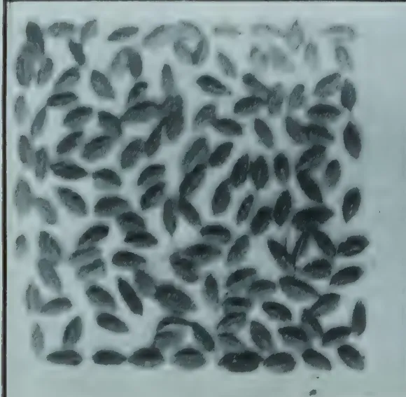A rectangular field of dark, oval-shaped seeds, densely packed and oriented in various directions.

MUTHUSAMBA  
Uva 4 Months

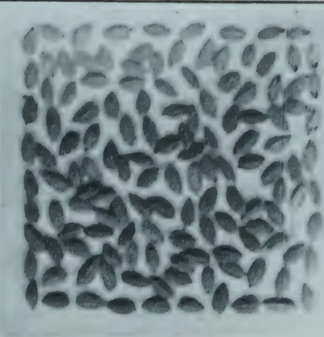A rectangular field of dark, oval-shaped seeds, densely packed and oriented in various directions.

MUTHUSAMBA  
7 Months, Singhelese Dist.

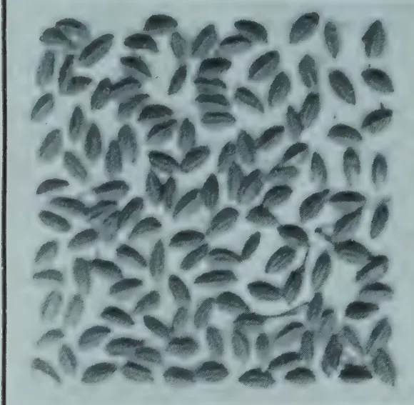A rectangular field of dark, oval-shaped seeds, densely packed and oriented in various directions.

MUTHUSAMBA  
5 Months N.P.

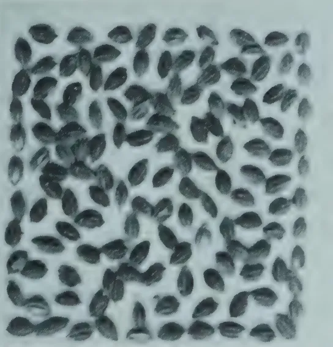A rectangular field of dark, oval-shaped seeds, densely packed and oriented in various directions.

MUTHUSAMBA  
5 1/4 Months Payagala W.P.

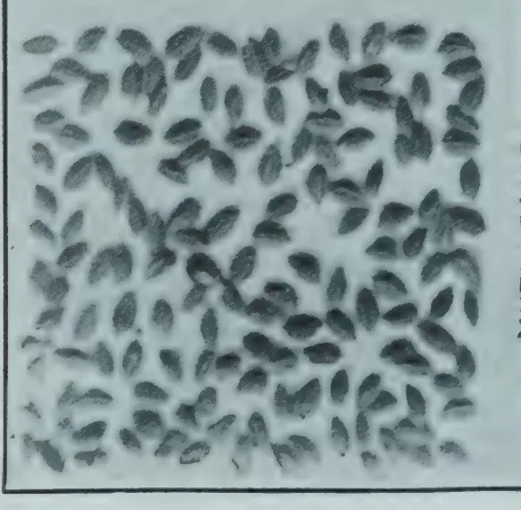A rectangular field of dark, oval-shaped seeds, densely packed and oriented in various directions.

MUTHUSAMBA  
5 Months N.P.

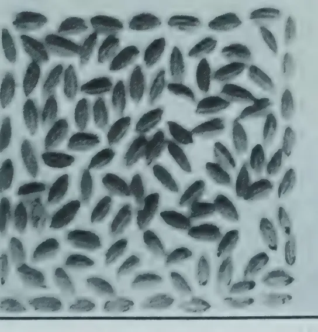A rectangular field of dark, oval-shaped seeds, densely packed and oriented in various directions.

MUTHUSAMBA  
4 Months C.P.

199------------------------------------------------

This image is a scan of a blank page. The background is a uniform light beige or off-white color. There are several small, dark specks scattered across the surface, which appear to be dust or scanning artifacts. No text, lines, or other graphical elements are present.

200------------------------------------------------

MARCH, 1921.]169

As popularity is usually both restricted and local, the work had to be planned so that as many provinces as possible would be likely to benefit. In other words the basis of choice was necessarily a dual one. To obtain the necessary guidance the method adopted was to circularise all chief headmen on the single point as to which were, in order of merit, the three most popular paddies in their divisions.

From the lists returned the five most popular varieties per district were worked out as shown in the following list. This is by no means beyond criticism but it may at least be claimed for it that it is as near to the ideal as it is possible to get by the method adopted, and the care shown by the chief headmen in compiling the somewhat lengthy return is worthy of great appreciation.

### NOTES ON THE SELECTION OF MOST POPULAR PADDIES.

**Basis:**—Five best chosen for each district by assigning marks to those varieties sent in by the Headmen.

Varieties not distinguished in order of merit are held to be equivalent. No factor but popularity is involved.

#### I.—SOUTHERN PROVINCE.

##### 1. Galle District:—

<table border="0">
<tr>
<td>1. (Sudu) Rata wi</td>
<td rowspan="3">4. {</td>
<td>Madayal</td>
</tr>
<tr>
<td>2. Handiram</td>
<td>Kaharamana</td>
</tr>
<tr>
<td>3. Sulai</td>
<td></td>
</tr>
</table>

##### 2. Matara District:—(excl. Morawak Korale).

<table border="0">
<tr>
<td>1. Bala Ma wi</td>
<td>4. Mutusamba</td>
</tr>
<tr>
<td>2. Rata (Sudu) wi</td>
<td>5. Dañahala</td>
</tr>
<tr>
<td>3. Ma wi</td>
<td></td>
</tr>
</table>

##### 3. Hambantota District:—

<table border="0">
<tr>
<td>1. Sudu wi</td>
<td>4. Ratkarayal</td>
</tr>
<tr>
<td>2. (Sudu) Rata wi</td>
<td>5. Bala Ma wi</td>
</tr>
<tr>
<td>3. Sulai</td>
<td></td>
</tr>
</table>

#### II.—WESTERN PROVINCE.

##### 1. Colombo District:—

<table border="0">
<tr>
<td>1. Ma wi</td>
<td rowspan="3">4. {</td>
<td>Sulai</td>
</tr>
<tr>
<td>2. Dewareddiri</td>
<td>Sudu wi</td>
</tr>
<tr>
<td>3. Hinati</td>
<td></td>
</tr>
</table>

##### 2. Kalutara District:—

<table border="0">
<tr>
<td>1. Handiram</td>
<td>4. Dewareddiri</td>
</tr>
<tr>
<td>2. Kirihal Eli</td>
<td>5. Sulai</td>
</tr>
<tr>
<td>3. Matara wi</td>
<td></td>
</tr>
</table>

##### 3. Negombo District:—

<table border="0">
<tr>
<td>1. Mutusamba</td>
<td rowspan="3">3. {</td>
<td>Mada El</td>
</tr>
<tr>
<td>2. Ma wi</td>
<td>Hatili</td>
</tr>
<tr>
<td></td>
<td>Dewareddiri</td>
</tr>
</table>

#### III.—NORTHERN PROVINCE.

##### 1. Jaffna District:—

<table border="0">
<tr>
<td>1. Vellai Neltu</td>
<td>4. Morungan</td>
</tr>
<tr>
<td>2. Karuppan</td>
<td>5. Ilankaliyan</td>
</tr>
<tr>
<td>3. Perunellu</td>
<td></td>
</tr>
</table>

201------------------------------------------------

170[MARCH, 1921.**2. Mannar District:—**

<table border="0">
<tr>
<td>1. Palaisithari</td>
<td>4. Cheenatti</td>
</tr>
<tr>
<td>2. Ilankaliyan</td>
<td>5. Mupankkan</td>
</tr>
<tr>
<td>3. Morungan</td>
<td></td>
</tr>
</table>

**3. Mullaitivu District:—**

<table border="0">
<tr>
<td>1. Muppankan</td>
<td>4. Kulavalai</td>
</tr>
<tr>
<td>2. Vellai Neltu</td>
<td>5. (Kuru wi) Samba</td>
</tr>
<tr>
<td>3. Morungan</td>
<td></td>
</tr>
</table>

IV.—EASTERN PROVINCE.**1. Trincomalie District:—**

<table border="0">
<tr>
<td>1. Oddaivalan</td>
<td>4. { Ilankalayan</td>
</tr>
<tr>
<td>2. { Vellai Neltu</td>
<td>4. { Chellakadai</td>
</tr>
<tr>
<td>2. { (Uran) Samba</td>
<td>4. { Perunellu</td>
</tr>
</table>

**2. Batticaloa District:—**

<table border="0">
<tr>
<td>1. Samba</td>
<td>4. Karuppan</td>
</tr>
<tr>
<td>2. Vanan</td>
<td>5. Chenatty</td>
</tr>
<tr>
<td>3. Perunellu</td>
<td></td>
</tr>
</table>

V.—NORTH-WESTERN PROVINCE.**1. Chilaw District:—**

<table border="0">
<tr>
<td>1. Ma wi</td>
<td>3. Hinati</td>
</tr>
<tr>
<td>2. Ilankali</td>
<td>4. Kottiyaran</td>
</tr>
</table>

**2. Puttalam District:—**

<table border="0">
<tr>
<td>1. Hinati</td>
<td>4. { Mudukiriyal</td>
</tr>
<tr>
<td>2. Kottiyaran</td>
<td>4. { Palaisithari</td>
</tr>
<tr>
<td>3. Dikwi</td>
<td></td>
</tr>
</table>

**3. Kurunegalla District:—**

<table border="0">
<tr>
<td>1. Dikwi</td>
<td>3. Hinati</td>
</tr>
<tr>
<td>2. Mudukiriyal</td>
<td></td>
</tr>
</table>

VI.—NORTH-CENTRAL PROVINCE.

<table border="0">
<tr>
<td>1. Hinati</td>
<td>4. { (Vellai) Perunellu</td>
</tr>
<tr>
<td>2. Elwi</td>
<td>4. { Hondarawala</td>
</tr>
<tr>
<td>3. Sudu wi</td>
<td></td>
</tr>
</table>

VII.—SABARAGAMUWA PROVINCE.

<table border="0">
<tr>
<td>1. Madatulawu</td>
<td>4. { Madulawi</td>
</tr>
<tr>
<td>2. { Heenati</td>
<td>4. { Kalukanda</td>
</tr>
<tr>
<td>2. { Mawi</td>
<td></td>
</tr>
</table>

**2. Kegalle District:—**

<table border="0">
<tr>
<td>1. Mawi</td>
<td>3. Madael</td>
</tr>
<tr>
<td>2. Hathili</td>
<td></td>
</tr>
</table>

VIII.—CENTRAL PROVINCE.**1. Kandy District:—**

<table border="0">
<tr>
<td>1. Hatiel</td>
<td>4. Hondarawala</td>
</tr>
<tr>
<td>2. Heenati</td>
<td>5. Suduwi</td>
</tr>
<tr>
<td>3. Mawi</td>
<td></td>
</tr>
</table>

**2. Nuwara Eliya District:—**

<table border="0">
<tr>
<td>1. Rat Kunda</td>
<td>4. { Mawi</td>
</tr>
<tr>
<td>2. Kiri Kunda</td>
<td>4. { Hondarawala</td>
</tr>
<tr>
<td>3. Heenati</td>
<td>4. { Hatiel</td>
</tr>
</table>

**3. Matale District:—**

<table border="0">
<tr>
<td>1. Hondarawala</td>
<td>4. Kottiyaran</td>
</tr>
<tr>
<td>2. { Heenati</td>
<td>5. Mawi</td>
</tr>
<tr>
<td>2. { Balawi</td>
<td></td>
</tr>
</table>

202------------------------------------------------

MARCH, 1921.]171IX.—PROVINCE OF UVA.**Badulla District :—**

<table border="0">
<tbody>
<tr>
<td>1. Balawi</td>
<td>4. Karayal</td>
</tr>
<tr>
<td>2. Suduwi</td>
<td>5. Murunga wi</td>
</tr>
<tr>
<td>3. Rat Kunda</td>
<td></td>
</tr>
</tbody>
</table>

From the above list a further one of the three most popular varieties of every province was compiled, the complete list for the whole Island being the following.

<table border="0">
<tbody>
<tr>
<td>Heenati.</td>
<td>Handiran.</td>
<td>Kottiyaran.</td>
<td>Chellakadai.</td>
</tr>
<tr>
<td>Mawi.</td>
<td>Sulai.</td>
<td>Mudukiriyal.</td>
<td>Kaharamana.</td>
</tr>
<tr>
<td>Samba.</td>
<td>Dikwi.</td>
<td>Oddaivalan.</td>
<td>Kulavalai.</td>
</tr>
<tr>
<td>Ilankalayan.</td>
<td>Palaisithari.</td>
<td>Vanan.</td>
<td>Hondarawala.</td>
</tr>
<tr>
<td>Ratawi.</td>
<td>Dewareddiri.</td>
<td>Elwi.</td>
<td>Ratkarayal.</td>
</tr>
<tr>
<td>Vellai Nellu.</td>
<td>Madayal.</td>
<td>Kirihal-el.</td>
<td>Dahanala.</td>
</tr>
<tr>
<td>Perunellu.</td>
<td>Balamawi.</td>
<td>Matarawi.</td>
<td></td>
</tr>
<tr>
<td>Suduwi.</td>
<td>Karuppan.</td>
<td>Hatiel.</td>
<td></td>
</tr>
</tbody>
</table>

Even this number of varieties was too formidable to attack at once, so a further selection was essential. Most of the varieties were popular in more than one province. For example Heenati was returned from five provinces, Mawi, Perunellu and Suduwi from three, but Hatiel, and Dahanala from one only.

The varieties of the list above were then voted upon as to the number of provinces they were popular in and the final list shown below was drawn up.

<table border="0">
<tbody>
<tr>
<td>1. Heenati.</td>
<td>9. Sulai.</td>
</tr>
<tr>
<td>2. Samba.</td>
<td>10. Palaisithari.</td>
</tr>
<tr>
<td>3. Mawi.</td>
<td>11. Madayal.</td>
</tr>
<tr>
<td>4. Ilankalayan.</td>
<td>12. Karuppan.</td>
</tr>
<tr>
<td>5. Perunellu.</td>
<td>13. Ratawi.</td>
</tr>
<tr>
<td>6. Suduwi</td>
<td>14. Dikwi.</td>
</tr>
<tr>
<td>7. Vellai.</td>
<td>15. Dewareddiri.</td>
</tr>
<tr>
<td>8. Handiram.</td>
<td></td>
</tr>
</tbody>
</table>

It will be noticed that many well known varieties like Hatiel and Hondarawala do not find a place upon this list owing to their cultivation being restricted mainly to one province.

After consideration of the time, labour and land available it was decided to restrict work during the Maha of 1921 to the two large Mawi and Samba groups and, in order to elaborate the most suitable form of field technique in readiness, it was decided to put down at Anuradhapura, during the Yala season of 1920, a small series of pure lines on four varieties already investigated. The varieties were chosen for botanical reasons alone and were Suwandel, Suduhatiel, Kalupanniti and Madoluwa. Starting from the single ear from selected plants 9 pure lines of Kalupanniti were sown and 20 of each of the other varieties.

The result was not only valuable from the point of view of cultivation but has made it possible to lay down the type for future work in each case and produce a number of types for multiplication. Fuller particulars of these are given in a later section.

203------------------------------------------------

172[MARCH, 1921]THE MAWI AND SAMBA GROUPS.

Apart from the economic importance of these groups, they are of considerable interest botanically for they comprise races which can be referred respectively to Körnicke's "*communis*" and "*minuta*" varieties of *Oryza utillissima*, Kcke. (Die Arten und Varieten des Getriedes. Körnicke.), with the exception of Mahakuruwi which is samba-like in grain form. The two groups were finally constituted as follows.

MAWI GROUP.

<table>
<thead>
<tr>
<th>Catalogue No.</th>
<th>Name.</th>
<th>Age.</th>
<th>Province of Origin.</th>
</tr>
</thead>
<tbody>
<tr>
<td>1</td>
<td>Mahamawi</td>
<td>7 months</td>
<td>Western</td>
</tr>
<tr>
<td>2</td>
<td>Mawi</td>
<td>do</td>
<td>do</td>
</tr>
<tr>
<td>3</td>
<td>Sudumawi</td>
<td>do</td>
<td>do</td>
</tr>
<tr>
<td>19</td>
<td>Kalukanmawi</td>
<td>do</td>
<td>do</td>
</tr>
<tr>
<td>27</td>
<td>Kurumawi</td>
<td>do</td>
<td>do</td>
</tr>
<tr>
<td>33</td>
<td>Kohumawi</td>
<td>do</td>
<td>do</td>
</tr>
<tr>
<td>41</td>
<td>Sudumawi</td>
<td>do</td>
<td>Central</td>
</tr>
<tr>
<td>48</td>
<td>Mahamāwi</td>
<td>6 months</td>
<td>Southern</td>
</tr>
<tr>
<td>49</td>
<td>Kurumawi</td>
<td>do</td>
<td>do</td>
</tr>
<tr>
<td>74</td>
<td>Kohumawi</td>
<td>7 months</td>
<td>North-Western</td>
</tr>
<tr>
<td>81</td>
<td>Mawi</td>
<td>do</td>
<td>Sabaragamuwa</td>
</tr>
<tr>
<td>82</td>
<td>Sudumawi</td>
<td>6 months</td>
<td>do</td>
</tr>
<tr>
<td>84</td>
<td>Ratkundamawi</td>
<td>do</td>
<td>do</td>
</tr>
<tr>
<td>89</td>
<td>Kurumawi</td>
<td>7 months</td>
<td>Western</td>
</tr>
<tr>
<td>91</td>
<td>Mahamawi</td>
<td>do</td>
<td>North-Western</td>
</tr>
<tr>
<td>99</td>
<td>Sudumawi</td>
<td>do</td>
<td>do</td>
</tr>
<tr>
<td>104</td>
<td>Ratumawi</td>
<td>do</td>
<td>do</td>
</tr>
<tr>
<td>105</td>
<td>Mawi</td>
<td>do</td>
<td>do</td>
</tr>
<tr>
<td>34</td>
<td>Mawi</td>
<td>6 months</td>
<td>Central</td>
</tr>
</tbody>
</table>

SAMBA GROUP.

<table>
<thead>
<tr>
<th>Catalogue No.</th>
<th>Name.</th>
<th>Age.</th>
<th>Province of Origin.</th>
</tr>
</thead>
<tbody>
<tr>
<td>4</td>
<td>Podiwi</td>
<td>7 months</td>
<td>Western</td>
</tr>
<tr>
<td>9</td>
<td>Kurulutuduwi</td>
<td>do</td>
<td>do</td>
</tr>
<tr>
<td>10</td>
<td>Podi Sulai</td>
<td>do</td>
<td>do</td>
</tr>
<tr>
<td>11</td>
<td>Ratnasamba</td>
<td>do</td>
<td>do</td>
</tr>
<tr>
<td>13</td>
<td>Japanewi</td>
<td>do</td>
<td>do</td>
</tr>
<tr>
<td>17</td>
<td>Muthumanikkan</td>
<td>do</td>
<td>do</td>
</tr>
<tr>
<td>25</td>
<td>Sambawi</td>
<td>do</td>
<td>do</td>
</tr>
<tr>
<td>28</td>
<td>Puluksamba</td>
<td>do</td>
<td>do</td>
</tr>
<tr>
<td>29</td>
<td>Molagusamba</td>
<td>do</td>
<td>do</td>
</tr>
<tr>
<td>31</td>
<td>Ranmanikkan</td>
<td>do</td>
<td>do</td>
</tr>
<tr>
<td>56</td>
<td>Maharatumanikkan</td>
<td>6 months</td>
<td>Southern</td>
</tr>
<tr>
<td>75</td>
<td>Mutusamba</td>
<td>7 months</td>
<td>North-Western</td>
</tr>
<tr>
<td>88</td>
<td>Surasamba</td>
<td>do</td>
<td>Western</td>
</tr>
<tr>
<td>92</td>
<td>Muttumanikkan</td>
<td>6 months</td>
<td>North-Western</td>
</tr>
<tr>
<td>96</td>
<td>Punchiwi</td>
<td>do</td>
<td>do</td>
</tr>
<tr>
<td>100</td>
<td>Sambawi</td>
<td>do</td>
<td>do</td>
</tr>
<tr>
<td>101</td>
<td>Ratakurumutusamba</td>
<td>do</td>
<td>do</td>
</tr>
<tr>
<td>2,016</td>
<td>Mutusamba</td>
<td>5 months</td>
<td>Western</td>
</tr>
<tr>
<td>2,066</td>
<td>Muthumanikkan</td>
<td>do</td>
<td>Southern</td>
</tr>
<tr>
<td>2,107</td>
<td>Kottamaliwi</td>
<td>4 months</td>
<td>do</td>
</tr>
<tr>
<td>2,114</td>
<td>Uransamba</td>
<td>5 months</td>
<td>Eastern</td>
</tr>
<tr>
<td>2,115</td>
<td>Samba</td>
<td>do</td>
<td>do</td>
</tr>
<tr>
<td>2,130</td>
<td>Uransamba</td>
<td>4 months</td>
<td>do</td>
</tr>
</tbody>
</table>

204------------------------------------------------

MARCH, 1921.]173

<table border="1">
<thead>
<tr>
<th>Catalogue No.</th>
<th>Name.</th>
<th>Age.</th>
<th>Province of Origin.</th>
</tr>
</thead>
<tbody>
<tr>
<td>2,135</td>
<td>Punuku Samba</td>
<td>4 months</td>
<td>Eastern</td>
</tr>
<tr>
<td>2,170</td>
<td>Surasamba</td>
<td>do</td>
<td>Northern</td>
</tr>
<tr>
<td>2,175</td>
<td>Mutusamba</td>
<td>do</td>
<td>do</td>
</tr>
<tr>
<td>2,219</td>
<td>Mutusamba</td>
<td>5 months</td>
<td>Sabaragamuwa</td>
</tr>
</tbody>
</table>

Assuming that the two groups above represented the maximum range of the "Mawi" and "Samba" varieties respectively, selection was directed not only towards the isolation of the best yielding types but also towards the establishment botanically of all the distinct varietal types.

The object was to standardise and name all these in order to eliminate all synonymity and establish a departmental collection of every distinct variety.

To this end the following pure line cultures were put down at Anuradhapura for the Maha season of 1921.

(1) Mawi Group.....421 cultures.

(2) Samba ,, .....155 ,,

At Peradeniya the numbers were less, consisting of

(1) Mawi Group.....179 cultures.

(2) Samba ,, ..... 44 ,,

Up to the time of writing it has been possible only to complete and record the botanical investigation of the Mawi Pure Lines, and to lay down the methods upon which the work is to be continued. It may however be stated that types of most of the varieties have been defined and arrangements made for the comparative trial during next Maha of a large number of the best lines when isolated.

#### YALA PURE LINES 1920.

A certain number of promising strains have already been isolated as the result of a series of experiments upon four varieties during the Yala season of 1920. Originally there was no economic aim in this work, the object being rather the elaboration of a system of field technique in readiness for the important experiments of the coming Maha season. The varieties were chosen therefore more for their botanical interest, although, as it happened, three possessed in addition economic importance. These were Suwandel, Suduhatiel and Madoluwa the fourth variety being Kalupanniti. It was not possible to do much work upon the latter but the three first named were fully investigated both botanically and agriculturally.

The selections were made from the plots at Anuradhapura in the Maha of 1919. These cultures were put down by sowing the seed samples sent in from various parts of the Island in 1920. Particulars of the four varieties are given in the table below.

<table border="1">
<thead>
<tr>
<th rowspan="3">Name of Variety</th>
<th rowspan="3">Age given by sender</th>
<th rowspan="3">Province of Origin</th>
<th colspan="4">Mean Ripening Period</th>
</tr>
<tr>
<th colspan="2">Maha 1920</th>
<th colspan="2">Yala 1920</th>
</tr>
<tr>
<th>months</th>
<th>days</th>
<th>months</th>
<th>days</th>
</tr>
</thead>
<tbody>
<tr>
<td>Suwandel</td>
<td>4 months</td>
<td>Western</td>
<td>3</td>
<td>23</td>
<td>4</td>
<td>1</td>
</tr>
<tr>
<td>Kalupanniti</td>
<td>5 ,,</td>
<td>Southern</td>
<td>3</td>
<td>26</td>
<td>4</td>
<td>1</td>
</tr>
<tr>
<td>Suduhatiel</td>
<td>5½ ,,</td>
<td>Central</td>
<td>3</td>
<td>23</td>
<td>4</td>
<td>4½</td>
</tr>
<tr>
<td>Madoluwa</td>
<td>7 ,,</td>
<td>North-West</td>
<td>4</td>
<td>27</td>
<td>4</td>
<td>4</td>
</tr>
</tbody>
</table>

Additional particulars have also been given in an article entitled THE TILLERING OF CEYLON RICES, by the author in the TROPICAL AGRICULTURIST for February 1921.

Arrangements have been made to try out comparatively next Maha the strains isolated from the Suwandel, Suduhatiel and Madoluwa cultures and, at the same time, to define the characters which shall in the future determine these varieties as such. The results will be communicated in due course.

205------------------------------------------------

174[MARCH, 1921.FUTURE WORK.

It remains now to indicate a method for the continuance of selection work in the near future. A certain amount of caution is highly advisable for a variety of reasons.

In the first place the work carried out during the past year and a half must be regarded as only the slightest of attempts to penetrate a hitherto unexplored field. As progress is made the number of fascinating problems one meets is extraordinarily large. Many of these belong to the special domain of the plant physiologist. Amongst these are problems of growth, development, true length of life-cycle, the effect of different methods of cultivation and the precise action of manures. Unfortunately many of these problems at present cannot be entirely divorced from the work of the economic botanist, which strictly speaking, only commences at the point where cultivation processes are producing a maximum crop.

The systematic relationships of most of the native varieties are also quite obscure and much work is needed in this direction.

Further the special problems of various districts remain to be considered such as drought, floods and the attacks of the paddy bug.

It is however possible to perceive certain obvious tracks through the field and these should be pursued undeviatingly, leaving the exploration of by-paths for the immediate present.

First of all work is required on the varieties or groups of varieties next in order of precedence upon the list on page 10. Work has already been planned for the Yala season of 1921 upon the Heenatis, Ilankalayans and Dahanalas. From the end of every season the number of types to be tried out will greatly increase and as early as possible the successful ones must be handed over to some organisation which will continue them on a field scale. Here the seed-farm comes in, and, with the elimination of the problems of multiplication and distribution, opportunity will remain for selection work upon other groups or varieties. When it is remembered that no work has as yet been possible upon Hatiel, Perunellu, Dewareddiri, Kalundai, Hondarawala and many others some idea of the magnitude of the problem may be gained.

It is obvious therefore that time does not avail for the trial of foreign varieties, nor for the academic study of genetic characters which cannot be correlated with those affecting "yield." No problem, at present, presses for solution by crossing and no gain appears possible by attempting to create new strains in this manner.

The sole pests from which the paddy crop of Ceylon suffers to a material extent are the paddy-bug (*Leptocorisa varicornis*) swarming caterpillar and the stem-borer (*Schoenobius bipunctifer*). Certain varieties are popularly held to be immune from attack by insects but the foundations for this belief are unsubstantial. In any case an immunity of the kind would not appear to be a breeding character.

It is possible that, eventually, such characters as early maturity, awnlessness, or strength of straw might be combined with other desirable qualities in varieties which lack them at present and this possibility should be borne in mind.

But for some years to come the problem of increasing the yield of paddy in Ceylon is one of straight selection of the native varieties coupled with a study of the most improved methods of cultivation.

My best thanks are due to MR. H. L. VAN BUUREN who has assisted me throughout this work.

206------------------------------------------------

MARCH, 1921.]175

# SOILS AND MANURES.

## CALCIUM CYANAMIDE.

### ITS AGRICULTURAL USE AS A FERTILIZER.

CHAS. F. JURITZ, M.A., F.I.C.,

*Agricultural Research Chemist.*

Of all the varieties of fertilizers, good, indifferent, and bad, that are usually applied to the soil, there is no class more important, and, at the same time, more costly, than what has been termed the nitrogen group. The fertilizers belonging to this class have the property of stimulating the active growth of the plant and promote the formation of its leaf system. They increase the size and weight of the ears in cereal crops, but in the case of fruit-bearing plants they cause loss of fruit by producing abnormal development of leaf and woody stem if applied with too great liberality. While, therefore, it is essential to be discreet in the use of the fertilizers of this group, it will easily be realized that they are of great practical value to the crop. Unfortunately the advantages of a proper use of nitrogenous fertilizers are often as little understood as the caution necessary to prevent a misuse. This, however, applies not merely in the case of fertilizers of the nitrogen group, but wherever fertilizing of any kind has to be practised, and hence has arisen the oft-quoted precept regarding the need of "manuring with brains."

From the time that the value of nitrogen compounds as fertilizers of the soil began to be realized, up to recent years, agricultural chemists have been continuously keeping their thoughts on the vast quantities of

#### NITROGEN IN THE AIR

and striving for some means of securing portion of that nitrogen and bringing it into the soil for the benefit of the crops. That this could be done for very many years without affecting the quantity of nitrogen remaining in the air was evident, because as much as seven tons of nitrogen rest on every square yard of the earth's surface.

For a long time there seems to be no way of utilizing this stupendous store of nitrogen, and then, almost unexpectedly, after much patient research, one method after another was announced and practically applied. Amongst these was the process based on the use of calcium carbide, the substance which had become prominent because of its power of producing acetylene gas by mere addition of water, and so affording an easy and portable illuminant for bicycles, motor cars, etc. When calcium carbide is heated to near  $1200^{\circ}\text{C.}$ , and nitrogen is passed over it, chemical combination takes place, and cyanamide or, more properly speaking, calcium cyanamide, is produced. The article, as commonly purchased, contains about 50 to 55 per cent. of pure calcium cyanamide, and this is the article which has lately come into use as a fertilizer. As a supplier of nitrogen it has the advantage over sulphate of ammonia that it does not render acid any soils deficient in carbonate of lime.

207------------------------------------------------

176[MARCH, 1921.

It may be said at once that calcium cyanamide, as such, is of no use whatever to plants but in the soil it slowly breaks up, and eventually compounds are formed from it which are of distinct value to the plant. The application of calcium cyanamide to the soil is not without risk to the crop, and in more than one way. As in many other cases, when a new idea is introduced people do not take to it at once, but when once its value begins to dawn on them they fly to the opposite extreme and misuse it or apply it in excess. After the first introduction of chemical manures they speedily fell into disfavour simply because they had been applied injudiciously or ignorantly and brought disaster. This is no argument against the use of calcium cyanamide, but means merely that it must be used with circumspection, and with brains.

Calcium cyanamide, as above remarked, breaks up in the soil. This is due to the action on it of the soil water, and dicyanamide, a substance poisonous to plants, is produced. The dicyanamide in turn also decomposes, and ammonia is formed, with subsequent nitrification. When first applied, therefore, calcium cyanamide is poisonous in its action, but this effect slowly passes away. It follows, naturally, from this that cyanamide must be applied some time before sowing, otherwise it would prevent germination of the seed. Hence, too, it cannot as a rule be used as a top-dressing when the young crop has appeared above ground. It has, nevertheless, been recommended for cereals in this form. It must, in consequence, be looked upon as a slow-acting fertilizer.

The poisonous effect of cyanamide shortly after its application to the soil is not without its advantages. It is well known that heating the soil may increase the ultimate crop. A similar result has followed the addition of such substances as carbon disulphide, naphthalene and other germicides, which destroy pests in the soil, not only such as wireworms and others of that class, but also microscopic organisms, which may either injure the plant itself directly or indirectly by destroying the bacteria which aid it in its growth. Calcium carbide has been used for such a purpose, and it is also easy to see how similar must be the action of the poisonous emissions from the cyanamide when once it begins decomposing in the soil.

As far as the practical application, the effects, and the efficacy of cyanamide as a fertilizer is concerned, there have been no investigations in South Africa, so that all our information must be based on experiments carried on in other countries. Of some of these experiments I propose to give an outline, and it will be seen in what respect their results are explained by the foregoing remarks.

In Austria it has been found (EXP. STN. REC., vol. 33, p. 818) that cyanamide retards the germination of both wheat and barley, particularly the wheat, if supplied in proportions varying from one-tenth of a ton to half a ton per acre. That, however, should not be regarded as condemnatory to the use of cyanamide, for other fertilizers may act similarly. Large applications of nitrate of soda, for example, retard the maturity of such crops as sugar beet. Cyanamide does the same, and its addition does not result in as large an increase of sugar per acre of beet as the addition of nitrate of lime

208------------------------------------------------

MARCH, 1921.]177

or nitrate of soda. When added immediately *before* the sowing of the seed cyanamide was found to hasten the development of beets (EXP. STN. REC., col. 34, p. 431).

Of course cyanamide should not be added in too large quantities, but then over-manuring of *any* kind is apt to be harmful. It is considered advisable to limit the addition of cyanamide to 60 lb. per ton of a fertilizer containing half a ton of superphosphate.

The *ultimate* action of cyanamide on vegetation is virtually that of ammonia and nitrates, for in the soil the cyanamide, in process of time, becomes converted first into urea, then into ammonia, and finally into nitrates, and these changes proceed more rapidly in sterilized than in unsterilized soil.

In mixed fertilizers cyanamide causes reversion of the phosphoric oxide, but no loss of nitrogen is involved. If such a mixture however is left to stand, its fertilizing value has been found to become less. Again, it must be remarked, other materials cause similar reversion; lime, for example, but lime is not for that reason discarded as a fertilizer.

A decidedly *beneficial* effect of cyanamide is that it retards denitrification of other inorganic nitrogenous fertilizers, and so adds to their durability "while being itself also a nitrogenous fertilizer." (EXP. STN. REC., vol. 34, p. 220)

An injurious effect has been noticed on acid meadow soils which are excessively damp (EXP. STN. REC., vol. 34, p. 820), but this, too, cannot be counted to the discredit of cyanamide.

Cyanamide has repeatedly been declared to possess a lower fertilizing value than ammonium sulphate or sodium nitrate as a constituent of a mixed fertilizer, but it has been proved to be of special value in increasing the yield of beets and potatos, in which respect it has been pronounced (EXP. STN. REC., vol. 34, p. 24), practically equal to sodium nitrate, a mixture of cyanamide and sodium nitrate being particularly recommended for all kinds of beet.

When used *alone* cyanamide has been recommended as a top-dressing or grains but not for potatos. In the latter case it gives best results if harrowed in before planting. HOFFMANN (*Deut. Landw Presse*, 1915, pp. 489, 490) has compared the value of cyanamide as a top-dressing with that of sodium nitrate and ammonium sulphate as follows, as the result of experiments (EXP. STN. REC., Vol. 34, p. 622).

<table>
<thead>
<tr>
<th></th>
<th></th>
<th>Sodium<br/>Nitrate</th>
<th>Ammonium<br/>Sulphate</th>
<th>Cyanamide</th>
</tr>
</thead>
<tbody>
<tr>
<td>For rye</td>
<td>...</td>
<td>100</td>
<td>75.7</td>
<td>72.9</td>
</tr>
<tr>
<td>„ wheat</td>
<td>...</td>
<td>100</td>
<td>75.7</td>
<td>79.1</td>
</tr>
<tr>
<td>„ barley</td>
<td>...</td>
<td>100</td>
<td>77.1</td>
<td>80.1</td>
</tr>
<tr>
<td>„ oats</td>
<td>...</td>
<td>100</td>
<td>132.5</td>
<td>82.0</td>
</tr>
<tr>
<td>„ potatos</td>
<td>...</td>
<td>100</td>
<td>85.0</td>
<td>62.2</td>
</tr>
</tbody>
</table>

In the monthly *Bulletin of Agricultural Intelligence and Plant Diseases* for February, 1915, issued by the International Institute of Agriculture, several series of experiments with cyanamide and other nitrogenous fertilizers are summarized, and the average results from five experiment stations show

209------------------------------------------------

178[MARCH, 1921.

that, if the nitrogen assimilated by crops from nitrate of soda be reckoned as 100, that from sulphate of ammonia is 78, and from cyanamide 65. In the March, 1916, issue of the same Bulletin further experiments by SCHNEIDEWIND are recorded. He concluded that "stickstoffkalk" (which is virtually cyanamide) may give much the same results as ammonium sulphate, *but is only effective if the weather is very dry during the chief growing period.* In general, he admits its productive value is a little lower than that of ammonium sulphate.

Even if its results are not quite as good as those of other nitrogen fertilizers, calcium cyanamide is probably quite as *profitable* in use as those others, on account of its cheapness.

It has been estimated that cyanamide loses from 0.1 to 0.4 per cent. of its nitrogen daily during storage, but experiments carried on at Wye have shown that neither the moisture nor the carbon dioxide of the air, nor both combined, could be responsible for this EXP. STN. REC., Vol. 34, p. 724) and *Monthly Bull. of Agric. Intell. and Plant Diseases*, May 1915, p. 675).

In the foregoing remarks I have confined myself to cyanamide as such, and have not specially dealt with the question of its toxic character or that of any dicyanodiamide contained therein. The toxic nature of dicyanodiamide should no more bar the use of cyanamide than the fact that sodium perchlorate is apt to occur in nitrate of soda bars the use of the latter as a fertilizer.

Dicyanodiamide is the prevailing form in which nitrogen is present in granulated Norwegian cyanamide (lime nitrogen), and this lime nitrogen has at least one advantage, namely, a less marked tendency to revert the phosphoric oxide in superphosphate than the more common (dusty) cyanamide (EXP. STN. REC., Vol. 35, p. 22).

It would appear that the presence of excess of dicyanodiamide depends upon the process of manufacture, and as the expectation is expressed that the nitrogen problem in the United States has the best prospect of being met, as far as the agricultural requirements are concerned, by the manufacture of cyanamide in that country (C. G. GILBERT: *Smithson Inst. publication, vide EXP. STN. REC.*, Vol. 36, p. 122), it is plain that *there* at least no fear exists of deleterious effects resulting from its use. Moreover, even if the article now produced were not quite as suitable as it might be "it is only a question of time" as PRANKE remarks (CHEM. NEWS, Vol. 100, pp. 20,28; JOURN. INDUS. AND ENG. CHEM., Vol. 6, No. 5) until an ideal product is developed and sold at the lowest prices. In the meantime, however, the industry must have the support of the public.

If there were any well-grounded fear of harmful effects it does not seem likely that calcium cyanamide would have the output that it has already acquired. In 1904 the world's total production was 5000 tons; in 1909 it was 50,000; in 1914 it was 275,000. In Canada, at the beginning of 1916 one factory alone was turning out crude cyanamide at the rate of some tons per day, and "its principal use in this country (America) is (to quote PRANKE again) as a source of nitrogen in mixed fertilizers." It is true that much of the cyanamide is converted into ammonia, but that is effected at a cheaper

210------------------------------------------------

MARCH, 1921.]179

rate than that at which it is possible to get ammonia from gas liquor (JOURNAL INDUS. AND ENG. CHEM., Vol. 8, p. 160) and that is rather a recommendation for the production of cyanamide than otherwise.

As far as the poisonous action of the dicyanodiamide is concerned, LIECHTI and TRUNINGER performed a series of experiments from which it appeared that abnormal specimens of cyanamide, containing 7 per cent. of nitrogen in the form of dicyanodiamide, affected injuriously the yield of wheat grain and to a lesser extent wheat straw, as compared with the normal cyanamide. (JOURN. SOC. CHEM. IND., Vol. 35, p. 647, and EXP. STN. REC., Vol. 36, p. 426). They found that three months' storage of calcium cyanamide in an atmosphere saturated with moisture, converted the original cyanamide almost wholly, into dicyanodiamide, whereas during *eight years* storage in a wooden box in a dry place no deterioration took place. Independent experiments by HAGER and KERN (JOURN. SOC. CHEM. IND., Vol. 35 p. 856) proved that cyanamide underwent no perceptible change during seven months if no water was added; there was very little immediate change when 25 per cent. water was added, but in seven months the dicyanodiamide had increased to 2.58 per cent. When 50 per cent. water was added profound changes took place, and the material set to a hard, stone-like mass, which in 2½ months contained 7.51, and in seven months 9.17 per cent, of dicyanodiamide nitrogen. From this it follows that calcium cyanamide which has got wet should be used immediately, as otherwise it becomes converted into dicyanodiamide.

I have above referred to the fact that Norwegian granulated cyanamide contains dicyanodiamide. This may be due to the fact that the granulated form is produced by the agency of water, a method which HAGER and KERN predict is not likely to succeed. In 1913 a granulated cyanamide was placed on the market made by pressing damp cyanamide into briquettes, and this is no doubt the method that is now used in Norway.

If the cyanamide be not thus granulated its dustiness is apt to produce a caustic action on the skin and mucous membranes, hence the need of converting in into a non-powdery form.

### CONCLUSION.

From what has been ascertained thus far, I am of opinion that if proper care be taken in manufacture and storage no ill effects are to be feared from the agricultural use of cyanamide, and I do not see the slightest reason why, if manufactured in this country, it should not be made good use of by our farmers.

If mixed with other fertilizers its incompatibility with sulphate of ammonia and with superphosphate should be noted, but there is no reason why it should not be mixed with basic slag.—JOURN. OF DEPT. OF AGRIC., Union of South Africa, Vol. 1, No. 8.

211------------------------------------------------

180[MARCH, 1921.

# POULTRY

## POULTRY PESTS

S. H. SKAIFE, M.A., M.Sc.

The following lecture was delivered at the Annual Poultry Conference held on October 4th at the Cedara School of Agriculture:—

The fowl tick, or tampan, is the worst pest the poultry keeper has to deal with, and unfortunately it is only too common in this country. These ticks are directly responsible for the deaths of far more fowls than is generally suspected, death being generally due to loss of blood and inflammation set up by the bites. Birds are often lamed through being bitten excessively on the legs and these birds, being unable to reach their perches at night are especially liable to attack and often succumb. Young chickens are also easily accessible to the parasites and are soon weakened and killed by them. Besides the irritant effect of the bites, however, it has been proved that fowl ticks are capable of transmitting the germs of a very fatal fever known as Spirochaetosis. This fever is widespread throughout the world having been recorded from South America, Africa, India, Australia, and elsewhere, and if it gains access to a poultry yard where tampans are present it may kill all the birds in that yard in the course of a few days. Hence it behoves every enlightened poultry keeper first to ascertain whether the ticks are present in his runs or not; second, to get rid of them as soon as possible if they are present, and third, to take all precautions to guard against the introduction of them into his runs. In order to do these things it is necessary to know something of the life-history of the pest.

### FROM EGG TO ADULT.

The eggs are laid in cracks and crevices in the fowl-house in batches of twenty to a hundred. They are about the size and shape of a large pin's head and are yellowish brown in colour. In about three weeks these eggs hatch out into tiny, six-legged, almost colourless young ticks. These six legged young or larvæ as are called, crawl about in search of a host and when they succeed in creeping on to a fowl's body they attach themselves securely by means of their mouthparts and proceed to feed. They remain thus attached to the fowls for about five days (it may be as long as ten days in cool weather) and gradually darken in colour as they become gorged with blood, until towards the end of the period they appear as tiny, blackish spheres on the skin of the fowl. At the end of five to ten days the larvæ drop off their host, seek out a crevice in which to hide, and rest for about a week. At the end of the week's rest, during which the meal of blood is digested, the larva moults and appears as an immature, eight-legged tick known as a first stage nymph.

From now onwards the fowl ticks do not attach themselves to their hosts as ordinary wattle ticks do. They remain in hiding during the day and only creep out at nights to feed. They take from half an hour to two

212------------------------------------------------

MARCH, 1921.]181

hours to gorge themselves and then return to their hiding places to digest their meal. After about two weeks, the first stage nymph moults and gives rise to the second stage nymph which is similar to the adult except that it is not yet sexually mature. The second stage nymph moults in its turn at the end of a few weeks and the adult stage is reached. The adults feed about once a month in warm weather, less often when it is cold. After each feed the female lays a batch of twenty to a hundred eggs. It has been proved that all stages of this tick are capable of withstanding long periods of starvation; some adults have been kept in pill boxes without food for as long as three years.

#### TICK REMEDIES.

Having grasped this outline of the life-history of the tick, it will now be easy to understand the preventive and remedial measures advocated. In order to determine whether fowl ticks are present in the poultry houses or not it is necessary to conduct a careful search in all the nooks and crannies, and also a few visits should be paid to the runs at night with a lantern; if the ticks are present they will be seen running over the perches in search of a host. No strange birds, purchased from another yard, should be admitted to the runs without being placed in quarantine in a separate coop for ten days or so. During this period any larval ticks that may have been clinging to the bird's skin will have dropped off, and at the end of the ten days the bird can be safely admitted to the runs without any fear of introducing the pest with it. The quarantine coop should be burned or thoroughly treated as advised below.

The efficacy of any remedial measure depends very largely on the thoroughness with which it is applied. It is often stated that the only way to get rid of fowl ticks is to burn down the infested houses, but this is not necessary, provided treatment is applied thoroughly and frequently until the pest is eradicated. If only a few survivors are left the ticks are so prolific that they will reinfest the house as badly as ever in a very short time. A cheap and efficient remedy is spraying the houses with hot paraffin emulsion made as follows: Three gallons of water are placed in a paraffin tin and a pound of soft soap is chipped up fine in the water. The tin is then placed on the stove and the water boiled until all the soap is dissolved. The tin is then removed from the fire and a gallon of paraffin added to the boiling hot soap solution, churning the mixture vigorously for five or ten minutes. The result is a white, creamy, emulsion which should be applied hot to the interior of the infested house by means of a bucket spray pump. Special attention should be paid to all crevices and care taken that the spray is driven well into these cracks.

Perches should not be rough or covered with bark, but should be smooth so as to afford no hiding places for the ticks. The perches can be isolated by tying oily cotton waste at each end. A good paint for the interior of the houses can be made by mixing one gallon of creosote with two gallons of paraffin oil. This should be applied liberally with an ordinary paint brush, and houses periodically painted in this manner will be very little troubled with insect pests. Poultry should not be allowed to enter houses painted with this mixture till after it is dry, which usually takes six to eight hours.

#### MITES.

The so-called red spider, or chicken mite, is another pernicious poultry pest of this country. It is a minute eight-legged creature, about one twentieth of an inch in length, normally greyish in colour, but appearing red after a feed of blood. The eggs are laid in droppings or in places where filth accumulates and the young mites feed at first on this filth. Later on they crawl on to the fowls and feed on their blood. Feeding is usually done

213------------------------------------------------

182[MARCH, 1921.

at night, but they will often so pester a sitting hen during the day as to drive her off the nest. The mites hide during the day in cracks and crevices, especially on the perches.

Trap perches made as follows are said to have proved useful in keeping chicken mites in check in America. A bamboo pole, thick and long enough to serve as perch, has a hole bored completely through in by means of a red hot iron rod. Transverse saw cuts, about a third of the width of the pole are made at intervals along its length, and the pole is then fixed as a perch in such a manner that it can be removed easily when desired. The hollow pole affords an excellent hiding place for the mites and they crawl into it through the saw cuts. At intervals the pole is removed and vigorously tapped and shaken over a tin containing water and a layer of paraffin. The mites fall out into the tin and are destroyed by the paraffin.

But this perch only serves to keep the mites in check. It will not eradicate them as will thorough spraying with paraffin emulsion or lime-sulphur. The spraying treatment should be repeated two or three times at intervals of about a week between each spraying. Scrupulous cleanliness in the runs and houses is also an important factor in the control of this pest.

#### FLEAS.

Sand fleas are well-known to all poultry keepers, but they are especially bad on light, sandy soils. It is not generally known that fleas, like flies, beetles, etc., have a grub and a chrysalis stage. The female sand flea deposits her eggs in droppings and in filth. These eggs hatch out into tiny, yellowish maggots which feed on the organic debris present in the filth. In ten days or so they spin rough silken cocoons amid the filth and change into chrysalids. After a few more days the adults emerge from these cocoons, seek out their hosts, and fix themselves by means of their sucking mouthparts to the bare parts of the body of the fowl, more especially the comb and wattles. After gorging themselves, the fleas drop off and the females lay their eggs and die.

Here again cleanliness is indicated as one of the chief measures to be utilised in combating this pest. Droppings and filth should on no account be allowed to accumulate in the runs and houses. Before rain a heavy dressing of freshly slaked lime should be applied to the soil in the runs. The rain will wash this lime into the soil and help to kill the younger stages of the fleas. Any fat, lard, or vaseline liberally applied to the infested parts will serve to rid the fowls of the adult fleas. All insects breathe through holes in their sides, and the coating of oily substance clogs these breathing pores and suffocates the insects.

#### LICE.

Several different species of biting lice affect poultry. None of them sucks blood but they all cause injury by eating the surface of the skin and the finer parts of the feathers. On young chicks the irritation caused by a heavy infestation of these lice may readily prove fatal. The eggs or "nits" are laid on the feathers and in warm weather hatch in about ten days. The young are exactly similar in appearance to the adults; there is no grub or chrysalis stage.

Treatment should include both the poultry house and the fowls in order to prove effective. The fowls may be dusted with a mixture of ten pounds of sulphur in half a bushel of air-slaked lime. The same material may be used in the house, taking care to get it in the cracks and crevices. It should also be mixed freely with the dust bath. Spraying with paraffin emulsion, as recommended for the fowl tick, will also serve to check the lice.—(FARMERS WEEKLY) FARMERS' JOURNAL, Vol. II., No. 49.

214------------------------------------------------

MARCH, 1921.]183

# FRUITS.

## THE EDIBLE DATE.

(*Phœnix Dactylifera*)

This fruit tree is self-sown in Sind. The climatic conditions prevailing in the greater part of the province, that is to say that part which is free from sea breezes, are almost identical with those of the well-known date growing tracts of the world. The tree, as is well-known, requires a dry atmosphere, low humidity, high mean temperature, and very little or no rain. The slightest precipitation at the time of flowering spoils pollination, while during the ripening stage of the fruit, it sets up fermentation in the berries. "High temperature during the fruiting season is an essential requirement. The ripening of early varieties occurs when the mean temperature is above 70°F. and for one month at least above 80°F., that of moderately late varieties when it is above 75°F. and 85°F., respectively, and that of the best and latest when it is above 84°F. and 94°F., respectively. Besides these temperatures in the shade, the tree needs to be exposed to the direct rays of the sun for its growth."

*Soil.*—Sandy loam is perhaps the best medium for the successful growing of the date palm, but it is not uncommon to find it flourishing in heavy clay and even in salt soils. Slight alkali of the white type does not seem to be injurious to full grown plants, but young seedlings will not flourish if more than a trace is present.

*Propagation.*—Transplanting of suckers is the most general method of propagation. Round about the palms several off-shoots spring up and grow as a natural means of replacing the parent. Young off-shoots of from three to five years of age are removed and transplanted. Propagation by sowing the seed is not practised for reasons which are easily explained. These reasons are :—

(1) that most of the seedlings resulting from planting seed turn out to be males, and

(2) that the few female seedlings that remain do not carry the characteristics of the parent. The off-shoots are removed, as has already been stated, when they are about three to five years old. Large leaves are cut off but the growing bud is well protected. Transplanting takes place in April when the temperature becomes favourable to growth.

*Field Operations.*—After levelling the land, channels four feet wide are dug about twelve feet apart. Holes are made along one side of the channels twelve feet to fifteen feet apart. Twenty to thirty pounds of cattle manure are incorporated in the excavated earth, which is then returned to the pits. Irregular plantations are very common and testify to the self-sown existence of the palm.

215------------------------------------------------

184[MARCH, 1921]

*Irrigation.*—For the first three years after the date of transplanting, irrigation is regularly given. During the first quarter, viz., April, May and June, well water is applied every alternate day in order that the seedlings may strike root. From July till the end of the year weekly irrigation is given. The sub-soil water is within twenty feet from the surface and thus it is in easy reach of well established plants. Irrigation during the fruiting season is a necessity, but it is carefully avoided during flowering (February-March) as it prevents the proper setting of the fruit.

*Maturity and Age.*—In specially good soils young off-shoots begin to yield from the sixth year of their age, but ordinarily the eighth year is considered to be the average year, from which an appreciable quantity of fruit should be obtained. The palm is said to live to at least two hundred years.

*After-treatment.*—Old leaves and dry fruit-stalks are removed every year just a little before flowering to keep the palms clean and allow more space to the new spathes. Direct manurial or intercultural treatment is not given, nor is it advisable, but the intermediate spaces are ploughed and manured to grow vegetable crops, seedlings of fruits, etc. A yard round each palm the earth is compressed and a mound raised to make the plant stable enough to stand the high winds which are common.

*Flowering.*—The date palm flowers in (March-April). Male plants produce stout club-shaped spathes which are enclosed in sheaths. The sheath splits up after about a week, exposing a fruit-stalk full of slender branches bearing innumerable flowers. These flowers are highly scented and possess some sweet substance (nectar) to attract bees and other insects which carry over the pollen grains to the female plants in the natural course of events. But this method of pollination is always defective, inasmuch as some female spathes split much later than the male spathes, in which case the pollen may be lost. The growers therefore remove the male flowering spathes just a little before splitting and insert one or two branches in each female spathe when it splits. The male inflorescence keeps a long time, if it is carefully stored. Experience has proved that for every one hundred female plants two male plants would be necessary, and therefore the ratio of one in fifty must be maintained. About three months after the pollination two of the three young fruits produced by each fertilized flower fall off and a single date is thus left to ripen from each flower. In the case of non-pollination, all the three fruits remain on the stalk, but they never develop the seed and are consequently of no value. Each palm produces from ten to thirty fruit stalks, all of which are allowed to bear in ordinary varieties. In better varieties, however, ten spathes only are allowed to fruit, the rest being cut off to enable the plants to support the development of the remaining fruit to their maximum capacity.

*Fruit.*—The fruit appears in the market in three shapes, viz., *Khasoon*, *Luni-Kharkun*, and *Vanpakyun*, representing three distinct stages of its development. In the primary stage dark green dates quite unripe and acid in taste termed *Khasoon* are picked mainly with the object of lightening the weight of the branches. They are made edible by keeping them in closed earthen jars in a hot room for a night. This treatment of the unripe fruit tends to ameliorate the acidity of the dates and makes them fit for human

216------------------------------------------------

MARCH, 1921.]185

consumption. The appearance of these in the market marks the advent of the date season. Seedless *Khasoon* are, as already stated, the unfertilized ovaries. In the secondary stage, the dark green colour changes into golden yellow or red, according to the varieties, when the dates are termed *Doka*. These are sold in the market either as *Doka* or are converted into soft, sweet, dates termed *Luni-Kharkun*. The latter are prepared by shaking one maund (80 lb.) of *Doka*, to which half a pound of common salt and three pounds of water are added, in earthen jars, for about two hours in the evening. The jars are then placed in a close room for a night and emptied the following morning to dispose of the contents. Shortly after the appearance of *Luni-Kharun*, *Van pakyun* begin to arrive in the market. The *Doka* turn into soft sweet dates, red ones producing black dates and the yellow results in deep yellow or brown dates. These are eaten as fresh dates or are dried. The fruit season lasts from 15th May to 15th October. *Van pakyun* means 'ripened on the tree,' while the *Luni-Kharkun* means 'treated with salt.'

*Yield.*—Full grown palms bear, as already mentioned, from five to thirty spathes, but ten bunches may be taken to be an average production. Each bunch yields from ten to forty pounds of dates. The total yield per plant therefore ranges between one hundred to four hundred pounds or roughly one maund to five maunds. Calculating at the cheapest market rate of Rs. 3 per maund, the produce of a tree will fetch from Rs. 3 to Rs. 15. An acre of date palms (about two hundred palms) thus yields from Rs. 600 to Rs. 3,000.

*Pests and Diseases.*—Parrots, sparrows, *Wahio* and crows are common bird pests. Covering the bunches with mats and hanging old shirts on the palms which shake in the wind and frighten the birds, are the usual contrivances adopted to check these pests. Earthen balls are also shot through bows to drive the birds out of the plantations. No other fungus or insect disease is known to occur in the locality of Shikarpur. Solitary dead palms testify to the existence of the well-known Rhinoceros beetle which destroys the apical bud and kills the palm. But this is very rare.

*Uses.*—All parts of this palm except the roots are usefully employed. The long trunk is used in 'persian wheels' and other temporary structures. Fans, matting, brooms and baskets are made by weaving the leaflets. Whole leaves are beaten down to fibre with wooden hammers and twisted into well ropes. The dried fruit stalks serve as brooms, while the shaft of the stalk is split into long strips which are woven into bird cages. The fibrous material which forms the sheathing piticle of the leaf is used for making *kabar* ropes and stuffing pack saddles. The soft portion adjoining the growing bud is removed from such palms as are cut down as useless or from the superfluous suckers and sold in the bazaar as *Tarmagzi* which is eaten raw. There is nothing very inviting in eating the material but as a novelty the hawkers get many customers especially among small children and boys, to make money out of the material, the extraction of which has cost them much energy and time.—BULL. No. 98 OF 1920 OF DEPT. OF AGRIC., BOMBAY.

217------------------------------------------------

186[MARCH, 1921.

# CO-OPERATION.

---

## BANGALORE CENTRAL CO-OPERATIVE BANK, LTD.

---

The eleventh annual report of the Bangalore Central Co-operative Bank at Mysore State for the year ending June 30th, 1920, which has been issued by the Board of Management shows that the Bank has made very satisfactory progress during the year under review.

The Bank which was started with a membership of 16 and a paid up capital of Rs. 3,628 in 1909, has made great strides and at the end of the financial year had 660 members and a paid up capital of Rs. 215,476. The Board of Management consists of a number of eminent retired officials of the State and a number of leading inhabitants whose devotion to the cause of co-operation is obvious from the perusal of the report.

The total amount of deposits has risen from Rs. 782,854 in the previous year to Rs. 1,019,517 in the year under review. Of this amount a sum of Rs. 854,529 has been contributed by individual members and Rs. 164,988 by affiliated Societies.

The amount of loans and advances issued during the year was Rs. 515,852 as against Rs. 294,816 the previous year—individual members getting Rs. 368,236 as against Rs. 212,427 while Societies getting Rs. 147,616 as against Rs. 82,389 in the previous year. This shows substantial increase under both heads. The amount recovered from the former was Rs. 218,915 and from the latter Rs. 110,871. This also shows an increase under both heads, viz : Rs. 120,113 and Rs. 71,327 respectively in the preceding year.

The entire transactions of the Bank from the commencement amounted to nearly  $1\frac{8}{9}$  crores (a crore is one hundred lakhs) of which those of the year under review were over 46 lakhs as against 32 lakhs in the previous year. This constitutes a record on which all interested in the Bank have good reason to congratulate themselves.

The net profit made during the year was Rs. 41,452 as against Rs. 31,125 in the previous year, and was distributed in the following manner :—Reserve Fund Rs. 11,690 ; dividend to members at 9 per cent. Rs. 18,600 ; supervision fund Rs. 2,000 ; dividend equalization fund Rs. 1,500 ; building fund Rs. 3,000 ; scholarship fund Rs. 500 ; and the balance on account of sundries.

The Reserve Fund of the Bank is Rs. 55,000 being an increase from the previous year when it stood at Rs. 42,000. A sum of Rs. 20,000 of the Reserve Fund has been invested in the New Mysore State Loan.

The Bank's supervising officers have inspected during the year 72 affiliated societies of which 12 societies were inspected twice and five societies three times in the year.

218------------------------------------------------

MARCH, 1921.]187

The Board of Management has given serious consideration to the matter of having its own habitation for the Bank and the construction of a suitable building is to be taken in hand before long.

The following passages occur in the report which are of great importance to those who contemplate organisation of, or are interested in, Central Co-operative Banks :—

“(a) the need for thrift, self-help and mutual help,

(b) the desirability of observing scrupulous regularity and punctuality in the discharge of obligations incurred ; and

(c) the avoidance, as far as practicable, of all expenditure over and above the irreducible minimum on costly shows and luxuries to the detriment of more legitimate, useful and profitable pursuits such as agricultural, industrial and commercial improvement, investment in land, purchase of cattle, construction of houses, etc. All this may sound as common platitude, but all the same, it emphasizes a salutary lesson which we should all do well to constantly remember and profit by”

N. W.

## THE KEVITIYAGALA CO-OPERATIVE CREDIT SOCIETY (CEYLON).

The Kevitiyagala Co-operative Credit Society is one of the seven Co-operative Credit Societies in the Pasdun Korale East of the Kalutara District. It was organised at a meeting held at the Kevitiyagala Government School presided over by the late MUDALIYAR F. D. SAMARASINGHA in July 1919 at the express wish of the people of the village and is managed by the villagers themselves. The Vidane Arachchi of the village is the President of the Society and the Head Teacher of the School acts as Secretary. The meetings of the Society are regularly held and matters of great importance to the local agricultural improvement are discussed. A very representative Committee is entrusted with the management of the Society and the affairs of the Society are conducted quite satisfactorily.

The Pasdun Korale is purely an agricultural district and the attention of the people as well as the officials is being given to the increased production of foodstuffs locally. The Society is helping the villager with loans of money, manures and agricultural implements.

At the annual general meeting held in July last (1920) it was unanimously decided to establish a paddy Bank in connection with the Society and a beginning is to be made with the paddy collected in payment for bone manures supplied to members by the Society.

The Society was started with 10 members and a paid up capital of Rs. 207. At the end of December last there were 274 members on the roll and a sum of Rs. 1,753.50 as paid up capital. Within the last year it had given Rs. 2,711 on loan and recovered Rs. 931. At the end of December last a sum of Rs. 1,780 was outstanding under this head.

The Society obtained a loan of Rs. 1,000 from Government. During the last sowing season it has distributed a considerable quantity of manure for paddy among the members.

N. W.

219------------------------------------------------

188[MARCH, 1921.

Protect yourself from the bites of  
MOSQUITOES, GNATS, FLIES, etc.

TRADE MARK **'SKETOFOX'** BRAND

## Antiseptic Cream

Smeared on the skin, it acts as a powerful  
deterrent to the attacks of mosquitoes, flies,  
gnats and midges.

Used after an attack, it relieves irritation  
and reduces inflammation.

Has no discolouring or staining effect.

*Issued in convenient collapsible tubes; of all Chemists*


xx 2904

**BURROUGHS WELLCOME & CO., LONDON**

COPYRIGHT

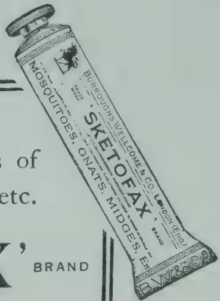

# GENERAL.

## SCIENTIFIC RESEARCH IN RELATION TO AGRICULTURAL PROBLEMS.

At the organizing convention of the Canadian Society of Technical Agriculturists, held in June, 1920, at Ottawa, an address was delivered by PROF. W. P. THOMPSON, of the University of Saskatchewan, dealing very clearly and forcibly with the importance in modern days of research workers in agricultural subjects. The main points of this address seem well worthy of presentation and interpretation.

Agricultural scientific research suffers more than any other form of industrial research from a lack of realization on the part of the general public of its possibilities. This is perhaps due to the familiarity with agricultural problems on the part of those who reside in agricultural communities. The value of research in relation to manufacturing industries is generally admitted, perhaps because of the mystery which still surrounds the subject of chemistry in the minds of most people. But with regard to agriculture, it seems to be held that there is no real need for investigation into such commonplace operations as ploughing, planting and reaping.

220------------------------------------------------

MARCH, 1921.]189

In reality, agriculture, like other industries, has reached a stage at which little further progress can be expected from casual observation or the accumulation of experience derived from rule-of-thumb experiments. Future progress will result only from the careful application of scientific facts and principles to agricultural problems, which problems are just as difficult and complex as those of any other industry. The actual financial benefits which have accrued wherever scientific agriculture has been properly applied are not surpassed by those in any other industry.

The problems, the investigation of which is likely to result in departures of importance, demand, however, knowledge of an unusually wide range of fundamental subjects, and agricultural research is therefore peculiarly dependent upon so-called pure science. The workers in these fundamental subjects supply, so to speak, the raw material of definite scientific information, while the technical agriculturists work upon the manufactured article of improved agricultural practices. Reliable information on the latter point can then be supplied to planters or farmers by actual demonstration.

There should be effective co-operation between the research worker and the practical agriculturist, and the former should receive as much stimulus from the latter as the latter from the former. The practical man knows the problems, and discovers wherein information is lacking in order to solve them. He should be able to enlist the services of the scientific research worker as to their solution; and frequently, by so doing, the practical man discloses to the research worker the need for detailed investigation into some fundamental subject, which may well result in an advance in theoretical science.

In order to grapple with the majority of agricultural problems, the need of team work becomes evident. A number of experts attacking a problem conjointly in various directions bring to bear on it so many different points of view that danger of failure to find out at least something of importance about the subject is greatly minimised. It should not be imagined, however, that co-operation between experts can replace individual research, but it can make the individual research worker much more effective in solving certain problems. Numerous problems come before the notice of agriculturists, and some of these can, it would seem, only be tackled successfully by individual workers. Consequently it should not be laid down as an inflexible rule, that all problems are best attacked by team work. Problems which are easily outlined, clearly defined—which possess a high probability of successful solution when vigorously studied, and which are of such a nature that the methods of attack are fairly obvious, yield most readily to team work. On the other hand, problems which are somewhat vague, or which are of the type that promises little in the way of directly successful solution, are best undertaken by an individual worker of special ability, perseverance, and imagination, for in such a case the work cannot be outlined sufficiently clearly to allow of the allocation of different phases of it to different experts. In an institution, therefore, for the furtherance of research there should always be a place for such individual workers, with substantial financial aid, and with freedom from other duties.

221------------------------------------------------

190[MARCH, 1921.

In Government departments and institutions, there has hitherto seemed to be a tendency to cramp and hinder some of the individual types of research workers, by insisting upon a clear definition of the object of the work before it has been begun, and by periodical demands for a statement from each research worker of his progress and findings. In teaching institutions, as in many of the universities these limitations do not exist to any extent, and the value of the freedom resulting is shown by the final results of the system when they are examined. When a research worker is in a position to devote his time and attention to research, without giving minute statements beforehand of his object, he is more likely to break new ground than if every research has to be justified in advance. A research worker ought to be perfectly free to choose his problems, and to determine how far he may follow up his research work. One of the chief attractions in such work to the enthusiastic worker is that he seldom knows where a line of investigation is going to take him.

It would appear advisable for research workers in fundamental scientific subjects to make a judicious choice of problems and materials before commencing a definite piece of work. In agricultural research for example, a plant physiologist could just as well make use of a crop plant of economic value in examining into certain phenomena, as employ a plant of no economic interest. By so doing he is quite likely to reveal, perhaps incidentally, perhaps directly, information of great practical importance concerning the plant which he is investigating.

The subject of the nature of the work of scientific agricultural research workers deserves some allusion to the remuneration which such scientists should receive. The agricultural research worker labours under a certain disadvantage, in that he does not share in the financial benefits which secure from his work, as is the case, in part at least, with the industrial research worker. Although the work of the agricultural research worker may result in much financial benefit in the cultivation of particular crops, it is not likely that he will profit at all, or only very slightly, from the results of his researches. If able research workers are to be attracted by, and to be retained in the pursuit of the solutions which agricultural problems demand, the remuneration given to them, in order to allow them freedom to attack those problems with success, ought to be sufficient to make possible a life of decent comfort.—*AGRIC. NEWS*, Vol. XIX., No. 484.

---

## THE WATER FACTOR IN CROP PRODUCTION.

---

In many places water is frequently a serious limiting factor in crop production. In order to cope with this problem there are two chief points of attack (1) selecting plants adapted to local conditions; (2) adjusting the water factor of the environment to the needs of the plant. It is only by employing both methods that the desired end will be attained. Much has already been done in the production of drought-resistant strains. The globe has been searched by the experts of the United States Department of Agriculture for suitable plants, which after careful selection, and where necessary, hybridization, are put under cultivation. Wheat, for instance, can now be grown in many of the more arid parts of the United States, where formerly it was unknown. The type of plant which passes into a dormant stage during dry spells, and which will renew growth without having been greatly injured when the rains come, is greatly to be desired. Certain of the sorghums appear to possess this character.

222------------------------------------------------

MARCH, 1921.]191

The adjustment of the environment, on the other hand, to the needs of the crop, has always presented great difficulty. It is only in regions where irrigation is possible that anything approaching satisfactory control of the water factor can be attained. In other districts it is necessary, if the rainfall is limited, to resort to the methods of dry farming. Mulching the surface of the soil for a few inches in depth by stirring it has been practised from the earliest times as a means of conserving the moisture of the soil. Moisture evaporated from the soil is of course completely lost, and is of no value to the crop. The best condition would be to have no evaporation of moisture except that passing through the plant, and assisting in its functions. Evaporation not only depletes the soil of its moisture, but is liable during dry spells to cause a dangerous concentration of salts in the surface layers. The colour of the soil is claimed by KING to affect evaporation greatly, since the darker the soil the more heat it absorbs. RIDGEWAY has shown that stirring the soil to a depth of 2, 4, and 6 inches once a week, with the water level kept 22 inches below the surface of the soil, lessened evaporation by 19, 23, and 45, per cent, respectively of the amount from the unstirred soil. HARRIS and ROBINSON point out that the dirt mulch loses its efficiency unless it is kept dry.

The advantages attending the use of a trash mulch in the cultivation of the sugar-cane are now generally recognized; not only is the moisture in the soil conserved by this form of mulch to a very large extent, but the development of excessive soil temperatures during the hottest part of the day is prevented. Excessively high temperatures are developed in the absence of trash, particularly on the darker classes of soil, even to a considerable depth. It is most instructive in this connexion to feel the soil with the hand under the trash, and in the open. High temperature in the soil not only dissipates the moisture of the soil, but retards the absorption of water by the roots in the upper regions of the soil at the very time of maximum water loss from the leaves. The effect of the mulch on the conservation of the humus, and on all the physical, chemical, and biological activities of the soil, which determine the fertility of the soil, is as yet unknown. An objection which is sometimes raised against the use of trash, is that it prevents light showers of rain from finding their way into the soil. A moment's consideration shows, however, that even if the trash were absent, and such rains did enter the soil, not only would they evaporate before the roots could utilize the water they bring, but they would assist in the dissipation of the water already in the soil by linking up with the water films beneath the surface and so leading to increased capillary movement.

Thus far the losses due to the water transpired by the crop have not been considered. Economy in this direction is, however, very great. The use of wind breaks, and the advantage of planting the rows in the direction of the prevailing wind are too well-known to require emphasizing. KIESSELBACK, who carried out his work in Nebraska, points out that in a fertile soil there is a smaller loss of water per unit of dry matter than in a relatively infertile soil. This does not mean of course that under optimum conditions of soil fertility, less water is required per plant or per acre. In fact, it appears to mean just the reverse. For example, as one adds manure to an infertile, unproductive soil, one may greatly reduce the water required per

223------------------------------------------------

192[MARCH, 1921.

unit of dry matter produced, but at the same time the total amount of water transpired may actually be increased. The ratio of water loss to dry weight is lower because the plants grow in a more normal manner. Anything below the optimum fertility approaches a pathological condition. The plants grow more luxuriantly in a fertile soil, having a greater leaf area, and consequently each plant requires a greater total amount of water. Under these conditions, if the rainfall is limited, what would be the result of adding fertilizers? It would not mean that the plants could endure dry weather better by requiring less water, but it would mean a greater total water requirement per plant, and the crops would tend to withstand the shortage of moisture less than if no manure had been added. Thus, in regions of limited rainfall an application of manure or other fertilizer might be expected to cause even greater injury from a lack of moisture than if none at all had been applied.

There is one manner, however, in which this reduced water requirement in the production of dry matter by the plant, due to the increased fertility, may be taken advantage of under conditions of limited rainfall. If the plants were spaced farther apart upon the land, relatively more water would be available in the soil for the amount of growth it supports. Manure might then be applied, thereby combining for the individual plant a greater abundance of moisture a greater production per unit of water transpired, resulting from increased fertility. There would doubtless be a counter tendency for more water to be lost by evaporation directly from the soil surface, because of less protection given by the crop. This would be met by frequent stirring of the surface soil, or by mulching with trash, grass, leaves, etc.

Another suggestion of possible practical value for certain crops, e.g. maize, under semi-arid conditions, is that of CUNNINGHAM, to space the rows twice as far apart as is commonly practised, with double the usual number of plants in the row. The principle involved is that the plants will be reduced in vegetative growth because of competition, and the roots may continue to grow into the moister soil between the rows. The idea of obtaining a greater return from the moisture in the soil by increasing the fertility, and the methods suggested for obtaining this end are new, and worthy of the most careful experimentation.—T. G. M.—*AGRIC. NEWS*, VOL. XIX, No. 484.

---

## OIL FROM RUBBER SEED.

After extensive investigations in Sumatra and the Federated Malay States, the conclusion has been reached, according to a report from the United States Consul in Sumatra, that it would not be to the advantage of the rubber plantations to collect seed specially for the purpose of extracting oil therefrom, and that Hevea seed would become profitable only in connection with oil from other products. At present there is no machinery for extracting this oil on the rubber estates, and the Director of the Experiment Station is of opinion that it would not pay to install such machinery unless other oil-bearing seeds could be produced in the same locality. Nor is it considered profitable to export the seeds, as the bulk is great in proportion to the small content of oil.—*INDIAN SCIENTIFIC AGRICULTURIST*, Vol. 2, No. 2.

224------------------------------------------------

MARCH, 1921.]193

## JERUSALEM ARTICHOKE *HELIANTHUS TUBEROSUS.*

K. J. ALEX. SYLVA,

*Acting Inspector of School Gardens.*

This tuber, as an article of food, has a distinct value, but either owing to inadequate appreciation or knowledge on the part of the indigenous population, no serious attempt at cultivation has as yet been made. The Artichoke resembles more or less an ornamental flowering annual of the Sun-flower family. It is not a new introduction into Ceylon, its origin being traceable as far back as 1824. In spite of its comparative antiquity, it is surprising that it has not found popular acceptance as an article of dietary of the people.

The plant is a perennial and a native of Brazil, where it is said to attain to a height between 6 to 8 feet. In Ceylon it seldom reaches above half that height. Jerusalem Artichoke is one of the best substitutes for the potato for low elevations, as has been proved by experiments at Hakgala 5,500 feet, Peradeniya 1,600 feet, and Colombo a few feet above sea level. Unlike the potato, the artichoke was found to thrive freely in the last two elevations. It is much hardier than the potato and is not injured by excessive rain or drought. It can be easily cultivated in the poorest soil and in the worst situations and may be propagated by small cuttings of tubers. The following hints may be useful:—Propagation by means of tubers (rhizomes). Before planting, the ground should be dug to a depth of about a foot and cattle manure applied. If the soil happens to be of a clayey texture, a liberal application of lime or a good sprinkling of sand will be beneficial. The sets may be put down, either entire or cut into pieces, each having a couple of eyes, in May or December, in shallow trenches or in holes 4 inches deep in rows 18 inches apart and with the same distance between each plant on the quincunx style. A deep friable sandy loam and open situation is more favourable. No after cultivation is required beyond clearing weeds and occasional earthing up of the stems as the plant grows. When the plants are between 5 to 6 months old the leaves and stems will fade, which is a sign of maturity of the underground tuberous roots. The stem should be cut and the crop lifted with a digging fork or mamoty. All injured tubers should be used at once as they are liable to rot.

The tubers can be allowed to remain in the ground for a considerable time and lifted as required or they may be stored in a dry cool place, and covered either with dry earth or sand.

At elevations below 3,000 feet in well prepared grounds it is possible to expect an average return of a pound of tubers per plant. These are sold in local markets at prices varying from 15 to 30 cts. per pound and there is a steady demand from European residents.

225------------------------------------------------

194[MARCH, 1921.

## THE PREPARATION OF PAPAIN.

---

In the island of Montserrat a preparation of papain is made from the papaw. It is exported and used in the manufacture of peptonized foods and for medicinal purposes as it greatly promotes digestion. The HON. FRANCIS WATT, the Imperial Commissioner of Agriculture, at whose suggestion the industry was started in Montserrat, recently gave a very interesting account of the method of collecting and preparing papain.

"The milk of the papaw possesses the property of rendering meat tender, and in fact partially digesting it. The milk is obtained by making a scratch or shallow incision in the skin of the papaw fruit while in green condition. It is desirable to employ a bone or wooden knife like a paper knife in making the incision, as it is essential that no iron or iron utensils shall be employed. The milky fluid rapidly exudes and may be caught in a cup held beneath the fruit. A tin cup must not be used. Earthenware or glass vessels must be used for the purpose. The fruit is not removed from the tree and it may be subjected to the operation of tapping several times at intervals of two or three days. After collecting the juice soon coagulates and takes the form of a snow-white curd possessing a somewhat pungent but not putrid smell. It speedily decomposes if not rapidly dried, and when decomposing emits a most unpleasant odour. Drying is well effected by spreading the coagulated milk on drying frames made by stretching brown linen on light wooden frames, somewhat like those used for framing school slates. Drying must be continued until the substance is crisp and in such condition that it can be reduced to a fine powder without any difficulty being experienced from stickiness. The dried material should be ground to a fine powder, when the resulting product should be a white or cream coloured powder with a characteristic but not putrid smell. Grinding is easily effected in a mill of the type commonly employed for grinding coffee. When grinding it is desirable to have the papain slightly warmed. The powder should be packed in tins or bottles and carefully preserved from contact with the air."

The eating of the fresh fruit promotes digestion, and as it is very palatable when ripe it is popular in the West Indies.—INDIA-RUBBER JOURNAL, Vol. IX. No. 26.

---

## TO PROTECT STORED MAIZE AND WHEAT FROM WEEVIL.

---

W. B. GURNEY,

*Assistant Entomologist.*

The cheapest method of treating a large quantity of grain in bags to protect it from weevil is to fumigate it in lots of twelve to twenty bags at a time, pouring into the top of each bag 1 to 2 fluid oz. of liquid carbon bisulphide, placing the bags side by side on a tarpaulin or canvas sheet, and then folding over the sides of the sheet so as to overlap tightly, and covering the whole with bags or another tarpaulin to further help to keep in the fumes. A "tryer" (sampler) serves as a useful funnel for running in the liquid, the heavy fumes of which sink down through the grain. Each lot of bags should be exposed to the fumes for not longer than twenty-four hours. Neither the liquid nor fumes, used as above directed, will affect the grain for food or seed.

226------------------------------------------------

MARCH, 1921.]195

Fumigation should be carried out, if possible, on a warm day (say with a temperature of 70 degrees Fah.), as at a temperature below 60 degrees Fah., the fumes become less effective. The bulk of the weevils will be killed by this process, but the bags should be inspected every two months, and if they show signs of re-infestation they should be given further treatment. Care should be taken that no fires, lights or lighted pipes or cigarettes are near when handling the liquid or fumigating, as the fumes are inflammable.

If an empty galvanized iron water tank is available, it may be used with advantage in place of tarpaulins, as the lid can be sealed (by placing a ring of rubber tubing or a bag under it) and kept down by weights when the infested grain has been emptied in. Moreover, as in such a receptacle the fumes are much more effectively held, only 1 oz. of liquid to four bags (that is, to every 15 cubic feet of space in the tank) need be used.

Carbon bisulphide costs ls. 6d. per lb. if purchased in small quantities, but it may be purchased more cheaply in 1-gallon tins, and more cheaply still if a number of such tins are bought at a time.

It may be added that maize has been successfully stored and kept free from weevils for a long period at Graftton Experiment Farm by using pure dry carbon dioxide gas from cylinders, at a cost of only 1d. per bushel for gas.—*AGRIC. GAZ. OF N. S. W.*, Vol. XXXI, Part 10.

---

## WAX-EXCRETING PALMS.

---

Among the most interesting members of the palm family are one or two species which excrete wax and deposit it on their leaves or on their stems. Probably the best known of these is the Carnauba palm of Brazil. While a second has latterly become known as the wax palm of Colombia. Specimens of the Carnauba palm exist in the Botanic Gardens in British Guiana and seeds from these have been distributed to the Botanic Gardens throughout the West Indies.

In the forests the Pernambuco and Bahia the Carnauba palm is found in great number. The trees grow to a height of 40 ft. and measures to about 1 ft. diameter at its base. The wax excreted and deposited on the under side of the leaves, and the collection of the produce has of late years become an important industry.

The wax is either scraped from leaves on the tree, or the leaves themselves are gathered from the tree and wax is afterwards removed. Since the produce so obtained is in an impure state, and contains a large mixture of resin and other materials, it is melted, the impurities are removed by skimming, and the wax is run into moulds to harden.

Carnauba wax was until recently, used in the manufacture of candles and also as a basis for such articles as boot polishes. The discovery of the fact that this wax was of special value for the purpose of making phonograph and gramophone records, led immediately to a greater demand for the product and also a large increase in its value. About 2,000 tons of wax were annually exported from Brazil and its value is placed at anything from £100 to £200 per ton.

The wax palm of Colombia excretes wax which is deposited not on the leaves but on the trunk of the trees and is frequently found between the scars left by the petioles of the leaves, its deposits are so thick that it can be removed in flakes. The average annual yield of one tree is said to be about 25 lb. At present there is but a local demand for the wax, and it is used by the people in Colombia for making candles.—*FARMERS' JOURNAL*, Vol. 2, No. 40.

227------------------------------------------------

196

[MARCH, 1921.

## METEOROLOGICAL.

### FEBRUARY, 1921.

<table border="1">
<thead>
<tr>
<th rowspan="3">Station</th>
<th colspan="2">Temperature</th>
<th rowspan="2">Mean Humidity %</th>
<th rowspan="2">Mean amount of cloud<br/>0=clear.<br/>10=overcast</th>
<th rowspan="2">Mean Wind Direction during month</th>
<th rowspan="2">Daily Mean Velocity. Miles.</th>
<th colspan="2">Rainfall</th>
</tr>
<tr>
<th rowspan="2">Mean Daily Shade</th>
<th rowspan="2">Difference from Average</th>
<th rowspan="2">Amount Inches</th>
<th rowspan="2">No. of Rainy days</th>
</tr>
<tr>
<th>Inches</th>
<th>Difference from Average</th>
</tr>
</thead>
<tbody>
<tr>
<td>Colombo</td>
<td>78.6</td>
<td>- 1.2</td>
<td>75</td>
<td>4.4</td>
<td>N</td>
<td>120</td>
<td>0.19</td>
<td>- 1.75</td>
</tr>
<tr>
<td>Observatory</td>
<td>77.6</td>
<td>- 1.1</td>
<td>76</td>
<td>3.4</td>
<td>NNE</td>
<td>136</td>
<td>0.00</td>
<td>- 1.26</td>
</tr>
<tr>
<td>Puttalam</td>
<td>79.3</td>
<td>- 0.7</td>
<td>72</td>
<td>4.3</td>
<td>NNE</td>
<td>142</td>
<td>0.00</td>
<td>- 1.06</td>
</tr>
<tr>
<td>Mannar</td>
<td>77.6</td>
<td>- 1.4</td>
<td>74</td>
<td>3.2</td>
<td>ENE</td>
<td>60</td>
<td>0.00</td>
<td>- 1.16</td>
</tr>
<tr>
<td>Jaffna</td>
<td>79.6</td>
<td>- 0.8</td>
<td>72</td>
<td>5.5</td>
<td>NE</td>
<td>144</td>
<td>0.05</td>
<td>- 2.06</td>
</tr>
<tr>
<td>Trincomalee</td>
<td>77.6</td>
<td>- 0.9</td>
<td>79</td>
<td>5.2</td>
<td>NNW</td>
<td>207</td>
<td>0.05</td>
<td>- 3.33</td>
</tr>
<tr>
<td>Batticaloa</td>
<td>78.8</td>
<td>- 0.6</td>
<td>80</td>
<td>4.8</td>
<td>ENE</td>
<td>300</td>
<td>0.13</td>
<td>- 1.36</td>
</tr>
<tr>
<td>Hambantota</td>
<td>80.7</td>
<td>- 0.3</td>
<td>70</td>
<td>5.2</td>
<td>NW</td>
<td>107</td>
<td>0.46</td>
<td>- 4.00</td>
</tr>
<tr>
<td>Galle</td>
<td>76.4</td>
<td>- 1.7</td>
<td>76</td>
<td>3.6</td>
<td>—</td>
<td>—</td>
<td>0.00</td>
<td>- 1.47</td>
</tr>
<tr>
<td>Ratnapura</td>
<td>77.3</td>
<td>- 2.8</td>
<td>73</td>
<td>4.0</td>
<td>—</td>
<td>—</td>
<td>0.00</td>
<td>- 1.58</td>
</tr>
<tr>
<td>Anu'pura</td>
<td>75.0</td>
<td>- 1.1</td>
<td>70</td>
<td>4.2</td>
<td>—</td>
<td>—</td>
<td>0.01</td>
<td>- 2.28</td>
</tr>
<tr>
<td>Kurunegala</td>
<td>69.9</td>
<td>- 0.9</td>
<td>79</td>
<td>4.4</td>
<td>—</td>
<td>—</td>
<td>0.05</td>
<td>- 3.09</td>
</tr>
<tr>
<td>Kandy</td>
<td>64.4</td>
<td>- 1.2</td>
<td>73</td>
<td>5.8</td>
<td>—</td>
<td>—</td>
<td>0.16</td>
<td>- 2.46</td>
</tr>
<tr>
<td>Badulla</td>
<td>55.7</td>
<td>- 2.3</td>
<td>80</td>
<td>6.0</td>
<td>—</td>
<td>—</td>
<td>0.11</td>
<td>- 3.13</td>
</tr>
<tr>
<td>Diyatalawa</td>
<td>55.5</td>
<td>- 2.1</td>
<td>70</td>
<td>5.7</td>
<td>—</td>
<td>—</td>
<td>0.02</td>
<td>- 2.08</td>
</tr>
<tr>
<td>Hakgala</td>
<td></td>
<td></td>
<td></td>
<td></td>
<td></td>
<td></td>
<td></td>
<td></td>
</tr>
<tr>
<td>N. Eliya</td>
<td></td>
<td></td>
<td></td>
<td></td>
<td></td>
<td></td>
<td></td>
<td></td>
</tr>
</tbody>
</table>

The rainfall summary for this month is very simple viz : unusually dry throughout, even for February.  
Of the 269 stations that report to the Observatory none of those north of Colombo recorded as much as 2 inches and the majority recorded nothing at all.

With the help of some rain on the 8th—10th two stations in the Southern Province reached their own average for February, though this is not saying much, and one of them (Beausejour) had the highest total for the month with 5.35 inches.

The table above shows that though there was not much cooling effect of rain the numerical values of the mean temperatures were below the average. This was due more to the night temperatures being below their normal than to the afternoon ones being below theirs.

At Nuwara Eliya the minimum in air, i.e. at about 4 feet above the ground, reached freezing point on the morning of the 23rd and was below it on the 24th. 25th, 26th and 27th. The minimum on grass was below 32° nine times.

A. J. BAMFORD,  
Supdt. Observatory

## ANIMAL DISEASE RETURN FOR THE

### MONTH ENDED 28th FEBRUARY, 1921.

<table border="1">
<thead>
<tr>
<th>Province, &amp;c.</th>
<th>Disease.</th>
<th>No. of Cases up to date since Jan. 1st, 1921.</th>
<th>Fresh Cases</th>
<th>Recoveries.</th>
<th>Deaths.</th>
<th>Bal- ance Ill.</th>
<th>No. Shot.</th>
</tr>
</thead>
<tbody>
<tr>
<td rowspan="2">Western</td>
<td>Rinderpest</td>
<td>52</td>
<td>37</td>
<td>44</td>
<td>—</td>
<td>8</td>
<td>—</td>
</tr>
<tr>
<td>Foot-and-mouth disease</td>
<td>—</td>
<td>—</td>
<td>—</td>
<td>—</td>
<td>—</td>
<td>—</td>
</tr>
<tr>
<td rowspan="2">Colombo Municipality</td>
<td>Rinderpest</td>
<td>88</td>
<td>33</td>
<td>—</td>
<td>—</td>
<td>—</td>
<td>—</td>
</tr>
<tr>
<td>Foot-and-mouth disease</td>
<td>—</td>
<td>—</td>
<td>—</td>
<td>—</td>
<td>—</td>
<td>—</td>
</tr>
<tr>
<td rowspan="2">Cattle Quarantine Station</td>
<td>Rabies</td>
<td>2</td>
<td>1</td>
<td>—</td>
<td>—</td>
<td>—</td>
<td>—</td>
</tr>
<tr>
<td>Foot-and-mouth disease</td>
<td>32*</td>
<td>—</td>
<td>—</td>
<td>—</td>
<td>—</td>
<td>—</td>
</tr>
<tr>
<td></td>
<td>Anthrax</td>
<td>79†</td>
<td>—</td>
<td>—</td>
<td>—</td>
<td>—</td>
<td>—</td>
</tr>
<tr>
<td rowspan="2">Central</td>
<td>Rinderpest</td>
<td>Free.</td>
<td>—</td>
<td>—</td>
<td>—</td>
<td>—</td>
<td>—</td>
</tr>
<tr>
<td>Foot-and-mouth disease</td>
<td>—</td>
<td>—</td>
<td>—</td>
<td>—</td>
<td>—</td>
<td>—</td>
</tr>
<tr>
<td></td>
<td>Anthrax</td>
<td>—</td>
<td>—</td>
<td>—</td>
<td>—</td>
<td>—</td>
<td>—</td>
</tr>
<tr>
<td rowspan="2">Southern</td>
<td>Rinderpest</td>
<td>35</td>
<td>—</td>
<td>25</td>
<td>—</td>
<td>—</td>
<td>—</td>
</tr>
<tr>
<td>Foot-and-mouth disease</td>
<td>—</td>
<td>—</td>
<td>—</td>
<td>—</td>
<td>—</td>
<td>—</td>
</tr>
<tr>
<td></td>
<td>Anthrax</td>
<td>—</td>
<td>—</td>
<td>—</td>
<td>—</td>
<td>—</td>
<td>—</td>
</tr>
<tr>
<td rowspan="2">Northern</td>
<td>Rinderpest</td>
<td>Free</td>
<td>—</td>
<td>—</td>
<td>—</td>
<td>—</td>
<td>—</td>
</tr>
<tr>
<td>Foot-and-mouth disease</td>
<td>—</td>
<td>—</td>
<td>—</td>
<td>—</td>
<td>—</td>
<td>—</td>
</tr>
<tr>
<td></td>
<td>Anthrax</td>
<td>—</td>
<td>—</td>
<td>—</td>
<td>—</td>
<td>—</td>
<td>—</td>
</tr>
<tr>
<td rowspan="2">Eastern</td>
<td>Rinderpest</td>
<td>58</td>
<td>58</td>
<td>16</td>
<td>—</td>
<td>42</td>
<td>—</td>
</tr>
<tr>
<td>Foot-and-mouth disease</td>
<td>—</td>
<td>—</td>
<td>—</td>
<td>—</td>
<td>—</td>
<td>—</td>
</tr>
<tr>
<td></td>
<td>Anthrax</td>
<td>—</td>
<td>—</td>
<td>—</td>
<td>—</td>
<td>—</td>
<td>—</td>
</tr>
<tr>
<td rowspan="2">North-Western</td>
<td>Rinderpest</td>
<td>11</td>
<td>6</td>
<td>2</td>
<td>6</td>
<td>1</td>
<td>2</td>
</tr>
<tr>
<td>Foot-and-mouth disease</td>
<td>—</td>
<td>—</td>
<td>—</td>
<td>—</td>
<td>—</td>
<td>—</td>
</tr>
<tr>
<td></td>
<td>Anthrax</td>
<td>—</td>
<td>—</td>
<td>—</td>
<td>—</td>
<td>—</td>
<td>—</td>
</tr>
<tr>
<td rowspan="2">North-Central</td>
<td>Rinderpest</td>
<td>Free</td>
<td>—</td>
<td>—</td>
<td>—</td>
<td>—</td>
<td>—</td>
</tr>
<tr>
<td>Foot-and-mouth disease</td>
<td>—</td>
<td>—</td>
<td>—</td>
<td>—</td>
<td>—</td>
<td>—</td>
</tr>
<tr>
<td></td>
<td>Anthrax</td>
<td>—</td>
<td>—</td>
<td>—</td>
<td>—</td>
<td>—</td>
<td>—</td>
</tr>
<tr>
<td rowspan="2">Uva</td>
<td>Rinderpest</td>
<td>88</td>
<td>43</td>
<td>66</td>
<td>3</td>
<td>19</td>
<td>—</td>
</tr>
<tr>
<td>Foot-and-mouth disease</td>
<td>—</td>
<td>—</td>
<td>—</td>
<td>—</td>
<td>—</td>
<td>—</td>
</tr>
<tr>
<td></td>
<td>Anthrax</td>
<td>—</td>
<td>—</td>
<td>—</td>
<td>—</td>
<td>—</td>
<td>—</td>
</tr>
<tr>
<td rowspan="2">Sabaragamuwa</td>
<td>Rinderpest</td>
<td>—</td>
<td>—</td>
<td>—</td>
<td>—</td>
<td>—</td>
<td>—</td>
</tr>
<tr>
<td>Foot-and-mouth disease</td>
<td>—</td>
<td>—</td>
<td>—</td>
<td>—</td>
<td>—</td>
<td>—</td>
</tr>
<tr>
<td></td>
<td>Anthrax</td>
<td>—</td>
<td>—</td>
<td>—</td>
<td>—</td>
<td>—</td>
<td>—</td>
</tr>
</tbody>
</table>

\* 6 cases occurred amongst sheep and goats. † Occurred amongst sheep and goats.

Colombo, 4th March, 1921.

G. W. STURGESS, G.V.S.

228------------------------------------------------

THE  
**TROPICAL AGRICULTURIST:**  
JOURNAL OF THE  
**CEYLON AGRICULTURAL SOCIETY.**

---

---

VOL. LVI.

PERADENIYA, APRIL, 1921.

No. 4.

---

---

**SUGAR-CANE CULTIVATION.**

---

In the present number of the TROPICAL AGRICULTURIST are given some figures connected with experiments with sugar-cane in Ceylon. Varieties of canes were introduced from Mauritius and have been submitted to varietal trial upon the Experiment Stations at Peradeniya and Anuradhapura.

The yields of these plots, particularly those at Peradeniya, are satisfactory and indicate that given good cultivation varieties of canes will yield crops which compare favourably with yields obtained in sugar-producing countries. The yields at Anuradhapura are not so satisfactory as those at Peradeniya, but the drainage of the plots was not satisfactory and when this drainage is improved the yields can be improved.

Samples of canes were taken from these plots at various intervals during the growing season and submitted for chemical analysis. The results of these analyses are given in detail and are worthy of close study. The sucrose contents of the juices are low, the glucose ratios exceptionally high and the purities poor. Only a few of the Anuradhapura samples show purities which approach the normal.

These analyses are only the preliminaries of a fuller and more complete series. Cultural operations necessitated that the cane plots should be reaped, whereas, in view of the analytical results, it might have been desirable to have carried the canes over until the dry weather of the months of February and March.

229------------------------------------------------

198[APRIL, 1921.

Further plots have been planted and ratoan crops will be taken from the present plots. These will be carried through and a more complete set of analytical figures obtained.

The analyses show that better juices are likely to be obtainable in the dry low-country than in the wetter districts like Peradeniya, and they also indicate that for successful results varieties of known high sugar-content should be cultivated in preference to varieties which are of value on account of their cropping capacities. They demonstrate the difficulties experienced by older cultivators of sugar-cane in the colony.

It has frequently been recorded that Ceylon did in the olden days, when sugar cultivation was one of its industries, grow good crops of canes but experienced difficulties in manufacture. It had not been established why these difficulties had been experienced and it was thought that many of the older difficulties would disappear with the installation of modern machinery. The analyses now published indicate that one of the main difficulties is likely to be a chemical one. Fuller data is required and further experiments will have to be made.

Ceylon should be producing its own sugar and some for export as well. It also requires or will require in future years the cultivation of sugar-cane for the manufacture of power alcohol. At the present time molasses have to be imported to produce a potable spirit for consumption. These molasses can be produced locally without difficulty.

Further experiments are most desirable. Experimental areas of sugar-cane should be grown in different parts of the colony, the records of yields carefully taken and a thorough series of analyses made. Until this is done, definite data will not be available and capitalists cannot be expected to make investments in an industry which requires large sums to be expended for machinery.

Experiments are being started again in the Southern Province and arrangements could be made for a complete series of analyses to be undertaken. The co-operation of all growers of sugar-cane is sought, in order that detailed investigations may be continued.

230------------------------------------------------

APRIL, 1921.]199

# FOODSTUFFS.

## SOME CEYLON FOODSTUFFS AND THEIR FOOD VALUES.

M. KELWAY BAMBER, M.R.A.C., F.I.C., F.C.S.,

*Government Agricultural Chemist, Department of Agriculture, Ceylon.*

The question of Food and Food values has been much before the Public during recent years and a very complete series of analyses have been made by several chemists from which the Tables have been compiled.

The food values given do not entirely indicate the degree of digestibility, which varies with different individuals and even with the same individual under varying health conditions.

It will be of interest in giving the table of analyses to explain how the food values are arrived at from the figures. By the term "Nutrient ratio" is meant the proportion of albuminoids or flesh forming constituents to the starch and oil, or heat producers. The percentage of oil is multiplied by the factor 2.25, as oils yield two and one quarter times as much energy as carbohydrates when oxidised in the body, and the product is added to the percentage of starch. The standard ratio of Albuminoids to non-albuminoids for children's diet is as 1 : 5.

The nutrient value is the sum total of the percentages of Albuminoids, starch and the starch equivalent of oil, obtained as above. An example will make this clear. Rice has the following composition :—

<table>
<tbody>
<tr>
<td>Moisture</td>
<td>...</td>
<td>...</td>
<td>12.8 %</td>
</tr>
<tr>
<td>Albuminoids</td>
<td>...</td>
<td>...</td>
<td>7.3 %</td>
</tr>
<tr>
<td>Starch</td>
<td>...</td>
<td>...</td>
<td>78.3 %</td>
</tr>
<tr>
<td>Oil</td>
<td>...</td>
<td>...</td>
<td>0.6 %</td>
</tr>
<tr>
<td>Fibre</td>
<td>...</td>
<td>..</td>
<td>0.4 %</td>
</tr>
<tr>
<td>Ash</td>
<td>...</td>
<td>...</td>
<td>0.6 %</td>
</tr>
</tbody>
</table>

The "Nutrient ratio" is calculated as follows :—

Albuminoids 7.3 % : Starch 78.3 % + Oil (0.6 %  $\times$  2.25 = 1.35) = 79.65 as 7.3 : 79.65 : : 1 : 10.9 = nutrient ratio.

The nutrient value is the sum total of the three constituents Albuminoids, 7.3 % + Starch 78.3 % + Oil (0.6 %  $\times$  2.25 = 1.35 %) = 86.95.

The Ash constituents of foods consist chiefly of lime, potash, soda and magnesia, phosphoric and sulphuric acids. They are deficient in rice only.

Both vegetables and animal foods contain some nitrogen in the non-albuminoids form, but it is chiefly present as albuminoids, which contain 15.87 per cent of nitrogen.

Spinach, Lettuce, Water cress, etc., have half their nitrogen present as nitrates and are useless as flesh formers.

Water is an essential element and for adults at least 3 to 4 pints are required every 24 hours, including water in the food.

231------------------------------------------------

200[APRIL, 1921.

The average amount of water in various foods is for :—

<table>
<tr>
<td>Grains and Pulses</td>
<td>...</td>
<td>...</td>
<td>12.5%</td>
</tr>
<tr>
<td>Milk</td>
<td>...</td>
<td>...</td>
<td>88.0%</td>
</tr>
<tr>
<td>Succulent roots and fruits, etc.</td>
<td>...</td>
<td>...</td>
<td>90.0 to 95%</td>
</tr>
</table>

### Chemical Composition and Nutrient Values of Millets, Maize and Rice.

<table>
<thead>
<tr>
<th></th>
<th>Water.</th>
<th>Albumi-<br/>noids.</th>
<th>Starch.</th>
<th>Oil.</th>
<th>Fibre.</th>
<th>Ash.</th>
<th>Nutri-<br/>ent<br/>ratio.</th>
<th>Nutri-<br/>ent<br/>value.</th>
</tr>
</thead>
<tbody>
<tr>
<td>Chena Millet.</td>
<td></td>
<td></td>
<td></td>
<td></td>
<td></td>
<td></td>
<td></td>
<td></td>
</tr>
<tr>
<td><i>Panicum Miliaceum</i></td>
<td>- 12</td>
<td>12.6</td>
<td>69.4</td>
<td>3.6</td>
<td>1.0</td>
<td>1.4</td>
<td>1:60</td>
<td>89</td>
</tr>
<tr>
<td>Little Millet. <i>P. Miliare</i></td>
<td>- 10.2</td>
<td>9.1</td>
<td>69.0</td>
<td>3.6</td>
<td>4.6</td>
<td>3.5</td>
<td>1:8.4</td>
<td>85</td>
</tr>
<tr>
<td>Sanwa Millet. <i>P. frumen-<br/>laceum</i></td>
<td>- 12.0</td>
<td>8.4</td>
<td>72.5</td>
<td>3.0</td>
<td>2.2</td>
<td>1.9</td>
<td>1:9.5</td>
<td>88</td>
</tr>
<tr>
<td>Italian millet. <i>Setaria Italica</i></td>
<td>10.2</td>
<td>10.8</td>
<td>73.4</td>
<td>2.9</td>
<td>1.5</td>
<td>1.2</td>
<td>1:7.4</td>
<td>91</td>
</tr>
<tr>
<td>Bulrush Millet, <i>P. typhoi-<br/>deum</i></td>
<td>- 11.3</td>
<td>10.4</td>
<td>71.5</td>
<td>3.3</td>
<td>1.5</td>
<td>2.0</td>
<td>1:7.6</td>
<td>89.5</td>
</tr>
<tr>
<td>Ragi. <i>Eluesine coracana</i></td>
<td>- 13.2</td>
<td>7.3</td>
<td>73.2</td>
<td>1.5</td>
<td>2.5</td>
<td>2.3</td>
<td>1:13</td>
<td>84</td>
</tr>
<tr>
<td>Job's tears. <i>Coix lacryma</i></td>
<td>- 13.2</td>
<td>18.7</td>
<td>58.3</td>
<td>5.2</td>
<td>1.5</td>
<td>2.1</td>
<td>1:3.8</td>
<td>89</td>
</tr>
<tr>
<td>Maize. <i>Zea maya</i></td>
<td>- 12.5</td>
<td>9.5</td>
<td>70.7</td>
<td>3.6</td>
<td>2.0</td>
<td>1.7</td>
<td>1:8.3</td>
<td>88.5</td>
</tr>
<tr>
<td>Rice. <i>Oriza sativa</i></td>
<td>- 12.8</td>
<td>7.3</td>
<td>78.3</td>
<td>0.6</td>
<td>0.4</td>
<td>0.6</td>
<td>1:10.9</td>
<td>86.5</td>
</tr>
<tr>
<td>Bamboo rice. <i>Bambusa<br/>arundinacea</i></td>
<td>- 11.0</td>
<td>11.8</td>
<td>73.7</td>
<td>0.6</td>
<td>1.7</td>
<td>1.2</td>
<td>1:6.4</td>
<td>87</td>
</tr>
<tr>
<td>Average of the above grains</td>
<td>11.8</td>
<td>10.6</td>
<td>71.0</td>
<td>2.8</td>
<td>1.9</td>
<td>1.8</td>
<td>1:8.1</td>
<td>88</td>
</tr>
</tbody>
</table>

### Chemical Composition and Nutrient Value of Pulses.

<table>
<thead>
<tr>
<th></th>
<th>Water.</th>
<th>Albumi-<br/>noids.</th>
<th>Starch.</th>
<th>Oil.</th>
<th>Fibre.</th>
<th>Ash.</th>
<th>Nutri-<br/>ent<br/>ratio.</th>
<th>Nutri-<br/>ent<br/>value</th>
</tr>
</thead>
<tbody>
<tr>
<td>Peanut. <i>Arachis hypogaea</i></td>
<td>- 7.5</td>
<td>24.5</td>
<td>11.7</td>
<td>5.0</td>
<td>4.5</td>
<td>1.8</td>
<td>1:5.2</td>
<td>151</td>
</tr>
<tr>
<td>Sword Bean. <i>Canavalia<br/>ensiformis</i></td>
<td>- 12.5</td>
<td>25.0</td>
<td>48.6</td>
<td>2.8</td>
<td>7.7</td>
<td>3.4</td>
<td>1:2.2</td>
<td>80</td>
</tr>
<tr>
<td>Chicken Pea. <i>Cicer arietinum</i></td>
<td>11.5</td>
<td>21.7</td>
<td>59.0</td>
<td>4.2</td>
<td>3.6</td>
<td>1.0</td>
<td>1:3.3</td>
<td>84</td>
</tr>
<tr>
<td>Pea. <i>Pisum sativum</i></td>
<td>- 11.8</td>
<td>28.2</td>
<td>55.0</td>
<td>1.5</td>
<td>2.5</td>
<td>1.0</td>
<td>1:2.4</td>
<td>81</td>
</tr>
<tr>
<td>Lentil. <i>Lens exculenta</i></td>
<td>- 11.8</td>
<td>25.1</td>
<td>58.4</td>
<td>1.3</td>
<td>3.8</td>
<td>1.2</td>
<td>1:2.5</td>
<td>87</td>
</tr>
<tr>
<td>Soy Bean. <i>Glycine soja</i></td>
<td>- 11.0</td>
<td>25.3</td>
<td>26.0</td>
<td>18.9</td>
<td>14.6</td>
<td>4.2</td>
<td>1:2</td>
<td>105</td>
</tr>
<tr>
<td>Mung Bean. <i>Phaseolus<br/>mungo</i></td>
<td>- 10.1</td>
<td>22.7</td>
<td>55.8</td>
<td>2.2</td>
<td>4.4</td>
<td>4.8</td>
<td>1:2.7</td>
<td>83</td>
</tr>
<tr>
<td>Lima Bean. <i>Phaseolus<br/>lunatus</i></td>
<td>- 13.3</td>
<td>19.7</td>
<td>57.8</td>
<td>1.2</td>
<td>3.7</td>
<td>4.3</td>
<td>1:3.2</td>
<td>80</td>
</tr>
<tr>
<td>Catiang Bean. <i>Vigna catiang</i></td>
<td>12.5</td>
<td>24.1</td>
<td>56.8</td>
<td>1.3</td>
<td>3.5</td>
<td>1.8</td>
<td>1:2.5</td>
<td>81</td>
</tr>
<tr>
<td>Lablab Bean. <i>Dolichos lablab</i></td>
<td>12.1</td>
<td>24.4</td>
<td>57.8</td>
<td>1.5</td>
<td>3.0</td>
<td>1.2</td>
<td>1:2.5</td>
<td>80</td>
</tr>
<tr>
<td>Horse Gram. <i>Dolichos<br/>biflorus</i></td>
<td>- 11.0</td>
<td>22.5</td>
<td>56.0</td>
<td>1.9</td>
<td>3.2</td>
<td>5.4</td>
<td>1:2.7</td>
<td>83</td>
</tr>
<tr>
<td>Pigeon Pea. <i>Cajanus indicus</i></td>
<td>10.5</td>
<td>22.3</td>
<td>60.9</td>
<td>2.1</td>
<td>3.0</td>
<td>1.2</td>
<td>1:3.0</td>
<td>80</td>
</tr>
<tr>
<td>Moth Bean. <i>Phaseolus<br/>aconilifolius</i></td>
<td>- 11.2</td>
<td>23.8</td>
<td>56.6</td>
<td>0.6</td>
<td>3.6</td>
<td>4.2</td>
<td>1:2.5</td>
<td>81</td>
</tr>
<tr>
<td>Average</td>
<td>11.7</td>
<td>23.7</td>
<td>56.6</td>
<td>1.9</td>
<td>5.4</td>
<td>3.1</td>
<td>1:2.7</td>
<td>82</td>
</tr>
</tbody>
</table>

232------------------------------------------------

APRIL, 1921.]201

**Chemical Composition of Various Starchy Meals, etc.**

<table border="1">
<thead>
<tr>
<th></th>
<th>Water.</th>
<th>Albu-<br/>minoids.</th>
<th>Starch.</th>
<th>Oil.</th>
<th>Fibre.</th>
<th>Ash.</th>
<th>Nutri-<br/>ent<br/>ratio.</th>
<th>Nutri-<br/>ent<br/>value.</th>
</tr>
</thead>
<tbody>
<tr>
<td>Wheat flour</td>
<td>12.3</td>
<td>10.1</td>
<td>75.6</td>
<td>1.3</td>
<td>0.3</td>
<td>0.6</td>
<td>1:7.7</td>
<td>88.4</td>
</tr>
<tr>
<td>Indian corn</td>
<td>13.4</td>
<td>9.9</td>
<td>69.8</td>
<td>4.3</td>
<td>1.3</td>
<td>1.3</td>
<td>1:8.0</td>
<td>89.4</td>
</tr>
<tr>
<td>Guinea Corn</td>
<td>12.5</td>
<td>9.3</td>
<td>72.3</td>
<td>2.0</td>
<td>2.2</td>
<td>1.7</td>
<td>1:8.2</td>
<td>86.1</td>
</tr>
<tr>
<td>Rice</td>
<td>12.6</td>
<td>6.1</td>
<td>74.1</td>
<td>2.0</td>
<td>4.0</td>
<td>1.2</td>
<td>1:12.9</td>
<td>84.7</td>
</tr>
<tr>
<td>Sweet Potato Meal</td>
<td>12.6</td>
<td>3.6</td>
<td>77.6</td>
<td>0.6</td>
<td>3.5</td>
<td>2.1</td>
<td>1:22.0</td>
<td>82.5</td>
</tr>
<tr>
<td>Cassava Meal</td>
<td>11.4</td>
<td>2.1</td>
<td>82.1</td>
<td>1.1</td>
<td>1.8</td>
<td>1.6</td>
<td>1:40.0</td>
<td>86.6</td>
</tr>
<tr>
<td>Cassava Bread</td>
<td>10.2</td>
<td>1.3</td>
<td>81.9</td>
<td>0.7</td>
<td>4.8</td>
<td>1.1</td>
<td>1:64.0</td>
<td>84.8</td>
</tr>
<tr>
<td>Banana Meal</td>
<td>15.5</td>
<td>2.5</td>
<td>77.7</td>
<td>1.0</td>
<td>0.7</td>
<td>2.6</td>
<td>1:32.0</td>
<td>82.4</td>
</tr>
<tr>
<td>Plantain Meal</td>
<td>11.8</td>
<td>3.1</td>
<td>80.7</td>
<td>1.0</td>
<td>0.9</td>
<td>1.9</td>
<td>1:26.8</td>
<td>86.1</td>
</tr>
<tr>
<td>Palmkernel Meal</td>
<td>11.12</td>
<td>18.06</td>
<td>50.26</td>
<td>6.73</td>
<td>10.2</td>
<td>3.5</td>
<td>1:3.6</td>
<td>83.3</td>
</tr>
<tr>
<td>Oatmeal</td>
<td>10.0</td>
<td>15.0</td>
<td>60.0</td>
<td>8.0</td>
<td>3.0</td>
<td>4.0</td>
<td>1:5.2</td>
<td>93.0</td>
</tr>
<tr>
<td>Sago flour</td>
<td>11.70</td>
<td>0.13</td>
<td>87.56</td>
<td>0.13</td>
<td>0.13</td>
<td>0.3</td>
<td>1:680.0</td>
<td>87.9</td>
</tr>
<tr>
<td>Tapioca flour</td>
<td>12.70</td>
<td>0.88</td>
<td>80.47</td>
<td>0.23</td>
<td>4.87</td>
<td>0.8</td>
<td>1:94.0</td>
<td>81.8</td>
</tr>
</tbody>
</table>

**Chemical Composition of Fish and Meat.**

<table border="1">
<thead>
<tr>
<th></th>
<th>Water</th>
<th>Albuminoids</th>
<th>Starch</th>
<th>Fat</th>
<th>Fibre</th>
<th>Ash</th>
</tr>
</thead>
<tbody>
<tr>
<td>Salt Fish</td>
<td>53.6</td>
<td>21.4</td>
<td>—</td>
<td>0.4</td>
<td>—</td>
<td>24.6</td>
</tr>
<tr>
<td>Salt Pork (Fat)</td>
<td>7.3</td>
<td>1.8</td>
<td>—</td>
<td>87.2</td>
<td>—</td>
<td>3.7</td>
</tr>
<tr>
<td>Beef (Brisket)</td>
<td>40.6</td>
<td>12.5</td>
<td>—</td>
<td>31.9</td>
<td>—</td>
<td>0.7</td>
</tr>
<tr>
<td>Mutton (Neck)</td>
<td>41.6</td>
<td>11.7</td>
<td>—</td>
<td>17.6</td>
<td>—</td>
<td>0.7</td>
</tr>
<tr>
<td>Pork (Loin)</td>
<td>46.1</td>
<td>15.1</td>
<td>—</td>
<td>14.5</td>
<td>—</td>
<td>0.8</td>
</tr>
</tbody>
</table>

**Chemical Composition and Nutrient Value of Vegetables.**

<table border="1">
<thead>
<tr>
<th></th>
<th>Water</th>
<th>Albuminoids</th>
<th>Fat</th>
<th>Carbohydrate</th>
<th>Fibre</th>
<th>Ash</th>
<th>Nutrient<br/>Value</th>
</tr>
</thead>
<tbody>
<tr>
<td>Potatos</td>
<td>74.98</td>
<td>2.08</td>
<td>0.15</td>
<td>21.01</td>
<td>0.69</td>
<td>1.09</td>
<td>24</td>
</tr>
<tr>
<td>Artichokes</td>
<td>79.50</td>
<td>1.98</td>
<td>0.20</td>
<td>16.78</td>
<td>0.72</td>
<td>0.82</td>
<td>19</td>
</tr>
<tr>
<td>Beet</td>
<td>86.75</td>
<td>1.49</td>
<td>0.12</td>
<td>8.74</td>
<td>0.97</td>
<td>0.93</td>
<td>10</td>
</tr>
<tr>
<td>Carrots</td>
<td>88.59</td>
<td>1.28</td>
<td>0.45</td>
<td>7.39</td>
<td>1.30</td>
<td>0.99</td>
<td>9</td>
</tr>
<tr>
<td>Parsnips</td>
<td>83.06</td>
<td>1.51</td>
<td>0.58</td>
<td>11.85</td>
<td>1.92</td>
<td>1.08</td>
<td>14</td>
</tr>
<tr>
<td>Radishes</td>
<td>90.95</td>
<td>1.22</td>
<td>0.09</td>
<td>6.31</td>
<td>0.65</td>
<td>0.78</td>
<td>7</td>
</tr>
<tr>
<td>Turnips</td>
<td>90.51</td>
<td>1.24</td>
<td>0.18</td>
<td>6.10</td>
<td>1.16</td>
<td>0.81</td>
<td>7</td>
</tr>
<tr>
<td>Onions</td>
<td>86.98</td>
<td>1.72</td>
<td>0.31</td>
<td>9.40</td>
<td>0.96</td>
<td>0.63</td>
<td>11</td>
</tr>
<tr>
<td>Mealies (Corn)</td>
<td>72.59</td>
<td>3.98</td>
<td>0.56</td>
<td>20.67</td>
<td>1.36</td>
<td>0.84</td>
<td>26</td>
</tr>
<tr>
<td>Cabbage</td>
<td>89.18</td>
<td>1.56</td>
<td>0.39</td>
<td>5.37</td>
<td>2.43</td>
<td>1.07</td>
<td>8</td>
</tr>
<tr>
<td>Asparagus</td>
<td>94.01</td>
<td>1.59</td>
<td>0.21</td>
<td>2.70</td>
<td>0.68</td>
<td>0.81</td>
<td>5</td>
</tr>
<tr>
<td>Lettuce</td>
<td>92.66</td>
<td>1.35</td>
<td>0.34</td>
<td>3.49</td>
<td>0.82</td>
<td>1.34</td>
<td>5</td>
</tr>
<tr>
<td>Pumpkins</td>
<td>89.00</td>
<td>1.70</td>
<td>0.70</td>
<td>6.60</td>
<td>1.70</td>
<td>0.60</td>
<td>9</td>
</tr>
<tr>
<td>Squashes</td>
<td>88.00</td>
<td>1.90</td>
<td>0.72</td>
<td>8.31</td>
<td>1.60</td>
<td>0.80</td>
<td>12</td>
</tr>
<tr>
<td>Cucumbers</td>
<td>95.38</td>
<td>0.87</td>
<td>0.16</td>
<td>7.87</td>
<td>0.71</td>
<td>0.40</td>
<td>9</td>
</tr>
<tr>
<td>Water Melons</td>
<td>92.00</td>
<td>0.43</td>
<td>0.20</td>
<td>6.51</td>
<td>0.55</td>
<td>0.31</td>
<td>7</td>
</tr>
<tr>
<td>Musk ,,</td>
<td>90.00</td>
<td>0.64</td>
<td>0.20</td>
<td>7.77</td>
<td>0.78</td>
<td>0.60</td>
<td>9</td>
</tr>
<tr>
<td>Egg Plant</td>
<td>92.50</td>
<td>1.37</td>
<td>0.18</td>
<td>4.60</td>
<td>0.85</td>
<td>0.50</td>
<td>6</td>
</tr>
<tr>
<td>Tomato</td>
<td>93.50</td>
<td>1.16</td>
<td>0.28</td>
<td>3.58</td>
<td>0.91</td>
<td>0.57</td>
<td>5</td>
</tr>
<tr>
<td>Beetroot</td>
<td>87.50</td>
<td>1.60</td>
<td>0.10</td>
<td>8.80</td>
<td>0.90</td>
<td>1.10</td>
<td>10</td>
</tr>
<tr>
<td>Spinach (cooked)</td>
<td>98.00</td>
<td>2.50</td>
<td>0.50</td>
<td>3.80</td>
<td>0.90</td>
<td>1.70</td>
<td>7</td>
</tr>
<tr>
<td>Brussels Sprouts<br/>(cooked)</td>
<td>93.70</td>
<td>1.50</td>
<td>0.10</td>
<td>3.40</td>
<td>5.00</td>
<td>1.30</td>
<td>5</td>
</tr>
<tr>
<td>Jerusalem Arti-<br/>choke (cooked)</td>
<td>77.90</td>
<td>2.50</td>
<td>0.20</td>
<td>17.50</td>
<td>0.80</td>
<td>0.60</td>
<td>20</td>
</tr>
</tbody>
</table>

233------------------------------------------------

202[APRIL, 1921.

In addition to the chemical composition of foods a new factor affecting their value has been discovered in recent years and the following extracts from a paper on Vitamines by SIR KENNETH GOADBY are interesting :

Vitamines are indefinite vitalised substances present in most fresh foods, necessary for the maintenance of nutrition. They produce harmonious interaction between materials in the food and the person who consumes them.

Vitamines are plentiful in rapidly growing vegetables and to a less extent in milk and animal flesh.

The vitamins in the external parts of rice are removed by polishing, hence the disease Beri Beri is said to be due to the want of anti-neuritic vitamins.

Scurvy is ascribed to a want of anti-scorbutic vitamins in foods.

Animal fats contain a vitamin "Fat soluble A" factor : chiefly found in butter. It is absolutely essential for growth.

It has been stated that Margarine from coconut oil contains *none* of the fat soluble accessory factors, but they remain in Margarine prepared from beef and some oils. They are not present in coconut, cotton seed, arachis oils and hydrogenated vegetable oils, though this statement has recently been modified as the method of preparation and refining has been found to affect the food value.

The fat soluble accessory factor in butter is destroyed by heating for several hours to 75-100°C.

Anti-scorbutic vitamin is more sensitive to heat than the anti-neuritic vitamin and *drying* affects it more rapidly.

Cabbage boiled for 30 to 60 minutes loses 50% of its anti-scorbutic power, while heating to 120°C for 60 minutes entirely destroys it.

Dried pulses contain no anti-scorbutic principle, but if moistened, kept warm, and allowed to germinate, the principle re-appears in 48 hours. Such material may be boiled 1 to 1½ hours without destroying the principle.

Anti-neuritic vitamins occur chiefly in seeds of plants and eggs of animals and fish. In cereals the embryo or germ holds the largest quantities of this vitamin. Yeast contains much, even the autolysed and filtered solution has curative property. The anti-neuritic properties of the germ of wheat and yolk of egg are soluble in alcohol.

---

## THE CULTIVATION OF LARGE ONIONS.

H. WHEELER.

The enthusiasm displayed in the production of large onions has been very marked for many years past, and it is doubtful whether the cultivation of any other vegetable creates so much interest amongst growers.

Probably the explanation of this lies in the fact that the onion is one of the few root-vegetables in which development and progress may be watched and noted ; and comparison made with past records, by reason of the bulbs growing on the surface.

To obtain exhibition onions of the best type no detail in their cultivation must be neglected. A long season of growth is necessary. Therefore, early in the New Year the seed should be sown in boxes that have been

234------------------------------------------------

APRIL, 1921.]203

provided with drainage; using a compost of three parts old potting soil, one part good loam, with sufficient sand and leaf-soil to render the compost porous.

After filling the boxes to a depth of three inches with soil pressed fairly firmly, the latter should be soaked with boiling water. When the boxes are thoroughly drained the seed should be sown evenly and fairly thickly on the surface, and the box covered with glass, but defer covering the seeds until they germinate, which, in a temperature of 55° to 60°, will take about four days, when a light covering of soil should be provided, adding more soil after a couple of days if it is thought desirable. By this method the leaves will carry the seed cases on their apices and largely prevent them being bent down by the weight of soil, as often happens when sown in the usual way. When the seedlings are well through the soil, place the boxes in a light position, and during the time they remain under glass syringe the plants on frequent occasions whenever the weather is favourable for doing this. Take special care that the soil does not approach dryness.

Transplanting should be done when the seedlings are making their fourth leaf, selecting only the strongest specimens. They should be grown in similar soil to that used in the seed boxes. If pots are employed, place a single seedling in a 3½ inch pot; if boxes are used, transplant the seedlings at two inches apart, inserting them half an inch deep in either case. Flower-pots are best, as they enable the roots to be transplanted without a check. After transference from the seedling boxes the seedlings should be kept close until the roots are again active and grown in a temperature 55° to 60°. The plants in pots should be supported with stakes and ties as this becomes necessary.

Before planting the onions in their summer quarters, which is best done on the first favourable opportunity after the second week in April, they should be removed to a cold frame and hardened.

The preparation of the soil is an important detail in cultivation, as onion roots grow to a great depth. The ground should be trenched in the previous winter and enriched with liberal supplies of good farmyard manure, with a surface dressing of basic slag, applied immediately after the land is dug; or some other phosphatic manure may be applied in the spring.

In preparing the soil for planting, rake in a liberal amount of burnt refuse from the garden fire, then carefully tread the surface to make the bed firm, and afterwards rake off all rubbish and leave the surface level.

The distance apart at which to plant should be governed somewhat by the size the bulbs are likely to attain. For onions up to two pounds in weight, fifteen inches between the rows and twelve inches between the plants is ample room, but if it is anticipated they will reach three pounds in weight the distance should be increased to 16 inches by 14 inches. After each sixth row allow a space of two feet as an alley, to permit of cultural attention.

Shortly after planting is finished, water each plant with nitrate of soda in solution, at the rate of  $\frac{1}{2}$  ounce to one gallon of water, and repeat this application on two other occasions at ten days' interval, after which the use of nitrate should cease.

The nitrogenous fertiliser will favour root-action and tend to develop a strong plant that will respond to future feeding. From this time onward the Dutch-hoe should be used frequently to destroy weeds and conserve the soil moisture. The plants should be encouraged to grow sturdily, and by the middle of June will commence to show signs of bulbing, at which time they should be fed regularly with weak liquid manure, varied at times with a weak concentrated fertiliser or soot water.

235------------------------------------------------

204[APRIL, 1921.

In July the bulbs will increase in circumference, at the rate of one-and-a-half inches each week, and by the third week in the month some specimens should be seventeen inches in circumference.

At the mid-August exhibitions it is the accepted rule that Onions should be shown in a ripe and finished state, conditions not always easy to obtain. The bulbs may be advanced by cleaning off any decayed foliage and outside skins whilst they are still growing in the bed; but any it is intended to exhibit at that time must be pulled, cleaned and placed in a dry, airy place three weeks before they are shown. This will allow time for the skins to take on the pale straw colour so desirable in exhibition onions.

Those remaining in the beds should receive similar treatment with regard to cleaning, but the removal of the skins must not be too drastic.

Extra size and weight may be obtained by selecting promising onions and protecting them from rain and dew under handlights kept well clear of the ground.

To ripen, the bulbs should be placed in an airy position—standing them on some soft material, or their weight may cause bruising.—GARDENERS' CHRONICLE, Vol. LXIX, No. 1,778.

---

## EXPERIMENTS WITH TOMATOS.

---

A recent bulletin issued by the Kentucky (U.S.) Experiment Station gives a summary of results from experiments carried out with tomatos to determine the effect of various methods of pruning and staking on the yield, earliness of ripening and size of the individual fruits. From the results of three seasons' work, the author found that pot-grown plants were much more productive than flat-grown plants. Staking and pruning reduced the yield of marketable fruit per plant, but increased the yield per acre because of the greater number of plants that it was possible to set. Generally speaking, the yield per plant was in direct proportion to the number of bearing stems. On the whole, pruning to two stems gave the best results.

Pruning increased the size of the individual fruits, and pruned and staked tomatos ripened approximately one week earlier than those that had been untrained. Plants trained to two stems, set 2 feet  $\times$  4 feet apart, yielded less per plant but much more per acre than similar plants set  $4\frac{1}{2} \times 5$  feet apart and also more per acre than untrained plants set  $4\frac{1}{2} \times 5$  feet. A range in length of stake from 4 feet 2 inches to 5 feet 6 inches had little effect on the total yields.

The writer concludes that it does not pay to stake and prune tomatos for the canning factory, although it may pay in the home garden or in very intensive trucking areas. The cost of stakes, the additional labour involved, and the greater number of plants required may be the limiting factors for profitable staking and pruning.—AGRIC. GAZ. OF N.S.W., Vol. XXXII, Part I.

---

## ENCOURAGING RESULTS OF PADDY TRANS-PLANTING AT TELIJJAWILA.

---

GATE MUDALIYAR J. A. WICKREMARATNE of Matara has obtained a yield of 576 kurunies of paddy (72 bushels) from a field of 30 kurunies sowing extent of his at Telijjawila in Weligam Korale by transplanting with seedlings raised from a nursery of 6 kurunies. The variety of paddy sown was Muttu-manikkam, which the Mudaliyar thinks is new to the place.

236------------------------------------------------

APRIL, 1921.]205

# SUGAR-CANE.

## EXPERIMENTS WITH SUGAR-CANE AT PERADENIYA AND ANURADHAPURA.

In view of the interest in the possibilities of sugar-cane cultivation in Ceylon experimental areas were cultivated at Peradeniya and Anuradhapura Experiment Stations. The yields of these plots which were cut at the end of 1920 were as follows :—

### PERADENIYA.

#### Average in order.

<table>
<thead>
<tr>
<th><i>Variety.</i></th>
<th></th>
<th><i>Weight.</i></th>
<th><i>Per acre.</i></th>
</tr>
</thead>
<tbody>
<tr>
<td>Sealy's seedling</td>
<td>...</td>
<td>100,872 lb.</td>
<td>45.8 tons</td>
</tr>
<tr>
<td>1237</td>
<td>...</td>
<td>84,724 ,,</td>
<td>37.8 ,,</td>
</tr>
<tr>
<td>55P</td>
<td>...</td>
<td>79,261 ,,</td>
<td>35.4 ,,</td>
</tr>
<tr>
<td>3390</td>
<td>...</td>
<td>61,841 ,,</td>
<td>27.6 ,,</td>
</tr>
<tr>
<td>D. K. 74</td>
<td>...</td>
<td>49,000 ,,</td>
<td>21.8 ,,</td>
</tr>
<tr>
<td>131P</td>
<td>...</td>
<td>45,094 ,,</td>
<td>20.8 ,,</td>
</tr>
</tbody>
</table>

### ANURADHAPURA.

#### Average in order.

<table>
<thead>
<tr>
<th><i>Variety.</i></th>
<th></th>
<th><i>Weight.</i></th>
<th><i>Per acre.</i></th>
</tr>
</thead>
<tbody>
<tr>
<td>Sealy's Seedling</td>
<td>10 rows</td>
<td>1,480 lb.</td>
<td>30.75 tons</td>
</tr>
<tr>
<td>Red Top Mauritius</td>
<td>10 ,,</td>
<td>1,452 ,,</td>
<td>30.17 ,,</td>
</tr>
<tr>
<td>131 P.</td>
<td>10 ,,</td>
<td>1,287 ,,</td>
<td>26.74 ,,</td>
</tr>
<tr>
<td>No. M1237</td>
<td>10 ,,</td>
<td>1,261 ,,</td>
<td>26.11 ,,</td>
</tr>
<tr>
<td>74 D.K.</td>
<td>10 ,,</td>
<td>1,226 ,,</td>
<td>25.47 ,,</td>
</tr>
<tr>
<td>Sin Nombre</td>
<td>10 ,,</td>
<td>1,219 ,,</td>
<td>25.33 ,,</td>
</tr>
<tr>
<td>55 P.</td>
<td>10 ,,</td>
<td>904 ,,</td>
<td>18.78 ,,</td>
</tr>
<tr>
<td>Striped Tanna</td>
<td>4 ,,</td>
<td>39 ,,</td>
<td>2.43 ,,</td>
</tr>
</tbody>
</table>

Samples of these canes were taken at intervals between September and December and submitted to the Government Agricultural Chemist for analysis. The report received is as follows :—

“On receipt of the parcels the canes were cut up into 2 inch lengths and a sample taken so as to represent the whole parcel. 500 grammes were taken as a working sample. To obtain the juice the sample was crushed in an iron mortar and pressed out in a small cider press, the juice obtained was weighed and measured and the refuse weighed. The juice was clarified with alum cream, preserved with formalin, filtered, and the clear juice obtained used for the determinations. The Specific Gravity was determined by Hydrometer or bottle, as convenience permitted.

Parcels of cane were received from the different plots at intervals to demonstrate the course of ripening and to obtain data as to the best time for cutting under the existing conditions, as well as to eliminate varieties of canes unsuited to the conditions and to demonstrate the better varieties suited to the conditions. The experiments also made a comparison of the two districts Peradeniya and Anuradhapura, different in climatic and soil conditions.

The results can only be considered comparative as the press available recovered only a portion of the juice.

237------------------------------------------------

206[APRIL, 1921.

### Striped Tanna.

Anuradhapura samples—volume and weight of juice falls 54 % in three months, in the samples from Peradeniya the volume and weight of juice increase 70 % in four succeeding months. The Brix figure increase 11 % in the case of the Anuradhapura samples and about 45 % in the samples from Peradeniya. The invert sugar steadily decreases in samples from both areas on ripening, 15 % in the case of canes from Anuradhapura and 58 % in cases from Peradeniya. The ratio of invert to cane sugar decreases in both areas, 30 % in cases from Anuradhapura and 65 % in cases from Peradeniya. The cane sugar increases 22 % in canes grown at Anuradhapura during three succeeding months and 80 % in canes grown at Peradeniya during four succeeding months. The highest yield per Kilo of cane is 48.5 from the Anuradhapura area and 48.3 % from the Peradeniya area, in the former the increase is 13 %, in the latter 51 %.

### Sin Nombre.

Anuradhapura Samples show a decrease of 14 % in weight and volume of juice as ripening proceeds, while the Peradeniya samples increase 12 % in weight and volume of juice. The Brix figures decrease 10 % in canes from Anuradhapura and increase 10 % in canes from Peradeniya. The invert sugar increases 94 % in samples from Anuradhapura on ripening and decreases 31 % in samples from Peradeniya. The ratio of Invert to Cane Sugar steadily increases in samples from Anuradhapura—over 132 %. There is a decrease in the samples from Peradeniya of 36 %. The Cane sugar shows a decrease of 32 % on samples from Anuradhapura and an increase of 31 % from Peradeniya. Cane Sugar per Kilo of Cane increases in both areas on ripening, the highest from Anuradhapura district is 37.9. The maximum from Peradeniya district is 26.5 %. Canes from Anuradhapura improve 17.5 % in yield, from Peradeniya 44 %.

### D. K. 74.

The juice from Anuradhapura canes on ripening show a gradual diminution in volume and weight—total 28 %. The canes from Peradeniya show increase of 33 % in weight and volume on ripening. The Anuradhapura canes show an increase of 26 % in the Brix figure but there is no change in the Peradeniya canes. The Invert sugar decreases in both the Anuradhapura and Peradeniya canes on ripening, the former 18 %, the latter 54 %. The ratio of Invert to Cane Sugar shows a diminution of 40 % in Anuradhapura samples and 62 % in Peradeniya. The cane sugar increases 31 % in samples from Anuradhapura and 45 % in samples from Peradeniya. The Cane Sugar per Kilo of Cane increases 90 % in the samples from both areas. The highest yield from Anuradhapura area is 61.7, the maximum from Peradeniya is 51.1.

### 5 5 P.

The volume and weight of juice from Anuradhapura decreases 50 %. The samples from Peradeniya gave juices which increased 110 % in weight and volume. The Brix figure increases 25 % in samples from Anuradhapura and 77 % in samples from Peradeniya. Invert Sugar decreases 42 % in samples from Anuradhapura and 57 % from Peradeniya samples. Invert Sugar to Sucrose decreases 57 % in samples from Anuradhapura and 163 % in Peradeniya samples. Sucrose increases 48 % in samples from Anuradhapura, 35 % in samples from Peradeniya. Yield of Sucrose per Kilo of Cane increases 48 % in samples from Anuradhapura and 178 % in samples from Peradeniya. The maximum yield from the former area is 50, the maximum yield for the latter is 55.6.

### 3 3 9 0 P.

The weight and volume of juice remains fairly constant on the canes ripening in both areas. In the second cutting from Anuradhapura there is an increase of 44 %. The Brix figure increases 28 % in the samples from

238------------------------------------------------


Sugar-canes at Peradeniya Experiment Station—4½ months old.

239------------------------------------------------


<!-- stage4: FAINT old-images-only -->

[Faint page: no legible print of its own could be verified; text withheld (stage 4 review list)]

This image is a scan of a blank page. The background is a uniform light beige or off-white color. There are several small, dark specks scattered across the surface, which appear to be dust or scanning artifacts. No text, lines, or other graphical elements are present.


240------------------------------------------------

APRIL, 1921.]207

Anuradhapura and are fairly constant in samples from Peradeniya. The Invert Sugar in samples from Anuradhapura decreases 75 %, in samples from Peradeniya remains constant and the Invert sugar is 5 times higher than the Anuradhapura samples. The ratio of invert of cane sugar decreases 80 % in samples from Anuradhapura but is fairly constant in samples from Peradeniya. The yield of sucrose increase 46 % in samples from Anuradhapura but is fairly constant in samples from Peradeniya. The yield of sucrose per kilo of cane increases 200 % on samples from Anuradhapura, samples from Peradeniya show an increase of 25 %. The maximum yield from the former area is 69.7, the maximum in the latter is 33.0. The Anuradhapura samples gave 18 parts better yield per kilo of cane than Peradeniya samples.

#### White Tanna.

The samples from Anuradhapura show a decrease of 40 % in volume and weight of juice, the samples from Peradeniya show 40 % increase. The Brix figures show an increase of 27 % in samples from Anuradhapura, the Peradeniya figures are more or less constant. The Invert sugar in samples from Anuradhapura falls 43 %, in samples from Peradeniya 45 %. The Invert Sugar in Total Sugar falls 58 % in samples from Anuradhapura, and 45 % in samples from Peradeniya. The cane sugar increases 49 % in samples from Anuradhapura and 38 % in samples from Peradeniya. The Cane Sugar per Kilo of cane increases 70 % in samples from Anuradhapura and 64 % in samples from Peradeniya. The highest yield per kilo of cane from Anuradhapura is 66, from Peradeniya 45.6.

#### Red Top Mauritius.

All the samples are from Anuradhapura. The volume and weight of juice obtained from samples decreases 43 % in 3 months. The Brix figures increase 25 %. The canes might be as well cut early as there is no improvement in yield, decrease of Invert sugar, on keeping the canes standing in the field. They appear to be an early variety of cane.

#### 131 P.

The samples from Anuradhapura decrease 35 % in volume and weight of juice, the Peradeniya samples increase 20 %. The Brix figure increase 50 % in Anuradhapura samples and decrease 16.5 % in samples from Peradeniya. The invert sugar decrease 90 % in samples from Anuradhapura and 36 % in Peradeniya samples. The proportion of invert to cane sugar decrease 90 % in samples from Anuradhapura and 50 % in Peradeniya samples. Cane sugar increases 105 % in samples from Anuradhapura and increases 18 % in Peradeniya samples. The yield of cane sugar per kilo of cane increases 155 % in sample from Anuradhapura and 45 % in samples from Peradeniya; in the former the yield rises from 57.6—70.0, in the latter from 26.5—38.5.

#### Barbados 208.

Samples from Anuradhapura only were obtained. The juice decreases 43 % in volume and weight. The Brix figure increases 15.5 %. Invert Sugar falls 43 %. Proportion of Invert to cane Sugar decreases 51 %. Cane Sugar increases 25 %. The yield of sugar per kilo of cane increases 65 %. Highest yield is 64 per kilo of cane.

#### 1 2 3 7 M.

All the samples came from Peradeniya. The juice increases 30 % in volume and weight on the canes ripening. The Brix figures are more or less constant. Invert sugar decreases 37 %. Invert to Cane Sugar reduces 43 %. Cane Sugar increases 20 %. The yield of cane sugar per Kilo of Cane increase 30 %.

#### Sealy's Seedlings.

All the samples came from Peradeniya. The volume and weight of juice increase 170 %. Brix figures increase 9 %. Invert sugar decrease 4 %. Invert to Cane decreases 47 %. Cane Sugar increases 56 %. The yield per kilo of cane increase 115 %.

241------------------------------------------------

208

[APRIL, 1921.

SUMMARY OF PERADENIYA SUGAR CANE.

<table border="1">
<thead>
<tr>
<th>Variety</th>
<th>Crushing gms. of Juice <math>\frac{1}{10}</math> gms. Cane</th>
<th>Specific Gravity of Juice @ 30° C</th>
<th>Brix, Tot. Solids gms. <math>\frac{1}{10}</math> gms. Juice</th>
<th>Sucrose Gms. <math>\frac{1}{10}</math> c.c. of Juice</th>
<th>Glucose Gms. <math>\frac{1}{10}</math> c.c. Juice</th>
<th>Glucose Ratio Sucrose <math>\frac{1}{10}</math></th>
<th>Extracted Sucrose Gms. <math>\frac{1}{10}</math> gms. Cane</th>
<th>Purity Sucrose Gms. <math>\frac{1}{10}</math> Total Solids Gms. in Juice</th>
<th>Dates of receipt of canes</th>
</tr>
</thead>
<tbody>
<tr>
<td rowspan="5">Striped Tanna</td>
<td>43.6</td>
<td>1.039</td>
<td>10.5</td>
<td>7.6</td>
<td>1.9</td>
<td>25.0</td>
<td>3.2</td>
<td>70.9</td>
<td>7. 9.20</td>
</tr>
<tr>
<td>33.2</td>
<td>1.052</td>
<td>13.6</td>
<td>8.9</td>
<td>1.3</td>
<td>14.6</td>
<td>2.8</td>
<td>61.0</td>
<td>21. 9.20</td>
</tr>
<tr>
<td>37.7</td>
<td>1.055</td>
<td>14.3</td>
<td>13.6</td>
<td>1.0</td>
<td>7.3</td>
<td>4.8</td>
<td>86.0</td>
<td>3.11.20</td>
</tr>
<tr>
<td>46.8</td>
<td>1.048</td>
<td>12.7</td>
<td>8.5</td>
<td>0.8</td>
<td>9.4</td>
<td>3.8</td>
<td>63.3</td>
<td>14.12.20</td>
</tr>
<tr>
<td>37.2</td>
<td>1.035</td>
<td>9.6</td>
<td>5.1</td>
<td>2.9</td>
<td>57.0</td>
<td>1.8</td>
<td>50.2</td>
<td>Rainfall for 1920</td>
</tr>
<tr>
<td rowspan="5">Sin Nombre</td>
<td>34.6</td>
<td>1.043</td>
<td>11.6</td>
<td>5.2</td>
<td>2.6</td>
<td>50.0</td>
<td>1.7</td>
<td>44.0</td>
<td>January 2.44 in.</td>
</tr>
<tr>
<td>36.6</td>
<td>1.038</td>
<td>10.7</td>
<td>7.5</td>
<td>2.4</td>
<td>32.0</td>
<td>2.6</td>
<td>67.5</td>
<td>February 2.37 "</td>
</tr>
<tr>
<td>41.8</td>
<td>1.040</td>
<td>10.8</td>
<td>6.7</td>
<td>2.0</td>
<td>30.0</td>
<td>2.7</td>
<td>59.2</td>
<td>March 7.13 "</td>
</tr>
<tr>
<td>32.4</td>
<td>1.053</td>
<td>13.8</td>
<td>8.7</td>
<td>2.4</td>
<td>27.6</td>
<td>2.7</td>
<td>60.2</td>
<td>April 9.39 "</td>
</tr>
<tr>
<td>50.3</td>
<td>1.049</td>
<td>12.8</td>
<td>5.9</td>
<td>1.6</td>
<td>27.0</td>
<td>2.8</td>
<td>43.7</td>
<td>May 5.79 "</td>
</tr>
<tr>
<td rowspan="5">D. K. 74</td>
<td>42.6</td>
<td>1.052</td>
<td>13.6</td>
<td>12.6</td>
<td>1.1</td>
<td>8.7</td>
<td>5.1</td>
<td>85.7</td>
<td>June 21.40 "</td>
</tr>
<tr>
<td>43.0</td>
<td>1.051</td>
<td>13.4</td>
<td>9.0</td>
<td>1.7</td>
<td>19.0</td>
<td>3.7</td>
<td>62.0</td>
<td>July 9.07 "</td>
</tr>
<tr>
<td>24.4</td>
<td>1.053</td>
<td>13.8</td>
<td>8.6</td>
<td>2.6</td>
<td>30.2</td>
<td>2.0</td>
<td>59.1</td>
<td>August 2.56 "</td>
</tr>
<tr>
<td>39.2</td>
<td>1.053</td>
<td>13.8</td>
<td>8.4</td>
<td>1.9</td>
<td>22.6</td>
<td>3.1</td>
<td>58.0</td>
<td>September 6.25 "</td>
</tr>
<tr>
<td>39.8</td>
<td>1.046</td>
<td>12.3</td>
<td>9.3</td>
<td>2.9</td>
<td>31.2</td>
<td>3.6</td>
<td>70.1</td>
<td>October 12.12 "</td>
</tr>
<tr>
<td rowspan="5">B. 3,390</td>
<td>50.7</td>
<td>1.055</td>
<td>14.3</td>
<td>11.6</td>
<td>1.1</td>
<td>9.5</td>
<td>5.6</td>
<td>74.9</td>
<td>November 20.78 "</td>
</tr>
<tr>
<td>37.7</td>
<td>1.050</td>
<td>13.0</td>
<td>7.7</td>
<td>2.1</td>
<td>27.3</td>
<td>2.8</td>
<td>57.0</td>
<td>December 2.22 "</td>
</tr>
<tr>
<td>24.8</td>
<td>1.052</td>
<td>13.5</td>
<td>8.6</td>
<td>1.5</td>
<td>17.4</td>
<td>2.0</td>
<td>59.2</td>
<td></td>
</tr>
<tr>
<td>37.7</td>
<td>1.046</td>
<td>12.3</td>
<td>9.2</td>
<td>2.4</td>
<td>26.1</td>
<td>3.3</td>
<td>70.0</td>
<td></td>
</tr>
<tr>
<td>39.6</td>
<td>1.048</td>
<td>12.7</td>
<td>7.5</td>
<td>2.0</td>
<td>26.7</td>
<td>2.8</td>
<td>54.2</td>
<td>101.52 in.</td>
</tr>
<tr>
<td rowspan="5">White Tanna</td>
<td>33.6</td>
<td>1.050</td>
<td>13.0</td>
<td>8.7</td>
<td>2.2</td>
<td>25.3</td>
<td>2.8</td>
<td>58.0</td>
<td>7. 9.20</td>
</tr>
<tr>
<td>38.0</td>
<td>1.053</td>
<td>13.8</td>
<td>8.2</td>
<td>1.3</td>
<td>16.0</td>
<td>2.9</td>
<td>56.5</td>
<td>21. 9.20</td>
</tr>
<tr>
<td>38.8</td>
<td>1.052</td>
<td>13.6</td>
<td>11.9</td>
<td>1.4</td>
<td>12.0</td>
<td>4.4</td>
<td>80.7</td>
<td>3.11.20</td>
</tr>
<tr>
<td>46.4</td>
<td>1.052</td>
<td>13.6</td>
<td>9.7</td>
<td>1.2</td>
<td>12.4</td>
<td>4.6</td>
<td>65.3</td>
<td>14.11.20</td>
</tr>
<tr>
<td>38.6</td>
<td>1.048</td>
<td>12.7</td>
<td>7.2</td>
<td>1.9</td>
<td>26.4</td>
<td>2.6</td>
<td>53.7</td>
<td>21. 9.20</td>
</tr>
<tr>
<td rowspan="5">131 P.</td>
<td>47.6</td>
<td>1.046</td>
<td>12.3</td>
<td>8.5</td>
<td>3.6</td>
<td>42.3</td>
<td>3.8</td>
<td>64.4</td>
<td>3.11.20</td>
</tr>
<tr>
<td>46.8</td>
<td>1.039</td>
<td>10.5</td>
<td>5.8</td>
<td>2.6</td>
<td>45.0</td>
<td>2.6</td>
<td>52.1</td>
<td>14.12.20</td>
</tr>
<tr>
<td>36.0</td>
<td>1.059</td>
<td>14.9</td>
<td>10.1</td>
<td>1.6</td>
<td>15.8</td>
<td>3.4</td>
<td>64.0</td>
<td></td>
</tr>
<tr>
<td>36.8</td>
<td>1.059</td>
<td>15.3</td>
<td>10.4</td>
<td>0.8</td>
<td>7.7</td>
<td>3.6</td>
<td>64.2</td>
<td></td>
</tr>
<tr>
<td>38.8</td>
<td>1.054</td>
<td>14.1</td>
<td>12.0</td>
<td>1.0</td>
<td>8.3</td>
<td>4.4</td>
<td>78.6</td>
<td></td>
</tr>
<tr>
<td rowspan="5">Sealy's Seedling</td>
<td>45.8</td>
<td>1.038</td>
<td>10.3</td>
<td>9.2</td>
<td>1.8</td>
<td>19.5</td>
<td>4.1</td>
<td>83.0</td>
<td></td>
</tr>
<tr>
<td>24.4</td>
<td>1.053</td>
<td>13.8</td>
<td>8.6</td>
<td>2.0</td>
<td>23.3</td>
<td>2.0</td>
<td>59.2</td>
<td></td>
</tr>
<tr>
<td>36.8</td>
<td>1.056</td>
<td>14.6</td>
<td>9.0</td>
<td>1.8</td>
<td>20.0</td>
<td>3.1</td>
<td>59.4</td>
<td></td>
</tr>
<tr>
<td>33.8</td>
<td>1.056</td>
<td>14.6</td>
<td>13.4</td>
<td>1.5</td>
<td>11.2</td>
<td>4.3</td>
<td>84.7</td>
<td></td>
</tr>
<tr>
<td>41.8</td>
<td>1.050</td>
<td>13.0</td>
<td>9.1</td>
<td>1.2</td>
<td>13.2</td>
<td>3.6</td>
<td>63.5</td>
<td></td>
</tr>
</tbody>
</table>

242------------------------------------------------

APRIL, 1921.]209SUMMARY OF ANURADHAPURA SUGAR CANE.

<table border="1">
<thead>
<tr>
<th>Variety</th>
<th>Crushing<br/>Gms.<br/>Juice % Gms.<br/>Cane</th>
<th>Specific<br/>Gravity.<br/>Juice @ 30°C.</th>
<th>Brix. Tot:<br/>Solids Gms.<br/>%Gms. Juice</th>
<th>Sucrose<br/>Gms.%<br/>C. C. Juice</th>
<th>Glucose<br/>Gms.<br/>% C. C.<br/>Juice</th>
<th>Glucose<br/>Ratio<br/>(Glucose %<br/>Sucrose)</th>
<th>Extracted<br/>Sucrose Gms<br/>%Gms Cane</th>
<th>Purity<br/>(Sucrose %<br/>Total<br/>Solids)</th>
<th>Dates of receipt of canes</th>
</tr>
</thead>
<tbody>
<tr>
<td>Striped</td>
<td></td>
<td></td>
<td></td>
<td></td>
<td></td>
<td></td>
<td></td>
<td></td>
<td></td>
</tr>
<tr>
<td>Tanna -</td>
<td>39.4</td>
<td>1.057</td>
<td>14.8</td>
<td>11.5</td>
<td>1.3</td>
<td>11.3</td>
<td>4.3</td>
<td>73.7</td>
<td>31.8. 20</td>
</tr>
<tr>
<td></td>
<td>30.0</td>
<td>1.056</td>
<td>14.7</td>
<td>10.8</td>
<td>1.2</td>
<td>11.1</td>
<td>3.2</td>
<td>69.4</td>
<td>16.9. 20</td>
</tr>
<tr>
<td></td>
<td>36.6</td>
<td>1.065</td>
<td>16.5</td>
<td>14.1</td>
<td>1.1</td>
<td>7.8</td>
<td>4.8</td>
<td>80.6</td>
<td>13.10.20</td>
</tr>
<tr>
<td>Sin Nombre -</td>
<td>28.0</td>
<td>1.056</td>
<td>14.7</td>
<td>12.2</td>
<td>1.8</td>
<td>14.8</td>
<td>3.2</td>
<td>75.5</td>
<td></td>
</tr>
<tr>
<td></td>
<td>32.4</td>
<td>1.051</td>
<td>13.4</td>
<td>8.1</td>
<td>2.5</td>
<td>30.8</td>
<td>2.5</td>
<td>55.7</td>
<td></td>
</tr>
<tr>
<td></td>
<td>47.9</td>
<td>1.052</td>
<td>13.7</td>
<td>8.3</td>
<td>3.5</td>
<td>42.1</td>
<td>3.8</td>
<td>57.5</td>
<td></td>
</tr>
<tr>
<td>D. K. 74 -</td>
<td>27.4</td>
<td>1.055</td>
<td>14.3</td>
<td>12.5</td>
<td>1.1</td>
<td>8.8</td>
<td>3.2</td>
<td>80.2</td>
<td></td>
</tr>
<tr>
<td></td>
<td>35.9</td>
<td>1.057</td>
<td>14.8</td>
<td>11.2</td>
<td>1.1</td>
<td>9.8</td>
<td>3.8</td>
<td>71.7</td>
<td></td>
</tr>
<tr>
<td></td>
<td>39.4</td>
<td>1.072</td>
<td>18.5</td>
<td>16.4</td>
<td>0.9</td>
<td>5.5</td>
<td>6.2</td>
<td>82.1</td>
<td></td>
</tr>
<tr>
<td>55 P. -</td>
<td>33.8</td>
<td>1.055</td>
<td>14.3</td>
<td>10.5</td>
<td>1.9</td>
<td>18.0</td>
<td>3.4</td>
<td>67.3</td>
<td>Rainfall for 1920</td>
</tr>
<tr>
<td></td>
<td>40.2</td>
<td>1.058</td>
<td>15.1</td>
<td>12.1</td>
<td>1.0</td>
<td>8.2</td>
<td>4.6</td>
<td>77.0</td>
<td>January 0.06 in.</td>
</tr>
<tr>
<td></td>
<td>34.4</td>
<td>1.073</td>
<td>18.7</td>
<td>15.6</td>
<td>1.1</td>
<td>7.0</td>
<td>5.0</td>
<td>78.3</td>
<td>February 1.18 "</td>
</tr>
<tr>
<td>B. 3390 -</td>
<td>22.0</td>
<td>1.054</td>
<td>14.2</td>
<td>11.1</td>
<td>1.7</td>
<td>15.3</td>
<td>2.3</td>
<td>73.9</td>
<td>March 3.19 "</td>
</tr>
<tr>
<td></td>
<td>31.7</td>
<td>1.056</td>
<td>14.7</td>
<td>14.3</td>
<td>1.2</td>
<td>8.3</td>
<td>4.3</td>
<td>91.8</td>
<td>April 6.69 "</td>
</tr>
<tr>
<td></td>
<td>46.0</td>
<td>1.071</td>
<td>18.2</td>
<td>16.2</td>
<td>0.4</td>
<td>2.4</td>
<td>7.0</td>
<td>82.9</td>
<td>May 1.85 "</td>
</tr>
<tr>
<td>White Tanna</td>
<td>37.1</td>
<td>1.052</td>
<td>13.6</td>
<td>11.0</td>
<td>1.4</td>
<td>12.7</td>
<td>3.9</td>
<td>70.7</td>
<td>June 1.70 "</td>
</tr>
<tr>
<td></td>
<td>28.8</td>
<td>1.058</td>
<td>15.1</td>
<td>12.5</td>
<td>0.7</td>
<td>5.6</td>
<td>3.4</td>
<td>79.7</td>
<td>July Nil "</td>
</tr>
<tr>
<td></td>
<td>43.0</td>
<td>1.073</td>
<td>18.7</td>
<td>16.4</td>
<td>0.8</td>
<td>4.8</td>
<td>6.6</td>
<td>81.2</td>
<td>August 0.24 "</td>
</tr>
<tr>
<td>131 P. -</td>
<td>28.3</td>
<td>1.055</td>
<td>14.3</td>
<td>10.3</td>
<td>3.9</td>
<td>37.8</td>
<td>2.8</td>
<td>66.5</td>
<td>September 0.18 "</td>
</tr>
<tr>
<td></td>
<td>21.2</td>
<td>1.059</td>
<td>15.3</td>
<td>13.0</td>
<td>1.0</td>
<td>7.6</td>
<td>2.6</td>
<td>79.6</td>
<td>October 7.48 "</td>
</tr>
<tr>
<td></td>
<td>36.6</td>
<td>1.088</td>
<td>22.0</td>
<td>20.8</td>
<td>0.5</td>
<td>2.4</td>
<td>7.0</td>
<td>86.8</td>
<td>November 22.53 "</td>
</tr>
<tr>
<td>Red Top</td>
<td>30.8</td>
<td>1.053</td>
<td>13.8</td>
<td>11.7</td>
<td>1.7</td>
<td>14.5</td>
<td>3.4</td>
<td>78.1</td>
<td>December 4.02 "</td>
</tr>
<tr>
<td>Mauritius -</td>
<td>27.8</td>
<td>1.053</td>
<td>13.8</td>
<td>9.4</td>
<td>2.1</td>
<td>22.3</td>
<td>2.5</td>
<td>64.4</td>
<td></td>
</tr>
<tr>
<td></td>
<td>35.0</td>
<td>1.070</td>
<td>17.8</td>
<td>12.5</td>
<td>1.8</td>
<td>14.4</td>
<td>4.0</td>
<td>65.5</td>
<td></td>
</tr>
<tr>
<td>Barbados 208</td>
<td>29.6</td>
<td>1.069</td>
<td>17.8</td>
<td>16.2</td>
<td>0.7</td>
<td>4.3</td>
<td>4.5</td>
<td>84.8</td>
<td></td>
</tr>
<tr>
<td></td>
<td>29.7</td>
<td>1.060</td>
<td>15.5</td>
<td>13.7</td>
<td>0.8</td>
<td>5.8</td>
<td>3.8</td>
<td>81.8</td>
<td></td>
</tr>
<tr>
<td></td>
<td>34.2</td>
<td>1.081</td>
<td>20.5</td>
<td>20.3</td>
<td>0.4</td>
<td>1.9</td>
<td>6.4</td>
<td>91.2</td>
<td></td>
</tr>
<tr>
<td></td>
<td></td>
<td></td>
<td></td>
<td></td>
<td></td>
<td></td>
<td></td>
<td></td>
<td><u>49.12 in.</u></td>
</tr>
</tbody>
</table>

243------------------------------------------------

210[APRIL, 1921.

The varieties which give the best results are :—

#### ANURADHAPURA.

<table>
<thead>
<tr>
<th></th>
<th></th>
<th><i>Invert :</i><br/><i>Cane Sugar.</i></th>
<th></th>
<th><i>Cane Sugar</i><br/><i>per Kilo of Cane.</i></th>
</tr>
</thead>
<tbody>
<tr>
<td>D. K. 7 4</td>
<td>...</td>
<td>4.7</td>
<td>...</td>
<td>61.7</td>
</tr>
<tr>
<td>3 3 9 O P.</td>
<td>...</td>
<td>2.4</td>
<td>...</td>
<td>69.7*</td>
</tr>
<tr>
<td>White Tanna</td>
<td>...</td>
<td>4.5</td>
<td>...</td>
<td>65.8</td>
</tr>
<tr>
<td>1 3 1 P.</td>
<td>..</td>
<td>2.2</td>
<td>...</td>
<td>69.9*</td>
</tr>
<tr>
<td>Barbados 208</td>
<td>...</td>
<td>1.9</td>
<td>...</td>
<td>64.0</td>
</tr>
</tbody>
</table>

\* Of these 3,390 P. and 131 P. give the best results.

#### PERADENIYA.

<table>
<thead>
<tr>
<th></th>
<th></th>
<th><i>Invert :</i><br/><i>Cane Sugar.</i></th>
<th></th>
<th><i>Cane Sugar</i><br/><i>per Kilo of Cane.</i></th>
</tr>
</thead>
<tbody>
<tr>
<td>Striped Tanna</td>
<td>...</td>
<td>6.8</td>
<td>...</td>
<td>48.4</td>
</tr>
<tr>
<td>D. K. 7 4</td>
<td>...</td>
<td>7.8</td>
<td>...</td>
<td>51.0</td>
</tr>
<tr>
<td>5 5 P.</td>
<td>...</td>
<td>8.3</td>
<td>...</td>
<td>55.6</td>
</tr>
</tbody>
</table>

The samples from Anuradhapura give better results in Cane Sugar per Kilo of Cane and lower ratio of Invert to Cane Sugar than samples from Peradeniya.

A. BRUCE,  
for Govt. Agric. Chemist.

## CULTIVATION OF SUGAR-CANE.

The following notes on the cultivation of sugar-cane are published for general information. The writer is indebted to the HON. MR. W. DUNCAN for much of the information contained therein.

Sugar-cane (*Saccharum officinarum*) is a tall grass or reed belonging to the natural order *Gramineæ*, which is found in a cultivated state in all tropical countries, reaching a height of from 8 to 12 feet.

The chief countries in which cane-sugar is produced are Mauritius, Guiana, Hawaii, India, Java, Philippines and the West Indies.

#### VARIETIES OF SUGAR-CANE.

The variety of sugar-cane which is most suitable for cultivation in this country is the " Ribbon." It yields a fair weight of cane per acre and has a medium saccharine content, but its greatest virtue is its power to withstand disease.

The ordinary yellow cane, which is grown locally by Chinese, contains a juice equally rich in sugar which is more easily dealt with in the factory, but its chief drawback is its liability to disease and attacks from borers.

244------------------------------------------------

APRIL, 1921.]211

It is possible by growing seedlings and selection of these to procure varieties of cane which are more or less resistant to disease and there is little doubt that the ordinary yellow cane could be improved by these means, besides this, selected varieties might be introduced from other tropical countries with a view to obtaining higher yielding canes than those already established locally.

#### SOIL AND CLIMATE.

The plant requires a hot humid climate, alternating with dry periods and thrives best at low elevations on flat land, which if on tidal rivers would not only allow of proper drainage, but would provide a ready means of transport of the cane to the factory.

The most suitable soils are sandy loams, clayey loams, and alluvial soils containing a fair proportion of clay, whilst soils of volcanic origin give good results, such volcanic areas are small and not well defined in this country. Light sandy soils, heavy clay or peaty land are all unsuitable and should be avoided.

Good surface drainage is absolutely necessary as the plant cannot withstand the ill-effects of a water-logged soil.

The crop is an exhausting one and manuring is necessary after the first or second crop. Nitrogen appears to be the chief ingredient of plant food which requires replenishing, but the amount required varies according to the nature of the soil, and can only be settled by experiment and chemical analysis.

#### SEASON FOR PLANTING.

The best results are obtained when the plants are put in at the beginning of the wet season as they require sufficient rains for the first three or four months in order that they may become well developed before the dry season approaches. A drought immediately after planting will only lead to disaster. From the eighth month to the time of harvesting dry weather is desirable in order to ripen the cane thoroughly and therefore obtain the maximum amount of saccharine.

The most suitable seasons for planting would appear to be March-April and September-October.

#### PREPARATION OF LAND.

The land should be thoroughly clean and free from weeds and chankolled or forked to a depth of six to seven inches until it is brought into a fine state of tilth, and then made up into ridges five to six feet apart. If the conditions allow of it a tractor may be employed in ploughing, cultivating and harrowing the land previous to planting.

#### METHODS OF PLANTING.

Although any part of the sugar-cane containing two or three live "buds" can be planted it is the usual practice to plant only the top parts of the cane, which contain less sugar. A top should contain at least two clear rings, together with a portion of the stem covered by the bases of the leaves, each top will then have several eyes or buds. The "tops" or sections are placed in the furrows between the ridges, which as previously stated are five to six feet apart, at intervals of two and a half to four feet. They should be placed in an oblique position in the ground and all but a small portion covered with earth, which should be firmly pressed down.

245------------------------------------------------

212[APRIL, 1921.

To avoid replanting the old canes may be allowed to "ratoon," i.e., grow up from the root stocks. In certain parts of the West Indies as many as 12 successive ratoons crops are harvested, but ratooning is very seldom practised in this country as it is not profitable and is only resorted to on areas which are reaped late, in order to save time and labour. Ratoons, as a general rule, give a lower yield of cane than plants.

#### LABOUR.

The labour requirements for sugar cultivation are fairly heavy and on the average at least one unit of Indian labour would be required per acre, but in cases where mechanical power is made use of, it should be possible to reduce the amount of labour considerably below the figure given above.

#### CULTIVATION.

For the first six months after planting it is necessary to maintain the soil in a friable condition by chankolling in order to allow of the development of the surface roots. In the early stages of growth the use of mechanical power for cultivating will reduce expenses considerably.

#### PERIOD OF GROWTH.

As a rule canes grown from plants take about 12 months to come to maturity, but if a second or subsequent crop is allowed to grow up from the old roots it will mature in from 9 to 11 months. The latter procedure is termed "ratooning" and, as previously pointed out, is only practised when circumstances make replanting impracticable.

It is well known that some varieties ripen earlier than others, whilst climatic conditions during the ripening stage may accelerate or retard the period of growth.

#### HARVESTING.

Shortly after flowering, when the canes become hardened and ripe as seen from their general appearance, they should be cut as close to the ground as possible because the nearer the root the better the sugar content. After cutting, the canes are usually tied in bundles of a size sufficient for one coolie to carry and then transferred to punts or bullock-carts for transport to the factory.

#### YIELDS.

Under favourable conditions the average weight of cane per acre from plants in this country is about 25 tons, which would yield about 2 tons of vacuum pan sugar or  $2\frac{1}{2}$  tons of basket sugar per acre.

A sugar content of 12 per cent. and a recovery of 10 per cent. of the weight of cane would be a fair average for types of cane at present grown in this country, but there is little doubt that by careful selection and breeding it should be possible to produce improved strains, which would have a considerably higher sugar content than the figure given above.

The average weight of cane from ratoons would only be about 18 to 20 tons per acre.

246------------------------------------------------

APRIL, 1921.]213

### MANUFACTURE.

There are two distinct methods of manufacture, one in which vacuum pan sugar is produced and the other from which an article known as basket sugar is obtained. The former process is elaborate and expensive whilst the latter is somewhat crude and requires less machinery, with the result that the product is less valuable.

In both cases the first operation is to express the juice from the cane, and this should be done as quickly as possible after the canes are cut, as the cane juice is normally acid, and fermentation sets in very quickly.

The canes are put through machinery which either crushes or macerates the canes longitudinally. The sweet saccharine juice which is obtained is afterwards submitted to processes of clarifying (in which unslaked lime is used to neutralize the acids) then heating, filtering and bleaching. The fibrous material which is left after the juice has been extracted is known as "Megass" and is used as fuel for the evaporating pans and machinery.

With ordinary metal rollers it is possible to extract about 85 per cent. of the juice in the cane, but with modern machinery as much as 90 to 95 per cent. of the juice is extracted.

Vacuum pan sugar is made by subjecting the juice to a sequence of treatments, the main objects of which are the arresting of fermentation by heating, the counteraction of acidity by the application of lime, the evaporation of water by boiling at low temperatures in a series of vacuum vessels, granulation in a single vacuum vessel by further evaporation, and the separation of the grains of sugar from the molasses and other bye-products by centrifugal force.

Molasses consist chiefly of sucrose (crystallizable sugar) glucose (uncrystallizable sugar) and water, and is a very valuable bye-product from which rum is manufactured.

It is estimated by a well-known local authority that a factory fully equipped and capable of dealing with 15,000 tons of sugar per annum would cost, at present prices, about £250,000.

In the manufacture of basket sugar, the cane juice is neutralized in the ordinary way, boiled in open tanks or pans to a given consistency, where the scum is taken off at intervals as it forms, then run out into shallow wooden trays, stirred and cooled quickly, during which operations the mass forms into grains resembling fine sand. It contains all impurities and yields no bye products.

### GENERAL.

Formerly granulated sugar only fetched from \$5 to \$8 per pikul (133 1/3 lb.) whilst the cost of production varied from \$4 to \$6 per pikul.

It is estimated that under present conditions the cost of production would be about £25 per ton or say \$12 per pikul.

In view of the increasing demand for sugar, combined with the present shortage of supplies, it should be possible to re-establish the sugar industry in this country on a permanent basis.—B. B.-AGRIC. BULL. OF F.M.S., Vol. VIII., No. 2.

247------------------------------------------------

214[APRIL, 1921.

# COCONUTS.

## CEYLON'S COCONUT CROPS.

H. K. RUTHERFORD.

In continuation of the figures which appeared in the *TROPICAL AGRICULTURIST*, Vol. L111, No. 3, page 172 of September, 1919, the following further notes bringing the comparative figures up to date may not be without interest :—

While making due allowance for any considerable stocks having accumulated in Ceylon in 1918 and exported in 1919, the figures indicate a remarkable increase in the quantity of nuts utilized during the last 2 years, as there is an increase of 54 % over that of the war period and 48 % over the pre-war period.

In order to average the varying harvests (due to seasonal causes and the effects of the war) the data previously published covered two periods of 4 years each. The third 4-year period ending in 1922 should prove interesting as the results will not only shew the increased nut production, but also the trend of the raw nuts to gravitate to the manufacture of the product in greatest demand.

For the last two years, for instance, the figures shew that "desiccated" took 24.5 % of the whole crop of nuts as against 18 % in the pre-war year and that the exported tonnage of this product has increased by 100 %, while oil has remained almost stationary.

It is quite impossible to gauge the increase in the general productivity of lands devoted to Coconuts in Ceylon simply from the exports of oil, copra and desiccated, and the system I have adopted of reducing all these manufactured products to a nut basis is the only means whereby any increase or decrease in harvests can be ascertained with a fair degree of accuracy.

There are unfortunately no statistics either of acreage or number of trees in bearing in Ceylon on which any reliance can be placed, neither has there any attempt been made, as far as I am aware, to collect figures from the native headmen throughout the Island either by the Government, the Municipal Authorities or the Planting Community as to the local consumption of coconuts per head per annum.

An approximately accurate formula in this connection might be arrived at from these sources of information. When ascertained, and added to the exports, reduced to a nut basis, the annual yield of nuts from the lands under Coconuts could then be obtained, but not otherwise.

248------------------------------------------------

APRIL, 1921.]

215

Statement shewing Annual number of Coconuts utilized in the various products exported from Ceylon, calculated on the averages of the 4 pre-war years, 4 war years, and 2 post-war years.

PER ANNUM.

<table border="1">
<thead>
<tr>
<th>Years</th>
<th>Total nuts utilized in all exports of coconut products</th>
<th>Nuts Consumed in Oil</th>
<th>% of Total Nuts</th>
<th>Nuts Consumed in Copra</th>
<th>% of Total Nuts</th>
<th>Nuts Consumed in Desiccated</th>
<th>% of Total Nuts</th>
<th>Raw Nuts Exported</th>
<th>% of Total Nuts</th>
</tr>
</thead>
<tbody>
<tr>
<td>1911 to 1914</td>
<td>569,841,250</td>
<td>199,820,000</td>
<td>35</td>
<td>252,347,500</td>
<td>44.4</td>
<td>102,754,700</td>
<td>18</td>
<td>14,919,000</td>
<td>2.6</td>
</tr>
<tr>
<td>1915 to 1918</td>
<td>549,913,000</td>
<td>179,814,250</td>
<td>32.7</td>
<td>268,911,250</td>
<td>49</td>
<td>96,489,500</td>
<td>17.5</td>
<td>4,698,000</td>
<td>.8</td>
</tr>
<tr>
<td>1919 to 1920</td>
<td>843,010,107</td>
<td>242,632,500</td>
<td>28.8</td>
<td>387,240,000</td>
<td>46</td>
<td>206,787,550</td>
<td>24.5</td>
<td>6,350,057</td>
<td>.7</td>
</tr>
</tbody>
</table>

CEYLON EXPORTS OF COCONUT PRODUCTS.

Annual averages from 1911 to 1920.

<table border="1">
<thead>
<tr>
<th>Years</th>
<th>Oil Tons</th>
<th>Copra Tons</th>
<th>Desiccated Tons</th>
<th>Coconuts No.</th>
</tr>
</thead>
<tbody>
<tr>
<td>Average of 4 years 1911 to 1914</td>
<td>24,593</td>
<td>50,469</td>
<td>14,892</td>
<td>14,919,000</td>
</tr>
<tr>
<td>Do 1915 to 1918</td>
<td>22,131</td>
<td>53,782</td>
<td>13,984</td>
<td>4,698,000</td>
</tr>
<tr>
<td>Average of 2 years 1919 to 1920</td>
<td>29,924</td>
<td>77,448</td>
<td>29,889</td>
<td>6,350,057</td>
</tr>
</tbody>
</table>

Percentages of increase or decrease in Exports of post-war years compared with pre-war and war-periods.

<table border="1">
<tbody>
<tr>
<td>Pre-war period</td>
<td>-</td>
<td>+ 22</td>
<td>+ 53.5</td>
<td>+ 100</td>
<td>- 57.4</td>
</tr>
<tr>
<td>War period</td>
<td>-</td>
<td>+ 35</td>
<td>+ 44</td>
<td>+ 113.6</td>
<td>+ 35.</td>
</tr>
</tbody>
</table>

249------------------------------------------------

216[APRIL, 1921.

# FIBRE.

---

## SISAL CULTIVATION IN JAMAICA.

---

The story of the cultivation of sisal and the production of fibre in Jamaica, is an interesting one as recorded in the Report of the Department of Agriculture of that colony for the year 1919. The following account is reproduced from the report referred to.

The first commercial cultivation of sisal was established in Vere, on the upper lands of Moreland estate, a few years before the war. There are now nine cultivations of sisal in progress in this area. A recent survey showed that 2,285 acres of sisal had been actually planted within a moderate radius of May Pen. Extensions of this area are rapidly pushed as plants become available, and during the coming year two modern factories will be erected to deal with the crop. It is not an unreasonable estimate to place the area under sisal in the May Pen zone at not less than 10,000 acres of cultivation, and an output of 5,000 tons of fibre per annum in the near future. Private enterprise continues to develop the industry in this section in a progressive and satisfactory manner.

Two enterprising landowners of St. Ann have obtained sisal plants to supply 550 acres as a beginning. All these plants are reported to be growing satisfactorily.

Transport problems in the uplands of St. Ann are somewhat peculiar, and on one property a system of donkey transport has been provisionally adopted. That the sisal plants will grow luxuriantly in St. Ann has been demonstrated by several tests of leaves sent to the Department from that parish, which were grown at an elevation of about 1,400 feet. The landowners of St. Ann appear to be quite able to take care of this industry, and if the preliminary trials are satisfactory, the supply of bulbils will alone be the limiting factor for development in this area in the near future.

In the parishes of St. James and Trelawny there are large areas of land at present producing little of value, which should be ideal lands for sisal hemp. The landowners, however, appear to be quite competent to develop the industry themselves, if a supply of planting material can be obtained. It is hoped that during the coming year a large supply of bulbils for the development of the sisal industry in these two parishes may be secured.

The Government has already embarked on a large sisal enterprise at Lititz, on lands situated in the two parishes of Manchester and St. Elizabeth. It has been demonstrated that sisal can be cultivated here for £4 per acre as against £8 per acre, which is the cost of establishing an acre of sisal in the May Pen area. It has also been shown that a minimum output of 1,000 lb. of fibre from an acre of sisal in the first cutting can be relied on. This fibre has been thoroughly investigated in London, both scientifically by the Imperial Institute, and by the brokers and merchants. A very remunerative price is quoted as its value.

250------------------------------------------------

APRIL, 1921.]217

The Lititz enterprise is planned to turn out permanently 500 tons of fibre worth £15,000 to £30,000 per annum, and this on land that previously was so useless that no one would even own it because the taxes were greater than the annual value of such lands. At least £7,000 per annum will be distributed among the workers in an area where employment has hitherto been unknown, except in the construction of unprofitable and useless relief works, when the community had to be rescued from starvation by Government doles and relief works. The Lititz people have themselves planted out over 500 acres of sisal, and have shown themselves to be thoroughly competent to undertake this cultivation, and to make it a success.

There is an area of coastal limestone in Portland, extending eastward from the region of Port Antonio for about 20 miles along the coastal road—which is, at present, only productive in patches. The sisal flourishes on this soil with remarkable vigour was proved by the discovery of wild, self sown sisal plants with leaves 64 inches in length, and with the highest yield of fibre of any leaves yet tested by the Agricultural Department.

A widespread fallacy with regard to sisal cultivation has been that the plant would only grow and produce good fibre under conditions of aridity and poor soil. It has been found by the planters of East Africa, however, that the biggest crops and the most profitable cultivations of sisal are in areas of good rainfall, and in fertile soils. It is therefore considered to be beyond question that this stretch of 20 miles of coastal limestone in Eastern Portland is an ideal site for a sisal industry. If, however, this industry is to be developed at once, and so as to bring immediate relief by providing a profitable crop for the people of this distressed and hurricane-stricken area, the organization of the planted area, and the provision of the necessary machinery and staff for the decortication of the leaves must be supplied by Government enterprise.

The sisal industry gives employment to many women, girls, and boys, who are otherwise almost unemployable in Jamaica and the advent of the sisal industry into the districts referred to would be an enormous boon to many thousands of the people.

It would appear that this industry, if extended on favourable areas, might easily reach on output of fibre worth some £400,000 in the world's markets, and this on lands worth at present very little, or nothing at all.

The summary of the results of sisal cultivation at the fibre plantation, Lititz, appears to contain much valuable information. On this plantation there is now an area of 500 acres under sisal.

Forty-five acres of sisal were planted at Lititz in 1914-15, and the plants were set out at 12 feet by 6 feet. Small clearances in the grass were only made, and the plants received no further cultivation. It was considered in these first plantings that it did not pay to establish a clean cultivation for sisal on the Savannah lands.

The plants grew slowly and irregularly. It soon became evident that they should not be more than 6 feet by 6 feet, and intermediate rows were established in 1917, but the grass was still left between the plants.

251------------------------------------------------

218[APRIL, 1921.]

In 1918 it became obvious that the sisal was being seriously kept back by the intervening grass, and that clean cultivation was a first essential for success in growing sisal on this land. The grass was hoed up and used for mulching the plants. Later experience also showed that 6 feet by 5 feet was the best distance for planting on this land, giving 1,452 plants per acre as against the original scheme of 605 plants per acre at 6 feet by 12 feet. The bulk of the plantation at Lititz has been set out at 6 feet by 5 feet.

The forty-five acres of 1914-15, after four years of no cultivation, have now been cleared, and a great improvement can already be observed in the growth of the plants.

To test the minimum production of fibre, it was decided to carry out a test on the original sisal plants then five years old, at Lititz and grown under conditions of minimum cultivation, on an area considered to be the poorest section of the Savannah land.

In November 1919, the ripe leaves were cut off of 1,000 plants in a compact area of the original 45 acres of sisal.

The produce of each of the 1,000 plants was weighed, the leaves counted, and an average sample of 100 leaves sent to Hope and decorticated. The results were as follows :—

<table>
<tbody>
<tr>
<td>Average number of leaves per plant fit to be cut</td>
<td>...</td>
<td>32</td>
</tr>
<tr>
<td>Average yield of leaves per plant</td>
<td>...</td>
<td>19 lb.</td>
</tr>
<tr>
<td>Average weight of one leaf</td>
<td>...</td>
<td>9 6 oz.</td>
</tr>
<tr>
<td>Recovery of fibre (by hand) per cent.</td>
<td>...</td>
<td>3 4</td>
</tr>
<tr>
<td>Fibre recoverable from plants 6 ft. × 6 ft. per acre</td>
<td>...</td>
<td>938 lb.</td>
</tr>
<tr>
<td>Fibre recoverable from plants 6 ft. × 5 ft. per acre</td>
<td>...</td>
<td>1,048 lb.</td>
</tr>
<tr>
<td>Fibre per 1,000 plants</td>
<td>...</td>
<td>646 lb.</td>
</tr>
</tbody>
</table>

From the foregoing results the following conclusions were arrived at :—

1. Sisal at Lititz planted 6 feet by 5 feet should give for the first crop at least  $\frac{1}{2}$  ton of fibre per acre if efficiently decorticated.

2. Cultivated sisal three years old will fully equal uncultivated sisal at five years old.

3. The plants at Lititz under present methods will be ready for first cutting at three and a half years from setting out.

4. The "uncultivated" plants having been now cleaned and freed from the small leaves, will in the next growth yield longer and better leaves.

5. The extra cost of "clean cultivation" is 27s. 6d. per acre. It is now evident that an acre of sisal containing 1,452 plants will cost, including all charges, about £4 to bring it to the reaping stage at Lititz, and that the first crop will be about  $\frac{1}{2}$  ton per acre of clean fibre.

It may be mentioned that the highest altitude on the Lititz plantation is given as about 650 feet above sea-level, and that the rainfall for 1919 was 48.39 inches.—*AGRIC. NEWS*, Vol. XX, No. 488.

252------------------------------------------------

APRIL, 1921.]219

# OILS.

## CASTOR OIL AS A CROP.

E. MATHIEU.

The Castor-oil plant (*Ricinus communis*), seems so far to have attracted little notice in Malaya, and yet, when looked into its cultivation appears to offer fairly good prospects for the small planter, while the industry of mechanical expression of the oil offers a promising opening for the establishment of up-to-date mills.

It brings prompt returns to the cultivator and its product, whether in seed, or oil, or cake is in increasing demand from home at steadily advancing prices.

According to the CHEMIST and DRUGGIST 28th February, 1920, the prices quoted by the pressers in Hull were £114 per ton for pharmaceutical oil—£111 for first pressing—£100, for second pressing. For medicinal French oil, the price was 120s. per cwt. in cases.

The present price (1st May, 1920) of Castor oil in Singapore, obligingly supplied by the Secretaries of the Chamber of Commerce is quoted at \$50 per case of 74 to 75 catties packed in 4 tins, or 0.66 per catty.

The Blue Book states that 861,927 gallons of lubricating oils were imported into the Straits Settlements in 1918, the value being \$1,036,943.

We cannot apportion the amount for which Castor-oil enters in this aggregate, but we know that being a heavy-bodied oil and the most viscous of all fatty oils, it occupies a large place among lubricants for machinery, especially for the oiling of fast moving machines.

The writer has not at hand the figures relating to Medicinal Castor-oil, but here, also, we know that the figure must be a large one, and judging by the price of 85 cents, which the writer recently paid for a 10 ounce bottle of Morton's Castor-oil, we may imagine that, in passing from the seed to the bottle and finally to the consumer, the oil gathers unto itself many little rivulets of handsome profits.

The Castor-oil plant, of which there are small plots in the Economic Gardens, does extremely well in light alluvial loams, well supplied with organic matter. Sown in such soil from seed on 5th November, 1919, several trees are now, at time of writing, 1st May, 1920, showing well-formed fruiting spikes. One panicle, off one of these trees has already given 120 ripe seeds, and the rest of the seed will require picking in a very few days. These trees are from 4 to 5 feet in height.

Next to this plot is another one sown on the 10th of January, i.e. exactly 110 days old at the time of writing, of a smaller variety, whose plants are already, at a height of 3 feet, flowering heavily; one tree with five spikes in different stages of development.

In thin clayey soils and in sandy soils the growth of the plant is slow and its seed production is small. Yet, in India it is said to do well on red laterite soils at the foot of hills, provided they are not too stiff and they keep moisture well; but if they are poor in organic matter, they must receive an application of cowdung well incorporated with the land, previous to sowing.

253------------------------------------------------

220[APRIL, 1921.

The plant roots deeply and the ground requires a good digging at least 8 inches deep.

There are many cultivated varieties of *Ricinus communis* distinguished by various characteristics, such as the colouring of the stem which may be almost white, or of a glaucous bluish-green, or of a red colour with or without a white frost-like dusting on the stems and branches. There are also marked differences in the sizes and colours of the seeds, between one variety and another. Some, of a flattish shape, with dull-grey markings,  $\frac{3}{8}$  inch in length were shown to the writer as coming from East Africa. Others, gathered from a tree growing wild in the Economic Gardens, not quite half an inch long, are oval in shape and rounded in contour; their colour is a bright reddish-brown with well marked yellowish veinings; while still others, also found growing wild locally, are just over  $\frac{1}{4}$  inch in length, purple brown, with faint markings.

In Madras the seeds are classed under two main types:—

1st, The Coast and Warangal, which are small

2nd, The Salems, which are large.

The Coast-seed of Cocanada is said to be the best for oil.

Some varieties are annual; others are grown as perennial crops. MUKERJI mentions a small-seeded variety from the Deccan, which goes on bearing for 5 years in succession, and producing an oil of superior quality. (HANDBOOK OF INDIAN AGRICULTURE).

The seeds of the small annual varieties are sown 3 feet apart, or better still (if a subsidiary crop of ground-nut is interplanted), at distances of two feet on rows four feet apart. Sowing one seed at each stake, three or four pounds of seeds would be sufficient for one acre; but it is as well to provide for failures by sowing two or three seeds four inches apart to each stake, and thinning out one month after germination, in which case seven pounds will suffice for one acre. This quantity will allow for selection of the best seeds, i.e., those showing the whitest and best developed "caruncle" or the fleshy out-growth near the hilum. The seeds in which, after steeping in water, this out growth is found shrunken or discoloured, should be rejected.

*Ricinus* breeds true; cases of cross fertilisation being very rare.

The seeds of perennial varieties are usually sown at distances of 6 feet each way; but in the case of large, branching plants, wider spacing is perhaps advisable, as it is said that under a plentiful supply of air, the yield of seed is very largely increased, as much as 20 pounds of seed being recorded from vigorous plants under such conditions. Distances of 10 feet each way would probably meet the case, which would give 400 plants to the acre, necessitating less than two pounds of seeds. The writer has not had occasion, so far, to adopt such wide-planting, but the crops one occasionally sees on isolated trees, point to its reasonableness.

The Castor-seedling bears transplanting badly; the seeds are therefore always planted straight away in the fields. But the writer found that, from a cause not yet ascertained (probably the presence of eel-worm in the soil) a proportion of as much as ten per cent. of his plants died in the second month. Such infected soils should not be planted with *Ricinus*; but should the discovery be made too late, it is advisable to have a number of seedlings apart in bamboo baskets to fill the vacancies after creosoting the earth at the spot.

254------------------------------------------------

APRIL, 1921.]221

As previously stated, the ground must be brought to a fine state of tilth by a preliminary digging to a depth of 8 to 10 inches, followed by a harrowing or raking. The longer the land is allowed to lie broken and exposed to the air before sowing the better; as it gives a chance to the sun and the birds combined, to destroy the maggots and grubs, which later on, in the shape of caterpillars, will, if the land remains foul, almost surely attack the plants, and, possibly, cause extensive damage by stripping them of their leaves. The writer has seen a handsome tree, 12 feet high, completely defoliated in a few days by a small black and red striped caterpillar. When the tree was shaken myriads of the caterpillars fell to the ground. The Castor-seed caterpillar, *Dichocrocis punctiferalia*, which bores its way into the seeds is also a dangerous pest.

Although Castor-seeds preserve their germinative power a very long time if protected from damage by insects, immersion in water for a few hours is not a useless precaution as it softens them and facilitates germination. A preliminary short steeping in an insecticide solution such as a weak solution of copper sulphate, just strong enough to give the water a faint bluish tint, or in a maceration of tube root, may also do much good.

Fresh seeds of healthy plants, selected with due care, need no such treatment; they germinate very readily, provided the soil is kept moist by rain or, in case of dry weather, by one or two waterings after sowing.

On a plot sown with quite fresh seeds on the 30th March last, all the plants showed their seminal leaves on the 6th of April and on the 10th April, the second pair of leaves was already cut.

After germination, no more watering need be given, except in the case of actual drought. No further care is required except weeding, and keeping a good look-out for caterpillars which, if they are not kept down by hand-picking or by insecticide sprayings (kerosene and soap emulsion) are likely, as already stated, to cause great damage to the leaves, and, in the case of *Dichocrocis punctiferalis* to the young flowering spikes.

The Castor-plant can be cultivated with advantage with other annual crops. Of all such crops, the writer would give the preference to groundnut, *Arachis hypogaea*, which, besides being in itself a very profitable crop, has the advantage of supplying to the soil some of the nitrogen which the Castor-oil plant, an exhausting plant, takes out of it.

The perennial Castor-oil plant often grown to a height of 15 feet, but such a height is a very great drawback and adds largely to the cost of harvesting, which may last for two months, in weekly pickings, as the crop ripens intermittently.

To check the growth in height, the trees should be topped at an early stage so as to maintain them at a height of 6 to 7 feet. This moreover induces the formation of lateral branches which, later on, will throw out flowering spikes.

It is generally admitted that the Castor-oil plant exhausts the soil, that it should not be cultivated twice in succession on the same ground and that a period of at least two years should be allowed between two crops. When annual varieties of *Ricinus* are cultivated, it is therefore necessary to devise a scheme of rotation embracing a series of quick-growing field crops to tide over the interval between one crop of the Castor-plant and the next.

255------------------------------------------------

222[APRIL, 1921.

Such a scheme should include crops adapted to similar physical condition of soil, but belonging to different natural orders, so as to check any undue increase of insect-pests or the spreading of fungoid diseases.

*Ricinus*, Ground-nut, Gingelly, Sweet-potatos offer such a rotation, which, moreover, has the advantage that the deep digging necessitated by the harvesting operations in the two cases of groundnut and sweet potatos, exerts a beneficial effect on the mechanical condition of the soil, to the advantage of the following crop of *Ricinus*.

An interplanted crop of groundnut has already been suggested above. In this country, it is a four months crop, which accommodates itself well to the quality of soil suitable for the Castor-oil plant, and which under fair average conditions, especially if the land has been limed, would give from 2,000 to 2,500 pounds of pods per acre. This is equivalent at the ratio of 65 % of their weight, in Kernels, to 1,300—1,625 pounds of shelled Kernels with an oil-content from an ordinary country-mill, of 30 % to 40 % or say 35 %, i.e., a final output of 450 to 560 pounds of oil per acre. In addition there is the very valuable oil-cake which can be used either as cattle food, or as manure as it contains as much as 8 % of nitrogen.

Although it is generally poor husbandry to grow the same crop twice successively in the same ground, the practice can be, and is largely, followed in India without harm, in the case of groundnut, provided the land receives between the two crops, a moderate dressing of lime and ashes. It is therefore quite feasible to obtain two crops in the course of one year, resulting in an output of 2,600 to 3,250 pounds of Kernels per acre or 900 to 1,120 pounds of oil and from 1'200 to 1,450 lb. of cake, dry.

Followed by Gingelly (*Sesamum indicum*) which does exceedingly well after groundnut, a further crop of oil-seed would be obtained which could be treated for oil by the same extracting appliances as used for Castor-seed.

A last crop of sweet-potatos could be put in, as in digging up the roots, a thorough breaking up and pulverizing of the soil takes place, which will make easy the preparation of the land for a new crop of *Ricinus*.

Manuring will be necessary at this stage. Manures are scarce and expensive—but in this case, they will cost nothing more than the cost of application; for the stock of groundnut and sesamum-cake will amply suffice for the requirements of the land in nitrogen; the deficiencies in potash and phosphoric acid (of which groundnut cake contains 1'2 %) being made up by an addition of ashes from the stems of the Castor-tree itself and other refuse (shells and husks) and, if necessary, a modicum of bone meal. Nor must we lose sight of the Castor-pommace saved from the original crop, which is one of the best vegetable manures known—Castor-cake containing 5½ to 6 % of nitrogen.

In February 1918 the price of the cake in London was £37 per ton, i.e. nearly 4 pence per pound. Considering that, by reason of its poisonous content, Castor-cake cannot be given to cattle for food, this price gives an idea of its high manurial value.

As a matter of fact, although the Castor-oil plant is considered to be an exhausting crop, it need not, under a careful system of husbandry, leave the land impoverished.

256------------------------------------------------

APRIL, 1921.]223

For, taking the plant as it stands, all the plant food which has gone to form the roots, stems, leaves and seeds with their capsules and husks, can be restored to the land in the form of ashes, or better still, after passing through a chaff cutter or a root-cutter, in the form of a compost, so that nothing, except the oil, need leave the farm.

Now, Castor-oil, like other stable oils, contains only such elements *carbon*, *oxygen* and *hydrogen* as are drawn from the air, and by the sale of it, the land loses none of its fertilising agents.

### HARVESTING AND YIELD.

Having started planting in November, picking should begin about April for the earlier varieties and in May-June for the latter ones. It is not a laborious operation and it can be done by women and children going over the fields once a week to pick the capsules when the calyces turn from green to brown and the yellow husks become visible. It may take over two months to finish the crop, but it often lasts less long if the weather, keeping hot and dry, hastens maturity. Harvesting is done by cutting the spikes, but where it is found that the capsules mature very unevenly on the spikes, a little hand picking of the capsules may be resorted to at first, to avoid loss of seeds, the spikes being cut later on when all the capsules present a more uniform degree of maturity. A less commendable method, but one which shortage of labour may excuse, is to let the capsules ripen and drop their seeds to the ground where they are gathered at leisure. This, of course, saves time, but it is admissible only where *Ricinus* is grown as a pure crop, and where the ground is clean and free from weeds. Where, *Ricinus* is grown with another oil-seed crop, especially groundnut, the seed should be picked; the least admixture of Castor-seed with groundnuts would be fatal to the sale of the latter.

The capsules, collected in bags or baskets are brought to the store, and thrown in a heap on a clean concrete floor; a square enclosure is made to enclose the heap by putting up boards or iron sheets to a height of 3 feet—this to prevent the scattering of the seeds when the capsules open.

The heap which must be protected from the rain, is covered with gunny bags for 3 or 4 days and when, a beginning of fermentation having set in, the capsules have somewhat softened, the heap is opened, spread out and turned over in the sun. Most of the capsules will have shed their seeds in 5 to 6 days. Women are then put on to sort out by hand the broken pieces of shells which are taken to the compost heap or reserved for fuel. What capsules remain unopened are beaten with cudgels until all are disposed of. Small debris of shells remain mixed with the seeds after the bigger pieces have been removed, these are dealt with by means of the “*neeru*” a triangular tray, made of bamboo strips, with raised sides, or, if one is at hand, by passing the lot, seeds and debris, through a hand-winnowing machine.

The clean seeds, if they are to be made into oil on the farm, must be divested of their coats or husks. To this end, after two or three hours' exposure to the sun to heat them, by which the husks are made more brittle, the seeds are passed between horizontal rolls set at a distance apart from each other, just sufficient to break the husks by slight pressure, without quashing the kernels. The husks being very brittle crack easily, and with a very simple contrivance, to lead the seeds on to the rollers, a mangle such as used

257------------------------------------------------

224[APRIL, 1921.

for the sheeting of rubber would do very well for this purpose. The husks, though cracked, may still adhere to the kernels; a second passing between the rollers set a little closer will insure a further cracking, and the seeds may then be put through the winnowing machine or shaken on the "*neeru*." Some of the kernels may still have small pieces of husk adhering to them but this is of no consequence in the further process of expressing the oil. It may be here mentioned that the husks impart neither colour nor taste to the oil, so that the quality of the oil is not affected by their presence with the seed.

As a matter of fact, present up-to-date oil-mills equipped with powerful presses, treat seeds in the husk without taking the trouble of husking them, but with presses of small power, such as would be used on small plantations; the husks would retain an undue proportion of oil in the cake: for this reason seeds must be husked in the latter case.

On the other hand, if it does not colour the oil, the presence of the husks in the cake gives it a dark colour, and, moreover, it detracts from its manurial value, in that the husks contain no nitrogen; the nitrogen percentage of the cake is thereby lessened, and its value correspondingly lowered.

Hand power Castor-seed decorticators are also made by makers of Oil machinery by which the outer husk is removed and the white kernel turned out ready for the press but present prices put them beyond the reach of the small farmer.

Under fair average conditions a crop of 800 to 1,200 pounds of seeds with their husks can be obtained off one acre in a season.

According to Spon's "Industrial Arts" 1,400 lb. of Calcutta Seeds gave 980 lb. of kernels from which the following quantities of oil were obtained:—

<table>
<tr>
<td>1st Quality</td>
<td>...</td>
<td>...</td>
<td>324 lb.</td>
<td rowspan="3">} = 488 lb. of oil</td>
</tr>
<tr>
<td>2nd "</td>
<td>...</td>
<td>...</td>
<td>87½ "</td>
</tr>
<tr>
<td>3rd "</td>
<td>...</td>
<td>...</td>
<td>76½ "</td>
</tr>
</table>

That is to say that the kernels divested of husks gave almost exactly half their weight of oil, i.e. 100 lb. of seeds gave 70 lb. of kernels which in their turn gave of oil

<table>
<tr>
<td>of cake</td>
<td>...</td>
<td>35 lb.</td>
</tr>
<tr>
<td>" " " "</td>
<td>...</td>
<td>35 "</td>
</tr>
<tr>
<td>the weight of the husks amounting to</td>
<td>...</td>
<td>30 "</td>
</tr>
<tr>
<td></td>
<td>-----</td>
<td>100 lb.</td>
</tr>
</table>

These figures vary according to the amount of pressure used: a powerful set of presses may give from 5% to 10% more oil than weaker ones and correspondingly less weight of cake.

Again, some varieties yield more oil than others and lastly some also show a greater weight of shell than others.

The writer found 268 seeds weigh 1½ ounce and after husking them found:

<table>
<tr>
<td>268 kernels weigh</td>
<td>...</td>
<td>...</td>
<td>1 ounce</td>
</tr>
<tr>
<td>268 husks</td>
<td>"</td>
<td>...</td>
<td>½ "</td>
</tr>
</table>

These seeds were of a small variety in which the proportion of husk to kernel is likely to be higher than in the larger varieties.

The Bulletin of Imperial Institute 1911 gives a yield of oil of 55.41% of the weight of kernels corresponding to 41.76% of the weight of the whole seeds containing:—

<table>
<tr>
<td>Kernels</td>
<td>...</td>
<td>...</td>
<td>75.37%</td>
</tr>
<tr>
<td>Husks</td>
<td>...</td>
<td>...</td>
<td>24.63%</td>
</tr>
</table>

258------------------------------------------------

APRIL, 1921.]225

### OIL EXTRACTION.

The extraction of oil consists of three operations, namely :

1. 1st. The grinding of the seed to a fine pulp in order to break the oil cells.
2. 2nd. The heating of the ground seed to facilitate the flow of oil,
3. 3rd. The pressing of the pulp, to force out the oil, leaving the cake as residue.

A fourth operation consists in submitting the meal to the action of a chemical solvent in which the oil is dissolved and from which it is separated afterwards, the final residue or cake containing only a very small percentage of oil. This process which is only practicable in specially equipped mills does not concern the planter.

Large modern mills, as already stated, treat the Castor-seed whole, with the husks on, but a hand power plant such as would be called for, to deal with the small crops contemplated in this paper, could not supply the pressure necessary for an adequate expression of the oil from seeds in their husks.

The small planter will therefore have either to sell his seeds to the oil-pressers, or to treat the seeds after husking them more or less completely. We have shown above how this part of the work can be done.

The husked seeds have thus to undergo the three operations of Grinding, Heating and Pressing.

Some makers of oil-mill machinery are now supplying hand-mills to meet the requirements of producers who do not use power.

The Firm of Rose, Downs and Thompson, Ltd., of Hull and Shanghai supply such a mill catalogued as "THE MANUAL OIL-MILL" No. 359 to crush 56 pounds of oil-seeds per hour, and worked by two men.

"The Mill consists of the following machinery:—One set of Anglo-American Rolls 3 ft. high, 6 in. in diameter and 6 in. face, hand-driven with heavy fly-wheel; one wrought iron fire-heated pan or kettle, to be placed on a brick-foundation and worked by hand; one set of double hydraulic pumps, hand-driven, the large pump being arranged to give the first pressure rapidly, and the small pump to give the final or finishing pressure without a material increase of effort from the workman one hydraulic press, to make five taper cakes 13 in. × 6 in. × 5 in. fitted with corrugated metal plates bearing any desired brand; one 4 in. hydraulic gauge and pipes; a supply of woollen press-bags, mending yarn and other needful sundries."

But even such simple plant may be, in these times of extravagant prices, above the means of the Planter, and in this case he will have to fall back on such makeshifts as he may find at hand.

With ingenuity and the gift of contrivance, he will find that his case is not hopeless.

*Grinding of the Seed.*—The kernels of the Castor-seed are soft and do not require the elaborate process of shredding or pulverising in disintegrators which Copra, for instance, requires. They can be ground, by passing between the rollers of a strong mangle such as used for sheeting rubber, or by pounding in a wooden mortar made *ad hoc*.

*Heating of the Ground Kernels.*—The pulp is conveyed to a platform heated by means of a flue underneath. The heat should not be greater than what the hand can bear, or say 140° to 150°F., and such a flue as used on coffee estates to dry parchment would be suitable. Or it may be simply a barbecue in the open, dependent on the heat of the sun, provided a movable roof shelters it from rain and a flue underneath allows, in cases of insufficient sunshine, to supply the heat necessary (140-150°F.) to penetrate the mass of meal and render the oil more fluid.

*Pressing.*—A hand-power screw press will fulfil this purpose. Such screw-presses are made by makers of oil machinery, which are furnished with several steel plates and capable of dealing with 8 to 10 pounds of seed per charge, the meal of crushed seeds being enclosed, after heating on the

259------------------------------------------------

226[APRIL, 1921.

flue, in woollen or canvas bags and inserted between the plates. On pressure being applied, the expressed oil flows down to a tray at the foot of the press, whence through a spout it falls into a suitable receptacle.

So far, then, the series of manipulations are as follows :—

1. The crushed meal of seeds, on issuing from the rollers of the mangle, is laid on the heated table.

2. When sufficiently heated, the meal is taken up with a small hand-shovel in quantities sufficient to fill a square or oblong mould made of four small scantlings 4 to 5 inches high, without a bottom, and of the same size (inside measurement) as the steel plates mentioned above. Strips of canvas bagging-cloths of suitable size are disposed on the top of the hot table and the mould placed in the centre of these cloths, is filled with heated meal; the sides of the cloths are then folded round the meal following the contour of the mould, which is taken off and the slabs of meal are now wrapped up in the cloths. They are left on the hot table until the number of slabs, 5 or 6, is sufficient to fill the press for one pressing; they are then inserted in the press between the plates which, in the meantime have been kept immersed in a bucket of boiling water.

The pressure is now applied and a whitish oily fluid oozes out which is collected below and boiled with its volume of water, while all impurities, as they rise to the surface, are skimmed off with a skimmer made of gauze. The mucilage and starch, contained in the meal are taken up by the water and the albumin, coagulated by the heat, forms a film below the oil between the oil and the water.

The oil is removed to another pan and boiled again with half its volume of water, until water vapour ceases to rise, when a small quantity of the oil put in a cup is found to be perfectly clear, transparent and colourless.

By this second boiling in a fresh supply of water, the oil is clarified and freed of acid matters.

The boiling may be done in a "dapur" such as used by the Chinese for the cooking of gambir or of pig-food; a 2 feet diameter pan will do for the purpose: its edges are let into the brick-wall of the oven, and the walls are continued, forming like a well to a height of 2 feet, thus giving a capacity, if we take into account the concavity of the pan, of about  $6\frac{1}{2}$  cubic feet or 40 gallons.

The boiling should be stopped as soon as the last drop of water has been expelled and no more bubbles appear.

Instead of a second boiling, the oil may be clarified by passing through charcoal in filtering bags, such as are used by distillers, or failing such, through a blanket.

The quantity of oil thus expressed would range from 30 to 35 per cent. of the weight of the seeds with the husks on, leaving from 35 to 40 per cent. of cake.

We may now bring out figures together and work out the produce of one acre of *Ricinus* interplanted with two successive crops of groundnut in one year,

An average crop of Castor-seed is computed to give from 800 to 1,200 pounds, or say, an average of 1,000 pounds of seeds which would result in 350 pounds of oil and 350 pounds of cake, yielding a gross revenue of :—

$$\begin{array}{r} 350 \text{ lb. of oils @ } 45 = 157.50 \\ 350 \text{ lb. of cake @ } 5 = 17.50 \\ \hline = \$175.00 \end{array}$$

The produce of two crops of groundnuts was given above as between 2,600 and 3,250 lb. or say, 2,900 pounds of shelled kernels, a readily marketable product at the present rate of \$25 per pikul; which will leave the planter a sufficient margin to cover not only all his costs of cultivation and of living but also the cost of manuring his fields for the following crop of his rotation, cost which need not be heavy for, it may be here noted, the leaves of *Ara his hypogaea* with the roots left after the nuts have been gathered, constitute, when dug under, a highly nitrogenous green-manure.

260------------------------------------------------

APRIL, 1921.]227

Given a land previously cleared, or under light blukar—a land which could be made ready for cultivation at a cost say, of \$20 per acre, the cost of a first Castor-oil crop (not including buildings and general farm equipment, ploughs and harrows, spraying apparatus or oil pressing appliances) would amount to about \$100 per acre made up :—

<table>
<tr>
<td>by clearing, draining and cultivation ...</td>
<td>$50</td>
</tr>
<tr>
<td>Seed, planting, weeding, harvesting, insecticide ...</td>
<td>30</td>
</tr>
<tr>
<td>Oil extraction and tins ...</td>
<td>20</td>
</tr>
</table>

The 2 intercrops of groundnuts would cost per acre —

<table>
<tr>
<td>100 lb. of seed (two sowings) at 25 cents ...</td>
<td>$25</td>
</tr>
<tr>
<td>two sowings ...</td>
<td>10</td>
</tr>
<tr>
<td>two harvesting and 2 shellings ...</td>
<td>25</td>
</tr>
<tr>
<td>Bagging and transport to market ...</td>
<td>25</td>
</tr>
</table>

Groundnuts, Cost of two crops ... \$85

The total aggregate cost of one crop of Castor-oil and two crops of groundnuts would therefore be \$185.

The gross revenue of one acre of *Ricinus* has been already given as \$175.

From the figures obligingly supplied us by the Manager of the Singapore Oil Mills the present prices of groundnut for which there is an excellent market, stand as follows :—

Grade 1 unshelled \$700 per koyan of 40 piculs

<table>
<tr>
<td>" 2 "</td>
<td>650 "</td>
<td>"</td>
</tr>
<tr>
<td>" 3 "</td>
<td>600 "</td>
<td>"</td>
</tr>
</table>

Shelled nuts \$25 per picul

Oil cake 8.50 to 9 per picul.

The aggregate of the two crops of groundnut i.e. 2,900 lb. (=2,170 catties) of shelled nuts at 25 cents per catty would bring a gross revenue of \$542.50

<table>
<tr>
<td>Making a total gross revenue of one acre (including the Castor-oil revenue $175)</td>
<td>...</td>
<td>...</td>
<td>...</td>
<td>717.50</td>
</tr>
<tr>
<td>Less expenditure</td>
<td>...</td>
<td>...</td>
<td>...</td>
<td>185.00</td>
</tr>
</table>

Leaving a nett profit per acre of \$ 532.50

If, however, making allowance for the vagaries of seasons, for undue prevalence of pests, and also for the fact that the groundnut, in this case is an interplanted crop—not a pure crop—we cut down the returns from that source by one fourth and bring the amount of the two crops to 1,627.50 catties of shelled nuts, the revenue from groundnuts would fall to

<table>
<tr>
<td>(1,627.50 × 25)</td>
<td>...</td>
<td>...</td>
<td>...</td>
<td>$ 406.85</td>
</tr>
<tr>
<td>which added to the Castor-oil crop</td>
<td>...</td>
<td>...</td>
<td>...</td>
<td>175.00</td>
</tr>
</table>

<table>
<tr>
<td>would give a gross return of</td>
<td>...</td>
<td>...</td>
<td>...</td>
<td>581.85</td>
</tr>
<tr>
<td>and after deduction of all expenses</td>
<td>...</td>
<td>...</td>
<td>...</td>
<td>185.00</td>
</tr>
</table>

would leave a nett profit per acre of ... \$ 396.85

#### USES OF CASTOR-OIL.

The many uses to which castor-oil is put make it one of the most important raw material of industry.

As is well known it is used in preference to other oils for dressing hides and skins, morocco leather, and generally all kinds of leather goods, belting, boots, harness, etc., as it makes leather soft and pliable,

It fulfils particularly well the functions of a first-class lubricant as being a heavy bodied oil and very viscous, it forms an effective film between moving parts of machinery and keeps them free from friction, and for that reason, it is used in preference to other oils, in concerns—estates and mines—where internal combustion engines are employed.

261------------------------------------------------

228[APRIL, 1921.

It is said that, mixed with a soda-lye, Castor-oil has the property of imparting transparency to the resulting soap and it is used for that purpose by soap-makers.

It enters into the composition of unguents and pomatums in perfumery in Europe as well as in India, where it is used as an ointment to keep the skin cool and open. In Italy, the well-known "Olio di Ricini a l'Inglese" is, or was, in common use.

Among the less known uses to which Castor-oil is put is that of binding agent for certain insulating compounds which enter in the composition of "Enamel Wire" which is very largely employed for cables. The Western Electric Company of New York import for their own works alone 30,000 gallons of Castor-oil used, in great part, for that one purpose.

Castor-oil imparts fastness and lustre to the dyes used for cotton and woollen goods—and made under the name of Turkey-Red oil, after treatment in concentrated sulphuric acid. It is preferred by dyers as fixing agent for all alizarine colours.

Castor oil is in great demand as lubricant for aeroplane-motors, owing to the fact that it is unaffected by a wide range of temperature.

Cases did occur during the war when, travelling at great altitudes the oil congealed and failed to run into the bearings of the engine which would then get red hot, and fatal accidents were traced to this cause : but, it would appear from the CHEMIST AND DRUGGIST of 20th February, 1920, that means have since been found to prevent Castor-oil from congealing while retaining its lubricating properties.

From the same source, we also learn that casein combined with Castor-oil is now manufactured into flakes which mixed with water produce a perfect emulsion with the taste of milk.

The value of castor-cake as a fertiliser is very high, and a market exists for every pound of it produced.

Its medicinal properties are well known to all.

As a last resource, it can be used like other oil-seed cakes to generate gas for lighting or for driving machinery. This conversion of cake into gas is in practice in several towns of India, and DUDGEON gives us in "AGRICULTURAL AND FOREST PRODUCTS OF WEST AFRICA" an instance of Cotton-seed cake being put to the same use in an oil-mill at Ibadan (South Nigeria) where it was found that 6 hundredweight of such cake is sufficient to generate gas to drive a 30 h -p. engine for 9½ hours.

Before closing this paper, the writer would emphasize the fact that Castor-oil is not a crop for extensive cultivation as a pure crop on a large scale. One of the reasons for this is that it produces normal crops only under such conditions as are quite congenial to it, and one such condition is *shade* during at least, one part of the day not overhead shade, but side shade from large trees growing to the East or West of the field.

A planter of very long experience, in a letter to the writer, says : "Castor-oil is a peculiar plant. I reared it in Africa. Grown wild, it yields well : cultivated in plantations, it hardly yields at all ; moreover the oil is of irregular and inconstant density."

The same is to some extent observable in the Economic Gardens for the plants growing in the full sun—their growth is backward, their flowering is poor—whilst the trees which receive, either in the morning or in the afternoon, the shade from large neighbouring trees are showing quite good crops.

#### References :

BULLETIN, IMPERIAL INSTITUTE, 1911.

TROPICAL AGRICULTURIST, AUGUST, 1914.

MUKERJI, HANDBOOK OF INDIAN AGRICULTURE.

THE BOOK OF THE MADRAS EXHIBITION 1915-1916.

LAUCKS COMMERCIAL OILS 1919.—GARDEN'S BULLETIN, S. S., Vol. II., No. 8.

262------------------------------------------------

APRIL, 1921.]229

# COFFEE.

## COFFEE CULTIVATION IN QUEENSLAND.

T. A. BROMILEY,

*Instructor in Coffee Cultivation, Department of Agriculture and Stock.*

Coffee is a hardy shrub, but there are certain conditions which must be observed if it is to be cultivated for commercial purposes. First, there must be freedom from frost. Coffee will do its best at temperatures ranging from 60 deg. 95° Fahr., but will not suffer in the low 40 deg. Fahr. if not too long an exposure. It will also stand much higher temperatures than 95 deg. Fahr. if there are occasional falls of rain. This mention of rain is, of course, in consideration of crop. The tree will resist drought as well as any fruit tree grown in Queensland. Naturally, however, long spells of dry weather militate against the crop, as is the case with any other shrub or tree.

Strong, continuous winds are inimical to the plant, therefore the site selected for its growth should be determined to some extent by the direction and intensity of the prevailing winds of the district. In some areas, the S.-E. winds are very trying, and it would be well to avoid exposure to such winds, if possible. In most districts of Southern Queensland, at any rate, north-east, north, and north-west aspects are good unless some unusual local feature exists.

Undulating land is better than flat land in that it, generally speaking, drains better—an important feature, as good drainage is absolutely necessary to the health of the tree. Where natural drainage is not good it must be made so artificially. Hillsides suit coffee well, but they are liable to wash in heavy rains, unless there are plenty of rocks and boulders, to which the tree does not object, and soil enough to get its roots well into. Remembering this fact, many a piece of land, quite unsuitable to horse work, could be turned to profitable account.

Any fairly fertile land suits coffee. Red volcanic is among the best, but, as a rule, it is very porous and soon feels the effect of a dry spell of weather. When the trees have attained their fourth year of growth, however, they cover the ground so completely that evaporation from the soil is much mitigated and the roots have got down to the normal moisture level. Scrub lands, especially the foothills of scrub-covered volcanic ranges, are the best possible for coffee, provided, of course, that there is a fair rainfall, which there usually is in such localities.

Not only does the plant accommodate itself to varying qualities of soil, doing well in most, but it as readily adapts itself to proximity to the sea, or long distances from it. But, from the writer's own observation, it succeeds best at distances of 1 mile to, say, 20 miles of the sea. As has been said, good crops have been taken from trees growing not many yards away from salt water, and only a few feet above it.

263------------------------------------------------

230[APRIL, 1921.

Having now reviewed the necessary conditions for the successful production of coffee, in a very brief manner it is true, the next consideration is the obtaining of plants. This involves the procuring of seed and making of a nursery bed.

For the bed, select a slightly sloping site. Dig the soil well to a depth of 12 inches, removing all roots and stones, if such there be. Rake well and finish off smoothly. Dig a shallow trench on the highest side, a little above the bed to carry away excess of rain. Make the bed, or beds, 3 feet wide so as to be able to reach conveniently from either side for weeding, if necessary. Paths between beds should be 18 inches wide to facilitate walking with a watering-pot if irrigation becomes necessary, as in most districts it will. The bed must be shaded in the following, or similar manner :—Procure a few forked "sticks" about 6 ft. 6 in. long to bottom of fork ; erect these around the bed, leaving them about 5 feet out of the ground. A few light, straight saplings placed in the forks connecting the whole will make a frame, upon which lay a few leafy branches. On them, again, place several light saplings to prevent the branches being carried away by the wind. This shade should extend to 18 inches outside the margin of the bed in every direction. It must be remembered that the cover is only to be partial. If leafy branches are used the leaves will probably begin to fall about the time the seeds will be showing through the soil ; for that reason wattle branches answer well. The bed, etc., now being ready, proceed as follows :—

Line with a string, or mark with a straight stick, lines across the narrow way of the bed 3 inches apart. Dibble the seeds in to the depth of 1 inch, following the lines and spacing them about 3 inches one from the other, along the mark. It is well to put in a little peg at the beginning and end of each line so that the seeds may not be disturbed if it is found needful to prick up the surface of the bed before the seeds germinate. It is perhaps needless to say this pricking-up must be very lightly done, and only between the lines, not near the seeds. The germination of the seed will take from four to six weeks, depending much upon the weather. During the whole of this time the bed *must be kept moist*, if rainy weather supervenes, then less artificial watering will be needed. The soil must not be drenched, but, to reiterate, it must be kept moist till the seeds appear above the ground. A finely perforated rose should be used for sprinkling. A covering of some sort of short mulching laid on the bed to the depth of about half an inch would, in some measure, prevent the packing of the soil by watering. Chaffed blady-grass, being free from seeds, would do very well. But if shade and watering be attended to, mulching will not be necessary. The young plants will be ready for the field by the time they have attained a height of 9 or 10 inches. This will be when they are about 9 months old. In practice this would mean the succeeding spring of the year. The distance apart of the plants in the field will vary a little according to the quality of soil. If the latter is only moderately fertile, 7 feet by 7 feet apart would be found about right. In good rich soil the plants should be 8 feet by 8 feet apart. In setting out the field for planting, lay off the base line, and set out the first line at right angles from it. Make the first hole for planting on the base, at the point of contact of the two lines. Now lay off the second line

264------------------------------------------------

APRIL, 1921.]231

8 feet from the first line, but instead of holing on the base line, measure off 4 feet from it along the second line. Proceed in this manner till the last line is reached. The trees will then stand alternate to each other throughout the plot. The holes to receive the plants should be made 18 inches each way—that is, in length, breadth, and depth.

In removing the soil, place the top half to one side and the lower half on the other side. It would be well to break up the bottoms of the holes with a spade-bar before filling in the soil that has been removed. In replacing the earth in the holes cut in the surface stuff first; it is a good plan to rake in enough of the surrounding surface to fill up the hole, spreading the soil from the bottom of the hole where convenient. If the soil is good from top to bottom, then all can be restored to where it was removed from. The excavations should all be filled in, and the position the tree is to occupy marked by means of a stake or peg. If the plot to be planted is fairly level the lines may be easily spaced by means of three lining rods, and a correctly marked staff—8 feet in the instance now being considered—to indicate the position for the plant. A stake must be placed where shown by the measuring staff. If this is carefully done the trees, when established, will show lines in several directions, and facility of working with horse tools, so long as that may be safely done, be secured.

The operation of planting may be said to be the most important work in connection with the establishment of a coffee field. Planting badly performed, can never be remedied; therefore, great care should be exercised at every step, and the recompense will be sure.

In removing the plants from the seed bed, be careful not to break the taproot if it can possibly be avoided. To reduce this risk to a minimum, carefully dig a trench in front of the first row of seedlings to a depth of 9 or 10 inches; it need not be wider than the spade can be worked in. Now insert the spade perfectly vertically in the mid-distance between this first row and the one next behind it. Pull the handle of the spade so as to cause the plants to lean somewhat forward. Release the spade and insert again the width of itself in advance, and so on, to the end of the line the narrow way of the bed. If the spade be now carefully passed under the plants at the bottom of the trench, 9 or 10 inches down, and the plants pressed forward with right hand on to the spade, they can be lifted with ease and the least possible risk of damage. Place the plants in a basket, or box, or better than either, in a light barrow for transport to the field. Keep them covered from the sun with a sack. Keep as much soil as possible about the roots when removing them from the seed bed.

From the centre of each place intended for a plant remove as much soil as will easily accommodate it without cramping its roots. In particular, see that the taproot is kept perfectly straight. Hold the plant in position with one hand; with the other, draw in sufficient loose soil to fill to the surface, taking care to fill in well about the laterals, which must be kept as nearly as possible to the "lay" they assumed in the seed bed. Holding the plant firmly, now pour round it enough water to settle the soil among the roots. Do not allow the plant to sink lower (as it would have a tendency to do under the watering), than a couple of inches below the general level of the surrounding surface. Do not use the boot to press the soil about the plant; the grouting in with the water will have settled the earth better than any foot pressure could. Shade the plants from the mid-day sun till they "take hold." A

265------------------------------------------------

232[APRIL, 1921.

broad shingle or two thrust into the soil on the northern side, with an inclination over the plant, will do very well, but, if shingles cannot be procured, leafy branches may be used. When the young trees have attained a height of 12 inches they must be staked to prevent their being blown over by strong winds. The coffee plant does not make many surface roots till three or four years old; consequently, they are likely to suffer severely by being blown about, especially in the gales often accompanying our summer rains. In well-sheltered positions staking may, perhaps, not be necessary, but in most localities recourse must be had to stakes. As these latter may have to stand for a year or two they should be of timber that does not quickly rot. Split hardwood is the best, of course, but there are other timbers which would answer the purpose, no doubt. Knowing the object to be attained, the planter will select suitable stuff. The stakes, if of hardwood, should be  $1\frac{1}{2}$  inches by  $1\frac{1}{2}$  inches, and about 3 feet 6 inches long, and be driven a foot into the ground. Some planters use but one support, by which method the tree may be saved from being blown down, but certainly does not prevent it being lashed about, and, possibly, seriously injured. Two stakes driven firmly in, one on each side of the tree at a distance of, say, 10 inches from the stem, and placed in such a position as will sustain the tree against the prevailing winds, is by far the best method. Manila or coir lashing may be used for tying up; any soft, strong material will do. These lashings will need examining at intervals to see that the knots at the stems have not unduly tightened nor worked loose, and to replace any that may have broken either from strain or decay. Another plan which worked admirably, but needed care, was to take two or three turns of ti-tree bark around the stem, then take a length of No. 16 gauge galvanised wire, enough to reach from one of the stakes to the tree and back again to the stake; add to this length, enough wire to allow of tying. Double the wire in the middle, but not closely. Pass the bight round the stem of the tree. Twist the two sides of the wire together, but only just tight enough to dent the ti-tree bark with which the tree is shielded. Finally, secure the wire to the stake in a manner that it will not slip. Proceed in the same way on the other side of the tree and the job is done. In twisting the strands of wire, see that they engage each other, not one strand straight and the other coiled around it. If this work is properly done it will last as long as stakes are needed, but the tying must be examined occasionally and loosened if they have become tight. There should be at least half an inch in thickness of bark round the tree. Keep the wire bands about two-thirds the height of the tree from the ground.

When the trees have grown to 4 feet 6 inches, or 5 feet in height, they must be "topped" or headed in. Perhaps the best height is  $4\frac{1}{2}$  feet. Cut down to within 1 inch of the first pair of primaries below 4 feet 6 inches. After pruning off the head, there will appear several suckers, perhaps half a dozen, shooting out from the first, second, and, perhaps, the third pair of primary branches. These must be rubbed out, or plucked out, as they appear. Sometimes this suckering will go right down to the bottom of the stem; all must be plucked off. One object of topping is to strengthen the lower limbs and fill in the tree. Coffee left to itself would grow tall and spindly, the lower branches would die out, and the top be clothed with a few green leaves

266------------------------------------------------

APRIL, 1921.]233

on slender whip-like branches. Heading-in prevents this undesirable condition and throws the energy of the tree into the development of its lower parts, giving it spread of branches, thus shading the ground, and of course, producing the crop where it can be easily gathered.

The matter of pruning, how and when to do it, is a question upon which there seems to be many opinions by coffee-growers in coffee-producing countries. So far as Queensland is concerned, the writer's long experience with the crop has convinced him that much pruning should be avoided; indeed, the less the better. But Queensland's rich soils and congenial climate encourage such an exuberance of growth in coffee that a certain amount of training becomes necessary to keep it in shape for profitable handling, etc., etc.

The first and perhaps the most important step in pruning is to open the centre of the tree. This is done by removing all branches from the primaries growing within 6 or 7 inches of the stem. By this means a sort of cylindrical space is made into which sunlight can penetrate, and through which the air can circulate. This is not only good for the health of the tree, but flowering is induced well inwards on the branches, and picking of the crop is much facilitated. Opening the middle of the tree to light and air sometimes causes a few branches to shoot directly backwards; needless to say these must be pulled out, also any branches growing vertically upwards or downwards. It happens at times, particularly when the tree is young, and in vigorous growth, an errant branch will take a course right across the adjacent limbs. They are usually very thin, and the flowering notches far apart; pull them out as soon as discovered, as they only crowd the tree, draw sap from some other limb where it had better be allowed to flow, and they hamper the tree for picking.

On a primary there will sometimes develop a sort of notch or excrescence out of which dozens of shoots will come, and form what is called a "crow's nest," an appropriate name. Cut out the primary immediately at the back of the "nest." From the nearest eye to the stump will grow two or more shoots; remove all but one. With care this can be trained to assume the position that was occupied by the severed branch. If the tips of any of the primaries die, as they sometimes do, from overbearing, or from spells of drought when heavily laden with fruit, cut back to where the branch is green—that is, not dried up. Break out, or cut out, any dead wood as it makes. This, however, is not likely to appear till after some years of bearing, if the tree is growing under favourable conditions, and has had fair attention.

The foregoing directions for pruning, it is thought, will be sufficient for general purposes, but the observant grower may find occasion for a more free use of the knife, but, as has been said, pruning should be kept to a minimum.

The cultivation of coffee is in some respects different to that of any other variety of fruit. Until the tree is nearing its third year, light scarifying may be practised, keeping the implement outside the reach of the limbs. Nearing the fourth year, surface roots begin to occupy the ground; to wound these is to seriously injure the tree. Light chipping with the hoe is best, but on no account should a cutting tool enter the ground under the shade of

267------------------------------------------------

234[APRIL, 1921.

the branches. If the trees have been looked after their own shade will prevent much weed growth, but if weeds have got under the branches, pull them out by hand. Weeds chipped from between the trees may be pushed under the branches, using care not to contort the latter. If the grower will examine the ground under his four-year-old trees he will find it "choke full" of fine roots. These are fruit-producing agents, to injure which is to, more or less, reduce the size of berry and quantity of crop, and, eventually undermine the constitution of the trees.

In ordinary cases coffee flowers in Southern Queensland from mid-October to the first week in December; this may vary considerably with the character of the season. If good-growing weather, flowering may commence as early as the beginning of October and continue till the middle of November. If the season has been dry, flowers may not show till mid-December, and then only partially, but such late flowering does not often occur. Coffee makes the best of a small amount of moisture.

In the same localities as above-mentioned, the berries begin to ripen in late May or early in June, and, usually, picking is finished by mid-September. Picking, however, is not continuous during this period. The early ripening being small, is off in about a fortnight, then there is a spell of two to three weeks before pickers need go into the field again. This, the second picking, is the heaviest of the season, the weight brought in being equal to three-quarters of the season's crop. If picking has been delayed from any cause such as wet weather or shortage of pickers, there will be no break in field operations till the last of the crop is housed, which will be, in normal seasons, about the latter half of September. Under unfavourable conditions, such as a delayed start, or drought conditions, the last of the crop may not be got in before mid-December, but this very rarely happens.

Pickers are provided with bags or pockets tied around the waist and suspended from the shoulders by bands. These bags are best made of stout sail cloth about 10 inches wide and 8 inches deep. Make the back of the bag—i. e., that part touching the body, 3 inches deeper than the front, turn down a hem of 1 inch, through this hem place a thin piece of wood reaching across the cloth but protruding from the ends of the hem, and fasten the pocket to the lath by means of a couple of tacks driven in at the extremities. This prevents the bag wrinkling up. Sew in a gore at each side, about  $1\frac{1}{2}$  inches wide at the top. Such a pocket holds 5 or 6 pounds when full, quite heavy enough for convenience. Empty kerosene tins fitted with cross-handles are very suitable for carrying the berries into any place where there is a larger receptacle to be wheeled in to pulping house, or may be carried in by the packers to the place of weighing. Such a tin, full length, holds, when full, 28 to 30 pounds of berries, according to the season. The berries are ready for picking when they assume a bright red or purple tint. Soon as the beans in the berry will move one upon the other when pressed firmly between the thumb and finger, picking may commence. The bright red berries are known by growers as "cherry," from their resemblance to that fruit.

This "cherry" skin or covering has to be removed by means of a machine of simple construction called a pulper. There are various contrivances used for the purpose. A fairly effective method for small quantities is to pass the

268------------------------------------------------

APRIL, 1921.]235

"cherry" between two wooden rollers geared together near enough to squeeze out the beans without crushing them. Under the rollers, place half a barrel nearly filled with water, place a sieve of half-inch mesh on a couple of laths resting on the edge of the tub or barrel. If water is fed with the cherry it helps the separation of the beans from the skins or "pulp." It will be needful to shake the sieve frequently. As all the beans may not have fallen through the mash, throw the skins aside to be passed through water in another barrel. The beans will descend to the bottom by gravitation; the floating pulp may be thrown away. This method would never do where many hundred-weight daily has to be worked, and is only mentioned for those with only a few trees, or for trial where there is no machine within reach. The two principal systems adopted are the disc and the breast-pulpers. The former is an iron disc revolving vertically. This disc is covered on one or both sides with copper, upon which are embossed rounded protuberances of various shapes; in some machines rounded, in others oval, and in still others, crescent-shaped. These elevations are close together and raised about one-eighth of an inch. The cherry is placed in a hopper from which it is guided by a cast-iron chop on one or both sides, placed near enough to the disc to crush the berries, but far enough off to allow the skin to pass between it and the chop. The cleaned-out beans escape in another direction. The "breast" pulper is a cylinder or drum 12 inches face and about the same in diameter. This drum is covered with copper, perforated something like an arrowroot greater or with similar-shaped knobs to the disc pulper. The drum is mounted on a strong frame; in the front of it, and resting on the frame to which it is fastened with bolts, is a bar of iron presenting a square face to the drum of about  $1\frac{1}{2}$  inches. The opposite side of the bar is chamfered away, leaving the thin edge on top. This thin edge is perfectly level and kept sharp. When pulping is proceeding, this lower chop is placed near the face of the drum, so close as to allow the skin to pass, only, say, not further away than one-sixteenth of an inch at most; generally a little less will do. If the distance between the chop and the cylinder is too great, the beans would be liable to be damaged. Above this chop is fastened a second chop, or "breast" bar, the lower edge of which is placed above three-eighths of an inch above the sharpened edge of the lower chop, its width is usually 4 or  $4\frac{1}{2}$  inches, the face against the drum, square, and closest at the lower edge, close enough to ensure the crushing of berries passing between it and the drum. A hopper is fixed above the drum, into which the "cherry" is placed. A chute is provided to convey the berries to the open space between the upper edge of the top chop and the drum; the latter, revolving, draws the berries downwards, the beans passing out from between the chops and the skin passing down behind the lower chop and along a chute to the back of the machine. The beans fall into a perforated sieve, the holes being large enough to pass the beans but to retain any unpulped beans and skin which must be returned to the hopper to go through the machine with fresh "cherry." For good, clean work, pulping should be done on the day of picking, or next day at latest. Water must also be freely used with the berries in pulping to facilitate the separation of the beans from the pulp, etc. Between the outer red skin and the inner "parchment" is a quantity of viscid matter which must now be got rid of, or the coffee would not dry

269------------------------------------------------

236[APRIL, 1921.

properly. It would be sure to become mouldy and spoiled for sale. To remove the above viscid substance, the beans must pass through a fermenting process, which is accomplished in the following manner :—

The beans, fresh from the pulper, are placed in a receptacle such as a wooden tank, box, or barrel. After twenty-four hours or so, acetous fermentation should have converted the viscid substance into a vinegary sort of fluid, easily washed away from the coffee. The time needed for this change, however, will vary with temperatures. If the weather is cold, the writer has found the addition of a little warm water, and covering the vats with a few sacks, advantageous. To ascertain when the coffee is ready for washing out, dip out a quart or so from one of the vats and wash it well with clean water ; if, after so washing, it is found to feel "gritty," having lost all feeling of slipperiness, it may be washed out. The cleansing should be continued till the water comes off quite clear. Remove all floating beans and skins, if any, by means of a skimmer, or they may be rushed over the end of the washing tank, or vat, into an empty vessel placed to receive them. After washing, the coffee must be placed in trays having bottoms of small-mesh woven galvanised wire, or perforated zinc, and sides of 3-inch wide pine battens. Stands for the trays may be made by driving stakes firmly into the ground at suitable distances apart, perfectly in line, and quite level, one with the other, on the tops. The lines should be in pairs, placed sufficiently far apart to carry the trays, allowing for 2 or 3 inches projection at each end of the trays for convenience of lifting. Nail a 3-inch batten to the stakes, edge up, along the top of any convenient length, say, 15 feet. This can be repeated, of course, to accommodate any number of trays. A shed or cover of some sort should be near the stands under which to place the coffee at night or in case of rain.

During the process of drying, the coffee should not lie deeper than 1 in. to  $1\frac{1}{2}$  inches on the trays; if there is no stint of the latter, and there is drying room enough, it would be better to spread the beans down to less than 1 inch depth. To ascertain when the coffee is dry enough to be taken into the store, try a bean or two by pressure of the thumb nail, or between the front teeth. If either make an indentation, it is not quite ready for housing. After a little experience, the stage of dryness may be judged by the colour, which should be an even, slaty blue, but the thumb nail and teeth first, the other will come by practice. It sometimes happens, through unsuitable weather, and shortage of trays, that the coffee must be taken in. This may be safely done if the beans have shrunken from the parchment skin, and are spread thinly on the store room floor, and turned over daily till an opportunity offers of completing the drying in the sun.

It usually takes six or seven consecutive days of sunshine to thoroughly dry the coffee, during which time it must be frequently turned not less than three or four times daily. This ensures even drying, and will gain fully a day in the time of its exposure; it also secures other desirable ends.

270------------------------------------------------

APRIL, 1921.]237

The next and final stage in the preparation of the beans for the market is "hulling" or peeling—that is, the removing of the "parchment" and "silver" skins. This latter is a fine tissue lying between the parchment and the bean. There are several ways of accomplishing this removal of the covering of the beans. One way is to bruise or crush it off under a revolving roller fitted in a basin very similar to a mortar mill. Care is taken that the roller, or wheel, does not come into immediate contact with the bottom of the trough or basin. Another machine for the purpose, and the one in general use, is constructed much on the principle of an "Enterprise" meat mincer, a tapering spirally corrugated cone revolving in a similarly tapering and corrugated cylinder. The coffee is fed into this cylinder and forced forward to its smaller end. Much pressure and friction is exerted. A spring or weighted valve is fitted at the exit, through which the hulled and polished beans pass. A fan blows away the chaff. The beans are then passed through a grading machine fitted with a series of sieves. It is here graded into sizes, the pea-berry separated from the "flats" and any broken beans removed. This operation finished, the coffee is bagged, and is ready for market. Hulling, grading, and especially the difficulty of getting the coffee beans into a market where they could be placed before buyers of quantities, have acted as deterrents to the progress of coffee cultivation. These obstacles the Minister of Agriculture now proposes to remove if possible, by taking the coffee in the "parchment" stage from the grower, making a cash advance upon it; marketing the beans, and, after bare expenses are provided for, handing the difference between the sale price and the cash advanced to the grower.

In the foregoing pages it is not claimed that all is said about coffee-growing, etc., that can be said. The writer's aim has been to avoid redundancy of words and yet make as plain as possible what was considered essential to assist and guide the would-be coffee-grower. Nothing has been put forward that has not been tested during nearly thirty years' experience in Queensland. Naturally, there will be differences in details in different localities—meteorological conditions, differences in quality of soil, situation of plantation, etc. But general principles of cultivation, etc., are the same pretty well all over this State.

It must also be borne in mind that what has been written has been intended for the small grower; hence no elaborate calculations as to the cost of establishing a big estate have been given. For one reason, it would not be advisable to open up extensively for coffee unless an adequate supply of suitable labour could be depended upon for picking. A small farmer could easily add 2 or 3 acres of coffee to his cultivation with the help of several juveniles for the harvesting only, and, as stated, it is with the especial object of assisting such men that this article has been penned. At the same time, anyone in a position to do so, and wishing to go into coffee-growing extensively, may depend upon the accuracy of its details, with the added value to Queenslanders that the information imparted has been accumulated in Queensland.—QUEENSLAND AGRIC. JOURNAL, Vol. XV, January, 1921.

271------------------------------------------------

238[APRIL, 1921.

# SOILS AND MANURES.

## SYNTHETIC NITROGENOUS FERTILISERS.

E. J. RUSSELL, D.Sc., F.R.S.,

*Director of the Rothamsted Experiment Station.*

A synthetic substance is one that is prepared from its elements; synthetic nitrogenous fertilisers, therefore, are those produced in the factory from their elementary constituents instead of being obtained as by-products of some manufacturing process, as is the case with sulphate of ammonia.

So far as the farmer is concerned it is quite immaterial how the fertiliser is made so long as it contains no harmful ingredients, and his chief interest is to obtain adequate supplies at as low a cost as possible. The name "synthetic" is therefore of manufacturing interest but of no agricultural consequence.

It so happens that the fertilisers which the manufacturers find it easiest to make are rather different from those now obtainable. It would be quite easy to manufacture nitrate of soda in the factory, and the product would have the same fertiliser value as the natural nitrate imported from Chili, but it is rather easier for the manufacturer to prepare nitrate of lime; hence this course is adopted. Similarly, sulphate of ammonia could be prepared synthetically without much difficulty; it is, however, easier to make chloride of ammonia, and it is likely, therefore, that this fertiliser will be produced. Each of these fertilisers, in addition to giving increases in crops, has some special property which may be of value to the farmer, while the widening of the sources of supply is of course of considerable importance at the present time.

The question of making synthetic fertilisers was first opened by the late SIR WILLIAM CROOKES in 1898 in an address to the British Association, which at once caused a great deal of discussion. SIR WILLIAM pointed out that the population was increasing more rapidly than the area under wheat, and consequently a time must come when wheat supplies would be insufficient unless the production per acre could be raised. In order to meet this contingency he proposed that the supply of nitrogenous fertilisers should be increased so as to ensure progressive increases in crop yields. He further pointed out methods by which nitrates could be made artificially. This principle was carried into practice at Notodden in Norway and subsequently at Niagara, where factories were erected and considerable amounts of nitrates produced. For purposes of convenience nitrate of lime was made, although, as already stated, nitrate of soda could equally well have been produced, but at greater expense.

The process requires considerable power, and the great advantage possessed by Norway and Niagara, where cheap water power is obtainable, is therefore evident.

272------------------------------------------------

APRIL, 1921.]239

The second process, requiring somewhat less power, gives rise to calcium cyanamide or nitrolim. This was first made at Piano d'Orte in Italy, and is now produced at Odda in Norway, Alby in Sweden, at Niagara and elsewhere.

Had the fertiliser problem alone been involved nitrate of lime and nitrolim would probably have been the only fertilisers produced synthetically, and their manufacture would have been confined to places where cheap water power was available. Just before the War, however, it was found that ammonium nitrate could be used as a high explosive of very great power, and the German chemists proceeded to devise methods whereby it could be easily obtained in quantity from the air. A satisfactory method was developed by HABER for producing ammonia from the air, and a second process was worked out by OSTWALD for converting this into nitrate. The necessary factory developments were made, and by the middle of 1914 the process was working in a large scale at the Badische Anilin Fabrik, Ludwigshafen. The War naturally caused remarkable developments in all the belligerent countries, and in consequence the technical difficulties have been very largely overcome. As a result the manufacturer is now able to prepare the following substances, the nitrogen in each case being derived from the air :—

<table>
<tr>
<td>Nitrate of Lime</td>
<td>-</td>
<td>Chloride of Ammonia</td>
</tr>
<tr>
<td>Nitrate of Ammonia</td>
<td>-</td>
<td>Calcium Cyanamide, or Nitrolim</td>
</tr>
</table>

UREA.NITRATE OF LIME.

This substance has been manufactured in Norway since 1907, and has formed the subject of many fertiliser trials in this country and abroad. An idea of the rapidity with which its use was spreading before the War is obtained from the following figures showing the quantities exported from Norway :—

*Export of Nitrate of Lime from Norway :**Metric Tons per Annum.*

<table>
<tr>
<td>1907</td>
<td>...</td>
<td>...</td>
<td>1,344</td>
</tr>
<tr>
<td>1908</td>
<td>...</td>
<td>...</td>
<td>7,053</td>
</tr>
<tr>
<td>1909</td>
<td>...</td>
<td>...</td>
<td>9,422</td>
</tr>
<tr>
<td>1910</td>
<td>...</td>
<td>...</td>
<td>13,531</td>
</tr>
<tr>
<td>1911</td>
<td>...</td>
<td>...</td>
<td>9,805</td>
</tr>
<tr>
<td>1912</td>
<td>...</td>
<td>...</td>
<td>51,701</td>
</tr>
<tr>
<td>1913</td>
<td>...</td>
<td>...</td>
<td>70,927</td>
</tr>
<tr>
<td>1914</td>
<td>...</td>
<td>...</td>
<td>75,176</td>
</tr>
</table>

During the War great modifications took place, and the exports fell to nearly one half of 1914 figures :—

<table>
<tr>
<td>1915</td>
<td>...</td>
<td>...</td>
<td>38,609</td>
</tr>
<tr>
<td>1916</td>
<td>..</td>
<td>...</td>
<td>46,001</td>
</tr>
<tr>
<td>1917</td>
<td>...</td>
<td>...</td>
<td>35,921</td>
</tr>
</table>

This was partly due to the diversion of acid to the manufacture of ammonium nitrate, and partly to a rise in the home consumption ; before the War Norwegian farmers used only 6,000 or 7,000 tons of nitrogenous fertilisers per annum, whereas in 1917 they used 20,000 tons, and the estimated quantity for 1918 was 55,000 to 60,000 tons. The Norwegian Company, the "Norskhydro," has, however, allowed for expansion, and there is no reason to fear any failure of supplies.

273------------------------------------------------

240[APRIL, 1921.

Experiments show that nitrate of lime comes nearer to nitrate of soda than any other fertiliser. Like nitrate of soda it is rapid in action, easily soluble, improves the colour and appearance of crops, and induces quick growth. It differs from nitrate of soda in four respects:—

1. It contains no soda, which on some soils is a useful fertiliser for grass and mangolds.

2. It contains calcium, which is often of value in improving the vigour of plants.

3. It is very soluble in water, and in some cases may prove too soluble, so that there may be difficulty in handling; this problem, however, was being studied before the War, and the difficulty is now probably overcome.

4. It does not "peach" heavy soil, and can therefore be used without damage to the texture.

On balance there is probably not much to be said for the differences, although in individual cases some of them may assume importance. On the whole, nitrate of lime has usually proved as effective a fertiliser as nitrate of soda, sometimes the one and sometimes the other giving the better results. The following are the results of some experiments:—

### Mangolds

<table border="1">
<thead>
<tr>
<th rowspan="3"></th>
<th colspan="4">Midland Agric. Coll., 1915 (1)</th>
<th colspan="5">Gloucester. (2) (3)</th>
<th colspan="2">Reading 1904 (4)</th>
</tr>
<tr>
<th colspan="2">Light Soil</th>
<th colspan="2">Heavy Soil</th>
<th colspan="2">1909</th>
<th colspan="2">1910</th>
<th colspan="2">Chalk Soil</th>
<th colspan="2">Strong Loam</th>
</tr>
<tr>
<th><i>t.</i></th>
<th><i>cwt.</i></th>
<th><i>t.</i></th>
<th><i>cwt.</i></th>
<th><i>t.</i></th>
<th><i>cwt.</i></th>
<th><i>t.</i></th>
<th><i>cwt.</i></th>
<th><i>t.</i></th>
<th><i>cwt.</i></th>
<th><i>t.</i></th>
<th><i>cwt.</i></th>
</tr>
</thead>
<tbody>
<tr>
<td>Nitrate of Soda</td>
<td>29</td>
<td>8½</td>
<td>30</td>
<td>14</td>
<td>29</td>
<td>14</td>
<td>32</td>
<td>4</td>
<td>25</td>
<td>11</td>
<td>34</td>
<td>18</td>
</tr>
<tr>
<td>Nitrate of Lime</td>
<td>28</td>
<td>8</td>
<td>30</td>
<td>4½</td>
<td>32</td>
<td>5</td>
<td>30</td>
<td>3</td>
<td>25</td>
<td>11</td>
<td>35</td>
<td>1</td>
</tr>
<tr>
<td>No nitrogenous top dressing</td>
<td>20</td>
<td>10</td>
<td>25</td>
<td>18½</td>
<td>23</td>
<td>14</td>
<td>28</td>
<td>0</td>
<td>21</td>
<td>19</td>
<td>28</td>
<td>3</td>
</tr>
</tbody>
</table>

1.—HARPER ADAMS, AGRIC. COLL. REPORTS, 1909 and 1910, p. 33.

2.—GLOS. REPTS. 1909 and 1910, p. 74. TABLE 1.

3.—ROYAL. AGRIC. COLL. REPTS., CIRENCESTER 1910, p. 31.

4.—READING UNIV. COLL. DEPT. AGRIC. 1909, BULL. vii. p. 11.

<table border="1">
<thead>
<tr>
<th rowspan="3"></th>
<th colspan="5">Potatos</th>
<th colspan="2">Barley</th>
<th colspan="2">Wheat</th>
</tr>
<tr>
<th>Woburn 1909 Sandy loam (1)</th>
<th>Devon Light Soil (2)</th>
<th>Jersey. (5 centres) (3)</th>
<th>Aberdeen various centres 1907-9 (4)</th>
<th></th>
<th>Rothamsted 1909</th>
<th></th>
<th>Rothamsted 1910</th>
<th></th>
</tr>
<tr>
<th><i>t.</i></th>
<th><i>cwt.</i></th>
<th><i>lb per perch</i></th>
<th><i>t.</i></th>
<th><i>cwt.</i></th>
<th>Grain</th>
<th>Straw</th>
<th>Grain</th>
<th>Straw</th>
</tr>
<tr>
<td></td>
<td></td>
<td></td>
<td></td>
<td></td>
<td></td>
<td><i>bush.</i></td>
<td><i>lb.</i></td>
<td><i>bush.</i></td>
<td><i>lb.</i></td>
</tr>
</thead>
<tbody>
<tr>
<td>Nitrate of Soda</td>
<td>15</td>
<td>9</td>
<td>10</td>
<td>15</td>
<td>221</td>
<td>9</td>
<td>5</td>
<td>48.1</td>
<td>3882</td>
<td>27.0</td>
<td>3760</td>
</tr>
<tr>
<td>Nitrate of Lime</td>
<td>15</td>
<td>6</td>
<td>10</td>
<td>7</td>
<td>228</td>
<td>9</td>
<td>6</td>
<td>46.2</td>
<td>4449</td>
<td>20.7</td>
<td>3618</td>
</tr>
<tr>
<td>No nitrogenous top dressing</td>
<td>14</td>
<td>12</td>
<td>9</td>
<td>18</td>
<td>195</td>
<td>8</td>
<td>6</td>
<td>28.7</td>
<td>2619</td>
<td>15.4</td>
<td>1526</td>
</tr>
</tbody>
</table>

1.—J. ROY. AGRIC. SOC. 1909, p. 385.

2.—DEVON C. C. REPT., 1907-9, p. 6.

3.—STATE OF JERSEY FIELD EXPTS. 1911, p. 2.

4.—ABERDEEN AND N. SCOTLAND COLL. LEAFLET 9, p. 2.

274------------------------------------------------

APRIL, 1921.]241

It is interesting to note that these results agree substantially with those obtained in Germany and Austria. In order to avoid the use of foreign measures the results are calculated to an average value of 100 for nitrate of soda:—

<table border="1">
<thead>
<tr>
<th></th>
<th>Rye</th>
<th>Wheat</th>
<th>Barley</th>
<th>Oats</th>
<th>Potatos</th>
<th>Sugar<br/>beet</th>
<th>Man-<br/>golds</th>
<th>Average<br/>of all.</th>
</tr>
</thead>
<tbody>
<tr>
<td>Nitrate of Soda -</td>
<td>100</td>
<td>—</td>
<td>100</td>
<td>100</td>
<td>100</td>
<td>100</td>
<td>100</td>
<td>100</td>
</tr>
<tr>
<td>Nitrate of Lime -</td>
<td>97</td>
<td>105</td>
<td>110</td>
<td>109</td>
<td>102</td>
<td>97</td>
<td>73</td>
<td>99</td>
</tr>
</tbody>
</table>

These results show that a farmer will be fairly safe in regarding nitrate of soda and nitrate of lime as equally effective per unit of nitrogen, but he must be prepared to find differences which are smoothed out in the above average results, but which may operate on his farm.

Unfortunately for buyers, nitrate of soda and nitrate of lime do not contain equal amounts of nitrogen, so that a direct comparison of price is misleading; comparison can be made only by calculating the price of 1 per cent. of nitrogen in each case. As a rule nitrate of soda contains  $15\frac{1}{2}$  per cent. of nitrogen and nitrate of lime 13 per cent.

#### NITRATE OF AMMONIA.

Nitrate of ammonia is essentially a war-time product. The Norwegian exports were, in metric tons, per annum:—

<table>
<tbody>
<tr>
<td>1910</td>
<td>...</td>
<td>...</td>
<td>—</td>
</tr>
<tr>
<td>1911</td>
<td>...</td>
<td>...</td>
<td>3,024</td>
</tr>
<tr>
<td>1912</td>
<td>...</td>
<td>...</td>
<td>4,270</td>
</tr>
<tr>
<td>1913</td>
<td>...</td>
<td>...</td>
<td>9,107</td>
</tr>
<tr>
<td>1914</td>
<td>...</td>
<td>...</td>
<td>11,959</td>
</tr>
<tr>
<td>1915</td>
<td>...</td>
<td>...</td>
<td>26,459</td>
</tr>
<tr>
<td>1916</td>
<td>...</td>
<td>...</td>
<td>59,639</td>
</tr>
<tr>
<td>1917</td>
<td>...</td>
<td>...</td>
<td>63,578</td>
</tr>
</tbody>
</table>

The German production is estimated as follows, in metric tons:—

<table>
<tbody>
<tr>
<td>1912</td>
<td>...</td>
<td>...</td>
<td>—</td>
</tr>
<tr>
<td>1913</td>
<td>...</td>
<td>...</td>
<td>20,000</td>
</tr>
<tr>
<td>1914</td>
<td>...</td>
<td>...</td>
<td>40,000</td>
</tr>
<tr>
<td>1915</td>
<td>...</td>
<td>...</td>
<td>100,000</td>
</tr>
<tr>
<td>1916</td>
<td>...</td>
<td>...</td>
<td>200,000</td>
</tr>
<tr>
<td>1917</td>
<td>...</td>
<td>...</td>
<td>333,000</td>
</tr>
</tbody>
</table>

The figures for 1916 and 1917 lack confirmation, but they were undoubtedly high.

There was also a considerable production in this country, but it was from pre-existing nitrogen compounds, so that the material could not be described as synthetic. The Nitrogen Products Committee of the Munitions Inventions Department\* carried out experiments during the War, as the result of which a factory was started at Bellingham: since the War this factory has been taken over by a private company. Large quantities of ammonia will be produced and then converted into a suitable salt. Ammonium nitrate presents no technical difficulties, and could easily be prepared in sufficient quantity to satisfy any agricultural demand. In peace time it can be used as fertiliser; should, unhappily, another war break out it can be used as explosive.

\* A note on the Report of this Committee was published in this *Journal* February, 1920, p. 1112.

275------------------------------------------------

242[APRIL, 1921.

Numerous experiments have been made with ammonium nitrate as a fertiliser. It has proved to be very quick in action, and well suited to horticulturists, market gardeners and others using large amounts of nitrogenous manure and desiring speedy effects. It is also effective on the farm. Comparison has not always been made with the same substance; sometimes nitrate of soda has been used as the standard, and sometimes—as at Rothamsted during the War—sulphate of ammonia. Some of the results are:—

<table border="1">
<thead>
<tr>
<th rowspan="3"></th>
<th colspan="5">Aberdeen</th>
<th colspan="2">Newton Rigg</th>
</tr>
<tr>
<th colspan="3">Hay, cwt. per acre</th>
<th colspan="2">Oats, lb. of grain per acre</th>
<th colspan="2">Mangolds, tons per acre</th>
</tr>
<tr>
<th>1911-14<br/>General<br/>Average</th>
<th>1913<br/>3 centres</th>
<th>1914<br/>3 centres</th>
<th>1911</th>
<th>1914</th>
<th>1913</th>
<th>1914</th>
</tr>
</thead>
<tbody>
<tr>
<td>Nitrate of Soda</td>
<td>53.8</td>
<td>69.2</td>
<td>57.8</td>
<td>2,644</td>
<td>2,280</td>
<td>20<math>\frac{3}{4}</math></td>
<td>23<math>\frac{3}{4}</math></td>
</tr>
<tr>
<td>Nitrate of Ammonia</td>
<td>56.2</td>
<td>69.7</td>
<td>59.9</td>
<td>2,787</td>
<td>2,427</td>
<td>14<math>\frac{3}{4}</math></td>
<td>21<math>\frac{1}{2}</math></td>
</tr>
<tr>
<td>No nitrogenous top dressing</td>
<td>50.2</td>
<td>65.7</td>
<td>58.4</td>
<td>2,477</td>
<td>1,853</td>
<td>—</td>
<td>—</td>
</tr>
</tbody>
</table>

<table border="1">
<thead>
<tr>
<th rowspan="4"></th>
<th rowspan="4">Mangolds</th>
<th rowspan="4">Potatos</th>
<th colspan="4">Rothamsted, 1918</th>
</tr>
<tr>
<th colspan="4">Wheat</th>
</tr>
<tr>
<th colspan="2">Expt. 1</th>
<th colspan="2">Expt. 2</th>
</tr>
<tr>
<th>Grain<br/>bush</th>
<th>Straw<br/>lb.</th>
<th>Grain<br/>bush</th>
<th>Straw<br/>lb.</th>
</tr>
</thead>
<tbody>
<tr>
<td>Sulphate of Ammonia</td>
<td>t. per<br/>acre</td>
<td>cwt. per<br/>acre</td>
<td>41.3</td>
<td>5,250</td>
<td>40.1</td>
<td>4,830</td>
</tr>
<tr>
<td>Nitrate of Ammonia</td>
<td>18.6</td>
<td>175.4</td>
<td>44.7</td>
<td>5,070</td>
<td>37.7</td>
<td>5,050</td>
</tr>
<tr>
<td>No nitrogenous top dressing</td>
<td>23.3</td>
<td>174.5</td>
<td>38.6</td>
<td>4,588</td>
<td>34.6</td>
<td>4,520</td>
</tr>
</tbody>
</table>

In the Aberdeen experiments the ammonium nitrate was somewhat better than nitrate of soda, while at Newton Rigg it was inferior in action; in the latter case the soda may have had some specific effect. At Rothamsted the ammonium nitrate was better than the sulphate for mangolds, although judging by the character of the haulm it was less suitable for potatos and might have given less crop had there been disease. It is much more concentrated than sulphate of ammonia or nitrate of soda, containing as a rule about 34.8 per cent. of nitrogen, of which one half is in the form of ammonia and one half nitrate. It must therefore be used sparingly—only  $\frac{1}{2}$  cwt., or even less, should be applied—and there may be difficulty in ensuring that these quantities are not exceeded. This matter, however, is within the farmers' control.

Another and more serious difficulty is that ammonium nitrate tends to become wet and form a hard cake, which, however, is readily broken with a wooden mallet. Some kinds used to become very damp, but technical

276------------------------------------------------

APRIL, 1921.]243

chemists learnt a good deal during the War and found ways of mitigating this disadvantage. The factor that will finally determine whether ammonium nitrate remains on the market as a fertilizer is the cost. If nitrate of soda is obtainable at £20 per ton, nitrate of ammonia is worth about £37 5s.; and unless it can be produced at this figure it is not likely to command an extensive sale.

#### AMMONIUM CARBONATE.

It would not be a difficult matter to prepare ammonium carbonate synthetically, and as a fertiliser it would have the advantage that it could not cause soil acidity, while it would be at least as effective as sulphate of ammonia. Samples have already been prepared; one sent to the Rothamsted laboratories contained 25.5 per cent. of nitrogen and another contained 18.4 per cent. Ordinary sulphate of ammonia contains about 20 per cent. Unfortunately, however the material is very volatile and rapidly loses ammonia, and until this difficulty can be overcome it offers little prospect to the farmer.

#### AMMONIUM CHLORIDE.

From the financial point of view the most promising synthetic ammonium salt is the chloride, which is likely to be turned out in great quantity in this country in the near future. In the past it has been practically untested by British investigators; the large production of sulphate of ammonia appeared to rule out any possibility of the manufacture of the chloride. For many years it was used at Rothamsted in conjunction with sulphate of ammonia, but no careful comparison between the two salts was made.

On general grounds it might be supposed that the chloride and sulphate of ammonia must be of equal fertiliser value. There is, however, much physiological evidence to the effect that chloride under certain conditions may be harmful to plant growth. It by no means follows that this would happen in practice; whether it would or not can only be ascertained by trial. In view of the technical importance of the salt, an extended investigation is to be made.

#### UREA.

During the War several patents were taken out in Germany for the manufacture of urea as a fertiliser. Urea has the advantage of being highly concentrated, containing no less than 47 per cent. of nitrogen, an enormous advantage for the export trade. Whether it would have equal advantages for the home trade is not so clear. A field experiment is being carried out this year at Rothamsted.

#### CYANAMIDE OR NITROLIM.

This substance is already well known as a fertiliser, although during the War it was not readily obtainable by farmers. The growth of its manufacture was very rapid before the war, the number of metric tons produced in the different countries being, in total:—

<table>
<tbody>
<tr>
<td>1906</td>
<td>...</td>
<td>...</td>
<td>500</td>
</tr>
<tr>
<td>1907</td>
<td>...</td>
<td>...</td>
<td>1,700</td>
</tr>
<tr>
<td>1908</td>
<td>...</td>
<td>...</td>
<td>2,510</td>
</tr>
<tr>
<td>1909</td>
<td>...</td>
<td>...</td>
<td>11,550</td>
</tr>
<tr>
<td>1910</td>
<td>...</td>
<td>...</td>
<td>20,495</td>
</tr>
<tr>
<td>1911</td>
<td>...</td>
<td>...</td>
<td>54,506</td>
</tr>
<tr>
<td>1912</td>
<td>...</td>
<td>...</td>
<td>104,938</td>
</tr>
<tr>
<td>1913</td>
<td>...</td>
<td>...</td>
<td>156,944</td>
</tr>
</tbody>
</table>

277------------------------------------------------

244[APRIL, 1921.

During the War the expansion in producing capacity of the various works was astonishing :—

<table>
<tr>
<td>1914</td>
<td>...</td>
<td>...</td>
<td>194,726</td>
<td>Metric tons.</td>
</tr>
<tr>
<td>1915</td>
<td>...</td>
<td>...</td>
<td>771,155</td>
<td>" "</td>
</tr>
<tr>
<td>1916</td>
<td>...</td>
<td>...</td>
<td>981,500</td>
<td>" "</td>
</tr>
</table>

Most of the expansion took place in Germany. Arrangements are now being made for the establishment of works in this country.

It is usual to compare nitrolim with sulphate of ammonia. The broad result of all the trials is that nitrolim is somewhat slower in action than the sulphate, and is better drilled with the seed than used as a top dressing. Taking successes and failures together, the value of the nitrogen in nitrolim can be expressed as 90 if that in nitrate of soda is expressed as 100; sulphate of ammonia comes in between at 96.6. Some of the failures, however, doubtless arose from improper use, and it is quite probable that a better average will be made in the postwar period. Experimental results obtained at Rothamsted and elsewhere show how some of the failures arose. A certain poisonous impurity may be present, which, however, the technical chemists can no doubt avoid, and a certain preliminary decomposition has to take place in the soil, the effective agent for which may not always be present. The fault lies not so much in the material as in our defective knowledge of the proper conditions for using it; fortunately, this is a matter that can be put right. Those concerned in this country fully realise these difficulties and will no doubt find a way out.

Among many experimental results, the following may be quoted :—

<table border="1">
<thead>
<tr>
<th rowspan="3"></th>
<th colspan="6">Potatos</th>
</tr>
<tr>
<th colspan="2">Woburn, 1909<br/>Sandy Loam</th>
<th colspan="2">Devon<br/>Light Soil</th>
<th colspan="2">Jersey<br/>(five centres)</th>
</tr>
<tr>
<th><i>t.</i></th>
<th><i>cwt.</i></th>
<th><i>t.</i></th>
<th><i>cwt.</i></th>
<th><i>lb.</i><br/><i>per perch</i></th>
<th>Aberdeen<br/>(various centres)<br/>1907-9<br/><i>t.</i>   <i>cwt.</i></th>
</tr>
</thead>
<tbody>
<tr>
<td>Sulphate of ammonia</td>
<td>15</td>
<td>19</td>
<td>12</td>
<td>0</td>
<td>228</td>
<td>9   12</td>
</tr>
<tr>
<td>Nitrolim</td>
<td>15</td>
<td>7</td>
<td>12</td>
<td>0</td>
<td>232</td>
<td>8   17</td>
</tr>
<tr>
<td>No nitrogenous fertiliser</td>
<td>14</td>
<td>12</td>
<td>9</td>
<td>18</td>
<td>195</td>
<td>8   6</td>
</tr>
</tbody>
</table>

<table border="1">
<thead>
<tr>
<th rowspan="3"></th>
<th>Mangolds</th>
<th colspan="2">Barley</th>
<th colspan="2">Wheat</th>
</tr>
<tr>
<th>Reading<br/>Strong<br/>Loam</th>
<th colspan="2">Rothamsted, 1909</th>
<th colspan="2">Rothamsted, 1910</th>
</tr>
<tr>
<th><i>tons, cwt.</i></th>
<th>Grain</th>
<th>Straw</th>
<th>Grain</th>
<th>Straw</th>
</tr>
</thead>
<tbody>
<tr>
<td>Sulphate of Ammonia</td>
<td>33   1</td>
<td><i>bush.</i><br/>49.1</td>
<td><i>lb.</i><br/>3,517</td>
<td><i>bush.</i><br/>24.6</td>
<td><i>lb.</i><br/>2,964</td>
</tr>
<tr>
<td>Nitrolim</td>
<td>33   3</td>
<td>45.2</td>
<td>3,976</td>
<td>22.4</td>
<td>2,343</td>
</tr>
<tr>
<td>No nitrogenous fertiliser</td>
<td>28   3</td>
<td>28.7</td>
<td>2,619</td>
<td>15.4</td>
<td>1,526</td>
</tr>
</tbody>
</table>

The results are better than those reported from Germany and Austria; putting the nitrogen in nitrate of soda at 100 the values for sulphate of

278------------------------------------------------

APRIL, 1921.]245

ammonia and nitrolim are :—

<table border="1">
<thead>
<tr>
<th></th>
<th>Rye</th>
<th>Wheat</th>
<th>Barley</th>
<th>Oats</th>
<th>Potatos</th>
<th>Sugar<br/>beet</th>
<th>Man-<br/>golds</th>
<th>Average<br/>of all</th>
</tr>
</thead>
<tbody>
<tr>
<td>Sulphate of<br/>ammonia</td>
<td>93</td>
<td>54</td>
<td>89</td>
<td>97</td>
<td>94</td>
<td>95</td>
<td>68</td>
<td>84</td>
</tr>
<tr>
<td>Nitrolim</td>
<td>74</td>
<td>87</td>
<td>75</td>
<td>79</td>
<td>78</td>
<td>66</td>
<td>72</td>
<td>76</td>
</tr>
</tbody>
</table>

There are, however, some abnormal results here : allowing for these the German authorities, in framing their "monopoly law" of 1915, fixed the following value :—

<table>
<tbody>
<tr>
<td>Nitrogen in nitrate</td>
<td>...</td>
<td>...</td>
<td>100</td>
</tr>
<tr>
<td>" ammonia</td>
<td>...</td>
<td>...</td>
<td>91</td>
</tr>
<tr>
<td>" nitrolim</td>
<td>...</td>
<td>...</td>
<td>83</td>
</tr>
</tbody>
</table>

In this country we should give higher values to ammonia and nitrolim, setting them at 96 and 90 respectively.

The composition of nitrolim has varied slightly since it was first introduced. In the raw state it contains 19.5 per cent. to 20.5 per cent. of nitrogen, which makes it suitable for chemical works, but not for farmers. It contains carbide that needs to be decomposed by water, and dust that has to be fixed by oil. These processes bring down the nitrogen first to 18.5 per cent. and then to 15 or 16 per cent.; just before the War a modification in the granulating process brought it down to 14.5 or 15 per cent.—JOUR. OF MIN. OF AGRIC., VOL. XXVII, No. II.

## MANURES.

The object of manuring is to supply plants with those substances which they need for their growth and which they cannot obtain in sufficient quantities from natural resources. Besides, a rational application of manures tends also to improve the physical condition of the soil.

Manures may be divided into two main classes—natural or absolute and artificial or relative. To the first category belong farmyard manure, compost, green manure, etc. They all contain organic matter, and supply plants with all plant foods though in varying proportions. Substances like superphosphate, ammonium sulphate, potash salts, etc., belong to the second category. They are mostly artificial products with specific properties and are valued as such. They contain plant foods in an easily available form and hence arises the necessity of their being in a state of fine division so that they might be evenly distributed without much difficulty. Their application has always a specific object in view, such as the production of substances particularly rich in proteids, carbohydrates, etc. As they most frequently supply one plant food they are called relative manures. Such are the principal nitrogenous, phosphatic and potash manures.

On most of the farms of the world, farmyard manure forms the basis for a system of rational manuring. It is highly valued because it contains all the plant-foods in a form either available at once or in a relatively short time, improves the physical condition of the soil in such a way that the same result

279------------------------------------------------

246[APRIL, 1921.

cannot be produced by the application of any artificial manures, and creates favourable conditions for the activity of the micro-organisms in the soil. The working or action of farmyard manure is therefore threefold, chemical in that it supplies plant foods, physical in that it improves the texture of the soil, and biological in that it increases the activities of the micro-organisms.

All these various effects of farmyard manure are not always equal. They vary according to the nature and feeding of the animals, the litter applied, the state of decomposition, and the method of preservation.

In green manuring, certain quick-growing and nitrogen assimilating plants are ploughed into the soil with the object of enriching it in nitrogen and humus forming material. It is meant either to replace or supplement farmyard manure with this difference that only new quantities of nitrogen and organic matter are added to the soil. This art of manuring the soil seems to have been known in Europe already before 2,000 years. Writers on Agriculture in ancient times have warmly recommended the method. Leguminous plants like sunhemp, cowpea, and avare are the ones best suited for the purpose. Green manuring specially suited to farms on which there are not enough animals to produce the necessary manure. It is particularly useful on light sandy soils which are generally poor in humus.

Green manures can be grown in various ways, either as principal crop or before or after the principal crop. It is only on very light sandy soils that it can be grown advantageously as the principal crop. The practice of growing green manures, specially for paddy, is largely in vogue in the Mysore District.

The oil-cakes, though they contain all the plant foods, are valued specially for their nitrogen content. They are usually the by-products from oil mills. Like the other organic manures, they are also of slow decomposition. They too supply organic matter to the soil, and small quantities of phosphoric acid and potash as well to the plant. Some of the oil-cakes are not used directly as manure; they are first fed to cattle, and the excreta of the animals is used as manure. Not much of the fertilizing value of the oil-cake is lost when it is thus first passed through animals and thus used as manure. Naturally it is not every kind of cake that can be used as cattle food for the purpose of producing manure. Such, for instance, as castor cake, can be used for feeding purposes only after the harmful ingredients have been removed by chemical processes.

Manures such as those described above can be used with comparative safety on almost every kind of soil. If they can do no decided good at times, they do not at any rate do any positive harm. The next class of manures is sometimes called "scientific" or "artificial" manures, for the reason that their application is an art, or a knowledge of natural science is helpful for the purpose. Not infrequently they are artificial products too. They cannot be applied in the same way as the natural manures to all crops and soils. The demands of the crop and the nature of the soil have to be duly considered. Sometimes, they contain small quantities of other substances which are harmful to crops.

Sulphate of ammonia and nitrate of soda are the principal nitrogenous manures belonging to the second category. It is only on soils with a sufficient lime content that sulphate of ammonia is likely to give the best results. Nitrate of soda is a quicker acting manure than sulphate of ammonia, but has a tendency to spoil the tilth of the soil at times. It is only when the soil contains sufficient amounts of other plant foods, that these manures give the best results.

Basic slag, superphosphate and bone-meal are the chief phosphatic manures. Basic slag is a by-product of the steel industry in those parts of the world in which iron ores rich in phosphorus are found. It was

280------------------------------------------------

APRIL, 1921.]247

considered a waste product in the beginning, and its usefulness in agriculture was recognised only later on. Unless it is in the form of a very fine powder it is not likely to give good results, and the firms supplying it do take good care to see that it is well powdered before it is put upon the market. As it contains a fairly large amount of lime also, it acts beneficially on the soils poor in lime as well. Even heavy doses of it do not injure the soil in any way, nor does the phosphoric acid get leached out. What is not used up by crops in one season remains in the soil for succeeding crops.

Superphosphate is manufactured by treating mineral phosphates or bone-meal with sulphuric acid. Being an acid manure, it is well suited for heavy soils. Its availability when applied to soils rich in iron and aluminium still remains to be investigated. As it contains a lot of calcium sulphate, the water-soluble phosphoric acid in it gradually becomes converted into tricalcium phosphate and not easily available to plants. Hence some of its availability is lost when it is stored for a long time, but still it remains more easily available than the phosphoric acid in the soil itself. It is generally sold, not on its total phosphoric acid content, but on the contents of water-soluble phosphoric acid.

Bone-meal is another phosphatic manure, but is not so readily available to plants as basic slag or superphosphate. Its use was first started in England, and as its value became more and more recognised, it was imported from the Continent in very large quantities. A cry was immediately set up that England was walking away with the fertility of continental soils, and that she was irreverently ransacking all the old battlefields simply for the sake of bones.

It has to be applied to the soil in fairly fine powder and has to undergo some decomposition in the soil before it becomes available to plants. It is said to act better on soils which are not very rich in lime. Simultaneous application of such manures as ammonium sulphate, is said to favour its decomposition and hence increase its availability.

Rock phosphates such as Christmas Island phosphate and Trichy nodules are of comparatively slow availability even when they are applied in a state of fine powder.

Till quite recently, Germany had the monopoly of potash salts. Their manurial value was not known at first. In mines, where rock salt was chiefly looked for, the potash salts which had first to be dug out were looked upon as mere ballast and trash. Later on, when their value became recognised, they formed the principal product of the mines.

They are put on the market in various grades of purity. The more impure ones with a low potash content are meant for places not far from the mines. The pure salt, such as sulphate and chloride, are meant for places lying far away. The impure salts have to be applied some time before crops are sown, so that the impurities might get leached out of the soil, and not prove harmful to crops. Such crops as potatoes and tobacco, are very susceptible specially to compounds of chlorine and hence chlorides ought not to be applied to them. It is generally the sugar and starch producing crops that need dressings of potash manures to the extent that they cannot be supplied from natural sources in the soil. Frequent applications of potash salts deplete the soil of lime and hence arises the need for liming at intervals.

When applying artificial manures, it is not only the crop that has to be considered but the nature of the soil and the whole course of rotation as well. They are meant to supplement farmyard manure in producing maximum yields from the soil and not to supplant it. Last but not least, the question as to how far they can be applied with financial success has to be carefully considered and worked out.—MYSORE AGRIC. CALENDAR, 1921.

281------------------------------------------------

248[APRIL, 1921.

## USE OF NATURAL PHOSPHATES IN RICE-FIELDS IN INDO-CHINA.

In Cochinchina the soils of the rice-fields are not all of the same kind. They can be classed in two categories :—

(1) Soils containing humus, which occupy the rich alluvial plains of the west, as well as the bottoms of the valleys of the streams and rivers, flowing from the Eastern regions. These are heavy yielding rice-fields. They contain up to 10% of organic matter in different stages of decomposition, and 0·2 to 0·3% of nitrogen. Their richness in potassium is sometimes fairly good, but they nearly always lack phosphoric acid and lime.

(2) The soils occupying the slopes of the valleys in the eastern region. They are worked as rice-fields by retaining the water by means of terraces. They are of a sandy clay nature, sometimes even entirely sandy, poor in all fertilising elements, and lacking humus. In these soils phosphates employed alone have no appreciable effect.

In the rice-fields of the first type natural phosphate (phosphoric acid in a tricalcic state, associated with carbonate of lime) possess two distinct actions, both conducing to the same useful effect. The first is the action of carbonate of lime which, in promoting nitrification, renders the nitrogen in the organic matter assimilable, the second, that of phosphate of lime which, owing to carbonic acid dissolved in the soil, water enters slowly into solution. The phosphoric acid then combines in an insoluble state with the iron and aluminium in the soil; it can then be attacked by alkaline carbonates, and especially by carbonate ammonia, which is formed by contact of carbonate of lime with nitrogenous organic matter.

Parallel to these two reactions another may occur, due to the solvent action of free organic acids which exists in soils containing a strong proportion of humus.

What happens in the soils of the second type lacking organic matter and whose reserves in fertilising elements are slight?

The action of carbonate of lime, brought by the phosphate, would have a somewhat harmful effect in provoking too active nitrification, which would tend to diminish the already-too-slight reserve of nitrogen.

As in the rich rice-lands, tricalcium phosphate will be subjected to the action of the dissolved carbonic acid, and phosphate of iron and aluminium would be formed; but there the reactions would stop for nitrogenous organic matter is wanting and cannot produce carbonate of ammonia.

The phosphoric acid remains then in the state of phosphate of iron and aluminium which the plant can scarcely use. This explains the inefficiency of natural phosphates, employed alone in sandy soils and those not containing humus. In these soils, to obtain a useful effect with this manure, it would be necessary first to render the phosphoric acid soluble. This would be effected to a certain extent by making composts of organic matter and phosphates.

The author recommends the following economic formula :—mix peat and natural phosphate in the proportion of 1,000 kg. of peat to 20 kg. of phosphate. The heap, exposed to the air for one year, should be turned over from time to time. The solubility of the phosphoric acid would be increased by adding to the mixture 5 to 10 kg. of sulphate of potash. This addition of potassic salt would give a complete manure.

This compost could be used in quantities varying from 15 to 30 tons per hectare. It is well to use only finely ground phosphates, as the fertilizing action of a phosphate depends on its fineness —*INTERNATIONAL REVIEW OF SCIENCE AND PRACTICE OF AGRICULTURE*, Year XI., No. 1.

282------------------------------------------------

APRIL, 1921.]249

Protect yourself from the bites of  
MOSQUITOES, GNATS, FLIES, etc.

TRADE  
MARK

# 'SKETOFOX' BRAND Antiseptic Cream

Smeared on the skin, it acts as a powerful  
deterrent to the attacks of mosquitoes, flies,  
gnats and midges.

Used after an attack, it relieves irritation  
and reduces inflammation.

Has no discolouring or staining effect.

*Issued in convenient collapsible tubes; of all Chemists*


BURROUGHS WELLCOME & CO., LONDON

xx 2904

COPYRIGHT

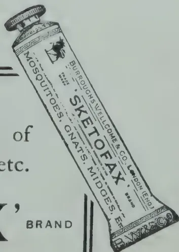

## PESTS AND DISEASES.

### A FEW HOME-MADE REMEDIES AGAINST SOME COMMON PLANT PESTS.

*(Department of Agriculture, Madras, Leaflet No. V. of 1917.)*

**T. V. RAMAKRISHNA AYYAR,**

*Acting Government Entomologist.*

Frequent enquiries are received from different parts of the Presidency asking for simple control measures against some common insect pests, found in kitchen gardens, hot houses, flower and fruit gardens. It is, therefore, believed that the following few directions might be of some help in devising measures to control these troublesome pests.

The commonest of these pests are the following :—

(I) *Plant Lice.*—There are very few plants which are not infested by plant lice. These are small, soft-bodied insects commonly found in colonies on the tender portions of plants, such as shoots, tender foliage, buds, flowers, etc. They are sucking insects, and so pump the plant sap from these tender portions. When a plant is badly infested the shoots and buds suffer badly; the leaves become curled up, the growth of the shoots is checked, and the affected parts gradually dry up and wither.

283------------------------------------------------

250[APRIL, 1921.

When closely examined, each louse will be found to be provided with three pairs of legs, a pair of feelers and a sucking tube below the head. In addition to these is a pair of small tube-like projections, one on each side of the posterior end of the body; these are called "honey tubes" because the insect throws out a sweet juice from these tubes, and ants are attracted in numbers on this account. Ants very rarely do damage to growing crops. When they are seen in numbers on plants, one can almost be sure they are in search of plant lice, or other similar insects infesting the plant. The great majority of the lice in a colony are wingless, and move about very slowly. The commonest example of a plant which suffers from plant lice attack is the Lab-lab vine; thousands of the lice are often found completely covering the tender vines, shoots and flowers. Cotton, Tobacco, Brinjal, Cabbage, Radish, Agathi, etc., are other common plants often suffering from attacks of plant lice.

(II) *Mealy Bugs*.—These are also sucking insects, like plant lice, and affect the plants in the same manner. But they differ in appearance. Mealy bugs are soft creatures, generally covered with a powdery white bloom; and some are profusely covered with this stuff, while in others it is scanty, and in some others the white covering is arranged as long processes proceeding from the body of the insect. The name of the bugs is due to this covering. Mealy bugs also move very slowly, when they do so. A common example of a mealy bug is the white cottony insect that infests crotons, roses and other garden plants. Mealy bugs of different kinds infest different plants, such as Cotton, Brinjal, Mango, Sugar-cane, Pine-apple, Tomato, etc.

(III) *Scale Insects*.—Though in habits these are also sucking insects and injure the plant in the same way as the first two, in appearance they look like non-living things. Scale insects are all fixed to the plant during their adult condition, and most of them appear like scales attached to the plant surface. They infest shoots, branches, and even the main stem of plants. Fruit trees and industrial crops like coffee, tea, etc., suffer most from these insects. Well known examples of scale insects are the brown and green bug of coffee. Other familiar examples can be found on Guava, Nim, Babul, Mango, and other common plants.

All these insects have the power of multiplying enormously and very rapidly, and hence they are capable of doing substantial damage if not checked in time. To check their injuries the following applications, which can be easily made by any one at home, are recommended.

*Kerosene Emulsion*.—This is prepared as below. Dissolve one to one and a half pounds of any ordinary bar soap in a gallon of water, and while it is boiling remove from the fire and add two gallons of kerosene by slowly pouring it over the soap solution, and, while doing so, thoroughly agitate the whole with a syringe or pump until the whole becomes a white, creamy emulsion. This, when wanted for use, may be mixed with 50 gallons of cold water and then sprayed on plants attacked by sucking insects. The mixture may be made strong or weak as necessary by reducing or increasing the proportion of cold water. With hard water more soap should be used. This can be used against plant lice, mealy bugs, and all soft scale insects with good effect, by bringing up the solution to sixty or seventy gallons. In the case of hard scale and active bugs like leaf hoppers a stronger dose, 30—40 gallons, must be used. This preparation can also be used as a wash on cattle infested with vermin.

*Tobacco Decoction*.—This insecticide is made by boiling a pound of tobacco (the refuse stems and powder will do very well) in a gallon of water for half an hour, or by steeping it in cold water for a day. In the tobacco decoction, dissolve four ounces of any ordinary bar soap. This soap and tobacco mixture when cool is to be diluted with six or seven times of water and sprayed on the infected plants. This will be found useful against plant

284------------------------------------------------

APRIL, 1921.]251

lice and mealy bugs affecting those plants where we use the foliage instead of the fruit, or where the fruit or other edible portion is attacked, and where we would like to avoid the smell of kerosene. This is the case when the tobacco plant itself is attacked by plant lice, as is very often the case. Dry tobacco dust can also be applied to the soil around vegetables, to drive away pests of different kinds.

When infested leaf vegetables like Cabbage, Cauliflower, etc., which may have to be cut soon for consumption have to be treated, the following simple but temporary insecticides might be used instead of using kerosene emulsion or tobacco decoction, which might leave traces of kerosene or tobacco smell, if at all.

*Soap Solution.*—A quarter of a pound of soft soap mixed with one gallon of water might be applied once a week, two or three times.

*Naphthalene.*—For plant lice, powdered naphthalene mixed with ashes in the proportion of one to two may be applied dry. This must be used early in the morning, when the leaves might be wet with dew, or after a spraying with cold water so that the powder might stick. The advantage in using naphthalene is, that it is harmless, effective against insects and evaporates in 24 hours leaving no trace of its smell on the plants.

For some of the scale insects which possess hard scales and against which kerosene emulsion is not so effective, a preparation called *rosin compound* may be used. It is made as follows :—

Two pounds of rosin and a pound of washing soda are well powdered and boiled in a vessel with sufficient water to cover them ; the boiling should continue until both are well dissolved. Add cold water little by little to the boiling mixture until the whole is brought to three gallons. Continue the boiling until the mixture becomes clear and thin, and having a deep brown colour. To this solution water is to be added in the proportion of one part of the compound to seven parts of water, and, if wanted strong, the proportion of water may be reduced a little. This substance, when sprayed on scale infested plants, covers the insect with a thin film of liquid which on drying forms a coat of varnish, and kills the insect by asphyxiating it.

There are also different ready-made preparations sold for use against sucking insects, which might be purchased in bulk when large quantities are needed. Crude oil emulsion and fish oil rosin soap are examples of these.

It must be borne in mind that very strong doses of these insecticides—especially that of kerosene emulsion—will burn the foliage, and make the remedy worse than the disease. As far as possible it will be found advisable to stick to the proportions indicated above, only making the mixtures slightly weaker in the case of soft insects, and somewhat stronger when the insects are hard scales.

It is always advisable to apply these insecticides early in the morning, before the heat of the sun begins to be felt. In the case of bad and persistent attacks the treatment should not stop with one dose, it should be continued three or four times, at intervals of a fortnight.

Before beginning the treatment it is better to remove and destroy all badly infested parts of the plant, or completely dead plants which are not only of any use, but will harbour the pests if not attended to properly.

—PLANTERS' CHRONICLE, Vol. XVI, No. 6.

285------------------------------------------------

252[APRIL, 1921.

# POULTRY.

## RECENT RESEARCH IN EGG PRODUCTION.

J. HAMMOND, M.A.,

*School of Agriculture, Cambridge.*

The following account aims at giving in a summarized form, a description of some of the results obtained by research work in egg production. Abroad especially in America, a considerable amount of work has been done and much more is in progress. The results of this research work are often applicable to animal production in this country and the short summary here given of some of the conclusions arrived at may therefore be of interest to those concerned in production.

Much of the research work which is alluded to below needs confirmation, as some of the experiments have only been carried out on a small scale, and many of the facts elucidated in other countries require investigation here before it can be definitely ascertained whether they hold good in our climate. A large number, however, are of universal application, and some of the discoveries mentioned below, such as the mode of inheritance of high egg production, have already been taken advantage of in this country.

*Inheritance of High Production.*—Extensive investigations have been made in the United States by RAYMOND PEARL\* and other workers on the production of eggs, and many useful discoveries have been made. Probably the most important is that the power of high production of eggs in the hen is inherited mainly through the cock. Pullets that are bred from a cock of high-producing strain mated with hens of a moderate-producing strain will lay many more eggs than will pullets which have been bred from a cock of moderate-producing strain mated with hens of a high-producing strain. PEARL's investigations were made with the Plymouth Rock and Cornish Indian Game breeds, and in view of their great importance it is desirable that they should be repeated with the breeds and strains of fowls kept in England. Indeed, it seems of the utmost importance, if any advance is to be made in the average yield of eggs, that the inheritance of fecundity in English breeds should be tested. GOODALE† found that in the Rhode Island Red high egg production was inherited, but not in the manner observed by PEARL. PEARL found also that the difference between a high-producing and a low-producing hen did not depend on the number of oocytes in the ovary but on the number which developed, and that this quality was inherited in the fowl. He further discovered that the best measures of the capacity of a hen to produce eggs was the number of eggs produced during the winter months; hens which laid well at that time produced the greatest number of eggs in the year.

\**Jour. Exp Zoology*, 1912, p 153.

†*Jour. Agric. Res.*, Vol 12, 1918, No. 9.

286------------------------------------------------

APRIL, 1921.]253

*Selection of Hens.*—Several investigators have given attention to the problem of the early identification of a high-producing hen, so that the unproductive layers may be weeded out with a minimum of delay BLAKSLEE and WARNER\* found that when birds with yellow pigmented skin, ear-lobes, beak and legs (as in Leghorns, Plymouth Rocks and Wyandottes), begin to lay, the yellow colour disappears from the ear-lobes beak and vent, in the order named, probably being transferred to the yolk of egg. When laying stops the colour is regained in the same order. This result was taken as a test for the unproductive hen, and it is found that the greater the amount of yellow colour in the ear-lobe the less active is the laying.

CHARD† has found that the high producers of one year continue to be the high producers during the second year, and that all the birds selected for high production during the months of November, December and January gave high records for the whole year.

BALL and ALDER‡ also found that the more eggs hens produced in the year the greater was the proportion laid during the winter period; so that the breeding and keeping of hens of high productivity has the double advantage, in that not only are more eggs produced, but that they are produced at a time of scarcity and so command good prices. WILSON§ has discovered that a hen's total yield for the year can be predicted from her performance during the first eight or ten weeks of the laying season (November, December and January). Good layers produce during this period as many as five eggs per week, while the bad hens yield few, if any.

CHARD† also noticed that the production of eggs was closely dependent on the temperature, and this is probably the underlying cause of the variations in productivity that exist at different times of the year. The causes of these variations require to be carefully analysed. Temperature may be only one of the factors influencing this point; there may be others, such as differences of light and darkness, or the amount of green food available, which cause increased production during the spring months.

Research is required as to the effect of a rise of temperature on the egg production of fowls which have become used to a low temperature, to determine whether it is the change of temperature or the actual temperature which causes increased production of eggs in the spring months.

*Variation with Time of Year.*—Numerous investigators have recorded the variations in productivity that occur as a result of the time of year. The following table summarizes some of the results obtained.

AVERAGE EGG YIELD PER BIRD PER MONTH.

<table border="1">
<thead>
<tr>
<th>Authority.</th>
<th>Jan.</th>
<th>Feb.</th>
<th>Mar.</th>
<th>April</th>
<th>May</th>
<th>June</th>
<th>July</th>
<th>Aug.</th>
<th>Sept.</th>
<th>Oct.</th>
<th>Nov.</th>
<th>Dec.</th>
</tr>
</thead>
<tbody>
<tr>
<td>Pearl (U.S.A.)</td>
<td>11.71</td>
<td>10.87</td>
<td>16.11</td>
<td>15.85</td>
<td>13.92</td>
<td>12.46</td>
<td>10.87</td>
<td>9.84</td>
<td>—</td>
<td>—</td>
<td>4.63</td>
<td>8.91</td>
</tr>
<tr>
<td>Buckley<br/>England</td>
<td>5.50</td>
<td>7.9</td>
<td>13.97</td>
<td>13.23</td>
<td>12.90</td>
<td>9.70</td>
<td>8.01</td>
<td>6.33</td>
<td>5.30</td>
<td>3.70</td>
<td>3.60</td>
<td>5.46</td>
</tr>
<tr>
<td>Irish Egg<br/>Records</td>
<td>6.3</td>
<td>9.3</td>
<td>15.9</td>
<td>15.8</td>
<td>14.9</td>
<td>11.5</td>
<td>10.1</td>
<td>8.3</td>
<td>6.0</td>
<td>3.9</td>
<td>2.4</td>
<td>4.0</td>
</tr>
</tbody>
</table>

—No data.

\* *Utah Sta. Bul.*, 1917.

† *Connecticut Storrs Sta. Bul.*, 1917.

‡ *Jour. Amer. Assn. Ins. and Invest Poultry Husbandry* No. 5, 1917.

§ *Jour. Dept. Agr. and Tech. Instr. for Ireland* Vol. 14, p. 271.

|| *The Canadian Threshorman and Farmer*, Vol. XX, No. 2, 1915.

§ *Farm Records and the Production of Clean Milk at Moundsmere, London*, 1917.

287------------------------------------------------

254[APRIL, 1921.

SIMPSON\* in Edinburgh found that the highest egg production took place in April and May. Data collected by the author of this paper show that in Norfolk the highest production is reached in March and April. This monthly variation in production is probably due to variations in temperature, as in Australia\* the highest egg production is reached in the months of September and October, which correspond to our months of March and April.

Economically this monthly variation in production is important, as it governs the price of eggs, which bears an inverse ratio to the number produced. The curve of the rise and fall in price follows and lags slightly behind the curve of production.† It follows that the most successful poultry keeper is he who manages his flock so as to produce eggs when they are scarce. In this connection it may be emphasised that the high-producing hen lays a greater proportion of eggs at those times when eggs are scarce.

Attempts have been made to modify this variation in production due to time of year by obtaining pullets hatched at certain seasons of the year.

ELFOR† in Canada found that, in both Leghorns and Plymouth Rocks, early hatched pullets laid the most eggs in the year, and consequently a greater proportion in the months when eggs were scarce. BUCKLEY§ in England, who experimented with several breeds, obtained the following results :—

<table border="1">
<thead>
<tr>
<th></th>
<th>February Pullets.</th>
<th>March Pullets</th>
<th>April Pullets</th>
<th>May Pullets</th>
<th>Hens of previous year</th>
</tr>
</thead>
<tbody>
<tr>
<td>No. of eggs laid between October and March ... ..</td>
<td>64</td>
<td>62</td>
<td>48</td>
<td>39</td>
<td>39</td>
</tr>
</tbody>
</table>

Buss‡ in America found that White Leghorn pullets hatched in different months of the year produced the following average number of eggs per annum :—

<table>
<thead>
<tr>
<th>February hatched</th>
<th>April hatched</th>
<th>June hatched</th>
</tr>
</thead>
<tbody>
<tr>
<td>167</td>
<td>156</td>
<td>144</td>
</tr>
</tbody>
</table>

*Variation with Age of Hen* :—Buckley§ found that hens did not produce so well as pullets which had been hatched in time. BALL, ALDER AND EGBERT§ have studied this point in a flock of White Leghorns over a period of eight years : the average egg production per hen for each year of life from their investigations was as follows :—

<table>
<thead>
<tr>
<th>Years of Life</th>
<th>1</th>
<th>2</th>
<th>3</th>
<th>4</th>
<th>5</th>
<th>6</th>
<th>7</th>
<th>8</th>
</tr>
</thead>
<tbody>
<tr>
<td>No. of eggs laid per year (approximately)</td>
<td>130</td>
<td>120</td>
<td>110</td>
<td>85</td>
<td>75</td>
<td>65</td>
<td>55</td>
<td>45</td>
</tr>
</tbody>
</table>

\* *Dept. Agri. and Tech. Instr. for Ireland, Vol. 13, p. 366.*

† *Proc. Roy. Soc. of Edinburgh, Feb., 1912.*

‡ *Queensland. Agricultural Journal, N. S., Vol. 1., 1915.*

§ *Maine Sta. Bul. 105, 1908.*

|| *Canada Expt. Farms Rept., 1915.*

§ *Monthly Bul. Chic. Sta., No. 3, 1919.*

¶ *Utah Sta. Bul., 1916.*

288------------------------------------------------

APRIL, 1921.]255

In the Copenhagen\* egg-laying trials it was found that the older hens as compared with the younger, lay a smaller percentage of their eggs during the winter months, when eggs are most valuable.

*Rhythm of Egg Production.*—It has been noticed by several investigators that egg laying takes place in cycles (i. e., periods of consecutive egg-laying at the rate of one egg per day) and that there is a definite rhythm in the recurrence of these cycles.

PATTERSON† who investigated this rhythm, has attempted to apply it to the selection of the highest producing hens. He found that hens which had a cycle of 4 eggs or more in March produced on the average 156 eggs per year, whereas hens having a cycle of 2 eggs or less averaged only 110 eggs in the year.

It is interesting to note that ATWOOD and WEAKLEY‡ discovered that the first egg laid in the cycle is usually the heaviest, and that the eggs decrease in weight until the cycle has ended.

*Broodiness.*—A probable cause of the lowering of the productivity, is the onset of broodiness. This is largely a breed characteristic. KIRKPATRICK and CHARD§ who investigated this point, found the percentage of broody hens in the various breeds was as follows:—

White Leghorn, 97 per cent.; Rhode Island Reds, 65.6 per cent. and Wyandottes, 69.6 per cent. They calculated that the average number of days lost by each broody hen in the year was 53.

GOODALE|| estimated that broodiness reduces a hen's production by about 40 per cent.

In this connection it is suggestive that PEARL and BORING§ have discovered in the ovaries of fowls certain bodies which they consider resemble the *corpora lutea* of mammals.

PEARL and SURFACE¶ found that they could inhibit egg laying in a fowl by giving doses of the *corpora lutea* of cows. These authors, however, disagree with CLARK¶¶ who claimed to increase the egg production of fowls by administering pituitary substance with the feed.

In the Copenhagen\* laying trials it was noticed that within any one breed broodiness was more pronounced in the best layers. As this result appears to conflict with the investigations of GOODALE and the fact that "sitting" breeds are frequently better winter layers, it would appear that further research is required as to the effect of broodiness on egg production. It may be that some relation may exist between broodiness and the period occupied in moult, but on these points, so far as the writer is aware, no research has been made.

\* 84th Rept. Royal Vet. and Agri. Col. Copenhagen, 1914

† Jour. Amer. Ass. Instr. and Invest. Poultry Husbandry, No. 2 and 3, 1916

‡ West Virginia Sta. Bul., 1917

§ Connecticut Storrs Sta. Bul., 1917

|| Massachusetts Sta. Rept., 1915

§ Amer. Jour. of Anatomy, No. 1, 1918

¶ Jour. Biol. Chemistry, No. 2, 1914

¶¶ Jour. Biol. Chemistry, No. 3, 1915

289------------------------------------------------

256[APRIL, 1921.

GOODALE\* has shown that individuals of a breed show considerable variation in broodiness, and that the tendency to go broody increases with age. Broodiness is also dependent on the time of year and the temperature, but no effective methods of preventing it have yet been found.

Research on the effect of broodiness on egg yield and the physiological causes of the broody condition would appear to afford promising results.

*Breed Variation.*—Numerous breed trials and tests have taken place in most countries, but only a few need be quoted here.

Three year tests at Copenhagen\* show the following order of merit of breeds as regards production of eggs:—Leghorns 100, Plymouth Rocks 70, White Wyandottes 60.

LEWIS† quotes tests in the United States to show that the average number of eggs laid per bird per year was approximately as follows:—Leghorns 170, Plymouth Rocks 155, Rhode Island Reds 150, Wyandottes 144.

LAURIE‡ in South Australia found that the average yearly egg production per bird in the various breeds was as follows:—White Leghorns 199, Orpington 170, Wyandottes 170.

It is possible, however, that English strains of these breeds would not hold the same relative position as regards fecundity.

The Irish winter egg record tests§ (October to March) for the seven years 1908-1915 show the following averages for the different breeds:—White Leghorns 49.5, Rhode Island Reds 45.9, White Wyandottes 35.8 Plymouth Rocks 32.9.

These records also show, however, that there is much greater variation in the different strains of a breed than there is between breeds; thus the best pen of White Leghorns averaged (October to March) 84 eggs, while the worst averaged 31 eggs, and the best pen of Plymouth Rocks averaged 55 eggs, while the worse averaged only 15 eggs. Within any breed there appears to be much room for improvement along the lines of inheritance of high egg production through the cock, as has been demonstrated by PEARL\*.

BALL AND ALDER‡ have shown that breeds differ in the time of year at which the highest rate of egg production takes place. They compared White Leghorns with general purposes breeds and found that the latter reached their maximum rate of production early in the season and then rapidly fell off to moderate production, whereas the White Leghorns reached their maximum production a month or so later, but continued to produce heavily for several months, and then fell off rapidly towards the end. Experiments in this country are required before these conclusions can be expected as applicable to our climatic conditions; it may be possible to alter the time of year of greatest productivity by providing shelter and other conditions which would modify the natural tendency of the White Leghorn to attain its maximum production later in the spring than the "sitting" breeds.

Copenhagen Trials\* showed that Plymouth Rocks laid more eggs than Leghorns during the winter months. At first sight this might seem to

\* *Anat. Rec.* No 6, 1917

† *New Jersey Sta., Hints to Poultrymen*, No. 4, 1918

‡ *Bull. Int. Inst. Agr.*, Rome, 11, 1914, p. 1400

§ *Dept. Agr. and Tech. Instr. for Ireland*, Vol. 15, No. 3, 1914-1915 p. 592

290------------------------------------------------

APRIL, 1921.]257

contradict the statement made above, that high-producing hens lay more eggs in the winter months, but it possibly may be due to the fact that Plymouth Rocks go broody and so reduce the summer yield (see "Broodiness" above).

*Effect of Egg Production on Body Weight of Hen.*—The effect of high production on the body weight of the hen was studied at the Copenhagen trials, and it was found that, although the weight of the birds increased with age up to the end of second year, yet within each year the weight of the hen's body undergoes certain variations. Increase in weight takes place from the autumn to the spring, and then during the spring and summer the weight decreases. This seasonal change in weight was especially noticeable in good layers.

KIRKPATRICK AND CHARD§ also found that hens were heaviest on 1st March before the period of maximum egg production, and lightest on 1st May, after the period of maximum production. In this connection the observation of WIENINGER\* are interesting; he found that within any one breed the best layers had the lowest body weight. Thus, in a flock of Golden Wyandottes he noticed that the best layers averaged 2·4 kilos in weight, whereas the worst averaged 2·6 kilos. In the Italian Partridge breed the best averaged 2·1 kilos and the worst 2·4 kilos (a kilogram is 2 1/5th lb.)

Attempts have been made at the Harper Adams College† to discover some relationship between the shape of the bird and the number of eggs laid. The distance from the hind end of the keel to the pelvic bones was thought to be the best guide to laying capacity.

*Effect of Exercise.*—In America experiments have been made to compare the egg production of fowls allowed free range with those in confinement. BUSS† found that exercise increased the production of eggs, and similar results were obtained by KIRKPATRICK AND WARNER.§ The latter put up two pens of White Leghorns, each of 40 birds; the first pen was confined and the second had the run of a yard. The following table shows the number of eggs laid by the two pens:—

<table border="1">
<thead>
<tr>
<th>Weeks of Experiment</th>
<th>1st-13th</th>
<th>14th-26th</th>
<th>27th-39th</th>
<th>40th-52nd</th>
<th>Total<br/>for year</th>
</tr>
</thead>
<tbody>
<tr>
<td>Confined ...</td>
<td>179</td>
<td>1,221</td>
<td>1,589</td>
<td>1,483</td>
<td>4,472</td>
</tr>
<tr>
<td>Run in Yard ...</td>
<td>466</td>
<td>1,285</td>
<td>2,079</td>
<td>1,525</td>
<td>5,355</td>
</tr>
</tbody>
</table>

*Size of Egg.*—The size of the egg laid by the hen is undoubtedly a breed characteristic. It was found in the trials at Copenhagen\* that the average weight of eggs was greater in the Minorcas and Leghorns than in the Wyandottes and Houdans. KIRKPATRICK and CHARD|| found that the average weight of twelve eggs of various breeds was as follows:—Rhode Island Reds 1·60 lb., Plymouth Rocks 1·58 lb., Leghorns 1·50 lb., and Wyandottes 1·48 lb.

MURPHY§ in Ireland, who investigated the inheritance of the size of eggs, found that, when a hen, laying a large sized egg was mated with a cock, the son of a similar hen, the pullet offspring invariably laid eggs of large size. In America, also¶, it has been shown that ability to lay large, heavy eggs is inherited.

\* *Wiener Landw. Ztg.*, No. 26, 1912

† *Utility Poultry Journal*, Harper Adams College No. 12, 1917 18

‡ *Chio Sta*, Bul., 1916

§ *Pennsylvania Sta*, Rept., 1914

|| *Connecticut Sta*, Bul. 1915

§ *Dept. Agr. and Tech. Instr. Ireland Jour.* No. 2. 1917

¶ *Bul. Rhode. Island. State College*, No. 4. 1918

291------------------------------------------------

258[APRIL, 1921.

The size of the eggs laid by any hen, however, varies with the time of year. ATWOOD \* discovered that the eggs are heaviest from November to April and lightest from May to October; thus a pen of hens in February laid eggs which averaged 12.72 lb. per 100 eggs, whereas the same pen in June was laying eggs which averaged only 11.07 lb. per 100 eggs. A possible explanation of this fact is suggested by WARNER and KIRKPATRICK † who noticed that small eggs were laid at a time when the hen is laying most heavily. BROWN,‡ however, found with White Leghorns that there is nothing to indicate that high production is responsible for any diminution in the size of the egg, and MURPHY § found that small eggs were not always coupled with heavy production.

In the Copenhagen trials \* it was observed that the weight of the egg appeared to increase with the age of the hen, and it is a matter of common observation that pullets lay smaller eggs than do mature hens. It has been pointed out above that the first egg laid in the cycle is usually the heaviest.

*Colour of the egg.*—Very little is known concerning the causes which influence the colour of the egg shell. Tinted egg shells are supposed to be due to products of hepatic origin (bile pigments) secreted by certain glands of the oviduct.

LAURIE § found in Australia that the tinting was less marked in warm weather. Tinted shells, however, are undoubtedly chiefly a matter of breeding, although LEWIS and THOMPSON || in America have observed that some hens produce eggs varying widely in colour, while others show a marked uniformity in this respect.

The colour of the yolk is no doubt greatly influenced by the food of the hen; thus HONRIQUES and HANSEN § found that hens fed on grains gave a light yellow yolk while grass and herbs produced a dark yellow yolk, and a diet of worms gave yolks of a reddish hue. OPPERMAN ¶ in America, who experimented with lots of forty White Leghorns found that feeding on yellow maize produced a rather deep yellow, while wheat meal gave a very pale yolk. HINK ¶ who fed acorns to fowls, noticed that they produced yolk of a dirty brown colour.

From these experiments and from those quoted above on the effect of egg production in reducing the yellow colour of the legs and ear-lobes in certain breeds, it would appear that the colouring matter of the yolk of the egg is derived from the colouring matter of the fat of the body. The colouring of the body fat is in turn derived mainly from the green colouring matter of plants, much in the same way that the colour of butter fat is produced.

*Fertility of Eggs.*—It has been found in pigeons that the presence of the male stimulates egg production in the female, but experiments on a small scale with fowls have shewn very little effect. NELSON × kept two pens of 10 hens each for a year, one pen with a cock and the other without, the yearly average egg yield per hen in the former was 126, and in the latter 118. There were no difference in the keeping qualities of the eggs from each pen.

---

\* *West Virginia Univ. Agri. Exp. Sta. Bul. No. 145, 1914*

† *Jour. Heredity, No. 3, 1916*

‡ *Jour. Bd. of Agric. and Fisheries. No. 3, 1916*

§ *Jour. Dept. Agric. S. Australia., Nos. 9-10 1915*

|| *New Jersey Sta. Rept. 1915*

\$ *Skandin Archi. f. Physiol, Vol. XIV., 1905*

¶ *Country Gentleman, No. 9, 1914*

¶ *Deutsche Landwirt Tierzucht, No. 29, 1915*

× *New Jersey. Sta. Rept., 1906*

292------------------------------------------------

APRIL, 1921.]259

Numerous investigations have observed the time that elapses, after the cock has been put with the hens, before the first fertile egg is laid. In the trials at Copenhagen \* it was found that the first fertile eggs were produced three or four days after mating.

Observations have also been made as to the time a hen remains fertile after the cock is removed from the pen. CHAPPELLIER \* found it to be 10 to 18 days. ELFORD † states that a drop in fertility of the eggs occurs on the sixth day after removal of the cock, while at the tenth day only 50 per cent. of the eggs are fertile, by the nineteenth day only 16 per cent. are fertile, and thereafter all are infertile. PHILIPS ‡ observed that no fertile eggs were laid after the fifteenth day from the last mating. KAUPP § concluded from his experiments that it is not advisable to save for hatching eggs laid five days after the cock has been removed. He also states that if hens have been running with a mongrel cock and are required for pure breeding it would be safe to mate them eighteen days, after the mongrel cock has been removed, i.e., fertility is considerably reduced after five days, but a number of eggs remain fertile up to the eighteenth day.

*In-breeding.*—No extensive investigations on the effect of in-breeding on the fertility of the eggs have been made. GRAY and KAUPP || found that when daughters were bred to their sires the fertility of the eggs was only slightly reduced, but the hatchability of the eggs was affected to the extent of 10 to 30 per cent. Indeed as in-breeding is so often used by poultry keepers to fix characters, and as cross-breeding is so frequently resorted to by commercial poultrymen in order to increase the vigour of the strain, it is remarkable that practically no experiments have been made to determine the effect of in-breeding and crossing on the fecundity, fertility and size of the bird. Research on these lines might lead to valuable conclusions.

*Elimination of Cockerels.*—PUNNETT § has shown that breeders may eliminate at once all cocks from their hatch of chicks and rear only pullets, provided certain colour crosses are made. By mating hens of some breeds with cocks of a different colour the male chicks can be picked out as soon as they are hatched and disposed of, thus ensuring that all accommodation is available for rearing pullets. If a black cock is used with barred Plymouth Rock hens, all the male chicks are barred and all the females are black. The male barred chicks can then easily be identified at hatching by the white patches of down on the head and rump.

A silver coloured hen transmits silver to her sons and gold to her daughters in the same way. Silver and Gold Laced Wyandottes are examples of this, as also are breeds such as Light Dorkings (silver) when crossed with Brown Leghorns (gold).

In conclusion it must be emphasized that many of the observations and experiments quoted above have been made only on a small scale and that many, before they are generally accepted, should be repeated under the conditions existing in this country.—JOUR. OF MIN. OF AGRIC., Vol. XXII, No. 11.

---

\* *Compt. Rend., Ass. Franc. Adv. Sci., 1914*

† *Canada Exp. Farms Report, 1916*

‡ *Jour. Amer. Ass. Instr. and Invest. Poultry Husbandry, No. 4, 1918*

§ *North Carolina Exp. Sta., Bul., 1915*

§ *North Carolina Station Report, 1917*

293------------------------------------------------

260[APRIL, 1921.

# GENERAL.

## GARDEN COMPETITIONS AND PRIZE-HOLDINGS SCHEMES.

G. G. AUCHINLECK, B.Sc., A.I.C., F.C.S.

*Divisional Agricultural Officer S.D.*

One of the means adopted by the Food Production Committees in Ceylon to stimulate the planting of foodcrops is the establishment of Garden Competitions. Sums of money are allocated to each Committee to be used for giving prizes for the best cultivated vegetable gardens. Competitions of this sort, when well organised, should be among the best means available for improving the Agricultural methods of the villager and the idea has for years past been used with good results in certain other colonies.

The real purpose of these competitions should be educational. The competitors who are awarded prizes should win them because their agricultural work has been more efficient than that of the others. Other competitors who have won no prizes reap their reward by the increased crops produced as a result of their efforts to win. It is obvious therefore that unless there has been special effort on the part of the competitors, resulting in improved methods and yields, the money given as prizes is wasted : the educational effect disappears, and the awards become mere charities.

These competitions are of comparatively late date in Ceylon, and they have not yet reached a satisfactory standard of efficiency. In some cases they have become little more than an opportunity for distributing of small sums of money to the villagers. In order to prevent them from falling into disrepute, steps should be taken to organise them with a much greater degree of efficiency and method than exists at present. In the first instance, their true aim, the improvement of the agricultural methods of the villager should be clearly realised, and then arrangements made to carry out the competitions so as to get the best results possible. The sole satisfactory definition of the purpose of an Agricultural Department is that it exists to give information and advice leading to the most efficient utilization of agricultural land, and in view of this, these competitions are obviously activities well worth encouragement by the Department. The points which need attention in connection with these competitions, in the Southern Division of Ceylon at any rate, may be summarized as follows :—

(a) The competitions should be advertised, preferably by large posters, at least six months before judging take place.

(b) The advertisements should give the points on which gardens will be judged.

(c) The crops allowed to compete should be named.

(d) The boundaries within which each competition will be held should be much more limited than at present.

(e) Only bona fide owners, or lessees of small holdings should be allowed to compete, that is a maximum area of holdings should be proclaimed in each case.

(f) The names of intending competitors should be handed in to the Department of Agriculture at least three months before judging takes place.

(g) Competitors should receive instruction on methods as soon as possible after they have been registered.

294------------------------------------------------

APRIL, 1921.]261

(h) Judging would be best carried out by a committee of three for each competition: the Mudaliyar of the area, an officer of the Department of Agriculture and a capitalist cultivator of the crop concerned would probably be most satisfactory.

(i) The prizes for each competition should be small in number, but substantial in amount. Three prizes of Rs. 100, 50 and 25 would effect more than 20 of Rs. 10 each.

(j) No competitor should be allowed to win a prize of the same standing more than once. A winner of a third prize can compete next year for a first or second. A winner of a first prize should not be allowed, at any rate for at least five years, to compete for any prize.

The necessity for early notice of rules to competitors, for early registration of competitors and for instruction by the Department of Agriculture is too obvious to need much explanation without these there can be no conscious competitive effort and consequently no educational results.

There are several reasons why these competitions should be restricted only to small owners. In the first place these are most in need of instruction in improved agricultural methods. The owner of a large area of land is usually in a position to obtain up-to-date information not obtainable by the small man. The larger owner has capital and can afford to pay for labour to improve his cultivation, and he shall not therefore be allowed to compete against the peasant or ordinary villager. Lastly, a prize of Rs. 100 means very little to a larger owner, and his efforts at improvement are not likely to be markedly stimulated by such an account. In the case of some crops, e.g., rubber or coconuts it might be advisable to create two classes each with its own prizes, a procedure which has been followed by good results in certain West Indian Colonies, but even in this case the largest capitalist owners should be ruled out.

The maximum area of holding allowed to compete will naturally differ with each crop. Probably with a general vegetable garden one acre would be the largest allowable. With rubber or coconuts this might be increased to 2 or 3 acres. In all cases however steps should be taken to ensure that the competitor owns or leases no land other than the area put forward for competition, so as to rule out the possibility of a large owner registering a small proportion of his total land.

A plea may be entered here for extending the idea of these competitions to crops other than food crops, and also for narrowing existing competitions to specified food-crops. Under the existing rules, or rather in the absence of rules, it is possible, although unlikely, that an owner of 20 acres of manioc or paddy might compete against a villager growing 100 square feet of chillies. The following alternatives suggest themselves.

(a) A competition limited to owners of not more than one acre of vegetable garden, cultivation to consist of not less than six vegetables.

(b) One-crop competitions, e.g., holdings of not more than one acre of manioc. In some districts naturally, amu or hill paddy or sweet potato might be a better subject of competition than manioc.

At the time of the establishment of these competitions in Ceylon the stimulation of production of food crops was necessarily of paramount importance. Now other crops might with advantage be considered as well. A very short railroad journey on any part of the coast line would afford ample evidence of the need for stimulating the methods of cultivating coconuts employed by the villager. For the Southern Division similar stimulation is necessary in the cases of rubber, cinnamon and citronella, and competitions might with advantage be established for these crops in suitable parts of the province. The system would also be of great value in inducing villagers to embark upon cultivation of new crops, e.g., cotton, tobacco, sisal or limes, and competitions in such enterprises should go hand-in-hand with other methods of inducements and with measures of instruction.

295------------------------------------------------

262[APRIL 1921.

A narrowing of the boundaries of existing competitions is very necessary. For example in the past there have been three competitions annually in the Southern Province of Ceylon, a total of Rs. 600 in prizes for a population of 600,000. In competitions of this sort the judging is all important. The competitor learns from instruction given to him during his period of work before judging; he learns even more from the criticisms by the judges.

This is hardly the place for entering upon details concerning each competition. General ideas may be gleaned from the remarks above and rules drafted in accordance therewith for each kind of competition. The value of these competitions as means of instruction is so great that every effort should be used to increase their efficiency and improve their organisation.

## ALGAROBA SEED GERMINATION TESTS.

C. S. JUDD,

*Superintendent of Forestry.*

One often comes across the statement that the seed of the algaroba (*Prosopis juliflora*) when eaten by stock is not crushed, but on passing through the alimentary system of the animal is rather prepared for quick germination by the action of the digestive fluids. To ascertain just what effect this process has on the germinating capacity of algaroba seed, a comparative test was undertaken at the Government Nursery in Honolulu, beginning in December, 1919, with the results given below.

The fruit of the algaroba, the most valuable lowland tree in the Hawaiian Islands, consists of a yellow pod about 6 inches long and half an inch wide, each pod containing about 20 seeds. Each seed is immediately surrounded by a crustaceous envelope which is enclosed in a thick spongy coat of sweet pulp. It is this sugary content which makes the pod relished by animals. So hard and tough is the protective parchment-like seed covering that in order to secure the clean seed it is necessary to cut out each with a sharp knife.

For this test six different sets of seed, of 100 each, were used and these were first treated in the following manner :

No. 1 Naked seed, untreated.

No. 2 Naked seed, placed in boiling water and soaked for 24 hours.

No. 3 Seed in parchment covering, untreated.

No. 4 Seed in parchment covering, placed in boiling water and soaked for 24 hours.

No. 5 Naked seed, which had been passed through a horse by feeding the beans. Upon recovery the seed was removed from the parchment covering.

No. 6 Seed in parchment covering which had passed through a horse.

After passing through the alimentary system it was found that some of the parchment coverings had split open and the seeds had turned black and were somewhat swollen. Other parchment coverings had not been opened by the process and the seed was still light brown in colour and only slightly swollen.

The seed was recovered from the horse on December 18th 1919, and the germinating tests were all started on December 20th 1919, by sowing the seeds in the usual seed boxes and giving them a light covering of soil. The test was continued for 119 days or until April 18th 1920, when the last seedlings appeared and the experiment was considered closed.

296------------------------------------------------

APRIL, 1921.]263

The resulting percentage of germination was as follows :

<table>
<thead>
<tr>
<th>Seed<br/>Number</th>
<th>Percentage of<br/>Germination</th>
<th>No. of days of last<br/>Germination</th>
</tr>
</thead>
<tbody>
<tr>
<td>1</td>
<td>87</td>
<td>119</td>
</tr>
<tr>
<td>2</td>
<td>86</td>
<td>16</td>
</tr>
<tr>
<td>3</td>
<td>67</td>
<td>119</td>
</tr>
<tr>
<td>4</td>
<td>58</td>
<td>47</td>
</tr>
<tr>
<td>5</td>
<td>79</td>
<td>104</td>
</tr>
<tr>
<td>6</td>
<td>57</td>
<td>119</td>
</tr>
</tbody>
</table>

From the above it will be seen that the naked untreated seed showed the highest percentage of germination or 87% and the seed in the parchment covering which had passed through the horse the lowest or 57%.

1. The germination of the naked untreated seed was spread rather consistently throughout the entire period of 119 days and only 21% germinated in the first 7 days.

2. All of the naked seed which received the hot water treatment germinated by the 16th day and 80% was up in the first 7 days. This shows not only that the seed was not injured by the hot water treatment (when compared with the germination of the naked untreated seed, which serves as a check) but also that the germination was thereby very greatly accelerated.

3. The seed in parchment, untreated, showed consistent germination, after germination once began, but not a single seed sprouted until the 13th day when one seedling appeared and no more sprouted until the 26th day when a few began to come up and the general germination began. From this it is apparent that the tough parchment covering greatly delays germination.

4. The seed in parchment which received the hot water treatment did not produce the germination results that might have been expected. Germination, however, began on the sixth day and was consistent throughout the period which lasted only until the 47th day, after which no more seed sprouted.

5. The seed which had passed through the alimentary system of the horse and had been removed from the parchment covering ranked third with a germination per cent. of 79. During the first seven days 32% germinated, showing for quickened germination a beneficial result of this treatment greater than the use of untreated naked seed but not as great as when the seed was soaked. Germination was consistent after this but diminished until the 104th day, after which no more seed sprouted.

6. The seed in parchment covering which had passed through the horse, which is the natural method by which algaroba seed is usually sown and spread over the country, gave the poorest results of all with a germination of only 57%. During the first seven days, only 12% germinated and the remainder sprouted consistently throughout the balance of the full 119 day period.

*Summary.*—While the above test may not be considered extensive enough to be conclusive, it is sufficient at least to furnish the following preliminary deductions :

1. Algaroba seed is prepared for quick germination on passing through the alimentary system of a horse only when the seed is removed from the tough parchment-like covering.

2. Naked algaroba seed, untreated in any manner, gives the best germination results.

3. Placing naked seed in boiling water and soaking it for 24 hours does not injure the seed but greatly hastens germination.

4. The parchment-like seed covering greatly hinders germination.—

HAWAIIAN FORESTER AND AGRICULTURIST, VOL. XVII No. 12.

297------------------------------------------------

264

[APRIL, 1921.

METEOROLOGICAL.

MARCH, 1921.

<table border="1">
<thead>
<tr>
<th rowspan="2">Station</th>
<th colspan="2">Temperature</th>
<th rowspan="2">Mean Humidity %</th>
<th rowspan="2">Mean amount of cloud<br/>0=clear.<br/>10=overcast.</th>
<th rowspan="2">Mean Wind Direction during month</th>
<th rowspan="2">Daily Mean Velocity. Miles.</th>
<th colspan="2">Rainfall</th>
<th rowspan="2">Inches</th>
</tr>
<tr>
<th>Mean Daily Shade</th>
<th>Difference from Average</th>
<th>Amount</th>
<th>No. of Rainy days</th>
<th>Difference from Average</th>
</tr>
</thead>
<tbody>
<tr>
<td>Colombo Observatory</td>
<td>80.9</td>
<td>- 0.5</td>
<td>80</td>
<td>5.4</td>
<td>W</td>
<td>91</td>
<td>4.90</td>
<td>11</td>
<td>+ 0.63</td>
</tr>
<tr>
<td>Puttalam</td>
<td>81.6</td>
<td>+ 0.4</td>
<td>75</td>
<td>3.8</td>
<td>Variable</td>
<td>125</td>
<td>0.27</td>
<td>1</td>
<td>- 2.66</td>
</tr>
<tr>
<td>Mannar</td>
<td>83.2</td>
<td>+ 0.2</td>
<td>74</td>
<td>3.8</td>
<td>Variable</td>
<td>100</td>
<td>0.66</td>
<td>3</td>
<td>- 0.71</td>
</tr>
<tr>
<td>Jaffna</td>
<td>82.8</td>
<td>0</td>
<td>74</td>
<td>3.0</td>
<td>SE</td>
<td>122</td>
<td>1.19</td>
<td>5</td>
<td>+ 0.18</td>
</tr>
<tr>
<td>Trincomalee</td>
<td>83.6</td>
<td>+ 1.0</td>
<td>75</td>
<td>3.8</td>
<td>ESE</td>
<td>131</td>
<td>0.16</td>
<td>2</td>
<td>- 1.36</td>
</tr>
<tr>
<td>Batticaloa</td>
<td>81.2</td>
<td>+ 0.4</td>
<td>78</td>
<td>4.8</td>
<td>Variable</td>
<td>163</td>
<td>1.42</td>
<td>5</td>
<td>- 1.55</td>
</tr>
<tr>
<td>Hambantota</td>
<td>80.6</td>
<td>+ 0.2</td>
<td>80</td>
<td>3.9</td>
<td>E</td>
<td>240</td>
<td>3.88</td>
<td>6</td>
<td>+ 1.69</td>
</tr>
<tr>
<td>Galle</td>
<td>80.8</td>
<td>- 0.4</td>
<td>82</td>
<td>4.6</td>
<td>WNW</td>
<td>135</td>
<td>3.39</td>
<td>10</td>
<td>- 0.79</td>
</tr>
<tr>
<td>Ratnapura</td>
<td>82.9</td>
<td>+ 0.7</td>
<td>72</td>
<td>5.0</td>
<td>—</td>
<td>—</td>
<td>6.79</td>
<td>16</td>
<td>- 1.76</td>
</tr>
<tr>
<td>Anu'pura</td>
<td>82.0</td>
<td>0</td>
<td>72</td>
<td>3.8</td>
<td>—</td>
<td>—</td>
<td>2.81</td>
<td>10</td>
<td>+ 0.13</td>
</tr>
<tr>
<td>Kurunegala</td>
<td>82.6</td>
<td>- 0.4</td>
<td>70</td>
<td>4.2</td>
<td>—</td>
<td>—</td>
<td>2.69</td>
<td>8</td>
<td>- 2.21</td>
</tr>
<tr>
<td>Kandy</td>
<td>78.8</td>
<td>+ 0.4</td>
<td>68</td>
<td>5.0</td>
<td>—</td>
<td>—</td>
<td>3.31</td>
<td>6</td>
<td>- 0.53</td>
</tr>
<tr>
<td>Badulla</td>
<td>73.4</td>
<td>+ 0.2</td>
<td>76</td>
<td>4.5</td>
<td>—</td>
<td>—</td>
<td>3.93</td>
<td>11</td>
<td>- 0.46</td>
</tr>
<tr>
<td>Diyatalawa</td>
<td>67.4</td>
<td>- 0.4</td>
<td>74</td>
<td>5.0</td>
<td>—</td>
<td>—</td>
<td>2.27</td>
<td>11</td>
<td>- 1.99</td>
</tr>
<tr>
<td>Hakgala</td>
<td>59.4</td>
<td>- 0.8</td>
<td>79</td>
<td>5.6</td>
<td>—</td>
<td>—</td>
<td>3.53</td>
<td>10</td>
<td>- 1.73</td>
</tr>
<tr>
<td>N. Eliya</td>
<td>57.5</td>
<td>- 1.7</td>
<td>74</td>
<td>5.5</td>
<td>—</td>
<td>—</td>
<td>2.40</td>
<td>9</td>
<td>- 0.95</td>
</tr>
</tbody>
</table>

The drought that had been so noticeable in February persisted well into March at most stations. During the latter part of the month there was a distinct recovery chiefly in the form of thunderstorms which came too late however to bring more than about a quarter of the stations up to their average for the month.

An area from Mihintale to Nalanda shows a consistent excess of from 2 to 5 inches, but South of Nalanda only one station reports more than 2 inches above its average, and about half a dozen are more than 5 inches below theirs. The great majority are in deficit by amounts from 0 to 5 inches, though within the limits of +2 and -5 the distribution is not very regular.

The pressure for the month was slightly below average and was noteworthy for its uniformity over the island. This lack of a definite gradient is a condition conducive to local thunderstorms and the patchy distribution of rainfall just referred to above is the natural outcome. The point is also emphasised in the table above by the mean wind directions for the month, which are either variable, or tend to be in opposite directions on opposite sides of the island, i.e., inwards from sea to land.

The humidity was in general lower than usual in March, the chief exception being Nuwara Eliya, where, as the temperature was a little down, the relative humidity reached 74 although the average value for March is only 70.

A. J. BAMFORD,  
Supdt. Observatory

ANIMAL DISEASE RETURN FOR THE MONTH ENDED 31st MARCH, 1921.

<table border="1">
<thead>
<tr>
<th>Province, &amp;c.</th>
<th>Disease.</th>
<th>No. of Cases up to date since Jan. 1st. 1921.</th>
<th>Fresh Cases</th>
<th>Recoveries.</th>
<th>Deaths.</th>
<th>Bal- ance Ill.</th>
<th>No. Shot.</th>
</tr>
</thead>
<tbody>
<tr>
<td rowspan="2">Western</td>
<td>Rinderpest</td>
<td>—</td>
<td>—</td>
<td>—</td>
<td>—</td>
<td>—</td>
<td>—</td>
</tr>
<tr>
<td>Foot-and-mouth disease</td>
<td>78</td>
<td>26</td>
<td>66</td>
<td>—</td>
<td>12</td>
<td>—</td>
</tr>
<tr>
<td rowspan="2">Colombo Municipality</td>
<td>Rinderpest</td>
<td>—</td>
<td>—</td>
<td>—</td>
<td>—</td>
<td>—</td>
<td>—</td>
</tr>
<tr>
<td>Foot-and-mouth disease</td>
<td>88</td>
<td>—</td>
<td>—</td>
<td>—</td>
<td>—</td>
<td>—</td>
</tr>
<tr>
<td rowspan="2">Cattle Quarantine Station</td>
<td>Rabies</td>
<td>2</td>
<td>—</td>
<td>—</td>
<td>—</td>
<td>—</td>
<td>—</td>
</tr>
<tr>
<td>Rinderpest</td>
<td>43*</td>
<td>1</td>
<td>—</td>
<td>—</td>
<td>—</td>
<td>—</td>
</tr>
<tr>
<td rowspan="2"></td>
<td>Foot-and-mouth disease</td>
<td>106†</td>
<td>9</td>
<td>—</td>
<td>—</td>
<td>—</td>
<td>—</td>
</tr>
<tr>
<td>Anthrax</td>
<td>—</td>
<td>—</td>
<td>—</td>
<td>—</td>
<td>—</td>
<td>—</td>
</tr>
<tr>
<td rowspan="2">Central</td>
<td>Rinderpest</td>
<td>Free</td>
<td>—</td>
<td>—</td>
<td>—</td>
<td>—</td>
<td>—</td>
</tr>
<tr>
<td>Foot-and-mouth disease</td>
<td>—</td>
<td>—</td>
<td>—</td>
<td>—</td>
<td>—</td>
<td>—</td>
</tr>
<tr>
<td rowspan="2">Southern</td>
<td>Rinderpest</td>
<td>35</td>
<td>—</td>
<td>35</td>
<td>—</td>
<td>—</td>
<td>—</td>
</tr>
<tr>
<td>Foot-and-mouth disease</td>
<td>—</td>
<td>—</td>
<td>—</td>
<td>—</td>
<td>—</td>
<td>—</td>
</tr>
<tr>
<td rowspan="2">Northern</td>
<td>Rinderpest</td>
<td>Free</td>
<td>—</td>
<td>—</td>
<td>—</td>
<td>—</td>
<td>—</td>
</tr>
<tr>
<td>Foot-and-mouth disease</td>
<td>—</td>
<td>—</td>
<td>—</td>
<td>—</td>
<td>—</td>
<td>—</td>
</tr>
<tr>
<td rowspan="2">Eastern</td>
<td>Rinderpest</td>
<td>58</td>
<td>—</td>
<td>16</td>
<td>—</td>
<td>42</td>
<td>—</td>
</tr>
<tr>
<td>Foot-and-mouth disease</td>
<td>—</td>
<td>—</td>
<td>—</td>
<td>—</td>
<td>—</td>
<td>—</td>
</tr>
<tr>
<td rowspan="2">North-Western</td>
<td>Rinderpest</td>
<td>11</td>
<td>3</td>
<td>6</td>
<td>2</td>
<td>—</td>
<td>—</td>
</tr>
<tr>
<td>Foot-and-mouth disease</td>
<td>—</td>
<td>—</td>
<td>—</td>
<td>—</td>
<td>—</td>
<td>—</td>
</tr>
<tr>
<td rowspan="2">North-Central</td>
<td>Rinderpest</td>
<td>Free</td>
<td>—</td>
<td>—</td>
<td>—</td>
<td>—</td>
<td>—</td>
</tr>
<tr>
<td>Foot-and-mouth disease</td>
<td>—</td>
<td>—</td>
<td>—</td>
<td>—</td>
<td>—</td>
<td>—</td>
</tr>
<tr>
<td rowspan="2">Uva</td>
<td>Rinderpest</td>
<td>275</td>
<td>187</td>
<td>257</td>
<td>7</td>
<td>11</td>
<td>—</td>
</tr>
<tr>
<td>Foot-and-mouth disease</td>
<td>—</td>
<td>—</td>
<td>—</td>
<td>—</td>
<td>—</td>
<td>—</td>
</tr>
<tr>
<td rowspan="2">Sabaragamuwa</td>
<td>Rinderpest</td>
<td>Free</td>
<td>—</td>
<td>—</td>
<td>—</td>
<td>—</td>
<td>—</td>
</tr>
<tr>
<td>Foot-and-mouth disease</td>
<td>—</td>
<td>—</td>
<td>—</td>
<td>—</td>
<td>—</td>
<td>—</td>
</tr>
<tr>
<td rowspan="2"></td>
<td>Anthrax</td>
<td>—</td>
<td>—</td>
<td>—</td>
<td>—</td>
<td>—</td>
<td>—</td>
</tr>
</tbody>
</table>

\* During the first week in March 1921.

† During the first week in March 1921.

‡ 10 Fresh cases. Foot and Mouth Disease amongst cattle and buffalos and 18 fresh cases Anthrax amongst sheep and goats occurred during the month of February 1921.

\*\* 6 cases occurred amongst sheep and goats. †† Occurred amongst sheep and goats.

Colombo, 4th April, 1921.

G. W. STURGESS, G.V.S.

298------------------------------------------------

THE  
**TROPICAL AGRICULTURIST:**  
JOURNAL OF THE  
**CEYLON AGRICULTURAL SOCIETY.**

---

VOL. LVI.

PERADENIYA, MAY, 1921.

No. 5.

---

**TICKS AND THEIR ERADICATION.**

---

In the present number of the TROPICAL AGRICULTURIST will be found a complete article on the question of ticks, the diseases transmitted by them and the known means of eradication. The story of the investigations of ticks and the animal diseases they convey is as interesting as the stories of the investigations of malaria, yellow-fever and other insect-carried diseases of man.

The importance of tick control is now recognised in all countries and no extensive cattle industry can be built up in most parts of the world if due consideration is not given to these pests.

America and South Africa were the first to give serious attention to the question of ticks and the methods of control. Dipping tanks came into general favour and the resultant good effects were most marked. In South Africa the Government adopted a definite policy in regard to the installation of dipping tanks, and in a short time all owners of extensive herds of cattle were possessed of these installations. A number of State tanks were provided for small owners. No pedigree stock was allowed to be sold from the herds kept by the Department of Agriculture to owners who were not possessed of a dipping tank installation,

The result of such a policy has been most marked, and if all serious diseases have not been completely eradicated it has been largely due to carelessness of large owners and indifference on the part of small owners. The results have fully justified the policy.

299------------------------------------------------

266[MAY, 1921.

A similar policy was introduced into East Africa with equally favourable results and within recent years into Mauritius, where keen interest in cattle breeding for draught purposes has been evinced since the establishment of the Department of Agriculture's Cattle-breeding Station.

In Jamaica, the system of spraying has been more common than dipping and has been found to be well-suited to the conditions there prevailing. It is more economical, as the capital outlay is not expensive, and if carried out thoroughly and carefully is effective.

In Ceylon, little attention is given to the control of ticks. Hand-picking is resorted to, and reliance is placed upon birds to remove ticks from animals grazing in the fields. Where large herds are not kept the installation of dipping tanks would be expensive and unnecessary, but in dairies spraying might well be resorted to with advantage. Some progressive keepers of cattle in Ceylon have in the past few years done some spraying against ticks and they have reported most satisfactory results. With increased attention to the question of dairying closer attention will doubtless be given to spraying against ticks, and interesting results are to be expected.

There are large areas in Ceylon which at certain seasons of the year are infested with ticks, and there can be little doubt that the question of ticks in Ceylon is worthy of close investigation.

The Committee on Cattle-breeding recently recommended that it should receive attention. A beginning was made by the Entomologist of the Department of Agriculture in securing ticks from all areas. These have been submitted to specialists in Europe for identification. The Veterinary Department has also begun investigations.

So marked has been the improvement in the general condition of stock in these tropical countries where dipping or spraying has been generally practised, that all interested in cattle in Ceylon should give close attention to the question of ticks, the diseases they convey, and the means of their control.

300------------------------------------------------

MAY, 1921.]267

# CEYLON AGRICULTURE.

## MINUTES OF MEETING OF ESTATE PRODUCTS COMMITTEE.

*Minutes of the First Meeting of the Estate Products Committee of the Board of Agriculture, held at Peradeniya on March 10th, 1921.*

*Present.*—The Director of Agriculture (Chairman), the Government Entomologist, the Acting Government Botanist and Mycologist, the Inspector of Plant Pests and Diseases (Entomological), the Inspector of Plant Pests and Diseases (Mycological), Messrs. Graeme Sinclair, N. D. Stephen Silva, A. C. Matthew, R. G. Coombe, J. B. Coles, M. L. Wilkins, D. S. Cameron, L. Bayly, E. W. Keith, J. W. Oldfield, T. Y. Wright, N. G. Campbell, C. P. de Silva, W. A. de Silva, F. R. Senanayaka, T. G. Jayawardene, Graham Panditsekera, A. S. Long-Price, James Peiries, C. E. A. Dias, A. W. Beven, Dr. C. A. Hewavitarne, and T. H. Holland (Secretary).

*Visitors.*—Messrs. E. C. Villiers, G. Bruce Foote, C. W. Newton, Dennis Wood, James Piachaud, R. A. Senior-White, and G. E. J. Hulugalle.

Twenty-eight members and seven visitors.

Before commencing business the Chairman referred briefly to the organization and objects of the Board of Agriculture.

The Board consisted of members nominated by His Excellency the Governor, the Planters' Association, the Estates Agents' Association, the Low-country Products Association, and the Agricultural Society. The Estates Products Committee would deal with all matters of estate agriculture and would advise the Department of Agriculture and the Government upon such matters.

Any resolution passed by the Committee would be forwarded to the Executive Committee of the Board and thence to Government. He had endeavoured to make the Committee as representative as possible.

Letters and telegrams of regret of inability to attend were then read from Sir Solomon Dias Bandaranaike, Mr. M. Kelway Bamber, Mr. W. Coombe, the Hon. the Controller of Revenue, and the Government Agent, Central Province.

A number of applications for leave were also received.

*Progress Report, Peradeniya*, was read and commented on by the Chairman.

### Agenda Item I.—Report of the Mycologist on Diseases of Crops during 1920.

MR. BRYCE read his report. Dealing with rubber diseases, it was remarked that Brown Bast, which had decreased this year, was more prevalent in the Federated Malay States and other countries where daily tapping had been the rule.

*Fomes lignosus* had caused much loss; the removal of old stumps and logs was essential.

301------------------------------------------------

268[MAY, 1921.

Brown root disease had been very frequent, and *Ustilina zonata* had been reported. Suspected cases of the Federated Malay States "Mouldy Rot" had been reported, but the true disease had not yet appeared in Ceylon.

In tea Red Rust had been prevalent in Ratnapura and the Southern Province. The disease was usually confined to weakly bushes.

*Poria hypolateritia* had been reported, also a new branch canker.

In coconuts *Phytophthora* nutfall had again appeared. It was not improbable that spraying with Bordeaux mixture would pay. *Phytophthora* "leaf droop" had been less prevalent.

"Tapering of the crown" of coconuts had been investigated. In green manures Dadap and Tephrosia Candida had been attacked by *Poria hypobrunnea*.

In paddy the commonest diseases were the Sclerotium disease and the *Helminthosporium* leaf disease.

A disease of plantains was investigated in Uda Hewaheta.

Generally, disease incidence was much the same as in the preceding year. It was to be borne in mind that the pre-war balance between cultivation and manure given and crops harvested had been upset. Cultivation and manuring had been perforce reduced, and though of late a certain reduction in crop had been effected, the effect, though not fully visible at first, would eventually be a lowering of vitality, resulting in a condition more favourable to the incidence of disease. It was further pointed out that in tea and rubber (unlike fruit and grain crops) the portion of the plant removed was still necessary for its growth.

Specimens of fungoid diseases on tea and rubber were exhibited.

#### **Agenda Item 2.—Report of the Entomologist on Pests for 1920.**

DR. HUTSON exhibited specimens of the various pests attacking tea and rubber, and gave a brief review of the year's work.

He first summarized the report of the Assistant Entomologist which had been presented at the last meeting of the Committee of Agricultural Experiments,

He then dealt with the Tea tortrix, the Nettle grub, the Red slug, and the Red borer.

With all caterpillar pests prompt action was necessary. Often the pest was not noticed till after the second generation, when it was beyond control. Damage by tea mites had been reported, but in most cases on impoverished tea.

The tea termite was one of the most important pests reported. Considerable damage was done in the larvæ stage by boring. As in the case of fungus diseases, the prime consideration was cultivation sufficient to keep the tea in a healthy state.

Of rubber pests, which are few in number, the stem and root borer and the bark-eating caterpillar were mentioned. In cacao the Brown bark borer and the Kalutara snail had caused trouble. Dealing with coconut pests Dr. HUTSON remarked that an outbreak of coconut caterpillars was reported from the Eastern Province in an area recently devastated by cyclone. He was visiting the district shortly.

The black and red beetles were the most important pests in coconuts. The removal of all dead logs and rubbish was important.

302------------------------------------------------

MAY, 1921.]269

In paddy, the paddy fly was still the most important pest. A leaflet had been issued last year, and a poster would be produced shortly.

Stem borers were also of importance, and an attack of swarming caterpillars had been reported during the year.

MR. R. G. COOMBE inquired if the method of combating tea tortrix by sprinkling with lime had been further followed up. MR. JARDINE replied that in two recent experiments liming followed by rain had freed the tea from tortrix, while liming in dry weather had shown no marked results.

MR. GRAEME SINCLAIR was of the opinion that rain without lime was equally effectual. MR. D. S. CAMERON, in answer to an inquiry, informed the meeting that on Parragalla estate, where liming had been first tried, a decided decrease in tortrix had been noticed.

MR. CAMERON inquired if spraying with limewash had been tried.

MR. JARDINE replied that the cost of spraying apparatus was against the method at present.

MR. GRAEME SINCLAIR asked that these methods be published to enable superintendents to experiment for themselves.

THE CHAIRMAN promised to send a circular letter to the Planters' Association and a *communiqué* to the press.

Reverting to the paddy fly, MR. W. A. DE SILVA commented on the fact that his newly opened lands in the North-Central Province were free, while the Dry Zone Experiment Station suffered much from the pest.

THE CHAIRMAN thought that the grass surrounding the Experiment Station was probably responsible.

MR. A. W. BEVEN inquired whether any work had been done on plantain pests.

THE CHAIRMAN replied that investigation would be carried out this year.

#### **Agenda Item 10.—Black Scale Bug upon Plants in Haputale District.**

MR. R. G. COOMBE then brought forward the question of the prevalence of Black Bug in the Haputale district, and inquired whether the pest was considered likely to menace the tea industry as it had the coffee.

COL. L. BAYLY added that it was prevalent in all old coffee lands.

DR. HUTSON in his reply opined that the regular pruning of tea made it unlikely that the pest would become serious.

It was largely a matter of good cultivation and manuring. Poorly grown and unhealthy bushes were usually affected, while healthy, vigorous bushes were free. He was proceeding to Haputale in the following week and would make further investigations.

MR. R. G. COOMBE objected that coffee was regularly pruned.

MR. JARDINE remarked that scale insects on tea had been noted in four districts.

THE CHAIRMAN advised waiting for the report of the Entomologist.

MR. D. S. CAMERON asked that the investigation be extended to rubber, on which the pest was extremely common.

This was agreed to.

303------------------------------------------------

270[MAY, 1921.

**Agenda Item 3.—Report of the Inspector of Plant Pests and Diseases.**

MR. JARDINE first remarked on the disadvantages the Inspectorate had laboured under through being under-staffed till October last. The object of the Inspectorate was to make a complete survey of the tea-growing area for proclaimed and serious pests; to bring all agriculturists into closer touch with the Department, and to encourage preventive and remedial measures for pests. In addition, the nurseries of all estates applying for permits to sell plants had to be inspected, this entailed a heavy labour. The inspection of all tea estates in the Central Province was practically complete, and close touch had been gained with the small cultivator. During the year 2,719 inspections were made and 132 permits for sale issued.

MR. JARDINE quoted for each district the proportion of visited estates found to be infected with Shot-hole Borer.

THE CHAIRMAN remarked that MR. JARDINE'S figures showed the prevalence of Shot-hole Borer. The figures were interesting, but until complete no deduction was advisable. The small cultivator, though at first suspicious, generally in the end showed himself keen to learn and co-operate. An improvement in the cultivation of small holdings was already apparent.

DR. HEWAVITARNE inquired how the Sub-Inspectors were selected.

THE CHAIRMAN replied that they were passed students of the School of Tropical Agriculture, who underwent subsequently one year's training, in the course of which they had to pass two examinations. MR. M. L. WILKINS inquired whether the advertising of plants for sale was not illegal.

THE CHAIRMAN replied that export from a declared estate was illegal.

MR. J. B. COLES questioned some of MR. JARDINE'S figures, and gave it as his opinion that there was not an estate in the Gampola or Kandy area which was free of borer. This view was endorsed by other members.

**Agenda Item 11.—Tractor Trials.**

MR. A. W. BEVEN inquired as to the work of tractors other than Fordson.

THE CHAIRMAN stated that he had seen the Fordson, Cletrac, and Avery at work at the Motor Show. The representatives of the Cletrac and Avery tractors had expressed their willingness to co-operate in trials at a future date. The Cletrac was a powerful machine, though possibly a little light for its horse power. The Avery had appeared to be doing good work. Since then trials of the Cletrac had been carried out in Mr. MARTIN'S estate, but owing to the shortness of the notice it had not been possible to send an officer from the Department.

MR. E. C. VILLIERS mentioned that the Minneriya Development Company were shortly landing a Clayton-Shuttleworth tractor.

The meeting were in favour of a central trial of all available makes of tractor, and the Chairman agreed to endeavour to arrange with the importers for such trials in May and September.

MR. A. S. LONG-PRICE offered land in the Kurunegala District for this purpose.

**Agenda Item 4.—Rubber Manurial Experiments, Peradeniya, 1920.**

Figures were placed before the meeting and were reviewed by the Chairman. As time had been insufficient to distribute the papers before the meeting, it was proposed to adjourn formal discussion of results until the next meeting, when MR. M. KELWAY BAMBER would be present.

304------------------------------------------------

MAY, 1921.]271**Agenda Item 5.—Rubber Tapping Experiments, Peradeniya, 1920.**

Figures of the results of 2-day and 3-day tapping trials were placed before the meeting and commented on by the Chairman, who pointed out that old experiments on these lines had shown a considerably smaller difference in yield in favour of 2-day tapping than the present experiments.

MR. M. L. WILKINS urged that to give a fair comparison on the 3-day, tapping should be started lower than the 2-day.

**Agenda Item 6.—Coconut Trials, Chilaw, 1920.**

The discussion on these was postponed till the next meeting to enable members to study the figures.

**Agenda Item 7.—Present Position of Tea and Rubber.**

DR. HEWAVITARNE made some remarks on the present position of tea and rubber. He urged that every grower had his own ideas as to what constituted the highest quality product, and that some sort of standardization in manufacture was needed.

MR. DE SILVA in support gave examples of the same sample of rubber being valued at widely different figures within a short time. He also remarked on the frequent disparity of prices offered in the London and Colombo markets.

MR. GRAEME SINCLAIR did not approve of any attempt at standardization, and said that the price the buyer was prepared to give was the only possible criterion of quality.

MR. A. C. MATTHEW agreed with this view.

**Agenda Item No. 8.—A new Product in Ceylon.**

MR. M. L. WILKINS brought forward the question of a new product for Ceylon.

THE CHAIRMAN briefly discussed the following products :—

*Limes*.—Many parts of Ceylon were admirably suited for the cultivation of limes. The Walasmulla district in the Southern Province was excellent, but pink disease was present in that area of the Colony.

*Camphor* was at present worth over seven shillings per lb., and there was a reported reduction in wild camphor production in Formosa. It was worth cultivation at present.

*Sugar* needed large capital. Every ton of sugar turned out needed an outlay of £40 in machinery. Sugar growing would, however, one day come to Ceylon, if not for the production of sugar then for power alcohol.

*Fibres* were suitable for the dry zone. In Mauritius a small mill costing Rs. 600 would handle the produce of 30 acres. On a large scale the question of transport was a serious one.

DR. HEWAVITARNE suggested *Pine-apples* as a likely product.

THE CHAIRMAN agreed and promised to obtain information about canning.

MR. DE SILVA inquired about *Robusta coffee*. The Chairman remarked that *Robusta coffee* was used for blending on the London market. Java was now growing *Robusta* and selling it under the name of Java coffee. Cane-phora coffee was extending in Madagascar.

MR. A. W. BEVEN inquired about *Cotton* and the Chairman replied that some 40 acres were under cultivation and further experiments were now being commenced. Many of the drier parts of Ceylon were suitable for the cultivation of cotton.

On the question of *Oil Palms*, the Chairman remarked that their future was believed in Sumatra, where 20,000 acres were planted. The yield from the palms on the Dry Zone Experiment Station had been less in the second year than the first. This was probably due to lack of cultivation. Experiments were still being continued.

T. H. HOLLAND,  
Secretary, Estates Products Committee.

305------------------------------------------------

272[MAY, 1921.

## PROGRESS REPORT OF THE EXPERIMENT STATION, PERADENIYA.

*From 1st January, 1921 to 28th February, 1921.*

### GENERAL.

On February 10th a number of members of the Board of Agriculture were shown round the Station.

An auction sale of produce was held on February 4th. Coconuts fetched Rs. 71 per 1,000 nuts; bidding for other products was very low. Maize and dry coffee were withdrawn.

There was a mild epidemic of influenza among the labour force during January.

Owing to a reduction in the Experiment Station Vote all the village labour has been dispensed with.

8.77 inches of rain fell in January; February no rain.

### TEA.

2,924 lb. of green leaf were plucked in January and 2,192 lb. in February. In each month the two dadap plots gave the highest yields.

In the  $\frac{1}{2}$  acre tea clearing alternate *Gliricidia Maculata* trees were lopped, cattle manure applied and the whole forked in. The old Albizzias in plot 150 were rooted out. Couch grass was forked out of all plots.

A number of bushes in plots 147 and 148 which were growing in swampy ground were found to be affected with Red Rust. The affected branches were pruned and burnt.

The price given for green leaf by New Peradeniya Estate has been advanced by  $\frac{1}{2}$  cent per lb.

### RUBBER.

The terracing in the Hillside Rubber has been repaired and heightened throughout.

In January the annual measurement of girths was taken.

The young rubber at Bandarattenne has been ploughed, disc-harrowed and cultivated twice in an endeavour to eradicate weeds.

### CACAO.

40 cwt. of best Cacao has been sold at Rs. 41 per cwt and 11 cwt. black Cacao @ Rs. 6 per cwt.

A picking was taken in January and another in February.

A moderate pruning was started on January 26th together with a partial pruning of shade trees. 18 acres have been completed up to the end of February.

### COFFEE.

All the coffee has been pruned.

A light lopping of shade is in progress.

### COCONUTS.

In the young coconut plot long grass and cheddy has been cut and the ground round the trees clean weeded. Ploughing of this plot was continued till the ground became too hard. There have been evidences of "Nut-fall" and "Leaf-droop" in this plot. Fallen nuts and dropped leaves have been collected and burnt. Cheddy has been cleared in the old coconut plots.

306------------------------------------------------

MAY, 1921.]273

18 varieties of coconuts were received from GATE MUDALIYAR A. E. RAJAPAKSE and planted in nurseries. They will eventually be planted along the river banks for varietal tests.

#### PADDY.

Of the 8 varieties sown in the new Paddy fields the village Hatiel shows the best growth.

Mutusamba is also doing well. The Giza samba was a failure. The Jeera samba was transplanted rather late and shows a poor growth.

The vacant plots in this area were ploughed and sown with Indigo for green manure.

The Hill-paddy area at Bandarattenne was harvested in February. The growth was patchy and the crop overgrown with illuk in parts.

The yield was  $27\frac{1}{2}$  bushels per acre.

The majority of plots in the old Paddy area were ploughed and sown with Sesbania.

#### SUGAR-CANE.

The old sugar-cane area was forked and cleaned. A small detached portion which was very overgrown with illuk was rooted out.

The young canes in plots 19 and 20 were given an application of cattle manure and the trenches filled in.

#### FODDER GRASS.

Cattle manure was forked into the Guirea grass plot.

A half acre plot was planted with *Paspalum virgatum*.

Small areas were planted with all the obtainable roots of Rhodes grass and Natal grass. These will be divided in the South-west Monsoon and will probably suffice for a half acre plot of each kind.

All plots were weeded.

#### FOOD PRODUCTS.

*Cassava*.—All the varieties of Mauritius cassava were lifted and gave the following calculated yields per acre :—

<table>
<tbody>
<tr>
<td>Manioc de table</td>
<td>...</td>
<td>10,556 lb.</td>
<td>per acre</td>
</tr>
<tr>
<td>Butter stick</td>
<td>...</td>
<td>10,321</td>
<td>" "</td>
</tr>
<tr>
<td>Smallings</td>
<td>...</td>
<td>10,103</td>
<td>" "</td>
</tr>
<tr>
<td>Trinidad</td>
<td>...</td>
<td>8,045</td>
<td>" "</td>
</tr>
<tr>
<td>Cassava Leureum</td>
<td>...</td>
<td>6,584</td>
<td>" "</td>
</tr>
<tr>
<td>Singapore</td>
<td>...</td>
<td>5,878</td>
<td>" "</td>
</tr>
</tbody>
</table>

The above were grown on poor rocky, steep land. Cuttings of all these varieties were replanted in plots 16 and 17.

Six further varieties have been obtained from the Royal Botanic Gardens, Peradeniya, and planted in the Fruit plots.

#### SWEET POTATOS.

Sixteen varieties have been received from the Royal Botanic Gardens Peradeniya, and planted in the Fruit plots.

#### DIOSCOREA YAMS.

A large number of varieties have been received from the Government Stock Gardens, and Royal Botanic Gardens, Peradeniya, and planted in the Fruit plots.

The *Green gram* and *Lima bean* crops sown in the Economic plots proved failures probably owing to the excessive wet experienced immediately after sowing, the weedy state of the ground and unsuitability of locality.

#### ECONOMIC PLOTS.

All vacant plots are being ploughed and an effort made to eradicate some of the weeds before the planting of the permanent products in the next South-west Monsoon.

The eradication of couch and illuk from this area will be a difficult and expensive operation. At present the ground is too hard for this work.

T. H. HOLLAND,

Manager, Experiment Station, Peradeniya.

307------------------------------------------------

274[MAY, 1921.

# COCONUT.

## COCONUT EXPERIMENTS.

### RESULTS OF THE COCONUT TRIAL GROUNDS, CHILAW.

The following are the results obtained at the Chilaw Coconut Trial Ground up the end of 1920 :—

<table border="1">
<thead>
<tr>
<th>Plot</th>
<th>No. of palms</th>
<th>Treatment</th>
</tr>
</thead>
<tbody>
<tr>
<td>1</td>
<td>47</td>
<td>Clean weeded.</td>
</tr>
<tr>
<td>2</td>
<td>72</td>
<td>Sulphate of Ammonia <math>2\frac{1}{2}</math> lb. per palm 1915. Disc-harrowed monthly 1916, 1917, 10 times in 1918, 1919 and 7 times in 1920.</td>
</tr>
<tr>
<td>3</td>
<td>89</td>
<td>Groundnut cake 6 lb. per palm 1915. Crushed fish 6 lb. per palm 1916, 1917, 1918, 1919, 1920.</td>
</tr>
<tr>
<td>4</td>
<td>81</td>
<td>Steamed bone meal 8 lb. per palm 1915, 1916, 1917, 1918, 1919, 1920.</td>
</tr>
<tr>
<td>5</td>
<td>84</td>
<td>Sulphate of Potash <math>2\frac{3}{4}</math> lb. per palm 1915, 1916, 1917.<br/>Mendis Potash 5 lb. per palm 1918, 1919.<br/>Sulphate of Potash 3 lb. in 1920.</td>
</tr>
<tr>
<td>6</td>
<td>78</td>
<td>Ammonium Sulphate 4 lb. per palm 1915, 1916, 1917.<br/>Mendis Potash 5 lb. per palm 1918. Sulphate of Ammonia 4 lb. per palm 1919, 1920.</td>
</tr>
<tr>
<td>7</td>
<td>92</td>
<td>Mineral mixture 6 lb. per palm 1915, 1916, 1917.<br/>Mineral mixture 7 lb. 2 oz. per palm 1918, 1919, 6 lb. in 1920</td>
</tr>
<tr>
<td>8</td>
<td>68</td>
<td>Lime 10 tons per acre 1915, 1916, 1917, <math>\frac{1}{2}</math> ton in 1918, 1919, 1920.</td>
</tr>
<tr>
<td>9</td>
<td>85</td>
<td>Mixed manure 10 lb. per palm 1915, 1916, 1917. Organic mixture 12 lb. 4 oz. per palm in 1918, 1919, 10 lb. 2 oz. in 1920.</td>
</tr>
<tr>
<td>10</td>
<td>107</td>
<td>Mulched with husks in 1915. No treatment subsequently beyond clean weeding around trees.</td>
</tr>
<tr>
<td>11</td>
<td>100</td>
<td>Mulched with husks in rings round palms. Dug in 1920.</td>
</tr>
<tr>
<td>12</td>
<td>101</td>
<td>Ploughed and disced.</td>
</tr>
<tr>
<td>13</td>
<td>99</td>
<td>Ploughed and disced. Mixed manure 1917. Organic mixture 12 lb. 4 oz. per palm 1918, 1919, 10 lb 2 oz. in 1920.</td>
</tr>
<tr>
<td>14</td>
<td>46</td>
<td>Dug with mamoty and mulched with leaves. From 1919 mulch removed and plot harrowed in 1919 ten times, and in 1920 7 times.</td>
</tr>
<tr>
<td>15</td>
<td>81</td>
<td>Watered. Watering stopped in 1919, and lime applied at rate of <math>\frac{1}{2}</math> ton per plot. Similar applications made in 1920.</td>
</tr>
<tr>
<td>16</td>
<td>59</td>
<td>No treatment. Store, etc.</td>
</tr>
</tbody>
</table>

308------------------------------------------------

MAY, 1921.]

275

STATEMENT OF YIELDS OF THE CHILAW COCONUT TRIAL GROUND.

<table border="1">
<thead>
<tr>
<th rowspan="2">Plot</th>
<th rowspan="2">Number of Palms</th>
<th colspan="2">1915</th>
<th colspan="2">1916</th>
<th colspan="2">1917</th>
<th colspan="2">1918</th>
<th colspan="2">1919</th>
<th colspan="2">1920</th>
</tr>
<tr>
<th>Yields</th>
<th>Yields per Palm</th>
<th>Yields</th>
<th>Yields per Palm</th>
<th>Yields</th>
<th>Yields per Palm</th>
<th>Yields</th>
<th>Yields per Palm</th>
<th>Yields</th>
<th>Yields per Palm</th>
<th>Yields</th>
<th>Yields per Palm</th>
</tr>
</thead>
<tbody>
<tr>
<td>1</td>
<td>47</td>
<td>1.931</td>
<td>41.1</td>
<td>2.677</td>
<td>57.0</td>
<td>3.262</td>
<td>69.2</td>
<td>3.550</td>
<td>75.5</td>
<td>2.428</td>
<td>51.6</td>
<td>2.504</td>
<td>53.1</td>
</tr>
<tr>
<td>2</td>
<td>72</td>
<td>2.804</td>
<td>38.9</td>
<td>4.810</td>
<td>66.8</td>
<td>5.267</td>
<td>73.1</td>
<td>5.082</td>
<td>70.6</td>
<td>4.060</td>
<td>56.4</td>
<td>4.061</td>
<td>56.4</td>
</tr>
<tr>
<td>3</td>
<td>89</td>
<td>3.581</td>
<td>40.2</td>
<td>5.014</td>
<td>56.3</td>
<td>5.217</td>
<td>58.6</td>
<td>5.127</td>
<td>58.7</td>
<td>4.404</td>
<td>49.6</td>
<td>4.811</td>
<td>54.1</td>
</tr>
<tr>
<td>4</td>
<td>81</td>
<td>4.429</td>
<td>54.7</td>
<td>5.800</td>
<td>71.6</td>
<td>5.648</td>
<td>69.7</td>
<td>5.993</td>
<td>74.0</td>
<td>4.885</td>
<td>60.3</td>
<td>5.214</td>
<td>64.7</td>
</tr>
<tr>
<td>5</td>
<td>84</td>
<td>3.542</td>
<td>42.2</td>
<td>5.225</td>
<td>62.2</td>
<td>5.690</td>
<td>67.7</td>
<td>4.848</td>
<td>57.9</td>
<td>3.894</td>
<td>46.3</td>
<td>4.945</td>
<td>58.9</td>
</tr>
<tr>
<td>6</td>
<td>78</td>
<td>3.829</td>
<td>49.0</td>
<td>4.074</td>
<td>52.2</td>
<td>5.114</td>
<td>65.5</td>
<td>5.094</td>
<td>65.3</td>
<td>4.041</td>
<td>51.8</td>
<td>5.150</td>
<td>66.1</td>
</tr>
<tr>
<td>7</td>
<td>92</td>
<td>3.304</td>
<td>35.9</td>
<td>4.714</td>
<td>51.2</td>
<td>5.585</td>
<td>60.7</td>
<td>5.392</td>
<td>58.6</td>
<td>4.066</td>
<td>44.2</td>
<td>5.084</td>
<td>55.2</td>
</tr>
<tr>
<td>8</td>
<td>68</td>
<td>2.674</td>
<td>39.3</td>
<td>3.306</td>
<td>48.6</td>
<td>4.057</td>
<td>59.6</td>
<td>4.903</td>
<td>72.1</td>
<td>3.251</td>
<td>47.8</td>
<td>3.378</td>
<td>49.7</td>
</tr>
<tr>
<td>9</td>
<td>85</td>
<td>3.383</td>
<td>39.8</td>
<td>4.499</td>
<td>52.9</td>
<td>5.464</td>
<td>64.2</td>
<td>5.098</td>
<td>59.9</td>
<td>3.586</td>
<td>42.2</td>
<td>4.483</td>
<td>52.7</td>
</tr>
<tr>
<td>10</td>
<td>107</td>
<td>2.933</td>
<td>27.4</td>
<td>4.616</td>
<td>43.1</td>
<td>4.576</td>
<td>42.7</td>
<td>3.034</td>
<td>28.2</td>
<td>2.019</td>
<td>18.9</td>
<td>3.307</td>
<td>30.9</td>
</tr>
<tr>
<td>11</td>
<td>100</td>
<td>2.861</td>
<td>28.6</td>
<td>4.286</td>
<td>42.9</td>
<td>3.713</td>
<td>37.1</td>
<td>2.271</td>
<td>22.7</td>
<td>1.579</td>
<td>15.8</td>
<td>3.091</td>
<td>30.9</td>
</tr>
<tr>
<td>12</td>
<td>101</td>
<td>2.936</td>
<td>29.1</td>
<td>4.691</td>
<td>46.4</td>
<td>3.772</td>
<td>37.3</td>
<td>3.375</td>
<td>33.4</td>
<td>2.109</td>
<td>20.9</td>
<td>3.628</td>
<td>35.9</td>
</tr>
<tr>
<td>13</td>
<td>99</td>
<td>1.859</td>
<td>18.7</td>
<td>3.694</td>
<td>37.3</td>
<td>3.384</td>
<td>34.1</td>
<td>3.232</td>
<td>32.6</td>
<td>2.045</td>
<td>20.6</td>
<td>4.195</td>
<td>42.4</td>
</tr>
<tr>
<td>14</td>
<td>46</td>
<td>2.338</td>
<td>18.4</td>
<td>2.294</td>
<td>50.0</td>
<td>2.054</td>
<td>44.6</td>
<td>1.918</td>
<td>47.7</td>
<td>1.370</td>
<td>29.8</td>
<td>1.868</td>
<td>40.6</td>
</tr>
<tr>
<td>15</td>
<td>81</td>
<td>—</td>
<td>—</td>
<td>3.087</td>
<td>38.1</td>
<td>2.094</td>
<td>25.8</td>
<td>2.026</td>
<td>25.0</td>
<td>1.341</td>
<td>16.5</td>
<td>2.512</td>
<td>31.0</td>
</tr>
<tr>
<td>16</td>
<td>59</td>
<td>2.373</td>
<td>40.2</td>
<td>3.222</td>
<td>54.6</td>
<td>3.055</td>
<td>51.7</td>
<td>3.154</td>
<td>53.4</td>
<td>2.841</td>
<td>48.1</td>
<td>2.730</td>
<td>46.3</td>
</tr>
</tbody>
</table>

309------------------------------------------------

276

[MAY, 1921 .

GRAPH SHOWING AVERAGE YIELDS PER PALM IN VARIOUS PLOTS.


CHILAW COCONUT EXPERIMENTS  
(Average yield per palm)

<table border="1">
<thead>
<tr>
<th>Plot</th>
<th>1915</th>
<th>1916</th>
<th>1917</th>
<th>1918</th>
<th>1919</th>
<th>1920</th>
</tr>
</thead>
<tbody>
<tr><td>1</td><td>40</td><td>50</td><td>68</td><td>75</td><td>60</td><td>65</td></tr>
<tr><td>2</td><td>40</td><td>55</td><td>65</td><td>72</td><td>55</td><td>55</td></tr>
<tr><td>3</td><td>40</td><td>50</td><td>60</td><td>70</td><td>50</td><td>55</td></tr>
<tr><td>4</td><td>55</td><td>72</td><td>70</td><td>75</td><td>60</td><td>65</td></tr>
<tr><td>5</td><td>40</td><td>55</td><td>65</td><td>65</td><td>55</td><td>55</td></tr>
<tr><td>6</td><td>50</td><td>55</td><td>60</td><td>65</td><td>50</td><td>55</td></tr>
<tr><td>7</td><td>40</td><td>50</td><td>60</td><td>60</td><td>45</td><td>50</td></tr>
<tr><td>8</td><td>40</td><td>50</td><td>60</td><td>60</td><td>45</td><td>50</td></tr>
<tr><td>9</td><td>40</td><td>50</td><td>60</td><td>60</td><td>45</td><td>50</td></tr>
<tr><td>10</td><td>40</td><td>50</td><td>60</td><td>60</td><td>45</td><td>50</td></tr>
<tr><td>11</td><td>40</td><td>50</td><td>60</td><td>60</td><td>45</td><td>50</td></tr>
<tr><td>12</td><td>30</td><td>45</td><td>45</td><td>45</td><td>30</td><td>35</td></tr>
<tr><td>13</td><td>20</td><td>40</td><td>40</td><td>35</td><td>20</td><td>40</td></tr>
<tr><td>14</td><td>20</td><td>40</td><td>40</td><td>35</td><td>20</td><td>40</td></tr>
<tr><td>15</td><td>30</td><td>45</td><td>45</td><td>45</td><td>30</td><td>35</td></tr>
<tr><td>16</td><td>30</td><td>45</td><td>45</td><td>45</td><td>30</td><td>35</td></tr>
</tbody>
</table>

310------------------------------------------------

MAY, 1921.]

277

CHILAW COCONUT TRIAL GROUND  
RAINFALL FIGURES.

<table border="1">
<thead>
<tr>
<th rowspan="2">Months</th>
<th colspan="2">1915</th>
<th colspan="2">1916</th>
<th colspan="2">1917</th>
<th colspan="2">1918</th>
<th colspan="2">1919</th>
<th colspan="2">1920</th>
</tr>
<tr>
<th>Rain inch</th>
<th>Wet days</th>
<th>Rain inch</th>
<th>Wet days</th>
<th>Rain inch</th>
<th>Wet days</th>
<th>Rain inch</th>
<th>Wet days</th>
<th>Rain inch</th>
<th>Wet days</th>
<th>Rain inch</th>
<th>Wet days</th>
</tr>
</thead>
<tbody>
<tr>
<td>January</td>
<td>5.95</td>
<td>9</td>
<td>.27</td>
<td>1</td>
<td>3.54</td>
<td>5</td>
<td>7.02</td>
<td>11</td>
<td>1.01</td>
<td>4</td>
<td>1.75</td>
<td>5</td>
</tr>
<tr>
<td>February</td>
<td>.60</td>
<td>2</td>
<td>nil</td>
<td>nil</td>
<td>1.36</td>
<td>7</td>
<td>nil</td>
<td>nil</td>
<td>nil</td>
<td>nil</td>
<td>1.43</td>
<td>3</td>
</tr>
<tr>
<td>March</td>
<td>1.96</td>
<td>5</td>
<td>8.80</td>
<td>8</td>
<td>7.51</td>
<td>11</td>
<td>.61</td>
<td>1</td>
<td>2.21</td>
<td>5</td>
<td>5.51</td>
<td>9</td>
</tr>
<tr>
<td>April</td>
<td>7.10</td>
<td>12</td>
<td>6.56</td>
<td>12</td>
<td>4.53</td>
<td>4</td>
<td>2.69</td>
<td>4</td>
<td>3.75</td>
<td>7</td>
<td>10.68</td>
<td>16</td>
</tr>
<tr>
<td>May</td>
<td>3.83</td>
<td>6</td>
<td>19.66</td>
<td>10</td>
<td>3.57</td>
<td>3</td>
<td>8.29</td>
<td>12</td>
<td>10.21</td>
<td>16</td>
<td>3.13</td>
<td>4</td>
</tr>
<tr>
<td>June</td>
<td>3.13</td>
<td>10</td>
<td>5.82</td>
<td>9</td>
<td>.40</td>
<td>1</td>
<td>.21</td>
<td>2</td>
<td>.96</td>
<td>4</td>
<td>11.12</td>
<td>14</td>
</tr>
<tr>
<td>July</td>
<td>4.77</td>
<td>12</td>
<td>2.61</td>
<td>9</td>
<td>.98</td>
<td>3</td>
<td>.85</td>
<td>2</td>
<td>.52</td>
<td>3</td>
<td>.28</td>
<td>1</td>
</tr>
<tr>
<td>August</td>
<td>nil</td>
<td>nil</td>
<td>3.67</td>
<td>5</td>
<td>.29</td>
<td>2</td>
<td>.01</td>
<td>1</td>
<td>.13</td>
<td>1</td>
<td>.18</td>
<td>1</td>
</tr>
<tr>
<td>September</td>
<td>1.48</td>
<td>5</td>
<td>1.90</td>
<td>8</td>
<td>4.63</td>
<td>8</td>
<td>.26</td>
<td>2</td>
<td>9.79</td>
<td>13</td>
<td>.82</td>
<td>4</td>
</tr>
<tr>
<td>October</td>
<td>2.38</td>
<td>4</td>
<td>3.08</td>
<td>7</td>
<td>2.63</td>
<td>9</td>
<td>9.67</td>
<td>13</td>
<td>9.51</td>
<td>15</td>
<td>9.90</td>
<td>16</td>
</tr>
<tr>
<td>November</td>
<td>20.85</td>
<td>18</td>
<td>7.49</td>
<td>14</td>
<td>9.07</td>
<td>15</td>
<td>13.37</td>
<td>15</td>
<td>6.87</td>
<td>16</td>
<td>19.44</td>
<td>17</td>
</tr>
<tr>
<td>December</td>
<td>1.28</td>
<td>3</td>
<td>4.83</td>
<td>5</td>
<td>3.15</td>
<td>7</td>
<td>8.80</td>
<td>13</td>
<td>10.03</td>
<td>16</td>
<td>5.26</td>
<td>5</td>
</tr>
<tr>
<td></td>
<td>53.33</td>
<td>86</td>
<td>64.69</td>
<td>88</td>
<td>41.66</td>
<td>75</td>
<td>51.78</td>
<td>76</td>
<td>54.99</td>
<td>100</td>
<td>69.50</td>
<td>95</td>
</tr>
</tbody>
</table>

311------------------------------------------------

278[MAY, 1921.

# PADDY.

## PADDY CULTIVATION COMPETITIONS IN KANDY DISTRICT.

During the last Maha season Paddy Cultivation Competitions were held in Udu Nuwara and Uda Dumbara of the Kandy District.

Funds for these competitions were provided by the Department of Agriculture through the Food Production Committee of Central Province, Kandy.

The total number of entries in Udu Nuwara totalled 243 and the plots were judged by the Senior Agricultural Instructor, who was accompanied during the greater part of the inspections by the Ratemahatmaya, Udu Nuwara. In Uda Dumbara the number of fields entered for competition was 76 of which only 45 fulfilled the conditions necessary. Judging was done by the Senior Agricultural Instructor. The Ratemahatmaya and the Udispattu Korale have taken much trouble to popularise the competitions.

These competitions created considerable interest and everywhere general keenness was displayed. It is expected that the competitions will do much to encourage careful cultivation of paddy, transplanting and manuring.

Prizes have been awarded as follows :—

### UDU NUWARA.

#### Prizes of Rs. 10 each.

<table>
<thead>
<tr>
<th></th>
<th><i>Village.</i></th>
<th></th>
<th><i>Extent.</i></th>
<th><i>Cultivation.</i></th>
</tr>
<tr>
<th></th>
<th></th>
<th></th>
<th>A. R. P.</th>
<th></th>
</tr>
</thead>
<tbody>
<tr>
<td>1.</td>
<td>Punchirala Korala</td>
<td>Hendeniya</td>
<td>1 10</td>
<td>Transplanted and manured with artificials</td>
</tr>
<tr>
<td>2</td>
<td>Setuwa Mason</td>
<td>Kamburadeniya</td>
<td>2 10</td>
<td>Transplanted and manured with artificials</td>
</tr>
<tr>
<td>3.</td>
<td>T. B. Petiyagoda</td>
<td>Petiyagoda</td>
<td>2 30</td>
<td>Transplanted and manured with green manure and cowdung</td>
</tr>
<tr>
<td>4.</td>
<td>A. Rahiman Lebbe-</td>
<td>Ketacumbura</td>
<td>2 30</td>
<td>Transplanted and manured with artificials</td>
</tr>
<tr>
<td>5.</td>
<td>T. B. Nugawela</td>
<td>Eladetta</td>
<td>3 2 00</td>
<td>Transplanted and manured with artificials</td>
</tr>
</tbody>
</table>

#### Prizes of Rs. 5 each.

<table>
<thead>
<tr>
<th></th>
<th><i>Village.</i></th>
<th></th>
<th><i>Extent.</i></th>
<th><i>Cultivation.</i></th>
</tr>
<tr>
<th></th>
<th></th>
<th></th>
<th>A. R. P.</th>
<th></th>
</tr>
</thead>
<tbody>
<tr>
<td>6.</td>
<td>L. W. Muhandirama</td>
<td>Boyagama</td>
<td>3 00</td>
<td>Transplanted and manured with artificials</td>
</tr>
</tbody>
</table>

312------------------------------------------------

May, 1921.]279

<table border="0">
<tbody>
<tr>
<td>7. Ukku Banda<br/>Arachchi</td>
<td>- Gangoda</td>
<td>- 2 00</td>
<td>Transplanted and manured<br/>with artificials</td>
</tr>
<tr>
<td>8. P. Keerala</td>
<td>- Wegiriya</td>
<td>- 1 0 00</td>
<td>Transplanted and manured<br/>with green manure</td>
</tr>
<tr>
<td>9. H. M. U. Banda<br/>Arachchi</td>
<td>- Ambanwela</td>
<td>- 1 2 00</td>
<td>Broadcasted and manured<br/>with artificials</td>
</tr>
<tr>
<td>10. G. Hawadiya</td>
<td>- Hepane</td>
<td>- 1 0 00</td>
<td>Transplanted</td>
</tr>
<tr>
<td>11. Mudiyanse Arachchi</td>
<td>Hendeniya</td>
<td>- 1 0 00</td>
<td>Transplanted and manured<br/>with green manure and<br/>cowdung</td>
</tr>
<tr>
<td>12. U. Rankira</td>
<td>- Radagoda</td>
<td>- 2 0 00</td>
<td>Manured with green<br/>manure</td>
</tr>
<tr>
<td>13. Kudaduraya Ex<br/>Vidana</td>
<td>- Deliwala</td>
<td>- 2 00</td>
<td>Transplanted</td>
</tr>
<tr>
<td>14. Gamagedera<br/>Arachchi</td>
<td>- Embekka</td>
<td>- 1 0 00</td>
<td>Transplanted and manured<br/>with green manure</td>
</tr>
<tr>
<td>15. S. U. L. Udayar</td>
<td>- Welamboda</td>
<td>- 2 00</td>
<td>Transplanted ; no manure<br/>applied</td>
</tr>
<tr>
<td>16. Kalubanda Arachchi</td>
<td>Watupola</td>
<td>- 1 0 00</td>
<td>Transplanted and manured<br/>with artificials</td>
</tr>
<tr>
<td>17. P. B. Lenawa</td>
<td>- Urulewatta</td>
<td>- 1 2 20</td>
<td>Transplanted and manured<br/>with ash</td>
</tr>
<tr>
<td>18. U. Manika</td>
<td>- Hiddawulla</td>
<td>- 2 00</td>
<td>Transplanted and manured<br/>with green manure</td>
</tr>
<tr>
<td>19. G. Kiri Banda</td>
<td>- Urulewatta</td>
<td>- 1 0 00</td>
<td>Broadcasted and manured<br/>with cowdung</td>
</tr>
<tr>
<td>20. Warakaulla<br/>Medduma Banda</td>
<td>Wattappola</td>
<td>- 1 0 00</td>
<td>Transplanted and manured<br/>with green manure and<br/>artificials</td>
</tr>
<tr>
<td>21. R. M. Ukku Banda</td>
<td>Ganheta</td>
<td>- 2 20</td>
<td>Transplanted and manured<br/>with artificials</td>
</tr>
<tr>
<td>22. C. B. Ratnayake</td>
<td>- Heeyawala</td>
<td>- 2 1 00</td>
<td>Transplanted and manured<br/>with green manure</td>
</tr>
<tr>
<td>23. U. P. Banda<br/>Arachchi</td>
<td>- Walagedara</td>
<td>- 1 0 20</td>
<td>Transplanted and manured<br/>with artificials</td>
</tr>
<tr>
<td>24. Talawatwe School</td>
<td>- Eladetta</td>
<td>- 2 20</td>
<td>Transplanted and manured<br/>with ash and cowdung</td>
</tr>
<tr>
<td>25. D. Weerasekera</td>
<td>- Daskara</td>
<td>- 2 00</td>
<td>Transplanted and manured<br/>with artificials</td>
</tr>
</tbody>
</table>

313------------------------------------------------

280[MAY, 1921.

**UDA DUMBARA.**

**Prizes of Rs. 10 each.**

<table border="0">
<tbody>
<tr>
<td>1. H. B. Rambukwella<br/>Korale</td>
<td>- Udispattu</td>
<td>- 1 2 00</td>
<td>Transplanted and manured<br/>with artificials</td>
</tr>
<tr>
<td>2. A. Madugalle</td>
<td>- Udispattu</td>
<td>- 1 0 00</td>
<td>Transplanted and manured<br/>with artificials</td>
</tr>
<tr>
<td>3. Dingiri Banda<br/>Weerasekera</td>
<td>- Etambegaha-<br/>watta</td>
<td>- 1 0 00</td>
<td>Transplanted</td>
</tr>
<tr>
<td>4. Madatege Kira,<br/>Vidana Duraya</td>
<td>- Udispattu</td>
<td>- 1 0 00</td>
<td>Transplanted</td>
</tr>
<tr>
<td>5. Poddalgoda W.<br/>Rambanda</td>
<td>- Poddalgoda</td>
<td>- 2 00</td>
<td>Transplanted and manured<br/>with green manure</td>
</tr>
<tr>
<td>6. Kurukohagama<br/>Kumarahenaya</td>
<td>- Rambukwella</td>
<td>- 3 00</td>
<td>Transplanted and manured<br/>with green manure</td>
</tr>
<tr>
<td>7. Tikiri Banda<br/>Arachchi</td>
<td>- Kurukohagama</td>
<td>- 2 16</td>
<td>Transplanted and manured<br/>with cowdung</td>
</tr>
<tr>
<td>8. Kirihenaya</td>
<td>- Udispattu</td>
<td>- 1 0 00</td>
<td>Transplanted and manured<br/>with cowdung</td>
</tr>
</tbody>
</table>

**Prizes of Rs. 5 each.**

<table border="0">
<thead>
<tr>
<th></th>
<th><i>Village.</i></th>
<th><i>Extent.</i></th>
<th><i>Cultivation.</i></th>
</tr>
</thead>
<tbody>
<tr>
<td>9. Registrar Kalu<br/>Banda</td>
<td>- Udispattu</td>
<td>A. R. P.<br/>- 3 08</td>
<td>Transplanted</td>
</tr>
<tr>
<td>10. M. A. Appuhamy</td>
<td>- Udispattu</td>
<td>- 2 15</td>
<td>Transplanted</td>
</tr>
<tr>
<td>11. G. D. Banda</td>
<td>- Mediwaka</td>
<td>- 2 0 00</td>
<td>Transplanted and manured<br/>with green manure</td>
</tr>
<tr>
<td>12. Ranahenaya</td>
<td>- Udispattu</td>
<td>- 1 0 00</td>
<td>Transplanted and manured<br/>with cowdung</td>
</tr>
<tr>
<td>13. Tikiri Banda</td>
<td>- Udispattu</td>
<td>- 3 00</td>
<td>Transplanted and manured<br/>with cowdung</td>
</tr>
<tr>
<td>14. Udispattu Boys'<br/>School</td>
<td>- Udispattu</td>
<td>- 2 00</td>
<td>Transplanted and manured<br/>with cowdung</td>
</tr>
<tr>
<td>15. P. Appuhamy</td>
<td>- Udispattu</td>
<td>- 2 00</td>
<td>Transplanted</td>
</tr>
<tr>
<td>16. T. G. Dingiri Banda</td>
<td>Udispattu</td>
<td>- 1 0 00</td>
<td>Transplanted and manured<br/>with green manure</td>
</tr>
<tr>
<td>17. Ihalagedera Tikira</td>
<td>Udispattu</td>
<td>- 2 00</td>
<td>Transplanted and manured<br/>with green manure</td>
</tr>
<tr>
<td>18. Medatige Kira<br/>Velduraya</td>
<td>- Udispattu</td>
<td>- 1 0 00</td>
<td>Transplanted</td>
</tr>
</tbody>
</table>

314------------------------------------------------

MAY, 1921.]281

<table border="1">
<thead>
<tr>
<th></th>
<th><i>Village.</i></th>
<th><i>Extent.</i></th>
<th><i>Cultivation.</i></th>
</tr>
<tr>
<th></th>
<th></th>
<th>A. R. P.</th>
<th></th>
</tr>
</thead>
<tbody>
<tr>
<td>19.</td>
<td>Kalubanda Arachchi Poddalgoda</td>
<td>- 1 0 00</td>
<td>Transplanted</td>
</tr>
<tr>
<td>20.</td>
<td>Kiribanda - Poddalgoda</td>
<td>- 3 08</td>
<td>Transplanted</td>
</tr>
<tr>
<td>21.</td>
<td>Haliyale Dingiri<br/>Banda Arachchi - Halieyla</td>
<td>- 1 0 00</td>
<td>Transplanted and manured<br/>with green manure</td>
</tr>
<tr>
<td>22.</td>
<td>Mediwaka Ram-<br/>banda Korale - Mediwaka</td>
<td>- 1 0 00</td>
<td>Transplanted</td>
</tr>
<tr>
<td>23.</td>
<td>Meegonkotuwa<br/>Appuhamy - Doraliyadde</td>
<td>- 1 0 00</td>
<td>Transplanted and manured<br/>with cowdung</td>
</tr>
<tr>
<td>24.</td>
<td>Urugala Arnolis - Urugala</td>
<td>- 1 0 00</td>
<td>Transplanted and manured<br/>with green manure</td>
</tr>
</tbody>
</table>

## MANURING OF PADDY.

*Department of Agriculture, Ceylon—Food Production Circular No. 23.*

The manuring of paddy has been carried on in several parts of Ceylon for some years with results sufficiently satisfactory to insure a continuance of the practice. Cattle manure, leaves of trees, jungle growth and leguminous green manures have been employed with advantage, increased crops being obtained; and the extension of this practice is recommended, as it can be carried out by cultivators with the least expenditure.

Where only one paddy crop is taken during the year, a green manure crop can be grown on the soil and ploughed in. The most suitable for this purpose are Pila or Wild indigo (*Tephrosia purpurea*), Sunn hemp (*Hana S.*) and *Sesbania aculeata* (Daincha). For these the land must be ploughed after harvesting, and either lightly irrigated or advantage taken of any rain.

In some cases the seed could be sown broadcast from the bunds through the growing paddy, immediately the water has been run off for the last time before harvesting. The seedlings would then have a good start before the soil becomes too dry and hard.

The carrying on to the land of outside material, such as branches of Inga saman (*S. Mara*), Dadaps (*S. Rala Eramudu*), Kaduru, Wild sunflower, Keppitiya, and any non-thorny green material, more completely benefits the soil than by growing crops on the land, and it would be of advantage to cultivators if they would plant up the high lands adjoining paddy fields with any suitable leafy plants which could then be cut and spread on the land with little trouble or expense.

The advantage of green manures of any kind has been found to be more in the aeration of the soil for the roots than from added nitrogen, but if the green manures are ploughed in some weeks before flooding, the beneficial effect of the nitrogen is more apparent. With a continuance of the green manuring system the soils are steadily and permanently improved, but

315------------------------------------------------

282[MAY, 1921.

further benefit can be derived by manuring in addition with phosphatic manures, such as bonemeal and mineral phosphates, ephos phosphate and superphosphate. The phosphatic manure hitherto chiefly employed has been crushed bones at the rate of  $\frac{1}{2}$  to 1 cwt per acre, and sometimes fish manure. From 1898 to 1911 the price of bonemeal averaged about Rs. 2.50 to Rs. 3 per cwt. It then steadily rose in price, and is now about Rs. 6.50 to Rs. 7.50 per cwt., and there was a risk of export from India being stopped. Crushed bones have the advantage of being mixable with the seed paddy, so that it can be distributed in one operation, and there is little loss by drainage to lower fields. Mineral phosphates, either ephos or superphosphate, have to be sown separately, before the second ploughing, to avoid possible damage to the newly germinated seed, and their use, instead of bones, would depend chiefly on the relative costs of the phosphoric acid. It should be realized that an additional 6 to 8 bushels of paddy per acre would cover the cost of application of 2 cwt. of crushed bones. One of the difficulties regarding manuring is for the cultivators to find the money to pay for the manures, without paying exorbitant interest. This has been partly overcome by the Co-operative Credit Societies, which obtain the manures, usually on 7 to 8 months' credit, and advance them to their members, recovering in money or kind after the harvest. The advantages of joining such societies or forming one locally are obvious, and particulars can be obtained from the Department of Agriculture, Peradeniya. Disappointment sometimes occurs with the use of manures, the crop being injured by drought, excessive rain and floods, or later attacks of paddy fly or borer, but with the lasting manures, such as crushed bones, etc., the succeeding crop should benefit, and there need be no doubt as to the ultimate permanent benefit if manuring is persevered with.

It is important to remember that manuring will have little or no beneficial effect unless each operation of cultivation, including ploughing, levelling, or mudding is thoroughly done, with complete burial of weeds, and the crop weeded at least once during the growing period. The seed used must also be good and suitable for the time of sowing and harvesting.

---

## IMPROVEMENT IN THE METHOD OF PLANTING CASSAVA.

---

**HENRY D. BAKER.**

MR. A. B. CARR, a member of the Agricultural Society of Trinidad and a prominent estate owner, has furnished the following note as to a method he has discovered of shortening, by about one-half, the time for the ripening of cassava tubers :

Hitherto the way of planting the cassava was in short portions of the stalk, measuring from 6 to 9 inches long ; but purely by an accident it has been found that when the whole length of stalk of cassava plant is planted the tubers ripen and are fit to eat in  $4\frac{1}{2}$  months, against the old method which involves at least 8 months. The manner of planting is simply to insert the lower end of the stalk into the ground not more than 2 or 3 inches deep; and in order to secure the growing plant against the force of the wind, if in an exposed position, the plant should be tied to a stake. Planting is usually done in the month of May. In new lands as high as 12 to 15 tons of fresh tubers can be obtained, whereas in old, partially worn out lands, unless a liberal supply of manure is allowed, not more than 6 to 8 tons of tubers can be depended on.

This should have great importance in practically doubling the cassava turnover from estates growing it.—PHILIPPINE FARMER, Vol. VII. No. 2.

316------------------------------------------------

MAY, 1921.]283

# SOILS AND MANURES

## PHYSICAL PROPERTIES OF SOILS.

An ordinary chemical analysis of a soil enumerates various substances known to be essential as plant food, but does not state whether these are immediately available for use. The roots of plants can only absorb compounds in solution, the feeble acid sap and dissolved carbon-dioxide constantly diffusing out and thus helping to prepare such solutions.

By extracting a soil with a one per cent. solution of citric acid the natural action of roots is, so to speak, imitated, the substances thus dissolved out representing the plant food which can at once be drawn upon.

The citric acid method, however, is practically only a guide to the amounts of available phosphoric acid and potash present. Of the various substances required by crops to sustain their growth, there are four of which the available supply in the soil is liable to run short, so that the deficiency has to be made good by the cultivator.

These are nitrogen, phosphoric acid, potash, and lime. The latter three, as they occur naturally in the soil, belong to the *mineral ingredients*. Nitrogen, on the other hand, is derived from the decay of organic matter in the soil and to some extent from the atmosphere, in addition to which small but variable quantities are brought down in rain. In most ordinary soils, sand, clay and humus make up as much as nine-tenths of the whole, the actual ingredients upon which plants feed being comparatively small in amount. The sand, clay and humus, which constitute the bulk of the soil, furnish the staple or fabric in which the roots search for food. They contain varying amounts of material which, later on, may be converted into plant food ready for absorption, but are for the time being "dormant" or "unavailable." The quantity of soluble matter available, even in rich soils, is never abundant at any one time, and to add very large amounts of such matter would defeat the end in view, for roots can only absorb *weak* solutions.

The object of the cultivator in his treatment of the soil—by tilling, manuring, fallowing—is to provide a succession of active or available plant food, so that as nitrogen, phosphorus, potash, lime and other matters existing in the soluble form are used up, fresh supplies may be ready to take their place. If the soil should run short of any ingredient of plant food it is said to be exhausted of that substance, and crops cannot be grown till it is replaced in sufficient quantity. Moreover, an excess of one substance will not make good the deficiency of another; if a soil contains no potash an abundance of lime will not help it, and similarly, though a soil may be rich in nitrogen it will yet be incapable of growing crops if it has no phosphorus. A good illustration of the difference between soluble and insoluble plant food is afforded by nitrogen. Organic nitrogen, as it exists in farmyard manure, is insoluble in water, and therefore the plant cannot directly make use of it. The same nitrogen, after the process of nitrification, takes the form of a nitrate—nitrate of lime usually—which is soluble, and dissolved in water, can be taken up by the plant.

317------------------------------------------------

284[MAY, 1921.

### STRUCTURE OF SOILS.

A soil consists of particles of various size and kind. The interstices between these particles collectively form what is known as "pore space" which is greatest in clays (up to fifty per cent. of volume) and least in some of the coarser sands (25 to 30 per cent.). The density of the materials making up soils (true density) is obviously greater than the density (apparent density) of the soils themselves when dry, because the latter possess a larger or smaller floor space. The apparent density of a dry soil is obtained by dividing a given weight by its volume. Owing to the large pore space in clay soils these are really lighter than sandy soils with a smaller pore space, as will be seen from the following table (A.D. HALL):—

#### APPARENT DENSITY AND WEIGHT OF SOILS.

<table border="1">
<thead>
<tr>
<th>Kind of Soil</th>
<th>Apparent density</th>
<th>Weight per cubic foot</th>
<th>Lb. per acre of a layer 9" thick</th>
</tr>
</thead>
<tbody>
<tr>
<td>Heavy clay - - -</td>
<td>1,062</td>
<td>66.4</td>
<td>2,150,000</td>
</tr>
<tr>
<td>Sandy clay - - -</td>
<td>1,279</td>
<td>80</td>
<td>2,600,000</td>
</tr>
<tr>
<td>Sandy clay subsoil - - -</td>
<td>118</td>
<td>73.7</td>
<td>2,380,000</td>
</tr>
<tr>
<td>Light loam - - -</td>
<td>1,222</td>
<td>76.4</td>
<td>2,480,000</td>
</tr>
<tr>
<td>Light loam subsoil - - -</td>
<td>1,144</td>
<td>71.8</td>
<td>2,320,000</td>
</tr>
<tr>
<td>Sandy loam - - -</td>
<td>1,225</td>
<td>76.7</td>
<td>2,490,000</td>
</tr>
<tr>
<td>Sandy peat - - -</td>
<td>0,782</td>
<td>49</td>
<td>1,580,000</td>
</tr>
<tr>
<td>Light sand - - -</td>
<td>1,266</td>
<td>79.2</td>
<td>2,560,000</td>
</tr>
</tbody>
</table>

Since the roots of plants derive their food from the thin films of moisture clinging to the soil particles, it is obvious that the total surface presented by these in different cases is a matter of practical as well as theoretical interest, especially as it is also related to the power of retaining water and of taking up certain substances from solutions. The following table embodies the results of calculations made to determine the surfaces offered by soils of different kinds.

#### PORE SPACES AND SURFACES OF SOILS.

<table border="1">
<thead>
<tr>
<th>Kind of Soil</th>
<th>Pore Space per cent.</th>
<th>Area of surface in sqr. ft. per cubic ft. of soil</th>
</tr>
</thead>
<tbody>
<tr>
<td>Finest clay ...</td>
<td>52.9</td>
<td>173,700</td>
</tr>
<tr>
<td>" " soil ...</td>
<td>48</td>
<td>110,500</td>
</tr>
<tr>
<td>Loamy " " ...</td>
<td>49.2</td>
<td>70,500</td>
</tr>
<tr>
<td>Loam ...</td>
<td>44.1</td>
<td>46,500</td>
</tr>
<tr>
<td>Sandy loam ...</td>
<td>38.8</td>
<td>36,900</td>
</tr>
<tr>
<td>Sandy soil ...</td>
<td>32.5</td>
<td>11,000</td>
</tr>
</tbody>
</table>

"As a rough figure to remember, the surface of the particles in one cubic foot of an ordinary light loam may be taken as about an acre; this will increase as the soil approaches more and more to clay, and diminish as the soil becomes increasingly sandy" (A.D. HALL).

318------------------------------------------------

MAY, 1921.]285

### AIR OF THE SOIL.

The pore space in an ordinary soil together with burrows and other relatively large cavities that may be present, is more or less full of air. The oxygen required by the roots of plants to enable them to breathe is derived from this air, and thorough ventilation of the soil is absolutely necessary if crops are to flourish. The air in the soil also plays an important part in the complex changes that are incessantly going on, largely as the result of the activity of microscopic organisms, and by which the store of available plant food is continually being increased. The object of drainage is to increase the volume of soil through which air can freely circulate.

### WATER OF THE SOIL.

A large proportion of the water which a soil is capable of holding may be termed "free," i.e., it drains away with greater or less readiness. But after its removal a great deal of water still remains, clinging to the particles of soil by means of "surface tension."

Soils differ very much from one another as regards their capacity for taking up water. This is greater in proportion to the amount of clay and humus present. The most favourable or "optimum" amount for plant growth is from 40 to 50 per cent. of the total capacity. Soils may suffer as much from containing too much water as from possessing too little. By drainage, on the one hand, and by suitable tillage on the other, it is possible for the cultivator to exercise some control over the moisture in the soil. Crops especially in periods of drought, draw largely upon the stores of the moisture within the soil. To such an extent is this the case that cropped land generally gives up more moisture than it would if left in bare fallow. The powerful action of a drip in robbing a soil of its moisture is mainly due to the rapidity with which water evaporates during daylight from the surface of the leaves. The water which evaporates from leaves goes off as pure water vapour, the substance dissolved in the water when it leaves the soil remaining behind in the plant, and aiding in its nutrition. Experiments have led to the conclusion that from 250 to 300 lb. of water are evaporated from leaves for 1 lb. of dry matter added to the plant.

Sometimes the evaporation of moisture from the leaves goes on more rapidly than the roots take up fresh supplies from the soil. This state of things may often be seen on a hot day when the leaves are all limp and drooping. As evening approaches, and the evaporative power of the sun's heat is lessened, the supply of water from the soil again equals the demand of the leaves, and the latter resume their crisp character, because their tissues become turgid with water. The maintenance of a suitable degree of moisture in the soil depends largely upon its physical condition, and especially upon its capillarity. No physical property is more familiar than that of capillarity, or capillary attraction. When a lump of sugar is held with one corner dipping in a cup of coffee, the brown liquid quickly suffuses the whole lump. When a fresh wick is allowed to dip into the oil reservoir of a lamp, the oil speedily travels up the fabric. These are instances of capillarity, and the phenomena is dependent upon the presence of innumerable fine tubes. As the internal diameter of these narrow tubes increases, so does the power of capillary attraction diminish. Myriads of such tubes exist in the soil; and the finer the soil the more delicate, and consequently the more efficient do these

319------------------------------------------------

286[MAY, 1921.

tubes become. On the other hand, the coarser a soil, that is, the more inferior the tilth, the more do the delicate narrow tubes give place to others of wider bore. However dry and parched a cultivated soil may happen to be it is not necessary to dig very deep before moist soil is reached. By digging to a greater depth, the water table, or line of water level at the place, will be penetrated; and it will be seen that from the water level upwards the earth is moist, though the actual soil may have lost all or nearly all its moisture. The fact that such a soil is not moist up to the surface is partly due to evaporation, though it is a question not so much of evaporation as of capillarity. When rain falls upon the soil, some of it sinks down to replenish the stores below; but, during the period of growth and particularly in a droughty season, there is a movement of moisture from below upwards.

This moisture replaces that lost at the surface by evaporation; and its direction is such that it tends to keep the soluble plant food where it is wanted, that is about the roots of the plants. If enough water be poured into a saucer in which stands a flowerpot full of earth, the surface of this mould will at length become moist, the water having travelled upwards by capillarity. But here again another important point has to be considered. If all the capillary tubes are open to the surface, evaporation can proceed from them so freely that the underground store of moisture may be insufficient to supply the continuous demand. Hence, again, it is desirable to keep the surface soil, by frequent stirring, in such a state that the capillary tubes are broken, or interrupted, a little below the surface. In this case the mere superficial covering of mould acts as a soil mulch; and, like a layer of leaves, or grass, it protects the moisture beneath. In cases where, from frequent plowings at the same depth, what is called a "plough pan" has formed, the overlying soil soon becomes dry, and speedily suffers from drought. The explanation is that the surface soil has been cut off from the moisture laden earth below, and there has been no upward current of moisture to replace that which has been lost by evaporation at the surface.

When land has been ploughed time after time to the same depth, it is no unusual thing for a hard layer or plough pan to form. It opposes the passage of water, and the roots of plants are unable to penetrate it. It is necessary that all such hard or indurated pans should be broken, and this is effected either by the subsoil plough, or trench. The subsoil plough breaks and stirs the subsoil without bringing any of it to the surface. The deeper working trench plough acts more thoroughly, but at the risk of bringing up to the surface objectionable matter. The incorporation of subsoil with soil is a procedure to be adopted only with great caution. Natural pans are formed by chemical agencies. On calcareous soils, or where lime has been too freely used, this material may form a lime pan at a moderate depth from the surface. The changes are similar to those which take place when lime and sand harden in mortar. In soils containing an undue proportion of oxide of iron, this material is washed into the subsoil, and cakes the particles together into an iron pan. The subsoil plough and the trench plough, must be set to work to reduce these obstructive layers, and thereby promote the percolating properties of the soil.

#### TEMPERATURE OF SOIL.

The germination of seeds and the general growth of plants can only take place within certain temperature limits, which vary somewhat with the species. The lower limit is known as the minimum temperature, the upper limit the maximum, between which is a most favourable or optimum temperature.

320------------------------------------------------

MAY, 1921.]287

The following table from an authoritative source will illustrate this question :—

**Temperature of Growth (Fahrenheit).**

<table border="1">
<thead>
<tr>
<th>Plant.</th>
<th>Minimum.</th>
<th>Optimum.</th>
<th>Maximum.</th>
</tr>
</thead>
<tbody>
<tr>
<td>Mustard - -</td>
<td>32</td>
<td>81.0</td>
<td>99.0</td>
</tr>
<tr>
<td>Barley - -</td>
<td>41</td>
<td>83.6</td>
<td>99.8</td>
</tr>
<tr>
<td>Wheat - -</td>
<td>41</td>
<td>83.6</td>
<td>108.5</td>
</tr>
<tr>
<td>Maize - -</td>
<td>49</td>
<td>92.6</td>
<td>115.0</td>
</tr>
<tr>
<td>Kidney Bean - -</td>
<td>49</td>
<td>92.6</td>
<td>115.0</td>
</tr>
<tr>
<td>Melon - -</td>
<td>65</td>
<td>91.4</td>
<td>111.0</td>
</tr>
</tbody>
</table>

**Temperature of Germination.**

<table border="1">
<thead>
<tr>
<th>Plant.</th>
<th>Minimum.</th>
<th>Optimum.</th>
<th>Maximum.</th>
</tr>
</thead>
<tbody>
<tr>
<td>Wheat - -</td>
<td>32-41</td>
<td>77-88</td>
<td>88-110</td>
</tr>
<tr>
<td>Barley - -</td>
<td>40</td>
<td>77-88</td>
<td>100-110</td>
</tr>
<tr>
<td>Oats - -</td>
<td>32-41</td>
<td>—</td>
<td>88-100</td>
</tr>
<tr>
<td>Pea - -</td>
<td>38:41</td>
<td>—</td>
<td>—</td>
</tr>
<tr>
<td>Scarlet runner - -</td>
<td>49</td>
<td>91</td>
<td>115</td>
</tr>
<tr>
<td>Maize - -</td>
<td>49</td>
<td>91</td>
<td>115</td>
</tr>
<tr>
<td>Cucumber and Melon - -</td>
<td>60-65</td>
<td>88-99</td>
<td>110-120</td>
</tr>
</tbody>
</table>

From such facts it is obvious that investigations on the temperature of the soil are of practical importance, because they throw light upon when and where to sow various crops with the prospect of reasonable yield. The heat of the soil is mainly derived from the sun, by the fall of warm rain and by the condensation of water vapour. Variations of temperature are more marked near the surface than lower down, and therefore shallow-rooted are more affected than deep-rooted plants.—FARMERS' JOURNAL, Vol. 3, Nos. 11 & 12.

## LIQUID MANURE.

MR. A. C. L. MARTIN has sent us the following which was sent to him some years ago by MR. W. FAWCETT (then Director of Public Gardens, Jamaica) :

By this is implied the drainings of dung heaps, stables, etc. It may be prepared by placing in a barrel a bag with a half barrel of fresh horse or cow dung, then filling with water and allowing it to stand for 8 or 10 days—thoroughly stirring occasionally. A few quarts of lime or soot or both are after added to the barrel of liquid and mixed with it. At the end of ten days it is ready for use, being very strong it must be diluted and applied to the roots of plants—not to the foliage. It may be used for most plants at the rate of one quart of liquid to a gallon of water and applied twice a week. The above is even good for vegetable.—JOURN. OF JAMAICA AGRIC. SOC., Vol. XXV, No. 2.

321------------------------------------------------

288[MAY, 1921.

## SOIL DRAINAGE.

This article is not written as a complete dissertation on the difficult and complicated problem of soil drainage but rather as a short note in which are mentioned some of the more important points in order to stimulate a greater interest in this, one of the most important of agricultural operations. Too little attention is often given to this problem, doubtless because it means a very large expenditure of money. On the other hand it must be realised that until a soil is properly and efficiently drained it is impossible for it to be in the best condition for yielding maximum crop returns, and in fact it is often the controlling factor that retains the crop at its present low level. Before however it is possible to arrange a drainage scheme for a garden it is necessary to fully appreciate exactly what is required and expected. What is meant by drainage? Certainly not the mere cutting of drains at certain intervals in an area. The drainage of an area of soil implies the removal from the soil of excess water that is not required and the means employed to bring this about is the drainage system. Some few soils, owing to climatic conditions, their geographical situation and their physical conditions, etc., eliminate excess water naturally and without any artificial aid, but this is not so in the vast majority of cases. Natural drainage as a general rule is insufficient to meet the requirements in this direction of the tea plant, which is or should be deep rooting if it is to resist the varying extremes of climatic conditions that pertain to North East India.

Since drainage then is the removal of excess water from the soil, it is necessary to enquire what is excess water. Any naturally situated piece of soil consists of soil particles made up of small pieces of rock and mineral matter and organic matter, etc., patched together in a more or less loose manner, leaving in between the particles interstices which can be filled with fluid substances such as air or water. If such interstices are completely filled with water the soil is water-saturated. For agricultural purposes it is necessary that these interstices be filled partly with air and partly with water, the water being in the form of a film spread over the solid particles. Such water is held together as a film by capillary force and cannot be removed by drainage. The amount of water so held in a soil varies with the type and class of the soil. As the amount of water increases so the force retaining it entirely as a film becomes less until a point is reached where what may be termed free water is present, that is to say water that can be removed by drainage, and the object of drainage is to remove such water, for its presence in the soil means that it is occupying space between the soil particles that should be filled with air, and aeration of the soil is in consequence deficient. It will be noted that film water cannot be removed by drains and film water is able to supply the full need of a growing plant provided the root formation of the plant has suitably developed, which can only be when the soil is sufficiently aerated. A soil that at one time is unduly filled with water and at another time has no excess water will not permit of proper root growth, and plants in such soils often suffer severely from drought. There is with all soils a certain definite water content that renders the soil in its best physical condition. This point is readily recognised by expert gardeners from the feel and appearance of the soil and it is then in the best condition possible for producing maximum plant growth. The water content of the soil at this point is known as the optimum water content and it is as close to this point as possible that it is desirable to keep the water content of a soil. A soil in which the water content is below this point is unduly dry and above this point the soil contains too much water. The optimum water content of soils varies considerably according to their nature, but is lower with sandy soils than with clay. In the case of a

322------------------------------------------------

MAY, 1921.]289

peat bheel it is very much higher than with clays. As instances the following may be cited of tea soils.

A sandy soil has an optimum water content of about 15 %

A clay soil has an optimum water content of about 20 %

It has already been explained that excess of water in a soil means a deficiency of aeration in the soil, but this is not the only ill effect arising from insufficient drainage. Excess water aids in the formation of pans in a soil, formed largely of iron and aluminium silicates, and this is easily noticed on many insufficiently drained tea soils. Excessive quantity of water in a soil increases soil acidity partly in a direct manner but also indirectly by bringing about lack of aeration and the prevention of oxidation and by modifying the development of the various forms of micro organisms in the soil. It also causes certain plant food substances which in a well aerated soil would be in the soil solution to be removed from solution either by precipitation or absorption. Nitrogen, potassium and phosphorus can all thus be rendered non-available for the use of the plant. The non-availability of the plant food in a soil is a very general feature of many of the badly drained areas of tea, It may be noted that manures added to such soils usually exert but little influence on the tea. They are rendered non-available. The general effect then of non-drainage of a soil is to render the plants growing there unhealthy and much more liable to disease attack. To mention but one or two of the pests and blights that are more commonly in evidence on such plants :

Red spider, Red rust, Root disease, Mosquito blight and on Sau trees canker.

It is of course obvious to every one that a low-lying piece of land surrounded by higher land, where water stands after rain, is in need of drainage but it is not always so obvious to casual observation that level land or land gently sloping is in need of drainage, and still less obvious if the land is at a steep slope, and the remark is often heard "such and such piece of land can't want drainage, it is naturally drained." This is in the majority of cases not correct and a further study at all times of the year of the water conditions in the soil will soon reveal the fact. Another class of soil that is often supposed by reason of its situation to be drained is a high plateau. In some cases the top soil on the plateau is of a good open texture but underneath at no great depth is a subsoil of a clayey nature and this may be saucer-shaped, deeper towards the centre of the plateau, and nearer the surface at the edges, The water is then held in and the whole drainage is towards the centre where the water accumulates. On plateau land the permanent water level is often very far below the surface even in the rains, but on account of the close texture of the subsoil the water that accumulates in the top soil cannot percolate sufficiently rapidly through the subsoil and in districts where rainfall is very heavy in a few months of the year as in the Duars, where 200 inches may be precipitated in about 3 months, the water accumulates in the surface soil to such an extent that the soil becomes almost saturated. Such soils can only deal successfully with a very evenly distributed rainfall without any precipitation. Badly drained soils owing to the bushes being shallow heavyrooted suffer more from drought than well drained soils and this is particularly noticeable in the case of heavy clay soils. Another

323------------------------------------------------

290[MAY, 1921.

feature of badly drained soils is that the early flushes of the tea bushes are good, but that later on, commencing for example with the third flush and continuing until September, the flushes are not as good and as heavy as they should be. This is due to the advent of the monsoon and the heavy rainfall leading to waterlogged soil, drainage being insufficient to remove it rapidly enough.

Many times emphasis has been laid upon a form of cultivation that in clay soil districts having a heavy rainfall is often practised and that is light hoeing when the soil is thoroughly wet. It has been the writer's misfortune to see hoeing being done on a clay soil whilst heavy rain was actually falling and had been doing so for some hours during the monsoon period and when the soil would certainly be nearly saturated. It has been repeatedly pointed out that this puddles the soil and effectually prevents proper drainage and aeration. The reason for doing this that is often given is to find employment for the coolies, but it is surely possible to find a form of cultivation, i.e., forking or hand weeding that shall not be doing damage to the soil; drainage also can generally be improved, and this work is easy during the rains.

A form of cultivation that is with great advantage employed on tea gardens is trenching and this does a very great amount of good in ameliorating soil conditions, but there are certain points to be noted in this connection. On sloping land if trenches are made on the contour they act as catch water drains and on heavy soils or soils not sufficiently well drained may and do cause the retention of water in the soil during the wet weather. On the other hand trenches cut at right angles to the drains and to within 6 inches of the drain sides greatly assist the removal of water. An effective and satisfactory manner of improving drainage on soils where the permanent water level is well below the surface is by growing deep rooting trees. What particular kind of tree should be planted needs the careful attention of garden Managers. For instance, on some gardens Sau trees do well and the root system develops deeply, but in other cases it develops almost entirely on the surface and the tea in consequence usually suffers, or gains but very little benefit. In another instance that came before the writer rain trees (*Pithecolobium saman*) were exerting a very beneficial influence on the tea by breaking up the subsoil and causing the tea to take deeper root, and by improving the soil drainage, yet this tree as a rule does not have any good effect upon tea. In areas in which drains are about to be made it is of essential importance in most places that correct levels be first obtained by means of surveying instruments. It is impossible on gently sloping or undulating land to determine by the eye the most suitable direction for the drains. It is also of importance that when drains are made they should be at a proper distance apart. Drains cut too far apart are often seen, with the result that the area is not efficiently drained. On heavy soil drains need to be cut out 20 feet distance, beyond this distance they are too far apart. On lighter soils the distance can be increased, but drains cut further than 40 feet apart cannot usually do the work required of them. The depths of drains is also another matter of great importance and 3 feet appears to be the minimum depth of practical advantage. When first draining a water-logged section in which the roots are shallow it is not always desirable to cut the drains to the full depth at once. They should be made in the first year to a depth of

324------------------------------------------------

MAY, 1921.]291

six inches below the root depth and each succeeding year deepened until a minimum of three feet is obtained. If made to the full depth at once the *bushes* are liable to suffer until the roots have grown downwards. Another point that needs to be remembered is that drains once made do not efficiently perform their duties for ever. The movement of the soil water towards the drains carries with it the finer clay particles of the soils, and these gradually accumulate at the drain sides until the interstices of the soil become largely filled in by such small particles and the rate of movement of water through the soil close to the drain side becomes very much restricted. This happens more rapidly in soils containing large quantities of clay and is not so noticeable in soils where the finer particles of soil are absent. In such cases it is necessary to cut new drains in the adjacent line of tea and when the sides of the new drains in their turn become clogged another drain can again be cut in the original line.

In the tea districts the form of drains used has been almost entirely confined to open drains, but another form of drainage which has met with marked success in many countries is that known as tile drainage. It has not found use in tea largely *because of* the initial expense, but it has certain definite advantages. One of great importance is the elimination of wash on slopes. The tiles being buried beneath the surface of the soil do not interfere with cultivation. This form of drainage, if tiles can be locally obtained, is worthy of careful consideration.

A little book that has recently been published entitled DRAINAGE FOR PLANTATIONS by CLAUD BALD will be of interest to planters in this connection.—P.H.C.—QUARTERLY JOURNAL OF SCIENTIFIC DEPT. OF INDIAN TEA ASSOCIATION, PART IV, 1920.

## EFFECT OF SHELTERING MANURE: A PRACTICAL TRIAL.

A correspondent from Ireland sends particulars of a trial conducted to ascertain the effect of providing shelter for farmyard manure after it has been made into a heap for application in the field. Two heaps were made up as nearly equal as possible; one was sheltered under a shed, and the other left in the open in the ordinary way. When the time came for application to the land approximately equal weights from the two heaps were applied to equal areas of land, viz., about 18 tons per acre. The crop grown was potatoes (Arran Chief), and the results were:—

<table>
<thead>
<tr>
<th></th>
<th></th>
<th></th>
<th>tons.</th>
<th>cwt.</th>
</tr>
</thead>
<tbody>
<tr>
<td>Covered manure</td>
<td>...</td>
<td>...</td>
<td>9</td>
<td>14½</td>
</tr>
<tr>
<td>Not covered</td>
<td>...</td>
<td>...</td>
<td>7</td>
<td>14¾</td>
</tr>
</tbody>
</table>

It would appear, therefore, that sheltering the heap caused a distinct improvement in value and led to an increase of nearly two tons in the crop. It is probable that the benefits were even greater than appear, as the sheltered heap would be likely to weigh more than the unsheltered in the end, owing to less loss through the washing of rain.—JOURNAL OF THE MINISTRY OF AGRICULTURE, Vol. XXVII, No. 9.

325------------------------------------------------

292[MAY, 1921.

# LIVE STOCK.

## DISEASES, TICKS, AND THEIR ERADICATION.

SIR ARNOLD THEILER, K.C.M.G.,

*Director of Veterinary Education and Research, South Africa.*

One of the results of scientific investigation into the cause of stock diseases contracted in the veld of South Africa was the cognizance that ticks play an important role in their maintenance and propagation. It is advisable to review our knowledge concerning these diseases, as well as that of the life-history of the ticks which transmit them. Such a review will illustrate the utility and necessity of eradicating ticks; it will guide us in our recommendations of methods to be adopted for their control and eradication. It will further be demonstrated that it is possible to prevent disease and save cattle by transferring the stock from an infected area into a clean one, according to carefully worked out method, based on accurate knowledge of the life-history of the tick.

All tick-borne diseases are caused by micro-organisms present in the blood stream. These organisms belong to different groups of blood parasites, and are all visible under the microscope with the exception of one, the casual agent of heartwater in ruminants, which belongs to the group of ultra-visible viruses.

### BILIARY FEVER OF HORSES.

The cause of this disease in South Africa is *Nuttallia equi* (formerly called *Piroplasma equi*). A similar disease caused by an allied parasite, *Babesia caballi*, is found in Europe. It has not yet been definitely demonstrated whether the allied parasite is present in South Africa, but it may be expected to be found at any time. Our biliary fever affects all equines. The disease, however, varies somewhat in severity of symptoms in the horse on the one side and the donkey and its hybrids on the other. It is known over the greater portion of South Africa; certain areas, however, i.e., parts of the Karreo, seem to be exempt. Animals born and bred on the veld of the infected parts, once they are grown up, are not so liable to suffer from the disease, and they do so only under special conditions. This observation is due to the fact that young equines (foals), although they contract the infection as soon as they are turned into the veld, do not readily die from the disease. They recover and acquire a considerable amount of immunity. The chief sufferer is the animal bred either on uninfected farms or in stables, or imported from overseas. The parasite that causes the biliary fever lives within the red corpuscles of the blood, where it multiplies and subsequently invades a smaller or greater number of other corpuscles. Its action is the destruction of the red corpuscles, and the more parasites present or the quicker they multiply the more dangerous becomes the disease. The destruction of the corpuscles becomes apparent in the anaemia which follows.

326------------------------------------------------

MAY, 1921.]293

In the horse, however, this anæmia is hidden, so to say, by a bilious condition. The destruction of the red corpuscles leads to the separation of the colouring matter from the corpuscles, which is deposited in the liver, and there undergoes a change into bile stain. An over-production of bile takes place, which is carried into the blood stream and absorption into the tissue follows. Hence we recognize biliary fever in the horse principally by the yellow discoloration of the mucous membranes. It is very rarely that the destruction of the red corpuscles leads to colouring of the blood plasma and to subsequent red urine. In the mule and in the donkey the jaundice is not pronounced, and the white membranes indicating anæmia are typical of the disease.

The remarkable fact has been established that an animal, say a horse, which has recovered from this disease retains the infection in its blood. We cannot see the organism microscopically in the blood of such an animal. The corpuscles have an absolutely normal aspect and the animal to all appearances is healthy, but when we inject its blood into a susceptible imported horse, mule or donkey, we promptly produce the disease, which can end fatally and be of such a virulent character that it differs in no way from that contracted naturally. This fact has been made use of to prove that the various piroplasms of the horse and the donkey and of the hybrids are identical.

In our experiments we have proved that the blood of an animal which has recovered, and which for eighteen months has been kept in a stable, still proved to be infective; and it can be concluded that once an animal has recovered its blood remains infective for the remainder of its life, at least if such an animal remains exposed in the veld.

This disease is carried by ticks, the ticks being the real hosts of the parasites. Our experiments show that the common blue tick (*Boophilus decoloratus*) is not implicated in the propagation of the disease, but that the red tick (*Rhipicephalus evertsi*) acts as a transmitter.

We have transmitted the disease with ticks which have been feeding on sick animals and on animals which had recovered. The incubation time of the disease, when contracted from ticks, averages about three weeks.

#### REDWATER IN CATTLE.

South African redwater is due to the presence of *Babesia bigemina* (formerly called *Piroplasma bigeminum*), a parasite similar to that of the horse, which invades the red corpuscles, multiplies and increases in numbers, and causes the destruction of the corpuscles. Whereas in biliary fever of the horse discoloured urine, due to the breaking down of the red corpuscles, but rarely occurs, it is almost an invariable symptom of redwater in cattle.

As regards susceptibility, the conditions are similar to those referred to above under biliary fever in horses. Cattle born and bred on redwater-infected veld become immune. The animals bred in stables and imported from areas free of redwater contract the disease easily and in many cases die. The calf is susceptible, but it usually contracts the disease in a mild form and recovers comparatively easily. It is then immune. Only under special conditions are breakdowns of immunity noticed.

327------------------------------------------------

294[MAY, 1921.

American investigators were the first to prove in a convincing way that Texas fever, i.e., redwater, is a tick-transmitted disease, and we in South Africa have repeated the experiment on imported stock and with ticks sent to Paris and London. It is the blue tick which carries the disease, although subsequent experiments have shown that the brown and the red ticks can also act as hosts of *Babesia bigemina*. These two form the exception rather than the rule, whereas practically every one of the blue ticks can transmit the infection.

We can also show from experiments that blue ticks collected from horses can occasionally transmit redwater to cattle, a fact previously noticed in the transmission of human tick fever, where the progeny of an infected tick remained infective for several generations.

We have stated that the animal born and bred in South Africa is immune, and what we have said about immunity in biliary fever of the horse applies to redwater in cattle. The immune animal retains the infection in its blood. This has been proved by tapping an animal born on the veld and injecting an imported susceptible one. An animal which recovered from redwater in 1902 proved still to possess virulent blood in 1909. American investigators have even proved that the blood of a cow which had recovered from Texas fever, and had remained for twelve years out of the infected area, still produced the disease. This observation does not, however, apply to all recovered animals which are subsequently stabled; it has been experienced that blood of immune cattle, when used for inoculation, is not always virulent, at least when used in quantities of 5 c.c. per dose.

The incubation period of this disease, when naturally contracted by ticks, is about seventeen or eighteen days.

The progeny of blue ticks collected from cattle recovered from redwater, and of ticks collected at random from any full-grown cattle born in the infected veld of South Africa transmit redwater when placed on susceptible imported cattle.

Redwater is a curable disease, and an injection of 100-150 c.c. of a 1 per cent. solution of trypan blue in the early stages of the disease is most effective.

### GALL-SICKNESS IN CATTLE.

Gall-sickness is a term for a disease in cattle, the chief symptoms of which, on post-mortem, are an abnormal bile, usually of a viscid, thick crimson and yellow to dark green colour, and a jaundiced condition of the body. This jaundiced condition can frequently be recognized during life in examining non-pigmented parts of the skin, particularly the ears. In other cases jaundice is absent and an acute anaemia is noted, revealing itself by white mucous membranes, particularly a white tongue. In addition to these symptoms a disturbance of the digestive organs is present. During life, symptoms indicating such a disturbance are frequently found. In the absence of other changes they are interpreted as those of gall-sickness. Accordingly, under the term "gall-sickness" a number of ailments are understood. Many conditions caused by plant poison are included under the same term. The disease very frequently taken for gall-sickness is redwater, or rather the sequel to redwater, when the urine is no longer noted to be coloured red. In this sequel the lesions of jaundice during life and on post-mortem may be very

328------------------------------------------------

MAY, 1921.]295

pronounced, and if the disease is of some standing the caustive micro-organism may no longer be present. The first outbreaks of East Coast fever on a farm are also very frequently mistaken for gall-sickness. Although gall-sickness resembles in many respects the redwater under discussion, it is a definite disease caused by a micro-organism. In the blood corpuscles of sick animals small chromatic dots are found, situated usually on the margin which are interpreted by us to be of parasitic origin and were called *Anaplasma marginale*; the scientific name for the disease would then be anaplasmosis. The main difference between anaplasmosis and redwater is the absence of red urine in the former, otherwise it resembles it in many details, and the two diseases are frequently maintained by farmers to be sister diseases. It has been experimentally transmitted by blue ticks (the same batch of ticks were capable of transmitting both redwater and gall-sickness), but there are other ticks also responsible, probably some or all of the genus *Rhipicephalus*, which includes the brown and red ticks. At least the black-pitted tick has transmitted the disease in experiments. When the ticks are infected, both with redwater and gall-sickness, the organism of redwater appears first, the incubation period being about seventeen to twenty-one days; gall-sickness, with a long incubative period, from sixty to eighty days, appears later. Recovery from gall-sickness does not protect against redwater or *vice versa*. This fact proves the non-identity of the two diseases. As in the case of redwater in cattle or biliary fever in horses, the animal which has recovered from the disease retains the infection in the blood, and such blood when injected into susceptible cattle produces the disease. The progeny of ticks which drop off immune cattle also propagate the disease; in this way a farm becomes permanently infected. The young calves, suffering less from the disease than adults "salt" in the greatest number of cases.

Fever caused by *Gonderia mutans* (Formerly *Piroplasma mutans*). Cattle born on the veld of South Africa sometimes show in their blood a small parasite in the red corpuscles belonging to the *Piroplasma* group. The scientific name is now *Gonderia mutans* (previously *Piroplasma mutans*). Morphologically it so much resembles the East Coast fever parasite that its identification in a blood-smear occasionally causes difficulties. When a susceptible animal becomes freshly infected with this parasite it will show a slight irregular fever of varying duration and anaemia may become markedly pronounced, and symptoms of illness with loss of appetite and condition may show themselves during its course. Death is only rarely noted. The disease was experimentally transmitted by means of red and brown ticks. It appeared after a prolonged incubation period lasting from twenty to fifty days. Similarly to what is known in redwater and gall-sickness, the parasite is present in the blood of a recovered animal, but contrary to the former diseases it can be found microscopically in quite a number of cases long after recovery. This parasite may reappear in considerable numbers when an animal is suffering from an inter-current disease and so mask the original ailment. The disease caused by *Gonderia mutans* may conveniently be called the "benign" or "mild form" of gall-sickness.

Fever caused by Spirochaetes (*Spirochaeta theileri*). Spirochaetes are blood parasites in the shape of small curves, looking like a corkscrew, swimming in between the red corpuscles of the blood. They have been

329------------------------------------------------

296[MAY, 1921.

found in horses, cattle, and sheep in South Africa. Their injection into a susceptible animal gives rise to a high fever which, however, has never been noted to end fatally, yet symptoms which point to the destruction of the red corpuscles are present and are easily recognised microscopically. We have transmitted the parasite artificially by inoculation. The fact interests us that not only the animal which is suffering from such a fever, but also the recovered animal, retains the infection in its blood, and such blood proves infective at any time.

The disease is transmitted by the blue tick. We have proved this beyond doubt in several instances and it has been verified by LAVERAN, of the Pasteur Institute in Paris, to whom we sent a number of the ticks which promptly produced the disease in Paris. This parasite does not play an important role as a cause of disease, but may occasionally be responsible for fever and loss of condition in any of the mentioned animals. We have met with this parasite occasionally in smears sent to us from cattle supposed to be suffering from gall-sickness.

### EAST COAST FEVER.

This formidable disease has, since its introduction into South Africa, played considerable havoc. It is still prevalent and threatens to spread. It is due to a parasite resembling the group of Piroplasms. It multiplies within the lymphatic system of the body; from there it invades the blood in such enormous numbers that finally almost every corpuscle contains one or more parasites. Unlike the other Piroplasms which we have described, it causes the destruction of the red corpuscles to a slight degree only, and the cause of death of an animal is due not to an acute anaemia as in the other diseases, but to intoxication by the metabolic products of the parasite. The disease differs in various respects from the before-described piroplasmosis and anaplasmosis. It cannot be transmitted by inoculation of blood, but only by intrajugular and intralymphatic injection of the juice of lymph glands and spleen tissue taken from a sick animal which contains the evolutionary stages of the parasite. The striking difference, however, is that the animal which has recovered from East Coast fever, although immune, does not retain the infection in its blood, hence the immune animal does not spread the disease. In East Africa, where East Coast fever has become enzootic, a chronic form of the disease has been noticed, characterized by the enlargement of the lymphatic glands, which have been found to contain the evolutionary stages of the parasite (the so-called blue or Kochs bodies). It is thus probable that chronic cases may maintain the infection of the tick, which, as many experiments have shown us, is not maintained by the immune animal. The presence of evolutionary stages, Kochs bodies, are the chief distinguishing factor between *Gondria mutans*, the benign form of gall-sickness, and East Coast fever, the parasites found in the blood being otherwise morphologically identical. The parasite of East Coast fever represents a different genus (and family) which received the name of *Theileria* (family *Theileridae*), and the parasite is called *Theileria parva*. The disease is transmitted by ticks, namely the red tick, the brown tick, and the black-pitted tick, as MR. LOUNSBURY, Chief of the Division of Entomology, and I have proved in numerous experiments. The incubation period when transmitted by ticks varies from six to eighteen days and averages about

330------------------------------------------------

MAY, 1921.]297

thirteen days. The disease, which is characterized by high fever, lasts from six to about twenty days, and averages about twelve days, hence an animal may die as soon as twelve days or as late as thirty-seven days after it was bitten by ticks, the usual period being about twenty-five days. A typical symptom of this disease is the enlargement of all lymphatic glands which stand out markedly, loss of condition may be rapid, and in the dead animal froth is frequently exuded from the nostrils.

#### HEARTWATER IN CATTLE, SHEEP AND GOATS.

This is a disease caused by a non-visible organism. We prove its existence by the inoculation of the blood of a sick into a susceptible animal, which promptly produces the disease. The action of the parasite must be interpreted as an intoxication, as a result of which the animal may die.

The disease is tick-transmitted, as LOUNSBURY first proved. The experiments undertaken for this purpose have shown that the bont ticks (*Amblyomma hebraeum*) play an active role in the propagation of it, but only when they have been sucking blood from an animal suffering from the disease and not from an immune animal. The incubation period varies from five to fifteen days in goats and about twenty to twenty-five days in cattle. It is of special interest to us that immune animals do not retain the virus in their blood.

#### BILIARY FEVER DOGS.

This disease is caused by *Babesia canis* (formerly *Piroplasma canis*), a parasite very closely allied to *Babesia bigemina*, the cause of ordinary redwater. Like this species it lives in and destroys the red corpuscles of the blood, and so causes the jaundiced discoloration and anaemic condition, frequently accompanied with brown, yellow, or reddish staining of the urine. This disease, like redwater, can be cured by the injection of a 1 per cent. solution of trypan blue. The disease is transmitted by the dog tick (*Hæmaphysalis leachi*), as LOUNSBURY demonstrated. The first symptom to appear is the fever, which is noted after a typical incubation period. One of the brown ticks (the European brown tick) has also been found to be a carrier, viz., *Rh. sanguineus*. In this country it is the common tick of the kennels, whereas the dog tick is picked up in the veld.

#### PARALYSIS IN SHEEP.

In the Cape Province, and also in the Orange Free State, a paralysis of sheep and lambs is known to occur which is connected by farmers with the presence of a tick, *Ixodes pilosus*, and it is stated that after removal of the tick recovery is soon effected. These statements have not yet been experimentally verified and accordingly no explanation as yet can be given—if the observation is correct—as to what the real action of the tick would be. *A priori* it would look as if some toxic action is produced through the bite of the tick.

#### RESERVOIR OF VIRUS.

The diseases which are tick-transmitted in South Africa may be classified into two groups. The first one, in which the immune animal retains the infection in the blood, in other words in which the recovered animal acts as a constant reservoir for the virus, and the second group where the blood of a recovered animal becomes sterile and therefore harmless. The

331------------------------------------------------

298[MAY, 1921.

former condition explains the reason of the constant infection of African veld by redwater, biliary fever, and gall-sickness. The animal which recovers from the disease continues to act as a host for the ticks. The ticks become infected with the parasites and in turn carry them back to the animal. In this way a circle is formed between the animal, the micro-organism of the disease, and the tick. The tick and micro-organism are dependent on the animal, without it their life-cycle would come to an end. They require the hosts for the multiplication of the species. Accidentally, through the invasion of a great number of parasites such an animal becomes sick and may die. An adaptation between the host and the micro-organism has resulted. The hosts act as virus reservoirs. Both seem to benefit from this infection—the animal with its immunity and the parasite with a permanent home. It is evident that diseases caused blood parasites and transmitted by ticks would disappear if we were able to break the life-cycle of the parasite. It must reasonably be expected that the easiest way to achieve this is to attack the tick; to attack it successfully by the method to be adopted must be based on its life-history, which has to be explained.

#### LIFE-HISTORY OF THE TICKS.

The ticks belonging to the order of *Acarina* are easily recognized by the naked eye. They possess flat bodies when not engorged, or they are more or less swollen when engorged with blood. We distinguish males and females in the adult stages. The body of the male is always flat, whereas the female engorges and grows in size; in this country the latter is usually known as the tick proper. Male and female meet on an animal for copulation, and as soon as the fertilization has taken place the female engorges. Underneath this engorged female the male can usually be found. Before repletion the female is about the same size as the male. The presence of the small tick underneath the female, especially in the case of the blue tick, has led to the popular opinion that this is a young one. After the female has repleted herself she drops and hides in the grass or in the sand, and soon after begins to lay eggs. The process of oviposition varies in length of time according to the season in which the ticks drop. After a lapse of a certain period the eggs begin to hatch and the young larvæ, commonly known as seed ticks, appear. They seek their way to the top of the grass or bushes, from which they attach themselves to a suitable host which may be passing. So far the ticks with which we have to deal behave similarly, but the various species differ in their habits, and according to these habits we can divide them into three groups.

*Firstly.*—The ticks which, for the completion of their life-cycle, require only one host. To this group belongs the blue tick (*Boophilus decoloratus*). It reaches the host as a larva; it moults (changes its skin) on the animal from the larval into the nymphal stage, and again from the nymphal to the adult stage. In the adult stage the sexes meet again and the life-cycle begins afresh.

*Secondly.*—Ticks which require two hosts for the completion of their life-cycle. To this group belongs the red-legged tick (*Rhipicephalus evertsi*). It comes as a larva, it moults into the nymphal stage and leaves the animal as an engorged nymph. The moulting process from the nymphal to the adult stage takes place in the ground, and the sexes meet again on the host.

332------------------------------------------------

MAY, 1921.]299

*Thirdly.*—Ticks which require three hosts for the completion of their life-cycle. To this group belong the brown ticks (*Rhipicephalus appendiculatus*), the black pitted tick (*R. simus*), the Cape brown tick (*R. capensis*), the European brown tick (*R. sanguineus*), the bont tick (*Amblyomma Hebraeum*), and the dog tick (*Haemaphysalis leuchi*). The larva reaches the animal and engorges, and as soon as it has done so drops to the ground, where it moults (after a lapse of a certain time) into the nymphal stage. The nymph seeks a second host, also engorges, and after repletion drops to moult into the adult on the ground. The sexes seek a third host, where they meet and the whole life-cycle begins again.

Of interest to us from our point of view are the dates required:—

1. (1) for laying the eggs and hatching into larvæ;
2. (2) for the completion of the life-cycle on the host in the case of the one-host tick (the blue tick);
3. (3) the time the larvæ and nymphæ require to replete on a host;
4. (4) the length of time the engorged larvæ and nymphæ require to moult on the ground;
5. (5) the length of time the adult females remain on the host before they drop; and
6. (6) the length of time these various ticks and stages of ticks may live.

Concerning these the following facts are known:—

*Blue Tick.*—The whole length of time this tick requires from larval to adult stage averages three weeks. From the third week the engorged blue females begin to drop, and about the end of the fourth week the greater number has left the host. In other words, when we remove an ox or a horse out of the veld and place it in a stable we must constantly expect, during the four following weeks, the appearance of blue ticks which have attached themselves up to the day when the animal left the veld. This applies to the summer season only; in the winter it is delayed. The eggs hatch in the warmer season in about three to six weeks, and on an average after about thirty-six days in the winter it will take longer. The young larvæ kept in glass bottles have been known to live six months. If they do not reach a host they die; on reaching the host they continue the life-cycle. During this time they sit on the grass. No food is obtained from the plant (as the popular belief is) therefore it follows that the blue tick must finally die if no host is found after the above-stated lapse of time.

*The Red-leg Tick.*—The hatching period of the eggs of this tick is (in summer) about thirty days on an average. We have known the young larvæ to live for a period of seven months. The young larvæ which find a host generally hide themselves in the interior of the ear, rarely in the flanks, and soon begin to replete. They undergo the change from larvæ to nymphæ on the host. The nymphæ attach themselves near the place where the larvæ were and replete themselves quickly, so that as early as ten days after attachment of the larvæ the nymphæ may be replete and drop, but generally this period averages fifteen days. The second moulting process takes place in the ground, and requires an average period of twenty-four days. In our experiments adult red-leg ticks have lived up to a year, and have after that time attached themselves to a beast. Such longevity seems, however, to be the exception, and the usual period is less.

333------------------------------------------------

300[MAY, 1921]

*The Brown Tick.*—Under this name we include the common brown tick (*Rh. appendiculatus*) and the Cape brown tick (*Rh. capensis*). The European brown tick (*Rhipicephalus sanguineus*) of the dog also belongs to this group; they all have a similar life-history. The female brown tick, after it has been placed on a host, may be observed to drop already fully engorged on the fourth day, and by the end of a week it has usually left the host. The laying of eggs usually begins after six days. The hatching period averages in the warm season twenty-eight days; in the winter time the hatching takes several months. The young larvæ readily attach themselves to cattle and engorge rapidly, and may drop off the host in as brief a time as three days; after a lapse of eight days all engorged larvæ have dropped. The moulting process takes place in the ground and averages twenty-one days. The shortest period recorded was sixteen days. The larvæ have in our experiments lived up to a period of seven months, and the nymphæ to six and a half months. For some days after moulting these creatures are not able to feed. They are colourless and weak, and refuse to bite if placed on animals. About a week later they eagerly seek attachment when placed on the skin of a host. The nymphæ also require a period of about three days to engorge, and within a week have dropped off the animal. In summer time these nymphæ moult into adult ticks after an average period of eighteen days. Like larvæ and nymphæ, they are almost colourless and very weak. A few days later they assume the characteristic colour, become more vigorous, but require some time before they will readily attach themselves to a host. In our experiments the adults have been known to live up to a period of fourteen months; this is, however, an exception.

*The Blackpitted Tick (Rhipicephalus simus).*—The hatching period of this tick averages thirty days. The larvæ do not attach themselves readily to cattle or horses but to other animals, in particular the dog, and the intermediate stages are found on smaller animals. The first moulting usually takes place after twenty days, and the second one, from nymphæ to adult, after twenty-five days.

*The Bont Tick (Amblyomma hebræum).*—The female begins the laying of eggs in summer time about two weeks after dropping from the host, but under certain conditions over three months may sometimes elapse before eggs are deposited. The shortest hatching period is about ten weeks, but it may last as many months; it averages from four to six months. In our experiments larvæ have been known to live seven months. The young larvæ replete themselves on a host in from four to twenty days, and the majority always drop between the fifth and seventh day. The first moulting takes place after twenty-five days, but sometimes four months may pass. The nymphæ replete themselves on a new host in from four to twenty days. Unengorged nymphæ have been known in our experiments to live six months. The last moulting process takes place after an interval of about twenty-five as a minimum and 160 days as a maximum. The adult female drops from about the tenth to the twentieth day after attacking. Adults have been known in our experiments to live up to a period of seven months. This tick is known to produce severe ulcerating sores on the place of its attachment, and is frequently responsible for the loss of one or more teats.

334------------------------------------------------

MAY, 1921.]301

*The Dog Tick (Hæmaphysalis leachi).*—The female begins to lay eggs three to seven days after it has left the host. The period varies according to the season in which it drops. The eggs require about a month to hatch. The young larvæ remain on their host for a period of two to seven days. When engorged they drop to the ground and moult into nymphæ. In about a month's time the nymphæ seek a host and remain on it for two to seven days, and then drop engorged to the ground; they change into adults in about ten to fifteen days. The female adult requires about ten to fifteen days for repletion.

*The Striped-leg Tick (Bontpoot) (Hyalomma ægyptium).*—Though not a disease-transmitting tick, it frequently is the cause of lameness in sheep and goats, the adult attaching himself between the hoofs; it is sometimes known to produce ulcerating sores in cattle. Only adults are found on domesticated animals, the larval and nymphal stage are passed on different smaller wild animals, including birds.

*The Sheep Paralysis Tick (Ixodes pilosus).*—The life-history of this tick has not yet been studied.

*The Spinose Ear-Tick.*—It has been known in South Africa since 1910, and was probably introduced from America. It is a tick which thrives best in dry areas, hence its prevalence is recorded in the Karroo and western South Africa. It is not known to transmit a definite disease, but its presence is decidedly harmful. The death of calves, sheep, and goats has been put down to its effects. The female ticks lay their eggs in sheltered places. The eggs hatch out in twenty-four to fifty-six days. The young larvæ after reaching a suitable host settle in the ears. A larva can live about two to four months without feeding. The larvæ engorge in five to seven days and then moult into nymphæ. These engorge themselves after about one week but they can remain for many weeks and months before they finally engorge and leave the host. The engorged nymphæ drop off the host, crawl into a sheltered place, where they moult into adults after from seven to thirty-five days. They are then fertilized by the males and subsequently lay eggs. The adults can live for a long time. MEGNIN states that he kept some alive for two years.

### TRANSMISSION OF THE DISEASE.

From the life-history, as outlined above, the following possibilities may be observed in the transmission of a disease:—

*Firstly.*—The transmission is effected by means of young larvæ whose mothers have been sucking blood from infected animals. This has been known to be the case in redwater, spirochætosis, and anaplasmosis. It is the principal mode of propagation of redwater by the blue tick; the larvæ of the brown tick may transmit redwater, and the larvæ of the red tick have proved to be hosts of spirochætosis.

*Secondly.*—The transmission is effected by one of the succeeding stages, either by the nymphæ which infected themselves as larvæ or by adults which infected themselves as nymphæ. The adult red tick has been proved to transmit biliary fever of horses, spirochætosis, benign gall-sickness, and East Coast fever, after it had been sucking blood of an infected animal in the previous two stages. The group of brown ticks and the black-pitted tick transmit East Coast fever. It has been proved that this group of ticks

335------------------------------------------------

302[MAY, 1921.

transmits the disease in their nymphal stage after sucking blood in the larval stage from a sick animal. Further, the brown ticks and the red-leg tick have been proved to transmit the disease in the adult stage after feeding in the nymphal stage on an infected animal. The adult brown tick has also been proved to transmit redwater and benign gall-sickness in this way. The bont tick has been shown by LOUNSBURY to transmit heartwater in the nymphal and in the adult stage after the respective larval and nymphal stages had fed on sick animals. It has further been proved that the bont tick can pass its nymphal stage on an animal not susceptible to heartwater without losing the infection it acquired in the larval stage, and can transmit it in the adult stage to a susceptible animal. This is not the case in East Coast fever, where experience has shown that after a tick has bitten and discharged the infection it can no longer transmit the disease.

*Thirdly.*—The transmission is effected by the adult tick only, viz., as male or female, the mother of which became infected. The infection then passes from the adult female through the egg, the larval and the nymphal stage into the adult. The larval and nymphal stages when attached to susceptible animals do not discharge the infection, and only the adult is capable of infecting animals. The dog tick also transmits the disease in this manner. It must be emphasized here that this is also the case with the European brown tick, which can infect in the following three ways, viz., from the adult to nymphæ, from nymphæ to adult, and from adult to adult stage. The popular opinion that ticks pass from one animal to another and communicate the disease in this way is wrong. The destiny of females is to lay eggs, and of engorged larvæ and nymphæ to moult, and this process makes it impossible for them to reach new hosts before they have reached the next stage; therefore only males could pass from animal to animal. Indeed, males of any species of ticks which we have mentioned can live for many weeks on a host, but their peculiarity is to remain on that host, which they only leave accidentally, e.g., when rubbed off. A most important and far-reaching fact must be recorded here, which was first noted by PITCHFORD and subsequently verified by us, that the adult brown tick which transmits East Coast fever does so only after it has been biting for a period of not less than sixty hours, and is only then infective for a period of sixty hours, so that after the lapse of 120 hours it no longer transmits the disease. An infected tick removed from any animal during the period of five days after its first attachment and placed on susceptible cattle will, therefore, transmit the disease if it is able to bite and to attach itself again. Such removal may accidentally happen in saddling and inspanning horses and mules. Of its own will a tick once attached does not let loose, and if it does will not leave its host except by accident. When the animal is dead ticks have been noted to crawl off the carcase. It is most likely that the ticks also which transmit redwater, biliary fever, and gall-sickness require first a period of attachment before they discharge the infection.

#### THE HOSTS OF THE TICKS.

From our point of view it is very important to know which animals in addition to those which we have considered to be subject to the disease, may act as hosts for the ticks, and the following notes have accordingly

336------------------------------------------------

MAY, 1921.]303

been recorded :—

*The Blue Tick* has been found on equines, cattle, sheep, goats, dogs and antelopes.

*The Red Tick* has been found to occur on equines, cattle, sheep, and goats : the reedbuck, other antelopes, and the Cape hare.

*The Brown Tick* has been found on cattle, equines, sheep, goats, dogs, various antelopes, the Cape hare, and the lion.

*The European Brown Tick* has been found mainly on dogs, but also on cattle, sheep, cats, hares, etc.

*The Black-pitted Tick* has been found on cattle, horses, sheep, goats, dogs, the wild dog, the jackal, bushpig, and the hedgehog.

*The Bont Tick* has been found on cattle, horses, sheep, goats, dogs, the wild dog, antelopes, and the ostrich.

*The Dog Tick* is found on dogs, cats, and wild canines.

*The Spinose Ear-lick* is found on cattle, calves, sheep, goats ; also horses, donkeys, dogs, cats, ostriches, and occasionally on man.

*The Striped-leg Tick* is found on all domesticated animals ; also on antelopes, hares, pigs, and birds. The nymphal stage is frequently found on birds.

#### **The Prevalence of Ticks in the Various Regions of the Country and in the Different Seasons.**

Generally speaking, ticks are more frequent in summer than in winter. This stands to reason, since a certain moisture and warm temperature are required for the process of hatching and moulting. The spinose ear-tick is an exception to this rule as it prefers dry countries. The striped-leg tick is frequently found in the dry parts of South Africa. The various species are, however, not equally distributed throughout the country. We may state that the higher the altitude and the barer the veld the less frequent are the ticks, hence the bushveld is practically the home of the tick, and the name "bosluis," as given by the Dutch farmer, indicates this. The red tick may be considered as the most cosmopolitan tick of South Africa, and is found at all altitudes and in all climates. Next to it is the blue tick, which is more frequently met with in the low and middle veld, but also goes to the high veld. It is absent in the driest parts of South Africa. The group of the brown ticks, especially the brown tick proper, is not frequent on the plateau of the high veld, but it may be found there in protected valleys where the vegetation is higher. The same applies to the black-pitted tick. The European brown tick is found in many parts of South Africa. Its main abode is the dog kennel. The sheep paralysis tick is found in the eastern part of the Cape and the South of the Orange Free State.

#### **The Number of Ticks in Proportion to the Number of Cattle.**

Under the most favourable conditions the number of ticks increase in direct proportion to the number of hosts found on a farm. Thus the more stock and wild animals there are the more the ticks will increase, and under such conditions may become so troublesome that, apart from their role as carriers of disease, they do an enormous amount of damage by the withdrawal of blood from the stock and by the irritation they cause, generally known as "tick worry." Indeed, the ticks can kill an animal without even transmitting a disease. This we have seen in an experiment in which a horse

337------------------------------------------------

304[MAY, 1921.

was infested with blue ticks. It died from acute anaemia as a result of this infestation owing to the withdrawal of blood. Within three days 14 lb. weight of blue ticks were collected which had dropped off this horse, and this amount only represented about half of the ticks which engorged themselves on it. A similar observation was made on a heifer that died of acute anaemia, being bled white by ticks.

#### Influence of Climate.

We have stated that ticks are unequally distributed over high and low veld, and it may be expected that this fact finds an explanation in the unequal temperature to which ticks are exposed. It is generally thought that cold kills the ticks. This is to a certain extent true. Ticks which thrive best in the low veld, when brought to the high veld by the removal of animals, will not develop there. Experience has proved that the cold in itself is not a barrier for the development of the blue and red ticks in the high veld. At freezing point the moulting of the red nymphæ into adults is only retarded, but the ticks are not killed. This temperature did not affect the blue larvæ at all; these latter only died when exposed for some time to a temperature considerably below freezing point. A droughty condition is probably the inhibiting factor for the development of some species of ticks.

#### Eradication of Ticks and Disease.

From a practical point of view we shall consider the two points separately, the eradication of ticks and consequently the eradication of disease.

The eradication of ticks can be attempted in several ways:—

1. 1. *Burning of Grass.*—Up to the present time the burning of grass has always been considered to be of great help for the destruction of ticks. Farmers have always distinguished burning of grass in season and out of season. If burning is not carried out at the proper time the farmers hold this fact to be responsible for various diseases, such as redwater and gall-sickness. These observations have probably a certain foundation. Nevertheless the great importance attached to it from the point of view of tick destruction is generally exaggerated. Burning of grass, undertaken at a time when most of the ticks have hatched and moulted and are sitting on the top of the grass, must undoubtedly destroy them. We note that the principal tick season is the summer, and with the cold tick-life is more or less at a standstill. The ticks which up to the end of the summer have moulted and are sitting on the top of the grass will still fasten themselves on to a passing host, and they are responsible for the tick-life which we notice during the winter months. During the cold weather the laying of eggs and hatching are retarded, or even absent. If, therefore, burning is undertaken at the beginning of the cold weather we would only reach those ticks sitting on the grass, and not those which sit underneath. The latter would, under the influence of the sun on the bare veld, probably hatch quicker, and when the young grass shoots up they will be found on the top of this grass. When, however, the burning of the grass is undertaken later in the season it would probably destroy the majority of the ticks, and the later the burning is undertaken the better the results would be. Grass burning alone, although carried out in the proper season will not eradicate ticks; it only reduces their number. Cattle which graze over the same veld maintain tick-life and ticks buried in the ground and not affected by fire continue the cycle.

338------------------------------------------------

MAY, 1921.]305

2. *Dipping*.—Dipping has been made use of and continues to be a very efficient means of destroying ticks, and undoubtedly it is so whenever it is carried out properly with a good dip. But dipping can only be effective when the dip reaches the tick. This is not the case with the spinose ear-tick, which on account of its seat in the ear is not reached by the dip. For our purpose we can assume that all ticks will be killed after the dip has reached them. One point must be emphasized, namely, that the death of the ticks as a result of dipping is not always immediate. Female ticks can even continue to lay eggs, although the eggs do not hatch. In arranging the method of dipping the life-cycle of the species of tick with which we wish to deal must be taken into consideration, in order to determine the intervals of the process.

The blue tick requires three to four weeks for the completion of its life-cycle on an animal. It follows therefore that one dipping within that time, say every third week, is quite sufficient to destroy the crop of ticks collected during that period. The blue stick larvæ on the veld can only live for a certain number of months, hardly exceeding eight; within these eight months an animal would constantly pick up these ticks, and by dipping at three-week intervals these would be destroyed. Finally the time would arrive when an animal no longer picks up blue ticks, and the young larvæ which have not reached a host will in the meantime have died. Thus dipping every third week to destroy blue ticks will have a certain successful issue, always providing that no tick escapes wetting by the dip.

Referring to the red tick, we find that in its life-cycle it seeks the host twice—once as larva, from which it moults into a nymphæ and remains on the host for about sixteen to twenty-one days before dropping; the second time as an adult, the female remaining on the host from six to ten days. It follows from this that a three-weekly dipping would not reach all the stages. In order to accomplish this it would be necessary to dip at least every eighth day. Dipping continued in this way during the period the nymphæ, larvæ, and adults live in the grass would finally lead to their eradication. Destroying the red tick is very difficult because of its place of attachment; a nymphæ in the ear of an adult under the tail is protected against dips. Hand-dressing, in addition to dipping, is essential in order to eradicate them completely.

*The Group of the Brown Ticks*.—For the completion of their life-cycle they seek the host three times; as larvæ they replete in from three to five days. The same period is required as nymphæ, and the adult female requires about a week before it drops engorged to the ground. The quickest results can be expected when dipping is repeated every third day and is continued as long as the different stages can live in the grass, viz., at least a year.

In the case of the bont tick, which also requires three different feedings on an animal, the case is very similar to that of the brown tick. The larvæ remain on the animal from about four to five days, the nymphæ about the same period, and the adult about a fortnight. To be most effective, therefore, dipping would have to be done at least about every four days.

From the above notes it will be seen that dipping at long intervals is not effective in the destruction of the red, brown, and bont ticks. If dipping is adopted to eradicate a disease transmitted by brown or bont ticks it must be repeated at short intervals. The intervals between dippings should not exceed the periods of attachment of the ticks on the animal; in order to catch all ticks intervals would have to be as short as three days. In practice it has been proved that dipping at intervals of five days is effective when supplemented by hand dressing of the depths of the ear, the sheath, anus, and brush.

339------------------------------------------------

306[MAY, 1921.

Once dipping is commenced it will have the effect of destroying most ticks during the first few months. It is advisable to continue the dippings energetically during the summer time. All changes in tick-life take place more rapidly during this season, and ticks eagerly seek attachment on the cattle. This season ought to be selected for the dippings at short intervals. LOUNSBURY and DIXON were the first to observe that arsenite of soda can advantageously be used for the eradication of ticks. The dips which were subsequently more frequently used are known as "laboratory dips." They were introduced by PITCHFORD in Natal, who designed dips for an interval of three days, seven days, and fourteen days.

The formulæ are as follows:—

<table>
<thead>
<tr>
<th></th>
<th></th>
<th>3 Days'<br/>Interval.</th>
<th>7 Days'<br/>Interval.</th>
<th>14 Days'<br/>Interval.</th>
</tr>
</thead>
<tbody>
<tr>
<td>Arsenite of soda, 80 per cent</td>
<td>...</td>
<td>4 lb.</td>
<td>8 lb.</td>
<td>12 lb.</td>
</tr>
<tr>
<td>Soft soap ...</td>
<td>...</td>
<td>3 lb.</td>
<td>6 lb.</td>
<td>6 lb.</td>
</tr>
<tr>
<td>Paraffin ...</td>
<td>...</td>
<td>1 gal.</td>
<td>2 gal.</td>
<td>2 gal.</td>
</tr>
<tr>
<td>Water ...</td>
<td>...</td>
<td>400 gal.</td>
<td>400 gal.</td>
<td>400 gal.</td>
</tr>
</tbody>
</table>

The arsenite and soft soap are dissolved separately in sufficient hot water, the soap and paraffin beaten into an emulsion, and the arsenite solution then mixed in. Cold water is then added to make up the 400 gallons and the whole is stirred vigorously. Most farmers now omit the soft soap and paraffin and use a plain aqueous solution of arsenite of soda, adhering to the strength laid down in the PITCHFORD formula and using 1 lb., 2 lb., or 3 lb. per 100 gallons of water according to whether three day, five to seven day, or fourteen-day dipping is contemplated.

The reason for the different strengths of dip at different intervals is of course, in the first instance, a consideration for the animal to be dipped, a weaker solution interfering less with its skin and health than a stronger one. The different species of ticks and the various stages show a different resistance to arsenic some are killed more easily than others. From the point of view of East Coast fever the three-day dip has not always proved to be effective, and instead a seven-day dip strength used in five days' interval, supplemented with hand-dressing, is now frequently made use of, and with success. In order to maintain a constant strength of the dip the use of a diptester, a so-called isometer, is advisable. Instructions for the use of the instrument are sold with it. If the dip is not diluted by rain it generally does not lose much in strength, and the more frequently it is used the less strength it will lose. It is only in dips that are out of use for a long period that a change of arsenite to arsenate may take place, which then has a bad effect on the skin. Therefore a dip which has been out of use for some time should be stirred up before cattle are sent in.

Although dipping can be stated to be generally harmless for cattle, it will be advisable to accustom the cattle to the dip by using first the weaker solution and later on the stronger ones. Such a procedure will prevent cracking of the skin. Oxen appear to be particularly affected by the arsenic dip when worked. The effects show themselves usually three to four days after dipping, and the oxen are noted soon to tire when in wagon or plough and to show dyspnœa, in severe cases stretching out the tongue and finally falling down when not outspanned. These symptoms are particularly noted in hot weather. Apoplectic death has also been seen in such cases.

Dipping has a good effect generally on the animals; it improves their condition and gives them a sleek and glossy skin. It has, of course, also an influence on skin diseases generally, and prevents hairballs in calves which are the result of licking the tick-infested skin. Wherever it is intended to reduce the ticks to a minimum in the shortest possible time the dipping of horses running on the veld is also advisable. Horses get accustomed to dipping just as cattle do. Neither should goats and the smooth-haired

340------------------------------------------------

MAY, 1921.]307

Africander and Persian sheep be omitted. These animals are to a great extent the hosts of the red tick, which, as stated before, it is difficult to reach on cattle. It should therefore be destroyed on all its hosts.

Animals running on the veld that for some reason or other cannot be dipped—such as cows heavy in calf, etc.—should at least be sponged or dressed at short intervals. The use of fatty substances with an addition of tar or resin is recommended for a dressing. It must, however, be borne in mind that the object of dipping is to get rid of ticks from the farm; cattle and other animals act as collectors, the collected ticks are then destroyed by means of the dip. Fatty substances will prevent ticks attaching. It would thus appear that the cleaning of ears, sheath, brush, and anns is better carried out with the dipping liquid itself, care being taken at the same time that the ticks are mechanically removed.

3. *Starving the Ticks.*—The third method of eradicating ticks is the starving process, and this must undoubtedly lead to success in every case where we are able to keep the place, for a sufficient length of time, free of such animals as act as hosts. We note that the blue tick will live about eight months only, therefore keeping a pasture free of animals for this period must starve out the ticks. If it is our intention to rid a farm of red, brown, and bont ticks, this period must be extended over a year. From observations made in connection with East Coast fever, where the freeings of an area from the disease is due to starving out the ticks, it can be deduced that a safe period is fifteen months, and we can assume that this period will free any farm from tick-life provided no host has access to it.

Stock brought on to the tick-free piece of ground will naturally bring with them the ticks again, which will increase in the usual manner and after due time be present in great numbers. If it is our intention to completely get rid of the ticks precautions must be taken not to bring ticks with the cattle into the clean veld.

This can be done by dipping or spraying the animals and immediately removing them on to the clean farm, but it can also be done without dipping and spraying. For this purpose the cattle should be placed on a smaller piece of tick-free ground, sufficiently large to carry them for about four to six weeks, and should be kept there for this period. We will call this the quarantine paddock. During this time all blue ticks will have dropped off, and if it is only intended to eliminate these the removal of the clean beasts into the final clean area can be done. Within four weeks engorged larvæ and nymphæ of the brown and red ticks which dropped off during the first days of the removal into the quarantine paddock develop to a succeeding stage (nymphæ or adult), in which they seek a new host, and these might be carried by the stock into the clean veld if this removal is done later than four weeks after the introduction of the cattle into the quarantine paddock.

It is therefore advisable to transfer the cattle after about eighteen days to an adjoining clean piece, where they must be kept for a further period of eighteen days; there the remainder of the blue ticks will drop off and no new ticks can get on.

After this period the stock can safely be moved to a clean area. The quarantine camps are then closed for all stock for at least fifteen months. It is also possible that by the same procedure the bont tick would be got rid of, so that, theoretically speaking, it is within the range of possibility—without the use of dips and sprays—to get rid of all ticks. In practice this would have to be carried out by splitting the farms up into fenced paddocks, which for a period of about fifteen months would have to be kept free of animals. Dipping, however, is a much safer method of clearing a farm of ticks, and should be adopted in preference to other measures.

341------------------------------------------------

308[MAY, 1921.

### ERADICATION AND PREVENTION OF DISEASES.

*Eradication of diseases in which the animals do not act as a reservoir, viz., East Coast Fever and Heartwater.*—It may be taken as an axiom that destroying ticks means eradicating disease. How this can be done has just been demonstrated. It may safely be said that, as far as the most formidable tick-borne disease—East Coast fever—is concerned, we have no better remedy for saving cattle and eradicating the disease than dipping. It has been pointed out before that an infected tick does not discharge the infection before it has been attached for at least sixty hours, but frequently later than this time and up to 120 hours. Hence if East Coast fever breaks out on a farm and the cattle are immediately put into a dip, and this dipping is repeated every third or fourth day, all cattle that have not been infected on the date of dipping will be safe. The disease can thus be suddenly arrested and only the animals already infected will die off. If the dipping is now systematically carried out in as short an interval as three to five days (in the latter case in a seven-day-strength dip and supplemented by dressing) the disease will be eradicated after the lapse of fifteen months. Since, however, all farms do not yet possess dipping tanks, and saving the cattle once the disease has broken out is the first and immediate object, another and temporary plan may be adopted by shifting the cattle from the infected to a non-infected area through a quarantine camp where such is obtainable. For this purpose it is advisable to bring the cattle first on a portion of clean ground sufficiently large to contain grazing for about thirty days. This area should be divided into two portions. The cattle are brought on to one portion and the disease will appear in the already infected animals and these will drop ticks—new animals can only become infected after the ticks have moulted. Accordingly we move the cattle into the second clean portion before the ticks have moulted, viz., after eighteen days. The disease will now become less evident and only appear in a few animals; these again will drop infected ticks. Accordingly the movement must be made before they have moulted, viz., after another eighteen days. The cattle can now safely be moved into the clean area. In a period of one month all infected cattle will have developed the disease and can be destroyed or removed back to the infected veld. With the help of a thermometer the disease can be recognized at an early date, infected animals showing high temperatures. By removing sick animals at an early date the risk of infecting the quarantine ground is greatly reduced. It is understood of course that subsequently cattle are not to graze over the infected area for a period of at least fifteen months, during which time the infected ticks will have died out, or if grazing over the infected area is contemplated, the erection of a dipping tank and the introduction of short interval dipping are necessary.

*Heartwater.*—If we want to trek out of a heartwater-infected area for the purpose of saving the stock not yet infected two ways are open, depending upon what ground is available and whether such ground is infected with bont ticks. Moving out of the infected area into ground where no bont ticks are present means that the disease must stop. This has been the experience of many bushveld farmers who, with their stock, went down to the low country, and when troubled with heartwater simply moved back again to higher-lying ground. The fact was known for a long time, but the explanation could not be given since no connection between tick and disease was surmised. If, however, ground free from bont ticks is available then the same procedure can be resorted to as explained in the case of East Coast fever, i.e., moving on to a place which is known to be free of heartwater, remaining there just over the incubation period of the disease and moving out of it before the ticks which dropped have moulted and are capable of attaching themselves, for which purpose two quarantines of three to four weeks each will be sufficient.

342------------------------------------------------

MAY, 1921.]309

*Eradication of diseases in which the animal acts as a virus reservoir.*—The diseases which are maintained in the recovered immune animals are biliary fever in horses and dogs, redwater and the gall-sickness in cattle. As already stated the ticks which drop off such animals are infected, both maintain the infection, and new susceptible animals introduced contract the disease in a virulent form. Hence it is not possible to eradicate these diseases without eradicating all tick-life. It is, however, possible to save stock. This can be done by dipping. As pointed out before, in the case of East Coast fever ticks do not immediately discharge the infection after biting; a short interval is required. Hence by applying short-interval dipping as well further outbreaks of the disease can be arrested, and in maintaining the dipping the ticks will finally be eradicated. Although it would be desirable to eradicate all ticks by concerted measures the day is still far off when it will be achieved. Meanwhile it is necessary to draw attention again to one important fact mentioned before. If, for instance, cattle are bred on a non-tick-infected area they will not acquire immunity against redwater and gall-sickness, and when moved into tick-infected areas will contract the disease. The same is the case with biliary fever in horses. Farmers who adopt dipping and who wish to raise immune stock must take this fact into consideration. Hence, under the present conditions of non-compulsory dipping they should maintain at least a moderate tick infection just enough to ensure the acquisition of immunity. This difficulty can, in the case of redwater and gall-sickness, be overcome by artificial inoculation of the young stock against these two diseases. Since this is possible complete tick destruction should be aimed at.

Saving of cattle from redwater and gall-sickness infection without dipping, once the disease has broken out, is also possible on the lines indicated above for East Coast fever. Since, however, practically the whole of Africa is infected with redwater and gall-sickness such moving is of little use; the movement merely takes place from one infected area into another one. There are, however, different degrees of infection, hence moving of stock may nevertheless be a practical expedient.

For the eradication of the ear-tick, dipping is of little use. In this case hand-dressing has to be applied when the animals are suffering badly from the infection. This dressing is, however, done previously to relieve the animals; as a method of eradicating ticks from the farm it would be too cumbersome. Hence the tick should be attacked in a different way, viz., by destroying the hiding-place of the adults, by putting them out of use until all ticks have died out, which may take as long as three years. The erection of bush kraals—which can be destroyed or simple wire kraals which can be removed—would be a simple expedient. Naturally with the shifting of the kraal a cleaning of the ears must take place as well.

#### OUTLOOK.

Tick eradication has now been carried out in South Africa for the last twelve years or more, and yet East Coast fever has not been eradicated on all farms where dipping was introduced. This is not due to the inefficiency of the dipping method, but to the human factor that interferes with the regular and systematic procedure. Dipping is such a certain remedy for saving cattle that the fear of East Coast fever has greatly disappeared. Indeed the proverbial familiarity with the disease has produced its results. From the point of view of the State this position is not satisfactory; complete eradication of East Coast fever and all other tick-borne disease is desirable. It would appear, however, that such destruction is frustrated by this human element. The best advice that can be given to a farmer at the present time is to lose no time, but put up a tank and use it.—JOURN OF DEPT. OF AGRIC., UNION OF SOUTH AFRICA, VOL. II, No. 2.

343------------------------------------------------

310[MAY, 1921.

Protect yourself from the bites of  
MOSQUITOES, GNATS, FLIES, etc.

TRADE MARK **'SKETOFOX'** BRAND  
Antiseptic Cream

Smeared on the skin, it acts as a powerful  
deterrent to the attacks of mosquitoes, flies,  
gnats and midges.

Used after an attack, it relieves irritation  
and reduces inflammation.

Has no discolouring or staining effect.

*Issued in convenient collapsible tubes; of all Chemists*

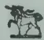

xx 2904

**BURROUGHS WELLCOME & CO., LONDON**

COPYRIGHT

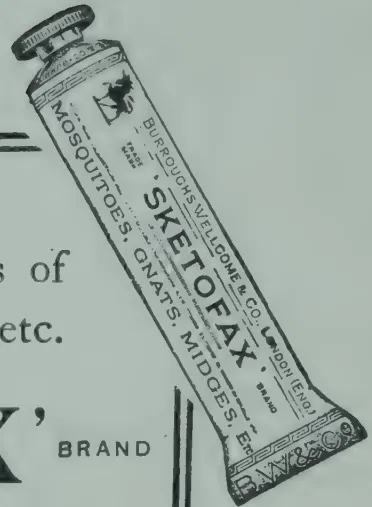

## FODDER.

### PRICKLY PEAR AS A STOCK FOOD.

**CHAS. F. JURITZ, M.A., D.Sc., F.I.C.,**

*Agricultural Research Chemist, Capetown.*

The prickly pear, like all plants which contain much water, is of great service to drought-stricken stock in arid countries, but it follows of necessity that because it contains so much water it cannot at the same time contain much solid nourishment. Those green stem-joints, which are also called sections or cladodes, but which we generally—but wrongly in the case of the prickly pear—call "leaves," often contain as much as 90 per cent. of water, and, accordingly, form too one-sided a diet for stock unless more "solid" food is given at the same time, in order to keep up the balance. Animals may be kept alive for some time on prickly pear alone, but they lose in condition.

The value of prickly pear lies in its capacity of being used as a coughage in normal times, and as a supplementary food for eking out a scanty supply of other food-stuffs under drought conditions.

344------------------------------------------------

MAY, 1921.]311

MR. INGLE, when Chief Chemist of the Transvaal in 1908, pointed out how refreshing and welcome a winter stock food the prickly pear would prove in the Transvaal, and he recommended burning off the prickles from the leaves (as for convenience sake I shall continue in this paper to call the stem-joints) by means of a blow-lamp, and then slicing the leaves in a turnip cutter.

Many analyses of the *leaves* of various kinds of prickly pear have been published, showing that the amount of water which they contain when fresh is about 90 per cent. Of the remaining 10 per cent., which constitutes the dry matter, mineral substances like salt and phosphates make up nearly 2 per cent., about 3 to 4 parts per thousand consist of albuminoid or nitrogenous matter, and one part in a thousand is oil or fat. The fibrous material in the fresh prickly pear leaf does not make up much more than one per cent. The quantity of sugar in the leaf is generally under one per cent., and about 2 to 3 per cent. is made up of mucilage or gum-like substances.

If the prickly pear leaves are chopped up and allowed to dry out they become relatively more nutritious. The amount of moisture contained in them may drop to about 10 per cent. Of this dried leaf 14 to 15 per cent. may be mineral substances, 3 per cent. albuminoids, or proteins, as they are now more generally called; oil or fat would be nearly one per cent.; fibre about 10 per cent., sugar 5 or 6 per cent; and mucilage approximately 18 per cent.

As regards the fresh *fruit* of the prickly pear, it is estimated that the husk constitutes 37 per cent. and the seeds 4 per cent. The husk contains about two-thirds of its weight of water, and the shelled fruit slightly less. The whole fruit contains between 6 and 7 per cent. of proteins and about 11 to 12 per cent. of sugar.

In the New Mexico Experiment Station, some 14 or 15 years ago, the possibility of using a certain variety of prickly pear, *Opuntia lindheimeri*, in making up a stock ration was investigated. The nutritive ratio, that is to say, the ratio of muscle-forming to heat-giving constituents was found to be 1 to 18. This is too wide for milch cows, which need a ratio of about 1 to 6, and it was, therefore, suggested that the prickly pear should be balanced by other food, for example in such a ration as the following:—

Prickly pear, 40 lb. ; wheat bran, 10 lb. ; maize stover, 12 lb. ; another ration suggested was prickly pear, 60 lb. ; brewer's grains, 14 lb. ; cotton seed meal, 1 lb.

This would probably need a little more widening by the addition of coarse, dry fodder.

Yet another ration was suggested by DR. R. F. HARE, namely:—Prickly pear, 50 lb. ; wheat bran, 10 lb. ; lucerne, 10 lb.

As an emergency farm crop for use in periods of drought, and of value in dairy farming, the planting of prickly pear has been recommended in the United States both on account of the hardiness of the spiny plants and the small amount of handling which they need, as well as for the other advantages possessed by such a crop, namely, its practical immunity from injury by wild animals, and the absence of any need for fencing it.

As indicated above, *dried* prickly pear contains more nutriment than when fresh, and in some parts of India the dried plant is moistened with salt

345------------------------------------------------

312[MAY, 1921.

and fed to cattle. Proposals have been made in India for the importation of dried prickly pear leaves into other provinces ; in South Africa for the manufacture, under patent, of dry fodder balls ; in Australia for the preparation of a finely-ground, sun-dried material. In none of these cases is there any record of the actual adoption of the proposals ; this may be due partly to the extra cost of preparation and partly to doubts regarding the feeding value of the materials.

Various attempts have been made in India to use unmixed prickly pear as an ensilage, but not with very much success. More satisfactory results were achieved by alternating layers of prickly pear and maize or sorghum. In South Africa the experience has been similar ; the prickly pear ensilage could not be used alone, and grass or linseed meal had to be fed along with it. In Queensland it was found that alternate layers of prickly pear and maize made an excellent ensilage.

There are objections on the part of many to the use of prickly pear as fodder. When fed alone the fibre tends to form balls in the digestive canal. Many believe that the prickly pear causes general debility and purging, and, furthermore, the animals by passing the seed broadcast soon infest large tracts of country. Evidence was given before more than one Select Committee of the Cape House of Assembly to the effect that cattle are frequently so scoured out by prickly pear that death results, and that the small spines of the fruit cause inflammation of the mouth, gullet, and even stomach, until the whole internal lining of the digestive organs becomes a mass of thickened and inflamed mucous membrane.

The small spines, too, often get into the animals' eyes and blind them. Although cattle, sheep, and goats take to prickly pear leaves which have been deprived of their spines by singeing, scouring is apt to occur in such cases as well, but the tendency may be lessened by giving the stock coarse feed or dried grass.

The *spiny character of the leaves* naturally gives rise to a great deal of trouble, and in the United States the most common practice is to remove the spines by singeing. Then the leaves are chopped up or the cattle turned loose into the prickly pear paddocks. For singeing, either a plumber's blast-lamp or a bush fire is employed, or else the leaves are boiled or steamed for some hours ; conversion into silage is also said to soften the spines.

There is no question that, apart from its disadvantages, the prickly pear has often been of service in South Africa for *ostriches, oxen, and pigs*. The last named have been found to relish the plant, which, when mixed with dry grain, afforded them a fairly fattening food.

Some years ago the CAPE AGRICULTURAL JOURNAL described a successful experiment in pig-feeding carried on during a lengthy period on a New South Wales farm. Prickly pear leaves were boiled for some hours with meat and fed to nearly 200 pigs for several months without any of them developing the least internal trouble from the spines or bristles.

Although the aperient nature of the plant at times proves a drawback, it was the custom in South Africa, as long as thirty years ago, to feed ostriches on prickly pear leaves denuded of their spines, and so enable them to withstand severe droughts. The late HON. A. DOUGLASS, whose life was

346------------------------------------------------

MAY, 1921.]313

so closely associated with the rearing of ostriches used to feed the chopped up leaves to his birds and milch cows during drought and general scarcity, with marked success, and according to MR. BURTT-DAVY, MR. H. ABRAHAMSON of Longhope, Cape Province, lost none of his ostriches during a period of drought, because he fed them on prickly pear leaves and fruit, but his neighbours, who neglected to use the prickly pear, although they had it on their farms, lost heavily. In India, it was found that caution had to be exercised in feeding prickly pear to ostriches, because of the danger of intestinal trouble. MR. R. W. THORNTON, Experimenting at the Robertson Station, Cape Province, found that ostriches did well on prickly pear in all cases, but best when lucerne hay was added. Draught cattle did fairly well when idle, but lost in condition when worked. Neither milch cattle nor pigs did at all well on unmixed prickly pear. In the Eastern Province MR. J. MARTIN of Perseverance, pulped the prickly pear so as to render the spines harmless, and then fed it, together with rakings from forage lands and mealie meal, to slaughter oxen which had become poor through drought. After two and a half months of this feeding the oxen were found in first-class condition.

In the Canary Islands cattle have been kept alive by feeding on prickly pear; in Cyprus, Spain, on the Barbary and Syrian coasts, and in fact in nearly all the Mediterranean countries, it is used as fodder for animals, the smooth-leaved varieties being preferred.

On several occasions during periods of *famine*, prickly pear has been used in different parts of India as an emergency food-stuff for cattle; for instance, cattle in the extensive Bellary district, in the Madras Presidency, were kept alive in the great famine of 1876-1877 by a mixture of one part of rice straw and 40 parts of pear leaves, which had been cut up after removal of the spines. Similar experiences were repeated at intervals until as late as 1912, when the plant was used as an emergency feed in the Poona district. As an example, it is recorded that on the latter occasion a herd of cattle was kept alive for eight months on a daily ration of 1,000 lb. of prickly pear and 60 lb. of cotton seed. One of the latest recorded stock-feeding experiments with prickly pear was carried out at the Government Civil Dairy, Poona, in 1914, when it was shown that singed and sliced prickly pear mixed with 6 per cent. of its weight of cotton seed enabled animals which had become very poor from semi-starvation to regain condition.

In its application to milch cattle in particular the effect of prickly pear feeding has been shown to increase the quantity while maintaining the quality of the milk. In Corsica and Sardinia a daily ration of about 50 or 60 lb. per cow, comprising prickly pear finely cut up, mixed with bran or dry grass, was fed to impoverished cows, which had almost ceased their supplies, with good results. MR. MARTIN, whose experience in feeding prickly pear to oxen has been quoted above, found his milk supply greatly augmented by utilizing prickly pear as a feed for his milch cows. In Mexico, milch cows maintained their yields, in spite of the increasing coldness of the season, when fed on prickly pear, thus minimizing the need of purchasing expensive winter fodders.

The main points to be noted in connection with feeding prickly pear to stock are the following:—The leaves consist mostly of water, and hence are useful in times of drought. For the same reason they are not rich in nourishment unless dried. The spines on the leaves should be removed before feeding to stock, and the thorns on the fruit are likewise a source of danger. During drought the prickly pear forms a valuable emergency ration, but cannot be advantageously fed to stock unless mixed with more concentrated food. To such food, however, it is a valuable accessory.—JOURNAL OF THE DEPT. OF AGRIC., UNION OF SOUTH AFRICA, Vol. 1, No. 9.

347------------------------------------------------

314[MAY, 1921.

# POULTRY.

---

## THE PRINCIPLES OF BREEDING AS APPLIED TO POULTRY.

---

**J. FISHER, B.Sc., M.D.A.,**

*Principal, School of Agriculture, Cedara.*

*(At the Fourth Annual Poultry Breeders' Conference, Cedara, Natal, October 4th.)*

In almost any work dealing with the subject of breeding, the first fact which is dealt with at any length is the fact that there is a direct relationship between parents and their offspring. This should occasion no surprise, and rather should we be surprised if the offspring were unlike their parents. How would it be possible to keep certain strains and types if there was no hereditary connection between successive generations?

Zoologists have taught us much concerning the way in which the bodies of animals are made up, and much research work has been done in the elucidation of the various phases of the growth of animals by cell division, and in the preparation of the reproductive cells for the act of reproduction. It may surprise some to think that all the character of both parents cock and hen, are concentrated into two cells, the one the egg cell or egg, the other the sperm cell, an exceedingly minute cell; that these two cells unite, and that the fertilised egg after 21 days' incubation will produce a chick having the character of both its sire and dam.

Time will not permit to-day to enter fully into a detailed account of the various changes undergone by the reproductive cells in their preparation for their special function, and the significance of these changes. Suffice to say that from the male parent, through the sperm, and from the female parent, through the egg, the characters of the parents will be found in the offspring and thus there is a direct relationship between them, and this fact is expressed by the term "heredity."

The law which follows from this fact is that "like begets like." In this form this law is hardly true, because in a clutch of chicks from the one hen and the same rooster many differences are observable. There is greater vigour of growth, different colouration, some are weaker than others, and when mature some of the fowls will possibly produce more eggs than the others. Were like to produce like, evolution from the jungle fowl would never have been possible. The fact that there are differences between one and another is called "variation" and it would be well to distinguish that this point between variation and a modification.

### VARIATIONS IN OFFSPRING.

Variations are germinal, arising in the germ plasm, and if we accept WEISMANN'S theory of the continuity of the germ plasm it is easy to understand that such changes will be inherited. Because through particular feeding and keeping under certain conditions it is possible to grow the combs of birds to enormous sizes, it does not follow that the offspring from these

348------------------------------------------------

MAY, 1921.]315

birds under normal conditions will inherit that large size. Suppose, however that a fivetoed chick was hatched in a certain clutch this would probably be inherited in all the offspring from that bird. Variations are not made, they are born. They are the "nature" whilst the modifications are a result of "nature."

The next point that calls for mention is that certain characters in one parent seem to completely swamp the characters in the other parent, and the character in the offspring is like the one parent only. For example, if a rose comb or pea comb rooster is mated with single comb hen, all the chicks will be rose or pea comb. It is not to be thought from that that the offspring have only the one character, that of rose or pea comb. The single comb character is inherited also but of latent, or "recessive," whilst the pea or rose comb character is said to be "dominant." Other dominant and excessive characters are :—

*Dominant* : The white of Leghorn ; extra toes ; yellow skin colour ; yellow shank colour ; feathered legs ; beard (Houndan') ; broodiness.

*Recessive* : Black, red and buff ; normal foot ; white skin colour ; light shank colour ; clean legs ; no beard ; non-broodiness.

If the chicks from the rose and single comb mating are mated amongst themselves, it will be found that in the progeny there are single combed individuals and rose combed ones—three rose to one single. The single combed ones will breed nothing but single combed fowls, whilst of the rose-combed ones some will breed pure rose, and others both rose and single. This segregation of the individual characters is known as Meddels Law, and the discovery of this law has thrown much light upon questions of inheritance, and has enabled rapid progress to be made in certain directions.

The above is true for single characters. All characters in the male or all characters in the female, are not dominant nor recessive. Some will be dominant, others recessive, and breeding from the birds is the only way to determine which are dominant and which recessive. The bringing together of different strains of heredity material, as when two distinct breeds are crossed, results in an access of vigour. Cross-bred chicks are reared with greater ease than pedigree chicks, and where in-breeding is practised, or long continued line breeding, trouble must be expected. The chicks will lack vigour, and many will die in infancy.

#### SEX LIMITED INHERITANCE.

We are all aware how the large spurs of the cock and the sickle feathers are limited to the male bird, and practically never appear in the hen. There are other characters also that behave in the same way, or, in other words, that are sex-linked.

Perhaps the best known example of sex linkage is that found in the Plymouth Rock, where a large number of black chicks are produced and where these are all female. There is a linkage of the female sex and the black colour, and these two characters behave in inheritance like a single character. High egg-laying is also a sex-linked character.

A knowledge of Mendelism does not, therefore, hold out any hope of the creation of new characters. It does, however, point the way to secure new combinations of desired characters by crossing varieties or breeds possessing them, and by careful breeding and selection to fix this combination in one

349------------------------------------------------

316[MAY, 1921.

breed or variety. It provides a quick means for testing out a bird with respect to any particular character. If like was to provide like we should expect that it would be possible by trap-nesting our hens and finding the highest producers and then breeding from these to secure offspring with high producing capacity. There would be no fowls laying less than 200 eggs per annum.

We should all like to be the proud possessors of hens that would lay 365 eggs in a year, or mayhap 366 were it leap year, but the efforts of the Maine station to increase egg production by breeding from high producers as shown by the trap nest proved a failure. There was no cumulative effect at all. Not only was there no increase, but there was even a decrease during the nine years that the experiment was carried out. It is true, however, that the weight of the eggs laid by a fowl is transmitted from generation to generation. Investigators are trying to find out "how."

That there are great differences in egg-producing power is well-known, "Queen Utana," for instance, laid 816 eggs in five years—185, 193, 138, 162, 128.

In the November, 1915, JOURNAL OF HEREDITY are shown types of high and low producers. Two highest laid 219 and 288 eggs in 12 months two lowest laid 10 and 23 eggs in 12 months. There are surely sufficient variation in producing capacity to make us stop and think and desire to know more about the inheritance of this egg-producing power.

#### CROSSES FOR EGG PRODUCTION.

It is again from American sources that information on this subject is forthcoming. Information has been sought by taking high producers and low producing strains, crossing them, and observing the behaviour of the crosses. From a large number of experiments the following facts have been elucidated:—

Just as in dairy cattle the high milk-yielding capacity of the cow is handed on to her male offspring, and by them in turn to their female calves, so with poultry. As with cows we have high medium, and low producers, so we have with fowls.

To deal first with high production. High production may be inherited by daughters from their sire, independent of their dam. It has been found that the same proportions of daughters of high laying ability are produced by the same sire, whether he is mated with hens which are high layers or poor layers. That high laying ability is not directly inherited by daughters from their dam is proved by the following:—

(1) Continued selection of high producing dams failing to alter in any way the egg production of the daughters.

(2) The proportion of high producing daughters is the same whether the dam is of high or low fecundity, provided both are mates to the same male.

(3) The daughters of a high-producing dam may be either high layers or poor layers, depending upon their sire.

(4) The percentage of daughters which are medium or poor layers is the same whether the dam is a high or poor producer, provided both are mated to the same male.

Mediocre or poor laying ability may be inherited by the daughters from either sire or dam, or both.

#### TO ACHIEVE SUCCESS.

For the practical breeder who is desirous of increasing the egg-producing capacity of his flock, it is evident from the foregoing that there are certain lines of action which should be followed if he is to achieve success. As

350------------------------------------------------

MAY, 1921.]317

increased production is obtained so must be conditions under which the fowls are kept be improved. As the grading-up process is carried on, the feeding and management must be above the breeding. Any poultry man knows that by damp, dark, unventilated houses, unpalatable and improper food, fed in insufficient quantity, he can prevent the finest laying strain in the world from producing many eggs. High egg production can only be secured where the venture is directed with a lot of intelligence, thought, skill and naturally directed effort.

The plan to be followed by the practical breeder may be set out as follows:—

1. Selection of all breeding birds must be from the point of constitutional vigour and vitality. There should be normal growth curves. Let all deaths in shell and chick mortality be charged against the dam, and only those females be used as breeders a second time which show a high record of vitality of the chicks, whether in the egg or out of it. This is one of the most valuable measures of constitutional vigour that we have. A certain number of the breeding females each year should be pullets to test their breeding performance. In this way will a strain be built up having high hatchability and strong vigour of chicks. Use no bird as a breeder that has ever been ill. Put an extra rung band on every bird that goes into the hospital.

2. Use only such females as have shown themselves by trap-nest records to be high producers. It is only from these that we can hope to secure males capable of transmitting high laying qualities.

3. Use as males such birds only as are known to be the sons of high-producing dams, since only from such males can we expect to get high-producing daughters.

4. Use some method of recording the fowls so that it will be possible to tell what male bird was the sire of any particular female.

5. At first make as many different matings as possible, i.e., use as many different male birds as possible. This will limit the number of females per male.

6. Intelligent line breeding of those lines in which the trap nest records show a preponderant number of daughters to be high producers.

#### POINTS FOR EMPHASIS.

One point may perhaps be emphasised—that the mating of any sort of male with high-producing hens only results in a flock of male offspring of better average quality than the sire himself. The use of high producers (trap nest proved) as the only females for breeding, “grades up” very quickly the cockerels produced.

Two facts stand out from the above:—

1. We must note the progeny test in breeding for performance.

2. We must recognise the significance of the male in breeding for egg production.

To think of the pullets only from high producers is a futile proceeding.

To say that “this pullet is the daughter of Lady Splendissima (with a tremendous record)” is perhaps good advertising). It, however, conveys no special information to the breeder until he knows who was the lady’s consort in this particular reproductive venture.

The mating of males from 200-egg hens to females laying above 150 during a period of 10 years failed to make any difference in the mean production of the flock.

Another point perhaps worthy of mention, and this the last one, is that in many score cards for fowls the legs, beak and lobes should be yellow. In practice it is found, however, that the absence of these colours are indications of higher producers.—FARMERS’ JOURNAL, Vol. 3, No. 9.

351------------------------------------------------

318[MAY, 1921.

# APICULTURE

---

## GENERAL INFORMATION AND HINTS TO AMATEURS ABOUT TO START BEE-KEEPING.

---

W. F. LYON.

So many requests have been received by the Queensland Bee-keepers' Association for information as to how to start bee-keeping and the initial cost, that the Association came to the conclusion that it would be a good thing to have a pamphlet printed for the benefit of new beginners, and it was decided that Mr. W. F. LYON approach the Department of Agriculture to see if they had any pamphlets printed for that purpose. On inquiry it was found that no such pamphlet had been issued by the Department.\*

As I have had fifty-six years' experience in bee-keeping, I should know enough about it to affirm that any person taking up bee-keeping as a hobby would never regret it, provided he does not neglect the bees. The question of profit depends almost entirely on the knowledge, energy, and perseverance of the bee-keeper. If he gives the bees proper attention, they can generally be depended upon to do their share of the work.

In the first place, I would say to the beginner: "Is your locality suitable for bees?" Don't think for a moment that bees make honey. They gather it, and if it does not grow within 2 miles of where you want to keep bees, I say do not attempt it, as it will be a failure. Don't think that a few flowers growing in your garden are sufficient to supply them, because they will not do so. You must be near a eucalyptus forest, or near a locality where there is plenty of lucerne grown. If any new beginner wants to start bee-keeping for a livelihood, he should be very careful to start in a suitable place, as many have failed through neglect of this precaution. Always apply to an experienced bee-keeper for advice before starting an apiary. My advice is to keep away from all scrubs and tea-tree swamps, as they produce a very inferior honey which will spoil the sale of your product. If you have not the means to buy a quantity of colonies to start with, be very careful how you increase your stock, or you will only be courting failure again. If the colonies are divided into two or three parts, they get down so low that they cannot recover themselves, and you are sure to lose the whole of them, unless you have other colonies to support them with honey and brood. To work a bar-frame hive for profit, it is first necessary that the bee-keeper should exercise forethought and be prepared for any emergency that may arise. He should always have by him plenty of spare frames, foundation combs, and supers. It is very unprofitable to be short of these essentials during an unexpected honey flow. The man who wants to keep only one or two colonies will require one full colony of Italian bees with super all complete, one smoker, one wire embedder,  $\frac{1}{4}$  lb. of spool tinned wire, and

---

\*Exhaustive papers on the industry were published in the "QUEENSLAND AGRICULTURAL JOURNAL" (Vols. 1 to 19).

352------------------------------------------------

MAY, 1921.]319

one bee-veil. These will cost about £4 10s. He should have an uncapping knife, and honey extractor, but these are rather expensive items at the present time, and can be got later on. If you are living in a small space of ground, you must take care not to place the hive too close to the fowlyard or the stable, as the bees have a great aversion to horses and fowls, and do not put them in the garden where you turn the soil up. Do not place the hive in a low, damp place, for if you do so it will cause mildew in the combs and be very unhealthy for the bees.

When you buy your colony of bees, get the owner to pack them for removal, as it wants an experienced person to do this properly to prevent the bees from suffocating or getting out. Having got the bees home, place the hive on the stand where you intend to keep it. Pull all the strips off all the sides that are holding the hive together. Now be very careful when pulling the tacks out of the netting that is nailed over the entrance, and be sure you do not let any bees out until you have all the tacks drawn, then pull the entrance off and run (but there, I needn't tell you that).

The bees will be very angry now, so you must keep away for five minutes. Have your smoker charged with a little rotten wood if possible and a few live coals. If you have no rotten wood, use the very small chips in your wood heap. *Note* :—When you lift the cover off, do not lift it off quickly. If it is sealed down with propolis, take a chisel or knife and prise the cover up, sufficiently to break the seal. Then lift one end of the cover a few inches with one hand and blow a little smoke with the other. If you do this carefully you will never be stung by the bees on opening the hive. Be sure not to jar the hive in any way, as it makes the bees very angry.

Now choose the frame you are going to take out first. Push the frames on each side a little way so as to give more room to lift the selected frame out without crushing the bees. Place this frame on the opposite side of the hive, with one end on the ground. You will now have plenty of room to lift the others out to examine them.

When you want to lift the super off, use the same method as when lifting the cover off. It is better to leave the cover on the super until you have finished examining the brood combs. If you want good returns of honey, do not let your bees swarm. This can be done by giving them empty combs in the super as fast as they fill them. Examine the brood combs once a fortnight, and take off any queen cells that might be on the combs. You will know the queen cells when you see them, as they project out much further than the other brood and are of a thimble shape. The examination for queen cells is only necessary between the months of September and the end of February. Remember that the more bees you can keep in the hive the more honey they will produce. Should you think they are over-crowded, place another super in the centre with full foundation comb. This is not necessary unless there is a good flow of honey coming in.

The best plan is to have the queen's wing cut, so that if they swarm out at any time the bees will not go away without the queen. Look for the queen on the ground near the entrance, and when found, place her in a cage until the bees come back. I have for over twenty years used a tea ball for this purpose, and it is one of the handiest cages in the apiary for holding the queen at the time of swarming.

353------------------------------------------------

320[MAY, 1921.

Should you want to make another swarm, remove the old hive to another place, then place the new hive where the old one stood, foundation combs complete, which of course, you should have ready. Then take one of the brood combs and place it in the new hive.

By this time the bees will be all coming back into the new hive and you can now release the queen at the entrance and let her go in with the bees.

Now go back to the old hive, and cut out all the queen cells but one. On the sixth day after the swarming look into each hive to see if the queen is in the hives. If you cannot see the queen, and you think she is lost, put in another frame of brood with new-laid eggs, and if the queen is lost, they will make more queen cells immediately.

On the twelfth day after you have put the new eggs in, remove all the queen cells but one, and be sure not to leave any more than one cell, for if you do they will very likely swarm out and you might lose them. Generally speaking, the queen will hatch out on the fourteenth or fifteenth day.

You must on no account cut the virgin queen's wing. When you want to cut a queen's wing, take her into the house, shut the doors, and let her run about the table. Hold her between the finger and thumb (do not be afraid, she will not sting you unless you are squeezing the life out of her). Just clip a small piece off one wing. When returning her to the hive, give the bees a little smoke and let her go in from the top between the frames.

Should you want to go in for section-comb honey, it would be advisable to get one of the bee merchant's catalogue, which will give you all the information you may require.

There are many people that live in the "waybacks" who can get wild bees out of trees, who could thus start bee-keeping with very little expense. Buy a single hive with frames; have half the frames filled with foundation comb, but do not wire the other half. Make fifty support hooks of this shape out of some small wire, and make them long enough to fit on the side of the frame. Now place four on one side of the frame, laying it on a board with the hooks on the under side. Place the brood comb you take out of the tree, or any box from which you would like to transfer, on top of the frame. Take a sharp knife and cut the comb all round the inside of the frame. If the comb is not large enough to fill in the frame, fit in small pieces to suit. Now place four hooks on top of the frame as it lies, lift the board up perpendicularly, take the frame away, and place it in the new hive. Three days afterwards you may take all the hooks off again, as the bees will have it all fastened in. Shake all the bees you can into the hive, then place the hive near where the swarm is, and the rest will go in with the help of a little smoke.

Should the queen be killed, the bees will make several queen cells, and another queen will hatch out on the fourteenth day.

Should the new beginner carry out these instructions, he will never regret he started bee-keeping.

I have often been asked what is the best remedy for a bee-sting. My remedy has always been to put a little spittle on the place and blow the smoker on it.—QUEENSLAND AGRIC. JOURN., Vol. XV, March, 1921..

354------------------------------------------------

MAY, 1921.]321

# CO-OPERATION.

## SOME CAUSES OF CO-OPERATIVE FAILURES.

C. C. CRANE,

*Organising Inspector of the Agricultural Bureau, New South Wales.*

Like all things worth the doing, the maintenance of a healthy co-operative association is beset by certain difficulties and problems. Associations enthusiastically launched have been known to founder, and many others have shipped heavy seas before ultimately reaching smooth water. Enthusiasm is an excellent thing—so long as its decisions defer to certain elemental laws.

### LACK OF EFFICIENT MANAGEMENT.

A successful manager requires to have had an expert business training in all the lines with which he is operating; he must be as well or better trained than the men who are operating in competition or opposition, and he must have administrative ability, integrity, and tact. Too often a co-operative society appoints a local man (possibly one of its members) as manager because he is popular and possesses some general qualifications rather than because he has any particular and specialised ability which fits him for the post. Too often an expert manager is unwisely restricted by members of the board, who have general but not expert knowledge, and who forget that while it is their duty to adopt a policy, it is essentially the manager's business to administer it, and that to do this efficiently he must be allowed considerable latitude and independence of action. Finally, it must be remembered that as the position of manager calls for a specialist's qualifications, it calls also for a specialist's remuneration.

### LACK OF LOYALTY OF MEMBERS.

The foundation-stone of any co-operative society is the individual member, and in a co-operation of producers his loyalty is of special and paramount importance. Loyalty means personal interest, enthusiasm, confidence, and complete support.

To ensure loyalty the initial cost of becoming a member should not be too small for the sum invested to be looked upon as a stake in the society the loss of which would be of importance to the member. Each member should feel that he has something to lose, something to gain, and that his interest is not merely sentimental but principally monetary. Steps must be taken by the secretary or committee where necessary to keep members well informed, and to explain positions that, if left in doubt, would cause uneasiness, or possible defection. Producers' co-operations have frequently found it advisable to insist that members deal exclusively with the co-operative business, and to insure against defection by instituting a scale of fees that must be paid as liquidated damages in respect of all business passed through outside agents or transacted privately by members.

355------------------------------------------------

322[MAY, 1921.

### OPPOSITION.

The question of opposition is closely allied to that of loyalty ; for, while loyalty is maintained opposition must be ineffective. Rival companies and private competitors are likely to put up opposition in proportion to the menace that the co-operative association seems to promise to their interests, and steps calculated to cripple it may be expected at the earliest opportunity. Prices will be cut and inducements offered to members that will possibly appear extremely attractive.

The individual must be made to realise that concessions and benefits made at such a time by competitors are temporary, and due to the existence of the co-operative association. The association should be in a position to work more economically than any other concern legitimately could, and the Committee should take steps to convince members that their prices represent the minimum when selling and the maximum when buying, and that finer prices represent a loss or at least a serious risk. The committee should see that members are kept informed as to (1) the benefit they have received from the association ; (2) the prospects the association opens up for them ; and (3) the possible results of the association's failure.

### ISOLATION.

As the individual is the unit of the association, so must the association be but a unit in a co-operative federation ; that is, the local association should retain its individuality, but should by affiliation with others secure for itself as a society what it has as a union secured for the individual. In short, while local individualism is a necessary feature of the co-operative movement, a co-operative union or federation and a co-operative wholesale are equally essential. No society should endeavour to exist as an isolated co-operative undertaking.

### OPERATING ON TOO SMALL A MARGIN.

Generally speaking, a co-operative association should not set out with the immediate object of cutting prices ; it should pay current rates when buying, and charge current prices when selling, for such will give a sufficient margin to tide the concern over times of distress. If at the conclusion of the financial period it is found that customers have been paid too little for their produce, or have paid too much for the goods they have purchased this must be refunded to them *pro rata* of the business each individual member has effected with the association.

### UNSUITABLE SCALE FOR OPERATIONS.

Organisation should not be considered satisfactory till there is a sufficient volume of business in sight to reduce to a satisfactory minimum the overhead charges which are a necessary cost on buying and selling. The larger the bulked trading transactions effected through the society the greater will be the reduction in cost to the individual.

A society must learn to walk before it can run, and its magnitude must depend on its capitalisation ; under-capitalisation means buying on terms and increases cost in every direction.

### PURCHASE ON THE CREDIT SYSTEM

The main aim in co-operation is to effect economy. Credit dealing is expensive and uneconomical, and, however inconvenient it may be for members to pay cash, the importance of the cash purchasing principle in co-operative work is sufficient to warrant that inconvenience being imposed upon members. Generally speaking, if a co-operative society gives credit to its members it must ask for credit from its wholesale suppliers. - *AGRIC. GAZ., N. S. W.* Vol. XXXII, Part 3.

356------------------------------------------------

MAY, 1921.]323

# GENERAL.

---

## AGRICULTURAL EDUCATION AND RESEARCH IN THE UNITED KINGDOM.

---

NATURE, October 28th, 1920, notes an important change at the Ministry of Agriculture, in the promotion of MR. F. T. L. FLOUD to be Permanent Secretary, whereby SIR DANIEL HALL is liberated from office work, and enabled to devote his whole time to the organization of agricultural education and research with which SIR DANIEL has always been closely associated.

It is stated that the scheme now in operation comprises four essential parts :—

(1) Research Institutions, where knowledge is gained, and agricultural science systematically developed and put into such form that teachers and experts can use it. At first this work was distributed among a number of university departments, but of recent years there has been a tendency to concentrate it at a few institutions, owing to the necessity for bringing individual workers into closer personal contact with each other and with the large-scale problems of the farmer.

(2) Agricultural Colleges, where experts and large farmers will be trained, receiving a three-years' course of instruction of university character. Most of these colleges are associated with universities which award degrees in agriculture ; for students who do not wish to take degrees, there is a diploma course requiring a high standard of technical work.

(3) Farm Institutes for small farmers and farm-workers who cannot spare three years for college, but have some practical knowledge, though they are unable or unwilling to go through the ordinary college course. These institutes aim at giving sound courses of instruction on soil, manure, crops, animal husbandry, etc., but it is usually presumed that the student will take up farming in the area served by the institute, and for which the instruction is specially appropriate.

(4) Advisory Officers. In each country arrangements are made whereby farmers, small holders, and others may consult the agricultural expert appointed by the country authorities, in regard to any difficulties they may meet with in their work. The adviser is in a position somewhat similar to that of the general medical practitioner, and usually finds that he can deal with a large number of the cases presented to him. He is, however, in touch with the colleges, research institutions, etc., and can always obtain expert advice in any particular problems of special difficulty.—AGRIC. NEWS, Vol. XIX, No. 486.

357------------------------------------------------

324[MAY, 1921.

## PEPSIN FROM THE PAPAW.

### HOW A VALUABLE MEDICINAL ARTICLE IS OBTAINED.

E. R. S. CHEALES, in FARMERS' WEEKLY.

While most farmers are aware of the digestive properties of the papaw leaf, there are still perhaps a good many who have not heard of the fact that a valuable medicinal article—pepsin—can be manufactured by a simple process which will be described in this article.

At the time when the writer was acquainted with the "pepsin" industry it was considered profitable if the price of 5s. per lb. was netted. The last quotation to hand, however, is 25s., and there can be little doubt that the matter is worth serious trial, as the man who is too far from rail to send papaws to the market can clearly send the concentrated article, and although care and trouble is necessary in the manufacture, on the other hand, he is saved the expense and worry of packing fruit.

The juice or milk is obtained by making scratches on the skin of the unripe (green) papaw. A wooden knife should be used. The milk runs freely and must be caught in a non-metal cup. After a time the flow diminishes and coagulates near the cut. This is removed by the knife and placed with the milk already collected.

The fruit is not removed from the tree, and may be "milked" several times at intervals of a few days. The essence of success is to produce a pure white pepsin, and the milk must not come in contact with metal containers or knives, which would blacken it. The milk soon coagulates and should be in the form of a snow-white curd. It will decompose if not quickly dried, and the juice should be collected in the early morning, followed by drying at about mid-day, which will keep it fresh enough until the following day, when the drying process can be finished.

#### DRYING THE MILK.

On a small scale the coagulated milk may be placed in thin layers on sheets of glass and exposed to the sun, but in large quantities it is best to adopt some form of drying oven. This milk is spread on linen or cotton trays and placed over a hot air chamber which can easily be built of brick, the essential point being to avoid excessive heat. This result may be obtained by having an iron plate, roughly the size of the tray, between the fire and the hot air chamber and placing the tray about a foot above the plate. The temperature to be aimed at is about 100 degs. Fah., but practice will soon establish the right heat.

It should be just hot enough to dry without over-heating. As the substance dries it naturally shrinks and the contents of several trays may eventually be emptied into one and drying continued until it is crisp and can be reduced to a fine powder without stickiness.

The resultant substance should be ground in a mill (of the coffee-mill type) to a fine white or cream-coloured powder, which will have a peculiar smell. This is papain, and must be put into airtight receptacles, when it is ready for sale.

358------------------------------------------------

MAY, 1921.]325

The best market is generally New York, but the quotation mentioned above came from London, and is so high that it is likely to represent much more money per papaw than can be obtained by selling the fruit, besides which the market is large, and a successful papain producer would be justified in planting a fairly large orchard.—FARMERS' JOURNAL, Vol. 3, No. 4.

## ACHRAS SAPOTA.

*English*—SAPODILLA. *Sinhalese*—RATA-LAWULU.

*Tamil*—SHEEMAI-ELUPPAI.

This is a medium sized hardy evergreen tree belonging to the natural order Sapotaceæ and is native to America. Its fruit is about a nutmeg in size and shape and has about 8 to 9 cells in well developed fruits but only a few seeds generally develop. These are dark in colour and are like sour-sop seeds in shape.

The fruit is used as a dessert and has a delicious taste similar to that of well-prepared "Chatu Madura."\* The fruit when well ripened emits a smell similar to that of unmatured bees' honey.

This is a suitable fruit tree to be grown in the low-country. As plants raised from seeds come into bearing in about ten to fifteen years, it is always better to procure grafted plants from reliable nurserymen. A grafted plant will yield fruits within three years of planting. There is a species which bears a small fruit which turns straw colour when ripe and the colour of the pulp is dark yellow. This is the best variety of sapodilla.

*Soils*.—The best soils suited for planting sapodilla are sandy loam. The soil should be well drained. Plants should be planted in open places.

*Holes*.—Grafts may be planted in holes 2 ft. long, 2 ft. broad, and 2 ft. deep. Until the plant is well established it should be shaded. Care should be taken not to handle the grafts roughly as the joints sometimes get detached. After planting, a strong stick should be tied along the graft to support it and prevent its being shaken by the wind.

*Watering*.—The plant should be well watered during dry weather. A mulch of dry leaves should be formed.

*Fruiting*.—Grafted plants flower during the 2nd year but these flowers should not be allowed to form fruits; otherwise the young plant gets stunted: after about the third year plants may be allowed to fruit. The fruiting season is July-August.

In 1906 or 1907 I planted a sapodilla plant at the Government Stock Garden, Colombo, where it came into bearing within three years and the fruits were delicious. The tree was named "perpetual sapodilla" as it was never found to be without fruits.

A small graft from one of the branches of this tree was planted at Kalutara as an experiment. The plant has come into bearing, but it did not turn out to be a perpetual bearer like the one planted in Colombo. This may possibly be due to the poverty of the soil and the unfavourable situation in which it has been planted.

The following is a list of plants which will answer well for grafting sapodilla: *Chrysophyllum Roxburghii*, (Lawulu. S.), *Bassia longifolia*. (Mi. S. Iluppai. T.), *Mimusops Elengi* (Manamal S. Makil, Mukeiai, Vilva-pattiri. T.), *Mimusops Hexandra*, (Palu S., Palai. T.)

M. J. FERNANDO.

\* *Chatu madura* is prepared by mixing Ghee, Honey, Jaggery and Sugar. It is supposed to be a very sweet and nutritious diet

359------------------------------------------------

326[MAY, 1921.]

## HOW TO SELECT DESIRABLE EARS OF CORN FOR SEED PURPOSES.

(Circular No. 18, Porto Rico Agric. Expt. Station.)

There are two distinct steps in corn selection. One is to select the most desirable ears, using neither measurement nor score card. The other is to take the ears first selected and judge each one very carefully, noting on a previously prepared score card the value of each character. The first step, which consists simply in picking out the most desirable ears from the crop after it is harvested, does not require much time, but it is one which no farmer can afford to neglect. At the same time these questions should be kept in mind: Will it germinate? Is it pure—that is, will the kernels when planted produce ears of the same size, shape, colour, etc.? Is it the shape desirable? How much will it yield? The following directions will be helpful in determining the approximate value of an ear by looking at it.

Will it germinate? If in doubt, test it. Look for—

*Mouldiness.*—Discard all ears that are the least bit mouldy, or that look as if they will not dry out without becoming mouldy.

*Ripeness.*—Discard all ears on which the kernels are very wrinkled, dull in colour, or discoloured.

*Insect injury.*—The principal dangerous insect is the weevil. A few weevil burrows may not cause much damage, but if corn is much weevil-eaten, the germination will be impaired.

Is it pure? Look for—

*Uniformity of kernels.*—Discard all ears having kernels of different colour; also all ears having many small or undeveloped kernels, or, in general, kernels of different size.

*Colour of cob.*—The cob should be of the same colour as the grain, unless difference in colour is known to be a variety character.

Is the shape desirable? Look for—

*Straightness of rows.*—Discard all ears on which many of the kernels are irregularly arranged; also ears on which the rows are very crooked.

*Butt.*—The butt should preferably be covered with kernels to the extent that a cavity is left after the ear is broken off the stalk. The kernels should retain their size and shape well toward the butt.

*Tip.*—The tip should preferably be entirely covered with kernels. The circumference of a short ear measured 1 to 2 inches from the butt and 1 inch from the tip, should not differ more than  $1\frac{1}{2}$  inches between the points measured. The pointed ear has too many irregular-shaped kernels at the tip resulting in low yields.

How much will it yield? Look for—

*Length of ear.*—Discard all ears less than 7 inches long. If there are enough desirable ears over 8 inches discard all the shorter ones.

*Circumference of ears.*—An ear 7 to  $7\frac{1}{2}$  inches long should be at least  $6\frac{1}{4}$  inches in circumference but not more than 7 inches. An ear 8 to 9 inches long should be at least  $6\frac{1}{2}$  inches in circumference, and a length of 9 inches and up calls for a circumference of 7 inches and up.

360------------------------------------------------

MAY, 1921.]327

*Depth, shape and space of kernels.*—Deep rectangular kernels placed so close together that they cannot readily be moved by passing the fingers over them, are sure signs of high yield.

*Weight of grain.*—Fifty average well-shaped kernels will weigh about 1 ounce. An ear containing 14 rows with 40 well-shaped kernels in each row will have 560 kernels. This would be at least 11 ounces of grain for planting. The irregular-shaped kernels at butt and tip should not be planted.—JOURN. OF BOARD OF AGRIC., BRITISH GUIANA, Vol. XIV, No. 1.

## RAINFALL AND CROP GROWTH.

The exact relation between climate and the growth of crops, and the possibilities of accurate forecast of production based on the weather at certain times of the year, have been engaging the attention of Agricultural scientists in many parts of the world. NATURE, October 28, 1920, draws attention to some investigations recorded by MR. T. A. BLAIR in the SCIENTIFIC MONTHLY for October. It seems that MR. BLAIR shows, in the case of maize in Ohio, that the United States Weather Bureau has found that a rainfall in July of less than 3 inches means an average yield of 30 bushels of corn per acre, and that a rainfall of 5 inches or more in the same month results in a yield of 38 bushels. When the July rainfall is  $3\frac{1}{4}$  inches the yield is 15,000,000 bushels greater than when it falls short of that amount by  $\frac{1}{4}$  inch. In the four great maize-growing States of Indiana, Illinois, Iowa, and Missouri, the addition of  $\frac{1}{2}$  inch to a total of  $2\frac{3}{4}$  inches adds 10 bushels per acre to the average yield.

A more precise relationship is found in the idea of a critical period—that is, certain short periods of time in the growth of any crop, during which its future prospects are largely determined. With some crops this is a single period; with some it is temperature, and with others, rainfall or sunshine at some special period of growth, which is the most important factor.

The application of this knowledge may be used to increase production in two ways. First, it will be possible to determine what crops are climatically suited to a particular district; and secondly, by the use of early or later maturing varieties, and by the help of fertilizers or other means, the crop may be advanced or retarded so as to bring the critical period into coincidence with favourable weather.

Readers of the AGRICULTURAL NEWS may recall that some observations on the effect of rainfall at the critical period of growth of cotton have been made in St. Kitts by MR. KELSICK, the Assistant Government Chemist in that island. There is much room, however, for further investigations on these lines, not only with regard to cotton, but other staple crops of the West Indies. As was noted above, accurate information with regard to the critical period in the growth of any crop would not only be interesting, but advantageous on account of increased production. In the cases of most West Indian crops, the best time of the year for sowing or planting is probably derived from traditional practice. It would, however, seem worth while basing the practice on accurate knowledge of the critical period of growth of each variety.—AGRIC. NEWS, Vol. XIX, No. 486.

361------------------------------------------------

328

[MAY, 1921.

METEOROLOGICAL.

APRIL, 1921.

<table border="1">
<thead>
<tr>
<th rowspan="2">Station</th>
<th colspan="2">Temperature</th>
<th rowspan="2">Mean Humidity %</th>
<th rowspan="2">Mean amount of cloud<br/>0 = clear.<br/>10 = overcast</th>
<th rowspan="2">Mean Wind Direction during month</th>
<th rowspan="2">Daily Mean Velocity. Miles.</th>
<th colspan="2">Rainfall</th>
</tr>
<tr>
<th>Mean Daily Shade</th>
<th>Difference from Average</th>
<th>Amount Inches</th>
<th>No. of Rainy days</th>
<th>Difference from Average</th>
</tr>
</thead>
<tbody>
<tr>
<td>Colombo</td>
<td>81.7</td>
<td>0</td>
<td>82</td>
<td>6.5</td>
<td>SW</td>
<td>89</td>
<td>8.97</td>
<td>22</td>
<td>+ 1.30</td>
</tr>
<tr>
<td>Observatory</td>
<td>82.0</td>
<td>- 0.9</td>
<td>80</td>
<td>4.9</td>
<td>SSW</td>
<td>132</td>
<td>5.76</td>
<td>15</td>
<td>+ 0.19</td>
</tr>
<tr>
<td>Puttalam</td>
<td>84.3</td>
<td>- 0.7</td>
<td>79</td>
<td>6.7</td>
<td>SSW</td>
<td>96</td>
<td>3.50</td>
<td>8</td>
<td>+ 0.74</td>
</tr>
<tr>
<td>Mannar</td>
<td>85.0</td>
<td>- 0.8</td>
<td>81</td>
<td>4.8</td>
<td>SSW</td>
<td>202</td>
<td>2.50</td>
<td>9</td>
<td>+ 0.50</td>
</tr>
<tr>
<td>Jaffna</td>
<td>84.7</td>
<td>- 0.5</td>
<td>76</td>
<td>5.8</td>
<td>SSE</td>
<td>123</td>
<td>1.90</td>
<td>11</td>
<td>- 0.10</td>
</tr>
<tr>
<td>Trincomalee</td>
<td>82.9</td>
<td>- 0.3</td>
<td>80</td>
<td>4.9</td>
<td>ESE</td>
<td>140</td>
<td>3.30</td>
<td>7</td>
<td>+ 1.45</td>
</tr>
<tr>
<td>Batticaloa</td>
<td>81.8</td>
<td>0</td>
<td>80</td>
<td>5.2</td>
<td>SW</td>
<td>241</td>
<td>2.31</td>
<td>9</td>
<td>+ 0.97</td>
</tr>
<tr>
<td>Hambantota</td>
<td>80.8</td>
<td>- 1.0</td>
<td>84</td>
<td>5.7</td>
<td>W</td>
<td>138</td>
<td>18.57</td>
<td>20</td>
<td>+ 8.93</td>
</tr>
<tr>
<td>Galle</td>
<td>82.1</td>
<td>- 0.3</td>
<td>78</td>
<td>6.7</td>
<td>—</td>
<td>—</td>
<td>19.33</td>
<td>23</td>
<td>+ 6.81</td>
</tr>
<tr>
<td>Ratnapura</td>
<td>82.6</td>
<td>- 1.0</td>
<td>78</td>
<td>5.1</td>
<td>—</td>
<td>—</td>
<td>7.53</td>
<td>12</td>
<td>+ 0.76</td>
</tr>
<tr>
<td>Anu'pura</td>
<td>82.2</td>
<td>- 1.2</td>
<td>78</td>
<td>7.3</td>
<td>—</td>
<td>—</td>
<td>10.21</td>
<td>18</td>
<td>+ 0.64</td>
</tr>
<tr>
<td>Kurunegala</td>
<td>78.8</td>
<td>- 0.2</td>
<td>80</td>
<td>5.5</td>
<td>—</td>
<td>—</td>
<td>8.11</td>
<td>22</td>
<td>+ 1.27</td>
</tr>
<tr>
<td>Kandy</td>
<td>75.4</td>
<td>+ 0.6</td>
<td>82</td>
<td>6.4</td>
<td>—</td>
<td>—</td>
<td>10.55</td>
<td>20</td>
<td>+ 3.04</td>
</tr>
<tr>
<td>Badulla</td>
<td>69.0</td>
<td>- 0.5</td>
<td>82</td>
<td>6.7</td>
<td>—</td>
<td>—</td>
<td>9.08</td>
<td>22</td>
<td>+ 3.63</td>
</tr>
<tr>
<td>Diyatalawa</td>
<td>61.8</td>
<td>- 0.4</td>
<td>89</td>
<td>7.8</td>
<td>—</td>
<td>—</td>
<td>10.40</td>
<td>17</td>
<td>+ 3.41</td>
</tr>
<tr>
<td>Hakgala</td>
<td>60.6</td>
<td>- 0.2</td>
<td>84</td>
<td>8.0</td>
<td>—</td>
<td>—</td>
<td>6.73</td>
<td>20</td>
<td>+ 1.08</td>
</tr>
<tr>
<td>N. Eliya</td>
<td></td>
<td></td>
<td></td>
<td></td>
<td></td>
<td></td>
<td></td>
<td></td>
<td></td>
</tr>
</tbody>
</table>

During April the majority of stations received more than their average rainfall the areas that were most in excess being:—

(1) The west and south-west coast including extensions inland in the Southern Province. (Kalutara, with an average of 11.18 for April received 34.93 in.

(2) Ratnapura and the area just north of it

(3) Uva, especially the South-east shoulder of the high country eastward from Haputale.

Of the stations that did not reach their average the chief were in the low country between (1) & (2) and a few just East of (2). In the Eastern Province though monthly totals are above average the rain seems to have been largely confined to the first half of the month.

As in March the distribution was of a "thunderstorm" type. Among the most noteworthy dates may be mentioned the 6th-9th when a temporary South West gradient appeared as part of a small depression that passed northward near enough to the island to affect conditions here, and the 28th when there were vigorous thunderstorms at night, particularly in the northern part of the Western Province, in the North-Western Province, and North-Central Province.

Another feature of the rainfall of the month was that the number of rainy days was even more consistently in excess than the quantity of rain.

The pressure gradient was a trifle steeper than usual and wind velocities in the South of the island were high. The figures given for amount of cloud will be found to be rather above the average while the numerical value of the temperatures are pretty consistently below.

A. J. BAMFORD.

Supdt. Observatory

ANIMAL DISEASE RETURN FOR THE MONTH ENDED 30th APRIL, 1921.

<table border="1">
<thead>
<tr>
<th>Province, &amp;c.</th>
<th>Disease.</th>
<th>No. of Cases up to date since Jan. 1st. 1921.</th>
<th>Fresh Recoveries.</th>
<th>Deaths.</th>
<th>Bal- ance Ill.</th>
<th>No. Shot.</th>
</tr>
</thead>
<tbody>
<tr>
<td rowspan="2">Western</td>
<td>Rinderpest</td>
<td>—</td>
<td>—</td>
<td>—</td>
<td>—</td>
<td>—</td>
</tr>
<tr>
<td>Foot-and-mouth disease</td>
<td>80</td>
<td>2</td>
<td>78</td>
<td>2</td>
<td>—</td>
</tr>
<tr>
<td rowspan="2">Colombo Municipality</td>
<td>Anthrax</td>
<td>—</td>
<td>—</td>
<td>—</td>
<td>—</td>
<td>—</td>
</tr>
<tr>
<td>Rinderpest</td>
<td>88</td>
<td>—</td>
<td>—</td>
<td>—</td>
<td>—</td>
</tr>
<tr>
<td rowspan="2">Cattle Quarantine Station</td>
<td>Foot-and-mouth disease</td>
<td>2</td>
<td>—</td>
<td>—</td>
<td>—</td>
<td>—</td>
</tr>
<tr>
<td>Rabies</td>
<td>40*</td>
<td>1</td>
<td>—</td>
<td>—</td>
<td>—</td>
</tr>
<tr>
<td rowspan="2">Central</td>
<td>Rinderpest</td>
<td>164†</td>
<td>34</td>
<td>Up to April 16th 1921</td>
<td>—</td>
<td>—</td>
</tr>
<tr>
<td>Foot-and-mouth disease</td>
<td>—</td>
<td>—</td>
<td>—</td>
<td>—</td>
<td>—</td>
</tr>
<tr>
<td rowspan="2">Southern</td>
<td>Anthrax</td>
<td>1</td>
<td>1</td>
<td>—</td>
<td>1</td>
<td>—</td>
</tr>
<tr>
<td>Rinderpest</td>
<td>—</td>
<td>—</td>
<td>—</td>
<td>—</td>
<td>—</td>
</tr>
<tr>
<td rowspan="2">Northern</td>
<td>Foot-and-mouth disease</td>
<td>35</td>
<td>—</td>
<td>35</td>
<td>—</td>
<td>—</td>
</tr>
<tr>
<td>Anthrax</td>
<td>—</td>
<td>—</td>
<td>—</td>
<td>—</td>
<td>—</td>
</tr>
<tr>
<td rowspan="2">Eastern</td>
<td>Rinderpest</td>
<td>Free</td>
<td>—</td>
<td>—</td>
<td>—</td>
<td>—</td>
</tr>
<tr>
<td>Foot-and-mouth disease</td>
<td>126</td>
<td>68</td>
<td>114</td>
<td>3</td>
<td>—</td>
</tr>
<tr>
<td rowspan="2">North-Western</td>
<td>Anthrax</td>
<td>—</td>
<td>—</td>
<td>—</td>
<td>—</td>
<td>—</td>
</tr>
<tr>
<td>Rinderpest</td>
<td>26</td>
<td>15</td>
<td>6</td>
<td>4</td>
<td>2</td>
</tr>
<tr>
<td rowspan="2">North-Central</td>
<td>Foot-and-mouth disease</td>
<td>—</td>
<td>—</td>
<td>—</td>
<td>—</td>
<td>—</td>
</tr>
<tr>
<td>Anthrax</td>
<td>Free</td>
<td>—</td>
<td>—</td>
<td>—</td>
<td>—</td>
</tr>
<tr>
<td rowspan="2">Uva</td>
<td>Rinderpest</td>
<td>—</td>
<td>—</td>
<td>—</td>
<td>—</td>
<td>—</td>
</tr>
<tr>
<td>Foot-and-mouth disease</td>
<td>206</td>
<td>21</td>
<td>263</td>
<td>26</td>
<td>—</td>
</tr>
<tr>
<td rowspan="2">Sabaragamuwa</td>
<td>Anthrax</td>
<td>—</td>
<td>—</td>
<td>—</td>
<td>—</td>
<td>—</td>
</tr>
<tr>
<td>Rinderpest</td>
<td>Free</td>
<td>—</td>
<td>—</td>
<td>—</td>
<td>—</td>
</tr>
<tr>
<td rowspan="2"></td>
<td>Foot-and-mouth disease</td>
<td>—</td>
<td>—</td>
<td>—</td>
<td>—</td>
<td>—</td>
</tr>
<tr>
<td>Anthrax</td>
<td>—</td>
<td>—</td>
<td>—</td>
<td>—</td>
<td>—</td>
</tr>
</tbody>
</table>

\* 7 cases occurred amongst sheep and goats. † Occurred amongst sheep and goats.

Colombo, 6th May, 1921.

G. W. STURGESS, G.V.S.

362------------------------------------------------


363------------------------------------------------


364------------------------------------------------


365------------------------------------------------

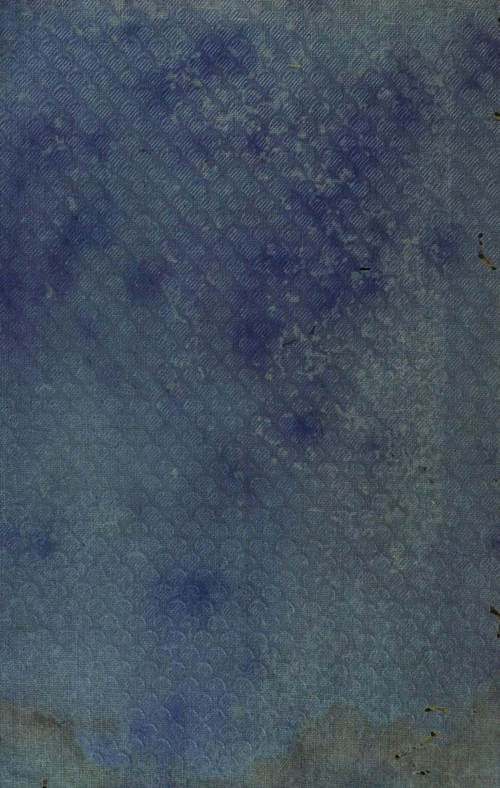The image shows a close-up of a textured fabric surface, likely a book cover or endpaper. The fabric is primarily a deep blue color with a repeating pattern of small, light-colored (off-white or pale blue) geometric shapes, possibly hexagons or diamonds, arranged in a grid-like fashion. The pattern is subtle and fades into the blue background. There are several small, dark, irregular spots and marks scattered across the surface, particularly on the right side and bottom, which appear to be signs of wear, dirt, or damage. The overall texture is fine and woven, typical of bookbinding materials.