630.5  
TAG  
V.47

1------------------------------------------------

2------------------------------------------------

3------------------------------------------------

4------------------------------------------------

GOVERNMENT BOTANICAL GARDENS

LIBRARY.

Section.....

No.....

The  
— Tropical —  
Agriculturist:

Founded 1881

Vol. LVII.

.....

Containing Numbers I to VI  
July to December, 1921.

Cave, Colombo,

5------------------------------------------------

# INDEX.

## A

<table style="width: 100%; border-collapse: collapse;">
<thead>
<tr>
<th style="text-align: left;"></th>
<th style="text-align: right;">Page</th>
</tr>
</thead>
<tbody>
<tr>
<td>Adlay—A New Grain ...</td>
<td style="text-align: right;">43</td>
</tr>
<tr>
<td>Agricultural Competitions in the Galle District ...</td>
<td style="text-align: right;">391</td>
</tr>
<tr>
<td>Agricultural Development ...</td>
<td style="text-align: right;">141</td>
</tr>
<tr>
<td>Agricultural Education in the Philippines ...</td>
<td style="text-align: right;">131</td>
</tr>
<tr>
<td>Agricultural Industries of Ceylon, Scientific Research and Investigation in regard to the ...</td>
<td style="text-align: right;">153</td>
</tr>
<tr>
<td>Agricultural Practice and Economics in the United Provinces ...</td>
<td style="text-align: right;">69</td>
</tr>
<tr>
<td>Agricultural Research Station ...</td>
<td style="text-align: right;">165</td>
</tr>
<tr>
<td>Agricultural Schools in Alberta, Canada ...</td>
<td style="text-align: right;">206</td>
</tr>
<tr>
<td>Agricultural Shows, Educational Exhibits at ...</td>
<td style="text-align: right;">209</td>
</tr>
<tr>
<td>Agriculture in Assam ...</td>
<td style="text-align: right;">47</td>
</tr>
<tr>
<td>Algaroba Beans, Carob and Analyses of Ceylon Limes ..</td>
<td style="text-align: right;">135</td>
</tr>
<tr>
<td>Animal Disease Return for the Month ended 30th June, 1921 ...</td>
<td style="text-align: right;">72</td>
</tr>
<tr>
<td>Animal Disease Return for the Month ended 31st July, 1921 ...</td>
<td style="text-align: right;">140</td>
</tr>
<tr>
<td>Animal Disease Return for the Month ended 31st August, 1921 ...</td>
<td style="text-align: right;">208</td>
</tr>
<tr>
<td>Animal Disease Return for the Month ended 30th September, 1921 ...</td>
<td style="text-align: right;">276</td>
</tr>
<tr>
<td>Animal Disease Return for the Month ended 31st October, 1921 ...</td>
<td style="text-align: right;">340</td>
</tr>
<tr>
<td>Animal Disease Return for the Month ended 30th November, 1921 ..</td>
<td style="text-align: right;">404</td>
</tr>
<tr>
<td>Assam, Agriculture in ...</td>
<td style="text-align: right;">47</td>
</tr>
<tr>
<td>Awards 1920-21, School and Home Gardens ...</td>
<td style="text-align: right;">321</td>
</tr>
<tr>
<td colspan="2" style="text-align: center;"><b>B</b></td>
</tr>
<tr>
<td>Bad Bee-keeping Practice ...</td>
<td style="text-align: right;">271</td>
</tr>
<tr>
<td>Bananas and other Fruits, Preservation of ...</td>
<td style="text-align: right;">67</td>
</tr>
<tr>
<td>Bast Examination of <i>Hevea</i> Plants from Selected Seed, Tapping Tests and ...</td>
<td style="text-align: right;">83</td>
</tr>
<tr>
<td>Beans, Moki Lima ...</td>
<td style="text-align: right;">357</td>
</tr>
<tr>
<td>Bee-keepers' Association for 1914-21, Financial Statement of Ceylon ...</td>
<td style="text-align: right;">269</td>
</tr>
<tr>
<td>Bee-keepers' Association, Minutes of Meeting of Ceylon ...</td>
<td style="text-align: right;">270</td>
</tr>
<tr>
<td>Bee keepers' Association, Report of the Secretary, Ceylon ...</td>
<td style="text-align: right;">266</td>
</tr>
<tr>
<td>Bee-keeping in Palestine ...</td>
<td style="text-align: right;">271</td>
</tr>
<tr>
<td>Bee-keeping Notes ...</td>
<td style="text-align: right;">397</td>
</tr>
<tr>
<td>Bee-keeping Practice, Bad ...</td>
<td style="text-align: right;">271</td>
</tr>
<tr>
<td>Bee-keeping, Prizes for ...</td>
<td style="text-align: right;">61</td>
</tr>
<tr>
<td>Bee-keeping, Talks to Beginners on</td>
<td style="text-align: right;">202</td>
</tr>
<tr>
<td>Bees and Fruit ...</td>
<td style="text-align: right;">61</td>
</tr>
<tr>
<td>Bees, Uniting Colonies of ...</td>
<td style="text-align: right;">333</td>
</tr>
<tr>
<td>Bees, the Dutch ...</td>
<td style="text-align: right;">395</td>
</tr>
<tr>
<td>Beeswax: Methods of Extraction, and the Prevention of Waste ...</td>
<td style="text-align: right;">330</td>
</tr>
<tr>
<td>Board of Agriculture, Minutes of Meeting of the ...</td>
<td style="text-align: right;">245</td>
</tr>
<tr>
<td>Board of Agriculture, Minutes of Meeting of Estate Products Committee of the ...</td>
<td style="text-align: right;">96, 246, 382</td>
</tr>
</tbody>
</table>

## B—Contd.

<table style="width: 100%; border-collapse: collapse;">
<thead>
<tr>
<th style="text-align: left;"></th>
<th style="text-align: right;">Page</th>
</tr>
</thead>
<tbody>
<tr>
<td>Board of Agriculture, Minutes of Meeting of Food Products Committee of the ...</td>
<td style="text-align: right;">30, 252</td>
</tr>
<tr>
<td>Botanist and Mycologist for the 3rd Quarter, 1921, Report of the ...</td>
<td style="text-align: right;">318</td>
</tr>
<tr>
<td>Breeding Disease-Resistant Plants ...</td>
<td style="text-align: right;">337</td>
</tr>
<tr>
<td>Brown Bast ...</td>
<td style="text-align: right;">371</td>
</tr>
<tr>
<td>Budding and Grafting of Rubber ...</td>
<td style="text-align: right;">343</td>
</tr>
<tr>
<td>"Bunchy Top" Plantain Disease ...</td>
<td style="text-align: right;">374</td>
</tr>
</tbody>
</table>

## C

<table style="width: 100%; border-collapse: collapse;">
<tbody>
<tr>
<td>Carob and Algaroba Beans ...</td>
<td style="text-align: right;">135</td>
</tr>
<tr>
<td>Casuarina Topes ...</td>
<td style="text-align: right;">401</td>
</tr>
<tr>
<td>Cattle in Jamaica ...</td>
<td style="text-align: right;">178</td>
</tr>
<tr>
<td>Ceylon Agricultural Society, Minutes of Meeting of the ...</td>
<td style="text-align: right;">95</td>
</tr>
<tr>
<td>Ceylon Agricultural Society, Progress Report of the ...</td>
<td style="text-align: right;">102</td>
</tr>
<tr>
<td>Ceylon Agricultural Society, Report of the Special Sub-Committee of the ...</td>
<td style="text-align: right;">110</td>
</tr>
<tr>
<td>Ceylon Agricultural Society for 1920, Statement of Receipts and Expenditure of the ...</td>
<td style="text-align: right;">70</td>
</tr>
<tr>
<td>Changes in Manure during Storage</td>
<td style="text-align: right;">264</td>
</tr>
<tr>
<td>Cholam (<i>Sorghum vulgare</i>) Variety Trials at Anuradhapura and Jaffna ...</td>
<td style="text-align: right;">173</td>
</tr>
<tr>
<td>Cloves, Zanzibar ...</td>
<td style="text-align: right;">94</td>
</tr>
<tr>
<td>Coal Tar on the Renewing Bark of <i>Hevea Brasiliensis</i>, Concerning the Influence of ...</td>
<td style="text-align: right;">347</td>
</tr>
<tr>
<td>Coconut Cultivation in 1881 and in 1921 ...</td>
<td style="text-align: right;">119</td>
</tr>
<tr>
<td>Coconut Cultivation, Report of the Government Entomologist on his Visit to Batticaloa in Connection with the Pests of ...</td>
<td style="text-align: right;">124</td>
</tr>
<tr>
<td>Coconut Estates, Use of Tractors on</td>
<td style="text-align: right;">1</td>
</tr>
<tr>
<td>Coconut Trial Grounds, Chilaw ..</td>
<td style="text-align: right;">234</td>
</tr>
<tr>
<td>Coconuts, Insect Pests of ...</td>
<td style="text-align: right;">56</td>
</tr>
<tr>
<td>Coffee, Liberian ...</td>
<td style="text-align: right;">37</td>
</tr>
<tr>
<td>Coffee, Mixed Cultivation of <i>Hevea</i> and Robusta ...</td>
<td style="text-align: right;">145</td>
</tr>
<tr>
<td>Coffee under Shade ...</td>
<td style="text-align: right;">84</td>
</tr>
<tr>
<td>Competitions in the Galle District, Agricultural ...</td>
<td style="text-align: right;">391</td>
</tr>
<tr>
<td>Competitions in the Galle District, 1921, Vegetable Gardens ...</td>
<td style="text-align: right;">63</td>
</tr>
<tr>
<td>Competitions in Uva, Paddy Fields and Vegetable Gardens ...</td>
<td style="text-align: right;">329</td>
</tr>
<tr>
<td>Competitions, Rules Governing the Awards of Prizes in Vegetable Gardens ...</td>
<td style="text-align: right;">62</td>
</tr>
<tr>
<td>Concerning the Influence of Coal Tar on the Renewing Bark of <i>Hevea Brasiliensis</i> ...</td>
<td style="text-align: right;">347</td>
</tr>
<tr>
<td>Co-operative Credit Societies, Report on the Training Classes for Honorary Secretaries and other Workers of ...</td>
<td style="text-align: right;">334</td>
</tr>
<tr>
<td>Co-operative Credit Society, Karaveddi ...</td>
<td style="text-align: right;">399</td>
</tr>
</tbody>
</table>

6------------------------------------------------

# INDEX.—Contd.

<table style="width: 100%; border-collapse: collapse;">
<thead>
<tr>
<th style="text-align: left;"><b>C—Contd.</b></th>
<th style="text-align: right;">Page</th>
</tr>
</thead>
<tbody>
<tr>
<td>Co-operative Societies Ordinance No. 34 of 1921 ...</td>
<td style="text-align: right;">396</td>
</tr>
<tr>
<td>Cotton Soils in Mannar District ...</td>
<td style="text-align: right;">259</td>
</tr>
<tr>
<td>Crop Production, Science and ...</td>
<td style="text-align: right;">362</td>
</tr>
<tr>
<td>Crop Records of Oil Palms ...</td>
<td style="text-align: right;">87</td>
</tr>
<tr>
<td>Cultivation, Intensive ...</td>
<td style="text-align: right;">273</td>
</tr>
<tr>
<td>Cultivation of Limes ...</td>
<td style="text-align: right;">73, 284</td>
</tr>
<tr>
<td>Cultivation of Pine-apples ...</td>
<td style="text-align: right;">348</td>
</tr>
<tr>
<td>Cultivation of Pine-apples in Ceylon ...</td>
<td style="text-align: right;">341</td>
</tr>
<tr>
<td>Cultivation of Vegetables in Harispattu ...</td>
<td style="text-align: right;">225</td>
</tr>
<tr>
<td>Cuttings, Sand as a Medium for Propagating ...</td>
<td style="text-align: right;">339</td>
</tr>
</tbody>
</table>

<table style="width: 100%; border-collapse: collapse;">
<thead>
<tr>
<th style="text-align: left;"><b>D</b></th>
<th style="text-align: right;">Page</th>
</tr>
</thead>
<tbody>
<tr>
<td>Defects in Crepe Rubber ...</td>
<td style="text-align: right;">221</td>
</tr>
<tr>
<td>Defects in Prepared Rubber ...</td>
<td style="text-align: right;">217</td>
</tr>
<tr>
<td>Destructive Insects and Pests Order (U.K.) of 1921 : Ministry of Agriculture and Fisheries ...</td>
<td style="text-align: right;">376</td>
</tr>
<tr>
<td>Development, Agricultural ...</td>
<td style="text-align: right;">141</td>
</tr>
<tr>
<td>Disease, "Bunchy Top" Plantain ...</td>
<td style="text-align: right;">374</td>
</tr>
<tr>
<td>Disease Return for the Month ended 30th June, 1921, Animal ...</td>
<td style="text-align: right;">72</td>
</tr>
<tr>
<td>Disease Return for the Month ended 31st July, 1921, Animal ...</td>
<td style="text-align: right;">140</td>
</tr>
<tr>
<td>Disease Return for the Month ended 31st August, 1921, Animal ...</td>
<td style="text-align: right;">208</td>
</tr>
<tr>
<td>Disease Return for the Month ended 30th September, 1921, Animal ...</td>
<td style="text-align: right;">276</td>
</tr>
<tr>
<td>Disease Return for the Month ended 31st October, 1921 ...</td>
<td style="text-align: right;">340</td>
</tr>
<tr>
<td>Disease Return for the Month ended 30th November, 1921 ...</td>
<td style="text-align: right;">404</td>
</tr>
<tr>
<td>Diseases and Pests of Rubber Tree ...</td>
<td style="text-align: right;">68</td>
</tr>
<tr>
<td>Diseases in Ceylon, Plant Pests and... Division of Entomology, April-June, 1921. Report of the ...</td>
<td style="text-align: right;">192</td>
</tr>
<tr>
<td>Dry Weather, Mulching insures Moisture during the ...</td>
<td style="text-align: right;">66</td>
</tr>
<tr>
<td>Dutch Bee, The ...</td>
<td style="text-align: right;">395</td>
</tr>
</tbody>
</table>

<table style="width: 100%; border-collapse: collapse;">
<thead>
<tr>
<th style="text-align: left;"><b>E</b></th>
<th style="text-align: right;">Page</th>
</tr>
</thead>
<tbody>
<tr>
<td>Economics in the United Provinces, Agricultural Practices and ...</td>
<td style="text-align: right;">69</td>
</tr>
<tr>
<td>Education in the Philippines, Agricultural ...</td>
<td style="text-align: right;">131</td>
</tr>
<tr>
<td>Educational Exhibits at Agricultural Shows ...</td>
<td style="text-align: right;">209</td>
</tr>
<tr>
<td>Effect of Temperature on the Loss from Canals due to Infiltration...</td>
<td style="text-align: right;">181</td>
</tr>
<tr>
<td>Effect of the Drought on Fertilisers in the Soil ...</td>
<td style="text-align: right;">370</td>
</tr>
<tr>
<td>Entomology, April-June, 1921, Report of the Division of ...</td>
<td style="text-align: right;">194</td>
</tr>
<tr>
<td>Entomologist, July-September, 1921, Progress Report of the ...</td>
<td style="text-align: right;">194</td>
</tr>
<tr>
<td>Estate Products Committee of the Board of Agriculture, Minutes of Meeting of the ...</td>
<td style="text-align: right;">96, 246, 319</td>
</tr>
<tr>
<td>Estimates, Lime Cultivation ...</td>
<td style="text-align: right;">303</td>
</tr>
<tr>
<td>Experiment Station, Peradeniya, Progress Report of the ...</td>
<td style="text-align: right;">121, 256, 389</td>
</tr>
<tr>
<td>Experiments, Sweet Potato Varietal ...</td>
<td style="text-align: right;">174</td>
</tr>
</tbody>
</table>

<table style="width: 100%; border-collapse: collapse;">
<thead>
<tr>
<th style="text-align: left;"><b>F</b></th>
<th style="text-align: right;">Page</th>
</tr>
</thead>
<tbody>
<tr>
<td>Fertilisers in the Soil, Effect of the Drought on ...</td>
<td style="text-align: right;">370</td>
</tr>
</tbody>
</table>

<table style="width: 100%; border-collapse: collapse;">
<thead>
<tr>
<th style="text-align: left;"><b>F—Contd</b></th>
<th style="text-align: right;">Page</th>
</tr>
</thead>
<tbody>
<tr>
<td>Financial Statement of the Ceylon Beekeepers' Association for 1919-21</td>
<td style="text-align: right;">269</td>
</tr>
<tr>
<td>Flowering of Plants and the Length of Day ...</td>
<td style="text-align: right;">400</td>
</tr>
<tr>
<td>Food Production Committee, Minutes of Meeting of the Galle ...</td>
<td style="text-align: right;">172</td>
</tr>
<tr>
<td>Food Production Committee, Minutes of Meeting of the Kalutara ...</td>
<td style="text-align: right;">170</td>
</tr>
<tr>
<td>Food Production Committee, Minutes of Meeting of the Kandy ...</td>
<td style="text-align: right;">35</td>
</tr>
<tr>
<td>Food Production Committee, Minutes of Meeting of the Kegalle ...</td>
<td style="text-align: right;">102</td>
</tr>
<tr>
<td>Food Production Committee, Minutes of Meeting of the Matale ...</td>
<td style="text-align: right;">35, 388</td>
</tr>
<tr>
<td>Food Production Committee, Minutes of Meeting of the Matara ...</td>
<td style="text-align: right;">36, 255</td>
</tr>
<tr>
<td>Food Production Committee, Minutes of Meeting of the Trincomalee ..</td>
<td style="text-align: right;">254</td>
</tr>
<tr>
<td>Food Products Committee of the Board of Agriculture. Minutes of Meeting of the ...</td>
<td style="text-align: right;">30, 252</td>
</tr>
<tr>
<td>Fruit Trees and their Root Treatment</td>
<td style="text-align: right;">306</td>
</tr>
<tr>
<td>Fruits, Bees and ...</td>
<td style="text-align: right;">61</td>
</tr>
<tr>
<td>Fruits, Manure of Tropical and Sub-Tropical ...</td>
<td style="text-align: right;">69</td>
</tr>
<tr>
<td>Fruits, Preservation of Bananas and other ...</td>
<td style="text-align: right;">67</td>
</tr>
<tr>
<td>Fungicides, Insecticides and ...</td>
<td style="text-align: right;">378</td>
</tr>
<tr>
<td>Future Policy of Planting of Rubber</td>
<td style="text-align: right;">279</td>
</tr>
</tbody>
</table>

<table style="width: 100%; border-collapse: collapse;">
<thead>
<tr>
<th style="text-align: left;"><b>G</b></th>
<th style="text-align: right;">Page</th>
</tr>
</thead>
<tbody>
<tr>
<td>Galle District, Agricultural Competitions in the ...</td>
<td style="text-align: right;">391</td>
</tr>
<tr>
<td>Galle Food Production Committee, Minutes of Meeting of the ...</td>
<td style="text-align: right;">172</td>
</tr>
<tr>
<td>Grafting of Rubber, Budding and ...</td>
<td style="text-align: right;">343</td>
</tr>
<tr>
<td>Grain, Adlay—a New ...</td>
<td style="text-align: right;">43</td>
</tr>
</tbody>
</table>

<table style="width: 100%; border-collapse: collapse;">
<thead>
<tr>
<th style="text-align: left;"><b>H</b></th>
<th style="text-align: right;">Page</th>
</tr>
</thead>
<tbody>
<tr>
<td>Helopeltis, Tea ...</td>
<td style="text-align: right;">59</td>
</tr>
<tr>
<td>Hevea and Robusta Coffee, Mixed Cultivation of ...</td>
<td style="text-align: right;">145</td>
</tr>
<tr>
<td>Hevea Brasiliensis, Concerning the Influence of Coal-tar on the Renewing Bark of ...</td>
<td style="text-align: right;">347</td>
</tr>
<tr>
<td>Hevea Brasiliensis, Investigations Concerning Origin of Latex of ...</td>
<td style="text-align: right;">152</td>
</tr>
<tr>
<td>Hevea Brasiliensis, Tapping Experiments on ...</td>
<td style="text-align: right;">82</td>
</tr>
<tr>
<td>Hevea Plants from Selected Seed, Tapping Tests and Bast Examination of ...</td>
<td style="text-align: right;">83</td>
</tr>
<tr>
<td>Home Garden Awards 1920-1921, School and ...</td>
<td style="text-align: right;">321</td>
</tr>
</tbody>
</table>

<table style="width: 100%; border-collapse: collapse;">
<thead>
<tr>
<th style="text-align: left;"><b>I</b></th>
<th style="text-align: right;">Page</th>
</tr>
</thead>
<tbody>
<tr>
<td>Importation of Sugar-cane into British India by Sea ..</td>
<td style="text-align: right;">381</td>
</tr>
<tr>
<td>Improvement of Rice by Selection and Hybridisation in Java ...</td>
<td style="text-align: right;">232</td>
</tr>
<tr>
<td>Infiltration, Effect of Temperature on the Loss from Canals due to ...</td>
<td style="text-align: right;">181</td>
</tr>
<tr>
<td>Insect Pests of Coconuts ...</td>
<td style="text-align: right;">56</td>
</tr>
<tr>
<td>Insects and Pests Order (U.K.) of 1921, Destructive : Ministry of Agriculture and Fisheries ...</td>
<td style="text-align: right;">376</td>
</tr>
<tr>
<td>Insecticides and Fungicides ...</td>
<td style="text-align: right;">378</td>
</tr>
<tr>
<td>Intensive Cultivation ...</td>
<td style="text-align: right;">273</td>
</tr>
</tbody>
</table>

2

7------------------------------------------------

# INDEX.—Contd.

## I.—Contd.

## M.—Contd.

<table style="width: 100%; border-collapse: collapse;">
<thead>
<tr>
<th style="text-align: left;"></th>
<th style="text-align: right;">Page</th>
</tr>
</thead>
<tbody>
<tr>
<td>Investigation in regard to Agricultural Industries of Ceylon, Scientific Research and ...</td>
<td style="text-align: right; vertical-align: bottom;">153</td>
</tr>
<tr>
<td>Investigations Concerning the Origin of Latex of Hevea Brasiliensis ...</td>
<td style="text-align: right; vertical-align: bottom;">152</td>
</tr>
</tbody>
</table>

### K

<table style="width: 100%; border-collapse: collapse;">
<tbody>
<tr>
<td>Kalutara Food Production Committee, Minutes of Meeting of the ...</td>
<td style="text-align: right; vertical-align: bottom;">170</td>
</tr>
<tr>
<td>Kandy Food Production Committee, Minutes of Meeting of the ...</td>
<td style="text-align: right; vertical-align: bottom;">35</td>
</tr>
<tr>
<td>Karaveddi Co-operative Credit Society ...</td>
<td style="text-align: right; vertical-align: bottom;">399</td>
</tr>
<tr>
<td>Kegalle Food Production Committee, Minutes of Meeting of the ...</td>
<td style="text-align: right; vertical-align: bottom;">102</td>
</tr>
<tr>
<td>Kurakkan as a Garden Crop ...</td>
<td style="text-align: right; vertical-align: bottom;">361</td>
</tr>
</tbody>
</table>

### L

<table style="width: 100%; border-collapse: collapse;">
<tbody>
<tr>
<td>Latex of Hevea Brasiliensis, Investigations concerning the Origin of Liberian Coffee ...</td>
<td style="text-align: right; vertical-align: bottom;">152 37</td>
</tr>
<tr>
<td>Lime as a Factor in Soil Improvement ...</td>
<td style="text-align: right; vertical-align: bottom;">50</td>
</tr>
<tr>
<td>Lime Cultivation Estimates ...</td>
<td style="text-align: right; vertical-align: bottom;">303</td>
</tr>
<tr>
<td>Lime to Soil Fertility, Relation of Lime, Cultivation of ...</td>
<td style="text-align: right; vertical-align: bottom;">182 73, 284</td>
</tr>
<tr>
<td>Limes ...</td>
<td style="text-align: right; vertical-align: bottom;">277</td>
</tr>
<tr>
<td>Limes, Analyses of Ceylon ...</td>
<td style="text-align: right; vertical-align: bottom;">298</td>
</tr>
</tbody>
</table>

### M

<table style="width: 100%; border-collapse: collapse;">
<tbody>
<tr>
<td>Manual of Tropical and Sub-Tropical Fruits ...</td>
<td style="text-align: right; vertical-align: bottom;">69</td>
</tr>
<tr>
<td>Manure during Storage, Changes in Manure on Tea, Trial of Nitrogenous Manuring of Pine-apples in Queensland, Notes on the ...</td>
<td style="text-align: right; vertical-align: bottom;">264 211 315</td>
</tr>
<tr>
<td>Manuring Experimental Plots for the Maha Season 1920 and 1921, Report on the Paddy ...</td>
<td style="text-align: right; vertical-align: bottom;">9</td>
</tr>
<tr>
<td>Manures, Phosphatic: The Present Position ...</td>
<td style="text-align: right; vertical-align: bottom;">54</td>
</tr>
<tr>
<td>Manures, Production of Artificial Farmyard ...</td>
<td style="text-align: right; vertical-align: bottom;">369</td>
</tr>
<tr>
<td>Manures, Storage of Artificial ...</td>
<td style="text-align: right; vertical-align: bottom;">187</td>
</tr>
<tr>
<td>Matale Food Production Committee, Minutes of Meeting of the ...</td>
<td style="text-align: right; vertical-align: bottom;">35, 388</td>
</tr>
<tr>
<td>Matara Food Production Committee, Minutes of Meeting of the ...</td>
<td style="text-align: right; vertical-align: bottom;">36, 255</td>
</tr>
<tr>
<td>Meteorological Return for June, 1921 ...</td>
<td style="text-align: right; vertical-align: bottom;">72</td>
</tr>
<tr>
<td>Meteorological Return for July, 1921 ...</td>
<td style="text-align: right; vertical-align: bottom;">140</td>
</tr>
<tr>
<td>Meteorological Return for August, 1921 ...</td>
<td style="text-align: right; vertical-align: bottom;">208</td>
</tr>
<tr>
<td>Meteorological Return for September, 1921 ...</td>
<td style="text-align: right; vertical-align: bottom;">276</td>
</tr>
<tr>
<td>Meteorological Return for October, 1921 ...</td>
<td style="text-align: right; vertical-align: bottom;">340</td>
</tr>
<tr>
<td>Meteorological Return for November, 1921 ...</td>
<td style="text-align: right; vertical-align: bottom;">404</td>
</tr>
<tr>
<td>Minutes of Meeting of the Board of Agriculture ...</td>
<td style="text-align: right; vertical-align: bottom;">245</td>
</tr>
<tr>
<td>Minutes of Meeting of the Ceylon Agricultural Society ...</td>
<td style="text-align: right; vertical-align: bottom;">95</td>
</tr>
<tr>
<td>Minutes of Meeting of the Ceylon Bee-keepers' Association ...</td>
<td style="text-align: right; vertical-align: bottom;">270</td>
</tr>
<tr>
<td>Minutes of Meeting of the Estate Products Committee of the Board of Agriculture ...</td>
<td style="text-align: right; vertical-align: bottom;">96, 246, 382</td>
</tr>
</tbody>
</table>

<table style="width: 100%; border-collapse: collapse;">
<tbody>
<tr>
<td>Minutes of Meeting of Food Products Committee of the Board of Agriculture ...</td>
<td style="text-align: right; vertical-align: bottom;">30, 252</td>
</tr>
<tr>
<td>Minutes of Meeting of Galle Food Production Committee ...</td>
<td style="text-align: right; vertical-align: bottom;">172</td>
</tr>
<tr>
<td>Minutes of Meeting of Kalutara Food Production Committee ...</td>
<td style="text-align: right; vertical-align: bottom;">170</td>
</tr>
<tr>
<td>Minutes of Meeting of Kandy Food Production Committee ...</td>
<td style="text-align: right; vertical-align: bottom;">35</td>
</tr>
<tr>
<td>Minutes of Meeting of Kegalle Food Production Committee ...</td>
<td style="text-align: right; vertical-align: bottom;">102</td>
</tr>
<tr>
<td>Minutes of Meeting of Matale Food Production Committee ...</td>
<td style="text-align: right; vertical-align: bottom;">35, 388</td>
</tr>
<tr>
<td>Minutes of Meeting of Matara Food Production Committee ...</td>
<td style="text-align: right; vertical-align: bottom;">36, 255</td>
</tr>
<tr>
<td>Minutes of Meeting of Trincomalie Food Production Committee ...</td>
<td style="text-align: right; vertical-align: bottom;">254</td>
</tr>
<tr>
<td>Mixed Cultivation of Hevea and Robusta Coffee ...</td>
<td style="text-align: right; vertical-align: bottom;">145</td>
</tr>
<tr>
<td>Moisture during the Dry Weather, Mulching Insures ...</td>
<td style="text-align: right; vertical-align: bottom;">66</td>
</tr>
<tr>
<td>Moki Lima Beans ...</td>
<td style="text-align: right; vertical-align: bottom;">357</td>
</tr>
<tr>
<td>Mulching ...</td>
<td style="text-align: right; vertical-align: bottom;">402</td>
</tr>
<tr>
<td>Mulching Insures Moisture during the Dry Weather ...</td>
<td style="text-align: right; vertical-align: bottom;">66</td>
</tr>
</tbody>
</table>

### N

<table style="width: 100%; border-collapse: collapse;">
<tbody>
<tr>
<td>Nitrogen Losses in Urine ...</td>
<td style="text-align: right; vertical-align: bottom;">181</td>
</tr>
<tr>
<td>Notes and Observations on Sravasti Estate (Nachchaduwa Scheme), Anuradhapura, Some ...</td>
<td style="text-align: right; vertical-align: bottom;">26</td>
</tr>
<tr>
<td>Notes, on Bee-keeping ...</td>
<td style="text-align: right; vertical-align: bottom;">393</td>
</tr>
<tr>
<td>Notes on the Manuring of Pine-apples in Queensland ...</td>
<td style="text-align: right; vertical-align: bottom;">315</td>
</tr>
</tbody>
</table>

### O

<table style="width: 100%; border-collapse: collapse;">
<tbody>
<tr>
<td>Observations on Sravasti Estate (Nachchaduwa Scheme), Anuradhapura, Some Notes on ...</td>
<td style="text-align: right; vertical-align: bottom;">26</td>
</tr>
<tr>
<td>Oil Palms, Crop Records of ...</td>
<td style="text-align: right; vertical-align: bottom;">87</td>
</tr>
<tr>
<td>Onion ...</td>
<td style="text-align: right; vertical-align: bottom;">227</td>
</tr>
<tr>
<td>Ordinance No. 34 of 1921, Co-operative Societies ...</td>
<td style="text-align: right; vertical-align: bottom;">396</td>
</tr>
<tr>
<td>Organic Matter for the Soil ...</td>
<td style="text-align: right; vertical-align: bottom;">187</td>
</tr>
</tbody>
</table>

### P

<table style="width: 100%; border-collapse: collapse;">
<tbody>
<tr>
<td>Paddy Fields and Vegetable Gardens Competitions in Uva ...</td>
<td style="text-align: right; vertical-align: bottom;">329</td>
</tr>
<tr>
<td>Paddy Manuring Experimental Plots for the Maha Season 1920 and 1921, Report on the ...</td>
<td style="text-align: right; vertical-align: bottom;">9</td>
</tr>
<tr>
<td>Pests and Diseases in Ceylon, Plant Pests of Coconuts, Insect ...</td>
<td style="text-align: right; vertical-align: bottom;">192 56</td>
</tr>
<tr>
<td>Pests of Coconut Cultivation, Report of the Government Entomologist on his Visit to Batticaloa in connection with ...</td>
<td style="text-align: right; vertical-align: bottom;">124</td>
</tr>
<tr>
<td>Pests Order (U.K.) of 1921, Destructive Insects and: Ministry of Agriculture and Fisheries ...</td>
<td style="text-align: right; vertical-align: bottom;">376</td>
</tr>
<tr>
<td>Pests of the Rubber Tree, Diseases and ...</td>
<td style="text-align: right; vertical-align: bottom;">68</td>
</tr>
<tr>
<td>Phosphatic Manures: The Present Position ...</td>
<td style="text-align: right; vertical-align: bottom;">54</td>
</tr>
<tr>
<td>Physical Investigation of Soils ...</td>
<td style="text-align: right; vertical-align: bottom;">183</td>
</tr>
<tr>
<td>Pine-apples in Ceylon, Cultivation of Pine-apples in Queensland, Notes on the Manuring of ...</td>
<td style="text-align: right; vertical-align: bottom;">341 315</td>
</tr>
</tbody>
</table>

3

8------------------------------------------------

## INDEX.—Contd.

<table style="width: 100%; border-collapse: collapse;">
<thead>
<tr>
<th style="text-align: left; width: 50%;"></th>
<th style="text-align: right; width: 25%;">Page</th>
<th style="text-align: left; width: 50%;"></th>
<th style="text-align: right; width: 25%;">Page</th>
</tr>
</thead>
<tbody>
<tr>
<td colspan="2" style="text-align: center;"><b>P—Contd.</b></td>
<td colspan="2" style="text-align: center;"><b>R—Contd.</b></td>
</tr>
<tr>
<td>Pine-apples, the Cultivation of ...</td>
<td style="text-align: right;">348</td>
<td>Rubber, Future Policy of Planting of Rubber (<i>Hevea Brasiliensis</i>) Investigations Concerning the Origin of Latex ...</td>
<td style="text-align: right;">279</td>
</tr>
<tr>
<td>Plant Growth, Potassium and ...</td>
<td style="text-align: right;">52</td>
<td>... of Latex ...</td>
<td style="text-align: right;">152</td>
</tr>
<tr>
<td>Plant Pests and Diseases in Ceylon Plants, Breeding Disease-Resistant Plants and Length of Day, Flowering of ...</td>
<td style="text-align: right;">192 337 400</td>
<td>Rubber (<i>Hevea</i>) Plants from Selected Seed, Tapping Tests and Bast Examination of ...</td>
<td style="text-align: right;">83</td>
</tr>
<tr>
<td>Potassium and Plant Growth ...</td>
<td style="text-align: right;">52</td>
<td>Rubber, Selective Cultivation of ...</td>
<td style="text-align: right;">143</td>
</tr>
<tr>
<td>Poultry Keeping in Porto Rico ...</td>
<td style="text-align: right;">195</td>
<td>Rubber (<i>Hevea Brasiliensis</i>), Tapping Experiments on ...</td>
<td style="text-align: right;">82</td>
</tr>
<tr>
<td>Preservation of Bananas and other Fruits ...</td>
<td style="text-align: right;">67</td>
<td>Rubber, Thinning out of ...</td>
<td style="text-align: right;">75</td>
</tr>
<tr>
<td>Prize Giving, School of Tropical Agriculture, Peradeniya: Opening of New Buildings and ...</td>
<td style="text-align: right;">236</td>
<td>Rubber Tree, Diseases and Pests of the ...</td>
<td style="text-align: right;">68</td>
</tr>
<tr>
<td>Prizes for Bee-keeping ...</td>
<td style="text-align: right;">61</td>
<td>Rubber Trees, Yield from Individual Rubber Yield Calculations ...</td>
<td style="text-align: right;">81 149</td>
</tr>
<tr>
<td>Prizes in Vegetable Gardens Competition, Rules Governing the Awards of ...</td>
<td style="text-align: right;">62</td>
<td>Rules Governing the Award of Prizes in Vegetable Gardens Competitions ...</td>
<td style="text-align: right;">62</td>
</tr>
<tr>
<td>Production of Artificial Farmyard Manures ...</td>
<td style="text-align: right;">369</td>
<td colspan="2" style="text-align: center;"><b>S</b></td>
</tr>
<tr>
<td>Progress Report of the Ceylon Agricultural Society ...</td>
<td style="text-align: right;">102</td>
<td>Sand as a Medium for Propagating Cuttings ...</td>
<td style="text-align: right;">339</td>
</tr>
<tr>
<td>Progress Report of the Entomologist, July to September 1921 ...</td>
<td style="text-align: right;">319</td>
<td>School and Home Garden Awards, 1920-21 ...</td>
<td style="text-align: right;">321</td>
</tr>
<tr>
<td>Progress Report of the Experiment Station, Peradeniya 121, 256, 389</td>
<td style="text-align: right;">389</td>
<td>School of Tropical Agriculture, Peradeniya: Opening of New Buildings and Prize Giving ...</td>
<td style="text-align: right;">236</td>
</tr>
<tr>
<td>Provisional Schedule of Agricultural Shows for the Southern Division</td>
<td style="text-align: right;">272</td>
<td>Schools in Alberta, Canada, Agricultural ...</td>
<td style="text-align: right;">206</td>
</tr>
<tr>
<td colspan="2" style="text-align: center;"><b>R</b></td>
<td>Science and Crop Production ...</td>
<td style="text-align: right;">362</td>
</tr>
<tr>
<td>Red Rust on Tea ...</td>
<td style="text-align: right;">188</td>
<td>Science of Stock Breeding ...</td>
<td style="text-align: right;">176</td>
</tr>
<tr>
<td>Relation of Lime to Soil Fertility ..</td>
<td style="text-align: right;">182</td>
<td>Scientific Research and Investigation in regard to the Agricultural Industries of Ceylon ...</td>
<td style="text-align: right;">153</td>
</tr>
<tr>
<td>Report of the Botanist and Mycologist for the Third Quarter 1921</td>
<td style="text-align: right;">318</td>
<td>Secretaries and other Workers of Co-operative Credit Societies, Report on the Training Classes for Honorary ...</td>
<td style="text-align: right;">334</td>
</tr>
<tr>
<td>Report of the Division of Entomology, April-June, 1921 ..</td>
<td style="text-align: right;">194</td>
<td>Selective Cultivation of Rubber ...</td>
<td style="text-align: right;">143</td>
</tr>
<tr>
<td>Report of the Government Entomologist on his Visit to Batticaloa in Connection with the Pests of Coconut Cultivation ..</td>
<td style="text-align: right;">124</td>
<td>Shows for the Southern Division, Provisional Schedule of Agricultural ...</td>
<td style="text-align: right;">272</td>
</tr>
<tr>
<td>Report of the Secretary, Ceylon Beekeepers' Association ..</td>
<td style="text-align: right;">266</td>
<td>Sisal Fibre in Jamaica, Yield of ...</td>
<td style="text-align: right;">207</td>
</tr>
<tr>
<td>Report of the Special Sub-Committee of the Ceylon Agricultural Society</td>
<td style="text-align: right;">110</td>
<td>Sisal, United States Grown ...</td>
<td style="text-align: right;">65</td>
</tr>
<tr>
<td>Report on the Paddy Manurial Experimental Plots for the Maha Season, 1920 and 1921 ...</td>
<td style="text-align: right;">9</td>
<td>Soil Analyses to the Farmer, the Value of ...</td>
<td style="text-align: right;">368</td>
</tr>
<tr>
<td>Report on the Training Classes for Honorary Secretaries and other Workers of Co-operative Credit Societies ...</td>
<td style="text-align: right;">334</td>
<td>Soil, Effect of the Drought on Fertilisers in the ...</td>
<td style="text-align: right;">370</td>
</tr>
<tr>
<td>Rice by Selection and Hybridisation in Java, Improvement of ..</td>
<td style="text-align: right;">232</td>
<td>Soil Fertility, Relation of Lime to ...</td>
<td style="text-align: right;">182</td>
</tr>
<tr>
<td>Rice Production, World's ...</td>
<td style="text-align: right;">138</td>
<td>Soil Improvement ...</td>
<td style="text-align: right;">312</td>
</tr>
<tr>
<td>Research and Investigations in Regard to Agricultural Industries of Ceylon, Scientific ...</td>
<td style="text-align: right;">153</td>
<td>Soil Improvement, Lime as a Factor in ...</td>
<td style="text-align: right;">50</td>
</tr>
<tr>
<td>Research Station, Agricultural ...</td>
<td style="text-align: right;">165</td>
<td>Soil, Organic Matter for the ...</td>
<td style="text-align: right;">187</td>
</tr>
<tr>
<td>Root Treatment, Fruit Trees and their ...</td>
<td style="text-align: right;">306</td>
<td>Soil Problems ...</td>
<td style="text-align: right;">185</td>
</tr>
<tr>
<td>Rubber (<i>Hevea</i>) and Robusta Coffee, Mixed Cultivation of ...</td>
<td style="text-align: right;">145</td>
<td>Soils in Mannar Disirict, Cotton ...</td>
<td style="text-align: right;">259</td>
</tr>
<tr>
<td>Rubber, Budding and Grafting of ...</td>
<td style="text-align: right;">343</td>
<td>Soils, Physical Investigations of ...</td>
<td style="text-align: right;">183</td>
</tr>
<tr>
<td>Rubber (<i>Hevea Brasiliensis</i>) Concerning the Influence of Coal Tar on the Renewing Bark of ...</td>
<td style="text-align: right;">347</td>
<td>Some Notes and Observations on Sravasti Estate (Nachchaduwa Scheme) Anuradhapura ...</td>
<td style="text-align: right;">26</td>
</tr>
<tr>
<td>Rubber, Defects in Crepe ...</td>
<td style="text-align: right;">221</td>
<td>Special Sub-Committee of the Ceylon Agricultural Society, Report of the ...</td>
<td style="text-align: right;">110</td>
</tr>
<tr>
<td>Rubber, Defects in Prepared ...</td>
<td style="text-align: right;">217</td>
<td>Sravasti Estate (Nachchaduwa Scheme), Anuradhapura, Some Notes and Observations on ...</td>
<td style="text-align: right;">26</td>
</tr>
<tr>
<td></td>
<td></td>
<td>Statement of Receipts and Expenditure of the Ceylon Agricultural Society for 1920 ...</td>
<td style="text-align: right;">70</td>
</tr>
</tbody>
</table>

4

9------------------------------------------------

## INDEX.—Contd.

<table style="width: 100%; border-collapse: collapse;">
<thead>
<tr>
<th style="text-align: left; width: 40%;"></th>
<th style="text-align: right; width: 10%;">Page</th>
<th style="text-align: left; width: 40%;"></th>
<th style="text-align: right; width: 10%;">Page</th>
</tr>
</thead>
<tbody>
<tr>
<td colspan="2" style="text-align: center;"><b>S—Contd.</b></td>
<td colspan="2" style="text-align: center;"><b>U</b></td>
</tr>
<tr>
<td>Stock Breeding, Science of ...</td>
<td style="text-align: right;">176</td>
<td>United States Grown, Sisal ...</td>
<td style="text-align: right;">65</td>
</tr>
<tr>
<td>Storage of Artificial Manures ...</td>
<td style="text-align: right;">187</td>
<td>Uniting Colonies of Bees ...</td>
<td style="text-align: right;">333</td>
</tr>
<tr>
<td>Storage Sweet Potatoes ...</td>
<td style="text-align: right;">175</td>
<td>Urine, Nitrogen Losses in ...</td>
<td style="text-align: right;">181</td>
</tr>
<tr>
<td>Sugar-cane into British India by Sea Importation of ...</td>
<td style="text-align: right;">381</td>
<td>Use of Tractors on Coconut Estates</td>
<td style="text-align: right;">1</td>
</tr>
<tr>
<td>Sweet Potato, Varietal Experiments</td>
<td style="text-align: right;">174</td>
<td></td>
<td></td>
</tr>
<tr>
<td>Sweet Potatoes, Storing ...</td>
<td style="text-align: right;">175</td>
<td></td>
<td></td>
</tr>
<tr>
<td colspan="2" style="text-align: center;"><b>T</b></td>
<td colspan="2" style="text-align: center;"><b>V</b></td>
</tr>
<tr>
<td>Talks to Beginners on Bee-keeping</td>
<td style="text-align: right;">202</td>
<td>Value of Soil Analyses to the Farmer</td>
<td style="text-align: right;">368</td>
</tr>
<tr>
<td>Tapping Experiments with Hevea Brasiliensis ...</td>
<td style="text-align: right;">82</td>
<td>Vegetable Gardens Competitions in Galle District, 1921 ...</td>
<td style="text-align: right;">63</td>
</tr>
<tr>
<td>Tapping Tests and Bast Examination of Hevea Plants from Selected Seed</td>
<td style="text-align: right;">83</td>
<td>Vegetable Gardens Competitions in Uva, Paddy Fields and ...</td>
<td style="text-align: right;">329</td>
</tr>
<tr>
<td>Tea, Helopeltis ...</td>
<td style="text-align: right;">59</td>
<td>Vegetable Gardens Competitions, Rules Governing the Award of Prizes in ...</td>
<td style="text-align: right;">62</td>
</tr>
<tr>
<td>Tea, Red Rust on ...</td>
<td style="text-align: right;">188</td>
<td>Vegetables in Harispattu, Cultivation of ...</td>
<td style="text-align: right;">225</td>
</tr>
<tr>
<td>Tea, Trials of Nitrogenous Manures</td>
<td style="text-align: right;">211</td>
<td></td>
<td></td>
</tr>
<tr>
<td>Thinning Out of Rubber ...</td>
<td style="text-align: right;">75</td>
<td></td>
<td></td>
</tr>
<tr>
<td>Tractor Trials in Ceylon, 1921 ...</td>
<td style="text-align: right;">3</td>
<td></td>
<td></td>
</tr>
<tr>
<td>Tractors on Coconut Estates, Use of Training Classes for Honorary Secre- taries and other Workers of Co- operative Credit Societies, Report on the ...</td>
<td style="text-align: right;">334</td>
<td></td>
<td></td>
</tr>
<tr>
<td>Trials of Nitrogenous Manures on Tea</td>
<td style="text-align: right;">211</td>
<td></td>
<td></td>
</tr>
<tr>
<td>Trincomalee Food Production Com- mittee, Minutes of Meeting of ...</td>
<td style="text-align: right;">254</td>
<td></td>
<td></td>
</tr>
<tr>
<td colspan="2"></td>
<td colspan="2" style="text-align: center;"><b>W</b></td>
</tr>
<tr>
<td colspan="2"></td>
<td>World's Rice Production ...</td>
<td style="text-align: right;">138</td>
</tr>
<tr>
<td colspan="2"></td>
<td colspan="2" style="text-align: center;"><b>Y</b></td>
</tr>
<tr>
<td colspan="2"></td>
<td>Yield from Individual Rubber Trees</td>
<td style="text-align: right;">81</td>
</tr>
<tr>
<td colspan="2"></td>
<td>Yield of Sisal Fibre in Jamaica ...</td>
<td style="text-align: right;">207</td>
</tr>
<tr>
<td colspan="2"></td>
<td colspan="2" style="text-align: center;"><b>Z</b></td>
</tr>
<tr>
<td colspan="2"></td>
<td>Zanzibar Cloves ...</td>
<td style="text-align: right;">94</td>
</tr>
</tbody>
</table>

### LIST OF ILLUSTRATIONS APPEARING IN Nos. 1-6 of VOL. LVII.

<table style="width: 100%; border-collapse: collapse;">
<thead>
<tr>
<th style="text-align: left; width: 40%;"></th>
<th style="text-align: right; width: 10%;">Page</th>
<th style="text-align: left; width: 40%;"></th>
<th style="text-align: right; width: 10%;">Page</th>
</tr>
</thead>
<tbody>
<tr>
<td>Tractor Trials, 1921 : The Old Method Buffalos and Plough ...</td>
<td style="text-align: right;">1</td>
<td>Agricultural School, Peradeniya ...</td>
<td style="text-align: right;">238</td>
</tr>
<tr>
<td>Tractor Trials, 1921 : Cletrac at Work- Ploughing ...</td>
<td style="text-align: right;">2</td>
<td>Agricultural School, Peradeniya, Millet in Students Plots ...</td>
<td style="text-align: right;">239</td>
</tr>
<tr>
<td>Tractor Trials, 1921 : Cletrac with Disc Harrow ..</td>
<td style="text-align: right;">2</td>
<td>Agricultural School, Peradeniya, First Year Students' Plots ...</td>
<td style="text-align: right;">239</td>
</tr>
<tr>
<td>Tractor Trials, 1921 : Nature of Work Done ...</td>
<td style="text-align: right;">3</td>
<td>Orchard of Mixed Citrus Fruits, Anu- radhapura Expt. Station ...</td>
<td style="text-align: right;">290</td>
</tr>
<tr>
<td>Tractor Trials, 1921 : Saunderson Tractor ...</td>
<td style="text-align: right;">4</td>
<td>Orchard of Limes 3½ years Old from British Guiana Seed at Anuradha- pura Experiment Station ...</td>
<td style="text-align: right;">291</td>
</tr>
<tr>
<td>Tractor Trials, 1921 : Cletrac Tractor</td>
<td style="text-align: right;">5</td>
<td>Inverted T method of Budding Rubber ...</td>
<td style="text-align: right;">344</td>
</tr>
<tr>
<td>Tractor Trials, 1921 : Avery Tractor</td>
<td style="text-align: right;">6</td>
<td>Bud-grafting Rubber ...</td>
<td style="text-align: right;">344</td>
</tr>
<tr>
<td>Tractor Trials, 1921 : Fordson Tractor</td>
<td style="text-align: right;">7</td>
<td>Patch-budding Rubber ...</td>
<td style="text-align: right;">345</td>
</tr>
<tr>
<td>Tractor Trials, 1921 : Buffalos Plough- ing Alongside Tractor Trial Plots</td>
<td style="text-align: right;">8</td>
<td>Cleft Grafting Rubber ...</td>
<td style="text-align: right;">345</td>
</tr>
<tr>
<td>Varietal Trials with Millets at Anura- dhapura Experiment Station ...</td>
<td style="text-align: right;">174</td>
<td>Side Grafting Rubber ...</td>
<td style="text-align: right;">345</td>
</tr>
<tr>
<td>Varietal Trials with Millets at Anura- dhapura Experiment Station ...</td>
<td style="text-align: right;">175</td>
<td>Pine-apple Plant illustrating Ratoon, Sucker, Slip, Crown Slip, Crown</td>
<td style="text-align: right;">350</td>
</tr>
<tr>
<td>The Department of Agriculture Ex- hibit at Galle Agric. Show ...</td>
<td style="text-align: right;">209</td>
<td>Pine-apple Suckers : (1) Inferior Sucker, (2) Good Sucker, (3) Sucker prepared for planting ...</td>
<td style="text-align: right;">351</td>
</tr>
<tr>
<td>Interior of Dept. of Agriculture Ex- hibit at Galle Agric. Show ...</td>
<td style="text-align: right;">210</td>
<td>Kew Pine-apples Growing at Anura- dhapura Experiment Station ...</td>
<td style="text-align: right;">354</td>
</tr>
<tr>
<td>Interior of Dept. of Agriculture Ex- hibit at Galle Agric. Show ...</td>
<td style="text-align: right;">211</td>
<td>Pine-apples planted in Single Rows at Anuradhapura Experiment Station ...</td>
<td style="text-align: right;">355</td>
</tr>
<tr>
<td>Agricultural School, Peradeniya, Hostel Building ...</td>
<td style="text-align: right;">238</td>
<td>Bunchy Top Plantain disease (Suckers)</td>
<td style="text-align: right;">374</td>
</tr>
</tbody>
</table>

5

10------------------------------------------------

This image is a scan of a blank page. The background is a light beige or off-white color. There are several small, dark specks scattered across the surface, which appear to be scanning artifacts or dust. A faint, vertical line is visible near the center of the page, possibly indicating a fold or a scanning artifact. The overall texture is slightly grainy.

11------------------------------------------------

A black and white photograph showing a group of men, identified as second-year students of Peradeniya Agricultural School, standing behind a plow being pulled by two buffaloes. The men are wearing hats and light-colored shirts. The background shows a field with some trees or bushes. The photo is oriented horizontally on the page.

THE OLD METHOD—BUFFALOS AND PLOUGH.

Taken during Tractor Trials, 1921. Second-year Students of Peradeniya Agricultural School in background.

12------------------------------------------------

**THE**  
**TROPICAL AGRICULTURIST:**  
**JOURNAL OF THE**  
**CEYLON AGRICULTURAL SOCIETY.**

---

---

VOL. LVII.

PERADENIYA, JULY, 1921.

No. 1.

---

---

**THE USE OF TRACTORS ON COCONUT  
ESTATES.**

---

The report of the Ceylon Tractor trials which are given in the present number of the TROPICAL AGRICULTURIST should be of value to all interested in the cultivation of coconuts.

In our last number the general experience of growers in Ceylon in the cultivation of coconuts was briefly reviewed and the uses of tractors indicated.

Tractors have now been utilised upon coconut estates in Ceylon for the past three years and useful work both in ploughing and in disc-harrowing has been performed.

The competitive trials which have recently been held were designed to demonstrate the relative values of tractors in the Colony for work on coconut estates. Areas were ploughed, cross-ploughed and subsequently disc-harrowed. The illustrations indicate the type of work that was performed and visitors to the trials were interested in the possibilities of tractors for work upon coconut estates.

The tractor is capable of performing much deeper ploughing than when animal traction is employed and work can be done even in very dry weather when the ground would normally be too hard for work with either cattle or buffalos. Similarly, heavier and larger implements can be utilized for harrowing and work thereby performed more rapidly. In some quarters there is a belief that on the sandy coconut lands of the coastal regions good deep disc-harrowing with tractors would afford adequate cultivation.

13------------------------------------------------

2[JULY, 1921.

The initial cost of a tractor and its outfit is heavy and therefore only the larger estates are likely to be in a position to afford the capital outlay, but it is possible that neighbouring estates could co-operate together to purchase a tractor outfit for use upon their estates or that provision could be made by the owner of a tractor to hire it for work on other estates in the neighbourhood.

Similarly, it is possible that organizations could be formed solely for hiring tractors to estates for definite contract work.

Such co-operation for the use of tractors or for hiring out for definite pieces of work is common practice in all countries where tractors have now found a place in their agricultural economy and is well worth serious consideration by coconut growers in the Colony.

The tractor to be an economical unit must be found continuous work throughout the year, and if an estate is not large enough to provide this work then other arrangements should be made whereby the maximum output is obtained. If such co-operation is possible or if hiring companies can be formed there are good prospects before tractors on the coconut estates of the Colony and the trials recently held in the Kurunegala district should be of considerable value.

The general consensus of opinion amongst progressive coconut growers is that cultivation in the drier districts should not be carried on at too frequent intervals. The maintenance of the humus-content of the soil has to be kept continuously in view and if green manure plants are not grown between the rows of coconuts then a certain amount of grass and weeds should be allowed to grow in order that they may be turned into the soil.

The effects of the deeper ploughing which will be possible with the use of tractors will be watched with interest and coconut planters are asked to keep accurate records of the crops from those fields which have been deep ploughed and subsequently thoroughly cultivated.

14------------------------------------------------

CLETRAC AT WORK—PLOUGHING.

CLETRAC WITH DISC HARROW.

15------------------------------------------------

NATURE OF WORK DONE.

NATURE OF WORK DONE.

16------------------------------------------------

A vintage black and white photograph of a Cletrac motor vehicle, a small open-sided car with a canopy, parked on a dirt road. Several people are seated inside, and others are standing nearby. The vehicle has 'Cletrac' and 'The Cleveland Tractor Co.' printed on its side.

CLETRAC.

17------------------------------------------------

A black and white photograph of a large, multi-wheeled industrial machine, possibly a steam-powered tractor or engine, being operated by several men in a field. The machine has large spoked wheels and a complex mechanical structure. The men are wearing hats and work clothes. The background shows a field with some trees and a fence.

SAUNDERSON

18------------------------------------------------

JULY, 1921.]3

# TRACTOR TRIALS IN CEYLON, 1921.

---

## TRACTOR TRIALS IN CEYLON.

Competitive Tractor trials were held, with the kind permission of the Directors of the Ceylon Coconut Co., Ltd., on Clovis Estate, Kurunegala, on June 17th and 18th.

These trials were designed to bring out the relative merits for work upon coconut estates of the various types of tractors in the Island. Areas of 4.3 acres of old coconuts were marked out, and the Tractors were required to plough this area, cross-plough it, and finally to disc-harrow the ploughed area. It was stipulated that the ploughing should be to a depth of 6 inches and that it should be carried out to a distance not greater than 2 feet from the trunks of the palms.

The selected area was cleared previous to the trials of all fallen branches and nuts.

The soil of the selected area was slightly undulating and was typical of the Kurunegala district. It was gravelly over fully half and the remainder was a fair loam, rather sandy in parts. It had been ploughed with buffalos to a depth of between 2 and 3 inches two years previously and was at the time of the trials, owing to the prolonged drought, hard.

Every endeavour was made to have the plots of the same length and breadth so that the amount of turning by the Tractors would be equal. Plots 2, 3 and 4 were of the same length and breadth, while Plot 5 was, owing to a hollow at the lower end, slightly shorter than the remainder and was one row of coconuts wider.

Lots were drawn for the various plots and the trials began at 8 a.m. on the 17th. They were terminated at 4 p.m. on the 18th. The weather throughout was fine, except for one heavy shower in the latter part of the afternoon of the second day.

### PLOT 2—SAUNDERSON.

The land on this plot was somewhat harder than the other plots, the gravelly soil on the higher part of the hill slope being exceedingly hard. This outfit occasioned some delay at the outset owing to its ploughs not being properly set. Loss of time was also experienced by reason of a water connecting pipe bursting in the afternoon of the first day. Ploughing was well done at the beginning but was shallower on the second day. Cross-ploughing and disc-harrowing was fair. This Tractor is a powerful one and had no difficulty in ploughing to the required depth even in hard ground.

### PLOT 3—CLETRAC.

The land on this plot consisted of hard gravelly soil on the higher portions and light sandy loam in the lower areas. This Tractor had no stoppage, except for a few minutes for adjustment of carburettor, throughout

19------------------------------------------------

4[JULY, 1921.

the trials. The ploughing at first was slightly shallower than 6 inches in depth, especially in the hard gravelly areas, but the depth was improved later—especially after a reduction of the speed at which the Tractor was driven. The general quality of the work also improved after the first three rows between palms were completed. Cross-ploughing was thoroughly done and a uniform depth of ploughing of 6 inches in depth was secured. Disc-harrowing was well carried out. This Tractor turns easily in a small compass and most visitors were impressed by its work and general handiness. It was awarded the Gold Medal by the Judges.

#### PLOT 4—AVERY.

This plot had less of the hard gravelly soil, but in the sandy loam there were a few soft sandy patches which caused the Tractor much trouble. The Tractor throughout the trial was run on petrol, as the Agents did not wish to foul the engine by the use of kerosene. It used a double-mould board plough giving a 12-inch cut, but was unable with this plough to reach the required depth of 6 inches except in the softer and sandier parts of the plot. It is possible that with a disc plough better results would have been secured under the dry conditions which prevailed at the time the trials were held. In the soft sandy patches the tractor lost much time. It was held up by the plough going down to a considerable depth, by skidding and by having to back to get out of these sandy areas. The cross-ploughing was only fair but the discing was better.

The Tractor throughout gave no trouble, but an air-washer was damaged by collision with a palm.

#### PLOT 5—FORDSON.

This plot of land was, on the whole, lighter in character than either plots 2 or 3 but it was too hard for satisfactory work by the outfit used with this Tractor. Great difficulty was experienced in keeping the double-furrowed plough in the ground, and the ploughing depth except in sandy areas did not average more than two inches in depth. Cross-ploughing and disc-harrowing was slightly better.

The Judges made careful inspection of all work done throughout the trials and kept notes of time taken for work performed and of fuel consumption. The details of the results of the work of the different Tractors at these trials are appended to this Report, and I have to thank the Ceylon Coconut Company, for the loan of a portion of Clovis Estate for the trials, the Superintendent for preparing the area and the Judges that assisted me for the painstaking manner in which they carried out their duties in connexion with the Trials.

F. A. STOCKDALE,  
Director of Agriculture.

#### PLOT 2—SAUNDERSON.

<table>
<tbody>
<tr>
<td>1</td>
<td>Name of Tractor :</td>
<td>SAUNDERSON,</td>
<td></td>
</tr>
<tr>
<td>2</td>
<td>Ceylon Agents :</td>
<td>Hoare &amp; Co., Colombo.</td>
<td></td>
</tr>
<tr>
<td>3</td>
<td>Cost of tractor, Colombo:</td>
<td></td>
<td>Rs. 8,950</td>
</tr>
<tr>
<td>4</td>
<td>Cost of implements, Colombo :</td>
<td>Oliver D43—3 disc plough</td>
<td>Rs. 1,020</td>
</tr>
<tr>
<td></td>
<td></td>
<td>Double twelve disc harrow</td>
<td>Rs. 775</td>
</tr>
<tr>
<td>5</td>
<td>Weight of Tractor :</td>
<td></td>
<td></td>
</tr>
<tr>
<td>6</td>
<td>H. P. of Tractor :</td>
<td>23—25 h. p.</td>
<td></td>
</tr>
<tr>
<td>7</td>
<td>No. of furrows ploughed :</td>
<td>3</td>
<td></td>
</tr>
<tr>
<td>8</td>
<td>No. of attendants :</td>
<td>Driver and one assistant.</td>
<td></td>
</tr>
</tbody>
</table>

20------------------------------------------------

JULY, 1921.]5

<table border="0">
<tbody>
<tr>
<td>9</td>
<td>Time in hours per acre :</td>
<td>(A) ploughing ...</td>
<td>1.94 hrs.</td>
</tr>
<tr>
<td></td>
<td></td>
<td>(B) cross-ploughing ...</td>
<td>—</td>
</tr>
<tr>
<td></td>
<td></td>
<td>(C) harrowing ...</td>
<td>.24 hrs.</td>
</tr>
<tr>
<td>10.</td>
<td>Fuel consumption in gallons per acre :</td>
<td>A—ploughing : a. kerosene</td>
<td>5.44 gallons</td>
</tr>
<tr>
<td></td>
<td></td>
<td>b. petrol</td>
<td>.36 ,,</td>
</tr>
<tr>
<td></td>
<td></td>
<td>c. oil</td>
<td>.22 ,,</td>
</tr>
<tr>
<td></td>
<td></td>
<td>d. water</td>
<td>2.58 ,,</td>
</tr>
<tr>
<td></td>
<td></td>
<td>B—cross-ploughing : a. kerosene</td>
<td rowspan="4">only <math>\frac{1}{2}</math> acre was cross-ploughed and separate figures have not been calculated for this small area.</td>
</tr>
<tr>
<td></td>
<td></td>
<td>b. petrol</td>
</tr>
<tr>
<td></td>
<td></td>
<td>c. oil</td>
</tr>
<tr>
<td></td>
<td></td>
<td>d. water</td>
</tr>
<tr>
<td></td>
<td></td>
<td>C—harrowing : a. kerosene</td>
<td>.96 gallons</td>
</tr>
<tr>
<td></td>
<td></td>
<td>b. petrol</td>
<td>.12 ,,</td>
</tr>
<tr>
<td></td>
<td></td>
<td>c. oil</td>
<td>.1 ,,</td>
</tr>
<tr>
<td></td>
<td></td>
<td>d. water</td>
<td>1.2 ,,</td>
</tr>
<tr>
<td></td>
<td></td>
<td>• Water consumption high owing to burst connexion on first day resulting in total loss of water from radiator.</td>
<td>Rs.</td>
</tr>
<tr>
<td>11</td>
<td>Fuel cost per acre</td>
<td>A—ploughing ...</td>
<td>10.70</td>
</tr>
<tr>
<td></td>
<td></td>
<td>B—cross-ploughing ...</td>
<td>—</td>
</tr>
<tr>
<td></td>
<td></td>
<td>C—harrowing ...</td>
<td>2.43</td>
</tr>
<tr>
<td>12</td>
<td>Wages cost per acre</td>
<td>A—ploughing ...</td>
<td>0.97</td>
</tr>
<tr>
<td></td>
<td></td>
<td>B—cross-ploughing ...</td>
<td>—</td>
</tr>
<tr>
<td></td>
<td></td>
<td>C—harrowing ...</td>
<td>0.12</td>
</tr>
<tr>
<td>13</td>
<td>Total net cost per acre</td>
<td>A—ploughing ...</td>
<td>11.67</td>
</tr>
<tr>
<td></td>
<td></td>
<td>B—cross-ploughing ...</td>
<td>—</td>
</tr>
<tr>
<td></td>
<td></td>
<td>C—harrowing ...</td>
<td>2.55</td>
</tr>
<tr>
<td>14</td>
<td>Total gross cost per acre (net cost plus 20% on capital cost reckoning 250 work- ing days of 8 hours per annum)</td>
<td>A—ploughing ...</td>
<td>13.60</td>
</tr>
<tr>
<td></td>
<td></td>
<td>B—cross-ploughing ...</td>
<td>—</td>
</tr>
<tr>
<td></td>
<td></td>
<td>C—harrowing ...</td>
<td>2.90</td>
</tr>
<tr>
<td>15</td>
<td>Average acreage per hour</td>
<td>A—ploughing ...</td>
<td>acres. .51</td>
</tr>
<tr>
<td></td>
<td></td>
<td>B—cross-ploughing ...</td>
<td>—</td>
</tr>
<tr>
<td></td>
<td></td>
<td>C—harrowing ...</td>
<td>4.15</td>
</tr>
<tr>
<td>16</td>
<td>Average quality of work performed :</td>
<td>A—ploughing</td>
<td>70%</td>
</tr>
<tr>
<td></td>
<td></td>
<td>B—cross-ploughing</td>
<td>70 ,,</td>
</tr>
<tr>
<td></td>
<td></td>
<td>C—harrowing</td>
<td>75 ,,</td>
</tr>
<tr>
<td>17</td>
<td>Repairs or renewals :—</td>
<td colspan="2">Rubber canvas connexion of water conducting pipe burst. Seven cross bars and studs on wheels came out during trials owing to security nuts not being used.</td>
</tr>
<tr>
<td></td>
<td></td>
<td></td>
<td>acres.</td>
</tr>
<tr>
<td>18</td>
<td>Areas ploughed and disced :</td>
<td>Ploughed ...</td>
<td>4.15</td>
</tr>
<tr>
<td></td>
<td></td>
<td>Cross-ploughed ...</td>
<td>.5</td>
</tr>
<tr>
<td></td>
<td></td>
<td>Harrowed ...</td>
<td>4.15</td>
</tr>
</tbody>
</table>

21------------------------------------------------

6[JULY, 1921.PLOT 3.—CLETRAC.

<table border="0">
<tbody>
<tr>
<td>1</td>
<td colspan="3">Name of Tractor—CLETRAC.</td>
</tr>
<tr>
<td>2</td>
<td colspan="3">Ceylon Agents—S. S. Sedgwick, The Watareka Mine, Padukka.</td>
</tr>
<tr>
<td>3</td>
<td>Cost of Tractor, Colombo :</td>
<td></td>
<td>Rs. 6,850</td>
</tr>
<tr>
<td>4</td>
<td>Cost of Implements, Colombo : Oliver D43, 3 disc plough ,,</td>
<td></td>
<td>102</td>
</tr>
<tr>
<td></td>
<td>Double twenty disc harrow ,,</td>
<td></td>
<td>1,105</td>
</tr>
<tr>
<td>5</td>
<td colspan="3">Weight of Tractor—3,455 lb.</td>
</tr>
<tr>
<td>6</td>
<td colspan="3">H. P. of Tractor—12—20 H. P.</td>
</tr>
<tr>
<td>7</td>
<td colspan="3">No. of furrows ploughed—3.</td>
</tr>
<tr>
<td>8</td>
<td>No. of attendants—Driver and one assistant.</td>
<td></td>
<td>hours.</td>
</tr>
<tr>
<td>9</td>
<td>Time in hours per acre—(A) ploughing.....</td>
<td></td>
<td>1.45</td>
</tr>
<tr>
<td></td>
<td>(B) cross-ploughing.....</td>
<td></td>
<td>2</td>
</tr>
<tr>
<td></td>
<td>(C) harrowing.....</td>
<td></td>
<td>.29</td>
</tr>
<tr>
<td>10</td>
<td>Fuel consumption in gallons per acre.</td>
<td></td>
<td>gallons.</td>
</tr>
<tr>
<td></td>
<td>A—ploughing</td>
<td>a. kerosene</td>
<td>2.4</td>
</tr>
<tr>
<td></td>
<td></td>
<td>b. petrol</td>
<td>.022</td>
</tr>
<tr>
<td></td>
<td></td>
<td>c. oil</td>
<td>.2</td>
</tr>
<tr>
<td></td>
<td></td>
<td>d. water</td>
<td>.2</td>
</tr>
<tr>
<td></td>
<td>B—cross-ploughing</td>
<td>a. kerosene</td>
<td>2.1</td>
</tr>
<tr>
<td></td>
<td></td>
<td>b. petrol</td>
<td>.09</td>
</tr>
<tr>
<td></td>
<td></td>
<td>c. oil</td>
<td>.2</td>
</tr>
<tr>
<td></td>
<td></td>
<td>d. water</td>
<td>.25</td>
</tr>
<tr>
<td></td>
<td>C—harrowing</td>
<td>a. kerosene</td>
<td>.45</td>
</tr>
<tr>
<td></td>
<td></td>
<td>b. petrol</td>
<td>.03</td>
</tr>
<tr>
<td></td>
<td></td>
<td>c. oil</td>
<td>.05</td>
</tr>
<tr>
<td></td>
<td></td>
<td>d. water</td>
<td>.17</td>
</tr>
<tr>
<td></td>
<td></td>
<td></td>
<td>Rs.</td>
</tr>
<tr>
<td>11</td>
<td>Fuel cost per acre</td>
<td>A—ploughing ...</td>
<td>5.18</td>
</tr>
<tr>
<td></td>
<td></td>
<td>B—cross-ploughing ...</td>
<td>4.85</td>
</tr>
<tr>
<td></td>
<td></td>
<td>C—harrowing ...</td>
<td>1.11</td>
</tr>
<tr>
<td>12</td>
<td>Wages cost per acre</td>
<td>A—ploughing ...</td>
<td>0.72</td>
</tr>
<tr>
<td></td>
<td></td>
<td>B—cross-ploughing ...</td>
<td>1.00</td>
</tr>
<tr>
<td></td>
<td></td>
<td>C—harrowing ...</td>
<td>0.15</td>
</tr>
<tr>
<td>13</td>
<td>Total net cost per acre</td>
<td>A—ploughing ...</td>
<td>5.90</td>
</tr>
<tr>
<td></td>
<td></td>
<td>B—cross-ploughing ...</td>
<td>5.85</td>
</tr>
<tr>
<td></td>
<td></td>
<td>C—harrowing ...</td>
<td>1.26</td>
</tr>
<tr>
<td>14</td>
<td>Total gross cost per acre: (Net cost plus 20% on capital cost reckoning 250 work- ing days of 8 hours per annum)</td>
<td>A—ploughing ...</td>
<td>7.04</td>
</tr>
<tr>
<td></td>
<td></td>
<td>B—cross-ploughing ...</td>
<td>7.41</td>
</tr>
<tr>
<td></td>
<td></td>
<td>C—harrowing ...</td>
<td>1.49</td>
</tr>
<tr>
<td>15</td>
<td>Average acreage per hour :</td>
<td></td>
<td>acres.</td>
</tr>
<tr>
<td></td>
<td>A—ploughing ...</td>
<td></td>
<td>.69</td>
</tr>
<tr>
<td></td>
<td>B—cross-ploughing ...</td>
<td></td>
<td>.5</td>
</tr>
<tr>
<td></td>
<td>C—harrowing ...</td>
<td></td>
<td>3.45</td>
</tr>
<tr>
<td>16</td>
<td>Average quality of work performed</td>
<td></td>
<td>%</td>
</tr>
<tr>
<td></td>
<td>A—ploughing ...</td>
<td></td>
<td>80</td>
</tr>
<tr>
<td></td>
<td>B—cross-ploughing ...</td>
<td></td>
<td>90</td>
</tr>
<tr>
<td></td>
<td>C—harrowing ...</td>
<td></td>
<td>95</td>
</tr>
<tr>
<td>17</td>
<td>Repairs or renewals</td>
<td>Nil.</td>
<td></td>
</tr>
<tr>
<td>18</td>
<td>Total area ploughed and harrowed</td>
<td></td>
<td>acres.</td>
</tr>
<tr>
<td></td>
<td>1. ploughed ...</td>
<td></td>
<td>4.3</td>
</tr>
<tr>
<td></td>
<td>2. cross-ploughed ...</td>
<td></td>
<td>2.7</td>
</tr>
<tr>
<td></td>
<td>3. harrowed ...</td>
<td></td>
<td>4.3</td>
</tr>
</tbody>
</table>

22------------------------------------------------

A vintage black and white photograph of a horse-drawn agricultural machine, possibly a reaper or mower, in a field. The machine has large spoked wheels and a complex frame. The field is covered in tall grass or crops. The photo is oriented horizontally on the page.

S.G.O.

AVERY.

23------------------------------------------------

A vintage black and white photograph of a large steam-powered agricultural machine, possibly a steam plow or harvester, with several men in hats standing beside it. The machine has large spoked wheels and a complex mechanical structure. The photo is oriented horizontally on the page.

FORDSON.

24------------------------------------------------

JULY, 1921.]7PLOT 4—AVERY.

<table border="0">
<tbody>
<tr>
<td>1</td>
<td>Name of Tractor :</td>
<td colspan="3">AVERY</td>
</tr>
<tr>
<td>2</td>
<td>Ceylon Agents :</td>
<td colspan="3">Colombo Stores, Ltd., Colombo. Rs.</td>
</tr>
<tr>
<td>3</td>
<td>Cost of Tractor, Colombo :</td>
<td>...</td>
<td></td>
<td>4,500</td>
</tr>
<tr>
<td>4</td>
<td>Cost of implements, Colombo :</td>
<td colspan="3">2—Furrow Grand Detour plough</td>
</tr>
<tr>
<td></td>
<td></td>
<td>12 inch cut</td>
<td></td>
<td>900</td>
</tr>
<tr>
<td></td>
<td></td>
<td>Double ten disc-harrow</td>
<td></td>
<td>600</td>
</tr>
<tr>
<td>5</td>
<td>Weight of Tractor :</td>
<td colspan="3">3,150 lb.</td>
</tr>
<tr>
<td>6</td>
<td>H. P. of Tractor :</td>
<td colspan="3">7—14 H. P.</td>
</tr>
<tr>
<td>7</td>
<td>No. of furrows ploughed :</td>
<td colspan="3">2</td>
</tr>
<tr>
<td>8</td>
<td>No. of attendants :</td>
<td colspan="2">Driver and one assistant.</td>
<td>hours</td>
</tr>
<tr>
<td>9</td>
<td>Time in hours per acre</td>
<td colspan="2">Ploughing</td>
<td>4'1</td>
</tr>
<tr>
<td></td>
<td></td>
<td colspan="2">Cross-ploughing</td>
<td>1'10</td>
</tr>
<tr>
<td></td>
<td></td>
<td colspan="2">Harrowing</td>
<td>1'00</td>
</tr>
<tr>
<td>10</td>
<td>Fuel consumption in gallons:</td>
<td colspan="2">A—ploughing :</td>
<td>gallons</td>
</tr>
<tr>
<td></td>
<td></td>
<td>a.</td>
<td>kerosene</td>
<td>nil</td>
</tr>
<tr>
<td></td>
<td></td>
<td>b.</td>
<td>petrol</td>
<td>5'2</td>
</tr>
<tr>
<td></td>
<td></td>
<td>c.</td>
<td>oil</td>
<td>'37</td>
</tr>
<tr>
<td></td>
<td></td>
<td>d.</td>
<td>water</td>
<td>'5</td>
</tr>
<tr>
<td></td>
<td></td>
<td colspan="2">B—cross-ploughing</td>
<td></td>
</tr>
<tr>
<td></td>
<td></td>
<td>a.</td>
<td>kerosene</td>
<td>nil</td>
</tr>
<tr>
<td></td>
<td></td>
<td>b.</td>
<td>petrol</td>
<td>2</td>
</tr>
<tr>
<td></td>
<td></td>
<td>c.</td>
<td>oil</td>
<td>'37</td>
</tr>
<tr>
<td></td>
<td></td>
<td>d.</td>
<td>water</td>
<td>'5</td>
</tr>
<tr>
<td></td>
<td></td>
<td colspan="2">C—harrowing</td>
<td></td>
</tr>
<tr>
<td></td>
<td></td>
<td>a.</td>
<td>kerosene</td>
<td>nil</td>
</tr>
<tr>
<td></td>
<td></td>
<td>b.</td>
<td>petrol</td>
<td>1</td>
</tr>
<tr>
<td></td>
<td></td>
<td>c.</td>
<td>oil</td>
<td>'18</td>
</tr>
<tr>
<td></td>
<td></td>
<td>d.</td>
<td>water</td>
<td>'5</td>
</tr>
<tr>
<td></td>
<td></td>
<td></td>
<td></td>
<td>Rs.</td>
</tr>
<tr>
<td>11</td>
<td>Fuel cost per acre :</td>
<td>A—ploughing</td>
<td>...</td>
<td>12'47</td>
</tr>
<tr>
<td></td>
<td></td>
<td>B—cross-ploughing</td>
<td>...</td>
<td>6'39</td>
</tr>
<tr>
<td></td>
<td></td>
<td>C—harrowing</td>
<td>...</td>
<td>3'20</td>
</tr>
<tr>
<td>12</td>
<td>Wages cost per acre :</td>
<td>A—ploughing</td>
<td>...</td>
<td>2'00</td>
</tr>
<tr>
<td></td>
<td></td>
<td>B—cross-ploughing</td>
<td>...</td>
<td>0'55</td>
</tr>
<tr>
<td></td>
<td></td>
<td>C—harrowing</td>
<td>...</td>
<td>0'50</td>
</tr>
<tr>
<td>13</td>
<td>Total net cost per acre :</td>
<td>A—ploughing</td>
<td>...</td>
<td>14'47</td>
</tr>
<tr>
<td></td>
<td></td>
<td>B—cross-ploughing</td>
<td>...</td>
<td>6'94</td>
</tr>
<tr>
<td></td>
<td></td>
<td>C—harrowing</td>
<td>...</td>
<td>3'70</td>
</tr>
<tr>
<td>14</td>
<td>Total gross cost per acre : ( net cost plus 20% on capital cost reckoning 250 work- ing days of 8 hours per annum )</td>
<td>A—ploughing</td>
<td>...</td>
<td>15'76</td>
</tr>
<tr>
<td></td>
<td></td>
<td>B—cross-ploughing</td>
<td>...</td>
<td>7'43</td>
</tr>
<tr>
<td></td>
<td></td>
<td>C—harrowing</td>
<td>...</td>
<td>4'20</td>
</tr>
<tr>
<td>15</td>
<td>Average acreage per hour</td>
<td colspan="2"></td>
<td>acres.</td>
</tr>
<tr>
<td></td>
<td></td>
<td>A—ploughing</td>
<td>...</td>
<td>'24</td>
</tr>
<tr>
<td></td>
<td></td>
<td>B—cross-ploughing</td>
<td>...</td>
<td>'9</td>
</tr>
<tr>
<td></td>
<td></td>
<td>C—harrowing</td>
<td>...</td>
<td>1'00</td>
</tr>
<tr>
<td>16</td>
<td>Average quality of work performed:</td>
<td>A—ploughing</td>
<td>...</td>
<td>45%</td>
</tr>
<tr>
<td></td>
<td></td>
<td>B—cross-ploughing</td>
<td>..</td>
<td>50%</td>
</tr>
<tr>
<td></td>
<td></td>
<td>C—harrowing</td>
<td>...</td>
<td>65%</td>
</tr>
<tr>
<td>17</td>
<td>Repairs and renewals:</td>
<td colspan="3">Nil—air washer damaged against tree during ploughing.</td>
</tr>
<tr>
<td>18</td>
<td>Area ploughed and cross ploughed</td>
<td colspan="2"></td>
<td>acres.</td>
</tr>
<tr>
<td></td>
<td></td>
<td>A—ploughed</td>
<td>...</td>
<td>1'91</td>
</tr>
<tr>
<td></td>
<td></td>
<td>B—cross-ploughed</td>
<td>...</td>
<td>1'00</td>
</tr>
<tr>
<td></td>
<td></td>
<td>C—harrowed</td>
<td>...</td>
<td>1'00</td>
</tr>
</tbody>
</table>

25------------------------------------------------

8[JULY, 1921.PLOT 5—FORDSON.

<table border="0">
<tbody>
<tr>
<td>1</td>
<td>Name of Tractor :</td>
<td colspan="3">FORDSON.</td>
</tr>
<tr>
<td>2</td>
<td>Ceylon Agents :</td>
<td colspan="3">Messrs. Brown &amp; Co., Colombo.</td>
</tr>
<tr>
<td>3</td>
<td>Cost of Tractor, Colombo :</td>
<td></td>
<td>Rs.</td>
<td>4,000</td>
</tr>
<tr>
<td>4</td>
<td>Cost of implements :</td>
<td>2-furrow plough ..</td>
<td>Rs.</td>
<td>875</td>
</tr>
<tr>
<td></td>
<td></td>
<td>Double twelve disc-harrow</td>
<td>Rs.</td>
<td>775</td>
</tr>
<tr>
<td>5</td>
<td>Weight of Tractor :</td>
<td colspan="3">2,700 lb.</td>
</tr>
<tr>
<td>6</td>
<td>H. P. of Tractor :</td>
<td colspan="3">22 h.p.</td>
</tr>
<tr>
<td>7</td>
<td>Number of furrows ploughed :</td>
<td colspan="3">2</td>
</tr>
<tr>
<td>8</td>
<td>Number of attendants:</td>
<td>Driver and one assistant.</td>
<td>hours.</td>
<td></td>
</tr>
<tr>
<td>9</td>
<td>Time in hours per acre :</td>
<td>A—ploughing</td>
<td></td>
<td>1.76</td>
</tr>
<tr>
<td></td>
<td></td>
<td>B—cross-ploughing</td>
<td></td>
<td>.58</td>
</tr>
<tr>
<td></td>
<td></td>
<td>C—harrowing</td>
<td></td>
<td>.44</td>
</tr>
<tr>
<td>10</td>
<td>Fuel consumption in gallons per acre :</td>
<td>A—ploughing:</td>
<td>a. kerosene</td>
<td>1.72</td>
</tr>
<tr>
<td></td>
<td></td>
<td></td>
<td>b. petrol</td>
<td>.03</td>
</tr>
<tr>
<td></td>
<td></td>
<td></td>
<td>c. oil</td>
<td>.12</td>
</tr>
<tr>
<td></td>
<td></td>
<td></td>
<td>d. water</td>
<td>.57</td>
</tr>
<tr>
<td></td>
<td></td>
<td>B—cross ploughing</td>
<td>a. kerosene</td>
<td>2.5</td>
</tr>
<tr>
<td></td>
<td></td>
<td></td>
<td>b. petrol</td>
<td>.03</td>
</tr>
<tr>
<td></td>
<td></td>
<td></td>
<td>c. oil</td>
<td>.12</td>
</tr>
<tr>
<td></td>
<td></td>
<td></td>
<td>d. water</td>
<td>.57</td>
</tr>
<tr>
<td></td>
<td></td>
<td>C—harrowing</td>
<td>a. kerosene</td>
<td>.52</td>
</tr>
<tr>
<td></td>
<td></td>
<td></td>
<td>b. petrol</td>
<td>.03</td>
</tr>
<tr>
<td></td>
<td></td>
<td></td>
<td>c. oil</td>
<td>.12</td>
</tr>
<tr>
<td></td>
<td></td>
<td></td>
<td>d. water</td>
<td>.5</td>
</tr>
<tr>
<td></td>
<td></td>
<td></td>
<td></td>
<td>Rs.</td>
</tr>
<tr>
<td>11</td>
<td>Fuel cost per acre :</td>
<td>A—ploughing ..</td>
<td></td>
<td>3.57</td>
</tr>
<tr>
<td></td>
<td></td>
<td>B—cross-ploughing ..</td>
<td></td>
<td>4.80</td>
</tr>
<tr>
<td></td>
<td></td>
<td>C—harrowing ..</td>
<td></td>
<td>1.71</td>
</tr>
<tr>
<td>12</td>
<td>Wages cost per acre:</td>
<td>A—ploughing ..</td>
<td></td>
<td>0.88</td>
</tr>
<tr>
<td></td>
<td></td>
<td>B—cross-ploughing ..</td>
<td></td>
<td>0.29</td>
</tr>
<tr>
<td></td>
<td></td>
<td>C—harrowing ..</td>
<td></td>
<td>0.22</td>
</tr>
<tr>
<td>13</td>
<td>Total net cost per acre :</td>
<td>A—ploughing ..</td>
<td></td>
<td>4.45</td>
</tr>
<tr>
<td></td>
<td></td>
<td>B—cross-ploughing ..</td>
<td></td>
<td>5.09</td>
</tr>
<tr>
<td></td>
<td></td>
<td>C—harrowing ..</td>
<td></td>
<td>1.93</td>
</tr>
<tr>
<td>14</td>
<td>Total gross cost per acre : (Net cost plus 20% on capital cost reckoning 250 days of 8 hours per annum)</td>
<td>A—ploughing ..</td>
<td></td>
<td>5.31</td>
</tr>
<tr>
<td></td>
<td></td>
<td>B—cross-ploughing ..</td>
<td></td>
<td>5.37</td>
</tr>
<tr>
<td></td>
<td></td>
<td>C—harrowing ..</td>
<td></td>
<td>2.15</td>
</tr>
<tr>
<td>15</td>
<td>Average acreage per hour :</td>
<td>A—ploughing ..</td>
<td>acres.</td>
<td>.57</td>
</tr>
<tr>
<td></td>
<td></td>
<td>B—cross-ploughing ..</td>
<td></td>
<td>1.73</td>
</tr>
<tr>
<td></td>
<td></td>
<td>C—harrowing ..</td>
<td></td>
<td>2.3</td>
</tr>
<tr>
<td>16</td>
<td>Average quality of work performed :</td>
<td>A—ploughing ..</td>
<td></td>
<td>20%</td>
</tr>
<tr>
<td></td>
<td></td>
<td>B—cross-ploughing ..</td>
<td></td>
<td>30%</td>
</tr>
<tr>
<td></td>
<td></td>
<td>C—harrowing ..</td>
<td></td>
<td>45%</td>
</tr>
<tr>
<td>17</td>
<td>Repairs and renewals :</td>
<td colspan="3">Nil</td>
</tr>
<tr>
<td>18</td>
<td>Total area ploughed and harrowed :</td>
<td>1. Ploughed ..</td>
<td>acres.</td>
<td>4.25</td>
</tr>
<tr>
<td></td>
<td></td>
<td>2. cross-ploughed ..</td>
<td></td>
<td>1.17</td>
</tr>
<tr>
<td></td>
<td></td>
<td>3. harrowed ..</td>
<td></td>
<td>2.97</td>
</tr>
</tbody>
</table>

26------------------------------------------------

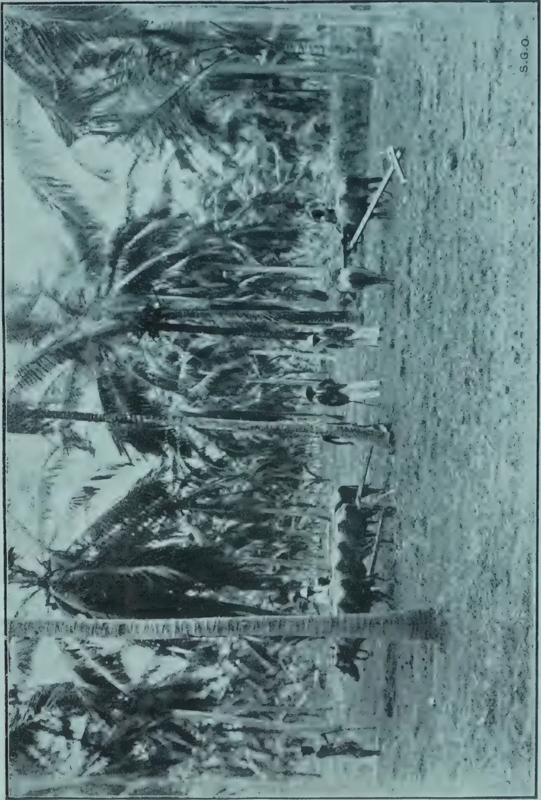A black and white photograph showing a line of buffaloes plowing a field alongside tractor trial plots. Several people are standing near the animals, and palm trees are visible in the background. The image is oriented horizontally on the page.

S.G.O.

BUFFALOS PLOUGHING ALONGSIDE TRACTOR TRIAL PLOTS.

27------------------------------------------------

This image is a scan of a blank page. The paper has a light beige or cream-colored tint. There are a few very small, faint dark spots scattered across the surface, which appear to be scanning artifacts or dust particles. No text, lines, or other markings are present on the page.

28------------------------------------------------

JULY, 1921.]9

# CEYLON AGRICULTURE.

## REPORT ON THE PADDY MANURING EXPERIMENTAL PLOTS.

M. KELWAY BAMBER, M.R.A.C., F.I.C., F.C.S.

*Agricultural Chemist.*

FOR THE MAHA SEASON, 1920 AND 1921.

These paddy manuring trials were carried out owing to the urgent necessity of increasing food production. Funds were provided from sums voted to the Food Production Department for experiments. They were carried out under the immediate supervision of Agricultural Instructors on plots selected by the Agricultural Chemist to the Department of Agriculture after personal inspection. With the appointment of Divisional Agricultural Officers to the Central, Southern and Northern Divisions the general supervision of the experimental areas was transferred to these officers.

The chief object was to try and demonstrate to the villager the effect of artificial manures, green manuring and better cultivation of the soil on the growth and yield of paddy,

At the time Bone Meal, the manure chiefly used for paddy, was very expensive and practically unobtainable, and the export from India was liable to be stopped.

The only other phosphatic manure imported at a reasonable rate was Ephos Phosphate with properties somewhat similar to Basic Slag, and it was decided to try this as compared with Bone Meal.

In view of the possible manufacture of Nitrolim in Ceylon in the future, this manure was also tried in one mixture together with Phosphates in the form of Ephos Phosphate and Fish Guano. Nitrolim supplies the cheapest unit of Nitrogen and from its decomposition in the soil, with formation of urea and ammonia, it was considered suitable for paddy manuring.

Sites were selected in all the districts in Ceylon for the Maha crop. Considerable difficulty was experienced in obtaining 4 acres of uniform soil in one block owing to the small areas owned by different people, and the great variation in yields even in the same block of fields. In some districts the cultivation and application of manures depended on rainfall which in some cases was several weeks late resulting in short-period paddy having to be grown instead of the 5 to 7 months paddy usually grown in the Maha season. This gave little time for the manures to act and at the same time possible changes in the mixtures may have taken place, especially as regards the nitrolim.

The expenditure on paddy manuring with bone meal rarely exceeded Rs. 10 per acre and was generally much less—the usual application being from  $\frac{1}{2}$  to 1 cwt. per acre, costing pre-war Rs. 3.50 per cwt. Such application is very small compared with normal applications to cereal crops in other countries, and it is probable that larger amounts would give better results. It was thought necessary, however, to maintain the cost as low as possible so as to be within the reach of the villager.

29------------------------------------------------

10[JULY, 1921.

The ordinary methods of cultivation adopted in each district were carried out by the local cultivators but with more thoroughness and the manures applied under the supervision of the Agricultural Instructors.

Local varieties of paddy chosen by the cultivators as most suitable for the district were grown.

The instructions issued to the Agricultural Instructors and cultivators were as follows :—

All work including ploughing, digging and mudding or levelling to be thoroughly done, also at least one weeding when the paddy is from 4 to 6 weeks old.

The manures before application to be mixed with their bulk of dry soil, and broadcasted over the plot *after* the second ploughing or digging and *before* the mudding or levelling.

Careful records of dates of cultivation and application of manures, etc., to be kept, also monthly notes on rainfall and the condition of the plots.

At harvesting the crop from each plot to be stacked and thrashed separately under the supervision of the Agricultural Instructors and complete records of the yields of paddy and straw to be taken.

The next yala crop to be taken on the same area without additional manure and similar records obtained.

The plots were to be approximately one acre each but accurate measurements could not be obtained owing to the shape and number of the different "Liaddas" and bunds in each area. The areas could only be computed by pacing and the record of sowing extent by which areas were gauged in each district.

The actual sowing extent was generally obtained from the actual cultivators of the plots in question.

The sites selected were all adjacent to main or village roads where they could be observed and inspected and represented considerable areas of paddy land.

Most of the plots were labelled giving the different manures employed in each case.

The plan of manuring in each station was as follows :—

*Plot 1.* Green manure at one ton per acre and Ephos Phosphate 1 cwt. per acre.

*Plot 2.* Mixture "A" consisting of Nitrogen and Phosphates without Potash.

<table>
<tr>
<td>Fish Guano</td>
<td>84 lb.</td>
<td>Containing Nitrogen</td>
<td>11.4 lb.</td>
</tr>
<tr>
<td>Ephos Phosphate</td>
<td>100 ,,</td>
<td>Phosphoric Acid</td>
<td>34.2 ,,</td>
</tr>
<tr>
<td>Nitrolim</td>
<td>40 ,,</td>
<td></td>
<td></td>
</tr>
</table>

224 lb. per acre

Costing approximately Rs. 16.75 per acre in Colombo.

*Plot 3.* Mixture "C" an organic manure containing Nitrogen, phosphoric Acid and Potash.

<table>
<tr>
<td>Sterilised Animal Meal</td>
<td>112 lb.</td>
<td>Containing Nitrogen</td>
<td>10.1 lb.</td>
</tr>
<tr>
<td>Std. Bone meal</td>
<td>56 ,,</td>
<td>Phos. Acid</td>
<td>20.7 ,,</td>
</tr>
<tr>
<td></td>
<td></td>
<td>Potash</td>
<td>6.3 ,,</td>
</tr>
</table>

168 lb. per acre.

Costing approximately Rs. 15.50 in Colombo

30------------------------------------------------

JULY, 1921.]11

This mixture was presented free of cost by MESSRS. SHAW WALLACE & CO., Colombo.

*Plot 4.* Control, no manure.

The arrangement of the plots varied, but the control was placed at the higher level where it first received the irrigation water, so that the manures would not be carried into lower plots.

In some cases it was found that the crop on the control plot was better than those below owing to the silt carried on in the irrigation water.

This was not observable when the sites were selected on the bare land.

For the green manure plot any suitable green manure available locally was to be used, such as Dadap, Suriya, Keppitiya, Tephrosia, Ingasaman, etc. The leaves and small branches were spread over the plot before ploughing and well worked into the soil, the phosphate being applied before the second ploughing and mudding.

In some cases there was delay in the manures reaching their destination owing to difficulties of transport.

In others the application was delayed owing to the lateness of the North-East Monsoon, and in some instances considerable damage was done by heavy floods when the monsoon burst, the manure and growing crop being washed away and having to be re-sown with a short-age paddy.

The methods of cultivation varied considerably in the different districts.

In the Kandy districts two ploughings are usually given followed by mudding with buffalos and by hand. In the swamp districts only mudding is done by buffalos and the surface levelled by hand.

In the Northern Province the land is ploughed after the North-East rains begin about October, then dug with mamoties and muddled.

In parts of the Sabaragamuwa and Southern provinces, the soil is dug twice and then muddled.

The yield from the various plots are summarised for each district.

### CENTRAL DIVISION.

G. HARBORD, Acting Divisional Agricultural Officer.

### KANDY DISTRICT,

*Hindagala.*—Agricultural Instructor—the late MR. D. B. HINDAGALA.

The plots of approximately half an acre each were sown in October, 1920, and harvested in March, 1921. Variety used Muttusamba, 6 months paddy.

<table>
<thead>
<tr>
<th rowspan="2">Plot Manure</th>
<th colspan="2">Yield per acre.</th>
</tr>
<tr>
<th>grain</th>
<th>straw.</th>
</tr>
</thead>
<tbody>
<tr>
<td>1 Green manure</td>
<td>93½ bus.</td>
<td>2,800 lb.</td>
</tr>
<tr>
<td>2 Mixture "A"</td>
<td>30 ,,</td>
<td>2,000 ,,</td>
</tr>
<tr>
<td>3 Cattle manure</td>
<td>39 ,,</td>
<td>800 ,,</td>
</tr>
<tr>
<td>4 Control</td>
<td>26 ,,</td>
<td>1,600 ,,</td>
</tr>
</tbody>
</table>

Plot 1 was reported on as of excellent growth the height of the paddy being 4 ft. to 5 ft. For Plot 3, only 4 cart-loads of cattle manure were applied. The increase of the manured plots over the unmanured is satisfactory, especially the green manure and Ephos Phosphate plot.

31------------------------------------------------

12[JULY, 1921.

*Mahaiyawa* : These plots were approximately half acre each and were grown with Hatial variety, transplanted with 2 or 3 plants 4 to 5 inches apart.

<table border="1">
<thead>
<tr>
<th>Plot</th>
<th>Manure</th>
<th>Yield per acre bushels.</th>
</tr>
</thead>
<tbody>
<tr>
<td>1</td>
<td>Green Manure 1,000 lb. and Ephos <math>\frac{3}{4}</math> cwt.</td>
<td>41</td>
</tr>
<tr>
<td>2</td>
<td>Mixture "A" (1 cwt.)</td>
<td>37</td>
</tr>
<tr>
<td>3</td>
<td>,, "C" (1 ,, )</td>
<td>36</td>
</tr>
<tr>
<td>4</td>
<td>,, Control</td>
<td>33</td>
</tr>
</tbody>
</table>

The manured plots gave an increase of 3 and 4 bushels per acre and the green manure and Ephos plot an increase of 8 bush. per acre. Dadap and wild sunflower were applied as green manure.

*Yatawara*.—Agricultural Instructor, MR. W. MOLEGODE. There were only three plots of  $\frac{1}{2}$  acre each, sown with Hatial a 5 months paddy.

<table border="1">
<thead>
<tr>
<th>Plot.</th>
<th>Manure.</th>
<th>Yield per acre bushels.</th>
</tr>
</thead>
<tbody>
<tr>
<td>1</td>
<td>Green manure 1000 lb. and <math>\frac{3}{4}</math> cwt. Ephos</td>
<td>... 42</td>
</tr>
<tr>
<td>2</td>
<td>"A" Mixture ... ..</td>
<td>.. 38</td>
</tr>
<tr>
<td>3</td>
<td>Control ... ..</td>
<td>... 36</td>
</tr>
</tbody>
</table>

*Gannoruwa*.—Three areas of one acre each were planted with Hatial variety (6 months).

*Plot 1* manured with green manure (Dadap, wild sunflower, etc.) and 100 lb. Ephos Phosphate, costing about Rs. 12 per acre.

*Plot 2* manured with bone meal 100 lb. and nitrolim 50 lb. costing Rs. 13.39 per acre.

*Agricultural School, Peradeniya*.—Four plots were transplanted with Hatial variety of paddy on the 4th and 5th September, 1920, and harvested on the 15th February, 1921.

<table border="1">
<thead>
<tr>
<th rowspan="2">Plot.</th>
<th rowspan="2">Area.</th>
<th rowspan="2">Manure per acre.</th>
<th colspan="2">Yield per acre.</th>
</tr>
<tr>
<th>Paddy.</th>
<th>Straw.</th>
</tr>
</thead>
<tbody>
<tr>
<td>1</td>
<td>1/6 acre</td>
<td>Control</td>
<td>48<math>\frac{3}{8}</math> bus.</td>
<td>—</td>
</tr>
<tr>
<td>2</td>
<td>1/3 ,,</td>
<td>Control</td>
<td>32<math>\frac{1}{4}</math> ,,</td>
<td>2046 lb.</td>
</tr>
<tr>
<td>3</td>
<td>1/5 ,,</td>
<td>General mixture 1<math>\frac{1}{2}</math> cwt.</td>
<td>42<math>\frac{1}{2}</math> ,,</td>
<td>2690 ,,</td>
</tr>
<tr>
<td>4</td>
<td>2/9 ,,</td>
<td>,, ,, 3 ,,</td>
<td>40<math>\frac{1}{2}</math> ,,</td>
<td>2731 ,,</td>
</tr>
</tbody>
</table>

The first Control of 1/6 acre was situated near the irrigation inlet, which was taken from a ravine draining the Rubber Estate above, was more closely planted than the other three fields. The tillering and growth on all the plots was good, and especially on the two manured plots. The application of 1 $\frac{1}{2}$  cwt. of general mixture with Nitrolim gave an increase of 10 bushels of paddy and 644 lb. straw per acre over the Control plot C.

The doubling of the application to 3 cwt. per acre gave rather less increase of paddy, viz., 8 $\frac{1}{4}$  bushels, but increased the straw by 685 lb. of straw per acre.

#### MATALE DISTRICT.

*Ukuwela*.—One plot of 3 roods and 8 poles was manured with green manure and Ephos Phosphate and transplanted with Mawi variety.

<table border="1">
<thead>
<tr>
<th rowspan="2">Plot.</th>
<th rowspan="2">Manure.</th>
<th colspan="2">Yield per acre.</th>
</tr>
<tr>
<th></th>
<th>bushels.</th>
</tr>
</thead>
<tbody>
<tr>
<td>1</td>
<td>Green Manure &amp; Ephos ...</td>
<td>...</td>
<td>50</td>
</tr>
<tr>
<td>2</td>
<td>Control (Previous yield) ...</td>
<td>...</td>
<td>35</td>
</tr>
</tbody>
</table>

32------------------------------------------------

JULY, 1921.]13

*Halangoda.*—One plot of 1 acre was manured with general mixture "A" Sown broadcast with Hondarawala paddy.

<table>
<thead>
<tr>
<th>Plot.</th>
<th>Manure.</th>
<th>Yield per acre. bushels.</th>
</tr>
</thead>
<tbody>
<tr>
<td>1</td>
<td>Mixture "A" ...</td>
<td>33<math>\frac{1}{2}</math></td>
</tr>
<tr>
<td>2</td>
<td>Control (Previous yield) ...</td>
<td>20<math>\frac{3}{4}</math></td>
</tr>
</tbody>
</table>

*Kalalpitiya.*—One plot of 3 roods and 31 poles manured with mixture "C" sterilised animal meal 112 lb. and Bone Meal 56 lb. and sown broadcast with Hondarawala paddy.

<table>
<thead>
<tr>
<th>Plot.</th>
<th>Manure.</th>
<th>Yield per acre. bushels.</th>
</tr>
</thead>
<tbody>
<tr>
<td>1</td>
<td>Mixture "C" ...</td>
<td>38</td>
</tr>
<tr>
<td>2</td>
<td>Control (previous yield) ...</td>
<td>20</td>
</tr>
</tbody>
</table>

Single plots were manured with a mixture consisting of 20 lb. Nitrolim, 20 lb. Fish Manure and 128 lb. of Ephos Phosphate or 168 lb. at Weyalamune, Pambadeniya, Totagamuwa, Weragama (2 plots) and Matale Town.

<table>
<thead>
<tr>
<th>Plot.</th>
<th>Area.</th>
<th>Variety of Paddy.</th>
<th>How Planted.</th>
<th>Yield per acre. bush.</th>
<th>Previous yield Control. Bush. per acre.</th>
</tr>
</thead>
<tbody>
<tr>
<td>Weyalamune</td>
<td>- <math>\frac{1}{2}</math> acre</td>
<td>Hatial</td>
<td>Broadcasted</td>
<td>46</td>
<td>55</td>
</tr>
<tr>
<td>Pambadeniya</td>
<td>- <math>\frac{1}{2}</math> ,,</td>
<td>Hatial</td>
<td>Broadcasted</td>
<td>30</td>
<td>25</td>
</tr>
<tr>
<td>Totagamuwa</td>
<td>- 2 ,,</td>
<td>Honda- (nearly) rawala</td>
<td>Transplanted</td>
<td>33</td>
<td>48</td>
</tr>
<tr>
<td>R. M.'s land Weragama</td>
<td>- 1 acre</td>
<td>Mawi</td>
<td>Broadcasted</td>
<td>32</td>
<td>40</td>
</tr>
<tr>
<td>Korala's Weragama</td>
<td>- <math>\frac{3}{4}</math> ,,</td>
<td>Mawi</td>
<td>Broadcasted</td>
<td>63</td>
<td>69</td>
</tr>
<tr>
<td>Matale Town</td>
<td>- <math>\frac{3}{4}</math> ,,</td>
<td>Mawi</td>
<td>Transplanted</td>
<td>27</td>
<td>25</td>
</tr>
</tbody>
</table>

#### KEGALLE DISTRICT.

Agricultural Instructor, MR. C. P. CRISPEYN. These plots of about half an acre each were sown with Hondarawala paddy.

##### *Dedigama.*

<table>
<thead>
<tr>
<th>Plot.</th>
<th>Manure.</th>
<th>Yield per acre.</th>
</tr>
</thead>
<tbody>
<tr>
<td>1</td>
<td>Green manure and Ephos Phosphate ...</td>
<td>25 bushels</td>
</tr>
<tr>
<td>2</td>
<td>Mixture "A" ...</td>
<td>32 ,,</td>
</tr>
<tr>
<td>3</td>
<td>,, "C" ...</td>
<td>54 ,,</td>
</tr>
<tr>
<td>4</td>
<td>Control ...</td>
<td>20 ,,</td>
</tr>
</tbody>
</table>

The growth on all the plots was even and the yield of the manured plots exceed the control and especially the mixture of 1 $\frac{1}{2}$  cwt. of sterilised animal meal and Bone Meal. Owing to want of time no green manure was applied to Plot 1 but the nitrolim mixture gave satisfactory results.

*Karandupona.*—The plots were half an acre each and were sown broadcasted with Hondarawala variety.

<table>
<thead>
<tr>
<th>Plot.</th>
<th>Manure.</th>
<th>Yield per acre.</th>
</tr>
</thead>
<tbody>
<tr>
<td>1</td>
<td>Green manure ...</td>
<td>28 bushels</td>
</tr>
<tr>
<td>2</td>
<td>Mixture "A" ...</td>
<td>40 ,,</td>
</tr>
<tr>
<td>3</td>
<td>,, "C" ...</td>
<td>70 ,,</td>
</tr>
<tr>
<td>4</td>
<td>Control ...</td>
<td>20 ,,</td>
</tr>
</tbody>
</table>

In these plots the sterilised animal meal mixture again gave the best results with an increase of 50 bushels per acre over the control. The Nitrolim mixture "A" also gave a satisfactory increase. The quantity of green manure applied, if any, has not been stated.

33------------------------------------------------

14[JULY, 1921.

*Beligammana.*—These plots were half acre each and transplanted with Mawi variety.

<table>
<thead>
<tr>
<th>Plot.</th>
<th>Manure.</th>
<th>Yield per acre.</th>
</tr>
</thead>
<tbody>
<tr>
<td>1</td>
<td>Cattle manure 3 cwt. and Ephos 1 cwt.</td>
<td>60 bushels</td>
</tr>
<tr>
<td>2</td>
<td>Mixture "A" ...</td>
<td>65 "</td>
</tr>
<tr>
<td>3</td>
<td>" " "C" ...</td>
<td>50 "</td>
</tr>
<tr>
<td>4</td>
<td>Control ...</td>
<td>46 "</td>
</tr>
</tbody>
</table>

Plot 1 received 3 cartloads of cattle manure and 1 cwt. of Ephos Phosphate and gave an increase of 14 bushels per acre. The yield from the Nitrolim mixture was also satisfactory, while the sterilised animal meal had less effect than in the other plots.

All the plots were badly laid about  $1\frac{1}{2}$  months before reaping.

*Andimada.*—Plots of  $\frac{1}{2}$  acre each broadcasted with Hondarawala paddy.

<table>
<thead>
<tr>
<th>Plot.</th>
<th>Manure.</th>
<th>Yield per acre</th>
</tr>
</thead>
<tbody>
<tr>
<td>1</td>
<td>Green manure ...</td>
<td>40 bushels</td>
</tr>
<tr>
<td>2</td>
<td>Mixture "A" ...</td>
<td>32 "</td>
</tr>
<tr>
<td>3</td>
<td>" " "C" ..</td>
<td>36 "</td>
</tr>
<tr>
<td>4</td>
<td>Control ...</td>
<td>20 "</td>
</tr>
</tbody>
</table>

For the green manure plot only 1 cwt. *Mikania scandens* and straw was applied together with 1 cwt. Ephos Phosphate.

The results are satisfactory on all the manured plots over the Control or unmanured. The growth was even and especially heavy on the animal meal plot. None of the plots were layered with the rains.

*Paragammana.*—The plots were about  $\frac{1}{2}$  acre each and were sown broadcast with Sudu Hatial Paddy.

<table>
<thead>
<tr>
<th>Plots.</th>
<th>Manure.</th>
<th>Yield per acre.</th>
</tr>
</thead>
<tbody>
<tr>
<td>1</td>
<td>Green manure ...</td>
<td>16<math>\frac{1}{2}</math> bushels</td>
</tr>
<tr>
<td>2</td>
<td>Mixture "A" ...</td>
<td>14 "</td>
</tr>
<tr>
<td>3</td>
<td>" " "C" ...</td>
<td>14 "</td>
</tr>
<tr>
<td>4</td>
<td>Control ...</td>
<td>10 "</td>
</tr>
</tbody>
</table>

Plot 1 received 2 cwt. of Keppitiya leaves and straw and 1 cwt. Ephos Phosphate. The yields of the manured plots are better than the Control, but are all poor.

The growth on the green manure plot was best but generally was poor owing to very heavy rainfall after the manures were applied and the whole field being flooded.

### SOUTHERN DIVISION.

G. AUCHINLECK, M.Sc., Divisional Agricultural Officer.

#### KALUTARA DISTRICT.

Plots under Agricultural Instructor, MR. W. F. SENEVIRATNE.

*Bandaragama.*—Four plots of about 1 acre each, sown with Hondarawala in October, 1920, and harvested in February, 1921.

<table>
<thead>
<tr>
<th>Plot.</th>
<th>Manure.</th>
<th>Yield per acre.</th>
</tr>
</thead>
<tbody>
<tr>
<td>1</td>
<td>Control ...</td>
<td>19<math>\frac{1}{8}</math> bushels.</td>
</tr>
<tr>
<td>2</td>
<td>Mixture "A" ...</td>
<td>26<math>\frac{3}{8}</math> "</td>
</tr>
<tr>
<td>3</td>
<td>Mixture "C" ...</td>
<td>34<math>\frac{1}{8}</math> "</td>
</tr>
<tr>
<td>4</td>
<td>Green Manure "B" ...</td>
<td>18 1/5 "</td>
</tr>
</tbody>
</table>

34------------------------------------------------

JULY, 1921.]15

Both the nitrolim and sterilised animal meal mixtures gave satisfactory increases. While the green manure plot is unsatisfactory, there is no record of the amount of green leaves etc., applied.

*Horana.* Four plots of 1 acre each sown with Podi-ratawi variety, in October, 1920, and harvested in February, 1921.

<table>
<thead>
<tr>
<th>Plot.</th>
<th>Manure.</th>
<th>Yield per acre.</th>
</tr>
</thead>
<tbody>
<tr>
<td>1</td>
<td>Control</td>
<td>24<math>\frac{1}{8}</math> bushels.</td>
</tr>
<tr>
<td>2</td>
<td>Mixture "C"</td>
<td>22<math>\frac{3}{8}</math> "</td>
</tr>
<tr>
<td>3</td>
<td>Green Manure "B"</td>
<td>24 "</td>
</tr>
<tr>
<td>4</td>
<td>Mixture "A"</td>
<td>36 "</td>
</tr>
</tbody>
</table>

The nitrolim mixture gave the best results with an increase of 12 bushels or 50 per cent. over the control plot. The sterilised animal meal gave no increase, nor did the green manure.

### GALLE DISTRICT.

Agricultural Instructor, MR. GEO. SENEVIRATNE.

*Uluvitihe.* Four plots of one acre each, planted with Karaya variety in October, 1920, and harvested in February, 1921.

<table>
<thead>
<tr>
<th>Plot.</th>
<th>Manure.</th>
<th>Yield per acre.</th>
</tr>
</thead>
<tbody>
<tr>
<td>1</td>
<td>Control</td>
<td><math>\frac{1}{2}</math> bushel.</td>
</tr>
<tr>
<td>2</td>
<td>Green Manure</td>
<td>13 1/6 "</td>
</tr>
<tr>
<td>3</td>
<td>Mixture "C"</td>
<td>16 "</td>
</tr>
<tr>
<td>4</td>
<td>Mixture "A"</td>
<td>7 "</td>
</tr>
</tbody>
</table>

Although the manured plots, especially mixture "C" with potash, gave a large increase over the Control, the total yields were very poor. The Nitrolim mixture was unsatisfactory.

*Kodagoda.* Four plots of about 1 acre each sown with Bala Mahawee on 5th October, 1920, and reaped on 2nd February, 1921.

<table>
<thead>
<tr>
<th>Plot.</th>
<th>Manure.</th>
<th>Yield per acre.</th>
</tr>
</thead>
<tbody>
<tr>
<td>1</td>
<td>Control</td>
<td>4<math>\frac{1}{2}</math> bushels.</td>
</tr>
<tr>
<td>2</td>
<td>Green Manure</td>
<td>17<math>\frac{3}{8}</math> "</td>
</tr>
<tr>
<td>3</td>
<td>Mixture "A"</td>
<td>9<math>\frac{3}{8}</math> "</td>
</tr>
<tr>
<td>4</td>
<td>Mixture "C"</td>
<td>10<math>\frac{1}{4}</math> "</td>
</tr>
</tbody>
</table>

Green manure and Ephos gave the best results, followed by mixture "C" containing Potash. The Nitrolim mixture was unsatisfactory although the yield was over double that of the Control.

*Ganegama.* Four plots of 1 acre each sown with Bala Kuruwi variety on 3rd November, 1920, and harvested 15th February, 1921.

<table>
<thead>
<tr>
<th>Plot.</th>
<th>Manure.</th>
<th>Yield per acre.</th>
</tr>
</thead>
<tbody>
<tr>
<td>1</td>
<td>Control</td>
<td>21<math>\frac{3}{8}</math> bushels.</td>
</tr>
<tr>
<td>2</td>
<td>Green Manure</td>
<td>13<math>\frac{1}{2}</math> "</td>
</tr>
<tr>
<td>3</td>
<td>Mixture "A"</td>
<td>16<math>\frac{1}{4}</math> "</td>
</tr>
<tr>
<td>4</td>
<td>Mixture "C"</td>
<td>17<math>\frac{1}{4}</math> "</td>
</tr>
</tbody>
</table>

In these plots the Control gave a higher yield than any of the manured plots and was possibly better soil.

*Akminana.* One acre was sown with Ratawee Paddy and mixture "C" containing potash and gave a yield nearly of 34 $\frac{1}{4}$  bushels, compared with an average yield of 24 bushels per acre from the same plot previously.

35------------------------------------------------

16[JULY, 1921.MATARA DISTRICT.

Experiments under Agricultural Instructor MR. H. C. PEIRIS.

*Borala.* Four plots of about 1 acre each, sown with Balawi on the 20th October, and harvested on the 15th February, 1921.

<table>
<thead>
<tr>
<th>Plots.</th>
<th>Manure.</th>
<th>Yield per acre.</th>
</tr>
</thead>
<tbody>
<tr>
<td>1</td>
<td>Green Manure</td>
<td>10 1/16 bushels.</td>
</tr>
<tr>
<td>2</td>
<td>Mixture "A"</td>
<td>11 1/16 "</td>
</tr>
<tr>
<td>3</td>
<td>Mixture "C"</td>
<td>13 1/8 "</td>
</tr>
<tr>
<td>4</td>
<td>Control</td>
<td>3 1/2 "</td>
</tr>
</tbody>
</table>

The Green manure plot received two cart loads of leaves and 1 cwt. Ephos. All the manured plots gave a considerable increase over the Control, but the total yields were poor.

*Sahabandu Kokmaduwa.* Four plots of nearly one acre each sown on the 1st October, 1920, and harvested on the 31st January, 1921.

<table>
<thead>
<tr>
<th>Plots.</th>
<th>Manure.</th>
<th>Yield per acre.</th>
</tr>
</thead>
<tbody>
<tr>
<td>1</td>
<td>Green Manure</td>
<td>21 3/8 bushels.</td>
</tr>
<tr>
<td>2</td>
<td>Mixture "A"</td>
<td>10 1/4 "</td>
</tr>
<tr>
<td>3</td>
<td>Mixture "C"</td>
<td>14 3/8 "</td>
</tr>
<tr>
<td>4</td>
<td>Control</td>
<td>13 1/4 "</td>
</tr>
</tbody>
</table>

The Green manure plot was satisfactory, but plot 2 was below the Control.

*Padili-Kokmaduwa.* Four plots of about one acre each sown on the 15th October, 1920, and harvested on the 9th February, 1921.

<table>
<thead>
<tr>
<th>Plots.</th>
<th>Manure.</th>
<th>Yield per acre.</th>
</tr>
</thead>
<tbody>
<tr>
<td>1</td>
<td>Green Manure</td>
<td>4 1/16 bushels.</td>
</tr>
<tr>
<td>2</td>
<td>Mixture "A"</td>
<td>15 1/2 "</td>
</tr>
<tr>
<td>3</td>
<td>Mixture "C"</td>
<td>12 1/4 "</td>
</tr>
<tr>
<td>4</td>
<td>Control</td>
<td>8 1/4 "</td>
</tr>
</tbody>
</table>

The Nitrolim mixture gave the best results nearly double the Control. Plot and then the mixture with potash. The Green manure plot was very unsatisfactory.

In addition to the above plots, six plots adjoining schools in the Matara District were manured with the general mixture at about 1/2 cwt. per acre under the supervision of Agricultural Instructor, MR. M. J. A. KARUNANAYAKE.

<table>
<thead>
<tr>
<th>Plots.</th>
<th>Area.</th>
<th>Manure.</th>
<th>Yield per Acre.</th>
<th>Variety.</th>
</tr>
</thead>
<tbody>
<tr>
<td>Aturaliya</td>
<td>1 acre</td>
<td>Mixture "A" 1/2 cwt.</td>
<td>8 1/2 bushels</td>
<td>Muttusamba</td>
</tr>
<tr>
<td>Puhulwila</td>
<td>5/8 "</td>
<td>" " " "</td>
<td>19 1/2 "</td>
<td>" "</td>
</tr>
<tr>
<td>Karandeniya</td>
<td>3/4 "</td>
<td>" " " "</td>
<td>20 "</td>
<td>" "</td>
</tr>
<tr>
<td>Thiagoda</td>
<td>1 1/2 acres</td>
<td>" " 1 cwt.</td>
<td>23 1/2 "</td>
<td>Duru-wee</td>
</tr>
<tr>
<td>Bopagoda</td>
<td>5/8 "</td>
<td>" " " "</td>
<td>—</td>
<td></td>
</tr>
</tbody>
</table>

The Bopagoda plot was a failure, but the others are said to compare favourably with the adjoining fields.

*Thihagoda.* Four plots of 1 acre each were sown with Heendikwi on the 29th September, 1920, and harvested on 12th February, 1921.

<table>
<thead>
<tr>
<th>Plot.</th>
<th>Manure.</th>
<th>Yield per Acre.</th>
<th>Straw per Acre.</th>
</tr>
</thead>
<tbody>
<tr>
<td>1</td>
<td>Mixture "C"</td>
<td>13 bushels</td>
<td>950 lb.</td>
</tr>
<tr>
<td>2</td>
<td>Green Manure</td>
<td>7 1/2 "</td>
<td>475 "</td>
</tr>
<tr>
<td>3</td>
<td>Control</td>
<td>4 1/2 "</td>
<td>280 "</td>
</tr>
<tr>
<td>4</td>
<td>Mixture "A"</td>
<td>12 1/4 "</td>
<td>755 "</td>
</tr>
</tbody>
</table>

36------------------------------------------------

JULY, 1921.]17

The yield of the whole of this tract was very poor this season and much below the usual standard. The mixtures "A" and "C" gave a considerable increase over the Control plot.

### HAMBANTOTA DISTRICT

Plots under Agricultural Instructor, MR. M. J. A. KARUNANAYAKE.

*Tissa.* Four plots of one acre each sown with Rath Karayal on the 14th November and harvested late in February.

<table border="1">
<thead>
<tr>
<th>Plot.</th>
<th>Manure.</th>
<th>Yield per Acre.</th>
<th>Straw per Acre.</th>
</tr>
</thead>
<tbody>
<tr>
<td>1</td>
<td>Mixture "C"</td>
<td>24 bushels</td>
<td>637 lb.</td>
</tr>
<tr>
<td>2</td>
<td>Green Manure</td>
<td>24 ,,</td>
<td>450 ,,</td>
</tr>
<tr>
<td>3</td>
<td>Mixture "A"</td>
<td>36 ,,</td>
<td>720 ,,</td>
</tr>
<tr>
<td>4</td>
<td>Control</td>
<td>24 ,,</td>
<td>460 ,,</td>
</tr>
</tbody>
</table>

The Nitrolim mixture gave an increase of 50 per cent. over the Control in grain and over 56 per cent. in straw. The plants tillered fairly well and bore good ears. The Potash mixture and green manure gave no increase in grain but the plants in plot 1 tillered well and were more leafy.

*Hatagala.* Four plots of one acre each planted on the 29th November, 1920, and harvested on the 15th March, 1921.

<table border="1">
<thead>
<tr>
<th rowspan="2">Plot.</th>
<th rowspan="2">Manure.</th>
<th colspan="2">Yield per acre.</th>
</tr>
<tr>
<th>Grain.</th>
<th>Straw,</th>
</tr>
</thead>
<tbody>
<tr>
<td>1</td>
<td>Mixture "C"</td>
<td>36<math>\frac{1}{8}</math> bus.</td>
<td>1,100 lb.</td>
</tr>
<tr>
<td>2</td>
<td>Green Manure</td>
<td>42<math>\frac{1}{4}</math> ,,</td>
<td>1,000 ,,</td>
</tr>
<tr>
<td>3</td>
<td>Mixture "A"</td>
<td>24<math>\frac{1}{4}</math> ,,</td>
<td>600 ,,</td>
</tr>
<tr>
<td>4</td>
<td>Control</td>
<td>34<math>\frac{1}{8}</math> ,,</td>
<td>800 ,,</td>
</tr>
</tbody>
</table>

The yield from the Nitrolim plot was unsatisfactory, the growth being poor and the green manure and Ephos Phosphate gave the best results with a gain of 8 $\frac{1}{8}$  bushels grain and 200 lb. of straw per acre. On plot 1 the growth was leafy with good tillering, but the heads were poor.

On the green manure plot the plants grew to 5 feet with good heads.

*Lunawa.* Four plots of about 1 acre each sown with Rath-Karayal on the 29th November, 1920, and harvested on the 16th March, 1921.

<table border="1">
<thead>
<tr>
<th rowspan="2">Plot.</th>
<th rowspan="2">Manure.</th>
<th colspan="2">Yield per acre.</th>
</tr>
<tr>
<th>Grain.</th>
<th>Straw.</th>
</tr>
</thead>
<tbody>
<tr>
<td>1</td>
<td>Mixture "C"</td>
<td>23<math>\frac{1}{4}</math> bus.</td>
<td>700 lb.</td>
</tr>
<tr>
<td>2</td>
<td>Green Manure</td>
<td>31<math>\frac{1}{4}</math> ,,</td>
<td>800 ,,</td>
</tr>
<tr>
<td>3</td>
<td>Mixture "A"</td>
<td>23<math>\frac{1}{4}</math> ,,</td>
<td>600 ,,</td>
</tr>
<tr>
<td>4</td>
<td>Control</td>
<td>30 ,,</td>
<td>700 ,,</td>
</tr>
</tbody>
</table>

Both mixtures gave yields below the Control Plot, and there was only slight increase in the green manure plot.

### NORTHERN DIVISION.

N. MARSHALL, Divisional Agricultural Officer.

### JAFFNA DISTRICT.

Agricultural Instructor, MR. K. C. PILLAI.

Plots were arranged at Yorkamputty, Anaikotta, Karunpotta, Chemanai and Vedukaddu.

Sowing of three varieties were done in September, 1920, and harvested late in February, 1921.

<table border="1">
<thead>
<tr>
<th rowspan="2">Plots.</th>
<th rowspan="2">Manure.</th>
<th colspan="2">Yield per acre.</th>
<th colspan="2">Previous Yields.</th>
</tr>
<tr>
<th>Grain Bus.</th>
<th>Straw.</th>
<th>Grain Bus.</th>
<th>Straw.</th>
</tr>
</thead>
<tbody>
<tr>
<td>1</td>
<td>Yorkamputty Mixture "A"</td>
<td>6</td>
<td><math>\frac{1}{4}</math> cart-load</td>
<td>30</td>
<td>1<math>\frac{3}{4}</math> cart-loads</td>
</tr>
<tr>
<td>2</td>
<td>Anaikottai Mixture "C"</td>
<td>13<math>\frac{1}{3}</math></td>
<td><math>\frac{3}{4}</math> ,, ,,</td>
<td>36</td>
<td>1<math>\frac{1}{2}</math> ,,</td>
</tr>
<tr>
<td>3</td>
<td>Karunpotta Mixture "D"</td>
<td colspan="2">Not harvested</td>
<td></td>
<td></td>
</tr>
<tr>
<td>4</td>
<td>Chemanai Mixture "D"</td>
<td>36</td>
<td>2<math>\frac{1}{2}</math> cart-loads</td>
<td>30</td>
<td>2 ,,</td>
</tr>
</tbody>
</table>

37------------------------------------------------

18[JULY, 1921.

<table border="1">
<tbody>
<tr>
<td>5</td>
<td>Veddukadu</td>
<td>Mixture "D"</td>
<td>40</td>
<td>2½ cart-loads</td>
<td>36</td>
<td>2 cart-loads</td>
</tr>
<tr>
<td>6</td>
<td>"</td>
<td>1 cwt. Ephos phosphate</td>
<td>—</td>
<td>—</td>
<td>—</td>
<td>—</td>
</tr>
<tr>
<td>7</td>
<td>"</td>
<td>Mixture "A" 1 cwt</td>
<td>—</td>
<td>—</td>
<td>—</td>
<td>—</td>
</tr>
</tbody>
</table>

*Plot 1.* The land was saline and the seedlings all scorched up within one month of sowing and application of manure. The plot was transplanted later.

*Plot 2.* Sown 9 days earlier, about half the plants died and transplanting was done later. The poor results are said to be due to the saline nature of the soil.

*Plot 3.* Manured with one cwt. of a soluble mixture one month after sowing. The seedlings are said to have germinated well, but died after the application of the manure.

*Plot 4.* Was sown five days earlier and manured with the same soluble mixture "D." It gave 36 bushels per acre, an increase of 6 bushels per acre over the previous yield.

*Plot 5.* Also manured with the soluble mixture "D" gave a yield of 40 bushels compared with 36 bushels previously.

*Plots 6 and 7.* The growing crop was carried away by floods, the land being newly taken up, and rather low and saline.

#### VAVUNIYA DISTRICT.

MR. T. N. CHELLIAH's field. Agricultural Instructor, MR. K. C. PILLAI.

Four plots of one acre each were sown broadcasted on 30th November, 1920, with Mutpangan variety of paddy and harvested on 15th April, 1921.

<table border="1">
<thead>
<tr>
<th rowspan="2">Plot.</th>
<th rowspan="2">Manure.</th>
<th colspan="2">Yield per acre.</th>
</tr>
<tr>
<th>Grain.</th>
<th>Straw.</th>
</tr>
</thead>
<tbody>
<tr>
<td>1</td>
<td>General Mixture "A"</td>
<td>32 bus.</td>
<td>2 cart-loads.</td>
</tr>
<tr>
<td>2</td>
<td>Green manure and phosphate</td>
<td>32 ,,</td>
<td>2 ,,</td>
</tr>
<tr>
<td>3</td>
<td>General mixture "C"</td>
<td>32 ,,</td>
<td>2 ,,</td>
</tr>
<tr>
<td>4</td>
<td>Control</td>
<td>30 ,,</td>
<td>1¾ ,,</td>
</tr>
</tbody>
</table>

No weeding was done, nor were blank spaces supplied with seedlings.

Mr. T. NAGAMUNI's land. Three plots of 2 acres, 2½ acres and control 1 acre were broadcasted with Peria Vellai and Mutpangan varieties of paddy in late November and early December 1920, and harvested in April, 1921.

<table border="1">
<thead>
<tr>
<th rowspan="2">Plot.</th>
<th rowspan="2">Paddy.</th>
<th rowspan="2">Manure.</th>
<th colspan="2">Yield per acre.</th>
<th rowspan="2">Previous Yield.</th>
</tr>
<tr>
<th>Paddy.</th>
<th>Straw.</th>
</tr>
</thead>
<tbody>
<tr>
<td>1</td>
<td>Peria Vellai</td>
<td>General Mixture</td>
<td>40 bus.</td>
<td>2 cart-loads</td>
<td>48</td>
</tr>
<tr>
<td>2</td>
<td>Mutpangan</td>
<td>Top dressing mixture "D"</td>
<td>30 ,,</td>
<td>2 ,,</td>
<td>30</td>
</tr>
<tr>
<td>3</td>
<td>Peria Vellai</td>
<td>Control</td>
<td>50 ,,</td>
<td>2½ ,,</td>
<td>50</td>
</tr>
</tbody>
</table>

No weeding was done. Soon after sowing the fields were under flood.

MR. M. K. MUDUKANDE's land. Three plots of one acre each were broadcasted on the 10th December, 1920, with Senkarapen variety of paddy, and harvested on 28th April, 1921.

<table border="1">
<thead>
<tr>
<th rowspan="2">Plot.</th>
<th rowspan="2">Manure.</th>
<th colspan="2">Yield per acre.</th>
<th rowspan="2">Previous yield.</th>
</tr>
<tr>
<th>Paddy.</th>
<th>Straw.</th>
</tr>
</thead>
<tbody>
<tr>
<td>1</td>
<td>General Mixture "A"</td>
<td>40 bus.</td>
<td>2½ cart-loads</td>
<td>32</td>
</tr>
</tbody>
</table>

38------------------------------------------------

JULY, 1921.]19

<table>
<tr>
<td>2</td>
<td>Green Manure and Ephos phosphate</td>
<td>36 bus.</td>
<td>2½</td>
<td>cart-loads</td>
<td>30</td>
</tr>
<tr>
<td>3</td>
<td>Control</td>
<td>30 „</td>
<td>2</td>
<td>„</td>
<td>30</td>
</tr>
</table>

The results are said to be fairly satisfactory.

### TRINCOMALIE DISTRICT.

Agricultural Instructor, MR. A. C. CHELVANAYAGAM.

Four plots at Kottiar were sown with Oddaivalan variety on the 22nd November, 1920, and harvested on the 21st March, 1921. The plots had previously been sown with Murungan variety, on the 14th November, the manures having been applied on the 12th November. Heavy rain fell just after sowing and the plots were flooded. The land was again puddled and resown. In January the plots were again flooded by heavy rain and much damaged, many plants being killed so that results are inconclusive.

<table>
<thead>
<tr>
<th>Plot.</th>
<th>Manure.</th>
<th>Yield per acre. Grain Bushels.</th>
</tr>
</thead>
<tbody>
<tr>
<td>1</td>
<td>Mixture "A" ...</td>
<td>14</td>
</tr>
<tr>
<td>2</td>
<td>Mixture "C" ...</td>
<td>13½</td>
</tr>
<tr>
<td>3</td>
<td>Green Manure (1 ton) ...</td>
<td>15½</td>
</tr>
<tr>
<td>4</td>
<td>Control ...</td>
<td>16</td>
</tr>
</tbody>
</table>

The following plots were under the control of the Secretary, Ceylon Agricultural Society :—

### COLOMBO DISTRICT.

The plots in this district were under Agricultural Instructor, MR. A. B. ATTYGALLE.

*Halgampitiya.* Plots 1 acre each sown with Ratawee 4½ months paddy sown broadcast in November, 1920, and harvested in March, 1921.

<table>
<thead>
<tr>
<th>Plot.</th>
<th>Manure.</th>
<th>Yield per acre.</th>
</tr>
</thead>
<tbody>
<tr>
<td>1</td>
<td>Mixture "A" ...</td>
<td>4 3/8 bushels</td>
</tr>
<tr>
<td>2</td>
<td>Green Manure ...</td>
<td>— „</td>
</tr>
<tr>
<td>3</td>
<td>Mixture "C" ...</td>
<td>11 „</td>
</tr>
<tr>
<td>4</td>
<td>Control ...</td>
<td>10 „</td>
</tr>
</tbody>
</table>

These plots were very badly damaged by floods during the seedling stage being under water for one week, plot No. 2 was totally destroyed. The control plot was not damaged being above the flood level.

*Balthpitiya Plots.* Three plots of one acre each sown in October with Ratawee 4½ months variety.

<table>
<thead>
<tr>
<th>Plot.</th>
<th>Manure.</th>
<th>Yield per acre.</th>
</tr>
</thead>
<tbody>
<tr>
<td>1</td>
<td>Mixture "A" ...</td>
<td>12 bushels</td>
</tr>
<tr>
<td>2</td>
<td>Green Manure "B" ...</td>
<td>9 „</td>
</tr>
<tr>
<td>3</td>
<td>Control ...</td>
<td>6 „</td>
</tr>
</tbody>
</table>

Previous yields are given as 6 bushels per acre and the Agricultural Instructor remarks that "considering the nature of the soil and previous yields the results are fair," but such yields would not pay for the manures,

*Henaralgoda.* Three plots of 1 acre each sown in November 1920 with Ratawee variety. These plots were totally destroyed by floods in the seedling stage.

### RATNAPURA DISTRICT.

Agricultural Instructor, MR. L. A. D. SILVA.

*Balugedera.*—Four plots of about 1 acre each sown broadcast with Madatawalu variety on the 21st November, 1920, and harvested on 9th March, 1921.

39------------------------------------------------

20[JULY, 1921.

<table border="1">
<thead>
<tr>
<th rowspan="2">Plot.</th>
<th rowspan="2">Manure</th>
<th colspan="2">Yield per acre.</th>
</tr>
<tr>
<th>Grain.</th>
<th>Straw.</th>
</tr>
</thead>
<tbody>
<tr>
<td>1.</td>
<td>Green manure, 12 cwt. ...</td>
<td>20 Bus.</td>
<td>1040 lb.</td>
</tr>
<tr>
<td>2.</td>
<td>Mixture "A" ...</td>
<td>26 "</td>
<td>1344 "</td>
</tr>
<tr>
<td>3.</td>
<td>" " "C" ...</td>
<td>16<math>\frac{1}{2}</math> "</td>
<td>844 "</td>
</tr>
<tr>
<td>4.</td>
<td>Control ...</td>
<td>16 "</td>
<td>832 "</td>
</tr>
</tbody>
</table>

The crop grew well, but some damage was done by the Paddy fly pest. Both the Nitrolim mixture and green manure plots gave an increase over the unmanured plot, but the mixture with Potash, which did so well in the Kegalle district, gave no result.

*Balangoda.*—MR. J. D. NICHOLAS, Agricultural Instructor.

Four Plots of about 1 acre each were sown broadcast with Mukalawi variety (5 months) on the 15—25th January, 1921. The plots were started late owing to the lateness of the Monsoon and were considerably damaged by floods soon after sowing, but were supplied with transplanted paddy.

Similar plots were started at Pallokandewasama, but have not yet been harvested. The Agricultural Instructor reports a marked difference between the Control and manured plots, and that the crop suffered from insufficient water during the second month.

#### BATTICALOA DISTRICT.

Agricultural Instructor, MR. N. THAMBIAN.

Mulupalai under Pattipalai aru scheme. Four plots of  $\frac{1}{2}$  acre each were sown broadcasted with Perunel variety of paddy on 30th December, 1920, and harvested on 30th March, 1921.

<table border="1">
<thead>
<tr>
<th rowspan="2">Plot.</th>
<th rowspan="2">Manure.</th>
<th colspan="2">Yield per acre.</th>
<th rowspan="2">Previous yield.</th>
</tr>
<tr>
<th>Grain.</th>
<th>Straw.</th>
</tr>
</thead>
<tbody>
<tr>
<td>1.</td>
<td>Green manure 1200—1500 lb. and <math>\frac{1}{2}</math> cwt. Ephos Phosphate</td>
<td>22 bus.</td>
<td>504 lb.</td>
<td>15—18 bushels</td>
</tr>
<tr>
<td>2.</td>
<td>Mixture C <math>\frac{3}{4}</math> cwt. ...</td>
<td>16<math>\frac{1}{2}</math> "</td>
<td>448 "</td>
<td>" "</td>
</tr>
<tr>
<td>3.</td>
<td>" A 1 "</td>
<td>15 "</td>
<td>336 "</td>
<td>" "</td>
</tr>
<tr>
<td>4.</td>
<td>Control ...</td>
<td>15<math>\frac{1}{2}</math> "</td>
<td>392 "</td>
<td>" "</td>
</tr>
</tbody>
</table>

The quantity of seed paddy used was 2 $\frac{1}{2}$  bushels as against 3 $\frac{3}{4}$  bushels previous season. The plots were weeded once. The plots were on high land and were uneven. Past results were always poor. The Green manure and Ephos Phosphate plot gave the best result with an increase of 6 $\frac{1}{2}$  bushels paddy and 112 lb. of straw.

*Sengalpaddai.*—These were of  $\frac{1}{2}$  acre each and broadcasted with Perunel variety of paddy on 12th February, 1921, and harvested on 12th May, 1921.

<table border="1">
<thead>
<tr>
<th rowspan="2">Plot.</th>
<th rowspan="2">Manure.</th>
<th colspan="2">Yield per acre.</th>
<th rowspan="2">Previous yield.</th>
</tr>
<tr>
<th>Grain.</th>
<th>Straw.</th>
</tr>
</thead>
<tbody>
<tr>
<td>1.</td>
<td>Green manure 1200 to 1500 lb. (Kayan leaves) and <math>\frac{1}{2}</math> cwt. Ephos Phosphate ...</td>
<td>22 bus.</td>
<td>448 lb.</td>
<td>18—23 bushels</td>
</tr>
<tr>
<td>2.</td>
<td>Mixture C <math>\frac{3}{4}</math> cwt. ...</td>
<td>16<math>\frac{1}{2}</math> "</td>
<td>—</td>
<td>" "</td>
</tr>
<tr>
<td>3.</td>
<td>" A 1 "</td>
<td>15 "</td>
<td>—</td>
<td>" "</td>
</tr>
<tr>
<td>4.</td>
<td>Control ...</td>
<td>21 "</td>
<td>—</td>
<td>" "</td>
</tr>
</tbody>
</table>

The selected field was in a low land. Soil fairly good, but the Agricultural Instructor reports that the manure may have been washed by the rains to the other plots. Plot 1 showed fair growth. One weeding was given. The mixtures did not do well on these plots, but green manure and phosphate gave a slight increase.

40------------------------------------------------

JULY, 1921.21

*Pullumalai*.—Plots of  $\frac{1}{2}$  acre each were broadcasted with Perung Karuppen variety of paddy on 12th January, 1921, and harvested on 24th March, 1921.

<table border="1">
<thead>
<tr>
<th rowspan="2">Plot.</th>
<th rowspan="2">Manure</th>
<th colspan="2">Yield per acre.</th>
<th rowspan="2">Previous yield.</th>
</tr>
<tr>
<th>Grain.</th>
<th>Straw.</th>
</tr>
</thead>
<tbody>
<tr>
<td>1</td>
<td>Green manure (1200—1500 lb.) and <math>\frac{1}{2}</math> cwt. Ephos Phosphate</td>
<td>30 bus.</td>
<td>644 lb.</td>
<td>14—16 bushels</td>
</tr>
<tr>
<td>2</td>
<td>Mixture C <math>\frac{3}{4}</math> cwt. ...</td>
<td>25 "</td>
<td>388 "</td>
<td>" "</td>
</tr>
<tr>
<td>3</td>
<td>" A 1 "</td>
<td>16 "</td>
<td>336 "</td>
<td>" "</td>
</tr>
<tr>
<td>4</td>
<td>Control ...</td>
<td>18 "</td>
<td>364 "</td>
<td>" "</td>
</tr>
</tbody>
</table>

The selected fields were under Pullumalai Tank, the soil being poor and of a sandy loam. Results were promising especially in Plot 1. A cyclone during January did some damage. The plots were weeded once.

The green manure and Phosphate plot gave an increase of 12 bushels of paddy and 280 lb. of straw. Mixture C containing potash also gave a fair increase of 7 bushels of paddy per acre and slightly more straw.

#### BADULLA DISTRICT.

Agricultural Instructor MR. J. A. RAMBUKOTA.

Two plots of half an acre each in Badulla were sown with two varieties of paddy Murungawi and Kalabawi 6 months and 4 months respectively and manured with mixtures containing Nitrolim and Phosphates. The Murungawi was transplanted on the 25th August, 1920, and harvested on the 8th February, 1921, and the Kalabawi broadcasted on the 8th October, 1920, and harvested 28th January 1921.

<table border="1">
<thead>
<tr>
<th rowspan="2">Plot.</th>
<th rowspan="2">Manure used per acre.</th>
<th colspan="2">Yield per acre.</th>
<th colspan="2">Previous yields.</th>
</tr>
<tr>
<th>Grain Bus.</th>
<th>Straw bundles.</th>
<th>Grain Bus.</th>
<th>Straw bundles.</th>
</tr>
</thead>
<tbody>
<tr>
<td rowspan="4">1</td>
<td>Fish guano 70 lb.</td>
<td></td>
<td></td>
<td></td>
<td></td>
</tr>
<tr>
<td>Ephos 100 "</td>
<td>32</td>
<td>300</td>
<td>20</td>
<td>250</td>
</tr>
<tr>
<td>Nitrolim 18 "</td>
<td></td>
<td></td>
<td></td>
<td></td>
</tr>
<tr>
<td>188 lb.</td>
<td></td>
<td></td>
<td></td>
<td></td>
</tr>
<tr>
<td rowspan="3">2</td>
<td>Bone Dust 120 lb.</td>
<td></td>
<td></td>
<td></td>
<td></td>
</tr>
<tr>
<td>Nitrolim 24 "</td>
<td>20</td>
<td>250</td>
<td>14</td>
<td>200</td>
</tr>
<tr>
<td>144 lb.</td>
<td></td>
<td></td>
<td></td>
<td></td>
</tr>
</tbody>
</table>

#### CHILAW DISTRICT.

One acre was manured with the Mixture "C" containing Potash, but the crop was washed away by rain. The four plots under the supervision of MR. R. CHELVADURAI PROCTOR, were also destroyed by flood.

#### SUMMARY.

The results of the paddy manuring experiments have been rather erratic, especially in the Northern and North-Central Provinces. As a rule, but not invariably, the mixture "A" consisting of Fish Guano, Ephos Phosphate and Nitrolim has not given satisfactory results, which may have been due to the Nitrolim 40 lb. per acre having in some cases undergone some change on keeping with production of dicyanamide, which is poisonous to plants. Some of the plots manured with the mixture "A" gave considerable increases over the unmanured plots, the average being shown under mixture "A."

The green manure plots with 1 cwt. of Ephos Phosphate have been generally satisfactory although in several cases the quantity of one ton per acre was not applied.

41------------------------------------------------

22[JULY, 1921.

The increases in the various districts were as follows :—

<table>
<thead>
<tr>
<th>Kandy District.</th>
<th>increase.</th>
<th>6 to</th>
<th>67 bushels.</th>
<th>average</th>
<th>27 bushels.</th>
</tr>
</thead>
<tbody>
<tr>
<td>Kegalle</td>
<td>"</td>
<td>4 to</td>
<td>20 "</td>
<td>"</td>
<td><math>8\frac{3}{4}</math> "</td>
</tr>
<tr>
<td>Colombo</td>
<td>"</td>
<td></td>
<td></td>
<td>"</td>
<td>3 "</td>
</tr>
<tr>
<td>Galle</td>
<td>"</td>
<td>-8 to + 13</td>
<td>"</td>
<td>"</td>
<td>9 "</td>
</tr>
<tr>
<td>Matara</td>
<td>"</td>
<td>-4 to + 8</td>
<td>"</td>
<td>"</td>
<td><math>3\frac{3}{4}</math> "</td>
</tr>
<tr>
<td>Hambantota,,</td>
<td>"</td>
<td>1 to</td>
<td>8 "</td>
<td>"</td>
<td>3 "</td>
</tr>
<tr>
<td>Ratnapura</td>
<td>"</td>
<td></td>
<td></td>
<td>"</td>
<td>4 "</td>
</tr>
<tr>
<td>Batticaloa</td>
<td>"</td>
<td>7 to</td>
<td>12 "</td>
<td>"</td>
<td><math>9\frac{1}{2}</math> "</td>
</tr>
</tbody>
</table>

Both Kalutara and Trincomalie showed no increase but in the latter case the crop was twice damaged by flood.

Green manuring at one ton per acre is said to cost from Rs. 4 to Rs. 6 for collecting and carrying to the field, while the one cwt. of Ephos Phosphate cost about Rs. 6 or from Rs. 10 to Rs. 12 per acre in all.

Most cultivators are already aware of the value of green manuring and it is largely practiced in some districts, chiefly by cutting branches and leaves of surrounding trees and shrubs and applying to the soil before ploughing. The leaves employed include Dadap, Ingasaman, Keppitiya, Kekuna, etc. Where small areas of paddy lands are surrounded by gardens or hill slopes sufficient green manure can sometimes be obtained, but for large areas such as occur in the Southern Province, Batticaloa, Trincomalie and the North and North-Central Provinces, green manures except for a few acres are not obtainable. In such areas green manures can only be grown on the soil itself between the paddy growing seasons.

In Jaffna, *Crotalaria Juncea* is largely grown and other green manures being tried are, *Daincha*, *Sesbania Aculeata*; "Pila," *Tephrosia Purpurea* and similar crops.

*Daincha* is largely used in India, but Pila is probably more suitable for Ceylon, and large quantities of seed could be obtained from the Central and other Provinces where it is very prevalent. The collection of such seed is strongly recommended.

All waste lands adjoining paddy fields should be planted up with leguminous plants such as Dadap, *Gliricidia*, *Tephrosia candida*, *Casia auriculata* and other annuals or perennials capable of yielding large quantities of green material for carrying on to the adjacent fields.

#### MIXTURE "A."

<table>
<thead>
<tr>
<th>Kandy District</th>
<th>increase</th>
<th>2</th>
<th>—</th>
<th>4 bus.</th>
<th>Average</th>
<th>3 1/3 bus.</th>
</tr>
</thead>
<tbody>
<tr>
<td>Kegalle</td>
<td>"</td>
<td>4</td>
<td>—</td>
<td>20 "</td>
<td>"</td>
<td>11 1/3 "</td>
</tr>
<tr>
<td>Colombo</td>
<td>"</td>
<td>6</td>
<td></td>
<td>"</td>
<td>"</td>
<td>6 "</td>
</tr>
<tr>
<td>Kalutara</td>
<td>"</td>
<td><math>7\frac{1}{4}</math></td>
<td>—</td>
<td>12 "</td>
<td>"</td>
<td><math>9\frac{1}{2}</math> "</td>
</tr>
<tr>
<td>Galle</td>
<td>"</td>
<td>-5 to + 6</td>
<td>"</td>
<td>"</td>
<td>"</td>
<td><math>\frac{3}{4}</math> "</td>
</tr>
<tr>
<td>Matara</td>
<td>"</td>
<td>-3 to + 8</td>
<td>"</td>
<td>"</td>
<td>"</td>
<td>4 "</td>
</tr>
<tr>
<td>Hambantota</td>
<td>"</td>
<td>-7 to + 12</td>
<td>"</td>
<td>"</td>
<td>"</td>
<td>1 "</td>
</tr>
<tr>
<td>Ratnapura</td>
<td></td>
<td></td>
<td></td>
<td></td>
<td>"</td>
<td>10 "</td>
</tr>
<tr>
<td>Batticaloa</td>
<td>"</td>
<td>- <math>\frac{1}{2}</math> to - 2</td>
<td>"</td>
<td>"</td>
<td>"</td>
<td>- <math>1\frac{1}{4}</math> "</td>
</tr>
<tr>
<td>Badulla</td>
<td>"</td>
<td>8 to - 12</td>
<td>"</td>
<td>"</td>
<td>"</td>
<td>+ 10 "</td>
</tr>
<tr>
<td>Jaffna</td>
<td>"</td>
<td></td>
<td></td>
<td></td>
<td></td>
<td></td>
</tr>
<tr>
<td>Trincomalie</td>
<td>"</td>
<td></td>
<td></td>
<td></td>
<td></td>
<td>- 2 "</td>
</tr>
</tbody>
</table>

42------------------------------------------------

JULY, 1921.]23

The mixture appears unsuitable for Hambantota, Galle, Batticaloa, Trincomalie and Jaffna.

Mixture "C" consisting of sterilised animal meal and Steamed bone meal gave fair results in several districts, especially, Kandy, Kegalle, Kalutara, Matara, Hambantota and Batticaloa.

<table>
<tr>
<td>Kandy</td>
<td>District increase</td>
<td>3 to 50 bushels.</td>
<td>Average</td>
<td>29 bushels</td>
</tr>
<tr>
<td>Kegalle</td>
<td>" "</td>
<td>4 to 16 "</td>
<td>"</td>
<td>8 "</td>
</tr>
<tr>
<td>Kalutara</td>
<td>" "</td>
<td>-2 to 16 "</td>
<td>"</td>
<td>7 "</td>
</tr>
<tr>
<td>Matara</td>
<td>" "</td>
<td>+1 to 10 "</td>
<td>"</td>
<td>5 "</td>
</tr>
<tr>
<td>Hambantota</td>
<td>" "</td>
<td>nil to 9 "</td>
<td>"</td>
<td>3 "</td>
</tr>
<tr>
<td>Batticaloa</td>
<td>" "</td>
<td>1 to 7 "</td>
<td>"</td>
<td>4 "</td>
</tr>
</table>

The other districts gave poor results, partly due to floods or drought.

Several paddy soils have been analysed from the plots and the following are given to show the variation in character of the soil in the same paddy area.

The samples were taken from the Gannoruwa village lands.

No. 1. One acre of rich land giving 70 to 80 bushels per acre and up to 100 bushels per acre for Maha and 50 to 60 bushels per acre for the Yala Crop.

No. 2. One acre of poorer land slightly higher than No. 1 plot giving 40 to 50 bushels for the Maha and 25 to 30 bushels for the Yala Crop.

Neither areas have ever been manured and irrigation is from a stream running down the valley, where there is no tea or other manured estate.

No. 1. is a brown loam soil in a fine state of division, the fine material containing 18% of clay 31% of fine silt and 14% of silt. There is no coarse gravel and the sand and fine gravel amounts to 27 per cent. The retentive power for water is high 73%.

The soil is fairly rich in humus, nitrogen and mineral plant food generally, which latter is largely derived from decomposing mica.

No. 2 is a brown gravelly loam, the fine material consisting of 55% clay, 10% fine silt, and 8% silt. A total of 23% against 63% in No. 1. The coarser material consists of coarse and fine gravel and sand, amounting to 77% which reduces the water retention power to 45% against 73% in the better soil. The humus, Nitrogen and mineral plant food is generally lower than in No. 1 and comparing the relative amounts of finer material on which the figures are based. The contrast is greater than indicated by the Analysis. The proportion of available phosphoric acid and Potash is however slightly higher in No. 2.

#### ANALYSIS.

The marked difference in the mechanical composition and water retaining capacity of the two soils would largely account for the different yields obtained. It serves to indicate the necessity of thorough cultivation and mudding of all paddy soils to retain the maximum amount of moisture if luxuriant growth is to be expected.

#### ANALYSES OF SOIL.

Paddy soils from Gannoruwa Village. Allagala District (Near Peradeniya.

43------------------------------------------------

24[JULY, 1921.

**MECHANICAL COMPOSITION.**

<table border="0">
<thead>
<tr>
<th></th>
<th align="center" colspan="2"><i>Rich Soil.</i></th>
<th align="center" colspan="2"><i>Poor Soil.</i></th>
</tr>
<tr>
<th></th>
<th align="center" colspan="2"><i>No. 1.</i></th>
<th align="center" colspan="2"><i>No. 2.</i></th>
</tr>
</thead>
<tbody>
<tr>
<td>Hygroscopic Moisture and Salts dissolved</td>
<td align="center">...</td>
<td align="center">4.23 %</td>
<td align="center">1.47 %</td>
<td></td>
</tr>
<tr>
<td>Humus</td>
<td align="center">...</td>
<td align="center">5.34 ,, (2.66)</td>
<td align="center">1.93 ,,</td>
<td align="center">(1.10)</td>
</tr>
<tr>
<td>Clay</td>
<td align="center">...</td>
<td align="center">17.93 ,,</td>
<td align="center">5.56 ,,</td>
<td></td>
</tr>
<tr>
<td>Fine Silt</td>
<td align="center">...</td>
<td align="center">31.02 ,,</td>
<td align="center">10.14 ,,</td>
<td></td>
</tr>
<tr>
<td>Silt</td>
<td align="center">...</td>
<td align="center">14.16 ,,</td>
<td align="center">8.31 ,,</td>
<td></td>
</tr>
<tr>
<td>Fine Sand</td>
<td align="center">...</td>
<td align="center">22.25 ,,</td>
<td align="center">14.77 ,,</td>
<td></td>
</tr>
<tr>
<td>Coarse Sand</td>
<td align="center">...</td>
<td align="center">3.55 ,,</td>
<td align="center">30.75 ,,</td>
<td></td>
</tr>
<tr>
<td>Fine Gravel</td>
<td align="center">...</td>
<td align="center">1.52 ,,</td>
<td align="center">27.07 ,,</td>
<td></td>
</tr>
<tr>
<td colspan="5">
</td>
</tr>
<tr>
<td>Coarse Gravel above 3 M.M.</td>
<td align="center">...</td>
<td align="center">Nil</td>
<td align="center">6.14 %</td>
<td></td>
</tr>
<tr>
<td>Water Absorption...</td>
<td align="center">...</td>
<td align="center">73.0 %</td>
<td align="center">45.0 ,,</td>
<td></td>
</tr>
</tbody>
</table>

**CHEMICAL COMPOSITION.**

<table border="0">
<tbody>
<tr>
<td>Moisture</td>
<td align="center">...</td>
<td align="center">3.340 %</td>
<td align="center">2.460 %</td>
</tr>
<tr>
<td>Organic Matter and Combined Water</td>
<td align="center">...</td>
<td align="center">14.720 ,,</td>
<td align="center">9.660 ,,</td>
</tr>
<tr>
<td>Oxide of Iron and Manganese</td>
<td align="center">...</td>
<td align="center">13.760 ,,</td>
<td align="center">10.720 ,,</td>
</tr>
<tr>
<td>Oxide of Alumina</td>
<td align="center">..</td>
<td align="center">17.554 ,,</td>
<td align="center">12.847 ,,</td>
</tr>
<tr>
<td>Lime</td>
<td align="center">...</td>
<td align="center">0.180 ,,</td>
<td align="center">0.120 ,,</td>
</tr>
<tr>
<td>Sulphuric-an-Hydride</td>
<td align="center">...</td>
<td align="center">0.096 ,,</td>
<td align="center">0.109 ,,</td>
</tr>
<tr>
<td>Magnesia</td>
<td align="center">...</td>
<td align="center">0.230 ,,</td>
<td align="center">0.086 ,,</td>
</tr>
<tr>
<td>Potash</td>
<td align="center">...</td>
<td align="center">0.378 ,,</td>
<td align="center">0.177 ,,</td>
</tr>
<tr>
<td>Soda</td>
<td align="center">...</td>
<td align="center">0.509 ,,</td>
<td align="center">0.318 ,,</td>
</tr>
<tr>
<td>Phosphoric Acid</td>
<td align="center">...</td>
<td align="center">0.141 ,,</td>
<td align="center">0.102 ,,</td>
</tr>
<tr>
<td>Chlorine</td>
<td align="center">...</td>
<td align="center">0.012 ,,</td>
<td align="center">0.011 ,,</td>
</tr>
<tr>
<td>Silicates</td>
<td align="center">...</td>
<td align="center">49.080 ,,</td>
<td align="center">63.390 ,,</td>
</tr>
<tr>
<td colspan="4">
</td>
</tr>
<tr>
<td>Containing Nitrogen</td>
<td align="center">.</td>
<td align="center">0.235 %</td>
<td align="center">0.168 %</td>
</tr>
<tr>
<td>Equal to Ammonia...</td>
<td align="center">...</td>
<td align="center">0.286 ,,</td>
<td align="center">0.204 ,,</td>
</tr>
<tr>
<td>Lower Oxide of Iron</td>
<td align="center">...</td>
<td align="center">Trace</td>
<td align="center">Fair</td>
</tr>
<tr>
<td>Reaction P.H.</td>
<td align="center">...</td>
<td align="center">7.7</td>
<td align="center">6.5</td>
</tr>
<tr>
<td>Cetric Sal. Phos. Acid</td>
<td align="center">...</td>
<td align="center">0.005 %</td>
<td align="center">0.006 %</td>
</tr>
<tr>
<td>Potash</td>
<td align="center">...</td>
<td align="center">0.006 ,,</td>
<td align="center">0.007 ,,</td>
</tr>
</tbody>
</table>

Although the results of the trials are not very satisfactory it would be advisable to continue the plots in most of the Districts, but only where they can be thoroughly supervised by the Agricultural Instructors under the Divisional Agricultural Officers.

Green manuring plots with some phosphatic manure such as Ephos Phosphate or bone meal should be the main feature. The other two manure plots might also be continued with slightly modified mixtures substituting Sulphate of Ammonia for the nitrolim and applying  $1\frac{1}{2}$  cwt. per acre in each case.

If possible the four acre plots should be divided into half acre plots so that each trial can be made in duplicate, half the manure being applied to each half acre plot.

Plot 1.—Green manure 2000 lb. and 112 lb. Ephos Phosphate costing about Rs. 7 per acre (in Colombo). The application of green manure would be about Rs. 5, making Rs. 12 in all.

44------------------------------------------------

JULY, 1921.]25

<table>
<thead>
<tr>
<th colspan="3">Plot 2.—General Mixture without Potash.</th>
<th colspan="2">Containing</th>
</tr>
</thead>
<tbody>
<tr>
<td>Fish Manure</td>
<td>...</td>
<td>63 lb.</td>
<td>Nitrogen</td>
<td>... 10'30</td>
</tr>
<tr>
<td>Ephos Phosphate</td>
<td>...</td>
<td>75 ,,</td>
<td>Phos. Acid</td>
<td>... 25'65</td>
</tr>
<tr>
<td>Sulph. Ammonia</td>
<td>...</td>
<td>30 ,,</td>
<td>Potash</td>
<td></td>
</tr>
<tr>
<td colspan="2"></td>
<td style="border-top: 1px solid black;">168 lb.</td>
<td colspan="2" style="border-top: 1px solid black;">or 1½ cwt. per acre</td>
</tr>
</tbody>
</table>

costing about Rs. 13'77 per acre (in Colombo.)

<table>
<tbody>
<tr>
<td>Plot 3.—Groundnut Cake</td>
<td>...</td>
<td>56</td>
<td>Nitrogen</td>
<td>... 9'4 lb.</td>
</tr>
<tr>
<td>Fish guano</td>
<td>...</td>
<td>56</td>
<td>Phos. Acid</td>
<td>... 15'4 ,,</td>
</tr>
<tr>
<td>Std. Bone Meal</td>
<td>...</td>
<td>44</td>
<td>Potash</td>
<td>... 6'3 ,,</td>
</tr>
<tr>
<td>Muriate of Potash</td>
<td>...</td>
<td>12</td>
<td></td>
<td></td>
</tr>
<tr>
<td colspan="2"></td>
<td style="border-top: 1px solid black;">168 lb.</td>
<td colspan="2" style="border-top: 1px solid black;">per acre</td>
</tr>
</tbody>
</table>

costing about Rs. 10'14 per acre (in Colombo).

Plot 4. Control.

In the case of the green manure plots the cultivators might be given the cost of cutting and application, about Rs. 5 per acre, where the method is new, as it is important to encourage this method of more permanently improving the soil condition for paddy.

The total cost per annum of each set of 4 acre plots including one acre Control or unmanured would be

<table>
<tbody>
<tr>
<td>1.</td>
<td>Green manure and 1 cwt. Phosphate including Rs. 5 for cutting and application</td>
<td>-</td>
<td>Rs. 12'00</td>
</tr>
<tr>
<td>2.</td>
<td>General Mixture without Potash (A)</td>
<td>-</td>
<td>,, 13'77</td>
</tr>
<tr>
<td>3.</td>
<td>General Mixture with Potash (C)</td>
<td>-</td>
<td>,, 10'14</td>
</tr>
<tr>
<td colspan="3"></td>
<td style="border-top: 1px solid black;">Rs. 35'91</td>
</tr>
</tbody>
</table>

or allowing for freight and carthire about Rs. 40 per four acres.

Provision might be made for 40 such experimental areas which would cost Rs. 1,600, apart from the extra cost of travelling for Inspecting Officers.

As the benefits of manuring can only be brought before the cultivators by continuous demonstration, I suggest that in addition to the above Rs. 1,600 funds be provided in each province for a limited number of extra green manuring demonstrations as plot 1 costing say Rs. 12 per acre.

This sum to be given to the best cultivator in selected paddy areas of over 50 acres to carry out the experiment on one acre with the ordinary local cultivation methods, under the supervision of Agricultural Instructors. The cultivator to have the benefit of any increased crop provided he cultivates thoroughly, furnishes details of cost of labour and the crop obtained, and permits all interested to inspect the treated area.

With 10 such plots in each of the nine provinces, the total expenditure would be about Rs. 1,080.

A more comprehensive series of scientific experiments under the direct control of the Divisional Agricultural Officers in the main paddy growing districts is desirable, in order to ultimately arrive at the requirements of the rice plant as regards soil, amount of irrigation water and the methods of cultivation and manurial ingredients necessary to give the best results. This is in addition to actual experiments with selected varieties of paddy.

It is also important that standard measurements of areas and paddy should be adopted in each district, preferably based on the acre and bushel, so that comparisons may be more accurately made both of results obtained in the different Provinces of Ceylon and in other Paddy growing countries.

45------------------------------------------------

26[JULY, 1921.

## SOME NOTES AND OBSERVATIONS ON SRAVASTI ESTATE (NACHCHADUWA SCHEME), ANURADHAPURA.

W. A. de SILVA.

I give below some notes and observations on the work done at Sravasti Estate, Anuradhapura, during the last twelve months.

2. One boundary of the land adjoins Ratmale, near the 4th mile on the Anuradhapura-Kurunegala road, where it touches the Northern Railway Line. The land extends eastward in a narrow strip, and borders the Yoda-ela to the west and south and Malwatu-oya on the east. The extent is about 1,000 acres irrigable under the Nachchaduwa Irrigation Scheme.

3. The land was covered with the average forest of the district, which may be over 800 years' growth, with large trees and an undergrowth of thorny stunted shrubs. The irrigable area is uniformly level, and the soil consists of the usual reddish loam, rather shallow, with a subsoil consisting of gravelly clay and sand, interspersed with narrow patches of soil containing a good deal of quartz gravel. These ridges, or veins as they can be termed, are far from fertile, and are indicated by the stunted growth of the forest trees growing on them.

4. I took over the land in June, 1920, and commenced the operations of clearing almost immediately. The forest was felled by employing Sinhalese labour, mostly on contract work, and was done by men who had experience in the felling of such forests for cultivation. Unless the felling is done in a proper manner, the subsequent clearing operations become very difficult, prolonged, and expensive, and therefore this first process required careful attention. All felling and lopping was stopped after the first week of August, and the felled jungle was fired in the third week of August. Clearing and re-firing was continued till the end of September.

5. Each district has its own methods in regard to the cultivation of land. It is very important that these should be carefully studied. The cultivation of rice is an industry that had been very highly developed and efficiently carried out in the North-Central Province in the early period of the history of the Island. The skill displayed in the work is evidenced from the tanks and irrigation channels which have been so well planned and laid out. It must naturally follow that a people who were able to bring their irrigation system to such perfection would also have developed their system of cultivation on the most economic lines, and their experience should always be made use of by those who attempt to reclaim such land.

In the North-Central Province el-wi, or high land paddy, does not find much favour. El-wi is successfully grown only in the hill districts, where there is an evenly distributed rainfall, and where the soil does not get too wet or too dry. The soil in el-wi fields is as a rule, dry soil, which is frequently watered by showers of rain. In the level tracts of the North-Central Province we have a heavy rainfall in the last two months of the year and the first month following. During the rest of the year the weather is quite warm, with very little rain. The dry land rice or el-wi has very little chance of success even were it sown, for the heavy rainfall keeps the flat land too wet and moist to suit the requirements of this variety of paddy, and in the dry months it is hopeless to attempt to grow el-wi, as it will have no chance of growing.

46------------------------------------------------

JULY, 1921.27

6. If one attempts to lay out an irrigable field immediately after the clearing of the forest, his attempt is bound to end in failure and heavy unnecessary expenses :—

(a) The land is so full of roots and stumps, the labour required in levelling up, rooting, and putting up ridges will be enormous.

(b) Weeds come up so fast in a newly-cleared forest, it is impossible to keep them down unless the land is immediately covered with a crop.

The most rational method is to sow rice immediately after the land is cleared by taking advantage of the showers of rain at the end of September or early in October. The varieties of paddy used should be the same as used in the wet fields in the district, and they should be timed to crop early in February. The best is to use four months' varieties, and if by some chance one is late, a three months' paddy can be sown, but the results of a three months' paddy will be most discouraging. The dry paddy is scattered and covered by using the mamoty, the rate for sowing being one bushel to one and a half bushels per acre. Where the variety is one that throws out a fair number of tillers, a bushel of paddy per acre should be the rule.

At Sravasti Estate I felled and cleared approximately 500 acres of land, and started sowing operations from the last week in September. Sowing operations were continued till about the middle of October, when over 400 acres were sown. A part of the remaining 100 acres was sown later than this, as I was not able to get the work completed in time. I used three varieties of four months' paddy : Dik-wi, Anakodan, Indrasal. Paddy was scarce at the time, and I had no opportunity for choice or selection. I obtained 20 bushels of Indrasal through the Ceylon Agricultural Society. Of these, 14 bushels were taken to Sravasti fields, and about 11 acres of land were sown with this variety. These germinated well and showed a very good growth, the plants tillering freely. It may be mentioned here that 6 bushels of Indrasal, which were sprouted and sown in mud fields at Kurunegala, did not germinate. The rest of the fields was sown with Dik-wi and Anakodan, both four months' paddies, and they showed a good growth.

The rainfall this year in this district was higher than the average, but the situation and the lay of the land was so good that there was hardly any collection of water or flooding of the fields, the water rapidly draining away. Reaping was started in February, and had to be continued for several weeks. The ideal should have been the taking in of the crop before the end of February. The delay in harvesting damaged the crop to a certain extent, but this had to be expected where large tracts have to be attended to in a district thinly populated, where one is not able to call in the help of neighbours to harvest the crops.

During the time the crop was growing, the only weeding that was done was the periodical removal of the new shoots which grew profusely from the stumps of trees left on the land. It is very important that this should be attended to carefully. The rapid removal of the young shoots assists in the ultimate decay of the stumps. They soon lose their vitality, and the process of dissolution starts rapidly. If the shoots are allowed undisturbed for any length of time, not only do the stumps re-start a jungle, but they retain their vitality, and the eventual work in reclaiming the land becomes a difficult task.

47------------------------------------------------

28[JULY, 1921.

7. After the harvesting of the crop the appearance of the land became an interesting study. The big towering forest and the dense thorny shrubs were no longer to be seen. Most of the smaller stumps had disappeared entirely. The few months had been sufficient for the decay; wood cannot survive long the extreme heat and the alternate wet weather. The larger stumps remained, but the majority of them, without any vitality that will enable them to stand the inroads of another season's weather, changes. The thorny shrubs had lost their habitation, but a new generation of plants had rapidly started gaining ascendancy; these appear to be of more delicate habits, and if kept down till the dry weather sets in should have no chance of making their habitation on the reclaimed land. Therefore, it becomes necessary to take measures to sow a crop that will keep the new growth in check. A second crop of paddy cannot be sown immediately, for the land requires preparation to receive irrigation water as the long rainless period has to be faced. However, as soon as the crop was reaped, without any preparation, and on the stubble of the paddy crop, gingelly seed (*Sesamum*) was sown broad cast. The seed remained dormant till the few showers of rain came in April, when they commenced sprouting rapidly and choked out the new weeds. Those who sowed the gingelly seed lacked the ripe experience of the district, for the seed should be sown on the uneven unprepared ground with the stubble and stumps in such a manner so that they may drop fairly evenly. This requires much practical experience. An expert sower will be able to do his work in such a way as to get an even growth in the soil. Where this experience is lacking, it is as well to sow a larger quantity of seed than is actually needed. The gingelly is showing a moderately good crop. It will bring in some return, but its advantage is not so much the crop it produces, but the help it gives in checking the weeds during April and May showers.

The ridging of the land will be started in June, and should be completed in September. The next crop of paddy has to be sown about the end of September after using the mamoty to disturb the soil. The paddy will be sown dry, and as the plants come up irrigation water can be used. From the third year the usual method of mud cultivation can be followed, the fields can then be ploughed, puddled, levelled, sown, and irrigated, and two crops per year taken.

On the little patches of high land I experimented in the growth of annuals, such as Indian corn, kurakkan, pumpkins, sweet potatoes, mustard, mung, herbs, and vegetables. All these came up successfully and produced good results, showing that such crops can be grown successfully. On some of the high land I have planted small patches of pine-apple, sugar-cane, and plantains. Pine-apple shows a good growth, sugar cane and plantains have a fair growth, but is below the average in other districts.

8. In any pioneer agricultural work the problem of labour requires very careful study. The mere offer of increased wages is of little use, sometimes it leads to the collection of a force of men who are utterly unfit for agricultural work. The rate of payment should be much higher than in the developed districts; the work, however, should be given on contract or piece rates, and the employer should not grudge a man earning large sums through contract work, provided he gets his work done. For example, a Tamil

48------------------------------------------------

JULY, 1921.]29

cooly's usual wages work out at about a maximum of 50 cents in developed districts. He is expected to do a certain quantity of work for this wage. In an undeveloped district the rate should at least be 50 per cent. extra. A wage of 75 cents per man will, however, do no good. It should be 75 cents for a similar quantity of work. The ordinary estate cooly, however, is not able to put in this quantity of work in a new district, he will work 50 per cent. less, and will be a failure. But to the man who is a skilled agricultural labourer, the 75 cents will be an attraction, for he is able to work and earn from a rupee to two rupees at his contract work. I have found from my experience that the ordinary estate labourer or the casual town labourer is utterly unfit to work in new districts. He is not skilled enough, and has not got the physique and endurance to stand work at a high pressure. The Sinhalese village agricultural labourer is often dubbed as a lazy man, who idles away his time in his village. When he has work to get through, he works hard and gets through it rapidly, and if the work cannot wait, he works night and day. When he is employed, he should be paid according to quantity, and usually he can put in twice to four times the work of a casual labourer. Cultivation work has to be given on a share system. The usual rate where the landlord supplies cattle, implements, and seed, the cultivator gets half share of the crop. If daily-paid casual labour or estate labour is employed, the cost of producing the crop becomes prohibitive, for casual labour requires careful supervision and does about a fourth of the work done by a cultivator in one day, and that, too, very unskilfully. I found it took four Tamil coolies and necessary supervision to finish—and that badly—the work of reaping or sowing that is done by a single villager.

9. All new districts are usually unhealthy, and a great deal of attention and care is necessary to conserve the health of men doing pioneer work. The men employed should be of a hardy physical constitution. They should be skilled in their work. They should be paid for the quantity of work done. They should receive advances for their food, mere issue of a quarter bushel of rice will demoralize such men. The work should be so arranged as to get most of it done during healthy months. June to September are very healthy months in the Anuradhapura District, and the average health of the men during this period is as good as that in the healthiest districts of the island. During the rest of the year the number of labourers can be considerably reduced.

Sick people should not be neglected till they are unable to move. The slightest illness, even when the men are able to turn up for work, should be noticed, and such men should not be allowed to expose themselves to fatigue, and should receive immediate treatment. Convalescents also should receive similar attention, and should receive good food. A man with a slight attack of fever often goes unnoticed till he is weak and unable to move. When a man is sent to a hospital, he is discharged as soon as the symptoms of his disease disappear. He should receive treatment till he is strong and fit to work.

10. The financial side of rice cultivation should be looked for, not in the light of ordinary estate methods, but in that of a co-operative system of work. When the rice fields are ready for the plough, and the landlord has made provision for agricultural cattle, the labourers will take up the cultivation on a system of shares. A rice field in the district will give two crops,

49------------------------------------------------

30[JULY, 1921.

and under ordinary cultivation, where the landlord keeps his part of the contract, that of supplying cattle, seed, and advances, the yield will work out at an average of 50 bushels per acre per crop, or 100 bushels per year. The employer's share will be 50 bushels of paddy per acre per year. An acre will yield a gross income of Rs. 75, calculating paddy at Re. 1.50 per bushel. From this sum Rs. 5 per acre will have to be spent for irrigation and rent charges when they are due, and Rs. 5 for supervision charges, and Rs. 10 for contingencies, leaving a nett income of Rs. 55. It should be possible to bring an acre of land under rice fields with an expenditure not exceeding Rs. 300. The income will work out at 18 per cent. on the capital.

11. The conclusions I have so far come to from the experience of the year's work are—

(a) That under a proper system of management the cultivation of rice can be made to pay.

(b) That there are vast tracts of unirrigable land in the district that can be made to yield one crop of rice a year regularly, and crops of annuals such as gingelly, maize, green gram, mustard, etc., during the rest of the year. Such land if properly attended to can be farmed, and labour-saving implements and modern methods of farming can be introduced.

(c) In rice cultivation the co-operative system of cultivation should be followed.

(d) With the opening of the land a resident population will be attracted.

(e) Along with rice cultivation on irrigable land, cultivation on unirrigable land should be undertaken as a supplementary work to give the cultivators opportunity of profitable work during such time when they are not engaged in the work of the rice crop.

(f) When land is opened, it should be kept under cultivation without allowing the hardy weeds to choke it.

(g) The soil is not suitable for the successful growth of perennial crops on a commercial scale.

---

## FOOD PRODUCTS COMMITTEE OF THE BOARD OF AGRICULTURE.

---

### FIRST MEETING—JUNE 20th, 1921.

*Minutes of the First Meeting of the Food Products Committee of the Board of Agriculture held at the Legislative Council Chamber, at 11-30 a.m. on the 20th June, 1921.*

*Present.*—The Hon'ble Mr. F. A. Stockdale, Director of Agriculture (Chairman), the Hon'ble Dr. H. M. Fernando, the Hon'ble Mr. O. C. Tillekeratne, the Hon'ble Mr. J. H. Meedeniya Adigar, the Divisional Agricultural Officer, S.D., the Divisional Agricultural Officer, C.D., the Divisional Agricultural Officer, N.D., the Economic Botanist, Mr. C. Drieberg, Mr. W. A. de Silva, Mr. P. B. Nugawela, R.M. and Diva Nilame, Gate Mudaliyar C. H. A. Samarakkody, Gate Mudaliyar L. A. Dassanayake, Mr. A. Sabapathy, Mudaliyar G. A. Gunatillake, Mudaliyar V. M. Muttukumaru, Mudaliyar Edmund Peiris, Mr. C. W. Bibile, R.M., Messrs. E. C. Villiers, A. A. Wickramasinghe, C. C. Wilson, S. Muttutamby, S. Tiyagarajah, Mudaliyar J. H. Bahar and Mr. N. Wickremaratna-(Secretary).

*Visitors.*—Mr. K. V. Markandan and Mr. Stephen de Silva.

50------------------------------------------------

JULY, 1921.]31

The CHAIRMAN commenced proceedings by welcoming the members of the Committee. He said that it was the first meeting of the Committee which consisted of representatives from all parts of the country and delegates from various Food Production Committees in the Island and its deliberations would be of considerable value to the country and that it would assist the Government and the Department of Agriculture in fostering the greater production of food.

The CHAIRMAN announced that MR. A. W. BEVEN had resigned from the Committee in favour of GATE MUDALIYAR A. E. RAJAPAKSE, but as MR. BEVEN was nominated by the Ceylon Agricultural Society the matter would be put before the next meeting of the Society.

#### Agenda Item 1.

THE CHAIRMAN next gave details of paddy manurial experiments carried out by the Department during the last year in 45 plots in different parts of the country to find out the relative value of the following fertilizers, viz. :—

- (1) Green Manure and Phosphate
- (2) Complete Mixture
- (3) Sterilized animal and Bone meal

The Divisional Agricultural Officers of S.D. and C.D. gave results of experiments in the respective divisions.

The CHAIRMAN pointed out the good results from the use of green manures and phosphates and said that the complete details would be published in the TROPICAL AGRICULTURIST.

A discussion followed in which Messrs. C. C. Wilson, E. C. Villiers, W. A. de Silva, C. Driemberg, Dr. H. M. Fernando, Messrs. N. Marshall and Nugawela took part.

MR. WILSON enquired whether lime had been tried and what were the effects of Nitrolim. The CHAIRMAN explained that the use of Nitrolim in paddy fields was in the experimental stage and that it had to be used with caution.

MR. VILLIERS enquired regarding the use of refuse dried fish as manures, The CHAIRMAN said that it was not much used in Ceylon, but fish guano was becoming popular in Madras.

The Divisional Agricultural Officer, N.D., gave an account of the use of fish manure and the results of green manuring practised in Madras.

MR. DRIEBERG said that green manure was used in the North.

MR. NUGAWELA said that fish manure and sweepings from the boutiques were used in the Kandy district and the results were satisfactory.

DR. FERNANDO suggested the carrying out of twin experiments side by side with (1) phosphates as bone dust and (2) phosphates in other forms to find out their relative value.

MR. DE SILVA enquired whether the soil has been examined before trials as otherwise its results would be of little value and suggested that the soil of experimental plots should be examined physically and chemically and that the analyses should be published.

The CHAIRMAN explained the present practice and promised to discuss the matter with the Government Agricultural Chemist regarding analyses. It was decided to continue the experiments and to popularise in all districts the use of green manures.

51------------------------------------------------

32[JULY, 1921.

### Agenda Item 2.

This was postponed to a subsequent meeting at the request of MR. P. B. NUGAWELA, R.M.

### Agenda Item 3.

MR. W. A. DE SILVA read his paper entitled "Some Notes and Observations on Sravasti Estate ( Nachchaduwa Scheme ) Anuradhapura" giving the following conclusions from the experience gained during the first year of the work :—

(a) That under a proper system of management the cultivation of rice can be made to pay.

(b) That there are vast tracts of unirrigable land in the district that can be made to yield one crop of rice a year regularly, and crops of annuals, such as gingelly, maize, green gram, mustard, etc., during the rest of the year. Such land if properly attended to can be farmed, and labour-saving implements and modern methods of farming can be introduced.

(c) In rice cultivation the co-operative system of cultivation should be followed.

(d) With the opening of the land a resident population will be attracted.

(e) Along with rice cultivation on irrigable land, cultivation on unirrigable land should be undertaken as a supplementary work to give the cultivators opportunity of profitable work during such times when they are not engaged in the work of the rice crop.

(f) When land is opened, it should be kept under cultivation without allowing the hardy weeds to choke it.

(g) The soil is not suitable for the successful growth of perennial crops on a commercial scale.

He further said that he did not touch on the difficulties such as labour, sickness, etc., which have to be overcome.

MR. DRIEBERG congratulated MR. DE SILVA on the success of his enterprise and remarked that he thought the average yield was estimated a little too high.

MR. DE SILVA said that he had gone over the question carefully and the average there for years was between 40 and 50 bushels per acre per crop.

DR. FERNANDO made lengthy remarks based on personal observations gathered during his visit to the estate. He mentioned two points which required attention. He said that care should be taken not only to prevent infection of malaria from mosquitos but also the prevention of human beings—those suffering from malaria—from infecting the mosquitos. He was glad to observe that the Principal Civil Medical Officer had taken prompt action in the appointment of a Malariologist. He suggested that considerable quantities of foodstuffs could be grown on non-irrigable lands and that labour-saving machines could be utilized.

MR. VILLIERS wished to know whether MR. DE SILVA had any figures in connection with other crops such as gingelly and currystuffs. MR. DE SILVA said that a bushel of gingelly could be sold at Rs. 5 to Rs. 7 and that he had no calculation made on the rest but that gingelly and other crops were cultivated as subsidiary crops to give work for the labourers during intervals.

52------------------------------------------------

JULY, 1921.]33

MUDALIYAR MUTTUKUMARU asked whether any damages were done by insect pests and MR. DE SILVA said that he allowed a certain portion for the paddy fly and other insects and animals.

MR. TYAGARAJAH thought that there was risk in experimenting with unirrigable land.

MR. MEEDENIYA enquired about the growth of Indrasal paddy. MR. DE SILVA said that it took time to sprout. The CHAIRMAN explained that the Department of Agriculture had some experience with Indrasal at Peradeniya and Anuradhapura Experiment Stations. It did much better at Anuradhapura than at Peradeniya.

MR. SABAPATHY enquired whether the outturn of the whole 500 acres was available and MR. DE SILVA replied that the thrashing was not complete, but expected to get a yield of 7,500 bushels. He had spent Rs. 80,000.

The CHAIRMAN said the average outturn at the Government colony at Nachchaduwa was  $26\frac{1}{2}$  bushels per acre in the first crop, and in certain areas it was  $33\frac{1}{4}$  bushels. He explained the present method of cultivation of chenas and said that he was in favour of undertaking an experiment on unirrigable lands. He thanked MR. DE SILVA for his interesting paper.

A discussion ensued as regards the cost of clearing of an acre. MR. DE SILVA's expenditure was Rs. 35 to Rs. 45 per acre. MR. MEEDENIYA said it cost him Rs. 25 at Ratnapura where he had cultivated last season 200 acres with kurakkan and 80 acres of paddy. MR. WILSON said that it cost only Rs. 15 to Rs. 18 twenty years ago. MUDALIYAR MUTTUKUMARU said that at Karachchi Scheme it cost him only Rs. 25 to Rs. 30 per acre.

#### Agenda Item 4.

MR. C. DRIEBERG moved the following motion : The desirability of calling for reports and returns of the various paddy schemes initiated by the late Food Production Department."

DR. H. M. FERNANDO seconded and the resolution was carried.

MR. VILLIERS and the CHAIRMAN offered remarks.

#### Agenda Item 5.

THE HON'BLE DR. H. M. FERNANDO moved the following motion :— "In view of the fact that Government has abandoned the policy of increasing food production in this country by means of legislation to consider whether it is desirable that in the alienation of Crown Lands for agricultural purposes in the future provision should be made, that a definite proportion of each land so alienated be devoted entirely to the growing of Food Products."

MR. MEEDENIYA thought that such provision would interfere with the villager and his chena cultivation.

GATE MUDALIYAR DASSANAYAKE wished to know what percentage of the acreage was to be reserved for food production and for how many years.

MR. NUGAWELA supported the motion and said that it referred to estates and not village people owning small areas.

MUDALIYAR GUNATILLAKE said that he was under the impression that the legislation for compulsory cultivation was given up owing to the feeling in the country.

DR. FERNANDO replied that his motion referred to estates of 30 acres and more.

53------------------------------------------------

34[JULY, 1921.

MR. A. SABAPATHY enquired whether the question referred to the land alienated in the future.

MR. DE SILVA supported the motion and suggested the appointment of a sub-committee to go into the question.

The CHAIRMAN suggested in view of the possible far-reaching effect of the motion that it should be brought before the Estate Products Committee at their next meeting in July and after being discussed by that body to bring it before the full Board of Agriculture in the form of a resolution at the next meeting in August when HIS EXCELLENCY THE GOVERNOR is expected to preside.

This was agreed to.

#### **Agenda Item 6.**

MR. C. C. WILSON moved "That the Government be asked to bring in an Agricultural Act similar to the act passed lately in the United Kingdom, the principle of the suggested act being to require the proper cultivation of all grain crops."

The CHAIRMAN explained the provision of the English act.

MR. W. A. DE SILVA strongly objected to the motion.

A discussion followed in which Messrs. Nugawela, Wickremasinha, Samarakkody and the Chairman took part.

The CHAIRMAN undertook to enquire into the existing Village Committee and Irrigation Rules and to report to the Committee whether cultivation rules could be brought in under the Irrigation rules. This was agreed to.

#### **Agenda Item 7.**

MR. DRIEBERG moved the first part of the motion viz. "To consider the success, if any, attending the attempt to introduce a rotation of crops in Chenas."

MR. WILSON moved the advisability of advising Government that in future chena lands should only be leased on the understanding that they are cultivated on rotation system.

The CHAIRMAN explained that experiments had been made with regard to rotation of crops in chenas but that he was not prepared to say anything definitely about results obtained at present. It was necessary to continue experiments for a number of years before a definite decision could be come to. It was agreed to await the results of the experiments in rotation of crops now carried on by the Department before steps were taken in the matter.

#### **Agenda Item 8.**

MUDALIYAR G. GUNATILLEKE moved the following resolution passed at a meeting of the Galle Food Production Committee: To consider a resolution from the Galle Food Production Committee:—to ask the Director of Agriculture to include a sum of Rs. 500 in his estimates for 1921-22 for destruction of monkeys in Galle District so that a commencement may be made in Talpe Pattu," and in support of the motion he read the reports of the Chief Headmen of the Galle District testifying to the damage done by monkeys to food crops.

Messrs. Meedeniya, Samarakkody, W. A. de Silva and Nugawela spoke against the motion. Mr. Edmund Peiris thought that village committee funds were available for the purpose.

54------------------------------------------------

JULY, 1921.]35

MUDALIYAR GOONETILLEKE replied and MR. AUCHINLECK supported the motion.

The CHAIRMAN asked the Committee to consider the subject in detail. These were the opinions of the Chief Headmen of the Galle District, and the Buddhists. He left the motion to the Committee.

The motion was put to the house and lost.

#### AGRICULTURAL INSTRUCTORS FOR UVA.

MR. C. W. BIBILE, R.M. moved that three more Agricultural Instructors be appointed to the Province and also two Cultivation Officers for the major works at Umaoya, Kumbukkan oya and Badulla.

The CHAIRMAN said that he had correspondence on this subject with the Government Agent, Uva Province, and that if the Legislative Council sanctioned sufficient funds he would make every endeavour to get two or three Instructors for the Province of Uva.

The meeting terminated with a vote of thanks to the Chair.

N. WICKREMARATNE,  
Secretary, Food Products Committee.

---

## MINUTES OF MEETINGS OF FOOD PRODUCTION COMMITTEES.

---

### KANDY.

*Minutes of a Meeting of the Kandy Food Production Committee held at the Kandy Kachcheri on Friday the 6th May 1921, at 2 p.m.*

*Present.*—Hon'ble Mr. W. L. Kindersley (Chairman), Messrs. G. Harbord, A. B. Talgodapitiya, W. Molegode and R. S. Pelpola.

(1) Read and confirmed minutes of the previous meeting held on Friday the 4th February, 1921.

(2) Letter No. 2,338 of 15th April, 1921, from the Director of Agriculture was read. Resolved that the Divisional Agricultural Officer be made ex-officio member of the Kandy Food Production Committee.

(3) Letter No. 208 of 31st March, 1921 regarding Grants-in-aid for Agricultural Shows and Competitions received from the Director of Agriculture was read. Resolved to raise the amount of prizes for paddy cultivation in Udu Nuwera to Rs. 160 and to refund the balance after allowing for printing.

(4) Statement of Lands leased for cultivation of foodstuffs was tabled.

(5) Diaries and programmes of work of the Agricultural Instructors were tabled. Resolved that in future the diaries be sent to the Divisional Agricultural Officer instead of the Government Agent.

(6) MR. HARBORD proposed to get 4 plots of about one pela each in each Ratemahatmaya's division and to manure these as object lessons. Resolved that it is desirable that these experiments be undertaken. The Government Agent undertook to write to the Ratemahatmayas to secure plots.

### MATALE.

*Minutes of the meeting of the Matale Food Production Committee held on 22nd April, 1921, at the Matale Kachcheri at 2 p.m.*

The Assistant Government Agent presided and there were present Messrs. R. Senior White, G. Harbord, H. Storey, Ratemahatmayas of Matale South and North, four Agricultural Instructors and the Secretary.

Minutes of the previous meeting were read and confirmed.

*Experimental paddy plots.*—Read reports of the Agricultural Instructor which were discouraging. Resolved that the same plots at Totagomuwa

55------------------------------------------------

36[JULY, 1921.

and Weragama be sown for Yala without any manure and the Agricultural Instructor be asked to make a full report regarding them. It was also resolved that any demonstration plots for next Maha must be carefully prepared well in advance and that they be in charge of the officers of the Agricultural Department whom the Committee and the Ratemahatmayas will assist in selecting plots, etc. Divisional Agricultural Officer be asked to inform the Committee what his requirements are after which the Committee will endeavour to do what is required.

*Raitalawa and Nikawella anicuts.*—Resolved that the Director of Irrigation be asked to take up the question of constructing these anicuts.

*Potato Cultivation.*—After some discussion on the subject it was decided to drop the matter as potatoes do not thrive in the district.

*Rewards to Irrigation Headmen.*—Resolved to give Mutu Banda, Velmuladeniya, of Pamunuwa in Matale South a reward for specially good work done with regard to the cultivation of the paddy fields in his area. Ratemahatmayas of Matale North and East be asked to submit recommendations with regard to Velmuladeniyas' work in their divisions in consultation with the Agricultural Instructor.

*Experimental Gardens.*—*Saxton Park and Maningomuwa.*—Resolved that the reports of the Agricultural Instructors be circulated among the Committee Members for their comments.

*Membership.*—Resolved that MR. C. P. ANDERSON (in place of MR. HENRY) and MR. H. D. GARRICK be elected members of the Committee. MR. H. STOREY who was appointed in place of MR. GARRICK retains his membership. The Divisional Agricultural Officer, Central Division, is ex-officio a member of the Committee.

#### MATARA.

*Proceedings of a meeting of the Food Production Committee held at the Kachcheri on the 15th June, 1921, at 3 p.m.*

*Present.*—Mr. J. D. Brown in the chair and the following gentlemen : Messrs. G. Auchinleck, C. Zanetti, D. M. Rajapakse, G. Altendorff, M. Joonoos, M. J. A. Karunanayake, J. Wijesinhe, Dr. V. D. Gooneratne, Mudaliyars W. A. Ameresekere, W. A. Perera, P. F. de Livera, D. L. Weeresinhe and F. Wickremaratne.

1. Read and confirmed the minutes of the meeting held on 17th January, 1921.

2. Resolved that a series of lectures on topics of Agricultural interest be organised by the Agricultural Department to be delivered under the auspices of the Food Production Committee.

3. Resolved that MR. AUCHINLECK, Divisional Agricultural Officer, S.D. be asked to deliver a lecture on improvements to coconut cultivation in October next at the District Court Hall.

4. That the draft rules for Vegetable Garden Competition submitted by the Divisional Agricultural Officer be approved with the following amendment under (a) "Entries" and (b) "Judging."

(a) The villagers who intend to compete should give their names and details, etc., to the Mudaliyar of the District who will send out the particulars immediately in accordance with arrangements made between the Assistant Government Agent and Divisional Agricultural Officer.

(b) At the preliminary judging the Vidana Arachchi of the division should be associated with the Agricultural Instructor or other officer appointed for the purpose.

5. Tabled correspondence with MR. GOONETILKKA concerning the plot of land lent to Government by him.

Proceedings terminated with a vote of thanks to the chair.

56------------------------------------------------

JULY, 1921.]37

# COFFEE.

## LIBERIAN COFFEE.

### ITS CULTIVATION AND PREPARATION FOR THE MARKET.

W. H. MATTHEWS,

*Resident Agricultural Instructor, Pomeroon District, British Guiana*

The planting of Liberian Coffee is fairly widely performed throughout the Colony, but unfortunately sufficient attention is not given to its cultivation; hence the crops obtained are for the most part mediocre. For the purpose of helping growers to get the best possible yields the present article is written. In it are indicated the lines along which the plants should be cultivated for best results, and as at present prices for the finished product are low, increased output is necessary to offset low prices. By strict adherence to the principles enunciated, maximum yields will result.

*Soil.*—A clay soil not too stiff in texture and containing a fair percentage of vegetable matter is best for the cultivation of Liberian Coffee—while a pegassey soil grows this species of Coffee well, and indeed during the early growth of the plant it far surpasses that made by plants in soils of a clayey nature, it is, however doubtful, whether yield will be maintained so well in a pegassey soil as is the case with more fertile clay soils.

*Drainage.*—The provision of proper drainage for Liberian Coffee is a matter of first consideration—where the land is insufficiently drained the leaves of the plants show it by their pale yellow colour, regaining their dark green healthy colour only after the drainage has received attention.

*Selection of Seed.*—Next in importance to proper drainage comes seed selection, as upon selection depends future yields, while it is possible in the case of short growing crops to correct errors due to bad selection or rather non-selection of seed, this is not possible in the case of coffee and other permanent crops which keep on growing for years after having once been planted. Therefore it is a case with these crops of selecting “now or never.”

In the case of farms or estates that are being started in districts where Liberian Coffee is not grown, perhaps the most convenient way to get plants would be to purchase plants in baskets—but in the case of established farms, where the farmer is desirous of extending the cultivation, selection of berries from his best bearing trees is recommended. As, however, selection embraces many points, it had better be given in detail below:—

(1) Ascertain during crop time the plants which give the best yields, noting (a) habit of plant as to vigour and growth (b) proportion of skin to bean in the berry.

(2) See that the plants chosen as seed-producers conform to one particular type—Liberian Coffee plants exhibit great divergence of types, hence this restriction—choosing only one type of plant tends to uniformity of the offsprings and makes maximum yields a certainty.

(3) Having paid due regard to the above points in selection, gather from the plants chosen only berries that are fully ripe, (the colour of a fully ripe berry is a deep red) and the largest ones. It is also advisable to have the berries all of one size or as nearly so as possible.

57------------------------------------------------

38[JULY, 1921.

*Sowing.*—After completing the selection of the berries, the berries can either be sown straightaway, that is, as they are in berry form ; or they may be first pulped to separate the skin from the seeds, the mucilage being washed off the seeds with water, and the seeds air dried and then sown.

The correct way to sow coffee seeds is in small beds, say, 3 feet to 4 feet wide, prepared across a large 3 rod bed, paths of 18 inches being left between each for walking. These small beds should be sufficiently loose in texture and well drained. If not sufficiently loose by nature they may be made so by the incorporation of vegetable matter. Such a nursery should be made in a central place in order to facilitate the transportation of the plants to their permanent places at planting time.

As too much transplanting tends to check the growth of seedlings it is advisable in sowing the coffee seeds to set them rather far, say, 9 inches apart each way, that is, 9 inches between the rows and 9 inches between the seeds. To allow for possible failures two seeds may be set at each 9 inches space, removing one, of course, should both seeds germinate and grow. Plants growing from seeds set thus far make more robust growth and consequently do better after they have been permanently put out in their places in the field than do plants that have been set rather closely in the Nursery beds and as a consequence make leggy growth. The reason why the former make more desirable plants is the fact that widely spaced seedlings grow leaves from very near the ground and as a consequence branch low down while the leggy plants begin branching higher up the stem. It will thus be seen that in a given distance from the ground the former will have more branches to the plants than the latter and consequently yield more.

Germination of coffee seeds takes place in 6 weeks. After sowing watering should be done and weeds removed, and so regularly on until the seedlings are ready to be permanently planted out, shade should of course be provided for sheltering the seedlings during the heat of the day. In connection with watering only sufficient to keep the soil moist is necessary, as over watering is more harmful than beneficial, giving rise to dampness.

*Preparation of the land for planting.*—Before the plantlets are ready to be planted out it is requisite that the land be laid out in beds 3 rods wide by digging 2 ft. by 2 ft. drains at every 3 rods, the earth thrown out of the drains in digging being thrown along the centre of the beds and so raising the middles. After the beds have been formed, lining should be done so as to mark the places in the beds where the plants are to be permanently planted. The beds being 3 rods wide leave out from each drain 6 feet distance and run rows on either side of the bed parallel to the drains and 6 feet distance from each, you will have then 2 lines or rows 24 feet apart. As it is, however, necessary to have your rows only 12 feet apart a middle row can be put in midway between the two outer rows, thus allowing 3 rows to the bed, each row being 12 feet apart, and the outer rows 6 feet from the nearest drain. The rows having been correctly spaced and run, mark off in the rows the places where the plants are to be set, leaving a distance of 6 feet clear from the edge of the bed. The first plant in each row being 6 feet from the "bed head" peg off from this every 10 feet along the row until the other end of the bed is reached and then similarly deal with the other beds, row by row. The planting distance for each plant will therefore be 12 feet

58------------------------------------------------

JULY, 1921.]39

by 10 feet, meaning 12 feet between the rows and 10 feet between each plant in the rows. Undoubtedly planting in rows takes time but the ultimate gain more than compensates for the little trouble taken. By planting in rows each plant is given its own space, its own share of light, air and soil, and consequently uniform growth is made by the plants, resulting in a uniform yield.

After lining is complete, unless the soil is very loose in texture, holes should be prepared for receiving the plants. By preparing holes is meant the excavation of the earth around each peg and the peg being the centre of the hole. The size of the holes should be 24 to 30 inches wide and 12 inches deep. The soil removed from the holes should then be well chipped and mixed with vegetable matter before returning it to the hole, raising the middle so that the finished hole is mound-shaped. Some people look on the recommendation of holing as being "high-falutin" but surely a little extra attention given to a plant that is to continue in one place, not for months, but years, is desirable. In the life of such plants the extra cost of making them comfortable and giving them a good start is more than counterbalanced by subsequent yields.

*Planting.*—This is to be preferably done during showery weather when sun and rain alternate. Afternoon planting is best, that is, any time after 3 p.m. The plants are carefully lifted from the beds, small openings on top of the mounds in the field made and the plants planted, pressing well down around the roots with the hands or feet as the plants are put down, after which draw up a little loose soil above the roots and about the stem but not too high up. This drawing up the soil around the stem and over the roots will check evaporation from the soil below and confine the moisture in the vicinity of the roots where it is most needed. As a guide how deep the plants should be planted, note the mark on the stem showing depth at which they stood in the nursery beds and put them down at this depth.

Piantlets 6 to 8 inches are best for planting out in the field: although some people prefer to plant when smaller, and others when larger. Watering after planting is advisable in order to settle the soil well about the plant roots. The cooling effects of water on the roots also help plants planted in the afternoon to pick up during the cool of the night and so be in a better position to withstand the heat of the sun, should the next day after planting be a very hot one.

*After-cultivation.*—After cultivation embraces weeding, pruning, forking about the roots during the early stages of growth, topping and gathering the ripe berries annually after fruiting begins.

*Weeding.*—Liberian Coffee is a plant that must be kept quite free from weeds—clean weeded, that is, where grass and weeds are allowed to grow unrestrained the leaves of the coffee plants become very pale tending towards yellow. Further, if the grass is of the high growing kind it will be found that the lower bearing branches of the plant gradually die, while suckers arise from low down the stem giving the plant altogether quite an uncultivated look. Proper and regular attention to weeding enables the plant to make uniform growth and to maintain its healthy appearance, as is evidenced in well kept farms. As a means of keeping down the growth of weeds and at the same time getting the means of livelihood during the waiting years between the planting and gathering in the first crop, catch-cropping with ground provisions is usually done. It should not be forgotten, however, that such provision crops as are grown between Coffee are secondary to the Coffee, hence any encroachment on the Coffee plants should be prevented by sacrificing the provisions for the Coffee and not, as is often the case, the Coffee for the ground provisions. Each year as the Coffee grows and spreads the ground provisions should be planted farther and farther away, thus enabling the coffee to do its best and arrive earlier at maturity.

59------------------------------------------------

40[JULY, 1921.

*Pruning.*—The Liberian Coffee is such a very good bearer that it will give fair returns for the minimum amount of pruning done. This fact is so well recognised by farmers, generally, that they rather under-prune than over-prune. Yet it has been the writer's experience that pruning done early and regularly has a decidedly invigorating effect on the future yields of plants. Pruning to be effective must be begun as abovesaid early in the plants' life, and in the nursery beds, should suckers arise on the main stem of young plants. Many farmers regard the many-stemmed plant as a better bearer than a plant having only one main stem. A consideration of the two kinds of plants soon shows the fallacy of so thinking. For while a plant having one main stem gives off its branches in regular order around the stem, the many-stemmed plants do so on their outer sides only, thus in the end being worse off, as while the two kinds of plants may have the same area of bearing branches at first and perhaps a slight difference in yield, in course of time the many stemmed plant soon runs down in vigour and naturally in yield while the one stemmed plant increases both its crops and vigour with the years.

Besides removing suckers by pruning them off from the main stem, pruning also embraces the thinning out of the secondary and tertiary branches. Secondary branches are those growing out from the branches, while the tertiary ones are those growing from the secondary branches. If no thinning is done the plant becomes a tangled mass of branches which results in poor yields. By thinning out the branches light and air are allowed to circulate better in and about the plant thus inducing fruitfulness. An important rule to observe is to have the middle of your plant open by removing branches growing towards the middle or too near the middle of the plant. The main stem—all branches should grow outward and away from the main stem. Begin early in the plant's life to check undesirable growth and so direct growth in the proper directions. Neglecting to remove branches and shoots early only makes the work of pruning harder in the future with no benefit to the plant. Observant farmers must have noticed that where a fairly large shoot has been removed there springs up from around the mound made many more shoots which also require to be removed. Removal of shoots when just peeping out saves this extra work and benefits the plant by diverting sap into the branches which you want to grow and fruit

Pruning further includes removal of dead wood or dried portions of branches, while sometimes the removal of some leaves is necessary.

While it is necessary to remove suckers or shoots growing from low down the stems of healthy and vigorous-growing plants (which suckers grow in an upward direction) there are nevertheless times when a sucker serves a useful purpose, such as rejuvenating an old plant or as sometimes is necessary, a young plant that has been suffering from neglect. In such cases a sucker growing from as near to the ground as possible on the stem, is selected and trained up as a new stem and subsequent suckers arising being pruned off. In course of time such a sucker grows and branches becoming a new plant. Old Coffee plants which have run to wood and are declining in yield could be treated as above mentioned. Quicker returns are obtained by so treating worn-out plants than if seedlings were planted to form a new cultivation.

*Topping.*—By topping is meant the stopping of the upward growth of the central or main stem of the Coffee plant by pinching off the terminal bud at top in order to concentrate its energy into the already developed branches. Topping to be effective must be done as soon as the required height has been reached. To allow a plant to grow 20 feet high and then to cut it back to 12 feet is not a desirable way of topping as the suckers arising at the top of the plant consume much labour in checking their growth. When, however, topping is done at the height desired the terminal bud is

60------------------------------------------------

JULY, 1921.]41

easily removed as its growth is then soft and the head of suckers that spring up as a consequence is more easily removed. Better still, dis-budding is possible in the latter case. By dis-budding is meant the cutting out of the buds for 4 or 5 whorls below the terminal bud at the same time as topping. These buds are to be found just below the branches or whorls of branches and should be removed with some of the wood, deep enough to get out the buds entirely. When topping is done it is the buds nearest the top of the plant that shoot up, as it were, to replace the terminal bud removed, by continuing the upward growth. Therefore to make the topping effective and save time you disbud these buds and prevent their growth once for all.

As regards height at which to top there is no laid-down rule. Some people top at 4 feet while others do not top at all. As, however, observation of plants allowed to grow unrestrained shows that the plant becomes soon exhausted, topping is advisable to save the plant from itself, as it were. The writer considers a minimum height of 6 feet, and a maximum of 12 feet, about the best where high or low topping is desired. While topping increases fruitfulness it must also be remembered that the crop of a coffee plant depends on the number of bearing branches therefore the greater the number of bearing branches to a plant the greater the crop. Some people, however, prefer low plants of 6 feet height in preference to trees of 12 feet height as saving the use of cumbersome ladders. Topping at 12 feet will however, give maximum crops without seriously affecting the vigour of the plants.

*Crops.*—Liberian coffee arrives at its full bearing stage in from 5 to 6 years. This does not mean that no berries are borne until 5 years but rather that a full crop of berries is not borne until the tree reaches 5 years at the earliest. A few flowers, and therefore berries, will be borne sometimes as early as 2 to 3 years but not until 7 years will the tree give its best yield. An average yield of from 8 to 10 lb. is given by one plant at 7 years of age. Individual plants, however, sometimes give yields far in excess of this but this is rather the exception than the rule. And here is where the value of selection comes in. For while on a farm will be usually found many plants giving poor yields, a few plants giving average yields, and fewer still giving high yields due to non-attention to selection, a cultivation consisting of properly selected plants will give uniformly high yields; hence the advantage of selection over non-selection of plants or seed.

In gathering the crop (which starts about the latter part of November or in December, according to weather conditions, and continues on to February or March of the next year) only the properly ripe berries should be picked. A ripe berry is of a deep red colour. The berry alone should be removed in picking, leaving the stem on the plant, or rather, the branch. This is important as if the stem is removed it reduces the next crop as is the case with Cacao. This accounts for the reason why when ripe berries are left on the tree to dry the next year's crop is much reduced. It therefore pays to pick ripe berries from a plant, instead of leaving them to dry on the tree, as the producing powers of the plant is thus maintained. Farmers who do not pick off the ripe berries from their plants, because, they say, it does not pay at present prices, are injuring their plants and will find, should prices rise, that they have made a fatal error in not so doing.

*Pulping.*—Coffee berries should be put through a pulping machine as soon after picking as possible as delay in so doing makes pulping difficult. Fresh berries pulp more easily than when left over for some days. The pulping makes possible the separation of the skins from the beans by crushing the berries without injuring the beans and their parchment covering.

*Fermentation and Washing.*—After the beans come out of the pulper they must be put up into heaps so as to allow fermentation to take place and so cause the mucilage on them to be readily removed by washing. The time

61------------------------------------------------

42[JULY, 1921.

allowed for fermentation is 3 days, and during this period the heaps should be regularly turned so as to equalize fermentation throughout the heaps. At the end of 3 days the fermented coffee beans are put into large boxes and subjected to running water so as to remove the mucilage on the parchment covering of the beans. For small lots of fermented beans a tub can be used by half filling it with water and putting in enough beans to allow of complete washing off of the mucilage. A hole in the bottom with a plug to stop water from running out is necessary. Should the first water not completely remove the mucilage fresh water can be added after allowing the first water to drain through the hole in the bottom of the tub by removing the plug. Rubbing between the hands hastens removal of the mucilage in washing.

*Drying.*—After the mucilage has been removed, by washing the beans in their parchment covers are then put out, after first draining the water from them, to dry. Wooden platforms, having movable shelters over them are used for the purpose, sometimes the platforms are movable and the shelters permanent. In any case the object of drying is the same. It is necessary in spreading out the washed beans to dry, that they be thinly spread as a more uniform drying takes place. Frequent turning during drying should be done. With the maximum number of hours of sunshine per day drying takes from 6 to 7 days, but longer, should the days be intermixed with cloudy days. To arrive at a correct idea as to whether drying is complete, the method employed is to test a few beans, after removing the parchment covers, by pressing on the bean with the thumbnail. If the nail cuts into the bean further drying is necessary; but if the thumb nail does not cut into the bean when pressed, drying is complete.

*Hulling.*—After drying has been completed there remains the last process of hulling, to separate the parchment covers or hulls from the beans. This is done by a hulling machine on large estates, or by pounding in a mortar on very small estates. As the hulls go one way and the beans another, the beans can at once be bagged off as they drop from the hulling machine, thus packing or bagging while hulling is in process for shipment.

*A New Method of Treating Coffee Berries.*—The above process is the recognized way of preparing Coffee for the market but some years ago a new method was tried in Pomeroon and proved so successful as to be now the fashionable method. It differs from the recognized method in that washing is eliminated. The pulped Coffee after being fermented is spread out on the drying platforms straightaway. Drying, however, in this case, takes 3 days more, as the mucilage is not washed off. When drying is complete, hulling is done as before and the hulled product put into bags for shipment. It may be mentioned incidentally that a standard bag of Coffee contains 200 lb. of cured beans. An advantage to the farmer of the latter process is that the cured product is heavier in weight than when prepared according to the former method. The Coffee drinker has also the advantage of an improved aroma, approximating that obtained from berries allowed to ripen and dry on the trees. No doubt the mucilage which probably is absorbed by the beans in drying is accountable for the improved aroma.

*Pests.*—Fortunately there are a few pests but no disease that trouble Liberian Coffee plants in this Colony:—(1) Scale insects are sometimes found on the plants but only in a mild form. (2) Bird-vines are, however, exceedingly troublesome, if left unrestrained, and kill the plants when so left. The farmer who, however, prides himself as a farmer will see to it that bird-vines do not get a foothold on his plants by removing them as soon as seen. (3) Black ants are sometimes a nuisance to pickers but they are only present to an appreciable extent where weeding and keeping the plants free from vines and other undergrowth have been neglected, as also where pruning is conspicuous by its absence.—JOURN. BOARD OF AGRIC., BRITISH GUIANA, Vol. XIV, No. 2.

62------------------------------------------------

JULY, 1921.]43

# FOODSTUFFS.

---

## ADLAY—A NEW GRAIN.

---

P. J. WESTER,

*Agricultural Adviser, Philippines Department of Agriculture.*

One by one the various economic plants throughout the tropics are becoming the object of study and experimentation with a view to their utilization in one way or another. Now it is a new, undescribed species fresh from the jungle, again, it is a plant once important in a now half forgotten (shall we say) civilization that still is grown in a desultory fashion somewhere in the by-ways of the world. One of the more interesting plants in the latter class, which hitherto has escaped notice is the Adlay, *Coix lacryma-jobi* L. The name Adlay, which has been adopted for common usage is Visayo. Other names of adlay in this dialect are Lamudias and Palias; names in Tagalo are Bintikay, Koldasan, and Tigbi; in Ilocano, Abukay and Atakay; in Bicolana, Aglay, Alimidias, Barubayoko, Katigbi, Panas, Damao, Pintaka, Puyas, and Tigbikau; in Ibanag, Agagay; in Pangasinan, Balantakan; in the Mountain Province, Agda, Aggay, Apagi, Appaki. The soft hulled variety is by the Ilocanos known by the name Ilas, as distinguished from the wild plant bearing hard, bead-like seeds.

The adlay is a coarse, annual grass, from 1 to 2.5 meters tall, probably a native of India and adjacent countries. The seeds of grains of the common wild form, are hard, bead-like, and shining, and because of them the plant is cultivated as an ornamental in America and Europe. In the Philippines it grows wild and the seeds are used for making necklaces and portieres and for ornamental pictures, frames, etc. An interesting plant in itself it is of but little economic value. On the other hand there is another variety of adlay with soft hulls, easily removed from the kernel. This is grown as a grain in a more or less haphazard fashion in the Asiatic tropics, in China and Japan, including the Philippines.

In one sense adlay is new for it was probably cultivated as a grain perhaps three to four thousand years ago, but it is new in the sense that not until now has its cultivation been proposed on a large scale under modern conditions.

The wild species is believed to have been known already to PLINY and is now of wide distribution throughout the tropics of both hemispheres, but the soft hulled, edible kind, under discussion here does not appear to have been known to European writers until in the seventeenth century, though in India, its native habitat, this grain was of very ancient cultivation.

According to WATT in COMMERCIAL PRODUCTS OF INDIA, the edible form of *Coix lacryma-jobi* is grown in India and in Tonkin, China, Malaya and Japan.

63------------------------------------------------

44[JULY, 1921.

He states that :

Were a statement prepared of the geographical features of interest in the cultivated plants of British India, *Coix* (adlay) would have to be commented on as characteristic of the tract of country that stretches east by south from Nagpur to Sikkim, Assam, Burma, the Malaya and China, and be regarded as an important food grain with some of the most ancient aboriginal inhabitants, especially, those of Mongolian origin.

The absence of statistics shows that in a broad sense adlay is of relatively slight importance in India as compared with the major cereals, rice, corn, sorghum, and ragi, though in some regions it would appear to be of considerable importance, since WATT states that :

From Darjeeling and through Bhutan to the mountains of Upper and Eastern Assam, the Khasia, Garo, and Naga hills, etc., to Burma and the Shan States, *coix* ("adlay") might be described as not only a fairly plentiful crop but an exceedingly important article of the diet.

There are many varieties of adlay cultivated in India for WATT continues:

"There are great diversities in size, shape and colour of the grain, as also in quality and purposes to which put. \* \* \* Certain forms are roasted, then husked and eaten whole, being either parched (like corn) or boiled as with rice. Other forms are so very different that the grain may be milled and ground to flour and thereafter baked into bread.

When the Chinese general Mayuen invaded Indo-China in the first century A.D., he became so fond of the adlay grown in Annam that he introduced it into China, where it is still cultivated.

Aside from the uses of adlay for food already mentioned, in China the grain is eaten in soup like pearl barley which it very much resembles in appearance.

As grown in the Philippines the adlay is represented by several very distinct varieties. In colour the grains run from white through various shades of gray and brown to almost black; in shape they are roundish to oblong, almost like a plump oat grain; in size, they are not more than 6 millimeters in some varieties, with up to 15,500 or more grains to the kilo; while others are over 10 millimeters long and less than 3,500 grains to the kilo.

Very little adlay is grown anywhere, but there is probably more of the grain grown in Bukidnon, Cotabato, and the Mountain Province than anywhere else, though some grain is also grown in the mountain district of Cavite, Rizal, and Laguna.

The first attempt to ascertain the yield of adlay in the Philippines was made in 1918 in Zamboanga. This yielded at the rate of 3,625 kilos of grain to the hectare. A second trial at the Lamo Experiment Station in the following year returned a yield of 1,635 kilos of grain, and 4,319 kilos of air dried straw to the hectare, but this low yield is believed to have been due to the seed having been sown too late in the season and the seedlings having been transplanted to the field as late as September, whereas to obtain a good yield the seed should be sown not later than July.

More recently published reports of trials with adlay in Java and Sumatra show a yield there of 2,867 and 3,528 kilos of grain per hectare, respectively. Therefore, it would appear that the yield may be conservatively estimated at 2,500 to 3,000 kilos to the hectare under proper culture.

64------------------------------------------------

JULY, 1921.]45

The analysis of adlay from Bukidnon made by the Bureau of Science is shown in the following table, which for comparison also shows the analysis of various other grains and pulses.

**Analysis of Adlay and various other Cereals and Legumes.**

<table border="1">
<thead>
<tr>
<th>Samples.</th>
<th>Moisture.</th>
<th>Protein.</th>
<th>Fat.</th>
<th>Ash.</th>
<th>Crude Fibre.</th>
<th>Carbohydrates, starch, etc., by difference.</th>
</tr>
<tr>
<td></td>
<td><i>Per ct.</i></td>
<td><i>Per ct.</i></td>
<td><i>Per ct.</i></td>
<td><i>Per ct.</i></td>
<td><i>Per ct.</i></td>
<td><i>Per ct.</i></td>
</tr>
</thead>
<tbody>
<tr>
<td>Edible adlay (whole seed) -</td>
<td>10.02</td>
<td>8.23</td>
<td>8.87</td>
<td>8.94</td>
<td>14.08</td>
<td>49.86</td>
</tr>
<tr>
<td>Hulled adlay -</td>
<td>10.91</td>
<td>11.27</td>
<td>6.65</td>
<td>1.89</td>
<td>0.45</td>
<td>68.83</td>
</tr>
<tr>
<td>Wheat -</td>
<td>10.62</td>
<td>12.23</td>
<td>1.75</td>
<td>1.81</td>
<td>2.36</td>
<td>71.18</td>
</tr>
<tr>
<td>Corn -</td>
<td>10.93</td>
<td>9.88</td>
<td>4.17</td>
<td>1.36</td>
<td>1.71</td>
<td>71.95</td>
</tr>
<tr>
<td>Oats -</td>
<td>10.06</td>
<td>12.15</td>
<td>4.33</td>
<td>3.46</td>
<td>12.07</td>
<td>58.75</td>
</tr>
<tr>
<td>Rice -</td>
<td>11.88</td>
<td>8.02</td>
<td>1.96</td>
<td>1.15</td>
<td>0.93</td>
<td>76.05</td>
</tr>
<tr>
<td>Millet -</td>
<td>11.66</td>
<td>9.25</td>
<td>3.50</td>
<td>2.35</td>
<td>7.29</td>
<td>65.95</td>
</tr>
<tr>
<td>Mongo -</td>
<td>9.21</td>
<td>18.30</td>
<td>0.88</td>
<td>4.23</td>
<td>4.89</td>
<td>62.49</td>
</tr>
<tr>
<td>Pea -</td>
<td>12.40</td>
<td>20.63</td>
<td>1.31</td>
<td>2.88</td>
<td>4.21</td>
<td>58.52</td>
</tr>
<tr>
<td>Beans -</td>
<td>15.25</td>
<td>19.63</td>
<td>1.72</td>
<td>3.29</td>
<td>3.54</td>
<td>46.57</td>
</tr>
</tbody>
</table>

Here it will be noted that hulled, the state in which the grain is eaten, the Bukidnon form closely approximates wheat in starch and protein content, which cereal it exceeds in fat. With a greater protein and fat content than either rice and corn it is more complete human food than either of these grains.

For comparison with the Philippine adlay the following analysis of hulled adlay grown in India quoted in *DICTIONARY OF ECONOMIC PRODUCTS OF INDIA* is of decided interest :—

<table>
<thead>
<tr>
<th></th>
<th>Per cent.</th>
</tr>
</thead>
<tbody>
<tr>
<td>Moisture ... ..</td>
<td>13.2</td>
</tr>
<tr>
<td>Albumen ... ..</td>
<td>18.7</td>
</tr>
<tr>
<td>Starch ... ..</td>
<td>58.3</td>
</tr>
<tr>
<td>Oil ... ..</td>
<td>5.2</td>
</tr>
<tr>
<td>Fibre ... ..</td>
<td>1.5</td>
</tr>
<tr>
<td>Ash ... ..</td>
<td>2.1</td>
</tr>
</tbody>
</table>

The following analysis of the hulled grain has been obtained in Java :—

<table>
<thead>
<tr>
<th></th>
<th>Per cent.</th>
</tr>
</thead>
<tbody>
<tr>
<td>Moisture ... ..</td>
<td>14</td>
</tr>
<tr>
<td>Albumen ... ..</td>
<td>11.25</td>
</tr>
<tr>
<td>Fat ... ..</td>
<td>2.22</td>
</tr>
<tr>
<td>Carbohydrates (starch) ... ..</td>
<td>70.40</td>
</tr>
<tr>
<td>Crude fibre ... ..</td>
<td>1.55</td>
</tr>
<tr>
<td>Ash ... ..</td>
<td>0.58</td>
</tr>
</tbody>
</table>

The waste in hulling has been found to be 28 per cent. in the adlay from Bukidnon in the Philippines; in India it has been found to be 25 per cent. and in Java 30 per cent. in one and 47.5 per cent. in another analysis. Separate analysis of the various Philippine forms are not yet available but it is apparent that the small grained sorts from Bukidnon have less waste in hulling than the varieties from the Mountain Province and Cotabato with larger grains and thicker hulls.

65------------------------------------------------

46[JULY, 1921.

### CULTURE.

Adlay does the best on a fairly friable, loose to loamy, fairly rich soil, and should not be planted on heavy, clayey lands. According to the observations made in the Philippines, it grows well from sea level up to an elevation of at least 1,000 meters. In India it is grown up to an altitude of 1,500 meters. The plant requires a moderate rainfall during the growing period, but heavy rains do not injure it provided the land has good drainage.

From the experiments with adlay at Zamboanga and at Lamaso it would appear that in field culture adlay should be sown with the arrival of the rainy season in June and July to not later than early in August, or so that the plants have the benefit of the rainy period and can be harvested during the dry season. Planted then, a good crop can be obtained with the aid of the natural rainfall without irrigation. Three to four seeds should be planted to the hill, the hills 50 to 60 centimeters apart, in rows 70 to 80 centimeters apart. If the seed is poor more seeds should be dropped in the hill.

After the seeds have germinated the field should be cultivated and hoed like corn. Thereafter, as the plants develop they rapidly shade the ground and assist in checking the weeds rendering further cultivation unnecessary.

When the grain is ripe the stalks should be cut from 60 to 75 centimeters from the top, tied in bundles and dried and subsequently threshed and cleaned like other grains.

### SOME USES.

The tender plants of adlay make a good forage for cattle and horses, and grown for this purpose several cuttings can be obtained from a sowing. The seed should then be drilled in rows and not sown in hills as when the plant is grown for the grain.

The grain itself can be hulled and prepared as a rice substitute by an ordinary rice mill, and MR. McCALL in Cotabato has found that where grown on a small scale the hulling can be performed by a corn grinder of the kind widely distributed by the Bureau of Education and it can be ground into grits and meal on the same grinder with the proper adjustment and regrinding the meal. In the event that the adlay should be extensively grown, flour mills would, of course, have to be imported for milling the grain.

As to the use of adlay for human food, more particularly as wheat substitute, we have found that hulled it cooks up like rice and can be so eaten: "cracked," it makes an excellent breakfast cereal; the meal mixed with equal parts of wheat flour, or two parts adlay meal to one part wheat flour, bakes into light, fragrant biscuits fully equal to graham biscuits or corn bread in palatability; biscuits made from adlay alone are of good flavour but are not so light as when the dough contains some wheat flour, hot cakes made from it are unexcelled.

It is worthy of note that the flour imports are steadily rising one year after another showing that the Filipino is gradually, if slowly, changing his food habits, and is beginning to eat wheat in place of rice. In 1919 the wheat flour imports were P8,929,176, as against P8,817,362 of rice imported.

Therefore, considering that wheat flour is already an important import item which is annually increasing in value; the many and varied uses to which adlay can be put as a human food; that the grain can be grown with natural rainfall with the aid of irrigation; that the yield is about twice that of rice with the same amount of labour; that is easier hulled than rice, that it is a more nourishing and a better balanced food than rice; and that the grain makes a capital poultry and other animal food; it is believed that adlay merits serious attention as a grain crop in the Philippines.

Readers who may wish to try adlay should apply for seed to the Director of Agriculture, Manila.—PHILIPPINE FARMER, Vol. VII, No. 3-

66------------------------------------------------

JULY, 1921.]47

# AGRICULTURE ABROAD.

---

## AGRICULTURE IN ASSAM.

---

At Shillong, Assam, the Director of Agriculture recently gave a lecture to the members of the Legislative Council with the object of removing certain misapprehensions held commonly by the public. A synopsis of the lecture has appeared in the Provincial Press, from which we take the following extracts :—

“Some people say that the officers of the department do little more than draw salaries and travelling allowance. There is also the belief that there is a mysterious subject called Scientific Agriculture which can be learned in a book and applied without much, if any, practical experience. Agriculture is an art which can be learned only by long, hard practical experience : its methods may be improved by results obtained in chemistry, soil bacteriology, botany, mycology and entomology ; but the application of these results entails much more labour than before, as is evidenced by the increase in labour on tea gardens by the adoption of methods recommended by their Scientific Department. The kind of crops that can be grown depends largely on climate, and no amount of science will make the cultivation of cotton in the plains of Assam a profitable undertaking any more than it can render profitable the growing of jute in Bombay or rice in the Punjab. Our damp climate is excellent for rice, jute, tea and sugar-cane : the dry climate of the Punjab is excellent for cotton and wheat, and incidentally for the production of good cattle ; neither climate can be changed by science, and each must be accepted as the will of God.

The object of the Agricultural Department is to improve out-turns of the crops grown by the cultivator. These crops exist because they have been found by the experience of thousands of years to be suitable to the climate and soil. It is a waste of time to think of introducing new crops from elsewhere before an effort is made to improve what is actually found growing. Rice is the main cultivator's crop of Assam, and is followed by sugar cane and jute.

There are three possible lines of improving the out-turns of these crops : (1) better cultivation by the use of larger ploughs and other implements, (2) the application of manures, (3) the use of better seed. It is the experience of every Agricultural Department of India that the readiest and most successful method of improvement is the use of better seed. In Assam the introduction of larger implements is prevented immediately by the small size of the bullocks ; if the latter could be increased in size, it is not improbable that the first result of deep cultivation would be a *decrease* in the out-turn of crops from the raising of sub-soil, and the cultivators would be

67------------------------------------------------

48[JULY, 1921.

disheartened. The use of manures is restricted by their high prices ; for instance bonemeal, which improves the out-turn of over-cropped rice land by 30 per cent., is now Rs. 6 per maund as compared with Rs. 3 before the war ; green manures, such as *dhaincha*, which are grown to the height of a couple of feet and then hoed or ploughed into the soil before the main crop, such as rice, is put in, are restricted partly because in a season of heavy rain they do not grow well and partly because the cultivators so far consider their use as too troublesome, though the cost of the seed is trifling. But an improved seed costs no more in money or labour than an inferior seed, and is readily accepted once its superiority is proved.

In Assam we aim now at producing improved rice, jute, sugar-cane and potatos ; the only implement that has met with real success is the three-roller iron sugar-cane mill.

The first thing to do towards any improvement is to experiment ; these experiments are made in our experiment stations, commonly called experimental farms. It is urgently necessary that there should be a clear idea of what an experiment station is : it is a farm on which experiments are made with the object of ascertaining what improvements can be recommended on land in similar situations and with a similar climate : if, out of ten experiments made even one real improvement is discovered, the farm is a success, for its object is to ascertain what can be recommended and what cannot be recommended, and it has been found in the example that nine of the experiments made cannot be recommended. Of course the experiments are made by experts who try only what is *prima facie* probable, and so are restricted in their nature and number. The illustration given above is deliberately exaggerated in order to bring out clearly the point that experiment stations cannot be run at a profit ; if we knew beforehand that any experiment would be a success, it would be unnecessary to make the experiment ; it is just as reasonable to expect a medical research station, like that at the Pasteur Institute, to pay a profit as it is to expect an agricultural experiment station to pay. The successful results obtained are then shown to the cultivator on his own land under his own conditions of cultivation and his own methods of work ; this is called a demonstration and is effected by a "demonstrator." The latter works under an Agricultural Inspector, of whom there are now one for each district in the Assam Valley and Cachar, and one for each sub-division in Sylhet.

The experiment stations must also be carefully distinguished from the terms "model farm" and "demonstration farm." Practically speaking a "model farm" is a misnomer : if we had a farm held up as a model for the cultivator we should use implements and manures beyond his power of purchase, and he could not imitate our methods : he would naturally say that it is easy for Government to spend money lavishly, but a poor man cannot afford it. Other people think that a model farm should show that agriculture can be adopted as a profitable profession : but we know that 85 per cent of the population of Assam already make a living from it, and hence it is unnecessary to show that it is profitable ; the object of our department is to

68------------------------------------------------

JULY, 1921.]49

make it more profitable than it is now. A demonstration farm would show the successful results obtained on the experiment stations but is open to the same objection from the cultivator's point of view as the model farm, i.e., that it would be run by Government, and he would have no confidence that he would find the recommendation profitable. What we do is to turn his own land into a demonstration farm, where he works himself and with his own implements, and where there can be no deception or doubt of the results which he obtains in his own mind or that of his neighbours.

Everyone knows that the cultivator is conservative, timid and almost a fatalist : in this he is like farmers all over the world. In Assam he is usually illiterate, and is unfamiliar with outside ideas. At the beginning he distrusted our department because he cannot understand why Government should want to improve his crop unless it intends to increase his revenue or to impose some tax ; he looks upon our Inspector as *bhadralok* who are estranged from agriculture and cannot know what he has learned from his father and his own hard experience. At first when we persuade him to try an improved seed he waits until he has put out all his own seed and then at the very latest moment and on the worst piece of his land he tries our seed. He is, however, not only not a fool, but generally a clever man at his own work, and so he knows that he has not given our seed a fair trial : at the same time he is quite right not to take on trust what we tell him until he has proved on his own land that we are speaking the truth. When therefore he finds in spite of the bad treatment he has given to seed that it does fairly well he generally decides to give it a fair trial next year, and once he is convinced his neighbours follow his example. We distribute free our good varieties of rice in 5 seer packets ; each seer will produce a maund of dhan, and as the people usually exchange (not sell) dhan seed there is ample in the 5 seer packet to cover a very large area in a couple of years.

As an indication of how the cultivators are increasingly gaining confidence in the department it may be mentioned that we have two Seed Depots at Gauhati and Sylhet from which we sell for *cash* payment only seeds, manures and implements ; the depot at Sylhet was opened only at the end of 1918. The following are the cash receipts for these two depots for the last 2 years and 9 months :—

1918-19 ( 6 months ) equal to Rs. 1,130 per month  
 1919-20 ( 12 months ) equal to Rs. 2,660 per month  
 1920-21 ( 12 months ) Rs. 60,000 equal to Rs. 5,000 per month.

The above receipts came almost entirely from the ordinary cultivator, and considering his conservatism, usual shortness of capital and general dislike to pay in cash, can be claimed as a clear proof that his confidence in the department exists and is increasing every day.

Members of the public who wish for information or to see any practical work in the field should apply to the Deputy Directors at Jorhat and Sylhet, to the Superintendent in charge of the seed depots at Gauhati and Sylhet, or to the Agricultural Inspector at the headquarters of each district, and of each sub-division in Sylhet only.—INDIAN SCIENTIFIC AGRICULTURIST, Vol. 2, No. 5.

69------------------------------------------------

50[JULY, 1921]

# SOILS AND MANURES.

---

## LIME AS A FACTOR IN SOIL IMPROVEMENT.

---

The following article by MR. R. S. CUNLIFFE, B.Sc., is of interest. It may be mentioned that recent work has shown that some of the so-called lime-loving plants thrive best on limestone soils, not because of the presence of lime itself, but because the water conditions are such as to render these soils unattractive to plants in general :—

As the use of lime as a factor in the improvement of soil conditions in the West Indies has been deemed in the past by planters to be of considerable importance, it may be of interest to draw attention to a few of the problems connected with liming, and the present status of knowledge, derived from experimental data and otherwise, on the subject.

The value of lime in agriculture generally, has been demonstrated by practical experience for a very long time in many countries, and under different soil and crop conditions, and the scientific questions involved in its correct and economical use are revealed to be of such a complicated and far-reaching character that further investigation of the subject, especially in the tropics, is a matter of major importance in crop production and soil improvement, and particularly so in those colonies where liming has become a well-established practice in recent years, apparently with beneficial results, but without much thought or idea as to what ultimate conditions may arise from the—in some instances at least—free use of lime materials.

The underlying scientific reasons for the need of lime, and the functions performed by it in the plant, are still matters of wide difference of opinion among investigators. This discussion ranges over the questions : Is there free acidity in the soil ? What is the relative of free acid to lime or other base ? What tests, if any, constitute an adequate measure of the need for lime by a particular soil type ? Is free acidity itself the limiting factor, or is it correlated with some other condition ? Whatever may be the answer to such question, the opinion is quite generally held among investigators, that the need for lime is associated in some way, directly or indirectly with an acid condition of the soil as measured by the absorption of a base.

As regards the range of tolerance by different crops of an acid or alkaline condition of the soil, very little is definitely known, but a wide variation is shown by the behaviour of certain plants under acid neutral, or alkaline conditions. Some plants have a wide range of tolerance, others not so ; and apparently this applies not only to the higher plants, but also to micro-organic life species, whether of a normally beneficial or detrimental character ; an aspect of the matter nevertheless of great practical importance. Certain it is that plants cannot be divided sharply into two classes, one of which will thrive under acid soil conditions, the other under an alkaline reaction.

70------------------------------------------------

JULY, 1921.]51

Rather does the available data show every gradation of tolerance among plants; and herein arises another point. Too often it is assumed, that for plants which thrive on a soil close to the neutral point, too much carbonate of lime cannot be added to the soil. As has been shown by some field results, however, the question might very properly be asked, whether the alkaline tolerance of plants may not be quite as important to determine as their tolerance of acid conditions in the soil.

Coming to the application of lime materials, including both the caustic and the carbonate forms, two classes of problems present themselves, viz.: (1) What are the effects of equal or equivalent amounts of these two forms of lime. (2) What are the relative practical aspects of the use of these different materials? Closely connected with such questions, we have those of the relation of lime to the availability of phosphorus and potash, and the ultimate relation to the store of nitrogen in the soil, as well as other biochemical factors of less direct practical interest. Our knowledge of such points, however, is far from reaching definite conclusions.

Much information of a more or less indefinite and mis-leading character has been disseminated with regard to the relation of different forms of lime to soil organic matter, little or no distinction having been drawn between purely chemical reactions and those of a biological nature. The idea commonly held that caustic lime is especially destructive of organic matter, has usually been conceived as a more or less purely chemical process, which theory has been generally extended to inhydrated lime, because of its caustic properties. Unquestionably chemical reaction takes place, but that this is truly destructive of valuable humus, has not been demonstrated. The chemical and biological relations of the problems are of considerable practical value, as on the satisfactory solution of such, rests the answer to the question as to whether caustic forms of lime, in suitable amounts, may or may not be better than carbonate forms. What, for instance, are the effects of caustic and carbonate forms of lime on the granulation and porosity, and related problems of different soils? Are these effects the same, or do they differ with different kinds of soil? Available data indicate that the caustic forms are the more active in this respect, while the carbonate are either nearly inactive, or produce in some soils an unfavourable reaction. Does such data as exist on this point furnish the ultimate reply to such questions?

Closely connected with the above is the question as to how long caustic lime remains as such in the soil. Recent experimental work indicate that the period of recarbonization is very short. Some investigators also indicate that certain silicate forms of lime are capable of exercising almost the same functions as carbonate, which is of interest as regards the use of such forms as basic slag. This matter of the value of silicate forms and similar combinations is again closely connected with the question of fineness of lime materials applied to the soil. If lime in such forms of combinations, is just as effective as the carbonate form, it would then seem permissible to apply those forms of lime which most readily form such combinations, namely, burnt lime, and very finely ground carbonate. Again, such silicate forms suggest the precipitation of colloidal silicates, a milder alkalinity, and a conservation of lime materials in the soil without interfering with their usefulness.

71------------------------------------------------

52[JULY, 1921.

Connected with the question of fineness of division is that of the movement of lime through the soil, and the possibility of loss from leaching. The analysis of the soil of one of the fields at Rothamsted shows over 3 per cent. of carbonate of lime in the first 9 inches, but none in the second, a result that appears to be due to the application of chalk to the land so long ago that the record is lost. This would indicate, in this instance at least, how slow is the movement of lime materials.

Again, as regards the question of degree of fineness to which limestone should be ground, so as to perform the full functions of such material within the period for which it is applied, the practical data are very meagre. How coarse may such material be applied without sacrificing its efficiency? Observations on some calcareous soils reveal a re-action distinctly acid to litmus, notwithstanding the presence in such soils of particles of carbonate of lime. The question of suitable fineness cannot be regarded as settled in any sense, and to advise the use of a sufficient amount of coarsely ground material, on the chance that there may be enough finely ground substance to supply the needs of the soil, runs into economic questions, and that of how far the time element may compensate for lack of fineness.

It will be observed from these few notes that the question of caustic *versus* carbonate of lime, fine *versus* coarse materials, calcium *versus* magnesium, and the amounts necessary for particular crops under varying conditions of soil and climate, as well as other problems directly or indirectly connected with liming, have at least been imperfectly investigated. Practical work in this respect is largely as yet on an empirical basis, and until more accurate scientific data are available, it would seem prudent to proceed with caution in the indiscriminate use of lime materials.—*AGRIC. NEWS*, Vol. XX, No. 495.

---

## POTASSIUM AND PLANT GROWTH.

---

Although many experiments have been made, all showing that potassium salts are essential to the normal growth of plants, there is still ample scope for further investigations with the object of ascertaining the precise effects which result from the lack of potash salts in the soil. It is, of course, well known that a deficiency of salts of potassium soon makes itself apparent by a withering and dying of the leaf-tips. It is also recognised by growers that the presence of adequate supplies of potassium salts in the soil helps the crop to stand up better in dry weather and may make the difference between success and failure of a crop grown on light soil in a dry year. This subject, of no less theoretical than practical importance, has been investigated recently by MESSRS. T. O. SMITH and O. BUTLER\* with very interesting results. They show that the effect of a defective supply of potassium salts make their appearance at a very early stage of the growth of the seedlings; in the case of Wheat (Blue Stem) within 13 days of germination. The symptoms of potassium hunger were a drying of the tips and an irregular

---

\* "Relation of Potassium to Growth in Plants." *Annals of Botany*, Vol. XXXV No. CXXXVIII, April, 1921.

72------------------------------------------------

JULY, 1921.]53

crinkling of areas of the older leaves. Another symptom manifest after 19 days from germination was the absence of tillering (stooling) which was taking place in plants supplied with a complete soil solution. The browning effect usually attributed to a lack of potash caused by degeneration of chlorophyll was not, however, observed at this stage. After about three weeks the plants grown in the absence of potash were analysed and the results compared with those obtained from the analysis of "controls" supplied with potash. It was found that the total dry weight of the potash-starved plants was more than five times less than that of the "control" plants. It was also manifest that the tops had suffered less than the roots—the former weighing only some  $4\frac{1}{2}$  times less than the tops of plants grown in a potash-containing medium. Similar experiments with Corn (*Zea Mays*) gave similar results, except that the check to growth was noticeable rather less precociously in the plant lacking potash than was the case with Wheat. Buckwheat, on the other hand, grown without potash suffered complete arrest of growth on the twelfth day, and whereas at that time the plants possessed only one joint and one small leaf, those supplied with potash had four nodes, well-developed leaves, and were coming into flower. A peculiarity in the distribution of potash was observed in this plant. Whereas in the case of Wheat and Corn the tops and roots have approximately the same amount of potassium per unit of dry weight, in Buckwheat the roots of plants able to absorb potash are much richer in potash than are the stems. It would, therefore, appear that the reason why the growth of Buckwheat deprived of potash is even more puny than that of Wheat and Corn is that it does not distribute evenly the small traces which it is able to get—the roots taking far more than their share. Equally instructive are the results of the experiments carried out by MESSRS. SMITH and BUTLER with a view to ascertaining whether a plant deprived of supplies of potassium in its early stages of growth is able to recover when salts of this element are supplied to it. The experimental answer to this question is an emphatic negative. After three days' abstinence from potassium, a seedling plant, though it may regain health, does not regain its normal vigour even though it be supplied with plenty of potassium salts, and its root system in particular remains poorly developed. If the plant be subjected to six days of potash starvation, subsequent additions of potash to the medium in which it is growing do not "cure" it, and the plant remains stunted. It has usually been held that one of the important uses of potash salts in the plant is that of facilitating the distribution of the sugar formed in the leaf and its accumulation in storage organs. The experiments of MESSRS. SMITH and BUTLER do not, however, lend support to this view. A very curious and interesting difference in behaviour of Wheat and Corn seedlings was observed. Whereas lack of potassium during the first six days of its life resulted in the case of Wheat in a loss of 62 per cent. of its weight, Corn in this period showed no loss at all, although it failed to develop properly if potash was withheld for a longer period. It looks as though—as the authors point out—one of the roles of potassium is to enable the plant to make some substance necessary for growth, and that this substance exists in greater quantity in the seed of Corn than it does in that of Wheat. The practical value of these observations scarcely needs emphasis. Cultivators must take care, if their soil be one which is poor in potash, to see this lack is made good before the crop is sown, for otherwise their plants may receive a check from which they are not likely wholly to recover.—GARDENERS' CHRONICLE, Vol. LXIX, No. 1794.

73------------------------------------------------

54[JULY, 1921.

## PHOSPHATIC MANURES: THE PRESENT POSITION.

---

Since the beginning of the year the Agricultural Press has been emphasising two aspects of the supply of phosphatic manures. They are (1) that although official figures show a considerable increase in the production of basic slag it is likely that there will not be sufficient this season to meet the total demands of the farming community ; (2) the fact of the production of superphosphate being in excess of the present demand for it may result in large quantities being exported, on account of the congestion at the works. It is natural for the farmer to enquire how these conditions are likely to affect him, and what he should do to meet them.

Three courses present themselves. The first is to discriminate in the use of basic slag. Requirements per acre are greater now than they have been, because the grades of slag quoted range roughly from 16 to 32 per cent. total phosphates ; few range above that figure, and several are below it. When it is remembered that a few years ago high grade slags approximated to 40 per cent, total phosphates, it is obvious that dressings of a 20 per cent slag must be doubled in quantity to effect the same improvement. Industrial conditions resulting in short time being worked in the steel works may prove a further factor in limiting output. It would seem important, therefore, to confine the use of slag mainly to grassland, and make up the phosphates required elsewhere by dressings of other manures. There are cases where slag appears to confer no benefit on poor pasture, and it seems questionable whether, where that is so, any other form of phosphatic manure would do better. It is worth mentioning, however, that an absolute lack of potash in some soils may prevent any visible result from dressings of phosphates, while on other soils a rough, matted and fibrous covering greatly handicaps the slag in reaching the soil. A very thorough harrowing is imperative to see this condition right.

The second consideration is the possibility of substituting superphosphates for basic slag in order to take advantage of the state of supplies. Local experience or experiment may prompt the use of superphosphates on grassland in place of slag. Approximately  $5\frac{1}{2}$  cwt. of 35 per cent. superphosphate equals a dressing of 5 cwt. high-grade basic slag. Generally, superphosphate may be substituted where it has been customary to use slag in cropping ; the former is more rapid in action and thus, as a rule, better suited to arable farming. In consequence of this rapidity, its maximum effect is more quickly reached, but where seeds are only down for one year, the influence of this manure applied to the nurse crop will be all that is required. Where there is hesitation to substitute superphosphate for slag altogether, the two may be mixed. Superphosphate will act rapidly on soil with a good lime content.

74------------------------------------------------

JULY, 1921.]55

Thirdly, there is the use of phosphatic manures other than those already discussed. A review of experiments conducted in this country shows that finely ground mineral phosphate is valuable in the North of England and also in Scotland and in Wales. Good results have also attended its use in Essex, and has been applied also with benefit in other districts, notably in those with a high rainfall, and on soils rich in organic matter.

The following is a brief resum of some of the more important experiments on which records are available :

Aberdeen 1905-1907, Turnips, Barley, Hay.

In a series of experiments extending over 3 years, the effect of different, forms of phosphate, viz., superphosphate, basic slag, bone meal and ground Florida phosphate applied alone and with dung was tested on turnips followed by barley and hay. In the "no dung" plots, both super and slag gave somewhat better returns than mineral phosphate, but when dung was used the mineral phosphate gave the greatest total value of crops and considerably the highest profit.

Experiments in *North Wales* also indicate that rock phosphate is distinctly effective. At six centres the yields of swedes were, on the average of three years 1913-1915, per acre :—

<table>
<thead>
<tr>
<th></th>
<th>Tons.</th>
<th>Cwt.</th>
</tr>
</thead>
<tbody>
<tr>
<td>No Phosphate</td>
<td>13</td>
<td>1</td>
</tr>
<tr>
<td>*Basic Slag (482 lb.)</td>
<td>22</td>
<td>4</td>
</tr>
<tr>
<td>*Gafsa Phosphate (333 lb.)</td>
<td>21</td>
<td>8</td>
</tr>
<tr>
<td>*Superphosphate (539 lb.)</td>
<td>22</td>
<td>9</td>
</tr>
</tbody>
</table>

\*All contained 220 lb. of phosphate.

These manures are being quoted at a low unit value at present. A mixture of finely-ground soft mineral phosphates and superphosphates may be employed for arable crops. The following quotation from an article by DR. RUSSELL\* summarises the position with regard to mineral phosphates : "Where basic slag cannot be obtained in sufficient quantity, it is worth while trying mineral phosphates, provided they are sufficiently finely ground." Their cheapness suggests use on rough pasture, especially the poorer, high-lying types rented at a figure which makes dressing with slag out of the question. Bone meal, and especially steamed bone flour, have been showing a cheap unit value of late; both contain a little nitrogen, and may with advantage be mixed with superphosphate.—JOURNAL OF THE MINISTRY OF AGRIC., Vol. XXVIII, No. 2.

\* JOURNAL OF THE MINISTRY OF AGRICULTURE, January 1921, p. 963.

75------------------------------------------------

56[JULY, 1921.

Protect yourself from the bites of  
MOSQUITOES, GNATS, FLIES, etc.

TRADE MARK **'SKETOFOX'** BRAND  
**Antiseptic Cream**

Smeared on the skin, it acts as a powerful  
deterrent to the attacks of mosquitoes, flies,  
gnats and midges.

Used after an attack, it relieves irritation  
and reduces inflammation.

Has no discolouring or staining effect.

*Issued in convenient collapsible tubes; of all Chemists*

**BURROUGHS WELLCOME & CO., LONDON**

xx 2904

COPYRIGHT

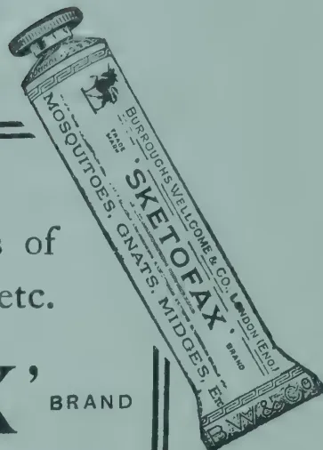

## PESTS AND DISEASES.

### INSECT PESTS OF COCONUTS.

**D. PONNIAH,**

*(Insectary Assistant, Department of Agriculture, F.M.S.)*

Coconut has been grown extensively in Malay from time immemorial and it holds a place second in importance only to rubber.

We are here to-day to discuss some of the more important insect pests affecting the coconut tree.

Now let us consider the pest that attacks chiefly the young plantations.

#### TERMITES OR WHITE-ANTS.

This is known in Malaya as "Anai anai." The pest is more seen in young plantations where timber has been allowed to remain for two or three years. This presents a convenient nesting place for them. They breed and multiply there. From here they migrate to young coconut trees if their natural habitat is disturbed or when they run short of food.

The exact life-history of these insects has not been worked out, but their habits are fairly well known. If in some place affected by this pest, timber, which as I remarked before forms the nesting place, is removed, there appears to be a violent attack on young coconut palms or rubber trees close by.

76------------------------------------------------

JULY, 1921.]57

*Control.*—Complete destruction of all timber along with the nests is therefore *the remedy* for white ants. Cleanliness in coconut plantations is a thing of supreme importance, to which all careful planters should adhere.

### PESTS OF LEAVES.

*Brachartona catoxantha* (Hamts.)—The caterpillars of this moth occur at more or less regular intervals of two, three or even six years in the same locality and do considerable damage by eating the under surface of the leaf, or, when they are full grown larvæ, a portion of the complete leaf-substance. A fairly well attacked coconut holding shows a dry and parched up appearance. The result of the attack is that the nuts will fall off or remain undeveloped. This is due to the leaves supporting the bunches drooping. Attacked trees do not die as a rule, but recover after some time when fresh leaves are put forth.

*Life-history.*—The life-history of the pest is as follows : Eggs are laid by the adult female moth singly, generally on the lower surface of the leaves and more especially at their tips. They are watery green in appearance, round, and about the size of a pin's head. From these eggs, tiny little caterpillars, having hairs all over the body, hatch out. These feed voraciously and grow rapidly. After about five weeks they are full grown, when they pupate inside a white silken cocoon either on the leaf or on the stem or at any other convenient position on the tree. Moths come out from the cocoons after about nine days. The upper surface of the wings is a dirty brown in colour and the body is for the most part yellow in colour.

*Natural Control.*—This pest seems eventually controlled by climatic conditions, parasites, and predators. The chief among the insect parasites is a Tachinid fly. This lays its eggs usually on the heads of caterpillars, generally one on each. The eggs hatch in three days into maggots which enter the body of the host and feed inside until the host dies. When the maggots are full fed they come outside the body of the host and pupate. They emerge as flies after seven or eight days.

A small hymenopterous insect lays its eggs inside the body of the caterpillar. The larva hatches out and feeds inside and, after a few days, is seen pupating under the body of the caterpillar. The appearance of this on a leaf *in situ* is as if the caterpillar is brooding over an egg.

A species of fungus also attacks the caterpillars and is responsible for reducing the number of the pest considerably.

*Control.*—Several remedial measures have been tried. The chief recommendation so far is to cut the lower affected leaves and burn them. This method, while reducing the pest to a degree, kills parasites as well as pests. It should be done at a time when it will be least injurious to parasites, namely, on the first appearance of the moths.

Adult moths are inactive during the night and from 9 a.m. till 2 p.m. in the daytime. During these times they can be easily collected by means of hand-nets or crushed between flatstone or wood where the trees permit.

Cultural and other methods of control are being tried but the experiments cannot be said to be conclusive at present.

77------------------------------------------------

58[JULY, 1921.

*Plesispa reichei*.—This belongs to a family of leaf eating beetles. It is what was hitherto known to us as *Bronthispa foggatti*. It was noted in the Federated Malay States in 1914-1915 as a minor pest doing some damage to coconuts. It has increased in seriousness ever since. So far, parasites or predators have not been found keeping it in check. This then is presumably the reason why it is assuming serious proportions.

*Life-history*.—The whole life-history takes about two months and the whole life of the pest is passed on the tree between the just opening fronds and young leaves. Eggs are laid there, and grubs feed and pupate there. The adult beetles also are found there feeding and pairing. The adults shun light and are capable of flying when disturbed. The question of control, therefore, becomes a problem which cannot easily be solved.

It has not yet been found possible to treat them with any poison-sprays. Experiments will shortly be tried by the Department to see if any satisfactory control is possible. The only suggestion for control for the present is : To press the leaflets together between thumb and forefinger so as to kill the adult beetles, grubs, pupæ and eggs that are found between and inside the leaflet.

#### OTHER PESTS.

*Coconut Spike Caterpillar*.—This belongs to a family of moths. The caterpillar of this moth attacks both male and female flowers of the spike. When the male flowers are attacked their anthers are eaten first, the dead flowers and frass being spun together with silk (which they secrete) into a dirty looking mass around the branches of the inflorescence. Tunnels are formed within this mass in which caterpillars move freely to and fro. In badly attacked places, caterpillars of various sizes of growth can be seen. When the male flowers are thus attacked and eaten away, a few caterpillars may destroy female flowers, while yet a few will migrate to other spikes when food-supply is exhausted. The caterpillar pupates in a roughly constructed silken cocoon in the mass of dead flowers and frass. The result is that nuts are generally not formed, even if the female flowers are not bored. The only treatment recommended at present is to cut and burn all affected spikes.

*Coconut Pollen Mite*.—Mites do not come under the category of "insects." They are eight legged creatures in their adult stage as against six legs of insects. These mites feed on the pollen. MR. P. B. RICHARDS records in page 417, Agricultural Bullet, Federated Malay States, Vol. VI, No. 10, as follows: "Such of the pollen as is not destroyed becomes massed into heavy lumps, and probably is rendered unfit for pollination of the female flowers." The result is the formation of a scanty crop of nuts.

#### PESTS OF STEM AND SHOOT.

*Rhinoceros Beetle*.—This is what is known in Malay as "Kumbang hitam." It occurs throughout Malaya in all seasons of the year. Eggs are laid in decaying organic matter such as coconut stumps and manure heaps. From these eggs, whitish grubs with three pairs of legs hatch and feed upon the rotting vegetable matter. When full grown they pupate and emerge as adults which fly to coconut palms and by injuring the crown provide a means for the red weevil to enter for egg laying. This ranks as a very important major pest of palms and is a potential carrier of fungus diseases of palms.

*Control*.—Various methods of control have been suggested. The best among them are destroying all the possible breeding places, and is so doing eggs, grubs and pupæ, and extracting beetles by means of a wire.

The beetles are attracted to light in India but experiments conducted here have met with little success.

78------------------------------------------------

JULY, 1921.]59

Poisoning rubbish heaps and traps have been suggested but the success or otherwise of these for Malaya cannot be gauged without actual test. MR. P. B. RICHARDS has observed a Scolid wasp, *Scolia procer*, rendering great assistance to the coconut planters in this country. The larva of this wasp is parasitic on the fat grubs of *Oryctes*. He also describes in one place very clearly how the mother wasp finds the grub which is lying several inches below the surface and deposits her eggs on the host (*vide Agricultural Bulletin, Federated Malay States, Vol. VI.*

*Red Weevil.*—This is what is known to most Malaya as "Kumbang merah," Males and females can be easily distinguished by the difference manifested in their snouts. The snout of the male is rather straight and thin and appears brush-like whereas the snout of the female is slender and a bit curved at the tip and without the brush. Eggs are laid in places damaged by *Oryctes*, i.e., at the crown, or by mechanical means to either the crown or trunk. Grubs hatch out after three or four days and when full grown they pupate inside the tree in cocoons formed of the fibrous tissues of the tree from which beetles emerge. Investigations to ascertain their habits and experiments for control are now being conducted. So far the adult beetles have been found incapable of boring into healthy stems and it seems that only when the soft tissues are exposed can they continue their ravages. This pest can do considerable damage to the "African Oil Palm," a tree which is being introduced in Malaya.

*Control.*—Adult beetles are attracted by the smell of rotting coconut stems where they lay their eggs and breed: it is suggested that lengths of palm wood kept in or near the plantation in order to attract the beetles for egg laying would be useful, but every month or less these traps must be burned, and the beetles that are attracted must be collected every morning and destroyed.

All coconut tree stumps, trunks, and soft parts, when cut down, or when they die, must be immediately destroyed. Other remedial measures which are suggested by various authorities in many countries will be tried here before they are recommended for general use in this country.

There are several species of caterpillar pests, such as skippers, bag-worms and slugs which occur as sporadic major or minor pests in some localities. They are often kept well under control by parasites or predators. It is only when natural control does not seem to operate adequately that these insects assume pest proportions. Scale insects, mealy bugs also attack our coconuts. Further researches on their life-histories, etc., should reveal means for easy control.—*AGRIC. BULL. OF F.M.S.*, Vol. VIII, No. 3.

---

## TEA HELOPELTIS.

E. BALLARD,

*Entomologist, Government of Madras.*

The study of insect pests has too often been undertaken without reference to the proper study of the plants upon which they feed, and the other environmental factors affecting their life-histories. The spraying machine was looked upon as the solution of all problems, and many wild and impracticable remedies were often suggested.

Of late years there has been a world wide tendency to approach the subject of insect enemies of plants from another angle. The necessity for a complete study of the affected crop equally with the insect attacking it is more fully realised. There are many possibilities now opening out, giving those whose work it is to protect the crops, far greater hope of a successful issue to the struggle.

79------------------------------------------------

60[JULY, 1921.

There is some indication that resistant varieties of at least one crop may be found, although work in this direction is still in its infancy so far as insect enemies are concerned. What is known as biological control of pests is being studied and the technique much improved, and in some parts of the world the use of insects to control insects is proving a success. There is another point from which insect pests can be assailed, and that is through the plant itself. An analysis of a particular crop might reveal some substance which may be used to bait a trap of a pest, or as a repellent to keep it away from that particular crop.

It is a matter of common observation that a sickly crop suffers more from insect pests than one which is healthy. Where more study is required is in investigating the nature of the sap in sickly plants and finding what it is that makes them more attractive to insects when they are in bad condition than when they are well. Many factors may cause unhealthiness, and what each particular kind of unhealthiness is, requires to be studied.

MR. A. E. ANDREWS, Entomologist of the Indian Tea Association, has been studying for some years the problem of mosquito blight on tea, and a brief summary of the most interesting results which he has obtained are given in the Quarterly Journal of the Indian Tea Association. The experiments are still in progress, but it might be of interest to tea planters in South India to know what is being done to deal with *Helopeltis* in Assam. At the same time it will give an interesting side light on the sort of problem with which an economic entomologist is confronted, and how necessary it is to take into consideration all environmental factors of a crop and its enemy.

The results attained by MR. ANDREWS amount briefly to this, that the resistance of tea bushes to mosquito blight is directly proportional to the available potash in the soil, and the power of the bush to assimilate it. Recently experiments have been carried to a successful issue in which bushes apparently destroyed by mosquito blight beyond recovery have been resuscitated and given a good flush. The recovery was brought about by direct inoculation of potassium salts.

Trees treated in this way have remained resistant although in the middle of others heavily infested with *Helopeltis*. Cases of insects alighting on the bushes and leaving them after one or two trial feedings were seen. This means that bushes so treated were actually distasteful to their worst enemy. Here, then, was a definite cause of unhealthiness, namely a deficiency of potassium salts, due either to an insufficiency of potash in the soil, or inability on the part of the plant to make use of it. This is a discovery of very great importance, for in one case at least an attractive or repellent factor has been found, and it is certainly only the beginning of a new line of study in plant pathology.

The whole problem is still under investigation, but MR. ANDREWS is following up a most original and interesting line of researches, which should go far to settling the problem of mosquito blight in Assam. Emphasis must be placed on the words "in Assam," for what may solve the problem in Assam will not necessarily solve it in South India. In the first place the mosquito blight of South India is not caused by the same insect as in Assam, There they have *Helopeltis theivora*, whereas the South Indian *Helopeltis* is most probably *antenii*. It by no means follows then that *Helopeltis antenii* will be repelled in the same way as *Helopeltis theivora*. The writer has not yet had an opportunity of studying the problem in South India as the claims of the Pink boll worm have been paramount, but planters whose estates are afflicted by *Helopeltis* can solve one problem at least by sending specimens of *Helopeltis* so that the question *antonii* or *theivora* can be settled, and later on as time permits, it may be possible properly to investigate the whole matter.—PLANTERS' CHRONICLE, Vol. XVI, No. 23.

80------------------------------------------------

JULY, 1921.]61

# APICULTURE.

## BEES AND FRUIT.

The following is taken from an article on "The Bee's Role in Fruit Culture" in the BEE WORLD :

Some plants secrete nectar. This nectar is not a bi-product, but has a purpose, viz., the attraction of insects. It was a long time before the functions of nectar was understood by botanists. PATRICK BLAIR thought that nectar absorbed the pollen and then fertilised the ovary. PONTEDERA contended that it kept the ovary moist. LINNEUS gave up the solution altogether. KRUNITZ thought that he observed in meadows much frequented by bees the plants were healthy, but the inference he drew was that the benefits of the bees' visits were they removed the nectar which was injurious to the plants. KURR and ROLTES observed that the secretion of nectar is intimately associated with the maturity of the stamens and pistil, and laid it down as a general rule that it seldom commences before the opening of the anthers, is more copious during their maturity, and ceases as soon as they wither. But none found the secret. SPRENGEL first pointed out that nectar attracts bees and other insects.

LORD AVEBURY discovered by experiments that the bee has an eye to colours, and that the bright tints of the petals act as a guide. Bees search for pollen and honey (1) to feed the young and to provide food for their own use. We make use of their hoarding instinct and secure our surplus. Bees visiting flowers for their honey carry pollen from flower to flower and bring about fertilization. It is evident that successful fruit-growing is to a great extent dependent on bee-visitation : so that the keeping of bees is an important detail in successful fruit-culture.

C. D.

## PRIZES FOR BEE-KEEPING.

The Secretary, Ceylon Bee-keepers' Association, reports :—With a view to encouraging bee-keeping in village schools three money prizes were offered for best work in 1920. 1st and 2nd Rs. 15'00 and Rs. 10'00 respectively offered by the HON'BLE MR. F. A. STOCKDALE, Director of Agriculture, and the 3rd Rs. 5'00 by MR. GEORGE CROZIER of Pannipitiya.

1. The judging was done by the Inspectors of School Gardens and the results were as follows :—

1. 1. T. K. D. SAMARASINHE, Asst. Teacher, Molagoda in Kegalle District.. ..... Rs. 15'00
2. 2. D. S. KARUNASEKERE, Head Teacher, Potuwatawana in Chilaw District..... ,, 10'00
3. 3. DON EDWIN SOLOMON JAYASINHE, Monitor, Kottapola (Hakahinna) in Kegalle District..... ,, 5'00

81------------------------------------------------

62[JULY, 1921.

# GENERAL.

---

## DEPARTMENT OF AGRICULTURE, CEYLON.

---

### RULES GOVERNING THE AWARD OF PRIZES IN VEGETABLE GARDENS COMPETITIONS, CEYLON.

#### GENERAL.

1. These competitions are being instituted in order to stimulate the production of vegetables in the gardens of villagers and to improve the methods of cultivation employed.

2. For the purposes of these competitions, a vegetable garden shall be defined as an area of land cultivated in not less than six kinds of annual vegetables, food crops, or curry stuffs, and containing no systematic cultivation of any perennial agricultural crop.

3. Competition shall be restricted, so far as is possible, to *bona fide* villagers who are owners or lessees of not more than 10 acres of land.

4. Excepting it be otherwise notified, each competition shall be restricted to one pattu or korale.

5. Gardens of less than one quarter of an acre or of more than 4 acres in area will not be eligible for competition.

#### ENTRIES.

6. Villagers who intend to compete should give their names and details concerning the area and situation of their gardens to the Agricultural Instructor of their pattu not later than three months before judging is fixed to take place.

7. Entries shall be forwarded, as soon as received, to the Divisional Agricultural Officer, or to the Chairman of Food Production Committee, where such an agricultural officer has not been appointed.

8. Agricultural Instructors shall take steps—

(1) To encourage villagers to compete ;

(2) To visit gardens before the date of judging in order to give advice to competitors ; and

(3) To ascertain whether each competitor is a *bona fide* villager as defined in these rules.

#### JUDGING.

9. Preliminary judging shall be carried out by an officer of the Department of Agriculture, who shall submit to the Divisional Officer or the Chairman of the Food Production Committee, where a Divisional Agricultural Officer has not been appointed, the names of the six competitors whose gardens are, in his opinion, most deserving of further consideration.

82------------------------------------------------

JULY, 1921.]63

10. The six best gardens shall be visited and inspected by a committee consisting of the Mudaliyar of the pattu or korale, an officer of the Department of Agriculture, and an agriculturist. This committee shall submit their final recommendation to the Food Production Committee of the District

11. Judges shall be guided by consideration of the following points when inspecting gardens :—Varieties of vegetables cultivated ; system of cultivation ; drainage ; manuring ; estimated yield ; freedom from disease and pests ; tilth of soil.

### PRIZES.

12. First, second, and third prizes in money, together with certificates from the Department of Agriculture, shall be awarded to prize winners in connection with each competition.

13. A winner of a first prize shall be debarred from competing in another competition for one season subsequent to his winning the prize.

14. Winners of second or third prizes may register in the following season for competition for prizes of a greater value than the prize previously secured.

F. A. STOCKDALE,

Peradeniya, June 10th, 1921.

Director of Agriculture.

---

## VEGETABLE GARDENS COMPETITIONS IN GALLE DISTRICT, 1921.

---

The Department of Agriculture allocated Rs. 300 to the Food Production Committee of Galle District in 1921, to be used for providing prizes in connection with Vegetable Garden Competitions. It was decided to divide the sums equally between the six pattus of the District, but eventually it was not found feasible to include Hinidum Pattu, and at a later date the entries from Bentota-Walallawita Korale were all withdrawn owing to persistent drought which prevented the Gardens from being cultivated.

Finally the following entries were received from the four remaining pattus.

<table>
<tbody>
<tr>
<td>Four Gravets</td>
<td>...</td>
<td>...</td>
<td>76</td>
</tr>
<tr>
<td>Talpe Pattu</td>
<td>...</td>
<td>...</td>
<td>28</td>
</tr>
<tr>
<td>Wellaboda Pattu</td>
<td>...</td>
<td>...</td>
<td>27</td>
</tr>
<tr>
<td>Gangaboda Pattu</td>
<td>...</td>
<td>...</td>
<td>13</td>
</tr>
<tr>
<td colspan="3"></td>
<td>
144
</td>
</tr>
</tbody>
</table>

The sum of Rs. 75 was available for each pattu, and it was decided to award three prizes in each pattu, a first of Rs. 35, second of Rs. 25 and third of Rs. 15. There were therefore 12 prizes available for the whole district, a fairly high proportion considering the number of entries.

All the entries in each pattu were inspected by the Agricultural Instructor for the pattu about one month before final judging, and the six gardens which in the opinion of the Instructor were best were afterwards inspected by a committee composed of the Divisional Agricultural Officer,

83------------------------------------------------

64[JULY, 1921.

Southern Division, and the Mudaliyar of the pattu concerned. This committee then made recommendations to the Food Production Committee for the award of the first, second and third prizes.

The prize winners in the respective pattus are given in the following list.

<table>
<thead>
<tr>
<th></th>
<th style="text-align: center;"><i>1st Prizes.</i></th>
<th style="text-align: center;"><i>Addresses.</i></th>
</tr>
</thead>
<tbody>
<tr>
<td>Four Gravets</td>
<td>D. A. D. S. Wickremesinghe</td>
<td>Wataraka East</td>
</tr>
<tr>
<td>Talpe Pattu</td>
<td>Hinetigala Kanattege Jeeris Appu</td>
<td>Talgampola</td>
</tr>
<tr>
<td>Wellaboda Pattu</td>
<td>W. M. Udari Hamy</td>
<td>Gonapinuwala</td>
</tr>
<tr>
<td>Gangaboda Pattu</td>
<td>Vitanachchige Dinis de Silva</td>
<td>Ganegama</td>
</tr>
<tr>
<th></th>
<th style="text-align: center;"><i>2nd Prizes.</i></th>
<th></th>
</tr>
<tr>
<td>Four Gravets</td>
<td>N. A. Carolis</td>
<td>Wataraka East</td>
</tr>
<tr>
<td>Talpe Pattu</td>
<td>A. Wijesekera, Buona Vista</td>
<td>Unawatuna</td>
</tr>
<tr>
<td>Wellaboda Pattu</td>
<td>Dasim Thabreus</td>
<td>Idantota</td>
</tr>
<tr>
<td>Gangaboda Pattu</td>
<td>Welivitigodage Harmanis</td>
<td>Akmimana</td>
</tr>
<tr>
<th></th>
<th style="text-align: center;"><i>3rd Prizes.</i></th>
<th></th>
</tr>
<tr>
<td>Four Gravets</td>
<td>Mahawanni Achchige Sinno Appu</td>
<td>Wataraka West</td>
</tr>
<tr>
<td>Talpe Pattu</td>
<td>1 Ellewala Kankanange Carolis Appu</td>
<td>Talgampola</td>
</tr>
<tr>
<td></td>
<td>2 Bentota Gunaris Appu</td>
<td>Talgampola</td>
</tr>
<tr>
<td>Wellaboda Pattu</td>
<td>K. T. Simon Hamy</td>
<td>Gonapinuwala</td>
</tr>
<tr>
<td>Gangaboda Pattu</td>
<td>Charles Jayasekera</td>
<td>Ganegama</td>
</tr>
</tbody>
</table>

The third prize in the case of Talpe Pattu was awarded jointly to the two competitors named, as the judges could not decide between the two gardens, and the Food Production Committee has been asked to increase the amount awarded in each case to the full amount (Rs. 15) of a 3rd Prize.

In each case the judges recommended that the prizes should be awarded on some public occasion, and arrangements are being made for the presentation to take place at the Galle District Show in August.

### GENERAL OBSERVATIONS.

At the time when these competitions was announced no rules existed for the guidance of competitors and judges. In consequence the entries were in some cases unsatisfactory. In each pattu a fairly high proportion of the entries were from owners of large areas of land, who in fairness should not be allowed to compete against the *bona-fide* labouring villager, and it was necessary to rule entries of this kind out of the competitions.

There was a great diversity in the size of the gardens exhibited; while most of the entries ranged from one-quarter of an acre to 5 acres, in some cases areas of over 20 acres were offered, and in one or two cases areas of 80 to 100 acres. In all cases these large holdings were ruled out of competition, although the entrants might fairly claim that no information was given them beforehand on the subject.

Several holdings were entered in each pattu which consisted of fields of rubber or coconuts 2 or 3 years of age interplanted with a single food crop, usually manioc. These were ruled out both on the ground that they could not be regarded as vegetable gardens, and because their nature and area proved them to be the property of capitalist owners and not of *bona fide* villagers.

Draft rules for vegetable gardens competition in the Southern Division have now been drawn up by the Divisional Agricultural Officer and will be used by the Department of Agriculture for use in connection with competitions of this kind in future years. This will probably be of value in giving

84------------------------------------------------

JULY, 1921.]65

competitors, instructors and judges a clear conception of the aims of these competitions, and the result should be an increase both in the number and quality of the entries.

There appears to have been in the past a tendency towards granting prizes in these competitions merely as a reward for having established a vegetable garden. This point of view was perhaps unavoidable, as the aim of the competition was in the beginning the increasing of the areas under food-crops, but the result has been that there is little true competition. The real value of competitions of this kind lies in the opportunity they afford for rewarding really good work resulting in increased yields, and for giving instruction to villagers so as to improve their methods. When correctly used they must be ranked as among the very best means we possess of imbuing the villager with a desire for improving his agricultural knowledge and for providing him with that knowledge.

G. G. AUCHINLECK,  
Divisional Agricultural Officer, Southern.

## UNITED STATES GROWN SISAL.

The following announcement regarding the desirability of increasing the production of sisal fibres in territory governed by the United States is of interest. It is taken from *Bulletin No. 390*, issued by the United States Department of Agriculture : —

Important agricultural and manufacturing industries of the United States are now largely dependent on supplies of imported raw products. Necessary action should be taken to safeguard our future supply of these products.

The grain-producing industry of the United States cannot be maintained without the use of harvesting machinery, and this machinery cannot be operated without binder twine.

The greater portion of the binder twine used in the United States is manufactured from henequen and sisal fibres, and more than 90 per cent. of the total supply of these fibres imported into the United States is received from Yucatan.

This dependence of our most important agricultural industry on one small State of a foreign country constitutes a grave menace to American agriculture.

In order to remedy this situation, it is essential that an increased supply of binder twine fibre be produced within the territory of the United States, or in countries over which the United States exercises political control.

The Philippine Islands possess the requirements necessary for the development of a flourishing sisal industry.

The production of binder twine fibre in the Philippine Islands has been restricted in the past by reason of the antiquated methods that are in general use by the planters, and a number of reforms in this industry are urgently needed.

For the last three years the United States Department of Agriculture has been co-operating with the Philippine Bureau of Agriculture for the purpose of encouraging the increased production of binder-twine fibre in the Philippine Islands,

85------------------------------------------------

66[JULY, 1921.

The more important lines of work undertaken have been the introduction of machine cleaning to replace the unsatisfactory retting process, the distribution of sisal plants, and the introduction of improvements on the plantations.

As a result of this work, machine cleaning has been established on a commercial basis, and twelve large modern fibre-cleaning machines have been purchased by Philippine planters during the last eighteen months; 500,000 sisal bulbils have been imported into the Philippine Islands from the Hawaiian Islands; and there is now enough sisal in the Philippines to furnish an abundant supply of plants for future use. While there has been no marked and widespread improvement of conditions on the plantations, there has been a fair degree of progress.

The production of magney and sisal fibres in the Philippine Islands for the first five months of 1920, has been larger than during any similar period in previous years. During this period, the production of Philippine magney and sisal has been approximately 20 per cent. of the henequen production of Yucatan.—AGRIC. NEWS, Vol. XX, No. 495.

---

## MULCHING INSURES MOISTURE DURING THE DRY WEATHER.

EULOGIO N. PEREGRINO,

*Agricultural Assistant.*

Failures with crops are due mostly to drought. Plant diseases and insect pests can be remedied by spraying; the growth of weeds can be checked or prevented by cultivation; but when dry weather comes the average farmer has no means of supplying the moisture necessary to secure good maximum yields.

Good yields from the farm are certain, however, whenever an efficient method of protecting the plants from drought is practised. Moreover, results are obtained at the minimum cost, for a small area of land producing at the maximum requires a lower seed and labour expense than a large area giving a poor yield.

If water cannot be supplied inexpensively to the entire area planted a part of the crops can be protected by mulching.

There must be some means of keeping the soil cool, when water is applied during a severe drought, for wet soil intensely heated scalds the roots of the plants. There must be a protective covering between the soil and the hot rays of the sun. The dust mulch used to conserve moisture after a rain is not adequate during intensely hot weather.

86------------------------------------------------

JULY, 1921.]67

Whatever is used as protective covering must be finely pulverized so that a compact coating can be made over the soil. Experiments with various materials have proved to conserve the most moisture possible and keep the ground cool. The object should be to make as much water as possible available to the plant instead of permitting the greatest part to evaporate. Straw and manure so fine that it can be easily handled with a scoop are ideal materials for mulching.

Judgment is needed when mulching should be applied. For the application of the mulch in the case of any crop, there is no definite time which is best, for much depends upon the weather. Frequent cultivation should take the place of the mulch while the crop is young and the soil contains plenty of moisture; for after the mulch is in place weeding must be done by hand instead of with cultivators. It is best to cultivate until the plants are out of danger of being harmed by weeds. The application of compact mulch will have a tendency to discourage further weed growth. In the case of low-growing crops the best time for mulching is generally when the plants are started, soon after transplanted and when about half grown.

Experiments with mulches have proved that if materials containing large quantities of nitrogen are used on a soil rich in nitrogen, acid phosphate and potash must be added in order to have a balanced plant food. Applying highly nitrogenous mulch to plants induces an extraordinary growth of foliage without giving a proportionate yield of fruits. Whenever water is applied it carries nitrogen from the mulch into the soil.

The best time to apply water to plants is in the evening or during cloudy days. The greater the moisture content of the atmosphere the better the time for watering. Often, during a period of very severe drought, there will be a number of cloudy days and such a time is ideal for stimulating growth. There is no need of a great quantity of water. Watering can be easily overdone, as stems and foliage must not contain moisture in an excessive proportion to that of the atmosphere. In an experiment during an unusual drought only two waterings were necessary to maintain normal growth.

This method of conserving moisture is far superior to maintaining a dust mulch. Crops that are mulched and watered retain their freshness while others become parched and often finally succumb.

Hand weeding and cultivation are not necessary after the mulching is in place. The labour required in growing crops by this method is about the same as when cultivation is practised the entire season. Mulched crops need no attention at any particular time but with unmulched ground, cultivation must take place after a rain as soon as the surface of the soil begins to dry in order to prevent crusting.

What work is necessary can be done when no other work is pressing.—

PHILIPPINE FARMER, Vol. VII, No. 3.

## PRESERVATION OF BANANAS AND OTHER FRUITS.

Recent experiments conducted at the Jodrel Laboratory, Kew, have proved the efficacy of Formaline as an agent for preventing the rapid decay of ripe fruit. Bananas treated by immersing for ten minutes in cold water containing 3% of commercial formaline lasted ten days longer than untreated fruit. Tests with currants, plums, grapes, strawberries, etc., gave similar results.

It is recommended for fruit which are eaten entire, e.g., strawberries, that after immersion in the formaline they be placed for five minutes in cold water, and afterwards placed on wire-netting to drain and dry. But with fruit with a rind better results are obtained when this is omitted.—PRO. OF AGRIC. SOC. OF TRINIDAD AND TOBAGO, Vol. XXI, Part 2.

87------------------------------------------------

68[JULY, 1921]

# LIBRARY.

---

## THE DISEASES AND PESTS OF THE RUBBER TREE.\*

This work by MR. T. PETCH, Botanist and Mycologist, Ceylon, has recently been published. It is a complete revision of a portion of the author's former work THE PHYSIOLOGY AND DISEASES OF HEVEA BRASILIENSIS published ten years earlier, and brings up-to-date all the information available concerning the diseases of the rubber tree.

To the investigation of rubber diseases the author has devoted a very considerable amount of his time during the past fifteen years and his authority on the subject is recognised throughout the rubber-growing tropics. The book is full of detailed information and is intended for the rubber planter. Technical botanical details have been avoided as far as possible.

The first portion of the book deals with general sanitation of rubber estates and refers to such important matters as jungle stumps, thinning out, intercrops, protection from wounds, etc., and details the various parasitic fungi which may spread and cause damage if attention is not given to general sanitation.

Root diseases are dealt with in full detail. They are most important to the rubber plant and have probably accounted for greater losses in rubber estates than any other group of diseases. Six root diseases caused by *Fomes lignosus*, *Poria hypobrunnea*, *Fomes lamaoensis*, *Fomes pseudo-ferreus*, *Ustilina zonata* and *Sphaerostilbe repens* are described, illustrations given of their general characteristics and control measures detailed.

Leaf diseases are described in Chapter III and the possible seriousness of the South American Leaf disease and of the Leaf-fall disease of the East indicated. Phytophthora diseases are dealt with in full detail and include leaf-fall and pod disease, Claret-coloured canker and Black thread (Bark rot).

Stem diseases described, other than those caused by Phytophthora include Pink disease, Ustilina, die-back, top canker, mouldy rot, thread blight, horse-hair blight etc., while Brown-bast, nodules and other non-parasitic diseases are discussed and some of the defects of prepared rubber dealt with.

The Chapter on Pests includes details concerning termites, the rubber leaf mite, the root borer and the locust, in addition to numerous other insects which are to be found on rubber, but which occasion but little damage.

The book is full of information required by the rubber planter and should be purchased by every rubber estate superintendent. It is illustrated by six coloured Plates and 38 text figures prepared in the mycological laboratories of the Department of Agriculture, Ceylon.

---

\* *The Diseases and Pests of the Rubber Trees* by T. PETCH, B.A., B.Sc., Macmillan & Co., London, Price 20/- net.

88------------------------------------------------

JULY, 1921.]69

## AGRICULTURAL PRACTICE AND ECONOMICS IN THE UNITED PROVINCES.\*

The book by DR. MARTIN LEAKE, Director of Agriculture of the United Provinces, India, is based upon the lectures delivered by the author when Principal of the Cawnpore Agricultural College.

It constitutes a valuable contribution to the study of Indian Agricultural Economics and emphasizes the inter-dependence between agricultural practice and economic application. It is divided into five main sections—the origin of agriculture, the basis of agricultural practice, the basis of agricultural economics, the development of agriculture and the development of agricultural economics. The book is worth the careful study of all interested in agricultural development, and particularly by those students of agriculture and economics, who are desirous of assisting in the improvement of the agriculture of their country, province or district.

It is emphasized that the development of an improved agricultural practice is intimately bound up with the economic aspect, mainly with the provision of capital. The problem of agricultural capital is dealt with in detail and the system of co-operative credit lucidly described. It is explained that the system of co-operation diminishes the risk, increases the guarantee, reduces the cost of enquiry and places capital at the cultivators' disposal on economic terms. When satisfactory credit has been provided agriculture progresses and improves.

## MANUAL OF TROPICAL AND SUB-TROPICAL FRUITS.†

This book by WILSON POPENOE, Agricultural Explorer of the United States Department of Agriculture, brings together available information concerning the principal fruits cultivated in Tropical regions. The banana, pine-apple, citrus fruits, olive and fig have been excluded from the work as they have been fully dealt with in other publications.

This work contains much very valuable information concerning tropical fruits. Our present knowledge of tropical fruits is superficial, mainly because workers upon the improvement of fruits in one part of the world have had no experience of the varieties of fruits to be found in other tropical lands. While travelling as Agricultural Explorer for the United States Department of Agriculture a considerable amount of first hand information has been collected together by the author who also has had advantage of practical growing of tropical and sub-tropical fruits in California and Florida.

The chapters on the mango, avocado, anonaceous fruits, loquat, papaya and mangosteen are of particular interest to Ceylon and show what is being done in other countries to improve their varieties of fruits. Much of the fruit of Ceylon is excessively poor in comparison with the fruit of other tropical lands, and workers who will attempt to improve conditions are required.

\* *The Bases of Agricultural Practice and Economics in the United Provinces, India*, by H. MARTIN LEAKE, M.A., Sc. D., F.L.S., W. Heffer & Sons, Cambridge.

† *Manual of Tropical and Sub-tropical Fruits* by WILSON POPENOE, MACMILLAN COY., 1920, Price 30/-

89------------------------------------------------

70[JULY, 1921.

## THE CEYLON

### STATEMENT OF RECEIPTS

<table border="1">
<thead>
<tr>
<th rowspan="2" style="text-align: center;">PARTICULARS</th>
<th colspan="2" style="text-align: center;">TOTAL</th>
</tr>
<tr>
<th style="text-align: center;">Rs.</th>
<th style="text-align: center;">Cts.</th>
</tr>
</thead>
<tbody>
<tr>
<td colspan="3" style="text-align: center;">RECEIPTS :—</td>
</tr>
<tr>
<td>A.—GOVERNMENT GRANT</td>
<td style="text-align: right;">52,010</td>
<td style="text-align: right;">00</td>
</tr>
<tr>
<td colspan="3">B.—OTHER CHARGES :—</td>
</tr>
<tr>
<td>1. PUBLICATION AND PRINTING :—</td>
<td></td>
<td></td>
</tr>
<tr>
<td>    (a) Tropical Agriculturist</td>
<td style="text-align: right;">215</td>
<td style="text-align: right;">20</td>
</tr>
<tr>
<td>    (b) Govikam Sangarawa</td>
<td style="text-align: right;">711</td>
<td style="text-align: right;">44</td>
</tr>
<tr>
<td>    (c) Tamil Magazine</td>
<td style="text-align: right;">—</td>
<td style="text-align: right;">—</td>
</tr>
<tr>
<td>    (d) Year Book</td>
<td style="text-align: right;">20</td>
<td style="text-align: right;">05</td>
</tr>
<tr>
<td>    (e) General Printing</td>
<td style="text-align: right;">—</td>
<td style="text-align: right;">—</td>
</tr>
<tr>
<td>    (f) Advertisements</td>
<td style="text-align: right;">2,060</td>
<td style="text-align: right;">90</td>
</tr>
<tr>
<td>2. SUPPLIES OF IMPLEMENTS, PLANTS &amp; SEEDS :—</td>
<td></td>
<td></td>
</tr>
<tr>
<td>    (a) Implements</td>
<td style="text-align: right;">2</td>
<td style="text-align: right;">00</td>
</tr>
<tr>
<td>    (b) Plants</td>
<td style="text-align: right;">249</td>
<td style="text-align: right;">40</td>
</tr>
<tr>
<td>    (c) Seeds</td>
<td style="text-align: right;">10,493</td>
<td style="text-align: right;">62</td>
</tr>
<tr>
<td>3. AGRICULTURAL INSTRUCTIONS :—</td>
<td></td>
<td></td>
</tr>
<tr>
<td>    (a) Expt. Gardens</td>
<td style="text-align: right;">10</td>
<td style="text-align: right;">43</td>
</tr>
<tr>
<td>    (b) Apiculture</td>
<td style="text-align: right;">—</td>
<td style="text-align: right;">—</td>
</tr>
<tr>
<td>    (c) Sericulture</td>
<td style="text-align: right;">—</td>
<td style="text-align: right;">—</td>
</tr>
<tr>
<td>6. MISCELLANEOUS :—</td>
<td></td>
<td></td>
</tr>
<tr>
<td>    (a) Stationery &amp; Books</td>
<td style="text-align: right;">8</td>
<td style="text-align: right;">17</td>
</tr>
<tr>
<td>    (b) Post &amp; Telegrams</td>
<td style="text-align: right;">16</td>
<td style="text-align: right;">07</td>
</tr>
<tr>
<td>    (c) Furniture</td>
<td style="text-align: right;">—</td>
<td style="text-align: right;">—</td>
</tr>
<tr>
<td>    (d) Bank Interest (including Fixed Deposits)</td>
<td style="text-align: right;">830</td>
<td style="text-align: right;">81</td>
</tr>
<tr>
<td>    (f) Incidentals</td>
<td style="text-align: right;">207</td>
<td style="text-align: right;">90</td>
</tr>
<tr>
<td colspan="3">SUBSCRIPTIONS :—</td>
</tr>
<tr>
<td>    Foreign</td>
<td style="text-align: right;">7,737</td>
<td style="text-align: right;">30</td>
</tr>
<tr>
<td>    Local</td>
<td style="text-align: right;">5,528</td>
<td style="text-align: right;">64</td>
</tr>
<tr>
<td colspan="3">NEW INSTRUCTORS :—</td>
</tr>
<tr>
<td>    Donation by Kalutara F. P. Committee</td>
<td style="text-align: right;">510</td>
<td style="text-align: right;">00</td>
</tr>
<tr>
<td>    Supplementary Grant (Temporary Increases)</td>
<td style="text-align: right;">8,547</td>
<td style="text-align: right;">00</td>
</tr>
<tr>
<td>    Fixed Deposit (from conversion)</td>
<td style="text-align: right;">8,022</td>
<td style="text-align: right;">94</td>
</tr>
<tr>
<td>    Refund of Petty Cash Imprest</td>
<td style="text-align: right;">400</td>
<td style="text-align: right;">00</td>
</tr>
<tr>
<td></td>
<td style="text-align: right; border-top: 1px solid black;">97,581</td>
<td style="text-align: right; border-top: 1px solid black;">87</td>
</tr>
<tr>
<td>    Balance from 1919</td>
<td style="text-align: right;">735</td>
<td style="text-align: right;">17</td>
</tr>
<tr>
<td>    Over Credits</td>
<td></td>
<td></td>
</tr>
<tr>
<td>        less Bank Commission from July to Dec.</td>
<td style="text-align: right;">5</td>
<td style="text-align: right;">51</td>
</tr>
<tr>
<td></td>
<td style="text-align: right; border-top: 1px solid black;">740</td>
<td style="text-align: right; border-top: 1px solid black;">68</td>
</tr>
<tr>
<td></td>
<td style="text-align: right; border-top: 1px solid black; border-bottom: 3px double black;">98,322</td>
<td style="text-align: right; border-top: 1px solid black; border-bottom: 3px double black;">55</td>
</tr>
</tbody>
</table>

IN BANK :—

On Fixed Deposit Rs. 5,000/-

Examined under my direction and found correct.

June, 1921.

Sgd. W. W. WOODS,  
Colonial Auditor.

90------------------------------------------------

JULY, 1921.]71

## AGRICULTURAL SOCIETY.

### AND EXPENDITURE FOR 1920.

<table border="1">
<thead>
<tr>
<th style="text-align: center;">PARTICULARS</th>
<th colspan="2" style="text-align: center;">TOTAL</th>
</tr>
<tr>
<th></th>
<th style="text-align: center;">Rs.</th>
<th style="text-align: center;">Cts.</th>
</tr>
</thead>
<tbody>
<tr>
<td style="text-align: center;">EXPENDITURE :—</td>
<td></td>
<td></td>
</tr>
<tr>
<td>A.—PERSONAL EMOLUMENTS :—</td>
<td style="text-align: right;">43,473</td>
<td style="text-align: right;">61</td>
</tr>
<tr>
<td>B.—OTHER CHARGES :—</td>
<td></td>
<td></td>
</tr>
<tr>
<td>1. PUBLICATIONS &amp; PRINTING :—</td>
<td></td>
<td></td>
</tr>
<tr>
<td>    (a) Tropical Agriculturist - - - - -</td>
<td style="text-align: right;">7,599</td>
<td style="text-align: right;">57</td>
</tr>
<tr>
<td>    (b) Govikam Sangarawa - - - - -</td>
<td style="text-align: right;">905</td>
<td style="text-align: right;">00</td>
</tr>
<tr>
<td>    (c) General Printing - - - - -</td>
<td style="text-align: right;">157</td>
<td style="text-align: right;">31</td>
</tr>
<tr>
<td>    (f) Advertising - - - - -</td>
<td style="text-align: right;">4</td>
<td style="text-align: right;">14</td>
</tr>
<tr>
<td>2. SUPPLIES OF IMPLEMENTS, PLANTS &amp; SEEDS :</td>
<td></td>
<td></td>
</tr>
<tr>
<td>    (a) Implements - - - - -</td>
<td style="text-align: right;">76</td>
<td style="text-align: right;">07</td>
</tr>
<tr>
<td>    (b) Plants - - - - -</td>
<td style="text-align: right;">357</td>
<td style="text-align: right;">20</td>
</tr>
<tr>
<td>    (c) Seeds - - - - -</td>
<td style="text-align: right;">8,285</td>
<td style="text-align: right;">85</td>
</tr>
<tr>
<td>3. AGRIC. INSTRUCTION :—</td>
<td></td>
<td></td>
</tr>
<tr>
<td>    Expt. Gardens - - - - -</td>
<td style="text-align: right;">1,314</td>
<td style="text-align: right;">93</td>
</tr>
<tr>
<td>5. TRAVELLING :—</td>
<td></td>
<td></td>
</tr>
<tr>
<td>    (a) Secretary - - - - -</td>
<td style="text-align: right;">1,038</td>
<td style="text-align: right;">57</td>
</tr>
<tr>
<td>    (b) Agric. Instructors - - - - -</td>
<td style="text-align: right;">7,000</td>
<td style="text-align: right;">59</td>
</tr>
<tr>
<td>    Temp. ,, - - - - -</td>
<td style="text-align: right;">15,311</td>
<td style="text-align: right;">39</td>
</tr>
<tr>
<td>    (c) General - - - - -</td>
<td style="text-align: right;">1,512</td>
<td style="text-align: right;">92</td>
</tr>
<tr>
<td>6. MISCELLANEOUS :—</td>
<td></td>
<td></td>
</tr>
<tr>
<td>    (a) Stationery &amp; Books - - - - -</td>
<td style="text-align: right;">1,174</td>
<td style="text-align: right;">23</td>
</tr>
<tr>
<td>    (b) Post &amp; Telegrams - - - - -</td>
<td style="text-align: right;">2,763</td>
<td style="text-align: right;">04</td>
</tr>
<tr>
<td>    (c) Furniture - - - - -</td>
<td style="text-align: right;">—</td>
<td style="text-align: right;">—</td>
</tr>
<tr>
<td>    (d) Bank Charges &amp; Commission - - - - -</td>
<td style="text-align: right;">88</td>
<td style="text-align: right;">66</td>
</tr>
<tr>
<td>    (e) Audit of Accounts - - - - -</td>
<td style="text-align: right;">300</td>
<td style="text-align: right;">00</td>
</tr>
<tr>
<td>    (f) Incidentals - - - - -</td>
<td style="text-align: right;">1,269</td>
<td style="text-align: right;">50</td>
</tr>
<tr>
<td>    (g) Seed Store - - - - -</td>
<td style="text-align: right;">361</td>
<td style="text-align: right;">12</td>
</tr>
<tr>
<td></td>
<td style="text-align: right; border-top: 1px solid black;">92,993</td>
<td style="text-align: right; border-top: 1px solid black;">70</td>
</tr>
<tr>
<td>Advance P. C. I. - - - - -</td>
<td style="text-align: right;">400</td>
<td style="text-align: right;">00</td>
</tr>
<tr>
<td></td>
<td style="text-align: right; border-top: 1px solid black;">93,393</td>
<td style="text-align: right; border-top: 1px solid black;">70</td>
</tr>
<tr>
<td>By Balance (Forward) - - - - -</td>
<td style="text-align: right;">4,928</td>
<td style="text-align: right;">85</td>
</tr>
<tr>
<td></td>
<td style="text-align: right; border-top: 1px solid black; border-bottom: 3px double black;">98,322</td>
<td style="text-align: right; border-top: 1px solid black; border-bottom: 3px double black;">55</td>
</tr>
</tbody>
</table>

Sgd. M. KELWAY BAMBER,

Peradeniya, January, 1921.

Secretary, Agricultural Society.

91------------------------------------------------

72

[JULY, 1921

METEOROLOGICAL.

JUNE, 1921.

<table border="1">
<thead>
<tr>
<th rowspan="3">Station</th>
<th colspan="2">Temperature</th>
<th rowspan="3">Mean Humidity %</th>
<th rowspan="3">Mean amount of cloud 0 = clear. 10 = overcast</th>
<th rowspan="3">Mean Wind Direction during month</th>
<th rowspan="3">Daily Mean Velocity. Miles.</th>
<th colspan="2">Rainfall</th>
</tr>
<tr>
<th rowspan="2">Mean Daily Shade</th>
<th rowspan="2">Difference from Average</th>
<th rowspan="2">Amount Inches</th>
<th rowspan="2">No. of Rainy days</th>
<th rowspan="2">Difference from Average</th>
</tr>
<tr>
<th>Inches.</th>
</tr>
</thead>
<tbody>
<tr>
<td>Colombo Observatory</td>
<td>83.0</td>
<td>+ 1.4</td>
<td>78</td>
<td>8.3</td>
<td>WSW</td>
<td>168</td>
<td>1.50</td>
<td>13</td>
<td>- 6.59</td>
</tr>
<tr>
<td>Puttalam</td>
<td>83.5</td>
<td>+ 1.3</td>
<td>77</td>
<td>5.3</td>
<td>SW</td>
<td>318</td>
<td>0.92</td>
<td>2</td>
<td>- 0.84</td>
</tr>
<tr>
<td>Mannar</td>
<td>85.8</td>
<td>+ 1.1</td>
<td>73</td>
<td>7.2</td>
<td>SSW</td>
<td>210</td>
<td>0.00</td>
<td>0</td>
<td>- 0.60</td>
</tr>
<tr>
<td>Jaffna</td>
<td>84.8</td>
<td>+ 1.0</td>
<td>82</td>
<td>4.2</td>
<td>SSW</td>
<td>391</td>
<td>0.22</td>
<td>2</td>
<td>- 0.49</td>
</tr>
<tr>
<td>Trincomalee</td>
<td>86.2</td>
<td>+ 0.6</td>
<td>66</td>
<td>6.7</td>
<td>SW</td>
<td>265</td>
<td>2.75</td>
<td>4</td>
<td>+ 1.47</td>
</tr>
<tr>
<td>Batticaloa</td>
<td>86.0</td>
<td>+ 0.8</td>
<td>64</td>
<td>4.7</td>
<td>SE</td>
<td>147</td>
<td>0.57</td>
<td>4</td>
<td>- 0.46</td>
</tr>
<tr>
<td>Hambantota</td>
<td>83.0</td>
<td>+ 1.5</td>
<td>76</td>
<td>5.0</td>
<td>WSW</td>
<td>434</td>
<td>0.39</td>
<td>5</td>
<td>- 1.95</td>
</tr>
<tr>
<td>Galle</td>
<td>81.0</td>
<td>+ 0.4</td>
<td>82</td>
<td>4.7</td>
<td>WNW</td>
<td>332</td>
<td>4.75</td>
<td>18</td>
<td>- 3.49</td>
</tr>
<tr>
<td>Ratnapura</td>
<td>81.2</td>
<td>+ 0.6</td>
<td>82</td>
<td>7.6</td>
<td>—</td>
<td>—</td>
<td>13.05</td>
<td>26</td>
<td>- 6.83</td>
</tr>
<tr>
<td>Anu'pura</td>
<td>84.1</td>
<td>+ 0.9</td>
<td>72</td>
<td>5.2</td>
<td>—</td>
<td>—</td>
<td>0.64</td>
<td>4</td>
<td>- 0.77</td>
</tr>
<tr>
<td>Kurunegala</td>
<td>81.6</td>
<td>+ 0.7</td>
<td>79</td>
<td>6.4</td>
<td>—</td>
<td>—</td>
<td>3.06</td>
<td>16</td>
<td>- 5.27</td>
</tr>
<tr>
<td>Kandy</td>
<td>77.7</td>
<td>+ 1.1</td>
<td>78</td>
<td>6.9</td>
<td>—</td>
<td>—</td>
<td>2.73</td>
<td>22</td>
<td>- 6.86</td>
</tr>
<tr>
<td>Badulla</td>
<td>75.5</td>
<td>- 0.1</td>
<td>74</td>
<td>6.8</td>
<td>—</td>
<td>—</td>
<td>3.84</td>
<td>7</td>
<td>+ 1.57</td>
</tr>
<tr>
<td>Diyatalawa</td>
<td>70.7</td>
<td>+ 0.3</td>
<td>70</td>
<td>4.9</td>
<td>—</td>
<td>—</td>
<td>3.85</td>
<td>6</td>
<td>+ 1.81</td>
</tr>
<tr>
<td>Hakgala</td>
<td>62.6</td>
<td>+ 0.8</td>
<td>84</td>
<td>6.8</td>
<td>—</td>
<td>—</td>
<td>2.73</td>
<td>15</td>
<td>- 4.97</td>
</tr>
<tr>
<td>N. Eliya</td>
<td>61.6</td>
<td>+ 1.7</td>
<td>85</td>
<td>8.8</td>
<td>—</td>
<td>—</td>
<td>6.18</td>
<td>24</td>
<td>- 6.62</td>
</tr>
</tbody>
</table>

In June, as in May, the main fact of the month has been a deficit in rainfall in those parts of the Island where the averages are high.

Roughly if a line is drawn from Chilaw eastward to Matale and thence from a little East of Matale southward to Tangalle the area South-West of it was from 5 inches to 10 inches in deficit. In that area at a few stations the deficit exceeded 10 inches and at even fewer it was less than 5 inches.

As regards actual quantities Watawala recorded 33 inches (June average 38 inches) and 'Kenilworth' and 'Blackwater' (Nawalapitiya) had approximately 30 inches each followed by Kitulgala 28 inches and Padupola 27 inches. Between the 3rd and the 8th a number of stations in the above neighbourhood recorded over 5 inches in a day but the list of such falls is about half as long as the corresponding one for last June.

One adjunct of the monsoon's failure to deposit the usual amount of rain on the windward side of the Island has been that the usual shielding effect has been less marked on the lee side.

The number of stations that recorded nothing is much smaller than in May and if a line is drawn from Mulativu through Mihintale, Dambulla and Alutuwara to Diyatalawa the area East of it had for the most part above its average rainfall, though this does not mean a great water supply, as the averages themselves are low, e.g. Vakaneri is 5.82 inches above average with a rainfall of 7.04 inches and an average of 1.22 inches.

The wind velocity was above the average—in the case of the southern stations considerably so—and there was nothing very unusual in the mean wind directions.

Humidity was very noticeably in deficit particularly at the coast stations, and Temperature was consistently above normal.

A. J. BAMFORD,  
Supdt. Observatory

ANIMAL DISEASE RETURN FOR THE MONTH ENDED 30th June, 1921.

<table border="1">
<thead>
<tr>
<th>Province, &amp;c.</th>
<th>Disease.</th>
<th>No. of Cases up to date since Jan. 1st. 1921.</th>
<th>Fresh Recoveries.</th>
<th>Deaths.</th>
<th>Bal- ance Ill.</th>
<th>No. Shot.</th>
</tr>
</thead>
<tbody>
<tr>
<td rowspan="2">Western</td>
<td>Rinderpest</td>
<td>—</td>
<td>—</td>
<td>—</td>
<td>—</td>
<td>—</td>
</tr>
<tr>
<td>Foot-and-mouth disease</td>
<td>82</td>
<td>1</td>
<td>82</td>
<td>—</td>
<td>—</td>
</tr>
<tr>
<td rowspan="2">Colombo Municipality</td>
<td>Rinderpest</td>
<td>—</td>
<td>—</td>
<td>—</td>
<td>—</td>
<td>—</td>
</tr>
<tr>
<td>Foot-and-mouth disease</td>
<td>88</td>
<td>—</td>
<td>—</td>
<td>—</td>
<td>—</td>
</tr>
<tr>
<td rowspan="2">Cattle Quarantine Station</td>
<td>Rabies</td>
<td>2</td>
<td>—</td>
<td>—</td>
<td>—</td>
<td>—</td>
</tr>
<tr>
<td>Rinderpest</td>
<td>51*</td>
<td>4</td>
<td>Up to June</td>
<td>20th</td>
<td>1921</td>
</tr>
<tr>
<td rowspan="2">Central</td>
<td>Rinderpest</td>
<td>—</td>
<td>—</td>
<td>—</td>
<td>—</td>
<td>—</td>
</tr>
<tr>
<td>Foot-and-mouth disease</td>
<td>13</td>
<td>4</td>
<td>5</td>
<td>8</td>
<td>—</td>
</tr>
<tr>
<td rowspan="2">Southern</td>
<td>Rinderpest</td>
<td>—</td>
<td>—</td>
<td>—</td>
<td>—</td>
<td>—</td>
</tr>
<tr>
<td>Foot-and-mouth disease</td>
<td>35</td>
<td>6</td>
<td>3</td>
<td>3</td>
<td>—</td>
</tr>
<tr>
<td rowspan="2">Northern</td>
<td>Rinderpest</td>
<td>—</td>
<td>—</td>
<td>—</td>
<td>—</td>
<td>—</td>
</tr>
<tr>
<td>Foot-and-mouth disease</td>
<td>Free</td>
<td>—</td>
<td>—</td>
<td>—</td>
<td>—</td>
</tr>
<tr>
<td rowspan="2">Eastern</td>
<td>Rinderpest</td>
<td>—</td>
<td>—</td>
<td>—</td>
<td>—</td>
<td>—</td>
</tr>
<tr>
<td>Foot-and-mouth disease</td>
<td>141</td>
<td>141</td>
<td>—</td>
<td>—</td>
<td>—</td>
</tr>
<tr>
<td rowspan="2">North-Western</td>
<td>Rinderpest</td>
<td>—</td>
<td>—</td>
<td>—</td>
<td>—</td>
<td>—</td>
</tr>
<tr>
<td>Foot-and-mouth disease</td>
<td>36</td>
<td>11</td>
<td>23</td>
<td>2</td>
<td>—</td>
</tr>
<tr>
<td rowspan="2">North-Central</td>
<td>Rinderpest</td>
<td>—</td>
<td>—</td>
<td>—</td>
<td>—</td>
<td>—</td>
</tr>
<tr>
<td>Foot-and-mouth disease</td>
<td>Free</td>
<td>—</td>
<td>—</td>
<td>—</td>
<td>—</td>
</tr>
<tr>
<td rowspan="2">Uva</td>
<td>Rinderpest</td>
<td>—</td>
<td>—</td>
<td>—</td>
<td>—</td>
<td>—</td>
</tr>
<tr>
<td>Foot-and-mouth disease</td>
<td>392</td>
<td>382</td>
<td>10</td>
<td>—</td>
<td>—</td>
</tr>
<tr>
<td rowspan="2">Sabaragamuwa</td>
<td>Rinderpest</td>
<td>—</td>
<td>—</td>
<td>—</td>
<td>—</td>
<td>—</td>
</tr>
<tr>
<td>Foot-and-mouth disease</td>
<td>Free</td>
<td>—</td>
<td>—</td>
<td>—</td>
<td>—</td>
</tr>
</tbody>
</table>

\* 7 cases occurred amongst sheep and goats. † occurred amongst sheep and goats.

Colombo, 6th July, 1921.

G. W. STURGESS, G.V.S.

92------------------------------------------------

THE  
**TROPICAL AGRICULTURIST:**  
JOURNAL OF THE  
**CEYLON AGRICULTURAL SOCIETY.**

---

---

VOL. LVII.

PERADENIYA, AUGUST, 1921.

**No. 2.**

---

---

**THE CULTIVATION OF LIMES.**

---

Since the depression in the rubber industry, interest has been evinced in the possibilities of new agricultural crops for Ceylon. Numerous enquiries have been made regarding the cultivation of limes and with a view to providing practical information for prospective cultivators the Department of Agriculture has published in Bulletin form full details regarding cultivation and preparation of crops.

Limes have been grown systematically in the West Indies with considerable success during the past twenty years and the agricultural wealth of some of those islands is dependent upon their lime growing industries. There is a steady demand for lime products and the supplies do not at present appear to be exceeding demands.

Limes grow well in all districts of the colony where the rainfall is adequate up to a height of about 2,500 feet. Numerous specimens which are heavily laden with fruits are seen in all the damper districts of the low country and they appear to be healthy and free from pests and diseases.

Systematic cultivation of the lime was commenced at the Anuradhapura Experiment Station in 1917. This Station is situated in the dry-zone and therefore it was the intention that they should be grown on irrigated areas. When irrigation has

93------------------------------------------------

74[AUGUST, 1921.

been regular growth has been excellent and the first crops of fruits are now being reaped. When irrigation has been less regular several losses have occurred and the plantation is irregular. With the North-east rains supplies are being put in, and attention given to regular irrigation.

The lime requires a fairly regular rainfall and therefore should not be planted in areas subject to severe droughts.

It is impossible to estimate whether crops in Ceylon will equal those of the West Indies and therefore until further investigations have been made and the results of experimental plantings ascertained it is advisable for prospective growers to proceed cautiously and only to plant up comparatively small areas for experimental trial.

Limes are comparatively easy to cultivate and there should be no difficulty in regard to cultivation in Ceylon. They are grown from seed planted in specially prepared nurseries and the seedlings are planted out when they are 1 foot to 15 inches high. In drier districts smaller seedlings have given better results than larger ones and show less dying back upon transplanting.

Details are given in the bulletin of the various commercial products of the lime and their methods of preparation. In the early days, while experiments are being carried out, it is probable that concentrated lime juice will be the most suitable form in which to export lime products, while if the industry expands citrate of lime will be the most attractive product.

Exhibits of citrate of lime and of concentrated lime juice were exhibited at the Department of Agriculture exhibit at the Galle Agricultural Show and attracted considerable interest and attention.

Supplies of seed will be secured for prospective cultivators by the Department of Agriculture and enquiries for further information are solicited. The analysis of the limes grown in different districts is now being undertaken and such investigations will indicate whether the citric acid content of limes in Ceylon is equal to those of the West Indies.

94------------------------------------------------

AUGUST, 1921.]75

# RUBBER.

## THE THINNING OUT OF RUBBER:

### ACCORDING TO YIELD-RECORDS AND THE OCCURRENCE OF BROWN BAST.

*Lecture given at a Meeting of the Rubber Planters' Association of Java,  
Bandoeng, 23rd February, 1921, by MR. J. R. HARMSSEN.*

Translated from the Dutch by MR. A. C. TUTEIN-NOLTHENIUS, West  
Haputale Estate, Ceylon.

If there is one disease which has changed our views regarding the cultivation of Hevea rubber, surely it is that of Brown Bast.

The disease has put so many problems before us in our practical work, that we have learned to understand what a great, but also profitable, field of study lies in front of us. I say "profitable" because owing to combating this disease we hope to put the entire area under cultivation on a sounder basis with all the benefits attached thereto.

Together with the change in the present system of tapping, on which I hope to publish some figures at our next meeting, one of the most important questions in connection with the Brown Bast disease is the problem of selecting and thinning out.

Having carefully collected records on selection and thinning out, it is now possible to get a better insight of the work we have been carrying out during the last years.

As on other rubber estates, it was tried to increase the yields on the divisions Tjikoempaj and Tjipinang as much as was possible by thinning out according to selection. I would like to put the results obtained before you. The oldest clearings on both the divisions are Tjikoempaj V and Tjipinang III. Both clearings were planted during the West Monsoon of 1910-1911 and regularly thinned out.

Originally the trees were planted 4 x 4 Meters (13 ft. x 13 ft.) and in January 1915 approximately 625 trees per H.A.\* were ready for tapping.

The first years, the bad types of trees were removed, such as irregular ones, trees badly attacked by "Corticium," trees with poor quality bark, sickly and badly grown trees, etc., etc.

All trees which soon after tapping showed signs of Brown Bast were removed as much as was possible.

Following this method of working, in 1917 the fields were thinned out to 400 trees per H.A. and by degrees the observations on latex yields which had been started that year, began to have value. During 1917 the thinning out took place according to the yield records and at the end of that year an average of 290 to 300 trees per H.A. remained. During 1918 and 1919 this programme was followed and in accordance with the yield records thinning out took place pretty severely although the best use of the soil and the yields in our yield-books were taken into consideration.

\* 1 Hectare = 2.47 acres.

95------------------------------------------------

76[AUGUST, 1921.

The results that can be obtained by such a method of thinning out, I hope to publish in due course, for the present the following figures will suffice. Both estates have an acreage of 30 H.A.

During May 1919, the field Tjikoempaj V had 7,415 trees, giving a total yield of 1,375 K.G. during that month, or 6.3 gram dry rubber per tree at each tapping.

In December 1919, 1,779 trees remained, giving a total of 1,411 K.G. produce or 9 gram dry rubber per tree. This means that after having thinned out nearly one-third of the total number of trees, we still got an increase in yield. After December the thinning out was stopped; in July 1920 we obtained a yield of 9.9 gram dry rubber per tree at each tapping which proves that the thinning out is not making itself felt as yet.

The following figures are for the division Tjipinang III.

May 1919, 6,878 trees giving a total yield of 1,161 K.G. or 5.9 gram dry rubber per tree at each tapping.

December 1919, 5,300 trees giving 1,161 K.G. produce or 7.4 gram dry per tapping per tree.

These figures bear out that as the result of observations on yields, good results can be obtained by thinning out and that the figures collected during these observations have not been far wrong. The question is now, how were these yield-records obtained?

During 1917 four observations were recorded, during 1918 and 1919, 10 and 5 respectively. During a month following the wintering of the trees, no notes were taken. The check on the observations was as follows.

The kanakapullai in charge of the experiments put, as is usual, the latex in a measuring glass, the amount of latex being recorded at once in a special register and then poured into a pail specially consigned for that purpose. The tapping round having been completed, the pail was at once taken to the store or factory and the total amount of latex remeasured and compared with the kanakapullai's total. If the difference was more than 200 gram, (the yields of 325 trees were recorded daily), the kanakapullai was ordered to measure the same tapping round the next day, luckily this hardly ever occurred. Figures collected in this manner can be considered pretty accurate. Sometime afterwards the figures were checked in the field by making the K.P. pour the latex back into the cup, after which the assistant could take measurements. If the K.P.'s figures were found to be wrong, a small fine was imposed and the man ordered to measure again next day. By degrees we obtained 19 records of value at the end of 1919.

When the thinning out took place the records were always taken to the field as I do not believe in marking the trees separately. The drawback of marking is that it necessitates a special check while every now and again the marks have to be renewed. They are not clear at a distance, while the work is made more difficult as well as tiring by needless walking about. At the beginning of 1920 I started another scheme as the thinning out at the hand of our records proved to be more and more difficult.

The yields of each separate tree collected during the current 3 seasons were added up and this total divided by the number of observations taken which gave us the average yield for the 19 experiments made. In this manner we got suitable figures for comparison, as the mistake made by the tapping of different tapping surfaces, as well as the changing over of tapping rounds was eliminated.

96------------------------------------------------

AUGUST, 1921.]77

The average yield having been obtained, the trees were divided into the following classes :—

<table>
<tr>
<td>Class 1 :</td>
<td>trees with an average of</td>
<td>1-20 gr. latex</td>
</tr>
<tr>
<td>Class 2 :</td>
<td>" " " " "</td>
<td>20-30 gr. "</td>
</tr>
<tr>
<td>Class 3 :</td>
<td>" " " " "</td>
<td>30-40 gr. "</td>
</tr>
<tr>
<td>Class 4 :</td>
<td>" " " " "</td>
<td>40-50 gr. "</td>
</tr>
<tr>
<td>Class 5 :</td>
<td>" " " " "</td>
<td>more than 50 gr. latex,</td>
</tr>
</table>

(average yields)

So as to know at once the different classes in the field, the trees were marked thus :—

<table>
<tr>
<td>Class 1 :</td>
<td>trees are not marked</td>
</tr>
<tr>
<td>Class 2 :</td>
<td>one band of green paint, 6 feet above the ground.</td>
</tr>
<tr>
<td>Class 3 :</td>
<td>" " " white " " " "</td>
</tr>
<tr>
<td>Class 4 :</td>
<td>two bands of white paint, " " " "</td>
</tr>
<tr>
<td>Class 5 :</td>
<td>one band of red paint, " " " "</td>
</tr>
</table>

At the time of thinning out we now know at once what to do in the field, as well as what we will have to do in the future.

It may happen that a big number of poor yielding trees are found closely together in such a way that if all were to be removed at once big open spaces would occur, this is undesirable for several reasons and would mean a wastage of the land in our possession. It is therefore better to study the position of better yielders towards this group of poor trees and thin out slowly so that more room will be got for developing the crowns of the better yielding trees.

The cost of marking the trees with paint (about 3 to 4 guilders per H.A.) is well repaid as it is easy to spot the trees which have to be removed while the work will take less time and less trouble.

Thinning out is not so easy that one can lay down practical rules in a few words in accordance with a system one wishes to follow; the reverse is the case, thinning out of rubber is one of the most difficult undertakings which demands great care and responsibility.

The system followed to date was limited to letting the most healthy and strong trees remain, after which thinning out was done according to the best yielding trees. The question is, can we leave it at that? Will our views alter if we study how these good yielders conduct themselves towards the brown bast disease? This was one of the questions which I put myself when the class index had been completed.

To get an idea of this, the attacks of brown bast in the different classes was carefully studied and the figures obtained were so convincing that it is interesting to go into these more fully. In the records, given herewith, you will find the trees of the divisions Tjikoempaj V. and Tjipinang III, classified as to the class index mentioned. These divisions have been divided into blocks of one H. A. each, on the boundaries small corners remained so that some of the blocks, for instance No. 109, 117, 119, etc., of the division Tjikoempaj V, have got only a small number of trees.

The total number of trees in each block has been recorded as well as the number of trees attacked by brown bast, while these have again been split up according to the class-system. The boundaries of the blocks only divide the whole field so it says little if in one block a big percentage of diseased trees are found while another block shows a very small number.

97------------------------------------------------

78[AUGUST, 1921.

On the division Tjikoempaj V. for instance we find block No. 191 with a total of 147 trees of which 63 have been attacked by brown bast ; in block No. 177 with 139 trees, only 6 trees have got the disease. For Tjipinang III we find great differences for the blocks No. 98 and 63.

Comparing the classes separately we notice the same, for instance in the division V, block No. 198 of 155 trees, 17 are diseased while 12 trees of the highest class are all healthy, but block No. 189 gives exactly the same figures.

It is unwise to imagine that owing to soil conditions, methods of cultivation are due to other reasons, a smaller number of trees were attacked in both these blocks. It is more likely that trees of greater resistance to the tapping system followed were accidentally found together in one block, as in the other classes, for instance IV, 4 trees out of 11 were found to be diseased.

Owing to lack of knowledge of the material under study we come across records which we cannot explain more in detail.

To get as good a record as was possible, the separate figures of each division were taken and the average found.

Comparing these averages we find for Tjikoempaj V in class 1, 13.9% of the trees attacked by brown bast, (B.B.) for class 2, 17.8%, class 3 with 23%, class 4 with 25.7%, and class 5 with 31%.

For the division Tjipinang these figures are ; 10.3%, 19.5%, 24.9%, 26% and 39.8%.

On this division two blocks are found which give absolutely abnormal figures : blocks No. 51 and 96 give total of 306 and 361 trees per H.A. These blocks are in a low lying position on flat land with a heavy bank of "tjadas" as undersoil. The trees here are very poor and hardly give any yield, a thing we notice in the class-index.

As expected attacks of brown bast are rare here ; as I have pointed out some time ago, poor yielding and sickly trees are not much trouble by brown bast.

To get a careful comparison, it is better to ignore these two blocks on Tjipinang III, the figures obtained altering therefore somewhat.

After this correction, we find :

Total No. of trees 4672 of which 785 or 16.8% attacked by brown bast.

Class 1 : 2500 trees, 291 or 11.6% attacked by brown bast.

Class 2 : 1282 trees, 253 or 19.7% " " " "

Class 3 : 592 trees, 148 or 25% " " " "

Class 4 ; 186 trees, 48 or 25.7% " " " "

Class 5 ; 112 trees, 45 or 40.1% " " " "

Taking the figures for both divisions together, we find :—

Total 9093 trees, 1571 or 17.2% attacked by brown bast.

Class 1 : 4397 trees, 555 or 12.6% attacked by brown bast.

Class 2 : 2785 trees, 522 or 18.7% " " " "

Class 3 : 1247 trees, 299 or 23.9% " " " "

Class 4 : 404 trees, 104 or 25.7% " " " "

Class 5 : 260 trees, 91 or 35% " " " "

Above figures are the averages obtained on approximately 60 H.A. of well and evenly grown rubber with an average character of soil.

98------------------------------------------------

AUGUST, 1921.]79

What do these figures teach us ?

1 That as the average yield per tree increases, the attacks of brown bast become more numerous.

2 That the trees in class 2, trees which give an average yield of 20-30 gram dry rubber, give an average percentage of diseased trees which is very nearly the same as the percentage for brown bast trees on the whole estate.

3 That among the trees in the higher classes, the percentage of attacked trees is further away from the average (of the whole estate).

4 That severe thinning out based on the best yielding trees determined by a given tapping system, can prove fatal and may lead to a serious increase of brown bast. Say we succeed in thinning out the divisions Tjikœpaj V and Tjipinang III, bringing the present average of 150 trees per H.A. to 100 trees per H.A. and that it were possible to reduce the first class to approximately 3,000 trees in about two years time, including all brown bast trees in this class ; this would lead to an increase of 8.5 % of attacked trees on the whole estate, the number of trees in the other classes being maintained in the meantime. I do not include the increase in disease among trees of the higher classes during these two years.

The advantage of thinning out according to selecting the best yielding trees is not as great as may be imagined, because of the best yielders have to be left out of tapping, the average yield cannot be greater and the yield from a tree which belongs to a lower class ; not counting the cost of treatment. In the case of Tjikœmpaj, where diseased trees are not left out, we tap these less severely so that the good yielder will come under one or even two or three lower classes.

Every one will try to increase the yield on his estate as much as possible at the same time trying to keep down the percentage of diseased trees. The only way out, if thinning out can be followed to the best advantage, is to combine it with the tapping system, i.e., we have to discover a method which will allow us to tap the best yielding trees with a minimum of danger of brown bast increasing.

For instance tapping on one cut of half the circumference every other day is an advantage as in the long run the same production as got by tapping on two cuts on a quarter of the circumference and daily, is obtained, while the number of trees attacked by brown bast decreases.

Although the result will be published later, for the present some figures to give you an idea may suffice.

In 1919, during 8 months, 497 cases of brown bast were discovered on Tjipinang IV, (tapping, two cuts on one quarter) while during the same 8 months in 1920 when tapping was altered to one cut over a half and every other day, only 36 new cases of brown bast were noted and the check taken showed the same total of attacked trees as during former seasons.

Following this method of tapping we can reduce the attacks by brown bast and get the same yield of latex.

It will be understood that in the different classes the number of diseased trees will increase if we proceed with this method of tapping increasing its severity in the lower classes according to the percentage figures.

99------------------------------------------------

80[AUGUST, 1921.

On the division Tjipinang, where this method of tapping is in use, it has been proved, although not many data as yet are to hand, that even with this system of tapping most of the trees in the higher classes will be found attacked.

As a general rule we may take it that we can improve much by the method of tapping; the success obtained by tapping every other day, one cut over half the circumference, points out the direction we will have to follow, as we get with the same or even slightly increased yield per acre, a markable decrease in the attacks by brown bast.

Thinning out according to selection may be of advantage in the future if we study the results of thinning out in the different classes and compare these with the appearance of brown bast and the altering in the tapping systems.

Say we could, by introducing a still less severe system of tapping; (for instance tapping every third day, one cut on half the circumference, or every other day, one cut on a quarter) reduce the attacks of brown bast to a minimum, so that only a few weaklings alone would have the disease, although the yield per acre would decrease, thinning out by selection would increase the production to a normal basis but without the danger of new cases of Brown Bast occurring.

When at the start many trees are found per acre, the susceptible trees can be removed and it will be possible to get an entirely healthy estate, as the few trees, attacked at a later date (age) can be treated by the method of combating this disease.

We have greatly advanced in the treatment with hot tar and all trees can without an exception, be cured, but this may never be a reason to undervalue the danger of a disease like brown bast, as it is too much a proof of the wrong treatment the individual trees have received.

The fact that the disease is noted so much in highly producing trees and can be reduced by tapping on alternate days, proves the results obtained by past experiments as well as the verdict that the stimulus resulting out of repeated re-wounding and the poverty of the tissues owing to too severe latex-abstraction, in the long run makes the symptoms of wound degeneration reappear.

Let us return to the subject of thinning out.

As long as we are not very certain about the tapping system we ought to follow and for the present only use what in our opinion is the best method, it is a necessity to collect figures about the work we have in hand so that we may compare and can study the results.

For the present I hope to do the thinning out as follows :—

1. 1 All trees which have a bad position, bad types of bark (outside), badly attacked by "djamoer" or root fungus, forked trees which are easily damaged by wind, badly crowned trees, etc., etc., to be removed as soon as possible.

1. 2 To value the trees and divide them into classes as soon as is possible, according to records on yield and bark examination.

1. 3 All trees which are attacked by brown bast soon after having been brought into tapping, to be removed at once.

1. 4 To treat all really good trees as best as is possible (favourably) from the very start.

100------------------------------------------------

AUGUST, 1921.]81

5 To thin out the classes according to outward appearance, crown-forming, etc., because although a heavy crown may not mean a good yielding tree, it nearly always is a proof of good bark-renewal.

For the present, after a rubber clearing has been in tapping for a couple of years, we will have to decide in which class, a special system of tapping being followed, the smallest percentage of brown bast trees is found, after which we can try to discover if there is a better combination of a tapping system and the appearance of the disease in the different classes.

It will be unnecessary to impress the value of figures on yields per acre, yields per tree and records of diseased trees being collected for the planter as they will be a guide for the future management.

We must not forget that we work for the interest of a "special-cultivation" as the dutch farmer would call it.

To obtain the best results in a special cultivation, it is essential to record the work done in special figures so that the future results obtained can be understood: only by this method alone we will know if we progress in our work and in the right direction.

The good results will be a compensation for all our troubles.

## THE YIELD FROM INDIVIDUAL RUBBER TREES.

RUDOLPH D. ANSTEAD,

*Deputy Director of Agriculture, Planting Districts.*

I have received the following very interesting letter from a rubber planter :—

"I see in this week's *Chronicle* that you have given very interesting figures regarding the yield from individual trees in an experimental plot of coffee, and this has prompted me to give you the following figures, which you may publish if you care to do so.

"It is as well to mention that the investigation was made by me because of the abnormally high percentage of scrap in my total crop, and also because the yield of the estate was poor, and I conceived that a careful investigation and census would enable me to discover what was wrong.

"The field so carefully investigated has for many years given high yields per acre. It consists of 61.15 acres, and was planted 20 ft. × 20 ft. in 1906. It has a south-eastern aspect, and is nowhere steep nor flat. It has received a fair amount of manure and cultivation, and is well grown. Thinning out was commenced in 1911, and has proceeded steadily ever since, until, at the time of the census, December 1920, it contains only 80 trees per acre.

"The figures are as follows :—

<table>
<tbody>
<tr>
<td>(1)</td>
<td>Trees yielding latex into the cups..</td>
<td>1428</td>
<td>...</td>
<td>28%</td>
<td>of total</td>
</tr>
<tr>
<td>(2)</td>
<td>Trees yielding scrap only</td>
<td>2605</td>
<td>...</td>
<td>50%</td>
<td>do</td>
</tr>
<tr>
<td>(3)</td>
<td>Trees not yielding anything</td>
<td>1078</td>
<td>...</td>
<td>20%</td>
<td>do</td>
</tr>
<tr>
<td>(4)</td>
<td>Trees not tapped (treated for brown bast on all three segments)</td>
<td>104</td>
<td>...</td>
<td>2%</td>
<td>do</td>
</tr>
</tbody>
</table>

101------------------------------------------------

82[AUGUST, 1921.

" I have long been of the opinion that on many rubber estates 75% of the crop is obtained from 25% of the trees, and these figures bear me out. It would be of great interest to know the results of a census of the same field, and trees taken again, now with the object of finding out whether the same individual trees are bad yielders all the time, or only part of the time."

It is of interest to compare the figures obtained from a similar sort of census made at the Rubber Experiment Station, Mooply, during the months of November and December last year, over 1,266 trees.

These figures are as follows :—

<table>
<tr>
<td>(1)</td>
<td>Trees yielding scrap only</td>
<td>...</td>
<td>...</td>
<td>19.4%</td>
<td>of the total</td>
</tr>
<tr>
<td>(2)</td>
<td>Trees yielding up to <math>\frac{1}{2}</math> oz. of latex</td>
<td>...</td>
<td>...</td>
<td>29.6%</td>
<td>do</td>
</tr>
<tr>
<td>(3)</td>
<td>Trees yielding from <math>\frac{1}{2}</math> to 1 oz. of latex</td>
<td>...</td>
<td>...</td>
<td>26.8%</td>
<td>do</td>
</tr>
<tr>
<td>(4)</td>
<td>Trees yielding from 1 to 2 oz. of latex</td>
<td>...</td>
<td>...</td>
<td>17.9%</td>
<td>do</td>
</tr>
<tr>
<td>(5)</td>
<td>Trees yielding from 2 to 3 oz. of latex</td>
<td>...</td>
<td>...</td>
<td>4.1%</td>
<td>do</td>
</tr>
<tr>
<td>(6)</td>
<td>Trees yielding over 3 oz. of latex</td>
<td>...</td>
<td>...</td>
<td>2.2%</td>
<td>do</td>
</tr>
</table>

A census such as this provides valuable information when thinning out is to be done. In the field dealt with by my correspondent, the 2% of trees with brown bast and the 20% not yielding anything might be thinned out straight away without making any reduction in the crop, provided that none of them ever recover enough to be worth the money spent on them. They will make room for the better development of the remaining 78% which return some yield. When further thinning out becomes necessary, some of the 50% which yield scrap only can be removed.

In this case, however, the trees have already been thinned down to 80 to the acre, and the census emphasises the urgent need which exists for work to be done on seed selection and plant breeding, so as to endeavour to raise a strain of Trees which will be, among other things, better yielders. With the advent of the Rubber Mycologist, and the establishment of a really fine Mycological Station with some land attached to it, where such work can be carried out under the immediate and constant supervision of the officer in charge, it is hoped to make a start with some work of this sort. Preparations are also being made at the Rubber Experiment Station, Mooply, to do some seed selection work this year.—PLANTERS' CHRONICLE, Vol. XVI. No. 24.

## TAPPING EXPERIMENTS ON HEVEA BRASILIENSIS

DR. A. W. K. DE JONG.

(Summary.)

This experiment (for the results of the preceding  $6\frac{1}{2}$  years see this Archief IV p. 32), carried on for over 7 years, gave the following results : One left cut at 1.10 M. high on a quarter of the circumference, tapped twice daily ; two left cuts 50 cm. apart on a quarter ; two left cuts 50 cm. apart on a quarter ; two left cuts 75 cm. apart on a third ; and three left cuts 50 cm. apart, all tapped daily, have given almost the same yield. Of the trees with two cuts 50 cm. apart two have got brown bast disease and this is the reason this tapping system yielded less than the others after  $6\frac{1}{2}$  years of tapping.

102------------------------------------------------

AUGUST, 1921.]83

The yield figures for the first  $2\frac{1}{2}$  years, both for the trees which remained healthy throughout the experiment and for those which later developed the disease, show that there was no difference in the rubber producing ability. However, during the latter part of the experiment, the trees which afterwards became diseased yielded 20% more rubber than those which remained healthy.

This apparently supports the hypothesis, that the brown bast disease is caused by a too great loss of latex.

From these figures it is also seen that these tapping systems, which use the bark to a height of 1.60 M, have lost fewer trees than the tapping system in which the highest cut was placed at only 1.10 M.

Tapping a quarter, a third, or half the circumference of the tree with one left cut.

The following proportions of yields were founded:—

<table>
<thead>
<tr>
<th></th>
<th><math>\frac{1}{4}</math> of the C.</th>
<th><math>\frac{1}{3}</math> of the C.</th>
<th><math>\frac{1}{2}</math> of the C.</th>
</tr>
</thead>
<tbody>
<tr>
<td>The first area</td>
<td>100</td>
<td>117</td>
<td>140</td>
</tr>
<tr>
<td>„ second area</td>
<td>100</td>
<td>116</td>
<td>135.5</td>
</tr>
<tr>
<td>„ third area</td>
<td>100</td>
<td>109.5</td>
<td>100</td>
</tr>
<tr>
<td>„ fourth area</td>
<td>100</td>
<td>87</td>
<td>82</td>
</tr>
<tr>
<td>and for the four areas tapped</td>
<td>100</td>
<td>105</td>
<td>109.5</td>
</tr>
</tbody>
</table>

—ARCHIEF VOOR DE RUBBERCULTUUR, June, 1921.

## TAPPING TESTS AND BAST EXAMINATION OF HEVEA PLANTS FROM SELECTED SEED.

C. HEUSSER.

(Summary.)

In 1915 a seed plot for selected seed of *Hevea brasiliensis* was established on the Bijawak Estate. The seed sown was from the 1914 crop, the offspring of four vigorous and high yielding mother trees. In September 1918 one hundred daughter trees were selected as experimental trees: 34 offspring from mother tree No. I, 20 from No. II, 23 from No. III and 23 from No. IV. Up to September 1920 five tapping tests each of a month's duration were made, three determinations of latex vessel number and three determinations of stem girth and bark thickness one meter above the ground.

The five tapping tests (6 years old trees) show after calculation and elimination of all possible errors an increase (based on equal areas) of 16.8 per cent over the old plantings. Based on calculations for individual trees the selected ones gave an increase of 75 per cent.

The offspring show great variation in production. The breeding value of mother-trees vary considerably.

It seems desirable in selecting mother-trees, that vegetative vigour should go hand-in-hand with high production. This is especially recommended for unusual soils.

The correlation between number of latex vessels and production at the end of four years can be expressed by the coefficient of correlation C. 426. It is only after the fifth and sixth year that the value becomes C. 55± agreeing with Bobiloff, La Rue and Rijks work with older plants.

Thinning out trees based on the number of latex vessels does not yield satisfactory results—that is especially true in younger plantings. Thinning out trees on the basis of tapping tests and production measurements is preferable.

It is possible to simplify production measurements during tapping tests.—ARCHIEF VOOR DE RUBBERCULTUUR, June, 1921.

103------------------------------------------------

84[AUGUST, 1921.

# COFFEE

---

## COFFEE UNDER SHADE

---

By "PLANTER"

Coffee is so universally grown under shade in Southern India now-a days that to the young planter it must appear to have been always so, and yet it is within the memory of many planters now living that coffee in every district except Mysore was grown completely in the open ; and, as has been pointed out in a former article, MR. DONALD STEWART, who earned the title of the "Coffee King" owing to the large number of properties he owned in Coorg, was particularly opposed to it. He in common with many other planters, who showed the greatest unwillingness to recognise the advantages of shade, and regarded the idea of taking instruction from Indian planters, whose gardens were always under shade, with the utmost contempt might have been guided by the fact that the plants, as is pointed out by the planting author, Hull, appear to effect shade universally in a state of nature, never being found growing wild except under the protection of its parent trees or in the depths of the forest, although the seeds are commonly deposited by wild animals and birds in open land. These planters followed their misguided course till they experienced a rude awakening. The conditions obtaining on unshaded estates, especially in districts subjected to prolonged periods of drought, particularly encouraged the multiplication of borer to an unlimited extent, and it is related of one place in particular, the property of MR. D. STEWART, that after giving a phenomenal crop of 125 tons off 250 acres in its fourth or fifth year, practically every tree in it was riddled with borer, thus necessitating its being completely replanted. Fortunately, the large profit produced by the place facilitated this being done ; but in cases where the capital was not forthcoming, it led to the inevitable abandonment of places ; and thus the large number of abandoned properties in the comparatively early days of coffee planting is to be accounted for.

The advantage of growing coffee under shade may be summed up (as put by old writer) as diminished exhaustion, and consequently increased longevity of the plant, reduced cost of cultivation, a conservation of the nutritious properties of the soil, and an actual increase of these properties by the continuous fall of decaying leaves adding organic matter to it. As these have originally been formed to a considerable extent from constituents furnished by the sub-soil (provided the shade tree be a sub-soil feeder) there is a positive gain of matter to the surface which the roots of the coffee would otherwise never have been able to come within reach of. In addition, as is also pointed out, the value of estates growing large quantities of useful timber is being permanently increased, it being clear that a time must arrive when, owing to the constant progress of forest clearing, timber, whether for fuel, building purposes, or cabinet-making, will become considerably more scarce and valuable than at present. Against these advantages, the sole drawback of shade for coffee is a diminished yield. The exact falling off will depend on

104------------------------------------------------

AUGUST, 1921.]85

the density of the shade and the heat of the climate. While, however, coffee grown in the open would crop more largely the trees will the sooner be "pumped out," the coffee under shade will discover no signs of exhaustion, but be ready to go on bearing a crop of 3 or 4 cwt, per acre every year indefinitely. This is about the yield of old shaded estates in Mysore and Coorg at present; but it pays.

It is half a century since the importance of shade for coffee was recognised in Coorg but the practice in favour there is to make a complete clearance of all forest trees and grow the shade with the coffee, planting the former at the same time as the latter, it being claimed that under this method the most suitable trees can be selected for shading the coffee. But as the land is subjected to a severe burp, which tends to the destruction of much organic matter and the latter is not added to till the shade tree grew up sufficiently, whereas if forest trees were left to shade the coffee it would be added to from the beginning, the practice is not to be commended. Certain jungle trees prove detrimental to the growth of coffee. These might be eliminated at once by cutting them down and stripping the bark off the stumps and replacing them by artificial shade. If it is desired to eventually eliminate all the old forest trees, this can be done by planting out artificial shade under the forest shade, and after the former has made sufficient growth, to gradually "ring" the forest trees by cutting a deep groove round the foot of their stems. Some damage results to the coffee when the trees fall, but this is soon repaired by stumping the trees and growing up suckers, which make bonny bushes within two seasons.

It was not till 1875 that shade for coffee was introduced into the Wynnad District. A fair correspondent writing to the MADRAS MAIL on the 5th of August in that year, says that the importance of shade for coffee had begun to force itself on the attention of planters sometime before then, and it was expected to effect wonders. There were to be no more weeds, no borer, no leaf disease—a sort of a planter's paradise in fact. Though all these benefits have not been realized, yet "there can be no question" as a writer in 1906 in the same paper quoting the lady correspondent observes, "that without shade the estates would have fared much worse than they have."

In the great majority of places the mistake has been made of planting the shade trees too closely together and instead of eliminating the superfluous trees as they grew into one another, of lopping off their lateral branches, thus reducing their spread and leaving a vastly larger number of boles encumbering the ground than was necessary and the land permeated with an undue mass of roots. The great desideratum is to have as few stems on the land as possible.

The credit belongs to the late MR. R. H. ELLIOTT, the well-known Mysore planter, of having reduced the growing of shade for coffee to a science. He has treated the subject very exhaustively in his book GOLD SPORT AND COFFEE PLANTING IN MYSORE; and because of the one chapter it contains on shade for coffee it for nothing else—and it contains a lot of valuable information on the cultivation of coffee and on other matters—it deserves a place in every coffee planters' library.

105------------------------------------------------

86[AUGUST, 1921.

Trees of the ficus tribe were held in great repute as suitable shade for coffee, but they are discredited in South Coorg now-a-days; yet coffee thrives under them. The great rule to observe in connection with shade trees is that if the coffee is doing well, not to interfere. The objection to the ficus species is that unless there is a good depth of soil their roots mostly permeate the surface, and thus deprive the coffee of nourishment; but this seems to be more than compensated for by the heavy mulch they supply the soil with, because, as has been pointed out above, coffee thrives under them. The only tree that is deep-rooted, and draws its nourishment mostly from the sub-soil is the jak (*Artocarpus integrifolia*), which is admirably suited for all aspects except the cool humid northern slopes. Some other trees that are held in high favour as shade are the "Ceylon Oak" (*Scheichera trijuga*), *Dalbergia latifolia* and *Terminalia beberica*. These three are best suited for southern and eastern slopes. *Albizia stipulata* and *Albizia odoratissima* as they do a light shade, would appropriately find a place on northern aspects. The silver oak has also come into favour as a permanent shade. It grows rapidly and affords a heavy leaf deposit. As the shape of the trees is pyramidal and they have not much of a spread, and in consequence cast a long lateral shade, they are best planted in avenues from East to West on Southern aspects, 15 feet apart in the avenues and 20 to 25 feet between them. It is worthy of note that trees which are deciduous in the cold weather are no protection against borer, as it is during this period of the year that the insects' eggs are hatched.

To MR. NELSON, late of Shencottah in Travancore, belongs the credit of having introduced *Erythrina lithosperma*. He claimed that coffee cultivated under them and mulched with their cuttings and leaves, which are said to contain 2.77 per cent. of nitrogen and 2.79 per cent. of potash, would yield largely, without manure of any other description being necessary. This was corroborated by the late MR. J. D'VAZ, a well-known Coorg planter. Writing to the MADRAS MAIL he said that it keeps coffee free of leaf disease and enables it to bear an even crop though manures of no other kind had been applied for a number of years. MR. HERBERT WRIGHT, late of Ceylon recommended the growing of *E. lithosperma* as a green manure; but MR. NELSON recommended it as a permanent shade, and the lopping of the trees in July—August to provide a heavy soil mulch. Fortunately the trees lend themselves to severe cutting, and shoot out with vigour again and afford shade for the coffee during the sunny months. But though the tree has been largely grown planters generally do not place much faith in the claims made on its behalf, and very little mulching is done with it, and certainly there is no diminution in the use of manures. —INDIAN SCIENTIFIC AGRICULTURIST, Vol. 2, No. 6.

106------------------------------------------------

AUGUST, 1921.]87

# OIL PALM.

## CROP RECORDS OF OIL PALMS.

Writing in the "Communications of the General Experimental Station of the A.V.R.O.S." General Series No. 8, 1920, Dr. A. A. L. RUTGERS contributes an account of the methods employed in Sumatra in the cultivation of the oil palm (*Elaeis guineensis*) with crop records of a number of palms under investigation in various districts in that country.

### INTRODUCTION.

The area planted with oil palms on the east coast of Sumatra is increasing rapidly. Recent statistics are not available but it is estimated that at the commencement of 1920 about 15,000 acres were under cultivation, of which 5,000 acres were planted during the previous year. It is anticipated that the total area under this crop will be extended to 100,000 acres within the next ten years. When this area comes into bearing a yield of nearly 100,000 tons of oil per annum may be expected. The importance of this figure is shown by comparison with the total export from West Africa before the war, which has been calculated as 125,000 tons of palm oil and 325,000 tons of kernels.

### DESCRIPTION OF THE PALMS UNDER OBSERVATION.

The crop records have been compiled from groups of palms on different estates, usually from ten to thirty palms from each group have been taken for observation. The fruit of these palms have been harvested separately by the staff of the Experimental Station once or twice a month. Each bunch collected has been weighed and the fruits extracted and weighed separately. From certain groups the weight of the fruits, stones and kernels have been recorded to obtain the percentage of pericarp and kernels. As a rule the small fruits without kernels, which in some cases form a considerable proportion of the bunch, have been neglected. The figures obtained are therefore conservative.

The records for three estates (Marihat, Piassa Oeloe, and Tanah Itam Oeloe) have been collected by the estate managers without the assistance of the Experimental Station.

The palms under observation are situated as follows :—

*Ornamental Palms at St. Cyr.*—Height above sea-level 282 feet. Some of the oldest palms on the east coast of Sumatra. These were planted during 1884, 1898, 1903 and 1911, on both sides of a road to the Manager's Bungalow. The palms are planted  $14\frac{3}{4}$  feet and  $16\frac{1}{2}$  feet in rows and are partly shaded by large Ficus trees. Observations have been made during 1918 only.

*Mata Pao Estate.*—Height above sea-level 33 feet. The records have been taken from two rows of 20 palms, planted in 1913, at a distance of 33 feet by 33 feet apart, with coffee as a catch-crop. The palms Nos. 1 to 20 have been pruned as usual on the estate, the leaves being cut as soon as the fruits commence to grow. Palms numbering 21 to 40 have been pruned less severely.

107------------------------------------------------

88[AUGUST, 1921.

*Poeloe Radja Estate.*—Height above sea-level 164 feet. The records have been collected from two rows of palms, planted in 1902, at a distance of  $29\frac{1}{2}$  feet by  $29\frac{1}{2}$  feet apart, formerly with coffee as a catch-crop. Palms Nos. 1 to 20 and 21 to 40 have been treated in the same way as on Mata Pao Estate.

*Bekalla Estate.*—Height above sea-level 203 feet. Palms Nos. 1 to 14, planted in 1898, may be considered as plantation palms, their conditions being as favourable as on a regular plantation. Palms Nos. 1 to 10 of the second series are counted as ornamental palms and were planted in 1888.

*Marihat Baris Estate.*—Height above sea-level 1,148 feet. Crop records are given from 139 ornamental palms planted  $26\frac{1}{4}$  feet by  $26\frac{1}{4}$  feet during 1914 on both sides of a road between coffee and rubber.

*Piassa Oeloe Estate.*—Height above sea-level 295 feet. Records are given for 1918 only from 281 plantation palms, planted  $39\frac{1}{3}$  feet by  $39\frac{1}{3}$  feet during 1912 and 1913.

*Tanah Itam Oeloe Estate.*—Height above sea-level 164 feet. Records were kept from 766 trees, planted  $32\frac{3}{4}$  feet by  $32\frac{3}{4}$  feet in January, 1915.

### CULTIVATION.

*Soils.*—The oil palm is found bordering the West African coast from Senegal to the Congo, a region 2,485 miles long and 30 to 620 miles deep. It would appear that this vast area must contain soils of varying types. It is probable therefore that the oil palm is not restricted to special soils, its present distribution in Africa being not limited by soil conditions but by climatological factors. A rainfall of 40 inches appears to be the minimum. Little information is available regarding the types of land most suitable for the growth of *Elaeis* but the conclusions drawn by CHEVALIER and HUBERT and confirmed by the experience obtained on the east coast of Sumatra are that the oil palm will grow in a variety of soils providing they are not swampy and gives the best results on rich soil, not too heavy.

*Height above Sea-level.*—In Africa the oil palm is not restricted to the coast, but has been found at an altitude of 3,937 feet and even 4,757 feet. On the east coast of Sumatra, oil palms, at 1,148 feet above sea-level are yielding the same crops as those on the plains.

*Planting Distances.*—The majority of the oil palms in Sumatra have been planted 32'8 feet by 32'8 feet or 29'5 feet by 29'5 feet. The author is of opinion that even 29'5 feet by 29'5 feet square is too wide. He advises 29'5 feet by 29'5 feet triangular or 26'2 feet by 26'2 feet square.

*Diseases and Pests.*—The oil palm is remarkably free from pests and diseases. The coconut beetles have not been recorded as damaging the stems of the palms in Sumatra.\* The larvæ of several species of insects

\* In this connection it is important to note that the Government Entomologist, F. M. S., considers the African oil palm as susceptible to the ravages of the red weevil *Rhyncophorus, ferrugineus* as the coconut palm.

During May, 1920, an African Oil palm on the Experimental Plantation at Kuala Lumpur fell for no apparent reason, and upon examination was found to contain grubs of the red weevil. An adjoining palm possessing an unhealthy appearance was felled and found to be similarly attacked. The Government Entomologist further reports that in December, 1920, while making an inspection of some palms on the Experimental Plantation, two red weevils were observed on a palm attempting to force their rostrums into cracks on the trunk. Keeping them under observation, two more weevils were seen and one of these resting on the cut surface of a petiole was noticed to force its snout into it, turn round and, after several unsuccessful attempts, lay an egg. It might be mentioned that although the leaves of this palm had been cut away a week previously, the fermenting sap still attracted the weevils and the cut surface was in a condition suitable for the deposition of eggs.

It is therefore evident that when stem pruning is found necessary, precautions must be taken to prevent the weevils from laying their eggs through the cut surfaces,

108------------------------------------------------

AUGUST, 1921.]89

(*Psychidae* and *Limacodidae*) have been observed feeding on the palms and will probably become more serious when larger areas have been planted.

*Germination of the Seeds.*—Oil palm seeds germinate very slowly, in some cases germination taking place in three months but more often taking nine months, while seeds imported from Africa as a rule do not germinate within twelve months.

The Agriculturist of the Experimental Station, MR. MAAS, commenced an extensive series of experiments to determine the factors influencing germination and the measures to be adopted to promote acceleration. A report on these experiments, which is not yet complete, will be published in due course. Some preliminary results are however available.

The experience gained at the Experimental Station and at Buitenzorg both demonstrate that fresh seeds germinate more rapidly than old seeds.

Several facts indicate that heat assists germination. Seeds immersed in hot water or fermented germinate earlier than control seeds; this has been proved to be the case both at the Experimental Station and on estates in Sumatra and also in Africa. It appears that the seeds are able to stand a considerable temperature, as high as 50° centigrade being found unharmsful. No success has been obtained by cracking or filing the nuts.

*Pruning.*—Pruning is commonly practised on the east coast of Sumatra. As a rule the lowest leaves are cut away near the stem as soon as the bunch of fruit resting on the leaf has been pollinated and the fruits commence to grow. Should this method be practised severely, it appears likely that the palm will suffer; its leaves being forced into development too early causing the stem to grow to a greater height than normally. The results published by BUCHER and FICKENDEY show that the oil palms on the east coast of Sumatra form a tall stem more quickly than in Africa.

To obtain information on the influence of pruning on production the Experimental Station commenced two experiments. On Mata Pao Estate three plots of thirty palms and in Poeloe Radja Estate two rows of twenty palms were pruned in different ways and the fruits of these palms harvested separately. As the crop records cover only a period of six months it is not yet possible to draw conclusions. The results, however, so far obtained are contradictory as on Mata Pao Estate the highest production is obtained from the severely pruned palms while on Poeloe Radja Estate the heaviest yield is recorded from palms pruned less than usual. The following tables give the figures obtained:

**Production of Pruned Oil Palms from Mata Pao Estate over a Period of six Months, in Lbs.**

<table border="1">
<thead>
<tr>
<th rowspan="2">Month</th>
<th colspan="2">Group II Pruned less than usual No. 21-40, 51-60</th>
<th colspan="2">Group I Pruned as usual No. 1-20, 41-50</th>
<th colspan="2">Group III Severely pruned No. 61-90</th>
</tr>
<tr>
<th>Bunches</th>
<th>Fruits</th>
<th>Bunches</th>
<th>Fruits</th>
<th>Bunches</th>
<th>Fruits.</th>
</tr>
</thead>
<tbody>
<tr>
<td>October, 1919</td>
<td>253.3</td>
<td>86.7</td>
<td>166.9</td>
<td>49.2</td>
<td>139.6</td>
<td>67.1</td>
</tr>
<tr>
<td>November</td>
<td>118.4</td>
<td>38.4</td>
<td>82.9</td>
<td>13.2</td>
<td>50.5</td>
<td>5.9</td>
</tr>
<tr>
<td>December</td>
<td>143.8</td>
<td>56.4</td>
<td>43.9</td>
<td>8.9</td>
<td>205.9</td>
<td>107.4</td>
</tr>
<tr>
<td>January, 1920</td>
<td>37.7</td>
<td>17.8</td>
<td>119.5</td>
<td>66.9</td>
<td>133.2</td>
<td>59.7</td>
</tr>
<tr>
<td>February</td>
<td>74.5</td>
<td>22.4</td>
<td>155.0</td>
<td>78.3</td>
<td>83.6</td>
<td>25.2</td>
</tr>
<tr>
<td>March</td>
<td>267.7</td>
<td>124.6</td>
<td>378.1</td>
<td>157.3</td>
<td>346.1</td>
<td>142.7</td>
</tr>
<tr>
<td>Total...</td>
<td>895.4</td>
<td>346.3</td>
<td>946.3</td>
<td>373.8</td>
<td>958.9</td>
<td>408.0</td>
</tr>
<tr>
<td>Percentage</td>
<td>100</td>
<td>100</td>
<td>106</td>
<td>108</td>
<td>107</td>
<td>118</td>
</tr>
</tbody>
</table>

109------------------------------------------------

90[AUGUST, 1921.

**Production from Pruned Oil Palms from Poeloe Radja Estate over a Period of Six Months, in Lbs.**

<table border="1">
<thead>
<tr>
<th rowspan="2">Month</th>
<th colspan="2">Group I Pruned as usual, No. 1-20</th>
<th colspan="2">Group II Pruned less than usual, No. 21-40</th>
</tr>
<tr>
<th>Bunches</th>
<th>Fruits</th>
<th>Bunches</th>
<th>Fruits</th>
</tr>
</thead>
<tbody>
<tr>
<td>October, 1919</td>
<td>325.8</td>
<td>72.5</td>
<td>231.6</td>
<td>45.4</td>
</tr>
<tr>
<td>November</td>
<td>548.4</td>
<td>143.5</td>
<td>440.4</td>
<td>153.3</td>
</tr>
<tr>
<td>December</td>
<td>465.2</td>
<td>110.7</td>
<td>469.2</td>
<td>119.1</td>
</tr>
<tr>
<td>January, 1920</td>
<td>326.4</td>
<td>106.3</td>
<td>524.6</td>
<td>185.9</td>
</tr>
<tr>
<td>February</td>
<td>474.5</td>
<td>175.9</td>
<td>581.7</td>
<td>237.8</td>
</tr>
<tr>
<td>March</td>
<td>496.1</td>
<td>147.2</td>
<td>392.9</td>
<td>151.0</td>
</tr>
<tr>
<td>Total...</td>
<td>2,636.4</td>
<td>756.1</td>
<td>2,640.4</td>
<td>892.5</td>
</tr>
<tr>
<td>Percentage</td>
<td>100</td>
<td>85</td>
<td>100</td>
<td>100</td>
</tr>
</tbody>
</table>

The general opinion is that the largest bunches are obtained by removing the leaves as soon as the fruits commence to grow; this conclusion has so far not been contradicted by experiment.

*Pollination.*—It is obvious that the natural pollination of oil palms is far from satisfactory and is indicated by the low percentage of fruits on the bunches. When pollination has been effective, the fruits form 50 per cent or more of the weight of the bunch whereas where poor pollination has taken place the percentage may drop to 25 per cent. or even lower.

Probably, one of the factors determining the crop is the fertility of the soil, but pollination is certainly another important factor and this is confirmed by the results obtained by MR. SCHADT on Tanah Itam Oeloe Estate. As pollination is easily done by hand it appears probable that artificial pollination will become a regular undertaking in estate practice. Certain observations tend to show that there is a relationship between the number of insects visiting the oil palms during flowering and the number of fruits that mature.

*Distribution of the Crop over the year.*—Usually, the production of fruit is lowest during the first and last months of the year. On Mata Pao Estate this is definitely the case, the best four months being May to August, giving a yield of 201 bunches against a minimum of 60 bunches during the four months, November to February. On Tana Itam Oeloe Estate, a yield of 188 bunches against 79 is recorded, while on Poeloe Radja the proportion is 118 bunches to 51. On Bekalla, St. Cyr and Marihat Estates the distribution is even throughout the year. It is a well known fact that dry weather is unfavourable to the production of fruit; and in the dry regions of Africa the factories close down for several months of the year. It therefore appears probable that rainfall has much to do with the variability of production during the year. The following figures obtained during 1919 show the distribution of the crop over the year on a number of estates but do not as yet lead to conclusive results.

110------------------------------------------------

AUGUST, 1921.]91Distribution of the Crop over the Year. Number of Bunches per Month.

<table border="1">
<thead>
<tr>
<th rowspan="2">Month</th>
<th colspan="2">Mata Pao*</th>
<th colspan="2">Poeloe Radja</th>
<th colspan="2">Bekalla</th>
<th colspan="2">St. Cyr.</th>
</tr>
<tr>
<th>1918</th>
<th>1919</th>
<th>1918</th>
<th>1919</th>
<th>1918</th>
<th>1919</th>
<th>1918</th>
<th>1919</th>
</tr>
</thead>
<tbody>
<tr>
<td>January</td>
<td>6</td>
<td>13</td>
<td>—</td>
<td>5</td>
<td>—</td>
<td>14</td>
<td>17</td>
<td>—</td>
</tr>
<tr>
<td>February</td>
<td>5</td>
<td>22</td>
<td>—</td>
<td>10</td>
<td>—</td>
<td>15</td>
<td>13</td>
<td>—</td>
</tr>
<tr>
<td>March</td>
<td>9</td>
<td>18</td>
<td>—</td>
<td>9</td>
<td>—</td>
<td>18</td>
<td>7</td>
<td>—</td>
</tr>
<tr>
<td>April</td>
<td>30</td>
<td>37</td>
<td>—</td>
<td>27</td>
<td>—</td>
<td>23</td>
<td>6</td>
<td>—</td>
</tr>
<tr>
<td>May</td>
<td>36</td>
<td>58</td>
<td>—</td>
<td>21</td>
<td>—</td>
<td>23</td>
<td>10</td>
<td>—</td>
</tr>
<tr>
<td>June</td>
<td>40</td>
<td>40</td>
<td>—</td>
<td>23</td>
<td>—</td>
<td>22</td>
<td>13</td>
<td>—</td>
</tr>
<tr>
<td>July</td>
<td>34</td>
<td>51</td>
<td>—</td>
<td>34</td>
<td>—</td>
<td>12</td>
<td>7</td>
<td>—</td>
</tr>
<tr>
<td>August</td>
<td>26</td>
<td>52</td>
<td>22</td>
<td>32</td>
<td>20</td>
<td>11</td>
<td>21</td>
<td>—</td>
</tr>
<tr>
<td>September</td>
<td>24</td>
<td>38</td>
<td>28</td>
<td>29</td>
<td>22</td>
<td>11</td>
<td>14</td>
<td>—</td>
</tr>
<tr>
<td>October</td>
<td>17</td>
<td>20</td>
<td>28</td>
<td>14</td>
<td>19</td>
<td>15</td>
<td>17</td>
<td>—</td>
</tr>
<tr>
<td>November</td>
<td>9</td>
<td>20</td>
<td>11</td>
<td>22</td>
<td>11</td>
<td>18</td>
<td>23</td>
<td>—</td>
</tr>
<tr>
<td>December</td>
<td>7</td>
<td>5</td>
<td>9</td>
<td>27</td>
<td>17</td>
<td>13</td>
<td>16</td>
<td>—</td>
</tr>
</tbody>
</table>

Distribution of the Crop over the Year. Number of Bunches per Month.—(Contd.)

<table border="1">
<thead>
<tr>
<th rowspan="2">Month</th>
<th colspan="2">Marihat</th>
<th colspan="2">Piassa Oeloe</th>
<th colspan="2">Tanah Itam Oeloe.†</th>
</tr>
<tr>
<th>1918</th>
<th>1919</th>
<th>1918</th>
<th>1919</th>
<th>1918</th>
<th>1919</th>
</tr>
</thead>
<tbody>
<tr>
<td>January</td>
<td>150</td>
<td>88</td>
<td>—</td>
<td>331</td>
<td>3</td>
<td>9</td>
</tr>
<tr>
<td>February</td>
<td>130</td>
<td>93</td>
<td>—</td>
<td>326</td>
<td>7</td>
<td>11</td>
</tr>
<tr>
<td>March</td>
<td>157</td>
<td>100</td>
<td>—</td>
<td>419</td>
<td>8</td>
<td>32</td>
</tr>
<tr>
<td>April</td>
<td>171</td>
<td>92</td>
<td>—</td>
<td>—</td>
<td>8</td>
<td>31</td>
</tr>
<tr>
<td>May</td>
<td>169</td>
<td>107</td>
<td>—</td>
<td>—</td>
<td>18</td>
<td>18</td>
</tr>
<tr>
<td>June</td>
<td>174</td>
<td>121</td>
<td>—</td>
<td>—</td>
<td>17</td>
<td>59</td>
</tr>
<tr>
<td>July</td>
<td>204</td>
<td>152</td>
<td>—</td>
<td>—</td>
<td>11</td>
<td>48</td>
</tr>
<tr>
<td>August</td>
<td>138</td>
<td>87</td>
<td>—</td>
<td>—</td>
<td>15</td>
<td>27</td>
</tr>
<tr>
<td>September</td>
<td>49</td>
<td>100</td>
<td>—</td>
<td>—</td>
<td>15</td>
<td>54</td>
</tr>
<tr>
<td>October</td>
<td>135</td>
<td>118</td>
<td>279</td>
<td>—</td>
<td>15</td>
<td>41</td>
</tr>
<tr>
<td>November</td>
<td>124</td>
<td>91</td>
<td>432</td>
<td>—</td>
<td>13</td>
<td>27</td>
</tr>
<tr>
<td>December</td>
<td>120</td>
<td>108</td>
<td>361</td>
<td>—</td>
<td>16</td>
<td>32</td>
</tr>
</tbody>
</table>

*Age at which Palms come into Bearing.*—Available facts have been too scanty to allow of definite conclusions being given in previous publications. The figures from Tanah Itam Oeloe Estate, given in this paper, show that in certain cases, a crop may be expected in the fourth year. A block of 16.9 acres, on that estate, produced in the fourth year, 41.89 lb. of fruit per palm and in the fifth year 112.45 lb. Certain palms at the Experimental Station came into bearing when only two years old.

CROP RECORDS 1918 AND 1919.

The basis for calculating the yields of the palms under investigation is the production per palm per annum. Therefore, three series of figures have been recorded :

- (a) Production of bunches and fruit
- (b) Percentage of pericarp, nuts and kernels in the fruit
- (c) Percentage of oil in the pericarp and the kernels

\* Mata Pao Estate in 1918 from 20 palms, in 1919 from 40 palms.

† Tanah Itam Oeloe Estate weight of fruit is 100 kilograms.

111------------------------------------------------

92[AUGUST, 1921.

The first two points have been investigated by the author and the third by IR. VAN HEURN, who published his results in 1919.\* A compilation of the results obtained in 1918 and 1919 as to the production of bunches and fruit by the palms under observation is given in Table I. These figures compare favourably with those recorded from Africa. Averaging the figures of ADAM, CHEVALIER and HUBERT, the following figures are obtained; number of bunches 6.4 weight per bunch 13.23 lb. total weight of bunches 84.67 lb. total weight fruits 59.53 lb.

TABLE I.

Crop per Palm per Annum in Lbs.

<table border="1">
<thead>
<tr>
<th>Estate</th>
<th>Planted</th>
<th>Year</th>
<th>Number of bunches</th>
<th>Weight per bunch</th>
<th>Total weight, bunches</th>
<th>Total weight, fruits</th>
</tr>
</thead>
<tbody>
<tr>
<td rowspan="2">Mata Pao</td>
<td rowspan="2">1913</td>
<td>1918</td>
<td>12.1</td>
<td>6.61</td>
<td>79.38</td>
<td>30.87</td>
</tr>
<tr>
<td>1919</td>
<td>9.2</td>
<td>10.80</td>
<td>101.43</td>
<td>39.69</td>
</tr>
<tr>
<td rowspan="2">"</td>
<td rowspan="2">1913</td>
<td>1918</td>
<td>—</td>
<td>—</td>
<td>—</td>
<td>—</td>
</tr>
<tr>
<td>1919</td>
<td>9.5</td>
<td>12.12</td>
<td>114.66</td>
<td>50.71 †</td>
</tr>
<tr>
<td rowspan="2">Poeloe Radja</td>
<td rowspan="2">1912</td>
<td>1918</td>
<td>11.3</td>
<td>14.11</td>
<td>158.76</td>
<td>50.71</td>
</tr>
<tr>
<td>1919</td>
<td>14.5</td>
<td>14.77</td>
<td>213.88</td>
<td>46.30 ‡</td>
</tr>
<tr>
<td rowspan="2">" "</td>
<td rowspan="2">1912</td>
<td>1918</td>
<td>—</td>
<td>—</td>
<td>—</td>
<td>—</td>
</tr>
<tr>
<td>1919</td>
<td>12.6</td>
<td>16.53</td>
<td>297.27</td>
<td>52.92 †</td>
</tr>
<tr>
<td rowspan="2">Bekalla</td>
<td rowspan="2">1898</td>
<td>1918</td>
<td>11.0</td>
<td>34.17</td>
<td>357.21</td>
<td>145.53</td>
</tr>
<tr>
<td>1919</td>
<td>9.6</td>
<td>35.72</td>
<td>341.77</td>
<td>123.48</td>
</tr>
<tr>
<td rowspan="2">Ornamental palms Bekalla</td>
<td rowspan="2">1888</td>
<td>1918</td>
<td>5.2</td>
<td>29.54</td>
<td>154.35</td>
<td>70.56</td>
</tr>
<tr>
<td>1919</td>
<td>6.0</td>
<td>30.20</td>
<td>180.81</td>
<td>70.56</td>
</tr>
<tr>
<td rowspan="2">" St. Cyr H</td>
<td rowspan="2">1911</td>
<td>1918</td>
<td>2.4</td>
<td>9.92</td>
<td>24.25</td>
<td>11.02</td>
</tr>
<tr>
<td>1919</td>
<td>—</td>
<td>—</td>
<td>—</td>
<td>—</td>
</tr>
<tr>
<td rowspan="2">" " E</td>
<td rowspan="2">1903</td>
<td>1918</td>
<td>6.8</td>
<td>41.01</td>
<td>280.03</td>
<td>136.71</td>
</tr>
<tr>
<td>1919</td>
<td>—</td>
<td>—</td>
<td>—</td>
<td>—</td>
</tr>
<tr>
<td rowspan="2">" " B</td>
<td rowspan="2">1898</td>
<td>1918</td>
<td>4.9</td>
<td>56.44</td>
<td>275.62</td>
<td>149.94</td>
</tr>
<tr>
<td>1919</td>
<td>—</td>
<td>—</td>
<td>—</td>
<td>—</td>
</tr>
<tr>
<td rowspan="2">" " A</td>
<td rowspan="2">1884</td>
<td>1918</td>
<td>2.5</td>
<td>47.84</td>
<td>121.27</td>
<td>66.15</td>
</tr>
<tr>
<td>1919</td>
<td>—</td>
<td>—</td>
<td>...</td>
<td>—</td>
</tr>
<tr>
<td rowspan="2">" Marihat Baris</td>
<td rowspan="2">1913</td>
<td>1918</td>
<td>12.4</td>
<td>12.34</td>
<td>154.35</td>
<td>92.61</td>
</tr>
<tr>
<td>1919</td>
<td>9.0</td>
<td>15.65</td>
<td>141.12</td>
<td>99.22</td>
</tr>
<tr>
<td rowspan="2">Piassa Oeloe</td>
<td rowspan="2">1912</td>
<td>1918</td>
<td>15.3</td>
<td>14.99</td>
<td>233.73</td>
<td>116.86</td>
</tr>
<tr>
<td>1919</td>
<td>—</td>
<td>—</td>
<td>—</td>
<td>—</td>
</tr>
<tr>
<td rowspan="2">Tanah Itam Oeloe</td>
<td rowspan="2">1914</td>
<td>1918</td>
<td>—</td>
<td>—</td>
<td>—</td>
<td>41.89</td>
</tr>
<tr>
<td>1919</td>
<td>—</td>
<td>—</td>
<td>—</td>
<td>112.45</td>
</tr>
</tbody>
</table>

The figures in Table I show considerable variation and it is therefore a matter of some difficulty to estimate an average crop. In Table II, the estimate published in 1919 is reproduced but in all probability it may be considered too low for the young palms and perhaps too high for those in full bearing.

\* IR. JHR. VAN HEURN. *Vetbepalingen bij oliepalmvruchten Mededeelingen van the Algemeen Proefstation der A.V.R.O.S.* Algemeene Serie No. 6, 1919, Published in Dutch only.

† These palms have been pruned less than usual.

‡ The percentage of fruits in the bunches is very low on Poeloe Radja Estate. Probably, pollination is deficient.

112------------------------------------------------

AUGUST, 1921.]93

**TABLE II.**  
**Estimated Average Crop Per Palm in lbs. full Bearing.**

<table border="1">
<thead>
<tr>
<th></th>
<th>Number of bunches</th>
<th>Weight per bunch</th>
<th>Total weight, bunches</th>
<th>Total weight, fruits</th>
</tr>
</thead>
<tbody>
<tr>
<td>5th-10th year -</td>
<td>12</td>
<td>13</td>
<td>158</td>
<td>53</td>
</tr>
<tr>
<td>11th-30th year -</td>
<td>10</td>
<td>33</td>
<td>330</td>
<td>165</td>
</tr>
<tr>
<td>31st-50th year -</td>
<td>3</td>
<td>44</td>
<td>132</td>
<td>66</td>
</tr>
</tbody>
</table>

The second point under investigation is the percentage of fruits pericarp, nuts and kernels in the bunches. The weight of the fruits has been taken as a basis for calculating the percentage. In Table III which gives the results for 1918 and 1919, the weight of the fruit is therefore placed at 100 and shows that the fruits contain 60 per cent. pericarp and 8 per cent. kernels.

**TABLE III.**  
**Weight of Bunches, Pericarp, Nuts and Kernels, in per cent. of the Fruit**

<table border="1">
<thead>
<tr>
<th>Estate</th>
<th>Planted</th>
<th>Year</th>
<th>Bunches</th>
<th>Fruits</th>
<th>Pericarp per cent.</th>
<th>Nuts per cent.</th>
<th>Kernels per cent.</th>
</tr>
</thead>
<tbody>
<tr>
<td rowspan="3">Mata Pao</td>
<td rowspan="3">1913</td>
<td>1918</td>
<td>270</td>
<td>100</td>
<td>60</td>
<td>40</td>
<td>7</td>
</tr>
<tr>
<td>1919</td>
<td>250</td>
<td>100</td>
<td>56</td>
<td>44</td>
<td>9</td>
</tr>
<tr>
<td>1918</td>
<td>—</td>
<td>—</td>
<td>—</td>
<td>—</td>
<td>—</td>
</tr>
<tr>
<td rowspan="3">" "</td>
<td rowspan="3">"</td>
<td>1919</td>
<td>240</td>
<td>100</td>
<td>61</td>
<td>39</td>
<td>8</td>
</tr>
<tr>
<td>1918</td>
<td>310</td>
<td>100</td>
<td>63</td>
<td>37</td>
<td>7</td>
</tr>
<tr>
<td>1919</td>
<td>450</td>
<td>100</td>
<td>—</td>
<td>—</td>
<td>—</td>
</tr>
<tr>
<td rowspan="3">Poeloe Radja</td>
<td rowspan="3">1912</td>
<td>1918</td>
<td>—</td>
<td>—</td>
<td>—</td>
<td>—</td>
<td>—</td>
</tr>
<tr>
<td>1919</td>
<td>390</td>
<td>100</td>
<td>—</td>
<td>—</td>
<td>—</td>
</tr>
<tr>
<td>1918</td>
<td>255</td>
<td>100</td>
<td>65</td>
<td>35</td>
<td>8</td>
</tr>
<tr>
<td rowspan="3">Bekalia</td>
<td rowspan="3">1898</td>
<td>1919</td>
<td>280</td>
<td>100</td>
<td>62</td>
<td>38</td>
<td>8</td>
</tr>
<tr>
<td>1918</td>
<td>215</td>
<td>100</td>
<td>62</td>
<td>38</td>
<td>9</td>
</tr>
<tr>
<td>1919</td>
<td>210</td>
<td>100</td>
<td>55</td>
<td>45</td>
<td>12</td>
</tr>
<tr>
<td rowspan="3">" ornamental palms</td>
<td rowspan="3">1888</td>
<td>1918</td>
<td>200</td>
<td>100</td>
<td>64</td>
<td>36</td>
<td>8</td>
</tr>
<tr>
<td>1919</td>
<td>—</td>
<td>—</td>
<td>—</td>
<td>—</td>
<td>—</td>
</tr>
<tr>
<td>1918</td>
<td>220</td>
<td>100</td>
<td>65</td>
<td>35</td>
<td>7</td>
</tr>
<tr>
<td rowspan="3">St. Cyr. H. "</td>
<td rowspan="3">1903</td>
<td>1919</td>
<td>—</td>
<td>—</td>
<td>—</td>
<td>—</td>
<td>—</td>
</tr>
<tr>
<td>1918</td>
<td>200</td>
<td>100</td>
<td>55</td>
<td>45</td>
<td>11</td>
</tr>
<tr>
<td>1919</td>
<td>—</td>
<td>—</td>
<td>—</td>
<td>—</td>
<td>—</td>
</tr>
<tr>
<td rowspan="3">" B. "</td>
<td rowspan="3">1898</td>
<td>1918</td>
<td>280</td>
<td>100</td>
<td>63</td>
<td>37</td>
<td>8</td>
</tr>
<tr>
<td>1919</td>
<td>—</td>
<td>—</td>
<td>—</td>
<td>—</td>
<td>—</td>
</tr>
<tr>
<td>1918</td>
<td>165</td>
<td>100</td>
<td>50</td>
<td>50</td>
<td>—</td>
</tr>
<tr>
<td rowspan="3">" A. "</td>
<td rowspan="3">1884</td>
<td>1919</td>
<td>141</td>
<td>100</td>
<td>50</td>
<td>50</td>
<td>—</td>
</tr>
<tr>
<td>1918</td>
<td>195</td>
<td>100</td>
<td>61</td>
<td>39</td>
<td>—</td>
</tr>
<tr>
<td>1919</td>
<td>—</td>
<td>—</td>
<td>—</td>
<td>—</td>
<td>—</td>
</tr>
<tr>
<td rowspan="3">Marihat Baris "</td>
<td rowspan="3">1912</td>
<td>1918</td>
<td>—</td>
<td>100</td>
<td>61</td>
<td>39</td>
<td>—</td>
</tr>
<tr>
<td>1919</td>
<td>—</td>
<td>100</td>
<td>61</td>
<td>39</td>
<td>—</td>
</tr>
<tr>
<td>1918</td>
<td>—</td>
<td>100</td>
<td>61</td>
<td>39</td>
<td>—</td>
</tr>
<tr>
<td rowspan="3">Piassa Oeloe</td>
<td rowspan="3">1914</td>
<td>1919</td>
<td>—</td>
<td>100</td>
<td>61</td>
<td>39</td>
<td>—</td>
</tr>
<tr>
<td>1918</td>
<td>—</td>
<td>100</td>
<td>61</td>
<td>39</td>
<td>—</td>
</tr>
<tr>
<td>1919</td>
<td>—</td>
<td>100</td>
<td>61</td>
<td>39</td>
<td>—</td>
</tr>
<tr>
<td rowspan="3">Tanah Itam Oeloe</td>
<td rowspan="3">1914</td>
<td>1918</td>
<td>—</td>
<td>100</td>
<td>61</td>
<td>39</td>
<td>—</td>
</tr>
<tr>
<td>1919</td>
<td>—</td>
<td>100</td>
<td>61</td>
<td>39</td>
<td>—</td>
</tr>
<tr>
<td>1918</td>
<td>—</td>
<td>100</td>
<td>61</td>
<td>39</td>
<td>—</td>
</tr>
</tbody>
</table>

113------------------------------------------------

94[AUGUST, 1921.

### BASIS FOR CALCULATING PROBABLE YIELDS.

In Table IV an estimate is given of the yields that may be expected from this crop from the 5th to the 50th year. The figures must be considered as theoretical as calculated yields should always be accepted with some caution. Further the figures show the total amount of fat present and even the best machinery can only expect to extract 80 per cent. of palm oil and 100 per cent. of the kernels. It is therefore probable that these figures are somewhat high but against this the normal fruits only have been weighed at the Experimental Station and the smaller fruits without kernels thrown away. The latter contain a considerable amount of fat which might be readily extracted by efficient machinery.

The estimated yields of fruits and oil from an acre of oil palms planted 26 feet by 26 feet—i.e., at sixty-four palms to the acre, work out as follows:—

#### ESTIMATED YIELDS.

##### Production Per Acre Per Year in Tons Planted 26 by 26 ft.

<table border="1">
<thead>
<tr>
<th></th>
<th>Number of bunches</th>
<th>Weight of bunches</th>
<th>Weight of fruits</th>
<th>Weight of Pericarp</th>
<th>Weight of palm oil</th>
<th>Weight of kernels</th>
</tr>
</thead>
<tbody>
<tr>
<td>5th-10th year</td>
<td>768</td>
<td>4.51</td>
<td>1.51</td>
<td>0.906</td>
<td>0.498</td>
<td>0.121</td>
</tr>
<tr>
<td>11th-30th year</td>
<td>640</td>
<td>9.44</td>
<td>4.72</td>
<td>2.826</td>
<td>1.554</td>
<td>0.377</td>
</tr>
<tr>
<td>31st-50th year</td>
<td>192</td>
<td>3.77</td>
<td>1.89</td>
<td>1.134</td>
<td>0.624</td>
<td>0.151</td>
</tr>
</tbody>
</table>

J. N. M.—AGRIC. BULL. OF F.M.S., Vol. VIII, No. 4

### ZANZIBAR CLOVES.

THE INDIAN AND EASTERN DRUGGIST, Vol. II, No. 7 has an article on Zanzibar Cloves taken from the Colonial Report for Zanzibar for the year 1919, and the following extract taken from it will show the importance of this crop in that country:—

In 1872, the plantations in Zanzibar were devastated by a hurricane and consequently most of the trees in the island date from that time. Pemba, however, escaped, and the large plantations there, are, therefore, much older, varying from 60 to 90 years. It is estimated that there are in both the islands about 52,000 acres under clove cultivation, and about 4,700,000 trees in bearing. The output varies considerably, the trees bearing heavy crops periodically every three to five years. The average output of recent years has been about 14,000,000 lb. The largest crop on record is that of the season 1918-19, which yielded nearly 29,000,000 lb. The smallest crop recorded in recent years was in the season 1912-13, when only 4,750,000 lb. were harvested, of which Pemba contributed more than 3,500,000 lb. The average yield per annum from a plantation of about 3,000 trees of about 60 years old, owned and managed by Europeans, is 8 lb. per tree. Ninety-eight trees are planted to the acre. The price varies according to the size of the crop. Marked fluctuations are due to outside causes. The price of recent years has varied from Rs. 8-8-0 to Rs. 45-9-0 per frasil (35 lb). The Government levies a local tax of 25 per cent on all cloves exported. For the season 1918-19 (July 1, 1918 to June 30, 1919), deliveries from Zanzibar were 9,074,528 lb. and from Pemba 19,783,018 lb. Deliveries for the first part of the 1919-20 season were, from Zanzibar, 2,902,712 lb., and from Pemba, 5,203,676 lb.

114------------------------------------------------

AUGUST, 1921.]95

# CEYLON AGRICULTURE

## CEYLON AGRICULTURAL SOCIETY.

### MEETING OF JULY 6th, 1921.

A meeting of the Ceylon Agricultural Society was held at the Council Chamber, Colombo, at 12 noon, on Wednesday, the 6th July.

His Excellency the Governor presided; and there were also present the Honorables The Director of Agriculture, Meedeniya Adigar, Dr. H. M. Fernando, Balasingham, Tillekeratne, H. L. De Mel, Jas. Peiries, Abdul Cader, E. R. Tambimuttu, and Kotalawala; Lt. Col. T. G. Jayawardene, Dr. Hewavitarne; Mudaliyars A. E. Rajapakse, C. H. Samarakkody, J. A. Weerasinha and L. H. Dassanaike; Messrs. A. W. Beven, K. Bandara Beddewela, C. Drieberg, F. L. Daniel, W. A. de Silva, J. S. de Silva, and M. Keiway Bamber (Secretary).

Before the Agenda was taken up the Director of Agriculture referred to the tragic death of MR. FRANCIS BEVEN, who had been a member of the Society since its inception and who always took a keen interest in agriculture. The Director moved a vote of condolence with the family of MR. BEVEN in their sad bereavement. Seconded by MR. TILLEKERATNE, the motion was carried, the members standing.

The Director next mentioned that MR. A. W. BEVEN who was nominated by the Society to serve on the Food Products Committee of the Board of Agriculture, desired to resign and nominate MUDALIYAR RAJAPAKSE. The resignation was accepted and MR. RAJAPAKSE was appointed accordingly.

The minutes of the previous meeting held on 2nd February, 1921, were read and confirmed.

The Secretary read the Progress Report on which MR. TILLEKERATNE offered remarks. The Director in reply said that a new Agricultural Instructor would be appointed to Hambantota district. Anuradhapura had no Agricultural Instructor at present because questions affecting the North-Central Province were dealt with by the Agricultural Staff stationed at Anuradhapura. However, an officer will be appointed after consultation with the Govt. Agent, if he thinks it desirable to have an Instructor to assist villagers. He did not think it advisable to start a discussion on the question of Chenas that day. The Matara Agricultural Instructor was of opinion that restriction of chena licenses was likely to lead to a wider cultivation of paddy. The question of compensation for damage done by floods was a very wide one and he would not like to pledge himself on the subject at that meeting.

The report was adopted.

The statement of receipts and expenditure to end of June, 1921, and audited statement of accounts for 1920 were submitted and passed. The Director remarked there was still some Rs. 825 arrears due by local members which the Secretary would be glad to receive as soon as convenient.

115------------------------------------------------

96[AUGUST, 1921.

The Secretary read the report of the Special Sub-Committee appointed to consider the future relationship between the Department of Agriculture, the Board of Agriculture and the Agricultural Society. MR. DANIEL, MR. TILLEKERATNE, DR. FERNANDO and MR. JAMES PEIRIES offered remarks. After some explanations by the Director on points raised, the report was adopted.

MR. A. W. BEVEN's paper on "Coconut Cultivation 1881-1921" was read by the Secretary, MR. BEVEN though present not being well enough to do so. MR. DANIEL in the course of the discussion which followed enquired whether MR. BEVEN or the DIRECTOR could explain why village cultivators so extensively used props and why some estates had adopted the practice.

The DIRECTOR explained that some varieties of coconut palms had weak leaf-stalks and if the leaves were not propped, the weight of the bunches of nuts either caused a complete fracture between the leaf and the trunk or a fracture of the leaf itself. The object was to retain the leaves on the trees for as long a period as possible. This was the only explanation he could give of the custom. It would be interesting to ascertain which varieties had weak stems and which had strong leaf stems. DR. FERNANDO thought it was not so much a case of species as of climate. In wet districts petioles were generally weaker than in dry areas.

On the motion of MR. DRIEBERG seconded by DR. FERNANDO a hearty vote of thanks was accorded MR. BEVEN for his interesting paper.

With a vote of thanks by MR. TILLEKERATNE to HIS EXCELLENCY for presiding, seconded by the SECRETARY the proceedings closed.

---

## ESTATE PRODUCTS COMMITTEE.

---

*Minutes of the Third Meeting of the Estate Products Committee of the Board of Agriculture held at the Experiment Station, Peradeniya, at 2-30 p.m., on Thursday, July 7th, 1921.*

*Present.*—The Hon'ble the Director of Agriculture (Chairman), the Government Botanist and Mycologist, the Government Agricultural Chemist, the Government Entomologist, Messrs, G. Bryce (Assistant Botanist and Mycologist), F. P. Jepson (Assistant Entomologist), H. D. Garrick, J. Græme Sinclair, A. J. Austin Dickson, John Horsfall, George Brown, W. R. Matthew, N. G. Campbell, J. B. Coles, F. R. Dakeyne, C. E. A. Dias, J. P. Blackmore, G. B. Foote, M. L. Wilkins, Hon'ble Mr. James Peiris, Dr. C. A. Hewavitarne, Lt.-Col. T. G. Jayawardene, Gate Mudaliyar A. E. Rajapakse, Hon'ble Mr. O. C. Tillekeratne, Messrs. N. D. S. Silva, F. R. Senanayake, L. H. S. Peiris and T. H. Holland (Secretary).

*Visitors.*—Lt.-Col. W. G. B. Dickson, Messrs. G. W. F. Soysa, J. Malcomson, C. C. Durrant, S. Sedgwick, C. H. Gadd and R. C. Haworth Price.

Letters and telegrams of regret of inability to attend were received from the Government Agent, C.P., the Government Agent, N.P., Major J. W. Oldfield, Messrs. W. A. de Silva, W. Coombe, D. S. Cameron, A. W. Beven and Hon'ble Mr. H. L. De Mel.

116------------------------------------------------

AUGUST, 1921.]97

The minutes of the previous meeting were taken as read.

The CHAIRMAN announced the nomination by the Low-Country Products Association of MR. L. H. S. PEIRIS as a member in place of MR. C. P. DE SILVA.

**Agenda Item 1 Progress Report of the Experiment Station, Peradeniya.**

This had been circulated to members and was briefly reviewed by the Chairman.

In reply to a question by MR. GARRICK regarding the swarm of locusts present in the Cacao, the Government Entomologist stated that it was hard to deal with these insects in the adult stage since they remained mostly in high trees. They were more easily dealt with during October and November when they descended to the ground to lay their eggs.

DR. HEWAVITARNE said he had seen considerable defoliation of trees by locusts on one occasion in the Southern Province.

The CHAIRMAN mentioned an attack on Arecanut Palms by locusts in the Kegalle district.

MR. J. P. BLACKMORE enquired if locusts had been found to damage Cacao pods.

The CHAIRMAN replied in the negative and added that on the Experiment Station the locusts preferred Dadaps to Cacao leaves.

**Agenda Item 2—Tractor Trials, 1921.**

The report of the Judges of the trials held on Clovis Estate, Kurunegala, on June 17th and 18th was placed on the table and reviewed by the CHAIRMAN. A number of photographs of the trials were also shown.

The CHAIRMAN extended his thanks to the Directors of the Ceylon Coconut Co., Ltd., for kindly placing the land at the disposal of the Department, and to the judges for the painstaking manner in which they had performed their duties. He wished especially to thank MR. C. E. A. DIAS for his hospitality during the two days of the trials.

The CHAIRMAN then presented the gold medal to MR. SEDGWICK, Agent in Ceylon for the Cletrac Tractors.

MR. SEDGWICK in replying dwelt on the great benefit conferred on Agriculture by official trials of this nature. He thanked the DIRECTOR OF AGRICULTURE for the great personal interest he had taken in the trials. He had been asked by a number of people whether the Cletrac was capable of being operated by a previously unskilled coolie; he quoted an example of a tractor which had been operated for 5 months in the Chilaw district by an unskilled Sinhalese man. The Tractor had been dismantled at the end of 5 months and thoroughly overhauled by an expert who had found no trace of wear. This was an adequate answer to the question.

**Agenda Item 3—Report on Government Entomologist's Visit to Batticaloa.**

DR. HUTSON read his report which was concerned with the damage done by the Black-headed caterpillar, the Rhinoceros or Black Beetle and the Red weevil in the Batticaloa coconut area and the necessary measures for their prevention and destruction.

GATE MUDALIYAR RAJAPAKSE enquired why these pests were especially prevalent in the Batticaloa district.

117------------------------------------------------

98[AUGUST, 1921.

The CHAIRMAN replied that a large number of trees had been blown down by the recent Cyclone. The broken stumps and debris had not been cleared up sufficiently quickly with the result that a large number of breeding places for beetles had been left. The matter had been referred to the Plant Pest Board, Batticaloa. The main point to be emphasised was the necessity for effectually dealing with stumps.

MR. DAKEYNE enquired whether either of the beetles had been known to attack rubber.

DR. HUTSON replied in the negative.

MR. J. P. BLACKMORE enquired if burning out old stumps with Saltpetre had been tried.

MR. PETCH replied that he had tried to burn an old mango stump in this way at Peradeniya, after 6 months the stump was still there.

MR. BRUCE FOOTE quoted a similar failure with a milla stump.

**Agenda Item 4.—Report on Coconut Experiments on Alexandra Estate, Jaela.**

These experiments had been carried out by MR. J. E. P. RAJAPAKSE who was unfortunately unable to be present.

The report was read by GATE MUDALIYAR A. E. RAJAPAKSE, who before commencing outlined the object of the experiments.

Some years ago when disc-harrows were first introduced into the Island, monthly disc-harrowing, after clearing all fallings from the ground, became very popular and gave apparently excellent results. This method prevented growth of any vegetation and if practiced without manuring seemed likely in time to impoverish the soil. It was to determine the value or otherwise of such methods that these experiments were started.

MUDALIYAR RAJAPAKSE then read the report. The experiments clearly showed that constant cultivation without manuring was a failure.

More time was required to determine whether intensive cultivation combined with manuring give better results than either by itself.

At the conclusion MUDALIYAR RAJAPAKSE showed the CHAIRMAN some remarks made in the Alexandra Estate visitors' book by two scientists from the Dutch East Indies.

**Agenda Item 5.—The Cause of Rust and Mould on Smoked Rubber Sheets.**

This subject was introduced by MR. C. E. A. DIAS who showed a number of specimen sheets and said that two or three weeks after altering the grooving of his sheets from Diamond to Spiral, mildew had appeared for the first time. No other change had been made nor was there any marked change in the temperature. Further some rubber which had been coagulated with a powder obtained from Germany showed no mildew while similar sheets for the coagulation of which Acetic Acid had been used were mildewed.

Sheets kept for a longer period than usual in the smoke house appeared to show signs of Rust. The CHAIRMAN asked Mr. PETCH for a brief statement on the causes of Rust and Mould.

MR. PETCH summarised the results of some experiments by HELLEN-DOOM in Java in 1917.

Rust appears in a fine powder when a sheet is stretched.

118------------------------------------------------

AUGUST, 1921.]99

When rubber is coagulated part of the proteids are left in the serum and a small quantity in the coagulated rubber. If a film of this serum dries on the sheet the film may be attacked and decomposed by bacteria and rust will result. There should be no undue delay in rolling after coagulation. Since the organism which causes rust can only live in the presence of air, in cases where sheets are coagulated over night Rust may be diminished by sinking the coagulum with a block of wood. Keeping freshly rolled sheets in a damp atmosphere will increase rust. The sheets should be rapidly surface dried in a current of air and after dripping for a few hours should be taken to the smoke house.

MR. BRUCE FOOTE enquired if hot air could be harmful.

MR. PETCH was of the opinion that for a short time no harm could result. He did not think the use of hot water was advisable though it did disinfect the sheets.

On the subject of Mould MR. PETCH made the following remarks.—

Moulds would grow on any organic substances in the tropics in damp weather. It was generally merely a question of drying but the serum substances were hygroscopic and a sheet which contained more of these substances would absorb more moisture and be more liable to mould. Disinfection with 1% Formalin would kill any spores present but rapid drying after this treatment was essential. If the rubber became damp again fresh mould would appear. All the rubber shown at the 1906 Exhibition went mouldy within a month.

MR. M. L. WILKINS confirmed MR. PETCH'S remarks and emphasised the influence of climate. He knew of one estate where all the generally accepted rules were transgressed but which turned out excellent rubber. He attributed this to low rainfall and dry atmosphere.

MR. J. P. BLACKMORE enquired what harm Rust did to the finished product.

It was stated that Rust in no manner deteriorated the quality of the rubber.

#### **Agenda Item 6. The Possibilities of Manufacture and Sale of Rubber Articles on a Commercial Basis by Estates.**

MR. DAKEYNE in introducing this subject said that the Kalutara Planters thought it a pity to destroy scrap wholesale. Useful articles could be made from it. He showed specimens of mats made on Vogán Estate. He asked MR. BAMBER'S opinion.

MR. KELWAY BAMBER said that he was engaged in a scheme to get the whole of the scrap off the market. By distillation a substance resembling Turpentine could be obtained which could be used in the production of paint at about  $\frac{1}{3}$  of its present market price.

The residue after distillation could be utilised for the insulation of Cables, etc.

Earth scrap could, mixed with pitch, be used, for roads.

The road area which the P. W. D. were intending to tar would use up the whole of the available earth scrap.

MR. BRUCE FOOTE asked if it was possible to vulcanise rubber articles on an estate.

MR. BAMBER gave the details of a new method of vulcanisation which might possibly be used. He was of the opinion that articles made from un-vulcanised crepe rubber kept quite well.

119------------------------------------------------

100[AUGUST, 1921.

### Agenda Item 7. Red Rust on Tea.

MR. GEO. BROWN asked the following questions :—

1. Are variegated leaves a sure sign of Red Rust ? Is there not some confusion between variegated leaves and yellow leaves which are generally a sure sign that the bush has been affected ?

2. Some twigs turn greyish white and die without exhibiting the typical red fructification. Is there some intermediate form of the Alga other than this red fructification ?

3. Is it the general opinion that hard pruning is beneficial for an infected field ? A hard pruned bush appears *less* able to throw off an attack than a lightly pruned bush. Seed bearers appear to throw it off easily.

4. Has it been noticed that the disease largely attacks branches that have been attacked by Shot-hole Borer ?

5. Has the effect of wood ashes from a factory upon the disease been noticed ?

MR. PETCH replied :—Variegated leaves whether green and white or green and yellow are not an invariable sign of Red Rust. In Red Rust cases the yellow edges are usually more clearly defined. The disease spreads from leaf to stem but in dry weather the Alga may penetrate the stem and show no fructification on the outside for a year or more.

The disease has been known for 20 years in Ceylon and 40 years in India. In India light pruning is considered useless. Clean pruning is essential. Twigs are most liable to attack and must be removed.

After hard pruning the disease may come out on stems up to 2 inches or more in diameter and kill them. In this way greater damage would be done than on an unpruned bush. The remedy is spraying with Bordeaux mixture after pruning. Bushes should not be allowed to run up before pruning. No information is at present available on the relation between Red Rust and Shot-hole Borer.

With regard to wood ashes Potash manures are beneficial in that they promote the growth of strong healthy stems.

Work is being done and when certain facts are established it will be possible to issue a bulletin on the subject.

MR. GEO. BROWN asked if MR. PETCH had noticed that seed bearers threw off the disease easily and that the stems were not affected.

MR. PETCH replied that Red Rust being an Alga required light for its growth. The denser foliage of the seed bearers probably excluded the light from the stems.

DR. HEWAVITARNE detailed an instance on one of his properties where after manuring and light pruning the disease disappeared. He had tried liming on one occasion but without effect.

### Agenda Item 8.

*In view of the fact that Government has abandoned the policy of increasing food production in this country by means of legislation, to consider whether it is desirable that in the alienation of Crown lands for agricultural purposes in the future, provision should be made, that a definite proportion of each land so alienated be devoted entirely to the growing of Food Products.*

The above motion had been proposed by HON'BLE DR. H. M. FERNANDO at the recent meeting of the Food Products Committee.

The CHAIRMAN said that owing to its wide scope he had placed the motion before the Estate Products Committee before taking any action. Government were desirous of encouraging Food Production in every possible

120------------------------------------------------

AUGUST, 1921.]101

way. A bill had been drafted to enforce food production by all employers of labour but owing to adverse opinion had not been proceeded with. MUDALIYAR RAJAPAKSE asked the Chairman if it was possible on high lands to grow Food stuffs continuously.

The CHAIRMAN replied that it was, at a price

HON'BLE MR. JAMES PEIRIES thought that the condition should apply to low lands and deniyas only. On high lands food products were usually grown temporarily as catch crops but it was not possible to do so, permanently.

MR. DIAS mentioned an experience with Elvi. On new land he had obtained 25 bushels per acre, the following year with manuring he could not obtain 5 bushels.

MUDALIYAR RAJAPAKSE thought that the reservation should apply only to irrigable land.

MR. BRUCE FOOTE did not see how the distinction was to be made.

MR. NEILL CAMPBELL said that any one would be lucky to get one crop a year off the Nuwara Eliya Patnas.

MR. GARRICK was of the opinion that the machinery necessary to carry out such a measure would not be justified by the results.

MR. GRAEME SINCLAIR thought that such a serious matter could not be discussed off-hand. If an Ordinance was brought in it would presumably be submitted to all the bodies concerned.

The CHAIRMAN pointed out that no ordinance was contemplated but a condition in Crown leases.

MUDALIYAR RAJAPAKSE thought that it was a great pity that the Minneriya Development Co. had not carried on for longer.

MR. F. R. SENANAYAKE thought that land which would grow foodstuffs should be leased only for that purpose. If only a small proportion of land in the country was suitable for the growth of foodstuffs this land should be utilised for the purpose.

LT.-COL. T. G. JAYAWARDENE said the scheme would be an expensive one to enforce. He thought it should be confined to Paddy. The term foodstuffs was too vague.

After further discussion it was decided that the following motion proposed by MR. F. R. SENANAYAKE and seconded by MR. J. B. COLES should be sent to the Planters' Association and Low Country Products Association for their views and that DR. H. M. FERNANDO'S motion should be sent in addition :—

"In view of the fact that Government has abandoned the policy of increasing food production in this country by means of legislation, to consider whether it is desirable that in the alienation of Crown lands for agricultural purposes in the future, provision should be made to reserve the whole of the land suitable for paddy cultivation for that purpose."

#### **Agenda Item 9.—Agricultural Publications.**

A number of recent publications including Posters on Shot-hole Borer and Paddy Fly were laid on the table.

T. H. HOLLAND,  
Secretary,  
Estate Products Committee.

121------------------------------------------------

102[AUGUST, 1921.

## FOOD PRODUCTION COMMITTEES.

*Minutes of the Kegalle Food Production Committee held at the Kegalle Kachcheri on 19th July, 1921.*

*Present:—*The Assistant Government Agent (in the chair), Boyagoda, Mapitigama, Meedeniya and Dedigama Ratemahatmayas, Messrs. A. A. Wickremasingha, R. P. Seneviratne and A. F. Gunaratne (Hony. Secretary).

1. 1. Minutes of the last meeting were read and confirmed.
2. 2. It was resolved that printed notices be published in villages offering prizes for paddy cultivation and vegetable garden competitions as was done last year. That the prizes be Rs. 25 for first, and Rs. 15 for second in each competition, for each Ratemahatmaya's division. That the dates of judging be decided upon by the Judges who should be the Agricultural Instructor and Ratemahatmaya of each division, and that the prizes be given away by the Assistant Government Agent, with as much publicity as possible.
3. 3. The question of establishing a co-operative smithy was discussed. It was resolved that the matter be left to private enterprise.
4. 4. Consideration of the proposed New Irrigation rules was postponed for next meeting.
5. 5. Committee considers that there will not be sufficient Mavi seed paddy for next year owing to the late cultivation and non-cultivation of fields for maha this year due to failure of rain.
6. 6. The following new members were elected, viz.—Messrs. A. E. Ondaatje, K. B. Nugapitiya, Kanagasabai, R. P. P. Wirasuriya, M. G. Perera and B. J. Peiris.

## CEYLON AGRICULTURAL SOCIETY.

### PROGRESS REPORT No. LXXIX.

According to the decision arrived at, at the last meeting of the Society, held on 2nd February, the Special Sub-Committee then appointed submits its report to this meeting to-day. The recommendations regarding the future policy are detailed in that Report.

The Agricultural Instructors, Seed Distribution work and Agricultural Publications, formerly part of the operations of the Agricultural Society, will be absorbed into the Department of Agriculture and an "Agri.-Horticultural Society of Ceylon" will be organised with headquarters in Colombo. A fully organised Department of Agriculture will be developed and an independent Agri.-Horticultural Society organised. Ceylon at last is well on the way towards having a Department of Agriculture, which will be capable of handling the many and varied agricultural problems, and the economical advancement of the Colony can be entrusted to this Department.

#### MEMBERSHIP.

The membership of the Society has remained about normal, the present roll numbering 695 local members. It is matter for regret to have to mention that local subscriptions are not coming in as freely and quickly as they should.

122------------------------------------------------

AUGUST, 1921.]103

It is desired that members who are still in arrears will remit their subscriptions promptly.

Subscribers to the TROPICAL AGRICULTURIST from abroad number 530. The total number on the roll is 1,347 including those receiving the Journal free in exchange.

The following is a list of members who joined during the period January, 1921, to date :—James Renton ; Dennis Wood ; Basil W. Selwyn ; D. E. Rodrigo ; H. W. R. Bertrand ; F. C. Theobald ; Alfred A. Jayasinghe ; K. V. M. Thiagaraja ; Gordon Skene ; A. G. Thompson ; C. Watkins Baker : Superintendent, Margaret Estate ; Superintendent, Mylagama Estate ; Tela Railroad Co., Honduras ; Truxillo Railroad Co., Honduras ; Zamboanga Development Co., Philippine Islands ; African Lakes Corporation, Nyasaland ; Hawaii Board of Commissioners of Agriculture and Forestry ; Percy Lowle, Mozambique ; A. H. Hasim ; M. R. Johanneson, B. Borneo ; A. E. Collens, B. W. I. ; Victor M. Buck, West Africa ; Director of Botanical Survey of India, Calcutta.

#### STAFF.

It is gratifying to be able to report that as a result of the amalgamation of services in connection with the re-organization of the Department of Agriculture, the very loyal and ungrudging services of the Society's staff have come under due recognition of the Director who, as Organising Vice-President of the Society, had every opportunity of judging each individual officer's duties. His recommendations having deservedly received favourable consideration of Government, the various officers have been adequately provided for. These officers desire to have their gratitude to the Government and the Director recorded. Mr. J. S. de Silva, who was the first to join the Society's service as Chief Clerk, after a record of 17 years' service, will become the Manager of the Central Seed Store and Publications Assistant in the Department and will be assisted by some of the present office staff.

The Agricultural Instructors will go under the various Divisional Officers and will be distributed as follows:—

#### Central Division (under Mr. G. Harbord.)

<table>
<tbody>
<tr>
<td>1.</td>
<td>Mr. W. Molegode</td>
<td>Katugastota</td>
</tr>
<tr>
<td>2.</td>
<td>„ J. R. Nugewela</td>
<td>Matale</td>
</tr>
<tr>
<td>3.</td>
<td>„ C. P. Crispeyn</td>
<td>Kegalle</td>
</tr>
<tr>
<td>4.</td>
<td>„ V. G. Perera</td>
<td>Mahawela</td>
</tr>
<tr>
<td>5.</td>
<td>„ Walter Perera</td>
<td>Peradeniya</td>
</tr>
<tr>
<td>6.</td>
<td>„ C. W. Dangamuwa</td>
<td>Maswela</td>
</tr>
<tr>
<td>7.</td>
<td>„ M. B. Wettewe</td>
<td>Harasbedda</td>
</tr>
<tr>
<td>8.</td>
<td>„ T. Chas de Sylva</td>
<td>Naula</td>
</tr>
<tr>
<td>9.</td>
<td>„ M. B. Boange</td>
<td>Wahacotte</td>
</tr>
<tr>
<td>10.</td>
<td>„ R. S. Pelpola</td>
<td>Gampola</td>
</tr>
<tr>
<td>11.</td>
<td>„ Austin Abeysingha</td>
<td>Ukuwela</td>
</tr>
<tr>
<td>12.</td>
<td>„ D. D. Banda</td>
<td>Mawanella</td>
</tr>
<tr>
<td>13.</td>
<td>„ P. C. Rodrigo</td>
<td>Hettimulla</td>
</tr>
<tr>
<td>14.</td>
<td>„ K. A. J. Perera</td>
<td>Ruanwella</td>
</tr>
<tr>
<td>15.</td>
<td>„ H. S. Perera</td>
<td>Helamada</td>
</tr>
</tbody>
</table>

123------------------------------------------------

104[AUGUST, 1921.**Southern Division (under Mr. G. Auchinleck.)**

<table>
<tr>
<td>1.</td>
<td>Mr. M. J. A. Karunanayake</td>
<td>Matara</td>
</tr>
<tr>
<td>2.</td>
<td>„ B. G. Buultjens</td>
<td>Matara</td>
</tr>
<tr>
<td>3.</td>
<td>„ H. C. Peiris</td>
<td>Weligama</td>
</tr>
<tr>
<td>4.</td>
<td>„ Geo. Seneviratne</td>
<td>Galle</td>
</tr>
<tr>
<td>5.</td>
<td>„ W. F. Seneviratne</td>
<td>Bandaragama</td>
</tr>
<tr>
<td>6.</td>
<td>„ D. T. J. Weerasuriya</td>
<td>Panadura</td>
</tr>
<tr>
<td>7.</td>
<td>„ J. C. Abayawardena</td>
<td>Elpitiya</td>
</tr>
</table>

**Northern Division (under Mr. N. Marshall.)**

<table>
<tr>
<td>1.</td>
<td>Mr. K. C. Pillai</td>
<td>Jaffna</td>
</tr>
<tr>
<td>2.</td>
<td>„ V. Ramanathan</td>
<td>Mannar</td>
</tr>
<tr>
<td>3.</td>
<td>„ A. V. Chelvanayagam</td>
<td>Trincomalie</td>
</tr>
</table>

The remaining Instructors who have not yet been drafted for service under Divisional Agricultural Officers will continue as at present—under the direct supervision of the Director of Agriculture. They are :—

<table>
<tr>
<td>1.</td>
<td>Mr. L. A. D. Silva</td>
<td>Ratnapura</td>
</tr>
<tr>
<td>2.</td>
<td>„ P. B. Kapuwatte</td>
<td>Ratnapura</td>
</tr>
<tr>
<td>3.</td>
<td>„ Geo. Madugalle</td>
<td>Godakawela</td>
</tr>
<tr>
<td>4.</td>
<td>„ J. D. Nicholas</td>
<td>Balangoda</td>
</tr>
<tr>
<td>5.</td>
<td>„ J. A. Rambukpota</td>
<td>Badulla</td>
</tr>
<tr>
<td>6.</td>
<td>„ A. B. Attygalle</td>
<td>Veyangoda</td>
</tr>
<tr>
<td>7.</td>
<td>„ N. Thambiah</td>
<td>Batticaloa</td>
</tr>
<tr>
<td>8.</td>
<td>„ A. C. W. Jayawardena</td>
<td>Kurunegala</td>
</tr>
<tr>
<td>9.</td>
<td>„ P. A. Goonaratne</td>
<td>Dandegamuwa</td>
</tr>
</table>

Mr. N. WICKREMARATNE, who was the first Instructor to join the Society and who has been for some years Secretary to the Board of Control of Co-operative Credit Societies, was honoured with the rank of Muhandiram on King's Birthday—a mark of appreciation which the Society's staff gratefully prize.

**PUBLICATIONS.**

Consequent on the impending changes, the TROPICAL AGRICULTURIST will become the organ of the Department of Agriculture from October next. The Vernacular Magazines—the "Govikam Sangarawa" (Sinhalese) and "Kamat Tholil Velakkam" (Tamil) will also be continued.

The 1919-20 Edition of the Year Book has completely run out of stock. This little book proved very popular and enquiries for 1921 edition are often being received. Judging from enquiries from abroad, the book appears to be much appreciated. Owing to increased cost of printing and materials the publication of a new edition was put off, but the question of early printing a new edition deserves attention.

**SEED DISTRIBUTION.**

This question has constantly engaged the attention of the Society and every facility is afforded the large and small cultivators—with supplies of not only seeds but cuttings, tubers, yams, etc., throughout the year. Applications are being received from abroad too, and these receive very careful attention. With better facilities now provided—in the way of suitable accommodation and better equipment,—it is hoped this branch will develop into a very useful and important division in the Department of Agriculture.

124------------------------------------------------

AUGUST, 1921.]105

The following is a statement of the seeds distributed since the beginning of the current year :—

<table border="1">
<thead>
<tr>
<th rowspan="2"><i>Varieties.</i></th>
<th colspan="4"><i>Quantities.</i></th>
</tr>
<tr>
<th><i>Bushels.</i></th>
<th><i>Pounds.</i></th>
<th><i>Packets.</i></th>
<th><i>Number.</i></th>
</tr>
</thead>
<tbody>
<tr>
<td>Paddy</td>
<td>243½</td>
<td>—</td>
<td>—</td>
<td>—</td>
</tr>
<tr>
<td>Maize (Indian Corn)</td>
<td>6½</td>
<td>23½</td>
<td>26</td>
<td>—</td>
</tr>
<tr>
<td>Maize (South African)</td>
<td>229¾</td>
<td>46</td>
<td>—</td>
<td>—</td>
</tr>
<tr>
<td>Dhall</td>
<td>—</td>
<td>20¼</td>
<td>27</td>
<td>—</td>
</tr>
<tr>
<td>Sorghum</td>
<td>—</td>
<td>38½</td>
<td>—</td>
<td>—</td>
</tr>
<tr>
<td>Kurakkan</td>
<td>40</td>
<td>—</td>
<td>—</td>
<td>—</td>
</tr>
<tr>
<td>Curry Stuffs</td>
<td>—</td>
<td>—</td>
<td>21</td>
<td>—</td>
</tr>
<tr>
<td>Yams</td>
<td>—</td>
<td>19½</td>
<td>—</td>
<td>300</td>
</tr>
<tr>
<td>Ginger</td>
<td>—</td>
<td>11½</td>
<td>—</td>
<td>—</td>
</tr>
<tr>
<td>Turmeric</td>
<td>—</td>
<td>10</td>
<td>—</td>
<td>—</td>
</tr>
<tr>
<td>Papaw Seeds</td>
<td>—</td>
<td>1½</td>
<td>12</td>
<td>—</td>
</tr>
<tr>
<td>Cuttings (Sweet Potato)</td>
<td>—</td>
<td>—</td>
<td>—</td>
<td>2250</td>
</tr>
<tr>
<td>    " Cassava</td>
<td>—</td>
<td>—</td>
<td>—</td>
<td>500</td>
</tr>
<tr>
<td>Vegetable Seeds</td>
<td>—</td>
<td>66½</td>
<td>9504</td>
<td>—</td>
</tr>
<tr>
<td>Plantain suckers</td>
<td>—</td>
<td>—</td>
<td>—</td>
<td>100</td>
</tr>
<tr>
<td>Pine-Apple Suckers</td>
<td>—</td>
<td>—</td>
<td>—</td>
<td>100</td>
</tr>
<tr>
<td>Grafted Plants</td>
<td>—</td>
<td>—</td>
<td>—</td>
<td>200</td>
</tr>
<tr>
<td></td>
<td>519¾</td>
<td>237¼</td>
<td>9590</td>
<td>3450</td>
</tr>
</tbody>
</table>

#### INCREASED CULTIVATION OF FOOD CROPS.

The interest in this subject has not abated. Considerable attention continues to be paid to it by the Society and its officers. In addition to introduction of varieties of paddies, etc., an adequate supply of seeds of vegetables and other crops was made available to all throughout the year. In spite of there being two regular planting seasons, experience shows that variation in weather conditions is so diverse as to necessitate a regular supply throughout the year to meet applications from one district or another.

Selected seeds of the following varieties of *paddy* have been imported and given for varietal tests by MR. ILIFFE, the Economic Botanist, as these varieties are reported to have proved best in the localities named in their farm tests :—

<table border="1">
<thead>
<tr>
<th><i>Name of Paddy.</i></th>
<th><i>Imported from</i></th>
</tr>
</thead>
<tbody>
<tr>
<td>Sadai Samba ...</td>
<td>... Bengal</td>
</tr>
<tr>
<td>Indrasail ...</td>
<td>... Bengal</td>
</tr>
<tr>
<td>Katakhara ...</td>
<td>... Bengal</td>
</tr>
<tr>
<td>Nagasein ...</td>
<td>... Burma</td>
</tr>
<tr>
<td>Ngachima ...</td>
<td>... Burma</td>
</tr>
</tbody>
</table>

*Water-resisting paddy* : *Tadaungbo* from Burma.—In view of persistent demands from districts in the Western and Southern provinces which are subject to periodical floods, efforts were repeatedly made since 1912 to introduce a variety that can resist floods effectively and so prevent large areas going out of cultivation. Enquiry revealed that "*Tadaungbo*" from Burma was suitable. Repeated trials, with fresh supplies obtained every year from Burma, were made—in various localities and under different conditions—but with no satisfactory or decisive results. It was pointed out to authorities in Burma recently that "we have here some areas which generally are

125------------------------------------------------

106[AUGUST, 1921.

submerged in heavy rain when paddy plants are a few weeks old and keep the plants under water for 10 to 15 days—with the result that the plants rot and crops fail. It was to overcome this that your Tadungbo was imported and the failure hitherto is believed to have been more or less due to want of knowledge of its characteristics.” The secret of failure was revealed in the following reply: “Tadaungbo paddy would not be of any use for the conditions you refer to. It is a variety that succeeds on land where there is a long duration of flood. It branches and grows with the rise of the water.”

Two substitutes considered more suitable were obtained from Dacca through the courtesy of the Agricultural Adviser to the Government of India. These are (1) *Changa Aman* and (2) *Shachi*. Both are under trial and reports will be available in due course. They are described as follows:—

“This class of rice is sown early in the season on lowlands subject to flooding and attains sufficient growth to withstand submersion.”

An assorted supply of *Ceylon Hill-paddy* (Elwi) consisting of 127½ bushels was sent three months ago to the Government of Papua. The consignment was made up of 13 well known varieties.

*Manurial Experiments.*—The efforts at increase of food production were augmented by Government Paddy Manurial Experiments in the various provinces, under the direction of the Government Agricultural Chemist. 45 centres were selected, each centre having 4 plots under different treatment—viz. (1) Green Manure (1 ton) and Ephos Phosphate (1 cwt. per acre); (2) Fish Guano, Ephos Phosphate and Nitrolim—(224 lb. per acre); (3) Sterilised Animal meal and steamed bone meal—(168 lb. per acre); (4) Control. The average cost per acre was about Rs. 15. These trials were carried out owing to the urgent necessity of increasing food production—the chief object being to demonstrate the effect of artificial manures, green manuring and better cultivation of the soil on the growth and yield of paddy. A detailed report of the results has been submitted to Government.

*Curry-Stuffs.*—Trials were made with curry-stuffs during last 4 or 5 years with the view of ascertaining the possibility of growing particular varieties in the various districts on a commercial scale. Mustard is found growing in many districts, while Anise and Fenugreek are noticed in Uda Dumbara and other centres. But the cultivation of any of the varieties on any *chena* scale is not noticed anywhere. The varieties tried were:—Anise, Cummin, Coriander, Fenugreek and Mustard. Seeds obtained from various sources were found not quite satisfactory and this year special efforts were successfully made to get seeds from the farms instead of relying on seeds available in the markets. Trials were made at Harasbedda, Kurunegala, Balangoda, Godakawela, Weligama, Bandaragama, Kegalle, Matale, Jaffna, Teldeniya, Batticaloa, Matara, Anuradhapura, Badulla, Peradeniya, Welimada and Puttalam. Except Coriander, reported to have done well at Dambawinne, the reports received from all centres are not very encouraging. Arrangements are being made to cultivate coriander at Dambawinne on a larger scale.

#### DISTRICT REPORTS

According to reports received from the Agricultural Instructors, various improvements are in progress:—

*At Galle*—“There is not only an increase in the cultivation of vegetables, but also better system in the preparation of beds, drainage and the increased use of cattle manure. In paddy cultivation, bone and green manure are being used on a larger scale than before. Water-resisting paddy so far promises to be successful. Seedlings are more healthy than the local varieties. Visits of inspection of vegetable plots for selection of prizes have stimulated the energies of many others, who will doubtless be competitors in the near future.”

126------------------------------------------------

AUGUST, 1921.]107

*At Batticaloa*—“Arrangements are being made to conduct further paddy manuring experiments during the coming Munmari season. Much time is devoted to paddy cultivation as the methods in vogue are too primitive with too poor results, though paddy is extensively cultivated. Cultivators now realise the advantages of green manuring. The acreage put under cultivation is on the increase. Improvement of cattle in the district is imperative. The importance of seed selection is now realised. Vegetable gardens are on the increase. Sugar-cane, cotton, dhall and castor plant can be encouraged. If the many minor tanks now abandoned are restored, many additional acres can be brought under cultivation.”

*At Matara*—“Great advance in the improvement of paddy cultivation is noticeable. Manuring is readily adopted and transplanting—first started four years ago—has taken a permanent hold. During last Maha season, there were 88 plots transplanted in the pattu, with very encouraging results. There is a good number this season too; but Maha has been found to be the more suitable. A competition in transplanting with three prizes of Rs. 75, 50, 25 for the best 3 plots has been started for this Yala. Trials were conducted in manuring and transplanting in six schools and these are being continued this season with green manures instead of artificial. Well attended lectures were given at several centres on the advantages of green manuring, transplanting, seed selections, prevention of plant pests, etc. Issue of chena permits has been restricted, which I think is a good step, against the tendency on the part of the villagers to relax efforts in increasing output of paddy since the fall of price of imported rice.

Arrangements are made to hold 3 Shows—at Tihagoda, Dondra and Hakmana during July and August.”

*At Weligama*—“Greater interest is evinced, both by proprietors and cultivators, in manuring paddy—as a result of demonstrations and meetings—the unmanured fields being less than 10% of the whole cultivated area. The efficacy of manuring is admitted by owners of this percentage and their adoption is only a matter of time.”

“The general adoption of transplanting too is a matter of time, now that most of the cultivators are convinced by results of demonstrations of its economy and advantages. It is encouraging to watch the application of green leaves, especially *Kepitiya*, by almost all the cultivators. Vegetable cultivation has attracted the interest of the proprietors for family consumption. There is greater demand for seeds which is mostly met from the Experimental Garden. With the help of the Mudaliyar of Morawak Korale, meetings were held and interest has been roused in improved methods of cultivation and Co-operative Credit Societies as a means of improving village agriculture and the Social status of the peasant.”

*At Bandaragama*—“Seed selection was carried out at various centres and ploughing demonstrations at 5. Two new Co-operative Credit Societies are arranged for Beruwala and Wallawita. Transplanting in paddy is carried on.

“Sunday Markets are under consideration for Elpitiya, Urugaha and Bentota. A scheme for awarding prizes for improved cultivation in Cinamon and Rubber by small holders, so as to introduce better methods among them is under consideration.”

127------------------------------------------------

108[AUGUST, 1921.

"Special attention is devoted to paddy cultivation in *Kandy* districts by awards of competitive prizes, demonstrations in manuring, and advocating more general use of green manure, thinner and more systematic transplanting, seed selection, etc. Agricultural meetings held by Instructors are well attended and more interest is taken in the discussions by the cultivators."

"Rotation of Chena crops, improvement of paddy cultivation, transplanting and manuring are more freely adopted in *Matale* district; tobacco is largely grown in some divisions. A show is proposed to be held. In lands opened up with tobacco, vegetables are grown as a catch crop."

In *Nuwara Eliya* district—"An Experimental Garden has been opened at Dipegoda in Maswela village. Cultivators are encouraged to take up vegetable cultivation by free gifts of seed which have satisfactorily germinated and promises good crops. Agricultural statistics are being gathered and the grant of Crown land to poor villagers owning no property to settle down is being recommended where desirable."

In *Wahacotte* division—"Most of the cultivators are adopting improved methods after witnessing the success achieved in the demonstrations in green manure, farm-yard manure, weeding and transplanting. In divisions where the crop was never grown before, Cassava now covers more than 15 acres this season as a result of advice urged on the villagers. Cattle-sheds are coming into existence and tethering is resorted to with the object of preserving the manure which is now generally being adopted. Hill paddy is being introduced to divisions where it is unknown."

At *Ratnapura*—"Transplanting in paddy cultivation is being largely adopted, in addition to other methods of improvement, increase in food production and Co-operative work. MR. CYRIL ELLAWELA, Proctor, realised a crop 162 fold from a field  $\frac{1}{3}$  acre transplanted with seedlings raised from 4 measures of paddy—the crop realised being  $20\frac{1}{4}$  bushels. A cultivator at Batugedera from similar method obtained 170 fold from  $\frac{1}{14}$  acre transplanted with seedlings from  $\frac{3}{4}$  measure, realising 4 bushels. Twelve similar experiments are in progress for yala. Cultivators are now convinced of the advantages of transplanting which is bound to be popular very soon in the locality and surrounding villages. Two village tanks are being repaired by the Irrigation authorities on the suggestion of the Instructor; a channel is also receiving attention."

At *Kurunegala*—"In the absence of an Experimental Garden, school gardens have been utilised as the medium of demonstration. The award of Rs. 100'00 by COL. WRIGHT should stimulate the Teachers to take more lively interest in the improvement of methods. The prizes which a few gentlemen have been induced to offer for Home Gardens of Students attending schools in the district have also given a stimulus in that direction. Dhall cultivation is steadily increasing; coconut estates are taking to it as a green manure in addition to its food value, and also as a weed-killer. The dry barren lands of Wanni Hatpattu should find this a valuable crop. Improvement in transplanting paddy is expected as a result of a special prize of Rs. 50 in cash profited for best plot by school boys. A Co-operative Credit Society has been organized at Narammala and 2 Shows are projected for Dambadeni and Weuda Wili Hatpattus,

128------------------------------------------------

AUGUST, 1921.]109

"Much improvement in paddy cultivation is expected at *Godakawela*. The number of village gardens are increasing. Irrigation channels and tanks are receiving attention and the villager is impressed of the value of uniformity in cultivation. Financial difficulties of *goiyas* should be much relieved by the Co-operative Credit Societies established at *Godakawela* and *Kahawatta*. Advances for manure and financial aid to the extent of Rs. 1,800 were given and the *Godakawela* Society has approached Government for a loan of Rs. 1,000 to extend its operations."

At *Balangoda*—"Demonstration plots in transplanting, green manuring, clean weeding, etc. are being conducted in 25 places. Bee-keeping has been introduced into several schools; a Co-operative Credit Society has been established for *Balangoda* at the garden; various other experiments are being conducted."

"The experiments with artificial manure for paddy at *Trincomalie* have proved encouraging. On the outbreak of paddy-fly during *Munnari* at *Vipanakulam* a successful demonstration was made of the fly-net, which has been readily adopted by the cultivators in destroying flies. At *Thadakai* a series of important experiments are being conducted under tank irrigation—with coffee, Kew pine and "Mauritius" varieties of pine, plantains, castor, pepper, cassava, sweet potato and fodder grasses. Castor and pepper failed owing to local conditions; but the other crops are growing very satisfactorily."

At *Ukuwela*—"Attention was devoted to increase of food crops in general, and improvement of paddy cultivation in particular—manuring, transplanting, ploughing, seed selection, and clean weeding being urged."

#### PERMANENT HEDGES FOR CHENAS.

The difficulty experienced in many districts in growing chena rotation crops on a permanent basis is the damage caused by cattle and wild beasts. With a view to testing their adaptability to particular areas, the Society is having varieties of seeds tried in various districts. They include *Daluk* (*Euphorbia antiquorum*), *Sapan*; *Perunkila* (*Carissa spinarum*), (*Chirukkila* Tamil); *vidattal*: *Dichrostachys cinerea*.

#### REPORTS.

*Castor-Cake as Manure*.—The following report was received from the Government Agricultural Chemist on a sample of the surplus Castor Cake from the Railway submitted for investigation as to its manurial value:—

<table>
<tbody>
<tr>
<td>"Moisture ..</td>
<td>...</td>
<td>...</td>
<td>7.50 %</td>
</tr>
<tr>
<td>Ash ..</td>
<td>...</td>
<td>...</td>
<td>4.30 %</td>
</tr>
<tr>
<td>Sand ..</td>
<td>...</td>
<td>...</td>
<td>1.20 %</td>
</tr>
<tr>
<td>Organic Matter ..</td>
<td>...</td>
<td>...</td>
<td>87.00 %</td>
</tr>
<tr>
<td colspan="3"></td>
<td style="border-top: 1px solid black;">100.00</td>
</tr>
<tr>
<td>Nitrogen ..</td>
<td>...</td>
<td>...</td>
<td>4.42 %</td>
</tr>
<tr>
<td>Oil ..</td>
<td>...</td>
<td>...</td>
<td>16.30 %</td>
</tr>
<tr>
<td>Phosphoric Acid ..</td>
<td>...</td>
<td>...</td>
<td>1.22 %</td>
</tr>
<tr>
<td>Potash ..</td>
<td>...</td>
<td>...</td>
<td>1.10 %</td>
</tr>
</tbody>
</table>

"This sample is quite suitable for manurial purposes but is not considered superior to what is on the market."

"Another sample sent by the Ceylon Government Railway contained:

<table>
<tbody>
<tr>
<td>Oil ..</td>
<td>...</td>
<td>...</td>
<td>21.00 %</td>
</tr>
<tr>
<td>Nitrogen ..</td>
<td>...</td>
<td>...</td>
<td>4.17 %"</td>
</tr>
</tbody>
</table>

129------------------------------------------------

110[AUGUST, 1921.

*Methods of Extracting Papaine.*—With regard to the question as to the possibility of extracting papaine by chemical means from either dried or green fruit, or the dried ripe fruit, suggested by the Hon'ble. the Director of Agriculture owing to the present unsatisfactory methods of securing supplies, the Government Agricultural Chemist has arranged for experiments on new lines. He reports :—

“ It might be possible to express the juice from ripe and unripe fruits and after filtering to precipitate the papaine with Sulphate of Ammonia and purify by re-solution and precipitation, finally with alcohol. Some years ago we prepared a pure papaine from crude papaine in this way. The fruits might also be sliced and sun-dried, and then disintegrated and extracted with water or glycerol and purified as above. As it is believed that the leaves and stems contain papaine, an experiment might be tried disintegrating the whole plant and extracting with water and purifying. Chemical tests as to the digestive power of such extracts could be devised, or samples sent to the Imperial Institute for valuation.”

I cannot conclude this report without offering the Society's congratulations to the HON'BLE MR. STOCKDALE, the Director of Agriculture, who has been elevated to a seat in the Legislative Council and who as Organising Vice-President of the Society, has endeavoured to improve the agriculture of the villager.

Peradeniya, 6th July, 1921.

M. KELWAY BAMBER,

Secretary.

## REPORT OF THE SPECIAL SUB-COMMITTEE OF THE CEYLON AGRICULTURAL SOCIETY.

Your Committee was appointed at a meeting of the Society held on 2nd February, 1921, and consisted of the Director of Agriculture (Chairman), Sir Ponnambalam Arunachalam, Hon. Dr. H. M. Fernando, Dr. C. A. Hewavitarne, Lt.-Col. T. G. Jayawardene, Hon. Mr. James Peiries, Messrs. C. Drieberg, A. W. Beven and M. Kelway Bamber (Secretary).

MR. G. B. DE GLANVILLE was subsequently added.

The Committee held 3 meetings, viz.—on 7th March, 7th April and 4th May, 1921, and have arrived at the following conclusions which are now submitted for adoption :—

(1) That the Society should be entitled The “Agri-Horticultural Society of Ceylon.”

(2) That the TROPICAL AGRICULTURIST should be issued free to all members of the “Agri-Horticultural Society” resident in Ceylon and the members pay an annual subscription of Rs. 10 to the Society.

(3) That the non-resident subscribers should subscribe direct to the TROPICAL AGRICULTURIST at Rs. 15 per annum as at present, and should not be enrolled as members of the “Agri Horticultural Society.”

(4) That membership of the “Agri-Horticultural Society” be confined to Ceylon residents.

130------------------------------------------------

AUGUST, 1921.]111

(5) That the Agricultural Instructors be taken over by the Department of Agriculture.

(6) That the present organization for Seed Distribution be continued by the Department.

(7) That meetings and conferences be held at Colombo.

(8) That balance of funds at the end of current financial year revert to the Society and that Government be approached for an initial grant of Rs. 10,000 and for annual grants-in-aid, revised from year to year subsequently.

(9) Provisional Estimates were decided upon as follows :—

<table>
<tbody>
<tr>
<td>Building—to cost</td>
<td>...</td>
<td>...</td>
<td>Rs. 5000'00</td>
</tr>
<tr>
<td>Secretary—per annum</td>
<td>...</td>
<td>...</td>
<td>„ 3000'00</td>
</tr>
<tr>
<td>2 Clerks</td>
<td></td>
<td></td>
<td></td>
</tr>
<tr>
<td>1 (@ Rs. 600 per annum)</td>
<td rowspan="2">}</td>
<td rowspan="2">...</td>
<td rowspan="2">„ 1320'00</td>
</tr>
<tr>
<td>1 (@ „ 720 per annum)</td>
</tr>
<tr>
<td>Peon and Messenger</td>
<td>...</td>
<td>...</td>
<td>„ 240'00</td>
</tr>
<tr>
<td>Foreman and Seedsman</td>
<td>...</td>
<td>...</td>
<td>„ 360'00</td>
</tr>
<tr>
<td>Head Gardener</td>
<td>...</td>
<td>...</td>
<td>„ 360'00</td>
</tr>
<tr>
<td>5 Coolies at Rs. 20 per month</td>
<td>...</td>
<td>...</td>
<td>„ 1200'00</td>
</tr>
<tr>
<td>Lease of land or Office accommodation</td>
<td></td>
<td></td>
<td>„ 1200'00</td>
</tr>
<tr>
<td>Postage, etc.</td>
<td>...</td>
<td>...</td>
<td>„ 600'00</td>
</tr>
<tr>
<td>Stationery</td>
<td>...</td>
<td>...</td>
<td>„ 500'00</td>
</tr>
<tr>
<td>Contingencies</td>
<td>...</td>
<td>...</td>
<td>„ 2200'00</td>
</tr>
<tr>
<td>Seeds and Plants</td>
<td>...</td>
<td>...</td>
<td>„ 4000'00</td>
</tr>
<tr>
<td colspan="3"></td>
<td style="border-top: 1px solid black;">Rs. 19,980'00</td>
</tr>
</tbody>
</table>

or approximately a sum of Rs. 20,000'00 to be made up as follows :—

<table>
<tbody>
<tr>
<td>Subscriptions</td>
<td>...</td>
<td>...</td>
<td>Rs. 6000'00</td>
</tr>
<tr>
<td>Revenue from sale of plants</td>
<td>...</td>
<td>...</td>
<td>„ 4000'00</td>
</tr>
<tr>
<td>Govt. Grant</td>
<td>...</td>
<td>...</td>
<td>„ 10000'00</td>
</tr>
</tbody>
</table>

(10) That the rules adopted at the meeting of the Agricultural Society on October 29th, 1919, be slightly amended for adoption as follows :—

1. 1. The Society shall be called the “Ceylon Agri-Horticultural Society,” and its object shall be the advancement of Agriculture and Horticulture in the Island.
2. 2. The Office-bearers of the Society shall be the President, Two Vice-Presidents, and a Secretary & Treasurer elected at the Annual General Meeting. The Secretary & Treasurer may be paid such remuneration as may from time to time be fixed.
3. 3. The business of the Society shall be conducted by a Committee consisting of the Office-bearers and twenty-five members elected at the annual general meeting. Such Committee shall have the power to incur expenditure in carrying out the objects of the Society. Five members shall form a quorum.
4. 4. The Committee shall meet at least six times a year.
5. 5. A General Meeting of the Society shall be held at least once in six months.
6. 6. Notices of motions and questions shall reach the Secretary and Treasurer at least a week before a meeting of the Society.

131------------------------------------------------

112[AUGUST, 1921.]

1. 7. Candidates for membership shall be proposed and seconded by members of the Society *pro forma* and such proposals shall be considered and dealt with by the Committee, whose decision shall be final. Residents in Ceylon only are eligible for membership.
2. 8. Members shall pay an annual subscription of Rs. 10. The Society's year shall be the calendar year, subscriptions being payable in advance for that period.
3. 9. Payment of subscription will entitle members to receive the publications of the Society and the TROPICAL AGRICULTURIST.
4. 10. Local affiliated Societies may be formed with a membership of not less than twelve.
5. 11. The funds of the Society shall be lodged in a bank in the name of the "Ceylon Agri-Horticultural Society." The Secretary and Treasurer will be responsible for the accounts and all cheques will be signed by him and one of the Vice-Presidents.
6. 12. A statement of income and expenditure shall be tabled at each general meeting of the Society.
7. 13. The Accounts shall be audited annually and published.

The question of housing the new Society in Colombo received serious consideration and after discussing 9 likely sites, the Chairman placed the views of the Committee before the Hon'ble the Govt. Agent, W. P., who indicated 4 sites as being likely to be available, viz.,

1. a. Area near Model Farm on Ridgeway Golf Links.
2. b. Area behind Jail Road and opposite Campbell Park.
3. c. Area behind Havelock Town near Greenlands Road—part of this liable to be flooded.
4. d. Area near the Cemetery and to the South of same.

These have been visited by the Chairman and the Hon'ble Dr. H. M. Fernando. They recommend that site *d* above be selected.

(Signed) F. A. STOCKDALE.

" P. ARUNACHALAM.

" H. M. FERNANDO.

" C. A. HEWAVITARNE.

" T. G. JAYAWARDENE.

" JAMES PEIRIES.

" C. DRIEBERG.

" A. W. BEVEN.

" M. KELWAY BAMBER.

[Minutes of Proceedings are appended.]

Peradeniya, 6th July, 1921.

### SELECT SUB-COMMITTEE,

#### A

*Minutes of Proceedings of a Meeting of the Select Sub-Committee of the Ceylon Agricultural Society, held at 11.30 a.m. in the Legislative Council on Monday, the 7th March, 1921.*

*Present* :—The Director of Agriculture (Chairman), Lt.-Col. T. G. Jayawardena, Messrs. James Peiries, C. Drieberg, A. W. Beven and M. Kelway Bamber (Secretary).

132------------------------------------------------

AUGUST, 1921.]113

MR. DRIEBERG submitted the following :—

MEMORANDUM ON THE

RECONSTITUTION OF THE CEYLON AGRICULTURAL SOCIETY. :—

The C. A. S., as intended by its founder, was the fore-runner of the Government Department of Agriculture, and prepared the way for it. It took to itself executive functions under the official aegis and, in time, got together a large staff of officers for carrying on work which properly falls within the administration of a Department.

From its original home in Colombo it was moved to Peradeniya in order to be in touch with the department then in course of formation; and eventually joined forces with it.

Now that the Department has grown—though still undeveloped on its agricultural side proper—it is to be presumed that it will take up the executive functions of the Society, which as such has, sometimes since, lost its individuality, and become practically merged into the Department. The entire office and office staff and body of instructors will, it is expected, also go over.

The question then arises whether there is any necessity for the Agricultural Society to be reconstituted, in order to carry on duties as an unofficial organisation.

I am of opinion that there is, and I would suggest that it should be reorganised on the lines of the Agri-Horticultural Society of India, with certain modifications to suit local conditions.

The need for such a Society, working under Government auspices, but quite distinct from the Department of Agriculture, is, I think, keenly felt.

Prior to the founding of the C. A. S., there existed an Agri-Horticultural Society in Colombo which for many years carried on a useful work, and was a very popular institution. Subsequently it became over-shadowed by the C. A. S., and, as I am informed by its last Secretary, it is now practically wound up.

With the increased interest, apparent everywhere, in what may be termed amateur agriculture and horticulture, it seems very desirable that some association should be formed to encourage and foster all branches of work that fall under these two heads :—viz., the growing of suitable grains, tubers, vegetables, fruits, fodders, etc. as garden rather than as estate crops, and with these the cultivation of ornamental flowering and foliage plants, also, with a view to supplying the wants of the growers themselves as well as for purposes of sale.

One cannot but notice the change of outlook—as a result no doubt of conditions arising from the war—that has come to the various communities of this Island. There appears to be a general desire among people to practise economy, and supplement their incomes by growing edible crops and ornamental plants in their own gardens.

It would be most unwise to allow this desire, which has generated a spirit of industry and enterprise, to die out, as it surely will, unless a living interest is maintained in such work through an organisation which will be in a position to assist the workers in every possible way. It is needless to particularise here, in what ways such an association can assist; but as past Secretary both of the Colombo Agri-Horticultural Society and of the C. A. S., I am convinced there is ample scope for a reconstituted Society whose functions should be both Agricultural and Horticultural.

133------------------------------------------------

114[AUGUST, 1921.

The work of such a Society need not, and should not, clash with, or overlap that of, the Department which is in the main concerned with estate products, and farming and planting operations on a more or less extensive scale; and also to a great extent with research work connected therewith. The officers of the Department have onerous and multifarious duties to perform in their offices, laboratories and in the field, and it would be unreasonable to expect them to find the time to attend to the demands, more or less personal, of the class of people to whom the new Society will cater.

The Headquarters of the Society should be, if possible, in Colombo, and its office should occupy a site which will provide sufficient room for a garden, as in Calcutta and Madras.

The revised rules adopted at a special general meeting of the C. A. S., on October 29th, 1919, might with a few alterations be adopted; and, if found necessary, added to.

Rule 9 provided that members of the Society will be entitled to the publications and the T. A.; but if, as has been suggested, the T. A. is to be taken over by the Department, then some arrangement should be arrived at whereby the Society will be given a sufficient number of copies free of charge for its members.

If necessary, the Society might also issue to its members a supplement, to go out with the T. A., dealing with its own work, in the form of articles, correspondence, etc., etc.

It is to be hoped, however, that the T. A. will be more efficiently managed when taken over by the Department, for of late the Magazine, except occasionally, has not been up to the standard of the first Agricultural publication in the Eastern Tropics which it purports to be.

Like the Agri.-Horticultural Societies of India and Madras, the Ceylon Society should stock seeds and maintain a nursery garden for the benefit of its members. It should also encourage the study of plant life by means of popular lectures and leaflets, and push the cultivation of useful crops among small land-owners and tenants, many of whom are found in urban and suburban areas.

To the Agricultural Department the Society must look for such advice as the former would be in a position to give, whenever applied to, on technical matters, which only its scientific officers are qualified to deal with.

The property of the C. A. S., in money and kind will, it is presumed, come to the proposed Agri.-Horticultural Society of Ceylon, as its legitimate successor; while Government must be looked to for a generous grant, and such other assistance as it may be disposed to give.

Those present expressed the general approval of the suggestions therein contained.

The following decisions were adopted:—

(1) That the Society should be entitled The Agri.-Horticultural Society of Ceylon.

(2) That the TROPICAL AGRICULTURIST should be issued free to all members of the Agri.-Horticultural Society resident in Ceylon and that members pay an annual subscription of Rs. 10.00 to the Society.

134------------------------------------------------

AUGUST, 1921.]115

(3) That the non-resident subscribers should subscribe direct to the TROPICAL AGRICULTURIST at Rs. 15'00 per annum as at present and should not be enrolled as members of the Agri-Horticultural Society.

(4) That membership of the Agri-Horticultural Society be confined to Ceylon residents.

(5) That the Agricultural Instructors be taken over by the Department of Agriculture.

(6) That the present organization for Seed Distribution be continued by the Department.

(7) That meetings and conferences be held at Colombo.

(8) That balance funds at the end of current financial year revert to the Society and that Government be approached for an initial grant of Rs. 10,000'00. and for annual grants-in-aid revised from year to year subsequently.

(9) That estimates be prepared by a Sub-Committee consisting of DR. H. M. FERNANDO, LT.-COL. T. G. JAYAWARDENA, and MR. C. DRIEBERG.

(10) That enquiries be made in Colombo as to land being available for office and for a nursery garden in Colombo.

(11) That the rules adopted at the meeting of the Agricultural Society on October 29th, 1919, be slightly amended for adoption as follows :—

1. The Society shall be called the Ceylon Agri-Horticultural Society and its object shall be the advancement of Agriculture and Horticulture in the Island.

2. The Office-bearers of the Society shall be the President, Two Vice Presidents, and a Secretary & Treasurer elected at the Annual General Meeting. The Secretary & Treasurer may be paid such remuneration as may from time to time be fixed.

3. The business of the Society shall be conducted by a Committee consisting of the office-bearers and twenty-five members elected at the annual general meeting. Such Committee shall have power to incur expenditure in carrying out the objects of the Society. Five members shall form a quorum.

4. The Committee shall meet at least six times a year.

5. A General Meeting of the Society shall be held at least once in six months.

6. Notices of motions and questions shall reach the Secretary & Treasurer at least a week before a meeting of the Society.

7. Candidates for membership shall be proposed and seconded by members of the Society *pro forma* and such proposals shall be considered and dealt with by the Committee, whose decision shall be final. Residents in Ceylon only are eligible for membership.

8. Members shall pay an annual subscription of Rs. 10'00. The Society's year shall be the calendar year, subscriptions being payable in advance for that period.

9. Payment of subscription will entitle members to receive the publications of the Society and the TROPICAL AGRICULTURIST.

10. Local affiliated Societies may be formed with a membership of not less than twelve.

135------------------------------------------------

116[AUGUST, 1921.

11. The funds of the Society shall be lodged in a Bank in the name of the Ceylon Agri-Horticultural Society. The Secretary & Treasurer will be responsible for the accounts and all cheques will be signed by him and one of the Vice Presidents.

12. A statement of income and expenditure shall be tabled at each general meeting of the Society.

13. The accounts shall be audited annually and published.

It was decided to hold the next Meeting of the Committee at the Legislative Council Chamber at 11-30 a. m. on Friday the 1st April, 1921.

## B

*Minutes of proceedings of a Meeting of the Select Sub-Committee of the Ceylon Agricultural Society, held in the Legislative Council Chamber at 2 p.m. on Thursday, the 7th April, 1921.*

Present:—The Director of Agriculture (in the Chair), Sir P. Arunachalam, Hon. Dr. Fernando, Mr. A. W. Beven, Mr. C. Drieberg and Mr. M. Kelway Bamber (Secretary).

Minutes of the previous meeting held on 7th March were taken as read and confirmed.

Discussed sites as likely to prove suitable for the location of the office and garden—viz. at Victoria Park, Mattakkuly and Angulana. It was decided that 2 acres if obtainable at Victoria Park would be most suitable. Failing this Mutwal was decided on as an alternative.

Provisional Estimates after discussion were decided upon as follows:—

<table style="width: 100%; border-collapse: collapse;">
<tbody>
<tr>
<td>Buildings—to cost</td>
<td>...</td>
<td>...</td>
<td style="text-align: right;">Rs. 5,000'00</td>
</tr>
<tr>
<td>Secretary—per annum</td>
<td>...</td>
<td>...</td>
<td style="text-align: right;">,, 3,000'00</td>
</tr>
<tr>
<td>2 Clerks :</td>
<td></td>
<td></td>
<td></td>
</tr>
<tr>
<td>1 @ Rs. 600'00 per annum</td>
<td>...</td>
<td rowspan="2" style="vertical-align: middle; font-size: 2em;">}</td>
<td rowspan="2" style="vertical-align: middle; text-align: right;">,, 1,320'00</td>
</tr>
<tr>
<td>1 ,, ,, 720'00 ,, ,,</td>
<td>...</td>
</tr>
<tr>
<td>Peon &amp; Messenger</td>
<td>...</td>
<td>...</td>
<td style="text-align: right;">,, 240'00</td>
</tr>
<tr>
<td>Foreman &amp; Seedsman</td>
<td>...</td>
<td>...</td>
<td style="text-align: right;">,, 360'00</td>
</tr>
<tr>
<td>Head Gardener</td>
<td>...</td>
<td>...</td>
<td style="text-align: right;">,, 360'00</td>
</tr>
<tr>
<td>5 Coolies @ Rs. 20'00 per month</td>
<td>...</td>
<td>...</td>
<td style="text-align: right;">,, 1,200'00</td>
</tr>
<tr>
<td>Lease of land or Office accommodation</td>
<td></td>
<td></td>
<td style="text-align: right;">,, 1,200'00</td>
</tr>
<tr>
<td>Postage, etc.</td>
<td>...</td>
<td>...</td>
<td style="text-align: right;">,, 600'00</td>
</tr>
<tr>
<td>Stationery</td>
<td>...</td>
<td>...</td>
<td style="text-align: right;">,, 500'00</td>
</tr>
<tr>
<td>Contingencies</td>
<td>...</td>
<td>...</td>
<td style="text-align: right;">,, 2,200'00</td>
</tr>
<tr>
<td>Seeds and Plants</td>
<td>...</td>
<td>...</td>
<td style="text-align: right;">,, 4,000'00</td>
</tr>
<tr>
<td colspan="3"></td>
<td style="text-align: right; border-top: 1px solid black;">Rs. 19,980'00</td>
</tr>
</tbody>
</table>

Or approximately a sum of Rs. 20,000'00 to be made up as follows:—

<table style="width: 100%; border-collapse: collapse;">
<tbody>
<tr>
<td>Subscriptions</td>
<td>...</td>
<td>...</td>
<td style="text-align: right;">Rs. 6,000'00</td>
</tr>
<tr>
<td>Revenue from sale of plants</td>
<td>...</td>
<td>...</td>
<td style="text-align: right;">,, 4,000'00</td>
</tr>
<tr>
<td>Govt. Grant</td>
<td>...</td>
<td>...</td>
<td style="text-align: right;">,, 10,000'00</td>
</tr>
</tbody>
</table>

It was decided to enquire from the Hon. the Govt. Agent, W. P., and the Mayor of Colombo, re possible available lands and invite them to join the Committee.

136------------------------------------------------

AUGUST, 1921.]117

It was also decided to enquire from the Hon. the Govt. Agent, W. P., whether the site at present occupied by the Infectious Diseases Hospital at Buller's Road would be available.

The suggestion that the HON. MR. J. G. FRASER be asked to become a Vice-President of the proposed Agri-Horticultural Society was agreed to.

With a vote of thanks to the Chair the meeting terminated—the CHAIRMAN, DR. FERNANDO AND MR. DRIEBERG being delegated to inspect and report on the sites discussed.

The next Meeting was fixed for May 4th at 2 p. m.

## C

*Minutes of proceedings of a meeting of the Select Sub-Committee of the Ceylon Agricultural Society, held in the Legislative Council Chamber at 2 p.m. on Wednesday, the 4th May, 1921.*

Present:—The Director of Agriculture (in the Chair), Sir P. Arunachalam, Mr. G. B. de Glanville, Dr. C. A. Hewavitarne, Mr. C. Drieberg and M. Kelway Bamber (Secretary).

Minutes of the previous meeting held on 7th April, 1921, were read and duly confirmed.

Read letter from the Hon'ble the Govt. Agent, W. P., regarding sites for office accommodation and garden for the proposed Agri-Horticultural Society.

DR. HEWAVITARNE suggested a 2-acre block of land just beyond the Police Sports Club up Tannery Road.

Other likely sites discussed were:—

1. (1) A 2-acre block of land near the Police Sports Club at the end of Tannery Road.
2. (2) Area near the Model Farm on the Ridgeway Golf Links.
3. (3) Triangular plot of land at corner of Cambridge Place and Race Course Avenue, adjoining Rowallan and Wentworth Bungalows.
4. (4) Portion of lake near Braybrooke Lodge now being filled up.
5. (5) Plot of land behind the Jail Road and opposite Campbell Park.
6. (6) Corner plot of land near Lunatic Asylum on Buller's Road.
7. (7) Corner plot of land near Prince's Club, and end of Straight Race Course.
8. (8) Crown land just behind Havelock Town, near Greenland's Road.
9. (9) Land at Corner of Gregory's Road and Buller's Road.

It was decided that the CHAIRMAN should interview the Govt. Agent, W. P., in regard to the above specified sites.

MR. DE GLANVILLE pointed out that any of the areas mentioned above may come under the proposed scheme for taxation on Capital Value—say 1 % per annum.

It was decided to communicate to the committee the results of the interview with the Govt. Agent, and then draft out the report of the Sub-Committee for submission to the Society at its next meeting.

137------------------------------------------------

118[AUGUST, 1921.D**To the Members of the Special Sub-Committee of the Ceylon Agricultural Society.**

The following proposed sites for the headquarters of the "Agri-Horticultural Society" were discussed in detail on May 5th with the Govt. Agent, W. P. Site No. 1. A 2-acre block of land near the Police Sports Club at end of Tannery Road.

This block is reserved and will not be available.

" " 2. Area near the Model Farm on the Ridgeway Golf Links.

This site is possible and is considered by MR. FRASER as being fairly favourable.

" " 3. Triangular plot of land at corner of Cambridge Place and Race Course Avenue, adjoining Rowallan and Wentworth Bungalows.

This site is reserved for building blocks and could be utilised only for a short period. It is not recommended.

" " 4. Portion of lake near Braybrooke Lodge now being filled up.

This site is reserved for building blocks and could be utilized only for a short period. It is not recommended.

" " 5. Plot of land behind the Jail Road and opposite Campbell Park.

Some of this land has been leased to Ananda College and to the Y. M. C. A. for purposes of recreation. The Western portion of about 2 acres is still available and might be suitable. The frontage of the remaining portion is somewhat narrow, but is considered to be wide enough for the purpose of the Society.

" " 6. Corner plot of land near Lunatic Asylum on Buller's Road.

This plot is reserved for a definite building purpose and would not be available.

" " 7. Corner plot of land near Prince's Club, at end of straight Race Course.

This area will not be available.

" " 8. Crown land just behind Havelock Town, near Greenlands Road.

This is a block of 3 acres and a portion of it is liable to be flooded.

" " 9. Land at Corner of Gregory's Road and Buller's Road. This will not be available.

2. MR. FRASER drew my attention to a portion of land available near the Cemetery opposite Kitulwatte Road which he considers would be suitable.

3. It therefore seems that the various possible sites are as follows:—

*a* Area near Model Farm on Ridgeway Golf Links.

*b* Area behind Jail Road and opposite Campbell Park.

*c* Area behind Havelock Town, near Greenlands Road—part of this liable to be flooded.

*d* Area near the Cemetery and to the south of same.

4. I would be glad if members would indicate which they consider the most suitable, so that the draft report of the Sub-Committee may be prepared for final consideration.

Signed F. A. STOCKDALE,

Chairman.

12th May, 1921.

138------------------------------------------------

AUGUST, 1921.]119

## COCONUT CULTIVATION IN 1881 AND IN 1921.

A. W. BEVEN.

I was asked by our Secretary to read a paper on any subject I liked, at this meeting. As there was no new subject on which I could write, I intended originally to decline the compliment paid me by such a request. On second thoughts I was inclined to think that it would have been churlish to do so, and that members, whose memories and experience of coconut planting did not go back as far as mine did, will be interested to know what coconut cultivation was like forty years ago.

When I commenced coconut planting in 1881, the cultivation on estates was primitive, and was a little more advanced than what was practised by our neighbours in the villages. Weeding was done once or twice a year. A man was considered an advanced Agriculturist who weeded oftener.

The application of "artificial" manure was an unknown quantity. Cattle were tied to coconut trees, and their droppings were turned into the soil. To conserve all the droppings, especially in seasons of rain, the soil round the trees, to the width of about a fathom (6 ft.) was scooped out. With the advent of "artificial" manures and their extended use, those who have experience of "natural" and "artificial" manuring, will, I feel sure, give the palm to the results of "natural" manuring. The experience of local Agriculturists is the same as that of Agriculturists in Europe—that as far as results go, "dung" cannot be beaten. The droppings from the coconut trees were also burnt periodically and the ashes remained *in situ*, and those who were not too lazy to do so, collected the ashes and spread them round the coconut trees.

Ploughing was unknown and tilling was confined to a circle round the trees.

The preceding sums up coconut cultivation in the Eighties. Early in the Twentieth century, I was given the charge of a large coconut estate in the Chilaw District—the oldest or one of the oldest there. Its former owner owned coconut oil-mills in Colombo and the legend was, that most of the out-turn in poonac of those mills was applied to the trees on this estate. The soil of the estate is a poor sand and the trees were more or less "played out." The padda-boats that took to Colombo the produce of the estate in copra and fibre, brought back loads of cattle manure, collected in the "galas" or the halting places of carts in Colombo. As this manure was not collected under shelter, the monsoon rains washed out all the soluble constituents it contained. It yet had a value, as decayed vegetable matter, to form humus, in a hungry sandy soil almost devoid of humus. The measure of the fertility of a soil is the amount of humus it contains, as the humus gets exhausted, the fertility of a soil is lowered. Besides cattle manure, the trees used to be supplied with a certain amount of castor-cake. I was asked not to apply any other "artificial" manure, as the results of the application of castor-cake alone were tested and were assured. The estate was weeded about once a quarter and the droppings from the trees were heaped up in different places and burnt at night-fall, to attract and destroy all winged enemies of the coconut palm.

Systematic ploughing was practised only in my time. Half the estate was ploughed and then manured in alternate years. The manure I applied was a mixture of phosphoric acid, nitrogen and potash prescribed by me and gave very encouraging results. The crops which previously never exceeded one and a half million nuts per annum, reached two millions, and in one year were nearly two and a half millions. Harrowing was not practised in those days because it and its benefits were unknown. I can say with some measure of pride, that I was the apostle of dry-farming in Ceylon. I had read

139------------------------------------------------

120[AUGUST, 1921.

a good deal of literature on dry-farming, and its benefits made so great an impression on me that I was very anxious that it should be generally adopted in coconut cultivation.

I read a paper on Dry-Farming at a meeting of the Agricultural Society. It received the support and benediction of the then Director of Agriculture and his Department. The practice caught on and many estates practised it. It was specially useful on the North and South of the Deduru Oya, in the Chilaw district.

A well-known gentleman, who owned estates North and South of the Deduru Oya, adopted it only after it had received the support of the Department of Agriculture. Till then, my personal suggestion received as scant support as the biblical voice in the wilderness. This gentleman was so full of its benefits, that he wrote a gushing letter to the papers that he was now in a position to snap his fingers at the annual droughts which played havoc with his crops and trees also. The use of the harrow followed that of the plough, so that hard soils could be thoroughly pulverised to form a soil mulch on the surface and to prevent the evaporation of the moisture in the sub-soil.

Every good agricultural operation has its drawback, and it is possible to overdo the thorough cultivation of the soil. As has been said before, the measure of the fertility of any soil is the humus it contains. Cropping reduces the reserves of humus in a soil, unless vegetable matter is added to it. Now, a sandy soil is almost devoid of humus, and if a coconut estate on a sandy soil be harrowed constantly, the growth of grass and weeds is checked, and no humus-forming matter is turned into the soil, and the soil becomes gradually, but surely, impoverished. I have in my mind's eye an estate with a sandy soil, that gave larger crops when ploughed in alternate years, than it does now, with monthly or bi-monthly harrowing and consequent clean weeding. On heavy, clayey and alluvial soils, the growth of weeds and herbage is rank, and constant harrowing not only renders the soil porous and friable, but turns the rank growth of vegetable matter into rich humus, which has both chemical and mechanical beneficial effects on the soil.

Liming the soil is another operation, which has only been practised in recent years. In European Agriculture, which is the cultivation of annuals and not of perennials, it was the practice to apply large quantities of lime at long intervals. The soil was decomposed and large quantities of insoluble elements of fertility were set free and consumed by the crops. The soil got temporarily exhausted and crop was reduced. This is the origin of the saying that "Lime enriches the father but impoverishes the son." Wiser methods prevail now. Experience has proved that small doses of lime, applied frequently, yield better results than large doses at distant intervals. People unacquainted with lime and its beneficial action, sometimes complained that an application of lime threw back their coconut trees.

Not long ago, I happened to visit a group of estates belonging to a prominent Sinhalese gentleman. When I suggested to the man in charge the application of lime to fields where the soil was hard and clayey, he offered to show me a field of coconut where the trees developed a peculiar disease after lime had been applied to it. Before seeing that field, I suggested frequent stirring of that soil. I discovered subsequently that the trees were affected by a severe attack of grey blight, and I pointed out another field similarly affected, that had not been limed. Recently, on the Railway Platform at Kandy, the most prominent Sinhalese official in Ceylon, told me that unsatisfactory results followed the application of lime to a coconut estate of his. I could give no explanation without seeing the estate.

140------------------------------------------------

AUGUST, 1921.]121

When discussing lime it will be useful to suggest how it should be applied. I always tilled or ploughed the land first and then broadcasted the lime at the rate of about  $\frac{1}{2}$  a ton to the acre as a maximum amount. The lime will not only disintegrate the soil, but will also help to decay the vegetable matter, turned into the soil and form humus.

On estates that are not well cultivated, can be seen large accumulations of husks. Very few people realise what a valuable asset these husks are. According to MR. BAMBER, the ashes of husks contain 46% of salt, 30.7% of potash, 4.14% of lime and 1.92% phosphoric acid. Many intelligent planters sell their husks for the sake of the few rupees they bring in. This policy is short-sighted and suicidal. Planters do not know how to dispose of their husks. The husks should not be allowed to accumulate, but should be buried in trenches, and as each set of trenches is filled up, fresh ones should be cut to replace them, and be treated similarly. Some people prefer to burn their husks to burying them, as husks take so long a time to decay. What is gained by the quick application of the constituents of the husks to the soil in the form of ashes, is more than lost by the dissipation of the valuable gases in burning, and the humus that results from the decay of husks.

What I have detailed above represents a few of the modern methods of coconut cultivation, not practised in 1881 and afterwards.

#### A CLEAN WEEDING Vs. CATTLE FOR MANURING COCONUT ESTATES.

This question was raised by me personally some time ago and again recently by a very prominent Sinhalese estate-owner. The belief in the value of cattle dung as a fertiliser is shared in by me, specially as it is applied on coconut estates direct by cattle to the trees. Those who pin their faith in the droppings of cattle grazed only on their estates, do so blindly and unreasoningly. Nothing is added to the fertility of the estate, unless the cattle are fed with food procured from outside. Grazing cattle on an estate means, in plain language, removing the crop of grass from over the whole estate and applying it to a few trees, after the cattle have abstracted sufficient for their sustenance and growth.

It will therefore be seen that manuring an estate with droppings of cattle, grazed only on that estate, adds no elements of fertility to the soil of that estate. It is simply robbing Peter (the whole estate) and paying Paul (the few trees manured with the droppings). If the herbage growing on an estate be turned into the soil, exactly where it grew, the whole surface of the soil is manured. The decay of the herbage improves the soil mechanically and chemically. The most perfect way to cultivate a coconut estate is to spread broadcast a readily assimilable fertiliser and to turn it into the soil, with all the herbage growing on it. The soil will then be improved and not impoverished.

Negombo,

June, 1921.

---

#### PROGRESS REPORT OF THE EXPERIMENT STATION, PERADENIYA.

---

*From 1st May, 1921 to 30th June, 1921.*

##### TEA.

4638 lb. of green leaf was plucked from 11 acres in May and 3735 lb. in June.

In each case the best yield was obtained from the old Albizzia plot and the second and third best from the two Dadap plots. Vacancies in the

141------------------------------------------------

122[AUGUST, 1921.

young Dadaps, put in to replace the old trees in plots 149, were supplied and Dadap stumps were similarly planted in plot 144.

Plots 163 and 164 of young tea, planted in December 1915, were tipped in June.

In the new clearing holing for supplying vacancies was completed and cattle manure applied to every hole.

A proportion of the vacancies were supplied in moderate rain with Dark leaf Manipuri stumps from Kotiyagala. Unfortunately almost unbroken dry weather ensued.

Dadaps and *Gliricidia* have been lopped in the  $\frac{1}{2}$  acre tea clearing. Shot-hole borer is somewhat more in evidence than in previous years.

#### RUBBER.

All drains have been cleaned.

Of the various green manures planted in the young rubber at Bandaratenne, Horse gram (*Dolichos biflorus*) and *Sesbania Aculeata* are the only two which have had any marked success in keeping down weeds. The former has formed a dense cover and, while it lasts, should be of considerable benefit. In the old rubber and Avenue rubber 90 acres trees have been marked for thinning.

#### CACAO.

A very small picking was taken in May. The spring crop was practically a failure owing to the severe drought.

Flowering however has been very prolific and the autumn crop gives every promise of being exceptionally heavy.

The round of canker treatment commenced in April has been completed. Suckers has been again removed.

All drains have been cleaned.

The manuring of the B. cacao experiment area was carried out at the beginning of May.

In this area alternate rows of Dadaps have been cut out; the original shade was too heavy and canker was much in evidence. A swarm of locusts has been present for some months in the area under Green Nicaragua Cacao. A quantity of egg masses were dug up in April. The damage done by defoliation of Cacao has been slight. Dadaps have been more severely attacked. In combating the pest some slight success has been obtained by banding the trees with an adhesive substance ("Ostico") and driving the locusts down the trees by smoky fires. Sales of A grade Cacao have been effected at Rs. 40 per cwt.

#### COCONUTS

A picking was taken in May resulting in 8452 nuts. The previous picking realised 6676 nuts. The young coconut area (Plots 53 to 62) was supplied in June with plants from the Experiment Station, Peradeniya nursery.

The level portions have been ploughed and discharrowed; grass and cheddy have been cut down in the remaining portions.

#### COFFEE.

All shade has been lopped and suckers removed. A new nursery has been made with a view to coping with the increasing demand for plants of the Robusta types of coffee.

#### PADDY.

The plot of Heenati sown in May was divided into 3 sub plots (1) seed soaked in water in the ordinary way, (2) seed which sank in a strong solution of common salt, (3) seed which floated in this solution. One measure of each was sown. Unfortunately the unevenness of the soil as evinced by the growth of the paddy will decrease the reliability of the test.

142------------------------------------------------

AUGUST, 1921.]123

Paddy fly is in evidence and hares have done damage. Latter has been very scarce.

The remaining plots of this area have been ploughed and sown with a selection of manures. The old paddy area with the exception of some plots with defective drainage has been entirely given up to the Economic Botanist.

#### FODDER GRASSES.

At the end of May it was decided that Natal grass and Bermuda grass gave no promise of utility as fodder grasses. The Natal grass has been uprooted and the adjoining half acre of Rhodes grass extended to form 1 acre. The Bermuda grass plot will be uprooted when labour is available, and a suitable substitute has been decided upon. The plot is at present used for grazing.

$\frac{1}{2}$  acre is being planted up with *Paspalum dilatatum* (Golden Crown grass). The following are average weights per cutting for acre plots excluding the first cutting.

<table>
<thead>
<tr>
<th></th>
<th>Average weight per cutting</th>
<th>Average interval between cuttings</th>
</tr>
</thead>
<tbody>
<tr>
<td>Guinea grass A (formerly known as Elephant grass) ...</td>
<td>2.5 tons.</td>
<td>24 days</td>
</tr>
<tr>
<td>Guinea grass B (Ordinary Guinea grass)</td>
<td>3.6 ,,</td>
<td>24 days</td>
</tr>
<tr>
<td>Water or Mauritius grass (2 cuttings only)</td>
<td>5.1 ,,</td>
<td>44 days</td>
</tr>
<tr>
<td><i>Paspalum Virgatum</i> (2 cuttings only)</td>
<td>2.3 ,,</td>
<td>24 days</td>
</tr>
</tbody>
</table>

These figures are only preliminary. More time is required to reach any conclusive results. The abnormally dry season will have increased the interval between cuttings. All the above grasses are relished by stock, but "Guinea grass A" must not be allowed to grow old and woody.

#### FOOD PRODUCTS.

The Millets from Sudan and United States, America, have all been attacked by *Cladosporium* fungus and do not appear to be very well suited to this locality. They have been attacked by birds.

3 varieties of cow peas from Fiji have done well and given good crops. They are now being planted out on a field scale to obtain yield records.

#### ECONOMIC COLLECTION PLOTS.

Sixteen plots in the area assigned for the Economic collection for seed purposes have now been planted out and necessary shade and supporting trees for other products have been put in. Dry weather has prevented further planting.

#### CAMPHOR.

The distillations have been continued but results obtained so far have been disappointing. 38% is the highest percentage of camphor obtained from old leaves and twigs.

From new sheets the percentage has been less. Crushing the leaves between a hand rubber roller has so far produced a slight but no marked improvement. Shortage of water has greatly interrupted the distillations, but they are to be continued until the end of the year.

#### WEATHER CONDITIONS.

1.76 inches of rain fell in May and 4.07 inches in June. In 1920 the falls were 5.79 and 21.40 showing a deficiency of 21.46 inches this year. Conditions have been most unfavourable for planting. Weeding is the only work which has benefited.

T. H. HOLLAND,  
Manager, Experiment Station.

143------------------------------------------------

124[AUGUST, 1921.

Protect yourself from the bites of  
MOSQUITOES, GNATS, FLIES, etc.

TRADE MARK **'SKETOFOX'** BRAND

## Antiseptic Cream

Smeared on the skin, it acts as a powerful  
deterrent to the attacks of mosquitoes, flies,  
gnats and midges.

Used after an attack, it relieves irritation  
and reduces inflammation.

Has no discolouring or staining effect.

*Issued in convenient collapsible tubes; of all Chemists*

**BURROUGHS WELLCOME & CO., LONDON**

xx 2904

COPYRIGHT

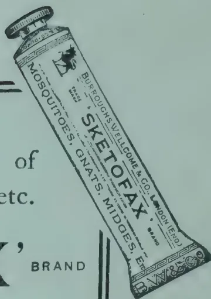

## PESTS AND DISEASES.

### REPORT OF THE GOVERNMENT ENTOMOLOGIST ON HIS VISIT TO BATTICALOA IN CONNECTION WITH THE PESTS OF COCONUT CULTIVATION.

**J. C. HUTSON, B.A., Ph.D.,**

*Government Entomologist, Ceylon.*

I have the honour to submit the following report on my recent visit to Batticaloa District from April 2nd to 10th inclusive.

2. The main objects of my visit were to inquire into the present status of the three most important insect pests of coconuts and other palms in that district, and to find out what measures are being taken to control them.

3. These three insect pests are (1) the Black-headed Coconut Caterpillar (*Nephantis serinopa*), (2) the Rhinoceros or Black Beetle (*Oryctes rhinoceros*), and (3) the Red Weevil (*Rhynchophorus ferrugineus*). These insects have been prevalent throughout most of the Batticaloa coconut area for many years, and their annual united damage to this crop is considerable.

4. In the Batticaloa District the area under coconuts is confined to a more or less narrow coastal strip extending for about 70 miles. In this area coconuts are not only grown on European and native estates, but are found in the compounds of most villages.

5. During my visit I had the opportunity of seeing the conditions of coconut cultivation on a number of estates, ranging from some of the best

144------------------------------------------------

AUGUST, 1921.]125

properties to those which are in a more or less abandoned state. I was also able to inspect in detail a few of the towns and villages in the coconut area. During my trip I covered in more or less detail a good part of the coast between Kalkudah and Kalmunai.

6. I will now make some remarks on each of the three pests mentioned above, and outline what I consider to be the best methods of control for each pest, with special reference to the local conditions.

7. *The Black-headed Coconut Caterpillar (Nephantis serinopa)* seems to be regarded as the worst pest of coconuts in the Batticaloa District, perhaps because its injury is very noticeable, and it has the reputation of being responsible for the death of numbers of coconut trees. I saw one area which had been seriously attacked by caterpillars about the middle of last year. Most of the trees had recovered, but there were a number of dead stumps to be seen in this area. The Superintendent said that many of the trees had suffered heavily from this attack, in some cases every leaf on the tree being killed off. Several trees had failed to recover and had been cut down, thus accounting for some of the dead stumps.

8. The estate had changed hands since the caterpillar outbreak, and the conditions are improving rapidly. It still contains, however, one of the most heavily infested "Black Beetle" areas that I saw, and indications of Red Weevil injury are not lacking.

9. It seems highly probable that some of the palms had been so weakened by repeated attacks of the two beetles and doubtless by previous attacks of caterpillar (since this pest is often recurrent in definite areas) that they had been unable to recover from the complete destruction of their leaves caused by the latest caterpillar outbreak.

10. As a result of my investigations of this pest both in the Eastern and Western Provinces, and bearing in mind the discussions I have had with several coconut planters on this subject, I have noted the following points for further investigation :—

11. Where the caterpillar occurs on well-kept estates that—

(a) The pest usually confines its attacks to certain more or less definite areas where the trees are less vigorous than their neighbours, and that it rarely spreads to the more healthy trees ; and

(b) That the caterpillar seems to prefer the older and less vigorous leaves to the younger and healthiest leaves in the crown of the tree.

12. On such estates the pest does comparatively little damage, and the cutting off and burning of infested leaves is a practicable method of control, since it results in the destruction of a larger number of the eggs, caterpillars, and cocoons of the pest without inflicting any serious damage on the tree.

13. Where the caterpillar occurs on neglected estates that—

(a) The pest may spread rapidly over a large area wherever the trees have been weakened by the attacks of beetles and the lack of cultivation and manuring ; and

(b) That the pest often attacks every leaf on such trees, and the weaker trees succumb.

14. In such outbreaks the removal of the infested leaves is hardly practicable as a measure of control.

15. *Control Measures.*—The best general measures for the control of the coconut caterpillar seem to be—

(1) To maintain the coconut trees in a vigorous condition by good cultivation and judicious manuring in conjunction with sanitary methods.

145------------------------------------------------

126[AUGUST, 1921.

(2) To employ light traps to catch the moths as soon as they emerge and before they are able to lay their eggs on the leaves.

16. In this connection the small kerosene lamps are quite ineffective, provided that they have a good pan under them, say, of not less than 30 inches diameter, and that they are raised off the ground some 4 or 5 feet. These lamps are comparatively cheap, only costing about Rs. 5 made locally, and would be useful where a number of them must be used to cover a large infested area.

17. The imported acetylene lamps are much more effective, but their cost is, I consider, out of all proportion to their efficiency. They have been found very useful where the pest is confined to small areas on a well-kept estate, and can be kept down by two or three good light traps.

18. In the Batticaloa District outbreaks of the caterpillar seem to occur at almost any time of the year, and planters should be on the look-out for the first appearance of the moths and have their trap-lights ready.

19. *The Rhinoceros or Black Beetle (Oryctes rhinoceros)* is quite common in the Batticaloa District at the present time, especially in the immature stages, as will be seen from the following remarks, and a special effort should be made within the next few months to kill as many of the grubs as possible and eliminate their breeding places.

20. In the case of this pest, it is the beetle that does the damage by boring into the crown of the trees and feeding on the sap. The trees so damaged are exposed to the attacks of the red weevil.

21. During my recent trip I was amazed at the large number of old coconut stumps which could be seen almost everywhere on more or less neglected estates and in the gardens and compounds of villagers. Such stumps are a serious danger to the Batticaloa District, since they form one of the breeding places of the Black Beetle at the present time.

22. Many of these stumps are in various stages of decay, some having recently begun to rot at the top of the stem, while in others the stem has completely disintegrated owing to the combined effects of decay and the attacks of the grubs, leaving only a cavity in the ball of roots. These cavities are partially filled with a rich mould and in some cases contain large numbers of active "Black Beetle" grubs,

23. In one area, where there were a large number of dead stumps in all stages of decay, a careful examination was made of 15 of these stumps, the cavities being carefully excavated and an account taken of all the contained grubs. A total of 328 "Black Beetle" grubs was removed from these 15 stumps picked out at random, giving an average of about 22 grubs to a stump. Four of these stumps were found to contain 49, 70, 48, and 44 grubs respectively.

24. In addition to the above, an exhaustive search was made in 35 coconut and palmyra stumps in villagers' compounds. Of these stumps, 12 contained no stage of the beetle, leaving a total of 23 infested stumps containing 219 grubs, averaging over 9 grubs per stump.

25. Altogether the 50 dead stumps carefully examined gave a total of 547 grubs, or nearly 11 per stump. A cursory inspection of many other such stumps indicated that they were similarly infested, but no accurate counts were taken.

26. The above figures serve to indicate that all dead stumps, as soon as they have begun to decay, become attractive to the Black Beetle, and are, therefore, a distinct menace to neighbouring coconut trees. They should be eliminated without delay in the manner indicated below.

27. The Black Beetle was also found breeding in dead standing coconut trees which had lost their tops, and in old decaying coconut and

146------------------------------------------------

AUGUST, 1921.]127

palmyra stumps lying on the ground. These had evidently been in this position for some time, as they were in advanced state of decay and swarming with Black Beetle grubs when broken up.

28. This pest is also known to breed in manure heaps and in heaps of decaying vegetable matter. I did not find beetle grubs in or around any of the manure heaps examined in towns, as such heaps are generally disposed of periodically to estates. Neither manure heaps nor any heaps of vegetable or animal refuse should be left longer than three months in one spot without being covered with sand.

29. During the storm of January, 1921, several hundred palms were blown down throughout the whole coconut area. These fallen trees are being dealt with in various ways. In towns and villages most of them have been cut up into convenient lengths for fencing and building purposes, after the tops had been burnt. On some estates these trees have been rendered temporarily immune from beetle attack by charring the crowns, but in some cases this has only been partially done, with the result that such stems will soon become liable to infestation by the beetles. The complete destruction of such stems is seldom practicable, but they can be used in various ways - as indicated below.

30. It was stated by GREEN in his report on the "Coconut Beetle" in Batticaloa, after the big cyclone (see TROPICAL AGRICULTURIST, November, 1907), that there can be no objection to coconut stems being used for posts for fencing, provided that such employment is really only temporary. The reason for this precaution is that it has been shown repeatedly that fencing made of unsplit coconut stems sooner or later becomes infested by the grubs of *Oryctes* (Black Beetle). GREEN goes on to suggest that retention of exposed posts or rails (unless split) for a longer period than twelve months should be prohibited under the Pests Ordinance.

31. The above objection, GREEN states, does not hold good in the case of stems used in the construction of buildings, where they will be protected from the action of the weather, and therefore will not decay, and become attractive to the Black Beetle.

32. At the present time the large number of old decaying stumps (see paragraphs 21-26) are undoubtedly the greatest danger to coconuts in the Batticaloa District, and the immediate eradication of these as breeding places is a matter of the greatest importance.

33. When a palm dies, it seems to be the custom to cut it down in such a way as to leave about 2 feet of stem standing above ground. This stem starts to decay within a few months, and a Black Beetle comes along and lays its eggs there. The grubs very soon make a cavity, which forms an ideal breeding place for successive broods. The stem is gradually reduced to a mere shell and eventually collapses. By that time the grubs have hollowed out a cavity within the roots and breed there unnoticed.

34. The eradication of these large masses of roots is impracticable, and in most cases, where the cavity is 2 feet or more in depth, the burning of a fire over the stump would probably not affect the grubs at the bottom. Further, the indiscriminate use of fire in native compounds, especially where the stumps are near buildings or fences, cannot be recommended. Therefore, other methods of treatment must be adopted.

35. It has been found in other parts of the East Indies that these beetles cannot breed in sand or other soil without humus. I would, therefore, suggest the following methods of dealing with all dead stumps :—

1. (1) Remove and split up all upstanding stumps.

147------------------------------------------------

128[AUGUST, 1921.

1. (2) Excavate thoroughly all cavities in the roots and destroy all stages of the beetle found there. This destruction should be carried out immediately on the spot as the grubs rapidly disappear into the ground when removed from their breeding place. The grubs could be collected in a kerosene tin and killed by pouring boiling water over them.
2. (3) Then fill in the cavity with sand and heap up sand over the ball of roots to the depth of 8 inches. The stump can be left without danger of re-infestation.

36. It is strongly urged that in future all dead palms should be cut through at soil level, and the stumps covered with sand to a depth of 8 inches. This measure will prevent the "Black Beetle" breeding in such places and forming the deep cavities in the roots.

37 With regard to the control of the adult beetles in the crown of the trees, the practice on well-kept Estates seems to be that the beetles are pierced in their holes and extracted by means of a slender sharp-pointed barbed iron. The holes may then be filled in with sand. A mixture of one part coarse salt and two parts sand is used in other countries where the "Black Beetle" is a pest. This method of killing is really only practicable where it is carried out in conjunction with the destruction of the grubs in their breeding places.

38 The "Black Beetle" pest can be most effectively controlled in the grub stage by eliminating its breeding places as indicated above, and this can only be done thoroughly by a systematic campaign throughout the Batticaloa coconut area. This should be carried out, not only by all estates, but by the villagers in their compounds. The "Black Beetle" is very prevalent at the present time, and it will take some time before it is got under control, but a start should be made without delay.

39 The "Red Weevil" (*Rhynchophorus ferrugineus*) is also prevalent in the Batticaloa District, and will continue to be so until the "Black Beetle" is controlled. This weevil lays its eggs in all palms which have been injured by the "Black Beetle" by storms or by human agency, and I found several instances where it was breeding freely in recently damaged coconut palms. All the damage to palms is done by the grub, since the weevil does little or no feeding.

40 It was pointed out by BRAND in the TROPICAL AGRICULTURIST for July, 1917, that the "Red Weevil" will attack palms at the top, bottom, and middle, or in any stage of growth, although attacks are certainly much less frequent in hard old stems. Further, that the entrance of the pest is not limited to wounds, but any soft part of the trunk in which the female weevil can insert her ovipositor is sufficient. He goes on to state that a common position for the starting of an attack is under the edge of projecting bark at the base of trees planted too near the surface or on land which is very wet at some period of the year.

41 Such trees with exposed roots and projecting bark are quite common in the Batticaloa District, where some coconut areas are subject to periodic flooding. It is difficult to detect weevil injury in such cases, but it seems highly probable that many such trees are infested with "weevil."

42 I would suggest, therefore, that where practicable all coconuts with their top roots and base of stem exposed should be protected from attack. Such trees would be surrounded with a heaped ring of coconut husks to form a retaining barrier, and then the intervening space could be filled in with soil. If it were found later that the husks or other material attracted the "Black Beetle," then the barrier could be covered with heaped sand. I do not know how far such a measure would be practicable under

148------------------------------------------------

AUGUST, 1921.]129

estate conditions, but it should be given a trial, as it would not only protect a vulnerable part of the tree from weevil attack, but it will also tend to improve the general condition of the tree.

43 During my visit I came across a few young coconut trees that had either been blown over or snapped off, or had suffered serious damage from other causes. I could not ascertain with any degree of certainty how long ago these injuries had taken place. These palms had apparently been left untouched and were swarming with practically all stages of the Red Weevil from newly hatched grubs to the adult weevils just ready to emerge from their fibre cocoons.

44 It has been repeatedly shown that the Red Weevil is attracted to damaged palms within a few hours of the injury, and that under favourable conditions it breeds rapidly and many reach the adult stage within a few weeks. All such infected palms are a danger to the surrounding coconut cultivation, and immediate steps should be taken to remove all further danger of infestation. Such breeding places are not uncommon in villagers' plantations, and yet nothing has been towards their removal.

45 Injury by the Red Weevil can be further lessened by avoiding all unnecessary injury to coconut palms. Such injury would include the forcible stripping of palm leaves, the barking of trees by wheels of passing carts, the making of wounds with knives or other implements.

46 I have appended a summary at the end of this report outlining briefly the habits of the three pests and methods of control which can be employed.

47 In conclusion, I desire to express my thanks to the Government Agent, Eastern Province, for the interest he has taken in my visit, and for his courtesy in arranging an itinerary for me and putting the Government car at my disposal whenever possible.

#### SUMMARY.

A.—*The Black-headed Coconut Caterpillar (Nephantis serinopa)* attacks the under side of palm leaves causing them to wither and die in the case of bad outbreaks. Partially attacked leaves are not seriously affected. Weak trees suffer more than the healthy ones and appear to be more favoured by the pest. On well-kept Estates the pest is generally confined to comparatively small definite areas and rarely spreads, but on neglected estates large areas may be attacked, sometimes every leaf being killed off. Weak trees may be killed off.

#### CONTROL MEASURES.

1. Keep the estate as clean as possible and the trees in a vigorous condition by cultivation and manuring and by controlling the two beetle pests, whose attacks serve to weaken the trees.

2. The moths are attracted to lights. Therefore, employ trap-lights to catch them as soon as they become noticeable. A number of small kerosene trap-lights are probably more effective, where the pest covers a large area. A few powerful acetylene lamps are very effective for a small definite area, but these are expensive as compared with the kerosene trap lights, which can be made locally for about Rs. 5.

3. The removal and burning of infested branches is practicable in a small outbreak, or where only a few leaves are attacked. By this method the eggs, caterpillars, and cocoons of this pest are destroyed.

B.—*The Rhinoceros or Black Beetle (Oryctes rhinoceros)* is very numerous at the present time, especially in the grub stage. The grubs or larvæ breed very freely in dead stumps of coconut and palmyra palms, and there are hundreds of such stumps scattered throughout the Batticaloa District at the present time, chiefly on neglected or partially abandoned estates and in villagers' compounds.

149------------------------------------------------

130[AUGUST, 1921.

In the case of this pest, it is the beetle stage which does the damage by boring into the crowns of trees and feeding on the sap. Unless such holes are plugged up, they serve as sources of infestation for the Red Weevil, the grubs of which bore down into the stems.

The "Black Beetle" grubs do not damage living palms, but feed only on decaying vegetable refuse, such as rotting stems lying on the ground, dead stumps, rubbish heaps, and heaps of animal manure.

### CONTROL MEASURES.

#### *For the Grubs.*

1. Cut down all dead palms at ground level and cover the stumps with 8 inches depth of sand.

2. Treat all dead stumps in a similar way, and then clean out the cavities in the roots, being careful to destroy all grubs immediately. Then fill in the cavities with sand and cover with an 8-inch layer of sand. 1 and 2 are the most important measures at the present time.

3. Cut off and burn the tops of all fallen coconut and palmyra palms. The stems can be cut into convenient lengths and used for building purposes, provided that the ends are protected from the action of weather.

4. Unsplit coconut logs used for fence and gate posts and for bridges must only be so employed temporarily and must be renewed every twelve months, as they are liable to decay after some months' exposure to the weather. There is no objection to using split logs for fences, posts, etc.

5. Split and burn all decayed coconut stems taking care to destroy the contained grubs. The disposal of such stems should be a simple matter as most of them are in an advanced state of decay.

### FOR THE BEETLE.

1. Probe the holes in the crowns of trees with a slender sharp pointed barbed iron to kill and extract the beetles.

2. Fill up the holes with a mixture of one part coarse salt and 2 parts sand and plug with clay where practicable.

This measure against the beetle is of little use unless the breeding places of the grubs are dealt with at the same time.

C.—*The Red Weevil ( Rhynchophorus ferrugineus ).*—This is a more dangerous pest of coconuts than the "Black Beetle," since the grubs are capable of killing palms by tunnelling in the stems. The weevil is attracted to lay its eggs in any wounds or injury to trees, and the grubs breed very rapidly, often without their presence being detected until the tree begins to die. Young trees are much more liable to attack than old ones.

### CONTROL MEASURES.

1. Cut off and burn the tops of fallen trees and dispose of the stems as for Black Beetle.

2. Cut down all the badly damaged young palms to ground level and treat the stumps as above. Dispose of the stems as above.

3. Avoid all artificial injury to palms, such as stripping of leaves, injury by estate carts, wounds from knives, etc. Leaves should be cut off and the ends tarred (where removal is for coconut caterpillar,) or should be allowed to fall naturally. All wounds should be tarred over.

4. In lands which are periodically flooded or where trees have not been planted deeply enough, cover up the exposed roots and base of the trees with soil and surround trees with a barrier. Both the beetles are declared pests, but very little action seems to be taken to control them.

A general measure for the two beetles is to keep an estate in a clean, sanitary condition, and the trees as vigorous as possible.

J. C. HUTSON,

Peradeniya, April 21, 1921.

Government Entomologist.

150------------------------------------------------

AUGUST, 1921.]131

# AGRICULTURAL EDUCATION.

## AGRICULTURAL EDUCATION IN THE PHILIPPINES.

KILMER O. MOE,

*Superintendent, Central Luzon Agricultural School.*

### The OLD ORDER CHANGETH.

The Filipino people are passing through a period of economic and social transformation. What changes a few short years have brought about! A spirit of modernity is carrying the country forward (let us hope upward) at an accelerating speed which is somewhat bewildering. The old reactionary type makes a pitiful attempt when he tries to curb this forward rush and finds to his dismay that he himself must needs readjust his ideas or fall by the wayside. Who dares attempt to stop the wheels of progress?

This new order manifests itself in a hundred different ways—in dress, in social usage, in higher standards of living—in fact, in every way which makes for a higher degree of civilization for the great mass of Filipino people. Economic and social progress seem to be pressing forward with an irresistible force. Judging from conditions ten or fifteen or twenty years ago, who would have thought to have seen so many changes in such a short period of time?

### A HIGHER STANDARD OF LIVING.

The great outstanding fact is that the progress is not a surface indication but a deep rooted and national growth. It has taken possession of every province, and can be traced even to the farthest barrio. This great forward movement owes its existence largely to the education of the masses. Every governmental agency has fostered economic and social welfare, but none more than the public schools. Through education the masses have learned and are learning in an ever increasing degree to appreciate the better things of life and have developed a standard which is perhaps the highest of any in the Far East. The Filipinos are learning how to live. They are expending their energies in securing the means by which to maintain this higher standard. Good clothes, automobiles, better homes, sewing machines, phonographs, and other commodities are of common use throughout the Philippines. The educational forces have created desires for better things and the gratification of these desires stimulate not only the economic and social welfare of the people but create a demand for articles of commerce in large quantities and consequently serve to stimulate trade and industry.

### GREATER APPRECIATION OF THE PRODUCER.

The most remarkable phase of this forward movement is the favourable attitude towards agriculture. You no longer see a farmer cringe before the professions of law and medicine. He is inclined to throw out his chest and

151------------------------------------------------

132[AUGUST, 1921.

proclaim to all the world that he is a producer—an agriculturist—one who creates wealth for the nation and as such entitled to the best the country affords. And, what is more, he is going to get it. No leader who values his future career dares to go contrary to the interests of the producer. The great source of wealth in the Philippines is that of agriculture. The economic prosperity and social welfare of the Filipino people rest squarely on a foundation of increased agricultural production.

### **ECONOMIC LEADERS NEEDED.**

The great need of the hour is for more intelligent leadership. This is a wonderful country with wonderful resources, but the forces of production need organization and direction. The young men of the country must prepare themselves to direct these forces. Land we have in abundance; our agricultural population is anxious and willing to increase its earnings and thereby maintain a better social and economic standard but lacking in initiative and leadership, plods along with antiquated methods and small returns.

Every Filipino who has the welfare of his country at heart should realize that it is his patriotic duty to help in every way possible to increase production and to improve the living conditions of the agricultural classes. Citizens of this country who have the qualities of leadership may well demonstrate their ability by becoming economic leaders. Their places are to direct the economic forces of the country. One who aspires to real leadership has here a wide field in which to exercise his talents. Let this be a call to every young man in this country who possesses courage and ambition and who has enough practical ability to accomplish results. Without intelligent leadership the Filipino farmer, as a class, is powerless to escape from the conditions that now prevail. Restrictive laws do not relieve the situation, only by constructive action may we hope to accomplish results worth while.

### **WASTE.**

It is a waste to permit, 5,529,000 hectares of the country's most fertile land to lie uncultivated. It is also a waste of the natural resources to permit the farmers' sons to be educated along lines which make it seem undesirable for the boys to return to the farm and to give agriculture the benefit of the training received during school days.

Only agricultural education will solve this problem of waste. It takes an intelligent farming class to know the resources of other provinces and to have the courage and confidence to leave friend and home, and to settle on undeveloped lands with strange surroundings. The Philippines must provide schools to develop the educated man who will seek out his ideal in the form of a productive farm.

Agricultural school graduates will go into isolated sections without fear of people or locality, and will spend their time and energy in the development of the soil, as was shown when new schools were opened in the wild and isolated regions of Mindanao and Sulu. The graduates of the Central Luzon Agricultural School were the only young men who were willing to accept these stations.

### **A SYSTEM OF AGRICULTURAL EDUCATION.**

The time has arrived for putting into effect a system of agricultural education in keeping with the needs of the country. Headed by the University this system should be national in its scope and should be extended

152------------------------------------------------

AUGUST, 1921.]133

to all provinces. The Philippines, just now, are merely at the beginning of industrial development. Modern methods in both fields and factory are being introduced very rapidly. Lack of men capable of making a success of productive enterprises is retarding development more than any other single factor.

The first and most necessary step in fostering the economic development of the country is that of providing facilities whereby the young men of the country may receive the necessary training to operate machinery, to manage productive enterprises, to handle men, and to carry on the work demanded by the industrial development. A survey of the industrial conditions at the present time reveals a deplorable situation. The industries are outgrowing their personnel. In the sugar industry, for example, foreigners are used as field foremen, machinists, factory overseers, and chemists at five times the salary received by Filipinos. We need men trained to carry on the work in the sugar industry, in the coconut oil industry, in the tobacco industry, in the fibre industry, and in the production of food crops.

A complete system of agricultural education is one which takes into consideration the pressing needs of the country and provides facilities whereby specific training along lines that count in economic development may be afforded. This will mean special schools for every industry; it will mean a tobacco school in the Cagayan Valley, a sugar school in Negros, a rice school in Central Luzon, a coconut school in Tayabas, a fibre school in Leyte, and a fruit school in Batangas. Nor is that all. It will mean more than everything—a development of the College of Agriculture along lines whereby the training of men can be promoted. The special schools in the provinces cannot possibly produce college trained men. They can only afford training to the great mass of industrial employees. Those who are to serve as technical men or leaders of large enterprises must necessarily continue courses in higher institutions of learning which offer specific training.

We need industrial chemists in the sugar and oil industries. To give impetus to this training it would seem that the College of Agriculture should be provided with facilities in way of a sugar central and a central for the manufacture of coconut products at the earliest possible date in order that the men turned out may be efficient as leaders in these industries. It may be said without fear of successful contradiction that the most important institution in the development of agricultural education is the College of Agriculture.

In fact the whole scheme must be so well organized and directed that every branch of the service will contribute to the general purpose of training for service. The schools which are established should be well equipped and should co-operate with the established industries in such a manner that the young men of the country will turn their energies into productive channels rather than become "job hunters" and clerks. The general attitude towards agricultural education should be one of helpful co-operation with the definite purpose of leading the future citizens of the country into productive enterprises.

#### TEACH IN TERMS OF LIFE.

Boys and girls must be taught in term of their life's work. Public sentiment is demanding that it be done. The coming generation must assume

153------------------------------------------------

134[AUGUST, 1921.

the burden of performing the world's work, and fitness is essential to do good work. There must be fewer words. Words will not plough a field ; words will not build a home ; words will not develop a great humanity, nor build a great nation. Teaching in terms of the lives of the people is the Big Idea in Education.

The Filipino people are primarily agriculturists and there must be more agricultural education. We have had marvellous educational growth in the Philippines in recent years, yet our school system as a whole does not measure up to the needs of to-day. If we are to keep the Philippines safe from food shortage it must be through the medium of an intelligent citizenship in the Philippines. We must provide the right kind of training for both the boy who lives in the city and the boy who lives in the country. Children should be educated so that they will work with their hands as well as with their heads.

Without agricultural schools which will train for country life, and which will deal with country problems, the Philippine schools will force the farmers' sons directly away from the farm. A boy cannot be expected to return to the farm if, during the larger part of his life, he has spent his time studying books, dead facts, dates and words which have no bearing on the vital interests of country life.

We know how enthusiastic a child starts to school and how anxious he is to learn. We also know with what enthusiasm his interest is centered in his garden. This interest in agriculture should be kept up, and the boy should be given real things to do. Let him begin to solve real problems in crop production. Let him learn how to manage farm land and to rotate crops so as to produce enough to pay the rent or the interest on his investment.

Our barrio schools train one-half of our boys and girls. Half of our population receive here their training for life. These schools must meet the country's needs. We find that there are an insufficient number of these schools where boys may receive practical training in farm work during the entire period that they remain in school. The children should be taught in terms of home-making. An agricultural school exerts this influence on the social and business life of the community and it is regarded as something in common with the real life of the people.

The desire for better things is a power for good and if tempered with reason will accomplish wonders in way of economics and social progress. But it is necessary for us to deepen, broaden and enlarge our conception of education and what it means in the up-building of the nation. In the language of DR. FRANK CRANE : "There can be no salvation for the race that does not first mean salvation for the child, by striking from his brain the chain of ignorance, from his heart the iron rim of superstition, and from his hands the curse of the unskilled."—PHILIPPINE FARMER, Vol. VII, No. 4,

154------------------------------------------------

AUGUST, 1921.]135

# GENERAL.

## THE CAROB AND ALGAROBA BEANS.

C. T. WHITE, F.L.S.,

*Government Botanist.*

For some time past the Department of Agriculture and Stock and private persons have been importing into Queensland seeds of both the Carob and Algaroba Beans. As the former is also often called the Algaroba, and is in fact the original Algaroba, there has been some confusion in the popular mind between these two trees. This is unfortunate, as they are widely different in appearance, and whereas the one is only suitable for cultivation in the cooler parts of the State, the latter is more particularly adapted for the warmer. As both trees, though of considerable economic importance, are little known to many persons in Queensland, the following article is offered. For the sake of convenience the name Carob is here applied to *Ceratonia siliqua* and the name Algaroba is confined to *Prosopis juliflora*, as it is to this latter tree that now-a-days the name Algaroba seems most commonly applied.

### CAROB BEAN (*Ceratonia siliqua*)

*Description.*—A tree 20 to 30 feet high, leaves pari-pinnate, each leaf composed of 3 to 8 pairs of leaflets; leaflets oval, entire, paler on the under surface, coriaceous in texture,  $1\frac{1}{2}$  to 2 in. long, 1 to  $1\frac{1}{2}$  in. broad. Flowers Polygamous, greenish, small, in short racemes, calyx small, soon falling off, corolla none; stamens five, pistil glabrous, in male flowers abortive, in female and hermaphrodite shortly stipitate, ovary several-ovulate, style 3 to 4 in. long flattened, indehiscent; seeds dark reddish brown, 3 to 4 lines diameter, enclosed in scarlet sugary pulp.

*Note on the Flowers.*—Like another well-known plant—the Papaw—the flowers are polygamous—i.e., the flowers may be distinctly male or female and borne on different trees, or hermaphrodite—i.e., male organs (stamens) and female organs (pistil) growing in the same flower. This latter condition, however, is apparently rare, the majority of the trees being distinctly either male or female.

*Distribution.*—A native of the Mediterranean region (Southern Europe, Western Asia, North Africa). Cultivated in most warm temperate countries.

*Botanical names.*—Keratea, the ancient Greek name of the tree, is most likely the origin of the generic name. *Siliqua*, Latin, meaning the pod or husk of leguminous plants.

*Common names.*—Carob Bean, St. John's Bread, Locust Tree.

In his ENCYCLOPÆDIA OF PLANTS, J. C. LOUDON has the following very

155------------------------------------------------

136[AUGUST, 1921.

interesting statement:—"The pods contain a sweet fœcula for the sake of which they are often imported into England under the name Algaroba Beans. This word is a slight alteration by the prefix of the article *al* of the Arabic word Kharroub, whence also our English name Carob. This is generally considered the Locust Tree of Scripture. The tree is also very common in the south of Spain and often formed the principal food of the British cavalry horses during the war of 1811 and 1812."

*Cultivation.*—F. TURNER, writing in the AGRICULTURAL GAZETTE OF N.S.W., states:—"The best time of the year to sow Carob seed is in August. The outer covering of the seed is very hard, and before they are sown they should be placed in an earthen vessel and hot water poured on them, then kept near the fire till they soften. The seeds should be planted in boxes or pots and the seedlings, when strong, say about six months old, transplanted into their permanent quarters." It can also be propagated by cuttings, and on this method MR. TURNER has the following remarks to make:—"For putting in cuttings, March or April is the best month. Cuttings of the ripened wood of the current season's growth, about 6 in. long, and either heeled or cut just below a joint; the leaves should be shortened. They will strike more readily if put singly into boxes filled with sandy soil and kept in a shady situation until rooted, when they should be gradually inured to sunlight. The cutting should be rooted and ready for transplanting in about six months' time. Layers, of course, are only possible when branches are near the ground." The great advantage of propagating by cuttings, layers, or grafting is that female or pod-bearing trees can be obtained when necessary, whereas with seed one has to take the chance as to the relative numbers obtained of male and female plants, and no distinction even to the trained eye can be seen between the plants in a young stage—i.e., before flowering.

The tree can be grown in the Brisbane district, but it is doubtful if it would succeed much further north, being more adapted for the cooler parts. It does well on the Darling Downs and similar localities, provided the frosts are not too severe.

As already explained, the trees are unisexual, i.e., distinctly male and female; hence for pods to be formed there should be a proportion of male trees among the female to ensure fertilisation, otherwise the pods will fall off before maturity. In his article MR. TURNER goes on to state:—"If it should happen that all the trees in a group should produce female flowers only, branches bearing male flowers can safely be brought from a distance and hung among the branches bearing female ones so as to effect fertilisation. I have known this to be done with trees growing 14 miles apart and be successful. Persons who grow Carobs should keep a few bees, if it is only one hive; it is astonishing the number of flowers these insects will visit during the course of a day and be the agency whereby many of them are fertilised."

156------------------------------------------------

AUGUST, 1921.]137**ALGAROBA OR MESQUITE BEAN (*Prosopis Juliflora.*)**

*Description.*—A tree attaining 60 to 70 ft., branching usually armed with straight spines, either solitary or in pairs. Leaves bipinnate, usually occurring in little tufts or fascicles, pinnæ 1, 2, or rarely 3 pairs; leaflets usually 10 to 12 pairs, oblong, 3 to 4 lines long. Flowers small and numerous, borne in long slender spikes of 3 to 5 in. Pod yellow, shortly stalked, 5 to 8 in. long, marked between the seeds with transverse lines, fleshy with a sweet, sugary, more or less spongy pulp; seeds light-brown, enclosed in a hard, parchment like casing (endocarp.)

*Distribution.*—A native of South America, West Indies, Central America, Mexico, and the Southern United States.

It is now widely cultivated in tropical countries as a fodder and ornamental tree. Speaking of its introduction into the Hawaiian Islands, J. F. ROCK in the LEGUMINOUS PLANTS OF HAWAII, states :—“The Algaroba is the most common as well as the most valuable tree introduced into the Hawaiian Islands. All the waste lands which previous to the introduction of this valuable tree were absolutely barren are now covered with green forests made up exclusively of this tree. The tree was introduced by FATHER BACHELOT in 1828, the seed having come from the Royal Gardens at Paris, France.”

*Botanical Name.*—*Prosopis*, origin obscure; “*Prosopis*” was a name given by DIOSCORIDEL to the Burdock (*Arctium lappa*), a plant very dissimilar to any species of *Prosopis*. It bears spiny burrs, however, and this may have led LINNAEUS to bestow the name *Prosopis* on these trees on account of their spiny nature; *juliflora*, flowers in July.

*Cultivation.*—Seeds should be sown in the spring or early summer. The pod contains up to about 20 seeds. Each seed is surrounded by a hard parchment-like casing. This should be removed with a sharp knife before the seeds are sown. C. S. JUDD, writing in a recent number of the HAWAIIAN FORESTER AND AGRICULTURIST, found that pouring hot water over the seeds and letting them soak for twenty-four hours greatly accelerated their germination, but they may be sown without any treatment at all, germination then, however, being considerably slower. They should be sown in pots or boxes and when strong enough the young trees can be planted out into their permanent quarters.

As in this tree the flowers are hermaphrodite, there is no need to worry over their fertilisation as in the Carob.

This tree succeeds well in the Brisbane district and fruits well. It is doubtful if it would succeed much further south, but is more particularly adapted for growing in the warmer parts of the State.—QUEENSLAND AGRIC. JOURN. VOL. XV, PART 6.

157------------------------------------------------

138

[AUGUST, 1921.

# WORLD'S RICE PRODUCTION.

The following figures are extracted from the International Crop Report and Agricultural Statistics published by the International Institute of Agriculture—(Bureau of Statistics) for April, 1921, and should prove of interest. The yields are given in Centals (= 100 lb. weight):—

<table border="1">
<thead>
<tr>
<th rowspan="3">COUNTRY</th>
<th colspan="4">AREA</th>
<th colspan="4">YIELD (1)</th>
</tr>
<tr>
<th rowspan="2">1920</th>
<th rowspan="2">1919</th>
<th rowspan="2">Average 1914 to 1918 thousand acres</th>
<th colspan="2">Percentage for the most recent year</th>
<th rowspan="2">1920 thousand centals</th>
<th rowspan="2">1919 thousand centals</th>
<th rowspan="2">Average 1914 to 1918 thousand centals</th>
<th colspan="2">Percentage for the most recent year</th>
</tr>
<tr>
<th>1919 = 100 %</th>
<th>Average = 100 %</th>
<th>1919 = 100 %</th>
<th>Average = 100 %</th>
</tr>
</thead>
<tbody>
<tr>
<td colspan="11"><b>NORTHERN HEMISPHERE</b></td>
</tr>
<tr>
<td colspan="11"><b>EUROPE</b></td>
</tr>
<tr>
<td>*Bulgaria</td>
<td>7.7</td>
<td>4.4</td>
<td>8.4</td>
<td>172.2</td>
<td>91.2</td>
<td>134.0</td>
<td>52.9</td>
<td>93.5</td>
<td>253.3</td>
<td>143.4</td>
</tr>
<tr>
<td>*Spain</td>
<td>119.8</td>
<td>112.2</td>
<td>102.6</td>
<td>106.8</td>
<td>116.9</td>
<td>6,378.9</td>
<td>6,673.2</td>
<td>5,153.5</td>
<td>95.6</td>
<td>123.8</td>
</tr>
<tr>
<td>*Italy</td>
<td>281.7</td>
<td>325.4</td>
<td>350.6</td>
<td>86.6</td>
<td>80.3</td>
<td>9,495.3</td>
<td>10,729.9</td>
<td>11,797.0</td>
<td>88.5</td>
<td>80.5</td>
</tr>
<tr>
<td>Portugal</td>
<td>—</td>
<td>43.5</td>
<td>21.6</td>
<td>—</td>
<td>—</td>
<td>—</td>
<td>441.2</td>
<td>414.1</td>
<td>—</td>
<td>—</td>
</tr>
<tr>
<td colspan="11"><b>AMERICA</b></td>
</tr>
<tr>
<td>*United States</td>
<td>1,337.0</td>
<td>1,091.8</td>
<td>892.9</td>
<td>122.5</td>
<td>149.7</td>
<td>24,169.5</td>
<td>19,255.5</td>
<td>15,012.0</td>
<td>125.5</td>
<td>161.0</td>
</tr>
<tr>
<td>*Guatemala</td>
<td>6.4</td>
<td>13.6</td>
<td>24.0</td>
<td>47.3</td>
<td>26.8</td>
<td>36.2</td>
<td>84.0</td>
<td>212.3</td>
<td>43.0</td>
<td>17.0</td>
</tr>
<tr>
<td>British Guiana</td>
<td>—</td>
<td>61.0</td>
<td>54.7</td>
<td>—</td>
<td>—</td>
<td>—</td>
<td>1,672.2</td>
<td>1,370.7</td>
<td>—</td>
<td>—</td>
</tr>
<tr>
<td>Dutch Guiana</td>
<td>—</td>
<td>—</td>
<td>—</td>
<td>—</td>
<td>—</td>
<td>—</td>
<td>—</td>
<td>(3) 116.8</td>
<td>—</td>
<td>—</td>
</tr>
<tr>
<td>Mexico</td>
<td>—</td>
<td>—</td>
<td>(4) 41.8</td>
<td>—</td>
<td>—</td>
<td>—</td>
<td>—</td>
<td>(4) 501.6</td>
<td>—</td>
<td>—</td>
</tr>
<tr>
<td colspan="11"><b>ASIA</b></td>
</tr>
<tr>
<td>Andaman and Nicobar</td>
<td>—</td>
<td>—</td>
<td>(5) 3.7</td>
<td>—</td>
<td>—</td>
<td>—</td>
<td>—</td>
<td>(5) 43.4</td>
<td>—</td>
<td>—</td>
</tr>
<tr>
<td>Ceylon</td>
<td>—</td>
<td>—</td>
<td>704.8</td>
<td>—</td>
<td>—</td>
<td>—</td>
<td>—</td>
<td>—</td>
<td>—</td>
<td>—</td>
</tr>
<tr>
<td>French Settlements in India</td>
<td>—</td>
<td>—</td>
<td>42.8</td>
<td>—</td>
<td>—</td>
<td>—</td>
<td>—</td>
<td>537.9</td>
<td>—</td>
<td>—</td>
</tr>
<tr>
<td>Federated Malay States</td>
<td>—</td>
<td>—</td>
<td>(3) 135.7</td>
<td>—</td>
<td>—</td>
<td>—</td>
<td>—</td>
<td>(3) 11,618.6</td>
<td>—</td>
<td>—</td>
</tr>
<tr>
<td>*British India</td>
<td>78,023.0</td>
<td>79,426.0</td>
<td>78,607.0</td>
<td>98.2</td>
<td>99.3</td>
<td>967,026.4 (627,939.2)</td>
<td>1,102,837.1 (716,128.0)</td>
<td>1,067,858.2 (693,414.4)</td>
<td>87.7</td>
<td>90.6</td>
</tr>
<tr>
<td>Indo-China</td>
<td>11,761.7</td>
<td>—</td>
<td>10,151.5</td>
<td>—</td>
<td>115.9</td>
<td>101,797.0</td>
<td>—</td>
<td>119,203.5</td>
<td>—</td>
<td>85.4</td>
</tr>
<tr>
<td>Japan</td>
<td>—</td>
<td>7,608.5</td>
<td>7,517.8</td>
<td>—</td>
<td>—</td>
<td>247,775.3 (195,247.0)</td>
<td>242,469.4 (191,065.9)</td>
<td>223,771.5 (176,332.0)</td>
<td>102.2</td>
<td>110.7</td>
</tr>
<tr>
<td>Korea</td>
<td>—</td>
<td>—</td>
<td>(3) 2,749.3</td>
<td>—</td>
<td>—</td>
<td>—</td>
<td>—</td>
<td>47,297.5</td>
<td>—</td>
<td>—</td>
</tr>
<tr>
<td>Formosa</td>
<td>1,213.0</td>
<td>1,227.1</td>
<td>(2) 1,191.4</td>
<td>98.9</td>
<td>101.8</td>
<td>19,604.2</td>
<td>19,199.5</td>
<td>(2) 18,813.6</td>
<td>102.1</td>
<td>104.2</td>
</tr>
<tr>
<td>*Philippines</td>
<td>3,669.3</td>
<td>3,413.4</td>
<td>3,019.8</td>
<td>107.5</td>
<td>121.5</td>
<td>22,474.0</td>
<td>32,024.5</td>
<td>23,795.3</td>
<td>70.2</td>
<td>94.4</td>
</tr>
<tr>
<td>Russia</td>
<td>—</td>
<td>—</td>
<td>(6) 650.0</td>
<td>—</td>
<td>—</td>
<td>—</td>
<td>—</td>
<td>(6) 7,226.8</td>
<td>—</td>
<td>—</td>
</tr>
<tr>
<td colspan="11"><b>AFRICA</b></td>
</tr>
<tr>
<td>*Egypt</td>
<td>—</td>
<td>149.7</td>
<td>—</td>
<td>—</td>
<td>—</td>
<td>—</td>
<td>—</td>
<td>—</td>
<td>—</td>
<td>—</td>
</tr>
<tr>
<td>Sierra Leone</td>
<td>(7) 139.9</td>
<td>—</td>
<td>(3) 237.3</td>
<td>—</td>
<td>—</td>
<td>(7) 10,278.0</td>
<td>9,831.3</td>
<td>(3) 6,548.2</td>
<td>—</td>
<td>—</td>
</tr>
<tr>
<td colspan="11"><b>AMERICA</b></td>
</tr>
<tr>
<td>Hawaii</td>
<td>—</td>
<td>—</td>
<td>(5) 4.0</td>
<td>—</td>
<td>—</td>
<td>—</td>
<td>—</td>
<td>(5) 112.0</td>
<td>—</td>
<td>—</td>
</tr>
</tbody>
</table>

158------------------------------------------------

AUGUST, 1921.]

139

WORLD'S RICE PRODUCTION.—Contd.

<table border="1">
<thead>
<tr>
<th>Southern Hemisphere</th>
<th>1920-21</th>
<th>1919-20</th>
<th>Average 1914-15 to 1918-19</th>
<th>1919-20 = 100</th>
<th>1920-21 = 100</th>
<th>1919-20</th>
<th>Average 1914-15 to 1918-19</th>
<th>1919-20 = 100</th>
<th>Aver. = 100</th>
</tr>
</thead>
<tbody>
<tr>
<td colspan="10" style="text-align: center;">AMERICA</td>
</tr>
<tr>
<td>Paraguay</td>
<td>—</td>
<td>—</td>
<td>(8) 2.2</td>
<td>—</td>
<td>—</td>
<td>—</td>
<td>(8) 32.4</td>
<td>—</td>
<td>—</td>
</tr>
<tr>
<td>Peru</td>
<td>—</td>
<td>—</td>
<td>(9) 67.1</td>
<td>—</td>
<td>—</td>
<td>—</td>
<td>(9) 1,155.9</td>
<td>—</td>
<td>—</td>
</tr>
<tr>
<td colspan="10" style="text-align: center;">ASIA</td>
</tr>
<tr>
<td>British North Borneo</td>
<td>—</td>
<td>—</td>
<td>(9) 56.1</td>
<td>—</td>
<td>—</td>
<td>—</td>
<td>(9) 406.3</td>
<td>—</td>
<td>—</td>
</tr>
<tr>
<td>Dutch East Ind. <i>*Java and Mad.</i></td>
<td>8,060.3</td>
<td>8,465.1</td>
<td>6,849.8</td>
<td>95.2</td>
<td>117.7</td>
<td>104,980.6</td>
<td>114,233.5</td>
<td>96,540.5</td>
<td>91.9 108.7</td>
</tr>
<tr>
<td colspan="10" style="text-align: center;">OCEANIA</td>
</tr>
<tr>
<td>Fiji Islands</td>
<td>—</td>
<td>—</td>
<td>(10) 14.6</td>
<td>—</td>
<td>—</td>
<td>—</td>
<td>(10) 418.4</td>
<td>—</td>
<td>—</td>
</tr>
<tr>
<td><b>*Totals and index numbers for countries marked*</b></td>
<td><b>91,645.1</b></td>
<td><b>93,001.6</b></td>
<td><b>90,092.6</b></td>
<td><b>98.5</b></td>
<td><b>101.7</b></td>
<td><b>1,144,972.9</b></td>
<td><b>1,295,721.9</b></td>
<td><b>1,227,010.5</b></td>
<td><b>98.5 88.6</b></td>
</tr>
<tr>
<td><i>World's Yield</i></td>
<td>—</td>
<td>—</td>
<td>—</td>
<td>—</td>
<td>—</td>
<td>—</td>
<td>4,400,000</td>
<td>—</td>
<td>—</td>
</tr>
</tbody>
</table>

(1) The yield is stated in rough rice. For countries which make up their data in terms of cleaned rice, we have inserted the original figures in brackets—(2) Average 1914 to 1917.—(3) Average 1914 to 1916—(4) Average 1914, 1916 and 1918—(5) Average 1916 to 1918—(6) Average 1914 and 1915. —(7) Not including the *Nili* crop which amounted during the four years 1916 to 1919 to about 10% of the total—(8) Average 1914-15 1915-16 and 1917-18—(9) Average 1914-15 to 1917-18—(10) Average 1914-15 to 1916-17.

159------------------------------------------------

140

[AUGUST, 1921

METEOROLOGICAL.

JULY, 1921.

ANIMAL DISEASE RETURN FOR THE

MONTH ENDED 31st July, 1921.

<table border="1">
<thead>
<tr>
<th>Province, &amp;c.</th>
<th>Disease.</th>
<th>No. of Cases up to date since Jan. 1st, 1921.</th>
<th>Fresh Cases</th>
<th>Recoveries</th>
<th>Deaths.</th>
<th>Bal- ance Ill.</th>
<th>No. Shot.</th>
</tr>
</thead>
<tbody>
<tr>
<td rowspan="2">Western</td>
<td>Rinderpest</td>
<td>83</td>
<td>1</td>
<td>82</td>
<td>—</td>
<td>1</td>
<td>—</td>
</tr>
<tr>
<td>Foot-and-mouth disease</td>
<td>—</td>
<td>—</td>
<td>—</td>
<td>—</td>
<td>—</td>
<td>—</td>
</tr>
<tr>
<td rowspan="2">Colombo Municipality</td>
<td>Rinderpest</td>
<td>88</td>
<td>—</td>
<td>—</td>
<td>—</td>
<td>—</td>
<td>—</td>
</tr>
<tr>
<td>Foot-and-mouth disease</td>
<td>—</td>
<td>—</td>
<td>—</td>
<td>—</td>
<td>—</td>
<td>—</td>
</tr>
<tr>
<td rowspan="2">Cattle Quarantine Station</td>
<td>Rinderpest</td>
<td>2</td>
<td>—</td>
<td>—</td>
<td>—</td>
<td>—</td>
<td>—</td>
</tr>
<tr>
<td>Foot-and-mouth disease</td>
<td>51*</td>
<td>—</td>
<td>—</td>
<td>—</td>
<td>—</td>
<td>—</td>
</tr>
<tr>
<td rowspan="2">Central</td>
<td>Rinderpest</td>
<td>13</td>
<td>—</td>
<td>13</td>
<td>—</td>
<td>—</td>
<td>—</td>
</tr>
<tr>
<td>Foot-and-mouth disease</td>
<td>7</td>
<td>1</td>
<td>4</td>
<td>3</td>
<td>—</td>
<td>—</td>
</tr>
<tr>
<td rowspan="2">Southern</td>
<td>Rinderpest</td>
<td>35</td>
<td>—</td>
<td>25</td>
<td>—</td>
<td>—</td>
<td>—</td>
</tr>
<tr>
<td>Foot-and-mouth disease</td>
<td>—</td>
<td>—</td>
<td>—</td>
<td>—</td>
<td>—</td>
<td>—</td>
</tr>
<tr>
<td rowspan="2">Northern</td>
<td>Rinderpest</td>
<td>Free</td>
<td>—</td>
<td>—</td>
<td>—</td>
<td>—</td>
<td>—</td>
</tr>
<tr>
<td>Foot-and-mouth disease</td>
<td>—</td>
<td>—</td>
<td>—</td>
<td>—</td>
<td>—</td>
<td>—</td>
</tr>
<tr>
<td rowspan="2">Eastern</td>
<td>Rinderpest</td>
<td>184</td>
<td>43</td>
<td>166</td>
<td>9</td>
<td>9</td>
<td>—</td>
</tr>
<tr>
<td>Foot-and-mouth disease</td>
<td>—</td>
<td>—</td>
<td>—</td>
<td>—</td>
<td>—</td>
<td>—</td>
</tr>
<tr>
<td rowspan="2">North-Western</td>
<td>Rinderpest</td>
<td>36</td>
<td>—</td>
<td>11</td>
<td>23</td>
<td>2</td>
<td>2</td>
</tr>
<tr>
<td>Foot-and-mouth disease</td>
<td>—</td>
<td>—</td>
<td>—</td>
<td>—</td>
<td>—</td>
<td>—</td>
</tr>
<tr>
<td rowspan="2">North-Central</td>
<td>Rinderpest</td>
<td>Free</td>
<td>—</td>
<td>—</td>
<td>—</td>
<td>—</td>
<td>—</td>
</tr>
<tr>
<td>Foot-and-mouth disease</td>
<td>—</td>
<td>—</td>
<td>—</td>
<td>—</td>
<td>—</td>
<td>—</td>
</tr>
<tr>
<td rowspan="2">Uva</td>
<td>Rinderpest</td>
<td>399</td>
<td>7</td>
<td>382</td>
<td>10</td>
<td>7</td>
<td>—</td>
</tr>
<tr>
<td>Foot-and-mouth disease</td>
<td>20</td>
<td>20</td>
<td>2</td>
<td>18</td>
<td>—</td>
<td>—</td>
</tr>
<tr>
<td rowspan="2">Sabaragamuwa</td>
<td>Rinderpest</td>
<td>Free</td>
<td>—</td>
<td>—</td>
<td>—</td>
<td>—</td>
<td>—</td>
</tr>
<tr>
<td>Foot-and-mouth disease</td>
<td>—</td>
<td>—</td>
<td>—</td>
<td>—</td>
<td>—</td>
<td>—</td>
</tr>
</tbody>
</table>

\* 7 cases occurred amongst sheep and goats. † occurred amongst sheep and goats.

Colombo, 3rd August, 1921.

G. W. STURGESS, G.V.S.

<table border="1">
<thead>
<tr>
<th rowspan="2">Station</th>
<th colspan="2">Temperature</th>
<th rowspan="2">Mean Humidity %</th>
<th rowspan="2">Mean amount of cloud 0=clear, 10=overcast</th>
<th rowspan="2">Mean Wind Direction during month</th>
<th rowspan="2">Daily Mean Velocity.</th>
<th colspan="2">Rainfall</th>
</tr>
<tr>
<th>Mean Daily Shade</th>
<th>Difference from Average</th>
<th>Amount</th>
<th>No. of Rainy days</th>
<th>Difference from Average</th>
</tr>
<tr>
<th></th>
<th></th>
<th></th>
<th></th>
<th></th>
<th></th>
<th></th>
<th>Inches</th>
<th>Inches</th>
</tr>
</thead>
<tbody>
<tr>
<td>Colombo</td>
<td>82.0</td>
<td>0</td>
<td>77</td>
<td>8.6</td>
<td>WSW</td>
<td>158</td>
<td>5.12</td>
<td>13</td>
</tr>
<tr>
<td>Observatory</td>
<td>82.2</td>
<td>+1.0</td>
<td>78</td>
<td>5.3</td>
<td>SW</td>
<td>287</td>
<td>0.92</td>
<td>3</td>
</tr>
<tr>
<td>Puttalam</td>
<td>84.7</td>
<td>+1.1</td>
<td>74</td>
<td>8.4</td>
<td>SW</td>
<td>168</td>
<td>0.37</td>
<td>1</td>
</tr>
<tr>
<td>Mannar</td>
<td>83.4</td>
<td>+0.4</td>
<td>82</td>
<td>7.6</td>
<td>SW</td>
<td>348</td>
<td>1.01</td>
<td>3</td>
</tr>
<tr>
<td>Jaffna</td>
<td>83.8</td>
<td>-1.4</td>
<td>72</td>
<td>8.2</td>
<td>SW</td>
<td>232</td>
<td>2.21</td>
<td>6</td>
</tr>
<tr>
<td>Trincomalee</td>
<td>85.2</td>
<td>+0.6</td>
<td>—</td>
<td>—</td>
<td>—</td>
<td>—</td>
<td>3.20</td>
<td>6</td>
</tr>
<tr>
<td>Batticaloa</td>
<td>82.3</td>
<td>+0.7</td>
<td>75</td>
<td>5.4</td>
<td>WSW</td>
<td>380</td>
<td>2.73</td>
<td>11</td>
</tr>
<tr>
<td>Hambantota</td>
<td>80.1</td>
<td>+0.1</td>
<td>84</td>
<td>6.3</td>
<td>WNW</td>
<td>315</td>
<td>6.61</td>
<td>21</td>
</tr>
<tr>
<td>Galle</td>
<td>80.4</td>
<td>0</td>
<td>82</td>
<td>7.6</td>
<td>—</td>
<td>—</td>
<td>10.17</td>
<td>25</td>
</tr>
<tr>
<td>Ratnapura</td>
<td>82.6</td>
<td>-0.7</td>
<td>72</td>
<td>6.5</td>
<td>—</td>
<td>—</td>
<td>3.16</td>
<td>6</td>
</tr>
<tr>
<td>Anu'pura</td>
<td>81.2</td>
<td>+0.6</td>
<td>76</td>
<td>9.0</td>
<td>—</td>
<td>—</td>
<td>6.68</td>
<td>16</td>
</tr>
<tr>
<td>Kurunegala</td>
<td>76.6</td>
<td>+0.8</td>
<td>78</td>
<td>8.6</td>
<td>—</td>
<td>—</td>
<td>8.15</td>
<td>23</td>
</tr>
<tr>
<td>Kandy</td>
<td>74.6</td>
<td>-0.7</td>
<td>78</td>
<td>7.5</td>
<td>—</td>
<td>—</td>
<td>2.42</td>
<td>13</td>
</tr>
<tr>
<td>Badulla</td>
<td>70.5</td>
<td>+0.6</td>
<td>69</td>
<td>6.6</td>
<td>—</td>
<td>—</td>
<td>2.18</td>
<td>11</td>
</tr>
<tr>
<td>Diyatalawa</td>
<td>61.6</td>
<td>+0.4</td>
<td>84</td>
<td>8.8</td>
<td>—</td>
<td>—</td>
<td>6.59</td>
<td>20</td>
</tr>
<tr>
<td>Hakgala</td>
<td>60.4</td>
<td>+1.5</td>
<td>87</td>
<td>9.1</td>
<td>—</td>
<td>—</td>
<td>11.65</td>
<td>25</td>
</tr>
<tr>
<td>N. Eliya</td>
<td></td>
<td></td>
<td></td>
<td></td>
<td></td>
<td></td>
<td></td>
<td></td>
</tr>
</tbody>
</table>

July may be divided into three main periods. From the 1st to the 9th the wind was normal, but the rainfall was far below normal. From the 10th to 21st the pressure gradient was unusually smooth, and wind directions were correspondingly less regular, including north wind at Colombo on the 11th and a severe, but local, whirl at Veyangoda on the 20th. During this period there was a noteworthy absence of rain of the normal South-west type but there were some thunderstorms, particularly on the east side.

On the 21st the gradient became slightly steeper and on the 22nd a further steepening justified its description as of practically normal type for July, which type persisted till the end of the month with the full complement of rain.

The rain during this last week served to bring the monthly totals up to their average at about half the stations in the island.

The extreme south coast and Deniyaya stations were slightly above average, as were Ratnapura and the country east of it. The remainder of the island south of the latitude of Colombo was for the most part below average—deficits of the order of 2 inches were common on the west, while on the east the offsets were usually less than this.

The rainfall was above average along the west coast from Negombo to Chilaw and eastward of this line, including the south of the North-Western Province and the districts of Kegalle, Matale, and most of Pussellawa.

One or two stations in the Trincomalee district were 3 or 4 inches above average but except for them offsets of as much as 2 inches from average were not found north of Dambulla.

Humidity was below average at the coast stations except Trincomalee but above it at Nuwara Eliya and the up-country stations further east.

Temperature and amount of cloud amount were both above average on the whole, while the numerical means of barometric pressure and wind velocity were not far from normal.

A. J. BAMFORD

160------------------------------------------------

THE  
**TROPICAL AGRICULTURIST:**  
JOURNAL OF THE  
**CEYLON AGRICULTURAL SOCIETY.**

---

VOL. LVII.

PERADENIYA, SEPTEMBER, 1921.

**No. 3.**

---

**AGRICULTURAL DEVELOPMENT.**

---

In the present number of the TROPICAL AGRICULTURIST are reproduced sections of Sessional Paper VI of 1921 relating to scientific research and investigation in regard to the agricultural industries of the colony. It is thought that these sections will be of interest to our readers, as they indicate the efforts which are being made to provide for agricultural development.

The provision of agricultural departments throughout the Empire has been a recent growth, and in no part of it have these departments been fully developed. They are still in their infancy and the Ceylon Department has to progress very considerably before it can be felt that agriculture is being adequately provided for.

The object of an agricultural department must be to place at the disposal of the agriculturist every new development that can be discovered by research, to protect the agricultural industries from epidemics of pests and diseases, to assist in the agricultural and rural education of the population and to assist in the organization of the agricultural industries as business undertakings.

The first in order of importance is the work of research, the second education. Without research, progress will not be possible. The agriculturist, especially in a tropical country dependent upon agriculture for its prosperity, is entitled to receive from the State the latest and best information regarding the developments of science in respect to agriculture.

This research demands properly equipped laboratories and adequate Experiment Stations. The initial expenditure to some appears to be considerable, but it is expenditure that has proved to be remunerative. It is expenditure that no country which wishes to progress and develop can afford to neglect.

In all countries, the strengthening of agricultural departments is taking place and in tropical countries capable of development,

161------------------------------------------------

142[SEPTEMBER, 1921.

the additional provision being made for scientific assistance to the agricultural industries is being greatly augmented.

The work before Ceylon has been indicated and the requirements for the accomplishment of this work shown. The financial aspects of the proposals have been considered in detail.

A beginning has been made with the building of laboratories. One will shortly be completed and a second is projected for the forthcoming year. These laboratories should be completed with as little delay as possible.

The demands upon the scientific staff of the department are yearly increasing. This indicates that their work is becoming recognised by the agricultural community and that they can be looked upon for sound information and advice.

This advice must be based upon facts elicited by investigation and research, and provision must be made for the workers to acquire this information.

The development of the agricultural side of the work in Ceylon requires to be very considerably strengthened, and the provision of a greater number of experiment stations is essential. The climatic conditions make it necessary that experiment stations be established for various areas. The diversity of crops also makes it essential that the field experimental work should not be concentrated in one area.

The recommendation of the Ceylon Committee may be quoted :—“This Committee entirely concurs in the views that ‘the establishment of the well-staffed and equipped research station at Peradeniya with branches in the Provinces for the control of investigation, experiment, and development work advocated by the Director of Agriculture, should be proceeded with without delay.’ They are satisfied that the present facilities for research are inadequate, and they are confident that increased expenditure under this head is a sound business proposition. Relatively to the enormous sum represented by the total value of the agricultural industries and to the practical dependence, either directly or indirectly, of almost the whole revenue of the State upon these industries, the sum hitherto expended from revenue on agricultural research is really very small.”

In conclusion it is only necessary to quote from an official report relating to agricultural research and education in the United Kingdom. It is stated *inter alia* “The present generation would indeed be surprised if they could foresee what science and brains will do for agriculture in the next half century.” This statement cannot be contraverted and it is our duty to provide for that research upon which education alone can be based and to so arrange our educational system that all agriculturists in the colony will have an opportunity of profiting by that research.

162------------------------------------------------

SEPTEMBER, 1921.]143

# RUBBER.

---

## THE SELECTIVE CULTIVATION OF RUBBER.

A PAPER BY DR. A. A. L. RUTGERS AT THE INTERNATIONAL RUBBER CONFERENCE.

The first paper read at the conference in connection with the Rubber Exhibition was entitled "THE SELECTIVE CULTIVATION OF RUBBER," by DR. A. A. L. RUTGERS, Director of the General Experimental Station of the A.V.R.O.S., at Medan, Sumatra.

DR. TORREY, opening the proceedings, regretted that nothing had come through from the Mycologists, from whom they had hoped to have a contribution. There was also the usual regret that those engaged in the rubber business were so conservative and secretive. It was very difficult to get their manufacturing friends to come forward and discuss the various technical problems which they encountered in converting crude rubber into the various articles of manufacture which they supplied. But those were things about which it did not pay to be impatient. In the course of time the rubber business would realise the benefit of open discussion, just as the steel trade had realised the benefit of a full and free discussion of their difficulties.

DR. RUTGERS not being present, the paper was read by DR. O. DE VRIES as follows :—

The selecting cultivation of rubber has been neglected for a long time, and even now the majority of planters show little interest in it. The technical advisers of the rubber industry have more than once insisted upon the urgency of research work in this direction, but up to now we find only plans and schemes for such work published in the tropical agricultural press, while results of actual work are lacking. In the Netherlands East Indies, however, since the Rubber Congress, at Batavia in 1914, a good deal of work has been done and some practical results have been recorded.

In Java DR. CRAMER has been importing seeds of different Hevea species for future breeding and hybridization experiments : and, at the same time, the well-known planters, HAMAKER and BODDE, have undertaken practical work on their estates. HAMAKER specialised in seed selection and selective thinning ; while BODDE worked more on vegetative propagation by budding. Both started from the fact that a rubber plantation consists of a majority of low-yielding and a few high-yielding trees. Obviously these high yielders should become the parent-trees for selective cultivation.

The General Experiment Station of the A.V.R.O.S. (General Association of Rubber Planters on East Coast of Sumatra) was opened in January, 1917. From the beginning the selective cultivation of rubber has been one of the most prominent subjects on its programme. Since 1918 a special botanist, DR. HEUSSER, has devoted all his time to this kind of work.

It was clearly recognised at the start that the selection must be worked along two lines. In the first place seed selection, which should result in the

163------------------------------------------------

144[SEPTEMBER, 1921.]

production of a more highly productive variety of tree, which in turn could be propagated by seed, but the difficulty with this method is that so much time is required. It will probably be two or three generations before a constant form that breeds true will be isolated, and companies opening new areas want seeds here and now. Therefore the second method, propagation by budding, has been followed at the same time. If it is found that the superior qualities of high yielding trees remain intact after budding their scions on seedlings, this method makes it possible to plant at once large areas with descendants of the best trees of our present plantations.

### EXPERIMENTS AND RECORDS.

Experimental methods have been worked out on both these lines. The fundamental problem in both cases was to make sure which trees are the best ones on each estate. To this end crop records have been taken from many of the best trees on a number of the older estates on the East Coast of Sumatra, the records of some of these trees reaching back as far as 1916. The Experimental Station sends pedigree books and measuring glasses to such estates as desire to keep their parent-trees under regular observation. The very best trees are entered in the pedigree book of the Experiment Station and used for the breeding experiments.

The work done up to now, by the Experiment Station and by the planters on the East Coast of Sumatra, may be summarised as follows :—

Several thousands of valuable parent-trees have been under observation for at least two years. In some cases small areas in new clearings have been planted with seeds of individual mother-trees, the seeds of each mother-tree being kept separate. On other estates the parent-trees have been used for making buddings in the nurseries, and in 1920-21 hundreds of acres are being planted with budded stumps.

The Experimental Station has been using some of the best mother-trees for starting seed gardens. In 20 different places, far away from existing rubber plantations, small seed gardens have been planted, each with buddings from two different parent-trees. It seemed necessary to use two different parent-trees for each seed garden, as self-fertilisation is very seldom encountered in Hevea trees. Some of the seeds from these seed gardens will be selected for a second generation, while the bulk of it will be available for such estates as may be planting new clearings.

Vegetative propagation by buddings is expected to give results almost immediately. Seed selection, on the other hand, is a slower process, but promises to reach a higher standard at the end, and therefore a good deal of work has been spent in this line of investigation. Artificial cross fertilisations and self-fertilisations have been made on a large scale. The difficulty is that the flowers are high up in the tree and not easy to reach. Still DR. HEUSSER succeeded during the last season in making about 8,000 artificial fertilisations, which yielded a little over 2,000 seeds. Twenty different parent-trees were used, and 35 combinations of these 20 trees. In five cases self-fertilisation proved to be impossible, and in one case only 28 seeds were obtained. The seedlings of these 35 combinations will be planted separately, and the next step (after five years) will be to select the best trees from the best combination, as parent-trees for a further selection.

164------------------------------------------------

SEPTEMBER, 1921.]145

### BASIS OF THE WORK.

The basis of this work is wholly a theoretical one. Propagation of the highest yielders by seed and by buddings is advocated, because everywhere else in the world these methods have been a success in agricultural work. Whether the same will be found to hold true in case of rubber, and to what extent production can be increased by selection, nobody can say at present. The general opinion, however, is that in some way or other a considerable increase of the crop can be brought about by selection. Actual figures of the results attained by either of the methods mentioned are either scarce or altogether lacking.

The first areas planted with buddings are only three years old. Tapping results are to be expected in 1921. It is expected that these results will confirm the theoretical point of view, and show the superiority of budded *Hevea* trees. It is, of course, possible, however, that the influence of the root system is such a dominating factor that budding has no effect at all. Should this be the case the next thing to be tried will be marcotting the buddings before planting in order to develop a root system tracing its origin from the same superior parent-tree. Experiments in this direction met with a complete success, and small experimental areas have been planted to show the influence of the root system on the production of latex.

As to seed selection, figures are already to hand which show the beneficial effect of work in this direction. HAMAKER published some figures relating to his selected seed garden; HOLLE published figures on the tapping of BODDE's selected seed gardens; and DR. HEUSSER, of the General Experimental Station of the A.V.R.O.S., will publish shortly figures obtained from the selected seed-gardens on Byawak Estate. The results are the same everywhere; the production is higher than could be expected from trees of the same age grown from seeds taken at random. The five-year-old trees at Byawak attained an average daily production of 10.5 grammes.

It will be seen that these investigations, as initiated and undertaken in Java and Sumatra, are only in their infancy, but results obtained up till now show that even in the first generation seed the selective cultivation of rubber trees leads to higher production. This result is the more important because in the cases described, only the mother-tree was a high yielder, while the pollen was of unknown origin. Surely better results are to be expected when both parent-trees are high yielders, as was the case in the artificial fertilisation which were carried out. No one can say at this moment what results will be reached in this way when selection has been continued for several generations. It seems not extravagant to predict results similar to those obtained in Java on cinchona trees, where the planters doubled the production from the individual trees by careful and continuous selection.—

INDIA-RUBBER JOURNAL, Vol. LXII, No. 1.

---

### THE MIXED CULTIVATION OF HEVEA AND ROBUSTA COFFEE.\*

---

During the year 1906 the well-known Besoeki planter, MR. DAVID BIRNIE, took the initiative in constructing mixed plantations of *Hevea* and *Robusta* coffee at Bajoe Kidoel Estate, Banjoewangi.

At that time both cultivations were still in their infancy, and the future for either one was uncertain. In order to decrease the risk by 50 per cent.

---

\* A paper by DR. A. J. ULTEE (Director of the Besoeki Experiment Station, Djember, Java), delivered at the International Rubber Conference.

165------------------------------------------------

146[SEPTEMBER, 1921.

the Hevea gardens were interplanted with Robusta. It soon became clear that the advantages were far in excess of the disadvantages, and the example thus set was immediately followed by other planters. In the beginning many a board of directors did not favour the new system, but for the last ten years it has been the rule in East Java to cultivate Hevea with Robusta interplanted. At the present time not an expert would think of omitting Robusta in a new clearing for rubber cultivation.

Especially during and after the war it has been proved how important it is for an estate not to be dependent on one product. There was a time when coffee could hardly be sold at all, but the estates still had their income from rubber. Just now the rubber market is very poor, so that many estates cannot make profits, but even though the price of coffee is not high either, it is worth while cultivating it.

There are several reasons why this system is hardly found outside of East Java, and is not being followed in other rubber-growing districts. Owing to the favourable climate, but especially to the good soil, East Java has always ranked among the first coffee districts. The soil is of recent volcanic formation, is easily penetrated by the air, and not heavy, which is favourable for the proper development of coffee. When the cultivation of rubber was adopted, many Java coffee estates were in existence, but they were not in a very flourishing condition, owing to the fatal leaf disease. Consequently coffee factories with the necessary mechanical power and equipment were available, and the managers were expert with the cultivation of coffee. When therefore it became evident that coffee and Hevea were an excellent combination, the planters planted the new clearing with both.

In other rubber districts coffee cultivation has never been of very much importance. The soil is heavier and less friable, so that Robusta can never be as profitable as in East Java. It is probable, moreover, that Hevea develops more rapidly in heavy soil, with the result that the dense shadow of the trees impairs the coffee crops after a short period of production. These facts, coupled with the lack of expert managers, explain the absence of mixed plantations outside of East Java.

It has been asked, why, on a 2,000 acre estate, the owners do not plant 1,000 acres rubber and 1,000 acres Robusta separately, instead of a mixed plantation of 2,000 acres. At first thought one would say that this method is better, because one can give each plantation exactly what is necessary for proper development, while in a mixed plantation one crop may interfere with the other in the long run. In a separated plantation, however, the decrease of risk is much less. In case either Robusta or Hevea proved to be a failure, 1,000 acres would have to be written off, but in a mixed plantation the entire area would be preserved by cutting out the trees of the product to be disposed of. Now it has been proved clearly that in East Java Hevea and Robusta are both profitable crops, and yet a planter will start with a mixed plantation when clearing for a new estate, for nobody can tell how the conditions as to coffee will be in years to come. In the Netherlands West Indies a leaf disease ruined Hevea in a few years, and in the East Indies a little beetle that penetrates the fruit is a menace to the Robusta.

However, decrease of risk is not the only point in favour of a mixed plantation. Hevea is planted thinly so that during the first years there is the probability of a decreased fertility, partly due to the showers that wash away the upper soil, and also to the intense sunshine, which burns the humus-

166------------------------------------------------

SEPTEMBER, 1921.]147

When the interplanting system is followed, however, the soil is soon shielded from intense direct sunlight, while the densely growing hair-roots of the Robusta prevents the soil being washed away.

A third important advantage of a mixed plantation must be noted. If only Hevea were planted, one would have to wait five years before the first crop would come in, because in East Java the greater part of the estates are situated on the slopes of the mountains and not in the low plains. A catch crop like Robusta gives good harvests after three years, so that revenue comes in sooner. Many estates would have had to clear less quickly, and would have paid dividends much later if they had not had their Robusta crops.

And now having stated the advantages, we must also state the disadvantages. In the first place it is harder to find managers who are expert in both cultivations, and who will take proper care of the estates. Furthermore, the coffee will always act as a slight obstacle to the development of Hevea, so that the latter will come to the tapping stage a little later. When the rubber trees are in bearing, there is more danger of a disease like stripey canker than would be the case in a pure Hevea plantation.

These disadvantages are not very weighty, however, in view of the advantages to be stated presently, but we must say something about the practical advantages of combining Robusta with Hevea. One cannot expect a uniform working plan for all estates, on account of the difference in climate, altitude and formation of the soil.

In 1906 MR. DAVID BIRNIE chose a dense planting configuration for the coffee, namely 6 feet by 6 feet, in order to obtain soon a closed plantation, which makes the upkeep easier (less weeding and less labour) and also in order to obtain large crops in the first years. The Heveas were planted 12 feet by 24 feet, where the Robusta would be if the plantations were not mixed. At the same time the young coffee received shadow from a row of *Leucaena glauca*.

It is essential, for a proper control, to cut out the coffee in the rows where the Heveas are 12 feet apart, as soon as the tapping is commenced. Since the Robustas to be cut are of little use, we do not plant them now-a-days when clearing. There is much variation in the planting configuration of the Hevea as well as of the Robusta. Some planters think 6 feet by 6 feet too dense a configuration, and prefer 7 feet by 7 feet, even 8 feet by 8 feet, giving the Hevea distance of e.g., 21 feet by 21 feet or 16 feet by 24 feet, etc.

Of course there is still more variation in the case of an older plantation. Naturally everybody cuts out the rows of shade trees, because the Heveas take over their duties. Local circumstances and the market value of coffee and rubber determine how the plantation shall be treated later on. An estate at low altitude, where Hevea grows very well, as a rule gradually cuts out its Robusta, keeping a pure rubber plantation. Estates situated at a greater altitude will save their coffee as long as can be, and cut the poorest Heveas. Undoubtedly the safest way is to assign part of the estate exclusively to Hevea, and gradually cut out all the Robusta, and keep the rest of the estate as mixed plantation with coffee as principal cultivation, so that it does not suffer from the Hevea that is being retained.

It must be granted that it is not an altogether simple matter to act according to these rules, and the decision has been put off on more than one estate until it was too late.

In closing this presentation of the advantages of mixed plantation of Hevea and coffee, we shall give a statement taken from practice showing the results obtained from an experimental plantation of two "bouws." The Robusta is planted 6 feet by 6 feet, the Hevea 12 feet by 22 feet. The

167------------------------------------------------

146[SEPTEMBER, 1921.

the Hevea gardens were interplanted with Robusta. It soon became clear that the advantages were far in excess of the disadvantages, and the example thus set was immediately followed by other planters. In the beginning many a board of directors did not favour the new system, but for the last ten years it has been the rule in East Java to cultivate Hevea with Robusta interplanted. At the present time not an expert would think of omitting Robusta in a new clearing for rubber cultivation.

Especially during and after the war it has been proved how important it is for an estate not to be dependent on one product. There was a time when coffee could hardly be sold at all, but the estates still had their income from rubber. Just now the rubber market is very poor, so that many estates cannot make profits, but even though the price of coffee is not high either, it is worth while cultivating it.

There are several reasons why this system is hardly found outside of East Java, and is not being followed in other rubber-growing districts. Owing to the favourable climate, but especially to the good soil, East Java has always ranked among the first coffee districts. The soil is of recent volcanic formation, is easily penetrated by the air, and not heavy, which is favourable for the proper development of coffee. When the cultivation of rubber was adopted, many Java coffee estates were in existence, but they were not in a very flourishing condition, owing to the fatal leaf disease. Consequently coffee factories with the necessary mechanical power and equipment were available, and the managers were expert with the cultivation of coffee. When therefore it became evident that coffee and Hevea were an excellent combination, the planters planted the new clearing with both.

In other rubber districts coffee cultivation has never been of very much importance. The soil is heavier and less friable, so that Robusta can never be as profitable as in East Java. It is probable, moreover, that Hevea develops more rapidly in heavy soil, with the result that the dense shadow of the trees impairs the coffee crops after a short period of production. These facts, coupled with the lack of expert managers, explain the absence of mixed plantations outside of East Java.

It has been asked, why, on a 2,000 acre estate, the owners do not plant 1,000 acres rubber and 1,000 acres Robusta separately, instead of a mixed plantation of 2,000 acres. At first thought one would say that this method is better, because one can give each plantation exactly what is necessary for proper development, while in a mixed plantation one crop may interfere with the other in the long run. In a separated plantation, however, the decrease of risk is much less. In case either Robusta or Hevea proved to be a failure, 1,000 acres would have to be written off, but in a mixed plantation the entire area would be preserved by cutting out the trees of the product to be disposed of. Now it has been proved clearly that in East Java Hevea and Robusta are both profitable crops, and yet a planter will start with a mixed plantation when clearing for a new estate, for nobody can tell how the conditions as to coffee will be in years to come. In the Netherlands West Indies a leaf disease ruined Hevea in a few years, and in the East Indies a little beetle that penetrates the fruit is a menace to the Robusta.

However, decrease of risk is not the only point in favour of a mixed plantation. Hevea is planted thinly so that during the first years there is the probability of a decreased fertility, partly due to the showers that wash away the upper soil, and also to the intense sunshine, which burns the humus.

168------------------------------------------------

SEPTEMBER, 1921.]147

When the interplanting system is followed, however, the soil is soon shielded from intense direct sunlight, while the densely growing hair-roots of the Robusta prevents the soil being washed away.

A third important advantage of a mixed plantation must be noted. If only Hevea were planted, one would have to wait five years before the first crop would come in, because in East Java the greater part of the estates are situated on the slopes of the mountains and not in the low plains. A catch crop like Robusta gives good harvests after three years, so that revenue comes in sooner. Many estates would have had to clear less quickly, and would have paid dividends much later if they had not had their Robusta crops.

And now having stated the advantages, we must also state the disadvantages. In the first place it is harder to find managers who are expert in both cultivations, and who will take proper care of the estates. Furthermore, the coffee will always act as a slight obstacle to the development of Hevea, so that the latter will come to the tapping stage a little later. When the rubber trees are in bearing, there is more danger of a disease like stripey canker than would be the case in a pure Hevea plantation.

These disadvantages are not very weighty, however, in view of the advantages to be stated presently, but we must say something about the practical advantages of combining Robusta with Hevea. One cannot expect a uniform working plan for all estates, on account of the difference in climate, altitude and formation of the soil.

In 1906 MR. DAVID BIRNIE chose a dense planting configuration for the coffee, namely 6 feet by 6 feet, in order to obtain soon a closed plantation, which makes the upkeep easier (less weeding and less labour) and also in order to obtain large crops in the first years. The Heveas were planted 12 feet by 24 feet, where the Robusta would be if the plantations were not mixed. At the same time the young coffee received shadow from a row of *Leucaena glauca*.

It is essential, for a proper control, to cut out the coffee in the rows where the Heveas are 12 feet apart, as soon as the tapping is commenced. Since the Robustas to be cut are of little use, we do not plant them now-a-days when clearing. There is much variation in the planting configuration of the Hevea as well as of the Robusta. Some planters think 6 feet by 6 feet too dense a configuration, and prefer 7 feet by 7 feet, even 8 feet by 8 feet, giving the Hevea distance of e.g., 21 feet by 21 feet or 16 feet by 24 feet, etc.

Of course there is still more variation in the case of an older plantation. Naturally everybody cuts out the rows of shade trees, because the Heveas take over their duties. Local circumstances and the market value of coffee and rubber determine how the plantation shall be treated later on. An estate at low altitude, where Hevea grows very well, as a rule gradually cuts out its Robusta, keeping a pure rubber plantation. Estates situated at a greater altitude will save their coffee as long as can be, and cut the poorest Heveas. Undoubtedly the safest way is to assign part of the estate exclusively to Hevea, and gradually cut out all the Robusta, and keep the rest of the estate as mixed plantation with coffee as principal cultivation, so that it does not suffer from the Hevea that is being retained.

It must be granted that it is not an altogether simple matter to act according to these rules, and the decision has been put off on more than one estate until it was too late.

In closing this presentation of the advantages of mixed plantation of Hevea and coffee, we shall give a statement taken from practice showing the results obtained from an experimental plantation of two "bouws." The Robusta is planted 6 feet by 6 feet, the Hevea 12 feet by 22 feet. The

169------------------------------------------------

148[SEPTEMBER, 1921.

coffee crops were as follows :—

<table>
<tr>
<td>During the 3rd year per acre</td>
<td>...</td>
<td>22'8</td>
<td>picol.</td>
</tr>
<tr>
<td>During the 4th year per acre</td>
<td>...</td>
<td>21'7</td>
<td>"</td>
</tr>
<tr>
<td>During the 5th year per acre</td>
<td>...</td>
<td>20'0</td>
<td>"</td>
</tr>
<tr>
<td>During the 6th year per acre</td>
<td>...</td>
<td>10'3</td>
<td>"</td>
</tr>
<tr>
<td>During the 7th year per acre</td>
<td>...</td>
<td>9'4</td>
<td>"</td>
</tr>
<tr>
<td>During the 8th year per acre</td>
<td>...</td>
<td>13'1</td>
<td>"</td>
</tr>
<tr>
<td>During the 9th year per acre</td>
<td>...</td>
<td>6'8</td>
<td>"</td>
</tr>
<tr>
<td>During the 10th year per acre</td>
<td>...</td>
<td>3'2</td>
<td>"</td>
</tr>
</table>

When all the Robusta had been cut, 10 years after planting, they had produced 107'3 picol per acre. This is abnormally high, and can only be obtained with very favourable weather, and in an experimental garden, where every care can be taken.

Therefore the following stating the results of a plantation of 38 "bouws" have more value.

The coffee was planted 8 feet by 8 feet, and produced :—

<table>
<tr>
<td>During the 3rd year per acre</td>
<td>...</td>
<td>17'4</td>
<td>picol.</td>
</tr>
<tr>
<td>During the 4th year per acre</td>
<td>...</td>
<td>8'6</td>
<td>"</td>
</tr>
<tr>
<td>During the 5th year per acre</td>
<td>...</td>
<td>13'1</td>
<td>"</td>
</tr>
<tr>
<td>During the 6th year per acre</td>
<td>...</td>
<td>6'8</td>
<td>"</td>
</tr>
<tr>
<td>During the 7th year per acre</td>
<td>...</td>
<td>3'2</td>
<td>"</td>
</tr>
<tr>
<td>During the 8th year per acre</td>
<td>...</td>
<td>3'0</td>
<td>"</td>
</tr>
</table>

The following data were obtained from an estate, started in 1907, and possessing mixed plantations, as mentioned below :—

<table>
<tr>
<td>107½ Bouw plantation of</td>
<td>...</td>
<td>...</td>
<td>1907</td>
</tr>
<tr>
<td>62½ Bouw plantation of</td>
<td>...</td>
<td>...</td>
<td>1908</td>
</tr>
<tr>
<td>50¾ Bouw plantation of</td>
<td>...</td>
<td>...</td>
<td>1909</td>
</tr>
<tr>
<td>286½ Bouw plantation of</td>
<td>...</td>
<td>...</td>
<td>1910</td>
</tr>
<tr>
<td>295½ Bouw plantation of</td>
<td>...</td>
<td>...</td>
<td>1911</td>
</tr>
<tr>
<td>60¼ Bouw plantation of</td>
<td>...</td>
<td>...</td>
<td>1912</td>
</tr>
<tr>
<td>863 Bouw Total</td>
<td></td>
<td></td>
<td></td>
</tr>
</table>

Before the Hevea was ready for tapping, the profits on coffee crops were :—

<table>
<thead>
<tr>
<th></th>
<th></th>
<th></th>
<th>F</th>
</tr>
</thead>
<tbody>
<tr>
<td>In 1910</td>
<td>...</td>
<td>..</td>
<td>14,546</td>
</tr>
<tr>
<td>In 1911</td>
<td>...</td>
<td>...</td>
<td>72,254</td>
</tr>
<tr>
<td>In 1912</td>
<td>...</td>
<td>...</td>
<td>89,239</td>
</tr>
<tr>
<td>In 1913</td>
<td>...</td>
<td>..</td>
<td>73,616</td>
</tr>
<tr>
<td colspan="3" style="text-align: right;">Total</td>
<td>F. 249,655</td>
</tr>
</tbody>
</table>

During the following year the profits were :—

<table>
<tr>
<td>In 1914</td>
<td>...</td>
<td>Coffee f.</td>
<td>179,115</td>
<td>Rubber f.</td>
<td>39,068</td>
</tr>
<tr>
<td>In 1915</td>
<td>...</td>
<td>" f.</td>
<td>176,035</td>
<td>" f.</td>
<td>106,213</td>
</tr>
<tr>
<td>In 1916</td>
<td>...</td>
<td>" f.</td>
<td>128,980</td>
<td>" f.</td>
<td>282,958</td>
</tr>
<tr>
<td>In 1917</td>
<td>...</td>
<td>" f.</td>
<td>57,717</td>
<td>" f.</td>
<td>288,279</td>
</tr>
<tr>
<td>In 1918</td>
<td>...</td>
<td>" f.</td>
<td>40,285</td>
<td>" f.</td>
<td>100,657</td>
</tr>
<tr>
<td>In 1919</td>
<td>...</td>
<td>" f.</td>
<td>31,397</td>
<td>" f.</td>
<td>379,054</td>
</tr>
<tr>
<td colspan="3" style="text-align: right;">Total</td>
<td>f. 613,529</td>
<td colspan="2">f. 1,196,229</td>
</tr>
<tr>
<td colspan="3" style="text-align: right;">Before 1917</td>
<td>f. 249,655</td>
<td colspan="2">—</td>
</tr>
<tr>
<td colspan="3" style="text-align: right;">Total</td>
<td>f. 863,284</td>
<td colspan="2">f. 1,196,229</td>
</tr>
</table>

1 picol=1'21 cwt. 1 bouw=1¾ acres.

INDIA-RUBBER JOURNAL, Vol. LXII, No. 1.

170------------------------------------------------

SEPTEMBER, 1921.]149

## RUBBER YIELD CALCULATIONS.\*

N. BOSANQUET.

In the past years the majority of estates have been prepared to accept certain figures of yields as representing normal yields, and provided 400 lb. per acre was secured in a certain district in which 400 lb. was looked upon as the normal for that district, everyone was satisfied, and with a price of from 2s. 6d. to 3s. 6d. per lb., and reasonably economical working, the estates concerned showed satisfactory results. In arriving at our figures showing the probable supply of rubber in comparison with the probable consumption during the next few years, I think as a rule a figure of from 300 to 400 lb. per acre is usually taken as a basis for calculation. The present position of the industry is, I suggest, if left to take care of itself, going to produce two considerable changes: first, largely increased yields in the future, and secondly, much reduced costs of production.

### YIELDS LIMITED BY BAD INITIAL SYSTEMS OF TAPPING AND PLANTING.

In the past I suggest that several things have been instrumental in helping to keep yields down. First, our original systems of tapping were bad, and the tapping itself bad, while up to quite a recent date the majority of estates have been out after crop in view of the very high prices and a large number of them have been over-tapped in consequence.

Many of these estates are bringing in their rubber young, and tapping it severely on the principle of more cuts more latex, thereby using up an enormous quantity of bark, doing no good to the trees and reducing crop in later years.

Again, our original planting distances—12 by 12, 20 by 10, 15 by 15—were all much too close unless planted with the object of early thinning out.

While it is true that areas so planted produced their 400 lb. per acre with their trees standing 20 by 10, I suggest that had they been brought into regular tapping with a smaller number of trees to the acre the same results could have been secured on a permanent yield in place of a temporary 400 lb. per acre, reduced afterwards by thinning until the trees began to yield normally again after the process, and in many cases more or less permanently reduced yields die to over-crowding.

I suggest that the first 500,000 acres comes under this planting system, and that the 17 by 17 and 24 by 12 planting ran in into at least the first 1,500,000 acres planted. Thinning in many of these areas was undertaken late.

On hill estates little was done to prevent loss of soil.

### POTENTIAL YIELDS AND FUTURE OUTPUT.

In spite of all these early mistakes, estates, given reasonable good soil and conditions, have generally averaged 300 to 400 lb. per acre, while, as we know, much larger yields have been secured from many properties without the assistance of manure. In calculating future returns we must, I think,

---

\* In the following striking paper delivered at the International Rubber Conference MR. N. BOSANQUET deals with many interesting points in connection with the rubber yielding capacity of plantations, including the possibility of an unprecedented increase of yield per acre through carefully controlled selective thinning out.

171------------------------------------------------

150[SEPTEMBER, 1921.

bear in mind that restriction has been resting some of the oldest rubber, which badly needed it, and that much of this rubber which has been giving reduced yields is coming back with better renewed bark and increased vigour and the promise of largely increased yields.

If we take the planted acreage as 3,000,000 acres and the average yield per acre as 300 lb., the annual production figure is going to be 400,000 tons, and every pound per acre increase on that figure will give an annual increase of 1,339 tons, so that should the average yield work out at 400 lb., which I suggest can be the case, the annual output which the industry is going to be asked to face will be something in the region of 530,000 tons.

I suggest that we must always have the figure of 500,000 tons in our minds, because however large an acreage of rubber may disappear from the producing acreage as a result of the present price, it will be ready to come back again when the selling price justifies it in doing so.

#### **ABANDONED ACREAGE CAPABLE OF BEING BROUGHT BACK INTO TAPPING.**

We hear so constantly reference made to the "survival of the fittest" in our present difficulties, and many people, I think, imagine that a rubber estate abandoned is abandoned for all time. Let me quote one instance. An estate in 1913 had some of its oldest rubber practically in a state of abandonment, at all events some 30 to 40 per cent. of the trees were standing dead of fomes and other diseases, and the 45 acres and 65 acres of rubber, the two areas concerned, were a very questionable asset; the rubber at that time was five and six years old. Disease was tackled, the fields cleared up, and later on supplies put in, and in 1920 these two fields yielded 319 lb. and 358 lb. per acre respectively, with 45 and 54 trees per acre in tapping.

#### **HEAVY YIELDS BY TREE SELECTION.**

Now with regard to the possibility of much heavier yields in the future than any we have so far been accustomed to, MR. BANNERMAN has sent us interesting figures as a result of experiments in thinning out, and he finds that tree selection is of such importance that should sufficient attention be paid to tree selection by yield there is no reason apparently why an estate should not succeed in putting out 1,000 lb. per acre. His experiments go to show that provided trees are planted at close distances when clearings are first opened, selection by yield can be made on experimental tapping, and that provided each tree when the clearing eventually carries only 80 trees per acre gives  $\frac{1}{4}$  cup of latex—a yield of 676 lb. is secured,  $\frac{3}{8}$  cup 1,014 lb., and  $\frac{1}{2}$  cup 1,352 lb. Thinning in the past has been done on the principle of taking out the worst looking trees first, and eventually leaving the best looking trees, but as we all know the biggest tree is not necessarily the best yielder, and we have doubtless removed a number of our best yielders in effecting our thinning-out operations. The point I think we must bear in mind is that recently-planted estates can probably work up their yields by judicious planting and eventual thinning-out to anything up to six, seven, or eight hundred pounds per acre, while the older areas, through improved tapping systems and resting old tapped areas can increase their yields from 400 lb. to 500 lb. per acre. In the past trees have been tapped as high as six feet from the ground, not to mention trees which have been tapped above their original surface altogether with the help of a ladder, and the higher we

172------------------------------------------------

SEPTEMBER, 1921.]151

tapped so did the yield decrease. The chief reason for this high tapping was too rapid bark removal. We now know that  $\frac{3}{4}$  in. per month alternate day tapping is a liberal allowance of bark, and that no tree need ever be tapped higher than 39 inches from the ground, allowing three inches for the spout and eight years' bark renewal, and that on virgin bark we can secure yields up to 450 and 500 lb. per acre. All experience goes to show that the lower you can tap the better is the yield, so that it would seem to me that having found out which part of the tree gives the best yield it now remains to decide on the tapping intervals which will be the most economical. Under present conditions we can look forward to a yearly production of 530,000 tons of rubber. Improved methods of thinning and cultivation generally may increase this to 660,000 tons. What would be the effect on the yields and cost prices if in place of present methods of tapping we changed our system to a universal three days' tapping interval? Figures which I have show a decrease in crop tapping every third day over a period of six months of 26 per cent. as compared with alternate-day tapping.

On another estate over a period of one year, a block of 110 acres tapped in 1919 on alternate days was tapped during 1920 every third day, and the field yielded 294 lb. per acre on every third day as compared with 332 lb. per acre on alternate days, or a reduction of about 12 per cent. Simultaneously, with the tapping of this block during 1920, on every third day, a part of the same field, amounting to 80 acres, was tapped alternate days, and the yield works out at 294 lb. every third day, against 331 lb. alternate day or again a difference over a year of about 12 per cent.

Suppose, therefore, that estates tapping alternate day reduce their yields of 25 per cent. by going on to every third day tapping, and those tapping every day reduce 50 per cent, on changing to the same system. If we take the normal 1921 production as being 360,000 tons, and assuming that 50 per cent. is from alternate and 50 per cent. from every day tapping estates, we should show the production reduced as follows :—

180,000 tons by 25 per cent. to 135,000 tons ; and

180,000 tons by 50 per cent. to 90,000 tons ;

thus reducing the production for the next 12 months to 225,000 tons.

#### **ECONOMICAL YIELDS BY LESS FREQUENT TAPPING.**

What effect would this change of tapping system have on cost prices f.o.b.? Taking a tapping task as being 240 trees and average trees per acre as 80, the alternate day estate would reduce tappers from one for six acres to one for nine acres, and the daily tapped estate would reduce one tapper for three acres to one for nine acres—thus saving £550 per annum in the first case on cropping expenses and £2,220 in the second case. Besides the saving on cropping expenses tapping one-third of the estates would entail less supervision ; on the reduction in the labour force a consequent reduction in medical expenses ; a reduction in recruiting expenses, buildings, tapping tools, loss on rice. While I suggest that the trees themselves would benefit by a longer tapping interval, and Brown Bast would be encouraged to disappear, I admit that every third day tapping would provide a temporary reduction in crop only, and that in a comparatively short time our yields would from this system begin to equal those now secured from daily and alternate day tapping, but then again could not the remedy be found for any sign of over-production by a further change in the tapping interval.

173------------------------------------------------

152[SEPTEMBER, 1921.

I would like to suggest that from the time when we first started tapping plantation rubber tapping systems have become less and less drastic; beginning with V cuts all over the tree or spirals and double herring-bones as high as a coolie could reach we changed gradually on to single herring-bone till we have come down to single cuts, and I suggest that improved methods of tapping promise us largely-increased yields in the future provided labour is available, and that the time has come when we should consider reducing the number of days we tap our trees in the same way that we have reduced the number of cuts. We must, too, bear in mind that restriction of output is essential at the present time, and I suggest that the alteration in the tapping interval is the best and cheapest way of securing it.—INDIA-RUBBER JOURNAL, Vol. LXI, No. 26.

## INVESTIGATIONS CONCERNING THE ORIGIN OF LATEX OF HEVEA BRASILIENSIS.

Dr. W. BOBILIOFF.

The results obtained from this investigation can be summarized as follows :—

1st. By the changing of colour of the latex from yellow to white in the neighbourhood of the tapping-cut of Hevea trees which possess yellow latex, it is possible to control the extraction sphere of latex when tapped. The appearance of white-coloured latex at places where previously the yellow-coloured was present, indicates that these places are exhausted and that secondary latex-building then takes place here.

2nd. The flow of latex to the tapping-cut is very slow.

3rd. After two and a half months the flow of the latex to the tapping-cut covers a distance of about 1 Meter.

4th. The extracting of latex by ordinary tapping from above downwards occurs only from the latex-vessels which lie underneath the tapping-cut and about 5 Meters on each side of the cortex,

5th. The extraction by tapping from below upwards is slightly less than by the reverse methods.

6th. If the tapping-cut is high above the ground then the latex comes from the trunk only; also when the tree has been tapped for a long period. If the tapping cut is low down on the trunk then the latex is extracted also from the roots, but only from the places lying below the tapping-cut or in the vicinity. In this case the latex is extracted from the side-roots, but only from those under the tapping-cut.

7th. Above the tapping-cut there is no extraction of latex by ordinary tapping.

8th. The above-mentioned facts were proved by tests with three-year-old grafted trees, in the trunk of which was yellow latex, while the understem contained white latex.—ARCHIEF VOOR DE RUBBERCULTUUR, 5e JAARGANG, No. 3.

174------------------------------------------------

SEPTEMBER, 1921.]153

# CEYLON AGRICULTURE.

---

## SCIENTIFIC RESEARCH AND INVESTIGATION IN REGARD TO THE AGRICULTURAL INDUSTRIES OF CEYLON.

---

The following is a report on "Scientific Research and Investigation in regard to the Agricultural Industries of Ceylon" submitted by the HON'BLE MR. F. A. STOCKDALE, Director of Agriculture.

In drafting a report dealing with the various points indicated in LORD MILNER'S despatch of June 11, in so far as they affect the agricultural industries of Ceylon, reference is invited, in the first instance, to the correspondence noted below :—

Colonial Secretary to Director of Agriculture, 31, of February 12, 1917, etc., having reference to the work of the Committee of the Privy Council for Scientific and Industrial Research.

Director of Agriculture to Colonial Secretary, 137, July 26, 1917 submitting proposal for co-ordination and extension of agricultural services, paragraphs 5 to 14 and paragraphs 50 and 53.

Director of Agriculture to Colonial Secretary, 138, July 26, 1917, submitting estimates in connection with above proposals.

Colonial Secretary to Director of Agriculture, 148, of October 11, 1917, etc., with reference to research in rubber work in connection with diseases of plantation rubber.

Colonial Secretary to Director of Agriculture, 47, of May 28, 1918, etc., having reference to a scheme from the Rubber Growers' Association for the co-ordination of the existing machinery for rubber research in Ceylon and Malaya.

Colonial Secretary to Director of Agriculture, 48, of June 1, 1918, etc., relating to measures for preventing fungal diseases of rubber.

In considering the despatch under reference, it is desirable to have a clear conception of the differences between (1) research, (2) investigation, (3) developmental experimentation, and (4) exploration. There is naturally some overlapping of work capable of being classified under these headings, but the following examples of work conducted in the Colony are illustrative of the accepted differentiations above specified. Research may be divided for convenience into (a) pure research and (b) applied research. While it is certain that "applied science is nothing but the application of pure science to particular classes of problems," it is convenient to recognise when dealing with the business world a difference between pure science and applied science.

In pure research the work carried out by SMITH on the Physiology of Tropical Plants, WILLIS on Mutation and Evolution. LOCK on the Application of MENDEL'S Laws of Heredity to Tropical Subjects, and PETCH on the Fungi Parasitic on Scale Insects are examples on the botanical side.

175------------------------------------------------

154[SEPTEMBER, 1921.

In research applied to agricultural problems examples are more numerous, but it is only necessary to instance PETCH'S works on the various Fungus Diseases of economic plants, GREEN'S investigations of Insect Pests affecting the main agricultural crops of the Colony, CAMPBELL'S Researches into Rubber problems, LOCK'S work on Paddy Breeding and Selection, and BAMBER'S Inquiries into the Composition of the Soils of the Colony and into Problems affecting Tea Industry.

Under the heading "Investigation" would be classified the acclimatization work of the botanic gardens, the experimental trial of imported types of crops, and the varietal tests and manurial trials with various crops upon experiment stations, the tapping experiments with rubber, and the inquiries into various cultural methods to be applied to different agricultural crops.

Under "Developmental Experimentation" would be included the trial of economic crops on a sufficiently large scale to make the experiment of direct economic value. The opening of definite plantations of rubber under Government auspices in the early days of rubber in the East can be cited as an example, the present trials with oil palms, limes, and fibres at Anuradhapura Experiment Station, and the trials with coffees at Peradeniya, and with castor cultivation in the Northern and North-Central Provinces are examples of what would be included under this heading.

The re-afforestation of areas with teak, margosa, eucalyptus, conifers, etc., by the Forest Department are further examples.

Under "Exploration" would be grouped those investigations into the flora and fauna of the Colony and into its natural resources. On the botanical side such work was commenced by the investigation of Flora of the Colony by THWAITES, TRIMEN, and WILLIS, and is being continued by the Forest Department in connection with the timbers of the Colony. The work of PETCH on the Fungus Flora of the Colony and of GREEN on its Coccidea would also be classified under this head of Exploration.

### THE PAST.

It is unnecessary to examine the work of the past in detail, but it cannot be overlooked that coffee, cinchona, tea, cacao, and rubber are all exotics to Ceylon, and that the Botanical (now Agricultural) Department has played an important part towards the establishment and fostering of these industries. Ceylon has been in the past looked upon as the botanical centre of the Empire's tropical possessions. The first work was carried out in connection with the systematic side of botany and with acclimatization under the guidance of GARDENER, THWAITES, and TRIMEN. Subsequently the economic work demanded greater and closer attention, and has gradually been over-taking the purely systematic work.

The record of work is one of which the Colony and the Empire has just reason to be proud. In the realms of tropical agriculture Ceylon has in the past played the part of the pioneer, and the scientific workers of the Botanical (now Agricultural) Department have equally been pioneers in their work affecting tropical vegetation. The Government of this Colony has, in a measure and as far as its funds permitted, supported the efforts of its scientific officers, and has reason to be satisfied with the work that has been accomplished. This has been due to a whole-hearted devotion to scientific studies by officers who have established for Ceylon a reputation in

176------------------------------------------------

SEPTEMBER, 1921.]155

the scientific centres of the tropics and of the world. During the past few years, however, there has been a change in the relationship between the State and scientific investigation, and a much more liberal conception of the duties of the State towards scientific research and investigation now prevails.

### THE PRESENT.

The tea industry is the most important agricultural industry of the Colony. The work being performed for this industry consists of the following :—

*Research.*—Insect pests and diseases. The shot-hole borer pest investigations are being continued. This is a difficult problem that will take some time to complete. The tea tortrix pest has been closely investigated during the past two years, and measures for its control worked out and recommended. Fungus diseases are also receiving attention, but more work in this direction is necessary. Regular field inspection work in conjunction with research officers is being arranged for and will begin from the present year.

*Investigation.*—Manurial experiments are being carried out at Peradeniya Experiment Station on a small scale.

For the *Rubber* industry the following work is being carried on :—

*Research.*—More than half of the time of the Mycologist is devoted to investigations into the fungus diseases of rubber. More work could be accomplished if additional workers were available, and should be possible on the return of the Assistant Mycologist from war service. The number of specimens of rubber diseases sent in for examination and report is increasing annually, and is not expected to diminish. Inspection of cultivations for pests and diseases in conjunction with Research Officers of the Department of Agriculture is being arranged for. Chemical research into vulcanization processes and with rubbers prepared by different methods has been carried on by the Ceylon Rubber Research Scheme in conjunction with the Imperial Institute in London, and the results of this work have been recently issued in book form entitled "RUBBER RESEARCH IN CEYLON." Researches into the morphology and physiology of the rubber tree and into the physiology of rubber latex were carried out by the Rubber Research Chemist in co-operation with the Assistant Botanist and Mycologist of the Department of Agriculture, but these researches have been suspended since 1917 owing to officers having proceeded on war service. Plans have also been made for research into the heredity of the rubber tree with a view to improvement by seed selection. A number of trees of known parentage will be available for experimental tapping next year.

*Investigation.*—Tapping experiments have been in operation for a number of years, and are being continued. Manurial experiments are also being carried on, and spacing experiments on a small scale have been arranged. Planting of rubber from known trees has also been made for future investigation work.

*Developmental Experimentation.*—In the earlier days experimental plantations of rubber were established, but rubber is now growing in most districts of the Colony, and further work of this nature is no longer necessary.

177------------------------------------------------

156[SEPTEMBER, 1921.

**COCONUTS :** *Research.*—Very little true research work has been carried on in connection with this industry. A few observations have been made on the botanical side from time to time, but a continued study of the many problems requiring investigation has not been undertaken.

*Investigation.*—Within recent years manurial and cultural experiments have been carried out at Chilaw, and in co-operation with estates at Negombo and Pitiakande. Experiments on a much larger scale and upon a more scientific basis are required. Some investigations with the insect pests and fungus diseases have been made, but more detailed work is required.

**CACAO :** *Research* work in connection with insect pests and canker and other diseases of cacao has received close attention, and investigations into control measures made. A critical examination of the varieties of the cacao under cultivation at the Experiment Station and on the Botanic Gardens has been made, and plots for breeding and selection experiments planted out.

*Investigation.*—Cultural, manurial, and shade investigations have been made, and are being continued in modified form. The plots are irregular, and conclusive results will not be forthcoming from the plots at present under experiment.

**COFFEE :** *Investigation.*—Varietal tests are being carried out at Peradeniya Experiment Station.

**TOBACCO :** *Investigation* into the possibilities of tobacco at Maha Iluppalama has been made, and within recent years trials have been carried out with exotic tobaccos at Jaffna, and this year at Teldeniya. At Jaffna it has been demonstrated that White Burley and Turkish types of tobacco suitable for the European market can be grown. There is a possibility of the development of the Teldeniya area and the Dumbara Valley for cigar tobaccos.

**FIBRES.**—Cultivation of Sisal was successful at Maha Iluppalama Experiment Station, and an area sufficiently large enough to warrant the erection of a scrutching machine has recently been planted in Sisal and Mauritius hemp at Anuradhapura Experiment Station.

**CASTOR.**—Investigations into the possibilities of castor have been made at Madawachchi, Iranamadu, and Madhu Road during the past year. Where sowing was made with the early rains of the north-east monsoon, and when damage from wild animals was not incurred, the results are promising. The demand for castor oil for medicine within the Colony, for lubricating oil, and for the resulting castor cake for manurial purposes on tea and rubber plantations warrants a considerable extension of these experiments.

**PADDY :** *Research.*—Some work was done by the late DR. LOCK, in the selection and improvement of paddy varieties suited to the higher elevations. With his departure from this Colony, the work was discontinued, but so important is the work that it has been decided to begin work again with the arrival of an Economic Botanist.

*Investigation.*—Some varietal tests have been made on the Experiment Stations at Peradeniya and Anuradhapura, manurial experiments have also been carried on, and trials made with varieties imported by the Agricultural Society. Co-operative experiments have been conducted by the Agricultural Society with cultivators in regard to cultural and manurial requirements, and the varietal tests have been carried on.

178------------------------------------------------

SEPTEMBER, 1921.]157

**OTHER FOOD CROPS.**—Varietal tests with manioc, sweet potatoes, yams, legumes, maize, and millets have been undertaken at the Peradeniya and Anuradhapura Experiment Stations recently. More work in this direction is possible.

**LIMES : *Investigation.***—An area of limes has been planted at Anuradhapura Experiment Station under irrigation, in order to test the possibilities of this crop for the production of citric acid.

**COTTON.**—Some seed of Cambodia cotton from South India has been experimented with in Jaffna, and has been distributed in dry areas in the Central and Southern Provinces.

**CATTLE.**—A dairy of Scind cattle is maintained under the Veterinary Department in Colombo. Many animals bred at this dairy have been sold to various parts of the Colony. A small dairy is to be established at the Peradeniya Agricultural School, and a breeding herd of draught cattle at the Experiment Station.

**CARDAMOMS, CINNAMON, CITRONELLA, CAMPHOR.**—No work in regard to these is being carried on.

**FRUIT.**—The raising of nursery stock and the cultivation of small numbers of trees and plants are being carried on.

**SUGAR-CANE.**—A few varieties are being tested on a small scale at Peradeniya and Anuradhapura Experiment Stations.

### **REQUIREMENTS OF THE AGRICULTURAL INDUSTRIES.**

**TEA INDUSTRY : *Research.***—(1) The continuation of the work in regard to pests and diseases is necessary.

(2) The physiology of the tea bush and the effects of plucking and pruning on the bush require to be investigated.

(3) Varietal tests of different jâts and the improvement of the existing types by selection and hybridization require to be undertaken.

(4) A detailed survey of the soils of the tea-growing area and examination from a chemical point of view together with a bacterial investigation into the formation of humus by the green manures largely used now on tea estates, is required.

(5) The effects of climate and other causes on the flavours of tea require further work to be carried on.

(6) The possibilities of the preparation of caffeine from tea fluff require detailed investigation.

***Investigation.***—(1) Further investigations into the manurial requirements of tea in the different tea-growing areas of the Colony are required.

(2) Investigation as to the possibility of securing local supplies of organic manures from locally grown oil seeds should be continued. The stability of tea depends so largely upon the maintenance of the humus of the soil. Large quantities of organic cakes and poonacs are annually imported from India. The requirements of India are rapidly increasing. The Colony must endeavour to meet its own requirements. Castor, ground nut, and possibly rubber seed cakes are required for the tea industry.

(3) Investigation into the prospects of the local production of nitrogenous manures by utilization of water power now running to waste is required.

179------------------------------------------------

158[SEPTEMBER, 1921.

(4) Fuel is becoming a difficulty in some areas. The possibility of encouraging the increase of fuel production in those tea-growing areas up-country that are short is deserving of the fullest consideration.

(5) Tea chests are largely imported. There would appear to be reasons to believe that these could be produced locally if suitable timbers were planted over large areas. Some testing of timbers has been done, but more appears to be required.

**RUBBER INDUSTRY : Research.**—(1) The continuation of the physiological and chemical investigations into the rubber tree is urgently necessary.

(2) The bio-chemistry of rubber latex and its formation require investigation.

(3) Fungus diseases require more and fuller detailed investigation.

(4) The chemical examination of rubber made by various processes and the vulcanization tests require to be continued. The possibilities of starting rubber manufactures in the Colony are worthy of consideration.

(5) The possible utilization of rubber seed requires to be investigated.

(6) The inheritance of characters and the improvement of rubber trees by selection and plant breeding requires detailed and continuous study.

*Investigation.*—(1) Control measures against diseases require investigation.

(2) The manurial requirements of rubber need careful experimentation. The present area at Peradeniya is considered to be too small.

(3) The continuation of tapping experiments is desirable.

(4) The possibility of securing local supplies of organic manures for manurial purposes deserves close consideration.

**COCONUT INDUSTRY : Research.**—(1) A botanical examination of the coconut palm, particularly in respect of the fertilization of its flowers, is necessary.

(2) Investigation of varieties and their yielding capacities with a view to improvement by selection and breeding is required.

(3) A biological examination of the moulds of copra and means for their prevention require investigation.

(4) Industrial investigation into the manufacture of copra, desiccated nuts, and oil is desirable. There would appear to be every reason to suppose that the development of the coconut industry in Ceylon will tend towards a much greater local production of coconut oil.

(5) Researches into the life histories of the pests and diseases of the coconut palm.

*Investigation.*—(1) Into the cultural treatment of the coconut on different soils.

(2) Into the manurial requirements of the coconut on different soils.

(3) Further investigation into the means of controlling pests and diseases of coconuts.

**CACAO INDUSTRY : Research.**—(1) Chemical and biological investigations into the fermentation of cacao. Further work is required, particularly in regard to the formation of the different types of cacao.

(2) The cacao flower and its pollination still require examination.

180------------------------------------------------

SEPTEMBER, 1921.]159

(3) Improvement of yields by selection and breeding from hardy varieties has yet to be carried out.

*Investigation.*—(1) The manurial and cultural requirements of cacao.

(2) Possibilities of the preparation of chocolate on a reasonably large scale for Ceylon, India, and other Eastern markets.

COFFEE : *Research.*—Relative resistance of various types of coffee to the leaf disease fungus and the evolution of disease-resisting types with a view to resuscitation of a coffee industry.

(2) The relation of the coffee leaf disease fungus to the native fungi of the same genus. The Empire depends for its coffee very largely upon foreign countries, and the possibility of producing increasing quantities of coffee within the Empire requires investigation.

CINNAMON : *Investigation.*—(1) Manurial experiments are required. The cinnamon area is being reduced by planting with coconuts. The yields of cinnamon per acre must therefore be increased.

(2) The preparation of cinnamon and improved cinnamon oils requires investigation, and the varieties of cinnamon should be gone into.

CARDAMOMS : *Investigation.*—The improvement of yields per acre and of the preparation of this crop requires consideration.

CITRONELLA AND LEMON GRASS OILS :—*Investigation.*—This industry is dwindling, considerable areas under citronella in the Southern Province being now planted with rubber. Improvements in the methods of distillation could be effected.

TOBACCO :—*Investigation.*—The work already begun requires to be continued, especially in the Jaffna and Teldeniya areas.

PADDY INDUSTRY :—*Research.*—(1) Improvement of varieties by selection and cross-breeding is urgently required. This has been demonstrated to have been successful in other countries, and could likewise be carried on with advantage in Ceylon. An Economic Botanist is being secured primarily for this work.

*Investigation.*—(1) Effects of different manures on the paddy crop in various districts, with varying soil and climatic conditions, require to be tested.

(2) Seed farms are required for the distribution of pure strains of seed.

(3) Milling of paddy requires encouragement.

FOOD CROPS :—*Research.*—Improvement by selection and breeding of the principal food grains and curry stuffs grown in the Colony.

*Investigation.*—(1) Distribution of improved seeds from seed farms.

(2) Preparation of dried products from sweet potatoes, manioc, plantains, etc.

FRUIT :—*Investigation.*—Improved varieties require to be imported and distributed. Grafting and budding from known superior stock in the Colony require to be systematically undertaken.

CATTLE :—*Research.*—The systematic investigation of the diseases of cattle and other live stock in the Colony requires further assistance.

*Investigation.*—The Colony depends for its draught cattle upon imports from India. It has been demonstrated that good stock can be raised in the Colony, and cattle breeding farms should be established or encouraged.

181------------------------------------------------

160[SEPTEMBER, 1921.

**NATIVE DRUGS :—***Research and Investigation.*—Records of plants used in native medicine are being collected, but botanical and morphological identification is still incomplete. A pharmacologist is required for research work in conjunction with these botanical investigations. There is undoubtedly much to be learned in regard to the large number of medicinal plants which are used—apparently with good effect—in the Colony.

### DEVELOPMENTAL EXPLOITATION.

Amongst possible new industries that require close investigation are the following :—

(1) **SUGAR.**—The Colony ought to be able to produce its own requirements of sugar, even if it could not produce any large quantity for export.

(2) **FIBRES.**—These can be grown in the dry zone of the Colony, and would constitute a valuable money crop for the villagers. Small scutching machines of the Raspador type can be secured and worked on a co-operative basis. A beginning in this direction has already been made at the Anuradhapura Experiment Station, where nearly 30 acres of fibres have been planted during the past two years.

**LIMES.**—There are areas in the Colony which appear to be just as well suited for lime cultivation for the production of citric acid as many of the lands under this crop in the West Indies. Limes grow luxuriantly all over the low-country where there is a sufficient supply of water, and considerable quantities find their way during the season to the Beliatta market in the Southern Province.

**COTTON.**—Cotton does well in the Hambantota District of the Southern Province. There were upwards of 40 acres in this district at the outbreak of war, but owing to lack of facilities for sale it has dwindled to an almost negligible quantity. An effort was made to revive its cultivation last year, but the demands for food crops prevented any extensive area being grown. Cotton might also be grown in the Dumbara Valley and in the Northern and Eastern Provinces. A co-operative purchasing scheme and the installation of ginneries are necessary for its development.

**PINE-APPLE.**—There are prospects for a pine-apple canning industry being capable of establishment.

**CASTOR.**—The growing of this crop in the dry zone should be encouraged. The demand for lubricating oil and for castor cake for manurial purposes assures a profitable industry.

**FOOD CROPS.**—The local production of maize could be stimulated by provision of granaries on a co-operative basis. Beans and curry stuffs could also be grown to a greater extent in some of the drier areas up-country, and chillies in the low-country, if facilities for sale on a co-operative basis could be arranged.

**CINCHONA.**—This was once a staple crop in Ceylon, and further areas could be cultivated if the price was likely to be remunerative. Whether a sufficient area could be grown to warrant the erection of a factory for making quinine requires investigation. Otherwise it might be possible to arrange for supplying bark to any factory working in Southern India.

**COCA.**—The area under coca was recorded as only 97 $\frac{3}{4}$  acres in 1915. This cultivation has been stopped by the Excise Notifications No. 38 and 41 under "The Excise Ordinance, No. 8 of 1912," published in the *Ceylon*

182------------------------------------------------

SEPTEMBER, 1921.]161

*Government Gazette* No. 6,683 of November 20, 1914. There is no reason why Ceylon should not supply the Empire's requirements of cocaine the plantations being under Government supervision, and the cocaine extracted in a Government factory in Ceylon or in England, as may be decided upon.

**PAPAINE.**—The area under papaws for the preparation of papaine was increasing, but the latest advices indicate a complete slump in the market, and therefore planting is likely to be stopped.

**TAPIOCA.**—The manufacture of tapioca and farina from manioc is worthy of investigation. Its success depends upon a wholesome and abundant water supply, and the manufacture would thereby be limited to certain parts of the Colony.

### EXPLORATION.

Botanical exploration was carried on systematically under former Directors of Botanical Gardens. A botanical survey on systematic ecological lines is, however, required, and plant associations in different parts of the Colony require investigation. There is an immense amount of work that still requires to be done. It is only when such investigations have been carried on from the standpoint of the scientific botanist that details of lasting value to the agriculturist will be available. Similarly, botanical investigations on ecological lines is an essential to any work which may be taken up in connection with a soil survey by the Chemist.

### HOW THE WORK REQUIRED CAN BE ACCOMPLISHED.

The above enumeration of the works required must not be considered to be in any way exhaustive. From time to time other problems are bound to be brought forward and to demand attention.

My letter No. 137 of July 26, 1917, printed as Sessional Paper 1 of 1918, indicated the directions in which I thought the Agricultural Department required strengthening, and in my letter No. 195 of November 3, 1917, I advocated the establishment of a Central Bureau for research in Tropical Agriculture, with travelling intelligence officers and research students for the Crown Colonies and Protectorates. The proposals submitted in the former letter have met with the general approval of agriculturists in the Colony, and the proposals submitted in the latter met with the support of the Governor of the Colony and the Director of the Royal Botanic Gardens, Kew.

Applied research in Ceylon in regard to agricultural industries should, in my opinion, be concentrated upon tea, rubber, coconuts, coffee, and paddy. The research work required for cacao could be carried out in Trinidad or the Gold Coast. Arrangements might also be made for the co-ordination of research work with tea with Assam, and with rubber with the Malay States. The investigational and developmental work is purely local in its character and application. It must, therefore, be conducted in the Colony itself.

What is required is the establishment of a well-staffed and equipped research station at Peradeniya for research work, and properly equipped provincial branches of the Agricultural Department for the control of the investigation, experiment, and developmental work. A beginning has been made in putting such a policy into effect. The present sanctioned staff

183------------------------------------------------

162[SEPTEMBER, 1921.

is as follows :—

*Administration.*—Director of Agriculture ; Office Assistant.

*Research* : Mycologists (two).—One performs the systematic botanical work, in addition to his mycological duties.

Entomologists (two).

Chemists.—Advantage is taken of the services of one Consulting Agricultural Chemist to Government. A Rubber Research Chemist is employed temporarily in conjunction with the Rubber Research Scheme.

Economic Botanist.—One recently sanctioned.

Plant Pest and Disease Inspectorate (two).—One Entomologist for tea area. One Mycologist for rubber area.

Manager, Central Research Station, Peradeniya.

*Extension Work.*—Three Divisional Agricultural Officers. One Acting, others recently sanctioned.

*Botanic Gardens.*—One Superintendent and two Curators—Kew trained.

*School Gardens.*—One Superintendent trained in India and in England (about to retire). Four Inspectors, locally trained.

The laboratory and office equipment of the Department is wholly inadequate. The Mycologists occupy a building which was formerly erected as a strangers' laboratory, for the use of scientific visitors to the Royal Botanic Gardens, Peradeniya. It is the only laboratory available. The Entomologists are located in small rooms which have been evolved out of old storerooms, and a small room is set apart on the Experiment Station as a laboratory, but it is not suited for other than very elementary work. The Department has no chemical laboratory of its own, having no supplies of gas or water yet installed. A beginning has been made to remedy this lack of accommodation. A central administration office will be erected in 1919-20, an entomological laboratory and insectory, etc., it is hoped, in 1920-21, a chemical laboratory in 1921-22, a proper mycological laboratory in 1922-23, and possibly a physiological or bacteriological laboratory in 1923-24.

The Rubber Growers' Association also provides for one Chemist and one Mycologist in Ceylon, but at present only the latter officer is available. Proposals for co-ordination and possible amalgamation with the Government Agricultural Services are now under consideration in London.

The present additional requirements of the Agricultural Department to give effect to the work above outlined consist of the following:

1. (1) One Physiological Botanist for research work in connection with tea and rubber.
2. (2) One Agricultural Chemist for research work in connection with soils, etc.
3. (3) One Bio-chemist for research work with rubber and tea.
4. (4) One Bacteriologist for research work in connection with soils, the moulds of copra, and the bacteriological diseases of plants and animals.
5. (5) Economic Botanist for rubber and coffee, in addition to the one already provided for paddy.
6. (6) One Mycologist, in addition to two already provided for rubber and coconut diseases.
7. (7) One systematic Botanist for ecological work.
8. (8) Five to six Provincial Agriculturists and their staffs, in addition to the three already sanctioned, for investigational work, demonstration, and developmental experimentation.

184------------------------------------------------

SEPTEMBER, 1921.]163

The temporary requirements would include a pharmacologist for work in connection with the medicinal plants of the Colony, and a fully trained technical chemist familiar with the technical sides of soap making and edible oil manufacture for the investigation of local manufacturing problems in connection with the manufacturing side of the coconut industry. These two scientists might be asked for from the Central Fund now established for research in the Crown Colonies in conjunction with the Department of Scientific and Industrial Research. It would not be advisable, however, to send out a Pharmacologist before the Systematic Botanist is provided, as the Chemist will depend upon the Botanist for the identification work. Investigations into the manufacturing side of rubber industry are also required, but in my view these should be dealt with by an association of rubber manufacturers in the United Kingdom.

### FUNDS.

I have already indicated in previous reports dealing with the question of rubber research my reasons for advocating in Ceylon and other tropical colonies, where the main industries are agricultural, that the provision for scientific and agricultural researches should be the duty of Government, and that, if necessary, special taxes upon agricultural industries should be earmarked for particular schemes of research. I have further indicated that, in my opinion, in Ceylon, apportionments if necessary should be made from the special export taxes upon agricultural products adopted in the first instance as a war measure. Numerous examples have been cited in support of these proposals. If, then, any industry is not satisfied that sufficient provision is being made for research or investigation, it would be able to make provision—as has been done by the rubber industry of Java—to attach special officers to the Department of Agriculture for special investigations.

My original estimates for the cost of Research Staff of the Department were as follows :—

<table>
<thead>
<tr>
<th></th>
<th>Salaries.</th>
<th>Other Charges.</th>
</tr>
<tr>
<th></th>
<th>Rs.</th>
<th>Rs.</th>
</tr>
</thead>
<tbody>
<tr>
<td>Research Officers ... ..</td>
<td>83,300</td>
<td>22,000</td>
</tr>
<tr>
<td>Central Research Station ... ..</td>
<td>12,200</td>
<td>25,000</td>
</tr>
<tr>
<td>Plant Pest and Disease Control ... ..</td>
<td>34,860</td>
<td>19,500</td>
</tr>
<tr>
<td>Allowances in lieu of quarters ... ..</td>
<td>—</td>
<td>7,500</td>
</tr>
<tr>
<td></td>
<td>
130,360</td>
<td>
74,000</td>
</tr>
<tr>
<td></td>
<td colspan="2" style="text-align: center;">{</td>
</tr>
<tr>
<td></td>
<td colspan="2" style="text-align: center;">204,360</td>
</tr>
<tr>
<td></td>
<td colspan="2" style="text-align: center;">{</td>
</tr>
<tr>
<td></td>
<td colspan="2" style="text-align: center;">204,360</td>
</tr>
</tbody>
</table>

I have now suggested additions which might bring the total cost under the heading of Research and Plant Pest and Disease Control to approximately Rs. 250,000 per annum. The total expenditure during 1918-19 by Research Staff, including Personal Emoluments and Other Charges, amounted to Rs. 85,100, while the provision for 1919-20 amounts to approximately Rs. 120,000. A capital provision for bungalows, laboratories, and equipment for the Research Staff might be estimated to cost at least Rs. 50,000 per annum for the next five years.

185------------------------------------------------

164[SEPTEMBER, 1921.

The export taxes paid by the tea, rubber, and coconut industries average between six and seven millions of rupees per annum. I would suggest that a percentage of these taxes should in the future be ear-marked for research purposes, the same to constitute a general fund, to be called the Agricultural Research Fund. To this fund could also be contributed funds from the general revenue on behalf of the agricultural industries other than tea, rubber, and coconuts, any special donation for special work, and any contributions from such schemes as the Rubber Research Scheme. The balances at the end of any year should be allowed to be carried forward, and not to lapse into general revenue. The expenditure of the fund could be entrusted to recommendations from the Department of Agriculture, with the advice of the proposed Estate Products Committee of the Board of Agriculture. I feel strongly that a fund as indicated above should be formed, or otherwise research is likely to be starved for the apparently (to some) more urgent work of agricultural extension and educational work so desirable in the different Provinces. It must, however, not be overlooked that this extension of demonstrative and educational work depends wholly upon the research work that is carried on by the scientific staff. It must also not be overlooked that work on research may take years to carry out, and may in the initial years produce no results which may appeal to the ordinary layman. The basis of agricultural progress is research, and Ceylon in the East, with its varied climates and crops, has strong claims for being made a centre for such research.

#### GENERAL.

The Agricultural Department of Ceylon is looked upon as a centre for general information on tropical industries, and in recent years has received several appeals from other countries for assistance in regard to the investigation of diseases of tropical crops. It is central to many other colonies, and correspondence is received from estate owners, superintendents, and others in India, Borneo, New Guinea, Mauritius, Seychelles, East Africa, Zanzibar, Sarawak, and Fiji. Work for other colonies has gradually been turned down owing to the pressing needs of the industries of the Colony itself and by reason of scarcity of workers. There is no doubt, however, that Ceylon might serve as a useful centre. Scientific workers do better work if they are not scattered and isolated, and there would appear to be every reason to advocate that research officers who may be sanctioned for the smaller Eastern Colonies be attached to the Ceylon Agricultural Research Institute, and that they be allowed to visit the Colonies to which they are assigned from time to time for field work and investigation. This would be particularly desirable from the botanical and mycological standpoint. The Imperial Bureau of Mycology will prove useful as a central reference reviewing agency, but it has been demonstrated that research work in tropical mycology must be carried out in the tropics, and the establishment in Ceylon of an Imperial Mycological and Botanical station would appear to be desirable from the Imperial point of view. For the needs of Mauritius, Seychelles, and the tropical portion of East Africa special officers would be required. It has to be decided whether the needs of North Borneo, Sarawak, etc., could be best met in the Federated Malay States or in Ceylon. The laboratories of the Department of Agriculture, Ceylon, as

186------------------------------------------------

SEPTEMBER, 1921.]165

they will be new, should be designed on modern lines, and should have accommodation sufficient to allow of the higher training of the youth of the Colony in agricultural research, and of accommodating graduates from British Universities for post-graduate work in tropical Agriculture and botany. The work in Ceylon of the Frank Smart students from the University of Cambridge has been productive of good results, and could, with advantage to the Empire, be extended. No great extension could however be possible until laboratory accommodation and equipment and bungalows have been provided.

Similarly, I believe that fully qualified officers itinerating from one Colony to another and generally reporting on the work in progress to the Central Research Committee would be productive of useful results. The work of the average officer of an Agricultural Department in the tropics has increased during the past ten years to such an extent that he has little time to study in detail all the various reports that are now being issued. Much work is also being carried on, which from pressure of time does not become recorded. Some means should be devised for workers in the tropics to be kept in touch with the work of other tropical lands. The Review of the Imperial Bureau of Entomology has been most useful to Entomologists. It is anticipated that the Imperial Bureau of Mycology will, similarly, issue a review. These, however, do not wholly meet the requirements. Agricultural Chemistry in the tropics has to be considered, and, from the industries' point of view, General Tropical Agriculture. What may be called itinerating "intelligence officers" are, in my opinion, most necessary.

As far as Ceylon is concerned, the housing of the research staff at Peradeniya is another problem that will require consideration. Bungalows will have to be built. The Department at present has for research officers bungalow accommodation provided for only the Entomologist and the Manager of Peradeniya Experiment Station. This is wholly inadequate, and there is no other suitable bungalow accommodation available at Peradeniya.

The Statistical Branch of Agriculture has to receive consideration in the Colony. The present agricultural statistics are inadequate and not sufficiently accurate. Agricultural statistics are essential if progress is to be made, and there would appear to be every reason to advocate that Ceylon should improve its system of statistics and endeavour to bring it up-to-date with other progressive Colonies of the Empire.

---

#### AGRICULTURAL RESEARCH STATION.

The following is the report of the Committee appointed to advise Government on the Financial Aspect of the Proposals put forward in connection with the Development of the Economic Resources of the Colony in so far as they relate to agriculture :—

This Committee entirely concurs in the view that "the establishment of the well-staffed and equipped research station at Peradeniya, with branches in the Provinces for the control of investigation, experiment, and development work advocated by the Director of Agriculture, should be proceeded with

187------------------------------------------------

166[SEPTEMBER, 1921.

without delay." They are satisfied that the present facilities for research work are inadequate, and they are confident that increased expenditure under this head is a sound business proposition. Relatively to the enormous sum represented by the total value of the agricultural industries and to the practical dependence, either directly or indirectly, of almost the whole revenue of the State upon these industries, the sum hitherto expended from revenue on agricultural research is really very small.

#### ANNUAL EXPENDITURE FOR RESEARCH STAFF.

The cost of the additional staff over and above that provided for in the 1919-20 estimates necessary to place this research work on a sound footing appears to be approximately Rs. 155,000 per annum, making the total annual cost of the research staff approximately Rs. 275,000 per annum as compared with approximately Rs. 120,000 in 1919-20. This does not appear to be an excessive sum, but it would serve no useful purpose to obtain the whole of the extra staff until the laboratories in which they are to work have been completed. We recommend, therefore, that the additions to the staff should proceed *pari passu* with the completion of the laboratories, etc.

The details of the proposed additions are as follows :—

1. (1) One Physiological Botanist for research work in connection with tea and rubber.
2. (2) One Agricultural Chemist for research work in connection with soils, etc.
3. (3) One Bio-chemist for research with rubber and tea
4. (4) One Bacteriologist for research work in connection with soils, the moulds of copra, and the bacteriological diseases of plants and animals.
5. (5) One Economic Botanist for rubber and coffee in addition to the one already provided for paddy.
6. (6) Four Mycologists in addition to two already provided, for rubber and coconut diseases.
7. (7) One Systematic Botanist for Ecological work.
8. (8) Five to six Provincial Agriculturists and their staffs, in addition to the three already sanctioned, for investigational work, demonstration, and developmental experimentation.

#### CAPITAL EXPENDITURE FOR LABORATORIES, HOUSES, ETC. FOR RESEARCH STAFF.

The capital expenditure which the Director has put forward as necessary to meet his immediate requirements in the way of buildings and equipment is as follows :—

<table>
<thead>
<tr>
<th></th>
<th style="text-align: right;">Rs.</th>
</tr>
</thead>
<tbody>
<tr>
<td>Head Office ... ..</td>
<td style="text-align: right;">45,000</td>
</tr>
<tr>
<td>Entomological Laboratory ... ..</td>
<td style="text-align: right;">20,000</td>
</tr>
<tr>
<td>Mycological Laboratory ... ..</td>
<td style="text-align: right;">25,000</td>
</tr>
<tr>
<td>Chemical Laboratory ... ..</td>
<td style="text-align: right;">20,000</td>
</tr>
<tr>
<td>Physiological Laboratory ... ..</td>
<td style="text-align: right;">20,000</td>
</tr>
<tr>
<td>Library ... ..</td>
<td style="text-align: right;">20,000</td>
</tr>
<tr>
<td>Water Supply ... ..</td>
<td style="text-align: right;">54,000</td>
</tr>
<tr>
<td>Gas-making Plant ... ..</td>
<td style="text-align: right;">15,000</td>
</tr>
<tr>
<td>Primary Equipment ... ..</td>
<td style="text-align: right;">15,000</td>
</tr>
<tr>
<td>Bungalows (10) ... ..</td>
<td style="text-align: right;">150,000</td>
</tr>
</tbody>
</table>

Rs. 384,000\*

\* We note that part of this expenditure has actually been provided for in the 1920-21 Estimates in advance of our recommendation.

188------------------------------------------------

SEPTEMBER, 1921.]167

To this must be added the cost of land for the bungalows, as it is stated that there are already too many buildings inside the Gardens, and that it is most undesirable to add to the number.

This is a very considerable capital expenditure, but it appears to this Committee to be absolutely necessary. We are, however, of the opinion that it is quite unnecessary to ask the Legislature to vote this expenditure at once, as we are satisfied that the money could not be spent within one financial year, and will therefore only be needed in instalments spread over two or probably three years.

#### **PROPOSED AGRICULTURAL RESEARCH FUND.**

We do not find ourselves in agreement with the Conference, where it supports the recommendation of the Director of Agriculture that a part of the export duties should be paid into a separate Agricultural Research Fund. The determination of the sum to be expended upon agricultural research is a matter of policy to be settled year by year. The suggestion to divert a portion of the revenue from export duties into a separate channel can have only one motive, viz., to take the direction policy, in so far as it affects the expenditure of the revenue so diverted, out of the hands of those whose business it is to direct policy and to place it elsewhere. The Director of Agriculture explained to the Committee (*vide* minutes of the second meeting) that "what he wanted to be assured of was that *the necessary money for research* would be forthcoming," but this remark begs the whole question for decision, viz., what amount of research, etc., *ought to be undertaken*. Government and the Legislature must be the ultimate arbiters upon that point.

#### **AGRICULTURAL COLLEGE.**

We invite attention to MR. STOCKDALE'S remarks regarding the proposed establishment of an Agricultural College, and we endorse his view that this does not require immediate consideration.

#### **MANUFACTURE OF RUBBER GOODS.**

Turning now to the proposals made for the stimulation of specific agricultural industries, we note that MR. CHAPMAN'S Conference was of opinion that the manufacture of rubber goods "should receive special encouragement and assistance," but we do not advise Government action in this matter, which, in our opinion, should be left to individual enterprise.

#### **PADDY GROWING.**

The question of the local cultivation of paddy and the cognate questions of the provision of additional irrigation facilities and the prevention of cattle diseases have been exhaustively examined by other Committees, and we do not think we should assist Government by generally reviewing the question. There are, however, two concrete suggestions put forward by MR. CHAPMAN'S Conference, upon which, we think, we should record our opinion.

#### **MAINTENANCE OF PRICE OF PADDY AT THE PRESENT FIGURES.**

The Conference suggested "the maintenance of the price of paddy at the present figure," but did not suggest any method by which this should be effected. We are very doubtful of the economic soundness of the policy of maintaining the price of paddy at a high level by artificial means, but we are

189------------------------------------------------

168[SEPTEMBER, 1921.

inclined to think that some steps in this direction will have to be taken in view of the policy of stimulating local food production already adopted by Government. While locally-grown paddy should, in our opinion, be left to find its own market, Government *not* undertaking to purchase it in any circumstances, we would recommend that in the event of the cost of imported rice falling below Rs. 6 a bushel during the next two years, or Rs. 5.50 during the two subsequent years, or Rs. 5 during the fifth year, an import duty should be imposed, so calculated that it would bring the cost of imported rice *ex* Colombo Granaries up to these limits and so give a substantial measure of protection to home-grown rice. In making this suggestion, we wish to point out that the effect of its adoption would operate somewhat unevenly as between estates and industries near and those at a distance from a port. The local producer would be able (until there was an actual surplus of locally-grown rice) to exact a price equivalent to the cost of imported rice *ex* Customs *plus* cost of transport to place of consumption. In some cases this would give the local producer an extravagant price, and it may be necessary, while protection of the rice industry lasts, to continue the present practice of allowing free transport of rice by rail in order to reduce the possibilities of "profiteering" on the part of the local producer.

#### ESTABLISHMENT OF RICE MILLS.

We endorse the proposal to establish one or two *experimental* rice mills in order to demonstrate the best methods and to supply information, but we think Government action should not go beyond this, and that no mill should be established in a place where private enterprise can meet requirements.

#### SUGAR CULTIVATION.

This Committee entirely endorses the recommendation of the Conference that the Department of Agriculture should carry out experiments in the cultivation of sugar cane on a sufficiently extensive scale to demonstrate whether such cultivation is commercially possible. It will be seen that the proposals made by MR. STOCKDALE for carrying out the experiments would involve the cultivation of two areas of about 20 acres each, one in the dry zone and the other under a tank. He estimates the cultivation charges at Rs. 350 per acre, and the cost of the outfit required for dealing with the output of an area of 20 acres at Rs. 10,000. The cost of the experiment—apart from the value of the land—would thus be (Rs. 350 by 40) + Rs. 20,000 = Rs. 34,000. In view of Ceylon's annual consumption of 40,000 tons of imported sugar, we are of opinion that an expenditure of Rs. 40,000 to Rs. 50,000 from revenue on experiments which might demonstrate the possibility of the local production of this quantity at as cheap a price as that now paid for imported sugar would be fully justified. We are not, however, in favour of the establishment at Government expense of factories for the manufacture of sugar from palmyra toddy as recommended by the Conference. This can well be left to private enterprise.

#### COTTON CULTIVATION.

The prospects of successful cotton cultivation in the Hambantota District appear to us sufficiently good to justify experiments at Government expense. We advise (1) that Government should open up 50 acres in that District, and (2) should offer to purchase for a period of years at a fixed price all the cotton produced by any private cultivators who may come forward to assist

190------------------------------------------------

SEPTEMBER, 1921.]169

in the experiment up to a limit of the output of a further 50 acres. The cost of the experimental cultivation suggested is estimated by MR. STOCKDALE at Rs. 300 an acre or Rs. 15,000 for the cultivation of the area proposed. The offer to purchase the output of 50 acres of privately cultivated land should not involve any considerable expense.

#### OTHER PROPOSALS.

*Fibres, castor, and cinchona.* As regards the other proposals made by MR. CHAPMAN'S Conference we understand that experiments are being made on a small scale in Sisal cultivation at Mahailuppalama and Anuradhapura, and also in the cultivation of the Castor plant at Anuradhapura, Madawachchi and Irnamadu. Such experiments as these, which would include the experimental cultivation of cinchona, to which MR. CHAPMAN'S Report refers, appear to be within the existing financial resources of the Department of Agriculture, and do not call for any special consideration from this Committee.

#### SUMMARY OF RECOMMENDATIONS UNDER AGRICULTURE.

To sum up this Section of our Report we recommend—

- (a) The strengthening of the Research Staff at an additional cost of Rs. 155,000 per annum.
- (b) The provision of laboratories, equipment, and bungalows for this additional staff at a cost of Rs. 384,000 exclusive of cost of land for the bungalows.
- (c) Protection for home-grown rice in diminishing degree during a period of five years by means of a Customs duty on imported rice.
- (d) The establishment of one or two rice mills for demonstration purposes.
- (e) Experiments in the cultivation of sugar-cane and extraction of sugar at a cost of Rs. 44,000.
- (f) Experimental cultivation of 50 acres of cotton at a cost of Rs. 15,000 and an offer to purchase the output of an additional area of 50 acres.

We do not recommend—

- (g) The creation of an agricultural Research Fund by the diversion from General Revenue of part of the Export duties on agricultural products.
- (h) Any immediate action towards the establishment of an Agricultural College.
- (i) Government action in initiating the local manufacture of rubber goods.

And we have no special remarks to offer in regard to—

- (j) The proposed experiment in the cultivation of Sisal, Castor and Cinchona which appear to be well within the financial resources at the disposal of the Department.

#### TRANSPORT AND CATTLE.

The questions of transport and cattle concerning which MR. CHAPMAN'S Report contains some general remarks are closely connected with the question

191------------------------------------------------

170[SEPTEMBER, 1921.

of the agricultural resources of the Island, but we can make no recommendations of a financial character. With reference to the suggestion that "a reasonable reduction of railway freights appears both desirable and necessary in regard to certain classes of goods," we do not think that any material assistance to agriculture can be expected in this direction. There is probably room for some readjustment of rates as between various classes of goods, but anything like a general reduction appears to us to be absolutely forbidden, in present circumstances, on economic grounds. In regard to cattle breeding MR. STOCKDALE suggested to us that the best method of encouraging the improvement of cattle breeding would be to give spare bulls from the Government Dairy farms to the Village Committees of villages which own a sufficient number of cattle to justify the gift. If nothing but the trifling loss of revenue involved stands in the way of adopting this course, we strongly recommend it.—SESSIONAL PAPER, No. VI, 1921 *re* The Development of the Economic Resources of the Colony.

## FOOD PRODUCTION COMMITTEES.

### KALUTARA.

*Minutes of a Meeting of the Food Production Committee, Kalutara District, held at the Kalutara Kachcheri, on 9th August, 1921.*

*Present:*—Mr. T. A. Hodson, Asst. Govt. Agent, in the Chair; Messrs. L. M. W. Wilkins, F. H. Griffith, W. N. Goonewardene, Mudaliyars Edmund Peiris, D. T. Perera, J. J. de Mel, and D. A. Emilian, Messrs. S. O. Felsinger, Asst. Conservator of Forests; W. F. Seneviratne, Agricultural Instructor; G. Auchinleck, Divisional Agricultural Officer, S.D.; and E. H. S. Karunaratne, Kachcheri Mudaliyar, Secretary to the Committee.

The Minutes of the last meeting were read and confirmed.

(1) Read letter No. 1050/21 of the 13th July, 1921, from the Divisional Agricultural Officer, S.D., on the subject of Agricultural Shows for 1921.

MUDALIYAR EDMUND PEIRIS was opposed to the holding of Shows on the ground that the benefits accruing from them were infinitesimal compared to the expense involved. The sense of the meeting was however in favour of Shows, and it was decided (MUDALIYAR PEIRIS alone dissenting) to hold a District Agricultural Show at Kalutara next year, if found to be possible.

(2) Read letter No. 1052/21 of the 13th July, 1921, from the Divisional Agricultural Officer, S.D., regarding arrangements for crop Competitions, 1922.

Resolved that the following competitions be held next year:—

- Paddy Transplantation
- School Gardens
- Home Gardens for School children
- Vegetable Gardens
- Police Gardens

It was stipulated that, before any other competitions, paddy transplantations should have priority of claim to the extent of at least Rs. 400 on any Government grant.

(3) Read letter No. 625/21 of the 11th May, 1921, from the Divisional Agricultural Officer, S.D., regarding lectures or addresses on topics of agricultural interest.

It was considered unnecessary that these lectures should be held under the auspices of the Food Production Committee, and it was decided to let the Mudaliyars or any other members of the Committee arrange for the lectures in direct communication with the Divisional Agricultural Officer. These lectures should be delivered not only in the large towns, but also in places like Matugama, Agalawatta, Horana, Wadduwa, Paiyagala, Beruwala, Alutgama, etc.

192------------------------------------------------

SEPTEMBER, 1921.]171

(4) Read letter No. 713/21 of the 23rd May, 1921, from the Divisional Agricultural Officer, S.D., forwarding draft rules for Vegetable Garden Competitions.

Rules taken as read. Printed Leaflets have been distributed by the Department of Agriculture.

(5) Read letter No. 598/21 of the 5th May, 1921, from the Divisional Agricultural Officer, S.D., forwarding extracts from the TROPICAL AGRICULTURIST on Garden Competitions.

Taken as read, as all members of the Committee take in the TROPICAL AGRICULTURIST.

(6) Read letter No. 543/21 of the 28th April, 1921, from the Divisional Agricultural Officer, S.D., forwarding a copy of a summary of results of paddy manurial trials in the Southern Division in 1920-21.

As this summary has since been published in the TROPICAL AGRICULTURIST the members were referred to that periodical.

(7) Read letter No. 341/21 of the 17th March, 1921, from the Divisional Agricultural Officer, S.D., forwarding a memorandum on the distribution of Agricultural Instructors in the Southern Division.

The Chairman pointed out that the number of Instructors in the Kalutara District, viz., two, is wholly inadequate, compared to the Galle and Matara Districts, which have three each. The Committee thereupon resolved that the Department of Agriculture be asked to provide four Instructors for this district, i.e., one for each Chief Headman's division. If this is not practicable at least three Instructors should be provided, one for Rayigam Korale and Panadura Totamune, one for Kalutara Totamune and Pasdum Korale West, and one for Pasdum Korale East. The feeling of the Committee was unanimous that Pasdum Korale East being the most backward and least accessible of the Chief Headmen's divisions in the Kalutara District, a separate Instructor for that Korale is essential. It was observed that, sometime ago, there were three instructors in the Kalutara District, one of whom was paid by MR. C. E. A. DIAS, but that subsequently the number was reduced to two.

(8) Tabled copy of Administration Report of the Department of Food Production for the year 1-4-20 to 31-3-21.

It was decided to circulate this.

(9) The Chairman intimated to the Committee that, on the suggestion of the Mudaliyar, Pasdum Korale East, he had asked the Government Agent to approve the appointment of Vel Arachchies in that Korale in order to supervise the Vel Vidanes, as, owing to heavy work in connection with illicit clearings, the Vidane Arachchies found no time for this duty. The Chairman then explained that, in this connection, he found that no Advisory Committee had been appointed for the Kalutara District, under Section 5 (2) et seq. of "The Irrigation Ordinance, No. 45 of 1917," and that he was about to apply for the Governor's approval of the exemption of this District from the operation of the provisions of Chapter 2 of the Ordinance, except Section 5 (1), on the ground that no public meeting adequately representative of the proprietors of the district can be convened for the election of a Committee, and that, in his opinion, such a Committee was unnecessary in this district. The Committee agreed with this view, and the Chairman intimated that a paragraph to this effect would be added to the draft letter.

(10) Read letter No. 1134/21 of the 28th July, 1921, from the Divisional Agricultural Officer, S.D., asking that the following matters be dealt with :

(a) Report of work at Bandaragama Gardens,

193------------------------------------------------

172[SEPTEMBER, 1921.

(b) School Gardens competitions for MUHANDIRAM W. D. FERNANDO VAIDYASEKARA'S prize.

The Divisional Agricultural Officer, S.D., said that (a) would be sent later. Re (b) he said that there were 23 entries among School Gardens for this medal. There would be three judgings by the Department of Agriculture. The final judging will be done by the Divisional Agricultural Officer in May, 1922. Intermediate reports will be sent to the Committee.

(11) Read letter No. 4258 of the 22nd July, 1921, from the Director of Agriculture, forwarding notice re Paddy Cultivation Competition in Ratnapura District, 1921.

Notice taken as read, as it is practically identical with that in use in this district.

(12) Read letter No. 4499 of the 3rd August, 1921, from the Director of Agriculture regarding Grants-in-aid for Agricultural Shows and Competitions during the year, 1921-22.

Proposed by MR. L. M. W. WILKINS and seconded by MR. F. H. GRIFFITH.

"That as it has been decided to hold a district Show in Kalutara next year, the cost of which is likely to exceed Rs. 3,000 and as in addition, it has been decided to spend at least Rs. 400 on prizes for transplanting of paddy, it is hoped that the Government Grant-in-aid for Shows and Competitions will be considerably larger than in previous years and more in proportion to the population and importance of the district."

Carried unanimously.

## GALLE.

*Minutes of a meeting of the Galle District Food Production Committee held at the Galle Kachcheri on 11th August, 1921, at 2-30 p.m.*

*Present:*—The Government Agent, S.P. (in the chair), the Divisional Agricultural Officer, S.D., the Mudaliyar. Four Gravets, Galle: Messrs. J. P. de S. Adihetty, P. A. de Silva and W. A. Goonetileke.

1. *Vegetable Competitions, 1921-22.*—Read letter from the Director of Agriculture inquiring what are the requirements of this district for 1921-22. Decided that a sum of Rs. 450 be applied for, explaining that it is important to hold these competitions in every Pattu every year.

2. *Agricultural Shows.*—Read letter of the D. A. O. on the subject and his suggested scheme of Shows for the next four years. Decided that—

(a) The Mudaliyars of Bentota. Walallawiti Korale and Hinidum Pattu be requested to ascertain the feeling of the people in respect of Shows at Elpitiya and Hiniduma in 1922.

(b) A grant of Rs. 100 be asked for village shows next year.

3. *Crop Competitions.*—Read letter from the D. A. O. on the subject. Decided that application be made to the Director of Agriculture for a grant of Rs. 200 for paddy transplanting trials during 1922 in B. W. Korale and Talpe Pattu.

4. Read reply of the Director of Agriculture to application for funds for the destruction of monkeys.

5. *Agricultural Instructors and Village Shows:*—Read letter from the D. A. O. with regard to the election of Agricultural Instructors on Village Show Committees. Resolved that it is desirable that the Instructors should be on these Committees and that the Government Agent, S. P., be requested to write to the Mudaliyars on the subject.

6. Tabled the Administration report of the Director of Food Production. Resolved that it be circulated among the members.

7. Tabled copies of Rules on Garden Competitions. Resolved that copies be sent to the Mudaliyars.

194------------------------------------------------

SEPTEMBER, 1921.]173

# FOODSTUFFS.

## CHOLAM (SORGHUM VULGARE) VARIETY TRIALS AT ANURADHAPURA AND JAFFNA.

N. MARSHALL,

*Divisional Agricultural Officer, Northern, Department of Agriculture, Ceylon.*

Cholam, Kaffir corn, Great Millet—to give some of the names this plant is known by—is largely cultivated in the drier and upland regions of India and furnishes a large proportion of the food for both man and beast in that country. The grain gives excellent flour for cakes, etc., and the straw is nourishing and well liked by stock: and also the yield of straw is heavy—and it is with the idea of introducing this crop into the Island that these trials have been conducted.

In India, Cholam is grown in areas of moderate rainfall and particularly in rotation to cotton on Black Cotton Soils. It is also grown during the hot weather on irrigated lands partly for grain but chiefly as a fodder crop for stock, and cut green.

A particular quality of this millet is that it will grow and give good crops in dry regions and prefers a climate where the temperature does not fall below 60°F.

There are two big classes of Cholams each containing a large number of varieties. (1) The Autumn sown, (2) The Spring sown, and care should be taken to get the correct variety for the season—although a large number of cholams will flower and produce grain when sown in either season, yet there are also large numbers that will not; they will probably grow but will only produce straw and no grain will come, and this is a point to guard against. And over and above these there is a third class called Fodder Cholams—not grown for grain—these are thin stemmed quick-growing good tillering varieties.

*Seed Rate.*—Usually 8—15 lb. per acre.

*Method of Sowing.*—Drilled in rows 14 in.—2 feet apart and then singled so that plants are 1 foot apart in the rows.

*Time of Growth.*—Plants sown in June will be ready for harvest in November (i.e. 4½ — 5 months).

The following are the results from trials at Jaffna and Anuradhapura. 7 varieties were tried at Anuradhapura and 4 at Jaffna. The first three varieties are from seed from Egypt and the other four from seed from America.

### AT ANURADHAPURA.

<table border="1">
<thead>
<tr>
<th rowspan="2">Name of Variety</th>
<th rowspan="2">Where from</th>
<th rowspan="2">Date of sowing</th>
<th rowspan="2">Distance</th>
<th rowspan="2">Harvested</th>
<th colspan="2">Yield per acre</th>
</tr>
<tr>
<th>grain</th>
<th>straw</th>
</tr>
</thead>
<tbody>
<tr>
<td>Millet gattara</td>
<td>Egypt</td>
<td>14'2'21</td>
<td>18 in. × 18 in.</td>
<td>30'5'21</td>
<td>480 lb.</td>
<td>2,290</td>
</tr>
<tr>
<td>" ata</td>
<td>"</td>
<td>14'2'21</td>
<td>"</td>
<td>do</td>
<td>240 "</td>
<td>1,190</td>
</tr>
<tr>
<td>" sabeini</td>
<td>"</td>
<td>10'2'21</td>
<td>"</td>
<td>31'5'21</td>
<td>360 "</td>
<td>2,200</td>
</tr>
<tr>
<td>Pink Kafir</td>
<td>America</td>
<td>16'3'21</td>
<td>"</td>
<td>14'6'21</td>
<td>420 "</td>
<td>1,900</td>
</tr>
<tr>
<td>Dwarf Milo</td>
<td>"</td>
<td>15'3'21</td>
<td>"</td>
<td>do</td>
<td>1,260 "</td>
<td>2,100</td>
</tr>
<tr>
<td>Dawn Kafir</td>
<td>"</td>
<td>16'3'21</td>
<td>"</td>
<td>do</td>
<td>660 "</td>
<td>1,600</td>
</tr>
<tr>
<td>Feterita</td>
<td>"</td>
<td>do</td>
<td>"</td>
<td>do</td>
<td>960 "</td>
<td>1,986</td>
</tr>
</tbody>
</table>

### AT JAFFNA.

<table border="1">
<tbody>
<tr>
<td>Feterita</td>
<td>America</td>
<td>21'2'21</td>
<td>6 in. × 6 in.</td>
<td>12'6'21</td>
<td>1,650 lb.</td>
<td>16,200</td>
</tr>
<tr>
<td>Dwarf Milo</td>
<td>"</td>
<td>do</td>
<td>"</td>
<td>do</td>
<td>1,200 "</td>
<td>11,500</td>
</tr>
<tr>
<td>Dawn Kafir</td>
<td>"</td>
<td>do</td>
<td>"</td>
<td>do</td>
<td>850 "</td>
<td>19,200</td>
</tr>
<tr>
<td>Pink Kafir</td>
<td>"</td>
<td>do</td>
<td>"</td>
<td>do</td>
<td>900 "</td>
<td>14,000</td>
</tr>
</tbody>
</table>

195------------------------------------------------

174[SEPTEMBER, 1921.

These results show that the seed from America in both trials is much better than that from Egypt. And the crops grown at Jaffna have given better results than those at Anuradhapura particularly in the amount of straw. The amount of straw at Anuradhapura although good for Ceylon is below the Indian average but that at Jaffna is nearly double the Indian average.

But these trials clearly indicate what a very valuable food and fodder crop cholam is. These trials are to be repeated.

#### ANALYSIS.

The following is an analysis of Cholam grain and straw made in Madras, and also paddy grain and straw.

<table border="1">
<thead>
<tr>
<th>Grain</th>
<th>Water</th>
<th>Protein</th>
<th>Oily fat</th>
<th>Carbo- hydrates</th>
<th>Fibre</th>
<th>Ash</th>
<th>Nutritive Ratio.</th>
</tr>
</thead>
<tbody>
<tr>
<td>Cholam</td>
<td>10.1</td>
<td>9.71</td>
<td>3.69</td>
<td>73.38</td>
<td>1.54</td>
<td>2.05</td>
<td>1:8.3</td>
</tr>
<tr>
<td>Paddy</td>
<td>13.55</td>
<td>6.35</td>
<td>2.14</td>
<td>65.29</td>
<td>7.84</td>
<td>5.83</td>
<td>1:11.0</td>
</tr>
<tr>
<td>Straw</td>
<td></td>
<td></td>
<td></td>
<td></td>
<td></td>
<td></td>
<td></td>
</tr>
<tr>
<td>Cholam</td>
<td>8.70</td>
<td>2.10</td>
<td>1.50</td>
<td>39.67</td>
<td>39.79</td>
<td>8.24</td>
<td>1:21.4</td>
</tr>
<tr>
<td>Paddy</td>
<td>11.04</td>
<td>2.70</td>
<td>1.02</td>
<td>40.84</td>
<td>29.23</td>
<td>15.17</td>
<td>1:19</td>
</tr>
</tbody>
</table>

### SWEET POTATO VARIETAL EXPERIMENTS.

Some twenty-six new varieties of sweet potatoes were raised last year. Of these, twenty were discarded on account of their undesirable characters, low productivity, or indifferent flavour. The remaining six varieties were planted in plots on November 15, and reaped on February 27, the time taken for them to mature being 104 days.

A variety known as "White Kind," which is extensively grown in this island, was used as a standard against which to test the new varieties.

The results obtained are given in the following table:—

<table border="1">
<thead>
<tr>
<th>Variety</th>
<th>Calculated Yield per acre in lb.</th>
<th>Difference on Yields of 'White Kind.'</th>
</tr>
</thead>
<tbody>
<tr>
<td>White Kind</td>
<td>5,277</td>
<td>—</td>
</tr>
<tr>
<td>V 7</td>
<td>7,489</td>
<td>+ 2,260</td>
</tr>
<tr>
<td>V 6</td>
<td>6,970</td>
<td>+ 1,743</td>
</tr>
<tr>
<td>V 16</td>
<td>6,387</td>
<td>+ 1,162</td>
</tr>
<tr>
<td>V 8</td>
<td>6,450</td>
<td>+ 1,223</td>
</tr>
<tr>
<td>B 3</td>
<td>3,539</td>
<td>— 1,688</td>
</tr>
</tbody>
</table>

These results are not to be taken as conclusive: further extensive trials are being conducted.

The following remarks as to the cooking qualities, etc., of these new varieties, may be of interest.

<table border="1">
<thead>
<tr>
<th>Variety</th>
<th>Description of Potato</th>
<th>Cooking Qualities.</th>
</tr>
</thead>
<tbody>
<tr>
<td>V 7</td>
<td>Medium-sized, white, elliptical, small</td>
<td>Good, white, dry</td>
</tr>
<tr>
<td>V 6</td>
<td>" " " "</td>
<td>" "</td>
</tr>
<tr>
<td>V 16</td>
<td>" " " "</td>
<td>Excellent</td>
</tr>
<tr>
<td>V 8</td>
<td>" " " "</td>
<td>Good</td>
</tr>
<tr>
<td>B 3</td>
<td>Small, white, round, smooth</td>
<td>"</td>
</tr>
</tbody>
</table>

—REPT. ON AGRIC. DEPT., ST. VINCENT, April-December, 1919.

196------------------------------------------------

VARIETAL TRIALS WITH MILLETS.  
At Anuradhapura Experiment Station.

197------------------------------------------------

VARIETAL TRIALS WITH MILLETS.  
At Anuradhapura Experiment Station.

198------------------------------------------------

SEPTEMBER, 1921.]175

## STORING SWEET POTATOS.

L. A. BRUNTON,

*Assistant Superintendent of St. Augustine, Experiment Station.*

An experiment in storing sweet potatoes was made last year at the Experiment Station, St. Augustine.

Two lots of potatoes, one of 400 pounds and one of 200 pounds, were stored separately on March 6 and 11 respectively, just after having been dug, the method employed being as follows:—

A flat level piece of ground was selected upon which a thick bedding, six inches in depth, of thoroughly dry banana leaves was spread; upon this the potatoes were heaped to form a cone, and covered with a layer of dried banana leaves six inches thick; finally the heap was covered with four inches of earth well beaten down and smoothed over. To ensure thorough drainage a trench was dug around the heap. For the purpose of ventilation a bamboo pipe was inserted in each heap, to allow the escape of heated air during the first fortnight, the projecting end being fitted with a plug.

On April 16 one month later both heaps were opened, when half the contents of the 400 pounds heap were found to be rotten, the sound potatoes being generally on the outside of the heap, these were repacked in layers, dry banana leaves being placed between each layer, re-covered with dry trash and soil as before, and left for another month, when reopened on May 20 all the potatoes were rotten.

The potatoes of the 200 pounds heap, which was opened on the same dates, were, with a few exceptions, found to be sound; reopened a month later, on June 12 the potatoes were still in good condition, and when finally opened on July 8, four months after storing, although some root growth had taken place, they were still perfectly sound, palatable, potatoes, cooking dry and floury, and with an excellent flavour.

The loss in weight due to drying and the few which had rotted amounted to 40 per cent.

The rainfall at the Government Farm, St. Joseph, during the period of this experiment was as follows:—

<table><tbody><tr><td>March—1.26 inches.</td><td>May—0.20 inches.</td><td>To July 8th—2.04 inches.</td></tr><tr><td>April — Nil</td><td>June—6.42</td><td>,,</td></tr></tbody></table>

It is therefore apparent that sweet potatoes can be stored for four months, provided the heaps are moderate in size, and the contents are kept from direct contact with the soil by a liberal covering of dry trash.

An experiment on a larger scale is in progress this year.

BULL. OF DEPT. OF AGRIC., TRINIDAD & TOBAGO, Vol. XIX, Part 2.

199------------------------------------------------

176[SEPTEMBER, 1921.

# LIVE STOCK.

## THE SCIENCE OF STOCK BREEDING.

### MENDELISM, ITS MEANING AND USEFULNESS.

In modern writings on breeding and heredity the word mendelism is used frequently, but much misapprehension exists as to its meaning and implications. Mendelism is generally used as co-extensive with the modern science of Genetics. The foundations of the new knowledge were laid by GREGOR MENDEL, an Austrian Abbot, who lived in the "Sixties" of last century. He was a contemporary of DARWIN, and it cannot be doubted that his discoveries, had they been communicated to the latter man of science, would have influenced his views profoundly. As it was, MENDEL'S work remained unnoticed until the beginning of the present century.

### A DISCOVERER OF FACTS.

Now, MENDEL was the discoverer of certain facts as well as the pro-pounder of a hypothesis or theory to explain these facts. It is with these facts and not with the scientific hypothesis which may explain them that it is proposed to deal. For these discoveries are of interest to practical men and can be used with advantage by the stock breeder and seed-grower. The science of Genetics is still young; it does not explain all the facts of heredity, but it has introduced precision into many of the questions before the practical breeder. It has already proved a powerful weapon in the hands of the plant breeder, and if it has so far achieved little in relation to animal breeding, there is some reason to hope that it will be of use in this field also.

### REDUCING UNCERTAINTY.

It is true that a great deal was known of breeding before MENDEL. The British breeds are a result of that knowledge and the skill with which it was applied, but such knowledge as existed was not sufficiently precise to be stated in the form of laws, that is there was no science of breeding of inheritance. For example, it was known broadly that "like begets like," but with many exceptions. We now know definitely why in many cases there are such exceptions. It was known that cross-breeding led to variation to the production of mongrels "blended" and even new forms. But we can now in many cases (not in all) predict with certainty what the result of a cross of a cross will be. The field of uncertainty is smaller. In the aggregate the progress that has been made is perhaps not great, especially in regard to animals. But some laws have been discovered, and cases occur in which we can predict with certainty what the result of crossing will be.

### THE TRANSMISSION OF QUALITIES.

In order to understand the new knowledge we must first get rid of the ideas that are associated with the use of the word "blood" in connection with breeding. In considering a "cross" we should not think of a mixture of blood, which in successive generations gets diluted to half blood, quarter

200------------------------------------------------

SEPTEMBER, 1921.]177

blood, and so on, for, in regarding inheritance from this point of view, it is assumed that all the qualities of one parent pass in some degree to the child either in an open or latent form, and that any one of these qualities may appear in a successive generation. But we now know as a fact, independent of any theory, that the parent does not necessarily transmit all or any portion of all his qualities to his offspring, and that, in many cases, "reversion" may be entirely ruled out. Or, to put it in other words, we know that the germ cells of a parent often do not contain certain of the qualities of the individual producing them, and that, consequently, the offspring does not possess, and therefore transmit these qualities. For example, if we mate two Andalusian fowls it is well-known that some of the offspring will be white. It has been proved (there is no theory in this) that however long we go on mating these white birds together the blue of the Andalusian will never return again, dark-eyed parents may have a blue (or grey) eyed child. We know that child has no tendency to beget the dark eyes of its parents. A quality if absent from a germ cell cannot be transmitted to the next generation, and the construction of the germ cell differs from that of the parent. Qualities present may be absent from the germ.

#### PROOF ONLY IN THE OFFSPRING.

The main advance in knowledge, therefore, is that the possession of a quality does not necessarily imply a power to transmit that quality. For example, it does not follow because a cow gives a high yield of milk that she will transmit that character to her offspring. In other words, external appearances may or may not be present in the germ, and we cannot be sure that they were present in their germ until they appear in the offspring. If this view is correct--and it has proved correct in many instances--the practical deduction is that the full value of an individual (whether plant or animal) as a parent cannot be predicted with certainty until its capacity to transmit its qualities has been established by the appearance of these qualities in the offspring.

#### CROSSING PRINCIPLES.

Another addition which the new knowledge regarding inheritance as given us is this :—Consider any variety of pea. It may be tall, or dwarf; it may have wrinkled seeds or round seeds. Suppose it is a tall variety with round seeds. When it is cross-bred we find that tallness is not always associated with round seeds. Just as a house built partly of brick and partly of stone can be pulled down and from the materials another house of brick only can be constructed, so, in cross-breeding a pea which is tall with round seeds, tallness may separate from round seededness and another pea plant may be produced which (say) is a dwarf variety with round seeds. Moreover, this new variety will "breed true," that is to say, it will never produce a tall plant again, although one of its grand-parents may have been tall. It will not be subject to "reversion" or "atavism." According to the new knowledge, therefore, an individual must be regarded as an assortment of many qualities which reappear or disappear in its offspring. It is like a hand dealt from a pack of cards; when it is shuffled with another hand it loses its character as a hand, though the cards of which it was composed are still there. Mendelism, of course, goes further than this. In certain cases it enables us to predict not only the character of the offspring but the precise numbers of each variety of offspring. So that in certain cases the knowledge of the modern geneticist is as precise as that of the astronomer who predicts the exact hour of an eclipse.

201------------------------------------------------

178[SEPTEMBER, 1921.

### LIMITED KNOWLEDGE.

But this precise knowledge, so far, is woefully limited, particularly in regard to animals. In plants (such as wheat) the new science has already borne practical fruit. The same can hardly be said of animals. But no one will now set bounds to the possibilities of science. Our knowledge is always being extended, and one day we may know enough about the breeding of stock to be able to abolish the element of doubt which at present makes all experiments in breeding so uncertain.

### VALUE OF PREPOTENCY.

Enough has been established to justify this assertion. We should base our opinion on the value of an animal as a sire or dam for breeding purposes not on its appearance or performance, but on the qualities of its offspring. In popular language, if it is not "prepotent" it is of little value. In fact, Mendelism explains prepotency as well as reversion, two expressions often used by practical breeders and influenced by chance. One practical deduction may be given as an example. It may be taken for granted that practical men recognise that certain bulls have the faculty of producing daughters giving a high yield of milk. If that is so, what excuse is there for the well-nigh universal practice of sending dairy bulls to the butcher before the performance of their daughters can be ascertained? This consideration has already been recognised by the Belgian and Dutch breeders of milch cows who award prizes to bulls which can show the best record of milking daughters. The same idea is influencing the American breeders who have started the registration of bulls on the same basis. In conclusion, it should be pointed out that Mendelian ideas are not necessarily derogatory to pedigree breeding. After all, pedigree is the best evidence that the good qualities sought for are likely to be found in the offspring. Mendelism simply points to ways in which this likelihood becomes a certainty. It proves a "proof" of pedigree—a test justifying ancestry.—

FARMERS' JOURNAL, VOL. 3, No. 19.

### CATTLE IN JAMAICA.

In the JOURNAL OF THE JAMAICA AGRICULTURAL SOCIETY for February, 1921, appear some notes by MR. CRADWICK, Supervising Agricultural Instructor, in a lecture delivered by HON. H. H. COUSINS, M.A., Director of Agriculture, on the subject of Jamaica Cattle. The substance of this interesting lecture is given below.

The chief breeds are the 'Mysore,' 'Gujerat,' 'Nellore,' 'Hissar' and 'Montgomery' (Shiwal). Of these, the 'Mysore' although sometimes appearing a little deficient in size, were the Aristocrats of India Draught Cattle, standing in the relative position of the Thoroughbred to all other horses. They had been bred and selected for many generations by the Maharajah of Mysore, which had resulted in a pure breed of great prepotency. Of these he is importing thirteen bulls. The Gujerats are a large, excellent, general utility breed of Indian cattle, giving up to 5 quarts of milk per day. Of these, four bulls have been imported.

202------------------------------------------------

SEPTEMBER, 1921.]179

The Nellore is the largest breed of cattle in India, often standing 15'2 in height, and weighing from 1,800 lb. to 2,000 lb., giving 6 to 7 quarts of milk per day, when well fed. Their defect is that they are slow in breeding.

The Hissars. There is strictly speaking no breed of this name, but a breed is being evolved at the large Government Farm of that name, and all cattle sold from there now are called by that name. The Hissar Farm is a large and justly celebrated one, with a herd of 10,000 head of cattle. The Farm has been in existence for many years, but whereas formerly no care was taken in the breeding of the cattle, of late years this has been changed, all the inferior cattle having been sold, a herd book started, and the cattle are now bred on scientific systematic lines, which will result in a standard breed being established. Of these five bulls have already been imported, and ten more ordered, MR. CLARENCE LOPEZ having bought one at the highest price yet paid for one of these animals.

The 'Montgomery' breed which, as its name would indicate, has been Godfathered by the inevitable Caledonian, was originally known as the 'Shiwal' and was taken in hand by the 'rale' Montgomery on account of its good milking qualities. It is believed that this is really an Indian Jersey breed; at any rate no cow is admitted to the herd book with a capacity of less than 4,000 lb. of milk for a single period. This breed crossed with the 'Ayrshires,' has given the best milking results in the tropics so far, having a record of 7,000 lb. of milk per annum. One bull of this type has been imported.

The Director pointed out that one drawback of the Indian breeds is that they breed slowly, the average being one calf per cow in twenty months. One herd, however, in Jamaica, where records had been kept had been found to be producing one calf per cow in twenty-six months not on account of the amount of Indian blood in the herd, but because no records had been kept, and so nothing was known of the records of either bull or dams. An infusion of Indian blood with any European breed was an improvement in enabling them to endure tropical conditions, ticks, etc. The Director was of opinion that the Hereford and Sussex breeds would both be useful importations to recross with animals with Indian blood.

*Beef Production.*—MR. RICHARD HARVEY, Nonpareil, Westmoreland, will go back to the Hereford breed for recrossing with his Indian blooded cows.

MR. COUSINS then described the Hereford Cattle formerly such a feature of Annandale Pen in St. Ann, the raising of which, as pure breeds, was finally made unprofitable through mortality caused by Texas Tick Fever, introduced on imported cattle. In order to counteract the effects of the Texas fever, Indian blood had to be introduced. This, while enabling the Pen to fight the Texas fever, destroyed the herd from a breeder's point of view. MR. COUSINS is however of opinion, that once the island is rid of ticks, pure bred herds, such as the Annandale Herefords will again be a possibility, with the consequent improvement in the quality of the beef.

The Shorthorns, the pride and glory of the British breeder, he described as an absolute failure in Jamaica.

203------------------------------------------------

180[SEPTEMBER, 1921.

The North Devon had been a great success in Jamaica, and MR. A. C. L. MARTIN was of opinion that, under similar circumstances as exist in South Manchester, this breed is absolutely the best.

Under conditions which exist in Westmoreland, MR. R. HARVEY pins his faith in Herefords, and has paid £ 200 each for bull calves in England. Probably under similar circumstances, in any other part of Jamaica, the Hereford would be hard to beat. The famous herd of Knockalva is too well known to need mentioning, and only ticks caused anything but pure Hereford bulls to be used there. Once ticks are under control, doubtless this herd will be resuscitated, at any rate it will be easily possible.

Aberdeen-Angus was pointed out as the producer of beef of the very highest quality, not inclined to run to 'gaudiness,' but producing beautifully 'marbled' beef. MR. COUSINS advised that great care be exercised with the calving of this breed, as if the droppings take place in very dry weather, the calves do not thrive. An Aberdeen-Hissar Cross, however, appears to stand hard times well. One remarkable feature of the Aberdeen-Angus is their prepotency. If an Aberdeen Angus bull is used, no matter what breed it may be crossed with, the calves are nearly all sure to be black and hornless.

A bull of each of the North Devon and Sussex breeds had been imported by the Government Stock Farm. These probably represented the two oldest breeds of cattle in England, being doubtless those used by the Ancient Britons. The South Devon were probably the heaviest cattle in England, the bulls weighing as much as 3,000 lb.

*Milk Production.*—MR. COUSINS said, that it had been demonstrated that, in an arid place like Hope, starting with very small capital, milk production could be made to pay. During the year 1920, with a rain fall of half its usual low average, the value of the cattle had increased from £ 8,000 to £ 12,000, while they had sold £ 3,000 worth, the cash profits being from £ 2,500 to £ 3,000, while on the large pens where beef and draught cattle are raised under much more favourable conditions, one had to endeavour condensed milk in one's coffee for fear of starving the calves. MR. COUSINS pointed out that the breeds chiefly used in milk production at the Hope Farm so far, were Jerseys, Red Polls, Guernseys, and native selected cows. The Jerseys and Guernseys produced the richest milk, but for an ordinary retail milk, not butter business, it was possible to use a breed giving a greater quantity, even if an inferior quality of milk. To this end experiments are now being made with the Holstein breed, which he had hitherto thought unsuitable for conditions at Hope. MR. COUSINS, however, impressed his audience with the wonderful qualities of the Jersey and Guernsey breeds, from the butter-producing point of view. Cheese, he also pointed out, was an easy possibility in Jamaica.

The 'Brown Swiss' is the breed used by the Nestles Milk Company in Switzerland. They are very large, hardy, and great milk producers. A bull and six cows of this breed have been imported, and will go to Grove Place where the bull will be at service at a fee of 10s. plus a charge of 10s. for railway expenses, for cows sent to the Farm by train.—AGRIC. NEWS, Vol. XX, No. 497.

204------------------------------------------------

SEPTEMBER, 1921.]181

# SOILS AND MANURES.

## NITROGEN LOSSES IN URINE.

F. E. BEAR AND J. R. ROYSON.

More than half the nitrogen of farmyard manure is contained in the urine, hence the interest of the research undertaken by the authors on the losses of nitrogen in the urine of farm animals, more especially because many agriculturists usually keep the urine in tanks until the time when it is sprinkled on the fields. The expediency of keeping the liquid portion of the manure in this way having been much debated, the authors investigated the losses of nitrogen from urine:—(a) exposed to the open air; (b) in Bunsen valve flasks; (c) in closed flasks; (d) in closed flasks but with the air replaced by carbon dioxide; (e) absorbed in litter (replaced for the experiment by filter paper); (f) covered with a layer of kerosene. These experiments showed that urine exposed to the air lost over 92% of its nitrogen in 8 weeks under temperature averaging 38°C.; under temperature averaging 5° less the same loss took place in 12 weeks. Urine not exposed to air lost on the other hand little or no nitrogen. Regarding the method of preventing loss of nitrogen by absorption in litter the effectiveness depends on the manipulation; when the litter was allowed to dry there was a loss of 20% of nitrogen, but when it was kept moist the loss was 97%, the maximum observed in the different experiments. The use of kerosene for covering the urine is a good means of preventing loss of nitrogen, for in this case the losses were not greater than 6% during 8 weeks—INTERNATIONAL REVIEW OF SCIENCE AND PRAC. OF AGRIC., YEAR XI, No. 2.

## THE EFFECT OF TEMPERATURE ON THE LOSS FROM CANALS DUE TO INFILTRATION.

L. CRANDALL.

The author examined the losses through infiltration from canals forming part of an irrigation in southern Idaho, and extended his researches to an irrigated area of about 2,559 acres. He found that the loss due to infiltration increases with the temperature of the water. Usually, the variation in temperature during a period of irrigation, (from about 10-21°C.) may lead to a variation of 30% in the loss due to infiltration, as shown by the appended table:—

*Ratio between the loss of water at various temperatures and the loss at 45°F. (taken as equal to 100).*

<table border="1">
<thead>
<tr>
<th rowspan="2"></th>
<th colspan="3">Losses at</th>
</tr>
<tr>
<th>50°F</th>
<th>60°F</th>
<th>70°F</th>
</tr>
</thead>
<tbody>
<tr>
<td>Losses calculated by the</td>
<td></td>
<td></td>
<td></td>
</tr>
<tr>
<td>formula of</td>
<td>{ Hazen</td>
<td>109</td>
<td>128</td>
<td>146</td>
</tr>
<tr>
<td></td>
<td>{ Schichter</td>
<td>107</td>
<td>125</td>
<td>143</td>
</tr>
<tr>
<td>Losses found in the North Side Canal System, except Jerome reservoir; averages of 1916-1917</td>
<td>108</td>
<td>125</td>
<td>141</td>
</tr>
<tr>
<td>Losses found in Jerome reservoir (maximum depth, 16 ft. 6 in.)</td>
<td>123</td>
<td>173</td>
<td>218</td>
</tr>
<tr>
<td>Losses from Lake Wilson:—Depth 10 ft.</td>
<td>114</td>
<td>132</td>
<td>165</td>
</tr>
<tr>
<td>    " 14 ft. 6 in.</td>
<td>118</td>
<td>148</td>
<td>182</td>
</tr>
<tr>
<td>    " 19 ft. 6 in.</td>
<td>122</td>
<td>158</td>
<td>192</td>
</tr>
<tr>
<td>    " 24 ft.</td>
<td>126</td>
<td>166</td>
<td>200</td>
</tr>
</tbody>
</table>

INTERNATIONAL REVIEW OF SCIENCE & PRAC. OF AGRIC., YEAR XI, No. 4.

205------------------------------------------------

182[SEPTEMBER, 1921.

## RELATION OF LIME TO SOIL FERTILITY.

The following is the summary and conclusions of experiments conducted by MESSRS. J. W. PATERSON, B.Sc., Ph.D., and P. SCOTT, Chemist for Agriculture (Victoria), regarding the Relation of Lime to Soil Fertility:—

1. 1. Lime tends to leave the surface soil through various channels and fresh applications become necessary to maintain fertility.
2. 2. Carbonate of lime is the best form of lime for the soil.
3. 3. Burnt and slaked lime are rapidly changed to carbonate when they are applied to land.
4. 4. The rate at which lime acts depends on its fineness of division.
5. 5. Lime, but especially hot lime, has a good effect upon the mechanical condition of stiff clays.
6. 6. Gypsum also coagulates clay, but it has not the beneficial action of lime in other directions.
7. 7. Lime greatly hastens the production of nitrates.
8. 8. It has a good effect in liberating potash and phosphoric acid especially when the latter is combined with iron or alumina.
9. 9. Where required by soil, lime produces larger crops.
10. 10. It produces root crops, which are of greater feeding value.
11. 11. It may often be a profitable application to grass land.
12. 12. Lime kills sorrel, docks, and other acid-loving weeds.
13. 13. It is specially stimulating to lucerne, clovers, and leguminous plants.
14. 14. Lime will not act if phosphates are deficient.
15. 15. It increases the need, everywhere present, of ploughing in green manure or stubbles.
16. 16. It facilitates this operation.
17. 17. The surest method of determining the need for lime is to dress trial strips and await results.

In an article on "Lime for Orchards," MR. P. J. CARMODY, Chief Orchard Supervisor, dealing in a practical manner with the effect of lime on fruit and fruit trees, and advocating its use, writes:—

"When it is considered that the average crop of fruit requires more plant food for its development than an average crop of wheat, and, moreover, that the fruit demands the same soil constituents year after year, the necessity for a sweet and favourable medium for root pasturage is apparent; and as no other application is at all comparable to the influence of lime for this purpose, its frequent use is urgently required. It is a matter of common observation that the fruit-buds of trees grown on sour soils are of a weak or indefinite character, while the bark is harsh and dry in appearance and the growth more or less stunted. Under such conditions it is practically impossible to develop trees on the most profitable lines without first correcting soil acidity by the free use of lime in the same manner as requires to be adopted for other farm crops.

"In many parts of the State insufficient attention has been given to this feature of soil management in the orchards. Particularly is this the case where fruit is grown on heavy clay soils. In these soils fruit trees grow

206------------------------------------------------

SEPTEMBER, 1921.]183

through a lengthy period, so that a considerable quantity of immature wood is produced to the detriment of subsequent crops of fruit. Measures have not hitherto been adopted to definitely determine the actual effect of lime on the different parts of the tree; but investigations in other countries show that on soils rich in lime the wood is matured earlier and the fruit-buds are more stocky and robust than is the case with trees grown on soils deficient in lime. This is very apparent to anyone acquainted with the fruit areas of many parts of Gippsland and other places in Southern Victoria, and one is struck with the unusual prominence or length of the fruit-buds, the relative distance between the nodes, and the softness of the wood in these districts when compared with the same varieties grown in fruit centres known to possess lime in abundance."

It may not, however, be correct to assign these differences solely to the effect of lime, as other soil constituents bear an important part on the character of the tree and its fruit buds, particularly potash. It is generally recognised that the trees are not so manageable nor so prolific in bearing in soils where lime is deficient, and growers who have rectified this have had excellent results, though as artificial fertilisers were subsequently applied the same year, the relative value of the lime could not be ascertained. Though lime plays an important part in the apple and pear tree, it is in the stone fruits that its value is most apparent. It is a familiar fact that in soils rich in lime, stone fruit set their crops well, and are not so prone to cut off their fruit at the period of "stoning" as is otherwise the case. Where trees are making extensive wood growth with abundant foliage, there is but little doubt that the application of lime at the rate of 7 to 8 cwt. to the acre would be of pronounced benefit.—QUEENSLAND AGRIC. JOURN., VOL. XV., PART 5.

## THE PHYSICAL INVESTIGATION OF SOIL.

In an article in a recent number of *Science Progress*, MR. B. A. KEEN has presented, in simple language, an account of the modern outlook upon the physical investigation of the soil. In general, he says, the physical study of the soil may be expected to give results which are capable of application in two directions: firstly, to elucidate the reasons for the comparative advantages of the many forms of cultivation operations employed in farming practice; and, secondly, to supply information to the biologist on the physical environment in which the plant roots, insects, and micro-organisms exist in the soil.

Historically, soil physics has grown up in two definite periods. When the scientist first turned his attention seriously to agricultural problems, there were many obvious phenomena the investigation of which promised definite information about the various factors controlling plant growth. There were, for instance, questions of water supply, of the amount of available water in different types of soil, of the manner of its distribution over the minute soil grains, and so on. Early in the nineteenth century, DAVY, in the course of a series of lectures under the auspices of the newly formed Board of Agriculture laid stress on the importance of the physical properties of soil, while SCHUBLER in Germany, and BOUSSINGAULT in France laid the foundations of the subject in a series of classical experiments.

207------------------------------------------------

184[SEPTEMBER, 1921.

They regarded the soil as a framework of mineral particles of all shapes and sizes, something like a heap of sand, and considered that the soil moisture was spread over these particles in the form of a thin film. The movement of the water in the soil was controlled by the force of gravity capillary attraction in the minute pore spaces between the grains, evaporation from the soil surface, imbibition by plant roots, and so on. The well-established principles of pure physics were directly applicable to a soil of this type, and it was rightly concluded, from the methods and evidence then available, that a fairly complete survey of soil physics had been made. This was the first historical period, which closed about the year 1850.

At this time the famous researches of LAWES, GILBERT and WARRINGTON at Rothamsted, and LIEBIG in Germany, directed world-wide attention to agricultural chemistry, and soil physics fell into the background. A small amount of work was still done, however, by agricultural chemists and others, who found that the solution of a particular problem demanded some knowledge of the physical environment in the soil.

The opening of the second historical period may be dated from 1900, when WARRINGTON published a monograph on the physical properties of soil. He discussed in detail the knowledge obtained from the old water-film and sand-grain hypothesis and indicated certain soil characteristics whose explanation demanded at least an extension of this hypothesis. This extension was first given, apparently, by J. DUMONT in France, who assumed the soil particles to be coated more or less completely, with a film of jelly-like colloidal materials, derived both from the mineral material of the soil and from the organic residues of plants. We are hardly more than at the beginning of this second historical period, but sufficient results have already been obtained—first of all in Germany, later in England and America—to show quite definitely, that the colloidal theory, which has extended into so many different branches of science, will be of the greatest use to the soil physicist in his study of the very complicated physical constitution of the soil.

Generally speaking, sandy soils can be subjected with impunity to cultivation at times when clay soils would be seriously injured by similar treatment. This injury shows itself in the destruction of the soil tilth: the friable and porous surface, characteristic of good tilth, gives place to one which is sticky, and practically impervious to water or air, and which can be brought back only slowly into a better condition.

Although these two states of clay present obvious differences to visual inspection, and can be readily controlled by the farmer, very little is known about them. The grains in a soil in good tilth are loosely attached to each other, forming small porous aggregates, or compound particles, which may be likened in some ways to sponges. The formation of these aggregates from the individual particles is closely parallel to the flocculation, by acids and salts, of clay suspended in a bulk of water. Lime is used in practice to improve the physical condition of soils, and also produce flocculation of a clay suspension in the laboratory. One of the most important of the immediate applications of the colloidal theory, is the investigation of the jelly-like material supposed to exist on the surface of the soil, for it is the forces associated with this coating which control the aggregation of the ultimate particles, and are thus responsible for the production of good tilth.

208------------------------------------------------

SEPTEMBER, 1921.]185

The characteristic open structure associated with good tilth promotes a free exchange between the soil gases and the ordinary atmosphere, and certain investigators have been led to the conclusion that this is the essential feature in healthy plant growth. HOWARD and his collaborators, working mainly on the indigo plant in India, have attributed extreme importance to effective soil aeration. There can be no doubt that the development of soil physics, now taking place under the impetus of our increasing knowledge of the colloidal state of matter, will lead not only to a scientific understanding of the fundamental phenomena in soil cultivation, but will open up many possibilities of improvement.--AGRIC. NEWS, Vol. XX, No. 498.

---

## SOIL PROBLEMS.

---

The application of modern physical chemistry and of modern methods of physico-chemical research to the study of the soil has become, of late years, the most promising line of investigation of those problems which deal with the relations of the growing plant with the soil in which it grows. A discussion of these methods and a survey of the present position were the objects of a meeting organised by the Faraday Society and held under its auspices in London on May 31. The meeting was well attended, and all those interested in soil science must feel a debt of gratitude to the Society for its recognition of the importance of the subject and for thus affording an opportunity for discussion. No fewer than fourteen papers were on the programme, covering almost every field of modern soil investigation dealing with the physico-chemical side of soil problems. It was a happy thought which prompted the Society to ask SIR DANIEL HALL, to whose inspiration, agricultural science in this country owes so much to preside at this meeting. DR. E. J. RUSSELL, the Director of Rothamsted Experimental Station, opened the discussion with a general review of the whole subject and with a brief statement of those problems which are in most urgent need of solution. He pointed out how it was convenient to regard the soil as consisting of mineral substances, which constitute a structural framework, with organic material and inorganic colloids forming a kind of clothing to this structure and, superimposed thereon, moisture from which the plant draws the water and the nutrient substances which it requires. The importance of the colloidal clothing in determining the condition of plant-growth has been insisted on more and more of late years, and there has been a tendency on the part of some investigators to assign to these colloidal substances many of the properties of soil which could not easily be accounted for in other ways. It has long been a matter of common knowledge that, under certain conditions, additions of calcium carbonate to soil make it kindlier and easier to work, and it is interesting to learn that exact experiments made to determine the resistance of the soil to the passage of the plough show a very considerable reduction in favour of soil which has been chalked. A pleasant feature of the meeting was the contribution of papers by foreign scientists, and the presence of one of the most active and most successful of the soil investigators of the present day, PROFESSOR ODEN of Upsala, and his description of his own work, were much appreciated,

209------------------------------------------------

186[SEPTEMBER, 1921.

PROFESSOR SVEN ÖDEN'S work upon humus is well known, and from it it appears that the existence of a definite humic acid as a portion of the humus of the soil is certain, though it is doubtful whether it is in any way harmful to crop plants. This is, of course, a doctrine which is in opposition to all the older views, and really means that the existence of this acid is not the controlling factor in plant development in sour soils. A large portion of the discussion took place on the question of soil acidity, and it was clear that, while we are still very far from understanding the whole conditions associated with acidity, considerable strides have been made in that direction, and in the direction of the simplification of the problem. Probably none of the subjects discussed possesses greater practical importance, as the correction of acid conditions is of the greatest moment from both an agricultural and a horticultural standpoint. Many practical problems await solution: the reason why a soil which has been limed, and has lost its lime, shows signs of greater acidity than a soil which has never had lime on it, the continued fertility of soils with a minute trace of calcium carbonate; these and many more are still obscure. The evil effects upon the soil of acid humus, which may result in the formation of iron pans in certain soils, are probably of much more general occurrence than is usually supposed. As was pointed out by those present who were not concerned with the investigation of soil problems, the one feature which was common to all the papers read, and to the remarks of everyone present, was the complexity of the subject. The soil-complex is not a simple system of soil and soil-water but an exceedingly complicated one, consisting of an infinite gradation of the mineral particles intimately associated with various kinds of colloidal material and with a dilute solution of a large number of different substances. It has also to be studied in its association with perhaps the much more complex system provided by the microflora and fauna of the soil and the growing crop plant. It was urged, and with much plausibility, that our knowledge of this complex will be much simplified if we can disentangle the problems, and investigate them to start with upon materials which chemically and physically are comparatively simple substances. Important as the discussion has been in clearing the ground and in demonstrating how very many of our older views on soil will have to be discarded in the near future, it has made us realise further how almost completely ignorant we are of the many factors which control plant growth. One word of warning was uttered by SIR DANIEL HALL. The object of this type of investigation must be the improvement of agriculture and horticulture, and a more economic utilisation of the resources of the earth. The zeal of investigators sometimes leads them to forget this; it is important that they should have it always before them. Discussions of this kind can do nothing but good, and it is to be hoped that it may be but the beginning of many such, as the cause of the three great branches of soil utilisation, agriculture, and forestry will be most profitably served thereby.—GARDENERS' CHRONICLE, VOL. LXIX No. 1799.

210------------------------------------------------

SEPTEMBER, 1921.]187

## THE STORAGE OF ARTIFICIAL MANURES.

A correspondent has raised the question as to how long various artificial manures may be kept stored in a dry place without losing effectiveness. With the exception of superphosphate most artificial manures could be kept indefinitely if the conditions of storage were sufficiently good. In practical circumstances, however, the conditions are more or less defective, and trouble arises owing to the absorption of moisture.

*Basic Slag* is very little affected by storage, and can be kept almost indefinitely in a reasonably dry shed or store.

*Sulphate of Ammonia* is somewhat more easily affected by atmospheric moisture, especially if it comes from small gas works where it has not been well finished. The well-made neutral sulphate, however, is less affected. In any case the material is best stored in bags placed on planks or on a layer of peat rather than on the bare earth or brick floor. It may cake somewhat on storage, and should then be broken up with a wooden crusher.

*Nitrate of Soda, Kainit and Sulphate of Potash.*—These substances will keep indefinitely under dry conditions, such as the merchant's store; they may also be preserved for a long time in a well built shed on a farm. They undergo no inherent deterioration, but they may become lumpy through the action of moisture, and must then be crushed. There is no practical limit to the length of time the above fertilisers may be kept so long as the conditions are suitable.

*Superphosphate* is in a rather different category, and undergoes slow change on storage, which up to a certain point is advantageous. Well made samples in good condition have been stored for the necessary time by the makers; but prolonged storage may cause deterioration to set in. On the whole it is advisable to avoid the necessity of storing by careful calculation of the requirements and by using early in the following season any material that happens to be left over.

*Nitrate of Lime* cannot easily be stored once the package has been opened, as it is liable to absorb moisture in damp situations.

*Ground Limestone* can be stored indefinitely, either in bags or in bulk; but *lime* cannot be stored in bags, again because of its great power of absorbing moisture.—JOURN. OF MINISTRY OF AGRICULTURE, VOL. XXVIII, No. 3.

## ORGANIC MATTER FOR THE SOIL.

Where corn was grown continuously equal yields were obtained with legumes and a half stand of rye as cover crops, the former requiring less supplementary nitrogen. A considerably larger yield of corn was produced on soil which had received all except nitrogenous fertilizers for 20 years and on which a sod containing clover was plowed under. The addition of nitrogenous fertilizers only slightly increased the yield,

On the basis of equal additions of organic matter, much composted with slaked lime gave as good yields of cabbage and late beets as stable manure, but gave smaller yields of lettuce, tomatoes, celery and fall spinach.

Stable manure gave better yields of celery and tomatoes than green manure and chemical fertilizers and about the same yields of cabbage the following spring. Stable manure alone produced better yields of sweet corn than complete fertilization with chemical fertilizers. Fall plowing of sod gave only slightly better results than spring plowing for potatoes.—

EXPT. STN. REC., Vol. 44, No. 1.

211------------------------------------------------

188[SEPTEMBER, 1921.

# PESTS AND DISEASES.

---

## RED RUST ON TEA.

---

The following address was given by the Government Botanist and Mycologist MR. T. PETCH, B.A., B.Sc., to the Sabaragamuwa Planters' Association on August 23rd, 1921 :—

The appearance of bushes attacked by Red Rust is perhaps only too familiar to some of you in this district. The bushes are thin; the younger branches are weak and spindly and bear very few leaves. Sometimes the leaves gradually fall off, buds are produced which do not develop, and the twigs die back. The green twigs turn grey and harden prematurely. One fairly common and conspicuous effect is the occurrence of variegated leaves,—green and white, or green and yellow,—more particularly towards the outside of the bush. If the affected stems are examined, they will, at least in wet weather, be found to be covered with minute red hairs, which are sometimes so numerous that the stem appears red.

It is to be noted that variegated leaves are not invariably a sign of Red Rust; green and white leaves may occur on healthy tea bushes. This effect is known as Chlorosis and in general it is not due to a parasitic disease. In the variegated leaves on bushes attacked by Red Rust, the white area usually shades off into the green, whereas on the other variegated leaves it is usually fairly sharply defined,

When bushes attacked by Red Rust are pruned, the disease may appear on the pruned branches. If, as in the Indian practice, a few inches of red wood, which has developed since the last pruning, have been left, these stems may become covered with the red hairs, and die back to the main branches. In Ceylon, when the bushes are pruned back to the old main branches, an inch or more in diameter, Red Rust may appear on these in an almost continuous covering extending from the pruning cut backwards for a length of six inches or more: as a rule these affected branches do not produce any new shoots, but die back.

Red Rust is unique among Ceylon plant diseases, in that it is caused by an alga, not by a fungus. I apologise for inflicting the technical name alga upon you, but there is no other word which can be used. The average individual when asked what an alga is will tell you it is a seaweed, and probably a dictionary will give you the same meaning. But although seaweeds are algæ, there are other algæ which live in fresh water, and yet others which live on damp earth or any damp surface. The green stains formed on walls exposed to wet, or on the trunks of trees where the rain water runs down are caused by minute algæ. In all cases they require abundant moisture for their development.

In the tropics, especially in districts with a heavy rainfall, algæ find conditions very favourable, and are able to grow in situations in which they do not occur, or only occur rarely, in temperate countries. Hence we find that a large number of species grow on leaves. The majority of these are harmless, as are algæ in general, but a few of them are parasitic and amongst these is the one which causes Red Rust.

212------------------------------------------------

SEPTEMBER, 1921.]189

The Red Rust alga belongs to a group which have orange coloured cell contents. To the naked eye it appears red. There are two forms which occur on tea leaves, one of them superficial, and the other within the tissue of the leaf.

The superficial form appears on the leaf, usually on the upper surface, as a small red circular disc. When it is examined with a lens, it is seen that the disc is not continuous, but consists of a number of sectors radiating from a central point. Sometimes, some of the sectors are missing, and the alga is then more or less star-shaped. From the surface there arise a number of hairs. These hairs are of two kinds. One kind ends in a point: these are barren hairs. The other kind are inflated at the top, when they bear several peculiarly bent cells, and each of these cells produces a spore case or sporangium. Spores are formed inside the sporangium. When they are ripe, the sporangium falls off, or is blown off, and, if it falls on a moist surface, it bursts and liberates the spores. Each spore is provided with two fine threads, or cilia, by means of which it can swim about in a film of water. If the sporangium has fallen on a leaf under favourable conditions, it liberates the spores, which germinate and grow into the typical red disc. This form does not penetrate into the leaf, and is therefore comparatively harmless. It has, however, some effect on the leaf, as the leaf cells underneath it become brown. In the case of thin leaves, the browning may extend right through the leaf. The second form has the same hairs and sporangia, but its development is quite different. When the spore germinates it produces a filament which penetrates into the leaf. It causes at first a watery green, or more or less translucent spot, and in some cases this spot has the same radiating form as a superficial alga disc. These translucent spots are known as oil spots in Java. . . . . The spot soon becomes more or less circular, and blackened and sunken. It is then visible on both sides of the leaf, and has usually a purple margin on the upper side, and a watery green margin on the lower. The alga is entirely within the leaf, chiefly beneath the epidermis. Ultimately it ruptures the epidermis, and produces tufts of hairs on both sides of the leaf.

It has been customary to regard these two forms as forms of the same species. That is, it is all the same alga, which is sometimes parasitic, living inside the leaf and destroying it, and sometimes epiphytic, i.e. merely living on the surface of the leaf without obtaining any nourishment from it. From what work I have so far been able to do on the subject, however, it appears to me that these two forms are two distinct species, an epiphytic species, *Cephaleuros mycoidea*, which is harmless, and a parasitic species, *Cephaleuros parasitica*, which is responsible for the damage done to the tea bush by Red Rust. But much more work is necessary before that can be decided.

The epiphytic form, that is, the red disc, does not cause any serious injury to the leaf, and its effect is negligible. The parasitic form kills the leaf in patches, but the leaf is not completely killed by it as a result of those patches. But if it attacks the leaf at its junction with the stem it may cause the leaf to fall. This appears to happen frequently. The spores of the alga when it first attacks the bush may lodge in the angle between the leaf and the stem and produce a primary infection there, or, if the alga first attacks the middle of the leaf and causes a diseased spot there, the spores from that spot are washed down by the rain to the base of the leaf and cause a secondary infection there.

213------------------------------------------------

190[SEPTEMBER, 1921.

However, if Red Rust was continued to the leaves of the tea bush it would not be a very serious disease. The trouble arises from the fact that it attacks the stems as well. The spores from the leaves are blown, or washed down by the rain, on to the stems, and if the stems are damp, the spores germinate and attack them. On the young green stems, the effect may be the same as on the leaf, that is, the first sign of infection is a watery green area, which subsequently blackens and produces clusters of red hairs. In general, however, the first evident sign is a premature hardening of the twigs, which usually turn grey in patches. This grey layer is the dead epidermis of the twig. It may have died after the alga has penetrated into the stem, or it may have been killed by the alga without actual penetration. Probably in the latter case, the alga penetrates subsequently. Ultimately the alga produces its fructifications, which cover the twig with red hairs, sometimes so numerous that the twig appears red.

If the spores fall on the red wood, they lodge in the minute cracks which usually occur in the rough outer bark layer of the stem, and on germination the alga filament penetrates into the living tissues. It ramifies between the cells of the bark and pushes them apart, with the result that the cells die. The effect of the alga extends beyond the extent of its penetration and thus a layer of dead cells is formed, between the alga and the living tissue of the branch.

Now if the bush is growing vigorously, it may form a cork layer beneath the layer of dead cells, which cuts out the dead tissue and the parasite with it. In that case the alga dries up and dies, and only a small scar is left on the branch. But if the bush is weak its growth proves too slow to admit of that, and the alga grows through the layer of dead cells, and kills off more, ultimately in many cases killing the branch.

That is the fact which supports the conclusion that Red Rust is a disease of weak bushes. The alga is universally distributed, but it does not become a serious parasite unless the bushes are, for some reason or other, not in a vigorous condition. If the bush is growing vigorously it can resist the attack of Red Rust.

Red Rust is not a new disease. It has been known in Ceylon for nearly twenty years, and in India for forty years. In India, it was under investigation for about ten years, and the main facts concerning the disease are well established. As in the case of all diseases, there are outstanding points to be cleared up, but in general they are not points which are likely to affect methods of treatment. It was a serious disease in India at the beginning of this century, and consequently special attention was given to it there. As a result of those investigations it has been decided that Red Rust is a disease which is only serious on weak bushes, and the methods of treatment adopted have been based on that conclusion. The methods recommended are successful and there does not appear to be any reason for disputing that decision.

Weakness of the bushes may be due to several causes, lack of drainage, shallow soil, the formation of a hard pan, improper plucking or pruning, or want of manure or cultivation. In general, the cause must be looked for in soil conditions.

The present occurrence of the disease in the Ratnapura district began in 1918. In 1919 the disease was fairly common, and attention was directed to it in the Annual Report of the Mycologist for that year, and in the Annual Report of the Planters' Association.

214------------------------------------------------

SEPTEMBER, 1921.]191

Some of the factors which favour an attack of Red Rust may be looked upon as local factors, i.e., factors which can only influence a comparatively small area,—for example, lack of drainage. In the present occurrence the disease is widely spread, and, if the controlling factor is the same throughout, we must look for a more general one. That, I think, is to be found in the reduction of manuring which occurred during the War. In the report for 1919 I intimated that the shortage of manures was beginning to show its effect by the prevalence of Red Rust, and that, I believe, is now the case. Whether the bushes have been further weakened by overplucking during the same period I leave to you.

The general treatment of fields attacked by Red Rust must be increased manuring. I would add increased cultivation, if necessary, but I am given to understand that cultivation has been carried on, rather with an idea that it would compensate for manuring.

Bushes should not be allowed to run up before pruning, with the idea of strengthening them. If they are allowed to run up they produce a large number of shoots which compete with one another and are weak in consequence. Nor should they be cut over with the idea of avoiding weakening the bush, as that leaves the weak outer branches. In either case the weak branches are more liable to be attacked by Red Rust. The bushes should be clean pruned.

In India, it is recommended that fields affected with Red Rust should be manured immediately after pruning with a mixture of 1 cwt. Ammonium Sulphate, 1 cwt. Superphosphate, and  $\frac{1}{2}$  cwt. of Potassium nitrate for light soils, or with 1 cwt. Basic slag and 1 cwt. Potassium nitrate for heavy soils.

You will note the recommendation of Potash in either case. During the war there was a tendency to regard the recommendation of potash as a German trade boom. They had the goods, and boomed them for all they were worth. And there is still a tendency to maintain that view. But, although potash was the subject of a remarkably vigorous propaganda, it does not follow that there was nothing to support it. Mycologists are agreed that manuring with potash, in general, diminishes susceptibility to disease. In the case of tea there is no doubt that it favours the development of wood and, although the crop is a leaf crop, you cannot have leaf without a framework to produce it. Red Rust is a serious disease only when it attacks the stem. Hence it is necessary to adopt methods which will favour the growth of wood. It may be noted that Branch Canker is again becoming prevalent on low-country tea. That is another sign of lack of Potash.

Theoretically, Red Rust, being due to an alga, should be readily amenable to treatment by spraying. Spraying unpruned tea, however, is scarcely practicable. Moreover, there is a special difficulty in spraying in the case of Red Rust, because the minute hairs make the patches on the leaf or stem velvety, and consequently it is difficult to wet them. It has been found that after spraying the red patches on the leaf may be still alive, or killed only round their edges. But spraying pruned bushes is a different matter. As I have already stated, after pruning, Red Rust may attack the main stems of the bush and kill them back. It would appear, though the point is not yet proved, that the spores of the alga are already present on the stems before the bushes are pruned, and that they develop later. If the pruned

215------------------------------------------------

192 \*[SEPTEMBER, 1921.

bushes are sprayed, before the red hairs develop, there is no difficulty in wetting the branches, and the spores of the alga are killed. When bushes which are severely attacked with Red Rust are pruned, they should be sprayed after pruning with Bordeaux mixture.

There is no cheap and easy treatment of Red Rust. Treatment means money, and at the present time, unfortunately, money is scarce. Cheap treatments, such as burning over affected areas, light pruning, collar pruning, have been tried and found unsuccessful. All these leave the soil conditions as they were, and no improvement can be expected unless the deficiencies in the soil are rectified. On the other hand, the methods I have indicated, viz., manuring, especially with potash, and spraying bushes after pruning, combined with manuring, have been successful.

There is some confusion attending the application of the name "Red Rust." The name is really a misnomer, as the term "Rust" ought to be restricted to diseases caused by a certain class of fungi, the Uredineæ, to which the fungus of the coffee leaf disease belongs. However, the name "Red Rust" was given to this algal disease of Tea in India, and its use for that disease is now firmly established. But in some districts in Ceylon, it has lately become the practice to refer to attacks of Scarlet Mite, or other mites, on tea as "Red Rust." That is a mistake, and, as it leads to misunderstanding, that application of the name should be dropped.

## PLANT PESTS AND DISEASES IN CEYLON.

### PROGRESS REPORT OF THE DIVISION OF BOTANY AND MYCOLOGY FOR 2nd QUARTER, 1921.

#### *Correspondence*

The number of in letters was 555 and out letters 426. Compared with the numbers for the first quarter, viz. 376 letters in and 305 letters out, this shows an increase of 44 per cent. which is probably to be explained by the fact that the first quarter of the year usually entails less work owing to weather conditions.

#### *Investigations.*

The number of specimens sent in for examination during the second quarter was 225, consisting of 141 specimens of diseased plants, 45 specimens of fungi for identification, and 39 specimens of flowering plants for determination.

In the first quarter of the year, 195 specimens were sent in, 132 being diseased plants, 12 specimens of fungi, and 51 specimens of flowering plants.

Of the diseases sent in during the second quarter, 38 were tea and 59 Hevea. This contrasts with 53 tea and 37 Hevea in the first quarter. The other specimens of the second quarter include *Albizzia*, *Brinjal*, Coffee, Cacao, *Caryocar*, *Cedrela*, Coconut, *Colacisia*, *Crotalaria*, *Dadap*, *Grevillea*, *Hibiscus*, Mango, Orange, Papaw, Pine-apple, Plantain, *Poinciana*, Rice, Sugar cane, Sorghum, *Tephrosia*, Tobacco, Violet.

Of the Hevea specimens, 37 were cases of root disease, viz., 19 *Fomes lignosus*, 12 Brown Root disease, 3 *Ustulina*, 2 *Xylaria*, and 1 *Diplodia*; the *Xylaria* is practically a new disease: a single case was found in 1909, but none have been seen since.

216------------------------------------------------

SEPTEMBER, 1921.]193

In the tea specimens 14 were cases of root disease. These included 5 cases of *Diplodia*, and one each of the rarer root diseases caused by *Fomes applanatus*, *Polyporus mesotalpæ*, and *Polyporus interruptus*.

Examination of diseased tea seedlings showed that the "bitten off" disease, i.e., the disease in which the young roots appear to have been bitten off, is probably due to a *Rhizoctonia*. Another *Rhizoctonia* was found on young shoots from collar-pruned bushes which were attacked at ground-level and ringed. Further work is necessary in both cases to establish the parasitism of these fungi and determine their identity.

An undetermined leaf disease of tea, which was first reported about 1914 occurred again during this quarter. It has only been recorded from up-country districts. The young unfolded buds are attacked. These may blacken and rot completely, but more usually they blacken in patches. In the latter case, the bud develops, but the expanded leaves are perforated with irregular holes, or variously scalloped round the margin. This effect is due to the fact that the unattacked part of the leaf expands, while the diseased part dries up and falls out. The disease does not appear to advance further after the affected leaf has expanded. No fungi have been found in the diseased buds, but there is some evidence that the disease may be caused by bacteria.

Death of dadaps has been reported from two districts. In one case, plants grown from cuttings for green manuring are concerned, and in the other, well-established shade trees. It is not possible to take up investigations in this subject under present conditions.

A disease of Sorghum, new to Ceylon, has occurred on the Experiment Station, Peradeniya. This attacks the head, and resembles the common "wet weather mould" (*Cladosporium*). It is caused by a similar fungus, *Acrothecium lunatum*.

Another disease, new to Ceylon, which also occurred on the Experiment Station, is Collar Rot of Sugar-cane, caused by *Hendersonina Sacchari* Butl.

A wilt of young Brinjal plants was determined to be caused by *Bacillus Solanacearum*.

The Assistant Botanist and Mycologist has continued work on the dwarf disease of plantains. Attention has been paid chiefly to occurrence of eel-worms and *Rhizoctonia*. As usual, it has proved difficult to get the *Rhizoctonia* into pure culture and until that has been done no definite conclusion concerning its pathogenicity can be arrived at. Another line of investigation is now being begun, and steps have been taken to establish plots of healthy plants for experiment.

The Assistant Mycologist has continued work on the diseases of coconuts and the Ceylon Phytophthoras. Another Phytophthora has been obtained from Nam-nam (*Cynometra cauliflora*) which may be identical with *Phytophthora Meadii*. Owing to the abnormally dry weather it has not been possible to obtain *Phytophthora* from coconut. It is evident that there are several causes, pathological or physiological, both of nut fall and leaf break, and attempts are being made to differentiate between them.

The Acting Field and Laboratory Assistant is making continuous observations on the occurrence of the teleutospores of *Hemileia* on coffee, and of the fructifications of Red Rust with regard to their dependence on

217------------------------------------------------

194[SEPTEMBER, 1921.

weather conditions. He has also determined the *Sorghum* disease caused by *Acrothecium*, and made examinations of the foot rot of Papaw, in addition to the usual routine of laboratory work.

The Assistant for Systematic Botany has assisted in the identification of phanerogamic specimens sent in, and in the collection of economic plants for critical determination. In company with the Plant Collector, he has visited Anuradhapura and Bibile to collect *Strychnos* and *Polytoca*.

T. PETCH,

Government Botanist and Mycologist.

---

### REPORT OF THE DIVISION OF ENTOMOLOGY, APRIL TO JUNE, 1921.

The following is a summary of the Entomologist's report for second quarter of 1921.

The Entomologist visited the Batticaloa District in April to investigate the condition of the coconut cultivation in that area after the storm of January 1921, and to recommend measures for the control of the three chief coconut pests, namely, the Black Beetle (*Oryctes rhinoceros*), the Red Weevil (*Rhynchophorus ferrugineus*) and the Coconut Caterpillar (*Nephantis serinopa*). A report of this visit has been published, and the investigations are being continued.

About the middle of May the Entomologist and the Assistant Botanist and Mycologist took up the investigation of the insect pests and the diseases of plantains. Visits have been paid to some of the plantain districts. The weevil stem-borer (*Odoiporus longicollis*) and the weevil bulb-borer (*Cosmopolites sordidus*) were found to be prevalent, especially in plantations which are allowed to run more than two years without replanting. The work is being carried on.

Early in June the Entomologist paid a visit to two estates in Uva to investigate outbreaks of the Fringed nettle-grub (*Natada nararia*) on tea. This pest was found to be feeding on inter-planted dadaps, and on a number of other plants. Further details are being obtained as to the life history and habits of this pest.

Special investigations are also in progress on the following insect pests:—Tea termites (*Calotermes militaris* and others); Paddy Swarming Caterpillar (*Sphodroptera mauritia*); the Spotted Locust (*Aularches miliaris*).

The following more important insects have been reported during the quarter:—Tea Tortrix (*Homona coffearia*); Rubber Stem and Root Borer (*Batocera rubus*); Paddy Stem borer (*Schoenobius bipunctifer*); Dadap shoot-borer (*Terastia meliculosalis*); Toona shoot-borer (*Hypsipyla robusta*); Mango fruit fly (*Dacus* sp.); Scale insect (*Ceroplastodes cajani*) on *Tephrosia candida*.

J. C. HUTSON,

Government Entomologist.

218------------------------------------------------

SEPTEMBER, 1921.]195

# POULTRY.

## POULTRY KEEPING IN PORTO RICO.

H. C. HENRICKSEN,

*Specialist in Farm Management.*

### POULTRY ON THE FARM.

Those keeping poultry on the farm, or as a business conducted apart from that of farming, should bear in mind that the financial success of the undertaking depends upon (1) the keeper, (2) the bird, (3) the environment, and (4) the feed.

*The keeper.*—The woman of the house is usually in charge of the fowls on a farm, and the benefit to be derived from the poultry will largely depend upon whether she knows how to care for the fowls and whether she likes to do so.

*The bird.*—No amount of care will make a hen produce 150 eggs annually if she is but a 50-egg hen. In Porto Rico, as elsewhere, the profitable hen is the egg producer, not the heavy fowl which lays but few eggs. It should be the aim of every poultry keeper to get a setting of eggs from hens that are known to be good layers. If such eggs cannot be secured at once from improved breeds, selection should be made from the best hens in the keeper's own flock, or from the best available birds in the neighbourhood. How to select the best birds will be explained later.

*The environment.*—The average farm offers ideal conditions for poultry raising. The fields teeming with insects, newly cultivated soil containing worms, and the grain fields and the stables, are surroundings which greatly supply feed for fowls. In addition, outdoor life, with its abundant fresh air and sunshine, offers ideal conditions which tend to make fowls healthy and productive. However, it is absolutely essential that sanitation, housing facilities, egg boxes, and the like, be given very careful attention.

*Feed.*—Fowls may find insects, worms, and some grain, any or all of which may or may not be plentiful. Nevertheless, the farmer's wife must as carefully plan to feed her chickens as she does her children, and she must plan to produce the feed on the farm. A prime requisite which must be kept constantly in mind is that a hen can not produce the maximum number of eggs unless she receives all the feed she needs. It is not profitable to buy feed for the common hen, as she does not lay eggs in sufficient number to pay for it. In other words, the common fowl may be profitable when fed on cheap home-grown feed, but only the improved fowl can be expected to produce a profit when fed the expensive imported mixtures.

### THE COMMON FOWL OF PORTO RICO.

In all countries there are chickens that do not belong to any particular breed. Such chickens are usually found on farms where poultry is merely a by-product. With the more progressive methods of farming, however,

219------------------------------------------------

196[SEPTEMBER, 1921.

the common chicken gradually disappears. In Porto Rico, where farming cannot be classed as progressive, it is quite natural to find that most of the chickens belong to no particular breed. The ordinary farm chicken, while varying in size, color, and productiveness, is generally small, a poor layer, and produces eggs below the average size. Since, however, this is the type of chicken usually found in Porto Rico, poultry raisers must do what they can to improve their stock until it can be replaced with better.

### THE EGG BREEDS.

All of the egg breeds are small, active birds, good foragers, and therefore well adapted to the farm. In proportion to the amount of food they consume, the small birds produce more eggs than the heavier breeds, furthermore, unlike the heavier breeds, they do not become fat and lazy when penned up. The egg breeds are nonsitters, though occasionally a hen will become broody for a few days. The egg breeds have featherless shanks, a feature which makes them well adapted to muddy localities. These birds lay white-shelled eggs which are very large for small birds.

Most of egg breeds originated in the Mediterranean countries, where the climate is sub-tropical. Among them are the Leghorn, the Minorca, the Ancona, the Andalusian, and the Spanish. Another breed, the Campine, originated in Belgium. As far as the climate is concerned all these breeds are well adapted to conditions prevailing in Porto Rico, and all of them are much more profitable than the average native chicken. The actual value of one breed as compared with another can not be stated, as such valuation is not dependent upon the breed itself, but rather upon the development of strains within the breed. In fact, a high standard is obtained and maintained in any breed only by rigid selection and careful breeding.

### VARIETIES.

*Leghorn.*—Of the several breeds above mentioned, the Leghorn is perhaps one of the best known. It is divided into varieties according to the color of its feathers. These varieties are white, brown, buff, black, and silver. Also there are the single comb and double, or rose, comb varieties. All of the varieties are of the same size, the full-grown male weighing about 5½ pounds and the female probably 4 pounds.

The single Comb White Leghorn has been bred to a very high stage of egg production. Theoretically speaking, any of the other colors are as desirable as the White Leghorn, but because more time, money, and energy have been expended in the development of this particular strain, it is one of the most highly bred birds in the chicken family. As to comb, there is no great difference. The single comb, however, is preferable in this climate.

*Campine.*—The Campine breed is also a very good egg producer. In many cases it equals and even surpasses the Leghorn, this depending, of course, upon the development of the strain from which the individuals come. The size is about the same as the Leghorn, the male being usually one-half pound heavier. The two varieties are the Silver Campine and the Golden Campine, the head and hackles of the former being white. The rest of the plumage is a greenish black, marked with white V-shaped bars. The Golden variety is the same, except that the white is replaced by golden bay.

220------------------------------------------------

SEPTEMBER, 1921.]197

*Ancona*.—This type of bird is very much like the Leghorn, the hen being about one-half pound heavier. The color is black, and some of the feathers are tipped with white in the form of a V. The two varieties, the single comb and the rose comb, are identical, except for the shape of the comb. The Ancona is probably the third choice among the egg producers for Porto Rico.

*Minorca*.—The Minorca is a larger bird than those of the three former breeds. In color it is either a shiny black, pure white, or buff, and has a single, or rose, comb. The Single Comb Black Minorca is the best known of the varieties and probably the most highly developed. The standard weights of this variety are: Adult male, 9 pounds; female,  $7\frac{1}{2}$  pounds. The Minorca has the advantage over the Leghorn, Campine, and Ancona in that it is larger and probably the most suitable for crossing with the common hen of Porto Rico. On the other hand, it is a heavier eater and does not produce as many eggs as the lighter breeds, considering the amount of feed it consumes, although it produces a very large pure white egg.

The other two breeds mentioned above, the Spanish and the Adalusian, are harder to procure and have no feature which would serve as a basis for their recommendation.

#### GENERAL-PURPOSE BREEDS.

The breeds discussed so far are small in size but are good egg producers. Another kind of bird which is not profitable in Porto Rico and therefore not to be discussed here is the extremely large type which is kept especially as a meat producer. There is, however, an intermediate type of fairly good size, the hen and cock weighing respectively  $6\frac{1}{2}$  to  $7\frac{1}{2}$  and  $8\frac{1}{2}$  to  $9\frac{1}{2}$  pounds. The hens, while good layers, are not usually as good as those, of the well-bred egg breeds. . . . . The birds, in addition to being lazy are heavier eaters than those of the egg breeds, and may become too fat and lay but few eggs. This, however, is not so likely to happen with free range on the farm as where they are penned up. Of this type Plymouth Rock, Rhode Island Red and Wyandotte are the most important breeds in America. All three originated in the United States and are now readily obtainable in Porto Rico. These breeds have smooth yellow shanks, a feature which, under Porto Rican conditions, makes them desirable. Their eggs are brown-shelled, and, in every respect, as good as those having a white shell.

#### VARIETIES.

*Plymouth Rock*.—The Plymouth Rock is the most popular farm bird in the States. The six varieties are practically identical in every respect except color. The Barred Plymouth Rock, which is the best known and probably the most highly developed of the varieties, has grayish-white feathers, each crossed by dark bars. In color it is similar to a type very frequently found in Porto Rico, but the two are not to be confused. The Porto Rican barred fowl is practically identical with a type of the common fowls in the States which belongs to a distinct breed called Dominique.

*Rhode Island Red*.—Of late years this has become popular as a farm fowl in the States. The two varieties, one a single, and the other a rose comb, are red in color, as the name (Rhode Island Red) indicates.

221------------------------------------------------

198[SEPTEMBER, 1921.

*Wyandotte.*—The Wyandotte is a well-developed breed divided into eight varieties, all having a rose comb and being alike, except in color. The white is the most popular variety, and for that reason perhaps the most highly developed. Other varieties are : Silver, golden, buff, partridge, silver pencilled, Columbian and black.

### THE GAME.

The Game is a breed very well-known in Porto Rico. It cannot be recommended as a domestic fowl, as it is not so good an egg producer as the Plymouth Rock or birds of that type, and is kept in Porto Rico merely for cock fighting.

### HOW TO IMPROVE BREEDING STOCKS.

Inasmuch as the average farmer does not keep poultry as his main business the problem for him to solve is how to improve his flock at least cost. There are three methods of procedure : (1) To buy a setting of eggs, (2) to buy a few hens and a cock, and (3) to buy a cock only. To buy a setting of eggs is usually the cheapest method. However, as eggs from very choice flocks are expensive the cost may be high, unless all the eggs hatch and no loss among the chicks is experienced. Eggs shipped from the States will hatch after arriving here, reports to the contrary notwithstanding, but the present mail facilities prevent shipment of young chicks. To buy a few 6-months-old pullets and a cock is a perfectly satisfactory but rather expensive method. Birds from highly developed strains are always expensive, but it is wiser to pay a high price for a few select birds than to buy a larger number that will prove undesirable. The same rule applies when buying a cock only. Such a bird, if obtained from a conscientious breeder, may be cheap at 25, and if an individual cannot afford to buy it a community or a poultry club may do so. A choice male when mated with a flock of 20 hens, selected from the very best obtainable in the neighbourhood, will up-grade the stock in a very short time.

What breed to choose is so much of an individual question that it is difficult to give advice about selection. Undoubtedly on a poultry farm the most profitable bird is one of the egg breeds, since these are small and produce a large number of eggs in comparison with the little feed they consume. Feed is quite expensive in Porto Rico, and it pays to sell 9 eggs (1 pound) for 45 cents rather than live poultry at that price. On the average farm the heavier general-purpose breeds may be profitable, but even there the feed is by no means cheap. Moreover, the consumers are used to paying for poultry by the price and not by weight. For this reason it will be more difficult, at least for some years, to sell the larger birds to good advantage.

As a rule the most practical method of improving the farm flock is to buy a purebred cock of a selected strain of one of the egg breeds and to mate him with 15 to 20 hens selected from the best native stock obtainable. Eggs from those pens should be the only ones allowed to hatch, and from the progeny the most desirable hens should be selected. These hens should be mated with a fresh purebred cock, or exchanged with another poultry club. The principal fact to be borne in mind is that a purebred selected male should always be used, but never one that is either father or brother to the hens.

222------------------------------------------------

SEPTEMBER, 1921.]199

### HOW TO SELECT BREEDERS.

As egg production is at present more profitable than meat production, the directions here given for selection of breeding stock are intended to enable the poultry raiser to secure the largest possible number of eggs from the hens of his flock. Selection is absolutely necessary regardless of the breed. Any strain quickly deteriorates without rigorous selection.

### THE EGG TYPE.

The egg type is generally characterized by its long, graceful body. From the side, the neck and tail appear to be placed at an angle of  $45^{\circ}$  to the body. The back is long and straight. The breast is evenly curved from the head to the legs. The general appearance is graceful, never heavy or dumpy. The vigorous bird of any breed, and not the small, inactive one, should be selected.

### HEAVY EATERS.

A hen of good egg type will produce eggs sufficient to pay for the feed she consumes; she must, however, be a hearty eater, else she will not produce the maximum number of eggs. A hen may be compared with a machine used for manufacturing eggs. She is fed well, and in return is expected to be capable of giving the largest number possible of eggs.

### EARLY RISERS AND LATE RETIRERS.

In order to observe these points, one must "get up in the morning with the chickens." To know the worth of hens which are to be used for breeding purposes the caretaker or poultry manager must know all about them. Hens which go to roost early in the evening and stay until late in the morning are not desirable types. The hen that fills the egg basket is the early riser and late retirer.

### HEAVY PRODUCERS.

Production is the real test. A hen may be of the egg type, she may be large and vigorous, she may be a heavy eater and an early riser, and yet she may not fill the egg basket. Where there are large flocks of chickens it is impossible to determine the individual production of eggs unless one uses trap nests. On the farm, however, it is not an uncommon thing for the housewife and the children to know what the hens are doing.

### PERSISTENT LAYERS.

The good egg producer is the hen that lays persistently and frequently. The hen that has frequent or long-continued non-laying periods is not the one producing 200 eggs a year. There are hens which produce as high as 300 eggs a year. Inasmuch as a hen cannot produce eggs and feathers at the same time, it is reasonable to conclude that the heavy producer has a short moulting season; or, in other words, she starts to lay early in the season and keeps on until late. The hen producing eggs when eggs are high in price is, of course, the most profitable.

### MATURE BIRDS.

Mature birds are the only ones from which to select. Pullet eggs should never be used for hatching. The value of a hen cannot be determined until she has been under observation for a long time. A pullet hatched early in the spring should begin to lay eggs in the fall. In that case she can be carefully watched until the next fall, when she begins to moult, and the spring after

223------------------------------------------------

200[SEPTEMBER, 1921.

that, when she begins to lay again. If she ranks in all the points discussed above, it is quite certain that her eggs will be superior to the average for setting. A keeper should not be discouraged if he finds but one hen in a whole flock, or even in a whole community, that grades high in all or most of the points mentioned. By hatching a few dozen eggs from that particular hen mated to a purebred cock, the keeper may expect in a few years a strain of chickens that will produce many more eggs than he now gets.

### THE MALE BIRD.

The male bird should also be selected, whether it is purebred or mongrel. While it does not pay to use a mongrel male for breeding, this bird should, if used, be selected for egg type characteristics, the same as the hen. Under no consideration should a cock be used for breeding unless hatched from an egg laid by a selected hen. Where the flock is large an extra cock may be kept as a reserve, but otherwise all cockerels should be disposed of in the fall. It is a financial loss to keep them longer, as they have no influence upon the hens in regard to the number of eggs produced. The hens will lay as many eggs without the males, and the eggs will be of better keeping quality. The latter is of greater importance in Porto Rico than is generally realized. Eggs that are not fertilized will keep fresh for several weeks if kept in a clean, dry, and moderately cool place. Unfertilized eggs will also keep much longer than the fertile ones when a preservative is used.

### KEEP YOUNG BIRDS ONLY.

A pullet hatched in April will usually begin to lay in November and continue laying through the winter. Next fall she will go through her first moult, and begin laying again sometimes during the winter. The following fall—that is, when she is  $2\frac{1}{2}$  years old—she should be disposed of. Many poultry keepers in the States dispose of the hens the second fall; that is, when they are  $1\frac{1}{2}$  years old. This, however, is not practicable on the farm. On the other hand, it is unprofitable to keep hens after they attain the age of  $2\frac{1}{2}$  years. That rule does not apply to breeders of course. They are frequently not selected until in the third year, and they may be kept for several years if their progeny is satisfactory.

### SANITATION.

On the farm sanitation means ordinary cleanliness; that is, clean drinking water, clean roosting places, and clean nest boxes. The roosting places should be cleaned and thoroughly whitewashed with lime every month. The nest boxes should be cleaned and the contents burned. It is good practice to hold the box over a fire so as to scorch the inside and thus kill germs and insects. In Porto Rico, where tobacco stems and waste from tobacco factories can be obtained cheaply everywhere, there is no reason for letting the poultry suffer from insects. Tobacco stems should be substituted for straw in the nest boxes, and tobacco dust should prove as good an insect powder as can be bought anywhere. Nothing is better than grease containing a few drops of kerosene to drive fleas from the heads of chickens. Carbolineum, or crude petroleum, thoroughly applied to the roost the interior of the chicken houses, and to the nest boxes, is an effective treatment for mites and ticks.

In the commercial poultry yard sanitation is the all-important problem. Undoubtedly most of the failures in Porto Rico can be traced directly to improper sanitation. The temptation seems to be to keep too many birds

224------------------------------------------------

SEPTEMBER, 1921.]201

in one inclosure, or in several adjoining inclosures. This is a very dangerous and an unwise practice unless conditions are favourable and great precautions are taken. In the first place, the yard should be well drained, and the land made to slope so that the water will run off quickly. The fence should be of wire, not boards, and the fence posts should be of cement. The house should preferably be constructed of cement posts, with cement floors and galvanized-iron roofing. In addition the house and yard should be shaded by rather large trees. Where several pens are close together they should be so located that water from one cannot drain into another.

All pens must be carefully cleaned every week. The manure should be swept up and removed. The posts, roosts, etc., should be sprayed with a lime whitewash, and the ground should be well sprinkled with powdered lime. A sick bird should be promptly removed to an isolated pen, and a dead one should be immediately burned. In case of an epidemic the birds should be removed, each pen separately, to some new location, and their old pens should be disinfected with crude carbolic acid or some other strong disinfectant.

#### FEEDS AND FEEDING.

Most people keep poultry for the profits accruing therefrom. In calculating that profit on the farm, charge for caretaking is seldom considered. Therefore, consideration is given the cost of the feed only—that is, the feed actually supplied—and, in some cases, the cost of crops destroyed by the chickens. On the other side of the account are the eggs and the meat, and the difference between the two items is the gain and loss.

In the States a heavy bird such as the Plymouth Rock consumes from 80 to 100 pounds of grain per year when penned up. The egg breeds consume less, and especially so in this warm climate. On the farm the feed bill is not usually high because fowls pick up considerably in the field, and the feed supplied, if produced on the farm, is often such as would not bring much money when sold. There are two general classes of feed, one containing principally starch, such as corn and root crops and the other, containing a large proportion of protein, includes beans and other leguminous seeds, as well as meat and fish scraps. Both of these classes of feed are necessary for poultry, and both should be produced on the farm. One of the cheapest protein feeds is the pigeon pea, which can be produced anywhere in Porto Rico. It can be planted in the fence rows and in odd corners, and chickens will do the harvesting. Any of the legume, such as peas and beans that have been injured by rain and can not be cured, will serve for chicken feed. Offal from slaughter-houses is excellent, and fish scrap is also good as feed, but it should be fed sparingly or it will cause the eggs to have a fishy taste. In breeding pens where the eggs are used exclusively for hatching, the hens may be fed generously with fish. Fish or meat when fed to hens will start them laying, and tends to produce more eggs than other classes of feed. The egg is one of the most concentrated of protein foods, and no hen can produce the maximum amount of eggs without plenty of beans, peas, or animal matter. Corn is a good feed, but it produces fat when fed in large quantities. Root crops, which may be fed raw or boiled, are excellent when fed together with protein feed of some kind.

The whole secret of obtaining profitable results is to supply much protein feed, and to mix it with other feeds so that the hens will like it and eat much of it. A good hen will pay handsomely for all the feed she eats. A 150-egg hen with eggs at  $2\frac{1}{2}$  cents apiece on the farm, produces \$3.75 per year. Even if she consumes a dollar's worth of feed, she brings a good profit.—CIRCULAR No. 17 OF PORTO RICO EXPT. STATION.

225------------------------------------------------

202[SEPTEMBER, 1921.

Protect yourself from the bites of  
Mosquitoes, Gnats, Flies, etc.

TRADE MARK **'SKETOFOX'** BRAND  
Antiseptic Cream

Smeared on the skin, it acts as a powerful  
deterrent to the attacks of mosquitoes, flies,  
gnats and midges.

Used after an attack, it relieves irritation  
and reduces inflammation.

Has no discolouring or staining effect.

*Issued in convenient collapsible tubes; of all Chemists*

**BURROUGHS WELLCOME & CO., LONDON**

xx 2904

COPYRIGHT

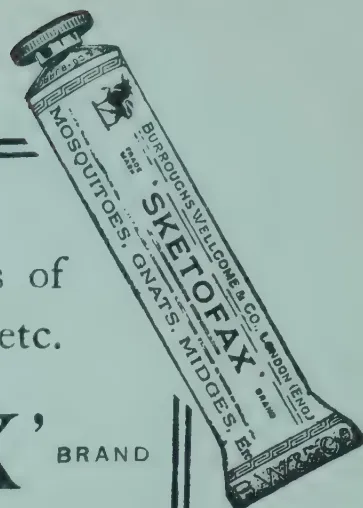

## APICULTURE.

### TALKS TO BEGINNERS ON BEE-KEEPING.

BY THE EDITOR, "GLEANINGS IN BEE CULTURE."

In the spring when conditions are favourable for brood-rearing, the bees will increase the amount of their brood with surprising rapidity until they may have as many as 10 to 15 combs fairly well-filled with brood. Such extensive brood-rearing does not last long, and many colonies do not reach more than seven or eight combs of brood, even at the height of spring brood-rearing. As this brood emerges the colonies soon become so strong that, if extra room is not given, the bees may not all be able to stay within the hive during warm nights, but may cluster in large masses on the outside.

This is the time that the instinct to swarm is aroused in the colony, and the period of most extensive brood-rearing in the spring is usually followed by swarming. Bee-keepers speak of this as the swarming season. While colonies may swarm later in the season if similar conditions are present, most of the swarming of the season occurs as a climax to the great expansion of brood-rearing in the spring.

#### HOW BEES PREPARE FOR SWARMING.

The rearing of drones is probably a remote and indefinite step in the preparation for swarming; but, so far as the bee-keeper is able to see, the first definite preparation the colony makes is that of starting queen-cells.

226------------------------------------------------

SEPTEMBER, 1921.]203

In some of the Southern States, queen-cells built preparatory to swarming may be found in some of the strongest colonies as early as March and April, but in the North they usually are not built until May or June. Queen cells are usually built along the lower edge of the comb and are so constructed that the opening of the cells is downward, thus making these cells nearly vertical instead of nearly horizontal, as are the worker-cells. Frequently partially built queen-cells or "cell cups," which are empty, may be found along the lower edge of the combs. These are sometimes built long before eggs are placed in them in preparation for swarming, and are therefore not necessarily significant as indicating a desire to swarm. Finally several of these cell cups are built and eggs are laid in them. This means that the colony is now definitely preparing to swarm unless the queen is old and failing, in which case it may mean that the bees are rearing another queen to take her place. With normal colonies having a normal queen, the starting of queen-cells means that a swarm may be expected to issue eight or nine days from the time the eggs were laid in the queen-cells.

The beginner can follow the entire programme as carried out by the bees, by watching the development of these queen-cells. Usually the swarm issues at about the time the more advanced of these queen-cells are capped—though Italian bees sometimes swarm earlier, and bad weather may compel the bees to wait until later.

#### **PRIME SWARMS AND AFTER-SWARMS.**

When the swarm issues under these conditions the old queen goes along, leaving behind the immature, young queens in their cells. Enough bees stay in the old hive to take care of the brood, which at this time is emerging so rapidly that the parent colony soon has quite a force of bees again. If the prime swarm issued on schedule time (when the first queen-cells were capped), an after-swarm may be expected from the parent colony about eight days later the after-swarm being accompanied by one of the recently emerged young queens. If the bee-keeper does not interfere to prevent it, usually several after-swarms issue, one coming out every day or two, until the colony is so depleted that there are no longer bees enough to divide up among the remaining young queens. Usually but one of these young queens is at large in the hive at a time, the others being held prisoners within their cells, though sometimes two or more young queens may go out with an after-swarm. Finally, when no more swarms can be sent out, all but one of the young queens are killed, the surviving one being destined to become the new mother of the colony.

#### **SWARMING UNDESIRABLE.**

If the bees are permitted to carry out their own programme completely as to swarming, it usually means a loss of the honey crop from the colonies that swarm, since the great army of workers which filled the hive to overflowing at the beginning of the honey flow is dissipated by swarming. The bees should not be permitted to divide their working force just before or during the honey flow, and the beginner must learn to prevent this.

#### **CLIPPING THE QUEEN'S WINGS.**

Preparatory to taking care of any swarms that may issue, it is advisable for the beginner to find the queen in each hive and clip off the greater portion of the wings on one side. This is to prevent the queen from flying when a swarm issues, thus giving the beekeeper control of the swarm if it should choose to cluster in the top of a high tree or fly away to the woods. The same control may be had by using a queen and drone trap, with the advantage that the trap automatically catches the queen; while, with a clipped queen, it is necessary to find her on the ground in front of the hive when a swarm issues. The ambitious beginner should learn to clip his queens however, and, in the northern States especially, now is a good time to do this,

227------------------------------------------------

204[SEPTEMBER, 1921.**TO PREVENT SWARMING WHEN PRODUCING EXTRACTED HONEY.**

If extracted honey is being produced, the first super should be put on some time before the beginning of the main honey flow. In fact, if empty combs are available a super of empty combs should be given as soon as the brood-chamber is fairly well filled with brood, honey, and pollen. The queen-excluder should not be used between the brood-chamber and the super at this time, but the queen should be permitted free range through both stories. This should prevent early swarming.

If empty combs are not available for this first super, frames filled with full sheets of foundation should be used, but these should not be given until the bees commence gathering enough nectar to cause them to begin to build new white wax on the darker combs in elongating and repairing the cells. When foundation must be used some of the combs of brood from below should be placed in the middle of the second story. This affords an opportunity to place four frames of foundation adjacent to four combs of brood, two in the upper chamber, and two in the lower chamber. As soon as the bees have drawn out the foundation in these four frames so that they now really contain combs with shallow cells, these newly built combs can be moved toward the side of the hive, and other frames, which the bees have not yet worked on, put in their places. These new combs are built out better in the second story, and it is well to have most of this work done there.

As soon as new honey is being stored fast enough so that the second story is nearly filled with brood and honey, another super should be placed on top of the hive, making it three stories high. If empty combs are available, eight of these may be used in this 10-frame super, the combs being spaced farther apart so each comb will hold more honey; but, if foundation is used, the frames should not be spaced so wide until after the combs are built out. When foundation is used in the second super, at least two combs from the first super should be placed in the second super to induce the bees to begin work there promptly.

About a week after the beginning of the main honey flow or after the queen has abandoned the lower story long enough so that the brood there has all been sealed, the queen should be put down into the lower story and confined there by a queen-excluder, which should be placed between the first and the second story. The queen will usually be found in the second story at this time. To find her, lift off the third story if one is on the hive; then, without smoking the bees in the second story more than necessary, lift it off and set it on the inverted hive cover in such a manner that the bottom-bars of the frames do not touch the rim of the cover, to avoid crushing bees. By examining these combs one by one, the queen should be found, picked up by the wings, and placed in the lower brood-chamber.

In reassembling the hive after the queen has been put down, the queen-excluder should be placed over the lower brood-chamber; the super which was formerly the third story should be put on as the second story; and the former second story, which contains most of the brood, should be put back on top as a third story. If more room is needed at this time, an additional super may be given, in which case the former second story, being placed on top, now becomes the fourth story.

Ten days later it may be well to destroy all the queen-cells that are built in this top super, though this is not always necessary.

Colonies treated in this way usually do not swarm if additional supers are given as fast as needed, though they may do so if the honey flow is long,

228------------------------------------------------

SEPTEMBER, 1921.]205

### TO CONTROL SWARMING WHEN PRODUCING COMB HONEY.

When producing comb honey, the first super should be given when the bees begin to add new white wax to the old dark combs in the brood-chamber. The sections in the comb-honey super should contain foundation, preferably full sheets filling the sections almost completely. If possible, the first super should contain at least one section in which the comb is already built, saved over from the previous year. This "bait" comb should induce the bees to begin work in the first super promptly. As soon as the bees commence working on the outside sections of this first super, a second super should be given. If the bees are working well and new honey is being stored throughout the first super, the second super should be placed below the first one; but, if the bees are not working in all sections of the first super, the second super should be placed on top of the first one.

### HOW TO HIVE A SWARM.

If a swarm issues look for the queen (if she has been clipped) on the ground in front of the hive while the swarm is coming out. When the queen is found put her into a Miller queen-catcher and introducing cage or any kind of wire-cloth cage in which she can be confined. Lay the cage down near the hive in the shade; then move the hive from its stand, turning the entrance to one side. Place a new hive where the old one stood, having frames filled with full sheets of foundation, and, if available, one empty comb. Transfer the supers from the old hive to the new, put back the covers on both hives, and thrust the cage containing the queen into the entrance of the new hive.

The bees may return and enter the new hive without clustering, or they may cluster and return later. As they are returning none of them should be permitted to enter the old hive. To prevent this, it may be necessary to cover the old hive with a cloth or move it farther away. When most of the bees have entered the hive the queen should be released among them.

If a queen trap is used to catch the queen as the swarm issues, instead of clipping the queen, the procedure is the same except that it is not necessary to look for the queen; but after the swarm is out, the old hive set to one side and the new one is in its place, the queen trap may simply be put on the new hive and the slide pulled out to permit the queen to enter the hive when the swarm returns.

After the swarm has entered the hive and the excitement has subsided the entrance of the parent hive should be turned toward that of the swarm.

A day or two later the parent hive should be turned with its entrance close to that of the swarm, and on the seventh day, choosing a time when the bees are working well in the fields and preferably early in the afternoon when many young bees are taking their play flight in front of the parent hive, it should be moved to a new location at least 20 feet away for increase. In moving the parent hive away it should be handled carefully to prevent disturbing the bees, so that the field bees going out will not note the change in the location of the hive. When this is done most of the young bees, which have become field workers during the week, as they return from the fields will now enter the new hive on the old stand where they should be most useful, so depleting the parent colony of its bees that after-swarming is usually prevented; and since most of the workers are held together in the new hive on the old stand the yield of honey should not be reduced on account of the swarm having issued. Usually the parent colony does not produce any surplus honey the same season, but it should be in excellent condition for winter.

GLEANINGS IN BEE CULTURE, Vol. XLIX, No. 5.

229------------------------------------------------

206[SEPTEMBER, 1921.

# GENERAL.

---

## AGRICULTURAL SCHOOLS IN ALBERTA, CANADA.

---

The following note has been communicated by MR. J. McCAIG, Editor of Publications, Department of Agriculture, Alberta :—

The Province of Alberta, Canada, is becoming distinguished for its work in agricultural education, chiefly through the influence and work of the HON. DUNCAN MARSHALL, present Minister of Agriculture for the Province. MR. MARSHALL is a frequent visitor to the Mother Country and may be known to a good many readers of this *Journal*. In company with two other Canadian breeders he recently purchased a shipment of Shorthorns and Shropshires for his own farm.

Contrary to common practice, the Alberta system of agricultural education begins with a strong understructure rather than a heavy top, as represented by an agricultural college. All the provinces of Canada, in fact, are active in utilising a good body of agricultural material in connection with the elementary schools. This body is commonly referred to as "educational agriculture" rather than "material for agricultural education." A good deal has been accomplished in this elementary work in Alberta.

*Both Boys and Girls.*—MR. MARSHALL'S efforts relate specifically to the farm boys and girls after they have passed the elementary school age. The agricultural schools are administered by the Department of Agriculture, not by the Department of Education, and this gives them perhaps a closer touch with practice and application than they could possibly have as part of the general scholastic system. The schools are not integrated with the general educational system, but the work done in the agricultural schools, if students have sufficient general training for matriculation, counts in their university course at the college of agriculture. The outstanding service of the schools is that they give direct training to boys and girls who intend to go back to the farm. At present there are six of these schools in the Province, one-half of them having been opened in the autumn of 1920. It is expected that they will train upwards of one thousand boys and girls during the year. One of the schools during the last two years has done good work in training returned soldiers. The Minister has expressed his intention of making provision at these schools for special courses for British boys and girls who need to be taught something about western agriculture before going on the land. These would probably be summer courses and would include a combination of study and farm work.

*Free Courses.*—Pupils must be sixteen years of age; there are no academic restrictions and no fees for tuition. The course extends over two years and sessions are limited to the period between October and April. Courses for boys, and for girls likewise if they wish to take them, include field husbandry, animal husbandry, dairying, shopwork and machinery, horticulture, poultry-keeping, farm management, elementary farm economics

230------------------------------------------------

SEPTEMBER, 1921.]207

English and farm mathematics. The sciences underlying these subjects are part of instruction as far as they relate directly to practice. The schools have a number of improving organisations such as athletic, musical and literary clubs.

Classes for girls include cooking, sewing, nursing, household management, accounting, dairying, poultry-keeping and horticulture. They have instruction in the direct science such as bacteriology, chemistry, physics, etc., relating to practice. They also have English and mathematics and share in the benefit from the organisations for improvement and recreation. There are about six or seven teachers on the staff of each school.

*Institutional Farms.*—Connected with each school is an institutional farm called a demonstration farm. It is generally of a good size, consisting of not less than 320 acres, of which thirty acres are devoted to experimental work. The rest of the land is run like an ordinary farm with a manager and hired men, but it is under the direction of the head of the school for the purpose of ensuring that it shall exemplify farm practice of a high grade, based on the findings of the school. A good deal of attention is devoted to establishing conserving rotations, but this is not easy on parts of the prairie where grain growing is the chief business. The farms also serve for the raising of good seed and live stock, which are distributed to farmers at reasonable prices.—JOURN. OF MINISTRY OF AGRICULTURE, Vol. XXVIII, No. 3.

## YIELD OF SISAL FIBRE IN JAMAICA.

The average annual yield of sisal fibre in East Africa, the Bahamas and other countries, is about one to one and a half tons per acre. The following figures, issued by the Director of Agriculture, Jamaica, and published in the JOURNAL OF THE JAMAICA AGRICULTURAL SOCIETY, indicate that the yields obtained at Lititz are somewhat below the average, though there must be taken into account, the fact that the soil at Lititz is of the poorest character subject to very dry climatic conditions :—

<table>
<thead>
<tr>
<th></th>
<th>Cut, November, 1919.</th>
<th>Cut, November, 1920.</th>
</tr>
</thead>
<tbody>
<tr>
<td>Average number of leaves fit to be cut, per plant</td>
<td>... 32</td>
<td>30</td>
</tr>
<tr>
<td>Average yield of leaves in lb. per plant</td>
<td>... 19</td>
<td>18</td>
</tr>
<tr>
<td>Average weight of single leaf</td>
<td>.. 9.6 oz.</td>
<td>9.7 oz.</td>
</tr>
<tr>
<td>Recovery of fibre (by hand) per cent.</td>
<td>3.4</td>
<td>3.93</td>
</tr>
<tr>
<td>Fibre per 1,000 plants in lb.</td>
<td>... 646</td>
<td>759</td>
</tr>
<tr>
<td>Yield per acre of fibre (6 x 5) at normal distance of (6 x 5)</td>
<td>.. 938</td>
<td>1,029</td>
</tr>
<tr>
<td>Total</td>
<td>2 cuttings</td>
<td>1,967 lb.</td>
</tr>
</tbody>
</table>

These results are encouraging, as the drought at Lititz in 1920 has been very severe, and the experimental site is considered to be the most infertile area on the whole of the Lititz Savannah.—AGRICULTURAL NEWS, Vol. XX, No. 494.

231------------------------------------------------

08

[SEPTEMBER, 1921.]

**MEETINGS OF THE**  
**AUGUST, 1921.**

**ANIMAL DISEASE RETURN FOR THE**  
**MONTH ENDED 31st August, 1921.**

<table border="1">
<thead>
<tr>
<th>Province, &amp;c.</th>
<th>Disease</th>
<th>No. of Cases up to date since Jan. 1st 1921.</th>
<th>Fresh Cases</th>
<th>Recoveries</th>
<th>Deaths</th>
<th>Bal- ance Ill.</th>
<th>No. Shot.</th>
</tr>
</thead>
<tbody>
<tr>
<td rowspan="2">Western</td>
<td>Rinderpest</td>
<td>83</td>
<td>—</td>
<td>83</td>
<td>—</td>
<td>—</td>
<td>—</td>
</tr>
<tr>
<td>Foot-and-mouth disease</td>
<td>—</td>
<td>—</td>
<td>—</td>
<td>—</td>
<td>—</td>
<td>—</td>
</tr>
<tr>
<td rowspan="2">Colombo Municipality</td>
<td>Rinderpest</td>
<td>88</td>
<td>—</td>
<td>—</td>
<td>—</td>
<td>—</td>
<td>—</td>
</tr>
<tr>
<td>Foot-and-mouth disease</td>
<td>—</td>
<td>—</td>
<td>—</td>
<td>—</td>
<td>—</td>
<td>—</td>
</tr>
<tr>
<td rowspan="2">Cattle Quarantine Station</td>
<td>Rabies</td>
<td>2</td>
<td>—</td>
<td>—</td>
<td>—</td>
<td>—</td>
<td>—</td>
</tr>
<tr>
<td>Rinderpest</td>
<td>51*</td>
<td>—</td>
<td>—</td>
<td>—</td>
<td>—</td>
<td>—</td>
</tr>
<tr>
<td></td>
<td>Foot-and-mouth disease</td>
<td>325†</td>
<td>10</td>
<td>—</td>
<td>—</td>
<td>—</td>
<td>—</td>
</tr>
<tr>
<td rowspan="2">Central</td>
<td>Rinderpest</td>
<td>13</td>
<td>—</td>
<td>13</td>
<td>—</td>
<td>—</td>
<td>—</td>
</tr>
<tr>
<td>Foot-and-mouth disease</td>
<td>—</td>
<td>—</td>
<td>—</td>
<td>—</td>
<td>—</td>
<td>—</td>
</tr>
<tr>
<td rowspan="2">Southern</td>
<td>Anthrax</td>
<td>12</td>
<td>5</td>
<td>7</td>
<td>5</td>
<td>—</td>
<td>—</td>
</tr>
<tr>
<td>Piroplasmosis</td>
<td>—</td>
<td>—</td>
<td>—</td>
<td>—</td>
<td>—</td>
<td>—</td>
</tr>
<tr>
<td rowspan="2">Northern</td>
<td>Rinderpest</td>
<td>35</td>
<td>—</td>
<td>35</td>
<td>—</td>
<td>—</td>
<td>—</td>
</tr>
<tr>
<td>Foot-and-mouth disease</td>
<td>—</td>
<td>—</td>
<td>—</td>
<td>—</td>
<td>—</td>
<td>—</td>
</tr>
<tr>
<td rowspan="2">Eastern</td>
<td>Rinderpest</td>
<td>241</td>
<td>57</td>
<td>183</td>
<td>9</td>
<td>49</td>
<td>—</td>
</tr>
<tr>
<td>Foot-and-mouth disease</td>
<td>—</td>
<td>—</td>
<td>—</td>
<td>—</td>
<td>—</td>
<td>—</td>
</tr>
<tr>
<td rowspan="2">North-Western</td>
<td>Anthrax</td>
<td>36</td>
<td>—</td>
<td>11</td>
<td>23</td>
<td>—</td>
<td>2</td>
</tr>
<tr>
<td>Foot-and-mouth disease</td>
<td>—</td>
<td>—</td>
<td>—</td>
<td>—</td>
<td>—</td>
<td>—</td>
</tr>
<tr>
<td rowspan="2">North-Central</td>
<td>Rinderpest</td>
<td>Free</td>
<td>—</td>
<td>—</td>
<td>—</td>
<td>—</td>
<td>—</td>
</tr>
<tr>
<td>Foot-and-mouth disease</td>
<td>—</td>
<td>—</td>
<td>—</td>
<td>—</td>
<td>—</td>
<td>—</td>
</tr>
<tr>
<td rowspan="2">Uva</td>
<td>Anthrax</td>
<td>401</td>
<td>2</td>
<td>390</td>
<td>10</td>
<td>1</td>
<td>—</td>
</tr>
<tr>
<td>Foot-and-mouth disease</td>
<td>20</td>
<td>—</td>
<td>2</td>
<td>18</td>
<td>—</td>
<td>—</td>
</tr>
<tr>
<td rowspan="2">Sabaragamuwa</td>
<td>Haemorrhagic Septicæmia</td>
<td>—</td>
<td>—</td>
<td>—</td>
<td>—</td>
<td>—</td>
<td>—</td>
</tr>
<tr>
<td>Rinderpest</td>
<td>Free</td>
<td>—</td>
<td>—</td>
<td>—</td>
<td>—</td>
<td>—</td>
</tr>
<tr>
<td></td>
<td>Foot-and-mouth disease</td>
<td>—</td>
<td>—</td>
<td>—</td>
<td>—</td>
<td>—</td>
<td>—</td>
</tr>
<tr>
<td></td>
<td>Anthrax</td>
<td>—</td>
<td>—</td>
<td>—</td>
<td>—</td>
<td>—</td>
<td>—</td>
</tr>
</tbody>
</table>

\* 7 cases occurred amongst sheep and goats. † occurred amongst sheep and goats.

**E. T. HOOLE,**  
for Government Veterinary Surgeon.  
Colombo, 3rd September, 1921.

<table border="1">
<thead>
<tr>
<th rowspan="2">Station</th>
<th colspan="2">Temperature</th>
<th rowspan="2">Mean Humidity %</th>
<th rowspan="2">Mean amount of cloud 0=clear. 10=overcast</th>
<th rowspan="2">Mean Wind Direction during month</th>
<th rowspan="2">Daily Mean Velocity. Miles</th>
<th colspan="2">Rainfall</th>
</tr>
<tr>
<th>Mean Daily Shade</th>
<th>Difference from Average</th>
<th>Amount</th>
<th>No. of Rainy days</th>
<th>Difference from Average</th>
<th>Inches</th>
</tr>
</thead>
<tbody>
<tr>
<td>Colombo</td>
<td>81.2</td>
<td>+ 0.2</td>
<td>80</td>
<td>8.8</td>
<td>WSW</td>
<td>135</td>
<td>3.44</td>
<td>23</td>
<td>+ 0.80</td>
</tr>
<tr>
<td>Observatory</td>
<td>82.3</td>
<td>+ 0.7</td>
<td>76</td>
<td>4.2</td>
<td>SW</td>
<td>278</td>
<td>0.42</td>
<td>3</td>
<td>- 0.33</td>
</tr>
<tr>
<td>Puttalam</td>
<td>84.7</td>
<td>+ 1.5</td>
<td>72</td>
<td>6.6</td>
<td>SW</td>
<td>111</td>
<td>0.01</td>
<td>1</td>
<td>- 0.59</td>
</tr>
<tr>
<td>Mannar</td>
<td>84.2</td>
<td>+ 1.5</td>
<td>78</td>
<td>4.8</td>
<td>SW</td>
<td>340</td>
<td>0.01</td>
<td>1</td>
<td>- 1.55</td>
</tr>
<tr>
<td>Jaffna</td>
<td>85.2</td>
<td>+ 0.4</td>
<td>68</td>
<td>6.5</td>
<td>SW</td>
<td>216</td>
<td>2.20</td>
<td>5</td>
<td>- 2.03</td>
</tr>
<tr>
<td>Trincomalee</td>
<td>84.4</td>
<td>+ 0.4</td>
<td>72</td>
<td>6.2</td>
<td>Variable</td>
<td>124</td>
<td>3.38</td>
<td>9</td>
<td>+ 1.15</td>
</tr>
<tr>
<td>Batticaloa</td>
<td>81.6</td>
<td>+ 0.3</td>
<td>77</td>
<td>5.4</td>
<td>WSW</td>
<td>397</td>
<td>1.35</td>
<td>8</td>
<td>+ 0.11</td>
</tr>
<tr>
<td>Hambantota</td>
<td>79.6</td>
<td>- 0.4</td>
<td>84</td>
<td>6.6</td>
<td>WNW</td>
<td>319</td>
<td>6.32</td>
<td>25</td>
<td>+ 0.94</td>
</tr>
<tr>
<td>Galle</td>
<td>79.9</td>
<td>- 0.3</td>
<td>84</td>
<td>8.1</td>
<td>—</td>
<td>—</td>
<td>18.29</td>
<td>29</td>
<td>+ 6.62</td>
</tr>
<tr>
<td>Ratnapura</td>
<td>83.6</td>
<td>0</td>
<td>70</td>
<td>5.2</td>
<td>—</td>
<td>—</td>
<td>2.39</td>
<td>6</td>
<td>+ 0.56</td>
</tr>
<tr>
<td>Anu'pura</td>
<td>80.8</td>
<td>- 0.1</td>
<td>80</td>
<td>6.1</td>
<td>—</td>
<td>—</td>
<td>7.17</td>
<td>18</td>
<td>+ 3.81</td>
</tr>
<tr>
<td>Kurunegala</td>
<td>75.7</td>
<td>- 0.1</td>
<td>83</td>
<td>8.3</td>
<td>—</td>
<td>—</td>
<td>10.83</td>
<td>24</td>
<td>+ 5.36</td>
</tr>
<tr>
<td>Kandy</td>
<td>74.6</td>
<td>- 0.8</td>
<td>80</td>
<td>7.2</td>
<td>—</td>
<td>—</td>
<td>4.21</td>
<td>14</td>
<td>+ 0.98</td>
</tr>
<tr>
<td>Badulla</td>
<td>70.0</td>
<td>0</td>
<td>73</td>
<td>6.6</td>
<td>—</td>
<td>—</td>
<td>3.91</td>
<td>15</td>
<td>+ 0.28</td>
</tr>
<tr>
<td>Diyatalawa</td>
<td>62.5</td>
<td>+ 0.9</td>
<td>84</td>
<td>8.1</td>
<td>—</td>
<td>—</td>
<td>5.71</td>
<td>20</td>
<td>+ 1.20</td>
</tr>
<tr>
<td>Hakgala</td>
<td>61.1</td>
<td>+ 1.7</td>
<td>86</td>
<td>9.0</td>
<td>—</td>
<td>—</td>
<td>8.51</td>
<td>27</td>
<td>+ 0.68</td>
</tr>
<tr>
<td>N. Eliya</td>
<td>—</td>
<td>—</td>
<td>—</td>
<td>—</td>
<td>—</td>
<td>—</td>
<td>—</td>
<td>—</td>
<td>—</td>
</tr>
</tbody>
</table>

During the first part of the month, and at the very end of it, the pressure gradient and wind were of quite the normal South West monsoon type with rain chiefly in the southern half of the island (though 1.14 in. was measured at Trincomalee on the 17th).

However from the 23rd to 29th there was a very definite fall off in the steepness of the gradient such as does not occur usually until much later in the year, and this brought its natural result in the form of local thunderstorms and wind deviations. The following examples are taken from this period:—Labugama recorded 5.15 in. on the 26th of which 3 in. fell in 45 minutes, while Avisawella and several other stations in the neighbourhood also reached 5 in. In the North Central Province at Maradankadawala there were 94 in. in 5 days and towards the south east Udalienna and Sudupanawela each received over 9 in. in 4 days. At Nuwara Eliya hail occurred on the 24th and 25th.

Numerical totals for the month, both of rain and number of wet days were above average at most stations. Excesses of more than 5 in. were common elsewhere they were infrequent but were found at Matale, Maradankadawala and some stations in Central Uva.

The stations that failed to reach their average rainfall included most of those in the Northern Province some, but by no means the majority, in the Eastern Province, and one or two elsewhere.

The temperature and humidity figures do not call for any special comment. The chief variations were in the north, where temperature was above normal, and humidity below it.

The amount of cloud was distinctly in excess at most stations. Despite the eccentricities of the 23rd to 29th the mean air pressure was not far from normal and at the stations where wind was recorded velocities are about equally distributed above and below the average.

**A. J. BAMFORD,**  
Supdt. Observatory.

232------------------------------------------------

This image is a scan of a blank page. The background is a uniform light beige or off-white color. There are several small, dark specks scattered across the surface, which appear to be dust or scanning artifacts. No text, lines, or other graphical elements are present.

233------------------------------------------------

A black and white photograph of an agricultural exhibit at the Galle Agricultural Show. A large banner in the foreground reads "DEPARTMENT OF AGRICULTURE". The exhibit features various plants, including palm trees and paddy plants, and several small structures. One structure is labeled "PADDY" and another "SUGAR". The background shows a grassy field and some trees.

S. 60

THE DEPARTMENT OF AGRICULTURE EXHIBIT AT GALLE AGRICULTURAL SHOW

234------------------------------------------------

# THE TROPICAL AGRICULTURIST

---

VOL. LVII.

PERADENIYA, OCTOBER, 1921.

No. 4.

---

## EDUCATIONAL EXHIBITS AT AGRICULTURAL SHOWS.

---

The Agricultural Show affords an excellent opportunity for educational exhibits and in recent years in Ceylon increasing attention has been given to the provision of adequate exhibits of educational value.

The *Anchylostomiasis* campaign has in the past been frequently represented by extensive exhibits at shows, the Educational Department has been similarly represented by exhibits of weaving, carpentry work, etc., and more recently the Agricultural Department has provided exhibition stalls, containing publications, examples of new products and collections of agricultural products being grown on the Experiment Stations.

At the Matale Show a small beginning was made in the direction of Departmental Exhibits at Agricultural Shows and the exhibit created a considerable amount of interest. Agricultural officers and instructors were present throughout the whole of the show and gave to enquirers full particulars in regard to the various exhibits.

At the Galle Show, a larger exhibit was made in a specially constructed shed. Here were exhibited specimens of sweet potato, manioc, paddy, sugar-cane and tobacco varieties, while special attention was given to exhibits of citrus fruits and particularly of limes and its products citrate of lime, concentrated juice and essential oil. Attention was also called to Co-operation.

The number of visitors to this exhibit was very considerable and agricultural officers and instructors were present at the exhibit throughout the exhibition. A large number of the leaflets issued by the Department were distributed.

235------------------------------------------------

210[OCTOBER, 1921.

Similarly small exhibits were made at the smaller agricultural shows in the Southern Province during the year and were visited freely by the village cultivators that were present at these shows.

The educational value of these exhibits is beyond dispute and the interest taken in them cannot be estimated too highly, and it is to be hoped that they may become regular features at the principal shows.

These shows afford opportunities of getting into close touch with a number of agriculturists and it affords an opportunity of illustrating to them some of the activities of the Agricultural Department and of the attempts being made to acquire further information regarding the existing crops of the Colony and of new products of possible economic value.

It is also possible that lectures on agricultural topics can be arranged to be given during the time of the show, and the agricultural exhibit utilized for illustration purposes.

The officers in charge of the exhibits are also enabled to ascertain by the enquiries made by visitors something of their requirements and thereby assist in bringing the work of the Department into the closest possible touch with those whom it is designed to serve.

The interest that has been taken in these Departmental exhibits at Agricultural Shows during the year has been gratifying, and an extension of the scheme could be made with advantage if finances permit.

In the present number of the TROPICAL AGRICULTURIST is given illustrations of the Department of Agriculture's exhibit at the Galle Show and from these readers will be afforded an opportunity of seeing the nature of the exhibit made.

236------------------------------------------------

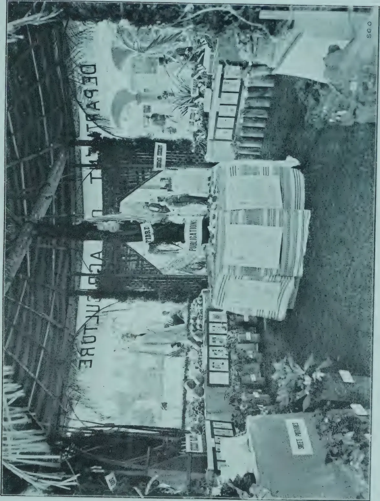A black and white photograph showing the interior of an agricultural exhibition hall. The main feature is a large, ornate display structure with a thatched roof and a sign that reads "DEPARTMENT OF AGRICULTURE". Inside this structure, there are various exhibits, including a large banner that says "FIBRE" and another that says "PUBLICATIONS". To the right of the main structure, there is a smaller, white, box-like display unit. In the foreground, there are several potted plants, one of which is labeled "SWEET POTATOES". The floor is covered with a dark material, possibly straw or mulch. The overall atmosphere is that of a busy, well-organized agricultural show.

seo

INTERIOR OF DEPARTMENT OF AGRICULTURE EXHIBIT AT GALLE AGRICULTURAL SHOW.

237------------------------------------------------

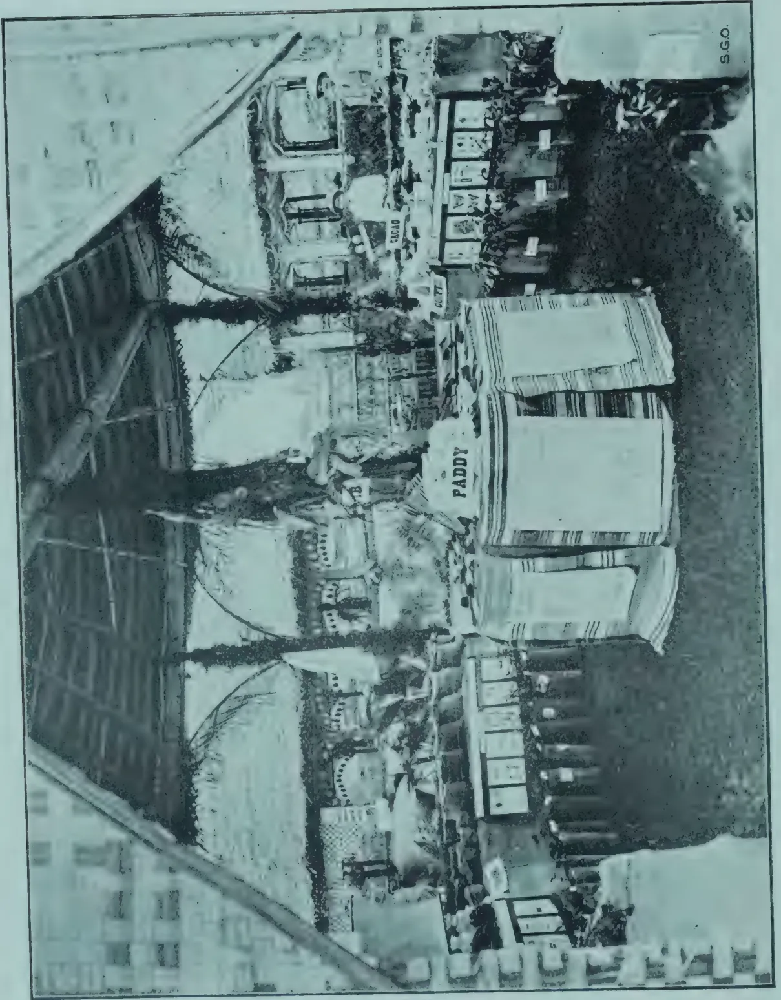A black and white photograph showing the interior of a large exhibition hall. The space is filled with various agricultural displays, including large wooden crates, tables, and equipment. A prominent sign in the center reads "PADDY". In the background, a sign for "CAGAD" is visible. The hall has a high ceiling with exposed wooden beams and a large, arched structure on the left. The overall atmosphere is one of a busy, organized agricultural fair.

S.G.O.

INTERIOR OF DEPARTMENT OF AGRICULTURE EXHIBIT AT GALLE AGRICULTURAL SHOW.

238------------------------------------------------

OCTOBER, 1921.]211

# TEA.

## TRIALS OF NITROGENOUS MANURES ON TEA.

The plots for this trial were laid out and planted in 1916 with this particular experiment in view, and from the beginning everything possible has been done to make and keep them even.

In spite of this, it was soon clear that the initial fertility of the soil varied so greatly on different plots that one could only hope for an approximation to accuracy by averaging over a number of plots receiving the same treatment. Of the eighteen plots three, therefore, were used as check plots, while the remaining fifteen provided 5 sets of 3 plots each, and each of these 5 sets received a different manure.

At the end of 1918 the plants were collar-pruned, and grew so badly in 1919 that an average of only  $1\frac{1}{4}$  maunds pucca tea per acre was obtained. As each plot contained only 54 bushes, the error in the plucking and weighing of the leaf obtained at each plucking exceeded the difference between the plots, and in that year therefore no figures were obtained which could be considered of any value for measuring the initial fertility of the plots.

The tea having been left unpruned, yields were better, so that the error of weighment could be disregarded, and the yields obtained in 1920 up to end of May are taken as indicating the initial fertility.

There were no vacancies, but there were a few infillings, and weak bushes, which were left unplucked from the beginning of the season. In calculating yield per acre these are allowed for.

The manures were applied at the end of May.

The manuring was as follows:—

<table border="1">
<thead>
<tr>
<th colspan="4">Manure per Acre</th>
<th>Nitrogen per acre lb.</th>
<th>Phosphoric acid per acre lb.</th>
</tr>
</thead>
<tbody>
<tr>
<td>1.</td>
<td>Check</td>
<td>Bone meal</td>
<td>... 162 lb.</td>
<td>5.6</td>
<td>35.6</td>
</tr>
<tr>
<td>2.</td>
<td rowspan="2">{</td>
<td>Nitrate of soda</td>
<td>... 212 "</td>
<td>30.0</td>
<td>Nil</td>
</tr>
<tr>
<td></td>
<td>Bone meal</td>
<td>... 162 "</td>
<td>5.6</td>
<td>35.6</td>
</tr>
<tr>
<td>3.</td>
<td rowspan="2">{</td>
<td>Sulphate of ammonia</td>
<td>... 150 "</td>
<td>30.0</td>
<td>Nil</td>
</tr>
<tr>
<td></td>
<td>Bone meal</td>
<td>... 162 "</td>
<td>5.6</td>
<td>35.6</td>
</tr>
<tr>
<td>4.</td>
<td rowspan="2">{</td>
<td>Mustard cake</td>
<td>... 704 "</td>
<td>32.7</td>
<td>17.6</td>
</tr>
<tr>
<td></td>
<td>Bone meal</td>
<td>... 82 "</td>
<td>2.9</td>
<td>18.0</td>
</tr>
<tr>
<td>5.</td>
<td rowspan="2">{</td>
<td>Nitrox</td>
<td>... 320 "</td>
<td>32.0</td>
<td>12.8</td>
</tr>
<tr>
<td></td>
<td>Bone meal</td>
<td>... 104 "</td>
<td>3.6</td>
<td>22.8</td>
</tr>
<tr>
<td>6.</td>
<td rowspan="2">{</td>
<td>Green jungle</td>
<td>... 3 tons</td>
<td>30.0 approx.</td>
<td>Nil</td>
</tr>
<tr>
<td></td>
<td>Bone meal</td>
<td>... 162 lb.</td>
<td>5.6</td>
<td>35.6</td>
</tr>
</tbody>
</table>

The plots receiving nitrogenous manures thus each received exactly 30 lb. more nitrogen per acre than the check plot and the same quantity of

239------------------------------------------------

212[OCTOBER, 1921.

phosphoric acid, except in the case of the plot receiving the green jungle. This was originally sown with sunn hemp, and it was expected that here also the nitrogen added as green stuff would not differ greatly from 30 lb. Unfortunately the green crop failed completely owing to attack by a root disease (which fortunately does not attack tea). After seven weeks' growth the green crop was abandoned as hopeless, and the crop (averaging less than half a ton per acre) was made up to 3 tons per acre with green jungle, thatch, phutuka (*Melastoma*) and boga medeloa, this being cut from neighbouring waste land, wood being up to finger-thick.

This was very lightly hoed in on July 17th.

This last set (6) therefore must be considered as a trial of green jungle as manure. Its action differs from that of a green crop since there is no suffering of the tea while the crop is growing. In this case, of course, a crop was growing but it was so poor that the total growth on the green-manured plots hardly exceeded that of the jungle on the other plots, and it is considered that the loss in tea crop from the growth of the green manure was in this case practically negligible. With favourable (wet) weather, however, it was shown at Heeleaka that the bad effect of a green manure while growing is not very great, and the result from this, set 6, may therefore be considered to give some indication of the probable efficiency of a green crop.

The actual weights obtained are recorded below in order to show how uneven were the plots, and also to show that there was no great difference between the averages of any three evenly distributed plots. The weights look small, but the average plucking yielded about 2 lb. from a plot and as weighment was certainly accurate to half-an-ounce the possible error from weighment cannot exceed  $1\frac{1}{2}\%$ , and with 40 pluckings errors in weighment are probably negligible.

Actual weight of leaf in lb. and ozs. from 1/50 acre plot :—

<table border="1">
<thead>
<tr>
<th></th>
<th></th>
<th></th>
<th>To end of May before manuring</th>
<th>June to Nov. after manuring</th>
</tr>
</thead>
<tbody>
<tr>
<td rowspan="3">1</td>
<td rowspan="3">Check plots</td>
<td rowspan="3">...</td>
<td>11.6</td>
<td>49.3</td>
</tr>
<tr>
<td>12.5</td>
<td>46.13</td>
</tr>
<tr>
<td>9.15</td>
<td>42.8</td>
</tr>
<tr>
<td rowspan="3">2</td>
<td rowspan="3">Nitrate of soda</td>
<td rowspan="3">...</td>
<td>9.7</td>
<td>49.7</td>
</tr>
<tr>
<td>11.11</td>
<td>53.9</td>
</tr>
<tr>
<td>11.14</td>
<td>47.4</td>
</tr>
<tr>
<td rowspan="3">3</td>
<td rowspan="3">Sulphate of ammonia</td>
<td rowspan="3">...</td>
<td>10.0</td>
<td>47.6</td>
</tr>
<tr>
<td>11.14</td>
<td>50.10</td>
</tr>
<tr>
<td>9.8</td>
<td>42.8</td>
</tr>
<tr>
<td rowspan="3">4</td>
<td rowspan="3">Oilcake</td>
<td rowspan="3">...</td>
<td>10.15</td>
<td>44.2</td>
</tr>
<tr>
<td>10.1</td>
<td>46.5</td>
</tr>
<tr>
<td>10.15</td>
<td>46.12</td>
</tr>
<tr>
<td rowspan="3">5</td>
<td rowspan="3">Nitrox</td>
<td rowspan="3">...</td>
<td>11.7</td>
<td>47.3</td>
</tr>
<tr>
<td>10.6</td>
<td>45.14</td>
</tr>
<tr>
<td>11.10</td>
<td>44.5</td>
</tr>
<tr>
<td rowspan="3">6</td>
<td rowspan="3">Green jungle</td>
<td rowspan="3">...</td>
<td>16.3</td>
<td>65.5</td>
</tr>
<tr>
<td>9.9</td>
<td>43.15</td>
</tr>
<tr>
<td>8.8</td>
<td>40.3</td>
</tr>
</tbody>
</table>

The difference in total crop look very small, but can be better judged when calculated to weigh per acre.

240------------------------------------------------

OCTOBER, 1921.]213

In the following table, allowance has been made for the bushes left unplucked :

**LB. GREEN LEAF PER ACRE.**

<table border="1">
<thead>
<tr>
<th></th>
<th></th>
<th>To end of May, average before application of manure</th>
<th>June to Novem- ber, average after application of manure</th>
<th>Increase over check plot lb.</th>
</tr>
</thead>
<tbody>
<tr>
<td>1</td>
<td>Check plot</td>
<td>598</td>
<td>2,465</td>
<td>22</td>
</tr>
<tr>
<td>2</td>
<td>Nitrate of soda</td>
<td>579</td>
<td>2,689</td>
<td>224</td>
</tr>
<tr>
<td>3</td>
<td>Sulphate of ammonia</td>
<td>577</td>
<td>2,585</td>
<td>120</td>
</tr>
<tr>
<td>4</td>
<td>Oilcake</td>
<td>574</td>
<td>2,456</td>
<td>...</td>
</tr>
<tr>
<td>5</td>
<td>Nitrox</td>
<td>602</td>
<td>2,473</td>
<td>8</td>
</tr>
<tr>
<td>6</td>
<td>Green jungle</td>
<td>634</td>
<td>2,763</td>
<td>298</td>
</tr>
</tbody>
</table>

These increases cannot be considered as indicating the value of the manure, since the plots were not equal before the manure was applied.

The yield from the check plots from June to November is 4.12 times the yield from March to May. It is probably fairly accurate to assume that had no manures been applied the other plots would have increased at the same rate. By making this assumption we may calculate what the yield without manure would have been, and the difference between this calculated yield and the actual yield probably gives the best index to the efficiency of the various manures, obtainable from these experiments.

<table border="1">
<thead>
<tr>
<th></th>
<th>Yield to end of May</th>
<th>Actual yield June-Nov.</th>
<th>Calculated yield if no manure had been applied</th>
<th>Increase per acre in lb. green leaf</th>
<th>Approximate cost per acre of increase</th>
</tr>
</thead>
<tbody>
<tr>
<td>Nitrate of Soda</td>
<td>579</td>
<td>2,689</td>
<td>2,390</td>
<td>299</td>
<td>Rs. 27.0</td>
</tr>
<tr>
<td>Sulphate of ammonia</td>
<td>577</td>
<td>2,585</td>
<td>2,377</td>
<td>208</td>
<td>„ 27.0</td>
</tr>
<tr>
<td>Oilcake</td>
<td>574</td>
<td>2,456</td>
<td>2,365</td>
<td>91</td>
<td>„ 20.8</td>
</tr>
<tr>
<td>Nitrox</td>
<td>602</td>
<td>2,473</td>
<td>2,480</td>
<td>—</td>
<td>„ 17.8</td>
</tr>
<tr>
<td>Green jungle</td>
<td>634</td>
<td>2,763</td>
<td>2,612</td>
<td>151</td>
<td>Labour only</td>
</tr>
</tbody>
</table>

From this we can calculate the increase per cent. due to the manures. While no pretence to exactitude is made it is believed that these figures do give a fair idea of the relative efficiency for tea of the various manures in the year of application.

<table>
<tbody>
<tr>
<td>Nitrate of soda</td>
<td>...</td>
<td>...</td>
<td>12½ %</td>
</tr>
<tr>
<td>Sulphate of ammonia</td>
<td>...</td>
<td>...</td>
<td>8½ %</td>
</tr>
<tr>
<td>Green jungle</td>
<td>...</td>
<td>...</td>
<td>6 %</td>
</tr>
<tr>
<td>Oilcake</td>
<td>...</td>
<td>...</td>
<td>4 %</td>
</tr>
<tr>
<td>Nitrox</td>
<td>...</td>
<td>...</td>
<td>0 %</td>
</tr>
</tbody>
</table>

The smallness of the effect of the manuring may be a matter of surprise, particularly as this tea at the time of application showed every indication of requiring manure. In 1919, plucking at 27 inches after collar-pruning, the yield from the check plots was only 1¼ mds. pucca tea per acre, and the appearance of the plots up to the end of May 1920 was extremely miserable, Brown blight being bad. From June onwards very great improvement set in and 9½ maunds was obtained from the check plots in 1920 (unpruned). The

241------------------------------------------------

214[OCTOBER, 1921.

disparity is much greater than can be explained even by the very great difference in the two seasons. In 1919, 10 maunds slaked lime per acre had been applied. It is probable that the effect of this in the year of application was to reduce crop, while in 1920, the effect was favourable. Even so, this soil is markedly deficient in phosphoric acid and it is probable that all plots including the check plot benefited from the application of bone meal.\*

The combined effect of the lime and bone meal possibly allowed more rapid production of nitrates from the soil organic matter, so that the effect of added nitrogen was less marked than usual.

However, it is believed that the effect of such small doses of manure as are generally used in tea is not normally much greater than that obtained in this experiment. If so, it is clear, that manuring generally is not a paying proposition in the present state of the tea market, except in the case of such manures as cost little or nothing beyond the cost of labour for which, at times, there may be no other use. Such manures are green jungle, Bheel soil, and to a greater extent Cattle manure and Green crops.

Such manuring is strongly recommended even in view of restricted crops. Finer plucking alone will, in many cases, do all the restricting necessary. In extreme cases where the plucking system is changed to taking strictly 2 leaves and a bud, instead of an average 3 leaves and a bud or more, the restriction would probably be nearer 50% than 20% unless the number of rounds of plucking could be increased effectively.

Nor need the smallness of the results from this experiment be discouraging. If there is any residual effect from manuring on the yielding capacity of the bush (and that can hardly be doubted), then continuous manuring will increase yielding capacity in a compound ratio. An increased efficiency of 5% per annum would double the yield in 15 years.

The characteristics of each manure are commented on separately below, and the rapidity with which each comes into action is traced from curves obtained by plotting the total yields per acre obtained in each period of four weeks against time in weeks. It will be seen that the application of manures coincided with the beginning of a very sudden increase in the rate of leaf production. This sudden rush of leaf was due mainly to the very favourable weather of June, but the jump was much more marked than on unmanured plots and is possibly partly accounted for by the action of the bone meal which all plots, including the check plots, received.

*Rapidly Available Manures.*—A study of Fig 1\* shows that both the nitrate of soda and sulphate of ammonia plots had averaged slightly lower yields than the check plots before the manure was applied.

During the four-week period following application the sulphate of ammonia had shown no result and the nitrate of soda only a very small relative increase. In the second four-week period both manures gave a very marked increase in leaf and this was maintained in the third and fourth periods, although both, and particularly sulphate of ammonia, showed a falling off.

In the fifth period nitrate of soda fully maintained its advantage, but the falling off in effect of sulphate of ammonia was more marked. In the six and last period nitrate of soda still shows an increase, while the sulphate of ammonia plots gave even less than the check plots.

---

\* Not reproduced

242------------------------------------------------

OCTOBER, 1921.]215

If these experiments have any accuracy at all, this greater efficiency of nitrate of soda towards the end of the season is significant. The season was certainly much more favourable to the use of nitrate of soda than the average season in Assam, because the rainfall was small ( $67\frac{1}{2}$  inches) and very well distributed. Hitherto, this department has been, with reason, very shy of advising the use of nitrate of soda in the tea districts. Until recently its price compared very unfavourably with that of other manures; and as it is known to be very readily washed out of the soil, it could not be recommended against other manures less liable to loss. Experiment in future years may show that this attitude is justified in many seasons.

But no consideration of favourable season can explain its greater lasting effect compared with sulphate of ammonia. As far as the nitrogen contents are concerned nitrogen as nitrate is known to be less lasting than nitrogen as ammonia. The lasting effect of the nitrate of soda must be attributed to some constituent other than the nitrogen. Potash is known to increase the period of vegetative growth of a plant. This particular sample of nitrate of soda (the purest then available) was found by analysis to contain 5% potash, and thus the manure applied added 10 lb. of potash per acre to the soil. This added potash was probably reinforced by additional available potash liberated by the nitrate of soda from the soil minerals. The potash so supplied probably stimulated vegetative growth of this unpruned tea, at a time when it was inclined to go "banjhi."

However, it is possible that some adverse secondary effect of the sulphate of ammonia was coming into play, and the effects of these two manures in future years will be watched with interest.

*Slow Acting Manures.*—A study of the curves shown in Fig. 2\* shows that the effects of the nitrox and of the oilcake were very similar. The two curves run practically parallel and are not widely separated for the whole of their lengths. Since, however, the oilcake curve starts somewhat below that of nitrox and in the last eight weights is very slightly above it, it may be concluded that the action of oilcake was slightly more favourable than that of nitrox.

Neglecting the first four weeks' pluckings both curves start definitely below that for the check plot, from July 23rd become practically the same curve, and only show a definite superiority on October 15th, twenty weeks after the manures were applied, and that superiority is very slight.

Nitrox is a mixture of sinews and hoofs and horns, crushed and torn into as fine a state of division as such material can reasonably be expected to attain. Similar are Nervox, Ligox, Musclox, and Sinox, though the last-named is generally supplied in unduly large pieces, and also contains biggish lumps of bone.

Such manures as these do not readily decompose, and must always be comparatively slow acting, but that they should show practically no result at all is certainly surprising. If such manures are to be of any use at all they must be used in larger quantities and must be applied as early as possible, February, or even January to allow time for decomposition.

Much more surprising is the hardly less marked failure of oil-cake. The particular sample used was purchased in the local bazaar, and was obviously

---

\* Not reproduced

243------------------------------------------------

216[OCTOBER, 1921.

a good specimen of "country" oilcake. Its analysis was good—4.7% nitrogen—and no adulteration could be suspected. It, however, was much more oily than average samples, and on analysis was found to contain 15% of oil. This high percentage of oil is the probable reason for its low availability.

Previous experiments with oilcake have given very definite results in the year of application.

All these plots, after cutting across at 24 inches, will be plucked next year without further manuring, and sufficient yield is expected to determine residual effects of the manures. It is expected that both nitrox and oilcake will show up; but if decomposition is very slow, it is possible that at no time will there be a sufficient increase in the concentration of nitrates in the soil to produce any definite increase in crop.

It is possible, however, that the comparative inefficiency of these manures does not lie wholly in the insoluble nature of their nitrogen compounds.

Both these manures contain phosphorus compounds, and in order that all plots might receive the same quantity of phosphorus, the quantities of bonemeal applied to these plots were less than were applied to all the other plots including the check plots. Now available phosphoric acid has a very great effect in this soil; and it is possible that the failure of nitrox and oilcake may not be due only to the comparatively less available forms in which they contain their nitrogen, but largely to the inefficiency of their phosphorus compounds.

Both, however, are generally cheaper per unit of nitrogen than readily available manures, even if no allowance is made for their phosphorus; and at the next application of manure their phosphorus contents will be ignored.

*Green Jungle.*—(See Fig. 3)\* starting definitely above the check plot, the yield for the green jungle plots retains much the same relative position during the seven weeks following the application of bonemeal and growing of the green crop, indicating that the effect of the growth of the small green crop was slight.

Following the hoeing in of the 3 tons per acre of green stuff on July 17th, the rise in the yield is almost immediate. The effect of the green stuff was in fact more rapid even than that of nitrate of soda. The green stuff was of course applied at a season when the effect would be expected to be more rapid. Temperature and soil moisture were both very favourable.

The mechanical effect on the physical condition of the soil must also have been very great. *Green jungle* would of course be expected to prove more efficient than nitrate of soda, since it supplies not only nitrogen, in a form here shown to be very efficient, but also organic matter, and additional phosphoric acid, lime, and particularly potash. Applied as it was, the top few inches of soil rapidly became a much improved medium for the growth of beneficent soil organisms.

The calculated increase of 6% in the season is small only because the manure was applied so late in the season. Such manure has previously generally been used in trenches. The present experiment shows that green stuff may be used as a top dressing, and is likely to be very efficient as a manure for cut-back tea.—H.R.C.—SCIENTIFIC DEPT., QUARTERLY JOURNAL OF INDIAN TEA ASSN., PART 1, 1921.

---

\* Not reproduced.

244------------------------------------------------

OCTOBER, 1921.]217

# RUBBER.

---

## DEFECTS IN PREPARED RUBBER.

### FAULTS ON THE ESTATE AND THEIR REMEDIES.

The following article written *specially to the MALAYAN TIN AND RUBBER JOURNAL* by a well-known planter has been taken from that JOURNAL Vol. X No. II. and reproduced for the benefit of the readers of the TROPICAL AGRICULTURIST.

#### SHEET RUBBER.

The principal defects in sheet rubber, at least as adjudged by the Singapore market are :—

- (1) Bubbles
- (2) Rust
- (3) Dirt (Specky, creosote drippings, etc.)
- (4) Undercured (i.e. incompletely dry.)
- (5) Under or over smoked
- (6) Moulds

(1) BUBBLES. According to EATON the presence of bubbles has no detrimental effect upon the quality of the rubber. In vulcanisation tests carried out by him he found that the samples containing bubbles were as good as the samples which were free from bubbles. Still as the market demands a freedom from such so-called defect it is up to the producer to satisfy that demand. The chief causes of bubbles are:—

(a) Not using sodium sulphite, using a poor quality of that compound, or an insufficient amount.

(b) Bad mixing of the sodium sulphite solution, both in itself and also with the latex.

(c) The mixing of semi-coagulated latex (brought in by slow or inexperienced tappers, brought in during wintering of the trees or from freshly opened cuts) with good latex in the bulking tanks.

(d) Incorrect use of the acid.

(e) An overheated factory.

(a) Every care should be taken to make sure that the sodium sulphite employed is of a high grade quality. This salt is an anti-coagulant and the whole object in employing it is to prevent partial natural coagulation occurring until one is ready for the latex to coagulate. A few estates still use a solution of formalin to prevent this natural coagulation taking place, but a solution of sodium sulphite is preferable. Sodium sulphite deteriorates when exposed to the air, sodium sulphate being formed. This salt has no anti-coagulant properties, and if allowed to remain in the rubber it is liable to cause the rubber to become damp and sticky through it taking up water from the air. The use of sodium sulphite of a poor quality thus does not prevent premature coagulation but is liable to spoil the rubber to which it is added.

245------------------------------------------------

218[OCTOBER, 1921.

(b) The sodium sulphite must be well mixed and completely dissolved in the water. For factory use 3 to 4 ounces should be dissolved in a gallon of water and put into the Shanghai jar into which the latex is to be sieved. That quantity is sufficient for about 50 gallons of standardised latex. Every now and again as the latex is being added the mixture of latex and sodium sulphite solution should be stirred.

(c) It will be the common experience of most planters that late tappers often bring their latex to the store in a semi-coagulated state. If this is added to the other latex in the tank, one runs a great risk of getting bubbles in the sheet. The sodium sulphite solution in the tank or jar is unable to undo the coagulation that has already occurred and this semi-coagulated latex, if added, will thus be well mixed with the other latex in the tank and bubbles may thus occur in every sheet made from the latex. During the wintering, and sometimes when new cuts are opened on the trees, a considerable amount of latex comes into the store semi-coagulated, and also full of naturally coagulated lump rubber. As it should be the endeavour of every planter at this time to produce the greatest proportion of his crop as possible as No. 1 sheet or crepe, the latex coming to the store in a semi-coagulated condition or full of lump rubber means a loss. To prevent this natural coagulation of the latex in the field, and thus to prevent a high percentage of lump rubber, sodium sulphite solution should be used in the field. It can either be used by giving each coolie about half a pint of solution in his collecting pail into which the latex is added, or he may be supplied with a pint in a bottle of which a little is poured down the upright channel on the tree or a few drops added to the cup when the tree is tapped. The solution of sodium sulphite can be made up as stated in (b). Every care should be taken to prevent waste of time between collection of the latex and coagulation. Coolies should not be allowed to take their latex to the lines and prepare their mid-day meal before bringing their latex to the store.

(d) The use of a too strong solution of acid, too much acid or an insufficiently diluted solution, which may cause a local coagulation of the latex and not a uniform coagulation of the whole volume, may cause bubbles. Great care should be taken to see that the acid solution is well mixed with the latex. The amount of acid (acetic) employed should not exceed 1 ; 1200 of standardised latex. It is very easy to work out the amount of acid required for different volumes of latex, remembering that a gallon of latex weighs approximately 10 lb.

(e) Where the factory is too hot one runs a risk of a rise in temperature of the latex during coagulation. This might cause the formation of bubbles, especially where the amount of acid employed has been insufficient and hence the coagulation very slow.

(2) Rust. This defect becomes apparent as a white surface deposit upon the sheet when it is stretched. It is due to the presence of protein matter on the surface of the sheet which has settled out there from the serum. The washing, rolling and marking of the sheet squeezes out a greater part of the serum contained in the coagulum. If some of this serum is allowed to dry upon the sheet, the protein matter it contains is deposited there. When the sheet is smoked the presence of this "rust" is unnoticeable until the sheet is stretched. On stretching the rubber, the protein matter on the surface is broken up into a white powder, since it is inelastic

246------------------------------------------------

OCTOBER, 1921.]219

and thus becomes visible. It would seem that certain latices are more prone to give "rusts" than others. It will be obvious that the best way to get rid of "rust" will be to well wash the sheet after marking and then to well drain it so as to ensure that all water containing matter in solution is dripped off. For this washing, hot water is more effective than cold, and if the sheets are well washed in a jar of warm water (about the temperature of bath water) as soon as they leave the marking rollers and then placed on their edge to drain for a few minutes, until a sufficient number have been so treated, and then hung up in the open, very little trouble should be experienced with "rust."

(3) Defects under the heading of "dirt" rather point to insufficient care over the details of manufacture, though even from the most scrupulously clean factories sometimes the rubber turned out is reported on as being dirty. Great care should be taken over the sieving of the latex. No. 60 mesh is the most suitable gauze to use, and the tanks and more particularly the pans containing the latex should be carefully covered so that all dirt and dust are excluded. In some of the old attap-roofed coagulating sheds still in use on some estates it is a difficult matter to keep the sheet free from dirt and specks.

Smoke houses, too, are sometimes very dirty, especially those with open pit furnaces. The dust and ashes from the furnaces are often to be found all over the dry chamber, while on some estates it is the practice of the smoke house coolies to daily damp down the fires with water so that the rubber can be attended to; such a method causes clouds of dust to rise and settle on the rubber. Of course, where the rubber is surface dry such dust can easily be removed either by brushing or washing. Where, however, the rubber is damp and only freshly put in the smoke house more trouble may be experienced in cleaning the sheets from this dust. Another cause of trouble in the smoke house is the creosote drippings from the roof or beams which sometimes fall on the sheet and cause a black shiny streak down the surface of it. These streaks need very thorough washing in order to remove them and unless the selecting of the finished sheets is very carefully supervised, sheets bearing such marks may easily find their way into the case and spoil the whole consignment.

Blackened rods (those covered with a deposit of creosote) often cause a dirty mark across the sheets. All rods should be periodically cleaned. The uneven smoking of the sheet at the place where it is in contact with the rod, too, may detract from the general "pretty" appearance of the sheet. It is necessary to move the sheet during the first four days it is in the smoke house.

(4) "Undercured" or, in common language, incompletely dry, appears to be a favourite defect in sheet rubber as found by the brokers at the present time. The defect is demonstrated by cutting the sheet across when the incompletely dried portion in the centre of the sheet appears as an opaque layer. In the writer's experience it is possible to obtain something approaching opacity, or it perhaps could be better described as opalescence when many sheets, of fair thickness and darkly smoked, are cut across and the cut cross-section held at a certain angle to the light. Still, if the reader will take an incompletely dried sheet and cut it across he will be able to see the white opaque layer which the brokers protest that they can see in

247------------------------------------------------

220[OCTOBER, 1921.

one's sheet. The factors which affect and control the drying of sheet rubber are several. The ventilation in the smokehouse, the temperature at which smoking takes place, the hardness of the sheet (the amount of rolling which it has undergone, the rubber content of the latex used in making the sheet and the amount of acid employed in coagulation—all these factors appear to affect the hardness of the sheet), the thickness or thinness of the sheet, the evenness of the rolling—these are the principal factors which affect the rate of drying of the rubber.

In order to obtain a quickly drying sheet one must work with a latex not exceeding  $1\frac{1}{2}$  lb. rubber content per gallon. 1 lb. 6 ozs. gives a nice thinnish sheet. Care must be taken not to over-roll or surface harden the sheet. Once hand rolling, then twice through the smooth rollers, seeing that each of these rollings reduces the thickness of the rubber, and then once through the marker should give a sheet that is fairly soft and which will quickly dry. Care should be taken in rolling to obviate thickened edges, which will greatly prolong the normal time for the drying of the rubber. Where rubber has been rolled too much difficulty is often experienced in getting a satisfactory marking on the sheet. In smoking such sheets the pattern levels out to a large extent.

(5) The question of under or over smoking is a very difficult one to discuss for different brokers appear to have different standards for judging this matter. Some appear to favour a lightly smoked sheet while others prefer a more darkly coloured kind. At the present time it is possible that the darker smoked sheets are more generally preferred on account of the fact that rubber has to be stored for a long time and it is considered that the darker sheets are more thoroughly dry than the lighter coloured, and, therefore, less likely to become mouldy. The question of the colour of the finished smoked sheet is largely connected with the amount of acid employed in the coagulation of the rubber. The greater quantity of acid employed the lighter the colour of the sheet.

Over-heating of the sheet should be guarded against, and the temperature of the smoke house should be kept as constant as possible during smoking and should not exceed  $125^{\circ}\text{F}$ .

(6) Moulds growing on sheet rubber have caused great trouble to many managers. One is not so much worried by the appearance of moulds in one's smoke house or packing shed. The worrying part is when they occur on the rubber while in transit from the estate to Singapore or to London. The cause of the occurrence of moulds in the smoke house or packing shed, or even on the packed rubber while it is still on the estate, ought not to be difficult to find. In the smoke house it can be due to faulty ventilation or bad position of the building. The building may be of a bad shape, i.e., a low long building with the fires badly distributed. On top of these faults the smoke house coolies may be giving insufficient attention to the fires so that the temperature of the building may be falling considerably during the night. The moisture in the atmosphere then condenses out on the sheet, thus inviting the moulds to grow. The use of wet fuel may also contribute towards the risk of the occurrence of moulds, as also does the hanging of wet dripping sheet in the smoke house. The use of green (and therefore wet) bamboo rods for hanging the rubber has been the cause of

248------------------------------------------------

OCTOBER, 1921.]221

the growth of moulds in some smoke houses. Great care should be taken to see that the sheet is kept perfectly dry in the packing shed and that no water is spilt about, or wet sheet brought in contact with it. The momis, or whatever cases are employed for the packing of the rubber, should be carefully dried before use. Needless to say every care should be taken to keep the cases of rubber perfectly dry. It is possible that some of the trouble with moulds experienced by estates after the rubber has already left the estates may be due to the cases getting wet in transit to Singapore.

It is fairly certain, in the foregoing account of the defects which appear in sheet rubber, the reader may find some, even many, important omissions both in the enumeration of the defects and also in the methods for preventing them. Still, the writer hopes that what he has written will be of some little assistance to planters who are experiencing difficulties in turning out a faultless product. The suggestions given above are the results of several years' gleaning in trying to turn out a sheet to suit the demand of the market.

---

## THE DEFECTS IN CREPE RUBBER.

---

This article has also been written specially to the MALAYAN TIN AND RUBBER JOURNAL by the same writer of the previous article on "Defects in Prepared Rubber" and copied from that JOURNAL, Vol. X, No. 13.

### CREPE RUBBER.

The principal defects occurring in crepe rubber as reported by the brokers are :—

1. (1) Poor Colour
2. (2) Spotted with mould growths
3. (3) Streaky
4. (4) Tacky
5. (5) Dirty
6. (6) Lack of uniformity of colour

(1) **POOR COLOUR.**—The market demands that No. 1 crepe rubber should be of a palish yellow colour, and the only way to ensure obtaining this colour is by using a proper amount of good quality sodium bisulphite in the preparation. Where this salt is not employed the crepe darkens in colour due to the oxidation of the rubber, which goes on until the crepe is completely dry. The presence of sodium bisulphite in the rubber prevents this oxidation from going on. The amount of this salt usually employed is 1 lb. dissolved in 2 gallons of water and this solution is sufficient for 40 gallons of standardised latex (i.e., a common size of Shanghai jar full). The employment of a larger proportion of the salt than here mentioned will give no benefits, neither can the employment of inferior qualities of the salt be compensated by using larger quantities of it. The use of excessive quantities of sodium bisulphite in crepe making can be, and generally is, the source of trouble to those estates, following this practice. Too great a quantity of sodium bisulphite in crepe greatly retards the rate of drying and this has its attendant evils which will be considered later. Further, it leads to sodium sulphate—one of the decomposition products of the sodium bisulphite—working out of the finished rubber as a white powder at the edges of the crepe. Sodium

249------------------------------------------------

222[OCTOBER, 1921.

bisulphite deteriorates when exposed to the air, and thus drums of the salt which have been broken in transport should be looked upon with suspicion. The bleaching property of the sodium bisulphite is lost with the evolution of the sulphur dioxide gas and the sodium sulphate the compound which remains when the sodium bisulphite deteriorates, has no beneficial but only detrimental effect upon the crepe. It will thus be appreciated that where one is attempting to correct a poor quality of sodium bisulphite by using a larger quantity of it, that one is adding an excessive quantity of sodium sulphate to the rubber which retards the rate of drying and which may also spoil the finished crepe. It is far better to throw away bad sodium bisulphite; the financial loss by so doing will be much less than if one persists in using it.

It will be obvious that the only safe way to be sure that one's supply of sodium bisulphite is of first grade quality is to have it analysed by a chemist. Indeed one might go further than that and state that it would be desirable that the substance should be sold under a guarantee of a certain percentage purity, say 90%, by the firms dealing in that commodity. This may be idealistic, still an analysis of the sodium bisulphite should be obtained as soon as the slightest trouble is experienced in getting a crepe of a satisfactory colour.

(2) SPOTTED WITH MOULD GROWTHS.—The appearance of fungoid spottings on crepe with their various colours, of which black, bluish-black and yellow are the chief, will be too well known to planters to need description. These spottings are due to the growth of fungi inside the crepe. Scientists inform us that the spores of these fungi are practically omnipresent and that they will develop on all crepes when their drying after manufacture is retarded. The rate of drying of crepe is the chief factor which decides whether one's crepe goes spotty or not, and therefore one should endeavour to so arrange matters that it dries as quickly as possible. The rate of drying of crepe rubber depends upon several factors of which the following are the principal:—

(a) *Thickness of the finished crepe.*—Thin crepe dries more quickly than thick crepe and a crepe of uniform thinness dries quicker than a "lumpy" crepe. If one examines a piece of spotty crepe one will generally find that the spottings are restricted to the thicker portions.

(b) *Excess of sodium bisulphite or the use of poor quality of sodium bisulphite.*—Sodium sulphate, the final compound left from the sodium bisulphite, will be incompletely washed out of the coagulum when excessive quantities of the latter salt are employed. This sodium sulphate holds up the moisture in the crepe and thus retards the drying.

(c) *The piling up of large quantities of freshly machined crepe* in the factory and allowing these piles to remain for several hours before the crepe is hung up. Such a procedure gives the fungal spores a fine chance to commence to develop. Crepe should be hung up as soon as possible after machining if one wishes to run no risks from "spots."

250------------------------------------------------

OCTOBER, 1921.]223

(d) Unsuitability of drying shed. The construction of an efficient drying shed is not a difficult matter though many estates have gone in for very elaborate, one might even say unnecessarily elaborate, buildings. The choice of the site for a drying shed should receive careful consideration, a dry airy place being essential. The building should be constructed so as to have an uninterrupted floor to roof ventilation. The lower two feet of the four walls of the building should be of expanded metal. The floor should be cemented and the building should be surrounded by a cement drain. There should be no space between the walls and the roof at the eaves, but the walls, and not expanded metal, should reach flush to the roof. The roof ventilation should be by jack roofs, either one long one stretching the whole length of the building or a number of short ones. No expanded metal should be put in half way up the walls (at the top of the ground storey) as such only spoils the ventilation of the building. Windows should be few in number, just sufficient for working purposes, and these should be kept close except when light is required in the building.

Attention to the above points will render the appearance of mould spots on crepe extremely unlikely.

(3) STREAKY.—There are several kinds of streak defects found in crepe, arising from different causes. In the first place there is that streaky variation in colour of the crepe due to the bad mixing of the sodium bisulphite. In this case some small pockets of the coagulum undergo slight oxidation and these when macerated with the pale crepe appear as darker streaks in the crepe. Bad mixing of the sodium bisulphite includes both the mixing of the salt and water to form the original solution as well as the mixing of that solution with the latex. In the first place it is possible to conceive that where the salt is not properly mixed with water, one might add small particles of the solid undissolved salt to the latex and these would cause local differences of colour in the coagulum. A solution of sodium bisulphite is heavier than latex and therefore unless well mixed with the latex one could easily imagine the lower portion of the coagulum being a lighter colour than the top portion.

(4) TACKY CREPE.—Tackiness in crepe rubber is occasionally reported from Singapore. Sometimes, however, "sticky" would better describe the condition of some crepe rather than "tacky." Stickiness in dried crepe is generally brought about by drying the rubber in an over-hot drying shed. Some inefficiently ventilated corrugated iron drying sheds get very hot during the day and it is possible that the crepe hanging close to the sun-baked walls and the roof may get over-heated. Often this stickiness is not apparent, or at least so little apparent that it is unsuspected, while the rubber is on the estate. It is after it has been stored for some time in cases—sometimes pressure is used in packing the crepe so that the cases are made to contain larger quantities—that the stickiness of the surfaces of the

251------------------------------------------------

224[OCTOBER, 1921.

crepe becomes apparent. The brokers then describe the rubber as "massed" for it is then difficult, sometimes impossible, to separate the pieces of crepe the one from the other. A greater over-heating of the crepe will produce tackiness as will also the exposure of the crepe to direct sunlight for a few hours. The presence of copper salts in the crepe produces tackiness, though it is probable that this cause of tackiness is less common now than in past years. Copper could be added to the rubber by using acetic acid which has been manufactured in copper vessels and by using machines fitted with copper rollers.

(5) DIRTY CREPE.—In order to turn out a first-class crepe, every care must be taken to see that the factory is kept scrupulously clean. Small pieces of dirt falling on the coagulum eventually become mixed with it on maceration and then appear as long streaks of dirt in the finished crepe. Unless the machines are kept clean, oil and grease will squeeze out from the bearings along the rollers and contaminate the rubber. A small drop of grease mixed with the coagulum at the outset of the maceration will appear in the finished crepe as a long dirty streak, often green in colour from the copper worn from the bearings which it contains. Where rollers are too narrow and the machines are not kept very clean considerable trouble is often experienced by the dirt and oil from the sides of the machine coming in contact with the crepe in passing through the machine.

Where rollers are worn in the middle, the unworn ends often grind one against the other and the resulting iron dust which is worn off mixes with the rubber and appears as a dull greyish spot on the finished crepe. When rollers are allowed to run free, i.e., with no rubber passing through them, fine iron dust is often worn off, and this mixes with the coagulum and appears as a dull grey spot in the crepe. Care should be taken to wipe the rollers before clean coagulum is passed through them, especially when they have been allowed to run free.

(6) Lack of uniformity of colour. A variation in the colour of the crepe put into a case is liable to depreciate the value of that rubber in the eyes of the market. The only way to make sure that one's crepe will be of a uniform colour is to bulk the latices from the different fields and then to daily reduce to a given standard rubber content, say of  $1\frac{3}{4}$  lb. per gallon. It will be obvious that where the latex is not standardised that a uniformity of product cannot be expected. One day one works with a latex whose rubber content is 2 lb. per gallon and the next day with a latex of  $1\frac{1}{2}$  lb. per gallon. They both receive the same amount of acid and the same amount of sodium bisulphite per gallon with the result that the coagulum must vary in hardness, colour, etc., and the resulting crepes, if put through the rollers the same number of times will vary in thickness, rate of drying, while their colours will vary.

252------------------------------------------------

OCTOBER, 1921.]225

# FOODSTUFFS.

## CULTIVATION OF VEGETABLES IN HARISPATTU.

W. MOLEGODE,

*Agricultural Instructor.*

Hitherto practically all the vegetables that come into the Kandy market—anybody familiar with the “Market Days” viz. Mondays and Fridays would know the enormous supply that came in regularly—was drawn from Dumbara and Hewaheta, and it is pleasing to note that Harispattu has recently become as important a vegetable producing area and is contributing largely not only to the local supply but to the demands of further Upcountry and Colombo. Special attention was paid during the last 3 or 4 years to the subject of vegetable cultivation and the results so far achieved are highly satisfactory. Though it is impossible to make an accurate estimate of the output of vegetables in this area, a fair estimate has been made by close observation and frequent visits to the Katugastota market and, working on figures for the last 18 months, it could be stated that garden produce to the value of Rs. 2,500 pass through this market every week. The following is a detailed list of produce brought for sale on one particular day, viz. Thursday the 1st September, 1921 :—

<table border="1">
<thead>
<tr>
<th>Name of Produce</th>
<th>Quantity marketed</th>
<th>Average Selling Price</th>
<th>Total Value Rs. Cts.</th>
</tr>
</thead>
<tbody>
<tr>
<td>Beans</td>
<td>380,000</td>
<td>40 cts. per 1,000</td>
<td>152'00</td>
</tr>
<tr>
<td>Cucumber</td>
<td>450</td>
<td>3 cts. each</td>
<td>13'50</td>
</tr>
<tr>
<td>Snake gourds</td>
<td>800</td>
<td>2/50 per 100</td>
<td>20'00</td>
</tr>
<tr>
<td>Brinjals</td>
<td>1,500</td>
<td>50 cts. per 100</td>
<td>7'50</td>
</tr>
<tr>
<td>Bandakka*</td>
<td>200</td>
<td>75 cts. per 100</td>
<td>1'50</td>
</tr>
<tr>
<td>Plantains</td>
<td>60 loads</td>
<td>10/- per load</td>
<td>600'00</td>
</tr>
<tr>
<td>Kohila</td>
<td>5 ,,</td>
<td>4/- ,,</td>
<td>20'00</td>
</tr>
<tr>
<td>Kan-Kun</td>
<td>3 ,,</td>
<td>1/50 ,,</td>
<td>4'50</td>
</tr>
<tr>
<td>Breadfruits</td>
<td>800 ,,</td>
<td>1/25 per 100</td>
<td>10'00</td>
</tr>
<tr>
<td>Lime</td>
<td>20,000 ,,</td>
<td>3/- ,, 1,000</td>
<td>60'00</td>
</tr>
<tr>
<td>Leaf Cabbage</td>
<td>1,600 bundles</td>
<td>1/50 per 100 bundles</td>
<td>24'00</td>
</tr>
<tr>
<td>Shallot†</td>
<td>700 ,,</td>
<td>3/- per 100 ,,</td>
<td>21'00</td>
</tr>
</tbody>
</table>

There has lately been an increased demand for all kinds of vegetables and garden produce. Owing to this demand and the satisfactory margin of profits obtained by growers, cultivation is extending and during the last two seasons the extent of land opened in vegetables and other garden crops was large. The cultivation of the ordinary French Beans which is carried on extensively in Harispattu was considerably augmented by utilising *Yala* fields

\* Crop just coming in.

† Shallot is grown in Harispattu for the leaf and young bulbs which are used as a vegetable.

253------------------------------------------------

226[OCTOBER, 1921.

ploughed for Yala cultivation but not sown owing to the delay of the South-west Monsoon. The following are some of the chief varieties of vegetables grown extensively in Harispattu :—Bandakka (*Hibiscus esculentus*), Dwarf French Beans (*Phaseolus vulgaris*); Brinjal (*Solanum Melongena*); Cucumber (*Cucumis sativus*); Bitter gourd (*Memordica charantia*); Onion, Shallot (*Allium ascalonicum*) for the leaf and young bulb for curry; Pumpkins (*Cucurbita* varieties), Water Spinach *Kan-kun* (*Ipomoea aquatica*), Tannias (*Colacasia*, var); Kohila, Snake-gourd (*Trichosanthes anguina*). The leaf cabbage is also commonly cultivated and has proved to be a profitable crop. It is a matter for regret that the plantain disease is gradually reducing the cultivation of plantain, and in some villages, noted for plantains only a couple of years back, the disease has completely killed out this crop.

Now that vegetable cultivation has spread and become a commercial proposition in Harispattu it is to be hoped that cultivation will be carried on systematically so as to get the best results. Five years back vegetable cultivation in Harispattu was carried on in a casual manner for the use of the grower and without the least thought of making any money on vegetable growing. A gardening competition organised for a part of Harispattu in the year 1917 gave an impetus which has been well maintained. Work in the direction of impressing the growers, that his chief aim should be to get the highest return from his land by better methods of cultivation, use of good seed and manuring has already commenced and must be continued by demonstrations. New lands for market gardening are few and far between in Harispattu. Intensive cultivation is the only possible thing if the present output is to be increased. Cultivators must be encouraged to maintain the fertility of the soil by practising proper tillage and judicious manuring. It is common knowledge that even the richest soil becomes impoverished by the continual growing of crops and the yields become poorer and poorer both in quality and quantity. This can be guarded against by manuring and adopting a proper rotation of crops and the fertility of the soil can not only be maintained but considerably improved. The necessary manure for vegetables are plentiful in the vegetable growing area and fertilisers could be obtained through the Co-operative Credit Society. Cattle manure, ash, keppitiya (*Croton lacciferum*) and Dadap leaves are well-known manures for vegetables. The first of these, cattle manure, contains almost all the necessary elements of plant food but sufficient care is not taken to conserve the good quality of the manure. Exposure to sun or rain reduces the value of cattle dung. It is therefore essential that if the best use of cattle manure is to be taken that it should be properly handled and stored. Keppitiya leaves are specially suitable for such crops as chillies, brinjals and betel. Wood-ash is largely used for gourds and pumpkins. Very little experience is available with regard to the use of artificial fertilisers on vegetable cultivation in Ceylon and it is therefore all the more necessary that experiments in this direction should be started at once, preferably in small sections of the existing large gardens. For successful vegetable cultivation a soil containing a good proportion of humus is essential and by the addition of bulky vegetable matter such as decayed leaves, straw, stable manure and by turning in the vegetable matter after the gathering of the crops the amount of humus can be increased. But whenever this is done a sprinkling of lime should be made. Cultivators must be also encouraged to adopt a rotation of crops.

254------------------------------------------------

OCTOBER, 1921.]227

## ONION.

In the Bombay Presidency this crop occupies a very important place among the garden crops which have proved lucrative to the grower. It is very largely grown in the Nasik District in Surat, Broach, and in the Konkan at Alibag, Shriwardhan and Murud.

It consists of small roots which grow from a small bulb-like stem; the bulb or the fleshy part where the food material is stored is not really the stem but is formed of leaves-botanically called Scales, the proper leaves are the green hollow tapering and more or less round leaves which appear above the ground.

*Soil* :—Medium black soil is the most suitable soil for the healthy growth of the crop. On goradu soils in Gujrat it does not grow satisfactorily. The soil must be rich in plant food and should be sufficiently porous to afford easy access for the tender roots, and not liable to become water-logged and sticky after irrigation. In other words stiff clay soils are not the proper soils for this crop; in such soils onion bulbs do not grow large since the pressure of the soil obstructs growth and prevents them from thickening. Gorat soils in Gujrat are well suited for this crop.

*Season* :—The usual season of planting onions is from November to January but where good irrigation facilities exist the crop can be grown at any time throughout the year.

*Raising of Seedlings* :—This is an operation which requires considerable exercise of care and attention. The seedlings are raised in a specially prepared seed-bed. The soil is dug with a spade, the clods broken down, beds prepared and well rotted farmyard manure put in and thoroughly mixed with the soil. The beds should not be very large, a convenient size being 3 ft. by 5 ft. and they must be properly levelled. About 9-10 lb. of good seed is sufficient for one acre, when sown broadcast in the beds. To secure even distribution the seed is often mixed with ashes. Immediately after sowing the seed should be carefully and thinly covered with fine soil and watering should be done as soon as possible after this. The irrigation water should not be allowed to run rapidly and in a large volume as it is then liable to expose and carry away the seed to one extremity of the bed and also to destroy its surface level.

It is absolutely essential that the seedlings should be strong, vigorous, and healthy if a first class onion crop is to be secured. To obtain such a growth of the seedlings the addition of something which will place at their disposal immediately, easily and adequately available plant food is necessary. And taking into consideration the thick growth of the seedlings the need of available food becomes quite apparent. It is obvious that the raising of healthy seedlings is the first stage in producing a profitable crop and to secure this, artificial manures should be used in addition to the farmyard manure generally applied. For each seed bed one ounce each of nitrate of soda, sulphate of potash, and superphosphate should be thoroughly mixed together and broad-casted over the bed after the farmyard manure has been completely incorporated in the soil. The mixture of artificials should be forked into the soil to a depth of not more than three inches. This done the next operation is to broad-cast the seed, cover it and water the bed

255------------------------------------------------

228[OCTOBER, 1921.

carefully as already advised. The question of adequately nourishing the seedlings of any garden crop is of prime importance and particularly so in a crop having such a very high acreage value as the onion. Up to the present this point has not received the attention it deserves as being the first and most important step towards the realization of profit. One more point in connection with the application of these fertilizers might here be referred to. If ashes are added to the bed in sufficient quantity then sulphate of potash and superphosphate can be safely dispensed with and nitrate of soda alone can be profitably applied. The cost of this application would be three pies per bed, or thereabout.

Onion seeds germinate in about eight days. The seedlings require watering at an interval of four to eight days, depending upon the season and character of the soil in which they are being raised. It is essential that the beds should be kept quite clean of weeds. This may appear to be an insignificant point, but how often do we find that what are deemed small things are either the origin of big things or are regarded as insignificant because of our ignorance? The operations which are handed down to us by past generations of agriculturists were possibly not based on scientific knowledge but on the results of thousands of years' experience, and it is repeatedly found on enquiring that a large substratum of scientific truth underlies these old-fashioned methods. Several years' observation leads me to say that many important operations in agriculture are not properly attended to through poverty, ignorance and in some cases through negligence. To turn to the subject-matter in hand; the best time for transplanting the onion seedlings is when they are six inches high and when they are about a month and a half old. The seed-bed requires a thorough watering before they are pulled out for planting and this operation requires some care, the pulling should be carefully done so as not to injure the roots of the seedlings. The seedlings should then be washed in water in order to clear off the adhering soil from the roots, and kept in water in a bucket or in any other convenient utensil. If this cannot be done they should at least be wrapped up in a wet cloth. By doing so the seedlings are not exposed to the scorching heat of the sun and hence retain their vigour at the time of planting which work takes up a considerable time. Although this is such a simple precaution and so very beneficial it is seldom practised. The roots of the seedlings are pruned a little and if the seedlings are strong and well grown a little portion of the tips of the leaves is removed by twisting. The leaves should not be cut off but be twisted off. The reason for this is that twisting injures the tissue of the leaves and thus puts a check to the process of evaporation of the water from the injured portion. The object of twisting off the top portion of the leaves of large seedlings is to lessen the area of evaporation of water. The transplanted seedlings take a few days to become established in their new habitat and hence any strain upon their life activities would be harmful to them during this period.

*Method of transplanting.*—Assuming that the soil has been well prepared we will now consider the methods of planting that are in vogue.

The most common method is that of the flat bed. The seedlings here are planted in the soil first and are then watered immediately afterwards. The second method is to plant them on ridges prepared in the bed; here the

256------------------------------------------------

OCTOBER, 1921.]229

beds are watered first and then the seedlings are planted by pressing them with the thumb and finger into the soil. The latter method is not so satisfactory a method as the former because the planting work has to be done in water or in mud which destroys the texture of the soil, especially in the trampled places. The seedlings being pressed in the soil experience some difficulty in swelling out as they grow since the pressed place becomes very hard. In the first method water being given after transplantation presses the loose soil particles around the bulb of the seedling and thus establishes a natural capillary flow of water.

After the seedlings have been transplanted the next immediate operation is that of irrigating them. The work of irrigating the seedlings which are being transplanted is so done as to keep pace with the transplanting. The reason for this is that the seedlings, if kept for a long time in contact with the dry soil of the bed without water, are bound to suffer.

On the third day after the transplantation watering is done in order to invigorate the seedling. Subsequent irrigations are done according to the character of the soil and the season—in fact the interval may vary from four to ten days.

Irrigation plays a most important part in the economy of plant life. On fruit trees especially its effects are most pronounced, and hence adoption of precautionary measures is absolutely necessary in applying waterings to crops in general. To have an approximate understanding of the proper requirement of water by the crop a close study of a few years is necessary.

In the case of onions excessive watering may result in the production of a poor crop with bad keeping qualities—succulence of the bulbs is not a satisfactory condition for keeping quality of the crop.

In the case of Mot irrigation the water does not rush fast so as to spoil the bunds and to expose the onion bulbs, but when the crop is being irrigated either by means of pump or canal water then there is every possibility of these two things occurring and hence the flow of the water is required to be brought under control. In order to avoid the aforesaid evils the current of water, if possible, should be distributed simultaneously among two or more beds. This arrangement will lessen the volume and consequently the speed of the water.

*Weeding.*—In general the exact uses of weeding are not properly understood and almost unknown is the recent discovery that plants, like human beings, prefer association of some plants, and show dislike to some others. In the presence of the latter group the crop fails to attain to that stage of development which is calculated to bring profit to the grower. For instance, the growth of the cabbage crop in the grape plantation affects the latter crop to such an extent as to make it a failure in respect to profit. This fact has been brought to notice by an American cultivator whose name I unfortunately forget. This circumstance has been known to our Indian cultivators for thousands of years, and hence weeding is done with great care and with promptitude by many farmers.

The weeds affect the crop in manifold ways, *viz.*, physically, physiologically, chemically and so on. Consequently they must be removed in time. It would be beyond the scope of the present article to deal in detail with the disadvantages of allowing the weeds to grow in the field, therefore I close

257------------------------------------------------

230[OCTOBER, 1921.

this section by relating that as onions require about six months to come to the stage of harvesting, about three weedings are done usually.

*Manuring.*—We come now to the most important phase in the cultivation of plants, because on the proper supply of nutrition to them depends the profit of the cultivator. In India farmyard manure is becoming scarce and in some places almost unobtainable. Many thoughtful men, both cultivators and those interested in the promotion of agricultural welfare, have been devoting their attention to overcoming this growing difficulty by finding out some substitute for farm manure and fortunately their efforts have become completely successful. Along with the organic manures such as oilcakes, fish, etc., the use of artificial fertilizers is increasing more and more as it becomes known that it is a paying proposition.

Nitrate of soda either alone or in addition to farmyard manure or in combination with Sulphate of Potash and Superphosphate has been giving results so constantly profitable as to pass beyond the stage of mere experiment and to come to that of certain benefit on many crops, and onion is one of them.

Let us now see the analytical figures of the substances entering into the composition of onion. The average composition of 30,000 lb. of onions is as follows :—

59 lb. of Nitrogen, 30 lb. of Phos. acid, and 118 lb. Potash.

This analysis does not include the figures of the leaves and are of the bulbs only which were air-dried.

To state the figures of a well-known investigator :—

<table>
<thead>
<tr>
<th></th>
<th></th>
<th>Nitrogen.</th>
<th>Phos. acid.</th>
<th>Potash.</th>
</tr>
</thead>
<tbody>
<tr>
<td>Bulbs</td>
<td>...</td>
<td>80.4</td>
<td>45.0</td>
<td>52.5</td>
</tr>
<tr>
<td>Leaves</td>
<td>...</td>
<td>124.2</td>
<td>15.0</td>
<td>110.1</td>
</tr>
<tr>
<td></td>
<td></td>
<td>
</td>
<td>
</td>
<td>
</td>
</tr>
<tr>
<td></td>
<td></td>
<td>204.6</td>
<td>60.0</td>
<td>162.6</td>
</tr>
</tbody>
</table>

Looking at these figures we get some idea as to what should be the composition of the feeding stuff. The percentage of Nitrogen and Potash in the leaves is considerably higher than that in the bulbs. And the percentage of Phos. acid in the bulbs far exceeds that of the leaves. From these figures it is evident that the manure to be added to onion must be rich in Nitrogen and Potash, Phos. acid being also a necessary ingredient.

If however, proper attention be not paid to this problem of manuring, the yield of the onion crop is bound to be affected as also the maintenance of the fertility of the soil, two points of vital importance to the agriculturist. Deficiency in the supply of food materials is a decided step towards poor crop production and the depletion of the soil of these ingredients, which becomes incapable of producing other profitable crops. Hence if the cultivator is required to spend some extra amount of money for these fertilizing ingredients he should not hesitate, inasmuch as he not only obtains more profit by doing so but also maintains the proper tone of the soil.

A question may arise in the minds of some as to what is the necessity for the application of the fertilizers to this crop : would not a larger application of farm manure serve the purpose ? To answer this is easy. First of all I have already said that farm manure is becoming scarce and we are

258------------------------------------------------

OCTOBER, 1921.]231

experiencing difficulty in getting adequate manure and also in finding a substitute or a supplementary manure for same. Hence the addition of more farm manure becomes out of the question. Secondly, successive additions of farm manure in large quantities does not do good to the soil as well as to the crop; since onions are harvested within a period of six months the availability of the plant food must be rapid and easy. Besides this it is a wise policy to invest money where its return is quick, where it gives quick and maximum profit and this condition is fulfilled by the use of artificial fertilizers. Thirdly, and obviously, the experiments hitherto conducted in India and in foreign countries unanimously show that the application of the artificials does become profitable; then there remains no ground for any complaint against the use of them. There are other reasons but I do not care to occupy more space for this question.

I now proceed to state the experiments by way of illustration. These have been made by the Agricultural Department, Bombay Presidency.

Twenty carts of farm yard manure are added in the month of June, that is, just before the beginning of the rainy-season. And Nitrate of Soda alone or the complete mixture is given as a top-dressing to the seedlings after they become established after transplantation.

**Poona District (Experiments at Loni and Junnar.)**

<table border="1">
<thead>
<tr>
<th rowspan="2"></th>
<th rowspan="2"></th>
<th>Cost of Manure</th>
<th>Yield of onions</th>
<th colspan="3">Values less cost</th>
</tr>
<tr>
<th>per acre.</th>
<th>per acre</th>
<th colspan="3">of Manures</th>
</tr>
<tr>
<th rowspan="4">20 carts Farm Yard Manure per acre were added*</th>
<th></th>
<th>Rs.</th>
<th>lb.</th>
<th>Rs.</th>
<th>A.</th>
<th>P.</th>
</tr>
</thead>
<tbody>
<tr>
<td>1. Complete mixture</td>
<td>36</td>
<td>21,174</td>
<td>105</td>
<td>0</td>
<td>0</td>
</tr>
<tr>
<td>2. Nitrate of Soda (285 lb. per acre) alone -</td>
<td>27</td>
<td>16,500</td>
<td>83</td>
<td>0</td>
<td>0</td>
</tr>
<tr>
<td>3. Local manure alone -</td>
<td>—</td>
<td>11,653</td>
<td>77</td>
<td>11</td>
<td>0</td>
</tr>
</tbody>
</table>

\* The complete mixture consists of the following:—

<table>
<tbody>
<tr>
<td>Nitrate of Soda</td>
<td>-</td>
<td>-</td>
<td>-</td>
<td>285 lb. per acre</td>
</tr>
<tr>
<td>Superphosphate</td>
<td>-</td>
<td>-</td>
<td>-</td>
<td>112 lb. per acre</td>
</tr>
<tr>
<td>Sulphate of Potash</td>
<td>-</td>
<td>-</td>
<td>-</td>
<td>56 lb. per acre</td>
</tr>
</tbody>
</table>

**Experiments Conducted at Nadiad, District Kaira, Guzrat, 1920-21.**

<table border="1">
<thead>
<tr>
<th rowspan="2"></th>
<th rowspan="2">Yield of onions per acre</th>
<th rowspan="2">Yield in excess by the addition of Nitrate of Soda per acre</th>
<th colspan="3">Net Profit per acre.</th>
</tr>
<tr>
<th>Rs.</th>
<th>A.</th>
<th>P.</th>
</tr>
</thead>
<tbody>
<tr>
<td>(1) Nitrate of Soda alone 400 lb. per acre</td>
<td>11,930 lb.</td>
<td>6,430 lb.</td>
<td>147</td>
<td>0</td>
<td>0</td>
</tr>
<tr>
<td>(2) Nitrate of Soda alone 200 lb. per acre</td>
<td>8,000 ,,</td>
<td>5,200 ,,</td>
<td>108</td>
<td>5</td>
<td>0</td>
</tr>
<tr>
<td>(3) Local Manure</td>
<td>5,500 ,,</td>
<td>—</td>
<td>69</td>
<td>8</td>
<td>6</td>
</tr>
</tbody>
</table>

In the second set of experiments made at Nadiad the plots treated with Nitrate of Soda did not receive any application of local manure but the fertilizer was applied alone and not in addition to the local manure.

259------------------------------------------------

232[OCTOBER, 1921.

**Experiment Conducted in Broach District, Guzrat, 1920-21.**

<table border="1">
<thead>
<tr>
<th></th>
<th>Yield of onions per acre.</th>
<th>Increase in yield by Nitrate of Soda per acre.</th>
<th>Net Profit per acre</th>
</tr>
</thead>
<tbody>
<tr>
<td>Nitrate of Soda 400 lb. and F.Y.M. 9 tons</td>
<td align="center">...</td>
<td align="center">37,333 lb.</td>
<td align="center">5,333 lb.</td>
</tr>
<tr>
<td>Local Manure 9 tons</td>
<td align="center">...</td>
<td align="center">32,000 ,,</td>
<td align="center">—</td>
</tr>
<tr>
<td></td>
<td></td>
<td></td>
<td align="center">Rs. A. P. 41 0 0</td>
</tr>
</tbody>
</table>

The Experiments quoted above should be regarded as a guide to manuring the Crop.

—INDIAN SCIENTIFIC AGRICULTURIST, VOL. II, Nos. 7 and 8.

## IMPROVEMENT OF RICE BY SELECTION AND HYBRIDISATION IN JAVA.

**P. VIELLARD.**

The methods of selection employed at Buitenzorg on the same lines as those employed at Svalof for the cereals in Northern Europe are based on the following facts, in accordance with botanical and genetical theories held by a large number of specialists :

(1) The cultivated varieties of rice (these should not be confused with botanical varieties) include a considerable number of fixed strains, similar to those known in the botanical world under the name of "sub-species" or "Jordan species."

(2) Each of these strains differs from the surrounding types of the same variety in characters of negligible importance morphologically, but which mean a great deal from the cultural standpoint, (e.g. : yield, early maturity, resistance to disease, etc.) These distinctive characters are admittedly entirely transmissible to progeny.

(3) Compared with the habit of several other cereals, self-pollination is the usual habit with rice, and cross-pollination is very rare. This certainly facilitates to a large extent the process of selection, as it permits close spacing, and of several pure lines coming from the same or different varieties, without running the risk of undesirable crosses.

It is easy to see, therefore, that if a cultural variety is selected which shows a combination of good characters (weight of yield, quality of grain, resistance to disease), or which possesses one of these points to a marked extent, it will be sufficient to multiply a pure line to obtain several generations later, a new cultural variety following the natural course, but with the advantage of each individual possessing qualities of a select strain superior in one form or another to the original variety ("population").

The following is a brief survey of the method employed in Java at Tjikenmeuh.

The "population" rice is sown in the nursery according to the usual custom, and then pricked out on to an area of about 20 acres, with much care taken to avoid putting more than one plant into each hole. Throughout the growing period, the rice field is watched, and out of the 100,000 to 200,000 plants thus pricked out, about 300 select types are chosen.

260------------------------------------------------

OCTOBER, 1921.]233

The record of the yield of each plant is made separately. In the laboratory, the less interesting ones are eliminated, and about 75 to 80 in all, are conserved. These will form the origin of the pure line selection.

The following year, each of the 75 to 80 lines thus obtained is sown and repicked out, always at equal distances apart, on small plots (4'7 to 7 sq. yards). Three plots at least, are reserved for each line and these are distributed in various quarters of the field, so as to avoid variations due to dissimilarity of soil. In the harvest season, the produce from all the plots is collected at the same time. In this way 75 to 80 crops are obtained, and these are investigated in the laboratory according to the characters it is desirable to retain.

The third year, work is not continued with the 10 to 15 best lines in the second selection, but this time the plots reserved for each line are multiplied as far as possible. The crops thereby obtained serve as a base for the definite choice of the type, or types, which will advantageously take the place of the original "population."

At Java, up to the present time, a dozen varieties have undergone this method of selection and have furnished twenty pure lines. These lines multiplied over large areas, for the last 2 or 3 years in control plots have shown homogenicity and fixed characters as expected. With regard to the yield, there was an average increase of 20%.

It is noticeable, as predicted, that the results obtained showed a distinct improvement to the original and less homogenous population.

The Tjikenmeuh Station is assisted in plant breeding work by the co-operation of the "Jardins de semences" directed by M. VANDER STOCK, and the work extends over the centre and east of Java and to demonstration fields at the local agricultural schools. It is reasonable, therefore to hope that the results, already distinctly advantageous, will be accentuated and confirmed in the near future.

The author gives a brief survey of the hybridisation experiments made at Tjikenmeuh.

Artificial pollination of rice is a somewhat difficult operation which was for a long time considered impossible.

M. VAN DER STOCK, who was the first to succeed, has, however, never obtained more than a very minor degree of success. The local varieties, crossed 7 years before and with progeny followed with great care up to the present times are "Skriviman Koti" and "Carolina." The first is a plant of very considerable vigour, leaves dark green, form erect. The yield is high but unfortunately the grain is of an inferior quality. The second variety, on the contrary, shows lack of vigour, the leaves are large, light green and drooping, but it makes up for this by producing grain, although in poor quantities, of the biggest and best quality obtainable in Java and perhaps even in the whole world. The flowering period is 3 weeks earlier than that of Skriviman Koti.

Hybrids are selected in each generation. F7 under the authors' observation gave more than 200 hybrids cultivated on plots of an average area of 7 sq. yd., and which showed a combination of character of the 2 parents. In several cases "transgression" was noted.

Certain hybrids flowered 8 days earlier than Carolina (the variety which matures the quicker of the 2 parents). Others gave larger grain than Carolina. These facts are sufficiently encouraging to raise hopes, and the confirmation of the results obtained at Tjikenmeuh will open up an efficient means of action to rice breeders for the improvement of local varieties, by crossing with superior important varieties.—MONTHLY BUL. OF AGRIC. INTELLIGENCE AND PLANT DISEASES, YEAR XI, No. 5.

261------------------------------------------------

234[OCTOBER, 1921.COCOCOCONUT TRIAL

The following statement prepared by **Messrs. George Steuart & Co.**,  
methods of treatment at Coconut Trial Grounds,

<table border="1">
<thead>
<tr>
<th rowspan="2">No. of Field</th>
<th rowspan="2">No. of Palms</th>
<th rowspan="2">T R E A T M E N T</th>
<th rowspan="2">Yield per palm in 1915</th>
<th colspan="2">1916</th>
<th rowspan="2">Yield per palm</th>
</tr>
<tr>
<th>Yield per palm</th>
<th>Percentage increase or decrease as compared with 1915</th>
</tr>
</thead>
<tbody>
<tr>
<td></td>
<td></td>
<td>Rainfall ...</td>
<td>53.33" in 86 days</td>
<td>64.69 in 88 days</td>
<td>inches</td>
<td></td>
</tr>
<tr>
<td>1</td>
<td>47</td>
<td>Clean Weeding ...</td>
<td>41.1</td>
<td>57</td>
<td>39%</td>
<td>69.2</td>
</tr>
<tr>
<td>2</td>
<td>72</td>
<td>Sulphate of ammonia 2½ lb. per palm in 1915 ... Disc harrowed monthly 1916 and 1917 ... " " 10 times 1918 and 1919 ... " " 7 " 1920 ..</td>
<td>38.9</td>
<td>66.8</td>
<td>72%</td>
<td>73.1</td>
</tr>
<tr>
<td>3</td>
<td>89</td>
<td>Groundnut Cake 6 lb. per palm 1915. Crushed Fish 6 lb. per palm in 1916, 1917, 1918, 1919, 1920</td>
<td>40.2</td>
<td>56.3</td>
<td>40%</td>
<td>58.6</td>
</tr>
<tr>
<td>4</td>
<td>81</td>
<td>Steamed Bone Meal 8 lb. per palm in 1915, 1916, 1917, 1918, 1919 and 1920 ...</td>
<td>54.7</td>
<td>71.6</td>
<td>31%</td>
<td>69.7</td>
</tr>
<tr>
<td>5</td>
<td>84</td>
<td>Sulphate of Potash 2¾ lb. per palm in 1915, 1916, 1917. Mendis Potash 5 lb. per palm 1918, 1919. Sulphate of Potash 3 lb. 1920 ..</td>
<td>42.2</td>
<td>62.2</td>
<td>47%</td>
<td>67.7</td>
</tr>
<tr>
<td>6</td>
<td>78</td>
<td>Ammonium Sulphate 4 lb. per palm in 1915, 1916 and 1917. Mendis Potash 5 lb. per palm 1918 Sulphate of Ammonia 4 lb. per palm in 1919, 1920</td>
<td>49.0</td>
<td>52.2</td>
<td>7%</td>
<td>65.5</td>
</tr>
<tr>
<td>7</td>
<td>92</td>
<td>Mineral Mixture 6 lb. per palm in 1915, 1916, 1917 Mineral Mixture 7 lb. 2 oz. per palm in 1918, 1919 Mineral Mixture 6 lb. in 1920 ..</td>
<td>35.9</td>
<td>51.2</td>
<td>42%</td>
<td>60.7</td>
</tr>
<tr>
<td>8</td>
<td>68</td>
<td>Lime 10 tons per acre 1915, 1916 and 1917 ... " ½ ton in 1918, 1919 and 1920 ..</td>
<td>39.3</td>
<td>48.6</td>
<td>23%</td>
<td>59.6</td>
</tr>
<tr>
<td>9</td>
<td>85</td>
<td>Mixed Manure 10 lb. per palm in 1915, 1916, 1917 Organic Mixture 12 lb. 4 oz. per palm in 1918 and 1919, 10 lb. 2 oz. in 1920 ...</td>
<td>39.8</td>
<td>52.9</td>
<td>33%</td>
<td>64.2</td>
</tr>
<tr>
<td>10</td>
<td>107</td>
<td>Mulched with husks in 1915. No treatment subsequently beyond clean weeding around trees ...</td>
<td>27.4</td>
<td>43.1</td>
<td>57%</td>
<td>42.7</td>
</tr>
<tr>
<td>11</td>
<td>100</td>
<td>Mulched with husks in rings round palms. Dug in 1920 ...</td>
<td>28.6</td>
<td>42.9</td>
<td>50%</td>
<td>37.1</td>
</tr>
<tr>
<td>12</td>
<td>101</td>
<td>Ploughed and disced ...</td>
<td>29.1</td>
<td>46.4</td>
<td>59%</td>
<td>37.3</td>
</tr>
<tr>
<td>13</td>
<td>99</td>
<td>Ploughed and disced. Mixed Manure 1917 ... Organic Mixture 12 lb. 4 oz. per palm 1918, 1919 10 lb. 2 oz. in 1920 ...</td>
<td>18.7</td>
<td>37.3</td>
<td>99%</td>
<td>34.1</td>
</tr>
<tr>
<td>14</td>
<td>46</td>
<td>Dug with Mamoty and mulched with leaves. From 1919 mulch removed and plot harrowed in 1919, 10 times and in 1920, 7 times ...</td>
<td>18.4</td>
<td>50.0</td>
<td>171%</td>
<td>44.6</td>
</tr>
<tr>
<td>15</td>
<td>81</td>
<td>Watered. Watering stopped in 1919 and lime applied at the rate of ½ ton per plot, similar applications made in 1920 ...</td>
<td>—</td>
<td>38.1</td>
<td>—</td>
<td>25.8</td>
</tr>
<tr>
<td>16</td>
<td>59</td>
<td>No treatment, Store, etc. ...</td>
<td>40.2</td>
<td>54.6</td>
<td>35%</td>
<td>51.7</td>
</tr>
</tbody>
</table>

262------------------------------------------------

OCTOBER, 1921.]235

# NUTS.

## GROUND, CHILAW.

Colombo, giving further details of the results obtained by the various Chilaw, will be of interest to coconut Growers:—

<table border="1">
<thead>
<tr>
<th colspan="2">1917</th>
<th colspan="3">1918</th>
<th colspan="3">1919</th>
<th colspan="3">1920</th>
<th rowspan="3">Average yield per palm for 5 years with treatment nuts</th>
<th rowspan="3">Increase as compared with 1915 Percentage and nuts per palm</th>
</tr>
<tr>
<th colspan="2">Percentage increase or decrease as compared with</th>
<th rowspan="2">Yield per palm</th>
<th colspan="2">Percentage increase or decrease as compared with</th>
<th rowspan="2">Yield per palm</th>
<th colspan="2">Percentage increase or decrease as compared with</th>
<th rowspan="2">Yield per palm</th>
<th colspan="2">Percentage increase or decrease as compared with</th>
</tr>
<tr>
<th>1915</th>
<th>1916</th>
<th>1915</th>
<th>1917</th>
<th>1915</th>
<th>1918</th>
<th>1915</th>
<th>1919</th>
</tr>
</thead>
<tbody>
<tr>
<td colspan="2">41.66 inches</td>
<td></td>
<td colspan="2">51.78 inches</td>
<td></td>
<td colspan="2">54.99 inches</td>
<td></td>
<td colspan="2">69.50 inches</td>
<td></td>
<td></td>
</tr>
<tr>
<td colspan="2">in 75 days</td>
<td></td>
<td colspan="2">in 76 days</td>
<td></td>
<td colspan="2">in 100 days</td>
<td></td>
<td colspan="2">in 95 days</td>
<td></td>
<td></td>
</tr>
<tr>
<td>68%</td>
<td>21%</td>
<td>75.5</td>
<td>83%</td>
<td>9%</td>
<td>51.6</td>
<td>25%</td>
<td>32%</td>
<td>53.1</td>
<td>29%</td>
<td>3%</td>
<td>61</td>
<td>48% 20</td>
</tr>
<tr>
<td>88%</td>
<td>9%</td>
<td>70.6</td>
<td>81%</td>
<td>3%</td>
<td>56.4</td>
<td>45%</td>
<td>20%</td>
<td>56.4</td>
<td>45%</td>
<td></td>
<td>65</td>
<td>66%</td>
</tr>
<tr>
<td>45%</td>
<td>4%</td>
<td>58.7</td>
<td>46%</td>
<td>—</td>
<td>49.6</td>
<td>23%</td>
<td>15%</td>
<td>54.1</td>
<td>34%</td>
<td>9%</td>
<td>55</td>
<td>26 37 15</td>
</tr>
<tr>
<td>27%</td>
<td>3%</td>
<td>74.0</td>
<td>35%</td>
<td>6%</td>
<td>60.3</td>
<td>10%</td>
<td>19%</td>
<td>64.7</td>
<td>18%</td>
<td>7%</td>
<td>68</td>
<td>24% 13</td>
</tr>
<tr>
<td>60%</td>
<td>9%</td>
<td>57.9</td>
<td>37%</td>
<td>14%</td>
<td>46.3</td>
<td>9%</td>
<td>20%</td>
<td>58.9</td>
<td>39%</td>
<td>27%</td>
<td>58</td>
<td>38% 16</td>
</tr>
<tr>
<td>34%</td>
<td>25%</td>
<td>65.3</td>
<td>33%</td>
<td>—</td>
<td>51.8</td>
<td>6%</td>
<td>21%</td>
<td>66.1</td>
<td>35%</td>
<td>27%</td>
<td>60</td>
<td>22% 11</td>
</tr>
<tr>
<td>69%</td>
<td>18%</td>
<td>58.6</td>
<td>63%</td>
<td>3%</td>
<td>44.2</td>
<td>23%</td>
<td>25%</td>
<td>55.2</td>
<td>54%</td>
<td>25%</td>
<td>54</td>
<td>50% 18</td>
</tr>
<tr>
<td>51%</td>
<td>22%</td>
<td>72.1</td>
<td>83%</td>
<td>21%</td>
<td>47.8</td>
<td>21%</td>
<td>34%</td>
<td>49.7</td>
<td>26%</td>
<td>4%</td>
<td>55</td>
<td>41% 16</td>
</tr>
<tr>
<td>61%</td>
<td>21%</td>
<td>59.9</td>
<td>50%</td>
<td>7%</td>
<td>42.2</td>
<td>6%</td>
<td>20%</td>
<td>52.7</td>
<td>32%</td>
<td>25%</td>
<td>54</td>
<td>38% 15</td>
</tr>
<tr>
<td>56%</td>
<td>1%</td>
<td>28.2</td>
<td>3%</td>
<td>34%</td>
<td>18.9</td>
<td>30%</td>
<td>33%</td>
<td>30.9</td>
<td>13%</td>
<td>64%</td>
<td>33</td>
<td>22% 6</td>
</tr>
<tr>
<td>30%</td>
<td>13%</td>
<td>22.7</td>
<td>20%</td>
<td>39%</td>
<td>15.8</td>
<td>44%</td>
<td>30%</td>
<td>30.9</td>
<td>8%</td>
<td>95%</td>
<td>30</td>
<td>4% 1</td>
</tr>
<tr>
<td>28%</td>
<td>20%</td>
<td>33.4</td>
<td>15%</td>
<td>10%</td>
<td>20.9</td>
<td>28%</td>
<td>37%</td>
<td>35.9</td>
<td>23%</td>
<td>71%</td>
<td>35</td>
<td>20% 6</td>
</tr>
<tr>
<td>82%</td>
<td>9%</td>
<td>32.6</td>
<td>74%</td>
<td>4%</td>
<td>20.6</td>
<td>10%</td>
<td>37%</td>
<td>42.4</td>
<td>126%</td>
<td>106%</td>
<td>33</td>
<td>80% 15</td>
</tr>
<tr>
<td>142%</td>
<td>11%</td>
<td>47.7</td>
<td>159%</td>
<td>7%</td>
<td>29.8</td>
<td>62%</td>
<td>37%</td>
<td>40.6</td>
<td>120%</td>
<td>36%</td>
<td>42</td>
<td>130% 24</td>
</tr>
<tr>
<td>—</td>
<td>32%</td>
<td>25.0</td>
<td>34%</td>
<td>3%</td>
<td>16.5</td>
<td>56%</td>
<td>34%</td>
<td>31.0</td>
<td>18%</td>
<td>88%</td>
<td>—</td>
<td>—</td>
</tr>
<tr>
<td>28%</td>
<td>5%</td>
<td>53.4</td>
<td>32%</td>
<td>3%</td>
<td>48.1</td>
<td>19%</td>
<td>10%</td>
<td>46.3</td>
<td>15%</td>
<td>4%</td>
<td>51</td>
<td>27% 11</td>
</tr>
</tbody>
</table>

263------------------------------------------------

236[OCTOBER, 1921.

# AGRICULTURAL EDUCATION.

---

## THE SCHOOL OF TROPICAL AGRICULTURE, PERADENIYA.

---

### OPENING OF THE NEW BUILDINGS BY HIS EXCELLENCY THE GOVERNOR, AND DISTRIBUTION OF PRIZES BY LADY MANNING.

The opening of the new buildings of the School of Tropical Agriculture, Peradeniya, took place at 4.15 p.m. on Saturday the 24th September, 1921. By 4 o'clock a large and representative gathering had assembled on the lawn opposite the new buildings. HIS EXCELLENCY THE GOVERNOR and LADY MANNING, accompanied by CAPT. F. R. S. DE LA COUR, A.D.C., and the HON. ROBERT TREFUSIS, Private Secretary, were received by the HON. MR. F. A. STOCKDALE, Director of Agriculture. HIS EXCELLENCY went up the steps leading to the new buildings, and standing at the entrance declared the buildings open.

### HIS EXCELLENCY'S SPEECH.

HIS EXCELLENCY THE GOVERNOR said: MR. STOCKDALE, members of the Department of Agriculture, and ladies and gentlemen,—I have great pleasure to-day in being present to declare the School buildings of the Department of Agriculture to be open, and I sincerely trust, as I am sure many of you here trust, that this School of Tropical Agriculture may eventually develop into the College of Agriculture of Ceylon. (Applause.) Now, I am glad that it has been my opportunity during my tenure of office here, to extend the facilities for this School of Tropical Agriculture. We have succeeded, I am glad to say, with the aid of the Legislative Council, and with the strong assistance of the Director of Agriculture, in largely extending the area for the trials and experiments in practical agriculture, and I believe, and I can see that you believe also, that this School is going to be the foundation for a College of Tropical Agriculture. Now, what pleases me a great deal is that this School caters for many sections of society in Ceylon. It caters for the school teacher in the Vernacular; it also looks after the village headman, and it takes charge of the agricultural student. Now, I am confident that in these various classes there will be a diffusion of agricultural knowledge throughout the country. I have on more than one occasion commented upon the difficulty that there is (and I have no doubt many of you know it too), in breaking down the prejudices of the customs set up by centuries of practice in age-worn methods of agriculture. And my opinion is, and I am sure it is the opinion of many of you, who are here to-day and who are interested in agriculture, that practical demonstration is the only way of overcoming these prejudices, and that by practical demonstration modern methods must be shown to be superior to the efforts of our forefathers in

264------------------------------------------------

OCTOBER, 1921.]237

agriculture. Now I speak with a certain amount of knowledge of the ways of agriculturists, not only in Ceylon, but in other parts of the world. We know that of all conservatives, the most conservative I fancy is the agriculturist, and I trust that such a School as this will do a great deal to spread the gospel of the greater necessity for greater attention to the modern scientific methods of agriculture. I would particularly refer to the necessity for increasing and fostering the food productiveness of this island. Then there comes the other side of the question and that is the training of those who will eventually be, and who are, the owners of land, and those who desire to take up agriculture as a profession and a profession in which they naturally expect to earn their means of livelihood. I feel myself that to both these classes this School will be a great boon. I am also much satisfied to hear that the planting community are now applying to this School for assistants. Now I am of opinion, and I have held that opinion for a long time, that agriculture in its professional requirements is very closely allied to the human body. We know that for the welfare of the human body, we have occasionally to call in, what we call the general practitioner, and he, after diagnosing our case very often says that he must call in what we call a specialist in connection with our disease. He asks for the advice of the specialist. Such a state of affairs is existent also in the science of agriculture. There must be a number of specialists who are ready to deal with the various ills that affect plant life, and it is in this connection that I note with great pleasure that MR. HULUGALLE, a member of this staff, has been selected to proceed to Cambridge, and there to further prosecute the study of higher agricultural science. Then I also notice that MR. RAGUNATHAN has been transferred to the division of Mycology in the Department. Now, I want through these words to preach a little moral. I have often heard it stated, and I also see it written in articles in the Press, that the other professions, those professions of law and of medicine, are well stocked and it is my opinion that in the agricultural profession there is promise of remuneration, and of good remuneration, and there is also certain promise of employment. And there is no reason whatever why the Ceylonese in the future should not aspire to fill those specialist appointments required to deal with the diseases which affect plant life. (Hear, hear.) Now, I need not tell you, for you know it yourself, that the Ceylonese have proved themselves capable of attaining the highest rank in dealing as specialists of the ills that affect the human body (applause); and in my opinion they have now before them a fresh field for attaining a similar rank in another great profession and that is the profession of agriculture. (Applause.) I hope that these students who are present here to-day will bear these remarks of mine in mind. Hitherto, if I am correct in saying so, Ceylonese students have not attained this high rank in agricultural professions to which they are capable of attaining. I believe these students are well adapted to take over these specialist duties which they will be well able to fill. I see also in connection with the syllabus of the work of the school, you have a department which deals with accounts. Now, accounts whether they are accounts in connection with Government or with the ordinary work of the estate are of the first importance, and I am glad to say that the addition to the ordinary work in connection with the teaching of agricultural science, accounting is

265------------------------------------------------

238[OCTOBER, 1921.

also given a place. I am very pleased to see to-day the generous way in which the general public have come forward to give prizes and awards to this college. I have, standing by me at the present moment, two very generous donors, GATE MUDALIYAR RAJAPAKSE and MR. H. L. DE MEL. (Hear, hear.) MR. RAJAPAKSE is I know one of the leading Ceylonese agriculturists, always ready to do what he can to forward the agricultural interests of this Island. (Applause.) And I have by me MR. DE MEL, who you all know, also to whom as one of the leading members of the old Agricultural Society and at present on the Agricultural Board, agriculturists owe a debt of gratitude. But I am horrified to discover that I, who preached so much as to the necessity of greater attention to agriculture, am not included as one of the prize-givers... The only reason I can impute why I am not there, is that possibly having been so absorbed during the last few weeks in trying to prove that 3 and 2 make  $7\frac{1}{2}$ , (Laughter.) I have missed the opportunity of being added to that list. The Director of Agriculture has missed his opportunity of seeing that my name is there. However, I can assure you that it shall not occur again and I therefore charge the Director of Agriculture with the business of establishing an annual Governor's prize (applause), and of seeing that he gets the cash from me for it. (Laughter.) Now, I must in conclusion, express my personal appreciation of the work of the staff, and I must also congratulate them on the clear lines of their work, and I hope, as I said before, that they are laying the foundations for our Agricultural College in Ceylon. It will be a blessing to this island and I feel confident that their work here will revolutionize the present system of agriculture (applause), and will likewise prove a blessing to this island. I endorse the appeal made to proprietary-planters to give an opportunity to students trained here of showing their real worth, and also I endorse the appeal to agriculturists to send their sons here for technical training before placing them in positions of responsibility. I think that the thanks of the whole community are due to MR. STOCKDALE and to the members of the Agricultural Department (applause), for the breadth of view shown in laying down a scheme for the work of the School. It is to benefit all classes, from the landed-proprietor to the village tiller, and MR. STOCKDALE deserves that this scheme should be a success and a permanent memorial as I am sure it will be, of the founder of it. I have now great pleasure in declaring the new School buildings to be open.

The gathering then repaired to the lawn, behind the School, where the prize-giving took place.

#### THE PRIZE-GIVING.

HIS EXCELLENCY THE GOVERNOR presided at the prize-giving, and associated with him were Lady Manning, Sir Anton Bertram, the Hon. Mr. F. A. Stockdale, the Hon. Mr. A. C. G. Wijeyekoon, the Hon. Mr. H. L. De Mel, C.B.E., the Hon. Robert Trefusis, Capt. de la Cour, and Mr. St. L. H. de Zylva (Registrar.)

THE HON. MR. STOCKDALE read the following report :

#### THE REPORT.

This day marks a further advance in Agricultural Education in the Colony. HIS EXCELLENCY has declared open the School buildings, comprising laboratory, library and lecture rooms, for the School of Tropical Agriculture,

266------------------------------------------------

AGRICULTURAL SCHOOL, PERADENIYA.  
School and Laboratory Building opened by  
HIS EXCELLENCY SIR WILLIAM MANNING, G.C.M.G.

AGRICULTURAL SCHOOL, PERADENIYA.  
Hostel Building.

267------------------------------------------------

AGRICULTURAL SCHOOL, PERADENIYA.  
Millet in Students Plots, March, 1921.

AGRICULTURAL SCHOOL, PERADENIYA.  
First year Students Plots.—September, 1921.

268------------------------------------------------

OCTOBER, 1921.]239

at Peradeniya. The school now has a permanent home and has buildings and land provided for its requirements.

A beginning has been made with laying out the property and a plan showing the different cultivations is to be seen on the tables of the laboratory. Additions have been made to the hostel, residences for the staff erected, stores built and a milk-room completed in anticipation of a small herd of dairy cattle to be attached to the school. The students have paid particular attention to plot work and I would ask visitors this afternoon to inspect the work of 1st year students, teachers and headmen on plots and the paddy field which has been re-modelled and recently tilled, manured and transplanted by Students of the School.

Our last gathering for Prize Day was held on September 25th, 1920, in these grounds. Since then two courses of instruction have been completed and three others begun. In December 1920 a class of 13 Teachers from Government Vernacular Schools completed a one year's course of instruction in agriculture, nature knowledge and school garden work. In March 1921, 19 students completed the full course of 2 years in English. Commencing with this year, all classes have been admitted in the month of May, in which month the School Year begins. In May 1921 three classes were admitted, viz., a class of 17 students for the English 'Two Years' Course ending in March 1923, a class of 12 Government Teachers from village schools for a one year's course in Sinhalese ending in March 1922, and a class of 11 Village Headmen—8 Sinhalese and 3 Tamil—for an 8-months' course ending in December next. There are at present in session 5 classes numbering 54 students.

In the major English course completed last March, 12 candidates were successful in obtaining the Full Certificates of the School, one has obtained the Certificate excluding Estate Accounts, four others a Partial Certificate, while two students failed. It is to this class that awards are to-day being presented. The Class began in May 1919 with 21 students. The Gold Medal and ten prizes of books have all been presented to the School by prominent Ceylonese members of the Agricultural community in the Island—two of whom are passed students of the School.

*Employment:* 114 men have already completed an Agricultural training here and obtained a Certificate, in the four English Courses given so far. Of these, 26 have gone back to the development of their lands, 37 are at present employed upon Estates in the Colony, and 35 are employed in the Agricultural Services of Government, 5 of these last, after further specialised training in India. It has become more general for the planting community to apply to the School when in need of Assistants.

The one year's course given in 1920 to Vernacular School Teachers was modelled on previous courses, and consisted of the instruction in the Vernacular of the 1st Year of the major course, modified to suit village conditions. Teachers for the course were selected by the Director of Education who also awarded 3 medals, one silver and two bronze, for competition. All 13 Teachers completed the course satisfactorily and were awarded the School Certificate for the Vernacular Course. The medals and certificates awarded to this class have already been presented to these men through the Department of Education, at the end of their course in December last. All 13 men

269------------------------------------------------

240[OCTOBER, 1921.

have since been re-appointed to schools with gardens. Whilst these teachers were under training they diligently devoted themselves to their work, and their practical work on plots was commendable. 45 Village School Teachers have now completed a course of agricultural training at Peradeniya. Five of these men have been appointed to Vernacular Agricultural Instructorships the remaining 40 are attached to schools in all parts of the Island ; and the reports of Inspectors show that these men have profited by their courses.

Courses for Headmen are given in alternate years. No course was given in 1920. In May, 1921, 11 men selected by the Government Agents were admitted and these represent six provinces and ten districts. With the 11 men now in attendance 50 Headmen—44 Sinhalese and 6 Tamil—have received training in Agriculture at Peradeniya. The present class comprises one Korala, one Registrar of Births, Marriages and Deaths, one Arachchi, 4 Police Vidanes, 2 Vel Vidanes, and 2 native writers. The course for Headmen is given entirely in the Vernacular : it is shorter and more elementary than that given to School Teachers.

*School Tours* :—In February the Annual Tour of the School lasting one week was made by all students in session, in the Anuradhapura and Jaffna Districts. Free travelling was provided by Government on railways. Facilities were also given for the school to visit the Heneratgoda Pageant in August ; and 2nd year Students were taken to Kurunegala in June to see the Tractor Trials on Clovis Estate.

*Applications* :—Enquiries regarding the work of the School continue to be received from Ceylon and elsewhere. Applications for admission are made generally by those directly interested in land, but include a few who seek professional training.

*Staff* :—It is a matter of gratification to the School Staff that MR. G. E. J. HULUGALLE, has been selected for a Government Scholarship to Cambridge University for further studies in Agricultural Science.

MR. C. RAGUNATHAN was transferred in October last to the Division of Mycology ; and MR. C. WICKREMARATNE has been temporarily attached to the School for the Vernacular Work from the same date.

Others who have carried on work with the School are the Manager, Experiment Station, Peradeniya, the Curator, Royal Botanic Gardens, and the Secretary, Board of Control, Co-operative Credit Societies. The examinations of the School have been carried out by the senior officers of the Department in collaboration with the School Staff, and to these officers the thanks of the School are due for their work.

We have to record with regret the death, after a short illness, on the 8th instant, of MR. D. CLEMENT DE SILVA, Chief Clerk of New Peradeniya Estate and Lecturer in Accounts to the School since its inception in 1916. The course given by MR. DE SILVA was approved by the most experienced members of the planting community ; it was practical and thorough and the men trained by him are in several cases in sole charge of the books of estates, and speak highly of the value of the instruction received.

*Equipment* :—Irene Estate continues to be worked entirely by the School and definite progress has been made in the laying out of the various sections

270------------------------------------------------

OCTOBER, 1921.]241

of cultivation though much has yet to be done. A cart-road has been built traversing the major part of the estate. The tracing of this road was done by the Students under the supervision of MR. J. C. DRIEBERG. With the alteration and refitment of the main building—once “Irene House”—all English Classes have Hostel accommodation on the spot.

*Students* :—Facilities are provided at Peradeniya for Tennis, Cricket and Volley Ball. Football is played by arrangement in Kandy.

The “Peradeniyan,” the School Magazine, has issued its 5th number.

An “Old Boys’ Union” has been formed to further the interests of students who pass out of the School and help to keep them in touch with the School. It has celebrated its first annual gathering earlier.

*General* :—“The Rajapakse Gold Medal” for the best all round student of the Course is again awarded to-day, thanks to the interest and generosity of Gate Mudaliyar A. E. Rajapakse, who has given his practical support to the School in many ways from the beginning. The prizes being presented to-day have been provided by the generosity, no less encouraging, of Sir Solomon Dias Bandaranaike, Kt., the Hon. Dr. H. M. Fernando, the Hon. Mr. H. L. De Mel, C.B.E., Mr. Richard Salgado, Mr. C. W. Bibile, Ratemahatmaya; Mr. A. J. R de Soysa, Mr. Graham Pandittasekera, Mr. W. A. de Silva, Mr. J. C. Ratwatte and Muhandiram N. Wickremaratne. To all these gentlemen the thanks of the School are now tendered.

To HIS EXCELLENCY THE GOVERNOR and to LADY MANNING I have to accord a hearty welcome on behalf of the School. I have to thank you, Sir, for opening the School building and for presiding over the Prize-giving, and I have to thank LADY MANNING for so kindly consenting to distribute the Awards and Certificates.

To the speakers of to-day I have, on behalf of the School, to convey our thanks. The HON. MR. H. L. DE MEL has identified himself largely with the best interests of the School and takes an interest in finding employment for those students who have passed through the School. His LORDSHIP THE CHIEF JUSTICE, SIR ANTON BERTRAM, gave an address to the school when it was inaugurated in temporary buildings. To-day he has come to see it enter into a permanent and fuller equipment.

To all our visitors I would extend a cordial invitation to inspect the work of the School at the close of these proceedings.

We are now equipped to discharge more efficiently one of the fundamental needs of the Colony and it is to the interest of all of us that this institution should receive the co-operation and support of the agricultural public. The School still has its wants, but these I need not enumerate to-day. I cannot close however without appealing to proprietary planters to give students trained at the School an opportunity of showing their real worth and to agriculturists to send their sons for a technical training before they place them in posts of responsibility.

F. A. STOCKDALE,

Director of Agriculture, and

Principal, School of Tropical Agriculture.

Peradeniya, September 24, 1921.

LADY MANNING gave away the prizes and certificates. The following is the list :—

#### AWARDS.

##### MEDALS.

“The Rajapakse Gold Medal,” for the best all-round student of the course, presented by Gate Mudaliyar A. E. Rajapakse, J.P., awarded to Dharshanikumara Rajasinha Michael Rajapakse.

271------------------------------------------------

242[OCTOBER, 1921.PRIZES.*For Agriculture:—*

1st—"The Dias Bandaranaike Prize," presented by Sir Solomon Dias Bandaranaike, Kt., awarded to Dharshanikumara Rajasinha Michael Rajapakse.

2nd—"The De Soysa Prize," presented by A. J. R. de Soysa, Esq. awarded to Vidanalage Cyril Antonius de Mel.

*For Agricultural Botany:—*

1st—"The Bibile Prize," presented by C. W. Bibile, Esq., R.M., awarded to Reginald Stanley Donald Jansz.

2nd—"The Pandittasekera Prize," presented by Graham Pandittasekera, Esq., awarded to Thurayappa James Jayarettnam.

*For Agricultural Zoology:—*

1st—"The Salgado Prize," presented by R. Salgado, Esq., awarded to Dharshanikumara Rajasinha Michael Rajapakse.

2nd—"The Ratwatte Prize," presented by J. C. Ratwatte, Esq., awarded to Meera Lebbe Mohamed Ali.

*For Agricultural Chemistry:—*

1st—"The Fernando Prize," presented by the Hon. Dr. H. M. Fernando, awarded to Meera Lebbe Mohamed Ali.

2nd—"The De Silva Prize," presented by W. A. de Silva, Esq., awarded to Andrew Sabapathipillai Dharmaratnam.

*For Agricultural Economics:—*

1st—"The De Mel Prize," presented by the Hon. Mr. H. L. De Mel, C.B.E., awarded to Thamotheram Vellupillai Thamotheram.

2nd—"The Wickremaratne Prize," presented by Muhandiram N. Wickremaratne, awarded to Thurayappa James Jayarettnam.

CERTIFICATES.

Class 1.—Andrew Sabapathipillai Dharmaratnam ; Dharshanikumara Rajasinha Michael Rajapakse.

Class 2.—Meera Lebbe Mohamed Ali ; Reginald Stanley Donald Jansz ; Thurayappa James Jayarettnam ; Sinnethamby Sinnathurai ; Thamotheram Vellupillai Thamotheram ; Edmund Thomas Wilfred Wijeyanayake.

Pass.—Vidanaralage Cyril Antonius de Mel ; Joubert de Silva ; Stephen Philip Fernando ; Lionel Wilfred Mendis ; \* Adrian Charles Walter Sirimane.

Partial Certificate.—Widaneralage Peter de Silva ; Abdul Hamid Hashim ; Rajaratnam Sabaratnam Payson ; Ratnapala Rajapaksa Senanayake,

SIR ANTON BERTRAM'S SPEECH.

After LADY MANNING had distributed the prizes, SIR ANTON, rising amidst applause, said :—

YOUR EXCELLENCY, ladies and gentlemen,—I see from the programme that my friend MR. H. L. DE MEL and I who have just been delivering our souls at a luncheon across the way, are called upon to deliver them again in a further measure. It is certainly a very great pleasure to me to come here to-day and to contrast the condition of the School with what it was five-and-a-half years ago, when I came to attend at the opening. In those days it was a tender sapling. It is now a vigorous tree and if we wish to see its present condition, we have only to look around us and reflect on the succession of prize-winners whom you have seen pass before you and all of

\* Excluding Estate Accounts.

272------------------------------------------------

OCTOBER, 1921.]243

whom are destined for an agricultural career in this country. This immediate and substantial development, we owe, ladies and gentlemen, to the wise and generous policy of H. E. THE GOVERNOR, who is determined to support this most valuable institution. I remember some ten years ago, when I was at a luncheon of the Agricultural Society, I think in Colombo, hearing my friend SIR CRISTOFFEL OBEYESEKERE in a moment of enthusiasm express the idea that a Governor who fostered agriculture was almost a special manifestation of the Deity; and I have heard it stated on other occasions that the Governor who befriended agriculturists is a reincarnation of the King Parakrama Bahu the Great. I am sure these enthusiastic comparisons only express feebly the warm feelings of the people, when they see this staple industry and the foundation of the country's future recognised in such a manner. I can recall I think a line in the Mahawansa where the historian says "when wise Kings rule rains fall at reasonable intervals." (Applause.) We might say in modern language that when wise Governors rule we might look forward to abundant agricultural developments. Ladies and gentlemen, we have seen this agricultural school taking shape and form in these few years and in my opinion it has become one of the most important institutions in the Colony. (Applause.) Now, I will say it is second to none. I will freely confess that it is more important than the Law College, where we hope to see HIS EXCELLENCY next week and where five hundred young men are struggling to get a footing in the precarious profession of the law. Indeed I do sincerely trust that some of those young men who like my friend MR. H. L. DE MEL are going to begin their career by practising as proctors, will follow his example and go to the soil and become active landed proprietors. (Applause.) Indeed there seems a very close connection in this country between the bar and agriculture. Sometimes when I am sitting on the Supreme Court Bench listening to a complicated case, I realise that next to me is the HON. MR. DE SAMPAYO an ex-president of the Low-Country Products Association, and that before me, two former Chairmen, MR. ALLAN DRIEBERG and MR. SAMARAWICKREME are arguing the case. I look confidently forward to the day when the ambition of the country will not be so much, to figure at the Bar, where I know there is plenty of room at the top, but where many must fail in attempting to climb to the heights, but rather to have an agricultural career in this most splendid of all agricultural countries, which Providence seems to have specially marked out, not only as one of the most beautiful, but one of the most fertile countries of the earth, and in which life affords the full manifestation of the characteristics as could be found in the realm in which this school has been founded. I look round here upon this school, upon the new buildings of somewhat bare exterior but I know that in a few years these bare slopes and walks will be adorned with that beautiful vegetation, which has made Peradeniya famous throughout the world. I remember five years ago when I attended at the opening of the school I expressed the belief that these branching avenues of trees and lovely shrubs and flowers gave one the feeling as one walked under them of being in a great cathedral or among the great architecture of a University City. I have but one regret to which I must confess, namely, that the University has been situated in Colombo. I see that recently a desire has been expressed that some day there may be a National University. At present by the force of circumstances our University College is in Colombo and as DR. DE SILVA has very wisely said our business now is to pull together and make it a success, and we will and we shall, I am sure, with the support of the new Principal who is now on his way out. But if the day should ever come when in the fulness of time, the University College in Colombo may be transformed into a University in these lovely surroundings where we can have University buildings grouped in the neighbourhood and hostels in the form of Colleges, then indeed, there will be an institution in surroundings

273------------------------------------------------

244[OCTOBER, 1921.

capable of arousing in the breasts of its present and past members, those feelings of ardent affection which we feel for the University of Cambridge and among others, MR. DENHAM—who has gone away but who I am sure will return to us, (applause)—can feel for the University of Oxford—where development may come from within. And I am quite sure that in the College now securely founded on this spot, we are having a centre of one of the most potent and beneficent influences which exist in this Colony. (Loud applause.)

#### THE HON. MR. H. L. De MEL'S SPEECH.

THE HON. MR. H. L. DE MEL said that it was his privilege to be associated with SIR ANTON BERTRAM in February 1916 at Peradeniya to bid Godspeed to the School of Tropical Agriculture. The School was started amid the din and bustle of the great war. The Director of Agriculture in asking him to speak on this occasion requested that reference should be made to the work of the past students of the Agricultural School employed by him and the members of the Low-Country Products Association. They all knew that since the inception of the School, H. E. THE GOVERNOR had in and out of season preached to all of them the necessity of developing the backbone of Ceylon, viz., agriculture. They had in MR. STOCKDALE a Director of Agriculture whose sympathies had not only been extended to proprietary planters and capitalists but also to the rural population. The village headmen were also not neglected in the school in that they were given good instruction which helped them to impart it to their less fortunate brethren in the villages. The speaker then paid a high tribute to certain old boys of the School who were doing good work. And he was proud to say that the members of the L. C. P. A. employed no less than nineteen old boys to-day. In this connection he said that he would like to see better brains and better talents devoted to agriculture than at present. There is a great future for the agriculturist in Ceylon if only he worked with a will and understanding. It was no good standing on one's dignity and those who did so should be arrested for having no visible means of support. This had been the weakness of his countrymen. Here the speaker quoted "Subhasitaya" where the author compared the students to the winds that carried the fragrance of education to the four corners of the earth.

#### HON MR. A. C. G. WIJEYEKOON.

The HON. MR. A. C. G. WIJEYEKOON proposed a vote of thanks to HIS EXCELLENCY THE GOVERNOR AND LADY MANNING. He said that a very pleasing duty had been allotted to him and that was to propose a vote of thanks to HIS EXCELLENCY THE GOVERNOR AND LADY MANNING. Ever since the GOVERNOR set foot in the island he had taken a special interest in agriculture, and thereby he had struck the right note in the right direction. He had often heard it said that the Ceylonese youth had not taken to agriculture. There was a great deal of truth in it. And the reason given was that the prospects in that line were not at all bright. But after the important announcement made by H. E. THE GOVERNOR that afternoon he felt sure that out of five hundred Law students at least 250 would enter the agricultural School. For the short time that HER EXCELLENCY had been in the island, she had taken great interest in education. The successful appeal she had made on behalf of the Deaf and Dumb School and her interest in the hospital at Gampaha which will bear her name would always be remembered by the people of the island. As had been pointed out by the previous speakers, and specially by MR. DE MEL, scientific education must go hand in hand with agriculture. With H. E. THE GOVERNOR taking a special interest in agriculture, and HER EXCELLENCY taking an interest in education, they had no doubt that they would make very great progress in those two directions.

274------------------------------------------------

OCTOBER, 1921.]245

# CEYLON AGRICULTURE.

## BOARD OF AGRICULTURE.

*Minutes of the Meeting of the Board of Agriculture held at the Council Chamber, Colombo, at 2 p.m. on Wednesday, August 24th, 1921.*

HIS EXCELLENCY THE GOVERNOR presided.

*Present* :—The Hon. the Controller of Revenue ; the Director of Agriculture ; the Hon. Dr. H. M. Fernando ; the Hon. Mr. O. C. Tillekeratne ; Messrs. W. A. de Silva and J. B. Coles ; the Chairman, Low-country Products Association ; Messrs. A. J. Austin Dickson, D. S. Cameron, H. D. Garrick, A. W. Beven, Graham Panditesekera, J. P. Blackmore, G. Bruce-Foote, N. G. Campbell, J. W. Oldfield, Thomas A. de Mel, C. E. A. Dias ; the Hon. Mr. James Peiries ; Lieut.-Col. T. G. Jayawardene ; the Agricultural Chemist ; the Assistant Entomologist ; Mudaliyar V. M. Muttukumar ; Gate Mudaliyars C. H. A. Samarakkody and L. A. Dassanayake ; Mudaliyars Edmund Peiris and G. A. Gunatillake ; Messrs. T. Walloopillai, A. A. Wickramasinghe, C. W. Bibile, Ratemahatmaya ; Messrs. K. V. Markandan, P. B. Nugawela, Ratemahatmaya ; Messrs. R. A. Senior-White, A. Sabapathy, S. Muttutamby ; Divisional Agricultural Officer, Central ; Divisional Agricultural Officer, Southern ; Divisional Agricultural Officer, Northern ; the Economic Botanist ; Mr. F. Burnett ; Mr. N. Wickramaratne (Secretary, Food Products Committee) ; and Mr. P. B. Herat (Secretary of the Board).

*Visitors* :—The Hon. Robert Trefusis, Mr. N. B. Keppitipola, and Mr. Stephen Silva.

2. The minutes of the inaugural meeting held on February 9th, 1921, were confirmed.

3. The rules of the Board of Agriculture, as amended by the Attorney-General, were discussed and adopted.

4. The Director of Agriculture read a report on the work of the Board since its inauguration in February, 1921.

5. A paper on cotton soils in the Northern Province was taken as read, as printed copies had been sent to all members. MR. N. MARSHALL detailed his observations on the black cotton soils in the Mannar District.

6. THE HON. DR. H. M. FERNANDO was to move that:—

“In view of the fact that Government has abandoned the policy of increasing food production in this country by means of legislation, to consider whether it is desirable that, in the alienation of Crown lands for agricultural purposes in the future, provision should be made that a definite proportion of each land so alienated be devoted entirely to the growing of food products.”

The Director of Agriculture suggested a postponement, as the motion had been submitted to the Low-country Products Association and the Planters' Association for their consideration. DR. FERNANDO agreed.

275------------------------------------------------

246[OCTOBER, 1921.

7. MR. A. W. BEVEN moved :—

“To discuss the results of MUDALIYAR RAJAPAKSE’S experiment of returning to the soil the products of a field of coconuts to determine whether the productivities can be maintained so as to get an expression of opinion on the experiment from the Scientific Staff of the Agricultural Department.”

It was agreed that the Director of Agriculture should write to MUDALIYAR RAJAPAKSE explaining the feeling of the Board that he should continue the experiments for a further period of two years, and that control areas should be established.

8. THE HON. MR. H. L. DE MEL moved :—

“That copies of the TROPICAL AGRICULTURIST be sent free of cost to Ceylon students now studying scientific agriculture in England.”

MR. T. A. DE MEL in seconding suggested that copies be sent free to Ceylon students studying agriculture in India too. MR. BEVEN suggested free issues to Ceylonese employed in the Gold Coast. It was, however, agreed to accept the motion, and to grant to agricultural students in India the same concession of buying the magazine at half rates as had been allowed to agricultural students in Ceylon.

9. MR. G. BRUCE-FOOTE moved a discussion on “laws and regulations in force in Ceylon in respect of plant pests and diseases,” and asked why Fomes, Ustilina, and Poria were not declared “pests.”

MR. W. A. DE SILVA suggested that the matter be referred in the first instance to the Estates Products Committee for consideration.

The Director of Agriculture replied giving details of the functions of Plant Pests Boards, and agreed that consideration of Fomes, Ustilina, or Poria as pests should be referred to the Estates Products Committee.

10. MR. H. D. GARRICK moved :—

“That this Board desires to endorse the Report of the Committee on the Economic Resources of the Colony in so far as it affects agriculture, and to emphasize the necessity of making full provision for the necessary staff and laboratories as early as funds permit.”

MR. J. W. OLDFIELD seconded.

HIS EXCELLENCY declared that it was the desire of Government to improve the Agricultural Department, and that every endeavour would be made to strengthen the Department as funds became available.

The meeting terminated at 3 p.m.

P. B. HERAT,  
Secretary, Board of Agriculture.

## ESTATE PRODUCTS COMMITTEE.

*Minutes of the fourth meeting of the Estate Products Committee of the Board of Agriculture held at the Experiment Station, Peradeniya, at 2-30 p.m. on Thursday, September 9, 1921.*

*Present* :—The Government Botanist and Mycologist (in the chair), the Government Agricultural Chemist, the Government Entomologist, the Assistant Botanist and Mycologist, the Assistant Entomologist, the Government

276------------------------------------------------

OCTOBER, 1921.]247

Agent, C.P., Messrs. H. D. Garrick, A. J. Austin Dickson, W. Coombe, John Horsfall, George Brown, N. G. Campbell, J. W. Oldfield, J. P. Blackmore, C. E. A. Dias, N. D. S. Silva, G. Pandittasekera, A. W. Beven, M. L. Wilkins, Dr. C. A. Hewawitarne, Gate Mudaliyar A. E. Rajapakse and Mr. T. H. Holland (Secretary).

As visitors Messrs. E. C. Villiers, E. G. Cantrell, J. E. P. Rajapakse, C. H. Gadd and T. B. Ranaraja.

MR. T. PETCH read a letter from the Director of Agriculture regretting his inability to be present owing to a meeting of the Legislative Council.

MR. N. G. CAMPBELL proposed MR. T. PETCH as Chairman, MR. H. D. GARRICK seconded, and MR. PETCH took the Chair.

Letters and telegrams regretting inability to attend were read from the Hon'ble Mr. James Peiries, Hon'ble Mr. H. L. De Mel, Messrs. J. B. Coles, F. R. Dakeyne, G. B. Foote, D. S. Cameron, L. H. S. Peiris, W. P. Matthew, Lt.-Col. L. Bayly, Lt.-Col. T. G. Jayawardene and the Hon'ble the Controller of Revenue.

Before proceeding to the business on the Agenda the Chairman referred to two smoked rubber sheets which had been left for examination by MR. C. E. A. DIAS at the last meeting. Both sheets had been exposed to the air from July 8th. On August 3rd the sheet which had been coagulated with acetic acid became very mouldy. The mould was principally on the upper exposed surface. The sheet which had been coagulated with a German powder known as "Kill mould" was quite free from mould.

In reply to a question MR. C. E. A. DIAS stated that about 1/3 of the powder had been used for each sheet. The cost was about 3 cents per sheet against 1 cent per sheet for acetic acid. The firm which sold this powder had stated that they would be able in the future to supply it at the same rate as acetic acid.

MR. DIAS promised to send specimens of the powder for examination. The CHAIRMAN remarked that it was possible to stop the action of fungi with certain preparations but their effect on the rubber was uncertain.

The Agenda was then proceeded with.

#### **Item 1. Progress Report of Experiment Station, Peradeniya.**

This was briefly commented on by the Chairman.

Referring to tea MR. NEILL CAMPBELL asked if Shot-hole Borer was generally speaking on the increase in the Island.

Mr. JEPSON replied that the correspondence with estates on the subject was very much less than formerly.

MR. AUSTIN DICKSON thought that the general opinion was that it was on the increase; it was certainly spreading to higher elevations.

MR. C. E. A. DIAS asked if it would not be possible to write to all proclaimed estates and inquire whether Shot-hole borer was on the increase or not.

The CHAIRMAN promised to consider whether it would be possible to obtain this information from estates.

MR. NEILL CAMPBELL inquired if New Zealand Flax did well at Peradeniya.

277------------------------------------------------

248[OCTOBER, 1921.

The CHAIRMAN replied that the flax was not looking well. He did not think it was cultivated in New Zealand.

MESSRS. JOHN HORSFALL and E. C. VILLIERS stated that considerable areas were cultivated in New Zealand.

**Agenda Item 2. Consideration of the Desirability of Declaring Fomes, Ustulina and Poria under the Diseases and Pests Regulations.**

The CHAIRMAN remarked that this matter had been brought up at the full meeting of the Board by MR. BRUCE FOOTE in Colombo. At that meeting MR. W. A. DE SILVA had suggested first referring the matter to the Estate Products Committee.

MR. BRUCE FOOTE was unfortunately not present. These diseases, the Chairman continued, were domestic diseases, they grow mainly on dead wood. If clean clearing were carried out and all dead wood removed the incidence of the diseases was unlikely. It was the duty of estates to attend to this and it was doubtful if the cost of the proclamation of the diseases and the necessary inspection would be worth the result.

MAJOR J. W. OLDFIELD said that estates which were surrounded by small rubber holdings in which no precautions were taken ran considerable risk of infection. He asked if the matter could not be referred to the Planters' Association for their opinion.

The CHAIRMAN agreed that this was probably the best course. He pointed out that under the Plant Pests Ordinance when a pest was proclaimed it was left to the local Plant Pest Board to decide whether the Ordinance came into operation or not.

MR. J. P. BLACKMORE asked if it will not be as well to make it compulsory for Plant Pests Boards to meet at least annually.

The CHAIRMAN replied that Plant Pests Boards were under the Government Agents or Assistant Government Agents.

The meeting finally agreed to refer the matter to the Planters' Association and the Low Country Products Association for their consideration.

**Agenda Item 3. The Coconut Caterpillar at Batticaloa and Consideration of Declaring this Pest under the Diseases and Pests Regulations.**

The CHAIRMAN stated that the Government Agent, Eastern Province, and the Plant Pests Board at Batticaloa were strongly of the opinion that this pest should be proclaimed.

DR. J. C. HUTSON, Government Entomologist, who had just returned from the Batticaloa district stated that the Local Plant Pests Board were anxious that the Pest should be proclaimed and were willing to undertake the work themselves. The best method was to burn fires at night to attract the moths or use regular light traps for the purpose.

Acetylene lamps were excellent but expensive. Ordinary cart lamps were quite effective. If the pest was declared it was proposed to make light traps or fires compulsory for 2 hours after dark. If this was kept up for 10 weeks or so the pest would probably be controlled for the time being. The Batticaloa Plant Pests Board were of the opinion that if this Pest were declared something might also be done against coconut beetles.

The CHAIRMAN pointed out that no other district would be affected by the regulations, unless desired.

278------------------------------------------------

OCTOBER, 1921.]249

The motion that the coconut caterpillar be declared a pest was put to the meeting and carried. The following regulations were approved of:—

“That fires should be burnt for two hours after dark for at least 10 weeks after the appearance of the pest.”

#### **Agenda Item 4. Disinfection of Imported Tea Seed.**

A report on this subject had been circulated to members.

The CHAIRMAN stated that disinfection had been started in 1910 when there was a large import of tea seed from India and when Blister Blight, *Exobasidium vexans*, was prevalent in that country. In 1909 the diseases had appeared in the Darjeeling district. It was thought that it had been conveyed thither by seed.

In South Africa when the object had been to keep out fusarium it was found that this fungus survived the treatment. The method might be altered but the Indian Mycologists asserted that there was no known method of disinfecting the inside coat of tea seed without destroying the seed.

MR. M. L. WILKINS inquired if immersion would be better.

The CHAIRMAN replied that it was not so good.

MR. W. COOMBE enquired if Blister Blight had been found on imported tea seed.

The CHAIRMAN replied that this was not possible as the Blister Blight fructification appeared on the green outer coat which shrivelled up before the seed is received. The report showed that in India a few spores had survived the journey by post though it was not clear exactly how long the spores had lived.

The tendency in other countries, particularly in America, was to stop the import of many seeds and plants in order to prevent the introduction of insect and fungoid pests.

The suggestion was that all imports of tea seed into Ceylon should be prohibited.

MR. M. L. WILKINS said that this seemed the only practical way of dealing with the question. He asked if Blister Blight was a very serious disease. The CHAIRMAN replied that it was reckoned to be the worst disease in India.

MR. H. D. GARRICK remarked that the report said that the disease was only had in cold districts and enquired if the districts in Ceylon into which seed was allowed to be imported could not be limited.

MR. PETCH replied that in 1910 the suggestion had been made that tea seed should only be imported from districts in India for which the India Tea Association would give a guarantee that no blister blight existed within 10 miles. No tea seed however had ever been imported on such a certificate.

MR. W. COOMBE suggested that if the disease only flourished in cold climates the spores might be destroyed by heating.

The CHAIRMAN replied that the fungus survived, though it did not flourish, at Pusa, which has a hot climate.

MR. COOMBE suggested that more information be obtained from India on the subject.

The CHAIRMAN remarked that the elimination of the affected areas in India would cut out some of the best tea-seed-producing districts.

279------------------------------------------------

250[OCTOBER, 1921]

MR. GARRICK was of opinion that the barring of import from certain districts in India would not be reliable. A great deal of the seed now imported did not really come from the district it was said to come from. He suggested informing the Indian Tea Association that Ceylon proposed prohibiting the import of all India tea seed.

MR. M. L. WILKINS was in favour of stopping all imports of Indian tea seed.

MR. GARRICK suggested referring the matter to the Planters' Association and bringing it up again at the next meeting of the Estate Products Committee.

This was agreed to.

**Agenda Item 5. The feasibility of presenting results of Manurial Experiments in future in graph form instead of by figures as at present.**

MR. GEORGE BROWN urged the adoption of the graph form of presenting results of manurial experiments. Nearly all figures he said were nowadays expressed in graph form, it was easy to see results at a glance. MR. BROWN submitted a rough form giving a suggested method of publishing the results of tea manurial experiments. He suggested that bimonthly graphs of these experiments would be welcome.

MUDALIYAR RAJAPAKSE did not agree with the graph method and wished figures to be continued.

Some other members thought that even if graphs were introduced the figures should be also published. Discussion followed.

MR. M. KELWAY BAMBER agreed with the graph method but thought that too many lines should not be shown on one sheet. He thought that the figures were required in addition.

The CHAIRMAN promised to arrange for graphs to be published annually.

**Agenda Item 6. The Effect of Manures on (1) Quality of Tea (2) Tea Blights.**

MR. GEORGE BROWN in introducing this question dwelt on the desirability of more knowledge of the influence of manures on quality of tea.

This information was unobtainable at Peradeniya as the green tea from all the plots was sold and manufactured together. He suggested taking an estate at a high elevation which manufactured tea of a well-known high quality, for instance Goatfell estate, taking this tea as 100% standard, taking analyses of these teas and comparing them with analyses of teas grown under other conditions.

The CHAIRMAN said that the Indian Tea Association had been investigating this question for 7 years and had obtained no conclusive results. He pointed out that at Peradeniya it would be impossible to get a good flavour in any case and thought that the question was bound up in the need for a tea experiment station, with factory attached, in a good tea growing district. He thought that analyses and flavour had no connection. MR. M. KELWAY BAMBER pointed out that the flavour obtained at Goatfell estate was excellent during part of the year while during the rush season it fell off considerably.

He thought that good flavour was probably due to slower growth with more time for the essential oils to develop. Rather than analysis he advocated sending teas grown under different conditions to Brokers for

280------------------------------------------------

OCTOBER, 1921.]251

report. Experiments of this kind had been carried out on certain estates.

MR. BROWN asked if sufficient machinery could not be installed at Peradeniya to deal with the tea from the experimental plots.

MR. BAMBER said that a model factory had at one time been suggested but that the money had not been forthcoming.

The CHAIRMAN thought that if any money was to be expended in this direction it would be better to go to a higher elevation.

After some discussion MR. BAMBER agreed to compare analyses of upcountry teas with tea from experimental plots at Peradeniya.

With regard to the second portion of MR. GEORGE BROWN'S inquiry the CHAIRMAN stated that as soon as the enquiry had been received a survey of the tea plots under manurial experiment by Mycological and Entomological assistants had been commenced.

This would take a considerable time. A report would be submitted at the next meeting.

MR. W. COOMBE made an enquiry with regard to the manurial experiments at Sarnia in connection with Shot-hole Borer.

MR. JEPSON replied that the experiments were still in progress and he hoped to be able to supply some information after his next visit.

Referring again to the quality of tea MR. BAMBER remarked that one point he had omitted to mention was that a Visiting Agent had said that he had found that soils containing much lower oxide of iron invariably produced tea of good quality. He would like to see more work done on this point.

**Agenda Item 7. The improvement or deterioration of soils under rubber.**

MR. M. L. WILKINS in introducing this subject said that he only intended it as a general question. His own opinion was that the majority of soils had improved vastly under rubber.

MR. M. KELWAY BAMBER said that it was a very difficult question to answer. By tapping rubber very little was taken out of the soil. The tree of course took nourishment from the soil for its own growth but this was returned in the leaves.

MR. J. P. BLACKMORE enquired if rubber made the soil more acid. He instanced the frequency of moss under rubber.

MR. BAMBER replied that though many Ceylon rubber soils were acid the probability was that rubber did not have this effect.

MR. M. L. WILKINS suggested taking fresh analyses of the soils in the rubber plots at Peradeniya and comparing them with old analyses.

MR. BAMBER promised to do this.

**Agenda Item 8. The Need of more Experimental Plots with New Products.**

MR. M. L. WILKINS dealt on the need for more information as to yields, diseases etc., both of new products and products already cultivated. He considered an area of at least  $\frac{1}{2}$  acre was needed for each product. He left the choice of new products to the Department of Agriculture.

Kitul and other plants for producing power alcohol were suggested.

MR. J. P. BLACKMORE enquired what progress had been made with grafting rubber.

281------------------------------------------------

252[OCTOBER, 1921.

The CHAIRMAN replied that results so far had not been very successful. The Rubber Research Committee were issuing a circular on the subject.

**Agenda Item 9. The Pruning and Disposal of Prunings of the Tea Manurial Plots on the Experiment Station, Peradeniya.**

Some of the members visited the tea plots at the conclusion of the other business on the agenda.

The general opinion was that it would be necessary to prune each bush on its merits.

T. H. HOLLAND,

Secretary, Estate Products Committee.

---

## FOOD PRODUCTS COMMITTEE.

*Minutes of a Meeting of the Food Products Committee of the Board of Agriculture, held at the Legislative Council Chamber at 11-30 a.m. on August 24, 1921.*

*Present* :—The Hon. Mr. F. A. Stockdale, Director of Agriculture (*Chairman*); the Hon. Mr. O. C. Tillekeratne; the Hon. Mr. H. L. De Mel, C.B.E.; the Hon. Mr. T. B. L. Moonemalle; the Divisional Agricultural Officer, Southern Division; the Divisional Agricultural Officer, Central Division; the Divisional Agricultural Officer, Northern Division; the Economic Botanist; Mr. C. Driberg; Mr. W. A. de Silva; Mr. A. Sabapathy; Mr. P. B. Nugawela, Ratemahatmaya and Diyawadana Nilame; Gate Mudaliyar C. H. A. Samarakkody; Gate Mudaliyar L. A. Dassanayake; Mudaliyar V. M. Muttukumar; Mudaliyar G. A. Gunatillake; Mudaliyar Edmund Peiris; Mr. C. W. Bibile, Ratemahatmaya; Mr. S. Muttutamby. Adigar; Mr. R. Senior-White; Mr. E. C. Villiers; Mr. T. Walloopillai; Mr. A. A. Wickramasinghe; Mr. K. V. Markandan; Mr. G. Panditesekera; and Mr. N. Wickramaratne (*Secretary*).

*Visitors* :—Mr. H. D. Garrick, Mr. L. H. S. Peiris, Mr. T. B. Keppitipola Basnayaka Nilame, and Mr. R. Dharmalingam.

Minutes of the meeting held on June 20 last were confirmed.

The CHAIRMAN announced that GATE MUDALIYAR A. E. RAJAPAKSE had been nominated by HIS EXCELLENCY THE GOVERNOR as a member of the Committee in place of MR. A. W. BEVEN resigned, and MUDALIYAR E. F. EDIRISINHA in place of Mr. C. C. WILSON resigned.

### Agenda Item 2.

MR. A. SABAPATHY moved that "Considering the fact that Jaffna is an important agricultural district with very large number of cattle required for agricultural purposes in general and for food production in particular, and considering also that pasture lands are not adequate for the breeding and feeding of cattle in the peninsula, and the price of straw having become prohibitive, Government be approached with the request to reduce the railway rate on straw to facilitate its introduction into Jaffna from stations beyond the peninsula."

MUDALIYAR V. M. MUTTUKUMARU seconded the motion.

282------------------------------------------------

OCTOBER, 1921.]253

MR. W. A. DE SILVA wished to know whether the mover would be prepared to amend the motion, making it general, without limiting it to Jaffna, and asking that the rate be reduced to the sixth class.

MUDALIYAR SAMARAKKODY agreed with him, and seconded the amendment.

MR. SABAPATHY had no objection to the amendment.

The CHAIRMAN summed up the position, and said that he would submit the matter to Government.

The following amended motion was carried unanimously :—“Considering the fact that a large number of cattle are required for agricultural purposes in general and for food production in particular, considering also that pasture lands are not adequate for providing food for cattle, and the price of straw having become prohibitive in most parts of the Island, the Government be approached with a request to reduce the railway rate on straw to the sixth class rate.”

#### Agenda Item 3.

MR. A. MUTTUMAMBY moved a discussion “On the uselessness of distributing leaflets, etc. and the necessity of establishing demonstration plots.”

The HON. MR. TILLEKERATNE seconded the motion *pro forma*.

MR. C. DRIEBERG agreed with the mover that demonstration plots were most desirable, but entirely disagreed with him with regard to the leaflets, which were, he said, very useful.

MUDALIYAR SAMARAKKODY supported Mr. DRIEBERG.

MR. NUGAWELA said that leaflets were useful, and demonstration plots were also desirable.

MR. MUTTUMAMBY explained that his observations referred to the more backward districts, and his object was only to raise a discussion on the subject.

The CHAIRMAN offered remarks, after which the Committee agreed to the necessity of increasing the number of demonstration plots.

#### Agenda Item 4.

The CHAIRMAN led a discussion on paddy growing and vegetable garden competition, and said that the matter was brought before the Committee for their views.

The Divisional Agricultural Officer, Southern Division, gave details of the scheme in the Southern Division.

MR. W. A. DE SILVA, the HON. MR. H. L. DE MEL, and MR. A. A. WICKRAMASINGHE offered remarks.

#### Agenda Item 5.

The HON. MR. H. L. DE MEL moved—“That it is desirable that suitable grasses should be introduced for the drier districts with the object of providing cattle with fodder.”

MR. DRIEBERG seconded the motion.

The CHAIRMAN offered remarks, and undertook to discuss the matter with the officers of the Department and see what experiments should be carried out.

283------------------------------------------------

254[OCTOBER, 1921.**Agenda Item 6.**

The HON. MR. H. L. DE MEL moved—"That it is desirable to impress on those living in and around the principal towns the necessity of rearing poultry."

MR. VILLIERS seconded the motion.

DR. W. A. DE SILVA objected to the motion.

The HON. MR. DE MEL replied.

The motion was put to the meeting and was carried.

The meeting adjourned *sine die*.

N. WICKRAMARATNE,

Secretary, Food Products Committee.

---

## **FOOD PRODUCTION COMMITTEES.**

---

### **TRINCOMALEE.**

*Minutes of a meeting of the Trincomalee District Food Production Committee held at the Kachcheri on the 13th of August, 1921.*

*Members present* :—Messrs. H. M. M. Moore, Assistant Government Agent, in the chair; W. G. Vallipuram, Office Assistant, Secretary; N. Marshall, Divisional Agricultural Officer, N. D.; D. W. Abeyagunasekera, sub-divisional Forest Officer; J. V. Aiyampillai, Kachcheri Mudaliyar and Town Vanniah; K. Vairamuttu, Vanniah, Koddiyar; A. Canagasingam, Vanniah, Tamblegam; and A. V. Chelvanayagam, Agricultural Instructor.

Read and confirmed minutes of the last meeting held on 20th January, 1921.

The following resolutions were unanimously passed :—

1. That the competition cultivation of paddy plots should be held this year.

(a) That paddy should be cultivated in Koddiyar and in Kaddukulam pattu East during the Munmari season and that intending competitors should send in their applications to the Secretary, Food Production Committee, through their Chief Headmen on or before 1st October, 1921.

(b) That paddy should be cultivated during Pinmari season in Tamblegam and Kaddukulam pattu West and that intending competitors should send in their applications to the Secretary, Food Production Committee, through their Chief Headman on or before March, 1922.

(c) That vegetable should be cultivated in Town and Gravets, and that intending applicants should send in their applications to the Secretary, Food Production Committee, through their Chief Headman on or before 1st January, 1922.

2. That a sub-committee be appointed consisting of the Assistant Government Agent, Chairman; the Office Assistant, Secretary; the Divisional Agricultural Officer, N.D.; the Town Vanniah, the Agricultural Instructor and Mr. S. Tiyagarajah to frame rules for the Competition Plots.

3. (a) That the following gentlemen be appointed as judges of the competition plots in Koddiyar, Tamblegam, Kaddukulam East and West :

The Assistant Government Agent,  
The Divisional Agricultural Officer and  
Mr. E. Sivagurunather

284------------------------------------------------

OCTOBER, 1921.]255

(b) That the Assistant Government Agent, the Divisional Agricultural Officer and Mr. Sangari Murugesu be appointed as judges of the garden cultivation in Town and Gravets.

4. That application be made to the Director of Agriculture for Rs. 600 on account of prizes for competition plots and Agricultural Show of 1922.

5. That an Agricultural Show be held at Trincomalee in the last week of April 1922.

6. That the following gentlemen be appointed to form a sub-committee to frame rules and to make all necessary arrangements for the Show :—

The Assistant Government Agent,  
The Office Assistant  
The Divisional Irrigation Engineer,  
The Divisional Agricultural Officer,  
The Town Vanniah,  
The Koddiyar Vanniah,  
The Vanniah, Tamblegam,  
The Udaiyar, Kaddu East,  
The Korala, Kaddu West,  
The Agricultural Instructor  
The Sub-divisional Forest Officer and

Mr. S. Tiyagarajah, and that five members do form a quorum.

7. Tabled letter No. 4258 of 22.7.21 *re* paddy cultivation competition.

8. That the Udaiyar, Kaddu East be elected as an Official Member of the Committee.

#### MATARA.

*Proceedings of a meeting of the Food Production Committee held at the Matara Kachcheri, on 19th August, 1921.*

*Present* :—Mr. J. D. Brown in the chair and the following gentlemen :—

Messrs. G. Auchinleck, G. Altendorff, Barnes Samaraweera, Mudaliyars W. A. Ameresekera, P. F. de Livera, H. W. Wickremeratne, W. A. Perera, D. L. Wirasinhe, F. Wickremeratne, Mr. J. E. Wijesinhe and Mr. M. J. A. Karunanayake.

1. Read and confirmed the minutes of the meeting held on 15th June, 1921.

2. Resolved that in the event of MR. AUCHINLECK leaving the Island in September next that his successor be asked to deliver a lecture in October next on the improvement to coconut cultivation or on some other suitable subject.

3. Read out results of transplanting competitions in Gangaboda Pattu, Weligam Korale and Wellaboda Pattu.

4. Resolved that a cycle of Agricultural and Industrial Shows be arranged as follows :—

<table>
<tbody>
<tr>
<td>1.</td>
<td>Weligam Korale</td>
<td>...</td>
<td>...</td>
<td>...</td>
<td>1922</td>
</tr>
<tr>
<td>2.</td>
<td>Four Gravets (changeable to District Show)</td>
<td>...</td>
<td>...</td>
<td>...</td>
<td>1923</td>
</tr>
<tr>
<td>3.</td>
<td>Wellaboda Pattu and Gangaboda Pattu</td>
<td>...</td>
<td>...</td>
<td>...</td>
<td>1924</td>
</tr>
<tr>
<td>4.</td>
<td>Kandaboda Pattu</td>
<td>...</td>
<td>...</td>
<td>...</td>
<td>1925</td>
</tr>
</tbody>
</table>

5. Resolved that organisation of Village Shows in Morawak Korale be deferred for the present. That instead of these, Market Shows be arranged if and when future developments of markets occurs.

285------------------------------------------------

256[OCTOBER, 1921.

6. Resolved that transplanting competitions be arranged as follows, and the Government grant be apportioned as indicated below :

<table>
<tr>
<td>1.</td>
<td>Weligam Korale Show</td>
<td>...</td>
<td>...</td>
<td>Rs. 150'00</td>
</tr>
<tr>
<td>2.</td>
<td>Wellaboda Pattu competitions</td>
<td>...</td>
<td>...</td>
<td>, 150'00</td>
</tr>
<tr>
<td>3.</td>
<td>Kandaboda Pattu</td>
<td>...</td>
<td>...</td>
<td>, 150'00</td>
</tr>
<tr>
<td>4.</td>
<td>Four Gravets</td>
<td>...</td>
<td>...</td>
<td>, 150'00</td>
</tr>
</table>

7. Resolved that a sum of Rs. 150 be apportioned out of Huwandiram Funds for Morawak Korale Competitions if any are arranged.

8. Resolved to table Mr. Wijesinhe's Memorandum *re* Vel Vidane System at the next meeting.

Proceedings terminated with a vote of thanks to the Chair.

## PROGRESS REPORT OF THE EXPERIMENT STATION, PERADENIYA.

*From 1st July, 1921, to 31st August, 1921.*

### TEA.

Crop has been very poor. 1,899 lb. green leaf for July, and 2,360 lb. for August, a total of 4,259 lb. against 8,391 in May and June, and 12,872 lb. in July and August, 1920.

Shot-hole Borer is distinctly on the increase and the condition of some of the plots is poor.

The Dadaps in plots 144 and 149 were lopped after an interval of 4 months and yielded 6,018 and 6,086 lb. per acre respectively.

Vacancies in the newly planted dadaps in these plots have been supplied.

In the Hillside tea clearing supplying was completed in more favourable weather, all shade was lopped and the well grown bushes cut down to 18 in. The  $\frac{1}{2}$  acre tea clearing has been supplied with Light leaf Manipuri stumps from High Forest, Maturata. In this plot the rapid growth of *Gliricidia maculata* after lopping as compared with Dadap is most marked. The two will in future be lopped at the same time and comparative weights kept of the green material afforded.

All drains have been cleaned and some blasting and splitting of rocks to improve the drains has been carried out.

### RUBBER.

Plots 14 and 15, under individual tree yield experiment has been ploughed and cross-ploughed.

90 trees have been thinned by elephant from the old rubber and Avenue rubber. All trees have been sawn up and carted away.

The cost of extracting by elephant, cutting up and carrying to the road has been approximately 35 cents per tree.

A row of large dadaps and a row of Castilloa rubber adjoining the Para rubber has been similarly dealt with.

In the new Avenue rubber an irregular mixture of old dadaps, *Gliricidia maculata* and *Leucaena glauca* have been removed by elephant.

The area between the rubber avenues will now be planted up with selected green manure plants. Vacancies in this areas of the Bandarattenne rubber have again been supplied.

In the latter area the green gram has been ploughed in. Of the green manures planted to keep down weeds *Indigofera arrecta* is one of the most successful.

All dead branches have been removed.

286------------------------------------------------

OCTOBER, 1921.]257**CACAO.**

All fungus pods and diseased immature pods were collected during 1st week in August. In spite of this in the course of a regular picking commenced on August 16th a considerable proportion of fungus pods were found. Monthly picking of diseased pods will be continued.

A number of large fallen dadaps have been removed by elephant.

The swarm of locusts present in the Cacao are now winged. They have defoliated dadaps, arecanuts, coconuts and one or two jungle trees. They have done no damage to Cacao or rubber though they have alighted in large numbers on these trees. They are now much more scattered. A watch is being kept for their descent for egg laying.

**COCONUTS.**

Another picking was taken in August resulting in 9,861 nuts against 8,452 and 6,636 in the two previous pickings.

The Bandarattenne coconut plot has been ploughed and drains cleaned. Nuts have been sold @ Rs. 5/- per 100.

**PADDY.**

In the new paddy area all green manures have been ploughed in.

2 plots of Murungan paddy broadcasted for the Yala crop were harvested at the end of August. This appears to be a four months Paddy at Peradeniya. The growth suffered severely from lack of water and the yield was poor.

The Ellankallayan sown at the same time appears here to be a 5 to 6 months variety and has made better growth.

Both crops suffered from the newness of the plots. Paddy fly has been prevalent.

An experiment is in progress of tile-draining water-logged plots with half round tiles. The prices quoted for making tile pipes were prohibitive.

So far the method appears very successful. Cost of the work will be published later.

**COFFEE.**

Suckers—diebacks have been removed.

A new nursery has been made.

**FIBRES.**

The small areas of Mauritius and Sisal hemp in Plot 17 have now been dug out as plots have been established in the new Economic collection.

A plot of New Zealand Flax, Phormium Tenax, has also been planted.

**TUBERS.**

Another crop has been taken from the six varieties of Cassava imported from Mauritius. The yields of the three crops are given together.

<table>
<thead>
<tr>
<th></th>
<th>December 1918</th>
<th>December 1919 &amp; Jan. 1920</th>
<th>August 1921</th>
<th>Average of three crops.</th>
</tr>
</thead>
<tbody>
<tr>
<td>Smallings</td>
<td>28,672</td>
<td>10,103</td>
<td>12,576</td>
<td>17,117</td>
</tr>
<tr>
<td>Singapore</td>
<td>21,504</td>
<td>5,878</td>
<td>9,619</td>
<td>12,334</td>
</tr>
<tr>
<td>Manioc de Table</td>
<td>16,128</td>
<td>10,556</td>
<td>5,792</td>
<td>10,852</td>
</tr>
<tr>
<td>Cassava Beurreum</td>
<td>10,752</td>
<td>6,584</td>
<td>14,338</td>
<td>10,558</td>
</tr>
<tr>
<td>Butter stick</td>
<td>14,336</td>
<td>10,321</td>
<td>4,800</td>
<td>9,819</td>
</tr>
<tr>
<td>Trinidad</td>
<td>15,232</td>
<td>8,045</td>
<td>5,315</td>
<td>9,531</td>
</tr>
</tbody>
</table>

It will be seen that the yields have declined. This may be attributed in the 2nd crop to the poor steep land on which the crop was grown and in the third to the excessive drought.

An attempt has been made to sort out the numerous varieties of sweet potatoes growing on the station. A few have been eliminated. 8 more varieties have been planted out on a field scale to obtain yields. 4 varieties of Ceylon yams have been divided and replanted.

287------------------------------------------------

258[OCTOBER, 1921.

### FODDER GRASSES.

The planting of  $\frac{1}{2}$  acre of *Paspalum Dilatatum* has been completed. The grass is growing well. A few roots of Kakeyu grass, *Pennisetum Longistylum*, a grass very well spoken of in Australia, have been received from New South Wales. Most of the roots have sprouted. Some roots of elephant grass *Pennisetum prespercum* have also been received from the Royal Botanic Gardens.

### CEREALS.

4 varieties of Indian corn recently received from United States, America, have been planted on a field scale.

### LEGUMES.

3 varieties of cow peas recently received from Fiji have been planted out on a field scale.

6 more varieties have been received from United States, America. Cow peas do very well at Peradeniya if protected from snails in the early periods. If unprotected, snails may destroy the whole crop.

### CAMPHOR.

Fresh attempts to improve outturn from the still previously in use have failed. Trial will now be made with a new type of still.

### SUGAR-CANE.

A small area in plot 16 has been dug out. The remainder of the cane has all been "stripped." A disease identified as "Collar Rot" (*Hendersonina Sacchari* Butler) is fairly common. The only variety apparently free from the disease is "Sin Nombre." while Sealy's seedling and 55 P are the worst affected.

### ECONOMIC COLLECTION.

Several additions have been made to this but great difficulty is being experienced in raising some of the plants. The area is wind-swept.

The plots not likely to be planted this year with their permanent products have mostly been utilized for obtaining yields of annual crops.

### MISCELLANEOUS.

5 cwt. of Nitrate of Soda has been received free from the Chilean Nitrate Committee for experiments with minor Agricultural products.

Experiments are in progress with sweet potatoes, Cow peas, Lima beans, and Hill paddy.

Considerable progress has been made with the new road round the Economic plots: 2 large culverts have been put in.

In plot 16 an area formerly under Manila hemp which was destroyed by disease has been planted with plantains in order to see if any connection can be traced between the disease of the Manila hemp and "Bunchy Top" of plantains now under investigation by the Assistant Botanist and Mycologist.

The oil grasses in plot 17 have been dug out and partly replanted in another area.

Croton oil trees have also been eradicated as the new plot is well established.

The season has been very favourable for weeding and a great improvement in this direction has been made.

Eradication of couch and Illuk still demands close attention.

Rainfall was 7.28 inches for July, and 14.65 for August.

T. H. HOLLAND,

Manager,

Experiment Station, Peradeniya.

288------------------------------------------------

OCTOBER, 1921.]259

# SOILS AND MANURES.

## COTTON SOILS IN THE MANNAR DISTRICT.

TO THE MEMBERS OF THE BOARD OF AGRICULTURE :

MR. B. HORSBURGH, when Government Agent, Northern Province, drew my attention to the existence of what appeared to be "black cotton soil" in the Mannar District. He secured four soil samples, and these were analysed by the Government Agricultural Chemist. Recently MR. N. MARSHALL, Divisional Agricultural Officer, Northern Division, was detailed for an inspection of the area.

The reports of the Agricultural Chemist and of the Divisional Officer show that land to the extent of about 16 square miles suitable for cotton exists in the Mannar District, but that owing to sparseness of population, lack of communications and of large cattle there can be little hope of developing this area at present.

As, however, it appears desirable these investigations should be placed on record, the reports are submitted to the Board of Agriculture for their information.

F. A. STOCKDALE,

Director of Agriculture.

Peradeniya, July 26th, 1921.

### Report of the Government Agricultural Chemist on the Soils of Tunnukai in the Northern Province suitable for Cotton Cultivation.

#### SOILS OF TUNNUKAI.

I have the honour to report on the samples of above submitted for examination.

1. *Field at Tunnukai* is a gray, lumpy loam, with its soil particles fairly evenly distributed, and with very little colloidal clay. The mineral constituents are rich in lime and magnesia, with fair supplies of phosphoric acid and potash. The humus and nitrogen are poor.

2. *Kariyal on the Vellankulam.*—This is a black, lumpy, silty loam consisting mainly of fine silt. There is not much colloidal clay present. The soil is rich in lime and magnesia (richer than any of the other soils of the set). The potash is present in fair supply; the phosphoric acid is poor. The nitrogen and humus are poor. The reaction is alkaline.

3. *Yarkadu* is a gray, sandy loam, with soil particles fairly evenly distributed; there is little colloidal clay present. The lime and magnesia are present in good supply; the potash is present in fair supply; the phosphoric acid is poor. The nitrogen is present in better supply than the other soil of the set. The humus is poor.

289------------------------------------------------

260[OCTOBER, 1921.

4. *Kellamanthæ* is a red, silty loam consisting largely of silt, with practically no gravel. This soil has more colloidal clay than the others. The lime and magnesia are in good reserve causing the reaction to be alkaline (the second richest in the set); the potash is in good supply. The phosphoric acid is fair. The nitrogen and humus are poor.

The analyses of the soils are given below:—

**Tunnukai "Cotton Soils." Northern Province.**

**MECHANICAL COMPOSITION.**

<table border="1">
<thead>
<tr>
<th></th>
<th>Field at Tunnukai. Per Cent.</th>
<th>Kariyal on the Vellankulam Road from Tunnukai. Per Cent.</th>
<th>Yarkadu at Tunnukai. Per Cent.</th>
<th>Kellamanthæ near the Tank Bund towards East. Per Cent.</th>
</tr>
</thead>
<tbody>
<tr>
<td>Fine flocculent silt</td>
<td>... 28.00</td>
<td>60.00</td>
<td>25.00</td>
<td>52.00</td>
</tr>
<tr>
<td>Fine soil passing 90 mesh</td>
<td>... 21.00</td>
<td>8.00</td>
<td>19.00</td>
<td>20.00</td>
</tr>
<tr>
<td>Fine soil passing 60 mesh</td>
<td>... 17.00</td>
<td>8.00</td>
<td>18.00</td>
<td>12.00</td>
</tr>
<tr>
<td>Medium soil passing 30 mesh</td>
<td>... 21.00</td>
<td>14.00</td>
<td>25.00</td>
<td>12.00</td>
</tr>
<tr>
<td>Coarse sand and small stones</td>
<td>... 13.00</td>
<td>10.00</td>
<td>13.00</td>
<td>4.00</td>
</tr>
<tr>
<td></td>
<td>100.00</td>
<td>100.00</td>
<td>100.00</td>
<td>100.00</td>
</tr>
</tbody>
</table>

**CHEMICAL COMPOSITION.**

<table border="1">
<thead>
<tr>
<th></th>
<th>Field at Tunnukai Per Cent.</th>
<th>Kariyal on the Vellankulam Road from Tunnukai. Per Cent.</th>
<th>Yarkadu at Tunnukai. Per Cent.</th>
<th>Kellamanthæ near the Tank Bund towards East. Per Cent.</th>
</tr>
</thead>
<tbody>
<tr>
<td>Moisture</td>
<td>... 2.900</td>
<td>8.400</td>
<td>2.400</td>
<td>4.100</td>
</tr>
<tr>
<td>Organic matter and combined water</td>
<td>2.100</td>
<td>7.600</td>
<td>4.200</td>
<td>5.500</td>
</tr>
<tr>
<td>Oxide of iron and Manganese</td>
<td>... 2.700</td>
<td>4.200</td>
<td>2.100</td>
<td>5.200</td>
</tr>
<tr>
<td>Oxide of alumina</td>
<td>... 2.645</td>
<td>7.528</td>
<td>2.295</td>
<td>7.248</td>
</tr>
<tr>
<td>Lime</td>
<td>... 0.720</td>
<td>1.380</td>
<td>0.760</td>
<td>0.900</td>
</tr>
<tr>
<td>Soda</td>
<td>... 0.408</td>
<td>0.440</td>
<td>0.480</td>
<td>0.420</td>
</tr>
<tr>
<td>Magnesia</td>
<td>... 0.374</td>
<td>0.374</td>
<td>0.260</td>
<td>0.432</td>
</tr>
<tr>
<td>Chlorine</td>
<td>... 0.021</td>
<td>0.022</td>
<td>0.009</td>
<td>0.010</td>
</tr>
<tr>
<td>Potash</td>
<td>... 0.068</td>
<td>0.054</td>
<td>0.054</td>
<td>0.126</td>
</tr>
<tr>
<td>Phosphoric acid</td>
<td>... 0.064</td>
<td>0.042</td>
<td>0.042</td>
<td>0.064</td>
</tr>
<tr>
<td>Sulphuric anhydride</td>
<td>... Nil</td>
<td>Nil</td>
<td>Nil</td>
<td>Nil</td>
</tr>
<tr>
<td>Sand and silicates</td>
<td>... 88.000</td>
<td>69.600</td>
<td>87.400</td>
<td>76.000</td>
</tr>
<tr>
<td></td>
<td>100.000</td>
<td>100.000</td>
<td>100.000</td>
<td>100.000</td>
</tr>
<tr>
<td>Containing nitrogen</td>
<td>... 0.073</td>
<td>0.073</td>
<td>0.134</td>
<td>0.084</td>
</tr>
<tr>
<td>Equal to ammonia</td>
<td>... 0.088</td>
<td>0.088</td>
<td>0.163</td>
<td>0.102</td>
</tr>
<tr>
<td>Lower oxide of iron</td>
<td>... Trace</td>
<td>Trace</td>
<td>Trace</td>
<td>Trace</td>
</tr>
<tr>
<td>Acidity</td>
<td>... Neutral</td>
<td>Alkaline</td>
<td>Neutral</td>
<td>Alkaline</td>
</tr>
<tr>
<td>Humus</td>
<td>... Very poor</td>
<td>Very poor</td>
<td>Very poor</td>
<td>Very poor</td>
</tr>
</tbody>
</table>

Comparing above with the following analyses of soils from the cotton district of Madras, India, it will be seen that the Ceylon soils compare

290------------------------------------------------

OCTOBER, 1921.]261

favourably :—

**Agricultural Ledger, 1898—No. 2—Dr. Leather.**

**ANALYSES OF BLACK COTTON SOILS OF MADRAS PRESIDENCY, INDIA.**

<table border="1">
<thead>
<tr>
<th rowspan="3"></th>
<th colspan="2">South Arcot District.</th>
<th colspan="2">Madura District.</th>
</tr>
<tr>
<th>Chidambaran Taluk.</th>
<th>Cuddalore Taluk.</th>
<th>Teramanyalam Taluk.</th>
<th></th>
</tr>
<tr>
<th>Per Cent.</th>
<th>Per Cent.</th>
<th>Per Cent.</th>
<th></th>
</tr>
</thead>
<tbody>
<tr>
<td>Insoluble silicates and sand</td>
<td>... 82.33</td>
<td>79.09</td>
<td>72.68</td>
<td></td>
</tr>
<tr>
<td>Iron</td>
<td>... 4.84</td>
<td>8.7</td>
<td>6.69</td>
<td></td>
</tr>
<tr>
<td>Alumina</td>
<td>... 5.85</td>
<td>10.60</td>
<td>8.39</td>
<td></td>
</tr>
<tr>
<td>Manganese</td>
<td>... 0.09</td>
<td>0.05</td>
<td>0.19</td>
<td></td>
</tr>
<tr>
<td>Lime</td>
<td>... 0.32</td>
<td>0.05</td>
<td>2.42</td>
<td></td>
</tr>
<tr>
<td>Magnesia</td>
<td>... 1.04</td>
<td>0.21</td>
<td>1.86</td>
<td></td>
</tr>
<tr>
<td>Potash } Soda }</td>
<td>... 0.98</td>
<td>0.10</td>
<td>0.16</td>
<td></td>
</tr>
<tr>
<td>Phosphoric acid</td>
<td>... 0.06</td>
<td>0.14</td>
<td>0.07</td>
<td></td>
</tr>
<tr>
<td>Sulphuric acid</td>
<td>... Nil</td>
<td>Nil</td>
<td>Nil</td>
<td></td>
</tr>
<tr>
<td>Carbonic acid</td>
<td>... 0.06</td>
<td>0.09</td>
<td>2.00</td>
<td></td>
</tr>
<tr>
<td>Organic matter and combined water (difference)</td>
<td>... 4.43</td>
<td>3.34</td>
<td>6.14</td>
<td></td>
</tr>
<tr>
<td></td>
<td>100.00</td>
<td>100.00</td>
<td>100.00</td>
<td></td>
</tr>
<tr>
<td>Nitrogen</td>
<td>... 0.017</td>
<td>0.008</td>
<td>0.019</td>
<td></td>
</tr>
</tbody>
</table>

The American cotton soils (*vide* subjoined list) are much richer than the Indian or Ceylon soils, especially in potash and phosphoric acid, but the lower yielding American cotton soils compare favourably with the Ceylon soils :—

**Hilgard, page 497—Mississippi Soils.**

<table border="1">
<thead>
<tr>
<th>Names</th>
<th>Production Per acre lb.</th>
<th>Physical Character</th>
<th>Potash Per Cent.</th>
<th>Lime Per Cent.</th>
<th>Magnesium Oxide Per Cent.</th>
<th>Phosphoric Acid Per Cent.</th>
<th>Humus Per Cent.</th>
</tr>
</thead>
<tbody>
<tr>
<td>Black prairie soil</td>
<td>- 400</td>
<td>Heavy adhesive dark coloured clay</td>
<td>0.333</td>
<td>1.367</td>
<td>0.363</td>
<td>0.104</td>
<td>1.25</td>
</tr>
<tr>
<td>Pale yellow ridge loam</td>
<td>- 200</td>
<td>Pale yellow sandy loam</td>
<td>0.093</td>
<td>0.069</td>
<td>0.126</td>
<td>0.033</td>
<td>0.50</td>
</tr>
<tr>
<td>Pontotoc ridge soil</td>
<td>- 350-400</td>
<td>"Mulatto" medium loam</td>
<td>0.374</td>
<td>0.281</td>
<td>0.234</td>
<td>0.082</td>
<td>1.00</td>
</tr>
<tr>
<td>Oak and pine upland loam</td>
<td>200</td>
<td>Medium loam</td>
<td>0.236</td>
<td>0.092</td>
<td>0.196</td>
<td>0.091</td>
<td>0.50</td>
</tr>
<tr>
<td>Brown table land soil</td>
<td>- 400</td>
<td>Clay loam</td>
<td>0.630</td>
<td>0.270</td>
<td>0.450</td>
<td>0.210</td>
<td>0.79</td>
</tr>
<tr>
<td>Bluff or Loess soil</td>
<td>- 400</td>
<td>Sandy loam</td>
<td>0.511</td>
<td>5.921</td>
<td>3.278</td>
<td>0.143</td>
<td>0.72</td>
</tr>
<tr>
<td>"Buckshot" soil</td>
<td>- 800</td>
<td>Heavy calcareous clay soil</td>
<td>1.104</td>
<td>1.349</td>
<td>1.665</td>
<td>0.304</td>
<td>1.00</td>
</tr>
<tr>
<td>Shell Hammock soil</td>
<td>- 300</td>
<td>Very sandy loam, deep</td>
<td>0.080</td>
<td>0.115</td>
<td>0.065</td>
<td>0.107</td>
<td>0.75</td>
</tr>
</tbody>
</table>

A. BRUCE,  
for Government Agricultural Chemist.

October, 14, 1917.

**Report of the Divisional Agricultural Officer, Northern Division, on Inspection of Black Cotton Soil in Tunnukai in Northern Province.**

I have the honour to report that I visited the Tunnukai area from May 21 to May 25, during which period I inspected the black cotton soil area in that locality.

291------------------------------------------------

262[OCTOBER, 1921.

*Position of Black Soil Area*.—The black soil lies west of Tunnukai,  $14\frac{1}{2}$  miles west of Mankulam, and the area practically commences at the village of Tunnukai itself, and extends westwards towards Tagalamavil for a distance of approximately 4 miles, and the approximate north and south boundaries are Mattiraiyanakulam in the north and south, Murunkankulam in the south, a distance also of approximately 4 miles, making the area of black soil approximately 16 square miles.

*Communication*.—The roads in this district are poor ; in fact, there is only one road leading direct from Mankulam on the railway to Tunnukai, a distance of  $14\frac{1}{2}$  miles, and takes  $4\frac{1}{2}$  to 5 hours to traverse. The other road is from Velankulam, near the coast, to Tunnukai, a distance of  $12\frac{1}{2}$  miles. These roads are only cart tracks through the jungle, and are in poor condition, and are, I should think, in wet weather almost impassable, if much traffic proceeded along it.

*Water Supply*.—The water in this district is good. Good drinking water can be obtained from wells in this district. Average depths of wells from top to water level being about 10 to 15 feet. There are also five small tanks in this area, two of which are used for cultivation purposes, and the other three at present are unused, and have been left unattended to.

*Rainfall*.—The average rainfall is under 40 inches, and the chief rainfall is between October and December, with occasional showers in January and February. Rainfall from October to December is approximately 20 to 27 inches.

*Labour*.—This part of the country is very thinly populated. In the village of Tunnukai there are only 40 inhabitants, whose chief livelihood is the cultivation of paddy under tank irrigation. Any labour required for the cultivation of cotton would have to be introduced.

*Cattle*.—The cattle in this district are the small black cattle, similar to the cattle in the Jaffna District, and not at all suitable for pulling the heavy implements required for the proper cultivation of black cotton soil, and if cultivation of cotton was taken up, a stronger breed of cattle would have to be introduced, and other foods than merely paddy would have to be introduced.

*Health of District*.—The inhabitants inform me that the area is free from fever during the greater part of the year, but that during certain seasons, particularly from November to February, fever is often very prevalent.

*General Description of Area*.—The area from Tunnukai going westwards for the start is chiefly low jungle with large area of park land intermixed, and as you proceed south-west towards Kalvilan and Murunkankulam you come to high forest and lose the park land. Proceeding north and north-west you have first the same mixture of low jungle intermixed with areas of park land dotted over with small trees, and then as you reach Kandiyatevanakulam you come to practically only scrubby jungle.

*The Soils in the Area*.—(1) The soil referred to in the Analyst's report (forwarded to me by your letter No. 480 of April 15) as *Yarkadu*, which merely means the clearing round the village, is more a gray than black soil, and is a sandy loam in texture, and is, I consider, of poor quality lacking in humus.

292------------------------------------------------

OCTOBER, 1921.]263

(2) The part called Field at Tunnukai in appearance is practically the same as the Yarkadu area, and this can be easily understood when it is pointed out that the two areas adjoin one another, the difference in the amount of nitrogen in the Yarkadu probably being accounted for by the fact that all the village cattle and goats are brought to this clearing every night to sleep there.

(3) The area called Kariyal, apparently from which the second sample of soil was taken, means black soil, on the Vellankulam road, and this is a length of about 4 miles straight westwards from Tunnukai, and it was rather difficult to locate this, but the soil at the area on the road just north of Kalvilankulam is a better soil than that nearer Tunnukai being of a better colour and texture. But the best black soil of all is down just round the area of the two Murunkankulams, this probably being because you are then getting away from the scrub jungle into high jungle.

(4) The fourth sample called Kellamanthæ, near the bund of the Tunnukai tank, is of a more reddish soil than the proper black cotton soil, and in Madras would probably be used either for growing garden crops or else Cambodia cotton, as this area is irrigable. This is the richest and best soil of the four, except for nitrogen, in which the Yarkadu leads, probably for the reason I have previously mentioned.

*General Remarks.*—I consider that this area would be quite suitable for growing cotton—the soil is typical black cotton soil, and has a depth varying from 10 to 15 feet—and the analysis of the soils compares very favourably with the black cotton soils of Madras. Also the rainfall is sufficient for the growth of a cotton crop, and apparently rain is not likely to fall when the crop is in flower and spoil the bolls. The objections to growing cotton there are :—

(1) It is an area right in the middle of a jungle  $1\frac{1}{2}$  miles from the railway.

(2) Communications are poor.

(3) The labour force would have to be introduced.

(4) The cattle are not strong enough to work the implements necessary. Although if the park land was cleared and stumps taken out, it would be excellent land for tractor work, if cultivation was done on a large scale, and provided the cultivation was not left until too wet as a tractor would be unable to move in the black soil once it becomes soaked.

There is a great danger of damage being done by wild animals, especially elephants, for the jungle round about is full of deer, wild pig, semi-wild buffalos, and elephants, and I consider it extremely probable that a lot of damage would be done by these animals, unless practically the whole area was cleared and well fenced, and an efficient number of watchers kept.

Also, I consider that there is every possibility of the crop being destroyed by insect pests, being a cultivated area isolated in the middle of a large area of forest.

*General Conclusion.*—My opinion is that the soil and climatic conditions are perfectly suitable for cotton growing. But that the position (*i.e.*, distance from the railway and from a market), lack of labour and cattle, and danger of insect pests, and damage by wild animals, etc., would make it an extremely

293------------------------------------------------

264[OCTOBER, 1921]

risky speculation for any one to take up. Also, the area being approximately only 10,000 acres, and if ordinary methods of cultivation were used, 50 per cent. (*i.e.*, 5,000 acres), of this I expect would be under cotton and 50 per cent. under other crops (*i.e.*, Cumbu: *Pennisetum Typhoidum*, or Periamanjal Cholam, or some other grain crop). Using a two-year rotation, from this we could expect a return of 300—400 lb. cotton per acre (including the seeds), which would give approximately 1 500,000 lb., or 3,000 candies (candy = 500 lb.), at 20 cents a lb. = Rs. 100 per candy. Therefore, value of total estimated output for whole area = Rs. 300,000, or Rs. 60 from each acre under cotton. The actual cost of keeping the cattle necessary and actual cultivation expenses that would be incurred I have no means of estimating, but the straw from the grain crop grown, and the cotton seed from the cotton crop if local gins were established, together with natural local grazing, would be sufficient to feed the cattle for the year. But in my opinion I consider it would be too great a risk for small cultivators to go and settle there for cotton cultivation in view of the small return likely and the large initial outlay and expense.

Jaffna, June 9, 1921.

N. MARSHALL,  
Divisional Agricultural Officer,  
Northern Division.

---

## CHANGES IN MANURE DURING STORAGE.

However farmyard manure has been made, it starts with a mixture of excrement, urine, and litter, which become more or less consolidated and mixed together by the trampling of the animals. Other changes, however, intervene very rapidly, and these, in the main, are brought about by bacteria which, for convenience, may be divided into two groups, one acting on the cellulose and other carbon compounds of the straw that make up the bulk of the manure, and the other supplying the main fertilizing properties of the dung.

Among the more important of the organisms dealing with nitrogenous material are those which attack the urea of the urine, and by adding to it the elements of water give rise to a readily dissociated free ammonia and carbonic acid, both gases, and therefore capable of escape into the atmosphere. This change into ammonium carbonate is an extremely rapid one; in the liquid draining from a yard of manure tank, little or no urea can be detected, so complete has been the change to ammonia. As long as the liquid containing the ammonium carbonate is protected from evaporation, no loss of nitrogen will result, but the more surface it exposes to the air, and the higher the temperature, the greater will be the amount of ammonia passing off in a gaseous condition. Thus thin films of urine on the floors, walls or even on the surface of loose straw easily lose nitrogen by the fermentation of the urea and subsequent volatilization of the ammonia. The smell of a stable arises in this way and is clear evidence of the escape of ammonia. As will be shown later, this volatilization of ammonia causes most of the loss of nitrogen that takes place in making dung.

The ammonium carbonate is itself subject to change and even to loss by other actions than evaporation; there are always present in the manure heap bacteria, which can oxidise ammonia into nitrogen gas and water; in consequence, dung, which is allowed to lie about loosely, is poorer in nitrogen from this cause, as well as through volatilization of ammonia. This process,

294------------------------------------------------

OCTOBER, 1921.]265

by which gaseous nitrogen is set free, is often called "denitrification," a term better restricted to the change whereby nitrates are reduced to nitrogen gas. The conditions favourable to this change have not been closely investigated. It is, however, certain that rapid oxidation, such as is brought about by a loose condition of the manure, or by turning it, will be accompanied by some destruction of ammonia. It is also favoured by the presence of soluble carbohydrate, i.e., easily oxidisable material and it is materially reduced if not suspended, as soon as these substances have been used up.

Another group of bacteria which are extremely abundant in fresh faeces are the so-called putrefactive bacteria which break down the proteins into simpler compounds, such as amino-acids, annides, and finally ammonia. Without discussing them individually their function is to convert the insoluble nitrogenous bodies of the straw (those of the faeces are more difficult to attack because they have already resisted the actions of the digestion) into soluble bodies akin to ammonia, and therefore more nearly available to the plant. Thus with a certain amount of loss of free nitrogen, the trend of the bacterial actions taking place in the fresh farmyard manure is to break down the complex soluble compounds of nitrogen to more and more simple ones, ammonia being the final form. At the same time there is always a reverse change going on; as the bacteria themselves multiply, they seize upon the active soluble forms of nitrogen and convert them into insoluble proteins in their body tissues. Which action is predominant, will depend on the stage which has been reached in the dung-making process, i.e., on the supply of carbohydrates, air, water, and other variable factors, but after the first rapid production of ammonium compounds the longer the dung is stored the more the ammonia returns to a protein form.

So far only the changes in the nitrogenous material of the excreta and the litter have been considered, since nitrogen is the chief fertilizing constituent of the manure, but the most characteristic change in dung-making is the destruction of the straw and its conversion into dark brown "humus," which in the end retains none of the structure of the original straw. There are a number of organisms to be found commonly in the air and dust which readily attack such carbohydrate material as straw affords, and in the presence of oxygen burn it up completely into carbon dioxide, water and inorganic ash.

A considerable proportion, amounting to one quarter or more of the dry matter of the original dung, is lost during the process of humification, by the conversion of carbohydrates into carbon dioxide, marsh gas, hydrogen and water. No changes going on during the making and storing of farmyard manure are, it will be seen, exceedingly complex; it is in the early stages that the bacterial actions are most rapid, and they fall chiefly upon the soluble nitrogenous compounds like urea. What the gardener calls "taking the fire" out of the manure means so reducing the free ammonia that the material is no longer injurious to a plant's roots, though it still remains rich in nitrogen and organic matter, capable of further decay. The "long" strawy dung begins to change to "short" or rotten manure, and this change may continue slowly for years, until all trace of structure is entirely gone and only a mass of brown pulp is left. Of course, as the manure gets older and shorter, it becomes richer in nitrogen; this apparent increase is, however, simply due to the loss of non-nitrogenous carbon compounds, so that the nitrogen, which does not waste, always bulks larger and larger in the residue.

One other change sometimes takes place when the manure is allowed to get loose and dry; instead of bacteria, fungi begin to develop very rapidly and the whole mass becomes permeated with mycelium. The masses of manure begin to look white and dusty, a condition which the practical man sometimes describes as "fire fanged." It is generally agreed that such manure is seriously deteriorated, but no analyses are available to prove this.

—JOURNAL OF MYSORE AGRIC. EXPT. UNION, Vol. III; No. 1.

295------------------------------------------------

266[OCTOBER, 1921.

# APICULTURE.

## REPORT OF THE SECRETARY, CEYLON BEE-KEEPERS' ASSOCIATION.

The Ceylon Bee-keepers' Association was inaugurated at a general meeting held on 23rd August, 1918.

The Association started with 17 members:—1. Sir S. D. Bandaranaiika, 2. Mr. A. P. Goonatilleke, 3. Mr. H. S. Stevens, 4. Mr. Claude Crozier, 5. Mr. J. P. Obeyesekere, 6. Mr. J. A. Victor Perera, 7. Mr. R. Smerdon, 8. Mr. Charles Andree, 9. Mr. George Crozier, 10. Mr. R. W. Cracklaw, 11. Mr. F. R. Dias, 12. Mr. S. W. Illangakoon, 13. Mrs. M. S. Sreshta, 14. Mr. L. H. S. Peiris, 15. Mr. W. G. Shorten, 16. Mr. W. Dias Bandaranayaka and 17. Mr. J. Vassilieff, with the Director of Agriculture as President, Mr. C. Drieberg, as Secretary, and the following Executive Committee: Sir S. D. Bandaranaiika, Messrs. H. S. Stevens, J. P. Obeyesekere, J. A. Victor Perera, A. P. Goonatilleke, Claude Crozier, M. Shanks, and Rolf Smerdon.

Of these original members the following have left the Island, and their names do not, therefore, appear on the roll: Mr. H. S. Stevens, Mrs. M. S. Sreshta, Mr. J. Vassilieff and Rev. W. G. Shorten.

In 1920, the services of Mr. J. A. VICTOR PERERA, who was a keen apiculturist, were lost to the Society by his death.

In 1920, two more members were enrolled viz :—MESSRS. WILLIAM GIBSON, H. J. ALLSOP; and in 1921, there was an addition of four more viz : MESSRS. J. L. KOTALAWALA, PERCY R. WEBSTER, R. NEVILLE ROLFE and C. A. G. FERGUSON.

On the 29th January, 1919, His EXCELLENCY THE GOVERNOR met the members of Committee and inspected the Association's hives at the Government Stock Garden, Peradeniya.

The most important work done by the Society was the investigation (by a Sub-Committee consisting of MESSRS. ROLF SMERDON, CLAUDE CROZIER, A. P. GOONATILLEKE, CHARLES ANDREE and C. DRIEBERG) of the requirements of the Ceylon honey bee (*Apis indica*), and the recommendation of a hive which would best meet them.

The hive recommended by this Committee (to be adopted as a temporary standard) consists of ten frames each 11 in. × 5 in.

In 1919, the Secretary addressed a circular to the Chairmen of the various District School Committees with a view to securing funds for introducing bee-keeping into Government Vernacular Schools, with the following results.

In 1920, the following votes were secured :—Ratnapura Rs. 100, Kegalle Rs. 100, Matara Rs. 100, Hambantota Rs. 50, Kandy Rs. 100, Matale Rs. 30, Kurunegala Rs. 100, Puttalam Rs. 30, Chilaw Rs. 50, Anuradhapura Rs. 50, Trincomalie Rs. 10.

The votes for the current year are :—Matale Rs. 30, Batticaloa Rs. 50, Kandy Rs. 100, Ratnapura Rs. 50, Puttalam Rs. 50, Chilaw Rs. 90, Kurunegala, Rs. 100, Anuradhapura Rs. 50, Kalutara Rs. 25, Mullaitivu Rs. 29, Kegalle Rs. 50, Matara Rs. 80.

296------------------------------------------------

OCTOBER, 1921.]267

With this provision it has been possible to supply 132 hives (besides accessories) to the following schools :—

1920.

*Ratnapura District.*—Dippitigala, Balangoda, Godakawela, Rakwana, Kendangomuwa, Malwala, Imbulpe, Nivitigala, Dodampe, Opanaike

*Malara District.*—Kamburugamuwa, Maliduwa, Paraduwa, Telijjawila, Marambe, Weligama, Mirissa, Narandeniya, Kotapola.

*Kurunegala District.*—Boyagane, Weuda, Wariyapola, Ibbagamuwa, Narammala, Kuliypitiya, Madagalla, Dieullewa, Hettipola, Nikaweratiya.

*Matale District.*—Tenna, Madipola, Madawala ulpota.

*Kandy District.*—Udahentenne, Mediwaka, Haloluwa, Gunnepana, Tala-tuoya, Hedeniya, Teldeniya, Uduwa, Panwila, Deltota.

*Anuradhapura District.*—Kahatagasdigiliya, Eppawela, Ralapanawa, Mahadieulwewe.

*Trincomalie District.*—Toppur.

*Puttalam District.*—Talgaswewa, Wadatta, Anamaduwa.

*Chilaw District.*—Kelegama, Potuwatawana, Walahapitiya, Wekada, Nattandiya.

*Hambantota District.*—Tiṣṣamaharama, Mandaduwa, Ambalantota, Na, kulugama, Kirama.

*Kegalle District.*—Kehelwatta, Pinnawella, Kitulgala, Deraniyagala, Kotapola, Getiyamulla, Molagoda, Beddewela, and Mawatagoda.

The following schools have been supplied out of the votes of this year :—

*Matale District.*—Yatawatta, Kaikawela, Naula.

*Batticaloa District.*—Eraur, Addalachchenai, Nindoor, Irakkamam, Oluvil.

*Kalutara District.*—Uduwara, Tudugala.

*Mullaitivi District.*—Mamaduwa.

*Kegalle District.*—Ambepussa, Dorawaka, Uda-Hinguruwaka, Yakella, Wakirigala.

*Kandy District.*—Ankumbura, Paranagama, Marassana, Yatiganhulaha, Hanwella, Urugala, Wattappola, Menikdiwela, Kobbekaduwa, Ulapane.

*Ratnapura District.*—Udagama, Damahana, Illukkumbura, Ranwala, Ematiyagoda.

*Malara District.*—Kamburugamuwa, Ketanwila, Dampella, Beralapanatara, Rotumba.

*Puttalam District.*—Walpaluwa, Tammanawetiya, Ihalapuliyankulam, Mahakumbukkadawala.

*Chilaw District.*—Maiyawa, Medagama, Pulichchchikulam, Kirimetiyana, Nattandiya Girls', Etiyawala, Galmuruwa, Udappu.

*Kurunegala District.*—Borawewa, Polpitigama, Atamuna, Poramadala, Bandarakoswatta, Kankaniyamulla, Ambanpola, Balalla, Awulegama, Wadakada.

*Anuradhapura District.*—Kendewe, Kebitigollewe, Topawewe, Horawapatana, Tammuttegama.

The hives and accessories are being made for the Association by one of its members, Mr. C. CROZIER, whose practical experience qualifies him to act as its chief adviser, and whose willing and ready assistance to amateurs have been a valuable asset to the Association.

The accessories consist of the following articles :—Super, Entrance guard, Queen cage, Bee escape, Queen Excluder, Smoker. The Association also manufactures comb foundation for *A. indica* with the aid of a machine which was made in America.

297------------------------------------------------

268[OCTOBER, 1921.

MR. A. P. GOONATILLEKE, an enthusiastic apiarist, published an illustrated work on bee-keeping in Sinhalese at his own expense, and generously supplied 1,000 copies free of cost for distribution among schools. These books have been eagerly sought after, and have been the means of giving teachers and others information which would not otherwise have been available to them.

The Association has published a leaflet embodying Practical Hints to beginners in bee-keeping, Rules of the Association, Report of the Standardization Sub-Committee, and a Catalogue of books and papers belonging to the Society and available for loan to members; also Sinhalese and Tamil translations of the Hints to beginners in Bee-keeping. Arrangements are in train for publishing a handbook on Bee-keeping in English.

Hives and accessories have been supplied to the following private individuals (both members and non-members):—Mrs. Sreshta, Messrs. F. R. Dias, L. H. S. Peiris, C. Andree, H. S. Stevens, W. G. Shorten, U. B. Unambuwe, S. Molligoda, A. P. Goonatilleke, R. Smerdon, D. J. M. Seneviratna, S. W. Illangakoon, Y. E. Small, Piachaud, W. Dias Bandaranayaka, William Gibson, A. R. Panditasekere, Dr. E. Ludovici, Messrs. A. J. Stronach, C. Crozier, H. Sirimana, Alex. Sylva, L. Perera, H. J. Allsop, Donald Obeyesekere, P. M. Martinsingho, J. P. Obeyesekere, W. Balasuriya, H. G. Marthenis Appu, W. A. Gomes, A. E. Wells, L. de Z. Jayatilleke, D. A. D. Gunaratna, Mrs. H. Ludovici, Agricultural Instructor, Godakawela, S. O. Peiris, Sir S. D. Bandaranaiika, Messrs. V. T. de Bond, D. B. Gunaratna, Percy Webster, R. Neville Rolfe, J. L. Kotalawala, M. J. A. Karunanayaka, H. E. Candy, R. C. Boustead, G. B. Ematiyagoda, Mrs. Alwis, Messrs. L. Barber, F. C. Loos and D. A. Edirisinghe.

Through schools, bee-keeping has spread to the villages. From information based on enquiries made, it would appear that there are not less than 500 working hives of the modern type. Many teachers and others have had box hives made on their own account, and in some cases as many as a dozen are kept by one individual.

The time has now arrived for making permanent provision for carrying on the work hitherto done by the Association. This is necessary for various reasons, but chiefly owing to the closing of the Government Stock Garden, which has so long been the home of the Association. I would, therefore, recommend that the Department of Agriculture take over the property of the Association and continue to develop the work so far done, both among schools and among private individuals, with a view to fostering and improving Bee-keeping as a home industry.

The work is well worth pushing, not only for the value of the produce of the hive, but owing to the important influence of bees in the fertilization of fruit-bearing crops. Bee-keeping provides a healthy recreation for the town-worker, a pleasant occupation for those who have retired from active life, and an interesting study for the young.

With the removal of the hives, etc., to their new home, it should be possible to arrange for the control of the work which the Ceylon Bee-keepers' Association has hitherto attended to, by an officer of the Department, who should have one or more trained inspectors under him.

I should wish to place on record the honorary services rendered by the Foreman of the Government Stock Garden, who has been of considerable help to me in attending to correspondence and keeping accounts, a statement of which is annexed.

C. DRIEBERG,

Secretary, Ceylon Bee-keepers' Association.

Government Stock Garden,

Peradeniya, September, 1921.

298------------------------------------------------

OCTOBER, 1921.]269

**FINANCIAL STATEMENT OF THE CEYLON BEE-KEEPERS'  
ASSOCIATION FOR 1919-21.**

<table border="1">
<thead>
<tr>
<th align="left" colspan="3">Dr.</th>
<th align="center">1919.</th>
<th align="left" colspan="3">Cr.</th>
</tr>
<tr>
<th></th>
<th align="center">Rs.</th>
<th align="center">Cts.</th>
<th></th>
<th></th>
<th align="center">Rs.</th>
<th align="center">Cts.</th>
</tr>
</thead>
<tbody>
<tr>
<td>To Cash received from Ceylon</td>
<td></td>
<td></td>
<td>By Cost of Appliances</td>
<td>...</td>
<td align="right">66</td>
<td align="right">91</td>
</tr>
<tr>
<td>    Agricultural Society ...</td>
<td align="right">27</td>
<td align="right">87</td>
<td>    Purchase of Wax for Comb</td>
<td>...</td>
<td></td>
<td></td>
</tr>
<tr>
<td>    Subscriptions ...</td>
<td align="right">170</td>
<td align="right">—</td>
<td>    foundations ...</td>
<td>...</td>
<td align="right">32</td>
<td align="right">85</td>
</tr>
<tr>
<td>    Sale of Appliances ...</td>
<td align="right">45</td>
<td align="right">57</td>
<td>    Books, Stationery and</td>
<td></td>
<td></td>
<td></td>
</tr>
<tr>
<td></td>
<td></td>
<td></td>
<td>    Printing ...</td>
<td>...</td>
<td align="right">21</td>
<td align="right">17</td>
</tr>
<tr>
<td></td>
<td></td>
<td></td>
<td>    Rail Freight ...</td>
<td>...</td>
<td align="right">10</td>
<td align="right">33</td>
</tr>
<tr>
<td></td>
<td></td>
<td></td>
<td>    Postal Charges ...</td>
<td>...</td>
<td align="right">5</td>
<td align="right">97</td>
</tr>
<tr>
<td></td>
<td></td>
<td></td>
<td>    Petty Expenses ...</td>
<td>...</td>
<td align="right">8</td>
<td align="right">90</td>
</tr>
<tr>
<td></td>
<td></td>
<td></td>
<td>    Balance ...</td>
<td>...</td>
<td align="right">97</td>
<td align="right">31</td>
</tr>
<tr>
<td></td>
<td align="right">243</td>
<td align="right">44</td>
<td></td>
<td></td>
<td align="right">243</td>
<td align="right">44</td>
</tr>
</tbody>
</table>

<table border="1">
<thead>
<tr>
<th align="left" colspan="3">Dr.</th>
<th align="center">1920.</th>
<th align="left" colspan="3">Cr.</th>
</tr>
<tr>
<th></th>
<th align="center">Rs.</th>
<th align="center">Cts.</th>
<th></th>
<th></th>
<th align="center">Rs.</th>
<th align="center">Cts.</th>
</tr>
</thead>
<tbody>
<tr>
<td>To Balance from 1919</td>
<td align="right">97</td>
<td align="right">31</td>
<td>By Cost of Appliances</td>
<td>...</td>
<td align="right">991</td>
<td align="right">93</td>
</tr>
<tr>
<td>    Subscriptions ..</td>
<td align="right">160</td>
<td align="right">—</td>
<td>    Purchase of Wax for</td>
<td>...</td>
<td></td>
<td></td>
</tr>
<tr>
<td>    Sale of Appliances ...</td>
<td align="right">238</td>
<td align="right">33</td>
<td>    Comb foundation ...</td>
<td>...</td>
<td align="right">10</td>
<td align="right">—</td>
</tr>
<tr>
<td>    Votes from District School</td>
<td></td>
<td></td>
<td>    Books, Stationery and</td>
<td></td>
<td></td>
<td></td>
</tr>
<tr>
<td>        Committees ..</td>
<td align="right">720</td>
<td align="right">—</td>
<td>    Printing ..</td>
<td>...</td>
<td align="right">48</td>
<td align="right">09</td>
</tr>
<tr>
<td>    Contribution for Prizes ...</td>
<td align="right">25</td>
<td align="right">—</td>
<td>    Cost of one Block ...</td>
<td>...</td>
<td align="right">13</td>
<td align="right">98</td>
</tr>
<tr>
<td>    Bank Interest ...</td>
<td align="right">1</td>
<td align="right">98</td>
<td>    Rail Freight ...</td>
<td>...</td>
<td align="right">22</td>
<td align="right">38</td>
</tr>
<tr>
<td></td>
<td></td>
<td></td>
<td>    Postal Charges ...</td>
<td>...</td>
<td align="right">20</td>
<td align="right">48</td>
</tr>
<tr>
<td></td>
<td></td>
<td></td>
<td>    Salary of Attendant ...</td>
<td>...</td>
<td align="right">12</td>
<td align="right">—</td>
</tr>
<tr>
<td></td>
<td></td>
<td></td>
<td>    Subscription to Apis Club ...</td>
<td>...</td>
<td align="right">3</td>
<td align="right">61</td>
</tr>
<tr>
<td></td>
<td></td>
<td></td>
<td>    Petty expenses ...</td>
<td>...</td>
<td align="right">27</td>
<td align="right">51</td>
</tr>
<tr>
<td></td>
<td></td>
<td></td>
<td>    Balance ...</td>
<td>...</td>
<td align="right">92</td>
<td align="right">64</td>
</tr>
<tr>
<td></td>
<td align="right">1,242</td>
<td align="right">62</td>
<td></td>
<td></td>
<td align="right">1,242</td>
<td align="right">62</td>
</tr>
</tbody>
</table>

<table border="1">
<thead>
<tr>
<th align="left" colspan="3">Dr.</th>
<th align="center">1921.</th>
<th align="left" colspan="3">Cr.</th>
</tr>
<tr>
<th></th>
<th align="center">Rs.</th>
<th align="center">Cts.</th>
<th></th>
<th></th>
<th align="center">Rs.</th>
<th align="center">Cts.</th>
</tr>
</thead>
<tbody>
<tr>
<td>To Balance from 1920</td>
<td align="right">92</td>
<td align="right">64</td>
<td>By Cost of Appliances</td>
<td>...</td>
<td align="right">820</td>
<td align="right">25</td>
</tr>
<tr>
<td>    Subscriptions ...</td>
<td align="right">170</td>
<td align="right">—</td>
<td>    Purchase of Wax ...</td>
<td>...</td>
<td align="right">5</td>
<td align="right">—</td>
</tr>
<tr>
<td>    Sale of Appliances ...</td>
<td align="right">218</td>
<td align="right">70</td>
<td>    Books, Stationery &amp; Printing</td>
<td>...</td>
<td align="right">21</td>
<td align="right">15</td>
</tr>
<tr>
<td>    Votes from District School</td>
<td></td>
<td></td>
<td>    Rail Freight ...</td>
<td>...</td>
<td align="right">17</td>
<td align="right">55</td>
</tr>
<tr>
<td>        Committees ...</td>
<td align="right">704</td>
<td align="right">—</td>
<td>    Postal Charges ...</td>
<td>...</td>
<td align="right">31</td>
<td align="right">88</td>
</tr>
<tr>
<td>    Contribution for Prizes ...</td>
<td align="right">5</td>
<td align="right">—</td>
<td>    Salary of Attendant ...</td>
<td>...</td>
<td align="right">8</td>
<td align="right">—</td>
</tr>
<tr>
<td></td>
<td></td>
<td></td>
<td>    Value of Prizes ...</td>
<td>...</td>
<td align="right">30</td>
<td align="right">—</td>
</tr>
<tr>
<td></td>
<td></td>
<td></td>
<td>    Subscription to Apis Club ...</td>
<td>...</td>
<td align="right">15</td>
<td align="right">41</td>
</tr>
<tr>
<td></td>
<td></td>
<td></td>
<td>    Petty Expenses ...</td>
<td>...</td>
<td align="right">9</td>
<td align="right">44</td>
</tr>
<tr>
<td></td>
<td></td>
<td></td>
<td>    Advance for Current</td>
<td></td>
<td></td>
<td></td>
</tr>
<tr>
<td></td>
<td></td>
<td></td>
<td>        Expenditure ...</td>
<td>...</td>
<td align="right">10</td>
<td align="right">—</td>
</tr>
<tr>
<td></td>
<td></td>
<td></td>
<td>    Balance ...</td>
<td>...</td>
<td align="right">221</td>
<td align="right">66</td>
</tr>
<tr>
<td></td>
<td align="right">1,190</td>
<td align="right">34</td>
<td></td>
<td></td>
<td align="right">1,190</td>
<td align="right">34</td>
</tr>
</tbody>
</table>

Peradeniyâ,  
5th September, 1921.

C. DRIEBERG,  
*Hony. Secretary,*  
*Ceylon Bee-keepers' Association.*

299------------------------------------------------

270[OCTOBER, 1921.

## MINUTES OF MEETING OF CEYLON BEE-KEEPERS' ASSOCIATION.

Minutes of a meeting of the Ceylon Bee-keepers' Association held at the Office of the Director of Agriculture at 9 a.m. on the 24th September, 1921:—

*Present* :—The Hon'ble Mr. F. A. Stockdale, Director of Agriculture, in the chair. Messrs. R. Smerdon, A. P. Goonatilleke, C. Driberg, Secretary, and M. J. Fernando.

Read and confirmed minutes of previous meeting, held on the 22nd November, 1919.

Passed vote of condolence on the death of Mr. J. A. V. PERERA.

Read letters of excuse from MR. GEORGE CROZIER explaining his absence and offering certain practical suggestions, and MR. J. P. OBEYESKERE.

Adopted Secretary's report for 1919-1921, and statement of accounts brought up to 13th September, 1921.

The Secretary proposed that, owing to the closing down of the Government Stock Garden, the work of the Association be transferred to the Department of Agriculture. After considerable discussion, it was resolved that the Association continue as heretofore, with MR. DRIEBERG as Secretary, but that the votes made by the District School Committees for the supply of hives to schools be dealt with by the Agricultural Department.

Considered the question of membership and rate of subscription, and resolved that no alteration be made.

Resolved that the only defaulting member be pressed for his subscription due for the current year, and that his name be removed from the books of the Association.

Read letters from MR. GOONATILLEKE, MR. SMERDON and MR. CROZIER *re* provisional standard hive, and resolved that it be given a further trial, but that MR. CROZIER be asked to use his discretion in the selection of a more suitable timber for the hives.

Resolved that the Tamil leaflet on Hints to Bee-keepers be printed and that the MS of the English manual (on which MR. DRIEBERG and MR. GOONATILLEKE are engaged) be forwarded to the Director of Agriculture as soon as ready, to be printed as a Departmental Bulletin : also that reprints of articles dealing with apiculture in the TROPICAL AGRICULTURIST be circulated to members.

Exhibited specimen of a queen cage forwarded by MR. L. B. AMAKAKOON of Kegalle and decided to submit it to MR. A. P. GOONATILLEKE for a report which he kindly undertook to make.

Discussed the suitability of entrance guards now used and resolved to draw MR. CROZIER's attention to the fact that queens could be dragged through the opening.

*Re* bee disease, the Secretary undertook to make further observations and report to the Government Entomologist.

Considered question of encouraging apiculture in schools and resolved that it is desirable that bee-keeping be included as a subject for grant in the Government Code. The Director of Agriculture undertook to bring the matter to the attention of the Director of Education.

Resolved that an Instructor in bee-keeping be appointed at an early date, with a view to teaching bee-keeping at the School of Tropical Agriculture, and also visiting village schools and instructing teachers and others in modern bee-keeping methods.

Votes of thanks were accorded

- (1) To MR. SMERDON for a gift of 5 hives to the Association
- (2) and to MR. CROZIER for his valuable services, willingly given.

The meeting terminated with a vote of thanks to the HON'BLE MR. F. A. STOCKDALE for presiding.

Government Stock Garden, Peradeniya,  
26th September, 1921.

C. DRIEBERG,  
Secretary, C.B.K.A.

300------------------------------------------------

OCTOBER, 1921.]271

## BEE-KEEPING IN PALESTINE.

(Abstract.)

Bee-keeping is not so extensively practised in Palestine as one would expect. The honey from native apiaries are not fit for export owing to the primitive method of gathering it, and is used only for the native market. Cylindrical clay pipes are used for hives : it does not sound artistic, but it is a fact that they are bound together with cow-dung, so that the whole gives the impression of a wall. Such walls contain sometimes 100 or 200 stocks.

There are, however, various colonies of German emigrants, as for example at Sarona, near Jaffa, where modern bee-keeping is carried on on a large scale and a first-class honey is gathered. In and around Sarona, where there are many orange groves, an average of 17 Kg. of very light-coloured, nearly white, honey is gathered, per stock. Some bee-keepers, after the orange-flow in April (which month is also the swarming season), move their stocks, loaded on camels, to the mountains, where about the same quantity is again secured from Sesame, and Olives and Thistles. This fine extracted table honey is for the most part exported to Egypt, for the use of the large number of visitors who resort there.

Palestine has, on the whole, a climate very suitable to bee-keeping. The temperature averages at Sarona are max. 100°F minimum 37°F; average 66°F. Decades may pass before it once happens that the thermometer drops to freezing point in the lowlying country, which explains why it is possible to keep bees in such primitive receptacles.

C. D.

---

## A BAD BEE-KEEPING PRACTICE.

W. A. GOODACRE,

*Senior Apiary Inspector.*

---

A recent correspondent inquired whether, if he were to clip virgin queen bees for the purpose of forcing them to become drone layers for the production of drones for mating purposes, would such drones be good enough to mate with other queens?

Let it be said at once that the suggested practice is a very undesirable one. In the first place, if there is a worker comb in the hive, the queen will select such comb to lay in, and the drones produced will be undersized; and, if drone comb is used exclusively, the effect will be malnutrition, or undesirable drones of poor stamina. It is almost invariably noticed that, where there are a good number of drones raised as above, the percentage of improperly fertilised queens in the apiary is high. The stamina of the drone bee is, in my opinion, quite as important as that of the queen, and the best drones only should be produced, being raised naturally by the bees under stimulating normal conditions.

A good way to procure early drones is to stimulate by regular feeding a number of the best Italian stocks. The drones from undesirable colonies can be kept down by using for breeding purposes the best worker combs in the hives, and by the use (especially at the time when young queens are due for the mating flight) of drone traps.—AGRICULTURAL GAZETTE, N. S. W., Vol. XXXII, Part 6.

301------------------------------------------------

272[OCTOBER, 1921.

# GENERAL.

---

## PROVISIONAL SCHEDULE OF AGRICULTURAL SHOWS FOR THE SOUTHERN DIVISION.

---

The following is a provisional schedule of Agricultural Shows in the Southern Division, prepared by the Divisional Agricultural Officer and passed by the Food Production Committees of Galle, Matara, Hambantota and Kalutara Districts. The schedule is a four-year cycle one, based on the four Districts of the Division. One District for a year in the Division is provided for, and intervening years are provided with Korale or Pattu Shows in each of the Districts other than that one in which a District Show is planned :—

<table>
<tbody>
<tr>
<td>1921.—<i>District Show.</i></td>
<td>Galle (at Galle Town)</td>
<td>1st, 2nd, 3rd August, 1921</td>
</tr>
<tr>
<td></td>
<td><i>Korale Show, Kalutara.</i></td>
<td>Rayigam Korale (Horana) 23rd July, 1921</td>
</tr>
<tr>
<td></td>
<td></td>
<td>Pasdum Korale East</td>
</tr>
<tr>
<td></td>
<td></td>
<td>(Agalawatta) 25th June, 1921</td>
</tr>
<tr>
<td></td>
<td><i>Pattu Show Matara.</i></td>
<td>Kandaboda Pattu (Hakmana)</td>
</tr>
<tr>
<td></td>
<td></td>
<td>13th &amp; 14th August, 1921</td>
</tr>
<tr>
<td></td>
<td></td>
<td>Wellaboda Pattu (Dondra) 6th August, 1921</td>
</tr>
<tr>
<td></td>
<td></td>
<td>Gangaboda Pattu (Tihagoda) 30th July, 1921</td>
</tr>
<tr>
<td></td>
<td><i>Pattu Show, Hambantota.</i></td>
<td>East Giruwa Pattu (Ambantota)</td>
</tr>
<tr>
<td></td>
<td></td>
<td>12th February, 1921</td>
</tr>
<tr>
<td>1922.—<i>District Show.</i></td>
<td>Kalutara (at Kalutara Town)</td>
<td></td>
</tr>
<tr>
<td></td>
<td><i>Pattu Shows.</i></td>
<td>Galle-Bentota Wallallawita Korale (Elpitiya)</td>
</tr>
<tr>
<td></td>
<td></td>
<td>do Hinidum Pattu (Hiniduma)</td>
</tr>
<tr>
<td></td>
<td></td>
<td>Matara-Weligam Korale (Weligama)</td>
</tr>
<tr>
<td></td>
<td></td>
<td>do Morawak Korale (Kotapola)</td>
</tr>
<tr>
<td></td>
<td></td>
<td>Hambantota-Magam Pattu (Hambantota)</td>
</tr>
<tr>
<td>1923.—<i>District Show.</i></td>
<td>Matara (at Matara Town)</td>
<td></td>
</tr>
<tr>
<td></td>
<td><i>Pattu Shows.</i></td>
<td>Galle-Gangaboda Pattu (Baddegama)</td>
</tr>
<tr>
<td></td>
<td></td>
<td>Talpe Pattu (Talpe)</td>
</tr>
<tr>
<td></td>
<td></td>
<td>Kalutara-Totamunes (Panadura)</td>
</tr>
<tr>
<td></td>
<td></td>
<td>Hambantota-West Giruwa Pattu (Wiraketiya)</td>
</tr>
<tr>
<td>1924.—<i>District Show.</i></td>
<td>Hambantota (at Tangalla Town)</td>
<td></td>
</tr>
<tr>
<td></td>
<td><i>Pattu Shows.</i></td>
<td>Galle-Wellaboda Pattu (Ambalangoda)</td>
</tr>
<tr>
<td></td>
<td></td>
<td>Gravets (Akmimana)</td>
</tr>
<tr>
<td></td>
<td></td>
<td>Matara-Gangaboda Pattu (Tihagoda)</td>
</tr>
<tr>
<td></td>
<td></td>
<td>Kalutara-Pasdum Korale West (Matugama)</td>
</tr>
</tbody>
</table>

302------------------------------------------------

OCTOBER, 1921.]273

## INTENSIVE CULTIVATION.

ALBERT H. BENSON, M.R.A.C.,

*Director of Fruit Culture.*

In a young country like Queensland, with its vast undeveloped areas, it may at first sight appear somewhat premature to advocate intensive cultivation, and yet when one considers the subject carefully it is very evident that one of the greatest mistakes our agronomists have made has been the tendency to acquire more land or to put a larger area under cultivation than they can possibly attend to.

This fault is not confined to one particular class, as there is a general tendency to grasp more land than the owners or lessees thereof can possibly utilise to the best advantage.

In no branch of agronomy is this more evident than in that of fruit culture, as many of the failures in this industry are directly attributable to the orchardist's attempting to handle a much larger area than he can manage, with the result that the yield of his fruit trees, vines, or other fruit-bearing plants is very much smaller than they would have been had they been given the care they required to produce a maximum return.

The importance of maintaining an orchard in a vigorous state of health and of maintaining the soil in a high state of fertility—in other words, the intensive cultivation of the orchard—has been pointed out by me in my writings on many previous occasions, as I have always maintained and still maintain that a small area properly looked after will frequently yield a greater net return than a much larger area that is more or less neglected.

During recent years there has been a very great increase in the number of small fruit holdings, both in the coastal districts of Southern and Central Queensland and also in the granite belt, a large proportion of the occupiers of such holdings being returned soldiers. These small holdings, if properly handled, are ample to support their owners in comfort, provided they are utilised to the best advantage; that is to say, that they are made to yield a maximum return.

This can only be accomplished by keeping the soil in a state of perfect tilth and in a high state of fertility, and by keeping the trees, vines, or other fruits free from disease and in a state of vigorous growth. These conditions can only be maintained on comparatively small areas, as they demand the constant attention of the orchardist, which they would not get did he attempt to handle a bigger area than he is capable of dealing with thoroughly.

The profits to be obtained by intensive cultivation would astonish those who have not gone into the matter carefully, as when land is kept in a high state of fertility and cultivation and is utilised to the best advantage it returns many times the yield it would do were it treated in the casual manner that many of our farms, orchards, and gardens are. To prove this, one has only to see the returns a Chinese market gardener gets off a small area which he works systematically and utilises to the best advantage.

Intensive cultivation demands two things:—one, the thorough preparation of the land and its maintenance in a state of perfect tilth; and the other, the maintenance of the fertility of the soil so that it contains an

303------------------------------------------------

274[OCTOBER, 1921.

adequate supply of all essential in plant foods in an available form. The former necessitates not only the working of the surface soil, but the deep stirring and pulverisation of the subsoil, so that the trees or fruit-producing plants grown thereon may be induced to root deeply, and thus be able to withstand dry spells much better than they would do were the majority of their roots near the surface.

The latter is not merely a matter of supplying the land with certain plant foods required as nutriment by the particular tree or plant, but, what is more important, the plant foods added to the soil must be available. No plant foods that are added to the soil in the form of commercial fertilisers can be made use of by any plant until they are dissolved in the water contained in the soil, as they can only enter the plant when in solution, and then only by means of the growing extremities of the finer roots.

It will thus be seen that, unless the soil retains an adequate supply of water, the application of artificial fertilisers will do little good, as the plant is unable to make use of them. The retention of the necessary water in the soil is dependent first on the maintenance of the soil in a state of perfect tilth, so as to prevent the loss of moisture by surface evaporation, and, second, by keeping up the supply of humus or organic matter in the soil ; as soils rich in humus have the power of absorbing and retaining more moisture than those that are deficient in this respect. Humus must be present in all soils in sufficient quantity, and when a deficiency occurs it must be made good either by the addition of farmyard manure or by the growing of suitable crops and ploughing them under—in other words, by green crop manuring.

Thorough cultivation and systematic manuring thus go hand in hand and are absolutely essential to the success of intensive cultivation.

Some years ago the Agricultural Chemist and the writer carried out a number of experiments for the purpose of determining the value of intensive cultivation as applied to the growing of bananas and pine-apples, and the results of these experiments proved without a shadow of doubt that thoroughness in the culture of these two crops paid handsomely, and, further, that it was possible to so treat land that had been starved and neglected that it could be made to yield returns equal to those obtained from it in its virgin state.

Quite recently a further practical example of the results obtained by intensive cultivation has been brought under my notice, and, as the results are so satisfactory and show what good land properly treated is capable of producing, I purpose describing it for the benefit of our young growers, to many of whom it should be a valuable object lesson.

The example to which I refer is on the property of Mr. W. E. DEAN, Buderim Mountain, and consists of rather less than an acre of good volcanic soil that was originally scrub, and was first planted with bananas twenty-eight years ago. It remained under bananas for six years, when it was planted with paspalum and has since then been used as a grazing paddock, till broken up by MR. DEAN in 1919.

The paspalum when the land was broken up was saved, instead of being burnt, and was placed in the bottom of trenches 24 ft. apart, on the top of which banana suckers were subsequently planted 8 ft. apart in the row, or at the rate of 226 plants to an acre. Two hundred and nine suckers were planted in September, 1919. The land between the rows of bananas

304------------------------------------------------

OCTOBER, 1921.]275

was well and deeply worked, and midway between the rows a double row of pine-apples was planted, the lower side of the row being Ripleys and the upper smooths. The object of this method of planting the two varieties together was that the Ripleys, having a better hold of the ground, tend to keep the smooths from falling over. This principle is evidently a good one, as the plants of both varieties show a very healthy and vigorous growth; the colour is excellent, and they are bearing a heavy winter crop.

The soil is a deep volcanic loam from which the basalt stones and small boulders have been removed. It is in good heart, and, as previously stated, is kept in a thorough state of tilth.

During the spring of 1920 the land between the pine-apples and the bananas produced a heavy crop of cucumbers, for which a very satisfactory price was obtained, and the cucumber crop was followed by peanuts which have recently been harvested, so that it will be seen that none of the land has been allowed to remain idle.

With regard to bananas, selected suckers having large well-developed bulbs and a stem about 3 ft. 6 in. long were planted in September 1919, and these mother plants bore their first bunches during the end of 1920 and early part of 1921. From the mother plant only three followers have been allowed to grow, and these at different intervals, and so spaced that no one sucker interferes with another. All superfluous suckers were removed by means of a spud bar some 4 ft. long and sharpened to a chisel point some  $2\frac{3}{4}$  in. wide at one end. Such a tool does the work neatly and does not injure the parent bulb to any serious extent.

Of the 209 stools, each of the two oldest followers is now carrying a bunch, so that on less than an acre of land there are over 400 bunches, which average over 20 dozen individual fruits each, and one bunch had no less than  $27\frac{1}{2}$  dozen.

The land is kept well worked right up to the pines and bananas, and there are no surface roots. The bananas are manured twice annually—the end of August and during February—when they receive either 2 lb. of dried blood,  $1\frac{1}{4}$  lb. of superphosphate, and 1 lb. of muriate of potash per stool at each application, or 4 lb. of meatworks manure and 1 lb. of muriate of potash per stool. The manures are distributed around the stools and are well worked into the soil, and cost at the rate of £25 15s. 9d. per acre. When the returns are taken into consideration, this is a reasonable expenditure; further, once the initial expense of preparing the land and planting the crops has been met, the upkeep of the land has been light, as it is in such good order that its cultivation is a simple matter. Horse, not hand-culture, is employed, as there is no fear of damaging the roots.

The gross returns from this plot of land of less than an acre in extent will probably amount to over £400 in the year, provided the prices now being realised for bananas in the Southern markets are maintained, as the crop of fruit actually in sight is not far short of 300 cases, and, unless something at present unforeseen happens to destroy them, this quantity should be marketed. MR. DEAN'S success is the result of good work well carried out, a striking example of the benefits to be derived from intensive cultivation, and a proof of my statement that a small area well worked will frequently yield a greater net return than a much larger area indifferently looked after. His success should also be an encouragement to many young growers who, instead of utilising their land to advantage, are frequently dissatisfied with the smallness of their holdings and think that they would do better if they had more land. In the majority of cases this is the greatest mistake they can make, as if they are not able to work a small area profitably they will have little chance of working a larger area to better advantage.—

QUEENSLAND AGRIC. JOURNAL, Vol. XVI, Part 1.

305------------------------------------------------

276

[OCTOBER, 1921.

**METEOROLOGICAL.**  
**SEPTEMBER, 1921.**

<table border="1">
<thead>
<tr>
<th rowspan="2">Station</th>
<th colspan="2">Temperature</th>
<th rowspan="2">Mean amount of cloud 0 = clear. 10 = overcast</th>
<th rowspan="2">Mean Wind Direction during month</th>
<th rowspan="2">Daily Mean Velocity.</th>
<th colspan="2">Rainfall</th>
</tr>
<tr>
<th>Mean Daily Shade</th>
<th>Difference from Average</th>
<th>Mean Humidity %</th>
<th>Amount Inches</th>
<th>No. of Rainy days</th>
<th>Difference from Average Inches</th>
</tr>
</thead>
<tbody>
<tr>
<td>Colombo</td>
<td>82.4</td>
<td>+ 1.4</td>
<td>7.6</td>
<td>WSW</td>
<td>169</td>
<td>0.94</td>
<td>7</td>
<td>- 4.35</td>
</tr>
<tr>
<td>Observatory</td>
<td>82.6</td>
<td>+ 0.8</td>
<td>7.5</td>
<td>SW</td>
<td>298</td>
<td>0.08</td>
<td>2</td>
<td>- 0.95</td>
</tr>
<tr>
<td>Puttalam</td>
<td>84.5</td>
<td>+ 1.3</td>
<td>7.5</td>
<td>SW</td>
<td>187</td>
<td>0.49</td>
<td>4</td>
<td>- 0.58</td>
</tr>
<tr>
<td>Mannar</td>
<td>83.6</td>
<td>+ 1.1</td>
<td>7.8</td>
<td>SW</td>
<td>338</td>
<td>1.91</td>
<td>4</td>
<td>- 1.00</td>
</tr>
<tr>
<td>Jaffna</td>
<td>84.8</td>
<td>+ 0.4</td>
<td>6.7</td>
<td>SW</td>
<td>234</td>
<td>3.10</td>
<td>6</td>
<td>- 1.55</td>
</tr>
<tr>
<td>Trincomalee</td>
<td>84.3</td>
<td>+ 0.8</td>
<td>6.9</td>
<td>Variable</td>
<td>144</td>
<td>0.27</td>
<td>3</td>
<td>- 2.49</td>
</tr>
<tr>
<td>Batticaloa</td>
<td>82.4</td>
<td>+ 1.4</td>
<td>5.2</td>
<td>SW</td>
<td>404</td>
<td>1.01</td>
<td>5</td>
<td>- 1.28</td>
</tr>
<tr>
<td>Hambantota</td>
<td>80.4</td>
<td>+ 0.4</td>
<td>8.2</td>
<td>WNW</td>
<td>342</td>
<td>4.67</td>
<td>10</td>
<td>- 2.85</td>
</tr>
<tr>
<td>Galle</td>
<td>80.6</td>
<td>+ 0.6</td>
<td>8.1</td>
<td>—</td>
<td>—</td>
<td>6.25</td>
<td>24</td>
<td>- 8.71</td>
</tr>
<tr>
<td>Ratnapura</td>
<td>82.1</td>
<td>- 1.3</td>
<td>7.3</td>
<td>—</td>
<td>—</td>
<td>2.56</td>
<td>8</td>
<td>- 0.37</td>
</tr>
<tr>
<td>Anu-pura</td>
<td>81.4</td>
<td>+ 0.5</td>
<td>7.6</td>
<td>—</td>
<td>—</td>
<td>3.76</td>
<td>11</td>
<td>- 1.26</td>
</tr>
<tr>
<td>Kurunegala</td>
<td>76.6</td>
<td>+ 0.8</td>
<td>7.8</td>
<td>—</td>
<td>—</td>
<td>1.88</td>
<td>15</td>
<td>- 4.06</td>
</tr>
<tr>
<td>Kandy</td>
<td>74.2</td>
<td>- 0.9</td>
<td>7.5</td>
<td>—</td>
<td>—</td>
<td>3.10</td>
<td>11</td>
<td>- 0.30</td>
</tr>
<tr>
<td>Badulla</td>
<td>69.5</td>
<td>+ 0.1</td>
<td>7.0</td>
<td>—</td>
<td>—</td>
<td>2.47</td>
<td>8</td>
<td>- 1.31</td>
</tr>
<tr>
<td>Diyatalawa</td>
<td>62.0</td>
<td>+ 0.4</td>
<td>8.2</td>
<td>—</td>
<td>—</td>
<td>2.08</td>
<td>15</td>
<td>- 4.13</td>
</tr>
<tr>
<td>Hakgala</td>
<td>60.8</td>
<td>+ 1.4</td>
<td>8.4</td>
<td>—</td>
<td>—</td>
<td>2.49</td>
<td>21</td>
<td>- 5.77</td>
</tr>
<tr>
<td>N. Eliya</td>
<td></td>
<td></td>
<td></td>
<td></td>
<td></td>
<td></td>
<td></td>
<td></td>
</tr>
</tbody>
</table>

The rainfall totals for the month were below average throughout the greater part of the island.

Deficits of over 10 in. were common north of Ratnapura, in the upper part of the Kelani Valley, and round Ambagamuwa and Watawala. Deficits of 2 in. or over occurred throughout the south-west of the island in an area which may be roughly defined by drawing lines eastward from Chilaw and northward from Tangalle.

A group of stations in the southern half of the North-Central Province were consistently above their average thanks chiefly to rain on the 8th-11th, and at the very end of the month. Northward of them, and in the Eastern Province, a slight deficit was general. In Uva the majority of stations were within 2 in. of their average but the offsets were in both directions.

As has been the case in several months this year the deficit showed more in the quantity of rain than in the number of rainy days. Similarly the amount of cloudiness was quite up to the September average.

The barometric pressure was on the whole high. Up to the 7th, and from the 12th to the 23rd its distribution was of a "South West monsoon" type, though accompanied by but little rain. From the 7th to the 11th it was of the "thunderstorm" type and during these days several cases were recorded of over 2 in. of rain in 24 hours. From the 23rd onwards both types were somewhat in evidence and (particularly on the 27th) produced a belated attempt to bring the rainfall up to its average.

On other points the table above explains itself. Temperature is naturally high and humidity low. Wind velocities slightly high.

A. J. BAMFORD,

**ANIMAL DISEASE RETURN FOR THE**  
**MONTH ENDED 30th SEPTEMBER, 1921.**

<table border="1">
<thead>
<tr>
<th>Province, &amp;c.</th>
<th>Disease.</th>
<th>No. of Cases up to date since Jan. 1st. 1921.</th>
<th>Fresh Recoveries.</th>
<th>Deaths.</th>
<th>Bal-ance Ill.</th>
<th>No. Shot.</th>
</tr>
</thead>
<tbody>
<tr>
<td rowspan="2">Western</td>
<td>Rinderpest</td>
<td>83</td>
<td>—</td>
<td>—</td>
<td>—</td>
<td>—</td>
</tr>
<tr>
<td>Foot-and-mouth disease</td>
<td>—</td>
<td>83</td>
<td>—</td>
<td>—</td>
<td>—</td>
</tr>
<tr>
<td rowspan="2">Colombo Municipality</td>
<td>Rinderpest</td>
<td>91</td>
<td>3</td>
<td>—</td>
<td>—</td>
<td>—</td>
</tr>
<tr>
<td>Foot-and-mouth disease</td>
<td>—</td>
<td>—</td>
<td>—</td>
<td>—</td>
<td>—</td>
</tr>
<tr>
<td rowspan="2">Cattle Quarantine Station</td>
<td>Rabies</td>
<td>2</td>
<td>—</td>
<td>—</td>
<td>—</td>
<td>—</td>
</tr>
<tr>
<td>Foot-and-mouth disease</td>
<td>51*</td>
<td>—</td>
<td>—</td>
<td>—</td>
<td>—</td>
</tr>
<tr>
<td rowspan="2">Central</td>
<td>Rinderpest</td>
<td>334†</td>
<td>9</td>
<td>—</td>
<td>—</td>
<td>...</td>
</tr>
<tr>
<td>Foot-and-mouth disease</td>
<td>—</td>
<td>—</td>
<td>—</td>
<td>—</td>
<td>—</td>
</tr>
<tr>
<td rowspan="2">Southern</td>
<td>Rinderpest</td>
<td>13</td>
<td>1</td>
<td>—</td>
<td>—</td>
<td>—</td>
</tr>
<tr>
<td>Foot-and-mouth disease</td>
<td>—</td>
<td>—</td>
<td>—</td>
<td>—</td>
<td>—</td>
</tr>
<tr>
<td rowspan="2">Northern</td>
<td>Rinderpest</td>
<td>35</td>
<td>—</td>
<td>—</td>
<td>—</td>
<td>—</td>
</tr>
<tr>
<td>Foot-and-mouth disease</td>
<td>—</td>
<td>35</td>
<td>—</td>
<td>—</td>
<td>—</td>
</tr>
<tr>
<td rowspan="2">Eastern</td>
<td>Rinderpest</td>
<td>Free</td>
<td>—</td>
<td>—</td>
<td>—</td>
<td>—</td>
</tr>
<tr>
<td>Foot-and-mouth disease</td>
<td>—</td>
<td>—</td>
<td>—</td>
<td>—</td>
<td>—</td>
</tr>
<tr>
<td rowspan="2">North-Western</td>
<td>Rinderpest</td>
<td>241</td>
<td>—</td>
<td>—</td>
<td>28</td>
<td>—</td>
</tr>
<tr>
<td>Foot-and-mouth disease</td>
<td>—</td>
<td>204</td>
<td>9</td>
<td>—</td>
<td>—</td>
</tr>
<tr>
<td rowspan="2">North-Central</td>
<td>Rinderpest</td>
<td>36</td>
<td>11</td>
<td>23</td>
<td>—</td>
<td>2</td>
</tr>
<tr>
<td>Foot-and-mouth disease</td>
<td>—</td>
<td>—</td>
<td>—</td>
<td>—</td>
<td>—</td>
</tr>
<tr>
<td rowspan="2">Uva</td>
<td>Rinderpest</td>
<td>Free</td>
<td>—</td>
<td>—</td>
<td>—</td>
<td>—</td>
</tr>
<tr>
<td>Foot-and-mouth disease</td>
<td>401</td>
<td>391</td>
<td>10</td>
<td>—</td>
<td>—</td>
</tr>
<tr>
<td rowspan="2">Sabaragamuwa</td>
<td>Rinderpest</td>
<td>20</td>
<td>2</td>
<td>18</td>
<td>—</td>
<td>—</td>
</tr>
<tr>
<td>Foot-and-mouth disease</td>
<td>Free</td>
<td>—</td>
<td>—</td>
<td>—</td>
<td>—</td>
</tr>
</tbody>
</table>

\* 7 cases occurred amongst sheep and goats. † occurred amongst sheep and goats.

**G. W. STURGESS,**  
Government Veterinary Surgeon.

Colombo, 3rd October, 1921.

306------------------------------------------------

# THE TROPICAL AGRICULTURIST

---

VOL. LVII.

PERADENIYA, NOVEMBER, 1921.

No. 5.

---

## LIMES.

---

In the August Number of the TROPICAL AGRICULTURIST attention was called to the Bulletin of the Department of Agriculture which had been issued dealing with the cultivation of limes.

Interest in the possibility of lime cultivation in Ceylon has been shown and further enquiries have been made during the past few months for seed and for additional information.

The Government Agricultural Chemist has undertaken a series of analyses of lime fruits collected from various parts of the Colony and has drafted out some provisional estimates in regard to the possible costs of lime cultivation in Ceylon.

The Bulletin on Lime Cultivation, together with details of the recent analyses made, are included in our present number. The information contained in these pages should be of interest and value. The estimates for opening areas in limes are also worthy of close investigation by those interested in the possibilities of new agricultural crops in the Colony.

The areas under limes at Anuradhapura Experiment Station continue to make steady progress and are at present in heavy fruit. The trees in the plot planted from British Guiana seed in December, 1917, are heavily laden with crops of good-sized fruit. The whole plot compares most favourably with the cultivations of limes which are now common in many of the West Indian islands, and the yields are expected to be most encouraging. There would appear to be little doubt that in suitable localities in Ceylon remunerative crops of limes could be raised.

307------------------------------------------------

278[NOVEMBER, 1921.

It is not, however, recommended that large areas should be planted out before the crops from smaller areas have been ascertained with accuracy. Many of the Ceylon lime trees appear to be comparatively shy bearers, while reports from other quarters indicate that very good annual crops may be expected. Experiments should therefore first be made and prospective growers are recommended to proceed cautiously.

Concentrated lime juice can be made from small areas and it is not necessary to provide for the production of citrate of lime at the outset. If crops are satisfactory, extension can take place and the necessary equipment for a factory provided.

The area under limes at Anuradhapura is being extended. These are being grown on land which can in the very dry weather be provided with a small amount of irrigation. Limes require a fairly regular rainfall and if planted in areas that suffer from severe droughts only small fruits are produced.

Experience on the Anuradhapura Experiment Station has shown that the best results have been obtained when the plants have been planted out while small. They seem to withstand dry weather better. Seedlings that are about six months old have grown without any severe set-back, while larger plants have often died back before they have become established.

The Department of Agriculture will welcome further enquiries regarding lime cultivation and will undertake to secure seed for prospective cultivators if they are experiencing any difficulty in procuring seed from good strains of plants.

Orders for seed from the British Guiana limes now growing at Anuradhapura Experiment Station are being booked and are being filled in rotation. Many trees of country limes with handsome large fruits have from time to time been seen growing in various parts of the Colony and the citric acid content of the Ceylon-grown limes appears to be satisfactory.

Seed from heavy bearers of good-sized fruit should be selected and only the sturdiest plants from the nurseries put out in the plantation.

308------------------------------------------------

NOVEMBER, 1921.]279

# RUBBER.

---

## FUTURE POLICY OF PLANTING OF RUBBER.

---

A lecture of the utmost interest not only to planters, but to all interested in the great rubber industry was delivered on Saturday morning, August 27, at the Ipoh Club, by MR. H. C. PINCHING, Mycologist, Rubber Growers' Association. The subject was "The Future Policy of Planting" and the report published below deserves the attention of all. The occasion was under the auspices of the Central Perak Planters' Association and therefore MR. E. L. D. EVANS, the Chairman of that body, occupied the chair. There was a fair attendance of members.

MR. E. L. D. EVANS briefly introduced MR. PINCHING who, he said, really needed no introduction from him. They had heard many addresses from MR. PINCHING before and he was sure the one he was going to give that day would be most interesting.

### THE LECTURE.

MR. PINCHING said that under normal conditions there were two directions in which an industry could seek to effect a reduction in its cost of production with advantage to itself. Referring to the reduction in the costs of production he said that economy might even be carried to parsimony in an endeavour to secure cheaper production. Economy of that kind was often an extravagance. His paradox would be clear to anyone. They all know there has been notorious waste in the rubber producing world in the past; and if he had the money which, to his personal knowledge, had been wasted on only a few estates he would not be there that morning. Certainly we have to learn by experience but some wisdom had been dearly bought and even to-day there were many who still refused to profit by it. The second direction in which reduction of cost of production might be made was by increasing the output per unit of expenditure.

Their cost of production was found by dividing the total expenditure by the total output. An alteration in any of the factors would alter the cost of production. If the total expenditure was less, or if the total output were increased, the cost of production would be less. In the present state of the market they could not increase the total amount of output. But they should consider normal conditions. It seemed to him that the truest interests of an industry, so long as it was not a luxury industry, and its advancement could be best served by adopting a progressive policy and not only by every possible curtailment of expenditure. It was possible that there would be extra expenditure but they must look upon it as the sprat to catch the mackerel—the "sprat" of expenditure on account of better organization, up-to-date methods, scientific research—the "mackerel" of improved yields and hence cheaper output. They were living in hopes of a future for the rubber industry. They were hoping to have ere long a

309------------------------------------------------

280[NOVEMBER, 1921.]

market for as much rubber as they could produce at a reasonable figure. He thought that they would all agree that the future importance and enlargement of the industry—its future prosperity, if there is a future at all for rubber—depended upon its progress on lines indicated by scientific research rather than the mere exercise of rigid economy. It was of the lines of possible advance as were indicated by laboratory and field research that he wished to speak to them that morning. To get down to rock bottom the value of a rubber estate depended on its rubber producing propensities. The value was intrinsically bound up with its latex yielding capacity. In the early days the great cry was for acres opened up and trees planted. It was believed that the greater the number of trees per acre the greater the yield of latex. Experience had shown them that the early theory was wrong. The quality of the tree mattered much. Some time after the rubber boom was over and the cry for acres opened up had abated, it was noticed that some trees were finely developed while others were of meagre growth. This difference of growth could not be solely attributed to the soil and environment. It was felt that these differences were due to breed, or, in other words “heredity.” Estate managers now took action to set apart well developed trees for seeds, or they preferred to get their seeds from well known estates. It was tacitly assumed that the best developed tree was the best latex yielder.

As more and more trees came into tapping, it was observed that, as there were differences in the build of different trees, so were there differences in the volume of latex yielded by different trees. The biggest and best developed trees were not necessarily the best latex yielders.

#### THINNING OUT.

In thinning out they all knew what they felt when they were confronted with a closely planted group of well-grown trees. They did not know which to take and which to leave. There ought to be only one consideration by which they should be guided: the biggest yielder should stand. He suggested a periodic census should be taken as was now done by some. The results would be astonishing. It was found that by far a greater percentage of the latex was given by a few trees. A census of 5,000 trees from eight to nine years old was taken and it was found that 80 per cent. of the latex came from a very small proportion (35%) of the trees; the other sixty-five per cent. of the trees gave only 20 per cent. of the latex. He himself had taken a census over 10 acres. Twenty-four per cent. of the trees were responsible for 56 per cent. of the latex; 47 per cent. of the trees were responsible for 29 per cent. of the latex and the remaining 29 per cent of the trees gave only 15 per cent of the latex. It would be found in most of the existing areas of rubber that a quarter of the trees gave three-quarters of the latex and that the remaining trees only a quarter. Looking at it from the business stand-point there must be some trees not worth tapping. Not only did quantity of latex from different trees show a great variation; quality also showed a great variation. Thus there might be a tree giving half a cup of good stuff and another giving three-quarters of a cup of poor stuff. Had they ever tried to work out the yearly yield of one of their trees?

He had found in the North a tree yielding at the rate of 50 lb. per annum. He had been up in Kedah recently and there he saw a tree which yielded 32 lb. per annum.

310------------------------------------------------

NOVEMBER, 1921.]281

(A member interpolated that he knew an estate in Jeram which had a tree giving 150 lb.)

The lecturer showed that there was considerable variation in rubber contents from various trees and commented on the following two illuminating tables from WHITBY.

The first table gives variation in rubber content from 245 trees. The second shows difference of yield.

#### VARIATION IN CONTENT.

<table>
<thead>
<tr>
<th>No. of Trees.</th>
<th colspan="3"></th>
<th>Grams of Rubber per 100 cc</th>
</tr>
</thead>
<tbody>
<tr>
<td>4</td>
<td>...</td>
<td>...</td>
<td>...</td>
<td>24</td>
</tr>
<tr>
<td>2</td>
<td>...</td>
<td>...</td>
<td>...</td>
<td>24-25</td>
</tr>
<tr>
<td>7</td>
<td>...</td>
<td>...</td>
<td>...</td>
<td>26-27</td>
</tr>
<tr>
<td>11</td>
<td>...</td>
<td>..</td>
<td>...</td>
<td>28-29</td>
</tr>
<tr>
<td>16</td>
<td>...</td>
<td>...</td>
<td>...</td>
<td>30-31</td>
</tr>
<tr>
<td>27</td>
<td>...</td>
<td>...</td>
<td>...</td>
<td>32-33</td>
</tr>
<tr>
<td>1</td>
<td>...</td>
<td>...</td>
<td>...</td>
<td>48-49</td>
</tr>
<tr>
<td>4</td>
<td>...</td>
<td>...</td>
<td>...</td>
<td>50-51</td>
</tr>
<tr>
<td>3</td>
<td>...</td>
<td>...</td>
<td>...</td>
<td>52-53</td>
</tr>
<tr>
<td>2</td>
<td>...</td>
<td>...</td>
<td>...</td>
<td>54-55</td>
</tr>
</tbody>
</table>

#### RUBBER YIELD.

<table>
<thead>
<tr>
<th>No. of Trees.</th>
<th colspan="3"></th>
<th>Grams per day.</th>
</tr>
</thead>
<tbody>
<tr>
<td>55</td>
<td>...</td>
<td>...</td>
<td>...</td>
<td>1.5</td>
</tr>
<tr>
<td>84</td>
<td>...</td>
<td>...</td>
<td>...</td>
<td>2</td>
</tr>
<tr>
<td>140</td>
<td>...</td>
<td>...</td>
<td>...</td>
<td>4</td>
</tr>
<tr>
<td>4</td>
<td>...</td>
<td>...</td>
<td>...</td>
<td>25</td>
</tr>
<tr>
<td>2</td>
<td>...</td>
<td>...</td>
<td>...</td>
<td>26</td>
</tr>
<tr>
<td>9</td>
<td>...</td>
<td>...</td>
<td>...</td>
<td>27 &amp; over</td>
</tr>
</tbody>
</table>

No thinking planter, MR. PINCHING continued, could close his eyes to the value of the question of the diversity of the rubber yield per tree as it might affect the value of existing fields and fields of rubber planted in the future. Yields of trees should be the basis of thinning out work. A volumetric record of each tree could easily be kept. This could be done with the help of a measuring cylinder or by getting a number of cups graduated in ounces or any other method of graduation. This work must be carried over some years at least, the record being taken once in 3, 4 or 6 months. Reliance should not be placed on one census alone, for often sickly trees gave extraordinarily big yields for a time. One fact, however, was irrefutable—that good yielders always remain good yielders and poor yielders always remain poor yielders. He was speaking of healthy trees.

Next he explained two methods of finding the actual amount of rubber produced by each tree per tapping and said that half a cup of good rubber was better than a full cup of poor rubber. The first method was by coagulating the latex in the cup: by putting a few drops of acetic rubber into a cup and afterwards weighing the rubber. The second was by the use of a metrolac. They had not now a metrolac sufficiently small for the purpose. He had written Home for a small instrument and he hoped that one might be sent out. There were two practical points which might strike some: the coolie element, for instance, some coolies were better tappers than others, and also the height of the cut. Nevertheless, if they kept on working for about a period of two years they would undoubtedly have a fair estimate of the respective value of each tree.

Recent investigations had shown that the quantity of latex was correlated in some way with the anatomical structure of the cortex.

The lecturer drew a diagram of the section of the bark. He said that investigations by BOBILOFF in Java would seem to show that the quantity of

311------------------------------------------------

282[NOVEMBER, 1921.

latex depended upon six factors.

1. 1. Number of latex rings
2. 2. Breadth of the cortex
3. 3. Width of the soft and hard portions
4. 4. Ratio of the soft bark to the hard
5. 5. Distribution of stone cells.
6. 6. Completion or incompletion of the latex rings.

The following were taken from his results:—

<table border="1">
<thead>
<tr>
<th></th>
<th>Big Yelder</th>
<th>Medium Yelder</th>
<th>Poor Yelder</th>
</tr>
</thead>
<tbody>
<tr>
<td>Number of rings</td>
<td>28</td>
<td>9</td>
<td>2</td>
</tr>
<tr>
<td>Thickness of Bark</td>
<td>7.52</td>
<td>5.84</td>
<td>4.48</td>
</tr>
<tr>
<td>Width of Soft Bark</td>
<td>2.90</td>
<td>1.54</td>
<td>.76</td>
</tr>
<tr>
<td>Width of Hard Bark</td>
<td>4.52</td>
<td>4.20</td>
<td>3.64</td>
</tr>
<tr>
<td>Ratio of Soft Hard Bark</td>
<td>.64</td>
<td>.36</td>
<td>.20</td>
</tr>
<tr>
<td>Yield</td>
<td>98.4</td>
<td>10.9</td>
<td>.66</td>
</tr>
</tbody>
</table>

As far as could be seen at present these figures must be taken very generally. They could only be taken as indications of what we might expect. BOBILOFF himself thought that all that could be deduced from these anatomical investigations was the possibility of dividing trees into three lots: good, medium and poor. It had been suggested and put into practice in Java that there should be a microscopic examination of the anatomical structure of the cortex. Trees were planted about 200 to the acre and after about a year the planter went round, took a section of the bark and examined it.

MR. PINCHING next demonstrated how, with three or four chemicals and a hand magnifying glass, it could be done and said it was quite easy. The diversity of rubber yield raised the question whether seeds from well grown and finely developed trees will themselves produce finely developed trees. In 1914, at the International Rubber Conference at Batavia, it was shown that there was a remarkable similarity in the seeds from one tree. In nature one found cross-fertilization of *Hevea*, though both male and female flowers were found on the same tree. Generally the pollen was carried from other trees. It would seem from observations made that wind pollination of *Hevea* did not occur, and therefore the fertilization of the flowers was carried out through the agency of insects. It might happen that although we know all about the mother we might know nothing about the unknown male parent. Thus it was possible that those unknown characteristics might have a greater influence on the offspring than the known characteristics of the mother flower. To overcome this difficulty some had resorted to artificial fertilization so that trees both male and female were known to be good. That would, however, require considerable amount of care which he did not think planters would be ready to give. There was the much easier method of setting aside certain areas of rubber from which all the bad yielders and diseased trees had been cleared. Then a collection might be made of the seeds from the innermost trees in which the fertilization of the female flower was most probably by pollen from trees of desirable characteristics. Even if the seed had been selected they had no proof that the new plants which they got would be high yielders. Even if the latex yielding power of a tree was hereditary, would it appear in the very next generation? They had no right to assume that all the characteristics of the parent would appear in the offspring.

The lecturer next referred to MENDEL'S law and said that characteristics were often repeated in the second or third generation instead of the very next. Their knowledge of heredity in long-lived beings was meagre. Those who studied heredity dealt generally with rabbits, pigeons, mice and quickly flowering trees so that they might get results in one generation. Questions relating to man and to long-lived trees like the rubber were for generations. There was a problematical aspect therefore in reproduction by seed.

312------------------------------------------------

NOVEMBER, 1921.]283

The question then arose whether there would be other methods of producing *Hevea*. There were two methods of reproduction : the sexual or the seed method and the vegetative method such as by cuttings, grafting and marcot. The lecturer had never been successful with cuttings. Luck never seemed to come his way. Though success had been attained as early as 1876 with cuttings from South America there was a report from the Royal Botanical Gardens, Peradeniya, Ceylon, in 1906 that out of 3,000 cuttings not one was a success.

The lecturer next demonstrated how a marcot was made : by ring barking the branch or stump and placing cow dung and clay around where the cambium is cut and wrapping the whole up with paraffin wax cloth. This method had an advantage over cuttings as the marcot continued to get its moisture from the parent plant.

Next the lecturer gave a practical demonstration of four methods of budding.

1. 1. Forkert
2. 2. Patch
3. 3. Inverted T
4. 4. Upright T

He said that plants raised by these methods had a propensity to put out branches because the buds were really branches of the parent tree. By cutting out these early branches a good straight trunk could be got.

In reply to a question, he said that he could not tell the respective merits of the four methods but he preferred the Forkert or the Patch because they could see what they were doing.

Further, in answer to a question, MR. PINCHING said that budding should be carried out on the field but marcots might be made in the nursery.

He next gave a demonstration of three methods of grafting.

1. 1. Cleft, from which 40 per cent. of successes had been obtained in Java.
2. 2. Side Grafting.
3. 3. Crown Grafting from which 75 per cent. of successes had been obtained.

The processes were not difficult. A coolie can do budding at 30 trees in an hour.

It was possible to reproduce *hevea* by vegetative methods and it was reasonable to anticipate that the new trees would be heavy producing trees like those from which they were reproduced.

The lecturer next emphasized that by vegetative methods a new breed could not be produced ; they could only maintain a certain stock which they already had. If they wanted improvement they must go in for the sexual method,

In concluding the lecturer said that there was a small percentage of trees which stood predominatingly above the others as rubber producers and it would be a waste of time to worry about vegetative methods until they had found out those trees. He had often been asked the question by planters whether they should go in for budding and he asked them in return whether they had anything worth budding from. A record of the rubber yielding capacity of each tree was absolutely essential before vegetative methods could be resorted to. It seemed to him within the realms of possibility that with the ideas he had put before them that they could in the future be able to raise 2,000 lb. of dry rubber per annum from each acre. That would mean only 70 trees with each tree giving over 30 lb.

The lecturer next pointed out that 200 acres of such rubber would be much cheaper to maintain and more profitable to the owner than 800 acres of present plantation.—MALAYAN TIN AND RUBBER JOURNAL, Vol. X., No. 1 7

313------------------------------------------------

284[NOVEMBER, 1921.]

# LIMES.

## THE CULTIVATION OF LIMES.

G. G. AUCHINLECK, M.Sc. (*McGILL*), A.I.C., F.C.S., DIVISIONAL AGRICULTURAL OFFICER, SOUTHERN.

[*Department of Agriculture, Ceylon, Bulletin No. 49.*]

### INTRODUCTORY.

There is a general desire in Ceylon for a new crop or crops to supplement existing agricultural industries. In cotton and sisal lie possibilities as crops for certain zones of the Colony, tobacco is capable of extension and improvement, while sugar-cane has a large opening if initial difficulties of capital can be surmounted. The cultivation of limes appears to offer good chances of success in the areas which receive a good rainfall.

Serious risks always have to be faced when attempts are made to establish a new crop, and, on the whole, limes probably need more careful consideration and forethought than the average tropical crop. The lime plant is extremely sensitive to drought and to excessive moisture in the soil; as is the case with most fruit trees, special protection from wind is necessary, and when grown under unfavourable conditions it is subject to severe attacks of insect and fungoid pests.

As much information as is available should be obtained before capital of any magnitude is invested in any new crop. In the case of limes, there is no previous experience in Ceylon from which definite information may be drawn. Individual lime plants are found in moist districts, and they appear to thrive well. The plant has, however, been regarded locally as a mere adjunct to the household, and the possibility of cultivating it on an estate scale has not been considered.

It is, therefore, necessary to draw upon the experience of other countries for information regarding this crop, supplementing the information by observing the conditions under which the plant thrives locally. A sound knowledge of agricultural conditions in the tropics will diminish the risk, but until trials have been made on a fair scale, there will remain a degree of uncertainty great enough to warrant caution.

### THE LIME PLANT IN CEYLON.

The only systematic trial that is being made with limes as a cultivated crop is at Anuradhapura Experimental Station. Three plots have been planted. One of local limes, which are, in 1921, about four years old; one of limes planted from British Guiana seed, about the same age; and a larger area of local limes between one and two years of age. In addition, there are at this station plots of lemons, oranges, shaddocks, and grape fruit (pomelos). The total area of limes is in the neighbourhood of 14 acres.

Plates I. and II. show respectively the appearance of the orchard of mixed citrus fruits and that of the limes  $3\frac{1}{2}$  years old from British Guiana seed. Excepting for slight differences in shape of fruit and leaf, the imported lime does not appear to differ from the local variety.

314------------------------------------------------

NOVEMBER, 1921.]285

The limes at Anuradhapura are most promising, in spite of the fact that the climate is rather dry for this fruit. The plants have given a small amount of fruit at  $3\frac{1}{2}$  years old, thus showing that they are probably slightly above the average in condition.

Very little disease has shown itself. In most countries scale-insects give more or less serious trouble on limes, and Ceylon will probably be no exception if the cultivation of this crop extends. So far, however, limes are less troubled by scales locally than is usual elsewhere.

To judge from individual plants, which are numerous in various parts of Ceylon, the lime appears to thrive up to 2,500 feet, provided the rainfall is adequate. The Southern Province and the Western Province are noteworthy in this respect, and, in all cases examined, the plants have been free from serious insect or fungoid attacks.

There are rumours of past serious attacks, and there seems little doubt that the plant has been subject to a fungoid disease of the stems (probably "pink disease" of rubber), but now these attacks are confined to other citrus plants, notably oranges, and the lime apparently escapes.

It is not wise to prophesy, nor is it possible to do so correctly. From observations on old plantations of this crop in the West Indies, there seems little doubt that, as the plants age, their resistance to disease lessens and this tendency, which is popularly spoken of as "degeneracy," will probably be noted here. Early attention to drainage, cultivation, and protection from wind, however, lessens the danger considerably, and existing evidence seems to point to trouble of this sort being somewhat less in Ceylon than elsewhere.

The beneficial effect of organic matter on lime trees seems to be universally recognized in Ceylon, more so than is usual in other places. This is strengthened by a consideration of the poverty of Ceylon soils in leaf-mould, and supplies a useful hint to prospective growers.

There appear to be, as a rule, two fairly well-marked fruiting seasons for the lime in Ceylon; one beginning in April or May, the other about October or November. Further observations on this point are, however, necessary in various parts of the Colony, and in any event small flushes are to be expected practically all round the year.

#### PRODUCTS OF THE LIME.

The products of the lime which are in demand in European and North American markets are as follows:—

- Green Limes.
- Pickled Limes.
- Raw Lime Juice.
- Concentrated Lime Juice.
- Citrate of Lime (Calcium Citrate).
- Essential Oil.

A prospective planter will, therefore, have to decide on the products which he intends to turn out. The demands of the market, the cost of manufacture, proximity to markets, and the capital available will influence the decision.

315------------------------------------------------

286[NOVEMBER, 1921.

For the trade in green limes, specially selected fruit must be used, and care given to ensure efficient and attractive packing. The London trade is closely akin to the orange trade in the methods of packing employed. A fairly extensive trade exists in the West Indies, Dominica shipping to New York and London an average of 42,000 barrels of 1,500 fruits each (63 million limes) annually between 1914 and 1918.

The trade in pickled limes is a comparatively limited one at present, the output of Dominica, the largest producer, having at one time reached 1,500 casks of 2,000 fruit each, but having fallen in 1918 to 8 casks. For this trade yellow selected limes are steeped in several changes of sea water, and finally shipped in casks of sea water, to which some salt has been added.

Green and pickled limes do not seem to offer much opening as an industry for Ceylon, and for the present may be dismissed from consideration. It is possible that a very small local trade might be built up in connection with hotels and shipping, but the remoteness of the Colony from European and American markets makes the possibility of a large export trade slight.

Two classes of essential oil are obtained from the rind of the fruit : Hand-pressed oil or otto of limes is extracted from the rind before the fruit is crushed, the fruit being rolled by hand on a shallow spiked funnel known as an "écuelle," by which process the oil is pressed out ; a power "écuelle," is on the market, which performs the work more rapidly. After the fruit has been crushed, a further yield of oil is separated from the juice by distillation.

Under any system of manufacture the hand-pressed oil or "otto" would be extracted, as the price is usually high. The distilled oil is of a lower grade and value, and can be prepared only where concentrated juice or citrate is being manufactured.

The trade in raw lime juice is chiefly carried on in connection with the makers of lime-juice syrups and cordials. As in the case of sugar-cane, the juice from the first crushing of limes is richer than that from subsequent millings, and shippers of raw lime juice usually keep the two millings separate. Special precautions regarding cleanliness and clarification are necessary in this trade, as naturally the appearance of the juice largely influences the price obtained.

Raw lime juice, if clarified by settling and straining and shipped in air-tight packages, will keep for a few months without serious loss of citric acid by fermentation. The presence of essential oil appears also to lessen the chances of loss of acid, so that on this account, as well as from considerations of colour and cost, raw lime juice is never distilled. Owing to the high price of otto of limes the fruits are, however, écuelled or hand-pressed before being milled.

Concentrated lime juice and calcium citrate (or citrate of lime as it is popularly called) are exported chiefly for use in connection with dye-works and pure chemicals. In both cases the operations involved in manufacture are for the purpose of reducing bulk and consequently freight. During the process of concentration the juice is usually reduced to a bulk from one-seventh to one-twelfth of its original volume, the degree varying with the strength of the mill-juice.

316------------------------------------------------

NOVEMBER, 1921.]287

Calcium citrate is a compound formed by the combination of citric acid with lime or chalk. As it is insoluble in hot solution, the juice is heated before addition of the chalk. Cleanliness and careful drying are essential in this process. The bulk of citrate from a known volume of juice is usually slightly greater than that of highly concentrated juice, as the compound is light and bulky.

### THE WORLD'S MARKETS.

The two countries which have hitherto supplied most of the exports of citric acid are Sicily and the West Indies. The Sicilian industry deals exclusively with lemon juice, both concentrated and in the form of citrate, while the West Indian one is confined to lime products.

In 1915 the Sicilian exports were valued as follows :—

<table>
<thead>
<tr>
<th></th>
<th colspan="3"></th>
<th>Rs.</th>
</tr>
</thead>
<tbody>
<tr>
<td>Raw juice</td>
<td>...</td>
<td>...</td>
<td>...</td>
<td>393,294</td>
</tr>
<tr>
<td>Concentrated juice</td>
<td>...</td>
<td>...</td>
<td>...</td>
<td>69,624</td>
</tr>
<tr>
<td>Citrate of lime</td>
<td>...</td>
<td>...</td>
<td>...</td>
<td>8,035,467</td>
</tr>
<tr>
<td>Essential oil</td>
<td>...</td>
<td>...</td>
<td>...</td>
<td>4,141,365</td>
</tr>
<tr>
<td colspan="4" style="text-align: right;">Total</td>
<td style="border-top: 1px solid black;">12,639,750</td>
</tr>
</tbody>
</table>

The island of Dominica, one of the British West Indies, has assumed the first place as an exporter of lime products. The figures for the four years 1915-18 are :—

<table>
<thead>
<tr>
<th></th>
<th>Total Crop in Barrels of 1,500 Fruit.</th>
<th>Value of Ex- ported Products. Rs.</th>
</tr>
</thead>
<tbody>
<tr>
<td>1915</td>
<td>...</td>
<td>390,000</td>
<td>2,616,060</td>
</tr>
<tr>
<td>1916</td>
<td>...</td>
<td>384,000</td>
<td>2,585,280</td>
</tr>
<tr>
<td>1917</td>
<td>...</td>
<td>396,000</td>
<td>3,073,485</td>
</tr>
<tr>
<td>1918</td>
<td>...</td>
<td>318,000</td>
<td>2,452,890</td>
</tr>
</tbody>
</table>

These two countries practically control the export market at present.

A certain amount of activity in the export of lime fruit has been exhibited lately by Cuba and Porto Rico, and in lemon fruit by Florida. In addition, Grenada, St. Lucia, Jamaica, and British Guiana in the West Indies have small lime industries, some of which are likely to grow.

The industry cannot be compared in magnitude to such staples as rubber or sugar-cane. The annual value of exports totals about Rs. 16,000,000, and there are about 12,000 acres involved in the Sicilian industry and 6,000 acres in the West Indian ones.

The Sicilian industry reached its highest point in 1908, and no further extension is possible there, while in any event the higher yield of citric acid per acre from limes and the absence of any need for precautions against frost make it fairly certain that we should look for future increases in the tropics and not in temperate climates. There is no immediate sign of increases visible, but Cuba, Porto Rico, and India are possible future growers.

The limits to which the markets can expand are not clear, and it is difficult to form any opinion whether a large increase in exports would entail a serious fall in prices. Lime juice for consumption, citric acid for

317------------------------------------------------

288[NOVEMBER, 1921.

dyeing, and essential oil for perfumery and soaps are obviously of limited application, but to judge from the consistently high prices of the existing exports the limits of the markets have not yet by any means been reached.

#### CLIMATE AND SOIL.

Eighty inches of rain per annum are usually accepted as the minimum necessary for good lime estates. In Carriacou, a West Indian island, extensive cultivation has been carried on with 60 inches, and in Grenada, by means of heavy mulching with grass and leaves, the Department of Agriculture successfully established a small area on 35 to 40 inches.

It may, however, be taken as a practical certainty that in dry places serious trouble with scale insects will occur. Eighty inches is a safe limit, although slightly less, if well distributed, will suffice. The safe upper limit is about 150 inches. With a rainfall above 150 inches the juice is dilute and expenses of manufacture greater, and, in addition, fungoid troubles of the root are likely to be more prevalent.

As in the case of other fruit trees, a rich loam on flat ground is the best for limes, but the plant with ordinary care will thrive on any soil of ordinary texture. Stiff clays are not suitable, and give rise to root troubles, but this class of soil does not appear to exist in Ceylon.

On steep hillsides, with the light sandy soil that is common in Ceylon, methods of terracing and catch-draining are absolute necessities if the most profitable returns are desired. Apart from the loss caused by wash to the soil, the shallow root system of the lime makes it peculiarly susceptible to drought, and also likely to overturn if the covering surface soil is removed.

So far as the fruit is concerned, very little is removed from the soil by an ordinary crop of limes. The normal growth of the tree, however, makes the same demands on the soil as other plants of similar size, and the fertility of the soil should therefore be sustained.

Wind is one of the worst enemies of a lime plantation, both because of the shallow rooting system and because of the destruction of flowers. Situations exposed to strong winds are, therefore, not suitable, and even where the winds are moderate, an efficient system of windbreaks is necessary. The close association between the disappearance of scale insects and the existence of efficient wind shelter also makes this matter one of extreme importance.

#### THE SEEDLING.

With the exception of certain very marked varieties, such as seedless limes and spineless limes, there does not appear to be much external difference between individual trees. Differences in bearing power, habit, acidity of the juice, size of the fruit, and resistance to unfavourable conditions, however, do exist, and notice should be taken of these when choosing plants as suitable sources of seed.

The seedless lime is not common, and as it is necessary to propagate this variety by budding or grafting, it is unlikely to be popular. The spineless lime, on the other hand, presents the great advantage of convenience to the labour staff in such operations as pruning and reaping, and is a popular variety. The spineless variety arose in 1891 in Dominica as a "sport," and does not appear to exist in Ceylon but it is possible that a similar variation might occur here, and this should be kept in mind.

318------------------------------------------------

NOVEMBER, 1921].289

When the parent had been chosen, the seeds should be removed and washed carefully so as to clear away all pulp and juice ; washing on a sieve with a handful of fine ashes is the quickest and most convenient method. Removal of pulp and juice should be thorough, as otherwise the seed is liable to be harmed by fermentation, and, in addition, to be attacked by rats and insects. After cleaning, the seed should be thoroughly dried for a couple of hours in the sun ; longer exposure to the sun destroys germinative power.

It is not advisable to plant the seed "at stake" in the field, as the losses under these conditions are high, and the early growth of the seedlings is retarded. The customary method, which can be recommended, is to sow in carefully prepared beds, where weeding, watering, and shelter can be attended to ; the beds should be prepared as for vegetable gardening, and should be 5 feet wide, and the seed be sown in lines 8 or 9 inches apart, with an interval of 2 or 3 inches between the seeds in the lines. Twenty-five or 30 per cent. more seedlings than are required should be grown, so as to provide for losses in the field, and also to allow some latitude in discarding weakly plants.

At 4 or 5 inches high the strongest seedlings should be transferred to nursery beds, where they are set out 6 to 9 inches apart. It is customary to nip off the tops in order to produce a thick, well-branched tree. From these nursery beds the seedlings are taken to the fields when about 1 foot to 15 inches high, this stage being reached about ten months after the seeds are first planted.

#### FIELD CULTIVATION.

The first and most important point to be decided is the distance at which the plants should be set out. There can be no hard and fast rule. A well-grown and shapely lime tree in good soil will cover a circle of 15 feet diameter, while under adverse conditions 8 feet may be nearer the mark. On steep slopes the distance should be slightly widened to prevent overshadowing by the upper rows of plants.

The distance chosen should be such that when the trees are mature a clear avenue exists between the rows. This is necessary in the case of all fruit trees which produce flowers and fruit on the extremities of the branches and twigs, and which are hemispherical or spherical in shape. The necessity for pruning and for spraying is certain to arise in the case of limes, and a clear way for pumps and labourers is specially urgent with a spiny plant of this kind.

Under average conditions in Ceylon 15 feet would appear a suitable interval. Under even very adverse conditions, 12 feet is the minimum, and on good soil up to 20 feet may be necessary. Planting "square" allows less plants per acre than the quincunx or triangular system, and, in addition, is less natural when the shape of the tree is considered, so that the latter system is recommended.

Absolutely straight rows should be insisted upon. Apart from questions of appearance, straight rowing greatly facilitates field work, such as reaping, spraying, superintendence, pruning, etc., and this is more necessary in the case of the spiny lime than of most fruit trees.

319------------------------------------------------

290[NOVEMBER, 1921.

Once the plants have been set out in the field, the question of keeping the intervals clean arises, as in the case of all slowly growing plants set at fairly wide distances apart. The lime begins to fruit at  $3\frac{1}{2}$  to 4 years old, and by 7 years may be regarded as in full bearing. For the first three years, therefore, the intervals are likely to be wide enough to allow of catch-crops without damage to the trees.

A system followed on one estate in Carriacou, West Indies, while not applicable without modification to Ceylon, is instructive. The limes were set out 15 feet apart, and down the centre of each interval was planted a single row of cotton (there a profitable crop); the cotton was then flanked on each side by a row of maize. The maize matured in 110 days, the cotton in six months; after reaping, the cotton plants were cut back and allowed to spring again, maize being again planted the next season.

This particular estate was run on model lines, and, apart from the profitable system of catch-crops, a noteworthy feature was the convenience attending the absolutely straight rowing. Reaping maize and cotton, spraying and pruning the limes, weeding and manuring could be carried out with the minimum of hindrance and expense.

The choice of catch-crops in Ceylon will naturally vary in each district. It is questionable whether the average Ceylon soil will stand severe cropping without harm to the limes. Two lines of manioc planted 5 feet apart down each interval would probably be both profitable and safe, and in some localities possibly one line of manioc flanked with maize or sorghum (dhurra) might be profitable. On poor land three lines of boga medalloa, as a green dressing, might have to be planted in place of a catch-crop.

It will probably not be possible to interplant perennial crops, such as rubber, with limes, as the latter needs sunshine for its flowering and fruiting. Permanent shade is never used, protection from wind being given by wind belts of large trees. Wind belts are, perhaps, one of the most important matters, and should be attended to early.

Mature limes are usually not clean-weeded, the intervals being kept under grass, which is regularly cut back. There seems to be some doubt as to the relative value of clean-weeding and grassing, but probably under ordinary estate management the latter will be found more convenient. On the light soils of Ceylon clean-weeding, particularly if accompanied by forking, would no doubt lead to heavy loss of soil.

Draining and terracing in the case of limes are governed by the same factors as control their use with rubber, and need not be dealt with here.

#### DISEASES AND PESTS.

The Mycological and Entomological divisions of the Department of Agriculture have investigated the diseases and pests of the lime in Ceylon.

Fungoid diseases appear to be extremely rare. The Pink Disease (*Corticium salmonicolor* B. and Br.) which attacks Hevea rubber and the Mildew (*Oidium Tingitaninum* Carter) both occur on oranges in Ceylon, and may be reckoned serious diseases of these plants; neither has, however, been officially recorded on limes.

"Scab" is a common disease on limes in Ceylon. It is caused probably by the fungus *Cladosporium Cifri* Mass, and causes small, brown, rough, corky warts on the leaves, but the damage is apparently not serious.

320------------------------------------------------

*Plate I.*

A black and white photograph showing a dense orchard of mixed citrus fruits. The trees are tall and have thick, dark foliage. In the foreground, there is a wooden fence made of vertical posts and horizontal rails. A small, light-colored, rectangular object, possibly a marker or a small structure, is visible in the middle ground among the trees. The sky is bright and clear, suggesting a sunny day. The overall scene is a lush, green landscape.

ORCHARD OF MIXED CITRUS FRUITS, ANURADHAPURA EXPERIMENT STATION.

321------------------------------------------------

*Plate II.*

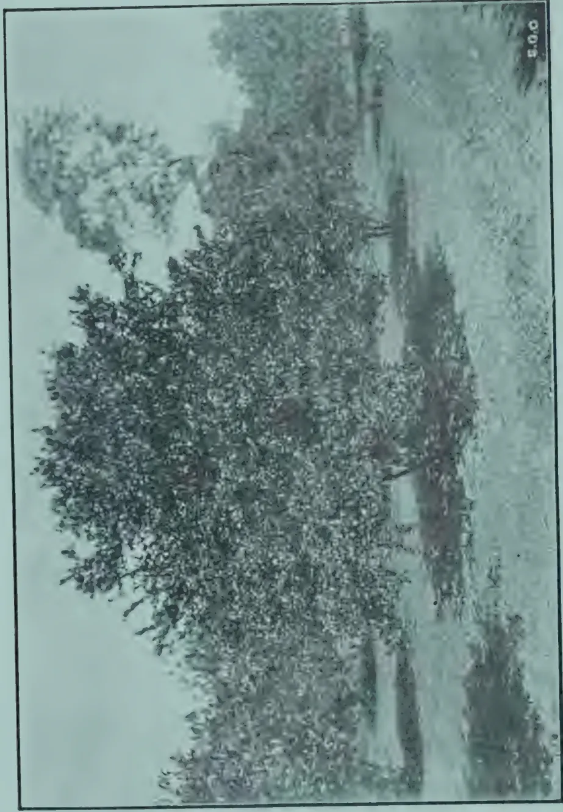A black and white photograph showing a dense orchard of lime trees. The trees are heavily laden with fruit, appearing as a thick canopy of leaves and clusters of small fruits. The orchard is situated in a field, with a path or road visible in the background. The image is framed by a thin black border. In the bottom right corner of the image, the number '500' is printed.

ORCHARD OF LIMES 3½ YEARS OLD FROM BRITISH GUIANA SEED  
AT ANURADHAPURA EXPERIMENT STATION.

322------------------------------------------------

NOVEMBER, 1921.]291

Among the insect pests which attack citrus plants in Ceylon, a few are found on the lime. The Citrus Leaf Miner (*Phyllocnistis citrella*) is a small moth, the caterpillar of which mines beneath the upper or lower epidermis of the leaf. Young lime plants are most commonly attacked, and the attack can be detected by the curling of the leaves and the silvery appearance of the tunnels. A mixture of crude oil or fish oil emulsion with tobacco extract is found efficacious for the pest in India.

Scale insects of different species and aphids also attack the lime, but their attacks are rarely severe in Ceylon, the insects being probably controlled effectively by parasitic fungi.

Fungoid pests are usually dealt with by surgical means, such as pruning, excision of bark, etc., and by spraying with Bordeaux mixture. Severe outbreaks of fungoid or insect disease are, however, almost invariably traceable to some unfavourable condition to which the tree is affected, and in such cases it is obvious that the surest methods of treatment are those which aim at remedying these conditions. As the matter is important, the question will be treated at some length.

In some cases a disease or pest may be regarded as the actual cause of the weakening of a plant. In other cases there seems little doubt that a tree weakened by some other cause provides a source of food preferred by certain kinds of insects, and on such a tree the insects may increase at a much more rapid rate than they would on a strong plant in normal health. This phenomenon is only just becoming a subject of investigation, and very few definite cases have yet been examined. In addition, there is the obvious fact that an outbreak of disease or a weak plant will be more destructive than an attack of precisely equal severity on a normal strong plant.

In the case of the lime, extreme poverty of the soil, exposure to wind, and deficiency of moisture appear to cause an increased liability to attack by scale insects, and several cases of successful treatment based on these facts are on record from lime-growing countries. Thus, it has become a recognized method of restoring deteriorated lime fields by interplanting windbelts of *gliricidia*, *dhall*, etc.

Common troubles arise from excessive soil moisture, fungoid root diseases, and diseases of the "collar" of the plant being the usual forms. In most cases these troubles can be overcome by attention to drainage. It is a matter of common knowledge to the planter that, excepting in certain cases, indirect methods of prevention, such as drainage, cultivation, pruning, manuring, etc., are both more effective and cheaper than direct methods, such as spraying and washing.

The control of insects attacks by parasitic insects or fungi has attracted a good deal of attention, and many cases are on record of successful results on a very large scale. These methods seem peculiarly applicable to citrus plants and to scale insects and aphids. Parasitic insects and fungi exist in Ceylon, and there seems little doubt that the remarkable freedom locally from severe scale insects attack of citrus plants is due to natural control of this nature. It is obvious that the method of natural control is cheaper and more efficacious than artificial methods, such as spraying.

323------------------------------------------------

292[NOVEMBER, 1921.

### THE CROP.

The yield per acre in Dominica is given as 150 barrels (of about 1,500 fruits each) on good soil under efficient management. The average for the Colony is below this figure, and on many estates the yield is as low as 100 barrels. No figures of yield for mature lime trees in Ceylon are available, so that it will be safer to assume the lower figure for ordinary unmanured cultivation.

A plantation of 100 acres of limes with ordinary care should yield, therefore, 10,000 barrels, with greater efficiency 15,000. The yield of juice varies according to climate from  $7\frac{1}{2}$  to 8 gallons per barrel, giving a total for the plantation of 75,000 to 112,500 gallons of raw juice.

Very little has been done accurately to record the effect of manures on this crop. The Dominica Department of Agriculture, however, carried out careful trials from 1913-17 and again from 1917 onwards, with the following results :—

#### DOMINICA.

*Yield per Acre in Barrels of  $4\frac{1}{2}$  Cubic Feet.*

<table border="1">
<thead>
<tr>
<th></th>
<th>1914.</th>
<th>1915.</th>
<th>1916.</th>
<th>1917.</th>
</tr>
</thead>
<tbody>
<tr>
<td>I.—No manure</td>
<td>23</td>
<td>53</td>
<td>62</td>
<td>88</td>
</tr>
<tr>
<td>II.—Five tons grass mulch</td>
<td>14</td>
<td>40</td>
<td>96</td>
<td>110</td>
</tr>
<tr>
<td>III.—Dried blood, 4 cwt.</td>
<td>17</td>
<td>71</td>
<td>98</td>
<td>141</td>
</tr>
<tr>
<td>IV.—Sulphate of potash, <math>1\frac{1}{2}</math> cwt.</td>
<td>6</td>
<td>28</td>
<td>40</td>
<td>70</td>
</tr>
<tr>
<td>V.—Sulphate of ammonia, <math>2\frac{1}{2}</math> cwt.</td>
<td>32</td>
<td>65</td>
<td>99</td>
<td>156</td>
</tr>
<tr>
<td>VI.—Basic slag, 4 cwt.</td>
<td>16</td>
<td>37</td>
<td>76</td>
<td>127</td>
</tr>
<tr>
<td>VII.—Dried blood, 4 cwt. Basic slag, 4 cwt.</td>
<td>28</td>
<td>89</td>
<td>126</td>
<td>167</td>
</tr>
<tr>
<td>VIII.—Dried blood, 4 cwt. Sulphate of potash, <math>1\frac{1}{2}</math> cwt. Basic slag, 4 cwt.</td>
<td>24</td>
<td>94</td>
<td>172</td>
<td>165</td>
</tr>
</tbody>
</table>

The fields on which these trials were made had been abandoned from 1895 till 1913. The effect of care on the yields is shown very strikingly in the figures above.

Every plot has benefited by the cultivation, pruning, etc., but the change has been much less in the case of the "no manure" plot. Even the potash plot (No. IV.), which had suffered most severely from neglect, rose in four years to seventy barrels. The percentage increase of crop in four years is as follows :— I., 283 ; II., 686 ; III., 730 ; IV., 1,067 ; V., 390 ; VI., 694 ; VII., 496 ; VIII., 588.

The later series gave the following results :—

<table border="1">
<thead>
<tr>
<th rowspan="2"></th>
<th colspan="4">Limes 4 Years old.</th>
<th colspan="4">Limes 24 Years old.</th>
</tr>
<tr>
<th colspan="2">Trial A.</th>
<th colspan="2">Trial B.</th>
<th colspan="4">Trial C.</th>
</tr>
<tr>
<th></th>
<th>1917.</th>
<th>1918.</th>
<th>1917.</th>
<th>1918.</th>
<th>1917.</th>
<th>1918.</th>
<th></th>
<th></th>
</tr>
</thead>
<tbody>
<tr>
<td>I.—No manure</td>
<td>56</td>
<td>184</td>
<td>41</td>
<td>89</td>
<td>120</td>
<td>129</td>
<td></td>
<td></td>
</tr>
<tr>
<td>II.—Mulch</td>
<td>95</td>
<td>274</td>
<td>72</td>
<td>170</td>
<td>103</td>
<td>92</td>
<td></td>
<td></td>
</tr>
<tr>
<td>III.—Sulphate ammonia Basic slag</td>
<td>96</td>
<td>235</td>
<td>27</td>
<td>120</td>
<td>110</td>
<td>210</td>
<td></td>
<td></td>
</tr>
<tr>
<td>IV.—Sulphate ammonia Sulphate potash</td>
<td>31</td>
<td>137</td>
<td>43</td>
<td>154</td>
<td>92</td>
<td>136</td>
<td></td>
<td></td>
</tr>
<tr>
<td>V.—Sulphate ammonia Basic slag Sulphate potash</td>
<td>63</td>
<td>236</td>
<td>27</td>
<td>154</td>
<td>180</td>
<td>240</td>
<td></td>
<td></td>
</tr>
</tbody>
</table>

Trials A and B show that by manuring we can bring the yield of young limes up to more than 150 barrels per acre. From trial C we learn that old limes should give over 200 barrels if well manured.

324------------------------------------------------

NOVEMBER, 1921.]293

### ESSENTIAL OILS.

Under any system of manufacture employed, it will be found profitable to extract hand-pressed oil before the limes are brought into the factory for crushing. Distilled oil, which is obtained from the juice after crushing, is, on the other hand, of a much lower value, and in certain cases may not be profitable.

Quotations in the London market during 1920 for lime oils were as follows :—

<table>
<thead>
<tr>
<th></th>
<th></th>
<th>Hand-pressed.</th>
<th>Distilled.</th>
</tr>
<tr>
<th></th>
<th></th>
<th>Per lb.</th>
<th>Per lb.</th>
</tr>
</thead>
<tbody>
<tr>
<td>May</td>
<td>...</td>
<td>27s. 6d.</td>
<td>7s. 6d.</td>
</tr>
<tr>
<td>June</td>
<td>...</td>
<td>27s. 6d.</td>
<td>7s. 6d. to 7s. 9d.</td>
</tr>
<tr>
<td>July</td>
<td>...</td>
<td>25s. 6d.</td>
<td>7s. 6d.</td>
</tr>
<tr>
<td>September</td>
<td>...</td>
<td>26s.</td>
<td>6s.</td>
</tr>
</tbody>
</table>

In common with other plants, the lime gives varying yields of essential oil according to the climate. The presence of essential oil lessens evaporation of water, and hence there is a tendency towards a higher yield of essence in dry localities. The West Indian Agricultural Department gives the yield of hand-pressed as varying from 3 oz. in wet localities to 4½ oz. in dry places per barrel of 1,500 limes, while from the same number of limes will be obtained on subsequent distillation a further 3 to 5 oz. of low grade essence. These yields would be equivalent to 28 to 42 lb. of hand-pressed oil and 28 to 47 lb. of distilled from an acre of average yield of 150 barrels of fruits.

The usual method for payment for hand-pressed oil on estates is by the ounce, and a skilful labourer will extract a pound or more a day, actually écuelling, therefore over 6,000 fruits. With an efficient mechanical écuele the rate would be more rapid and presumably cheaper.

In the case of manufacture of concentrated juice and of citrate of lime, the whole bulk of juice from the mills is passed through the still. Where raw juice is being exported the scum rising to the top of the juice in the settling clarifier tanks is alone distilled, so that the colour and appearance of the juice may not be harmed by heating.

Distillation is usually carried on in an ordinary pot still with worm condenser and with direct heat. A Florentine flask is the most suitable form of receiver.

### MILLING.

After the lime fruits have been écueled to obtain hand-pressed oil (otto), they pass to the mill. Steel or iron rollers cannot be used where raw juice is being exported, as citric acid attacks iron, and the colour of the juice is spoilt, in addition to the fact that acid is lost by the chemical action.

Mill work in this industry is still rather primitive in many cases, which is an advantage for the planter newly embarking upon it. The simplest rollers are of wood covered with perforated copper sheet, the ragged edges of the perforations being outermost, so as to prevent the fruit slipping away from the grip of the rollers; the method of perforating the sheet is similar to that followed in making nutmeg or other graters from perforated tinned sheet. The mills usually consist of only one set of rollers, and the fruit skins from the mills are in this case often further pressed in a hand cider press to remove excess juice.

325------------------------------------------------

294[NOVEMBER, 1921.

In better equipped factories rollers of ribbed or corrugated granite are used. These are stronger and more solid, and, as a rule, their work is better. Power can be applied by human or animal labour, by water power, or by steam or oil engine, in accordance with the size of the mills and the capacity of the factory.

The pressed skins form a valuable food for cattle, and are greedily eaten by these animals. In Dominica the whole of the skins are consumed by the working cattle of the estates.

### CONCENTRATING THE JUICE.

Normal lime juice contains 12 to 14 oz. of citric acid per gallon of juice, and, excepting in the case of raw juice for cordials, it is sold on the basis of acidity. In the London markets quotations are for a "pipe," the standard pipe being 108 gallons of juice containing 64 oz. of citric acid per gallon, or, in other words, 6,912 oz. or 432 lb. of citric acid.

It is obvious that it is profitable to concentrate the juice before shipment, if fuel is obtainable at a reasonable cost. The West Indian figure for consumption of fuel is 1 to  $2\frac{1}{2}$  cords of wood to produce 52 gallons of concentrated juice (containing from 100 to 130 oz. of citric acid per gallon.) This means reducing about 500 gallons of raw juice to 52 gallons or 10 to 1. The degree the planter concentrates his juice is, therefore, influenced partly by the cost of fuel.

In the early days of the industry it was a common practice to concentrate to a content of 120 to 150 oz. acid per gallon, that is to boil down to 10 to 12 gallons of raw juice to one gallon of concentrated. The loss of acid through charring during boiling is, however, high, and the rate of loss is higher as the concentration increases. It seems to be fairly generally accepted now that concentrating to a content of about 100 oz. per gallon is most profitable, as at that point the extra freight on the bulk is compensated by the smaller loss of acid and the better price following on the improved appearance of the product.

Concentration is usually carried out in open "tayches" or sugar pans over direct fire, in a manner similar to the preparation of muscovado sugar, with the exception that the final pan in the battery is furthest from the source of heat in the case of lime juice. Direct heat and the use of iron pans give rise to a large proportion of impurities as sediment in the final product, in addition a loss of 7 to 8 per cent. of acid results even under careful working, and from 9 to 11 per cent. with ordinary work.

In 1915 trials were made with steam-heated wooden vats in St. Lucia, West Indies, and this method adopted commercially. The loss is lessened considerably and sediment reduced to one-tenth that of direct-heated juice. The steam-heated vat has also been introduced into the Government lime-juice factory in St. Lucia, and, as a result, a difference of £10 per pipe has been obtained in European markets apart from the reduced losses from charring.

326------------------------------------------------

NOVEMBER, 1921.]295

### MANUFACTURE OF CITRATE.

It is unfortunate that the term "citrate of lime" has crept into use. Calcium citrate is the correct term, and should be used to avoid confusion between lime (chalk) and lime (fruit).

If a solution of citric acid, such as lime juice, be treated with a base, such as lime (calcium hydrate), a compound, calcium citrate, is formed. This compound is insoluble in hot solution, and comes down in the form of a flocculent gray-white precipitate, which can be filtered off, dried, and shipped.

Upon treating calcium citrate with a strong acid, such as sulphuric, the citric acid is set free and calcium sulphate formed. The citric acid can thus be obtained pure by the dye works and other users.

The convenience of this method of treating lime juice is great both to the planter and the manufacturer. In addition, the loss of acid is less, the consumption of fuel is lower, and the product can be more easily standardized and packed. There seems little doubt that this product will eventually displace concentrated juice, but at present a demand for both exists, and this has led to equipment of factories handling both products, so as to take advantage of market fluctuations by manufacturing either at will.

In actual practice citrate is manufactured as follows. Juice from the mills is strained free from pulp and seeds, and then run into the still and essential oil distilled off. The hot juice from the still is then run into wooden cylindrical vats heated by an internal steam coil, and a solution of lime or chalk is gradually added until all the citric acid is precipitated as citrate. The calcium citrate then settles, the supernatant liquid is drawn off and filtered, and the citrate dried.

Cloth filter bags and presses are used to separate the citrate from adhering water as a rule, but much more efficient and rapid separation is obtained by spinning the water out by means of a sugar centrifugal, filter presses tend to press the citrate into lumps, whereas the centrifugal leaves it in an attractive powdery form. In both methods the citrate is then placed in hot air driers, and remaining water is removed.

The manufacture of citrate demands slightly more careful chemical control than does concentration of juice, but neither is complicated. It is obvious that brightness and cleanness is more important in the case of citrate, and straining, skimming, etc., are correspondingly thorough. In addition, some skill is necessary to add just enough and not too much chalk to each vat; too much chalk means free chalk in the final product, too little means free acid, and neither should be present in well-prepared citrate.

The amount of chalk to be added is controlled by withdrawing small quantities of juice after each addition of chalk, and testing the amount of acid present by means of a standard solution of caustic soda. The details of this are simple, and can be learnt from any chemist and carried out by any intelligent person.

A rough test, which is useful, is to withdraw a small sample of the supernatant liquid and pour it on some chalk; if effervescence takes place, the liquid is still acid, and more lime is needed. On the other hand, if, when the liquid is added to some lime juice, there is effervescence, it is obvious that too much chalk has been added.

A slight excess of acidity in the final product is preferable, as excess of lime or chalk in the vat is likely to throw down gums, which spoil the colour and texture of the citrate.

327------------------------------------------------

296[NOVEMBER, 1921]

Thorough drying is very necessary, as, in the presence of excessive moisture, citrate ferments with loss of acid. Pure dry citrate contains 69.23 per cent. citric acid, but ordinary commercial samples have a lower proportion, although in no case should it be below 60 per cent.

The price fixed for calcium citrate during 1920-21 by the Italian Minister of Industry and Commerce is 1,000 lire (francs) per 220.4 pounds of citric acid. This corresponds to 3,060 francs for a "pipe" of 432 pounds of acid or 675 pounds of citrate.

### THE FACTORY.

Comparatively simple machinery can be used for the first few crops or for a small acreage of limes, the complexity and efficiency of the factory being increased as the crop grows larger and profits increase. In the earlier days of the industry in Dominica, a beginner, when the crop of his estate reached the equivalent of 10 or 12 acres (1,500 to 2,000 barrels), would instal a handmill, two tayches, vats, and a copper still of 100 gallons capacity. £300 to £400 would cover the total cost, and the factory would be gradually extended as the crop increased.

In the majority of cases an estate would probably select concentrated juice as its chief product. Raw juice for export needs very careful attention to cleanness and quality, while calcium citrate needs more elaborate fittings and a higher degree of scientific control.

For a unit of 50 acres in full bearing, where concentrated juice was being turned out, the following are given as necessary in Dominica :—

- Horizontal 3-roller (sugar cane) mill.
- 5-H. P. oil engine.
- 300-gallon copper still.
- 3 tayches (copper), 120, 150, 200 gallons.
- 2 1,000-gallon juice storage tanks.

Full particulars can be obtained by application to the Head Office of the Department of Agriculture, Peradeniya.

Great advances have of late years been made in the method of concentrating juice. Modern factories instal steam-heated vessels, which, of course, call for the addition of a boiler to the factory equipment. The vessels in use may be steam-jacketed and of copper, but the most useful type is of wood with a copper steam coil, and these wooden vats have given excellent results.

In a factory devoted to the manufacture of calcium citrate in place of concentrated juice, the preliminary process of écuelling, milling, straining, and distilling are the same. The tayches are replaced by heating vats for the neutralization process; filters for the citrate and a special drying chamber fitted with shelves and an arrangement for a supply of hot air. As a complex factory is unlikely to arise in Ceylon in the early days of a lime-juice industry, it is unnecessary to deal with these in detail at present.

The consumption of fuel in both processes is high, and arrangements for a steady supply should form one of the first duties of a prospective grower and manufacturer.

G. G. AUCHINLECK.

328------------------------------------------------

NOVEMBER, 1921.]297

## APPENDICES.

### I.—BIBLIOGRAPHY.

*West India Bulletin*: A quarterly scientific periodical by the Imperial Commissioner of Agriculture for West Indies, Barbados.

*Annual Reports of West Indian Agricultural Departments*: Issued by the Imperial Commissioner of Agriculture for West Indies, notably those for Dominica, Montserrat, St. Lucia, and Grenada.

*Agricultural News*: Issued fortnightly by Imperial Commissioner of Agriculture for West Indies.

*Pamphlets 53 and 72* of Imperial Department of Agriculture for West Indies.

*Tropical Agriculture*: A book by H. A. A. Nicholls published by Macmillan & Co.

*Bulletin of Imperial Institute*: January-March, 1915.

### II.—CHEMICAL CONTROL OF CITRATE MANUFACTURE.

It is of course not to be expected that the planter can devote much time to chemical control of lime-juice manufacture. It is a simple matter, however, to learn the method by which a rapid estimation of the percentage of citric acid in juice may be made. In a small factory it will not be possible to employ an analyst merely for necessary chemical control, and prospective makers of citrate are, therefore, recommended to pay some attention to the following notes.

For purposes of record and manufacture it is necessary to know the content of acid in juice, and if the best quality and price are desired, some form of chemical control is necessary. The following method, with care is satisfactory in the hands of an assistant of average intelligence.

#### TO ESTIMATE CITRIC ACID.

The following apparatus and re-agents are necessary:—

- 1 graduated burette, 50 cc. capacity.
- 1 flask conical (Erenmeyer) of 250 cc. capacity.
- 1 burette stand.
- 1 pipette of 5 cc. capacity.
- 1 bottle of standard (normal) caustic soda.
- 1 small phial of alcoholic solution of phenol-phthalein.

The two last items can be made up by any analyst, the others are obtainable from druggists or from dealers in chemical apparatus.

*Procedure*.—Fill the burette to the top mark with solution of standard caustic soda. With the pipette withdraw it into the conical flask; dilute with its own volume of pure water, and add a few drops of the phenol-phthalein solution and mix by shaking gently. Now run into the flask a small quantity of caustic soda and mix by shaking; continue this until the juice attains a permanent faint pink colour. Read off the number of cubic centimetres of soda used.

100 cc. of normal caustic soda is equivalent to 226 oz. of citric acid, so that the amount of citric acid can be easily calculated.

329------------------------------------------------

298[NOVEMBER, 1921.

*Example.*—Juice withdrawn for testing 5 cc. Soda used for testing 6 cc.

100 cc. soda = '226 oz. citric acid.

therefore 42 cc. soda = '0136 oz. citric acid.

'0136 × 100

therefore in 100 cc. of juice there are  $\frac{\text{—}}{5}$  or '271 oz. of citric acid.

To convert ounces per 100 cc. to ounces per gallon, it is necessary to multiply by 45.43, so that the juice contains '271 × 45.43 or 12.33 oz. per gallon.

### CHALK AND LIME JUICE.

The reaction between citric acid and a solution (or suspension) of lime is repeated as follows:—

Lime + acid = calcium citrate + water.

168 + 371 = 546.

That is, 168 parts by weight of pure lime (equal to 300 parts of chalk) are needed to combine with 378 parts of acid. A gallon of juice containing 12 oz. of citric acid would, therefore, require  $12 \times 168$

$\frac{\text{—}}{378}$  or 5.3 oz. of pure lime

### III.—QUOTATIONS FOR LIME PRODUCTS.

The following quotations for lime fruit products were taken from Lewis & Peat's, Ltd., Monthly Prices from February to May, 1921:—

<table border="1">
<thead>
<tr>
<th>Month.</th>
<th>Citrate of Lime.</th>
<th>Concentrated Juice.</th>
<th>Hand-pressed Oil.</th>
<th>Distilled Oil.</th>
</tr>
</thead>
<tbody>
<tr>
<td>February</td>
<td>£28 per basis</td>
<td>£25 (nom.) per basis</td>
<td>15s. 6d. per lb. Fair to good</td>
<td>4s. per lb. Good water white</td>
</tr>
<tr>
<td>March</td>
<td>£28 per basis</td>
<td>£23 (nom.) per basis</td>
<td>18s. per lb. Fair to good</td>
<td>3s. per lb. Good water white</td>
</tr>
<tr>
<td>April</td>
<td>£28 per basis</td>
<td>£23 (nom.) per basis</td>
<td>19s. 6d. per lb. Fair to good</td>
<td>3s. per lb. Good water white</td>
</tr>
<tr>
<td>May</td>
<td>£28 per basis</td>
<td>£25 (nom.) per basis</td>
<td>21s. 6d. per lb. Fair to good</td>
<td>3s. per lb. Good water white</td>
</tr>
</tbody>
</table>

## ANALYSES OF CEYLON LIMES.

M. KELWAY BAMBER, M.R.A.C., F.I.C., F.C.S.

The lime trees of the West Indies *Citrus Medica* var. *acida*, was said to have been introduced into tropical America from the East Indies, and was probably indigenous to the Valleys of the outer Himalaya and the mountain tracts of Central India. Cultivation has been carried on in Dominica and Montserrat from about 1844 and in later years in Jamaica, British Guiana, Trinidad, Grenada, Carriacou and St. Lucia. The most suitable situations for successful lime cultivation were rich well sheltered lands from sea level up to 800 feet, and with a rainfall of 80 to 160 inches per annum. They are however cultivated up to 2,000 feet with a rainfall of over 200 inches.

In 1912 there were 4,800 acres devoted to the lime Industry in Dominica alone including 1,500 acres not yet in full bearing, the total crop being estimated at 369,777 barrels of fruit, an average yield of 112 barrels per acre for the entire Island. The export of lime products from Dominica

330------------------------------------------------

NOVEMBER, 1921.]299

in 1912 were valued at £96,673 consisting of concentrated juice 54½%, Raw Juice 18½%, Fresh Limes 10%, and Citrate of Lime 9¾%.

The manufacture of Citrate of Lime began in 1902 and steadily increased to 1911, the value per ton being £65 to £66 sterling, compared with £100 sterling in November, 1920.

Citrate of Lime is preferred to concentrated juice by the Acid makers as it is more easily worked and there is a considerable saving in freight casks and loss by leakage. The citric acid in citrate also fetches a better price, the present value of Citric acid being 2s. 7d. to 2s. 9d. per lb.

The essential oil of Limes is obtained by hand pressing and by distillation, the yield in practice being 1½ to 2 ozs. per gallon of the former though double this quantity is said to be available.

Distilled lime oil is obtained by distilling the juice, before the separation of Citrate of Lime, the yield being put at 4 lb. per 100 gallons of juice.

The value of the hand pressed and distilled oils, weighing approximately 8.7 lb. per gallon was about £2 17s. and 8s. 9d. per gallon, or 5s. 6d. and 1s. 5d. per lb. in 1912 compared with 20s. and 4s. 10d. per lb. respectively in November, 1920. The present price for hand pressed oil is 15s. 6d. per lb. and distilled oil 4s. per lb.

The average weight of the ordinary West Indian lime is 66.7 grams and 43.95 grams for the spineless variety, yielding about 60 per cent. of juice with 13.3 ozs. and 14.4 ozs. of Citric Acid per gallon respectively.

A number of analyses of lime fruits, of which there are two or more varieties in Ceylon have been made to ascertain the Citric Acid content compared with the West Indian figures.

Limes have been collected from different parts of Ceylon both during a long period of drought and after a period of wet weather to determine the effect of Climate. It was generally found that the proportion of juice was lower and the citric acid content rather higher in the dry period.

#### KANDY.

Kandy limes obtained on July 25th during a drought varied in size and ripeness. 400 limes weighed 14,230 gms. or 3 lb. 2.7 ozs. or an average per lime of 35.6 gms. or 1.26 ozs. Another lot of smaller limes averaged 28.4 grams or 1 oz. per lime.

The limes were cut, and the juice expressed yielded 4,320 cc. or 30% containing 14.3 ozs. of Citric Acid per gallon.

A considerable amount of juice still remained in the limes, especially the unripe ones, and a stronger method of expression was found necessary.

The juice was concentrated in a tinned copper pan, but the Citrate was badly contaminated with copper and purification resulted in a considerable loss on the original amount.

#### COLOMBO.

A further lot of 400 limes was obtained from the Colombo Market, which were said to have come from the Kandy District; these weighed 16,095 gms. or an average of 40 gms. or 1.42 ozs. per lime.

The 400 limes yielded 6,230 cc. of juice or 38% containing 13.44 ozs. of Citric Acid per gallon.

331------------------------------------------------

300[NOVEMBER, 1921.

To obtain the maximum amount of Citric Acid the expressed limes were treated with 4,000 cc. or 0.88 gallon of boiling water and after standing 12 hours, again expressed, yielding 3,600 cc. or about 0.8 gallon containing 3.25 ozs. of Citric Acid per gallon.

This is equivalent to 870 cc. of original juice or a total yield of juice of 44.2 % on the fresh limes.

The juice was concentrated to one-tenth volume, filtered and bottled. The concentrated juice was a dark brown colour but clear, and contained 73.12 ozs. per gallon, thus showing a heavy loss of Citric Acid during concentration.

A further lot of 1,000 limes from the Colombo Market, weighed 37,000 gms. (8 lb. and 2.4 ozs.) or an average of 37 gms. or 1.3 ozs. per lime. Cut up and expressed, they yielded 12,415 cc. of juice or 33.5 % containing 13.7 ozs. of Citric Acid per gallon.

The pulp was treated with 8,000 cc. ( $1\frac{3}{4}$  gallon) of boiling water and again pressed immediately yielding 8,100 cc.  $1\frac{7}{9}$  gallons containing 4.5 ozs. of Citric Acid per gallon.

This is equivalent to 2,660 cc. of original juice or a total yield of 40.8 % on the fresh limes.

The juice was strained and heated to boiling in enamelled pans and the Citric Acid precipitated with lime water.

The 2,660 cc. of diluted juice was treated separately.

The Calcium Citrate separated well, and required 3 or 4 washings with boiling water to remove all colour.

The citrate from the dilute latex was very pure and rather lighter in colour than the first juices.

The total citrate obtained from the 1,000 limes giving 15,075 cc. or 3.33 gallons of juice was 1,551 grams or 3 lb.  $6\frac{1}{2}$  ozs. equivalent to 1.05 lb. per gallon of juice, compared with 1.18 lb. from West Indian limes. The drying of the Citrate took a considerable time, but unless done over steam there is a risk of the product being darkened. The citrate analysed, 61.6 % Citric Acid.

#### KATUGASTOTA.

One lot of ordinary limes was received on 2nd. September, 1921, 99 limes weighed 5,157 gms. or an average of 51.5 gms. per lime.

Yield of juice 2,420 cc. = 46.9 %

Citric Acid content 12.11 ozs. per gallon.

Kaffir Limes (Rough skinned) from Katugastota, received on 7th September, 1921. 100 limes weighed 6,538 gms. or 65.4 gms. per lime.

Yield of juice 1,700 cc. = 26.0 %

Citric Acid content 12.54 ozs. per gallon.

A second lot of Kaffir limes received on the 14th inst, averaged 51.5 grams per lime and yielded 46.9 % of juice containing 12.1 oz. per gallon of Citric Acid.

#### GAMPOLA.

Limes sent by the Divisional Agricultural Officer. Two lots of 100 limes each of the ordinary, and Kaffir varieties were received on 11th. September, 1921.

332------------------------------------------------

NOVEMBER, 1921.]301*Kaffir limes (Rough skinned). A.*

98 Limes weighed 5,120 gms. or 52.3 gms. per lime.

Yield of juice 1,445 cc. or 28 %

Citric Acid content 13.06 ozs. per gallon

*Ordinary Limes. B.*

60 Limes weighed 3,080 gms. or 51.2 gms. per lime.

Yield of juice 1,450 cc. or 47 %

Citric Acid content 11.3 ozs. per gallon.

**RUANWELLA.**

A bag of limes, including the ordinary, Yakdehi, and Kuda Kudehi varieties was received on 8th. September, 1921. All but six limes were rotten having been damaged in transit.

6 ordinary limes weighed 330 gms. or 55 gms. each.

Yield of juice 100 cc. or 30 %

Citric Acid content 12.1 ozs. per gallon.

**BALANGODA.**

Limes were received from MR. J. D. NICHOLAS, Balangoda, on 7th. July 1921, and were analysed for Citric Acid content.

The climate had been very dry for some weeks before the limes were gathered.

The limes were green and yellow and were sorted into medium size and small, the latter being rather riper than the large ones.

34 medium limes weighed 1,362 gms. or an average of 40 gms. each, while 61 small limes weighed 1,567 gms. or 25.7 gms. each.

The limes were cut and the juice expressed separately. Medium limes 1,362 gms. gave 736 gms. of juice or 54.38 %; Specific Gravity 1.03 @ 30°/30° C. and containing 12.7 ozs. per gallon of Citric Acid.

Small limes 1,567 gms. gave 735 gms. of juice or 46.90 %; Specific Gravity 1.04 @ 30°/30° C. containing 13.8 ozs. per gallon of Citric Acid.

The percentage of juice expressed is low due to the drought and the limes having partially dried before being analysed.

The amount of Citric Acid per gallon is about equal to West Indian limes which contain 12½ to 14 ozs. per gallon.

**BADULLA.**

100 limes received on the 14th. September, 1921, from the Agricultural Instructor.

<table>
<tr>
<td>Average weight of limes</td>
<td>...</td>
<td>58.6 gms.</td>
</tr>
<tr>
<td>Yield of juice</td>
<td>...</td>
<td>43.7 %</td>
</tr>
<tr>
<td>Citric Acid per gallon</td>
<td>...</td>
<td>11.1 ozs.</td>
</tr>
</table>

**MATALE EAST,**

100 limes received on the 23rd. September, 1921.

<table>
<tr>
<td>Average weight per lime</td>
<td>...</td>
<td>28.6 gms.</td>
</tr>
<tr>
<td>Yield of Juice</td>
<td>...</td>
<td>38.7 %</td>
</tr>
<tr>
<td>Citric Acid content per gallon</td>
<td>...</td>
<td>11.2 ozs.</td>
</tr>
</table>

**KOTMALE.**

100 limes received on the 17th. September, 1921.

<table>
<tr>
<td>Average weight per lime</td>
<td>...</td>
<td>29.7 gms.</td>
</tr>
<tr>
<td>Yield of Juice</td>
<td>...</td>
<td>39.0 %</td>
</tr>
<tr>
<td>Citric Acid content per gallon</td>
<td>...</td>
<td>11.2 ozs.</td>
</tr>
</table>

333------------------------------------------------

302[NOVEMBER, 1921.

### ANURADHAPURA.

A bag of Limes and Rough and Smooth Lemons were received from the *Dry Zone Experiment Station, Anuradhapura*. The limes were ripe and were rather larger than those from other districts.

*Limes.* 102 Limes weighed 4,640 gms. or about 43½ gms. each.

*Rough Skinned Lemons.* 16 weighed 3650 gms. or 222½ gms. each.

*Smooth Lemons.* 7 " 3002 " " 429 " "

The yield of juice and amount of Citric acid per gallon amounted to :—

<table>
<thead>
<tr>
<th></th>
<th>JUICE.</th>
<th></th>
<th>Citric Acid. Oz. per gallon.</th>
</tr>
</thead>
<tbody>
<tr>
<td>Small Limes</td>
<td>43 %</td>
<td>...</td>
<td>12.00 ozs.</td>
</tr>
<tr>
<td>Rough Skinned Lemons</td>
<td>27 "</td>
<td>...</td>
<td>6.80 "</td>
</tr>
<tr>
<td>Smooth Skinned Lemons</td>
<td>24 "</td>
<td>...</td>
<td>10.43 "</td>
</tr>
</tbody>
</table>

The yield of juice and Citric Acid content of the rough skinned lemons was poor and they would not pay for citrate manufacture. The smooth skinned lemons had a fair citric acid content, but the proportion of juice was low.

### JAFFNA.

Limes received on the 8th September, from MR. COOKE, Farm School Officer, who reports that the local variety flowers all the year round, but principally in February and August and that the yield per tree varies from 800 to 1,000 fruits per annum.

198 limes weighed 8,972 gms. or 45.3 gms. per lime.

Yield of juice 4,100 cc.=45.7 %

Citric Acid content 11.20 ozs. per gallon.

### TRINCOMALEE.

Limes (ordinary) from Trincomalee received on 30th. July, 1921.

100 limes weighed 3,702 gms. or 37.02 gms. per lime.

Yield of juice 1,676 cc.=45.4 %

Citric Acid content 14.6 ozs. per gallon.

The citric acid content is high compared with the Jaffna limes and the yield of juice about the same.

### AVERAGE RESULTS OF CEYLON ANALYSES.

The following table shows the average weight, yield of juice and Citric Acid content of ordinary limes obtained during a long period of dry weather and after rains.

*Dry Weather (July and August).*

<table>
<thead>
<tr>
<th></th>
<th>Average Wt. gms.</th>
<th>Average Yield of Juice %</th>
<th>Citric Acid per Gallon</th>
</tr>
</thead>
<tbody>
<tr>
<td>Balangoda Medium</td>
<td>40.0</td>
<td>54.4</td>
<td>12.7 oz.</td>
</tr>
<tr>
<td>" Small</td>
<td>25.7</td>
<td>46.90</td>
<td>13.8 "</td>
</tr>
<tr>
<td>Trincomalee</td>
<td>37.0</td>
<td>45.40</td>
<td>14.6 "</td>
</tr>
<tr>
<td>Anuradhapura</td>
<td>43.0</td>
<td>43.00</td>
<td>12.0 "</td>
</tr>
<tr>
<td>Kandy</td>
<td>37.8</td>
<td>37.10</td>
<td>13.7 "</td>
</tr>
<tr>
<td>Average</td>
<td>36.7</td>
<td>45.30</td>
<td>13.4 "</td>
</tr>
<tr>
<td colspan="4"><i>After Wet Weather. (September and October).</i></td>
</tr>
<tr>
<td>Katugastota</td>
<td>51.5</td>
<td>46.90</td>
<td>12.10 oz.</td>
</tr>
<tr>
<td>Gampola</td>
<td>51.2</td>
<td>47.0</td>
<td>11.30 "</td>
</tr>
<tr>
<td>Ruanwella</td>
<td>55.0</td>
<td>30.0</td>
<td>12.10 "</td>
</tr>
<tr>
<td>Kotmale</td>
<td>29.8</td>
<td>39.2</td>
<td>11.20 "</td>
</tr>
<tr>
<td>Matale East</td>
<td>28.6</td>
<td>40.4</td>
<td>11.30 "</td>
</tr>
<tr>
<td>Badulla</td>
<td>58.6</td>
<td>43.7</td>
<td>11.10 "</td>
</tr>
<tr>
<td>Kegalle</td>
<td>54.5</td>
<td>53.1</td>
<td>12.54 "</td>
</tr>
<tr>
<td>Average</td>
<td>47.0</td>
<td>42.9</td>
<td>11.66 "</td>
</tr>
</tbody>
</table>

334------------------------------------------------

NOVEMBER, 1921.]303

It will be seen that the average weight of limes gathered after rainy weather is considerably heavier than when grown during a drought while the citric acid content is lower by 1.74 ozs. per gallon.

The Kotmale and Matale East limes are poor in size and citric acid content, due probably in the former case to a cold and wet climate.

A certain number of limes from cultivated and selected trees have been collected during September and October and analysed, a summary of the results being given below:—

#### KELANI VALLEY.

Smooth skin limes from a tree in a cultivated garden said to give between 1,000 to 2,000 fruits annually.

The average weight was 63.8 gms. per lime, yield of juice 47.3 and Citric Acid content 12.2 ozs. per gallon, comparing favourably with average West Indian Limes.

#### PERADENIYA.

Several lime trees were examined in the Gannoruwa village. A lime tree is usually grown near the house and is surrounded by Cacao, Areca-nuts, etc., grown under the usual village conditions, with no cultivation. Yields are said to be over 2,000 limes per tree and in one case from a tree 30 to 40 years old, three ordinary gunny bags containing over 1,000 limes each had just been sold, and the tree still carried flowers and fruits in different stages of growth.

Two average ripe limes from one tree weighed 80 and 63 gms. respectively. Forty ripe limes from another tree on the Experiment Station averaged 63 grams each and gave 53.2 % of juice containing 12.5 ozs. of Citric Acid per gallon.

200 ripe limes from another tree averaged 53.4 grams, and yielded 51.5 % of juice containing 12.2 ozs. per gallon.

The average weight per lime, yield of juice and citric acid content from these selected trees are shown in the following table.

<table border="1">
<thead>
<tr>
<th>District</th>
<th>Av. Wt. gms.</th>
<th>Yd. of Juice. %</th>
<th>Cit. Acid p. Gal. Ozs.</th>
</tr>
</thead>
<tbody>
<tr>
<td>Kelani Valley ...</td>
<td>63.8</td>
<td>47.3</td>
<td>12.2</td>
</tr>
<tr>
<td>Gannoruwa ...</td>
<td>53.4</td>
<td>51.5</td>
<td>12.2</td>
</tr>
<tr>
<td>" ...</td>
<td>63.0</td>
<td>53.2</td>
<td>12.5</td>
</tr>
<tr>
<td>Average ...</td>
<td>60.1</td>
<td>50.4</td>
<td>12.3</td>
</tr>
</tbody>
</table>

These compare favourably with the average weight, etc., of ordinary limes obtained during dry and wet weather viz., 41.8 gms. per lime yielding 44.1 % of juice containing 12.5 ozs. of Citric Acid per gallon.

The above figures point to the necessity of selecting the best fruit only from the most heavily bearing trees for seed purposes for any future planting.

## LIME CULTIVATION ESTIMATES.

M. KELWAY BAMBER, M.R.A.C., F.I.C., F.C.S.

The yield per acre in the West Indies for well cultivated limes is about 150 to 160 barrels per annum, and from poor soils or less cultivated areas 80 to 100 barrels annually. The average for Dominica for 1912 was 112 barrels per acre. A barrel measures 4.55c. ft. equal to 3.55 bushels and holds from 1,200 to 1,400 fruits weighing nett about 150 lb. or 8 to 9 limes to the lb.

A barrel of limes gives 7½ to 8 gallons of fresh juice containing from 12 to 14 ozs. of Citric acid per gallon, equivalent to 8.4 to 8.8 lb. of calcium citrate (64 % citric acid).

266 barrels, the average yield of 2½ acres, are required to produce one ton of citrate of lime, worth in July, 1921 about £93 sterling per ton. Citrate of lime is always sold per basis of 6 cwt. obtained from about 76 barrels of limes: the present value per basis being £28. From these figures one acre in full bearing planted 18 ft. × 18 ft. or 134 trees should

335------------------------------------------------

304[NOVEMBER, 1921.

yield about 200,000 limes or 1,500 per tree. With a yield of 112 barrels per acre annually, giving 8.8 lb. of calcium citrate per barrel, a total yield of 985 lb. of Citrate may be expected worth at £93 per ton about £41 per acre.

Ceylon limes are generally smaller than the West Indian limes judging from the figures available to date, but all the limes examined have been from *uncultivated* trees, the yields of which are said to vary from 300 to 400 at high elevation to over 2,000 per tree at 1,600 ft. and below.

Limes gathered after a period of rainy weather are also found to be larger averaging 9 to the lb. compared with 8 to 9 for West Indian limes. Limes collected recently from cultivated gardens and from selected trees in villages are considerably above the average size being slightly over 7 to the lb. and are equal to the West Indian limes in yield of juice and Citric acid content. The aroma of these ripe limes is good, and yield of essential oil should be about normal.

The yield of juice obtained in the analyses has been below the full content owing to insufficient means of grinding and pressing, but it would approximate the same as West Indian limes under normal weather conditions and the content of Citric acid per gallon is also about the same viz., 12 to 14 oz. though some limes from higher elevations and cold wet climate have given only 11.2 oz. per gallon. In addition to the citric acid obtained as calcium citrate, the oil obtained by hand pressing the ripe fruits before expressing the juice amounts to 3 to 4½ oz. of oil per barrel, valued at about Rs. 15 per lb. In practice about 2 to 3 oz. of hand pressed oil per barrel are obtained. By distillation of the juice and skins before separating the citric acid, about 3 to 5 oz. of distilled oil are also obtained, worth from 2s. 6d. to 4s. 10d. per lb. With a yield of 112 barrels of fruit per acre the total handpressed oil would amount to about 21 lb. per acre, and the distilled oil from 21 to 35 lb. per acre.

The total revenue from a well cultivated acre of selected limes in full bearing in the West Indies would be approximately.

<table>
<thead>
<tr>
<th></th>
<th></th>
<th>£</th>
<th>s.</th>
<th>d.</th>
</tr>
</thead>
<tbody>
<tr>
<td></td>
<td>985 lb. Calcium Citrate present value</td>
<td>..</td>
<td>41</td>
<td>0 0</td>
</tr>
<tr>
<td>Say</td>
<td>21 ,, Hand pressed oil at £1 per lb.</td>
<td>...</td>
<td>21</td>
<td>0 0</td>
</tr>
<tr>
<td>„</td>
<td>28 ,, Distilled oil at 2s. 6d.</td>
<td>...</td>
<td>3 10</td>
<td>0</td>
</tr>
<tr>
<td colspan="2"></td>
<td colspan="3">
</td>
</tr>
<tr>
<td colspan="2"></td>
<td>65</td>
<td>10</td>
<td>0</td>
</tr>
<tr>
<td colspan="2"></td>
<td colspan="3">
</td>
</tr>
</tbody>
</table>

The cost of opening 50 acres in Ceylon and bringing them into bearing in six years is estimated at Rs. 20,600 or Rs. 412 per acre. A West Indian estimate for Factory, Power and plant for a 50 to 60 acre estate is put at £1,520, but this would probably be increased at the present time, though some saving could be effected in Ceylon by using locally made granite rollers, fitted to second-hand rubber mills, and wooden storage and boiling tanks heated with steam coils, instead of the costly copper pans or tayches used in the West Indies for concentrated juice.

The following are the estimated costs of opening 50 acres in limes from jungle.

<table>
<tbody>
<tr>
<td>Clearing, Rs. 20 per acre</td>
<td>...</td>
<td>...</td>
<td>Rs. 1,000</td>
</tr>
<tr>
<td>Lining, Rs. 2 per acre</td>
<td>...</td>
<td>...</td>
<td>„ 100</td>
</tr>
<tr>
<td>Holing 2 ft. at 6 cents, Rs. 8 per acre</td>
<td>...</td>
<td>...</td>
<td>„ 400</td>
</tr>
<tr>
<td>Filling and planting, Rs. 8 per acre</td>
<td>...</td>
<td>...</td>
<td>„ 400</td>
</tr>
<tr>
<td>Roding and Draining, Rs. 15 per acre</td>
<td>...</td>
<td>...</td>
<td>„ 750</td>
</tr>
<tr>
<td>Plants, Rs. 5 per acre</td>
<td>...</td>
<td>...</td>
<td>„ 250</td>
</tr>
<tr>
<td>Supervision, Rs. 12 per acre</td>
<td>...</td>
<td>...</td>
<td>„ 600</td>
</tr>
<tr>
<td>Weeding 6 months, Rs. 18 per acre</td>
<td>...</td>
<td>...</td>
<td>„ 900</td>
</tr>
<tr>
<td>Fencing 3 strands Rs. 30 per acre</td>
<td>...</td>
<td>...</td>
<td>„ 1,500</td>
</tr>
<tr>
<td>Green Manures, Rs. 2 per acre</td>
<td>...</td>
<td>...</td>
<td>„ 100</td>
</tr>
</tbody>
</table>

336------------------------------------------------

NOVEMBER, 1921.]

305

Brought forward Rs. 6,000'00

*Second Year.*

<table>
<tr>
<td>Weeding, at Re. 1'50 per acre, Rs. 18'00</td>
<td>Rs. 900'00</td>
</tr>
<tr>
<td>Supplying, Rs. 2 00 ...</td>
<td>„ 100'00</td>
</tr>
<tr>
<td>Superintendence, Rs. 24'00 per acre ...</td>
<td>„ 1200'00</td>
</tr>
<tr>
<td>Drainage and green manure, Rs. 4'00 per acre ...</td>
<td>„ 200'00 = Rs. 2,400'00</td>
</tr>
</table>

*Third and Fourth Years.*

<table>
<tr>
<td>Weeding at Rs. 1'00 Rs. 12'00 per acre</td>
<td>„ 600'00</td>
</tr>
<tr>
<td>Supplying „ 1'00 „ „</td>
<td>„ 50'00</td>
</tr>
<tr>
<td>Superintendence „ 24'00 „ „</td>
<td>„ 1200'00</td>
</tr>
<tr>
<td>Draining and Green Manure, Rs. 4'00 „ „</td>
<td>„ 200'00 = Rs. 4,100'00</td>
</tr>
<tr>
<td></td>
<td>Rs. 12,500'00</td>
</tr>
</table>

*Fifth Year.*

<table>
<tr>
<td>Cultivation, etc., including plucking, etc. Rs. 50'00 per acre ...</td>
<td>Rs. 2,500'00</td>
</tr>
<tr>
<td>Pruning, boundaries, etc. Rs. 2'00 per acre</td>
<td>„ 100'00</td>
</tr>
<tr>
<td>Manuring at Rs. 30'00 per acre ...</td>
<td>„ 1,500'00 = Rs. 4,100 00</td>
</tr>
<tr>
<td><i>Sixth Year</i> at the same cost, Rs. 82'00 per acre</td>
<td>= „ 4,100'00</td>
</tr>
</table>

Total cost of bringing into bearing without Factory or Rs. 412'00 per acre. Rs. 20,600'00

The cost of a suitable Factory 100 ft. by 50 ft. is estimated at ... .. Rs. 10,000'00

Machinery, including steam engine and boiler, Roller, Stills, Filters, Vats and Citrate drier, Water supply and packing ... .. „ 16,000'00

Rs. 26,000'00

Factory labour per day is estimated at 16 coolies at 50 cents ... .. Rs. 8'00

Fuel for engine and drier, 4 yards at Rs. 1'50 ... .. „ 6'00

Total ... Rs. 14'00

300 days at Rs. 14'00 per day or Rs. 4,200 per annum.

The total capital required on the above liberal estimate is

Opening and bringing into bearing ... .. Rs. 20,600'00

Fully equipped factory ... .. „ 26,000'00

Factory labour and contingencies ... .. „ 5,000'00

Total ... Rs. 51,600'00

The cost of production from the 5th year onward for the 50 acres would be approximately

Cultivation, Manuring and picking ... .. Rs. 4,100'00

Factory labour, Fuel, etc. ... .. „ 5,000'00

Transport and shipping of 10 tons at Rs. 90 per ton ... .. „ 900'00

Rs. 10,000'00

The average price of citrate of lime pre-war 1909-1912 was about £64 per ton. Distilled oil 2/6 per lb. and hand-pressed or écuelled oil 5/- or 6/- per lb. or higher, but the tendency since has been for a gradual increase in value on pre-war prices.

337------------------------------------------------

306[NOVEMBER, 1921.

# FRUITS.

---

## FRUIT TREES AND THEIR ROOT TREATMENT

---

*P. S. Govinda Rao, D.D.S., District Forest Officer, South Mysore.*

Before discussing this question in its practical aspect, let me describe, for a little, the structure of the root of a tree. When a young plant is carefully taken out from loose soil and the soil is slowly washed away from the delicate branches of the root, it is rendered apparent that there is one region of each of these branches to which soil particles cling most tenaciously. This point or region is just behind the tip of each delicate branch of the root and usually extends for about an inch up the rootlet. This is the part that is able to take up water from the soil, because here are developed peculiar hairs which are termed root-hairs. These root hairs are best shewn if we grow a seed, between layers of wet blotting paper. The young roots, as they come out from the seed are seen to be covered with a white felt of hairs. These hairs are the true absorptive organs of the root. If such a root-hair is examined under a microscope, we see that it is a long thin sac lined with the living material (called protoplasm) and containing a clear fluid called cell-sap. Water from the soil can pass through the fine cell wall and the delicate living membrane. Thus the cell-sap becomes greater in volume and more dilute. A root-hair cannot hold an indefinite amount of this fluid and water is continually being passed on to the inner cells of the root. As soon as this water reaches the layer of young wood in the root it begins to ascend for the young wood is a system of pipes specially contrived by nature for the purpose of carrying water upwards. So, as soon as the water gets to this region of the young wood it begins to ascend, goes up the stem and finally out to the leaves. Some of the water is used up by the plant as it travels through these organs, and much of it is given off through the pores of the leaves. It is important to remember that the region of root-hairs is the only place on the root where water is absorbed. The other older and stronger parts of the root conduct water but do not absorb it. Anything, therefore, which injures the root-hairs interferes and affects seriously with the supply of the nourishing water to the plant.

This continual absorption, i.e., up-take of water from the soil, results in a considerable pressure being developed inside the root, forcing water up into the organs above. This root-pressure, as it is called, is one of the factors causing the ascent of water in plants. This can be clearly shown by a simple experiment. A young *dantu* plant may be cut off near the soil and a long glass tube fitted on the cut end by means of a rubber connection. A day after the experiment agoing you can see from the movement of the water in the tube how much water has been forced up. The pumping force of the root varies in different trees. It is said that, in the grape vine where the water has to travel a long distance, it can support a column of 39 inches of mercury.

338------------------------------------------------

NOVEMBER, 1921.]307

With the above observation and knowledge on hand, it is easy to consider and understand what the conditions are in which the root-hairs can best fulfil their duties, what methods of treatment are rational, comparing these inferences with facts of our own and with others' experience. In the first instance, it is necessary to remember that the root-hairs and all the younger cells of the root proper are living cells and so require all that living matter stands in daily need of. Before these cells can do any work for the benefit of the rest of the plant, they must themselves be healthy. One of the first requisites for living cells is a free supply of good air. The roots must breathe. In nature there occur certain trees which have become adapted to life in swamps where the soil is close and where the water fills up all the soil interstices. These plants have special arrangements for the supply of air to their roots (*Avicennia alba* and *Avicennia Officinalis*.) The roots of these plants send up peculiar projections above the ground. These are breathing roots. They are full of porous tissue through which air easily passes to the roots in the mud, just as a diver in sea is kept in connection with the upper air by means of the tube attached to his helmet. This fact shows, rather reveals, the extreme importance of air to tree roots. The soil, therefore, in which the roots are situated must be of such a texture that there is a sufficient inter-change of the air in the soil and atmospheric air. The air contained in the soil is not exactly the same as that above the soil. Within the soil, oxygen (the life giving element of air) is always being used up for processes of decomposition of organic substances, and the roots are continually taking in oxygen and giving off other gases. The air of the soil is therefore as a rule poorer in oxygen and richer in other gases than the air above the soil. Here it must be said that there are various conditions that affect the permeability of the soil to atmospheric oxygen. Of these, the two most important are :—

1. (i) The size and degree of cohesion of the soil particles.
2. (ii) The amount of water in the soil.

With regard to the first point, if a soil is caked and hard although air may penetrate into the large crevices which are produced when such soil splits, still the inside of large masses of soil is insufficiently aerated. Small grained soil, after watering, tends to clog and cake like this. Larger grained soils cake less readily.

With regard to the second point, the condition of the ideal soil for fruit trees may be compared to that of fine sponge which has been soaked in water and thoroughly wrung out. Every part is covered with a film of water and yet the whole mass is permeated by air. Over-watering fruit trees has therefore two serious effects. In the first place, the spaces in the soil which should be occupied by air are instead filled up by water, and in the second place, the soil afterwards cakes and hardens, especially if it is all clayey, into an impermeable mass. It is worth while noticing here that the water in the soil which the roots absorb is not that which lies freely in the soil interstices, but the film of water which remains surrounding the soil particles when the excess has drained through. The root-hairs apply themselves closely to the soil particles and absorb this film. From this fact, a useful hint as to the subsoil of a fruit plantation is got at. It is most desirable that it should be of such a kind as to allow of good drainage. A laterite subsoil ensures the

339------------------------------------------------

308[NOVEMBER, 1921.

passing through of superfluous water. A clay bottom means that there will be danger of water-logging. Thus two points of practical importance are arrived at. In choosing a site for a fruit garden, we must therefore see that the soil is of such a texture that is readily permeable to air and that the subsoil is of such a nature as to allow the draining off of superfluous water. If the soil and subsoil are not naturally of the desired consistency and character, still we can by special treatment bring about the conditions we desire to some extent at least. The texture of upper soil we can change by manuring and cultivation. Dry sandy soils need much bulky manures from the cow house or stable and there is scarcely any soil that will not benefit from green manuring. These organic manures increase the porosity of the soil, enhance its water-holding capacity and are themselves valuable additions to the plant food of the soil. Cultivation is essential both before and during the life of the plants. It has been again and again proved that deep and thorough ploughing and cultivation before planting the trees is an excellent investment of time, money and labour. With uncultivated land, it is well to do the first cultivation as much as a year ahead of the time of planting. During that period the land can be occupied with other crops which will give some return for the outlay, keep down weeds and maintain the looseness of the soil. On the spots where pits are to be made, however, there should be no crop during the three months previous to planting. The pits themselves and the subsoil removed from them should be exposed to air and light.

With regard to the subsoil, if it is not sufficiently porous, the defects should be remedied by means of proper drainage. If drainage is not arranged for, the effects of over-watering in such soils may affect very adversely indeed. In the case of orange tree, rotting of the roots sets in and the trees gradually die. Moreover, the water may rise again to the surface bringing with it subsoil salts and making the land salty and unfit for fruit trees. Such cases were brought to my notice for advice in Kadur and Tumkur District. In one case the remedy of promptly cutting drains remedied the defect and in the other case, the gratuitous advice was not availed of. In Mysore, I was shown some orange trees which developed a peculiar yellowing of leaves and a gradual death of the branches. The soil at the foot of trees in these patches was always occupied by succulent weeds of a type associated with salty conditions. The water of the well in the garden was not salty and the previous manuring was not such as to lead me to suspect that the disease could have been caused by it. On the soil being analysed, a large proportion of salts was revealed. It was then rendered apparent that the disease was due to increase in the salts of soil due to defective drainage. In this case, the digging of deep drains at intervals with an out-fall beyond the garden is the only current remedy.

To ensure a supply of free air to the roots of standing trees, it is essential that the soil round the trees should be broken up now and then to prevent caking. The breaking up process is best done twice a week after each watering. The hand pick (*kai gudli*) may be used for this operation. The top layer of soil should be pulverised to act as a porous mulch and a hand rake is excellent for this purpose.

Weeds growing under fruit trees have several serious effects on the roots. The roots of the weeds occupy the ground and interfere with the roots of fruit trees. Water is stolen by them which the fruit trees can ill-spare. The surface of the soil is blocked by them and the exhalation of

340------------------------------------------------

NOVEMBER, 1921.]309

their roots serve to poison the soil atmosphere for the tree roots. The operation of breaking up the upper layers of soil to aerate the roots also removes the weeds, if properly carried out. In Tiptur coconut and mango gardens, and in a few mango gardens in Bangalore, thorough digging to one foot deep, as personally seen, has been of immense advantage and stimulated rich growth and caused extraordinary fruiting. It is necessary to see that the coolies do not injure trees while digging. The consideration of weeds under fruit trees naturally leads to the question of sub-crops.

The same principles must be observed here. Sub-crops must not interfere with the water-supply or aeration of the roots of the main crop. Close growing crops and long seasoned crops are therefore out of the question. While the fruit trees are young, brinjals, onions, chillies and other short season crops which are not close growing can be taken between them but these crops must not be planted close to fruit plants. It is a good rule that a circle having a diameter of about the breadth of the crown of the tree and a little over must be left clear round the base of each stem. Suppose we have planted out our fruit trees 15 feet apart each way and that the breadth of the crown of each tree is on the average two feet then we should leave a circle of 3 feet diameter clear all round the tree, unoccupied by sub-crops. The breadth of the crown of a tree in its early stages roughly corresponds to the area occupied by the roots. The next and succeeding years the dimensions of the trees will increase, and our area for sub-crops will correspondingly decrease, until when the crowns of trees are nearly in contact there is no space for sub-crops at all. It is important that the height of the sub-crop should be less than that of fruit trees since if the fruit trees are shaded by the sub-crop, then they grow long and lanky.

When the sub-crop is finally removed and the trees have to stand by themselves, this long and lanky stem proves to be weak and useless.

Let us now consider the life of a fruit tree from its seedling stage to its adult condition specially with reference to its root treatment, my present theme. Seeds are usually sown in pots or boxes or even in shady places in the field. Some fruit trees, such as guavas are generally grown direct from the seed and the others, which are grafted or budded, have their stocks from seed, so that the plants in their early stages may be considered as of one kind, whether grafted or not, later on. In the case of plants, such as mango stocks, the early life of which is spent as a rule in pots, special care of the roots is essential. In the first place there must be a hole in the bottom of the pot to allow of the draining away of surplus water. This hole should be covered inside by a piece of curved tile with the concave surface down to keep it open. Next to it should come a layer of dry leaves to ensure that fine soil is not washed down and the hole consequently blocked. On the top of this should come a mixture of medium sifted soil sand and leaf mould, in which the seed should be planted. Daily watering is necessary. The outside of the pots should be occasionally washed and scrubbed to allow of air penetrating the earthen ware, and the surface of the pots must be stirred or raked at least twice a week as said above. It must be remembered that the roots in a pot are in highly artificial and closed conditions and are therefore much more delicate than are roots in the soil of open ground.

For this season, plants should be taken out of the pots and transplanted to the field at the earliest opportunity. Let me quote here what a very experienced horticulturist writes:—"The way I advise mango seedlings to be grown is to dig a trench, say nine inches deep and in the bottom lay corrugated iron sheet, which should be covered with broken potshreds with the concave portions inverted. Over this a layer of coir of teased matting may be spread and then a layer of sand and leaf mould covered over, in which the seeds should be inserted. After germination the roots do not go beyond the layer

341------------------------------------------------

310[NOVEMBER, 1921.

of corrugated sheet. The seedlings could therefore be removed easily without great injury to the pots used for grafting purposes or to their final quarters for growing as fruit trees." If plants in pots have been neglected and it is desired to revive them, then the plant must be carefully extracted from the pot with the ball of the earth adhering to the roots. This earth should be carefully removed by washing. Dead, diseased and straggling roots should be removed by a sharp knife. Matted roots should be separated carefully and the main top root shortened (in trees which will stand this treatment). Mangos do not stand the amputation of the main root. Oranges and guavas do. Then the plant should be transplanted into porous gravelly soil in a pot and kept in a moist warm shady place till recovery begins. To keep up balance, a number of leaves on this plant should be cut off or a few branches pruned. While the plant is recovering, water should be given sparingly as the plant will not have yet developed new root-hairs to absorb it. Root-hairs which closely adhere to the side of the pot and the soil, are torn off in transplanting. To get new root-hairs, new roots must be developed. If much water is given before the formation of new absorbing roots, the roots will rot and all the labour taken will be in vain. When this plant begins to show signs of recovery and vigour, it may be removed to a slightly more exposed place and thus gradually accustomed to being brought back to its normal surroundings. The next question is:—How should the roots be treated in transplanting? The pit in the field should be dug fairly big about three feet each way. The pits should have been dug and left open to the air for some weeks previous to planting to aerate, *i.e.*, weather the sub-soil both in and out of the pit. Well exposed soil should be put in the bottom of the pit mixed with manure but manure should in no case be placed in direct contact with the root of the plant. Previous to putting in the plant, a stake should be driven in into the pit. To this, the plant will be tied. To put in the stake after planting, means that some of the roots will be injured. Before planting out fruit plants in their final places, it is well to harden them to their new conditions. If this is not done, the change may be so violent that the transplants will not survive. Many a failure has occurred in planting out mango plants that had been long in the nursery. It must be remembered that, in the nursery the plants will have been in a more or less shady spot protected from direct sun, from wind, and from extremes of temperature. In the field, it is in the open, gets the direct sun and has all the changes of temperature that are going. Moreover, the root system is always slightly injured in the transplanting process so that all the circumstances combine to make the plant lose water rapidly and replace it slowly. It is no wonder that, after a day, the leaves begin to droop and wither and that finally the whole plant dries up and succumbs. The process of gradually accustomed a plant to new surroundings is called *hardening*. One very simple method of hardening is to take the plant still in its pot out of the fields and plunge the pot in the soil near the place where it is to be transplanted. The plant should also be shaded during the first few days. The shade may then be taken off and the plant left sometime longer still in the pot. Finally, the plant should be taken out of the pot and transplanted into the pit prepared for it.

Before the plant is placed in the pit in position, the ball of roots with the earth should be gently teased out, and straggling and diseased roots removed. The plant should then be set on a little mound in the centre of the pit and the roots spread out over the gently sloping sides of this mound. It is a fatal error to have the base of the stem rammed down into the pit and the ends of the roots high up at the edge of it. The soil should now be thrown lightly over the roots and gently pressed down on and between them with a wooden peg. In transplanting, it is essential to bring about a compact connection between the roots and the soil, so that after further

342------------------------------------------------

NOVEMBER, 1921.]311

addition of soil and further packing with the peg the whole surface may be trodden over several times and earth added till the plant is buried up to the same point as it was in the pot it previously occupied. A good soaking of the water should then be given. The shoot should be pruned, reducing non-essential branches by about a third of their length and retaining intact such as are necessary to make a good crown. The plant may now be tied to the stake. The string should not come directly into contact with the plant but should be padded with cloth or straw. When tying the string also, it should be brought once or twice between the plant and the stake to ensure a better and tighter binding and to keep the stake from rubbing on the plants. Tying the plant directly against the stake may result in the plant taking the form of the stake and in the case of a long irregular stake this would mean a most unsightly and useless trunk. The stake should be removed at the earliest possible safe moment, for if the plant gets to rely on the stake, it will become weak stemmed. Besides there is apt to be compression of the trunk at the points where the plant is tied to the stake.

In plants which are intended for further transplantation such as a nurseryman's stock, it is desirable to transplant several times keeping the long roots pruned in, so that there is a great number of short branches with many rootlets. This means that the whole absorptive system is in small compass and readily transportable. If the plant has to be carried some distance before being planted, the ball of roots and earth should be tightly tied up in sacking and steadied somehow during the transit. In trimming and pruning roots a sharp knife should always be used and the cut made in a sloping manner on the underside of the root.

The important feeding parts of the roots are the delicate tips at the end of the root branches. They must not be injured. Hence the strong roots that conduct water from these feeding roots to the trunk should not be severed. One can, however, with safety remove these latter formed roots that occur on the main branches nearer the plant. It is wise to do this as the check on the plant without materially damping it is thus increased. It is also to be noted that old roots heal with difficulty and younger ones heal readily.

The degree to which the roots should be exposed is governed by the same principles. One does not wish to cause the delicate feeding-roots to wither up, so they are not to be exposed. The first two feet of the big roots can be exposed with safety in a ten-year old tree. The exposure and partial drying of these roots also acts as a check on water conduction.

On refilling the pits after a period of exposure, it is advantageous to place manure in the pit along with the replaced earth. It is very necessary to see that the manure is well mixed with the earth before replacing. Orange and other trees may not be pruned if making too rapid vegetative growth at the expense of their fruits but root-pruning should be resorted to only if the gentler method of root exposure fails to have the desired effect. In severe root-pruning, it may be necessary to cut some of the strong roots as well as the coarse lateral roots. The cut should always be on the underside of the root. It is usually unsafe to interfere with the tap root of big trees. It must be emphatically stated however that no amount of root-pruning will make up for a neglect of certain other common-sense precautions. In many gardens the owners expect fruit from trees that are crowded, shaded, and kept damp by a miscellaneous collection of other trees and plants. No root-pruning will take the place of system and can in the arrangement of fruit plantation. Another common belief is that some artificial manure will undoubtedly cause the trees to fruit. No artificial manure is of any use when the conditions of the garden are unhygienic. It is as if a man should demand medicine for a disease which is due to his refusal to wash himself.—MYSORE ECON. JOURN., Vol. 7, Nos. 7 and 8.

343------------------------------------------------

312[NOVEMBER, 1921.

# SOILS AND MANURES.

## SOIL IMPROVEMENT.

### ORGANIC MATTER.

*Office of Organic Matter.*—The restoration of an impoverished soil to a productive state usually is a simple matter so far as method is concerned. It may be a difficult problem for the individual owner on account of expense or time involved, but he has only a few factors in his problem. Assuming that there is good drainage, and that the lime requirement has been met, the most important consideration is organic matter. A profitable agriculture is dependent upon a high percentage of humus in the soil. Average yields of crops are low in most countries chiefly because the humus-content has been greatly reduced by bad farming methods.

Nature uses organic matter in the following ways :

1. To give good physical condition to the soil. The practical farmer appreciates the importance of this quality in a soil. Clayey soils are composed of fine particles that adhere to each other. They are compact, excluding air and failing to absorb the water that should be held in them. The excess of water finally is lost by evaporation, and the sticky mass becomes dry and hard. The incorporation of organic matter with clay or silt changes the character of such land, breaking up the mass, and giving it the porous condition so essential to productiveness. Improved physical condition is likewise given to a sandy soil, the humus binding the particles together.

2. To make the soil retentive of moisture. Yields of crops are limited more by lack of a constant and adequate supply of moisture throughout the growing season than by any other one factor. Decayed organic matter has great capacity for holding moisture, and in some measure should supply the water needed during periods of light rainfall.

3. To serve, directly and indirectly, as a solvent of the inert plant-food in the soil that is known as the "natural strength" of the land. Its acids do this work directly, and by its presence it makes possible the work of the friendly bacteria that are man's chief allies in maintaining soil fertility.

4. To furnish plant-food directly to growing plants. Even when it has been produced from the soil supplies alone, there is great gain because the growing crop must have immediately available supplies. Many of the plants used in providing humus for the soil are better foragers for fertility than other plants that follow, sending their roots deeper into the subsoil or using more inert forms of fertility.

*The Legumes.*—Any plant that grows and rots in the soil adds to the productive power of the land if lime is present, but plants differ in value as makers of humus. There are only ten essential constituents of plant-food, and the soil contains only four that concern us because the others are always

344------------------------------------------------

NOVEMBER, 1921.]313

present in abundance. If lime has been applied to give to the soil a condition friendly to plant life, we are concerned with three constituents only, viz., nitrogen, phosphoric acid, and potash. The last two are minerals and cannot come from the air. They must be drawn from original stores in the soil or be obtained from outside sources in the form of fertilisers. The nitrogen is in the air in abundance, but plants cannot draw directly from this store in any appreciable amount. The soil supply is light because nitrogen is unstable in character and has escaped from all agricultural land in vast amount during past ages.

Profitable farming is based upon the great fact that we have one class of plants which can use bacteria to work over the nitrogen of the air into a form available for their use, and the store of nitrogen thus gained can be added to the soil's supply for future crops. These plants, known as legumes, embrace the clovers, alfalfa, the vetches, peas, beans, and many others of less value. They not only provide the organic matter so much needed by all these soils, but at the same time, they are the means of adding to the soil large amounts of the one element of plant-food that is most costly, most unstable, and most deficient in poor soils. Their ability to secure nitrogen for their own growth in poor land also is a prime consideration in their selection for soil improvement, assuring a supply of organic matter where otherwise partial failure would occur.

*Storing Nitrogen.*—Man needs protection from his own greed, and nature's checks are his salvation. An illustration is afforded in the case of legumes grown for the maintenance of soil fertility. The clovers and some other legumes are seeded primarily for the benefit of the soil. The need of organic matter is recognized, and a cheap supply of nitrogen is wanted for other crops in the rotation. The purpose of the seeding is praiseworthy, but if all of the product were available for use off the land, observation teaches that the soil producing the crop probably would fare badly. The crops grown prior to the season devoted to legumes proclaim their need of better soil conditions, more organic matter, and more nitrogen, but the legumes appropriating nitrogen for themselves, give to the land a more prosperous appearance, and the disposition to harvest everything that is in sight prevails.

There is the excusing intention to return to the soil the residue from feeding, which should be nearly as valuable as the original material, while the fact usually is that faulty handling of the manure results in heavy loss, and the distribution of the remainder is imperfect. There is no happier provision of nature for the guarding of the soil's interests than the unavailability for man's direct use of a considerable part of most plants thus saving to the land a portion of its share of its products. The humus obtained from plant-roots, stubble, and fallen leaves forms a large percentage of all the humus obtained by land whose fertility is not well guarded by owners. This proportion is large in some legumes, amounting to 30 or 40 per cent. in the case of red and mammoth clover.

*The Right Bacteria.*—The word "bacteria" has had a grudging admission to the vocabulary of practical farmers, and reason is easily stated. The knowledge of bacteria and their work is recent and limited. They are many

345------------------------------------------------

314[NOVEMBER, 1921.

in kind, and scientists are only in the midst of their discoveries. The practical farmer does well to let bacteriologists monopolize interest in the whole subject except in so far as he can provide some conditions that have been demonstrated to be profitable. The work of bacteria must come more and more into consideration by the farmer because nature uses them to produce a vast amount of the change that is going on around us.

In consideration of the value of legumes we must take into account the bacteria which they have associated with them, and through which they obtain the atmospheric nitrogen. This would be a negligible matter, it may be, if all legumes made use of the same kind of bacteria. It is true that the bacteria must have favourable soil conditions, but they are the same favourable conditions that our plants require. A fact of importance to the farmer is that the bacteria which thrive on the roots of some legumes will not serve other legumes. This is a reason for many failures of alfalfa, crimson clover, the soybean, the cowpea, hairy vetch, and other legumes new to the region.

*Soil Inoculation.*—The belief that the right kind of bacteria may be absent from the soil when a new legume is seeded, and that they should be supplied directly to the soil, has failed in ready acceptance because examples of success without such inoculation are not uncommon. Even if the explanation of such success is not easy, the fact remains that legumes new to a region usually fail to find and develop a supply of bacteria adequate for a full yield, and some of these legumes, of which alfalfa is an example, make a nearly total failure when seeded for the first time without soil inoculation. Experiment stations and thousands of practical farmers have learned by field tests that the difference between success and failure under otherwise similar conditions often has been due to the introduction of the right bacteria into the soil before the seeding was made.

Explanations offered for any phenomenon may later become embarrassing in the light of new knowledge. We do not really need to know why an occasional soil is supplied with the bacteria of legume new to it. We have learned that the bacteria of sweet clover serve alfalfa, and this accounts for the inoculation of some regions in the east. We believe that some bacteria are carried in the dust on the seed, and produce partial inoculation. Other causes are more obscure. The cowpea trails on the ground, and carries its bacteria more successfully than the soybean. Most legumes require a soil artificially inoculated when brought into a new region, failing otherwise in some degree to make full growth.

*Method of Inoculation.*—The bacteria can be transferred to a new field by spreading soil taken from a field that has been growing the legume successfully. The surface soil is removed to a depth of three inches, and the next layer of soil is taken, as it contains the highest percentage of bacteria. They develop in the nodules found on the feeding roots of the plants. The soil is pulverized and applied at the rate of 200 pounds per acre broadcast. If the inoculated soil is near at hand and inexpensive, 500 pounds should be used in order that the chance of quick inoculation may be increased. The soil should be spread when the sun's rays are not hot, and covered at once with a harrow, as drying injures vitality. The soil may be broadcasted by hand or applied with a fertilizer distributor. The work may be

346------------------------------------------------

NOVEMBER, 1921.]315

done at any time while preparing the seed bed. The bacteria will quickly begin to develop on the roots of the young plants, and nodules may be seen in some instances before the plants are four weeks old.

Pure cultures may be used for inoculation. Some commercial concerns made failures and brought the use of pure cultures into disrepute a few years ago, but methods now are more nearly perfect, and it is possible to buy the cultures of all the legumes and use them with success.

Prices continue too high to make the pure culture attractive to those who can obtain inoculated soil with ease. If land has been producing vigorous plants, and if it contains no weeds or disease new to the land to be seeded, its soil offers the most desirable means of transferring the bacteria.

The claim is made by some producers of pure cultures that their bacteria are selected for virility, and should be used to displace those found in the farmer's fields. The chances are that, if soil conditions are good, the bacteria present in the soil are virile, and if the conditions are bad, the pure cultures will not thrive. All eastern land is supplied with red clover bacteria, just as some western land possesses alfalfa bacteria, and partial clover failure has causes wholly apart from the character of its bacteria.

We do not have definite knowledge concerning duration of inoculation nor the manner in which it is maintained when legumes are not growing, but we do know that when a legume has once made vigorous growth in a field, the soil will remain inoculated for a long term of years.—FARMERS' JOURNAL Vol. 3, No. 29.

---

## NOTES ON THE MANURING OF PINE-APPLES IN QUEENSLAND.

ALBERT H. BENSON M.R.A.C.,

*Director of Fruit Culture.*

In spite of the advice that has been given by the Agricultural Department for many years respecting the manuring of pine-apples, many growers still fail to realise that the pine-apple plant requires special manurial treatment which will provide an ample supply of the essential plant foods in a form that will enable it to utilise them to the best advantage.

Experience has taught us that the success of pine-apple culture does not depend so much on the richness of the soil as on its being in a good mechanical condition and possessing good natural drainage. Such a soil is naturally warm, and if the situation is suitable is not likely to be subject to frost. The good mechanical condition of the soil encourages root formation, and if the soil has been well prepared, deep rooting; so that the feeding roots of the plant have a much larger area from which to obtain their supply of food than is the case when the majority of their feeding roots are near the surface.

Such a soil responds readily to the application of manure; consequently it is of the greatest importance to make sure that the manures applied to develop the pine-apple crop are applied in the right form and that they contain their plant foods in the proper proportions required by the plant.

347------------------------------------------------

316[NOVEMBER, 1921.

Manuring carried out on any other lines is simply a waste of money, as it is no use to apply a manure containing an excess of one plant food and a deficiency of others. A manure containing an excess of any particular plant-food is not an economical one to use, especially where there is an excess of phosphoric acid, as the excess of this plant-food cannot be made use of, and as a result it is either washed out of the soil by heavy rain or, unless there is an excess of lime present, it forms insoluble salts of iron and alumina which remain in the soil in an unavailable condition.

The great fault with the majority of commercial fertilisers with respect to their suitability as a manure for pine-apples is that they contain a large excess of phosphoric acid that is not required by the plant and which is out of all proportion to the amount of its potash and nitrogen contents. As a result, such manures are bad buying on the part of growers as, on account of their badly balanced composition, they cannot be made use of by the pine-apple plant to the best advantage, and the grower has thus paid for a quantity of plant-food from which he will obtain no benefit.

Many commercial fertilisers, in addition to having a badly balanced ratio of plant foods as regards pine-apples, also contain these plant foods in the wrong form.

The pine-apple plant is very sensitive to any excess of acidity in the soil, and any such soils must have their acidity neutralised by the application of lime before they are fit to grow pine-apples; consequently the addition of acid phosphates, such as are contained in a commercial fertiliser in the form of superphosphate, only tend to increase the acidity in the soil and render it less suitable for pine-apple culture.

Commercial fertilisers containing superphosphate should therefore always be avoided as a manure for pine-apples, and growers should be careful not to purchase any fertiliser in which the phosphoric acid is said to be water-soluble on the tag attached to the bag or on the invoice. Phosphoric acid should be in the citrate soluble form, such as occurs in bones, meatworks manure, finely ground island phosphates rich in carbonate of lime, basic slag, or basic superphosphate, or it can be present in a less soluble form which will become slowly available. Growers should therefore see that the phosphoric acid as stated on the tag or invoice is citrate soluble or insoluble, the larger proportion being citrate soluble.

The potash contained in the fertiliser should be in the form of sulphate, if procurable, as experience has shown that in this form its use has proved very beneficial; at the same time, the use of the muriate or chloride has so far shown no ill-effects.

The nitrogen contained in dried blood, bone dust, or meatworks manure has given very good results, and when procurable dried blood is probably the best form in which to apply this plant food. The price is, however, very high, and sulphate of ammonia has, therefore, taken its place in the majority of

348------------------------------------------------

NOVEMBER, 1921.]317

complete commercial fertilisers, and, when used in the right proportion, has given good results. Nitrate of soda is also a good form in which to apply nitrogen, but from my experience it is better to apply this manure as a top dressing by itself rather than to use it as a component part of a complete fertiliser. The growing of a green crop for the purpose of providing a supply of nitrogen must be watched very carefully, as there is always the danger of rendering the soil acid by turning in large quantities of green material which generates acidity during the process of decomposition. Should this take place, the addition of lime to the soil will soon correct the acidity.

Many manurial experiments were carried out by the Department some years ago on pine-apple growing on different classes of soils in the Brisbane District, and the result of those experiments is contained in the advice I have just given and the correctness of which has again been proved by a number of manurial experiments that have been carried out at Beerburrum both on the State farm and on soldiers' holdings, where it has been shown conclusively that the majority of commercial fertilisers contain far too great a proportion of phosphoric acid in comparison with their potash and nitrogen contents, and, further, that the application of phosphoric acid in the form of superphosphates or water-soluble phosphoric acid is distinctly injurious to the pine-apple plant and is the cause of "spiking" viz., the production of narrow leaves indicating the weakened vitality of the plant.

A complete manure in use at Beerburrum, which has given very good results, contains approximately 4 per cent. of phosphoric acid, citrate soluble, 14 per cent. of potash in the form of sulphate and  $7\frac{1}{2}$  per cent. of nitrogen in the form of dried blood, and this mixture is applied at the rate of 750 lb. to the acre during the months of August, September and February. If these figures are compared with those of any complete commercial fertiliser on the market, it will be seen how small an amount of phosphoric acid is used as compared with that contained in the commercial article, and what a large amount of nitrogen and potash is present. This shows conclusively that growers are wasting money by applying an excess of phosphoric acid to their pine-apple crops, and that the money so spent would have been much more profitably invested in the purchase of the nitrogen and potash that their crops needed.

The results obtained at Beerburrum bear out, as already mentioned, those obtained by this Department some years ago; and, further, they are in accord with the requirements of the pine-apple plant and fruit as shown by chemical analyses. A careful perusal of these analyses discloses the fact that the pine-apple plant and fruit require twice as much nitrogen and more than twice as much potash as they do of phosphoric acid.

Growers will therefore see that it will pay them to apply the right manure to their pine-apple crop, and that they only waste money by purchasing manures containing an excess of a plant-food which this crop is unable to make use of.—QUEENSLAND AGRIC. JOURNAL, Vol. XVI, Part 3.

349------------------------------------------------

318[NOVEMBER, 1921.

TRADE MARK **'TABLOID'** BRAND

# Medicine Chest

No. 254

No. 254 'Tabloid' Medicine Chest  
Measurements: 9 x 6¾ x 6¼ in.

A compact yet comprehensive equipment containing medicaments, dressings, etc., which always maintain their efficiency in tropical climates.

Particularly adapted to the needs of settlers and planters. The ideal medical equipment for out-stations, works and camps.

Obtainable from all Chemists and Stores

**BURROUGHS WELLCOME & CO., LONDON**  
AND COOK'S BUILDING, HORNBY ROAD, BOMBAY

xx 2703

All Rights Reserved

---

## PESTS AND DISEASES.

---

### REPORT OF THE BOTANIST AND MYCOLOGIST FOR THE 3rd QUARTER, 1921.

The number of "in" letters was 714 and "out" letters 449.

The numbers of specimens sent in for examination during the third quarter was 333, consisting of 148 specimens of diseased plants, 59 specimens of fungi, and 126 specimens of flowering plants for identification.

Of the disease specimens sent in 53 were Hevea and 50 tea. The remainder included Acacia, Albizzia, Betel, Cacao, Cardamoms, Cassia, Coca, Coconut, Coffee, Dadap, Eucalyptus, Guava, Millet, Orchid, Orange, Paddy, Plantain, Rose, Sugar-cane, *Tephrosia candida*, Tobacco.

Of the Hevea specimens, thirty were cases of root disease, *Fomes lignosus* accounting for 14 and *Fomes lamaoensis* for 11.

Several cases of the leaf disease of tea caused by *Cercospora Thea* were recorded during the rains. In practically all cases this leaf disease begins on Acacia and spreads from the Acacia to the tea. The Acacias are defoliated, and the falling leaflets convey the disease to the neighbouring tea, in addition to the more normal distribution of the fungus by means of

350------------------------------------------------

NOVEMBER, 1921.]319

wind-borne spores. *Acacia decurrens*, *A. dealbata*, and *A. melanoxylon* are all attacked by this disease. Several cases have been recorded in which it has occurred in firewood reserves on *Acacia decurrens* and has spread from that plant to interplanted *Euonymus robusta* (Red Gum), Karri (*Euonymus diversicolor*), etc.

New diseases recorded during the quarter include Black Rot, *Corticium Theæ* Bern., on Coca (*Erythroxylon coca*). Some root diseases of Cacao are under investigation.

The Botanist and Mycologist gave a lecture on Red Rust to the Sabaragamuwa Planters' Association in July, and on Flower-fly Traps to the Ceylon Natural History Society in September.

The Assistant Botanist and Mycologist has continued investigations into the Bunchy-top disease of Plantains, and has carried out an examination of the bark of the pedigree Hevea on the Experiment Station to determine the number of rows of latex vessels. He undertook the supervision of the London University examinations in practical botany in July.

The Assistant Mycologist has continued work on the Ceylon species of Phytophthora. On one rubber estate, an orchid, *Dendrobium Macarthurii* was attacked by Phytophthora, at the period when pod disease was prevalent on the Hevea; the species is *Phytophthora Faberi*, i.e., the same as the Phytophthora on the rubber.

Both the Assistant Botanist and Mycologist and the Assistant Mycologist have taken part in the examination of the specimens sent in.

Visits have been made by the Staff of the Division to the Ratnapura, Madulkele, Kurunegala, Trincomalee, Negombo, Undugoda, Rambukkana, Nawalapitiya, Hambantota, Polgahawela, Avisawella and Colombo districts as well as to estates in the neighbourhood of Kandy.

T. PETCH,  
Botanist & Mycologist.

---

### PROGRESS REPORT OF THE ENTOMOLOGIST

*July to September, 1921.*

During this quarter the investigations mentioned in the last quarterly report have been continued as far as possible and of these special attention is being paid to the following pests:—Fringed Nettle grub (*Natada nararia*), tea termites (*Calotermes* spp. and others), the paddy swarming caterpillar (*Sphodoptera mauritia*), the coconut caterpillar (*Nephantis serinopa*) and the spotted locust (*Aularches miliaris*). Drawings are being prepared to illustrate

351------------------------------------------------

320[NOVEMBER, 1921.

the various stages in the development of several of the more important insect pests of the chief crops, and these illustrations are to be published in the Leaflet series of the Department, with brief accounts of the various pests and measures for their control.

The Entomologist went to the Eastern Province at the end of August to investigate an outbreak of the coconut caterpillar and to determine its status as a pest. This visit was made in response to a request by the local Plant Pest Board that this caterpillar should be declared a pest under the Ordinance.

As a result of this visit the proposal that the caterpillar should be declared a pest was submitted to the September meeting of the Estates' Products Committee for their approval. This being obtained, the matter was referred to Government, and the coconut caterpillar (*Nephantis serinopa*) has recently been declared a pest under the Ordinance by His Excellency the Governor in Executive Council.

The remedial measures which have been scheduled under the Regulations are the use of various kinds of light traps to attract the moths. Plant Pest Boards will now be in a position to enforce the carrying out of these measures within their own districts whenever they consider it necessary.

During August the Entomologist visited an estate in the Wattegama District in connection with an outbreak of nettle grub; the toona shoot-borer (*Hypsiypyla robusta*) was prevalent in the toona plantation of this estate; a visit was paid to an estate in the Rattota district to investigate the attacks of termites on tea bushes. The spotted locust (*Aularches miliaris*) was present in one tea field on this estate defoliating dadap, but not injuring the tea.

Reports have been received of the prevalence of tea mites on several estates during the quarter. The red spider, purple mite, and yellow mite were usually responsible for the injury.

Outbreaks of the scale insect (*Ceroplastodes cajani*) have been reported from three estates during the quarter as attacking Boga medalloa (*Tephrosia candida*). On one of these estates several acres of Boga had been very heavily infested, resulting in the dying back of a large percentage of the bushes. The infested area was being pruned. The scale was being partially controlled by parasites.

Several reports were received of the defoliation of dadaps by the large hairy caterpillar (*Taragama dorsalis*); the dadap shoot-borer (*Terastia meliculosalis*) continues to be prevalent on some estates.

J. C. HUTSON,  
Entomologist.

352------------------------------------------------

NOVEMBER, 1921.]321

# AGRICULTURAL EDUCATION

## SCHOOL AND HOME GARDEN AWARDS 1920-21.

The following awards have been made by the Department of Agriculture to the Government Schools which have done satisfactory work in School Gardens during the year 1920-21. These awards have been made on the recommendation of the Inspectors of School Gardens and in the Central, Southern and Northern Divisions in consultation with the Divisional Agricultural Officers.

School Gardens have improved in several districts during the year and arrangements are being made whereby teachers will receive regular assistance from Agricultural Instructors as well as from Inspectors of School Gardens.

A very large distribution of vegetable seed has been made to all Government Schools with School Gardens during the past three weeks and additional funds have been secured for the purchase of implements for School Gardens during the financial year 1921-22.

The Home Garden movement has progressed during the past year and additional funds will be available during the present financial year for awards to those pupils who have creditable Home Gardens.

Too much stress cannot be made upon the importance of work in School Gardens attached to vernacular schools and in the teaching of nature knowledge from the objects grown in these gardens.

Monetary awards to schools for School Garden work are distributed amongst the assistant teachers and the pupils, whilst awards for Home Gardens are personal to the recipients.

Competitions amongst School Gardens are being organised and offers of prizes have already been received for these competitions from persons interested in the School Garden movement.

The number of Government Vernacular Schools at which School Gardens have been registered now totals 431 and are distributed as follows :

<table>
<tbody>
<tr>
<td>Kandy District</td>
<td>...</td>
<td>...</td>
<td>49</td>
</tr>
<tr>
<td>Nuwara Eliya District</td>
<td>...</td>
<td>...</td>
<td>15</td>
</tr>
<tr>
<td>Matale District</td>
<td>...</td>
<td>...</td>
<td>16</td>
</tr>
<tr>
<td>Kegalle District</td>
<td>...</td>
<td>...</td>
<td>26</td>
</tr>
<tr>
<td>Kalutara District</td>
<td>...</td>
<td>..</td>
<td>39</td>
</tr>
<tr>
<td>Galle District</td>
<td>...</td>
<td>...</td>
<td>27</td>
</tr>
<tr>
<td>Matara District</td>
<td>...</td>
<td>...</td>
<td>29</td>
</tr>
<tr>
<td>Hambantota District</td>
<td>...</td>
<td>...</td>
<td>21</td>
</tr>
<tr>
<td>Anuradhapura District</td>
<td>...</td>
<td>...</td>
<td>22</td>
</tr>
<tr>
<td>Mannar District</td>
<td>...</td>
<td>...</td>
<td>3</td>
</tr>
<tr>
<td>Mullaitivu District</td>
<td>...</td>
<td>...</td>
<td>5</td>
</tr>
<tr>
<td>Trincomalee District</td>
<td>...</td>
<td>...</td>
<td>2</td>
</tr>
<tr>
<td>Colombo District</td>
<td>...</td>
<td>...</td>
<td>41</td>
</tr>
<tr>
<td>Kurunegala District</td>
<td>...</td>
<td>...</td>
<td>55</td>
</tr>
<tr>
<td>Puttalam District</td>
<td>...</td>
<td>...</td>
<td>8</td>
</tr>
<tr>
<td>Chilaw District</td>
<td>...</td>
<td>...</td>
<td>9</td>
</tr>
<tr>
<td>Ratnapura District</td>
<td>...</td>
<td>...</td>
<td>30</td>
</tr>
<tr>
<td>Uva Province</td>
<td>...</td>
<td>...</td>
<td>24</td>
</tr>
<tr>
<td>Batticaloa District</td>
<td>...</td>
<td>..</td>
<td>10</td>
</tr>
</tbody>
</table>

F. A. STOCKDALE,

Director of Agriculture,

25th October, 1921.

353------------------------------------------------

322[NOVEMBER, 1921.AWARDS TO SCHOOL AND HOME GARDENS, SEPTEMBER, 1921.Central Division.School Gardens.Kandy District.

<table>
<thead>
<tr>
<th>Name of School.</th>
<th>Name of Teacher.</th>
<th>Award.</th>
</tr>
</thead>
<tbody>
<tr>
<td>Idamagama, B. V. S.</td>
<td>M. G. S. de Silva</td>
<td>Certificate and Rs. 20'00</td>
</tr>
<tr>
<td>Nugawela, B. V. S.</td>
<td>D. M. U. Banda</td>
<td>" " 20'00</td>
</tr>
<tr>
<td>Gunnepanna, G. V. S.</td>
<td>D. J. Rupesingha</td>
<td>" " 20'00</td>
</tr>
<tr>
<td>Mahamedagama, B. V. S.</td>
<td>P. U. Banda</td>
<td>" " 20'00</td>
</tr>
<tr>
<td>Mediwaka, B. V. S.</td>
<td>D. Banda</td>
<td>" " 15'00</td>
</tr>
<tr>
<td>Doragamuwa, B. V. S.</td>
<td>D. G. Henderick</td>
<td>" " 15'00</td>
</tr>
<tr>
<td>Gunnepanna, B. V. S.</td>
<td>W. M. A. Weerasingha</td>
<td>" " 15'00</td>
</tr>
<tr>
<td>Paranagama, B. V. S.</td>
<td>W. W. Perera</td>
<td>" " 15'00</td>
</tr>
<tr>
<td>Uduwa, M. V. S.</td>
<td>W. P. Ratnayaka</td>
<td>" " 15'00</td>
</tr>
<tr>
<td>Giriulla, B. V. S.</td>
<td>N. Nagiris</td>
<td>" " 15'00</td>
</tr>
<tr>
<td>Talatuoya, B. V. S.</td>
<td>R. M. D. Godamune</td>
<td>" " 10'00</td>
</tr>
<tr>
<td>Bhutawatte, B. V. S.</td>
<td>W. R. S. Kahalakalawe</td>
<td>" " 10'00</td>
</tr>
<tr>
<td>Hanwella, B. V. S.</td>
<td>A. M. Appuhamy</td>
<td>" " 10'00</td>
</tr>
<tr>
<td>Hindagala, B. V. S.</td>
<td>P. B. Kehelgamuwa</td>
<td>" " 10'00</td>
</tr>
<tr>
<td>Haloluwa, B. V. S.</td>
<td>K. K. D. N. Nanayakkara</td>
<td>" " 10'00</td>
</tr>
<tr>
<td>Nugawela, G. V. S.</td>
<td>E. B. Senewiratna</td>
<td>" " 10'00</td>
</tr>
<tr>
<td>Ginigathhena (Yati- ganhulaha), B. V. S.</td>
<td>H. M. Siyatu</td>
<td>Certificate</td>
</tr>
<tr>
<td>Menikdiwela, B. V. S.</td>
<td>M. B. Petiyagoda</td>
<td>" "</td>
</tr>
</tbody>
</table>

Nuwara Eliya District.

<table>
<tbody>
<tr>
<td>Pundaluoya, B. V. S.</td>
<td>B. U. K. Banda</td>
<td>Certificate and Rs. 15'00</td>
</tr>
<tr>
<td>Wataddora, B. V. S.</td>
<td>K. G. F. Karunatileka</td>
<td>" " 15'00</td>
</tr>
<tr>
<td>Kadadora, B. V. S.</td>
<td>G. G. Appuhamy</td>
<td>" " 10'00</td>
</tr>
<tr>
<td>Madulla, B. V. S.</td>
<td>K. B. Ratnayaka</td>
<td>" " 10'00</td>
</tr>
<tr>
<td>Kalaganwatta, B. V. S.</td>
<td>P. B. Weerasingha</td>
<td>Certificate</td>
</tr>
<tr>
<td>Pallebowala, B. V. S.</td>
<td>M. A. M. Perera</td>
<td>" "</td>
</tr>
<tr>
<td>Morape, B. V. S.</td>
<td>W. S. de Silva</td>
<td>" "</td>
</tr>
</tbody>
</table>

Matale District.

<table>
<tbody>
<tr>
<td>Yatawatte, B. V. S.</td>
<td>P. Punchirala</td>
<td>Certificate and Rs. 10'00</td>
</tr>
<tr>
<td>Madawala-Ulpota, B. V. S.</td>
<td>R. T. Banda</td>
<td>Certificate.</td>
</tr>
<tr>
<td>Madipola, B. V. S.</td>
<td>P. W. D. Banda</td>
<td>" "</td>
</tr>
</tbody>
</table>

Kegalle District.

<table>
<tbody>
<tr>
<td>Beddewela, B. V. S.</td>
<td>A. H. B. Madawala</td>
<td>Certificate and Rs. 20'00</td>
</tr>
<tr>
<td>Mawanella, A. V. B. S.</td>
<td>R. M. Perera</td>
<td>" " 15'00</td>
</tr>
<tr>
<td>Galapitamada, B. V. S.</td>
<td>N. W. S. Wijeratna</td>
<td>" " 15'00</td>
</tr>
<tr>
<td>Bosella, B. V. S.</td>
<td>M. D. Premasuriya</td>
<td>" " 15'00</td>
</tr>
<tr>
<td>Maniyangama, B. V. S.</td>
<td>S. A. Perera</td>
<td>" " 10'00</td>
</tr>
<tr>
<td>Nilwala, B. V. S.</td>
<td>D. H. Ranasingha</td>
<td>" " 10'00</td>
</tr>
<tr>
<td>Ambepussa, B. V. S.</td>
<td>James Siuno</td>
<td>" " 10'00</td>
</tr>
<tr>
<td>Getiyamulla, B. V. S.</td>
<td>W. Amarasena</td>
<td>" " 10'00</td>
</tr>
<tr>
<td>Beddewela, G. V. S.</td>
<td>L. Pinto</td>
<td>" " 10'00</td>
</tr>
</tbody>
</table>

354------------------------------------------------

NOVEMBER, 1921.]323**Home Gardens.****Kandy District.**

<table>
<thead>
<tr>
<th>Name of School.</th>
<th>Name of Pupil.</th>
<th>Award</th>
</tr>
</thead>
<tbody>
<tr>
<td>Mediwaka, B. V. S. Mahamedagama, B. V. S.</td>
<td>J. G. Punchi Banda</td>
<td>Certificate and Rs. 5 00</td>
</tr>
<tr>
<td>Gunnepana, G. V. S.</td>
<td>G. Punchi Banda</td>
<td>„ „ 5 00</td>
</tr>
<tr>
<td></td>
<td>W. Dingiri Amma</td>
<td>„ „ 5 00</td>
</tr>
</tbody>
</table>

**Nuwara Eliya District.**

<table>
<tbody>
<tr>
<td>Pundalu Oya, B. V. S.</td>
<td>A. Delpitiya</td>
<td>Certificate and Rs. 5 00</td>
</tr>
<tr>
<td>Wataddora, B. V. S.</td>
<td>M. M. Perera</td>
<td>„ „ 5 00</td>
</tr>
</tbody>
</table>

**Kegalle District.**

<table>
<tbody>
<tr>
<td>Mawanella, A. V. B. S.</td>
<td>R. W. A. M. Heen Banda</td>
<td>Certificate and Rs. 5 00</td>
</tr>
<tr>
<td>Beddewela, B. V. S.</td>
<td>P. Siyatu</td>
<td>„ „ 5 00</td>
</tr>
</tbody>
</table>

**Southern Division.****School Gardens.****Kalutara District.**

<table>
<thead>
<tr>
<th>Name of School.</th>
<th>Name of Teacher.</th>
<th>Award.</th>
</tr>
</thead>
<tbody>
<tr>
<td>Alutgama, B. V. S.</td>
<td>G. P. Abeysekera</td>
<td>Certificate and Rs. 15 00</td>
</tr>
<tr>
<td>Warakagoda, B. V. S.</td>
<td>M. D. Charles</td>
<td>„ „ 15 00</td>
</tr>
<tr>
<td>Handapangoda, B. C. S.</td>
<td>M. D. Williams</td>
<td>„ „ 15 00</td>
</tr>
<tr>
<td>Paragastota, M. V. S.</td>
<td>James Peiris</td>
<td>„ „ 15 00</td>
</tr>
<tr>
<td>Tudugala, B. V. S.</td>
<td>D. P. Ranaweera</td>
<td>„ „ 15 00</td>
</tr>
<tr>
<td>Walahawita, B. V. S.</td>
<td>A. Munasinghe</td>
<td>„ „ 15 00</td>
</tr>
<tr>
<td>Botale, M. V. S.</td>
<td>D. D. R. Manamperi</td>
<td>„ „ 15 00</td>
</tr>
<tr>
<td>Lathpandura, B. V. S.</td>
<td>D. F. Manamperi</td>
<td>„ „ 15 00</td>
</tr>
<tr>
<td>Tantirimulla, B. V. S.</td>
<td>D. H. Kannangara</td>
<td>„ „ 10 00</td>
</tr>
<tr>
<td>Kulupana, B. V. S.</td>
<td>D. J. Pulleperuma</td>
<td>„ „ 10 00</td>
</tr>
<tr>
<td>Ilimbe B. V. S.</td>
<td>W. Kirineris</td>
<td>„ „ 10 00</td>
</tr>
<tr>
<td>Bopitiya, B. V. S.</td>
<td>B. D. Leyaris</td>
<td>„ „ 10 00</td>
</tr>
<tr>
<td>Govinna, B. V. S.</td>
<td>P. S. Perera</td>
<td>„ „ 10 00</td>
</tr>
<tr>
<td>Kevitiyagala, B. V. S.</td>
<td>W. S. S. Wijayatilleka</td>
<td>„ „ 10 00</td>
</tr>
<tr>
<td>Migahatenna, B. V. S.</td>
<td>S. H. D. S. Jayasekera</td>
<td>„ „ 10 00</td>
</tr>
<tr>
<td>Galpata, B. V. S.</td>
<td>I. D. Perera</td>
<td>„ „ 10 00</td>
</tr>
<tr>
<td>Bellana, B. V. S.</td>
<td>H. A. Perera</td>
<td>Certificate.</td>
</tr>
<tr>
<td>Liniyawa, M. V. S.</td>
<td>D. G. Abeyasinghe</td>
<td>„</td>
</tr>
<tr>
<td>Uduwa, B. V. S.</td>
<td>Don Sarnelis</td>
<td>„</td>
</tr>
<tr>
<td>Uduwara, B. V. S.</td>
<td>D. C. Amarasinghe</td>
<td>„</td>
</tr>
<tr>
<td>Remune, G. V. S.</td>
<td>M. Manamperi</td>
<td>„</td>
</tr>
</tbody>
</table>

**Galle District.**

<table>
<tbody>
<tr>
<td>Niyagama, B. V. S.</td>
<td>W. P. Wijesinghe</td>
<td>Certificate and Rs. 15 00</td>
</tr>
<tr>
<td>Telikande, B. V. S.</td>
<td>D. K. Mahaliyane</td>
<td>„ „ 15 00</td>
</tr>
<tr>
<td>Kimbiya, B. V. S.</td>
<td>W. D. Cornelis</td>
<td>„ „ 15 00</td>
</tr>
<tr>
<td>Bussa, B. V. S.</td>
<td>A. J. E. de Silva</td>
<td>„ „ 15 00</td>
</tr>
<tr>
<td>Horadugoda, M. V. S.</td>
<td>D. U. Samaratunga</td>
<td>„ „ 15 00</td>
</tr>
<tr>
<td>Polpagoda, M. V. S.</td>
<td>H. L. Endoris Silva</td>
<td>„ „ 15 00</td>
</tr>
<tr>
<td>Magedera, M. V. S.</td>
<td>S. A. Kodituwakku</td>
<td>„ „ 10 00</td>
</tr>
<tr>
<td>Hungantota, B. V. S.</td>
<td>H. E. Manis de Silva</td>
<td>„ „ 10 00</td>
</tr>
<tr>
<td>Walpita, B. V. S.</td>
<td>P. R. Senewiratna</td>
<td>„ „ 10 00</td>
</tr>
<tr>
<td>Gonagala, B. V. S.</td>
<td>D. W. Welaratna</td>
<td>„ „ 10 00</td>
</tr>
<tr>
<td>Ihalagoda, B. V. S.</td>
<td>B. C. Wijayapala</td>
<td>„ „ 10 00</td>
</tr>
<tr>
<td>Yatagala, B. V. S.</td>
<td>S. M. Abeysekera</td>
<td>Certificate.</td>
</tr>
</tbody>
</table>

355------------------------------------------------

324[NOVEMBER, 1921.**Matara District.**

<table border="1">
<thead>
<tr>
<th>Name of School.</th>
<th>Name of Teacher.</th>
<th>Award.</th>
</tr>
</thead>
<tbody>
<tr>
<td>Narandeniya, B. V. S.</td>
<td>T. D. Nicholas</td>
<td>Certificate and Rs. 20'00</td>
</tr>
<tr>
<td>Owitigamuwa, M. V. S.</td>
<td>M. Carolis</td>
<td>" " 20'00</td>
</tr>
<tr>
<td>Kotapola, B. V. S.</td>
<td>P. F. Abeywickreme</td>
<td>" " 20'00</td>
</tr>
<tr>
<td>Marambe, B. V. S.</td>
<td>H. D. Silva</td>
<td>" " 15'00</td>
</tr>
<tr>
<td>Karagoda, Uyangoda, B. V. S.</td>
<td>D. D. Dias</td>
<td>" " 15'00</td>
</tr>
<tr>
<td>Tihagoda, B. V. S.</td>
<td>D. H. de Silva</td>
<td>" " 15'00</td>
</tr>
<tr>
<td>Bamunugamuwa, B. V. S.</td>
<td>K. P. Kulasinha</td>
<td>" " 10'00</td>
</tr>
<tr>
<td>Talpawila, B. V. S.</td>
<td>N. Samarasinha</td>
<td>" " 10'00</td>
</tr>
<tr>
<td>Bopagoda, B. V. S.</td>
<td>W. H. U. de Silva</td>
<td>" " 10'00</td>
</tr>
<tr>
<td>Beralapanatara, M. V. S.</td>
<td>D. A. Wickramasinghe</td>
<td>" " 10'00</td>
</tr>
<tr>
<td>Alapaladeniya, B. V. S.</td>
<td>H. G. Charitananda</td>
<td>" " 10'00</td>
</tr>
<tr>
<td>Rotumba, B. V. S.</td>
<td>D. D. W. Goonesekere</td>
<td>" " 10'00</td>
</tr>
<tr>
<td>Pallegama, B. V. S.</td>
<td>L. Kavenis</td>
<td>Certificate</td>
</tr>
<tr>
<td>Dampella, B. V. S.</td>
<td>D. D. Andrayas</td>
<td>"</td>
</tr>
<tr>
<td>Paraduwa, B. V. S.</td>
<td>S. D. Bastian</td>
<td>"</td>
</tr>
<tr>
<td>Morawaka, M. V. S.</td>
<td>D. Abeywickrema</td>
<td>"</td>
</tr>
<tr>
<td>Deiyandara, B. V. S.</td>
<td>A. H. J. de Silva</td>
<td>"</td>
</tr>
<tr>
<td>Atureliya, M. V. S.</td>
<td>Odiris de Silva</td>
<td>"</td>
</tr>
<tr>
<td>Aparekka B. V. S.</td>
<td>D. A. Abeywickrema</td>
<td>"</td>
</tr>
</tbody>
</table>

**Hambantota District.**

<table border="1">
<tbody>
<tr>
<td>Mandaduwa, M. V. S.</td>
<td>B. Jayasekera</td>
<td>Certificate and Rs. 15'00</td>
</tr>
<tr>
<td>Nihiluwa, B. V. S.</td>
<td>D. B. Senarath Yapa</td>
<td>" " 15'00</td>
</tr>
<tr>
<td>Rauna, B. V. S.</td>
<td>D. Hetthewa</td>
<td>" " 15'00</td>
</tr>
<tr>
<td>Warapitiya, B. V. S.</td>
<td>M. Hendrick</td>
<td>" " 15'00</td>
</tr>
<tr>
<td>Walasmulla, B. V. S.</td>
<td>K. Byes</td>
<td>" " 10'00</td>
</tr>
<tr>
<td>Tissamaharama, B. V. S.</td>
<td>Jayasekera Don Cornelis</td>
<td>" " 10'00</td>
</tr>
<tr>
<td>Middeniya, B. V. S.</td>
<td>Thomas Appu</td>
<td>" " 10'00</td>
</tr>
<tr>
<td>Mulana, (Angunakola- peressa)</td>
<td>B. D. Edirisuriya</td>
<td>" " 10'00</td>
</tr>
<tr>
<td>Nakulugamuwa, B. V. S.</td>
<td>D. S. Wickramasinghe</td>
<td>" " 10'00</td>
</tr>
<tr>
<td>Palatuduwa, M. V. S.</td>
<td>D. P. Ferdinando</td>
<td>Certificate</td>
</tr>
<tr>
<td>Talawa, B. V. S.</td>
<td>J. P. S. Abeyakoon</td>
<td>"</td>
</tr>
</tbody>
</table>

**Home Gardens.****Kalutara District.**

<table border="1">
<thead>
<tr>
<th>Name of School.</th>
<th>Name of Pupil.</th>
<th>Award</th>
</tr>
</thead>
<tbody>
<tr>
<td>Walallawita, B. V. S.</td>
<td>Punchi Singho</td>
<td>Certificate and Rs. 5'00</td>
</tr>
<tr>
<td>Alutgama, B. V. S.</td>
<td>Don Simon</td>
<td>" " 5'00</td>
</tr>
<tr>
<td>Nauttuduwa, B. V. S.</td>
<td>Thomas Goonetilleka</td>
<td>" " 5'00</td>
</tr>
</tbody>
</table>

**Matara District.**

<table border="1">
<tbody>
<tr>
<td>Bamunugama, B. V. S.</td>
<td>J. L. A. Davith</td>
<td>" " 10'00</td>
</tr>
<tr>
<td>Deliyandara, B. V. S.</td>
<td>W. D. Peneris</td>
<td>" " 5'00</td>
</tr>
<tr>
<td>Atureliya, M. V. S.</td>
<td>S. D. Kuruppu</td>
<td>" " 5'00</td>
</tr>
<tr>
<td>Puhulwella, B. V. S.</td>
<td>H. A. Arnolis</td>
<td>" " 5'00</td>
</tr>
</tbody>
</table>

**Hambantota District.**

<table border="1">
<tbody>
<tr>
<td>Kiula, M. V. S.</td>
<td>P. P. Jandiris</td>
<td>" " 5'00</td>
</tr>
<tr>
<td>Tissamaharama B. V. S.</td>
<td>M. J. James Jinadasa</td>
<td>" " 5'00</td>
</tr>
</tbody>
</table>

356------------------------------------------------

NOVEMBER, 1921.]325

## Northern Division.

### School Gardens.

#### Anuradhapura District.

<table border="0">
<thead>
<tr>
<th style="text-align: left;">Name of School.</th>
<th style="text-align: left;">Name of Teacher.</th>
<th style="text-align: left;">Award.</th>
</tr>
</thead>
<tbody>
<tr>
<td>Galkiriyagama, B. V. S.</td>
<td>Y. N. Perera</td>
<td>Certificate and Rs. 15'00</td>
</tr>
<tr>
<td>Eppawela, V. M. S.</td>
<td>D. C. Goonetilleka</td>
<td>" " 15'00</td>
</tr>
<tr>
<td>Kendewa, V. M. S.</td>
<td>T. B. Amunugama</td>
<td>" " 15'00</td>
</tr>
<tr>
<td>Kahatagasdigiliya, B. V. S.</td>
<td>U. B. Dissanayaka</td>
<td>" " 15'00</td>
</tr>
<tr>
<td>Topawewa, B. V. S.</td>
<td>W. Appuhamy</td>
<td>" " 10'00</td>
</tr>
<tr>
<td>Tammuttegama, B. V. S.</td>
<td>H. M. Wannihamy</td>
<td>" " 10'00</td>
</tr>
<tr>
<td>Horawapatana, B. V. S.</td>
<td>N. Ranhamy</td>
<td>" " 10'00</td>
</tr>
<tr>
<td>Kirigollewa, B. V. S.</td>
<td>B. M. Gunasingha</td>
<td>" " 10'00</td>
</tr>
<tr>
<td>Galadiulwewa, B. V. S.</td>
<td>P. N. Jalisingho</td>
<td>" " 10'00</td>
</tr>
</tbody>
</table>

#### Mannar District.

<table border="0">
<tbody>
<tr>
<td>Iranai Illupaikulam, B. V. S.</td>
<td>K. Arumugam</td>
<td>Certificate and Rs. 15'00</td>
</tr>
<tr>
<td>Erukkilampiddy, B. V. S.</td>
<td>K. Alexander</td>
<td>" " 15'00</td>
</tr>
</tbody>
</table>

#### Muillaitivu District.

<table border="0">
<tbody>
<tr>
<td>Iratperiyakulam, B. V. S.</td>
<td>K. L. B. Dissanayaka</td>
<td>Certificate and Rs. 15'00</td>
</tr>
</tbody>
</table>

#### Trincomalee District.

<table border="0">
<tbody>
<tr>
<td>Periyakinniyai, B. V. S.</td>
<td>C. Kopalapillai</td>
<td>" " 15'00</td>
</tr>
</tbody>
</table>

### Home Gardens.

#### Anuradhapura District.

<table border="0">
<thead>
<tr>
<th style="text-align: left;">Name of School.</th>
<th style="text-align: left;">Name of Pupil.</th>
<th style="text-align: left;">Award.</th>
</tr>
</thead>
<tbody>
<tr>
<td>Kahatagasdigiliya, B. V. S.</td>
<td>Dinapala</td>
<td>Certificate and Rs. 5'00</td>
</tr>
<tr>
<td>do</td>
<td>P. K. Naida</td>
<td>" " 2'50</td>
</tr>
<tr>
<td>Eppawela, M. V. S.</td>
<td>T. K. B. Kulatunga</td>
<td>" " 5'00</td>
</tr>
<tr>
<td>Kendewa, M. V. S.</td>
<td>Dingiri Banda</td>
<td>" " 5'00</td>
</tr>
<tr>
<td>do</td>
<td>D. A. Tennakoon</td>
<td>" " 2'50</td>
</tr>
<tr>
<td>Galkiriyagama, V. B. S.</td>
<td>T. A. Herat Hamy</td>
<td>" " 5'00</td>
</tr>
<tr>
<td>do</td>
<td>T. Tikiri Banda</td>
<td>" " 2'50</td>
</tr>
<tr>
<td>Eppawela, M. V. S.</td>
<td>P. Menika</td>
<td>" " 2'50</td>
</tr>
</tbody>
</table>

## WESTERN PROVINCE.

#### Colombo District.

### School Gardens.

<table border="0">
<thead>
<tr>
<th style="text-align: left;">Name of School.</th>
<th style="text-align: left;">Name of Teacher.</th>
<th style="text-align: left;">Award.</th>
</tr>
</thead>
<tbody>
<tr>
<td>Kiriwattuduwa, B. V. S.</td>
<td>M. D. Peiris</td>
<td>Certificate and Rs. 20'00</td>
</tr>
<tr>
<td>Padukka, B. V. S.</td>
<td>G. D. de Silva</td>
<td>" " 15.00</td>
</tr>
<tr>
<td>Padukka, G. V. S.</td>
<td>Mrs. D. M. Amara- singhe</td>
<td>" " 15'00</td>
</tr>
<tr>
<td>Kesbewa, B. V. S.</td>
<td>G. C. Dabre</td>
<td>" " 10'00</td>
</tr>
<tr>
<td>Malagala, M. V. S.</td>
<td>L. J. Perera</td>
<td>" " 10'00</td>
</tr>
</tbody>
</table>

357------------------------------------------------

326[NOVEMBER, 1921.**Colombo District.—(Contd.)****School Gardens.—(Contd.)**

<table>
<thead>
<tr>
<th>Name of School.</th>
<th>Name of Teacher.</th>
<th>Award.</th>
</tr>
</thead>
<tbody>
<tr>
<td>Gehunuwela, B. V. S.</td>
<td>G. A. G. Perera</td>
<td>Certificate and Rs. 10'00</td>
</tr>
<tr>
<td>Urupola, B. V. S.</td>
<td>D. A. Ranaweera</td>
<td>" " 20'00</td>
</tr>
<tr>
<td>Kirindiwela, B. V. S.</td>
<td>M. L. Silva</td>
<td>" " 15'00</td>
</tr>
<tr>
<td>Minuwangoda, A. V. B. S.</td>
<td>J. W. A. Jayawardana</td>
<td>" " 15'00</td>
</tr>
<tr>
<td>Aluthepola, M. V. S.</td>
<td>D. P. Kannangara</td>
<td>" " 10'00</td>
</tr>
<tr>
<td>Diulapitiya, B. V. S.</td>
<td>D. H. Jayasinghe</td>
<td>" " 10'00</td>
</tr>
<tr>
<td>Pasyala, B. V. S.</td>
<td>M. V. Abeykkoon</td>
<td>" " 10'00</td>
</tr>
<tr>
<td>Kurikotuwa, B. V. S.</td>
<td>D. B. Piyadasa</td>
<td>" " 10'00</td>
</tr>
<tr>
<td>Keenadeniya, B. V. S.</td>
<td>H. D. Thegis</td>
<td>" " 10'00</td>
</tr>
<tr>
<td>Alutgama B. V. S.</td>
<td>D. J. Perera</td>
<td>" " 10'00</td>
</tr>
<tr>
<td>Aturugiriya, B. V. S.</td>
<td>D. D. Karunasekera</td>
<td>Certificate.</td>
</tr>
</tbody>
</table>

**Home Gardens.**

<table>
<thead>
<tr>
<th>Name of School.</th>
<th>Name of Pupil.</th>
<th>Award.</th>
</tr>
</thead>
<tbody>
<tr>
<td>Kesbewa, B. V. S.</td>
<td>A. Siridana</td>
<td>Certificate and Rs. 5'00</td>
</tr>
<tr>
<td>Bope, B. V. S.</td>
<td>Gunawardana Sinno.</td>
<td>" " 5'00</td>
</tr>
<tr>
<td>Aturugiriya, B. V. S.</td>
<td>Carolis Sinno.</td>
<td>" " 5'00</td>
</tr>
<tr>
<td>Aluthepola, M. V. S.</td>
<td>Bempy Perera</td>
<td>" " 5'00</td>
</tr>
<tr>
<td>Padukka, G. V. S.</td>
<td>P. Nandawathie</td>
<td>" " 5'00</td>
</tr>
<tr>
<td>Kesbewa, B. V. S.</td>
<td>Upasena Attygalle</td>
<td>" " 2'50</td>
</tr>
<tr>
<td>Bope, B. V. S.</td>
<td>Aron Sinno.</td>
<td>" " 2'50</td>
</tr>
<tr>
<td>Aturugiriya, B. V. S.</td>
<td>Sarnelis Fernando</td>
<td>" " 2'50</td>
</tr>
<tr>
<td>Aluthepola, M. V. S.</td>
<td>Don Bastian</td>
<td>" " 2'50</td>
</tr>
<tr>
<td>Padukka, G. V. S.</td>
<td>P. Pathmaperuma</td>
<td>" " 2'50</td>
</tr>
</tbody>
</table>

**NORTH-WESTERN PROVINCE.****Kurunegala District.****School Gardens**

<table>
<thead>
<tr>
<th>Name of School.</th>
<th>Name of Teacher.</th>
<th>Award.</th>
</tr>
</thead>
<tbody>
<tr>
<td>Kankaniyamulla, M. V. S.</td>
<td>K. D. Peiris</td>
<td>Certificate and Rs. 20'00</td>
</tr>
<tr>
<td>Buluwela, B. V. S.</td>
<td>M. B. Weerakoon</td>
<td>" " 15'00</td>
</tr>
<tr>
<td>Ambanpola, B. V. S.</td>
<td>K. D. Banda</td>
<td>" " 15'00</td>
</tr>
<tr>
<td>Wariapola, B. V. S.</td>
<td>H. H. Banda</td>
<td>" " 10'00</td>
</tr>
<tr>
<td>Giriulla, B. V. S.</td>
<td>T. K. Nikaweratiya</td>
<td>" " 10'00</td>
</tr>
<tr>
<td>Boyagana, B. V. S.</td>
<td>D. A. Perera</td>
<td>" " 10'00</td>
</tr>
<tr>
<td>Wadakada, B. V. S.</td>
<td>W. Perera</td>
<td>" " 10'00</td>
</tr>
<tr>
<td>Madagalla, B. V. S.</td>
<td>Don Frederick</td>
<td>" " 10'00</td>
</tr>
<tr>
<td>Hettipola, B. V. S.</td>
<td>W. A. Senaratna</td>
<td>" " 10'00</td>
</tr>
<tr>
<td>Balalla, B. V. S.</td>
<td>M. Punchirala</td>
<td>" " 10'00</td>
</tr>
<tr>
<td>Atamune, B. V. S.</td>
<td>K. Kiri Banda</td>
<td>" " 10'00</td>
</tr>
<tr>
<td>Nammama, B. V. S.</td>
<td>D. Kebilitigoda</td>
<td>" " 10'00</td>
</tr>
<tr>
<td>Hunupola, B. V. S.</td>
<td>P. W. Premaratna</td>
<td>" " 10'00</td>
</tr>
<tr>
<td>Polpitigama, B. V. S.</td>
<td>K. B. Herath</td>
<td>" " 10'00</td>
</tr>
<tr>
<td>Borawewa, B. V. S.</td>
<td>T. B. Basnaike</td>
<td>" " 10'00</td>
</tr>
<tr>
<td>Ehetuwewa, Boys'</td>
<td>U. B. Senewiratna</td>
<td>" " 10'00</td>
</tr>
<tr>
<td>do Girls'</td>
<td>W. M. Mutumenika</td>
<td>" " 10'00</td>
</tr>
<tr>
<td>Dieullewa, B. V. S.</td>
<td>K. B. Dissanayaka</td>
<td>" " 10'00</td>
</tr>
<tr>
<td>Mahananneriya, B. V. S.</td>
<td>D. P. S. Deyale</td>
<td>" " 10'00</td>
</tr>
<tr>
<td>Tambulta, B. V. S.</td>
<td>—</td>
<td>" " 10'00</td>
</tr>
<tr>
<td>Bandara-Koswatta,</td>
<td>W. A. Banda</td>
<td>" " 10'00</td>
</tr>
</tbody>
</table>

358------------------------------------------------

NOVEMBER, 1921.]327**Kurunegala District.—(Contd.)****School Gardens (Contd.)**

<table border="1">
<thead>
<tr>
<th>Name of School.</th>
<th>Name of Teacher.</th>
<th>Award.</th>
</tr>
</thead>
<tbody>
<tr>
<td>Monnekulama, B. V. S.</td>
<td>H. D. Banda</td>
<td>Certificate and Rs. 10'00</td>
</tr>
<tr>
<td>Kirindewa, B. V. S.</td>
<td>W. S. P. Dharma- wardana</td>
<td>" " 10'00</td>
</tr>
<tr>
<td>Kuliyapitiya, B. V. S.</td>
<td>E. A. Dingiri Banda</td>
<td>" " 10'00</td>
</tr>
<tr>
<td>Makandura, B. V. S.</td>
<td>Romiel Perera</td>
<td>" " 10'00</td>
</tr>
<tr>
<td>Wataraka, B. V. S.</td>
<td>D. Ratnayaka</td>
<td>" " 10'00</td>
</tr>
<tr>
<td>Weuda, B. V. S.</td>
<td>D. S. Goonewardana</td>
<td>" " 10'00</td>
</tr>
<tr>
<td>Gonigoda, B. V. S.</td>
<td>D. L. Banda</td>
<td>" " 10'00</td>
</tr>
<tr>
<td>Meddegama, B. V. S.</td>
<td>W. W. Fernando</td>
<td>Certificate,</td>
</tr>
<tr>
<td>Kudakatnoruwa, B. V. S.</td>
<td>A. Kirihamy</td>
<td>"</td>
</tr>
<tr>
<td>Itanawatta, B. V. S.</td>
<td>W. A. Kiri Banda</td>
<td>"</td>
</tr>
<tr>
<td>Dahanakgedera, B. V. S.</td>
<td>N. Punchi Singho</td>
<td>"</td>
</tr>
<tr>
<td>Udawela, B. V. S.</td>
<td>D. Jayasinghe</td>
<td>"</td>
</tr>
<tr>
<td>Halmellewa, B. V. S.</td>
<td>M. Wjesinghe</td>
<td>"</td>
</tr>
<tr>
<td>Awlegama, B. V. S.</td>
<td>H. M. Wariyapola</td>
<td>"</td>
</tr>
<tr>
<td>Nikaweratiya, B. V. S.</td>
<td>P. B. Udalagama</td>
<td>Certificate</td>
</tr>
<tr>
<td>Poramadala Boys'</td>
<td>P. A. Senanayaka</td>
<td>"</td>
</tr>
<tr>
<td>do Girls'</td>
<td>A. P. Perera</td>
<td>"</td>
</tr>
<tr>
<td>Nakawatte, B. V. S.</td>
<td>K. D. J. Goonatilleka</td>
<td>"</td>
</tr>
<tr>
<td>Nettipolagedera, B. V. S.</td>
<td>M. C. Silva</td>
<td>"</td>
</tr>
<tr>
<td>Deegalla, B. V. S.</td>
<td>P. B. Marasinghe</td>
<td>"</td>
</tr>
<tr>
<td>Pannala Boys'</td>
<td>T. A. Dingiri Banda</td>
<td>"</td>
</tr>
<tr>
<td>do Girls'</td>
<td>Sumanawati Herath</td>
<td>"</td>
</tr>
<tr>
<td>Weuda Girls'</td>
<td>D. Gunaesekera Menika</td>
<td>"</td>
</tr>
<tr>
<td>Delwita, B. V. S.</td>
<td>R. P. Appuhamy</td>
<td>"</td>
</tr>
<tr>
<td>Dodangaslande, B. V. S.</td>
<td>W. P. Appuhamy</td>
<td>"</td>
</tr>
<tr>
<td>Ibbagamuwa, B. V. S.</td>
<td>A. K. Banda</td>
<td>"</td>
</tr>
<tr>
<td>Medamulla, B. V. S.</td>
<td>H. M. D. Banda</td>
<td>"</td>
</tr>
</tbody>
</table>

**Home Gardens**

<table border="1">
<thead>
<tr>
<th>Name of School.</th>
<th>Name of Pupil.</th>
<th>Award.</th>
</tr>
</thead>
<tbody>
<tr>
<td>Wadakada, M. V. S.</td>
<td>Kirimudiyanse</td>
<td>Certificate and Rs. 7'50</td>
</tr>
<tr>
<td>do</td>
<td>Ran Banda</td>
<td>" " 2'50</td>
</tr>
<tr>
<td>Kankaniyamulla, M. V. S.</td>
<td>Podiappuhamy</td>
<td>" " 7'50</td>
</tr>
<tr>
<td>do</td>
<td>Manuel Hamy</td>
<td>" " 5'00</td>
</tr>
<tr>
<td>do</td>
<td>Podia</td>
<td>" " 2'50</td>
</tr>
<tr>
<td>Wadakada, M. V. S.</td>
<td>Herath</td>
<td>" " 5'00</td>
</tr>
<tr>
<td>Deegala, V. B. S.</td>
<td>Dedrick Appu</td>
<td>" " 5'00</td>
</tr>
<tr>
<td>Pannala, V. B. S.</td>
<td>A. M. Punchibanda</td>
<td>" " 5'00</td>
</tr>
<tr>
<td>Nettipolagedera, B. V. S.</td>
<td>A. M. Punchibanda</td>
<td>" " 5'00</td>
</tr>
<tr>
<td>do</td>
<td>Ausadhahamy</td>
<td>" " 2'50</td>
</tr>
<tr>
<td>Meddagama, M. V. S.</td>
<td>Aramanis</td>
<td>" " 5'00</td>
</tr>
<tr>
<td>Kuliyapitiya, B. V. S.</td>
<td>M. B. Herathhamy</td>
<td>" " 5'00</td>
</tr>
<tr>
<td>do</td>
<td>E. John Singho</td>
<td>" " 2'50</td>
</tr>
<tr>
<td>Wadakada, M. V. S.</td>
<td>Menikrala</td>
<td>" " 2'50</td>
</tr>
<tr>
<td>Pannala, B. V. S.</td>
<td>S. A. Pabilis Perea</td>
<td>" " 2'50</td>
</tr>
<tr>
<td>Meddagama, M. V. S.</td>
<td>Abadda</td>
<td>" " 2'50</td>
</tr>
</tbody>
</table>

359------------------------------------------------

328[NOVEMBER, 1921.**Puttalam, Chilaw Districts,****School Gardens**

<table>
<thead>
<tr>
<th>Name of School.</th>
<th>Name of Teacher.</th>
<th>Award.</th>
</tr>
</thead>
<tbody>
<tr>
<td>Walahapitiya, B. V. S.</td>
<td>S. M. Jinadasa</td>
<td>Certificate and Rs. 20'00</td>
</tr>
<tr>
<td>Kirimatiyana, B. V. S.</td>
<td>D. S. Weerakkody</td>
<td>" " 15'00</td>
</tr>
<tr>
<td>Wekada, B. V. S.</td>
<td>D. K. Arangolla</td>
<td>" " 15'00</td>
</tr>
<tr>
<td>Maiyawa, M. V. S.</td>
<td>K. D. G. Wickramasinghe</td>
<td>" " 10'00</td>
</tr>
<tr>
<td>Walpaluwa, B. V. S.</td>
<td>A. Gunarathhamy</td>
<td>" " 20'00</td>
</tr>
<tr>
<td>Mahakumbukkadawala, B. V. S.</td>
<td>S. N. D. Banda</td>
<td>" " 10'00</td>
</tr>
<tr>
<td>Anamaduwa, B. V. S.</td>
<td>A. Abeykoon</td>
<td>" " 10'00</td>
</tr>
<tr>
<td>Kelegama, B. V. S.</td>
<td>D. B. Marasinghe</td>
<td>Certificate</td>
</tr>
</tbody>
</table>

**Home Gardens**

<table>
<thead>
<tr>
<th>Name of School.</th>
<th>Name of Pupil.</th>
<th>Award.</th>
</tr>
</thead>
<tbody>
<tr>
<td>Mahakumbukkadawala, B. V. S.</td>
<td>K. C. Lapaya</td>
<td>Certificate and Rs. 2'50</td>
</tr>
<tr>
<td>do</td>
<td>K. R. Podiya</td>
<td>" " 2'50</td>
</tr>
<tr>
<td>Walahapitiya, B. V. S.</td>
<td>Mendis Sinno</td>
<td>" " 2'50</td>
</tr>
<tr>
<td>do</td>
<td>Podisinno</td>
<td>" " 2'50</td>
</tr>
<tr>
<td>Kirimetiyana, B. V. S.</td>
<td>N. Rajapaksa</td>
<td>" " 2'50</td>
</tr>
<tr>
<td>do</td>
<td>E. Ratnayaka</td>
<td>" " 2'50</td>
</tr>
</tbody>
</table>

**PROVINCE OF SABARAGAMUWA****Ratnapura District.****School Gardens**

<table>
<thead>
<tr>
<th>Name of School.</th>
<th>Name of Teacher.</th>
<th>Award.</th>
</tr>
</thead>
<tbody>
<tr>
<td>Balangoda, B. V. S.</td>
<td>W. T. Banda</td>
<td>Certificate and Rs. 20'00</td>
</tr>
<tr>
<td>Karandana, B. V. S.</td>
<td>K. N. Thigoris</td>
<td>" " 15'00</td>
</tr>
<tr>
<td>Malwala, M. V. S.</td>
<td>N. K. D. Cornelis</td>
<td>" " 15'00</td>
</tr>
<tr>
<td>Godakawela, B. V. S.</td>
<td>M. James</td>
<td>" " 10'00</td>
</tr>
<tr>
<td>Ilukkumbura, B. V. S.</td>
<td>H. K. Ratranhamy</td>
<td>" " 10'00</td>
</tr>
<tr>
<td>Udagama, B. V. S.</td>
<td>A. D. Sineris</td>
<td>" " 10'00</td>
</tr>
<tr>
<td>Nivitigala, M. V. S.</td>
<td>D. M. Gunawardana</td>
<td>" " 10'00</td>
</tr>
<tr>
<td>Opanayaka, B. V. S.</td>
<td>D. B. Kotalawela</td>
<td>" " 10'00</td>
</tr>
<tr>
<td>Ballekanda, B. V. S.</td>
<td>H. M. Tennekoon</td>
<td>" " 10'00</td>
</tr>
<tr>
<td>Damahana, B. V. S.</td>
<td>G. James Sinno</td>
<td>" " 10'00</td>
</tr>
<tr>
<td>Weddagala, M. V. S.</td>
<td>L. D. Abraham</td>
<td>" " 10'00</td>
</tr>
<tr>
<td>Balangoda, G. V. S.</td>
<td>Mrs. K. Sampohamy</td>
<td>Certificate</td>
</tr>
</tbody>
</table>

**PROVINCE OF UVA.****School Gardens**

<table>
<thead>
<tr>
<th>Name of School.</th>
<th>Name of Teacher.</th>
<th>Award.</th>
</tr>
</thead>
<tbody>
<tr>
<td>Tennewanguwa, B. V. S.</td>
<td>R. M. K. Karunaratna</td>
<td>Certificate and Rs. 20'00</td>
</tr>
<tr>
<td>Beranade, B. V. S.</td>
<td>P. A. K. Banda</td>
<td>" " 20'00</td>
</tr>
<tr>
<td>Medagama, B. V. S.</td>
<td>V. S. Appuhamy</td>
<td>" " 20'00</td>
</tr>
<tr>
<td>Passara, M. V. S.</td>
<td>J. D. S. Senanayaka</td>
<td>" " 15'00</td>
</tr>
<tr>
<td>Wangiyakumbura, B. V. S.</td>
<td>L. D. Lewis</td>
<td>" " 10'00</td>
</tr>
<tr>
<td>Etampitiya, B. V. S.</td>
<td>William Banda</td>
<td>" " 10'00</td>
</tr>
<tr>
<td>Kalupahana, B. V. S.</td>
<td>C. Ranasinghe</td>
<td>Certificate</td>
</tr>
</tbody>
</table>

**Home Gardens**

<table>
<thead>
<tr>
<th>Name of School.</th>
<th>Name of Pupil.</th>
<th>Award.</th>
</tr>
</thead>
<tbody>
<tr>
<td>Tennewanguwa, B. V. S.</td>
<td>M. B. Ratnayaka</td>
<td>Rs. 5'00</td>
</tr>
<tr>
<td>Passara, M. V. S.</td>
<td>D. D. Charles Sinno</td>
<td>" 5'00</td>
</tr>
<tr>
<td>Medagama, B. V. S.</td>
<td>Bastian Perera</td>
<td>" 5'00</td>
</tr>
</tbody>
</table>

360------------------------------------------------

NOVEMBER, 1921.]329

## EASTERN PROVINCE.

### School Gardens

<table style="width: 100%; border-collapse: collapse;">
<thead>
<tr>
<th style="text-align: left;">Name of School.</th>
<th style="text-align: left;">Name of Teacher.</th>
<th style="text-align: left;">Award.</th>
</tr>
</thead>
<tbody>
<tr>
<td>Olivil, B. V. S.</td>
<td>V. Pattacuddy</td>
<td>Certificate and Rs. 10'00</td>
</tr>
<tr>
<td>Synthamarathu, B. V. S.</td>
<td>T. S. Candiah</td>
<td>" " 10'00</td>
</tr>
<tr>
<td>Oddaimawadi, B. V. S.</td>
<td>V. Sinnathamby</td>
<td>" " 10'00</td>
</tr>
<tr>
<td>Kattankudi, B. V. S.</td>
<td>K. E. Vellupillai</td>
<td>Certificate</td>
</tr>
<tr>
<td>Irakkaman, B. V. S.</td>
<td>K. Poowalipillai</td>
<td>"</td>
</tr>
<tr>
<td>Eravur, B. V. S.</td>
<td>A. Sangarapillai</td>
<td>"</td>
</tr>
</tbody>
</table>

### Home Gardens

<table style="width: 100%; border-collapse: collapse;">
<thead>
<tr>
<th style="text-align: left;">Name of School.</th>
<th style="text-align: left;">Name of Pupil.</th>
<th style="text-align: left;">Award.</th>
</tr>
</thead>
<tbody>
<tr>
<td>Kattankudi, B. V. S.</td>
<td>A. Mamadu Ismail</td>
<td>Certificate and Rs. 5'00</td>
</tr>
<tr>
<td>Nindoor, B. V. S.</td>
<td>C. Mamadu Ibrahim</td>
<td>" " 5'00</td>
</tr>
</tbody>
</table>

## THE PADDY FIELDS AND VEGETABLE GARDENS COMPETITIONS IN UVA.

The following awards have been made by the Food Production Committee, Uva, from Grants made by the Department of Agriculture in connection with Paddy Fields and Vegetable Gardens Competitions in 1920-21 :—

There were 64 entries. The judging was done by the Agricultural Instructor and the Chief Headman of the division concerned.

### PADDY FIELDS—MANURED AND TRANSPLANTED.

#### 1st Prize Rs. 20

<table style="width: 100%; border-collapse: collapse;">
<thead>
<tr>
<th style="text-align: left;"><i>Division.</i></th>
<th style="text-align: left;"><i>Name of Winner.</i></th>
<th style="text-align: left;"><i>Address.</i></th>
</tr>
</thead>
<tbody>
<tr>
<td>Udukinde</td>
<td>K. B. Kadurugamuwa</td>
<td>Bandarawela</td>
</tr>
<tr>
<td>Yatikinde</td>
<td>G. D. E. Rodrigo</td>
<td>Gawarawela</td>
</tr>
<tr>
<td>Bintenne</td>
<td>S. H. Heen Appu</td>
<td>Alutnuwara</td>
</tr>
<tr>
<td>Wellassa</td>
<td>H. T. Appuhamy</td>
<td>Makulla</td>
</tr>
</tbody>
</table>

#### 2nd Prizes of Rs. 10

<table style="width: 100%; border-collapse: collapse;">
<tbody>
<tr>
<td>Udukinde</td>
<td>Punchirala</td>
<td>Bandarawela</td>
</tr>
<tr>
<td>Yatikinde</td>
<td>H. C. Wijesinghe</td>
<td>Badulla</td>
</tr>
<tr>
<td>Bintenne</td>
<td>Y. Kiri Banda</td>
<td>Mahagama</td>
</tr>
<tr>
<td>Wellassa</td>
<td>K. H. M. Sudu Banda</td>
<td>Dahagomiya</td>
</tr>
</tbody>
</table>

### VEGETABLE GARDENS.

#### Prize of Rs. 12'50

<table style="width: 100%; border-collapse: collapse;">
<tbody>
<tr>
<td>Udukinde</td>
<td>K. M. Idroos</td>
<td>Padinawela</td>
</tr>
<tr>
<td>Yatikinde</td>
<td>G. Menikrala</td>
<td>Hinnarangolle</td>
</tr>
</tbody>
</table>

### CHENA GARDENS.

#### Prize of Rs. 12'50

<table style="width: 100%; border-collapse: collapse;">
<tbody>
<tr>
<td>Wiyaluwa</td>
<td>P. Sudu Banda</td>
<td>Meegahakeula</td>
</tr>
<tr>
<td>Bintenne</td>
<td>Hendrick Sinno, Vel-vidane</td>
<td>Alutnuwara</td>
</tr>
</tbody>
</table>

### VEGETABLE GARDEN WITHIN LOCAL BOARD LIMITS.

#### Prize of Rs. 12'50

<table style="width: 100%; border-collapse: collapse;">
<tbody>
<tr>
<td>Local Board</td>
<td>T. S. Selviah</td>
<td>Badulla</td>
</tr>
</tbody>
</table>

### POTATO GARDEN.

#### Prize of Rs. 10'00

<table style="width: 100%; border-collapse: collapse;">
<tbody>
<tr>
<td>Udukinde</td>
<td>K. M. Zubair</td>
<td>Padinawela</td>
</tr>
</tbody>
</table>

J. AUSTIN RAMBUKOTA,

A. I.

361------------------------------------------------

330[NOVEMBER, 1921.

# APICULTURE.

## BEESWAX:

### METHODS OF EXTRACTION, AND THE PREVENTION OF WASTE.

W. HERROD-HEMPSALL.

Wax is not gathered by the worker bee, but is organically produced in her body from honey and pollen, by secretion. It is formed voluntarily by the bees filling their stomachs with honey, hanging in the hive in chain-like clusters, and remaining perfectly quiet for twenty-four hours. A good deal of pollen is consumed to make up for the wear and tear of tissue during wax secretion. During this period the wax glands convert the honey taken into their bodies into liquid wax, which exudes through tiny perforations into eight small pockets, or moulds, situated on the underside of the last four abdominal segments, where it hardens into small white scales. It is then plucked out, made plastic by the admixture of saliva, and utilised for the building of the comb, the hermetic sealing of honey cells, and, with the addition of pollen, for the porous sealing of brood cells. It is computed that from ten to twenty pounds of honey are required to make one pound of wax. The work of wax secretion tells severely upon the vital powers of the bee, and being a valuable and costly product, none of it should be wasted.

When cleaning hives or appliances, a box should be kept for the collection of all refuse and burr combs. The scrapings from the floor board, which are generally thrown on the ground during spring cleaning, should be saved, although they contain a quantity of dirt and propolis, for there is generally sufficient wax to make it worth the trouble of collection and extraction. The honey combs used for extracting do not wear out, but last indefinitely; brood combs, on the contrary, become thickened by the cocoons and cast skins of the moulting larvæ, and must be continually renewed. Wax can therefore be obtained from old brood combs and the cappings from extracting combs.

*Methods of Extraction.*—The extraction of the wax may be made by using:—

1. (1) The Solar Wax Extractor
2. (2) Steam
3. (3) Boiling water
4. (4) The heat of the oven

The most efficient and economical method is the first. The cost of the extractor is the only expense incurred, as the sun provides the necessary heat. The appliance is really a miniature garden frame, with a double glazed and hinged light. Inside, the frame is fitted with a metal tray which slopes down to a tin trough covered with wire gauze. The extractor is placed in a sunny position and the material to be treated is spread thinly over the bottom of the metal tray. The wax melts and runs into the trough,

362------------------------------------------------

NOVEMBER, 1921.]331

being strained of impurities by the wire gauze covering. When the melted wax ceases to flow, the dross remaining in the tray is removed and a fresh supply of material given. Another advantage of this extractor is that no storage of old combs or refuse is necessary; these can be put in for treatment as collected.

If a garden frame is available, it can be used for extracting wax by placing the material to be treated in a perforated zinc tray over a metal box (such, for instance, as a biscuit tin), placed close up to the glass light. Wax extracted by solar heat improves in colour instead of deteriorating, as it may do when steam or boiling water is used.

The material to be extracted by methods (2) and (3) must be stored until required, in an air-tight tin, for protection against the ravages of the wax moth. In the winter it can be melted over the kitchen fire by means of a Gerster wax extractor. This is an arrangement similar to a domestic steamer. It consists of a cylindrical, perforated, tin basket, having a cone-shaped tube running up the centre, which is also perforated, and open at the top to allow the steam to percolate right through the combs or wax that are placed in it for melting. The upper part of the appliance consists of a circular shaped pan, having a false bottom or tray about  $1\frac{1}{2}$  in. deep. This is fixed so that there is a space between it and the wall of the pan, in order that the steam can pass up the sides and into the perforated basket.

From this tray the melted wax passes through a tube. There is also a cone-shaped tube running up from the tray, which fits very loosely into a similar perforated tube in the basket. When placed in position, this is open at the top to allow the steam to pass through, and thus permeate the wax or combs in the basket. The basket does not fit close down on the tray, but is raised about 1 in. on three legs. The bottom pan is for water only.

The method of working is as follows:—The perforated basket is filled with comb which has first been broken into small pieces; these should not be pressed down, but put in as loosely as possible. The basket is placed in position in pan, and covered with the lid. Pan is now fitted on pan which has previously been filled with rain water. The appliance is then put on the fire, and when the water boils the steam will pass in the directions indicated and will melt the wax from the combs in the perforated basket. The molten wax will ooze out through the perforations, run down the sides of the basket into the tray, and thence out of the tube, where it drops into cold rain water, contained in a vessel placed for the purpose of receiving it. As soon as it is cold, the wax will be found to have set in a cake, when it can be lifted off. When all the wax has been extracted the dross is removed from the basket and the process repeated.

As the water boils away very rapidly it will be necessary to replace it from time to time; by means of the funnel this can be done without removing the appliance from the fire.

Cappings from the shallow combs, when cut off for extracting the honey, can also be melted in the same manner. Before putting them in the basket, however, they should be drained free from honey, well washed in rain water, and dried in the sun.

363------------------------------------------------

332[NOVEMBER, 1921.

A cheaper form of wax extractor is made on similar lines to the Gerster, but the cost is reduced by omitting the central cone-shaped tube ; in all other respects it is identical. As steam is not admitted into the centre of the perforated wire basket, the operation of extraction is prolonged.

To extract wax by means of boiling water, the material should be tied in a bag made of porous fabric, such as cheese straining cloth, and stood on laths of wood placed across the bottom of a copper or saucepan, so that the bag does not touch the bottom. The bag should be weighted with a stone, and water then poured in until it flows above the bag. The water should then be boiled very gently. The melted wax will percolate through the bag and float on the water, and when cold it can be lifted off in a solid cake. A little dross will be found on the bottom of the cake, but this can be removed by scraping. If a well-cleaned sample is desired, the cake should be remelted in a similar manner, and cooled slowly. Rain water must be used in methods 2 and 3, as hard water contains lime, which would spoil the texture and colour of the wax. More wax will be obtained if pressure is applied to the bag while boiling, and in the case of old combs, if these are well soaked in water previously to melting.

If only a small quantity of wax is to be dealt with, it may be placed on a piece of perforated zinc over a bowl of rain water, and put in the oven. The wax will melt and drop through the perforated zinc into the water ; the impurities will remain on the zinc and can be thrown away. The bowl is then taken out of the oven and the water and wax allowed to cool, when the latter will have set in a cake and can be lifted off.

The melting point of pure beeswax is between  $63^{\circ}$  and  $64^{\circ}\text{C.}$ , which is higher than that of any other wax. The colour, which varies from pale primrose to orange red, depends to a greater extent upon the variety of pollen consumed by the bees. It is a curious fact that dark honey produces a light wax, while light honey yields one of a darker hue.

For commercial purposes the lightest coloured wax commands the best price, and therefore, before extracting, it is advisable to grade the combs. Those which have not been occupied by brood, and also cappings removed from combs previous to extracting the honey, will yield the best wax, and should be sorted out and melted separately from old combs, which will yield a darker and consequently less valuable wax.

It is unfortunately a fact that adulteration of beeswax sometimes occurs. The materials used for this purpose include tallow, stearin, paraffin, vegetable wax, resin, and ozokerit. Owing to their low melting point, the addition of any of these to beeswax used for making comb foundation is disastrous in its effect. The following are simple tests for detecting adulteration :

(1) A small piece of wax placed in the mouth and chewed should not adhere to the teeth, or become pasty, but, generally speaking, should disintegrate into small fragments, and have no unpleasant taste.

(2) Place a piece of suspected wax (of the size of a small nut) into a test tube, half fill with spirits of turpentine, and carefully warm over the

364------------------------------------------------

NOVEMBER, 1921.]333

flame of a spirit lamp. If the solution is cloudy, or a deposit is thrown down, the solution is not complete, and the wax is adulterated, as spirits of turpentine completely dissolves pure beeswax.

A large quantity of wax is imported into this country from Germany, Holland, Madagascar, Chili, Brazil, and various other countries. The value of the importations in 1919 of beeswax, ozokerit, and earth wax was £1,045,415 of which the greater portion was probably beeswax. It is important, therefore, that none of this valuable material should be wasted, for when recovered and sold it will reduce to a considerable extent the large sum of money hitherto spent on its importation. Further, by saving wax and having it made into comb foundation for his own use, the bee-keeper will add considerably to the profits of the apiary; the cost of manufacture is trifling compared with the price that has to be paid for the finished article.

Beeswax is used commercially for the following purposes :—

- Comb foundation for bee hives
- Grafting wax for fruit trees
- Furniture and floor polish
- Water-proofing packing paper
- Boot polish and dubbing
- Candles for churches
- Plaster casting
- Cosmetics
- Salves
- Stopping teeth and making mouth models.

JOURN. OF MINISTRY OF AGRIC., VOL. XXVIII, No. 4.

---

## UNITING COLONIES OF BEES.

---

W. A. GOODACRE.

*Senior Apiary Inspector.*

A good method for uniting colonies of bees is as follows :—

Late in the afternoon, the queen should be removed from the weakest stock and after the bees have settled down the hive should be carried to the one with which it is to be united. Remove the cover from the hive on the permanent stand and place a sheet of newspaper over the frames; the removed colony is then freed of its bottom board, and placed on the paper over the permanent hive. The bees will unite gradually through holes they will make in the paper, and there should be no fighting or balling of the queen. In a few days' time the colony can be made compact.

Weak colonies can generally be united with success by carefully lifting out the frames containing bees from the hive made queenless and placing them direct in a space made to receive the frames in the hive they are to be united with. Do the work about dusk and be careful not to excite the bees more than is necessary.—AGRIC. GAZ., N. S. W., Vol. XXXII, Part 8.

365------------------------------------------------

334[NOVEMBER, 1921.

# CO-OPERATION.

## REPORT ON THE TRAINING CLASSES FOR HONORARY SECRETARIES AND OTHER WORKERS OF CO-OPERATIVE CREDIT SOCIETIES.

The training classes were held from April to May and from August to September. The following are the centres at which the classes were held viz :—Kalutara, Horana, Matara, Galle, Colombo, Heneratgoda, Anuradhapura, Kandy, Badulla and Jaffna.

2. At Kalutara the classes were held at the Town Hall and the Assistant Government Agent, Kalutara, opened the classes. The Registrar delivered an introductory address. Representatives from 18 societies attended the classes. The Registrar Mr. Clement O Wijeratne; Mudaliyars Edmund Peiris and D. T. Perera presided at the different sessions. At Horana the classes were held at the Buddhist English School. The Divisional Agricultural Officer, Southern Division opened the classes. Mr. P. A. Gunaratne gave an address. The Divisional Agricultural Officer, Mudaliyar J. D. Emalian and Muhandiram Wickramanayaka presided at the different sessions. 13 societies represented at this centre.

3. Training classes at Matara were held at the Wesleyan Methodist English School, Fort, and were opened by the Assistant Government Agent, Matara. 14 societies from Matara and Hambantota sent in their representatives. Mudaliyar W. A. Amerasekera, Mudaliyar W. A. Perera, Revd. W. G. Mendis and Revd. Ward presided at the different sessions.

4. At Galle the classes were held on the first day at the Headmen's lodge. The Government Agent, Southern Province, opened the classes. The Divisional Agricultural Officer, Southern Division, gave an address. On subsequent days the classes were held at the office of the Divisional Agricultural Officer. 12 societies represented at the classes. Mudaliyars E. B. Gunatilake, A. E. Gunatilaka, G. A. Gunatilaka and C. P. Wanigatunga presided at the different sessions.

5. At Colombo the Government Agent, Western Province, opened the classes held at Ananda College. The Registrar addressed the representatives present. Mr. W. A. de Silva and Dr. C. A. Hewavitarana also spoke. Six societies were represented. Gate Mudaliyars C. H. A. Samarakoddy, J. A. Wirasinha and Mr. P. de S. Kularatne, M.A., Principal of Ananda College, presided at the different sessions3

6. At Heneratgoda classes were held at the Buddhist English School and opened by the Government Agent, Western Province. The Registrar delivered an introductory address. Ten societies represented. Mudaliyars J. P. Obeyskere, T. F. Abeykoon, C. H. A. Samarakoddy, Mr. Peter Wirasekera and Mr. E. W. Kannangara C.C.S. presided at different sessions. Those gentlemen and Messrs. D. M. P. R. Senanayaka and D. J. Jayawardene spoke on the subject. A number of Vel Vidanes from Uruwel Peruwa attended the classes.

7. The classes at Anuradhapura were held at the Roman Catholic English School and were opened by Mr. Phillipson, the Office Assistant to the Government Agent, North-Central Province. The Divisional Agricultural Officer, Northern Province, and the Hon'ble Mr. S. D. KrisnaRatne delivered short addresses on Co-operative Credit Societies. Six societies represented in addition to a number of minor headmen.

Bulankulama Dissawa and Mudaliyar Tennekoon presided at the different sessions.

366------------------------------------------------

NOVEMBER, 1921.]335

8. The Kandy classes were held on the first and the last day at the Town Hall and on the second day at the Audience Hall. The Government Agent, Central Province, opened the classes. The Registrar was present and spoke on the Co-operative Credit movement. A large representative gathering of Chief Headmen and leading residents were also present at the opening. 20 societies represented. Messrs. R. W. Paranagama Ratemahatmaya, H. D. Keppitipola, Ratemahatmaya, V. B. Uduwawela Ratemahatmaya and W. Madawela Ratemahatmaya presided at the different sessions. Some of the Chief Headmen who are interested in the movement also attended the classes.

9. At Badulla the classes were held at the Town Hall and were opened by the Government Agent, Uva Province. The Registrar gave an address on co-operation. The Hon'ble Mr. D. H. Kotalawala and Mr. H. J. Pinto also spoke. Five societies represented at the classes. Messrs. Rambukpotha, Ratemahatmaya, H. B. Katugaha, Ratemahatmaya and Mudaliyar Tillekeratne presided at the different sessions.

10. The last of the classes were held at the Sales Room of the Kachcheri, Jaffna, and were opened by the Government Agent, Northern Province. The Divisional Agricultural Officer, Northern Division, addressed the gathering at the opening of the classes. Mr. A. A. Ward, President of the American Mission Agents' Co-operative Society also spoke. A large number of leading residents, viz : Sir Ambalavanar Kanagasabai Kt., Messrs. A. Sabapathy, N. Selvadurai, Revd. Father Soullier, Sister Gertrude, Mudaliyar V. M. Muttukumaru, Maniagars J. N. Sandrasekera, K. Chinnatamby, Mudaliyar Ramalingam were present. 15 societies represented at the classes.

11. At all these centres the Agricultural Instructors, minor headmen and few representatives of the general public attended the classes.

12. The Secretary, Board of Control Co-operative Credit Societies, conducted the classes at all centres. At Jaffna he was assisted by the Tamil Inspector and at Kandy by the two Sinhalese Inspectors. Five to six hours were occupied each day divided into sessions. Morning sessions from 8 to 11 a.m. and afternoon sessions from 2 to 4 and sometimes 5 p.m. At some of the centres the hours had to be altered to suit the convenience of those attending the classes.

13. The following are the subjects on which lectures were given :—

- (1) The Co-operative Credit Societies' Ordinance, Rules and By-laws.
- (2) Types of Co-operative Societies.
- (3) Organisation of a Co-operative Credit Society.
- (4) Management of a Society.
- (5) Books and Forms of a Society.
- (6) Accounts.
- (7) Preparation of an annual Balance Sheet.
- (8) Inspection and audit of a Society.

14. On questions by those attending the classes, complete revision of lectures given. Verbal examination and visiting of a Co-operative Credit Society in session are the other items included in the time table. At some of the centres arrangements could not have been made to visit a society in session.

15. At these lectures those attending took notes. At the end of each lecture they were given time to put questions to the lecturer. This created a series of useful discussions on important points and much useful information was diffused. Many intricate questions were raised, discussed and explained. The exchange of ideas and opinions as to the success and failures of the societies helped to indicate the weak points in the working of societies. Some of the questions raised indicated the interest taken by those who attended the classes in the lectures.

367------------------------------------------------

336[NOVEMBER, 1921.

16. The following table shows the particulars of attendance at each of the centres :—

<table border="1">
<thead>
<tr>
<th>Centre.</th>
<th>Societies represented No. of</th>
<th>No. of representatives.</th>
<th>No. of visitors.</th>
<th>Centre.</th>
<th>Societies represented No. of</th>
<th>No. of representatives.</th>
<th>No. of visitors.</th>
</tr>
</thead>
<tbody>
<tr>
<td>Kalutara</td>
<td>18</td>
<td>40</td>
<td>17</td>
<td>Heneratgoda</td>
<td>10</td>
<td>21</td>
<td>21</td>
</tr>
<tr>
<td>Horana</td>
<td>13</td>
<td>28</td>
<td>13</td>
<td>Anuradhapura</td>
<td>6</td>
<td>16</td>
<td>23</td>
</tr>
<tr>
<td>Matara</td>
<td>14</td>
<td>27</td>
<td>7</td>
<td>Kandy</td>
<td>20</td>
<td>64</td>
<td>20</td>
</tr>
<tr>
<td>Galle</td>
<td>13</td>
<td>28</td>
<td>9</td>
<td>Badulla</td>
<td>5</td>
<td>8</td>
<td>6</td>
</tr>
<tr>
<td>Colombo</td>
<td>6</td>
<td>12</td>
<td>6</td>
<td>Jaffna</td>
<td>13</td>
<td>24</td>
<td>15</td>
</tr>
</tbody>
</table>

*Summary.*

The number of societies represented was ... .. 118

The number of Secretaries and Treasurers etc. ... .. 268

The number of visitors ... .. 137

17. The attendance at all the classes except at Colombo was satisfactory. The classes arranged to be held at Kegalle had to be abandoned as the attendance was not satisfactory owing to the date being unsuitable. The office-bearers of these societies attended the classes held at Kandy subsequently.

18. The invitation of the Government Agent, Eastern Province, and the Assistant Government Agent, Trincomalee District, to hold the classes at their centres had to be postponed for next year. No classes were held at Ratnapura and those representatives of societies in the District should be given an opportunity to receive a training. Of the societies in the North-Western Province, the Marawila and Hirial Hat Pattu sent in their representatives to Colombo and Kandy respectively.

19. At Kandy two resolutions submitted by Messrs. T. B. Ellepola, Ratemahatmaya and Mr. J. C. Wimalasiri, Secretary of the Sinhalese Young Men's Association and supported by Mr. L. D. Alwis, Secretary, Matale East Society, urging the necessity of holding the training classes annually and the publication of a hand-book on co-operation respectively were carried. At Kalutara a resolution on the desirability of the publication of instructions on the working of Co-operative Credit Societies in the vernacular was also passed. At Jaffna the desirability of making the classes an annual event was moved and passed.

20. The classes were on the whole a success. Those who attended the classes have appreciated their usefulness and have borne testimony to the interest created among the workers. As a result the work of some societies is showing to be more systematic.

21. Our thanks are due to the Government Agents, Assistant Government Agents and the Chief Headmen for the assistance rendered in the arrangements of holding classes and also to those who presided at the classes and placed the buildings at our disposal for the holding of classes.

22. The Secretaries and Treasurers and other workers deserve the thanks of the Department and of the general public for ungrudgingly responding to our requests and attending the classes for three days at much inconvenience and expense to themselves. Some of those who attended classes had to come from distant places from 20 to 30 miles where no public conveyances are available.

23. It has been proposed to issue certificates to those who attended the full course of training and there is already a demand for them. I would suggest that arrangements be made in future to offer prizes to those attending the classes and if this is adopted I am sure the public would subscribe for the formation of a prize fund. I would also suggest that conferences be held in future on the last day of the classes so that the members may read reports of societies, discuss the possibilities of extension and exchange ideas etc., as such conferences will go a great way to further the interest of these societies.

N. WICKRAMARATNE,

Secretary, Board of Control Co-operative Credit Societies.

1st October, 1921.

368------------------------------------------------

NOVEMBER, 1921.]337

# GENERAL.

## BREEDING DISEASE-RESISTANT PLANTS.

Dr. J. TH. UPHOF, BUSSUM, HOLLAND.

The breeding of disease-resistant races of plants for horticultural and agricultural purposes offers a very promising field for the scientific investigator as well as for the cultivator. Plant breeding on these lines is of comparatively recent date, but has already brought to light several important data on which we are able to build our future work successfully.

Diseases may be controlled by treating plants and seeds in various ways, as well as in changing environment and the time of planting; but although infection may be lessened in this way, these methods will not make the plants immune to fungus or bacterial diseases.

The expenses of combating diseases are considerable; whereas the losses caused annually by diseases are tremendous. Therefore this line of breeding requires much consideration.

Immunity and susceptibility to disease are not yet perfectly understood, but it is certain that immunity is largely governed by biochemical characters of the cells, which protect the plant body against attacks of various parasites. No doubt the subject of immunity is a complicated one, especially when we remember that a variety of a certain species may be immune from attacks of one disease and not from another. The Centerville Cotton of the Sea Island Group is resistant to will (*Fusarium vasinfectum*) and bacterial blight (*Bacterium malvacearum*), whereas the variety Rivers is susceptible to blight but resistant to will. Other plants may be extremely resistant to cold, yet easily susceptible to a fungous disease. Ward and Salmon have demonstrated that germinating spores of fungi may penetrate certain plants they cannot act upon parasitically, and are killed by the plant cells they attack.

Another question arises, namely, whether disease-resistance remains equally constant in different localities. And yet another may be considered, i. e., whether a disease-causing-fungus is able to develop an active strain which may cause infection upon varieties regarded as resistant.

How nature must have bred resistant strains of plants is a point of great interest. I will give a few striking examples.

The Phylloxera (*Phylloxera vastatrix*) is a pest upon the leaves and especially the roots of all varieties of the European Grape and Asiatic species of *Vitis*. This insect came originally from the eastern part of the United States, where most *Vitis* species are more or less resistant. No doubt in the struggle for existence, several strains of the Wild Grape were unable to resist the damage done by Phylloxera and succumbed, while only the most resistant ones were able to survive. The various known forms of *Vitis* species of the old world are unable to resist the attacks of this new enemy, especially on their roots, for which reason cultivated varieties are often grafted on American species.

A similar case is the American Gooseberry Mildew, caused by *Sphaerotherca mors-uvæ*. This fungus is extremely destructive upon practically all varieties of the European Gooseberries, whereas American species are far less susceptible.

An instance of susceptibility to the very destructive bark disease caused by *Diaporthe parasitica*, is to be found with the European and American Chestnuts. Thousands of trees are killed yearly in the eastern part of the

369------------------------------------------------

338[NOVEMBER, 1921.

United States. The fungus is of Asiatic origin, where it is a harmless parasite of the indigenous species of Chestnuts, such as *Castanea Mollissima*.

These data suggest crossing desirable, though susceptible species or varieties with resistant ones to obtain disease-resistant and further desirable economic forms, otherwise an entirely new parasite may become virulent on account of the absence of resistant qualities in the new host plant.

As it has been suggested that disease-resistance and disease-susceptibility may depend upon the presence or absence of one or more characters, it might be readily expected that, after hybridising, either resistance or susceptibility should be dominant in the first hybrid generation; whereas in further generations they should split according to MENDEL'S Law. This is actually the case. But some of the results are such that far more attention must be paid to this phenomena. BIFFEN discovered, in crossing the rust-resistant Rivet Wheat and the highly susceptible Red King, that disease-resistance is in this case recessive in the first hybrid generation, whereas other investigators observed in other plants that resistance is dominant. With few exceptions, disease-resistance depends upon the absence or presence of one character of the host.

Disease-resistant strains, produced either by hybridisation or by selection, include the following:—

Rust on Asparagus caused by *Puccinia asparagi* has been a great trouble in several parts of the United States; therefore, in 1906 the Massachusetts Asparagus Growers' Association secured the co-operation of the Bureau of Plant Industry of the U.S. Department of Agriculture and the Massachusetts Agricultural Experiment Station in conducting experiments to obtain a rust-free strain of Asparagus. Varieties from the Old and the New World were collected and observed as to their resistance to rust; in 1908 and 1909 pedigree seed from the most resistant plants were secured; in 1910 the seedlings showed one male plant, which was rust-resistant. A female plant, a seedling of Reading Giant, was crossed with this male, and gave excellent progeny; the first-named strain was called Martha Washington. The parent plants, and also other excellent sorts, were afterwards removed to the Arlington Experiment Farm near Washington, D.C., where breeding was continued. Large numbers of pedigree seedlings have been obtained each year, and the rust-free Washington Asparagus has proved a success. NORTON found in this case that resistance in the first generation proved dominant over susceptibility.

The control of Cabbage Yellows (caused by *Fusarium conglutinans*) has been worked out by JONES and GILMAN in the State of Wisconsin. This Cabbage trouble is widely scattered in Wisconsin; the fungus attacks the roots either in the seed-bed or shortly after transplanting. Such plants are stunted, the leaves become pale and yellowish, and the plants succumb after a few weeks. The disease is very destructive after a period of dry, hot weather following transplanting. The loss frequently amounts to from 50 to 75 per cent. Careful study revealed that various pure lines selected from so-called "commercial varieties" had various tendencies towards Fusarium attacks, which remained constant in the offspring; some were very susceptible, whereas others proved extremely resistant. A very large number of these strains was observed for several years, and finally the variety Wisconsin Hollander No. 8 proved to be the most desirable.

Quite recently NILSON-EHLE published in the new Swedish periodical *Hereditas* very interesting accounts of his observations on Root-knot (*Heterodera Schachti*) on certain varieties of Barley. He found that some varieties, such as Chavalier I, Chavalier II and Primus, were immune, but Princess and the Four-rowed Barley of Schonen were susceptible to a considerable extent. After careful hybridisation it proved always in the first generation that immunity was dominant, and the progeny in the second and

370------------------------------------------------

NOVEMBER, 1921.]339

third hybrid generations showed clearly that segregation was based upon only one unit character.

Though Root-knot is practically harmless to Barley, it is of immense advantage to have varieties free from Root-knot when Oats are to be the succeeding crop. So far as our present knowledge is concerned all Oats are susceptible to Root-knot, which causes much damage to the crop.

Breeding disease-resistant plants will, no doubt, become of as much importance as breeding for increase of production. This field of observation and experiment forms the borderland, where students of genetics and plant pathologists will have to work in complete harmony if the best results are to be expected.—GARDENERS' CHRONICLE, Vol. LXIX, No. 1,797.

## SAND AS A MEDIUM FOR PROPAGATING CUTTINGS.

It is still the general practice in gardens where a considerable amount of propagation is done to use the orthodox mixture of loam, leaf-mould, and sand. Success is doubtless assured by this means, and everyone is naturally rather chary of trying newer methods when there is always the element of uncertainty. I am not here advocating anything new, nor is it my own idea, but I am so convinced of the merits and advantages of propagation by the use of sand that I would like to see it more generally adopted.

First I will explain the method and will presume that I am propagating a batch of Chrysanthemums from cuttings. The usual plan is to prepare sixty-sized pots by washing, drying, and draining them, and then making a mixture of loam, leaf-mould, and sand for filling the pots. A little sand is scattered over the surface, and the cuttings, after being trimmed, are dibbled in and made firm. Compare this with the sand method. A box or propagator in a cool-house is cleaned and a layer of leaves or leaf-mould is put in the bottom. This is covered with about 3 inches of sand sifted through what is known as a sand sieve, and, when pressed and made even, is watered with a fine-rosed can, so that all the sand is saturated. When the surplus water has drained away, the cuttings may be inserted. The cuttings are trimmed in the usual way, and are simply pressed into the wet sand, which obviously is a much quicker method than putting them in with a setting peg and firming them. To ensure the sand pressing closely against the stems, a further watering is given immediately after the cuttings are inserted. Where the stems are not sufficiently firm to admit of their being pressed into the sand, I always put them in by using the blade of a small budding knife, merely making a hole and, after putting in the cuttings, pressing the sand back being satisfied that the subsequent watering will wash the sand closely against the stems. The sand should not be allowed to become dry, but there is less danger from over-watering than in the case of mixed soil. When the cuttings have rooted, they may be removed from the moist sand without breaking a single root. I have used sand also for sowing seeds of Tomatoes, Stocks, and Asters, being of opinion that in the young stage only moisture and a porous, aerated soil is needed. If pricked off early, I find that seedlings thus raised become quite as good plants as those sown in mixed soil. I claim for sand propagation that a porous compost is ensured. There is no mixing of soil, no need to use a dibber, no breaking of roots, and no damping off.—W. R. GARDENERS' CHRONICLE, Vol. LXX, No. 1801.

371------------------------------------------------

340

[NOVEMBER, 1921]

**METEOROLOGICAL.**  
OCTOBER, 1921.

<table border="1">
<thead>
<tr>
<th rowspan="2">Station</th>
<th colspan="2">Temperature</th>
<th rowspan="2">Mean Humidity %</th>
<th rowspan="2">Mean amount of cloud 0 = clear. 10 = overcast</th>
<th rowspan="2">Mean Wind Direction during month</th>
<th rowspan="2">Daily Mean Velocity. Miles.</th>
<th rowspan="2">Amount Rainfall No. of Rainy days</th>
<th rowspan="2">Difference from Average Inches</th>
</tr>
<tr>
<th>Mean Daily Shade</th>
<th>Difference from Average</th>
</tr>
</thead>
<tbody>
<tr>
<td>Colombo Observatory</td>
<td>80.8</td>
<td>+ 0.6</td>
<td>82</td>
<td>8.5</td>
<td>WSW</td>
<td>99</td>
<td>8.44</td>
<td>26 - 5.04</td>
</tr>
<tr>
<td>Puttalam</td>
<td>80.8</td>
<td>0</td>
<td>81</td>
<td>6.0</td>
<td>SW</td>
<td>142</td>
<td>9.33</td>
<td>18 + 0.43</td>
</tr>
<tr>
<td>Mannar</td>
<td>83.1</td>
<td>+ 0.7</td>
<td>74</td>
<td>8.0</td>
<td>WSW</td>
<td>143</td>
<td>8.59</td>
<td>16 + 0.73</td>
</tr>
<tr>
<td>Jaffna</td>
<td>81.6</td>
<td>0</td>
<td>82</td>
<td>7.2</td>
<td>Variable</td>
<td>194</td>
<td>11.10</td>
<td>15 + 1.81</td>
</tr>
<tr>
<td>Trincomalee</td>
<td>82.2</td>
<td>- 0.3</td>
<td>80</td>
<td>7.5</td>
<td>Variable</td>
<td>140</td>
<td>11.44</td>
<td>18 + 3.48</td>
</tr>
<tr>
<td>Batticaloa</td>
<td>81.6</td>
<td>- 0.1</td>
<td>78</td>
<td>5.4</td>
<td>N</td>
<td>147</td>
<td>6.59</td>
<td>15 + 0.22</td>
</tr>
<tr>
<td>Hambantota</td>
<td>80.4</td>
<td>0</td>
<td>84</td>
<td>6.3</td>
<td>SW</td>
<td>239</td>
<td>9.07</td>
<td>12 + 4.34</td>
</tr>
<tr>
<td>Galle</td>
<td>79.6</td>
<td>0</td>
<td>85</td>
<td>6.6</td>
<td>W</td>
<td>201</td>
<td>12.32</td>
<td>25 - 1.11</td>
</tr>
<tr>
<td>Ratnapura</td>
<td>80.1</td>
<td>+ 0.1</td>
<td>83</td>
<td>7.7</td>
<td>—</td>
<td>—</td>
<td>18.64</td>
<td>26 - 0.37</td>
</tr>
<tr>
<td>Anu'pura</td>
<td>80.6</td>
<td>- 0.8</td>
<td>78</td>
<td>6.9</td>
<td>—</td>
<td>—</td>
<td>17.36</td>
<td>19 + 7.67</td>
</tr>
<tr>
<td>Kurunegala</td>
<td>80.2</td>
<td>- 0.1</td>
<td>81</td>
<td>7.4</td>
<td>—</td>
<td>—</td>
<td>12.77</td>
<td>24 - 2.65</td>
</tr>
<tr>
<td>Kandy</td>
<td>75.9</td>
<td>+ 0.1</td>
<td>86</td>
<td>7.3</td>
<td>—</td>
<td>—</td>
<td>12.44</td>
<td>24 + 0.72</td>
</tr>
<tr>
<td>Badulla</td>
<td>73.7</td>
<td>- 0.6</td>
<td>84</td>
<td>8.0</td>
<td>—</td>
<td>—</td>
<td>14.28</td>
<td>28 + 4.72</td>
</tr>
<tr>
<td>Diyatalawa</td>
<td>67.8</td>
<td>- 0.6</td>
<td>84</td>
<td>7.3</td>
<td>—</td>
<td>—</td>
<td>10.51</td>
<td>25 + 0.29</td>
</tr>
<tr>
<td>Hakgala</td>
<td>61.2</td>
<td>+ 0.3</td>
<td>89</td>
<td>8.6</td>
<td>—</td>
<td>—</td>
<td>11.66</td>
<td>24 - 0.39</td>
</tr>
<tr>
<td>N. Eliya</td>
<td>61.0</td>
<td>+ 1.4</td>
<td>86</td>
<td>8.6</td>
<td>—</td>
<td>—</td>
<td>11.68</td>
<td>28 + 0.72</td>
</tr>
</tbody>
</table>

In the northern half of the island the October rainfall was above average, Vadamarachchi and Point Pedro leading with 24.1 inches and 20.7 inches respectively. If we take the southern half of the island as south of a line from Chilaw to Batticaloa we can subdivide it into two main divisions by a north and south line from Dambulla to a point between Mattara and Tangalle. West of this line most stations were below average including deficits of more than 5 inches in the Colombo district, in the Hattou-Maskeliya area, and in a few other stations in the Kelani Valley and Southern Province. East of this line most stations were above their average, excesses of 6 inches being common in the Eastern Province and Uva, while at the south east shoulder of the hills near Koslanda several stations were more than 10 inches ahead, including Udahena 29.2 inches and Meerabedde 26.8 inches while further East Walton Estate had 31.8 inches and Monaragala Hospital 25.6 inches.

As regards distribution in time during the month, the heaviest rain was probably about the 9th though as is usual in this month, much of the rain came in the form of vigorous local thunderstorms giving considerable variation between adjacent stations both in quantity and date.

The variation in pressure between different parts of the island was rather less than usual for October and hence the wind velocities were also below average, though the cloud-amounts were above it and humidity was above except on the west coast.

Temperature offsets were for the most part small; Nuwara Eliya alone being more than a degree from average.

A. J. BAMFORD,  
Supdt. Observatory.

**ANIMAL DISEASE RETURN FOR THE MONTH ENDED 31st OCTOBER, 1921.**

<table border="1">
<thead>
<tr>
<th>Province, &amp;c.</th>
<th>Disease.</th>
<th>No. of Cases up to date since Jan. 1st, 1921.</th>
<th>Fresh Recoveries.</th>
<th>Deaths.</th>
<th>Bal- ance Ill.</th>
<th>No. Shot.</th>
</tr>
</thead>
<tbody>
<tr>
<td rowspan="2">Western</td>
<td>Rinderpest</td>
<td>—</td>
<td>—</td>
<td>—</td>
<td>—</td>
<td>—</td>
</tr>
<tr>
<td>Foot-and-mouth disease</td>
<td>83</td>
<td>83</td>
<td>—</td>
<td>—</td>
<td>—</td>
</tr>
<tr>
<td rowspan="2">Colombo Municipality</td>
<td>Rinderpest</td>
<td>—</td>
<td>—</td>
<td>—</td>
<td>—</td>
<td>—</td>
</tr>
<tr>
<td>Foot-and-mouth disease</td>
<td>91</td>
<td>—</td>
<td>—</td>
<td>—</td>
<td>—</td>
</tr>
<tr>
<td rowspan="2">Cattle Quarantine Station</td>
<td>Rinderpest</td>
<td>2</td>
<td>—</td>
<td>—</td>
<td>—</td>
<td>—</td>
</tr>
<tr>
<td>Foot-and-mouth disease</td>
<td>7</td>
<td>7</td>
<td>—</td>
<td>—</td>
<td>—</td>
</tr>
<tr>
<td rowspan="2">Central</td>
<td>Rinderpest</td>
<td>14</td>
<td>1</td>
<td>13</td>
<td>1</td>
<td>—</td>
</tr>
<tr>
<td>Foot-and-mouth disease</td>
<td>15</td>
<td>2</td>
<td>8</td>
<td>5</td>
<td>2</td>
</tr>
<tr>
<td rowspan="2">Southern</td>
<td>Rinderpest</td>
<td>35</td>
<td>—</td>
<td>35</td>
<td>—</td>
<td>—</td>
</tr>
<tr>
<td>Foot-and-mouth disease</td>
<td>—</td>
<td>—</td>
<td>—</td>
<td>—</td>
<td>—</td>
</tr>
<tr>
<td rowspan="2">Northern</td>
<td>Rinderpest</td>
<td>Free</td>
<td>—</td>
<td>—</td>
<td>—</td>
<td>—</td>
</tr>
<tr>
<td>Foot-and-mouth disease</td>
<td>—</td>
<td>—</td>
<td>—</td>
<td>—</td>
<td>—</td>
</tr>
<tr>
<td rowspan="2">Eastern</td>
<td>Rinderpest</td>
<td>245</td>
<td>4</td>
<td>223</td>
<td>9</td>
<td>13</td>
</tr>
<tr>
<td>Foot-and-mouth disease</td>
<td>—</td>
<td>—</td>
<td>—</td>
<td>—</td>
<td>—</td>
</tr>
<tr>
<td rowspan="2">North-Western</td>
<td>Rinderpest</td>
<td>36</td>
<td>—</td>
<td>11</td>
<td>23</td>
<td>2</td>
</tr>
<tr>
<td>Foot-and-mouth disease</td>
<td>—</td>
<td>—</td>
<td>—</td>
<td>—</td>
<td>—</td>
</tr>
<tr>
<td rowspan="2">North-Central</td>
<td>Rinderpest</td>
<td>Free</td>
<td>—</td>
<td>—</td>
<td>—</td>
<td>—</td>
</tr>
<tr>
<td>Foot-and-mouth disease</td>
<td>—</td>
<td>—</td>
<td>—</td>
<td>—</td>
<td>—</td>
</tr>
<tr>
<td rowspan="2">Uva</td>
<td>Rinderpest</td>
<td>402</td>
<td>1</td>
<td>392</td>
<td>10</td>
<td>—</td>
</tr>
<tr>
<td>Foot-and-mouth disease</td>
<td>20</td>
<td>—</td>
<td>2</td>
<td>18</td>
<td>—</td>
</tr>
<tr>
<td rowspan="2">Sabaragamuwa</td>
<td>Rinderpest</td>
<td>42</td>
<td>—</td>
<td>27</td>
<td>—</td>
<td>—</td>
</tr>
<tr>
<td>Foot-and-mouth disease</td>
<td>—</td>
<td>—</td>
<td>—</td>
<td>15</td>
<td>—</td>
</tr>
</tbody>
</table>

\* 7 cases occurred amongst sheep and goats. † occurred amongst sheep and goats.

G. W. STURGESS,  
Government Veterinary Surgeon.

Colombo, 2nd November, 1921.

372------------------------------------------------

# THE TROPICAL AGRICULTURIST

---

VOL. LVII. PERADENIYA, DECEMBER, 1921.

No. 6.

---

## THE CULTIVATION OF PINE-APPLES IN CEYLON.

---

In the present number of the TROPICAL AGRICULTURIST is reproduced the Bulletin of the Department of Agriculture on the cultivation of Pine-apples.

There have been several enquiries during the past few months as to the possibilities of the cultivation of pine-apples for canning. The pine-apple grows well in Ceylon and yields good crops of fine fruit. These are all sold through the various markets for consumption locally.

The largest pine-apples are grown in the Kegalle district, but better flavoured fruit are procurable from the drier districts.

Pine-apples are grown in small areas in Ceylon, principally in gardens. There are very few large cultivations, systematically and methodically carried on. The largest is probably in the Kegalle district, but even in this very little cultivation is done.

It is therefore impossible to give any accurate data concerning the yields of pine-apples in the Colony. The average appearance of the plants is equal to the average of other tropical countries and the crops appear to be equally as good. Pine-apples appear to suffer but little from pests and diseases and therefore satisfactory crops may be expected.

Pine-apples grow on all classes of soil which are well drained. They are shallow-rooted plants and the spread of the roots is not wide. They can therefore be planted on shallow soils and can be planted comparatively close together. They will not thrive on lands which are badly drained or liable to flooding. A light loam is preferable to a heavy clay.

373------------------------------------------------

342[DECEMBER, 1921.

In Porto Rico, Florida, Hawaii and other countries pine-apples are planted at distances not exceeding eighteen inches apart and experiments with these distances are being made in Ceylon. With this closer planting it is probable that fruits will not be so large but this should not be a disadvantage when fruits are being produced for a cannery. The three-row system of planting is recommended when commercial cultivation of pine-apples is undertaken on a large scale and its trial in Ceylon is worthy of careful consideration.

There are large areas of land available which would be suitable for pine-apple cultivation, and a considerable amount of this is situated within easy access for transport purposes.

There is a possibility that any cannery might most conveniently be situated at Colombo. Labour would be more likely to be available for the rush season of the crop, and the purity of the water required for making the syrup could be guaranteed.

The present cost of machinery for the cannery is high, but prices have been falling during the past few months, and there is reason to believe that the estimate of Rs. 80,000 mentioned in the Bulletin would be found to be adequate. At the present time, every effort is necessary to increase the resources of the Colony, and the possibility of the establishment of pine-apple canning deserves the closest and fullest investigation. It is only by the increase of our economic resources that the future can be faced with equanimity. The fall in the values of money since the war necessitates an increase in economic resources or else a period of stagnation.

There is little doubt that pine-apples can be grown in large areas of the Colony. Whether a cannery can be worked so as to compete with the existing industries of other countries has to be fully investigated by those with a full knowledge of the business.

The prospects appear to be favourable and many consider a canning industry within the realms of practical possibilities.

374------------------------------------------------

DECEMBER, 1921.]343

# RUBBER.

---

## BUDDING AND GRAFTING OF RUBBER.

### RUBBER RESEARCH SCHEME (CEYLON) CIRCULAR.

The following circular has been issued by the Ceylon Rubber Research Scheme to all its subscribers in the hope that interest will be stimulated in the budding and grafting of rubber. The Scheme is offering a prize to the estate or individual who produces the largest number of budded or grafted rubber plants before December 31st, 1922 :—

Progress has been made in Java in recent years in the budding and grafting of rubber. It is now estimated that there are over 100 acres of budded or grafted rubber growing in Java, and although a conclusive opinion as to the economic value of this method of propagation can only be formed after yields from tapping experiments have been secured. There is little doubt that a fuller investigation into this method of propagating good types of heavy yielding rubber is very necessary in Ceylon.

In Java it has been ascertained that there are certain types which can be isolated and perpetuated by budding or grafting, that the anatomical structure of the scion is for the greater part independent of the number of rows of latex vessels in the stock, that budded plants grow well, and that the number of rows of latex vessels is satisfactory.

It is well-known that plantations of Hevea consist of many bad yielders and a few good ones. Accurate information is being obtained in Java and the Federated Malay States and it is not uncommon to find that 25% of the trees of the plantation are producing 75% of the total crop output.

It is important therefore that investigations should be made regarding the economic prospects of budding and grafting.

Considerable difficulty has been experienced in Ceylon in the attempts made to secure budded or grafted plants, and it is hoped that further attempts will be made upon estates. The Rubber Research Scheme is desirous of encouraging the attempts as far as possible.

In Java the most successful budding or grafting is limited to about three months of the year. These are the months when there is a good flow of sap, for at these times the bark more readily comes away from the wood. In Ceylon, the times most suitable for budding and grafting will vary in the different districts but will probably be shortly after wintering and also when new leaves are being put out and growth is being made after rains.

375------------------------------------------------

344[DECEMBER, 1921.

The following methods of budding have been experimented with in Java :—

1. The inverted T method of budding :—

This is the method usually employed in the budding of roses.

The method employed is to remove a piece of bark with bud required to be inserted into the stock and then to remove carefully the small portion of wood taken with the bark. In the bark of the stock into which the bud is to be inserted an incision in the form of an inverted T is made. The bark is then raised and the bud is gently pushed into the opening. It should be bound with waxed tape leaving only the tip of the bud exposed. At Peradeniya it appears that complete covering of the inserted bud for a few days may be desirable.

2. Bud-grafting :—

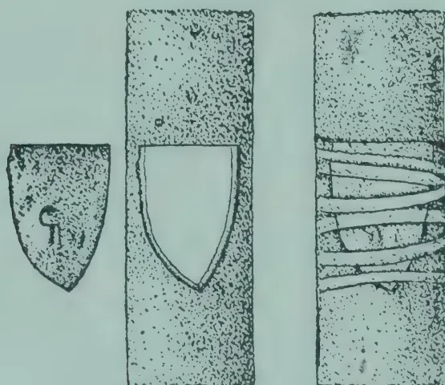

In this case a triangular piece of bark containing a bud is transferred into a stem from which a similarly shaped piece of bark has been removed. A small quantity of grafting wax is then smeared over the edges of contact and the bark then tied firmly with budding tape or strands of bark. After this the whole should be covered with strips of cloth dipped in melted paraffin wax, as a further preventive against the admission of air and moisture. It is necessary that the bud should fit accurately the incision in the stock.

376------------------------------------------------

DECEMBER, 1921.]3453. Patch budding:—

This method is similar to 2 except that a slightly larger rectangular piece of bark is transferred.

GRAFTING.1. Cleft grafting:—

The stock in this case is split open by a sharp knife or chisel and the scion is cut wedge-shaped and fitted into the cleft so that the cambial layers are in contact. The whole is then carefully bound with waxed tape to exclude air and moisture.

2. Side-grafting:—

This consists of inserting scions into the side of a stock without cutting away the top of the stock. The scion is splice-cut and is then inserted under the bark so that cambial layers are in contact. The union is then bound up and covered with clay or wax.

377------------------------------------------------

346[DECEMBER, 1921.3. Crown Grafting:—

The stock in this case is cut down. The scion is sloped and so shaped that it can be inserted between the bark and the wood of stock. It can only be done satisfactorily at the commencement of the growing season. The bark and wood then easily separate. At the beginning the young scions must be protected by shelters from the sun.

NOTES.

1. 1. It is essential that only a sharp knife should be used in budding or grafting.
2. 2. Good budding tape should be used to wind round buds or grafts.
3. 3. Budding tape may be made as follows:—

**GRAFTING WAX.**

- 1 part beeswax
- 1 part tallow or suet
- 2 parts resin

Melt the two former in a tin, powder the resin and add to the mixture, stirring and mixing the whole well. When cold it should be of the consistency of fresh putty.

For budding purposes or for small or delicate grafts, the wax may be melted and applied with a small brush whilst in a dilute state. Grafting tape is, however, preferable. This may be prepared by soaking ordinary  $\frac{1}{2}$  inch cotton tape in the melted wax, afterwards hanging it up to dry for a day or so.

Success in Java has been obtained by using waxed cotton made by putting ordinary strips of cotton through melted paraffin wax.

1. 4. The reported results from Java are as follows:—

**BUDDING.—**

50-60 % successes were secured at the beginning but after practice the workers were able to secure 90 % successes.

378------------------------------------------------

DECEMBER, 1921.]347GRAFTING.—

Cleft-grafting, 40% successes are reported. It requires great care and is not now generally recommended.

Side-grafting, 55% successes were obtained.

Crown grafting, 75% successes were obtained.

5. Further references to budding or grafting may be made to any standard work on Gardening or to Bulletins 20 and 21 of the Rubber Experiment Station, Java.\*

(Signed) F. A. STOCKDALE,

Department of Agriculture,

Director of Agriculture.

Peradeniya, August 26th, 1921.

---

## CONCERNING THE INFLUENCE OF COAL TAR ON THE RENEWING BARK OF HEVEA BRASILIENSIS.

---

DR. A. STEINMANN.

(*Summary.*)

Besides his application of tar to wounds and to the tapping cut in combating stripe canker, HARMSSEN has also recommended its use to obtain a quicker bark renewal on the tapping surface.

The purpose of the investigation reported in this paper was to find whether tar can produce a change in the anatomical structure of the bark, and also to determine whether this tar treatment should be recommended for estate practice.

The tar used in these experiments (furnished by the gas factory of Batavia) penetrated on the tapping cut to a depth of 0.5 mm.; at 1 cm. above the cut, to 0.25 mm.; whereas at a height of 6 cm. above the cut it did not even penetrate through the cork layer. These results agree in general with those of similar experiments carried out by PETCH.

The writer's investigations show that under the influence of coal tar :—

(1) An increase in thickness of the bark can be obtained.

(2) This increase is due only to the accelerated activity of the phellogen or cork cambium. The phellogen produces an unusually large mass of phelloderm-tissues, many cells of which eventually go over into stone cells.

(3) Because no increase in the soft or latex bearing portion occurs, it can not be advised to tar the tapping area regularly each month in order to obtain a quicker development or growth of the bark.—ARCHIEF VOOR DE RUBBERCULTUUR, October, 1921.

---

\*Note.—Successful patch budding was carried out at the Royal Botanic Gardens, Peradeniya during the month of September. The results of these experiments were communicated to the Estate Products Committee at its meeting held on November 10th, and to a meeting of the Kalutara Planters' Association held on November 30th.—Ed. T. A.

379------------------------------------------------

348[DECEMBER, 1921.

# FRUITS.

## THE CULTIVATION OF PINE-APPLES.

DEPARTMENT OF AGRICULTURE CEYLON, BULLETIN NO. 50.

Within recent months considerable interest has been taken in the Colony in the possibilities of the cultivation of pine-apples for canning. There seems to be good prospects for such an industry, and therefore it is considered desirable to issue details regarding those cultivation methods which usually give the most satisfactory results.

Pine-apples grow well in all districts of the Colony, and yield satisfactory crops of large fruits. In the higher and colder elevations growth is slow, but below 4,000 feet growth is generally good. Some of the largest pine-apples of the Colony are grown in the Kegalla District, but equally fine fruits can be secured with cultivation in many other localities. Small experimental cultivations have been carried on by the Department of Agriculture at Anuradhapura, Bandaragama, in the Kalutara District, and at Peradeniya. There is one cultivation in the Kegalla District which has been in existence for some time, and it supplies some of the hotels in Colombo with fruit. Otherwise pine-apples are grown in small numbers in village gardens, and the fruits thus secured are disposed of at the nearest vegetable markets. These fruits generally command a ready sale, prices varying with the season and with the location of the market.

### VARIETIES.

The principal varieties of pine-apples grown in Ceylon are two in number. They are the Kew and Mauritius kinds. The Kew pine-apple is the well-known Smooth Cayenne variety. It is supposed to have originated in hot-houses in England, and is largely grown in the Azores under glass for supplying the London markets. It has been successfully grown over large areas under shelter in Florida, and is there the most popular and profitable variety. It is the variety grown for the Hawaiian canneries, and is also grown in Porto Rico and other West India Islands. The Smooth Cayenne or Kew pine-apple produces large fruits, which average from 5 to 8 pounds in weight. The plant is a large one, with large leaves smooth on their edges. The fruit is oblong. It tapers very slightly. The colour of the fruit when fully ripe is yellow, but under tropical conditions ripe fruit are still of a light green hue. The crown is well developed and spreading, the leaves of the crown being smooth on their edges, sharp pointed, and tapering gradually to the apex. Its flesh is yellowish, very juicy, and sweet to taste.

In Ceylon it is a hardy plant, and grows well in the damper districts. It requires for its best development better soil and more favourable conditions than the so-called Mauritius varieties of pine-apples which are grown in the Colony.

The so-called Mauritius pine-apples grown in Ceylon are much smaller than the Kew pine-apple, their fruits rarely averaging more than  $2\frac{1}{2}$  to 4 pounds each. The plants themselves are comparatively small, and the leaves are coarsely serrated at their edges. There are probably two kinds. The fruits of the red kind are oblong in form, rounded at the base, and slope abruptly to the crown. Their colour is green before ripening, and a reddish yellow when fully ripe. The crown is of medium size, the leaves

380------------------------------------------------

DECEMBER, 1921.]349

being broad at the base and tapering to the apex. The flesh is light yellow in colour, and of medium quality. The yellow variety has slightly differently shaped fruits to the red kind. Its base is rather depressed, and it slopes somewhat abruptly from the middle. It is light green in colour before maturity, and a clear yellow when ripe. The crown is large, and the leaves are coarsely serrate and spiny. The flesh is yellow in colour, and is rather acid to taste.

### SOILS.

Pine-apples do not appear to be particular in regard to the classes of soils on which they will thrive. They are found growing satisfactorily on soils of widely different character, and even upon shallow soils of poor quality. They do not thrive well upon heavy clay soils with poor drainage. The pine-apple requires soil that is well drained, and will often do better on poor sandy soils than on richer loams whose drainage is not satisfactory. A light sandy loam is considered to be the best soil for the pine-apple, and if heavier soils are planted up attention must be given to cultivation and to drainage. The pine-apple is most intolerant to excessive moisture, and if drainage is neglected good results cannot be hoped for.

### PROPAGATION.

The pine-apple is propagated by *suckers*, *ratoons*, *slips*, and *crowns*. The accompanying illustration will help to make clear these terms. (Plate I).

The "sucker" is an offshoot, growing out from among the leaves of the parent plant. Suckers are the best sources for propagation. If left on the mother plant after the fruit has been harvested they will throw out roots, and these roots may develop around the lower leaves and in the axils of the leaves of the mother plant. In this position the sucker will grow and produce fruit, and the practical importance of this is that where plants are close enough crops of fruits can be reaped from suckers growing on the base of old plants.

For planting, suckers are severed from the mother plant, and after preparation are put out into the soil at the selected distances apart.

"Ratoons" are suckers or offshoots which are thrown out from the main plant underground. They rapidly develop roots of their own, and after the fruit is cut, some of these ratoons are allowed to remain in order to produce the crop of the following year without re-planting. Not more than two good ratoons should be allowed to remain, the others being removed and utilized for planting up new areas.

"Slips" are the plantlets which appear on the fruit stalk below the fruit. They are similar in appearance to suckers or ratoons, but they seldom attain any considerable size. They may be detached and used for planting purposes. The rosette of leaves at the apex of the fruit is known as the "crown," which when cut off from the fruit may be planted.

Frequently a number of slips will be found to have appeared immediately below and around the crown. These are known as "crown slips." They are usually small, and are not used for propagation if other planting material is available.

Most varieties of pine-apples produce a few seeds. The quantity depends upon the locality as well as the season, and some varieties are more productive than others. Experiment stations in Hawaii and America have carried on a large number of experiments with the propagation of seedlings, and a few of the pine-apple varieties thus raised have been of commercial value. The pine-apples grown from seed does not grow true to type. Some of the seedlings are of a quality equal to or superior to that of the parent, but many others are inferior. The propagation of pine-apples from seed is therefore not a commercial possibility, and lengthy experiments are necessary before the true value of a pine-apple raised from seed can be attested.

381------------------------------------------------

350[DECEMBER, 1921.

### SELECTION OF PLANTS FOR PROPAGATION.

Care must be given to the selection of material used for planting. Suckers are generally to be favoured for planting, but slips, if large, can also be used. Suckers generally develop on the mother plant before the fruit appears, and such suckers are therefore several months older than the slips. Planted suckers will produce fruit several months earlier than slips.

Ratoons may be planted, but they are not to be preferred to suckers. Their roots die, unless the ratoons are lifted carefully with a good ball of earth. Consequently ratoons take some time to become established.

Crowns may also be used, and give quite satisfactory results if they are large and well matured. If crowns are used, they must be trimmed close to the base, and the cut ends must be allowed to dry in sunlight for several days before planting.

Planting material should be taken from strong vigorous plants which are free from diseases. The suckers should be well matured, and only those in vigorous growth should be selected. A poor sucker will never give good results. An immature sucker will dry up in a short time if the weather is dry, and rot if the weather is damp.

A well-matured sucker never gives rise to these troubles. The suckers should be 12 to 18 inches long, and should be selected from plants which have borne or are bearing fruits. When the suckers are selected, they should be stripped of the lower basal leaves for a height of 1 or 2 inches. This allows roots more readily to appear, and the plants "catch on" more rapidly after planting.

The accompanying illustration shows an inferior sucker, a good sucker, and a good sucker prepared for planting. (Plate II.)

### PLANTING SYSTEMS.

Before planting all weeds should be eradicated, especially creeping grasses, such as couch. The land should be tilled, and should be in a fairly loose condition. Opinions differ as to the best distances at which to plant, but in countries growing pine-apples for canneries, the three-row system is now the most popular. The distance between plants depends upon the locality, the soil, and the variety planted. The Kew variety requires more space than the Mauritius kinds, as it grows much more vigorously.

Pine-apple planters adopt methods of planting which range from single rows 3 to 4 feet apart to 10 or 12 rows planted very close together. Some planting is done on the flat, while other growers advocate planting on a ridge. Everything depends upon the soil conditions of the locality. In well-drained soils the flat planting may safely be adopted, while on lands which are of poor drainage the soil should be banked up and planting done on ridges.

The single-row system is the system generally adopted in Ceylon, and the distances between the rows and between the plants in the rows range from 18 inches for Mauritius pine-apples to 2 feet 6 inches or 3 feet for the Kew variety. The single-row system is well-adapted to a friable loam soil and in localities where grasses are troublesome weeds. Its great disadvantage is that as soon as the fruit attains any size it falls over for want of support. When two or more rows are planted close together, support is secured from neighbouring plants, and better fruits are secured. Suckers on plants put out in the single-row system of planting are also frequently broken off.

Some of the objections to the single-row system of planting can be overcome by planting out in double rows, setting the plants 15 to 18 inches apart according to variety, and leaving 3 or 4 feet apart between the double rows. This system can be used in all kinds of soils. It is to be preferred in weedy soils, but in clean soils the three-row system may be adopted. The three-row system consists of planting three rows of plants close together. The generally accepted distances in the three-row system on poor soils are 15 by

382------------------------------------------------

*Plate I.*

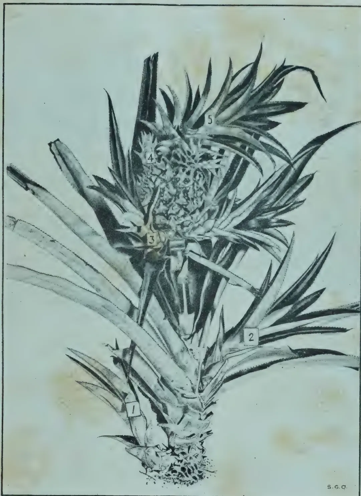A detailed black and white botanical illustration of a pineapple plant. The plant is shown from a side-on perspective, with its crown of leaves at the top, a central fruiting body, and a base of leaves and roots. Five numbered labels are placed on the illustration: 1 points to a 'Ratoon' (a new shoot emerging from the base); 2 points to a 'Sucker' (a lateral shoot); 3 points to a 'Slip' (a small shoot emerging from the base of the fruit); 4 points to a 'Crown Slip' (a small shoot emerging from the base of the crown); and 5 points to the 'Crown' (the top of the fruit). The illustration is signed 'S. G. O.' in the bottom right corner.

1. RATOON. 2. SUCKER. 3. SLIP. 4. CROWN SLIP. 5. CROWN.  
(Reproduced from Bull. 8, Porto Rico Agric. Expt. Station.)

383------------------------------------------------

*Plate II.*

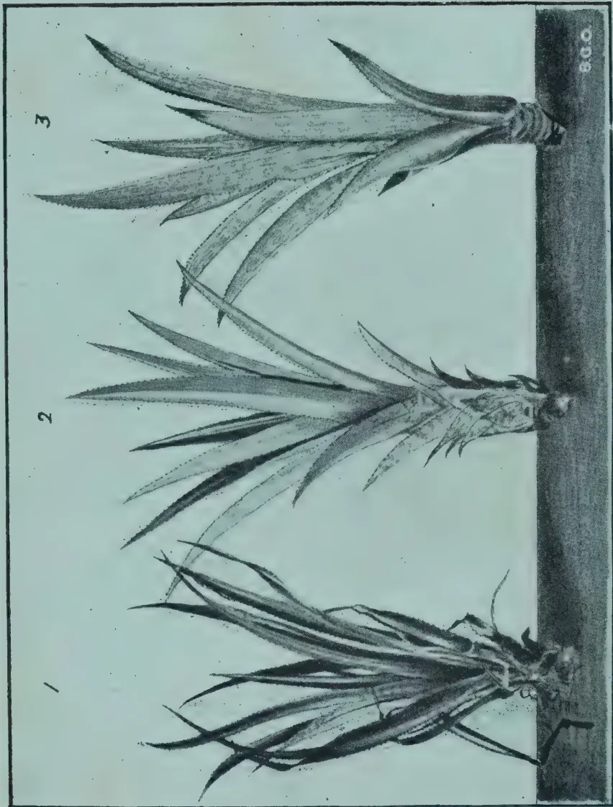The image contains three detailed botanical illustrations of pineapple suckers, labeled 1, 2, and 3. Each illustration shows a cluster of long, narrow, pointed leaves emerging from a central base. Illustration 1 (left) shows a sucker with a relatively flat base and some visible roots. Illustration 2 (middle) shows a sucker with a more developed, slightly raised base and more prominent roots. Illustration 3 (right) shows a sucker with a very well-developed, rounded base and a dense network of roots, indicating it is ready for planting. The suckers are shown against a dark, textured background representing soil. The numbers 1, 2, and 3 are placed above each respective illustration. The letters 'B.G.O.' are printed vertically on the right side of the plate.

1. INFERIOR SUCKER. 2. GOOD SUCKER. 3. GOOD SUCKER  
PREPARED FOR PLANTING.

(After Bull. 8, Porto Rico Agric. Expt. Station.)

384------------------------------------------------

DECEMBER, 1921.]

351

15 inches for the smaller kinds of pine-apples, such as the Mauritius types, and 18 by 18 inches for the Kew or Smooth Cayenne variety. In good soils these distances should be increased. A distance of 4 to 5 feet would be left between series of rows, so as to allow inter-culture to be carried out and to afford space for re-planting the field when necessary. The distances that might be recommended for Ceylon, if pine-apples are being grown for a cannery, are shown in the accompanying diagram :—

*Single Row.*

Mauritius.

<table border="0">
<tr><td>x</td><td>x</td><td>...</td></tr>
<tr><td>x</td><td>x</td><td>...</td></tr>
<tr><td>x</td><td>x</td><td>...</td></tr>
<tr><td>x</td><td>x</td><td>...</td></tr>
<tr><td>x</td><td>x</td><td>...</td></tr>
<tr><td>x</td><td>x</td><td>...</td></tr>
<tr><td>x</td><td>x</td><td>...</td></tr>
<tr><td>x</td><td>x</td><td>...</td></tr>
<tr><td>x</td><td>x</td><td>...</td></tr>
<tr><td>x</td><td>x</td><td>...</td></tr>
<tr><td>x</td><td>x</td><td>...</td></tr>
<tr><td>x</td><td>x</td><td>...</td></tr>
<tr><td>x</td><td>x</td><td>...</td></tr>
</table>

15 in. × 30 in.

Kew.

<table border="0">
<tr><td>x</td><td>x</td></tr>
<tr><td>x</td><td>x</td></tr>
<tr><td>x</td><td>x</td></tr>
<tr><td>x</td><td>x</td></tr>
<tr><td>x</td><td>x</td></tr>
<tr><td>x</td><td>x</td></tr>
<tr><td>x</td><td>x</td></tr>
<tr><td>x</td><td>x</td></tr>
<tr><td>x</td><td>x</td></tr>
<tr><td>x</td><td>x</td></tr>
<tr><td>x</td><td>x</td></tr>
<tr><td>x</td><td>x</td></tr>
</table>

24 in. × 36 in.

*Double Row.*

Mauritius.

<table border="0">
<tr><td>xx</td><td>xx</td><td>...</td></tr>
<tr><td>xx</td><td>xx</td><td>...</td></tr>
<tr><td>xx</td><td>xx</td><td>...</td></tr>
<tr><td>xx</td><td>xx</td><td>...</td></tr>
<tr><td>xx</td><td>xx</td><td>...</td></tr>
<tr><td>xx</td><td>xx</td><td>...</td></tr>
<tr><td>xx</td><td>xx</td><td>...</td></tr>
<tr><td>xx</td><td>xx</td><td>...</td></tr>
<tr><td>xx</td><td>xx</td><td>...</td></tr>
<tr><td>xx</td><td>xx</td><td>...</td></tr>
<tr><td>xx</td><td>xx</td><td>...</td></tr>
<tr><td>xx</td><td>xx</td><td>...</td></tr>
</table>

15 in. × 15 in. 15 in. × 15 in.

30 inches.

Kew.

<table border="0">
<tr><td>xx</td><td>xx</td></tr>
<tr><td>xx</td><td>xx</td></tr>
<tr><td>xx</td><td>xx</td></tr>
<tr><td>xx</td><td>xx</td></tr>
<tr><td>xx</td><td>xx</td></tr>
<tr><td>xx</td><td>xx</td></tr>
<tr><td>xx</td><td>xx</td></tr>
<tr><td>xx</td><td>xx</td></tr>
<tr><td>xx</td><td>xx</td></tr>
<tr><td>xx</td><td>xx</td></tr>
<tr><td>xx</td><td>xx</td></tr>
<tr><td>xx</td><td>xx</td></tr>
</table>

18 in. × 18 in. 18 in. × 18 in.

36 inches.

*Three Rows.*

Mauritius.

<table border="0">
<tr><td>xxx</td><td>xxx</td><td>...</td></tr>
<tr><td>xxx</td><td>xxx</td><td>...</td></tr>
<tr><td>xxx</td><td>xxx</td><td>...</td></tr>
<tr><td>xxx</td><td>xxx</td><td>...</td></tr>
<tr><td>xxx</td><td>xxx</td><td>...</td></tr>
<tr><td>xxx</td><td>xxx</td><td>...</td></tr>
<tr><td>xxx</td><td>xxx</td><td>...</td></tr>
<tr><td>xxx</td><td>xxx</td><td>...</td></tr>
<tr><td>xxx</td><td>xxx</td><td>...</td></tr>
<tr><td>xxx</td><td>xxx</td><td>...</td></tr>
<tr><td>xxx</td><td>xxx</td><td>...</td></tr>
<tr><td>xxx</td><td>xxx</td><td>...</td></tr>
</table>

15 in. × 15 in. 15 in. × 15 in.

48 inches.

Kew.

<table border="0">
<tr><td>xxx</td><td>xxx</td></tr>
<tr><td>xxx</td><td>xxx</td></tr>
<tr><td>xxx</td><td>xxx</td></tr>
<tr><td>xxx</td><td>xxx</td></tr>
<tr><td>xxx</td><td>xxx</td></tr>
<tr><td>xxx</td><td>xxx</td></tr>
<tr><td>xxx</td><td>xxx</td></tr>
<tr><td>xxx</td><td>xxx</td></tr>
<tr><td>xxx</td><td>xxx</td></tr>
<tr><td>xxx</td><td>xxx</td></tr>
<tr><td>xxx</td><td>xxx</td></tr>
<tr><td>xxx</td><td>xxx</td></tr>
</table>

18 in. × 18 in. 18 in. × 18 in.

60 inches.

385------------------------------------------------

352[DECEMBER, 1921.

*Number of Plants per Acre.*

<table border="1">
<thead>
<tr>
<th rowspan="2">System of Planting.</th>
<th rowspan="2">Varieties.</th>
<th colspan="2">Distance apart of Plants in Rows,</th>
<th colspan="4">Distance between Rows.</th>
</tr>
<tr>
<th>Inches.</th>
<th>2 ft.</th>
<th>2½ ft.</th>
<th>3 ft.</th>
<th>4 ft.</th>
<th>5 ft.</th>
</tr>
</thead>
<tbody>
<tr>
<td rowspan="2">Single Row...</td>
<td>Mauritius</td>
<td>15</td>
<td>—</td>
<td>13,939</td>
<td>—</td>
<td>—</td>
<td>—</td>
</tr>
<tr>
<td>Kew</td>
<td>24</td>
<td>—</td>
<td>—</td>
<td>7,260</td>
<td>—</td>
<td>—</td>
</tr>
<tr>
<td rowspan="2">Double Row</td>
<td>Mauritius</td>
<td>15 × 15</td>
<td>—</td>
<td>18,260</td>
<td>—</td>
<td>—</td>
<td>—</td>
</tr>
<tr>
<td>Kew</td>
<td>18 × 18</td>
<td>—</td>
<td>—</td>
<td>12,558</td>
<td>—</td>
<td>—</td>
</tr>
<tr>
<td rowspan="2">Three Row...</td>
<td>Mauritius</td>
<td>15 × 15</td>
<td>—</td>
<td>—</td>
<td>—</td>
<td>15,670</td>
<td>—</td>
</tr>
<tr>
<td>Kew</td>
<td>18 × 18</td>
<td>—</td>
<td>—</td>
<td>—</td>
<td>—</td>
<td>10,545</td>
</tr>
</tbody>
</table>

**PREPARATION OF SUCKERS BEFORE PLANTING.**

The young plants, whether they are suckers, slips, or crowns, require a certain amount of preparation before they are planted. If the locality is a dry one, or the soil a sandy one liable to drying out, all planting material should be "trimmed." The trimming consists of cutting off the base of the sucker, slip, or crown, and stripping off the lower leaves until the stem is exposed for 1 or 2 inches. The exposed portion of the stem is then allowed to dry for a few hours before planting. Some pine-apple cultivators also cut off the tops of the leaves, particularly if the suckers are large. This practice, however, is not generally recommended. The necessity for trimming suckers, etc., for planting in a dry locality or during the dry season is obvious. If a sucker is planted without trimming in a dry soil or under dry conditions, the roots which are given out from the stem do not develop properly, and become massed around the stem of the plant. In a dry soil the leaves which cover the stem, unless they are trimmed off from the lower portion, remain hard and dry. They do not readily decay. The young rootlets, therefore, as they grow find considerable difficulty in penetrating these dry and hard bases of the leaves. Consequently the majority of the roots develop between the leaves and the stem, and thereby become massed immediately around the stem. This growth around the stem is also helped by the moisture which is collected from the dew and light showers in the leaf axils, from which it trickles down around the stem of the plant. The soil is thereby drier than the area immediately surrounding the plant, and consequently root growth in the immediate vicinity of the stem is encouraged.

This massing of roots around the stem and their non-development in lateral directions is naturally harmful to the successful development of the plant. Untrimmed plantations in dry localities or during dry seasons do not produce such good crops as plantings which have received proper attention at the beginning.

In loamy or clay soils containing fair amounts of moisture, or in wet localities, the basal leaves of the suckers, slips, or crowns selected for planting rot fairly rapidly, and consequently under these conditions trimming is not necessary to ensure satisfactory root development.

In general, it may therefore be accepted that it is advisable to trim for planting in a dry soil or in a dry season, but for planting in moist soils or in the rainy season such work is not worth the expenditure.

**PLANTING OUT.**

This should be done with the monsoon rains. The planting seasons would be May-June for the south-west monsoon season, and October to December for the north-east season. The general fruiting season for pine-apples in Ceylon are the months of June, July and August. The pine-apple plant usually takes twelve months or more before it comes into bearing, and therefore plantations made in May-June in the south-west side of the Island should fruit the following year. As this period is the minimum for proper

386------------------------------------------------

DECEMBER, 1921.]353

fruiting, everything should be done to make conditions for growth as favourable as possible. The suckers or slips used for planting should be large ones—12 inches or more in length in the case of the Kew variety. Cultivation should receive careful attention, and manuring should be adopted. Suckers usually fruit somewhat earlier than slips. This is mainly due to suckers being slightly older than slips, but even when suckers and slips are of the same age, there appears to be a slight difference in favour of the sucker as far as fruiting is concerned.

In the drier districts dependent upon the north-east rains, plantings done in October to December will probably give the best results if the majority of the plants fruit in June, eighteen to twenty months later. Plantings done in October may, therefore, be too early unless smaller suckers or slips are used. Those made in December with large suckers will possibly give more uniform fruiting. If very large ratoons or suckers were used for planting with the first rains of the north-east season, it is possible that some of such plants would fruit in the following August. In many north-eastern districts good showers are experienced in April, and this season could be utilized for plantings which are required to fruit some fifteen to eighteen months later.

In Ceylon at the present time no regular season is adopted for planting pine-apples, and consequently fruit can be secured in every month of the year. As previously stated, however, the main fruiting season is during the months of June to August, and if a canning industry were established, the bulk of the crops would be harvested during these months. A certain amount of experiment would be necessary in the initial stages, and as experience was gained, control of fruiting by times of planting, systems of cultivation, etc., would be evolved.

It may be accepted, however, that large ratoons or suckers with good cultivation and proper manuring will produce fruit in about 12 months, while ordinary plantings in the drier districts will take from fourteen to 18 months to fruit.

In sandy soils it is important that small suckers or slips should not be used. They become filled with sand, especially after wind or heavy rain, and this is detrimental to growth.

### CULTIVATION.

The pine-apple has a shallow root system, which does not extend at any great distance from the plant. Planting can, therefore, be done fairly close, and cultivation limited largely to weeding and hand cultivation immediately around the plants. Rows of plants may be 15 to 18 inches apart, and the distances between the plants in the rows need not exceed these distances. Adequate space must be left for paths, in order that plants are not injured during weeding or cultivation. The pine-apple will not succeed if its leaves are being constantly injured or broken, and one often sees plants which have been put out in gardens along the edges of paths struggling with many broken leaves for an existence. If the three-row system of planting is adopted, the paths left between the series of three rows should be regularly cultivated and kept free from weeds. It is in these paths that the planting of the next crop will be made. The land should, therefore, be kept in good tilth, and should not be allowed to become hard or weedy. All weeds in the rows of plants should be regularly pulled out, and light forking and hoeing carried out in the earlier stages. Weeds are detrimental to the growth of the pine-apple. If they are allowed to grow, stunted plants and inferior crops will result.

### MANURING.

No experiments on manuring pine-apples have been conducted in Ceylon, and therefore it is not possible to state with certainty what manures are required for Ceylon soils and conditions. In the wetter districts

387------------------------------------------------

354[DECEMBER, 1921.

pine-apples apparently grow luxuriantly and yield satisfactory crops without manure, but there is little doubt that beneficial results would follow the application of manures. If pine-apples are to be cultivated continuously, some system of manuring would be necessary to assure continued satisfactory results.

In Florida, where pine-apples are grown on very poor sandy soils, very careful attention is given to manuring, and, similarly, in Hawaii, crops have only been maintained by the use of artificial manures.

The root system of the pineapple is shallow and limited in its lateral extension. Manures must, to be beneficial, be applied on or immediately around the plant. If the rows are far apart, and the manure is applied in the spaces between the plants, it is not reached by the roots, and consequently is largely lost. In field practice it is usual in the single-row system of planting to apply manures to each individual row of plants, while in the three-row system the manure is scattered broadcast over the plants. The manure lodges in the axils of the leaves, and is gradually washed down from the leaf bases to the soil immediately surrounding the stem.

It is, therefore, essential to avoid injury to the foliage. The manures used should be neither acid nor caustic. Sulphate of ammonia or nitrate of soda should be avoided, and organic sources of nitrogen, such as castor cake, groundnut cake, or dried blood employed. Sulphate of potash is to be preferred to other potash salts, and acid phosphates are to be avoided. Steamed bone meal is likely to prove a satisfactory source of phosphorus. The manures should be given in two or three applications. The first can be made immediately after the plants have become established, the second two to three months later, and the last application just as fruit is beginning to appear.

In Porto Rico it is recommended that nitrogen alone should be applied at the first manuring, and that at the last application the percentage of potash should be increased. Manurial mixtures in the ratio of 10 lb. nitrogen, 20 lb. potash, and 8 lb. phosphoric acid per 1,000 plants are recommended. Such large applications would not be necessary in Ceylon, and it is possible that a ratio of 5 lb. nitrogen, 10 lb. potash, and 5 lb. phosphoric acid per 1,000 plants would be likely to meet Ceylon requirements. Accurate information, however, can only be secured as the result of experiment, and until experiments have been carried out only generalizations can be made.

### FRUITING.

The time of fruiting depends, as has been explained previously, on various factors. All fruit before it is picked should have become full in size, and, if canning is to be done, should be mature. There are several methods of judging the degree of ripeness of a pine-apple fruit. This is not difficult in the field, but it requires experience and a certain amount of skill. The opening and spreading of the crown may be taken as one of the best tests of maturity.

The nearer a pine-apple is to full maturity and ripeness when harvested, the better the quality.

The fruits of some varieties of pine-apples will break off readily without injury to the fruit if they are given a quick sharp jerk. With other varieties, such as the Kew variety, a knife must be used, and the fruit cut off from the stems. After cutting, the fruits should be sorted into different grades in the field, and then collected in baskets, trucks, or other means of conveyance for transport to the sorting house or canning factory. If the fruit is to be packed in cases for shipping to temperate markets, a second grading is done in the "sorting house"; if they are required for a cannery, the field grading is sufficient.

388------------------------------------------------

*Plate III.*

A black and white photograph showing a cluster of pine-apples growing on a plant with long, spiky leaves. The pine-apples are positioned in the center and right side of the frame, with their textured, segmented surfaces clearly visible. The plant's leaves are long and narrow, radiating from the base. The background consists of a dense field of grass and other low-lying vegetation. The entire photograph is enclosed within a thin black rectangular border. In the upper right corner of the image, there is a small, faint signature that appears to read "S.C.O."

KEW PINE-APPLES GROWING AT ANURADHAPURA EXPERIMENT STATION.

389------------------------------------------------

*Plate IV.*

PINE-APPLES PLANTED IN SINGLE ROWS AT ANURADHAPURA EXPERIMENT STATION.

390------------------------------------------------

DECEMBER, 1921.]355

### YIELDS.

Accurate acreage yields have not been secured in Ceylon, as only very small areas have been devoted to pine-apples on the experiment stations, and private cultivations consist mainly of small plantings in gardens. In good cultivations 75 to 90 per cent. of the plants should produce fruits, of which at least 75 per cent. should be of sufficiently large size. If, therefore, 10,000 plants are set out per acre, some 5,000 to 6,000 large-sized fruits should be secured.

Yields of 8 to 10 tons of fruit per acre are reaped in Hawaii and other pine-apple-growing countries, and in favourable districts in Ceylon similar crops should be secured. In the drier districts the yields would be smaller.

### TREATMENT OF FIELDS AFTER HARVESTING.

After the bulk of the crop has been harvested, the field should be thoroughly cleaned, weeded, and hoed. All dead or badly injured leaves should be cut off, all dead or diseased plants removed, and all weeds removed.

Slips and suckers should be removed—after maturity, if they are required for planting purposes—and all ratoons, except two, should be dug up. If the soil is rich, three ratoons or basal suckers can be left for the second or ratoon crops but if good-sized fruits are desired, the number of ratoon shoots or suckers should be strictly limited. In the case of the three-row system the retention of ratoons only need not be insisted upon, as the suckers often give satisfactory crops of good fruit. It is often found that suckers develop towards the tops of the plants and cannot, therefore, be retained for the ratoon crop. If these high suckers are pulled off, others will be formed lower down on the plants. The development of ratoons may even be induced by the removal of suckers as formed. After the suckers and weeds have been removed, the soil between the plants should be broken up if possible and earth from the paths between the series of rows thrown around the plants to replace that which may have been washed away. Manuring should then be carried out, an application slightly heavier than that given to the first plant crop being made. Plants still bearing unpicked fruits should be left until after the fruits have been harvested, when they should receive individual attention.

The time a field can be kept under pine-apples without replanting depends upon its fertility, the cultivation given to it, and the amount of manure added.

Re-planting in many countries only takes place every five, ten, or even fifteen years, but in others a maximum of three crops is considered to be sufficient. In the last year a low-growing green manure should be planted in the paths between the series of rows. This should be ploughed under and re-planting then carried out. The old rows should be thoroughly ploughed out and green manure crops sown. In this manner the general fertility of the soil will be maintained and good crops assured.

### CANNING.

The canning of pine-apples is operated on a large scale in the Straits Settlements, Hawaii, Florida, the Bahamas, and to a smaller extent in Jamaica. A factory can only be successfully operated if a regular supply of suitable fruit is available from properly cultivated areas. It is usual for the factory to have a nucleus in an area of pine-apples cultivated under its own management, and to rely to a lesser extent upon purchases from other growers. In countries depending upon export for their trade, the majority of pine-apple canneries are situate at the port of shipment, and it is probable that if a factory were erected in Ceylon, it would be advisable that it should be erected in Colombo. A pure water supply would there be available, a

391------------------------------------------------

356[DECEMBER, 1921.

labour supply could readily be secured for the busy season, and transport for shipment would be facilitated. The supplies of fresh fruit from the cultivations could be transported to the factory by railway, and it would be desirable that the factory should be placed on the railway line if possible.

In the Straits Settlements the pine-apples are peeled by hand. The tops and bottoms of the fruits are first cut off. The fruit is then held in the left hand, which is covered with a rubber glove, and peeled with a sharp knife. The cores are removed by a tin tube, which is pressed through the centre, and the fruit is then placed in tins, which are filled up with water or syrup. In many cases in Singapore the cores of the fruit are not removed. The syrup for the cans is made of 1 lb. of sugar to about 4 gallons of water, and after the fruit is placed in the tin it is soldered up. The tins are then plunged into a tank of water heated by steam and are boiled for about 10 minutes in the case of the smallest tins and up to over an hour for the large tins. After removal from this tank a small puncture is made in the top of the tin in order to let out the steam, and subsequently the holes are re-soldered, and the tins again plunged into boiling water for nine minutes.

The exports from Singapore include whole pine-apples, pine-apples which have been cored, and pine-apples in slices.

In the Bahamas the pine-apples are peeled by hand, the core removed by machines, the fruits then sliced by machinery. These slices are then packed in tins with syrup and cooked.

In Hawaii machinery is used throughout. The fresh fruit are first put through a sizing machine, which removes the whole of the rind and makes a cylinder of fruit the same size as the tin to be used. The core of the fruit is next taken out by a special machine, and the fruit then passes along to be sliced. The fruit is now ready for the tin, and after it has been put into these, the tins are taken to the syruper, where syrup made of sugar and water, or pine-apple juice, is added. The top of the tin is next put on, and the tins are then exhausted in steam for about 4 minutes. Subsequently the tins are passed along on an endless chain for the actual cooking. This is done by passing them through a cooker, which is kept at  $212^{\circ}\text{F}$ . The tins of fruit take 10 minutes to pass through the cooker. On coming from the cooker the tins are cooled for 4 minutes, and when cold are tested for leaks. If any leaks are discovered, these are repaired, and these tins again sent through the exhaust.

After the cans are thoroughly cooled, they are labelled and packed for export.

#### COST OF FACTORY.

It is somewhat difficult at the present time to give with accuracy the probable cost of an up-to-date modern canning factory, but information received in Colombo by MR. W. BEER, who was formerly connected with pine-apple canning factories in Hawaii, indicates that the cost of cannery, including a tin-making machine, would, at the present time of unfavourable American exchange rates, be about Rs. 80,000. Such a factory would be capable of turning out 100 cases of tinned fruit per hour—equivalent to about 4 tons of fresh fruit. It would therefore be capable of handling the produce of about 350 acres in a season.

F. A. STOCKDALE.

392------------------------------------------------

DECEMBER, 1921.]357

Protect yourself from the bites of  
MOSQUITOES, GNATS, FLIES, etc.

TRADE MARK **'SKETOFOX'** BRAND

## Antiseptic Cream

Smeared on the skin, it acts as a powerful deterrent to the attacks of mosquitoes, flies, gnats and midges.

Used after an attack, it relieves irritation and reduces inflammation.

Has no discolouring or staining effect.

*Issued in convenient collapsible tubes; of all Chemists*

**BURROUGHS WELLCOME & CO., LONDON**

xx 2904

COPYRIGHT

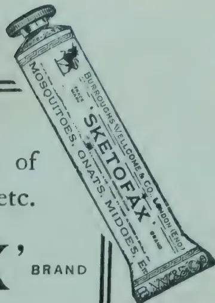

# FOODSTUFFS.

## MOKI LIMA BEANS.

The following is an abstract of Bulletin No. 9 of the Sultanic Agricultural Society written by DR. H. F. FORBES, Agronomist :—

Moki lima bean has been grown with success by the Moki Indians of Northern Arizona from time immemorial, and was introduced into Egypt by the writer in 1918 as an additional food crop in the already tight fitting scheme of the Egyptian rotation.

This bean is a semi-dwarf of *Phaseolus lunatus* with slender vines running to a length of 1 to  $1\frac{1}{2}$  meters in good soil. The vines are smooth and non-twining, refusing to climb even when provided with supports. Seeds are small and are pure white, pale buff and copper red. Pale buff may be variegated with black in all proportions, and also with red. Red may be flecked with black. Pale buff and red specimens darken with age—buff to brown, and copper red to deep red. Whites maintain their colour.

The non-twining and semi-dwarf habit of the Moki lima places it among field rather than garden crop; while the leguminous character of the plant and the nutritive value of the crop indicates a high food return with minimum drafts upon the soil. Of all the colour variants, the White Moki is the promising commercially.

### DEVELOPMENT OF THE PLANT.

Moki lima bean requires about four months of warm weather to mature a crop of dry beans, and it is therefore especially suited for tropical and

393------------------------------------------------

358[DECEMBER, 1921.

sub-tropical climates. It is considered hardy to a somewhat wide daily and sessional range of temperatures, and is drought resistant. It is susceptible to frost.

It flowers profusely beginning from 7 to 9 weeks from planting according to season, but only a small percentage of the flowers develop pods.

#### CULTURE.

In Arizona, Moki lima beans are grown in sandy soils, but good results have been obtained in Egypt in medium and light Nile soils. It will not endure an excess of soluble salts in the soil.

The land is prepared in the usual way with flat-topped ridges, separated by furrows 90 cm. apart. Four seeds are planted in one hill and subsequently thinned out to two with hills 70 cm. apart.

The green bean of Moki lima is an excellent vegetable, cooking quickly by reason of its small size. The proportion by weight of shelled beans to whole pods averages about 45 per cent.

#### ROTATION.

In Egypt, Moki lima bean is used in the rotation of vegetables, wheat and barley; cotton, berseem, etc., and in all these the leguminous nature of the crop helped to renovate the soil.

#### TUBERCLES.

This bean has failed to develop tubercles in Egypt, but after several attempts with cultures from various sources this has been overcome.

#### DISEASES AND PESTS.

Moki bean has been so far free from diseases, and has been but little attacked by insects. An unidentified leaf spot fungus was observed near Cairo in November and December. Occasionally, late in the year, pods may be seen slightly marked by a small spot fungus, which apparently does no harm to the crop. The only insect attack upon the vines or foliage was by grasshoppers, but a worm *Etiella zinkinella* damages green seeds in the field and a bean beetle *Bruchus irrectus* attacks dry beans in the field and also in storage, where it can be protected by fumigation, by naphthalene, and by storing in heavy muslin sacks.

#### YIELDS.

The following are the results of some experiments carried out near Cairo and at Kom Ombo in soils ranging from light to medium clays, and under both humid and comparatively arid climatic conditions:—

##### 1. Giza farm, Giza.

Planted July 14, 1919; harvested November 8-9.

Silty Ghezireh soil; fertilized with 40 cu.m. per feddan=(1 acre 184 sq. yds.) farmyard manure.

*Area.*—1.42 feddans=(1 acre, 2,289 sq. yds.) yield, 875 kilos (17 cwt. 25 lb.) first class beans; per acre 11 cwt. 78 lb.

##### 2. Bahtim farm, near Cairo.

Planted March 7, 1920; harvested June 30.

Soil medium clay; following maize, no fertilization; roots without tubercles.

*Area.*—233 feddans (1,166 sq. yds.); yield 212.5 kilos (4 cwt. 20 lb.); (per acre, 17 cwt. 22 lb.)

##### 3. Bahtim farm, near Cairo.

Planted April 18, 1920; harvested August 21.

Soil medium clay; following maize, no fertilization, no tubercles, plot injured on one side by mulberry trees.

*Area.*—222 feddans; (1,113 sq. yds.); yield, 93 kilos (1 cwt. 93 lb.); (per acre, 7 cwt. 107 lb.)

##### 4. Bahtim farm, near Cairo.

Planted June 22, 1920; harvested October 23.

Soil medium clay; following maize and fallow; no tubercles; fertilized with 190 kilos (3 cwt. 82 lb.) sodium nitrate per feddan (1 acre 184 sq. yds.).

394------------------------------------------------

DECEMBER, 1921.]359

*Area*—·76 feddans (3,775 sq. yds.) ; yield, 459 kilos (9 cwt. 4 lb.) ; (per acre, 11 cwt. 65 lb.) Damaged waste, 5 kilos (11 lb.) or 1·1 %

5. Bahtim farm, near Cairo.

Planted July 11, 1920 ; harvested November 16.

Soil medium clay ; following early crop of lima beans ; no tubercles ; no fertilization.

*Area*—·233 feddans (1,166 sq. yds.) ; yield, 188 kilos ; (3 cwt. 78 lb.) ; (per acre, 15 cwt. 38 lb.) Damaged waste, 6 kilos, (13 lb.) or 3·2 %

6. Giza farm, Giza.

*1st Planting*, March 12, 1920 ; harvested July 19 to September 3.

Silty Ghezireh soil, following colocassia, in poor condition no tubercles ; fertilized with 700 baskets of Kufri per feddan.

*Area*—1·1 feddans (1 acre 686 sq. yds.) ; yield, 370·5 kilos (7 cwt. 32 lb.) ; per acre, 6 cwt. 43 lb.

*2nd Planting*.—April 6, 1920 ; harvested August 2 to September 8.

Soil same as for 1st planting.

*Area*—1·04 feddans (1 acre 385 sq. yds.) ; yield, 381 kilos ; (7 cwt. 32 lb.) ; per acre, 6 cwt. 106 lb.

The prolonged harvest in these two plantings is due to a shortage of water (June 27 to July 19) followed by renewed irrigation. This caused new bloom and a second crop of pods from the same vines. These low yields are due to exhausted soil, poor stand and shortage of water, but roughly indicate the possibilities of this bean under dry farming conditions.

7. Giza farm, Giza.

Planted for green beans March 1, 1920 ; harvested June 11 to July 12.

Silty Ghezireh soil, following beans ; no fertilization.

*Area*—·67 feddans (3,366 sq. yds.) ; yield, 695 kilos of pods (13 cwt. 76 lb.) per acre 19 cwt. 74 lb. of pods, fresh shelled 8 cwt. 96 lb.

8. Teftish of the Societe Anonyme de Wadi Kom Ombo.

Planted August 13, 1920 ; harvested December 10 ; soil heavy : plot shaded on one side by hedge of *P. aculeata* ; no tubercles, no fertilization.

*Area*—18 feddans (904 sq. yds.) ; yield, 75 kilos (1 cwt. 53 lb.) ; per acre 7 cwt. 101 lb.

9. Giza farm, Giza.

Planted September 16, 1920 ; harvested January 12, 1921, not fully mature. Silty Ghezireh soil following cowpeas ; no fertilization and no tubercles observed.

*Area*—1·7 feddans (1 acre 3,700 sq. yds.) ; yield, 485 kilos (9 cwt. 61 lb.) ; per acre 5 cwt. 45 lb.

A poor crop of inferior quality, due to very late planting.

From these results it will be observed that early plantings are favourable.

### COMPOSITION AND FOOD VALUE.

The following analyses, by J. A. PRESCOTT, Chemist of the Societe Sultanienna d'Agriculture, are of samples of Moki lima beans collected from various sources and include both original Arizona seed and successive crops grown in Egypt from this seed. These analyses include nitrogen and starch and afford a means of determining the comparative food value of this crop,

395------------------------------------------------

360[DECEMBER, 1921.

<table border="1">
<thead>
<tr>
<th rowspan="2">No.</th>
<th rowspan="2">Where Grown.</th>
<th rowspan="2">Date of Crop</th>
<th rowspan="2">Moisture in Meal</th>
<th colspan="2">In water-Free Material</th>
</tr>
<tr>
<th>Nitrogen</th>
<th>Starch</th>
</tr>
<tr>
<th></th>
<th></th>
<th>%</th>
<th>%</th>
<th>%</th>
<th>%</th>
</tr>
</thead>
<tbody>
<tr>
<td>44</td>
<td>Prescott Dry Farm Northern Arizona ...</td>
<td>1917</td>
<td>10.59</td>
<td>3.73</td>
<td>33.4</td>
</tr>
<tr>
<td>44b</td>
<td>Giza Farm, Egypt ...</td>
<td>1919</td>
<td>11.72</td>
<td>2.94</td>
<td>43.3</td>
</tr>
<tr>
<td>44d</td>
<td>" " ...</td>
<td>1920</td>
<td>10.45</td>
<td>3.19</td>
<td>35.6</td>
</tr>
<tr>
<td>44d or e</td>
<td>Bahtim Farm, Egypt ...</td>
<td>1920</td>
<td>12.2</td>
<td>2.85</td>
<td>38.8</td>
</tr>
<tr>
<td>44d</td>
<td>Behigue dry farm, Egypt ...</td>
<td>1920</td>
<td>10.43</td>
<td>3.40</td>
<td>32.1</td>
</tr>
<tr>
<td>45</td>
<td>Indian farms, Northern Arizona</td>
<td>1917</td>
<td>10.63</td>
<td>3.36</td>
<td>35.6</td>
</tr>
<tr>
<td>46</td>
<td>" " "</td>
<td>1917</td>
<td>10.68</td>
<td>2.99</td>
<td>38.4</td>
</tr>
<tr>
<td>46a</td>
<td>Doki field near Cairo, Egypt ...</td>
<td>1918</td>
<td>11.3</td>
<td>2.63</td>
<td>45.1</td>
</tr>
<tr>
<td>46b</td>
<td>Giza Farm, Egypt ...</td>
<td>1919</td>
<td>11.83</td>
<td>2.46</td>
<td>38.8</td>
</tr>
<tr>
<td>46c</td>
<td>" " ...</td>
<td>1920</td>
<td>1.71</td>
<td>2.42</td>
<td>31.9</td>
</tr>
<tr>
<td>47b</td>
<td>" " ...</td>
<td>1919</td>
<td>11.33</td>
<td>2.54</td>
<td>37.6</td>
</tr>
<tr>
<td>48a</td>
<td>Doki field near Cairo, Egypt ...</td>
<td>1918</td>
<td>11.54</td>
<td>2.81</td>
<td>40.8</td>
</tr>
<tr>
<td>49a</td>
<td>" " " ...</td>
<td>1918</td>
<td>11.62</td>
<td>3.31</td>
<td>38.7</td>
</tr>
<tr>
<td>50</td>
<td>Indian farms, Northern Arizona</td>
<td>1917</td>
<td>10.34</td>
<td>3.41</td>
<td>35.9</td>
</tr>
<tr>
<td>50b</td>
<td>Giza Field, Egypt ...</td>
<td>1919</td>
<td>11.19</td>
<td>2.71</td>
<td>35.2</td>
</tr>
<tr>
<td></td>
<td>Average of all Moki limas from Arizona, presumably tuberculous ...</td>
<td>1917</td>
<td></td>
<td>3.37</td>
<td>35.8</td>
</tr>
<tr>
<td></td>
<td>Average of all Moki limas grown in Egypt, not tuberculous ...</td>
<td>1918-1920</td>
<td></td>
<td>2.84</td>
<td>38.0</td>
</tr>
</tbody>
</table>

The following comparative figures of Moki beans with maize, the principal food crop of Egypt, will be of interest :—

In Water-free Material.

<table border="1">
<thead>
<tr>
<th>Nitrogen.</th>
<th>Ether Extract.</th>
<th>Starch.</th>
</tr>
<tr>
<th>%</th>
<th>%</th>
<th>%</th>
</tr>
</thead>
</table>

<table border="1">
<tbody>
<tr>
<td>Moki limas, 11 samples grown in Egypt, not tuberculous ...</td>
<td>2.84</td>
<td>1.28*</td>
<td>38.0</td>
</tr>
<tr>
<td>Maize, 6 varieties, grown in Egypt</td>
<td>1.71</td>
<td>2.16</td>
<td>65.4</td>
</tr>
</tbody>
</table>

For these known constituents it may be assumed that starches are entirely digestible; ether extract 90% digestible; and crude protein (=nitrogen by  $6\frac{1}{2}$ ) three-fourths digestible. Then *digestible constituents* of maize and Moki limas are as follows :—

In Water-free Material

<table border="1">
<thead>
<tr>
<th>Crude Protein.</th>
<th>Ether Extract.</th>
<th>Starch.</th>
</tr>
<tr>
<th>%</th>
<th>%</th>
<th>%</th>
</tr>
</thead>
</table>

<table border="1">
<tbody>
<tr>
<td>Moki limas, 11 samples ...</td>
<td>13.32</td>
<td>1.15</td>
<td>38.0</td>
</tr>
<tr>
<td>Maize, 6 varieties ...</td>
<td>8.01</td>
<td>1.94</td>
<td>65.4</td>
</tr>
</tbody>
</table>

From these digestible constituents, nutritive ratios may be calculated as follows, protein being compared with starch plus fat (ether extract) multiplied by  $2\frac{1}{4}$  :

For Moki limas, digestible

<table border="1">
<tbody>
<tr>
<td>Protein ...</td>
<td>=</td>
<td>13.32</td>
</tr>
<tr>
<td>Fat (1.15 by <math>2\frac{1}{4}</math>) ...</td>
<td>=</td>
<td>2.59</td>
</tr>
<tr>
<td>Starch ...</td>
<td>=</td>
<td>38.00</td>
</tr>
</tbody>
</table>

and 13.32 : 40.59 = a nutritive ratio of ... 1 : 3.05

\* 8 samples.

396------------------------------------------------

DECEMBER, 1921.]361

For Maize, digestible

<table>
<tr>
<td>Protein</td>
<td>...</td>
<td>...</td>
<td>=</td>
<td>8.01</td>
</tr>
<tr>
<td>Fat (1.94 by 2<math>\frac{1}{4}</math>)</td>
<td>...</td>
<td>...</td>
<td>=</td>
<td>4.37</td>
</tr>
<tr>
<td>Starch</td>
<td>...</td>
<td>...</td>
<td>=</td>
<td>65.40</td>
</tr>
<tr>
<td></td>
<td></td>
<td></td>
<td></td>
<td>69.77</td>
</tr>
</table>

and 8.01 : 69.77 = a nutritive ratio of ... 1 : 8.70

Of these two ratios the one for limas, 1 : 3.05 contains an excess of protein and is therefore "narrow"; while the maize ratio, 1 : 8.70, contains an excess of starch and is "wide."

As a foodstuff Moki lima beans are rich in nitrogen.

## KURAKKAN AS A GARDEN CROP.

W. MOLEGODE,

*Agricultural Instructor.*

In Ceylon the cultivation of Kurakkan (*Eleusine corocana*) is so closely associated with chena cultivation that it is not even talked of as a garden crop though in areas like Yatinuwara and Harrispattu, to mention only a few places, it is really treated as a garden crop. *Chenaing* as everybody knows is the felling of thick jungle and even forests for the cultivation of principally Kurakkan and Millets such as *Amu* (*Panicum*), *Tana* (*Setaria italica*) interplanted and sown with a few varieties of country vegetables chiefly gourds and chillies and maize in certain districts. Each such cleared area is never cultivated more than once in 8-10 years in chena districts proper where jungle lands abound and 6 or 7 years in the more opened up districts like Tumpane and Hewaheta.

In districts such as Harispattu, Yatinuwara and Udunuwara, though little Kurakkan and *Amu* are cultivated regularly—and the system of cropping is different to those obtained in chena districts—almost every *Chena* is cultivated at frequent intervals and generally not allowed to lie fallow for longer than 3 years. I know of areas on which Kurakkan is the chief crop every third year. At the South-west monsoon Kurakkan is sown soon followed by *Amu*. The next season the land is planted with vegetables and kept on till the following North-east monsoon, and at the third year's S.-W. monsoon it is again sown with Kurakkan. This is really a rotation of crops but of course a careful selection of crops are not made. Attempts at improving this method of cropping are succeeding in certain areas where uncultivated lands are few, e.g. directly after the Kurakkan crop has been gathered the soil is prepared for Beans which crop is cultivated twice over; after a short interval sweet potato or cassava is grown and this crop is generally, though not immediately, followed by Kurakkan again.

Much better results can be obtained if Kurakkan is treated as a garden crop and wherever cultivated on small areas this method is the best to adopt.

Kurakkan will grow on most soils provided good surface drainage is provided. The land should be clean weeded and if worked to a depth of 4 to 6 inches it is all the better but even if the surface soil is well stirred it would do. A good tilth is necessary. The land should not be swampy. With early rains seed should be sown broadcast: 5-6 lb. of seed will be sufficient to sow an acre. Hardly any after attention is necessary until the crop is harvested. The crop matures in 3 to five months according to the variety grown. The sowing should be so regulated as to have no rains during harvest. The heads ripen unevenly and should be gathered as they mature. Sometimes harvesting operations extend to two or three weeks. The heads are dried in the sun and the grain is threshed out by pounding the ear heads. A crop of 2,000 to 3,000 lb. may be obtained by cultivating Kurakkan as a garden crop.

397------------------------------------------------

362[DECEMBER, 1921.

# SOILS AND MANURES.

## SCIENCE AND CROP PRODUCTION.\*

E. J. RUSSELL, D.Sc., F.R.S.,

*Director of the Rothamsted Experiment Station.*

The beginning of much of our scientific work on crop production goes back to the year 1843, when LAWES and GILBERT set out to discover why farmyard manure is such an excellent fertiliser. Two opposing explanations were offered by the chemists of the day; the older view, coming down from the eighteenth century, was that the fertilising value lay in the organic matter; the newer view put forward by LIEBIG in 1840 was that it lay in the ash constituents—the potash, phosphates, etc.—left after the manure is burnt. LAWES and GILBERT considered that it lay in the ash constituents *plus* the nitrogen of the organic matter, and they devised a critical field experiment to decide the matter. They divided a field of wheat into plots of equal size, of which one received farmyard manure at the rate of 14 tons per acre, another received the ashes of exactly the same dressing of farmyard manure, a third received the mineral matter of the ashes *plus* some of the combined nitrogen that had been dissipated on burning, and a fourth lay unmanured. The results were very striking:—

### BROADBALK WHEAT FIELD, 1843.

<table>
<thead>
<tr>
<th></th>
<th>Grains Tons per acre,</th>
<th>Straw Cwt. per acre.</th>
</tr>
</thead>
<tbody>
<tr>
<td>Farmyard manure ...</td>
<td>22</td>
<td>13</td>
</tr>
<tr>
<td>No manure ...</td>
<td>.16</td>
<td>10</td>
</tr>
<tr>
<td>Ashes of farmyard manure ...</td>
<td>16</td>
<td>10</td>
</tr>
<tr>
<td>Mineral matter of ash <i>plus</i> sulphate of ammonia to supply combined nitrogen ...</td>
<td>26<math>\frac{1}{4}</math></td>
<td>15<math>\frac{3}{4}</math></td>
</tr>
</tbody>
</table>

The ashes proved ineffective, but the ashes *plus* the combined nitrogen acted just as well as farmyard manure; it is therefore these that constitute the fertilising constituents of the manure. Thus the old controversy was decided in a way not uncommon in science; neither side proved to be entirely correct, but both sides were found to have some basis of truth. LAWES and GILBERT did not rest content with this purely judicial and scientific conclusion; they saw that they could make up this effective mixture of ashes and combined nitrogen from mineral substances without using farmyard manure. Even in their day farmers were unable to obtain sufficient farmyard manure, and it was therefore a great achievement to be able to supplement the limited supplies by this mixture. A factory was set up, and the manufacture of the so-called artificial fertilisers began. Subsequent experience showed that the ash constituents are not all equally necessary; in practice only two of them, potash and phosphates, need be supplied in addition to nitrogen.

\* Abstract of a farmers' lecture of the British Association delivered at Edinburgh on September 7.

398------------------------------------------------

DECEMBER, 1921.]363

Chemists are rightly proud of artificial fertilisers, for they have proved extraordinarily successful in augmenting crop production all over the world. The demand for them is enormous, and in consequence prices have risen considerably within the last thirty years. Agricultural chemists are always looking out for new substances, and even during the war a new fertiliser, ammonium chloride, was added to the list and new plant has been erected for its manufacture. Modern manufacturing facilities are, perhaps, adequate for present demands, but it is certain that much more fertiliser could be used, and that as farming improves the demand will increase.

Progressive farmers have long passed the stage when it was necessary to demonstrate that artificial manures increase crop production; the position now is a much more difficult one of deciding how much money it is wise to spend on fertilisers. The old view was that the crop yield was proportional to the manurial dressing—i.e. that the more the manure the bigger the crop. LAWES and GILBERT showed this was not altogether correct, and that the yield fell off after a certain sized dressing was reached. A later view set up by MITSCHERLICH was that the effect of the manure is proportional to the decrement from the maximum obtainable; that therefore the first dose of manure has a large effect; but that further doses have progressively less action. The present view is that the effect is at first small; then it increases and then decreases. The important practical consequence is that moderate dressings are more profitable than small ones, but they are also more profitable than much larger ones. There is no difficulty about the general rule; the difficulty arises when one tries to define a moderate dressing. The problem is further complicated by the fact that the effect of the dressing is greatly influenced by the time when it is put on to the land. In our own case the results have been as follows:—

<table border="1">
<thead>
<tr>
<th rowspan="2">Date of application of manure</th>
<th colspan="3">Increased yield of grain Bushels per acre</th>
<th colspan="3">Increased yield of straw Cwt. per acre</th>
</tr>
<tr>
<th>Feb. 10</th>
<th>Mar. 6</th>
<th>May 10</th>
<th>Feb. 10</th>
<th>Mar. 6</th>
<th>May 10</th>
</tr>
</thead>
<tbody>
<tr>
<td>Single Dressing</td>
<td>Nil</td>
<td>0·9</td>
<td>2·7</td>
<td>2·7</td>
<td>6·9</td>
<td>9·4</td>
</tr>
<tr>
<td>Double Dressing</td>
<td>7·0</td>
<td>—</td>
<td>3·7</td>
<td>11·7</td>
<td>—</td>
<td>12·7</td>
</tr>
</tbody>
</table>

This experiment ought to be repeated in many districts, for it is by no means certain that farmers generally are using the most profitable quantities of fertiliser at the most effective time. It is, however, necessary to take into account something more than the quantity and the time of application of the fertiliser. It is essential also to have a suitable mixture. In the old days this question was thought to be fairly simple. Chemists used to think that if they knew the composition of the ash of plants they would know what manure to use; it should supply all the ash constituents in the quantities present in the plant. This is now known to be wrong; the composition of the ash affords no guidance to manurial requirements, as was, indeed, shown by LAWES and GILBERT in 1847. The distinguished French chemist, GEORGE VILLE, emphasised the fact that only properly conducted field trials would ever settle the question. Vast numbers of such experiments have been made, and they show that the problem is more complex than VILLE thought. It is now known that no single formula expresses the fertilizer needs of a crop; every district, almost every farm, has its own special requirements.

399------------------------------------------------

364[DECEMBER, 1921.

Still further difficulty is introduced by the fact that the various artificial fertilisers not only increase crop yields, but also influence the composition and habit of growth of the crop. Nitrogenous manures tend to a vegetative growth of large, deep-green leaves which are somewhat liable to be attacked by fungoid pests. Phosphates improve root development, and are therefore of special value for swedes and turnips; they also hasten ripening of grain, and are therefore particularly useful in late districts; they increase the feeding value of crops, and are therefore useful for fodder crops; and they have a remarkable effect on the development of clover, which is not yet fully understood, but which has revolutionised the treatment of pastures in this country. Potassic fertilisers improve the vigour of the plant and increase its power to resist fungus attacks. These and other special properties of fertilisers are now well established, and advantage is taken of them in drawing up fertiliser schemes to suit the special requirements of each farm.

It has already been pointed out that this work on artificial fertilisers arose out of LAWES and GILBERT'S discovery that the wheat crop of 1843 grew just as well when supplied with the ash constituents *plus* combined nitrogen as when supplied with farmyard manure. They repeated the experiment year after year: periodically the results were collected, and even after fifty years on an average the artificials had done as well as the farmyard manure. In consequence of this and other experiments many agricultural chemists developed the view that artificial manures were at least as good as farmyard manure for ordinary use on the farm; but wider knowledge has shown that this is not the case; it is only a first approximation to say that artificial fertilisers are equally as good as farmyard manure; we now know that farmyard manure produces effects of the highest importance to the land which no known combination of artificial fertilisers will bring about.

Examination of the Broadbalk data in the statistical laboratory recently instituted at Rothamsted under MR. R. A. FISHER shows that farmyard manure differs in two ways from artificials—the variation in yield from year to year is diminished by the use of farmyard manure, as is also the deterioration in fertility due to continuous cropping for eighty years. No fewer than fifteen different combinations of fertilisers are tested against farmyard manure, and while some of them come out quite well on an average of twenty-five or fifty years, they fluctuate considerably from season to season, and they show manifest signs of deterioration as the years pass by. Many farmers prefer a steady yield to a fluctuating one, and this, of course, is sound, cautious business. Farmyard manure never does badly even in the worst seasons, but, on the other hand, it does not give record crops even in the best seasons. What we should like would be something possessing the special values of farmyard manure in bad seasons, and of artificials in good ones.

Further, there is a deterioration of yield on all our plots treated with artificials excepting perhaps those receiving exceptionally high dressings. This is shown on both the wheat and the barley plots, and it is greatest on those plots where one of the essential fertiliser constituents is withheld.

There is a third effect, which is very marked in rotation. Farmyard manure appears to have a greater effect than artificials in increasing the

400------------------------------------------------

DECEMBER, 1921.]365

growth of clover. Unfortunately the number of experiments is not very great, but, so far as they go, they show a striking superiority over artificials, and this extends not only to the clover, but also to the succeeding wheat crop.

The results at Rothamsted are :—

<table border="1">
<thead>
<tr>
<th rowspan="2">Manure applied to previous corn crop.</th>
<th rowspan="2">Yield of clover hay Cwt. per acre</th>
<th colspan="2">Yield of succeeding wheat crop</th>
</tr>
<tr>
<th>Grain Bushels per acre</th>
<th>Straw Cwt. per acre</th>
</tr>
</thead>
<tbody>
<tr>
<td>Farmyard Manure ...</td>
<td>62</td>
<td>45</td>
<td>45.3</td>
</tr>
<tr>
<td>Artificials only ...</td>
<td>46</td>
<td>37</td>
<td>36.8</td>
</tr>
</tbody>
</table>

At present we cannot explain all these remarkable facts. There are several possibilities :—

(1) Farmyard manure is known to exercise remarkable physical effects on the soil, causing it to become puffed up so that the empty pore spaces increase in size. The air supply to the roots thus becomes better, the water supply is more evenly regulated, the work of the tillage implements is lightened, and a good tilth is more easily obtained.

The difference is well shown by the root crops—swedes, turnips, and particularly mangolds, which are very sensitive to soil conditions, and being sown late, are liable to suffer from spring and summer droughts. The plots at Rothamsted receiving farmyard manure contain always some 2.5 per cent. more moisture than those receiving no manure or artificials only, and this enables the mangolds to keep growing during a drought which effectually checks all plants not receiving farmyard manure.

(2) It is possible that there are chemical constituents in farmyard manure which are not present in our artificial fertilisers. The old idea that nitrates, potash, and phosphates only are necessary may be wrong. Recent work by MAZE in Paris and by DR. WINIFRID BRENCHLEY at Rothamsted show that some of the other elements may also be helpful. In the Rothamsted experiments very small quantities of boric acid added to the soil caused distinct increases in crops fully fertilised with artificial manures. We cannot as yet recommend farmers to adopt this kind of manuring with special substances, because it is very easy to overstep limits and do much damage to the crop, for the plant suffers seriously from even slight excess. With fuller knowledge, however, it may prove possible to keep this special manuring within bounds.

(3) In the case of the clover crop the farmyard manure or the straw in the litter may have a special effect on the organisms living in the root, causing them to increase the amount of nitrogen fixation and thus give larger clover crops and further enrich the soil in nitrogenous organic matter.

Work on these problems is progressing ; the scientific investigator has, of course, to find out exactly what is happening before he can show the practical man how to exercise control.

But in the meantime it is necessary for us to be practical and to do something, and the most obvious line of action is to increase the amount of farmyard manure or similar substances on the farm. We can proceed in two ways ; first, wastage can be cut down. We estimate that the farmers of the United Kingdom make about fifty million tons of farmyard manure a

401------------------------------------------------

368[DECEMBER, 1921.

## THE VALUE OF SOIL ANALYSES TO THE FARMER.

F. B. GUTHRIE AND R. M. PETRIE.

There is, and always has been, much difference of opinion regarding the value to the farmer of an examination of his soil. On the one hand, the view has been expressed that the chemical composition of the soil is a reliable guide to the nature of the manuring required. On the other hand, opinions equally emphatic have been voiced that an examination of the soil (usually called soil analysis) is not only of no value but positively misleading.

The trouble is probably due to the use of the term "soil analysis" and the different interpretations placed upon it. Those who believe that an analysis of the soil consisting only of the determination of the chemical plant-food is no guide to the manurial requirements of the soil are perfectly correct. This view of the matter was expressed by one of us (F.B.G.) as long ago as 1895, when, in an address before the Australasian Association for the Advancement of Science in Brisbane, it was pointed out that an examination of a soil, to be of any benefit to the farmer, should take into account the texture of the soil, its behaviour towards water, etc., thereby suggesting means by which any defects might be ameliorated, and by which the soil might be brought into the most fertile condition possible and into such a state that it could utilise to the best advantage any manures added.

This fact has been borne in mind in connection with soil examinations carried out by the Chemist's Branch of the Department ever since, and recommendations for manuring are never based on the quantities of nitrogen, potash, and phosphoric acid present in the soil. In fact, determinations as to quantities of these constituents are seldom made, and only in cases where the applicant expressly desires such information, or where the information is required for such scientific purposes as fixing different soil types, or for our own information. Out of 246 soils examined during the last twelve months, these determinations have only been made in twenty-one cases. Manures are recommended as the result of departmental experience with the different crops in different districts.

The examination of soils as conducted by this branch of the Department is more in the nature of an investigation than an analysis, the object being to reveal to the farmer the defects in his soil, such as sourness, stiffness, presence of plant poisons, lack of humus (organic matter) or of lime, etc., and to advise as to proper treatment, in order that benefit may be derived from subsequent manuring. Such a soil analysis is of value in determining changes which take place in the soil under certain conditions, and in comparing one soil with another, all of which work assists in the study of the effect of changing the physical condition and the effect of cropping. The knowledge so obtained can later be practically applied to help the farmer to obtain better and larger crops.

The usefulness of a laboratory examination (so-called analysis) of a soil lies in the indications it affords as to sourness, alkalinity, presence of excess of salt, poor water-holding power, lack of humus, lack of lime, need for drainage, imperviousness to the passage of water, tendency to set hard on drying, presence of hard-pan, presence of toxic substances, suitability to different crops, general poverty in plant-food, excessive proportion of any ingredient such as clay, sand, peat, or stone, and power of nitrification.

The determination of the percentage amounts of the plant-foods nitrogen, phosphoric acid, and potash does not afford any information under the above important heading, is in any case a process too laborious to be carried out

402------------------------------------------------

DECEMBER, 1921].369

invariably, and is only made in the exceptional cases mentioned previously. It is no guide whatever as to the nature of any necessary manuring, which depends in the first place on the nature of the crop, and (in a lesser degree) on the district and the climate. Neither is it any guide as to the suitability of the soil for different crops.

Soil examinations on the rational lines described, and as carried out by this branch, should always precede recommendations for manuring, as it would be quite idle to expect manures to exercise any benefit on soils possessing some of the physical defects enumerated. That such an examination is of value is evidenced by the very considerable number of soils forwarded for examination.

It is a matter for regret that there is no soil survey branch of the Department of Agriculture in this state as in other countries. Such a branch could establish type-soils in different districts, and refer soils under examination to one or other of such types, the characteristics of which had been previously established. Such surveys would be of very great advantage in determining the nature of the different soils in areas to be subdivided into farms, and in valuing the soil from the point of view of its agricultural possibilities. All such subdivisions should be preceded by a soil survey properly carried out.

AGRIC. GAZ. OF N.S.W., VOL. XXXII, PART 9.

---

## THE PRODUCTION OF ARTIFICIAL FARM-YARD MANURES.

---

In the last number of the JOURNAL OF THE MINISTRY OF AGRICULTURE (p. 398), there appeared an article on this subject which deserves the attention of practical agriculturists. The results obtained constitute one of the most notable advances in knowledge of the principles of agricultural practice that have been made in recent years.

Interesting as the subject of "artificial" farmyard manure must be—especially for the market gardener—the advance in knowledge regarding the principles which underlie farm practice in relation to ordinary yard manure is equally noteworthy. It is now made clear that Nature, if left to herself, turns out a product which is practically of constant fertilising value. The making of dung is essentially a process for rotting straw. The latest advance of science confirms the wisdom of age-long practice—the addition of animal urine is the best way of rotting straw and producing the most essential of all fertilising agents. So much for theory, what of practice?

The discoveries that have been made establish, first of all, that under ordinary conditions of making and application it makes little difference whether dung is made from "cake fed" animals or not. A certain quantity of straw will give a certain amount of dung of a uniform fertilising value, and, secondly, if, as a result of feeding cake, the animals produce a richer urine, the best way of retaining the added richness during the period that ordinarily elapse between making (*i.e.* thorough rotting) and application, is to use more straw in the litter. Unless this is done the additional fertilising value (nitrogen) may be lost in the air.

In fact, it would seem to follow that there is no necessary connection between the richness of the food consumed by farm stock and the value of the resulting dung as a fertiliser after storage for several months in the manner usually practised, *unless an adequate quantity of straw has been supplied as litter*. That is to say, the more or richer the food used, the greater must be the amount of straw used as litter, otherwise the increased

403------------------------------------------------

370[DECEMBER, 1921.

fertilising value of the excrement is likely to be lost. If further investigation confirms this view, existing practice relating to farm valuations may have to be modified.

Next, the discoveries made by MESSRS. HUTCHINSON AND RICHARDS point to a method whereby the ever-increasing shortage of farmyard manure may possibly be met. They have shown how it is possible to produce from straw a material which has the appearance and most of the properties of the natural product. Their investigations render the process an orderly one; the quantities of the various materials to be used, and the conditions under which successful results will be obtained, are laid down precisely.—JOURN. MIN. OF AGRIC., VOL. XXVIII, No. 6.

## EFFECT OF THE DROUGHT ON FERTILISERS IN THE SOIL.

In a season so exceptional as the one now drawing to a close there has necessarily been much experience with fertilisers that was wholly unexpected. In many cases land was well manured for roots, but no roots grew; elsewhere much fertiliser has been put on grass land with no effect. The question therefore arises, to what extent can fertilisers added to the soil in seasons such as the present be relied upon for next year's crops?

There is abundant evidence to show that *Potash* and *Phosphates* remain unchanged during a dry season, and they will therefore come in perfectly well for succeeding crops in the rotation: no loss need be feared. The fertiliser added has not been wasted, but is simply lying where it can be taken up by the plant. This holds true of sulphate of potash, muriate of potash, kainit, superphosphate, basic slag, mineral phosphates and bone manures.

Nitrogenous manures, however, are liable to behave differently. Some of them have probably been taken up by the crop, and, if so, they cannot of course be expected to act in the soil again. Cases have come to the writer's notice where a quick-acting nitrate was taken up by the grass crop, as shown by the dark green colour and additional growth of the herbage; while the slower acting nitrolim was not taken up, but lay on the soil unchanged. Nitrogenous manures left thus unabsorbed will probably change rapidly to nitrates when the soil becomes sufficiently wet, and they may then be taken by a crop, or washed out of the soil; but they are not likely to be left unchanged in the soil. So much depends on local conditions that it is difficult to lay down general rules; the following, however, will probably not be far wrong:—

1. On grass land intended for hay the nitrogenous manure will probably remain effective for the coming season. It has happened after a great drought that heavy rain was followed by an unusually copious growth of grass.

2. On arable land intended for winter corn the nitrogenous manure may also remain effective, especially in view of the fact that work is well forward and sowing is likely to be early.

3. On arable land intended for roots or spring corn, on the other hand, the nitrogenous manure may suffer considerable loss. It is likely to change into nitrates rapidly if it is not already in that form and then it is liable to be washed out of the soil. If the winter should be wet there will be just as much need for nitrogenous manure next spring as if this season had been an ordinary one. This statement, however, does not apply to potash and phosphates, which are not liable to be washed out, except perhaps from very light sandy soils under heavy rainfall.—JOURNAL OF MINISTRY OF AGRICULTURE, Vol. XXVIII, No. 7.

404------------------------------------------------

DECEMBER, 1921.]371

# PESTS AND DISEASES.

## BROWN BAST.

[*Department of Agriculture, Ceylon—Leaflet No. 12 (Revised.)*]

The following is a revised reprint of Leaflet No. 12 which appeared in the TROPICAL AGRICULTURIST for June, 1919 :—

Brown Bast is a disease which attacks the cortex of the rubber tree (*Hevea*), practically always on tapped trees.

The first symptom of the disease is that the tree becomes “dry,” the tapping cut ceasing to yield latex. Sometimes only part of the cut goes dry, and in such cases the latex often coagulates when it first meets the dry part and blocks the cut, so that the latex which exudes later runs down the stem, instead of flowing down the cut to the vertical channel.

Examination of the affected cut shows that the part which is not yielding latex is grayish-yellow, and dotted with pale brown, or brownish-yellow, spots and streaks. It may also be somewhat sodden and watery, and exude a watery fluid when pricked. In well-defined cases a continuous brownish line is found running along the cut very near the cambium. Behind this line the cortex still yields latex, and if it is pricked latex will issue from this inner layer; hence the fact that a tree yields latex when pricked is not evidence that it is not attacked by Brown Bast. This latex, however, lies too deep, as a rule; to be obtained by ordinary tapping. Brown Bast should be suspected, if the coolie has to tap deeper than usual to obtain latex.

When the cortex beneath the tapping cut is scraped or pared away, it is found to be yellowish-gray, with grayish streaks and patches, and, here and there, red-brown streaks and spots. No latex exudes until the scraping reaches to about two millimetres from the cambium.

The disease may begin at or below the tapping cut, or at the collar. In Ceylon it appears that it most usually begins below the tapping cut, and that the coolie cuts into the diseased patch as tapping proceeds downwards.

If left untreated, the disease may take either of two courses. In the one case all the diseased tissue external to the continuous brown line dries up and is cut off as a thick, usually hard, scale leaving only a thin layer of laticiferous cortex, one or two millimeters thick, overlying the cambium. When the scale is prized off, the underlying layer appears to be healthy, but on scraping it one finds that it is speckled internally. Subsequently, as it grows in thickness, it develops nodules, and the tree becomes untappable. The dead scales are at first usually very hard and brittle, but they become soft and friable later.

In the other case no dead scale is formed, but the nodules are produced in or just beneath the diseased cortex.

The final result of an attack of Brown Bast is the production of nodules. It does not, however, follow that all nodules are the result of Brown Bast. Nodules are formed round abnormal regions in the cortex. One of the causes of such abnormal regions is the disease known as Brown Bast.

405------------------------------------------------

372[DECEMBER, 1921.

Hence nodules succeed an attack of Brown Bast. They are a consequence, or a secondary feature, of Brown Bast, although, if it were not for their development, the disease would not be so serious.

Brown Bast may begin at the collar, or in the lower part of the stem, and extend downwards along the tap root for a length of two feet or more, and also along the lateral roots. It is often confined to the part of the circumference which is being tapped, and usually does not cross the vertical channel.

There are no indications of the disease in its earliest stages. Sometimes the latex becomes very thick and coagulates on the cut. The first indication is usually the stoppage of the flow of latex; but this should not be accepted as a sign of Brown Bast, unless the cortex is discoloured. After scales have formed, they may crack longitudinally, but, as a rule, they do not fall off.

Three methods of treatment have been adopted for Brown Bast. They all have the same aims, viz., the removal, or destruction, of the diseased cortex to such a depth that any diseased tissue is destroyed and the formation of nodules prevented.

#### STRIPPING.

This method is officially recommended in Malaya. The whole of the affected cortex is stripped off, down to the wood.

Ascertaining by light scraping how far the disease extends. With a sharp knife isolate this area with vertical and horizontal cuts, which extend to the cambium, including a margin about one inch wide of healthy tissue.

Shave the isolated area to about half the thickness of the cortex. Carefully lever up the lower edge with a knife, taking care to press on the cambium as little as possible, and then take hold of the free edge and peel off the whole of the shaved cortex.

The stripped surface must not be touched, nor exposed to direct sunlight, nor to rain. Hence it must be protected from sunlight and rain by cadjan or other screens. Whatever screen is used, it must not touch the stripped surface. Cadjan screens, or grass screens braced with bamboo, about three feet by two feet, are convenient.

The stripped surface may be protected against damage by rain, insects, or fungi by covering it with paraffin wax. This is melted over a portable fire, and sprayed on with a garden syringe. The wax should not be heated until it begins to crackle. When filling the syringe, it should be drawn up and ejected once or twice to warm the syringe and prevent solidification in it. It is still necessary to screen the stripped surface, if it is exposed to direct sunlight so that the wax may be melted, especially along lateral roots. When the bark has renewed, the wax may be collected, melted down, and used again.

In about ten days the stripped area will be covered with a layer of renewed bark, and the screen may then be removed.

Stripping cannot be done when the tree is wintering, and it should not be done during dry weather or heavy rains.

#### SCRAPING.

The deceased cortex is shaved until latex begins to exude, and is then painted with *Brunolinum Plantarium*. As the scraping will, in general,

406------------------------------------------------

DECEMBER, 1921.]373

leave some of the diseased tissue remaining, the Brunolinum should be used as strong as possible. The strength which can be used without causing wounds must be determined by trial; estates apparently differ in this respect. Twenty per cent. should be tried first. If this causes wounds when applied immediately after scraping, application on the day after scraping should be tried. If the twenty per cent. solution does not cause wounds, the strength should be increased. Fifty per cent. solution has been used without injury.

When the cortex dies back after scraping and application of Brunolinum, it does not necessarily follow that the death of the cortex is due to the Brunolinum. One or two trees should be treated by scraping only, to see what happens when the Brunolinum is not applied. It must also be borne in mind that it will not be possible in all cases to make a diseased tree "as good as new."

#### TARRING.

The following method has been reported to give favourable results in Java :—

The extent of the diseased patch is ascertained by light scraping, and it is then isolated by deep horizontal and vertical channels, including a margin of an inch or two of healthy bark. The patch is then shaved to half the thickness of the cortex, and painted with hot coal tar, heated until it begins to bubble.

If the disease extends into the renewing cortex, this should have the outer brown layer only removed, and then tarred. To avoid wounds, cold tar should be used for renewing bark.

In cases where a thick brown scale has formed, the scale should be prized off. If the stripping method is used, the underlying layer is stripped in the usual way; but if scraping methods are being used, this layer should be treated with Brunolinum, fifty per cent. if possible, without scraping.

In old cases, where nodules have already formed the nodules should be cut out in the usual manner, and the wounds painted with twenty per cent. Brunolinum Plantarium, or tarred. In such cases wounds will inevitably be caused where the nodules have become united to the wood.

The whole of the area affected with Brown Bast must be treated, including the tap root and the lateral roots. Where the roots have been treated, the holes must be left open and drained so that water does not lodge against the treated-patches. If they can be spared, trees which are badly affected on the roots should be cut out.

Resting affected trees does not cure Brown Bast.

T. PETCH,  
Botanist and Mycologist,

February, 1919. Revised : October, 1921.

## PLANT PEST AND DISEASE REGULATIONS, CEYLON.

Changes in the existing Shot-hole borer regulations have been approved by the Governor in Executive Council. Under the new regulations the prohibition of the removal of tea stumps and plants from areas infected with the Shot-hole borer pest of tea will be permitted under a permit issued by the Director of Agriculture. Any estates desirous of removing plants or stumps should upon application for permits of removal specify the number of plants or stumps such permit shall cover, the number of consignments and the estate to which the stumps or plants are being sent.

407------------------------------------------------

374[DECEMBER, 1921.

## THE "BUNCHY TOP" PLANTAIN DISEASE.

*Department of Agriculture, Ceylon*—(Leaflet No. 18)

This disease first appeared in Ceylon in the Colombo District about the middle of 1913. For some time it was confined to the Colombo District, but it has gradually spread, and is now found in the Panadure and Horana districts, in the Rambukkana plantain area, and in the Central Province up to an elevation of 3,000 feet. It is probably prevalent in other districts, and most likely occurs over a considerable area of Ceylon. In 1918 a plot of Manila hemp (*Musa texilis*) at the Peradeniya Experiment Station was practically destroyed by this disease. Bunchy Top has been known in Fiji, Australia, and Egypt for many years, and more recently has been reported from the Bonin Islands.

**Symptoms: Suckers.**—The symptoms of Bunchy Top are very marked, and the disease is therefore easily identified. The name Bunchy Top exactly describes the disease, the young suckers of a diseased plantain having their leaves bunched together at the top. The illustration gives a good idea of the general appearance of diseased suckers. It will be seen that these are dwarfed, *i.e.*, they fail to grow in height. As a rule, they grow to between 2 and 5 feet, growth in height being arrested at the time the leaves begin to bunch together. The tall stem in the illustration has grown normally, and completely overtops the three diseased suckers. In Ceylon diseased suckers never mature and never produce fruit.

**Leaves.**—The bunching together of the leaves is produced by the failure of the leaf stalk to grow in length. The leaves are thus not carried away from one another, but remain closely packed in a rosette, giving the sucker an appearance somewhat like a shaving brush. At the same time the leaves are much smaller in size. They are lighter in colour, usually a very pale green, often becoming paler toward the margins, which in some cases are quite white. These leaves are very brittle, and easily break when gently folded longitudinally. In this respect they differ markedly from the leaves of healthy suckers, which are soft and pliable. As the diseased leaves become older, they become thicker in transverse section, and develop a strongly ridged or corrugated surface.

**Bulbs.**—A healthy plantain bulb when cut open is absolutely white in colour. The bulb of a Bunchy Top plant, however, shows small flecks and lines of a yellow or brown colour. These are scattered throughout the interior of the bulb, and vary considerably both in size and number. Frequently the banana root borer (*Cosmopolites sordidus*) tunnels the bulbs causing considerable damage, but it is also found in suckers which are not affected with the Bunchy Top disease.

**Roots.**—The roots of Bunchy Top plants are to a great extent dead. The larger roots are apparently killed back from the root tip for a considerable distance, but the portions adjoining the bulb are usually still living. The finer roots are all dead, and it is rare to find any finer roots still living.

**Cause of the Disease.**—In the living portions of the roots nematodes (eelworms) sometimes occur, giving rise to typical nematode galls or merely causing a slight local swelling. It is possible that two species of nematodes are concerned. It is improbable that these cause the disease, as they are not invariably present on Bunchy Top plantains. On both the finer and the larger roots a fungus—*Rhizoctonia* sp.—is prevalent, and it is possible that this is the cause of the disease. Evidence, however, is not yet complete enough to attribute the disease solely to this fungus. A preliminary experiment to determine whether the disease is caused by a filterable virus indicates that it is not so caused, or else that the virus, if present, is not extremely infectious.

408------------------------------------------------

A detailed black and white botanical illustration of banana plants. The illustration shows four distinct types of shoots: a tall, single-stemmed normal shoot (A), and three smaller, bushy shoots (B, C, D) growing from the base of the main plant. The leaves are large and broad with prominent parallel venation. The drawing is signed 'A.S.A.' in the bottom right corner.

A. NORMAL SHOOT. B. C. D. BUNCHY TOP SUCKERS.

409------------------------------------------------

<!-- stage4: FAINT old-images-only -->

[Faint page: no legible print of its own could be verified; text withheld (stage 4 review list)]

This image is a scan of a blank page. The background is a uniform light beige or off-white color. There are several small, dark specks scattered across the surface, which appear to be dust or scanning artifacts. No text, lines, or other graphical elements are present.

410------------------------------------------------

DECEMBER, 1921.]375

**Spread of the Disease.**—The disease has probably been spread from district to district through the exchange of plantain suckers for planting up purposes. Bulbs of diseased suckers could hardly fail to be included amongst consignments of healthy suckers, and thus Bunchy Top has been introduced into new areas. The disease having been introduced into a district, it may possibly be spread throughout the district through the agency of the banana root-boring weevil. This tunnels the bulb, and any migration from a diseased bulb to a healthy one would render possible the transference of the disease, through minute particles of diseased tissue adhering to the body of the insect.

**Treatment.**—It has been found that Bunchy Top is much more prevalent in plantain fields that have been allowed to run on for several years from the date of planting up. The bulbs of these old, long-standing stools are further badly riddled by the root-boring weevil. It would, therefore, be advisable to dig up and remove all the bulbs of old stools and re-plant with carefully selected and healthy suckers at about 3-year intervals. The interval should be as short as possible, due allowance being made to permit of a fair financial return from each planting up. Where Bunchy Top suckers occur the whole stool affected should be dug up completely, and the bulbs, stems, and leaves should be removed from the field and buried with lime, or, if possible, dried and burnt. The spot from which the diseased plant is removed should be heavily limed, and should be left vacant for at least one year before re-planting with plantains.

In view of the occurrence of the *Rhizoctonia* fungus on the roots of diseased plants, it is of interest to note that in India, where jute suffers severely from attacks of *Rhizoctonia*, it has been demonstrated that the application of potash manure both produces a much heavier crop and greatly reduces the incidence of the disease. In the Bonin Islands, further, Bunchy Top is attributed to deficiency of potash in the soil, and it has been found that application of potash manure greatly reduces the number of Bunchy Top suckers, and even enables transplanted diseased suckers to recover. In both India and the Bonin Islands a nitrogenous manure was applied with the potash manure in the experiments, which gave the heaviest yield and greatest reduction in the incidence of disease.

The treatment recommended may, therefore, be summed up as—

1. (1) Replanting of fields with healthy suckers about every three years.
2. (2) Immediate removal and destruction of all parts of diseased plants.

(3) Application of a nitrogen, potash, and lime manure. It is recognized that in small gardens it will generally be impossible for the owner to make any considerable financial outlay on manures. To meet this case it is suggested that a liberal dressing of wood ashes be forked in round each plantain stool at least once every year. To supply the nitrogenous manure a mulch of leguminous plants could be applied.

**Immune Varieties.**—It is not as yet known whether any of the Ceylon plantains are immune to Bunchy Top disease, and information from plantain growers would be welcomed on this point. In this connection it has been observed in Fiji, where the Gros Michel (or Jamaica) banana and the China banana are grown, that the Gros Michel banana is immune. The plantain industry in Fiji was practically destroyed by this disease between 1890 and 1900, but at the present day, with improved methods of disease control and cultivation, plantain growing there is again a profitable industry.

G. BRYCE,

October, 1921.Assistant Botanist and Mycologist.

411------------------------------------------------

376[DECEMBER, 1921.

## DESTRUCTIVE INSECTS AND PESTS ORDER (U.K.) OF 1921.

### MINISTRY OF AGRICULTURE AND FISHERIES.

The Destructive Insects and Pests Order of 1921, which comes into force on the 1st October, 1921, prohibits the landing in England and Wales, from any country other than Scotland, Ireland and the Channel Islands, of the following categories of plants, seeds etc., unless each package in the consignment has attached thereto a copy of a certificate issued at the time of packing by a duly authorised official of the country from which it is exported :—

All living plants with a persistent wood stem above ground, and parts of the same, except seeds, when for use in propagation—such as fruit trees, stocks and stools, forest trees, and ornamental shrubs and grafts, layers and cuttings thereof; all potatos; and all tubers, bulbs rhizomes, corms, and hop stocks for planting; seeds of onions and of leeks for sowing, and gooseberries.

The inspection must be made not more than 30 days prior to the date of despatch, and the certificate must state that the plants, seeds, etc., are healthy as regards common pests generally and particularly the following :—

*Fruit tree Cankers* (produced by *Nectria ditissima*, Tul, or any species of *Monilia*).

*Silver Leaf* (*Stereum purpureum*, Pers.).

*Black Currant Mite* (*Eriophyes*, Ribis, Nal.).

*Wooly Aphid* (*Eriosoma Lanigerum*, Hausm.).

*All scale Insects* (Coccidae).

*Brown Tail Moth* (*Nygmia Phoeorrhoea*, Dan.) *Euproctis* (*chrysorrhoea*)

*Rhododendron Fly* (*Leptobyrsa Stephanitis*) *rhododendri*, Horv.

*Potato Blackleg* (*Bacillus atrosepticus*, Van Hall.)

*American Gooseberry Mildew*. (*Sphaerotheca morsucae*, Berk). and also that they are free from the insects and pests specified below :—

*Fungi*.

*Black Knot of Plum and Cherry* (*Plowrightia morbosa*, Sacc.)

*Pear Blight* (*bacillus amylovorus*, De Toui.)

*Chestnut Canker* (*Endothia parasitica*,) (Murr.) Ander and Ander

*Wart Disease of Potatos*. *Synchytrium endobioticum*

*Onion and Leek Smut* (*Urocystis cepulae*, Frost).

*Downy Mildew of Hops*. (*Peronoplasmapara humuli*, Miy, et. Taka.)

*INSECTS*.

*Vine Louse* (*Phylloxera vastatrix*, Planch).

*American Apple Capsids* (*Heterocordylus malinus*, Reut, and *Lygidea mendax*, Reut).

*Pear Tinged* (*Stephanitis*, pyri, Fab).

*Colorado Beetle* (*Leptinotarsa decemlineata*, Say).

*Plum Curculio* (*Conotraehelus nenaphar*, Herbs.).

*Potato Moth* (*Phthorimaea operculella*, Zell).

*American Luckey Moths* (*Malacosma americana*, Fab and *M. diastri* Hubn).

412------------------------------------------------

DECEMBER, 1921.]

377

- *Oriental Fruit Moth* (*Cydia molesta*, Busck).
- *San Jose Scale* (*Aspidiotus perniciosus*, Comst).
- *Japanese Fruit Scale* (*Diaspis pentagona*, Newst).
- *Apple Fruit Fly* (*Rhagoletis Pomonella*, Welsh).
- *Cherry Fruit Flies* (*Rhagoletis cerasi*, Linn., R., *cingulata*, Loew, and R. *fausta*, Osten, Baken).
- *Gooseberry Fruit Fly* (*Epochra Canadensis*, Loew.)

**PROCEDURE TO BE FOLLOWED BY CONSIGNORS.**

Persons sending to England and Wales consignments including any of the categories indicated in the first paragraph should take steps to ensure the inspection of the consignment by a duly authorised government official and obtain from him a certificate in the following terms :—

**SPECIMEN CERTIFICATE.**

CERTIFICATE OF EXAMINATION OF PLANTS, Etc. No.....

This is to certify that the stock included in the package or consignment described below was thoroughly inspected by

.....  
 an Inspector of....., on .....  
 .....; the stock was grown by  
 .....  
 at.....

and was found, or believed by the Inspector, to be healthy and free from any of the plant diseases or pests named in the Second Schedule to the above Order.

(Signed).....

(Official Status).....

Number and Description of packages in Consignment..... Distinguishing Marks

Nature of Contents.....

Name and Address of Exporter.....

Name and Address of Consignee.....

Name of Vessel.....

Port of Shipment.....

Port of landing in England and Wales.....

Approx. date of arrival.....

413------------------------------------------------

378[DECEMBER, 1921.

This Certificate should be forwarded to the Horticulture Division, Ministry of Agriculture and Fisheries, Whitehall Place, London, S. W. I. at the time of issue. A copy must be affixed to each package in the consignment.

As indicated above the inspection must be made not more than 30 days before the date of dispatch. The certificate itself should be forwarded to the Horticulture Division, Ministry of Agriculture and Fisheries, Whitehall Place, London, England. Consignors should note that consignments arriving in England and Wales without the copy certificate attached to the packages will be detained at the port of entry and will not be admitted into the country until they have been examined by an official of the Ministry of Agriculture and Fisheries and found to be healthy generally and especially free from the specified insects and pests. Consignments which are found to be unhealthy will be either disinfected, destroyed, or returned to the country of origin.

### POTATOS.

In the case of potatos, other than new potatos, (i.e. potatos landed in England and Wales, on or before the 31st day of July in the year in which they have been lifted) the certificate must also declare that Wart Disease has not occurred on the place where the potatos were grown nor within 500 yards thereof (approximately half a kilometre). New potatos must be accompanied by a declaration in writing by the exporter stating that they have been lifted in the current year.

---

## INSECTICIDES AND FUNGICIDES.

---

Horticulturists are probably aware that, at the request of the Chamber of Horticulture and an important section of insecticide and fungicide manufacturers, a Bill has been drafted for the regulation of the trade in certain of the chemicals most generally in use for the control of pests, and especially for ensuring that the grower should have at his disposal fungicides and insecticides of guaranteed composition. In view of Cabinet instructions on national economy it has proved necessary to postpone the introduction of this Bill to Parliament, but it is believed that many manufacturers are prepared to meet the terms of the Bill without previous legislation, and it has therefore been decided to publish certain of the more important provisions both for the information of the public in general and the manufacturers in particular. Purchases of insecticides and fungicides of kinds mentioned below are earnestly advised to stipulate before taking delivery that the articles supplied should comply with the conditions laid down.

These conditions and the articles to which they apply are as follows :—

1. **Lead Arsenate Paste.**—(a) The total amount of arsenic in lead arsenate paste as sold for agricultural and horticultural purposes shall not be less than 14 per cent. of the paste in the condition in which it is sold, nor less than 28 per cent. of the paste when dried at 100°C., the arsenic being expressed in terms of arsenic oxide ( $As_2 O_5$ ).

(b) The amount of water-soluble arsenic in the paste as sold shall not exceed 0.5 per cent., expressed as arsenic oxide ( $As_2 O_5$ ).

414------------------------------------------------

DECEMBER, 1921.]379

(c) The actual percentage of arsenic in terms of arsenic oxide ( $As_2 O_5$ ) in the paste as sold shall be stated on the label together with the dilution required to produce a standard spraying mixture containing 0.1 per cent. of arsenic oxide ( $As_2 O_5$ ).

(d) The amount of substance other than arsenate of lead and water in the paste as sold shall not exceed 3 per cent.

*Note.*—So far as the purchaser is concerned the most important provisions are these *b*, *c*, and *d*, above, and he should realise the reasons for them. As regards *b*, arsenic in a water-soluble form is very likely to cause injury to foliage, and its presence in lead arsenate spraying compounds has at times resulted in serious losses. It is therefore necessary to prescribe that the water-soluble arsenic contained in a paste should not exceed a certain percentage which has been shown to be harmless.

Regarding *c* lead arsenate paste consists primarily of mixtures of lead arsenates and water, some containing more water, others less. It is evident, therefore, that if all makes of lead arsenic are diluted to the same extent the resulting spray fluids may be either too weak or unnecessarily strong. The purchaser clearly should know the "strength" of the paste he is buying and to this end it is laid down that the label on the container should state the percentage of arsenic which the paste contains, and as this must be stated in chemical terms which may not be clear to all, it must also be stated what dilution is required to make up a standard spraying mixture containing 0.1 per cent. of arsenic oxide. Such a mixture may be regarded as effective under all conditions although for use against young caterpillars it may be unnecessarily strong. There is no difficulty, however, in diluting it to make a  $\frac{3}{4}$  standard mixture. Thus in the case of a paste containing 20 per cent. of arsenic oxide, the standard mixture consists of 1 lb. of paste to 20 gallons of water, but  $\frac{3}{4}$  lb. to 20 gallons may be used early in the season against small caterpillars,

In any case a standard mixture may be obtained by adding 1 lb. of paste to a number of gallons of water equal to the percentage of arsenic oxide—1 lb. to 20 gallons, with a paste containing 20 per cent., 1 lb. to 15 gallons with a paste containing 15 per cent., and so on.

In the case of *d*, when lead arsenate paste is purchased, the article should obviously not consist of some other arsenate, as for instance calcium arsenate. It is therefore laid down that apart from water, the total impurities in the paste should not exceed 3 per cent.

2. **Lime-Sulphur (Solution of Sulphides of Calcium).**—(a) Lime-sulphur solution as sold for agricultural and horticultural purposes shall be made from lime, sulphur, and water only.

(b) The specific gravity of the solution as sold shall not be less than 1.3 at 15°C.

(c) The solution shall be free from suspended matter and shall remain clear at all dilutions.

*Note*—Lime-sulphur from the chemical standpoint is exceedingly complex, but it is clear that the purchaser should obtain only lime (calcium) and sulphur in the solution (requirement *a*). He should also know that he is getting an article sufficiently strong to make an effective spray fluid at the dilutions usually advised (requirement *b*). Finally, since the active

415------------------------------------------------

380[DECEMBER, 1921.

chemicals in the solution are all soluble he should not be sold a proportion of inactive "sediment" or "sludge" (requirement *c*).

3.—**Nicotine.**—It is proposed to deal under the Bill with nicotine when sold as such, but the exact requirements are still under discussion. Purchasers of nicotine should, however, note that while the term nicotine is properly applied to *the chemical in its free or uncombined state*, it is sometimes used by sellers for combinations of nicotine with an acid—e. g., nicotine sulphate. Nicotine sulphate is an excellent insecticide, but it depends for its action on the nicotine it yields, and this nicotine must be released by mixing it with an alkali or spraying soap (which is sufficiently alkaline). Further, a nicotine sulphate spraying solution can only be valued by the percentage of free nicotine it yields and not by the percentage of nicotine sulphate. It is therefore important to purchasers of nicotine that they should have a statement from the sellers as to (1) whether the article is free nicotine or nicotine in combination, such as nicotine sulphate, and (2) the percentage of free nicotine in the article, or if the latter contains nicotine in combination, the percentage of free nicotine which will be produced on treatment with an alkali.

4.—**Copper Sulphate.**—Copper sulphate sold for use in a spraying mixture shall contain not less than 98 per cent. of crystallised sulphate of copper ( $\text{Cu SO}_4 \text{ SH}_2\text{O}$ ).

*Note*—No comment is needed on this requirement, as it is obvious that if a purchaser needs copper sulphate for making a fungicide, he requires it free from impurities such as "green vitriol."

5.—**Soft (Potash) Soaps.**—(a) Not less than 95 per cent. of the total alkali present in soft—that is, potash—soap sold for spraying purposes shall consist of potash.

(b) Soft, or potash, soap sold for spraying purposes shall bear a label giving separate percentages of (1) the fatty acids, and (2) the resinous acids, which the soap contains.

*Note*—Soaps used for spraying are almost always "soft soaps," and typically such soaps are made by the combination of potash with a fatty acid. Some "soft" soaps may, however, contain considerable proportions of less valuable forms of soap—as, for instance, that produced by the union of soda with a resin acid. Potash being more expensive than soda, there is always a tendency in the cheaper soft soaps to introduce soda-resin soaps, which have the disadvantage of producing a most objectionable curd with water which is at all hard, blocking the spraying tackle and reducing the efficacy of the spray fluid. It is therefore essential that growers should be able to purchase potash (soft) soap with the guarantee that it is really made with potash, and the knowledge that fatty acids have not been replaced by resin acids.

6.—**Liver of Sulphur.**—(a)\* An article sold as "liver of sulphur" shall consist of a mixture of salts of potassium, chiefly sulphides.

---

\* The Ministry is anxious that this recommendation should not in any way discourage the use of the sulphides of sodium. Since the action of either potassium or sodium sulphide depends on the sulphur and not on the potassium or sodium, it is undesirable to discriminate in any way against the sodium compound. When the time should come for proceeding with the proposed legislation this point will require further consideration in conjunction with the industries concerned; in the meantime it is desired to present the recommendations as nearly as possible in the form in which they were agreed.

416------------------------------------------------

DECEMBER, 1921.]381

(b) It shall conform to the characters and tests given in the British Pharmacopœia 1914 for sulphurated potash; and shall contain not less than 42 per cent. nor more than 45 per cent. of sulphur as determined by the process prescribed in the British Pharmacopœia for the estimation of sulphur in sulphurated potash.

*Note.*—Liver of sulphur is now used less often than formerly, but nevertheless those who do purchase it should obtain the potassium salts as defined above and not the cheaper sodium compounds. This remark does not imply any comparison between the values of the potassium and other sulphides for spraying purposes, but is merely to point out that if a purchaser is paying for an article, he should be supplied with it and not with something else, which perhaps costs less to manufacture.

7.—**Sodium and Potassium Cyanides.**—(a) An article sold as sodium cyanide for agricultural and horticultural purposes shall be capable of evolving (when treated with an acid) not less than 56 per cent. of its weight as hydrocyanic acid.

(b) An article sold as potassium cyanide for agricultural and horticultural purposes shall be capable of evolving (when treated with an acid) not less than 43.7 per cent. of its weight as hydrocyanic acid.

*Note.*—In fumigating with hydrocyanic acid gas it is of the utmost importance that the dose shall be accurately calculated, and this of course is impossible unless the purchaser can obtain the "cyanide" practically pure. Purchasers should therefore insist on a guarantee in accordance with the above requirement. Sodium cyanide is almost invariably used, as it is cheaper and weight for weight gives off more gas than the potassium cyanide. The latter is included, however, in case any should still prefer it.

8.—**Formaldehyde.**—This substance is not at present within the scope of the proposed legislation, but it is desirable that it should receive mention here on account of its increasing popularity as a dressing for cereals against bunt, etc. Formaldehyde is often referred to as "formalin" which was originally the trade name applied by a German company to a 40 per cent. solution of formaldehyde. It is important now that under whatever name Formaldehyde is bought a guarantee should be obtained as to the percentage of Formaldehyde in the solution supplied.—JOURNAL OF MINISTRY OF AGRICULTURE, Vol. XXVIII, No. 7.

## IMPORTATION OF SUGAR-CANE INTO BRITISH INDIA BY SEA.

The revised regulations for the importation of sugar-cane into British India by sea are as follows :—

1. Importation from the Fiji Islands, New Guinea, Australia and the Philippine Islands is absolutely prohibited.

2. Importation from any other country is prohibited (a) unless accompanied by an official certificate that the sugar-cane has been examined and found free from cane borers, scale insects aleurodes, root disease (any form), pine-apple disease (*Thielaviopsis ethacelicus*), sereh and cane gummosis, that it was obtained from a crop which was free from Mosaic disease and that the Fiji disease of sugar-cane does not occur in the country of export; (b) or unless the canes are imported direct by the Government Sugar-cane Expert for cultivation under his personal supervision, in which case an official certificate is required that the country of export is free from the Fiji disease of sugar-cane.

417------------------------------------------------

382[DECEMBER, 1921.

# CEYLON AGRICULTURE.

## MINUTES OF MEETING OF ESTATE PRODUCTS COMMITTEE.

*Minutes of the fifth meeting of the Estates Products Committee of the Board of Agriculture held at the Experiment Station, Peradeniya, at 2-30 p. m. on Thursday, November 10th, 1921.*

*Present* :—The Hon'ble the Director of Agriculture (Chairman) : The Government Agent, Central Province ; The Government Botanist and Mycologist ; The Govt. Agricultural Chemist ; The Government Entomologist ; The Asst. Botanist and Mycologist ; The Asst. Entomologist ; the Hon'ble Mr. Graeme Sinclair, Lt.-Col. T. G. Jayawardene, Gate Mudaliyar A. E. Rajapakse, Major J. W. Oldfield, Dr. C. A. Hewavitarne, Messrs. H. D. Garrick, J. A. Coombe, J. Horsfall, George Brown, J. B. Coles, G. B. Foote, F. R. Dakeyene, C. E. A. Dias, J. P. Blackmore, C. P. de Silva, Thomas A. de Mel, and T. H. Holland (Secretary).

*Visitors* :—Messrs. M. Park and T. B. Ranaraja.

The Chairman stated that letters and telegrams regretting inability to attend had been received from the Hon'ble Messrs. James Peiries and H. L. De Mel, Sir Solomon Dias Bandaranaike, The Hon'ble the Government Agent, Western Province ; Messrs. M. L. Wilkins, D. S. Cameron, J. S. Patterson, W. R. Matthew, A. W. Beven, N. D. S. Silva, N. G. Campbell, and Lt.-Col. L. Bayley.

The Chairman announced that Messrs. J. Sheridan Patterson and C. P. de Silva had returned to the Island and resumed their seats on the Committee.

The minutes of the last meeting having been circulated among members were taken as read, and were confirmed.

### **Agenda Item 1. Progress Report of the Experiment Station, Peradeniya.**

In reviewing this report the Chairman remarked that the coffee plots were on the whole looking healthy and the crops which were published in the report were satisfactory. There had been some disease on Robusta coffee but it did not appear to be serious.

The tea had practically all been pruned and had been cut back hard into the old wood.

MR. BRUCE FOOTE enquired how *Gliricidia* compared with *Dadaps* in the matter of root nodule development.

The CHAIRMAN promised to have this point investigated. He remarked that at Peradeniya the yield of green material from *Gliricidia* was considerably greater than that from *Dadaps*. MR. KELWAY BAMBER suggested making fresh analysis of lopped *Gliricidia*.

MR. J. B. COLES enquired if the coffees mentioned were all of the same age and thought that yields were of little value unless the ages were given.

418------------------------------------------------

DECEMBER, 1921.]383

The CHAIRMAN replied that they were all in full bearing but not exactly of the same age. He promised to supply details of the exact ages later.

MR. G. B. FOOTE stated that some Indigofera seed (the growth of which plant was favourably commented on in the report) which he had obtained from Darjeeling had produced very poor growth in Doloshage and had been a complete failure in the Kelani Valley and Ratnapura. He enquired if the plant grew at certain elevations only.

The CHAIRMAN stated that the results obtained at Peradeniya were from locally raised seed. Seed had originally been imported from India.

MR. J. P. BLACKMORE enquired if any Dadaps were dying on the Experiment Station.

THE CHAIRMAN replied that none had died to his knowledge.

**Agenda Item 2. Further consideration of the desirability of declaring Fomes Ustulina and Poria under the Diseases and Pests Regulations.**

The CHAIRMAN stated that the subject had been considered at the last meeting of the Committee when it had been resolved to refer the matter to the Planters' Association and the Low Country Products Association for their opinion. He had received communications from both these bodies stating that neither of them favoured the declaration of the diseases in question under the diseases and pests regulations.

MR. G. B. FOOTE, who was the original mover of the resolution, said that he had been unable to attend the last meeting of the Committee and had been rather taken aback to see the subject on the Agenda. The matter had not been referred to the Kelani Valley Planters' Association, but this body were strongly of the opinion that the diseases should be declared. He gave instances of the great danger to many estates which were largely surrounded by small native holdings whose owners were now cutting out rubber to plant coconut and leaving the rubber lying about.

He felt inclined to ask that the matter be referred back to the Planters' Association.

MR. H. D. GARRICK said that he thought the Planters' Association had decided against the scheduling of these diseases largely under his guidance. He had gathered from the views expressed by the Chairman at the last meeting that the declaration of these diseases would be likely to rebound upon the planting community.

MR. THOMAS A. DE MEL said that the opinion of the Low Country Products Association had been that the diseases were so prevalent that no good could result from their declaration.

MR. GRAEME SINCLAIR enquired what the result of their declaration would be.

MR. PETCH replied that it would be necessary to insist on the clearing up of all logs, rotten wood, etc. in all rubber, coconut and other crops and burning them within a definite time. Estates would not be able to keep firewood for any length of time. It would be necessary to include all coconut estates under the regulations and the work entailed would be enormous.

He agreed with the Low Country Products Association that the diseases were so widely spread that the effect of proclamation would be negligible. If an estate left rotting timber lying about the disease would appear.

419------------------------------------------------

384[DECEMBER, 1921.

The CHAIRMAN stated that in his opinion these were domestic diseases. If an estate suffered it was because it had rotten timber lying about or dead stumps.

MR. GRAEME SINCLAIR said that he was against bringing in any regulations which it was impossible to enforce.

DR. C. A. HEWAVITARNE thought that the diseases were not severe enough to warrant such drastic action. He advocated publishing information about these diseases in the vernaculars for the benefit of villagers.

The CHAIRMAN agreed to this suggestion. He thought the line to be taken was mainly the education of small proprietors.

He did not think any useful purpose would be served by referring the matter back to the Planters' Association. If a disease was declared the Plant Pest Board concerned usually had no funds to deal with it and asked the Department of Agriculture to supply Inspectors.

After some further discussion MR. FOOTE decided to withdraw his resolution as the feeling of the meeting was largely against it.

#### **Agenda Item 3. Disinfection of Imported Tea Seed.**

This subject had been discussed at the last meeting and had been referred to the Planters' Association.

The CHAIRMAN stated that at a meeting on September 9th, the Planters' Association had unanimously passed a resolution in favour of the total prohibition of the importation of tea seed from India. This resolution was supported by the Ceylon Estates Proprietors Association.

MR. GRAEME SINCLAIR asked MR. PETCH's opinion.

MR. PETCH was in favour of prohibiting the import of tea seed. In answer to a question by MR. FOOTE, MR. PETCH said that the effect of an attack of Blister Blight in India was the loss of that season's crop, not the death of the bush. The disease had formerly been confined to Assam but had later been introduced into Darjeeling and since no other explanation could be found this infection must have taken place through the seed sent from Assam.

MR. GRAEME SINCLAIR thought that the suggested prohibition seemed rather too drastic. MR. H. D. GARRICK thought that there were enough diseases already in Ceylon and that it was undesirable to risk introducing any more.

MR. THOMAS A. DE MEL asked if steps could not be taken in India to prevent the movement of tea seed from one area to another.

It was pointed out that unfortunately the infected areas were the best tea seed garden areas.

The CHAIRMAN pointed out that the tendency of all countries was to prohibit the import of seeds and plants; a large number of instances were cited.

A resolution to the effect that all imports of tea seed from India should be prohibited was then put to the meeting and was carried unanimously.

#### **Agenda Item 4. Shot Hole Borer Regulations.**

The CHAIRMAN in introducing this subject said that the present regulations often operated unfairly and were difficult to apply. There was a need for workable regulations. He would ask MR. JEPSON to explain the matter more fully.

420------------------------------------------------

DECEMBER, 1921.]385

MR. JEPSON briefly outlined the history of the regulations from 1914 onwards. The present position was that

1. (1) All infested estates must be registered.
2. (2) Plants may not be removed from an area registered as infested.
3. (3) Plants may be removed from estates not registered as infested.

The sole object of the regulations was to prevent the importation of the borer into the large tea growing area of which Dimbulla was the centre which was still free from the Shot-hole borer pest.

It was possible, however, that the object of the regulations might be defeated by the owner of a small garden in the midst of a heavily infested district, which was not registered owing to the presence of borer not being detected at the time of inspection, sending stumps, say, to Dimbulla.

On the other hand an estate registered as infested was not allowed to send stumps from a nursery, which might be far from other tea and free from borer, to an infested estate near by; a proceeding which could result in no possible harm.

Some modifications of the present regulations were needed to remove these anomalies. MR. JEPSON was of the opinion that attention should be concentrated on keeping the free areas free, he thought this was possible. He exhibited a map showing the areas which were free from borer and the infested areas.

MR. GEORGE BROWN supported MR. JEPSON and pointed out that the present regulations were a premium on dishonesty.

The CHAIRMAN gave instances of the hardships caused by the present regulations and of the difficulties in working them.

MR. GRAEME SINCLAIR, MR. GEORGE BROWN and other members advocated allowing free interchange of plants on permits between infested areas, but the absolute prohibition of all tea plants into the free area.

The meeting were unanimously in favour of this policy.

**Agenda Item 5. Report by the Mycologist and Entomologist on Tea Manurial Plots at the Experiment Station, Peradeniya.**

The consideration of the Mycologist's report was postponed until the next meeting.

The Government Entomologist reported as follows :—

A detailed inspection of the plots had been made before pruning, special attention being paid to Shot-hole Borer, tea termites, scale insects, *Aphis* and tea mites. Shot-hole Borer was generally distributed. Termites or white ants were more prevalent in the Assam Indigenous and Manipuri plots where good wood had been made than in the Single plots where the wood was poor. The species found was mainly that which worked on dead wood (resulting from branch canker or other causes) under a film of earth.

At the second inspection after pruning signs of injury by the Tea termites were detected. This species tunnels in living wood and is difficult to detect before pruning.

*Apis* was found on a few bushes in most plots.

Red spider was not common. Tortrix, Bag worm, Leaf roller and Leaf miner were found only on a few scattered bushes in a few plots. Nests of the large red ant were found in most of the plots and were a great nuisance to coolies.

421------------------------------------------------

386[DECEMBER, 1921.**Agenda Item 6. Experiments with New Economic Products.**

The CHAIRMAN exhibited photographs of new Economic products which he thought would interest members.

The photographs showed limes in full bearing at Anuradhapura which had come into bearing at  $3\frac{1}{2}$  years of age.

Further experiments with Sisal hemp were being started at Jaffna and Hambantota and would be started later at Trincomalie.

With regard to Oil palms, experiments were now being made with the expression of oil from the kernels. The oil was used in Africa for the purposes for which coconut oil was used in Ceylon and was exported for the manufacture of Margarine and soap.

Enquiries had been received for land for growing sugar-cane for the production of power alcohol, a possibility not so remote as some thought.

Enquiries had been received for 500 acres of land for pine-apples. The proof of the bulletin on Pine-apples was laid on the table. The Bulletin would shortly be ready for issue.

The Government had planted about 60 acres of cotton in the Hambantota district and seed sufficient for another 150 acres had been distributed.

With regard to limes MR. BRUCE FOOTE enquired whether a rainfall of over 150 inches was prohibitive for growing limes.

The CHAIRMAN said that they could be grown but where the rainfall was heavy the citric acid content would be low and profits less.

**Agenda Item 7. The Grafting and Selective Cultivation of Hevea.**

This subject was placed on the agenda at the instance of MAJOR J. W. OLDFIELD and MR. C. B. FOOTE.

MAJOR J. W. OLDFIELD said he believed that certain experiments with grafting of rubber had been carried out in the Botanic Gardens. He asked if it would be possible to carry on experiments on an estate in Kalutara where a new clearing would be available.

MR. BRUCE FOOTE wished to enquire into the possibilities of seed selection and of starting seed nurseries in remote jungle sites where there would be no danger from cross fertilisation.

The CHAIRMAN stated that the experiments at Peradeniya had been started in 1919. The early efforts were not successful. A number of buds had been put on to nursery stumps every month in order to test the best months for the experiments. Out of 12 patch buds put on 12th September, 7 were still living. The Rubber Research Committee were prepared to send one of the Gardeners of the Department to Java to receive training in the methods employed there and were further offering a prize to the estate producing the best results. In Java, the most successful periods for budding were between the dry and wet seasons.

In response to a request for further publication the CHAIRMAN promised to have the circular published by the Rubber Research Committee reproduced in the TROPICAL AGRICULTURIST.

**Agenda Item 8. The Cultivation of Lac.**

DR. C. A. HEWAVITARNE in introducing this subject said that lac had formerly been successfully cultivated in Ceylon. He understood that it was a paying business in India and asked if it could not be re-introduced into Ceylon.

422------------------------------------------------

DECEMBER, 1921.]387

DR. J. C. HUTSON then gave a few particulars of the history of lac cultivation in Ceylon. Various more or less unsuccessful attempts to introduce the lac insect into Ceylon had been made by MR. GREEN. In 1911 the Agricultural Society had taken up the matter and sent an Agricultural Instructor, MR. N. WICKREMARATNE, to study the subject at Pusa. On his return he imported living lac insects and successfully started cultivation but the resulting crop was not available for further inoculation. A later importation in 1913 resulted in the production of good quality lac in several different localities. A quantity was successfully used by the Kandyan Art Association in lacquering articles. Further cultivation was continued up to 1916. The only pest which has so far proved troublesome was the red ant which broke the breathing filaments of the lac insects. A fresh consignment of brood lac was expected from India.

DR. HEWAVITARNE asked if the Committee were in favour of the resumption of experiments.

The CHAIRMAN promised to endeavour to reintroduce the cultivation of lac in those districts, notably Tangalle, where the methods were known.

**Agenda Item 9. The desirability of Experiments to ascertain the Soil Constituents removed annually by a Crop of Nuts and by Toddy.**

The consideration of this subject which stood in MR. A. W. BEVEN'S name was postponed owing to his absence.

**Agenda Item 10. The Necessity for Further re-afforestation by Tea Estates up-country.**

MR. J. HORSFALL in introducing this subject said that the majority of estates at present took very little interest in this subject and the methods employed were usually very haphazard.

He wished to know if the Department of Agriculture or the Forest Department would supply information on scientific re-afforestation for firewood and on the growing of useful timber trees.

The CHAIRMAN replied that the question of forests was left to the Forest Department.

MR. HORSFALL complained of the absence of any connecting link between the Estates Products Committee and the Forest Department.

The CHAIRMAN said that on the question of selection and growing of useful timber trees it would be possible for the Gardens' authorities in co-operation with the Forest Department to draw up a leaflet giving the desired information.

With regard to the policy of the Forest Department the CHAIRMAN said that he was a member of the Committee appointed to consider this policy and would be glad to receive any suggestions from Planters.

**Agenda Item 11. (a) The Improvement of the Quality of Coconuts by Manuring.**

**(b) Why on certain Estates does the Quality of Coconuts differ largely though the Soil analysis is the same.**

The introducer of this subject MR. C. E. A. DIAS laid before members a printed table exhibiting the differences in the quality of nuts referred to above and giving analyses of the soils in question. At the request of several members the discussion was postponed to allow of further study of the tables.

MUDALIYAR A. E. RAJAPAKSE asked for details of rainfall, districts, and age of the trees. These were supplied by MR. DIAS.

T. H. HOLLAND,  
Secretary,  
Estates Products Committee.

423------------------------------------------------

388[DECEMBER, 1921.

## FOOD PRODUCTION COMMITTEE, MATALE.

*Minutes of a Meeting of the Matale Food Production Committee held on the 29th September, 1921, at 3 p.m. at the Matale Kachcheri.*

*Present* :—The Assistant Government Agent (in the Chair), Messrs. G. Harbord, Divisional Agricultural Officer; C. P. Anderson, the 3 Ratemahatmayas of the District; Messrs. R. S. V. Poulier; c.c.s., M. B. Boange, V. G. Perera, Agricultural Instructors; and Mr. G. F. Abayakoon (Hony. Secretary)

Minutes of the previous meeting were read and confirmed.

*Membership* :—It was resolved that MR. R. S. V. POULIER, c.c.s., be elected a member of the Committee.

*Rules re Paddy Cultivation Competitions* :—The CHAIRMAN informed the meeting that for the purposes of these Competitions the Matale District has been divided into 6 areas as follows :—

(1) Matale South :—Matale Udasiya Pattu, Matale Medasiya Pattu, and Kohonsiya Pattu.

(2) Matale South :—Gampahasiya Pattu, Asgiri Udasiya Pattu and Asgiri Pallesiya Pattu.

(3) Matale East :—Matale Pallesiya Pattu and Ambanganga Korale.

(4) Matale East :—Laggala and Gangala Pattus.

(5) Matale North :—Wagapanaha Udasiya, Udugoda Udasiya and Udugoda Pallesiya Pattus.

(6) Matale North :—Wagapanaha Pallesiya Pattu, Inamaluwa Korale and Kandapalla Korale.

and that a 1st prize of Rs. 20/- and a 2nd prize of Rs. 10/- will be awarded for each area. Rules re these competitions were read and approved. It was also resolved that points be given for dealing with pests and proper use of water and that the Competitors be informed of these conditions as well.

It was decided to adopt *Mutalis mutandis* the rules observed in Kandy District last year for judging. The Divisional Agricultural Officer be asked to kindly furnish this Committee with a copy of those rules.

*Vegetable Gardens Competitions* :—Read rules framed by Department of Agriculture dated 10th June, 1921.

*Re rule 6.*—Resolved that names of Competitors, area and situation of the Gardens should be reported to the Agricultural Instructor before the end of the year and judging should be completed by end of July, 1922.

*Re Rule 10.*—It was decided to appoint the third Judge (an Agriculturist) by the Food Production Committee.

*Prizes.*—Resolved that only two prizes, a 1st prize of Rs. 20 and a 2nd prize of Rs. 10 be guaranteed for the present. It was resolved that RANHAMI of Bowatte who got the 1st prize for the best vegetable garden at the last Show will not be eligible for the competition unless he prepares a new garden for the purpose.

Decided that there should be 7 competitions for the District and that the competitions be confined to the following areas only, viz. :—

MATALE SOUTH : (1) Kohonsiya Pattu

(2) Gampahasiya Pattu

(3) Asgiri Udasiya and Pallesiya Pattus

(4) Matale Udasiya and Medasiya Pattus

MATALE NORTH : (1) Udugoda Udasiya and Wagapanaha Udasiya

(2) Udugoda Pallesiya and Kandepalle Korale

MATALE EAST : (1) Matale Pallesiya Pattu and Ambanganga Korale

*Paddy Manuring Experimental Areas* : The Divisional Agricultural Officer of the Central Division tabled a list of paddy manuring experimental areas in the Matale District. The Assistant Government Agent promised to visit the plots when possible.

424------------------------------------------------

DECEMBER, 1921.]389

## PROGRESS REPORT OF THE EXPERIMENT STATION, PERADENIYA.

*For the months of September and October, 1921.*

### TEA.

The whole of the old Tea has been pruned. The bushes were pruned on their merits, but in the majority of cases have been cut down into the old wood. The wood in the Single jat plots (141, 142 & 143) was extremely poor, better in the Assam Indigenous plots (including the control plot) and very fair in the Manipuri plots.

Damage has been done by Tea termites and white ants in the latter case following old attacks of branch canker.

In view of the fairly heavy infection by Shot-hole Borer all prunings except the leaves and small twigs have been burnt.

Moss has been removed.

The dadaps in the  $\frac{1}{2}$  acre tea clearing have been lopped after an interval of 17 weeks and yielded 31 lb. of green material per tree.

The *Gliricidia maculata* in the same plot lately yielded 56 lb. per tree after an interval of only 11 weeks, a striking superiority of yield of green material over the dadaps.

Plot 155 has been given an application of 20 tons of fairly well rotted cattle manure.

### RUBBER.

All vacancies in the New Avenue and Bandarattenne rubber areas have again been supplied. A portion of the New Avenue rubber has been interplanted with the following green manure plants, *Gliricidia maculata*, *Leucaena Glauca*, *Tephrosia Candida*, *Crotalaria Incana*, *Crotalaria striata*, *Crotalaria Mujussi* and *Elack gram*. Other varieties are to be planted as soon as possible. Of the varieties planted in the Young Bandarattenne rubber *Indigifera arrecta* now forms the finest cover.

### CACAO.

A systematic round of plant sanitation is being carried out and will be completed early in November.

All bark canker has been scraped, copper sulphate applied and the wounds tarred. All dead stumps are being dug up and the holes limed. Trenching has been carried out in a few cases where root disease was suspected. A large accumulation of old dadap logs has been removed by elephant. All *Loranthus* has again been removed. A good picking was taken early in October and another is now in progress. The crop for this year (April, 1921 to March 1922) is now 936 lb. ahead of last year's crop and prospects for the remainder of the season are good.

### COCONUTS.

A picking was taken in March. The crop harvested to date is 37,887 nuts, as against 29,798 nuts to the same period in 1920.

A start has been made at forking out Illuk in the Bandarattenne coconut area, it is hoped to free a considerable portion of the area during the current financial year. Prices have been poor. At an auction sale in October Rs. 36 per 1000 for unselected nuts was the highest bid obtained.

### COFFEE.

All shade has been lopped. On this occasion a certain amount of scorching of upper leaves followed the lopping. It would seem advisable during seasons of hot sun to only partially lop shade trees at one time. "Dieback" caused by *Collectrotrichum Coffeanum* has caused damage.

425------------------------------------------------

390[DECEMBER, 1921.

In addition to the dying back of branches from the tips the berries have in many cases been directly affected. The affected branches have been regularly pruned and burnt but this treatment has not proved sufficiently effective and a small area is now being experimentally sprayed every week with Bordeaux mixture. A dieback of the primaries has also occurred in the Young Robusta plot in the New Economic plots.

Several bushes of Canephora and Uganda coffee have been affected with a Chlorosis of the leaves. No fungoid diseases have been discovered on these specimens and it is assumed that soil conditions are responsible.

The following table shows the average yields of berries per tree of the different varieties of the Robusta types of coffee.

<table border="1">
<thead>
<tr>
<th colspan="3">October 1st, 1919 to 30th Sept., 1920.</th>
<th colspan="3">1st October, 1920 to 30th Sept., 1921.</th>
</tr>
</thead>
<tbody>
<tr>
<td>Robusta</td>
<td>...</td>
<td>1.34</td>
<td>Robusta</td>
<td>...</td>
<td>1.37</td>
</tr>
<tr>
<td>Uganda</td>
<td>...</td>
<td>2.06</td>
<td>Uganda</td>
<td>...</td>
<td>2.26</td>
</tr>
<tr>
<td>Quillou</td>
<td>...</td>
<td>2.81</td>
<td>Quillou</td>
<td>...</td>
<td>1.17</td>
</tr>
<tr>
<td>Canephora</td>
<td>...</td>
<td>1.87</td>
<td>Canephora</td>
<td>...</td>
<td>1.57</td>
</tr>
<tr>
<td></td>
<td></td>
<td></td>
<td>Hybrid</td>
<td>...</td>
<td>1.21</td>
</tr>
</tbody>
</table>

It is intended to fork the whole coffee area in December and to apply cattle manure to part of the area.

Approximately  $1\frac{1}{2}$  acres of 4-year old rubber at Bandarattenne have been interplanted with coffee. Two rows each of Robusta, Hybrid, Quillou, Canephora and Arabian have been planted.

#### PADDY.

For the Maha season 1921 the Economic Botanist has transferred his experiments to the new paddy area. Lack of water prevented the early preparation of these fields for transplanting. Plots not required for paddy have been planted up with Lima beans, Cow peas and various green manure plants.

#### ECONOMIC COLLECTION PLOTS.

Several additional products have been established. A good deal of labour has been expended in eradicating sensitive weed, Illuk and other growths from the grass paths. A fresh area is being prepared for the growth of annual economic crops. This work entails the picking up and removal of the foundation stones and metal of an old road and the partial filling up of the hollow left. Considerable progress has been made with this. Another portion of this area contained a strong growth of Illuk; this has now been forked 4 times and the weed may be considered to be under control. It will be some time before the whole of this area is ready for planting.

#### FODDER GRASSES.

The  $\frac{1}{2}$  acre of *Paspalum dilatatum* is now being cut.

Two new grasses have been introduced. (1) Kikuya grass, *Pennisetum Longistylum* (2) Sudan grass.

Of the former only a small quantity of very dried up roots were received from Australia. Some of these are growing well and in time will provide material for trials on a field scale. The grass is very well spoken of in Australia.

A small quantity of Sudan grass seed was received from the Ceylon Agricultural Society and produced a vigorous growth of a large grass of erect habit. This grass is very popular in Australia where it is grown as an annual. It affords two cuttings a year of from 6 to 9 tons of grass per acre per cutting.

A portion of the original plot has been left for seed while the roots of the remainder have been divided out and replanted.

426------------------------------------------------

DECEMBER, 1921.]391**CAMPHOR.**

Further distillations with a copper retort form of still have been unsuccessful though an improvement on results obtained with the old still. 54% is the highest outturn of camphor so far obtained.

A chatty still is now in the course of construction.

**EXPERIMENTS WITH NITRATE OF SODA ON MINOR AGRICULTURAL CROPS.**

The experiments with Cow peas and Lima beans were abandoned. Plots of Paspalum millet and Cicer gram have been included in the experiment in their place. Results will be available at the next meeting.

**ROADS.**

Some progress has been made with the new road bounding the Economic Plots.

Some foundation stone has been broken for metalling roads.

**RAINFALL.**

Rainfall for September was 2.18 inches and 11.21 for October.

T. H. HOLLAND,

Manager,

Experiment Station, Peradeniya.

**AGRICULTURAL COMPETITIONS IN THE GALLE DISTRICT.**

The undermentioned competitions will take place in the Galle District during 1921-22.

<table>
<tbody>
<tr>
<td>1.</td>
<td><i>The Whole Galle District</i> :—</td>
<td>Best plot of Paddy (6 Pattus)</td>
<td>Transplanted or Manured in each Pattu</td>
<td>1st Prize</td>
<td>Rs. 25.00</td>
</tr>
<tr>
<td></td>
<td></td>
<td></td>
<td></td>
<td>2nd</td>
<td>,, 10.00</td>
</tr>
<tr>
<td></td>
<td></td>
<td></td>
<td></td>
<td></td>
<td>
35.00</td>
</tr>
<tr>
<td></td>
<td></td>
<td></td>
<td>Total for 6 Pattus</td>
<td></td>
<td>Rs. 210.00</td>
</tr>
<tr>
<td>2.</td>
<td><i>Four Gravets</i> :—</td>
<td>Vegetable Gardens Competitions</td>
<td></td>
<td>1st Prize</td>
<td>Rs. 35.00</td>
</tr>
<tr>
<td></td>
<td></td>
<td></td>
<td></td>
<td>2nd</td>
<td>,, 20.00</td>
</tr>
<tr>
<td></td>
<td></td>
<td></td>
<td></td>
<td>3rd</td>
<td>,, 10.00</td>
</tr>
<tr>
<td></td>
<td></td>
<td></td>
<td></td>
<td></td>
<td>
65.00</td>
</tr>
<tr>
<td>3.</td>
<td><i>Gangabeda Pattu</i> :—</td>
<td>do</td>
<td>do</td>
<td>1st</td>
<td>,, 35.00</td>
</tr>
<tr>
<td></td>
<td></td>
<td></td>
<td></td>
<td>2nd</td>
<td>,, 20.00</td>
</tr>
<tr>
<td></td>
<td></td>
<td></td>
<td></td>
<td>3rd</td>
<td>,, 10.00</td>
</tr>
<tr>
<td></td>
<td></td>
<td></td>
<td></td>
<td></td>
<td>
65.00</td>
</tr>
<tr>
<td>4.</td>
<td><i>Bentola-Wallalla-wili Korale</i> :—</td>
<td>do</td>
<td>do</td>
<td>1st</td>
<td>,, 35.00</td>
</tr>
<tr>
<td></td>
<td></td>
<td></td>
<td></td>
<td>2nd</td>
<td>,, 20.00</td>
</tr>
<tr>
<td></td>
<td></td>
<td></td>
<td></td>
<td>3rd</td>
<td>,, 10.00</td>
</tr>
<tr>
<td></td>
<td></td>
<td></td>
<td></td>
<td></td>
<td>
65.00</td>
</tr>
<tr>
<td>5.</td>
<td><i>Talpe Pattu</i> :—</td>
<td>do</td>
<td>do</td>
<td>1st</td>
<td>,, 35.00</td>
</tr>
<tr>
<td></td>
<td></td>
<td></td>
<td></td>
<td>2nd</td>
<td>,, 20.00</td>
</tr>
<tr>
<td></td>
<td></td>
<td></td>
<td></td>
<td>3rd</td>
<td>,, 10.00</td>
</tr>
<tr>
<td></td>
<td></td>
<td></td>
<td></td>
<td></td>
<td>
65.00</td>
</tr>
</tbody>
</table>

427------------------------------------------------

392[DECEMBER, 1921.6. *Wellaboda Pattu* :—

<table>
<tr>
<td>Vegetable Gardens Competitions</td>
<td>1st</td>
<td>Prize</td>
<td>Rs.</td>
<td>35'00</td>
</tr>
<tr>
<td>do do</td>
<td>2nd</td>
<td>"</td>
<td>"</td>
<td>20'00</td>
</tr>
<tr>
<td>do do</td>
<td>3rd</td>
<td>"</td>
<td>"</td>
<td>10'00</td>
</tr>
<tr>
<td></td>
<td></td>
<td></td>
<td></td>
<td>
65'00
</td>
</tr>
</table>

7. *Hinidum Pattu* :—

<table>
<tr>
<td>do do</td>
<td>1st</td>
<td>"</td>
<td>"</td>
<td>35'00</td>
</tr>
<tr>
<td>do do</td>
<td>2nd</td>
<td>"</td>
<td>"</td>
<td>20'00</td>
</tr>
<tr>
<td>do do</td>
<td>3rd</td>
<td>"</td>
<td>"</td>
<td>10'00</td>
</tr>
<tr>
<td></td>
<td></td>
<td></td>
<td></td>
<td>
65'00
</td>
</tr>
</table>

8. *Bentota-Wallallawiti-Korale & Talpe Pattu* :—

<table>
<tr>
<td>Best School Garden in these two districts</td>
<td>1st</td>
<td>"</td>
<td>"</td>
<td>20'00</td>
</tr>
<tr>
<td></td>
<td>2nd</td>
<td>"</td>
<td>"</td>
<td>10'00</td>
</tr>
<tr>
<td></td>
<td></td>
<td></td>
<td></td>
<td>
30'00
</td>
</tr>
</table>

These competitions will be conducted in accordance with the following rules :—

(1) Each competition will be confined to the District named.

(2) Competitors should give their names to the Agricultural Instructor of their district not later than the 31st December, 1921, i.e.

<table>
<tr>
<td>Four Gravets</td>
<td rowspan="2">}</td>
<td>MR. GEO. SENEVIRATNE,</td>
</tr>
<tr>
<td>Talpe &amp; Gangaboda Pattus</td>
<td>Y.M.C.A., Fort, Galle.</td>
</tr>
<tr>
<td>Bentota-Wallallawiti Korale,</td>
<td rowspan="2">}</td>
<td rowspan="2">MR. L. A. D. SILVA, Ambalangoda.</td>
</tr>
<tr>
<td>Wellaboda and Hinidum Pattus.</td>
</tr>
</table>

(3) Judging will be carried out during the months of January and February, 1922.

(4) Following is a list on which gardens will be judged together with the maximum number of marks for each :—

<table>
<tr>
<td>(a) General arrangement of the garden</td>
<td>10</td>
<td>Maximum.</td>
</tr>
<tr>
<td>(b) Cleanness</td>
<td>10</td>
<td>"</td>
</tr>
<tr>
<td>(c) Ornamental work, hedges, etc.</td>
<td>15</td>
<td>"</td>
</tr>
<tr>
<td>(d) Fruit section, varieties grown, etc.</td>
<td>10</td>
<td>"</td>
</tr>
<tr>
<td>(e) Vegetable section, varieties grown, methods, etc.</td>
<td>20</td>
<td>"</td>
</tr>
<tr>
<td>(f) Manuring practised</td>
<td>10</td>
<td>"</td>
</tr>
<tr>
<td>(g) Tiltth of the Soil</td>
<td>15</td>
<td>"</td>
</tr>
<tr>
<td>(h) Evidence of marked originality</td>
<td>10</td>
<td>"</td>
</tr>
<tr>
<td></td>
<td>
100
</td>
<td></td>
</tr>
</table>

(5) Only *bona fide* cultivators or owners of not more than four acres and not less than  $\frac{1}{4}$  acre will be allowed to compete in the Paddy Transplanted or manured plot competition.

(6) Preliminary judging will be carried out by the officers of the Agricultural Department, Southern Division.

(7) Schedule of marks given will be sent to the Divisional Agricultural Officer, Galle, immediately after the inspection has taken place.

(8) Final decision as to the award of prizes will be arrived at by the Food Production Committee of the Galle District who will consider the reports submitted and, if they deem it necessary, depute a Judging Committee.

428------------------------------------------------

DECEMBER, 1921.]393

# APICULTURE.

---

## BEE-KEEPING NOTES.

---

The metal (aluminium) comb, which at one time was looked upon with suspicion, is gaining popularity every year. Says the BEE WORLD, "The advantages and disadvantages of the appliance have been sufficiently discussed in the light of experience at home and abroad that, to put it modestly, it is not premature to form at least a definite opinion, though subject of course to future modification in the light of further experience. It is hardly fair to condemn the appliance without trying it, and trying it in the correct way . . . . Every year adds more to our experience as to the most profitable methods of using the appliance and demonstrating to our advantage its superiority over the wax foundation : and meanwhile we are moving forward."

---

The question of adopting the metal comb for the *Apis indica* bee has been raised by one of our members : but our comb-foundation machine is scarcely likely to serve us, as it is intended for working only with wax. The Secretary of the Association is, however, consulting "A. I. ROOT," who made the machine for us, on the subject.

---

In uniting bees Mr. J. B. LAMB (Chairman, Middlesex Bee-keepers' Association) advises that the bees of the stronger colony should be thrown before the entrance of the weaker, so that their over-powering numbers will ensure their admission without much fighting : if *vice versa*, there is sure to be much slaughter. Popular means of preventing hostilities are to (1) shake the two lots of bees on a wide alighting board before the hive, and sprinkle them with flour, (2) syringe both lots with some strong smelling liquid, (3) place for an hour or two in both colonies to be united slices of onion, so as to cause each stock to acquire the same odour.

---

At the Government Stock Garden some months ago when the weather was excessively wet, there was a good deal of bee mortality which could not be accounted for except in the presumption that it was due to some form of epidemic disease. In this connection it is interesting to read in a report made by DR. ROCHA D'AMORIN of a similar mortality in North Portugal, which he says is practically free from disease. He is inclined to attribute the mortality to defective alimentation, the nectar or pollen being altered by excessive humidity which prevailed. In such circumstances artificial feeding with thin syrup is recommended.

---

"The life of a bee is not measured in time but in work accomplished ; so should it be with man."

---

The Leaflet entitled "Hints to Beginners in Bee-keeping" is now available both in Sinhalese and Tamil—on application to the Secretary.

429------------------------------------------------

394[DECEMBER, 1921.

A well-known writer on apiculture says : Bee-keeping can hardly be called an exact science. A good knowledge of the habits of bees is necessary to successful management, but to secure the best results much will depend on the good judgment of the bee-keeper as to the best way to treat each colony. We must become so well acquainted with our bees by association with them, that we can recognise their various moods and actions as well as we do those of people with whom we associate. We must remain novices in the business of bee-keeping until we can catch what is called "The spirit of the hive."

---

The crushing of bees by a careless worker is a frequent cause of bee-stings. One bee accidentally crushed is sufficient to disturb the equilibrium of the hive, and make the bees wild. If a bee should be crushed in spite of careful handling, it is advisable to hold the nozzle of the smoker close to the injured bee and give a few strong puffs of smoke to neutralize the odour which acts as a sort of danger signal.

---

The Association is indebted to MR HERBERT CAMPBELL, late of Nuwara Eliya, and one of the pioneers of bee-keeping in Ceylon, for an introduction to the Apis Club, whose headquarters are Port Hill House, Benson, Oxon, England. MR. CAMPBELL is now at Cookham Dean. The Magazine of the Apis Club is the BEE WORLD (edited by MR. A. Z. ABUSHADY, who is also the Secretary of the Club) which is regularly received by the Association and contains very valuable information to Bee-keepers. Another publication received is GLEANINGS IN BEE CULTURE, published in America.

---

There is an impression among some people that Ceylon bees are not sufficiently educated to avoid poisonous flowers, and, therefore, that the honey they gather is not wholesome. The poet KEATS says :—

"Even bees, the little almsmen of spring bowers  
Know there is richest juice in poison-flowers"

but the changes which the nectar of flowers passes through before it becomes honey should provide against any possibility of anyone being poisoned by consuming the product of the hive, as bees are scarcely likely to provide for themselves sustenance that carries self destruction.

---

What is unfortunate, however, is that much of our honey is tainted, at particular seasons, owing to its being gathered from flowers the nectar of which has a bitter flavour. This is especially the case during the flowering season of rubber (*Hevea Brasiliensis*), but the blossom of Manioc or Cassava is also objectionable for the same reason. The honey from Australia at one time carried the flavour of Eucalyptus flowers, but this appears to be less marked now-a-days. Is there any means by which evil flavours could be "filtered" out?

---

MR. H. S. STEVENS, one of our foundation members, who was of considerable assistance to this Association in its early days, last wrote from Torquay, where he was carrying on bee-keeping.

430------------------------------------------------

DECEMBER, 1921.]395

Lima Beans, which are coming to be cultivated fairly extensively in the Island, is a good source of honey. For honey production they should be planted continuously, as if planted all at once the honey flow only lasts a week or 10 days. When well capped and ripened lima bean honey has a rich flavour.

The Editor of a bee-keeper's Journal in Japan has some interesting information to give as to how they overcame difficulties in that country. He says that the bee-keepers of the northern Island habitually migrate to the southern district, covering no less than 2,000 miles with their bees. In January rape flowers in the South while the North is covered with snow. In May the wanderers return with increase in bees and cans of surplus honey. There is but one flow (a big one) in most parts of Japan, and then a long drought. The principal flow comes from *Astragalus senicus* which is cultivated in the rice fields and blossoms from the end of April for a month. It is then cut for green manure for the rice.

C. D.

---

## THE DUTCH BEE.

---

Dutch bees have not enjoyed a reputation to be proud of: being generally considered to be good for re-stocking but useless as a source of profit. They are specially condemned for their swarming propensities and bad temper. But the Rev. E. F. HEMMING, whose opinion is worth having, considers them excellent workers if judiciously handled. Their swarming habit is attributed chiefly to their being such furious workers, but given ample room they will not think of swarming till they have occupied it and made 30 or 40 lb. of surplus honey. MR. HEMMING advises that such room should be provided on the floor level of the hive and not in the super. He has had them filling 9 or 10 frames within a week during the flow, says MR. HEMMING. "Extend your hive lengthways if you can, or get one made to take about 25 frames placed parallel to the entrance with the queen excluder placed between the 10th and 11th frame. As a comb is filled with honey take it out and return or put in an empty one. Under these circumstances there should not be more than one swarm in a season."

THE BEE WORLD does not agree with the suggestion of limiting the usefulness of the Dutch bee to extended hives.

The Agent for the best known and largest bee-keeper in Holland (Hans Malthes) is R. WHYTE, Orme Lodge Apiary, Cumbernauld, Dumbartonshire.

C. D.

431------------------------------------------------

396[DECEMBER, 1921.

# CO-OPERATION.

## CO-OPERATIVE SOCIETIES ORDINANCE: No. 34 OF 1921.

### CO-OPERATION LEAFLET, No. 5, DEPARTMENT OF AGRICULTURE, CEYLON.

The Co-operative Credit Societies Ordinance, No. 7 of 1911, has been repealed and replaced by Ordinance No. 34 of 1921, which came into operation with effect from September 22, 1921. The important changes effected by the new Ordinance are herein outlined, and should be noted by co-operative workers. From September 22, 1921, the work of societies should be carried on in accordance with the provisions of the new Ordinance.

Section 42 of the new Ordinance conserves the validity (1) of the registration of societies already registered under Ordinance No. 7 of 1911; and (2) of the existing by-laws of such societies which are not inconsistent with the express provisions of the new Ordinance. If the by-laws of any society infringe the provisions of this Ordinance, the Committee of every society should take steps immediately to rectify its by-laws so that they may be in conformity with the new Ordinance.

At the outset it is to be noted that the title of the Ordinance has been altered to "Co-operative Societies," from "Co-operative Credit Societies." The omission of the word "Credit" enables societies to engage in other business on co-operative principles than the mere taking or giving of loans. Therefore, under the new Ordinance, co-operative organizations can be formed for the purpose of production, distribution, purchase and sale, for building purposes, cattle insurance, etc.

Section 3 makes provision for the appointment of Assistants to the registrar with or without the full powers of the Registrar. Their powers and duties may be defined by general or special order published in the *Government Gazette*. In the repealed Ordinance there was no provision for the appointment of Assistant Registrars.

Section 4 defines the nature of the societies which may be registered under the Ordinance, viz., any society which has as its objects the promotion of the economic interests of its members in accordance with co-operative principles or any society established for the purpose of facilitating the operations of such societies. Thus, this section enlarges the scope of the movement, and provides for the registration of primary societies, union, central banks etc.

Section 5 extends the privilege of admission to membership to those who, though living outside the area of operations, own landed property therein.

Section 6 includes provision for the registration of central banks and unions. Application for registration has to be made (1) in the case of primary societies by at least ten persons; (2) in the case of central banks or

432------------------------------------------------

DECEMBER, 1921.]397

unions by authorized persons of at least two registered societies. A copy of the proposed by-laws of the society must accompany the application.

Section 8 provides that a certificate of registration signed by the Registrar is conclusive evidence of the registration of a society, unless it is proved that the registration has been cancelled.

Section 9 provides that an amendment of a by-law shall not be valid until it is registered by the Registrar. A copy of the amended by-law certified by the Registrar is conclusive evidence of its registration.

Section 11 prohibits a person from becoming a member of more than one society without obtaining written sanction of the Registrar. This does not effect a registered society becoming a member of more than one central society.

Section 12 provides that in case of societies with unlimited liability no member shall have more than one vote, and in case of societies with limited liability the number of votes a member is entitled to possess shall be prescribed by by-laws. It also provides for the appointment of proxies to represent a society in another society.

Section 14 requires every society to notify change of registered address of a society to the Registrar.

Section 15 requires every society to keep a copy of the Ordinance, rules, and certified by-laws of the society at its registered address for inspection at any reasonable time.

Section 16 authorizes the Registrar or any person authorized by him to audit accounts of societies at least once in every year.

Section 18 makes provision to enforce priority of claims of the society against its members on their crops, agricultural produce, articles manufactured from raw materials supplied or purchased with the money lent, within a period of two years (as against one year in the old Ordinance).

Section 21 provides that on the death of a member the society may transfer his share or interest or pay its value thereof to his nominee or heir or legal representative, who, if the society is of unlimited liability, is entitled to claim payment of value instead of transfers. Transfers and payments made in accordance with the Ordinance are valid against any other demand.

Under sections 22 and 23 the liability of the past member and the estate of the deceased member of society, respectively, for the debts of the society is extended to two years.

Section 24 provides that the register of members shall be *prima facie* evidence of the date on which the membership of a person in a society began or ended.

Section 30 makes provision for a society to invest its funds in shares in another society. Thus, a primary society is now able to purchase shares in a central bank.

Section 31, sub-section (1), makes provision for the distribution of three-fourths of the total annual nett profits to members, subject to the rules and by-laws, after one-fourth of the profits has been carried to a reserve fund. No society with unlimited liability is allowed to distribute any profits without the written sanction of the Registrar.

Section 34 gives power to the Registrar to cancel the registration of a society other than a central bank when the membership falls below ten persons.

Section 37, sub-section (3), makes provision for the making of rules by the Governor in Executive Council, and these will be laid before the Legislative Council, which within 40 days therefrom has power to disallow, amend, or deal otherwise with such rules.

Section 40 prohibits, on pain of criminal prosecution and punishment, the use of the word "co-operative" by any person other than a registered co-operative society in any business under any name or title of which the

433------------------------------------------------

398[DECEMBER, 1921.

word "co-operative" is part without the sanction of the Governor in Executive Council. This section does not, however, apply to any existing business which has used the word "co-operative" before the Ordinance came into force.

### RULES.

The new rules are made under section 37 (2) of the new Ordinance, and the important changes are the following :—

Where capital is not to be raised by the issue of shares, a person may pay in respect of membership an amount of not less than Re. 1. New societies with unlimited liability may raise their capital in this manner.

Application for registration of a society may now be forwarded to the Registrar through an Assistant Government Agent as well.

In the case formation of a central bank or a union, the application for registration may be signed by two persons representing two societies.

Members guilty of wrongful application of loans or other conduct prejudicial to the interest of a society are liable for punishment by suspension or expulsion. Expelled members are entitled only to sums of money standing to their credit. When a member ceases to be a member by withdrawal or death, such member or his nominee in the case of death is entitled to receive any bonuses declared at the next following general meeting.

No portion of the reserve fund can be claimed by a past member or the nominee of a deceased member.

Members are empowered to cancel the names of nominees, in the case of their death or otherwise, and substitute names of fresh nominees.

A dividend or payment on account of profits shall not be made by a society registered with unlimited liability, until the reserve fund has reached a proportion of not less than one-tenth of its total liabilities, and unless the rate of interest on loans to members is 12 per cent. per annum or less.

No dividend or payment of the bonuses shall exceed 9 per cent. per annum. Rate of interest on deposits shall not exceed three-fourths of the rate of loans given by the society, and the maximum rate that can be paid on deposits is 9 per cent. per annum.

The maximum amount that a society with unlimited liability can borrow ordinarily from other than members is three times the paid-up capital, deposits of members, and reserve fund, and a society with limited liability, without the deposit of collateral security, only an amount equal to the paid-up capital, deposits of members, and reserve fund.

Among other things, a society is now empowered to frame by-laws to levy fines on members. The quorum required for a general meeting for a society with unlimited liability to amend, alter, or rescind a by-law is one-half of the members. Three-fourths of the votes of the members will carry the resolution. In the case of a society with limited liability, the written votes of a majority of not less than three-fourths of members are necessary if a poll is demanded.

All by-laws and amendments must be sent to reach the Registrar within fourteen days of their having been passed by the society.

The provision for the delegation of power to the Committee to frame by-laws in respect of certain matters has been repealed. The society alone is now entitled to frame by-laws which are not valid till they are registered by the Registrar.

The financial year of all co-operative societies is now May 1 to April 30.

The annual statement of accounts, consisting of receipts, disbursements, profit and loss, and assets and liabilities, should be sent to the Registrar before July 1 every year. The societies must publish them before May 31 each year. There are thus two months, May and June, within which period the societies should be inspected for annual audit.

434------------------------------------------------

DECEMBER, 1921.]399

Particulars of forms and books to be kept by a credit society, a central bank, a distributive or productive society are given.

The restriction on a society from receiving a Government loan when the society is already in receipt of a Government loan has been removed in the new rules.

The societies are requested to obtain copies of the new Ordinance for careful perusal by all members.

F. A. STOCKDALE,  
Registrar, Co-operative Societies.

Peradeniya, October 10, 1921.

## KARAVEDDI CO-OPERATIVE CREDIT SOCIETY.

Karaveddi is a sub-division of the Chief Headman's division of Vadamaradchi West in the District of Jaffna in the Northern Province. The villagers are all agriculturists. In 1916 a Co-operative Credit Society was started under the presidency of the Chief Headman Maniagar Chinnatamby with a membership of 40. At the end of the first financial year the membership of the Society rose to 78 and the paid up capital to Rs. 731'00. The Society has worked for nearly five years and the progress during the period is satisfactory.

At the end of 1920-21 it had 170 members and Rs. 1,465'50 as paid up capital and the Reserve Fund was Rs. 38'15. The Society has given Rs. 2,684 on loan to members during the year and recovered Rs. 2,079'00. The amount outstanding at the end of the year was Rs. 25'39. In this respect the following figures will be of some interest. In 1917 loans given were Rs. 909'00; recovered Rs. 90'00; in 1918 loans given Rs. 1,795'00 and recovered Rs. 1,355'00; in 1919 Rs. 1,685'00 was lent and Rs. 1,555'00 recovered and in 1920 Rs. 2,094'00 was lent and Rs. 1,645'00 recovered, and the amount outstanding was Rs. 1,934'00. From the above figures it will be seen that the business of the Society has increased year after year. This is not all. The Society has taken an interest in the encouragement of thrift among members also by inducing them to make deposits. Members have deposited with the Society their small savings. The following figures will show the gradual increase of deposits; In 1917, the deposits were Rs. 105'50. In the second year it rose to Rs. 308'75. During the two succeeding years the deposits have increased to Rs. 382'00 and Rs. 495'00 respectively, and at the end of this year the deposits to the credit of 34 members stood at Rs. 717'90. The Society should endeavour to induce all the members to cultivate the habit of saving out of their earnings and deposit such savings in the Society. Hitherto the Society has had dealing with their own money and they have had no occasion to go outside the Society for funds. As the membership increases the funds at the disposal of the Society should also increase as it is only then that the demand of the members can be met. Members themselves should also endeavour to increase their business capacity.

The nominal capital of the Society is Rs. 2,500'00 and the members should see that this amount is collected before long.

The President of the Society is taking a keen interest in the Society. The Secretary MR. S. SABAPATHIPILLAI has been elected Secretary of the Society year after year. This indicates the confidence the members have in him and also his interest in the Society. The Committee has been helping the President to achieve these results and it is hoped that they will continue to do so until the Society achieves its objects.

N. W.

435------------------------------------------------

400[DECEMBER, 1921.

# GENERAL.

## FLOWERING OF PLANTS AND THE LENGTH OF DAY.

The following is an extract from an article on the above subject by W. W. GUNNER and H. A. ALLAND in the U. S. Dept. of Agriculture Year Book for 1920:—

A correct interpretation of the effects of length of day upon the plants will be a great aid in reaching a better understanding of the causes which limit the natural habitat of most plants, a problem which has been a difficult one to solve. To the farmer, the facts which have been established will strongly emphasize the importance of accurately knowing the correct season for planting each of his crops in order to secure the highest returns. Under some conditions a difference of no more than 10 days in time of planting would definitely direct the plant's activities toward either the purely vegetative or the reproductive form of development, as the case may be. Now, in one case the farmer may be chiefly concerned with extensive vegetative growth, while in another he may be interested primarily in flower, fruit, or seed development. Of course, much has already been learned empirically as to the proper time of planting various crops, but recognition of the importance of the relative lengths of day and night as a factor in a measure reopens the questions.

The plant breeder should be able to gain a better insight into some of his problems, such as securing for any particular region earlier or later varieties, more faithful or larger growing forms, and improved everbloomers and everbearers. In the same way the problem of extending the northern or southern ranges of crop plants may be more clearly defined. In many cases breeding work can be hastened through artificial control of light duration, which will make it possible to work more or less independently of natural conditions of day length, both as to time of year and as to geographical location of the worker. It often happens that plant breeders are unable to make crosses between certain plants because of differences in time of flowering of the two parental types. In such instances artificial control of the daily light period should be of great value for in this way the date of flowering can be accurately controlled. The plant introducer will have at his command a more adequate basis for analyzing the factors which determine whether any particular plant is adapted to a new region. Moreover, in special cases it may be possible to introduce successfully new plants through artificial control of light conditions or by taking fuller advantage of seasonal differences in length of day.

Within suitable limits of temperature and other important factors in growth, there would seem to be no reason why almost any plant may not be made to flower and fruit at any season of the year and in any region. By shortening the daily light period through the use of dark chambers or lengthening it by means of artificial light, reproductive activities may be induced almost at will. With proper knowledge of the specific requirements of each plant, therefore, the florist should be able to force flowering at any desired time of the year. It has been possible to secure excellent flowering specimens of iris in midwinter and chrysanthemum, poinsettia, and other plants in summer by utilizing these principles. In the same way wild violets have been kept in the everblooming stage as long as 9 months. The principles involved are so simple that anyone interested in plants can easily obtain instructive and convincing results.

436------------------------------------------------

DECEMBER, 1921.]401

In conclusion, it may be of interest to cite a specific instance in which the day-length effect has been applied to the solution of a practical problem in tobacco culture. Several years ago a new type of tobacco was discovered in southern Maryland. Under suitable conditions this type grows to an unusually large size, the plant in some cases producing more than 100 leaves; hence the name Maryland Mammoth by which this variety is known. Because of its high yielding capacity this variety has been grown with great success in Southern Maryland. An excellent crop of Mammoth tobacco is shown in figure 9. A peculiarity of this tobacco is that either it does not flower at all in the field in Maryland or flowering occurs so late in the season that the seed does not mature. Farmers, therefore, cannot obtain seed by the usual methods. It was found, however, that Mammoth tobacco flowers very readily in the greenhouse under the natural day length of winter, whereas artificial lengthening of the daily light period of winter prevents flowering, as shown in figure 9. The plant does not flower in the field in Maryland, because the summer days are too long. The problem of securing seed is easily met by growing the plant in southern Florida during the winter, for under these conditions the Mammoth flowers and fruits are much the same as the ordinary varieties of tobacco.

## CASUARINA TOPES.

It is an admitted fact that there is now an acute scarcity of fuel on the West Coast and a hue and cry is momentarily raised and the market cursed for the high prices paid for the scarce supply provided by generous nature. But no serious attempts are made to supplement this gradually diminishing supply by human efforts and on the other hand, the available supply of cowdung is substituted for fuel with the doubly disastrous result that this valuable manure also is becoming insufficient for its legitimate purposes. It is high time that the ruralist should realise the situation fully and rise to the occasion by paying special attention to the growing of forest trees with a view to provide himself and the market against this scarcity. Of course great care and judgment are needed in the selection of particular kinds of trees to be planted for the purpose and the ryot should be wise enough to choose only such varieties as would meet his personal wants in the shortest time possible and those of the market in course of time, for a good consideration. So far, Casuarina topes seem to be best suited for the above purpose and these can be grown on any dry land unfit for cultivation, without much trouble and care. Their loppings can be constantly made use of from the sale of the tope itself in the end. Our arboricultural speculators without looking for immediate and large profits from such investments have to patiently wait for some time, in the meanwhile satisfying themselves with what little they get out of them for their personal requirements. The following hints would be useful to any one who may move in the direction of raising Casuarina topes in his own interests and in the interests of the public as well.

*Casuarina equisetifolia*.—Of the several species introduced from Australia, the one under notice has alone been familiar in India. This is also called the Tinian or beefwood tree. The soft sighing of the air agreeable and well-known sound, reminds one of the distant sea washing upon the shore. It is unsuited to the garden, except as a hedge, on account of the needlelike leaves constantly falling.

*Soil*.—Casuarina attains great perfection in a loose sandy soil near the sea. It also thrives well on upland tracts of hard loam in the interior where the growth is rather slow. But the trees grown on loams become stouter and stronger.

437------------------------------------------------

402[DECEMBER, 1921.

*Propagation* :—Ripe fruits from old trees are gathered in the hot weather, put in earthen pots and kept in the sun. The fruits burst and the seeds are then carefully dried and stored. Twelve ounces of seed sown on 100 sq. feet will supply seedlings sufficient to transplant one acre. The seed is sprinkled evenly on the surface of the nursery and covered thinly with ashes and cattle manure. The plot is then covered with straw, leaves, etc. and regularly watered. The seeds sprout in 8-10 days. Caro should be transplanted in another nursery and they are finally removed for planting in the field in 6 or 8 months when they are less than 3 feet high.

*Planting*.—3000-4000 small pits are dug 4 or 5 inches apart with a mamotie in an acre of ground, kept exposed for a time and then hand-watered just before planting. The pits are not manured, and the plants should be watered till they take root, and then they can be watered once a week during the first year or in exceptional cases for two hot weather seasons. On the west Coast, if the transplanting is done immediately after the rains set in, there is not the necessity of watering the plants at all. The plants establish themselves before the close of the monsoon and during the two hot months of the following hot season, watering once a week or two may be useful and may accelerate the growth. But there will not be much harm if watering is dispensed with. The plantation should be thinned and all crooked plants removed, leaving 1,500 plants for an acre.

*Manuring*.—If the investor wants to reap larger profits within a short time, he will have to feed his plants to a certain extent. During the year of transplanting, a handful of wood ashes should be applied to each tree in October, loosening the soil in the pit. During the second or third year 3 cwt. of fish guano or a cwt. of nitrate of soda, well mixed with wood ashes, should be applied and this can be repeated every second or third year. The tope will be ready for sale at the end of ten or twelve years and each tree will on an average fetch 0-8-0 and if well fed over a rupee.

The following estimates will give a brief idea as to the cost to be incurred in the course of ten years towards maintaining a ten-acre plot for the casuarina tope.

<table>
<tbody>
<tr>
<td>Revenue to be paid to Govt. @ Rs. 10 a year</td>
<td>...</td>
<td>Rs. 100</td>
</tr>
<tr>
<td>Fencing and walling</td>
<td>...</td>
<td>„ 100</td>
</tr>
<tr>
<td>The price of 15,000 seedings @ Rs. 8 per 1,000</td>
<td>...</td>
<td>„ 120</td>
</tr>
<tr>
<td>Cost towards pits and planting</td>
<td>...</td>
<td>„ 150</td>
</tr>
<tr>
<td>Cost towards watering and during five seasons in the course of the ten years</td>
<td>...</td>
<td>„ 250</td>
</tr>
<tr>
<td colspan="2" style="text-align: right;"><u>Total</u></td>
<td><u>Rs. 720</u></td>
</tr>
</tbody>
</table>

Or in round figures Rs. 800 will be required for the maintenance of a casuarina tope of the above extent. In the intervening years the proceeds of the loppings from the side-branches, etc. will defray all expenses of watering and manuring. Further, after the plantation is out, about 50% of the roots will put forth fresh shoots, and the ratoan plantation will also be ready for cutting in ten years.—N. S. W.—

INDIAN SCIENTIFIC AGRICULTURIST, Vol. 8, No. 5.

## MULCHING.

F. GORDON.

The beneficial effects of mulching are now generally known, but it is seldom that the operation has been of greater service than during the hot dry season. Last autumn I was called in to advise on the planting of two young orchards only a few miles apart. The trees were obtained from the

438------------------------------------------------

DECEMBER, 1921.]403

same nursery, and all were planted in December, the work being well done. Early in March I advised the mulching of these trees in one orchard, and the work was carried out at once, with the result that all the trees lived and have made a little healthy growth, and are now able to hold their own. In the second case, mulching was deferred until the middle of last month, too late to save many of the trees, which are now almost leafless, and otherwise too weak, to overcome the attacks of numerous insect enemies. Planters often neglect to use manure for trees and shrubs, but a light mulching of half-rotted manure has given most satisfactory results this season, especially where little or no water was at hand. Roots of newly-planted trees are not in a condition to assimilate stimulants, and rich manure should not be used, yet a covering of some material that will prevent surface evaporation and absorb the sun's heat should be placed over the newly-disturbed ground before the end of the first quarter of the year. Heavy animal manure may be tolerated on light, warm soils, but for heavy land, lime rubble, burnt earth and refuse from the rubbish heap are preferable. An excellent and clean substitute for manure in large or small gardens is Wakeley's hop manure. Established trees from which good crops of fruit are expected require stimulants from the time the fruits commence to swell until they are nearly ripe, hence the advantage of covering the borders, and especially those at the foot of south walls, with material as a mulch. Fresh stable manure is very suitable to use as a mulch for stone fruits planted against south walls, as it charges the dry, warm surface with ammonia, and acts as a beneficial stimulant on the foliage.

The present tropical summer has caught procrastinating mulchers napping, and their crops have suffered. Fruits, including vines, Figs, and all stone fruits grown under glass require practically the same treatment, both as to the time of application and the quality of the mulching. Old Peach trees and vines which crop freely and do not make strong wood, derive great benefit from frequent waterings with diluted liquid during the autumn. All gardeners who force extensively know the value of fresh unfermented stable manure, and make good use of it when their crops of Grapes, Peaches, etc., are swelling, more so than the growers of hardy fruits, who prefer it in a state of decomposition. The best time to apply it is immediately after the crops of fruit are set, and here a word of warning may be useful to the inexperienced. Too much ammonia in a close, hot house may soon do more harm than good; indeed, so subtle is an overdose all the tender foliage may be destroyed in a few minutes. By spreading the material in the frame ground and turning it on one or two occasions, also by watering with clear water and allowing the dung to get dry in the open, this useful material will be quite safe for use as a mulch beneath most tender foliage, always provided a little air is admitted through the roof ventilators night and day after the borders are mulched. The same remarks apply to nearly all kinds of vegetables, for without mulching of various kinds the gardener could not carry his crops to the highest state of perfection. If liberal mulching were practised when planting on poor soils there would be fewer reports of failures and losses. Those who succeed best always were on the side of moderation, both in strength and quantity of the mulch, and in making repeated applications from the time the crops are set until they approach maturity. There is need, also, to remove the mulching material at the end of the season, for to retain it when rains are frequent and the power of the sun small, would mean that the soil would be kept unnecessarily cold and wet. Air, too, would be excluded and the ground generally get in a sour, soddened condition.—GARDENERS' CHRONICLE, Vol. LXX, No. 1803.

439------------------------------------------------

404

[DECEMBER, 1921.

METEOROLOGICAL.

NOVEMBER, 1921.

<table border="1">
<thead>
<tr>
<th rowspan="2">Station</th>
<th colspan="2">Temperature</th>
<th rowspan="2">Mean Humidity %</th>
<th rowspan="2">Mean amount of cloud 0 = clear. 10 = overcast.</th>
<th rowspan="2">Mean Wind Direction during month</th>
<th rowspan="2">Daily Mean Velocity.</th>
<th colspan="2">Rainfall</th>
</tr>
<tr>
<th>Mean Daily Shade</th>
<th>Difference from Average</th>
<th>Amount</th>
<th>No. of Rainy days</th>
<th>Difference from Average</th>
</tr>
</thead>
<tbody>
<tr>
<td>Colombo Observatory</td>
<td>80.6</td>
<td>+ 1.0</td>
<td>76</td>
<td>5.3</td>
<td>N</td>
<td>116</td>
<td>3.46</td>
<td>14 - 7.60</td>
</tr>
<tr>
<td>Puttalam</td>
<td>79.3</td>
<td>+ 0.1</td>
<td>78</td>
<td>5.0</td>
<td>NE</td>
<td>123</td>
<td>4.44</td>
<td>14 - 5.75</td>
</tr>
<tr>
<td>Mannar</td>
<td>79.9</td>
<td>- 0.5</td>
<td>76</td>
<td>6.4</td>
<td>NNE</td>
<td>179</td>
<td>8.44</td>
<td>14 - 2.01</td>
</tr>
<tr>
<td>Jaffna</td>
<td>78.5</td>
<td>- 0.9</td>
<td>80</td>
<td>5.2</td>
<td>Variable</td>
<td>116</td>
<td>14.02</td>
<td>18 - 0.80</td>
</tr>
<tr>
<td>Trincomalee</td>
<td>79.0</td>
<td>- 1.1</td>
<td>84</td>
<td>7.8</td>
<td>NNE</td>
<td>147</td>
<td>11.84</td>
<td>20 - 2.17</td>
</tr>
<tr>
<td>Batticaloa</td>
<td>78.9</td>
<td>- 0.7</td>
<td>82</td>
<td>5.2</td>
<td>Variable</td>
<td>—</td>
<td>8.71</td>
<td>16 - 4.57</td>
</tr>
<tr>
<td>Hambantota</td>
<td>79.6</td>
<td>0</td>
<td>82</td>
<td>5.4</td>
<td>NW</td>
<td>227</td>
<td>5.14</td>
<td>13 - 1.55</td>
</tr>
<tr>
<td>Galle</td>
<td>79.5</td>
<td>+ 0.3</td>
<td>82</td>
<td>5.4</td>
<td>—</td>
<td>142</td>
<td>6.70</td>
<td>15 - 4.71</td>
</tr>
<tr>
<td>Ratnapura</td>
<td>80.7</td>
<td>+ 0.8</td>
<td>78</td>
<td>6.6</td>
<td>—</td>
<td>—</td>
<td>10.51</td>
<td>18 - 3.76</td>
</tr>
<tr>
<td>Anupura</td>
<td>78.1</td>
<td>- 0.7</td>
<td>81</td>
<td>7.1</td>
<td>—</td>
<td>—</td>
<td>8.35</td>
<td>18 - 2.24</td>
</tr>
<tr>
<td>Kurunegala</td>
<td>79.2</td>
<td>- 0.3</td>
<td>78</td>
<td>5.5</td>
<td>—</td>
<td>—</td>
<td>4.39</td>
<td>10 - 7.16</td>
</tr>
<tr>
<td>Kandy</td>
<td>73.5</td>
<td>+ 0.1</td>
<td>80</td>
<td>6.4</td>
<td>—</td>
<td>—</td>
<td>6.69</td>
<td>13 - 3.98</td>
</tr>
<tr>
<td>Badulla</td>
<td>71.6</td>
<td>- 1.0</td>
<td>84</td>
<td>7.6</td>
<td>—</td>
<td>—</td>
<td>6.82</td>
<td>26 - 3.79</td>
</tr>
<tr>
<td>Diyatalawa</td>
<td>65.9</td>
<td>- 1.1</td>
<td>82</td>
<td>6.9</td>
<td>—</td>
<td>—</td>
<td>6.26</td>
<td>23 - 3.50</td>
</tr>
<tr>
<td>Hakgala</td>
<td>59.2</td>
<td>- 0.4</td>
<td>92</td>
<td>8.5</td>
<td>—</td>
<td>—</td>
<td>10.28</td>
<td>21 - 1.01</td>
</tr>
<tr>
<td>N. Eliya</td>
<td>59.8</td>
<td>+ 0.7</td>
<td>84</td>
<td>7.5</td>
<td>—</td>
<td>—</td>
<td>5.19</td>
<td>18 - 3.85</td>
</tr>
</tbody>
</table>

In November more than in most other months Ceylon is liable to be visited by mild cyclonic depressions. This year, unlike 1920 and the majority of recent years, the visit has been omitted: a distinct menace on the 6th failed to materialise or rather materialised further East.

Rainfall totals were consequently low for this month, and in many places, notably in the North-Western Province, were the lowest on record for November.

Thus Horakelle in recording 2.08 inches ties with its previous lowest-over forty years ago—in 1876 and gauges in that neighbourhood that have only been in action a dozen years or so have almost all broken their own previous record for a dry November (e.g. Karukku, Madurankuly, etc.).

Deficits of more than ten inches below the average were common in the northern part of the Kelani Valley and in the area northward to Kurunegala and eastward to Gampola, while deficits of over 5 ins. were found in most of the North-Western Province.

The chief areas that reached their average were the southern part of the Northern Province including Murungan and Vavuniya and extending to the East coast, and part of the Southern Province including Urubokka, Denagama, and Tangalle. A few other stations were sufficiently infrequent, and scattered to be mentioned individually e.g. Pelmadulla, Ledgerwatia, (Badulla) Buttala and Panawa (S.E. coast).

Like the rainfall, the mean humidity was decidedly below normal, while the amount of cloud was slightly above it. The noteworthy absence of a depression shows in the other measurements, notably the barometer in which all stations were above average and, it may be added, the gradient was a trifle steeper than usual and hence the wind velocities higher too. In the table above the column of temperature offsets is noteworthy: these, it will be seen, are about equally divided above and below normal, whereas such consistently low rainfall would in most months of the year have been associated with consistently high temperatures.

The lowest temperature in air at Nuwara Eliya was 34.90 F and the minimum on grass at that station got below freezing point twice.

A. J. BAMFORD,

Supdt. Observatory.

ANIMAL DISEASE RETURN FOR THE MONTH ENDED 30th NOVEMBER, 1921.

<table border="1">
<thead>
<tr>
<th>Province, &amp;c.</th>
<th>Disease.</th>
<th>No. of Cases up to date since Jan. 1st. 1921.</th>
<th>Fresh Cases</th>
<th>Recoveries.</th>
<th>Deaths.</th>
<th>Bal-ance Ill.</th>
<th>No. Shot.</th>
</tr>
</thead>
<tbody>
<tr>
<td rowspan="2">Western</td>
<td>Rinderpest</td>
<td>—</td>
<td>—</td>
<td>—</td>
<td>—</td>
<td>—</td>
<td>—</td>
</tr>
<tr>
<td>Foot-and-mouth disease</td>
<td>84</td>
<td>1</td>
<td>84</td>
<td>—</td>
<td>—</td>
<td>—</td>
</tr>
<tr>
<td rowspan="2">Colombo Municipality</td>
<td>Anthrax</td>
<td>—</td>
<td>—</td>
<td>—</td>
<td>—</td>
<td>—</td>
<td>—</td>
</tr>
<tr>
<td>Rinderpest</td>
<td>91</td>
<td>—</td>
<td>—</td>
<td>—</td>
<td>—</td>
<td>—</td>
</tr>
<tr>
<td rowspan="4">Cattle Quarantine Station</td>
<td>Foot-and-mouth disease</td>
<td>2</td>
<td>—</td>
<td>—</td>
<td>—</td>
<td>—</td>
<td>—</td>
</tr>
<tr>
<td>Anthrax</td>
<td>29</td>
<td>22</td>
<td>—</td>
<td>—</td>
<td>—</td>
<td>—</td>
</tr>
<tr>
<td>Rinderpest</td>
<td>54*</td>
<td>3</td>
<td>—</td>
<td>—</td>
<td>—</td>
<td>—</td>
</tr>
<tr>
<td>Foot-and-mouth disease</td>
<td>363†</td>
<td>16</td>
<td>—</td>
<td>—</td>
<td>—</td>
<td>—</td>
</tr>
<tr>
<td rowspan="2">Central</td>
<td>Rinderpest</td>
<td>—</td>
<td>—</td>
<td>—</td>
<td>—</td>
<td>—</td>
<td>—</td>
</tr>
<tr>
<td>Foot-and-mouth disease</td>
<td>14</td>
<td>—</td>
<td>14</td>
<td>—</td>
<td>—</td>
<td>—</td>
</tr>
<tr>
<td rowspan="2">Southern</td>
<td>Anthrax</td>
<td>19</td>
<td>4</td>
<td>10</td>
<td>7</td>
<td>2</td>
<td>—</td>
</tr>
<tr>
<td>Piroplasmosis</td>
<td>—</td>
<td>—</td>
<td>—</td>
<td>—</td>
<td>—</td>
<td>—</td>
</tr>
<tr>
<td rowspan="2">Northern</td>
<td>Rinderpest</td>
<td>35</td>
<td>—</td>
<td>35</td>
<td>—</td>
<td>—</td>
<td>—</td>
</tr>
<tr>
<td>Foot-and-mouth disease</td>
<td>—</td>
<td>—</td>
<td>—</td>
<td>—</td>
<td>—</td>
<td>—</td>
</tr>
<tr>
<td rowspan="2">Eastern</td>
<td>Anthrax</td>
<td>Free</td>
<td>—</td>
<td>—</td>
<td>—</td>
<td>—</td>
<td>—</td>
</tr>
<tr>
<td>Rinderpest</td>
<td>245</td>
<td>—</td>
<td>236</td>
<td>9</td>
<td>—</td>
<td>—</td>
</tr>
<tr>
<td rowspan="2">North-Western</td>
<td>Foot-and-mouth disease</td>
<td>36</td>
<td>—</td>
<td>11</td>
<td>23</td>
<td>2</td>
<td>—</td>
</tr>
<tr>
<td>Anthrax</td>
<td>49</td>
<td>49</td>
<td>—</td>
<td>—</td>
<td>49</td>
<td>—</td>
</tr>
<tr>
<td rowspan="2">North-Central</td>
<td>Rinderpest</td>
<td>Free</td>
<td>—</td>
<td>—</td>
<td>—</td>
<td>—</td>
<td>—</td>
</tr>
<tr>
<td>Foot-and-mouth disease</td>
<td>—</td>
<td>—</td>
<td>—</td>
<td>—</td>
<td>—</td>
<td>—</td>
</tr>
<tr>
<td rowspan="2">Uva</td>
<td>Anthrax</td>
<td>430</td>
<td>28</td>
<td>392</td>
<td>10</td>
<td>28</td>
<td>—</td>
</tr>
<tr>
<td>Rinderpest</td>
<td>20</td>
<td>—</td>
<td>2</td>
<td>18</td>
<td>—</td>
<td>—</td>
</tr>
<tr>
<td rowspan="2">Sabaragamuwa</td>
<td>Foot-and-mouth disease</td>
<td>49</td>
<td>7</td>
<td>42</td>
<td>—</td>
<td>7</td>
<td>—</td>
</tr>
<tr>
<td>Anthrax</td>
<td>—</td>
<td>—</td>
<td>—</td>
<td>—</td>
<td>—</td>
<td>—</td>
</tr>
</tbody>
</table>

\* 7 cases occurred amongst sheep and goats. † occurred amongst sheep and goats.

G. W. STURGESS,

Government Veterinary Surgeon.

Colombo, 6th December, 1921.

440------------------------------------------------

441------------------------------------------------

442------------------------------------------------

443------------------------------------------------

