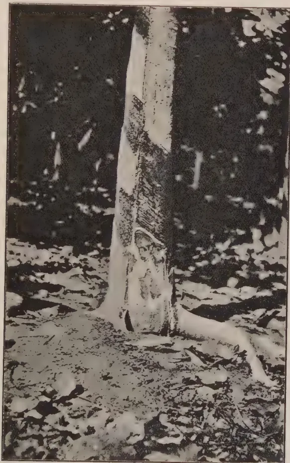
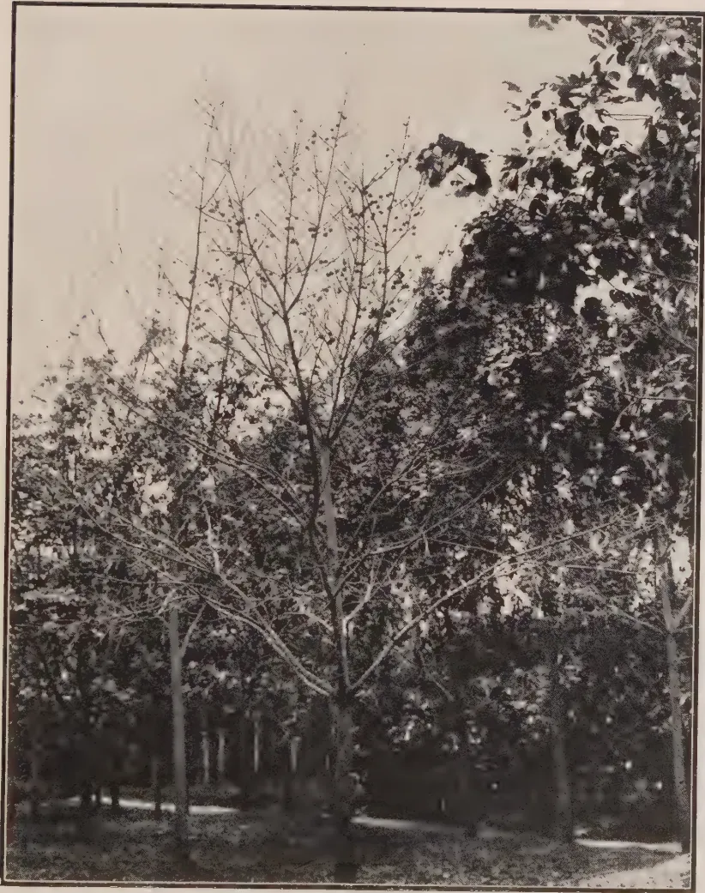

THE  
**TROPICAL AGRICULTURIST:**  
JOURNAL OF THE  
**CEYLON AGRICULTURAL SOCIETY.**

---

---

VOL. XLVIII.

COLOMBO, FEBRUARY, 1917.

**No. 2.**

---

---

**THE RUBBER INDUSTRY—NEED FOR  
ORGANIZED RESEARCH.**

---

In the last number of the TROPICAL AGRICULTURIST the necessity for a forward progressive policy for the agricultural industries in Ceylon was outlined. It is now proposed to allude to some of the necessities of the rubber industry in a general way and to refer readers to the extracts from the Rubber section of the TIMES IMPERIAL AND FOREIGN TRADE SUPPLEMENT for December last which are reproduced in our present number. At the present time, it is estimated that 90 per cent. of plantation rubber is produced within the British Empire and it is clearly indicated that the various problems in regard to cultivation, methods of tapping, preparation and vulcanization should be dealt with by scientific workers within the Empire.

Much useful work has already been done by the Agricultural Departments in the Federated Malay States and in Ceylon in planting, tapping and manurial experiments. Much remains to be done.

The diseases and pests to which rubber plants are prone have been investigated. The Federated Malay States have adopted in recent years a system of inspection by scientific officers in order to keep in close touch with the spread of these diseases and pests. Other estates have their own scientific officers dealing with

1------------------------------------------------

74[FEBRUARY, 1917]

diseases, and Visiting Agents in Ceylon have always paid close attention to this question. There can, however, be little doubt that plant sanitation requires greater organization, and provision is required for a number of trained investigators who will visit estates at periodic intervals and advise upon the all-important matter of treatment of diseases.

Recent investigations in the Federated Malay States and Ceylon in the physiology of the rubber tree, the chemical and physical properties of its latex, and at various centres upon the rate of cure after coagulation, and the relationship between different methods of preparation and time of vulcanization have yielded valuable results. They have clearly indicated that research by trained plant physiologists and by technical chemists is not only desirable but necessary for the benefit of the industry. The threshold has not yet been passed and the problems that need solution are many and varied.

It is improbable that these problems can be satisfactorily solved unless there is a general organization of research. There must be complete co-operation between the workers in the tropics and those in Europe, and there must be co-operation between the workers in the different centres. Frequent interchange of views should be encouraged and if possible arrangements should be made for workers in one centre to meet those of others in general conference at regular intervals.

The Government Agricultural Departments cannot deal with all the problems that arise. The Rubber Growers' Association has already provided for valuable research work, and the results obtained in such a short space of time are significant.

When the present war terminates and more research officers become available, complete co-operation between State-aided and private researches for the rubber industry would appear to be desirable. Definite lines of work, designed to solve outstanding problems, should be adopted and technical research in rubber within the Empire placed upon a sound footing.

A definite effort should now be made to outline a plan for co-operative research, so that organized research schemes may be put in hand immediately the war terminates.

2------------------------------------------------

FEBRUARY, 1917.]75

# RUBBER.

## SOME PRESENT NEEDS.

### RESEARCH IN THE TROPICS.

WYNDHAM R. DUNSTAN, C.M.G., LL.D., F.R.S.

In growing rubber trees in plantations problems arise as to the precise conditions most favourable to the life of the tree, to its growth, and to the maximum production of rubber. Closely connected with these problems are those of the effects of climate, soil, and manuring, and also of disease and insect attack and their remedies.

Equally important are the questions which arise as to the most effective times and methods of tapping the trees for latex, and there are others connected with the composition and coagulation of the latex and the best methods of preparing the raw rubber.

It is clear that most of these are questions which can only be investigated in the tropics. Much has been done in recent years to deal with these important matters, and it is right that full acknowledgment should be made of the valuable work which has been carried on in the tropics by and under the auspices of the superintendents and managers of estates in making exact observations and trials, in addition to the systematic investigations for which the Government Agricultural Departments have been responsible, and to the work conducted on a co-operative basis by the various planting companies represented in the Rubber Growers' Association.

The rubber planter as a rule has realized the precise importance of exact observation and experiment in the planting industry, and, in fact, he has recognized that he must be an accurate observer and investigator himself. A large amount of valuable research has been done and is now in progress, and what is chiefly needed at the present time is co-ordination of results and more co-operation.

The allegation that Para rubber obtained from trees in plantations was inferior to rubber obtained from forest trees led a few years ago to the recognition of the importance of discussion and co-operation between the rubber-grower in the tropics and the manufacturer at home, so that the former may produce the substance that the latter requires. With this end in view a committee was formed at the Imperial Institute composed of representatives of the planting industry and of manufacturers in order to select the subjects of more immediate concern to the rubber industry as a whole which need elucidation by research. A plan of operations on these lines was drawn up necessitating experimental work in this country in connection with the raw rubber and its industrial employment. Arrangements were made for the work required in the tropics to be conducted in Ceylon, with the assistance of the Government Agricultural Department and some of the leading planting companies, and a joint committee was formed in Ceylon to be in communication with the committee in London. An extension of the Rubber Research Laboratory at the Imperial Institute provided for the

3------------------------------------------------

76[FEBRUARY, 1917]

special work required to be done in this country in co-operation with the manufacturers, who also place their own laboratories and technical staff at the disposal of the committee. This scheme of work conducted by competent investigators on both sides has now been in full operation for over two years, and has been productive of results of importance both to the producer and the manufacturer, who have acted together on the committee both in formulating the plan of work and in selecting subjects for investigation, as well as in discussing the results obtained in relation to production and usage. The committee decided that whilst there should be the freest interchange of facts and opinions among those concerned, it was expedient to publish proposals for the modification of existing procedure in the production of rubber on estates until these had been thoroughly confirmed and substantiated by manufacturing tests.

The committees have now arrived at a number of important conclusions as a result of the researches conducted in Ceylon and at home, and these will shortly be published for general information.

#### CO-OPERATION IN RESEARCH.

There can no longer be any doubt that plantation rubber, properly prepared, will equal, if not excel, for the purposes of manufacture the rubber obtained from the forest trees of Brazil. There are, however, still a number of questions relating to the preparation of rubber in the tropics which require investigation in order to establish for general adoption a thoroughly satisfactory method of preparing rubber in the form best adapted for manufacturing use. In the course of the work which has been already done on this subject it is clear that research is also needed on the manufacturing side, in order to elucidate and improve methods which are at present largely empirical, and some of this investigation is being conducted by the principal rubber manufacturing companies in their own laboratories.

In order that effective progress may be made in research in connection with the rubber industry, the different spheres in which systematic research is required should be clearly recognized and provided for. There are matters requiring elucidation which are of immediate importance, both in production and in manufacture, and there are other and more fundamental questions in each of the two divisions which are the proper subjects of scientific research, and will take years of strictly scientific investigation to unravel. Research on the principal and urgent problems which now confront the rubber industry is best arranged and conducted by agreement and co-operation between those who are qualified to know what is required to be done and those who are qualified to do it. A modest beginning has been made on these lines at the Imperial Institute, through the committees to which I have referred, on which producers, manufacturers, and investigators are working together to solve certain selected problems which they agree it is of first importance to the industry should be attacked without delay, and to which they also agree the work should, to begin with, be limited. Work on these lines now needs extension.

#### PROBLEMS FOR THE UNIVERSITIES.

There is, however, room for other work of a more general character, especially on the chemistry of the rubber molecule. Research of this general nature is as a rule best carried on in the research laboratories of universities

4------------------------------------------------

FEBRUARY, 1917.]77

and colleges, since it belongs in the first instance to the advancement of a particular science or sciences. From such discoveries the industrialist may ultimately greatly benefit.

There are some who hold the view that the whole of the research of both descriptions I have referred to, sometimes roughly classed as "practical" and "theoretical," required for the rubber producing and manufacturing industries should be centralized in one scheme and conducted at one institution. Any such scheme is in my view entirely impracticable and undesirable. The subject is too large and complicated in its various aspects to be dealt with in this way. There is room for research in the tropics and in all countries of the tropics, and there is room for work at home and in many places and directions at home. What is really important is that there should be a clear understanding and co-operation as to the problems to be solved and a partition of the work in different places according to its requirements.—Extract from an article to THE TIMES TRADE SUPPLEMENT, Dec. 1916.

## SCIENTIFIC ASSISTANCE.

PROFESSOR J. BRETLAND FARMER, F.R.S.

The history of the great plantation industries in the tropics emphasizes in a most striking way the value of co-operation between science and practice. Agriculture at home has suffered from individualism and an attitude of aloofness towards the theory which ought to lie consciously behind intelligent practice, and in this respect it still compares unfavourably with much of tropical agriculture. The reason is not, perhaps, very far to seek. A considerable measure of success generally accrues from the cultivation of suitable soil, and farming has made considerable progress on purely empirical lines, aided by the accumulated experience of many generations. But the old order is changing. Intensive cultivation, while it has greatly increased the yield, is attended by many additional risks from disease and other disturbing natural agencies, as well as from economic and social conditions that affect distribution and prices.

### RISKS OF TROPICAL AGRICULTURE.

In tropical agriculture the risks are still greater, especially where, as in rubber estates, considerable areas are planted up with a single species, intended to occupy the same land for many years. Although the profits may be large, so long as the demand continues to exceed the supply, they are entirely dependent on the health and productivity of the plantations.

The special dangers incident to any agricultural industry which, like that of rubber, is carried on under almost perpetually moist tropical surroundings demand the intelligent attention of those who are responsible for the success of these vast undertakings, in which very large amounts of capital are invested. All the conditions that tend to encourage the development and spread of epidemic disease are present to an extent of which those whose experience is limited to crops grown in the temperate climates can form but the smallest conception. The fate that overtook coffee planting, and subsequently, on a smaller scale, the cinchona enterprise in Ceylon affords an illustration that should never be forgotten.

5------------------------------------------------

78[FEBRUARY, 1917.

With the rapid growth of our knowledge of the essential conditions of plant sanitation and plant physiology, a *débâcle* such as that which befell the coffee industry some 40 years ago ought now to be impossible. But the natural conditions for mischief are always present, and unless the earliest symptoms of evil are continually watched for, and their causes traced by men specially qualified by scientific aptitude and training for the task, it can only be a question of time for disaster to recur.

#### GOVERNMENT AND PRIVATE ACTION.

Much has already been accomplished through the agricultural and similar institutes set up under the *ægis* of the Government of India and the Colonial Office, while the invaluable services repeatedly rendered by the authorities at Kew are widely and deservedly recognized. But the Government and official aid is not enough. The industries must also continue to help themselves. Fortunately, the rubber cultivation is largely in the hands of men who are fully alive to the needs of the situation.

#### NEED OF CONSTANT PRECAUTION.

There are no grounds, however, for alarm for the future of the plantations, so far as can be at present foreseen, provided that organized precautions continue to be taken and vigilance is maintained. On the other hand, it is as certain as anything can be that any general slackening in the utilization of the kind of help that only men trained in modern botany and chemistry are in a position to give will be to court financial loss on a very large scale. Errors of judgment are apt to be severely dealt with in the court of Nature, who is an implacable, but not an unjust, judge. It is for these reasons that it seems but common prudence to maintain on the plantations scientific officers whose business it is to study the trees and their surroundings on the spot, as well as, and in addition to, a staff of experts in the more centralized agricultural institutes.

But whilst the plant pathologist and physiologist, together with the entomologist, are able to render yeoman service in checking the onset of pests and in unravelling the conditions that increase or diminish predisposition to disease, there are other directions in which the plantation industries can, with much profit to themselves, have recourse to scientific assistance and research. For example, the extraction of the caoutchouc itself and its preparation in respect of quantity and quality still hold much that is debatable . . . . .

#### PROBLEM OF RUBBER PRODUCTION.

There is, however, a big fundamental problem which lies at the root of the whole matter of rubber production. As yet it remains practically untouched, although its successful solution would assuredly enlarge our control over the factors (still for the most part unknown) which make for quantity and quality of yield. We do not know how or why the plant produces the rubber at all. In other words, we are ignorant of the chemical and physiological processes which are involved in the stages that intervene between the utilization by the plant of its carbohydrate and other food substances and the ultimate formation of the commercially valuable caoutchouc in the latex. We do not even know what the significance of the occurrence of the latex in the plant's own economy really is, whether it may be connected with special respiratory activities, or whether its formation is associated with still more hidden processes of the vital chemistry of the living organism. . . . .

6------------------------------------------------

FEBRUARY, 1917.]79

### VALUE OF BIOLOGICAL STUDIES.

The great branches of tropical agriculture, with their diverse objects and interests, naturally tend to specialize and to segregate from each other. But the larger classes of problems touched on above—disease, increasing yield, and generally of gaining control of the plant's machinery—must ever remain common to them all. Now it is just in the same group of problems that the biological sciences are also peculiarly interested, and it is already clear that the planter has much to gain from a co-operation with scientific research. The co-operation is bound to become more valuable as time goes on and progress is made, but it is worth while to inquire whether the best use is now being made of the resources which actually exist, or whether by better organization scientific assistance could be made to yield better results.

We find a somewhat considerable body of workers dealing with pathological and other problems of economic importance to the tropical industries, but these different groups, or even individuals, are at present comparatively isolated from each other, even though they may be working at identical problems.

### GROUPING OF SCIENTIFIC ADVISERS.

There are, broadly speaking, three classes of scientific officers; first, those in the Departments or Institutes of Agriculture maintained more or less definitely by the respective Governments; secondly, officers engaged by various planters' associations and similar bodies; and lastly, individual scientific advisers employed on single estates or perhaps on a small group of plantations which share the services of such an officer in common.

Bulletins are of course published by the various Government institutes and by some of the larger associations. They are available for circulation and are often of great value. But some more complete organization for the dissemination of the results of new investigations in such a progressing economic science like plant pathology is badly wanted. A central institute in London, similar perhaps in general character to the Imperial Bureau of Entomology, which was established a few years ago under the auspices of the Colonial Office, might help to serve the purpose so far as plant pathology—the chief desideratum at the present time—is concerned.

### MORE CO-OPERATION NEEDED.

But the fact is that the old barriers between theory and practice are everywhere breaking down—much to the advantage of practice. The ablest of the planters are already keenly alive to the use of a close co-operation of science and practice, and any centralized organization, such as that just hinted at, would certainly do much to cement the union unless it woefully missed its opportunities. The great scientific professions of engineering, mining, metallurgy, etc., have achieved great things by means of their powerful institutes. Is it too much to expect that an institute, or a number of more or less closely federated institutes, of biological industries, representing and including the more progressive branches, would also do the like for tropical agriculture? Something of the kind already exists, though on a relatively small scale, in bodies like the Rubber Growers' Association. But it is evident that the more influential and comprehensive the federation, the larger would be its power and the more it would become a force to be reckoned with in pushing forward the interests represented—interests which, in their larger aspects at least, are identical with those of the Empire itself.—Extract of an article to THE TIMES TRADE SUPPLEMENT, Dec. 1916.

7------------------------------------------------

80FEBRUARY, 1917.

## EXPERIMENTAL CULTIVATION.

SAMUEL RIDEAL, D.Sc., F.I.C.

MR. WRIGHT, in his book on the *Hevea brasiliensis*, has given us an admirable history of rubber plantations, which shows clearly that nearly all the effort of the last 30 years has been one of trial and selection of native and wild rubbers in different climates and soil, rather than any attempt at botanical experimental cultivation for producing new varieties, with increased yield of latex or greater resisting power to infectious disease.

Nothing comparable to the Canadian improvement in wheats, or the phenomenal development in the cultivation of the sugar beet on the Continent, has at present been achieved in the case of cultivated rubber. The transplantation and cultivation of the cinchona in relation to the yield of quinine shows the possibilities in this direction.

Now that the seeds derived from Malay which have sprung from the parent stock in Ceylon have developed offspring in practically all known likely rubber-producing areas in the tropical world, the time is ripe for a careful study of the conditions which will contribute to economic yields.

### SOURCE OF POSSIBLE IMPROVEMENTS.

For improving the yield, and at the same time ensuring a robust and long-lived tree, the necessity for trials over a long period from selected seeds is essential, and the development of accurate knowledge must be slower than in the case of annuals.

Our present supremacy in this plantation industry must not be allowed to decay through any neglect of scientific studies in this direction. It must not, however, be forgotten that whilst our British plantations may be maintained in the way indicated, the problem is not only one of industrial botany, but depends on the suitability of the product for the markets of the world, and here we depart from a consideration of improvement in the botanical cultivation of the plant to the chemical and physical properties of the latex and the methods adopted for its coagulation and ultimate vulcanization by the consumer at home.

### PROPERTIES OF THE LATEX.

To correlate these several factors is no easy task, and the Rubber Growers' Association and the laboratories here and in the East have long investigations in front of them, for which the present grants are totally inadequate. It is doubtful if the planter, relying on the information to be obtained from botanical experimental cultivation, will succeed in improving his position, unless the subsequent fate of his product is known. There is at the present time considerable lack of knowledge as to the causes of the variability of plantation Para rubber with different technical mixings, so that until we know what are the conditions of growth which cause the latex to have a different rate of cure when coagulated further progress must be slow.

8------------------------------------------------

FEBRUARY, 1917.]81

At Kuala Lumpur the Department of Agriculture of the Federated Malay States has done good work in this direction during the last few years, and evidence is being collected which goes to show that the latex contains, in addition to the rubber, proteid substances which modify the rate of cure, and that these substances are not precipitated by ordinary coagulation.

To obtain uniformity in first latex rubbers the nature of this proteid, its amount, and, in fact, all the conditions of its plant formation in relation to the latex production, must be ascertained before further progress in standardization can be effected.

#### INFLUENCE OF SMOKE AND CURE.

Buyers know that an over-smoked rubber has lost much of its value, and planters on the estate seldom now err in that direction; but besides over-smoking, over-washing and over-machining and the excessive use of sulphite and preservatives contribute to the destruction or prevent the formation of the catalytic proteids which seem so essential for rubber to behave well on vulcanization.

The broker's opinion on quality based on colour and appearance is of little guide to the buyer, and the planter is usually ignorant of how his crop has satisfied the consumer.

I am not one of those who believe that this study can be accomplished only by British enterprise in the future, and it would be unfair not to acknowledge the work which has been done by other countries in this direction.

As a matter of fact, the Kuala-Lumpur Agricultural Station is not alone in doing this work, as there is useful experimental work being done in the East and at Delft, Holland, under the Dutch Government.

There does seem a need, however, for comparison of the work and correlation of the results obtained at the different centres of investigation, and although the Malay and Dutch work is associated, the Ceylon research and that which is going on in Africa, most especially at Aburi, have little bearing on the major questions now under consideration.

It is only quite recently that WHITBY has again made a comparison of the Brazilian and plantation methods of preparing Para Rubber, and from the results of his investigations it seems clear that the Brazilian method of preparing rubber by smoke coagulation is not superior to the plantation method of preparing it as smoked sheet.

He also shows that the latex from young trees is not inferior to that from old trees; in fact, the rubber prepared from the latex of young trees proved superior to that from the latex of old trees, both when prepared as smoked sheet and when prepared by smoke coagulation in the Brazilian fashion.—Extract from an article on "EXPERIMENTAL CULTIVATION" in THE TIMES TRADE SUPPLEMENT, December 1916.

9------------------------------------------------

82[FEBRUARY, 1917.

## DISEASES OF *HEVEA BRASILIENSIS*.

**G. BRYCE, B.Sc.,** *Asst. Botanist and Mycologist, Ceylon.*

In the present BULLETIN the principal facts of the diseases of *Hevea* have been arranged in a form suitable for ready reference by planters. It is hoped that the short descriptions given will facilitate the recognition of the various fungi parasitic on *Hevea*. The measures to be adopted in the eradication or prevention of a disease depend upon its mode of occurrence. With a view to reducing opportunities for attack, greater care should be taken to avoid practices which provide suitable conditions for the development of disease. The following is a list of the principal diseases:—

*Fomes lignosus* (= *Fomes semitostus*).

Hymenochæte noxia, or brown root disease.

*Ustilina zonata*.

*Poria hypobrunnea*.

*Corticium salmonicolor*, or pink disease.

*Botryodiplodia theobromæ*, or dieback and diplodia disease.

Phytophthora diseases:—

Stem canker.

Abnormal leaf fall.

Fruit disease.

Bark rot of the tapping surface.

### FOMES LIGNOSUS (= FOMES SEMITOSTUS).

*Identification.*—Early stages show the root covered with white mycelium forming white or yellowish strands. The fructification appears first as a small orange-yellow cushion, and then develops into a bracket-shaped plate attached to the tree along its hinder margin. It can be identified by its colours but only fresh specimens should be examined, as the colours change on drying. Upper surface rich red-brown; margin bright yellow; under surface studded with minute holes and bright orange. On drying, or when old, the upper surface becomes pale yellow-brown with concentric darker lines; the lower surface becomes red-brown, i.e., the upper surface bleaches, the lower surface darkens. On breaking in two, the fracture shows an upper layer white and fibrous, and lower or pore layer red-brown. This last point in most cases serves to distinguish *Fomes* from a common harmless fungus (*Polyporus zonalis*), which resembles it in the colour of the upper surface, but has usually a white or pallid fracture.

*Occurrence.*—In clearings the fungus starts on old jungle stumps, especially old jak or *Ficus* stumps, to which its spores are carried by the wind and there germinate and grow, finally penetrating the wood of the stump in all directions. The fungus may start similarly on *Hevea* stumps left exposed above ground after thinning. Where tea is allowed to die out under *Hevea*, the fungus, once it gains entrance, spreads rapidly along the dead or dying tea roots. *Fomes* either originates on the tea stumps or utilizes them as a means of passage from one *Hevea* to the next. *Fomes* can spread from diseased roots to healthy roots where these are in contact, and can also spread independently of roots by sending out strands which penetrate the soil in all directions in search of food. The fructification forms on the tree some months after it has died, appearing at the base near the soil level: it also develops along the whole length of fallen trees killed by *Fomes*.

10------------------------------------------------

FEBRUARY, 1917.]83

*Treatment.*—Dead trees must be removed as completely as possible and burnt. Where dead trees occur in patches round a jungle stump, the latter also must be dug out and burnt. Main roots and laterals of Hevea and jungle stumps must be followed up and removed.

The apparently healthy trees round the affected area should be examined by laying bare their tap roots, as it is quite possible that fungus threads may have already reached them; if their tap roots are decayed, the trees must be removed, but if only one of the lateral roots is attacked, it should be cut off and the cut tarred. When the extent of the patch is determined, a trench 2 feet deep must be dug round it. The ground enclosed by the trench must be dug over to a depth of 2 feet and all dead wood removed. A liberal dressing of quicklime should be forked in. The patch and the trench should be kept clear of weeds.

### BROWN ROOT DISEASE (HYMENOCHÆTE NOXIA).

*Identification.*—The roots, especially the tap root, are encrusted by a mass of sand, earth, and small stones and this may extend up the stem above ground level for several inches. This mass is cemented to the root by the mycelium of the fungus, which consists of tawny brown threads collected here and there into small brown patches.

In the early stages the predominating colour is brown, but as it grows older the fungus forms a black, continuous covering over the brown masses of hyphæ, and the diseased root then appears chiefly black. In all stages, however, the encrusting mass of stones and earth, intermingled with brown threads, serves to distinguish it.

*Occurrence.*—This fungus attacks rubber, tea, cacao, dadap, and many other plants. It spreads from diseased to healthy roots where these are in contact, but this is a very slow process. It does not send out independent strands into the soil. It is the only root disease of cacao known in Ceylon, and develops freely whenever cacao is cut down. It is thus specially to be feared where cacao has been cut out of mixed Hevea and cacao.

*Treatment.*—Dead trees should be removed with as much of the roots as possible and burnt. Neighbouring cacao stumps should be dug up. As a rule, the whole of the fungus is removed with the dead tree. Consequently it is rarely found that a neighbouring tree dies after the first dead tree has been got rid of. It is advisable, however, to dig over the affected spot and fork in quicklime. It should be possible to re-plant in the same spot in a very short time.

### USTULINA ZONATA.

*Identification.*—This fungus is the cause of the commonest tea root disease in Ceylon. The fungus at first forms a white, soft plate, which lies flat on the stem. This plate soon turns greenish, then becomes purple gray and hard and crusty, finally becoming black. Its brittle crusty texture is a good distinguishing character. It sometimes shows slight concentric undulations.

*Occurrence.*—This fungus attacks Casuarina, pumelo, *Cassia nodosa*, halmilla, lunumidella, *Derris*, tea, etc. In the case of tea, the fungus generally begins on the stump of a felled *Grevillea*, and spreads along the lateral roots; where these are in contact with tea roots, the fungus enters the tea root. It spreads from abandoned tea to Hevea, and has also been found on cacao stumps and Hevea stumps after thinning out. It attacks Hevea in three ways. It is most serious as a root disease, usually attacking a lateral root, and from

11------------------------------------------------

84[FEBRUARY, 1917.USTULINA ZONATA ON HEVEA.

that spreading to one side of the stem and tap root. Its effects are often local, a decayed area extending up only one side of the stem, but sometimes part of the crown dies as the roots are killed. Another mode of attack is through wounds on the stem where the wood is exposed, such exposure often being due to previous attacks of canker or pink disease. Finally, the fungus may develop from the fork of a tree without any previous wound. In this case the fungus develops down the trunk, and its fructification may cover a foot or more of the trunk.

*Treatment.*—Cut away the parts attacked at the base of the tree and remove the diseased lateral roots. Tar the cut surfaces. The tree may thus be saved. If badly attacked, remove the tree and the roots and burn. To prevent attack through wounds, these should all be tarred. The forks of trees should be cleaned up and tarred.

When a diseased tree has to be removed, the usual procedure should follow, of digging a trench round the spot, throwing the excavated earth

12------------------------------------------------

FEBRUARY, 1917.]85

inside, and forking in quicklime. It is of especial importance to dig out as much of the root system as possible. It should be possible to re-plant after a few months.

#### **PORIA HYPOBRUNNEA.**

*Identification.*—This is a new root disease caused by a new species of *Poria* discovered at Peradeniya about two years ago. The mycelium on the root forms stout red strands. When old, these turn black, and sand and small stones often adhere to the mycelium. The fungus forms bright red patches or sheets in the wood of the root. The fructification forms a flat plate lying on the stem, studded with minute holes, at first white or yellowish, then reddish. The fracture of the fructification shows the upper layer reddish, and the basal layer blackish-brown.

*Occurrence.*—We have no record of this disease in Ceylon, except in the neighbourhood of Peradeniya. There it occurred on a new clearing, and also in two localities on Hevea stumps after thinning. These latter furnish another proved case of a root disease originating on Hevea stumps. It has, however, recently been found on Hevea in Malaya, and so it may be expected to be a fairly widespread fungus. On the Experiment Station at Peradeniya it was spreading evidently from decaying jungle stumps and killing young Hevea and *Tephrosia candida*.

*Treatment.*—Remove jungle stumps and Hevea stumps.

#### **PINK DISEASE (CORTICUM SALMONICOLOR).**

*Identification.*—Generally originates at the fork of the tree, or where several branches arise close together. There is at first a pink incrustation on the bark, which gradually increases, and may ultimately cover the whole circumference of the tree and the bases of adjacent branches for a length of several feet. The pink patch is extremely thin, and in dry weather splits into two lines more or less at right angles to one another. Old specimens become bleached to white.

*Occurrence.*—This fungus attacks Hevea, tea, cinchona, orange, coffee, and is recorded on many other plants in other countries. The disease is conveyed by spores blown by wind; it is most probable that the fungus develops in the jungle on native trees at the beginning of the monsoon, and the spores are then blown into the neighbouring plantations. The spores are not produced on old patches of the fungus during dry weather.

*Treatment.*—In many cases it will be possible to eradicate the disease by cutting away the diseased tissue, if it is discovered before the fungus has grown completely round the tree. If, however, the injury is extensive, the diseased stem must be cut off below the diseased area. All diseased material should be removed and burnt, and the wounds caused by excision or pruning should be tarred.

13------------------------------------------------

86[FEBRUARY, 1917.

### DIPLODIA DISEASE AND DIEBACK (BOTRYODIPLODIA THEOBROMÆ).

*Identification.*—This fungus causes two types of diseases in Hevea. In the "dieback" originally described, it attacks the leading shoot and travels down the tree, killing the branches successively as it reaches their junction with the main stem.

In the second form, one side of the tree goes dry, i.e., it does not yield any latex. The cortex is usually discoloured brownish internally, or in some cases the discolouration is found only along the cambium layer. When the fructifications ripen, they extrude black spores, which cover the diseased parts with a sooty powder. The roots of the tree are usually healthy.

*Occurrence.*—This fungus grows saprophytically on any dead Hevea or cacao material, e.g., dead pods, stems, etc., and on many other plants. It can attack Albizzia and dadaps through wounds. Tissues which have been killed by other fungi, e.g., cankered bark, diseased pods, are subsequently attacked by *Botryodiplodia*. In "dieback" the fungus gains an entrance after the leader has been killed by other fungi. In the other form of the disease, it enters usually through the stub of a dead branch. Where Hevea logs are left lying about after thinning, the fungus develops on them and produces millions of spores, chiefly in the cortex of the log.

*Treatment.*—Trees attacked by dieback usually occur in groups; some may generally be saved by pruning off the diseased parts. The pruning cut should be sloped and well tarred. In the second form of the disease badly affected trees should be cut down and burnt, but if only a narrow strip on one side of the tree is diseased, the affected cortex may be cut out and the wound tarred. To prevent attacks, dead branches should be pruned off, and all pruning cuts tarred.

After thinning, the fallen logs should have their bark removed and burnt. The logs should be removed as soon as possible.

### PHYTOPHTHORA DISEASES.

The fungus *Phytophthora faberi* causes four well-known diseases of Hevea, viz., stem canker, bark rot of the tapping surface, abnormal leaf fall, and pod disease.

#### STEM CANKER.

*Identification.*—The bark exudes a reddish or purplish liquid. Healthy Hevea cortex is white, yellowish, or clear red or mottled red and white; when the outer layer of brown bark is scraped off a green layer is found. In cankered bark this green layer is black, and the cortex if recently diseased

14------------------------------------------------

FEBRUARY, 1917.]87

is sodden grayish with a well-defined black border to the diseased patch ; but in later stages it is dirty red or claret coloured with a well-defined black border. No latex exudes when cankered bark is cut. The outer layers of bark may be diseased and the inner layers healthy, in which case the latex would exude.

A black and white photograph of a tree trunk, likely a cacao tree, showing a large, irregular, light-colored patch of bark. This patch, identified as Hevea Canker, is surrounded by darker, healthy bark. The tree is situated in a forest setting with fallen leaves on the ground. The photograph is framed by a thin black border.

HEVEA CANKER.

*Occurrence.*—This fungus causes cacao canker and cacao pod disease. It is disseminated in wet weather by special spores which are blown about by the wind, but require water in which to germinate. Wet stems provide sufficient water for germination. After germination the mycelium penetrates the cortex and destroys it from without inwards. This form of attack is found on the bark, on the tapping cut, and occasionally at the collar of the tree. The fungus mycelium can lie dormant in diseased tissues.

*Treatment.*—The diseased and discoloured area should be cut out or shaved off. It is not necessary to cut out more than the discoloured area, because the fungus threads have not advanced beyond it. All tissue excised must be removed and burnt. If the attack is detected at an early stage, it is often possible to entirely shave away the diseased tissue before it has

15------------------------------------------------

88

[FEBRUARY, 1917.

reached the cambium, in which case there is no necessity to cut away the bark right into the cambium. The advantages of prompt detection are thus obvious. Treatment of the shaved surface with 20 per cent. Carbolineum or Brunolinum\* is beneficial. If the wounds caused by excision of cankered bark are small, they may be left alone after treatment with Carbolineum. If the wounds are large, the exposed wood should be tarred. The essential point is so to protect exposed wood that boring insects may not enter.

ABNORMAL LEAF FALL.

*Identification.*—The leaf stalks of fallen leaves have a dark brown ring about 1 inch long consisting of diseased tissue; from this ring one or two drops of latex may ooze, and these may remain white or turn black. The green twigs bearing diseased leaves may be killed back by the spread of the fungus into them. Again, green twigs may be attacked and drop their leaves, which are in this case apparently healthy, showing no marks of fungus attack.

*Occurrence.*—This form of attack of *Phytophthora faberi* causes leaf fall during wet weather from July to September. The fungus spreads from the previously diseased pods to the leaf stalks. Its attack on the leaf stalk may be confined to a very small area, but its presence appears to be sufficient to cause the formation of the absciss layer in the leaf stalk, and thus the fall of the leaf is brought about. The formation of this absciss layer is a normal feature of the leaf of the ordinary wintering of Hevea.

*Treatment.*—The usual treatment for such a disease would be spraying with Bordeaux mixture, and it is desirable that power sprayers should be given exhaustive trial on rubber estates. Preventive treatment should be adopted. Dead and fallen leaves and pods should be swept up and burnt. Canker in its other forms should be vigorously combated. Dead twigs and branches should be pruned off and burnt.

POD DISEASE.

*Identification.*—The pods do not ripen and burst, but turn black and sodden, and remain hanging on the tree many weeks after the seed should have been shed.

*Occurrence.*—This type of canker attack develops in wet weather. It is worst in exceptionally wet seasons, and disappears when the rains cease. The fungus may grow through the fruit stalk into the green branch and kill that for some distance, but it has not been found to proceed further.

*Treatment.*—Diseased pods should be collected and burnt. As far as possible trees should be stripped of diseased pods. All diseased material should be burnt. Dead fruit stalks and twigs should be pruned off and burnt.

BARK ROT.

*Identification.*—Black vertical lines appear first on the newly tapped bark and then spread up into the renewing bark and down into the untapped bark. Later these lines of dead tissue expand into areas of dead bark. These black vertical lines appear in the wood often to a depth of a half inch from the surface.

<table border="0">
<tr>
<td>*Brunolinum</td>
<td>...</td>
<td>...</td>
<td>...</td>
<td>1 gallon</td>
</tr>
<tr>
<td>Water</td>
<td>...</td>
<td>...</td>
<td>...</td>
<td>4 gallons</td>
</tr>
<tr>
<td>Soft soap</td>
<td>...</td>
<td>...</td>
<td>...</td>
<td>1 lb.</td>
</tr>
</table>

Thoroughly mix to form emulsion. Distribute to coolies in bottles, so that it can be frequently shaken in the field.

16------------------------------------------------

A black and white photograph of a Hevea tree, likely a rubber tree, showing signs of pod disease. The tree is the central focus, with its branches reaching upwards. Numerous small, dark, round objects, which are the diseased pods, are visible hanging from the branches. The background shows other trees and a clear sky. The ground is covered with fallen leaves and debris.

POD DISEASE OF HEVEA.

17------------------------------------------------

This image is a scan of a blank page. The paper has a light beige or cream-colored tint. There are a few very small, dark specks scattered across the surface, which appear to be scanning artifacts or dust particles. No text, lines, or other markings are present on the page.

18------------------------------------------------

FEBRUARY, 1917.]89

*Occurrence.*—Bark rot is at its worst in exceptionally wet weather, especially in the months from September to December.

*Treatment.*—Painting the tapped surface with 20 per cent. Carbolineum or 20 per cent. Brunolinum should be adopted both as a curative and preventive measure. Where the black streaks expand into areas and large patches of bark are affected, it is advisable to rest the tree. When bark rot is rife, it is unwise to open a new cut. The dead areas should be scraped free of dead bark and tarred. Great care should be taken not to render the surface of the wood splintery, as this condition retards the healing over.

#### GENERAL SANITATION FOR RUBBER DISEASES.

All jungle stumps should be extracted. Some estates have not yet got rid of the *Fomes* which began on their jungle stumps in 1906. A new danger is now present, viz., the Hevea stumps left after thinning out. These serve as centres of origin for *Fomes semitosus*, *Ustulina zonata*, and *Poria hypobrunnea*. When Hevea is felled, the roots must be extracted. Brown root disease can spread from ringed Grevillea and cacao stumps to Hevea, and it is very probable that this disease will be found to originate on Hevea stumps.

Another danger arises from abandoned tea under rubber. This was found some years ago to serve as a source of *Ustulina*, which spread from the tea to the rubber. It is now giving serious trouble on some estates in connection with *Fomes*. The tea should therefore be uprooted.

All diseased material, dead fruits, branches, etc., should be systematically removed from the trees and burnt. Dead branches should be pruned off and the cut tarred. No dead wood should be allowed to lie about the estate. After thinning the logs should be removed as rapidly as possible.

Stem disease should be vigorously and unremittingly treated.

Root diseases should be taken in hand at once, and a serious attempt made to stamp out any at its first appearance.—DEPARTMENT OF AGRICULTURE, Ceylon, Bulletin No. 29, November, 1916.

## ASSOCIATED ACTION OF PLANTERS.

#### SIR E. ROSLING.

In 1908 the Rubber Growers' Association was formed in London, its object being the care of all rubber plantation interests wherever situated, and under its auspices in 1910, a research committee was started with a resident chemist in Ceylon; later a mycologist was added to the staff. In the previous year an arrangement had been arrived at between certain estates and the Imperial Institute also to undertake research work, and later this developed into a joint organization of the Imperial Institute, the Ceylon Government Agricultural Department, and sundry private interests. A large amount of useful work in the same direction has also been carried out in the Federated Malay States and Singapore by the Rubber Growers' Association and the Government Agricultural Department.

Much work has been done, but there remains much to do. There are still problems connected with the preparation of rubber to be solved, and questions dealing with the formation of the latex, together with the part it plays in the economy of the tree, have as yet received comparatively little attention.—Extract from an article to THE TIMES TRADE SUPPLEMENT, Dec., 1916.

19------------------------------------------------

90[FEBRUARY, 1917.

## THE WORLD'S REQUIREMENTS.

The United States of America consume annually more than half the world's total rubber production, and their consumption has steadily increased since 1908, when the motor industry began to "boom." In 1913 they retained 48,000 tons, in 1914, 61,250 tons; in 1915, 96,792 tons, and during the first six months of this year 66,397 tons, which is 20,783 tons more than for the same period of 1915. From the commencement of the war up to the present time the United States of America have taken practically the whole of the world's increased production.

It must not, however, be assumed that this enormous growth in consumption is due mainly to war orders from Europe; as a matter of fact, it has been mostly for their home use. Although the total exports of rubber manufactures of all kinds from the United States have trebled since August, 1914, actually less than one-fifth of the additional quantity of raw rubber retained by them during this period has been utilized in executing orders received from the Allies. The extra quantity of rubber which has been used by the Allies for war purposes has been approximately equivalent to the amount which has been withheld from Germany and Austria by the blockade.

When the stoppage of war orders occurs the increased supply of rubber then available will doubtless be absorbed by trade and private consumption, the manufacturing for which has been considerably curtailed in European countries during the war; particularly as the enormous consumption by the United States has been, and is, mostly for their own domestic uses.

It is impossible to state definitely what the requirements of German and Austrian rubber manufacturers will be after the conclusion of the war. That raw rubber will be in unusual demand is inevitable, also the longer the war lasts the greater that demand is likely to be. At a recent meeting of rubber manufacturers in Germany one item on the agenda was "stocks of rubber held on our account abroad." It is only possible by holding stocks abroad for Germany and Austria to meet but a very small amount of their essential after-war requirements. The consumption of rubber by the Central Powers in 1913 was about 16,000 tons, and should there be a shortage, due to the anticipation of their after-war demand, no doubt the price of rubber will be temporarily inflated.—Extract from an article on THE WORLD'S RUBBER POSITION by W. H. RICKINSON to THE TIMES TRADE SUPPLEMENT, Dec., 1916.

## RUBBER A BRITISH PRODUCT.

The important fact for us is that this new and most valuable industry—the cultivation of plantation rubber—was created by British foresight and energy, was developed by British capital, and will remain in British hands.—Extract from an article on RUBBER AND WAR by SIR FRANK SWETTENHAM, K.C.M.G., to THE TIMES' TRADE SUPPLEMENT, Dec., 1916.

20------------------------------------------------

FEBRUARY, 1917.]91

## THE COAGULATION OF LATEX IN THE PRESENCE OF SUGARS.

B. J. EATON.

In continuation of the work carried out by GRANTHAM and the writer on the natural coagulation of Hevea latex in the presence of various sugars, which, it will be remembered, was shown to be due to fermentation set up by certain organisms, which gain entrance to the latex from the air during and after collection, the investigation of this problem has been carried to a further stage by DRS. GORTER and SWART of the West Java Rubber Testing Station and the following is an abstract of the results obtained by these workers, published in BULLETIN No. 6.

The writers, after referring to the recent high cost and difficulty in obtaining acetic acid in Java, which has necessitated a more vigorous search during the last year for suitable substitutes for this acid, postulate the three possible methods of coagulation of Hevea or other latex as follows:

1. 1. Coagulation as the result of physical agencies—e.g., smoking evaporation of latex and electrical coagulation.

1. 2. Chemical coagulation by acids, salts, etc.

1. 3. Coagulation by means of micro-organisms or enzymes.

Until quite recently the last-named method remained untried.

WHITBY, Chemist to the Société Financière, was the first to publish any investigations on the natural coagulation of Hevea latex, under different conditions, and attributed the coagulation to the possible presence of a coagulating enzyme. Further investigations by GRANTHAM and the writer showed that the coagulation was almost certainly due to micro-organisms, those which coagulate being favoured by the addition of sugars to the latex.

DRS. GORTER and SWART agree with the conclusions arrived at by us, and state that they have also proved by experiment that if sugar is added, this is converted shortly into lactic acid, a result which was anticipated by us, but not proved.

These workers took two litres of latex to which six grammes of sugar dissolved in 0.5 litre of water was added and allowed the mixture to stand 24 hours, obtaining complete coagulation without any trace of decay. The spongy coagulum was pressed and yielded 650 ccs. of clear serum, which was made alkaline with baryta water, the excess of barium hydroxide being precipitated by passing carbon dioxide through the liquid, and the liquid filtered and evaporated and rendered acid with phosphoric acid and distilled. The distillate required 90 ccs. of N/10 alkali for neutralization corresponding to 0.54 grammes of acetic acid. The non-volatile acids were then removed by repeated shaking with ether, and on distillation a syrupy residue, which subsequently yielded a small quantity of crystalline material, was obtained. The liquid acid separated from the crystals was again dissolved in water and made up to 100 ccs.: 10 ccs. of this solution took 15.3 ccs. of N/10 alkali for neutralization. The total quantity of acid therefore present was 1.38 grammes calculated as lactic acid.

The liquid was shown to contain lactic acid by the yellow colouration with iron chloride and by the formation of zinc lactate, on treating the acid liquid with zinc oxide, filtering and evaporating the solution to separate the crystals of zinc lactate.

21------------------------------------------------

92[FEBRUARY, 1917.

The figures obtained show that more lactic acid than acetic acid is formed during the fermentation, the latter not being more than one quarter of the whole. There is also, as stated above, a small quantity of a crystalline acid obtained, which was purified by solution in hot water, from which it crystallizes on cooling. This acid melted at 183°C. and when mixed with succinic acid, the melting point was not lowered, proving that the crystals consisted of succinic acid. This acid is a bye-product of the alcoholic fermentation which takes place simultaneously in the latex. The alcohol formed from the sugar is, therefore, transformed partly into acetic acid by acetic acid fermentation. The fermentation is, therefore, a complicated one and DRS. GORTER and SWART state that our interests are concerned chiefly with the acids formed, as they attribute the coagulation to the resultant acidity.

The amount of acid formed, depends partly on the amount of sugar present and also on the fact that when a certain proportion of acid is formed, subsequent fermentation of the sugar to acid is prevented, owing to the action of the acid on the acid-forming bacteria. Thus there is a fixed maximum acidity in the latex which cannot be exceeded even with sufficient excess of sugar. If calcium carbonate be added in order to neutralize the acid as formed, fermentation continues unimpeded. This, however, is of no practical importance as the free acid itself is required for coagulation.

The method of neutralization of the acid, however, enables the study of the fermentation to be carried further. The fermentation is said to continue under these conditions even at 45°C. and the lactic acid fermentation becomes even more important, as lactic acid organisms, in contradistinction to other organisms, predominate at this high temperature.

The following experiment was carried out:—To 100 ccs. of serum, prepared as above, 200 ccs. of water, 15 grammes of sugar and 5 grammes of fine calcium carbonate were added and the mixture allowed to stand for five days at 45°C. By this time, the chalk has nearly completely disappeared, which shows that about nine grammes of lactic acid must have been formed.

In the same way, by evaporating the filtered liquor, 12 grammes of crystallized calcium lactate is obtained. The residual liquor distilled with phosphoric acid gave an acid distillate which on evaporating with barium hydrate and removal of excess of barium with carbon dioxide yielded 0.27 grammes of dry barium salt which on exposure to air passed into a crystalline mass increasing 0.019 grammes in weight, corresponding with the absorption of one molecule of water. The quantity found corresponds to 0.120 grammes of acetic acid so that the proportion of acetic to lactic acid is about 1 to 7 or 8.

On treating the calcium lactate with phosphoric acid and shaking with ether, the pure acid was obtained as a syrupy liquid which would not crystallize. On treating with zinc oxide in aqueous solution, the zinc salt was formed, and this was shown to be the inactive lactic acid.

The water of crystallization and the proportion of zinc oxide found by analysis agreed with the composition of zinc lactate containing three molecules of water.

On fermentation at 45°C. in the presence of chalk (calcium carbonate) some alcohol together with traces of acetone and formic acid were found, substances which as a rule are bye-products in lactic acid fermentation.

22------------------------------------------------

FEBRUARY, 1917.]93

In the slow coagulation of latex with acetic acid in minimum quantities, which is becoming more general, lactic acid, according to these workers can also be shown to play an important part in assisting the acetic acid to coagulate the latex.

It was shown that in one litre of latex, to which not more than 0.3 grammes of acetic acid had been added, after standing for 24 hours, 0.80 grammes of lactic acid was produced.

It is concluded that among the organisms which enter the latex after it leaves the tree, given favourable circumstances, the lactic acid fermenting organisms soon predominate, whereas on the surface where air can easily penetrate, putrefactive bacteria are predominant. The lactic acid bacteria produce lactic acid from the sugars present and the putrefactive bacteria produce alkaline substances from the nitrogenous constituents. The lactic acid also helps the lactic acid bacteria to develop at the expense of the other organisms. According to Drs. GORTER and SWART, latex contains about 2.3 grammes of sugar per litre, which is too little to help the lactic acid ferments in competition with other organisms and the addition of sugar provides the shortage essential to enable the lactic acid organisms to produce rapidly sufficient acid to destroy or inhibit the action of the other bacteria. Our own results to the effect that the coagulation is assisted by exclusion of air have been confirmed.

#### ESTATE EXPERIMENTS WITH SUGAR PROCESS.

Our own conclusions that 0.2 per cent. of sugar was the minimum amount for perfect coagulation have been confirmed. Good results were obtained with three grammes per litre of thick latex to which 20 to 25 per cent. of water had been added. Drs. GORTER and SWART for large quantities recommend the following:—

<table>
<tr>
<td>Latex 175 litres</td>
<td>...</td>
<td>...</td>
<td>...</td>
<td>=38.5 gallon</td>
</tr>
<tr>
<td>Water 50 ,,</td>
<td>...</td>
<td>...</td>
<td>...</td>
<td>=11 ,,</td>
</tr>
<tr>
<td>Sugar 400 to 450 grammes</td>
<td>...</td>
<td>...</td>
<td>...</td>
<td>=14—16 ozs.</td>
</tr>
</table>

The sugar is dissolved in the water and added to the latex which is then well stirred. Coagulation should be complete in about 18 hours. With only 300 grammes of sugar for similar quantities of latex, complete coagulation was not obtained. With excess of sugar, as would be expected from the nature of the process, coagulation is not hastened, as it would be by chemical coagulation processes—e.g. coagulation with acetic acid, since the acids produced are formed slowly. The authors also tested the influence of the previous day's serum on the rate of coagulation and acid formation but did not obtain the results they anticipated.

The following is the result of a few experiments:

(1) 1 litre of latex + 200 ccs. of water + 3 grammes of cane sugar. 100 ccs. of the serum from the above contained after 24 hours 42 ccs. of N/10 acid corresponding to 2.3 grammes of acetic acid per litre. Coagulation was perfect in eight hours.

(2) 1 litre of latex (rubber content 33.5 per cent.) + 200 ccs. of serum from Experiment (1) + 3 grammes cane sugar. 100 ccs. of serum after 24 hours corresponds to 3.2 grammes of acetic acid per litre. Coagulation still imperfect after eight hours. Serum milky.

23------------------------------------------------

94[FEBRUARY, 1917.

(3) 1 litre latex (rubber content 33.3 per cent.) + 200 ccs. of serum of Experiment (2) + 3 grammes cane sugar. 100 ccs. of serum correspond after 24 hours to 3.2 grammes of acetic acid per litre. Perfect coagulation in eight hours.

The limit of acidity is, therefore, reached after a single addition of serum, without more rapid coagulation. Similar results were also obtained from a large experiment under otherwise similar conditions, and serum alone was unsatisfactory. The results of the addition of serum in this form are, therefore, not satisfactory.

On estates on which experiments were carried out, the yellow layer of decay was always found in the sugar process, when the coagulation was carried out in open vessels. When serum was added, the decomposition was absent but the surface was grey, violet or reddish, due to oxidation. The disadvantages of the process due to discolouration of the rubber and the fact that only crepe can be prepared by this method are also discussed. It is also pointed out that with sugar at 15fl. per pikul, the cost is half that of acetic acid at fl. 50 per kilogramme. (Experiments carried out in our laboratories at Kuala Lumpur show that the rubber is in every respect equal to acetic acid coagulated samples and has a tendency to vulcanize faster.)

#### ADDITION OF SODIUM BISULPHITE.

With 0.5 grammes of sodium bisulphite per litre of latex and the same proportions of sugar as before, perfect coagulation was obtained, but with double the quantity of bisulphite, the coagulation was incomplete. Coagulation was also obtained with 0.7 grammes of sodium bisulphite per litre, the acid nature of the sodium bisulphite appearing to aid the acid fermentation. On a large scale, results with sodium bisulphite were unsatisfactory.

Experiments carried out by me at Kuala Lumpur show that a crepe of excellent colour can be prepared by coagulation in the presence of sugar in a closed vessel and subsequently soaking the coagulum for 24 hours in a five per cent. solution of sodium bisulphite, as is done in the case of "lump" rubber or cup coagulation. The exclusion of the air in the first instance prevents any preliminary darkening due to oxidation.

#### COAGULATING AGENTS FOR SHEET.

The latter part of the same bulletin by DRS. GORTER and SWART deals with the use of various coagulants for making sheet.

Hydrofluoric acid, sulphuric acid and alum are not recommended, especially in the manufacture of sheet, where a portion of the acid or salt is retained by the rubber, and in view of the experiments carried out at the Agricultural Department, Kuala Lumpur.

*Fermented Coconut Milk.*—Experiments with the milk of young coconuts showed that these contained as much as 5 per cent. of sugar from which a liquid containing 2.5 per cent. of acetic acid was anticipated. The acid content was measured from time to time and was found to be only 0.4 per cent. after seven days and only 0.46 per cent. after 15 days. It was also found that only about half the acid was acetic acid and the remainder lactic acid which is known to be harmful to acetic acid bacteria, hence probably the inhibition of the development of the acetic acid fermentation.—AGRIC. BULL., F.M.S., Nov. 1916.

24------------------------------------------------

FEBRUARY, 1917.]95

## GETTING RUBBER TO MARKET.

DR. PHILIP SCHIDROWITZ.

### EMPLOYMENT OF ACETIC ACID.

While, as stated, the principles of the preparation of plantation rubber are simple, a number of points of detail having an important bearing on yield, appearance, and quality have been and will continue to be the subject of very careful research. Thus it was found that while a certain minimum of acetic acid is necessary to bring about complete coagulation, an excess of the acid affects the quality of the rubber for manufacturing purposes, again, as the latex varies considerably in regard to rubber content, and the coagulation process is, within limits, dependent on the degree of dilution, it was necessary to study the most favourable conditions for coagulating a reasonably diluted latex and standardizing the conditions in this respect.

The question of replacing acetic acid by some other coagulant, such as formic acid, sulphuric or other mineral acids, has been investigated, but up to the present there is no unanimity of opinion on this point except that there is substantial agreement that the effect of formic acid is practically the same as that of acetic acid. While it has been held by some workers that sulphuric acid is equally suitable, the experience of the writer has been that this substance produces a slow-curing rubber, i.e., it retards the vulcanization process. B. J. EATON has recently published some interesting work on this subject; his experiments indicate that hydrofluoric, sulphuric, and hydrochloric acids all possess a retarding effect. The matter is of considerable importance at the moment, inasmuch as, owing to war conditions, the price of acetic acid has risen very appreciably.

### COLOUR AND QUALITY.

The appearance of the rubber is, in certain respects, of importance. Prior to the introduction of plantation rubber it was not possible to obtain raw material yielding (after vulcanization) a high grade, light-coloured, transparent article.

For certain surgical goods, for infants' feeding outfits, and so on, a very light colour and high transparency are most desirable, inasmuch as it can readily be seen whether the article is clean. The credit for introducing a simple and harmless (from the point of view of affecting quality) method for making light-coloured rubber is due mainly to CLAYTON BEADLE and STEVENS, who found that the desired result could be attained by using a very small proportion of bisulphite of soda in the coagulation process.

The quality of plantation rubber practically as compared with the finest grade of Brazilian rubber ("fine hard Para"), and in regard to constancy of properties, has been and still is the subject of an immense amount of work. Strength, distensibility, durability, covering power, resiliency degree of "tackiness" imparted to the mixings, suitability for making "solution," and vulcanizing capacity are among the many important attributes which have been more or less closely studied. When it is remembered that effective research on any of the points mentioned involves a number of variables, such

25------------------------------------------------

96[FEBRUARY, 1917.

as methods of coagulation (amount and dilution of acid, use of other coagulants, use of antiseptics and de-colourants, etc.), machining and drying, and that most of these variables must be considered in relation to the various classes of plantation rubber (smoked sheet, plain sheet, "first latex," crepe and scrap grades), it becomes apparent that research on the quality of rubber is not a simple matter.

#### PHYSICAL CHARACTERISTICS.

So far as strength, distensibility, and durability are concerned, plantation rubber, if properly prepared, has proved equal to the best wild grades. Some manufacturers are still inclined to think that as regards resiliency (e.g., for catapult cord or the like) "fine hard Para" is superior, but so far very little work on this point has been published. The properties of covering power and "tackiness" (as imparted to the mixings) are more or less interdependent, and in this respect plantation rubber is somewhat more difficult to handle than the Brazilian article. The reason is that plantation rubber, probably owing to its structure, is somewhat together and more difficult to "break down" or masticate on the manufacturer's (hot) mixing rolls.

When plantation rubber first came to be used on a large scale many complaints were made as to its lack of strength, durability, and other qualities, and more particularly as to its variability.

Working in conjunction with GOLDSBROUGH, the writer came to the conclusion that most of the apparent defects were due to one and the same cause,—namely, variation in vulcanizing capacity, or rate of cure. Thus a manufacturer would complain of the rapid degeneration of goods made with a certain batch of rubber and blame the rubber as such. As likely as not the trouble was actually due to the goods being considerably over-vulcanized because the manufacturer had not allowed for variability of the raw material in this connection. It should here be stated that the best grades of wild rubber, grade for grade, show comparatively little variation as regards vulcanizing capacity. Having, as a result of study of the mechanical nature of the vulcanization process, devised a method for accurately measuring rate of cure, it became possible to make the necessary allowances and adjustments for variability.

#### RECENT EXPERIMENTS.

Quite recently EATON and GRANTHAM, as the result of research work in the Malay States, have published work which appears to show conclusively that variability in rate of cure, or, at least, a most important factor in that regard, is due to irregularity in the changes which take place owing to the decomposition of certain nitrogenous (proteid) substances present in the latex. The variations in this respect appear to be largely determined by the processes used for separating the coagulum from the latex and by the drying methods. It seems likely, then, that it may shortly be possible to prepare various grades of plantation rubber of a practically constant rate of cure. When we consider that about 75 per cent. of the world's rubber supply consists of plantation rubber, and that it is all readily absorbed, it seems more than probable that when the various points mentioned above have been successfully elucidated—as they will be—wild rubber will entirely disappear from the market.

It will already have been gathered that the nature of the mechanical treatment of the rubber coagulum is of importance. While it has long been known that over-machining affects strength and curing capacity, it has only

26------------------------------------------------

FEBRUARY, 1917.]97

quite recently been discovered that a rest period of about six days before milling the material has a most remarkable effect on curing properties. This, however, is not due to a mechanical cause, but to the retention, for a period sufficient to permit of certain chemical changes, of decomposable nitrogenous matter contained in the serum. If milled immediately, the serum is expressed before these changes can arise. Sheet rubbers are not, in any case, milled severely; in fact, the rectangular slabs of coagulum are merely squeezed between the rolls in order to get the desired shape and to separate serum excess.

#### DIFFERENT MODES OF TREATMENT.

It is for this reason, no doubt, that sheet rubbers as a class vulcanize more rapidly than crepes, as the latter, milled to a thin sheet, and exposed during milling to a vigorous washing, have substantially all the soluble serum constituents eliminated from them. "Smoking" appears to retard the rate of cure somewhat, and this, probably, is a factor in determining the comparative slowness of "fine hard Para" as compared with many plantation rubbers. Opinion is gradually veering towards plain sheet as the best rubber, but, unfortunately, there are difficulties in connection with its preparation. It is liable to discolour and to develop mould spots, etc., but there is no doubt that in time these difficulties will be overcome.—Extract from an article to THE TIMES TRADE SUPPLEMENT, Dec., 1916.

---

## FACTORY CONTROL AND RESEARCH.

---

#### W. A. WILLIAMS.

Acknowledgment of the necessity of scientific assistance to our industries as a whole has already shown some practical shape in the appointment by the Government of a Committee of the Privy Council for scientific and industrial research, and it has been suggested that rubber should be one of the industries to which the Council should give attention.

These deliberations should have a two-fold object:—

(a) The production of plantation rubber (principally a British enterprise); and (b) The manufacture of rubber into articles of commerce.

The efforts and successes of the one industry are so dependent upon the other that questions pertaining to rubber should be considered from both points of view, and by men of experience of the industry's requirements. It is unfortunate that in the past the requirements of the rubber manufacturer have, generally speaking, not been considered or studied to any extent by the plantation rubber producers, who have been working entirely independently and along their own lines, with the result that valuable time has been lost, and the opportunity of producing crude rubber most suitable for manufacturing requirements has been neglected, to the detriment of both industries.

We should co-ordinate and combine our research in this question, equipped with the best facilities for carrying out the work, both as regards materials and plant, in the hands of highly trained and efficient chemists. In the industrial struggle that is before us after the war—not only with the Continent, but also with America—the competition will not come from a few isolated sources, and we can only meet it with a corresponding force, organized for what is potentially a great industry.—Extract from an article to the TIMES TRADE SUPPLEMENT, Dec., 1916.

27------------------------------------------------

98[FEBRUARY, 1917.

## ON THE RELATIONSHIP OF MECHANICAL TO CHEMICAL PROPERTIES OF VULCANIZED RUBBER.

DR. D. SPENCE.

In an article published in the AGRICULTURAL BULLETIN, Federated Malay States (1915, p. 233), EATON discusses the question of the constancy of the combined sulphur of vulcanized rubber at the "optimum cure."

These writers claim that their results do not show that the combined sulphur at the correct cure is more or less a constant. In their article their values for combined sulphur at the correct cure range from 4.8 per cent. for smoked sheets to 2.03 per cent. for plain sheets.

During the past few years we have had occasion time and again to investigate this point, which is of the greatest importance both theoretically and technically. From experiments made there is no question of doubt in our mind that the combined sulphur at "optimum cure" in the case of Hevea plantation rubber is a remarkably constant quantity, equal on the average to approximately 2.8—3 per cent.

Where more than this amount of combined sulphur has been found, either the method of vulcanization is at fault or the means of determining the "optimum cure" is inaccurate. In this connection it is necessary to point out that in the case of very soft, low-grade rubbers it is difficult to judge of the "optimum cure," and there is always the tendency to increase the cure to beyond the optimum point in the hope of thereby improving the physical or tensile properties of the product. In the case of any good grade of Hevea plantation rubber there is no such difficulty, however, and where more than 2.8—3 per cent. of combined sulphur is reported in this case, either the sample is over cured, or what amounts to the same thing, vulcanization has not been properly carried out for one reason or another.

With proper methods of vulcanization, and with the requisite experience in the judging of the proper cure, the combined sulphur at "optimum cure" should never greatly exceed the figures which we have given. It should be pointed out, however, that if the time of cure required to produce the optimum result is drawn out, the chances are an increase in the amount of the combined sulphur at the "optimum" point over the figures we have given will be found; depolymerisation, requiring an increase in cure to bring the rubber up to the apparent physical optimum leads to an increase in the combined sulphur considerably over the amount which we have given.

28------------------------------------------------

FEBRUARY, 1917.]99

The rubber in this case is, nevertheless over cured, and where the vulcanization of the rubber is carried out scientifically in a minimum of time, and with the least possible injury to the molecule, the combined sulphur at "optimum cure" will never be found to exceed 3 per cent.

Whether these figures obtain for rubbers of different botanical origin or not we have not sufficient analytical evidence at present to say. The constancy of the result to which we refer is deduced from experiments made on *Hevea brasiliensis* rubber only. So constant indeed is the value of the combined sulphur at correct cure in this case, that we have come to regard the relation between the rubber and sulphur as stiocheometric, representing a more or less definite compound of rubber and sulphur to which a formula may be assigned on the assumption that the partial valencies of the rubber-aggregate have not all the same affinity for sulphur.

This is a subject which we hope to deal with at some later date, when we come to discuss the question of devulcanization of india-rubber, on which our experience in this last connection has been largely founded.

Our published figures on the combined sulphur of vulcanization referred to by SCHIDROWITZ and GOLDSBROUGH in their above-mentioned article have nothing whatsoever to do with variations in the vulcanizability of raw rubber. As we pointed out in publishing them, they formed an interesting "wind-up" to our previously published records on the subject of the kinetics of vulcanization—"a record brimful of material for earnest consideration." Evidently our results require further explanation if we may judge by the records of recent literature on this subject, and from enquiries received for a fuller explanation of our figures and curves. This explanation we hope ere long to be able to give.

While on the subject of vulcanization, it may be of interest to put on record the fact that we have observed that the point at which the physical properties of pure balata on vulcanization suddenly change to more nearly resemble those of rubber, corresponds very closely with a combined sulphur content of 3 per cent. If pure balata is mixed with a little sulphur and a suitable catalyst, which is essential to its proper vulcanization, it will be found that when about 3 per cent. of sulphur has combined with the balata, the physical properties of the vulcanized balata change from those of a hard inelastic product, more like hard rubber, to a pliant, semi-elastic product, more nearly resembling soft vulcanised india-rubber.

This phenomenon is exceedingly remarkable and interesting, as the transition point in the physical characteristics of balata on vulcanization occurs at about the same degree of chemical vulcanization as corresponds to the "optimum cure" of vulcanized india-rubber. This has given rise to a number of experiments by us, with a view to converting balata into rubber and vice versa, some of which experiments have led to exceedingly interesting results.—INDIA RUBBER JOURNAL. Dec. 1916.

29------------------------------------------------

100[FEBRUARY, 1917.

## PARA RUBBER.

### YIELDS AND COSTS IN UGANDA.

E. BROWN, *Manager, Kivuvu Estate.*

Last year I was in a position to give results of tapping 6,000 trees at Kivuvu for 7 months during 1914. It was shown that an average of 8 ozs. of rubber was obtained from each tree and landed on the London market at a cost of  $11\frac{1}{2}d$  per lb. This cost is well within the average cost for Ceylon and Malaya. A few estates are able to do it cheaper but the majority are considerably above it. The rubber realised in London an average price of  $2/2\frac{1}{2}d$  per lb. which was equal to the average price of Eastern rubber at that time. One consignment of the rubber sold at  $2/4\frac{1}{2}d$ , which was equal to the highest price realised on the market on that day. That experiment proved the two points in doubt, i.e., that our rubber is as good as any produced elsewhere, and that the cost of putting it on the market is not greater than the costs in other big producing countries.

The experiment was continued this year 1915, and I am now able to give you the results of tapping 10,000 trees for 9-10 months, which may be taken as a full tapping year. The results can be compared with the previous years' results and from the two we may surely say that we are in a position to decide the knotty point of whether to plant rubber or not. My yields are not sensational, in fact may be considered small, but it is useless to work for big yields per tree if the cost of getting the big figures is so high that the rubber does not pay to collect.

The trees consist of the 6000 which figured in last year's experiment, with the addition of 4000 new trees which had just reached the tapping size. They varied in age from  $4\frac{1}{2}$  to 9 years. 3000 of them were first tapped in 1913, a further 3000 were opened in 1914, and the remainder in 1915. It will thus be seen that 7000 out of the 10,000 were aged from  $4\frac{1}{2}$  to  $6\frac{1}{2}$  years.

Here I should say that the ages given are dated from the time of sowing the seed, and not as is the custom in the East, from the date of planting. This is an important difference to remember when comparing our trees with those in the East, where generally young plants are kept in the nursery up to 2 years before planting.

The system of tapping was the same as last year, i.e., basal V, and alternate day tapping was also followed. One quarter section of the tree only was worked.

The weather, which has a very great effect on the yields of the trees, was generally favourable. July and August were unusually dry, only 2.60 ins. of rain falling during the two months. This caused a considerable number of the trees to winter and these had to be rested for a few weeks, with a consequent loss of rubber from them. November and part of December were very wet and a few days each month were lost owing to the trees being too wet to tap.

The greatest care was taken in the work. Light tapping was practised, the work was carefully done, the trees duly rested whilst changing their leaf, and I think I may safely say that there is not a single tree in any way injured by the tapping.

I have referred to the quarter girth system of tapping. This is adopted to ensure the bark of the tree lasting 4 years. The fifth year's tapping will take place on renewed bark on the area first tapped. This renewed bark will thus be 4 years old. The most economical tapping must be practised to make each section last the year. If it can be made to last longer so much the better. In the Kivuvu experiment the same quarter section was made to last for the 7 months' tapping in 1914, and the 10 months tapping in 1915. This is the best proof that the work was carried out with greater regard to the health of the trees, than to large returns in rubber.

30------------------------------------------------

FEBRUARY, 1917.]101

The yield obtained from the 10,000 trees was 7125 lb. of dry rubber, which averages  $11\frac{1}{2}$  ozs per tree. Here I may remark that my estimate made at the beginning of the year was 7000 lb. Such close realisation of estimates are, unfortunately, not often the lot of the coffee planter these days, and must excite the envy of these unfortunate prophets.

As during 1914 tapping was only carried on for part of the year, to compare the two years' results in order to find the increase in yield, we must reduce the yields of both years to the yield per each incision of the tree. This works out at 0.088 oz. per tree in 1914, and 0.092 oz. in 1915. In other words, in 1914 an ounce of rubber was obtained from 11 trees and in 1915 the same quantity was obtained from 10 trees per incision, an increase in yield of 10%. This must be considered highly satisfactory when it is remembered the large proportion of young trees taken into the tapping round so reduced the average age that it worked out at only  $\frac{1}{4}$  year above last year. For all practical purposes therefore the ages of the trees may be given as the same as last year. It will be clear to all that the new trees would give no increased yield, so the increase must all be put down to the small number of older trees, which means that the increase was a great deal more than 10%. I regret that it was not possible for me to keep the yields of the trees of various ages separate, and thus show actual increases, but, unfortunately, such work cannot be carried out on an estate where something more than interesting figures are looked for.

Turning to other records of yields out here, we find that, unfortunately, they are not comparable with those I have given, owing to different methods of working.

Experiments on a small scale were carried out on the Government Farm at Kakumiro. Yields were obtained of 0.13 oz. per tapping on the half-herring bone system, and 0.1 oz. per tapping by the basal V system. These results would probably have borne out mine but for the fact that the trees were tapped for only 6 months, and also one-third of the circumference was tapped against one-quarter in my case.

At Entebbe Botanic Gardens 535 trees were tapped in all but we are told tapping was most irregular; in some months, only 60 trees were tapped. The total yield obtained was 1132 lb. which works out at 2.13 lb. per tree. The report giving these figures obtains an average yield of 2.42 lb. per tree and this is arrived at by averaging the trees tapped monthly. This method of calculation cannot be allowed. If a tree is for some reason knocked off the tapping round for a month or two, it must certainly still figure in the total, if a true average yield is to be obtained; otherwise it is possible to rest a tree alternate months, procuring a higher yield, and to claim that only half the number were tapped. The yield of these trees, 2.13 lb. still, however, remains a very good one indeed, and works out at 0.3 oz. per tapping. This experiment was a most important one and particularly so if we are correct in assuming that the trees are the 10-12 years old trees which Entebbe Gardens are so fortunate as to possess. Unfortunately we are not told the age of the trees, the method of tapping, nor the area of the stem worked, so are unable to form any opinion as to whether such results are possible year by year. We would also like to know the reason of the irregular tapping, as it might conceivably have been rendered necessary by too severe tapping. Probability is given to this idea by the mention later on of many of the trees having developed warty growth, attributed to injury by tapping.

This concludes all the information one can gather of yields in Uganda.

31------------------------------------------------

102[FEBRUARY, 1917.

# RICE.

## FIRST RICE FORECAST—1916-17.

### INDIA.

This forecast is based upon reports furnished by provinces, which contain 99 per cent. of the total area under rice in British India. The reports, however, relate to conditions up to the 1st October.

The total area sown is reported to be 75,281,000 acres, as against 74,781,000 acres (revised figure) at this time last year, or an increase of 2 per cent. Detailed figures for the provinces are given below:—

#### FIRST FORECAST.

<table border="1">
<thead>
<tr>
<th>Provinces.</th>
<th>1916-17.</th>
<th>1915-16.</th>
<th>Increase + or Decrease —</th>
</tr>
<tr>
<td></td>
<td>Acres.</td>
<td>Acres.</td>
<td>Acres.</td>
</tr>
</thead>
<tbody>
<tr>
<td>Bengal (a) ...</td>
<td>21,129,000</td>
<td>20,636,000</td>
<td>+ 493,000</td>
</tr>
<tr>
<td>Bihar and Orissa (a) ...</td>
<td>16,217,000</td>
<td>16,223,000</td>
<td>— 6,000</td>
</tr>
<tr>
<td>Madras ...</td>
<td>8,508,000</td>
<td>8,461,000</td>
<td>+ 47,000</td>
</tr>
<tr>
<td>Burma ...</td>
<td>10,458,000</td>
<td>(c) 10,480,000</td>
<td>— 22,000</td>
</tr>
<tr>
<td>United Provinces ...</td>
<td>(b) 7,223,000</td>
<td>7,025,000</td>
<td>+ 198,000</td>
</tr>
<tr>
<td>Central Provinces and Berar ...</td>
<td>5,069,000</td>
<td>(c) 4,974,000</td>
<td>+ 95,000</td>
</tr>
<tr>
<td>Assam (a) ...</td>
<td>4,132,000</td>
<td>3,931,000</td>
<td>+ 201,000</td>
</tr>
<tr>
<td>Bombay and Sind (including Native States) ...</td>
<td>3,545,000</td>
<td>3,071,000</td>
<td>+ 474,000</td>
</tr>
<tr>
<td>Total ...</td>
<td>76,281,000</td>
<td>(c) 74,781,000</td>
<td>+ 1,480,000</td>
</tr>
</tbody>
</table>

Heavy rain and floods have adversely affected the crop in parts of Bihar, Assam, the United Provinces, and Northern Bengal; otherwise the present condition and prospects of the crop are reported to be generally from fair to good.

The provincial reports are summarised below:—

*Bengal* (26.6 per cent. of the total area under rice in British India):—(i) The area sown with autumn (*aus*) rice is reported to be 5,232,000 acres, as against 5,287,000 acres reported at this time last year, or a decrease of 1 per cent., owing to want of timely rains at sowing time, and the extended cultivation of jute in some districts. In the district of Backerganj, however, the decrease is attributed to the fact that last year there was an abnormal increase in area under (*bhadoi* (autumn) paddy, owing to the failure of winter rice in the preceding year. Sowings progressed slowly till the middle of April when general rain facilitated matters. The early sown crop suffered from deficient rain in May, but the rainfall in June enabled further sowings to be made in the Western districts and greatly helped the growth of the standing crops in

(a) Includes Summer, Autumn and Winter rice.

(b) Includes 23,000 acres under Summer rice reported for the first time this year.

(c) Revised figures.

32------------------------------------------------

FEBRUARY, 1917.]103

east Bengal. The heavy rain in July did considerable damage to the crops on low lands in the northern districts, and the sudden rise of the rivers caused slight damage in some eastern districts. For the province, as a whole, the average outturn is estimated at 78 per cent. (against 86 per cent. last year) of the normal. [Normal = 823 lb. per acre.]

(ii.) The area under winter (*aman*) rice, which is the main crop, is estimated at 15,492,000 acres, as against 14,974,000 acres estimated at the corresponding date last year, or an increase of 3 per cent., which is mainly due to comparatively favourable weather during the transplanting period. Up to March the rainfall was very inadequate for the ploughing of fields for the winter rice crop. The rainfall in April, however, was sufficient and facilitated the sowings of the broadcast paddy. This was again followed by defective rainfall in May, and in consequence the crop suffered to some extent. In June, general rain fell throughout the province and transplanting commenced at the usual time. The progress of the operation was, however, somewhat retarded in some of the western districts owing to insufficiency of rain in July, while, on the other hand, the excessive rainfall and floods in the northern districts caused some damage to the crop in places on low lands. The rainfall in August greatly helped the growth of the standing crop. On the whole the season has been favourable. For the province as a whole, the average outturn is estimated at 92 per cent. of the normal against 87 per cent. estimated at this time last year. [Normal = 987 lb. per acre.]

(iii.) An area of 405,000 acres was reported in March last to be under summer (*boro*) rice, as against 375,000 acres for last year. The outturn is estimated at 82 per cent. of the normal, which amounts to 164,500 tons, as against 160,100 tons last year.

*Bihar and Orissa (21·4 per cent. of the total area under rice in British India).*—(i.) The area under autumn rice is estimated at 3,655,000 acres, as against 3,812,000 acres reported at this time last year, or a decrease of 4 per cent. In parts of Orissa and Chota Nagpur weather conditions were unfavourable in the beginning, but the rainfall in August and September has been generally beneficial. Heavy rains and flood have, however, caused some damage to the crop in parts of Bihar. On the basis of district reports, the average outturn is at present estimated at 88 per cent. of the normal, as against 86 per cent. estimated at this date last year. [Normal = 835 lb. per acre.]

(ii.) The area under winter rice is estimated at 12,509,000 acres against 12,371,000 acres at the corresponding period last year, or an increase of 1 per cent. which is due to favourable weather conditions early in the season. Transplantation was late in parts of Orissa and Chotar Nagpur, owing to defective rainfall in the beginning of the season; but the rainfall in August and September has been generally beneficial. Heavy rain and floods have, however, caused some damage to the crop in parts of the Tirhut Division and in Monghyr, Bhagalpur, and Purnea. The average outturn is at present estimated at 95 per cent. of the normal, as against 85 per cent. last year. [Normal = 1,234 lb.]

(iii.) An area of 53,000 acres was reported in March last to be under summer rice, which is 32 per cent. above the area of last year. The outturn was estimated at 18,400 tons as against 12,500 tons last year.

33------------------------------------------------

104[FEBRUARY, 1917.

*Madras (13·8 per cent. of the total area under rice in British India.*—The total area sown up to the 1st October is estimated at 8,508,000 acres, which is about 1 per cent. greater than the area reported at this date last year. The early sowing rains have been good and plentiful, and the increase in acreage this year is really larger than the figures would indicate, last year's estimate having been somewhat too optimistic in the Carnatic and the Central tracts. In the Carnatic, Central, and Southern districts there is still, as usual at this time of the year a very considerable area which depends on the north-east monsoon and is therefore not yet sown. There is also a considerable area of the second crop to be sown later. The general condition of the crop is good.

*Burma (13·2 per cent. of the total area under rice in British India).*—The total area sown is estimated at 10,458,000 acres, which is slightly below the revised estimate on corresponding date last year. In Lower Burma early and middle rains were favourable, although PYAPON reports that long breaks in the middle rains adversely affected the crop on high lands. In June floods partially damaged seedlings in Thaton. Sowings commenced in good time and continued normally. Prospects of the crop are reported as favourable. In six Upper Burma districts seasonal conditions have not been so favourable. Early rains being late in Katha, Shwebo, and Mandalay, transplanting operations were late in these districts. In Minbu, Kyaukse, and Yamethin, on the other hand, the season has been better and prospects may be considered as fair to good. For tracts, for which conventional forecasts are made, the season has been fair. Late rains are now of primary importance. At present prospects in the sixteen chief rice-exporting districts are good, and fair in the remainder of the province.

*United Provinces (7·8 per cent. of the total area under rice in British India).*—(i.) The area sown is roughly estimated at 7,200,000 acres, as against 7,025,000 acres reported at this time last year, or an increase of 2 per cent. The monsoon commenced somewhat earlier than usual and there was good rain in the second and third weeks of June when sowing of rice began. The rainfall in July and August was heavy and well distributed. There was a short break in the first week of September; after which rain again set in and continued during the early part of October. The rainfall was very heavy in Rohilkand and Gorakhpur divisions, and serious damage to crops is reported in low-lying lands. The season, on the whole, has been favourable to the rice crop which is in good condition. Harvesting of early rice is in progress, and the yield is reported to be well above the normal except a few districts in the eastern divisions, where the estimate varies between 80 and 90 per cent. of the normal. Prospects of late rice are very favourable, except in the flooded areas in the east.

(ii.) In addition to the above, the area under hot weather rice was 23,000 acres and the outturn was estimated at 10,500 tons.

*Central Provinces and Berar (6·3 per cent. of the total area under rice in British India).*—The total area placed under rice is estimated at 5,069,000 acres, as against 4,974,000 acres at this time last year, an increase of 2 per cent. In parts of Bilaspur sowings were delayed by heavy rains in the beginning of the season. Good showers were received throughout the month of June and the rainfall was generally well distributed. Moderate to heavy rain fell in July and August, and continued during September. Conditions at sowing time were generally favourable and germination was successful.

34------------------------------------------------

FEBRUARY, 1917.]105

Transplantation and thinning operations were, however, hampered by short rainfall in parts of Balaghat, Bhandara, Drug and Raipur. Prospects of the crop are at present generally good, but more rain would be welcome in Damoh, Balaghat, and Drug.

*Assam* (6 per cent. of the total area under rice in British India).—(i.) The area sown with autumn rice is estimated at 776,000 acres, as against 631,000 acres reported at this time last year, or an increase of 23 per cent. This large increase is due to the fact that sowings were restricted last year, owing to heavy floods in many districts, notably in Sylhet and Cachar. There were heavy rain and floods in all districts in the Brahmaputra Valley at the time of sowing, while the season was unusually dry in parts of the Surma valley. These adverse circumstances affected the crop in its early stages. Insect pests also did some damage to the crop in Sylhet and Kamrup. The average outturn is estimated at 70 per cent. of the normal, as against 83 per cent. last year. [Normal = 672 lb. per acre.]

(ii.) The area under winter rice is estimated at 3,106,000 acres, as against 3,080,000 acres reported at this time last year, or an increase of about 1 per cent. In most districts the weather was not favourable at the time of sowing, the months of May and June being drier than usual and the total rainfall of these months much below normal. The subsequent favourable weather, however, tended to increase the area under cultivation, particularly for the transplanted varieties in all districts, except Sibsagar and Lakhimpur where floods occurred. The absence of heavy rain and consequently of floods in July and August was very beneficial to the crop and greatly improved its prospects. The outturn is estimated at 94 per cent. of the normal, which works out to 1,314,600 tons as against 862,000 tons last year. This estimate is, however, subject to revision as heavy floods have since the date of report been reported in several districts.

(iii.) An area of 250,000 acres was reported in March last to be under summer rice, which is 14 per cent. above the area reported at this time last year. The weather was exceptionally dry and unfavourable for the growth of the crop and insects also did some damage. The total outturn was estimated at 84,000 tons, as against 99,000 tons last year.

*Bombay and Sind* (3.8 per cent. of the total area under rice in British India).—The area sown in British districts is estimated at 2,848,000 acres (1,215,000 acres being in Sind), which is 15 per cent. above the corresponding estimate of last year. Native States report a total area of 697,000 acres, as against 597,000 acres reported at this date last year. The information is, however, still incomplete. The increase in area is general and is mainly due to favourable sowing rains in the Presidency and to good inundation in Sind. Deficient rain in July delayed transplantation in Gujarat and Deccan and affected the early varieties in the Konkan. Subsequent rains, however, have been favourable, and the crop is doing well everywhere, except in parts of Dharwar and the Southern Maratha Country States, where more rain is required for its proper development. In the Konkan the early varieties are nearly ripe for harvest. In Sind the crop is thriving everywhere, owing to a plentiful water supply.

*Rice Crop in Foreign Countries.*—From the latest information published by the International Institute of Agriculture, Rome, it appears that in the United States of America the area and yield of rice sown in 1916 are

35------------------------------------------------

106[FEBRUARY, 1917.

911,000 acres and 682,000 tons, as against 844,000 acres and 521,000 tons at the corresponding date last year. The area sown in Italy is estimated at 356,000 acres, as against 361,000 acres at this time last year.

From unofficial sources it would appear that rains were experienced throughout the rice belt in the United States of America in the beginning of August and that the crop is expected to be a little late. The rainy season in Japan had not its usual development, and, with a deficiency of water in certain localities, rice planting has been delayed. The Java rice crop has been very seriously damaged through continuous drought, and a considerable shortage is expected.—THE INDIAN TRADE JOURNAL, Oct. 27th, 1916.

## THE IMPROVEMENT OF OUR NATIVE STRAINS OF RICE.

*(Paper read before meeting of Agricultural Society, Ceylon, Jan. 5th, 1917).*

I do not propose to enter into an elaborate discussion on the principles and methods of improving cereals as practised in Europe or elsewhere. These are well understood and now thoroughly established thanks to the first results of NILSSON at the Svalof Experimental Station in Sweden and the Danish PROFESSOR JOHANNSEN. (Members of the Society are referred to two editorials which have appeared on this subject in the TROPICAL AGRICULTURIST in July 1914 and recently in November 1916.)

In the Tropics Java has been to a certain extent pioneers in the improvement of rice by the method known as pure line breeding. British Guiana, India, Indo China and the Philippines are tropical rice-growing centres that have adopted such methods for the improvement of their staple food product. We, in Ceylon, have been backward in not taking up the investigation and improvement of rice. It is not consistent with our claims for the establishment in Ceylon of the Imperial College of Tropical Agriculture to have to admit that for this particular tropical crop we are without an experimental station or even a trial ground.

My appeal is, therefore, to the Ceylon Agricultural Society, who had in no small way helped to raise the estimation of Ceylon before the whole tropical agricultural world, to remove this reproach from us.

As far as acreage is concerned we have not yet reached the highest degree of development. Our problem, therefore, is not merely one of improvement. The extension of rice cultivation is rightly considered our more immediate problem; we are now devising ways and means of extending rice cultivation on irrigable land still lying waste and uncultivated. I should wish to press home to all Society members interested in the Land Development Scheme that hand in hand with any plan of colonizing our irrigable areas should be a vigorous policy directed to the *improvement* of rice cultivation. If rice is to retain its place in Ceylonese agriculture its cultivation should become more of a business for making profits rather than a matter of sentiment. Thus the question how to increase the yield has become a most urgent one.

The use of manures, the judicious application of irrigation water, more careful processes of preparing the land and handling the seeds and plants, and a proper choice of seed-paddy are the acknowledged means by which to attain this end.

36------------------------------------------------

FEBRUARY, 1917.]107

Good seed will always add considerably to the yield but it must be good seed of a variety suited to the conditions under which it is grown. Foreign strains of rice may be heavy yielding varieties but their offspring often proves disastrous failures because they are not selected to suit the demands of our varied soils and climates.

On the other hand, our native strains may be found to possess a happy combination of such qualities brought about by continual growing in certain localities. Only in the matter of yield it is that they are really inferior. By adopting pure line breeding it is possible to effect in them a permanent improvement and increased yield.

Investigations must first be directed to a systematic study of our native strains which must be grouped into their main types and they in turn into their most evident varieties. When the significance of such varieties are well established they should then be subjected to pedigree-cultures or cultures in pure lines. These varieties, according to the discoveries at Svalof in Sweden, are considered to be built up of quite numerous elementary forms. Each of these possesses uniform and constant field characters which are transmitted unaltered to their offspring. The principle of selection at the Svalof Experimental Station consists in the search for such elementary forms, their isolation and subsequent comparative trials. Success depends upon finding the best among these elementary forms and isolating them by a single choice from others. The offspring, provided cross-pollination does not occur, will give a pure and uniform race. By subsequent and repeated selections it is possible to improve or finally to isolate strains possessing all the desired qualities.

The history of the Svalof Experimental Station affords to us a good example of success founded on private enterprise.

About 1886 in the village of Svalof, close to the South-Western coast of Sweden, a company consisting of private farmers was formed for the production and improvement of seed for South Sweden. The export of grain to Belgium and other European countries was fast dwindling down owing to the deterioration of the native strains. These were largely mixed up with inferior varieties. By selling pure seed the company gained a reputation for the large yield their seed gave especially noticeable when sown and harvested side by side with seed of the ordinary Swedish sorts. The influence on Swedish agriculture was profound and the export trade was restored to its former degree of importance. The best foreign varieties were also acclimatised and made suitable to the varied conditions of soil and climate in Sweden.

The German method of improvement slowly and gradually by breeding mixed seed of the more promising individuals—a practice known as mass selection was generally adopted. It was found, however, that improvement by this method was more the exception than the rule. Such selection produced races which could be kept up to their high standard only by a continuation of the selection. DR. NILSSON who became Director of the Station in 1890 devoted himself to a really scientific study of the different practical problems that barred the way to the production of improved races of cereals. The discovery and conclusion that cultures, in order to be pure, must be started from single ears and that these pedigree-cultures as they are called remained true to type so that repeated selection was unnecessary—these revolutionised the older methods of selection.

Work along these lines serving only the needs of practice is urgent on our native strains of rice. That they easily lend themselves to improvement by selection is evidenced by the work done in British Guiana. In fact one of the best varieties now under cultivation in British Guiana was obtained by selection from a Ceylon variety.

HENRY L. VAN BUUREN,

37------------------------------------------------

108[FEBRUARY, 1917.

## HINTS FOR THE SELECTION AND STORING OF SEED PADDY.

Two very important points that our paddy cultivators should carefully attend to are (1) the selection and (2) the storing of seed paddy. At present scarcely any attention is paid to either of these points.

If the methods described here are carefully followed, a cultivator can very easily obtain 50 bushels of paddy or even more where he formerly obtained 30 bushels per acre—with the same amount of seed and labour.

### SELECTION OF SEED.

Select the seed from what might be called an "Ideal" plant. The ideal plant must be a very heavy yielder. It might be a sturdy and vigorous plant and one that tillers well. Some plants tiller well, yet produce small heads with few grains. The "Ideal" plant must not only tiller well but every head must be large and contain grains that are well filled and heavy.

### METHODS OF SELECTION.

Before harvest go round the field and select those plants which come nearest to the "Ideal" Plant—always avoiding diseased plants; tie a strip of cloth to the selected plants. They should be left in the field as long as possible so that the seed may thoroughly ripen. Cut them off as closely as possible to the root and then stack them in a dry airy place with heads hanging down. When the grains begin to drop, take the bundles down and separate the grain from the stalk by hand and then thoroughly dry the seed in the sun. Two or three days' bright sun is sufficient to dry the seed if spread out thinly.

Where possible, dry the seed on clean well dusted cloth. If the floor is used, care must be taken to sweep the ground well before the seed is spread to dry. Weevils and other small insects that do damage the seed are always to be found amongst broken paddy grains and husks. The threshing floor should therefore be avoided.

### STORING OF SEED.

In storing seed, tin cases and earthen vessels are preferred to gunny bags, cane baskets or wooden boxes. Mix some naphthalene balls with the seed. The seed should be kept free from any insect attacks, therefore should be stored where possible in air-tight receptacles. The secret of success is to have the vessels well sealed and clean so that there is no infection previous to sealing.

### THE HEAVY AND LIGHT SEED.

Before sowing the seed separate the light from the heavy seed. In Japan the method adopted is to dissolve salt in water until the water is saturated. Put the seed into this solution and sow only the seeds that go down to the bottom. Reject the light floating seed because they are either damaged or are of a poor vitality.

### EXCHANGE OF SEED.

Where possible exchange of seed should be adopted. It has been found that seed paddy from Udumwara when sown in Harispattu gives a better yield than local seeds. Care must be taken to exchange only between districts which have similar climatic and other conditions.

W. MOLEGODE,  
Senior Agricultural Instructor.

38------------------------------------------------

FEBRUARY, 1917.]109

# FIBRES.

## THE JUTE INDUSTRY IN 1915—16.

The following extract is taken from the review of the TRADE OF INDIA in 1915—16 by the Director of Statistics:—

The year ended 31st March, 1916, was for the jute industry an *annus mirabilis*. Throughout the year the industry was in a particularly healthy condition, owing largely to demands connected with the war for sandbags, grainbags, gunny cloth, etc. In the first three months of the year the industry was in a normally prosperous state. In July and the early part of August war demands from the French and Russian Government and then from the British Government, were so considerable that the trade entered on an unique period of prosperity. The natural consequence was that the values of gunnies rose quickly. The mills were also carrying large stocks of cheap jute, much of this jute having been secured during the slump in raw jute after outbreak of war when the continental market disappeared. The demand for hessians for the Home Government was so great that the Hon'ble Commerce Member discussed with the trade in Calcutta as to how immediate and prospective orders could be fulfilled. The upshot of the conference with the Indian Jute Mills Association was that the mills undertook to meet Government requirements to the fullest extent. The disappearance of the Continental demand and the absence of freight gave the Calcutta mills a complete hold on the market in raw jute for a long period. The forecast of the 1915\* crop gave an estimate of 7,424,000 bales, as against 10,531,000 bales in the preceding year. This reduced outturn barely sufficed to cover the mill consumption during the past year but from their excess purchases in the season 1914—15 they were still able to carry forward fair stocks of the raw material bought at a price which would afford a fair margin of profit if gunny bags and cloth were to experience a fall in price. Another factor which favoured the mills was the good supply of labour. The stoppage of railway and other large projects owing to the war, and the completion of others, as the Sara Bridge, released a large mass of labour which drifted to the Calcutta mills. It has been estimated that mills have accordingly been able to increase their normal production from ten to twenty per cent. The following summary table of exports will perhaps throw considerable light on the state of the industry during the twelve months ending March, 1916, as against the corresponding period of 1914 and 1915:—

<table border="1">
<thead>
<tr>
<th></th>
<th></th>
<th>1913-14</th>
<th>1914-15</th>
<th>1915-16</th>
</tr>
</thead>
<tbody>
<tr>
<td>Gunny bags†</td>
<td>millions ...</td>
<td>369</td>
<td>398</td>
<td>794</td>
</tr>
<tr>
<td>Gunny cloth</td>
<td>million yds. ...</td>
<td>1,061</td>
<td>1,057</td>
<td>1,192</td>
</tr>
<tr>
<td>Gunny bags</td>
<td>value Rs. (crores)</td>
<td>12</td>
<td>13</td>
<td>20</td>
</tr>
<tr>
<td>Gunny cloth</td>
<td>" " "</td>
<td>16</td>
<td>13</td>
<td>18</td>
</tr>
<tr>
<td>Total jute manufactures</td>
<td>" " "</td>
<td>28</td>
<td>26</td>
<td>38</td>
</tr>
<tr>
<td>Raw jute</td>
<td>tons (1,000)"</td>
<td>768</td>
<td>505</td>
<td>600</td>
</tr>
</tbody>
</table>

\* The estimate for 1916 is 8,340,000 bales.

† The total number includes bags of different dimensions and weight.

39------------------------------------------------

110[FEBRUARY, 1917.

### RAW JUTE

The area under raw jute during 1915 declined by 29 per cent. and the yield by 30 per cent, as will be seen in the table below, which shows the area, outturn, mill consumption, and actual exports during the last five seasons (July to June). Although the crop in the 'deshi' areas—the Presidency and Burdwan divisions—was good, and moderately so in Northern Bengal, it was disappointing in Eastern Bengal, especially in low lands, where excessive floods occurred in certain districts. Prices, which in December, 1914, had fallen 48 per cent. below the pre-war prices; recovered from Rs 37 per bale of 400 lb. for "cracks" in May. to Rs. 55 in September, 1915. Prices fell again to Rs. 49 in December, and, with slight oscillations, the year closed at Rs. 59 per bale. In the United Kingdom the price of raw jute rose from about £19 per ton to £26-10 in December, and £35 in March.

<table border="1">
<thead>
<tr>
<th rowspan="2">Season (1st July to 30th June)</th>
<th>Area</th>
<th>Outturn</th>
<th>Mill consumption</th>
<th>Actual Exports</th>
</tr>
<tr>
<th>acres. (1,000)</th>
<th>bales. (1,000)</th>
<th>bales. (1,000)</th>
<th>bales. (1,000)</th>
</tr>
</thead>
<tbody>
<tr>
<td>1911-12 ...</td>
<td>3,106</td>
<td>8,235</td>
<td>3,756</td>
<td>4,641</td>
</tr>
<tr>
<td>1912-13 ...</td>
<td>2,970</td>
<td>9,843</td>
<td>4,435</td>
<td>4,966</td>
</tr>
<tr>
<td>1913-14 ...</td>
<td>2,911</td>
<td>8,894</td>
<td>4,374</td>
<td>4,310</td>
</tr>
<tr>
<td>1914-15 ...</td>
<td>3,359</td>
<td>10,444</td>
<td>4,944</td>
<td>3,046</td>
</tr>
<tr>
<td>1915-16 ...</td>
<td>2,377</td>
<td>7,345</td>
<td>5,770</td>
<td>3,157</td>
</tr>
</tbody>
</table>

### EXPORTS.

The total exports of raw jute amounted to 600,113 tons (3,360,633 bales) against 505,095 tons (2,828,532 bales) in 1914-15, and the value rose from Rs.13 crores to over Rs 15½ crores. The increase in quantity was 19 per cent. and in value 21 per cent. The average declared value was Rs. 260-10 per ton, as against Rs. 255-10 per ton in 1914-15. The largest customer was the United Kingdom. The principal importing countries are noted below. It will be seen that the United Kingdom, the United States,† Italy, Spain, and Brazil increased their demands, and therefore shared in the trade that was formerly done with hostile countries. Practically the whole of the trade belonged to Bengal (99 per cent), and the remainder to Madras.

<table border="1">
<thead>
<tr>
<th rowspan="2"></th>
<th colspan="2">1914-15</th>
<th colspan="2">1915-16</th>
</tr>
<tr>
<th>Tons 1,000</th>
<th>Rs (lakhs)</th>
<th>Tons 1,000</th>
<th>Rs (lakhs)</th>
</tr>
</thead>
<tbody>
<tr>
<td>United Kingdom ...</td>
<td>266</td>
<td>6,74</td>
<td>339</td>
<td>9,23</td>
</tr>
<tr>
<td>United States ...</td>
<td>81</td>
<td>1,33</td>
<td>107</td>
<td>2,17</td>
</tr>
<tr>
<td>Italy ...</td>
<td>42</td>
<td>1,12</td>
<td>61</td>
<td>1,68</td>
</tr>
<tr>
<td>Spain ...</td>
<td>25</td>
<td>58</td>
<td>39</td>
<td>1,03</td>
</tr>
<tr>
<td>France ...</td>
<td>34</td>
<td>86</td>
<td>30</td>
<td>87</td>
</tr>
<tr>
<td>Brazil ...</td>
<td>1</td>
<td>3</td>
<td>9</td>
<td>26</td>
</tr>
<tr>
<td>Japan ...</td>
<td>3</td>
<td>8</td>
<td>5</td>
<td>11</td>
</tr>
<tr>
<td>Russia ...</td>
<td>4</td>
<td>13</td>
<td>3</td>
<td>10</td>
</tr>
<tr>
<td>Other countries ...</td>
<td>49</td>
<td>2,04</td>
<td>7</td>
<td>19</td>
</tr>
<tr>
<td>Total...</td>
<td>505</td>
<td>12,91</td>
<td>600</td>
<td>15,64</td>
</tr>
</tbody>
</table>

†The large increase, it may be noted, in the exports of raw jute to the United States coincided with a decrease in the quantity of jute manufactures exported thereto.

40------------------------------------------------

FEBRUARY, 1917.]111

An export duty on raw jute came into force in March, 1916. A general rate of Rs. 2-4 per bale of 400 lb. approximately equivalent to an *ad valorem* duty of 5 per cent, was imposed. A special rate of 10 annas per bale has been levied on cuttings.

### JUTE MANUFACTURES.

The main features of the year as regards jute manufactures have already been described. It remains to describe the fluctuation in English and Indian prices for the manufactured article, and also the direction and extent of the exports.

*Firstly, with regard to Prices.*—In Calcutta the price for 40"-10½ oz. hessians per 100 yards was Rs. 14-8 in April, 1915, and gradually rose to Rs. 21 in July. In November the price fell to Rs. 18, after which date an upward movement took place. In the middle of February, 1916, the price was Rs. 27, the highest price since the outbreak of war. Similarly the price of "A" Twill bags 44" × 26½", 2¼ lb. hemmed, per 100 bags opened at Rs. 31-12, rose to Rs. 38 in July, 1915, and dropped to Rs. 32-4 in August. In the latter part of the year prices moved in an upward direction, and were Rs. 41 in March, 1916, as against Rs. 31 in March, 1915. The average price for the year was Rs. 19-3-8 for 40"-10½ oz. hessians as against Rs. 12-8-6 in the previous year, and Rs. 34-15-2 for "A" Twill bags as against Rs. 32-7 in the year before.

*Next with regard to Exports.*—The exports of gunny bags and cloth reached in 1915-16 a record figure. The table below shows the exports of gunny bags and cloth (1) to the Allies, and (2) to certain neutral countries.

### EXPORTS OF GUNNY BAGS AND CLOTH IN 1915-16.

<table border="1">
<thead>
<tr>
<th rowspan="2"></th>
<th colspan="2">Gunny bags</th>
<th colspan="2">Gunny cloth</th>
</tr>
<tr>
<th>No. (millions)</th>
<th>Rs. (lakhs)</th>
<th>Yards. (millions)</th>
<th>Rs. (lakhs)</th>
</tr>
</thead>
<tbody>
<tr>
<td>Allies —</td>
<td></td>
<td></td>
<td></td>
<td></td>
</tr>
<tr>
<td>United Kingdom ...</td>
<td>297</td>
<td>4,84</td>
<td>182</td>
<td>2,81</td>
</tr>
<tr>
<td>Russia ...</td>
<td>86</td>
<td>2,58</td>
<td>19</td>
<td>30</td>
</tr>
<tr>
<td>France ...</td>
<td>86</td>
<td>1,65</td>
<td>33</td>
<td>51</td>
</tr>
<tr>
<td>Japan ...</td>
<td>7</td>
<td>24</td>
<td>¼</td>
<td>½</td>
</tr>
<tr>
<td>Total...</td>
<td>476</td>
<td>9,31</td>
<td>234</td>
<td>3,62</td>
</tr>
<tr>
<td>Neutrals.—</td>
<td></td>
<td></td>
<td></td>
<td></td>
</tr>
<tr>
<td>United States ...</td>
<td>44</td>
<td>90</td>
<td>661</td>
<td>9,20</td>
</tr>
<tr>
<td>Spain ...</td>
<td>1</td>
<td>1</td>
<td>...</td>
<td>...</td>
</tr>
<tr>
<td>Total, including other countries.</td>
<td>794</td>
<td>20,15</td>
<td>1,192</td>
<td>17,67</td>
</tr>
</tbody>
</table>

It will be seen that of Rs. 20,15 lakhs worth of gunny bags exported, 46 per cent. (Rs. 9,31 lakhs) went to the Allies, chiefly to the United Kingdom, Russia, and France. Of gunny cloth exported 52 per cent. went to the United States of America, and 16 per cent. to the United Kingdom. The total value of gunny bags exported rose from Rs. 12,59 lakhs in 1914-15 to Rs. 20,15 lakhs and of gunny cloth from Rs. 13,11 lakhs to Rs. 17,67 lakhs. The chief importing countries are as follows, the previous year's figures being given in brackets:—(1) *Gunny bags* (in millions); the United Kingdom 297 (47); Russia 86 (8); Australia 59 (54); the United States of America 44 (73);

41------------------------------------------------

112[FEBRUARY, 1917.

Chile 38 (27); West Indies 22 (14); China 22 (18); Java 20 (20); and Egypt 15 (9), (ii) *Gunny cloth* (in millions of yards)—The United States of America 661 (706); the United Kingdom 182 (68); the Argentine 180 (18); Canada 63 (35); and Australia 27 (30). It may be noted that with effect from 1st March, 1916, an export duty of Rs. 16 per ton on hessians and Rs. 10 per ton on sacking has been imposed. This corresponds in each case to the taxation, at “raw jute” rates, of the material used in the production of the goods.

During the year 1915-16 there were 70 jute mills,\* which employed 254,143 persons, 38,890 looms, and 812,421 spindles. In the previous year there were 70 jute mills, employing 238,274 persons, 38,379 looms, and 795,528 spindles.

The share lists include 39 companies with a paid up capital of Rs. 6.73 lakhs.† One of them declared a dividend of 110 per cent. one 70 per cent. two 55 per cent. and over, two 50 per cent. twelve 30 per cent. and over, six 20 per cent. and over, eight 10 per cent. and over, three 5 per cent. and over, and one less than 5 per cent. Three only declared no dividend. The leading feature of the Calcutta stock exchange in the year under review was the increase in the price of jute shares. The average value of the shares in jute mill companies in 1915-16 for each hundred rupee share was for the year ended 31st March:—

<table>
<thead>
<tr>
<th></th>
<th>1913</th>
<th>1914</th>
<th>1915</th>
<th>1916</th>
</tr>
<tr>
<th></th>
<th>Rs.</th>
<th>Rs.</th>
<th>Rs.</th>
<th>Rs.</th>
</tr>
</thead>
<tbody>
<tr>
<td>Rs. 100 share ...</td>
<td>136-13</td>
<td>126</td>
<td>159</td>
<td>321</td>
</tr>
</tbody>
</table>

—THE INDIAN TRADE JOURNAL.

---

\* These mills are located in the following districts:— in the 24 Parganas 42 (one of which was entirely closed during 1915-16), in Howrah 12, and in Hoogly 13 (including one in French Chandernagore). In the Madras Presidency there are 3 mills. Two or more mills belonging to the one company have been taken as separate mills in arriving at the total number.

† Inclusive of £1,832,000 (Rs. 2.75 lakhs) being sterling capital.

---

## FERTILIZERS.

It is a truism to say that fertilizers should be bought and used with discretion; of course they should, but it is well to keep distinctly in mind that they should be purchased solely for the amount of nitrogen, phosphoric acid, and potash contained in them, assuming always that the ingredients are derived from a good source, because there are some substances; such as leather, for instance, in which the nitrogen has no fertilizing value, and there are others in which the nitrogen being partly inert, has not so much value as in good guano, nitrate of soda, and such high-class articles.—JOUR. OF AGRIC., VICTORIA.

42------------------------------------------------

FEBRUARY, 1917.]113

# OIL PRODUCTS.

## PALM KERNEL CAKE.

CHARLES CROWTHER, M.A. PH.D.

During the past two years the attention of the British farmer has been repeatedly directed to the merits of palm kernel cake and meal as food for stock, and to the desirability, both on Imperial and economic grounds, of a rapid, large and permanent extension of the use of these feeding stuffs. The recently issued Report of the Committee on Edible and other Oil-producing nuts and Seeds indicates clearly how great are the issues at stake and what substantial benefits may accrue both to agriculture and to the general national interest from the development of a large and steady home market for these feeding-stuffs.

Palm kernel cake and meal are not entirely new to British agriculture, but for many decades they have found little use except as ingredients of various proprietary compound cakes and meals of whose composition the farmer has had no knowledge.

With a view to stimulating interest in these feeding-stuffs and to acquiring more precise information as to their merits a series of investigations has been carried out during the present year (1916) by the staff of the Institution for Research in Animal Nutrition of the University of Leeds, assisted by members of the staff of the agricultural department of the University. These investigations have dealt primarily with matters of direct practical interest and the more immediately useful results are summarised in the present report.

The use of palm kernel cake in this country dates back to the middle of last century, and this earlier experience had left a tradition that the cake was not very palatable to stock and deteriorated rapidly in storage.

These are serious defects in any food, and, if actually inherent in palm kernel cake, must almost preclude any great extension of its use. It was thus clearly desirable to have these matters submitted to strict experimental investigation.

It was further thought desirable to determine the degree of digestibility of the cake. The opinion of practical men, based largely upon the unattractive "grittiness" of the cake, probably inclines mainly to the view that it is not very digestible. This is quite at variance with the results of actual determinations of digestibility made in the past at German experiment stations. Only one such set of determinations has been made in recent years, however, and in view of this paucity of information and of the improvements in the manufacture of the cake, further determinations were obviously desirable.

The investigations included also a test on a small scale of the influence of palm kernel cake upon the secretion of milk, with special reference to the yield and character of the fat of the milk.

43------------------------------------------------

114[FEBRUARY, 1917.

The results obtained under these various heads are summarised as follows:—

#### SUMMARY.

1. *Palatability.*—(a) The initial difficulty of securing a satisfactory consumption of palm kernel cake by cattle or sheep is due less to unattractive flavour or aroma than to physical difficulties of mastication and swallowing, which arise probably from the characteristic "grittiness" of the cake. With reasonable care in introducing the cake into rations, this difficulty soon ceases to be of practical significance, although the rate of consumption is much slower than with other commonly used cakes.

(b) The difficulty cannot be avoided by moistening the cake or by admixture of relatively small quantities of molasses, "spices" or other appetising ingredients. It becomes insignificant, however, if the cake be mixed with other foods in amounts such that the palm kernel cake does not form more than one-third to one-half of the total mixture.

2. *Keeping Properties.*—(a) Palm kernel cake has been kept alongside other cakes in the farm store for six months and showed neither in outward characteristics nor in composition any sign of deterioration that was not equally marked in the other cakes, with the exception of linseed cake and possibly soya cake.

(b) In laboratory tests in which the conditions of storage were made as unfavourable as possible the palm kernel cake did not go mouldy but, in common with the other cakes tested, showed considerable decomposition of the oil. A rise in the acidity of the oil during storage is common to all oil-cakes.

3. *Digestibility.*—(a) The direct determination of the digestibility of palm kernel cake and extracted meal in an experiment with two sheep showed these foods to be very satisfactory in this respect. They must rank amongst the most digestible foods at the farmer's disposal.

(b) Estimates based upon the results of the experiments indicate that the palm kernel cake used was worth 35 per cent. more, and the extracted palm kernel meal 23 per cent. more than the Egyptian undecorticated cotton seed cake used.

4. *Influence upon Milk Secretion.*—(a) In a small-scale experiment with five cows indications were obtained of a specific favourable influence of palm kernel cake upon the production of milk-fat, leading to a slight increase in the fat-content of the milk.

(b) This increase was more marked in the evening milk than in the morning milk.

(c) The magnitude of the increase varied greatly with the individual cows and in some cases was within the range of probable error.

5. *Influence upon Character of Milk-Fat.*—The examination of samples of fat prepared twice weekly from two of the cows used for the experiment referred to under (4) demonstrated that the feeding of palm kernel cake exercised an effect upon the composition of the milk-fat such as might be obtained by passage of some ingredients of the palm kernel oil into the milk-fat.—JOUR. OF THE BD. OF AGRIC., Gt. B. Nov. 1916.

44------------------------------------------------

FEBRUARY, 1917.]115

# ENTOMOLOGY.

---

[Paper read before the Agricultural Society, Ceylon, January 5th, 1917.]

## INSECT PESTS.

---

The importance of the Agricultural Industry in this Island is so outstanding as to cause all other forms of employment to sink into insignificance, for almost the entire population is dependent upon it for a livelihood. For the last financial year the value of agricultural exports amounted to 2,555 lakhs, to which may be added approximately 23 lakhs for paddy and other grains produced for home consumption, and a further 10 lakhs for locally consumed coconuts, arecanuts and other produce, thus making the total value of the year's agricultural produce not far short of 2,600 lakhs, or 53 millions sterling.

This immense value is produced from about three million acres of cultivation, every acre of which harbours pests of the crops grown upon it, pests in the shape of insects, of fungi and of bacteria. The ravages of these pests seldom reach the extent of an epidemic, are often scarcely noticeable, but in the aggregate are immense. In Madras the ravages of insects alone are stated to reduce the value of the crops there produced by ten per cent., and though for Ceylon,—owing to the large part played in the total value by rubber, which does not suffer greatly from insects—this figure is probably too high, it will be quite safe to say that the ravages of insects alone are here responsible for a crop reduction of five per cent. This represents the enormous loss of 130 lakhs per annum, equivalent to approximately £8 $\frac{3}{4}$  millions sterling. For fungal and bacterial pests, with which this paper is not concerned, a further reduction of fifteen per cent. would not be an over-estimate.

To combat the loss caused by insect attack there are at present but two Official Entomologists, the whole time of one being devoted to one particular pest of one particular crop—tea, while to the other falls the insuperable task of combating the remainder, whose number is legion.

The general ignorance which exists with regard to the most elementary facts in regard to insect pests is clearly brought out in the report of the latter officer, published in the TROPICAL AGRICULTURIST for last August, while another fact made clear is that it is almost entirely the educated Agricultural Element, operating on a large scale, who have availed themselves of the services of the experts. I take it that the activities of the Agricultural Society are—or should be—largely directed to the interests of the Villager, the man who, I venture to say, mainly looks upon the pests which attack his crops as a divine infliction, and is totally ignorant of how to combat them and diminish the loss they cause. This class does not as a rule realise the possibility of utilising the services of the official entomologists, and it is in the hope therefore of being of some little service to them that I shall describe some of the pests which attack the crops grown in village gardens.

45------------------------------------------------

116[FEBRUARY, 1917.

Before any specific pest can be successfully combated, a knowledge of its life history is necessary, in order that that point in its career when it is most easily vulnerable may be determined, and one has only to glance at any work on entomology to discover how little of this, for tropical species at least, is known in comparison with what remains to be discovered. To quote PROFESSOR MAXWELL LEFROY, late Imperial Entomologist in India, ".....what is most required is careful study of larvæ, their food habits and their times of occurrence. There is a great deal to be learned.....and every opportunity of rearing new larvæ should be seized. The food plants are varied and require careful observation. The number of broods is a very important point.....A great mass of information is required before we can be in a position to generalize.....and much interesting work has to be done. Each species must be studied distinctly and in detail, and every capture and date will ultimately be valuable."

The late MR. A. RUTHERFORD when Government Entomologist contributed to the TROPICAL AGRICULTURIST a series of articles on common insect pests, which, representing as it did original and up-to-date work done by himself, was of the greatest value. I would suggest that similar contributions should be arranged for.

As I stated above, the last report of the Assistant Entomologist brings out two points, the prevailing ignorance and the absence of calls for information by the villager. What I think is needed is the accumulation of information, along the lines laid down by PROFESSOR LEFROY, by the Members of this Board, in the course of which I venture to state they will so familiarize themselves with the commoner pests, that much time now spent by the Officers of the Department in answering simple questions about well known pests will be saved, and enable these officers to devote themselves to more important research work. In addition members, when they have acquired the necessary elementary knowledge, can then afford help to those cultivators in their neighbourhood who now, unless aided by the Agricultural Instructors, get no assistance at all; while the information thus acquired, being available to the Specialists, will be of value to the latter in dealing with the distribution and the food of any particular insect.

In combating pests it cannot be too strongly borne in mind that the fight cannot be begun too early. By the time a caterpillar pest has become noticeable in nine cases out of ten the agriculturist is beaten, and the crop attacked is ruined. Teach the villager that every caterpillar is a potential enemy to be killed on sight, that a bitten leaf should be an immediate object of suspicion, to be followed by an immediate search for and destruction of the cause, and trouble with pests will largely disappear.

Lastly, I would urge the publication, at the earliest opportunity, of a book on the lines of the "Crop Pest Handbook for Behar and Orissa," at a similar reasonable price, which is within the reach of all Members of the Ceylon Agricultural Society, and should enable them to become centres for the dissemination of information among their vernacular-speaking neighbours. Whether a vernacular edition at a still lower price is a possibility, I cannot say. It would be of even greater service.

46------------------------------------------------

FEBRUARY, 1917.]117

In passing on to treat of specific pests, I would like to mention that the notes which follow are all from my own observation, and are necessarily brief and often incomplete. Far fuller information on any pest can be obtained in any of the recognized text books on the subject, though I have found that the periods given in the books, which are largely of Indian origin, for an insect to undergo its life-history, are frequently shorter here than on the adjacent Continent. As I stated above, only food crop pests are mentioned, and I have confined myself solely to insects of the order Lepidoptera. I do not for an instant imagine that the list for any crop is complete, in fact I doubt if finality in this direction will ever be attained. The notes only serve to indicate the immense opportunity for useful work within the reach of all agriculturalists.

#### PLANTS OF THE N. O. LILIACEÆ.

The only crop to be considered under this order is onions. Possibly owing to the bad cover they afford from enemies they are comparatively free from pests, but two must be considered.

(a) The eggs are laid in flat masses, not piled one on the other, in colour creamy white, about  $\frac{1}{2}$  mm. in diameter. The caterpillar is black, with a covering of long black hairs, very active in its movements. In its younger stages it has a white line down the back and orange spots on its side, but these disappear as it becomes full grown, when it attains a length of 60 mm. It pupates inside a cocoon of dark silk intermixed with its own hairs from which in 17-18 days the moth emerges. This is white, with a crimson line on the front edge of the forewing, and round the head, with a few black spots on both wings, larger on the hindwing. The hinder portion of the body is yellow, with broad black bars. The wings have a spread of 62 mm. I have also found it attacking kohl rabi and beet.

(b) A green caterpillar, with a white line on its side, which walks with a looping motion, drawing up the middle portion of its body as it moves. When full grown it is 30 mm. long, and then pupates inside a white silk cocoon on the leaves. Several caterpillars often pupate close to one another. The moth emerges in 11-12 days. This is of a dark bronzy colour, the noticeable point being two bright silvery spots in the centre of the forewing. The body is covered with longish soft-looking hairs.

The best remedy I have found is hand-picking of the caterpillars. The first one is easily seen and a little practice soon makes the other so. The caterpillars when found should be squashed or otherwise destroyed.

#### PLANTS OF THE N. O. SOLANACEÆ.

Plants of this order suffer from many pests.

(a) *Brinjal*. On the upper surface of the leaves may often be found eggs of a pale yellow colour in masses of a dozen or so. The moth in laying would appear to visit in turn all the plants in a row, depositing a few eggs on each. As the eggs are almost always on the upper surface they are easily seen, and the portion of the leaf bearing them should be pulled off and burned. If left to hatch they give rise to yellowish caterpillars about 15 mm. long when full grown, with long buff hairs. These attain maturity in about 19 days, and then pupate in little flat cocoons of grey or yellow silk on the plants, from which in 9-15 days the small dark grey inconspicuous moth

47------------------------------------------------

118[FEBRUARY, 1917.

emerges. Plants badly attacked are quickly reduced to the ribs of the leaves only, and set few or no fruit. The caterpillars are too small to collect individually, and the best plan is to squash them on the leaves *in situ*. A badly defoliated leaf may be pulled off and burned with the caterpillars on it. A daily search for the egg masses should prevent a serious attack. In time Nature comes to the aid of the grower, a small brown-bodied fly that lays its eggs on the caterpillars (which on hatching give rise to maggots that attach themselves like beads of dew to the sides of their host and suck its juices causing death), increasing in sufficient numbers to control the attack, but a crop may easily be lost before this occurs.

(b) *Brinjals*. Other yellow eggs, slightly larger than the last, also laid on the leaf. The caterpillars are at first banded in grey and black, with long grey hairs, and are very conspicuous. When approaching maturity they become dark brown, with a white line down the back, and a covering of long black hairs. They attain a length of 50 mm. and are extremely active and voracious. The pupa is formed within a cocoon of dark closely woven silk and hair, from which in 18 days the large brown moth emerges. This may be recognized by the crimson hindwings, which are covered when the moth is at rest, and the crimson body, with a line of black dots on the back. I have also found this pest to attack beans.

(c) *Brinjals*. A small dark green caterpillar which webs the top shoot and eats from within this point of safety. When full fed, being then 12 mm. long, it descends and pupates under ground. The small inconspicuous grey winged moth emerges to begin a fresh generation in 11 days. The growth of the plants is badly stunted if the attack is serious.

(d) *Brinjals*. This pest is responsible for the sudden withering of the top of a shoot with the next leaf. If such a shoot is cut open it will be found to contain a small reddish-brown caterpillar, covered with yellow dots from each of which arises a hair, that walks with a looping motion. This attains a length of 20 mm., when it emerges from its burrow and pupates inside the hanging leaf, or if this has fallen, in a cocoon of frass from the burrow mixed with its own excreta. This cocoon is fairly easily seen, and in common with all withered leaves, which may contain cocoons, should be pulled off and burned. Of course the damage is over for that generation of the insect before this can be done, but the otherwise inevitable increase of the next generation is thus avoided. The moth emerges in 13 days. It is a small green winged insect, with a pink spot near the outer angle of the forewing.

(e) I give this pest here as I have found it do worse damage to plants of this order than to others, but there appears to be nothing that it will not eat. I have it recorded as attacking brinjals, tomatoes, petunias, cabbage, beet, balsam, carrots and onions, and numerous other plants are recorded for it by other observers. The eggs are grey, laid in masses with hair from the body of the female moth. The grey-green caterpillars can be recognised in all earlier stages by a thickening just behind the last pair of true legs, across which is a black band. In the last stage, in which a length of 40 mm. is attained, this distinguishing mark is absent, and the whole appearance of the caterpillar is a smooth black, with two white dots on the side just behind

48------------------------------------------------

FEBRUARY, 1917.]119

the head, and a grey band edged on its lower side with yellow from behind the true legs to the last pair of sucker feet. The pupa is below ground, and the moth emerges in 10-11 days. This is of moderate size, with brown forewings containing some white lines towards the middle, and white hindwings which have a purple sheen by reflected light. This is the only caterpillar I have found which will eat tomato leaves.

(f) This caterpillar lives in a burrow below ground, from which it emerges at night to bite off the tops of young seedlings, being very partial to young chillie plants. In colour it is a dirty green with a brown head. The small inconspicuous moth has ochreous fore and white hind wings, the latter with a dark patch in their outer angle.

The control of this pest is a troublesome one, as it is never found "out" by day. The best method, and one that I have found very effectual, is to carefully fork over the soil to a depth of two inches, picking up the caterpillars for subsequent burning as they are turned up.

#### PLANTS OF THE N. O. CUCURBITACEÆ.

(a) A large green semi-looping caterpillar with a white line on the side and, on the first three segments behind the true legs and one near the tail, three small white horns on the upper aspect. It pupates in a white silk cocoon inside a folded leaf, from which in ten days the bronze-winged moth emerges. This pest is especially partial to snake-gourd, and even when one is looking for it, hard to see owing to its great similarity to the leaves.

(b) Also partial to snake gourd. It makes a web on the underside of the leaf, inside which the small pale green caterpillar feeds and ultimately pupates. The moth emerges in nine days. This is white, with a black edging to the wings, which are spread when at rest, the black edging forming a triangle with the apex at the rear of the moth. The body has a prominent yellow tuft of hairs at its end. Nothing but a careful search, turning up each leaf, will deal with this pest.

#### PLANTS OF THE N. O. MALVACEÆ.

(a) *Bandakka*. This is a well known pest. The small green caterpillar webs the leaves, several often joining to web a whole leaf. Inside this web they feed and ultimately pupate, the small white moth, with dark wavy markings on the wings, emerging in 7-9 days. The best remedy is to pull off and burn attacked leaves.

(b) *Bandakka*. This is a green caterpillar which attains a length of 30 mm. when full grown, and walks with a looping motion. In colour it is green with a white line on the side, and the edges of the segments barred with white. It pupates in a slight white silk cocoon inside which the pale brown pupa can be seen. The moth emerges in nine days. In colour it is ochreous, the male darker than the female. The centre of the outer margin of the forewing is "concavely" produced. It is best dealt with by handpicking, though by no means easy to see.

#### PLANTS OF THE N. O. CRUCIFERÆ.

So far as my observations go the three common plants of this order have all their pests in common, and it will be understood that any of the insects next to be mentioned may be looked for on kohl rabi, turnips or cabbages.

49------------------------------------------------

120[FEBRUARY, 1917.

(a) A minute green caterpillar often occurring in swarms on one leaf, which it will reduce to the ribs. It has dark lines on its back and sides, and when full grown is 8 mm. long. It pupates in a folded leaf, from which the small grey moth emerges in 7-8 days.

(b) Another minute grey caterpillar, to be distinguished from the last by its more slender appearance, and there being a faint dark line on the back and a double row of black dots on the side. It is also 8 mm. long when full-grown. It makes a beautiful openwork white silk cocoon on the leaf, inside which the small pale brown pupa can be seen. The moth emerges in 4-5 days. This is small, brownish, with a wavy line on the forewings which is very noticeable when the moth is at rest with the wings wrapped close to the body. In this position it usually extends its antennæ like a spear straight before its head. Once recognized it cannot be mistaken.

For these two pests there appears to be no effective remedy but spraying. They are too small to handpick and the removal of the attacked leaves is too detrimental to the plant. (b) is parasitized by a small black fly, but not sufficiently to control its ravages.

(c) The caterpillar of this moth is grey green, and walks with a much more exaggerated looping motion than those previously mentioned. When at rest and not feeding it stands on a twig nearly upright, thus imitating a twig itself, and is hard to see. The colour is nearly uniform, except for two black spots each side behind the head. The moth, which emerges from the pupa in 11-14 days is grey, with lighter silver and brown barrings, and can often be found at rest by day in shady places, such as on walls. It rests with the wings spread as for flight, and is sluggish and easily killed.

(d) Another caterpillar which loops in walking. In colour green with a yellowish side stripe. It pupates in the soil or in a cocoon on the plant, and emerges in 11 days as a brown moth with a large triangular brassy-green patch on the forewing. It is best controlled by handpicking. I have also found this caterpillar attacking carrots.

(e) A green caterpillar with a white stripe on the back and three lines on its side, which lives in a webbing on the underside of the leaf. It attains a length of 15 mm., and pupates in a white silk cocoon. The pale brown moth emerges in 8-9 days. It is best recognised by the convex production of the centre of the back of the forewing. Each leaf must be turned over when searching for this pest.

It may be thought that this handpicking of caterpillars is too large a matter to be practicable, but I can assure you that in my own garden I have found that one small boy can easily go over about an acre of land of mixed crops daily and pick off any caterpillars found. The villager usually has several children of about this age who would otherwise be doing nothing in particular, and it is surprising how smart a boy will become in distinguishing caterpillars from the surrounding foliage.

50------------------------------------------------

FEBRUARY, 1917.]121

Finally, for those who wish to obtain further information on the pests herein mentioned, the descriptions of which are necessarily brief and non-technical, I append the names of the various pests, so far as I have been able to identify them :

<table>
<tr>
<td><i>Liliaceæ</i>.....</td>
<td><i>a</i>...<i>Estigmene Lactinea</i></td>
</tr>
<tr>
<td></td>
<td><i>b</i>...<i>Plusia</i> (?) <i>Signata</i></td>
</tr>
<tr>
<td><i>Solanaceæ</i>.....</td>
<td><i>a</i>...<i>Sarrothripinæ</i> Spp.</td>
</tr>
<tr>
<td></td>
<td><i>b</i>...<i>Pericallia Ricini</i></td>
</tr>
<tr>
<td></td>
<td><i>c</i>...(not identified)</td>
</tr>
<tr>
<td></td>
<td><i>d</i>...<i>Eublemma Olivacea</i></td>
</tr>
<tr>
<td></td>
<td><i>e</i>...<i>Prodenia Litura</i></td>
</tr>
<tr>
<td></td>
<td><i>f</i>...(not identified)</td>
</tr>
<tr>
<td><i>Cucurbitaceæ</i>.....</td>
<td><i>a</i>...<i>Plusia</i> (?) <i>Agramma</i></td>
</tr>
<tr>
<td></td>
<td><i>b</i>...<i>Glyphodes Indica</i></td>
</tr>
<tr>
<td><i>Malvaceæ</i>.....</td>
<td><i>a</i>...<i>Sylepta Derogata</i></td>
</tr>
<tr>
<td></td>
<td><i>b</i>...<i>Cosmophila Erosa</i></td>
</tr>
<tr>
<td><i>Cruciferæ</i>.....</td>
<td><i>a</i>...<i>Hellula Undalis</i></td>
</tr>
<tr>
<td></td>
<td><i>b</i>...<i>Plutella Maculipennis</i></td>
</tr>
<tr>
<td></td>
<td><i>c</i>...<i>Idæa Fibulata</i></td>
</tr>
<tr>
<td></td>
<td><i>d</i>...<i>Plusia Orichalcea</i></td>
</tr>
<tr>
<td></td>
<td><i>e</i>...<i>Crocidolomia Binotalis</i>.</td>
</tr>
</table>

RONALD SENIOR-WHITE.

Suduganga, Matale, 17-11-16.

## THE PROBLEM OF NITROGENOUS MANURING OF SUGAR-CANE IN JAVA.

### RESULTS OF 10 YEARS OF EXPERIMENTS.

J. M. GEERTS.

The importation of sulphate of ammonia generally used for manuring the sugar-cane having become very uncertain and difficult, the question of finding a substitute for it is one of primary importance. It appeared possible to find the solution of the problem by making a digest, from one and the same point of view, of all the results obtained for 10 years of experimental manuring of the sugar-cane in the field and calculating them uniformly. This has now been done, and the results given by earthnut cakes have been compared with those yielded by sulphate of ammonia.

The conclusion reached is that the former cannot be deemed equal to the latter. A mixture of the two manures gives better results than the use of oil cakes alone.

In rather sandy soils, the oil cakes produce better results than in clayey soils. The nitrogen in sulphate of ammonia not being so expensive as that in oil cakes it is more economical to use the former.

The production of the sugar cane is less when oil cakes are used than with sulphate of ammonia, but the richness in sugar is not affected.—BULL. INTERNAT. INST. OF AGRIC.

51------------------------------------------------

122[FEBRUARY, 1917.

# AGRICULTURE IN CEYLON.

*(Proceedings of a Meeting of the Agricultural Society, held Jan. 5th, 1917.)*

HIS EXCELLENCY THE GOVERNOR presided.

There were also present:—THE HON'BLE MR. C. S. VAUGHAN, MESSRS. F. A. STOCKDALE, T. PETCH, W. A. DE SILVA, J. S. PATERSON, R. SENIOR-WHITE, DANIEL JOSEPH, R. H. WHITEHORN (Private Secretary), J. C. RATWATTE, G. M. HENRY, K. B. BEDDEWELA, DUNUWILE DISAVA, COL. T. Y. WRIGHT, MUDALIYARS H. GUNATILLEKE and B. TENNEKOON, MESSRS. H. A. DEUTROM, ALEXANDER PERERA, J. S. DE SILVA, W. MOLEGODE, N. WICKREMARATNE, J. C. DRIEBERG, H. L. VAN BUUREN and M. KELWAY BAMBER (Acting Secretary).

The Minutes of the previous meeting held at Kurunegala on 3rd October were read and confirmed.

The Progress Report for the quarter ending 31st December was taken as read and the statement for the same period was tabled.

## PROGRESS REPORT LXXI.

### MEETINGS.

The last quarterly meeting was held at the Town Hall, Kurunegala, on the 3rd October when MR. C. R. CUMBERLAND, Government Agent, presided, and there was a representative local gathering present besides the following members of the Department of Agriculture:—The Acting Director of Agriculture, the Agricultural Chemist, the Tobacco Planter and Superintendent of Low-Country Products. The papers before the meeting were: The Adjustment of Coconut Cultivation in the Kurunegala District, Tobacco Cultivation, Systems of Land Tenure in Ceylon, and History of the Co-operative Credit Movement in Ceylon.

### MEMBERSHIP.

The following members joined since the last meeting was held:—The Upolu Rubber & Cacao Estates Ltd.; JAMES BARBER, N. A. FERGUSON, JAMES AITCHISON, H. C. SCHOFIELD H. LIONEL ELWELL, J. K. VAN DER MUELEN, Deputy Director of Agriculture. Scind; H. E. M. BUMPUS, Department of External Affairs, Australia; C. V. BROOKE, STEPHENS & GREGORY, The Oriental Club, London; Padang Meiha Estate; THE MALAYAN TIN & RUBBER JOURNAL, WM. S. HOGG. C. A. SMITH, Singo Estate, Ltd., Kampala; J. STANLEY HARRIS, SIME, DARBEY & CO., Tawan Kuhara Estate, Borneo; E. ERRIDGE and H. E. KLINDWORTH.

### STAFF, INSPECTIONS, etc.

We have pleasure in welcoming our new Organising Vice-President, MR. F. A. STOCKDALE who arrived from Mauritius on the 6th December and assumed duties as Director of Agriculture.

The Secretary before going on leave visited the following centres:—Anuradhapura, Mullattivu, Avisawella, Alutgama, Colombo, Negombo, Chilaw.

52------------------------------------------------

FEBRUARY, 1917.]123

Hettipola, Kurunegala, Matale, Nikaweratiya, Anamaduwa, Puttalam, Kalpitiya, Udispattu and Teldeniya.

The several Agricultural Instructors addressed meetings in the course of their itineraries.

MR. W. MOLEGODE, S.A.I., in addition to his duties is managing the Society's Seed Store at Peradeniya Junction. He has also taken charge of the Society's Experimental Garden at Hettipola, visiting it twice a month.

MR. L. A. D. SILVA, A.I., has gone back to the Sabaragamuwa Province with headquarters at Ratnapura and MR. A. A. JAYASINGHE, A.I., has succeeded him at Kegalle.

#### GARDENS.

The *Hettipola* Garden is now being worked under the personal supervision of the Teacher of Wariyapola School and continues to illustrate the rotation of crops. This season the crops being cultivated are cotton, cassava, interplanted with sweet potatoes, dhura and green gram.

The *Mediwake* garden completed its fourth year of continuous cultivation so that each plot has now carried a crop of cotton, roots, legume and cereal.

The opening of new gardens near *Galle* and another at *Medagama* (*Uva Province*) are under contemplation.

In *Walapane* MR. K. BANDARA-BEDDEWELA is laying out a fruit garden on a fairly large scale—for which the Society supplied plants.

#### SEED AND PLANT DISTRIBUTION.

484 grafted plants and 2,170 packets of imported vegetable seeds were distributed for N.E. monsoon planting.

The Society's *Seed Store* has been thoroughly reorganised and placed under the management of MR. W. MOLEGODE, Senior Agricultural Instructor. Applications for seeds and plants should in future be made to the Manager, C. A. S. Central Seed Store, Peradeniya Junction.

Owing to the great loss experienced in keeping a stock of *imported plants* this plan has been abandoned. Arrangements have been made for the plants to be delivered direct to applicants from the Nurserymen. A trial of this new plan has proved satisfactory. Applicants should definitely state when they want their plants delivered.

200 *Philippine Coconuts* were imported in November and distributed among those who had booked orders. A further lot is being indented for and members desiring to secure nuts should apply at once to the Manager, C. A. S. Central Seed Store, Peradeniya Junction.

At the Society's garden at *Weragoda*, the following *Gootee layerings* are available to members at Re. 1'50 f. o. r. :—oranges 5, mandarins 22, large lime (4 fruits to a lb.) 41, Australian orange 18, grape fruit 5, rupee mango 60, other mangoes 90, pomegranate 50. Application should be made to the Manager C. A. S. Central Seed Store, who will place the orders.

Two lots of Burma Chestnuts *Castanopsis tribiloides*—were received through the Chief Conservator of Forests, Burma, and Deputy Conservator of Forests, Myitkyina Division, and have been distributed. A small quantity is still available to members who should apply to the Manager, Seed Store.

53------------------------------------------------

124[FEBRUARY, 1917.

### PADDY.

*Water-Resisting Paddy.*—MR. R. F. DIAS BANDARANAYAKE of Dedduwe, Bentota, furnished the following details of an experiment with this paddy carried out with the assistance of MR. A. MADANAYAKE, A.I. :—2 measures of seed were sown on 13th April and a crop of 16 measures was gathered on 28th September. As the adjoining fields failed and those sown with short-aged paddies were harvested earlier, birds and flies were attracted to this field and greatly damaged the crop. This paddy stood the floods of May 3-10th, June 27-30th, and July 5-11th, remarkably well, while neighbouring crops were entirely spoilt. The experiment will be continued.

*Transplanting Experiments.*—MR. MOLEGODE reports that as a result of demonstrations carried on in Harris Pattu for the several years past, practically every field in the district is now “transplanted” and the people are realising the benefits of planting at regular distances of about 6 in. with not more than 3 plants per hole.

MR. JAS. R. NUGAWELA with the assistance of MR. H. B. RAMBUKWELLA, Korala of Udispattu, is cultivating a large extent of paddy by transplanting in Udispattu. Here transplanting has not been hitherto done and the experiment is being watched with interest by the cultivators.

Another transplanting demonstration is being made at Nalanda where the field carried a crop of sunn hemp last season.

With a view to supplying locally raised seed of *Molagu Samba* for which there is a great demand, a field close to Peradeniya is being specially cultivated for seed purposes.

The Indian *Short Aged Paddy* Tonnur was sown with satisfactory results at Wellawaya, Peradeniya and Matale, during the last *Yala* and is this season being cultivated at Matara, Kandy and Mediwaka.

A great drawback in popularising the local rice for consumption has been the want of facilities in converting the paddy readily into rice for immediate use, and the question of installing hulling machinery is again being considered by residents in rice growing areas. Enquiries were made on behalf of a cultivator who wanted a small hulling machine, and as a result a machine has been got out by the Society which is largely used in India and may be seen at MESSRS. HUNTER & Co., Front Street, Colombo, who thus report on it:—“We have as desired opened the machine up and placed it on a stand ready for showing it working to anyone interested. It is a very strong substantial article, and in the hands of an energetic family should provide hulled rice for a whole village or district, at a minimum of cost. Separating and winnowing by hand will be the best as a mechanical separator is complex, bulky and expensive.” The following is a description of the machine:—“These mills are constructed with the bottom disc as the runner. The body is of cast iron and fitted to a frame of wood, which readily permits of the mill being securely attached to a suitable bench. The runner is a cast iron disc covered with a cement composition which will wear for a number of years even with constant use. The top plate is covered with India rubber and is so arranged that it can easily and quickly be replaced with a new one when worn out. The mill is fitted with suitable adjusting gear to enable it to hull all classes of paddy. The driving gear has a proportion of three to one

54------------------------------------------------

FEBRUARY, 1917.]125

and can be worked by men quite easily, hulling from 50 to 60 lb. of paddy per hour. The breakage is very low, being not more than 2 to 3% if care is exercised, and the number of unhulled grains will not be more than 8 to 10%. By passing the hulled paddy through the mill a second time, the unhulled grains are reduced to a minimum and the rice considerably whitened." MESSRS. HUNTER & Co., are prepared to supply the machine at an inclusive cost of Rs. 225/- delivered f.o.r.

### TOBACCO.

MR. W. A. AMERESEKERE, Mudaliyar of the Badulla Kachcheri, submitted specimens of tobacco grown at a village called *Karanda in Buttala division* and also a bundle of cigars made from the same tobacco. MR. SCHERFFIUS reported: "This type of tobacco is prized very highly locally. It is probably worth as much as Rs. 60/- per 1000 leaves. If the grower is giving a trial to new locality, he would be quite safe in proceeding to grow a full crop."

### INTRODUCTIONS.

Seed of *Capsicum annuum* received from the U. S. Department of Agriculture was distributed to different centres.

Seed of *Dolichos hosei* received from the Director of Agriculture, F.M.S., is under trial at the Stock Garden.

DR. MUTTUKUMARU reported on 16th November that a Bell apple plant obtained from the Society was in flower.

### EXPERIMENTS BY MEMBERS.

The following interesting report was received from MR. SENIOR-WHITE of Suduganga Estate, Matale North:—

*Nagpur Chillies.*—Seed received from Society on 9-4-16. Two varieties *A* "early round," *B* "late long." The germination period of both varieties was the same—8-10 days. *A* proved delicate, and did not stand transplanting well, and it was necessary to supply twice to get a full stand. *A* commenced to yield in three months from transplanting but *B* was only a few days later in commencing. There seems no reason for the appellations "early" and "late." Both varieties finished yielding in just under five months. *A* yielded at the rate of 50'05 and *B* at the rate of 35'64 fruits per tree. They both suffered from an attack of *helopeltis* from the neighbouring cocoa, but less so than ordinary Ceylon chillies growing close to them. *A* plants in full bearing are a strikingly handsome sight, being literally covered with red cherry-like fruit. *B* fruits show a tendency to curl round, though this will be checked by seed selection. Both varieties are exceedingly "hot" tasting: my coolies estimate twice the extent of ordinary kaddai chillies. Both varieties have been much admired, and seed is available for distribution to anyone who will trouble to report on his success with them.

*American Chillies (Capsicum annuum).*—Seed received from Society on 27-5-16. The seeds were noticeably whiter than any other chillie seeds. The plants were put out after a month in the nursery. They stood transplanting fairly well. Ten plants in all were raised, of which one did not yield any fruit. Of the nine plants which bore, eight gave long fruits (six inches), not differing from ordinary capsicums from seed obtained from the Society, but the ninth plant bore one large circular fruit, slightly pointed at the lower end,

55------------------------------------------------

126[FEBRUARY, 1917.

of a dark red colour, about  $2\frac{1}{2}$  inches in diameter. The average yield per tree would be about 10 fruits. There is very little seed in a fruit, but these have been saved for seed, and will be planted, each variety separately, to enable seed to be given to interested enquirers. The plants finished bearing in three months from transplanting.

*Sudan Dhura*.—Seed selection with this continues. The third generation here is just ripening. I have selected for (a) shortness of stalk, as I found that the tall plants were very liable to be blown over by wind, (b) large white heads. There are heads here far larger than any raised from the original seed, or any seen by me at the Experiment Station. The unsuitability of this crop for wet districts was well brought out in the second generation, which was just ripening at the burst of the S.W. monsoon. The majority of the seeds germinated while still on the plants, rendering them useless for all purposes save immediate chicken food. With regard to the bushel of red seed supplied me for distribution among villagers, only two men have taken the same, and only one of these has troubled to report results. This man is delighted with the plant, and says he will never grow kurrakan again!

*Russian Sunflower*.—I have a plot now growing from local seed. The "giant" characteristic of the plant has been lost, they are not more than 4 ft. 6 in. high on an average, while the heads are smaller than the original heads. When ripening is completed I will report on the proportion of infertile seed found. I have found through two generations that the proportion of plants which produce adventitious flowers, which detract from the size of the main flower, is from 21-22%, but if cattle manure is applied in large doses this proportion rises to 52%.

*Cambodia Collon*.—Beds have been prepared for this and it will be planted out towards the end of October, so as to ripen during the drought in the early part of the year. Two beds have been sown with *Crotolaria striata* to demonstrate the effect of green manuring on the yield. Artificial manure will be used on another bed.

*Onion Seed*.—This germinated well, in contradistinction to the previous lot. Half a pound was sown in June and forms the subject of a manuring experiment mentioned below, the other half was not sown until September, but its germinating powers were found to be unimpaired.

*Manuring Experiment*.—Twelve plots were planted with onions raised from seed, and as soon as the seedlings were well established were manured as follows:—

<table border="1">
<thead>
<tr>
<th></th>
<th></th>
<th></th>
<th>N.</th>
<th>P2O5</th>
<th>K2O.</th>
</tr>
</thead>
<tbody>
<tr>
<td>1.</td>
<td>Control...</td>
<td>giving</td>
<td>—</td>
<td>—</td>
<td>—</td>
</tr>
<tr>
<td>2.</td>
<td>Sulphate of Ammonia, 10 lb.</td>
<td>"</td>
<td>2.00</td>
<td>—</td>
<td>—</td>
</tr>
<tr>
<td>3.</td>
<td>Nitrolim, 11 lb.</td>
<td>"</td>
<td>1.98</td>
<td>—</td>
<td>—</td>
</tr>
<tr>
<td>4.</td>
<td>Nitrate of soda, 13 lb.</td>
<td>"</td>
<td>1.95</td>
<td>—</td>
<td>—</td>
</tr>
<tr>
<td>5.</td>
<td>Basic slag, 11 lb.</td>
<td>"</td>
<td>—</td>
<td>1.98</td>
<td>—</td>
</tr>
<tr>
<td>6.</td>
<td>Superphosphate, 11 lb.</td>
<td>"</td>
<td>—</td>
<td>1.98</td>
<td>—</td>
</tr>
<tr>
<td>7.</td>
<td>Fish guano, 25 lb.</td>
<td>"</td>
<td>2.00</td>
<td>2.00</td>
<td>—</td>
</tr>
<tr>
<td>8.</td>
<td>Blood meal, 14 lb., St. Bone meal, 9 lb.</td>
<td>"</td>
<td>2.02</td>
<td>1.98</td>
<td>—</td>
</tr>
<tr>
<td>9.</td>
<td>Nitrolim, 11 lb., Basic Slag 11 lb. ...</td>
<td>"</td>
<td>1.98</td>
<td>1.98</td>
<td>—</td>
</tr>
<tr>
<td>10.</td>
<td>Sulphate of Ammonia, 10 lb., Superphosphate, 11 lb.</td>
<td>"</td>
<td>2.00</td>
<td>1.98</td>
<td>—</td>
</tr>
<tr>
<td>11.</td>
<td>Nitrate of soda, 13 lb., Superphosphate 11 lb.</td>
<td>"</td>
<td>1.95</td>
<td>1.98</td>
<td>—</td>
</tr>
<tr>
<td>12.</td>
<td>Control ...</td>
<td>"</td>
<td>—</td>
<td>—</td>
<td>—</td>
</tr>
</tbody>
</table>

56------------------------------------------------

FEBRUARY, 1917.]127

It will thus be noticed that 2, 3, 4 test various forms of nitrogen, 4, 5 various forms of phosphoric acid, 7, 8 "all-organic" against 9, 10, 11 "all-mineral" manures. The results will probably prove instructive. The experiment will, if possible, be repeated with onions to show the residual effect of the manures.

*Pests.*—I am preparing a collection of notes (with figures) on the occurrence of lepidopterous pests here. The information will be available to the Society at any time, though it will never be safe to say that it is complete, but it is far too voluminous to include in this report. Perhaps you will be good enough to advise me what form you would wish it to take.

I have made it known among the surrounding villagers that this garden, with the experiments and new plants to be seen in it, may be inspected at any time.

MR. SOLOMON SENEVIRATNE, late Attapattu Mudaliyar, Colombo, who is now an enthusiastic agriculturist, devoting all his time to the cultivation of his lands, writes:—"The *introduced mango* trees I am growing at Veyangoda have now developed to full size, but are kept within control by annual pruning. They bore very profusely last year, producing over a thousand fruits. The maturing was not quite satisfactory due no doubt to the moist climate. I have six varieties which differ in size, colour and flavour, and except one the others in my opinion are not as good as our best local varieties. The trees are liberally manured and crop in May-June when I shall send you a photograph to show them in fruit."

MR. R. F. DIAS BANDARANAYAKE of Puswelbokke Estate, Bentota, writing on 6th March reported that he tried flowers of sulphur on diseased mandarin orange trees, which were also infested with innumerable minute mites allied to the red spider of tea as identified by the Government Entomologist though at the time it was not possible to name them with certainty. The results were satisfactory; the portions attacked by the insects shed the bark and a substance like gum flowed freely; the patches were about 4, 6 and 8 inches square. Since the application was made the bleeding stopped and the patches dried up and gave re-formed bark. On further reference to the Assistant Entomologist, he reported as follows:—"I have the honour to inform you that, on enquiry from the Acting Botanist and Mycologist, I find that there is a fungus disease of Citrons (*Corticum salmonicolor*) which produced some of the symptoms described by MR. BANDARANAYAKE. It is however possible that in this case the mites were the primary cause of the trouble."

#### BEEKEEPING.

Experiments in the manufacture of *comb-foundation with paper* as a base showed a considerable saving in wax. MR. M. SHANKS, the Society's adviser in Apiculture, reported as follows on samples submitted to him:—"The use of paper as a basis for comb-foundation is quite new to me. I should say it would be of great utility in brood combs; also in combs where the honey was to be extracted and put back in the hive for the bees to refill, *providing* the bees would accept it and draw the combs out. It would not do for section or comb honey."

57------------------------------------------------

128[FEBRUARY, 1917.

### LAC.

The Society has with considerable difficulty succeeded in securing a fresh supply of brood lac from India. This arrived on the 25th of September and inoculation has been carried on in the neighbourhood of Kandy, Jaffna and Tangalle.

The local supply of lac for industrial purposes is very short and the price in India has risen enormously owing to the war.

### REPORTS.

PROF. LORENZO A. REIZ of Havana to whom cinnamon seed was sent for trial reported that several of the plants raised after growing to 5 to 6 inches with 4 to 6 leaves succumbed to some form of disease. A ring around the stem was noticed. On reference to the Government Botanist and Mycologist that officer reported as follows:—"The cinnamon plants may have been attacked by some root fungus but it is impossible to make any statement on the rather meagre description given in the report. I have looked up records of Tropical Diseases, but have not found any mention of a cinnamon root disease."

The following is a report by PROF. DUNSTAN on *Datura*:—"The datura seeds and capsules which you forwarded have been found to contain only a minute trace of alkaloid. In these circumstances the material would be of no value for medicinal purposes. I shall be glad to learn in due course the botanical identity of the plant yielding this seed, or to receive herbarium specimens for identification as suggested in my letter of 19th April last." These specimens have been forwarded.

### MISCELLANEOUS.

*Papain*.—Some five or six years ago the Society negotiated with MESSRS. PARK, DAVIS & Co., of U.S.A., and helped local producers to sell the collected and dried juice of the papaw fruit at a remunerative price. Since then it is gratifying to note that it has become a regular industry in many villages and that a larger supply is being turned out. It is evident from the many enquiries received from members that the industry has attracted much notice. A firm in Canada wrote recently:—"We are large buyers of dried pure papaw juice.....If you know of any planters who are growing papaws would you kindly hand them our name and address and also send their names and addresses to us."

*Machinery for Coconuts*.—Reference was made to a coconut huller in the last Progress Report. Writing on 13th September the Director of the Imperial Institute says:—"MESSRS. THOMAS LARMUTH & Co., makers of coir machinery, whose catalogue I sent you earlier, inform me that they are in possession of full particulars regarding the machine made by MESSRS. HAAKE of Berlin prior to the war. They have not however received very satisfactory reports of its working, and have therefore not undertaken the manufacture of a similar machine."

*The "Kabyawan" Coconut Rasper*.—The "Kabyawan" or coconut rasper used in the Philippines to which reference was made in previous Progress Reports has been the subject of correspondence with a view to setting it up for easy working with the simplest possible contrivance but strong enough to

58------------------------------------------------

FEBRUARY, 1917.]129

stand wear and tear. MESSRS. BROWN & Co., LTD., kindly undertook to do this and reported that they had rigged up a simple apparatus for working the rasper which would cost about Rs. 750 and could be easily made by a native carpenter. This apparatus has been sent to Mr. JAMES BARBER of Paldeniya who has undertaken to give it a trial.

*Olive Cultivation.*—MR. F. J. MITCHELL, Director of Agriculture, Kashmir State, Srinagar, has furnished the following information on olive cultivation in that State:—

“At the request of SIR F. YOUNGHUSBAND, then Resident, I undertook the importation of European olives and got out a number of varieties in 1907 from France and Italy. These were planted near Gurhi on the Kashmir-Rawalpindi Road, about 2,400 ft. above sea level and have been growing here ever since. From them a number of the wild olive trees (*O. Cuspidata*) on the hills in the neighbourhood have been grafted and are now bearing fruit of good quality. The original trees having been used chiefly as scions for this purpose have not been pruned specially to the shape best suited for profuse fruit bearing and have not given such quick results in this direction as have been obtained by MR. ROBERTSON BROWN at the Agricultural Station of Turnab, N.W.E.P. For him my firm imported young trees (of three years old I think) in the spring of 1912 and this year these have fruited well, one tree bearing as much as 12 lb. of fruit. Some of this fruit was sent by MR. BROWN to the Imperial Chemist at Pusa, who reported it to be not quite ripe.

“The analysis of the pulp, however, showed about 10% of oil, which, for so young a tree, is not bad. An American Agricultural Bulletin gives the return from fruit from trees of 10 years old as 15% of oil (to weight of fruit) increasing to 25% of oil from trees of 20 years old. So far we have had no analysis of fruit grown in Kashmir. The trees have been grown entirely on unirrigated land and their growth is very much less than that of the trees in the N.W.E.P. on irrigated land, but the fruit is plumper than similar fruit grown at Khairi Murat, on unirrigated land, in the plains, 14 miles, S. W. of Rawalpindi.

“The wild olive trees in Kashmir suffer from most of the pests known to olive growers in Europe. The dreaded olive fly (*Dacus Oleæ*) being present though generally accompanied by a parasite which seems to restrain his power for harm. The pests attack the imported olive at an early stage. It is possible that these pests might not make such a showing where olives had not previously been grown.

“When the European olive scion is grafted on to the *Cuspidata* it makes a much stronger growth than the stock, with the result that there is a considerable thickening above the graft after 2 or 3 years.

“Through want of knowledge, no doubt, many mistakes have been made in the treatment of the trees, but these we are trying to overcome.”

There are only a few olive trees established in the Island where they grow well, but as a rule do not fruit. One is said to have fruited in the Kandapola district.

59------------------------------------------------

130[FEBRUARY, 1917.

### VILLAGE AGRICULTURAL SOCIETIES.

Steps are being taken to organise an Agricultural Union at Tissamaharama with a capital of Rs. 250/- made up of Rs. 5/- a share. The Mudaliyar has undertaken to lease a block of high and low land about 10 acres in extent at a minimum rate.

MR. K. KANTAPODY, late Vanniah of Kalmunai, reports that he is forming an Agricultural Union with 50 (or more) shares of the value of Rs. 10/- each.

The proposal put forward that the Co-operative Credit Societies registered under the Ordinance should be treated as branches of the Agricultural Society and be supplied with the Society's publications free of charge, is under consideration.

### PUBLICATIONS.

The YEAR BOOK for 1917-1918 which is an improved and enlarged edition of the last Year Book has been supplied free to members. A *Sinhalese Calendar* is in the hands of the printers. A list of *introductions* by the Ceylon Agricultural Society is in course of preparation and will be issued shortly.

### CO-OPERATIVE CREDIT SOCIETIES.

The number of Societies registered has been increased to 69 and a few more Societies have been started and are to be registered. Some Societies which were not showing much activity have begun work as a result of the appointment of new office-bearers. Karaveddi Society in Jaffna proposes to erect a steam pump for irrigation for the benefit of members, and the Anakoddai and Pandatarippu Societies are testing a manure mixture for paddy supplied free by the Colombo Commercial Co., Ltd. Aturugiriya-Kottawa Society introduced "Molagu Samba" paddy through the Ceylon Agricultural Society for sowing in the last season. The President of the Akmimana Society has a scheme for a Stock Garden with the assistance of the Ceylon Agricultural Society. Nagalla-Hulangomua Society has applied for a block of land from the Assistant Government Agent, Matale, for a similar purpose.

C. DRIEBERG,  
Secretary, C.A.S.

Peradeniya, 10th Dec., 1916.

### AGENDA.

MR. SENIOR-WHITE read a paper on Insect Pests. In the discussion that followed MR. W. A. DE SILVA enquired whether the writer had noticed special pests attacking cereals. The village agriculturist grew mainly rice and his crops were subject to various insect attacks and he hoped that the Department of Agriculture would take interest in the subject.

MR. STOCKDALE, the Director of Agriculture, said the suggestion that individuals scattered throughout the country should make investigations was a sound one. If a member could undertake such work and would co-operate with the scientific staff of the Department by giving information and elucidating by enquiry any difficulty encountered, it would be of great advantage.

MR. PETCH enquired whether villagers were reluctant to kill caterpillars.

MR. WHITE replied that a Sinhalese boy went round daily collecting them and he had no hesitation in squashing them.

In reply to MR. JOSEPH he said that he had only investigated ordinary insects like flies and moths.

60------------------------------------------------

FEBRUARY, 1917.]131

HIS EXCELLENCY acknowledged indebtedness to MR. WHITE for his admirable paper and hoped MR. STOCKDALE would follow up the suggestions and endeavour to organise agencies at various centres.

MR. VAN BUUREN's paper entitled "The Improvement of our Native Strains of Rice" evoked considerable discussion.

The Director said it was of special interest to him because he was in British Guiana during the rice experiments referred to. They had collected from all over the world nearly 180 varieties, of which six suitable to the climatic conditions were eventually selected. For improvement, individual selection for heavy yields was adopted, on the same lines as those observed in Ceylon by DR. LOCK. But this required close supervision necessitating practically the whole time of one man. The problem in Ceylon, however, was not so easy as in British Guiana where the climatic conditions all over the country were identical, while in Ceylon there were great differences in soil, climate and methods of cultivation. It might be necessary to establish small stations in different centres to produce pure seed.

MR. SENIOR-WHITE said it was an accepted fact that exchange from different localities improved yield: was it not likely that good results could be obtained if similar climatic conditions were considered in exchanging?

MR. VAN BUUREN replied that exchange had been practised by the Society, but he did not mention the fact because the work had not been co-ordinated; what he really wished done was that the work should be done on purely scientific lines.

MR. BAMBER said that an enormous quantity of rice was consumed by estate coolies, and suggested that in starting any experiments strains of rice which the coolies readily eats and which agrees with him should be selected.

MR. W. A. DE SILVA said that investigations had been carried on for the last 20 years regarding strains, most of which are described in the "TROPICAL AGRICULTURIST." The coolies preferred foreign rice. There were two varieties typically found in Ceylon and any improvement in these would be welcome. The introduced rices were failures because they failed to yield after the first two seasons. He hoped the Department would bear in mind the strains that had been established in the Island and acceptable to the largest number of consumers.

HIS EXCELLENCY in summing up said that MR. VAN BUUREN needed no apology for bringing this important subject to the notice of the Society. It was one which interested the European planter as well as the native cultivator and the whole community generally, and he hoped the suggestions in the paper will not be overlooked.

With a vote of thanks to HIS EXCELLENCY for presiding, proposed by MR. BAMBER and seconded by MR. PATERSON, the meeting terminated.

Peradeniya,  
6-1-17.

M. KELWAY BAMBER,  
Actg. Secretary, C. A. S.

61------------------------------------------------

132[FEBRUARY, 1917.

## COMMITTEE OF AGRICULTURAL EXPERIMENTS.

*Proceedings of a Meeting of the Committee of Agricultural Experiments held on January 11th, 1917.*

After the minutes of the last meeting had been confirmed, a discussion took place on the progress reports circulated. The Chairman mentioned that the *Tephrosia candida* under young rubber at the Experiment Station had been attacked by a root disease (*Poria hypobrunnea*) and a scale insect (*Ceroplastodeo cajani*) which necessitated the rooting out of several of these plants.

It was decided that the results of the experiments conducted at Pitakanda Estate and the Chilaw Trial Ground to date should be collected and published.

MR. SINCLAIR enquired whether any figures were available relative to the loss sustained from MR. SPEYER'S suggested method of pruning tea.

MR. R. G. COOMBE described MR. SPEYER'S work on 38 acres of tea that had been treated last year, and said that 10% of the 74% of bushes left untreated last year are now found to be attacked by Shot-hole Borer, in addition to some of the bushes that were previously pruned. A list of estates on which similar pruning experiments would be carried out was given.

MR. WILKINS enquired what portion of the tea below and above pruning level had been affected by Shot-hole Borer. He stated that bushes of the poorer jat contain the largest amount of Borer below pruning level. It was finally decided that a discussion on the Shot-hole Borer should be included in the Agenda for the next meeting, when MR. SPEYER would be asked to be present.

### TORTRIX PEST.

MR. R. G. COOMBE urged the appointment of an entomologist in connection with this pest on tea, and the Chairman replied that Government had not received a reply from the Secretary of State, to whom application had been made. The Chairman stated that the question of parasites on the tortrix moth or egg masses would be investigated at the Peradeniya Laboratory, and that the life history of the tortrix would be worked out. As the present knowledge available on this insect was incomplete and fragmentary, he proposed putting on MR. HENRY, Assistant Entomologist, to work out the life histories of parasites.

### BARK ROT UNDER VIRGIN BARK.

MR. WILKINS, who brought up this subject, said that black vertical lines were observed under healthy untapped bark in rubber, and it was decided that the estate should be visited by the Mycologist, who could inspect the trees affected. The black line was said to extend along the medullary rays. MR. PETCH exhibited specimens of *Ustilina* and other rubber diseases, and *Fomes* on tea and rubber. A new disease affecting tea, determined as *Hypochnus*, was also mentioned. Young leaves when attacked turn black and rot away, but hang on to the branches, thin threads holding them in place. The fungus grew from the base of the bush and extended to the young

62------------------------------------------------

FEBRUARY, 1917.]133

leaves. It was stated that this fungus was found to exist on prunings which had been left on the surface of the ground two months previously. This fungus, which is the same as the "Black rot" disease that is attacking coffee in South India, had been reported from two estates in the Kalutara and Kelani Valley districts respectively. The remedial measures suggested are burning the affected ones and spraying the bushes with Bordeaux mixture. The Chairman stated that a descriptive leaflet with drawings on this subject would be issued shortly.

MR. GRÆME SINCLAIR proposed a vote of thanks on behalf of the planters to MR. PETCH for his lectures on rubber diseases. MR. H. L. DE MEL seconded the motion on behalf of the Low-country Products Association of Ceylon which was carried unanimously.

MR. H. L. DE MEL brought up the question of an Agricultural Laboratory for Peradeniya for the purpose of rendering help in research work connected with agricultural industries. The question was discussed fully and MR. BAMBER stated that such a laboratory for chemical and physiological research work would be a valuable addition to the Department but that ordinary analytical work should not be done there. The chief difficulty in establishing such a laboratory was the absence of a good water and gas supply and the lack of funds. MR. GOLLEDGE supported the motion and the Chairman stated that he would consult the committee further on this subject.

MR. T. Y. WRIGHT brought up the question of experiments, if any, that had been made in regard to yield of latex from cuts of different lengths. MR. L. E. CAMPBELL spoke on this subject, and gave data of yields from various tappings.

MR. BEVEN read some notes on the use of nitrate of potash and other potash salts on coconut lands. It was stated that nitrate of potash could replace kainit if it were obtainable and if the high price could be afforded. There would be little loss in applying nitrate to coconut estates, if done at right time of the year.

A discussion took place with regard to sterilized animal meal, and a definite opinion was expressed by MR. BAMBER that it contained no harmful constituents, and was a valuable manure for tea or other products.

#### MAHA-ILUPPALAMA.

In reply to MUDALIYAR RAJAPAKSE's proposal to appoint a sub-committee to report on the coconut growing experiments, it was decided, after discussion, to publish the results that had been obtained so far.

The question of resting rubber trees during the period they were defoliated was discussed. If resting was done it should be from when the new growth appears until the full foliage is established and not from when leaf fall begins.

#### ANALYSIS OF LIME STONE.

The question was fully discussed and the importance of thorough burning to get the maximum amount of quicklime. With regard to the Dolometric lime stone, MR. BAMBER said that any pure lime stone containing less than 8 or 10 per cent. of magnesia might be used for agricultural purposes if the stone did not contain much silica or other useless matter, but it was advisable to have as little magnesia as possible.

63------------------------------------------------

134[FEBRUARY, 1917.

### CORA GRASS.

Samples of roots and under-ground stems were exhibited, and the various smothering experiments carried out to eradicate this pest were explained, all of which proved temporary. MR. KEITH ROLLO, a visitor, explained that he had eradicated the plant in Matale District by continually digging out the bulbs at a cost of Rs. 45 per acre. Experiments have already been started on several plots at Peradeniya Experiment Station with this end in view.

MR. GRÆME SINCLAIR proposed a vote of thanks to the Chairman. This was carried unanimously.

## PROGRESS REPORT OF THE PERADENIYA EXPERIMENT STATION.

*From October 16 to December 15, 1916.*

### TEA.

The yield for the month of October was 4,218 lb. green leaf from 11 acres; for November 4,297 lb.

2. Made tea for September fetched 55 cents for Broken Orange Pekoe, and an average of 45 cents; in October 52 cents, and an average of 43 cents, respectively.

3. The general yield continues to be satisfactory, more especially in the case of the Manipuri Indigenous plots, which were pruned in January 1916.

4. The jungle bordering the tea plots and all over-hanging branches have been cut back for a distance of 10 feet.

### RUBBER.

5. *Tephrosia candida* on all plantations has been cut and mulched for the seventh time since planting in 1913.

6. *Tephrosia candida* on the hill-side is attacked by a root-disease (*Poria hypobrunnea*) and a scale insect (*Lecanium hemisphaericum*). Nearly 30% of the trees had been affected, and these were uprooted and burnt.

7. Plot 79 Row A, 80 A, and the untapped rows between the pairs of manured ones, 83 C, 84 B, 84 E, and 85 C were uprooted in November in terms of the resolution passed at the meeting held on 13th July 1916.

8. The crêping machine being reported unserviceable, the rubber is sold as biscuit and scrap. The price realised at the last sale was only Rs. 1'46 per lb. for biscuit No. 1, whereas smoked sheets sold elsewhere about the same time, I understand, realised Rs. 2'20 per lb.

### CACAO.

9. Picking has been continued throughout the two months, the yield being very good. 37 cwt. have been despatched to MESSRS. KEEI. AND WALDOCK, fetching the top-price Rs. 59'50 for the 1st grade. Owing to the sudden drop in the price, the cacao since received is being stored until an improvement in the market is reported.

10. A round of cutting out canker and light pruning of suckers is in progress. Canker does not seem to be so bad as in August this year, when it was last cut out. The improvement is due to heavy pruning of the dadaps in May 1915.

64------------------------------------------------

FEBRUARY, 1917.]135

### COCONUTS.

11. Owing to the continued low price ruling in the market for nuts, the price realised at the last auction sale was only Rs. 31 per 1,000 nuts. The nuts could not have been converted into copra owing to the continued wet weather at the time.

12. All drains have been cleared and clean weeding has been done round the trees. Most of the plots have been disc-harrowed and are looking well.

13. 30 supplies have been planted out in the 10 acre plot.

14. Attacks of Red Beetle (*Rhynchophorus sygnaticollis*) appear to have been successfully checked, only one tree being under treatment during this period.

### COFFEE.

15. The young coffee plants have been topped and pruned.

16. All the plots have had the shade—dadaps and *Leucaena glauca*—lopped and the leaves mulched round the plants.

17. The green bug and leaf fungus are common on all the young plants, but are kept in check by spraying with Bordeaux mixture and Kerosene emulsion.

18. The Hybrid trees round the Show Plots are bearing a remarkably heavy crop. 138 lb. of Robusta and Hybrid coffee seeds have already been sold, and several orders for seed have been booked.

### PADDY.

19. The upper portion of the field, half an acre in extent, has been sown broadcast with a good variety of four months' paddy supplied by MR. W. MOLEGODE, Senior Agricultural Instructor.

20. The portion below the road which was planted out on 4th September, 1916, with DR. LOCK's selected paddy Nos. 1 and 2, Molagusamba, Mulan ay Manila, Senora Manila, Macan Pima Manila Fino rice, Ein-el-Bint, and Philippine have all flowered excepting the Philippine variety.

21. The Mulan ay Manila and Senora Manila have been harvested and the results are as follows:—

*Mulan ay Manila.* Acreage. 1/10th acre.

<table>
<tbody>
<tr>
<td>Nursery sown</td>
<td>...</td>
<td>22nd July, 1916.</td>
</tr>
<tr>
<td>Transplanted</td>
<td>..</td>
<td>4th September, 1916 (6 weeks old) single plants, 6 in. × 6 in.</td>
</tr>
<tr>
<td>Paddy in flower on</td>
<td>...</td>
<td>25th October, 1916.</td>
</tr>
<tr>
<td>Harvested</td>
<td>...</td>
<td>18th December, 1916 (149 days after sowing).</td>
</tr>
<tr>
<td>Result</td>
<td>...</td>
<td>1¼ bushels paddy and 15 bundles straw 4 ft. long.</td>
</tr>
</tbody>
</table>

*Senora Manila:* Acreage. 1/10th acre.

<table>
<tbody>
<tr>
<td>Nursery sown</td>
<td>...</td>
<td>22nd July, 1916.</td>
</tr>
<tr>
<td>Transplanted</td>
<td>...</td>
<td>4th September, 1916 (6 weeks old) single plants, 6 in. × 6 in.</td>
</tr>
<tr>
<td>Paddy in flower on</td>
<td>...</td>
<td>25th October, 1916.</td>
</tr>
<tr>
<td>Harvested</td>
<td>...</td>
<td>18th December, 1916 (149 days after sowing).</td>
</tr>
<tr>
<td>Result</td>
<td>...</td>
<td>2½ bushels paddy and 30 bundles straw, 4½ ft. long.</td>
</tr>
</tbody>
</table>

65------------------------------------------------

136[FEBRUARY, 1917.

### SHOW PLOTS.

22. New beds have been planted with *Crotalaria alata*, *incana* and *juncea*; *Indigofera anil*, *hirsuta* and *suffruticosa*; *Tephrosia purpurea*, *Cassia tora*, and *Carum copticum*.

### PAPAWS.

23. A small plot planted 6ft. × 6ft. in the fruit plots is being tapped for papain. Records are separately kept of the long and round varieties, No. of trees, No. of tappings, No. of fruits tapped, and the total weight of dry papain.

### GENERAL.

24. Plots 18, 19 and 20 have been ploughed and disc-harrowed for sowing Dura.

The old papaw plot near the store has been weeded and got ready for planting *Coffea macro carpa* during the next planting season.

The untidy-looking plot near the temple has been cleared and ploughed and beds 1/10th of an acre in extent made to plant out different starch-yielding plants.

Different varieties of sweet potatoes and sugar-canes brought by the Director of Agriculture from Mauritius have been planted out in nursery beds.

In the fruit plots the Litchi trees have been attacked by a beetle, and the attention of the Acting Entomologist has been drawn to this.

### VISITORS.

25. 30 visitors have been conducted round the Station since the last meeting.

### LABOUR.

26. The general health of the coolies has been good, and the present labour turn-out is satisfactory.

### RAINFALL.

<table>
<tbody>
<tr>
<td>27. October</td>
<td>...</td>
<td>6.77 inches.</td>
<td>—rainy days...</td>
<td>19</td>
</tr>
<tr>
<td>November</td>
<td>...</td>
<td>9.16</td>
<td>do</td>
<td>14</td>
</tr>
</tbody>
</table>

H. A. DEUTROM,

Acting Manager, Experiment Station, Peradeniya.

## PROGRESS REPORT OF THE DRY ZONE EXPERIMENT STATION, ANURADHAPURA.

*From 16th October to 15th December, 1916.*

1. The Acting Manager of the Peradeniya Experiment Station has made 3 visits since last report.

2. The 3 acres of unirrigable land has had all the stumps removed, hollows filled up and levelled.

3. All main drains, canals and paths have been cleaned and weeded.

4. 3 acres of coconuts have been planted out 27 ft. × 27 ft. diagonally early in December on unirrigable land and are doing well. The seed nuts were obtained from MR. F. BEVEN of Franklands, Veyangoda, and were specially selected.

5. A further 8 acres of irrigable land have been ploughed and disc-harrowed and holes dug 3 ft. × 3 ft. in preparation for planting which will be done later as the present weather is too hot.

66------------------------------------------------

FEBRUARY, 1917.]137

6. 38 plots 1/10th of an acre in extent have been planted out on irrigable and unirrigable land with the following crops :—

<table>
<tbody>
<tr>
<td>2 Plots</td>
<td>Green gram</td>
<td>1 Plot</td>
<td>Black gram</td>
</tr>
<tr>
<td>3 "</td>
<td>Horse gram</td>
<td>1 "</td>
<td>Cow-pea, white</td>
</tr>
<tr>
<td>1 "</td>
<td>Cluster beans</td>
<td>1 "</td>
<td>Cow-pea, purple</td>
</tr>
<tr>
<td>2 "</td>
<td>Kurakkan</td>
<td>2 "</td>
<td>Polong Mè</td>
</tr>
<tr>
<td>1 "</td>
<td>Setaria Italica</td>
<td>1 "</td>
<td>Pannicum Milliare</td>
</tr>
<tr>
<td>1 "</td>
<td>Maize, yellow</td>
<td>8 "</td>
<td>Pink dura</td>
</tr>
<tr>
<td>1 "</td>
<td>" Red</td>
<td>5 "</td>
<td>Sorghum, white</td>
</tr>
<tr>
<td>1 "</td>
<td>" Golden yellow</td>
<td>1 "</td>
<td>Linseed</td>
</tr>
<tr>
<td>1 "</td>
<td>Cow-pea, brown</td>
<td>1 "</td>
<td>Harricot beans</td>
</tr>
<tr>
<td>1 "</td>
<td>Vigna catiang</td>
<td>1 "</td>
<td>Dolichos lablab</td>
</tr>
<tr>
<td>1 "</td>
<td>Sunflower</td>
<td>1 "</td>
<td>Pigeon pea</td>
</tr>
</tbody>
</table>

7. The different legumes have been resown for green manure, amongst the fruit plots and are making luxuriant growth under irrigation.

8. The small plot of unirrigable land between the Conductor's bungalow and the new coconut plots have been sown with red dura and kurakkan.

9. Vacancies in the Tea, Cacao, Mango and Oil palm plots have been supplied.

10. The Tea and Coffee plants are making very fair growth.

11. There is a good show of young fruit on each of the Mauritius and Kew pine plots; of the two kinds the Kew is altogether superior as regards size and vigour of the plant. Judging from the present trial it is certainly the variety to cultivate in the Dry Zone.

12. Of the six varieties of plantains growing Anamalu and Kolikuttu appear to be thriving best.

13. The present resident labour force consists of 63 Jaffna Tamils. The health of the coolies is satisfactory.

14. Several planters passing by have visited the station.

H. A. DEUTROM,

Acting Manager, Dry Zone Experiment Station, Anuradhapura.

---

## PROGRESS REPORT OF THE EXPERIMENT STATION, MAHAILUPPALAMA.

---

*From 16th October to 15th December, 1916.*

1. The fourth picking was done in November, 1916. The number of nuts collected was 4,046 from 595 palms, an average of 6.8 per bearing palm. Of this quantity, in the irrigable area (8 year old palms) consisting of 1,224 palms, 518 palms gave 3,495 nuts, an average of 6.74 per palm, or 2.85 per palm for the whole area, of 1,224 palms.

In the unirrigable area (9 year old palms) consisting of 449 palms, 77 bearing palms gave 511 nuts, an average of 6.63 per bearing palm, or 1.13 per palm for the whole area of 449 palms,

67------------------------------------------------

138[FEBRUARY, 1917.

The following figures have been obtained with regard to copra production :—

<table border="1">
<thead>
<tr>
<th rowspan="2">Month.</th>
<th colspan="4">COMBINED PLOTS.</th>
</tr>
<tr>
<th>Break Nuts.</th>
<th>Rejections.</th>
<th>Copra lb.</th>
<th>No. of Nuts per Candy.</th>
</tr>
</thead>
<tbody>
<tr>
<td>September ...</td>
<td>7,944</td>
<td>—</td>
<td>3,887</td>
<td>1,144</td>
</tr>
<tr>
<td></td>
<td colspan="4" style="text-align:center;"><i>Plot A.</i></td>
</tr>
<tr>
<td>September ...</td>
<td>6,935</td>
<td>—</td>
<td>3,375</td>
<td>1,150</td>
</tr>
<tr>
<td></td>
<td colspan="4" style="text-align:center;"><i>Plot B.</i></td>
</tr>
<tr>
<td>September ...</td>
<td>1,009</td>
<td>—</td>
<td>512</td>
<td>1,103</td>
</tr>
</tbody>
</table>

2. A consignment of copra (most of which were dried in the copra shed during wet weather) was sent to Colombo and sold on 24th November, 1916, fetching Rs. 66 per candy.

3. Plots A. B. C. and E. have been kept ploughed and disc-harrowed, and the young trees clean weeded round the trees.

4. Vacancies have been supplied in the 5-acre block of coconuts opposite the Conductor's bungalow.

5. Irrigation channels have been cleaned and put in order and broken ridges repaired.

6. The Acting Manager has made 2 visits to the station during the period under review.

H. A. DEUTROM,

Acting Manager, Experiment Station, Mahailuppalama.

## THE VALUE OF COCONUT POONAC AS MANURE.

This question is dealt with by the Agricultural Chemist in Leaflet No. 1 of the Department of Agriculture, Ceylon, of which the following is a brief abstract :—

Owing to the difficulty of freight and consequent lower demand the price of Coconut Poonac has fallen considerably and the question arises as to its manurial value and whether it could be profitably used as a manure instead of a food.

Allowing a value to the nitrogen equal to that in Groundnut Cake, the value of Coconut Poonac per ton would be Rs. 52.20 in Colombo as compared with a value of Rs. 110 per ton for Groundnut Cake.

Groundnut Cake contains a somewhat similar proportion of phosphoric acid and potash so that in this respect the manurial value is the same.

The equivalent amounts of Coconut Poonac required to give the same amount of nitrogen as 100 lb. of the various other cakes used for manurial purposes are :—

<table border="0">
<thead>
<tr>
<th></th>
<th>lb.</th>
<th></th>
<th>lb.</th>
</tr>
</thead>
<tbody>
<tr>
<td>Groundnut Cake</td>
<td>100</td>
<td>=</td>
<td>Coconut Poonac 210</td>
</tr>
<tr>
<td>Castor cake, No. 1</td>
<td>100</td>
<td>=</td>
<td>" " 150</td>
</tr>
<tr>
<td>" " No. 2</td>
<td>100</td>
<td>=</td>
<td>" " 135</td>
</tr>
<tr>
<td>Rape Cake</td>
<td>100</td>
<td>=</td>
<td>" " 120</td>
</tr>
</tbody>
</table>

Although under ordinary circumstances the value of Coconut Poonac as a food for cattle and horses is too high for it to be used directly as a manure, present conditions render its use advisable especially as it is liable to become rancid on keeping unless very thoroughly dried.

68------------------------------------------------

FEBRUARY, 1917.]139

# GENERAL.

## THE PREPARATION OF COMMERCIAL PAPAIN.

The preparation of crude papain is a comparatively easy matter, provided that attention is paid to certain matters of detail.

### COLLECTING THE MILK.

The juice, or milk, which forms the starting point is procured by making a scratch or shallow incision in the skin of the fruit of the papaw while in a green condition. It is desirable to employ a bone or wooden knife like a paper-knife, for the purpose. The milky fluid rapidly exudes and may be caught in a cup held beneath the fruit. After a time the flow diminishes and the liquid coagulates in the neighbourhood of the incision: this is carefully removed by means of the bone or wooden knife and placed in the cup with the milk already collected. The fruit is not removed from the tree, and it may be subjected to the operation of tapping several times at intervals of two or three days.

It is essential that no iron knife, or iron utensils, should be brought into contact with the milk. Wood or bone should be employed, and the milk should be collected in earthenware basins or cups, or in glass vessels, and not in tins, which are sure to blacken it.

After collecting, the juice soon becomes coagulated and then should be in the form of a snow-white curd possessing a somewhat pungent, but not putrid, smell. It speedily decomposes if not rapidly dried, and, when decomposing, emits a most unpleasant odour. It is necessary then that drying should be effected as speedily as possible. When considerable quantities are being prepared, the collection of the juice or milk should be undertaken in the early morning, and the drying should begin before mid-day. This ensures that by evening the material is in a sufficiently dry condition to keep without deterioration until the following morning when the drying can be completed.

### DRYING THE MILK.

The drying may be effected in several ways. In dry, hot weather the coagulated milk may be placed in thin layers on sheets of glass and exposed to the sun. This, however, is rarely satisfactory on a large scale, and it is

FIG. 1. ELEVATION.

best to adopt some form of drying apparatus. Drying is well effected by spreading the coagulated milk on drying frames made by stretching brown linen on light wooden frames, somewhat like those used for framing school slates; these may be of any suitable size to suit the drying apparatus employed.

69------------------------------------------------

140[FEBRUARY, 1917.

A small American fruit drier will answer very well, or a drying stove (Fig. 1) may be constructed by building, in brick, a chamber about 3 ft. high, 3 ft. wide, and 6 ft. long (these dimensions can be changed in accordance with the amount of material to be dealt with). This is open at the top. About a foot from the top the chamber is divided horizontally into two compartments by a sheet of iron (B), and below this division a small fire grate is constructed; at the opposite end from the grate a chimney (D) is placed to lead the smoke from the lower compartment (Fig. 2).

![A technical cross-section diagram of a drying stove, labeled Fig. 2. The diagram shows a rectangular chamber divided horizontally into two sections. The upper section is labeled 'A' and 'HOT AIR CHAMBER'. The lower section is labeled 'B'. A horizontal line labeled 'C' represents the fire grate. On the right side, a chimney labeled 'D' extends upwards. A dashed line labeled 'X' runs across the top of the chamber. Arrows indicate the flow of air from the grate (C) into the chamber (A) and then out through the chimney (D). The base of the chamber is shown with hatching to represent the ground.](fe0e4bc8dfa78445313229dc373d9c3b_4_img.webp)

FIG. 2. SECTION ALONG THE LINE XX OF FIG. 1.

Figs. 1 and 2. Drying Stove for the preparation of Papain.  
 (A). Opening across which the drying trays are supported.  
 (B). Iron plate. (C). Fire grate. (D). Chimney.

In order to obtain an even heat in the upper compartment, it is well to spread a layer of sand, 1 or 2 inches thick, over the iron plates. The frames carrying the coagulated milk are placed on the top of the chamber, so as to form a lid or cover to the opening (A), when heat from the iron plate drives off the moisture at a low temperature.

It is important that the temperature at which drying is effected shall be as low as possible. Any overheating destroys the active principle, so that a carelessly prepared product may be useless. In practice the temperature is kept as low as is consistent with getting the substance dried before decomposition sets in; if this can be done without the temperature of the tray being raised above 100°F. so much the better.

As the substance becomes dry it shrinks considerably in bulk. The contents of several trays may now be emptied into one, and the drying continued. The trays emptied are ready to receive another day's supply of fresh material.

Drying must be continued until the substance is crisp and in such a condition that it can be reduced to a fine powder without any difficulty being experienced from stickiness. The dried material should be ground to a fine powder, when the resulting product should be a white or cream-coloured powder with a characteristic, but not putrid, smell. The powder should be packed in tins or bottles, and carefully preserved from contact with the air. Grinding is easily effected in a mill of the type commonly employed for grinding coffee; when grinding it is desirable to have the papain slightly warmed.

—THE AGRICULTURAL NEWS, WEST INDIES, VOL. 1, No. 1.

70------------------------------------------------

FEBRUARY, 1917.]141

## THE TWO NITROGEN CYCLES IN INDIGO.

ALBERT HOWARD AND GABRIELLE L. C. HOWARD,  
RESEARCH INSTITUTE, PUSA.

Indigo is grown for the sake of the *indican* in the leaves. This is a complex nitrogenous substance which yields indigo when the cut plant is steeped in water. *Indican* is manufactured by the plant from simple substances. As it contains nitrogen, the sources from which the plant obtains this element are important.

There are two nitrogen cycles in leguminous plants like indigo or, in other words, two sources from which this essential raw material can be obtained. The usual source is the atmospheric nitrogen fixed by the root-nodules. In addition leguminous plants can use for growth, partly or entirely, the nitrates which occur in the soil. On very poor land, leguminous plants make use of the nodules only. On very rich land, they often utilize the soil nitrates exclusively. On land intermediate in fertility, both sources may be employed simultaneously.

*Root-nodules.* The nodules are rounded swellings on the roots of indigo which are formed soon after the seedling stage. . . . .

The greatest development of nodules occurs just as the plant begins to flower. . . . .

*The nitrate cycle.* Nodules although common on the roots of leguminous plants are not essential for their growth. These plants are able to grow without the nodule and also to flower and form seeds. They are able to use nitrates dissolved in the soil water as their source of nitrogen. The plant can use both cycles at the same time and derive part of its nitrogen from the soil in the ordinary way and part from the nodules. Nodules are best developed in poor, open soils which are well-aerated. In well-manured soils rich in nitrates, leguminous plants tend to form few nodules and, if the soil is rich enough, none at all. It is possible therefore in the case of indigo to raise crops on very rich land which make no use of the nodule nitrogen cycle but which obtain all their nitrogen as nitrate from the soil.

These are the main facts relating to the nitrogen cycles of a leguminous plant like indigo. For the sake of clearness, the essential points are recapitulated as follows:—

(1) Leguminous plants like indigo can obtain their nitrogen in two ways—from the root-nodules or from the nitrates in the soil. Both these methods are often employed by the plant simultaneously.

(2) The nodules make use of nitrogen in the gaseous condition and build this up into substances which the plant uses for growth and for flower and seed formation.

(3) The nodules can only do their work properly in well-aerated soils as they need both nitrogen and oxygen as gas.

(4) Nodules are only abundant when leguminous plants are grown in poor, well-aerated soil. In rich soil, such as land full of *seeth* or saltpetre, they are only sparsely developed and, if the soil is rich enough, may not be formed at all.—Extract from BULL. No. 67, 1916, AGRIC. RESEARCH INST., PUSA.

71------------------------------------------------

142[FEBRUARY, 1917.

# LIBRARY.

---

## GREEN MANURES AND MANURING IN THE TROPICS.\*

The traveller in the Tropics is always impressed by the large number of leguminous plants to be found in the tropical forests. In many places, the predominance is most marked.

In modern tropical agriculture great use has been made of leguminous plants both in crop rotations and also as green manures. In certain sugar-cane countries rotations with leguminous plants are practised to a considerable extent; while in tea cultivation improved yields have followed the use of green dressings.

The present work is a compilation giving details concerning those leguminous plants which are most commonly to be met in the tropics, either in agricultural cultivations, in gardens as ornamental trees or shrubs or in tropical forests.

In the opening chapters the author gives a brief survey of the botanical features of the family of *Leguminosæ*, and of the researches that have led to this family of plants being valued in agriculture by reason of their absorption of nitrogen from the air. These chapters are sketchy, and in parts display a want of discrimination in the correct emphasis to be placed upon the importance of several of the various researches made.

A description of the minor leguminous plants of agricultural value is then given. This chapter contains much interesting information of value. A brief description is given of the plants and how they are used in different tropical countries. The whole chapter is interspersed with tables of chemical analysis from various sources and from the laboratories of the Station Agronomique in Mauritius in which the author worked for nine years. The tables are useful for reference purposes by agricultural chemists interested in the ash analyses of leguminous plants.

Passing over chapters dealing with comparative tests made in Mauritius with various leguminous crops in sugar-cane cultivation, the presence of manganese in leguminous plants grown in Mauritius, the presence of prussic acid and of the starches in this order of plants, one comes to the chapter dealing with the use of these plants in tropical agriculture and to their value in feeding stock.

The concluding chapter of the book consists of a compilation showing the various economic uses to which the various leguminous plants are put and there is also attached a list giving certain pests which attack them.

The whole work has a distinct bias towards experimental and chemical work with which the author has been directly concerned. It is nevertheless a useful work of reference for agricultural libraries, and should serve to evoke greater interest in the value of leguminous plants in tropical agriculture.

---

\*GREEN MANURES AND MANURING IN THE TROPICS. A translation by F. W. FLATTELY of *Les Plantes Tropicales Alimentaires et Industrielles de la Famille des Legumineuses* by P. DE SORNAY. Pub. by JOHN BALE, SONS & DANIELSSON LTD., London. Price 16s. post free 17s. 6d.

72------------------------------------------------

FEBRUARY, 1917.]143

## A PRACTICAL GUIDE TO COCONUT PLANTING.\*

The authors of this work have had considerable experience with the cultivation of coconuts in the Federated Malay States and as they state in the preface, the book is intended as a guide for coconut planters in the Malay Archipelago, Sumatra and Borneo.

The questions of selection of land and its preparation are carefully dealt with, and attention is also given to the selection of seed for planting purposes and the actual planting of nuts or seedlings in the field.

The sections dealing with Maintenance and Cultivation, drains and drainage, catch and cover crops and manuring should prove to be of considerable value and interest to coconut planters.

The authors fully believe in the intensive treatment of the coconut. They believe that coconuts as a crop should not be interplanted with other crops, but that in the early stages of development it may be necessary to interplant with short-lived catch crops. The advantages to be gained by thorough cultivation, by the use of cover crops and by the judicious use of mulches of leaves and husks and of manures are clearly discussed.

The section dealing with pests and diseases is interesting as showing the beneficial results which have followed close inspection of plantations in the Federated Malay States by inspectors trained in plant pest sanitation. The information in this section is, however, out of date in the references to the investigations of bud-rot disease—a disease which caused considerable loss in Cuba and is to be found in practically all the West Indian Colonies, and has recently been reported from the Federated Malay States.

The concluding chapters deal with estimates and the Coconut industry in the Federated Malay States.

The work is profusely illustrated and well worth perusal by all interested in Coconut cultivation and should find a ready sale in Eastern countries with large Coconut interests. Several methods of cultivation, manuring and preparation differ from those in use in Ceylon, but nevertheless they are worthy of consideration.

## TROPICAL AGRICULTURE.†

This work, by an officer of the United States Department of Agriculture who has resided in Hawaii and visited California, Florida and Cuba, is designed to stimulate an interest in tropical agriculture.

It deals with the various tropical industries under various headings and should prove interesting reading to agricultural students and to residents in temperate climes unfamiliar with the tropics.

The work is general in its character and fills a gap in the literature dealing with Tropical Agriculture.

\* A PRACTICAL GUIDE TO COCONUT PLANTING by R. W. MUNRO & L. C. BROWN. Pub. by JOHN BALE, SONS & DANIELSSON LTD., London. Price 7/6 postage 9d.

† TROPICAL AGRICULTURE by E. V. WILCOX. Pub. by D. APPLETON & Co., New York. Price \$2.50 net.

73------------------------------------------------

144[FEBRUARY, 1917.]

## MARKET RATES FOR TROPICAL PRODUCTS.

(From Lewis & Peat's Latest Monthly Prices Current.)

<table border="1">
<thead>
<tr>
<th colspan="2"></th>
<th>QUALITY.</th>
<th>Quotations.</th>
<th colspan="2"></th>
<th>QUALITY.</th>
<th>Quotations.</th>
</tr>
</thead>
<tbody>
<tr>
<td>ALCOES, Socotrine cwt.</td>
<td></td>
<td>Fair to fine</td>
<td>85/ a 90/</td>
<td>NUTMEGS, lb.</td>
<td></td>
<td>64's to 57's</td>
<td>1/6 a 1/9</td>
</tr>
<tr>
<td>Zanzibar &amp; Hepatic "</td>
<td></td>
<td>Common to good</td>
<td>60/ a 90/</td>
<td>Singapore &amp; Penang "</td>
<td></td>
<td>80's</td>
<td>1/2</td>
</tr>
<tr>
<td>ARROWROOT (Natal) lb.</td>
<td></td>
<td>Fair to fine</td>
<td>3½d a 4d</td>
<td></td>
<td></td>
<td>110's</td>
<td>11d</td>
</tr>
<tr>
<td>BEES' WAX cwt.</td>
<td></td>
<td></td>
<td></td>
<td></td>
<td></td>
<td></td>
<td></td>
</tr>
<tr>
<td>Zanzibar Yellow "</td>
<td></td>
<td>Slightly drossy to good</td>
<td>£7 17/6 a £8 2/6</td>
<td>NUX VOMICA, Cochin</td>
<td></td>
<td>Ordinary to good</td>
<td>24/ a 27/</td>
</tr>
<tr>
<td>East Indian bleached "</td>
<td></td>
<td>Fair to good</td>
<td>£8 10/ a £8 12/6</td>
<td>per cwt. Bengal</td>
<td></td>
<td>" "</td>
<td>22/ a 23/</td>
</tr>
<tr>
<td>" unbleached "</td>
<td></td>
<td>Dark to good genuine</td>
<td>£6 12/6 a £7 7/6</td>
<td>Madras</td>
<td></td>
<td>" "</td>
<td>23/ a 25/</td>
</tr>
<tr>
<td>" Madagascar "</td>
<td></td>
<td>Dark to good palish</td>
<td>£7 5/ a £8 2/6</td>
<td></td>
<td></td>
<td>" "</td>
<td>3/5½</td>
</tr>
<tr>
<td>CAMPHOR, Japan lb.</td>
<td></td>
<td>Refined</td>
<td>3/ a 3/2</td>
<td>OIL OF ANISEED lb.</td>
<td></td>
<td>Fair merchantable</td>
<td>3/10 a 4/1</td>
</tr>
<tr>
<td>China cwt.</td>
<td></td>
<td>Fair average quality</td>
<td>150/</td>
<td>CASSIA "</td>
<td></td>
<td>According to analysis</td>
<td>2d</td>
</tr>
<tr>
<td>CARDAMOMS, Tumericin per lb.</td>
<td></td>
<td>Good to fine bold</td>
<td>3/6 a 4/6</td>
<td>LEMONGRASS oz.</td>
<td></td>
<td>Good flavour &amp; colour</td>
<td>1½d a 1¾d</td>
</tr>
<tr>
<td>Malabar, Tellicherry "</td>
<td></td>
<td>Middling lean</td>
<td>2/ a 2/9</td>
<td>NUTMEG "</td>
<td></td>
<td>Dingy to white</td>
<td>5d a 1s 6d</td>
</tr>
<tr>
<td>Calicut "</td>
<td></td>
<td>Good to fine bold</td>
<td>3/ a 4/</td>
<td>CINNAMON (Ceylon)</td>
<td></td>
<td>Ordinary to fair sweet</td>
<td>1/10</td>
</tr>
<tr>
<td>Mangalore "</td>
<td></td>
<td>Brownish</td>
<td>1/9 a 2/6</td>
<td>CITRONELLE "</td>
<td>lb.</td>
<td>Bright &amp; good flavour</td>
<td></td>
</tr>
<tr>
<td>Ceylon, Mysore "</td>
<td></td>
<td>Med Brown to good bold</td>
<td>2/6 a 5/4</td>
<td></td>
<td></td>
<td></td>
<td></td>
</tr>
<tr>
<td>Malabar "</td>
<td></td>
<td>Small fair to fine plump</td>
<td>1/6 a 5/</td>
<td>OLIBANUM, drop</td>
<td></td>
<td>Good to fine white</td>
<td>60s a 65s</td>
</tr>
<tr>
<td>Seeds, E. I. &amp; Ceylon "</td>
<td></td>
<td>Fair to good</td>
<td>1/6 a 1/7</td>
<td>" "</td>
<td></td>
<td>Middling to fair</td>
<td>45s a 50s</td>
</tr>
<tr>
<td>Ceylon "Long Wild" "</td>
<td></td>
<td>Fair to good</td>
<td>1/5 a 1/6</td>
<td>pickings "</td>
<td></td>
<td>Low to good pale</td>
<td>20/ a 35/</td>
</tr>
<tr>
<td>CHILLIES, Zanzibar cwt.</td>
<td></td>
<td>Shelly to good</td>
<td>1/ a 1/6</td>
<td>siftings "</td>
<td></td>
<td>Slightly foul to fine</td>
<td>27/6 s a 35s</td>
</tr>
<tr>
<td>Japan "</td>
<td></td>
<td>Dull to fine bright</td>
<td>90/ a 100/</td>
<td>ORCHELLA WEED—cwt</td>
<td></td>
<td></td>
<td></td>
</tr>
<tr>
<td>CINCHONA BARK.—lb.</td>
<td></td>
<td>Fair bright small</td>
<td>80/ a 89/</td>
<td>Ceylon "</td>
<td></td>
<td>Fair</td>
<td>10/6</td>
</tr>
<tr>
<td>Ceylon "</td>
<td></td>
<td>Crown, Renewed</td>
<td>3½d a 7d</td>
<td>Madagascar "</td>
<td></td>
<td>Fair</td>
<td>10/6</td>
</tr>
<tr>
<td></td>
<td></td>
<td>Red, Org. Stem</td>
<td>2d a 6d</td>
<td>Zanzibar "</td>
<td></td>
<td>Fair</td>
<td>10/6</td>
</tr>
<tr>
<td></td>
<td></td>
<td>Red, Org. Stem</td>
<td>1½d a 4½d</td>
<td>PEPPER—(Black) lb.</td>
<td></td>
<td>Fair</td>
<td>10d</td>
</tr>
<tr>
<td></td>
<td></td>
<td>Red, Renewed</td>
<td>3d a 5½d</td>
<td>Alleppy &amp; Tellicherry "</td>
<td></td>
<td>Fair to fine bold heavy</td>
<td>8½d a 9½d</td>
</tr>
<tr>
<td></td>
<td></td>
<td>Red, Root</td>
<td>1½d a 4d</td>
<td>Ceylon "</td>
<td></td>
<td>Fair</td>
<td>9½d</td>
</tr>
<tr>
<td>CINNAMON, Ceylon 1sts.</td>
<td></td>
<td>Fair to fine quill</td>
<td>10½d a 1/6</td>
<td>Singapore "</td>
<td></td>
<td>Acheen &amp; W. C. Penang</td>
<td></td>
</tr>
<tr>
<td>per lb.</td>
<td></td>
<td>" "</td>
<td>9½d a 1/5</td>
<td>(White) Singapore "</td>
<td></td>
<td>Dull to fine</td>
<td>9d a 10d</td>
</tr>
<tr>
<td>2nds.</td>
<td></td>
<td>" "</td>
<td>8½d a 1/3</td>
<td>" "</td>
<td></td>
<td>Fair to fine</td>
<td>10½d</td>
</tr>
<tr>
<td>3rds.</td>
<td></td>
<td>" "</td>
<td>7d a 1/</td>
<td>Siam "</td>
<td></td>
<td>Fair</td>
<td>10½d</td>
</tr>
<tr>
<td>4ths.</td>
<td></td>
<td>" "</td>
<td>3d a 4d</td>
<td>Penang "</td>
<td></td>
<td>Fair</td>
<td>none</td>
</tr>
<tr>
<td>Chips.</td>
<td></td>
<td>Fair to fine bold</td>
<td>11d a 1/1</td>
<td>Muntok "</td>
<td></td>
<td>Fair</td>
<td>10½d</td>
</tr>
<tr>
<td>CLOVES, Penang lb.</td>
<td></td>
<td>Dull to fine bright pkd.</td>
<td>10½d a 11d</td>
<td>RHUBARB, Shenzi "</td>
<td></td>
<td>Ordinary to good</td>
<td>1/4 a 3/</td>
</tr>
<tr>
<td>Amboyna "</td>
<td></td>
<td>Dull to fine</td>
<td>7½d a 7¾d</td>
<td>Canton "</td>
<td></td>
<td>Ordinary to good</td>
<td>1/3 a 2/3</td>
</tr>
<tr>
<td>Zanzibar "</td>
<td></td>
<td>Fair and fine bright</td>
<td>8d</td>
<td>High Dried "</td>
<td></td>
<td>Fair to fine flat</td>
<td>1/2 a 1/4</td>
</tr>
<tr>
<td>Madagascar "</td>
<td></td>
<td>Fair</td>
<td>2d</td>
<td></td>
<td></td>
<td></td>
<td></td>
</tr>
<tr>
<td>Stems "</td>
<td></td>
<td></td>
<td></td>
<td>RUBBER, INDIA lb.</td>
<td></td>
<td>Standard smoked sheets</td>
<td>2/5½</td>
</tr>
<tr>
<td>COFFEE</td>
<td></td>
<td></td>
<td></td>
<td>Ceylon, Straits, "</td>
<td></td>
<td>Standard Crepe</td>
<td>2/5½</td>
</tr>
<tr>
<td>Ceylon Plantation cwt.</td>
<td></td>
<td>Medium to bold</td>
<td>Nominal</td>
<td>Malay, Straits, etc.</td>
<td></td>
<td>Scrap fair to fine</td>
<td>1/9 a 1/10</td>
</tr>
<tr>
<td>Liberian "</td>
<td></td>
<td>Fair to bold</td>
<td>85/ a 90/6</td>
<td>Assam "</td>
<td></td>
<td>Fair 11 to ord. red No. 1.</td>
<td>1/6½ a 2/2</td>
</tr>
<tr>
<td>COCOA, Ceylon Plant. "</td>
<td></td>
<td>Special Marks</td>
<td>78/ a 84/</td>
<td>Rangoon "</td>
<td></td>
<td>" "</td>
<td>1/7½ a 2/2</td>
</tr>
<tr>
<td>Native Estate "</td>
<td></td>
<td>Red to good</td>
<td>50/ a 82/</td>
<td>Borneo "</td>
<td></td>
<td>Common to good</td>
<td>1/6 a 1/9</td>
</tr>
<tr>
<td>Java "</td>
<td></td>
<td>Ordinary to red</td>
<td>70/ a 98/</td>
<td>Java "</td>
<td></td>
<td>Good to fine red</td>
<td>1/10 a 2/2</td>
</tr>
<tr>
<td></td>
<td></td>
<td>Small to good red</td>
<td></td>
<td>Penang "</td>
<td></td>
<td>Low white to prime red</td>
<td>1/6 a 2/</td>
</tr>
<tr>
<td>COLOMBO ROOT "</td>
<td></td>
<td>Middling to good</td>
<td>32/6 a 40/</td>
<td>Mozambique "</td>
<td></td>
<td>Fair to fine red ball</td>
<td>1/ a 2/</td>
</tr>
<tr>
<td>CROTON SEEDS, sifted,</td>
<td></td>
<td>Dull to fair</td>
<td>42/6 a 47/6</td>
<td></td>
<td></td>
<td>Sausage, fair to good</td>
<td>1/ a 2/</td>
</tr>
<tr>
<td>CUBEBS "</td>
<td></td>
<td>Ord. stalky to good</td>
<td>160/ a 190/</td>
<td>Nyassaland "</td>
<td></td>
<td>Fair to fine ball</td>
<td>1/6 a 2/</td>
</tr>
<tr>
<td>GINGER, Bengal, rough "</td>
<td></td>
<td>Fair</td>
<td>37/6</td>
<td>Madagascar "</td>
<td></td>
<td>Fr. to fine pinky &amp; white</td>
<td>1/6 a 2/9</td>
</tr>
<tr>
<td>Calicut, Cut A "</td>
<td></td>
<td>Medium to fine bold</td>
<td>75/ a 85/</td>
<td></td>
<td></td>
<td>Majunga &amp; blk coated</td>
<td>1/ a 1/6</td>
</tr>
<tr>
<td>B &amp; C "</td>
<td></td>
<td>Small and medium</td>
<td>55/ a 75/</td>
<td></td>
<td></td>
<td>Niggers, low to good</td>
<td>9d a 1/6</td>
</tr>
<tr>
<td>Cochin, Rough "</td>
<td></td>
<td>Common to fine bold</td>
<td>42/6 a 47/6</td>
<td></td>
<td></td>
<td>Ordinary to fine ball</td>
<td>1/6 a 2/</td>
</tr>
<tr>
<td>Japan "</td>
<td></td>
<td>Small and D's</td>
<td>40/</td>
<td>New Guinea "</td>
<td></td>
<td></td>
<td></td>
</tr>
<tr>
<td>GUM Ammoniacum "</td>
<td></td>
<td>Unsplit</td>
<td>40/</td>
<td></td>
<td></td>
<td></td>
<td></td>
</tr>
<tr>
<td>Animi, Zanzibar "</td>
<td></td>
<td>Ord. blocky to fair clean</td>
<td>60s a 85s</td>
<td>SAGO, PEARL, large—cwt</td>
<td></td>
<td>Fair to fine</td>
<td>25/ a 26/</td>
</tr>
<tr>
<td></td>
<td></td>
<td>Pale and amber, str. srts</td>
<td>£14 10/a £16 10/</td>
<td>medium ...</td>
<td></td>
<td>" "</td>
<td>25/ a 26/</td>
</tr>
<tr>
<td></td>
<td></td>
<td>" little red</td>
<td>£11 a £12</td>
<td>small ...</td>
<td></td>
<td>" "</td>
<td>25/ a 26/</td>
</tr>
<tr>
<td></td>
<td></td>
<td>Bean and Pea size ditto</td>
<td>70/ a 11</td>
<td>Flour "</td>
<td></td>
<td>Good pinky to white</td>
<td>16/ a 18/</td>
</tr>
<tr>
<td></td>
<td></td>
<td>Fair to good red sorts</td>
<td>£8 10/ a £10 10/</td>
<td>SEEDLAC cwt.</td>
<td></td>
<td>Ordinary to gd. soluble</td>
<td>90/ a 120/</td>
</tr>
<tr>
<td></td>
<td></td>
<td>Med. and bold glassy sorts</td>
<td>£5 10/ a £7 5/</td>
<td>SENNA, Tinnevelly lb.</td>
<td></td>
<td>Good to fine bold green</td>
<td>10d/ a 1/</td>
</tr>
<tr>
<td></td>
<td></td>
<td>Fair to good palish</td>
<td>£4 a £8</td>
<td></td>
<td></td>
<td>Fair greenish</td>
<td>6d a 8½d</td>
</tr>
<tr>
<td></td>
<td></td>
<td>" red</td>
<td>£4 a £7</td>
<td>SHELLS, M. of PEARL—</td>
<td></td>
<td>Common specky &amp; small</td>
<td>2½d a 4½d</td>
</tr>
<tr>
<td></td>
<td></td>
<td>Ordinary to good pale</td>
<td>45/ a 55/ nom.</td>
<td>Egyptian cwt.</td>
<td></td>
<td>Small to bold</td>
<td>40/ a £5 10/</td>
</tr>
<tr>
<td>Arabic, E. I. &amp; Aden "</td>
<td></td>
<td>" "</td>
<td>60/ a 62/6</td>
<td>Bombay "</td>
<td></td>
<td>" "</td>
<td>55/ a £5 15/</td>
</tr>
<tr>
<td>Turkey sorts "</td>
<td></td>
<td>Sorts to fine pale</td>
<td>22/6 a 35/</td>
<td>Mergui "</td>
<td></td>
<td>Chicken to bold</td>
<td>£6 10/ a £10 10/</td>
</tr>
<tr>
<td>Ghatti "</td>
<td></td>
<td>Reddish to good pale</td>
<td>25/ a 35/ nom.</td>
<td>Mamilla "</td>
<td></td>
<td>" "</td>
<td>£6 a £10 10/</td>
</tr>
<tr>
<td>Kurrachee "</td>
<td></td>
<td>Dark to fine pale</td>
<td>20/ a 32/6 nom.</td>
<td>Banda "</td>
<td></td>
<td>Sorts</td>
<td>40/ a 45/</td>
</tr>
<tr>
<td>Madras "</td>
<td></td>
<td>Clean fr. to gd. almonds</td>
<td>£15 a £20</td>
<td>Green Snail "</td>
<td></td>
<td>Small to large</td>
<td>50/ a 75/</td>
</tr>
<tr>
<td>Assafoetida "</td>
<td></td>
<td>com. stony to good block</td>
<td>£4 a £10</td>
<td>TAMARINDS, Calcutta...</td>
<td></td>
<td>Mid to fine bl'k not stony</td>
<td>25/ a 26/</td>
</tr>
<tr>
<td>INDIGO, E. I. Bengal lb.</td>
<td></td>
<td>Shipping mid to gd. violet</td>
<td>14/ a 15/6</td>
<td>per cwt. Madras</td>
<td></td>
<td>Inferior to good</td>
<td>Nominal.</td>
</tr>
<tr>
<td>" "</td>
<td></td>
<td>Consuming mid. to gd.</td>
<td>13/9 a 14/6</td>
<td>TORTOISE SHELL—</td>
<td></td>
<td></td>
<td></td>
</tr>
<tr>
<td>" "</td>
<td></td>
<td>Ordinary to middling</td>
<td>12/6 a 13/6</td>
<td>Zanzibar &amp; Bombay lb.</td>
<td></td>
<td>Small to bold</td>
<td>10/ a 25/</td>
</tr>
<tr>
<td>" "</td>
<td></td>
<td>Mid. to good Kurpah</td>
<td>8/9 a 11/</td>
<td></td>
<td></td>
<td>Pickings</td>
<td>5/ a 15/</td>
</tr>
<tr>
<td>" "</td>
<td></td>
<td>Low to ordinary</td>
<td>6/6 a 8/6</td>
<td>Ceylon</td>
<td></td>
<td>Small to bold</td>
<td>10/ a 20</td>
</tr>
<tr>
<td>" "</td>
<td></td>
<td>Mid. to fine Madras</td>
<td>4/6 a 5/6</td>
<td></td>
<td></td>
<td></td>
<td></td>
</tr>
<tr>
<td>KAPOK-Ceylon lb.</td>
<td></td>
<td>Ordinary to good</td>
<td>8d a 8½d</td>
<td>TURMERIC, Bengal cwt.</td>
<td></td>
<td>Fair</td>
<td>30/ nom.</td>
</tr>
<tr>
<td>KINO lb.</td>
<td></td>
<td>Fair to fine bright</td>
<td>6d a 1/5</td>
<td>Madras "</td>
<td></td>
<td>Finger fair to fine bold</td>
<td>32/6 a 35/ nom</td>
</tr>
<tr>
<td>MYRRH, Aden sorts cwt.</td>
<td></td>
<td>Middling to good</td>
<td>60/ a 70/</td>
<td>Do. "</td>
<td></td>
<td>Bulbs " [bright</td>
<td>25/ nom.</td>
</tr>
<tr>
<td>Somali "</td>
<td></td>
<td>" "</td>
<td>50s a 60s</td>
<td>Cochin "</td>
<td></td>
<td>Finger fair</td>
<td>27/6 nom.</td>
</tr>
<tr>
<td></td>
<td></td>
<td></td>
<td></td>
<td></td>
<td></td>
<td>Bulbs "</td>
<td>20/ nom.</td>
</tr>
<tr>
<td>MACE, Bombay &amp; Penang per lb.</td>
<td></td>
<td>Pale reddish to fine</td>
<td>1/10 a 2/</td>
<td>VANILLOES— lb.</td>
<td></td>
<td>Gd. crystallized 3½ a 8½ in.</td>
<td>7/ a 12/</td>
</tr>
<tr>
<td></td>
<td></td>
<td>Ordinary to fair</td>
<td>1/8 a 1/9</td>
<td>Mauritius ... } 1sts.</td>
<td></td>
<td>Foxy &amp; reddish 3¾ a "</td>
<td>7/9 a 8/3</td>
</tr>
<tr>
<td>Java "</td>
<td></td>
<td>" good pale</td>
<td>1/8 a 1/10</td>
<td>Madagascar ... } 2nds.</td>
<td></td>
<td>Lean and inferior</td>
<td>7/ a 7/6</td>
</tr>
<tr>
<td>Bombay "</td>
<td></td>
<td>Wild</td>
<td>5d</td>
<td>Seychelles ... } 3rds.</td>
<td></td>
<td></td>
<td></td>
</tr>
<tr>
<td></td>
<td></td>
<td></td>
<td></td>
<td></td>
<td></td>
<td></td>
<td></td>
</tr>
<tr>
<td></td>
<td></td>
<td></td>
<td></td>
<td>WAX, Japan, squares, cwt.</td>
<td></td>
<td>Good white hard</td>
<td>63/6</td>
</tr>
</tbody>
</table>

74------------------------------------------------

# AN ILLUSTRATED HANDBOOK OF Tropical Gardening and Planting

With Special Reference to Ceylon,

By **H. F. MACMILLAN, F.L.S.**,

**Superintendent of Botanic Gardens, Ceylon.**

About 300 Illustrations. Demy 8vo. 32 Chapters.

## ABRIDGED SYNOPSIS:

<table border="0"><tr><td style="vertical-align: top; width: 50%;">
I. Climate, Soils, &amp;c. II. Plant-life, nutrition, &amp;c. III. Manures, natural and artificial IV. Green-manuring, mulching, inter-cropping, &amp;c. V. Soil operations: Tillage, rotation of crops, &amp;c. VI. Propagation; grafting, budding, &amp;c. VII. Cultural operations: Planting, transplanting, shading, pruning, ring-barking, &amp;c. VIII. Garden and estate tools and implements. IX. Laying out gardens: choice of site, preparation of ground, paths, borders, lawns, pot-plants, verandah gardening, &amp;c. X. Tropical fruits. XI. Sub-tropical or Temperate fruits. XII. Tropical Vegetables or Food-products. XIII. Sub-Tropical or Temperate Vegetables. XIV. Spices of the tropics. XV. Flowering and ornamental foliage trees. XVI. Selections of foliage and flowering shrubs, climbers, palms, bamboos, &amp;c., for low or medium elevations. XVII. Selections of pot-plants: Foliage and flowering pot-plants, Orchids, Ferns, &amp;c. XVIII. Selections for medium or high elevations: Ornamental foliage &amp; flowering trees, &amp;c. XIX. Sand-binding plants, trees, &amp;c., suited to the sea-side. XX. Shade trees for parks, field crops, Windbelts, Timber, &amp;c.
</td><td style="vertical-align: top; width: 50%;">
XXI. Railway Rest-house and School Gardens; Memorial trees; Plants for Cemeteries &amp;c XXII. Standard products of Ceylon, Tea, Coconuts, Rubber, Cacao, Rice, Cardamoms, Tobacco, &amp;c. XXIII. Minor Products of Ceylon (Arecanuts, Annatto, Camphor, Cinchona, Citronella, Coca, Coffee, Cotton, Croton-oil, Kola-nut, Nux-vomica, Palmyrah, Sugar-cane, &amp;c. XXIV. Miscellaneous Economic Products of the Tropics: Edible products, Drugs, Oils, Dyes, Fibres, Guttahs, Tannins, Vegetable-wax, &amp;c. XXV. Perfume-yielding plants; honey plants; Ornamental seeds; curious fruits; poisons, &amp;c. XXVI. Pasture, grazing, fodder plants, Edible Herbs and flowers; medicinal plants. XXVII. Garden and Estate enemies and friends; weeds, &amp;c. XXVIII. Insect pests, and termites. Insecticides, Fumigation, &amp;c. XXIX. Fungus diseases, preventive measures, fungicides. Spraying, &amp;c. XXX. Transport and packing of plants, seeds, bulbs, flowers, &amp;c. Storing of seeds. XXXI. Useful references; measuring land, trees, timber, &amp;c. Recipes for jams, jellies, &amp;c. XXXII. Calendars of work.
</td></tr></table>

**Price exclusive of Postage, Rs. 10, or 13s. 4d.**

*Send for Complete Synopsis of Contents to the Author or*

**Messrs. H. W. Cave & Co., Colombo, Ceylon.**

\*Postage in Ceylon, cts. 50; to India and Burma, As 14; to other countries, Is. 4d.

75------------------------------------------------

INDIGOFERA LONGIRACEMOSA.