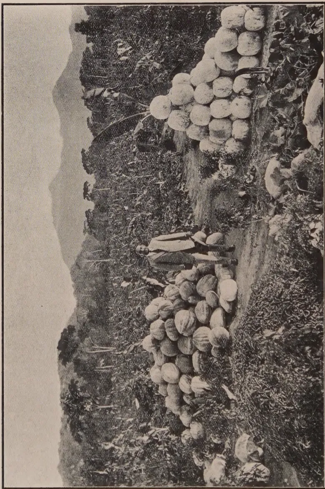

THE  
**TROPICAL AGRICULTURIST:**  
JOURNAL OF THE  
**CEYLON AGRICULTURAL SOCIETY.**

---

VOL. XLIX.

PERADENIYA, OCTOBER, 1917.

No. 4.

---

**FOOD PRODUCTION.**

— — — — —  
**THE RESPONSE.**

There is evidence that the appeals made in the Colony during the past few months are being generously responded to. The demands made upon the Department of Agriculture and upon the Agricultural Society for supplies of seed and for information as to cultivation of the various food products, vegetables and curry stuffs have continued throughout the month and by the time the October number of the TROPICAL AGRICULTURIST appears these demands for seed will have been met.

Estates have undertaken to establish and to encourage gardens for their labourers. Some of the demands for vegetable seeds for these gardens have shown that it is recognised that a great amount of food production can be effected upon estates. Others have undertaken the planting of yams, sweet potatoes and dhall as catch crops between young rubber and coconuts and again others have set aside lands for experiments with curry stuffs.

Several private owners have put in areas under food products and others have been carefully considering whether these crops cannot be profitably cultivated now that the market for coconut products is in a depressed condition.

Trials with potatoes, onions, chillies and curry stuffs have shown that these crops are quite profitable at the present time,

1------------------------------------------------

186[OCTOBER, 1917.

and the results with chillies on the Anuradhapura Experiment Station have demonstrated what could be done with this cultivation in the Dry Zone.

Revenue Officers have endeavoured to encourage food production amongst the villagers and in one district every headman has undertaken to cultivate himself at least one half acre under curry stuffs.

Some co-operative credit societies have sent in fair demands for seed, and many officers of the Postal, Railway, Public Works and Medical Departments, have required seeds for planting up lands attached to their official residences or offices.

There is also evidence that the planting of sweet potatoes, yams, manioc, and other food products has been general throughout the Colony, and supplies of seed held locally in the districts have been liberally drawn upon.

The response has been gratifying, but will it suffice? Is not a greater effort necessary? Cannot more be done? There is still time. The planting season for the North-East Monsoon rains is not yet finished. Supplies of seed are still available and more demands are looked for. With reasonable weather, planting may extend throughout the whole month of November and well into December.

Those that have not yet made up their minds should do so without delay. It is not sufficient to rouse oneself up, rub one's eyes and then fall back into drowsiness over this all-important question of food production.

The Colony needs a greater production of food stuffs, vegetables and curry stuffs. They can be grown and in large quantities. The Government has made the appeal. It cannot grow these products itself. It cannot enforce compulsory measures. It is obliged to leave the question of food production in the hands of those that own, occupy and till the soil. For this reason alone every agriculturist should do his utmost. He should not only cultivate as much as he is able but should endeavour to encourage others. The greater production of food products within the Colony is an urgent necessity and every agriculturist can help.

2------------------------------------------------

OCTOBER, 1917.]187

# FOOD PRODUCTS.

---

## PRODUCTION OF FOOD STUFFS, VEGETABLES AND CURRY STUFFS.

---

The following statement on the action already taken to encourage the increased production of food products in the Colony was submitted to the meeting of the Committee of Agricultural Experiments held at Peradeniya on September 13th :—

1. Government has circularized all Government Agents on the necessity of encouraging the increase of these products and special reductions have been made in some Provinces in the rates where Crown Lands have been recommended for permits for cultivation of vegetables and curry stuffs.

2. Free supplies of seeds of curry stuffs will be distributed through the Government Agents to villagers who can be relied upon to grow them. It is to the knowledge of the Department that in one district all village Headmen have undertaken to grow at least  $\frac{1}{2}$  acre each in curry stuffs themselves, and to encourage the planting of the other areas by the villagers.

3. Proposals are under consideration regarding leasing lands Up-country for cultivation of potatoes and vegetables, and supplies of seed-potatoes are being secured.

4. Packets of seeds of food and curry stuffs suitable for the different districts have been made up at Re. 1 and at 50 cents per packet. It is estimated that the seeds in these packets will be sufficient to plant 35 and 15 perches respectively. Through the generosity of two gentlemen in Colombo it will be possible to offer through the Government Agent, Eastern Province, 250 of the 50 cents packets of seeds to cultivators in that province at the reduced price of 10 cents per packet.

5. Packets of English and local vegetable seeds will be supplied this year by the Agricultural Society at the reduced price of 10 cents per packet.

6. Encouragement is being given to the cultivation of lands attached to Police Stations, Rest Houses, Railway Stations and Lines, Public Works Department lines and Post Offices, and supplies of vegetables and curry stuff seeds will be made through the Departments concerned, the cost to be ultimately recovered at the rate of 10 cents per packet.

7. The leaflet submitted to-day has been prepared to give brief details regarding cultivation of the different products. This has been translated into Sinhalese and into Tamil and copies will be distributed with all seed sent out.

8. Further leaflets on the diseases and insect pests of these products are under preparation and will likewise be translated into the vernaculars.

9. A request has been made through the Planters' Association for estates to encourage the cultivation of food products by their estate coolies, and many

3------------------------------------------------

188[OCTOBER, 1917.

have taken action. Requests for seeds have been coming in from estates and it is known that several proprietary planters are undertaking to put in quite considerable areas under such crops as yams, manioc, dhall, beans and chillies.

10. The number of Agricultural Instructors has been increased by three and from August to the end of the year it is intended that they shall give their undivided attention to the cultivation of food products and curry stuffs in their respective districts.

11. A circular\* to all members of the Board of Agriculture is now in the press, representing that leaders in the various districts are required and suggesting the formation of Food Products Committees as was done early this year in the United Kingdom. Members of the Board can be of assistance by making themselves responsible for promoting food production in their respective districts.

## TRIALS ON EXPERIMENT STATIONS.

The following proposals in regard to the cultivation of food products and curry stuffs upon Experiment Stations were agreed to at the last meeting of the Committee of Agricultural Experiments :—

### PERADENIYA EXPERIMENT STATION.

1. Maize, Sudan Dura, groundnuts, sweet potatoes and manioc are under experiment at the present time. The area under manioc varieties has recently been increased and plots of ginger and turmeric have been planted out.

2. When the maize and millet crops are reaped, over two acres of land will be planted with the following crops :—Dhall, grams, beans (sword, French, Lima and cow peas), aniseed, fennel, fenugreek, mustard, onions (curry and Bombay from seed), garlic, coriander, cumins (sudu duru and maha duru), and chillies.

3. A small area has just been reaped in a yala crop of Heeneti paddy and nurseries have already been sown for growing  $3\frac{1}{2}$  acres of paddy in the forthcoming Maha crop.

4. The first small plots of curry stuffs did not grow very well. Subsequent plantings have done better. Chillies, coriander and mustard appear to be promising under the conditions at Peradeniya, but it is possible that greater success will be achieved in the North-East planting, as that is the best cultivation season for these products at this elevation.

5. When the Agricultural School Students' crops of maize, dura, bandakka, brinjals and groundnuts have been taken off this month, half their plots will be planted with curry stuffs.

### ANURADHAPURA EXPERIMENT STATION.

6. Onions and chillies have given very satisfactory crops. Lima beans have done well and the plots that have been planted with dhall give promise of most satisfactory crops.

---

\*Reproduced on pages 189-90

4------------------------------------------------

OCTOBER, 1917.]189

7. Plans have been made for planting the following food and curry stuffs with the first rains :—

<table border="0">
<thead>
<tr>
<th></th>
<th colspan="2">Acres.</th>
<th></th>
<th colspan="2">Acres.</th>
<th></th>
<th colspan="2">Acres.</th>
</tr>
</thead>
<tbody>
<tr>
<td>Paddy</td>
<td>...</td>
<td>3</td>
<td>Dura</td>
<td>...</td>
<td>1/10</td>
<td>Yams</td>
<td>...</td>
<td>1/5</td>
</tr>
<tr>
<td>Dhall</td>
<td>...</td>
<td>3/10</td>
<td>Maize</td>
<td>...</td>
<td>1/10</td>
<td>Plantains</td>
<td>...</td>
<td>1/5</td>
</tr>
<tr>
<td>Lima beans</td>
<td>...</td>
<td>3/10</td>
<td>Manioc</td>
<td>...</td>
<td>3/10</td>
<td>Ginger</td>
<td>...</td>
<td>1/20</td>
</tr>
<tr>
<td>Mè (cow peas)</td>
<td>1/5</td>
<td></td>
<td>Sugar cane</td>
<td>...</td>
<td>1/5</td>
<td>Turmeric</td>
<td>...</td>
<td>1/20</td>
</tr>
<tr>
<td>Sword beans</td>
<td>...</td>
<td>1/10</td>
<td>Sweet potatoes</td>
<td>..</td>
<td>1/5</td>
<td>Cumin</td>
<td>...</td>
<td>1/10</td>
</tr>
<tr>
<td>Grams (various)</td>
<td>3/10</td>
<td></td>
<td>Arrowroot</td>
<td>...</td>
<td>1/10</td>
<td>Fennel</td>
<td>...</td>
<td>1/20</td>
</tr>
<tr>
<td>Beans (french)</td>
<td>1/10</td>
<td></td>
<td>Chillies</td>
<td>...</td>
<td>1/2</td>
<td>Aniseed</td>
<td>...</td>
<td>1/20</td>
</tr>
<tr>
<td>Kurakkan</td>
<td>...</td>
<td>1/10</td>
<td>Coriander</td>
<td>...</td>
<td>1/5</td>
<td>Fenugreek</td>
<td>...</td>
<td>1/10</td>
</tr>
<tr>
<td>Italian millet</td>
<td>...</td>
<td>1/10</td>
<td>Onions</td>
<td>...</td>
<td>1/5</td>
<td></td>
<td></td>
<td></td>
</tr>
<tr>
<td colspan="6"></td>
<td>Total</td>
<td>...</td>
<td><u>7 1/5</u></td>
</tr>
</tbody>
</table>

8. It is also proposed to plant small areas with mustard, rape and garlic, and to interplant permanent crops to the extent of over 12 acres with catch crops of dhall, maize, lima beans, chillies, mè (cow peas) and coriander.

9. When the paddy crop has been taken off, it is proposed to plant crops of gingelly and chillies, and then put under a green manure (probably sunn hemp) until the next Maha crop.

#### MAHA-ILUPPALAMA EXPERIMENT STATION.

10. If this Station is not leased before the end of October the whole of the 9 acres which was levelled for paddy cultivation, but which has been fallow since 1914 will be planted with chillies. It is generally supposed that large areas of chillies cannot be grown on account of attacks of disease. The proposed experiment will test this point.

#### NUWARA ELIYA EXPERIMENT GARDEN.

11. It is proposed to open up a small area near the nursery sheds with vegetables; and it is hoped to have most English vegetables represented in this plot. It should prove of value to residents Up-country, if the various trials prove successful.

### CIRCULAR LETTERS.

The following circular letters have been addressed with a view to drawing attention to the necessity of giving early attention to the cultivation of food products, vegetables and curry stuffs :—

TO ALL MEMBERS OF THE BOARD OF AGRICULTURE, PRINCIPAL HEADMEN, PRESIDENTS OF VILLAGE TRIBUNALS AND LOCAL AUTHORITIES.

The present time offers a favourable opportunity for initiative on the part of Members of the Board of Agriculture, Headmen, and Local Authorities in encouraging within their several areas increased production of food stuffs, vegetables, and curry stuffs.

This question received the attention of the Board at its annual meeting held on 4th August, 1917, and has been considered in the Legislative Council, by Planters' Associations, and by the Press.

5------------------------------------------------

190[OCTOBER, 1917.

The Government has taken action, and the Agricultural Society is taking steps to procure supplies of seeds of these products for all those that may find it difficult to secure them.

In some districts a considerable amount of attention has already been devoted to the question, but it appears most desirable that everyone, who is anxious to help Ceylon Agriculture, should make a special effort, during the next three months, to see that the maximum amount of land is brought under cultivation with food products, vegetables, and curry stuffs. The North-East Monsoon planting season is the most suited for the planting of these products. If in every district there were some leaders, who could be regarded as definitely responsible for promoting local food production, much could be done. These persons could encourage, as far as possible by personal visits, the full use of land suitable for cultivation of food products and assist small cultivators in obtaining supplies of seeds where these are required. They could also promote the formation of Food Production Committees for different areas, and these Committees would, without doubt, be useful in persuading cultivators of the necessity of growing more of these products, such as rice, chillies, dhall, and curry stuffs which are imported from India.

A greater production of yams, sweet potatoes, manioc, and vegetables of all kinds is possible throughout the Colony, and is essential at the present time.

Teachers in schools that have School Gardens will be asked to give advice and instruction in the cultivation of food products and vegetables in their immediate neighbourhood, and Agricultural Instructors will give particular attention to this question during the next three months throughout the districts in which they work.

*The Board of Agriculture urges every cultivator to take immediate steps to produce more food stuffs, vegetables, and curry stuffs in the Colony.*

#### TO ALL CO-OPERATIVE CREDIT SOCIETIES.

The question of increasing the quantities of food stuffs grown locally is receiving the attention of every one interested in the welfare of this Colony at the present time.

2. The Department of Agriculture and Agricultural Society is endeavouring to facilitate the growing of curry stuffs, vegetables and other food stuffs and I look to Co-operative Credit Societies to urge upon their members to utilize every available space in their lands for growing some food crops.

3. Many of the curry stuffs which are now being imported into the Island can be grown locally.

4. I am prepared to arrange to distribute a limited quantity of seed of curry stuffs to Co-operative Credit Societies if their members will grow them carefully and report results to the office-bearers of their societies.

5. Would you bring this matter before your Society at an early date and let me know before the end of September if possible how many of your members will grow these crops. Arrangements will then be made for supplies of seeds and in the meantime the members may be asked to get their lands ready for planting.

6------------------------------------------------

OCTOBER, 1917.]191

TO ALL AGRICULTURAL INSTRUCTORS AND SCHOOL GARDEN INSPECTORS.

There is an urgent necessity on the part of all to endeavour to increase the quantities of food stuffs, vegetables and curry stuffs grown locally. Ceylon is capable of producing larger quantities and at the present time it is essential that such should be done.

All the energies of the Agricultural Department and of the Agricultural Society should be directed during the next three months to increasing food supplies.

The editorial of the September number of the TROPICAL AGRICULTURIST is attached herewith for information. The Sinhalese and Tamil Magazines published by the Society will deal with the cultivation of food products, and articles on this question will appear in English in the TROPICAL AGRICULTURIST.

Supplies of seeds for villagers will be distributed through Government Agents and the Agricultural Society will be in a position to supply seeds to those who require them.

All Agricultural Instructors should make it their main business during the next three months to endeavour to get agriculturists to grow food products, vegetables and curry stuffs. They should consult the Revenue Officers of the districts as to the best course of action in the districts in which they are located. They should then arrange, with the concurrence of the Revenue Officers, to hold public meetings. They should arrange for distribution of seeds and should endeavour to help cultivators as far as possible where difficulties are being experienced in obtaining seeds or in disposal of produce. They should make careful inquiries and report to the Secretary, so that steps may be taken to alleviate these difficulties if possible. All demonstration gardens under the charge of Agricultural Instructors should be used for growing food products, vegetables and curry stuffs. These are the most important products for these gardens at the present moment and experiments on cotton, tobacco, etc. must be reduced to a minimum in order to make room for trials with the more important food products. At these Demonstration Gardens Instructors should spend 2—3 days at a time every fortnight (or week if possible) and endeavour to get together gatherings of agriculturists for discussions and demonstrations. The Chief Headmen should be interested in the work, and their influence over the village cultivators used if possible. Seeds from the demonstration garden should be distributed free to those that may be relied upon to grow them.

Directions as to the cultivation of food products, etc., will be found in the Year Book of the Society and in issues of the TROPICAL AGRICULTURIST. A full leaflet will be shortly available.\*

All Agricultural Instructors should begin now and should not relinquish their efforts for the next three months—months most favourable for planting purposes.

---

\* This has already appeared in the *T. A.* for September, 1917, pages 140-144

7------------------------------------------------

192[OCTOBER, 1917.

An endeavour will be made to visit all districts to ascertain what efforts have been made and what results have accrued. The work of the Instructors during the next few months must be judged by the results obtained and if they realize the great importance of their work, confidence can be placed in them to carry out this work satisfactorily.

All Inspectors of School Gardens must impress upon teachers the importance of having their gardens well stocked with food products, vegetables and curry stuffs. Seeds that may become available should be distributed by teachers to children and to villagers around the school for planting in home gardens.

The village school can do much towards helping in this endeavour to increase food supplies and every effort must be made to impress this upon all teachers. All beds should be planted up during the next three months. This is the main planting season and there can be no excuse for beds not being planted with some useful product. Greater attention must be given to the cultivation of economics than to growing flowers, and while it is necessary that the ornamental section may be maintained in good order, the energies of all should be chiefly directed to the establishment of a good economic garden full of food products, vegetables and curry stuffs.

---

#### TO ALL TEACHERS IN CHARGE OF SCHOOL GARDENS.

It is generally recognised that School Gardens have been the means in this Colony of encouraging the growth of vegetables and food products. Much good work has been done and many pupils have benefited from the instruction received in these gardens.

There is a necessity at the present time of producing much more food stuffs, vegetables and curry stuffs locally. The School Gardens can help. Teachers should see that all the main food products, vegetables and curry stuffs are represented in their gardens. They should encourage home gardens on the part of their pupils and should try to assist the villagers in their immediate neighbourhood with seeds and instruction.

If more seeds are required, early applications should be made to the Superintendent of School Gardens and supplies will be sent with as little delay as possible.

---

### RESULTS OF TRIALS WITH CURRY STUFFS.

The following preliminary notes on the results of trials with curry stuffs in Ceylon are of interest at the present moment, when the efforts of all are being directed towards the greater production of food-stuffs, vegetables and curry stuffs in the Colony.

Curry stuffs are little grown in many parts of the Colony at the present time, and therefore the present notes are put out now as a guide to prospective growers.

8------------------------------------------------

OCTOBER, 1917.]193**EXPERIMENTS AT DUNUWILE.**

*Satisfactory.*—Coriander, ginger, turmeric, shallots, kollu (*Phaseolus biflorus*), black gram (*Phaseolus radiatus*), dhall.

*Fair.*—Bengal gram, white peas, green peas, lentils.

*Not Satisfactory.*—Cummin, fenugreek, onions from seed, garlic.

*Seed Not Satisfactory.*—Mustard.

**EXPERIMENTS AT NUGAWELA.**

*Satisfactory.*—Kollu, dhall (red), dhall (white), mustard, chillies.

*Fair.*—Black gram, green gram, yellow gram, green peas.

*Seed Not Satisfactory.*—Onion, lentil, coriander, cummin, fenugreek.

**EXPERIMENTS AT TELDENIYA.**

*Satisfactory.*—Dhall (red), dhall (white), mustard, chillies.

*Fair.*—Black gram, green gram, yellow gram.

*Seed Not Satisfactory.*—Onion, lentil, coriander, cummin, fenugreek.

**KALUTARA DISTRICT.**

*Fair.*—Dhall, green gram, lentil, cummin, onion.

*Not Satisfactory.*—Fenugreek, coriander, mustard.

**PERADENIYA.**

*Satisfactory.*—Chillies, coriander, mustard, dhall, cummin, aniseed.

*Fair.*—Fennel, fenugreek.

**NORTH-CENTRAL PROVINCE**

*Satisfactory.*—Chillies, dhall, coriander.

**EXPERIMENTS WITH CHILLIES IN UVA.**

An experiment with chillies was conducted on a clearing in Deen's Land Estate, Badulla, and was satisfactory. The chillies were planted as a catch-crop in December last. A very favourable return was received in April and onwards and the chillies were sold at Rs. 22/- per cwt.

**ONION EXPERIMENT AT CHANGANAI, JAFFNA.**

*Extent* :  $\frac{1}{3}$  of an acre.

*Sown* : 30th May, 1917.

*Harvested* : 1st August, 1917.

*Nature of Soil* : Sandy loam.

*Cost of Experiment* : Rs. 81.50,

*Yield* : 2,100 lb. (which works out at 6,300 lb. per acre).

*Remarks* : Growth fair. The amount realised on 2,100 lb. of onion is Rs. 238. The onions were planted just after the harvest of tobacco, no manure being applied. The cost would have been much more if manure was applied to the soil. 5 cwt. of bulbs costing Rs. 35/- were used for planting.

**EXPERIMENTS WITH POTATOS IN UVA.**

An experiment on the cultivation of potatos was carried out by MUDALIYAR A. I. JAINU DEEN on lands selected between Ettampitiya and Bandarawela. The amount of potatos sown in May last was 1 cwt., and on August 26th a crop of 474 lb. was obtained. Half of the crop, namely 237 lb., was sold at Rs. 12/- per cwt. It is thought that if imported seeds had been used the results would have been more satisfactory.

9------------------------------------------------

194[OCTOBER, 1917.

## PLANTING CALENDAR.

For planting purposes the Island is divisible into four parts, viz.:—1, Low-country wet ; 2, Low-country dry ; 3. Up-country wet ; 4, Up-country dry.

The term "low-country" may be taken to signify the country lying below an elevation of 3,000 feet, and "wet" to mean a condition associated with a rainfall of over 70 inches per annum. The terms "country" and "dry" will be readily understood from this explanation.

The 1st division (viz. low-country wet) would comprise the Western and Southern Provinces (omitting Hambantota district), and the wetter parts of the North-Western Province in the direction of Negombo, Polgahawela, and Kandy ; the 2nd division (low-country dry) the Eastern, Northern and North-Central Provinces, Hambantota and Puttalam districts and the drier parts of the North-Western Province in the direction of Anuradhapura and Puttalam ; the 3rd division (up-country wet) the greater part of the Central Province and a part of the Uva Province ; the 4th division (up-country dry) the drier parts of the Central and Uva Provinces, e.g., Hanguranketa and Welimada.

While the S.W. monsoon only affects some parts of the island, the effect of the N. E. monsoon is more or less general, but the latter season is good for planting in all districts. The N.E. monsoon rains begin in October and go on till January, and in many of the drier districts this is the only period during which regular cultivation is carried on independently of artificial irrigation.

It is, therefore, necessary for those who want to catch the next planting season to prepare their lands as early as possible. In the case of seeds which are not going to be sown direct nurseries must be started in good time. All kinds of vegetables can be planted in the latter month. In the case of potatoes it is advisable to wait till the monsoon rains have spent themselves and put off planting till the end of the year or early January.

The recommendations made for the various localities in the Colony are as follows :—

### FOOD STUFFS.

<table style="width: 100%; border-collapse: collapse;">
<thead>
<tr>
<th style="text-align: center;"><i>Up-Country Wet</i> <i>Suited for</i></th>
<th style="text-align: center;"><i>Up-Country Dry</i> <i>Suited for</i></th>
<th style="text-align: center;"><i>Low-Country Wet.</i> <i>Suited for</i></th>
<th style="text-align: center;"><i>Low-Country Dry.</i> <i>Suited for</i></th>
</tr>
</thead>
<tbody>
<tr>
<td>English potatoes, sweet potatoes, maize</td>
<td>English potatoes, maize, millets, beans, dhall, gram, manioc, sweet potatoes, cow-peas.</td>
<td>Maize, beans, dhall, manioc, sweet potatoes, yams, cow-peas, ground-nuts and Jerusalem Arti- chokes.</td>
<td>Maize, millets, lima beans, dhall, gram, manioc, sweet potatoes, cow-peas, ground- nuts.</td>
</tr>
</tbody>
</table>

### VEGETABLES.

<table style="width: 100%; border-collapse: collapse;">
<tbody>
<tr>
<td>English veget- ables, gourds, brinjals.</td>
<td>English veget- ables, gourds, brin- jals, bandakka.</td>
<td>Tomatos, gourds, brinjals. ban- dakka, beans, spinach, cucum- ber.</td>
<td>Tomatos, gourds, brinjals, bandakka, beans.</td>
</tr>
</tbody>
</table>

### CURRY STUFFS.

<table style="width: 100%; border-collapse: collapse;">
<tbody>
<tr>
<td>Onions, mustard, chillies.</td>
<td>Chillies, coriander, cummin, onions, aniseed, fenu- greek.</td>
<td>Chillies, onions, ginger, turmeric, aniseed, fenu- greek.</td>
<td>Chillies, coriander, cummin, onions, aniseed, fenugreek, mustard.</td>
</tr>
</tbody>
</table>

10------------------------------------------------

OCTOBER, 1917.]195

## NOTES ON PREPARATION OF CURRY STUFFS.

The following notes on the preparation of some curry stuffs and dhall will be found useful in connection with the growing of food products mentioned in the article "Hints on the Cultivation of Food Products, Vegetables and Curry Stuffs" which appeared on pages 140—144 of the TROPICAL AGRICULTURIST for September 1917—Vol. xlix, No. 3:—

*Chillies.* This product is imported into the Island in the form of dry chillies. To obtain dry chillies well ripe chillies should be plucked and spread in the sun for at least a fortnight to dry. Night dew does no harm to chillies and they may be left out day and night during dry weather. But if rain is feared they must be brought within doors. When the chillies are dry they should be stored in bags.

*Turmeric.* This is also imported in dry condition in which condition it is used in curry. The growers first should set apart necessary green rhizomes for seed purposes and the rest of the turmeric should be cut in two (this is in the case of big rhizomes) and dried in the sun and cleaned from the adhering roots and earth. The dried bulbs should then be boiled in water in a vessel. In India a little fresh cowdung is added to the water when boiling. As soon as the water begins to boil the vessel should be taken off the fire and the boiled turmeric should be taken out and spread in the sun to dry. The exposed turmeric should daily in the morning and evening be hand-rubbed in order to make the roots clean and smooth.

*Ginger.* Dry white ginger is obtained by the preparation of green ginger by drying. Rhizomes should first be dried in the sun and then soaked in water. When it is properly soaked the outer thin skin should be removed being careful not to pierce the fleshy part. The cleaned rhizomes should be put in water as they are skinned and thoroughly washed. The washed ginger should be spread on mats in the sun for some days until it is properly dried. The ginger should be turned over occasionally and should not be exposed to rain or dew as it is liable to become mouldy.

*Coriander.* Dry seed is used in curries. On account of the disagreeable odour of the unripe seed it should be allowed to remain on the plants until thoroughly ripe. Then the plants are pulled out and the crop obtained by threshing with a flail or it is trodden over by bullocks. To avoid loss by handling it is advisable to harvest the crop by cutting off the seed-bearing umbels and placing them in bags rather than to pull or cut down the whole plant. The seed is easily obtained by lightly flailing the plants or umbels in the field—a mat or cloth being spread to receive it. The seed should be spread in the sun to dry and stored in bags.

In the case of cummin or aniseed the same method may be applied.

*Dhall.* The split dhall as sold in bazaars is obtained by grinding the seed. For this the undecorticated seed should be soaked in water first and then should be dried in the sun. Afterwards the dry seed should be crushed in an ordinary "grinder" used in grinding kurrakkan or paddy or husked in the ordinary way as paddy is husked.

N. W.

11------------------------------------------------

196[OCTOBER, 1917.

## “GRAM”—AN INDEFINITE TERM.

There are quite a number of terms in common use which are employed very vaguely—e. g., Bean, Nut and Gram.

The bean is the fruit of the Leguminosæ and is botanically known as the legume. But we find the term employed to denote the seed of Cocoa and Coffee, e. g., Cocoa-bean, Coffee-bean.

The nut is a typical fruit with a hard pericarp such as the Barcelona nut. But we find the term used to indicate the fruits of certain palms, e.g. coconut, arecanut—which are drupes and belong to the same group as the Mango.

The term “Gram” is very loosely used, and gives rise to much confusion, since there are so many kinds of gram that unless the term is qualified it is not possible to know which particular one is indicated.

The following may be enumerated:—

1. *Cicer arietinum*. This is commonly spoken of as Gram, but it is better to distinguish it as Bengal Gram. It is sometimes called “Chick pea.” This Gram is what is usually ground and mixed with paddy and used as a horse feed (but it must not be called “horse-gram”). It is also exposed for sale in the roasted condition for human consumption. The Sinhalese name is *Kadala*. There is a round and an irregular variety.

2. *Dolichos biflorus*. This is commonly spoken of as “horse-gram” and is employed as a horse-food after being boiled. It is also eaten by human beings. Sinhalese *Kollu*.

3 & 4. *Phaseolus radiatus* and *P. max*. Green gram and black. Formerly the botanical names were reversed through an error. Boiled green gram served with coconut and jaggery is a favourite dish in Ceylon, and a very nourishing food it is. Sinhalese *Mung*. Black gram is given to milch cows after grinding to a mash. Sinhalese *Ulundu* or *Undu*.

5. *Cajanus indicus*. The Indian dhall, sometimes called pigeon pea, and in S. India also red-gram. A highly nutritious legume, little-grown in the Island, but, together with rice, forming the staple diet of the Indian.

It will thus be seen that it is not advisable to use the name Gram without some qualifying term to indicate what kind of Gram is meant.

C. D.

## FOOD-PRODUCTS EXHIBITION AT CALCUTTA.

In the July issue of this Journal was published a notice regarding an Exhibition of Foods and Household Requisites of Indian Production to be held by the Women’s Branch of the Bombay Presidency War and Relief Fund. This Exhibition will be held from January 1-5, 1918, in Calcutta.

Exhibits of food-products are invited: Cereals, tinned foods, ground rice, flour, sago, tapioca, macaroni, vermicelli, preserved fruits and vegetables, fruits in syrup, dried fruits: jams, jellies, pickles, sauces, essences: cheeses: pickled and potted foods of every description: sweets suitable for dessert, etc.

Exhibits are invited from Firms as well as from private individuals, and Exhibitors are asked to state what space they will require at the Exhibition. This will be provided free of charge.

Exhibits can be received immediately and at any time up to December 24, 1917: Exhibits should be sent (at risk and expense of Exhibitor, both ways) to

Hon. Secretary (Exhibits),  
Food-Products Exhibition,  
Commerce and Industry Building,  
1, Council House Street, Calcutta.

12------------------------------------------------

OCTOBER, 1917.]197

# RUBBER.

## RUBBER IN NORTH BORNEO.

The following extract on rubber is taken from the Annual Report on Agriculture in North Borneo for 1916 :—

### STATISTICS.

The area planted with rubber at the end of 1916, according to returns received from managers of estates, was 30,910 acres. Small holdings planted by Chinese and natives are not included in these figures. The areas under cultivation in the different Residencies remain substantially the same as those given in last year's report. The amount of new land planted during the year was only 529 acres. In addition to this there was some planting by Chinese and natives, especially in the Beaufort district, where interest in rubber has been aroused by the success of the plantation owned by natives near Sipitang. The number of trees in tapping at the end of the year was 2,030,150, or a little over half the total number planted, which is returned at 4,049,050. The area in full tapping was 14,720 acres, as against 9,806 acres at the end of the previous year.

There was again a very satisfactory increase in the output of rubber. According to figures supplied by the Customs Department the export in 1916 was 1,937.7 tons, an increase of 84.4 per cent. on the total of 1,050 tons shipped in 1915. The price of rubber was not so steady as in 1915, but on the average it was a few pence better. In January the price of smoked sheet reached 4s. 2d. but dropped quickly to about 3s. 6d.; it then declined steadily until August, when it had fallen to 2s. 1½d., after which it rose to about 3s. 0d. in December.

The extension of tapping operations necessitated an increase in the labour force of most estates. At the end of the year the total number of coolies employed was 12,334, an increase of 2,698 over last year's total. Whereas in 1915 one coolie was sufficient for three acres, in 1916 the average was one for 2.5 acres. Of the coolies 5,179 were Chinese and 4,280 Javanese; 2,875 belonged to other races, all but a few being natives of North Borneo.

The rainfall in 1916 was even heavier than in the previous year. Estates on the West Coast had an average of 165 inches of rain in 199 days, in the Interior 66 inches on 202 days, in the Kudat residency 89 inches on 176 days, in the Sandakan residency 133 inches on 212 days, and in the East Coast residency 95 inches on 130 days. On no estate was there a single month entirely without rain.

### DISEASES.

Pink disease, *Corticium salmonicolor*, was the disease which gave most trouble during the year. The very wet weather experienced contributed to its spread and increased the difficulty of keeping it under control. The

13------------------------------------------------

198[OCTOBER, 1917.

simple method of applying tar, with the pruning of any small branches that may be attacked, still seems to be the best line of treatment. The degree of success achieved by this method has varied considerably on different estates, but in the few cases, where it has failed to keep the disease in check the result was undoubtedly attributable to defective organisation. Pink disease is now present on all the estates I visit on the West Coast; there are several estates on the East Coast which have been fortunate enough to escape its attacks so far.

The disease of the tapping surface called cambium rot, black thread or line canker, is becoming more widespread. On the majority of estates where it was found the number of cases was small, but in some fields on one estate about 90 per cent. of the trees were affected, and on another about 50 per cent. Like pink disease, cambium rot spreads rapidly in wet weather, and in most cases the organism responsible for it appears to develop on the ledge of bark at the tapping cut where water tends to collect. It was noticed that on the estates that suffered most severely from this disease the trees were scraped in the afternoon. It seemed reasonable to suppose that a thin layer of rubber left adhering closely to the ledge of bark would afford a certain measure of protection, and managers of estates where the disease was common were therefore advised to scrap in the morning. It is too early yet to pronounce an opinion as to the success of this method, but after a year's trial the results are very encouraging. On all estates where afternoon scraping was stopped the number of affected trees has shown a considerable reduction, in spite of the fact that the weather has been abnormally wet. The use of disinfectants on the tapping cut would probably give good results, but trials with different materials would first have to be made, and on no estate visited recently has there been sufficient of the disease to justify the expense. On some estates wounds caused by the cambium rot were left untreated, and clots of rubber below the bark, the formation of which was described in the last Annual Report, were of fairly frequent occurrence. The majority of cambium rot wounds heal over normally, but it frequently happens that the thin layer of dead tissue over a wound, by adhering closely to the wood and remaining continuous with the surrounding healthy bark, prevents the ingrowth of the callus at the margin. Rupture then occurs at the weakest point, namely the cambium below the healthy bark, and a cavity is formed which becomes filled with the latex from broken vessels. It is therefore worth while scraping the dead bark off wounds left by cambium rot, paying special attention to the edges; the exposed wood should then be coated with tar or white paint to keep out borers.

The occurrence of trees which had ceased to yield latex was noted on all estates visited, the number of affected trees on some estates being well over a thousand. In perhaps the majority of cases examined the bark was perfectly normal in colour, though in other cases a greyish or greenish grey discolouration was visible. The continued commonness of the affection in very wet weather, coupled with the fact that the latex vessels are found to be partially emptied of their contents, supports the view advanced in last year's report that it is caused by excessive flushing of the latex tubes. At my

14------------------------------------------------

OCTOBER, 1917.]199

request several managers marked dried up trees, and it was found, as suspected, that a number of them afterwards developed masses of large burrs. The origin of these masses was previously unknown, but it is now certain that many of the trees spoilt by them had previously run dry, and it is probable that their occurrence in such cases may be explained on the writer's theory that the burr cambium is formed as the result of a stimulus given in some way by stagnant latex. The matter is of considerable economic importance, as burred trees always become useless in time. Managers are therefore advised to stop tapping trees which appear, from the diminution in their latex flow, as if they are about to run dry; it is hoped that burr formation may thus be prevented in many cases.

Except on one or two estates, root diseases are not now causing much trouble. *Fomes* has been the chief root disease in the past, but during the year *Sphaerostilbe repens*, which has not previously been recorded in North Borneo, was found on two estates. It is only to be feared on low-lying land, and if such land can be thoroughly drained the condition which favours its spread is eliminated.

Rubber planters have hitherto been fortunate in having few serious diseases to contend with, and on most estates in North Borneo the amount of money it has been necessary to spend on sanitation and on the treatment of diseased trees has not been large. The possibility, however, that other parasitic fungi indigenous to the Eastern tropics would find *Hcvea* a suitable host has been frequently pointed out. In the last three years two new diseases of a serious nature have in fact been discovered, and before they had been properly studied they had done extensive damage on many old estates. One of these diseases, *Poria hypolateritia*, has not yet been met with in North Borneo; the other, *Ustulina zonata*, was found during the year attacking a few trees on one estate. Managers should be on the look-out for both these diseases, as most estates in North Borneo are reaching the age when they may be expected to appear. Both are root diseases, but *Ustulina* frequently attacks the trunk and branches as well. On estates where there is little *Fomes* it has not hitherto been considered necessary to go to the expense of clearing away all jungle stumps and logs until they have rotted. The fact that *Ustulina* and *Poria* are two of the fungi commonly responsible for the decay of timber makes it necessary to revise this opinion. It is from stumps and logs that these fungi spread to rubber trees, and the wisdom of removing this source of danger with as little delay as possible cannot now be doubted.

#### PESTS.

Wild pigs caused trouble on many estates, both on the West Coast and near Sandakan, by eating the bark of rubber trees; on a few estates the amount of damage done was considerable. Poisons were tried by some managers, with but little success; a stout fence appears to be the only effective means of protection. White ants were found on many estates, but the number of trees damaged by them was not large. Small boring beetles

15------------------------------------------------

200[OCTOBER, 1917.

were fairly common. Neither white ants nor borers can safely be neglected, as apart from the direct injury they do there is danger of their carrying the spores of parasitic fungi into healthy trees.

#### THINNING.

Most of the earlier planted areas in North Borneo have now been thinned out, but in some cases not before the trees had suffered from overcrowding. The necessity for timely thinning is now generally admitted, and in actual performance managers in North Borneo are probably, on the whole, not behind those in other countries. On a few estates trees in closely planted areas which have only recently come into tapping are being thinned out. This is an excellent policy, and if continued will prevent all the injury suffered by overcrowded trees. Considering, however, the age of much of the rubber, the fact that the average for the State is 133 trees per acre indicates that extensive thinning out operations should soon be undertaken. The future welfare of rubber companies is intimately bound up with this question. In very few cases have the yields from old estates increased at the rate that was expected, the reason being that the cramped crowns of the trees, could not manufacture sufficient food to give quick bark renewal, and light tapping, resulting in low yields, has therefore had to be resorted to.

#### TAPPING.

The commonest system of tapping in North Borneo is that of placing two superposed cuts on one quarter of the tree. Opinions however are changing, and tapping on a single cut, which has been shown experimentally to give a better yield in proportion to the amount of bark consumed, is coming more into favour. Planters commencing to tap on a single cut often find it difficult to decide whether the cut should embrace a quarter, a third, or a half of the tree's circumference. It seems obvious, however, that no one length can be equally suitable for all trees. Bark should be removed in tapping at the same rate as the tree can replace it, and this rate is quick or slow according to the speed at which the tree is adding to its girth. On the great majority of estates growth is better in some places than in others; if all the trees are tapped on a conservative system the yield from the better trees will be less than could safely be obtained, and if all are tapped more heavily there will be inconvenience owing to bad renewal on the poorer trees. The tendency at present is to pursue a medium course and tap all trees on a third, but better results would undoubtedly be obtained by adapting the system to the tree. Vigorously growing trees could be tapped on half their girth, a third would best suit trees of moderate growth, and poor trees which renew their bark slowly should be tapped on a quarter. The importance of confining tapping operations to the base of the tree has to be borne in mind, but it is not possible to say whether it is worth while reducing the length of the tapping cut in order to do this—to tap, for example, on a third up to two feet instead of on a half up to three feet. This is, perhaps, one of the chief tapping problems awaiting solution.

16------------------------------------------------

OCTOBER, 1917.]201

# COCONUTS.

## MANURING COCONUTS.

The following details of manuring coconuts on an estate in Ceylon will prove of interest to coconut growers, and are published in the hope that other Estates may furnish details of the results obtained with and without manuring.

The question of manuring coconuts has been receiving considerable attention in the Colony during the past few years, and the general experience of estates should be of value to all coconut growers.

### NOTES ON APPLICATION OF MANURES.

1. During each of the first three applications soil was turned up with mamoties either immediately after or before the application of manure.

At fourth and fifth applications ploughing was resorted to in place of turning up soil.

2. First application was done in a five feet full circle trench, cut immediately round the tree.

Second in a full circle  $2\frac{1}{2}$  ft. broad and five feet away from the tree.

Third in a four feet full circle leaving one foot to the tree.

Fourth and fifth in 2 to 4 feet broad half circles cut leaving 3 to 5 feet to trees. Different size trenches in different plots.

3. At second and third applications about 25 lb. of green leaf has been buried with the manure.

4. During second application a dressing of 4 lb. of Basic Slag was applied all throughout the estate before the soil was turned up.

5. Once in two years is the usual period fixed for remanuring. But owing to want of sufficient and well distributed rainfall, it has not been possible to carry out remanuring strictly within two years, simply because of the desire to do manuring and ploughing one after the other.

### AVERAGE EXPENDITURE PER YEAR FOR THE UPKEEP OF THE ESTATE.

<table border="1">
<thead>
<tr>
<th rowspan="2"></th>
<th colspan="2">5 years average expenditure per 1,000 nuts.</th>
<th colspan="2">5 years average expenditure per Candy.</th>
<th colspan="2">5 years average expenditure per acre.</th>
</tr>
<tr>
<th>Without manure.</th>
<th>With manure.</th>
<th>Without manure.</th>
<th>With manure.</th>
<th>Without manure.</th>
<th>With manure.</th>
</tr>
</thead>
<tbody>
<tr>
<td>1912 to 1916.</td>
<td>13.01</td>
<td>19.31</td>
<td>17.33</td>
<td>25.18</td>
<td>40.00</td>
<td>61.34</td>
</tr>
</tbody>
</table>

Note :—The above is excluding Live Stock and Pests.

17------------------------------------------------

202

[OCTOBER, 1917.

**MIXTURES OF MANURE USED.**

<table border="1">
<thead>
<tr>
<th>Block No.</th>
<th>First Manuring</th>
<th>Second Manuring</th>
<th>Third Manuring</th>
<th>Fourth Manuring</th>
<th>Fifth Manuring</th>
</tr>
</thead>
<tbody>
<tr>
<td>1</td>
<td>Sulph. of Ammonia Fish Bone Meal Bone Phosphate Steamed Bone Meal Muriate of Potash Kainit Ground Fish Groundnut Cake Steamed Bone Meal Con. Sup. Phosphate Kainit Muriate of Potash</td>
<td>Castor Cake Kainit Bone Meal Basic slag</td>
<td>Castor Cake Rape Cake Blood Meal Super. Phosphate Steamed Bone Meal Kainit Sulph. of Potash</td>
<td>Castor Cake Groundnut Cake Fish Manure Steamed Bone Meal Kainit Sulph. of Potash</td>
<td>Groundnut Cake Blood Meal Ord. Sup. Phosphate Steamed Bone Meal</td>
</tr>
<tr>
<td></td>
<td><math>\frac{1}{2}</math> lb. 3 " " 3<math>\frac{1}{2}</math> " 1 " " 2 " " 1 " " 4 " " 2 " " 2 " " 1 " " 1 " " 1 " "</td>
<td>1 lb. per tree in equal proportion</td>
<td>3 lb. 2 " " 2 " " 1 " " 1 " " 2 " " 1 " " 1 " " 1 " " 1 " " 1 " " 1 " "</td>
<td>2 lb. 2 " " 6 " " 2 " " 1 " " 1 " " 2 " " 1 " " 1 " " 1 " " 1 " " 1 " "</td>
<td><math>\frac{2}{3}</math> lb. 1 " " 2 " " 6 " " 2 " " 1 " " 1 " " 1 " " 1 " " 1 " " 1 " " 1 " "</td>
</tr>
<tr>
<td>2</td>
<td>Sulph. of Ammonia Fish Bone Meal Bone Phosphate Steamed Bone Meal Muriate of Potash Kainit</td>
<td>Same as above</td>
<td>Castor Cake Bone Meal Kainit Sulph. of Potash</td>
<td>Castor Cake Rape Cake Blood Meal Sup. Phosphate Bone Meal Kainit Sulph. of Potash</td>
<td>Same as above</td>
</tr>
<tr>
<td></td>
<td>3 " " 3<math>\frac{1}{2}</math> " 4 " " 2 " " 1 " " 1 " " 1 " "</td>
<td></td>
<td>7 lb. 6 " " 3 " " 1 " " 1 " " 1 " " 1 " "</td>
<td>3 lb. 2 " " 1 " " 1 " " 6 " " 2 " " 1 " "</td>
<td></td>
</tr>
<tr>
<td>3</td>
<td>Same as above</td>
<td>Same as above</td>
<td>Castor Cake Fish Manure Bone Meal Sulph. of Potash</td>
<td>Same as above</td>
<td>Same as above</td>
</tr>
<tr>
<td></td>
<td></td>
<td></td>
<td>4 lb. 2 " " 6 " " 2 " "</td>
<td></td>
<td></td>
</tr>
<tr>
<td>4</td>
<td>As in No. 1</td>
<td>Same as above</td>
<td>Castor Cake Groundnut Cake Fish Manure Bone Meal Kainit Sulph. of Potash</td>
<td>Not Manured</td>
<td>(4a) Groundnut Cake Blood Meal Ord. Sup. Phosphate Steamed Bone Meal Slaked Lime</td>
</tr>
<tr>
<td></td>
<td></td>
<td></td>
<td>2 lb. 2 " " 2 " " 6 " " 1 " " 1 " " 1 " "</td>
<td></td>
<td><math>\frac{2}{3}</math> lb. 1 " " 2 " " 6 " " 4 " "</td>
</tr>
<tr>
<td>5</td>
<td>As in No. 2</td>
<td>Same as above</td>
<td>Castor Cake Rape Cake Blood Meal Superphosphate Steamed Bone Meal Kainit Sulph. of Potash</td>
<td>Castor Cake Rape Cake Blood Meal Superphosphate Bone Meal Kainit Sulph. of Potash</td>
<td>(4b) Discharrowed without manuring 10 baskets of cowdung to a tree</td>
</tr>
<tr>
<td></td>
<td></td>
<td></td>
<td>3 lb. 2 " " 1 " " 1 " " 1 " " 2 " " 1 " "</td>
<td>3 lb. 2 " " 1 " " 1 " " 1 " " 2 " " 1 " "</td>
<td></td>
</tr>
<tr>
<td></td>
<td></td>
<td></td>
<td>15 lb. per tree</td>
<td>15 lb. per tree</td>
<td></td>
</tr>
<tr>
<td>6</td>
<td>Same as above</td>
<td>Same as above</td>
<td>Castor Cake Bone Meal Kainit Potash</td>
<td>Same as above</td>
<td>Groundnut Cake Blood Meal Ord. Superphosphate Steamed Bone Meal</td>
</tr>
<tr>
<td></td>
<td></td>
<td></td>
<td>7 lb. 6 " " 1 " " 1 " "</td>
<td></td>
<td><math>\frac{2}{3}</math> lb. 1 " " 2 " " 6 " "</td>
</tr>
<tr>
<td></td>
<td></td>
<td></td>
<td>15 lb.</td>
<td></td>
<td>12 lb.</td>
</tr>
<tr>
<td>7</td>
<td>Same as above</td>
<td>Rape Seed Cake Muriate of Potash Kainit Basic slag Steamed Bone Meal</td>
<td>Castor Cake Rape Cake Blood Meal Superphosphate Bone Meal Kainit Sulph. of Potash</td>
<td>Castor Cake Groundnut Cake Fish Manure Steamed Bone Meal Kainit Sulph. of Potash</td>
<td>Discharrowed without manuring</td>
</tr>
<tr>
<td></td>
<td></td>
<td></td>
<td>2 " " 2 " " 1 " " 1 " " 2 " " 1 " " 1 " "</td>
<td>2 " " 2 " " 6 " " 2 " " 1 " " 1 " " 1 " "</td>
<td></td>
</tr>
<tr>
<td></td>
<td></td>
<td></td>
<td>15 lb. per tree</td>
<td>15 lb. per tree</td>
<td></td>
</tr>
<tr>
<td>8</td>
<td>Same as above</td>
<td>Same as above</td>
<td>Castor Cake Groundnut Cake Fish Manure Bone Meal Kainit Sulph. of Potash</td>
<td>Castor Cake Steamed Bone Meal Nitrate of Potash Slaked Lime</td>
<td>Discharrowed without manuring</td>
</tr>
<tr>
<td></td>
<td></td>
<td></td>
<td>2 " " 2 " " 6 " " 2 " " 1 " " 1 " " 1 " "</td>
<td>7 lb. 6 " " 1 " " 2 " " 1 " " 1 " " 1 " "</td>
<td></td>
</tr>
<tr>
<td></td>
<td></td>
<td></td>
<td>15 lb. per tree</td>
<td>16 lb.</td>
<td></td>
</tr>
</tbody>
</table>

18------------------------------------------------

OCTOBER, 1917.]

203

COMPARATIVE STATEMENT OF CROPS IN RELATION TO MANURING.

<table border="1">
<thead>
<tr>
<th rowspan="3">Block No.</th>
<th rowspan="3">Acreage.</th>
<th colspan="5">MANURING</th>
<th colspan="10">NUTS PER CANDY</th>
<th colspan="8">AVERAGE NUTS PER TREE</th>
</tr>
<tr>
<th rowspan="2">First</th>
<th rowspan="2">Second</th>
<th rowspan="2">Third</th>
<th rowspan="2">Fourth</th>
<th rowspan="2">Fifth</th>
<th rowspan="2">1909</th>
<th rowspan="2">1910</th>
<th rowspan="2">1911</th>
<th rowspan="2">1912</th>
<th rowspan="2">1913</th>
<th rowspan="2">1914</th>
<th rowspan="2">1915</th>
<th rowspan="2">1916</th>
<th rowspan="2">Lot No.</th>
<th rowspan="2">Age of trees in plots 1 to 6 about 35 years</th>
<th>1909</th>
<th>1910</th>
<th>1911</th>
<th>1912</th>
<th>1913</th>
<th>1914</th>
<th>1915</th>
<th>1916</th>
</tr>
<tr>
<th>1909</th>
<th>1910</th>
<th>1911</th>
<th>1912</th>
<th>1913</th>
<th>1914</th>
<th>1915</th>
<th>1916</th>
</tr>
</thead>
<tbody>
<tr>
<td>1</td>
<td>333/4</td>
<td>Oct. 1908</td>
<td>1111</td>
<td>71112</td>
<td>191114</td>
<td>20317</td>
<td>1116</td>
<td>1091</td>
<td>1347</td>
<td>1253</td>
<td>1115</td>
<td>1144</td>
<td>1286</td>
<td>1165</td>
<td>1</td>
<td>3414</td>
<td>8316</td>
<td>6542</td>
<td>5747</td>
<td>8237</td>
<td>5652</td>
<td>4916</td>
<td>7938</td>
</tr>
<tr>
<td>2</td>
<td>343/4</td>
<td>1906</td>
<td>25309</td>
<td>10212</td>
<td>201113</td>
<td>19115</td>
<td>1142</td>
<td>1083</td>
<td>1435</td>
<td>1252</td>
<td>1122</td>
<td>1080</td>
<td>1252</td>
<td>1176</td>
<td>2</td>
<td>6633</td>
<td>7504</td>
<td>6341</td>
<td>5387</td>
<td>7922</td>
<td>6683</td>
<td>5514</td>
<td>8250</td>
</tr>
<tr>
<td>3</td>
<td>32</td>
<td>1906</td>
<td>Aug. 1909</td>
<td>20512</td>
<td>30514</td>
<td>17716</td>
<td>1092</td>
<td>1040</td>
<td>1240</td>
<td>1150</td>
<td>1093</td>
<td>1033</td>
<td>1215</td>
<td>1150</td>
<td>3</td>
<td>6261</td>
<td>7340</td>
<td>6934</td>
<td>6635</td>
<td>8350</td>
<td>7050</td>
<td>5816</td>
<td>8478</td>
</tr>
<tr>
<td>4</td>
<td>413/4</td>
<td>Part Oct. 1907</td>
<td>Nov. 1910</td>
<td>Nov. 1912</td>
<td>Not Manured</td>
<td>(a) 271115 (b) Disc. harrowing from Nov. 1916</td>
<td>1179</td>
<td>1126</td>
<td>1335</td>
<td>1232</td>
<td>1081</td>
<td>1080</td>
<td>1281</td>
<td>a 1155 b 1147</td>
<td>4</td>
<td>4887</td>
<td>6803</td>
<td>6026</td>
<td>6407</td>
<td>8622</td>
<td>6580</td>
<td>5163</td>
<td>a 9678 b 7452</td>
</tr>
<tr>
<td>5</td>
<td>183/4</td>
<td>1906</td>
<td>Dec. 1909</td>
<td>15612</td>
<td>18614</td>
<td>18916</td>
<td>1226</td>
<td>1105</td>
<td>1385</td>
<td>1223</td>
<td>1101</td>
<td>1091</td>
<td>1282</td>
<td>1204</td>
<td>5</td>
<td>5368</td>
<td>6810</td>
<td>5862</td>
<td>5781</td>
<td>8306</td>
<td>6236</td>
<td>5618</td>
<td>8556</td>
</tr>
<tr>
<td>6</td>
<td>163/4</td>
<td>1907</td>
<td>151109</td>
<td>30612</td>
<td>27714</td>
<td></td>
<td>131</td>
<td>1022</td>
<td>1250</td>
<td>1184</td>
<td>1070</td>
<td>994</td>
<td>1133</td>
<td>1104</td>
<td>6</td>
<td>6998</td>
<td>7792</td>
<td>6753</td>
<td>7241</td>
<td>8437</td>
<td>7382</td>
<td>6240</td>
<td>8850</td>
</tr>
<tr>
<td>7</td>
<td>243/4</td>
<td>Not Manured</td>
<td>16711</td>
<td>161212</td>
<td>161114</td>
<td>*Disc harrowing from Aug. 1915</td>
<td>1151</td>
<td>1077</td>
<td>1325</td>
<td>1262</td>
<td>1092</td>
<td>1105</td>
<td>1224</td>
<td>1146</td>
<td colspan="2">Average of plots 1 to 6</td>
<td>5930</td>
<td>6409</td>
<td>6198</td>
<td>8312</td>
<td>6597</td>
<td>5544</td>
<td>8457</td>
</tr>
<tr>
<td>8</td>
<td>163/4</td>
<td>do</td>
<td>31311</td>
<td>June 1913</td>
<td>26515</td>
<td>* do from Aug. 1915</td>
<td>1160</td>
<td>1130</td>
<td>1410</td>
<td>1296</td>
<td>1099</td>
<td>1052</td>
<td>1237</td>
<td>1126</td>
<td>7</td>
<td>3375</td>
<td>5822</td>
<td>4614</td>
<td>3978</td>
<td>5389</td>
<td>4462</td>
<td>3424</td>
<td>5556</td>
</tr>
<tr>
<td>Total</td>
<td>218</td>
<td></td>
<td></td>
<td></td>
<td></td>
<td></td>
<td>1184</td>
<td>1110</td>
<td>1403</td>
<td>1278</td>
<td>1096</td>
<td>1072</td>
<td>1239</td>
<td>1208</td>
<td>8</td>
<td>2948</td>
<td>4461</td>
<td>4133</td>
<td>3133</td>
<td>4530</td>
<td>4502</td>
<td>3035</td>
<td>5670</td>
</tr>
<tr>
<td colspan="6"></td>
<td colspan="2">Rainfall.</td>
<td>7739</td>
<td>5361</td>
<td>5333</td>
<td>9825</td>
<td>5751</td>
<td>5763</td>
<td>8234</td>
<td>8018</td>
<td colspan="2">Average of plots 1 to 8</td>
<td>5604</td>
<td>7180</td>
<td>6138</td>
<td>5818</td>
<td>7782</td>
<td>6248</td>
<td>5096</td>
<td>7474</td>
</tr>
</tbody>
</table>

\* These plots are not manured.

N.B.—Nuts per Candy in each plot is obtained by weighing one hundredweight of copra dried separately in each plot. But the total is not the average of the figures for all the eight plots. It is obtained by dividing the actual number of nuts dried during the year by the total number of candies cured from same.

Average per tree is also worked in the same manner.

19------------------------------------------------

204[OCTOBER, 1917.

## THE DISEASES AND PESTS OF THE COCONUT PALM.

R. M. RICHARDS, A.R.C.Sc.\*

(*Mycologist, M.P.A. Association.*)

It is only in recent years that any real knowledge of this subject has been attained. As recently as 1906 PRUDHOMME stated that "the important enemies and parasites are animals," but there is little doubt that diseases caused by fungi and bacteria did exist years before that date.

It is known that "bud rot" existed in the West Indies long before the disease attracted any general attention.

The coconut palm in various parts in the tropical world like other plants producing economic products, but unlike the rubber tree up to the present time, has been subject to diseases of an epidemic nature. Climatic conditions in the tropics are so eminently suitable for the rapid development and spread of a disease that at any time any single cultivated plant grown in contiguous tracts of land is susceptible to epidemics, and it is only by exercising the utmost care in guarding against disease that the coconut industry can be maintained.

Warnings such as this have been issued and published by so many workers, in fact they appear in any work dealing with the cultivation in general or with the diseases of any particular economic and widely cultivated plant.

However, such warnings cannot be repeated too frequently and are not to be treated lightly or with contempt; they are not emanations from pessimistic or alarmist minds.

In 1906 a severe epidemic of "bud-rot" occurred in the delta of the Godaveri river, India, affecting palmyra, coconut and areca (betel nut) palms; in the province of La Laguna in Luzon, an epidemic of the same disease affecting coconut palms was reported as having occurred in 1907; and serious attacks have been recorded in the West Indies. *Pestalozzia palmarum* caused an epidemic disease in Kempit in the Banjarwangi Presidency in Java in 1905-6. Either these or some other disease may possibly become epidemic in the Malay Peninsula.

### DISEASES.

*Theilaviopsis elhacetica*.—PETCH described this fungus as the cause of the "Bleeding disease of the coconut stem in Ceylon." The following is the description of the disease as given by the Ceylon Government Mycologist:—

"A brown liquid oozes out through the cracks in the cortex and forms a rusty patch which usually turns brown afterwards. On cutting into this patch, the internal tissues are found to be discoloured and decaying; they are brownish and finally turn black. If the diseased area is cut in wet weather, the liquid sometimes squirts out; in fact, it may in some stages be collected in a glass by simply pressing on the diseased patch. After some time the

\* Paper read before the Agricultural Conference, Malaya, 1917.

20------------------------------------------------

OCTOBER, 1917.]205

black patches appear on the trunk, usually on the same side. When this happens, it will generally be found that this is not a new infection, but the disease has worked up or down inside the stem, and the liquid has found a new outlet . . . . It is important to note that there is no sign of the disease until the liquid oozes out, and when this occurs the internal tissue is already decayed to some extent."

On one estate in Perak I have made observations on palms affected by the similar rusty and finally black patches from which a brown liquid oozes. In every way the external and internal appearances correspond with PETCH'S description but I have never been able to isolate the fungus *Theilaviopsis ethacetica* from the affected tissues.

It is quite possible that this effect is produced by the same cause as in Ceylon but of course no definite statement as regards the disease can be made until the fungus is isolated from diseased tissue and infections are made from the cultures.

By cutting away the decayed or diseased parts of the stem and covering the wound with a very liberal coating of tar it is possible to prevent the patch from enlarging or spreading up or down the tree to other parts. PETCH recommended that after cutting out the diseased tissue the wound should be burnt with a torch and then covered with hot coal tar. All diseased parts cut away are burnt, and should it not be possible to apply this local treatment in advanced cases the whole palm should be cut down and burnt.

*Pestalozzia palmarum*.—This fungus is the cause of a leaf disease in this country as apparently in most parts of the tropics.

BERNARD found this fungus to be the cause of a destructive epidemic in the Banjorwangi Presidency, Java, in 1905-6.

In this country as far as my experience goes the disease is only found among young plants either in nurseries or in plantations after planting out. The fungus is extremely common as a saprophyte on dead leaves and the withering lower leaves of healthy palms.

In the first stages little whitish transparent spots appear on the leaves. The spots increase in size and coalesce, forming irregular areas of dead tissue on the leaves. A brown ring surrounds each area immediately outside which the tissue has a pale green or yellowish colour indicating where the fungus is growing into the healthy part of the leaf. The tips of leaflets and edges become white or greyish in colour. When the effect of the disease is serious the whole leaf becomes yellow and all leaves are affected, and eventually the yellow colour changes to a greyish white and the leaves wither. Sometimes only the latest formed leaf, not yet fully opened, may be seen green and unaffected but this eventually dies and with it comes the decay of the growing point or heart and the death of the palm.

Dead palms should be uprooted and all parts carefully burnt *in situ*. Diseased leaves of affected palms may be cut away and burnt and plants treated in this way should be carefully watched for further signs of the disease.

21------------------------------------------------

206[OCTOBER, 1917.

Fungicides may be applied by spraying but this is only advised when nurseries are affected, more as a preventive than a remedial measure. Bordeaux mixture should be used as the fungicide.

*Helminthosporium* sp.—This fungus has been found intermingled with *Pestalozzia* and may contribute towards the general effect of the disease. It is possible, also, that this fungus itself is the cause of a disease similar to that of *Pestalozzia palmarum* though I have no records that such is the case.

*Botryodiplodia* sp.—In December of 1914 a disease was first found in this country which I now attribute to a fungus, a species of the genus *Botryodiplodia*. At one time I thought that this disease was an exaggerated form of attack of *Pestalozzia palmarum* and in a circular letter sent to members of the Association, dated 5th February 1915, I described the effect of this attack, but in a note at the end of the letter added that *Diplodia* among other fungi was found with *Pestalozzia* and that I could not then say which fungus was responsible for the full effect of the disease. This letter together with photographs is published in A PRACTICAL GUIDE TO COCONUT PLANTING by R. M. MUNRO and L. C. BROWN. The first noticeable sign of the disease is that distal end of a leaf withers and droops, almost breaking away from the rest of the leaf at a point of weakness, varying from one foot to three feet from the top, but remaining attached, hangs directly downwards as a pendulous section. These withered ends of the leaves on affected trees are most characteristic in appearance. It is possible at first sight to mistake these signs for attacks of brown beetles or leaf beetles but a cursory examination will prove the presence or absence of the obvious signs of the boring of the beetle. The drooping end of the leaf is at first yellow but finally has the usual brown appearance of a withered coconut leaf. The fungus spreads into the lower part of the leaf travelling down the leaf-stalk and eventually the whole leaf becomes yellow.

As the fungus affects the tissue of the leaf-stalk a brown mark is produced and is especially noticeable on the "lower" or "outer" surface. If affected trees are not treated at this stage the fungus finds its way to other leaves and the spores quickly spread the disease to other palms.

Soon, the fungus growing rapidly in the tissues after the first stages, all the leaves are killed and hang down alongside the trunk, the leaf-stalks being broken at all positions.

At this stage the youngest leaf is affected, the growing point succumbs to the attack and the palm dies. Almost immediately a bacterial decay sets in in the tissues at the apex of the stem resulting in the production of an evil smelling mass. This is not to be confused with "bud-rot" which is a distinct and specific disease and will be described later. Remedial measures must take the form of cutting away the affected parts of leaves at the earliest stages. It is necessary to look for the brown mark on the leaf stalk mentioned above in the description of the disease and cut away the diseased leaf at a point at least one foot below the proximal end of this mark to ensure cutting at a point beyond the limit of diseased tissue. In all cases this method has proved eminently satisfactory. All diseased leaves and dead palms must be burnt *in situ* and not carried away through the fields to be destroyed in another place. The disease is spread by means of spores which are air-borne. Unless great care is taken in the treatment of the disease local epidemics are caused and many palms may be killed.

22------------------------------------------------

OCTOBER, 1917.]207

It is interesting to note here that FREDHOLM in Trinidad decided that the rot appeared in two forms : one caused by bacteria ; the other following an initial attack by a fungus which he called *Diplodia*. COPELAND in THE COCONUT fully quotes FREDHOLM's paper. In many respects his account almost describes the effect of *Botryodiplodia* on palms in this country but as I have already pointed out "bud-rot" is an absolutely specific disease in this country. Bacterial decay almost invariably takes place in the apex of the coconut stem after a palm has been struck by lightning ; when red beetles have killed all the forming shoots or when the palm is affected by any disease or pest the final stage is a rot of the apex.

I have stated above that *Botryodiplodia* is the fungus causing the disease but I have no absolute proof that this is the case, for I have failed to obtain characteristic results after infection on leaves of young palms. However, I have been able to obtain good cultures of *Botryodiplodia* from portions of affected leaves where no other fungus was present. On dead parts of the leaves many fungi are to be found living saprophytically and among these *Metasphaeria Cocos* and *Pestalozzia palmarum* predominate. Another difficulty is that *Botryodiplodia* is usually a wound parasite and yet many palms in a group may be attacked by this disease. It is possible that there is another fungus associated which is perfectly parasitic in its nature or there may be other agencies.

A vigilant watch must be kept for outbreaks of the disease. By careful work almost all loss can be prevented ; by carelessness all affected palms, and perhaps very many in a group or groups, may be lost. The treatment mentioned above is quite reliable whatever the causal fungus may prove to be.

*Bud-rot.*—Cases of this disease have been reported on several of the estates visited regularly by me.

The characteristic feature of the disease is the rotting of the terminal bud and surrounding soft tissues including the apex of the stem. The first sign is the turning yellowish white of the young leaf which has just opened ; following this the central unopened leaf becomes discoloured and in a short time all the unopened leaves and the growing point or apex of the stem decay and putrefy, the whole "cabbage" being converted into a soft, foul smelling, putrid mass. In the majority of cases which I have seen the older leaves appear at the stage when the "cabbage" decays to be quite healthy.

There is no indication of any organism other than bacteria in the affected parts of diseased palms in the Malay Peninsula.

EARL, SMITH, JOHNSTON, and PETCH all considered that the disease was attributable to bacteria. BUTLER, the Imperial Mycologist in India, described in 1906 a severe epidemic of disease among palmyra and other palms in the Godaveri district of the East Coast of India. The disease was confined to a limited area in the delta of the Godaveri river. The cause of the disease was stated, as a result of field and microscopic examination, to be a fungus belonging to the genus *Pythium*, a description of which, under the name *Pythium palmarum*, was published in 1907.

23------------------------------------------------

208[OCTOBER, 1917.

All these reports have been made within the last few years. THE HISTORY AND CAUSE OF THE COCONUT BUD-ROT by JOHNSTON, published by the United States Department of Agriculture, gives a very full account of the disease, and the author of that paper has shown quite conclusively by repeated inoculation experiments that the West Indian "bud-rot" is due to bacteria almost identical with *Bacillus coli*.

It is believed that birds and insects are carriers of the disease. Whether or not the wounds are necessary for the introduction of the bacterial organisms, which are certainly pathogenic, into the tissue of the plant I am unable to say. RORER found that he was able to produce the disease by pouring a culture of *Bacillus coli* into the crown of a healthy tree which apparently was unwounded.

When the apical growing point is affected there can be no remedy. To save other palms it is necessary to cut down all dead trees and destroy all affected parts with as little delay as possible. It may not be possible to burn the infected material but every effort should be made to get rid of it. By drenching with Bordeaux mixture and burying the decayed and diseased tissues with a quantity of lime I think one would apply the second best remedy. Whatever the method, it is of the utmost importance to destroy infected material and so prevent any possible transmission of the disease by insects.

*Root Disease.*—No root disease has been found in this country. STOCKDALE regarded root disease in Trinidad as the most serious of the three diseases he described—root disease, leaf disease and "bud-rot." Palm exhibiting a wilted appearance with their leaves turning yellow should be examined by an expert. This appearance is not uncommon but I have invariably found that the effect is due either to poor soil or in the cases of some young palms to some unexplained condition.

*Meliola palmarum.*—A black fungus which causes the sooty appearance is found frequently on leaves.

It has never been found necessary to adopt any remedial measures as the fungus does not permanently damage the palms.

#### INSECT PESTS

*Oryctes rhinoceros.*—This insect is the common "brown beetle" of the Malay Peninsula or sometimes known as the black beetle.

I need not give any description of the beetle or its mode of attack. Preventive measures are most important and they must take the form of collecting the larvæ of the beetles and destroying possible breeding places. Debris of coconuts should not be allowed to lie about but should be collected and destroyed periodically. Traps have been used on some estates but not with any great success as usually the beetles have a vast number of potential breeding places to choose from. On a clean estate, scrupulously cleared of all coconut debris, traps of the kind used in Samoa, where the beetle was first discovered in 1910 and were supposed to have reached Upolu Island in a

24------------------------------------------------

OCTOBER, 1917.]209

shipment of rubber stumps from Ceylon in 1909 or 1910, may give good results and are worth a thorough trial. COPELAND gives an account of FREIDERICH'S traps in his book THE COCONUT which is here quoted: "For the making of a trap a hole is dug in the ground from 9-12 feet square, and about  $2\frac{1}{2}$  feet deep. Rotton coconut stumps, plantain stems and soil are put into it and over the top large leaves, such as coconut leaves and plantain leaves are placed rising perhaps a foot above the surface of the soil. Into these pits the female beetles penetrate to lay eggs and the male beetles to find the females. What beyond digging the traps is necessary is that they should be opened at regular and not too distant periods (six weeks or two months), or that the beetles (and larvæ) in them may be killed in some way."

The leaf beetle, *Xylotrupes gideon*, needs no description. Means of preventing attacks must take the form of collecting the beetles.

*Rhynchophorus ferrugineus* or *R. Schach*.—The palm weevil or "Red beetle" as it is known to planters is capable of doing much more injury to the palm than the brown *Oryctes*. Unlike the latter this insect passes through all the stages in its life history on the host plant. The destructive stage in the life history is the larva, not the mature beetle as in the case of *Oryctes*.

The insect is well known and need not be fully described. Preventive measures must take the form of preventing egg-laying and that of destroying the insects whether adult or in the larval condition. All wounds should be tarred, no green leaves should be pulled off as in this process wounds are obviously made, and the burning or scorching of leaf bases and fibrous tissue at the bases of leaves either intentionally or accidentally is particularly deprecated as injuries so caused provide suitable means of entry for these beetles.

*Brontispa frogatti* (Sharp).—This little leaf-eating beetle of the family *Hispidae* is quite commonly found on coconut plantations in the Peninsula. It was described by FROGATT as the worst pest of the Solomon Islands in young plantations. This was reported in 1903. Both adult and larvæ feed on the leaves of the coconuts.

PREUSS states that it and two other species were known in 1911 in New Guinea, the Bismarck Archipelago, New Hebrides, and the Celebes. In New Guinea this beetle is known as the "Heart-leaf beetle." It is a small beetle 7-10 mm. or  $\frac{3}{10}$  to  $\frac{2}{5}$  inch long by 2 mm. wide. The head is dark brown, the thorax and first legs orange in colour and the rest of the body a shining "blue-black." The head is very small, the eyes project in the sides, the front is produced into a lancet-shaped point standing out between the basal joints of the stout antennæ.

The wing covers or elytra are covered with very fine and regular pits arranged in parallel lines. These do not show except under a lens.

The larva when full grown is as long as the adult. It is flattened and usually found closely adpressed to the surface of the leaf. "The head is small, lobed, with short jaws on the under side of the head; the small legs are divided at the extremities, forming two rounded feet. The abdominal segments, eight in number, are furnished in the sides with a slender,

25------------------------------------------------

210[OCTOBER, 1917.

rounded, fleshy tubercle; and the anal segment has the tips flattened and produced into a pair of short, incurved, flat, caterpillar like processes, which curving inwards, form a perfect crescent between them." The beetles crawl into the folded leaflets of young opening leaves and lay their eggs in this position. The adults and larvæ living in between the two halves of the close-folded leaflets eat away the tissues, and as a result the leaf does not open properly and when it does open partially, it is malformed, the leaflets have grey brown spots or in bad cases the whole leaf is a dirty grey black and dried up and has much the same appearance as it would have had it been burnt prior to opening.

In the Solomon Islands tobacco and soap wash is shaken into the still unfolded leaves.

PREUSS recommends the use of nitrogenous fertilizers to help trees to resist the attack. The only way, however, found successful is the cutting away of all affected leaves and burning them together with the insects. This method has been successfully employed on several estates where the trees are periodically found affected.

*Hidari irava* and *Erimonota thrax*.—These two butterflies are the coconut skippers of the family *Hesperiidæ*.

They are very much alike both in appearance and their method of attack. I shall not give any description.

The result of a bad attack, when very many caterpillars are feeding, is that all the tissue of the leaflets, except the midrib and perhaps patches of soft tissue here and there, is eaten away. Almost all the green soft parts of hanging leaves, in fact all leaves except those which are still erect, have been observed to be thoroughly eaten until only a skeleton remained.

The life history of these butterflies is short, from six to eight weeks. It appears that the pests are quickly parasitized as I have no record of a single instance of this pest remaining after the second brood. The best remedial measures, when practicable are the catching of the butterflies and picking off and collecting the cocoons. Spraying or any other remedial measures have not been found necessary.

*Thosea cinereomarginata*.—The larva of this moth is a green slug-like caterpillar recognized by having along each side of the body a row of spinous tubercles. Pupation takes place in a hard oval cocoon which opens at one end in a distinct lid for the emergence of the imago. These cocoons are commonly found attached to the underside of leaves of palms.

The larvæ of this pest eat the softer parts of leaflets until as in the case of the skippers mentioned above only the midrib is left. I have seen groups of palms temporarily seriously affected but in this case again I have never thought it necessary to apply remedial measures.

*Mahasena sp.*.—This moth is not a serious pest, and has not been observed to attack more than four or five palms in a group. Only young plants are affected; the larvæ or caterpillars live in cases made up of bits of leaves woven

26------------------------------------------------

OCTOBER, 1917.]211

together with silk. The case is carried about on the trees by the insect whose head only appears. Only the male insect attains the perfect or imago stage. The female lays her eggs in her case and gradually shrinks up, as the eggs fill the lower half of the case. The eggs hatch and the larvæ make their own little cases. The old female cases must be carried by wind or other agency to palms, but little appears to be known about his part of the life history.

*Brachartona catoxantha*.—This moth is a serious pest of coconut palms. The moth is very small, only measuring 16 mm. across the expanded wings or a little less than  $\frac{2}{3}$  inch. The limited time at my disposal does not permit a full description.

By the time the fourth generation has hatched the insects have multiplied so considerably that a local epidemic is formed. After the fifth or sixth brood, but this varies according to the development of the insects' own enemies and only two broods may appear, the pest disappears "having become abundant enough to let its own enemies or parasites multiply in excess." The parasites of *Brachartona*, among which the most important is a fungus, *Botrytis* sp. and second in importance a Phorid fly, die off when the pest is nearly exterminated or suppressed and after three years (I have evidence to show that three years, not two years, as stated elsewhere, is the interval of time). *Brachartona* reappears as a pest in the same locality. It appears that on each occasion of the appearance of the pest in one locality the enemies of *Brachartona* develop with increased rapidity reducing the number of broods and therefore the injury caused by the pest. It is early to be quite sure of the facts in this connection but the evidence obtained so far points in this direction. My experience had been that spraying with either kerosene emulsion or London purple as advised by PRATT, or any other insecticide besides being extremely expensive is of little or no value in eradicating the pest.

#### Remedial Measures.

The following remedial and preventive measures were adopted on one plantation and had the desired result. All the lower leaves of the palms which have been badly eaten, and on which many thousands of the insects were pupating (still in the chrysalis stage), were cut off and burnt. The lowermost leaves of the trees throughout the area in which the flight had been observed were cut off and piled in heaps for burning; this was done to destroy the eggs laid by the moths. The leaves were cut away and destroyed to decrease the numbers of the larvæ which would have developed had the lowermost leaves been left, the greatest number of eggs being laid on the lower leaves.

As soon as the caterpillars (hatching out from the eggs) appeared and commenced to feed a number of coolies were told off to singe the leaves with

27------------------------------------------------

212[OCTOBER, 1917.

torches. The torches were made of long poles with a portion of a coconut husk fixed to one end of each. The husk was soaked in kerosene and lighted. By passing the torches along the under sides of the leaves the caterpillars were either killed by the heat or they dropped to the ground. Immediately the caterpillars fall they endeavour to make their way back to the leaves by crawling along the ground and up the stems of the palms. A ring of tar and grease was painted on the stems about a foot and a half above the ground to catch the caterpillars, and prevent them from again reaching the leaves. This was highly successful, thousands of caterpillars being caught in this way on almost every tree. Besides the torches we used long sticks for beating the leaves to knock off or shake off the caterpillars. Brushes on long handles were also used for sweeping the insects from the leaves.

All the insects were not destroyed, but that their numbers were greatly reduced was obvious on the appearance of the next flight of moths. Comparatively few moths developed. On the reappearance of the caterpillars the same methods were again resorted to, the whole area showing signs of having been affected being carefully and systematically treated. Three months after my first visit the pest had disappeared. Nets were also used for catching moths.

As regards the damage done to the palms by cutting away or by singeing the leaves, I do not think it is at all extensive and the palms recover extremely well.

It should be added that under no conditions should any part of the palms except the leaves be scorched. COPELAND refers to the risk of such treatment, if applied to the crown, on account of the probable attacks of the red beetle.

### TERMITES.

*Termites*,—*Termes gestroi* is said to be a serious pest of coconut palms in certain districts in the Peninsula but on the plantations visited regularly by me the pest is little known and the injury caused is correspondingly of small account.

I have seen palms seriously injured by the insects boring into the tissues of the stem. Generally the injury in itself, except in very young palms or unless nothing but a mere shell of the stem is left, need not have a serious effect. It has been advised that lands taken in from virgin jungle and planted up with coconut palms, be clean cleared of all timber. Such measures may be necessary where the attacks of white ants are considered serious but such measures are usually most impracticable and there must be strong evidence that the attacks are serious or are likely to have serious results before the planter will be convinced that he should adopt them. I have never had reason to suggest the adoption of these measures and the usual treatment with the exterminator pump has been quite satisfactory.

28------------------------------------------------

OCTOBER, 1917.]213

*Scale bugs*.—Scale bugs and mealy bugs are found commonly on the leaves of the palm but none of the many species cause any serious injury as far as I am aware and, therefore, they call for no comment here. The sooty mould, *Meliola palmarum*, is associated with several of the scale bugs parasitic on the leaves of the palm.

### RATS.

*Rats*.—These animals are enemies of the coconut palm and have caused serious loss in certain districts in the country.

In February, 1914, PRATT wrote in the AGRICULTURAL BULLETIN :—“ The position of priority as a really serious pest to young coconuts in the Malay States must be given to rats. They have caused immense damage in several districts, completely destroying as much as 2,000 acres in one locality. They are not constant in their attack.”

In the same article the author referred to these animals nibbling the base of the palms and eventually eating out the heart, “ leaving a hole  $2\frac{1}{2}$  inches in diameter.”

As I have no experience in dealing with this pest, fortunately none of the coconut plantations it is my privilege to visit regularly have suffered attacks of the pest, I think I can do no better than quote from PRATT's article :

*Protection of Young Palms*.—“ Out of a piece of zinc, 18 inches long and 12 inches wide, an arch is cut at the middle of the longer edge, measuring approximately, seven inches wide at the base, and five inches high. The nut itself fits into this arch and by drawing the tin round the tree a cylinder about five inches in diameter is formed enclosing the base of the young plant.

The base of the cylinder on either side of the arch is buried about three inches in the ground thus enabling the top of the arch to fit tightly over the upper part of the nut. No rat can harm a young plant protected in this way, for if access is obtained by burrowing there is no room for the rat to work within the enclosure.”

This method seems to have had successful results.

For older trees possibly an adequate measure might be to surround the stem of each palm near the base with a piece of tin in the form of a cylinder or “ with a collar of tin several inches wide and attached so that it slants outwards and downwards from the trees.” Such a method is too costly to put into practice unless the pest is causing really serious injury.—AGRIC. BULL. F.M.S., Vol. V., Nos. 8 & 9, May and June, 1917.

29------------------------------------------------

214[OCTOBER, 1917.

# CEYLON AGRICULTURE.

## COMMITTEE OF AGRICULTURAL EXPERIMENTS.

Minutes of a meeting of the Committee of Agricultural Experiments held at the Experiment Station, Peradeniya, on 13th September, 1917.

Present:—The Director of Agriculture (Chairman); the Hon'ble the Government Agent, Central Province; the Hon'ble the Rural Member of the Legislative Council; the Botanist and Mycologist; the Government Chemist; the Superintendent, Low Country Products and School Gardens; the Superintendent, Botanic Gardens; Messrs. N. K. JARDINE (Entomologist for Tea Tortrix), T. Y. WRIGHT, J. S. PATTERSON, A. S. LONG PRICE, W. SINCLAIR, M. L. WILKINS, H. D. GARRICK, G. H. MASEFIELD, A. J. AUSTIN DICKSON, R. G. COOMBE, G. H. GOLLEDGE, Mudaliyar A. E. de S. RAJAPAKSA and MR. H. A. DEUTROM (Acting Secretary); and as visitors Messrs. MARTIN R. SMITH, J. W. BROWN, G. R. MASSY, H. WILKINSON and G. H. HUGHES.

The minutes of the previous meeting were taken as read and confirmed

2. Before the business on the agenda was taken up, the Chairman stated that Bulletin No. 32 on "Vulcanization Tests," and No. 33 on "Measurements of 'Bark Renewal' in Hevea" had been laid on the table. In paragraph 8 of Bulletin No. 33, the tapping interval had been omitted, and the Chairman promised to rectify this error before the Bulletin was issued.

3. The Chairman stated that letters regretting inability to attend the meeting had been received from Messrs. W. E. WAIT (Assistant Government Agent, Puttalam), C. NAMASIVAYAM, A. W. BEVEN, J. GRAEME SINCLAIR, N. J. MARTIN and Lt. Col. W. G. B. DICKSON.

4. *Progress Reports.*—The Chairman explained that in the Anuradhapura Report the area under chillies should be 1/10th acre, and not 1/5th as stated, and that therefore the yield given should be doubled. He stated that judging from the figures, chillies were a paying crop.

The Hon'ble MR. R. HUYSSHE ELIOT asked whether the rainfall for the corresponding months of the previous years could be given in Progress Reports in future, and the Chairman replied in the affirmative.

The Chairman stated that the Natal-Java Indigo plot at Peradeniya was yielding well and that he had sent a sample of the seed to India, but that he had not heard in reply as yet. He also stated that no disease was observed in the Indigo.

5. *Production of Food Stuffs, Vegetables, and Curry Stuffs.* The Chairman briefly summarised what steps the Government had taken in the matter and tabled a leaflet entitled "Hints on the Cultivation of Food Products, Vegetables and Curry Stuffs." He stated that coriander, mustard and chillies had done best at Peradeniya. The Chairman also outlined a scheme for cultivation of food stuffs to be grown at the Peradeniya, Maha-Illuppalama and Dry Zone Experiment Stations, and at Nuwara Eliya, and invited suggestions from members. It was stated that maize may be grown between coconuts. The Chairman stated that he had seen a large quantity of this product grown in the Uva Province where it was sold locally.

30------------------------------------------------

OCTOBER, 1917.]215

MR. R. G. COOMBE enquired whether Government had not taken any steps with a view to controlling the prices of curry stuffs, and the Chairman stated that the matter was receiving the attention of Government, the question having been brought up at the Legislative Council by the Hon'ble MR. BALASINGAM.

The Hon'ble MR. R. HUYSHE ELIOT stated that the question of markets for village produce was an important one, and the Chairman explained that village produce was brought in and sold at Sunday Fairs held in different parts of the Island.

Mudaliyar A. E. de S. RAJAPAKSA exhibited two samples of chillies grown from local and imported seed. He stated that the local variety required no attention after planting, but that the plants from the imported seed were subject to disease. The price obtained for the local variety was only 2 cents less in the lb. according to the present market rates. The Botanist and Mycologist recognised a fruit disease in the sample of chillies from imported seed.

6. *Tea Tortrix*.—In introducing MR. N. K. JARDINE, the special Entomologist for investigation of the Tortrix moth of tea, who had arrived since the last meeting, the Chairman stated that MR. JARDINE had already visited 18 different estates Up-country. MR. JARDINE then explained the lines on which he intended carrying on investigations and appealed to the planters for their whole-hearted co-operation, and for their views, theories and experiences in order that he may be kept thoroughly up to date on the tortrix question on each estate, and may be able to profit from the experiences of those who have known this pest for some considerable time.

The Chairman invited suggestions, if any, for MR. JARDINE'S immediate attention. MR. WILKINS stated that in Hatton the larvæ were worst in March and April before the rains. MR. T. Y. WRIGHT said that he observed a patch attacked at Hanguranketa last year was found to be much better this year. MR. JARDINE desired that specimens of egg masses should be sent to him as often as possible.

Tortrix was said to be present 5,000 feet above sea level, and in the Low-country at Balangoda, where it was noticed about 4 years ago.

On the suggestion of MR. G. H. MASEFIELD, the Chairman undertook to attach a chart giving incidence of attack in the different districts to the Progress Report of the Special Entomologist which would be issued at frequent intervals.

7. *Bark rot*.—As requested at the instance of MR. G. H. GOLLEDGE at the previous meeting, the Mycologist submitted a statement showing the incidence of bark rot on the rubber trees now under tapping experiments at Gangaroowa. He stated that the figures did not disclose any relation between the prevalence of bark rot and the style of tapping, but that the disease was evidently worse in those sections which had not been thinned out.

8. *Diseases of rubber and their control on small properties*.—MR. G. H. GOLLEDGE stated that owners of small properties crowded up rubber on their plantations, which were consequently full of disease.

The Chairman said that the Department had not much information regarding diseases of rubber or other plants on small holdings, but the Mycologist had made out a return of the consignments of specimens of rubber diseases sent in and visits made to rubber cultivations in connection with disease investigations during the past three years.

31------------------------------------------------

216[OCTOBER, 1917.

The Mycologist stated that the number of consignments of rubber disease specimens sent in from August 1914 to September 1915 was 40, in 1915-1916, 81, and in 1916-1917, 191. 38 visits had been made to rubber estates in 1915-16, and the same number in 1916-17.

MR. G. H. GOLLEDGE proposed the following resolution which was seconded by MR. J. S. PATTERSON :—(1) "That the Agricultural Department be asked to make an enquiry as to the incidence of diseases on small properties." (2) "That the Department should in due course report to this Committee as to the desirability of establishing an inspectorate force under the existing Pests Ordinances."

The Chairman said that he would welcome the resolution as it represented that the question of diseases of agricultural crops was receiving careful thought and attention by agriculturists. The matter was not an easy one to settle as the present staff was short and therefore all the investigations that would be desired were not able to be carried out. In the Malay States a special inspectorate force was provided consisting of six European trained officers and 19 Malay sub-inspectors. The work necessary in the Colony at the present time was mainly educative. He had noticed in the Southern Province many small holdings of rubber which were badly tapped and consequently, in part at least, diseased. This he thought was largely due to ignorance. The small holder particularly required instruction in diseases and their treatment. He had made this part of the Agricultural Instructor's duties in that Province, but this was not sufficient. First of all, it was necessary to provide inspectors for disease control work. These inspectors required special training, and in case of local officers this training was the first thing that would have to be undertaken. Subsequently these inspectors would be required to visit properties, and instruct owners as to the appearance of diseases, their danger and their treatment. This would take time, and 3 or 4 years at least would be necessary for this educational work when trained men were available. It would then be possible to enforce the existing regulations under the Plant Pest Ordinances and the very necessary inspecting force would be available. The larger estates also required attention. While many were paying particular attention to the diseases on their estates, others were not and trained field officers were required if the best results were to be looked for.

MR. G. H. MASEFIELD moved as an amendment the following which was seconded by MR. T. Y. WRIGHT :—"That the Department of Agriculture do draw up a definite scheme for the inspection of estates including small holdings for disease on the lines adopted in the Federated Malay States. If it is found impossible to undertake a comprehensive scheme at once, it is proposed that one definite area may be inspected which would give valuable data as regards the rest of the Island." The amendment was put to the vote and carried, 10 voting for and 4 against.

The Chairman promised to draw up a scheme and submit it at the next meeting.

9. Before concluding the meeting the Chairman announced that MR. M. L. WILKINS had completed his five years on the Committee and that he thereby retired according to the rules. With the concurrence of the Committee he proposed to recommend to His Excellency the Governor that MR. WILKINS be re-elected on the Committee. Carried unanimously.

H. A. DEUTROM,  
Acting Secretary, C.A.E.

32------------------------------------------------

OCTOBER, 1917.]217

## PROGRESS REPORT OF THE PERADENIYA EXPERIMENT STATION.

(From 1st July to 31st August, 1917.)

### TEA.

The yield for the months of July and August has been 425 lb. green leaf from 5 acres. The June made tea fetched in Colombo 43 cents per lb. for Broken Orange Pekoe, and an average of 34 cents for all grades; the July made tea has not yet been sold.

Plots 144 and 145 have been pruned. All the plots have now been pruned except the Manipuri, which are due in January next.

Plots 141-143, 146-148, and 155 have been divided into half-acre plots by planting at a short distance from each other jungle posts painted white on top. These plots have been manured with the following mixtures:—

<table>
<tbody>
<tr>
<td>141A</td>
<td>286 lb. groundnut cake</td>
<td rowspan="2">} each</td>
</tr>
<tr>
<td>146A</td>
<td>50 lb. sulphate of potash</td>
</tr>
<tr>
<td>141B</td>
<td rowspan="2">286 lb. groundnut cake</td>
<td rowspan="2">each</td>
</tr>
<tr>
<td>146B</td>
</tr>
<tr>
<td>142A</td>
<td>286 lb. groundnut cake</td>
<td rowspan="2">} each</td>
</tr>
<tr>
<td>147A</td>
<td>111 ,, superphosphate</td>
</tr>
<tr>
<td>142B</td>
<td rowspan="2">286 lb. groundnut cake</td>
<td rowspan="2">each</td>
</tr>
<tr>
<td>147B</td>
</tr>
<tr>
<td>143A</td>
<td>111 lb. superphosphate</td>
<td rowspan="2">} each</td>
</tr>
<tr>
<td>148A</td>
<td>50 ,, sulphate of potash</td>
</tr>
<tr>
<td>143B</td>
<td>286 lb. groundnut cake</td>
<td rowspan="3">} each</td>
</tr>
<tr>
<td>148B</td>
<td>111 ,, superphosphate</td>
</tr>
<tr>
<td></td>
<td>50 ,, sulphate of potash</td>
</tr>
</tbody>
</table>

The dadaps in plots 144 and 149 have been cut down to a height of 7 feet as they were growing too high.

Cora grass which has spread in patches throughout most of the plots was dug out and burnt.

All the old stumps have been uprooted and removed.

The drains have been thoroughly cleaned and deepened.

The plot of coconuts below the tea and adjoining the village is being cleared of very old trees for extending the tea experimental plots.

The work of uprooting stumps from the newly cleared land is being steadily pushed forward. Most of the stubborn stumps are extracted with mammoty and axe, the stump-extracting machine not working satisfactorily.

### RUBBER.

All dead branches of rubber trees in plots 83-87 and 151 to 154 have been cut out and burnt.

The plantain plot adjoining the new plot of rubber ( $1\frac{1}{2}$  acres) has been cleared and planted out, 25 ft. by 25 ft. on the diagonal, with one year old stumps raised at the Experiment Station from seed of the Peradeniya Botanic Gardens trees.

The new plot ( $3\frac{1}{2}$  acres) planted with stumps in June is shooting well. The plants have been lightly mulched against the dry weather.

33------------------------------------------------

218[OCTOBER, 1917.

The work of putting short contour walls on the Hill-side rubber plantation is in progress. A proper tracing with the aid of a road-tracer has been made. *Tephrosia candida* has been sown one foot apart above the contour walls.

The compost heaps of *Tephrosia candida* in plots 11, 12, and 13 have been dug and mulched round the young rubber at a distance of one foot from the base.

To prevent attacks of bark-rot, all tapped surfaces are being treated with the following mixture after the scrap has been removed :—

1 gallon Brunolinum  
1 lb. soft soap  
19 gallons water

#### CACAO.

There is every indication of the crop which has now set being an exceptionally heavy one.

Picking is in progress the yield being very good. The cacao is being mostly dried in the drying house owing to the prevalence of rain.

Pod fungus (*Phylophthora faberi*) is very common.

Squirrels are making considerable depredations, percussion caps for shooting not being procurable.

Pruning will be taken in hand no sooner the present crop has been gathered.

There being no improvement in the cacao market, the crop is still being stored.

In the B cacao plots (63-67) all *Leucaena*, *Tephrosia*, *Crotalaria*, etc. is being uprooted, leaving the dadap and gliricidia shade

#### COCONUTS.

The price realised for coconuts at the last sale by local tender on 24th July was Rs. 18.50 per 1,000 good nuts, this being the lowest rate so far obtained.

80% of the Likir nuts from Lower Perak planted on 12th July have already sprouted in the nursery.

The 10 acre plot of coconuts has been disc-harrowed.

#### COFFEE.

The dadap and *Leucaena* shade has been pruned and the loppings mulched to the plants, the shade being too dense.

All the varieties have been topped and pruned.

Vacancies have been supplied.

Orders continue to come in for seed from all parts of the Island.

The Robusta trees are bearing a remarkably heavy crop. Seed will be available about the middle of October.

The different strains of coffee received from the Department of Agriculture, Java, planted in bamboo pots have germinated excellently in spite of their long voyage out.

#### PADDY.

The Yala or 4 months paddy has been harvested yielding 20 bushels of paddy and 240 bundles of straw per acre.

The field is being prepared for the current crop. The English plough drawn by coast bulls has been used to deep-plough the fields, with the exception of a few plots in which springs make their appearance and are impossible to drain.

34------------------------------------------------

OCTOBER, 1917.]219

A nursery has been sown of the following varieties of paddy ready for transplanting early in October after manuring the land with a mixture of groundnut cake and Basic Phosphate just before sowing :—

<table>
<tr>
<td>DR. LOCK's selected Hatial</td>
<td>Mulan ay Manila</td>
</tr>
<tr>
<td>Village strain of Hatial</td>
<td>Mada-el</td>
</tr>
<tr>
<td>Molagusamba</td>
<td>Macan Pina Manila</td>
</tr>
<tr>
<td>Muthusamba</td>
<td>Swarnawari</td>
</tr>
<tr>
<td>Phillipino paddy</td>
<td>Kaharamana</td>
</tr>
<tr>
<td>Ein-el-bint</td>
<td>Sudaisamba</td>
</tr>
<tr>
<td>Fino rice</td>
<td>Handiram</td>
</tr>
</table>

A demonstration of the working of the Rice-hulling machine lent by the Ceylon Agricultural Society was given on the 13th July. Several interested planters were present.

#### GENERAL.

A packet of lime seed received from British Guiana by the Department of Agriculture was sown on 4th July. In spite of the long voyage, nearly 90 % have germinated and are now doing well.

The Plumeria and dadap shade over the vanilla having been lopped, the branches were mulched round the vines.

A self-sown plot of the fodder grass Teosinte is growing luxuriantly. The plants have been allowed to flower to obtain a supply of seed.

The Sudan dura plots are looking remarkably well. Owing to the wet weather experienced during the early stages, the plants have matured much earlier, not having grown as tall as usual.

A quarter acre of 7 varieties of cassava has been planted 5 ft. × 5 ft. behind the vanilla plot.

One-eighth acre plots of ginger and turmeric have been planted out 1 ft. × 1 ft. Rows of different varieties of Japanese beans have also been sown.

Different varieties of curry stuffs sown in small plots early in July have germinated well, and the plants are looking quite vigorous and healthy. Coriander has seeded 3 months from sowing and quite a good crop may be expected. Fenugreek has not been a success, probably due to the wrong planting season. Plants of Mountain chili raised from seed supplied by the Ceylon Agricultural Society were put out after 3 weeks in the nursery. Of 50 plants 2 yielded long fruits. The average yield per tree would be about 40 fruits.

Plots 19 and 20 (2 acres) will be sown in different curry stuffs, when the present crops have been harvested in October.

Every encouragement has been given to the coolies on the Station to grow their own vegetables and curry stuffs.

The erection of latrines for coolies has been taken in hand by the Public Works Department.

#### LABOUR.

The present labour turn out is 20 to 30 per cent. short, due chiefly to fever, which is especially prevalent among the Sinhalese.

#### VISITORS.

39 visitors have been shown round the Station since the last report, including a party of members of the Low-Country Products Association.

#### RAINFALL.

<table>
<tr>
<td>July</td>
<td>...</td>
<td>6.40 inches</td>
<td>=</td>
<td>rainy days</td>
<td>...</td>
<td>13</td>
</tr>
<tr>
<td>August</td>
<td>...</td>
<td>9.95</td>
<td>„</td>
<td>=</td>
<td>do</td>
<td>...</td>
<td>15</td>
</tr>
</table>

H. A. DEUTROM,  
Acting Manager, Experiment Station, Peradeniya.

35------------------------------------------------

220[OCTOBER, 1917.

## PROGRESS REPORT OF THE EXPERIMENT STATIONS.

*Anuradhapura and Mahailuppalama from 1st July to 31st August, 1917.*

### ANURADHAPURA.

The Acting Manager of the Peradeniya Experiment Station, has made two visits since the last report. The Director accompanied by the Secretary, Ceylon Agricultural Society, the Agricultural Chemist and the Acting Manager paid a visit to the station on 2nd August.

The new plot apportioned for paddy has been levelled, ploughed and discharrowed and will shortly be divided into 1/5th acre blocks, with proper sluices for intake and for drainage. All stumps have been uprooted.

The jungle up to the railway line except that portion set aside as an Archaeological reservation is being felled. This work, is being done by arrangement with the Forest Department. It is proposed to get a chena crop, if possible, this year. About 4 acres of the lower jungle is being burnt for potash experiments.

The area for Mauritius hemp has been freed from small stumps and the under growth burnt.

The land between the paddy fields and buildings has been lined out and holes being dug, 25 ft.  $\times$  25 ft. Plantings of coconuts to be done on the quincunx with the first rains.

The Robusta coffee under Dadap and Glyricidia shade planted in October 1915 is now giving its maiden crop. The plants are bearing a good crop of berries. The tea plot under irrigation which has proved a thorough failure will be replaced with betel cuttings from Jaffna. The Glyricidia and Dadap shade have been lopped and the branches mulched round the coffee and cacao.

*Curry stuffs.* 56 lb. of onion sets obtained from the previous crop have been planted out under irrigation. The 1/5th acre plot of chillies has yielded 186 lb. of dry chillies or 930 lb. per acre. This is a good yield. It is hoped that local villagers may be induced to visit the Experiment Station more often. Plots of Coriander, Fenugreek, Onion seed, Cummin (2 kinds), Turmeric, Aniseed, Fennel, Ginger and Garlic will be planted shortly.

The divisions between plots have been re-established.

The channels, drains and numerous paths have been cleaned and weeded.

All vacant plots have been prepared for receiving new crops.

There have been several visitors to the station.

### MAHAILUPPALAMA.

*Coconuts.* The third crop for the year 1917 was picked in August. The number of nuts collected was 20,490 from an area of 23½ acres composed of plot A, 17 acres of 9½ years old palms, and plot B, 6½ acres of 10½ year old palms, (number of palms per acre 70.)

In the irrigable area consisting of 1,224 palms 1,033 palms gave 17,741 nuts, an average of 17.17 per bearing palm.

In the unirrigable area consisting of 449 palms 135 palms gave 2,749 nuts an average of 20.36 per bearing palm.

The highest offer received for the last crop being only Rs. 10.00 per 1,000, the nuts are being converted into copra for oil extraction.

No work of a special nature has been undertaken during the period under review.

The general upkeep of the station has been maintained.

H. A. DEUTROM,  
Acting Manager, Dry Zone Experiment Stations.

36------------------------------------------------

OCTOBER, 1917.]221

# PLANT SANITATION.

## APPLICATION OF THE AGRICULTURAL PESTS ENACTMENT.\*

F. W. SOUTH, B.A.

(*Chief Agricultural Inspector, F.M.S.*)

### INTRODUCTION.

Cultivated crops in any country are liable to two classes of diseases, those occurring in the country, and those introduced from outside. In order to provide means of controlling these two classes of disease in the Federated Malay States, the Agricultural Pests Enactment was passed in 1913, and became law upon its publication in the GAZETTE on 1st August of that year.

### THE ENACTMENT.

The main provisions of the Enactment provide for the control of diseases occurring in the country while powers under a certain section enable the Chief Secretary to make rules for preventing the introduction of pests into the Federated Malay States, by prohibiting the landing from places outside the States of any plant or animal likely to introduce a pest and by providing for the treatment or destruction of any plant or animal which has been landed and of the packages, cases, pots or covering in which the same may be contained.

As the known diseases of rubber are common to practically all rubber producing countries in the East, it has not been considered necessary to ask the Chief Secretary to provide any rules in connection with the importation of plants, especially as such importations are not at present extensive in the Federated Malay States.

The measures for the control of such diseases as already occur or may arise in the future may be divided into two classes.

(a) Those requiring the treatment of specifically diseased cultivated plants and

(b) Those requiring the removal of conditions suitable to the introduction or spread of any pest.

The details of these measures are now well known and it is not necessary here to enumerate them, suffice it to say that they involve employment of a special staff of European officers and Malay subordinates who are invested with the necessary powers, including powers of entry on cultivated land, of removing portions of infected plants for examination and of serving legal

\* Paper read before the Agricultural Conference, Malaya.

37------------------------------------------------

222[OCTOBER, 1917.

notices requiring the carrying out of definite instructions for the treatment or control of any pest or for the removal of conditions liable to favour the introduction or spread of any pest. Failure to comply with such instructions may be dealt with in two ways :

The inspecting officer with the permission of the Director of Agriculture may institute criminal proceedings involving a fine on conviction ; he may also enter the land with assistants and carry out the measures required, subsequently recovering their cost by civil suit.

A further measure in the case of emergency is that the Director of Agriculture, with the approval of the Resident, may place in quarantine any land or any part of land on which diseased plants have been found, and so long as this land is in quarantine no plant or part of a plant may be removed from it except with the permission of an inspecting officer. The Enactment further contains special clauses relating to locusts and the control of the beetle pests of the coconut palm.

#### STAFF.

The foundation of the necessary staff was already in existence when the Enactment came into force as powers as inspecting officers under the Enactment were given to the Assistant Inspectors and Sub-Inspectors of Coconuts who had previously worked under the Inspector of Coconut Plantations, MR. L. C. BROWN. On the retirement of the latter his duties devolved on the Chief Agricultural Inspector to whom control of his former staff was also given.

Certain additional European and subordinate officers were appointed and all subsequently had to be trained in that part of the work relating to rubber for which purpose a certain amount of time was, of course, necessary.

#### INSPECTION WORK IN THE KAMPONGS.

When work under the Enactment first commenced two outstanding matters required attention—namely, the beetle pests of coconuts and pink disease of rubber.

*Coconut beetles.*—Owing to the enforcement of the Coconut Trees Preservation Enactments which were in force previous to the passing of the Agricultural Pests Enactment, the measures necessary for the control of coconut beetles were well known to the majority of the Malay subordinate staff and of the small holders in the kampongs. The continuation of this work was, therefore, a matter of routine, involving no particular difficulties. It had been insisted on for some years and the small owners were accustomed to carry out the simple measures required of them by the inspecting officers ; a certain number of prosecutions were, however, necessary in order to maintain efficiency.

Owing to the rise in the price of rubber towards the end of 1915 and the continued high price during 1916, there was a general tendency in both these

38------------------------------------------------

OCTOBER, 1917.]223

years to cut out coconuts interplanted among rubber trees and even to clear land containing mature coconuts for the purpose of planting rubber. These conditions emphasized the importance of the coconut inspection work as the coconut refuse, if left lying about, would have provided an opportunity for a rapid increase in the number of the red beetles. This was avoided by regularly insisting on the destruction by burning or burial of the trees cut out. During 1915 a few serious local outbreaks of black beetles, particularly at Kuantan and Seremban, called for special attention. No serious outbreaks were recorded in 1916. At the present time the Seremban trees have been free of beetles for over a year and have much improved in appearance.

*Pink disease.*—In contrast to the routine treatment of coconut beetles that of this disease had to be commenced at the very beginning. The disease was practically unknown to small owners throughout the country and was of comparatively recent occurrence; moreover, it is not one which frequently results in the death of a tree: for these reasons its importance was not generally recognised by Asiatic owners, while at the same time the subordinate inspecting staff, of whom the majority had only worked on coconuts and the remainder were newly appointed, were not acquainted with its various manifestations. It was decided, therefore, to allow a period of twelve months to elapse before taking legal action to insist on its control. During this period the subordinate staff were taught the symptoms and treatment, small holdings were regularly visited and their owners were shown how to recognise the disease and what must be done to control it.

The actual method of treatment recommended was to cut off the diseased branches well below the last signs of infection and to burn the diseased portions immediately. Smooth cut surfaces subsequently treated with tar were required. Owing to the care necessary when treating this disease with tar, as is done on the majority of estates, it was not considered a suitable method to recommend for use in the kampongs.

At the beginning of 1915 it was thought that a sufficient period of education had elapsed, and the measures previously recommended for treatment of this disease were subsequently insisted on by law. The routine inspection work once commenced was carried on steadily throughout 1915 and a large number of cases were taken in Court. Owners were, on the whole, however, very slow in recognizing that it was to their interest to carry out the instructions given and though a considerable number of fines were inflicted there did not appear to be much improvement in the way in which the work required was actually done. Throughout 1916 the regular treatment of this disease has been insisted upon, and, though an improvement is noticeable in certain districts the disease has undoubtedly spread, and in other neighbourhoods there is practically no improvement in the present condition of the kampongs. The Asiatic does not see the necessity for treating a disease which does not often kill the tree and which is not eradicated by the most careful and

39------------------------------------------------

224[OCTOBER, 1917.

steadily continued treatment. He regards the measures required of him as a nuisance, since they involve work to which he is not inclined, and also as being inefficient inasmuch as they do not result in the disappearance of the disease from his plantation. As a result he prefers paying a small fine of from \$2 to \$10 inflicted on him by the magistrate to expending the same sum in carrying out the treatment required.

The alternative course of action open to the inspecting officer—namely, of carrying out the work in the small holdings and recovering the cost would involve the employment of such a number of gangs of trained coolies and trained mandors, as is at present entirely beyond the resources in European supervision of this Department. All that can be done at present is to use coolies to treat the disease in such of the small holdings as are most seriously infected and have been most consistently neglected.

The satisfactory treatment of pink disease in the kampongs in general can, in the writer's opinion, only be attained as a result of a comparatively lengthy educational process which will gradually accustom the owners to do what is required of them and lead them to recognize that the measures are for their own good. A state of things ultimately should be obtained comparable to that which exists in the routine control of coconut beetles. Attempts to hasten unduly the educative process necessary are certain to be without effect, and only patient and continued efforts will have a lasting result.

The degree of attention paid to instructions varies considerably in different States. In Perak where the disease is most prevalent the instructions receive but little attention. In the one badly infected district of Selangor instructions are often obeyed fairly well especially when a large fine is inflicted from time to time. In the Negri Sembilan the disease is much less prevalent and often disappears entirely for a portion of each year even in those districts which are comparatively the more infected. The occasional cases found have mostly been treated as required. In Pahang work is being somewhat newly commenced and not much can be said about it at present.

*Lalang*.—Shortly after inspection work commenced, it became evident that the lalang so often present on small holdings should be removed, irrespective of whether these contained rubber or coconuts, more especially when they bordered on clean estates or other clean holdings. In this case also it was decided to commence by giving advice only, until the small owner should become more accustomed to an idea which is entirely contrary to his usual happy-go-lucky methods.

Legal action to enforce removal of lalang, particularly from holdings bordering on estates or other clean holdings, was commenced in 1915 in the States of Perak and Selangor. During 1916 this action was continued steadily and a certain number of cases were instituted in Pahang; in Negri Sembilan no legal action has yet been enforced, reliance being placed entirely on the advice of the inspecting officers, which is fairly frequently adopted especially by Chinese. The process of educating the small holders to realize the importance of doing the work necessary to keep his land free from this serious pest, which not only itself damages the rubber tree but is a frequent source of almost entire loss through fire, will be as slow as that of teaching him to treat pink disease and is again to be arrived at only by gradual and steady education.

40------------------------------------------------

OCTOBER, 1917.]225

These then are the three main lines of action which have been followed during the years 1915 and 1916, and the number of court cases which have been taken in connection with them are given in the following table:—

### COCONUTS.

<table border="1">
<thead>
<tr>
<th rowspan="3">State</th>
<th colspan="3">1915</th>
<th colspan="3">1916</th>
</tr>
<tr>
<th rowspan="2">Total cases</th>
<th colspan="2">Total fines</th>
<th rowspan="2">Total cases</th>
<th colspan="2">Total fines</th>
</tr>
<tr>
<th>$</th>
<th>c</th>
<th>$</th>
<th>c</th>
</tr>
</thead>
<tbody>
<tr>
<td>Perak ... ..</td>
<td>146</td>
<td>484</td>
<td>50</td>
<td>139</td>
<td>826</td>
<td>00</td>
</tr>
<tr>
<td>Selangor ... ..</td>
<td>38</td>
<td>134</td>
<td>50</td>
<td>88</td>
<td>488</td>
<td>00</td>
</tr>
<tr>
<td>Negri Sembilan ... ..</td>
<td>56</td>
<td>406</td>
<td>50</td>
<td>39</td>
<td>151</td>
<td>00</td>
</tr>
<tr>
<td>Pahang ... ..</td>
<td>2</td>
<td>10</td>
<td>00</td>
<td>8</td>
<td>22</td>
<td>00</td>
</tr>
</tbody>
</table>

### PINK DISEASE.

<table border="1">
<thead>
<tr>
<th rowspan="2">State</th>
<th rowspan="2">Total cases</th>
<th colspan="2">$ c</th>
<th rowspan="2">Total cases</th>
<th colspan="2">$ c</th>
</tr>
<tr>
<th>$</th>
<th>c</th>
<th>$</th>
<th>c</th>
</tr>
</thead>
<tbody>
<tr>
<td>Perak ... ..</td>
<td>225</td>
<td>1,717</td>
<td>50</td>
<td>348</td>
<td>3,979</td>
<td>50</td>
</tr>
<tr>
<td>Selangor ... ..</td>
<td>2</td>
<td>10</td>
<td>00</td>
<td>6</td>
<td>300</td>
<td>00</td>
</tr>
<tr>
<td>Negri Sembilan ... ..</td>
<td>...</td>
<td>...</td>
<td>...</td>
<td>1</td>
<td>10</td>
<td>00</td>
</tr>
<tr>
<td>Pahang .. ..</td>
<td>1</td>
<td>5</td>
<td>00</td>
<td>...</td>
<td>...</td>
<td>...</td>
</tr>
</tbody>
</table>

### LALANG.

<table border="1">
<thead>
<tr>
<th rowspan="2">State</th>
<th rowspan="2">Total cases</th>
<th colspan="2">$ c</th>
<th rowspan="2">Total cases</th>
<th colspan="2">$ c</th>
</tr>
<tr>
<th>$</th>
<th>c</th>
<th>$</th>
<th>c</th>
</tr>
</thead>
<tbody>
<tr>
<td>Perak ... ..</td>
<td>14</td>
<td>107</td>
<td>50</td>
<td>39</td>
<td>332</td>
<td>00</td>
</tr>
<tr>
<td>Selangor ... ..</td>
<td>1</td>
<td>5</td>
<td>00</td>
<td>16</td>
<td>59</td>
<td>00</td>
</tr>
<tr>
<td>Negri Sembilan ... ..</td>
<td>...</td>
<td>...</td>
<td>...</td>
<td>...</td>
<td>...</td>
<td>...</td>
</tr>
<tr>
<td>Pahang ... ..</td>
<td>...</td>
<td>...</td>
<td>...</td>
<td>67</td>
<td>98</td>
<td>00</td>
</tr>
</tbody>
</table>

*Tapping.*—Almost from the beginning of the inspection work the European officers have given advice to small holders all over the country as to proper methods of tapping. During 1915 and 1916 steps were taken to train the subordinate inspecting officers in good methods of tapping and advice as to reasonably conservative systems of tapping allowing a satisfactory bark renewal has since been freely given in all the kampongs by them. At the same time common errors in tapping, resulting in waste of bark, and the serious damage done by severe wounding, have been carefully pointed out. This advice was most urgently required as, on the older holdings in particular, the yield is often reduced to as little as 100 lb. per acre per annum owing to excessive tapping in the past which has left the trees with a bark so thin that, properly speaking, it should not be tapped at all. Again in many instances previous severe wounding has left the surface of the bark so burred and rough that it is no longer tappable. The advantage of this advice can be clearly seen in parts of Pahang on small holdings which were opened in 1915 and 1916 under the advice of the local sub-inspectors. These trees have not been nearly so severely damaged as have those in some parts of the State where they are three or four years older. The matter of giving advice as to tapping systems on small holdings is of very great importance, especially in view of the very large area of young rubber recently planted, which will be continuously coming into bearing in the future especially in the years 1919 and 1920 when the large plantings of the past two years will probably be opened. It may be mentioned that two court cases were taken, one in Perak and one in Selangor, during 1916 for failure to obey instructions to improve tapping methods on certain holdings where the whole of the bark had been removed practically down to the wood. It is held that a large number of

41------------------------------------------------

226[OCTOBER, 1917.]

trees in this condition are exceptionally liable to disease and might serve as a source for its rapid spread. Elsewhere, however, advice on this subject has been fairly welcome and has been followed fairly willingly.

*Removal of Dead Rubber Wood.*—The result of the Mycologist's work on *Ustilina zonata*, the black line fungus, especially emphasized the importance of removing from small holdings all dead rubber wood, trunks or stumps, irrespective of whether their presence is due to death from disease, damage by wind, or thinning out. Four cases resulting in fines amounting to \$30 were taken in Selangor in 1916 in this connection. This is a point which will receive further attention during the coming year.

*Black Stripe Disease.*—The most recent disease found to require attention in the kampongs is the "black stripe" disease of renewing bark. This disease was known to occur on certain estates in Perak and is now under investigation by the Mycologist who is also conducting experiments to determine its control and treatment. Up to the month of March last, the disease was not known definitely to occur in kampongs anywhere, but during that month it was found fairly commonly on kampongs in the Raub district of Pahang by the Assistant Agricultural Inspector, Selangor, and the author. The treatment of this disease in the kampongs will be a difficult matter and can only be carried out by a trained gang or gangs of coolies specially employed by the Department. Both the identification of the disease and its treatment require more or less expert knowledge and the Malay subordinate officers will have to be most carefully trained before such work can safely be left to them.

Steps must, however, be taken early to decide the distribution of the disease in the kampongs and measures must be devised for its treatment.

#### LOCUST WORK.

In Selangor and the Negri Sembilan the Assistant Agricultural Inspectors have been responsible for supervising the work of destroying locusts, for which purpose a special staff was provided. The work commenced in September, 1913, and continued in Selangor until the end of 1915. A few locusts were present during 1916 and a small staff was kept until the end of the year to watch them. No eggs were, however, laid and the State is now practically free from locusts; unless there is still a small swarm rapidly dying out at Sepang; none are known to occur elsewhere. In the Negri Sembilan work went on continually during the years 1913, 1914, and 1915; the staff was reduced in 1916 as the number of locusts became less and only part of the subordinate staff was left under the direct control of the Assistant Agricultural Inspector. Naturally the locust work occupied much of his time in 1916. At present there are no more locusts in the Negri Sembilan and very little more work is expected there.

The Chief Agricultural Inspector has been in chief control of this work throughout; besides general supervision of this work in Selangor and the Negri Sembilan since August, 1913, he has also had to supervise work on locust destruction in Johore since October, 1914, and in Malacca since March, 1916. In both these States the number of locusts is now much reduced.

#### WORK ON ESTATES.

The work of European inspecting officers on estates has been almost entirely of an advisory nature. In two or three cases letters requiring the treatment in accordance with the Enactment of one or two diseases, usually pink disease, have been sent out, but in no instance has a court case been necessary to enforce the measure required.

As part of the routine work the distribution of pink disease by mukims has been determined and practically every infected estate is known in Perak, Selangor and the Negri Sembilan, in Pahang the work is not yet complete,

42------------------------------------------------

OCTOBER, 1917.]227

Practically all infected estates have been visited at least once, often more frequently, and have been given advice as to treatment of the disease.

The black line disease, *Ustilina zonata*, being comparatively new, has given planters some trouble and many have asked the inspecting officers to visit their estates and give advice about it. It is now fairly well known and on many estates the removal of all timber, especially thinned out rubber stumps and trunks, is being carried out on all the older fields. The question is under consideration as to whether the inspecting staff ought not to use its powers to require the removal of at least all dead rubber wood from all estates in the interest of the industry as a whole. This treatment would apply also to the other root disease of older rubber, *Poria hypolaterita*, about which advice is often asked.

White ants, *Fomes*, *Sphaerostilbe repens*, die-back, drying up of latex and various bark troubles all give rise to requests for advice from time to time and inspecting officers are more and more frequently asked to visit estates to advise on the treatment of one disease or another.

Recently, that is from the middle of 1916 to date, much attention has been given to two bark diseases. The first is the "black stripe" also known in Perak as "cambium rot," first found in Perak North. The Assistant Agricultural Instructor, Perak North, has, I believe, determined its distribution on estates fairly fully in his portion of the State and is also assisting the Mycologist with experiments to determine its treatment. This disease, occurring as it does on renewing bark is a very important one, and work on its distribution in other States has been commenced. It is known to occur here and there in Selangor in the districts of Kuala Selangor, Kland and Ulu Langat and in the Raub and Kuantan districts of Pahang. So far it has probably been recorded from the Negri Sembilan only on one estate, as it seems preferable to consider the bark disease known there on several other estates to be different, since it exhibits certain differences in symptoms and may not be due to the same fungus.

The second bark disease referred to is this form found in the Negri Sembilan. Its distribution on estates has been fairly fully determined by the Assistant Agricultural Inspector, Selangor, and the Assistant Agricultural Inspector, Negri Sembilan. On the suggestion of the management tapping was stopped on one area in which this disease occurred.

#### CENSUS OF COCONUT TREES.

It may be mentioned in passing that a full census of coconut trees on small holdings has been nearly completed by the inspecting officers and that the advisability of making a census of rubber holdings to show ages and trees is under consideration.

#### CONCLUSION.

It will be seen that the activities of the inspecting staff are fairly numerous and show every prospect of increasing largely in the future. Nearly all the lines of work are of considerable importance, as I think will be readily admitted, and new methods of dealing with new diseases may become necessary as time passes and local fungi become more and more adapted to rubber as a host plant. If all these known and possible future diseases are to be kept well under control, the inspecting officers will be kept busy, and in fact the work that is even now necessary bids fair to grow beyond the capacities of the present subordinate staff, so that a scheme for increasing it in the near future is being drawn up in order to keep pace with the needs of small and large planters.

Even the short experience so far available seems to indicate the real value of inspection work for disease control, though the full results obtainable can only be arrived at slowly after many years of careful and patient educative work.—*AGRIC. BULL., F. M. S.*, Vol. V., Nos. 8 & 9, May & June, 1917.

43------------------------------------------------

228[OCTOBER, 1917.

# ENTOMOLOGY.

## TORTRIX INVESTIGATION.

### ESTATES EXAMINED:—

*Lindula District.*  
 Ouvah Kellie  
 Vellie Kellie  
 Albion

---

*Agrapatnas District.*  
 Balmoral\*  
 Thornfield

---

*Talawakele District.*  
 Talawakele  
 St. Clair

---

*Dikoya District.*  
 Dikoya  
 Dunbar  
 Marlborough  
 Lethenty  
 Annfield

---

*Norwood District.*  
 Lawrence  
 Venture\*

---

*Bogawantalawa District*  
 Chapelton

*Maskeliya District.*  
 Brunswick  
 Midlothian\*  
 Mocha  
 Dunnottar

Moray Group\* { Moray\*  
 Valladolid  
 Geddes  
 Rajamally  
 Cortu

Kintyre  
 St. Andrews

Fairlawn Group { Fairlawn  
 Bargany  
 Suriakande

Annandale\*  
 Meeria Cotta\*  
 Cleveland\*  
 Stockholm

Kelaneiya Group { Kelaneiya  
 Braemar  
 Ekolsund  
 Nyanza

Alton

Ridges exposed to the S.W. Monsoon appear to be more frequently attacked than the less exposed fields.

Highly cultivated fields throw off the results of an attack of Tortrix quicker and to better effect than less highly cultivated fields.

Healthy bushes appear to be less subject to attack than weak bushes.

It is generally believed that jungle harbours Tortrix and infests the various localities facing it. An interesting point is that Rajamally of the Moray Group is entirely surrounded by jungle, and is free from Tortrix and has never been known to suffer attack.

\* Denotes presence of *Phytodiaetus capuae*.

44------------------------------------------------

OCTOBER, 1917.]229

It is generally recognised that in wet weather the Tortrix are "washed away." This great depreciation in the numbers in wet weather is entirely due to "scour;" the leaves carry a superabundance of moisture which when eaten by the larvæ produce a violent diarrhætic condition known as "scour." This condition is entirely separate to the so-called "wilt" of caterpillars. The majority of gregarious larvæ are extremely subject to this sickness which from observations appear to be infectious.

I have found Tortrix larvæ on Gums, Albizzia, Dadaps, Acacia and rose bushes.

Of the parasites, predacious insects and natural checks the following have come under my observation :

Eggs :- Two egg parasites  
Trichogramma australicum (?)  
Trichogramma minutum (?)

These parasites have been recorded from two districts, Hanguranketa and Maskeliya, but they appear to be established in these districts to a very slight degree possibly '1 %.

Larvæ :—Two larvæ parasites.  
An external Ichneumonid parasite (*Phytodiaetus capuae*) (specimens on larvæ exhibited).

An external Proctotrypid parasite (genus *Proctotrypes*) specimens exhibited.

Predacious insects, 2 spp of ants (undetermined) hornets and the family *Fossores* generally.

*Natural checks* :—Scour ; Wilt ; and a fungus ?

*Pupæ*.—A Chalcid parasite (undetermined) specimens exhibited.

I have seen evidence of a fungus upon egg masses, larvæ and pupæ. The point to ascertain is does the fungus kill the egg, larva or pupa, or is it merely feeding upon the dead insect bodies.

*Molhs*.—No parasites so far as I know. Birds, *Zosterops cilonensis* in particular.

The principle on which it is proposed to work is that the planters shall be kept regularly informed as to results of investigations and progress.

Criticisms as to the practicability of proposed methods in the campaign against the tortrix may prove invaluable.

Experiments will be instituted in the various tortrix districts at different altitudes to ascertain exactly the possible variation of time in the metamorphosis of the insect. These experiments will be under the supervision of the planters and will be checked at regular intervals.

I wish to appeal to the planters to give their whole-hearted co-operation; to give all their views, theories and experiences in order that I may be kept thoroughly up to date on the tortrix question on each estate, and may be able to profit from the experiences of those who have known this pest for some considerable time.

N. K. JARDINE,  
Entomologist for Tea Tortrix.

45------------------------------------------------

230[OCTOBER, 1917.

# SOILS AND MANURES.

## THE RECENT WORK AT ROTHAMSTED ON THE PARTIAL STERILISATION OF SOIL.

E. J. RUSSELL, D. Sc.,

*Director of the Rothamsted Experiment Station.*

The investigations which I propose to describe began in the first instance as the result of an accident. In virtue of its large population, soil absorbs a considerable quantity of oxygen and evolves a corresponding amount of carbon dioxide. An experiment had been arranged to demonstrate the well-known fact that soil heated to 130°C., and therefore completely devoid of micro-organisms, lost much of its power of absorbing oxygen. By an accident, the autoclave was not available and the soil was only heated in a steam oven, and it gave the remarkable result that its power of absorbing oxygen, instead of falling, as was anticipated, considerably increased. Now, the steam oven did not kill all the organisms, but spared those capable of forming spores, i.e., sterilisation was only partial.

Partial sterilisation by means of volatile antiseptics gave the same result. The conclusion was drawn that partial sterilisation increased the bacterial activity, and consequently the amount of decomposition. The increased quantity of plant food thus formed is shown by the amounts taken up by the plant. Table I. contains a typical series of results:—

**Table I.—Weight and Composition of Crops grown on Partially Sterilised Soils.**

<table border="1">
<thead>
<tr>
<th rowspan="2"></th>
<th rowspan="2">Dry Weight. Grams</th>
<th colspan="3">Percentage Composition of Dry Matter.</th>
<th colspan="3">Weight of Food taken by the Plant from Soil, gms.</th>
</tr>
<tr>
<th>N</th>
<th>P2O5</th>
<th>K2O</th>
<th>N</th>
<th>P2O5</th>
<th>K2O</th>
</tr>
</thead>
<tbody>
<tr>
<td><i>Buckwheat:</i></td>
<td></td>
<td></td>
<td></td>
<td></td>
<td></td>
<td></td>
<td></td>
</tr>
<tr>
<td>Untreated Soil ...</td>
<td>18.14</td>
<td>2.75</td>
<td>1.81</td>
<td>5.62</td>
<td>0.499</td>
<td>0.399</td>
<td>1.019</td>
</tr>
<tr>
<td>Soil treated with Carbon Disulphide ...</td>
<td>23.27</td>
<td>3.15</td>
<td>2.34</td>
<td>5.97</td>
<td>0.733</td>
<td>0.544</td>
<td>1.389</td>
</tr>
<tr>
<td><i>Mustard:</i></td>
<td></td>
<td></td>
<td></td>
<td></td>
<td></td>
<td></td>
<td></td>
</tr>
<tr>
<td>Untreated Soil ...</td>
<td>15.88</td>
<td>2.30</td>
<td>1.00</td>
<td>4.20</td>
<td>0.367</td>
<td>0.159</td>
<td>0.688</td>
</tr>
<tr>
<td>Heated Soil ...</td>
<td>24.33</td>
<td>4.43</td>
<td>2.08</td>
<td>5.02</td>
<td>1.077</td>
<td>0.506</td>
<td>1.221</td>
</tr>
</tbody>
</table>

This experiment confirmed the earlier results of OBERLIN and others.

Further investigations led to the following conclusions.

1. Partial sterilisation of soil, i.e., heating to a temperature of 60°C. or more, or treatment for a short time with vapours of antiseptics such as toluene, causes first a fall, then a rise in bacterial numbers. The rise sets in soon after the antiseptic has been removed and the soil conditions are once more favourable for bacterial development; it goes on till the numbers considerably exceed those present in the original soil (Table II.).

46------------------------------------------------

OCTOBER, 1917.]231

**Table II.—Numbers of Bacteria and Amounts of Ammonia Production in Partially Sterilised Soils.**

<table border="1">
<thead>
<tr>
<th rowspan="2"></th>
<th colspan="3">Number of Organisms of Dry Soil in millions, Gelatin Plate Culture.</th>
<th rowspan="2">Ammonia produced in 9 days, in parts per million of dry soil.</th>
</tr>
<tr>
<th>At beginning</th>
<th>After 9 days</th>
<th>Increase during 9 days.</th>
</tr>
</thead>
<tbody>
<tr>
<td>Untreated Soil ...</td>
<td>6.7</td>
<td>9.8</td>
<td>3.1</td>
<td>0.7</td>
</tr>
<tr>
<td>Soil heated to 98° ...</td>
<td>0.0003</td>
<td>6.3</td>
<td>6.3</td>
<td>3.2</td>
</tr>
<tr>
<td>Soil treated with Toluene, which was subsequently evaporated ...</td>
<td>2.6</td>
<td>40.6</td>
<td>38.0</td>
<td>17.1</td>
</tr>
<tr>
<td>Soil treated with Toluene, which was left in ...</td>
<td>2.3</td>
<td>2.6</td>
<td>0.3</td>
<td>5.5</td>
</tr>
</tbody>
</table>

This confirmed the earlier results of HILTNER and STORMER.

2. Simultaneously there is a marked increase in the rate of accumulation of ammonia. This sets in as soon as the bacterial numbers begin to rise, and the connection between the two quantities is normally so close as to indicate a causal relationship; the increased ammonia production is, therefore, attributed to the increased numbers of bacteria. There is no disappearance of nitrate; the ammonia is formed from organic nitrogen compounds.

3. The increase in bacterial numbers is the result of improvement in the soil as a medium for bacterial growth and not an improvement in the bacterial flora. Indeed, the new flora *per se* is less able to attain high numbers than the old. This is shown by the fact that the old flora, when re-introduced into partially sterilised soil, attains higher numbers and effects more decomposition than the new flora. Partially sterilised soil plus 0.5 per cent. of untreated soil, or an unfiltered aqueous extract of untreated soil, soon contains higher bacterial numbers per gram and accumulates ammonia at a faster rate than partially sterilised soil alone.

4. The improvement in the soil brought about by partial sterilisation is permanent, the high bacterial numbers being kept up even for 200 days or more. The improvement, therefore, did not consist in the removal of the products of bacterial activity, because there is much more activity in partially sterilised soil than in untreated soil. Further evidence is afforded by the fact that a second treatment of the soil some months after the first produces little or no effect.

It appears from (3) and (4) that the factor limiting bacterial numbers in ordinary soils is not bacterial, nor is it any product of bacterial activity, nor does it arise spontaneously in soils.

5. But if some of the untreated soil is introduced into partially sterilised soil, the bacterial numbers, after the initial rise, see (3), begin to fall. The effect is rather variable, but is usually more marked in moist soils that have been well supplied with organic measures: e.g., in dunged soils, greenhouse soils, sewage farm soils, etc. Thus the limiting factor can be re-introduced from untreated soils. (Table III.)

47------------------------------------------------

232[OCTOBER, 1917.

**Table III.—Effect of Re-infecting Untreated Soil into Partially Sterilised Soil.**

<table border="1">
<thead>
<tr>
<th rowspan="2"></th>
<th rowspan="2">Gain in Ammonia and Nitrate in 57 days.</th>
<th colspan="3">Number of Bacteria in millions per gram of Dry Soil.</th>
</tr>
<tr>
<th>After 20 days</th>
<th>After 38 days</th>
<th>After 61 days</th>
</tr>
</thead>
<tbody>
<tr>
<td>Toluene Soil alone ...</td>
<td>24.3</td>
<td>28.0</td>
<td>31.8</td>
<td>60.1</td>
</tr>
<tr>
<td>Toluene Soil unsterilised + aqueous extract from Untreated Soil ...</td>
<td>43.7</td>
<td>61.3</td>
<td>45.2</td>
<td>166.6</td>
</tr>
<tr>
<td>Toluene Soil + 5% Untreated Soil ...</td>
<td>20.3</td>
<td>32.0</td>
<td>46.9</td>
<td>48.0</td>
</tr>
</tbody>
</table>

6. Evidence of the action of the limiting factor in untreated soils is obtained by studying the effect of temperature on bacterial numbers. Untreated soils were maintained at 10°, 20°, 30°C., etc., in a well moistened aerated condition, and periodical counts were made of the numbers of bacteria per gram. Rise in temperature rarely caused any increase in bacterial numbers; sometimes it had no action, and often it caused a fall.

But after the soil was partially sterilised the bacterial numbers showed the normal increase with increasing temperatures. Similar results were obtained by varying the amount of moisture but keeping the temperature constant (20°C). The bacterial numbers in untreated soils behaved erratically and tended rather to fall than to rise when the conditions were made more favourable to trophic life; on the other hand, in partially sterilised soil, the bacterial numbers steadily increased with increasing moisture content. Again, when untreated soils were stored in the laboratory or glass house under varying conditions of temperature and of moisture content the bacterial numbers fluctuate erratically; when partially sterilised soils are thus stored the fluctuations are regular.

7. When the curves obtained in (6) are examined, it becomes evident that the limiting factor in the untreated soils is not the lack of anything\* but the presence of something active.

8. This factor, as already shown, is put out of action by antiseptics and by heating the soil to 60°C., and once out of action it does not re-appear. Less drastic methods of treatment put it out for a time but not permanently; e.g., heating to 50°, rapid drying at 35°, treatment with organic vapour less toxic than toluene (e.g., hexane), incomplete treatment with toluene. In all these cases the rise induced in the bacterial numbers per gram is less in amount than after toluene treatment, and is not permanent; the factor sets up again. As a general rule, if the nitrifying organisms are killed, the limiting factor is also extinguished; if they are not temporarily suppressed, the factor is also only put out for a time.

9. The properties of the limiting factor are:—

(a) It is active and not a lack of something else, (see 7).

(b) It is not bacterial, see (3 and 4).

(c) It is extinguished by heat or poisons and does not re-appear if the treatment has sufficed to kill sensitive and non-spore-forming organisms; it

\*The soils varied from medium loams to rich glass house soils well provided with fertilising constituents.

48------------------------------------------------

OCTOBER, 1917.]233

may appear, however, if the treatment has not been sufficient to do this

(d) It can be re-introduced into soils from which it has been permanently extinguished by the addition of a little untreated soil.

(e) It develops more slowly than bacteria, and for some time may show little or no effect; then it causes a marked reduction in the numbers of bacteria, and its final effect is out of all proportion to the amount introduced.

(f) It is favoured by conditions favourable to trophic life in soil, and finally becomes so active that the bacteria become unduly depressed. This is one of the conditions obtaining in glasshouse "sick soils."†

It is difficult to see what agent other than a living organism can fulfil these conditions. Search was therefore made for larger organisms capable of destroying bacteria, and considerable numbers of protozoa were found. The ciliates and amœbæ are killed by partial sterilisation. Whenever they are killed, the detrimental factor is found to be put out of action, the bacterial numbers rise and maintain a high level. Whenever the detrimental factor is not put out of action, the protozoa are not killed. To these rules we have found no exception. Further, intermediate effects are obtained when a series of organic liquids of varying degree of toxicity is used in quantities gradually increasing from small ineffective up to completely effective doses. The detrimental factor is not completely suppressed but sets up again after a time, so that the rise in bacterial numbers is not sustained. But the parallelism with ciliates and amœbæ is still preserved: they are completely killed when the detrimental factor is completely put out of action; they are not completely killed, but only suppressed to a greater or less degree, when the detrimental factor is only partly put out of action.

Now this similarity between the properties of the detrimental factor and the protozoa is not proof that the protozoa constitutes the limiting factor but it affords sufficient presumptive evidence to justify further examination. The obvious tests of adding cultures of protozoa to partially sterilised soil was made but no depression in bacterial numbers was obtained; instead there was sometimes a rise. But in view of the history of investigations on malaria and other protozoan diseases no great significance was attached to this early failure.

At this stage the investigation was divided into two parts:

1. 1. The study of the soil protozoa.
2. 2. The effect of the limiting factor on the biochemical processes of the soil.

No attempt had ever been made in any of the above experiments to identify the protozoa, or even to ascertain whether any particular form existed in the soil in the trophic state or as cysts. The variety of forms was considerable, and it soon became evident that definite protozoological survey of the soil was required.

This was accordingly put in hand. In order to give the survey as permanent a value as possible the investigations were not confined to the narrow issue whether soil protozoa do or do not interfere with soil bacteria, but they were put on the broader and safer line of ascertaining whether a tropic protozoan fauna normally occurs in the soil, and, if so, how the protozoa lives, and what is their relation to other soil inhabitants.

The first experiments were made by GOODEY\* mainly with ciliates and indicated that these protozoa were present only as cysts. Subsequent investigations, however, by MARTIN and LEWIN established the following conclusions:†

†This is dealt with fully in J. AGRIC. SC. V. (1912), 27-47, 86-11.

\*GOODEY, Roy. Sec. Proc., B. 6 (1914), 417-451.

†MARTIN and LEWIN, Phil. Trans., 205 (1914), 77-94, and J. AGRIC. SC. vii (1915), 106-119.

49------------------------------------------------

234[OCTOBER, 1917.

1. 1. A protozoan fauna in a trophic state normally occurs in soils.
2. 2. The trophic fauna found in the soil differs from that developing when soil is inoculated into hay infusions; the forms which appear to predominate in the soil do not predominate in the hay infusion, and vice versa, the forms predominating in the hay infusions do not necessarily figure largely in the soil.
3. 3. The trophic fauna is most readily demonstrated and is therefore presumably most numerous, in moist soils well supplied with organic manures, e.g., in dunged soils, green houses soils, sewage "sick" soils, and especially glass house "sick" soils.

Two methods were used for demonstrating the existence of the trophic fauna. The simplest is to place some of the soil in a porcelain dish and cover it with a fixative solution delivered through a funnel, the fixative solution being either picric acid or mercuric chloride dissolved in water till saturation is reached, and then mixed with an equal volume of alcohol. In a short time a film is formed which can be picked up in cover slips, and mounted in the usual way; it contains many of the organisms in the form in which they actually existed in the soil. Unfortunately, the method is not completely under control, and sometimes for no apparent reason it fails to work.

The second method is to blow air through a mixture of soil and water contained in a long glass tube (50cc long) and allow the bubbles to break against the cover slip quoted with agar. Some of the protozoa detach themselves from the soil particles are caught up in the bubbles, and then adhere to the agar on the slip.

By this method MARTIN and LEWIN found that the dominant form in a rich cucumber soil was amœbæ: one was of the limax type to which they gave the name *Vahlkampfia soli*, one of the lamellipodian type which they called *Amoeba cucumis*, and there were two types of Thecamœbæ, a *Euglypha* and a *Trinema*. A garden soil of poorer quality contained a more varied fauna, both of amœbæ and thecamœbæ, but apparently in smaller numbers. Small monads also were numerous.

Finally, the latest experiments by GOODEY have shown that when this trophic fauna is introduced into partially sterilised soils the bacterial numbers are brought down. The earliest attempts to carry out this experiment failed, as already stated, only one successful experiment by CUNNINGHAM being on record. It was not till GOODEY discovered the conditions for successful inoculation that it could be carried out. GOODEY found that mass cultures of protozoa failed when introduced direct from a culture medium into partially sterilised soils, but succeeded when introduced through the medium of some untreated soil. In these circumstances the protozoa lived, and numbers of bacteria were reduced. The protozoa used in these investigations were amœbæ of the limax type, these being the forms common in the soil.

Thus it was shown that these protozoa lead an active life in the soil and that one result of their activity is to keep down the numbers of bacteria.

The further problem was put in hand of finding out how numerous are the protozoa in the soil, and how this activity varies with the different conditions obtaining in the field. A dilution method is adopted somewhat similar to that used for enumerating the soil bacteria. The investigation is still only in its early stages, but already it is clear that amœbæ and flagellates are present in at least tens of thousands per gram of soil, while ciliates can only be found in hundreds. Some of the organisms appear to be new to science, and many of them are of considerable interest.

50------------------------------------------------

OCTOBER, 1917.]235

The other part of the investigation consists in studying the effects of these detrimental organisms on the process of food production in the soil. For this purpose it is not necessary to find what the detrimental organisms are: it is sufficient to divide the soil organisms into two groups in their relation to the processes of food production; a useful group and a detrimental group. The latter are, more generally speaking, more readily killed than the former. Conditions that are harmful to active life in the soil tend, therefore, to reduce their numbers and lead ultimately to an increased activity of the useful bacteria. On the other hand, conditions favourable to active life tend to keep up the detrimental organisms and therefore to reduce the useful bacterial activity. It is thus possible to account for a number of obscure paradoxical effects that have hitherto caused considerable perplexity. It has already been observed by practical men in various countries that certain soil conditions harmful to the growth of organisms were ultimately beneficial to productiveness, such as long continued and severe frosts, long drought (especially if associated with hot weather), sufficient heat, treatment with appropriate dressings of lime, gas lime, carbon disulphide, etc.

Further it has been observed that conditions which are undoubtedly favourable to life, such as the combination of warmth, moisture, and organic manures found in glasshouses, lead to reduced productiveness after a time. This phenomena is spoken of as "sickness" by the practical men.

It is difficult to account for these results on the old view that the useful plant food making bacteria are the only active micro-organisms in the soil. On the other hand, the new view that detrimental organisms are also present readily explains the observed facts.

The "sickness" that affects the soil of glasshouses run at a high pitch (such as cucumber houses), and less slowly at a lower pitch (such as tomato houses), has been investigated in some detail owing to its great technical importance. It was traced to two causes: an accumulation of various pests, and an abnormal development, especially in cucumber houses, of the factor detrimental to bacteria. The properties of this factor show that it is identical in character with that present in normal soil, and strongly indicate its biological nature. No evidence of a soluble toxin could be obtained. On the other hand, some remarkably interesting protozoa and allied organisms have been picked out from these sick soils and described by MARTIN, LEWIN and GOODEY. Finally, it has been shown, that the whole trouble can be cured by partial sterilisation, and methods suitable for large scale work have been investigated and are now in use in practice. Steam heat at present proves most convenient, but the suitability and detailed effects of lime have been studied by HUTCHINSON and M'LENNAN, and of various antiseptics by BUDDIN.

On the technical side the investigation is being developed with a view to the discovery of cheap methods of partial sterilisation. Speaking generally, this type of work is done much better by practical men on their own holdings than at scientific institutions.

It was, of course, hopeless to try and interest the farmer in any method of partial sterilisation as the cost would be prohibitive but it was not difficult to interest some of the market gardeners working under glass. Demonstrations made in their nurseries at once appealed to them, and showed that the results were worth having. In consequence of the many modifications they have introduced, the cost of working has greatly fallen and partial sterilisation is now extensively practised both as a cure for sick soils and as a method of killing the soil insect and fungoid pests that cause so much havoc in the industry. A special Experiment Station has been set up in the district where the various problems arising out of the industry can be dealt with. One of these is the full investigation of the various methods of partial sterilisation both by chemicals and by heat.—BULL. INTERNAT. INST. OF AGRIC., Year, VIII., No. 5, May 1917.

51------------------------------------------------

236[OCTOBER, 1917.]

## EFFECT OF DECOMPOSING ORGANIC MATTER ON THE SOLUBILITY OF CERTAIN INORGANIC CONSTITUENTS OF THE SOIL,

CHARLES A. JENSEN.  
SUMMARY.

In Southern California many Citrus groves are now being operated under the mulched-basin system. The principal substances employed as mulching material in the basins are stable manure, alfalfa hay, barley hay, sweet clover, and bean straw. These substances soon begin to decompose when wetted by rains or irrigation water, and the decomposition products leach into the soil. On certain soil types this method has produced very marked improvements in tree growth and fruit setting, especially when the mulches used have been alfalfa or bean straw. The present paper is concerned with an attempt to determine the extent to which the beneficial action of the decomposing organic mulches may be ascribed to a solvent action on the soil minerals, resulting in the liberation of plant food.

Soil extracts were made with organic solvents obtained from freshly decomposing alfalfa hay, sweet clover, and barley hay. The same sample of organic matter was extracted four times at intervals of from three to six weeks, the sample being kept under conditions favourable to decomposition between the intervals of extraction. These organic solvents were used immediately for soil extraction. Two types of soil, a clay loam and a sandy loam, were used.

In the four soil extractions these organic solvents removed from the soil from two to five times as much calcium as was added to the soil with the solvents. In most cases these solvents removed more magnesium from the soil in the four extractions than was added with the solvents, the increase varying from a small fraction to about 80 per cent. The amount of iron and phosphoric acid removed from the soil by these organic solvents in the four soil extractions did not equal the total amount added to the soil with the solvents. However, the amount of iron dissolved from the soil by the organic solvents exceeded the amount dissolved by distilled water from 1 to 5.5 times. The amount of phosphoric acid dissolved from the soil exceeded the amount dissolved by water from 1.7 to 5.4 times. These various organic solvents, whether derived from a leguminous or a nonleguminous crop, had about equal solvent action on the soil minerals.

Organic solvents obtained from cow manure treated in a manner similar to the freshly decomposing green manures did not dissolve as much calcium from the soil as the solvents derived from the latter substance. They exerted about the same solvent action, however, on the other elements under investigation.

The solvent action of these organic extracts on the soil minerals appeared to be due both to the inorganic salts present in the organic solvents and to the organic compounds.

Green manures kept moist until thoroughly decomposed gave organic solvents which removed calcium from the soil in amounts several times that added with the organic solvents. These solvents also removed magnesium, phosphoric acid, and iron considerably in excess of the amount dissolved by water alone.

52------------------------------------------------

OCTOBER, 1917.]237

The organic solvents showed no alkaline reaction with phenolphthalein nor acid reaction with methyl orange.

Three per cent. of green manures and stable manure mixed with soil and allowed to undergo partial decomposition increased the solubility of calcium and phosphoric acid in the soils from 30 to 100 per cent.

Artificial humus solutions free from calcium, magnesium, iron, and phosphoric acid were prepared by hydrolyzing green manures and sugar with strong acid, washing them free from acid, and extracting with ammonia. These organic solvents, when freed from ammonia, increased the solubility of calcium in the soil, compared with its solubility in water, by amounts varying from a few parts to 240 parts per million of soil. They also increased the solubility of magnesium, phosphoric acid, and iron, but to a less extent.

In brief, the solubility of calcium, magnesium, iron, and phosphoric acid in Citrus soils of the Riverside district is measurably increased by the addition of green manure, stable manure, or their extracts. This increase in solubility is due in part to the action of the inorganic salts contained in the organic substances or their extracts and in part to the solvent action of the soluble organic compounds formed during organic decomposition. The fact that a deficiency in soluble iron is known to induce certain types of chlorosis suggests that the beneficial effects following the addition of organic matter to Citrus soils may have been in part due to its solvent action on iron and other soil compounds. Such an effect, if it exists, has not yet been differentiated from beneficial effects resulting directly from the organic material added.—

Reprint from JOURNAL OF AGRICULTURAL RESEARCH, Vol. ix., No. 8.

## EXPERIMENTS IN JAVA WITH GREEN MANURES.

W. M. VAN HELTER.

The author describes a number of plants (among others, *Tephrosia candida*, *T. hookeriana* var. *amoena*, and *T. vogelii*; *Centrosema plumieri*; *Clitoria cajanifolia*; *Desmodium gyrroides*; *Indigofera hirsula* and *I. sumatrana*; and *Crotalaria striata*) which gave good results when used as green manure in the experiment garden at Buitenzorg, especially after the alang alang (*Imperata* sp.) and weeds had been previously uprooted.

Experiments carried out at the experiment garden and in plantations of Java showed that "*T. candida* gave better results than the other plants as green manure, especially in the Hevea, cacao, and tea plantations. *Clitoria cajanifolia* can be recommended as preventing erosion on sloping ground. *Cassia pumila* rapidly covers the ground and produces abundant foliage. It is to be recommended for young plantations of rubber trees and of tea shrubs in order to prevent erosion and the spread of weeds. *Cassia tora* has a sub-frutescent habit and grows as well on the seaboard as in the mountains."

The author advises that the experiments be continued with *Tephrosia* sp., *Crotalaria muyussi*, *D. hirsutum*, and *I. villosa* by manuring crops other than those growing in the Buitenzorg experiment garden.—EXPERIMENT STATION RECORD, Vol. 36, No. 4, March, 1917.

53------------------------------------------------

238[OCTOBER, 1917.

## CARBON AND NITROGEN CHANGES IN SOIL TREATED WITH LIME, AMMONIUM SULPHATE AND SODIUM NITRATE.

R. S. POTTER AND R. S. SNYDER.

The importance of organic matter in the soil is universally recognised, but the rapidity with which this decomposes and is lost is hardly appreciated. SWANSON has recently pointed out that 150 tons of vegetation were necessary to produce the organic matter in the surface of some typical Kansas soils, and that one ton was the least amount of organic matter which must be returned to these soils, in addition to the stubble and corn stalks. Therefore, studies on the rate of decomposition of the organic matter in the soil are of interest.

This is the subject of the investigations carried on by the writers, who have made a series of experiments with soil treated with various organic and inorganic fertilisers, and have determined the loss of nitrogen as ammonia, the evolution of carbon dioxide, and the changes in the ammonia, nitrate, nitrogen and carbonate content of the soil. For the present, they confine themselves to communicating the results obtained with lime, ammonium sulphate and sodium nitrate.

The Miami silt loam used for these experiments contained 1.35 per cent. of carbon and 0.1137 per cent. of nitrogen; its lime requirement, according to the VEITCH method, is 600 pounds per acre. The carbon dioxide evolved and the ammonia liberated from the soil, whether treated or not, were determined by passing a current of air over soil in pots covered by bell jars, and then through standard acid and potassium hydroxide. A considerable amount of carbon dioxide was given off during the first two days that the soil was treated with sodium nitrate; more was eliminated when ammonium sulphate was used, and a still larger amount when the soil was treated with carbonate of lime, either alone, or mixed with nitrogenous fertilisers. Afterwards, the evolution greatly decreased, the amount, however, being always slightly largest in the pots treated with carbonate of lime. The origin of the carbon dioxide is not yet clear, for in one case the addition of carbonate of lime decreased the amount of carbon dioxide given off by the organic matter, while in another case it increased the amount. The loss of ammonia was about 0.3 pounds per acre in 12 weeks; it was about 10 times as great from soils treated with both lime and ammonium sulphate, but it is not at all probable that this rate would be kept up for a very long period after the application of the sulphate.

In a general way, limed soils lose less nitrogen than unlimed soils.—BULL. INTERNAT. INST. OF AGRIC., Year viii.—Number 1, Jan. 1917.

## LOSS OF ORGANIC MATTER IN GREEN MANURING.

G. E. BOLTZ.

Plot and lysimeter experiments are described in which green clover was added to the soil at rates of 7,744 and 17,520 lb. per acre, being ploughed under in two cases and left on the surface in two cases.

It was concluded that an accumulation of a large amount of organic matter does not take place as rapidly as is often assumed. "The loss of organic matter from a crop of clover which is cut and allowed to remain on the surface of soil for 206 days is practically the same as the loss of organic matter by feeding." It is further concluded that organic matter is not lost so rapidly and more accumulates in the soil when it is incorporated in the soil than when applied to the surface.—EXPERIMENT STATION RECORD, Vol. 36, No. 4, March, 1917.

54------------------------------------------------

OCTOBER, 1917.]239

# GENERAL.

## INFLUENCES IN AGRICULTURE OF ANCIENT EGYPT.

### CONTROL OF FLOOD WATER,

Forwarded by **JOHN M. SENAVERATNE.**

The control of the flood water and its fullest utilization have been, throughout her history, the most important questions which Egypt has had to solve, and among the most far-reaching in effect, not only upon the agricultural resources of the country, but also upon the intellectual and social development of her people. In the remote past they occupied the attention of the predynastic kings, and the recent completion of the great Assuan dam is testimony to the importance with which they are regarded by the engineers

of to-day.1 2One of the signs for the word "nome," represents a canal-divided field and furnishes evidence of a rather general system of irrigation at a very early date, probably before the union of the North and South. A wall painting dating from the First and Second dynasties depicts the king breaking ground for a new irrigation canal.3 It is of interest to note that he is using a wooden hoe for the purpose. From the same period we have record of the appointment of a "Manager of the Inundation" as a regular government official.4 Such centralized control of the flood was essential, for only in that way could there be developed the vast system of canals and dikes necessary for the proper utilization of the water. The inscription of KING KHETI II at Suit discloses his activities in that line :

I brought a gift for the city . . . . . I substituted a channel of 10 cubits. I excavated for it upon arable land. I equipped a gate . . . . . I sustained the life of the city . . . . . I supplied water in the highland district . . . . . I made a water supply for this city of middle Egypt in the mountain, which had not seen water . . . . . I made the elevated land a swamp. I caused the water of the Nile to flood over the ancient landmarks . . . . . I made the arable land . . . . . water. Every neighbour was supplied with water and every citizen had Nile water to his heart's desire. I gave water to his neighbours and he was content with them.5

Continual watchfulness and constant labour and care were needed in order to maintain these works. Otherwise the canals would quickly slit up and become useless, or the levees would be washed away by the pressure of the water. Thus, in the Twenty-first Dynasty KING NESUBENABDED, according

1 For account of recent efforts at flood controls see SIDNEY LOW *Egypt in Transition* London (1914), pp 129-39.

2 PYR. (ed. Sethe), 126c, 2152a.

3 BREASIED. *History of Egypt* (New York, 1905), Fig. 18.

4 JAMES BLAIKIE. *The story of the Pharaohs*, London, 1908, p 21.

5 BREASTED. *Ancient Records of Egypt*, I, § 407.

55------------------------------------------------

240[OCTOBER, 1917.

to the Gebel in inscription, "sat in the hall of his palace, when there came messengers informing his majesty that the canal-wall forming the limits of Luxor . . . had begun to fall in ruin—forming a great flood and a powerful current therein, on the great pavement of the house of the temple."6

Nothing less than concerted action under the direction of a central authority would suffice under such conditions. Since Egypt was primarily an agricultural country, the measure in which this authority was maintained was the measure of the prosperity of the nation. Every lapse in governmental efficiency thus bespoke a corresponding diminution of economic wealth. In times of breaking dynasties,7 when there was no strong authority, the canals fell into disuse, and hard times for the people followed. The Twenty-second Dynasty, for example, was one of declining fortunes, and from it has come the following account: "The flood came on, in this whole land, it invaded the two shores as in the beginning. This land was in his power like the sea, there was no dike of the people to withstand its fury. All the people were like birds upon its . . . tempest . . . his . . . suspended like the heavens. All the temples of Thebes were like marshes."8

With the subsidence of the flood, the canals which had to some extent controlled and directed its course became simple irrigation ditches, and the water was raised from them by artificial means. The "shaduf," a leather bucket suspended from one end of a long pole mounted as a sweep, was most often used. Because of the limited distance through which water could be lifted by such a device it was often necessary to use three or four shadufs, one above the other, in order to reach the level of the field. That such a process involved an enormous amount of hard continuous labour is indicated by BREASTED'S statement that a single crop requires the lifting of 1,600 to 2,000 tons of water per acre within the space of a hundred days.9 Deuteronomy ii. 10 suggests the wearisomeness of this unremitting toil: "For the land, whither ye go in to possess it, is not as the land of Egypt, from whence ye came out, where thou sowedst thy seed and wateredst it with thy foot as a garden of herbs." This constant need of low-grade labour must have tended to create and maintain a distinct class of serfs or peasants more or less tied to the soil, and these, in connection with the enormous economic wealth resulting from the abundant harvests, undoubtedly furthered the development of feudalism.

The dependence on the water supply is reflected in the shape of the land holdings, which were long and narrow (1 cubit by 100 cubits being the unit), so that, as nearly as possible, all might have direct access to the canal which served them.10

The flood annually obliterated all boundary lines, and each year the land had to be surveyed or measured anew. For the purpose a long cord or rope having knots at intervals was used.11 This remeasurement undoubtedly gave rise to misunderstandings and disputes12 and resulted in the formation of a legal land-code.

6 *Ibid.*, p. 308.

7 See ELLEN C. SEMPLE, *Influences of Geographic Environment*, (New York, 1911) pp. 328-29.

8 BREASTED, *Ancient Records of Egypt*, § IV, 743.

9 BREASTED, *History of Egypt*, p. 191.

10 LYONS, *op. cit.*, p. 499.

11 See picture in tomb of Menne at Shekh abd-el-Gurnah, reproduced in Lyons, p. 500.

12 "HERODOTUS, PLATO, STRABO etc., ascribe the origin of geometry to changes which annually took place from the inundation, and to the consequent necessity of adjusting the claims of each person respecting the limits of the lands."—Quoted from WILKINSON, IV, 6.

56------------------------------------------------

OCTOBER, 1917.]241

After about 3000 B.C. a register of the lands seems to have been kept with the owner's name, area, position, tax due, etc. Duplicate copies were sometimes filed in the granary and in the treasury.13 RAMESES, in narrating his good deeds in the Great Abydos inscription, says: "I have made for thee calculations of the fields."14

In the Twelfth Dynasty new and ambitious irrigation projects were conceived and carried out. The Fayum, a great natural depression in the Libyan Desert, was utilized as a reservoir, and canals of inflow and outflow were constructed through the gap in the hills which separated it from the Nile. This added greatly to the amount of water which might be conserved for later use. At the same time a part of the higher land within the Fayum was reclaimed by the building of enormous retention walls about it, and the tillable area of Egypt was thus considerably increased.

With the wealth of the country so dependent upon the annual flood, its height was always a matter of gravest concern. Too low a Nile—too little water—presaged a corresponding diminution in the harvest, while too high a Nile inevitably caused delay in planting and a shortened season for the maturing of the crops. The deposition of the rich sediment was also dependent upon the height of the flood and its consequent velocity,15 thus too high a Nile might carry much of it on to the sea, while with too low a river it might be dropped too soon and many acres deprived altogether of its benefits. The universal recognition of this dependence upon the height of the flood is shown in many of the early inscriptions. Thus AMENEMHET in the Twelfth Dynasty says: ". . . Then came Great Niles . . . possessors of grain and all good things"16. . . In an inscription of RAMESES II, PTAH is thus represented as promising agricultural wealth:

I will give thee a great Nile, I endow for thee the Two Lands with wealth, produce, food, and luxuries, giving plenty in every place when thou tradest. I give to thee constant harvests, to feed the Two Lands at all times; the sheaves thereof are like the sand of the shore, their granaries approach heaven, and their grain heaps are like mountains.17

The first indication of the inundation was carefully watched for at the cataracts, and news was at once sent to the king, as were also the records which were kept throughout its rising. The tomb of REKHMIRE of the Eighteenth Dynasty bears the inscription: "There shall be reported to him the high Nile."18 By comparing these records with those of previous years the prospects for the coming harvest could be quite accurately foretold. From the data thus obtained the tax rate was fixed and the tax list made up.19 The amount of grain which the government might export in any given year and the extent to which it was wise to embark upon large financial undertakings were also decided upon.

The maximum height of the flood was recorded upon the cataract rocks, which thus became Nilometers. AMENEMHET III's instructions to his officials in the Fortress of Semneh date the establishment of a Nilometer at the

13 LYONS. p. 499.

14 BREASTED. *Ancient Records of Egypt*, III § 275.

15 P. E. NEWBERRY AND J. GARSTANG. *A short history of Ancient Egypt*. (Boston 1904), p. 8.

16 BREASTED. *Ancient Records of Egypt*. I § 523.

17 *Ibid.* III, No. 404.

18 BREASTED. *Ancient Records of Egypt*, II § 709.

19 BREASTED. *History of Egypt*, p. 239.

57------------------------------------------------

242[OCTOBER, 1917.

Second Cataract. It is possible that the desire for a point of observation nearer the sources of the Nile may have been one of the factors which determined the conquest of that part of the valley.

The Nile flood was responsible for the division of the agricultural year into three seasons. The first, that of the inundation, began late in June and extended to the end of October;20 this was followed by the season of growing crops, which lasted until late in February, and the remaining four months were given over to the harvest.20 Sometimes, however, the harvest was delayed, possibly because the flood had been unusually high and the water had been slow in subsiding, and the gathering of the crops was barely completed before the inundation was upon them. Thus, in PAHERI's tomb, an overseer is represented as calling to the labourers who are carrying wheat to the threshing-floor: "Hasten ye, quicken your feet; the water is coming and will soon reach your baskets."21

From inscriptions and paintings within the Egyptian tombs something can be gathered concerning the character of the crops and the prominence of stock-raising. In the tomb of PAHERI, for instance, that prince is represented as "superintending the yearly stock-taking of herds,"22 and again as "counting the number of cattle."23 The animals are being driven toward him, four abreast—oxen, cows, calves, asses, goats and swine—while he with papyrus, paintbox, and brush is noting their number. It is probable that the delta was the chief stock-raising region, inasmuch as it contained large areas of semi-swamp land, totally unfitted for cultivation, but yielding a rank growth of grasses. The undrained delta was extremely unhealthful for man, however, and as a consequence the native Egyptians did not act as herdsmen, but instead, impressed their Libyan captives into that service. Politically, this was far reaching in effect, as it was one of the ways in which the Libyans obtained their foothold in the delta. Farther south, in Middle and Upper Egypt, domestic cattle were tended with great care. Yards and sheds were provided for them, and during the period of inundation they were taken to higher land. Branding was thus necessary, and in PAHERI's tomb are several representations of the process.24 Vegetation grew rapidly after the water subsided, and it was only a short time until there was sufficient herbage so that the stock might again be turned out upon it.

Wheat and barley were the chief products of the field. They were gathered by reapers who cut the stalks with wooden sickles and bound them in sheaves. Sometimes the sheaves were carried directly to the granaries. These were large, more or less circular buildings, which were filled through an opening in the top.25 At other times the grain was threshed by the treading of oxen and then winnowed by tossing it in the air with a pair of shovels. Near the Nile and on the borders of the canals, where water could at all times be obtained by the shaduf, succulent fruits and vegetables were raised, and on the marshy delta the papyrus was grown in great quantity.26

—THE AMERICAN JOURNAL OF SEMITIC LANGUAGES AND LITERATURES, April, 1917.

20 BAEDERER. *op. cit.*, p. LXVII.

21 *The Tomb of PAHERI. op. cit.*, Plate V.

22 *Ibid.*, III, No. 404.

23 *Ibid.*, II, No. 709.

24 BREASTED, *History of Egypt*, p. 239.

25 For model of granary of Eleventh Dynasty see NAVILLE's "XI Dynasty Temple at Deir El Bahari," *28th Memoir Egyptian Exploration Fund*, Plate IX.

26 The writer is indebted to PROFESSOR GEORGE A. BARTON, of Bryn Mawr College, for his advice in the preparation of this article.

58------------------------------------------------

OCTOBER, 1917.]243

## AGRICULTURAL STATISTICS OF INDIA, 1914-15.

### (NATIVE STATES.)

#### *Classification of Area.*

<table style="width: 100%; border-collapse: collapse;">
<tr>
<td style="width: 60%;">Area by professional survey (a) ...</td>
<td style="width: 40%; text-align: right;">81,783,000</td>
</tr>
<tr>
<td>Area under forest ...</td>
<td style="text-align: right;">10,195,000</td>
</tr>
<tr>
<td>Area not available for cultivation ...</td>
<td style="text-align: right;">19,507,000</td>
</tr>
<tr>
<td>Culturable waste ...</td>
<td style="text-align: right;">15,062,000</td>
</tr>
<tr>
<td>Fallow land ...</td>
<td style="text-align: right;">5,176,000</td>
</tr>
<tr>
<td>Net area cropped ...</td>
<td style="text-align: right;">31,935,000</td>
</tr>
<tr>
<td>Irrigated Area ...</td>
<td style="text-align: right;">6,049,000</td>
</tr>
</table>

#### *Area under Food Crops.*

<table style="width: 100%; border-collapse: collapse;">
<tr>
<td style="width: 60%;">Rice ...</td>
<td style="width: 40%; text-align: right;">2,384,000</td>
</tr>
<tr>
<td>Wheat ...</td>
<td style="text-align: right;">4,176,000</td>
</tr>
<tr>
<td>Barley ...</td>
<td style="text-align: right;">938,000</td>
</tr>
<tr>
<td>Jawar ...</td>
<td style="text-align: right;">4,088,000</td>
</tr>
<tr>
<td>Bajra ...</td>
<td style="text-align: right;">2,991,000</td>
</tr>
<tr>
<td>Ragi ...</td>
<td style="text-align: right;">2,302,000</td>
</tr>
<tr>
<td>Maize ...</td>
<td style="text-align: right;">1,065,000</td>
</tr>
<tr>
<td>Gram ...</td>
<td style="text-align: right;">3,928,000</td>
</tr>
<tr>
<td>Other food grains and pulses ...</td>
<td style="text-align: right;">3,897,000</td>
</tr>
<tr>
<td style="padding-left: 20px;">Total food grains ...</td>
<td style="text-align: right;">25,769,000</td>
</tr>
<tr>
<td>Sugar ...</td>
<td style="text-align: right;">109,000</td>
</tr>
<tr>
<td>Other food crops (b) ...</td>
<td style="text-align: right;">2,233,000</td>
</tr>
<tr>
<td style="padding-left: 20px;">Total food crops ...</td>
<td style="text-align: right;"><u>28,111,000</u></td>
</tr>
</table>

#### *Area under Non-food Crops.*

<table style="width: 100%; border-collapse: collapse;">
<tr>
<td style="width: 60%;">Linseed ...</td>
<td style="width: 40%; text-align: right;">229,000</td>
</tr>
<tr>
<td>Sesamum (til or jinjili) ...</td>
<td style="text-align: right;">819,000</td>
</tr>
<tr>
<td>Rape and Mustard ...</td>
<td style="text-align: right;">535,000</td>
</tr>
<tr>
<td>Other Oilseeds ...</td>
<td style="text-align: right;">473,000</td>
</tr>
<tr>
<td style="padding-left: 20px;">Total Oil Seeds ...</td>
<td style="text-align: right;"><u>2,056,000</u></td>
</tr>
<tr>
<td>Cotton ...</td>
<td style="text-align: right;">1,716,000</td>
</tr>
<tr>
<td>Other Fibres... ..</td>
<td style="text-align: right;">91,000</td>
</tr>
<tr>
<td>Indigo ...</td>
<td style="text-align: right;">7,000</td>
</tr>
<tr>
<td>Opium ...</td>
<td style="text-align: right;">24,000</td>
</tr>
<tr>
<td>Coffee ...</td>
<td style="text-align: right;">133,000</td>
</tr>
<tr>
<td>Tea ...</td>
<td style="text-align: right;">63,000</td>
</tr>
<tr>
<td>Tobacco ...</td>
<td style="text-align: right;">49,000</td>
</tr>
<tr>
<td>Fodder crops ...</td>
<td style="text-align: right;">1,370,000</td>
</tr>
<tr>
<td>Other non-food crops (c) ...</td>
<td style="text-align: right;">568,000</td>
</tr>
<tr>
<td style="padding-left: 20px;">Total non-food crops ...</td>
<td style="text-align: right;"><u>6,077,000</u></td>
</tr>
</table>

*Note.*—The entries in this table regarding classification of area and areas under food and non-food crops comprise figures for Mysore, Jaipur, Gwalior, Bikaner, Marwar, Tonk, Alwar, Kishangarh, Bharatpur, Jhalawar, and Kotah from 1905-06; to which were added those for Indore, Rajgarh, Narasingarh, Nagod, Patiala, Jind, Nabha, and Bahawalpar from 1907-08; for Pudukkottai, Banganapalle, Sandur, Cochin, Travancore, Bhopal, Barwani, Sirmur, Kalsia, Pataudi, Laharu, Dujana, Kapurthala, Malerkotla, Faridkot and the Simla Hill States from 1908-9; and for Kashmir from 1910-11.

(a) Excluding areas for which no returns are available.

(b) Condiments and spices, fruits and vegetables, and miscellaneous food crops.

(c) Cinchona, Indian hemp, other dyes, other drugs and narcotics and all miscellaneous non-food crops.

59------------------------------------------------

244[OCTOBER, 1917.

## AWARDS TO SCHOOL GARDENS 1916-17.

The following awards have been made to School Gardens in Ceylon for the financial year 1916-17. These gardens are having a decided influence upon the agriculture in the villages and every effort is being made through them to encourage the extension of home gardens and the growing of food products in the villages:—

<table border="1">
<thead>
<tr>
<th>Province.</th>
<th>Special Awards of Rs. 25/- each</th>
<th>Rs. 20/- awards.</th>
<th>Rs. 15/- awards.</th>
<th>Rs. 10/- awards.</th>
</tr>
</thead>
<tbody>
<tr>
<td>Western</td>
<td>Hunumulla Kiriwattuduwa</td>
<td>Paragastota</td>
<td>Alutgama Kirindiwela Danowita Bellapitiya Talahitiya</td>
<td>Kurikotuwa Banduragoda Galpata Govinna Ilimbe Tantirimulla Kumbaloluwa Uduwara Walallawita Mugurugampola Handapangoda</td>
</tr>
<tr>
<td>Central</td>
<td>Alawatugoda Gunnepana G.</td>
<td>Ankumbura Paranagama Mediwaka</td>
<td>Kobbekaduwa Yatawatta Galgedewala</td>
<td>Akurana Paranagama G. Haloluwa Padiyapelella Kalugala Pusela Menikdiwala Gunnepana Butawatta G. Handessa</td>
</tr>
<tr>
<td>Southern</td>
<td>Horadugoda</td>
<td>Nagoda</td>
<td>Nakulugamuwa Nibiluwa Tissamaharama Alapaladeniya Kotapola Narandeniya</td>
<td>Tawalama Gonagala Opata Talpawila Paraduwa Beralapanatara Warapitiya Urubokka Bopagoda Rotumba Aparekka</td>
</tr>
<tr>
<td>Northern</td>
<td>—</td>
<td>—</td>
<td>—</td>
<td>Mamaduwa (Etambagaskada)</td>
</tr>
<tr>
<td>Eastern</td>
<td>—</td>
<td>Eravur</td>
<td>—</td>
<td>—</td>
</tr>
<tr>
<td>North-Western</td>
<td>Boyagama Nakkawatta Kankaniyamulla Makandura</td>
<td>Awulegama Weuda Ibbagamuwa Borawewa</td>
<td>Walahapitiya Wekada Bandarakoswatta Wariyapola Galgamuwa Balalla Mahananneriya Ambanpola Wadakada Itanawatta</td>
<td>Ehetuwewa Gokarella Medamulla Tammennawetiya Buluwela Gonigoda Girilla Poramadala</td>
</tr>
</tbody>
</table>

60------------------------------------------------

OCTOBER, 1917.]245

<table border="1">
<thead>
<tr>
<th>Province.</th>
<th>Special Awards of Rs. 25/- each.</th>
<th>Rs. 20/- awards.</th>
<th>Rs 15/- awards</th>
<th>Rs. 10/- awards.</th>
</tr>
</thead>
<tbody>
<tr>
<td>North-Central</td>
<td>—</td>
<td>—</td>
<td>Eppawala Ralapanawa</td>
<td>Mahaelagamuwa Mahamakadawala Tammuttegama</td>
</tr>
<tr>
<td>Uva</td>
<td>Tennapanguwa</td>
<td>—</td>
<td>—</td>
<td>Haputale Etampitiya Bibilegama Dickwella</td>
</tr>
<tr>
<td>Sabaragamuwa</td>
<td>Madaumpe Balandoga G. Beddewella</td>
<td>Pallekande Getiyamulla</td>
<td>Opanaike Ambepussa Wakirigala</td>
<td>Galagama Pallekande G.</td>
</tr>
</tbody>
</table>

## TARWARD BARK AS A TANNING AGENT,

The above is the title of the first bulletin published by the RANADE INDUSTRIAL AND ECONOMIC INSTITUTE, POONA. The bark is got from *Cassia auriculata* L ("Ranawara" S., "Avarai" T.) on which a note appeared in this Journal (cf. vol. xvii. p. 385).

In Western India there are three tanning materials of importance, *babul* bark (*Acacia arabica*) *tarward* bark and *myrabolans* (gall-nuts *Terminalia chebula*, "Aralu" S.). The latter, a forest produce, is exported to the extent of from 40 to 50 lacs of rupees annually.

About *tarward* bark very little is known. It grows largely on waste land throughout India and is never cultivated. The bark is used to a very large extent in the tanneries of Western India. Ceylon imports a little from Southern India and occasionally consignments come into the Colombo market from Hambantota and Mannar as "minor forest produce."

The previous investigations on the bark are very disappointing and the information conflicting and unsatisfactory. This inquiry conducted by D. B. LIMAYE with the guidance of DR. H. H. MANN is therefore to be welcomed as being more complete and conducted with fresh samples on the spot.

The sources of supply, the quantity of bark probably available, the average composition of the bark and the extent to which the composition varies is considered.

There are two great difficulties against the more wide use of this tanning material. Firstly, the quantity available is limited. Since it is a jungle product it cannot be increased unless it will pay to cultivate the plant. The bark fetches in the local market an average price of Rs. 7.50 per palla of 240 lb. The people who collect the bark do it simply as a secondary occupation for the hot weather when no other work is available. Experiments are being arranged to test the yield and quality of the crop under cultivation.

Secondly, the percentage of tannin is very low even so that it is remarkable that such poor material is exported to long distances in the original form. Commercial samples show contents varying from 15.5% to 18.7% tannin. The price of the samples follow very closely the tanning percentage.

The results obtained from analyses of selected samples of bark collected from standing plants show that the proportion of tannin and its purity is much more constant than what previous investigations would have led one to expect. The Imperial Institute complained against the extreme variability of the product. These results show that the variation is not more than from 15.2% to 19.6% and the proportion of non-tannin to tannin more than from 0.52 to 0.68%.

There is a tendency for the percentage of tannin to increase as the plants grow older. The amount rises from 15.7% to 17.8% between one year old plants and those three years old. The purity is independent of the age. The lower parts of the plant give more tannin than the upper parts of the bark.

H. L. VAN B.

61------------------------------------------------

246[OCTOBER, 1917.

## THE NUTRITIVE VALUE OF PROTEINS IN FEEDING-STUFFS.

The usual method of estimating protein in analysis of vegetable food-stuffs is by determining the amount of nitrogen it contains and then assuming that this nitrogen constitutes about 16% of the weight of proteins. The percentage of nitrogen found is therefore multiplied by 6.25 and the product is given as the percentage content of proteins. This only gives approximate value since all proteins do not contain exactly 16% of nitrogen. Moreover, the amides as organic acids which yield nitrogen and are thus included in such determinations. The amides are apparently not capable of forming flesh in an animal though they doubtless aid in fat formation and in heat evolution. It is important therefore, to distinguish between these two classes of nitrogenous ingredients in a food-stuff.

Recent work on the Chemistry of Nutrition have shown that the nutritive value of a protein depends upon the relative amounts of the various amino-acids contained in it. In making up a ration it will not do merely to provide for a certain amount of protein, we must see to it that the average composition of the protein eaten by an animal should in respect of the amino-acid balance approximate as closely as possible to that of the proteins found in the animal's body. An excess or a deficiency of some one amino-acid will result in an uneconomical utilisation of the protein as a whole.

WILLIAMS (*Journ. Agric. Sci.* viii., pt. 2., p. 182) has studied the soluble proteins of swede turnips and finds that among other things its protein contains only 3.18% of glutamic acid. This is unusually low when compared with the vegetable proteins already studied which are found to contain from 10 to 50% of glutamic acid.

It is suggested that the low content of glutamic acid in the soluble protein of swedes balances the high content of that amino acid in the proteins of cereals and is probably a reason why these two feeding stuffs are admirably suitable for feeding together.

H. L. VAN B.

## HOW TO MAKE A PERMANENT WHITEWASH.

A first-class whitewash which will not rub off is made by dissolving 2 lb. of ordinary glue in 7 pints of water, and when all is dissolved adding 6 oz. of bichromate of potassium, dissolved in a pint of hot water. Stir the mixture up well, and then add sufficient whiting to make it up to the consistency of thick cream. Apply with a brush in the ordinary manner, as quickly as possible. This dries in a very short time, and, by the action of light, becomes converted into a perfectly insoluble water-proof substance, which does not wash off, even with hot water, and at the same time, does not give rise to mould growth, as whitewash made with size often does. It may be coloured to any desired shade by the use of a trace of any aniline dye.

Or 1 peck of lime slaked in boiling water, and kept just covered by the water while slaking. Strain through coarse cloth. Add 2 quarts of fine salt dissolved in warm water, 1 lb. of ricemeal boiled in water to a thin paste,  $\frac{1}{4}$  lb. of whiting, and  $\frac{1}{2}$  lb. of glue dissolved in warm water. Mix all thoroughly and let stand covered for two or three days; stir occasionally. Heat the mixture before using.—QUEENSLAND AGRICULTURAL JOURNAL, Vol. vii; May, 1917.

62------------------------------------------------

OCTOBER, 1917]

247

**ANIMAL DISEASE RETURN FOR THE MONTH ENDED 30th SEPTEMBER, 1917.**

<table border="1">
<thead>
<tr>
<th>Province.</th>
<th>Diseases.</th>
<th>No. of cases to date since Jan. 1st, 1917.</th>
<th>No. of Balance cases remaining end of preceding week.</th>
<th>Fresh cases during the month.</th>
<th>Recoveries.</th>
<th>Details.</th>
<th>Bal- ance ill.</th>
<th>No. shot.</th>
</tr>
</thead>
<tbody>
<tr>
<td rowspan="2">Western</td>
<td>Rinderpest</td>
<td>548</td>
<td>16</td>
<td>223</td>
<td>87</td>
<td>419</td>
<td>17</td>
<td>25</td>
</tr>
<tr>
<td>Foot &amp; mouth disease-</td>
<td>679</td>
<td>1</td>
<td>3</td>
<td>676</td>
<td>—</td>
<td>3</td>
<td>—</td>
</tr>
<tr>
<td rowspan="2">Colombo Municipality</td>
<td>Rinderpest</td>
<td>688</td>
<td>5</td>
<td>125</td>
<td>—</td>
<td>—</td>
<td>—</td>
<td>—</td>
</tr>
<tr>
<td>Foot &amp; mouth disease-</td>
<td>344</td>
<td>—</td>
<td>3</td>
<td>—</td>
<td>—</td>
<td>—</td>
<td>—</td>
</tr>
<tr>
<td rowspan="2">Quarantine Station</td>
<td>Rabies</td>
<td>46</td>
<td>—</td>
<td>2</td>
<td>46</td>
<td>—</td>
<td>—</td>
<td>—</td>
</tr>
<tr>
<td>Anthrax</td>
<td>121</td>
<td>—</td>
<td>—</td>
<td>—</td>
<td>—</td>
<td>—</td>
<td>—</td>
</tr>
<tr>
<td rowspan="2">Central</td>
<td>Foot &amp; mouth disease-</td>
<td>10</td>
<td>—</td>
<td>—</td>
<td>—</td>
<td>—</td>
<td>—</td>
<td>—</td>
</tr>
<tr>
<td>Rinderpest</td>
<td>83</td>
<td>2</td>
<td>4</td>
<td>26</td>
<td>50</td>
<td>1</td>
<td>6</td>
</tr>
<tr>
<td rowspan="2">Northern</td>
<td>Anthrax</td>
<td>31</td>
<td>—</td>
<td>—</td>
<td>—</td>
<td>24</td>
<td>—</td>
<td>7</td>
</tr>
<tr>
<td>Foot &amp; mouth disease-</td>
<td>316</td>
<td>53</td>
<td>22</td>
<td>283</td>
<td>—</td>
<td>33</td>
<td>—</td>
</tr>
<tr>
<td rowspan="2">North-Western</td>
<td>Foot &amp; mouth disease-</td>
<td>132</td>
<td>—</td>
<td>—</td>
<td>131</td>
<td>1</td>
<td>—</td>
<td>—</td>
</tr>
<tr>
<td>Anthrax</td>
<td>22</td>
<td>—</td>
<td>—</td>
<td>—</td>
<td>22</td>
<td>—</td>
<td>—</td>
</tr>
<tr>
<td rowspan="2">Eastern</td>
<td>Rinderpest</td>
<td>61</td>
<td>29</td>
<td>52</td>
<td>23</td>
<td>28</td>
<td>10</td>
<td>—</td>
</tr>
<tr>
<td>Foot &amp; mouth disease-</td>
<td>1174</td>
<td>6</td>
<td>13</td>
<td>1172</td>
<td>1</td>
<td>—</td>
<td>1</td>
</tr>
<tr>
<td rowspan="2">Sabaragamuwa</td>
<td>Rabies</td>
<td>1</td>
<td>—</td>
<td>—</td>
<td>—</td>
<td>—</td>
<td>—</td>
<td>—</td>
</tr>
<tr>
<td>Foot &amp; mouth disease-</td>
<td>33</td>
<td>—</td>
<td>26</td>
<td>4</td>
<td>23</td>
<td>—</td>
<td>6</td>
</tr>
<tr>
<td rowspan="2">Uva</td>
<td>Rinderpest</td>
<td>521</td>
<td>—</td>
<td>—</td>
<td>521</td>
<td>—</td>
<td>—</td>
<td>—</td>
</tr>
<tr>
<td>Foot &amp; mouth disease-</td>
<td>23</td>
<td>2</td>
<td>15</td>
<td>2</td>
<td>13</td>
<td>2</td>
<td>6</td>
</tr>
<tr>
<td rowspan="2">North-Central</td>
<td>Rinderpest</td>
<td>884</td>
<td>17</td>
<td>188</td>
<td>845</td>
<td>24</td>
<td>14</td>
<td>—</td>
</tr>
<tr>
<td>Foot &amp; mouth disease-</td>
<td>908</td>
<td>298</td>
<td>238</td>
<td>670</td>
<td>5</td>
<td>233</td>
<td>—</td>
</tr>
<tr>
<td rowspan="2">Southern</td>
<td>Foot &amp; mouth disease-</td>
<td>37</td>
<td>—</td>
<td>—</td>
<td>37</td>
<td>—</td>
<td>—</td>
<td>—</td>
</tr>
<tr>
<td>Rabies</td>
<td>2</td>
<td>—</td>
<td>—</td>
<td>—</td>
<td>2</td>
<td>—</td>
<td>—</td>
</tr>
</tbody>
</table>

G. W. STURGESS, G.V.S.

**METEOROLOGICAL. SEPTEMBER, 1917.**

<table border="1">
<thead>
<tr>
<th rowspan="2">Station.</th>
<th colspan="2">Temperature</th>
<th rowspan="2">Mean Humidity %</th>
<th rowspan="2">Mean amount of cloud 0=Clear. 10=Overcast.</th>
<th rowspan="2">Mean Wind direction during month</th>
<th rowspan="2">Daily mean Velocity Miles</th>
<th colspan="2">Rainfall</th>
</tr>
<tr>
<th>Mean Daily Shade</th>
<th>Dif- ference from average</th>
<th>Amount Inches</th>
<th>No. of Rainy days</th>
<th>Difference from average Inches</th>
</tr>
</thead>
<tbody>
<tr>
<td>Colombo</td>
<td>0</td>
<td>0</td>
<td>84</td>
<td>8.0</td>
<td>WSW</td>
<td>134</td>
<td>12.74</td>
<td>23</td>
<td>+8.72</td>
</tr>
<tr>
<td>Observatory</td>
<td>79.9</td>
<td>-1.2</td>
<td>80</td>
<td>6.4</td>
<td>SW</td>
<td>220</td>
<td>3.02</td>
<td>9</td>
<td>+2.08</td>
</tr>
<tr>
<td>Puttalam</td>
<td>81.0</td>
<td>-0.8</td>
<td>80</td>
<td>8.4</td>
<td>SW</td>
<td>175</td>
<td>2.45</td>
<td>6</td>
<td>+1.40</td>
</tr>
<tr>
<td>Mannar</td>
<td>82.8</td>
<td>-0.5</td>
<td>84</td>
<td>5.1</td>
<td>SW</td>
<td>292</td>
<td>9.86</td>
<td>7</td>
<td>+7.04</td>
</tr>
<tr>
<td>Jaffna</td>
<td>82.0</td>
<td>-0.4</td>
<td>82</td>
<td>5.1</td>
<td>SW</td>
<td>211</td>
<td>5.60</td>
<td>9</td>
<td>+0.98</td>
</tr>
<tr>
<td>Trinco'mee</td>
<td>83.4</td>
<td>-0.9</td>
<td>70</td>
<td>7.0</td>
<td>Variable</td>
<td>83</td>
<td>3.61</td>
<td>12</td>
<td>+0.81</td>
</tr>
<tr>
<td>Batticaloa</td>
<td>82.4</td>
<td>-1.2</td>
<td>75</td>
<td>5.2</td>
<td>SW</td>
<td>345</td>
<td>1.85</td>
<td>14</td>
<td>-0.45</td>
</tr>
<tr>
<td>Hambantota-</td>
<td>80.4</td>
<td>-0.8</td>
<td>83</td>
<td>6.0</td>
<td>WNW</td>
<td>239</td>
<td>14.38</td>
<td>24</td>
<td>+7.26</td>
</tr>
<tr>
<td>Galle</td>
<td>78.8</td>
<td>-1.2</td>
<td>86</td>
<td>8.0</td>
<td>—</td>
<td>—</td>
<td>18.89</td>
<td>28</td>
<td>+4.25</td>
</tr>
<tr>
<td>Ratnapura</td>
<td>78.9</td>
<td>-1.2</td>
<td>84</td>
<td>7.8</td>
<td>—</td>
<td>—</td>
<td>7.49</td>
<td>12</td>
<td>+4.61</td>
</tr>
<tr>
<td>Anu pura</td>
<td>81.6</td>
<td>-1.8</td>
<td>78</td>
<td>8.4</td>
<td>—</td>
<td>—</td>
<td>12.96</td>
<td>24</td>
<td>+8.23</td>
</tr>
<tr>
<td>Kurunegala</td>
<td>79.6</td>
<td>-1.4</td>
<td>76</td>
<td>8.6</td>
<td>—</td>
<td>—</td>
<td>12.35</td>
<td>22</td>
<td>+6.54</td>
</tr>
<tr>
<td>Kandy</td>
<td>75.7</td>
<td>-0.1</td>
<td>76</td>
<td>8.4</td>
<td>—</td>
<td>—</td>
<td>11.85</td>
<td>21</td>
<td>+8.56</td>
</tr>
<tr>
<td>Badulla</td>
<td>74.2</td>
<td>-1.1</td>
<td>74</td>
<td>7.4</td>
<td>—</td>
<td>—</td>
<td>8.42</td>
<td>17</td>
<td>+4.89</td>
</tr>
<tr>
<td>Diyalawala</td>
<td>69.0</td>
<td>-0.6</td>
<td>73</td>
<td>7.8</td>
<td>—</td>
<td>—</td>
<td>0.28</td>
<td>24</td>
<td>+4.21</td>
</tr>
<tr>
<td>Hakgala</td>
<td>61.5</td>
<td>-0.2</td>
<td>85</td>
<td>8.2</td>
<td>—</td>
<td>—</td>
<td>12.21</td>
<td>25</td>
<td>+3.95</td>
</tr>
<tr>
<td>N'Eliya</td>
<td>60.8</td>
<td>+1.6</td>
<td>86</td>
<td>9.2</td>
<td>—</td>
<td>—</td>
<td>—</td>
<td>—</td>
<td>—</td>
</tr>
</tbody>
</table>

Heavy rain was experienced during the latter half of the month and resulted in an excess over normal for the greater part of the Island. There was a slight deficit to the Southeast and in places in the East. The excess was greatest on the Southwest slopes of the Hills and amounted to nearly 20 inches at certain stations. Rainfalls of over ten inches in the twentyfour hours, during this month, were as follows:—Hiniduma 10.15 inches on 21st-22nd; and on 22nd-23rd. Geekyanakanda 10.54 inches. Rayigam 11.17 inches. Kanana 11.50 inches. Orange Hill 12.36 inches.

The sky was clouded to an extent greater than the average and, as would be expected from the distribution of rain, this excess was greatest in the Southwest and inland generally from average to high elevations.

Low maximum shade temperatures were recorded—the thermometer not rising above 80°F on one day at Colombo and on four at Galle. This also having happened earlier in the year, the average number (which is about once a year for Colombo and between 6-7 for Galle) has been exceeded.

The wind both in direction and force was much about normal.

J. E. EVANS.  
Acting Supdt., Observatory.

63------------------------------------------------

248[OCTOBER, 1917.

**MARKET RATES FOR TROPICAL PRODUCTS.**

(From Lewis & Peal's Latest Monthly Prices Current.)

<table border="1">
<thead>
<tr>
<th colspan="2"></th>
<th>QUALITY.</th>
<th>Quotations.</th>
<th colspan="2"></th>
<th>QUALITY.</th>
<th>Quotations.</th>
</tr>
</thead>
<tbody>
<tr>
<td>ALCOES, Socotrine cwt.</td>
<td></td>
<td>Fair to fine</td>
<td>90/ a 95/</td>
<td>NUTMEGS,— lb.</td>
<td></td>
<td>64's to 57's</td>
<td>1/9 a 2/</td>
</tr>
<tr>
<td>Zanzibar &amp; Hepatic "</td>
<td></td>
<td>Common to good</td>
<td>40/ a 95/</td>
<td>Singapore &amp; Penang "</td>
<td></td>
<td>80's</td>
<td>1/6</td>
</tr>
<tr>
<td>ARROWROOT (Natal) lb.</td>
<td></td>
<td>Fair to fine</td>
<td>7d a 7½d</td>
<td></td>
<td></td>
<td>110's</td>
<td>1/2</td>
</tr>
<tr>
<td>BEES' WAX cwt.</td>
<td></td>
<td></td>
<td></td>
<td></td>
<td></td>
<td></td>
<td></td>
</tr>
<tr>
<td>Zanzibar Yellow "</td>
<td></td>
<td>Slightly drossy to good</td>
<td>£9 15/ a £10 5/</td>
<td>NUX VOMICA, Cochin</td>
<td></td>
<td>Ordinary to good</td>
<td>35/ a 40</td>
</tr>
<tr>
<td>East Indian bleached "</td>
<td></td>
<td>Fair to good</td>
<td>£10 15 a £11 2/6</td>
<td>per cwt. Bengal</td>
<td></td>
<td>" "</td>
<td>29/ a 31</td>
</tr>
<tr>
<td>unbleached "</td>
<td></td>
<td>Dark to good genuine</td>
<td>£9 5/ a £10</td>
<td>Madras</td>
<td></td>
<td>" "</td>
<td>30/ a 35</td>
</tr>
<tr>
<td>Madagascar "</td>
<td></td>
<td>Dark to good palish</td>
<td>£9 15 a £10 5/</td>
<td></td>
<td></td>
<td></td>
<td></td>
</tr>
<tr>
<td>CAMPHOR, Japan lb.</td>
<td></td>
<td>Refined</td>
<td>3/ a 3/9</td>
<td>OIL OF ANISEED lb.</td>
<td></td>
<td>Fair merchantable</td>
<td>4/</td>
</tr>
<tr>
<td>China cwt.</td>
<td></td>
<td>Fair average quality</td>
<td>180/ nom.</td>
<td>CASSIA "</td>
<td></td>
<td>According to analysis</td>
<td>5/ a 5/6</td>
</tr>
<tr>
<td>CARDAMOMS, Tumericin</td>
<td></td>
<td>Good to fine bold</td>
<td>3/6 a 4/6 nom.</td>
<td>LEMONGRASS oz.</td>
<td></td>
<td>Good flavour &amp; colour</td>
<td>4½d</td>
</tr>
<tr>
<td>per lb.</td>
<td></td>
<td>Middling lean</td>
<td>2/ a 2/9 "</td>
<td>NUTMEG "</td>
<td></td>
<td>Dingy to white</td>
<td>1½d a 1¾d</td>
</tr>
<tr>
<td>Malabar, Tellicherry "</td>
<td></td>
<td>Good to fine bold</td>
<td>3/1 a 4/1 "</td>
<td>CINNAMON (Ceylon)</td>
<td></td>
<td>Ordinary to fair sweet</td>
<td>6d a 2s</td>
</tr>
<tr>
<td>Calicut "</td>
<td></td>
<td>Brownish</td>
<td>1/9 a 2/6 "</td>
<td>CITRONELLE " lb.</td>
<td></td>
<td>Bright &amp; good flavour</td>
<td>2/</td>
</tr>
<tr>
<td>Mangalore "</td>
<td></td>
<td>Med Brown to good bold</td>
<td>2/6 a 3/3 "</td>
<td></td>
<td></td>
<td></td>
<td></td>
</tr>
<tr>
<td>Ceylon, Mysore "</td>
<td></td>
<td>Small fair to fine plump</td>
<td>2/ a 5/</td>
<td>OLIBANUM, drop cwt</td>
<td></td>
<td>Good to fine white</td>
<td>130/ a 150/</td>
</tr>
<tr>
<td>Malabar "</td>
<td></td>
<td>Fair to good</td>
<td>1/7 a 1/8</td>
<td></td>
<td></td>
<td>Middling to fair</td>
<td>100/ a 120/</td>
</tr>
<tr>
<td>Seeds, E. I. &amp; Ceylon "</td>
<td></td>
<td>Fair to good</td>
<td>1/9 a 2/</td>
<td>pickings "</td>
<td></td>
<td>Low to good pale</td>
<td>22/6 a 40/</td>
</tr>
<tr>
<td>Ceylon "Long Wild" "</td>
<td></td>
<td>Shelly to good</td>
<td>1/1 a 1/6 nom.</td>
<td>siftings "</td>
<td></td>
<td>Slightly foul to fine</td>
<td>35/ a 45/</td>
</tr>
<tr>
<td>CHILLIES, Zanzibar cwt.</td>
<td></td>
<td>Dull to fine bright</td>
<td>70/ a 75/</td>
<td>ORCHELLA WEED—cwt</td>
<td></td>
<td></td>
<td></td>
</tr>
<tr>
<td>Japan "</td>
<td></td>
<td>Fair bright small</td>
<td>60/ a 70/</td>
<td>Ceylon "</td>
<td></td>
<td>Fair</td>
<td>10/6</td>
</tr>
<tr>
<td>CINCHONA BARK.—lb.</td>
<td></td>
<td>Crown, Renewed</td>
<td>3½d a 7d</td>
<td>Madagascar "</td>
<td></td>
<td>Fair</td>
<td>19/6</td>
</tr>
<tr>
<td>Ceylon "</td>
<td></td>
<td>Red Org. Stem</td>
<td>2d a 6d</td>
<td>Zanzibar "</td>
<td></td>
<td>Fair</td>
<td>10/6</td>
</tr>
<tr>
<td></td>
<td></td>
<td>Red Org. Stem</td>
<td>1½d a 4½d</td>
<td>PEPPER—(Black) lb.</td>
<td></td>
<td></td>
<td></td>
</tr>
<tr>
<td></td>
<td></td>
<td>Renewed</td>
<td>3d a 5½d</td>
<td>Alleppy &amp; Tellicherry</td>
<td></td>
<td>Fair</td>
<td>1/1 a 1/0½</td>
</tr>
<tr>
<td></td>
<td></td>
<td>Root</td>
<td>1½d a 4d</td>
<td>Ceylon "</td>
<td></td>
<td>Fair to fine bold heavy</td>
<td>11d a 11½d</td>
</tr>
<tr>
<td>CINNAMON, Ceylon 1sts.</td>
<td></td>
<td>Fair to stout quill</td>
<td>1/6</td>
<td>Singapore "</td>
<td></td>
<td>Fair</td>
<td>11½d</td>
</tr>
<tr>
<td>per lb.</td>
<td></td>
<td></td>
<td>1/5</td>
<td>Acheen &amp; W. C. Penang</td>
<td></td>
<td>Dull to fine</td>
<td>11d a 11½d</td>
</tr>
<tr>
<td>2nds.</td>
<td></td>
<td></td>
<td>1/3</td>
<td>(White) Singapore "</td>
<td></td>
<td>Fair to fine</td>
<td>1/1 a 1/1½</td>
</tr>
<tr>
<td>3rds.</td>
<td></td>
<td></td>
<td>1/2</td>
<td>Siam "</td>
<td></td>
<td>Fair</td>
<td>1/1½</td>
</tr>
<tr>
<td>4ths.</td>
<td></td>
<td></td>
<td></td>
<td>Penang "</td>
<td></td>
<td>Fair</td>
<td>none</td>
</tr>
<tr>
<td>Chips.</td>
<td></td>
<td>Fair to fine bold</td>
<td>6d a 6½d</td>
<td>Muntok "</td>
<td></td>
<td>Fair</td>
<td>1/2</td>
</tr>
<tr>
<td>CLOVES, Penang lb.</td>
<td></td>
<td>Dull to fine bright pkd.</td>
<td>1/6 a 1/8</td>
<td>RHUBARB, Shenzi "</td>
<td></td>
<td>Ordinary to good</td>
<td>1/4 a 3/</td>
</tr>
<tr>
<td>Amboyna "</td>
<td></td>
<td>Dull to fine</td>
<td>1/4 a 1/5</td>
<td>Canton "</td>
<td></td>
<td>Ordinary to good</td>
<td>1/3 a 2/6</td>
</tr>
<tr>
<td>Zanzibar "</td>
<td></td>
<td>Fair and fine bright</td>
<td>1/2½ a 1/3½</td>
<td>High Dried..</td>
<td></td>
<td>Fair to fine flat</td>
<td>1/6 a 1/8</td>
</tr>
<tr>
<td>Madagascar "</td>
<td></td>
<td>Fair</td>
<td>1/4</td>
<td></td>
<td></td>
<td></td>
<td></td>
</tr>
<tr>
<td>Stems "</td>
<td></td>
<td>Fair</td>
<td>5d</td>
<td>RUBBER, INDIA lb.</td>
<td></td>
<td>Standard smoked sheets</td>
<td>2 8½</td>
</tr>
<tr>
<td>COFFEE</td>
<td></td>
<td></td>
<td></td>
<td>Ceylon, Straits, "</td>
<td></td>
<td>Standard Crepe</td>
<td>2/10½</td>
</tr>
<tr>
<td>Ceylon Plantation cwt.</td>
<td></td>
<td>Medium to bold</td>
<td>Nominal</td>
<td>Malay Straits, etc.</td>
<td></td>
<td>Scrap fair to fine</td>
<td>1/9</td>
</tr>
<tr>
<td>Liberian "</td>
<td></td>
<td>Fair to bold</td>
<td>79/ a 82/</td>
<td>Assam "</td>
<td></td>
<td>Fair 11 to ord. red No. 1.</td>
<td>1/4</td>
</tr>
<tr>
<td>COCOA, Ceylon Plant.</td>
<td></td>
<td>Special Marks</td>
<td>70/ a 78/</td>
<td>Rangoon "</td>
<td></td>
<td>" "</td>
<td>1/6</td>
</tr>
<tr>
<td>Native Estate "</td>
<td></td>
<td>Ordinary to red</td>
<td>50/ a 74/</td>
<td>Borneo "</td>
<td></td>
<td>Common to good</td>
<td>1/6</td>
</tr>
<tr>
<td>Java "</td>
<td></td>
<td>Small to good red</td>
<td>70/ a 96/</td>
<td>Java "</td>
<td></td>
<td>Good to fine red</td>
<td>1/8 a 2/</td>
</tr>
<tr>
<td>COLOMBO ROOT "</td>
<td></td>
<td>Middling to good</td>
<td>80/ a 90/</td>
<td>Penang "</td>
<td></td>
<td>Low white to prime red</td>
<td>1/6 a 1/9</td>
</tr>
<tr>
<td>CROTON SEEDS, sifted..</td>
<td></td>
<td>Dull to fair</td>
<td>70/ a 75/</td>
<td>Mozambique "</td>
<td></td>
<td>Sausage, fair to good</td>
<td>1/6 a 2/</td>
</tr>
<tr>
<td>CUBES "</td>
<td></td>
<td>Ord. stalky to good</td>
<td>£16/ a £18</td>
<td>Nyassaland "</td>
<td></td>
<td>Fair to fine ball</td>
<td>1/6 a 2/</td>
</tr>
<tr>
<td>FIBRE, Kitul "</td>
<td></td>
<td>OO good long</td>
<td>10d a 11d</td>
<td>Madagascar "</td>
<td></td>
<td>Fr. to fine pink &amp; white</td>
<td>1/4 a 1/7</td>
</tr>
<tr>
<td></td>
<td></td>
<td>OO medium</td>
<td>8½d</td>
<td></td>
<td></td>
<td>Majunga &amp; blk coated</td>
<td>1/</td>
</tr>
<tr>
<td></td>
<td></td>
<td>No. 1 fair</td>
<td>7d</td>
<td>New Guinea "</td>
<td></td>
<td>Niggers, low to good</td>
<td>9d a 1/6</td>
</tr>
<tr>
<td>Palmyrah ton.</td>
<td></td>
<td>Common to fair</td>
<td>£30/ a £35 nom.</td>
<td></td>
<td></td>
<td>Ordinary to fine ball</td>
<td>1/6 a 2/</td>
</tr>
<tr>
<td></td>
<td></td>
<td>Medium to good med</td>
<td>£40/ a £45 "</td>
<td>SAGO, PEARL, large—cwt</td>
<td></td>
<td>Fair to fine</td>
<td>50/ a 55/</td>
</tr>
<tr>
<td></td>
<td></td>
<td>Good to fine</td>
<td>£50/ a £60 "</td>
<td>medium "</td>
<td></td>
<td>" "</td>
<td>5½/ a 55/</td>
</tr>
<tr>
<td>GINGER, Bengal, rough cwt.</td>
<td></td>
<td>Fair</td>
<td>62/6</td>
<td>small "</td>
<td></td>
<td>" "</td>
<td>50/ a 55/</td>
</tr>
<tr>
<td>Calicut, Cut A "</td>
<td></td>
<td>Medium to fine bold</td>
<td>95/ a 100</td>
<td></td>
<td></td>
<td></td>
<td></td>
</tr>
<tr>
<td>B &amp; C "</td>
<td></td>
<td>Small and medium</td>
<td>85/ a 90</td>
<td>Flour "</td>
<td></td>
<td>Good pinky to white</td>
<td>40/ a 42/6</td>
</tr>
<tr>
<td>Cochin, Rough "</td>
<td></td>
<td>Common to fine bold</td>
<td>67/6 a 72/6</td>
<td>SEEDLAC cwt.</td>
<td></td>
<td>Ordinary to gd. soluble</td>
<td>175/ a 200/ nom.</td>
</tr>
<tr>
<td>Japan "</td>
<td></td>
<td>Small and D's</td>
<td>67/6</td>
<td>SENNA, Tinnevelly lb.</td>
<td></td>
<td>Good to fine bold green</td>
<td>9d/ a 11d</td>
</tr>
<tr>
<td>GUM Ammoniacum "</td>
<td></td>
<td>Unsplit</td>
<td>44/</td>
<td></td>
<td></td>
<td>Fair greenish</td>
<td>6½d a 8d</td>
</tr>
<tr>
<td>Animi, Zanzibar "</td>
<td></td>
<td>Ord. blocky to fair clean</td>
<td>60s a 85s nom.</td>
<td>SHELLS, M. of PEARL—</td>
<td></td>
<td>Common specky &amp; small</td>
<td>3½d a 5½d</td>
</tr>
<tr>
<td></td>
<td></td>
<td>Pale and amber, str. srts</td>
<td>£14 10/ a £16 10/</td>
<td>Egyptian cwt.</td>
<td></td>
<td>Small to bold</td>
<td>40/ a £5 10/</td>
</tr>
<tr>
<td></td>
<td></td>
<td>" " little red</td>
<td>£11 a £12</td>
<td>Bombay "</td>
<td></td>
<td>" "</td>
<td>55/ a £5 15</td>
</tr>
<tr>
<td></td>
<td></td>
<td>Bean and Pea size ditto</td>
<td>70/ a £11</td>
<td>Mergui "</td>
<td></td>
<td>Chicken to bold</td>
<td>£6 15/ a £10 nom.</td>
</tr>
<tr>
<td></td>
<td></td>
<td>Fair to good red sorts</td>
<td>£8 10/ a £10 10/</td>
<td>Manilla "</td>
<td></td>
<td>" "</td>
<td>£6 a £10 "</td>
</tr>
<tr>
<td></td>
<td></td>
<td>Med. and bold glassy sorts</td>
<td>£5 10/ a £7 5/</td>
<td>Banda "</td>
<td></td>
<td>Sorts</td>
<td>40/ a 45/ "</td>
</tr>
<tr>
<td>Madagascar "</td>
<td></td>
<td>Fair to good palish</td>
<td>£4 a £8</td>
<td>Green Snail..</td>
<td></td>
<td>Small to large</td>
<td>50/ a 75/</td>
</tr>
<tr>
<td></td>
<td></td>
<td>" " red</td>
<td>£4 a £7</td>
<td>TAMARINDS, Calcutta..</td>
<td></td>
<td>Mid to fine bl'k not stony</td>
<td>37/6 a 42/6</td>
</tr>
<tr>
<td>Arabic, E. I. &amp; Aden "</td>
<td></td>
<td>Ordinary to good pale</td>
<td>60/ a 80/</td>
<td>per cwt. Madras</td>
<td></td>
<td>Inferior to good</td>
<td>25/ a 30/</td>
</tr>
<tr>
<td>Turkey sorts "</td>
<td></td>
<td>" " "</td>
<td>85/ a 87/6</td>
<td></td>
<td></td>
<td></td>
<td></td>
</tr>
<tr>
<td>Ghatti "</td>
<td></td>
<td>Sorts to fine pale</td>
<td>30/ a 50/</td>
<td>TORTOISE SHELL—</td>
<td></td>
<td>Small to bold</td>
<td>10/ a 25/</td>
</tr>
<tr>
<td>Kurrachee "</td>
<td></td>
<td>Reddish to good pale</td>
<td>35/ a 50 nom.</td>
<td>Zanzibar &amp; Bombay lb.</td>
<td></td>
<td>Pickings</td>
<td>5/ a 15</td>
</tr>
<tr>
<td>Madras "</td>
<td></td>
<td>Dark to fine pale</td>
<td>30/ a 45/ nom.</td>
<td></td>
<td></td>
<td>Small to bold</td>
<td>10/ a 22</td>
</tr>
<tr>
<td>Assafoetida "</td>
<td></td>
<td>Clean fr. to gd. almonds</td>
<td>£15 a £20</td>
<td>Ceylon</td>
<td></td>
<td>" "</td>
<td>10/ a 25/</td>
</tr>
<tr>
<td></td>
<td></td>
<td>com. stony to good block</td>
<td>£4 a £10</td>
<td>Mauritius &amp; Seychelles</td>
<td></td>
<td>Fair</td>
<td>47/6</td>
</tr>
<tr>
<td>INDIGO, E.I. Bengal lb.</td>
<td></td>
<td>Shipping mid to gd. violet</td>
<td>11/6 a 13/6</td>
<td>Bengal cwt.</td>
<td></td>
<td>Finger fair to fine bold</td>
<td>52/6 a 55</td>
</tr>
<tr>
<td></td>
<td></td>
<td>Consuming mid. to gd.</td>
<td>11/ a 12</td>
<td>Madras "</td>
<td></td>
<td>Bulbs " [ bright</td>
<td>42/6 nom.</td>
</tr>
<tr>
<td></td>
<td></td>
<td>Ordinary to middling</td>
<td>10/ a 11/</td>
<td>Do. "</td>
<td></td>
<td>Finger fair</td>
<td>45/ nom.</td>
</tr>
<tr>
<td></td>
<td></td>
<td>Mid. to fine Kurpah</td>
<td>8/ a 9/6</td>
<td>Cochin "</td>
<td></td>
<td>Bulbs "</td>
<td>37/6</td>
</tr>
<tr>
<td></td>
<td></td>
<td>Low to ordinary</td>
<td>6/ a 7/6</td>
<td></td>
<td></td>
<td></td>
<td></td>
</tr>
<tr>
<td></td>
<td></td>
<td>Mid. to fine Madras</td>
<td>2/6 a 4/6</td>
<td>VANILLOES— lb.</td>
<td></td>
<td></td>
<td></td>
</tr>
<tr>
<td>KAPOK—Ceylon lb.</td>
<td></td>
<td>Ordinary to good</td>
<td>1/1 a 1/4</td>
<td>Mauritius ... 1sts.</td>
<td></td>
<td>Gd. crystallized 3½ a 8½ in.</td>
<td>5/6 a 9/6</td>
</tr>
<tr>
<td>KINO lb.</td>
<td></td>
<td>Fair to fine bright</td>
<td>6d a 1/5</td>
<td>Madagascar ... 2nds.</td>
<td></td>
<td>Foxy &amp; reddish 3½ a "</td>
<td>5/ a 7/</td>
</tr>
<tr>
<td>MYRRH, Aden sorts cwt.</td>
<td></td>
<td>Middling to good</td>
<td>160/ a 190/</td>
<td>Seychelles ... 3rds.</td>
<td></td>
<td>Lean and inferior</td>
<td>5/ a 5/9</td>
</tr>
<tr>
<td>Somali "</td>
<td></td>
<td>" "</td>
<td>130/ a 150/</td>
<td></td>
<td></td>
<td></td>
<td></td>
</tr>
<tr>
<td>MACE, Bombay &amp; Penang</td>
<td></td>
<td>Pale reddish to fine</td>
<td>2/3 a 2/4</td>
<td>WAX, Japan, squares. cwt.</td>
<td></td>
<td>Good white hard</td>
<td>75/</td>
</tr>
<tr>
<td>per lb.</td>
<td></td>
<td>Ordinary to fair</td>
<td>2/ a 2/2</td>
<td></td>
<td></td>
<td></td>
<td></td>
</tr>
<tr>
<td>Java "</td>
<td></td>
<td>" " good pale</td>
<td>2/ a 2/3</td>
<td></td>
<td></td>
<td></td>
<td></td>
</tr>
<tr>
<td>Bombay "</td>
<td></td>
<td>Wild</td>
<td>6d</td>
<td></td>
<td></td>
<td></td>
<td></td>
</tr>
</tbody>
</table>

64------------------------------------------------

# AN ILLUSTRATED HANDBOOK OF Tropical Gardening and Planting

With Special Reference to Ceylon,

By **H. F. MACMILLAN, F.L.S.,**

**Superintendent of Botanic Gardens, Ceylon.**

About 300 Illustrations. Demy 8vo. 32 Chapters.

## ABRIDGED SYNOPSIS:

<table border="0"><tr><td style="vertical-align: top; padding-right: 20px;">
I. Climate, Soils, &amp;c. II. Plant-life, nutrition, &amp;c. III. Manures, natural and artificial Green-manuring, mulching, inter-cropping, &amp;c. V. Soil operations: Tillage, rotation of crops, &amp;c. VI. Propagation; grafting, budding, &amp;c. VII. Cultural operations: Planting, transplanting, shading, pruning, ring-barking, &amp;c. VIII. Garden and estate tools and implements. IX. Laying out gardens: choice of site, preparation of ground, paths, borders, lawns, pot- plants, verandah gardening, &amp;c. X. Tropical fruits. XI. Sub-tropical or Temperate fruits. XII. Tropical Vegetables or Food- products. XIII. Sub-Tropical or Temperate Vegetables. XIV. Spices of the tropics. XV. Flowering and ornamental foliage trees. XVI. Selections of foliage and flowering shrubs, climbers, palms, bamboos, &amp;c., for low or medium elevations. XVII. Selections of pot-plants: Foliage and flowering pot- plants, Orchids, Ferns, &amp;c. XVIII. Selections for medium or high elevations: Ornamental foliage &amp; flowering trees, &amp;c. XIX. Sand-binding plants, trees, &amp;c., suited to the sea-side. XX. Shade trees for parks, field crops, Windbelts, Timber, &amp;c.
</td><td style="vertical-align: top;">
XXI. Railway Rest-house and School Gardens; Memorial trees; Plants for Cemeteries &amp;c XXII. Standard products of Ceylon, Tea, Coconuts, Rubber, Cacao, Rice, Cardamoms, Tobacco, &amp;c. XXIII. Minor Products of Ceylon (Arecanuts, Annatto, Cam- phor, Cinchona, Citronella, Coca, Coffee, Cotton, Croton- oil, Kola-nut, Nux-vomica, Palmyrah, Sugar-cane, &amp;c. XXIV. Miscellaneous Economic Products of the Tropics: Edible products, Drugs, Oils, Dyes, Fibres, Guttahs, Tan- nins, Vegetable-wax, &amp;c. XXV. Perfume-yielding plants; honey plants; Ornamental seeds; curious fruits; poisons, &amp;c. XXVI. Pasture, grazing, fodder plants, Edible Herbs and flowers; medicinal plants. XXVII. Garden and Estate enemies and friends; weeds, &amp;c. XXVIII. Insect pests, and termites. Insecticides, Fumigation, &amp;c. XXIX. Fungus diseases, preventive measures, fungicides. Spraying, &amp;c. XXX. Transport and packing of plants, seeds, bulbs, flowers, &amp;c. Storing of seeds. XXXI. Useful references; mea- suring land, trees, timber, &amp;c. Recipes for jams, jellies, &amp;c. XXXII. Calendars of work.
</td></tr></table>

**Price exclusive of Postage, Rs. 10, or 13s. 4d.**

*Send for Complete Synopsis of Contents to the Author or*

**Messrs. H. W. Cave & Co., Colombo, Ceylon.**

\*Postage in Ceylon, cts. 50; to India and Burma, As 14; to other countries, Is. 4d.

65------------------------------------------------

A black and white photograph showing a man standing in a field of crops, surrounded by large piles of harvested coconuts. The man is positioned in the center of the frame, standing between two large, neatly stacked piles of coconuts. The piles are composed of many individual coconuts, some showing their textured husks. The field is filled with various plants, including tall stalks that look like corn or sorghum, and other leafy crops. In the background, there is a dense forest or jungle, and further back, a range of hills or mountains under a clear sky. The overall scene depicts a successful harvest and the clearing of land for new cultivation.

NEW CLEARING IN MR. A. E. TENNEKOON'S DEDURU OYA ESTATE.  
Coconuts Interplanted with Catch Crops of Plantains, pumpkins & chillies.